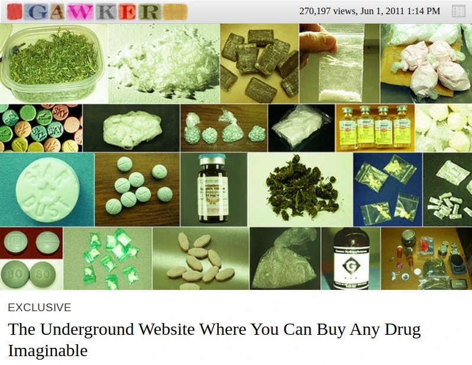
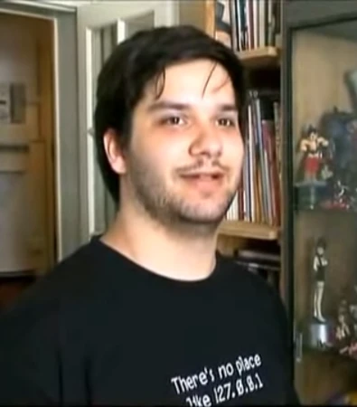
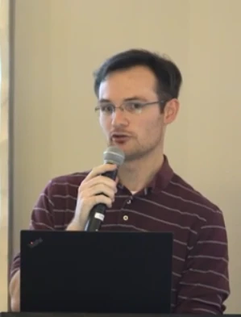
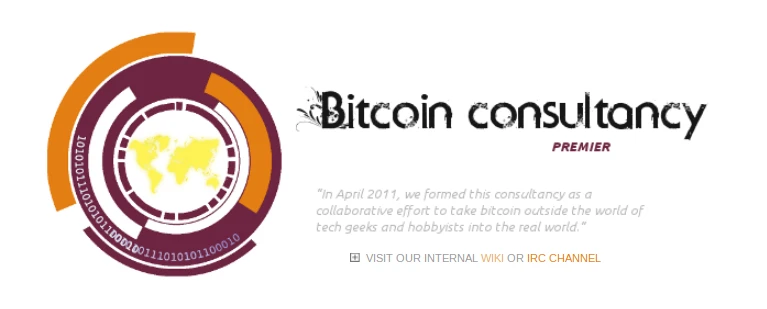
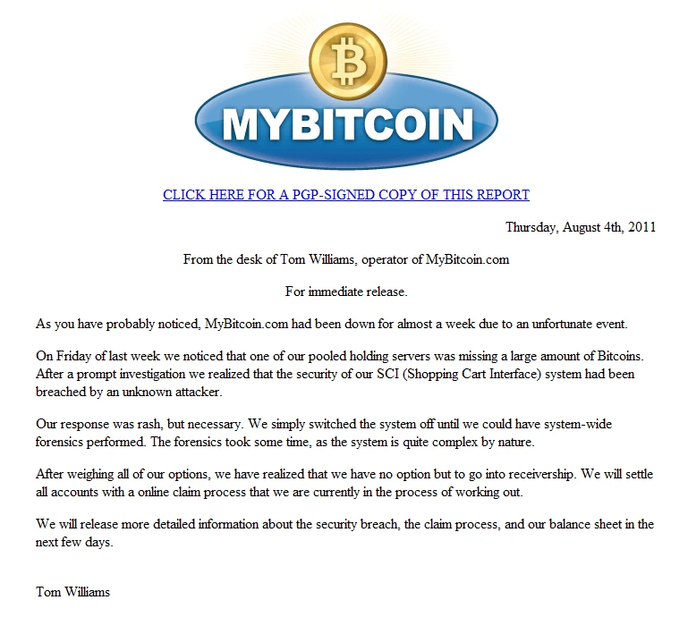
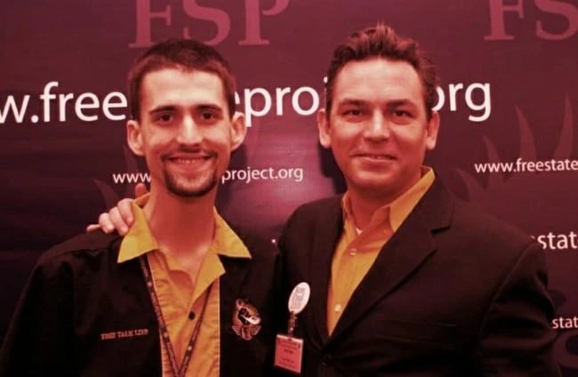
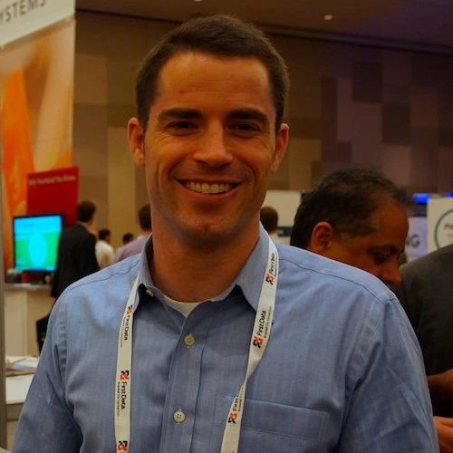
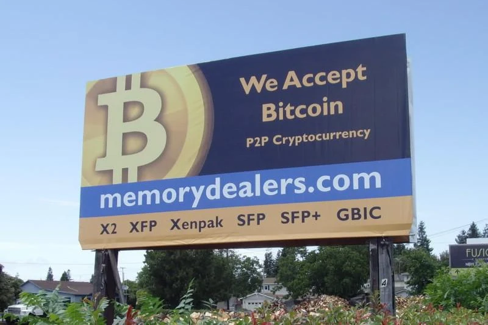
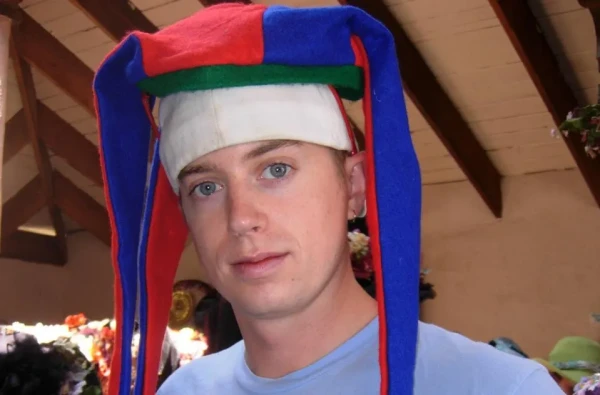
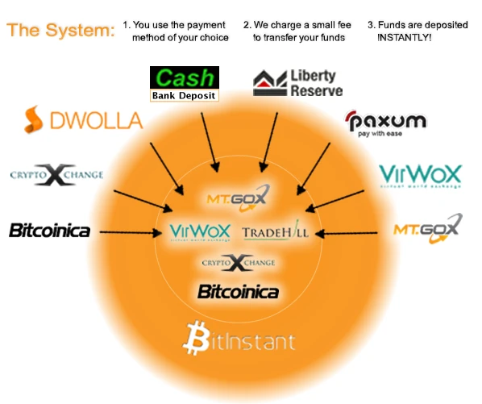

# L'essor de Bitcoin entre 2011 et 2014 : le Far West de la finance

Bienvenue dans ce cours consacré à l'histoire de Bitcoin entre le printemps 2011 et l'hiver 2013–2014 !

+++

# Introduction

## Introduction générale

Le récit se concentre sur la période entre le printemps 2011 et l'hiver 2013–2014.

### Aperçu

### Plan du cours

### Précisions

La lecture du premier cours sur l'histoire de Bitcoin (intitulée *L'histoire de la création de Bitcoin*) est un prérequis si vous ne connaissez pas du tout le sujet.

https://planb.network/courses/lhistoire-de-la-creation-de-bitcoin-a51c7ceb-e079-4ac3-bf69-6700b985a082

Toutes les dates et les heures sont données selon le fuseau horaire UTC (correspondant au méridien de Greenwich) et peuvent ainsi différer des dates américaines. La plupart des citations proviennent de l'anglais américain et ont été traduites pour l'occasion, sauf indication contraire.

En plus des sources directes archivées sur Internet, nous nous basons sur les ouvrages de référence suivants :

- [*Digital Gold: Bitcoin and the Inside Story of the Misfits and Millionaires Trying to Reinvent Money*](https://www.amazon.com/Digital-Gold-Bitcoin-Millionaires-Reinvent/dp/006236250X) de Nathaniel Popper, publié en 2014 ;
- [*Pay the Devil in Bitcoin: The Creation of a Cryptocurrency and How Half a Billion Dollars of It Vanished from Japan*](https://www.goodreads.com/book/show/36238082-pay-the-devil-in-bitcoin) de Jake Adelstein et Nathalie Stucky, publié en 2017, en version électronique uniquement ; traduction française : [*J'ai vendu mon âme en bitcoins*](https://www.editions-marchialy.fr/livre/j-ai-vendu-mon-ame-en-bitcoins/), publiée en 2019 ;
- [*American Kingpin: The Epic Hunt for the Criminal Mastermind behind the Silk Road Drugs Empire*](https://www.amazon.fr/American-Kingpin-Criminal-Mastermind-Behind/dp/1591848148/) de Nick Bilton, publié en 2017.

Documentaires :

- [*The Bitcoin Phenomenon*](https://www.youtube.com/watch?v=6pWblf8COH4), réalisé par Bhu Srinivasan, 12 avril 2014
- [*The Rise and Rise of Bitcoin*](https://www.youtube.com/watch?v=A06qdTpOYcg), réalisé par Nicholas Mross, 10 octobre 2014
- [*Deep Web*](https://www.youtube.com/watch?v=L7emWKAMEvI), réalisé par Alex Winter, 31 mai 2015
- [*Banking on Bitcoin*](https://www.youtube.com/watch?v=8rsxIW02W0g), réalisé par Christopher Cannucciari, 2016

# 2011

## Silk Road, l'Amazon de la drogue (janv.–nov. 2011)

La question de la relation entre Bitcoin et l'autorité s'est posée assez rapidement dans l'histoire de Bitcoin. En décembre 2010, lorsque Satoshi Nakamoto s'est retiré des devants de la scène, sa raison était la publication d'un article sur PC World qui invitait WikiLeaks à utiliser Bitcoin. Comme pour confirmer son intuition, cet article a attiré une attention monstrueuse sur Bitcoin, dont le prix est passé de 0,20 $ à 32 $ en quelques mois. Satoshi a continué d'échanger en privé avec ses plus proches collaborateurs et a définitivement disparu au cours du printemps 2011. Assez symboliquement, le dernier message de Gavin Andresen, le développeur qui avait pris les rênes du projet, informait le créateur de Bitcoin qu'il avait été contacté par In-Q-Tel, un fonds d'investissement géré par la CIA, ce qui démontrait que la boite de Pandore était ouverte.

Satoshi Nakamoto a eu raison de s'effacer à ce moment-là, car les années qui ont suivi ont été marquée par la prolifération des utilisations illégales de Bitcoin. Très logiquement, les hors-la-loi avaient à un intérêt à se servir de la résistance à la censure de Bitcoin pour échapper au contrôle de l'État. L'usage le plus populaire était probablement le trafic de drogue en ligne, qui se faisait par le biais d'une place de marché novatrice : Silk Road.

Cette plateforme, surnommée assez rapidement l'Amazon de la drogue, a été créée par un jeune texan de 26 ans du nom de Ross Ulbricht. Ce dernier possédait des idéaux libertariens prononcés, qui lui avait inspiré l'idée de son projet. Silk Road a connu un succès fulgurant et a fini par occuper une place de choix dans le paysage de Bitcoin, si bien que nous lui consacrons ici un chapitre entier. Nous parlerons d'abord de Ross Ulbricht, le cerveau derrière Silk Road, puis des débuts de la place de marché, avant d'évoquer ses premiers succès.

### Ross Ulbricht, le libertarianisme et l'agorisme

Ross William Ulbricht grandit à Austin, dans l'État du Texas aux États-Unis, où il passe une jeunesse sans histoires, entouré d'une famille aimante. Il est scout durant de nombreuses années, ce qui lui donne goût pour les activités en extérieur, notamment la randonnée et le camping, et pour le sport. Plutôt brillant, il bénéficie d'une bourse d'études complète pour aller à l'université, où il obtient une licence de physique et un master de science et ingénierie des matériaux spécialisé en cristallographie.

Ross Ulbricht à une date indéterminée (source : FreeRoss.org)

Les années universitaires de Ross sont pour lui l'occasion de faire l'expérience de différentes drogues, notamment psychédéliques. Mais surtout, c'est durant cette période qu'il s'intéresse profondément aux idées libertariennes et à l'école autrichienne d'économie, en lisant notamment Ludwig von Mises et Murray Rothbard, mais aussi Joseph Salerno et Lew Rockwell. Par le biais du club des *College Libertarians*, il [participe](http://web.archive.org/web/20171024194209/http://www.collegian.psu.edu:80/archives/article_1cb3e5e4-6ed2-5bb8-b980-1df989c663f9.html) à des débats dans lesquels il défend la libéralisation du système de santé et la légalisation des drogues. En 2008, il [soutient](https://web.archive.org/web/20170804183125/http://www.collegian.psu.edu:80/archives/article_239513a3-a577-5732-bab0-9cc27c5d4610.html) la campagne de Ron Paul pour les élections primaires du Parti républicain.

Il se passionne également pour l'agorisme, une philosophie politique théorisée dans les années 1970 par Samuel Edward Konkin III, qui est en quelque sorte une application de la doctrine libertarienne. Le cœur de l'agorisme (terme dérivé du grec ancien άγορά, *agora*, signifiant « place de marché ») est la mise en avant de l'économie souterraine (que Konkin appelle « contre-économie ») comme moyen pacifique de réduire l'influence de l'État. L'idée est de joindre le geste à la parole, en unifiant la théorie libertarienne, fondée sur le principe de non-agression, et la pratique du marché noir, fondée sur la recherche du profit.

La découverte de la philosophie agoriste est une révélation pour Ross. En effet, les idées libertariennes le fascinent, mais créent aussi en lui un sentiment d'impuissance en lui montrant l'omniprésence de l'État. L'agorisme constitue un moyen d'agir salvateur. Dans un [long message](https://antilop.cc/sr/users/dpr/threads/20120320-1103-chat.html) publié le 20 mars 2012, il expliquera :

> « J'ai lu tout ce que je pouvais pour approfondir ma compréhension de l'économie et de la liberté, mais tout était purement intellectuel, sans d'autre d'appel à l'action que de dire aux gens autour de moi ce que j'avais appris et espérer leur faire voir la lumière. C'était jusqu'à ce que je lise "Alongside night" et les travaux de Samuel Edward Konkin III. La pièce manquante du puzzle était enfin là ! Tout d'un coup, tout devenait clair : chaque action qu'on entreprenait en dehors du contrôle du gouvernement renforçait le marché et affaiblissait l'État. J'ai constaté comment l'État vivait de façon parasitaire aux dépens des personnes productives du monde, et à quelle vitesse il s'effondrerait sans ses recettes fiscales. Il n'y a pas de soldats si on ne peut pas les payer. Il n'y a pas de guerre contre la drogue sans les milliards de dollars prélevés des personnes qu'on opprime. »
>
> original: "I read everything I could to deepen my understanding of economics and liberty, but it was all intellectual, there was no call to action except to tell the people around me what I had learned and hopefully get them to see the light.  That was until I read “Alongside night” and the works of Samuel Edward Konkin III.  At last the missing puzzle piece!  All of the sudden it was so clear:  every action you take outside the scope of government control strengthens the market and weakens the state.  I saw how the state lives parasitically off the productive people of the world, and how quickly it would crumble if it didn't have it's tax revenues.  No soldiers if you can't pay them.  No drug war without billions of dollars being siphoned off the very people you are oppressing."

### La genèse de Silk Road

L'idée d'une place de marché en ligne germe dans l'esprit de Ross Ulbricht à partir de 2009. Après avoir voulu l'appeler « Underground Brokers », il se tourne vers le nom « Silk Road » qui semble plus accrocheur : ce dernier fait en effet référence à la Route de la Soie, un réseau de routes commerciales qui reliait l'Europe et l'Asie jusqu'au XVe siècle, et par lequel transitaient de nombreuses marchandises, idées et techniques de part et d'autre du monde. Le projet du jeune texan [est](https://antilop.cc/sr/exhibits/GX-240A.pdf) de « créer un site web où les gens pourraient acheter n'importe quoi de manière anonyme, sans aucune trace permettant de remonter jusqu'à eux ». (original: "The idea was to create a website where people could buy anything anonymously, with no trail whatsoever that could lead back to them.")

Comme on l'a expliqué, sa démarche est avant tout révolutionnaire, et non opportuniste. Il voit dans cette place de marché un moyen de réduire la place de l'État dans la société. En mars 2010, on peut lire sur sa [page Linkedin](https://web.archive.org/web/20100309115348/https://www.linkedin.com/in/rossulbricht/) :

> « Je veux utiliser la théorie économique comme moyen d'abolir l'usage de la coercition et de l'agression au sein de l'humanité. Tout comme l'esclavage a été aboli à peu près partout, je crois que la violence, la coercition et toutes les formes de contrainte exercées par une personne sur une autre peuvent prendre fin. L'usage le plus répandu et le plus systémique de la force est le fait des institutions et des États, et c'est donc là que se concentre mon effort actuel. Cependant, la meilleure façon de changer un État est de changer l'esprit de ses administrés. À cette fin, je suis en train de créer une simulation économique pour donner aux gens une expérience de première main de ce que serait la vie dans un monde sans usage systémique de la force. »
>
> original: "Now, my goals have shifted. I want to use economic theory as a means to abolish the use of coercion and agression amongst mankind. Just as slavery has been abolished most everywhere, I believe violence, coercion and all forms of force by one person over another can come to an end. The most widespread and systemic use of force is amongst institutions and governments, so this is my current point of effort. The best way to change a government is to change the minds of the governed, however. To that end, I am creating an economic simulation to give people a first-hand experience of what it would be like to live in a world without the systemic use of force."

L'idée n'est pas réellement nouvelle. Au-delà d'être une démarche agoriste, elle constitue aussi une illustration de l'utilisation que voulaient faire les cypherpunks des « marchés noirs » en vue d'exercer leur liberté économique, chose qu'on retrouve dans le [*Cyphernomicon*](https://ia801307.us.archive.org/7/items/cyphernomicon/cyphernomicon.txt) de Tim May (16.13).

De plus, l'idée est déjà appliquée, car il existe alors déjà plusieurs places de marchés rudimentaires, comme [Adamflowers](https://sg.news.yahoo.com/police-bust-online-narcotics-farmers-market-013544208.html). Ces plateformes sont hébergées sur le Web simple et utilisent des moyens de paiement classiques comme PayPal ou Western Union. Silk Road se démarque de ces plateformes grâce à deux innovations techniques : Tor et Bitcoin.

Tor (acronyme lexicalisé de *The Onion Router*) est un réseau superposé confidentiel (aussi appelé darknet) basé sur le routage en ognon, qui permet de naviguer sur Internet et de communiquer de façon anonyme et relativement intraçable. Développé dans les années 2000, le navigateur devient assez populaire en 2010, et se prête bien au développement d'un marché noir en ligne.

Bitcoin constitue également un bon outil, car il ne peut pas être arrêté du jour au lendemain par les autorités (contrairement aux systèmes centralisés) et les transactions transitant par le réseau ne sont pas soumises à l'arbitraire d'un tiers de confiance. Lorsque Ross met au point son projet en 2009, il [envisage](https://antilop.cc/sr/exhibits/253456462-Silk-Road-exhibits-GX-270.pdf) d'utiliser Pecunix, un système de devise en or numérique à la e-gold. Mais il finit par tomber sur Bitcoin au cours de l'année 2010, qui parait être adapté à son cas malgré sa courte existence.

Sur le forum, l'idée d'utiliser Bitcoin pour ce type d'utilisation a alors déjà été évoquée. Le 6 juin 2010, Teppy, l'administrateur du MMORPG *A Tale in the Desert* et la personne à l'origine de la présentation de Bitcoin sur Slashdot un mois plus tard, [a proposé](https://bitcointalk.org/index.php?topic=175.msg1430#msg1430) une expérience de pensée d'un « magasin d'héroïne » (original: "A Heroin Store") qui permettrait de se procurer de la drogue en payant en bitcoins. Il écrivait :

> « En tant que libertarien, ce que j'aime le plus dans le projet Bitcoin, c'est la possibilité qu'il soit réellement disruptif. Je pense que la prohibition des drogues est l'une des choses les plus néfastes pour la société que les États-Unis ont jamais faites, et j'aimerais donc me livrer à une expérience de pensée sur la façon dont un magasin d'héroïne pourrait fonctionner, en acceptant les bitcoins, et en mettant fin à la prohibition des drogues dans le processus... »
>
> original: "As a Libertarian, the thing I love most about the Bitcoin project is the chance that it could be truly disruptive. I think that drug prohibition is one of the most socially harmful things that the US has ever done, and so I would like to do a thought experiment about how a heroin store might operate, accepting Bitcoins, and ending drug prohibition in the process. We'll assume that the drug store is very high profile, and that law enforcement makes discovering the operator a high priority. We'll also assume that heroin is cheap when bought in bulk; the street price reflects the risk that street dealers must take to sell their product."

Après ses années universitaires, Ross est revenu à Austin, sa ville natale. N'ayant pas d'attrait particulier pour la voie scientifique, il exerce plusieurs emplois alimentaires. En 2010, il gère [Good Wagon Books](https://web.archive.org/web/20101107054013/http://goodwagon.com/), une entreprise de revente de livres d'occasion, qu'un ami lui a cédé. Il a sous sa charge quelques employés, mais le travail ne l'intéresse pas. Il est bien plus obsédé par son projet personnel.

Au cours de l'été 2010, Ross décide de cultiver des champignons hallucinogènes dans le but d'en faire le premier produit vendu sur son site web. Il loue pour cela un local à Bastrop, en périphérie d'Austin, se procure l'équipement nécessaire et, à l'instar de Walter White dans la série télévisée *Breaking Bad*, se transforme de simple amateur de chimie en producteur de drogue.

Pour construire le site, il [demande](https://antilop.cc/sr/files/2015_01_22_Ulbricht_trial_transcript_W2_D3.pdf) de l'aide à Richard Bates, un ami d'université ayant travaillé pour PayPal et pour eBay. Ross ne lui dit pas intialement quelle est la nature de son projet, mais Richard accepte de lui donner quelques conseils en informatique. À la fin de l'année 2010, la plateforme Silk Road est donc prête à être lancée.

### Le lancement de la plateforme

Après avoir mis la plateforme en place, Ross Ulbricht se consacre à en faire la promotion. Le 27 janvier 2011, il s'inscrit sous le pseudonyme altoid sur le forum de *The Shroomery*, un site consacré aux champignons hallucinogènes, et y [publie](https://www.shroomery.org/forums/showflat.php/Number/13860995) un message mentionnant la place de marché, dans laquel il prétend être tombé dessus par hasard. Le 29 janvier, il [réitère](https://bitcointalk.org/index.php?topic=175.msg42670#msg42670) cette manœuvre sur le forum de Bitcoin, au sein du fil consacré au « magasin d'héroïne ». Il écrit alors :

> « Quelqu'un a-t-il déjà visité Silk Road ? C'est un peu comme un amazon.com anonyme. Je ne pense pas qu'il y ait de l'héroïne, mais d'autres choses y sont vendues. Le site utilise essentiellement bitcoin et tor pour négocier des transactions anonymes. »
>
> original: "Has anyone seen Silk Road yet?  It's kind of like an anonymous amazon.com.  I don't think they have heroin on there, but they are selling other stuff.  They basically use bitcoin and tor to broker anonymous transactions."

Dans le message, il met à disposition l'adresse du site sur Tor (`tydgccykixpbu6uz.onion` puis `ianxz6zefk72ulzz.onion`), ainsi qu'un [blog Wordpress](https://web.archive.org/web/20110204025853/http://silkroad420.wordpress.com/) contenant des instructions détaillées permettant d'y accéder. Ce dernier sera [vite suspendu](https://web.archive.org/web/20110309130446/http://silkroad420.wordpress.com/), si bien que Ross sera contraint de mettre en place un nouveau site web intermédiaire à l'adresse [silkroadmarket.org](https://web.archive.org/web/20110304201806/http://silkroadmarket.org/).

Un membre du forum, utilisant le pseudonyme ShadowofHarbringer, cite son message et répond :

> « Donc nous y voilà : le premier magasin de drogue utilisant Bitcoin. Nous nous aventurons en eaux profondes plus vite que je ne le pensais. Je me demande combien de temps il faudra pour que les États commencent à enquêter sur Bitcoin. »
>
> original: "So here we go, first Bitcoin drug store. We're going into deep water faster than i thought then. I wonder how long will it take for govs to start investigating Bitcoin."

Cependant, la plateforme rencontre très vite des ennuis techniques et elle est momentanément mise hors ligne. Durant le mois de février, Ross redemande des conseils techniques à Richard Bates. Le 1er mars, il fait finalement une [annonce](https://bitcointalk.org/index.php?topic=3984.msg57080#msg57080) officielle avec un compte dédié (silkroad) sur le forum de Bitcoin, où il précise que « 28 transactions ont été réalisées » (original: "28 transactions have been made!") depuis le lancement.

À cette époque-là, le forum de Bitcoin héberge alors une marketplace où les gens acheter et vendre des choses en bitcoins. Toutefois, il n'y a alors aucune règle qui interdise les drogues illégales. Martti Malmi, qui [assiste](https://bitcointalk.org/index.php?topic=175.msg42790#msg42790) du lancement de Silk Road, finit par [interdire](https://bitcointalk.org/index.php?topic=3535.msg51426#msg51426) la vente de bien illégaux le 19 février.

Silk Road attire l'attention des utilisateurs de Bitcoin, et notamment des agoristes, qui [considèrent](https://web.archive.org/web/20110606111034/http://www.bitcoinweekly.com/articles/counter-economics-and-bitcoin) qu'« \[e\]n raison de son anonymat et de sa sécurité, Bitcoin convient parfaitement aux activités contre-économiques ». (original: "Bitcoin is ideally suited for use in counter-economic activities, due to its anonymity and security") La place de marché est également évoquée à de multiples endroits, notamment dans l'émission de radio [*Free Talk Live*](https://bitcointalk.org/index.php?topic=3984.msg66567#msg66567) et sur [4Chan](https://bitcointalk.org/index.php?topic=3984.msg68196#msg68196).

### Le fonctionnement de Silk Road

Silk Road est une place de marché, c'est-à-dire qu'elle sert d'intermédiaire entre des acheteurs et des vendeurs, un peu à la manière d'un Amazon ou d'un eBay. Un système de réputation est mis en place pour éviter les escroqueries. Les échanges se font en bitcoins, et le bitcoin sert d'ailleurs d'unité de compte plutôt que le dollar. De plus, Silk Road utilise un système de dépôt fiduciaire qui permet aux administrateurs (seul Ross au début) d'arbitrer la situation en cas de dispute entre un vendeur et un acheteur.

Les produits sont expédiés par voie postale (l'*United States Postal Service* dans le cas des États-Unis), la fouille systématique étant interdite dans la plupart des pays du monde. Dans le cas d'une fouille inopinée, les colis sont camouflés astucieusement pour faire croire à une expédition commune. Les produits dégageant une odeur susceptibles d'être détectée par les chiens renifleurs sont placées dans des sachets sous vide.

Conformément à la philosophie libertarienne de Ross, les produits pouvant être répertoriés sur le site [doivent](https://antilop.cc/sr/exhibits/GX-120_Redacted.pdf) ne pas avoir été obtenus en faisant du mal à autrui : on y retrouve ainsi de la drogue, des médicaments, des pièces de métaux précieux, mais en aucun cas des cartes bancaires volées, de la pédopornographie ou des services de tueur à gages. Dans l'ensemble, le site sert principalement au trafic de drogue illicite, et en particulier aux petites quantités de cannabis. On y trouve également des produits légaux, comme des livres, de l'art, des composants électroniques, de l'or, etc. mais ceux-ci forment une part infime du commerce effectué sur la plateforme.

Initialement, Ross Ulbricht valide toutes les ventes à la main. Autodidacte en informatique, le site qu'il a mis en place est truffé de défauts et de failles. Suite à la hausse du trafic lié au lancement, ces problèmes deviennent difficilement supportables. C'est pourquoi Ross décide de réécrire le code de la plateforme, tout en continuant de valider les ventes manuellement et de travailler dans sa vie officielle. La charge de travail est énorme : [dans son journal](https://antilop.cc/sr/exhibits/253456476-Silk-Road-exhibits-GX-240B.pdf), il explique ainsi que « les deux mois de réécriture du site ont été les plus éprouvants de \[sa\] vie ». (original: "Rewriting the site was the most stressful couple of months I've ever experienced.")

La nouvelle version de Silk Road [sort](https://bitcointalk.org/index.php?topic=3984.msg128554#msg128554) finalement le 18 mai 2011. Elle inclut le traitement automatisé des paiements et un mélangeur de bitcoins, permettant d'anonymiser les bitcoins traités. Toutefois, elle souffre également d'une faille qui provoque à ce moment-là une perte de plusieurs « milliers de dollars », ce qui amène Ross à revoir l'ensemble du processus de traitement pour règler le problème. Malgré tout, le site finit par gagner en popularité grâce au bouche à oreille.

### L'article de Gawker

L'existence de Silk Road est connue sur le forum de Bitcoin dès ses débuts. Toutefois, elle échappe dans un premier temps aux radars de la presse généraliste. Ainsi, même si le cas hypothétique du trafic de drogue est [évoqué](https://www.forbes.com/forbes/2011/0509/technology-psilocybin-bitcoins-gavin-andresen-crypto-currency.html) en avril par Andy Greenberg dans son article pour Forbes, le journaliste n'a pas encore connaissance de la plateforme.

La première mention de Silk Road dans un média de grande envergure est faite le 1er juin 2011, lorsqu'un article d'Adrien Chen est [publié](https://www.gawkerarchives.com/the-underground-website-where-you-can-buy-any-drug-imag-30818160) sur Gawker, un blog populaire accueillant de nombreux auteurs. Cet article, intitulé « Le site web souterrain où vous pouvez acheter n'importe quelle drogue imaginable » (original: "The Underground Website Where You Can Buy Any Drug Imaginable"), présente la plateforme sous un jour favorable et contient les témoignages de plusieurs utilisateurs satisfaits.

(source : [archive de Gawker](https://web.archive.org/web/20110603015735/http://gawker.com/5805928/the-underground-website-where-you-can-buy-any-drug-imaginable))

L'auteur intègre même quelques citations de Ross Ulbricht, qu'il a pris le soin d'interroger par courriel et qu'il présente comme l'« administrateur de Silk Road ». Ross peut ainsi partager ses réelles motivations plutôt que de laisser le journaliste spéculer à ce sujet. Dans l'article, il déclare :

> « L'État est la principale source de violence, d'oppression, de vol et de toute forme de coercition. \[...\] Arrêtez de financer l'État avec l'argent de vos impôts et dirigez votre énergie productive vers le marché noir. »
>
> original: "The state is the primary source of violence, oppression, theft and all forms of coercion. \[...\] Stop funding the state with your tax dollars and direct your productive energies into the black market."

Cet article a pour effet de révéler l'existence de Silk Road au grand public, la nouvelle étant reprise par la presse généraliste, comme [*The Atlantic*](https://www.theatlantic.com/technology/archive/2011/06/libertarian-dream-a-site-where-you-buy-drugs-with-digital-dollars/239776/). Cette publicité inédite a pour conséquence de faire exploser le trafic de la plateforme. Les serveurs ont du mal à tenir la charge, à tel point que Ross [est contraint](https://bitcointalk.org/index.php?topic=3984.msg189007#msg189007) de geler les inscriptions.

On voit aussi des [concurrents](https://gwern.net/dnm-survival) émerger, copiant le modèle de Silk Road, comme Black Market Reloaded qui est lancé fin juin. Silk Road restera néanmoins numéro 1 jusqu'à sa fermeture, grâce à l'« avantage du précurseur » et à sa philosophie unique.

### Les réactions à la popularisation du site

La publicité suscitée par l'article de Gawker ne plait pas à tout le monde. Le fait que Silk Road soit sous sous le feu des projecteurs a pour effet collatéral d'intensifier l'attention qui est portée à Bitcoin (ne serait-ce parce que les clients doivent se procurer du bitcoin pour acheter des produits). Et il s'avère qu'une partie de la communauté de Bitcoin est hostile à ce rapprochement entre Bitcoin et le trafic de drogue.

En particulier, le programmeur Jeff Garzik, qui s'investit alors dans le développement du logiciel, voit d'un mauvais œil cette association malvenue. Suite à la publication de l'article, il [contacte](https://www.theatlantic.com/technology/archive/2011/06/libertarian-dream-a-site-where-you-buy-drugs-with-digital-dollars/239776/) personnellement Adrien Chen par courriel pour lui expliquer que Bitcoin n'est pas aussi anonyme qu'il n'y parait, toutes les transactions étant enregistrées de façon permamente sur la chaîne. Il conclut son courriel par le jugement suivant :

> « Compte tenu des techniques d'analyse statistique existantes déployées sur le terrain par les services de police, il est tout à fait stupide de tenter d'effectuer des transactions illicites importantes avec des bitcoins. »
>
> original: "Attempting major illicit transactions with bitcoin, given existing statistical analysis techniques deployed in the field by law enforcement, is pretty damned dumb."

L'article de Gawker attire également l'attention des autorités. Ainsi, quelques jours après sa publication, le 5 juin, les sénateurs Chuck Schumer (New York) et Joe Manchin (Virginie-Occidentale) interviennent dans le discours public pour exiger une fermeture de la plateforme. Dans une [lettre](https://web.archive.org/web/20180918162447/https://www.manchin.senate.gov/newsroom/press-releases/manchin-urges-federal-law-enforcement-to-shut-down-online-black-market-for-illegal-drugs) adressée au procureur général du département de la Justice et à l'administratrice de la DEA, ils écrivent :

> « Nous vous écrivons pour vous faire part de \[notre\] vive inquiétude à la suite de la découverte d'un marché en ligne de drogues illicites, connu sous le nom de "Silk Road". Lancé en février, ce site web clandestin permet aux utilisateurs de dissimuler leur identité, et d'acheter et de vendre librement des drogues illicites, telles que la cocaïne, l'héroïne, l'ecstasy et la marijuana. \[...\] En vertu de l'alinéa (a)(2) de la section 853 du titre 21 du Code des États-Unis, le procureur général est habilité à fermer les entités impliquées dans la livraison et la distribution de substances règlementées en saisissant le nom de domaine du site web. La Drug Enforcement Administration a veillé et continue de veiller rigoureusement à l'application de nos lois et règlements sur les substances règlementées. Dans le cadre de cette mission essentielle, nous vous demandons instamment de prendre des mesures immédiates et de fermer le réseau Silk Road. »
>
> original: "We write to express my grave concern upon discovery of an online marketplace for illegal drugs, known as 'Silk Road.'  Launched in February, this underground website allows users to hide their identities and freely purchase and sell illegal drugs, ranging from cocaine, heroin, ecstasy, and marijuana. (...) Pursuant to 21 U.S.C. 853(a)(2), the Attorney General has the authority to shut down such entities involved in the delivery and distribution of controlled substances by seizing the website domain name. The Drug Enforcement Administration has been and continues to be rigorous in enforcing our controlled substance laws and regulations.  As part of this critical mission, we urge you to take immediate action and shut down the Silk Road network."

De plus, dans une conférence de presse, le sénateur Schumer [accuse](https://web.archive.org/web/20120804222559/http://www.nbcnewyork.com/news/local/123187958.html) Bitcoin d'être « une forme de blanchiment d'argent en ligne utilisée pour dissimuler la source de l'argent et l'identité des personnes qui vendent et achètent la drogue ». (original: "It's an online form of money laundering used to disguise the source of money, and to disguise who's both selling and buying the drug.") Cela fait réagir Gavin Andresen, qui n'est pas favorable à Silk Road, mais qui se désole qu'une telle chose soit dite sur Bitcoin. [Sur son blog](https://gavinthink.blogspot.com/2011/06/but-you-can-use-it-to-buy-drugs.html), il écrit :

> « Personne ne peut contrôler ce qui est acheté avec les bitcoins, tout comme ma banque locale ne peut contrôler ce que je fais des espèces que je retire du distributeur du billets. Je me demande si les sénateurs Schumer et Manchin souhaitent remplacer l'ensemble des espèces par une carte à puce émise par l'État ; après tout, les criminels auraient alors beaucoup plus de mal à acheter des biens illégaux de manière anonyme, et si nous sommes des citoyens respectueux de la loi, nous ne devrions pas nous inquiéter que l'État aient connaissance de tous nos achats... n'est-ce pas ? »
>
> original: "Second, nobody can control what is purchased with bitcoins, just like my local bank cannot control what I do with the cash I withdraw from their ATM machine. I wonder if Senators Schumer and Manchin would like to replace all cash with a government-issued smart card; after all, that would make it much harder for criminals to get away with buying illegal goods anonymously, and if we are all law-abiding citizens then we shouldn't worry about the government knowing about all of our purchases... right?")

### Le succès de l'Amazon de la drogue

Avec l'attention apportée par la presse, Silk Road prend son envol et finit par devenir rentable. À la fin de l'été, l'activité du site en vient à [représenter](https://www.chainalysis.com/blog/silk-road-doj-seizure-november-2020/) près de 10 % du volume échangé sur la chaîne de Bitcoin. Le site, qui est financé par les commissions prélevées sur les ventes, [réalise](https://antilop.cc/sr/exhibits/253456480-Silk-Road-exhibits-GX-250.pdf) un chiffre d'affaire se comptant en dizaines de milliers de dollars par mois pour un coût largement inférieur. Ross peut ainsi se permettre de se payer un salaire généreux et met fin à son emploi officiel.

Face au succès grandissant de son projet, il doit aussi apprendre à déléguer. Il engage ainsi des employés pour gérer les litiges sur le site et modérer les discussions sur le forum. [Dans son journal](https://antilop.cc/sr/exhibits/253456476-Silk-Road-exhibits-GX-240B.pdf), il écrit qu'« après avoir gagné 100 k$ et un bon 20–25 k$ mensuel, \[il a\] décidé qu'il était temps d'engager quelques personnes pour \[l'aider\] à faire passer le site au niveau supérieur ». (original: "After making about $100k and up to a good $20-25k monthly, I decided it was time to bring in some hired guns to help me take the site to the next level.") C'est ainsi qu'il commence à rémunérer des gens dont il ignore l'identité formelle mais en qui il a confiance.

Au cours de l'été, avec son ami d'enfance Richard Bates qu'il voit à Austin, ils ont pour [projet](https://antilop.cc/sr/files/2015_01_22_Ulbricht_trial_transcript_W2_D3.pdf#page=120) d'ouvrir une plateforme de change de bitcoins. Ross a l'habitude d'utiliser Bitcoin et il envisage déjà comment cette plateforme pourrait lui permettre de blanchir l'argent gagné avec Silk Road. Cependant, elle ne verra pas le jour.

C'est au cours de cette démarche que Ross commet une erreur fondamentale. Le 11 octobre, il publie une [annonce](https://bitcointalk.org/index.php?topic=47811.msg568744#msg568744) sur le forum de Bitcoin dans laquelle il déclare rechercher un « professionnel en informatique » pour une « startup bitcoin soutenue par capital-risque ». (original: "I'm looking for the best and brightest IT pro in the bitcoin community to be the lead developer in a venture backed bitcoin startup company.") Il utilise pour cela le pseudonyme altoid (avec lequel il a précédemment fait la promotion de Silk Road). Dans le message, il dévoile son adresse de courrier électronique, contenant son nom civil : `rossulbricht@gmail.com`. Cette erreur lui coûtera cher, car elle aidera l'enquête policière contre Silk Road à l'identifier et à l'arrêter deux ans plus tard.

### Un élément central de l'histoire de Bitcoin

Ross Ulbricht a ainsi mis en œuvre une idée novatrice, basée sur ses convictions libertariennes et agoristes, se servant de la résistance à le censure de Bitcoin. Après une période de préparation de plus d'un an, il a lancé le prototype en janvier 2011. Les débuts ont été difficiles, mais ses efforts ont fini par payer : en juin 2011, Silk Road était connu du monde entier grâce à un article publié sur Gawker.

L'émergence de Silk Road a été un élément essentiel du développement de Bitcoin. Le succès de la plateforme a en effet montré que Bitcoin possédait une utilité propre, distincte des monnaies étatiques et des services de paiement en ligne classique. En outre, l'utilisation de Silk Road a poussé un certain nombre de personnes à s'intéresser à Bitcoin, à l'instar de [Peter McCormack](https://www.youtube.com/watch?v=3aDMnE6dnHk), futur animateur du podcast *What Bitcoin Did*. Silk Road a enfin ouvert la voie à toutes les utilisations fleurtant avec l'illégalité, pour le meilleur et pour le pire.

Ainsi, un peu plus d'un an après la vente des pizzas de Laszlo, Silk Road est devenu l'incarnation du commerce exercé avec Bitcoin. Toutefois, cette utilisation était dans le même temps concurrencée par un autre type d'activité : la spéculation. Et celle-ci battait son plein sur la principale plateforme dédiée : Mt. Gox.

## La reprise de Mt. Gox (mars–août 2011)

La période allant du début de l'année 2011 à la fin de l'année 2013 est caractérisée par le développement de l'activité de change entre le bitcoin et les monnaies classiques, comme le dollar et l'euro. Ce type de services jouait en effet un rôle essentiel dans l'économie de Bitcoin, cette dernière étant trop petite pour fonctionner de manière fermée. Les mineurs avaient besoin de vendre leurs récompenses pour payer leurs factures d'électricité. Les commerçants (dont notamment les vendeurs de Silk Road) devaient récupérer des dollars pour rembourser leurs fournisseurs, et leurs clients, qui ne disposaient généralement pas de bitcoin, avaient besoin de s'en procurer préalablement. Il y avait aussi une forte demande spéculative, venant des gens qui considéraient la cryptomonnaie comme un investissement.

La première plateforme de change d'envergure a été Mt. Gox, lancée « sur un coup de tête » en juillet 2010 par l'entrepreneur Jed McCaleb. Grâce à son fonctionnement automatisé, elle s'est rapidement imposée comme le moyen principal de changer des dollars en bitcoins, et inversement. Au début de l'année 2011, face à l'ampleur de la tâche, Jed McCaleb a décidé de céder cette plateforme à une personne plus qualifiée techniquement et davantage motivée : le développeur français Mark Karpelès.

La plateforme a joué un rôle central dans l'histoire de Bitcoin. Elle a été le lieu principal de la première réelle bulle spéculative sur le prix du bitcoin, qui a culminé à 32 $ en juin. Elle a aussi connu un piratage massif, et était liée à plusieurs incidents s'étant produit dans l'écosystème. Dans ce chapitre, nous parlerons des circonstances dans lesquelles s'est faite la reprise de Mt. Gox, du succès fulgurant qu'elle a rencontré à partir du printemps et des premiers problèmes qu'elle a subi.

### Mark Karpelès, le geek

Mark Karpelès est né en France en 1984. Fils unique, il élevé par sa mère seule. Il s'intéresse rapidement pour les ordinateurs, les jeux vidéos et les mangas. Dans sa vingtaine, il est un geek [mal dans sa peau](https://web.archive.org/web/20140302234940/http://blog.magicaltux.net/2006/02/12/pensees-nocturnes/). En 2007, il apparait dans le documentaire *Suck my Geek*, consacré au mouvement geek français. En 2009, désireux de quitter la France où il ne s'est jamais réellement chez lui, il déménage au Japon [en juin 2009](https://web.archive.org/web/20090628035138/http://blog.magicaltux.net/2009/06/18/arrived-in-japan/) par attrait pour la culture locale. Là-bas, il fonde une société appelée Tibanne Co. Ltd. (comme son chat, Tibane), par le biais de laquelle il travaille en free-lance. Il gère notamment un service d'hébergement appelé [KalyHost](https://web.archive.org/web/20101231201212/https://www.kalyhost.com/).

Mark Karpelès dans *Suck My Geek* en 2007 (source : [MrReportageTV](https://www.youtube.com/watch?v=cAOLU4_4QGg) sur Youtube)

Il apprend l'existence de Bitcoin au cours de l'automne 2010 par l'intermédiaire d'un client français installé au Pérou (William Waisse [alias](https://bitcointalk.org/index.php?topic=1719.msg21107#msg21107) neofutur), qui lui demande s'il peut payer en bitcoins pour régler une facture. Mark est ouvert à la possibilité et se prend vite de passion pour le système. Contrairement à Martti Malmi, Ross Ulbricht ou Roger Ver, Mark Karpelès n'est pas un libertarien ayant une motivation idéologique ; et il n'est pas non plus un spéculateur assoiffé de profit. Son intérêt pour Bitcoin prend plutôt sa source dans la curiosité technique. Comme il le [dira](https://web.archive.org/web/20140918220234/http://www.thedailybeast.com/articles/2014/09/17/mt-gox-s-karpeles-on-losing-a-half-billion-bucks-in-bitcoins.html) en 2014 :

> « Ce qui m'a intéressé dans bitcoin, c'étaient les aspects techniques. À savoir, le fait de maintenir une base de données mondiale de manière sécurisée. Le fait que chaque client dispose d'un portefeuille privé sécurisé. Le fait d'avoir un système entièrement décentralisé. De plus, bitcoin permet de disposer d'une base de données qui est publique. »
>
> original: "What interested me in bitcoin was the technological aspects. In other words, the fact of maintaining a global database in a secured way. The fact that each client has a secured private wallet. To have an entirely decentralized system. Also, bitcoin allows you to have a database that is public."

Dès sa découverte, en bon passionné d'informatique, il se plonge dans les rouages de Bitcoin et commence à écrire des programmes en tirant parti. En novembre, il [commence](https://bitcointalk.org/index.php?topic=30.msg20699#msg20699) à accepter les paiements en bitcoins avec KalyHost (Ross Ulbricht [utilisera](https://cdn.arstechnica.net/wp-content/uploads/2015/01/Govt.motion.1.19.pdf) d'ailleurs ce service pour héberger la page web silkroadmarket.org). En décembre 2010, il [crée](https://bitcointalk.org/index.php?topic=2321.msg30872#msg30872) un nouveau wiki, Bitcoin.it, qui deviendra rapidement le wiki principal de Bitcoin. Il se met également en tête de développer une implémentation logicielle ([QBitcoin](https://web.archive.org/web/20110326023018/http://bitcoinweekly.com/articles/interview-with-magicaltux-on-qbitcoin)), sans pour autant aller au bout.

### L'achat de Mt. Gox

Au début de l'année 2011, Jed McCaleb gère Mt. Gox tant bien que mal. La plateforme n'est pas sûre du tout, opinion partagée par certains membres de la communauté, comme [Mike Caldwell](https://bitcointalk.org/index.php?topic=4187.msg66477#msg66477). Et Jed n'est pas sûr de la conformité règlementaire de son l'activité. L'article de PC World a déjà eu un effet sur le prix, et il craint (à raison) que la tendance haussière ne se poursuive. Il se met donc à chercher un repreneur.

Son choix se porte sur Mark Karpelès, qui est actif dans la communauté des développeurs, notamment sur le canal IRC #bitcoin-dev. Le Français a aidé Martti Malmi pour l'hébergement de Bitcoin.org et l'a aidé lui-même pour l'acceptation de l'euro, ce qui lui donne confiance dans ses compétences techniques. \[source : Digital Gold, p. 66\] Le 18 janvier, il propose ainsi à Mark de reprendre Mt. Gox. Dans son courriel, il [écrit](https://web.archive.org/web/20170602025506/http://www.thedailybeast.com/behind-the-biggest-bitcoin-heist-in-history-inside-the-implosion-of-mt-gox) :

> « Salut Mark,
>
> Je te prie de bien vouloir garder tout ça confidentiel, car je ne veux pas créer la panique, et rien n'est encore sûr, mais j'envisage de revendre mtgox. J'ai d'autres projets auxquels j'aimerais me consacrer. Est-ce que ça t'intéresserait ? Je pourrais le vendre pour pas grand-chose en échange d'intérêts sur les bénéfices, par exemple. Il y a aussi un fonds d'investissement qui est prêt à investir dans mtgox. Probablement autour de 158 k$. Donc tu pourrais tout simplement récupérer la boîte avec du fric. » (Traduction de Cyril Gay)
>
> Original: "Hi Mark,
>
> Please keep all this confidential I don't want to start a panic and I'm not sure I'll do it yet but I'm thinking I might try to sell mtgox. I just have these other projects I would like to devote more time to. Would you be interested? It could be very little up front and just a payout based on revenue or something. There is also an investment group that wants to fund mtgox. Probably around $158k. So you could most likely take it over with some cash."

Après des discussions sur les termes de l'accord, le contrat est finalement signé le 3 février. Jed McCaleb conserve 12 % de la société et 50 % des revenus pendant six mois, contre quoi le reste est cédé à la société de Mark Karpelès, Tibanne Co. Ltd. Une clause du contrat dédouane Jed de toute responsabilité légale.

Le 6 mars, Jed McCaleb [officialise](https://bitcointalk.org/index.php?topic=4187.msg60610#msg60610) publiquement le transfert sur le forum de Bitcoin. Dans son dernier message avec le compte mtgox, il explique :

> « J'ai créé mtgox sur un coup de tête après avoir lu un article sur les bitcoins l'été dernier. L'expérience s'est révélée intéressante et amusante. Je suis toujours convaincu que les bitcoins ont un bel avenir. Mais pour faire vraiment en sorte que mtgox réalise son plein potentiel, il faudrait plus de temps que je n'en ai actuellement. J'ai donc décidé de passer le flambeau à quelqu'un qui sera plus à même de faire passer le site au niveau supérieur. »
>
> Original: "I created mtgox on a lark after reading about bitcoins last summer. It has been interesting and fun to do. I'm still very confident that bitcoins have a bright future. But to really make mtgox what it has the potential to be would require more time than I have right now. So I've decided to pass the torch to someone better able to take the site to the next level."

Dans les mois qui suivent, Jed continue à aider Mark pour la gestion de la plateforme, mais il sera rapidement absorbé par un [nouveau projet](https://bitcointalk.org/index.php?topic=10193.msg146250#msg146250) de monnaie numérique, qui débouchera sur la refonte de Ripple en 2012, puis la création de Stellar en 2014.

### Les premiers piratages

Comme on l'a dit, au début de l'année 2011, la pltaforme Mt. Gox n'est pas sûre. Et elle subit très logiquement un certain nombre d'attaques qui sont plus ou moins graves.

\[JDC\] Alors qu'il cherche à revendre Mt. Gox en janvier 2011, Jed McCaleb doit faire face à plusieurs incidents : l'accès aux comptes d'utilisateurs individuels, une injection XML permettant un retrait non autorisé vers Liberty Reserve, et un retrait (heureusement non honoré) de 2 milliards de dollars grâce à une faille dans le code. Ce sont finalement plus de 50 000 $ et 9 500 bitcoins qui manquent dans les caisses de la plateforme début février, alors que Jed et Mark concluent leur accord.

Lorsque Mt. Gox change de mains, la plateforme constitue donc déjà un cadeau empoisonné pour Mark Karpelès. Mais les ennuis ne s'arrêtent pas là : le 1er mars, alors que le transfert est sur le point d'être officialisé, 80 000 bitcoins [s'évaporent](https://mempool.space/tx/e67a0550848b7932d7796aeea16ab0e48a5cfe81c4e8cca2c5b03e0416850114) dans la nature grâce à un accès malveillant au fichier wallet.dat du site.

Le 3 mars, Jed McCaleb remarque le retrait et [informe](https://web.archive.org/web/20200427200314/https://courts.ms.gov/appellatecourts/docket/sendPDF.php?f=dc00001_live.SCT.17.M.1681.102741.5.pdf&c=87490&a=N&s=2) Mark sur IRC que « quelque chose d'horrible est arrivé » (original: "something bad happened"). C'est une perte importante (un bitcoin se vend alors pour 0,92 $), qui va s'agrandir de plus en plus au fil des mois avec la hausse inouïe du prix.

Ce problème est [évoqué](https://web.archive.org/web/20170602025506/http://www.thedailybeast.com/web/20170602025506/http://www.thedailybeast.com/behind-the-biggest-bitcoin-heist-in-history-inside-the-implosion-of-mt-gox) le 18 avril dans un courriel de Jed McCaleb adressé à Mark :

> « Je ne peux pas te dire quelle sera l'ampleur de problème du problème s'il manque 80 kBTC et si leur valeur grimpe jusqu'à 100 $ et quelques. Cela fera une sacrée dette, mais d'ici là mtgox devrait avoir empoché une tonne de BTC. On peut aussi compter sur le fait que le solde de BTC ne descendra probablement jamais en dessous des 80k. Donc peut-être que tu n'as pas à t'en faire. » (Traduction de Cyril Gay, légèrement modifiée)
>
> original: "I can't tell how big an issue it will be to be short 80k BTC if the price goes to $100 or something. That is quite a bit to owe at that point but mtgox should have made a ton of BTC (Bitcoin) getting to there. There is also still the fact that the BTC (Bitcoin) balance will probably never fall below 80k. So maybe you don't really need to worry about it."

Le 11 mars, se produit l'accident nucléaire de Fukushima, ce qui perturbe fortement la vie au Japon. Cet évènement est de mauvaise augure pour ce qui va se passer dans la suite.

### La gestion de la première bulle spéculative

À la fin du printemps 2011, se produit la première bulle spéculative sur le prix du bitcoin, que Vitalik Buterin [appellerait](https://web.archive.org/web/20120613180823/https://bitcoinmagazine.net/anniversary-of-the-great-bubble-of-2011) un an plus tard « la grande bulle de 2011 » (original: "the Great Bubble of 2011"). Comme décrite dans le dernier chapitre du cours [HIS201](https://planb.network/fr/courses/a51c7ceb-e079-4ac3-bf69-6700b985a082/la-prise-de-relai-de-la-communaute-16c5e6d6-2412-48c6-9687-6af92cf0d89a), cette bulle est caractérisée par la multiplication des regroupements autour de Bitcoin, par une attention médiatique venant à la fois des blogueurs indépendants et de la presse en ligne, et par une activité élevée sur les plateformes de change, dont principalement Mt. Gox.

En avril, à la suite de la publication de [l'article de Forbes](https://www.forbes.com/forbes/2011/0509/technology-psilocybin-bitcoins-gavin-andresen-crypto-currency.html), le prix dépasse son ancien sommet et atteint les 3 $. L'enthousiasme spéculatif se poursuit en mai et le prix est porté à 10 $. Enfin, la publication de l'article de Gawker finit de généraliser l'attention portée à Bitcoin et déclenche l'épisode spéculatif final, le prix atteignant brièvement les 32 $ le 8 juin.

L'évolution du prix du bitcoin sur Mt. Gox en 2011 (source : Bitcoin Chart via [Bitcoin.com](https://news.bitcoin.com/look-bitcoin-bubble-will-next-one/))

Cette hausse phénoménale est particulièrement bénéfique à Mt. Gox, qui voit ses chiffres exploser. Entre la reprise effective de Mark en mars et la fin du mois de mai, le nombre de comptes d'utilisateurs passe de 3 000 à 60 000. Au cours de la même période, le volume d'échange journalier passe lui de quelques milliers de dollars à plusieurs centaines de milliers de dollars. En juin, il dépasse même les deux millions de dollars pendant quelques jours !

La gestion est cauchemardesque : Mark reçoit d'innombrables courriels et tickets de support. Il doit gérer une [pluralité](https://bitcointalk.org/index.php?topic=9808.msg141011#msg141011) de modes de paiements, les deux derniers en date étant [les virements SEPA](https://bitcointalk.org/index.php?topic=5461.msg80087#msg80087) (Mark a ouvert un compte dans une banque française) et le service [Dwolla](https://bitcointalk.org/index.php?topic=8280.msg120637#msg120637). Certains dépôts se perdent en route.

Au cours du mois de juin, Mark Karpelès engage un employé pour l'aider, un certain Adam Turner, [dont le nom civil](https://www.reddit.com/r/Bitcoin/comments/3fe92x/im_ashley_barr_aka_adam_turner_the_first_mtgox/) est Ashley Barr. Il décide d'installer l'entreprise dans un bureau de la prestigieuse Cerulean Tower à Tokyo. C'est la consécration.

Le bureau de Mt. Gox en juin 2011 (source : Mark Karpelès [sur Twitter](https://twitter.com/MagicalTux/status/1310018500602130432))

### Les concurrents de Mt. Gox

Le succès de Mt. Gox fait des émules, tant aux États-Unis qu'ailleurs. Avec la montée du prix et de la demande, il devient profitable de lancer une plateforme d'échange. Ainsi, de nombreux concurrents, construits sur le même modèle et incluant une gestion automatisée des ordres, [apparaissent](https://web.archive.org/web/20110727192503/https://bitcoincharts.com/markets/) au cours de l'année et en particulier à partir du printemps.

<!-- Bitcoin-Central -->

Outre Bitcoin Market (mentionné dans HIS201), la première plateforme à réellement faire concurrence à Mt. Gox est Bitcoin-Central, une plateforme installée en France. Celle-ci est [lancée](https://bitcointalk.org/index.php?topic=2519.msg34080#msg34080) le 29 décembre 2010 par David François (davout), un développeur web expérimenté ayant découvert Bitcoin en octobre. Conformément à l'éthos de la communauté, le code source de la place de marché est [ouvert](https://bitcointalk.org/index.php?topic=2721.msg36980#msg36980) et publié [sous licence libre](https://github.com/davout/bitcoin-central/blob/master/LICENSE) (AGPL). La plateforme n'accepte initialement que les dollars et les euros de Liberty Reserve, ainsi que les [virements (non SEPA) en euros](https://bitcointalk.org/index.php?topic=2584.msg35109#msg35109). Le fonctionnement du système est au départ un peu expérimental, mais il s'améliorera au fil des mois. David François ajoutera notamment une [API](https://bitcointalk.org/index.php?topic=3174.msg44575#msg44575), les [virements SEPA](https://bitcointalk.org/index.php?topic=37488.msg459866#msg459866) (original/EN version: https://bitcointalk.org/index.php?topic=37494.msg459909#msg459909), et d'autres monnaies ([or via Pecunix](https://bitcointalk.org/index.php?topic=3098.msg43315#msg43315), [dollar canadien et roupie indienne](https://bitcointalk.org/index.php?topic=40239.msg490360#msg490360)).

<!-- Britcoin/Intersango -->

Une deuxième plateforme est Britcoin, qui est [lancée](https://bitcointalk.org/index.php?topic=4984.msg73066#msg73066) le 26 mars par Amir Taaki (genjix), le jeune développeur britannique d'origine iranienne qui voulait envoyer un courrier à WikiLeaks en novembre 2010 pour recommander Bitcoin. Comme son nom l'indique, la plateforme est installé au Royaume-Uni et intègre le change entre la livre sterling et le bitcoin. À l'instar de David François, il [publie](https://bitcointalk.org/index.php?topic=4579.msg67047#msg67047) le logiciel sous-jacent [sous licence libre](https://github.com/dooglus/intersango/blob/master/LICENSE) (AGPL), qu'il baptise « Intersango » (de l'espéranto *interŝanĝo* signifiant échange). Amir est rapidement [rejoint](https://web.archive.org/web/20120129171120/https://britcoin.co.uk/about-us.php) par Donald Norman (Donald_Norman) et Patrick Strateman (phantomcircuit) pour gérer la plateforme.

Patrick Strateman en 2016 (source : [SF Bitcoin Developers](https://www.youtube.com/watch?v=Y6kibPzbrIc))

En avril, les trois hommes fondent la [Bitcoin Consultancy](https://web.archive.org/web/20110513023005/http://bitcoinconsultancy.com/), une organisation offrant développement logiciel et conseil technique. Ils sont aidés par d'autres personnes comme Nils Schneider (tcatm) et Denis Rojo (Jaromil). Cette entité a aussi un pouvoir d'influence, car elle organisera les premières conférences européennes, à Prague et à Londres. Toutefois, sous ses airs sérieux, se cache un esprit éminemment hacker, ainsi que la personnalité d'Amir Taaki le suppose.

Capture du site de la Bitcoin Consultancy du 13 mai 2011 (source : [archive](https://web.archive.org/web/20110513023005/http://bitcoinconsultancy.com/))

Le 6 juin, la Bitcoin Consultancy [lance](https://bitcointalk.org/index.php?topic=26543.msg332466#msg332466) une nouvelle plateforme de change, destinée au marché européen, appelée Intersango (comme le logiciel qui la soutient). Britcoin et Intersango finissent par fusionner quelques mois plus tard pour ne plus former qu'un seul site.

<!-- Plateformes localesBitomat / Carvitex -->

En Europe de l'Est, la plateforme Bitomat, installée en Pologne, est [lancée](https://forum.bitcoin.pl/viewtopic.php?f=7&t=166#p871) le 4 avril. L'interface est rudimentaire, mais permet à ses utilisateurs polonais d'échanger leurs zlotys contre des bitcoins. On peut également citer la plateforme Cavirtex, [ouverte](https://bitcointalk.org/index.php?topic=25312.msg314448#msg314448) le 2 juillet, qui officie au Canada.

<!-- VirWoX -->

Une autre plateforme est VirWoX (*Virtual World Exchange*), établie en Autriche. Ouverte en 2007, il s'agit d'une plateforme indépendante de premier plan permettant l'échange de monnaies virtuelles de jeux vidéos, et notamment le dollar Linden de *Second Life*. Le 27 avril 2011, le site [ajoute](https://web.archive.org/web/20110511075334/https://www.virwox.com/) le bitcoin à son offre, ouvrant uniquement le change avec le dollar Linden, ce qui permet à ses utilisateurs de se procurer la cryptomonnaie de Nakamoto.

<!-- TradeHill -->

Enfin, la dernière place de marché à apparaitre durant cette période est TradeHill, une plateforme fondée par Jered Kenna, un ancien militaire américain devenu entrepreneur, et Adam Stradling. Elle est lancée le 8 juin 2011 et [annoncée](https://bitcointalk.org/index.php?topic=13650.msg186776#msg186776) sur le forum par Bruce Wagner, l'animateur du *Bitcoin Show*, qui travaille en étroite collaboration avec la plateforme. TradeHill est installée aux États-Unis et facilite le change avec le dollar américain, de sorte qu'elle devient rapidement la deuxième plateforme en termes de volume, loin derrière Mt. Gox, qui reste la référence.

### Les piratages de juin

Le succès financier du bitcoin attire également les pirates informatiques. L'absence d'intermédiaire et le relatif anonymat de Bitcoin est une caractéristique parfaite pour les voleurs, qui peuvent se saisir des bitcoins des autres, sans risquer de voir les fonds gelés. Le 13 juin, le premier piratage de grande envergure survient : un membre actif de la communauté utilisant le pseudonyme Allinvain se fait dérober [25 000 bitcoins](https://mempool.space/tx/4885ddf124a0f97b5a3775a12de0274d342d12842ebe59520359f976721ac8c3), soit près de 500 000 dollars. Il [partage](https://bitcointalk.org/index.php?topic=16457.msg214423#msg214423) son expérience sur le forum de Bitcoin, et l'affaire est relayée [dans la presse en ligne](https://www.forbes.com/sites/timworstall/2011/06/17/bitcoin-the-first-500000-theft/). Il [semblerait](https://web.archive.org/web/20140507013623/https://www.wired.com/2011/06/bitcoin-malware/) qu'il ait été la victime d'un cheval de Troie (logiciel malveillant) appelé Coinbit, qui récupère le fichier `wallet.dat` d'une machine fonctionnant sous Windows. Cela [pose la question](https://gavinthink.blogspot.com/2011/06/why-arent-bitcoin-wallets-encrypted.html) du chiffrement du portefeuille, une pratique qui sera généralisée bien plus tard. \[QUAND ?\]

Comme nous l'avons dit, Mt. Gox constitue un cible idéale. Elle est régulièrement la cible d'attaques par déni de service (par exemple le [1er mai](https://bitcointalk.org/index.php?topic=6931.msg101451#msg101451)). De plus, elle a déjà échappé au pire en mai, lorsqu'un pirate s'tait emparé de 300 000 BTC avant d'en rendre 297 000.

C'est ainsi qu'elle subit un piratage massif à partir du 16 juin. Un pirate (peut-être [issu](https://www.theguardian.com/technology/2011/jun/22/lulzsec-rogue-suspected-of-bitcoin-hack) du groupe LulzSec) parvient à mettre la main sur la base de données contenant les pseudonymes des utilisateurs et les empreintes cryptographiques de leurs mots de passe (hachés par MD5, [la plupart sans salage](https://news.ycombinator.com/item?id=2671669)). Cela lui permet d'accéder aux comptes sécurisés par mots de passe faibles (courts ou facile à deviner), et de procéder à des retraits inférieurs à la limite journalière de 1 000 $. Les plaintes [s'accumulent](https://bitcointalk.org/index.php?topic=18050.0) le forum, et poussent Mark Karpelès à [réagir](https://bitcointalk.org/index.php?topic=18858.msg236884#msg236884) le 18 juin. Ce dernier minimise ces vols, mettant en avant le fait qu'ils sont peu nombreux et soutenant l'idée que « le problème \[vient\] principalement des utilisateurs ».

<!-- Le 17 juin, le pirate [annonce](https://web.archive.org/web/20110619054549/http://pastebin.com/xhnNdvte) vendre la base de données de Mt. Gox sur Pastebin. Il signe son message du pseudonyme cRazIeStinGeR. -->

Toutefois, le dimanche 19 juin, la réalité rattrappe Mark. Vers 17 heures, le pirate parvient à accéder au compte de Jed McCaleb, qui contient beaucoup de fonds. Puisque la limite de retrait journalière est de 1 000 $, il cherche à faire baisser le prix le plus possible afin de retirer un maximum de bitcoins, et se met donc à vendre les bitcoins sur le compte. Cette opération provoque un krach éclair (*flash crash*) : le prix, qui stationnait autour des 17,5 $ dans la journée, baisse progressivement puis chute jusqu'à 0,01 $ à 17:51 UTC. Le pirate réussit à dérober ainsi 2 000 BTC.

*Bitcoin Report Volume 8*

Beaucoup d'utilisateurs de Mt. Gox paniquent et vendent sous le coup de l'émotion afin de conserver ce qui leur reste. D'autres [profitent](https://www.youtube.com/watch?v=jrikj7fy4MU) de l'occasion pour se procurer des bitcoins à bas prix. Après avoir pris connaissance de la chose, Mark met immédiatement la plateforme hors ligne et [annonce](https://news.ycombinator.com/item?id=2671549) annuler tous les échanges ayant eu lieu lors de la vente massive, [invoquant](https://bitcointalk.org/index.php?topic=20535.msg256505#msg256505) la « force majeure » (original: "force majeure"). Mais certains clients ont pu retirer des fonds. C'est le cas d'un certain Kevin Day (toasty), qui [est parvenu](https://bitcointalk.org/index.php?topic=20207.msg252680#msg252680) à acheter 259 685 bitcoins à un prix unitaire de 0,0101 $, pour un total de 2 623 $, et à en retirer 643 de la plateforme. En raison de cet ordre d'achat exceptionnel, il est [suspecté](https://bitcointalk.org/index.php?topic=20250.msg253411#msg253411) par Mark Karpelès d'agir en collusion avec le pirate. Pour prouver sa bonne foi, il [apparait](https://www.youtube.com/watch?v=skBbFDcVuY4) dans le *Bitcoin Show* le lendemain du piratage, et finit par [placer](https://bitcointalk.org/index.php?topic=20775.msg259984#msg259984) les bitcoins sur un compte séquestre auprès de ClearCoin, le service de dépôt fiduciaire développé par Gavin Andresen. \[Les BTC sont-ils rendus ?\]

Le krach éclair n'est cependant pas le seul évènement dramatique qui se produit ce jour-là. Quelques heures plus tard, [vers 19 heures 30](https://news.ycombinator.com/item?id=2671612), le pirate [rend public](https://bitcointalk.org/index.php?topic=19576.msg244940#msg244940) la base de données des utilisateurs. Cela permettra à d'autres personnes malentionnées et plus expérimentées de complètement l'exploiter. Elles accèderont ainsi à des services comme [GMail](https://bitcointalk.org/index.php?topic=19641.msg245714#msg245714), [TradeHill](https://www.youtube.com/watch?v=8ygb9D9vnL4&t=253s) ou encore MyBitcoin...

### Les conséquences des piratages

Le résultat est catastrophique pour Mark...

La conséquence des piratages est de mettre fin à l'enthousiasme spéculatif. La plateforme Mt. Gox est fermée pendant un temps ce qui gèle la plus grande place de marché de l'écosystème. Le 5 juillet, le prix n'est plus que de 13 $.

Ces piratages atteignent l'image de Bitcoin auprès du grand public. Même si un piratage individuel n'est pas représentatif du reste du réseau et même si Mt. Gox n'est qu'un service de change fonctionnant avec la cryptomonnaie, le commun des mortels a tendance à assimiler Bitcoin dans son ensemble à ces choses. Le 20 juin, Tim Worstall [écrit](https://www.forbes.com/sites/timworstall/2011/06/20/so-thats-the-end-of-bitcoin-then/) un article pour Forbes dans lequel il annonce « la fin de l'expérience Bitcoin » (original: "the end of the Bitcoin experiment"), ce qui en fait l'une des premières « nécrologies de Bitcoin » (original: "Bitcoin obituaries") publiées par la presse (qui seront [recensées](https://web.archive.org/web/20150106024100/http://bitcoinobituaries.com/) sur le site web de Jordan Tuwiner à partir de 2014). Il écrit :

> « Les bitcoins ne sont pas sécurisés, comme le montrent à la fois le vol récent et le problème des mots de passe. Ils ne sont pas liquides, ni ne forment une réserve de valeur comme en témoigne l'effondrement du prix, et s'ils ne sont rien de tout cela, ils ne seront pas non plus un bon moyen d'échange, car qui voudrait les accepter ? »
>
> "Bitcoins aren't secure, as both the recent theft and this password problem show. They're not liquid, nor a store of value, as the price collapse shows and if they're none of those things then they'll not be a great medium of exchange either as who would want to accept them?"

La 21 juin, afin d'améliorer la situation et de rassurer les clients, Mark Karpelès et Adam Turner [passent](https://www.youtube.com/watch?v=-0XvP841jaM) dans le *Bitcoin Show* de Bruce Wagner. Le 23, Mark [déplace](https://bitcointalk.org/index.php?topic=21436.msg268800#msg268800) 424 242 bitcoins sur la chaîne pour prouver la solvabilité de l'entreprise, et la plateforme rouvre finalement le 27. Mark a compris qu'il fallait mieux communiquer : en juillet, il [réalisera](https://www.youtube.com/watch?v=wG-Wt0dAm_U) même un épisode du *Bitcoin Show* en français avec David François !

Une dernière conséquence du piratage de Mt. Gox est le développement accéléré de la double authentification (*two-factor authentication* en anglais) comme moyen d'accéder à un compte. Cette procédure ajoute généralement au mot de passe simple, la contrainte de saisir une information provenant d'un appareil tiers, comme un téléphone par exemple. Ainsi, dès le 7 juillet, Mt. Gox [propose](https://bitcointalk.org/index.php?topic=26917.msg338630#msg338630) à ses clients de commander des YubiKeys dédiées, qui sont des clés USB spécialisées émettant des mots de passe à usage unique. Celles-ci commencent à être distribuées durant la semaine qui suit.

YubiKey dédiée à Mt. Gox (source : [Tech Solvency](https://www.techsolvency.com/mfa/security-keys/yubikeys/rare/))

Les plateformes concurrentes mettent aussi une solution de double authentification. Bitcoin-Central [opte](https://bitcointalk.org/index.php?topic=21422.msg307138#msg307138) pour Google Authenticator dès le 30 juin. TradeHill [passe](https://bitcointalk.org/index.php?topic=28447.msg357955#msg357955) elle par l'intermédiaire du service Duo Security à partir du 13 juillet.

### La fermeture de MyBitcoin

Lors de l'été 2011, la plupart des nouveaux utilisateurs optent pour MyBitcoin, l'application dépositaire permettant de gérer des bitcoins sans avoir à se soucier de faire fonctionner un logiciel complexe. Elle est disponible en ligne sous la forme d'une interface web, et il faut disposer d'un simple mot de passe pour accéder à un compte. L'application est [mise en avant](https://www.youtube.com/watch?v=ejiqbzqmxSE) par les [tutoriels](https://web.archive.org/web/20110613053345/http://bitcoinme.com/index.php/accept) de l'époque comme solution simple de recevoir des bitcoins. Bruce Wagner la [présente](https://web.archive.org/web/20110424221921/http://www.bitcoinme.com/) sur son site Bitcoinme.com comme un moyen « très rapide et facile de commencer à utiliser Bitcoin » (original: "super fast and easy to get started with using Bitcoin"). L'utilisation est si simple que beaucoup de gens ne suivent pas le [conseil de Satoshi](https://bitcointalk.org/index.php?topic=125.msg1149#msg1149) de juste conserver de la « petite monnaie » sur l'application, et s'en servent comme un compte d'épargne.

Dans les jours qui suivent le 19 juin, MyBitcoin subit les conséquences de la fuite de données de Mt. Gox. Des personnes malintentionnées accèdent à de nombreux comptes appartenant à des personnes ayant un mot de passe faible réutilisé sur Mt. Gox (ce qui arrive aussi pour [GMail](https://bitcointalk.org/index.php?topic=19641.msg245714#msg245714) ou [TradeHill](https://www.youtube.com/watch?v=8ygb9D9vnL4&t=253s)). Par exemple, [BrightAnarchist](https://bitcointalk.org/index.php?topic=20427.msg255193#msg255193), le membre du forum qui avait poussé l'EFF à accepter le bitcoin en 2010, perd l'intégralité de ses fonds. Le 25 juin, Tom Williams, le président anonyme de MyBitcoin, [explique](https://bitcointalk.org/index.php?topic=22221.msg279396#msg279396) que 1 % des utilisateurs présents dans la fuite de données de Mt. Gox ont été touchés et que 4 019 bitcoins ont été volés.

Toutefois, les déboires de l'application ne s'arrêtent pas là. Le 29 juillet, MyBitcoin connait une fermeture soudaine. Près de 78 740 bitcoins manquent à l'appel sur le portefeuille lié à l'application, un montant équivalent à plus d'un millions de dollars à ce moment-là et correspondant à 51 % des fonds présents sur les comptes des clients, ce qui contraint le service à rembourser le reste et à disparaître. Même si MyBitcoin [invoque](https://web.archive.org/web/20111018173154/https://www.mybitcoin.com/) un piratage, des [éléments](https://observer.com/2011/08/search-for-owners-of-mybitcoin-loses-steam/) laissent à penser que son fondateur anonyme, Tom Williams, est à l'origine du vol.

Annonce de Tom Williams du 4 août 2011 (source : [Bitcoin Wiki](https://en.bitcoin.it/wiki/MyBitcoin))

Certaines pertes individuelles sont [élevées](https://bitcointalk.org/index.php?topic=33389.msg417455#msg417455). En particulier, Bruce Wagner est touché : il [affirme](https://www.youtube.com/watch?v=4FZldY-ZBBE&t=88s) avoir perdu, avec son conjoint, plus de 25 000 bitcoins, soit plus de 300 000 $ au moment de la fermeture. Il réalise une série d'émissions consacrées à cet évènement.

Malgré cette chute de confiance, les portefeuilles dépositaires continuent d'avoir du succès. C'est le cas d'Instawallet, qui [existe](https://bitcointalk.org/index.php?topic=6785.msg99378#msg99378) depuis avril. Par réaction, la Bitcoin Consultancy [lance](https://bitcointalk.org/index.php?topic=35599.msg439954#msg439954) son propre service, Vibanko, en août.

### La faillite de Bitomat

En parallèle, la plateforme polonaise Bitomat rencontre un problème majeur. Le 26 juillet, l'administrateur [procède](https://www.reddit.com/r/Bitcoin/comments/j4t58/3rd_largest_bitcoin_exchange_has_lost_its/c2957nt/) à une augmentation des ressources du serveur et l'opération a pour effet (inhabituel) de redémarrer la machine virtuelle et de supprimer les données présentes, y compris les clés privées du portefeuille du système. La perte s'élève à 17 000 bitcoins, soit environ 235 000 $ à ce moment-là. Bien que le volume échangé ne soit pas énorme, il s'agit de la troisième plus grosse plateforme de change derrière TradeHill et Mt. Gox, ce qui en fait un incident important.

Pour éviter de flouer ses clients, l'administrateur propose de vendre la plateforme pour 17 000 BTC. Cela intéresse Mark Karpelès, qui pourrait alors bénéficier du marché polonais. Le 11 août, Mt. Gox [annonce](https://web.archive.org/web/20120426023056/http://support.mtgox.com/entries/20357051-mt-gox-the-world-s-largest-bitcoin-exchange-to-acquire-bitomat-pl-compensate-loss-of-bitcoins) racheter Bitomat, afin de « rétablir la confiance dans l'économie de bitcoin » (original: "to restore confidence in the bitcoin economy"). Mais cela a pour conséquence de rajouter 17 000 BTC au passif de Mt. Gox.

### Une croissance fragile

Mt. Gox constituait ainsi le point central de l'économie de Bitcoin. À l'image de l'écosystème, la plateforme a connu un succès florrissant dans la première moitié de l'année 2011. Sous la direction de Mark Karpelès, elle a acquis une nouvelle dimension. Celui-ci a ouvert des bureaux et embauché un employé.

Toutefois, cette croissance fulgurante cachait une grande fragilité. La plateforme Mt. Gox a subi plusieurs piratages durant cette période, ce qui fait qu'elle a accumulé les pertes au fil des mois : plus d'une centaine de milliers de bitcoins manquaient à l'appel à la fin de l'été. Cela présageait une chute abrupte. Mais Mt. Gox allait d'abord devenir une plateforme énorme en l'espace de deux ans et demi.

## Bitcoin et l'activisme politique (mars–novembre 2011)

Bitcoin est un objet éminemment politique en ce qu'il est un outil de libération et qu'il permet de faire des choses hors du cadre légal. C'est pourquoi il a tout naturellement attiré les individus motivés idéologiquement, qui ont souvent été ses partisans les plus passionnés. Son essor intervient de plus dans une période de grand scepticisme et de colère vis-à-vis du système bancaire, suite à la crise financière de 2008.

Bitcoin a en particulier bénéficié du mouvement libertarien américain, qui prônait à la fois la liberté économique (propre aux républicains) et une liberté des mœurs (propre aux démocrates) et constituait de ce fait une sorte de troisième voie politique aux États-Unis. Les libertariens sont ainsi devenus les plus grand promoteurs de la cryptomonnaie, à l'instar de Roger Ver, Erik Voorhees ou encore Jon Matonis. Ils ont également favorisé son développement économique dans l'État du New Hampshire, grâce à l'action du *Free State Project*.

### Bitcoin et le libertarianisme

L'année 2011 est marquée par le début de la campagne de Ron Paul pour l'élection présidentielle de 2012. Ron Paul est homme politique libertarien, représentant du 14e district de l'État du Texas à la Chambre des Représentants. Il est surnommé « Doctor No » parce qu'il a coutume de voter contre tous les projets de loi qui réduisent le liberté des citoyens ou qui augmentent les dépenses publiques. Après avoir brigué l'investiture républicaine pour l'élection de 2008, il fait de même pour celle de 2012. Bien qu'elles aient peu de chances d'aboutir, ses candidatures enthousiasment un grand nombre de libertariens et [inspirent](https://reason.com/2012/05/11/welcome-to-ron-pauls-revolution-the-webs/) un véritable mouvement populaire. La seconde campagne de Ron Paul pour l'élection présidentielle débute en [mai 2011](https://web.archive.org/web/20110516130810/http://politicalticker.blogs.cnn.com/2011/05/13/breaking-rep-ron-paul-announces-third-bid-for-presidency/).

Les libertariens sont très souvent des partisans de l'école autrichienne d'économie, une école de pensée économique dont la méthode rationnelle repose sur le comportement individuel plutôt que sur celui de la société. Ils sont également amateurs de métaux précieux, dans lesquels ils voient la « vraie monnaie », par opposition aux billets de la Réserve fédérale (c'est-à-dire les dollars), qui relèvent de la « fausse monnaie ». Ceux qui ne jurent que par l'or sont communément appelés *gold bugs*.

La relation entre Bitcoin et le libertarianisme américain parait plutôt naturelle, une proximité que Satoshi lui-même [percevait](https://www.metzdowd.com/pipermail/cryptography/2008-November/014853.html) en 2008. Les libertariens peuvent voir dans Bitcoin une alternative à la monnaie gérée par l'État. Ils jugent en effet que l'intervention de l'État n'est pas désirable, y compris dans la fonction monétaire. L'évolution monétaire qui a caractérisé le XXe siècle a fait passer le système monétaire d'un étalon-or (taux de change fixe) à un système de monnaies fiduciaires (taux de change flottants), et a permis aux dépenses publiques d'exploser.

Toutefois, comme on l'a dit, beaucoup d'entre eux sont attachés à la tradition autrichienne, pour qui seuls les métaux précieux peuvent former la base d'une économie saine, ce qui les mène à rejeter Bitcoin en premier lieu. Par son absence de valeur intrinsèque et d'adossement à quelque chose de concret, Bitcoin contredit pour eux le théorème de régression de Ludwig von Mises (voir HIS201, ch. 6) : il ne peut ainsi pas devenir une monnaie dans le temps et il est inutile de faire l'effort de l'utiliser. Comme l'[écrivait](https://mmalmi.github.io/satoshi/#email-1) Satoshi, « ils sont tellement habitués à s'opposer à la monnaie fiat qu'ils estiment que tout ce qui n'est pas l'or n'est pas assez bon » et « admettent qu'une chose est inflammable, mais affirment qu'elle ne brûlera jamais parce qu'il n'y aura jamais d'étincelle ». (original: "they're so used to being anti-fiat-money that anything short of gold isn't good enough.  They concede that something is flammable, but argue that it'll never burn because there'll never be a spark.")

David Kramer, blogueur pour Lewrockwell.com, [écrit](https://web.archive.org/web/20110612114125/http://www.lewrockwell.com/blog/lewrw/archives/89471.html) la chose suivante le 9 juin dans un article intitulé « Just Another Bogus Medium of Exchange » :

> « Un intermédiaire d'échange nait de quelque chose qui a eu une utilisation / valeur matérielle sur le marché avant de devenir un intermédiaire d'échange, c'est-à-dire qui était également un bien échangé contre d'autres biens et services. Au fil des siècles, les marchandises que sont l'or et l'argent se sont imposées comme les deux intermédiaires d'échange les plus appréciés, l'or occupant la première place en raison de sa plus grande rareté que l'argent. Quelle a été l'utilisation / valeur matérielle antérieure du bitcoin ? Zéro. Ce ne sont que des bits dans un ordinateur. »
>
> original: "A medium of exchange arises from something that had a material use/value in the market prior to becoming a medium of exchange, i.e., it was also a good being bartered for other goods and services. Over the centuries, the commodities gold and silver won out as the two most preferred mediums of exchange—with gold holding the number one position due to its being more scarce than silver. What was Bitcoin's prior material use/value? Zero. It is just bits in a computer."

Peter Schiff, fils du militant antifiscal Irwin Schiff et partisan invétéré de l'étalon-or, [reproche](https://www.youtube.com/watch?v=vTr_hTC90oQ) aux bitcoins de ne pas avoir de « valeur intrinsèque fondamentale » (original: "fundamental intrinsic value"). Doug Casey, financier et auteur libertarien, [affirme](https://www.lewrockwell.com/2011/06/doug-casey/the-bitcoin-flap/) que « comme les monnaies fiduciaires étatiques, \[les bitcoins\] forment une escroquerie, qui ne fonctionne que tant que les gens leur accordent leur confiance, que cette confiance soit bien placée ou non ». (original: "Like government fiat currencies, they are a con game, functioning only as long as people have confidence in them, regardless of whether that confidence is well placed or not.")

Certains libertariens essaient de s'opposer à ce rejet, bien qu'ils appartiennent au même mouvement et ont les mêmes références. C'est le cas du blogueur [Michael Suede](https://web.archive.org/web/20110609055336/http://www.libertariannews.org/2011/06/06/libertarian-goldbugs-hating-on-bitcoin-free-market-money/), de [Jon Matonis](https://themonetaryfuture.blogspot.com/2011/06/why-are-libertarians-against-bitcoin.html) ou encore du tout jeune [Vitalik Buterin](https://web.archive.org/web/20110617050611/http://bitcoinweekly.com/articles/bitcoin-and-the-goldbugs). D'autres activistes, moins sectaires, sont assez rapidement convaincus par Bitcoin, comme [Stefan Molyneux](https://odysee.com/@freedomain:b/stefan-molyneux-in-2011-bitcoins-digital:e) ou [Adam Kokesh](https://web.archive.org/web/20120517174507/https://bitcoinmagazine.net/adam-kokesh-on-bitcoin-and-free-market-money).

### L'émission de radio Free Talk Live

Parmi les premières personnes à s'intéresser à Bitcoin dans les sphères libertariennes, on trouve les animateurs de Free Talk Live, Ian Freeman et Mark Edge. Free Talk Live est une émission de radio libre libertarienne existant depuis 2002 et enregistrée alors depuis la ville de Keene dans le New Hampshire. Elle est diffusée dans l'ensemble des États-Unis par le biais du réseau Genesis Communications Networ (le même réseau qu'Alex Jones). Elle est également disponible sous forme de podcast sur Internet.

Ian Freeman et Mark Edge, les animateurs de Free Talk Live (source : Mark Edge pour [Decrypt](https://decrypt.co/61894/fbi-raids-new-hampshire-bitcoin-operations-charges-radio-host))

Le 28 décembre 2010, dans la continuité de l'article de PC World, le sujet de Bitcoin est évoqué par l'un des auditeurs (un certain Jeremy West) dans l'émission. Cela amène Ian Freeman et Mark Edge à s'intéresser à la cryptomonnaie. Le 8 février, ils [rencontrent](https://cointelegraph.com/news/meet-the-man-who-introduced-roger-ver-to-bitcoin) Gavin Andresen au cours d'un déjeuner à Keene. Gavin rembourse son repas en bitcoins, en [envoyant](https://mempool.space/tx/8dc70b8e15632becb2a070ea1ad01f292486487c5d97671535c2732e2c9131fb) 25 BTC à Mark.

Les deux animateurs sont enthousiasmés par Bitcoin. En particulier, la place de marché Silk Road [éveille](https://bitcointalk.org/index.php?topic=3984.msg66567#msg66567) aussi la curiosité de Ian Freeman. Quelques mois plus tard, ce dernier [écrira](https://bitcointalk.org/index.php?topic=12895.msg178537#msg178537) sur le forum de Bitcoin : « remercions Silk Road de m'avoir donné une raison de saisir ne serait-ce qu'une partie de la vision de Bitcoin ». (original: "thanks be to the Silk Road for giving me reason to catch the at least a portion of the vision of Bitcoin") Le 16 mars, la moitié de l'émission de Free Talk Live est [consacrée](http://traffic.libsyn.com/ftl/FTL2011-03-16.mp3) à Bitcoin et à Silk Road, ce qui ne manque pas d'attirer l'attention d'un public libertarien.

### Roger Ver

L'un des auditeurs les plus fidèles de Free Talk Live est Roger Ver, et les mentions de Bitcoin ne tombent pas dans l'oreille d'un sourd. Roger Ver est un homme d'affaires américain, qui a fondé une société de revente de composants informatiques en ligne appelée MemoryDealers à la fin des années 90, et est devenu millionnaire par ce biais au bout de quelques années. En parallèle, il a développé des convictions libertariennes, notamment en lisant Ludwig von Mises, Murray Rothbard et Henry Hazlitt. Il entretient également une vision optimiste du le progrès technique, ayant été influencé par le futurologue transhumaniste Ray Kurzweil.

Roger Ver est un homme d'action. En 2000, il s'est présenté aux élections pour l'Assemblée de l'État de Californie sous l'étiquette du Parti libertarien. Toutefois, son franc-parler n'ayant pas plu pas aux autorités, il a été arrêté en 2002 pour vente de feux d'artifice sans licence et a été emprisonné pendant 5 mois. Cette expérience traumatisante l'a poussé à s'expatrier au Japon, dont il sera un résident permanent jusqu'en 2014. En 2010, il vit à Tokyo.

Roger Ver en avril 2013 (source : [Bitcoin Magazine](https://web.archive.org/web/20130501115949/http://bitcoinmagazine.com/roger-ver-bitcoin-is-different/))

En décembre 2010, il apprend l'existence de Bitcoin par le biais de Free Talk Live et s'en procure quelques-uns. Toutefois, c'est à la suite de l'émission du 16 mars \[autre ? ["internet gambling"](https://www.youtube.com/watch?v=IG_AvbfCEs4)\] qu'il se prend de passion pour la création de Satoshi Nakamoto. Il vit alors une sorte d'épiphanie : il lit tout ce qu'il peut sur le sujet, à tel point qu'il fait plusieurs nuits blanches. Tel qu'il le [confiera](https://londonlovesbusiness.com/meet-bitcoin-jesus-roger-ver-the-millionaire-who-distributes-free-bitcoins/) plusieurs années plus tard à *London Loves Business* :

> « J'ai réalisé qu'il s'agissait de la meilleure forme de monnaie que le monde entier ait jamais connue. J'étais réellement surexcité parce que je sentais que la vocation de ma vie était arrivée sous la forme de Bitcoin. Je ne suis pas sorti de chez moi pendant plus d'une semaine et j'ai passé chaque instant à lire tout ce que je pouvais trouver sur Bitcoin. Le manque de sommeil m'a rendu tellement malade que mon amie a dû m'emmener à l'hôpital. »
>
> original: "I realised it's the best form of money that the entire world has ever seen. I literally got so excited because I felt my life's calling had arrived in the form of Bitcoin. I didn't leave my house for over a week and spent every waking moment reading every single thing I could find on Bitcoin. I got so sick from the lack of sleep that my friend had to take me to the hospital."

Suite à cette expérience, Roger Ver s'investit dans la communauté. Le 26 avril, il [commence](https://bitcointalk.org/index.php?topic=4667.msg95746#msg95746) commence à accepter les paiements en bitcoins avec sa société MemoryDealers. Le 4 juin, il utilise un panneau d'affichage dont il dispose pour faire la promotion de Bitcoin et de son entreprise, MemoryDealers. Ce panneau est visible depuis une autoroute très fréquentée de Sunnyvale, dans la Silicon Valley, ce qui a pour conséquence d'[attirer](https://www.instagram.com/p/FNIFl/) l'attention sur Bitcoin dans le mouvement de bulle spéculative qui a alors lieu.

Panneau publicitaire pour Bitcoin à Sunnyvale (source : Roger Ver, [archive de Bitcointalk](https://web.archive.org/web/20130524003126/https://bitcointalk.org/index.php?topic=7961.40))

En juin, suite aux premiers ennuis rencontrés par Mt. Gox, il propose à Mark Karpelès de venir l'aider, car il habite tout près des bureaux de la société à Tokyo. Mark accepte et Roger se présente à la Cerulean Tower. Il est accompagné de plusieurs personnes, dont Jesse Powell, un ami de lycée et entrepreneur de San Francisco qui s'intéresse aussi à Bitcoin (ce dernier fondera la plateforme Kraken en 2013). Malgré l'[attitude nonchalante](https://www.wired.com/2014/03/bitcoin-exchange/) de Mark Karpelès, ils parviennent à stabiliser la situation et à rouvrir la plateforme au bout d'une semaine.

Mais l'engagement de Roger Ver vis-à-vis de Bitcoin ne s'arrête pas là. Comme mentionné, il est fermement convaincu du potentiel révolutionnaire de Bitcoin et sent qu'il a une mission à accomplir en ce sens. Il cherche à faire du prosélytisme. Il [intervient](https://www.youtube.com/watch?v=IG_AvbfCEs4) dans le Bitcoin Show en juin. Il [diffuse](https://www.youtube.com/watch?v=5pV9ptoCMyc) des publicités pour Bitcoin sur la radio de Free Talk Live, en lieu et place de la promotion de son entreprise. Au fil des mois, il s'impose comme l'un des promoteurs les plus zélés de Bitcoin. En février 2012, il sera [surnommé](https://web.archive.org/web/20120218230448/http://www.thebitcointrader.com/2012/02/bitcoin-jesus-is-getting-ready-to.html) le « Jésus de Bitcoin » ("*Bitcoin Jesus*" en anglais) par le tradeur canadien GoWest, et le surnom restera bien qu'il ne l'ait jamais revendiqué.

De plus, il est particulièrement optimiste concernant le cours boursier de la cryptomonnaie et spécule dans ce sens en achetant beaucoup de bitcoins à partir de mai. Le 4 août 2011, il fait le [pari public](https://www.youtube.com/watch?v=gfydIbhduu0) que le prix en dollars, qui se stabilise alors autour de 10 $, devrait être multiplié par 100 dans les deux ans qui suivent (une prédiction se réalisera avec quelques mois de retard). Il investit également dans les sociétés de l'écosystème comme BitPay, Blockchain.info et BitInstant.

### Erik Voorhees et Ira Miller

Né en 1984, Erik Voorhees (evoorhees) a grandi dans un foyer libertarien dans le Colorado. Il est le fils de Jacques Voorhees, qui était le PDG de la plateforme de commerce de diamants Polygon avant de la vendre pour 8,4 millions de dollars en 2004. Son père lui a transmis une fibre libérale et entrepreneuriale. Après avoir été diplômé en gestion d'entreprise et en économie politique à l'université de Puget-Sound, Erik a habité à Dubai pendant un temps où il occupait le poste de responsable de la communication pour une société immobilière. Il a particulièrement été marqué par la crise de 2008, qui l'a poussé à s'intéresser au système bancaire et à la monnaie.

Erik Voorhees au *Colorado Renaissance Festival* de Larkspur en juin 2007 (source : [Forbes](https://www.forbes.com/sites/michaeldelcastillo/2019/01/03/bitcoins-last-gunslinger/))

En 2011, il déménage à Portsmouth dans le New Hampshire dans le cadre du Free State Project. C'est là qu'il [apprend](https://www.maxraskin.com/interviews/erik-voorhees) l'existence de Bitcoin, par l'intermédiaire d'un article partagé sur Facebook par le politicien local [Keith Ammon](https://bitcoinmagazine.com/politics/rep-keith-ammon-is-new-hampshires-premier-bitcoin-advocate), qui est aussi son ami. Nous sommes alors en mai : le prix est de 5 $ et monte très rapidement. Après quelques heures à étudier la question, il finit par être convaincu par le concept et en tombe amoureux. Il [confiera](https://bitcoinmagazine.com/culture/erik-voorhees-new-frontier-1374794545) en 2013 :

> « Ce jour-là a été l'un des plus importants de ma vie. J'ai eu l'impression de découvrir une grande vérité, de voir l'avenir. J'ai abandonné tout ce que je faisais et j'ai plongé dans le terrier du lapin. »
>
> original: "That day was one of the most important days of my life. It was like discovering some great truth, like seeing the future. I quit everything I was doing and jumped down the rabbit hole."

Sa motivation est principalement idéologique : il est séduit par le caractère inarrêtable du système et par l'impossibilité de créer plus de monnaie que prévu. Il [voit](https://silverunderground.com/2011/06/bitcoin-the-separation-of-money-and-state/) en Bitcoin une incarnation de « la séparation entre la monnaie et l'État » (original: "the separation of money and state"). Il est en outre convaincu par la pratique agoriste promue par Samuel Konkin et [estime](https://bitcointalk.org/index.php?topic=34657.msg431717#msg431717) que « Bitcoin est à l'agorisme ce que les branchies sont au poisson », un rouage essentiel.

En juin, Erik Voorhees achète une grande quantité de bitcoins, alors que le prix est au plus haut. Il [s'essaie](https://bitcointalk.org/index.php?topic=24198.msg300745#msg300745) aussi au minage par processeur graphique, mais cela déplait à sa petite amie, et il est contraint de vendre ses machines. En septembre, il se rend à New York pour assister à la conférence organisée par Bruce Wagner, et y fait la connaissance de nombreux acteurs de l'écosystème.

L'une des personnes qu'il rencontre à la conférence est Ira Miller (bearbones). Ce dernier est un jeune développeur originaire de l'Illinois et habitant alors à Denver, dans le Colorado. Malgré son profil plutôt technique, Ira Miller est lui aussi engagé politiquement. Suivant la tendance de sa famille, Ira Miller [était](https://isysd.medium.com/change-by-example-not-politics-or-money-e232c25d58a7) initialement social-démocrate (*liberal* dans le sens américain) et a voté pour Barack Obama en 2008. Cependant, il a foncièrement été déçu par les promesses non tenues et par les politiques hostiles à la liberté du camp démocrate. N'aimant pas beaucoup non plus le camp républicain, il s'est alors tourné vers le libertarianisme, soutenant Ron Paul.

Ira Miller en novembre 2011 (source : [Bitcoin Show](https://www.youtube.com/watch?v=VuLAhZsFc1A) sur Youtube)

Avec Bitcoin, Ira Miller souhaite « construire des systèmes alternatifs, pour concurrencer le statu quo effroyablement corrompu » (original: "to build alternate systems, to compete with the horrifically corrupt status quo"). En 2011, il joint le geste à la parole. En mai, il lance [BitMunchies](https://bitcointalk.org/index.php?topic=7078.msg103566#msg103566), un magasin en ligne spécialisé dans la nourriture (*the munchies* est un terme d'argot signifiant « la dalle » en anglais). Pendant l'été, il développe aussi [BTCinch](https://bitcointalk.org/index.php?topic=40088.msg488726#msg488726), un processeur de paiement permettant aux commerçants de convertir leurs bitcoins en dollars et inversement.

Les deux hommes s'entendent très bien et leurs compétences sont complémentaires. Erik Voorhees cherche un programmeur pour développer une idée qu'il a eu et Ira accepte. Il s'agit de FeedZeBirds (littéralement « nourrissez les oiseaux »), une plateforme publicitaire permettant de payer pour mettre en avant un contenu sur Twitter en achetant des retweets, qu'ils [lancent](https://bitcointalk.org/index.php?topic=52638.msg628165#msg628165) le 23 novembre. C'est une utilisation limite (Twitter n'encourage certainement pas ce type d'exploitation) profitant de la résistance à la censure de Bitcoin et de l'absence de frais de transaction. Le 28 novembre, les deux associés [passent](https://www.youtube.com/watch?v=VuLAhZsFc1A) dans le *Bitcoin Show* pour promouvoir leur produit.

### Le Free State Project

Comme on l'a laissé supposer, ces personnes ont des liens plus moins proches avec le Free State Project. Le Free State Project est un mouvement de migration politique, visant à regrouper les libertariens dans un État afin d'y influencer le gouvernement local. Il a été [initié](https://web.archive.org/web/20010727113202/http://www.webleyweb.com/tle/libe131-20010723-03.html) en juillet 2001 par Jason Sorens, doctorant à Yale, qui déplorait l'échec des efforts libertariens aux élections et qui invitait « les partisans de la liberté de tous bords » à s'intaller dans un petit État. En 2003, l'État du New Hampshire a été choisi en raison de sa \[culture\], sa devise officielle étant « *Live Free or Die* » (du français « Vivre libre ou mourir »). Les gens devaient signer une déclaration d'intention, pour un objectif de 20 000 personnes (qui sera atteint en 2016). Entretemps, les plus motivés ont déjà déménagé.

Panneau de bienvenue à l'entrée du New Hampshire en 2018 (source : [New Hampshire Public Radio](https://www.nhpr.org/the-exchange/2018-02-28/its-tax-season-how-does-new-hampshires-complex-unique-tax-system-work))

En 2011, le New Hampshire est déjà devenu un haut-lieu du libertarianisme. Deux évènements y sont organisés tous les ans par le Free State Project. Le premier est le *New Hampshire Liberty Forum*, qui est une convention classique où interviennent de grands noms du libertarianisme et qui a lieu au cours de ces années-là à l'hôtel Crowne Plaza de Nashua, au sud de l'État. Le second est le *Porcupine Freedom Festival* (plus communément appelé « PorcFest »), qui est un festival d'une semaine se déroulant en été sur un terrain de camping près de Lancaster, plus au nord. L'ambiance y est plus décontractée, à tel point que l'évènement a été [qualifié](https://aaeblog.com/2011/06/way-long-gone-part-2/) en 2011 de « Woodstock pour les gens rationnels » par l'auteur libertarien Roderick T. Long. (original: "Woodstock for rational people") L'édition de cette année-là, qui se déroule en juin, est un succès et [réunit](https://mises.org/mises-daily/porcfest-2011) plus de 1 000 personnes.

Très naturellement, Bitcoin attire l'attention du mouvement dès le printemps, qui y voit un outil pragmatique  En octobre, des fractions de bitcoin sont [distribuées](https://bitcointalk.org/index.php?topic=47350.msg563649#msg563649) aux membres du projet grâce à l'action de Roger Ver, d'Erik Voorhees et d'Ira Miller. Cette opération a un but éducatif : faire comprendre aux signataires qu'ils peuvent déplacer de l'argent d'un bout à l'autre du monde, sans avoir à donner leur identité. De plus, l'organisateur du Liberty Forum, Chris Lawless, annonce que la conférence accepte les bitcoins pour le paiement des inscriptions.

Le New Hampshire, grâce à cette concentration de libertariens, deviendra au fil des années un lieu d'adoption de la cryptomonnaie. Outre sa mutation institutionnelle, il [se transformera](https://www.forbes.com/sites/kashmirhill/2014/06/12/the-free-state-project-a-libertarian-testing-ground-for-bitcoin-3d-printers-and-drones/) en véritable « terrain d'essai » pour Bitcoin et d'autres innovations techniques favorisant la liberté comme les imprimantes 3D.

### Occupy Wall Street

Le libertarianisme n'est cependant pas le seul mouvement politique à présenter des affinités avec Bitcoin. De l'autre côté de l'échiquier politique (si l'on considère que les positions économiques du libertarianisme sont plutôt situées à droite), il y a tout le mouvement anticapitaliste et antifinance qui a tout intérêt à s'intéresser à la cryptomonnaie.

Toutefois, tout comme les libertariens, cette famille politique a tendance à rejeter Bitcoin, car il n'est pas conforme à leur vision de la monnaie. Il est trop rigide, trop peu souvent à la politique. Bitcoin n'est pas une monnaie sociale, pouvant être gérée de manière démocratique, telle que les militants l'envisagent au travers des monnaies locales. \[source ? p2p foundation ?\] Yánis Varoufákis, marxiste libertaire et futur ministre des finances de la Grèce, lui [reprochera](https://www.yanisvaroufakis.eu/2013/04/22/bitcoin-and-the-dangerous-fantasy-of-apolitical-money/) son caractère déflationniste et inégalitaire en 2013, en écrivant notamment qu'« il ne peut y avoir de monnaie dépolitisée capable d'"alimenter" une société industrielle avancée » (original: "there can be no de-politicised currency capable of 'powering' an advanced, industrial society").

En septembre 2011, un mouvement vient chambouler les choses : il s'agit d'*Occupy Wall Street*. Face aux désastres de la récession économique provoquée par la crise des subprimes, la fondation canadienne *Adbusters* (sous l'impulsion du fondateur, Kalle Lasn, et d'un de ses rédacteurs, Micah White) [appelle](https://web.archive.org/web/20110717094726/https://www.adbusters.org/blogs/adbusters-blog/occupywallstreet.html) à « occuper » Wall Street, en procédant à une sorte de sit-in. La revendication principale est la réduction de l'influence des grandes entreprises et des puissances de l'argent sur la politique du pays, influence jugée responsable de la crise. Le slogan de la protestation [est](http://occupywallst.org/) « Nous sommes les 99 % », par opposition à « la cupidité et la corruption des 1 % » (original: "The one thing we all have in common is that We Are The 99% that will no longer tolerate the greed and corruption of the 1%."). La manifestation débute le 17 septembre dans le parc Zuccotti, non loin du quartier financier de New York, réunissant plus d'un millier de personnes. Au fil des semaines, le mouvement prend de l'ampleur, à tel point qu'il s'exporte à d'autres villes et à d'autres pays.

Le mouvement doit se financer : les manifestants ont [besoin](https://web.archive.org/web/20111120054617/http://www.expanton.com/index.php/77-other/24-welcome) de nourriture, de vêtements de pluie, et de matériel pour que l'évènement puisse être diffusé en direct sur Internet. Le but est que les gens restent sur place aussi longtemps que possible. Toutefois, ce financement est difficile en raison du caractère radical de la contestation, certaines de ses actions étant illégales comme l'attestent les nombreuses arrestations qui ont lieu. Par conséquent, le mouvement est sensible à la censure financière, ce qui se manifeste par exemple lorsque le compte PayPal de \#FeedtheProtest, groupe d'information rendant compte des évènements, est [gelé](https://web.archive.org/web/20110928152351/http://feedtheprotest.com/node/219) sans préavis le 26 septembre.

Ainsi, les multiples organisations au sein du mouvement décident d'accepter le bitcoin, qu'elles voient comme une monnaie numérique anonyme, qui a notamment été utilisée par WikiLeaks et qui a fait parler d'elle pendant l'été. L'assemblée générale des manifestants à New York [reçoit](https://web.archive.org/web/20111004195625/http://nycga.cc/donate/) des dons dès le 19 septembre, pour un total de 686 BTC soit plus de 3 000 $ au moment de la réception. \#FeedtheProtest [accepte](https://web.archive.org/web/20111004164350/http://feedtheprotest.com/node/223) aussi le bitcoin à partir du 27, en réaction à la fermeture de son compte. Les membres de la communauté de Bitcoin [s'intéressent](https://observer.com/2011/10/bitcoin-community-takes-an-interest-in-occupy-wall-street/) à Occupy Wall Street, car étant opposés au monde financier traditionnel. Ils [font](https://web.archive.org/web/20110929140153/http://btcbusiness.net/?q=node%2F22) donc du prosélytisme auprès du mouvement en faveur de l'utilisation de Bitcoin (quitte à se rendre sur place, comme [Matt Cropp](https://web.archive.org/web/20110929140153/http://btcbusiness.net/?q=node%2F22)) et réalisent également un certain nombre de dons.

img: https://x.com/pete_rizzo_/status/1726976400534733056

Occupy Wall Street amène beaucoup d'individus à se questionner au sujet de la cryptomonnaie, le sujet étant même [évoqué](https://www.huffpost.com/entry/occupy-wall-street-money-donated-tension_n_1029377) dans la presse généraliste. Le mouvement se termine formellement dans la nuit du 14 au 15 novembre, lorsque la police de New York expulse les manifestants du parc Zuccotti et qu'il n'y est plus permis d'y camper. Cependant, l'idée d'utiliser Bitcoin comme outil politique restera.

### L'importance du politique

Le politique constitue un élément essentiel de l'essor de Bitcoin entre 2011 et 2014. C'est en particulier grâce au mouvement libertarien, en dépit de ses dissensions internes, que Bitcoin a pu prospérer, que ce soit par le biais d'individus comme Roger Ver ou Erik Voorhees, ou par l'intermédiaire du *Free State Project*. Plus à gauche, le mouvement *Occupy Wall Street* a également joué un rôle dans l'essor du bitcoin comme monnaie de désobéissance.

Pourtant, cet aspect idéologique était en opposition avec une force autrement plus attractive : celle de l'intérêt financier. Une tension s'est ainsi construite au cours de ces années entre les deux aspects. Mais avant cela, il fallait construire les outils permettant aux acteurs financiers de venir s'investir dans l'écosystème...

## L'éclatement de la grande bulle de 2011 (août–déc. 2011)

https://web.archive.org/web/20110925003655/http://www.betabeat.com/2011/09/15/despite-cyberattacks-and-overspeculation-bitcoin-economy-continues-to-evolve/

En juin 2011, l'engouement spéculatif de juin a été stoppé net par la piratage de Mt. Gox et par sa mise hors ligne pendant des jours. Le fiasco lié à la fermeture de MyBitcoin à la fin du mois de juillet a finalement provoqué le dégonflement de la bulle. Dans les jours qui ont suivi le prix a baissé en flèche jusqu'à 6 $, et a finit par tomber à 2 $ en novembre.

Cet éclatement de la « grande bulle de 2011 » (original: "the Great Bubble of 2011") a bien évidemment attiré l'attention de la presse, qui s'est empressée de déclarée que Bitcoin était mort. Mais il a également été propice à la construction économique. La période de stagnation du prix a permis de développer des projets qui ont porté leurs fruits par la suite.

### Traitement médiatique

Rétrospective sur la bulle. Vitalik Buterin, juin 2012 : https://web.archive.org/web/20120618044628/http://bitcoinmagazine.net/anniversary-of-the-great-bubble-of-2011/

Prix : 6 $ le 6/8/2011, 2 $ le 18/11/2011, 7 $ le 8/1/2012

Capture de Bitcoin Charts, août 2011 : https://web.archive.org/web/20110727192503/http://bitcoincharts.com/markets/

James Surowiecki, "Cryptocurrency", août 2011 : https://www.technologyreview.com/2011/08/23/191860/cryptocurrency/ ; *MIT Technology Review* September/October 2011

Paul Krugman, "Golden Cyberfetters", septembre 2011 : https://archive.nytimes.com/krugman.blogs.nytimes.com/2011/09/07/golden-cyberfetters/

économiste néokeynésien, et prix Nobel d'économie (« cyberchaînes dorées » en français), référence à l'ouvrage *Golden Fetters* de Barry Eichengreen, qui soutient que la grande dépression des années 1930 a été due à l'étalon-or. Paul Krugman soutient qu'en fixant « la quantité totale de cybermonnaie » ("created its own private gold standard world, in which the money supply is fixed rather") mènerait au résultat suivant : thésaurisation, déflation et dépression ("hoarding, deflation, and depression")

The Economist, "*The bursting of the Bitcoin bubble*", 21 octobre 2011 : https://web.archive.org/web/20181019113320/https://www.economist.com/babbage/2011/10/21/the-bursting-of-the-bitcoin-bubble

Benjamin Wallace, *Wired*, "The Rise and Fall of Bitcoin", 23 novembre 2011 : https://www.wired.com/2011/11/mf-bitcoin/

Stefan Brands : "pyramid scheme"

Timothy Lee, *Arstechnica*, "Bitcoin’s Comeback: Should Western Union Be Afraid?", [21/12/2011](https://arstechnica.com/tech-policy/2011/12/bitcoins-comeback-should-western-union-be-afraid/)

Rebecca Greenfield, *The Atlantic*, "The Bitcoin Collapse That Never Happened", [21/12/2011](https://web.archive.org/web/20120107225333/http://www.theatlanticwire.com/technology/2011/12/bitcoin-collapse-never-happened/46522/)

### Quelques autres plateformes de change

BTC-e, cofondée par Alexander Vinnik et Aleksandr Bilyuchenko, [testée](https://bitcointalk.org/index.php?topic=29698.0) à partir du 17 juillet 2011, lancement le [7 août 2011](https://bitcointalk.org/index.php?topic=29698.msg437237#msg437237)

Bitstamp, Nejc Kodrič, Damijan Merlak, Slovénie, 18 août 2011 : https://web.archive.org/web/20140430233930/https://bitcointalk.org/index.php?topic=20292.220 https://bitcointalk.org/index.php?topic=38578.msg472485#msg472485 (déplacée au Royaume-Uni en avril 2013, puis au Luxembourg en 2016)

Crypto X Change, plateforme australienne, [10/11/2011](https://bitcointalk.org/index.php?topic=51457.msg613057#msg613057)

OKPAY, service de paiement (russe ?), carte de paiement MasterCard, [07/11/2011](https://bitcointalk.org/index.php?topic=51403.msg612744#msg612744)

### Trading sur marge : Bitcoinica

Bitcoinica, [8 septembre 2011](https://bitcointalk.org/index.php?topic=42267.msg514429#msg514429), https://news.ycombinator.com/item?id=2973301

JDC: Le succès est au rendez-vous dès le début. Durant les premières 24 heures, 3724 bitcoins sont échangés par 290 utilisateurs différents, soit l'équivalent de 19 000 $. Le volume sur les 7 premiers jours est 160 865 bitcoins, soit plus de 800 000 $ (source: https://web.archive.org/web/20111019032441/http://blog.bitcoinica.com/), faisant de Bitcoinica la deuxième plateforme de trading en termes de volume derrière Mt. Gox.

https://bitcointalk.org/index.php?topic=49445.msg588749#msg588749

### Produits dérivés : MPOE et GLBSE

Mircea Popescu, MPOE, avr. 2011 (renommé MPEx en avr. 2012) : https://en.bitcoin.it/wiki/MPEx

bitoptions, mai 2011 : https://bitcointalk.org/index.php?topic=9611.msg138413#msg138413 https://bitcointalk.org/index.php?topic=12572.msg174313#msg174313

GLBSE (*GLobal Bitcoin Stock Exchange*), lancé en avril 2011 par James McCarthy (Nefario sur le forum), première  v2 en mars 2012, fermeture en octobre 2012) https://en.bitcoin.it/wiki/GLBSE https://bitcointalk.org/index.php?topic=6500.msg94943#msg94943 https://bitcoinmagazine.com/markets/global-bitcoin-stock-exchange-shuts-down-for-good-1349879479

Première « IPO » en bitcoins, [avr. 2011](https://bitcointalk.org/index.php?topic=6584.msg100156#msg100156) : Ubitex, Nathaniel Theis, 1100 BTC récupérés (d'une valeur d'environ 10 000 $), exit scam https://en.bitcoin.it/wiki/Ubitex

"Coinabul sells gold and silver for Bitcoin. Coinabul opened its doors on October 10th, 2011. Since then Coinabul has been heavily involved in the Bitcoin community. Coinabul has given away free posters, held Bitcoin-wide community events, and even held the occasional giveaway." https://en.bitcoin.it/wiki/Coinabul

### BitInstant, la plaque tournante du change en bitcoins

Sources : https://fortune.com/2017/06/26/bitcoin-blockchain-cryptocurrency-market/ https://www.youtube.com/watch?v=8TD5u_ocXds (12:46)

Vit dans le sous-sol de la maison de ses parents à Midwood (quartier juif), à Brooklyn, New York. Il a grandi dans une famille juive syrienne orthodoxe très stricte.

img: Photo de Charlie Shrem en 2011/2012

BitInstant, cofondé en juin 2011 par Gareth Nelson (garethnelsonuk) et Charlie Shrem (Yankee).

Charlie est jeune : il a 21 ans (né en 25 novembre 1989). Gareth est un Gallois de 23 ans ([source](https://fortune.com/2017/06/26/bitcoin-blockchain-cryptocurrency-market/)).

Charlie Shrem, s'inscrit le 10 juin sur le forum avec le pseudonyme [Yankee](https://web.archive.org/web/20111127073246/https://bitcointalk.org/index.php?action=profile;u=21181)

13 juin, 04:04 UTC : [annonce](https://bitcointalk.org/index.php?topic=16134.msg210887#msg210887) de Gareth Nelson, recherche d'investisseurs ; 21:01 UTC : [annonce du projet BitInstant](https://bitcointalk.org/index.php?topic=16472.msg214518#msg214518)

"startup installée à Brooklyn qui propose des crédits temporaires afin d'accélérer les transactions en bitcoins"

Charlie Shrem dans le Bitcoin Show : [24/11/2011](https://www.youtube.com/watch?v=PxMazut6-0U)

Capture du 26 janvier 2012 (source : [archive de Bitinstant.com](https://web.archive.org/web/20120126191036/https://bitinstant.com/))

Investissement de Roger Ver [source](https://londonlovesbusiness.com/meet-bitcoin-jesus-roger-ver-the-millionaire-who-distributes-free-bitcoins/)

En décembre, BitInstant [réalise](https://observer.com/2011/12/brooklyn-based-bitcoin-startup-bitinstant-raises-seed-round/) une levée de fonds auprès d'investisseurs providentiels. Le plus important d'entre eux n'est autre que Roger Ver, qui acquiert 15 % de la société et qui devient assez rapidement son directeur marketing. Roger Ver conseille à Charlie Shrem d'engager Erik Voorhees, qui devient le responsable responsable de la communication et du marketing de la société en février 2012. Ira Miller est également intégré à l'équipe en tant que développeur.

EDB : En parallèle se développe un service nommé BitInstant aux États-Unis, cofondé en juin 2011 par Gareth Nelson et Charlie Shrem, dont le rôle est de faciliter les transferts vers et depuis les plateformes de change. L'entreprise sert d'intermédiaire entre les clients et les plateformes et permet de rendre les dépôts (et les retraits) instantanés moyennant une commission. Charlie Shrem, jeune New-Yorkais d'origine juive syrienne, assure le rôle de PDG et devient rapidement la figure principale de l'entreprise. bien que d'autres personnes soient impliquées dans le projet comme Roger Ver et Erik Voorhees. Dès le début de l'année 2012, BitInstant propose diverses méthodes de transfert d'argent (Liberty Reserve, Dwolla, Paxum, dépôts d'espèces) pour interagir avec les principales plateformes de l'écosystème, dont notamment Mt. Gox qui est basée au Japon.

En 2012, l'équipe est [composée](https://web.archive.org/web/20120626114419/https://www.bitinstant.com/aboutus) de quatre personnes : Gareth Nelson, Charlie Shrem, Erik Voorhees, Roger Ver. [photos](https://web.archive.org/web/20130118073422/https://www.bitinstant.com/aboutus)

Erik Voorhees, Charlie Shrem et Ira Miller dans les locaux de BitInstant en février 2012 (source : Brian Patrick Eha pour [Fortune](https://fortune.com/2017/06/26/bitcoin-blockchain-cryptocurrency-market/))

Charlie Shrem n'est pas intialement motivé idéologiquement. Néanmoins, la fréquentation d'Erik Voorhees, d'Ira Miller et de Roger Ver modifie sa perception des choses au cours du temps.

Ira Miller sur FreeTalkLive, [27/02/2012](https://www.youtube.com/watch?v=i4bSYVLQHvk)

Nouveau site : https://bitcointalk.org/index.php?topic=74624.msg826565#msg826565

[AVTM, 18/10/2012](https://www.youtube.com/watch?v=2BqpYbzZ3NI)

### Processeurs de paiement

En septembre, des centaines de commerçants (en ligne) sont référencés sur le wiki : https://web.archive.org/web/20110919161327/https://en.bitcoin.it/wiki/Trade

BitPay, mai 2011, Tony Gallippi (https://bitcointalk.org/index.php?action=profile;u=31293) Stephen Pair (https://bitcointalk.org/index.php?action=profile;u=4399) https://web.archive.org/web/20120210233724/https://bit-pay.com/ https://web.archive.org/web/20120909120601/http://bitpay.com/ ; interview dans le Bitcoin Show : https://www.youtube.com/watch?v=UZAnM4FjTOg

"One of the most significant innovations for Bitcoin businesses is services like BitPay. BitPay functions as a fully fledged merchant system for Bitcoin, and markets itself specifically as a substitute for credit cards and PayPal. It's most important innovation, however, is instantly converting BTC received from customers into conventional currencies, effectively insulating vendors from the chaos of the Bitcoin exchange rate, making Bitcoin attractive to them despite its current instability." ([Vitalik Buterin](https://web.archive.org/web/20120104013914/http://bitcoinweekly.com/articles/bitcoin-for-merchants-part-ii))

Bitcoin.com by TradeHill, sept. 2011 : https://web.archive.org/web/20110907014134/http://bitcoin.com/

- Martti Malmi, "1000 BTC for getting a major business to accept Bitcoin" (oct. 2011) https://bitcointalk.org/index.php?topic=46646.msg555039#msg555039

Commerçants : 100 en novembre 2011, 1 100 en octobre 2012 (source : https://www.scientificamerican.com/article/3-years-in-bitcoin-digital-money-gains-momentum/)

12 décembre 2011 : Internet Archive accepte le bitcoin pour les dons https://blog.archive.org/2011/12/07/please-donate-to-the-internet-archive/#comment-79666

- Paymium, startup fondée en [juin 2011](https://web.archive.org/web/20111120231150/http://www.paymium.com/) par Gonzague Grandval, David François (davout), Pierre Noizat (Boussac), initialement dans le domaine des paiements, et dont le produit principal est une application de prévention de la fraude par carte bancaire. L'entreprise se tourne progressivement vers Bitcoin, faisant rapidement de Bitcoin-Central son produit phare \[QUAND ?\] mention de Paytunia en mai 2012 (https://web.archive.org/web/20120514233205/https://bitcoin-central.net/), mentions légales en janvier 2013 (https://web.archive.org/web/20130120182340/https://bitcoin-central.net/)\], à tel point que celui-ci [prendra](https://bitcoin.fr/bitcoin-central-devient-paymium/) le nom de Paymium en 2014.

### Poker et jeu d'argent

Répression contre le poker dans l'année, 15 avril 2011 surnommé « vendredi noir » (original: "Black Friday") ou "Full Tilt Scandal", saisie des sites de PokerStars, Full Tilt Poker et Absolute Poker par le FBI, violation de l'UIGEA https://www.theguardian.com/world/2011/apr/24/online-poker-sites-shut-down-fbi https://www.pokernews.com/news/2022/11/full-tilt-poker-cheating-scandal-42534.htm https://en.wikipedia.org/wiki/United_States_v._Scheinberg https://web.archive.org/web/20110419194619/https://www.nytimes.com/2011/04/16/technology/16poker.html

Moonco.in, https://bitcointalk.org/index.php?topic=23002.msg289530#msg289530 https://bitcointalk.org/index.php?topic=31768.0 ; piraté en septembre : https://bitcointalk.org/index.php?topic=83794.0#post_toc_25

Betco.in, (hippich), sept. 2010 https://bitcointalk.org/index.php?topic=840.msg9795#msg9795 https://web.archive.org/web/20111128083415/https://bitcointalk.org/index.php?topic=840.0

Seals With Clubs (FreeMoney), 29 août 2011 https://web.archive.org/web/20120328190743/https://bitcointalk.org/index.php?topic=40077.0 [sealswithclubs.eu, 27/3/2012](https://bitcointalk.org/index.php?topic=40077.msg822567#msg822567)

BTC on Tilt

Paris variés : https://web.archive.org/web/20111004131910/http://betwithbtc.com/ ([GoWest](https://bitcointalk.org/index.php?topic=45566.msg543768#msg543768), [vendu en octobre 2013 ?](https://bitcointalk.org/index.php?topic=314256.msg3369154#msg3369154))

"Bitcoin for Poker Home Games" https://bitcointalk.org/index.php?topic=29024.msg365482#msg365482

http://betsofbitco.in/

## L'amélioration de l'utilisation (mars 2011–nov. 2011)

# 2012

## La bataille pour P2SH

## L'apparition des premières cryptomonnaies alternatives

## L'information et le lobbying (?)

## L'essor commercial (?)

# 2013

## La professionnalisation du minage (janv. 2013)

## L'enthousiasme du printemps 2013

## Portefeuilles et mouvement Bitcoin 2.0 (avr. 2013–août 2013)

## La légitimisation (mai 2013–janv. 2014)

# 2014

## La chute de Mt. Gox
