# La construction de Bitcoin entre 2011 et 2012 : le Far West de la finance

Titre alternatif : Far West de la finance -> Far West de la cryptomonnaie ?

Bienvenue dans ce cours consacré à l'histoire de Bitcoin entre le printemps 2011 et l'été 2012 !

+++

# Introduction

## Introduction générale

Ce cours vise à raconter la première partie de la deuxième période de l'histoire de Bitcoin (2011–2014). Celle-ci fait suite à la première période (2008–2011) dite de « preuve de concept », caractérisée par la présence de Satoshi et par une relative discrétion du projet. Et elle précède la troisième période (2014–2018), marquée en particulier par la guerre des blocs (*blocksize war*), le conflit interne qui a déchiré la communauté pendant plusieurs années.

Même si les gens connaissent parfois Silk Road et Mt. Gox, ils ont tendance à ignorer tous les autres évènements qui ont marqué cette période.

### Aperçu

Le récit se concentre sur la période qui s'étale du départ de Satoshi Nakamoto au printemps 2011 à la création de la Fondation Bitcoin en septembre 2012. Cette période correspond à l'ère dite du « Far West de la finance » (original: "the Wild West of finance"), qui est caractérisée par l'absence de règlementation due à l'unicité de l'objet novateur qu'est Bitcoin. La démonstration de faisabilité (*proof of concept*) de Bitcoin était faite, et il bénéficiait d'une couverture médiatique croissante. Durant cette période, l'utilisation de Bitcoin s'étendait à des gens qui n'étaient pas en premier lieu intéressés par la cryptomonnaie. Les cas d'utilisation illégaux se multipliaient, donnant à cette « phase de péché » (pour reprendre le terme [employé](https://theses.fr/2024EHES0127) par le sociologue français Maël Rolland) une saveur particulière.

Le terme de Far West revient perpétuellement dans les dires des acteurs du secteur et des journalistes de la période. Dès novembre 2010, Gavin Andresen [désignait](https://bitcointalk.org/index.php?topic=1647.msg20650#msg20650) l'ère qui s'ouvrait comme l'« époque du Far West de la monnaie open-source » (original: "the Wild West days of open-source currency") et disait qu'il s'attendait « à ce que les gens soient victimes d'escroqueries, de contrefaçons, de pyramides de ponzi et de bulles de prix » (original: "expect people will get burned by scams, imitators, ponzi schemes and price bubbles"). Dans un article publié sur Reuters le 2 avril 2012, la journaliste Naomi O'Leary [écrivait](https://www.reuters.com/article/2012/04/01/traders-bitcoin-idUSL6E8ET5K620120401/) que « Bitcoin \[était\] devenu le Far West de la finance, caractérisé par une prolifération de sites web offrant des répliques vaguement règlementées de services habituels du secteur financier » (original: "Bitcoin has become the Wild West of finance, with a proliferation of websites offering loosely regulated replicas of the services familiar to those in the financial industry."). À partir de 2013, cette référence au Far West s'est répandue dans la communauté, se retrouvant sous forme positive dans la bouche d'Erik Voorhees et de [Charlie Shrem](https://calvinayre.com/2013/07/03/conference/bitcoin-london-recap-bl-video), les deux représentants principaux de la société de change BitInstant, ou de façon plus péjorative dans celle de [Brian Armstrong](https://a16z.com/bringing-bitcoin-to-everyone/), cofondateur de la plateforme Coinbase. Elle a également été reprise par les détracteurs de Bitcoin, à l'instar de Benjamin Lawsky, le surintendant du Département des services financiers de l'État de New York, qui, en août 2013, [qualifiait](https://www.cbsnews.com/news/ny-regulator-may-crack-down-on-bitcoin/) les cryptomonnaies de « Far West virtuel pour les narcotrafiquants et autres criminels » (original: "a virtual Wild West for narcotraffickers and other criminals").

Le Far West a une image forte dans l'imaginaire américain, et par extension dans tout l'Occident américanisé, notamment grâce au western, genre cinématographique très populaire au milieu du XXe siècle. Il représente un idéal d'indépendance, à la fois pour ses attributs positifs (la liberté) que négatifs (le danger). C'est le fondement original du « rêve américain » : pouvoir s'établir dans une contrée inconnue et entreprendre pour réussir à s'enrichir à partir de pas grand-chose. C'est tout naturellement que Bitcoin a été comparé à cet espace de liberté, par son indépendance vis-à-vis du système politique en place : Bitcoin permettait le meilleur comme le moins bon. La comparaison a particulièrement inspiré Erik Voorhees qui, dans une entrevue de 2013, [soutenait](https://bitcoinmagazine.com/culture/erik-voorhees-new-frontier-1374794545) Bitcoin était la nouvelle Frontière, l'intermédiaire entre la civilisation établie et les terres inexplorées :

> « Tout à fait, Bitcoin est le Far West de la finance, et Dieu merci. Il représente toute une cohorte d'aventuriers et d'entrepreneurs, de preneurs de risques, d'inventeurs et de résolveurs de problèmes. C'est la Frontière. D'énormes quantités de richesses seront créées et détruites au fur et à mesure que ce nouveau paysage se dessinera. Je pense que les effets de cette aventure seront considérables, car si le "Far West" a été un phénomène exclusivement américain, Bitcoin est lui un mouvement mondial. »
>
> original: "Bitcoin is absolutely the Wild West of finance, and thank goodness. It represents a whole legion of adventurers and entrepreneurs, of risk takers, inventors, and problem solvers. It is the frontier. Huge amounts of wealth will be created and destroyed as this new landscape is mapped out. I believe the effects of this adventure will be profound, for while the 'Wild West' was a uniquely American phenomenon, Bitcoin is a global one."

Ce n'est pas non plus pour rien que le blogueur Jimbobway [qualifiait](https://web.archive.org/web/20100828094955/http://www.bitcoinblogger.com/2010/08/bitcoins-new-digital-gold-rush.html) le développement du minage de Bitcoin en 2010 comme une « ruée vers l'or numérique » (original: "digital gold rush"), une analogie qui a été [reprise](https://www.hpcwire.com/2012/10/09/digital_gold_rush_powered_by_gpus/) dans les années qui ont suivi. En 2013, le journaliste Alec Liu [ferait](https://web.archive.org/web/20130328041052/http://motherboard.vice.com/blog/engineering-the-bitcoin-gold-rush-an-interview-with-yifu-guo-creator-of-the-first-asic-based-miner) aussi la référence dans un article pour Motherload à propos de Yifu Guo, l'inventeur d'un des premiers ASIC fonctionnels. Dans un mouvement qui se prolongerait jusqu'en 2014 au moins, les individus pourraient miner des bitcoins eux-mêmes grâce à des outils de plus en plus perfectionnés, jusqu'à la généralisation des circuits intégrés spécialisés et au développement des premières fermes de taille industrielle.

Le « Far West de la cryptomonnaie » (original: "the Wild West of cryptocurrency") est une période durant laquelle, comme l'a expliqué [Michael del Castillo](https://www.forbes.com/sites/michaeldelcastillo/2019/01/03/bitcoins-last-gunslinger/), « on pensait que le bitcoin n'était pas règlementé, ni ne *pouvait* être règlementé » (original: "bitcoin was thought to be both unregulated and *unregulatable*"). Cette caractéristique fait que les utilisations réprouvées par le grand public — illégales, immorales, ou susceptibles de le devenir — ont fleuri.

On a ainsi pu voir le trafic de drogue être mis à l'honneur, avec la plateforme Silk Road, qui a connu son heure de gloire durant cette période. Fondée par un jeune texan du nom de Ross Ulbricht, il s'agissait de la première place de marché en ligne utilisant Tor et Bitcoin. Elle permettait de se procurer des produits en tous genres, et notamment de la drogue, d'où son surnom d'Amazon de la drogue. Ross Ulbricht [considérait](https://antilop.cc/sr/users/dpr/threads/20110622-0106-Keep_your_guard_up.html) lui-même que Silk Road n'était pas « wal-mart, ni même amazon.com », mais que c'était « le far west » et qu'il y avait « autant d'escrocs que d'hommes et de femmes d'affaires honnêtes » (original: "This is not wal-mart, or even amazon.com. It is the wild west and there are as many crooks as there are honest businessmen and women."). La plateforme a commencé à connaitre le succès à partir de juin 2011, à la suite d'un article publié sur Gawker, à tel point que cela a attiré l'attention des autorités.

À côté de ça, le jeu d'argent en ligne s'est développé considérablement, avec la création de plateformes de poker, de paris et de jeux de casino en tous genres. De nombreux piratages ont eu lieu et de multiple arnaques ont été perpétrées. Du côté de la finance, les plateformes de change se sont développées, initialement sans licence bancaire et sans procédure de connaissance du clients, en faisant le pont entre les monnaies étatiques et le bitcoin, parfois par l'intermédiaire de systèmes alternatifs comme Liberty Reserve. La spéculation avec effet de levier a été essayée à ce moment-là. Des bourses en ligne ont permis à des projets de se développer par l'émission de parts, sans enregistrement auprès des autorités. Enfin, la liberté monétaire apportée par Bitcoin a permis à de nombreux individus de lancer leurs propres cryptomonnaies, avec de plus ou moins bonnes intentions selon le projet.

Bitcoin a attiré à cette époque toutes sortes de profils atypiques, de personnes anticonformistes. Pour Naomi O'Leary, les utilisateurs de Bitcoin formaient « un drôle de mélange d'ultra-geeks, d'anarchistes, de libertariens, d'escrocs et de traders du Forex » (original: "an odd assortiment of uber-geeks, anarchists, libertarians, scammers and forex traders"). En 2017, dans un article nostalgique consacré aux « derniers jours Far West de Bitcoin » (original: "The Last Days of Bitcoin's Wild West"), Bruce Fenton [désignait](https://www.coindesk.com/markets/2017/04/18/miami-2014-the-last-days-of-bitcoins-wild-west) la communauté comme le « le groupe de geeks, génies et rebelles le plus intéressant et le plus éclectique \[qu'il avait\] jamais vu » (original: "the most interesting and eclectic group of geeks, geniuses and rebels I had ever seen").

L'élément marquant est probablement l'âge des principaux promoteurs de Bitcoin lors de cette période. La plupart d'entre eux étaient jeunes, voire très jeunes ; c'étaient pour une bonne partie des *millenials*, des membres de la génération Y : nés entre 1981 et 1996, ils avaient entre 16 et 31 ans en 2011 lorsque Satoshi a disparu définitivement. Leur jeunesse relative les a rendu particulièrement enthousiastes, ce qui fait qu'ils ont constitué en quelque sorte le carburant avec lequel Bitcoin a pu prendre son envol. Néanmoins, ils étaient aussi particulièrement immatures et imprudents, notamment vis-à-vis de la réponse réglementaire. Même s'ils étaient encadrés par les membres de la génération précédente (souvent plus discrets), ils ont ainsi fait un nombre considérable d'erreurs, qui ont mené certains d'entre eux à subir la répression des autorités ou à finir derrière les barreaux.

### Plan du cours

### Précisions

La lecture du premier cours sur l'histoire de Bitcoin (intitulée *L'histoire de la création de Bitcoin*) est un prérequis si vous ne connaissez pas du tout le sujet.

https://planb.network/courses/a51c7ceb-e079-4ac3-bf69-6700b985a082

Toutes les dates et les heures sont données selon le fuseau horaire UTC (correspondant au méridien de Greenwich) et peuvent ainsi différer des dates américaines. La plupart des citations proviennent de l'anglais américain et ont été traduites pour l'occasion, sauf indication contraire.

En plus des sources directes archivées sur Internet, nous nous basons sur les ouvrages de référence suivants :

- [*Digital Gold: Bitcoin and the Inside Story of the Misfits and Millionaires Trying to Reinvent Money*](https://www.amazon.com/Digital-Gold-Bitcoin-Millionaires-Reinvent/dp/006236250X) de Nathaniel Popper, publié en 2014 ;
- [*Pay the Devil in Bitcoin: The Creation of a Cryptocurrency and How Half a Billion Dollars of It Vanished from Japan*](https://www.goodreads.com/book/show/36238082-pay-the-devil-in-bitcoin) de Jake Adelstein et Nathalie Stucky, publié en 2017, en version électronique uniquement ; traduction française : [*J'ai vendu mon âme en bitcoins*](https://www.editions-marchialy.fr/livre/j-ai-vendu-mon-ame-en-bitcoins/), publiée en 2019 ;
- [*American Kingpin: The Epic Hunt for the Criminal Mastermind behind the Silk Road Drugs Empire*](https://www.amazon.fr/American-Kingpin-Criminal-Mastermind-Behind/dp/1591848148/) de Nick Bilton, publié en 2017.

Articles :

- Les articles de Vitalik Buterin, pour [Bitcoin Weekly](https://web.archive.org/web/20111101152804/http://bitcoinweekly.com/articles) et [Bitcoin Magazine](https://bitcoinmagazine.com/authors/vitalik-buterin)

Documentaires :

- [*The Bitcoin Phenomenon*](https://www.youtube.com/watch?v=6pWblf8COH4), réalisé par Bhu Srinivasan, 12 avril 2014
- [*The Rise and Rise of Bitcoin*](https://www.youtube.com/watch?v=A06qdTpOYcg), réalisé par Nicholas Mross, 10 octobre 2014
- [*Deep Web*](https://www.youtube.com/watch?v=L7emWKAMEvI), réalisé par Alex Winter, 31 mai 2015
- [*Banking on Bitcoin*](https://www.youtube.com/watch?v=8rsxIW02W0g), réalisé par Christopher Cannucciari, 2016

# La grande bulle de 2011

## Silk Road, l'Amazon de la drogue (janv.–nov. 2011)

La question de la relation entre Bitcoin et l'autorité s'est posée assez rapidement dans l'histoire de Bitcoin. En décembre 2010, lorsque Satoshi Nakamoto s'est retiré des devants de la scène, sa raison était la publication d'un article sur PC World qui invitait WikiLeaks à utiliser Bitcoin. Comme pour confirmer son intuition, cet article a attiré une attention monstrueuse sur Bitcoin, dont le prix est passé de 0,20 $ à 32 $ en quelques mois. Satoshi a continué d'échanger en privé avec ses plus proches collaborateurs et a définitivement disparu au cours du printemps 2011. Assez symboliquement, le dernier message de Gavin Andresen, le développeur qui avait pris les rênes du projet, informait le créateur de Bitcoin qu'il avait été contacté par In-Q-Tel, un fonds d'investissement géré par la CIA, ce qui démontrait que la boite de Pandore était ouverte.

Satoshi Nakamoto a eu raison de s'effacer à ce moment-là, car les années qui ont suivi ont été marquées par la prolifération des utilisations illégales de Bitcoin. Très logiquement, les hors-la-loi avaient un intérêt à se servir de la résistance à la censure de Bitcoin pour échapper au contrôle de l'État. L'usage le plus populaire était probablement le trafic de drogue en ligne, qui se faisait par le biais d'une place de marché novatrice : Silk Road.

Cette plateforme, surnommée assez rapidement l'Amazon de la drogue, a été créée par un jeune texan de 26 ans du nom de Ross Ulbricht. Ce dernier possédait des idéaux libertariens prononcés, qui lui avait inspiré l'idée de son projet. Silk Road a connu un succès fulgurant et a fini par occuper une place de choix dans le paysage de Bitcoin, si bien que nous lui consacrons ici un chapitre entier. Nous parlerons d'abord de Ross Ulbricht, le cerveau derrière Silk Road, puis des débuts de la place de marché, avant d'évoquer ses premiers succès.

### Ross Ulbricht, le libertarianisme et l'agorisme

Ross William Ulbricht grandit à Austin, dans l'État du Texas aux États-Unis, où il passe une jeunesse sans histoires, entouré d'une famille aimante. Il est scout durant de nombreuses années, ce qui lui donne goût pour les activités en extérieur, notamment la randonnée et le camping, et pour le sport. Plutôt brillant, il bénéficie d'une bourse d'études complète pour aller à l'université, où il obtient une licence de physique et un master de science et ingénierie des matériaux spécialisé en cristallographie.

Ross Ulbricht, à une date indéterminée (source : FreeRoss.org)

Les années universitaires de Ross sont pour lui l'occasion de faire l'expérience de différentes drogues, notamment psychédéliques. Mais surtout, c'est durant cette période qu'il s'intéresse profondément aux idées libertariennes et à l'école autrichienne d'économie, en lisant notamment Ludwig von Mises et Murray Rothbard, mais aussi Joseph Salerno et Lew Rockwell. Par le biais du club des *College Libertarians*, il [participe](http://web.archive.org/web/20171024194209/http://www.collegian.psu.edu:80/archives/article_1cb3e5e4-6ed2-5bb8-b980-1df989c663f9.html) à des débats dans lesquels il défend la libéralisation du système de santé et la légalisation des drogues. En 2008, il [soutient](https://web.archive.org/web/20170804183125/http://www.collegian.psu.edu:80/archives/article_239513a3-a577-5732-bab0-9cc27c5d4610.html) la campagne de Ron Paul pour les élections primaires du Parti républicain.

Il se passionne également pour l'agorisme, une philosophie politique théorisée dans les années 1970 par Samuel Edward Konkin III, qui est en quelque sorte une application de la doctrine libertarienne. Le cœur de l'agorisme (terme dérivé du grec ancien άγορά, *agora*, signifiant « place de marché ») est la mise en avant de l'économie souterraine (que Konkin appelle « contre-économie ») comme moyen pacifique de réduire l'influence de l'État. L'idée est de joindre le geste à la parole, en unifiant la théorie libertarienne, fondée sur le principe de non-agression, et la pratique du marché noir, fondée sur la recherche du profit.

La découverte de la philosophie agoriste est une révélation pour Ross. En effet, les idées libertariennes le fascinent, mais créent aussi en lui un sentiment d'impuissance en lui montrant l'omniprésence de l'État. L'agorisme constitue un moyen d'agir salvateur. Dans un [long message](https://antilop.cc/sr/users/dpr/threads/20120320-1103-chat.html) publié le 20 mars 2012, il expliquera :

> « J'ai lu tout ce que je pouvais pour approfondir ma compréhension de l'économie et de la liberté, mais tout était purement intellectuel, sans d'autre d'appel à l'action que de dire aux gens autour de moi ce que j'avais appris et espérer leur faire voir la lumière. C'était jusqu'à ce que je lise "Alongside night" et les travaux de Samuel Edward Konkin III. La pièce manquante du puzzle était enfin là ! Tout d'un coup, tout devenait clair : chaque action qu'on entreprenait en dehors du contrôle du gouvernement renforçait le marché et affaiblissait l'État. J'ai constaté comment l'État vivait de façon parasitaire aux dépens des personnes productives du monde, et à quelle vitesse il s'effondrerait sans ses recettes fiscales. Il n'y a pas de soldats si on ne peut pas les payer. Il n'y a pas de guerre contre la drogue sans les milliards de dollars prélevés des personnes qu'on opprime. »
>
> original: "I read everything I could to deepen my understanding of economics and liberty, but it was all intellectual, there was no call to action except to tell the people around me what I had learned and hopefully get them to see the light.  That was until I read 'Alongside night' and the works of Samuel Edward Konkin III.  At last the missing puzzle piece!  All of the sudden it was so clear:  every action you take outside the scope of government control strengthens the market and weakens the state.  I saw how the state lives parasitically off the productive people of the world, and how quickly it would crumble if it didn't have it's tax revenues.  No soldiers if you can't pay them.  No drug war without billions of dollars being siphoned off the very people you are oppressing."

### La genèse de Silk Road

L'idée d'une place de marché en ligne germe dans l'esprit de Ross Ulbricht à partir de 2009. Après avoir voulu l'appeler « Underground Brokers », il se tourne vers le nom « Silk Road » qui semble plus accrocheur : ce dernier fait en effet référence à la Route de la Soie, un réseau de routes commerciales qui reliait l'Europe et l'Asie jusqu'au XVe siècle, et par lequel transitaient de nombreuses marchandises, idées et techniques de part et d'autre du monde. Le projet du jeune texan [est](https://antilop.cc/sr/exhibits/GX-240A.pdf) de « créer un site web où les gens pourraient acheter n'importe quoi de manière anonyme, sans aucune trace permettant de remonter jusqu'à eux ». (original: "The idea was to create a website where people could buy anything anonymously, with no trail whatsoever that could lead back to them.")

Comme on l'a expliqué, sa démarche est avant tout révolutionnaire, et non opportuniste. Il voit dans cette place de marché un moyen de réduire la place de l'État dans la société. En mars 2010, on peut lire sur sa [page Linkedin](https://web.archive.org/web/20100309115348/https://www.linkedin.com/in/rossulbricht/) :

> « Je veux utiliser la théorie économique comme moyen d'abolir l'usage de la coercition et de l'agression au sein de l'humanité. Tout comme l'esclavage a été aboli à peu près partout, je crois que la violence, la coercition et toutes les formes de contrainte exercées par une personne sur une autre peuvent prendre fin. L'usage le plus répandu et le plus systémique de la force est le fait des institutions et des États, et c'est donc là que se concentre mon effort actuel. Cependant, la meilleure façon de changer un État est de changer l'esprit de ses administrés. À cette fin, je suis en train de créer une simulation économique pour donner aux gens une expérience de première main de ce que serait la vie dans un monde sans usage systémique de la force. »
>
> original: "Now, my goals have shifted. I want to use economic theory as a means to abolish the use of coercion and agression amongst mankind. Just as slavery has been abolished most everywhere, I believe violence, coercion and all forms of force by one person over another can come to an end. The most widespread and systemic use of force is amongst institutions and governments, so this is my current point of effort. The best way to change a government is to change the minds of the governed, however. To that end, I am creating an economic simulation to give people a first-hand experience of what it would be like to live in a world without the systemic use of force."

L'idée n'est pas réellement nouvelle. Au-delà d'être une démarche agoriste, elle constitue aussi une illustration de l'utilisation que voulaient faire les cypherpunks des « marchés noirs » en vue d'exercer leur liberté économique, chose qu'on retrouve dans le [*Cyphernomicon*](https://ia801307.us.archive.org/7/items/cyphernomicon/cyphernomicon.txt) de Tim May (16.13).

De plus, l'idée est déjà appliquée, car il existe alors déjà plusieurs places de marchés rudimentaires, comme [Adamflowers](https://sg.news.yahoo.com/police-bust-online-narcotics-farmers-market-013544208.html). Ces plateformes sont hébergées sur le Web simple et utilisent des moyens de paiement classiques comme PayPal ou Western Union. Silk Road se démarque de ces plateformes grâce à deux innovations techniques : Tor et Bitcoin.

Tor (acronyme lexicalisé de *The Onion Router*) est un réseau superposé confidentiel (aussi appelé darknet) basé sur le routage en ognon, qui permet de naviguer sur Internet et de communiquer de façon anonyme et relativement intraçable. Développé dans les années 2000, le navigateur devient assez populaire en 2010, et se prête bien au développement d'un marché noir en ligne.

Bitcoin constitue également un bon outil, car il ne peut pas être arrêté du jour au lendemain par les autorités (contrairement aux systèmes centralisés) et les transactions transitant par le réseau ne sont pas soumises à l'arbitraire d'un tiers de confiance. Lorsque Ross met au point son projet en 2009, il [envisage](https://antilop.cc/sr/exhibits/253456462-Silk-Road-exhibits-GX-270.pdf) d'utiliser Pecunix, un système de devise en or numérique à la e-gold. Mais il finit par tomber sur Bitcoin au cours de l'année 2010, qui parait être adapté à son cas malgré sa courte existence.

Sur le forum, l'idée d'utiliser Bitcoin pour ce type d'utilisation a alors déjà été évoquée. Le 6 juin 2010, Teppy, l'administrateur du MMORPG *A Tale in the Desert* et la personne à l'origine de la présentation de Bitcoin sur Slashdot un mois plus tard, [a proposé](https://bitcointalk.org/index.php?topic=175.msg1430#msg1430) une expérience de pensée d'un « magasin d'héroïne » (original: "A Heroin Store") qui permettrait de se procurer de la drogue en payant en bitcoins. Il écrivait :

> « En tant que libertarien, ce que j'aime le plus dans le projet Bitcoin, c'est la possibilité qu'il soit réellement disruptif. Je pense que la prohibition des drogues est l'une des choses les plus néfastes pour la société que les États-Unis ont jamais faites, et j'aimerais donc me livrer à une expérience de pensée sur la façon dont un magasin d'héroïne pourrait fonctionner, en acceptant les bitcoins, et en mettant fin à la prohibition des drogues dans le processus... »
>
> original: "As a Libertarian, the thing I love most about the Bitcoin project is the chance that it could be truly disruptive. I think that drug prohibition is one of the most socially harmful things that the US has ever done, and so I would like to do a thought experiment about how a heroin store might operate, accepting Bitcoins, and ending drug prohibition in the process. We'll assume that the drug store is very high profile, and that law enforcement makes discovering the operator a high priority. We'll also assume that heroin is cheap when bought in bulk; the street price reflects the risk that street dealers must take to sell their product."

Après ses années universitaires, Ross est revenu à Austin, sa ville natale. N'ayant pas d'attrait particulier pour la voie scientifique, il exerce plusieurs emplois alimentaires. En 2010, il gère [Good Wagon Books](https://web.archive.org/web/20101107054013/http://goodwagon.com/), une entreprise de revente de livres d'occasion, qu'un ami lui a cédé. Il a sous sa charge quelques employés, mais le travail ne l'intéresse pas. Il est bien plus obsédé par son projet personnel.

Au cours de l'été 2010, Ross décide de cultiver des champignons hallucinogènes dans le but d'en faire le premier produit vendu sur son site web. Il loue pour cela un local à Bastrop, en périphérie d'Austin, se procure l'équipement nécessaire et, à l'instar de Walter White dans la série télévisée *Breaking Bad*, se transforme de simple amateur de chimie en producteur de drogue.

Pour construire le site, il [demande](https://antilop.cc/sr/files/2015_01_22_Ulbricht_trial_transcript_W2_D3.pdf) de l'aide à Richard Bates, un ami d'université ayant travaillé pour PayPal et pour eBay. Ross ne lui dit pas initialement quelle est la nature de son projet, mais Richard accepte de lui donner quelques conseils en informatique. À la fin de l'année 2010, la plateforme Silk Road est donc prête à être lancée.

### Le lancement de la plateforme

Après avoir mis la plateforme en place, Ross Ulbricht se consacre à en faire la promotion. Le 27 janvier 2011, il s'inscrit sous le pseudonyme altoid sur le forum de *The Shroomery*, un site consacré aux champignons hallucinogènes, et y [publie](https://www.shroomery.org/forums/showflat.php/Number/13860995) un message mentionnant la place de marché, dans lequel il prétend être tombé dessus par hasard. Le 29 janvier, il [réitère](https://bitcointalk.org/index.php?topic=175.msg42670#msg42670) cette manœuvre sur le forum de Bitcoin, au sein du fil consacré au « magasin d'héroïne ». Il écrit alors :

> « Quelqu'un a-t-il déjà visité Silk Road ? C'est un peu comme un amazon.com anonyme. Je ne pense pas qu'il y ait de l'héroïne, mais d'autres choses y sont vendues. Le site utilise essentiellement bitcoin et tor pour négocier des transactions anonymes. »
>
> original: "Has anyone seen Silk Road yet?  It's kind of like an anonymous amazon.com.  I don't think they have heroin on there, but they are selling other stuff.  They basically use bitcoin and tor to broker anonymous transactions."

Dans le message, il met à disposition l'adresse du site sur Tor (`tydgccykixpbu6uz.onion` puis `ianxz6zefk72ulzz.onion`), ainsi qu'un [blog Wordpress](https://web.archive.org/web/20110204025853/http://silkroad420.wordpress.com/) contenant des instructions détaillées permettant d'y accéder. Ce dernier sera [vite suspendu](https://web.archive.org/web/20110309130446/http://silkroad420.wordpress.com/), si bien que Ross sera contraint de mettre en place un nouveau site web intermédiaire à l'adresse [silkroadmarket.org](https://web.archive.org/web/20110304201806/http://silkroadmarket.org/).

Un membre du forum, utilisant le pseudonyme ShadowofHarbringer, cite son message et répond :

> « Donc nous y voilà : le premier magasin de drogue utilisant Bitcoin. Nous nous aventurons en eaux profondes plus vite que je ne le pensais. Je me demande combien de temps il faudra pour que les États commencent à enquêter sur Bitcoin. »
>
> original: "So here we go, first Bitcoin drug store. We're going into deep water faster than i thought then. I wonder how long will it take for govs to start investigating Bitcoin."

Cependant, la plateforme rencontre très vite des ennuis techniques et elle est momentanément mise hors ligne. Durant le mois de février, Ross redemande des conseils techniques à Richard Bates. Le 1er mars, il fait finalement une [annonce](https://bitcointalk.org/index.php?topic=3984.msg57080#msg57080) officielle avec un compte dédié (silkroad) sur le forum de Bitcoin, où il précise que « 28 transactions ont été réalisées » (original: "28 transactions have been made!") depuis le lancement.

À cette époque-là, le forum de Bitcoin héberge alors une marketplace où les gens acheter et vendre des choses en bitcoins. Toutefois, il n'y a alors aucune règle qui interdise les drogues illégales. Martti Malmi, qui [assiste](https://bitcointalk.org/index.php?topic=175.msg42790#msg42790) du lancement de Silk Road, finit par [interdire](https://bitcointalk.org/index.php?topic=3535.msg51426#msg51426) la vente de bien illégaux le 19 février.

Silk Road attire l'attention des utilisateurs de Bitcoin, et notamment des agoristes, qui [considèrent](https://web.archive.org/web/20110606111034/http://www.bitcoinweekly.com/articles/counter-economics-and-bitcoin) qu'« \[e\]n raison de son anonymat et de sa sécurité, Bitcoin convient parfaitement aux activités contre-économiques ». (original: "Bitcoin is ideally suited for use in counter-economic activities, due to its anonymity and security") La place de marché est également évoquée à de multiples endroits, notamment dans l'émission de radio [*Free Talk Live*](https://bitcointalk.org/index.php?topic=3984.msg66567#msg66567) et sur [4Chan](https://bitcointalk.org/index.php?topic=3984.msg68196#msg68196).

### Le fonctionnement de Silk Road

Silk Road est une place de marché, c'est-à-dire qu'elle sert d'intermédiaire entre des acheteurs et des vendeurs, un peu à la manière d'un Amazon ou d'un eBay. Un système de réputation est mis en place pour éviter les escroqueries. Les échanges se font en bitcoins, et le bitcoin sert d'ailleurs d'unité de compte plutôt que le dollar. De plus, Silk Road utilise un système de dépôt fiduciaire qui permet aux administrateurs (seul Ross au début) d'arbitrer la situation en cas de dispute entre un vendeur et un acheteur.

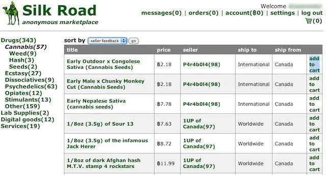

Les produits sont expédiés par voie postale (l'*United States Postal Service* dans le cas des États-Unis), la fouille systématique étant interdite dans la plupart des pays du monde. Dans le cas d'une fouille inopinée, les colis sont camouflés astucieusement pour faire croire à une expédition commune. Les produits dégageant une odeur susceptibles d'être détectée par les chiens renifleurs sont placées dans des sachets sous vide.

Conformément à la philosophie libertarienne de Ross, les produits pouvant être répertoriés sur le site [doivent](https://antilop.cc/sr/exhibits/GX-120_Redacted.pdf) ne pas avoir été obtenus en faisant du mal à autrui : on y retrouve ainsi de la drogue, des médicaments, des pièces de métaux précieux, mais en aucun cas des cartes bancaires volées, de la pédopornographie ou des services de tueur à gages. Dans l'ensemble, le site sert principalement au trafic de drogue illicite, et en particulier aux petites quantités de cannabis. On y trouve également des produits légaux, comme des livres, de l'art, des composants électroniques, de l'or, etc. mais ceux-ci forment une part infime du commerce effectué sur la plateforme.

Initialement, Ross Ulbricht valide toutes les ventes à la main. Autodidacte en informatique, le site qu'il a mis en place est truffé de défauts et de failles. Suite à la hausse du trafic lié au lancement, ces problèmes deviennent difficilement supportables. C'est pourquoi Ross décide de réécrire le code de la plateforme, tout en continuant de valider les ventes manuellement et de travailler dans sa vie officielle. La charge de travail est énorme : [dans son journal](https://antilop.cc/sr/exhibits/253456476-Silk-Road-exhibits-GX-240B.pdf), il explique ainsi que « les deux mois de réécriture du site ont été les plus éprouvants de \[sa\] vie ». (original: "Rewriting the site was the most stressful couple of months I've ever experienced.")

La nouvelle version de Silk Road [sort](https://bitcointalk.org/index.php?topic=3984.msg128554#msg128554) finalement le 18 mai 2011. Elle inclut le traitement automatisé des paiements et un mélangeur de bitcoins, permettant d'anonymiser les bitcoins traités. Toutefois, elle souffre également d'une faille qui provoque à ce moment-là une perte de plusieurs « milliers de dollars », ce qui amène Ross à revoir l'ensemble du processus de traitement pour règler le problème. Malgré tout, le site finit par gagner en popularité grâce au bouche à oreille.

### L'article de Gawker

L'existence de Silk Road est connue sur le forum de Bitcoin dès ses débuts. Toutefois, elle échappe dans un premier temps aux radars de la presse généraliste. Ainsi, même si le cas hypothétique du trafic de drogue est [évoqué](https://www.forbes.com/forbes/2011/0509/technology-psilocybin-bitcoins-gavin-andresen-crypto-currency.html) en avril par Andy Greenberg dans son article pour Forbes, le journaliste n'a pas encore connaissance de la plateforme.

La première mention de Silk Road dans un média de grande envergure est faite le 1er juin 2011, lorsqu'un article d'Adrien Chen est [publié](https://www.gawkerarchives.com/the-underground-website-where-you-can-buy-any-drug-imag-30818160) sur Gawker, un blog populaire accueillant de nombreux auteurs. Cet article, intitulé « Le site web souterrain où vous pouvez acheter n'importe quelle drogue imaginable » (original: "The Underground Website Where You Can Buy Any Drug Imaginable"), présente la plateforme sous un jour favorable et contient les témoignages de plusieurs utilisateurs satisfaits.

(source : [archive de Gawker](https://web.archive.org/web/20110603015735/http://gawker.com/5805928/the-underground-website-where-you-can-buy-any-drug-imaginable))

L'auteur intègre même quelques citations de Ross Ulbricht, qu'il a pris le soin d'interroger par courriel et qu'il présente comme l'« administrateur de Silk Road ». Ross peut ainsi partager ses réelles motivations plutôt que de laisser le journaliste spéculer à ce sujet. Dans l'article, il déclare :

> « L'État est la principale source de violence, d'oppression, de vol et de toute forme de coercition. \[...\] Arrêtez de financer l'État avec l'argent de vos impôts et dirigez votre énergie productive vers le marché noir. »
>
> original: "The state is the primary source of violence, oppression, theft and all forms of coercion. \[...\] Stop funding the state with your tax dollars and direct your productive energies into the black market."

Cet article a pour effet de révéler l'existence de Silk Road au grand public, la nouvelle étant reprise par la presse généraliste, comme [*The Atlantic*](https://www.theatlantic.com/technology/archive/2011/06/libertarian-dream-a-site-where-you-buy-drugs-with-digital-dollars/239776/). Cette publicité inédite a pour conséquence de faire exploser le trafic de la plateforme. Les serveurs ont du mal à tenir la charge, à tel point que Ross [est contraint](https://bitcointalk.org/index.php?topic=3984.msg189007#msg189007) de geler les inscriptions.

On voit aussi des [concurrents](https://gwern.net/dnm-survival) émerger, copiant le modèle de Silk Road, comme Black Market Reloaded qui est lancé fin juin. Silk Road restera néanmoins numéro 1 jusqu'à sa fermeture, grâce à l'« avantage du précurseur » et à sa philosophie unique.

### Les réactions à la popularisation du site

La publicité suscitée par l'article de Gawker ne plait pas à tout le monde. Le fait que Silk Road soit sous le feu des projecteurs a pour effet collatéral d'intensifier l'attention qui est portée à Bitcoin (ne serait-ce parce que les clients doivent se procurer du bitcoin pour acheter des produits). Et il s'avère qu'une partie de la communauté de Bitcoin est hostile à ce rapprochement entre Bitcoin et le trafic de drogue.

En particulier, le programmeur Jeff Garzik, qui s'investit alors dans le développement du logiciel, voit d'un mauvais œil cette association malvenue. Suite à la publication de l'article, il [contacte](https://www.theatlantic.com/technology/archive/2011/06/libertarian-dream-a-site-where-you-buy-drugs-with-digital-dollars/239776/) personnellement Adrien Chen par courriel pour lui expliquer que Bitcoin n'est pas aussi anonyme qu'il n'y parait, toutes les transactions étant enregistrées de façon permanente sur la chaîne. Il conclut son courriel par le jugement suivant :

> « Compte tenu des techniques d'analyse statistique existantes déployées sur le terrain par les services de police, il est tout à fait stupide de tenter d'effectuer des transactions illicites importantes avec des bitcoins. »
>
> original: "Attempting major illicit transactions with bitcoin, given existing statistical analysis techniques deployed in the field by law enforcement, is pretty damned dumb."

L'article de Gawker attire également l'attention des autorités. Ainsi, quelques jours après sa publication, le 5 juin, les sénateurs Chuck Schumer (New York) et Joe Manchin (Virginie-Occidentale) interviennent dans le discours public pour exiger une fermeture de la plateforme. Dans une [lettre](https://web.archive.org/web/20180918162447/https://www.manchin.senate.gov/newsroom/press-releases/manchin-urges-federal-law-enforcement-to-shut-down-online-black-market-for-illegal-drugs) adressée au procureur général du département de la Justice et à l'administratrice de la DEA, ils écrivent :

> « Nous vous écrivons pour vous faire part de \[notre\] vive inquiétude à la suite de la découverte d'un marché en ligne de drogues illicites, connu sous le nom de "Silk Road". Lancé en février, ce site web clandestin permet aux utilisateurs de dissimuler leur identité, et d'acheter et de vendre librement des drogues illicites, telles que la cocaïne, l'héroïne, l'ecstasy et la marijuana. \[...\] En vertu de l'alinéa (a)(2) de la section 853 du titre 21 du Code des États-Unis, le procureur général est habilité à fermer les entités impliquées dans la livraison et la distribution de substances règlementées en saisissant le nom de domaine du site web. La Drug Enforcement Administration a veillé et continue de veiller rigoureusement à l'application de nos lois et règlements sur les substances règlementées. Dans le cadre de cette mission essentielle, nous vous demandons instamment de prendre des mesures immédiates et de fermer le réseau Silk Road. »
>
> original: "We write to express my grave concern upon discovery of an online marketplace for illegal drugs, known as 'Silk Road.'  Launched in February, this underground website allows users to hide their identities and freely purchase and sell illegal drugs, ranging from cocaine, heroin, ecstasy, and marijuana. (...) Pursuant to 21 U.S.C. 853(a)(2), the Attorney General has the authority to shut down such entities involved in the delivery and distribution of controlled substances by seizing the website domain name. The Drug Enforcement Administration has been and continues to be rigorous in enforcing our controlled substance laws and regulations.  As part of this critical mission, we urge you to take immediate action and shut down the Silk Road network."

De plus, dans une conférence de presse, le sénateur Schumer [accuse](https://web.archive.org/web/20120804222559/http://www.nbcnewyork.com/news/local/123187958.html) Bitcoin d'être « une forme de blanchiment d'argent en ligne utilisée pour dissimuler la source de l'argent et l'identité des personnes qui vendent et achètent la drogue ». (original: "It's an online form of money laundering used to disguise the source of money, and to disguise who's both selling and buying the drug.") Cela fait réagir Gavin Andresen, qui n'est pas favorable à Silk Road, mais qui se désole qu'une telle chose soit dite sur Bitcoin. [Sur son blog](https://gavinthink.blogspot.com/2011/06/but-you-can-use-it-to-buy-drugs.html), il écrit :

> « Personne ne peut contrôler ce qui est acheté avec les bitcoins, tout comme ma banque locale ne peut contrôler ce que je fais des espèces que je retire du distributeur du billets. Je me demande si les sénateurs Schumer et Manchin souhaitent remplacer l'ensemble des espèces par une carte à puce émise par l'État ; après tout, les criminels auraient alors beaucoup plus de mal à acheter des biens illégaux de manière anonyme, et si nous sommes des citoyens respectueux de la loi, nous ne devrions pas nous inquiéter que l'État aient connaissance de tous nos achats... n'est-ce pas ? »
>
> original: "Second, nobody can control what is purchased with bitcoins, just like my local bank cannot control what I do with the cash I withdraw from their ATM machine. I wonder if Senators Schumer and Manchin would like to replace all cash with a government-issued smart card; after all, that would make it much harder for criminals to get away with buying illegal goods anonymously, and if we are all law-abiding citizens then we shouldn't worry about the government knowing about all of our purchases... right?")

### Le succès de l'Amazon de la drogue

Avec l'attention apportée par la presse, Silk Road prend son envol et finit par devenir rentable. À la fin de l'été, l'activité du site en vient à [représenter](https://www.chainalysis.com/blog/silk-road-doj-seizure-november-2020/) près de 10 % du volume échangé sur la chaîne de Bitcoin. Le site, qui est financé par les commissions prélevées sur les ventes, [réalise](https://antilop.cc/sr/exhibits/253456480-Silk-Road-exhibits-GX-250.pdf) un chiffre d'affaire se comptant en dizaines de milliers de dollars par mois pour un coût largement inférieur. Ross peut ainsi se permettre de se payer un salaire généreux et met fin à son emploi officiel.

Face au succès grandissant de son projet, il doit aussi apprendre à déléguer. Il engage ainsi des employés pour gérer les litiges sur le site et modérer les discussions sur le forum. [Dans son journal](https://antilop.cc/sr/exhibits/253456476-Silk-Road-exhibits-GX-240B.pdf), il écrit qu'« après avoir gagné 100 k$ et un bon 20–25 k$ mensuel, \[il a\] décidé qu'il était temps d'engager quelques personnes pour \[l'aider\] à faire passer le site au niveau supérieur ». (original: "After making about $100k and up to a good $20-25k monthly, I decided it was time to bring in some hired guns to help me take the site to the next level.") C'est ainsi qu'il commence à rémunérer des gens dont il ignore l'identité formelle mais en qui il a confiance.

Au cours de l'été, avec son ami d'enfance Richard Bates qu'il voit à Austin, ils ont pour [projet](https://antilop.cc/sr/files/2015_01_22_Ulbricht_trial_transcript_W2_D3.pdf#page=120) d'ouvrir une plateforme de change de bitcoins. Ross a l'habitude d'utiliser Bitcoin et il envisage déjà comment cette plateforme pourrait lui permettre de blanchir l'argent gagné avec Silk Road. Cependant, elle ne verra pas le jour.

C'est au cours de cette démarche que Ross commet une erreur fondamentale. Le 11 octobre, il publie une [annonce](https://bitcointalk.org/index.php?topic=47811.msg568744#msg568744) sur le forum de Bitcoin dans laquelle il déclare rechercher un « professionnel en informatique » pour une « startup bitcoin soutenue par capital-risque ». (original: "I'm looking for the best and brightest IT pro in the bitcoin community to be the lead developer in a venture backed bitcoin startup company.") Il utilise pour cela le pseudonyme altoid (avec lequel il a précédemment fait la promotion de Silk Road). Dans le message, il dévoile son adresse de courrier électronique, contenant son nom civil : `rossulbricht@gmail.com`. Cette erreur lui coûtera cher, car elle aidera l'enquête policière contre Silk Road à l'identifier et à l'arrêter deux ans plus tard.

### Un élément central de l'histoire de Bitcoin

Ross Ulbricht a ainsi mis en œuvre une idée novatrice, basée sur ses convictions libertariennes et agoristes, se servant de la résistance à la censure de Bitcoin. Après une période de préparation de plus d'un an, il a lancé le prototype en janvier 2011. Les débuts ont été difficiles, mais ses efforts ont fini par payer : en juin 2011, Silk Road était connu du monde entier grâce à un article publié sur Gawker.

L'émergence de Silk Road a été un élément essentiel du développement de Bitcoin. Le succès de la plateforme a en effet montré que Bitcoin possédait une utilité propre, distincte des monnaies étatiques et des services de paiement en ligne classique. En outre, l'utilisation de Silk Road a poussé un certain nombre de personnes à s'intéresser à Bitcoin, à l'instar de [Peter McCormack](https://www.youtube.com/watch?v=3aDMnE6dnHk), futur animateur du podcast *What Bitcoin Did*. Silk Road a enfin ouvert la voie à toutes les utilisations fleurtant avec l'illégalité, pour le meilleur et pour le pire.

Ainsi, un peu plus d'un an après la vente des pizzas de Laszlo, Silk Road est devenu l'incarnation du commerce exercé avec Bitcoin. Toutefois, cette utilisation était dans le même temps concurrencée par un autre type d'activité : la spéculation. Et celle-ci battait son plein sur la principale plateforme dédiée : Mt. Gox.

## La reprise de Mt. Gox (mars–août 2011)

La période allant du début de l'année 2011 à la fin de l'année 2013 est caractérisée par le développement de l'activité de change entre le bitcoin et les monnaies classiques, comme le dollar et l'euro. Ce type de services jouait en effet un rôle essentiel dans l'économie de Bitcoin, cette dernière étant trop petite pour fonctionner de manière fermée. Les mineurs avaient besoin de vendre leurs récompenses pour payer leurs factures d'électricité. Les commerçants (dont notamment les vendeurs de Silk Road) devaient récupérer des dollars pour rembourser leurs fournisseurs, et leurs clients, qui ne disposaient généralement pas de bitcoin, avaient besoin de s'en procurer préalablement. Il y avait aussi une forte demande spéculative, venant des gens qui considéraient la cryptomonnaie comme un investissement.

La première plateforme de change d'envergure a été Mt. Gox, lancée « sur un coup de tête » en juillet 2010 par l'entrepreneur Jed McCaleb. Grâce à son fonctionnement automatisé, elle s'est rapidement imposée comme le moyen principal de changer des dollars en bitcoins, et inversement. Au début de l'année 2011, face à l'ampleur de la tâche, Jed McCaleb a décidé de céder cette plateforme à une personne plus qualifiée techniquement et davantage motivée : le développeur français Mark Karpelès.

La plateforme a joué un rôle central dans l'histoire de Bitcoin. Elle a été le lieu principal de la première réelle bulle spéculative sur le prix du bitcoin, qui a culminé à 32 $ en juin. Elle a aussi connu un piratage massif, et était liée à plusieurs incidents s'étant produit dans l'écosystème. Dans ce chapitre, nous parlerons des circonstances dans lesquelles s'est faite la reprise de Mt. Gox, du succès fulgurant qu'elle a rencontré à partir du printemps et des premiers problèmes qu'elle a subi.

### Mark Karpelès, le geek

Mark Karpelès est né en France en 1984. Fils unique, il est élevé par sa mère seule. Il s'intéresse rapidement pour les ordinateurs, les jeux vidéos et les mangas. Dans sa vingtaine, il est un geek [mal dans sa peau](https://web.archive.org/web/20140302234940/http://blog.magicaltux.net/2006/02/12/pensees-nocturnes/). En 2007, il apparait dans le documentaire *Suck my Geek*, consacré au mouvement geek français. En 2009, désireux de quitter la France où il ne s'est jamais réellement chez lui, il déménage au Japon [en juin 2009](https://web.archive.org/web/20090628035138/http://blog.magicaltux.net/2009/06/18/arrived-in-japan/) par attrait pour la culture locale. Là-bas, il fonde une société appelée Tibanne Co. Ltd. (comme son chat, Tibane), par le biais de laquelle il travaille en free-lance. Il gère notamment un service d'hébergement appelé [KalyHost](https://web.archive.org/web/20101231201212/https://www.kalyhost.com/).

Mark Karpelès dans *Suck My Geek* en 2007 (source : [MrReportageTV](https://www.youtube.com/watch?v=cAOLU4_4QGg) sur Youtube)

Il apprend l'existence de Bitcoin au cours de l'automne 2010 par l'intermédiaire d'un client français installé au Pérou (William Waisse [alias](https://bitcointalk.org/index.php?topic=1719.msg21107#msg21107) neofutur), qui lui demande s'il peut payer en bitcoins pour régler une facture. Mark est ouvert à la possibilité et se prend vite de passion pour le système. Contrairement à Martti Malmi, Ross Ulbricht ou Roger Ver, Mark Karpelès n'est pas un libertarien ayant une motivation idéologique ; et il n'est pas non plus un spéculateur assoiffé de profit. Son intérêt pour Bitcoin prend plutôt sa source dans la curiosité technique. Comme il le [dira](https://web.archive.org/web/20140918220234/http://www.thedailybeast.com/articles/2014/09/17/mt-gox-s-karpeles-on-losing-a-half-billion-bucks-in-bitcoins.html) en 2014 :

> « Ce qui m'a intéressé dans bitcoin, c'étaient les aspects techniques. À savoir, le fait de maintenir une base de données mondiale de manière sécurisée. Le fait que chaque client dispose d'un portefeuille privé sécurisé. Le fait d'avoir un système entièrement décentralisé. De plus, bitcoin permet de disposer d'une base de données qui est publique. »
>
> original: "What interested me in bitcoin was the technological aspects. In other words, the fact of maintaining a global database in a secured way. The fact that each client has a secured private wallet. To have an entirely decentralized system. Also, bitcoin allows you to have a database that is public."

Dès sa découverte, en bon passionné d'informatique, il se plonge dans les rouages de Bitcoin et commence à écrire des programmes en tirant parti. En novembre, il [commence](https://bitcointalk.org/index.php?topic=30.msg20699#msg20699) à accepter les paiements en bitcoins avec KalyHost (Ross Ulbricht [utilisera](https://cdn.arstechnica.net/wp-content/uploads/2015/01/Govt.motion.1.19.pdf) d'ailleurs ce service pour héberger la page web silkroadmarket.org). En décembre 2010, il [crée](https://bitcointalk.org/index.php?topic=2321.msg30872#msg30872) un nouveau wiki, Bitcoin.it, qui deviendra rapidement le wiki principal de Bitcoin. Il se met également en tête de développer une implémentation logicielle ([QBitcoin](https://web.archive.org/web/20110326023018/http://bitcoinweekly.com/articles/interview-with-magicaltux-on-qbitcoin)), sans pour autant aller au bout.

### L'achat de Mt. Gox

Au début de l'année 2011, Jed McCaleb gère Mt. Gox tant bien que mal. La plateforme n'est pas sûre du tout, opinion partagée par certains membres de la communauté, comme [Mike Caldwell](https://bitcointalk.org/index.php?topic=4187.msg66477#msg66477). Et Jed n'est pas sûr de la conformité règlementaire de son activité. L'article de PC World a déjà eu un effet sur le prix, et il craint (à raison) que la tendance haussière ne se poursuive. Il se met donc à chercher un repreneur.

Son choix se porte sur Mark Karpelès, qui est actif dans la communauté des développeurs, notamment sur le canal IRC #bitcoin-dev. Le Français a aidé Martti Malmi pour l'hébergement de Bitcoin.org et l'a aidé lui-même pour l'acceptation de l'euro, ce qui lui donne confiance dans ses compétences techniques. \[source : Digital Gold, p. 66\] Le 18 janvier, il propose ainsi à Mark de reprendre Mt. Gox. Dans son courriel, il [écrit](https://web.archive.org/web/20170602025506/http://www.thedailybeast.com/behind-the-biggest-bitcoin-heist-in-history-inside-the-implosion-of-mt-gox) :

> « Salut Mark,
>
> Je te prie de bien vouloir garder tout ça confidentiel, car je ne veux pas créer la panique, et rien n'est encore sûr, mais j'envisage de revendre mtgox. J'ai d'autres projets auxquels j'aimerais me consacrer. Est-ce que ça t'intéresserait ? Je pourrais le vendre pour pas grand-chose en échange d'intérêts sur les bénéfices, par exemple. Il y a aussi un fonds d'investissement qui est prêt à investir dans mtgox. Probablement autour de 158 k$. Donc tu pourrais tout simplement récupérer la boîte avec du fric. » (Traduction de Cyril Gay)
>
> Original: "Hi Mark,
>
> Please keep all this confidential I don't want to start a panic and I'm not sure I'll do it yet but I'm thinking I might try to sell mtgox. I just have these other projects I would like to devote more time to. Would you be interested? It could be very little up front and just a payout based on revenue or something. There is also an investment group that wants to fund mtgox. Probably around $158k. So you could most likely take it over with some cash."

Après des discussions sur les termes de l'accord, le contrat est finalement signé le 3 février. Jed McCaleb conserve 12 % de la société et 50 % des revenus pendant six mois, contre quoi le reste est cédé à la société de Mark Karpelès, Tibanne Co. Ltd. Une clause du contrat dédouane Jed de toute responsabilité légale.

Le 6 mars, Jed McCaleb [officialise](https://bitcointalk.org/index.php?topic=4187.msg60610#msg60610) publiquement le transfert sur le forum de Bitcoin. Dans son dernier message avec le compte mtgox, il explique :

> « J'ai créé mtgox sur un coup de tête après avoir lu un article sur les bitcoins l'été dernier. L'expérience s'est révélée intéressante et amusante. Je suis toujours convaincu que les bitcoins ont un bel avenir. Mais pour faire vraiment en sorte que mtgox réalise son plein potentiel, il faudrait plus de temps que je n'en ai actuellement. J'ai donc décidé de passer le flambeau à quelqu'un qui sera plus à même de faire passer le site au niveau supérieur. »
>
> Original: "I created mtgox on a lark after reading about bitcoins last summer. It has been interesting and fun to do. I'm still very confident that bitcoins have a bright future. But to really make mtgox what it has the potential to be would require more time than I have right now. So I've decided to pass the torch to someone better able to take the site to the next level."

Dans les mois qui suivent, Jed continue à aider Mark pour la gestion de la plateforme, mais il sera rapidement absorbé par un [nouveau projet](https://bitcointalk.org/index.php?topic=10193.msg146250#msg146250) de monnaie numérique, qui débouchera sur la refonte de Ripple en 2012, puis la création de Stellar en 2014.

### Les premiers piratages

Comme on l'a dit, au début de l'année 2011, la plateforme Mt. Gox n'est pas sûre. Et elle subit très logiquement un certain nombre d'attaques qui sont plus ou moins graves.

\[JDC\] Alors qu'il cherche à revendre Mt. Gox en janvier 2011, Jed McCaleb doit faire face à plusieurs incidents : l'accès aux comptes d'utilisateurs individuels, une injection XML permettant un retrait non autorisé vers Liberty Reserve, et un retrait (heureusement non honoré) de 2 milliards de dollars grâce à une faille dans le code. Ce sont finalement plus de 50 000 $ et 9 500 bitcoins qui manquent dans les caisses de la plateforme début février, alors que Jed et Mark concluent leur accord.

Lorsque Mt. Gox change de mains, la plateforme constitue donc déjà un cadeau empoisonné pour Mark Karpelès. Mais les ennuis ne s'arrêtent pas là : le 1er mars, alors que le transfert est sur le point d'être officialisé, 80 000 bitcoins [s'évaporent](https://mempool.space/tx/e67a0550848b7932d7796aeea16ab0e48a5cfe81c4e8cca2c5b03e0416850114) dans la nature grâce à un accès malveillant au fichier wallet.dat du site.

Le 3 mars, Jed McCaleb remarque le retrait et [informe](https://web.archive.org/web/20200427200314/https://courts.ms.gov/appellatecourts/docket/sendPDF.php?f=dc00001_live.SCT.17.M.1681.102741.5.pdf&c=87490&a=N&s=2) Mark sur IRC que « quelque chose d'horrible est arrivé » (original: "something bad happened"). C'est une perte importante (un bitcoin se vend alors pour 0,92 $), qui va s'agrandir de plus en plus au fil des mois avec la hausse inouïe du prix.

Ce problème est [évoqué](https://web.archive.org/web/20170602025506/http://www.thedailybeast.com/web/20170602025506/http://www.thedailybeast.com/behind-the-biggest-bitcoin-heist-in-history-inside-the-implosion-of-mt-gox) le 18 avril dans un courriel de Jed McCaleb adressé à Mark :

> « Je ne peux pas te dire quelle sera l'ampleur de problème du problème s'il manque 80 kBTC et si leur valeur grimpe jusqu'à 100 $ et quelques. Cela fera une sacrée dette, mais d'ici là mtgox devrait avoir empoché une tonne de BTC. On peut aussi compter sur le fait que le solde de BTC ne descendra probablement jamais en dessous des 80k. Donc peut-être que tu n'as pas à t'en faire. » (Traduction de Cyril Gay, légèrement modifiée)
>
> original: "I can't tell how big an issue it will be to be short 80k BTC if the price goes to $100 or something. That is quite a bit to owe at that point but mtgox should have made a ton of BTC (Bitcoin) getting to there. There is also still the fact that the BTC (Bitcoin) balance will probably never fall below 80k. So maybe you don't really need to worry about it."

Le 11 mars, se produit l'accident nucléaire de Fukushima, ce qui perturbe fortement la vie au Japon. Cet évènement est de mauvaise augure pour ce qui va se passer dans la suite.

### La gestion de la première bulle spéculative

À la fin du printemps 2011, se produit la première bulle spéculative sur le prix du bitcoin, que Vitalik Buterin [appellerait](https://web.archive.org/web/20120613180823/https://bitcoinmagazine.net/anniversary-of-the-great-bubble-of-2011) un an plus tard « la grande bulle de 2011 » (original: "the Great Bubble of 2011"). Comme décrite dans le dernier chapitre du cours [HIS201](https://planb.network/fr/courses/a51c7ceb-e079-4ac3-bf69-6700b985a082/la-prise-de-relai-de-la-communaute-16c5e6d6-2412-48c6-9687-6af92cf0d89a), cette bulle est caractérisée par la multiplication des regroupements autour de Bitcoin, par une attention médiatique venant à la fois des blogueurs indépendants et de la presse en ligne, et par une activité élevée sur les plateformes de change, dont principalement Mt. Gox.

En avril, à la suite de la publication de [l'article de Forbes](https://www.forbes.com/forbes/2011/0509/technology-psilocybin-bitcoins-gavin-andresen-crypto-currency.html), le prix dépasse son ancien sommet et atteint les 3 $. L'enthousiasme spéculatif se poursuit en mai et le prix est porté à 10 $. Enfin, la publication de l'article de Gawker finit de généraliser l'attention portée à Bitcoin et déclenche l'épisode spéculatif final, le prix atteignant brièvement les 32 $ le 8 juin.

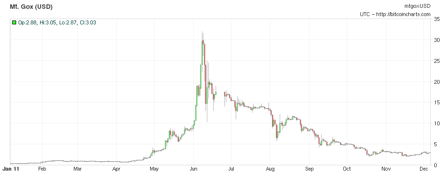

L'évolution du prix du bitcoin sur Mt. Gox en 2011 (source : Bitcoin Charts via [Bitcoin.com](https://news.bitcoin.com/look-bitcoin-bubble-will-next-one/))

Cette hausse phénoménale est particulièrement bénéfique à Mt. Gox, qui voit ses chiffres exploser. Entre la reprise effective de Mark en mars et la fin du mois de mai, le nombre de comptes d'utilisateurs passe de 3 000 à 60 000. Au cours de la même période, le volume d'échange journalier passe lui de quelques milliers de dollars à plusieurs centaines de milliers de dollars. En juin, il dépasse même les deux millions de dollars pendant quelques jours !

La gestion est cauchemardesque : Mark reçoit d'innombrables courriels et tickets de support. Il doit gérer une [pluralité](https://bitcointalk.org/index.php?topic=9808.msg141011#msg141011) de modes de paiements, les deux derniers en date étant [les virements SEPA](https://bitcointalk.org/index.php?topic=5461.msg80087#msg80087) (Mark a ouvert un compte dans une banque française) et le service [Dwolla](https://bitcointalk.org/index.php?topic=8280.msg120637#msg120637). Certains dépôts se perdent en route.

Au cours du mois de juin, Mark Karpelès engage un employé pour l'aider, un certain Adam Turner, [dont le nom civil](https://www.reddit.com/r/Bitcoin/comments/3fe92x/im_ashley_barr_aka_adam_turner_the_first_mtgox/) est Ashley Barr. Il décide d'installer l'entreprise dans un bureau de la prestigieuse Cerulean Tower à Tokyo. C'est la consécration.

Le bureau de Mt. Gox en juin 2011 (source : Mark Karpelès [sur Twitter](https://twitter.com/MagicalTux/status/1310018500602130432))

### Les concurrents de Mt. Gox

Le succès de Mt. Gox fait des émules, tant aux États-Unis qu'ailleurs. Avec la montée du prix et de la demande, il devient profitable de lancer une plateforme d'échange. Ainsi, de nombreux concurrents, construits sur le même modèle et incluant une gestion automatisée des ordres, [apparaissent](https://web.archive.org/web/20110727192503/https://bitcoincharts.com/markets/) au cours de l'année et en particulier à partir du printemps.

<!-- Bitcoin-Central -->

Outre Bitcoin Market (mentionné dans HIS201), la première plateforme à réellement faire concurrence à Mt. Gox est Bitcoin-Central, une plateforme installée en France. Celle-ci est [lancée](https://bitcointalk.org/index.php?topic=2519.msg34080#msg34080) le 29 décembre 2010 par David François (davout), un développeur web expérimenté ayant découvert Bitcoin en octobre. Conformément à l'éthos de la communauté, le code source de la place de marché est [ouvert](https://bitcointalk.org/index.php?topic=2721.msg36980#msg36980) et publié [sous licence libre](https://github.com/davout/bitcoin-central/blob/master/LICENSE) (AGPL). La plateforme n'accepte initialement que les dollars et les euros de Liberty Reserve, ainsi que les [virements (non SEPA) en euros](https://bitcointalk.org/index.php?topic=2584.msg35109#msg35109). Le fonctionnement du système est au départ un peu expérimental, mais il s'améliorera au fil des mois. David François ajoutera notamment une [API](https://bitcointalk.org/index.php?topic=3174.msg44575#msg44575), les [virements SEPA](https://bitcointalk.org/index.php?topic=37488.msg459866#msg459866) (original/EN version: https://bitcointalk.org/index.php?topic=37494.msg459909#msg459909), et d'autres monnaies ([or via Pecunix](https://bitcointalk.org/index.php?topic=3098.msg43315#msg43315), [dollar canadien et roupie indienne](https://bitcointalk.org/index.php?topic=40239.msg490360#msg490360)).

<!-- Britcoin/Intersango -->

Une deuxième plateforme est Britcoin, qui est [lancée](https://bitcointalk.org/index.php?topic=4984.msg73066#msg73066) le 26 mars par Amir Taaki (genjix), le jeune développeur britannique d'origine iranienne qui voulait envoyer un courrier à WikiLeaks en novembre 2010 pour recommander Bitcoin. Comme son nom l'indique, la plateforme est installé au Royaume-Uni et intègre le change entre la livre sterling et le bitcoin. À l'instar de David François, il [publie](https://bitcointalk.org/index.php?topic=4579.msg67047#msg67047) le logiciel sous-jacent [sous licence libre](https://github.com/dooglus/intersango/blob/master/LICENSE) (AGPL), qu'il baptise « Intersango » (de l'espéranto *interŝanĝo* signifiant échange). Amir est rapidement [rejoint](https://web.archive.org/web/20120129171120/https://britcoin.co.uk/about-us.php) par Donald Norman (Donald_Norman) et Patrick Strateman (phantomcircuit) pour gérer la plateforme.

Patrick Strateman en 2016 (source : [SF Bitcoin Developers](https://www.youtube.com/watch?v=Y6kibPzbrIc))

En avril, les trois hommes fondent la [Bitcoin Consultancy](https://web.archive.org/web/20110513023005/http://bitcoinconsultancy.com/), une organisation offrant développement logiciel et conseil technique. Ils sont aidés par d'autres personnes comme Nils Schneider (tcatm) et Denis Rojo (Jaromil). Cette entité a aussi un pouvoir d'influence, car elle organisera les premières conférences européennes, à Prague et à Londres. Toutefois, sous ses airs sérieux, se cache un esprit éminemment hacker, ainsi que la personnalité d'Amir Taaki le suppose.

Capture du site de la Bitcoin Consultancy du 13 mai 2011 (source : [archive](https://web.archive.org/web/20110513023005/http://bitcoinconsultancy.com/))

Le 6 juin, la Bitcoin Consultancy [lance](https://bitcointalk.org/index.php?topic=26543.msg332466#msg332466) une nouvelle plateforme de change, destinée au marché européen, appelée Intersango (comme le logiciel qui la soutient). Britcoin et Intersango finissent par fusionner quelques mois plus tard pour ne plus former qu'un seul site.

<!-- Plateformes localesBitomat / Carvitex -->

En Europe de l'Est, la plateforme Bitomat, installée en Pologne, est [lancée](https://forum.bitcoin.pl/viewtopic.php?f=7&t=166#p871) le 4 avril. L'interface est rudimentaire, mais permet à ses utilisateurs polonais d'échanger leurs zlotys contre des bitcoins. On peut également citer la plateforme Cavirtex, [ouverte](https://bitcointalk.org/index.php?topic=25312.msg314448#msg314448) le 2 juillet, qui officie au Canada.

<!-- VirWoX -->

Une autre plateforme est VirWoX (*Virtual World Exchange*), établie en Autriche. Ouverte en 2007, il s'agit d'une plateforme indépendante de premier plan permettant l'échange de monnaies virtuelles de jeux vidéos, et notamment le dollar Linden de *Second Life*. Le 27 avril 2011, le site [ajoute](https://web.archive.org/web/20110511075334/https://www.virwox.com/) le bitcoin à son offre, ouvrant uniquement le change avec le dollar Linden, ce qui permet à ses utilisateurs de se procurer la cryptomonnaie de Nakamoto.

<!-- TradeHill -->

Enfin, la dernière place de marché à apparaitre durant cette période est TradeHill, une plateforme fondée par Jered Kenna, un ancien militaire américain devenu entrepreneur, et Adam Stradling. Elle est lancée le 8 juin 2011 et [annoncée](https://bitcointalk.org/index.php?topic=13650.msg186776#msg186776) sur le forum par Bruce Wagner, l'animateur du *Bitcoin Show*, qui travaille en étroite collaboration avec la plateforme. TradeHill est installée aux États-Unis et facilite le change avec le dollar américain, de sorte qu'elle devient rapidement la deuxième plateforme en termes de volume, loin derrière Mt. Gox, qui reste la référence.

### Les piratages de juin

Le succès financier du bitcoin attire également les pirates informatiques. L'absence d'intermédiaire et le relatif anonymat de Bitcoin est une caractéristique parfaite pour les voleurs, qui peuvent se saisir des bitcoins des autres, sans risquer de voir les fonds gelés. Le 13 juin, le premier piratage de grande envergure survient : un membre actif de la communauté utilisant le pseudonyme Allinvain se fait dérober [25 000 bitcoins](https://mempool.space/tx/4885ddf124a0f97b5a3775a12de0274d342d12842ebe59520359f976721ac8c3), soit près de 500 000 dollars. Il [partage](https://bitcointalk.org/index.php?topic=16457.msg214423#msg214423) son expérience sur le forum de Bitcoin, et l'affaire est relayée [dans la presse en ligne](https://www.forbes.com/sites/timworstall/2011/06/17/bitcoin-the-first-500000-theft/). Il [semblerait](https://web.archive.org/web/20110618151605/https://www.wired.com/threatlevel/2011/06/bitcoin-malware/) qu'il ait été la victime d'un cheval de Troie (logiciel malveillant) appelé Coinbit, qui récupère le fichier `wallet.dat` d'une machine fonctionnant sous Windows. Cela [remet la question](https://gavinthink.blogspot.com/2011/06/why-arent-bitcoin-wallets-encrypted.html) du chiffrement du portefeuille sur la table, une fonctionnalité qui sera [implémentée](https://bitcointalk.org/index.php?topic=45410.msg541446#msg541446) quelques mois plus tard dans le logiciel.

Comme nous l'avons dit, Mt. Gox constitue une cible idéale. Elle est régulièrement la cible d'attaques par déni de service (par exemple le [1er mai](https://bitcointalk.org/index.php?topic=6931.msg101451#msg101451)). De plus, elle a déjà échappé au pire en mai, lorsqu'un pirate s'était emparé de 300 000 BTC avant d'en rendre 297 000.

C'est ainsi qu'elle subit un piratage massif à partir du 16 juin. Un pirate (peut-être [issu](https://www.theguardian.com/technology/2011/jun/22/lulzsec-rogue-suspected-of-bitcoin-hack) du groupe LulzSec) parvient à mettre la main sur la base de données contenant les pseudonymes des utilisateurs et les empreintes cryptographiques de leurs mots de passe (hachés par MD5, [la plupart sans salage](https://news.ycombinator.com/item?id=2671669)). Cela lui permet d'accéder aux comptes sécurisés par mots de passe faibles (courts ou facile à deviner), et de procéder à des retraits inférieurs à la limite journalière de 1 000 $. Les plaintes [s'accumulent](https://bitcointalk.org/index.php?topic=18050.0) le forum, et poussent Mark Karpelès à [réagir](https://bitcointalk.org/index.php?topic=18858.msg236884#msg236884) le 18 juin. Ce dernier minimise ces vols, mettant en avant le fait qu'ils sont peu nombreux et soutenant l'idée que « le problème \[vient\] principalement des utilisateurs ».

<!-- Le 17 juin, le pirate [annonce](https://web.archive.org/web/20110619054549/http://pastebin.com/xhnNdvte) vendre la base de données de Mt. Gox sur Pastebin. Il signe son message du pseudonyme cRazIeStinGeR. -->

Toutefois, le dimanche 19 juin, la réalité rattrape Mark. Vers 17 heures, le pirate parvient à accéder au compte de Jed McCaleb, qui contient beaucoup de fonds. Puisque la limite de retrait journalière est de 1 000 $, il cherche à faire baisser le prix le plus possible afin de retirer un maximum de bitcoins, et se met donc à vendre les bitcoins sur le compte. Cette opération provoque un krach éclair (*flash crash*) : le prix, qui stationnait autour des 17,5 $ dans la journée, baisse progressivement puis chute jusqu'à 0,01 $ à 17:51 UTC. Le pirate réussit à dérober ainsi 2 000 BTC, soit 35 000 $ au cours en vigueur.

*Bitcoin Report Volume 8*

Beaucoup d'utilisateurs de Mt. Gox paniquent et vendent sous le coup de l'émotion afin de conserver ce qui leur reste. D'autres [profitent](https://www.youtube.com/watch?v=jrikj7fy4MU) de l'occasion pour se procurer des bitcoins à bas prix. Après avoir pris connaissance de la chose, Mark met immédiatement la plateforme hors ligne et [annonce](https://news.ycombinator.com/item?id=2671549) annuler tous les échanges ayant eu lieu lors de la vente massive, [invoquant](https://bitcointalk.org/index.php?topic=20535.msg256505#msg256505) la « force majeure » (original: "force majeure"). Mais certains clients ont pu retirer des fonds. C'est le cas d'un certain Kevin Day (toasty), qui [est parvenu](https://bitcointalk.org/index.php?topic=20207.msg252680#msg252680) à acheter 259 685 bitcoins à un prix unitaire de 0,0101 $, pour un total de 2 623 $, et à en retirer 643 de la plateforme. En raison de cet ordre d'achat exceptionnel, il est [suspecté](https://bitcointalk.org/index.php?topic=20250.msg253411#msg253411) par Mark Karpelès d'agir en collusion avec le pirate. Pour prouver sa bonne foi, il [apparait](https://www.youtube.com/watch?v=skBbFDcVuY4) dans le *Bitcoin Show* le lendemain du piratage, et finit par [placer](https://bitcointalk.org/index.php?topic=20775.msg259984#msg259984) les bitcoins sur un compte séquestre auprès de ClearCoin, le service de dépôt fiduciaire développé par Gavin Andresen. \[Les BTC sont-ils rendus ?\]

Le krach éclair n'est cependant pas le seul évènement dramatique qui se produit ce jour-là. Quelques heures plus tard, [vers 19 heures 30](https://news.ycombinator.com/item?id=2671612), le pirate [rend public](https://bitcointalk.org/index.php?topic=19576.msg244940#msg244940) la base de données des utilisateurs. Cela permettra à d'autres personnes malintentionnées et plus expérimentées de complètement l'exploiter. Elles accèderont ainsi à des services comme [GMail](https://bitcointalk.org/index.php?topic=19641.msg245714#msg245714), [TradeHill](https://www.youtube.com/watch?v=8ygb9D9vnL4&t=253s) ou encore MyBitcoin...

### Les conséquences des piratages

Le résultat est catastrophique pour Mark...

La conséquence des piratages est de mettre fin à l'enthousiasme spéculatif. La plateforme Mt. Gox est fermée pendant un temps ce qui gèle la plus grande place de marché de l'écosystème. Le 5 juillet, le prix n'est plus que de 13 $.

Ces piratages atteignent l'image de Bitcoin auprès du grand public. Même si un piratage individuel n'est pas représentatif du reste du réseau et même si Mt. Gox n'est qu'un service de change fonctionnant avec la cryptomonnaie, le commun des mortels a tendance à assimiler Bitcoin dans son ensemble à ces choses. Le 20 juin, Tim Worstall [écrit](https://www.forbes.com/sites/timworstall/2011/06/20/so-thats-the-end-of-bitcoin-then/) un article pour Forbes dans lequel il annonce « la fin de l'expérience Bitcoin » (original: "the end of the Bitcoin experiment"), ce qui en fait l'une des premières « nécrologies de Bitcoin » (original: "Bitcoin obituaries") publiées par la presse (qui seront [recensées](https://web.archive.org/web/20150106024100/http://bitcoinobituaries.com/) sur le site web de Jordan Tuwiner à partir de 2014). Il écrit :

> « Les bitcoins ne sont pas sécurisés, comme le montrent à la fois le vol récent et le problème des mots de passe. Ils ne sont pas liquides, ni ne forment une réserve de valeur comme en témoigne l'effondrement du prix, et s'ils ne sont rien de tout cela, ils ne seront pas non plus un bon moyen d'échange, car qui voudrait les accepter ? »
>
> "Bitcoins aren't secure, as both the recent theft and this password problem show. They're not liquid, nor a store of value, as the price collapse shows and if they're none of those things then they'll not be a great medium of exchange either as who would want to accept them?"

Le 21 juin, afin d'améliorer la situation et de rassurer les clients, Mark Karpelès et Adam Turner [passent](https://www.youtube.com/watch?v=-0XvP841jaM) dans le *Bitcoin Show* de Bruce Wagner. Le 23, Mark [déplace](https://bitcointalk.org/index.php?topic=21436.msg268800#msg268800) 424 242 bitcoins sur la chaîne pour prouver la solvabilité de l'entreprise, et la plateforme rouvre finalement le 27. Mark a compris qu'il fallait mieux communiquer : en juillet, il [réalisera](https://www.youtube.com/watch?v=wG-Wt0dAm_U) même un épisode du *Bitcoin Show* en français avec David François !

Une dernière conséquence du piratage de Mt. Gox est le développement accéléré de la double authentification (*two-factor authentication* en anglais) comme moyen d'accéder à un compte. Cette procédure ajoute généralement au mot de passe simple, la contrainte de saisir une information provenant d'un appareil tiers, comme un téléphone par exemple. Ainsi, dès le 7 juillet, Mt. Gox [propose](https://bitcointalk.org/index.php?topic=26917.msg338630#msg338630) à ses clients de commander des YubiKeys dédiées, qui sont des clés USB spécialisées émettant des mots de passe à usage unique. Celles-ci commencent à être distribuées durant la semaine qui suit.

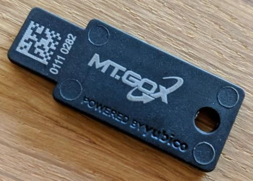

YubiKey dédiée à Mt. Gox (source : [Tech Solvency](https://www.techsolvency.com/mfa/security-keys/yubikeys/rare/))

Les plateformes concurrentes mettent aussi une solution de double authentification. Bitcoin-Central [opte](https://bitcointalk.org/index.php?topic=21422.msg307138#msg307138) pour Google Authenticator dès le 30 juin. TradeHill [passe](https://bitcointalk.org/index.php?topic=28447.msg357955#msg357955) elle par l'intermédiaire du service Duo Security à partir du 13 juillet.

### La fermeture de MyBitcoin

Lors de l'été 2011, la plupart des nouveaux utilisateurs optent pour MyBitcoin, l'application dépositaire permettant de gérer des bitcoins sans avoir à se soucier de faire fonctionner un logiciel complexe. Elle est disponible en ligne sous la forme d'une interface web, et il faut disposer d'un simple mot de passe pour accéder à un compte. L'application est [mise en avant](https://www.youtube.com/watch?v=ejiqbzqmxSE) par les [tutoriels](https://web.archive.org/web/20110613053345/http://bitcoinme.com/index.php/accept) de l'époque comme solution simple de recevoir des bitcoins. Bruce Wagner la [présente](https://web.archive.org/web/20110424221921/http://www.bitcoinme.com/) sur son site Bitcoinme.com comme un moyen « très rapide et facile de commencer à utiliser Bitcoin » (original: "super fast and easy to get started with using Bitcoin"). L'utilisation est si simple que beaucoup de gens ne suivent pas le [conseil de Satoshi](https://bitcointalk.org/index.php?topic=125.msg1149#msg1149) de juste conserver de la « petite monnaie » sur l'application, et s'en servent comme un compte d'épargne.

Dans les jours qui suivent le 19 juin, MyBitcoin subit les conséquences de la fuite de données de Mt. Gox. Des personnes malintentionnées accèdent à de nombreux comptes appartenant à des personnes ayant un mot de passe faible réutilisé sur Mt. Gox (ce qui arrive aussi pour [GMail](https://bitcointalk.org/index.php?topic=19641.msg245714#msg245714) ou [TradeHill](https://www.youtube.com/watch?v=8ygb9D9vnL4&t=253s)). Par exemple, [BrightAnarchist](https://bitcointalk.org/index.php?topic=20427.msg255193#msg255193), le membre du forum qui avait poussé l'EFF à accepter le bitcoin en 2010, perd l'intégralité de ses fonds. Le 25 juin, Tom Williams, le président anonyme de MyBitcoin, [explique](https://bitcointalk.org/index.php?topic=22221.msg279396#msg279396) que 1 % des utilisateurs présents dans la fuite de données de Mt. Gox ont été touchés et que 4 019 bitcoins ont été volés, soit 70 000 $.

Toutefois, les déboires de l'application ne s'arrêtent pas là. Le 29 juillet, MyBitcoin connait une fermeture soudaine. Près de 78 740 bitcoins manquent à l'appel sur le portefeuille lié à l'application, un montant équivalent à plus d'un millions de dollars à ce moment-là et correspondant à 51 % des fonds présents sur les comptes des clients, ce qui contraint le service à rembourser le reste et à disparaître. Même si MyBitcoin [invoque](https://web.archive.org/web/20111018173154/https://www.mybitcoin.com/) un piratage, des [éléments](https://observer.com/2011/08/search-for-owners-of-mybitcoin-loses-steam/) laissent à penser que son fondateur anonyme, Tom Williams, est à l'origine du vol.

Annonce de Tom Williams du 4 août 2011 (source : [Bitcoin Wiki](https://en.bitcoin.it/wiki/MyBitcoin))

Certaines pertes individuelles sont [élevées](https://bitcointalk.org/index.php?topic=33389.msg417455#msg417455). En particulier, Bruce Wagner est touché : il [affirme](https://www.youtube.com/watch?v=4FZldY-ZBBE&t=88s) avoir perdu, avec son conjoint, plus de 25 000 bitcoins, soit plus de 300 000 $ au moment de la fermeture. Il réalise une série d'émissions consacrées à cet évènement. De plus, le fait que Bruce Wagner a conseillé son utilisation ternit sa réputation, si bien que le *Bitcoin Show* finira par s'arrêter quelques mois plus tard.

Malgré cette chute de confiance, les portefeuilles dépositaires continuent d'avoir du succès. C'est le cas d'Instawallet, qui [existe](https://bitcointalk.org/index.php?topic=6785.msg99378#msg99378) depuis avril. Par réaction, la Bitcoin Consultancy [lance](https://bitcointalk.org/index.php?topic=35599.msg439954#msg439954) son propre service, Vibanko, en août.

### La faillite de Bitomat

En parallèle, la plateforme polonaise Bitomat rencontre un problème majeur. Le 26 juillet, l'administrateur [procède](https://www.reddit.com/r/Bitcoin/comments/j4t58/3rd_largest_bitcoin_exchange_has_lost_its/c2957nt/) à une augmentation des ressources du serveur et l'opération a pour effet (inhabituel) de redémarrer la machine virtuelle et de supprimer les données présentes, y compris les clés privées du portefeuille du système. La perte s'élève à 17 000 bitcoins, soit environ 235 000 $ à ce moment-là. Bien que le volume échangé ne soit pas énorme, il s'agit de la troisième plus grosse plateforme de change derrière TradeHill et Mt. Gox, ce qui en fait un incident important.

Pour éviter de flouer ses clients, l'administrateur propose de vendre la plateforme pour 17 000 BTC. Cela intéresse Mark Karpelès, qui pourrait alors bénéficier du marché polonais. Le 11 août, Mt. Gox [annonce](https://web.archive.org/web/20120426023056/http://support.mtgox.com/entries/20357051-mt-gox-the-world-s-largest-bitcoin-exchange-to-acquire-bitomat-pl-compensate-loss-of-bitcoins) racheter Bitomat, afin de « rétablir la confiance dans l'économie de bitcoin » (original: "to restore confidence in the bitcoin economy"). Mais cela a pour conséquence de rajouter 17 000 BTC au passif de Mt. Gox.

À cela s'ajoutera une mauvaise manipulation en octobre 2011, témoignant de l'amateurisme de Mark...

- October 2011 Mt. Gox Loss, 2609.36304319 BTC: https://bitcointalk.org/index.php?topic=83794.msg923918#post_toc_27

### Une croissance fragile

Mt. Gox constituait ainsi le point central de l'économie de Bitcoin. À l'image de l'écosystème, la plateforme a connu un succès florissant dans la première moitié de l'année 2011. Sous la direction de Mark Karpelès, elle a acquis une nouvelle dimension. Celui-ci a ouvert des bureaux et embauché un employé.

Toutefois, cette croissance fulgurante cachait une grande fragilité. La plateforme Mt. Gox a subi plusieurs piratages durant cette période, ce qui fait qu'elle a accumulé les pertes au fil des mois : plus d'une centaine de milliers de bitcoins manquaient à l'appel à la fin de l'été. Cela présageait une chute abrupte. Mais Mt. Gox allait d'abord devenir une plateforme énorme en l'espace de deux ans et demi.

## Bitcoin et l'activisme politique (mars–novembre 2011)

Bitcoin est un objet éminemment politique en ce qu'il est un outil de libération et qu'il permet de faire des choses hors du cadre légal. C'est pourquoi il a tout naturellement attiré les individus motivés idéologiquement, qui ont souvent été ses partisans les plus passionnés. Son essor intervient de plus dans une période de grand scepticisme et de colère vis-à-vis du système bancaire, suite à la crise financière de 2008.

Bitcoin a en particulier bénéficié du mouvement libertarien américain, qui prônait à la fois la liberté économique (propre aux républicains) et une liberté des mœurs (propre aux démocrates) et constituait de ce fait une sorte de troisième voie politique aux États-Unis. Les libertariens sont ainsi devenus les plus grands promoteurs de la cryptomonnaie, à l'instar de Roger Ver, Erik Voorhees ou encore Jon Matonis. Ils ont également favorisé son développement économique dans l'État du New Hampshire, grâce à l'action du *Free State Project*.

### Bitcoin et le libertarianisme

L'année 2011 est marquée par le début de la campagne de Ron Paul pour l'élection présidentielle de 2012. Ron Paul est un homme politique libertarien, représentant du 14e district de l'État du Texas à la Chambre des Représentants. Il est surnommé « Doctor No » parce qu'il a coutume de voter contre tous les projets de loi qui réduisent la liberté des citoyens ou qui augmentent les dépenses publiques. Après avoir brigué l'investiture républicaine pour l'élection de 2008, il fait de même pour celle de 2012. Bien qu'elles aient peu de chances d'aboutir, ses candidatures enthousiasment un grand nombre de libertariens et [inspirent](https://reason.com/2012/05/11/welcome-to-ron-pauls-revolution-the-webs/) un véritable mouvement populaire. La seconde campagne de Ron Paul pour l'élection présidentielle débute en [mai 2011](https://web.archive.org/web/20110516130810/http://politicalticker.blogs.cnn.com/2011/05/13/breaking-rep-ron-paul-announces-third-bid-for-presidency/).

Les libertariens sont très souvent des partisans de l'école autrichienne d'économie, une école de pensée économique dont la méthode rationnelle repose sur le comportement individuel plutôt que sur celui de la société. Ils sont également amateurs de métaux précieux, dans lesquels ils voient la « vraie monnaie », par opposition aux billets de la Réserve fédérale (c'est-à-dire les dollars), qui relèvent de la « fausse monnaie ». Ceux qui ne jurent que par l'or sont communément appelés *gold bugs*.

La relation entre Bitcoin et le libertarianisme américain parait plutôt naturelle, une proximité que Satoshi lui-même [percevait](https://www.metzdowd.com/pipermail/cryptography/2008-November/014853.html) en 2008. Les libertariens peuvent voir dans Bitcoin une alternative à la monnaie gérée par l'État. Ils jugent en effet que l'intervention de l'État n'est pas désirable, y compris dans la fonction monétaire. L'évolution monétaire qui a caractérisé le XXe siècle a fait passer le système monétaire d'un étalon-or (taux de change fixe) à un système de monnaies fiduciaires (taux de change flottants), et a permis aux dépenses publiques d'exploser.

Toutefois, comme on l'a dit, beaucoup d'entre eux sont attachés à la tradition autrichienne, pour qui seuls les métaux précieux peuvent former la base d'une économie saine, ce qui les mène à rejeter Bitcoin en premier lieu. Par son absence de valeur intrinsèque et d'adossement à quelque chose de concret, Bitcoin contredit pour eux le théorème de régression de Ludwig von Mises (voir HIS201, ch. 6) : il ne peut ainsi pas devenir une monnaie dans le temps et il est inutile de faire l'effort de l'utiliser. Comme l'[écrivait](https://mmalmi.github.io/satoshi/#email-1) Satoshi, « ils sont tellement habitués à s'opposer à la monnaie fiat qu'ils estiment que tout ce qui n'est pas l'or n'est pas assez bon » et « admettent qu'une chose est inflammable, mais affirment qu'elle ne brûlera jamais parce qu'il n'y aura jamais d'étincelle ». (original: "they're so used to being anti-fiat-money that anything short of gold isn't good enough.  They concede that something is flammable, but argue that it'll never burn because there'll never be a spark.")

David Kramer, blogueur pour Lewrockwell.com, [écrit](https://web.archive.org/web/20110612114125/http://www.lewrockwell.com/blog/lewrw/archives/89471.html) la chose suivante le 9 juin dans un article intitulé « Just Another Bogus Medium of Exchange » :

> « Un intermédiaire d'échange nait de quelque chose qui a eu une utilisation / valeur matérielle sur le marché avant de devenir un intermédiaire d'échange, c'est-à-dire qui était également un bien échangé contre d'autres biens et services. Au fil des siècles, les marchandises que sont l'or et l'argent se sont imposées comme les deux intermédiaires d'échange les plus appréciés, l'or occupant la première place en raison de sa plus grande rareté que l'argent. Quelle a été l'utilisation / valeur matérielle antérieure du bitcoin ? Zéro. Ce ne sont que des bits dans un ordinateur. »
>
> original: "A medium of exchange arises from something that had a material use/value in the market prior to becoming a medium of exchange, i.e., it was also a good being bartered for other goods and services. Over the centuries, the commodities gold and silver won out as the two most preferred mediums of exchange—with gold holding the number one position due to its being more scarce than silver. What was Bitcoin's prior material use/value? Zero. It is just bits in a computer."

Peter Schiff, fils du militant antifiscal Irwin Schiff et partisan invétéré de l'étalon-or, [reproche](https://www.youtube.com/watch?v=vTr_hTC90oQ) aux bitcoins de ne pas avoir de « valeur intrinsèque fondamentale » (original: "fundamental intrinsic value"). Doug Casey, financier et auteur libertarien, [affirme](https://www.lewrockwell.com/2011/06/doug-casey/the-bitcoin-flap/) que « comme les monnaies fiduciaires étatiques, \[les bitcoins\] forment une escroquerie, qui ne fonctionne que tant que les gens leur accordent leur confiance, que cette confiance soit bien placée ou non ». (original: "Like government fiat currencies, they are a con game, functioning only as long as people have confidence in them, regardless of whether that confidence is well placed or not.")

Certains libertariens essaient de s'opposer à ce rejet, bien qu'ils appartiennent au même mouvement et ont les mêmes références. C'est le cas du blogueur [Michael Suede](https://web.archive.org/web/20110609055336/http://www.libertariannews.org/2011/06/06/libertarian-goldbugs-hating-on-bitcoin-free-market-money/), de [Jon Matonis](https://themonetaryfuture.blogspot.com/2011/06/why-are-libertarians-against-bitcoin.html) ou encore du tout jeune [Vitalik Buterin](https://web.archive.org/web/20110617050611/http://bitcoinweekly.com/articles/bitcoin-and-the-goldbugs). D'autres activistes, moins sectaires, sont assez rapidement convaincus par Bitcoin, comme [Stefan Molyneux](https://odysee.com/@freedomain:b/stefan-molyneux-in-2011-bitcoins-digital:e) ou [Adam Kokesh](https://web.archive.org/web/20120517174507/https://bitcoinmagazine.net/adam-kokesh-on-bitcoin-and-free-market-money).

### L'émission de radio Free Talk Live

Parmi les premières personnes à s'intéresser à Bitcoin dans les sphères libertariennes, on trouve les animateurs de Free Talk Live, Ian Freeman et Mark Edge. Free Talk Live est une émission de radio libre libertarienne existant depuis 2002 et enregistrée alors depuis la ville de Keene dans le New Hampshire. Elle est diffusée dans l'ensemble des États-Unis par le biais du réseau Genesis Communications Network (le même réseau qu'Alex Jones). Elle est également disponible sous forme de podcast sur Internet.

Ian Freeman et Mark Edge, les animateurs de Free Talk Live (source : Mark Edge pour [Decrypt](https://decrypt.co/61894/fbi-raids-new-hampshire-bitcoin-operations-charges-radio-host))

Le 28 décembre 2010, dans la continuité de l'article de PC World, le sujet de Bitcoin est évoqué par l'un des auditeurs (un certain Jeremy West) dans l'émission. Cela amène Ian Freeman et Mark Edge à s'intéresser à la cryptomonnaie. Le 8 février, ils [rencontrent](https://cointelegraph.com/news/meet-the-man-who-introduced-roger-ver-to-bitcoin) Gavin Andresen au cours d'un déjeuner à Keene. Gavin rembourse son repas en bitcoins, en [envoyant](https://mempool.space/tx/8dc70b8e15632becb2a070ea1ad01f292486487c5d97671535c2732e2c9131fb) 25 BTC à Mark.

Les deux animateurs sont enthousiasmés par Bitcoin. En particulier, la place de marché Silk Road [éveille](https://bitcointalk.org/index.php?topic=3984.msg66567#msg66567) aussi la curiosité de Ian Freeman. Quelques mois plus tard, ce dernier [écrira](https://bitcointalk.org/index.php?topic=12895.msg178537#msg178537) sur le forum de Bitcoin : « remercions Silk Road de m'avoir donné une raison de saisir ne serait-ce qu'une partie de la vision de Bitcoin ». (original: "thanks be to the Silk Road for giving me reason to catch the at least a portion of the vision of Bitcoin") Le 16 mars, la moitié de l'émission de Free Talk Live est [consacrée](http://traffic.libsyn.com/ftl/FTL2011-03-16.mp3) à Bitcoin et à Silk Road, ce qui ne manque pas d'attirer l'attention d'un public libertarien.

### Roger Ver

L'un des auditeurs les plus fidèles de Free Talk Live est Roger Ver, et les mentions de Bitcoin ne tombent pas dans l'oreille d'un sourd. Roger Ver est un homme d'affaires américain, qui a fondé une société de revente de composants informatiques en ligne appelée MemoryDealers à la fin des années 90, et est devenu millionnaire par ce biais au bout de quelques années. En parallèle, il a développé des convictions libertariennes, notamment en lisant Ludwig von Mises, Murray Rothbard et Henry Hazlitt. Il entretient également une vision optimiste du progrès technique, ayant été influencé par le futurologue transhumaniste Ray Kurzweil.

Roger Ver est un homme d'action. En 2000, il s'est présenté aux élections pour l'Assemblée de l'État de Californie sous l'étiquette du Parti libertarien. Toutefois, son franc-parler n'ayant pas plu pas aux autorités, il a été arrêté en 2002 pour vente de feux d'artifice sans licence et a été emprisonné pendant 5 mois. Cette expérience traumatisante l'a poussé à s'expatrier au Japon, dont il sera un résident permanent jusqu'en 2014. En 2010, il vit à Tokyo.

Roger Ver à la convention Money2020 en octobre 2012 (source : [Digital Trends](https://web.archive.org/web/20121212165432/http://www.digitaltrends.com/cool-tech/the-future-of-money-its-not-in-your-hands/))

En décembre 2010, il apprend l'existence de Bitcoin par le biais de Free Talk Live et s'en procure quelques-uns. Toutefois, c'est à la suite de l'émission du 16 mars \[autre ? ["internet gambling"](https://www.youtube.com/watch?v=IG_AvbfCEs4)\] qu'il se prend de passion pour la création de Satoshi Nakamoto. Il vit alors une sorte d'épiphanie : il lit tout ce qu'il peut sur le sujet, à tel point qu'il fait plusieurs nuits blanches. Tel qu'il le [confiera](https://londonlovesbusiness.com/meet-bitcoin-jesus-roger-ver-the-millionaire-who-distributes-free-bitcoins/) plusieurs années plus tard à *London Loves Business* :

> « J'ai réalisé qu'il s'agissait de la meilleure forme de monnaie que le monde entier ait jamais connue. J'étais réellement surexcité parce que je sentais que la vocation de ma vie était arrivée sous la forme de Bitcoin. Je ne suis pas sorti de chez moi pendant plus d'une semaine et j'ai passé chaque instant à lire tout ce que je pouvais trouver sur Bitcoin. Le manque de sommeil m'a rendu tellement malade que mon amie a dû m'emmener à l'hôpital. »
>
> original: "I realised it's the best form of money that the entire world has ever seen. I literally got so excited because I felt my life's calling had arrived in the form of Bitcoin. I didn't leave my house for over a week and spent every waking moment reading every single thing I could find on Bitcoin. I got so sick from the lack of sleep that my friend had to take me to the hospital."

Suite à cette expérience, Roger Ver s'investit dans la communauté. Le 26 avril, il [commence](https://bitcointalk.org/index.php?topic=4667.msg95746#msg95746) à accepter les paiements en bitcoins avec sa société MemoryDealers. Le 4 juin, il utilise un panneau d'affichage dont il dispose pour faire la promotion de Bitcoin et de son entreprise, MemoryDealers. Ce panneau est visible depuis une autoroute très fréquentée de Sunnyvale, dans la Silicon Valley, ce qui a pour conséquence d'[attirer](https://www.instagram.com/p/FNIFl/) l'attention sur Bitcoin dans le mouvement de bulle spéculative qui a alors lieu.

Panneau publicitaire pour Bitcoin à Sunnyvale (source : Roger Ver, [archive de Bitcointalk](https://web.archive.org/web/20130524003126/https://bitcointalk.org/index.php?topic=7961.40))

En juin, suite aux premiers ennuis rencontrés par Mt. Gox, il propose à Mark Karpelès de venir l'aider, car il habite tout près des bureaux de la société à Tokyo. Mark accepte et Roger se présente à la Cerulean Tower. Il est accompagné de plusieurs personnes, dont Jesse Powell, un ami de lycée et entrepreneur de San Francisco qui s'intéresse aussi à Bitcoin (ce dernier fondera la plateforme Kraken en 2013). Malgré l'[attitude nonchalante](https://www.wired.com/2014/03/bitcoin-exchange/) de Mark Karpelès, ils parviennent à stabiliser la situation et à rouvrir la plateforme au bout d'une semaine.

Mais l'engagement de Roger Ver vis-à-vis de Bitcoin ne s'arrête pas là. Comme mentionné, il est fermement convaincu du potentiel révolutionnaire de Bitcoin et sent qu'il a une mission à accomplir en ce sens. Il cherche à faire du prosélytisme. Il [intervient](https://www.youtube.com/watch?v=IG_AvbfCEs4) dans le Bitcoin Show en juin. Il [diffuse](https://www.youtube.com/watch?v=5pV9ptoCMyc) des publicités pour Bitcoin sur la radio de Free Talk Live, en lieu et place de la promotion de son entreprise. Au fil des mois, il s'impose comme l'un des promoteurs les plus zélés de Bitcoin. En février 2012, il sera [surnommé](https://web.archive.org/web/20120218230448/http://www.thebitcointrader.com/2012/02/bitcoin-jesus-is-getting-ready-to.html) le « Jésus de Bitcoin » ("*Bitcoin Jesus*" en anglais) par le tradeur canadien GoWest, et le surnom restera, bien qu'il ne l'ait jamais revendiqué.

De plus, il est particulièrement optimiste concernant le cours boursier de la cryptomonnaie et spécule dans ce sens en achetant beaucoup de bitcoins à partir de mai. Le 4 août 2011, il fait le [pari public](https://www.youtube.com/watch?v=gfydIbhduu0) que le prix en dollars, qui se stabilise alors autour de 10 $, devrait être multiplié par 100 dans les deux ans qui suivent (une prédiction se réalisera avec quelques mois de retard). Il investit également dans les sociétés de l'écosystème comme BitPay, Blockchain.info et BitInstant.

### Erik Voorhees et Ira Miller

Né en 1984, Erik Voorhees (evoorhees) a grandi dans un foyer libertarien dans le Colorado. Il est le fils de Jacques Voorhees, qui était le PDG de la plateforme de commerce de diamants Polygon avant de la vendre pour 8,4 millions de dollars en 2004. Son père lui a transmis une fibre libérale et entrepreneuriale. Après avoir été diplômé en gestion d'entreprise et en économie politique à l'université de Puget-Sound, Erik a habité à Dubai pendant un temps où il occupait le poste de responsable de la communication pour une société immobilière. Il a particulièrement été marqué par la crise de 2008, qui l'a poussé à s'intéresser au système bancaire et à la monnaie.

Erik Voorhees au *Colorado Renaissance Festival* de Larkspur en juin 2007 (source : [Forbes](https://www.forbes.com/sites/michaeldelcastillo/2019/01/03/bitcoins-last-gunslinger/))

En 2011, il déménage à Portsmouth dans le New Hampshire dans le cadre du Free State Project. C'est là qu'il [apprend](https://www.maxraskin.com/interviews/erik-voorhees) l'existence de Bitcoin, par l'intermédiaire d'un article partagé sur Facebook par le politicien local [Keith Ammon](https://bitcoinmagazine.com/politics/rep-keith-ammon-is-new-hampshires-premier-bitcoin-advocate), qui est aussi son ami. Nous sommes alors en mai : le prix est de 5 $ et monte très rapidement. Après quelques heures à étudier la question, il finit par être convaincu par le concept et en tombe amoureux. Il [confiera](https://bitcoinmagazine.com/culture/erik-voorhees-new-frontier-1374794545) en 2013 :

> « Ce jour-là a été l'un des plus importants de ma vie. J'ai eu l'impression de découvrir une grande vérité, de voir l'avenir. J'ai abandonné tout ce que je faisais et j'ai plongé dans le terrier du lapin. »
>
> original: "That day was one of the most important days of my life. It was like discovering some great truth, like seeing the future. I quit everything I was doing and jumped down the rabbit hole."

Sa motivation est principalement idéologique : il est séduit par le caractère inarrêtable du système et par l'impossibilité de créer plus de monnaie que prévu. Il [voit](https://silverunderground.com/2011/06/bitcoin-the-separation-of-money-and-state/) en Bitcoin une incarnation de « la séparation entre la monnaie et l'État » (original: "the separation of money and state"). Il est en outre convaincu par la pratique agoriste promue par Samuel Konkin et [estime](https://bitcointalk.org/index.php?topic=34657.msg431717#msg431717) que « Bitcoin est à l'agorisme ce que les branchies sont au poisson », un rouage essentiel.

En juin, Erik Voorhees achète une grande quantité de bitcoins, alors que le prix est au plus haut. Il [s'essaie](https://bitcointalk.org/index.php?topic=24198.msg300745#msg300745) aussi au minage par processeur graphique, mais cela déplait à sa petite amie, et il est contraint de vendre ses machines. En août, il se rend à New York pour assister à la conférence organisée par Bruce Wagner, et y fait la connaissance de nombreux acteurs de l'écosystème.

L'une des personnes qu'il rencontre à la conférence est Ira Miller (bearbones). Ce dernier est un jeune développeur originaire de l'Illinois et habitant alors à Denver, dans le Colorado. Malgré son profil plutôt technique, Ira Miller est lui aussi engagé politiquement. Suivant la tendance de sa famille, Ira Miller [était](https://isysd.medium.com/change-by-example-not-politics-or-money-e232c25d58a7) initialement social-démocrate (*liberal* dans le sens américain) et a voté pour Barack Obama en 2008. Cependant, il a foncièrement été déçu par les promesses non tenues et par les politiques hostiles à la liberté du camp démocrate. N'aimant pas beaucoup non plus le camp républicain, il s'est alors tourné vers le libertarianisme, soutenant Ron Paul.

Ira Miller en novembre 2011 (source : [Bitcoin Show](https://www.youtube.com/watch?v=VuLAhZsFc1A) sur Youtube)

Avec Bitcoin, Ira Miller souhaite « construire des systèmes alternatifs, pour concurrencer le statu quo effroyablement corrompu » (original: "to build alternate systems, to compete with the horrifically corrupt status quo"). En 2011, il joint le geste à la parole. En mai, il lance [BitMunchies](https://bitcointalk.org/index.php?topic=7078.msg103566#msg103566), un magasin en ligne spécialisé dans la nourriture (*the munchies* est un terme d'argot signifiant « la dalle » en anglais). Pendant l'été, il développe aussi [BTCinch](https://bitcointalk.org/index.php?topic=40088.msg488726#msg488726), un processeur de paiement permettant aux commerçants de convertir leurs bitcoins en dollars et inversement.

Les deux hommes s'entendent très bien et leurs compétences sont complémentaires. Erik Voorhees cherche un programmeur pour développer une idée qu'il a eue et Ira accepte. Il s'agit de FeedZeBirds (littéralement « nourrissez les oiseaux »), une plateforme publicitaire permettant de payer pour mettre en avant un contenu sur Twitter en achetant des retweets, qu'ils [lancent](https://bitcointalk.org/index.php?topic=52638.msg628165#msg628165) le 23 novembre. C'est une utilisation limite (Twitter n'encourage certainement pas ce type d'exploitation) profitant de la résistance à la censure de Bitcoin et de l'absence de frais de transaction. Le 28 novembre, les deux associés [passent](https://www.youtube.com/watch?v=VuLAhZsFc1A) dans le *Bitcoin Show* pour promouvoir leur produit. Par la suite, ils développeront également le processeur de paiement Paysius et le service d'envoi de fonds par e-mail Coinapult.

### Le Free State Project

Comme on l'a laissé supposer, ces personnes ont des liens plus ou moins proches avec le Free State Project. Le Free State Project est un mouvement de migration politique, visant à regrouper les libertariens dans un État afin d'y influencer le gouvernement local. Il a été [initié](https://web.archive.org/web/20010727113202/http://www.webleyweb.com/tle/libe131-20010723-03.html) en juillet 2001 par Jason Sorens, doctorant à Yale, qui déplorait l'échec des efforts libertariens aux élections et qui invitait « les partisans de la liberté de tous bords » à s'installer dans un petit État. En 2003, l'État du New Hampshire a été choisi en raison de sa \[culture\], sa devise officielle étant « *Live Free or Die* » (du français « Vivre libre ou mourir »). Les gens devaient signer une déclaration d'intention, pour un objectif de 20 000 personnes (qui sera atteint en 2016). Entretemps, les plus motivés ont déjà déménagé.

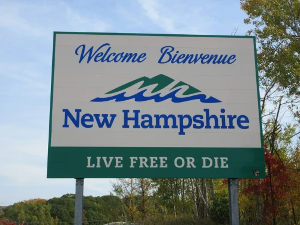

Panneau de bienvenue à l'entrée du New Hampshire en 2018 (source : [New Hampshire Public Radio](https://www.nhpr.org/the-exchange/2018-02-28/its-tax-season-how-does-new-hampshires-complex-unique-tax-system-work))

En 2011, le New Hampshire est déjà devenu un haut lieu du libertarianisme. Deux évènements y sont organisés tous les ans par le Free State Project. Le premier est le *New Hampshire Liberty Forum*, qui est une convention classique où interviennent de grands noms du libertarianisme et qui a lieu au cours de ces années-là à l'hôtel Crowne Plaza de Nashua, au sud de l'État. Le second est le *Porcupine Freedom Festival* (plus communément appelé « PorcFest »), qui est un festival d'une semaine se déroulant en été sur un terrain de camping près de Lancaster, plus au nord. L'ambiance y est plus décontractée, à tel point que l'évènement a été [qualifié](https://aaeblog.com/2011/06/way-long-gone-part-2/) en 2011 de « Woodstock pour les gens rationnels » par l'auteur libertarien Roderick T. Long (original: "Woodstock for rational people"). L'édition de cette année-là, qui se déroule en juin, est un succès et [réunit](https://mises.org/mises-daily/porcfest-2011) plus de 1 000 personnes.

Très naturellement, Bitcoin attire l'attention du mouvement dès le printemps, qui y voit un outil pragmatique  En octobre, des fractions de bitcoin sont [distribuées](https://bitcointalk.org/index.php?topic=47350.msg563649#msg563649) aux membres du projet grâce à l'action de Roger Ver, d'Erik Voorhees et d'Ira Miller. Cette opération a un but éducatif : faire comprendre aux signataires qu'ils peuvent déplacer de l'argent d'un bout à l'autre du monde, sans avoir à donner leur identité. De plus, l'organisateur du Liberty Forum, Chris Lawless, annonce que la conférence accepte les bitcoins pour le paiement des inscriptions.

Le New Hampshire, grâce à cette concentration de libertariens, deviendra au fil des années un lieu d'adoption de la cryptomonnaie. Outre sa mutation institutionnelle, il [se transformera](https://www.forbes.com/sites/kashmirhill/2014/06/12/the-free-state-project-a-libertarian-testing-ground-for-bitcoin-3d-printers-and-drones/) en véritable « terrain d'essai » pour Bitcoin et d'autres innovations techniques favorisant la liberté comme les imprimantes 3D.

### Occupy Wall Street

Le libertarianisme n'est cependant pas le seul mouvement politique à présenter des affinités avec Bitcoin. De l'autre côté de l'échiquier politique (si l'on considère que les positions économiques du libertarianisme sont plutôt situées à droite), il y a tout le mouvement anticapitaliste et antifinance qui a tout intérêt à s'intéresser à la cryptomonnaie.

Toutefois, tout comme les libertariens, cette famille politique a tendance à rejeter Bitcoin, car il n'est pas conforme à leur vision de la monnaie. Il est trop rigide, trop peu souvent à la politique. Bitcoin n'est pas une monnaie sociale, pouvant être gérée de manière démocratique, telle que les militants l'envisagent au travers des monnaies locales. \[source ? p2p foundation ?\] Yánis Varoufákis, marxiste libertaire et futur ministre des finances de la Grèce, lui [reprochera](https://www.yanisvaroufakis.eu/2013/04/22/bitcoin-and-the-dangerous-fantasy-of-apolitical-money/) son caractère déflationniste et inégalitaire en 2013, en écrivant notamment qu'« il ne peut y avoir de monnaie dépolitisée capable d'"alimenter" une société industrielle avancée » (original: "there can be no de-politicised currency capable of 'powering' an advanced, industrial society").

En septembre 2011, un mouvement vient chambouler les choses : il s'agit d'*Occupy Wall Street*. Face aux désastres de la récession économique provoquée par la crise des subprimes, la fondation canadienne *Adbusters* (sous l'impulsion du fondateur, Kalle Lasn, et d'un de ses rédacteurs, Micah White) [appelle](https://web.archive.org/web/20110717094726/https://www.adbusters.org/blogs/adbusters-blog/occupywallstreet.html) à « occuper » Wall Street, en procédant à une sorte de sit-in. La revendication principale est la réduction de l'influence des grandes entreprises et des puissances de l'argent sur la politique du pays, influence jugée responsable de la crise. Le slogan de la protestation [est](http://occupywallst.org/) « Nous sommes les 99 % », par opposition à « la cupidité et la corruption des 1 % » (original: "The one thing we all have in common is that We Are The 99% that will no longer tolerate the greed and corruption of the 1%."). La manifestation débute le 17 septembre dans le parc Zuccotti, non loin du quartier financier de New York, réunissant plus d'un millier de personnes. Au fil des semaines, le mouvement prend de l'ampleur, à tel point qu'il s'exporte à d'autres villes et à d'autres pays.

Le mouvement doit se financer : les manifestants ont [besoin](https://web.archive.org/web/20111120054617/http://www.expanton.com/index.php/77-other/24-welcome) de nourriture, de vêtements de pluie, et de matériel pour que l'évènement puisse être diffusé en direct sur Internet. Le but est que les gens restent sur place aussi longtemps que possible. Toutefois, ce financement est difficile en raison du caractère radical de la contestation, certaines de ses actions étant illégales comme l'attestent les nombreuses arrestations qui ont lieu. Par conséquent, le mouvement est sensible à la censure financière, ce qui se manifeste par exemple lorsque le compte PayPal de \#FeedtheProtest, groupe d'information rendant compte des évènements, est [gelé](https://web.archive.org/web/20110928152351/http://feedtheprotest.com/node/219) sans préavis le 26 septembre.

Ainsi, les multiples organisations au sein du mouvement décident d'accepter le bitcoin, qu'elles voient comme une monnaie numérique anonyme, qui a notamment été utilisée par WikiLeaks et qui a fait parler d'elle pendant l'été. L'assemblée générale des manifestants à New York [reçoit](https://web.archive.org/web/20111004195625/http://nycga.cc/donate/) des dons dès le 19 septembre, pour un total de 686 BTC soit plus de 3 000 $ au moment de la réception. \#FeedtheProtest [accepte](https://web.archive.org/web/20111004164350/http://feedtheprotest.com/node/223) aussi le bitcoin à partir du 27, en réaction à la fermeture de son compte. Les membres de la communauté de Bitcoin [s'intéressent](https://observer.com/2011/10/bitcoin-community-takes-an-interest-in-occupy-wall-street/) à Occupy Wall Street, car étant opposés au monde financier traditionnel. Ils font donc du prosélytisme auprès du mouvement en faveur de l'utilisation de Bitcoin (quitte à se rendre sur place, comme [Matt Cropp](https://web.archive.org/web/20110929140153/http://btcbusiness.net/?q=node/22)) et réalisent également un certain nombre de dons.

img: https://x.com/pete_rizzo_/status/1726976400534733056

Occupy Wall Street amène beaucoup d'individus à se questionner au sujet de la cryptomonnaie, le sujet étant même [évoqué](https://www.huffpost.com/entry/occupy-wall-street-money-donated-tension_n_1029377) dans la presse généraliste. Le mouvement se termine formellement dans la nuit du 14 au 15 novembre, lorsque la police de New York expulse les manifestants du parc Zuccotti et qu'il n'y est plus permis d'y camper. Cependant, l'idée d'utiliser Bitcoin comme outil politique restera.

### L'importance du politique

Le politique constitue un élément essentiel de l'essor de Bitcoin entre 2011 et 2014. C'est en particulier grâce au mouvement libertarien, en dépit de ses dissensions internes, que Bitcoin a pu prospérer, que ce soit par le biais d'individus comme Roger Ver ou Erik Voorhees, ou par l'intermédiaire du *Free State Project*. Plus à gauche, le mouvement *Occupy Wall Street* a également joué un rôle dans l'essor du bitcoin comme monnaie de désobéissance.

Pourtant, cet aspect idéologique était en opposition avec une force autrement plus attractive : celle de l'intérêt financier. Une tension s'est ainsi construite au cours de ces années entre les deux aspects. Mais avant cela, il fallait construire les outils permettant aux acteurs financiers de venir s'investir dans l'écosystème...

## L'éclatement de la grande bulle de 2011 (août 2011–juin 2012)

En juin 2011, l'engouement spéculatif de juin a été stoppé net par le piratage de Mt. Gox et par sa mise hors ligne pendant des jours. Le fiasco lié à la fermeture de MyBitcoin à la fin du mois de juillet a finalement provoqué le dégonflement de la bulle. Dans les jours qui ont suivi le prix a baissé en flèche jusqu'à 6 $, et a fini par tomber à 2 $ en novembre.

Cet éclatement de la « grande bulle de 2011 » (original: "the Great Bubble of 2011") a bien évidemment attiré l'attention de la presse, qui s'est empressée de déclarer que Bitcoin était mort. Mais il a également été propice à la construction économique. La période de stagnation du prix a permis de développer des projets qui ont porté leurs fruits par la suite.

Parmi ces projets, on retrouve la plateforme de trading sur marge Bitcoinica, les bourses indépendantes GLBSE et MPEx, le service d'achat BitInstant et le site de poker en ligne Seals with Clubs.

### Le traitement médiatique

Après le sommet de 32 $ atteint le 8 juin, le piratage de Mt. Gox et la fermeture de MyBitcoin ont définitivement stoppé le mouvement spéculatif. Le prix s'effondre à 6 $ début août. L'exposition de Bitcoin au monde, couplée à la baisse du taux de change, donnent une bonne raison pour les critiques d'affluer.

Le 7 août, Timothy Lee, rédacteur pour le site d'actualité technique Arstechnica et [sceptique](https://timothyblee.com/2011/04/19/bitcoins-collusion-problem/) à propos de Bitcoin depuis avril, [publie](https://www.forbes.com/sites/timothylee/2011/08/07/the-bitcoin-crash/) un article intitulé « Le krach du bitcoin » (original: "The Bitcoin Crash") dans lequel il explique que le bitcoin « ne semble pas avoir de valeur fondamentale du tout » (original: "the currency doesn't seem to have any fundamental value at all") et qu'« il n'y a pas de point d'arrêt logique à la baisse du prix du bitcoin » (original: "there's no logical stopping point to Bitcoin's price decline"), le processus étant d'après lui « en phase terminale » (original: "it's terminal"). Son argumentaire est récupéré le lendemain par Nicholas Jackson [dans The Atlantic](https://www.theatlantic.com/technology/archive/2011/08/the-bitcoin-economy-is-collapsing-with-no-sign-of-recovery/243253/), pour qui « l'économie de Bitcoin s'effondre sans montrer le moindre signe de reprise » (original: "The Bitcoin Economy Is Collapsing With No Sign of Recovery"), et par Adrian Covert [sur Gizmodo](https://gizmodo.com/the-bitcoin-is-dying-whatever-5828710), qui argue que « l'état de grâce est terminé » (original: "the honeymoon is over") et que « le bitcoin se meurt » (original: "The Bitcoin Is Dying").

D'autres critiques émergent entretemps, plutôt au niveau macroéconomique. En septembre, James Surowiecki, journaliste américain connu pour avoir publié *La Sagesse des foules* (original: "The Wisdom of Crowds") en 2004, [publie](https://www.technologyreview.com/2011/08/23/191860/cryptocurrency/) un réquisitoire contre Bitcoin dans la *MIT Technology Review*. Il accuse la limite du nombre de bitcoins d'encourager à la thésaurisation, ce qui l'empêcherait de devenir un intermédiaire d'échange, créant en dernier lieu une situation où « la grande majorité des bitcoins sont détenus par des personnes qui espèrent les vendre à d'autres personnes » (original: "the vast majority of bitcoins are held by people hoping to sell them to other people") et où . Le 7 septembre, Paul Krugman, économiste néokeynésien et lauréat du prix Nobel d'économie en 2008, [reprend](https://archive.nytimes.com/krugman.blogs.nytimes.com/2011/09/07/golden-cyberfetters/) ce raisonnement dans un article publié sur le site *New York Times*, intitulé « Golden Cyberfetters » (« Cyberchaînes dorées » en français), en référence à l'ouvrage *Golden Fetters* de Barry Eichengreen, soutenant que la grande dépression des années 1930 a été la conséquence du système trop restrictif de l'étalon-or. Il argue que « Bitcoin a créé son propre modèle privé d'étalon-or, dans lequel la masse monétaire est fixe »  (original: "Bitcoin has created its own private gold standard world, in which the money supply is fixed rather than subject to increase via the printing press.") et que la déflation résultante a fait que « la valeur réelle des transactions en bitcoins a diminué au lieu d'augmenter » et « le produit brut réel en bitcoins a fortement chuté » (original: "The actual value of transactions in Bitcoins has fallen rather than rising. In effect, real gross Bitcoin product has fallen sharply.").

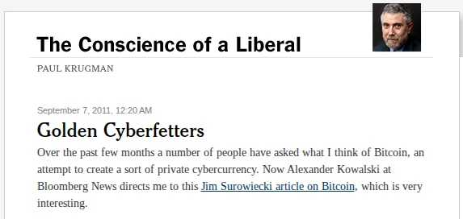

Le premier article de Paul Krugman sur Bitcoin (source : [archive](https://web.archive.org/web/20110909021607/http://krugman.blogs.nytimes.com/2011/09/07/golden-cyberfetters/) du New York Times)

Le 17 octobre, le prix du BTC tombe brutalement en dessous des 3,2 $ enregistrant ainsi une baisse de plus de 90 % par rapport au sommet de la bulle, chose que ne manque pas de [rappeler](https://arstechnica.com/tech-policy/2011/10/bitcoin-implodes-down-more-than-90-percent-from-june-peak/) Timothy Lee le lendemain. Dans un article publié sur Arstechnica, il décrit les problèmes liés à l'utilisation de la cryptomonnaie, comme les piratages ou la volatilité. Il ne paie pas cher de la peau de Bitcoin, car « cinq mois de mauvaises nouvelles et de dépréciation ont causé de sérieux dommages » à sa réputation (original: "But the value of a currency is built on its reputation, and five months of bad news and depreciation have done serious damage."). Dans la même veine, un article de *The Economist* ayant pour [titre](https://web.archive.org/web/20181019113320/https://www.economist.com/babbage/2011/10/21/the-bursting-of-the-bitcoin-bubble) « L'éclatement de la bulle du bitcoin » (original: "The bursting of the Bitcoin bubble") est publié le 21 octobre.

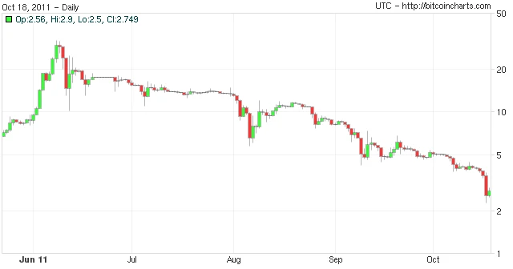

L'évolution du prix du bitcoin sur Mt. Gox entre juin et octobre 2011 (source : Bitcoin Charts via [Arstechnica](https://arstechnica.com/tech-policy/2011/10/bitcoin-implodes-down-more-than-90-percent-from-june-peak/))

Dans le mois qui suit, le taux de change peine à rebondir et connait même un nouveau creux le 18 novembre autour de 2 $. Le 23 novembre, le rédacteur Benjamin Wallace [publie](https://web.archive.org/web/20111124022726/http://www.wired.com/magazine/2011/11/mf_bitcoin/all/1) un article de fond dans Wired intitulé « The Rise and Fall of Bitcoin » (« L'essor et la chute du bitcoin » en français), qui, au-delà de son titre volontairement aguicheur, est de très bonne facture et aborde les problèmes rencontrés par les utilisateurs de Bitcoin. La période est en particulier difficile pour les mineurs, qui se sont procuré des processeurs graphiques pendant l'été, mais qui [constatent](https://bitcointalk.org/index.php?topic=47480.msg565196#msg565196) qu'il n'est plus rentable de miner avec. Certains sont même contraints de [vendre](https://bitcointalk.org/index.php?topic=48767.msg580225#msg580225) leur équipement.

Toutefois, malgré la chute du prix et les critiques, le cœur de la communauté est toujours actif et encaisse la volatilité extrême du cours avec philosophie. Bitcoin est un projet que les convaincus se sont engagés à construire et à faire prospérer. Certains membres de la communauté, [comme Amir Taaki](https://www.wired.com/2011/11/mf-bitcoin/), comparent le phénomène au « cycle de l'engouement de Gartner » (original: "Gartner's hype cycle"), qui décrit que l'adoption d'une technique émergente doit passer par un « pic d'attente exagérée », puis par un « gouffre des désillusions » pour enfin un « plateau de productivité », comme cela a été le cas avec le Web et la bulle Internet.

Peu à peu, le prix remonte pour dépasser à nouveau 4 $ fin décembre, si bien que la presse est obligée d'admettre que Bitcoin n'est pas mort. Le 21 décembre, Timothy Lee [écrit](https://arstechnica.com/tech-policy/2011/12/bitcoins-comeback-should-western-union-be-afraid/) que « la stabilité apparente de la monnaie au cours du mois dernier \[l'a\] incité à y jeter un second coup d'œil » (original: "the currency's apparent stability over the last month has inspired us to give it a second look"). En particulier, il est amené à réfléchir ce qui donne de la valeur au bitcoin, trouve cette valeur non pas tant dans sa qualité de « monnaie alternative » que comme « méta-monnaie » permettant le « transfert de richesse à faible coût et sans réglementation entre les nations » (original: "Bitcoin is not so much an alternative currency as a 'metacurrency' that allows low-cost and regulation-free transfer of wealth between nations"), en concurrence avec Western Union.

### BitInstant, la plaque tournante du change en bitcoins

Les plateformes de change se multiplient. Outre celles lancées pendant la phase haussière de la bulle, on voit plusieurs autres plateformes émerger pendant l'été. C'est le cas de BTC-e, [lancée](https://bitcointalk.org/index.php?topic=29698.msg437237#msg437237) par les Russes Alexander Vinnik et Aleksandr Bilyuchenko le 7 août ; de Bitstamp, [mise en ligne](https://web.archive.org/web/20140430233930/https://bitcointalk.org/index.php?topic=20292.220) par les Slovènes Nejc Kodrič et Damijan Merlak le 19 août ; et de Crypto X Change, [inaugurée](https://bitcointalk.org/index.php?topic=51457.msg613057#msg613057) le 10 novembre par les Australiens Ken et Colin Armitt.

Toutefois, la plateforme Mt. Gox reste largement la plus utilisée. Cela pose problème aux (nombreux) clients occidentaux, car la plateforme est installée au Japon, et les dépôts et les retraits demandent de faire des virements internationaux pouvant durer des jours. Et PayPal censure toute activité relative au change de bitcoins.

C'est ce problème que tente de résoudre un jeune développeur gallois de 23 ans, appelé Gareth Nelson (garethnelsonuk), avec un service qui prendra le nom de BitInstant. Gareth a découvert Bitcoin au cours du printemps. Après s'être [intéressé](https://bitcointalk.org/index.php?topic=8780.msg131564#msg131564) au minage, il a [rencontré](https://bitcointalk.org/index.php?topic=9198.msg132990#msg132990) lui-même la difficulté d'envoyer de l'argent vers Mt. Gox, et a réalisé un échange de gré à gré pour se procurer des bitcoins.

Gareth Nelson vers 2011–2012 (source : [archive](https://web.archive.org/web/20130118073422/https://www.bitinstant.com/aboutus) de BitInstant.com)

Le 13 juin vers 4 heures du matin (UTC), Gareth Nelson [publie](https://bitcointalk.org/index.php?topic=16134.msg210887#msg210887) sur le forum une idée de service de « paiement rapide pour Mt. Gox ». Il s'agit de constituer un intermédiaire qui vire les fonds sur la plateforme de change, une fois que ceux-ci ont été reçus dans le pays d'origine, typiquement les États-Unis. Il écrit :

> « Comme vous le savez, mtgox est connu pour être lent pour traiter les paiements et les encaissements. J'ai réfléchi à la possibilité de résoudre ce problème en créant un nouveau site qui utilisera l'API de mtgox pour accélérer les paiements (les utilisateurs paieront sur mon site et recevront instantanément des dollars de mtgox, déduction faite d'une petite commission de 1,5 %). »
>
> original: "As you know, mtgox is famously slow to pay into and cash out from. I've been pondering fixing this issue by setting up a new site which will make use of the mtgox API to speed up payments (users pay on my site, they get mtgox USD instantly minus a small 1.5% fee)."

Il sait qu'il a les compétences techniques pour mettre en pratique cette idée, mais manque d'argent pour le rendre viable. C'est pourquoi il dit dans son message chercher des investisseurs pour le lancer. Et cela attire immédiatement l'attention d'un jeune New-Yorkais de 21 ans, utilisant le pseudonyme Yankee, appelé Charlie Shrem.

Charlie Shrem est [issu](https://fortune.com/2017/06/26/bitcoin-blockchain-cryptocurrency-market/) d'une famille juive syrienne orthodoxe très stricte, et a grandi dans le quartier de Midwood à Brooklyn. Son père travaille pour un détaillant de bijoux. Timide et maladroit lorsqu'il était enfant, il s'est réfugié dans l'informatique, a appris à coder tout seul et s'est fait connaître sur les forums de pirates informatiques en ligne. Au cours de ses années de lycée et d'université, il a participé au lancement de plusieurs entreprises, comme *Epiphany Design and Production*, un service de réparation d'imprimantes et d'ordinateurs ; et [Daily Checkout](https://web.archive.org/web/20110618225450/http://www.dailycheckout.com/), un site de commerce en ligne pour l'électronique fondé en mars 2009. Il s'est découvert un sens du commerce à ce moment-là.

img: Photo de Charlie Shrem en 2011/2012

En 2011, Charlie fréquente le *Brooklyn College*, où il étudie pour obtenir une licence en économie et finance. Il vit encore dans le sous-sol de la maison familiale. D'après ses dires, il a [entendu parler](https://www.youtube.com/watch?v=XM2712vOyus&t=96s) de Bitcoin pour la première fois en 2009, lorsque l'organisation caritative pour laquelle il travaille, Tikvot, s'est faite geler son compte PayPal. Il en a aussi vu la mention dans les cercles de hackers qu'il fréquentait sur IRC \[source ?\]. Toutefois, son intérêt n'est réellement capté que lorsqu'il a découvert Silk Road par le biais de l'article de Gawker publié le 1er juin 2011. Quelques heures après la parution de l'article, il a [publié](https://twitter.com/CharlieShrem/status/76021290842079232) un tweet pour se procurer du bitcoin ; étant lui-même consommateur de cannabis, il cherchait probablement à essayer la plateforme. Le 10 juin, il s'est [inscrit](https://web.archive.org/web/20111127073246/https://bitcointalk.org/index.php?action=profile;u=21181) sur le forum de Bitcoin, sous le pseudonyme Yankee.

Ainsi, lorsque Gareth publie son annonce le 13 juin, Charlie est donc tout à fait à l'écoute. Il contacte ce dernier et ils trouvent un accord rapidement. De son côté, Charlie demande à ses parents de lui accorder un prêt de 10 000 $ ; son père refuse, mais sa mère accepte. Le soir même, Gareth [annonce](https://bitcointalk.org/index.php?topic=16472.msg214518#msg214518) qu'il a trouvé un investisseur en la personne de Charlie Shrem et dévoile le nom du projet : BitInstant.

Ils développent le service au cours de l'été. Le 23 août, après une [phase bêta](https://bitcointalk.org/index.php?topic=36184.msg469342#msg469342) de deux semaines, BitInstant [ouvre](https://bitcointalk.org/index.php?topic=38914.msg476106#msg476106) ses portes au grand public. L'entreprise bénéficie d'un partenariat avec la plateforme de change TradeHill, si bien qu'elle rend possible les virements instantanés vers cette dernière au moyen de Liberty Reserve ou de Dwolla. Le 21 novembre, Mt. Gox est finalement [ajouté](https://bitcointalk.org/index.php?topic=52476.msg626239#msg626239) au service.

Capture du 26 janvier 2012 (source : [archive de Bitinstant.com](https://web.archive.org/web/20120126191036/https://bitinstant.com/))

En parallèle, Charlie Shrem fait la promotion de la startup en tant que cofondateur. En août, il participe à la conférence de Bruce Wagner à New York, et rencontre plusieurs acteurs de l'écosystème en personne. Le 10 septembre, il [participe](https://bitcointalk.org/index.php?topic=41932.msg510329#msg510329) à l'*Open Video Conference* organisée par la fondation Mozilla et l'École de droit de New York, pour intervenir dans un atelier sur les monnaies alternatives. Le 24 novembre, il [apparait](https://www.youtube.com/watch?v=PxMazut6-0U) dans le *Bitcoin Show* pour présenter BitInstant.

En décembre, BitInstant [réalise](https://observer.com/2011/12/brooklyn-based-bitcoin-startup-bitinstant-raises-seed-round/) une levée de fonds auprès d'investisseurs providentiels (*business angels*). Le plus important d'entre eux n'est autre que Roger Ver, qui acquiert 15 % de la société pour 120 000 $ et qui devient assez rapidement son directeur marketing. Roger Ver conseille à Charlie Shrem d'engager Erik Voorhees, qui devient le responsable de la communication et du marketing de la société en février 2012. Ira Miller est également intégré à l'équipe en tant que développeur. Même si Charlie Shrem n'est pas motivé politiquement en tant que tel, la fréquentation de ces personnes aura pour effet de modifier sa perception des choses.

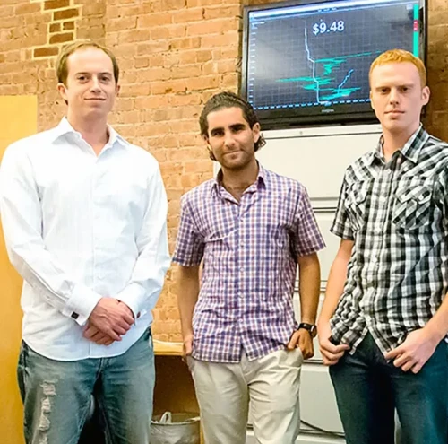

Erik Voorhees, Charlie Shrem et Ira Miller dans les locaux de BitInstant en février 2012 (source : Brian Patrick Eha pour [Fortune](https://fortune.com/2017/06/26/bitcoin-blockchain-cryptocurrency-market/))

Au début de l'année 2012, BitInstant propose diverses méthodes de transfert d'argent (Liberty Reserve, Dwolla, Paxum, dépôts d'espèces) pour interagir avec les principales plateformes de l'écosystème. Le 2 janvier 2012, le volume total transféré [est](https://bitcointalk.org/index.php?topic=56392.msg671272#msg671272) de 1,2 million de dollars. Un nouveau site est [mis en ligne](https://bitcointalk.org/index.php?topic=74624.msg826565#msg826565) le 29 mars 2012.

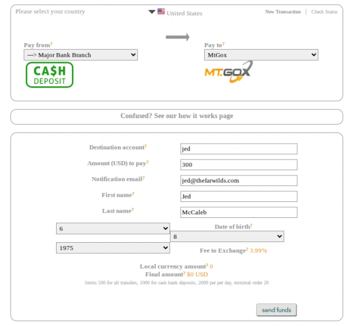

Interface de BitInstant en juin 2012 (source : [archive de Bitinstant.com](https://web.archive.org/web/20120630110945/https://www.bitinstant.com/))

### Le trading sur marge offert par Bitcoinica

Les plateformes n'offrent que des manières d'échanger des monnaies classiques avec du bitcoin et n'intègrent aucune opération financière évoluée. En particulier, il manque une plateforme sur laquelle effectuer du trading sur marge (*margin trading*) permettant d'utiliser de l'effet de levier (*leverage*) et ouvrant la possibilité la vente à découvert (*short selling*). C'est pour répondre à ce besoin que la plateforme Bitcoinica est apparue.

La plateforme Bitcoinica est [lancée](https://bitcointalk.org/index.php?topic=81581.msg897948#msg897948) le 8 septembre 2011 par un jeune Chinois de 17 ans qui se fait appeler Zhou Tong, de son vrai nom Ryan Tong Zhou. Celui-ci est un surdoué qui étudie alors à Singapour. Il est inspiré par le développement personnel, ayant notamment lu *Père riche, père pauvre* de Robert Kiyosaki et s'étant intéressé à la vie d'entrepreneurs à succès comme Tony Hsieh (de Zappos) et Steve Jobs (d'Apple). Il a également acquis des connaissances en développement web.

Zhou Tong en janvier 2010 (source : Zhou Tong sur [Flickr](https://www.flickr.com/photos/zhoutong/4359164894/))

Il a [entendu parler](https://bitcointalk.org/index.php?topic=67521.msg785510#msg785510) de Bitcoin à la fin de l'année 2010, mais ne s'y est réellement intéressé qu'au cours de l'été 2011, alors que la bulle spéculative faisait rage. Il a acheté ses premiers bitcoins à 8 dollars l'unité en août. Et il s'investit dans l'économie de Bitcoin en mettant au point Bitcoinica en une semaine.

Il présente Bitcoinica comme une « plateforme de trading de bitcoins avancée » (original: "Advanced Bitcoin Trading Platform"), qui est « élégante », « professionnelle » et « révolutionnaire » (original: "Elegant. Professional. Revolutionary."). La plateforme ne gère pas de portefeuille, les bitcoins étant conservés sur un compte dédié sur Mt. Gox. Les dépôts et retraits se font en bitcoins, par des codes Mt. Gox échangeables ou par virement bancaire international.

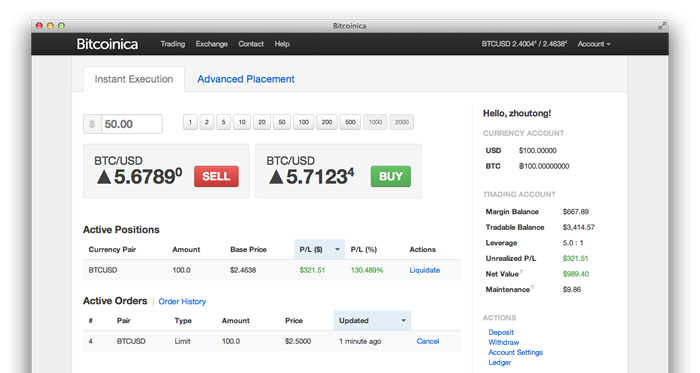

Interface de Bitcoinica en février 2012 (source : [archive de Bitcoinica.com](https://web.archive.org/web/20120209171119/http://bitcoinica.com/))

Le succès est au rendez-vous dès le début. Durant les premières 24 heures, 3 724 bitcoins sont échangés par 290 utilisateurs différents, soit l'équivalent de 19 000 $. Le volume sur les 7 premiers jours [est](https://web.archive.org/web/20111019032441/http://blog.bitcoinica.com/) de 160 865 bitcoins, soit plus de 800 000 $, faisant de Bitcoinica la deuxième plateforme de trading en nombre de dollars échangés derrière Mt. Gox.

La plateforme héberge notamment la spéculation : l'effet de levier permet de décupler les gains (et les pertes), ce qui convient aux gros joueurs qui souhaitent tout miser sur un mouvement de prix. Le succès spéculatif est tel que le fait de se faire liquider sur la plateforme acquiert sa propre [appellation](https://bitcointalk.org/index.php?topic=49445.msg588749#msg588749) : « get Zhou Tonged » (qu'on peut traduire par « se faire zhou-tonguer » en français). Cette expression [donne son nom](https://www.youtube.com/watch?v=kdvTkddp1F0) à la chaîne Youtube *Zhou Tonged*, qui est lancée en mars 2012 pour héberger des parodies musicales à propos de Bitcoin et du trading. La plateforme a également l'intérêt d'offrir de la vente à découvert et de permettre aux acteurs économiques (comme les commerçants détenant du bitcoin en réserve) de se couvrir contre une éventuelle baisse du cours.

Début mars 2012, Bitcoinica [accepte](https://bitcointalk.org/index.php?topic=67521.msg785510#msg785510) plus d'une dizaine de méthodes de dépôt et de retrait, dont le bitcoin directement, Liberty Reserve, PerfectMoney, Pecunix, ainsi que les virements SEPA en euros. Elle cumule alors quasiment autant de volume que Mt. Gox.

### L'émission de titres financiers avec GLBSE

L'absence de besoin d'autorisation de Bitcoin pousse les membres de la communauté à imaginer des utilisations allant plus loin que le simple échange monétaire et la spéculation. Ils envisagent ainsi de libéraliser l'investissement en fournissant un moyen d'émettre des actions et des obligations pour les sociétés de l'écosystème. Il s'agit de contourner des réglementations imposées notamment par la *Securities and Exchange Commission* aux États-Unis (l'équivalent américain de l'AMF), en [profitant](http://trilema.com/2012/the-reasons-why-bitcoin-securities-cant-be-regulated-by-the-sec/) du caractère novateur de Bitcoin et du flou juridique qui l'entoure. L'idée est de créer un modèle alternatif au système financier classique, qui pourrait s'autoentrenir dans la démarche agoriste.

L'un des individus s'impliquant dans ce mouvement est James McCarthy, qui utilise le pseudonyme Nefario sur le forum de Bitcoin (en référence au personnage du même nom dans le film d'animation *Moi, moche et méchant*). Celui-ci est un Irlandais vivant en Chine, qui occupe un poste de professeur d'anglais dans une université. Il s'intéresse à l'école autrichienne et aux idées des cypherpunks, [déclarant](https://web.archive.org/web/20110607050421/http://bitcoinweekly.com/articles/interview-with-nefario-founder-of-bitcoin-global) lui-même être « en quelque sorte un cypherpunk » (original: "something of a cypherpunk"). Il a [découvert](https://bitcointalk.org/index.php?topic=2502.msg33800#msg33800) l'existence de Bitcoin au cours de l'année 2010 et en a miné plus d'un millier. Il s'est ensuite impliqué dans plusieurs projets, dont le projet de magazine en ligne Bitcoin Weekly.

James McCarthy (Nefario) en février 2012 (source : [archive](https://web.archive.org/web/20121008033716/https://www.tedxleeds.com/nefario-james-mccarthy/) de TEDxLeeds)

En avril 2011, James McCarthy [lance](https://bitcointalk.org/index.php?topic=6500.msg94943#msg94943) GLBSE (prononcé glib-zee), acronyme de *GLobal Bitcoin Stock Exchange*. Les utilisateurs passent par une interface en ligne de commande qui permet d'interagir avec le serveur de la plateforme. Le client est une version modifiée d'un logiciel développé par Amir Taaki. D'après le site web, la plateforme [permet](https://web.archive.org/web/20110427033244/http://glbse.com/) « d'émettre des actions pour lever des capitaux ; de verser des dividendes aux actionnaires ; de soumettre des résolutions aux actionnaires et d'obtenir leur vote ; d'émettre et de vendre des obligations ; d'emprunter et de prêter sur le marché ; d'effectuer et de recevoir des remboursements de prêts ; d'émettre des contrats à terme ; de méta-spéculer sur des sociétés non cotées (sur d'autres places boursières) ; et d'échanger tout ce qui précède avec d'autres tradeurs sur le marché » (original: "Issue shares to raise capital; Pay dividends to shareholders; Put resolutions to shareholders and get their vote; Issue and sell bonds; Borrow and lend to the market; Make and recieve loan repayments; Issue futures contracts; Meta-trade on non listed companies (on other exchanges); And trade all of the above with other traders on the market").

Capture du site web de GLBSE le 17 août 2011 (source : [archive](https://web.archive.org/web/20110817072049/http://glbse.com/))

La première « IPO » (*Initial Public Offering*, usuellement traduit par « introduction en bourse » en français) est [réalisée](https://bitcointalk.org/index.php?topic=6838.msg100170#msg100170) à partir du 30 avril par un projet du nom de Ubitex, une plateforme de change en personne permettant de mettre en relation les acheteurs et les vendeurs présents dans une même région. L'opération consiste à vendre un certain nombre de parts (ici 1 000) pour des bitcoins en échange de quoi les actionnaires bénéficieront des profits de l'entreprise. Le développeur unique du projet, Nathaniel Theis alias Cuddlefish sur le forum, récupère 1 100 BTC de cette façon, soit environ 10 000 $. Toutefois, ce dernier n'a [que 14 ans](https://bitcointalk.org/index.php?topic=6584.msg707259#msg707259) et manque de maturité : il fait brièvement fonctionner le service, mais il finit par disparaitre brutalement lorsque son ordinateur [tombe en panne](https://bitcointalk.org/index.php?topic=6584.msg414585#msg414585) en juillet, ne donnant plus signe de vie et ne remboursant pas les investisseurs.

Malgré tout, GLBSE continue d'opérer. Au début de l'automne, une trentaine d'actifs est [disponible](https://web.archive.org/web/20110923234458/http://charts.glbse.com/markets/) à l'échange sur la plateforme. En mars 2012, la version 2 [sort](https://bitcointalk.org/index.php?topic=73910.msg817887#msg817887).

### MPEx : des options et des actions

Un autre projet de ce type qui voit le jour quelque temps plus tard est MPEx. Cette plateforme est l'œuvre d'un personnage hautement controversé nommé Mircea Popescu. Roumain, originaire de Transylvanie, il est un auteur prolifique sur son blog [Trilema](http://trilema.com/archives-categories/) : il écrit sur tous les sujets (philosophie, politique, sexualité), dans un style volontairement provocateur, en roumain dans un premier temps. Il s'intéresse à Bitcoin à partir de l'été 2011 et commence à en [parler](http://trilema.com/2011/ce-este-bitcoin/) sur son blog.

Mircea Popescu, date indéterminée (source: Mircea Popescu pour [Wired](https://web.archive.org/web/20140405150603/https://www.wired.com/2014/01/openbsd/))

En août, il [ouvre](https://bitcointalk.org/index.php?topic=15672.msg444367#msg444367) le « Mircea Popescu's BTC Options Trading Emporium » (MPOE), qui [propose](https://web.archive.org/web/20110824221522/http://polimedia.us/bitcoin/options.php) des options d'achat (call) et de vente (put) de BTC. Il copie en cela un service similaire appelé bitoption.org, [lancé](https://bitcointalk.org/index.php?topic=9611.msg138413#msg138413) en mai. La plateforme est globalement rentable, réalisant plus de 140 BTC de bénéfices nets sur six mois.

Le 11 avril 2012, après une [levée de fonds](http://trilema.com/2012/sa-ne-jucam-de-a-investitiile-n-bitcoini/#comment-78745) recueillant plus de 3 000 BTC (par émission d'actions et d'obligations) et une phase bêta, la plateforme [devient](https://bitcointalk.org/index.php?topic=76239.msg845954#msg845954) une bourse en bitcoins permettant d'émettre diverses actions (dont celle de MPOE) et est renommée MPEx (pour « Mircea Popescu's Exchange »).

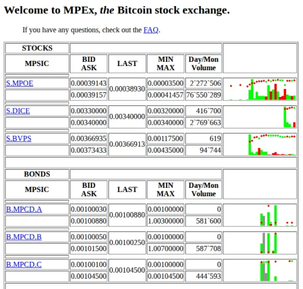

Capture de MPEx, août 2012 (source : [archive](https://web.archive.org/web/20120829092213/http://polimedia.us/bitcoin/mpex.php))

La plateforme rencontrera un succès certain \[lequel ?\]. Elle hébergera notamment l'« IPO » de SatoshiDICE \[dire ce que c'est\]. Elle évoluera avec le temps, [intégrant](http://trilema.com/2012/futures-on-mpex/) les contrats à terme en décembre.

### Une phase de construction

L'éclatement de la grande bulle de 2011 à la fin de l'été a été un moment difficile pour la communauté de Bitcoin. Le prix en dollars a en effet connu une baisse de plus de 90 % par rapport à son sommet de juin. Toutefois, la période a été propice à la construction. C'est ainsi que l'on a vu fleurir une multitude de services financiers qui ont contribué au succès ultérieur de Bitcoin : BitInstant, Bitcoinica, GLBSE et MPEx.

Cette construction s'est accompagnée en parallèle d'une amélioration de l'utilisation de Bitcoin, qui s'est faite par le développement des portefeuilles. C'est l'objet du prochain chapitre.

# Le développement technique

## L'amélioration de l'utilisation (mars 2011–nov. 2011)

La période du Far West de la finance a été propice à l'amélioration de l'utilisation par le développement des portefeuilles légers et des diverses manières de conserver des bitcoins. Lorsque Satoshi s'est mis en retrait en décembre 2010, les nouveaux arrivants n'avaient le choix qu'entre le logiciel principal (l'implémentation complète conservant l'intégralité de la chaine de blocs et relayant les nouvelles transactions et les nouveaux blocs) et les applications dépositaires comme MyBitcoin. Mais à partir de l'année 2011, des solutions alternatives sont apparues.

Les portefeuilles logiciels légers mettaient en œuvre la vérification de paiement simplifiée. Les portefeuilles web permettaient de gérer les fonds dans un navigateur. Les portefeuilles papier offraient la possibilité de conserver des fonds hors ligne. Les supports physiques constituaient une incarnation d'unités virtuelles dans le monde réel. On a également vu des services de mélange de bitcoins se développer afin d'améliorer la confidentialité de l'ensemble.

La conservation personnelle des bitcoins est un problème complexe et est sujette au dilemme qui existe entre la perte et le vol. Pour conserver ses bitcoins, il faut à la fois garder l'accès à ses clés privées et en exclure les autres personnes, deux choses qui ne peuvent jamais être réalisées totalement toutes les deux. Ainsi, un accès trop facile rend le portefeuille trop sensible au vol, comme on l'a vu avec le piratage des 25 000 BTC d'Allinvain en juin 2011. À l'inverse, un accès trop difficile fait que les bitcoins sont plus susceptibles d'être perdus, à l'instar des quelque 7 000 BTC de Stefan Thomas [perdus](https://bitcointalk.org/index.php?topic=5400.msg259238#msg259238) à cause d'un chiffrement trop complexe. C'est à ces contraintes que les concepteurs de portefeuilles ont cherché à répondre.

### Les applications dépositaires

L'application la plus populaire, après la tristement célèbre MyBitcoin, est Instawallet. C'est une application web simple d'utilisation [lancée](https://bitcointalk.org/index.php?topic=6785.msg99378#msg99378) le 29 avril 2011 par Jan Vornberger (Jav), un jeune développeur allemand. C'est un service dépositaire : les fonds sont conservés « côté serveur », ce qui signifie que c'est Jav qui en a la garde. Elle ne nécessite pas d'inscription ; l'accès se fait par le biais d'une URL, comme `https://instawallet.org/w/rq2SB02ai6BnWaEBywAlP52cw7qwUAA`, qui est générée au cours de la première interaction avec le service et qui est sauvegardée dans le navigateur. Les utilisateurs ont une adresse Bitcoin attribuée qui leur permet de recevoir et d'envoyer des fonds. Les transferts internes (entre utilisateurs d'Instawallet) sont traités en interne et donc instantanés. De plus, à partir de la fin du mois de juillet, Instawallet [intègre](https://bitcointalk.org/index.php?topic=32818.msg409974#msg409974) un procédé de certification (appelé « green address ») permettant de prouver aux autres acteurs du marché qu'une transaction émise provient du service de sorte à ce que son traitement soit plus rapide, dans le cadre d'une relation de confiance.

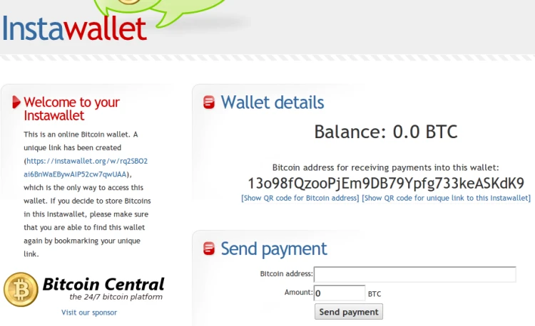

Interface d'Instawallet en juin 2012 (source : [Bitcoin Magazine](https://web.archive.org/web/20120922131335/http://bitcoinmagazine.net/bitcoin-wallet-options/))

Le 2 mars 2012, Jav [décide](https://bitcointalk.org/index.php?topic=67085.msg780164#msg780164) de fermer Instawallet n'ayant « ni le temps ni les ressources nécessaires pour continuer à assurer la maintenance du site » (original: "I don't have the time and resources to continue to support the site"). Le service est néanmoins [repris](https://bitcointalk.org/index.php?topic=67602.msg786523#msg786523) quelques jours plus tard par Paymium \[, qui le fera vivre jusqu'à son piratage fatal en avril 2013\].

Paymium SAS est une société française [fondée](https://web.archive.org/web/20111120231150/http://www.paymium.com/) par Gonzague Grandval, Pierre Noizat (Boussac) et David François (Davout) en juin 2011. Elle se concentre initialement sur le domaine des paiements, et son produit principal est une application de prévention de la fraude par carte bancaire. Grâce à l'attrait de Pierre Noizat et de David François pour Bitcoin, elle devient progressivement une entreprise focalisée sur Bitcoin.

Au début de l'année 2012, Paymium développe sa propre application dépositaire : Paytunia. L'application Paytunia est décrite comme « une application révolutionnaire basée sur le protocole ouvert Bitcoin pour des paiements et des transferts d'argent en ligne sécurisés et faciles » ("Paytunia is a groundbreaking application based on the open source Bitcoin protocol for secure, easy, online payments and money transfers." Elle est [lancée](https://bitcointalk.org/index.php?topic=75550.msg836770#msg836770) en avril 2012 sur Android. Les utilisateurs de Bitcoin-Central (la plateforme de change gérée par David François) [peuvent](https://web.archive.org/web/20120514233205/https://bitcoin-central.net/) également y accéder avec leur compte existant, les deux services utilisant le même système. Les transferts entre utilisateurs de Paytunia [sont](https://bitcointalk.org/index.php?topic=75550.msg836948#msg836948) traités de manière interne et sont donc instantanés.

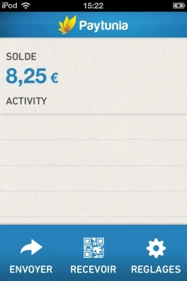

Interface (en français) de l'application Paytunia en novembre 2012 (source : [eeNews Europe](https://www.eenewseurope.com/en/bitcoin-enabled-euro-payment-solution-operates-as-a-mobile-e-wallet/))

### Les implémentations logicielles alternatives

La période est propice à la réécriture de l'implémentation. Le logiciel, qui s'appelle alors « Bitcoin » à l'époque, est en effet la seule qui existe. Satoshi est essentiellement opposé à la réécriture de l'implémentation, notamment pour ne pas compromettre le fonctionnement du minage. Dans un [message](https://bitcointalk.org/index.php?topic=195.msg1611#msg1611) publié en juin 2010 sur le forum, il écrivait déjà :

> « Je ne pense pas qu'une seconde implémentation compatible de Bitcoin soit une bonne idée. Le modèle dépend en grande partie du
fait que tous les nœuds obtiennent des résultats exactement identiques, de sorte qu'une deuxième implémentation constituerait une menace pour le réseau. La licence MIT est compatible avec toutes les autres licences et utilisations commerciales, il n'est donc pas nécessaire de la réécrire du point de vue juridique. »
>
> original: "I don't believe a second, compatible implementation of Bitcoin will ever be a good idea. So much of the design depends on all nodes getting exactly identical results in lockstep that a second implementation would be a menace to the network. The MIT license is compatible with all other licenses and commercial uses, so there is no need to rewrite it from a licensing standpoint."

Toutefois, ce commentaire ne vaut pas pour les implémentations partielles, destinées à lire la chaine et à servir aux utilisateurs. C'est pourquoi il ne s'oppose pas au projet d'implémentation en Java de Mike Hearn, [estimant](https://plan99.net/~mike/satoshi-emails/thread4.html) qu'« une grande partie de la complexité peut être éliminée dans le cadre d'une réécriture propre comprenant uniquement des exigences relatives au client » (original: "Much complexity can be left behind in a clean rewrite with only client requirements").

L'implémentation logicielle de Mike Hearn est BitCoinJ, qui est une mise en œuvre de la vérification de paiement simplifiée (SPV) telle que décrite dans le livre blanc, de sorte à interagir essentiellement avec les clients légers, notamment pour les téléphones utilisant le système d'exploitation Android. Il développe ce projet [à partir](https://plan99.net/~mike/satoshi-emails/thread3.html) de la fin de l'année 2010 et en [publie](https://bitcointalk.org/index.php?topic=4236.msg61438#msg61438) une première version le 7 mars 2011. Comme Mike travaille en tant qu'ingénieur pour Google, le code doit être attribué à la multinationale, mais la licence (Apache 2) est libre.

Mais la ré-implémentation du protocole Bitcoin ne s'arrête pas là. En juillet 2011, après le départ de Satoshi, les membres de la Bitcoin Consultancy Amir Taaki (Genjix) et Patrick Strateman (Phantomcircuit) [lancent](https://bitcointalk.org/index.php?topic=30646.msg384791#msg384791) Libbitcoin, qui est une implémentation en C++ visant l'extensibilité, la scalabilité et configurabilité les plus élevées possibles. Leur objectif est de « réécrire bitcoin, de le rendre super-branchable, très facile à manipuler et à bidouiller à tous les niveaux, et très configurable » (original: "rewrite bitcoin, make it super-pluggable, very easy to do and hack everything at every level, and very configurable"). Le code est publié sous licence libre copyleft (AGPL), qui obligent ceux qui réutilisent le logiciel à publier leur travail avec la même licence.

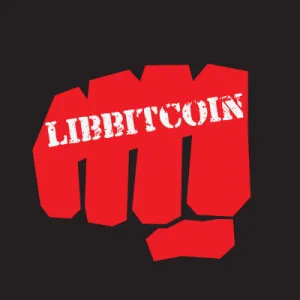

Logo de Libbitcoin en septembre 2013 (source : [archive](https://web.archive.org/web/20130913065137/http://libbitcoin.dyne.org/) de libbitcoin.dyne.org)

En octobre, le logiciel [parvient](https://bitcointalk.org/index.php?topic=30646.msg553961#msg553961) à faire une vérification complète de la chaine. Amir Taaki rédige également un « Zen de Libbitcoin », structuré sur le même modèle que le Zen de Python, un ensemble de principes influençant la conception du langage de programmation Python. Il publiera également un [manifeste](https://libbitcoin.dyne.org/libbitcoin-manifesto.pdf) (*The Libbitcoin Manifesto*) en septembre 2013.

### Les portefeuilles légers

Le problème des implémentations complètes est qu'elles demandent beaucoup de ressources et sont peu pratiques à utiliser pour beaucoup de monde. De plus, on ne peut pas les utiliser sur mobile. C'est pourquoi les nouveaux utilisateurs et les usagers occasionnels se tournent vers la solution de facilité : les applications dépositaires. En novembre 2010, Kiba met en place une [prime](https://bitcointalk.org/index.php?topic=1812.msg22319#msg22319) collective pour le développement d'un client Bitcoin sur mobile. Le 29 juillet 2011, la fermeture de MyBitcoin confirme la nécessité d'une solution intermédiaire. C'est ce qui catalyse le développement des portefeuilles légers (*lightweight wallets*).

La première idée est d'utiliser un nœud en tant que serveur distant, en lequel l'utilisateur a totalement confiance. En février 2011, Amir Taaki [lance](https://bitcointalk.org/index.php?topic=3451.msg48538#msg48538) un client logiciel permettant de gérer un portefeuille localement en se connectant à un nœud existant appelé Spesmilo. Il s'agit d'un client fonctionnant initialement sur Linux, mais qui est rapidement porté sur Windows. Le nom est une référence au spesmilo, ancienne unité monétaire internationale, proposée par le mathématicien suisse René de Saussure (le frère du linguiste, Ferdinand) en 1907, dans le cadre du projet espérantiste.

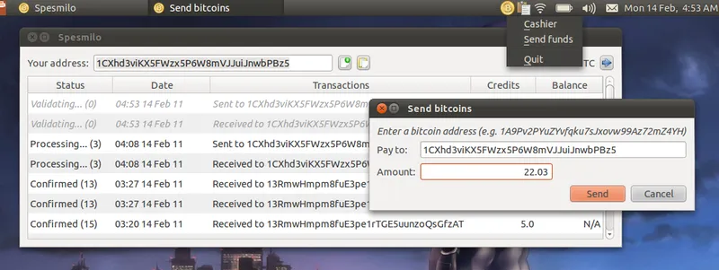

Interface de Spesmilo en février 2011 (source : [Bitcoin Wiki](https://en.bitcoin.it/w/index.php?title=Spesmilo&oldid=8271))

Amir [est](https://bitcointalk.org/index.php?topic=1568.msg19443#msg19443) lui-même espérantophone et il traduit le logiciel en espéranto dès le premier jour. Il est rejoint par le développeur Luke-Jr qui l'aide à maintenir le logiciel. Ce dernier [ajoute](https://gitlab.com/bitcoin/spesmilo/-/commit/b889211e98111b243de2b11fe88caf91d069b2a5) au programme le système de [numération tonale](https://en.bitcoin.it/wiki/Tonal_Bitcoin), un système hexadécimal proposé par John W. Nystrom au XIXe siècle, où l'unité « bitcoin » égale 65 536 satoshis.

Le projet Spesmilo est cependant abandonné en novembre 2011, au profit d'un projet autrement plus ambitieux : Electrum.

L'autre idée, plus commode, est de faire usage de la vérification de paiement simplifiée (SPV), qui consiste à vérifier que les transactions appartiennent à la chaine de blocs sans devoir télécharger l'intégralité des données. Le 11 mars 2011, quelques jours après la publication de BitCoinJ, un développeur berlinois du nom d'Andreas Schildbach (Goonie) [dévoile](https://bitcointalk.org/index.php?topic=4384.msg64142#msg64142) le prototype d'un portefeuille pour les téléphones utilisant Android, basé sur l'implémentation de Mike Hearn. Sobrement nommé *Bitcoin Wallet for Android*, celui-ci devient le premier modèle fonctionnel de portefeuille léger sur mobile.

https://groups.google.com/g/bitcoinj/c/fqUw1AKsxWI/m/pl6rzUSmUH4J

Andreas Schildbach à la conférence re:publica à Berlin en mai 2016 (source : Holger Bleich sur [Twitter](https://twitter.com/_robinhob/status/727167827132727300))

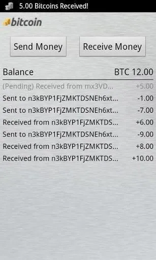

Interface du Bitcoin Wallet for Android en juillet 2011 (source : Brandon Iles pour [Wired](https://web.archive.org/web/20110710020745/https://www.wired.com/gadgetlab/2011/07/bitcoin-android-app/))

Problème de la confidentialité. Téléchargement du bloc complet (ce qui était prévu par Satoshi à l'origine), mais problème de bande passante. Bloom filters (BIP 37, https://github.com/bitcoin/bips/blob/master/bip-0037.mediawiki), proposés par Mike Hearn et Matt Corallo pour atténuer le problème.

### Les portefeuilles déterministes

Les portefeuilles déterministes (*deterministic wallets*) sont des portefeuilles qui intègrent la dérivation des clés : au lieu d'être générées individuellement de manière aléatoire comme cela est fait dans le logiciel principal, les clés privées sont dérivées de manière déterministe d'une information (appelée la graine) grâce à des fonctions cryptographiques. La connaissance de cette information permet à l'utilisateur de récupérer l'intégralité de ses fonds, ce qui simplifie grandement la sauvegarde du portefeuille. Il n'y a plus besoin d'enregistrer encore et encore le fichier `wallet.dat` !

Les portefeuilles déterministes sont largement issus des réflexions du développeur américain Gregory Maxwell. Partisan du logiciel libre, ce dernier est alors [contributeur](https://commons.wikimedia.org/wiki/User:Gmaxwell) pour Wikipedia depuis 2004 et travaille pour la fondation Xiph.org, où il participe au développement du codec audio Opus. En mai 2011, il commence à s'engager dans Bitcoin. Il [s'essaie](https://bitcointalk.org/index.php?topic=7171.msg119591#msg119591) au minage. Il écrit aussi beaucoup et devient rapidement un gros contributeur sur le forum et sur le canal IRC \#bitcoin-dev, où il utilise le pseudonyme Gmaxwell.

Gregory Maxwell en 2006 (source : [Wikimedia](https://commons.wikimedia.org/wiki/File:Gmaxwell-boat.jpg))

Gregory Maxwell a beaucoup d'idées sur les façons d'améliorer l'utilisation de Bitcoin, et la dérivation des clés en fait partie. Il n'est pas le premier à avoir cette idée (Casascius [en a eu](https://bitcointalk.org/index.php?topic=6897.msg100975#msg100975) l'idée en avril), mais il est le premier à la formaliser. Le 18 juin, à la suite de [discussions](https://buildingbitcoin.org/bitcoin-dev/log-2011-06-08.html#l-1089) sur IRC, il rédige une description sur le forum. Il [écrit](https://bitcointalk.org/index.php?topic=19137.msg239768#msg239768) :

> « Bitcoin devrait vraiment permettre et recommander par défaut l'utilisation de portefeuilles déterministes.   La sécurité supplémentaire apportée par les portefeuilles pré-générés actuels est relativement faible compte tenu de la manière dont la plupart des gens utilisent bitcoin. Et le fardeau des pertes dues à des sauvegardes incomplètes et à la pression accrue pour maintenir un seul portefeuille opérationnel est énorme. »
>
> "Bitcoin really ought to offer and default to using deterministic wallets.   The additional security of the current pre-generated ones is fairly small considering how most people use bitcoin and the liability of harm due to insufficient backups and increased pressure to keep a single wallet online is enormous."

Il envisage deux types de dérivation. L'une (type 1) est simple et génère les clés privées directement à partir de la graine. L'autre (type 2) est plus complexe, mais permet de dériver les adresses d'une clé publique maitresse obtenue depuis la graine, sans accéder à la graine en question. Cela permet d'avoir un logiciel de traitement de paiements qui puisse générer une adresse à chaque transaction, sans que les clés privées ne soient exposées.

Plus tard, au début de l'année 2012, une tentative de standardisation [aura lieu](https://github.com/bitcoin/bips/commit/be1741786684bb3a9f828b2f190ad3a0269c7ec3) avec le BIP 32. Celui-ci décrit la structure générale des « portefeuilles déterministes hiérarchiques » (*Hierarchical Deterministic Wallets*, HD Wallets), où les dérivations

https://planb.network/courses/46b0ced2-9028-4a61-8fbc-3b005ee8d70f

### BitcoinSpinner, Electrum et Armory

Au cours de l'été 2011, un développeur danois du nom de Jan Møller met au point une interface en Java appelée BCCAPI (pour *BitCoin Client API*). Celle-ci est [annoncée](https://bitcointalk.org/index.php?topic=36892.msg453652#msg453652) le 23 août. C'est une interface logicielle permettant de connecter un client fonctionnant sur téléphone Android à un serveur. Côté client, elle met en application la génération déterministe des clés privées, ne nécessitant pas de faire des sauvegardes régulières.

Cette interface est utilisée en novembre quelques mois plus tard pour mettre en place un portefeuille léger appelé BitcoinSpinner, disponible sur Google Play. Celui-ci est [annoncé](https://bitcointalk.org/index.php?topic=52674.msg628527#msg628527) par Jan le 23 novembre. Il est officiellement géré par la société danoise Miracle A/S, que Jan [rejoint](https://bitcointalk.org/index.php?topic=53353.msg672264#msg672264) à la fin du mois de décembre.

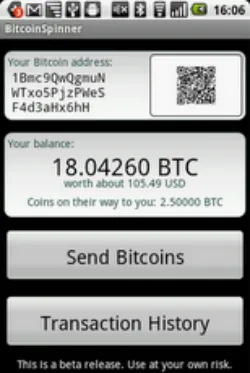

Interface de BitcoinSpinner en juin 2012 (source : [Bitcoin Magazine](https://web.archive.org/web/20120922131335/http://bitcoinmagazine.net/bitcoin-wallet-options/))

Toutefois, BCCAPI [souffre](https://bitcointalk.org/index.php?topic=46493.msg571018#msg571018) de quelques défauts, qui font qu'il n'est pas au goût de tout le monde. D'une part, le code l'infrastructure logicielle du serveur, qui se base sur BitCoinJ, n'est pas encore publié, ce qui interdit de déployer d'autres serveurs. D'autre part, le fonctionnement du système garde en mémoire des transactions liées aux adresses gérées par un portefeuille afin de fournir le solde total, ce qui réduit la bande passante mais pose un problème de confidentialité.

Ces défauts gênent particulièrement le Français Thomas Voegtlin, qui est alors chercheur en informatique pour l'Inria et qui utilise le pseudonyme ThomasV sur le forum. Il est intéressé pour contribuer et [cherche](https://bitcointalk.org/index.php?topic=46493.msg569756#msg569756) à mettre en place « des serveurs auxquels on n'a pas besoin d'être fidèle » (original: "I am thinking about servers you don't have to be faithful to"). Le 20 octobre, il [décide](https://bitcointalk.org/index.php?topic=46493.msg585227#msg585227) ainsi de « faire ça en partant à partir de zéro en python » (original: "I guess I will try to do it from scratch in python, using bitcoin-abe + bitcoind at the server side.").

Le résultat est Electrum, qui [sort](https://bitcointalk.org/index.php?topic=50936.msg607510#msg607510) le 5 novembre. Son nom fait référence à l'électrum, alliage naturel d'or et d'argent, qui a notamment servi à frapper les premières pièces de monnaie en Lydie et en Grèce.

Thomas Voegtlin en 2006 (source : [archive](https://web.archive.org/web/20060516200739/http://www.loria.fr/%7Evoegtlin/) de sa page personnelle)

Le client se connecte à un réseau de serveurs spéciaux pour récupérer les transactions. Les serveurs fonctionnent avec le logiciel (bitcoind) et indexent toutes les transactions grâce au code de l'explorateur de blocs ABE. Dans ce portefeuille, la graine se présente sous la forme d'une chaine de caractères hexadécimaux. À partir du 10 novembre, elle [est](https://bitcointalk.org/index.php?topic=51397.msg612674#msg612674) également représentée sous la forme d'une phrase mnémotechnique de 12 mots. Chaque mot est choisi dans une liste prédéfinie ce qui permet de représenter les bits d'information. Ce type de phrase sera standardisé par le BIP 39, ébauché le 10 septembre 2013.

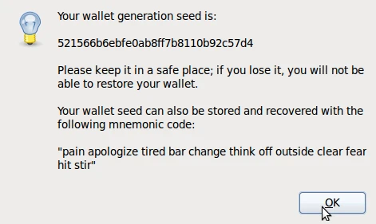

Graine et phrase mnémotechnique d'Electrum en 2012 (source : [archive](https://web.archive.org/web/20120826021721/http://electrum-desktop.com:80/seed.html) du site d'Electrum)

Le 16 décembre, Electrum [intègre](https://bitcointalk.org/index.php?topic=50936.msg652435#msg652435) la dérivation de type 2, de sorte à ce que les adresses puissent être générées, sans accès à la graine. En octobre 2012, Thomas Voegtlin [ajoute](https://bitcointalk.org/index.php?topic=50936.msg1302941#msg1302941) également la vérification de paiement simplifiée à Electrum, ce qui en fait l'un des meilleurs portefeuilles légers de l'écosystème.

---

Portefeuille Armory, se voulant extrêmement sécurisé, stockage à froid (https://web.archive.org/web/20120115015741/http://bitcoinarmory.com/index.php/using-offline-wallets-in-armory), il intégrera bien plus tard le multisig (https://en.bitcoin.it/wiki/Armory) ; dépôt créé le 19/11/2011 : https://api.github.com/repos/etotheipi/BitcoinArmory ; forked by goatpig in February 2016 : https://github.com/goatpig/BitcoinArmory ; annonce par Alan Reiner (etotheipi l'exponentielle de i fois pi, qui vaut -1), 3/1/2012 : https://bitcointalk.org/index.php?topic=56424.msg671650#msg671650 https://web.archive.org/web/20120113202143/https://www.bitcoinarmory.com/ ; crowdfunding, 18/2 : https://web.archive.org/web/20120515220140/https://bitcointalk.org/index.php?topic=64449.0

Alan Reiner s'intéresse à la signature multipartite : https://en.bitcoin.it/w/index.php?title=BIP_0010&oldid=21099

Pieter Wuille, BIP 32 https://github.com/bitcoin/bips/commit/be1741786684bb3a9f828b2f190ad3a0269c7ec3 https://en.bitcoin.it/w/index.php?title=BIP_0032&oldid=26198

"Acknowledgements: Gregory Maxwell for the original idea of type-2 deterministic wallets, and many discussions about it. Alan Reiner for the implementation of this scheme in Armory, and the suggestions that followed from that."

### Les portefeuilles web

Une sorte de portefeuille hybride émerge également : le portefeuille web (*web wallet*).

À partir de mars 2011, Stefan Thomas (justmoon), le producteur allemand de la vidéo « *What is Bitcoin?* » et gestionnaire de WeUseCoins, travaille sur une bibliothèque Javascript (Node.js) pour interagir avec le protocole Bitcoin. Cette bibliothèque, appelée BitcoinJS, [sort](https://bitcointalk.org/index.php?topic=7357.msg108003#msg108003) le 5 mai. Elle permet aux développeurs web de déployer des clients fonctionnant dans le navigateur de l'utilisateur.

Présentation de la bibliothèque BitcoinJS par Stefan Thomas (de WeUseCoins) et Eric Brigham (de Trucoin)

En août, Benjamin Reeves, un développeur britannique habitant à York, connu sous le pseudonyme Piuk sur le forum, exploite cette possibilité. En se [basant](https://web.archive.org/web/20180611012256/https://github.com/zootreeves/blockchain.info) sur l'implémentation de BitcoinJS, il [met au point](https://bitcointalk.org/index.php?topic=40264.msg500726#msg500726) un explorateur de blocs qui « inclut les blocs orphelins » (original: "Includes orphaned blocks which can be used to track possible double spends") et « estime le volume réel de BTC transactés » (original: "Estimates the actual volume of BTC transacted (not just BTC sent)"), qu'il héberge sur son site personnel. Il fait alors concurrence au Bitcoin Block Explorer (BBE) de Theymos, et à [ABE](https://bitcointalk.org/index.php?topic=22785.msg286515#msg286515), une alternative open-source destinée à être hébergée par les utilisateurs. Le site [change](https://bitcointalk.org/index.php?topic=40264.msg576916#msg576916) de nom de domaine en octobre et devient Blockchain.info.

Le 1er décembre, Ben Reeves [intègre](http://bitcointalk.org/index.php?topic=40264.msg636996#msg636996) une fonctionnalité de portefeuille à la plateforme. Cette fonctionnalité, sobrement nommé My Wallet, permet à l'utilisateur de créer un compte et de se connecter grâce à un identifiant et un mot de passe. Les clés privées de son portefeuille sont chiffrées et stockées sur le serveur. L'utilisateur peut bénéficier de la visibilité apportée par l'explorateur de blocs.

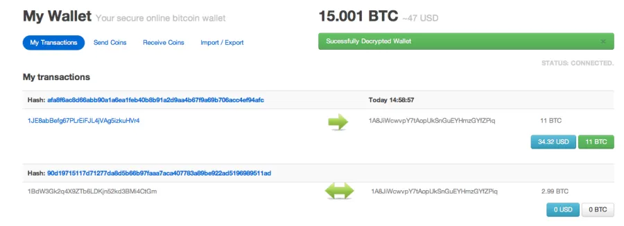

Interface de My Wallet en décembre 2011 (source : [archive](https://web.archive.org/web/20120519160806/https://bitcointalk.org/index.php?topic=40264.140) de Bitcointalk)

L'aspect pratique du portefeuille le rend très populaire. \[source ?\]

En 2012, Ben Reeves réalise une levée de fonds. Ses deux cofondateurs sont Nicolas Cary, ami d'université d'Erik Voorhees, qui l'a introduit à Bitcoin ; et Peter Smith, qui devient PDG. Roger Ver investit dans la société.

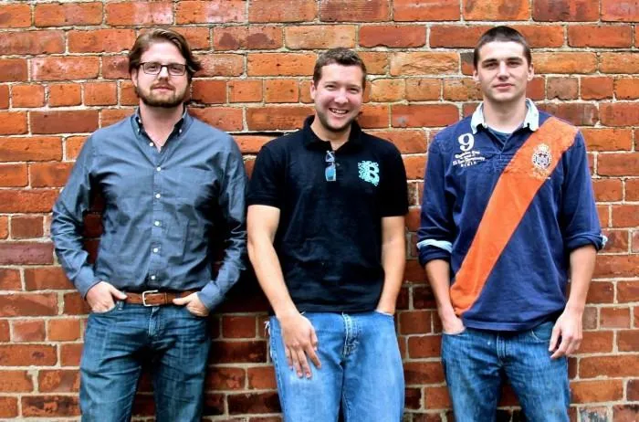

Cadres de Blockchain.info, date indéterminée. De gauche à droite : Peter Smith, Nic Cary, Ben Reeves. (source : Matt Tuzzolo pour le [New York Times](https://archive.nytimes.com/dealbook.nytimes.com/2014/10/06/blockchain-is-latest-bitcoin-start-up-to-lure-big-investment/))

### Le stockage à froid et les portefeuilles papier

Détenir du bitcoin consiste simplement à garder une information à l'abri des menaces, qu'il s'agisse des aléas de la vie (perte) ou de la curiosité des autres personnes (vol). Cette information – la clé privée – peut être [générée](https://bitcointalk.org/index.php?topic=1610.msg19131#msg19131) par des appareils n'étant jamais connectés à Internet. C'est ce qu'on appelle, [dès 2011](https://en.bitcoin.it/w/index.php?title=Cold_storage&oldid=16769), le stockage à froid (*cold storage*).

Le stockage à froid peut être réalisé en stockant ses clés privées sur un support de sauvegarde numérique, comme une clé USB. Mais une méthode beaucoup plus pratique est le portefeuille papier, qui est simplement une feuille de papier où se trouvent la clé privée et l'adresse publique. La clé peut être générée par n'importe quel portefeuille logiciel, à condition que l'appareil sur lequel il se trouve reste hors ligne.

Un portefeuille papier peut également être généré avec un outil spécifique. Ce type d'outil voit ainsi le jour à partir de l'été 2011. Le principal d'entre eux est BitAddress, développé par Pointbiz, qui est [lancé](https://web.archive.org/web/20111102021042/https://bitcointalk.org/index.php?topic=43496.0). Il s'agit d'un outil codé en Javascript fonctionnant sur navigateur. L'interface invite l'utilisateur à créer de l'entropie pour optimiser la génération de nombres pseudo-aléatoires. La clé privée et l'adresse résultantes peuvent ensuite être imprimées pour être conservés en toute sécurité. Il peut bien évidemment (et c'est recommandé !) être utilisé sans connexion à Internet, en enregistrant la page HTML.

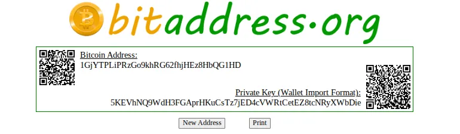

Portefeuille papier généré avec BitAddress en septembre 2011 (source : [capture](https://web.archive.org/web/20120519160806/https://bitcointalk.org/index.php?topic=40264.140) de BitAddress.org)

Un autre outil qui apparait à ce moment-là est VanityGen, [créé](https://web.archive.org/web/20111104120932/https://bitcointalk.org/index.php?topic=25804.0) par Samr7 en juillet 2011. Il s'agit d'un logiciel permettant de créer une adresse personnalisée (*vanity address*), commençant par des caractères spécifiques, en testant un grand nombre de clés privées. Cela est utile pour identifier les adresses de donation des individus. Par exemple, l'adresse de Pointbiz pour sa maintenance de BitAddress est `1NiNja1bUmhSoTXozBRBEtR8LeF9TGbZBN`.

Enfin, la méthode la plus efficace pour se protéger contre le vol est celle du « portefeuille mental » (original: "brain wallet"), qui consiste à mémoriser une phrase secrète donnant accès aux bitcoins stockés à l'adresse qui correspond. Par exemple, la phrase secrète peut être hachée par SHA-256 pour obtenir la clé privée, donnant accès aux fonds. Cette méthode est [proposée](https://bitcointalk.org/index.php?topic=35082.msg436289#msg436289) par Mike Caldwell (Casascius) en août 2011 et [mise en avant](https://www.forbes.com/sites/jonmatonis/2012/03/12/brainwallet-the-ultimate-in-mobile-money/) dans Forbes par Jon Matonis en mars 2012. Elle est néanmoins très peu sûre si l'entropie n'est pas suffisante. Et elle est évidemment sujette aux aléas de la mémoire humaine ; il s'agit davantage d'une démonstration pratique de la puissance de Bitcoin qu'une application pérenne.

https://en.bitcoin.it/w/index.php?title=Brainwallet&oldid=23015 https://bitcoinmagazine.com/technical/brain-wallets-the-what-and-the-how-1333845334 https://bitcointalk.org/index.php?topic=51397.msg846234#msg846234 https://web.archive.org/web/20120413041417/http://brainwallet.org/

### Les bitcoins physiques (Bitbills, Casascius coins)

Il est aussi possible de placer la clé privée dans un objet physique. Idée bitcoin physique : [bitcoins imprimés échangeables](https://bitcointalk.org/index.php?topic=737.msg7990#msg7990) (2010) de Gavin Andresen

Les premiers objets de ce type sont les Bitbills, [lancés](https://bitcointalk.org/index.php?topic=7724.msg112655#msg112655) par Doug Feigelson (connu sous le pseudonyme Llama) en mai 2011, qui sont des cartes plastifiées sur lesquelles se trouvent des codes QR représentant respectivement l'adresse et la clé privée. La clé privée est recouverte d'un autocollant, de sorte qu'elle ne peut être lue sans présenter des signes de falsification. La carte est munie d'hologrammes pour éviter la contrefaçon. Les Bitbills sont, d'après leur concepteur, « la première incarnation physique des bitcoins » (original: "Bitbills are the first physical incarnation of bitcoins"). Ils [forment](https://web.archive.org/web/20110511215306/http://bitbills.com/) une bonne manière de « transférer des bitcoins en personne, exactement comme avec de l'argent liquide ! » (original: "With Bitbills you can transfer bitcoins in person, just like cash!")

https://web.archive.org/web/20111202011459/http://www.bitbills.com/

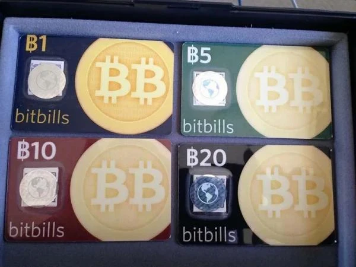

Bitbills [mis aux enchères](https://bitcointalk.org/index.php?topic=191292.msg1980753#msg1980753) par Charlie Lee en avril 2013 (source : Inversor Inteligente sur [Substack](https://inversorinteligente.substack.com/p/casascius-monedas-fisicas-de-bitcoin))

Le premier distributeur automatique de bitcoins (*Bitcoin ATM*), [conçu](https://bitcointalk.org/index.php?topic=5122.msg461848#msg461848) par l'entrepreneur Todd Bethell, inclut une fonctionnalité pour que les fonds soient envoyés sur une carte Bitbills imprimée spécialement pour l'occasion. Il est [testé](https://web.archive.org/web/20110827115138/http://bitcoinatm.com/) pour la première fois en public à San Diego en Californie le 17 août 2013. Une vidéo de présentation est publiée en septembre :

Les Bitbills rencontrent un certain succès, mais Doug Feigelson peine à répondre à la demande. En mai 2012, la production de Bitbills est définitivement [interrompue](https://web.archive.org/web/20120508074832/http://bitbills.com/order). Mais un concurrent existe : les Casascius Coins, fabriqués par un certain Mike Caldwell.

Mike Caldwell est un développeur américain de 33 ans, qui habite dans la banlieue de Salt Lake City dans l'Utah et dirige une société automatisant la gestion d'entreprise appelée [Swipeclock](https://www.linkedin.com/company/swipeclock/). Il utilise le pseudonyme Casascius sur le forum, forme latinisée de CASAS, initiales du dicton *call a spade a spade* (« appeler un chat un chat » en français). Rationaliste, il est fasciné par la cryptographie et est attiré par le côté technique de Bitcoin. Il s'essaie au minage pendant quelque temps.

Mike Caldwell en 2013 (source : [IMDb](https://www.imdb.com/fr/name/nm5669287/))

Il s'intéresse particulièrement à la conservation des bitcoins, et donc aux portefeuilles. Il met au point un [utilitaire](https://bitcointalk.org/index.php?topic=25141.msg312005#msg312005) permettant de convertir une clé privée en adresse Bitcoin, de générer des clés personnalisées et de créer une graine de dérivation. Mais surtout, il s'attache, comme il [l'explique](https://bitcointalk.org/index.php?topic=2657.msg36011#msg36011), à « fabriquer un bitcoin tangible qui transporte réellement des BTC » (original: "Making a real tangible bitcoin that actually conveys BTC"). C'est ainsi qu'il [vend](https://bitcointalk.org/index.php?topic=21878.msg275000#msg275000) des portefeuilles papier dès le mois de juin sur son site personnel.

Le 19 août, il [partage](https://bitcointalk.org/index.php?topic=38048.msg467209#msg467209) publiquement son projet de fabriquer des « vrais bitcoins physiques ». Le 6 septembre, il commence à en fabriquer. Le 6 septembre, il [annonce](https://bitcointalk.org/index.php?topic=41892.msg509883#msg509883) mettre en vente les « bitcoins physiques de Casascius » (original: "Casascius Physical Bitcoins"), qu'on connaitre plus communément sous le nom de « Casascius coins ». La clé privée est recouverte d'un hologramme personnalisé, si bien qu'on ne peut pas la récupérer sans endommager la pièce. Les 8 premiers caractères de l'adresse publique de Bitcoin sont visibles à l'extérieur et pré-imprimés sur l'hologramme par le fabricant. Détail surprenant : les premières pièces présentent une faute typographique ; Casascius est orthographié Casacius.

Les premiers bitcoins de Casascius en 2011 (source : [casascius.com](https://www.casascius.com/casasciusphysicalbitcoins.jpg))

Initialement disponibles sous forme de pièces de 1 et de 25 BTC, les bitcoins de Casascius rapidement déclinés en des pièces d'autres valeurs et en lingots, allant jusqu'à 1000 BTC ! Les bitcoins de Casascius sont [vendus](https://web.archive.org/web/20111107191637/https://www.casascius.com/) sur le site personnel de Casascius, mais [aussi](https://web.archive.org/web/20111028171555/http://www.memorydealers.com/bieq.html) sur MemoryDealers (le commerce de Roger Ver) à partir d'octobre. Ils se [retrouveront](https://odysee.com/@adamkokesh:2/moment-in-monetary-history-bitcoin-by:9) également dans un distributeur automatique présent au PorcFest de l'année suivante en juin 2012. Ils ont ainsi un but pédagogique. Comme l'[expliquera](https://bitcointalk.org/index.php?topic=41892.msg3727984#msg3727984) Mike Caldwell en 2013 :

> « Mon objectif, en introduisant les Casascius Coins, était de les utiliser comme outil pédagogique afin d'aider le grand public à visualiser une pièce de monnaie virtuelle avec un objet fonctionnel tangible. »
>
> original: "My purpose in introducing Casascius Coins was as a teaching tool, to help the world at large visualize a virtual coin with a tactile functional object"

De quoi attirer les amateurs de numismatique...

Les bitcoins de Casascius auront un succès énorme au cours des deux années où ils seront distribués. D'après [Uberbills](https://casascius.uberbills.com/), 97 905 pièces et lingots seront produits pour un montant total de 97 783,9 stockés sur ces supports.

### Les premiers services de mélange de pièces

Cette période est également une période où on se pose des questions. Bitcoin étant au départ présenté comme « anonyme » (original: "anonymous"), beaucoup de gens pensent qu'ils n'ont rien à craindre. En revanche, le registre étant public, il est possible de tracer les fonds et de les associer à une identité.

Avec la popularisation de Silk Road et l'adoption par WikiLeaks, la question de l'anonymat [se pose](https://bitcointalk.org/index.php?topic=175.msg57305#msg57305) de [plus en plus](https://web.archive.org/web/20110610205500/http://bitcoinweekly.com/articles/the-battle-is-on-silk-road-vs-government-and-bitcoin-anonymity). Le 24 juillet, Martin Harrigan et Fergal Reid, deux chercheurs irlandais de l'University College de Dublin, [prépublient](https://web.archive.org/web/20110725131444/https://anonymity-in-bitcoin.blogspot.com/2011/07/bitcoin-is-not-anonymous.html) une étude qui montre que Bitcoin n'est pas aussi anonyme que la plupart des gens se l'imaginent. La possibilité d'avoir une activité confidentielle n'est pas invalidée ; elle est seulement plus compliquée à mettre en place que ce à quoi on s'attend à première vue.

Pour résoudre ce problème, pour casser la provenance et des fonds, la solution est le mélange des pièces (*coin mixing*) qui permet de brouiller les pistes. Ce type de mélange est mis en place par des mélangeurs centralisés, appelés des *mixers* ou *tumblers*. Il y en a deux qui sortent du lot et s'avèrent ne pas être une arnaque.

Le premier est BitLaundry (la « blanchisserie de bitcoins »). Ce service est [lancé](https://bitcointalk.org/index.php?topic=963.msg11823#msg11823) en septembre 2010 par Peter Vessenes (Vess), un entrepreneur diplomé en cryptographie qui a découvert l'existence de Bitcoin au moment du slashdotting. \[Description du service.\] En mai 2011, sentant les complications légales qui peuvent découlé de cette activité, il [cède](https://bitcointalk.org/index.php?topic=963.msg122955#msg122955) le service à Mike Gogulski, un activiste qui a la particularité d'avoir renoncé à sa citoyenneté étasunienne sans en posséder une autre, le rendant apatride.

Le second est Bitcoin Fog (le « brouilleur de bitcoins »), [créé](https://web.archive.org/web/20121102102447/https://bitcointalk.org/index.php?topic=50037.0) par Roman Sterlingov, un homme russo-suédois de 23 ans. \[Description du service.\] Les frais se situent entre 1 et 3 %.

Spécificités : voir ["An Inquiry into Money Laundering Tools in the Bitcoin Ecosystem"](https://maltemoeser.de/paper/money-laundering.pdf)

C'est aussi la période où la réflexion autour des manières décentralisées de faire s'intensifie. Deux idées émergent : les certificats aveugles en surcouche de Bitcoin (Open Transactions, [proposé](https://bitcointalk.org/index.php?topic=847.msg9976#msg9976) par fellowtraveller en août 2010, eCash basé sur Bitcoin) ; les services de mélange décentralisés, publiant des transactions brisant les liens entre les entrées et les sorties (idée [proposée](https://bitcointalk.org/index.php?topic=12751.msg315793#msg315793) par Hashcoin en juillet 2011). Cette dernière piste conduira à la [formalisation](https://bitcointalk.org/index.php?topic=279249.msg2983902#msg2983902) de CoinJoin par Gregory Maxwell en 2013. Mais c'est une toute autre histoire...

### Une période de progrès pour les portefeuilles

La période 2011–2012 a été faste pour les diverses solutions pour utiliser Bitcoin. Outre les applications dépositaires, on a vu se développer les portefeuilles logiciels comme *Bitcoin Wallet for Android* et Electrum. les portefeuilles web comme Blockchain.info, les générateurs de portefeuilles papier comme BitAddress, et les bitcoins physiques comme les Bitbills et les Casascius Coins. Des services de mélange sont apparus pour offrir plus de confidentialité aux utilisateurs.

La période a également été marquée par le développement des portefeuilles déterministes, reposant sur la dérivation des clés à partir d'une donnée unique appelée la graine. Le modèle a été amélioré et standardisé dans le BIP 32 au début de l'année 2012, pour ajouter une hiérarchie dans cette dérivation. Mais le mouvement ne s'est pas arrêté là, car d'autres propositions ont été publiées par la suite. Le BIP 39, publié en septembre 2013, a standardisé l'usage de la phrase mnémotechnique, inspiré de ce que faisait Electrum. Les BIP 43 et 44, ébauchés en avril 2014, ont standardisé la structure des portefeuilles conservant de multiples cryptomonnaies et de multiples comptes. Ces propositions ont été réalisées par Marek Palatinus (Slush) et Pavol Rusnak (Stick), qui travaillaient sur la fabrication du premier portefeuille matériel, le Bitcoin Trezor.

Dans le prochain chapitre, nous continuerons à traiter la question du développement logiciel, en évoquant l'évolution du logiciel principal. Nous nous concentrerons sur le conflit autour de Pay to Script Hash, une fonctionnalité qui a été ajoutée au protocole en avril 2012.

+ MultiBit ? https://bitcointalk.org/index.php?topic=43616.msg520542#msg520542

## La poursuite de la ruée vers l'or numérique

Le Far West se caractérise aussi par le ruée vers l'or : la découverte d'or en Californie en 1848 avait engendré une grande migration d'aventuriers espérant faire fortune. Bitcoin ayant été associé au métal précieux dès l'origine, il est naturel qu'un tel phénomène se soit développé. C'est ainsi que l'activité du minage de bitcoins a attiré des individus passionnés qui ont, par leur intérêt pécuniaire, contribué à la rendre plus efficace au cours du temps.

À l'automne 2010, une première « ruée vers l'or numérique » (original: "digital gold rush") avait eu lieu, et avait entrainé une généralisation du minage par processeur graphique (GPU), beaucoup plus rentable que le minage par processeur central (CPU). Cette amélioration avait cependant fait augmenter la difficulté à un niveau tel que les petits mineurs ne pouvaient plus trouver de bloc dans un temps acceptable. C'est pourquoi les premiers regroupements de mineurs sont apparus, dont notamment Bitcoin.cz Mining, la coopérative de Slush.

Mais la dynamique ne s'est pas arrêtée là, et les choses sont encore allées plus loin dans les années qui ont suivi. En 2011 en particulier, on a vu le minage en coopératives se normaliser, à tel point qu'il a provoqué la conception du protocole décentralisé P2Pool, permettant de générer des bitcoins sans dépendre d'un opérateur. On a aussi assisté au développement des circuits logiques programmables (FPGA), préfigurant l'apparition des premiers circuits intégrés spécialisés (ASIC), qui prendraient le relai à partir de 2013.

### Les coopératives de minage et leur mode de rémunération

Principales coopératives, innovations, comparaison ([3/1/2012](https://en.bitcoin.it/w/index.php?title=Comparison_of_mining_pools&oldid=21595))

L'année 2011 est l'année où le minage groupé se généralise : [de nombreuses coopératives de minage](https://en.bitcoin.it/w/index.php?title=Comparison_of_mining_pools&oldid=21595) sont en effet lancées durant cette année-là. Bitcoin.cz, la coopérative de Marek Palatinus (alias Slush) [ouverte](https://bitcointalk.org/index.php?topic=1976.msg30520#msg30520) en décembre 2010, a rencontré le succès en quelques jours, en recueillant près de 3,5 % de la puissance de calcul du réseau, et n'a par conséquent pas manqué de faire des émules. Au fur et à mesure, les mineurs deviennent des « hacheurs », c'est-à-dire des personnes louant leur puissance de hachage à un opérateur, qui s'occupe de choisir les spécificités des blocs et les transactions à inclure. Différentes méthodes de rémunération sont adoptées.

La première coopérative concurrente à émerger en 2011 est BitPenny, qui a la particularité d'appliquer un modèle de récompense simple : le *Pay Per Share* (PPS), ou paiement par part en français. Il s'agit de rémunérer les hacheurs à chaque preuve de travail partielle calculée, selon son degré, de façon immédiate, à partir du solde de la coopérative. L'opérateur prend donc l'intégralité de la variance à sa charge, ce qui est risqué. La coopérative BitPenny est [lancée](https://bitcointalk.org/index.php?topic=3266.msg45809#msg45809) le 8 février, mais est forcée de fermer le 2 avril, à la suite de pertes trop importantes. Elle sera néanmoins [relancée](https://bitcointalk.org/index.php?topic=36371.msg447984#msg447984) en août, en appliquant un autre modèle plus complexe (*Capped Pay Per Share with Recent Backpay* ou CPPSRB).

Le 27 février, une nouvelle coopérative est [ouverte](https://web.archive.org/web/20111127072845/https://bitcointalk.org/index.php?topic=3889.0) par un [Russe](https://buildingbitcoin.org/bitcoin-dev/log-2011-02-19.html#l-2646) se faisant appeler Tycho (qu'il orthographie \[Tycho\]). Il s'agit de Deepbit, qui a pour particularité de récompenser ses clients à chaque bloc trouvé, au pro rata des parts qu'ils ont trouvées depuis le dernier bloc. À ce modèle proportionnel, Tycho [ajoute](https://bitcointalk.org/index.php?topic=3889.msg55799#msg55799) rapidement le modèle *Pay Per Share* à son offre, mais prélève des frais supérieurs pour ce mode (10 % au lieu de 3 %).

https://web.archive.org/web/20111010192050/http://eligius.st/~luke-jr/samples/800MH-3/

Le 15 février, le développeur Jeff Garzik [publie](https://bitcointalk.org/index.php?topic=3493.msg49110#msg49110) un outil appelé Pushpool, un logiciel au code source ouvert permettant de déployer sa propre coopérative. Cet outil sera [agrémenté](https://bitcointalk.org/index.php?topic=13164.msg181362#msg181362) d'une interface graphique appelée SimpleCoin en juillet. ("pushpool - open source pool software" https://bitcointalk.org/index.php?topic=8707.0, "Pushpool Frontend: Simplecoin Opensource PHP/MySQL" https://bitcointalk.org/index.php?topic=13164.0)

Sortes de rémunérations : Pay Per Share (PPS), Shared Maximum Pay Per Share ; différents modes de paiement : PPS, PPLNS, etc. https://en.bitcoin.it/wiki/Comparison_of_mining_pools

Meni Rosenfeld : https://arxiv.org/abs/1112.4980

Liste :

- Bitcoin.cz / Slush, `/slush/`

- BitPenny, première à appliquer le modèle Pay-Per-Share [8/2/2011](https://bitcointalk.org/index.php?topic=3266.msg45809#msg45809)–2/4/2011, puis [11/8/2011](https://bitcointalk.org/index.php?topic=36371.0)

- Deepbit, opérateur : Tycho, Allemagne ? Russie ?, [26/2/2011](https://web.archive.org/web/20111127072845/https://bitcointalk.org/index.php?topic=3889.0), proportionnel + Per-Per-Share [27/2](https://bitcointalk.org/index.php?topic=3889.msg55799#msg55799)

- BTCMine, dbitcoin, UK, [7/3/2011](https://bitcointalk.org/index.php?topic=4251.msg61724#msg61724)

- BitcoinPool.com, FairUser, [8/3/2011](https://bitcointalk.org/index.php?topic=4291.msg62272#msg62272)

- BTC Guild, opérateur : Eleuthria (probablement une déformation du mot grec ἐλευθερία, eleuthería, qui signifie « liberté »), États-Unis/UE, avril-mai 2011, [annonce sur le forum](https://bitcointalk.org/index.php?topic=7760.msg113180#msg113180) ([archive](https://web.archive.org/web/20111127113730/https://bitcointalk.org/index.php?topic=7760.0)

- BitClockers.com, backburn [27/5](https://bitcointalk.org/index.php?topic=10127.0)

- Ozcoin Pooled Mining, Graet, Australie, [9/6/2011](https://bitcointalk.org/index.php?topic=14085.msg191431#msg191431)

- MtRed (Mining Team Reddit), redditorrex, [12/6/2011](https://bitcointalk.org/index.php?topic=15929.msg209023#msg209023)

- Eclipse Mining Consortium (EclipseMC), Inaba, `EMC` [13/6/2011](https://bitcointalk.org/index.php?topic=16385.msg213722#msg213722)

- Ars Bitcoin, BurningToad, [15/6/2011](http://arstechnica.com/civis/viewtopic.php?p=21758236#p21758236), https://web.archive.org/web/20111127080925/https://bitcointalk.org/index.php?topic=18567.0

- BitMinter.com, DrHaribo, [25/6/2011](https://bitcointalk.org/index.php?topic=22432.msg281686#msg281686) puis [8/7/2011](https://bitcointalk.org/index.php?topic=27062.msg340712#msg340712), https://web.archive.org/web/20201223061728/http://s1143.photobucket.com/albums/n629/DrHaribo/Cayman.png

- Pool.betcoin.co, somebadger, [6/7/2011](https://bitcointalk.org/index.php?topic=26439.msg330673#msg330673)

- ABCPool.co, MintCondition, [2/8/2011](https://bitcointalk.org/index.php?topic=33586.msg419612#msg419612)

- MasterPool, nodemaster, Allemagne, coopérative pour le minage de namecoin, [11/9/2011](https://bitcointalk.org/index.php?topic=42667.msg518697#msg518697) https://web.archive.org/web/20111209224059/https://www.masterpool.eu/

- 50BTC.com, Russie, PPS, 3 % de frais, [15/12](https://bitcointalk.org/index.php?topic=54673.msg651025#msg651025)

[Meiklejohn et al., "A Fistful of Bitcoins", oct. 2013](https://discovery.ucl.ac.uk/id/eprint/1490261/1/Meiklejohn%20et%20al%20A%20fistful%20of%20bitcoins.pdf) : 50 BTC, ABC Pool, Bitclockers, Bitminter, BTC Guild, Deepbit, EclipseMC, Eligius, Itzod, Ozcoin, Slush

Juillet 2011 :

- DeepBit
- BTC Guild
- Slush
- btcmine
- bitcoins.lc
- Eligius
- MtRed
- ars
- bitclockers
- minecoin
- ozcoin
- swepool
- p2pool
- bitpit
- others

18 octobre 2011 :

- BTC Guild	11
- P2Pool	3
- RFC pool	3
- Slush	3
- Ars bitcoin	3
- BTCWorld	2
- Toasty	1
- pool.itzod.ru	1
- Masterpool.eu	1
- Mt.Red	1
- OzCoin	1

18 novembre 2011 :

- Deepbit	30
- BTC Guild	17
- Slush	13
- Mainframe Mining	5
- Masterpool.eu	4
- Eligius	3
- BTCMine	2
- EclipseMC	2
- Bitcoinpool.com	1
- Ars bitcoin	1
- Mt.Red	1
- Mineco.in	1
- BitPal	1
- Bitclockers	1
- nmcbit	1
- pool.itzod.ru	1
- BTCWorld	1

19 décembre 2011 :

- Deepbit	35
- BTC Guild	21
- betsofbitco.in	10
- EclipseMC	5
- 50BTC	4
- Eligius	3
- Slush	3
- Ars bitcoin	3
- pool.itzod.ru	2
- BTCMine	1
- Mt.Red	1
- OzCoin	1
- BitPal	1
- BTCServ	1

Coopératives de minage pour Namecoin : [Bitparking, doublec, 18/5](https://bitcointalk.org/index.php?topic=8775.msg127063#msg127063) ; [NMCBIT.COM, DavinciJ15, 2/8](https://bitcointalk.org/index.php?topic=33612.msg419958#msg419958)

Les coopératives signent leurs blocs dans le script de déverrouillage de la transaction de récompense. (origine de la pratique ?)

Distribution du taux de hachage : https://web.archive.org/web/20110401115146/http://www.bitcoinwatch.com/ ([alors géré par tcatm](https://bitcointalk.org/index.php?topic=5016.msg73505#msg73505)) puis https://web.archive.org/web/20111018232813/http://blockchain.info/pools

6/7 : https://web.archive.org/web/20110706215910/http://www.bitcoinwatch.com/
21/7 : https://web.archive.org/web/20110721162638/http://www.bitcoinwatch.com/

Juillet 2011, 49 % : https://bitcointalk.org/index.php?topic=26656.msg334436#msg334436

Trois coopératives sortent du lot : DeepBit, BTC Guild, Bitcoin.cz Mining (alias Slush Pool). La coopérative dominante, DeepBit, est gérée par un Russe \[?\] utilisant le pseudonyme Tycho. Elle [approchait](https://web.archive.org/web/20110706215910/http://www.bitcoinwatch.com/) des 50 % du taux de hachage en juillet 2011 ; au début de l'année 2012, elle possède autour des 30 % de la puissance de calcul. Les deux autres naviguent autour de 10–15 %.

- [blockchain.info, 19/12](https://web.archive.org/web/20111219124912/http://blockchain.info/pools), 144 blocs : 24 %, 14 %, 2 %
- [blockchain.info, 20/1](https://web.archive.org/web/20120120152812/http://blockchain.info/pools), 144 blocs : 42 %, 13 %, 4 %
- [blockorigin.pfoe.be, 18/3](https://web.archive.org/web/20120318030111/http://blockorigin.pfoe.be/), 2 016 blocs : 33,63 %, 11,90 %, 12,05 %
- [blockchain.info, 7/4](https://web.archive.org/web/20120407204745/http://blockchain.info/pools), 144 blocs : 32 %, 15 %, 11 %

### Luke-Jr et Eligius

Une coopérative atypique est Eligius.

Luke-Jr (ou Luke Dashjr, prononcé « dasheur ») est un personnage atypique de l'histoire de Bitcoin. Fervent catholique romain [sédévacantiste](https://dashjr.org/catholic/sedevacantist.php), il est marié et père d'une famille nombreuse (il a deux enfants en 2007 et en aura trois de plus en 2017). Il est programmeur dans le domaine du logiciel libre, ayant développé son propre système d'exploitation, appelé [Utopios](https://web.archive.org/web/20041013023456/http://utopios.org/) et basé sur la distribution Gentoo.

Avatar utilisé par Luke-Jr à partir de 2013 (source : [Gravatar](https://secure.gravatar.com/avatar/30aa55ee8573680ee4bbb556dae3160c?s=400))

Luke a [appris](https://www.youtube.com/watch?v=3sXei0Iwf4Q) l'existence de Bitcoin le 31 décembre 2010 sur IRC. En janvier 2011, il a mis en place un service d'hébergement, [Lightfoot Hosting](https://bitcointalk.org/index.php?topic=30.msg36268#msg36268), qui accepte le bitcoin.

Il [crée](https://bitcointalk.org/index.php?topic=6667.msg97375#msg97375) une coopérative de minage appelée Eligius en avril. Eligius : référence à Saint-Éloi, évêque de Noyon au VIIe siècle, ministre des Finances auprès du roi des Francs Dagobert Ier.

[Eligius](https://en.bitcoin.it/wiki/Eligius), Luke-Jr, lancement le [27 avril 2011](https://bitcointalk.org/index.php?topic=6648.msg97122#msg97122), cession à Jason Hughes (wizkid057) le [23 octobre 2012](https://bitcointalk.org/index.php?topic=23768.msg1291494#msg1291494)

Message de nature religieuse dans les coinbases : https://bitcointalk.org/index.php?topic=38007.0 https://www.righto.com/2014/02/ascii-bernanke-wikileaks-photographs.html

Benedictus Sanguis eius pretiosissimus.
Benedictus Iesus in sanctissimo altaris Sacramento.
Ave Maria, gratia plena, Dominus tecum. Benedicta tu in mulieribus, ...
...and life everlasting, through the merits of Jesus Christ, my Lord and Redeemer.
O Heart of Jesus, burning with love for us, inflame our hearts with love for Thee.
Jesus, meek and humble of heart, make my heart like unto thine!

### P2Pool (juil. 2011)

Les coopératives posent un problème de centralisation. Le regroupement en coopératives amène à une plus grande centralisation du minage.

P2Pool est créé par ForrestV, qui fréquente beaucoup IRC [depuis mars](https://buildingbitcoin.org/bitcoin-dev/log-2011-03-09.html).

forrestv : https://bitcointalk.org/index.php?topic=18313.0 + https://bitcointalk.org/index.php?topic=61131.0

archival: https://bitcointalk.org/index.php?topic=61131.0

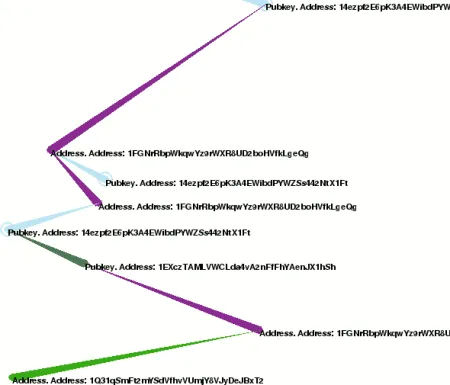

Visualisation de la « *share chain* » (source : Gregory Maxwell pour [Bitcoin Wiki](https://en.bitcoin.it/wiki/File:P2pool_chain.png))

https://en.bitcoin.it/wiki/P2Pool

share chain = chaine de partage, chaine des parts, chaine de participation ?

description : https://en.bitcoin.it/w/index.php?title=P2Pool&oldid=23453 "P2Pool creates a new block chain in which the difficulty is adjusted so a new block is found every 10 seconds. The blocks that get into the P2Pool block chain (called the "share chain") are the same blocks that would get into the Bitcoin block chain, only they have a lower difficulty target. Whenever a peer announces a new share found (new block in the P2Pool block chain), it is received by the other peers, and the other peers verify that this block contains payouts for all the previous miners who found a share (and announced it) that made it into the P2Pool share chain. This continues until some peer finds a block that has a difficulty that meets the Bitcoin network's difficulty target. This peer announces this block to the Bitcoin network and miners who have submitted shares for this block are paid in the generation transaction, proportionally to how many shares they have found in the last while."

### Stratum (nov. 2011)

Le minage en coopératives motive également le développement d'un nouveau protocole de communication, plus efficace que le rudimentaire getblocktemplate (GBT).

https://en.bitcoin.it/wiki/Stratum_mining_protocol

getblocktemplate (GBT)

Stratum, [27/11/2011](https://bitcointalk.org/index.php?topic=55842.msg664197#msg664197)

### FPGA

Obtenir du bitcoin avec du matériel. L'expertise d'un individu permet de surperformer.

Un FPGA est une forme de circuit logique programmable : field-programmable gate array (réseau de portes programmables *in situ* en français)

Le 20 mai 2011, le premier FPGA (field-programmable gate array) consacré au minage est apparu. Celui-ci permettait un rendement meilleur que les cartes graphiques.

20 mai 2011 Minage par FPGA en source ouverte

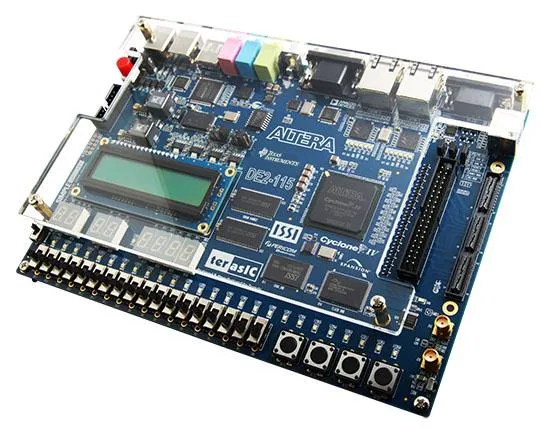

Carte de développement FPGA Altera DE2-115, sortie en 2010 (source : [Terasic](https://www.terasic.com.tw/cgi-bin/page/archive.pl?CategoryNo=139&No=502))

fpgaminer "Official Open Source FPGA Bitcoin Miner (Just Released!)" [20/5/2011](https://bitcointalk.org/index.php?topic=9047.msg130885#msg130885) [archive](https://web.archive.org/web/20111128063531/https://bitcointalk.org/index.php?topic=9047.0) https://en.bitcoin.it/wiki/Open_Source_FPGA_Bitcoin_Miner

"Custom FPGA Board for Sale!" [18/08/2011](https://bitcointalk.org/index.php?topic=37904.msg465501#msg465501)

"X6500 Custom FPGA Miner" [29/08/2011](https://bitcointalk.org/index.php?topic=40058.msg488292#msg488292)

"BTCMiner - Open Source Bitcoin Miner for ZTEX FPGA Boards" [29/8/2011](https://bitcointalk.org/index.php?topic=40047.0)

BFGMiner, Luke-Jr, [26/4/2012](https://bitcointalk.org/index.php?topic=78192.msg870396#msg870396), https://web.archive.org/web/20130409154534/http://bfgminer.org/

La spécialisation du minage s'accroit encore plus avec le développement des FPGA et des premiers modèles d'ASIC.

### Ouverture

ASIC, Butterfly Labs, Avalon

Professionnalisation du minage

## La bataille pour Pay to Script Hash

Après le départ de Satoshi Nakamoto, le développement du logiciel a été pris en charge par la communauté, qui a dû se coordonner, sous la supervision de Gavin Andresen. Il est en particulier question d'améliorer la programmabilité de Bitcoin, celle-ci ayant été temporairement restreinte par l'instauration de règles de relai sur le réseau.

Au cours de l'hiver 2011–2012, une controverse a eu lieu autour de la mise en œuvre de la signature multipartite dans Bitcoin. Celle-ci concernait, entre autres, le schéma appelé « Pay to Script Hash » (P2SH). Pete Rizzo et Aaron van Wirdum [appeleraient](https://bitcoinmagazine.com/technical/the-battle-for-p2sh-the-untold-story-of-the-first-bitcoin-war) la controverse « la bataille pour P2SH » (original: "the Battle for P2SH"). Cette première discorde majeure a posé la question de la gouvernance : qui décide comment le protocole est modifié ?

### Le développement du logiciel

Après la sortie de la version 0.4 du logiciel le 23 septembre, qui marque la relève prise par Gavin Andresen en tant que mainteneur principal, le développement se poursuit. En particulier, une nouvelle interface graphique pour le logiciel est développée. Il s'agit de Bitcoin-Qt, qui est [développée](https://bitcointalk.org/index.php?topic=15276.msg203205#msg203205) par Wladimir van der Laan à partir de juin. Elle se base sur le framework graphique Qt en lieu et place de l'outil wxWindows utilisé par Satoshi. Celle-ci est [intégrée](https://bitcointalk.org/index.php?topic=45742.msg545547#msg545547) à la branche principale du code le 26 septembre et [présente](https://bitcointalk.org/index.php?topic=52480.msg626275#msg626275) dans la version 0.5 du logiciel qui sort le 21 novembre. Le logiciel sera d'ailleurs appelé Bitcoin-Qt/bitcoind ou Bitcoin-Qt tout court à partir de ce moment-là (bitcoind étant le démon).

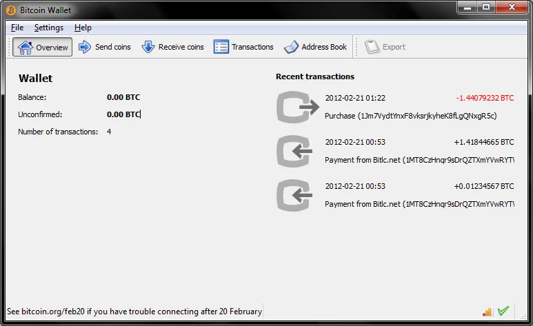

Capture de Bitcoin-Qt 0.5.2 en février 2012 (source : [JimNelin](https://commons.wikimedia.org/wiki/File:Screenshot_of_Bitcoin-qt-0.5.2.png) pour Wikimedia)

Gavin est toujours le meneur du projet, mais il est aidé par plusieurs personnes. En octobre 2011, les développeurs attitrés du projet ([listés](https://web.archive.org/web/20111022025640/http://www.bitcoin.org/) sur Bitcoin.org) sont Gavin Andresen, Pieter Wuille, Nils Schneider, Jeff Garzik et Wladimir van der Laan. Ces développeurs sont censés représenter le logiciel de Bitcoin d'un point de vue technique, et peuvent être contactés par courriel. Ils [bénéficient](https://bitcointalk.org/index.php?topic=1774750.msg17700787#msg17700787) d'un accès en écriture au dépôt sur GitHub, et sont appelés des mainteneurs. Greg Maxwell les [rejoint](https://web.archive.org/web/20120223113428/http://www.bitcoin.org/) en février 2012, et Nils Schneider arrête de contribuer en mai. L'équipe de développeurs ainsi formée se [maintiendra](https://bitcointalk.org/index.php?topic=1774750.msg17700787#msg17700787) jusqu'en 2014.

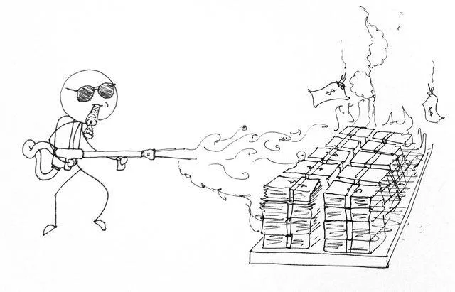

« The Gavinator » : dessin de Gavin Andresen brûlant des billets, réalisé par Shazow en avril 2011 (source : [archive](https://web.archive.org/web/20140426185712/https://bitcointalk.org/index.php?topic=5770.80) de BitcoinTalk)

Le système des propositions d'amélioration de Bitcoin, [mis en place](https://gnusha.org/pi/bitcoindev/1316392315.46221.YahooMailNeo@web121014.mail.ne1.yahoo.com/) par Amir Taaki en septembre 2011, commence à porter ses fruits et les premiers BIP commencent à être rédigés. C'est le cas par exemple du BIP 10, qui est [publié](https://gist.github.com/etotheipi/1321518) par Alan Reiner le 28 octobre.

Le 9 janvier 2012, un certain David Perry (Enmaku sur le forum) [publie](https://web.archive.org/web/20120830214308/http://codinginmysleep.com/bitcoin-development-history-visually/) une visualisation de l'avancée du développement du logiciel, réalisée au moyen d'un outil appelé Gource. Celle-ci représente les contributions des développeurs au logiciel : elle commence par les actions de Satoshi Nakamoto et de Martti Malmi, enchaine avec la place grandissante prise par Gavin Andresen à partir de juillet 2010, et montre la complexification du code qui a lieu en avril 2011 et qui amène à une explosion du développement.

Visualisation des contributions au logiciel de Bitcoin entre août 2009 et septembre 2012

### La programmabilité de Bitcoin

Bitcoin est constitué d'un système de programmation interne. Comme nous l'avons vu, Satoshi Nakamoto l'a mis en place dès le début, considérant que le modèle était « gravé dans le marbre pour le reste de son existence » (original: "was set in stone for the rest of its lifetime"). Comme il [l'écrivait](https://bitcointalk.org/index.php?topic=0195.msg1611#msg1611) en juin 2010 :

> « Le modèle prend en charge une grande variété de types de transactions possibles que j'ai conçus il y a des années.  Les transactions de dépôt fiduciaire, les contrats cautionnés, l'arbitrage par un tiers, la signature multipartite, etc.  Si Bitcoin connaît un grand succès, ce sont des choses qu'il faudra explorer à l'avenir, mais il fallait les concevoir dès le départ pour s'assurer qu'elles seraient réalisables plus tard. »
>
> original: "The design supports a tremendous variety of possible transaction types that I designed years ago.  Escrow transactions, bonded contracts, third party arbitration, multi-party signature, etc.  If Bitcoin catches on in a big way, these are things we'll want to explore in the future, but they all had to be designed at the beginning to make sure they would be possible later."

Cet éventail de possibilités intéresse profondément un certain nombre de personnes, et notamment Mike Hearn. Ce dernier en parle avec Satoshi dans sa correspondance privée \[citation ?\]. Pendant l'été, il [met en avant](https://en.bitcoin.it/w/index.php?title=Contract&oldid=16063) les « contrats distribués » sur le wiki de Bitcoin, où il donne plusieurs exemples comme la lutte contre le spam, les dépôts fiduciaires, les contrats de garantie, les oracles externes ou les échanges atomiques. Il ajoute une référence à l'article fondateur de Nick Szabo sur les *smart contracts* de 1997.

### La signature multipartite

La signature multipartite, ou la multisignature, est une façon de requérir plusieurs signatures pour une dépense. Elle est la pierre angulaire du déploiement de contrats impliquant plusieurs personnes. Elle est utile pour la sécurisation des fonds qui, comme on l'a vu, est une question très importante à l'époque. Elle est aussi utile pour mettre en place un dépôt fiduciaire, permettant de rendre les échanges économiques plus sûrs pour le vendeur. Ce type d'application, mentionnée dans le livre blanc, a une demande certaine : Gavin Andresen a ainsi [géré](https://bitcointalk.org/index.php?topic=2134.msg27797#msg27797) lui-même un service de dépôt fiduciaire appelé [ClearCoin](https://clearcoin.blogspot.com/2011/06/ill-be-closing-clearcoin-to-new.html) entre décembre 2010 et juin 2011.

Le langage de script contient un code opération, `OP_CHECKMULTISIG`, qui permet de requérir M signatures parmi N participants pour autoriser une dépense, avec M ≤ N. Les clés publiques des éventuels signataires sont inscrites dans le script de verrouillage de la sortie transactionnelle. N'importe quel sous-ensemble de M signatures permettent de déverrouiller la pièce.

Chose intéressante : l'implémentation d'`OP_CHECKMULTISIG` contient un bug. Celui-ci est [découvert](https://github.com/bitcoin/bitcoin/pull/319#issuecomment-1472505) le 30 juin par un certain Bobby Groff (Groffer), qui cherche à intégrer un mécanisme de dépôt fiduciaire au logiciel. Il écrit que l'opérateur « retire un élément de trop de la pile » (original: "It drops one too many items from the stack") et il faut donc « ajouter une valeur factice pour contourner le problème » (original: "to push a dummy value to work around that."). Toutefois, ce bug ne peut pas être corrigé sans modifier le protocole et réaliser un embranchement de chaine. C'est pourquoi il restera tel quel.

Le 23 août 2011, quelques jours après la conférence de New York, Gavin Andresen [engage](https://gnusha.org/pi/bitcoindev/CABsx9T1uw43JuvhEmJP0KCyojsDi1r7v6BaLBHz7wWazduE5iw@mail.gmail.com/) la discussion sur le forum BitcoinTalk et sur la liste `bitcoin-development`. Il souhaite rendre standardes les transactions impliquant la signature multipartite, qui forment pour lui « la voie la plus rapide pour obtenir des portefeuilles bitcoins très sûrs et très difficiles à perdre » (original: "the fastest path to very secure, very-hard-to-lose bitcoin wallets"). Depuis décembre 2010, seuls deux schémas [sont](https://bitcointalk.org/index.php?topic=2129.msg27744#msg27744) considérés comme standards : P2PK et P2PKH. L'idée est de rajouter un schéma de multisignature brute, où le nombre de participants peut atteindre 3 au maximum.

Il souhaite que les clés publiques impliquées soient utilisées comme adresse (comme dans le cas de P2PKH). Mais ces adresses ne seraient pas de toute façon pas supportées par les clients. Ainsi, quitte à mettre en ligne un client incompatible, il propose de « faire les choses correctement dès le départ, en implémentant ou en activant des codes opération pour que les nouvelles adresses bitcoin puissent être petites, et en programmant une scission de la chaîne de blocs » quelques mois plus tard (original: "do things right in the first place, implement or enable opcodes so the new bitcoin addresses can be small, and schedule a block chain split"). Mû par un sentiment d'urgence, il est en particulier favorable à l'action rapide, expliquant que sa « plus grande inquiétude » (original: "biggest worry") est que les gens se complaisent dans le débat et qu'« il n'y ait toujours pas de consensus » (original: "there is still no consensus") au bout de six mois.

À la suite du message de Gavin, Mike Caldwell [propose](https://bitcointalk.org/index.php?topic=38954.msg476689#msg476689) de modifier l'opérateur OP\_CHECKSIG (celui utilisé pour vérifier les signatures normales) afin qu'il prenne en compte les scripts de multisignature. Les adresses peuvent alors être l'empreinte du script, et le script entier est fourni lors de la dépense, comme la clé publique l'est dans le cas da la dépense d'une sortie P2PKH. Il [reformulera](https://bitcointalk.org/index.php?topic=45211.msg538756#msg538756) cette proposition un mois plus tard. Le 1er octobre, un certain Jim Babcock (Jimrandomh), développeur logiciel et rationaliste, [réalise](https://bitcointalk.org/index.php?topic=46429.msg553217#msg553217) une proposition similaire. Leur description inspire le mystérieux Nicolas van Saberhagen, alias ByteCoin, qui [conçoit](https://bitcointalk.org/index.php?topic=46538.msg553689#msg553689) un nouveau code opération appelé `OP_EVAL` dans la nuit du 1er au 2 octobre. Gavin Andresen [fait](https://bitcointalk.org/index.php?topic=45211.msg553668#msg553668) une proposition relativement équivalente (avec des opérateurs `BEGIN_DIGEST` et `END_DIGEST`) au même moment.

### OP\_EVAL : exécuter un script dans un script

L'instruction `OP_EVAL` permet d'exécuter un script à l'intérieur d'un script. Il est exécuté à la fin du script de verrouillage pour évaluer la validité du script donné, dont le hachage est comparée à l'empreinte donnée. Cela permet d'exécuter n'importe quel script.

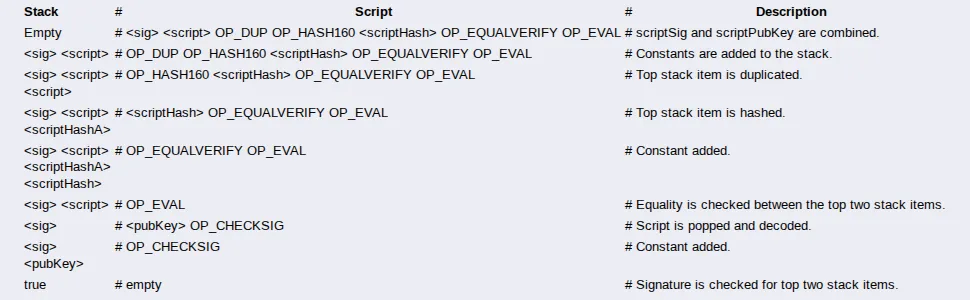

Fonctionnement technique de l'opérateur `OP_EVAL` (source : [BitcoinTalk](https://bitcointalk.org/index.php?topic=46538.msg553689#msg553689))

Il s'agit donc d'ajouter une instruction au langage de script, ce qui requiert une modification du protocole, et donc une séparation du réseau si tout le monde ne se met pas à jour, menant à une éventuelle scission de chaine. Toutefois, dans la journée du 2 octobre, Gavin découvre une particularité du langage : les opérateurs `OP_NOP` ajoutés par Satoshi lors de l'été 2010, qui sont des instructions muettes n'invalidant pas le script dans lequel elles se trouvent. Celles-ci permettent de faire des modifications de protocole qui sont « rétrocompatibles » (original: "backwards-compatible") pour les anciennes versions du logiciel, et (dans le cas où la puissance de calcul l'appliquant est majoritaire) de faire en sorte qu'une seule chaine survive. On appellera ces modifications des soft forks plus tard.

On peut ainsi transformer `OP_NOP1` en `OP_EVAL`. Gavin [écrit]((https://buildingbitcoin.org/bitcoin-dev/log-2011-10-02.html#l-852)) sur IRC :

> « Je lis probablement mal le code, mais je pense que OP\_EVAL n'entrainerait pas de scission de la chaine de blocs ! »
>
> original: "I'm probably reading the code wrong, but I think OP\_EVAL wouldn't cause a blockchain split!"

Deux heures plus tard, Gregory Maxwell [explique](https://buildingbitcoin.org/bitcoin-dev/log-2011-10-02.html#l-1426) que « la thèse de Gavin selon laquelle EVAL peut se faire sans scission \[l'a\] époustouflé » (original: "Gavin's point that EVAL can be done without a split blew \[his\] mind").

Le 19 octobre, Gavin Andresen [rédige](https://bitcointalk.org/index.php?topic=46538.msg583615#msg583615) trois propositions d'amélioration de Bitcoin, qui sont rapidement hébergées sur Bitcoin.it :

- Le [BIP 11](https://en.bitcoin.it/w/index.php?title=BIP_0011&oldid=18340), qui décrit les schémas de script multisignatures bruts ;
- Le [BIP 12](https://en.bitcoin.it/w/index.php?title=BIP_0012&oldid=18348), qui décrit l'instruction OP\_EVAL et le schéma de script correspondant ;
- Le [BIP 13](https://en.bitcoin.it/w/index.php?title=BIP_0013&oldid=18495), qui décrit le formatage des adresses pour OP\_EVAL, « permettant de prendre en charge des transactions arbitrairement complexes » (original: "This BIP describes a new type of Bitcoin address to support arbitrarily complex transactions").

L'activation du BIP 12 est prévue pour le 1er février 2012, à condition que 50 % des mineurs signalent leur soutien en insérant la chaine de caractères `OP_EVAL` dans les blocs qu'ils produisent avant le 15 janvier. Si ce seuil n'est pas atteint, alors le déploiement sera reporté à une date ultérieure. Cela a pour but d'assurer que la mise à niveau se passe bien, sans qu'une branche concurrente soit créée.

Cependant, l'opérateur `OP_EVAL` présente des défauts. Ceux-ci sont relevés principalement par Russell O'Connor, un chercheur en informatique canadien travaillant à l'université Radboud de Nimègue aux Pays-Bas.

D'une part, le défaut évident est la récursivité. Le système de script de Bitcoin est conçu pour ne pas faire de boucle et s'arrêter proprement (il n'est pas Turing-complet). Une implémentation naïve rend possible la récursion, et rendant possible de faire tourner le programme jusqu'à ce que la machine ne suive plus (l'exemple donné par Gavin est `<OP_DUP OP_EVAL> OP_DUP OP_EVAL`). Il faut donc ajouter une limite sur la profondeur de récursion ; cependant, le risque subsiste.

Le 27 décembre 2011, Russell O'Connor [fait](https://github.com/bitcoin/bitcoin/issues/729#issue-2660989) un examen du code et y trouve un bug de récursion. Il ajoute à son signalement la remarque suivante :

> « Cet OP\_EVAL est un changement très important qui n'a manifestement pas été suffisamment examiné. Il ne m'a fallu que 70 minutes de recherche pour trouver ce bug. Vous n'êtes pas prêts à l'implémenter. \[...\] Il faut que vous arrêtiez ce que vous êtes en train de faire et que vous compreniez vraiment Bitcoin. »
>
> original: "More generally, this OP\_EVAL is a very large change that clearly hasn't been vetted nearly enough. It took me all of 70 minutes of looking to find this bug. You guys are not ready to implement this. (...) You guys need to stop what you are doing and really understand Bitcoin."

D'autre part, même si on corrige la récursivité, OP\_EVAL rend impossible l'analyse avant l'exécution du script. Ainsi, on ne peut pas compter les opérateurs de signature (coûteux en ressources) avant d'exécuter le script lui-même.

Russell O'Connor met en exergue le manque de possibilité d'analyse entrainé par `OP_EVAL`. Le 29 décembre, il [écrit](https://gnusha.org/pi/bitcoindev/alpine.LRH.2.00.1112290111310.22327@theorem.ca/) (29/12 06:55) qu'« avec la proposition OP\_EVAL, il n'y a aucun moyen d'analyser statiquement le script (par exemple pour compter le nombre d'utilisations de OP\_CHECKSIG ou OP\_MULTICHECKSIG ou d'autres analyses) sans exécuter le script » (original: "With the OP\_EVAL proposal there is no way to statically analyze the script (say to count the number of uses of OP\_CHECKSIG or OP\_MULTICHECKSIG or other analysis) without actually executing the script.")

Sur la liste `bitcoin-development`, il [demande](https://gnusha.org/pi/bitcoindev/alpine.LRH.2.00.1112291143220.22327@theorem.ca/) (29/12 17:01) à Gavin de repousser la date d'activation « de deux mois », en précisant que « OP\_EVAL n'est tout simplement pas encore prêt » (original: "OP\_EVAL just is not ready yet"). Alan Reiner, le programmeur du portefeuille Armory, [rappelle](https://gnusha.org/pi/bitcoindev/CALf2ePzoC85=16h63ngn-KaEHDSYFqAOkW7UWqB_Jgd2F_pkTQ@mail.gmail.com/) (29/12 21:31) aux développeurs qu'ils sont en train de traficoter « un objet d'une valeur de plus de 20 millions de dollars » (original: "I would like to remind everyone that we/you are messing with a $20+ million dollar *thing*"), faisant référence à la valeur agrégée de tous les bitcoins, et que « ce n'est pas seulement un logiciel qui est en jeu » (original: "There's more than just a piece of software at stake").

Il est ainsi décidé d'étudier les alternatives avant de prendre une quelconque décision. L'une est le code opération `OP_CODEHASH`, [proposé](https://gnusha.org/pi/bitcoindev/alpine.LRH.2.00.1112290111310.22327@theorem.ca/) Russell O'Connor par lui-même, qui permet \[description\]. Une autre est l'instruction `OP_CHECKEDEVAL`, [conçue](https://gnusha.org/pi/bitcoindev/20111229190838.GA29609@ulyssis.org/) par Pieter Wuille.

### Pay to Script Hash

Le principe derrière `OP_EVAL` est de payer une empreinte de script et de fournir le dit script lors du déverrouillage des fonds. Le 2 janvier 2012, Gavin Andresen [a l'idée](https://buildingbitcoin.org/bitcoin-dev/log-2012-01-02.html#l-760) de reprendre ce principe, à l'exception que la machine virtuelle reconnaitrait la forme du script. Amir Taaki commente en écrivant que « l'idée est un hack » mais qu'il « aime bien » . Gavin [intitule](https://gnusha.org/pi/bitcoindev/CABsx9T3gNNmPen=WtCpG8RCChSwpJ73r7WU2Kz_fP31wAQ+jQg@mail.gmail.com/) son idée « pay to script hash », un nom [calqué](https://buildingbitcoin.org/bitcoin-dev/log-2011-12-17.html#l-715) sur le schéma *Pay to Public Key Hash* (P2PKH) qui est une forme standarde de script.

Le lendemain, le 3 janvier à 21 heures UTC, une réunion est [organisée](https://bitcointalk.org/index.php?topic=56376.msg670964#msg670964) sur le canal IRC \#bitcoin-dev par Amir Taaki, pour que les développeurs se mettent d'accord. Une grande majorité est favorable à Pay to Script Hash, [y compris](https://gnusha.org/pi/bitcoindev/alpine.LRH.2.00.1201021134030.21247@theorem.ca/) Russell O'Connor. Gavin [décrira](https://bitcointalk.org/index.php?topic=56969.msg679219#msg679219) la proposition comme « une alternative plus simple, plus sûre mais moins puissante pour créer des adresses bitcoin pour les transactions multisignatures et les futures transactions plus complexes » (original: "a simpler, safer-but-less-powerful alternative for creating bitcoin addresses for multisignature and future more-complex transactions.").

Gavin Andresen rédige une ébauche de BIP dans la soirée et celle-ci est [mise en ligne](https://en.bitcoin.it/w/index.php?title=BIP_0016&oldid=21680) le lendemain, sous le numéro 16. Dans le document, il concède que « reconnaître une forme "spéciale" de \[script\] et réaliser une validation supplémentaire quand elle est détectée, c'est laid » (original: "Recognizing one 'special' form of scriptPubKey and performing extra validation when it is detected is ugly"), mais explique que « les alternatives sont soit encore plus laides, soit plus complexes à implémenter, et / ou étendent le pouvoir du langage d'expression de manière dangereuse » (original: "the alternatives are either uglier, are more complex to implement, and/or expand the power of the expression language in dangerous ways"). Il modifie également le processus de signalement pour faire en sorte qu'il soit automatique : dans la dernière semaine de janvier, si 55 % de la puissance de calcul signale P2SH (en incluant la chaine de caractères `/P2SH/` dans les blocs produits), alors la mise à niveau sera activée le 15 février à minuit. Gavin [fait](https://github.com/bitcoin/bitcoin/pull/748) ensuite une demande de modification du code (*pull request*) sur le dépôt GitHub, qui est intégrée par lui-même le 13 janvier. Elle inclut le signalement par défaut de P2SH.

Gavin veut aller vite, très vite, ce qui crée inévitablement des tensions. Ainsi, même s'il [évoque](https://bitcointalk.org/index.php?topic=56969.msg679219#msg679219) un « consensus » (original: "consensus") autour de Pay to Script Hash, tous les développeurs ne sont pas exactement d'accord, et la communauté générale n'a pas été consultée. Une opposition se met donc en place.

### La réaction de Luke-Jr

La fronde est menée par le développeur Luke-Jr. Durant la réunion sur IRC le 3 janvier 2012, ce dernier [s'oppose](https://en.bitcoin.it/wiki/User:Genjix/Meetings/3_Jan_2012) à P2SH, considérant que « OP\_EVAL était bien meilleur que ce truc hideux » (original: "OP_EVAL was far better than this ugly thing"). Le 13, il [crée](https://web.archive.org/web/20130307042411/https://bitcointalk.org/index.php?topic=58579.0) un fil sur BitcoinTalk, dans lequel il appelle à l'action contre le BIP 16. Il considère que P2SH est « bien pire » (original: "far worse") qu'`OP_EVAL` car « il remplace essentiellement le système de script sur lequel Bitcoin est construit par un seul modèle spécial ». De plus, il fait remarquer que « Gavin oblige tous ceux qui utilisent la dernière version du code de Bitcoin à voter pour BIP 16 » (original: "Gavin is forcing everyone using the latest Bitcoin code to vote for BIP 16"), et [crée](https://github.com/bitcoin/bitcoin/pull/755) une *pull request* pour rendre ce signalement optionnel, qui sera acceptée. Il propose enfin un vote, directement sur le forum, qui est largement remporté par P2SH.

Cette attitude agace profondément Gavin Andresen qui [répond](https://bitcointalk.org/index.php?topic=58579.msg689812#msg689812) dans ce fil :

> « Luke, tu mets ma patience à rude épreuve. Je vais m'éloigner du code pendant quelques jours pour me calmer avant de faire quelque chose de stupide, parce que je commence à perdre patience. »
>
> original: "Luke, you try my patience. I'm going to step away from the code for a few days to calm down before I do something stupid because my patience is wearing thin."

Un autre membre du forum, un mineur allemand utilisant le pseudonyme Nachtwind, [écrit](https://bitcointalk.org/index.php?topic=58579.msg690009#msg690009) que Luke démontre une certaine « instabilité mentale » (original: "mental instability") par ses commentaires. Ce mineur se désintéresse de l'open source ; il avoue aimer « la façon dont bitcoin a été géré jusqu'à présent » (original: "I like the way bitcoin was handled till now") et avoir plus confiance en Gavin qu'en Luke « pour faire le bon choix » (original: "i trsut (sic) HIM more than you to make the right choice"). La [réponse](https://bitcointalk.org/index.php?topic=58579.msg690042#msg690042) de Luke est cinglante :

> « Si vous voulez une monnaie royale, pourquoi ne pas utiliser le dollar de la Fed ? Gavin n'est pas parfait, et c'est juste un exemple. Il est regrettable que tu considères que le fait de sensibiliser les gens à un problème relève de l'"instabilité mentale". »
>
> original : "If you want a monarchial currency, why not just use the Fed's USD? Gavin isn't perfect, and this is one example. Sorry you consider making people aware of a problem to be 'mental instability'."

À partir du 12 janvier, Luke [met au point](https://bitcointalk.org/index.php?topic=56969.msg687795#msg687795) son propre code opération en tant qu'alternative à Pay to Script Hash, qui est initialement appelé `OP_CODEHASHCHECK` (CHC), puis prend le nom `OP_CHECKHASHVERIFY` (CHV). Le 18 janvier, il [rédige](https://en.bitcoin.it/w/index.php?title=BIP_0017&oldid=22435) le BIP 17, qui décrit cette nouvelle instruction. Il s'agit d'exécuter le script fourni lors du déverrouillage, de le hacher et de comparer le résultat avec l'empreinte correspondant à l'adresse. Cependant, sa proposition [ne tient pas compte](https://bitcointalk.org/index.php?topic=60433.msg703923#msg703923) des complexités de la machine virtuelle.

### Le débat parmi les développeurs

Ces différentes propositions créent un débat parmi les développeurs.

Amir Taaki, qui [se déclare](https://github.com/bitcoin/bitcoin/issues/729#issuecomment-3325652) « de nature conservatrice sur le plan du protocole, et de nature progressive vis-à-vis des implémentations » (original: "protocol-conservative implementation-liberal by nature"), se montre particulièrement prudent à propos de l'adoption de Pay to Script Hash. Il est favorable à une prise décision plus large. Le 28 janvier, il [écrit](https://buildingbitcoin.org/bitcoin-dev/log-2012-01-28.html) sur IRC qu'il préfère que « les gens aient leur mot à dire en la matière, même si ça complique le travail des développeurs et que ça les oblige à expliquer leurs décisions » (original: "i'd rather people have a say in the matter even if it makes life tougher for developers to explain their decisions"). Le 29 janvier, il [publie](https://web.archive.org/web/20120131212150/http://bitcoinmedia.com/the-truth-behind-bip-16-and-17/) un long article sur Bitcoin Media, intitulé « La vérité sur les BIP 16 et 17 » (original: "The Truth behind BIP 16 and 17"), dans lequel il résume la situation et les différentes propositions. Il [fait](https://bitcointalk.org/index.php?topic=61705.msg719790#msg719790) le commentaire suivant :

> « Ma crainte c'est qu'un jour Bitcoin soit corrompu. Développeurs : considérez cet examen supplémentaire comme une opportunité de construire une culture d'ouverture. »
>
> original: "My worry is bitcoin someday becomes corrupted. Developers: see this extra scrutiny as an opportunity to build a culture of openness. It is not at all bad."

Toutefois, ce n'est pas l'avis de Gavin Andresen qui choisit de trancher le débat en faveur du BIP 16. Il considère qu'il y a eu suffisamment de discussions, et ne veut pas que les développeurs continuent à se disputer sur les détails, à l'instar de « [la couleur de l'abri à vélos](https://en.wikipedia.org/wiki/Law_of_triviality) ». Le 30 janvier, il [déclare](https://buildingbitcoin.org/bitcoin-dev/log-2012-01-30.html#l-1766) sur IRC ne plus vouloir « perdre \[son\] temps avec le BIP 17 ».

Luke-Jr [crée](https://buildingbitcoin.org/bitcoin-dev/log-2012-01-30.html#l-2147) une page sur le wiki de Bitcoin recensant les positions des développeurs, à la suite de la suggestion d'un certain Userjj. Le refus de Gavin contre CHV (BIP 17) est formel, et contraste avec les autres techniciens qui approuvent Pay to Script ou qui considèrent que c'est mieux que rien.

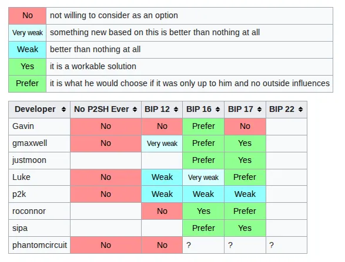

Avis des développeurs sur les différentes propositions, le 2 février 2012 (source : [Bitcoin.it](https://en.bitcoin.it/w/index.php?title=P2SH_Votes&oldid=23259))

Le 1er février 2012, Mike Caldwell remet une pièce dans la machine en [proposant](https://bitcointalk.org/index.php?topic=62181.msg725161#msg725161) un BIP (improprement assigné au numéro 22) qui reprend son idée de modifier le code opération `OP_CHECKSIG`. Gavin lui [demande](https://bitcointalk.org/index.php?topic=62181.msg725876#msg725876) immédiatement d'arrêter, en précisant que Pay to Script Hash « bénéficie d'un soutien massif » et qu'il « sera la solution » (original: "BIP 16 has overwhelming support, it will be the solution"). Il ajoute :

> « Tu proposes un changement qui n'est pas rétrocompatible, ce qui signifierait une scission « dure » de la blockchain. **Tout le monde** s'accorde à dire que c'est une mauvaise idée. La confusion et le potentiel de piratage si une partie significative des utilisateurs de bitcoins se retrouvait sur une chaîne séparée sont considérables ; tu ne tiens pas compte de tout ça dans ta proposition. »
>
> original: "You are proposing a non-backwards-compatible change, which would mean a "hard" blockchain split. **Everybody** agrees that is a bad idea. The confusion and potential for hacks if a significant fraction of bitcoin users were on a separate chain is massive; you gloss over all of that in your proposal."

Quelques jours plus tard, Gavin [expliquera](https://bitcointalk.org/index.php?topic=62181.msg729444#msg729444) (en référence à l'émission *Qui veut gagner des millions ?*) :

> « J'ai utilisé l'appel à un ami et l'avis du public ; j'ai choisi le BIP 16 et c'est mon dernier mot. »
>
> original: "I used my Phone-a-Friend and Ask the Audience, and I'm locking in BIP 16 as my Final Answer"

### Le signalement des mineurs

Un autre problème concerne l'activation de Pay to Script Hash en tant que telle. Pour que la mise à niveau soit rétrocompatible, il faut qu'une majorité du taux de hachage l'applique. Mais, à mesure que la fin du mois de janvier s'approche, les espoirs activer Pay to Script Hash s'amenuisent.

À l'époque, la puissance de calcul se répartit entre une \[dizaine/vingtaine\] de coopératives de minage, et trois d'entre elles sortent du lot : DeepBit, BTC Guild, Bitcoin.cz Mining (alias Slush Pool). La coopérative DeepBit, gérée par le Russe \[?\] Tycho, est la coopérative dominante et possède à elle seule environ 30 % de la puissance de calcul du réseau au début de l'année 2012. Les deux autres naviguent quant à elles autour de 10–15 %.

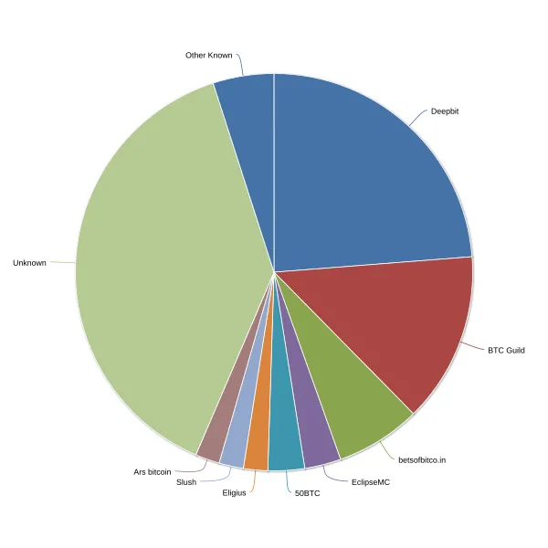

Proportion des blocs minés par les coopératives de minage durant la journée du 19 décembre 2011 (source : [Blockchain.info](https://web.archive.org/web/20111219124912/http://blockchain.info/pools))

Le 25 janvier, alors que l'évaluation du signalement commence, quelques petites coopératives [se prononcent en faveur](https://web.archive.org/web/20120125091902/http://blockchain.info/P2SH) de Pay to Script Hash. Eligius, la coopérative de Luke-Jr, vote contre. Toutefois, il apparait que l'opérateur de Deepbit, Tycho, refuse de déployer Pay to Script Hash au sein de sa coopérative, comme il [l'explique](https://buildingbitcoin.org/bitcoin-dev/log-2012-01-23.html#l-851) sur IRC. En réaction, Gavin [écrit](https://bitcointalk.org/index.php?topic=61125.msg712822#msg712822) un long message sur le forum, où il explique la situation « en termes simples » (original: "in layman's terms") et où il note en particulier :

> « À l'heure actuelle, il semble qu'une personne / coopérative (Tycho / deepbit) ait suffisamment de pouvoir de hachage pour opposer son veto à tout changement. Je crois que Tycho appréciait et prévoyait de soutenir la proposition originale d'OP\_EVAL, mais il ne soutient ni le BIP 16 ni le BIP 17 (il soutient en revanche le BIP 11, la partie multisignature comme standard des transactions), donc à moins qu'il ne change d'avis ou qu'il y ait un exode massif de sa coopérative, les adresses bitcoin multisignatures courtes devront attendre. »
>
> original: "Right now, it looks like one person/pool (Tycho/deepbit) has enough hashing power to veto any change. I believe Tycho liked, and planned to support, the original OP\_EVAL proposal, but doesn't like/support either BIP 16 or BIP 17 (he does like/support BIP 11, the multisignature-as-standard-transactions part of all this), so unless he changes his mind or there is a mass exodus from his pool short, multisignature bitcoin addresses will have to wait."

Tycho répond en [écrivant](https://bitcointalk.org/index.php?topic=61125.msg714209#msg714209) que c'est faux, qu'il ne peut pas bloquer la mise à niveau avec les 32 % de puissance de calcul dont il dispose. Il [justifie](https://bitcointalk.org/index.php?topic=61125.msg714231#msg714231) son attitude en donnant trois raisons : qu'il n'y a pas de « consensus entre les développeurs ou entre les mineurs » (original: "consensus between devs or miners") sur la manière dont implémenter le paiement aux scripts ; que la solution proposée est un peu « bricolée » (original: "hackish") ; qu'il ne souhaite pas « devenir la seule entité à décider de cette question » (original: "to become the single entity to decide on this").

Gavin continue de soutenir l'adoption de Pay to Script Hash par les coopératives. Néanmoins, le 30 janvier, il est contraint de reconnaitre que l'activation n'aura pas lieu tout de suite. Il [repousse](https://bitcointalk.org/index.php?topic=61922.msg722508#msg722508) alors le signalement à la dernière semaine de février, et l'éventuel basculement au 15 mars.

Ce rôle des mineurs dans l'activation de la mise à niveau fait naitre une conception spéciale : celle que les mineurs dirigent l'évolution du protocole grâce à leur puissance de calcul. Cette conception est [soutenue](https://web.archive.org/web/20120203023138/http://bitcoinmedia.com/cathartic-progress/) par Amir Taaki. Pour lui, la prise de décision est « définie comme une élection » (original: "exactly and correctly characterised as an election") et « chaque unité de puissance de minage *est* un vote » (original: "Each unit of mining power *is* a vote") conformément au principe du « un processeur, une voix » (original: "one-CPU-one-vote") énoncé par Satoshi dans le livre blanc.

Cette interprétation est largement contestée par Gregory Maxwell qui s'insurge [sur IRC](https://buildingbitcoin.org/bitcoin-dev/log-2012-01-28.html#l-1038), puis [sur le forum](https://bitcointalk.org/index.php?topic=61922.msg723476#msg723476). Il écrit :

> « Le système Bitcoin n'est _PAS_ soumis à un scrutin majoritaire. Ni à une majorité de pouvoir, ni à une majorité de personnes, ni à une majorité d'argent. Par exemple, que se passerait-il si une majorité qualifiée — voire 100 % — des mineurs actuels décidaient que la subvention devait être de 50 BTC pour toujours ?  **RIEN**. Les mineurs qui modifieraient cette règle dans leur logiciel cesseraient tout simplement d'exister du point de vue du réseau de bitcoin. »
>
> original: "The Bitcoin system is _NOT_ up for a majority election. Not a majority of hashpower, not a majority of people, not a majority of money. For example, what happens if a super-majority—even 100%—of the current miners decide that the subsidy should be 50 BTC forever?  **NOTHING**. Miners who change that rule in their software simply stop existing from the perspective of the bitcoin network."

### Le BIP 30

À la fin du mois de février, la situation semble toujours bloquée. Le signalement des mineurs en faveur de Pay to Script Hash est toujours minoritaire, [avoisinant](https://web.archive.org/web/20120307015754/http://blockchain.info/P2SH) les 40 %. Gavin Andresen est obligé de [repousser](https://gnusha.org/pi/bitcoindev/CABsx9T3748C0LiZETf=dRN5z0-izN=wh6vhuUSB+crXCXcuyAQ@mail.gmail.com/) à nouveau les dates d'évaluation et d'activation, de deux semaines, pour que le basculement se fasse le 1er avril. Cette fois-ci semble être la bonne : d'après Gavin, Tycho a l'intention soutenir la mise à niveau après avoir intégré et testé les modifications. Mais il faut d'abord régler un problème autrement plus urgent : comme l'[écrira](https://gnusha.org/pi/bitcoindev/201203061429.16460.luke@dashjr.org/) Luke-Jr le 6 mars, « la priorité est de déployer le BIP 30 d'abord » (original: "the priority is to get BIP 30 deployed first"). Le déploiement de Pay to Script est donc interrompu par cette mise à niveau d'urgence.

Le problème est celui des « transactions en double » (original: "duplicated transactions") présentes sur la chaine de blocs : des transactions de récompenses possédant le même identifiant et incluses dans des blocs différents. Quatre blocs minés en novembre 2010 contiennent de telles transactions : la transaction d'identifiant `d5d27987d2a3dfc724e359870c6644b40e497bdc0589a033220fe15429d88599` est à la fois incluse dans les blocs [91 812](https://mempool.space/block/00000000000af0aed4792b1acee3d966af36cf5def14935db8de83d6f9306f2f) et [91 842](https://mempool.space/block/00000000000a4d0a398161ffc163c503763b1f4360639393e0e4c8e300e0caec) ; et la transaction d'identifiant `e3bf3d07d4b0375638d5f1db5255fe07ba2c4cb067cd81b84ee974b6585fb468` fait à la fois partie du bloc [91 722](https://mempool.space/block/00000000000271a2dc26e7667f8419f2e15416dc6955e5a6c6cdf3f2574dd08e) et du bloc [91 880](https://mempool.space/block/00000000000743f190a18c5577a3c2d2a1f610ae9601ac046a38084ccb7cd721). Ce problème avait été remarqué, mais avait été réglé par les mineurs eux-mêmes. De manière générale, la résolution de ce problème ne semblait pas être urgente, car on ne pensait pas qu'il puisse perturber fondamentalement le fonctionnement de Bitcoin.

Cependant, le 4 février 2012, Russell O'Connor [découvre](https://buildingbitcoin.org/bitcoin-dev/log-2012-02-04.html) une vulnérabilité qui permet de supprimer purement et simplement toutes les transactions qui découlent d'une transaction de récompense en double par le biais d'une recoordination de chaine, et [décrit](https://r6.ca/blog/20120206T005236Z.html) l'attaque dans un article sur son blog le lendemain. Le 28 février, Pieter Wuille [rédige](https://en.bitcoin.it/w/index.php?title=BIP_0030&oldid=24321) un BIP à ce sujet, le BIP 30, qui interdit aux blocs de « contenir une transaction dont l'identifiant correspond à celui d'une transaction antérieure non entièrement dépensée dans la même chaîne » (original: "to contain a transaction whose identifier matches that of an earlier, not-fully-spent transaction in the same chain"). Cette règle ne s'applique pas aux deux blocs mentionnés. La règle est [ajoutée](https://github.com/bitcoin/bitcoin/commit/a206b0ea12eb4606b93323268fc81a4f1f952531) au code le 3 mars. Le changement de protocole est [inclus](https://bitcointalk.org/index.php?topic=68895.msg803183#msg803183) dans la version 0.5.3 du logiciel et devient actif le 15 mars à minuit. Il est également [présent](https://gnusha.org/pi/bitcoindev/CABsx9T3B0hMfS5kL+RaKwRq5MO0Bfs2EJRrzS6pfNsk+DPjx3w@mail.gmail.com/) dans une version préliminaire de Bitcoin-Qt 0.6, qui est censé activer Pay to Script Hash.

### L'activation de Pay to Script Hash

Après le hiatus lié à l'application du BIP 30 (qui demande de gros efforts aux mineurs), le signalement pour Pay to Script Hash redevient d'actualité. Le 10 mars, Tycho réalise les premiers tests pour mettre en place le signalement au sein de Deepbit. Le 15 mars, il [déclare](https://bitcointalk.org/index.php?topic=3889.msg803685#msg803685) qu'il a « essayé de retarder \[P2SH\] autant que possible » (original: "I tried to delay \[P2SH\] as much as possible"), mais que « ce n'est plus très productif maintenant » (original: "this is not productive already"). De ce fait, il abandonne le combat et déploie le changement au sein de sa coopérative.

Une semaine plus tard, le 21 mars, le signalement pour P2SH dépasse les 70 %. Gavin Andresen [écrit](https://bitcointalk.org/index.php?topic=71226.msg812897#msg812897) sur le forum :

> « J'aimerais annoncer que le soutien au BIP16 a obtenu la majorité du soutien minier nécessaire pour empêcher un éventuel embranchement permanent et qu'il sera activé le 1er avril comme prévu précédemment. \[...\] Par conséquent, si vous êtes un opérateur de coopérative, un mineur seul ou un mineur via p2pool, vous devez mettre à jour votre Bitcoin-Qt/bitcoind avant le 1er avril. Si vous utilisez une version de bitcoind antérieure à la version candidate 3 de la 0.6 après cette date, vous risquez de gaspiller votre puissance de hachage en minant des blocs invalides, car les versions antérieures accepteront des dépenses invalides de transactions BIP16 dans leurs pools de mémoire et les placeront dans des blocs considérés comme invalides par la majorité. »
>
> original: "Therefore I'd like to announce that support for BIP16 has acquired a majority of mining support needed to prevent a potential permanent fork and will be activated on April 1st as previously planned. \[...\] So if you are a pool operator, solo miner, or p2pool miner you need to upgrade your Bitcoin-Qt/bitcoind before April 1st. Running a version of bitcoind earlier than 0.6 release candidate 3 past this date means running the risk of potentially wasting your hashing power mining invalid blocks since earlier versions will accept invalid spends of BIP16 transactions into their memory pools and will put them into blocks considered invalid by the majority."

Deux versions préliminaires supplémentaires sont publiées dans les jours qui suivent, et la version 0.6 officielle [sort](https://bitcointalk.org/index.php?topic=74737.msg827484#msg827484) le 30 mars. Elle ajoute le schéma standard de multisignature brute (BIP 11), met en place les adresses courtes pour Pay to Script Hash (BIP 13) et applique Pay to Script Hash lui-même (BIP 16). La mise à niveau a lieu le 1er avril à minuit, sans incident majeur. Comme prévu, aucune scission de chaine n'a lieu.

### La première discorde majeure

La bataille pour Pay to Script Hash a constitué la première discorde majeure de l'histoire de Bitcoin. Elle a résulté d'un élargissement du développement, ce qui a fait qu'il y avait assez de techniciens pour se disputer. Gavin Andresen, qui avait une approche beaucoup plus consensuelle que Satoshi, a pourtant fini par trancher en privilégiant le schéma P2SH aux alternatives proposées. C'était la première grande décision de la communauté technique vis-à-vis du protocole.

Cette « bataille » a démontré que le développement de Bitcoin n'était pas un long fleuve tranquille, à cause de son caractère ouvert et libre et des enjeux impliqués. Elle présageait ainsi un conflit autrement plus violent, qu'a été la guerre des blocs entre 2015 et 2017. Et elle ouvrait la question plus ardue de la gouvernance de Bitcoin.

De plus, le débat sur l'évolution du protocole n'est pas la seule conséquence du caractère ouvert et libre de Bitcoin. Celui-ci permet aussi de mettre en œuvre des versions plus ou moins différentes de Bitcoin, en reprenant le code ou le concept, qu'on appellerait vite des « cryptomonnaies alternatives ». Ces cryptomonnaies alternatives, qui participent à leur manière à l'essor de Bitcoin, feront l'objet du prochain chapitre.

# Les excès

## L'apparition des cryptomonnaies alternatives

La découverte de Satoshi Nakamoto a ouvert la voie à toutes les innovations, bonnes comme mauvaises. Elle a donné naissance à une multitude de cryptomonnaies alternatives, ou *altcoins*, qui ont été créées à partir d'avril 2011, et qui se sont multipliées lors de l'automne 2011 et au début de l'année 2012. Comme l'[écrivait](https://web.archive.org/web/20130722051950/https://github.com/ppcoin/ppcoin/wiki/History-of-cryptocurrency) Sunny King en mars 2013 :

> « L'ère d'Internet a enfin donné naissance à un nouveau phénomène connu sous le nom de *cryptomonnaie*. Satoshi Nakamoto a présenté son œuvre révolutionnaire, *Bitcoin*, au monde entier en 2009, marquant le début d'une nouvelle ère dans l'histoire financière de la civilisation humaine. La principale avancée de Bitcoin est l'introduction d'un registre public *décentralisé*. Le terme *cryptomonnaie* fait ainsi référence à la nouvelle classe de monnaies virtuelles dotées d'un degré élevé de *décentralisation* (également appelé *pair à pair* dans la terminologie d'Internet), et donc beaucoup plus résistantes aux tentatives de coupures. »
>
> original: "The Age of the Internet has finally brought upon us a new phenomenon known as *cryptocurrency*. Satoshi Nakamoto introduced his groundbreaking work *Bitcoin* to the world in 2009, marking the dawn of a new era in the financial history of human civilization. The main breakthrough of Bitcoin is the introduction of *decentralized* public ledger. The term *cryptocurrency* then refers to the new class of virtual currencies with high degree of *decentralization* (also known as *peer-to-peer* in Internet terminology), thus much more resistant to shutdown attempts."

Cette effervescence a été bénéfique à l'expérimentation. Un cas d'usage différent a pu être essayé avec Namecoin, qui a été conçu pour gérer des noms de domaine de manière décentralisée. Plusieurs modèles alternatifs ont émergé : on a vu le minage combiné émerger avec Namecoin, la résistance aux GPU avec Tenebrix et Litecoin, et la preuve d'enjeu avec PPCoin. Mais ce développement ouvert a aussi permis aux personnes malintentionnées de cloner Bitcoin et faire un profit avec le préminage, ce qui n'a pas manqué de créer une réaction de rejet dans la communauté de Bitcoin.

### Les noms de domaine : BitDNS et Namecoin

Vers la fin de l'année 2010, l'idée de reprendre le code Bitcoin pour lancer d'autres systèmes émerge. Le réseau de test, lancé en octobre, [constitue](https://bitcointalk.org/index.php?topic=1647.msg20643#msg20643) en effet, pour reprendre les termes de Gavin Andresen, « une chaine de blocs différente, conçue pour que les deux chaines ne soient jamais confondues » (original: "a different block chain, implemented so that the two chains never get confused"), ce qui démontre que lancer une autre chaine n'est « pas difficile techniquement » et « ne posera aucun problème au "vrai bitcoin" » (original: "it isn't technically hard, and won't cause any problems for 'real bitcoin'").

L'élément qui est à l'origine de la création de la première cryptomonnaie alternative est le problème des noms de domaine, un problème particulièrement important pour les personnes qui gravitent alors autour de Bitcoin. Le système des noms de domaine, c'est-à-dire des chaines de caractères facilement mémorisables comme apple.com ou bitcoin.org, est en effet centralisé entre les mains de l'ICANN (*Internet Corporation for Assigned Names and Numbers*), une société de droit californien à but non lucratif. De ce fait, ces noms de domaine sont [sujets](https://web.archive.org/web/20110617160904/http://btlj.org/2011/02/23/four-rounds-of-ice-domain-name-seizures-and-related-controversies-and-opposition/) à des saisies régulières, ce qui pose problème aux partisans de la liberté, qui [cherchent](https://web.archive.org/web/20101213122350/http://dot-p2p.org/index.php?title=Main_Page) des alternatives.

Le triangle de Zooko, [théorisé](https://web.archive.org/web/20011020191610/http://zooko.com/distnames.html) en 2001 par le cypherpunk Bryce « Zooko » Wilcox, énonce qu'un identifiant ne peut réunir au maximum que deux des propriétés suivantes : la sécurité (un nom ne doit correspondre qu'à un seul et unique élément) ; la décentralisation (les autorités centralisées ne doivent pas être nécessaires pour déterminer à quel nom correspond quel élément) ; l'intelligibilité pour l'homme (le nom des éléments doit pouvoir avoir un sens et il doit être possible de le retenir). Mais à la suite l'émergence de Bitcoin, ce trilemme n'existe plus : il est possible de « réaliser la quadrature du triangle de Zooko » (original: "you can indeed use BitCoin to square Zooko's triangle") pour reprendre l'[expression](http://www.aaronsw.com/weblog/squarezooko) d'Aaron Schwartz.

Le 14 novembre, un utilisateur se faisant appeler Appamatto propose d'utiliser le modèle de Bitcoin pour mettre en place un système de noms de domaine décentralisé. Il nomme son idée « BitDNS ». Sur le canal IRC \#bitcoin-dev, il [écrit](https://web.archive.org/web/20101118020511/http://veritas.maximilianeum.ch/bitcoin/irc/logs/2010/11/14#l1150) :

> « J'ai eu l'idée d'un système DNS de type bitcoin. En gros, chaque bloc généré permet de définir un nouveau nom, et les transactions sont des rattachements de noms à des adresses IP. »
>
> original: "I had an idea for a bitcoin-like DNS system. Basically, each generating block allows you to define a new name, and transactions are remappings of the names to ip addresses."

Quelques heures plus tard, il [rédige](https://bitcointalk.org/index.php?topic=1790.msg22019#msg22019) une description plus approfondie sur le forum Bitcointalk, où il écrit qu'« il semble possible de créer un clone de bitcoin (bitDNS) qui offre une solution pour l'attribution et le transfert distribués de noms sans autorité » (original: "it seems possible to create a bitcoin clone (bitDNS) that provides a solution to distributed authority-free name allocation and transfer").

Le sujet attire l'attention de beaucoup de monde sur le forum, y compris Gavin Andresen et Hal Finney, à tel point que Satoshi Nakamoto lui-même y intervient à plusieurs reprises. Il est particulièrement enthousiaste au fait d'utiliser une chaine de blocs tierce. Le 10 décembre, il [écrit](https://bitcointalk.org/index.php?topic=1790.msg28917#msg28917) ainsi :

> « Le fait de rassembler tous les systèmes de quorum par preuve de travail dans une seule base de données ne passe pas à l'échelle. Bitcoin et BitDNS peuvent être utilisés séparément. \[...\] Les réseaux ont besoin d'avoir des destins différents. Les utilisateurs de BitDNS pourraient être extrêmement tolérants vis-à-vis de l'ajout de fonctionnalités permettant de traiter des données volumineuses, puisque peu de registraires de noms de domaine seraient nécessaires, tandis que les utilisateurs de Bitcoin pourraient devenir de plus en plus sectaires à propos de la limitation de la taille de la chaîne, pour que son accès reste facile pour beaucoup d'utilisateurs et pour les petits appareils. »
>
> original: "Piling every proof-of-work quorum system in the world into one dataset doesn't scale.  Bitcoin and BitDNS can be used separately.  \[...\] The networks need to have separate fates.  BitDNS users might be completely liberal about adding any large data features since relatively few domain registrars are needed, while Bitcoin users might get increasingly tyrannical about limiting the size of the chain so it's easy for lots of users and small devices."

Un mois plus tard, au début de l'année 2011, une proposition similaire est [faite](http://www.aaronsw.com/weblog/squarezooko) par Aaron Schwartz, informaticien et hacktiviste américain, cofondateur de Reddit en 2005. Il a développé le concept indépendamment, inspiré par les remarques de son ami Dan Kaminsky. Son idée est [évoquée](https://bitcointalk.org/index.php?topic=1790.msg35755#msg35755) sur le forum de Bitcoin à ce moment-là. Il [tentera](https://web.archive.org/web/20110521214956/https://squaretriangle.jottit.com/faq) d'implémenter son concept dans un système appelé « Squaretriangle », et surnommé « Nakanames » en hommage au créateur de Bitcoin.

Entretemps, un effort pour mettre en œuvre BitDNS est fait. Le 4 décembre, Kiba [met en place](https://bitcointalk.org/index.php?topic=2072.msg26742#msg26742) un système de récompenses pour le premier qui implémentera la chose : une dizaine de membres du forum et le montant promis est de 3 500 BTC (seuls 442 BTC seront versés). Plusieurs propositions sont faites, dont le modèle [DomainChain](https://bitcointalk.org/index.php?topic=1790.msg27787#msg27787) de Ribuck et la [proposition](https://web.archive.org/web/20101219214135/https://privwiki.dreamhosters.com/wiki/Bitcoin_DNS_System_Proposal) de Theymos et Nanotube, qui tirent toutes deux avantage de la chaine de Bitcoin.

Cet effort finit par mener à la création d'un système fonctionnel distinct de Bitcoin : Namecoin. La chaine est [lancée](https://bitcointalk.org/index.php?topic=6017.msg88356#msg88356) le 19 avril 2011 ([bloc 1](https://chainz.cryptoid.info/nmc/block.dws?1.htm)) par un certain Vincent Durham, qui utilise le pseudonyme Vinced sur le forum. Le logiciel est une version modifiée du logiciel de Bitcoin. Namecoin est ainsi très similaire à son grand frère : des unités appelées des namecoins sont émises à chaque bloc par des mineurs toutes les 10 minutes en moyenne, elles sont transférées par des transactions qui sont incluses dans les blocs, l'émission monétaire est réduite de moitié tous les 4 ans, etc. Les noms de domaines (qui [utiliseront](https://bitcointalk.org/index.php?topic=6851.msg126500#msg126500) l'extension `.bit`) sont des jetons spéciaux ne peuvent pas être mélangés entre eux (Vitalik Buterin les [nommera](https://ethereum.org/whitepaper/) « actifs non fongibles » (original: "non-fungible assets") en 2014) et qui sont déplacés avec les unités pour être liés à une adresse. La création et le renouvellement des noms sont réalisés grâce à un type spécial de transaction. Les domaines expirent au bout de 83 jours (12 000 blocs).

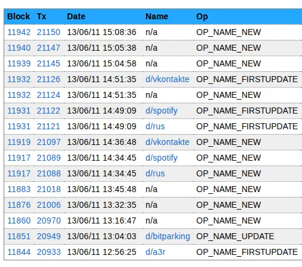

Noms réservés sur Namecoin le 13 juin 2011 (source : [explorer.dot-bit.org](https://web.archive.org/web/20110613130957/http://explorer.dot-bit.org/))

Namecoin est l'occasion de mettre en place le minage combiné, ou *merged mining* en anglais, qui est un [procédé](https://web.archive.org/web/20110723091126/http://dot-bit.org/Merged_Mining) consistant à réutiliser le travail fourni sur une « chaîne mère » (à savoir celle de Bitcoin) pour la validation de chaines « auxiliaires » plus petites. Ce procédé a été [proposé](https://bitcointalk.org/index.php?topic=1790.msg28696#msg28696) par Satoshi dans la discussion sur BitDNS, qui mettait en avant le fait que ce procédé « résoudrait le problème des réseaux multiples, qui constituent un danger les uns pour les autres si la puissance de calcul disponible se concentre sur l'un d'entre eux » (original: "This would solve the problem that if there are multiple networks, they are a danger to each other if the available CPU power gangs up on one.") et rend « plus facile » (original: "make it easier") le lancement de petits réseaux. Le minage combiné [commence](https://web.archive.org/web/20110925063651/http://dot-bit.org/forum/viewtopic.php?f=5&t=217) à être intégré au code en juillet et est activé sur la chaine de Namecoin le 8 octobre, à la hauteur de bloc 19 200.

### La première vague des imitateurs

Mais Namecoin n'est pas le seul système séparé à être lancée en 2011. La grande bulle de 2011 engendre en effet une [première vague](https://web.archive.org/web/20130722051950/https://github.com/ppcoin/ppcoin/wiki/History-of-cryptocurrency) de création de cryptomonnaies alternatives. Même si les intentions de leur inventeur ne peuvent pas être clairement identifiées, certains de ces projets se révèlent purement opportunistes, désirant profiter de l'enthousiasme vis-à-vis de Bitcoin, notamment par le biais de ce qu'on appelle préminage.

Certains sont hautement expérimentaux, à l'instar bitcoins du réseau de test, et peuvent être réinitialisés à tout moment. C'est le cas des « [BeerTokens](https://web.archive.org/web/20110703101435/http://exchange.beertokens.info/) » ou des « [Weeds](https://web.archive.org/web/20110505081347/http://exchange.surething.biz/) » créés à l'aide du logiciel MultiCoin, [développé](https://bitcointalk.org/index.php?topic=24209.msg300830#msg300830) par un certain Scott Carlson (Sacarlson).

Parmi les projets opportunistes, on peut citer Groupcoin / Devcoin créé par un individu utilisant le pseudonyme Unthinkingbit, qui est [annoncé](https://bitcointalk.org/index.php?topic=24813.msg308142#msg308142) le 30 juin et [lancé](https://explorer.devcoin.org/explorer/block/0000000062558fec003bcbf29e915cddfc34fa257dc87573f28e4520d1c7c11e) le 22 juillet. Le modèle [consiste](https://bitcointalk.org/index.php?topic=24813.msg422068#msg422068) à distribuer 90 % de la création monétaire aux développeurs impliqués dans le monde du logiciel libre ; les 10 % restants étant réservés aux mineurs du système. Bien qu'elle soit présentée comme une « monnaie éthique » (original: "ethical currency"), il s'agit d'une aubaine pour les développeurs qui en bénéficient et qui sont choisis par le meneur du projet.

Un autre de ces altcoins opportunistes est Ixcoin, une copie de Bitcoin qui se distingue de son grand frère par un rythme de création monétaire plus rapide. Ixcoin est [lancée](https://bitcointalk.org/index.php?topic=36218.msg446303#msg446303) le 10 août par un certain Thomas Nasakioto. Il s'agit du premier exemple de « préminage » : au cours des trois mois précédents, le fondateur a miné les 6 055 premiers blocs de la chaine en secret, générant plus de 580 000 ixcoins avant le lancement. Même s'il [propose](https://bitcointalk.org/index.php?topic=36220.msg446305#msg446305) des récompenses aux premiers commerçants utilisant sa nouvelle cryptomonnaie, il conserve une bonne partie des unités préminées. Les individus sur le forum en viennent à se [demander](https://bitcointalk.org/index.php?topic=36218.msg446352#msg446352), à juste titre, « qui possède ces 580 000 ixcoins » (original: "\[w\]ho \[...\] has these 580k ixcoins?"), y [compris](https://bitcointalk.org/index.php?topic=36218.msg451681#msg451681) Gavin Andresen lui-même.

La situation [donne l'idée](https://bitcointalk.org/index.php?topic=36425.msg448463#msg448463) à certains de développer I0coin, un fork d'Ixcoin « avec 0 bloc prégénéré » (original: "with 0 pregenerated blocks"). La chaine finit par être [lancée](https://bitcointalk.org/index.php?topic=36425.msg460733#msg460733) par un certain kr105 le 16 août. Elle a un temps de bloc de 5 minutes au lieu de 10. Elle [recueille](https://bitcointalk.org/index.php?topic=36425.msg461312#msg461312) une puissance de calcul de 1 TH/s dès le premier jour, chacun désirant se procurer des unités avant qu'elles ne prennent en valeur.

Un troisième altcoin est SolidCoin [lancé](https://bitcointalk.org/index.php?topic=38453.msg471183#msg471183) publiquement le 21 août 2011 par un individu utilisant les pseudonymes CoinHunter et RealSolid. Il s'est [intéressé](https://bitcointalk.org/index.php?topic=15672.msg381911#msg381911) à Bitcoin pour son « potentiel de \[lui\] faire gagner de l'argent grâce à la spéculation » (original: "the potential to make \[him\] money through speculation"), pour sa facilité à être écoulé et pour son anonymat. SolidCoin se différencie de Bitcoin par un temps de bloc inférieur (3 minutes au lieu de 10), des frais fixes par transaction, et un algorithme d'ajustement modifié facilitant la diminution de la difficulté de minage par rapport à son augmentation. En octobre, après une attaque de spam contre le système (ce dernier ne disposait pas du mécanisme de frais approprié), une version 2.0 de SolidCoin est publiée. Elle [modifie](https://web.archive.org/web/20111015164358/http://solidcoin.info/solidcoin-most-secure-currency.php) le protocole de façon à faire intervenir des « nœuds de confiance » (original: "trusted nodes") (détenant un certain nombre de SLC sous caution) dans le consensus, en tant que protection contre les attaques des 51 %.

De façon générale, SolidCoin est présenté comme un concurrent à Bitcoin, contrairement aux autres cryptomonnaies qui sont considérées comme complémentaires. Son fondateur critique le modèle de Nakamoto. Il dénonce la « concentration des Bitcoins dans les mains de pionniers élitistes qui n'ont aucun intérêt ou désir d'aider les gens "normaux" à utiliser les Bitcoins » (original: "Concentration of Bitcoins into elitist early adopters that have no interest or desire to help Bitcoins be used by 'normal' people"). Dans un article prédisant l'« effondrement de Bitcoin » (original: "Bitcoin collapse"), il [reproche](https://web.archive.org/web/20110925064226/https://solidcoin.info/solidcoin-ready-for-bitcoin-collapse.php) à Bitcoin sa stagnation techique découlant d'une possible « intervention de l'État » (original: "government involvement") et met en valeur SolidCoin comme la cryptomonnaie de l'innovation.

En septembre, une autre cryptomonnaie opportuniste est [lancée](https://bitcointalk.org/index.php?topic=42417.msg516279#msg516279) par un membre du forum se faisant appeler Lolcust : il s'agit de GeistGeld (signifiant « monnaie spirituelle » en allemand). Elle est présentée come une monnaie expérimentale, en tant que la génération de blocs est très rapide (le temps de bloc est de 15 secondes), générant probablement de nombreux blocs orphelins. Son créateur s'est réservé 7,7 millions d'unités pour lui-même \[source : Charlie Lee\].

Plusieurs services de change avec le bitcoin apparaissent. Il y a le *Bitparking Namecoin Exchange* qui est [lancé](https://bitcointalk.org/index.php?topic=11530.msg162730#msg162730) par Doublec en juin. Moonco.in [lance](https://bitcointalk.org/index.php?topic=31768.msg399398#msg399398) son service de change entre le namecoin et le bitcoin en juillet. Un service appelé Solidcoin24 dédié au change entre le solidcoin et le BTC/NMC est [ouvert](https://bitcointalk.org/index.php?topic=40471.msg493032#msg493032) à la fin du mois d'août. Enfin, la plateforme de change russe BTC-e, ouverte en août, [se spécialise](https://web.archive.org/web/20111017024937/https://bitcointalk.org/index.php?topic=40889.0) rapidement dans la négociation de cryptomonnaies alternatives, et en intègre les principales au fil de leur sortie.

Dû à une forte augmentation des sujets concernant les *altcoins*, une sous-section intitulée « Monnaies alternatives » (original: "Alternate currencies") est créée sur le forum en septembre. Un site web, Allchains.info, est également [ouvert](https://bitcointalk.org/index.php?topic=41546.msg505943#msg505943) pour recenser les taux de change, la difficulté et le taux de hachage des différentes chaines.

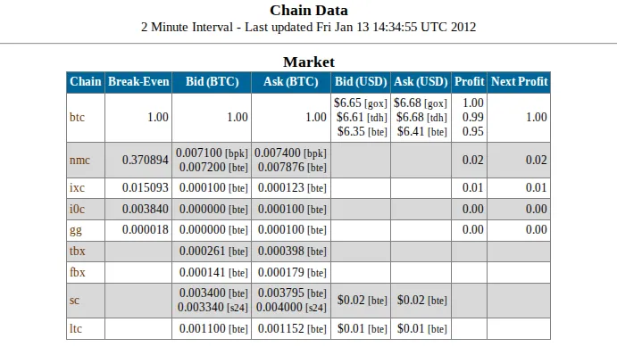

Taux de change entre les différentes cryptomonnaies alternatives en janvier 2012 (source : [archive](https://web.archive.org/web/20120113143526/http://allchains.info/) de Allchains.info)

### La résistance aux GPU : Tenebrix

Jusqu'à là toutes les cryptomonnaies alternatives utilisaient le fonction de hachage de Bitcoin, le double SHA-256, pour le minage, parfois exploitant le minage combiné. Cela profite aux mineurs établis de la chaine de BTC, car ils disposent déjà du matériel pour générer des unités en quantité. Les nouveaux arrivants n'ont pas l'occasion de pouvoir miner ces nouvelles cryptomonnaies avec leurs processeurs centraux, ce qui rejoint le problème déjà existant de la variance.

Le 26 septembre 2011, Lolcust [lance](https://bitcointalk.org/index.php?topic=45667.msg544675#msg544675) Tenebrix, qu'il présente comme « une cryptomonnaie favorable aux CPU et hostile aux GPU » (original: "a CPU-friendly, GPU-hostile cryptocurrency"). Il est aidé par le mineur allemand ArtForz, qui [remplace](https://bitcointalk.org/index.php?topic=46063.msg549768#msg549768) SHA-256 par Scrypt, une fonction de dérivation de clés initialement [conçue](https://web.archive.org/web/20090928073214/http://www.tarsnap.com/scrypt.html) en 2009 par l'informaticien canadien Colin Perceval pour le service de sauvegarde en ligne Tarsnap. Grâce à sa forte demande de mémoire, elle permet de réduire drastiquement l'efficacité des processeurs graphiques dans le minage pour que les processeurs centraux puissent être utilisés de manière profitable. Son nom lui est donné car « il s'agit d'une cryptomonnaie qui prospère à l'ombre de toute exploitation majeure de minage par GPU, profitant harmonieusement des cycles de CPU inutilisés de leurs équipements de minage » (original: "it is a cryptocurrency that thrives in the shade of any major GPU-mining operation, peacefully enjoying the spare cpu cycles of miner rigs ").

Comme GeistGeld, Tenebrix exploite une version modifiée du logiciel MultiCoin. De même, il n'y a pas de plafond, et l'émission des unités (nommées « brix » par Lolcust) est constante. Point négatif : plus de 7 millions d'unités ont été « préminées », ce qui correspond (si on prend en compte un rythme d'émission de 5 brix par minute) à 2 ans et demi de production minière.

C'est pourquoi Michael McLees [prend l'initiative](https://bitcointalk.org/index.php?topic=46342.msg552146#msg552146), quelques jours plus tard, de développer Fairbrix, une copie de Tenebrix sans préminage massif (seulement 3 775 unités). Après quelques ennuis d'ordre technique, Fairbrix est [lancé](https://bitcointalk.org/index.php?topic=46528.msg554186#msg554186) le 2 octobre par un certain Charlie Lee...

### Le complément à Bitcoin : Litecoin

Charlie Lee [est](https://web.archive.org/web/20130831040759/http://www.wired.com/wiredenterprise/2013/08/litecoin/) un développeur américain d'origine chinoise, qui est né en Côte d'Ivoire en 1977 et a déménagé aux États-Unis avec sa famille à l'âge de 13 ans. Studieux, il a obtenu un master en informatique au MIT. En 2011, il habite dans la Silicon Valley et travaille en tant que développeur pour Google, notamment sur ChromeOS. Sceptique à l'égard de la Réserve Fédérale, il est enthousiaste à propos des métaux précieux.

Charlie Lee en mars 2013 (source : [archive](https://web.archive.org/web/20130331071808/http://www.bitcoin2013.com/bitcoin-2013-panelists.html) de Bitcoin2013.com)

Il découvre l'existence de Bitcoin en juin 2011 en [lisant](https://twitter.com/satoshilite/status/1020131826369585152) un article sur Silk Road. Assez rapidement, il contacte Mike Hearn (qui travaille aussi pour Google, depuis Zurich) qui le convainc de la solidité de Bitcoin. Il participe à la conférence de Bruce Wagner à New York en août. Il s'intéresse par ailleurs aux cryptomonnaies alternatives, et se retrouve à lancer Fairbrix le 2 octobre.

Toutefois, cela ne le satisfait pas. Fairbrix est basé sur le client MultiCoin, et souffre de nombreux bugs. Charlie décide donc de lancer une nouvelle cryptomonnaie, en copiant le code source de Bitcoin-Qt. Il [l'appelle](https://bitcointalk.org/index.php?topic=47417.msg564414#msg564414) Litecoin, une « version allégée de Bitcoin » (original: "a lite version of Bitcoin"). Il souhaite en faire « une monnaie qui soit à l'argent ce que Bitcoin est à l'or » (original: "a coin that is silver to Bitcoin's gold").

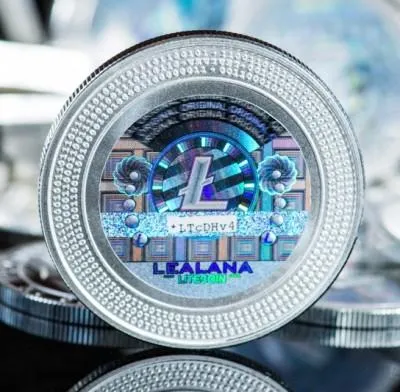

Litecoin physique dit « de Lealana » vendu en 2013 (source : [Wired](https://web.archive.org/web/20130831040759/http://www.wired.com/wiredenterprise/2013/08/litecoin/))

Litecoin intègre l'algorithme de preuve de travail Scrypt, comme Tenebrix. Le temps de bloc est de 2 minutes 30, quatre fois moins que pour Bitcoin, ce qui fait que le plafond d'émission se situe à 84 millions d'unités (et non 21) et que l'ajustement de la difficulté se produit tous les 3 jours et demi (au lieu de 2 semaines). Les halvings ont lieu tous les 840 000 blocs, soit tous les 4 ans environ.

La chaine est lancée le 13 octobre vers 3 heures du matin ([bloc 3](https://blockchair.com/litecoin/block/3)). Toutefois, le lancement ne se passe pas comme escompté : plus de 10 000 blocs sont minés en moins de 24 heures (au lieu de 12,5 jours), ce qui correspond à 500 000 litecoins, soit 0,6 % de la quantité totale planifiée. En cause la difficulté de minage trop basse. Le problème est que l'ajustement de la difficulté est limité : elle ne peut être multipliée (ou divisée) que par 4. En plus de ça, le bloc de genèse est horodaté au 9 octobre, ce qui fait que le premier ajustement a fait en réalité baisser la difficulté au lieu de la faire augmenter.

Tenebrix avait le même problème (6 048 blocs minés en ~2 jours au lieu de 21), mais celui-ci s'est résolu plus vite et l'impact n'était pas aussi grand que pour Litecoin. Charlie a simplement repris le même paramètre.

Un membre du forum utilisant le pseudonyme Localhost lui [reproche](https://bitcointalk.org/index.php?topic=47417.msg574959#msg574959) de ne [pas l'avoir écouté](https://bitcointalk.org/index.php?topic=47417.msg570772#msg570772) lorsqu'il l'a prévenu du problème. Charlie Lee se [défend](https://bitcointalk.org/index.php?topic=47417.msg574976#msg574976) en écrivant qu'il ne sera pas possible de reproduire cet incident. Il explique de plus que « le fait de commencer à un niveau de difficulté plus bas permet de susciter l'enthousiasme et l'intérêt des gens pour cette monnaie » (original: "starting at a lower difficulty gets people excited and interested in this coin") et qu'« il faut une communauté et du soutien pour lancer une monnaie à succès » (original: "You need a community and support in order to launch a successful coin.").

Malgré ce faux pas, Litecoin rencontre son succès. Avec Namecoin, il est l'une des rares cryptomonnaies à ne pas tomber dans l'insignifiance économique dans les mois qui suivent sa création, et il occupera la deuxième place dans le [classement](https://coinmarketcap.com/historical/20130526/) des cryptomonnaies en mai 2013. À la fin de l'été 2012, son prix [est](https://web.archive.org/web/20120831211413/http://www.ltc-charts.com/) de 0,038 $, tandis que le prix du namecoin, pourtant quatre fois plus rare, [est](https://web.archive.org/web/20120901055814/http://allchains.info/) de 0,019 $. Néanmoins, le litecoin est un nain économique à côté du bitcoin : sa valeur agrégée (le prix multiplié par la quantité d'unités en circulation) est de 380 000 dollars tandis celle de son grand frère avoisine les 100 millions de dollars.

### Les premières réactions de rejet

La possibilité de faire de l'argent en clonant Bitcoin et en profitant de la hausse de valeur des unités est évidente. Dès novembre 2010, avant même que l'idée de BitDNS n'émerge, on voit cette éventualité être évoquée sur le forum. Ribuck, un membre du forum alors très actif, [écrit](https://bitcointalk.org/index.php?topic=1647.msg20646#msg20646) un réquisitoire contre les futures copies de Bitcoin, tout en inventant au passage le terme « shitcoin » :

> « Si le bitcoin décolle vraiment, on peut s'attendre à ce que beaucoup d'imitations destinées à l'enrichissement rapide fassent leur apparition : le gitcoin, le nitcoin, le witcoin, le titcoin, le shitcoin... Certains d'entre eux ne manqueront pas d'attirer les utilisateurs avec des promesses telles que "Pourquoi utiliser le bitcoin, où vous ne pouvez générer que 50 bitcoins tous les quelques mois ? Utilisez plutôt le shitcoin, et vous obtiendrez 51 shitcoins toutes les 2 minutes". Bien entendu, ces imitations sans mérite disparaitront aussi rapidement que les "monnaies d'Internet" des années 1990, telles que le flooz et le beenz, mais beaucoup de gens se feront avoir en cours de route. »
>
> "\[I\]f bitcoin really takes off I can see lots of get-rich-quick imitators coming on the scene: gitcoin, nitcoin, witcoin, titcoin, shitcoin... Some of them are sure to attract users with promises like 'Why use bitcoin, where you can only generate 50 bitcoins every few months? Use shitcoin instead, and you'll get 51 shitcoins every 2 minutes'. Of course the cheap imitators will disappear as quickly as those 1990s "internet currencies" like flooz and beenz, but lots of people will get burned along the way."

Gavin Andresen [approuve](https://bitcointalk.org/index.php?topic=1647.msg20650#msg20650). Il répond que l'économie se trouve dans l'« époque du Far West de la monnaie open-source » (original: "the Wild West days of open-source currency") et qu'il s'attend « à ce que les gens soient victimes d'escroqueries, de contrefaçons, de pyramides de ponzi et de bulles de prix » (original: "expect people will get burned by scams, imitators, ponzi schemes and price bubbles"). Il ajoute qu'il « pense pas que l'on puisse faire grand-chose » (original: "I don't think there's a whole lot that can be done") contre ces pratiques malhonnêtes, « si ce n'est d'avertir les gens de faire attention à leur argent » (original: "besides warning people to be careful with their money").

Cette réaction est confirmée avec la première vague de cryptomonnaies alternatives, qui se multiplient en quelques mois. Cela fait réagir de nombreuses personnes impliquées dans Bitcoin. En août 2011, Thomas Voegtlin, le développeur d'Electrum, [explique](https://bitcointalk.org/index.php?topic=37592.msg463263#msg463263) que la plupart des clones de Bitcoin sont inutiles, car ils partagent la même niche de marché que ce dernier, et qu'ils ne bénéficient pas de son effet de réseau. Il [comprend](https://bitcointalk.org/index.php?topic=38453.msg471316#msg471316) bien que « ces chaines de blocs alternatives sont lancées par des personnes qui se faire de l'argent rapidement avant que leur valeur ne tombe à zéro » (original: "These alternate blockchains are launched by people trying to make quick money before the value drops to nothing."). De même, début septembre, Gavin [publie](https://bitcointalk.org/index.php?topic=42465.msg516789#msg516789) un avertissement sceptique sur le forum, dans lequel il encourage les gens à se poser les bonnes questions avant s'impliquer dans ces cryptomonnaies.

À la suite de la première vague de cryptomonnaies alternatives, une expression [apparait](https://buildingbitcoin.org/bitcoin-dev/log-2011-04-05.html#l-2226) pour signaler une exaspération : « *yet another cryptocurrency* », que l'on peut traduire en français par « une cryptomonnaie de plus ». L'expression *yet another* est déjà répandue dans le monde du logiciel libre et sert, quand elle est utilisée de manière péjorative (pour parler du travail des autres), à décrire « quelque chose qui existe déjà en trop grand nombre » (original: "something of which there are already far too many") [d'après](http://catb.org/jargon/html/Y/Yet-Another.html) le libriste Eric S. Raymond. C'est ainsi que des variantes de l'expression sont utilisées à l'encontre de [Namecoin](https://bitcointalk.org/index.php?topic=6017.msg89440#msg89440) en avril 2011, de [Tenebrix](https://bitcointalk.org/index.php?topic=45667.msg545150#msg545150) en septembre, ou de [Liquidcoin](https://buildingbitcoin.org/bitcoin-dev/log-2012-01-23.html#l-1429) en janvier 2012. Coiledcoin, un *altcoin* qui diffère de Bitcoin par le fait qu'il implémente `OP_EVAL`, [réutilise](https://bitcointalk.org/index.php?topic=56675.msg675166#msg675166) le terme de manière humoristique lors de son lancement le 5 janvier 2012. Une cryptomonnaie se nommant YACoin (« yet another coin ») sera même [lancée](https://bitcointalk.org/index.php?topic=206577.msg2161742#msg2161742) en mai 2013.

Une des personnes les plus virulentes à l'égard des cryptomonnaies alternatives est probablement Luke-Jr. Ce dernier est en effet très opposé à ces imitations, parfois de façon pathologique. Il [considère](https://web.archive.org/web/20120115215038/http://bitcoinmedia.com/luke-dashjr-throws-book-at-solidcoin) que toutes les cryptomonnaies alternatives ne sont pas « des arnaques » et que « Namecoin, en particulier, a été conçu dans un but légitime » (original: "I don't view all alternate chains as scams. Namecoin in particular has been designed with a legitimate purpose"), mais que « ces systèmes sont, par défaut, plus ou moins des systèmes pyramidaux de *pump and dump* » (original: "these systems are by default more or less pump-and-dump pyramid schemes") jusqu'à ce qu'ils développent un cas d'utilisation différent de Bitcoin.

Il joint le geste à la parole. En novembre 2011, il [modifie](https://en.bitcoin.it/w/index.php?title=Litecoin&oldid=18952) la page de Litecoin fraichement ajoutée sur le wiki de Bitcoin pour écrire que « Litecoin est une arnaque » (original: "Litecoin is a scam"). Le 6 janvier 2012, il [réalise](https://bitcointalk.org/index.php?topic=56675.msg676981#msg676981) une attaque de censure contre Coiledcoin (qui s'avère être fatale) à l'aide de sa coopérative de minage, Eligius, sans qu'il n'en informe les hacheurs. Dans son [message d'explication](https://bitcointalk.org/index.php?topic=56830.msg678004#msg678004), il précise qu'aucun membre de la coopérative n'a été lésé, la chaine de Coiledcoin étant minée en combinaison avec celle de Bitcoin. Il justifie son action en écrivant qu'il s'est engagé « à contribuer à l'écosystème de Bitcoin et à le protéger » (original: "to contribute to and protect the Bitcoin ecosystem") et que « les systèmes pyramidaux basés sur des copies du logiciel Bitcoin finissent par discréditer et nuire à la réputation de Bitcoin » (original: "Pyramid schemes built upon forks of the Bitcoin software ultimately discredit and harm Bitcoin's reputation."). Enfin, le 9 janvier 2012, il [dépose](https://web.archive.org/web/20120115205346/http://solidcointalk.org/topic/510-bitcoin-developers-attempt-to-kill-open-source-project-sends-dmca-to-linode-and-github/) un avis de retrait DMCA contre SolidCoin auprès de Linode (hébergeur du site web) et de GitHub (hébergeur du code) pour utilisation illicite de son code présent dans le logiciel de Bitcoin.

### La tentation de la preuve d'enjeu : PPCoin

À partir du printemps 2012, les choses se calment. Néanmoins, on voit quand même quelques cryptomonnaies alternatives se développer durant l'année, comme le [Timekoin](https://bitcointalk.org/index.php?topic=88467.msg974001#msg974001) de Michael Brown, le [Qubic](https://bitcointalk.org/index.php?topic=112676.msg1218867#msg1218867) de Come-From-Beyond ou le [Freicoin](https://bitcointalk.org/index.php?topic=133020.msg1416459#msg1416459) de Jorge Timón. Mais la cryptomonnaie principale qui voit le jour à ce moment-là est PPCoin (pour « peer-to-peer coin »), qui innove par sa mise en œuvre du procédé de preuve d'enjeu.

La preuve d'enjeu est une alternative à la preuve de travail qui consiste à remplacer l'énergie électrique dépensée par la possession d'unités pour déterminer la probabilité de produire un bloc. Elle a été [décrite](https://www.links.org/files/decentralised-currencies.pdf) pour la première fois en juillet 2011 par le développeur et activiste britannique Ben Laurie et son nom a été [inventé](https://bitcointalk.org/index.php?topic=27787.msg349645#msg349645) par un certain QuantumMechanic sur le forum de Bitcoin.

PPCoin est conçu par un groupe de personnes mené par un développeur [utilisant](https://talk.peercoin.net/t/transcript-of-sunny-king-interview-with-vitalik-buterin-from-bitcoinmagazine/463) le « nom de plume » (original: "pen identity") Sunny King, qui a [appris](https://bitcointalk.org/index.php?topic=15672.msg1076876#msg1076876) l'existence de Bitcoin en 2010 et s'y est impliqué à partir de la grande bulle de 2011. En octobre 2011, ils ont l'idée de reprendre le concept d'« âge des pièces » (*coin age*) pour mettre en place un système de preuve d'enjeu hybride. Certains blocs de la chaine minés par preuve de conservation  plus un UTXO est ancien, plus il a d'influence dans le processus. Dans le [livre blanc](https://web.archive.org/web/20121021014644/http://www.ppcoin.org/static/ppcoin-paper.pdf)), ils décrivent leur solution comme « économe en énergie à long terme » (original: "long-term energy-efficient").

Ils mettent leur projet à exécution en août 2012 : la nouvelle cryptomonnaie est [annoncée](https://bitcointalk.org/index.php?topic=99735.msg1091012#msg1091012) le 10 août et [lancée](https://bitcointalk.org/index.php?topic=101820.msg1113938#msg1113938) le 19 vers 18 heures. La politique monétaire est plutôt avantageuse : il n'y a pas de préminage, le taux de création monétaire par preuve d'enjeu est limité à 1 % par an, le taux de création monétaire par preuve de travail dépend de la difficulté du réseau (si bien qu'il est sensiblement réduit au bout de quelques mois).

PPCoin connait un relatif succès, et occupera la quatrième place dans le classement des cryptomonnaies en mai 2013. Toutefois, son système de consensus reste un modèle hybride. Pour avoir un système de preuve d'enjeu pure, il faudra attendre la plateforme [NXT](https://bitcointalk.org/index.php?topic=303898.msg3253022#msg3253022), lancée en novembre 2013. PPCoin [sera](https://bitcointalk.org/index.php?topic=114994.msg3713127#msg3713127) progressivement rebaptisé Peercoin à la fin de l'année 2013.

### Une relation fluctuante avec Bitcoin

Ainsi, l'année 2011 a été marquée par l'apparition des cryptomonnaies alternatives, qui ont constitué un terrain fructueux d'expérimentation permettant d'essayer des choses différentes, tant au niveau de l'utilité, du minage ou de l'algorithme de consensus lui-même. Toutefois, le principe d'ouverture a été rapidement dévoyé pour lancer des systèmes ayant pour but de rémunérer le créateur, notamment par le biais du préminage, ce qui n'a pas manqué d'alerter les meneurs de la commuanutés.

Cette première vague des cryptomonnaies alternatives a posé les bases pour ce qui s'est passé par la suite, en 2013 et après. Elle a encouragé la refonte du projet Ripple avec son unité numérique propre. Elle a ouvert la voie à un mouvement voulant améliorer Bitcoin, appelé « Bitcoin 2.0 », qui déboucherait sur la création d'Ethereum en 2014–2015. Et enfin, elle a fait émerger les prémices d'un mouvement de rejet, qui deviendrait le maximalisme en novembre 2014.

## Le commerce, licite et illicite (févr.–sept. 2012)

La première moitié de l'année 2012 a été assez plate du point de vue de la spéculation. Néanmoins, elle a constitué une période de construction pour l'activité économique réelle. Bitcoin est en effet un moyen de paiement : le but affiché dans le livre blanc est de résoudre le problème des paiements en ligne. Et c'est dans ce sens que la communauté d'alors a essayé de pousser Bitcoin.

L'échange de biens et de services contre des bitcoins, c'est-à-dire ce qu'on nomme généralement le *commerce* et qui peut être pratiqué de manière plus ou moins illicite ou clandestine. D'un côté, le trafic s'est développé grâce à l'activité florissante de Silk Road, la place de marché surnommée « l'Amazon de la drogue », qui représentait une grande proportion des transactions réalisées sur la chaine de Bitcoin. De l'autre côté, un effort considérable a été mis en place pour favoriser les affaires moins controversées, notamment grâce à l'apparition du processeur de paiement BitPay.

C'est pourquoi un effort considérable est réalisé entre 2011 et 2012 pour améliorer les façons d'accepter le dollar.

L'année 2012 est également florissante pour Silk Road, la place de marché du dark web. Silk Road représente le gros de l'activité économique de l'année.

https://bitcoinmagazine.com/markets/the-next-year-in-bitcoin-what-2013-has-in-store-1357247984

### La vision de Silk Road

Après son premier succès de l'été 2011, la plateforme Silk Road est devenue rentable et continue de se développer. La communauté grandit, notamment grâce au forum accessible via Tor, qui permet aux vendeurs de faire leur promotion, de partager leurs expériences et de se donner des conseils. Ross peut aussi s'exprimer librement, et développer la vision à long terme de la plateforme. Au début de l'année 2012, alors que Silk Road est enfin sur la bonne voie, les messages de Ross deviennent de plus en plus emphatiques.

Les frais suivent un taux fixe de 6,23 %, ce qui a été utile pour le lancer le service, mais avantage les petites ventes au détriment des plus grosses transactions. C'est pourquoi Ross décide de changer le système des commissions en appliquant un taux dégressif, de 15 % pour les plus petites ventes à 3,7 % pour les plus importantes. Il l'annonce sur le forum le 9 janvier 2012 dans un message [intitulé](https://antilop.cc/sr/users/dpr/threads/20120109-0301-State_of_the_Road_Address.html) « discours sur l'état de la Route » (*State of the Road address*) en référence aux allocutions solennelles prononcées régulièrement par les présidents des États-Unis d'Amérique. Il justifie sa décision en partageant sa vision, et explique en particulier que Silk Road est « destinée à devenir une force avec laquelle il faudra compter, capable de défier le pouvoir en place et de donner enfin aux gens la possibilité de choisir la liberté plutôt que la tyrannie » (original: "It is meant to grow into a force to be reckoned with that can challenge the powers that be and at last give people the option to choose freedom over tyranny.").

Cette décision est contestée par certaines personnes, et l'administrateur de Silk Road est notamment accusé de faire preuve de cupidité. Mais le changement est irrévocable. Comme l'[écrit](https://antilop.cc/sr/users/dpr/messages/20120110-0201-536-Re_State_of_the_Road_Address.txt) Ross le lendemain dans le même fil :

> « Que vous le vouliez ou non, je suis le capitaine de ce navire. Vous êtes ici de votre plein gré et si vous n'aimez pas les règles du jeu, ou si vous n'avez pas confiance en votre capitaine, vous pouvez quitter le bateau. Que ceux qui restent sachent que nous continuerons, chez Silk Road, à faire tout ce qui est en notre pouvoir pour que cette place de marché fonctionne de manière fluide et sécurisée. Merci encore pour votre soutien ! »
>
> original: "Whether you like it or not, I am the captain of this ship.  You are here voluntarily and if you don't like the rules of the game, or you don't trust your captain, you can get off the boat.  For those that stay, we at Silk Road will continue to do everything in our power to keep this market running smoothly and safely, and thank you again for your support!"

L'analogie du capitaine plait aux les membres du forum de Silk Road, qui s'empressent de la reprendre dans leurs messages de façon positive comme négative. Mais l'histoire ne s'arrête pas là...

Un mois plus tard, Ross décide de changer son nom sur le forum et dans ses communciations officielles. Il se présentait jusque là sous le pseudonyme « Silk Road ». Son nouveau nom, dévoilé sur le forum le 5 février, est Dread Pirate Roberts (rapidement abrégé en DPR). Il s'agit d'une référence au film *The Princess Bride*, une comédie sortie en 1987 parodiant les contes médiévaux, dans laquelle un personnage de Roberts est présenté comme un pirate sanguinaire. La révélation du film [est](https://www.youtube.com/watch?v=aHZGqBVBCRw) que le nom « Dread Pirate Roberts » n'est seulement qu'un titre et que le pirate actuel a hérité du titre de l'homme qui l'avait capturé, qui lui-même avait hérité du titre de son prédécesseur, etc., le nom étant censé « inspirer la peur nécessaire » (original: "inspiring the necessary fear") à ses ennemis.

Le personnage de Dread Pirate Roberts dans [*The Princess Bride*](https://www.imdb.com/title/tt0093779/)

La décision de Ross fait suite à la suggestion d'un de ses plus proches collaborateurs, Roger Thomas Clark alias Variety Jones, un Canadien vivant au Royaume-Uni qui vend de grandes quantités de graines de cannabis sur le site (et qui est également un grand consommateur). Ce dernier a approché Ross en novembre et est rapidement devenu son conseiller en sécurité ; Ross le [qualifiera](https://antilop.cc/sr/exhibits/253456476-Silk-Road-exhibits-GX-240B.pdf) même de « mentor » dans son journal. L'utilisation d'un pseudonyme de ce type permet de faciliter la transition entre deux personnes ou de brouiller les pistes sur l'identité de Ross (cette technique sera [utilisée](https://www.forbes.com/sites/andygreenberg/2013/08/14/an-interview-with-a-digital-drug-lord-the-silk-roads-dread-pirate-roberts-qa/) dans une entrevue entre DPR et Andy Greenberg en août 2013, dans laquelle VJ prétendra avoir succédé à Ross).

Le changement de nom confirme le statut de meneur de Ross dans le mouvement qu'est Silk Road. À partir de là, il expose pleinement sa vision du monde dans de [longs messages](https://www.forbes.com/sites/andygreenberg/2013/04/29/collected-quotations-of-the-dread-pirate-roberts-founder-of-the-drug-site-silk-road-and-radical-libertarian/?sh=2a35d6091b0c) postés sur le forum (à propos de sujets comme la guerre contre la drogue, la Réserve fédérale ou le salaire minimum), et [organise](https://antilop.cc/sr/users/dpr/threads/20120814-2208-_DPR_s_Book_Club.html) même un « club de lecture de DPR » (original: "DPR's book club"), où il conseille les ouvrages qui l'ont inspiré.

Sa première décision en tant que DPR est d'interdire la vente d'armes à feu sur Silk Road, celles-ci mettant mal à l'aise certains vendeurs sur Silk Road, et de [créer](https://antilop.cc/sr/users/dpr/threads/20120226-0702-A_brand_new_annonymous_market.html) une plateforme à part consacrée à ce type de produit. La plateforme sœur, nommée « The Armory », ouvre le 26 février 2012, mais l'expérience est de courte durée car elle [ferme](https://bitcointalk.org/index.php?topic=66587.msg1079466#msg1079466) en août faute de volume suffisante.

### L'essor silencieux de l'Amazon de la drogue

Cependant, l'activité sur Silk Road est florissante, contrairement à ce que les membres de la communauté de Bitcoin imaginent, à l'instar de Vitalik Buterin qui, en juillet 2012, [déclare](https://bitcoinmagazine.com/culture/the-silk-road-report) à tort que Silk Road « est loin d'être le moteur économique de Bitcoin » (original: "it is far from being Bitcoin's economic powerhouse"). D'après un rapport de Nicolas Christin, chercheur à l'université Carnegie-Mellon de Pittsburgh, qui [sera publié](https://arxiv.org/pdf/1207.7139) en août, la plateforme connait une croissance extraordinaire. Entre mars et juillet, le nombre de vendeurs double presque en passant de 300 à plus de 550, et près de 97,8 % des clients laissent un avis positif à propos de leur transaction.

Le volume de vente journalier double lui aussi en passant de 8 000 BTC en mars à 15 000 BTC en mai, avant de sembler reculer à 11 000 BTC en juillet. Cela s'explique par le fait que le prix du bitcoin, qui a stagné autour de 5 $ pendant des mois, s'est mis à augmenter à nouveau à partir de l'été, dépassant 8 $ en juillet. En juillet, le volume correspond ainsi à un chiffre d'affaires record de 1,9 million de dollars. Par comparaison, le volume du change sur Mt. Gox s'élève à près 60 000 bitcoins en juillet.

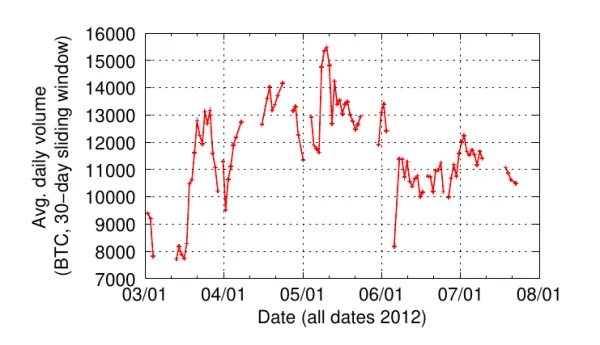

Évolution du volume journalier de Silk Road (en BTC) entre mars et juillet 2012 (source : [Nicolas Christin](https://arxiv.org/pdf/1207.7139))

Les commissions prélevées par le pirate Roberts sont par conséquent énormes. Elles sont de 3 000 $ par jour en mars et passent à plus de 6 000 $ par jour en juillet. Sur la période mesurée, elles sont en moyenne de 143 000 dollars, ce qui correspond à un revenu annuel de 1,7 million de dollars.

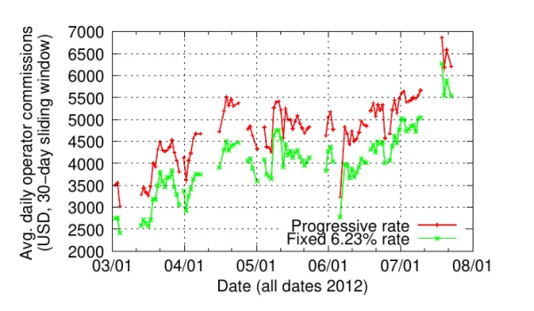

Évolution des commissions journalières générées par Silk Road (en dollars) entre mars et juillet 2012 (source : [Nicolas Christin](https://arxiv.org/pdf/1207.7139))

Tout cela fait que Silk Road occupe une place prépondérante dans l'activité économique de la cryptomonnaie. Une étude *a posteriori* [montrera](https://www.chainalysis.com/blog/silk-road-doj-seizure-november-2020/) que la proportion de l'activité par rapport à l'activité totale de la chaine de Bitcoin oscille entre 10 et 20 % au durant la totalité de l'année 2012. Cette proportion connait un pic en février, puis un autre en septembre 2012 avant de rapidement descendre sous les 5 %, au profit d'autres activités plus conventionnelles et de la spéculation.

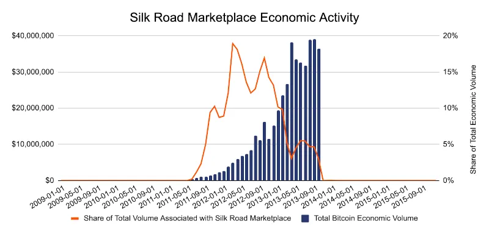

Évolution de l'activité économique de Silk Road durant son existence entre janvier 2011 et octobre 2013 (source : [Chainalysis](https://www.chainalysis.com/blog/silk-road-doj-seizure-november-2020/))

L'étude de Nicolas Christin a un effet positif sur la fréquentation de Silk Road. Début novembre 2012, Ross [parle](https://antilop.cc/sr/users/dpr/threads/20121102-0011-explosive_growth.html) ainsi de « croissance explosive » (original: "explosive growth"). Il écrit que Silk Road se trouve « en terre inconnue en ce qui concerne le nombre d'utilisateurs » qui y accèdent (original: "We are in uncharted territory in terms of the number of users accessing Silk Road."). Ross peut donc se permettre de réinvestir ses revenus de manière importante dans son projet : il engage de nombreux employés afin de faire progresser la plateforme. Le cours du bitcoin monte lui aussi en conséquence ce qui accroît le développement de Silk Road, effet formant un cercle vertueux.

Le succès de Silk Road attire enfin les concurrents. Outre Black Market Reloaded (ouvert dès juin 2011), on verra une [multitude](https://gwern.net/dnm-survival) d'autres plateformes ouvrir en 2013, dont Sheep Marketplace en février et Atlantis en mars 2013. Malheureusement, beaucoup d'entre elles finiront par se révéler être des escroqueries de sortie, leurs gérants ayant une vision moins éthique que Ross Ulbricht.

### Le dépôt d'espèces avec BitInstant

Une autre activité qui se développe bien durant l'année 2012 est le change entre le bitcoin et l'argent liquide physique, communément appelé le *cash*. Cette activité permet d'acheter ou de vendre du bitcoin de manière totalement confidentielle, sans laisse de trace de virement bancaire. Il y a plein de raisons de faire ce genre de transaction, mais la principale est évidemment liée à l'activité sur Silk Road. Les acheteurs peuvent se procurer du bitcoin pour obtenir de la drogue ; les vendeurs peuvent écouler leurs bitcoins en liquide pour payer leurs fournisseurs et avoir de quoi vivre. Cela vaut pour n'importe quelle activité plus ou moins illicites.

L'un des premiers services d'ampleur à offrir le dépôt en espèces est la société BitInstant, gérée par Charlie Shrem et Gareth Nelson qui [ajoute](https://bitcointalk.org/index.php?topic=55308.msg657631#msg657631) cette méthode de paiement le 21 décembre 2011. Il est possible pour les citoyens étasuniens de déposer des billets dans plus de 10 000 emplacements appartenant à des groupes bancaires reconnus (Chase, CitiBank, Bank of America, Wells Fargo) afin d'être crédités en dollars sur la plateforme de change de leur choix quelques dizaines de minute plus tard. D'autres emplacement seront ajoutés plus tard, notamment ceux des chaines de supermarchés Walmart et 7-Eleven. Les frais sont initialement de 5 %.

Le service rencontre son public. En cinq jours, plus de 30 000 $ sont [transférés](https://bitcointalk.org/index.php?topic=56392.msg671272#msg671272) de cette manière. C'est le cas d'un certain Robert Faiella, plombier floridien quinquagénaire, qui se [présente](https://antilop.cc/sr/vendors/16af931d32.htm) sous le pseudonyme BTCKing. En décembre, il [ouvre](https://www.justice.gov/sites/default/files/usao-sdny/legacy/2015/03/25/Faiella%2C%20Robert%20M.%20and%20Charlie%20Shrem%20Complaint.pdf#page=10) un service de revente de bitcoins hébergé sur Silk Road, qui exploite le service de dépôt d'espèces de BitInstant. Il fournit directement les bitcoins aux acheteurs et prélève des frais supplémentaires pour ce service.

Robert M. Faiella, alias BTCKing, en septembre 2014 (source : Craig Ruttle pour [CBC](https://www.cbc.ca/news/science/robert-faiella-sentenced-to-4-years-for-enabling-silk-road-transactions-1.2921103))

L'activité de BTCKing est repérée rapidement par BitInstant et son intermédiaire (TrustCash), car plusieurs erreurs sont commises par ses clients lorsqu'ils font des dépôts. En particulier, un dépôt excède la limite de 1 000 $ fixée par l'entreprise, ce qui vaut à son premier compte d'être cloturé. Ayant compris ce que faisait BTCKing et conscent qu'il lui « apporte beaucoup de clients » (original: "He brings us a lot of business."), Charlie Shrem entre personnellement en contact avec lui, pour lui conseiller de procéder aux dépôts avec une autre adresse courriel. Mais cet arrangement ne plait pas à Gareth Nelson, son cofondateur, qui voti d'un mauvais œil cette activité. Dans une discussion avec lui en janvier 2012, Charlie [justifie](https://www.justice.gov/sites/default/files/usao-sdny/legacy/2015/03/25/Faiella%2C%20Robert%20M.%20and%20Charlie%20Shrem%20Complaint.pdf#page=17) son choix de la manière suivante :

> « Il n'a enfreint aucune loi et silk road elle-même n'est pas illégale. Nous ne disposons pas non plus de règles à l'encontre des revendeurs. Nous réalisons de gros bénéfices grâce à lui. »
>
> original: "He has not broken a law and silk road itself is not illegal. We also don't have any rules against resellers. We make good profits from him."

L'activité de BTCKing constitue une aubaine pour BitInstant, à tel point que Charlie lui accorde une remise sur les commissions au bout de quelques mois. En août et en septembre 2012, le chiffre d'affaires de BTCKing s'élève à 40 000 $ par semaine. La société BitInstant est donc intrinsèquement liée à Silk Road, tout comme toutes les plateformes de change de l'époque, dont la fameuse Mt. Gox.

*Why Wait?* : chanson officielle de BitInstant interprétée par ZhouTonged

### Le change en argent liquide avec LocalBitcoins

Mais le dépôt d'espèces n'est pas la seule manière d'effectuer des échanges entre dollars et bitcoins ; il y a également les services de change de particulier à particulier. Ces derniers permettent notamment à des personnes d'entrer en contact afin de procéder un échange en personne. Ils apparaissent dès 2011 avec des services comme [Bitcoin.local](https://bitcointalk.org/index.php?topic=3795.msg53889#msg53889) (Tradebitcoin.com) ou [BTC NEAR ME](https://bitcointalk.org/index.php?topic=7107.msg104204#msg104204). Mais le principal d'entre eux est LocalBitcoins, qui est créé par un individu dénommé Jeremias Kangas.

Jeremias Kangas est un programmeur et hackeur finlandais approchant de la trentaine. \[Bonne opinion des monnaies locales.\] Il gère la société [Kangas Bros. Innovations Oy](https://web.archive.org/web/20101030185646/http://kangasbros.fi/) avec son petit frère, Nikolaus, avec laquelle ils publient un certain nombres d'applications pour l'iPhone et pour le Web. Il [a entendu](https://bensonsamuel.wordpress.com/2013/01/01/universal-bitcoin-exchange/) parler de Bitcoin à la fin de l'année 2010 par le biais de Hacker News, et a été immédiatement fasciné par le modèle de Nakamoto, qu'il [décrira](https://web.archive.org/web/20120517205800/http://blog.kangasbros.fi/?p=85) comme « une innovation formidable et incroyable » (original: "great and crazy innovation") et comme « un concept révolutionnaire » (original: "a revolutionary concept"). En 2011, après un voyage en Inde, il se met à travailler à plein temps sur Bitcoin et développe plusieurs programmes comme l'implémentation logicielle [django-bitcoin](https://bitcointalk.org/index.php?topic=30448.msg382233#msg382233) ou l'application dépositaire [Easywallet.org](https://bitcointalk.org/index.php?topic=75665.msg838319#msg838319). Il [met](https://bitcointalk.org/index.php?topic=87553.msg1035076#msg1035076) aussi au point le processeur de paiement en ligne Acceptbit avec Stefan Thomas lors d'un hackathon, une solution qui tire profit de la fonctionnalité de la clé publique maitresse d'Electrum pour générer de nouvelles adresses sans accéder à la clé privée correspondante.

Jeremias Kangas vers 2012 (source : [Blogger](https://www.blogger.com/profile/12265387388248206585))

Le 22 mai, il [fait remarquer](https://bitcointalk.org/index.php?topic=82968.msg914432#msg914432) que les « sites de change en espèces existent déjà » mais qu'« ils sont nuls », et que « quand le modèle économique n'est pas bon, on se retrouve avec des sites merdiques » (original: "These cash exchange sites already exist, they just suck. When there isn't a good business model, you get crappy sites."). C'est pourquoi il décide de développer sa propre plateforme de mise en relation, avec l'aide de son frère. La plateforme, nommée LocalBitcoins, est [lancée](https://bitcointalk.org/index.php?topic=86012.msg946497#msg946497) le 7 juin. Elle est accompagnée d'un [guide](https://web.archive.org/web/20120616084213/https://localbitcoins.com/cash_exchange_howto), qui explique comment devenir un changeur en espèces.

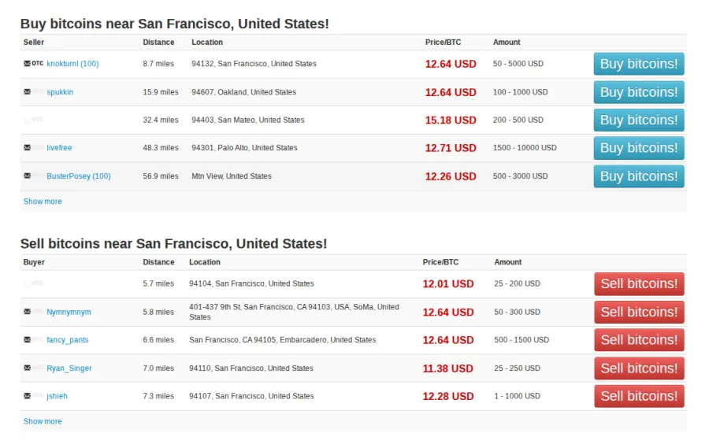

Interface de LocalBitcoins en septembre 2012 (source : [archive](https://web.archive.org/web/20120919184133/https://localbitcoins.com/) de LocalBitcoins.com)

Pendant l'été, les deux frères [intègrent](https://bitcointalk.org/index.php?topic=94793.msg1048453#msg1048453) un système de dépôt fiduciaire à la plateforme : les bitcoins sont conservés par la plateforme et peuvent être [débloqués par SMS](https://web.archive.org/web/20120817100941/http://localbitcoins.blogspot.fi/2012/08/sms-escrow-buy-and-sell-bitcoins-with.html) et versés à l'acheteur lorsque le vendeur a accusé la réception des espèces. Ils permettent aussi aux vendeurs de [lier leur profil](https://web.archive.org/web/20120817125105/http://localbitcoins.blogspot.fi/2012/08/now-you-can-connect-your-bitcoin-otc.html) à un compte sur \#bitcoin-otc, le canal IRC d'échange de gré à gré ouvert en 2010. Au fur et à mesure du temps, les gens utilisent également la plateforme pour les échanges par transfert bancaire.

LocalBitcoins attire l'attention de la communauté, Jeremias participant à plusieurs conférences dont Assembly Summer 2012 et Bitcoin London 2012. En septembre, [il y a](https://web.archive.org/web/20120920110200/https://localbitcoins.com/statistics) des changeurs dans 74 pays différents, et plus de 300 villes. Le 14 juin 2013, un an après sa création, le site [comptera](https://bitcoinmagazine.com/culture/jeremias-kangas-bitcoin-cannot-be-shut-down-1371225649) environ 44 000 utilisateurs, et le volume d'échange journalier atteindra plusieurs dizaines de milliers de dollars !

### Des outils pour le commerce

Silk Road et le change en espèces en sont pas les seules activités qui fleurissent durant cette année 2012. Il y a également le commerce au sens traditionnel qui commence à exister. Cependant, celui-ci a besoin d'outils en tous genres.

1. Répertoires
2. Exemples de gros commerces
2. Demande pour un processeur de paiement
3. Exemples de projets de processeur de paiement
4. URI

Ce type de commerce se développe à partir de 2011, où l'on commence à voir les premières initiatives apparaitre. Outre la page Trade...

Des outils sont également développés.

[Meiklejohn et al., "A Fistful of Bitcoins", oct. 2013](https://discovery.ucl.ac.uk/id/eprint/1490261/1/Meiklejohn%20et%20al%20A%20fistful%20of%20bitcoins.pdf) : ABU Games BTC Buy HealthRX Bitbrew BTC Gadgets JJ Games Bitdomain Casascius NZBs R Us Bitmit Coinabul Silk Road Bitpay CoinDL WalletBit Bit Usenet Etsy Yoku

2011 :

- OpenCart Bitcoin payment extension, [avr. 2011](https://bitcointalk.org/index.php?topic=5625.msg82684#msg82684)  ; 2010 : Mike Goguski, Bitcoin for WP e-Commerce https://github.com/mikegogulski/bitcoin-wp-e-commerce
- Jeremy West (jeremy.west), Spend Bitcoins, [19 mai 2011](https://bitcointalk.org/index.php?topic=8864.msg128629#msg128629), cartes-cadeaux Amazon, Fishpond, New Egg https://bitcointalk.org/index.php?topic=24653.msg306101#msg306101 https://web.archive.org/web/20110603145425/https://spendbitcoins.com/
- Chris Brunner de Trucoin (entreprise), BitcoinDeals.com, "over 1,000,000 items", juillet–août 2011 sur invitation (https://bitcointalk.org/index.php?topic=16701.msg217120#msg217120), [Bitcoin Show](https://www.youtube.com/watch?v=UjqJGkuTUpw) présence à la conférence fin août, [lancement](https://web.archive.org/web/20111222184030/http://www.bitcoindeals.com/) plus complet en décembre, [« maintenance »](https://web.archive.org/web/20120901131133/http://www.bitcoindeals.com/) en août 2012, [we "ran Bitcoindeals.com for a year"](https://99bitcoins.com/coinbrief/bitcoin/trucoin-chris-and-brent/) ; ["BitcoinDeals.com is launched!"](https://web.archive.org/web/20120201230557/http://www.trucoin.com/)
- Bitmit.net, [sept. 2011](https://bitcointalk.org/index.php?topic=41592.msg506512#msg506512)

"2012 has been an exciting year for Bitcoin. We have seen BitPay grow from near-irrelevance to processing transactions for over 2000 merchants around the world, Coinabul expand its gold-selling business from nothing in October 2011 to over 120,000 BTC of gold sold this year, entirely new Bitcoin-accepting businesses like Coindl and the Bitcoin Store open their doors, and hundreds more innovative services, of which there are unfortunately far too many to mention." [récapitulatif de Vitalik](https://bitcoinmagazine.com/markets/the-next-year-in-bitcoin-what-2013-has-in-store-1357247984)

Bitcoin Businesses and Developers, Let's Get Started! June 21, 2011, 12:51:28 AM : https://bitcointalk.org/index.php?topic=20292.msg254010#msg254010

Commerce : https://web.archive.org/web/20110525045712/https://en.bitcoin.it/wiki/Trade

En septembre, des centaines de commerçants (en ligne) sont référencés sur le wiki : https://web.archive.org/web/20110919161327/https://en.bitcoin.it/wiki/Trade https://web.archive.org/web/20120106203422/https://en.bitcoin.it/wiki/Trade

WeUseCoins : initiative lancée par Stefan Thomas (justmoon) en mars 2011, pour sa vidéo de présentation. Guide de minage : https://bitcointalk.org/index.php?topic=4938.msg72112#msg72112 https://web.archive.org/web/20110718193241/http://www.weusecoins.com/mining-guide.php ; "Getting Started" : https://bitcointalk.org/index.php?topic=29016.msg365385#msg365385 [05/2011](https://web.archive.org/web/20110325025457/http://www.weusecoins.com/getting-started.php) [07/2011](https://web.archive.org/web/20110718193241/http://www.weusecoins.com/mining-guide.php) ; Q&A : [forum déc. 2011](https://bitcointalk.org/index.php?topic=53924.msg642909#msg642909) [capture 01/2012](https://web.archive.org/web/20120107201808/http://www.weusecoins.com/questions.php) ; "Bitcoin for Merchants" : [23/9/2011](https://web.archive.org/web/20110923184030/http://www.weusecoins.com/merchant-tools.php) [07/01/2012](https://web.archive.org/web/20120107042342/http://www.weusecoins.com/merchant-tools.php)

CoinCard (Cartes-cadeaux), Michael Hendricks, Feburary 25, 2011–apr. 2011 puis déc. 2011–sept. 2012 : https://en.bitcoin.it/wiki/CoinCard https://www.youtube.com/watch?v=n5uoEqb3VaQ

- Coinabul, Jay Shore et Jon Holmquist, pièces et lingots d'or et d'argent : "Coinabul sells gold and silver for Bitcoin. Coinabul opened its doors on October 10th, 2011. Since then Coinabul has been heavily involved in the Bitcoin community. Coinabul has given away free posters, held Bitcoin-wide community events, and even held the occasional giveaway. (...) Coinabul was founded inside the United States and is dedicated to transparency and safety. Incorporated in Wyoming, with distribution centers in California, Coinabul ships both nationally, and internationally!" https://en.bitcoin.it/wiki/Coinabul https://web.archive.org/web/20120117180603/http://www.thebitcointrader.com/2011/12/interview-jay-from-coinabul.html https://bitcoinmagazine.com/business/coinabul-celebrates-six-months-of-gold-1335646624 https://bitcoinmagazine.com/business/coinabul-celebrates-one-year-in-business-1350442160

- 12 décembre 2011 : Internet Archive accepte le bitcoin pour les dons https://blog.archive.org/2011/12/07/please-donate-to-the-internet-archive/#comment-79666 ; Critique de Mt. Gox, 19 déc. 2012 (Brewster Kahle, Internet Archive cofounder) : https://blog.archive.org/2012/12/19/i-donated-bitcoins-to-the-internet-archive/

Quickco.in ?

Bitcoin.com by TradeHill, sept. 2011 : https://web.archive.org/web/20110907014134/http://bitcoin.com/

"State of TradeHill Bitcoin.com Announcement", [18/8/2011](https://web.archive.org/web/20110831095458/http://tradehillblog.com/2011/08/18/state-of-tradehill/), [BitcoinTalk](https://bitcointalk.org/index.php?topic=37883.0)

Martti Malmi, "1000 BTC for getting a major business to accept Bitcoin" (oct. 2011) https://bitcointalk.org/index.php?topic=46646.msg555039#msg555039

Le commerce se fait simplement. L'utilisation d'un smartphone et la lecture d'un code QR g^race à l'appariel photo de celui-ci permet de payer sans souci.

Bitcoin URI scheme ? [proposé] dès février 2010 ; "URI Scheme" ([BIP 21](https://github.com/bitcoin/bips/blob/master/bip-0021.mediawiki)), 2012-01-29, Nils Schneider, Matt Corallo, variante de la proposition de Luke-Jr. `bitcoin:175tWpb8K1S7NmH4Zx6rewF9WQrcZv245W?amount=20.3&label=Luke-Jr`

Satoshi :

> « Ce serait pratique au moment de payer \[ou: pour les points de vente\]. La caisse enregistreuse affiche un code QR contenant une adresse bitcoin et un montant sur un écran, et l'acheteur le prend en photo avec son téléphone portable. »
>
> original: "That would be nice at point-of-sale.  The cash register displays a QR-code encoding a bitcoin address and amount on a screen and you photo it with your mobile."

BitPay intègre ce standard en juin 2012 : https://bitcointalk.org/index.php?topic=88969.msg981026#msg981026

Enregistré auprès de l'Internet Assigned Numbers Authority (IANA) par Dave Thaler (architecte logiciel pour Microsoft Research) en septembre 2012 : https://www.iana.org/assignments/uri-schemes/prov/bitcoin

### Le premier processeur de paiement : BitPay

Le premier processeur de paiement appelé BitPay est créé par Stephen Pair et Tony Gallippi.

Stephen Pair ([Steve](https://bitcointalk.org/index.php?action=profile;u=4399)). Diplômé en informatique de l'Institut de technologie de Géorgie en 1994, il a travaillé pour IBM en tant qu'ingénieur logiciel et responsable du développement. Passionné par la cryptographie, il s'est intéressé pour le modèle eCash de David Chaum dans les années 90, puis pour les Linden Dollars et Ripple. Il s'est enthouasiasmé pour Bitcoin au début de l'année 2011. Il a [miné](https://bitcointalk.org/index.php?topic=4209.msg60980#msg60980) des bitcoins avec ses cartes graphiques avant de se rendre compte qu'il aurait été plus rentable de les acheter.

Tony Gallippi ([tonygal](https://bitcointalk.org/index.php?action=profile;u=16035), [BitPay Business Solutions](https://bitcointalk.org/index.php?action=profile;u=31293)) est un ancien ami d'université de Stephen. Diplômé en ingénierie mécanique, il a exercé la vente et le marketing dans les secteurs de la robotique et de la finance. En 2011, il [édite](https://bitcointalk.org/index.php?topic=44076.msg526713#msg526713) une revue de charme en ligne appelée STARE Magazine. Stephen lui parle de Bitcoin en février et il [cherche](https://bitcointalk.org/index.php?topic=10636.msg152388#msg152388) à accepter le bitcoin en mai. Ensemble, ils mettent au point BitPay (initialement orthographié Bit-Pay), Stephen s'occupant du côté technique. Ils [testent](https://bitcointalk.org/index.php?topic=25375.msg315757#msg315757) le produit début juillet, en l'utilisant avec le STARE Magazine.

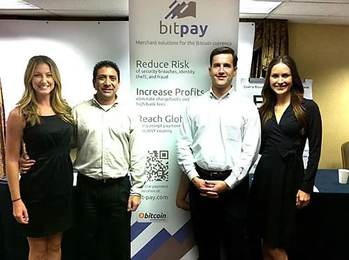

L'équipe de BitPay au CES de Las Vegas en janvier 2012, de gauche à droite : Stephanie, Tony Gallippi, Stephen Pair, Alison Skipper (source : [archive](https://web.archive.org/web/20120513020703/https://bit-pay.com/aboutUs.html) du site de BitPay)

Le principe de BitPay est de donner aux commerçants la possibilité d'accepter les paiements en bitcoins et de les convertissant instantanément en dollars, afin qu'ils puissent se prémunir contre la volatilité. Le modèle économique est ainsi opposé à BitInstant : BitPay avance les dollars à leurs clients contre une commission (les frais de traitement sont de 1 % au total), et se charge de vendre les bitcoins plus tard. Le but de ses fondateurs est de [faciliter](https://bitcointalk.org/index.php?topic=25665.msg319196#msg319196) l'utilisation de Bitcoin comme moyen de paiement pour [contrecarrer](https://bitcointalk.org/index.php?topic=36729.msg454397#msg454397) l'oligopole des réseaux Visa et Mastercard. Les avantages, [listés](https://web.archive.org/web/20120210233724/https://bit-pay.com/) début 2012 sur le site de l'entreprise, sont les suivants : « AUCUN RISQUE de rétrofacturation ou d'usurpation d'identité. AUCUNE COMPLICATION liée à la norme de sécurité PCI. AUCUNE FRONTIÈRE : acceptez les paiements provenant de N'IMPORTE QUEL pays. » (original: "NO RISK of Chargebacks or Indentity Theft. NO HASSLE of PCI Compliance. NO BORDERS Accept a payment from ANY country.") Vitalik Buterin [qualifie](https://web.archive.org/web/20120104013914/http://bitcoinweekly.com/articles/bitcoin-for-merchants-part-ii) BitPay de « l'une des innovations les plus importantes pour les entreprises utilisant Bitcoin » (original: "\[o\]ne of the most significant innovations for Bitcoin businesses").

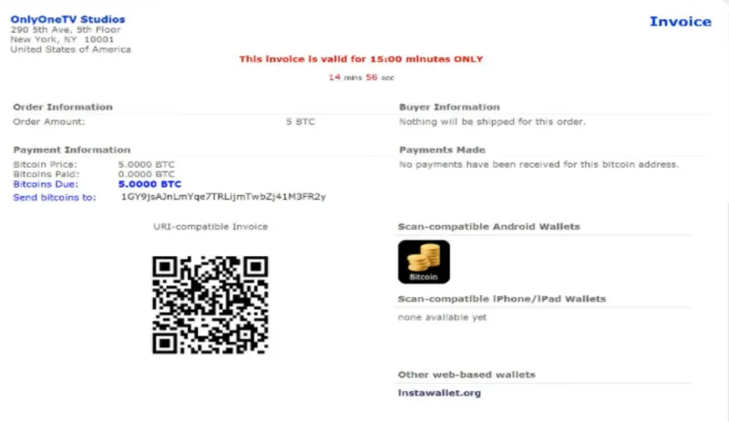

Demande de paiement via BitPay en juillet 2011 (source : [Bitcoin Show](https://www.youtube.com/watch?v=UZAnM4FjTOg) sur Youtube)

Stephen Pair et Tony Gallippi [lancent](https://bitcointalk.org/index.php?topic=32467.msg405469#msg405469) leur service en version bêta à la fin du mois de juillet, et commencent à en faire la promotion, de manière plutôt agressive ! Ils [passent](https://www.youtube.com/watch?v=UZAnM4FjTOg) dans le *Bitcoin Show* de Bruce Wagner le 27 juillet, et se [rendent](https://bitcointalk.org/index.php?topic=32791.msg409542#msg409542) à la conférence de New York à la fin du mois d'août. À partir de septembre, ils réalisent des vidéos promotionnelles, dont [la première](https://web.archive.org/web/20140314092556/https://www.youtube.com/watch?v=YZ-pqo0cLcE) est un pastiche d'une publicité de PayPal avec des femmes séduisantes. Tony Gallippi réalise une [présentation](https://web.archive.org/web/20140522091140/https://www.youtube.com/watch?v=cTX5yY0DozQ) sur l'adoption de Bitcoin à la conférence de Prague en novembre. En décembre, ils [lancent](https://bitcointalk.org/index.php?topic=53680.msg639819#msg639819) une initiative appelée LoveBitcoin.org, qui consiste à « faire la publicité de l'*utilité* des Bitcoins comme alternative à PayPal, aux cartes de débit, à Western Union et aux virements bancaires ». (original: "advertising the *usability* of Bitcoins as an alternative to PayPal, debit cards, Western Union, and wire transfers."). À partir de décembre, Tony Gallippi [organise](https://bitcointalk.org/index.php?topic=55419.msg659429#msg659429) une réunion mensuelle à Orlando en Floride, là où il habite.

En janvier, ils [participent](https://bitcointalk.org/index.php?topic=56706.msg675586#msg675586) au *Consumer Electronics Show* à Las Vegas, le plus important salon consacré à l'innovation technologique en électronique grand public, et y occupent un stand avec Roger Ver. Ils lancent aussi de nouveaux produits, comme la [carte de dépôt](https://bitcointalk.org/index.php?topic=57303.msg682576#msg682576) qui « permet à n'importe qui de *recevoir* des bitcoins sans avoir besoin d'un portefeuille ou de connaissances particulières sur le sujet », les fonds reçus étant instantanément convertis en dollars par BitPay (original: "It lets anyone *receive* bitcoins without a wallet or without having to know anything about bitcoins.") ; ou bien [Limocoin](https://bitcointalk.org/index.php?topic=63370.msg741514#msg741514), « un système de paiement en bitcoins conçu pour les chauffeurs et les entreprises de limousines et de taxis » (original: "a bitcoin payment system designed for limousine and taxi drivers and businesses").

Tout au long de l'année, leur service croit. Il s'étend à l'international, en [Amérique du Nord](https://bitcointalk.org/index.php?topic=69425.msg809043#msg809043) et en [Europe](https://bitcointalk.org/index.php?topic=76562.msg849944#msg849944). Le nombre de commerçants inscrits sur la plateforme [passe](https://web.archive.org/web/20120928213117/http://www.economist.com/node/21563752) de 100 en mars à plus de 1 000 en septembre. Le volume transactionnel mensuel [passe](https://bitcoinmagazine.com/business/bitpay-exceeds-1000-merchants-accepting-bitcoin-1347393248) de 10 000 $ en mars à 550 000 $ en septembre, avec une pointe journalière à 250 000 $ le 24 juin grâce à la prévente d'ASIC de Butterfly Labs.

Le succès de BitPay [fait](https://www.forbes.com/sites/jonmatonis/2013/01/07/largest-bitcoin-payment-processor-raises-510000-angel-round/) des émules, avec l'apparition des processeurs de paiement WalletBit, Paysius et AcceptBit. Mais surtout il sera surtout concurrencé par le service Coinbase, lancé au cours de l'année 2012 par un certain Brian Armstrong.

### Le PorcFest 2012

Un évènement majeur dans l'adoption commerciale de Bitcoin est le *Porcupine Freedom Festival* de 2012, qui a lieu du 18 au 24 juin, toujours sur le même terrain de camping situé au nord de l'État du New Hampshire. Cette année-là, le festival prend les réservations en bitcoins. Il [réunit](https://zerogov.com/2012/06/26/porcfest-2012-after-action-review/) près de 1 000 participants.

Pour mettre Bitcoin à l'honneur, les représentants de BitInstant [sont présents](https://web.archive.org/web/20120701024814/http://blog.bitinstant.com/blog/2012/6/27/porcfest-2012-bitinstant-and-the-bernanke-bitcoin-exchange.html). Ils sont au nombre de quatre : Roger Ver (qui est d'ailleurs accompagné sa fiancée japonaise, Ayaka), Erik Voorhees, Charlie Shrem et Ira Miller. Ces derniers ont la responsabilité d'expliquer Bitcoin aux autres, et organisent notamment une table ronde sur le sujet qui attire plus de 80 personnes. Du côté médiatique, [Roger](https://www.youtube.com/watch?v=nDmAm5wbasU) et [Erik](https://www.youtube.com/watch?v=FfRdPVcyR6s) répondent aux questions des quelques médias indépendants présents et passent, entre autres, dans l'émission de radio Free Talk Live.

Mais surtout, les représentants de BitInstant tiennent un stand, appelé le « *Bernanke's Bitcoin Exchange* », où ils assurent le change avec le dollar et apprennent aux curieux comment utiliser Bitcoin. Ils montrent aux gens comment facilement accepter et dépenser le bitcoin au moyen de BitcoinSpinner, Blockchain.info ou Instawallet. Au cours de la semaine, ils vendent pour 2 500 $ de bitcoins, et quelques centaines de dollars en Casascius Coins, qui intéressent les amateurs de numismatique.

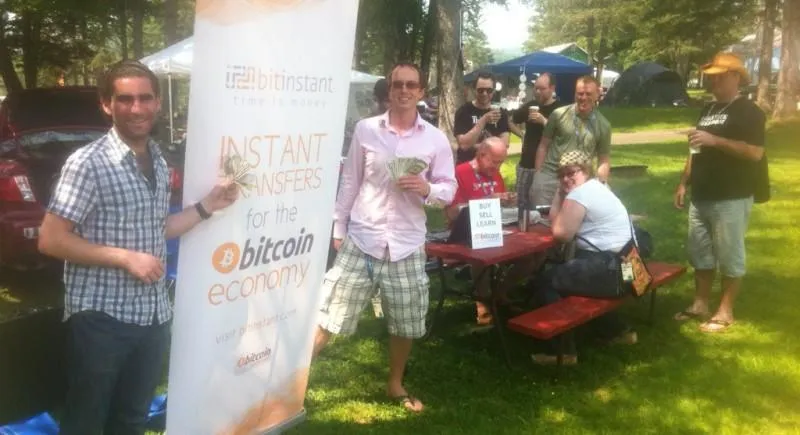

Le stand de BitInstant au PorcFest le 21 juin 2012 (source : [Charlie Shrem](https://twitter.com/CharlieShrem/status/215824423616385025) sur Twitter)

Leur stand se situe sur la partie du terrain [appelée](https://web.archive.org/web/20120606043337/http://happyporcupine.info/agoravalley/) l'« *Agora Valley* », une zone réservée au commerce qui comprend une quarantaine de stands répertoriés. Les vendeurs offrent toutes sortes de choses : de la nourriture, des boissons, des livres, des vêtements, des couteaux, des chapeaux, et quantité d'autres objets. Comme lors des éditions précédents, les commerçants acceptent généralement les pièces d'argent et de cuivre en tant que moyen de paiement, ainsi que les dollars (ou les « billets de la Réserve fédérale » (original: "Federal Reserve Notes") comme ils les appellent). Mais cette année-là, plus de la moitié d'entre eux acceptent aussi le bitcoin. Et grâce à l'aide de BitInstant, ce pourcentage [monte](https://bitcointalk.org/index.php?topic=89714.msg987575#msg987575) à 80 % à la fin de l'évènement.

Visite en vidéo de l'*Agora Valley* au PorcFest 2012, réalisée par Johnson Rice

En particulier, un certain George Mandrik, libertarien d'origine grecque, [propose](https://twitter.com/Mandrik/status/1488885417151807489) à la vente des gyros (sandwichs grecs proches du döner kebab) et des baklavas (desserts orientaux traditionnels), ainsi que des pancakes paléos cuits à l'huile de coco. Il réalise beaucoup de ventes grâce à une carte de dépôt de BitPay, ce qui [attire](https://bitcointalk.org/index.php?topic=89714.msg987946#msg987946) l'attention de Tony Gallippi. Mandrik sera rapidement embauché par BitInstant pour gérer le service client.

L'introduction du bitcoin au PorcFest est un franc succès. Josh Harvey (ben-abuya sur le forum) [parle](https://bitcointalk.org/index.php?topic=89714.msg987575#msg987575) de l'édition 2012 comme « le plus grand événement lié à Bitcoin jamais organisé » (original: "Biggest Bitcoin event ever"). Il écrit qu'il pense qu'il s'agit de « la plus grande expérience d'utilisation du bitcoin entre particuliers à ce jour » (original: "I believe this was the biggest experiment in person-to-person bitcoin usage to date."). Charlie Shrem [commente](https://bitcointalk.org/index.php?topic=89714.msg987603#msg987603) en écrivant que c'était le meilleur week-end de sa vie.

Bitcoin entretiendra par la suite une relation fusionnelle avec la sphère libertarienne. BitPay [sponsorisera](https://bitcointalk.org/index.php?topic=100459.msg1096865#msg1096865) ainsi le Paul Festival, un festival de musique organisé en Floride en août (quelques jours avant la *Republican National Convention*), en hommage à Ron Paul qui a arrêté de financer sa campagne présidentielle en mai. Le PorcFest de 2013 [sera](https://bitcoinmagazine.com/industry-events/bitcoin-at-porcfest-part-1-a-social-experiment-1371713328) davantage consacré à Bitcoin.

### Le développement du commerce conventionnel

Si l'activité économique a été largement dominée par le trafic de drogue sur Silk Road et par les opérations de change l'entourant, elle s'est progressivement diversifiée, pour inclure de plus en plus de commerçants conventionnels. À la fin de l'année 2012, on a vu clairement cette tendance émerger lorsque WordPress, le plus gros hébergeur de sites web du monde, a [commencé à accepter](https://bitcoinmagazine.com/culture/wordpress-accepts-bitcoin-1353043485) les paiements en bitcoins via BitPay. Bitcoin a tout d'un coup gagné en légitimité auprès du public. Cet évènement a ainsi ouvert la voie à acceptation plus large, ce qui a notamment fait [doubler](https://www.forbes.com/sites/jonmatonis/2013/01/07/largest-bitcoin-payment-processor-raises-510000-angel-round/) le nombre de commerçants de BitPay en quelques mois. En mars 2013, le volume échangé par le biais du processeur de paiement a même [surpassé](https://bitcoinmagazine.com/technical/bitpay-processes-5-million-in-march-eclipses-silk-road-1364929315) celui de Silk Road, notamment grâce à l'activité du Bitcoin Store, la boutique en ligne de Roger Ver [ouverte](https://bitcointalk.org/index.php?topic=122190.msg1314366#msg1314366) en novembre 2012, et d'Avalon, la société de fabrication d'ASIC lancée par un certain Yifu Guo.

Toutefois, ils nous reste à traiter un aspect du Far West : le jeu d'argent, les arnaques et les piratages, qui ont été au plus haut en 2012.

## La monnaie du vice : le jeu d'argent et le travail du sexe

Bitcoin est une monnaie ne nécessitant pas d'autorisation. C'est pourquoi elle a nécessairement été utilisée pour le vice, qui peut être moralement réprouvé, voire légalement interdit. Il y a évidemment la consommation de drogue, dont nous avons déjà parlé dans un chapitre précédent. Mais il y a aussi le jeu d'argent et le travail du sexe.

### Le poker et le jeu d'argent en ligne

Enfin, l'un des derniers domaines qui se développe dans l'économie de Bitcoin au cours de cette période de baisse du prix est le jeu d'argent en ligne, et en particulier le poker. L'année 2011 est en effet marquée par un mouvement de répression contre le poker en ligne. Le 15 avril a lieu un évènement qui sera surnommé le « vendredi noir » (original: "Black Friday") par les joueurs de poker : les sites de PokerStars, Full Tilt Poker et Absolute Poker (les trois principales plateformes aux États-Unis) sont fermés par le FBI. Les plateformes sont accusés de contourner l'*Unlawful Internet Gambling Enforcement Act*, qui interdit aux banques d'autoriser des virements vers les plateformes de jeu d'argent en ligne. Pour ce faire, elles se [font](https://web.archive.org/web/20110419230512/http://www.justice.gov/usao/nys/pressreleases/April11/scheinbergetalindictmentpr.pdf) passer pour des commerçants qui vendent « des marchandises telles que des bijoux et des balles de golf » (original: "merchandise such as jewelry and golf balls") aux joueurs, afin de ne pas attirer les soucis de leurs banques. Cette fermeture est désastreuse pour le milieu du poker, qui régresse de plusieurs années en ce qui concerne l'activité en ligne.

Bitcoin convient parfaitement. Le jeu d'argent est l'une des possibilités envisagées par Satoshi, lorsqu'il a intégré des fonctions pour une éventuelle application de poker dans la version 0.1 du code du logiciel \[voir HIS201, ch4\]. Bitcoin permet de [résoudre](https://web.archive.org/web/20110429052748/http://bitcoinweekly.com/articles/bitcoin-poker) le problème « en réduisant les risques de rétrofacturation et en limitant la capacité des États à bloquer les paiements ». (original: "Bitcoin seems to resolve many of those issues by reducing the issue of chargebacks and reducing the ability of governments to shut down payments.")

Une plateforme de poker en ligne en bitcoins existe déjà : il s'agit de Betco.in, [lancée](https://bitcointalk.org/index.php?topic=840.msg9795#msg9795) en août 2010 par Pavel Karoukin, un développeur biélorusse alors installé aux États-Unis et utilisant le pseudonyme Hippich. L'interface est rudimentaire, mais fonctionnelle.

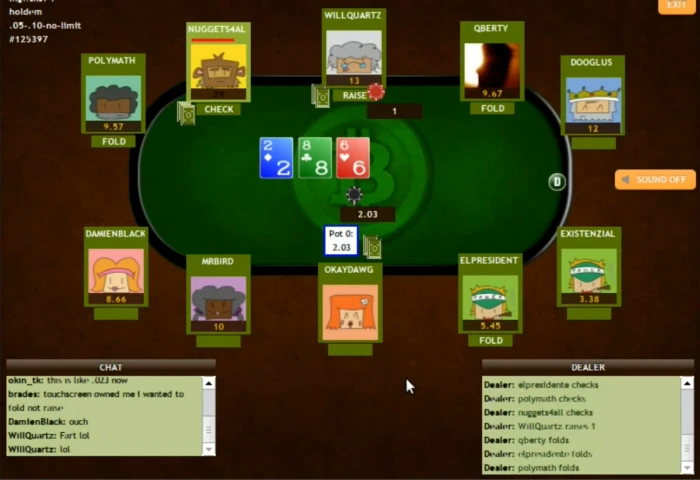

Capture du client de Betco.in en 2011 (source : [Hippich](https://www.youtube.com/watch?v=N6SjCgOY61E) sur Youtube)

En 2011, avec le « vendredi noir », les plateformes se multiplient : Moonco.in [ouvre](https://bitcointalk.org/index.php?topic=23002.msg289530#msg289530) en juin (mais dérive rapidement vers un site de paris et est piratée en septembre) et BTC on Tilt [se lance](https://web.archive.org/web/20110722145251/http://btcontilt.com/nice-start) en juillet.

La plateforme la plus emblématique [ouvre ses portes](https://web.archive.org/web/20111128155416/https://bitcointalk.org/index.php?topic=40077.0) à la fin du mois d'août. Il s'agit de Seals With Clubs (littéralement « phoques avec des trèfles »). Elle est lancée par un développeur anonyme, FreeMoney, qui a découvert Bitcoin lors du slashdotting de juillet 2010.

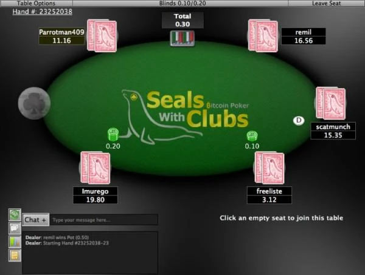

Capture du client de Seals with Clubs en 2013 (source : [ThePokerBank.com](https://www.thepokerbank.com/rooms/sealswithclubs/))

La plateforme reçoit en particulier le soutien du joueur professionnel Bryan Micon qui a découvert Bitcoin en juin et qui [déclare](https://bitcointalk.org/index.php?topic=11941.msg167263#msg167263) être « totalement fasciné par les bitcoins » (original: "totally enthralled with bitcoins"). Celui-ci [accompagne](https://bitcointalk.org/index.php?topic=40077.msg704795#msg704795) le développement à partir de janvier 2012. En mars, il [met en avant](https://web.archive.org/web/20120308103542/https://www.youtube.com/watch?v=QXNb9h12AE8) Seals with Clubs sur sa chaine Youtube. La plateforme sera exposée aux joueurs normaux, puisqu'elle sera [évoquée](https://forumserver.twoplustwo.com/28/discussion-poker-sites/seals-clubs-closed-see-new-swcpoker-thread-1248197/) en septembre 2012 sur le forum de TwoPlusTwo, l'un des forums les plus populaires pour les discussions relatives au poker.

En dehors du poker, le jeu d'argent avec Bitcoin se développe aussi énormément de manière générale. Les casinos virtuels se multiplient, à tel point qu'un sous-forum consacé au domaine est obligé d'[ouvrir](https://bitcointalk.org/index.php?topic=39621.msg483368#msg483368) sur Bitcointalk en août. Une page de recensement (betwithbtc.com) est [créée](https://bitcointalk.org/index.php?topic=45566.msg543768#msg543768) par le tradeur GoWest en septembre. Outre le poker, il y a du blackjack, de la roulette, des machines à sous, de la loterie, des paris sportifs et d'autres jeux originaux.

### SatoshiDICE, le jeu de dés assurément équitable

Mais tous ces jeux reposent sur une plateforme centralisée, et ne sont pas vérifiables. C'est en cela que se démarque un concept d'un nouveau genre : un jeu de dés dont le caractère équitable peut être vérifié par l'utilisateur. Il s'agit de SatoshiDICE, qui est mis au point durant le printemps 2012 par Joseph Gleason.

Joseph est un développeur américain [de 30 ans](http://fireduck.com/index-single.html) qui se fait appeler Fireduck sur Bitcointalk et sur Reddit. Ce dernier s'est intéressé à Bitcoin au cours de l'été 2011 : il a [programmé](https://www.reddit.com/r/Bitcoin/comments/im5h6/using_bitcoin_for_crypto_timestamping_hashes_not/) un outil d'horodatage, a [déployé](https://www.reddit.com/r/Namecoin/comments/iw8cd/unable_to_download_blocks/) un nœud pour Namecoin et a [lancé](https://www.reddit.com/r/Bitcoin/comments/j6ahv/buy_bitcoins_via_google_checkout/) un service de change rudmentaire compatible avec l'éphémère système de paiement en ligne Google Checkout.

Joseph Gleason, alias Fireduck, en février 2014 (source : [Twitter](https://twitter.com/Fireduck1209k))

En 2012, il a l'idée d'un moyen. Le 9 avril, Joseph lance son casino en ligne, hébergé sur son site personnel, 1209k.com \[1209k BitCasino\]. Il le [présente](https://www.reddit.com/r/Bitcoin/comments/s1dn3/my_verifiable_bitcoin_casino/) sur le sous-forum de Bitcoin sur Reddit (r/Bitcoin) comme un « casino de bitcoins vérifiable » (original: "Verifiable Bitcoin Casino"). Le site repose sur des adresses fixes qui donnent chacune une chance prédéfinie de multiplier la mise du joueur par un nombre précis. L'utilisateur envoie le montant à l'adresse et reçoit, si le tirage est favorable, la récompense correspondante sur son adresse personnelle. Par exemple, l'adresse `194udqXac9hGs5RvevjHR5L3EJaGXDzahe` donne une chance sur deux de doubler sa mise, moins les frais du casino qui sont de 1 à 3 %.

Le jeu se présente comme un jeu de dés. Un tirage est réalisé à chaque transaction, et se trouve entre 0 et 65 536. Ce « nombre chanceux » (original: "lucky number") est [obtenu](https://web.archive.org/web/20120507154620/http://satoshidice.com/secrets.php) en sélectionnant les deux premiers octets du condensé (calculé par HMAC-SHA-512) d'une information secrète et de l'identifiant de la transaction entrante. Si ce nombre est strictement inférieur à une cible liée à l'adresse (32768 pour l'adresse multipliant la mise par deux), alors le tirage est gagnant et la personne reçoit le montant prévu. S'il est supérieur, alors il reçoit une petite fraction du montant, pour confirmer que le système a fonctionné. Chaque pari génère donc deux transactions qui sont ajoutées à la chaine.

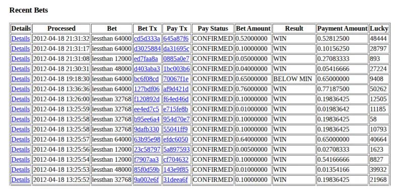

Quelques paris réalisés le 18 avril 2012 (source : [archive](https://web.archive.org/web/20120419202740/http://1209k.com/bitcasino) de 1209k.com)

Le procédé est transparent et fait en sorte que les utilisateurs puissent vérifier que le casino n'a pas triché. Pour cela, les empreintes des secrets du jour sont publiés sur la chaine (par exemple, les secrets de la journée du 18 avril sont [stockés](https://mempool.space/tx/428bcc630b00fe431623b4e1fb0f726493dc0a2ead86ace9f65cd51bc8092459) dans la transaction `428bcc630b00fe431623b4e1fb0f726493dc0a2ead86ace9f65cd51bc8092459`). Les secrets sont dévoilés dans les jours qui suivent, ce qui permet aux parieurs de faire le calcul eux-mêmes. Le système est en cela « assurément équitable » (original: "provably fair").

Le procédé est simple (il suffit d'un portefeuille pour jouer), instantané (pour les petites mises) et aisément vérifiable. Ces caractéristiques font que le jeu attire un certain nombre de joueurs dès ses débuts. En 10 jours, le casino en ligne [traite](https://web.archive.org/web/20120419202743/http://1209k.com/bitcasino/report.php) pour près de 5 000 BTC de paris, ce qui correspond alors à plus de 24 000 $. Mais ce succès soudain effraie Joseph qui appréhende des conséquences légales, et il cherche donc à vendre le site à quelqu'un qui assumerait les risques juridiques, et qui pourrait lui verser un salaire mensuel pour travailler sur le côté technique. Dans une annonce publiée sur le subreddit de Bitcoin le 17 avril, il [écrit](https://www.reddit.com/r/Bitcoin/comments/segz0/anyone_want_to_run_my_bitcoin_casino/) qu'il « gère un casino de bitcoins depuis un peu plus d'une semaine », que ce dernier « a généré 146 BTC pour un investissement initial d'environ 45 BTC » (original: "I have been running a bitcoin casino for a little over a week. It has made 146 BTC with an investment of around 45 BTC to get it started.") et qu'il cherche un repreneur.

(prix ~4,90$ ; 146 BTC = 715 $ ; 45 BTC= 220 $ ; 4 944 BTC = 24 226 $)

L'occasion est saisie presque immédiatement par Erik Voorhees, qui, en tant que libertarien convaincu, n'a pas de souci à défier les réglementations. Après des discussions avec Joseph dans les commentaires et en privé, il acquiert le concept [pour](https://www.forbes.com/sites/michaeldelcastillo/2019/01/03/bitcoins-last-gunslinger/) 40 bitcoins, soit environ 200 $ au moment de l'échange. Le lendemain, la plateforme est [opérationnelle](https://www.reddit.com/r/Bitcoin/comments/segz0/comment/c4dwi5q/) sur un nouveau site : Satoshidice.com. Le 24 avril, après une petite refonte graphique, Erik [annonce](https://bitcointalk.org/index.php?topic=77870.msg865877#msg865877) le lancement de la plateforme sur le forum de Bitcoin.

Logo de SatoshiDICE (source : [capture](https://web.archive.org/web/20120804125615/http://satoshidice.com/) de Satoshidice.com)

Dans les mois qui suivent, SatoshiDICE connait un succès phénoménal. Les gens se prennent au jeu, d'autant plus qu'il est simple et instantané. Comme chaque pari (gagnant ou perdant) entraine la réalisation de deux transactions, l'activité sur la chaine de blocs de Bitcoin explose. Le nombre de transactions journalier, qui avoisinait les 7 000 jusque là, [augmente](https://bitinfocharts.com/comparison/bitcoin-transactions.html#alltime) rapidement et dépasse (de peu) le précédent record de 13 900 dès le 4 mai. Erik Voorhees s'en [réjouit](https://bitcointalk.org/index.php?topic=79285.msg881416#msg881416) lui-même sur le forum. Le 19 mai, ce nombre atteint 35 000 ; le 14 juin, il atteint 61 782 transactions journalières, ce qui sera le record de l'année 2012 !

Cette augmentation fait réagir la communauté technique, qui s'inquiète de cet afflux soudain de transactions. C'est le cas de Matt Corallo qui [écrit](https://bitcointalk.org/index.php?topic=87444.msg961132#msg961132) le 13 juin sur le forum :

> « Au cours des dernières 24 heures, le nombre de transactions liées à satoshidice a considérablement augmenté, ce qui a conduit le nombre de transactions en attente à atteindre (actuellement) environ 9 000. Le spam de satoshidice représentait déjà un pourcentage important des transactions en cours, mais à présent, c'est tout simplement ridicule. Est-il temps de commencer à donner moins de priorité aux transactions qui utilisent des adresses très courantes ? »
>
> original: "Over the past ~24 hours, the number of satoshidice transactions has increased hugely, leading to transaction memory pools (currently) at around 9000 transactions.  Satoshidice spam is already a huge % of current transactions, but now its just ridiculous.  Is it time to start deprioritizing transactions which use very common addresses?"

Le développeur Luke-Jr [parle](https://bitcointalk.org/index.php?topic=23768.msg968819#msg968819) d'« utilisation abusive de la blockchain par SatoshiDice » (original: "SatoshiDice abusing the blockchain"). \[réactions sur IRC ?\]

Ce succès de SatoshiDICE attire aussi les concurrents. Le procédé est reproduit et amélioré par plusieurs casinos en ligne, qui mettent aussi en avant le fait qu'ils sont « assurément équitables » (original: "provably fair"). L'un d'entre eux est Bitzino, [lancé](https://www.reddit.com/r/Bitcoin/comments/usa0j/i_coded_up_my_very_own_bitcoin_casino_in_order_to/) le 8 juin par un dénommé Larry Taad, et qui propose différents jeux solitaires comme le blackjack, la roulette ou le vidéo poker.

En dépit de la levée de bouclier, SatoshiDICE continue son chemin. Au fil des mois, il [représentera](https://web.archive.org/web/20130823202809/http://lsvp.com/2013/08/23/at-least-half-of-all-bitcoin-transactions-are-for-online-gambling/) près de la moitié des transactions réalisées sur la chaine, pour environ 5 % du volume économique.

C'est ce qui motive Erik Voorhees à aller encore plus loin. À partir du 24 août, il [réalise](https://web.archive.org/web/20121024050433/https://bitcointalk.org/index.php?topic=101902.0) une IPO informelle sur la bourse en ligne de Mircea Popescu, MPEx. Il émet ainsi 100 millions de parts (ayant le sigle boursier S.DICE), et en vend 10 pour recueillir 34 500 bitcoins, soit 371 910 $ au moment de la vente. Ces parts donnent droit à des dividendes issus des revenus du site. Les parts seront aussi [représentées](https://bitcointalk.org/index.php?topic=102181.msg1119046#msg1119046) sur GLBSE. Grâce à ses investisseurs, le site est [refait à neuf](https://bitcointalk.org/index.php?topic=77870.msg1250779#msg1250779) en octobre, et des applications pour Android et PC sont [publiées](https://bitcointalk.org/index.php?topic=124093.msg1333063#msg1333063) en novembre. En février 2013, Erik vendra 3 millions de parts supplémentaires pour 6 100 bitcoins, soit environ 337 827 $ au moment de la vente.

Les profits du jeu en ligne [seront](https://web.archive.org/web/20130125023019/https://www.forbes.com/sites/jonmatonis/2013/01/22/bitcoin-casinos-release-2012-earnings/) énormes. En huit mois, SatoshiDICE gagnera 33 310 bitcoins, ce qui s'élèvera avec la hausse du cours à plus de 500 000 $. En janvier 2013, l'entreprise sera évaluée à près de 9 millions de dollars de capitalisation. De même, BitZino réalisera un profit de l'ordre de 10 000 bitcoins. Le profit de Seals with Clubs sera lui estimé à 600 bitcoins par mois en moyenne.

### Le travail du sexe

Mais le jeu d'argent n'est pas la seule activité qui bénéficie de Bitcoin ; il y a aussi ce qu'on nomme le travail du sexe. Cela inclut les activités impliquant un contact physique direct (prostitution au sens strict), mais aussi la stimulation sexuelle indirecte, comme le striptease, le téléphone rose ou la pornographie. En particulier,avec Internet s'est développé le phénomène des camgirls qui profitent de la diffusion en direct sur Internet pour interagir directement avec leurs clients qui peuvent leur communiquer leurs désirs.

Bitcoin est adapté pour le travail du sexe. Dans un secteur largement basé sur l'argent liquide, Bitcoin apparait comme une alternative [plus sûre](https://web.archive.org/web/20131217032819/http://internationalsocialistnetwork.org/index.php/ideas-and-arguments/301-mistress-magpie-a-left-defence-of-bitcoin). En ligne, non seulement Bitcoin permet de faire des transferts où la prostitution est interdite, mais il évite aussi, par son anonymat relatif, de subir des remontrances sociales de la part de la société. Satoshi l'avait très compris. En 2009, il [évoquait](https://www.metzdowd.com/pipermail/cryptography/2009-January/015014.html) ainsi le cas d'utilisation des « micropaiement pour les silte pour adultes » (original: "micropayments for adult sites"), et en 2010, il [écrivait](https://bitcointalk.org/index.php?topic=671.msg13844#msg13844) que « Bitcoin serait pratique pour les gens qui n'ont pas de carte de crédit ou qui ne veulent pas utiliser celles dont ils disposent, soit parce qu'ils ne veulent pas que leur conjoint voie les dépenses sur la facture, soit parce qu'ils ne veulent pas donner leur numéro aux "pros du porno", ou encore parce qu'ils ont peur des facturations récurrentes » (original: "Bitcoin would be convenient for people who don't have a credit card or don't want to use the cards they have, either don't want the spouse to see it on the bill or don't trust giving their number to 'porn guys', or afraid of recurring billing.").

Il est donc logique que cette utilisation émerge, même si celle-ci reste plus ou moins bourgeonnante. En janvier 2012, Tony Gallippi [lance](https://web.archive.org/web/20120128135530/https://bitcointalk.org/index.php?topic=57260.0) par exemple un service appelé PimpCoin, qui permet de customiser une carte de dépôt pour accepter le bitcoin en tant que travailleuse du sexe.

Le 26 mars 2012, un sous-forum sur Reddit nommé r/GirlsGoneBitcoin est [ouvert](https://bitcointalk.org/index.php?topic=73666.msg816065#msg816065) par Julian Tosh, dit « Tuxavant », un défenseur de Linux et de la vie privée vivant à Las Vegas. Il s'inspire du sous-forum pour adultes r/GoneWild, où les utilisatrices publient des photos dénudées d'elles-mêmes. L'intérêt de r/GirlsGoneBitcoin, c'est qu'elles peuvent ajouter une adresse à leurs photos afin de recevoir des pourboires en bitcoins. Une utilisatrice se présentant sous le pseudonyme LadyBytes réalise un [tutoriel](https://www.dailymotion.com/video/xpsy75) (NSFW) pour montrer comment elles peuvent utiliser Bitcoin facilement.

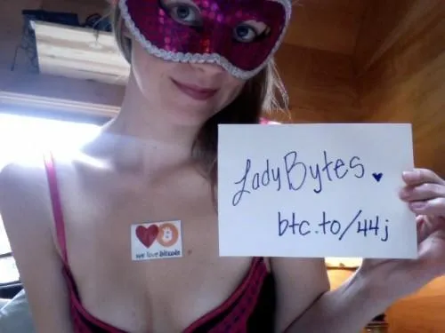

LadyBytes en mars 2012 (source : [Imgur](https://web.archive.org/web/20120401012310/http://imgur.com/a/JDVRZ))

Le subreddit fera son bout de chemin et [comptera](https://subredditstats.com/r/girlsgonebitcoin) près de 2 000 membres à la fin de l'année.

### Monnaie du vice, monnaie du crime

Bitcoin a ainsi été une monnaie du vice. Outre le trafic de drogue, il s'est rapidement distingué pour soutenir le jeu d'argent, ainsi que la prostitution. En particulier, le succès de SatoshiDICE a fait exploser le nombre de transactions effectuées sur la chaine de blocs, montrant la capacité de Bitcoin à accueillir ce type d'activité.

Mais cette nouvelle forme de monnaie n'était pas seulement adaptée au vice : elle était également la monnaie idéale pour le crime sur Internet. On a ainsi vu un certain nombre de piratages et de vols en tous genres se produire en 2012. C'est le sujet du prochain chapitre.

## La monnaie du crime : les piratages et les arnaques

En 2012, un certain nombre de piratage et de fermetures scandaleuses ont eu lieu. À tel point qu'une « liste des principaux vols, piratages, escroqueries et pertes liés à Bitcoin » (original: "List of Major Bitcoin Heists, Thefts, Hacks, Scams, and Losses") a été [créée](https://bitcointalk.org/index.php?topic=83794.msg923918#msg923918) sur le forum à la fin du mois de mai. Comme son nom l'indique, elle recensait les évènements majeurs qui interviennent. La liste est devenue si grande qu'une nouvelle version à jour a été [publiée](https://bitcointalk.org/index.php?topic=576337.msg6289796#msg6289796) en 2014.

### Les piratages de Linode et de Betco.in

Le cybercrime lié à Bitcoin s'est développé dès 2011. L'été 2011 a en particulier été chaud, avec l'infection de l'ordinateur de l'utilisateur Allinvain (25 000 BTC, soit 500 000 $), le piratage de Mt. Gox et ses répercussions (au moins 6019 BTC, soit 105 000 $), et le vol de MyBitcoin (78 740 BTC, soit 1 000 000 $), qu'il soit interne ou externe. On peut aussi citer le minage de bitcoins par des machines zombies (généralement infectées par le trojan GameOver ZeuS), qui est initialement [apparu](https://cryptome.org/2012/05/fbi-bitcoin.pdf) durant cette période ; ce n'était [pas très rentable](https://web.archive.org/web/20110618210349/http://www.symantec.com/connect/blogs/bitcoin-botnet-mining)), mais ce type de pratique préfigurait le rançongiciel Cryptolocker de 2013.

En 2012, le cryptocrime prend une tout autre ampleur.

Le premier évènement est le piratage du service d'hébergement Linode. Le 1er mars, un pirate [accède](https://web.archive.org/web/20120302143922/http://status.linode.com/2012/03/manager-security-incident.html) au portail du service client de l'entreprise et prend le contrôle de huit comptes, ayant tous une relation avec Bitcoin. En accédant au portefeuille courant hébergé sur les serveurs de Linode, il parvient à s'emparer des bitcoins des clients concernés.

Parmi ces clients se trouve la plateforme de trading Bitcoinica, gérée par le jeune Chinois Zhou Tong. Elle [perd](https://bitcointalk.org/index.php?topic=66979.msg778578#msg778578) 43 554 bitcoins, soit plus de 210 000 dollars. Toutefois, la plateforme reste solvable grâce à l'argent des investisseurs.

Le pirate [met aussi la main](https://bitcointalk.org/index.php?topic=66916.msg777575#msg777575) sur 3 094 bitcoins appartenant à la coopérative de minage de Slush, qui représentent alors plus de 15 000 $. Ces bitcoins, présents sur le portefeuille chaud, étaient prêts à être versés aux hacheurs de la coopératives. Slush couvre personnellement la perte.

Enfin, le troisième concerné est le *Bitcoin faucet* de Gavin Andresen. Le service [perd](https://gavintech.blogspot.com/2012/03/bitcoin-faucet-hacked.html) uniquement 5 BTC (environ 25 $), mais cet incident poussera Gavin à vouloir en améliorer la sécurité, ce qui le conduira à le [fermer](https://web.archive.org/web/20121005191343/https://freebitcoins.appspot.com/) « pour maintenance » (original: "closed for maintenance") quelques mois plus tard. Le « robinet à bitcoins » ne rouvrira jamais.

Un mois plus tard, c'est au tour de la plateforme de poker en ligne Betco.in, gérée par Pavel Karoukin depuis 2010, de se faire pirater. Le 11 avril, tout l'argent conservé sur le serveur et sur l'ordinateur personnel de Pavel [est siphonné](https://bitcointalk.org/index.php?topic=68066.msg848855#msg848855) le 11 avril : 3 171 bitcoins au total, soit près de 16 000 $. Il est par conséquent [contraint](https://bitcointalk.org/index.php?topic=82100.msg904821#msg904821) de fermer les portes de son service et de le mettre en vente, après avoir remboursé les utilisateurs au mieux.

### L'escroquerie de Tony76

Un incident [se produit](https://eileenormsby.com/2012/05/30/the-great-420-scam/) sur Silk Road le 20 avril 2012 sous la forme d'une escroquerie d'ampleur de la part d'un vendeur. Il s'agit d'un vendeur canadien utilisant le pseudonyme Tony76 (James Ellingson ?). Inscrit en janvier 2012, il a l'habitude d'expédier de la MDMA, de la cocaïne et de l'héroïne au Canada et aux États-Unis. À ce moment-là, il [a réalisé](https://www.forbes.com/sites/runasandvik/2013/11/22/alleged-dread-pirate-roberts-murder-target-led-massive-bitcoin-scam-on-silk-road/) plus de 500 ventes, et son fil d'avis sur le forum de Silk Road dépasse les 1 000 messages.

C'est grâce à cette réputation qu'il parvient à réaliser son escroquerie. Le système de réputation de la plateforme n'est pas parfait : on peut placer les bitcoins en dépôt fiduciaire, mais cela prend du temps et expose le vendeur aux fluctuations du taux de change. C'est pourquoi les vendeurs de confiance demandent souvent aux utilisateurs d'opter pour une finalisation anticipée. Tony76 demande systématiquement cette option.

Le 20 avril est une date emblématique pour les consommateurs de cannabis en Amérique du Nord. Ainsi, sur Silk Road, de nombreuses réductions sont affichées sur le site. Le 17 avril, Tony76 [annonce](https://antilop.cc/sr/users/tony76/messages/20120417-0804-26-Tony76_MASSIVE_4_20_SALE_When_i_say_massive_I_mean_massive.txt) participer, la raison étant « toutes \[les\] offres incroyables proposées par les autres vendeurs » qui lui ont « donné envie de \[se\] lancer » et ont « réveillé \[son\] esprit de compétition » (original: "seeing all these other amazing deals from vendors got me excited (and maybe brought out my competitive side a bit"). Il annonce également ouvrir les commandes aux acheteurs internationaux pour la première fois. La veille au soir du 20 avril, il propose ainsi des produits en tous genres à des prix réduits : cannabis, MDMA, LSD, kétamine, cocaïne, héroïne.

Sa bonne réputation fait que les commandes s'enchainent. Durant toute la journée du 20 avril et après, il continue d'interagir avec les clients, mais il disparait complètement du forum le 25. Au bout d'une semaine, les utilisateurs commencent à s'inquiéter ; ils se rendront rapidement compte qu'ils se sont fait avoir.

Il est [estimé](https://web.archive.org/web/20150321011113/http://www.dailydot.com/crime/tony76-420-sale-silk-road/) que Tony76 a obtenu entre 100 000 et 250 000 dollars en BTC de cette façon, pour un montant se comptant en dizaines de milliers de bitcoins. C'est le plus grand braquage de l'histoire de Silk Road. Cet incident est connu comme « la grande arnaque du 420 » (original: "The Great 420 Scam").

### La chute de Bitcoinica

Comme nous l'avons expliqué dans le chapitre 4, la plateforme de trading sur marge Bitcoinica connait un franc succès dès son lancement en septembre 2011. Elle est gérée par Zhou Tong, de son vrai nom Ryan Zhou, qui n'a alors que 17 ans. En novembre, un fonds d'investissement américain lui [propose](https://bitcointalk.org/index.php?topic=81581.msg897948#msg897948) de racheter la plateforme « pour un bon prix » (original: "for a good price") et de lui payer un généreux salaire : il s'agit du Wendon Group, qui est représenté par un certain Tihan Seale et qui est [lié](https://bitcointalk.org/index.php?topic=196150.msg2038900#msg2038900) à la société CoinLab de Peter Vessenes. Zhou Tong accepte « en raison de préoccupations réglementaires » (original: "Due to regulatory concerns") : il est encore mineur d'un point de vue légal et ne peut par conséquent pas monter d'entreprise pour exercer son activité dans les règles. La passation a lieu en janvier 2012.

Zhou Tong continue de gérer la plateforme jusqu'au printemps. En mars-avril, une entreprise Bitcoinica LP est créée en Nouvelle-Zélande et [enregistrée](https://web.archive.org/web/20120505125011/https://www.bitcoinica.com/posts/registered-financial-services-provider) comme prestataire de services financiers auprès de la Financial Markets Authority. Le 24 avril, grâce aux négociations de Tihan Seale, Zhou Tong est [rejoint](https://bitcointalk.org/index.php?topic=77958.msg867160#msg867160) par les membres de la Bitcoin Consultancy (Amir Taaki, Patrick Stratemen et Donald Norman), qui gèrent alors déjà plusieurs projets dont la plateforme de change Intersango. Ils forment une société spécifique pour l'occasion, appelée Bitcoinica Consultancy Ltd. Ainsi, malgré la perte des 43 000 bitcoins dans le piratage de Linode (couverte par le fonds d'investissement), Bitcoinica semble être sur la bonne voie.

Toutefois, les choses ne se passent pas comme prévu, car un deuxième piratage [a lieu](https://bitcoinica.blogspot.com/2012/05/bitcoinica-security-breach.html). Le 11 mai 2012, un pirate parvient à accéder au serveur de courrier électronique de Bitcoinica (qui est hébergé par Rackspace) et à utiliser la fonctionnalité d'oubli de mot de passe pour se connecter avec l'un des comptes administrateurs à la plateforme. Il réussit à [retirer](https://bitcointalk.org/index.php?topic=81045.0) 18 574 bitcoins, soit près de 92 000 $. En outre, il accède à la base de données des utilisateurs, qu'il copie et qu'il supprime du serveur. Il n'y a [pas de sauvegarde](https://bitcointalk.org/index.php?topic=81045.msg921159#msg921159) de cette base, de sorte que l'évènement est catastrophique. Les activités de la plateforme sont suspendues dans l'heure qui suit.

Le 13, Zhou Tong [publie](https://bitcointalk.org/index.php?topic=81581.msg897948#msg897948) un long message sur le forum de Bitcoin dans lequel il annonce qu'il « quitte Bitcoin » (original: "I'm leaving Bitcoin"). Il explique que sa décision « n'a rien à voir avec le piratage de Bitcoinica » (original: "this isn't related to the Bitcoinica hack"), et qu'elle repose sur un manque de sens : il n'a pas réussi à « créer de la valeur pour la société » (original: "generating value for the society"), considérant que « la spéculation est un jeu à somme nulle » (original: "speculation is a zero-sum game"). Il veut « créer des produits qui font gagner du temps et de l'argent aux gens et qui leur évitent des maux de tête » (original: "build products that save people time, money and headaches"), et Bitcoin « ne répond pas à \[ses\] besoins réels » (original: "it doesn't help address my real need"). Il a à ce moment-là déménagé en Australie pour continuer ses études, et souhaite continuer à entreprendre ([NameTerrific](https://bitcointalk.org/index.php?topic=82566.msg910076#msg910076)). Il reste cependant attaché à Bitcoin, et affirme conserver une pièce de Casascius de 1 000 bitcoins. Il reviendra ainsi en 2013 en co-fondant CoinJar avec Asher Tan, une plateforme de change australienne.

Ryan Zhou, dit « Zhou Tong », en 2012 (source : [archive](https://web.archive.org/web/20120617170206/http://coinabul.tumblr.com/post/24022841613/10qs-zhou-tong-bitcoinica) du blog de Coinabul)

La gestion de la crise est confiée entièrement à la Bitcoin(ica) Consultancy. Dans un article de blog publié le 15 mai, elle [annonce](https://bitcoinica.blogspot.com/2012/05/bitcoinica-hack-post-mortem.html) « maintenir Bitcoinica hors ligne jusqu'à ce qu'une nouvelle plateforme ait pu être créée et testée à partir de zéro, en intégrant les meilleures pratiques en matière de sécurité intégrées » (original: "We are choosing to leave Bitcoinica offline until such time as a new platform can be built and tested with security best-practices built-in from scratch."), pour une période se comptant « en mois » (original: "measured in months"). Il leur faut néanmoins fournir un moyen aux utilisateurs de récupérer leurs bitcoins, ce qui est une tâche complexe en l'absence de base de données. Un système de demande de remboursement partiel est ainsi mis en place : le plan est de payer 50 % des fonds aux créanciers, pour ensuite verser la moitié manquante plus tard, de sorte à limiter les effets d'une erreur. Chaque créancier doit [fournir](https://bitcointalk.org/index.php?topic=84042.msg1001751#msg1001751) des informations pertinentes comme les copies des courriels reçus de Bitcoinica, les codes Mt. Gox utilisés, les identifiants des transactions de dépôt et de retrait, une copie de leur pièce d'identité, etc.

Le processus est lent. Les premiers paiements [ont lieu](https://web.archive.org/web/20120720064802/https://bitcoinica.com/) le 13 juin, et [concernent](https://bitcointalk.org/index.php?topic=84042.msg970495#msg970495) moins de 1 % des clients. Début juillet, 27 % des fonds ont été [versés](https://bitcointalk.org/index.php?topic=84042.msg1001019#msg1001019) (54 % si l'on considère que ce sont des remboursements partiels). Mi-juillet, ce pourcentage [s'élève](https://bitcointalk.org/index.php?topic=93074.msg1027282#msg1027282) à 38 % (76 % remboursés à 50 %).

Toutefois, un imprévu survient à nouveau. Le 7 juillet, Amir Taaki, qui est [en conflit](https://bitcointalk.org/index.php?topic=196150.msg2038900#msg2038900) avec la direction, [rend public](https://www.reddit.com/r/Bitcoin/comments/w6xen/bitcoinica_press_release/) le code source intégral de la plateforme. Ce code source contient une clé API, qui s'avère aussi être le mot de passe donnant l'accès au coffre-fort LastPass de Bitcoinica, contenant quelques-uns de ses mots de passe, et notamment celui de son compte sur Mt. Gox. Le 13 juillet, un pirate exploite cette vulnérabilité et [parvient](https://bitcointalk.org/index.php?topic=93074.msg1027282#msg1027282) à retirer 40 000 bitcoins et 40 000 LR-USD de Mt. Gox (la limite supérieure), ce qui représente près de 350 000 dollars ! Cela porte la somme totale perdue par la plateforme (en dollars) à plus de 650 000 $.

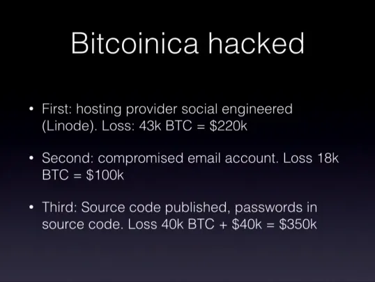

Les piratages de Bitcoinica résumés par Jeremias Kangas lors de l'Assembly Summer 2014 (source : capture d'[AssemblyTV](https://www.youtube.com/watch?v=CgcK3xZpjdI))

Amir Taaki précise que l'argent volé dans ce dernier piratage correspond à un tiers des fonds qu'il reste à rembourser, ce qui signifie que la plateforme est en faillite. Cela affole les utilisateurs qui attendaient leur remboursement, dont Roger Ver (qui [conservait](https://bitcointalk.org/index.php?topic=93110.msg1027941#msg1027941) 25 000 bitcoins sur la plateforme) ou du tradeur français Émilien Dutang (qui en [avait](https://bitcointalk.org/index.php?topic=93074.msg1027322#msg1027322) un peu plus de 5 000). Zhou Tong, qui a grandement bénéficié de sa vente en janvier, [fait preuve de générosité](https://bitcointalk.org/index.php?topic=93100.msg1027825#msg1027825) et promet de contribuer au remboursement des créanciers à hauteur de 5 000 BTC, ce qui (en ajoutant les contributions de la communauté) fait que les créanciers sont remboursés à 6,24 % deux jours plus tard, dont Roger Ver et Émilien Dutang.

Le 26 juillet, un nouveau rebondissement se produit : Zhou Tong est [suspecté](https://bitcointalk.org/index.php?topic=95738.msg1054890#msg1054890) d'être responsable du troisième piratage par Roberto Gutierrez (directeur général de la plateforme AurumXchange), Charlie Shrem (BitInstant) et Mark Karpelès (Mt. Gox). Le pirate a en effet utilisé le compte de Zhou Tong vendre des codes Mt. Gox sur AurumXChange. Zhou Tong nie sa responsabilité et [accuse](https://bitcointalk.org/index.php?topic=95795.msg1055627#msg1055627) à la place un ancien associé à lui, un certain Chen Jianhai, qui aurait accédé à son compte.

Finalement, ce dernier piratage aura sonné le glas de la plateforme de trading de marge. La liquidation de Bitcoinica sera [annoncée](https://bitcointalk.org/index.php?topic=97272.msg1071263#msg1071263) le 1er août 2012 par Tihan Seale et sera [rendue](https://bitcointalk.org/index.php?topic=121474.msg1309937#msg1309937) effective en octobre. Un remplaçant fiable émergera également lors du mois d'octobre, avec la création de Bitfinex.

### La première pyramide de Ponzi : Bitcoin Savings & Trust

Mais le Far West implique aussi la présence d'escroqueries pures et simples. Parmi ces arnaques, il y a les programmes d'investissement à haut rendement (*high-yield investment programs* ou HYIP) qui fleurissent sur Internet dans les sphères des monnaies alternatives (e-gold, Liberty Reserve). Ces programmes promettent des taux d'intérêt anormalement élevés pour de courtes périodes, pour encourager leurs clients à déposer rapidement de l'argent. Ce sont la plupart du temps des pyramides de Ponzi, qui reposent sur les afflux des nouveaux entrants pour rémunérer ceux qui réclament leurs intérêts. On peut citer le système pyramidal MMM-2011 géré par le Russe Sergueï Mavrodi, qui [s'effondrera](https://www.themoscowtimes.com/2012/06/17/mavrodi-closes-mmm-2011-a15491) en juin 2012.

Il va de soi que Bitcoin est parfaitement adapté à ce type d'escroquerie. Il y a par exemple le site brésilien [Bitcoin Rain](https://bitcointalk.org/index.php?topic=178336.msg11470642#msg11470642) qui a ouvert en octobre 2011 et qui promet 12 % de rendement *par mois*. Mais la plus importante d'entre elles est Bitcoin Savings & Trust. Ce fonds est lancé par Trendon Shavers, un Texan de 29 ans, père de famille. Ce dernier se fait appeler PirateAt40 (Pirate@40) sur le forum de Bitcoin et ailleurs, en référence à la chanson « *A Pirate Looks At Forty* » (Un pirate à quarante ans) de Jimmy Buffett sortie en 1974, dans laquelle un trafiquant de drogue moderne se lamente d'être né trop tard pour avoir pu être un flibustier.

Trendon Shavers à la sortie du tribunal fédéral de Manhattan en novembre 2014 (source : Brendan McDermid pour [Reuters](https://www.reuters.com/article/world/us/texan-gets-one-and-a-half-years-in-prison-for-running-bitcoin-ponzi-scheme-idUSKCN1012W7/))

À la fin de l'année 2011, Trendon est actif sur la plateforme de change de gré à gré \#bitcoin-otc, où il acquiert une [bonne réputation](https://web.archive.org/web/20111031165817/http://bitcoin-otc.com/viewratingdetail.php?nick=pirateat40). Il vend du bitcoin à un taux de change plus élevé que sur Mt. Gox : ayant une forte demande, il commence à contracter des emprunts auprès de personnes de confiance. Le 3 novembre 2011, il [annonce](https://bitcointalk.org/index.php?topic=50822.msg607752#msg607752) sur le forum être « à la recherche de prêteurs » (original: "looking for lenders") afin de pouvoir exercer une activité de revendeur local ([via](https://gwern.net/doc/bitcoin/pirateat40/secvs.pirateat401.pdf) les services de change en espèces et Craiglist). Il propose deux manières de prêter de l'argent. L'une des méthodes, appelée « stockage » (original: "storage"), et qui sera renommée « épargne » (original: "savings"), consiste à laisser son argent en dépôt contre un taux d'intérêt pouvant être envoyé à une adresse spécifique ou être réinvesti. Le taux d'intérêt promis est de 1 % *par jour* !

Trendon dit avoir « créé \[son\] propre logiciel de gestion personnalisé afin de surveiller les dépôts, les retraits et les paiements d'intérêts » (original: "I've created my own custom management software that I've built to monitor deposits, withdraws and interest payments"). Il gère initialement l'investissement des clients par message privé sur le forum, avant de [déployer](https://bitcointalk.org/index.php?topic=50822.msg649434#msg649434) une interface à l'adresse Btclending.com un mois et demi plus tard. En parallèle, Trendon [ouvre](https://bitcointalk.org/index.php?topic=55819.msg664029#msg664029) un service de cloud mining, appelé GPUMAX, qui permet aux utilisateurs de prêter et d'emprunter de la puissance de minage.

Au début de l'année 2012, le plan d'investissement [est](https://web.archive.org/web/20120326140927/https://bitcointalk.org/index.php?topic=50822.msg605957#msg605957) simplifié et offre des intérêts versés de manière hebdomadaire. Les taux d'intérêt sont progressifs en fonction du montant investi, de façon à encourager les gros dépôts : 100 BTC rapportent 4,2 % *par semaine* tandis que 1 000 BTC (et plus) rapportent 7 %. Les inscriptions [passent](https://bitcointalk.org/index.php?topic=50822.msg736031#msg736031) désormais uniquement par le parrainage (ce qui permet aux membres existants de gagner plus). Une somme minimale de 100 BTC (570 $ environ) [est](https://bitcointalk.org/index.php?topic=50822.msg738835#msg738835) instaurée afin de ne plus avoir à gérer les petits prêteurs, ce qui entraine l'apparition d'intermédiaires, [notamment](https://bitcointalk.org/index.php?topic=76594.msg850275#msg850275) par l'[émission](https://bitcointalk.org/index.php?topic=91252.msg1063296#msg1063296) d'obligations (« Pirate passthroughts » ou PPT) sur GLBSE. Le nom du fonds [devient](https://bitcointalk.org/index.php?topic=50822.msg678316#msg678316) First Pirate Savings & Trust (FPS&T), faisant référence au nom de certaines banques américaines. En avril, le service change à nouveau de nom et [devient](https://bitcointalk.org/index.php?topic=50822.msg844657#msg844657) Bitcoin Savings & Trust. L'interface est mise à niveau et est hébergé à l'adresse BTCST.com.

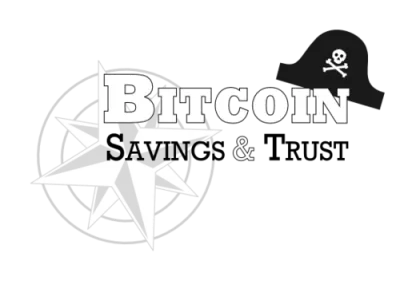

Logo non officiel de Bitcoin Savings & Trust conçu par JohnBigheart (source : [archive](https://web.archive.org/web/20140429144117/https://bitcointalk.org/index.php?topic=76689.0) de Bitcointalk.org)

Il [explique](https://web.archive.org/web/20120326140927/https://bitcointalk.org/index.php?topic=50822.msg605957#msg605957) que son revenu provient de trois sources de profit. La première est la revente locale des bitcoins, le taux de change étant plus élevé sur les marchés de gré à gré que sur Mt. Gox. La deuxième est l'« arbitrage de marché » (original: "Market Arbitrage") entre les différentes plateformes de change, qui (dans les faits) s'apparente plutôt à de la spéculation et de la manipulation de marché. La troisième est le prêt de bitcoins à des personnes avec qui il est en contact. Cette troisième source de revenu devient rapidement la principale activité de son système.

Le succès de Bitcoin Savings & Trust est phénoménal. À son sommet, le total des bitcoins gérés par le fonds [atteindra](https://bitcointalk.org/index.php?topic=101339.msg1111794#msg1111794) plus de 500 000 bitcoins, soit environ 5 % des 9,7 millions de bitcoins en circulation !

Bien sûr, le fonctionnement relativement opaque de BTCS&T attire les soupçons. Dès novembre, la première réponse à l'annonce sur le forum est celle d'un certain ElectricMucus qui [fait remarquer](https://bitcointalk.org/index.php?topic=50822.msg605977#msg605977) que ce que propose Trendon « ressemble à une arnaque HYIP typique » (original: "Smells like a classical HYIP scam."). Au fil des mois, avec le succès de BTCS&T, les accusations se font de plus en plus nombreuses, provenant de membres réputés de la communauté, dont [Matthew N. Wright](https://bitcointalk.org/index.php?topic=50822.msg681014#msg681014), [Mircea Popescu](https://bitcointalk.org/index.php?topic=50822.msg855012#msg855012) et [Vitalik Buterin](https://bitcoinmagazine.com/business/ponzi-schemes-the-danger-of-high-interest-savings-funds-1338461999). Un utilisateur du forum (Vandroiy) va même jusqu'à [parier](https://bitcointalk.org/index.php?topic=91661.msg1013589#msg1013589) 5 000 BTC avec Trendon que BTCS&T connaitra un défaut de paiement avant octobre 2013.

La fin arrive au cours de l'été. En juin, le prix du bitcoin passe de 5 $ à 6,5 $, ce qui met la pression sur Trendon, dont les dettes sont libellées en bitcoins. Début juillet, face à l'incertitude, il [annonce](https://bitcointalk.org/index.php?topic=50822.msg1004091#msg1004091) abaisser le taux d'intérêt à 3,9 % pour tous les montants et ouvrir l'inscription à tous, ce qui est rendu effectif le 14 août. Malheureusement, cette réduction a pour effet d'intensifier le nombre de retraits de la part des clients, qui sentent que quelque chose ne va pas.

Le 17 août 2012, Trendon prend finalement la [décision](https://bitcointalk.org/index.php?topic=50822.msg605957#msg605957) de fermer BTCS&T. Il rembourse ses plus proches collaborateurs, mais une majorité de gens est lésée. Les répercussions de cette fermeture se font ressentir, notamment sur le marché. Le prix sur Mt. Gox subit une chute vertigineuse et est divisé par deux en l'espace de 48 heures : il part de 15,4 $ le 17 (sommet local) et passe brièvement sous les 8 $ le 19. Dans les jours qui suivent, il se stabilise autour de 10 $ avant de remonter à un niveau acceptable.

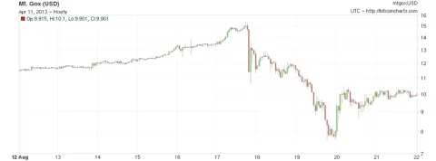

Évolution du prix du BTC sur Mt. Gox entre le 12 et le 22 août (source : Bitcoin Charts via [Forbes](https://www.forbes.com/sites/timothylee/2013/04/11/an-illustrated-history-of-bitcoin-crashes/))

Les pertes sont colossales. D'après [l'analyse ultérieure](https://gwern.net/doc/bitcoin/pirateat40/gov.uscourts.txed.146063.4.5.pdf) de Daphne Downes, enquêtrice pour la SEC, elles s'élèvent à environ 263 000 bitcoins, soit 1,8 million de dollars au moment de leur investissement dans BTCS&T.

Trendon prétend ne pas être responsable : l'un de « ses plus gros clients » [aurait](https://pastebin.com/DVNsx7xz) décidé de lui « compliquer la tâche » (original: "one of my largest clients decided they would make things difficult for me"), en lui [dérobant](https://gwern.net/doc/bitcoin/pirateat40/secvs.pirateat401.pdf#page=64) 202 000 bitcoins dans le cadre d'un prêt non garanti. Cependant, l'activité de l'[adresse](https://bitcointalk.org/index.php?topic=94675.msg1047007#msg1047007) du fonds ne permet pas de confirmer cette information.

### Les piratages de BTC-e et de BitFloor

L'été 2012 poursuit aussi sur sa lancée en ce qui concerne les piratages. Deux incidents ont ainsi lieu.

Il y a d'abord le piratage de BTC-e, qui [se produit](https://web.archive.org/web/20120731215829/https://btc-e.com/news/81) dans la nuit du 30 au 31 juillet, vers minuit. La clé API liée au compte Liberty Reserve de BTC-e est compromise, ce qui permet au pirate de réaliser des dépôts fictifs, avec lesquels il se procure des bitcoins, des namecoins et des litecoins, faisant exagérément monter leur prix. Il parvient à retirer \[l'équivalent de 4 500 BTC en bitcoins\], ce qui représente alors plus de 42 000 $. Les pertes sont néanmoins compensées par la plateforme. Tous les échanges réalisés après le piratage sont annulés et l'activité [reprend](https://web.archive.org/web/20121119010409/https://btc-e.com/news/82) vers 15 heures.

Le piratage de Bitfloor qui survient en septembre est plus important. BitFloor est une plateforme de change américaine installée à New-York. Elle a été [lancée](https://bitcointalk.org/index.php?topic=47109.msg578260#msg578260) en octobre 2011 par un jeune homme de 25 ans appelé Roman Shtylman, à l'aide d'un ami (Vadim). La plateforme a réussi à attirer rapidement des utilisateurs en [récompensant](https://bitcointalk.org/index.php?topic=51078.msg608833#msg608833) les founisseurs de liquidités (*makers*) par des « remises » (original: "rebates") créditées lorsqu'un échange a lieu. En mai 2012, BitFloor a également commencé à [accepter](https://bitcointalk.org/index.php?topic=81915.msg902211#msg902211) les dépôts en espèces, fonctionnalité très attractive comme nous l'avons expliqué.

Roman Shtylman en février 2012 (source : [Bitcoin Show](https://www.youtube.com/watch?v=F7SsavHX6tc) sur Youtube)

À la fin de l'été 2012, BitFloor représente une plateforme montante : il [s'agit](https://web.archive.org/web/20120902173725/https://bitcoincharts.com/markets/) de la quatrième plateforme en ce qui concerne le volume d'échange avec le dollar, derrière BTC-e, Bitstamp et surtout Mt. Gox. En août, un membre de Bitcointalk [prédit](https://bitcointalk.org/index.php?topic=93655.msg1073739#msg1073739) qu'à terme, Bitfloor « occupera la deuxième place » (original: "bitfloor will have the #2 spot in BTC trade volume"), en ajoutant que « les plateformes de change classées en deuxième position ont un bilan désastreux » (original: "exchanges at #2 have a terrible track record").

Dans la nuit du 3 au 4 septembre 2012, un piratage [accède](https://bitcointalk.org/index.php?topic=105818.msg1159510#msg1159510) à quelques-uns des serveur de Bitfloor et met la main sur une sauvegarde non chiffrée des clés du portefeuille. La grande majorité des bitcoins de la plateforme sont retirés : un peu plus de 24 000 BTC, soit environ 250 000 $ à ce moment-là. L'activité d'échange est suspendue en conséquence.

Le 21 septembre, Bitfloor rouvre ses portes. Roman Shtylman [annonce](https://web.archive.org/web/20141014070427/https://plus.google.com/109620439233076225324/posts/bLJRDHApjSP) la chose sur le blog Google+ de la plateforme, où il précise qu'il s'engage à « faire en sorte que Bitfloor reste actif, solide et prospère pour l'écosystème de Bitcoin » (original: "I am committed to keeping Bitfloor alive, strong, and growing for the bitcoin ecosystem."). Les soldes en bitcoins des clients ne sont cependant pas restaurés. Le plan est de procéder à des remboursements à l'aide des revenus provenant des frais d'échange.

Au fil des mois, Bitfloor reprendra du poil de la bête et [parviendra](https://bitcoinmagazine.com/markets/bitfloor-shuts-down-1366351632) à rembourser 2,7 % des bitcoins à ses créanciers. Néanmoins, la plateforme finira par fermer définitivement en avril 2013, à la suite de la clôture de son compte bancaire américain. Son piratage aura ainsi été l'un des vols d'ampleur de l'année 2012, avec les incidents liés à Bitcoinica et l'effondrement de Bitcoin Savings & Trust.

### Le déclin du Far West

\[rédaction à terminer\]

Bitcoin a donc bel et bien constitué une monnaie du crime, étant particulièrement utilisée dans le cas de vols en tous genres. Cela s'est manifesté dès 2011 avec le trojan d'Allinvain, le piratage de Mt. Gox, le vol de MyBitcoin et la perte de Bitomat. En 2012, les incidents marquants ont été le piratage de Linode, l'escroquerie de Tony76 sur Silk Road, les piratages de Bitcoinica, l'effondrement de Bitcoin Savings & Trust et le piratage de Bitfloor. Dans les années qui ont suivi, les plateformes ont amélioré leur sécurité et la méfiance s'est faite plus insistante, mais cela n'a pas empêché d'autres piratages et escroqueries d'avoir lieu.

Les vols n'ont pas été les seuls actes répréhensibles. On peut aussi parler du [chantage](https://bitcoinmagazine.com/culture/mitt-romney-blackmailed-for-bitcoins-1346924114)  à l'encontre du candidat républicain à l'élection présidentielle, Mitt Romney, réalisé par Michael Brown (Knightmb) en septembre 2012, qui menaçait de faire fuiter certains de ses documents fiscaux.

Les médias ont eu tendance à mettre ces affaires en valeur, probablement en raison de leur biais de négativité naturel et de leur conformisme avec le système financier classique. Il fallait présenter Bitcoin sous un jour spectaculaire, à l'instar d'Hollywood qui, dans les westerns, a présenté le Far West comme une contrée de gens sans foi ni loi, volant, trichant, tuant, alors même que la réalité était beaucoup plus subtile (les braquages de banque dans le Far West [étaient peu fréquents](https://fee.org/articles/the-non-existent-frontier-bank-robbery/) par exemple). La grande majorité des interactions dans la communauté des bitcoineurs n'impliquait pas un acte non volontaire : les piratages, vols et autres arnaques restaient des évènements minoritaires et ponctuels, bien que leur effet sur l'économie de Bitcoin soit parfois dévastateur.

Cette image désastreuse a eu l'effet d'un repoussoir sur la population générale et, par ricochet, a encouragé l'intervention de l'État. Les activités illégales et criminelles ont excité l'intérêt des agences étatiques, et notamment celui du FBI. Dans un [rapport interne](https://cryptome.org/2012/05/fbi-bitcoin.pdf) du Bureau qui a fuité en mai 2012, on pouvait ainsi lire la considération suivante :

> « Bitcoin continuera probablement d'attirer les cybercriminels qui le considèrent comme un moyen de transférer ou de voler des fonds, ainsi que comme un moyen de faire des dons à des organisations illicites. Si Bitcoin se stabilise et gagne en popularité, il deviendra un outil de plus en plus utile pour diverses activités illégales au-delà du cyberespace. »
>
> original: "Bitcoin will likely continue to attract cyber criminals who view it as a means to move or steal funds as well as a means of making donations to illicit groups. If Bitcoin stabilizes and grows in popularity, it will become an increasingly useful tool for various illegal activities beyond the cyber realm."

L'essaim de frelons que redoutait Satoshi Nakamoto en décembre 2010 arrivait, avec la répression qui s'en suivrait. De nombreux acteurs allaient être interpelés par les autorités. La réglementation des plateformes de change, balbutiante en 2012, allait s'installer durablement en 2013. La surveillance financière allait se développer avec la généralisation de la connaissance du client et l'apparition de l'analyse de chaine.

Pour remédier à tout cela, il fallait faire un effort. Il fallait que la communauté de Bitcoin redore son blason. Il fallait faire comprendre qu'il n'était pas utilisé *que* par les criminels. Que le bitcoin ne servait pas exclusivement au blanchiment d'argent et au financement du terrorisme... Retravailler le discours, faire du bitcoin un or numérique, un véhicule d'investissement. Faire du lobbying auprès des autorités afin d'éviter une interdiction complète.

Ainsi, à la fin de l'année 2012, le Far West de la finance était déjà sur le déclin. La part du commerce traditionnel a rejoint celle du trafic de drogues en mars 2013, lorsque le volume de BitPay a [dépassé](https://bitcoinmagazine.com/technical/bitpay-processes-5-million-in-march-eclipses-silk-road-1364929315) celui de Silk Road. Mais surtout, l'augmentation du taux de change a augmenté considérablement la spéculation : après une première hausse qui l'a fait passer de 5 à 10 $ au cours de l'été 2012, le prix du bitcoin a connu une hausse prodigieuse à partir de janvier 2013, dépassant l'ancien sommet des 30 $ en février, atteignant 266 $ en avril et culminant à 1 240 $ à la fin de l'année.

Cela a fait les affaires de Mt. Gox, mais la principale plateforme de change du marché n'était pas du tout prête à un tel succès. Et elle connaitrait un destin tragique...
