# Пътешествие в икономическата история на свободата

Този курс разглежда раждането на икономическата наука във Франция през XVIII век през призмата на laissez-faire. Ще откриете как мислители оспорват меркантилизма, като твърдят, че държавата трябва да защитава частните права, но никога да не манипулира пазарите чрез регулации.

Ще научите как далновидни реформатори разширяват тази визия, за да поискат свободна търговия и неограничено движение на стоки, полагайки интелектуалните основи на модерния капитализъм. Като изучавате тези пионери икономисти, ще разберете вечните принципи, които оформят световната политическа икономия и продължават да влияят върху политическите дебати днес. Присъединете се сега, за да овладеете идеите, изградили модерната икономика.
+++
# Въведение
<partId>06d67531-19f1-4f8d-bf8f-77bbcc743672</partId>

## Преглед на курса
<chapterId>202db3c6-0320-494d-8057-adc6f6563048</chapterId>

### Добре дошли

Добре дошли в HIS 204! Този курс, воден от **[Benoît Malbranque](https://planb.academy/professors/benoit-malbranque)**, президент на Institut Coppet и един от водещите специалисти по френската либерална традиция, разглежда френския произход на понятието *laissez-faire*, както то се развива през XVIII век в богата интелектуална традиция.

Много преди Adam Smith да публикува [*Wealth of Nations*](https://planb.academy/resources/books/the-wealth-of-nations-c3e78eda-cc44-4cae-8460-f962148aa289), френски мислители изграждат политическа икономия, основана на икономическата свобода, недоверието към държавната намеса и вярата в естествен ред, който благоприятства растежа и просперитета. Като проследите аргументите им от Vauban и Boisguilbert до Turgot и Condorcet, ще разкриете забравено интелектуално наследство, което е оформило модерния свят.

### Какво ще научите

- **Да проследите появата на laissez-faire** от най-ранните му предвестници при Louis XIV до пълния му израз във физиократическата школа.
- **Да идентифицирате ключовите мислители**, които оспорват меркантилизма и абсолютизма: Vauban, Boisguilbert, Cantillon, Quesnay, Turgot, Condillac и други.
- **Да разберете аргументите срещу държавния интервенционизъм**, които тези икономисти развиват — от критики на данъчното облагане до защитата на свободната търговия.
- **Да анализирате физиократическата система** и нейното революционно твърдение, че земеделието, а не търговията, е източникът на националното богатство.
- **Да оцените трайното въздействие на мисълта laissez-faire** върху световната политическа икономия и върху дебатите, които продължават да оформят икономическата политика днес.
- **Да разпознаете напрежението между теория и практика** чрез историята на реформите на Turgot и провала им в предреволюционна Франция.

### Учебна програма

**Раздел 2: Предвестниците.** Започваме в края на XVII и началото на XVIII век — време, оформено от абсолютната монархия и от първите призиви за по-разумен начин на управление на обществените дела. Чрез фигурите на Vauban, Boisguilbert и Cantillon откриваме ранни критики към държавния интервенционизъм и първия контур на онова, което по-късно ще стане либерална политическа икономия.

**Раздел 3: Реформатори и мислители от началото на XVIII век.** Този раздел се фокусира върху онези, които се опитват да реформират френската икономика в светлината на нови принципи. Мислители като абатът de Saint-Pierre, Marquis d'Argenson и Gournay призовават за премахване на корпоративистките препятствия, либерализиране на търговията и насърчаване на конкуренцията като двигател на развитието. Смелите им предложения предвещават физиократическите идеи.

**Раздел 4: Физиократическата школа.** Разглеждаме един от най-важните моменти във френската икономическа мисъл. Изследваме произхода, доктриналните основи и основните постижения на физиократите, с фокус върху Quesnay и Dupont de Nemours. Тук идеята за laissez-faire се превръща в съгласувана система, вкоренена в понятието за естествен ред, на който държавата трябва да се подчини.

**Раздел 5: Просвещението и политическата икономия.** Накрая ще видим как либералното икономическо мислене се разпространява в по-широкото движение на Просвещението. Voltaire, Turgot, Condillac и Condorcet разширяват традицията laissez-faire, създавайки мост към революционния период и отвъд него.

Готови ли сте да преоткриете френските корени на икономическия либерализъм? Да започваме!

### За автора на курса

**[Benoît Malbranque](https://planb.academy/professors/benoit-malbranque)** е президент на Institut Coppet — сдружение, посветено на популяризирането на френската школа по политическа икономия. Той е автор на няколко книги, сред които [*Vincent de Gournay: The Political Economy of Laissez-faire*](https://planb.academy/resources/books/benoit-malbranque-vincent-de-gournay-leconomie-pol-23fb1bac-21d6-432f-a4f3-69a359e48358) (2016), и е преиздал трудовете на френски икономисти в издателските поредици на Institut Coppet. Дълбокото му познаване на първоизточниците го прави уникален водач през тази интелектуална история.

# Предвестниците

<partId>91565b10-6010-53cb-a2f4-9c2306c7ef8c</partId>

## Исторически контекст

<chapterId>6a5fd101-6dfd-5d77-96c7-9e1aa4a19758</chapterId>

### Франция в зората на XVIII век

В зората на XVIII век Франция е в тревожно състояние. Селското население едва произвежда достатъчно, за да оцелее, и е тежко обложено с данъци.

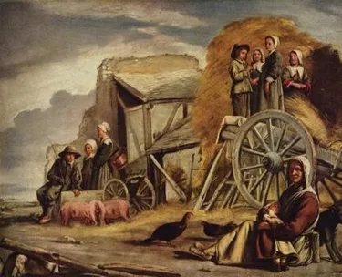

Градските занаятчии, заключени в строги гилдии, трудно въвеждат нововъведения или дори се подкрепят взаимно. Междувременно други европейски държави скоро надминават Франция на всеки фронт и изместват нейните продукти. Търговските успехи на Англия и Холандия са в мислите на всички.

Но как може да се намери решение за болестта на епохата? Все още няма икономическа наука и следователно няма специално лекарство, което да се приложи. Принципите на икономическата политика все още се прилагат хаотично, като се редуват ограничителни фази и по-либерални периоди. Разбира се, има образци, исторически примери за следване. Сред тях е *Sully*, министърът на Henri IV, който защитава земеделието и насърчава по-голяма свобода на търговията във Франция.

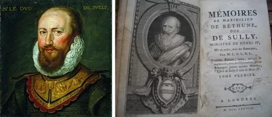

Но след това идва Colbert, министърът на Louis XIV, който се колебае между регулация и свобода, но в крайна сметка налага регулацията. В самия край на XVII век Colbert измества Sully: министрите вече се позовават на неговото наследство и се опитват да прилагат онова, което твърдят, че са неговите максими.

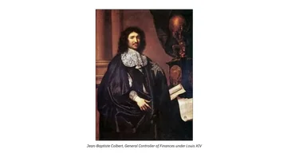

### Четирите максими на Colbert

В съзнанието на държавниците от края на XVII век максимите на Colbert са четири.

(1) **Индустрията трябва да бъде регулирана и ограничена в гилдии**. Тези регулации уточняват например как трябва да се изработват чаршафи и платове, техния размер и тегло.
Имало стотици такива правила, събрани в отделни томове за всеки вид индустрия. Но в очите на последователите на Colbert това все още не било достатъчно: според тях индустрията трябвало да бъде надзиравана и от корпорации.

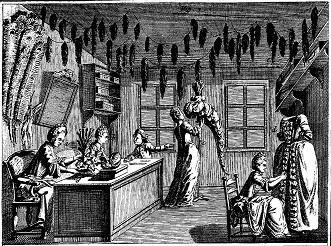

Всеки, който желаел да упражнява занаят, трябвало първо да прекара няколко години като чирак, после като калфа, преди да се опита да получи статут на майстор чрез изработване на „шедьовър“ и плащане на значителна сума на гилдията. Следователно конкуренцията във всеки занаят била строго ограничена.

(2) **Търговията е игра с нулева сума**. Когато става дума за търговия, учениците на Colbert споделят същите предразсъдъци като варварските народи от Античността. Според министъра на Louis XIV търговията е „вечна война“. Защо? Причината е проста: за Colbert и неговите наследници всяко увеличаване на богатството на една страна означава обедняване на друга. Според тях не бива да се допуска англичаните или холандците да забогатяват, защото това би означавало, че крадат просперитета на Франция.

Затова продуктите на тези страни трябвало да бъдат забранени или тежко обложени с данъци, без скрупули, защото търговията е война, в която можем да желаем само гибелта на враговете си.

> Французите могат да увеличат търговията си само като смажат холандците.
> *Colbert*

(3) **Когато държавата няма пари, повишавайте данъците**. Colbert и неговите ученици са далеч от убеждението, че богатството на данъкоплатците е ограничен ресурс. Според тях публичните разходи никога не могат да бъдат проблем, стига да се събира достатъчно. А ако народът се разбунтува, това е само защото министрите са подходили зле, защото, както Colbert цинично отбелязва, „изкуството на данъчното облагане се състои в това да скубеш гъските, без да ги караш да крещят прекалено много“.

(4) **Богатството е преди всичко злато и сребро**. Преди раждането на икономическата наука много автори следват една господстваща догма за природата на богатството — онова, което става известно като *меркантилизъм*. Colbert и неговите наследници продължават по този път. Накратко, меркантилистите вярват, че истинският знак за просперитета на една нация е натрупването на благородни метали, сребро и злато.

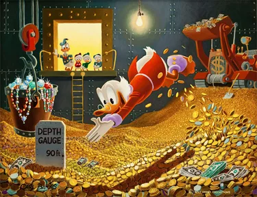

> Само изобилието на пари в държавата определя разликата в нейното величие и сила.
> *Colbert*

Последицата от тази идея е да се насърчава износът на всяка цена, който внася чуждо злато и сребро, и да се ограничава вносът до минимум, за да не бъдат изпращани те в чужбина.

### Основите на икономическата наука

Това са четирите принципа, които ръководят френското правителство в продължение на няколко десетилетия, докато страната навлиза в XVIII век. Скоро обаче те ще бъдат дълбоко оспорени. Между 1690 и 1710 г. няколко автори са силно поразени от бедственото състояние на Франция. В търсене на причините му те стигат до извода, че самите максими, наследени от Colbert, са виновни, и ги разглеждат като нищо повече от подвеждащи аргументи. Така те полагат основите на икономическата наука.

## Vauban

<chapterId>ee9c1e0e-96cc-5026-a5e2-963d68122786</chapterId>

### Маршалът, превърнал се в икономист

Днес, докато данъчният натиск в нашата страна продължава да расте и заплашва да задуши националните икономически сили, се надигат гласове в полза на промяна. Съзнателно или не, тези призиви за реформа често отекват работата на френски икономисти, които още от XVII век критикуват данъчната система на нацията като хаотична, деспотична и прекомерна.

Първият от тези данъчни реформатори, хронологично и по заслуги, е великият маршал Sébastien Le Prestre Vauban, прочут строител на крепости и цитадели.

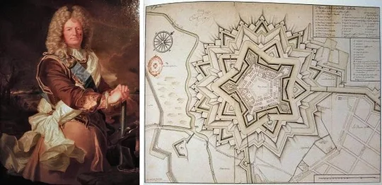

Макар тъжно да сме го забравили, Vauban е повече от военен; той е и икономист. Той се интересува от **съдбата на селяните и предлага смели данъчни реформи** през 1695 г. (Projet de capitation — „Проект за капитация“) и отново през 1707 г. (Projet d'une Dime Royale — „Кралски десятък“): да се заменят повечето съществуващи данъци с данък, пропорционален на дохода — плосък данък преди времето си.

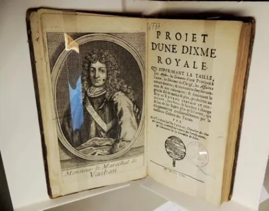

Vauban достига до тези идеи чрез любопитство. Той е внимателен наблюдател, стремящ се да изучава социалния живот и икономическата реалност строго, почти научно. Той настоява особено върху нуждата да се брои, чрез преброявания.

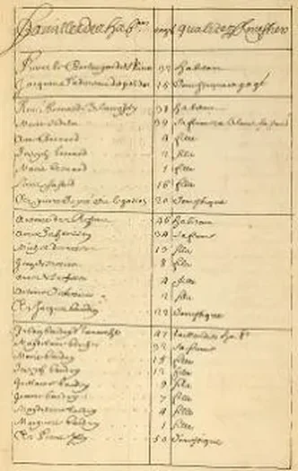

### Опустошителен портрет на френската нищета

Втората му голяма заслуга е трогателното и честно описание на нищетата, понесена от масите. Той пише: „Нека не се заблуждаваме; сърцето на кралството е разорено. Всичко страда, всичко търпи, всичко стене. Достатъчно е само да погледнете и да разгледате сърцето на провинциите; това, което ще намерите, е още по-лошо от онова, което казвам“. Далеч от преувеличение, мрачните наблюдения на Vauban са точен образ на живота в началото на XVIII век. Alexis de Tocqueville е добре запознат с тези идеи и по-късно ще опише *Кралски десятък* на Vauban като „плашещ“, защото е истинен.

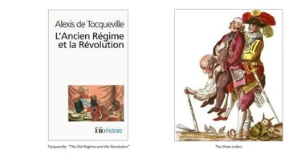

Другата голяма заслуга на Vauban като икономист е предлагането на мащабна данъчна реформа, насочена към изкореняване или поне намаляване на силата на злото, което той наблюдава и описва. Той е прав да направи това; френската икономика при Ancien Régime е парализирана от данъчно облагане, което е неравно, нестабилно и неразбираемо.

В различните си политически и икономически трудове всеобхватната амбиция на Vauban е да облекчи страданието на онова, което нарича „долната част на народа, която чрез труда си издържа и поддържа горната“.

Той разбира, че потискащото и обезкуражаващо данъчно облагане смазва селяните — понятие, което изразява с прозорливост и което можем да наблюдаваме отлично и в наше време:

> Земеделецът оставя малкото земя, която има, да запустява, обработвайки я само половинчато, от страх, че ако тя произведе това, което би могла с подходящ тор и обработка, ще бъде обложена още по-тежко.

Vauban вижда истината: данъчното облагане при Ancien Régime е не само ирационално, но и жестоко строго. Именно тази данъчна система, несправедлива в разпределението си, той се стреми да преодолее.

### Плосък данък преди времето си

Предложеното от него решение — плосък, пропорционален данък върху всички доходи — би позволило данъчната тежест да бъде справедливо споделена между всички социални класи. Основана на теория за държавата, която вижда публичната власт като необходима за защита на индивидуалните права и собствеността, данъчната реформа на Vauban изисква всички граждани да допринасят в строго съотношение към това, което печелят, например 10% от дохода си

В The Royal Tithe, единствения от неговите икономически трудове, отпечатан приживе, Vauban заявява ясно:

> Тъй като всеки в една държава се нуждае от нейната защита, за да оцелее, справедливо е всички да допринасят според дохода си за нейната издръжка и разходи [...]. Нищо не е по-несправедливо от това да бъдат освобождавани онези, които са най-способни да плащат, а тежестта да се прехвърля върху най-малко способните, които рухват под тежестта; тежест, която би била съвсем лека, ако се носеше пропорционално от всички според собствените им сили. Следователно всяко освобождаване от данъци е безредие, което трябва да бъде поправено.

Малко преди смъртта му идеята на Vauban е възприета от министрите на Louis XIV. Vauban обаче настоява пропорционалният данък да замени всички или почти всички съществуващи данъци. Вместо това, както често се случва, неговият данък е въведен, но всички останали също са запазени.

## Boisguilbert

<chapterId>200149c6-b5fc-566e-ab0e-bafb1c3fed3c</chapterId>

### Забравен пионер

Малко френски икономисти от миналото се радват днес в родината си на признание, съответстващо на приноса им, и Boisguilbert не е изключение.

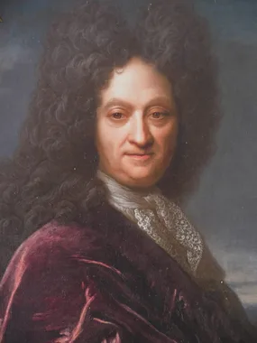

Неоценен от читателите на своето време, отдалечен от кръговете на властта заради ексцентричния си характер и всепоглъщащата си страст, Boisguilbert оставя слаб отпечатък върху XVIII век. Въпреки това в началото на миналия век започва бавно преоткриване на неговото творчество.

Но това преоткриване показва, че навлизаме в своеобразна задънена улица. Истинската заслуга на Boisguilbert е изгубена, когато го представят като пионер на множество теории и предвестник на много мислители. Казва се, че е схванал понятието за непълна заетост, по-късно защитавано от Keynes, че е предвидил закона на Say, проправил е пътя за теорията на Walras за общото равновесие и дори е предвестил класовия анализ на марксистите. „На кого или на какво Boisguilbert не би могъл да бъде предшественик?“ — пита накрая един коментатор.

(Pierre Le Pesant de) Boisguilbert е роден в Rouen през 1646 г. Образован в Port-Royal в Paris, Boisguilbert започва неуспешна литературна кариера, преди да поеме различни длъжности, включително тази на генерал-лейтенант на Rouen. Именно през това време той пише няколко книги, за да защити идеите си, сред тях „Détail de la France“ през 1695 г., която преиздава през следващата година под много по-ясно заглавие: [*France Ruined under the Reign of Louis XIV, by Whom and How, with the Means to Restore It*](https://archive.org/details/bub_gb_0jUaWNbTJa8C/page/n23/mode/2up).

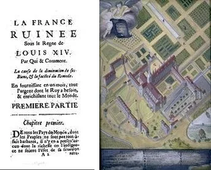

И това е основата на книгите на Boisguilbert: френската бедност и нейните причини.

Тази нищета на френския народ в края на XVII век Boisguilbert описва подробно, както прави и Vauban. Той пише:

> Пустите или зле обработени земи, видими за всички, са трупът на Франция.

Той описва изкоренени лозя, селяни, които изоставят нивите, и повтарящи се гладове. 

### Двете причини за френската разруха

Boisguilbert открива две основни причини за това нещастие. Защото ако народът живее в лишения, това е защото е възпрепятстван да потребява необходимото, а разрухата на потреблението има две причини.

Първо, хората вече не могат да си позволят да потребяват стоки от първа необходимост заради произволното данъчно облагане. Taille, личен данък от онова време, се изчислява сляпо за всеки човек, като се увеличава или намалява без причина. Заради многобройните привилегии тежестта пада върху бедните селяни, които се оказват разорени. За да поправи това, Boisguilbert препоръчва пропорционален данък върху всички доходи, много подобен на предложението на Vauban.

Втората причина за нищетата на Франция е, че прекалено много препятствия възпрепятстват свободната търговия със стоки, особено със земеделски стоки. Има мита по границите и дори вътре в страната, между различни региони, които парализират цялата търговия. Тези ограничения пречат на установяването на равновесна цена и ограничават пазарните възможности. В резултат селяните не могат да живеят от производството си, защото не могат да продават печелившо и страдат от нерентабилни земеделски цени — грижа, която остава силно актуална и днес и стои в центъра на теорията на Boisguilbert. По въпроса за търговските ограничения Boisguilbert се застъпва за разчистване на пътищата, с други думи — за установяване на свободна търговия.

### Първият призив за laissez-faire

И свободата наистина е неговият краен извод. „Не става дума да се действа“, казва той, „а просто да се престане да се действа, както толкова яростно действаме срещу природата, която винаги клони към свобода и съвършенство“. Всичко ще бъде добре, повтаря той неуморно, „стига да оставим природата да следва своя ход, тоест да ѝ дадем свободата, и никой да не се намесва в тази търговия, освен за да предлага защита на всички и да предотвратява насилието“.

Този последен пасаж е съществен. **Boisguilbert е първият, който ясно изисква икономическа политика на laissez-faire**, прави я свое кредо и изгражда реална система около нея. Според него съществува естествен ред на нещата и той не трябва да бъде покваряван или разрушаван от ненавременни публични намеси. Според него държавата не трябва да действа в икономическите дела, а по-скоро да остави нещата да действат естествено. Иначе тя ще причини нищета.

Boisguilbert дори критикува „*добрите души*“, както ги нарича, онези, които имат добри намерения, но причиняват голяма вреда. Те искат евтин хляб за народа, но като принуждават цените да падат, разоряват фермерите, които не могат да оцелеят при такива маржове. Тези фермери после изоставят земите си и потъват още по-дълбоко в бедност. Както всички знаем, „пътят към ада често е постлан с добри намерения“.

## Cantillon

<chapterId>bc206d41-6a64-5688-a489-40fcfa0e5397</chapterId>

### Ирландският банкер, който основава модерната икономика

Авторът на „Essay on the Nature of Trade in General“ (написан около 1730 г., публикуван през 1755 г.), Richard Cantillon се смята за един от пионерите на модерната икономическа наука. В своята History of Economic Thought икономистът Murray Rothbard дори нарича Cantillon основател на модерната икономика.

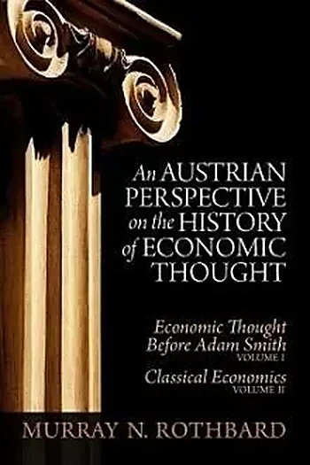

Роден в Ирландия, Richard Cantillon се установява в Paris като млад мъж и придобива френско гражданство. Той работи като банкер и натрупва състояние през епохата на John Law.

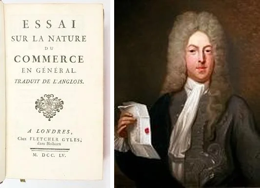

Именно по този повод той започва да изучава икономическата теория. Около 1730 г. Cantillon съставя своето Essay on the Nature of Commerce in General.

Тази книга може да се разглежда като един от първите опити за създаване на обща теория на икономиката. Cantillon внимава да идентифицира онова, което нарича „общи закони на икономиката“ — тези, които са в природата на нещата, а не в конкретните факти на една или друга страна. Този подход е революционен.

### Пет приноса към икономическата наука

Можем да обобщим големите заслуги на Essay на Cantillon в пет области: теорията за богатството, понятието за предприемача, критиката на обезценените валути, „ефектите на Cantillon“ и накрая защитата на свободата.

Първо, неговата **теория за богатството, основана на труда и природата**.
За разлика от меркантилисткия възглед, господстващ по онова време, Cantillon основава анализа си върху признанието, че богатството се формира от продуктите, които са подходящи за човешко наслаждение. Това богатство, твърди той, идва от природата и се произвежда чрез човешки труд. Идеите му за природата на богатството оказват силно влияние върху Beccaria и Adam Smith, а чрез Smith — върху цялата английска класическа школа на мисълта.

Второ, **предприемачът като централен икономически актьор**.
Макар да не го дефинира ясно, Cantillon разглежда предприемача като главен и централен участник в икономическата дейност. За Cantillon предприемача характеризира това, че поема риск и действа в несигурност. Тези идеи по-късно ще бъдат разширени от Turgot и още по-значимо от Say, за да се признае накрая специалното място на предприемача в икономиката — този път в противоречие с твърденията на английската школа.

Трети пункт, **опасностите от обезценената валута**.
Като реакция на опита с John Law, Cantillon обяснява какво се случва или трябва да се случи, когато валутата няма реална стойност.

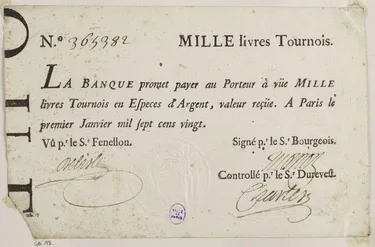

Той вижда две основни последици от замяната на метална валута с валута без реална стойност като хартиените пари. Първата последица е онова, което нарича „народно отхвърляне“, тоест нарастващо недоверие към обезценените пари. Втората последица е [инфлация](https://planb.academy/resources/glossary/inflation): паричното отслабване прави стоките по-скъпи.

Четвърто, в анализа си на **неравните ефекти на инфлацията** Cantillon отива по-далеч от своите съвременници. След като наблюдава краха на системата на Law, Cantillon осъзнава, че паричната инфлация не засяга всички еднакво. Напротив, тя обогатява едни, докато обеднява други. Той заключава, че инфлацията има преразпределителен ефект: онези, които първи получават новоиздадени пари, се възползват от увеличена покупателна способност, докато онези, които ги получават по-късно, обедняват в резултат от емитирането на нови пари поради повишаването на темповете на инфлация.

Пето, въпреки няколко остатъка от меркантилистко мислене, общата перспектива на Cantillon е **напълно либерална в защитата си на частната собственост**. Той защитава частната собственост като основен стълб на цивилизацията, твърдейки, че никое общество не може да функционира без частна собственост върху земята и продуктите на труда. Той също вижда материалното неравенство между хората като естествено и легитимно. Според Cantillon няма нищо лошо в това ефективен и смел работник или изключително надарен човек да печели повече от някой некомпетентен или мързелив. Накрая Cantillon вярва, че цените винаги трябва да се определят свободно, чрез играта на търсенето и предлагането, без намеса на публичните власти.

### Ефектът на Cantillon

Сред тези пет основни идеи в неговия Essay най-важната несъмнено е тази, която днес носи неговото име: **ефектът на Cantillon**.
С тази теория за ефектите на инфлацията Cantillon ни дава отговори на редица съвременни злини. Тя ни помага да разберем последиците от последните експанзионистични и инфлационни парични политики, които обедниха средната класа и селския свят, докато обогатиха операторите на финансовите пазари и държавата, нейните агенции и служители, заради общата им близост до източника на новата емисия: централните банки и търговските банки.

# Реформатори и мислители от началото на XVIII век

<partId>1f7b50d4-ce93-5db3-8396-43c1fa5419ff</partId>

## Абатът de Saint-Pierre

<chapterId>13478fe2-4c12-593c-a410-54c2cfb7ef7f</chapterId>

### Плодовит пацифист в епоха на война

От всички автори, които избрахме да включим в пантеона на френските мислители на laissez-faire от XVIII век, абатът de Saint-Pierre несъмнено е най-пренебрегваният.

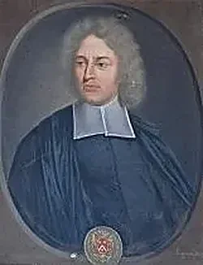

Честно казано, това отчасти е по негова вина. Той пише много, но стилът му е труден за четене и е пълен с повторения. Дори Jean-Jacques Rousseau се опитва да обобщи творчеството му: започва, но скоро изоставя задачата, след като разбира, че тя е над силите му. В средата на XIX век Gustave de Molinari го почита, като публикува обширен труд за него, в който отдава дължимото на пацифиста и икономиста, какъвто абатът de Saint-Pierre е бил. Но това не е достатъчно, за да го извади от забравата, в която той остава и днес.

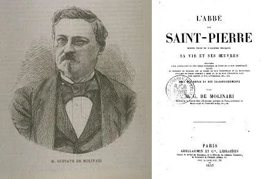

Абатът de Saint-Pierre пише за икономика, но обикновено интересът към него е по-скоро като към пацифист. Той е автор на Проект за вечен мир, който предхожда добре познатия проект на Emmanuel Kant.

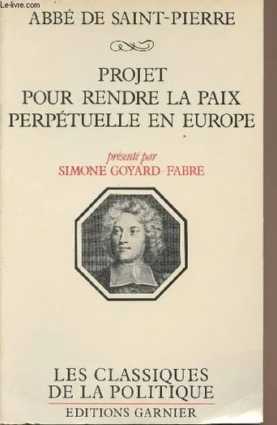

В този труд той твърди, че войната е разрушителна не само за онези, които я губят, но и за победителите, и дори за онези, които не участват в нея, тъй като търговията им е засегната.

За да се бори с бедствието на войната, той препоръчва създаването на своеобразна европейска Лига на нациите. Ще бъде създаден европейски съвет, който да решава проблемите на всяка нация. Така нациите ще прибягват до арбитраж, за да избегнат прибягването до оръжие. Ако една нация не е достатъчно мъдра да приеме мира, ако заплашва другите европейски нации, европейската лига на нациите ще има средство за отговор. При такива събития ще бъде сформирана европейска армия със сили, предоставени от различните страни.

### Изключен за това, че се осмелява да критикува Louis XIV

Има и един епизод от живота на абата de Saint-Pierre, който отлично илюстрира критическата нагласа зад френското движение laissez-faire. Той се присъединява към Académie Française през 1695 г., но е изключен през 1718 г., защото се осмелява да критикува царуването на Louis XIV. В това той се подрежда до фигури като Vauban и Boisguilbert, които също са дръзнали да говорят срещу нищетите, скрити под блясъка на царуването на Краля Слънце.

Абатът de Saint-Pierre твърди, че царуването на Louis XIV, с неговия разкошен двор и обсесията му по военни завоевания, не е белег на добродетелен крал. Той отказва да приеме, че Louis XIV заслужава титлата „**Louis Велики**“.

„Да разориш едновременно съседите си и своя народ не е величие“, казва той. Тази позиция дълбоко обижда Académie Française, която отдавна е заета да прославя краля във всяка възможна литературна форма. В резултат тя гласува почти единодушно да го изключи.

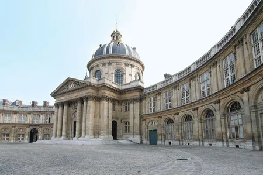

### Ранни прозрения за размяната и труда

По отношение на икономическото мислене той последователно прилага принципа на полезността, почти както Jeremy Bentham ще направи по-късно, и често предлага солидни прозрения. Честно казано, той все още е повлиян от меркантилистки идеи, от които никой по онова време не се е освободил напълно.

Все пак абатът de Saint-Pierre прави няколко точни наблюдения за икономиката. Още преди *Condillac*, на когото често се приписва идеята, той заявява ясно, че във всяка размяна и двете страни печелят. Това може да се намери в неговия [„Проект за усъвършенстване на търговията на Франция“](https://www.institutcoppet.org/projet-pour-perfectionner-le-commerce-de-france/) от 1733 г., където пише:

> Когато се извършва продажба между търговци, продавачът печели, както печели и купувачът; защото ако нямаше някаква реална или предполагаема полза и за двете страни, нито продавачът би продал на такава и такава цена, нито купувачът, от своя страна, би купил на такава цена.

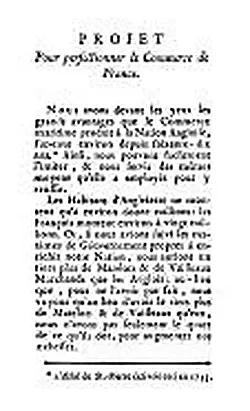

Той също подчертава, преди Vincent de Gournay, стойността на труда и важността той да остане привлекателен. „Всеки труд е труден“, пише той. „И когато човек види, че работата му не му носи нищо или не достатъчно, той става ленив и няма да си прави труда за ненужно усилие“. Точно този аргумент по-късно ще бъде повторен от Marquis d'Argenson, Vincent de Gournay и физиократите, когато критикуват обременителните регулации и гилдиите. Те твърдят, че такива ограничения обезкуражават работниците, създават ненужни трудности и в крайна сметка правят безделието по-привлекателно от производителното усилие при такива условия.

## Marquis d'Argenson

<chapterId>e9960ab4-72ec-5afd-8e97-bf89c83b62bc</chapterId>

### Предшественик на Adam Smith

Marquis d'Argenson е забравен основател на доктрината laissez-faire.

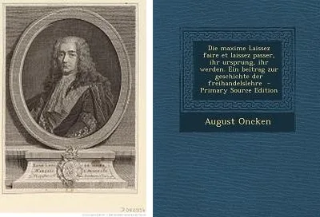

Той е преоткрит от August Oncken, автор на книга за доктрината laissez-faire, laissez-passer, който заключава, че d'Argenson е изиграл важна роля в раждането на тази идея.

René-Louis Voyer, Marquis d'Argenson, е роден през 1694 г. Той започва политическата си кариера като парламентарен съветник, а след това служи в Държавния съвет.

**Тридесет години преди Adam Smith**, d'Argenson вече защитава ползите от разделението на труда и специализацията.

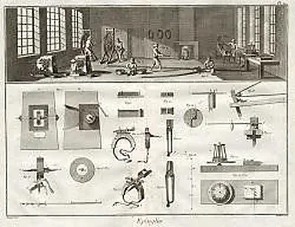

Той силно критикува регулации, които според него се опитват да променят естествените предпочитания на различните региони. Например той е объркан, че правителството иска да произвежда тъкани и кадифета в Tours, беден град по онова време, със същото качество като тези, изработвани в процъфтяваща Genoa, прочута със своите луксозни стоки. Той заключава:

> На всяко място трябва да бъде позволено да избира собствените си фабрики. Свобода! Свобода!

### Спонтанен ред и невидимата ръка

Той разпознава и друг от централните принципи на Smith: идеята, че спонтанният ред възниква от преследването на личен интерес. Marquis d'Argenson вярва, че непосредственият личен интерес е това, което движи човешката енергия. Той пише, че лошото майсторство и измамата ще дискредитират производителя, докато усърдието и добрите намерения ще доведат до просперитет. Най-добрият съдник за полезността, твърди той, е индивидът, широката публика, която купува стоки и се интересува да сключи добра сделка. „Всеки усеща собствения си интерес“, казва той, „всеки взема мерките, които са му изгодни, и именно в това общо съгласие откриваме истината.“

Още преди Adam Smith той разбира, че личният интерес води до общия интерес чрез изграждането на спонтанен естествен ред.

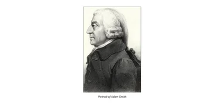

Той сравнява обществото с кошер от пчели, където всяко насекомо следва инстинкта си. „От действията им“, казва той точно, „произтича голямо натрупване за нуждите на малкото общество; но това не е причинено от заповеди или от генерали, които задължават всеки индивид да следва възгледите на водача си“. Това може би е най-близкият израз във френската икономическа мисъл до прочутото понятие на Adam Smith за „невидимата ръка“.

Marquis d'Argenson винаги е възмутен от идеите на министрите на своето време. Единственият въпрос, който те задават, е: „Да регулираме ли така или иначе? Да насочим ли икономиката към това или онова?“. На което d'Argenson отговаря: „Не трябва ли първо да попитаме дали изобщо е уместно да насочваме каквото и да било от нея, или дали нещата трябва да бъдат оставени да действат сами?“

Истината е, че той е удивен колко трудно е за хората да разберат, или по-скоро да видят, вредните ефекти от прекомерните регулации от всякакъв вид върху икономиката. Според него е достатъчно просто да отворят очите си. „Толкова много неща работят разумно добре днес“, пише той горчиво, „просто защото са успели да избегнат обсега на закона“.
Понякога той се отчайва колко малко идеите му са разбирани.

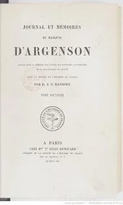

### Аргументът за минимална държава

Идеалът за икономическа политика, който той защитава, следователно е противоположен на тенденциите на времето му. Неговият идеал определя по същество отрицателна роля за държавата. „Всичко, от което търговията има нужда, е премахването на препятствията. Тя иска само добри съдии, наказване на монополите, равна защита за всички граждани, стабилни валути и пътища и канали“. Това е дефиницията за минимална държава, която ще стане една от основите на френската традиция в политическата икономия.

Тази визия за ролята на държавата в икономическата дейност естествено се илюстрира чрез изучаването на два големи въпроса, които вълнуват икономистите и социалните мислители на неговото време: регулирането на индустрията и търговията с пшеница.

Регулациите върху индустрията, преди всичко, събуждат цялото му негодувание, защото са привилегии за едни за сметка на други. „Истинската причина за упадъка на нашите фабрики“, пише той, „е прекомерната защита, която им се дава“. И с не по-малко живо кредо той изразява критиката си към дирижисткия плам на държавниците от своето време:

> Да управляваш индустрията против волята ѝ означава да искаш нейната гибел.

По въпроса за търговията със средства за препитание d'Argenson няма друг отговор освен свободата. Според него недостигът на пшеница идва от монопола и прекомерните предпазни мерки, взети от правителството. Трябва само да оставим нещата да бъдат и никога няма да има недостиг на пшеница в страна с отворени пристанища. Чужденците, привлечени като всички други хора от примамката на печалбата, ще ни осигурят това, от което се нуждаем, и ще отнесат нашия излишък. „Оставете нещата да бъдат“, казва той, „и всичко ще бъде добре“.

## Vincent de Gournay

<chapterId>e8ae40dc-7450-552f-9ddc-9e02936cf425</chapterId>

### Търговец в коридорите на властта

Vincent de Gournay е един от първите представители на laissez-faire във Франция и един от най-ранните му защитници в публичната администрация и интелектуалните среди. Поради тази причина той заслужава много повече признание в историята на икономическата мисъл, отколкото обикновено получава. Опитах се да подчертая неговия принос в скорошна книга.

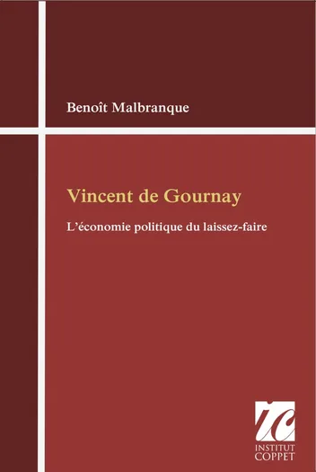

Роден в търговско семейство, Gournay сам става успешен търговец и натрупва значително богатство, преди да си осигури позиция във френската администрация. В Бюрото по търговията той е **пламенен защитник на свободния труд и свободната търговия**.

Макар да е добре вписан в контекста на водещите икономисти на своето време, Gournay пише малко или по-точно публикува малко. Той пише главно административни писма и мемоари, или непубликувани, или публикувани от други автори след известна редакция.

Това, с което разполагаме, включва:

1. [Бележките](https://archive.org/details/traitessurlecomm0000chil) върху превод на книга от английския икономист Josiah Child;

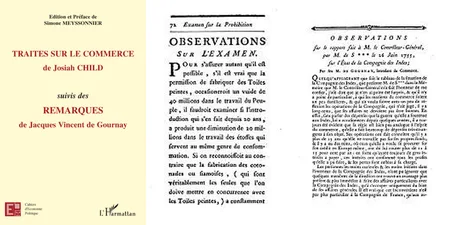

2. „Observations“, включени в Examination of the Advantages and Disadvantages of the Prohibition of Printed Fabrics;

3. „Observations on the East India Company“, добавени от абата Morellet към неговия Memoir on the Current State of the East India Company (1769);

4. И преди всичко различни мемоари от ролята му на Intendant of Commerce.

### Чуждо влияние и структуриращи идеи

Тези писания показват ясно чуждо влияние и присъствието на няколко големи структуриращи идеи. Чуждото влияние при Gournay е признаването на английското и холандското превъзходство. Gournay е убеден, че тези две нации разбират икономиката много по-добре от Франция и че Франция трябва да последва техния пример. „Тези две нации са най-проспериращи“, казва той, „и следват напълно различна система от нашата. Ние забраняваме влизането на чужди стоки, затваряме икономическата дейност в драконовски регулации, докато те действат по обратния начин. Ако те се справят по-добре“, заключава Gournay, „това е защото Франция се ръководи от погрешни принципи“.

Неговите предложения за реформи се съсредоточават около няколко ключови пункта.

Първо, той вярва, че трудът трябва да бъде защитаван и насърчаван. По онова време френските работници са третирани като престъпници, постоянно наблюдавани и държани в страх, че не са спазили една от хилядите регулации. Това прекомерно притеснение обезкуражава хората да работят и ги тласка към безделие. Но, твърди Gournay, „трудът е благороден и единственият начин да се обогати една нация“.

Второ, той критикува ограничителната система на гилдиите, която затваря производителите. Участието в занаят отнема много време и струва скъпо, а всеки нов работник трябва после стриктно да следва рутината, установена от статутите на неговата гилдия. Такава система не оставя място за превъзходство, иновация или напредък.

Трето, търговията във Франция е ограничена от рестриктивни закони. Според Gournay потребителите биха спечелили много, ако пристанищата можеха да се конкурират свободно и всички стоки, като зърно и щамповани платна, можеха да се внасят без ограничения. Той е един от първите, които посочват истинския произход на контрабандата: тя съществува единствено защото полезна и изгодна търговия е забранена. Той добавя остро наблюдение: контрабандата е „свободна“ професия, без регулации, без гилдии, без конфискационни данъци. И все пак именно смазващата регулация на държавата тласка много честни работници към незаконност.

Накрая Gournay отбелязва, че лихвените проценти са по-ниски в Англия и Нидерландия — страни, по-проспериращи от Франция. Той се застъпва за по-ниски лихвени проценти и във Франция, така че икономическата дейност да може да се финансира там при условия, толкова изгодни, колкото другаде. Gournay обаче не търси принудителни законодателни методи; по-скоро подчертава нуждата да се легализира заемането на пари срещу лихва, което все още е осъждано от Католическата църква.

### Трайно влияние върху Turgot и отвъд

По всички тези въпроси Gournay играе ключова роля в интелектуалните дебати от средата на XVIII век. Неговата защита на икономическата свобода предхожда физиократите с десетилетие и Adam Smith с двадесет години. Но най-трайното му влияние е върху Turgot. Gournay взема младия Turgot под крилото си и го обучава в своите идеи.

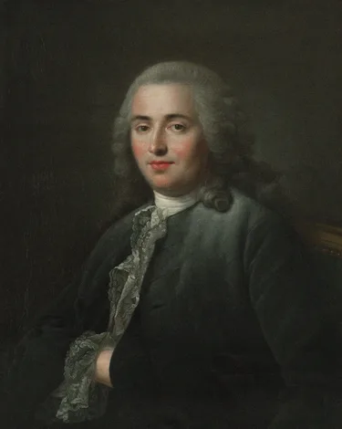

Години по-късно Turgot, бъдещ министър при Louis XVI, пише Éloge (похвално слово) в чест на приятеля си след смъртта му. И ако Turgot никога не приема напълно физиокрацията на François Quesnay, това е защото запазва непобедима привързаност към първия си учител, Vincent de Gournay.

## Кръгът на Gournay

<chapterId>b86ba6bd-8f3a-5d8f-b098-4d0413f00deb</chapterId>

### Мрежа от преводачи и икономисти

Когато става дума за ранните дни на икономическата наука, историята обикновено подчертава първата школа на мисълта: физиократите, водени от François Quesnay и неговите ученици. Почти десетилетие преди възхода им обаче съществува друга, по-малко формална, но също толкова важна група, съсредоточена около икономиста Vincent de Gournay.

Както видяхме в предишната част, Gournay е очарован от примера на чужди нации като Англия и Холандия. Той се възхищава на техните икономисти (фигури като Josiah Child, Johan de Witt и David Hume) също толкова много.

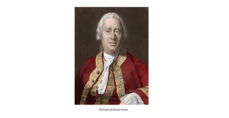

Това възхищение го кара да превежда и да възлага преводи на техните икономически трудове.

Оказва се, че позицията му във висшата администрация позволява на Gournay да влезе в контакт с всички икономически специалисти, познати във Франция по онова време. Така той събира група от изключително способни преводачи. Той лично превежда трудовете на Child и Culpeper. Абат Le Blanc превежда Political Discourses на David Hume. Véron de Forbonnais превежда испанския икономист Geronymo de Uztariz. Turgot работи върху писанията на Josiah Tucker, а синът на Montesquieu превежда Joshua Gee.

### Експлозия от икономически публикации

Благодарение на сътрудничеството на няколко членове на кръга на Gournay много автори успяват да публикуват оригинални трудове под собствените си имена. Тези книги, заедно с преводите, постигат забележителен успех. Някои важни примери включват:

- Essay на Herbert за [General Police of Grain](https://archive.org/details/essaisurlapolice00herb/page/n7/mode/2up) (6 издания за 4 години)

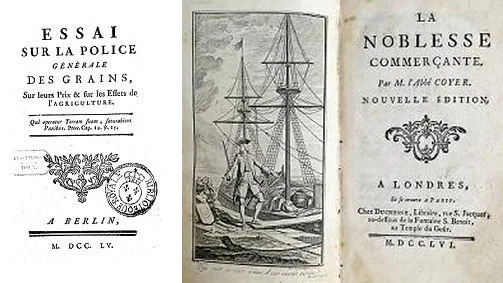

- [Noblesse commerçante](https://archive.org/details/lanoblessecommer00coye/page/n3/mode/2up) на Coyer (5 издания за 2 години)

- [Remarks on the Advantages and Disadvantages of France and Great Britain](https://archive.org/details/bim_eighteenth-century_remarks-on-the-advantage_plumard-de-dangeul-loui_1754) на Plumard de Dangeul (3 издания през първата година)
- [Memoir on the Trades](https://www.amazon.com/Memoire-sur-corps-metiers-French/dp/1978196903) на Cliquot-Blervache и Gournay (2 издания през 1758 г.)
Групата също играе ключова роля в публикуването на 
- [Essay on the Nature of Trade in General](https://archive.org/details/essayonnatureofc0000cant) от Richard Cantillon.

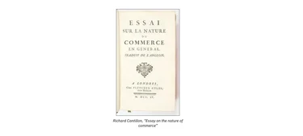

Тази последна книга, написана около 1730 г., остава в ръкопис след смъртта на автора. Gournay, с помощта на приятелите си икономисти, я публикува през 1755 г. Според абата Morellet, член на кръга, Gournay я препоръчвал на всеки икономист, когото познавал.

Интелектуалната продукция на кръга на Gournay оказва голямо въздействие върху историята на идеите. В този смисъл те могат да се смятат за основатели на икономическата наука във Франция. Christine Théré от INED, която е изучавала историята на икономическите публикации, установява, че между 1750 и 1759 г. са публикувани не по-малко от **349** труда по икономика, в сравнение с едва **83** през цялото предходно десетилетие (1740–1749). Тази революция от 1750-те се дължи до голяма степен на кръга на Gournay.

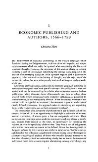

За да разпространят вкус към икономическите дискусии сред френското население, Gournay и приятелите му работят да ги направят достъпни чрез романи. След *Memoir on the Trades*, който критикува гилдиите, Gournay и Cliquot-Blervache помагат на Gabriel-François Coyer да напише кратък сатиричен роман, наречен Chinki: [A Cochinchinese Tale Applicable to Other Nations](https://www.institutcoppet.org/wp-content/uploads/2013/06/Coyer-Chinki-Histoire-cochinchinoise.pdf).

Историята следва главния герой Chinki, който е принуден да напусне земята си заради прекомерно данъчно облагане и се опитва да намери занаятчийска работа за децата си в града. Но всички занаяти са затворени за тях заради злоупотребяващи гилдийни регулации, затова историята представя нарастващото му разочарование в хумористичен тон.

### Да направиш икономиката модерна

Следователно кръгът на Gournay стои в началото на интензивна вълна от публикации. Макар този голям принос да е забравен от историците на икономическата мисъл, той е бил много ясен за съвременниците. Физиократите, които организират своята школа през 1760-те, по-късно ще представят групата на Gournay като свои преки предшественици. През 1767 г. икономистът Jacques Accarias de Serionne изразява това още по-ясно в своята почит. Той пише: „Малък брой французи, едновременно философи и граждани, започнаха преди няколко години да подражават на английските писатели. Първо преведоха образците си и скоро ги надминаха в много отношения. Те внесоха цялото очарование и богатство на литературата в разглеждането на полезни предмети; запалиха и разпространиха вкуса към науките, които бяха най-съществени за просперитета на държавата“.

И наистина, през 1750-те икономическите въпроси стават модерни. Voltaire прочуто отбелязва, че около 1750 г. французите се отказват от романите, за да обсъждат свободата на търговията със зърно. Тази тенденция е отбелязана и от Mercure de France, който пише в брой от 1758 г., няколко месеца преди смъртта на Gournay: „Политическата икономия сега е науката на мода. Книгите, разглеждащи земеделие, население, индустрия, търговия и финанси, сега са в ръцете на безброй хора, които неотдавна четяха романите само повърхностно“. Едва ли може да се отдаде по-добра почит на Gournay и работата на неговия кръг от икономисти.

## Mirabeau

<chapterId>2d2f802b-e3b6-556f-9025-a1b1dc4409ca</chapterId>

### Бащата зад прочутия син

Франция познава двама известни мъже с името Mirabeau — баща и син, но синът е този, който наистина влиза в историята. Революционен трибун и една от централните фигури в събитията на Френската революция, той остава прочут.

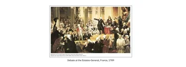

Чрез таланта си и мястото си във френската история той засенчва баща си — икономист и стълб на школата на François Quesnay, който е първият ѝ член още през 1758 г.

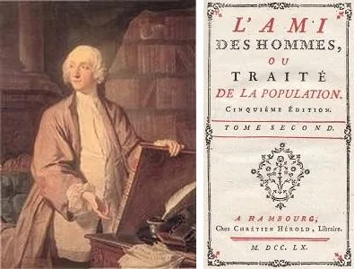

### L'Ami des Hommes: издателска сензация

Marquis de Mirabeau всъщност вече е постигнал огромна слава още преди да приеме физиокрацията, благодарение на книга, озаглавена „Приятелят на човечеството. Трактат за населението [фр.: L'ami des hommes, ou, Traité de la population](https://archive.org/details/lamideshommesou00unkngoog). Макар първото издание да е публикувано през 1756 г., книгата става известна около 1757 г., година преди срещата му с Quesnay.

Между 1757 и 1760 г. са публикувани повече от 20 издания, което вероятно я прави най-успешната икономическа книга в историята. Някои читатели дори мислят, че книгата е написана от Montesquieu заради острото ѝ разсъждение. Дофинът, баща на крал Louis XVI, дори твърди, че я е научил наизуст. За известно време това е книгата, която всички във Versailles четат.

Днес това е книга, която вече не се чете, но мнозина все още я споменават. Още през XIX век Edmond Roussel казва:

> L'Ami des Hommes е една от онези книги, за които всички говорят, но които почти никой не познава. Във всяко поколение един смел гражданин трябва да я прочете, за да не се налага на всички останали.

В началото на кариерата си като икономист Mirabeau черпи вдъхновение от Richard Cantillon. Той е притежавал ръкопис на Essay on the Nature of Commerce in General на Cantillon в продължение на 15 години и търпеливо го е анализирал и коментирал.

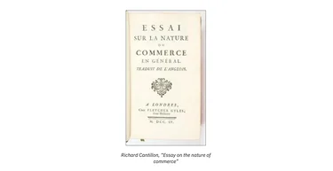

L'Ami des Hommes първоначално е замислена като прост коментар към Essay на Cantillon. Но тъй като Mirabeau има донякъде еклектичен ум, което, казано откровено, значи малко луд, той бързо се отклонява от първоначалния си план. Книгата просто обсъжда всички икономически въпроси, които той познава, като понякога се отдалечава от Cantillon. Тя е трудна за четене книга, със странен план и отклонения във всяка глава. Самият Mirabeau признава, че това е хаос и че стилът му е апокалиптичен.

Въпреки хаоса, който представлява, някои идеи си струва да бъдат отбелязани:

- Mirabeau се бори срещу меркантилисткия предразсъдък за природата на богатството.
- Той възхвалява земеделието и критикува неговото изоставяне.
- Той се оплаква от състоянието на народа, особено на селяните.
- Накрая защитава свободата на търговията и братството на нациите в мир.

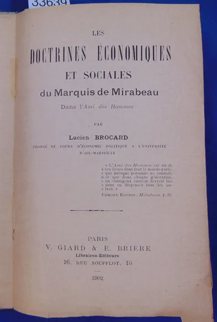

Трудно е възгледите на Mirabeau да бъдат определени като либерални или антилиберални. Той често се движи напред-назад, понякога без да го осъзнава, между едната визия и другата. Все пак либералните идеи често доминират в писането му. Един от най-известните му редове е:

> **Истинският и единствен принцип на политическата икономия** е да се остави всичко да бъде свободно.

### Обръщане към физиокрацията

След като най-големият му успех е зад гърба му, Mirabeau е ухажван. François Quesnay, който тъкмо се е заинтересувал от икономика, го кани в своя ентресол във Versailles.

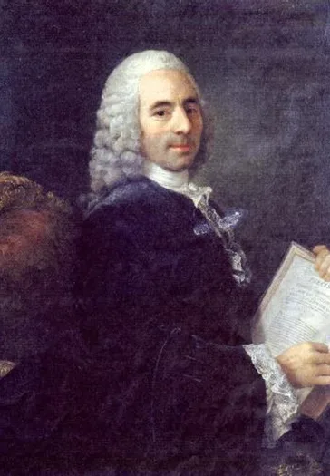

Те спорят яростно и накрая се случва нещо, което обикновено никога не се случва в спорове: Mirabeau направо признава, че е грешал. Той се съгласява с идеите на Quesnay и казва, че е готов да ги разпространява.

Заедно те оформят ядрото на онова, което ще стане физиократическата школа, подсилено от редовните попълнения, които привличат. Скоро след обръщането на Mirabeau Quesnay го включва да защитава идеите му за данъчното облагане. Това води до [„Theory of Taxation“](https://archive.org/details/thoriedelimpot00mira), заради която Mirabeau е изпратен за няколко дни в затвора Vincennes, а после е заточен в Bignon.

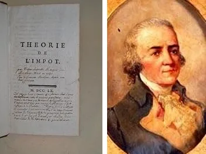

Mirabeau също играе решаваща роля в набирането на нови членове за школата на Quesnay. Той дори убеждава младия Dupont de Nemours.

Именно в дома на Mirabeau физиократите се срещат всеки вторник. Личности като Turgot и Adam Smith изглежда са присъствали на тези срещи веднъж или няколко пъти.

През целия си живот Mirabeau остава неуморен писател. Той е автор на множество икономически трудове, защитаващи доктрината на Quesnay. Към края на живота му обаче влиянието му отслабва. Стилът му на писане се влошава дотолкова, че собственият му брат му пише, че вече не може да разбира прозата му. Идеите му, станали напълно либерални, се сблъскват със социалистическата или протокомунистическата реакция на мислители като Mably и дори Rousseau. Той трудно намира читатели и издатели и умира почти незабелязан през 1789 г., в навечерието на щурма на Bastille.

## Quesnay

<chapterId>7a35f20b-5ea0-544d-b290-bcd9c6f7f11a</chapterId>

### Отвъд карикатурата в учебниците

François Quesnay е **един от най-известните френски икономисти**.

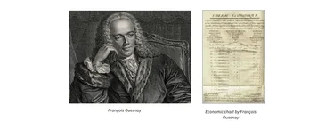

Името му се появява във всеки учебник по икономика и история на икономическата мисъл. Казва се, че той е създал „Tableau Économique“, за да представи схематично икономиката, че е бил водач на физиократическата школа и че е грешал, вярвайки, че само земята е продуктивна, и накрая, че Adam Smith е дошъл да постави нещата на мястото им. Това, повече или по-малко, е начинът, по който учебниците обикновено обобщават François Quesnay.

Да го сведем до това е жалко, защото Quesnay е и първият икономист, който се опитва да основе защитата на икономическата свобода върху научни принципи. Той е един от най-слушаните и влиятелни икономисти на своето време. Освен това основава физиокрацията — доктрина, много по-богата от опростената идея, че само природата произвежда богатство, понятие, което често се представя погрешно.

Ще обсъдим физиокрацията по-подробно в следващите три глави. Първо нека разгледаме по-отблизо самия François Quesnay.

### От хирург до кралски лекар

Роден през 1694 г. в Méré в селско семейство, което не може да научи Quesnay да чете. Той е обучаван от местен човек и накрая продължава да учи в Колежа по хирургия, а след това във Факултета по медицина. На 24-годишна възраст става хирург в Mantes.

Той придобива известност през 1730 г., на 36 години, като се противопоставя на обичайната практика на кръвопускане, която според него се основава на погрешни теории и предразсъдъци. Той също се осмелява да предизвика системата на гилдиите, която постановява, че само хирурзи могат да извършват операции и само лекари могат да предписват лекарства. Това често принуждава бедните да плащат два пъти и да викат двама души — ситуация, която Quesnay намира за възмутителна.

През 1740 г. става секретар на Академията по хирургия. През 1748 г., на 54 години, става личен лекар на Madame de Pompadour и се премества във Versailles.

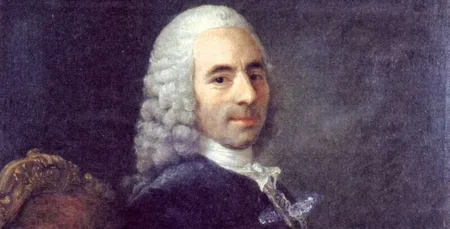

Той е много близък с Madame de Pompadour. Quesnay дори казва, когато е обявена немилостта на фаворитката, че не би искал да остане лекар във Versailles без нея:
„Бях привързан към Madame de Pompadour в нейния просперитет; ще бъда привързан към нея и в нейното падение“.

След това публикува няколко медицински книги: Treatise on Suppuration (1749), Treatise on Gangrene (1749) и Treatise on Continuous Fevers (1753), всички преиздавани няколко пъти приживе. 

На 60-годишна възраст, след като е въведен в модерните тогава икономически дебати, започва да пише за икономика. През 1755 г. пише статиите „Farmers“ и „Grain“ за *Encyclopédie*.

Те са публикувани през 1757 г. Същата година той среща прочутия Mirabeau и успява да го обърне към своите икономически идеи: ядрото на физиокрацията е родено. След това Quesnay създава Tableau Économique, отпечатан в кралската печатница, според сведенията в присъствието на самия крал в Château de Versailles. От този момент нататък той редовно приема икономисти и философи в апартамента си във Versailles, където те обсъждат свободно. Quesnay допринася и за Theory of Taxation на Mirabeau, публикувана през 1759 г.

Скоро цензурата нанася удар. Mirabeau е хвърлен в затвора, а Quesnay получава порицание. След това Quesnay разбира, че не може да публикува открито и ще има нужда от ученици, които да разпространяват идеите му.

### Ученици и разпространение на идеите

Той бързо ги намира: Baudeau, Dupont de Nemours, Le Trosne, Mercier de la Rivière и други. Това са мъжете, които ще разпространяват и популяризират мисълта на Quesnay. Но Quesnay, който се нуждае от ученици, не е напълно доволен от сектантския аспект на групата си. Свидетелство за това са писмата му до Mirabeau, в които му казва:

> Мислете сами. Осъзнах, че жалките ми чернови ви правят лениви. Сега е ваш ред да мислите. Знаете толкова, колкото и аз.

Все пак учениците му са дълбоко предани и допринасят много за популярността на Quesnay. При смъртта му Mirabeau произнася похвално слово, казвайки: „Изгубихме баща си, защото му дължахме всичко“. В действителност Quesnay им дължи всичко, защото без тях щеше да остане затворен във Versailles, където мисълта му, макар да имаше много с какво да съблазни или тревожи, интересуваше малцина.

Благодарение на работата на сътрудниците му идеите му намират платформа: първо чрез вестници като *Journal of Agriculture* и *Ephémérides du Citoyen*.

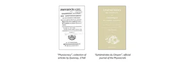

После чрез книги — не само тези на учениците му, но и важна антология, публикувана през 1768 г. от Dupont de Nemours, озаглавена *Physiocracy*.

Тази книга събира основните приноси на Quesnay. Тя излага икономическия идеал на водача на физиократите: модел на земеделска икономика, в който законът гарантира на всички правото на собственост и свободата да търгуват.

# Физиократическата школа

<partId>27af82c1-ad82-5c3b-8ce9-c674b67bbf7c</partId>

## История на физиократите

<chapterId>4236ff8b-b53a-59e7-92c0-f96f9afa1c00</chapterId>

### От Boisguilbert до Quesnay

**Физиокрацията става модерна във Франция**, а дори и в цяла Европа, за едва едно десетилетие. След дълъг период на развитие тя изпъква в средата на 1760-те. Когато Turgot идва на власт през 1776 г., движението вече е загубило популярността си, а министърът държи подкрепата си за школата на Quesnay предимно скрита.

Произходът ѝ се намира в развитието на икономическите идеи през 1750-те. Няколко автори помагат да се преодолее разстоянието между Boisguilbert и онова, което по-късно ще стане известно като физиокрация. Както вече обсъдихме, Vincent de Gournay и неговият кръг от икономисти стоят зад много публикации, които запознават френските читатели с чуждата икономическа мисъл и помагат да се разпали страстта им към икономиката. Основите на физиокрацията вече присъстват в книги като „Détail de la France“ от Boisguilbert и [„Essay on the Nature of Trade in General“](https://archive.org/details/essaisurlanature0000cant) от Cantillon.

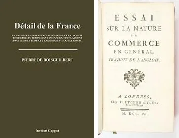

Понятието laissez-faire има няколко защитници още от Boisguilbert насам, особено Vincent de Gournay и Marquis d'Argenson.

Остава това тяло от идеи да бъде превърнато в съгласувана, пълна доктрина, а Marquis de Mirabeau е първият, който опитва. Вдъхновен от Essay на Cantillon, той започва да пише цялостен трактат по икономически въпроси, озаглавен „L'Ami des Hommes“, който има голям успех.

Така през 1756 г. историята на физиокрацията може да започне. François Quesnay, тогава хирург, станал личен лекар на Madame de Pompadour, кани Mirabeau във Versailles, за да обсъдят икономически идеи.

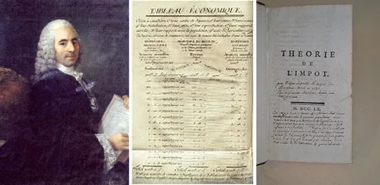

До края на разговора им Mirabeau се съгласява с идеите на Quesnay. Оттогава нататък те пишат: Quesnay създава *Tableau économique* (1758), за да илюстрира потока на богатството в икономиката, и заедно публикуват Theory of Taxation (1759).

Усилията им не са посрещнати топло. В двора преобладаващата реакция е безразличие. Кралят признава склонността на Quesnay към теорията и го нарича с обич „моят мислител“. Но освен този комплимент трудът им не постига никакъв резултат. Всъщност тяхната Theory of Taxation обижда данъчните администратори, които критикува, дотолкова, че те изискват и постигат затварянето на Mirabeau. Madame de Pompadour в крайна сметка го освобождава, но той продължава да живее в изгнание в имението си в Bignon няколко седмици.

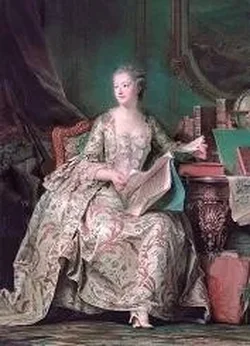

Първата половина на 1760-те така преминава в относително мълчание. Заради позицията си във Versailles Quesnay е принуден да спре да пише или поне да не публикува нищо под собственото си име. Mirabeau, вече осъден веднъж, е предупреден и добре знае, че фаворитката на краля не може да го защитава вечно.

### Златното десетилетие на физиокрацията

След това кратко мълчание двамата икономисти започват да набират ученици: това е единственият начин да популяризират идеите си. До 1765 г. успехите им са поразителни. Dupont de Nemours, Abeille, Mercier de la Rivière, Le Trosne и Baudeau бързо се присъединяват към редиците им. Те оформят школа: имат собствено списание, *Les Éphémérides du Citoyen*, и дори се срещат всеки вторник в дома на Mirabeau.

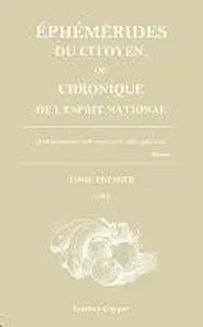

Между 1765 и 1775 г. обединената група физиократи стои на върха на славата си. Литературният и философският свят гледа само към тях, което позволява идеите им да се разпространяват широко и бързо. Хората ги наричат „икономистите“ или, по-подигравателно, „сектата на икономистите“. Независимо от тона, известността им е абсолютна. През 1774 г., след пътуване до Metz, M. de Vaublanc пише в мемоарите си за изумлението си: всички около него говорят за икономика и разсъждават като ученици на Quesnay. „Беше модерно“, отбелязва той. „Всеки беше икономист“.

### Упадък и трайно влияние

Но към 1770 г. популярността им започва да спада. Групата преживява първите си отцепвания, а способността ѝ да устоява на критика отслабва. А критиците са много: Condillac, Mably, Voltaire, Galiani, Linguet, Graslin и дори Adam Smith в Шотландия — всички оспорват възгледите им.

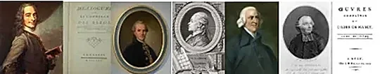

Техният вестник вече не излиза редовно. Това бележи края на най-активния период на движението.

Физиокрацията ще продължи да упражнява влияние чак до Революцията. Във Франция — първо чрез Turgot, по-скоро спътник, отколкото ученик, както и чрез нейния представител Dupont de Nemours, чиито живот и трудове ще изучим по-късно. Но също и в цяла Европа, където физиократическата доктрина е приета с ентусиазъм. В Германия чрез маркграфа на Baden, а в Италия чрез Leopold of Tuscany физиократическите теории дори вдъхновяват икономически реформи в полза на частната собственост и свободата.

## Основите на доктрината на физиократите

<chapterId>4dbe5436-0578-57c2-b054-03ed00aa091a</chapterId>
Терминът физиокрация, означаващ „управление чрез природата“, е създаден от Dupont de Nemours и използван като заглавие на *Physiocracy*, сборник със статии на Quesnay, публикуван през 1768 г.

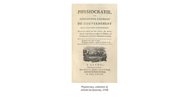

Това е неясен израз. Никой изследовател на Quesnay не ни е дал истинското му значение. И все пак тяхната система на мисълта далеч не е неясна. Всъщност тя е изградена около няколко много ясни принципа, които ще очертаем тук.

### Първи принцип: само земеделието е продуктивно

Тази първа идея е тази, която привлича вниманието на историците. Днес в учебници или курсове по икономика физиократите се обобщават така. Казва се, че те наивно вярвали, че само земеделието е продуктивно. На тази основа доктрината им се отхвърля като неуместна и анализът бързо преминава към Adam Smith.

Но е несправедливо да се критикуват физиократите за това, че отдават непропорционално значение на земеделието, защото в средата на XVIII век земеделието заема 90% от населението и е основата на френската икономика.

Идеята на физиократите всъщност е по-фина. Според тях има разлика между производство и печалба. Индустриалецът и търговецът могат да получават печалби, но само фермерът истински произвежда, защото производството е създаване на полезна материя, а не добавяне на полезност към вече съществуваща материя.

Трябва също да се опитаме да разберем защо те отхвърлят индустрията и занаятите като непродуктивни. По онова време тези занаяти са заключени в системата на гилдиите, която забранява иновациите, инвестициите и напредъка.

### Втори принцип: законен деспотизъм вместо демокрация

Днес, за да обидим някого, казваме, че не е демократ. Докато историците прощават на физиократите строгия им възглед за земеделската продуктивност, те не им прощават опозицията срещу демокрацията, особено след като живеят във върха на идеите на Просвещението. От средата на XVIII век до малко преди Революцията физиократите са възприемани като врагове на прогреса.

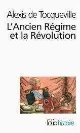

Tocqueville настоява върху тази идея:

> Физиократите наистина бяха много благосклонни към свободната търговия със стоки, към laissez-faire или laissez-passer в търговията и индустрията; но що се отнася до собствено политическите свободи, те не ги вземаха предвид и дори когато такива идеи случайно преминаваха през ума им, първоначално ги отхвърляха.

Либерални в икономиката, физиократите следователно не са либерални в политическите въпроси. Quesnay пише в своите *максими*: „Нека суверенната власт бъде единна и по-висша от всички индивиди на обществото и от всички несправедливи начинания на частни интереси.“ И по-късно в същата максима: „Системата на checks and balances в управлението е пагубно понятие, което разкрива само раздор сред великите и потисничество над малките“.

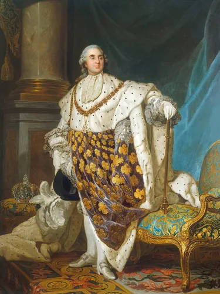

Tocqueville точно отбелязва, че физиократите отхвърлят демокрацията веднага щом видят формите ѝ. Те са скептични към демокрацията, което ще стане постоянна черта във френската политическа икономия, защото демокрацията далеч не е съвършена система: тя потенциално позволява потискането на малцинствата от мнозинството и може да се превърне в инструмент за узурпация, тирания и разграбване.

### Трети принцип: абсолютно уважение към частната собственост

Физиократите вярват, че хората трябва да притежават и запазват резултатите от труда си. Според тях правата на собственост са самата основа на обществото. Те смятат, че държавата има една основна задача: да защитава собствеността на хората. Освен това, от икономическа гледна точка, физиократите твърдят, че неприкосновеността на собствеността насърчава труда и усилието и е условие за икономически напредък.

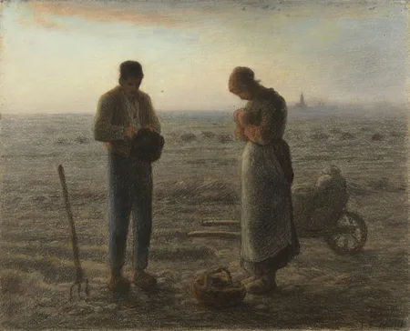

Quesnay го казва просто:

> Нека собствеността върху земята и движимото богатство бъде гарантирана на онези, които са техни законни притежатели, защото сигурността на собствеността е съществената основа на икономическия ред и сигурността на обществото; именно увереността в трайното владение насърчава труда и използването на богатството за подобряване и обработване на земята, както и в търговски и индустриални начинания.

### Четвърти принцип: абсолютна свобода на търговията

В своите вече цитирани *Максими* Quesnay заявява:

> Нека има пълна свобода на търговията, защото най-надеждното, точно и полезно регулиране както на вътрешната, така и на външната търговия за нацията и държавата се намира в пълната свобода на конкуренцията.

Физиократите са видели вредата, причинена от държавна намеса, особено в търговията със зърно. Трябва да се признае, казват те, че властта никога няма да може да управлява търговията толкова добре, колкото го правят индивидите, защото би трябвало да отговаря на всяка нужда и да реагира на всяка промяна в търсенето или предлагането. Всичко това е далеч отвъд способностите дори на най-мъдрото правителство, което можем да си представим. Следователно е необходимо да оставим нещата да бъдат и да ги оставим да текат.

Полезна по природа, търговията трябва да бъде изцяло и напълно свободна. Един от техните членове, Le Trosne, дори пише памфлет, озаглавен [*The Freedom of the Grain Trade: Always Useful, Never Harmful*](https://www.institutcoppet.org/liberte-commerce-grains-toujours-utile-jamais-nuisible/).

### Пети принцип: всички хора са братя

Яростни противници на робството, физиократите са и големи пацифисти. „Нашата външна политика се нарича мир“, казва просто Mirabeau. През 1790 г. в Учредителното събрание Dupont de Nemours продължава тази пацифистка позиция, когато предлага законопроект, забраняващ нападателните войни.

## Постиженията и влиянията на физиократите

<chapterId>5b911105-796a-5e2e-a501-c7a364fc758e</chapterId>

### Популяризиране на икономиката във Франция

Както видяхме в първата от трите глави, посветени на физиократите, последователите на Quesnay са на мода във Франция около десетилетие. Този ентусиазъм към идеите им се оформя както в тяхното време, така и продължава до края на века. Тук ще разгледаме някои от постиженията им и влиянието, което оказват върху своите наследници в областта на икономическата мисъл.

Най-голямото им постижение, след групата на Gournay, е да популяризират икономическите идеи. Прочутата фраза на Voltaire е добре известна: около 1750 г. нацията, преситена с поезия и романи, започва да разсъждава за зърно. Физиократите участват в това движение, публикувайки буквално стотици статии, памфлети и книги за свободата на търговията със зърно. Силният тласък, даден от физиократите на икономическите дискусии, личи и от впечатляващия брой икономически трудове и памфлети, публикувани във Франция от 1760 до 1775 г. Като допълнително доказателство за разпространението на икономическите идеи във Франция си припомняме забележката на M. de Vaublanc, цитирана в предишна лекция, който казва в Metz през 1774 г., че хората не говорят за нищо друго освен за икономика. „Това беше модата“, казва той. „Всеки беше икономист“.

Защитата на идеите им, в книги, памфлети и в списанието им *Les Éphémérides du Citoyen*, бързо има последици в икономическата политика на Франция. През 1763 г. едикт предоставя свобода на търговията със зърно, която Quesnay и Mirabeau силно са изисквали. На няколко пъти властите също облекчават регулациите, управляващи търговските гилдии, за да гарантират по-голяма свобода за работа.

### Влияние в чужбина

В чужбина успехът идва много рано. В Германия маркграфът на Baden проявява интерес към физиократическите идеи и поддържа редовна кореспонденция с Mirabeau и Dupont de Nemours.

Той възлага на икономиста Johann August Schlettwein, убеден физиократ, да приложи данъчна реформа и да либерализира търговията със зърно. През април 1770 г. първи опит се провежда в малкото село Dietlingen. Селяните изглежда приемат мерките с ентусиазъм, но отговорните чиновници не са много подкрепящи, което забавя по-широкото прилагане.

В Русия Catherine II подготвя законодателна реформа и моли Diderot да ѝ изпрати блестящ ум, който да ѝ помага.

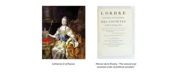

Впечатлен от прочита на [*The Natural and Essential Order of Political Societies*](https://archive.org/details/lordrenaturelete00mercuoft), публикувана през 1767 г., той ѝ изпраща автора ѝ, физиократа Mercier de la Rivière.

Макар да напуска Франция прославен, приемът му в Saint Petersburg е хладен (климата настрана), а императрицата е разочарована от него.

В Швеция при Gustav III и в Италия при Leopold of Tuscany физиократите също намират последователи, готови да приложат идеите им на практика.

Във Франция физиократите се радват на зрелищен успех с назначаването на Turgot за Controller-General of Finances през 1774 г.

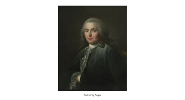

Съзнавайки упадъка на славата им, Turgot никога не се представя като лоялен ученик на физиократите, нито, впрочем, като енциклопедист, макар да е такъв, и понеже те са презирани от членовете на духовенството. Веднъж на власт, Turgot издава шест прочути едикта, които представляват началото на практическо приложение на физиократическата програма: свобода на търговията, свобода на труда и край на монополите.

По времето на Френската революция физиократите имат по-малко последователи. Marquis de Mirabeau умира на 13 юли 1789 г. — доста символично. Abeille е продължил напред, но Dupont de Nemours остава верен. Назначен в Събранието, Dupont de Nemours носи гласа на физиокрацията и призовава за икономически реформи в полза на собствеността и свободната търговия.

Той също се бори, безуспешно, срещу асигнатите. Въпреки този провал физиократическата мисъл остава много присъстваща в интелектуалния дебат и влияе върху ранните постижения на Революцията. Както казва Joseph Rambaud, всичко, което Революцията прави в полза на свободите, се дължи на физиократите.

### Физиократите и Adam Smith

Физиократите имат и **голямо влияние върху историята на икономическата мисъл**. Adam Smith, който посещава Франция и се среща с много от тях, е дълбоко повлиян от работата им. Той дори обмисля да посвети [*The Wealth of Nations*](https://planb.academy/resources/books/the-wealth-of-nations-c3e78eda-cc44-4cae-8460-f962148aa289) на Quesnay.

За съжаление Quesnay умира две години преди книгата на Smith да бъде публикувана и Smith премахва посвещението. Макар Smith да не е съгласен с идеята им, че само земеделието е продуктивно, той възприема много от аргументите им за свободни пазари и ги развива в собствения си труд.

## Dupont de Nemours

<chapterId>6d585e0f-93b8-5b0a-a0a8-7f6e4a5bc68e</chapterId>

### От случайна среща до любимец на Quesnay

В Съединените щати познаваме компанията DuPont, известна също като „E.I. du Pont de Nemours and Company“, многонационална фирма в областта на химията и биологията.

Днес тя има продажби за над 35 милиарда долара и наема почти 65 000 души по света. Оказва се, че тази компания е тясно свързана със съдбата на Samuel-Pierre Dupont de Nemours, френски икономист от физиократическата школа.

Роден през 1739 г., Dupont de Nemours се сближава с физиократите на 24-годишна възраст. По това време той все още търси пътя си в живота. Един ден попада на кратък памфлет, озаглавен The Wealth of the State. Намира икономическите му идеи за безсмислици и пише критичен отговор, наречен Reflections on the Wealth of the State, публикуван през 1763 г. Текстът е добре приет и читателите го хвалят, казвайки неща като: „Ти трябва да си ученик на Mirabeau!“ По ирония Dupont дори не знае кой е Mirabeau.

Любопитен, той започва да чете труда на Mirabeau, *Friend of the People* и *Theory of Taxation*. Среща Mirabeau и François Quesnay, после се присъединява към тяхната школа.
През 1765 г. на Dupont е предложена позицията редактор на *Journal de l'agriculture, du commerce et des finances*, водещото периодично издание на своето време в областта на икономическата мисъл.

Имало две причини за това: Mirabeau и Quesnay трябва да мълчат, а Dupont е възприеман като изгряващата им звезда.

Членовете на физиократическата школа са съгласни, че Dupont de Nemours бързо става любимец на Quesnay. Quesnay веднъж казва: „Грижете се за този млад човек, той ще бъде онзи, който ще говори, когато сме мъртви“. Един друг физиократ, Abeille, дори започва да завижда на вниманието, което Dupont получава, и се отдалечава от школата на Quesnay.

### Архитектът на физиократическото издаване

Dupont de Nemours винаги запазва високото си уважение към Quesnay.

По-късно той ще каже: „Бях само момче, когато Quesnay протегна ръце към мен; той ме направи мъж.“ Именно Quesnay го превръща в голям икономист на литературната сцена на времето.
След *Journal de l'agriculture, du commerce et des finances* Dupont е назначен за редактор на *Les Éphémérides du Citoyen*, което става официалният орган на физиократите.

Той превръща тази периодична поредица в голям център на икономическата теория, поддържайки я дори по време на упадъка на физиократите, като лично пише почти всички по-късни томове. Освен това именно Dupont de Nemours измисля термина „физиокрация“, произлизащ от две гръцки думи, означаващи „управление на природата“. Той използва този термин като заглавие на сборник със статии на Quesnay, публикуван през 1768 г., и терминът в крайна сметка се установява в историята. Известно е, че помежду си физиократите се наричат „икономисти“ и все още са наричани така по време на Революцията.

### Живот на убеждение

Когато Turgot за кратко служи като финансов министър на Франция, Dupont става негов близък съветник, единственият физиократ с достъп до него, тъй като Turgot държи дистанция от останалите.

По време на Революцията той е избран от бальяжа на Nemours и се озовава в Събранието, където седи и друг Monsieur Dupont. Тогава започват да го наричат Dupont de Nemours не защото е благородник, а просто за да различават двамата. Името, разбира се, остава.

По време на Революцията, през август 1792 г., той взема оръжие, за да защити краля в двореца Tuileries срещу тълпата.

Кралят му казва: „Monsieur Dupont, винаги ви намираме там, където сте нужни!“ След като по чудо избягва Терора, осъден и чакащ гилотината, но спасен от падането на Robespierre, той е тласнат в изгнание при Napoleon и намира щастие в Съединените щати, където един от синовете му основава, с помощта на баща си, компанията Dupont.

Въпреки този изпълнен със събития живот, през който публикува десетки статии, брошури и книги, той остава сравнително малко познат и до днес. Може би това е така, защото остава непоколебим физиократ, когато доктрината е излязла от мода. Наистина, както пише Schumpeter, Dupont de Nemours остава верен на физиокрацията „през цялата си кариера, през която е имал много възможности да се отрече от нея“. **Той е човек на убеждението**.

# Просвещението и политическата икономия

<partId>d1c885ad-7cb1-5f81-816c-be312719d9f8</partId>

## Voltaire и философите

<chapterId>16bcf7bf-dad4-5113-8c64-2800f04ff07b</chapterId>

### Икономиката в Encyclopédie

XVIII век във Франция вижда появата на икономиката като наука и първата школа на икономическата мисъл: физиокрацията. Adam Smith се обучава в икономика през този период, а френските икономисти са признати по света като водачи. Този век обаче се помни повече като век на философията, отколкото на икономиката. Макар физиократическото движение да се съгласува в амбициите си с философията на Просвещението, нагласите на philosophes, особено Diderot и Voltaire, заслужават внимателно разглеждане. Ще видим, че мислителите на Просвещението значително допринасят за разпространението на идеята за laissez-faire във Франция.

Най-известното постижение на философията на Просвещението без съмнение е *Encyclopédie* на Diderot и d'Alembert.

Естествено, икономическите статии са написани от икономисти. За ранните томове Diderot се обръща към Forbonnais, а после привлича либерални икономисти: първо François Quesnay (който допринася със статии като „Grains“, „Fermiers“, „Hommes“, последната непубликувана), после Turgot (който пише „Foires et marchés“). Тези писания са от голямо значение. В статиите си Quesnay полага основата на онова, което ще стане физиократическа доктрина. Заедно с неговия *Tableau économique* те остават най-известните му трудове. Turgot, все още млад по това време, развива идеята за laissez-faire в своята статия, критикувайки държавната намеса в пазарната организация.

В много други статии на *Encyclopédie* philosophes, особено Diderot, защитават идеала за свобода във всички области: религия, политика и икономика.

Свободата на труда, особено в противопоставяне на системата на гилдиите, е повтаряща се тема в различни статии като Arts, Métier и Communauté.

### Сложната връзка на Diderot със свободата

Пътят на Diderot в икономическата теория е любопитен. В Encyclopédie той е твърд защитник на икономическата свобода и е този, който търси сътрудничеството на либерални икономисти, както потвърждава писмо, очертаващо статиите, които Turgot би могъл да напише за него. В ранните години на физиокрацията той е едновременно поддръжник и популяризатор на школата на Quesnay. През 1769 и 1770 г. пише за *Les Ephémérides du Citoyen*, за голямо огорчение на антилибералните си приятели философи, като Melchior Grimm; скоро обаче се отдалечава от групата. Запленен от живия интелект на абата Galiani, той му помага да публикува книгата си за търговията със зърно на френски, точно когато Galiani се готви да се върне в Италия.

Тази книга ще стане най-яростната атака, правена някога срещу физиократическите идеи, и ще нанесе голям удар на движението. По-късно Diderot защитава Galiani срещу абата Morellet, близък съюзник на физиократите, в своята *Apology of Galiani*. Няколко години по-късно, по време на министерството на Turgot, Diderot е видян да аплодира установяването на свобода на труда чрез премахването на гилдиите. В този момент Diderot, син на занаятчия, се оказва в съгласие с либералните икономисти и пише язвително писмо до Galiani, който твърди, че свободата на труда ще разори френската индустрия в рамките на двадесет или тридесет години. В светлината на Индустриалната революция историята подсказва обратното. След като се връща на страната на либералните икономисти, Diderot вече не се радва на тяхното доверие и остава изолиран. Много показателен момент е писмо, което изпраща до Dupont de Nemours през 1774 г., където пише:

> Някога имахте приятелство към мен; сега вече нямате, защото сте толкова заети, че вече нямате време да обичате никого.

### Voltaire между похвала и сатира

Voltaire следва подобен път, белязан от липса на последователност в икономическите му възгледи. Той се възхищава на Vincent de Gournay, кореспондира с икономисти (включително Dupont de Nemours и Turgot) и оценява физиократите — особено за похвалата им към земеделието. Той ги възхвалява в *Diatribe to the Author of the Ephémérides*. По-късно обаче критикува идеята им за единен поземлен данък в сатиричния си труд *The Man of Forty Crowns*, който също предизвиква значителни спорове. Накрая, като Diderot, той приветства министерството на Turgot, наричайки го златен век и възхвалявайки двата му големи декрета за свобода на труда и свободна търговия.

В крайна сметка връзката на philosophes с икономическата мисъл е смесена. Въпреки похвалите и критиките си към либералните икономически идеи, те играят роля в въвеждането на тези идеи в по-широкия интелектуален дискурс на Просвещението. Така, независимо дали умишлено или не, те помагат да се придвижи напред понятието laissez-faire чак до Революцията.

## Turgot, теоретикът

<chapterId>a8cd8185-8351-556b-8011-3a0c313e8a9d</chapterId>

### Създаването на велик икономист

В известен пасаж от своята *History of Economic Thought* американският икономист Murray Rothbard възхвалява онова, което нарича „блясъка“ на Turgot.

представяйки го като най-големия икономист на XVIII век, заедно с Cantillon.

Как Turgot достига до такава известност? Това се дължи на комбинация от три ключови фактора. **Първо, престижният му семеен произход**. Той произлиза от дълга линия кралски администратори, много от които заемат високи държавни длъжности. **Второ, златният век, в който е роден**. Turgot е на 21 години, когато Montesquieu публикува *L'Esprit des Lois*, и на 24, когато излиза първият том на *Encyclopédie*.

Той е съвременник на физиократите, Voltaire, Diderot, d'Holbach, Adam Smith, Condorcet и други. **Трето, неговата изключителна интелектуална ранна зрялост**. Като студент в Sorbonne той пише писмо за хартиените пари на 22-годишна възраст, произнася забележителни речи, а на 24 съставя списък с 52 труда, които да напише.

Въпреки младостта си Turgot допринася за *Encyclopédie*, като пише статии по теми като „Etymology“, „Existence“, „Expansibility“, „Fairs“ и „Foundations“. Само една статия засяга пряко икономиката: текстът му за „Fairs“, който описва произхода на панаирите и пазарите и критикува нарастващата държавна намеса, която ги нарушава и парализира.

През тези ранни години негов наставник е Vincent de Gournay, който го взема под крилото си и изгражда близко приятелство с него. След смъртта на Gournay през 1759 г. Turgot съставя похвално слово, в което предлага превъзходно резюме на доктрината laissez-faire. Той по-специално пише:

„От всяка гледна точка, от която търговията може да засяга държавата, индивидуалният интерес, оставен сам на себе си, винаги по-сигурно ще произведе общото благо, отколкото действията на правителството, които винаги са погрешни и по необходимост се ръководят от неясна и несигурна теория“.

### Компендиум на либералната икономика

През 1767 г., докато е intendant, той съставя компендиум по икономика под заглавието [*Reflections on the Formation and Distribution of Wealth*](https://planb.academy/resources/books/turgot-oeuvres-completes-37fa0489-cabd-413c-9240-34d1663d0720).

Разделението на труда, суверенитетът на потребителя, частната собственост, ролята на капитала — практически всички големи икономически теми са разгледани. Много историци, най-скорошната сред тях историчката Anne-Claire Hoyng, са посочили сходствата между този труд на Turgot и [*The Wealth of Nations*](https://planb.academy/resources/books/the-wealth-of-nations-c3e78eda-cc44-4cae-8460-f962148aa289) на Adam Smith, публикуван девет години по-късно.

Turgot защитава свободата на търговията със зърно в писма до абата Terray, по-късно предадени на краля, но половината от които днес са изгубени. Той пише:

> Господине, ако има нещо спешно, то не е да се налагат нови ограничения върху най-съществената от всички търговии, а да се премахнат онези, които, за съжаление, са били оставени да съществуват. 
> Ако някога е имало време, когато най-пълната, най-абсолютна свобода, напълно свободна от всякакъв вид препятствия, е била необходима, смея да кажа, че това е сега, и че никога не е било по-малко уместно да се обмисля издаването на регулация за търговията със зърно.

През 1769 г. Turgot пише статията Value and Money за *Dictionnaire de Commerce* на абата Morellet, която в крайна сметка никога не е публикувана. Galiani вече е отбелязал, че „човекът е общата мярка на всички неща“, предвиждайки субективния анализ, който Turgot ще развие тридесет години по-късно в тази статия, където разширява и доказва това твърдение.

През 1770 г., много преди Bentham, Turgot пише меморандум в защита на свободата на лихвените проценти и лихварството.

„Грешка е да се вярва, че лихвата върху парите в търговията трябва да бъде фиксирана от законите на владетелите“, казва той, „Това е текуща цена, която се регулира сама, както тази на всички други стоки“. В защита на тази позиция той опровергава възраженията на Aristotle и църковните отци.

### Невъзможността на централното планиране

Забележително резюме на доктрината laissez-faire на Turgot може да се намери в забравено писмо от 1773 г. до абата Terray относно маркирането на железата:

> Това, което политиката трябва да прави, е да отстъпи пред хода на природата и пред хода на търговията, който е не по-малко необходим и не по-малко неустоим от самия ход на природата, без да се опитва да го насочва; защото, за да го насочва, без да го нарушава и без да вреди на себе си, човек трябва да може да следи всички изменения в човешките нужди, интереси и индустрия; трябва да ги познава на ниво подробност, което е физически невъзможно да се получи и при което дори най-умелото, активно и прилежно правителство винаги ще рискува да греши поне наполовина.

Тук намираме много ясно изложение на доктрината laissez-faire, както и предвещание на анализа на Friedrich Hayek за претенцията за знание, тоест невъзможността държавата напълно да обхване икономическите сили, за да ги контролира.

## Turgot, реформаторът

<chapterId>9177429f-1679-51c4-bfd2-dd036d24a1cc</chapterId>

### Неохотният intendant на Limousin

Както накратко припомнихме в предишната глава, Turgot е син на изтъкнато семейство, отличило се във висшите редици на френската държавна служба.

Баща му е бил prévôt des marchands на Paris, а дядо му — intendant. След като се отличава в учението си, най-младият от семейство Turgot се стреми да достигне поне същите висоти. Първо служи известно време като maître des requêtes, което означава, че е връзка между intendants и Versailles. Това е престижна позиция, за която той трябва да получи специално възрастово изключение, но Turgot се стреми към повече. Смъртта на наставника му Gournay допълнително го насърчава да се цели по-високо и той иска назначение като intendant.

През 1759 г. първо кандидатства за intendancy на Grenoble, но получава отказ. После му предлагат поста provost of the merchants в Lyon, който той отказва. Иска intendancy на Brittany, но и това е отказано. Накрая, през 1761 г., му предлагат intendancy на Limousin и той, донякъде неохотно, приема. Пише на Voltaire: „Имам нещастието да бъда intendant“, може би имайки предвид: имам нещастието да бъда intendant в Limousin.

В Limousin селяните са бедни и живеят в несигурни условия, особено по отношение на жилище и храна. Общото равнище на образование е изключително ниско. Малкото съществуващи пътища са в катастрофално състояние.

Тъй като регионът е толкова беден, той не представлява интерес за министрите. Това дава на Turgot свободата да експериментира с реформи. В Limousin той преследва три големи проекта:

- **Преразпределението на taille**, личния данък (Turgot цели да въведе възможно най-много обективност при оценката му).
- **Corvée**, форма на данък, плащан в труд, при която селяните са принуждавани да работят по строежа на пътища. При обиколка на региона Turgot бързо забелязва лошото състояние на пътищата. Той заменя corvée с паричен данък.
- **Набирането на милиции**, селски армии, мобилизирани по време на война.

Това се прави чрез теглене на жребий, което води до страх и насилие заради бегълците; Turgot заменя тези задължителни набори с платени доброволци.

Тези реформи са несъмнено успешни и през юли 1774 г. Turgot е назначен за министър. Поради липсата му на опит кралят първо го поставя в Министерството на флота. Назначението забавлява мнозина. Самият Turgot признава: „Не знам нищо за флота“, а Voltaire отбелязва: „Не мисля, че Turgot е повече моряк от мен“.

### Шест едикта за реформиране на Франция

Само месец по-късно обаче Turgot е назначен за Controller-General of Finances, като на практика става министър на икономиката и финансите на Франция.

Познаваме писмото, в което той очертава принципите си пред Louis XVI: „Никакъв фалит. Никакво увеличение на данъците. Никакви нови заеми“. Тази философия, която критиците днес биха могли да нарекат безсмислена „строгост“, е предназначена да спаси монархията.

Turgot подготвя шест кралски едикта, за да реформира френската икономика.

Това е първият (и един от последните) пъти, когато икономически експерт получава свободата да реформира икономиката на своята страна. Три от едиктите на Turgot се открояват: един премахва принудителния труд (corvées), друг разпуска търговските гилдии (корпорациите), а третият установява свободна търговия със зърно.

### Падането на златния век

При влизането си в министерството Turgot знае, че ще срещне съпротива от привилегированите класи. „Ще се боят от мен, дори ще ме мразят, по-голямата част от двора и всички, които търсят благоволения“, казва той на краля. Привилегированите скоро се обединяват срещу него и причиняват освобождаването му от поста Controller-General of Finances. Voltaire, който напълно подкрепя реформите на Turgot, пише в кореспонденцията си:

> Ах! Какви ужасни новини чух! Какво ще стане с нас? Съкрушен съм! Никога няма да се възстановим от това, че видяхме раждането и смъртта на златния век! Тази мълния удари и ума, и сърцето ми.

Оттогава мнозина твърдят, че Франция е страна, която не може да бъде реформирана. Провалът на Turgot сякаш го потвърждава: той е подготвен от половин век либерална икономическа мисъл; има подкрепата на философите от Просвещението; и самият крал, с абсолютна власт, го подкрепя.

В крайна сметка парламентите и привилегированите класи побеждават. Всичко, което кралят може да направи, е да се оплаче насаме: „Сега виждам, че само Monsieur Turgot и аз се грижим за народа.“

## Condillac

<chapterId>0ba8dbb5-dcd5-5981-bf85-6c185e0bf192</chapterId>

### Софизмът на Montaigne и заблудата за нулевата сума

Точно като меркантилизма, който е най-очевидното му практическо проявление, софизмът на Montaigne отнема много време, за да изчезне.

Този софизъм е идеята, че търговията и размяната са игри с нулева сума. Каквото едната страна печели в една сделка, непременно се губи от другата страна. Поддръжниците му твърдят, че това важи както между индивиди, така и между нации.

Абатът de Condillac играе **главна роля в окончателното разрушаване на тази погрешна идея**.

„Окончателно“ може би е преувеличение, защото в публичния дебат този софизъм често се появява отново. Може би именно затова Condillac остава малко познат икономист. Освен австрийските икономисти, малцина са разбрали значението на неговата теория за размяната; вече никой не проявява интерес към него.

За повечето историци на икономическата мисъл годината 1776 е белязана от публикуването на [*The Wealth of Nations*](https://planb.academy/resources/books/the-wealth-of-nations-c3e78eda-cc44-4cae-8460-f962148aa289), която основава икономическата наука. Петнадесетте урока, които току-що завършихме, в които изучихме френската икономическа наука преди Adam Smith, са достатъчни, за да докажат грешката на това схващане. В същата 1776 г. освен това друга книга може би заслужава повече похвала от историците, отколкото книгата на Adam Smith: тя е написана от Condillac и просто е озаглавена [*Commerce and Government Considered in Their Mutual Relationship*](https://planb.academy/resources/books/condillac-le-commerce-et-le-gouvernement-5e397405-e066-43bc-82df-1017c1fb63ae).

### Размяната като взаимна полза

За Condillac, ако софизмът за размяната като игра с нулева сума продължава да съществува, физиократите са отчасти виновни, защото поддържат, че размяната е отношение на равенство. Според Condillac това е погрешно: размяната е неравно отношение, при което човек винаги дава по-малко, за да получи повече.

Между идеите на физиократите и тези на Condillac едва ли може да се мечтае за по-съвършено противопоставяне. Физиократът икономист Le Trosne пише:

> Размяната по своята природа е договор на равенство, сключен от равна стойност за равна стойност.

Condillac, от друга страна, пише:

> Всяка страна по договора винаги дава нещо с по-малка стойност, за да получи нещо с по-голяма стойност.

Опозицията обаче е до голяма степен въпрос на думи. И двамата са съгласни, че когато човек разменя франк за книга, книгата струва един франк или цената на книгата е един франк.

Разликата се състои във факта, че Condillac твърди: щом разменяме франк за книгата, това означава, че за нас стойността на книгата е по-висока от тази на нашата монета от един франк. Предпочитаме книгата пред монетата и затова извършваме размяната.

Теорията на Condillac не е фундаментално противоречива с тази на физиократите, но те не говорят на един и същ език, така да се каже. Le Trosne говори за цена, докато Condillac говори за стойност, и обратно.

Condillac е прав в това, че ако цените са равни между двете разменени стоки, стойностите не са равни, иначе размяна не би се състояла.

### Три положения, които променят икономиката

За да обобщим теорията на Condillac, могат да се изброят три положения:

Първо положение: търсим стоки заради тяхната полезност. Това изглежда очевидно, но е централен принцип на икономическата наука, че хората разменят, за да придобиват полезности — пункт, който Jean-Baptiste Say също развива отлично.

Второ положение: стойността предшества и мотивира размяната. Субективната преценка, която всеки човек прави за стоките и услугите, предполага, че същите тези стоки и услуги имат стойност за него, по-голяма или по-малка според полезността, която изглежда предоставят. Естествено, всеки индивид съди различно от другия и стойността варира от човек до човек.

Накрая, трето положение: цената е последица от процеса на размяна. Продуктите не се разменят по стойността, която аз им приписвам, защото условията на размяната зависят и от субективната стойност, която продавачът приписва на тези продукти. Отношението между купувач и продавач, или между субективната оценка на купувача и субективната оценка на продавача, установява цена.

Тези идеи на Condillac са фундаментални. Те ни позволяват да разберем защо всяка размяна винаги е взаимно полезна.

Следователно те напълно разрушават критиките към свободната търговия, тъй като протекционизмът изглежда само като механизъм, който пречи на населението взаимно да си носи полза. Laissez-faire е и заключението на труда на Condillac. Оставете хората да правят каквото желаят, защото ако публичната власт защитава свободата и собствеността, хората винаги ще се обогатяват взаимно, като разменят помежду си.

## Condorcet

<chapterId>99e4aba6-da7f-5041-b02f-337158381515</chapterId>

### Философ, привлечен от икономиката

Condorcet несъмнено е **най-икономически настроеният философ на Просвещението**.

През голяма част от кариерата си той се посвещава на области, напълно несвързани с икономиката, и с право, тъй като талантите му водят до голям напредък в науките, върху които се фокусира най-много. Но около 1770 г. той се почувства привлечен от икономическите въпроси, може би защото други философи, особено Voltaire и Diderot, не си правят труда да посветят свободното си време на тях, а също и защото се сприятелява с Turgot.

Condorcet постепенно приема идеите на laissez-faire и свободата, първоначално в области, несвързани с политическата икономия. В своето *Letter of a Theologian* той философски осмива католическата религия и изразява желанието си да види истинска свобода на вярата, включително свобода да не вярваш. В своя кръстоносен поход за толерантност и срещу религиозния фанатизъм Condorcet се бори за реабилитацията на Chevalier de la Barre и за нов процес срещу D'Etallonde, който е осъден на смърт за счупване на разпятие.

Така той е подготвен да защитава свободата, когато приятелят му Turgot се издига до позицията Controller-General of Finances.

### Защитник на реформите на Turgot

От този момент нататък кариерата на Condorcet поема обрат, когато той влиза в икономическия дебат, неуморно подкрепяйки либералните реформи на новия министър. Като благоприятства конкуренцията и свободата на търговията, Condorcet също призовава за премахване на corvées (принудителен труд), гилдиите и за справедливо данъчно облагане. Той изразява тези убеждения публично винаги, когато се появи възможност, правейки го с очевиден ентусиазъм; пише обширно и веднъж заявява в писанията си: „Позволете ми отново да говоря за свободата на търговията; наслаждавам се да се занимавам с тази тема.“

Между 1774 и 1776 г., по време на министерството на Turgot, Condorcet прави многобройни намеси, всички белязани от ангажимента му към laissez-faire. Сред трудовете му са *Letters from a Farmer of Picardy to Mr. Necker*, защитаващи свободната търговия; *Monopolies and Monopolists*, защитаваща свободната конкуренция; *Reflections on Corvées*, призоваваща за премахването им; и *Reflections on the Grain Trade*, която отново възхвалява свободната търговия и критикува книгата на Necker по същата тема.

В своите [*Letters on the Grain Trade*](https://archive.org/details/bub_gb_hg8jFw-y6bwC) Condorcet излага няколко ключови пункта.

Първо, високите цени на зърното по онова време не са резултат от свободната търговия, а от лоши реколти, и Condorcet доказва това ясно. После обяснява защо laissez-faire е не само уместна, но и единствената подходяща политика въпреки народния предразсъдък. Той отбелязва: „Толкова сме свикнали да виждаме правителството да се намесва в търговията със зърно, че бездействието изглежда като нещо необикновено и ново“. По-късно добавя: „Почти всички, особено онези, които заемат публични длъжности, вярват, че нищо не се случва само и че всичко е загубено, ако правителството не се намесва във всичко“. Така Condorcet съживява аргументите на физиократите и Turgot, показвайки превъзходството на свободната търговия над всички форми на интервенционизъм.

Популяризирането на либералната икономическа програма на Turgot е смел акт, тъй като Condorcet знае, че бързо ще се сблъска с цензура. Това наистина се случва и неговият памфлет за премахването на принудителния труд е унищожен и забранен през 1776 г.

Turgot, оценявайки лоялната защита на Condorcet на неговите идеи, го назначава за Inspector of Coinage. Condorcet подава оставка веднага щом приятелят му напуска министерството.

### Границите на реформата в предреволюционна Франция

Макар да посвещава цялата си енергия на защитата на Turgot, Condorcet няма илюзии за изхода от мандата на приятеля си. Самият Turgot признава късно в живота си, че живее със съжаление, както пише в писмо, „че не е могъл да направи за моята нация и човечеството добро, което вярвах, че е много лесно“. Condorcet, по-реалистичен, посочва многото противници, които Turgot ще срещне: фаворитите на краля, парламентите, духовенството, благородството, гилдиите и т.н. Тези групи очакват ласкателство, а не реформа. Condorcet казва на Turgot: „Вие по никакъв начин не сте шарлатанин, а това е недостатък, като се има предвид как стоят нещата в Paris“. Той е напълно прав, защото през 1776 г., едва две години след пристигането си, Turgot вече е принуден да напусне поста Controller-General.

## Либерален здрав разум по време на Революцията

<chapterId>95e9a90d-e37a-58ff-b1ac-928b42e76ecf</chapterId>

### Срещу банковите монополи

Dupont de Nemours е най-младият ученик на François Quesnay, който веднъж казва за него: „Трябва да се грижим за този млад човек, защото той ще говори, когато сме мъртви“. Когато започва Френската революция, почти всички големи физиократи, включително Marquis de Mirabeau, вече са си отишли; самият Mirabeau е починал на 13 юли 1789 г.
Dupont de Nemours пише списъка с оплаквания за бальяжа на Nemours.

Този увлекателен документ съдържа всички оплаквания на либералните икономисти срещу търговските ограничения, монополите и посегателствата върху собствеността. Dupont de Nemours също е избран в Националното събрание.

По време на Революцията той става **гласът на либералния здрав разум**, стоящ твърдо срещу надигащата се вълна на популизъм и интервенционистка демагогия, които в крайна сметка надделяват.

Още през ноември 1789 г., когато се говори за предоставяне на монопол на Caisse d'Escompte (което би могло да я превърне в публична банка, Bank of France), Dupont de Nemours се изказва в защита на конкуренцията.

„Би било по-добре“, казва той, „да оставим банковия бизнес на законите на свободната търговия“. И добавя:

> Не разбирам какво е имал предвид министърът, когато е говорил за предоставяне на привилегия на Caisse d'Escompte. Ако тази привилегия включва изключителност, трябва да я отхвърлите, защото сте дошли тук, за да унищожите изключителните привилегии, а не да създавате нови.

Въпреки предупрежденията му Събранието пренебрегва възраженията му и прави още една стъпка към създаването на централна банка и банков монопол.
През 1790 г. в Учредителното събрание Dupont de Nemours следва пацифистката традиция на приятелите си физиократи и предлага закон, забраняващ нападателните войни. Първият член гласи: „Френската нация няма да си позволи да участва в нападателна война, за да завземе територията на други или да наруши правата или свободата на която и да е нация“. 

Това предложение е отхвърлено.

### Битката срещу асигнатите

Същата година, 1790 г., започват дебати за издаване на нова хартиена валута за покриване на държавните разходи.
Dupont de Nemours твърдо се противопоставя на това и публикува памфлет, озаглавен [*Effects of Assignats on the Price of Bread*](https://archive.org/details/effetdesassignat00dupo). Заглавието е точно, защото той обяснява, че издаването на асигнати неизбежно ще доведе до инфлация — увеличение на цените на стоките, включително хляба.

Той подписва памфлета като „приятел на народа“. Текстът предизвиква голямо вълнение, тъй като Събранието е попитано кой го е написал. Тогава Dupont de Nemours се изправя и признава, че е негов труд, казвайки, че не се срамува да използва титлата „приятел на народа“, защото борбата срещу асигнатите наистина служи на народа.
Отново съветът му е пренебрегнат и асигнатите са издадени.

Всички знаем бедствието, което последва — икономическата разруха и страданието, понесени от народа, мнозина от които губят всичко, когато асигнатите стават без стойност и трябва да бъдат изгорени.
### Пророк без слушатели

Няколко години по-късно Събранието насочва вниманието си към идеята за създаване на истинска Bank of France, която да получи монопол върху производството на пари.

Dupont de Nemours, все още твърдо противопоставен на идеята за публична банка, виждайки я като нищо повече от монопол, напомня на Събранието за бедствения опит с асигнатите. Той им казва:

> Не се подготвяйте за съжаления като онези, които измъчваха колегите ми в Учредителното събрание. Тогава предложението ми да се ограничат асигнатите само до плащане за национални имоти и да не се превръщат в обращаваща се валута беше отхвърлено. Днес те казват: „Ах, ако само бяхме послушали Dupont de Nemours!“

Но още веднъж никой не го слуша.

## Заключение: предаване на факела

<chapterId>ada8082f-db96-5e52-954f-719b47998153</chapterId>

### Забравените основи

Френската икономическа мисъл през XVIII век често е засенчвана от по-известните икономисти от XIX век. Но когато става дума за защитата на свободата, именно през XVIII век всичко наистина започва. Това е векът, в който принципът laissez-faire, толкова революционен за времето си, за първи път е ясно изразен от редица мислители, от Boisguilbert до Dupont de Nemours.
Разбира се, фигури като Jean-Baptiste Say, [Frédéric Bastiat](https://planb.academy/resources/books/bastiat-oeuvres-completes-765be39c-134a-4333-8b4b-e45a4fff7e73), [Gustave de Molinari](https://planb.academy/resources/books/molinari-oeuvres-completes-8a3dbdd8-2053-45bc-9203-dd3b7f3edfee) и Yves Guyot оставят трайна следа в историята на френската икономическа мисъл. Но ако ги изучаваме изолирано, пропускаме нещо съществено. Тези мислители от XIX век не се появяват от нищото; те наследяват и надграждат основите, положени от предшествениците им от XVIII век по време на Просвещението.

### Шест принципа, които оформиха модерната икономика

Boisguilbert твърди, че добронамерените души, които вярват, че могат да поправят всичко чрез участието на правителството, неизбежно обръщат икономиката с главата надолу и че следователно е по-добре да се остави естественият ред на нещата да следва своя ход.

Cantillon настоява, че парите никога не трябва да бъдат манипулирани за политически цели. Да се позволи на държавата да управлява парите както ѝ харесва означава да се проправи пътят към огромен финансов и икономически безред.

Vincent de Gournay твърди, че прекомерната регулация на труда обезкуражава усилията на работниците и занаятчиите, тласкайки ги към леност и бездействие. Благодарение на свободната конкуренция икономиката може да расте и една нация може да просперира.

Marquis d'Argenson твърди, че никое правителство не е способно да предвижда и измерва всичко и че следователно човек трябва да разчита на личния интерес на всеки индивид.

Quesnay и физиократите твърдят, че частната собственост е основата на човешките общества. Без частна собственост човек губи мотивацията да полага усилие, да работи, тъй като не може да се наслаждава на плодовете на труда си или да натрупва каквото и да било.

Condillac твърди, че размяната винаги е взаимно полезна и следователно трябва, без изключение, винаги да бъде свободна. Единствената мисия на държавата трябва да бъде да защитава свободата и собствеността.

### Предаване на факела към XIX век

Всички тези идеи ще бъдат възприети от икономистите на XIX век. Някои, като Jean-Baptiste Say, ще дадат на тези идеи научен израз чрез строг *Treatise on Political Economy*. Други, напротив, ще се стремят да популяризират тези фундаментални максими, като навлязат в областта на приказките, романите и забавните кратки истории, както Frédéric Bastiat ще направи толкова умело.

## Биография

<chapterId>17cf2865-e53c-5f3b-a5c2-a43560efaf01</chapterId>

**ИЗБРАНА БИБЛИОГРАФИЯ**

По-долу ще намерите селекция от над тридесет писания:

### Предвестниците и ранните реформатори

1. Pierre Clément, Histoire de Colbert et de son administration, Paris, 1874
2. Vauban, Projet d'une dîme royale, 1707; преиздание Institut Coppet, 2014; Anne Blanchard, Vauban, Fayard, 1996
3.	Boisguilbert, Détail de la France, 1695; преиздадена от Institut Coppet, 2014
4. Félix Cadet, Pierre de Boisguilbert: предшественик на икономистите, Institut Coppet, 2014
5. Pierre de Boisguilbert ou la naissance de l'économie politique, Paris, INED, 1966
6. Richard Cantillon, Essai sur la nature du commerce en général, 1755; преиздадена от Institut Coppet, 2015
7. Antoin Murphy, Richard Cantillon, банкер и икономист, Oxford, 1986
8. Gustave de Molinari, L'Abbot of Saint-Pierre, Paris, 1859
9. Abbot of Saint-Pierre, Abrégé du projet de paix perpétuelle, Rotterdam, 1729
10. Abbot of Saint-Pierre, „Projet pour perfectionner le commerce de la France“, in Les rêves d'un homme de bien, Paris, 1775, p.199
11. André Alem, Le marquis d'Argenson et l'économie politique au début du XVIIIe siècle, Institut Coppet, 2015
12. Journal et mémoires du marquis d'Argenson, издание Rathery, 9 vols, Paris, 1859-1867
13. Benoît Malbranque, [Vincent de Gournay: политическата икономия на laissez-faire](https://planb.academy/resources/books/benoit-malbranque-vincent-de-gournay-leconomie-pol-23fb1bac-21d6-432f-a4f3-69a359e48358), Institut Coppet, 2016
14. Vincent de Gournay, Remarques sur la traduction de Josiah Child, L'Harmattan, 2008
15. Christine Théré & Loïc Charles (eds.), Le cercle de Gournay, INED, 2005
16. Antoin Murphy, „Le développement des idées économiques en France (1750-1756)“, Revue d'histoire moderne et contemporaine, tome XXXIII, October-December 1986
### Физиократите и техният свят

17. Henri Ripert, Le marquis de Mirabeau: ses théories politiques et économiques, Paris, 1901
18. Lucien Brocard, Les doctrines économiques et sociales du marquis de Mirabeau in L'Ami des Hommes, Paris, 1902
19. Humbert de Montlaur, Mirabeau, l'Ami des Hommes, Perrin, 1992
20. Yves Guyot, François Quesnay et la Physiocratie, Institut Coppet, 2014
21. François Quesnay, Œuvres économiques complètes et autres textes, 2 vols, INED, 2005
22. Georges Weulersse, Le mouvement physiocratique en France (de 1756 à 1770), 2 vols, Paris, 1910
23. Georges Weulersse, La Physiocratie à la fin du règne de Louis XV (1770-1774), P.U.F., 1959
24. Georges Weulersse, La Physiocratie sous les ministères de Turgot et de Necker (1774-1781), P.U.F., 1950
25. Georges Weulersse, La physiocratie à l'aube de la révolution (1781-1792), EHESS, 1985
26. P. Jolly, Du Pont de Nemours, soldat de la liberté, Paris, P.U.F., 1956
### Икономистите на Просвещението

27. Икономическите писания на Voltaire, Institut Coppet, 2013
28. Gustave Schelle (ed.), [Œuvres de Turgot et documents le concernant](https://planb.academy/resources/books/turgot-oeuvres-completes-37fa0489-cabd-413c-9240-34d1663d0720), Paris, 1913-1924
29. Benoît Malbranque, Le libéralisme à l'essai : Turgot intendant du Limousin (1761-1774), Institut Coppet, 2015
30. Pierre Foncin, Essai sur le ministère de Turgot, Paris, 1877
31. Auguste Lebeau, Condillac économiste, Paris, 1903
32. Condillac, [Le commerce et le gouvernement considérés relativement l'un avec l'autre](https://planb.academy/resources/books/condillac-le-commerce-et-le-gouvernement-5e397405-e066-43bc-82df-1017c1fb63ae), 1776
33. Condorcet, Mélanges d'économie politique, in Eugène Daire (ed.), Mélanges d'économie politique, Paris, 1847
34. P. Jolly, Du Pont de Nemours, soldat de la liberté, Paris, P.U.F., 1956
35. Eli Heckscher, Mercantilism, 2 vols. London: Allen and Unwin. 1935

# Финален раздел

<partId>385bffab-aea1-5bcd-9569-62b3f30665b7</partId>

## Рецензии и оценки

<chapterId>a1e689d9-abd0-5dcb-ba56-a8d355d0a84f</chapterId>
<isCourseReview>true</isCourseReview>

## Финален изпит

<chapterId>bdb7fd98-33e7-11f0-9fe6-b785c859ffc5</chapterId>
<isCourseExam>true</isCourseExam>

## Заключение

<chapterId>3b366ff6-03c8-5f6a-b4c0-ba8186e65d7e</chapterId>

<isCourseConclusion>true</isCourseConclusion>
