# A Journey into the Economic History of Freedom

In early 18th-century France, a new way of thinking about the economy began to take shape. It emerged as a response to the heavy-handed control of the Ancien Régime and centered around one powerful idea: *laissez-faire* - "let us do". 
The phrase is said to have come from a conversation between a merchant and Minister Colbert. When the minister asked, "What can the government do to help your business?" the merchant replied, "Just let us do it." That simple answer captured the heart of a growing movement that argued for less government interference in the economy.

Thinkers who supported this idea believed the role of government should be limited. It should protect individual rights, but avoid stepping into economic affairs and disrupting it completely. First and foremost, they argued, taxes should be collected fairly and equally (as put forward by Vauban and Boisguilbert). The government should also avoid playing with money, devaluing it just to fund its own needs at a low cost (some example were highlighted by Richard Cantillon after the collapse under John Law and later, by and Dupont de Nemours after the failure of the assignats money phenomenon). They also called for freedom of labor. That meant abolishing old trade guilds and ending the excessive rules that restricted industry and commerce. These outdated systems hindered economic progress (ideas supported by d'Argenson, Gournay, the Physiocrats, and Turgot).

Lastly, they argued for the free circulation of goods (what became the extended phrase *"laissez-faire", "laissez-passer"*) so consumers could benefit from better prices, and nations could build peaceful, cooperative relationships (championed by Quesnay, the Physiocrats, and the abbé de Saint-Pierre).

By promoting these principles, 18th-century French economists laid the groundwork for economic thought. Their ideas greatly shaped their own time but continue to guide how we understand economics today.

+++

# Introduction

<partId>06d67531-19f1-4f8d-bf8f-77bbcc743672</partId>

## Course overview

<chapterId>202db3c6-0320-494d-8057-adc6f6563048</chapterId>

Welcome to HIS204!

this course is designed to explore the French origins of concept of *laissez-faire*-"let us do"-, as it emerged during the 18th century through a rich and evolving intellectual tradition. By following the work of early French economic thinkers, we'll uncover the foundations of a political philosophy built on economic freedom, marked by a deep mistrust of government interference and a belief in a natural order that supports growth and prosperity.

**Section 2: The Early Voices** 

We begin at the turn of the 17th and 18th centuries, a time shaped by the heavy-handed rule of absolute monarchy and the first calls for a more rational and fair way to govern economic life. In this section, we'll look at the ideas of Vauban, Boisguilbert, and Cantillon, early critics of government overreach who offered a first glimpse of what would later become liberal economic thought.

**Section 3: Reformers and Thinkers of the Early 18th Century**

In the decades that followed, a new generation of reformers began challenging the old system. Thinkers like the abbé de Saint-Pierre, the marquis d'Argenson, and Gournay (along with his students) called for dismantling outdated corporate privileges, freeing up trade, and encouraging competition as a driver of progress. Their bold proposals paved the way for the ideas that would soon define the Physiocratic movement.

**Section 4: The Physiocratic School** 

This section explores one of the most important moments in French economic thought: the rise of the Physiocrats. We'll examine their core beliefs, their major contributions, and the work of key figures like Quesnay and Dupont de Nemours. The idea of laissez-faire takes on a clear, structured meaning here, rooted in the belief that the economy functions best when it follows a natural order and that the role of government is to respect and protect that order, not to interfere with it.

**Section 5: The Enlightenment and Political Economy** 

Finally, we'll see how liberal economic thinking found new life in the broader Enlightenment movement. Figures like Voltaire, Turgot, Condillac, and Condorcet expanded on the ideas of the Physiocrats, connecting them to broader themes of reason, justice, and human progress. Their writings helped carry the laissez-faire tradition into the revolutionary period and beyond, where it took on even greater meaning in a rapidly changing world.

**Ready to rediscover the French roots of economic liberalism? Let's begin.**

# The Forerunners

<partId>91565b10-6010-53cb-a2f4-9c2306c7ef8c</partId>

## Historical Background

<chapterId>6a5fd101-6dfd-5d77-96c7-9e1aa4a19758</chapterId>

At the dawn of the 18th century, France was in a troubling state. Rural populations were barely producing enough to survive and were crushed under the weight of heavy taxes.

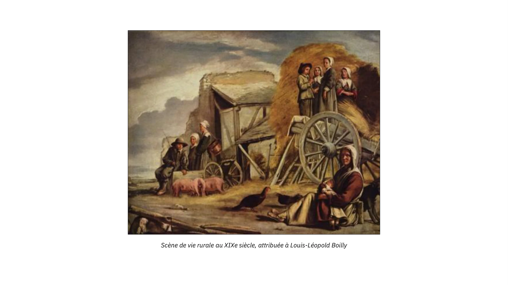

Urban artisans, locked into rigid guild systems, struggled to innovate or even sustain themselves. Meanwhile, other European nations were quickly pulling ahead. English and Dutch commercial successes loomed large in the French imagination, highlighting just how far the country had fallen behind.

But how to fix these growing problems? There was, as yet, no such thing as "economics" and no established science to guide policy decisions. Economic governance was a matter of trial and error: periods of restrictive controls alternated with moments of hesitant liberalization. Policymakers leaned on familiar names and models from the past. Among them was *Sully*, Henri IV's minister, who championed agriculture and promoted freer trade within France.

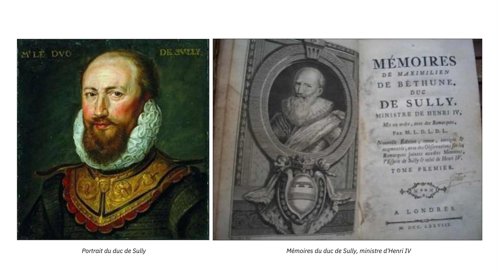

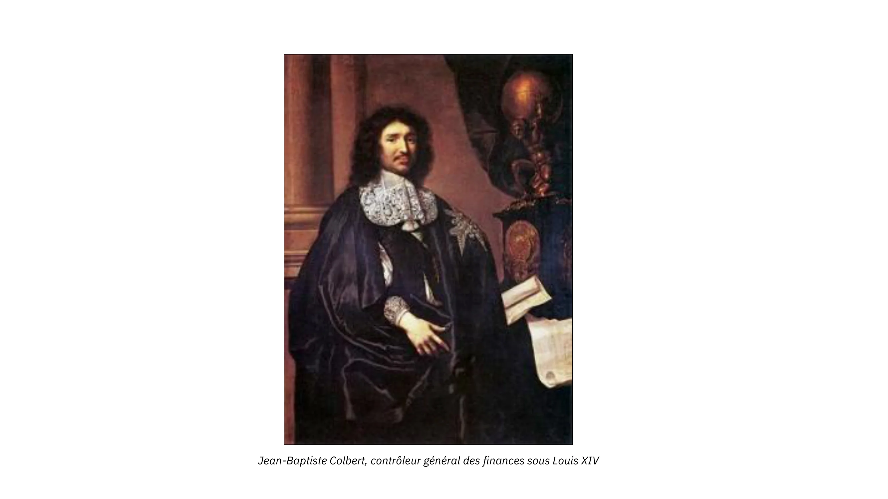

But the figure who truly shaped late 17th-century policy was Colbert, the powerful minister under Louis XIV. While he occasionally invoked liberty, his actual policies leaned heavily toward regulation and control. By the end of the century, Colbert's legacy had overtaken Sully's; his so-called "maxims" became gospel for government ministers.

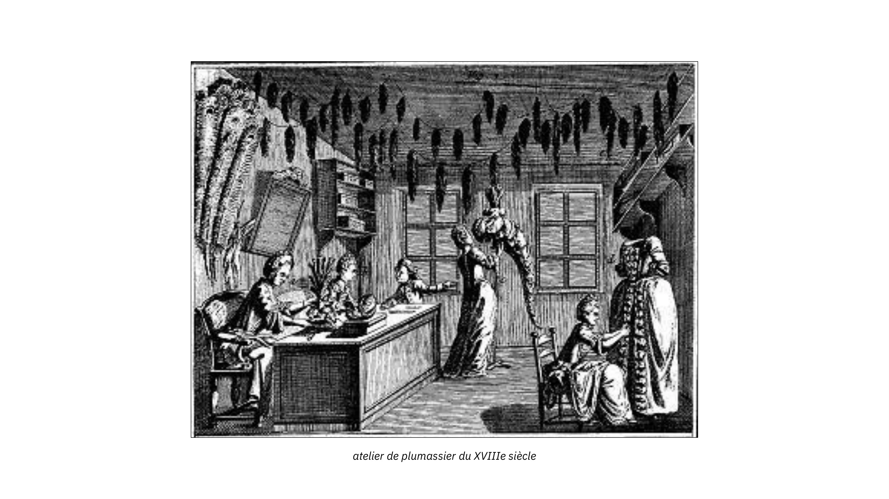

These Colbertist principles can be summed up in four key ideas:

(1) **Industry Must Be Regulated and Bound Within Guilds**. In Colbert's view, industry needed strict regulation. Every trade had specific rules, down to the size and weight of the cloth being produced. These regulations filled entire volumes, unique to each industry.

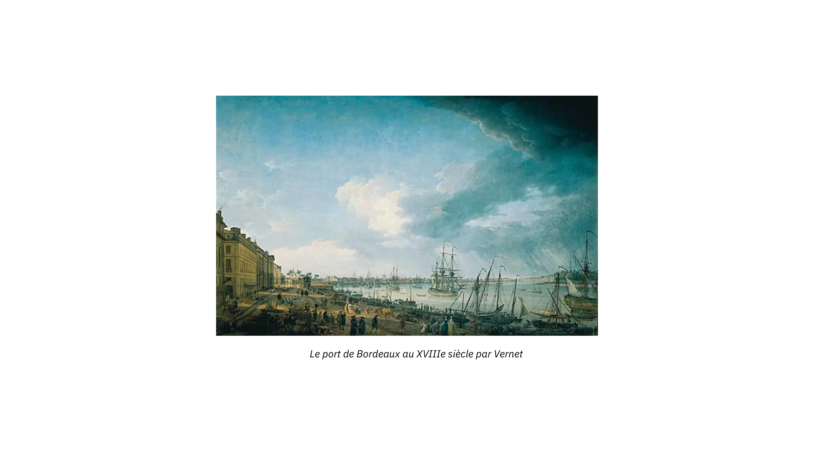

But rules alone weren't enough. Industries had to be organized into corporations, or guilds. To practice a trade, one had to undergo years of apprenticeship and journeyman work, then produce a flawless "masterpiece" and pay a steep fee to enter the guild. The system stifled competition from within; and limited access from without.

(2) **Trade Is a Zero-Sum Game**. Colbert and his followers saw commerce not as cooperation, but as war. They believed that one country's gain was another's loss. If England or Netherlands prospered, it could only mean France was being robbed of its wealth.

With that mindset, protecting the French economy meant taxing or outright banning foreign goods; especially those from rivals like England and Netherlands. The ultimate goal wasn't mutual growth, but the economic downfall of competitors.

> **"The French can only grow their commerce by crushing the Dutch."**
> -*Colbert*

(3) **When the State Needs Money, Raise More Taxes**. To Colbert, the wealth of the people wasn't limited;it was just waiting to be collected. If the state was short on funds, the solution was simply increasing taxation.

Concerns about overburdening taxpayers didn't register. Public finance wasn't a matter of balancing spending, but of squeezing more from the population. As Colbert cynically put it, **"The art of taxation is to pluck the goose without making it cry out too much."**

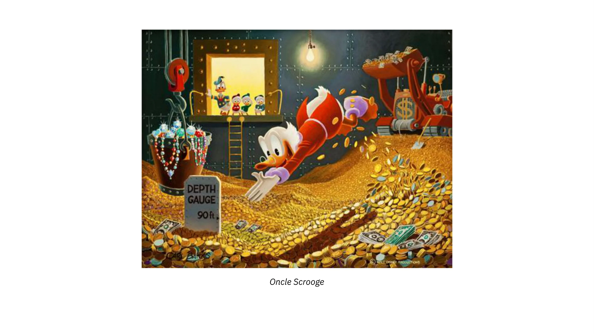

(4) **Wealth = Gold and Silver**. Before economic science emerged, most thinkers accepted a single definition of wealth: precious metals. This belief, known as **mercantilism**, held that national prosperity was measured by the amount of gold and silver stored in its coffers.

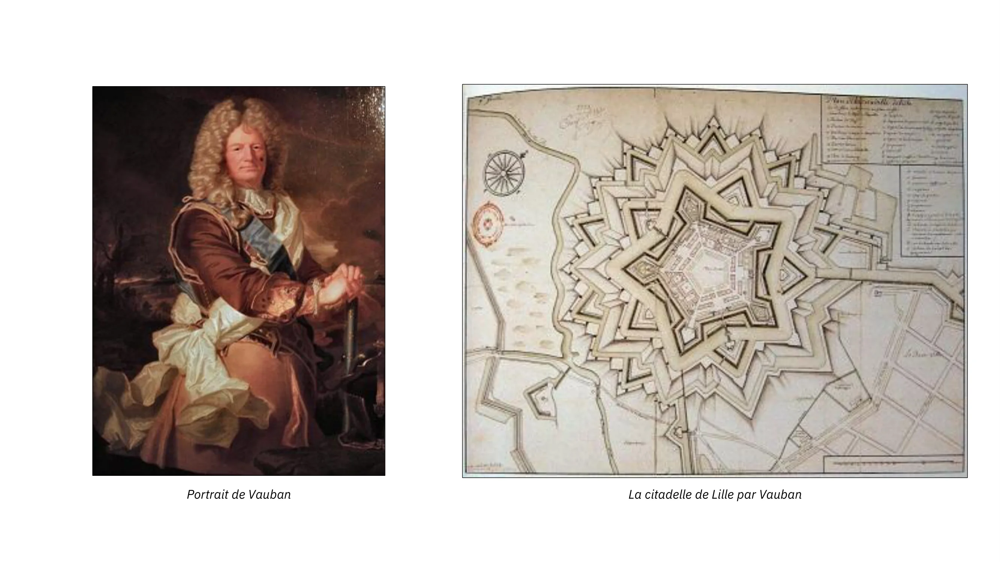

> **"Only the abundance of money within the state makes the difference to its greatness and power."**
> -Colbert

Colbert fully embraced this view. To him, power and greatness came from hoarding money. The result? A relentless push to increase exports (which brought in foreign gold) and suppress imports (which sent French money abroad).

These four principles dominated French economic policy for decades. But as the 18th century began, a wave of new thinkers started to challenge them.

Between 1690 and 1710, several writers,deeply disturbed by France''s worsening condition, began to question the very foundation of Colbert's teachings. In their eyes, these so-called maxims were nothing more than outdated illusions.

In critiquing them, these authors laid the groundwork for something entirely new: the birth of **economic thought** as a discipline.

## Vauban

<chapterId>ee9c1e0e-96cc-5026-a5e2-963d68122786</chapterId>

Today, as the tax burden in our country continues to grow, threatening to suffocate national economic vitality, voices are rising in favor of change. Whether consciously or not, these calls for reform often echo the work of French economists who, since the 17th century, have criticized the nation's tax system: always chaotic, always despotic, always excessive.

First in chronological orderand, certainly not the least in merit, among these early tax reformers was the great Marshal Sébastien Le Prestre de Vauban, the famed military engineer known for designing France's fortresses and citadels.

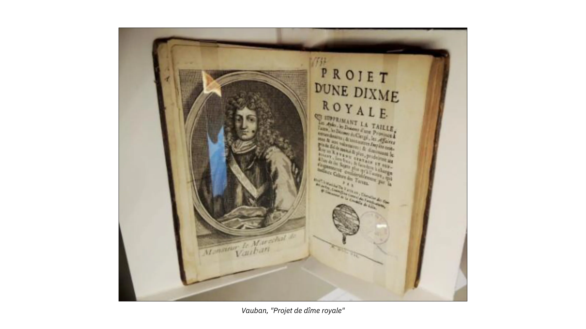

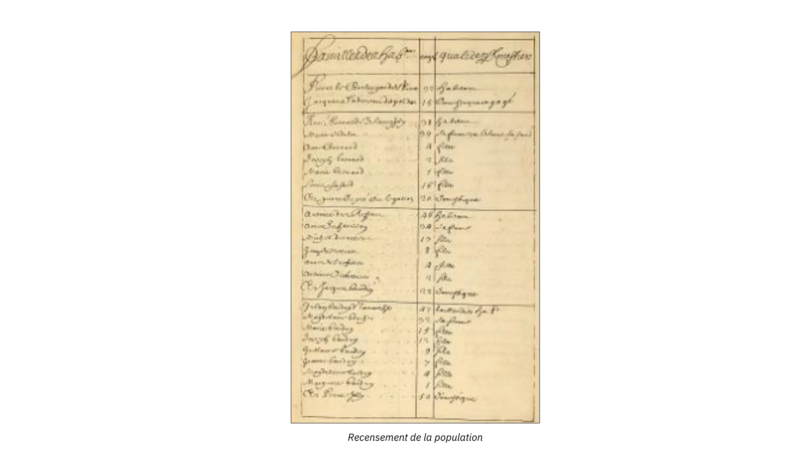

Though we have sadly forgotten it, Vauban was more than a military genius; he was also an economist. Deeply concerned with the plight of the common people, he proposed bold tax reforms in 1695 (the Project for a Capitation) and again in 1707 (the Royal Tithe). His vision was strikingly modern: to replace most existing taxes with a flat tax,a single proportional tax on income.

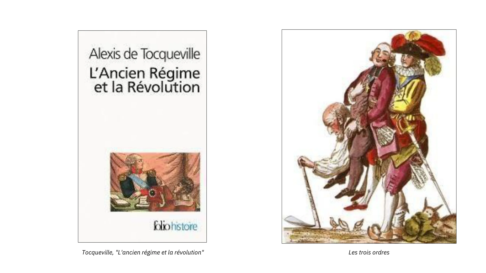

Vauban arrived at these ideas through curiosity and rigorous observation. He approached social and economic life with an almost scientific mindset, stressing the need for precise data collection, particularly through population censuses.

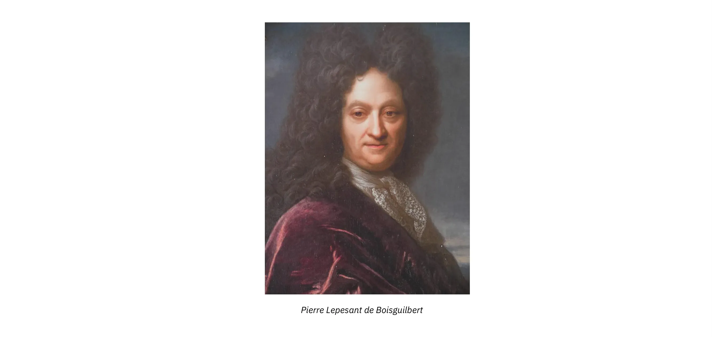

His second great merit was his moving and honest portrayal of the misery endured by the masses. He wrote: "**Let us not be deceived; the heart of the kingdom is ruined. Everything suffers, everything endures hardship, everything groans. One only needs to look closely at the countryside to see conditions even worse than I describe.**". Far from exaggeration, Vauban's gloomy observations were a painfully accurate reflection of early 18th-century life. Alexis de Tocqueville would later describe Vauban's *Royal Tithe* as "frightening", because it was true.

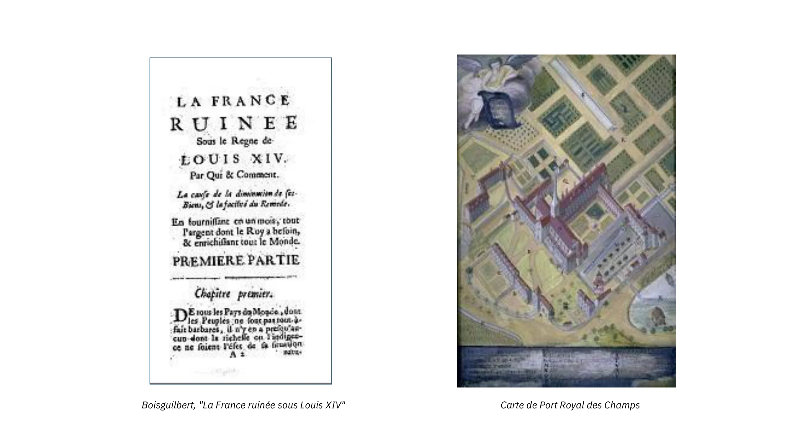

Vauban's third major contribution was proposing a sweeping tax reform aimed at eradicating, or at least alleviating, the very injustices he described. He was right to do so: the French economy under the Ancien Régime was strangled by a tax system that was unequal, unstable, and opaque.

Across his various political and economic writings, Vauban's overarching ambition was to relieve the suffering of what he called "the lower part of the people, who by their labor sustain and support the upper."

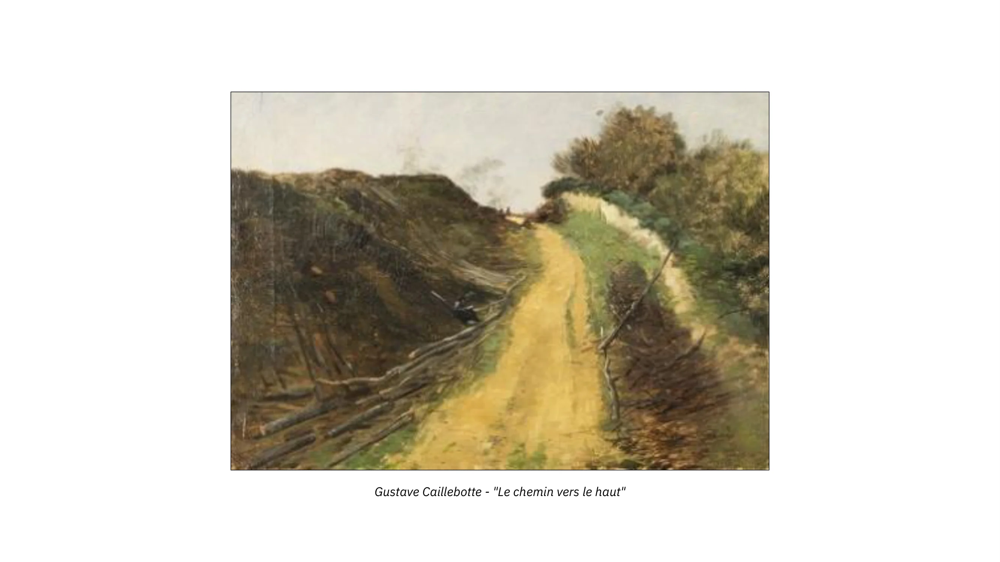

He understood that the oppressive, discouraging tax system crushed the peasantry. He wrote insightfully, and in words that still resonate today:

> "The peasant lets his small plot of land go to waste, cultivating it only half-heartedly, for fear that if it produced what it could with proper care and fertilization, it would be taxed even more heavily."

Vauban saw the truth: taxation under the Ancien Régime was not only irrational but also cruelly strict. It was this unfair and excessive system that he sought to overcome.

His proposed solution, a flat, proportional tax on all incomes, would have allowed the tax burden to be shared fairly among all social classes. Grounded in a theory of the state that saw public authority as necessary to protect individual rights and property, Vauban's reform demanded that all citizens contribute in strict proportion to what they earn, for instance, 10% of their income

In The Royal Tithe, the only one of his economic works printed in his lifetime, Vauban stated clearly:

> "**Since everyone in a state needs its protection to survive, it is only right that all contribute, according to their income, to its upkeep and expenses... Nothing is more unjust than exempting those most able to pay, and shifting the burden onto those least able, who collapse beneath the weight, weight that would be quite light if borne proportionally by all. Therefore, every exemption from taxation is a disorder that must be corrected.**"

Just before his death, Vauban's idea gained some traction among Louis XIV's ministers. However, instead of replacing the existing taxes, as Vauban insisted, they merely added his new tax on top of all the others. As often happens, the reform was adopted in name, but its spirit was ignored.

## Boisguilbert

<chapterId>200149c6-b5fc-566e-ab0e-bafb1c3fed3c</chapterId>

Few French economists from the past enjoy recognition in their homeland today that matches their contributions, and Boisguilbert is no exception.

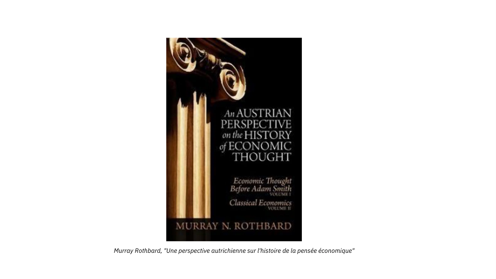

Unappreciated by the readers of his time, distanced from political circles due to his eccentric nature and overwhelming passion, Boisguilbert left little mark on the 18th century. Yet, since the early 20th century, there has been a slow rediscovery of his work.

However, this rediscovery has led us into a kind of dead end. Boisguilbert has been celebrated less for what he truly accomplished, and more for supposedly anticipating others: he's been described as foreseeing Keynes' theory of underemployment, anticipating Say's Law, laying the groundwork for Walras' general equilibrium, and even prefiguring Marxist class analysis. One commentator wryly asked, "Is there anyone or anything of which Boisguilbert could not be considered a precursor?"

Born in Rouen in 1646 and educated at the renowned Port-Royal in Paris, Boisguilbert began his career as an unsuccessful writer before obtaining various administrative roles, including Lieutenant-General of Rouen. It was during this period that he wrote several books to defend his economic ideas, most notably *Le Détail de la France* (1695), republished the following year under the telling title:
"France Ruined Under the Reign of Louis XIV: By Whom and How, with the Means to Restore It."

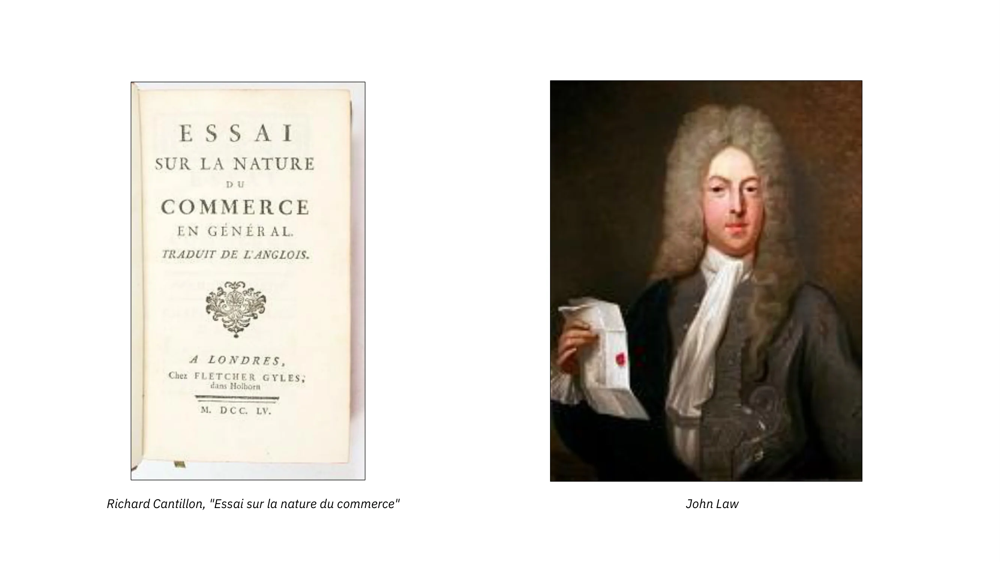

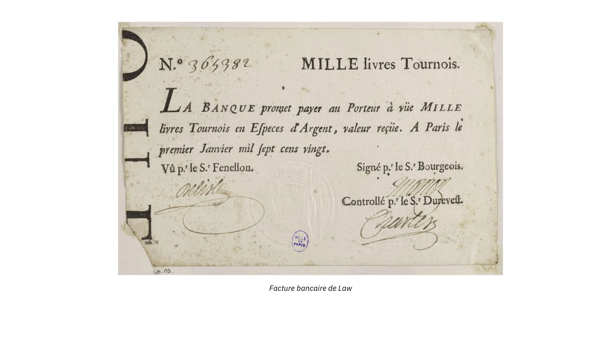

This title reveals the core of Boisguilbert's work: the poverty of the French people, and its causes.

Much like the famous engineer and fellow reformer Vauban, Boisguilbert painted a bleak portrait of late 17th-century France. He wrote:

> "The barren or poorly cultivated lands, visible to all, are the corpse of France."

He described uprooted vineyards, abandoned fields, and recurring famines. 

For Boisguilbert, two main causes explained this widespread misery, both tied to the collapse of consumption.

1. **Oppressive Taxation**
First, the people could no longer afford to consume basic necessities due to arbitrary taxation. The taille, a personal tax, was calculated blindly for each individual, rising or falling without clear reason. The many privileges of the elite shifted the tax burden to the poor, especially the peasantry, who were left destitute. To correct this, Boisguilbert proposed a proportional tax on all incomes, much like Vauban's later proposals.

2. **Barriers to Free Trade**
Second, too many restrictions blocked the free trade of goods, especially agricultural products. France was riddled with customs duties not only at its borders but even between regions. These internal tolls crippled commerce, prevented fair pricing, and limited market access. As a result, farmers couldn't make a living, they were unable to sell their produce profitably and were trapped by low, unsustainable agricultural prices. This issue, still relevant today, stood at the heart of Boisguilbert's economic thinking. His solution? Free trade. He called for the "opening of roads", advocating the removal of all trade barriers.

And this brings us to his ultimate message: **freedom**. 
> "It is not a matter of acting," Boisguilbert declared, "but of ceasing to act with such violence against nature, which always tends toward freedom and perfection."

He insisted over and over: all would be well, "provided we let nature act, that is, give it its liberty, and ensure that no one interferes with commerce except to provide equal protection and prevent violence."

This passage is essential. Boisguilbert was the first to clearly demand a laissez-faire economic policy, to make it the core of a full-fledged system. He believed in a natural economic order that should not be disrupted by arbitrary government interventions. The state, in his view, should not act in economic matters, but rather, let things act naturally. Otherwise, it risked deepening the misery it sought to solve.

Boisguilbert even criticized the "*good souls*," as he called them, those who meant well but did great harm. They wanted cheap bread for the poor, but by forcing down prices, they ruined farmers, who couldn't survive on such margins. These farmers then abandoned their lands, plunging deeper into poverty.

In short, Boisguilbert understood what many still forget: **hell is often paved with good intentions**.

## Cantillon

<chapterId>bc206d41-6a64-5688-a489-40fcfa0e5397</chapterId>

Author of the Essay on the Nature of Trade in General (written around 1730, published in 1755), Richard Cantillon is regarded as one of the pioneers of modern economic science. In his History of Economic Thought, economist Murray Rothbard even refers to Cantillon as the founder of modern economics.

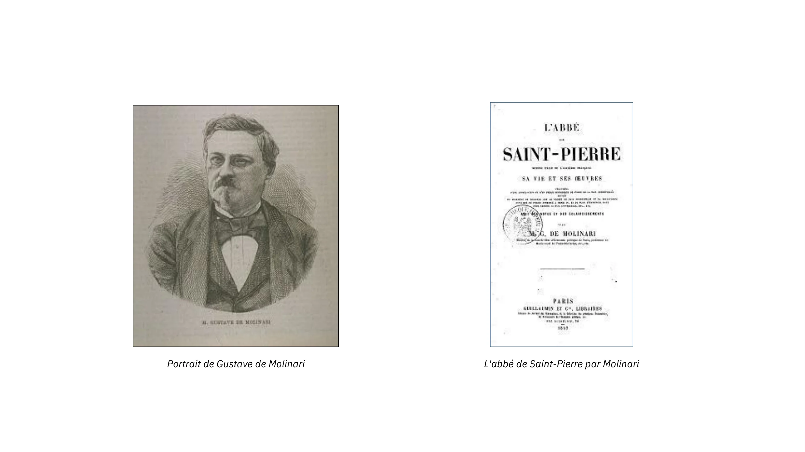

Background and Life

Born in Ireland, Cantillon settled in Paris in his youth and acquired French nationality.
He worked as a banker, amassing a fortune during the era of John Law's financial system.

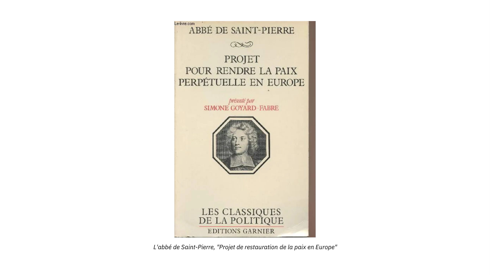

It was during this time that he began formulating his economic theories.

Around 1730, he wrote his Essay on the Nature of Trade in General.

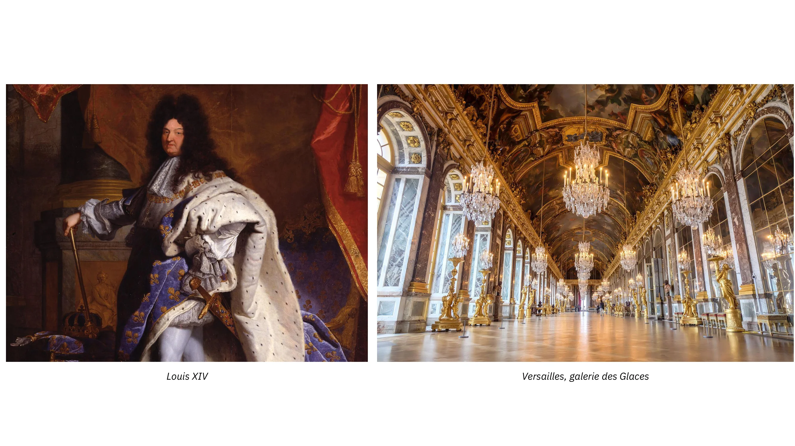

This book can be seen as one of the first serious attempts at creating a general theory of economics. Cantillon set out to define what he called the "general laws of economics", principles that arise from the very nature of economic activity, rather than from the specific circumstances of any one country. This approach was revolutionary.

The Essay by Cantillon stands out for five major contributions: his **theory of wealth**, the **concept of the entrepreneur**, his **critique of valueless money**, the idea known as the “**Cantillon Effects**,” and his **defense of economic liberty**.

**First**, his **theory of wealth.**
Unlike the **mercantilist** view dominant at the time, Cantillon based his analysis on the idea that **wealth consists of goods that satisfy human needs and desires**. This wealth, he argued, comes from nature and is produced through **human labor**. His ideas on the nature of wealth had a strong influence on **Beccaria, Adam Smith**, and through Smith, on the **entire classical school of British economics**.

**Second**, the **entrepreneur.**
Although he didn't define it in modern terms, Cantillon viewed the entrepreneur as a **central figure in economic life**. What sets the entrepreneur apart, in his view, is the fact that he **takes on risk and acts in conditions of uncertainty**. These ideas would later be expanded by **Turgot** and, more significantly, by ***Say***, who firmly established the entrepreneur as a distinct and crucial agent in the economy, something the **English school** would largely overlook.

**Third**, his views on **money**.
As a reaction to the **John Law episode**, Cantillon explained what happens when **paper money**, which has no **intrinsic value**, replaces **metallic money**. 

He identified two major consequences:

- What he called "**rejection by the people**", a growing **loss of trust** in valueless money.

- **Inflation**, as the money loses its value, the price of goods rises.

**Fourth**, and going beyond his peers, Cantillon offered a profound analysis of **inflation**.
Having witnessed the collapse of Law's system, Cantillon realized that **monetary inflation doesn't affect everyone equally**. On the contrary, it enriches some while impoverishing others. He concluded that inflation has **redistributive effects**: depending on ***how and where the newly issued money enters the economy***, those who receive it early benefit from increased purchasing power, while those who receive it later, once prices have already risen, suffer a loss in real income.

This concept became known as the **Cantillon Effect**.

**Fifth**, despite a few remnants of mercantilist thought, Cantillon's overall perspective was **deeply liberal**.
He defended **private property** as a fundamental pillar of civilization, arguing that no society can function without private ownership of land and the fruits of labor. He also saw **material inequality** between people as **natural and legitimate**. According to Cantillon, there's nothing wrong with a **hardworking, skilled individual** earning more than someone who is **incompetent or lazy**. 
Finally, Cantillon believed that **prices should always be determined freely**, through the interaction of **supply and demand**, without interference from the state.

Among these five major ideas in his Essay, the most important is undoubtedly the one that now bears his name: the **Cantillon Effect**.
This theory of i**nflation's unequal impact** still offers valuable insight into some of today's economic challenges. It helps us understand the outcomes of recent **expansionary and inflationary monetary policies**, which have often led to the **impoverishment of the middle class and rural communities, while enriching financial market operators and state institutions**. primarily due to their close proximity to the source of newly issued **money, namely central banks and commercial banks**.

# Reformers and Thinkers of the Early 18th Century

<partId>1f7b50d4-ce93-5db3-8396-43c1fa5419ff</partId>

## Abbé de Saint-Pierre

<chapterId>13478fe2-4c12-593c-a410-54c2cfb7ef7f</chapterId>

Of all the authors we've chosen to include in the pantheon of 18th-century French laissez-faire thinkers, Abbé de Saint-Pierre is undoubtedly the most overlooked.

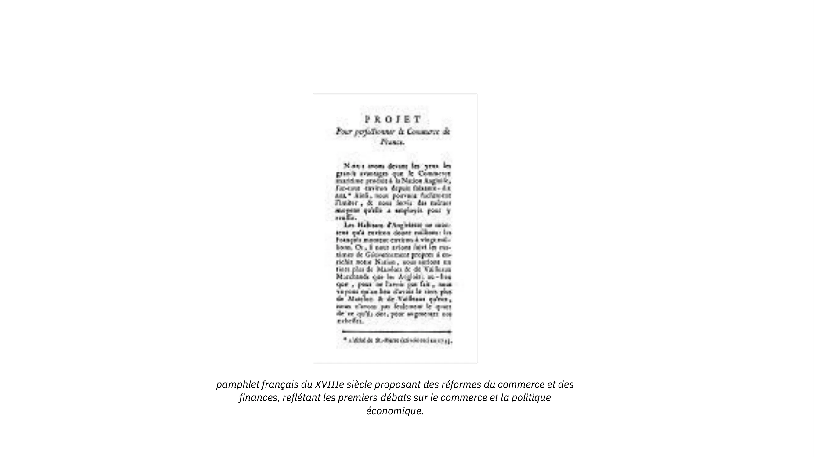

And to be fair, it's partly his own fault, he wrote a great deal, and his style is hard to read, with frequent repetition. Even Jean-Jacques Rousseau tried to summarize his work, only to give up fairly quickly, realizing the task was more than he could handle. In the mid-19th century, Gustave de Molinari honored him with a full-length study, praising both his economic thought and his pacifist ideals. But even that wasn't enough to rescue him from obscurity, where he remains to this day.

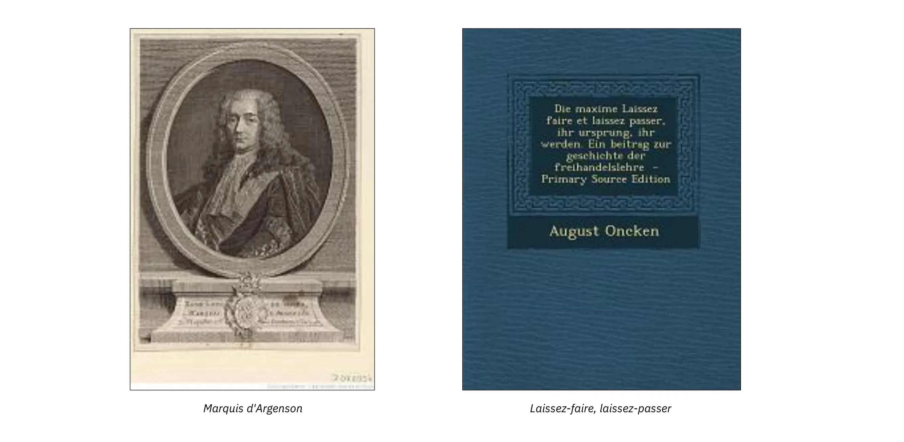

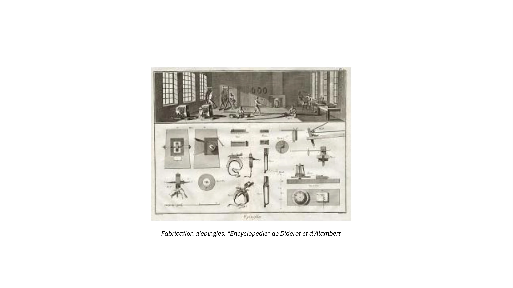

While Abbé de Saint-Pierre wrote about economics, he's usually remembered for his ideas on peace. He authored a Project for Perpetual Peace, a work that predates the better-known version by Immanuel Kant.

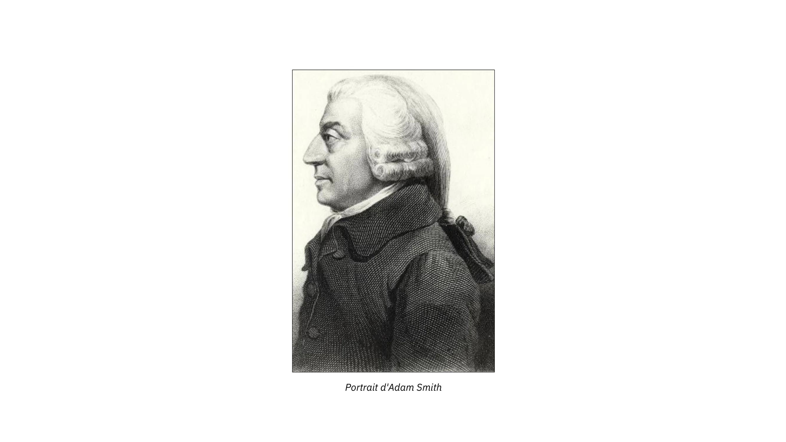

In it, he argued that war is destructive, not only for those who lose it, but also for the winners, and even for bystanders, since **commerce inevitably suffers**.

To combat the scourge of war, he proposed the creation of a kind of European League of Nations. A European council would be formed to resolve disputes through arbitration, avoiding military conflict. If a nation refused to maintain peace and threatened its neighbors, the alliance would respond, ideally with a European army composed of forces from each member state.

There's also an episode in Abbé de Saint-Pierre's life that perfectly illustrates the critical mindset behind the French laissez-faire movement. He joined the Académie Française in 1695, but was expelled in 1718 for daring to criticize the reign of Louis XIV. In that, he aligned with figures like Vauban and Boisguilbert, who had also dared to speak out against the hidden misery behind the Sun King's glittering court.

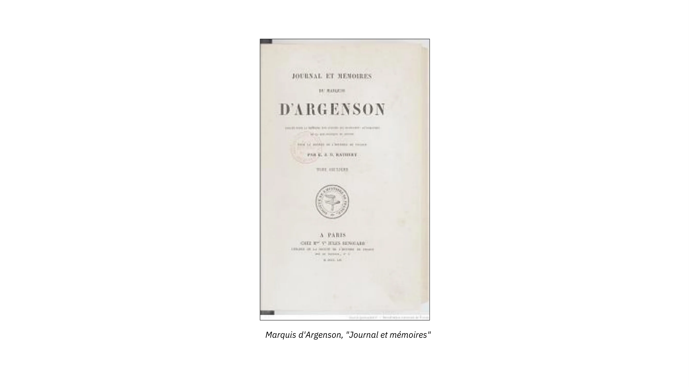

Saint-Pierre argued that the reign of Louis XIV, with its luxurious court and obsession with military conquest, was not the mark of a virtuous king. He refused to accept that Louis XIV deserved the title "**Louis the Great**."

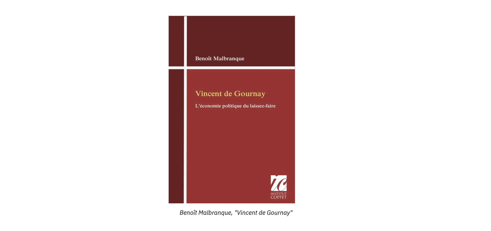

"You can't call it greatness," he said, "when a ruler ruins both his neighbors and his own people." This position deeply offended the Académie Française, which had long been preoccupied with glorifying the king in every literary form possible. They voted almost unanimously to expel him.

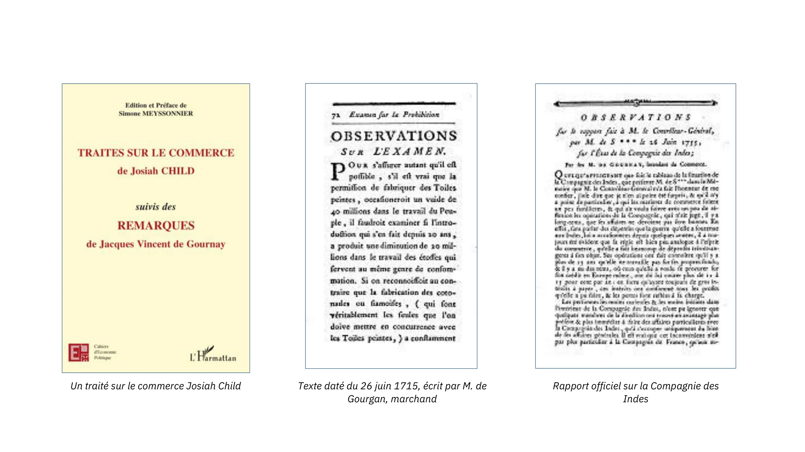

In terms of economic thinking, Saint-Pierre consistently applied the principle of utility, much like Jeremy Bentham would do later, and often offered sound insights. Admittedly, he was still influenced by mercantilist ideas, which no one had fully shed at that time.

Still, Saint-Pierre made some strikingly modern observations about the economy. Even before *Condillac*, who is often credited with the idea, he stated plainly that in any exchange, both parties benefit. This can be found in his 1733 Project for Improving France's Trade, where he wrote:

> "When a sale is made between merchants, the seller gains, and so does the buyer; for if there weren't some real or perceived benefit on both sides, neither would agree to the transaction."

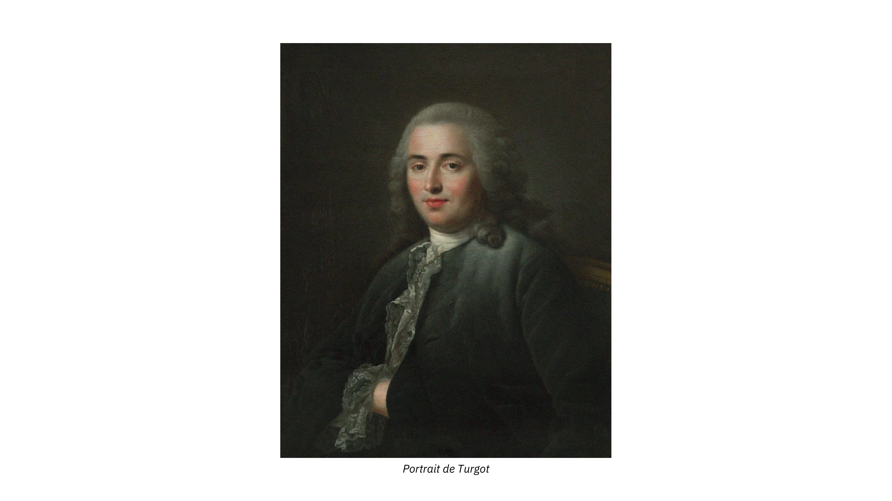

He also emphasized, before Vincent de Gournay did, the value of labor and the importance of keeping it appealing. "All labor is difficult," he wrote. "And when a man sees that his work brings him nothing, or not enough, he becomes idle and won't bother with unnecessary effort." This very argument would later be echoed by the Marquis d'Argenson, Vincent de Gournay, and the physiocrats as they criticized burdensome regulations and guild systems. They argued that such restrictions discouraged workers, caused needless difficulty, and eventually made idleness seem more appealing than productive effort under such conditions.

## The Marquis d'Argenson

<chapterId>e9960ab4-72ec-5afd-8e97-bf89c83b62bc</chapterId>

The Marquis d'Argenson is one of the forgotten founders of laissez-faire thought.

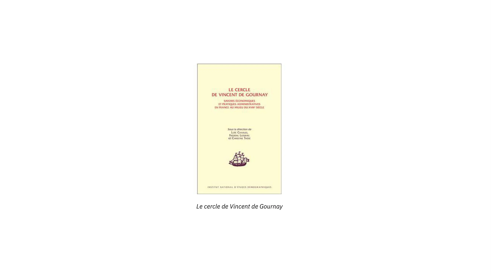

He was brought back into the spotlight by August Oncken, who wrote a book on the doctrine of laissez-faire, laissez-passer, concluding that d'Argenson played a major role in the development of the idea

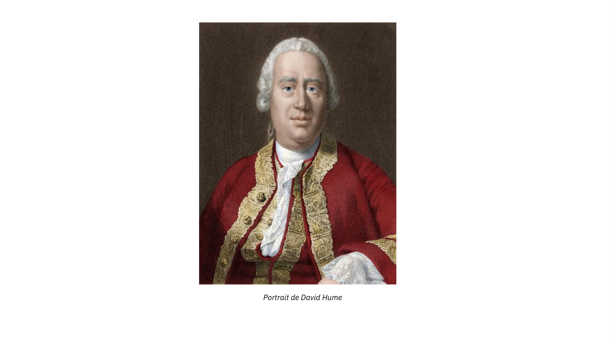

René-Louis Voyer, Marquis d'Argenson, was born in 1694. He began his political career as a parliamentary advisor, then served on the Council of State. Thirty years before Adam Smith, d'Argenson was already defending the benefits of the division of labor and specialization.

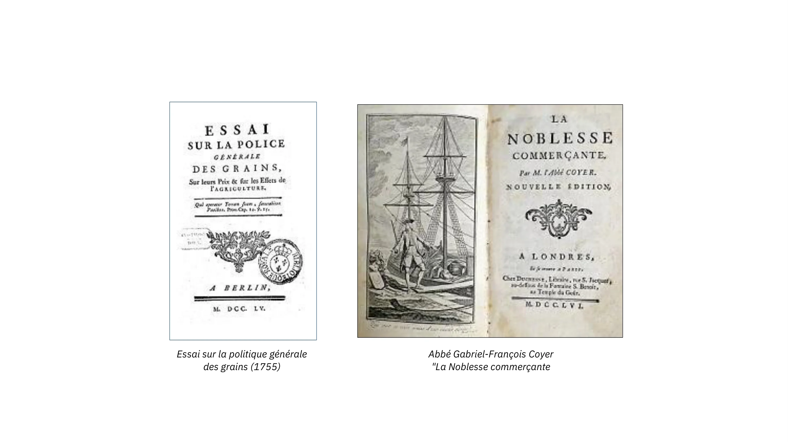

He sharply criticized regulations that, as he saw it, tried to change the natural preferences of different regions. For instance, he was baffled that the government wanted to produce fabrics and velvets in Tours, a poor city at the time, that matched the quality of those made in prosperous Genoa, which was famed for its luxury goods. He concluded:

> "We must let each place choose the industries that suit it best. **Liberty! Liberty**!"

He also recognized another key principle later made famous by Smith: the idea that social order arises spontaneously from the pursuit of self-interest. D'Argenson believed that immediate personal interest was what drove human energy. He wrote that poor craftsmanship and fraud would discredit a producer, while diligence and honesty would lead to prosperity. The best judge of what's useful, he argued, was the individual, the public at large, who buy goods and care about value.
> "Everyone senses their own interest," he wrote. 
>"Everyone makes choices that are best for them, and in that general alignment, we find the truth."

Even before Adam Smith, he saw that well-understood self-interest naturally leads to collective benefit through a spontaneously formed natural order.

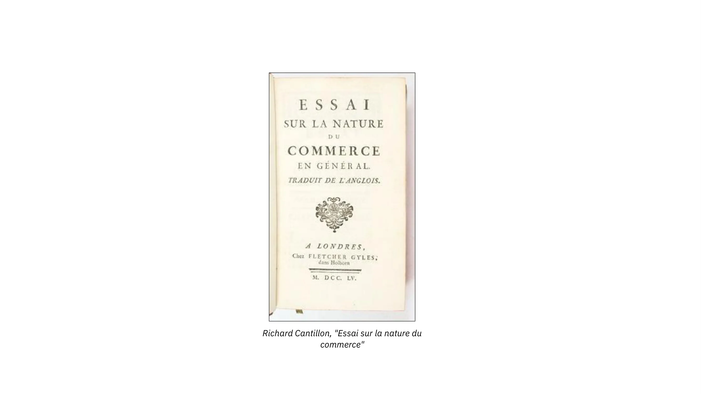

He famously compared society to a beehive where every insect follows its instinct:

>"The result of their actions is a great store for the needs of the small society; but none of it was organized by commanders giving orders. Each acted on its own."

This is perhaps the closest expression in French economic thought to Adam Smith's famous concept of the "**invisible hand**."

D'Argenson was always dismayed by the views of the ministers of his time. They only asked, "Should we regulate this way or that? Should we direct the economy toward this or that?" To which d'Argenson replied: "Shouldn't we first ask whether it's appropriate to direct any of it at all, or whether things should be left to operate on their own?"

In truth, he was amazed that people found it so hard to understand, or rather, to see, the harmful effects of excessive regulation. In his view, it was enough to simply open one's eyes. "So many things are working reasonably well today," he wrote bitterly, "simply because they've managed to escape the reach of the law."
Sometimes, he despaired at how little his ideas were understood.

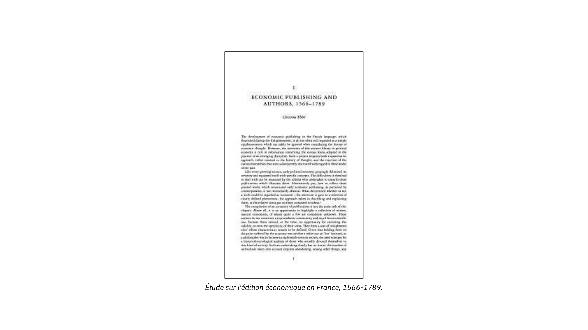

His vision for economic policy ran counter to the dominant thinking of his time. He imagined a government with a mainly negative role in economic life:

> "All commerce needs is the removal of obstacles. It asks only for fair judges, punishment of monopolies, equal protection for all citizens, stable currency, and well-maintained roads and canals."

This was the blueprint for a minimal state, an idea that would become a foundation of the French political economy tradition.

This vision of the state's role naturally shaped his views on two of the biggest economic debates of his day: the **regulation of industry** and the **trade of grain**.

He was particularly opposed to industrial regulations, seeing them as privileges for some at the expense of others. "The real cause of the decline in our manufacturing, is the excessive protection it's been granted." And he expressed his criticism of the overzealous interventionism of the state with equally passionate conviction:

> To run the industry against its will is to want its ruin.

When it came to the grain trade, d'Argenson had a straightforward solution: freedom. He believed that wheat shortages were the result of monopolies and the government's overbearing precautions. If the state simply stepped aside, famines would not occur in a country with open ports. Foreign traders, driven, like everyone else, by the pursuit of profit, would supply what was needed and purchase any surplus. "let it be free," he declared, "and all will be well."

## Vincent de Gournay

<chapterId>e8ae40dc-7450-552f-9ddc-9e02936cf425</chapterId>

Vincent de Gournay was one of the earliest advocates of laissez-faire in France, both in public administration and intellectual circles. For that reason, he deserves far more recognition in the history of economic thought than he usually receives. I've tried to highlight his contributions in a recent book.

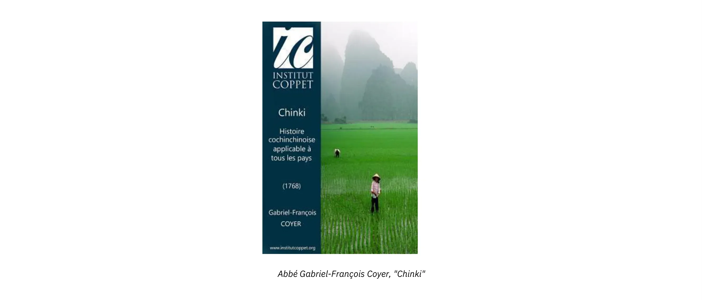

Born into a merchant family, Gournay became a successful merchant himself, amassing considerable wealth before securing a position in the French administration. Within the Bureau of Commerce, he passionately championed freedom of labor and trade. 
Though he was well-connected with the leading economists of his time, Gournay wrote little and published even less. Most of his work consisted of official letters, internal memoranda, or writings later edited and published by others.

What we do have includes:
1. Remarks on a French translation of a book by English economist Josiah Child;

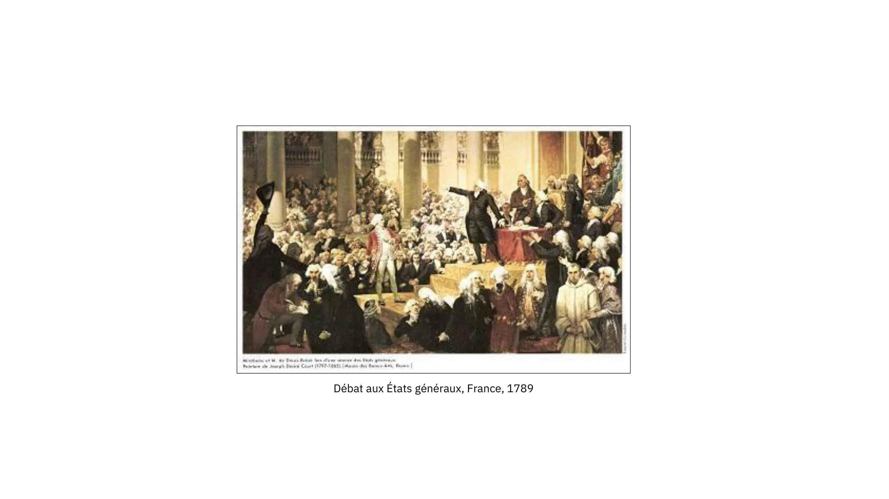

2. "Observations" included in the Examination of the Advantages and Disadvantages of the Prohibition of Printed Fabrics;

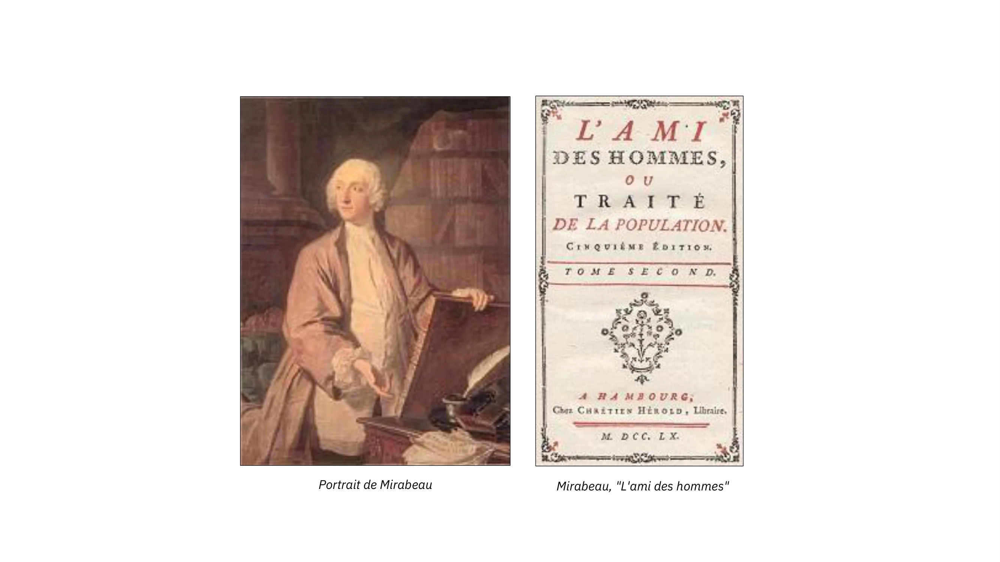

3. "Observations on the East India Company," appended by Abbé Morellet to his Memoir on the Current State of the East India Company (1769);

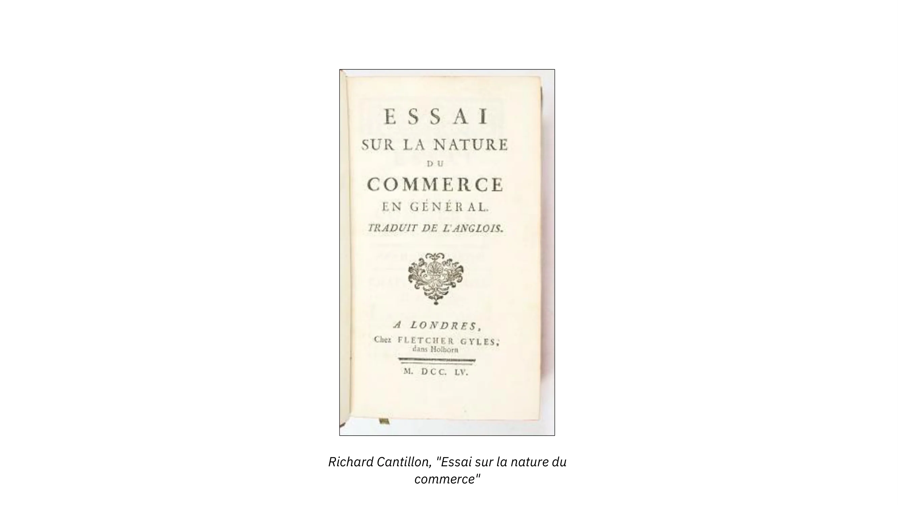

4. And above all, various reports from his role as Intendant of Commerce.

These writings show a clear foreign influence and the presence of some great structuring ideas.

These writings clearly reflect foreign influence and several foundational ideas. As for foreign influence, Gournay had deep admiration for the economic success of England and Netherlands. He was convinced that these two nations understood economics far better than France, and that France should follow their example. Unlike France, which restricted imports and burdened economic life with rigid regulations, England and Netherlands thrived under more liberal policies. If they were doing better, Gournay concluded, it was because France was guided by faulty principles.

His reform proposals centered around several key points.

First, he believed labor needed to be protected and encouraged. At the time, French workers were treated almost like criminals, constantly monitored, burdened by a maze of regulations, and kept in a state of fear. This excessive red tape discouraged people from working, pushing them instead toward idleness. Yet, Gournay argued, work was noble and the only true source of national wealth.

Second, he criticized the restrictive system of guilds that confined manufacturers. Entering a trade was both expensive and time-consuming, and once admitted, workers had to rigidly follow the established practices of their guild. Such a system left no room for excellence, innovation, or progress.

Third, he argued that trade in France was strangled by restrictive laws. In Gournay's view, consumers would benefit greatly if ports could compete freely and all goods, such as grain and printed canvases, were allowed to be imported without restriction. He was one of the first to point out the true origin of smuggling: it only existed because the government had banned commerce that was otherwise beneficial and legitimate. He added a sharp observation: smuggling, for all its illegality, was a "**free**" profession, no regulations, no guilds, no confiscatory taxes. Yet it was the state's overwhelming regulation that drove many honest workers into illegality.

Finally, Gournay noted that interest rates were lower in England and Netherlands, countries more prosperous than France. He advocated for lower interest rates in France as well, to make credit more accessible and boost economic activity. Importantly, he did not seek to impose such rates by law; rather, he emphasized the need to legalize and normalize lending, which was still condemned by the Catholic Church.

In all these areas, Gournay played a key role in the intellectual debates of the mid-18th century. His defense of economic liberty predated the Physiocrats by a decade and Adam Smith by twenty years. But his most lasting influence was on Turgot. Gournay took the young Turgot under his wing and introduced him to his ideas.

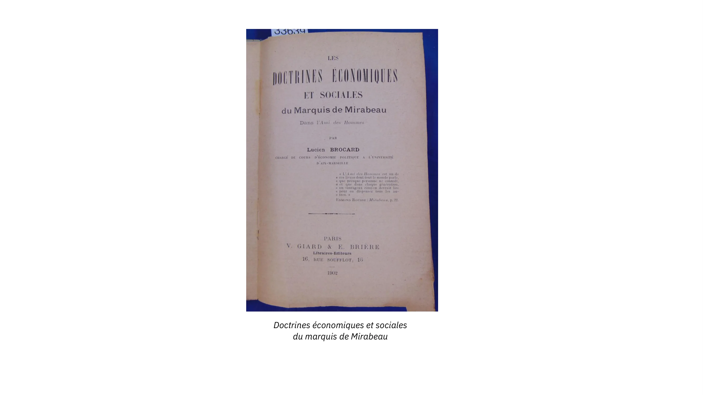

Years later, Turgot, then a minister under Louis XVI, wrote an Éloge (eulogy) in honor of his late friend and mentor. Turgot never fully embraced Quesnay's Physiocracy, and that resistance can be traced to his enduring loyalty to his first teacher: Vincent de Gournay.

## The Gournay Circle

<chapterId>b86ba6bd-8f3a-5d8f-b098-4d0413f00deb</chapterId>

When it comes to the early days of economic thought, history tends to highlight the first recognized school: the Physiocrats, led by François Quesnay and his followers. However, nearly a decade before their rise, there was another, less formal but equally influential group centered around the economist Vincent de Gournay.

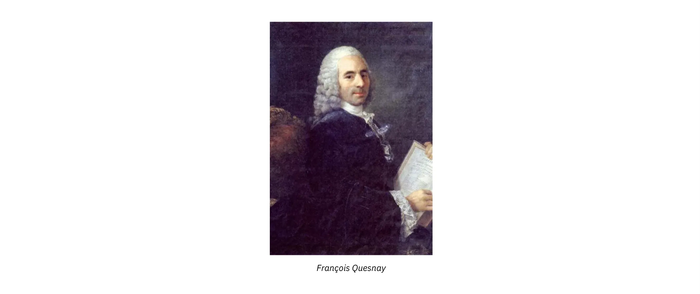

As we saw in the previous lesson, Gournay was deeply fascinated by the success of foreign nations like England and the Netherlands. He admired their economists, figures such as Josiah Child, Johan de Witt, and David Hume just as much.

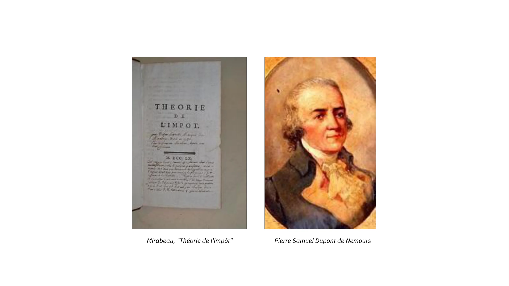

This admiration led him to translate, and commission translations of, their economic writings.

Gournay's position in high public office gave him access to virtually every major economic thinker in France at the time. This allowed him to bring together an exceptionally capable group of translators. He personally translated the works of Child and Culpeper. Abbé Le Blanc translated David Hume's Political Discourses. Véron de Forbonnais translated the Spanish economist Geronymo de Uztariz. Turgot worked on Josiah Tucker's writings, and Montesquieu's son translated Joshua Gee.

Thanks to the collaboration of several members of Gournay's circle, many authors were able to publish original works under their own names. These books, along with the translations, achieved remarkable success. Some notable examples include:

- Herbert's Essay on the General Police of Grain (6 editions in 4 years)

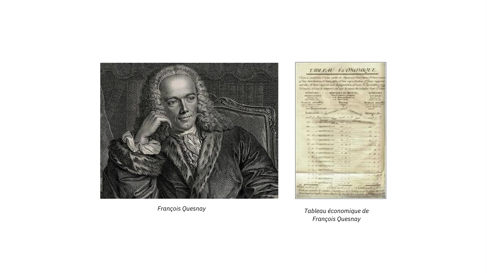

- Coyer's The Trading Nobility (5 editions in 2 years)

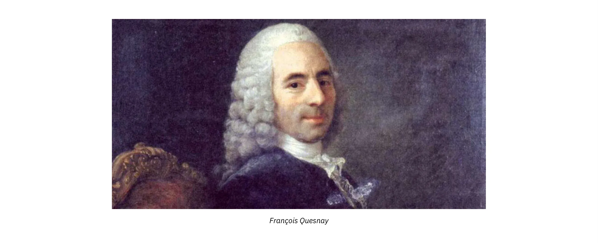

- Plumard de Dangeul's Remarks on the Advantages and Disadvantages of England (3 editions in its first year)
- Memoir on the Guilds by Cliquot-Blervache and Gournay (2 editions in 1758)

The group also played a pivotal role in the publication of *Essay on the Nature of Trade in General* by Richard Cantillon.

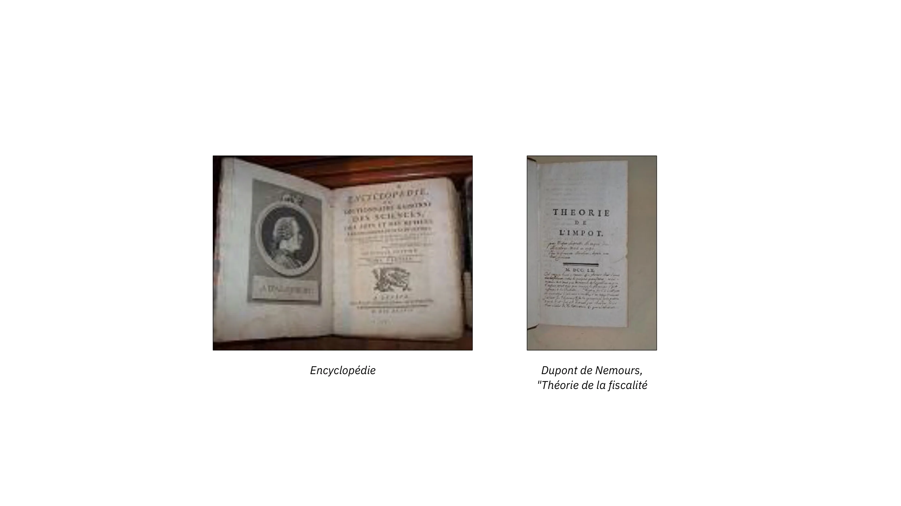

This book, written around 1730, had remained unpublished at the time of Cantillon's death. Gournay, with the help of his economist friends, ensured its release in 1755. According to Abbé Morellet, a member of the circle, Gournay recommended it to every economist he knew.

The intellectual output of the Gournay circle had a major impact on the history of ideas. In this sense, they truly belong among the founders of economic science in France. Christine Théré of INED, who has studied the history of economic publications, found that between 1750 and 1759, no fewer than **349 economic works** were published, compared to only **83** in the entire previous decade (1740–1749). Much of this explosion in interest can be credited to Gournay and his circle.

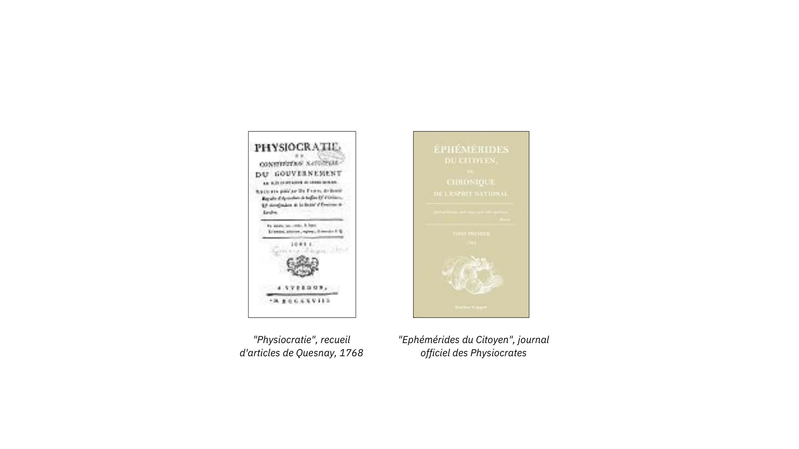

In order to bring economic ideas into the mainstream and make them accessible to a broader public, Gournay and his colleagues also turned to fiction. After co-authoring the *Memoir on the Guilds*, a critique of professional corporations, Gournay and Cliquot-Blervache helped Abbé Coyer write a short satirical novel called Chinki: A Cochinchinese Tale Applicable to Other Nations.

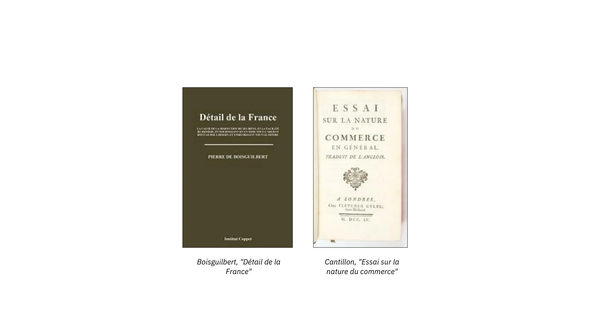

The story follows the main character, Chinki, who is forced to leave his land due to excessive taxation and tries to find artisanal work for his children in the city. However, every profession is closed to them because of restrictive guild regulations, and the story humorously portrays his growing disappointment.

In short, the Gournay circle was behind an extraordinary wave of economic publishing. Though later historians have often overlooked their contributions, it was clear to their contemporaries just how influential they were. The Physiocrats, who formally organized their school in the 1760s, considered the Gournay group their direct forerunners. 
In 1767, the economist Jacques Accarias de Serionne made this clear in his tribute:
> "A small number of Frenchmen, equally philosophers and citizens, began a few years ago to imitate English writers. They first translated their models and soon surpassed them in many respects. They used all the elegance and richness of literature to discuss useful matters, giving rise to and spreading the taste for the sciences most essential to the prosperity of the state."  

And indeed, by the 1750s, economic questions had become fashionable. Voltaire famously remarked that, around 1750, the French stopped reading novels and started debating the free trade of grain. The Mercure de France echoed this in a 1758 issue, just months before Gournay's death, saying:

> "Political economy is now the science in vogue. Books on agriculture, population, industry, commerce, and finance are in the hands of countless readers who, not long ago, only skimmed through novels." 

There could be no greater tribute to Gournay and the vibrant circle of economists he inspired.

## Mirabeau

<chapterId>2d2f802b-e3b6-556f-9025-a1b1dc4409ca</chapterId>

France has known two famous men named Mirabeaus, a father and a son, but It was the son one truly made history. a powerful speaker, who became one of the key figures of the French Revolution and whose name lives on today.

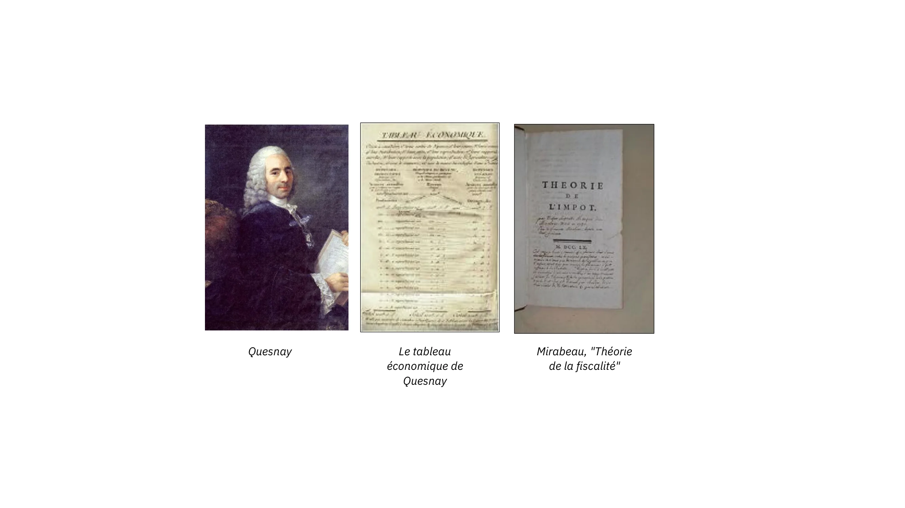

But before him, there was the father: Victor de Riqueti, Marquis de Mirabeau. Though largely forgotten today, he was a respected economist and an early member of François Quesnay's Physiocratic school.In fact, he was the very first person to join Quesnay's circle in 1758.

Before becoming a Physiocrat, the elder Mirabeau had already gained widespread fame. In 1757, he published L'Ami des Hommes (The Friend of Men), a treatise on population and economics that became a publishing sensation

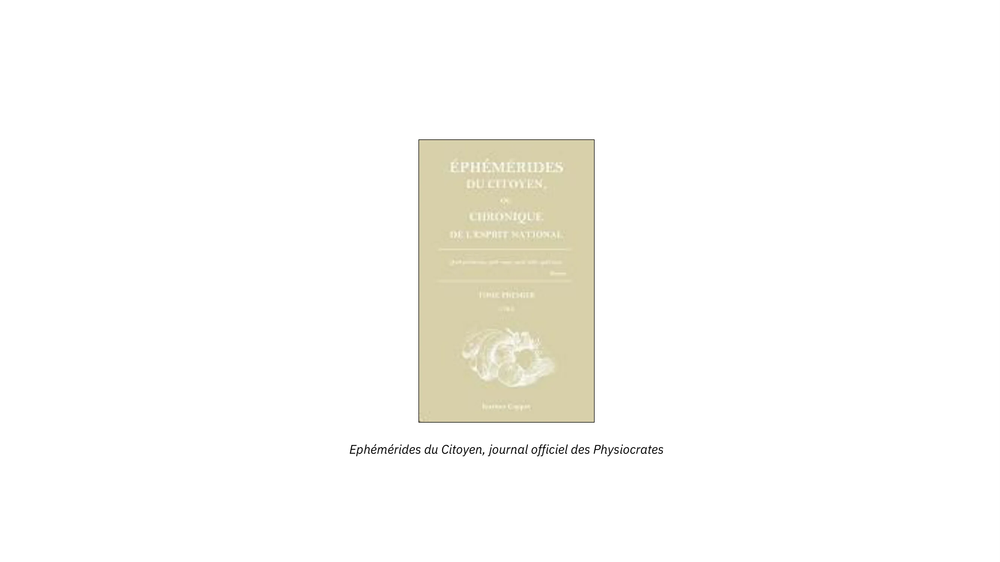

It went through 20 editions in just three years, an extraordinary achievement for an economics book. Some readers even thought the book had been written by Montesquieu because of its sharp reasoning and eloquent style. The Dauphin, father of the future King Louis XVI, was so fond of it he claimed to have memorized it.  For a time, it was the book everyone at Versailles was reading.

Today, it's a book few people actually read, but many still reference. Even by the 19th century, Edmond Roussel observed:

> L'Ami des Hommes is one of those books everyone talks about, but almost no one knows. In every generation, one brave citizen should read it; so that everyone else doesn't have to.

At the start of his career as an economist, Mirabeau drew inspiration from Richard Cantillon. He had owned a manuscript of Cantillon's Essay on the Nature of Commerce in General for 15 years and had carefully studied and annotated it.

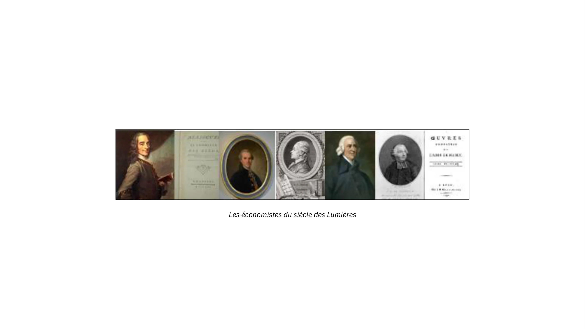

Initially, L'Ami des Hommes was conceived as a commentary on Cantillon's Essay. but Mirabeau had an eccentric personality and a tendency to go off-track. The book quickly turned into a chaotic mix of reflections on every economic topic Mirabeau could think of.

Mirabeau himself confessed it was a **mess** and described his writing style as "apocalyptic."

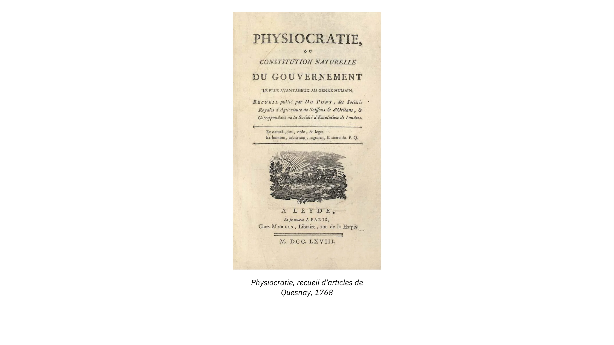

Despite the chaos, the book put forward some key ideas:

- It challenged the mercantilist belief about the nature of wealth.
- It praised agriculture and criticized its decline.
- It expressed sympathy for the poor, especially the rural population.
- It defended free trade and advocated for peace and cooperation between nations.

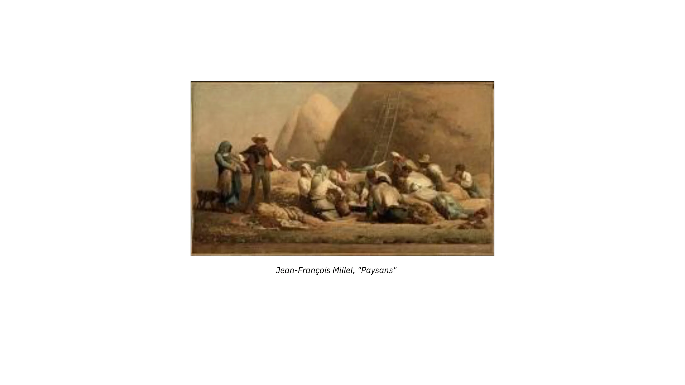

It's hard to label Mirabeau's views as clearly liberal or anti-liberal. He often drifted back and forth, sometimes without realizing it. Still, liberal ideas frequently dominated his writing. One of his most famous lines was:

> The true and only principle of political economy is to let everything be free.

Following the success of his book, Mirabeau became well known in intellectual circles. François Quesnay, who had recently turned his attention to economics, invited Mirabeau to Versailles to debate ideas.

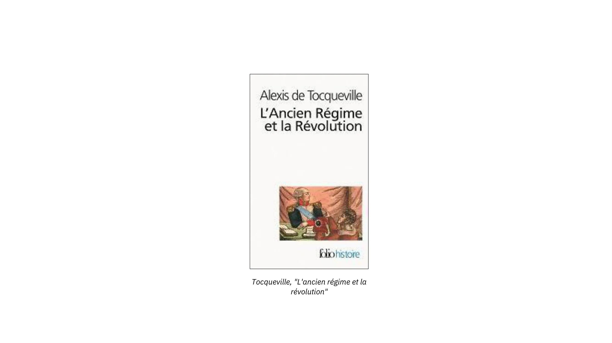

Their discussions were intense, but in a rare moment of intellectual humility, Mirabeau admitted he had been wrong and pledged to support Quesnay's ideas. He became one of Quesnay's strongest allies and promoters.

The two of them formed the core of what would soon become the Physiocratic school. Mirabeau helped Quesnay develop and publicize key ideas, especially about tax reform, publishing works like The Theory of Taxation. His efforts even landed him in trouble: he was briefly imprisoned at Vincennes and later exiled to his estate in Bignon.

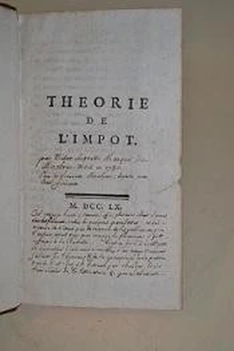

Mirabeau also played a crucial role in recruiting new members to the Physiocratic movement. He even convinced a young Pierre Samuel du Pont de Nemours, who would later become an influential economist in his own right.

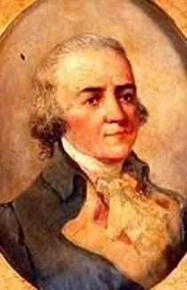

Every Tuesday, Mirabeau hosted meetings of the Physiocrats at his home. Major figures like Turgot, and perhaps even Adam Smith, are believed to have attended.

Mirabeau continued to write prolifically, always defending the ideas of Quesnay. But as time went on, his influence faded. His writing style became even more confusing. His own brother once wrote to tell him he could no longer understand what he was trying to say. Meanwhile, newer thinkers like Mably and Rousseau, who leaned toward socialist or proto-communist ideas, were gaining popularity. Mirabeau's liberal vision fell out of favor. Publishers lost interest. Readers moved on.

He died largely forgotten in 1789, just one day before the storming of the Bastille.

## Quesnay

<chapterId>7a35f20b-5ea0-544d-b290-bcd9c6f7f11a</chapterId>

François Quesnay is one of the most famous French economists.

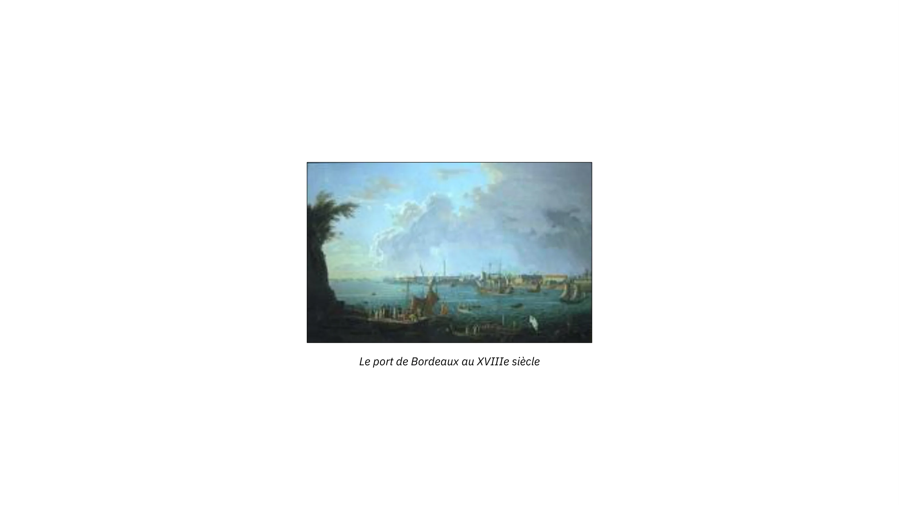

His name appears in every textbook on economics and the history of economic thought. These books usually state that he created the Tableau économique to schematically represent the economy, that he was the leader of the Physiocrats, and that he was mistaken in thinking only land is productive, until Adam Smith came along to correct this view. That's more or less how most textbooks summarize François Quesnay.

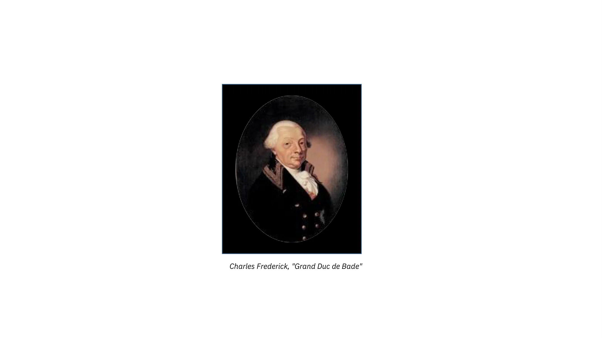

Reducing him to this is a shame, because Quesnay was also the first economist to attempt to base the defense of economic freedom on scientific principles. He was one of the most listened-to and influential economists of his time. Moreover, he founded Physiocracy, a much richer doctrine than the simplistic idea that only nature produces wealth, a notion that is often misrepresented.

We'll discuss Physiocracy in more detail over the next three chapters. First, let's take a closer look at François Quesnay himself.

Born in 1694 in Méré to a peasant family, Quesnay didn't even learn to read at first. He was trained by a local man and eventually pursued formal studies: he enrolled in a school of surgery and later joined the faculty of medicine. At age 24, he became a surgeon in Mantes.

He gained fame in 1730, at age 36, for opposing the common practice of bloodletting, which he believed was based on flawed theories and prejudices. He also dared to challenge the system of professional guilds, which dictated that only surgeons could perform operations and only doctors could prescribe medication. This often forced the poor to pay twice and hire two practitioners, a situation Quesnay found appalling.

In 1740, he became secretary of the Academy of Surgery. In 1748, at age 54, he was appointed the personal physician to Madame de Pompadour and moved to Versailles.

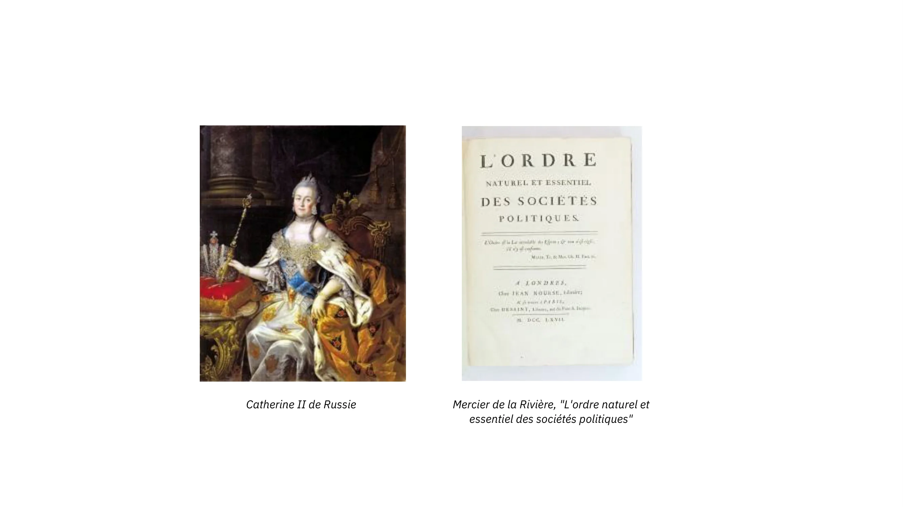

He was very close to Madame de Pompadour. When rumors of her fall from favor began circulating, Quesnay declared that he wouldn't remain a doctor at Versailles without her:
"I was devoted to Madame de Pompadour in her prosperity; I will remain so in her disgrace."

During this time, he published several medical works: Treatise on Suppuration (1749), Treatise on Gangrene (1749), and Treatise on Continuous Fevers (1753), all of which were reprinted several times during his lifetime. At age 60, having been introduced to the economic debates popular at the time, he began writing about economics. In 1755, he wrote the articles Farmers and Grain for the Encyclopédie.

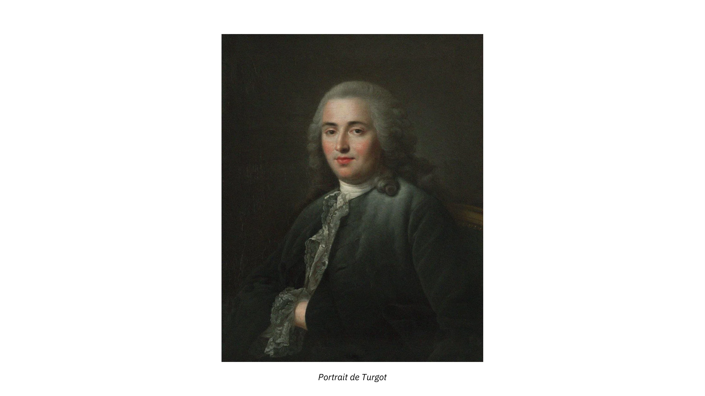

These articles were published in 1757. That same year, he met the famous Mirabeau and managed to convert him to his economic ideas-the core of Physiocracy was born. Quesnay then created the Tableau économique, which was printed on the royal presses, reportedly in the presence of the king himself at the Château de Versailles. From that point on, he regularly hosted economists and philosophers in his Versailles apartment, where they engaged in open discussions. Quesnay also contributed to Mirabeau's Theory of Taxation, published in 1759.

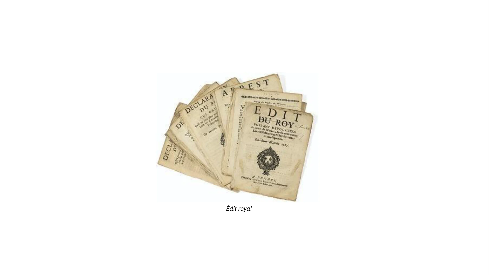

Censorship soon struck. Mirabeau was imprisoned, and Quesnay was reprimanded. After that, Quesnay realized he couldn't publish openly and would need disciples to spread his ideas.

He quickly found them: Baudeau, Dupont de Nemours, Le Trosne, Mercier de la Rivière, and others. These men helped disseminate and popularize Quesnay's philosophy. However, although he needed followers, Quesnay was not entirely happy with the sect-like nature of the group. In his letters to Mirabeau, he expressed concern:

> "Think for yourselves. I've realized that my pitiful drafts make you lazy. Now it's your turn to think. You know as much as I do."

Still, his disciples were deeply devoted and contributed greatly to Quesnay's fame. Upon his death, Mirabeau gave his eulogy, saying, "We have lost our father, for we owed him everything." In truth, it was Quesnay who owed them everything, for without them, he remained isolated at Versailles, where his ideas could charm or trouble, but rarely gained serious attention.

Thanks to the work of his collaborators, his ideas found a platform: first through journals such as the Journal of Agriculture and the Ephémérides du Citoyen...

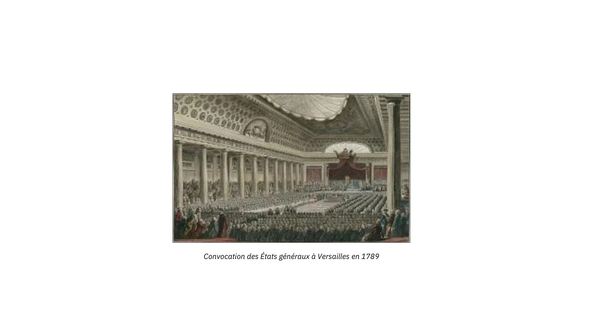

Then through books, not only those of his disciples but also an important anthology published in 1768 by Dupont de Nemours, titled Physiocracy.

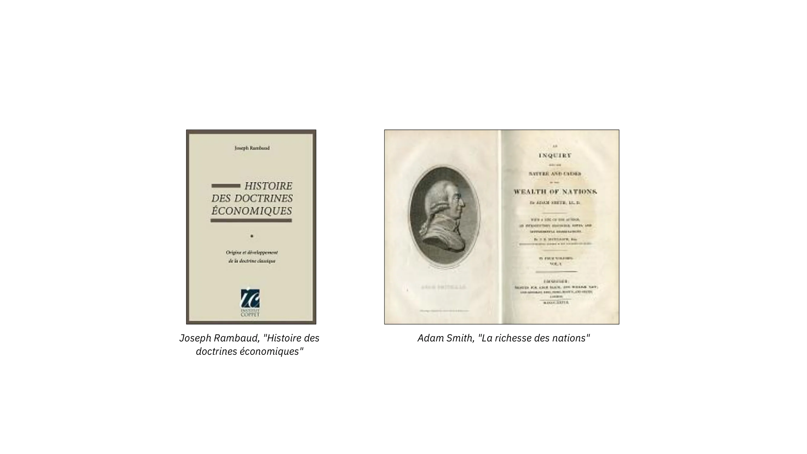

This book gathered Quesnay's key writings. It laid out the economic ideal of the Physiocrats' leader: a model of agricultural economy where law secures individual property rights and ensures free trade.

# The Physiocratic School

<partId>27af82c1-ad82-5c3b-8ce9-c674b67bbf7c</partId>

## History of the Physiocrats

<chapterId>4236ff8b-b53a-59e7-92c0-f96f9afa1c00</chapterId>

Physiocracy became fashionable in France, and even across Europe, for barely a decade. After a long period of development, it gained prominence in the mid-1760s. By the time Turgot came to power in 1776, the movement had already lost its popularity, and the minister kept his support for Quesnay's school mostly hidden.

Its origins lie in the evolution of economic ideas during the 1750s. Several authors helped bridge the gap between Boisguilbert and what would later become known as Physiocracy. As previously discussed, Vincent de Gournay and his circle of economists were behind many publications that introduced French readers to foreign economic thought and helped ignite their passion for economics. The foundations of Physiocracy were already present in books like Détail de la France by Boisguilbert and Essay on the Nature of Trade in General by Cantillon.

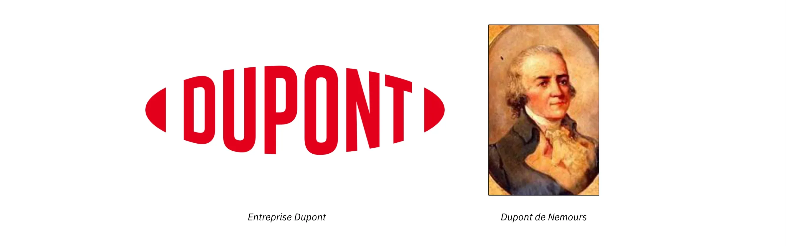

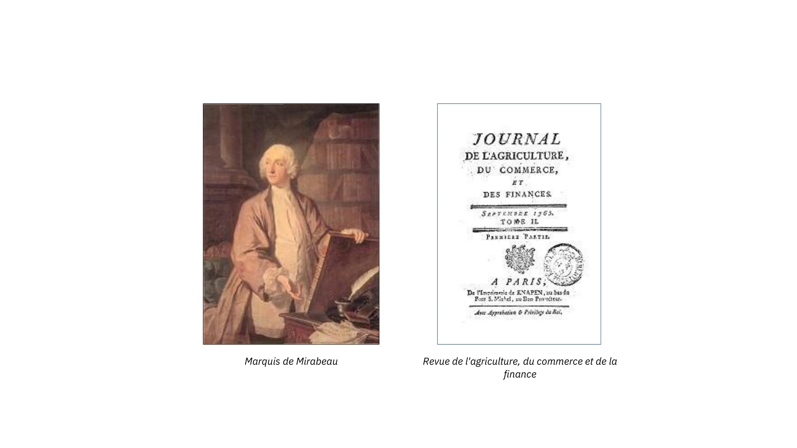

The concept of laissez-faire had had several champions since Boisguilbert, especially Vincent de Gournay and the Marquis d'Argenson.

What remained was to turn this body of ideas into a coherent, complete doctrine. The Marquis de Mirabeau was the first to try. Inspired by Cantillon's Essay, he began writing a comprehensive treatise on economic matters titled L'Ami des Hommes, which was very successful.

This was in 1756. From that moment, the history of Physiocracy began in earnest. François Quesnay, then a surgeon turned personal physician to Madame de Pompadour, invited Mirabeau to Versailles to discuss economic ideas.

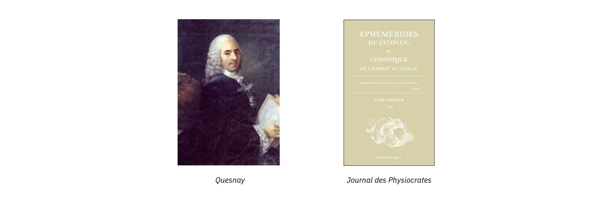

By the end of their conversation, Mirabeau had fully embraced Quesnay's views. From then on, they wrote together: Quesnay created the Tableau économique (1758) to illustrate the flow of wealth in the economy, and they co-authored the Theory of Taxation (1759).

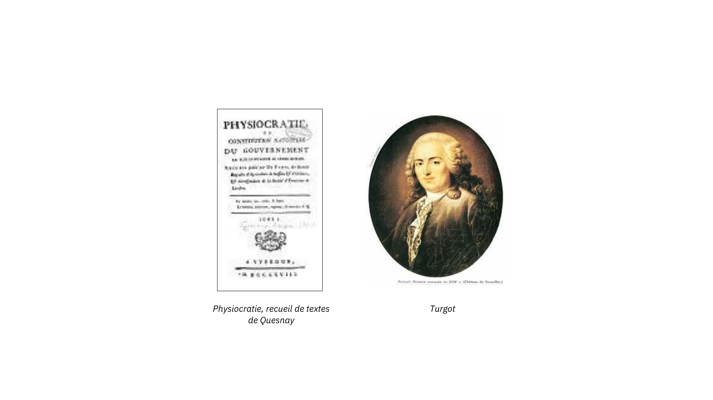

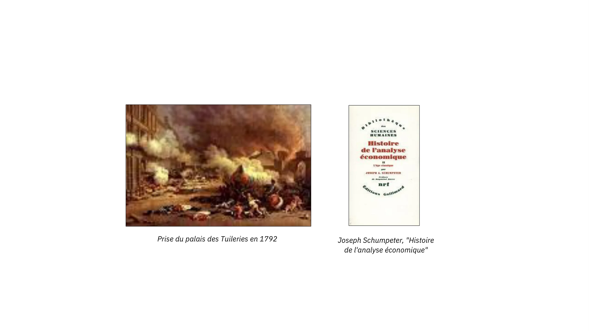

Their efforts were not warmly welcomed. At court, the prevailing reaction was indifference. The King acknowledged Quesnay's fondness for theory and affectionately called him "my thinker." But apart from that compliment, their work was mostly ignored. In fact, their Theory of Taxation offended the tax administrators it criticized, so much so that they demanded and secured Mirabeau's imprisonment. Madame de Pompadour eventually had him released, but he continued living in exile at his estate in Bignon for several weeks.

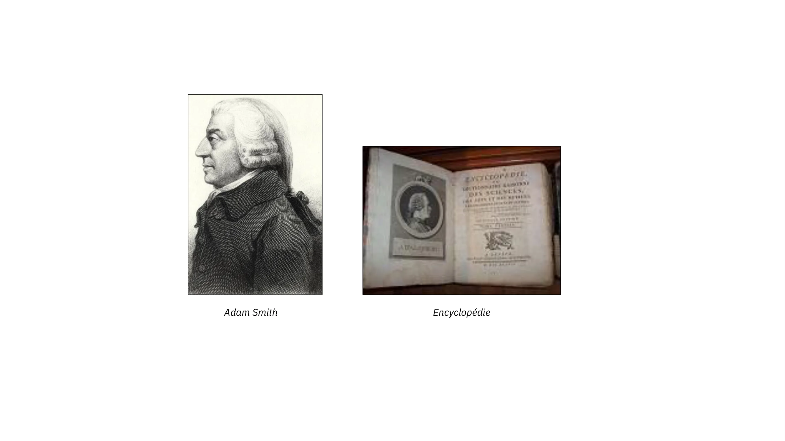

The first half of the 1760s passed in relative silence. Due to his position at Versailles, Quesnay could no longer write under his own name. Mirabeau, having already been condemned once, knew full well that the King's favorite wouldn't always be able to protect him.

After this temporary silence, the two economists began recruiting disciples, that was the only way to spread their ideas. By 1765, they were remarkably successful. Dupont de Nemours, Abeille, Mercier de la Rivière, Le Trosne, and Baudeau soon joined their ranks. They formed a school: they had their own journal, Les Éphémérides du Citoyen, and met every Tuesday at Mirabeau's home.

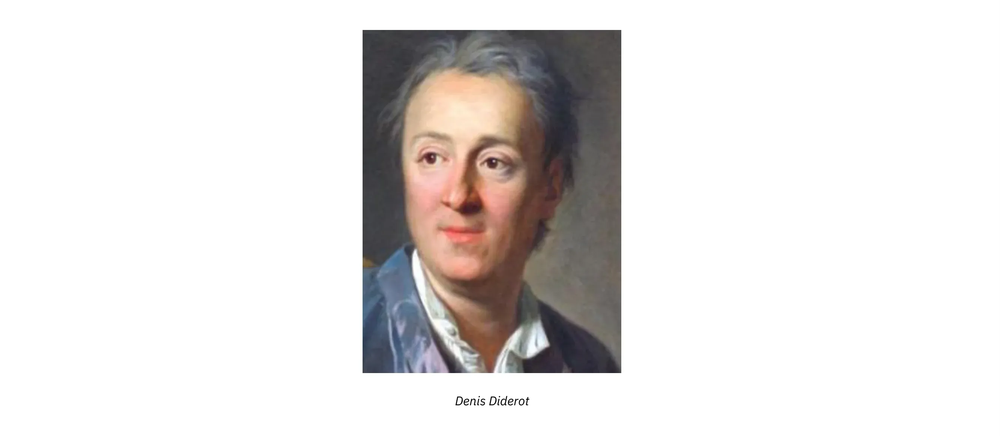

Between 1765 and 1775, the Physiocrats stood at the peak of their fame. Gathered as a cohesive intellectual circle, they dominated the public discourse. The literary and philosophical world had eyes only for them, allowing their ideas to spread widely and rapidly. People called them "the economists," or, more mockingly, "the sect of economists." Regardless of the tone, their notoriety was absolute. In 1774, after a trip to Metz, M. de Vaublanc wrote in his memoirs of his astonishment: everyone around him was talking economics and reasoning like Quesnay's disciples. "It was fashionable," he noted. "Everyone was an economist."

However, by 1770, their popularity began to wane. The group experienced its first defections, and their ability to withstand criticism weakened. And the critics were many, Condillac, Mably, Voltaire, Galiani, Linguet, Graslin, and even Adam Smith in Scotland, all challenged their views.

Their journal, once a key vehicle for spreading their theories, stopped being published regularly. This marked the end of the movement's most active and influential period.

Still, Physiocracy continued to shape economic thought well into the time of the French Revolution. In France, this influence was most visible through Turgot, who was more a fellow traveler than a true disciple, and through Dupont de Nemours, the movement's primary advocate, whose life and work we will explore later.

Beyond France, Physiocratic ideas were warmly received throughout Europe. In Germany, they influenced the Margrave of Baden; in Italy, Grand Duke Leopold of Tuscany drew inspiration from them. In both cases, Physiocracy sparked significant economic reforms favoring private property and individual liberty.

## The foundations of the Physiocrats' doctrine

<chapterId>4dbe5436-0578-57c2-b054-03ed00aa091a</chapterId>

"Physiocracy," a term coined by Dupont de Nemours, is the title he gave to a collection of Quesnay's works published in 1768.

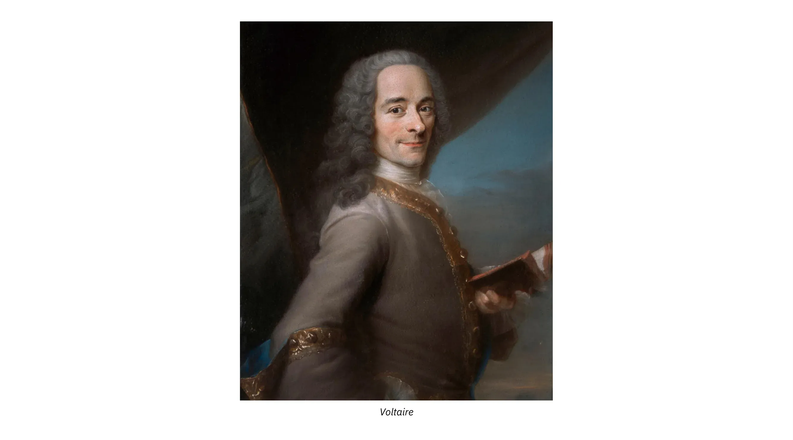

The meaning of the word remains somewhat obscure. Quesnay's followers never explained it clearly. 

Yet the doctrine itself is quite well defined. Here are its main principles:

### First principle: only agriculture is productive

This is the idea that made the Physiocrats famous, and often misunderstood. They are said to have naively believed that only agriculture was productive. Based on this, their doctrine is often dismissed as unimportant, and people quickly move on to analyze Adam Smith.

However, we cannot criticize the Physiocrats for placing excessive importance on agriculture since, in the mid-18th century, agriculture employed 90% of the population and formed the foundation of the French economy.

Their idea is actually subtle. According to them, there is a difference between production and profit. Industrialists and merchants can earn profits, but only the farmer truly produces because production is the creation of useful matter, rather than just adding utility to preexisting matter.

They also rejected industry and crafts as "unproductive" because these trades were tightly controlled by guilds (corporations) that prevented innovation and investment.

### Second principle: legal despotism rather than democracy

Unlike modern views that favor democracy, While historians forgive the Physiocrats their strict view on agricultural productivity, they do not forgive their opposition to democracy, especially since they lived during the height of Enlightenment ideas. From the mid-18th century to just before the Revolution, the Physiocrats were seen as enemies of progress.

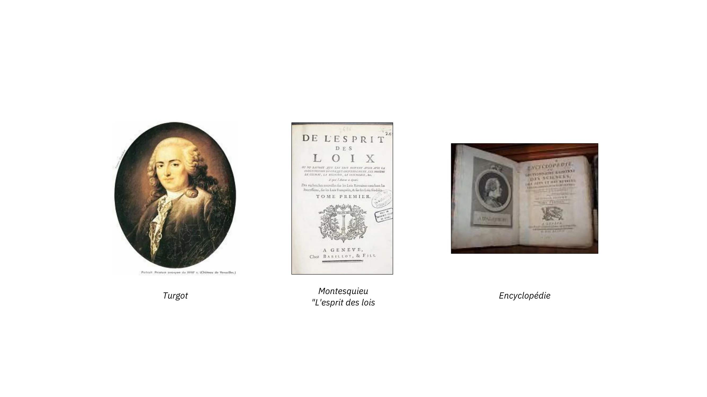

Tocqueville insisted on this idea:

> "The Physiocrats were indeed very supportive of free trade in goods, and the policy of laissez-faire and laissez-passer in commerce and industry; but regarding political freedoms, they never considered them seriously and, when the idea did appear to them, they rejected it immediately."

So, while they were economic liberals, they were not political liberals. Quesnay wrote in his Maxims: "Let sovereign authority be unique and superior to all individuals of society and to all unjust enterprises of private interests." And later in the same maxim: "The system of checks and balances in government is a disastrous opinion, which reveals only discord among the powerful and oppression of the weak."

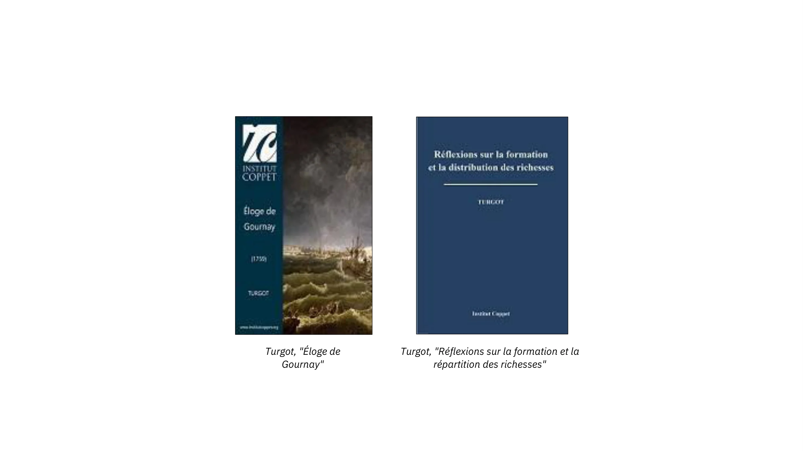

Tocqueville noted well that the Physiocrats rejected democracy as soon as they saw its forms. They were skeptical of democracy, a constant in French political economy, because democracy is far from a perfect system: it potentially allows the oppression of minorities by the majority; it can become a tool for usurpation, tyranny, and plunder.

### Third principle: absolute respect for private property

The Physiocrats believed that people needed to own and keep the results of their labor. In their view, property rights were the very foundation of a healthy society. They thought the state had one main job: to protect people's property. When ownership is secure, people are more willing to work hard, invest, and take care of what they have. That, in turn, drives progress.

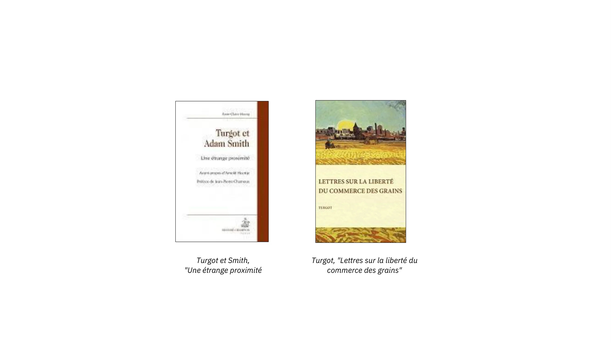

Quesnay put it simply:

> "Secure land and property rights for those who lawfully possess them. Property security is the foundation of economic order and social stability. When people feel safe in their ownership, they're more likely to work hard, improve the land, and develop commerce and industry."

### Fourth principle: absolute freedom of commerce

Quesnay also believed strongly in free trade. He wrote:

> "We must protect the full freedom of commerce. The best and most reliable way to regulate both domestic and foreign trade is through open competition."

The Physiocrats had seen the damage caused by government interference, especially in the grain trade. Governments simply couldn't keep up with local needs and shifts in supply and demand. It was unrealistic to expect the state to manage every detail better than local farmers or merchants could themselves.

Trade, they believed, naturally brought benefit to society, and only full freedom could unlock that potential. One of their members, Le Trosne, even wrote a pamphlet titled:
> "The Freedom of the Grain Trade: Always Useful, Never Harmful."

### Fifth principle: All men are brothers

The Physiocrats were ahead of their time in some important ways. They were outspoken opponents of slavery and believed deeply in peace. Mirabeau once said simply:
> Our foreign policy is called peace.

In 1790, Dupont de Nemours even proposed a law banning all offensive wars, staying true to their commitment to human dignity and unity.

## The Physiocrats' achievements and influences

<chapterId>5b911105-796a-5e2e-a501-c7a364fc758e</chapterId>

Their biggest achievement, alongside another group led by Gournay, was helping spread economic ideas to the public. Around 1750, Voltaire famously joked that people in France had grown tired of poetry and novels, they were now obsessed with grain and economics.
The Physiocrats rode that wave. They wrote hundreds of books, pamphlets, and articles, especially promoting freedom in the grain trade. Their ideas caught on. In fact, between 1760 and 1775, there was an explosion of economic writing in France.

A man named Vaublanc recalled visiting Metz in 1774 and noting how everyone seemed to be talking about economics. "It was fashionable," he said. "Everyone was an economist."

Their influence was even felt in government. In 1763, under pressure from Physiocrats, the French government passed an edict freeing the grain trade. They also relaxed guild restrictions, giving workers more freedom to earn a living.

Their ideas spread beyond France, too.

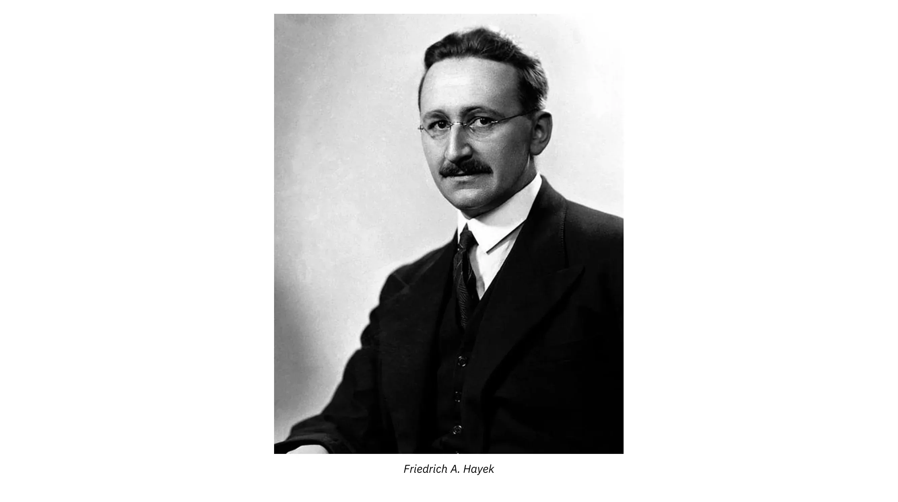

- **In Germany**, the Margrave of Baden supported their theories and worked with a Physiocrat economist named Johann August Schlettwein. He tested their ideas in a small village called Dietlingen. The locals welcomed it, but higher officials were skeptical and slow to adopt it widely.

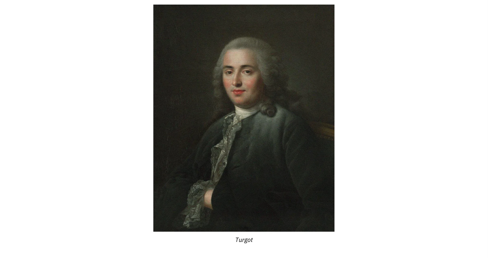

- **In Russia**, Catherine the Great asked for help reforming the law. Diderot sent her a famous Physiocrat, Mercier de la Rivière. Although his ideas had inspired her, she was disappointed by his visit and didn't use him in the way she'd hoped.

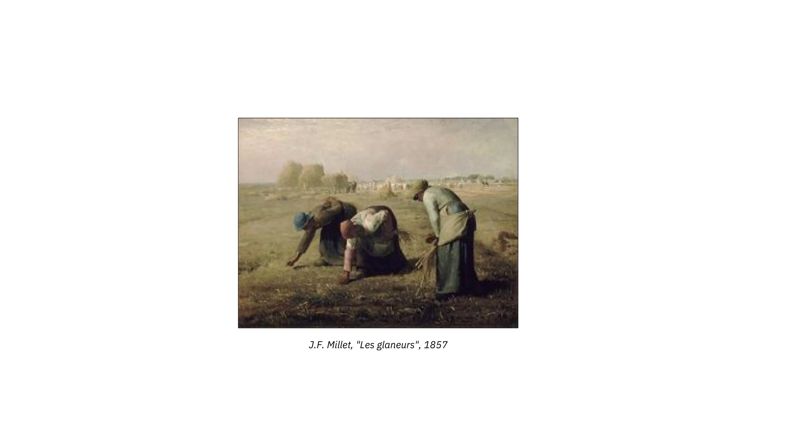

- **In Italy and Sweden**, Physiocratic ideas also found support among rulers like Leopold of Tuscany and King Gustav III, ready to put them in practice.

In France, Their biggest break came in 1774 when Turgot,a reform-minded economist, became France's Finance Minister.

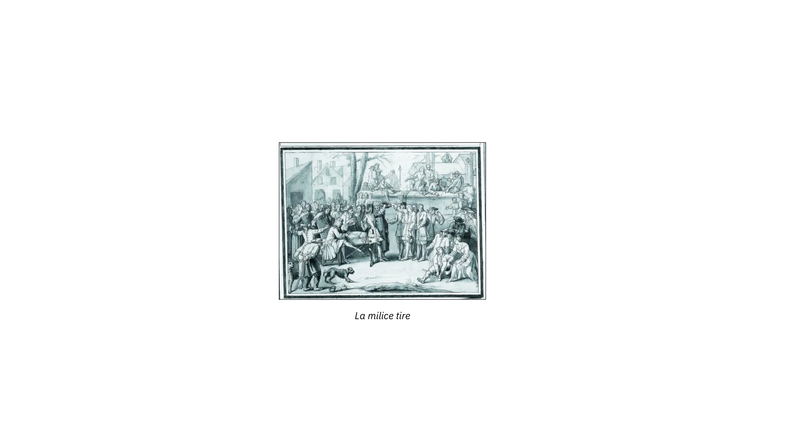

Though he never openly claimed to be a Physiocrat (they had become controversial), he put many of their ideas into practice. In six famous edicts, he promoted free trade, ended forced labor and monopolies, and gave people more economic freedom.

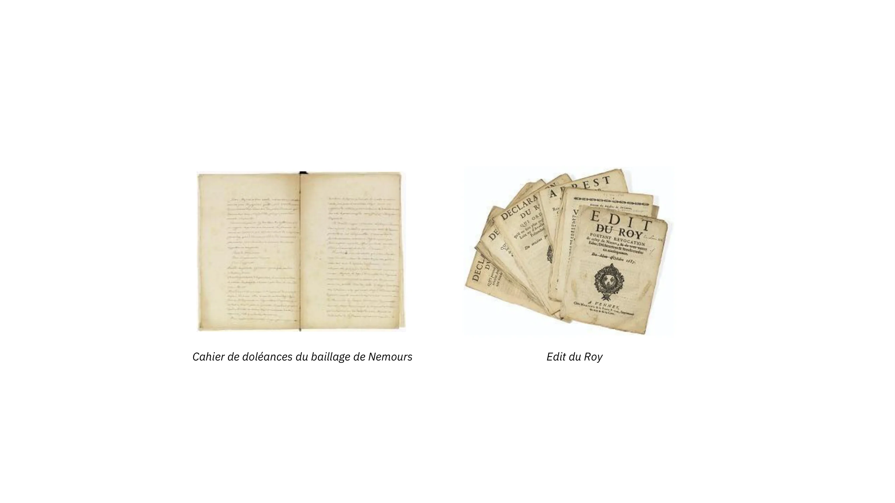

By the time of the French Revolution, the Physiocrats had fewer followers. Mirabeau died on July 13, 1789 - quite a symbol - and Abeille, who had moved on, and Dupont de Nemours, who remained faithful to it. Appointed to the Assemblé, Dupont de Nemours carried the voice of Physiocracy and called for economic reforms in favor of property ownership and free trade.

He even opposed the use of assignats (paper currency backed by land), though he couldn't stop it. 
Still, their influence was clear. One historian, Joseph Rambaud, said:
> "Everything the Revolution did for economic liberty, it owed to the Physiocrats."

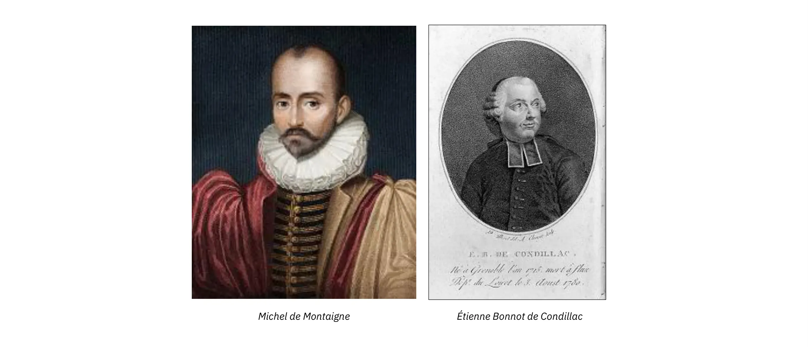

The Physiocrats also helped shape modern economics. Adam Smith, who visited France and met many of them, was deeply influenced by their work. 
He even considered dedicating The Wealth of Nations to Quesnay.

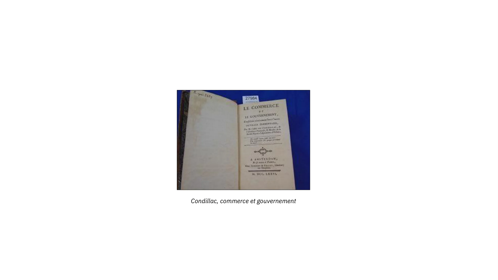

Sadly, Quesnay died two years before Smith's book was published, and the dedication was removed.
Although Smith didn't agree with their idea that only agriculture was productive, he embraced many of their arguments for free markets, and carried them forward in his own work.

## Dupont de Nemours

<chapterId>6d585e0f-93b8-5b0a-a0a8-7f6e4a5bc68e</chapterId>

In the United States, many know the chemical and biotech giant DuPont - officially "E.I. du Pont de Nemours and Company." 

Today, it's a multinational corporation with over $35 billion in revenue and roughly 65,000 employees worldwide. 

But few people know that the origins of this iconic company are closely tied to the life of a French economist named Pierre-Samuel Dupont de Nemours , a key figure in the 18th-century school of thought known as Physiocracy.

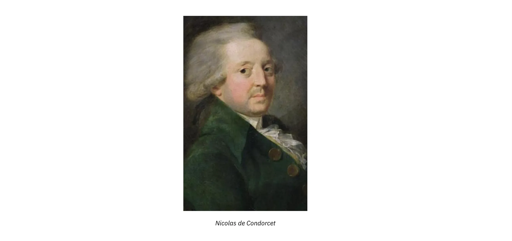

Born in 1739, Dupont de Nemours discovered the ideas of the Physiocrats at the age of 24. At the time, he was still finding his path in life. One day, he came across a short pamphlet titled The Wealth of the State. He found its economic ideas absurd and wrote a critical response called Reflections on the Wealth of the State, published in 1763. The piece was well-received, and readers praised it, saying things like, "You must be a disciple of Mirabeau!" Ironically, Dupont didn't even know who Mirabeau was.

Curious, he began reading Mirabeau's work, Friend of the People and Theory of Taxation, and eventually met both Mirabeau and François Quesnay, the leading figure of Physiocracy. He became one of their most devoted followers.
In 1765, Dupont was offered the opportunity to lead the Journal of Agriculture, Commerce, and Finance, one of the most influential publications on economic thought at the time.

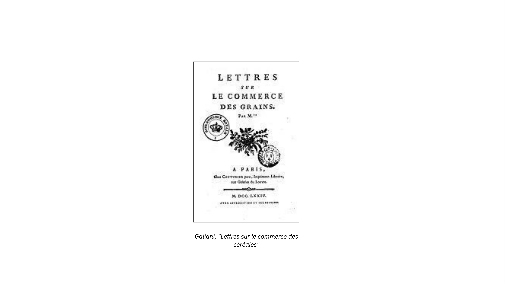

The choice was strategic: Mirabeau and Quesnay needed to keep a lower public profile, and Dupont was seen as their rising star.

Other members of the Physiocratic school agreed: Dupont de Nemours quickly became Quesnay's favorite. Quesnay once said, "Take care of this young man, he'll be the one to speak for us when we're gone." One fellow Physiocrat, Abeille, even grew jealous of the attention Dupont received and distanced himself from the movement.

Dupont never forgot what Quesnay meant to him.

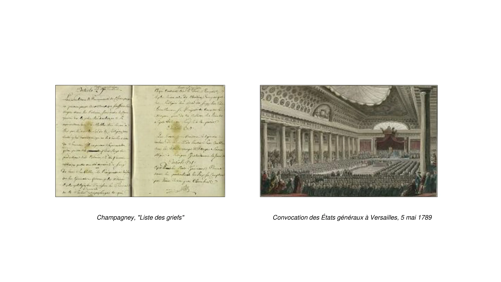

He would later say, "I was just a boy when Quesnay took me in - he made me a man.” It was Quesnay who helped launch him as a major economist of his time.
After leading the Journal of Agriculture, Dupont was appointed editor of Les Éphémérides du Citoyen, the official publication of the Physiocrats.

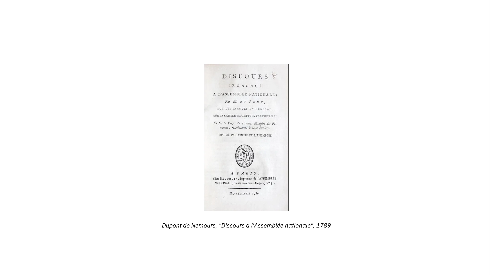

He turned the journal into a respected platform for economic theory - even writing nearly all of the final issues himself as the movement began to decline. writing almost all the final volumes himself. 
In fact, it was Dupont de Nemours who coined the word "Physiocracy" - a term combining the Greek words for "nature" and "government." He used it in 1768 as the title for a collection of Quesnay's writings, and it stuck. At the time, the Physiocrats simply called themselves "the economists," and that term was still commonly used during the French Revolution.

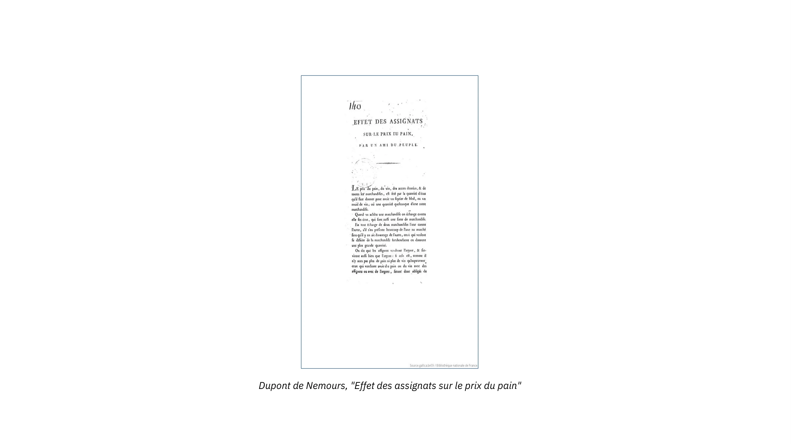

When Anne Robert Jacques Turgot briefly served as France's finance minister, Dupont became his close advisor, the only Physiocrat with access to him, as Turgot kept his distance from the others.

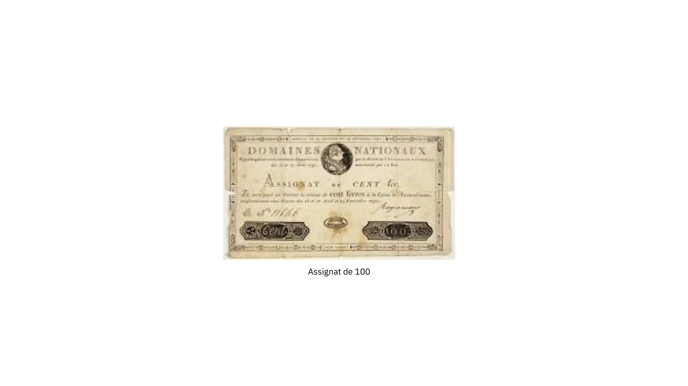

During the early years of the Revolution, Dupont was elected to represent the district of Nemours in the National Assembly. There was already another delegate named Dupont, so to tell them apart, people began calling him Dupont de Nemours - not because he was nobility, but simply to distinguish the two. The name, of course, remained.

In August 1792, he took up arms to defend King Louis XVI at the Tuileries Palace against an angry mob.

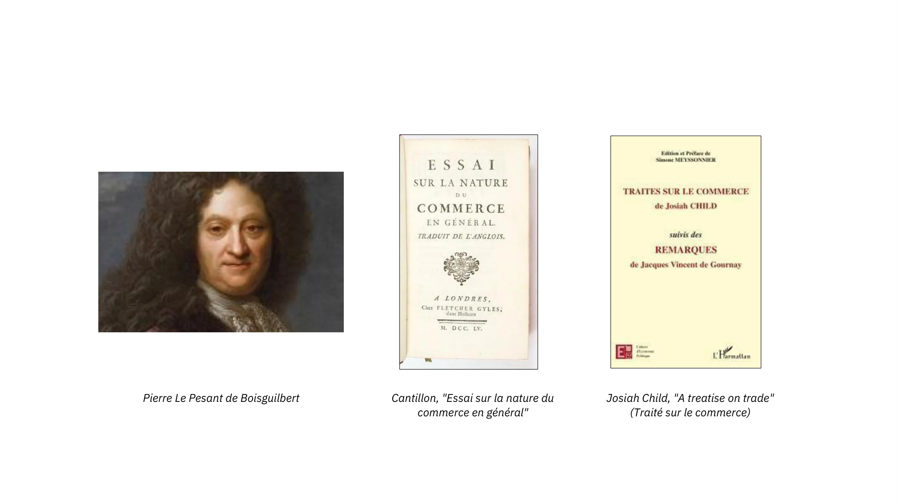

The King told him: "Monsieur Dupont, you are always found where you are needed!".

Dupont narrowly escaped the guillotine during the Reign of Terror - he had been condemned but was spared by the fall of Robespierre. Eventually, under Napoleon's rule, he was forced into exile and fled to the United States. There, with his support, one of his sons founded what would become the DuPont company.

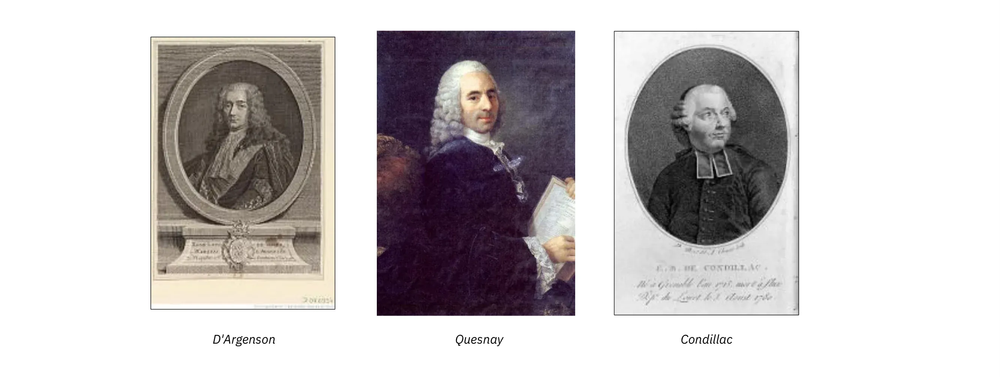

Despite a life filled with publishing - dozens of books, articles, and pamphlets - Dupont de Nemours remains relatively unknown today. Perhaps it's because he held firmly to Physiocratic ideas long after they had fallen out of favor. As the economist Joseph Schumpeter later put it, "Dupont de Nemours remained loyal to Physiocracy throughout a career that offered many chances to abandon it." He was, above all, a man of conviction.

# The Enlightenment and Political Economy

<partId>d1c885ad-7cb1-5f81-816c-be312719d9f8</partId>

## Voltaire and the philosophers

<chapterId>16bcf7bf-dad4-5113-8c64-2800f04ff07b</chapterId>

The 18th century in France saw the emergence of economics as a science and the first school of economic thought: Physiocracy. Adam Smith trained in economics during this period, and French economists were recognized globally as authorities. However, this century is remembered more as the century of philosophy than of economics. While the Physiocratic movement aligned, in its ambitions, with Enlightenment philosophy, the attitudes of the philosophes-especially Diderot and Voltaire-deserve close examination. We will see that the Enlightenment thinkers significantly contributed to spreading the idea of laissez-faire in France.

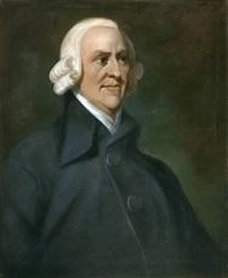

The most famous achievement of Enlightenment philosophy is without a doubt the Encyclopédie by Diderot and d'Alembert.

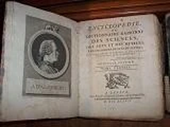

Naturally, the economic articles were written by economists. For the early volumes, Diderot turned to Forbonnais, then enlisted liberal economists: first François Quesnay (who contributed articles like Grains, Fermiers, Hommes-the last one unpublished), then Turgot (who wrote Foires et marchés). These writings are of great importance. In his articles, Quesnay laid the groundwork for what would become Physiocratic doctrine. Along with his Tableau économique, these remain his most famous works. Turgot, still young at the time, developed the idea of laissez-faire in his article, criticizing state intervention in market organization.

In many other articles of the Encyclopédie, philosophes, especially Diderot, championed the ideal of liberty in all areas: religion, politics, and economics.

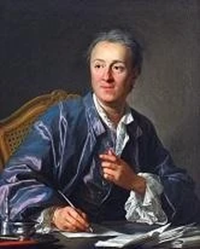

Economic freedom, especially in opposition to the guild system, was a recurring theme in various entries such as Arts, Métier, and Communauté.

Diderot's path in economic theory is a curious one. In the Encyclopédie, he was a staunch advocate for economic freedom and was the one who invited liberal economists to contribute, as confirmed by a letter outlining the articles Turgot might write for him. In the early years of Physiocracy, he was both a supporter and a promoter of Quesnay's school. In 1769 and 1770, he wrote for Les Ephémérides du Citoyen, to the great dismay of his anti-liberal philosopher friends, like Melchior Grimm. However, he soon distanced himself from the group. Enthralled by the vibrant intellect of Abbé Galiani, he helped him publish his book on the grain trade in French, just as Galiani was about to return to Italy.

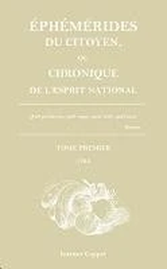

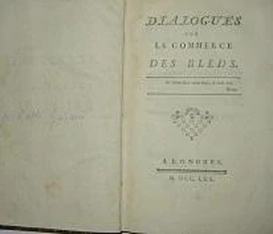

This book would become the fiercest attack ever made against Physiocratic ideas, delivering a major blow to the movement. Later, Diderot defended Galiani against Abbé Morellet, a close ally of the Physiocrats, in his Apology of Galiani. A few years later, during Turgot's ministry, Diderot supported the abolition of guilds and the establishment of freedom of labor. At this point, Diderot-the artisan's son-found himself in agreement with the liberal economists and wrote a scathing letter to Galiani, who claimed that labor freedom would ruin French industry within twenty or thirty years. In light of the Industrial Revolution, history suggests otherwise. Having returned to the liberal economists' camp, Diderot no longer enjoyed their trust and remained isolated. A very telling moment is a letter he sent to Dupont de Nemours in 1774, where he writes:

> "You once had affection for me; now you no longer do, because you are so busy that you no longer have time to love anyone."

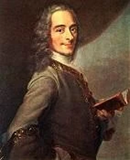

Voltaire followed a similar path, marked by a lack of consistency in his economic views. He admired Vincent de Gournay, corresponded with economists (including Dupont de Nemours and Turgot), and appreciated the Physiocrats-especially for their praise of agriculture. He extolled them in a Diatribe to the Author of the Ephémérides. However, he later criticized their idea of a single land tax in his satirical work The Man of Forty Crowns, which also stirred significant controversy. Finally, like Diderot, he celebrated Turgot's ministry, calling it a golden age and praising his two great decrees on labor freedom and free trade.

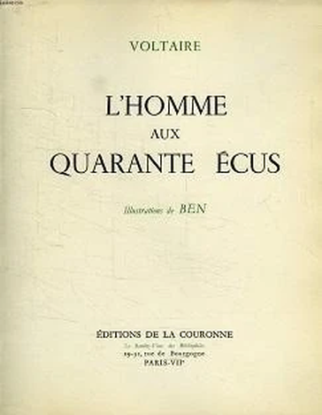

In the end, the philosophes' relationship with economic thought is mixed. Despite their praises and critiques of liberal economic ideas, they played a role in bringing these ideas into the broader intellectual discourse of the Enlightenment. In this way, whether intentionally or not, they helped advance the notion of laissez-faire right up to the Revolution.

## Turgot, The Theorist

<chapterId>a8cd8185-8351-556b-8011-3a0c313e8a9d</chapterId>

In a famous passage from his History of Economic Thought, American economist Murray Rothbard praised what he called the "brilliance" of Turgot.

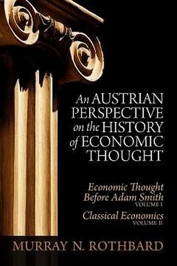

describing him-alongside Cantillon-as the greatest economist of the 18th century.

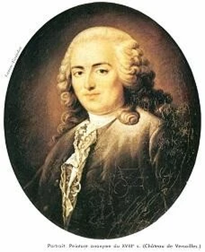

How did Turgot rise to such prominence? It came down to a combination of three key factors. **First**, his prestigious family background. He came from a long line of royal administrators, many of whom held high-ranking government positions. **Second**, the intellectually rich era into which he was born. Turgot was 21 when Montesquieu published The Spirit of the Laws, and just 24 when the first volume of Encyclopédie appeared.

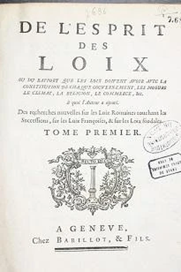

He was part of the same intellectual landscape as the Physiocrats, Voltaire, Diderot, Holbach, Adam Smith, and Condorcet.**Third**, his own precocious mind. While still a student at the Sorbonne, he wrote a paper on paper money at age 22, delivered notable speeches, and by 24, drafted a reading list of 52 essential works.

Despite his youth, Turgot contributed to Encyclopédie, authoring articles on topics like "Etymology," "Existence," "Expansibility," "Fairs," and "Foundations." Only one article touched directly on economics-his piece on "Fairs," which detailed the origins of fairs and markets, and criticized the growing state interference that disrupted and paralyzed them.

During these early years, he came under the mentorship of Vincent de Gournay, who became both a guide and close friend. After Gournay's death in 1759, Turgot penned a eulogy containing a beautiful summary of laissez-faire thought:
> "In all respects in which commerce may concern the state, individual self-interest, left to its own devices, will always bring about the general good more reliably than government intervention, which is always flawed and necessarily driven by vague and uncertain theory."

In 1767, while serving as an intendant (a kind of regional governor), Turgot wrote Reflections on the Formation and Distribution of Wealth, a concise treatise on economics.

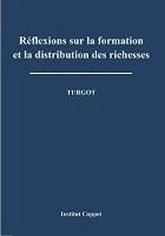

In this work, he addressed major economic themes: division of labor, consumer sovereignty, private property, the role of capital, and more. Historians-including recent scholar Anne-Claire Hoyng-have pointed out strong similarities between this book and Adam Smith's Wealth of Nations, which came out nine years later.

Turgot was also a vocal defender of free grain trade. In letters to the abbé Terray (some of which were later presented to the King but are now partially lost), he wrote:

> Sir, if anything is urgent, it is not to add new restrictions to the most vital trade of all-it is to remove those unfortunate obstacles that still remain. 
> If ever there were a time when full and total freedom, free from any kind of hindrance, was needed, I dare say it is now. This is precisely the time to avoid regulating grain policy.

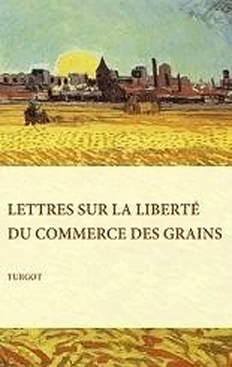

In 1769, Turgot wrote an article titled "Value and Money" for abbé Morellet's Dictionary of Commerce, though the dictionary was never published. In that piece, Turgot built on Galiani's insight that "man is the common measure of all things," and developed an early version of subjective value theory, thirty years ahead of its time.

Then, in 1770, well before Bentham, Turgot drafted a memo calling for the liberalization of interest rates and the end of laws against usury. He argued:

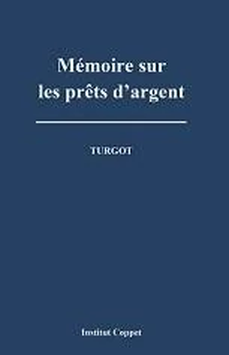

"It is a mistake to believe that interest rates in commerce should be set by government decree. Like any price, the interest on money regulates itself."To support his view, he directly challenged the arguments of both Aristotle and the early Church Fathers.

One lesser-known piece from 1773, a letter to abbé Terray about the branding of iron, includes a striking summary of Turgot's laissez-faire philosophy:

> "The role of government is to step aside and allow the natural course of commerce to flow, just as it does with the natural world, equally necessary and equally unstoppable. Government should not attempt to direct it, because doing so without disruption would require perfect knowledge of every shift in needs, interests, and human industry, knowledge it is physically impossible to obtain. Even the most skillful and diligent administration will always get it at least half wrong."

Here, Turgot makes a crystal-clear case for laissez-faire economics,and foreshadows Friedrich Hayek's later analysis of the "pretense of knowledge", the idea that governments can never fully grasp the complexities of an economy well enough to manage it effectively.

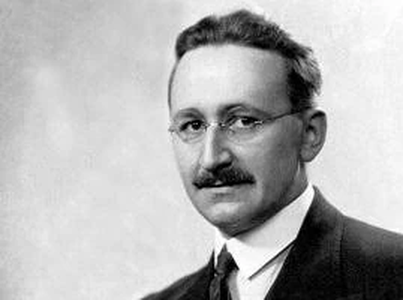

## Turgot, the Reformer

<chapterId>9177429f-1679-51c4-bfd2-dd036d24a1cc</chapterId>

As mentioned in the previous chapter, Turgot was born into a prominent family with a long tradition of serving in France's highest administrative offices.

His father had served as prévôt des marchands (a kind of mayor and trade overseer) of Paris, and his grandfather had been a royal intendant. After excelling in his studies, the youngest of the Turgot family aspired to follow - if not surpass - in their footsteps. He began his career as maître des requêtes, a liaison between local governors (intendants) and the royal court at Versailles. It was a prestigious post, for which he had to obtain a special age exemption. But Turgot aimed higher. The death of his mentor, Vincent de Gournay, further fueled his ambition to become an intendant himself.

In 1759, he requested the post in Grenoble, but was turned down. He was offered the position of prévôt des marchands in Lyon instead, which he declined. He asked for the intendant role in Brittany , again, refused. Eventually, in 1761, he was offered the position in Limousin. He accepted, though not without disappointment. He wrote to Voltaire: "I have the misfortune of being an intendant" , perhaps meaning: I have the misfortune of being the intendant of Limousin.

Limousin was a poor, underdeveloped region. The peasants lived in precarious conditions, with inadequate housing and food. The literacy rate was extremely low, and the few roads that existed were in dreadful condition.

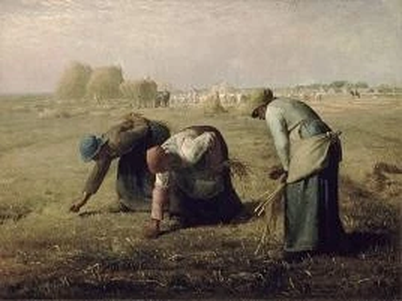

Because the region was so poor, it was of little interest to the royal ministers. This gave Turgot the freedom to experiment with reforms. In Limousin, he pursued three major projects:

- **Fairer distribution of the taille**: This was a personal tax on peasants. Turgot aimed to make its assessment as objective and equitable as possible.
- **Replacing the corvée**: Traditionally, peasants were forced to perform unpaid labor, often roadwork. After inspecting the region's poor infrastructure, Turgot replaced the corvée with a tax paid in money instead of labor.
- **Reforming military recruitment**: Peasant militias were conscripted during wartime through a lottery system. This caused fear, unrest, and desertions. Turgot replaced this with a system of paid volunteers.

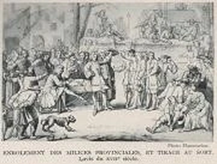

This was done by drawing lots, which led to fear and violence because of runaways. Turgot replaced these compulsory levies with paid volunteers.

These reforms were considered successful, and in July 1774, Turgot was appointed minister. Due to his limited experience in state affairs, the King first assigned him to the Ministry of the Navy, a move that many found amusing. Turgot himself admitted, "I know nothing about the Navy." Voltaire joked, "I don't think Turgot is any more of a sailor than I am."

Just a month later, however, Turgot was appointed Controller-General of Finances, effectively becoming France's economy and finance minister.

In his now-famous letter to Louis XVI outlining his core principles, he wrote:
> "No bankruptcy.
No new taxes.
No borrowing."
This philosophy, which critics today might label as overly strict, was meant to rescue the monarchy from financial ruin.

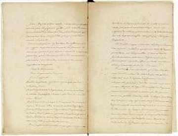

Turgot prepared six royal edicts aimed at reforming the French economy.

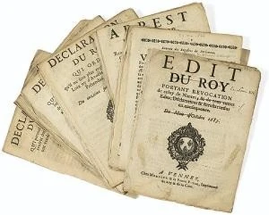

It was the first - and one of the very last - times that an economist was given such wide latitude to apply his theories in real-world governance. Three of these edicts were particularly bold:

- Abolishing the corvée (forced labor)

- Eliminating trade guilds and corporations

- Legalizing free trade in grain

From the outset, Turgot knew he would face resistance from the privileged classes. "I will be feared, even hated, by much of the court, by all those who seek royal favors," he told the King. That prediction proved accurate. The privileged elites united against him, and eventually forced his dismissal from the Ministry of Finance. Voltaire, a staunch supporter of Turgot's reforms, wrote in despair:

> Ah! What dreadful news I've heard!
What will become of us? I am crushed!
We will never get over having witnessed the birth, and death, of the golden age!
This thunderbolt has struck both my mind and my heart.

Since then, many have argued, not without cause, that France is a country resistant to reform. Turgot's failure seemed to confirm it: He had been prepared by half a century of liberal economic thought; he had the backing of Enlightenment philosophers; and the King himself, with absolute power, supported him.

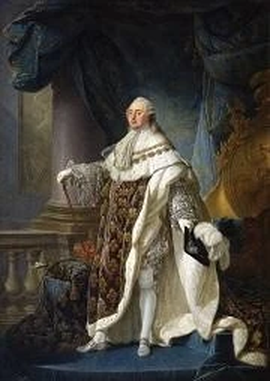

In the end, the parlements and the privileged classes won out. All the King could do was privately lament:
> I see now that only Monsieur Turgot and I care about the people.

## Condillac

<chapterId>0ba8dbb5-dcd5-5981-bf85-6c185e0bf192</chapterId>

Just like mercantilism, which is its most obvious practical expression, Montaigne's fallacy took a long time to disappear.

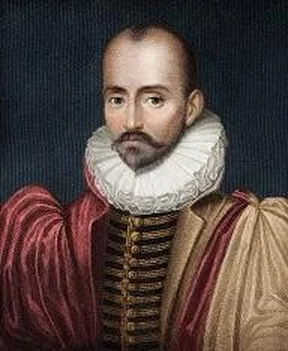

**That fallacy is the belief that trade and exchange are zero-sum games**, that everything one party gains in an exchange must necessarily be lost by the other. According to its defenders, this applies just as much between individuals as between nations.

**The Abbé de Condillac played a crucial role in finally breaking this illusion.**

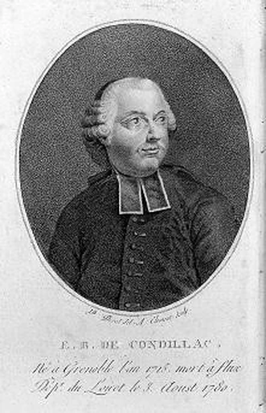

Saying "finally" might be a bit of an overstatement, though. This fallacy tends to reappear regularly in public debates. That might also explain why Condillac remains such an obscure figure in economics. Outside of the Austrian School, few economists have grasped the importance of his theory of exchange, almost no one talks about him anymore.

For most historians of economic thought, **the year 1776 is remembered for the publication of The Wealth of Nations, the book that supposedly founded modern economics**. But the fifteen lessons we've just gone through-covering French economic science before Adam Smith-should be enough to challenge that narrative. And in fact, **another book published in 1776 arguably deserves even more praise from historians than Smith's work**: a book by *Condillac, plainly titled Commerce and Government Considered in Relation to Each Other.*

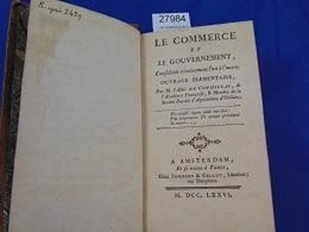

According to Condillac, if the fallacy of zero-sum exchange still persists, part of the blame lies with the Physiocrats. They claimed that exchange is a relationship of equality. Condillac, however, argued that this is false: exchange is inherently unequal,each party always gives less in order to receive more.

There could hardly be a sharper contrast between the ideas of the Physiocrats and those of Condillac. The Physiocratic economist Le Trosne once wrote:

> "Exchange is, by nature, a contract of equality, made between equal values."

Condillac, on the other hand, insisted:

> "Each party in the exchange always gives a lesser value in order to receive a greater one."

But ultimately, the disagreement is more about semantics than substance. Both agree that if you trade a franc for a book, the book is worth a franc, or that a franc is the price of the book.

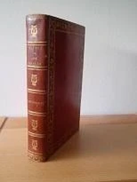

**Where Condillac makes his mark is by focusing on subjective value**. If I trade my franc for a book, it means I value the book more than I value the coin. That's why I'm willing to make the trade.

So Condillac's theory isn't necessarily incompatible with that of the Physiocrats, they're just speaking different languages, so to speak. Le Trosne is talking about price, while Condillac is talking about value, and they're not the same thing.

**Where Condillac gets it right is here**: even if the prices in a transaction are equal, the values are not, because if both parties didn't value what they're getting more than what they're giving, there would be no exchange.

To sum up Condillac's theory, we can break it into three key ideas:

1. **We seek goods because they're useful**. This may seem obvious, but it's foundational: people engage in exchange to gain utility. *Jean-Baptiste Say* later developed this idea thoroughly.

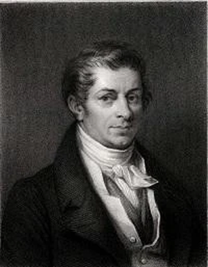

2. **Value comes first, it is the motive for the exchange**. Our personal, subjective judgment about the usefulness of goods and services gives them their value. We each value things differently, depending on how useful we think they are to us.

3. **Price is the result of the exchange process**. Goods aren't exchanged at the value I assign them alone, prices emerge from the interaction between my valuation as the buyer and the seller's valuation. Price is what happens when these two subjective perspectives meet.

Condillac's insights are fundamental. **They explain why every voluntary exchange benefits both sides**.

That's why his ideas destroy most arguments against free trade, because protectionism ends up being just a system that prevents people from improving one another's lives through exchange. Condillac's ultimate conclusion? Laissez-faire. Let people be. If the government simply protects liberty and property, people will naturally enrich each other through trade.

## Condorcet

<chapterId>99e4aba6-da7f-5041-b02f-337158381515</chapterId>

Condorcet is undoubtedly the most economically minded philosopher of the Enlightenment.

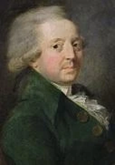

For much of his career, he focused on subjects far removed from economics, and rightly so, since his talents brought great advances to the sciences he dedicated himself to. But around 1770, he felt drawn to economic questions, perhaps because other philosophers like Voltaire and Diderot didn't bother to address them, and also because he had become friends with Turgot.

Condorcet began to align himself with ideas of laissez-faire and freedom, initially in fields unrelated to political economy. In his Letter from a Theologian, he philosophically critiqued the Catholic religion and expressed his hopes for true freedom of belief and unbelief. In his campaign for tolerance and against religious fanaticism, Condorcet fought for the rehabilitation of the Chevalier de la Barre and the retrial of D'Etallonde, who had been sentenced to death for breaking a crucifix.

So, Condorcet was prepared to defend liberty when his friend Turgot took office as Controller-General of Finances.

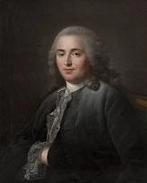

From then on, Condorcet's career took a new turn as he entered economic debates, tirelessly supporting the liberal reforms of the new minister. A proponent of competition and free trade, Condorcet also called for the abolition of forced labor (corvées), guild restrictions (corporations), and for a fairer distribution of taxes. He voiced these convictions publicly whenever he could. His enthusiasm shows in his writings, including the line: "Allow me to speak again about the freedom of trade, I enjoy engaging with this topic."

Between 1774 and 1776, the duration of Turgot's ministry, Condorcet's interventions, firmly rooted in laissez-faire principles, were numerous. These include Letters from a Farmer in Picardy to Mr. Necker, written to defend free trade; Monopolies and Monopolizers, advocating for free competition; Reflections on Forced Labor calling for its abolition; and Reflections on the Grain Trade, which renews the anthem for free trade and critiques Necker's book on the same topic point by point.

In his Letters on the Grain Trade, Condorcet makes several key points.

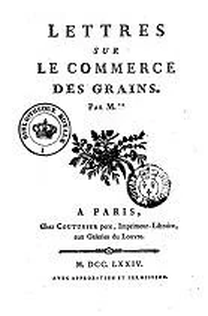

First, the high grain prices at the time were not the result of free trade, but rather of poor harvests, and Condorcet demonstrates this clearly. He then explains why laissez-faire is not only appropriate but the only suitable policy, despite popular prejudice. He notes, "We are so used to seeing the government intervene in the grain trade that doing nothing seems like something extraordinary and new." Later, he adds, "Almost everyone, especially those holding public office, believe that nothing happens on its own and that everything is lost if the government doesn't intervene in everything." Condorcet thus revives the arguments of the Physiocrats and Turgot, showing the superiority of free trade over all forms of interventionism.

Promoting Turgot's liberal economic agenda was a courageous act, as Condorcet knew he would quickly face censorship. Indeed, this happened and his pamphlet on the abolition of forced labor was destroyed and banned in 1776.

Turgot, appreciating Condorcet's loyal defense of his ideas, appointed him Inspector of Coinage. Condorcet resigned as soon as his friend left the ministry.

Although Condorcet devoted his energy to supporting Turgot, he had no illusions about the outcome of his friend's ministry. Toward the end of his life, Turgot lamented, writing in a letter that he regretted "not having been able to do a good for my nation and for humanity that I believed very easy." Condorcet, more pragmatic, warned him of the powerful enemies he would face: the king's favorites, the parliaments, the clergy, the nobility, the guilds, people expecting flattery, not reform. Condorcet once told Turgot, "You are by no means a charlatan, and that's a flaw, considering the climate in Paris." He was right: in 1776, barely two years after his appointment, Turgot was already out of office.

## Liberal common sense under the Revolution

<chapterId>95e9a90d-e37a-58ff-b1ac-928b42e76ecf</chapterId>

Dupont de Nemours was the youngest disciple of François Quesnay, who once said of him: "We must take care of this young man, for he will speak when we are dead." When the French Revolution began, nearly all the great Physiocrats, including the Marquis de Mirabeau, were already gone, Mirabeau himself had passed away on July 13, 1789.

Dupont de Nemours wrote the grievance petition (cahier de doléance) for the district of Nemours.

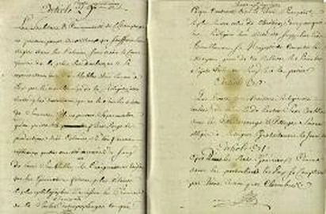

This fascinating document contained all the complaints from liberal economists against trade restrictions, monopolies, and infringements on property rights. Dupont de Nemours was also elected to the National Assembly.

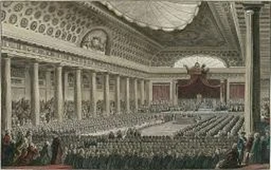

During the Revolution, he became the voice of liberal common sense, standing firm against the growing tide of populism and interventionist demagoguery, which ultimately prevailed.

As early as November 1789, when there was talk of granting a monopoly to the Caisse d'Escompte (which could turn it into a public bank, Bank of France), Dupont de Nemours spoke out in defense of competition.

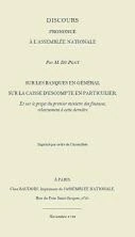

He argued that it would be better to leave banking activities to the laws of free commerce. He added:

> "I do not understand what the minister meant when he spoke of granting a privilege to the Caisse d'Escompte. If this privilege includes exclusivity, you must reject it: you have come here to destroy exclusive privileges, not to create new ones."

Despite his warnings, the Assembly ignored his objections and took another step toward establishing a central bank and a banking monopoly.

In 1790, at the Constituent Assembly, Dupont de Nemours followed the pacifist tradition of his Physiocrat friends and proposed a law forbidding offensive wars. The first article read: "The French Nation shall not permit itself to engage in any offensive war to seize the territory of others or to infringe upon the rights or liberty of any Nation." 

This proposal was rejected.

That same year, debates began about issuing new paper money to cover government expenses.

Dupont de Nemours firmly opposed this and published a pamphlet titled Effects of Assignats on the Price of Bread. The title was accurate, as he explained that issuing assignats would inevitably lead to inflation, an increase in the prices of goods, especially bread.

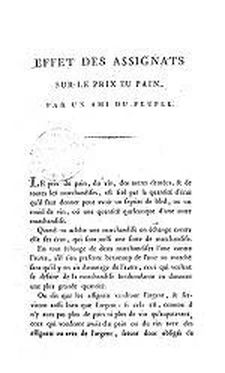

He signed the pamphlet as "a friend of the people." The piece caused quite a stir, and at the Assembly, there was much curiosity about its author. Dupont de Nemours then stood up and admitted it was his work, saying he was not ashamed to use the title "friend of the people" because fighting against the assignats was truly serving the people.

Once again, his advice was ignored, and the assignats were issued.

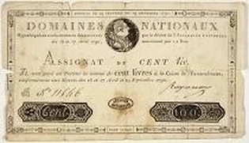

We all know the disaster that followed, the economic ruin and suffering endured by the people, many of whom lost everything when the assignats became worthless and had to be burned.

A few years later, the Assembly turned to the idea of creating a real Bank of France, with an exclusive monopoly on producing currency.

Dupont de Nemours, still firmly opposed to the idea of a public bank, seeing it as nothing more than a monopoly, reminded the Assembly of the assignats' disastrous experience. He spoke to them saying:

> "Do not prepare yourselves for regrets like those that tormented my colleagues in the Constituent Assembly. At the time, my proposal to limit assignats only to the payment for national assets and not to make them a circulating currency was rejected. Today, people say: 'Ah, if only we had listened to Dupont de Nemours!'"

But once again, no one listened to him.

## Conclusion: Passing the Torch

<chapterId>ada8082f-db96-5e52-954f-719b47998153</chapterId>

French economic thought in the 18th century is often overshadowed by the more famous economists of the 19th century. Yet when it comes to the defense of liberty, it's in the 18th century that everything truly begins. This is the century in which the principle of laissez-faire, so revolutionary in its time, was first clearly expressed by a number of thinkers, from Boisguilbert to Dupont de Nemours.

Certainly, figures like Jean-Baptiste Say, Frédéric Bastiat, Gustave de Molinari, and Yves Guyot left a lasting mark on the history of French economic thought. But if we study them in isolation, we miss something essential. These 19th-century thinkers didn't emerge from nowhere, they inherited and built upon the foundations laid by their 18th-century predecessors during the Enlightenment.

Boisguilbert warned that well-meaning reformers who try to fix everything by involving the government actually end up causing economic chaos. The best approach, he argued, is to trust in the natural order and let things be.

Cantillon insisted that money should never be manipulated for political aims. Letting the state control currency as it wishes only paves the way for massive financial and economic instability.

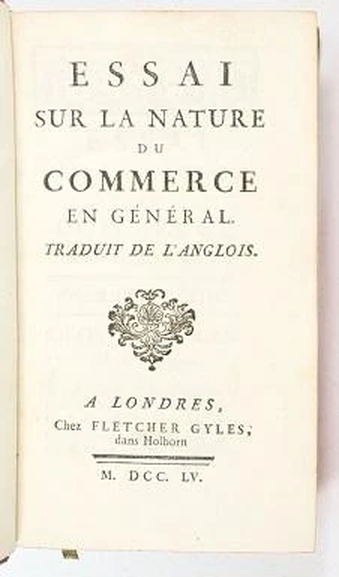

Vincent de Gournay believed that excessive regulation of labor discourages workers and craftsmen, leading to laziness and inaction. True economic progress and national prosperity, he said, come from free competition.

The Marquis d'Argenson made the case that no government can predict or manage everything. Therefore, it's wiser to rely on individuals pursuing their own self-interest.

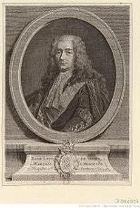

Quesnay and the Physiocrats argued that private property is the foundation of human society. Without it, people lose the motivation to work and improve their lives, because they can't keep the fruits of their labor or build anything over time.

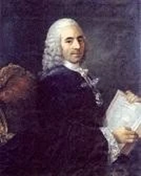

Condillac taught that voluntary exchange always benefits both sides. For that reason, trade should always be free. The only legitimate role of the state, in his view, is to protect individual liberty and private property.

All these ideas were picked up and further developed by the economists of the 19th century. Some, like Jean-Baptiste Say, gave these concepts scientific rigor in works such as his Treatise on Political Economy. Others, like Frédéric Bastiat, turned to storytelling, using fables, essays, and clever anecdotes to make these fundamental ideas accessible to the public.

## Biography

<chapterId>17cf2865-e53c-5f3b-a5c2-a43560efaf01</chapterId>

SELECTIVE BIBLIOGRAPHY

Here you'll find a selection of over thirty writings:

1.	Pierre Clément, Histoire de Colbert et de son administration, Paris, 1874 Eli Heckscher, Mercantilism, 2 vols. London: Allen and Unwin. 1935

2. Vauban, Projet d'une dîme royale, 1707; reprint Institut Coppet, 2014; Anne Blanchard, Vauban, Fayard, 1996

3.	Boisguilbert, Détail de la France, 1695; republished by Institut Coppet, 2014

4. Félix Cadet, Pierre de Boisguilbert: precursor of the economists, Institut Coppet, 2014

5. Pierre de Boisguilbert ou la naissance de l'économie politique, Paris, INED, 1966

6. Richard Cantillon, Essai sur la nature du commerce en général, 1755; reprinted by Institut Coppet, 2015

7. Antoin Murphy, Richard Cantillon, banker and economist, Oxford, 1986

8. Gustave de Molinari, L'abbé de Saint-Pierre, Paris, 1859

9. Abbé de Saint-Pierre, Abrégé du projet de paix perpétuelle, Rotterdam, 1729

10. Abbé de Saint-Pierre, "Projet pour perfectionner le commerce de la France", in Les rêves d'un homme de bien, Paris, 1775, p.199

11. André Alem, Le marquis d'Argenson et l'économie politique au début du XVIIIe siècle, Institut Coppet, 2015

12. Journal et mémoires du marquis d'Argenson, Rathery edition, 9 vols, Paris, 1859-1867

13. Benoît Malbranque, Vincent de Gournay: the political economy of laissez-faire, Institut Coppet, 2016

14. Vincent de Gournay, Remarques sur la traduction de Josiah Child, L'Harmattan, 2008

15. Christine Théré & Loïc Charles (eds.), Le cercle de Gournay, INED, 2005

16. Antoin Murphy, "Le développement des idées économiques en France (1750-1756)", Revue d'histoire moderne et contemporaine, tome XXXIII, October-December 1986

17. Henri Ripert, Le marquis de Mirabeau: ses théories politiques et économiques, Paris, 1901

18. Lucien Brocard, Les doctrines économiques et sociales du marquis de Mirabeau in L'Ami des Hommes, Paris, 1902

19. Humbert de Montlaur, Mirabeau, l'Ami des Hommes, Perrin, 1992

20. Yves Guyot, François Quesnay et la Physiocratie, Institut Coppet, 2014

21. François Quesnay, Œuvres économiques complètes et autres textes, 2 vols, INED, 2005

22. Georges Weulersse, Le mouvement physiocratique en France (de 1756 à 1770), 2 vols, Paris, 1910

23. Georges Weulersse, La Physiocratie à la fin du règne de Louis XV (1770-1774), P.U.F., 1959

24. Georges Weulersse, La Physiocratie sous les ministères de Turgot et de Necker (1774-1781), P.U.F., 1950

25. Georges Weulersse, La physiocratie à l'aube de la révolution (1781-1792), EHESS, 1985

26. P. Jolly, Du Pont de Nemours, soldat de la liberté, Paris, P.U.F., 1956

27. Voltaire's economic writings, Institut Coppet, 2013

28. Gustave Schelle (ed.), Œuvres de Turgot et documents le concernant, Paris, 1913-1924

29. Benoît Malbranque, Le libéralisme à l'essai : Turgot intendant du Limousin (1761-1774), Institut Coppet, 2015

30. Pierre Foncin, Essai sur le ministère de Turgot, Paris, 1877

31. Auguste Lebeau, Condillac économiste, Paris, 1903

32. Condillac, Le commerce et le gouvernement considérés relativement l'un avec l'autre, 1776

33. Condorcet, Mélanges d'économie politique, in Eugène Daire (ed.), Mélanges d'économie politique, Paris, 1847

34. P. Jolly, Du Pont de Nemours, soldat de la liberté, Paris, P.U.F., 1956

# Final section

<partId>385bffab-aea1-5bcd-9569-62b3f30665b7</partId>

## Reviews & Ratings

<chapterId>a1e689d9-abd0-5dcb-ba56-a8d355d0a84f</chapterId>

<isCourseReview>true</isCourseReview>

## Final examination

<chapterId>bdb7fd98-33e7-11f0-9fe6-b785c859ffc5</chapterId>

<isCourseExam>true</isCourseExam>

## Conclusion

<chapterId>3b366ff6-03c8-5f6a-b4c0-ba8186e65d7e</chapterId>

<isCourseConclusion>true</isCourseConclusion>
