# Un voyage à travers l'histoire de la monnaie

Ce cours captivant vous invite à  explorer l'évolution fascinante de la monnaie, depuis les premières civilisations jusqu'à notre système monétaire actuel. Nous traverserons les époques, du Néolithique aux temps modernes, afin de comprendre comment la monnaie a façonné et été façonnée par les grandes civilisations humaines. Des proto-monnaies mésopotamiennes aux cryptomonnaies, en passant par les pièces lydiennes, le florin de la Renaissance et l'avènement des banques centrales, ce cours propose une vue d'ensemble complète sur l'un des piliers fondamentaux de nos sociétés.

+++
# Introduction 
<partId>59878a67-8a1d-5d6b-af41-5b847c14363c</partId>

## Introduction à l'histoire de la monnaie
<chapterId>ca53597e-be9a-5261-a55f-11fac8504a68</chapterId>
:::video id=08ff35ca-8a40-4286-abaf-71283faf6e78:::

Bienvenue dans ce cours consacré à l'histoire de la monnaie. Évidemment, comme son titre l'indique, nous allons explorer ensemble l'évolution des différentes formes de monnaies, depuis le Néolithique jusqu'à nos jours, en traversant  les grands empires et civilisations.

Toutefois, ce cours ne se limite pas à une simple chronologie de dates ou d'événements historiques. Notre objectif principal est de comprendre en profondeur les concepts fondamentaux  à l'origine de  l'émergence de la monnaie ou plutôt des monnaies.

### Les concepts fondamentaux à explorer

Nous aborderons l'émergence :  des monnaies, des systèmes monétaires, des banques, de la monnaie papier, des banques centrales, et enfin du système monétaire actuel dit "fiat".

Nous commencerons  avec les proto-monnaies, en évoquant la monnaie-dette et les unités de compte en Mésopotamie, ainsi que d'autres formes comme la dot ou le prix du sang dans les sociétés primitives. Nous verrons également que de véritables systèmes monétaires existaient déjà dans l'Égypte antique, bien avant le Moyen Empire.

Nous poursuivrons ensuite avec l'apparition des premières pièces de monnaie en Lydie, moment-clé souvent considéré comme le début véritable de la monnaie par les manuels d'économie. Nous examinerons leur diffusion grâce aux Perses, à Alexandre le Grand, puis à Rome, jusqu'à leur domination... et leur effondrement.

À partir de là, forts de tout ce que nous aurons vu, nous prendrons le temps de réfléchir ensemble à la définition même de la monnaie, au-delà des idées toutes faites comme “la monnaie est toujours une dette” ou “la monnaie est toujours une marchandise”. En réalité, la monnaie est à la fois un bien et une convention sociale. Nous discuterons aussi du concept de prime monétaire et tenterons d’unifier les différentes théories sur son apparition.

### Périodes clés et innovations monétaires

Nous aborderons ensuite une période plus instable mais riche en innovations,comme le penny anglais utilisé pour  soudoyer les envahisseurs danois, ou la livre de Charlemagne, dont le souvenir persiste encore aujourd'hui dans plusieurs monnaies modernes.

Nous verrons comment les croisades ont vu apparaître les premiers systèmes de transfert d'argent à distance. Puis nous observerons l'impact du Florin, la monnaie emblématique de la Renaissance, ainsi que l'arrivée massive de métaux précieux en provenance des Amériques,qui a bouleversé les prix en Europe.

Nous étudierons la naissance de la monnaie papier et des banques centrales, ainsi que leur lien direct avec l’histoire des crises financières.

Enfin, nous conclurons en comparant ces périodes avec notre système monétaire contemporain, en examinant ses conséquences, et en retraçant l’évolution de la finance jusqu’à l’État-providence actuel.

En bonus, nous explorerons également de nombreux liens étymologiques liés à la monnaie, encore présents dans nos langues modernes.

### Structure du cours

Ce cours est organisé en trois grandes parties.

La première partie se consacre à l'émergence de la monnaie, la deuxième partie se consacre à la renaissance de la monnaie, puis sa chute et la troisième à l’appropriation progressive de la monnaie par l’État jusqu’au système fiat actuel

Merci et bon visionnage !

# L’émergence des échanges
<partId>da5e4981-9ea5-5208-beab-3b75c9043632</partId>

## De l'Australopithèque à l'Homme moderne
<chapterId>34a773aa-f2d3-5c26-8be4-f2cd79ed6fbc</chapterId>
:::video id=4f333013-4b2a-42ab-8761-593fafc971ca:::

### Pourquoi commencer au Néolithique

Pourquoi remonter jusqu'au Néolithique pour parler de monnaie ? 

La réponse est simple : on ne peut pas comprendre l’émergence de la monnaie sans comprendre l’émergence des civilisations.

Une tribu sans division du travail, sans spécialisation, où chacun produit ce dont il a besoin, n’a pas besoin de monnaie. De même, une communauté agricole de subsistance, où chacun cultive pour lui-même, ne ressent pas la nécessité d’un intermédiaire d’échange.

### La sédentarisation et ses conséquences

C’est pourquoi il est essentiel de commencer au Néolithique. Nous verrons comment la sédentarisation a permis la création de villages,puis de cités,puis de grandes civilisations.

La production d’excédents alimentaires a rendu possible la spécialisation du travail, ce qui a créé les conditions nécessaires à l’apparition des premiers concepts monétaires.

Comme les interactions humaines donnent naissance au langage, la monnaie apparaît naturellement  ou non (comme chez les Incas ou les Spartiates)  en fonction de l’organisation sociale et économique de chaque société.

### Chronologie de l'évolution humaine

Mais avant cela, prenons un contexte historique encore plus large.

Comme dans toute première présentation, je vais faire exactement le contraire de ce que j’ai annoncé dans l’introduction du cours : je vais vous présenter une liste de dates et d’événements historiques qui s’enchaînent. L’objectif est de replacer l’émergence de la monnaie dans son contexte, en la comparant à d’autres avancées humaines comme la cuisson des aliments, l’invention de la roue, la domestication des céréales et des animaux, la construction des pyramides ou la fondation des premières cités.

Observons donc ensemble l’évolution de l’humanité depuis la préhistoire : un survol qui nous mène de l’Australopithèque à l’Homme moderne, en suivant les avancées technologiques et les migrations humaines jusqu’au Néolithique.

### Cadre historique de l'humain

-Il y a 3 millions d’années , apparition d’Australopithecus.
-Il y a 2 millions d’années , les homininés commencent à quitter l’Afrique.
-Il y a 1,6 million d’années , les homininés atteignent le sud de l’Europe et l’Asie.
-Il y a 1 million d’années , premières preuves de cuisson domestiquée au feu (os et restes végétaux carbonisés dans la grotte de Wonderwerk, Afrique du Sud).
-Vers 400 000 ans av. J.-C. , les Néandertaliens vivent en Europe et en Asie.
-Vers 300 000 ans av. J.-C. , apparition d’Homo sapiens.
-Il y a 80 000 ans , Homo sapiens commence à migrer vers toutes les régions du monde.
-Il y a 73 000 ans , Grottes de Blombos (Afrique du Sud), premières formes d’art connues.
-Il y a 50 000 ans , Homo sapiens arrive en Europe.
-Il y a 30 000 ans , peintures rupestres de la grotte Chauvet (France).
-Il y a 15 000 ans , peintures de Lascaux (France) et art rupestre australien.
-Vers 9000 av. J.-C. , domestication de l’orge dans le Croissant fertile.
-Vers 9000 av. J.-C. , culture du maïs au Mexique.
-Vers 8000 av. J.-C. , domestication des chèvres et moutons dans le Croissant fertile.
-Vers 7250 av. J.-C. , Ain Ghazal (Jordanie) devient un village de plusieurs centaines d’habitants.
-Vers 7000 av. J.-C. , Çatalhöyük (Turquie) compte jusqu’à 8 000 habitants.
-Vers 6500 av. J.-C. , apparition de la vie sédentaire en Grèce.
-Il y a 6000 ans , début de l’irrigation en Égypte et en Mésopotamie.
-Vers 5000 av. J.-C. , développement de l’agriculture des “trois sœurs” (maïs, courges, haricots).
-Vers 4000 av. J.-C. , domestication du chameau en Asie centrale.
(Les camélidés sont originaires d’Amérique du Nord durant l’Éocène, il y a 45 millions d’années. Une partie migra vers l’Asie via le détroit de Béring, une autre vers l’Amérique du Sud donnant les lamas, alpagas et vigognes.)

-Vers 3500–3000 av. J.-C. , le peuple Botai commence à domestiquer le cheval.
-Début de l’âge du Bronze , les Sumériens inventent la roue, le voilier, et développent l’arithmétique, l’astronomie et les premières formes d’écriture.
-Vers 2800 av. J.-C. , Uruk atteint jusqu’à 80 000 habitants à son apogée.
-2600–2200 av. J.-C. , premiers développements urbains en Grèce ; expansion du blé, de la vigne et de l’olivier.
-2560 av. J.-C. , construction de la grande pyramide de Gizeh.
-Vers 1500 av. J.-C. , civilisation minoenne.
-Vers 1300 av. J.-C. , civilisation mycénienne.
-Vers 1250–1150 av. J.-C. , éffondrement des civilisations de l’âge du Bronze.
-1er siècle de notre ère , les Berbères d’Afrique du Nord domestiquent le chameau.

Ce survol historique nous permet de replacer l’apparition de l’écriture et de la monnaie dans une perspective plus large, en l’intégrant à l’évolution des technologies, des cultures et des sociétés humaines.

## Des chasseurs-cueilleurs aux agriculteurs : L'aube de la civilisation
<chapterId>ea950b6e-9eb7-553d-8f04-0eb042bb1f5a</chapterId>
:::video id=4b49a376-f6f4-42a0-86fa-264997a079f0:::

### La transition vers l'agriculture et la sédentarisation

Dans ce chapitre, nous allons aborder la transition de la chasse et de la cueillette vers l’agriculture de subsistance, l’artisanat et les premiers échanges. Il me semblait important d’expliquer ce passage vers la sédentarité et l’agriculture pour comprendre comment les premières cités se sont formées, menant par la suite à l’émergence de systèmes monétaires durant l’Antiquité.

Cette section est un extrait d’un cours disponible sur le site << The Great Courses >>, intitulé Ancient Mesopotamia, << Life in the Cradle of Civilization >>, présenté par le professeur Amanda Podany de la California State Polytechnic University de Pomona.

### Les paradoxes de l'adoption de l'agriculture

L’agriculture primitive apparaît il y a environ 10 500 ans au Proche-Orient, dans la région située entre le nord-ouest de la Syrie et le sud de la Turquie. Aujourd’hui, les groupes de chasseurs-cueilleurs modernes ne sont pas pressés d’adopter l’agriculture, et il en était probablement de même durant le Néolithique.

Les premiers villages ont été construits avant la domestication des plantes et des animaux. Les populations ne se sont donc pas installées parce que l’agriculture leur en donnait la possibilité ; elles se sont d’abord sédentarisées, puis seulement 3 000 ans plus tard, elles ont commencé à cultiver.

La chasse et la cueillette fonctionnaient très bien. Les communautés n’avaient donc pas besoin de planter des graines pour assurer leur nourriture. Aujourd’hui encore, les chasseurs-cueilleurs disposent de beaucoup plus de temps libre que les premiers agriculteurs, qui utilisaient des techniques très rudimentaires.

En résumé, ce que l’on observe chez les peuples chasseurs-cueilleurs modernes, c’est qu’ils ont plus de temps libre que les premiers agriculteurs du Néolithique, dont les technologies étaient encore très simples. Les premiers cultivateurs travaillaient davantage pour produire leur nourriture que les tribus actuelles vivant de la chasse et de la cueillette.

Les études sur les ossements montrent aussi que les premiers agriculteurs étaient plus petits et moins robustes que les chasseurs-cueilleurs précédents. Leur régime alimentaire était plus limité : ils consommaient plus de pain, mais moins de viande. Leurs dents étaient aussi en plus mauvais état, en partie à cause des éclats de pierre provenant des meules utilisées pour fabriquer la farine.

D’ailleurs, ceux qui suivent un régime “keto” seraient probablement d’accord : manger beaucoup de pain est moins nourrissant que manger de la viande.

## Les théories sur l’adoption de l’agriculture

Avec tous ces désavantages, qui aurait choisi de devenir agriculteur à l’époque ?
Certaines théories populaires suggèrent que les humains ont été contraints d’adopter l’agriculture plutôt que de l’avoir choisie.

Même avec les céréales sauvages, un problème majeur existait : on ne pouvait pas transporter de grandes quantités de grains facilement. Il fallait les stocker. Une fois les grains entreposés, il devenait logique de rester à proximité. Ce stockage des céréales sauvages, même avant leur domestication, aurait favorisé les premières formes de sédentarisation.

C’est peut-être cette difficulté de transport et ce besoin de stockage qui ont poussé certaines populations à rester au même endroit, surtout si ce lieu offrait de la nourriture toute l’année. Dans ce cas, suivre les troupeaux ou voyager constamment devenait inutile.

Dans la culture natoufienne, jusqu’à une centaine d’individus vivaient ensemble dans des villages composés de maisons rondes. Une théorie répandue propose que l’agriculture ait été stimulée par un changement climatique. Il y a environ 11 000 ans, le climat du Proche-Orient est devenu plus froid et plus sec. Les plantes et les animaux autrefois abondants sont devenus plus rares. Les communautés auraient alors commencé à cultiver les plantes dont elles dépendaient, ou à garder et élever certains animaux comme les moutons, les chèvres ou les bovins. Ce processus fut progressif, sans moment précis où toute la population serait devenue complètement agricole.

Une autre théorie suggère que les villages eux-mêmes auraient créé les conditions menant à l’agriculture. La chasse et la cueillette intensives auraient perturbé l’environnement. Selon cette hypothèse, les Natoufiens auraient eu un tel succès démographique qu’ils seraient devenus trop nombreux pour les ressources locales. Les marécages et les zones riches en plantes sauvages ne parvenaient peut-être plus à nourrir tout le monde. Les habitants auraient alors commencé à cultiver directement sur place pour garantir un approvisionnement régulier.

## Les échanges au néolithique
<chapterId>8e495224-6d55-58f6-a9dc-ac2814281cfa</chapterId>
:::video id=d04245af-e416-48b1-8157-d569207a32c4:::

### La transition paléolithique-néolithique 

Le Néolithique marque une rupture profonde dans l’histoire humaine. Au Paléolithique, les populations européennes étaient très dispersées, seulement 7 000 personnes vivaient sur tout le continent il y a 20 000 ans. Elles étaient organisées en petits groupes nomades de 20 à 50 individus qui suivaient les grands troupeaux migrateurs.

Le réchauffement qui met fin à l’ère glaciaire transforme complètement cette organisation. Les forêts remplacent les grands troupeaux migrateurs, donnant naissance à une faune plus sédentaire. Les groupes humains peuvent alors se fixer davantage. Cette transformation s’accompagne d’un boom démographique spectaculaire : d’environ 10 000 à 50 000 personnes à la fin du Paléolithique, la population européenne passe à 1 à 5 millions d’habitants au Néolithique moyen et final.

### L'invention du travail et de la propriété

Cette sédentarisation progressive entraîne de nouvelles structures sociales.
L’agriculture fait naître une forme moderne du travail, s’occuper d’un territoire, protéger ses récoltes, stocker les ressources et planifier pour l’avenir.

La poterie illustre parfaitement cette évolution, conçue pour stocker céréales et graines, elle montre la capacité nouvelle à anticiper ses besoins. Certains chercheurs considèrent même que le Néolithique serait impossible sans ces systèmes de stockage.

"La propriété privée devient centrale". Même si certains objets personnels existaient déjà au Paléolithique (comme les armes de chasse), la propriété foncière la possession d’un territoire apparaît au Néolithique et prend une importance majeure. Cette appropriation entraîne les premiers conflits documentés, et la nécessité de protéger les terres, ce qui conduit à la création de fonctions dédiées à la sécurité.

### La spécialisation et la division du travail

L’agriculture permet de nourrir plus de monde tout en libérant certains individus pour d’autres activités. C’est le début de la spécialisation : agriculteurs, potiers, artisans, gardiens…
Ces rôles diversifient les sociétés et créent les premières formes de hiérarchies.

Les vestiges archéologiques le montrent clairement :
-les sépultures passent de collectives à individuelles,
-certaines tombes contiennent plus d’objets que d’autres,
-les habitations révèlent des différences de statut.

Peu à peu, apparaissent les notions de richesse, de prestige et de statut social.

### L'émergence des échanges à distance

L’analyse archéologique révèle des réseaux d’échange étonnamment étendus pour l’époque. Des matériaux comme l’obsidienne, les roches vertes (dolérite, jadéite), les coquillages ou le bitume se retrouvent à des centaines de kilomètres de leurs zones d’extraction. Les haches polies en roche verte, essentielles pour la déforestation et l’aménagement des premiers villages, circulent ainsi dans toute l’Europe néolithique.

Ces échanges portent autant sur les matières premières que sur les objets finis, révélant une véritable spécialisation artisanale. La valeur attribuée à ces biens dépendait à la fois de la rareté du matériau et de la compétence technique nécessaire à sa transformation.

L’organisation des échanges varie selon l’échelle considérée. À l’intérieur des communautés, les anthropologues privilégient l’hypothèse d’une économie du don et du contre-don, avec des systèmes de crédit informel basés sur la confiance interpersonnelle. Dans ces groupes restreints, le « nombre de Dunbar » (environ 150 personnes, limite au-delà de laquelle il devient difficile de maintenir des relations de confiance directe) permettait des échanges différés sans mécanisme marchand.

On distingue ainsi plusieurs formes de troc :
- Le troc direct : échange immédiat bien contre bien
- Le troc élargi : échange bien contre service ou promesse
- Le troc différé : dette interpersonnelle avec remboursement ultérieur

Entre communautés différentes, l’absence de liens de confiance personnelle favorisait l’émergence d’échanges plus formalisés. Certains biens commencèrent à acquérir un statut particulier, car ils étaient demandés par plusieurs groupes. Ils devinrent ainsi des biens d’échange privilégiés, préfigurant les premières formes de proto-monnaie.

L’école autrichienne d’économie interprète cette évolution comme l’apparition spontanée de biens servant d’intermédiaires d’échange. Les coquillages, attestés archéologiquement dès le Mésolithique, illustrent bien ce phénomène : retrouvés loin de leur origine géographique (coquillages méditerranéens en France de l’Ouest, coquillages nordiques plus au Sud), ils témoignent d’une reconnaissance commune de leur valeur d’échange.

Ces biens se distinguent par leur acceptabilité universelle, une qualité essentielle qui préfigure la fonction monétaire. Sans atteindre la standardisation des monnaies historiques, ils représentent les premiers jalons vers des systèmes d’échange dépersonnalisés, nécessaires au développement de sociétés complexes dépassant le cadre tribal.

Le Néolithique pose ainsi les bases de l’économie moderne : spécialisation du travail, propriété privée, accumulation de richesses, hiérarchisation sociale et émergence de systèmes d’échange sophistiqués, transcendant les liens de parenté et de voisinage direct.

## La formation des premières cités et l'émergence de l'écriture
<chapterId>d6b799c2-8bf1-11f0-9c54-1b9f4f4c7011</chapterId>

:::video id=3ca18105-9856-4ceb-925c-c9e9215af21b:::

### L'irrigation et la naissance des grandes cités

Dans ce chapitre, nous allons expliquer comment se sont formées les premières grandes cités de l’histoire, et examiner les raisons ayant conduit à l’émergence de l’écriture en Mésopotamie.

Il y a environ 6000 ans, dans les vallées fertiles d’Égypte et de Mésopotamie, les communautés humaines commencèrent à maîtriser les fleuves grâce à l’irrigation. Cette gestion de l’eau permit des récoltes abondantes, favorisant l’essor de grandes villes comme la célèbre cité d’Uruk, située dans le sud de l’actuel Irak.

Vers 3500 av. J.-C., Uruk devint la plus grande ville du monde. À son apogée, vers 2800
av. J.-C., elle pouvait compter jusqu’à 80 000 habitants. À cette époque, deux innovations majeures transformèrent durablement la civilisation sumérienne : l’apparition d’un gouvernement structuré capable d’administrer un État, et l’invention révolutionnaire de l’écriture.

### L'invention de l'écriture cunéiforme

L’écriture naquit vers 3000 av. J.-C., principalement pour répondre à des besoins économiques. Avec l’augmentation des échanges et la complexité croissante de la société, les administrateurs des temples et des palais eurent besoin d’un outil fiable pour consigner précisément les transactions : livraisons de matériaux, transferts internes, stocks et inventaires.

Le système mis au point fut appelé cunéiforme, du latin cuneus (« coin »), en référence à la forme du stylet utilisé pour imprimer les signes dans l’argile humide.

Les scribes utilisaient un stylet en roseau pour tracer ces signes sur des tablettes d’argile fraîche.

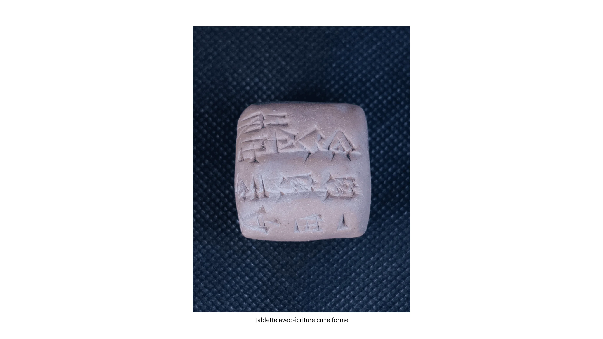  

Voici une véritable tablette sumérienne comportant une inscription cunéiforme. On y observe également des sceaux cylindriques roulés sur l’argile pour servir de signature.

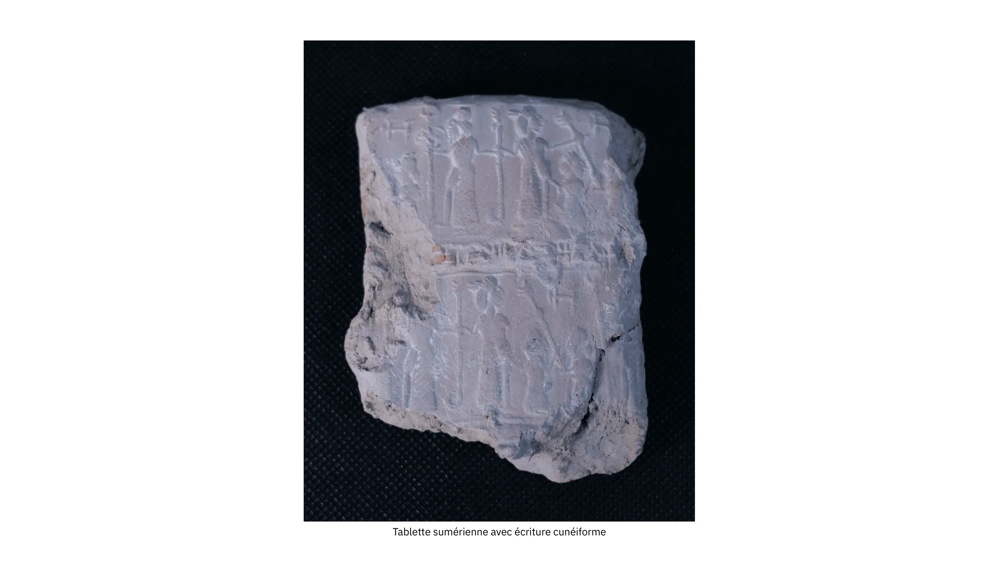  

Ces sceaux  appelés cylinder seals  étaient gravés puis roulés sur la tablette pour authentifier un document, car seuls les scribes savaient écrire.

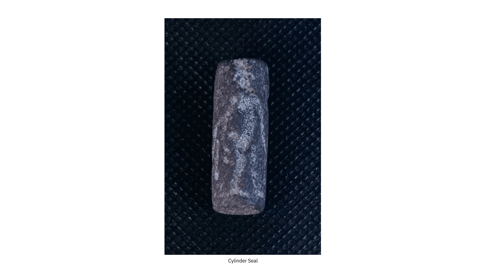  

Le cunéiforme n’était pas une langue, mais un système d’écriture permettant de transcrire différentes langues parlées. En d’autres termes, le cunéiforme est une écriture, et non une langue.

### L'évolution et les usages de l'écriture

Durant les premiers siècles, cette écriture servait surtout de système mnémotechnique pour enregistrer des quantités et des listes de biens. Ce n’est que progressivement qu’elle devint capable de représenter des sons, des noms propres et des phrases complètes.

À l’origine, les signes représentaient directement des objets de la vie courante (un bœuf, du blé, etc.). Puis, avec le temps, ces dessins furent simplifiés, stylisés, puis inclinés, probablement en raison de la manière dont les scribes tenaient les tablettes.

Avec l’évolution du système, les scribes commencèrent à combiner des signes pour écrire des noms. Par exemple, pour écrire « Laura », ils auraient utilisé un signe évoquant le son « lo » et un autre correspondant à « ra ».

L’écriture cunéiforme, utilisée durant près de 3000 ans, servit principalement à la gestion économique et administrative. Mais très vite, les Mésopotamiens voulurent aussi consigner leurs récits, légendes et chants, qui jusque-là étaient transmis oralement.

On peut citer l’exemple de l’Épopée de Gilgamesh, probablement inspirée d’un roi historique d’Uruk ayant régné vers 2900–2350 av. J.-C.

Cette écriture, à la fois outil administratif et vecteur culturel, perdura jusqu’au 1er siècle de notre ère, avant de disparaître.

## Le rôles des tablettes sumériennes
<chapterId>a396e6c5-56cc-5410-9e6b-0274401c5425</chapterId>
:::video id=a0729a35-01ec-4aa4-828f-d4ccc2eb168e:::

### Les systèmes de crédit pré-monétaires

En Mésopotamie ancienne, l’économie reposait sur des mécanismes très sophistiqués, bien avant l’apparition des pièces de monnaie métalliques. Les systèmes de crédit, formels ou informels, constituaient une véritable monnaie fonctionnelle, permettant de réaliser des transactions complexes.

C’est justement pour répondre à ces besoins administratifs que l’écriture cunéiforme fut inventée. Les tablettes servaient principalement à consigner des contrats : prêts privés, ventes, locations, hypothèques et même accords de mariage. L’intervention d’un scribe était coûteuse, mais indispensable dès qu’un enjeu financier était impliqué.

Certaines tablettes pouvaient même circuler comme titres au porteur. On a également retrouvé des billes d’argile contenant de petites pierres, avec un nombre inscrit à l’extérieur et une signature sertie dans l’argile. Le contenu interne servait à vérifier la validité du titre en cas de doute.

Une tablette retrouvée au sud-ouest de l’actuelle Bagdad stipule qu’un débiteur doit rembourser 330 mesures de céréales au moment de la récolte. Une autre mentionne clairement qu’une dette de quatre mesures d’orge doit être payée au porteur de la tablette, introduisant une forme primitive mais remarquable de paiement au porteur.

À partir de 2000 av. J.-C., une loi obligea à formaliser par écrit toutes les transactions, même les plus modestes, et ce, en présence de témoins. Cette bureaucratie impressionnante visait à éviter les litiges futurs.

Dans la sphère privée, certaines familles géraient des activités économiques suffisamment importantes pour constituer de vastes archives. À Sippar-Amnanu, la maison d’un prêtre nommé Ur-Utu contenait près de 2000 tablettes : contrats de prêt, ventes, locations, lettres, textes religieux et scolaires.

Les lettres personnelles concernaient presque toujours des affaires économiques : paiements en retard, allocations insuffisantes, dot non versée, ou demandes d’argent urgentes.

Un exemple frappant montre une femme écrivant à son partenaire parti faire du commerce. Elle lui reproche de l’avoir laissée sans argent au moment où une famine sévissait à Assur. Elle demande qu’on lui envoie rapidement l’équivalent de ses textiles « en argent », afin de pouvoir acheter du grain et payer les taxes au temple.

Les documents retrouvés reflètent donc essentiellement des échanges économiques : argent, grains, marchandises, biens immobiliers, taxes. Ils démontrent l’extraordinaire précision administrative de cette civilisation et sa capacité à gérer des échanges complexes durant des millénaires.

## Le contrôle des élites sur les tablettes sumériennes
<chapterId>c6d3df0e-b1e1-58dc-ab35-9f76bbc39393</chapterId>
:::video id=04a95fb8-a701-4a48-9ce8-0e9b6ba256fd:::

### L'écriture, une technologie économique avant tout

Contrairement à une idée répandue, l'invention de l'écriture en Mésopotamie il y a environ 4000 ans ne répondait pas à des besoins de communication personnelle ou littéraire. L'écriture cunéiforme était avant tout une technologie économique,utilisée uniquement lorsque des enjeux financiers importants le justifiaient.Les Sumériens n’y recouraient pas pour échanger des messages ou exprimer des sentiments : son usage était strictement réservé à la documentation des transactions commerciales et financières..

Cette spécialisation s'explique par le coût considérable de la rédaction des tablettes. Graver dans l'argile demandait une expertise technique pointue, un temps considérable et des matériaux spécifiques. Seules les transactions d'une valeur suffisante justifiaient économiquement cet investissement, créant ainsi un seuil naturel d'accès à cette technologie révolutionnaire.

Les tablettes cunéiformes révèlent un système financier d'une complexité remarquable pour l'époque. Les Mésopotamiens avaient développé un arsenal complet d'instruments financiers modernes : prêts privés avec intérêts, actes de vente, contrats de location, hypothèques et même contrats de mariage avec clauses financières. Cette sophistication témoigne d'une économie marchande développée, bien éloignée de l'image simpliste du troc primitif souvent associée à ces civilisations anciennes.

Certaines tablettes fonctionnaient comme de véritables titres au porteur, circulant librement de main en main sans nécessiter l'identification du détenteur original. Cette innovation permettait une fluidité des échanges remarquable, préfigurant les systèmes financiers modernes. Une législation spécifique imposait même la formalisation écrite de toutes les transactions commerciales, institutionnalisant ainsi l'usage de l'écriture dans la sphère économique.

### Le monopole du savoir et le contrôle économique

Un élément fondamental à comprendre est que l’accès à l’écriture  et donc au système de crédit, aux contrats et à la mémoire économique  était strictement limité. Les scribes formaient une élite, souvent rattachée aux temples ou aux palais, et leur maîtrise de l’écriture leur donnait un pouvoir immense sur l’organisation sociale.

Contrairement aux idées reçues, l’écriture n’a pas “libéré” les sociétés : elle a d’abord renforcé la centralisation du pouvoir. Celui qui contrôle l’écriture contrôle
Ce monopole du savoir n'était pas fortuit. Les autorités avaient tout intérêt à maintenir cette exclusivité, car démocratiser l'écriture aurait dilué leur contrôle sur l'économie et multiplié les risques de falsification. La présence systématique de témoins lors des signatures révèle d'ailleurs cette préoccupation constante de l'authenticité des documents.

L'obligation légale de consigner par écrit toutes les transactions commerciales servait plusieurs objectifs stratégiques : contrôle fiscal, suivi comptable rigoureux, et maintien de la dépendance des acteurs économiques envers l'appareil administratif. L'État mésopotamien s'appropriait ainsi la capacité de gérer la dette interpersonnelle à l'échelle sociétale, transformant l'écriture en instrument de pouvoir économique.

### La Coexistence de deux systèmes monétaires

Les tablettes cunéiformes mentionnent régulièrement le shekel d’argent comme unité de valeur, révélant l’existence parallèle d’un système monétaire basé sur des biens physiques standardisés.

Cette dualité s'explique par la stratification sociale de l'époque. Le système des tablettes cunéiformes était réservé à une élite restreinte : clergé, marchands prospères, et administrateurs capables de lire, écrire et interpréter ces documents complexes. Pour utiliser efficacement une tablette au porteur, il fallait non seulement savoir la déchiffrer, mais aussi pouvoir en vérifier l'authenticité et en comprendre les implications juridiques.

La masse de la population, exclue de ce système élitiste, développait ses propres mécanismes d'échange. Les gens ordinaires utilisaient des systèmes plus accessibles : mesures standardisées de grain, poids d'argent, et autres biens facilement quantifiables que chacun pouvait évaluer sans compétences spécialisées.

Cette économie populaire, bien que moins documentée dans les archives officielles, était probablement plus dynamique et flexible que le système des tablettes. Elle permettait des échanges quotidiens rapides sans recours aux scribes, répondant aux besoins immédiats des artisans, agriculteurs et petits commerçants.

Le shekel d’argent servait alors de pont entre les deux systèmes, permettant de convertir dettes écrites et paiements physiques.

### L'émergence spontanée versus le contrôle institutionnel

Cette coexistence illustre un débat fondamental dans l'histoire économique : l'opposition entre émergence spontanée des moyens d'échange et appropriation institutionnelle de la monnaie. D'un côté, les biens-monnaies comme l'argent émergeaient naturellement des besoins d'échange de la population. De l'autre, les institutions s'appropriaient et formalisaient ces pratiques pour en contrôler les flux.

Les temples sumériens utilisaient la légitimité des biens-monnaies traditionnels (comme le shekel d’argent) tout en développant leurs propres instruments de contrôle (titres écrits, législation). Ils captaient ainsi les bénéfices des deux systèmes : efficacité populaire et contrôle administratif.

La Mésopotamie montre que la sophistication financière précède largement les innovations technologiques qu’on associe souvent à la monnaie : intérêt, crédit, titre négociable, hypothèque… tous apparaissent avant même l’invention des pièces métalliques.

Cette période fondatrice révèle une vérité essentielle : toute innovation monétaire pose immédiatement des questions de pouvoir  qui contrôle la technologie, qui fixe les règles, et comment s'articule le rapport entre système formel et pratiques populaires. Ces enjeux résonnent encore aujourd’hui dans les débats sur les monnaies numériques ou les cryptomonnaies.

# Économie et monnaie dans les civilisations antiques 
<partId>a16bcf4c-8c3a-11f0-9e79-2bd363a484bd</partId>

## Les grandes civilisations de l’âge du Bronze
<chapterId>fab9334c-7385-5d7c-ad40-7d152beb22a1</chapterId>
:::video id=737e12e8-1033-4210-b1dd-b8a680f68b17:::

Dans cette section intitulée « Les grandes civilisations de l’âge du bronze », nous allons débuter avec un extrait tiré du livre A History of Money: From Ancient Times to the Present Day de Glyn Davies. Je trouve que cet extrait constitue une excellente introduction à cette section consacrée aux grandes civilisations de l’Antiquité.

Toynbee identifie environ vingt-et-une « civilisations » différentes, mais, puisque quinze d’entre elles dérivaient directement ou indirectement d’exemples antérieurs, il réduit le nombre de civilisations indépendamment développées à six : la sumérienne, l’égyptienne, la minoenne, la chinoise, la maya et l’andine. Parmi celles-ci, seuls les Incas des Andes ont réussi à atteindre un haut degré de civilisation sans utiliser de monnaie, bien que paradoxalement, ils disposaient en abondance des matériaux généralement considérés comme les meilleurs pour servir de monnaie  l’or et l’argent.

Les Incas n’avaient pas de système monétaire malgré l’abondance de métaux précieux, ce qui est assez paradoxal. Poursuivons avec la citation :

Plus une société est stratifiée, et plus son système de planification est méticuleusement efficace, moins l’utilisation de la monnaie est nécessaire pour sa population. Cela peut expliquer pourquoi les conquistadors espagnols découvrirent que les Mexicains, dont le gouvernement était relativement plus libéral, utilisaient régulièrement de la poudre d’or (conservée dans des tubes transparents) et des fèves de cacao (conservées pour les gros paiements en sacs de 24 000 unités) comme monnaie, tandis qu’à l’inverse, les Incas, organisés selon une hiérarchie beaucoup plus rigide, n’avaient aucune monnaie : une exception confirmée par une règle stricte. L’origine de la monnaie en Chine s’est faite de manière totalement indépendante des autres civilisations ; cependant, la proximité relative des civilisations sumérienne, égyptienne et minoenne laisse subsister des doutes quant à leur degré d’ignorance respective sur leurs pratiques monétaires, surtout compte tenu des échanges commerciaux importants établis dès des périodes très anciennes.

En Chine, les pièces de monnaie ont été développées avec une approche totalement différente des traditions occidentales : c’était du fiat dès l’origine, une monnaie coulée.
Davies mentionne aussi l’existence d’échanges. En effet, la Chine commerçait avec d’autres populations, mais l’intermédiaire d’échange était principalement la soie, surtout pour le commerce extérieur. De plus, dans les régions frontalières où la population chinoise était moindre, l’or circulait davantage, mais ce n’était pas destiné au commerce international (qui, lui, reposait surtout sur la soie).

On peut donc imaginer que, peut-être pour le format des pièces, les Chinois ont pu être influencés par d’autres civilisations contemporaines ayant développé cette technologie. Mais l’essence même de la monnaie en Chine était clairement différente de celle de l’Occident. Nous y reviendrons en détail dans la section consacrée à la Chine.

Concernant ces fameuses cités sumériennes, j'ai quelques notes ici. On peut parler de Uruk, qui était une cité très précoce et influente, célèbre pour sa taille considérable et sa culture avancée, notamment avec le développement de l'écriture et de l'urbanisme.

Et je voulais mentionner aussi le fameux épique de Gilgamesh. Gilgamesh était probablement un roi historique de la cité sumérienne d'Uruk vers 2900 avant Jésus-Christ. Il était probablement le roi de cette cité-état sumérienne.

Aussi, on peut parler de Sargon d'Akkad, qui a régné de 2334 à 2279 avant notre ère.  
C'était le premier dirigeant de l'Empire akkadien, qui est une autre civilisation qui a émergé en Mésopotamie. Et je vous mentionne Sargon parce que c'est le premier qui a instauré un service postal de ces fameuses tablettes ici, que je vous ai déjà présentées.

Imaginez-vous qu'il y avait vraiment même des enveloppes en argile. Les tablettes pouvaient être enveloppées dans des enveloppes d'argile où il y avait les signatures de la personne qu'on pouvait voir à l'extérieur et ça permettait d'avoir une certaine confidentialité. Donc les gens cassaient cette enveloppe pour récupérer la tablette. Et on doit ce système postal à Sargon d'Akkad.

Ensuite, on pourrait parler rapidement de Babylone, la grande cité devenue capitale de l'Empire babylonien. Une autre civilisation, réputée pour ses imposants Ziggourat et ses palais, et le célèbre code d'Hammourabi, surtout connu pour son code juridique très avancé.

Et deux cités pour conclure cette section. On a Assur, qui était la capitale de l'Empire assyrien, un important centre religieux. Et on a Ninive, qui fut ensuite la capitale de l'Empire assyrien. Ils y ont déménagé leur capitale et elle est connue pour son armée puissante, ses vastes palais et bibliothèques. Et elle est également un des emplacements possibles des légendaires jardins suspendus de Babylone. On entend souvent cette fameuse merveille du monde de l'Antiquité.  
Mais on n'a pas de traces à Babylone de ces fameux jardins suspendus. Tandis qu'à Ninive, on a vraiment des preuves archéologiques qu'il y avait des jardins sur des étages. Il est possible qu’il existait une confusion entre Ninive et Babylone chez les historiens grecs qui en font mention, comme Hérodote. Lorsqu'ils visitaient des villes en Mésopotamie, peut-être qu'ils y référaient en tant que Babylone. On a trouvé des traces de fameux jardins suspendus à Ninive et les savants se demandent peut-être que Ninive est ce fameux endroit où il y avait ces jardins auxquels on réfère en tant que jardins suspendus de Babylone.

## Organisation économique en mésopotamie
<chapterId>6afb6fc8-cbb7-56a5-8427-484b4b7d7477</chapterId>
:::video id=aa6a2cbd-5916-4ae3-ad4f-65f0bd5643fa:::

### Les structures économiques pré-capitalistes et l'esclavagisme

Bienvenue dans cette section consacrée à l’organisation économique en Mésopotamie.
L’économie pré-capitaliste comprend trois grandes étapes : primitive, esclavagiste et féodale.

En Mésopotamie, on se situe dans la phase esclavagiste.
Cependant, la majorité du travail était réalisée par une classe dépendante, similaire à l’esclavage, mais sans être juridiquement considérée comme propriété. Cette classe était néanmoins privée des fruits de son travail par coercition physique ou idéologique.

### Le rôle des temples et palais comme centres économiques

Les grandes propriétés dominaient l’économie. Les propriétaires exploitaient directement leurs terres ou les louaient contre rentes, et pratiquaient également des activités financières, notamment des prêts à taux très élevés (souvent 20 à 33 % par an), ce qui contraste fortement avec les pratiques plus strictes des Hébreux voisins.

Les emprunts ruraux servaient principalement à survivre jusqu’à la prochaine récolte, pas à investir.
Résultat : un endettement chronique.

Petit parallèle avec une époque plus tardive (Rome) :Les citoyens romains vivaient des rentes agricoles, du travail non libre et du butin des guerres. Ces revenus étaient utilisés pour le prestige, non pour réinvestir dans la production. Commerce et artisanat étaient laissés à des groupes extérieurs à l’élite.
Cela contraste avec les économies médiévales orientées vers le profit et l’amélioration des outils de production.
On était donc encore loin de l’esprit capitaliste.

### L’émergence du crédit et des unités de compte
Karl Polanyi distingue trois formes d'échange économique : la réciprocité entre groupes symétriques (tribus primitives : pas besoin de monnaie, crédit informel) ; La redistribution centralisée autour des temples et des palais (cas de la Mésopotamie) et le marché, encore partiel mais déjà présent.

Les temples et les palais servaient aussi de centres de dépôt et de stockage sécurisés.
Ces pratiques sont les premières formes de banques.Cette forme d’échange est compatible avec la Mésopotamie où les temples étaient au centre de l'organisation économique et pouvaient à une certaine époque redonner, distribuer la richesse sous forme de rations. C’est plus tard qu’on va intégrer la notion de salaire. Donc jusqu’à maintenant on a la forme primitive , la redistribution centralisée  dans les temples et les palais et ensuite on peut finalement laisser place aux échanges sur les marchés. Bien que le marché tel que nous le concevons aujourd'hui n'existait pas pleinement, la présence d’échanges marchands en Mésopotamie est incontestable, attestée par l’existence de termes spécifiques en akkadien et par la présence d’évidences archéologiques de prix, profits, pertes, fluctuations et situations de pénurie.

Les ménages mésopotamiens géraient de manière autonome toutes les étapes de production agricole, depuis les semailles jusqu'à la transformation finale en pain et bière. Les femmes assuraient aussi la production de textiles nécessaires aux dépendants. Pour les biens non produits localement, les ménages faisaient appel à des marchands spécialisés.

Les liens familiaux étaient particulièrement importants dans les échanges commerciaux. Ainsi, durant la période paléo-assyrienne (vers 1910-1830 av. J.-C.), des marchands originaires de la ville d’Assur avaient établi une colonie marchande à Kanesh en Anatolie, où ils importaient étain et textiles contre de l’or et de l’argent. Le commerce fonctionnait sur la base d'entreprises familiales étroitement liées par des mariages et des partenariats commerciaux. Kanesh n’était d'ailleurs qu'un maillon d’un vaste réseau commercial international.

Dans ces échanges, il y avait des métaux, et c'était des métaux précieux et pas nécessairement, par exemple, du cuivre qui avait vraiment une utilité à l'époque, et on pense que ces métaux-là étaient échangés pour des notions de réserve de valeur. On ne pouvait donc pas nécessairement parler de troc, deux biens qu'on échangeait pour leur utilité, mais bien vraiment une notion de paiement avec une certaine conscience de thésauriser les métaux précieux pour leur usage de réserve de valeur et non pour les utiliser en tant que marchandise, par exemple, l'usage du bronze pour faire des armures.

Le tribut et les taxes étaient principalement payés en nature (orge ou argent pesé). Les temples et les palais constituaient les principaux centres économiques, administratifs, politiques et religieux, assurant aussi les premières fonctions bancaires par le dépôt sécurisé de biens, d'abord du grain, puis d'autres produits agricoles et enfin des métaux précieux. Ainsi se développèrent les premières opérations de crédit et de prêts, bien avant l’apparition des pièces de monnaie.

L’économie mésopotamienne utilisait principalement l’orge et l’argent comme étalons de valeur. L'argent se pesait selon des unités standardisées, comme le sìqlum (shekel) d’environ 8,33 grammes. Dès la période babylonienne ancienne (sous Hammurabi), l’argent servait de moyen de paiement courant avec une notion précoce de valeur nominale ("nūbum") par opposition au poids réel ("šuqulum"), anticipant ainsi le concept moderne de monnaie fiduciaire.

Mais ce n'était pas déjà de la monnaie fiduciaire à proprement dit. Il n'y avait pas la notion d'estampe avec une figure d’autorité, mais y avait une notion d'une unité de compte nominale, en opposition à la notion de métal pesée. Il y avait une distinction dans la langue pour ces deux concepts et je trouve ça important de le mentionner.

La transition vers un marché du travail salarié a été difficile. Elle nécessitait deux innovations conceptuelles majeures : la séparation du travail  et du produit final, et l'introduction du "temps de travail" comme unité mesurable. Pour avoir cette notion de salaire et de salarié, il a fallu d’abord passer par ces deux innovations.Au IIIᵉ millénaire, le travail se rémunérait d'abord par des rations fixes, avant d’évoluer progressivement vers un système de salaires au début du IIᵉ millénaire.

Finalement, à partir du XXVIᵉ siècle av. J.-C., une véritable notion de valeur monétaire s'installa durablement, même si la "monnaie" mésopotamienne n’était pas une pièce frappée, mais plutôt une mesure pondérale en céréales ou en métaux. Ainsi, lors des transactions importantes ou dans des contextes nécessitant la conservation de la valeur, on préférait souvent convertir les céréales en argent, plus facilement conservable. Un peu comme l’exemple de Kanesh ou on recevait de l’argent métal à thésauriser.

À partir du XXI siècle avant notre ère,avec la quasi-disparition des échanges asymétriques, on note que dans les contrats de cessions, le verbe sa, désigne le paiement du prix. On voit dans les contrats l’apparition de cette notion qui s'appelle "sa" et ça fait référence au paiement d'un prix et non par une mesure d’une denrée en particulier. Le “sa” fait simplement référence à un paiement ou à un prix. C’est un anthropologue qui note ça et mentionne que c'est vraiment une avancée, on voit une espèce de dichotomie entre le avant et après de cette introduction du verbe "sa" dans les contrats.

On ne peut ignorer les données empiriques présentes dans les archives du Proche-Orient attestant de l'existence de certains mécanismes de marché, intégrant les notions de profit et de perte, les fluctuations des prix et des situations de pénurie. Mais la difficulté fondamentale réside dans la détermination de l'importance relative de l'échange par le biais du marché au sein de l'ensemble de l'économie mésopotamienne ancienne.

Je pense que les experts dans ce domaine ont vu des traces de ces concepts de marché, mais ils ne sont pas vraiment capables de nous dire à quel point, quelle part de l'économie de l'époque était basée sur ce concept plus moderne de marché ou par d'autres mécanismes.  
On sait que ça existait, mais on ne sait pas si c'était la façon principale, disons, de déterminer des prix ou de faire des échanges.

C'est ce qui conclut cette section sur l'organisation économique en Mésopotamie.  
Dans les prochaines sections, nous allons faire le même travail pour l'Égypte et la Chine.

## Organisation économique et monétaire en Égypte ancienne
<chapterId>bffcc16c-7fbf-5992-a0fa-6a7726d7d287</chapterId>
:::video id=40c1c4e5-b190-4bb6-b8a0-810c9ce7698b:::

### Cadre historique et périodes égyptiennes

Cette section est consacrée à l’organisation économique et monétaire dans l’Égypte ancienne. Pour situer le contexte, voici une liste simple des principales périodes :

Ancien Empire (env. 2575 – env. 2130 av. J.-C.) : période marquée par la construction des grandes pyramides, notamment celles de Gizeh. C’est l’âge d’or d’une monarchie fortement centralisée.

Moyen Empire (1938 – env. 1630 av. J.-C.) : période de renaissance politique et culturelle après une phase d’instabilité.

Nouvel Empire (env. 1539 – 1075 av. J.-C.) : période d’expansion militaire, de prospérité et d’échanges internationaux. Elle inclut les règnes de pharaons célèbres comme Toutankhamon ou Ramsès II.

1323 av. J.-C., mort de Toutankhamon : le jeune pharaon meurt vers 18–19 ans. Sa tombe presque intacte, découverte en 1922, deviendra l’une des plus célèbres découvertes archéologiques.

Ramsès II (1279–1213 av. J.-C.) : l’un des pharaons les plus puissants. Connu pour ses campagnes militaires, ses monuments et le premier traité de paix connu.

1275 av. J.-C., Peuples de la mer : migrations ou invasions qui touchent plusieurs civilisations méditerranéennes, dont l’Égypte.

Bataille de Xoïs (1178 av. J.-C.) : conflit opposant l’armée égyptienne à des envahisseurs liés aux Peuples de la mer, illustrant les difficultés de la fin du Nouvel Empire.

Basse Époque (664 – 332 av. J.-C.) : période tardive précédant la conquête macédonienne.

Cléopâtre VII (69 – 30 av. J.-C.) : dernière reine d’Égypte, connue pour son intelligence, son influence politique et ses alliances avec Jules César et Marc Antoine. Son règne marque la fin de l’Égypte pharaonique avant sa conquête par Rome.

Dès les Ve et IVe millénaires av. J.-C., l’Égypte connaissait déjà une activité commerciale importante avec la Nubie, la Palestine, la Libye et les régions de la mer Rouge, grâce aux échanges maritimes, fluviaux et terrestres.

### Les premiers systèmes d'échange et la paléomonnaie

Avec l’émergence des premières chefferies vers 3650–3400 av. J.-C., le site de Maadi devint un centre majeur pour la métallurgie du cuivre et les échanges à longue distance, notamment avec la Mésopotamie.

Même si les échanges volumineux fonctionnaient surtout par troc, une forme primitive de monnaie  la paléomonnaie  existait déjà. Elle prenait la forme d’objets de prestige : pierres semi-précieuses, coquillages fossiles, et probablement de l’or. La première mention d’une monnaie dans les documents égyptiens, au milieu du IIIe millénaire, reflète un long processus lié aux pratiques commerciales.

Dans les sociétés archaïques en général (et pas seulement en Égypte), les paiements existaient déjà : dot, rituels religieux, compensations diverses. Ces paiements nécessitaient une évaluation précise. Les sociétés utilisaient alors des objets facilement dénombrables pour exprimer la valeur. La valeur reflétait souvent celle des personnes elles-mêmes, par exemple dans la dot ou le prix du sang.

 Le shât(y) et l’évolution de la monnaie égyptienne
Durant l’Ancien Empire apparaît le shât(y), une petite mesure d’or ou d’argent d’environ 7,6 g. Rapidement, il cesse d’être utilisé comme monnaie réelle et devient une unité de compte, servant à mesurer la valeur plutôt qu’à circuler comme pièce de monnaie (puisqu’il n’était pas frappé ni estampillé).

Cette unité de compte disparaît ensuite, probablement en raison de fraudes. À noter : l’Égypte adoptera tardivement les vraies pièces frappées, et même après leur adoption, les Égyptiens continueront à les peser pour vérifier leur valeur.

Au Moyen Empire
L’argent-métal était rarement utilisé dans les transactions du quotidien. Les échanges se faisaient surtout en céréales ou pains. C’est aussi l’époque où apparaît une forme de monnaie scripturale, avec des paiements enregistrés par écrit ou par transfert.

Au Nouvel Empire
-Le système devient plus complexe : or, argent, cuivre, étoffes, céréales, huile…
-Les prix des biens courants étaient exprimés en céréales ou en cuivre.
-Les biens précieux étaient évalués en or ou en argent.
-L’argent, rare en Égypte, y était beaucoup plus prisé qu’ailleurs, ce qui le rendait surévalué.

À la Basse Époque
L’argent devient le métal d’échange courant dans tout le Proche-Orient, circulant sous forme de lingots ou anneaux pesés et marqués dans les temples (mais toujours sans effigie frappée, contrairement aux monnaies modernes).

Les Égyptiens utilisaient le mot hedj pour désigner l’argent et, par extension, tout moyen de paiement (métal, céréales, étoffes, bois, animaux, services…). Les paiements pouvaient combiner plusieurs biens dont la valeur totale était exprimée en deben (unité de cuivre).

Le rôle économique des temples
Les temples jouaient un rôle central : ils collectaient et stockaient d’énormes quantités d’or et d’argent, destinées au culte mais aussi utilisées comme réserves monétaires, réinjectées dans l’économie selon les besoins. Ils pouvaient même fondre des statues en cas de crise, un phénomène observé dans plusieurs civilisations.

“Coinage” vs “Money”
Les Égyptiens pesaient leurs pièces, ce qui montre la différence entre :
-coinage : la pièce frappée (qui arrive plus tard, notamment avec les Lydiens)
-money : la monnaie au sens large (unité de compte, valeur mesurée, moyens d’échange)
Ainsi, les pièces ne sont pas nécessaires pour qu’une société ait une monnaie.
La monnaie existe déjà au IIIe millénaire, et certainement au IIe millénaire, notamment sous Hammourabi.

L’idée importante ici est la monnaie qui existait bien avant les pièces frappées. L’apparition des pièces n’est qu’un développement technique.

Dévaluations et gestion économique ancienne
Aux origines de la monnaie, l’auteur explique que la monnaie frappée sert notamment à : développer la possibilité d’agir sur l’économie en jouant sur les dévaluations ou réévaluations pour influencer commerce, importations et exportations.

Dès les premières pièces en électrum, on sait que les souverains (comme Crésus) émettaient des pièces contenant moins d’or que l’électrum naturel. Cela montre qu’ils maîtrisaient la séparation des métaux et utilisaient déjà la manipulation monétaire pour gérer l’économie.

## La monnaie-signe et l’organisation économique en Chine antique
<chapterId>e08d3be9-423c-5cf3-a606-6ad54e2261af</chapterId>
:::video id=ae7e6367-1725-455e-bfe6-359be1f443e5:::

Dans cette section intitulée « La monnaie-signe et l’organisation économique et monétaire en Chine antique », on voit que la Chine a développé très tôt une forme de monnaie différente de celle de l’Occident. Voici les points essentiels tirés du livre Aux origines de la monnaie.

### Le concept de monnaie signe et ses caractéristiques distinctes

La monnaie-signe est comparable au fiat actuel : sa valeur ne dépend pas de son métal, mais d’un consensus social. En Chine, la monnaie était métallique mais coulée, jamais frappée, et ne portait pas l’effigie d’un souverain. L’État n’avait pas le monopole d’émission monétaire, probablement parce qu’il disposait déjà de ressources fiscales abondantes.

La monnaie chinoise était donc à ses débuts, fiduciaire.
La monnaie antique chinoise présente des caractéristiques distinctes des traditions occidentales. Elle était principalement métallique mais coulée et non frappée, sans porter l'effigie d'un souverain. De manière surprenante, l'État chinois n'avait pas le monopole de l'émission monétaire. Ce libéralisme apparent peut s’expliquer par l’absence de nécessité économique de monopoliser l’émission monétaire, grâce aux abondantes ressources fiscales prélevées sur une large population imposable.

La monnaie chinoise se caractérise aussi par son aspect fiduciaire. Dès le début, des imitations en bronze de cauris (coquillages marins) servaient de monnaie, sans rapport direct avec la valeur intrinsèque du métal utilisé. Si on recule très loin dans l'histoire, les Chinois utilisaient des coquillages comme monnaie. Éventuellement, quand les coquillages sont devenus trop rares, ils ont fait des répliques en cuivre et ces copies avaient la même valeur que les vrai coquillages.

La monnaie chinoise n’était donc pas fondée sur la valeur du matériau ou la relative rareté de l’élément original (par exemple de coquillage), mais sur la confiance collective dans son usage comme moyen d’échange, en d’autres mots, un signe monétaire.

### Des cauris aux imitations métalliques 

Les cauris (coquillages) servaient d’unité monétaire primitive dès les dynasties Shang et Zhou. Ils étaient utilisés pour : récompenser des actes militaires, rémunérer le travail, mesurer la valeur, acheter des terres.

Lorsque les cauris réels sont devenus rares, on a commencé à fabriquer des imitations en bronze, os, nacre ou pierre. Elles avaient la même valeur que les originaux grâce à la confiance sociale et au contrôle du prince.

En Chine, les mots liés à la monnaie proviennent des objets eux-mêmes : cauri (bei), couteaux (dao), bêches (bu), pièces rondes (quan / qian).

Cela illustre la différence fondamentale avec l’Occident, où la terminologie est liée au poids et aux métaux précieux. En Chine, la valeur reposait sur une convention sociale, un véritable système fiduciaire avant l’heure.

### Régulation économique et philosophie monétaire

L’État chinois utilisait la monnaie comme un instrument de régulation économique. En période d’abondance monétaire, sa valeur diminuait, facilitant les achats pour la population. En période de pénurie, elle gagnait en valeur, renforçant le pouvoir d’achat de l’État pour ses propres opérations.

On peut faire ici un lien avec l’inflation et la déflation. Dans une économie à masse monétaire fixe, l’augmentation de la productivité fait monter la valeur de la monnaie, tandis qu’une baisse de productivité la fait diminuer. Mais dans l’exemple ci-dessus, c’est presque l’inverse : probablement parce que le prince ne possédait pas un monopole total sur la production monétaire. Cela montre en tout cas que la valeur de la monnaie restait étroitement liée aux conditions économiques.

Le philosophe Mo Di (Ve-IVe siècle av. J.-C.) avait déjà analysé cette relation entre prix et valeur. Selon lui, les variations des prix ne reflètent pas un bon marché ou une cherté absolue, mais un rapport fluctuant entre biens et monnaie, indépendamment de la valeur nominale stable du signe monétaire.

Autrement dit, au lieu de dire qu’une pièce d’or possède une valeur intrinsèque par nature, Mo Di montre que la valeur du signe monétaire dépend avant tout de l’état global de l’économie.

En Chine, la monnaie ne nécessitait pas forcément de marque ni de garantie officielle. Son acceptation reposait essentiellement sur la confiance collective. C’est pourquoi des monnaies de bronze ou de cuivre, parfois sans inscriptions précises, ont pu circuler librement pendant longtemps.

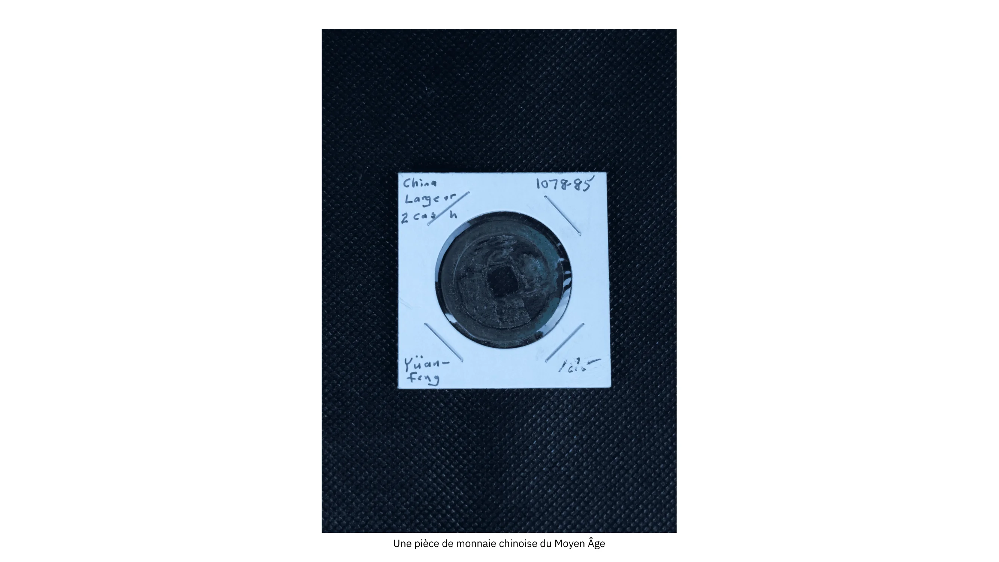

Voici une pièce de monnaie chinoise datant du Moyen Âge. Il s’agit d’une pièce coulée, percée d’un trou carré au centre. Ce trou permettait d’enfiler une corde pour les regrouper, non pas pour les porter comme des bijoux, mais pour faciliter la comptabilité. On attachait plusieurs pièces ensemble pour former des unités de compte. Certaines n’avaient même pas de marques spécifiques : il s’agissait simplement de rondelles de bronze.

Le monopole monétaire de l’État, instauré relativement tard par l’empereur Wudi des Han en 113 av. J.-C., fut souvent contesté. Des acteurs privés ou locaux pouvaient émettre leurs propres monnaies, tant que celles-ci bénéficiaient d’une confiance sociale suffisante.

La faible valeur intrinsèque des monnaies chinoises empêchait la thésaurisation, ce qui garantissait une circulation fluide. Les métaux précieux étaient rarement utilisés comme monnaie courante pour éviter qu’ils ne soient mis en réserve. L’or, trop précieux, était donc exclu de la circulation quotidienne. La soie, en revanche, servait de véritable monnaie de haute valeur dans les échanges internationaux : la Chine commerçait à l’étranger avec de la soie, pas avec de l’or.

Lors de crises économiques ou monétaires, notamment lorsque le prix du cuivre augmentait, des solutions innovantes furent adoptées : dès le IIe siècle apr. J.-C., certaines monnaies furent coupées pour créer des unités plus petites, maintenant la circulation à moindre coût. D’autres périodes, comme sous Wang Mang (début Ier siècle apr. J.-C.), expérimentèrent des monnaies fortement fiduciaires, avec des valeurs faciales très supérieures à leur contenu métallique, préfigurant ainsi les billets de banque. Concrètement, on frappait une valeur de 50, 100 ou 200 sur une pièce qui ne les valait pas réellement, ce qui entraînait de fortes pressions inflationnistes.

Ce système reposait à la fois sur une convention sociale entre l’État, les producteurs et les commerçants, et sur des règles strictes. Ceux qui n’acceptaient pas les pièces abîmées, ou qui refusaient les tissus ne respectant pas les longueurs standards, risquaient des sanctions sévères.

À mon avis, ce système manquait de solidité et dépendait surtout de la coercition pour fonctionner.

### Innovations monétaires chinoises et  impact économique
La Chine fut également pionnière dans l’émission de formes précoces de monnaie papier, adoptées d’abord en réponse à une pénurie de métal au IXe siècle apr. J.-C. Malgré leurs avantages, ces monnaies ont souvent provoqué des spirales inflationnistes lorsque l’État en émettait trop. Les dynasties Song et Ming en offrent de bons exemples , les émissions excessives ont conduit à de graves crises monétaires. Marco Polo, au XIIIe siècle, note même que la falsification de ces billets était punie de mort, preuve de la sévérité du système. On peut difficilement ignorer la violence de ces pratiques.

Ainsi, l’expérience chinoise se distingue par une conception profondément fiduciaire de la monnaie, une grande flexibilité du système monétaire et une adoption très précoce de la monnaie papier, fondée sur la confiance plutôt que sur la valeur intrinsèque du support.

## Organisation sociétale et économique durant l’antiquité 
<chapterId>4023c3ce-7a47-5ac4-8f5f-c7ab699ab20f</chapterId>
:::video id=2761efe4-21cf-4f06-9bda-c03f9ff39012:::

### Le débat sur le parasitisme urbain

La relation entre les cités antiques et leur arrière-pays soulève une question fondamentale : ces centres urbains fonctionnaient-ils comme des parasites extracteurs de richesses, ou comme des moteurs de spécialisation économique bénéfique ? L'hypothèse du parasitisme suggère que les villes de l'âge de bronze, notamment en Mésopotamie, **extrayaient systématiquement plus de valeur de leurs territoires ruraux qu'elles n'en retournaient**, vivant essentiellement de rentes et de taxes sans créer de valeur équivalente.

Cette vision trouve un écho dans l'effondrement de l'Empire romain : lorsque l'expansion territoriale cesse, les flux de richesses extérieures se tarissent, révélant potentiellement une économie urbaine incapable de s'autofinancer. Les cités auraient ainsi vécu "au-dessus de leurs moyens", dépendantes de l'extraction plutôt que de la production.

### La spécialisation comme moteur de création de valeur

Une lecture économique alternative conteste cette vision parasitaire. Les cités antiques fonctionnaient avant tout comme des centres de spécialisation et de division du travail. Leur rôle dépassait largement la simple extraction : elles concentraient l’artisanat spécialisé, organisaient les réseaux commerciaux et servaient de plaques tournantes pour les échanges à longue distance.

Cette spécialisation urbaine créait une interdépendance productive avec l’arrière-pays. Les villes ne pouvaient survivre sans l’approvisionnement agricole rural, mais celui-ci bénéficiait en retour des produits artisanaux, des innovations techniques et de l’accès aux réseaux commerciaux méditerranéens. La division du travail permettait des gains de productivité mutuels, même si la répartition des bénéfices paraissait parfois déséquilibrée.

L’insécurité alimentaire chronique de l’époque explique en partie cette asymétrie apparente. Les risques de famine et la fragilité des récoltes affaiblissaient les populations rurales, tandis que les artisans urbains, connectés aux réseaux d’échange internationaux, jouissaient d’une plus grande stabilité économique.

### Évolution historique: de l'Antiquité au Moyen Âge

Le contraste entre l’organisation antique et médiévale éclaire bien cette problématique. L’Antiquité privilégiait une division du travail à grande échelle, avec des villes ouvertes sur l’ensemble du monde méditerranéen. Le commerce et la spécialisation y étaient très développés, donnant naissance à des réseaux économiques étendus.

L’effondrement romain entraîne une fragmentation radicale, l’époque féodale substitue à cette organisation centralisée un système décentralisé de domaines autarciques. Les anciennes villae rusticae romaines deviennent la matrice des seigneuries médiévales, formant une mosaïque d’îlots économiques quasi autosuffisants dirigés par la noblesse ou le clergé.

Cette décentralisation médiévale, bien que réduisant l’efficacité commerciale, offrait paradoxalement une plus grande résilience aux chocs externes. Les domaines féodaux développaient des relations plus équilibrées entre centres de pouvoir et populations rurales, même si cette organisation limitait les gains de productivité permis par la spécialisation.

### L'émergence des marchés urbains

Les découvertes archéologiques témoignent de ports commerciaux et de quartiers marchands dans les cités mésopotamiennes dès le deuxième millénaire av. J.-C. Ces infrastructures confirment l’existence de marchés organisés, même si leur fonctionnement précis fait toujours débat.

Karl Polanyi, initialement sceptique quant à l’existence de véritables mécanismes de marché dans l’Antiquité, a fini par nuancer sa position, admettant avoir peut-être sous-estimé l’émergence précoce des échanges marchands. Cette évolution intellectuelle reflète la complexité des systèmes économiques antiques, où coexistaient redistributions institutionnelles, échanges de réciprocité et formes naissantes de transactions marchandes.

### Sparte contre Athènes

La comparaison entre Sparte et Athènes illustre parfaitement le lien entre système monétaire et organisation sociale. Sparte représente un modèle de société rigidement hiérarchisée, rejetant délibérément l’usage de la monnaie, tandis qu’Athènes développe une économie monétaire sophistiquée, accompagnant son système démocratique.

Le rejet spartiate de la monnaie n’était pas spontané, mais institutionnel et idéologique. Les dirigeants craignaient que la monnaie ne corrompe les valeurs militaires et civiques, privilégiant un système fondé sur la confiance interpersonnelle directe entre citoyens.

Pour décourager l’usage monétaire, Sparte utilisait des barres métalliques lourdes et peu pratiques, démontrant paradoxalement une compréhension intuitive des qualités monétaires (divisibilité, transportabilité, durabilité) qu’ils cherchaient justement à neutraliser.

### Les limites du modèle anti-monétaire

L’organisation spartiate révèle les contraintes du nombre de Dunbar appliquées à l’échelle sociétale. En rejetant la monnaie comme intermédiaire d’échange neutre, Sparte limitait sa communauté civique à un nombre restreint de citoyens capables de maintenir des relations de confiance directe. Les homoioi (citoyens) ne représentaient qu’environ 1 % de la population totale, entourés de milliers d’hilotes.

Cette structure, d’abord source d’une cohésion militaire remarquable, s’avéra profondément fragile. La bataille de Leuctres (371 av. J.-C.) révéla les limites de ce système : les pertes humaines brisèrent l’équilibre civique spartiate, entraînant l’effondrement du modèle.

Les cités concurrentes (Athènes, Corinthe, Thèbes), dotées de systèmes monétaires robustes, développaient des économies plus riches et plus résilientes, capables d’absorber les chocs démographiques grâce à la reconstruction économique et à l’immigration.

### Confiance personnelle versus confiance institutionnelle

L’expérience spartiate met en évidence les risques d’une société reposant exclusivement sur la confiance interpersonnelle, au détriment des mécanismes institutionnels. Si ce modèle renforce la cohésion interne, il rend la société vulnérable aux chocs démographiques et à l’expansion territoriale.

La monnaie, en permettant des transactions anonymes et impersonnelles, assure une résilience systémique supérieure. Elle permet une organisation sociale dépassant les limites de la confiance directe, facilitant les échanges lointains et la croissance économique.

### Le paradoxe inca: richesse sans monnaie

L’Empire inca constitue un paradoxe fascinant : une civilisation immensément riche en or, mais dépourvue de système monétaire. À l’instar de Sparte, l’Empire reposait sur une organisation hiérarchique et une planification centralisée, mais se révéla extrêmement vulnérable face à des conquistadors appuyés sur des économies monétaires flexibles.

Cette fragilité récurrente des sociétés anti-monétaires face aux sociétés monétaires suggère que le rejet institutionnel de la monnaie, loin de renforcer la cohésion sociale, peut fragiliser les civilisations face aux chocs externes.

L’étude comparée de ces modèles montre que la monnaie, au-delà de sa fonction d’échange, constitue un marqueur et un vecteur de complexité sociale, permettant aux civilisations de dépasser les limites des relations interpersonnelles.

# La naissance de la monnaie frappée
<partId>232e365a-8c3b-11f0-b276-b3ab70d1a5a1</partId>

## L’émergence des pièces de monnaie
<chapterId>40ed3414-3066-57bd-bc1b-617ad0a354e0</chapterId>
:::video id=1d6834c4-98a3-43fe-ba80-04be51b0486e:::

Nous arrivons maintenant au point névralgique : l’apparition des pièces de monnaie à proprement parler. J’insiste sur le terme pièce, car nous avons vu dans les sections précédentes que des systèmes monétaires existaient déjà dans les civilisations antérieures aux Lydiens, aux Grecs et aux Perses. C’est désormais la naissance de la monnaie frappée qui nous intéresse, dans une section intitulée : L’émergence des pièces de monnaie.

### L'origine lydienne et ionienne des pièces de monnaie

Pour introduire cette section, voici un extrait de A History of Money de Glyn Davies :

À partir de son lieu d’origine en Lydie et en Ionie, la connaissance et l’utilisation des pièces de monnaie se répandit rapidement vers l’est, au sein de l’empire perse, et vers l’ouest, à travers les îles ioniennes et égéennes jusqu’à la Grèce continentale, puis vers ses colonies occidentales, notamment la Sicile. Cette innovation se diffusa également vers le nord, atteignant la Macédoine, la Thrace et la mer Noire, mais ne fut acceptée que partiellement, tardivement et à contre-cœur en Égypte.

Il est intéressant de noter qu’en Égypte, on continua de peser les pièces longtemps après l’apparition de la monnaie frappée un héritage des pratiques antérieures fondées sur le métal pesé. La citation poursuit : De même, l’Italie continentale adopta lentement ces innovations financières, contrairement à la rapidité d’acceptation observée en Sicile.

À l’exception notable de l’Italie continentale et de la Basse-Égypte, la monnaie se diffusa rapidement dans toute la Méditerranée orientale et centrale, ainsi que dans l’immense empire perse, depuis la Mésopotamie jusqu’à l’Inde.

Davies ajoute que l’Inde aurait possiblement développé une forme indépendante de pré-monnaie, mais que l’influence décisive sur le monnayage indien provenait surtout des modèles lydiens et grecs transitant par les empires perse puis macédonien.

### La diffusion géographique et les adaptations régionales

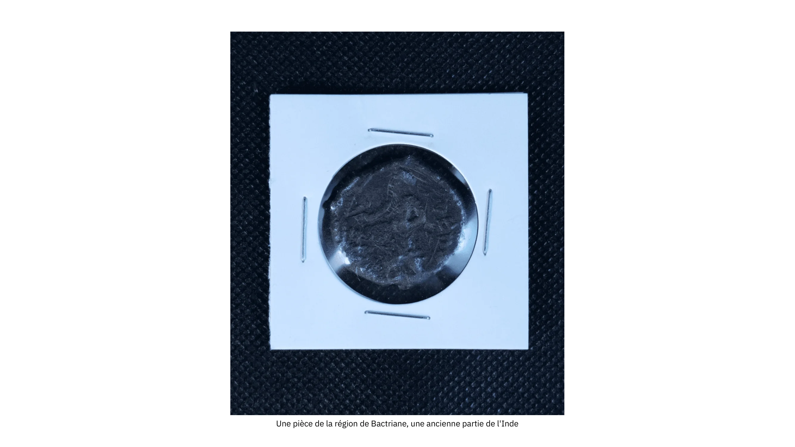

Voici une pièce bactrienne, provenant d’une région située entre l’Inde et l’Afghanistan, probablement inspirée des émissions grecques, avec une effigie royale.

## Les Lydiens et les Perses
<chapterId>eb802ab8-8ffd-5b25-907f-8944f120ed14</chapterId>
:::video id=f151eb42-5ff3-4ca1-9af1-1ae2a5e051c0:::

### Les premières pièces lydiennes en électrum

L’apparition des premières pièces en Occident remonte au milieu du VIIᵉ siècle av. J.-C., en Lydie et en Ionie (actuelle Turquie). Datées entre 650 et 600 av. J.-C., les premières pièces retrouvées — notamment dans le temple d’Artémis à Éphèse  étaient en électrum, un alliage naturel d’or et d’argent, à l’aspect ambré. Leur apparence était souvent grossière, marquée seulement de poinçons rudimentaires.

J’en présente ici une reproduction , une pièce lydienne représentant un lion et sa proie. Au revers, une cavité frappée servait peut-être à vérifier la pureté du métal, afin d’éviter que la pièce ne soit seulement plaquée. Toutes mes pièces en or ou en électrum sont des reproductions modernes, pour des raisons évidentes de coût.

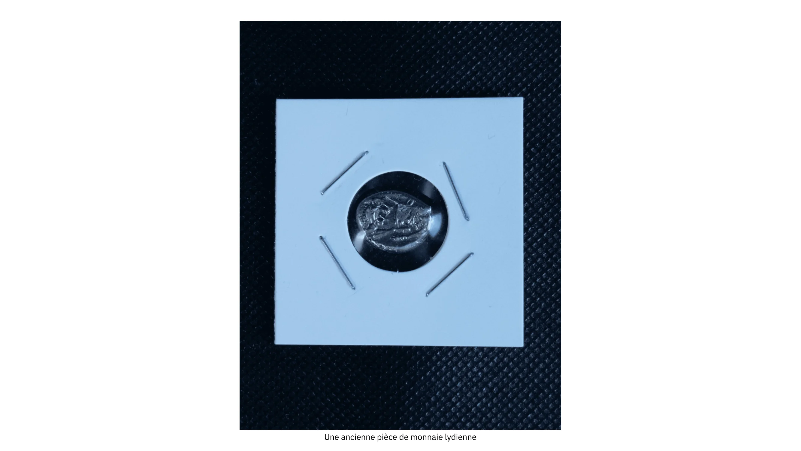

Je possède toutefois une véritable pièce perse, que voici. Ces premières monnaies avaient l’apparence de blocs métalliques frappés, plus proches de lingotins que de pièces modernes.

Contrairement à l’idée reçue selon laquelle les pièces auraient été inventées pour faciliter les échanges quotidiens et remplacer le troc, il semble que les premières monnaies lydiennes, perses et grecques n’aient pas servi aux petits achats. Leur valeur était trop élevée : souvent l’équivalent d’une journée de travail. Cela reviendrait, aujourd’hui, à payer un repas avec un billet représentant un salaire journalier.

Cependant, des découvertes récentes révèlent l’existence d’unités plus petites, suggérant qu’un usage quotidien n’est pas à exclure. Ainsi, la preuve anthropologique selon laquelle les premières pièces étaient exclusivement destinées aux transactions importantes demeure fragile.

### Le rôle de l'État dans la création monétaire

L'origine réelle des pièces de monnaie semble plutôt liée à l'action directe des États. Deux grandes hypothèses existent à ce sujet : la première, idéaliste, fait un parallèle entre le terme grec nomisma (monnaie) et nomos (loi), suggérant que la monnaie était liée à la codification des lois, renforçant l'autorité et l'organisation politique des cités. La seconde hypothèse, plus réaliste et largement admise aujourd'hui, est que la monnaie aurait d'abord constitué un moyen pour les États d'exercer un contrôle économique et social. En garantissant officiellement le poids et la valeur des métaux précieux qu'elles contenaient, les États pouvaient ainsi manipuler la circulation et la valeur de ces pièces, créant des primes de confiance et de liquidité propres aux monnaies domestiques.

Les analyses chimiques confirment cette seconde hypothèse. L’électrum naturel contient environ 70 % d’or, mais les premières pièces lydiennes n’en contiennent que 50–55 %. Il est probable que l’émetteur réduisait volontairement la proportion d’or pour produire davantage de pièces, tout en apposant un sceau garantissant officiellement la même valeur qu’un bloc d’électrum pur.

Cette maîtrise métallurgique s’accentue sous le règne de Crésus (561–546 av. J.-C.), auquel on doit la séparation des monnaies en pièces d’or et pièces d’argent distinctes — le début réel du bimétallisme.

### L'expansion perse et l'adoption grecque

Lorsque les Perses conquirent la Lydie en 546 av. J.-C., ils adoptèrent immédiatement la monnaie frappée. Vers 500 av. J.-C., sous Darius Ier, ils créèrent leurs propres monnaies, les darics (or) et les siglois (argent), souvent ornés de l’effigie royale.

Voici un véritable sigloi perse. Le daric était en or ; le sigloi, en argent. Les deux conservent la forme de blocs frappés, avec une marque creusée au revers pour en vérifier la teneur.

Les Grecs adoptèrent rapidement la monnaie grâce à leurs contacts avec les Lydiens. Les habitants d’Égine furent probablement les premiers, au VIᵉ siècle av. J.-C., avec l’introduction de la drachme, dont le nom signifie littéralement « poignée de grains » ou « poignée de flèches ».

La monnaie grecque s’imposa grâce à : sa commodité pour les paiements importants (mercenaires, taxes, cultes), l’expansion politique et économique des cités,
 son association symbolique au nomos (la loi). La monnaie devint ainsi un pilier des sociétés grecques puis romaines, annonçant l’émergence d’économies plus complexes et institutionnalisées.

## L’intervention institutionnelle et les premières pièces de monnaie 
<chapterId>3e1efd08-99e3-5a32-9908-3185fef0e640</chapterId>

:::video id=84847cf6-9e46-4a8c-9f35-25a27496cc4b:::

### La double nature de la monnaie 

L’émergence de la monnaie frappée relance une question fondamentale :
la monnaie naît-elle du marché ou de l’État ?

Cette tension oppose deux visions :

Vision autrichienne : la monnaie marchandise (or, argent) serait née spontanément du marché. L’État ne ferait que capter un phénomène déjà existant pour en contrôler l’offre.

Vision anthropologique/institutionnelle : la monnaie naît réellement avec l’autorité politique. C’est la frappe, le sceau, et la garantie étatique qui transforment un métal quelconque en monnaie. Les premières pièces lydiennes auraient notamment servi au paiement des armées  un statère correspondant approximativement au salaire journalier d’un soldat.

### Les avantages paradoxaux de la standardisation étatique

algré cette tension théorique, même les économistes autrichiens reconnaissent certains avantages à l’intervention étatique dans la gestion de la monnaie. La standardisation par la frappe résout en effet plusieurs problèmes pratiques liés au commerce.

Sans autorité de certification, les acteurs économiques sont exposés à des risques constants : pièces falsifiées, fraudes au limage ou manipulations du poids. Ces pratiques créent des frictions dans l’économie, certaines pièces étant acceptées tandis que d’autres sont refusées. L’estampe officielle garantit théoriquement le poids et la qualité du métal, ce qui fluidifie les échanges.

Cette garantie se reflète d’ailleurs directement sur le marché : une pièce d’or frappée vaut plus que son équivalent en or brut. Ce premium représente la valeur de la certification, puisqu’il évite aux marchands d’avoir à vérifier eux-mêmes l’authenticité du métal par des tests chimiques ou acoustiques. Paradoxalement, l’intervention étatique élimine donc des frictions et facilite le commerce en instaurant une confiance institutionnalisée.

### La manipulation monétaire dès l'origine 

L’histoire des premiers statères lydiens révèle une ironie frappante. Des analyses récentes montrent que la teneur en or de ces pièces d’électrum était systématiquement inférieure à celle de l’électrum naturel. L’autorité chargée de certifier la qualité manipulait donc, en parallèle, la composition du métal.

Cette pratique illustre la double utilité de la frappe monétaire. Pour le marché, elle fluidifie les échanges et garantit une standardisation fiable. Pour l’autorité émettrice, elle devient un outil de contrôle économique par la dilution. En réduisant la teneur en or tout en maintenant la valeur nominale, l’État augmente effectivement la masse monétaire, créant davantage d’unités à partir de la même quantité de métal précieux.

Cependant, l’État reste lui-même limité par cette manipulation. Comme l’illustre le cas du solidus d’or de Constantin au IVᵉ siècle, l’administration romaine contrôlait minutieusement la qualité des pièces, car elle exigeait d’être payée en bonne monnaie. L’autorité a donc un intérêt vital à préserver la qualité de sa propre émission afin de garantir la valeur de ses revenus fiscaux.

### L'analyse économique de la dévaluation 

L’étude de la dévaluation monétaire révèle des tendances constantes à travers l’histoire. Pour les monnaies métalliques, les économistes observent le pourcentage de métal précieux contenu dans les pièces : une courbe descendante signale une dévaluation progressive. Pour la monnaie fiduciaire moderne, c’est l’inverse : on analyse la masse monétaire en circulation, dont l’augmentation indique la dévaluation.

Ces deux méthodes mesurent pourtant le même phénomène fondamental : la dilution de la valeur monétaire. Que cela passe par la réduction du métal précieux ou par l’émission de nouveaux billets, le mécanisme reste identique. Plus l’autorité crée d’unités à partir des mêmes ressources réelles, plus chaque unité perd de sa valeur.

Cette manipulation, déjà observable avec les premières pièces lydiennes, montre que le contrôle monétaire a toujours constitué un enjeu de pouvoir. La monnaie frappée apparaît ainsi comme une innovation technique majeure et, simultanément, comme un instrument de contrôle économique  une dualité qui traverse toute l’histoire monétaire jusqu’à nos systèmes contemporains.

## La fabrication des pièces
<chapterId>b205f4f2-c293-5308-b812-a998de9ad45e</chapterId>

:::video id=47c612ec-d97e-4498-b50e-7e66518bd56d:::

### Des blobs poinçonnés aux pièces frappées

Comme nous venons de le voir dans la section sur l’émergence des pièces de monnaie, les premières formes monétaires métalliques étaient de simples « blobs » d’électrum, puis d’or et d’argent. On y apposait un poinçon sur les deux faces : à l’avant, on trouvait souvent la tête du roi ou un symbole d’autorité, tandis qu’à l’arrière un creux ou une marque d’enfoncement servait à vérifier la pureté du métal.

Ces pièces primitives n’étaient ni parfaitement circulaires ni uniformes. Leur valeur dépendait principalement de leur poids et de leur composition. La frappe consistait simplement à placer le morceau de métal chauffé entre deux matrices et à appliquer un coup sec pour y imprimer les marques officielles.

Ce procédé rudimentaire allait progressivement évoluer vers des techniques de fabrication plus contrôlées, permettant d’obtenir des pièces plus régulières, plus difficiles à falsifier et mieux adaptées aux exigences d’un commerce en expansion.

Ensuite, comme nous le verrons dans une section ultérieure, les Grecs ont perfectionné cette technologie en produisant des pièces véritablement rondes, frappées au marteau sur les deux faces. On préparait une rondelle plate de métal précieux, parfaitement lisse, que l’on plaçait entre deux matrices. Chacune de ces matrices portait, gravée en négatif, l’image ou le symbole à imprimer. Puis, à l’aide d’un marteau, on frappait la pièce pour transférer les motifs sur les deux côtés.

Cette technologie de frappe à la main, pièce par pièce, a probablement contribué à limiter l’inflation, même à une époque où l’on diluait déjà fortement la teneur en métal précieux pour augmenter la production monétaire. Comme nous le verrons clairement dans la période romaine  et dans une certaine mesure durant certaines guerres grecques  la fabrication manuelle restait malgré tout un frein mécanique à la création monétaire. La capacité de l’autorité à produire de nouvelles pièces était donc limitée, ce qui exerçait un effet indirect mais réel sur le contrôle de l’inflation, malgré les grandes dévaluations observées.

Ainsi, on est passé d’un simple blob poinçonné à une pièce ronde, standardisée et frappée au marteau.

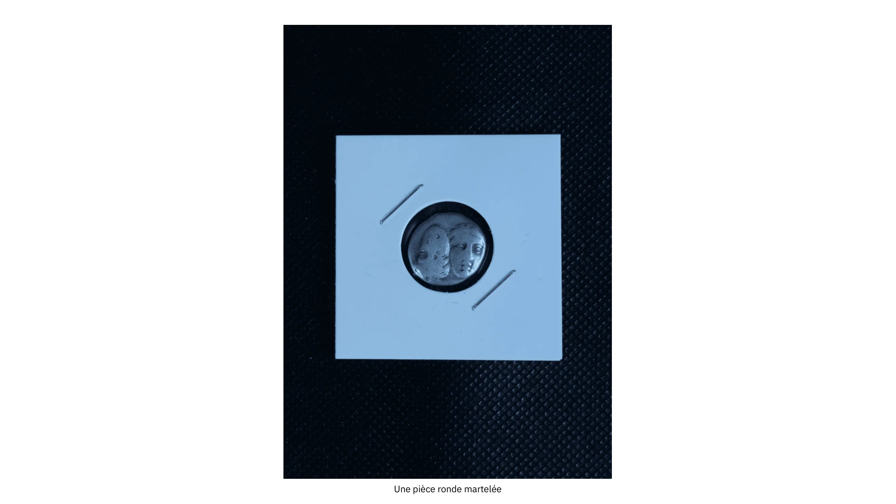

### L'évolution médiévale 

Au Moyen Âge, une nouvelle technique apparaît : l’étalement des pièces. On fabriquait des monnaies de plus en plus larges et de plus en plus minces. L’un des objectifs était de faciliter le test du son : une pièce bien étalée produisait une fréquence caractéristique lorsqu’on la faisait tinter. Ce son servait d’indicateur de pureté du métal.
C’est d’ailleurs de là que vient l’expression « argent sonnant ».

Quant au terme « trébuchant », il renvoie au trébuchet, la petite balance utilisée pour peser précisément la pièce. On passe donc, au fil du Moyen Âge, de petites pièces rondes et épaisses à des monnaies plus larges et plus fines, mieux adaptées aux tests de qualité.

### La frappe au balancier

La dernière grande innovation, apparue à la fin du Moyen Âge et au début de l’ère moderne, est celle de la frappe au balancier. Il s’agissait d’un dispositif utilisant une grande vis verticale permettant d’exercer une pression beaucoup plus forte et plus régulière que la frappe au marteau. Cette technique offrait plusieurs avantages, dont un particulièrement important : la possibilité de décorer les rebords de la pièce.

Cette innovation répondait au problème de l’écrêtage, une fraude courante où l’on limait ou grattait légèrement le bord des pièces pour en récupérer un peu d’argent ou d’or. Grâce au balancier, on pouvait désormais graver de petites crêtes, des lignes ou même des inscriptions sur les bords, ce qui rendait immédiatement visible toute tentative d’écrêtage.

Fait intéressant : cette technologie vient de France. L’Angleterre a même dû engager des ingénieurs français pour apprendre à utiliser ces machines. Pourtant, malgré son efficacité, la frappe au balancier a rencontré une forte résistance. Les partisans de la frappe au marteau la méthode traditionnelle  s’y opposaient farouchement, au point de retarder son adoption.
Comme souvent avec les innovations, certains étaient attachés à l’ancienne technologie, même si la nouvelle était clairement supérieure : plus difficile à falsifier, plus rapide, plus uniforme.

Il y a même eu une période où l’on est passé du balancier… de retour au marteau, avant que la nouvelle technologie ne s’impose définitivement. C’est elle qui a finalement donné naissance aux pièces modernes, dont les rebords affichent encore aujourd’hui des crêtes, du texte ou des motifs, héritage direct de cette lutte contre l’écrêtage.

# Les différentes théories sur l'émergence de la monnaie
<partId>72ac694f-9248-550d-90c1-91af3d234380</partId>

## Théories sur l’émergence de la monnaie et ses différentes définitions
<chapterId>7d699d4d-8c70-55b5-bf36-609f3fd90bcf</chapterId>
:::video id=523c873f-501b-4954-b79f-7e74c0f685a5:::

Bienvenue dans ce segment dédié aux différentes théories sur l'émergence de la monnaie et à ses diverses définitions. Voici un court extrait du livre Aux origines de la monnaie qui, je trouve, résume assez bien et de manière très succincte  les deux thèses principales auxquelles nous nous intéresserons dans cette section.

Ce rapide préambule n'a d'autre but que de mettre en relief le contexte de l'enquête. Sur le plan conceptuel, le débat est ouvert entre les tenants de la thèse de K. Polanyi et les adeptes de celle de M. Weber. Pour les premiers, le don et la redistribution tiennent une place centrale, l'échange marchand ne jouant qu'un rôle marginal, principalement dans les échanges internationaux. Pour les autres, au contraire, le marché est au cœur du processus historique en cours.

Par exemple, pour la Mésopotamie, une des théories sur l’émergence de la monnaie est que le temple, l'autorité, crée l'unité de compte ou l'unité monétaire, l'impose, puis les marchands l'adoptent pour faire du commerce. La théorie opposée dit que non : cette unité monétaire émerge naturellement du marché pour permettre ce fameux commerce. Et nous avons des exemples bien sourcés de cela en Mésopotamie.

Concernant le troc, certaines théories proposent qu’il aurait principalement été utilisé dans les échanges internationaux, donc avec des personnes en qui l’on n’avait pas confiance, tout simplement.

C'est donc le travail que nous allons mener dans cette partie: une sorte d'enquête pour présenter les différentes théories sur l'émergence de la monnaie et les différentes définitions de ce qu'est la monnaie. Nous présenterons autant les thèses des économistes classiques que celles des anthropologues, tout en les mettant en perspective et en les critiquant. J'aurai même la chance d'être accompagné d’Ulrich Fromy, qui nous présentera l'angle d'un économiste autrichien sur ces différents sujets.

## L’émergence de la monnaie pour les économistes classiques
<chapterId>1d3776cd-0dfd-5297-af48-c6f41e257a7e</chapterId>

:::video id=873a16c1-17ac-448d-8941-df4feb7ab79d:::

Ce segment est dédié aux différentes théories sur l'émergence de la monnaie. Le premier sujet que l'on va couvrir est l'émergence de la monnaie pour les économistes classiques.

### La théorie classique d'Adam Smith 

Selon les théories économiques classiques, en particulier celle défendue par Adam Smith, la monnaie émerge naturellement du troc en réponse à ses limites. Au départ, les échanges étaient réalisés par le troc direct, mais cette méthode était souvent compliquée par le problème de la "double coïncidence des besoins" , il fallait que chaque personne possède exactement ce que l’autre désirait. Progressivement, certaines marchandises (comme le sel, les métaux précieux, ou le bétail) ont été acceptées par tous comme moyen d'échange intermédiaire grâce à leur utilité, leur durabilité et leur divisibilité. Ainsi, la monnaie apparaît spontanément pour faciliter et fluidifier les échanges économiques.

Voici ma critique de cette théorie. Avec tout ce qu’on a vu dans la section précédente, je pense qu’on peut déjà affirmer que cette notion selon laquelle les pièces de monnaie seraient une évolution du troc est erronée, tout simplement parce que la pièce de monnaie frappée émerge définitivement de l’autorité, puisqu’elle est frappée par l’autorité. Il y a plusieurs raisons à cela, notamment le désir des autorités de contrôler l’économie et de prendre le contrôle sur la monnaie.

Par contre, si on parle de la monnaie en tant que concept, pas nécessairement des pièces de monnaie, là, c’est moins clair. Déjà, avec les premières pièces de monnaie, les statères lydiens, on a trouvé des blobs d’argent qui n’étaient pas marqués. Reste à savoir s’ils circulaient. S’ils circulaient, cela veut dire que les gens ont peut-être identifié à la base ce bien-là comme une potentielle monnaie, demandée généralement et facilement échangeable. Et c’est peut-être seulement après que l’autorité a remarqué cette situation et en a pris le contrôle en mettant une estampille dessus pour la certifier.

Il y a beaucoup d’avantages à faire cela : plus besoin de vérifier, de peser, etc. Évidemment, on en parlera. Mais selon moi, les pièces de monnaie sont clairement un outil utilisé par les États dès l’origine. Cependant, pour ce qui est de l’émergence de la monnaie en tant que telle, on ne sait pas vraiment si elle vient d’une autorité qui l’a imposée ou si elle émerge du commerce et des échanges marchands. J’aurai d’ailleurs une discussion très intéressante à ce sujet avec mon collègue Ulrich plus tard dans cette section.

On sait déjà que les premières pièces de monnaie en métaux précieux n’ont pas été utilisées pour fluidifier les échanges quotidiens, car leur valeur était bien trop grande. On sait aussi qu’elles ont surtout servi aux paiements militaires. C’est un bon argument pour la thèse selon laquelle la monnaie n’a pas nécessairement émergé du marché. Les unités de compte, les dénominations des premières pièces, étaient probablement trop grandes pour acheter du pain ou faire des emplettes quotidiennes. Elles pouvaient par exemple équivaloir à une journée de salaire  pas que les gens étaient payés en salaires à l’époque, mais cela donne une idée de l’ordre de grandeur. Ces pièces avaient donc probablement un pouvoir d’achat trop élevé pour être utilisées dans le petit commerce.

Cependant, rien n’indique que ces pièces n’auraient pas été utilisées pour des échanges plus importants, par exemple des échanges marchands. Mais ce que l’on sait, c’est qu’elles ont surtout servi aux paiements militaires. C’est une des théories les plus répandues pour expliquer l’apparition des premières pièces de monnaie. Je vous le rappelle : ici, on parle des pièces de monnaie, pas de la monnaie en général. Leur premier rôle aurait donc été de payer les mercenaires. Par exemple, Alexandre le Grand en a fait grand usage, comme on le verra plus tard.

On a aussi vu que, dès la Chine antique, les cauris servaient aux échanges économiques (rémunérer le travail, mesurer la valeur et acheter des biens fonciers). Qui plus est, en Mésopotamie et en Égypte, des systèmes monétaires fonctionnels existaient déjà et servaient aux échanges, aux paiements de salaire et aux paiements de taxes. Ce que je suggère ici, c’est qu’il est définitivement erroné de penser que les pièces de monnaie, dans la conception occidentale, émergent du besoin de fluidifier les échanges.

Les pièces de monnaie, puisqu’elles sont émises par une autorité, peuvent raisonnablement être comprises comme liées aux autorités émettrices dès le début. Logique. Par contre, on ne sait pas nécessairement comment ont émergé les formes de monnaie ou les systèmes monétaires les proto-monnaies qui les ont précédés. D’un côté, certains soutiennent que ce sont les temples qui ont identifié ces unités monétaires et que les gens les ont ensuite utilisées. De l’autre, on affirme que ce sont les marchands, ayant besoin d’un moyen d’échange pour commercer avec l’extérieur, qui ont identifié par exemple l’argent-métal comme unité, parce qu’il était demandé à l’extérieur.

Ce qu’il faut retenir, c’est qu’on ne le sait pas vraiment. C’est pour cela que deux théories s’opposent encore : on n’a pas de preuve décisive permettant d’affirmer si la monnaie émerge naturellement du besoin de commercer ou si elle émane de l’autorité.

### Distinguer pièces de monnaie et monnaie primitive

En conclusion, je pense qu'on peut dire que les pièces de monnaie émanent nécessairement de l'autorité puisqu'elles ont été estampées par ladite autorité. Par contre, je ne pense pas qu'on puisse affirmer qu'il est erroné de dire que la monnaie (celle qui précède les pièces de monnaie), n'ait pas pu émerger pour faciliter les échanges. Je pense que dans tout ce qu'on a vu précédemment, les exemples en ce sens abondent.

## Le mythe du troc
<chapterId>0fcd4964-ac36-5163-a8cf-1aacebc0d2c0</chapterId>
:::video id=0ede29ab-8acd-4d79-9282-bd5991b97076:::

### La critique de David Graeber

Nous venons de couvrir l’émergence de la monnaie selon les économistes classiques. Maintenant, nous allons nous attaquer à un concept nommé le mythe du troc.

De cette théorie classique de l’émergence de la monnaie apparaît éventuellement une critique qui souligne le manque de preuves historiques pour en soutenir les idées.

La critique, appelée mythe du troc et formulée notamment par l’anthropologue David Graeber, remet en question l’idée classique selon laquelle la monnaie aurait émergé naturellement du troc. Selon cette critique, aucune preuve historique ou anthropologique ne montre que des sociétés aient utilisé systématiquement le troc avant l’apparition de la monnaie. En réalité, les sociétés anciennes auraient plutôt fonctionné selon des logiques de crédit, de dettes, d’obligations sociales ou encore d’échanges cérémoniels. Le mythe du troc serait donc une construction théorique visant à justifier la vision économique classique, sans fondement empirique réel.

Il faut tout de même noter que cette théorie ne nie pas que le troc ait existé, par exemple pour des échanges entre différentes tribus. Elle nie simplement que le troc ait été une activité largement pratiquée au sein de ces groupes dits primitifs et que la monnaie serait une évolution logique de ces pratiques. Elle nie le fait que le troc ait été très utilisé à l’intérieur d’une tribu et que la monnaie soit apparue pour fluidifier les échanges ou résoudre les difficultés associées au troc. Selon cette théorie, ces groupes auraient plutôt pratiqué une forme de crédit informel ou de don contre don.

### Sociétés primitives vs grandes civilisations

Voici certaines précisions en lien avec les grandes civilisations de l’Antiquité ancienne.
Je pense que cette théorie s’applique définitivement aux groupes primitifs (sans État), anciens et même modernes (par exemple les tribus étudiées aux 18ᵉ et 19ᵉ siècles par des explorateurs). On voyait clairement qu’ils n’utilisaient pas le troc, mais plutôt les formes d’échanges que j’ai mentionnées précédemment, pour des raisons déjà évoquées (faible division du travail, agriculture de subsistance). Par contre, je pense que cette théorie ne s’applique pas aux grandes civilisations du passé comme la Mésopotamie ou l’Égypte antique.

Notons ici deux extraits de aux origines de la monnaie à ce sujet :

Le modèle exposé par M. Mauss dans son célèbre Essai sur le don a été adopté par les égyptologues avec autant d'unanimité et d'enthousiasme que de manque de discernement. Il en résulte des confusions sur lesquelles nous ne nous étendrons pas ici. Notons simplement que ce modèle s'applique à des sociétés dites primitives, ce qui n'est pas le cas de l'Égypte pharaonique.

Les pains, c'est-à-dire les céréales transformées, sont donc des unités de compte qui, comme les shât(y) de l'Ancien Empire, permettent aussi d'ouvrir des crédits en biens diversifiés. Par ce simple exemple, nous entrevoyons que l’économie de l’Égypte pharaonique n’est pas circonscrite à un système de redistribution. Très complexe, elle inclut en outre une multitude d’échanges.

Ainsi, comme on l’a vu précédemment dans les sections sur l’Égypte, la Mésopotamie et même la Chine, on observe que ces civilisations anciennes  mais non primitives, en raison de la présence d’un État utilisaient, à mon avis, des systèmes monétaires. Je pense que nous l’avons amplement démontré dans la première section de ce cours.La notion de don contre don ou de crédit différé ne s’applique donc pas à ces grandes civilisations.

Les raisons précises de l’émergence de la monnaie restent donc un mystère. On ne sait pas si elle émane du besoin des marchands de commercer avec l’extérieur ou si elle a été imposée par le temple dans ces périodes anciennes.

## L'émergence de la monnaie par la monnaie-dette
<chapterId>4f508615-aa61-5d62-89d3-cecd02aeaa62</chapterId>

:::video id=a23f547f-3906-4f4a-8f72-5d78c649d0c4:::

### Monnaie comme reconnaissance de dette

Dans cette section, nous allons couvrir la théorie de la monnaie-dette.

La théorie de la monnaie-dette, développée notamment par l’économiste Alfred Mitchell-Innes et approfondie plus tard par David Graeber, affirme que la monnaie n’est pas née du troc, mais plutôt des relations de dette et de crédit présentes dès les premières sociétés humaines. Selon cette théorie, la monnaie apparaît lorsque des obligations sociales (dettes entre individus ou groupes) deviennent quantifiées et transférables. On introduit donc ici la notion de quantification des échanges et la notion de transfert. Ainsi, la monnaie serait avant tout une reconnaissance de dette, soutenue par la confiance mutuelle et souvent garantie par l’autorité politique ou religieuse, plutôt qu’une marchandise servant simplement d’intermédiaire dans les échanges.

Il existe une forme encore plus poussée de cette théorie, selon laquelle toute monnaie est une dette. Ainsi, quelqu’un qui possède de la monnaie aurait une créance sur la société en général, une créance sur tous ceux qui acceptent cette monnaie. Et comme la monnaie, dans leur vision, doit être acceptée de manière obligatoire, sinon ce n’est pas une monnaie  parce que si on peut refuser cette monnaie, leur système ne fonctionne pas, alors dans un groupe ayant identifié une monnaie, tous ceux qui en possèdent détiendraient une créance envers les autres membres de la société qui acceptent cette monnaie. De même, ceux qui acceptent la monnaie auraient une forme de dette envers la personne qui détient cette unité monétaire. C’est essentiellement leur théorie.

### Critique du système obligatoire

Ma critique de cette théorie 
Laissez-moi déjà faire une petite critique de cette théorie. Je veux bien que la monnaie soit une sorte de consensus social, une confiance qu’un groupe accorde à un “signe” monétaire, quel qu’il soit. J’adhère donc à l’idée de confiance mutuelle, concept que nous reprendrons plus tard avec la prime monétaire. Là où cela devient compliqué, c’est lorsque les partisans de cette théorie ajoutent une notion d’obligation et insistent sur la notion de dette. Pour eux, lorsque quelqu’un possède un jeton monétaire, il détient une créance sur la société dans son ensemble et la société aurait une dette envers le détenteur. Il existerait aussi une obligation de règlement : les membres du groupe seraient obligés d’accepter le jeton, sinon  selon eux le système ne fonctionnerait pas. Je pense que le système décrit précédemment en Chine antique représente bien cette théorie.

De mon côté, je peux facilement imaginer un système où la monnaie est un consensus social, où le jeton choisi est généralement accepté comme moyen de paiement, sans obligation formelle. Je peux voir un système de ce type fonctionner si les gens l’acceptent de leur plein gré. Cela peut fonctionner. Par contre, cela s’accompagne souvent d’obligations, de cours légal, de violence  notions que nous verrons plus tard. Mais théoriquement, j’ai l’impression qu’un tel système peut fonctionner. Je crois que Bitcoin en est un exemple. Bitcoin a une valeur parce qu’il possède une prime monétaire, parce qu’il y a une demande pour un usage monétaire  réserve de valeur, peut-être aussi moyen d’échange ou protection contre le système fiat. Personne n’est obligé de l’accepter, et plus son acceptation comme moyen de paiement augmentera, plus il pourra être utilisé comme moyen d’échange. On peut déjà sans problème l’utiliser comme réserve de valeur. Cela ne fait aucun doute. Ce que je veux dire, c’est que Bitcoin semble être un exemple d’une monnaie reposant sur un consensus social : on pense qu’on pourra récupérer notre mise plus tard, on l’acquiert pour pouvoir l’échanger plus tard, pour conserver du pouvoir d’achat.

Cette vision moins contraignante permet notamment d’expliquer comment deux sociétés distinctes peuvent effectuer des échanges avec un jeton monétaire comme l’or, sans créer de créance ou de dette entre elles. Forcer l’acceptation dans une société ne fonctionne pas dans le commerce entre deux tribus : la tribu B n’est pas soumise à l’autorité de la tribu A. Pourtant, elle accepte le même jeton monétaire disons, l’or. Et certains pourraient répondre : “oui, mais la société B considère aussi l’or comme monnaie”. Effectivement, cela fonctionne, mais il n’y a pas de création de dette dans ce cas. La transaction est finale. Quand la société A échange un bien contre de l’or à la société B, aucune dette n’est créée. La personne de la société B n’acquiert pas cette pépite d’or pour se faire payer plus tard par la société A ; elle l’accepte pour l’utiliser plus tard dans sa propre tribu. Il n’y a donc ni création de dette ni créance latente : c’est simplement un paiement direct. Les partisans de la monnaie-dette diront que cela relève du troc, mais je ne suis pas d’accord : le troc, c’est l’échange direct d’un bien contre un autre bien destiné à l’usage. Ici, l’or n’est pas consommé : il est utilisé comme monnaie. Cela ne relève donc pas du troc à mon avis.

Posséder un jeton monétaire n’est pas une créance sur la société : c’est plutôt l’espérance que ce jeton sera accepté plus tard à une valeur comparable.

## L’émergence spontanée de la monnaie 
<chapterId>e3ef86b1-73b9-5140-a61e-2ab6a5b0b2d4</chapterId>
:::video id=e543995f-d5e2-49d7-9133-e397b46e0833:::

Pour l’école autrichienne d’économie, initiée par Carl Menger, la monnaie émerge naturellement d’une économie de troc confrontée au problème de la double coïncidence des besoins. Dans cette vision, les individus convergent spontanément vers des biens intermédiaires qui facilitent les échanges  non pas des biens directement consommés, mais des marchandises reconnues pour leur capacité à être largement demandées.

Ces biens monétaires doivent posséder des qualités identifiées depuis Aristote : servir de réserve de valeur, de moyen d’échange et d’unité de compte. Les acteurs économiques les identifient progressivement, les accumulent et les épargnent, amorçant ainsi leur émergence comme monnaie. Ce processus est entièrement spontané : la monnaie représente une réponse naturelle du marché au problème de coordination des échanges, sans intervention consciente d’une autorité.

### Le débat sur le "mythe du troc"

Les anthropologues comme David Graeber contestent cette vision en invoquant le “mythe du troc”. Leur argument : aucune civilisation complexe fonctionnant uniquement sur le troc direct n’a jamais été documentée. Les sociétés primitives étudiées utilisaient plutôt des systèmes de crédit informel et de réciprocité. Graeber affirme que la dette précède le troc, s’appuyant sur les milliers de tablettes mésopotamiennes documentant des relations de crédit.

Cette critique repose cependant sur une définition restrictive du troc. Comme le soulignait déjà Menger en 1892, le troc dépasse le simple échange direct bien contre bien : il englobe aussi les transferts différés, les services contre salaires, les échanges avec temporalité ce que Menger appelait les “transferts unilatéraux entre individus”. Cette forme élargie de troc peut coexister avec des systèmes de crédit dans des cercles de confiance restreints.

L’absence de preuve n’étant pas preuve d’absence, les économistes autrichiens reconnaissent d’ailleurs qu’aucune société complexe ne peut se développer durablement sur la base du seul troc direct d’où précisément l’émergence nécessaire de la monnaie.

### Le cas mésopotamien: marchands versus temples

Le débat se cristallise autour de l’origine du shekel d’argent mésopotamien. Deux interprétations s’affrontent. La vision institutionnelle soutient que les temples véritables centres économiques et spirituels ont imposé l’argent comme monnaie pour structurer l’économie. Les tablettes cunéiformes, concentrées chez le clergé et les élites marchandes, témoigneraient de ce contrôle centralisé.

L’interprétation autrichienne propose une lecture inverse : ce sont les marchands qui ont adopté l’argent pour le commerce longue distance. Face au défi d’échanger avec des inconnus au-delà des frontières mésopotamiennes de l’Anatolie au golfe Persique ils avaient besoin d’un bien universellement reconnaissable, durable et transportable. L’argent s’est imposé naturellement par ses qualités intrinsèques. Les temples n’auraient fait qu’entériner une pratique déjà établie par l’usage commercial.

Cette thèse s’appuie sur les échanges documentés entre Kanesh en Anatolie et Assur, où les marchands échangeaient des textiles contre de l’argent métal non pour son utilité matérielle mais comme réserve de valeur. Ces transactions dépassaient le simple troc et révèlent l’existence d’une véritable monnaie marchandise.

### L'exemple moderne des camps de prisonniers

L'économiste Richard Radford, prisonnier en Allemagne durant la Seconde Guerre mondiale, a documenté un cas fascinant d'émergence monétaire spontanée. Dans les camps, les cigarettes sont devenues naturellement l'unité d'échange : divisibles, standardisées, largement acceptées. Même les non-fumeurs les adoptaient, reconnaissant leur valeur d'échange universelle.

Ce microcosme illustre le principe autrichien : face au problème de coordination des échanges, les individus convergent spontanément vers le bien le plus « vendable ». Aucune autorité n’a imposé la cigarette-monnaie ; elle a émergé de la pratique quotidienne des prisonniers cherchant à optimiser leurs échanges.

### La convergence des préférences individuelles

La monnaie représente fondamentalement la convergence des préférences individuelles vers un bien commun accepté. Les marchands mésopotamiens, comme les prisonniers de Radford, ont identifié le bien minimisant l'incertitude des échanges futurs. Cette sélection n'attend pas l'autorisation ou l'imposition d'un pouvoir central, elle émerge de la rationalité pratique des acteurs économiques confrontés aux défis de l'échange.

Le débat entre émergence spontanée et institution consciente reste ouvert, les preuves historiques étant fragmentaires. Mais l'analyse autrichienne offre une explication cohérente : la monnaie naît des besoins pratiques du commerce, les autorités ne faisant qu'institutionnaliser des pratiques déjà établies par l'usage marchand.

## La vision anthropologique de l’émergence de la monnaie
<chapterId>ec48c5d8-47ed-530f-beb7-c44fd0b62880</chapterId>
:::video id=8c1f8764-75af-4fb6-a98b-55de3b7da02e:::

### Les origines non-économiques de la monnaie

Dans cette section, nous allons explorer la vision anthropologique de l'émergence de la monnaie, une perspective riche qui remet profondément en question les théories économiques classiques.

Contrairement à la théorie traditionnelle selon laquelle la monnaie aurait émergé naturellement du troc pour faciliter les échanges économiques, la recherche anthropologique montre que l’apparition de la monnaie s’enracine largement dans des causes non-économiques. Elle découle de mécanismes sociaux tels que le paiement de tributs, les compensations pour meurtres (le fameux Wergeld), les dots (bride-money), mais aussi de pratiques cérémonielles, religieuses, politiques et symboliques, bien plus que de simples nécessités marchandes.

La monnaie dans les sociétés primitives n’était que très rarement utilisée pour les échanges quotidiens de biens matériels, contrairement à ce qu’affirme la définition classique de la monnaie comme « moyen d’échange ». En réalité, ces sociétés faisaient massivement usage du crédit, avec des paiements différés inscrits dans de vastes réseaux de relations sociales et personnelles. Ces systèmes de crédit, omniprésents, précédaient logiquement et historiquement l’apparition de la monnaie.

C’est ce qui résume leur vision. On en discute avec Ulrich dans notre vidéo précédente. Je vais vous laisser apprécier les propos d’Ulrich à ce sujet, qui contestent un peu cette approche. Dans la vision anthropologique, on observe souvent la notion de monnaie qui viendrait d’une autorité ou d’un concept social précédant les besoins marchands.

L'exemple des pierres de Yap

Un exemple frappant est celui des pierres monumentales de l'île de Yap. Certaines de ces pierres, malgré leur immobilité voire leur disparition physique, continuaient à fonctionner pleinement comme monnaie grâce à un accord collectif, soulignant ainsi la dimension essentiellement sociale et symbolique de la monnaie.

C’est vraiment une analyse intéressante du cas des pierres de Yap. Saifedean Ammous mentionne aussi cet exemple dans son livre L’Étalon Bitcoin. Selon lui, c’est le système qui ressemble le plus à Bitcoin : une sorte de registre central, public, visible de tous, qui tient les comptes et gère la propriété. Cette vision anthropologique utilise le même exemple pour montrer que tout cela ne représente qu’un accord, un consensus social dans cette société. Et je trouve cette mention des pierres perdues très intéressante. Les pierres étaient parfois transportées sur des bateaux à des centaines de kilomètres, sur de petits radeaux, et il arrivait que certaines tombent à l’eau. Pourtant, elles conservaient leur valeur dans le système monétaire. Une personne pouvait dire : « La pierre que nous avons perdue à tel endroit m’appartient toujours, donc nous pouvons l’échanger ». Il n’y avait pas nécessairement besoin de possession physique pour permettre l’échange, car les pierres étaient si grosses qu’elles restaient souvent sur place. Le transfert de propriété se faisait de manière transactionnelle, sans déplacement physique. C’est une preuve du consensus, et je trouve cela très intéressant dans cette vision anthropologique de la monnaie.

### Les proto-monnaies et obligations sociales

Les ethnographes ont observé partout à travers le monde des sociétés utilisant des « proto-monnaies » ou des « monnaies primitives », telles que coquillages, tissus, bétail, sel, pierres, qui remplissaient les fonctions attribuées habituellement à la monnaie, telles que moyen de paiement et réserve de valeur, sans pourtant servir régulièrement d’intermédiaire aux échanges de biens quotidiens.

Ici, on décrit donc des systèmes monétaires qui ne servaient pas nécessairement à effectuer des échanges quotidiens.

Je rappelle que tout cela concerne des monnaies antérieures à l’apparition des pièces de monnaie. On parle souvent de protomonnaies dans la littérature pour désigner la monnaie avant l’apparition des pièces, mais comme nous l’avons vu dans la première section, il existait des systèmes monétaires bien avant les pièces de monnaie.

Ces monnaies primitives servaient principalement à gérer des obligations sociales fondamentales liées aux individus, telles que le mariage, les compensations pour conflits (Wergeld) ou encore les dons entre chefs. Par exemple, dans l’Empire perse, les premières monnaies étaient spécifiquement créées comme moyen de paiement militaire plutôt que comme moyen d’échange courant.

La monnaie primitive présente donc une caractéristique essentielle : elle est un moyen de paiement, mais très rarement un moyen d’échange direct pour les biens matériels. Ici, on veut dire que la monnaie servait à certaines obligations sociales, aux échanges entre chefs, au fameux Wergeld (prix du sang), ou à la dot. Avant l’apparition des systèmes de justice, si quelqu’un commettait un meurtre, une réparation devait être versée à la famille de la victime ; c’était le prix du sang, une forme de paiement. La dote était aussi une forme de paiement. Dans ces usages premiers, la monnaie servait surtout à des obligations sociales plutôt qu’aux achats quotidiens. Selon cette théorie, les échanges plus courants étaient plutôt gérés par le crédit différé, le don contre don, ou la redistribution des rations. Dans les sociétés autosuffisantes, où chacun cultivait sa propre nourriture et où il n’y avait pas de spécialisation, l’usage d’un système monétaire pour les échanges quotidiens était quasi inutile. Ainsi, les premières formes de monnaie étaient liées aux obligations sociales dot, prix du sang bien avant que le commerce quotidien apparaisse.

Dans ces sociétés sans division poussée du travail, les échanges directs restaient limités, se déroulant surtout au sein de relations personnelles d’amitié ou d’alliance. L’absence de spécialisation suffisante ne nécessitait pas de monnaie au sens moderne.

Les anthropologues tels que Quiggin et Einzig insistent sur la prééminence du crédit : la vie économique primitive est prise dans un réseau gigantesque de crédits et de dettes personnelles, où la monnaie intervient surtout lorsque les paiements doivent être immédiats et où les compensations ne peuvent être facilement différées.

Ainsi, les gens pouvaient échanger par crédit différé, mais dans certains cas où le paiement devait être immédiat, la monnaie ou les protomonnaies devenaient utiles pour finaliser l’échange.

### L'innovation de l'anonymat

Cette analyse conduit à une réflexion plus profonde : plutôt que d’opposer la monnaie au troc, il est plus pertinent de comprendre son émergence comme une évolution à partir de systèmes complexes de crédit et de dettes. La monnaie introduit alors une innovation fondamentale : l’anonymat. Dans un petit groupe pratiquant le crédit différé, les individus se connaissent. Un paiement avec de la monnaie, en revanche, permet l’anonymat : l’échange peut se faire sans connaître l’identité de l’autre, avec un règlement immédiat et final. C’est précisément ce que la monnaie permet.

Contrairement au crédit, toujours nominatif, la monnaie permet des transactions anonymes, généralisées et immédiatement libératoires. Ce pouvoir libératoire unique à la monnaie constitue sa supériorité décisive.

Ainsi, loin de n’être qu’un modeste outil facilitant les échanges économiques, la monnaie constitue une innovation sociale majeure, étroitement liée à l’évolution des institutions et des pratiques humaines, allant du crédit personnel à un système de paiement généralisé et anonyme. Cette évolution anthropologique montre que la monnaie, bien plus qu’un simple moyen d’échange, représente une puissante institution sociale, façonnant profondément les sociétés humaines, jusqu’à devenir, dans nos sociétés modernes, la finalité même de l’activité économique.

Aujourd’hui, on se rend compte que la finalité des échanges économiques modernes est de posséder de la monnaie, alors qu’à l’époque, ce n’était pas le cas. À l’époque, l’objectif d’un échange économique était de posséder un bien ou des denrées pour consommation. Avec l’innovation monétaire, le but des échanges économiques devient d’accumuler de la monnaie, puisqu’elle peut ensuite être échangée contre des biens au moment voulu, en raison de son acceptation généralisée.

## L’unification par le registre 
<chapterId>7664442a-91c1-5ce4-a8bd-53b7371a3e3d</chapterId>
:::video id=473fc284-5375-4e1b-b0cd-6b51ba0cc3b8:::

### La théorie du registre comptable

ous allons maintenant explorer une proposition d’unification de deux grandes théories monétaires : la théorie de l’émergence de la monnaie par la monnaie-dette et la théorie de la monnaie-marchandise. Cette proposition est développée par Lyn Alden dans son livre For Broken Money (traduction française probable : Rupture monétaire).

« Fondamentalement, la monnaie est un registre comptable. La monnaie-marchandise est un registre régi par la nature. La monnaie bancaire est un registre régi par les États-nations. La monnaie open-source est un registre régi par ses utilisateurs. » Lyn Alden

Lyn fait ici référence notamment à Bitcoin.

### Le ratio stock-flux et la rareté

« Certains éléments chimiques rares, comme le rhodium, sont plus rares que l'or, mais ont des ratios stock-flux faibles parce qu'ils sont consommés par l’industrie aussi rapidement qu’ils sont extraits. Une pièce ou un lingot de rhodium peut être acheté comme objet de collection ou comme réserve de valeur, mais ne convient pas comme monnaie socialement acceptée, et n’émerge donc pas naturellement en tant que monnaie. »

Le ratio stock-flux compare le stock existant d’un actif à la quantité nouvellement produite chaque année. Il permet de mesurer sa rareté effective. Par exemple :

L’or possède un stock élevé et un apport annuel limité (1 à 3 % du stock), donnant un ratio élevé (~50x), ce qui renforce sa valeur comme monnaie.

Le rhodium, bien que rare, est fortement consommé, ce qui réduit son ratio stock-flux et limite son usage comme monnaie.

Saifedean Ammous souligne dans L’Étalon Bitcoin que, même en doublant la production d’or, l’impact sur sa valeur monétaire reste limité.

« L’or a maintenu un ratio stock-à-flux compris entre 25x et 100x tout au long de l’histoire moderne, généralement autour de 50x ou plus, ne tombant brièvement jamais au-dessous de 16x, même pendant la Ruée vers l’or du XIXᵉ siècle. »

L’argent suit un modèle similaire avec un ratio stock-flux généralement supérieur à 10x, tandis que la plupart des autres marchandises ont des ratios inférieurs à 1 ou 2.

### La supériorité de l'or et de l'argent

« À chaque fois qu'une monnaie-marchandise s’est retrouvée en concurrence avec l’or et l’argent, ces derniers se sont toujours imposés. D’autres marchandises pouvaient rester monnaie temporairement, mais l’or et l’argent ont toujours dominé à l’échelle mondiale. »

Saifedean cite l’exemple des perles de verre utilisées par certaines tribus africaines. Lorsque les marchands vénitiens ont introduit des perles produites industriellement, le système monétaire local a été déstabilisé et pillé. L’or et l’argent, en revanche, sont résistants à ce type de concurrence.

### L’unité de compte et le crédit

« Historiquement, même lorsque le crédit servait directement d’instrument d’échange, ce crédit était libellé en unités de marchandises monétaires choisies pour leurs propriétés. »

Ainsi, même si les temples en Mésopotamie pouvaient réguler le crédit, l’unité de compte (le shekel) aurait pu émerger naturellement pour faciliter le commerce entre marchands, notamment pour l’import-export. Les preuves montrent que les marchands utilisaient le shekel d’argent comme réserve de valeur, indépendamment de son usage physique comme marchandise.

L’unification des deux théories peut se résumer à la « théorie comptable de la monnaie » (ledger theory of money) :

Les groupes humains tiennent un registre comptable pour gérer échanges et crédits, évitant la double coïncidence des besoins et facilitant l’épargne liquide.

La différence essentielle : l’autorité qui tient le registre.

Monnaie-marchandise : rareté gérée par la nature, registre décentralisé par la possession physique (pièce ou lingot).

Monnaie-crédit / fiat : rareté gérée par l’autorité, registre centralisé (banque, État).

Monnaie open-source / crypto : rareté intégrée dans le protocole, registre tenu par les utilisateurs.

On peut distinguer la gestion de la rareté et du registre selon le type de monnaie :

Monnaie-marchandise (ex. : or)
La rareté est naturellement limitée : il est difficile de miner de l’or, donc l’expansion de la masse monétaire est contrainte par la nature.

Le registre est décentralisé : la possession est prouvée par le fait de posséder physiquement une pièce ou un lingot d’or. Ainsi, le registre n’a pas besoin d’autorité centrale ; il est intrinsèque à la possession.

Monnaie crédit
La rareté dépend de la capacité des individus à obtenir du crédit.
Le registre peut être partiellement centralisé (banques, institutions) ou géré par les participants eux-mêmes, sous forme dématérialisée mais matérialisée par les jetons ou créances détenus.

Monnaie fiat
La rareté est contrôlée par l’autorité émettrice (État, banque centrale), qui décide de la création monétaire pour réguler l’inflation ou la masse monétaire.

Le registre est centralisé : il est tenu par les institutions financières qui enregistrent qui possède quoi.

En résumé, selon le type de monnaie, la rareté et le registre peuvent être gérés par la nature, par l’autorité ou par les utilisateurs eux-mêmes, avec des formes de possession et de preuve différentes : physique, virtuelle ou centralisée.

## L’unification par la prime monétaire
<chapterId>093756e5-8908-55e5-bb76-376a3a3cc4d3</chapterId>
:::video id=eabc342a-ecbd-46ca-a347-e914917e7c4f:::

### Le concept de prime monétaire

La prime monétaire est une proposition d’unification des théories de la monnaie-marchandise et de la monnaie-dette. Elle repose sur l’idée que la valeur de la monnaie dépend avant tout de la demande monétaire : que ce soit des tablettes d’argile, des pièces de métal précieux, des billets de banque ou du Bitcoin, la prime monétaire exprime la confiance qu’un individu pourra échanger cette monnaie plus tard contre un prix comparable.

Pour une pépite d’or, seule une petite partie de sa valeur (≈10 %) est expliquée par son usage industriel ou en bijouterie. Le reste correspond à la prime monétaire, c’est-à-dire la valeur qu’on lui attribue comme réserve de valeur.

Cette prime monétaire explique que même une monnaie ayant peu ou pas d’usage pratique peut être acceptée et conservée.

### La prime d’autorité et la monnaie fiat

Certaines monnaies ajoutent une surcouche de prime d’autorité :

Pièces d’or frappées : leur valeur dépasse celle de la simple pépite, car l’autorité garantit leur pureté et facilite leur usage (pas besoin de peser ou tester la pureté).

Monnaie fiat : sa valeur vient presque exclusivement de cette prime d’autorité. Les billets papier n’ont pas de valeur intrinsèque, mais le cours légal et l’obligation de payer les impôts forcent leur acceptation, créant une demande monétaire stable.

Ainsi, la prime monétaire est universelle, elle explique la valeur aussi bien des monnaies-marchandises que des monnaies fiat, avec éventuellement une prime additionnelle liée à l’autorité.

### L'unification par la demande monétaire

Et pourquoi cette proposition de prime monétaire peut être qualifiée d'unification des deux théories de la monnaie dette et de la monnaie marchandise? 
Je n'ai pas l'impression que la valeur d'une pièce d'or, ça vient nécessairement de sa “valeur intrinsèque”. Non, en fait, c'est autant une notion de confiance que pour de la monnaie fiat. C'est une notion de demande monétaire. Et ce n'est pas vraiment parce qu'elle a un petit pourcentage d'usage industriel, une “utilité” autre. Si on dit que l’usage en industrie est 10% de sa valeur, on pourrait évaluer ça à 300 $ par once. Si l’or se vend à 3 000 $ l'once sur le marché, la différence entre 300$ et le 3 000$, c'est la fameuse prime monétaire. C'est cette demande monétaire pour l'or qui l'explique. Ce n'est pas parce que le fiat a zéro valeur d'usage que c'est différent. Pour moi, c'est exactement la même chose. Donc des deux côtés, la théorie de la monnaie dette ou de la monnaie marchandise, je ne pense pas que l'espèce de qualité de plus que l'or aurait d'avoir une valeur d'usage minime ça change quoi que ce soit.

Par contre, c'est certain qu'au niveau de l'émergence, selon le théorème de régression de Mises, on peut proposer que cet usage-là crée une demande à l'origine et initie cette le processus qui devient monnaie. Tandis qu'au sujet, au niveau de la monnaie dette, c'est plus une imposition d'une autorité, donc la source, l'initiation de l'émergence et des concepts complètement différents.Mais je pense qu'au niveau de la valeur, comment expliquer la valeur de la monnaie, avec la prime monétaire, on peut autant expliquer pourquoi la monnaie fiat a cette valeur qu'on lui attribue et pourquoi la monnaie marchandise a cette valeur qu'on lui attribue. Pour moi, c'est le même processus et ça s'appelle la prime monétaire.

#### La prime monétaire

Voilà. La valeur de la monnaie peut s’expliquer par la prime monétaire découlant de sa demande monétaire, que ce soit sous la forme de tablettes d’argile, de pièces en métaux précieux, de billets de banque ou de Bitcoin.
La prime monétaire repose simplement sur la confiance qu’une personne échangera cet argent plus tard pour un prix comparable.

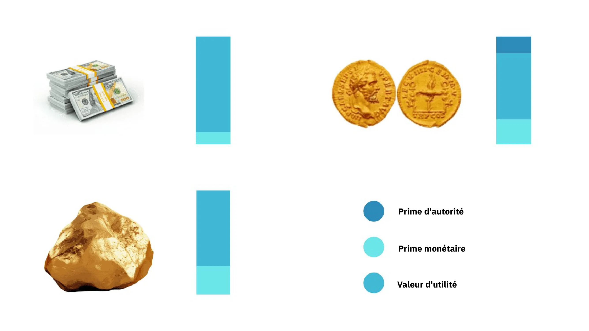

# Les différentes définitions de la monnaie
<partId>77b7918a-8c3b-11f0-b688-6b2ab22378c9</partId>

## Money vs currency vs monnaie vs argent vs devise
<chapterId>bf8a6d21-df88-5d23-a0a5-e9a5c1300554</chapterId>
:::video id=d9c9e7df-9db3-4a9f-801e-10d3fc7dfc22:::

### Sémantique des termes monétaires

Dans cette section au sujet des différentes théories monétaires et surtout sur les définitions de la monnaie, j'aimerais qu'on fasse une petite aparté au sujet de la sémantique. J'aimerais qu'on creuse un peu le sujet des définitions de plusieurs mots relatifs à la monnaie et nous allons les comparer à leurs équivalents en anglais. Par exemple, money, currency, comparé à monnaie, argent et devise. Alors, ça va comme suit.

Un peu de sémantique:

Lorsque l’on dit « de la monnaie », la plupart des gens pensent aux petites pièces que l’on reçoit en retour lors d’une transaction. En revanche, si l’on dit « la monnaie », on fait plutôt référence à la monnaie officielle d’un État.

Exemple : la monnaie du Canada est le dollar canadien.

Et l’argent ? 
Ici, le sens change selon le contexte. Un voleur ne vous dira jamais : « Donne-moi toute ta monnaie ! » (ce qui serait décevant si vous ne lui remettez que quelques pièces sans grande valeur).

Il criera plutôt : « Donne-moi tout ton argent ! », faisant référence aux billets de banque dans votre poche.

Si le vol est plus sophistiqué et touche votre patrimoine  vos comptes bancaires, vos investissements  on dira alors qu’« il te prendra tout ton argent », où le mot argent désigne la richesse totale de l’individu.

En résumé, le mot argent peut désigner deux choses : 

Les espèces, c’est-à-dire les billets et pièces.

La richesse ou l’ensemble des avoirs d’un individu.

### Currency vs monnaie vs devise

En français, il y a souvent confusion entre monnaie, argent et devise, surtout lorsqu’on compare avec les termes anglais money et currency.

Monnaie

Désigne la monnaie officielle d’un pays.

Exemple : pour un Français, l’euro est la monnaie de la France et de l’Europe.

Devise

C’est la monnaie d’un autre pays.

Exemple : la livre sterling est la devise du Royaume-Uni pour un Français.

Currency et money en anglais

Money : c’est le concept général de monnaie, quelle que soit sa forme. Il correspond à l’idée de monnaie au sens large.

Currency : c’est une unité monétaire spécifique d’un pays, utilisée pour les échanges.

Souvent, dans les discussions sur les cryptomonnaies, on entend : « Bitcoin n’est pas une monnaie ». En réalité, cela vient d’une confusion entre currency et money.

Depuis que le Salvador a adopté Bitcoin comme monnaie légale, Bitcoin est officiellement une monnaie d’État, donc au sens de currency.

Mais même avant cette adoption, au sens plus large de money, Bitcoin fonctionne comme monnaie : moyen d’échange, réserve de valeur, unité de compte.

En français, nous n’avons pas deux mots distincts pour séparer ces concepts, ce qui crée souvent cette confusion.
Argent : dans notre usage courant, désigne plutôt les billets, les espèces ou la richesse totale, et ne correspond pas exactement au concept de money.

## La définition de Saifedean Ammous 

<chapterId>07c4ba50-168c-567a-8957-0b187ff75f97</chapterId>

:::video id=936d6d3b-6d45-468e-bc44-85fbce9b857a:::

#### Qu'est ce que la monnaie ? 

La monnaie n’est pas un bien que l’on possède pour sa consommation ou son usage direct, mais pour pouvoir l’échanger ultérieurement contre d’autres biens ou services dont on pourrait avoir besoin (Saifedean Ammous).

Elle acquiert une prime monétaire lorsqu’une demande existe spécifiquement pour ce bien afin de jouer un ou plusieurs rôles monétaires (réserve de valeur, unité de compte, moyen d’échange).

Pour que cette prime monétaire se maintienne, le bien monétaire doit être suffisamment rare, afin d’éviter que l’offre s’ajuste trop rapidement à la demande monétaire et ne fasse disparaître la valeur monétaire attribuée au bien.

### La prime monétaire

Saifedean Ammous, dans L’Étalon Bitcoin, propose une définition simple et frappante de la monnaie :

« La monnaie, c’est simplement quelque chose que vous possédez ou acquérez, non pas pour être utilisé ou consommé pour ses propres caractéristiques, mais pour être échangé plus tard contre d'autres biens ou services dont vous pourriez avoir besoin. »

À cette définition, on peut ajouter le concept de prime monétaire, la monnaie acquiert une prime monétaire dès qu’il existe une demande pour ce bien afin de remplir l’un ou plusieurs de ses rôles monétaires (réserve de valeur, unité de compte, moyen d’échange). Par exemple, une monnaie qui sert de réserve de valeur voit sa demande générer une prime monétaire, car des individus souhaitent l’acquérir pour cet usage précis. 

### La rareté et les mécanismes de marché

À ça, je pense qu'il faut définitivement ajouter que le bien monétaire doit être assez rare pour que la prime monétaire puisse subsister. C'est très important. Si un bien émerge pour être utilisé comme monnaie et qu'on voit que son prix monte, normalement, si le bien n'est pas assez rare, les gens vont vouloir en produire plus pour profiter de ce gain de valeur quand le prix monte. Et donc, c'est ce qui fait que la plupart des marchandises sur les marchés ont un prix relativement fixe. Quand le prix monte, la production a tendance à augmenter. Quand le prix baisse, la production baisse. Il y a une espèce d'ajustement par le marché.Et quand un bien est assez rare, comme l'or, le mécanisme du marché ne va pas compenser cette demande accrue pour l'usage monétaire. Donc, c'est la variable qui change, c'est le prix. Comme avec Bitcoin. Quand le prix de Bitcoin monte, on ne produit pas plus de Bitcoin. Donc, ce qui s'ajuste, c'est le prix. Et c'est pourquoi on voit, depuis des années, le prix de Bitcoin monter à mesure que la demande pour Bitcoin augmente. Puisqu'il n'y a personne sur Terre qui peut changer l'algorithme et dire il y a plus de demandes, le prix monte, on va en produire plus, l'offre de nouveaux Bitcoins est programmée à l'avance, et connue à l'avance. Donc, c'est ce que je disais, c'est que le bien monétaire doit être assez rare pour que la prime monétaire puisse subsister, donc ne pas être rattrapée par les mécanismes de marché, pour prévenir l'ajustement de l'offre face à cette nouvelle demande monétaire.

## Moyen de paiement et valeur libératoire
<chapterId>5d424039-e342-56f7-9d8b-bba9551831a9</chapterId>
:::video id=af4c0765-8111-4cb7-891b-3ee54d6e7054:::

### Moyen de paiement vs moyen d'échange

Dans Aux origines de la monnaie, Alain Testart distingue deux fonctions de la monnaie :

Moyen d’échange : la monnaie facilite les échanges de biens et services, la forme classique mise en avant par l’économie traditionnelle.

Moyen de paiement : la monnaie permet de régler des obligations, parfois sans contrepartie directe, c’est-à-dire sans qu’un bien ou service soit reçu en échange.

Testart cite des exemples historiques: le wergeld (prix du sang, compensation pour meurtre) , l’impôt,les amendes ou réparations légales

Ces paiements libératoires illustrent ce qu’on appelle le pouvoir libératoire de la monnaie.

Selon Le Petit Robert, le pouvoir libératoire est ce "qui a pour effet de libérer (d'une obligation, d'une dette)".
Selon le Grand Larousse, un paiement libératoire est un "paiement effectué dans les conditions légales de telle manière que le créancier ne puisse pas contester l'extinction de la dette".

Autrement dit, la monnaie est le seul bien que l’on ne peut refuser pour éteindre une dette, qu’elle soit due à un commerçant ou au fisc. C’est ce privilège qui définit le cours légal d’une monnaie, comme le souligne Charles Gide :

"C’est ce privilège qui constitue ce qu’on appelle le cours légal."

Ainsi, tout échange implique un paiement, mais tout paiement n’implique pas un échange. La monnaie, par sa fonction de moyen de paiement, peut donc être utilisée pour libérer quelqu’un de ses obligations, sans que cela nécessite un transfert de biens ou services en retour.

### Paiements sans contrepartie
Ceci illustre clairement la thèse de l'auteur. En effet, il établit une distinction entre les deux. Pour lui, un échange est à la fois un transfert de biens et un paiement. Le paiement vient ensuite. Et un paiement peut avoir lieu sans contrepartie. Il donne l'exemple d'une amende de stationnement, qui constitue un simple paiement. On ne reçoit pas de service en échange. Certains pourraient arguer que l'État rend un service en échange, à savoir la délivrance des amendes. Il est très clair pour lui que le paiement des impôts est un paiement sans contrepartie, dans le sens où le paiement des impôts est obligatoire, même sans nécessairement recevoir de service. Il affirme que, par définition, le paiement des impôts est un simple paiement ; il n'y a aucune obligation d'obtenir des services en échange. J'ai discuté de cela avec plusieurs de mes collègues, et ils ne partagent pas forcément cette idée. Mais telle est la thèse de l'auteur. Il cherche à définir la notion de paiement et à la dissocier des échanges à l'aide de ces exemples, comme celui des amendes et des impôts. Par exemple, concernant la dot, il précise qu'il s'agit d'un paiement ; on ne reçoit pas forcément quelque chose en échange. Un détracteur de cette proposition pourrait rétorquer : « Certes, mais en échange, on obtient une épouse. » Voilà où en est le débat sur ce sujet.

Il y a aussi le wergeld, ou prix du sang. C'est donc simplement un paiement de compensation. Mon ami Ulrich dirait :

Oui, mais en échange, ce fichier sera fermé.

Vous avez donc commis un crime, un meurtre par exemple. Sur le moment, vous payez l'amende (wergeld), et après cela, vous êtes libéré de cette situation. Il y a donc un effet libérateur. Recevez-vous quelque chose en retour ? Selon l'auteur, non. Selon certains de mes collègues, oui.

Je pense que cette discussion nous permet de constater que le wergeld est un bon exemple pour définir un paiement. En effet, il est clair qu'on ne reçoit rien en retour.

## Monnaie dette vs monnaie marchandise
<chapterId>4093677a-c8e8-5828-b994-15c01656186e</chapterId>
:::video id=f49cf5cc-288e-4daa-a1ff-b9de73506f4e:::

### Le débat fondamental

Toujours dans le cadre de cette section sur les différentes définitions et théories monétaires, nous allons explorer ensemble deux visions diamétralement opposées : "la monnaie est toujours de la dette" ou "la monnaie est toujours une marchandise". D’un côté, on trouve les partisans de la théorie monétaire fondée sur la dette, qui affirment : "Mais non, la monnaie, c’est toujours de la dette". En face, nos fameux gold bugs soutiennent : "Mais non, vous voyez bien, la monnaie, c’est toujours une marchandise, c’est toujours de l’or ; tout le reste, billets, reconnaissances de dette ce n’est que du crédit, pas de la monnaie".

Explorerons ensemble un résumé clair de ces différentes théories.

### La théorie "toujours une dette"

Voici un résumé de la théorie monétaire dite **"monnaie-dette"**, selon laquelle la monnaie est fondamentalement une forme de dette :

Selon cette théorie, développée notamment par Alfred Mitchell-Innes et approfondie par David Graeber, la monnaie est intrinsèquement une reconnaissance de dette, issue des relations de crédit qui préexistaient historiquement aux échanges monétaires directs. Plutôt que de surgir d’un besoin lié au troc, la monnaie apparaît comme une façon de comptabiliser, transférer et régler des obligations sociales ou des dettes entre individus ou groupes.

Ainsi, tout argent circule en tant que dette d’une personne ou d'une institution envers une autre, soutenue par la confiance et l'autorité sociale ou étatique garantissant sa validité. Donc, selon eux, quand on possède, comme j'ai évoqué, quand on possède de la monnaie, on a une créance sur la société et la société a une dette envers nous. La monnaie ne serait donc jamais neutre ou autonome, mais toujours une dette sous-jacente. Détenir de la monnaie signifie essentiellement posséder une créance sur la société ou une communauté économique.

Ce raisonnement contredit l’idée classique de la monnaie comme simple "marchandise intermédiaire", et souligne plutôt le rôle central des relations sociales et politiques dans la création et la gestion de la monnaie.

Critique personnelle

Ce qui me pose problème dans cette théorie, c’est l’idée que la monnaie serait toujours une dette.

Il existe des exemples historiques où deux tribus ou communautés échangent de l’or de manière définitive, sans laisser de dette latente.

Les partisans de la monnaie-dette considèrent souvent ces cas comme du troc, mais je ne suis pas d’accord :

Lorsque l’or est échangé et utilisé comme monnaie, il remplit toutes les fonctions monétaires (réserve de valeur, unité de compte, moyen d’échange).

La transaction est donc bel et bien un échange monétaire, même si aucun crédit n’est créé dans l’opération.

### La théorie "toujours une marchandise"

Toujours une marchandise

Voici un résumé clair de la théorie monétaire dite "monnaie-marchandise", où la monnaie émerge toujours comme une marchandise, notamment l'or qui émerge d'un besoin de pouvoir commercer, une marchandise qui sera généralement acceptée à l'extérieur et que l’on acquiert à des fins de commerce.

Selon cette théorie, développée par les économistes classiques (Adam Smith, David Ricardo) et reprise par Marx, la monnaie émerge naturellement comme une marchandise parmi d'autres, souvent un métal précieux tel que l'or ou l'argent, qui possède une valeur intrinsèque indépendante de son rôle monétaire. Initialement, ces marchandises sont choisies spontanément par les acteurs économiques pour faciliter les échanges grâce à leurs qualités intrinsèques (rareté, durabilité, divisibilité et stabilité).

La monnaie-marchandise se distingue par son existence physique et une valeur déterminée par la quantité de travail socialement nécessaire à sa production (chez Marx notamment). La société utilise ainsi l’or, par exemple, non seulement pour simplifier le troc, mais aussi comme unité de compte, réserve de valeur, et moyen universel d’échange.

Dans cette vision, la monnaie conserve toujours une valeur réelle, car elle reste liée à une marchandise tangible. Même lorsque le rôle de la monnaie devient abstrait (pièces frappées, billets ou monnaie scripturale), sa validité provient toujours, directement ou indirectement, d’une référence à une marchandise sous-jacente comme l'or. Cette théorie insiste donc sur l'origine matérielle et économique de la monnaie, en opposition aux théories qui la considèrent comme une simple convention ou une dette. Selon cette théorie, toute représentation de la monnaie par un substitut, par exemple un billet remboursable en or, serait du crédit.

Critique personnelle
On remarquera que cette vision ressemble à celle de la théorie de la monnaie-marchandise, mais c'est un pas plus loin. Ils proposent que la monnaie soit toujours une marchandise. Et quand on va leur dire: "oui, mais on peut s'entendre qu'un billet de banque, c'est la monnaie pour ce groupe, il peut être backé par de l’or, ça fonctionne, et le billet de banque en tant que tel, c'est de la monnaie".

En réponse à ça ils vont nous donner l'exemple du coupon de vestiaire. Ils vont nous dire: "oui! mais non, est-ce que quand tu as un coupon de vestiaire pour ton vêtement, est-ce qu'on peut appeler le coupon de caisse un vêtement ?".

Bien sûr que non, c'est comme une reconnaissance, une créance, dans le fond, qui va te permettre de récupérer ton vêtement. ça ne tient pas, puisque un coupon de vestiaire, ce n'est pas un mode de paiement généralement accepté. La monnaie, ce n'est pas une créance sur un objet spécifique comme un vêtement, c'est un mode, un moyen d'échange, un intermédiaire d'échange, ou un moyen de paiement généralement accepté.

Donc, on ne peut pas faire un parallèle entre un coupon de vestiaire et un billet de monnaie fiat, puisque le coupon de vestiaire te permet d'obtenir un bien en particulier en échange, c'est un jeton qui vous permet de récupérer votre bien, tandis qu'un billet de banque, la monnaie fiat, c'est un coupon universel qui te permet d'accéder à n'importe quel bien.

Et à mon sens, évidemment, même la monnaie fiat peut être considérée comme de la monnaie si elle est considérée comme tel par la population. Et je trouve que c'est une erreur de sémantique d'insister sur le fait que ça ne peut pas être de la monnaie, puisque c'est un coupon pour obtenir la vraie monnaie, du moins à l'époque, qui était l'or sous-jacent.

Je n'ai pas de problème à considérer comme la pièce d'or qui est conservée dans le coffre et le billet qui représente cette pièce d'or comme de la monnaie. Pour moi, il n'y a pas de problème de sémantique, c'est juste deux sortes de monnaies. Mises l’expliquent très bien ce phénomène-là en parlant des substituts monétaires, si je ne me trompe pas.

Leur vision se résume au fait qu'on ne peut pas en même temps considérer la pièce d'or qui est dans un coffre à la banque et le billet de banque qui la représente comme de la monnaie. Personnellement, je n’y vois aucun problème, je ne vois aucun paradoxe dans cette situation. Les partisans de que la monnaie est toujours une marchandise ne voient pas les choses de la même manière que moi.

Le livre Aux origines de la monnaie reprend une critique classique du concept du coupon de vestiaire, qui illustre bien le débat sur la monnaie-dette versus monnaie-marchandise :

« Excellente critique ,excellente parce qu'elle est sur le terrain même où se place Knapp, le terrain juridique par Rist (1938: 372, note 1) de la comparaison entre papier-monnaie et jeton de vestiaire : si on peut parler d'une sorte de créance dans les deux cas, la différence fondamentale est que dans le premier cas, et dans le premier seulement, il s'agit de créance sans objet déterminé.»

En d’autres termes :

Un coupon de vestiaire est une créance avec un objet déterminé (le vêtement que l’on récupère).

Un billet de banque ou de la monnaie fiat, en revanche, est une créance sans objet spécifique, qui peut être échangée contre n’importe quel bien ou service.

C’est cette distinction qui explique pourquoi la comparaison entre les deux n’est pas pertinente pour justifier que « toute monnaie est une dette ».

Cette analyse renforce l’idée que la monnaie est un moyen d’échange universel, et non une simple reconnaissance de dette liée à un objet particulier.

Aussi, au sujet de la créance, le même auteur note ceci:  
« Bastiat a beau jeu d'imaginer un bon d'achat sur l'ensemble de la société présentée comme "un immense bazar", ce petit ajout, cette petite extension en apparence anodine, c’est toute la différence entre le crédit et la monnaie. La monnaie ne consiste pas en une créance sur un magasin particulier. Il n'y a pas de créance anonyme. Tandis que l'anonymat qui caractérise la monnaie, et donc sa généralité, fait toute sa puissance. La monnaie n'est pas comme le crédit, encore moins lui est-elle en quoi que ce soit réductible. La monnaie est beaucoup plus que le crédit.»

Un paradoxe : monnaie dette vs monnaie marchandise

Le paradoxe qui illustre le mieux la profonde dichotomie entre les théories de la monnaie-dette et de la monnaie-marchandise concerne la question de savoir si l'or est une monnaie aujourd'hui.

D'un côté, la théorie de la monnaie-dette définit la monnaie avant tout comme un intermédiaire d’échange ou moyen de paiement globalement accepté, voire imposé par une autorité publique. Selon cette perspective, l'or ne constitue plus aujourd'hui une monnaie, puisqu'il n'est pas largement utilisé ni accepté comme moyen d'échange courant.

De l'autre côté, la théorie de la monnaie-marchandise considère la monnaie comme une marchandise tangible, choisie spontanément par la société en raison de ses caractéristiques intrinsèques (rareté, durabilité, divisibilité, etc.). Selon cette approche, l'or reste la véritable monnaie universelle, et toutes les autres formes monétaires actuelles ne sont, fondamentalement, que du crédit reposant sur la confiance.

Ce paradoxe montre clairement l'écart entre ces deux conceptions monétaires : pour la première, l'or n'est plus une monnaie ; pour la seconde, il demeure au contraire la seule véritable monnaie existante.

## La théorie monétaire moderne
<chapterId>8efc29af-3193-5d97-ad9f-e608b32924ff</chapterId>
:::video id=f8127cb7-46a1-468c-bbb5-97bf0a8b8837:::

### Principes de la théorie monétaire moderne (MMT)

La théorie monétaire moderne (Modern Monetary Theory – MMT) propose que les États disposant de leur propre monnaie souveraine ne peuvent jamais manquer d'argent, puisqu'ils peuvent en créer à volonté pour financer leurs dépenses.

Points clés :

La monnaie est une création de l'État, pas une ressource limitée.

Les impôts et emprunts servent principalement à réguler l'inflation et maintenir la demande pour la monnaie nationale, et non à financer directement les dépenses publiques.

La limite réelle aux dépenses gouvernementales est l'inflation, pas le déficit ou la dette publique.

Les dépenses doivent être ajustées selon les ressources réelles (main-d'œuvre, matières premières, capacités industrielles) pour éviter l’inflation.

Exemple pratique :
Si l’État injecte des milliards dans l’industrie militaire, cette création monétaire n’engendre pas d’inflation car le secteur peut l’absorber. Par contre, doubler le budget pour construire des routes pourrait provoquer de l’inflation si la main-d’œuvre et les matériaux deviennent rares.

### Rôle des impôts dans la MMT

Les impôts retirent de la monnaie en circulation pour limiter l’inflation.

Sans impôts, une création monétaire excessive pourrait déstabiliser l’économie.

### Critique de la MMT

Cette théorie ne s’applique qu’à une poignée de pays (voir tweet de Stephanie Kelton) qui jouissent d’une vraie souveraineté monétaire c'est-à-dire qu’ils peuvent lever de la dette dans leur propre monnaie. Cette théorie s'applique difficilement aux économies dépendantes des importations, qui doivent maintenir la confiance internationale dans leur monnaie.

Souveraineté monétaire limitée : la MMT ne fonctionne que pour les pays pouvant émettre de la dette dans leur propre monnaie (ex. États-Unis, Japon, Canada).

Effet sur le reste du monde : ces pays peuvent exporter l’inflation via leur monnaie, un phénomène parfois comparé à un « colonialisme monétaire ».

Planification centralisée : nécessité de surveiller l’utilisation des ressources pour éviter une inflation excessive.

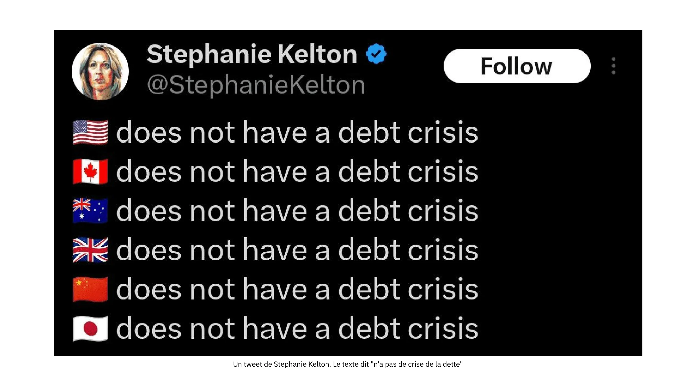

Étrangement, elle ne liste que six pays ? Pourquoi ? 

Parce qu'ils ont une vraie souveraineté monétaire. Mais il y a environ 200 pays sur la Terre et ils n'ont pas tous une souveraineté monétaire. Donc, ce que je reproche à cette théorie, en plus d'être un peu étrange et non fonctionnelle, c'est qu'elle ne fonctionne que pour quelques pays qui jouissent d'une vraie souveraineté monétaire, ceux qui peuvent émettre des bons du trésor dans leur propre monnaie. Et ça se fait un peu au détriment du reste du monde. C'est comme si, en créant cette monnaie, ils exportaient leur inflation ailleurs, comme les États-Unis font avec leur privilège exorbitant depuis des décennies. C'est presque une espèce de forme de colonialisme monétaire où les pays qui jouissent d'une confiance à l'échelle mondiale et d’une demande pour leur monnaie pour acheter des biens qu'ils produisent, peuvent imprimer de la monnaie autant qu'ils veulent sans trop causer l'inflation parce qu'en général, ils l'exportent. 

Cette théorie s'applique difficilement aux économies dépendantes des importations qui doivent maintenir la confiance internationale dans leur monnaie.

# La chute et la renaissance de la monnaie
<partId>87a34ca9-782b-5ade-b51a-400f88ed7b0c</partId>

## Les monnaies grecques
<chapterId>7714195f-74ce-5f8c-be5f-59302d39fff4</chapterId>
:::video id=8e5c3091-0910-471b-8d4b-0dc6e9afa656:::

### Cadre historique et contextuel

Avant de commercer voici le cadre historique :

Les Romains appelaient les Grecs "Graeci" et la Grèce "Graecia".

Les Grecs s'appelaient eux-mêmes "Hellènes" et leur pays "Hellas".

Homère (né vers le VIIIe siècle av. J.-C.) poète grec légendaire, auteur présumé du livre L’Iliade et de L’Odyssée.

Vers 750 av. J.-C. : Lycurgue, législateur mythique de Sparte, aurait établi la constitution spartiate basée sur la discipline militaire et la simplicité.

Numa Pompilius (753-673 av. J.-C.) second roi de Rome, célèbre pour avoir donné à Rome ses premières institutions religieuses et légales.

Dracon, législateur athénien (VIIe siècle av. J.-C.), célèbre pour ses lois extrêmement sévères d’où le terme "draconien".

594 av. J.-C. : Solon devient législateur à Athènes et réforme profondément la société athénienne, notamment en abolissant l'esclavage pour dettes.

776 av. J.-C. : Jeux olympiques antiques  
Premiers jeux sportifs réguliers célébrés à Olympie tous les quatre ans, rassemblant les cités grecques.

Pythagore (env. 570-495 av. J.-C.) philosophe et mathématicien grec, célèbre pour son théorème sur le triangle rectangle.

Xénophane de Colophon (env. 570-478 av. J.-C.) philosophe pré-socratique connu pour ses critiques du polythéisme grec traditionnel.

490 av. J.-C. : Bataille de Marathon
Les Athéniens repoussent victorieusement une invasion perse, marquant un tournant décisif pour la civilisation grecque.

Hérodote (env. 484-425 av. J.-C.), surnommé "père de l’histoire", rédige une vaste œuvre décrivant les guerres médiques, notamment la victoire des Grecs sur Xerxès en 480 av. J.-C.

Socrate (470-399 av. J.-C.) philosophe athénien célèbre pour sa méthode dialectique et son enseignement sur l’éthique et la connaissance de soi.

Aristophane (env. 446-386 av. J.-C.) dramaturge athénien, célèbre pour ses comédies satiriques comme Les Grenouilles.

Sophocle (Ve siècle av. J.-C.), dans sa pièce *Antigone*, critique la monnaie comme source de corruption morale et politique par l’intermédiaire du tyran Créon.

Platon (env. 428-348 av. J.-C.) philosophe grec, élève de Socrate, fondateur de l’Académie, auteur de *La République*.

431-404 av. J.-C. : Guerre du Péloponnèse  
 Conflit majeur opposant Athènes à Sparte, se concluant par la défaite d’Athènes.

431 av. J.-C. : Athènes finance la guerre du Péloponnèse en diluant ses monnaies d'or et d'argent pour en augmenter la quantité en circulation, causant de l’inflation.

Xénophon (env. 430-355 av. J.-C.)  
 Écrivain, philosophe et général athénien, disciple de Socrate, auteur de l’*Anabase*.

414 av. J.-C. : Athènes commence à perdre la guerre du Péloponnèse après une désastreuse expédition en Sicile.

405 av. J.-C. : Aristophane, dans sa pièce *Les Grenouilles*, décrit explicitement la dévaluation de la drachme d'argent et l'apparition de pièces inférieures en bronze à Athènes, illustrant le principe connu aujourd’hui sous le nom de "Loi de Gresham".

404 av. J.-C. : Athènes capitule après un long siège mené par Sparte.

Aristote (384-322 av. J.-C.) philosophe grec majeur, élève de Platon, fondateur du Lycée, connu pour ses travaux en logique, en biologie et en philosophie politique.

327 av. J.-C. : Alexandre le Grand conquiert Persépolis et les provinces orientales de l’empire perse, étendant ainsi considérablement son empire.

323 av. J.-C. : Alexandre meurt à Babylone sans héritier clair, provoquant des guerres entre ses généraux (diadoques) pour se partager l’empire.

Archimède (env. 287-212 av. J.-C.)  
Mathématicien, physicien et inventeur grec, célèbre pour ses découvertes en géométrie et en mécanique.

196 av. J.-C. : La Pierre de Rosette est gravée sous le règne du pharaon Ptolémée V, permettant plus tard le déchiffrement des hiéroglyphes égyptiens.

192-188 av. J.-C. : Guerre romano-séleucide 
Rome défait l'empire Séleucide dirigé par Antiochos III, consolidant son influence en Grèce et en Asie Mineure.

146 av. J.-C. : Bataille de Corinthe
Les Romains détruisent la cité grecque de Corinthe, marquant la fin de l’indépendance politique grecque et l’intégration progressive de la Grèce au sein du monde romain.

Pour cette section au sujet de l'Antiquité, la chute de Rome et le Moyen Âge, nous allons commencer avec une section sur les monnaies grecques.

L'histoire de la monnaie dans la Grèce antique commence aux alentours de 600 av. J.-C., lorsque les cités grecques adoptent rapidement l’innovation venue de Lydie, en Asie Mineure, utilisant initialement l'électrum puis l'argent. Les premières monnaies grecques furent frappées sur l’île d’Égine, arborant une tortue marine ou terrestre, mais c'est la drachme athénienne, décorée d’Athéna et d’une chouette, qui devint le symbole monétaire par excellence à partir du Ve siècle av. J.-C., dominant largement les échanges internationaux à l'époque.

J'ai la chance d'avoir une copie d'un drachme grec de l'époque avec cette fameuse chouette et une figure à l'arrière. C'est un tétradrachme qui était plus gros qu’un simple drachme.

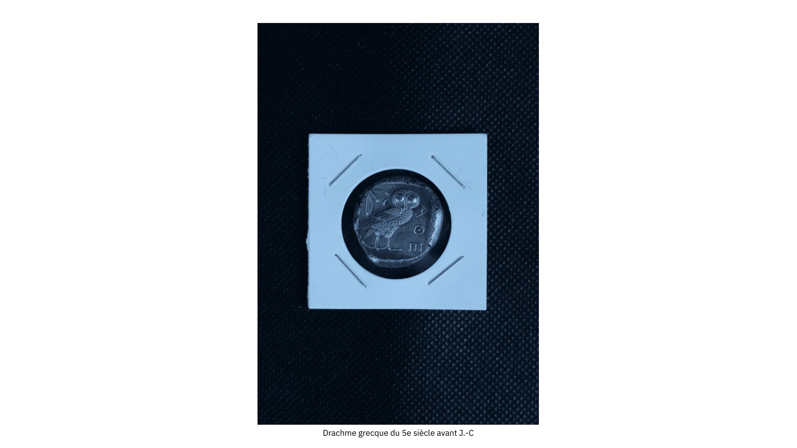

Chaque cité grecque développa son propre rapport à la monnaie. À Athènes, la monnaie fut profondément liée à la puissance politique et économique. Le fameux décret athénien à la fin du Ve siècle av. J.-C. imposa l’usage exclusif de la monnaie athénienne dans ses territoires alliés, renforçant ainsi son hégémonie économique. Athènes accumulait aussi de grandes réserves d'or en cas d'urgence, conservées sur l'Acropole, peut-être un symbole de sa prudence économique. À l’inverse, Sparte, cité militaire aux valeurs rigoureuses, choisit de restreindre fortement l’usage de la monnaie, interdisant à ses citoyens la possession de pièces en or ou en argent. Sparte préférait utiliser de lourdes barres de fer afin de décourager le commerce extérieur et maintenir sa cohésion sociale. 

Les guerres furent souvent financées par des manipulations monétaires. Pendant la guerre du Péloponnèse (431-404 av. J.-C.), Athènes procéda à des dévaluations drastiques pour payer ses troupes. Privé de l'accès à ses mines d'argent par l'occupation spartiate de Décélie en 413 av. J.-C., Athènes dut fondre des statues en or pour frapper de nouvelles monnaies en urgence en 407/406 av. J.-C. Puis, en 406/405 av. J.-C., elle créa des pièces de bronze plaquées d’argent, causant une crise monétaire illustrée par *Aristophane*, qui évoque déjà ce que l’on appelle aujourd’hui la loi de Gresham, la mauvaise monnaie chassant la bonne. Cette monnaie d'urgence fut rapidement démonétisé après la guerre pour restaurer la confiance en la monnaie athénienne.

La fin de la période classique fut marquée par la montée de la Macédoine avec Philippe II et son fils Alexandre le Grand, bouleversant profondément l’équilibre monétaire grec. Grâce aux importantes mines d'or et d'argent du mont Pangée, Philippe II produisit une abondance monétaire qui finança ses campagnes militaires et politiques, instaurant un étalon or-argent simple et pratique (10:1). Ses statères d'or, célébrant sa victoire aux Jeux Olympiques, circulèrent même jusqu'en Europe occidentale atteignant même l’Angleterre. Alexandre poursuivit cette politique monétaire, diffusant largement la drachme *attique* au cours de ses conquêtes en Orient jusqu'en Inde. Cette circulation massive de monnaies marqua le début de l’ère hellénistique, où l’image des souverains remplaça progressivement celle des divinités sur les pièces. Cette innovation permit à des générations de monarques hellénistiques de se mettre en valeur, reléguant les dieux traditionnels à un rôle secondaire au revers de leurs monnaies.

Après la mort d’Alexandre en 323 av. J.-C., ses généraux se partagèrent son immense empire, établissant des dynasties en Égypte (les Ptolémées), en Syrie (les Séleucides) et ailleurs. Ces royaumes hellénistiques adoptèrent des systèmes monétaires variés : les Ptolémées imposèrent un système monétaire fermé pour contrôler la circulation de l'argent, préférant utiliser des céréales comme monnaie interne afin d'économiser les métaux précieux pour leurs dépenses militaires externes. En parallèle, Rhodes devint un centre commercial majeur avant d'être affaibli économiquement par les Romains qui établirent Delos comme port franc en 167 av. J.-C.L’usage de la monnaie fut central dans la rémunération des mercenaires. Les soldats d'Alexandre recevaient quotidiennement des drachmes en argent.

La cavalerie, élite de l’armée hautement spécialisée d’Alexandre, recevait en moyenne deux drachmes par jour, un fantassin un drachme, et un mercenaire ordinaire, deux tiers de drachme, soit le double du salaire d’un simple ouvrier.

Durant la guerre du Péloponnèse, des sommes considérables furent également versées aux soldats : plus de 1200 talents pour réprimer la révolte de Samos et plus de 2000 talents pour assiéger Potidée.

Au moment où cette armée fut pleinement engagée en Asie Mineure, le coût total s’élevait à environ vingt talents par jour, soit environ une demi-tonne d’argent, ou 120 000 drachmes.

La monnaie grecque eut aussi un rôle culturel important, chaque cité cherchant à affirmer son identité en frappant ses propres pièces avec des symboles locaux ou mythologiques. Par exemple, Héraclée représentait Héraclès (Hercule) combattant un lion, tandis que Cyrène montrait la célèbre plante médicinale silphium.

Enfin, malgré leur variété et leurs fluctuations régionales, les monnaies grecques classiques et hellénistiques marquèrent durablement l’histoire économique et culturelle du monde méditerrané, influençant profondément les systèmes monétaires ultérieurs jusqu’à Rome, qui adopta progressivement et développa les concepts économiques grecs pour structurer sa propre économie impériale.

## L'impact de la monnaie en Grèce
<chapterId>3a5e6c7d-699c-5567-87cd-3374c49d55a9</chapterId>
:::video id=0c79a59c-e179-4893-a414-1b8de0930eb9:::

### Athènes et le contraste avec Sparte

L'opposition entre Athènes et Sparte durant la période classique grecque révèle deux modèles radicalement différents d'organisation politique et économique. Alors que Sparte rejette la monnaie métallique au profit d'un système autarcique basé sur la confiance civique, Athènes embrasse pleinement cette technologie pour construire et maintenir son empire maritime.

### La nécessité monétaire d'une puissance navale

L'Empire athénien, malgré son nom grandiose, reste géographiquement modeste  essentiellement Athènes et les cités de la mer Égée. Sa puissance repose sur la Ligue de Délos, une alliance militaire dominée par Athènes en tant qu’hégémon. Cette structure impériale nécessite un instrument économique unifié : la monnaie d'argent athénienne.

Le maintien d'une flotte constitue le cœur de cette nécessité monétaire. Une seule trière athénienne coûte entre un et deux talents d'argent - une somme considérable. Avec plusieurs centaines de navires à entretenir, Athènes doit disposer d'un système fiscal efficace. La monnaie devient l'outil indispensable pour collecter les tributs des cités vassales et financer cette force de projection navale qui garantit la cohésion de l'empire.

### L'imposition monétaire comme outil de domination

Athènes impose sa monnaie d'argent à tous les membres de la Ligue de Délos. Cette standardisation monétaire sert plusieurs objectifs stratégiques. D'abord, elle facilite la collecte des tributs en créant une unité de compte commune. Ensuite, elle renforce la dépendance économique des cités vassales envers Athènes. Enfin, elle projette symboliquement la puissance athénienne à travers tout l'empire maritime.

Cette politique monétaire contraste fortement avec le modèle spartiate. Sparte, puissance terrestre, peut compter sur le travail des hilotes (esclaves) du Péloponnèse pour sa subsistance. Son système économique fermé, centré sur la cité, ne nécessite pas d'instrument monétaire sophistiqué. Les citoyens-soldats vivent ensemble, partagent les repas communs et n'ont pas besoin de monnaie pour les échanges quotidiens.

### La monnaie comme vecteur du commerce maritime

La nature maritime de l'empire athénien impose une ouverture commerciale. Contrairement à Sparte, tournée vers l'intérieur, Athènes doit commercer avec l'extérieur pour sa survie et sa prospérité. La monnaie devient l'instrument indispensable de ces échanges commerciaux méditerranéens.

Cette orientation externe crée un cercle vertueux : le commerce génère des revenus, ces revenus financent la flotte, la flotte protège les routes commerciales et maintient l'empire, l'empire impose la monnaie athénienne qui facilite le commerce. La monnaie n'est plus seulement un moyen d'échange, mais devient un pilier de la stratégie impériale.

### Les limites de la puissance monétaire

Malgré cette sophistication économique, la puissance monétaire athénienne montre ses limites durant la guerre du Péloponnèse. Face à la force terrestre spartiate, la supériorité navale et financière d'Athènes ne suffit pas. Les expéditions coûteuses, comme la désastreuse campagne de Syracuse en Sicile, épuisent les ressources financières sans apporter la victoire décisive.

L'histoire révèle ainsi que la monnaie, bien qu'outil puissant de projection de puissance, ne garantit pas la domination militaire. Sparte, sans monnaie métallique mais avec une cohésion sociale remarquable, finit par l'emporter sur l'empire monétaire athénien.

### Deux modèles, deux destins

L'opposition Athènes-Sparte illustre deux approches fondamentales de l'organisation sociale et économique. Athènes représente le modèle ouvert, commercial, monétarisé — précurseur des empires maritimes modernes. Sparte incarne le modèle fermé, autarcique, basé sur la confiance civique plutôt que sur l'instrument monétaire.

Ces deux systèmes révèlent que l'adoption de la monnaie dépend étroitement du modèle politique et économique choisi. Pour une puissance maritime et commerciale comme Athènes, la monnaie devient indispensable. Pour une société guerrière fermée comme Sparte, elle représente une menace à l'ordre social. Cette dichotomie antique éclaire encore aujourd'hui les débats sur le rôle de la monnaie dans l'organisation des sociétés.

## La République romaine
<chapterId>0bc80983-33e1-5881-85bb-7c22f3144a9a</chapterId>
:::video id=dc05ca97-d29c-4679-bfeb-912c47d86ce2:::

### Cadre historique de la république romaine

- 753 \- 509 av. J.-C. : Royaume de Rome
- 753 av. J.-C. : Fondation de Rome (traditionnellement attribuée à Romulus).
- 509 \- 27 av. J.-C. : République romaine, Rome devient une république gouvernée par un Sénat et des consuls élus.
- 280-275 av. J.-C. : Guerre de Pyrrhus. Pyrrhus, roi d'Épire, combat les Romains en Italie du Sud, remportant des victoires coûteuses ("victoires à la Pyrrhus").
- 264 \- 146 av. J.-C. : Guerres puniques. Conflits majeurs opposant Rome à Carthage pour la domination de la Méditerranée occidentale.
- Hannibal (247 \- vers 181 av. J.-C.). Général carthaginois légendaire, célèbre pour avoir traversé les Alpes avec son armée et ses éléphants afin d'attaquer Rome durant la Deuxième Guerre punique.
- 146 av. J.-C. : Bataille de Corinthe. Rome détruit la cité grecque de Corinthe et impose sa domination définitive sur la Grèce continentale.
- 91 \- 87 av. J.-C. : Guerre sociale. Révolte des alliés italiens de Rome réclamant la citoyenneté romaine, ce qui conduit finalement à leur intégration complète dans la citoyenneté.
- 64 av. J.-C. : Fin de la résistance séleucide. Rome élimine définitivement l’influence séleucide en Syrie, consolidant son emprise sur l'Orient méditerranéen.
- 55 av. J.-C. : Jules César conquiert l'Europe centrale et occidentale. Jules César étend la domination romaine sur la Gaule (France actuelle) et pénètre en Germanie et en Bretagne.
- 43 av. J.-C. : Formation du Second triumvira. Alliance politique entre octave (futur Auguste), Marc Antoine et Lépide, pour stabiliser Rome après l’assassinat de César.
- 27 av. J.-C. : Début de la Pax Romana. Période de stabilité politique et de prospérité sous le règne d’Auguste qui marque le début de l'Empire romain.

### Les débuts monétaires tardifs de Rome

Dans le cadre de cette section sur l'Antiquité, nous allons maintenant nous attarder sur la République romaine. L'histoire monétaire de Rome débute bien tardivement comparée aux Grecs et aux Perses. Fondée en 753 av. J.-C., Rome attendit près de quatre siècles avant de véritablement adopter la monnaie. Pendant cette longue période, les Romains utilisaient un système primitif d'échange avec des morceaux de bronze irréguliers appelés aes rude, nécessitant une pesée précise à chaque transaction. Ce n'est qu'à la fin du IVe siècle av. J.-C., sous l’influence grecque et étrusque, que Rome commence à émettre ses premières monnaies, notamment en bronze coulé comme en Chine.

### L'influence grecque et les premières monnaies d'argent

La rencontre déterminante avec les Grecs d'Italie du Sud initie véritablement les Romains à la monnaie d'argent frappée. Ainsi, vers 280 av. J.-C., Rome commence à produire ses propres pièces d’argent imitant les didrachmes grecques. La première émission régulière de monnaies d’argent à Rome date précisément de 269 av. J.-C., arborant les jumeaux légendaires Romulus et Remus allaités par la louve, un symbole devenu iconique.

On retrouve d’ailleurs plusieurs représentations de mythes fondateurs sur les pièces romaines de l’époque de la République. Et j'en ai une ici, une superbe pièce, c'est une vraie, du roi Tatius. Cette pièce illustre un mythe de l'enlèvement des femmes à Sabine. Ce fameux Tatius était le roi dans cette région. Il existait un mythe fondateur selon lequel les Romains seraient allés enlever les femmes à Sabine, un peuple vivant près des Romains. Plus tard, le roi Tatius devint co-roi avec l'un des fondateurs de Rome, le roi Romulus.

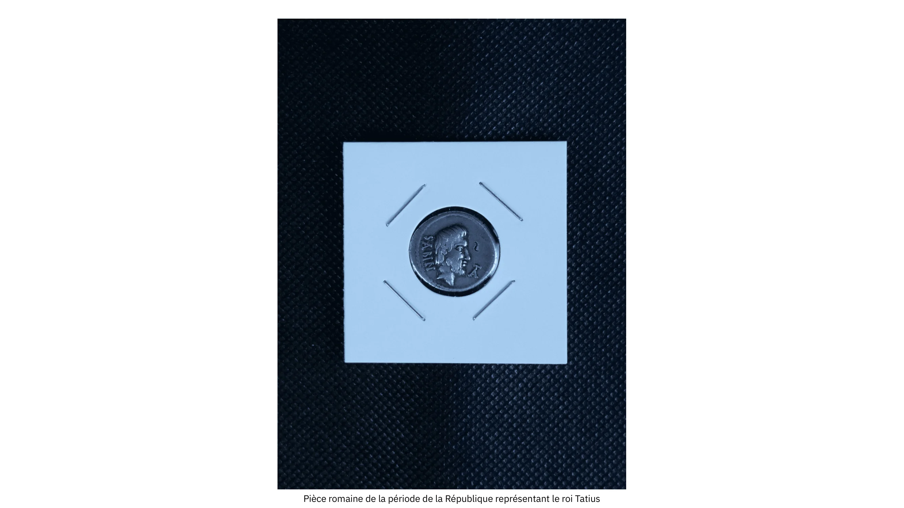

### L'origine du mot "monnaie" et le temple de Juno Moneta

Le terme "monnaie" tire d'ailleurs son origine du temple de Juno Moneta à Rome. Selon la légende, lors d’une invasion gauloise en 390 av. J.-C., les oies sacrées du Capitole auraient alerté les Romains d’un danger imminent. Pour remercier la déesse Juno, protectrice du Capitole, un temple fut érigé en son honneur et devint rapidement le lieu de frappe des monnaies romaines.

### Les guerres puniques et les crises monétaires

Les conflits militaires influencent considérablement l'évolution monétaire romaine. Durant la deuxième guerre punique (218-201 av. J.-C.) contre Carthage, Rome connut des difficultés financières sévères face à l’invasion d’Hannibal. Pour pallier ces besoins urgents, Rome recourut pour la première fois à une émission exceptionnelle de pièces d’or, ainsi qu'à une dévaluation significative de sa monnaie en argent, passant d'une pureté initiale de 97 % à environ 89 %. Le poids des monnaies de bronze (aes) chuta également drastiquement, perdant près de 80 % en six ans.

On retrouve ici un concept déjà énoncé avec les Grecs : la fonte de métaux précieux conservés dans un temple pour pallier des crises économiques. Et pour parler de Carthage, j'ai ici une vraie pièce carthaginoise. Ces pièces arboraient un palmier d'un côté et, de l'autre, un cheval. Sur cette pièce, le cheval n'est pas très reconnaissable car elle est très usée.

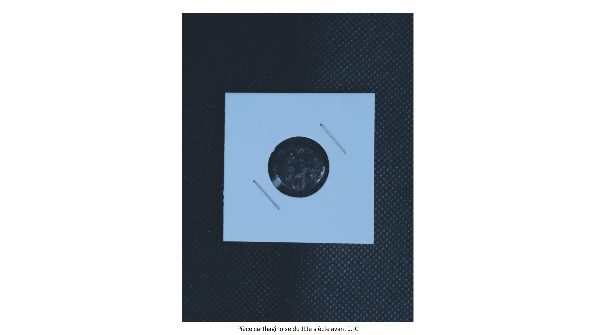

DLe poids des monnaies de bronze, aes, chuta également drastiquement, perdant près de 80 % en six ans. Ces pièces, utilisées dans le commerce courant, voyaient ainsi leur valeur s'éroder fortement à cause des crises militaires.

### Le denier d'argent et la stabilité monétaire

C'est dans ce contexte critique que Rome instaure, vers 212 av. J.-C., le célèbre denier d'argent. Cette réforme assure une solidité monétaire remarquable, le denier demeurant la monnaie dominante durant près de 450 ans. Rome doit cette stabilité à une gestion rigoureuse, malgré une retarification majeure en 146 av. J.-C. et une production considérable pour financer ses immenses armées, notamment durant les guerres puniques, sociales (91-87 av. J.-C.) et macédoniennes. À titre d’exemple, maintenir une seule légion romaine coûtait environ 1,5 million de deniers par an, illustrant l’ampleur des besoins monétaires.

Au-delà des frontières romaines, les guerres engendrèrent d’importantes dévaluations dans les régions sous influence romaine. Ainsi, Carthage vit la pureté de son électrum chuter dramatiquement, passant de 98 % d’or au IVe siècle à seulement 30 % pendant la deuxième guerre punique, tandis que ses monnaies d'argent tombèrent jusqu’à 18 % de pureté.

### L'évolution des motifs monétaires

Avec l'expansion de Rome, le caractère des monnaies évolua aussi : initialement anonymes et patriotiques, les pièces adoptèrent progressivement des motifs personnalisés mettant en avant les familles puissantes des monnayeurs (ceux qui frappaient la monnaie). Cette transition symbolise clairement les transformations politiques de la République romaine tardive.

Enfin, si Rome domina économiquement le monde méditerranéen, elle conserva une certaine simplicité dans ses moyens de paiement : aucune véritable forme de transfert monétaire autre que l’échange direct de pièces ne fut développée, à l’exception des transferts d’impôts et des crédits privés réservés à l’élite.

## L'Empire Romain
<chapterId>2dc44e50-112a-5abf-97ae-8e0a9ecda989</chapterId>
:::video id=f8d6f3d6-9ee4-4504-888e-4f12b3f20489:::

Cadre historique

Le Principat était la forme de gouvernement impérial de l'Empire romain depuis le début du règne d'Auguste en 27 av. J.-C. jusqu'à la fin de la crise du troisième siècle en 284 ap. J.-C.

27 av. J.-C. : Début de la Pax Romana  
Période de stabilité politique et de prospérité sous le règne d'Auguste qui marque le début de l'Empire romain.

Auguste (30 av. J.-C. à 14 ap. J.-C.) réforme en profondeur le système monétaire romain, établissant un standard durable et stable pour les monnaies impériales.

Auguste est également l'un des premiers collectionneurs reconnus de monnaies antiques et de fossiles.

54 \- 68 ap. J.-C. : Néron 
Empereur romain controversé, connu pour sa tyrannie, ses persécutions et sa gestion désastreuse après l'incendie de Rome.

64 ap. J.-C. : Grand incendie de Rome 
Incendie majeur qui ravage une grande partie de la ville ; Néron est accusé d’en être responsable.

69 ap. J.-C. : Année des quatre empereurs 
Période chaotique où quatre empereurs se succèdent rapidement (Galba, Othon, Vitellius, Vespasien).

79 ap. J.-C. : Éruption du Vésuve 
Volcan qui détruit les villes de Pompéi et Herculanum, préservant exceptionnellement leurs vestiges sous les cendres.

165 \- 180 ap. J.-C. : Peste antonine 
Épidémie dévastatrice qui fragilise fortement l'Empire romain sous Marc Aurèle et Commode.

200 ap. J.-C. : Apogée territorial et fin progressive de la Pax Romana  
Rome atteint son extension maximale, mais commence à souffrir d'instabilité interne et de difficultés économiques.

212 ap. J.-C. : Édit de Caracalla sur la citoyenneté  
L’empereur Caracalla accorde la citoyenneté romaine à presque tous les habitants de l’empire, afin d'élargir l'assiette fiscale.

220 ap. J.-C. : Début des grandes invasions barbares  
Premières incursions significatives de peuples germaniques à travers les frontières romaines.

235 \- 285 ap. J.-C. : Crise politique et militaire du IIIe siècle  
Période marquée par une forte instabilité politique avec de nombreux empereurs éphémères, guerres civiles, crises économiques et invasions continues.

Aurélien (270-275 ap. J.-C.) réévalue profondément la monnaie romaine en tentant de restaurer sa valeur nominale malgré une importante inflation.

301 ap. J.-C. : Édit des prix de Dioclétien 
L’empereur Dioclétien tente vainement de stopper l’inflation galopante en imposant un contrôle strict des prix et des salaires dans tout l’empire.

312 ap. J.-C. : Constantin
Premier empereur chrétien, fondateur de Constantinople, stabilise la monnaie en introduisant le "solidus", monnaie d’or de grande pureté et stabilité.

476 ap. J.-C. : Chute de l’Empire romain d’Occident 
Rome est prise par divers peuples germaniques (dont les Ostrogoths), événement considéré comme marquant la fin officielle de l’Empire romain d’Occident.

### Réformes monétaires d'Auguste

Dans cette section sur l'Antiquité, nous en sommes déjà arrivés à l'Empire romain. L’histoire monétaire de l’Empire romain se distingue par un usage intensif de la monnaie métallique, notamment l’or, l’argent et le bronze, mais également par de multiples crises monétaires, liées étroitement à des troubles politiques et militaires. Dès la fin de la République, sous Jules César, Rome introduit en 46 av. J.-C. l’aureus en or, monnaie d'environ 8 grammes, largement acceptée à travers l’Europe et le bassin méditerranéen. César standardise ces monnaies d’or et frappe les premières pièces portant le portrait d’un homme vivant, bouleversant ainsi une tradition républicaine ancienne qui privilégiait des symboles anonymes et collectifs. Cette évolution accompagne une période de transformation politique majeure, où le pouvoir personnel remplace progressivement les institutions républicaines.

Après l'assassinat de César en 44 av. J.-C., Octave (Auguste) prend le contrôle de Rome, établissant l’Empire en 27 av. J.-C. Son règne voit une réforme complète du système monétaire, stabilisant durablement l'économie romaine. Au temps d'Auguste, un aureus en or équivaut à 25 deniers d'argent, lui-même valant 4 sesterces en bronze. Cette stabilité monétaire se prolonge durant le premier siècle après Jésus-Christ, période souvent décrite comme un âge d’or économique pour Rome.

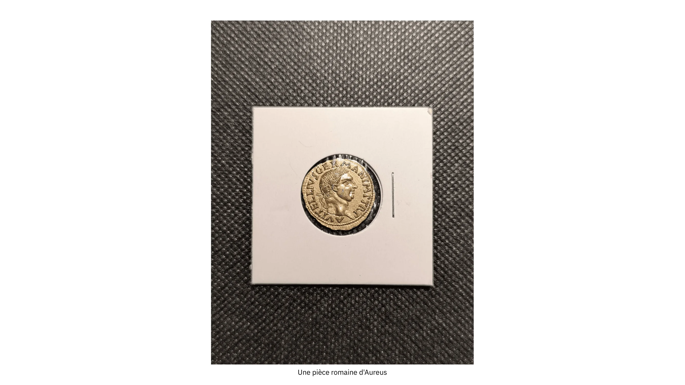

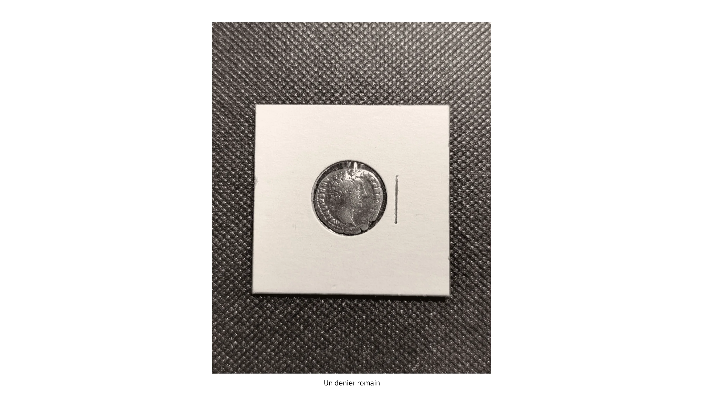

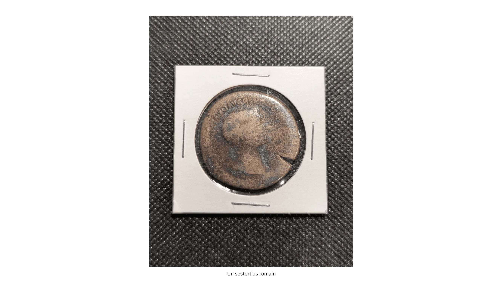

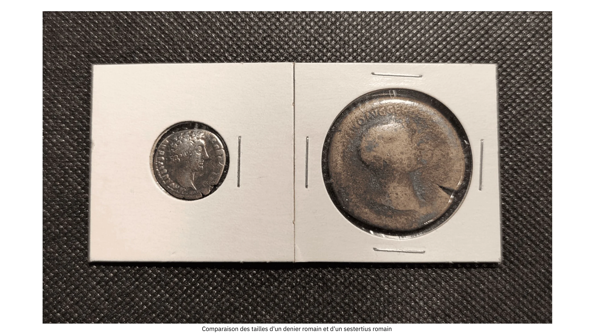

Cependant, à partir de Néron (54-68 ap. J.-C.), Rome amorce une lente dévaluation de ses monnaies, réduisant progressivement leur poids et leur pureté pour financer les dépenses impériales croissantes, notamment après le grand incendie de Rome en 64 ap. J.-C. Ces dévaluations entraînent des effets notables : les pièces plus pures sont retirées de la circulation par thésaurisation ou exportation, conformément à la loi de Gresham, tandis que des monnaies dévaluées prolifèrent, provoquant une hausse graduelle des prix.

Le IIIe siècle marque un tournant dramatique avec une accélération spectaculaire des dévaluations sous les empereurs Septime Sévère, Caracalla et Gallien. La monnaie d'argent principale, le denier puis l’antoninien, voit sa teneur en argent diminuer jusqu'à seulement 2 %. En parallèle, le poids de l'aureus en or chute de moitié. Cette crise monétaire s'accompagne d’une instabilité politique sans précédent, d’invasions barbares et de guerres civiles récurrentes.

Pour illustrer, voici la dernière pièce de cette section, un antoninien. On ne sait pas comment cette pièce s'appelait à l'époque ; nous l'appelons antoninien. Cette pièce avait la particularité de valoir deux deniers, mais elle n'était qu'1,5 fois plus grosse qu’un denier. De plus, elle était souvent en billon, un alliage non pur d'argent et d'autres métaux, recouverte d'une fine couche d'argent. C'était un bel exemple de déchéance monétaire.

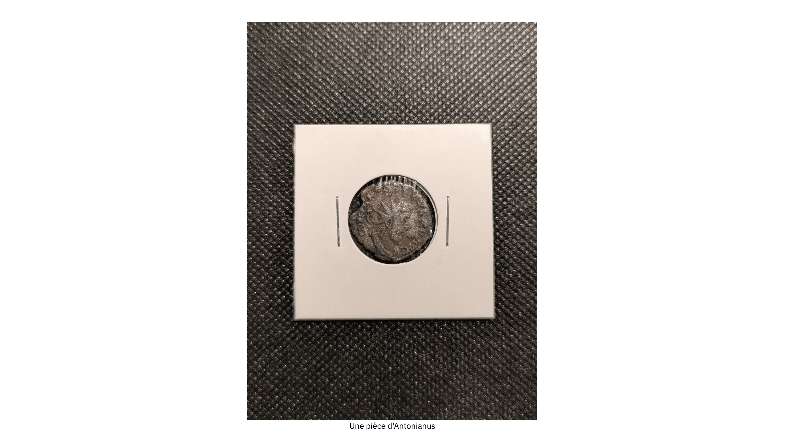

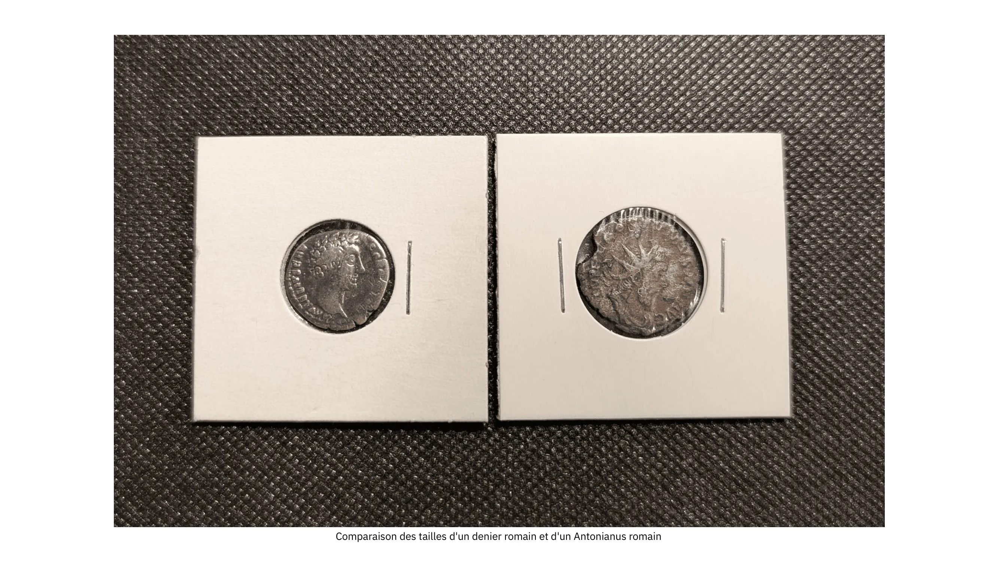

Face à cette situation, l'empereur Aurélien (270-275) tente de stabiliser le système en revalorisant nominalement les monnaies, mais cette réforme introduit en réalité un mécanisme inflationniste en fixant artificiellement la valeur des monnaies existantes à un niveau supérieur.

À ce sujet, il faut noter que c'est vraiment à cette époque que l'inflation au IIIe siècle prend un tournant presque exponentiel. Avant, même si les pièces étaient dévaluées, le fait qu'elles étaient frappées individuellement assurait un certain contrôle sur l'inflation. Sur ces 300 ans de dévaluation, l'inflation moyenne était d'environ 4 % par an. Juste avant la réforme d'Aurélien, elle était autour de 3 % annuellement. Aurélien a estampé une mesure de pureté sur la monnaie avec le signe XXI, soit 20 parts de bronze pour une part d'argent (5 % de pureté). Il a mis en circulation ces pièces de 5 % d'argent et a estampé ce signe dessus. Ensuite, il a rappelé toutes les autres pièces, les plus dévaluées, et les a également estampées du XXI, réévaluant ainsi la valeur nominale de toutes les pièces. Le résultat fut une inflation de 20 % par an au lieu de 3 % précédemment.

C'est vraiment Aurélien qui a inventé cette forme de dévaluation rapide, beaucoup plus brutale que la dévaluation graduelle du métal, qui imposait de frapper les pièces une par une. Lui, il a pris toutes les pièces existantes, les a rappelées et les a estampées pour changer leur valeur nominale. À partir de ce moment-là, l'inflation devient exponentielle.

Pour visualiser cet extrême de dévaluation, on peut examiner le prix du grain en Égypte de 40 av. J.-C. jusqu'au IIIe siècle, soit sur 300 ans. Par exemple, un tétradrachme grec ou son équivalent égyptien sous occupation romaine au IIIe siècle valait environ un denier.

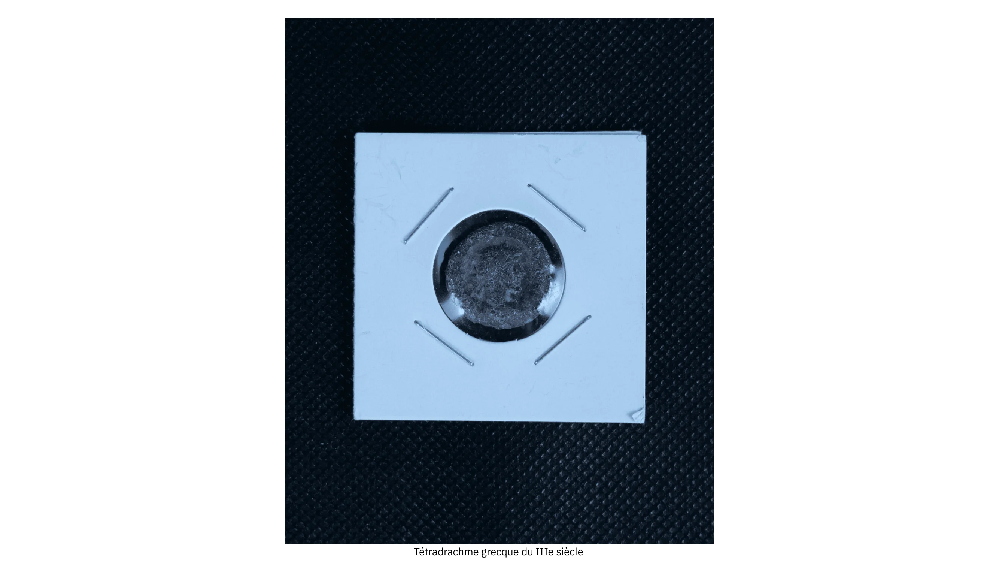

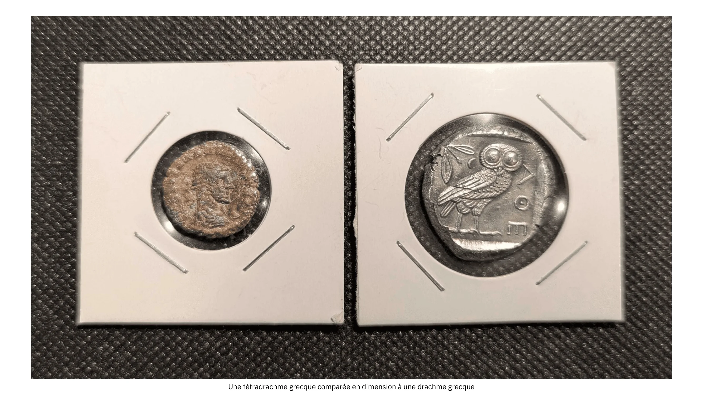

On constate que le tétradrachme égyptien est en billon ou en bronze, sans métal précieux, comparé au tétradrachme grec d’origine. Sur ces 300 ans, le prix du grain en Égypte a été multiplié par un million, illustrant l'effet physique de la réforme d'Aurélien. La moyenne d'inflation sur ces 300 ans était d'environ 4 %, mais à la fin, après la réforme d'Aurélien, l’inflation devient exponentielle, entraînant une multiplication par un million des prix par rapport au Ier siècle av. J.-C.

Son successeur, Dioclétien (284-305), tente des réformes encore plus radicales : il émet de nouvelles monnaies (notamment l’argenteus, plus pur mais trop limité en quantité), impose des contrôles stricts sur les prix (édit des prix de 301 ap. J.-C.) et établit un système fiscal basé sur les paiements en nature. Malgré ces efforts, ses réformes échouent à enrayer l’inflation galopante.

Face au refus de fournir des marchandises et services contre de la monnaie dévaluée, Dioclétien instaure un système de castes héréditaires pour attacher les paysans et leurs descendants à leurs terres.

Il faut comprendre que les paysans refusaient de livrer leurs produits contre une monnaie dévaluée. Dioclétien oblige donc les citoyens à rester dans leur métier ou sur leur terre, payés en nature (viande, nourriture, grains) pour compenser l'échec monétaire.

Extrait de Monetary Regime and Inflation :

Comme les gens n'étaient pas prêts à travailler et à livrer des biens contre une monnaie dévaluée, il fallut les contraindre à travailler en imposant des taxes en nature. [...] il devint illégal pour les paysans de quitter leur domicile enregistré. La population agricole devint ainsi héréditairement attachée à la terre.
Ce système de castes héréditaires s'étendit progressivement : Dioclétien contraignit les fils de soldats à servir dans l’armée, tandis que les travailleurs des ateliers monétaires et des manufactures de tissage et de teinture devinrent esclaves d’État, avec un service héréditaire. Les chercheurs d’or constituèrent eux aussi plus tard une caste héréditaire. D’autres classes héréditaires existaient probablement déjà à l’époque de Dioclétien, notamment les guildes des boulangers et bouchers [...] à Rome, ainsi que les guildes diocésaines des capitaines de navires transportant le grain et d’autres cargaisons publiques vers Rome.

C’est finalement Constantin (306-337) qui stabilise le système monétaire en introduisant le solidus en 312, une monnaie d’or pure dont la qualité et le poids sont strictement garantis. Cette stabilité n’affecte cependant qu’une élite fortunée et l’administration impériale, tandis que la majorité de la population continue à souffrir d'une monnaie de faible qualité et d’une inflation persistante. Le solidus reste stable dans l’Empire d’Orient (Byzance), où il perdure plus d’un millénaire, alors qu’en Occident, la monnaie se fragmente en petites pièces de faible valeur, accompagnant la désintégration économique et politique finale de l’Empire romain, qui chute définitivement en 476 ap. J.-C.

Pour conclure, je partage cette citation de A History of Money: From Ancient Times to the Present Day par Glyn Davies :

« Les taxes étaient constamment insuffisantes, et les difficultés liées à ces impôts de plus en plus inadéquats, ajustés tardivement et très visibles, poussèrent Rome à se fier davantage à une forme d'imposition facile, immédiate et cachée : la dévaluation de la monnaie. Des réformes ponctuelles et de courte durée ne parvinrent pas à inverser cette tendance séculaire au déclin. Les pressions financières causées par l'usure des pièces de monnaie, les naufrages, les fuites monétaires dues à l'achat de produits de luxe venant de l'Orient, les cadeaux offerts aux barbares germaniques, la croissance des populations urbaines, le déclin de la production agricole, l’épuisement progressif des mines les plus riches, et surtout les politiques du "pain et jeux", jugées essentielles pour maintenir un minimum d'ordre dans la vie urbaine, toutes ces pressions cumulées incitèrent Rome à une dévaluation monétaire constante, entrecoupée de réformes occasionnelles vouées à l’échec. »

En plus du pain et du vin distribués gratuitement ou à bas prix, des libéralités impériales ("congiaria") furent distribuées de temps en temps, particulièrement sous Trajan (98–117 ap. J.-C.) et encore davantage sous Hadrien (117–138 ap. J.-C.) et ses successeurs. Ce qui avait été initialement un privilège exceptionnel était devenu, dès le début du IIe siècle, une attente coutumière. Ces distributions "constituaient un lourd fardeau pour le trésor public et contribuèrent à leur manière à la faillite de l’État".

## Liens entre dilution monétaire et inflation : des causes aux conséquences
<chapterId>38d5781c-e900-53f7-baa7-413655d71754</chapterId>
:::video id=3999256d-aafe-4502-9b72-dfa8491a2777:::

Dans cette section, nous allons explorer les liens entre dilution monétaire et inflation, de ses causes à ses conséquences. La dilution monétaire est un phénomène économique majeur de l’histoire romaine, ayant des effets directs sur l’inflation.

Dès le Ier siècle ap. J.-C., une première phase lente de dilution du denier est observable sous le règne de Néron (54-68 ap. J.-C.), puis elle s’accélère lors de crises militaires et financières répétées, notamment sous Septime Sévère (193-211) et Gallien (253-268). On note également une dévaluation plus graduelle de l’aureus.

Cette différence de rythme de dévaluation souligne deux points essentiels :

-Le rôle de l’unité de compte dans le bimétallisme pour le contrôle de la monnaie par l’État. Ici, le denier est l’unité de compte. Trois mécanismes sont utilisés pour gérer sa valeur : Dévaluation (dilution du métal), Redénomination (antoninien) et enfin la fixation de la valeur faciale via le marquage, comme le signe XXI sous Aurélien.

-La volonté de préserver la monnaie de réserve de valeur, l’aureus, afin de protéger le pouvoir d’achat des élites, au détriment des moins fortunés. Ce principe se retrouve à plusieurs reprises dans l’histoire, notamment avec le Maravedi en Espagne. En résumé, l’État dévalue l’unité de compte utilisée par la population pour les échanges quotidiens, mais pas l’unité de réserve de valeur. Ainsi, l’inflation touche surtout le peuple, tandis que ceux pouvant conserver de l’or échappent à ses effets.

Ce phénomène est toujours observable aujourd’hui : la création monétaire enrichit indirectement les détenteurs d’actifs financiers, tandis que les utilisateurs de la monnaie subissent l’appauvrissement relatif, creusant les inégalités sociales. Ce mécanisme est connu sous le nom d’effet Cantillon.

La réforme d’Aurélien et l’accélération de l’inflation

La réforme monétaire d’Aurélien permit à l’inflation de s’emballer. La valeur nominale de la monnaie n’était plus limitée par la capacité des ateliers monétaires : il suffisait d’apposer un poinçon sur les pièces existantes pour augmenter rapidement la masse monétaire.

Deux citations illustrent cette situation :

« En ce qui concerne l’économie romaine, la contribution d’Aurélien fut davantage un désastre qu’un triomphe. C’est en grande partie à cause de la nature de sa "réforme" que le taux d’inflation a pu augmenter bien au-delà de ce qui avait été possible auparavant, même sous l’irresponsable Gallien. Après Aurélien, pendant deux siècles, l’inflation devint endémique dans l’ensemble de l’Empire romain. » A History of Money: From Ancient Times to the Present Day

« La réforme d’Aurélien a modifié la relation entre la monnaie d’or et le reste du système monétaire. Avant celle-ci, les autres types de monnaies étaient liés à l’aureus selon des taux officiels. Après la réforme, la monnaie d’or a commencé à fluctuer librement en valeur, tandis que le reste du système monétaire s’effondrait en valeur en raison de l’affaiblissement des alliages, n’étant plus adossé à l’or. Comme l’unité de compte restait théoriquement basée sur l’argent, les prix augmentaient à mesure que la monnaie se dépréciait. » Ancient History from Coins

Cette réforme détacha le denier de l’aureus, permettant à ceux ayant accès à l’or de préserver leur pouvoir d’achat, tandis que la population payait le prix de la dévaluation.

En Égypte, richement documentée, les effets sont frappants :

« Entre les règnes de Claude (41–54 ap. J.-C.) et Constance (337–361 ap. J.-C.), le prix du blé en drachmes a été multiplié par plus d’un million. L’inflation spectaculaire est l’un des faits économiques centraux des IIIe et IVe siècles ap. J.-C. » (Lendon 1990, p. 106)
« À partir de 238 ap. J.-C., l’inflation s’accélère, car la bonne monnaie est d’abord chassée de la circulation. Elle atteint un taux annuel moyen de 3,65 % entre 250 et 293, puis grimpe à 22,28 % entre 293 et 301, jusqu’aux réformes monétaires avortées de Dioclétien. » (Wassink 1991, p. 466)

Les mécanismes économiques en jeu

Objectif initial : pallier les crises de trésorerie de l’État en réduisant la teneur en métal précieux tout en maintenant la valeur nominale.

Effet différé sur les prix : la rigidité du système (« stickiness ») retardait l’ajustement des salaires et prix.

Seuil critique atteint : les prix augmentent brutalement pour rééquilibrer la valeur réelle des monnaies.

Sous Aurélien et Dioclétien, cette dynamique conduit à un système à deux vitesses :

Élite protégée par l’or (solidus de Constantin),

Population subissant une inflation chronique (effet Cantillon).

On observe donc un lien clair entre dilution monétaire et inflation, lié aux déficits fiscaux chroniques, aux dépenses militaires incessantes et à une mauvaise gestion économique étatique. La réforme d’Aurélien marque un tournant, accélérant l’inflation et détachant l’unité de compte de la monnaie de réserve, préparant le terrain pour les inégalités économiques de la fin de l’Empire.

## La chute de l’Empire Romain
<chapterId>b6ec0914-227b-509c-8108-b09eec9bb904</chapterId>
:::video id=91d4fee5-59bb-4ab9-a90b-e1125c71decb:::

### La dévaluation monétaire et l'effondrement de Rome 

L'école autrichienne d'économie, notamment à travers Ludwig von Mises, propose une interprétation monétaire de la chute de Rome. Dans cette vision, la dévaluation progressive de la monnaie romaine a brisé le système complexe de division du travail qui soutenait un empire de 60 millions d'habitants. La monnaie, instrument central de coordination économique, une fois corrompue, entraînait l'effondrement de toute la structure sociale et économique.

Cette dégradation monétaire ne détruisait pas seulement la cohésion interne de l'empire. Elle rompait également les liens commerciaux avec les peuples frontaliers. Les "barbares", privés des bénéfices du commerce avec Rome, passaient de la coopération pacifique à la prédation. Les invasions n'étaient donc pas uniquement militaires, mais résultaient d'une rupture économique fondamentale.

### Les trois phases de la dévaluation impériale

L'histoire monétaire romaine se divise en trois périodes distinctes. La première, des Julio-Claudiens aux Antonins (27 av. J.-C. fin IIe siècle), maintient une relative stabilité. Sous Trajan, l'empire atteint son apogée : 5 millions de km², et Rome devient la première ville millionnaire de l'histoire. Le denier conserve une pureté d'argent de 98 % à 80 % une dévaluation modérée permettant encore le fonctionnement économique.

La deuxième période, le IIIe siècle, marque l'anarchie militaire. Vingt-six empereurs se succèdent en quelques décennies. La monnaie s'effondre : l'antoninien, censé valoir deux deniers, n'en contient que 1,5 en poids métallique  première tentative de divorce entre valeur légale et valeur réelle. Cette manipulation déclenche la loi de Gresham : la mauvaise monnaie chasse la bonne. Les citoyens thésaurisent les bonnes pièces, ne dépensant que les dévaluées.

Les trésors monétaires découverts en archéologie révèlent cette anxiété économique. Les amphores enterrées montrent, par stratification, comment les Romains déposaient d'abord les meilleures pièces, ajoutant progressivement les dévaluées. Ces "stacks" antiques témoignent de l'action humaine face à l'incertitude une tentative de préserver la valeur dans un monde en déliquescence.

### Constantin et le système dual 

Constantin (310-337) tente de stabiliser l'empire par une réforme radicale. Il crée le solidus d'or, monnaie strictement contrôlée par l'administration. Des fonctionnaires vérifient systématiquement le poids et la pureté. L'émission reste limitée, liée aux butins de guerre. Cette monnaie devient l'instrument exclusif du pouvoir : les impôts se paient en solidus, les légions reçoivent leur solde en or.

Parallèlement, le peuple utilise le nummus de bronze, constamment dévalué. En 445, un solidus vaut 7 000 nummi ; en 498, 16 800. Ce système dual institutionnalise l'effet Cantillon : ceux ayant accès au solidus — administration, propriétaires terriens — sont protégés de l'inflation. La plèbe, cantonnée au nummus, s'appauvrit inexorablement.

Cette séparation monétaire crée deux économies parallèles sans taux de change officiel. Le solidus reste l'unité de compte, mais circule peu. Le nummus sert aux échanges quotidiens mais perd constamment de sa valeur. Cette architecture monétaire préfigure les inégalités du système féodal émergent.

### L'effondrement de la division du travail

La dévaluation monétaire détruit progressivement la spécialisation économique. Sans unité de compte fiable, le commerce méditerranéen s'effondre. Les artisans spécialisés de Rome ne peuvent plus échanger avec l'Égypte ou la Gaule. Les provinces adoptent leurs propres monnaies, multipliant les frictions commerciales.

Face à cette désintégration, la population urbaine fuit vers les campagnes un exode urbain inversant des siècles d'urbanisation. Les artisans abandonnent leurs métiers pour l'agriculture de subsistance. Les grands domaines (latifundia) deviennent des îlots autarciques, préfigurant les seigneuries médiévales.

Dioclétien, désespéré, exige même les impôts en nature aveu ultime de l'échec monétaire. Son édit du maximum (301) tente de contrôler les prix, accélérant le retour au troc. La complexité économique régresse vers des formes pré-civilisationnelles.

### La survie par l'or de Rome à Byzance

Le solidus survit paradoxalement à l'empire d'Occident. Byzance le maintient jusqu'au XIe siècle, assurant mille ans de stabilité économique supplémentaire. En Occident, son souvenir persiste : le mot français "sou" dérive de solidus, témoignage linguistique d'une grandeur monétaire perdue.

Les propriétaires terriens ayant préservé leur richesse en or deviennent les seigneurs féodaux. Les structures ecclésiastiques, seules institutions survivantes, assurent le lien social que la monnaie ne peut plus garantir. L'Europe se fragmente en domaines autarciques, chacun avec sa propre économie de subsistance.

Cette transformation révèle la fragilité des civilisations complexes. La division du travail, permettant à Rome de nourrir un million d'habitants, dépend entièrement de la confiance monétaire. Une fois cette confiance brisée, l'édifice s'effondre, ramenant l'Europe à des formes économiques primitives pour près d'un millénaire.

## L’âge des ténèbres et le Moyen Âge
<chapterId>a5856873-6142-57be-8a73-1f9e3df83792</chapterId>
:::video id=86b8da9b-3831-443d-b170-58c2bea3ad54:::

L'histoire et l'émergence de la monnaie au Moyen Âge sont marquées par des périodes de régression, d'innovation et de rétablissement économique.

Par exemple, lorsque l’armée romaine quitte la Grande-Bretagne, plus aucune monnaie romaine n’entre sur l'île. Vers 435 après J.-C., l'utilisation de la monnaie disparaît complètement en Grande-Bretagne, phénomène unique dans les anciennes provinces romaines. Pendant près de deux siècles, l'économie britannique se passe de monnaie, jusqu'au VIIe siècle, lorsque des monnaies d'inspiration mérovingienne et continentale réapparaissent progressivement.

À partir du VIIIe siècle, l'influence chrétienne contribue à la réintroduction de la monnaie en Europe du Nord. La figure clé de cette époque est Pépin le Bref, roi des Francs, qui instaure le denier en 752, repris ensuite par son fils Charlemagne. Ce dernier étend largement l'usage du denier d'argent, créant ainsi une norme monétaire européenne pour plusieurs siècles.

En Angleterre, la monnaie connaît un regain significatif avec la production du penny en argent sous le roi Offa de Mercie vers 765. Cette monnaie devient si importante qu'elle reste quasiment inchangée pendant 500 ans.

Comme premier artefact lié à cette période, je vous propose une reproduction d'un penny anglais de l'époque.

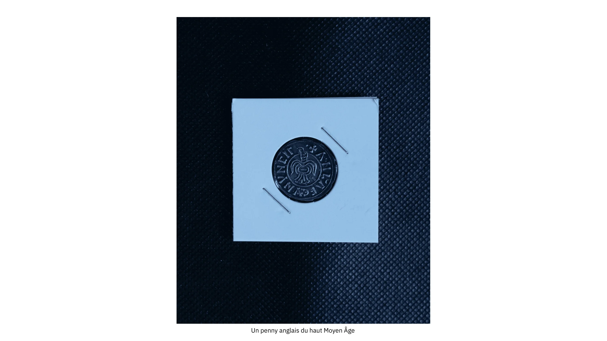

Durant le haut Moyen Âge, l'Europe bascula vers le féodalisme suite à l'effondrement du système monétaire romain. La majorité de la population utilisait des monnaies de faible valeur en cuivre ou en bronze, souvent sujettes à la dilution monétaire, limitant ainsi les échanges commerciaux sur de longues distances.

Le retour de la monnaie comme moyen de paiement se fit graduellement, culminant au XIIIe siècle avec l'apparition du florin d’or à Florence en 1252, puis du ducat d’or à Venise. Ces monnaies d’or connurent une large diffusion grâce à l'expansion du commerce et aux besoins croissants de moyens de paiement fiables et acceptés internationalement.

En Angleterre, le système monétaire fut protégé de la dilution grâce à des politiques fiscales innovantes, comme la taxe foncière introduite par Guillaume le Conquérant après 1066, permettant de préserver la qualité du penny sterling. Ici, ce qui est important à comprendre, c'est que les souverains de cette époque pouvaient dévaluer la monnaie pour financer l'État, et l'introduction de cette taxe permit de garder la monnaie stable tout en finançant l'État par l'impôt.

Cependant, la tentation du profit par la dilution monétaire mena à des crises, comme sous le règne d'Henri Ier au XIIe siècle, où la qualité des monnaies chuta dramatiquement. Des réformes sévères, parfois accompagnées de mesures violentes envers les monnayeurs, permirent de restaurer temporairement la confiance dans la monnaie.

Le Moyen Âge vit également l'apparition de pratiques financières sophistiquées, comme l'usage des bâtons de comptage (tally sticks) en Angleterre, permettant de contourner l'interdiction de l'usure et d'étendre le crédit. L'Église n'était pas très friande des prêts avec intérêt, donc différentes techniques étaient utilisées pour contourner cette prohibition.

Ces innovations répondaient au manque chronique de monnaie métallique et favorisèrent l’émergence d'un marché financier embryonnaire.

Les croisades, quant à elles, stimulèrent le commerce méditerranéen, favorisant le développement des échanges internationaux et de nouvelles pratiques bancaires, notamment par l'Ordre des Templiers. Ces derniers devinrent d'importants intermédiaires financiers, permettant aux croisés d'obtenir des liquidités loin de chez eux, préfigurant ainsi le système bancaire européen moderne.

Et pour faire le lien avec les Templiers, j'ai ici une monnaie médiévale française, sur laquelle on peut reconnaître au centre une belle croix. C'était assez courant pour les monnaies de cette époque d'arborer cette croix.

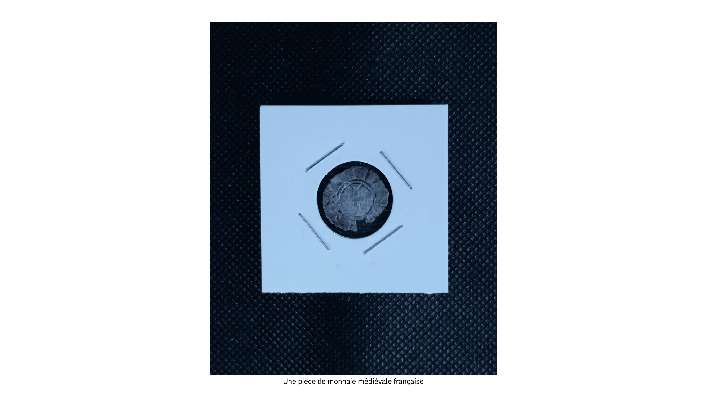

Enfin, les grandes crises, comme la Peste noire (1346-1353), provoquèrent de profondes transformations économiques. La forte baisse démographique entraîna une augmentation brutale des salaires, défiant les tentatives gouvernementales de maintenir les anciens niveaux de rémunération.

Parallèlement, la guerre de Cent Ans (1337-1453) força les États à adopter des politiques fiscales plus agressives pour financer leurs armées, contribuant à l'affaiblissement du système féodal.

Le Moyen Âge fut ainsi marqué par une constante tension entre le besoin de monnaie fiable pour le commerce et la tentation permanente pour les souverains de diluer la monnaie afin d'en tirer des profits immédiats. Ce conflit façonna profondément l'évolution monétaire européenne, préparant ainsi les fondations des systèmes économiques modernes.

En conclusion de cette section, j'ajouterais une anecdote assez intéressante survenue à cette période en Angleterre, tirée du livre History of Money de Glyn Davies.

On y mentionne qu'en Angleterre, le passage vers le Parlement permit de transférer le poids de la dette du souverain vers cette institution, autorisant ainsi un endettement chronique de l'État. Avant cela, la dette pesait entièrement sur les épaules du souverain.

Une fois que le Parlement eut acquis une partie du pouvoir de création monétaire, cela permit la création de dettes à long terme, supportées par la population et non par le roi. Avant, si le roi faisait faillite ou si un nouveau monarque prenait le trône, la dette s'éteignait avec lui.

Avec la création de dette par le Parlement, émergea le concept de dette souveraine, potentiellement illimitée dans le temps. Tant que l'État et le Parlement existent, cette dette subsiste, nécessitant toutes sortes de moyens pour la refinancer et l’étaler sur la durée. C'est un changement de paradigme important : ce n'était plus la royauté qui garantissait ou supportait le poids de ces dettes, mais désormais le Parlement et, par extension, ses citoyens.

## La renaissance
<chapterId>1d1dfb05-70b4-5b7b-9708-373c2182950d</chapterId>
:::video id=4977b4f3-c7b2-41a5-ad7b-a96a8cca4092:::

Nous en sommes déjà arrivés à la section du cours où nous parlons de la période que l'on nomme la Renaissance. Elle se déroule sur fond d'une crise tragique, avec la propagation fulgurante de la peste par des puces transportées par des rats qui embarquent sur les bateaux. Cette tragédie nous informe toutefois sur la croissance des échanges et des déplacements depuis la période du haut Moyen Âge. Plus tôt, durant cette période, peu de gens se déplaçaient aussi loin et aussi rapidement.

### le Florin de Florence

Le retour des monnaies d'or en Europe durant la Renaissance marque un tournant fondamental dans l'histoire monétaire. Tout commence avec le florin de Florence en 1252, première grande monnaie en or frappée en Europe depuis la chute de Rome. Avec un poids et une pureté remarquablement constants (environ 3,5 grammes d'or pur), le florin reste inchangé pendant quatre siècles et devient rapidement une référence monétaire pan-européenne incontournable.

Ici, j'ai une reproduction d'un florin : un florin d'or en étain, estampé par un artiste français réalisant d'excellentes pièces, gravées et frappées à la main.

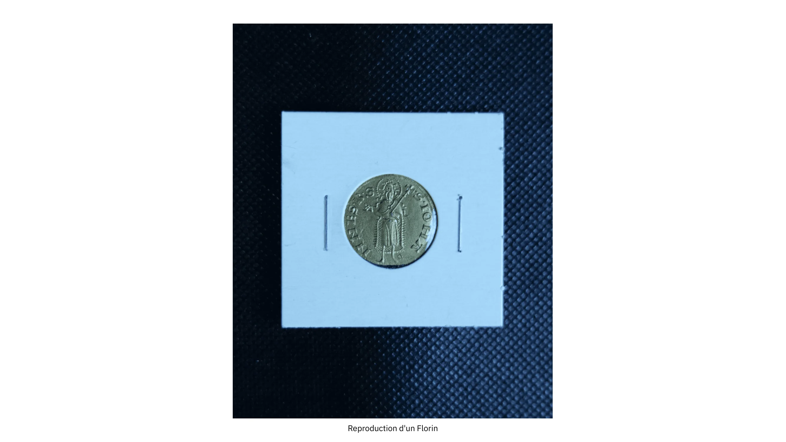

Ce retour des monnaies d’or est motivé par un contexte précis : la chute du solidus byzantin et le déclin économique musulman causé par les invasions mongoles créent un vide monétaire pour les échanges internationaux.

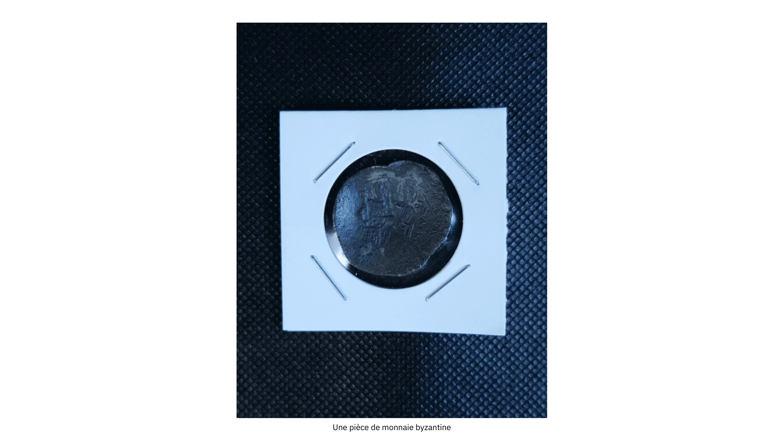

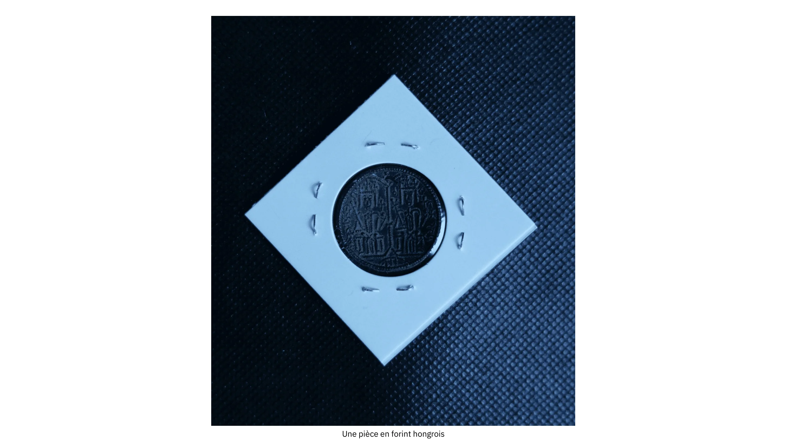

J'ai ici une pièce byzantine que je trouve intéressante. Je vais vous faire un parallèle avec une monnaie de la Hongrie de la même époque. C'est une pièce en forme de coupe, comme un petit bol miniature. L'iconographie représente une figure religieuse et des rois tenant des croix dans leurs mains, côte à côte. C'est le même genre de pièce sous forme de coupe, et celle-ci vient de Hongrie. Il était assez courant de copier les pièces des autres pays. Comme les pièces byzantines étaient globalement acceptées, d'autres pays les reproduisaient. On peut voir, quand on les compare côte à côte, que ces pièces se ressemblent beaucoup.

L'Italie du Nord, notamment Florence, Venise et Gênes, profite de ce contexte pour lancer de nouvelles monnaies dures, dont la teneur en métaux précieux est stable. Venise suit l’exemple de Florence en frappant le ducat en 1270, une monnaie presque identique au florin et largement utilisée dans le commerce méditerranéen.

Le florin devient la première monnaie de réserve internationale, adoptée dans plus de 150 villes européennes avant la fin du XIVe siècle. Avec la création d'un réseau bancaire florentin d’envergure, mené par les Médicis, la gestion monétaire et comptable se modernise profondément, réduisant même le besoin de transporter physiquement l’or.

C’est quelque chose de particulièrement intéressant. À cette époque, on perdait beaucoup de cargaisons de pièces lors des voyages en mer. L'avancée technologique des registres avec la comptabilité à double entrée permet la création de monnaie scripturale. On peut ainsi réduire le nombre de règlements en pièces et effectuer des transferts par écrit, diminuant considérablement le risque de perte de monnaie pendant les transports.

Le développement monétaire s'accompagne également d’une évolution significative des méthodes bancaires. Inspirée en partie par les contacts des Croisades avec les pratiques bancaires musulmanes, l'Europe médiévale voit émerger des systèmes bancaires rudimentaires à Florence, Venise, Barcelone et Gênes dès le XIIIe siècle. Les Templiers, ordre religieux et militaire, proposent déjà un système permettant aux croisés de voyager sans transporter directement leur fortune.

Ils déposaient leur argent dans un bureau des Templiers dans leur pays, puis pouvaient se déplacer avec une forme de lettre et récupérer les pièces à leur arrivée pour la croisade. Cela permettait de ne pas transporter des pièces de métaux précieux.

C'est également pendant cette période que l’Europe prend connaissance de la monnaie papier utilisée en Chine, grâce au voyage de Marco Polo au XIIIe siècle. Cependant, le développement des billets de banque attendra plusieurs siècles, car l'Europe préfère d’abord perfectionner ses méthodes de frappe de monnaies métalliques. Leonardo da Vinci, proche de Luca Pacioli, un expert-comptable renommé, contribue activement à l'amélioration des presses monétaires, favorisant une production de pièces plus rapide et uniforme.

On parle ici évidemment de la frappe au balancier, à laquelle j’ai fait référence plus tôt dans le cours. Cette technique permettait de produire des pièces plus uniformes que la frappe au marteau et permettait surtout d’inscrire des textes autour de la pièce, comme on le voit sur le taler européen de 1793, où l’écriture figure sur la frange.

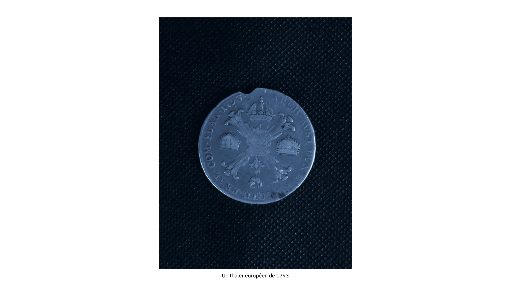

Au XVe siècle, toutefois, l'Europe connaît une grave crise monétaire avec une dégradation généralisée de la teneur en argent des monnaies européennes, qui tombe à moins de 5 % vers 1450.

À partir du XVIe siècle, le centre de gravité monétaire se déplace vers l’Espagne, stimulé par l’union des royaumes d’Aragon et de Castille, la fin de la Reconquista et les grandes découvertes maritimes, comme celle de Christophe Colomb en 1492. L’arrivée massive d’argent des mines américaines bouleverse profondément les équilibres économiques européens et mondiaux, alimentant à la fois l’inflation et de nouvelles tensions géopolitiques.

La Renaissance marque aussi une évolution artistique majeure dans la frappe monétaire, avec des monnaies comme le thaler (Joachimsthaler), à l’origine du terme "dollar". Ces grandes pièces en argent reflètent les nouvelles techniques artistiques et mécaniques de frappe, permises par l’innovation technique venue du nord de l’Europe.

Enfin, la Renaissance financière amorce la transition vers la modernité économique avec le développement de la banque, du crédit et des marchés financiers, ainsi que l’émergence des premières formes de capitalisme moderne dans les grandes villes commerciales d’Amsterdam, Londres et Stockholm, posant ainsi les bases du système financier international tel qu’on le connaît aujourd’hui. Et ce sera justement le sujet de notre prochaine vidéo.

# La saisie de la monnaie par l’État
<partId>17cfb1b4-5bc1-53e0-b035-05c7cf76be92</partId>
 
## L'évolution des monnaies de réserve mondiales
<chapterId>d65cc352-e7ca-5f03-9b23-dd1fae5c0395</chapterId>
:::video id=82710062-8fff-426c-93af-923c08d82233:::

### L'importance historique des métaux précieux

Bienvenue dans cette section consacrée à l'émergence des monnaies de réserve et des banques centrales. Comme premier point de cette nouvelle section, nous allons nous concentrer sur l'évolution des réserves mondiales.

Les métaux précieux, spécialement l’or et l’argent, ont longtemps été considérés comme la base de la richesse et de la puissance des empires. La soif d’or a toujours été un moteur dominant, et c’est l’afflux de métaux précieux qui eut les effets les plus directs et évidents sur les développements monétaires en Europe. À l’époque médiévale et au début de la Renaissance, cette obsession pour l’or et l’argent s’explique par la difficulté à conserver la valeur dans d’autres formes de marchandises, ainsi que par la forte demande des puissances étrangères, notamment dans le commerce avec l’Orient.

Au fil des siècles, plusieurs empires se sont succédé comme centres économiques mondiaux. Le pays qui domine le commerce mondial durant une période donnée obtient en général le statut de monnaie de réserve. On mentionne ainsi :

*L'Espagne et le Portugal (XVe et XVIe siècles)*
*Les Provinces-Unies (Pays-Bas) au XVIIe*  
*La France et la Grande-Bretagne aux XVIIIe et XIXe*
*Les États-Unis au XXe siècle*

### L'essor portugais et le Real (1450-1530)

Le Portugal dominait le commerce mondial durant la seconde moitié du XVe et le début du XVIe siècle, avec le Real. Il s’agissait d’une pièce d’argent de poids relativement uniforme. Les Portugais, grâce à leurs avancées en navigation, trouvèrent de nouvelles routes maritimes vers l’Afrique, l’Asie et le Nouveau Monde. Les forts militaires et comptoirs maritimes se multiplièrent de l’Afrique jusqu’en Chine (Macau).

Pour répondre à la soif d’or et d’argent en Europe, "la motivation constante des grandes découvertes fut le profit commercial et surtout la quête d’or et d’argent". Toutefois, l’Empire portugais, trop étendu et concurrencé par les Hollandais, Anglais et Français, déclina par la suite.

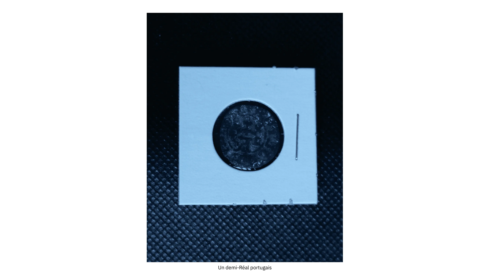

Voici un artefact, un demi-réal presto qui date de l'époque de ces conquêtes Maritime.

### L'apogée espagnole et le Spanish Dollar (1535-XVIIe siècle)

Avec la conquête du Nouveau Monde, l’Espagne devint l’acteur dominant. Son monarque, contrôlant de gigantesques mines d’argent (Potosí en Bolivie, Zacatecas au Mexique), réussit à battre la monnaie en argent pur, évitant ainsi de déprécier la sienne : le Real Espagnol.  

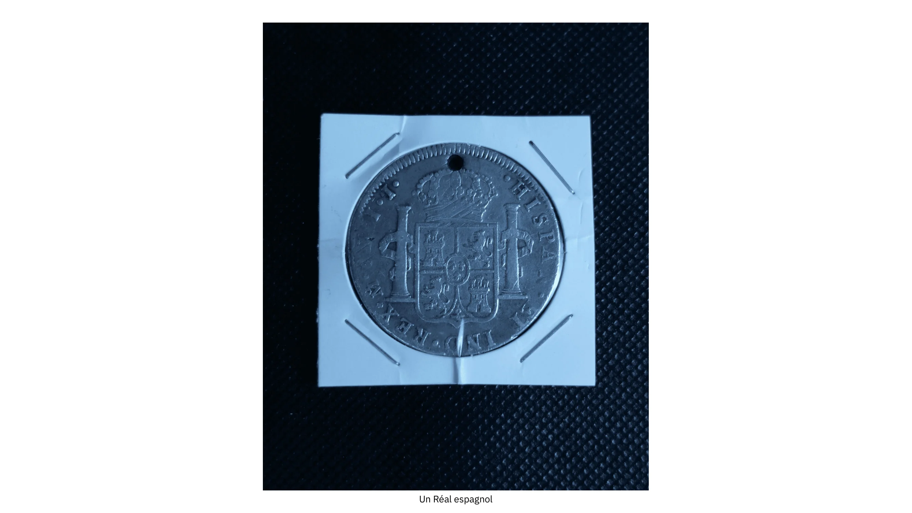

Le réal espagnol, qu’on appelle aussi le « piece of eight », tire son surnom du fait qu’on le coupait souvent en huit pour créer de la monnaie plus petite. On l’appelle également le dollar espagnol. La pièce que vous voyez ici date de 1814, donc il s’agit d’un exemplaire un peu plus récent. Les toutes premières pièces du dollar espagnol, elles, n’étaient pas aussi parfaites : c’étaient des pièces frappées au marteau, beaucoup moins rondes et moins nettes.

Ce qui est vraiment intéressant, c’est que le dollar espagnol était la monnaie de réserve internationale à l’époque. L’autorité espagnole avait aussi sa monnaie locale, le maravedi, et pour ajuster la masse monétaire, elle procédait à des rappels réguliers. Par exemple, une pièce en cuivre ou en bronze valant initialement un maravedi pouvait être rappelée et estampée avec un « 2 », puis plus tard avec un « 4 », et ainsi de suite jusqu’à « 8 ». Sur la photo haute définition, on voit clairement un « 8 » estampé. C’est une façon d’augmenter la masse monétaire… et, forcément, cela créait de l’inflation.

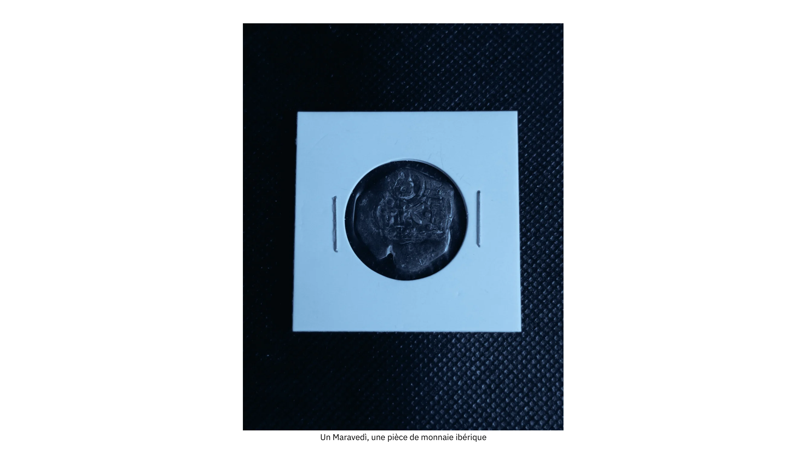

Si l’on regarde l’histoire des monnaies de réserve, un point intéressant émerge : les empires n’inflationnaient pas leur monnaie tant qu’elle conservait ce statut de monnaie de réserve. Ce n’est qu’à la fin de leur domination qu’ils finissaient par la dévaluer, perdant ce privilège, qui passait alors à un nouvel empire.

En Espagne, le dollar espagnol a dominé le commerce mondial pendant près de 200 ans, notamment entre la Chine et l’Europe. On retrouvait ces pièces jusque dans les ports chinois. Et c’est là qu’il y a un petit clin d’œil historique : le dollar américain provient directement de cette monnaie. Quand les États-Unis se sont formés en 1792, ils ont adopté une loi pour frapper leur propre monnaie, et leurs premiers dollars ont été créés sur le modèle du dollar espagnol, autant par le nom que par la taille de la pièce.

Pour se rendre compte de la valeur, à l’origine, un dollar américain était une pièce d’argent pesant presque une once, soit l’équivalent de 30 à 40 € d’argent aujourd’hui, contrairement au billet de papier que nous connaissons maintenant. Le dollar espagnol, lui, circulait tellement qu’il est considéré comme la première véritable monnaie globale.

Cependant, cet afflux de métaux précieux venus des Amériques provoqua de l’inflation en Europe. Durant la révolution des prix (environ 1540-1640), le coût de la vie en Angleterre fut multiplié par sept. En Espagne, l’abondance d’argent eut un effet pervers de type « resource curse », freinant le développement d’institutions bancaires solides.

Par la suite, l’Espagne fit face à de nombreux conflits militaires (Flandres, Pays-Bas, guerre de Trente Ans), et ses finances s’effondrèrent peu à peu. Les souverains successifs choisirent, plutôt que de dévaluer la pièce d’argent mondialement acceptée, de faire défaut ou de déprécier la monnaie de cuivre (vellon) utilisée par la population locale. C’est ce que je vous ai décrit plus tôt avec les Maravedis.

### L’ascension hollandaise (XVIIe siècle)

Après l’apogée ibérique,les Pays-Bas s’imposent comme nouvelle puissance commerciale au XVIIe siècle. Le commerce maritime, la VOC (Dutch East India Company) et la fondation de la Bourse d’Amsterdam (inspirée de celle d’Anvers) érigent cette république marchande au rang de plaque tournante.

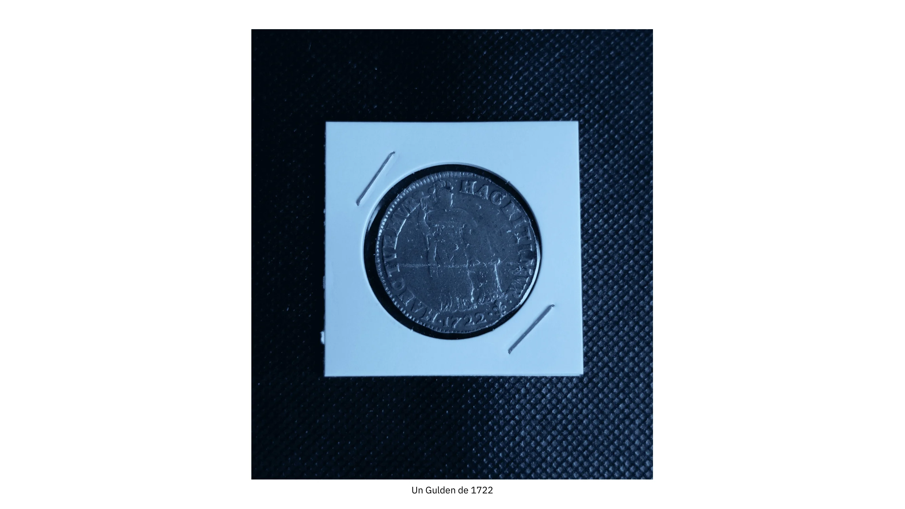
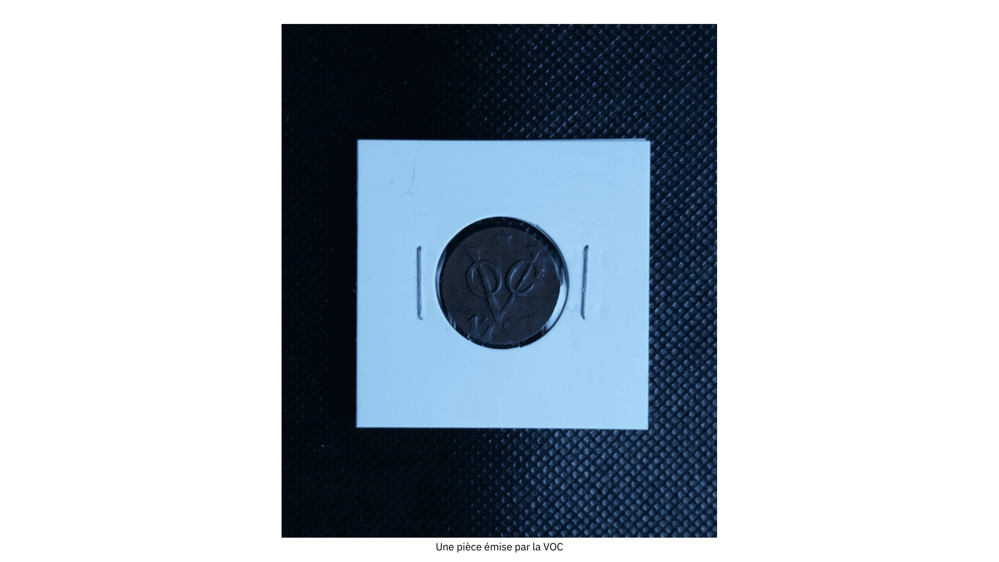

Voici un Gulden de 1722, une belle pièce en argent, ainsi qu’une pièce émise par la VOC.

La VOC était une compagnie extrêmement puissante pour l’époque : elle possédait sa propre armée et émettait même sa propre monnaie.

Les Hollandais inventèrent le capitalisme moderne qui, à l’origine, consistait essentiellement en la distribution du risque dans des entreprises risquées, comme les expéditions vers le Nouveau Monde ou la recherche de nouvelles routes commerciales. Les sociétés par actions ont permis à plusieurs investisseurs de mettre de l’argent en commun et de partager le risque. Pour faciliter ces échanges, il a ensuite fallu créer des institutions capables de négocier et d’échanger ces titres. C’est ainsi qu’en 1602 naissent la première société par actions et la première bourse.

La monnaie hollandaise, le Gulden, gagna en crédibilité grâce à sa pureté en argent, puis grâce à son adoption par la Banque d’Amsterdam (1609), où les dépôts devinrent une forme préférée de monnaie en Europe. C’est un point très important à mentionner. Bien sûr, il existait des pièces, mais ce qui constituait vraiment la monnaie à cette époque, c’était une forme de monnaie scripturale. En fait, une grande partie du commerce mondial passait par les livres de compte de la Banque d’Amsterdam. C’était une véritable avancée bancaire : les échanges marchands internationaux ne se faisaient plus nécessairement avec des pièces physiques, mais directement à travers les écritures comptables de la banque.

Cette période de prospérité s’illustra par un important afflux d’or et d’argent provenant notamment d’autres pays pratiquant l’inflation ou le contrôle monétaire. Il y a d’ailleurs un personnage intéressant à mentionner. À cette époque, un certain Thomas Gresham a travaillé pour la royauté anglaise aux Pays-Bas afin de gérer les flux monétaires entre les deux pays. C’est ce même Gresham qui nous a laissé la fameuse "loi de Gresham".

Néanmoins, l’Empire hollandais finit lui aussi par s’essouffler. Les guerres contre l’Angleterre, la dilution du gulden en temps de conflit, ainsi que la concurrence d’autres puissances (France et Angleterre) signèrent la fin de l’hégémonie hollandaise. Après la Quatrième guerre anglo-néerlandaise (1780-1784), le déclin du gulden comme monnaie de réserve devint irrémédiable.

### La puissance française: velléités et échecs (XVIIe – XVIIIe)

La France, sous Louis XIV, devint la plus grande puissance continentale d’Europe. Pourtant, la monnaie française n’atteignit jamais le statut de référence dominante : de nombreuses dévaluations, la lourde taxation et les guerres coûteuses (guerre de la Ligue d’Augsbourg, de la Succession d’Espagne, etc.) pesèrent sur la stabilité du système monétaire.

La première grande expérience de papier-monnaie fut menée par un certain John Law (1716-1720). La Banque générale émettait des billets adossés à des promesses de dette d’État. Ce stratagème se solda par une bulle spéculative et un effondrement (la « Mississippi Bubble ») en 1720. Cette catastrophe laissa la France durablement méfiante vis-à-vis de la monnaie papier. C’est cette expérience désastreuse qui permit à Richard Cantillon, qui s’était enrichi grâce à ce système, d’énoncer les principes désormais connus sous le nom d’effet Cantillon, selon lesquels l’impression monétaire enrichit ceux qui ont accès à la presse à billets.

Lorsque cette méfiance s’est finalement estompée, un autre fiasco du papier français survint : les assignats révolutionnaires, émis à partir de 1790 et basés sur la confiscation des biens du clergé. Ces assignats connurent une hyperinflation galopante, officiellement la première hyperinflation dépassant 50 % par mois dans l’histoire. En 1795, alors que leur valeur nominale avait été multipliée, ils s’échangeaient à quelques pourcents de leur valeur initiale.

Des lois plus restrictives tentaient d’imposer l’assignat, mais sans succès. Le gouvernement essaya de le rendre obligatoire, allant jusqu’à menacer de mort ceux qui ne l’acceptaient pas et en forçant les commerçants à rester ouverts. Mais, évidemment, au final, cela ne fonctionna pas.

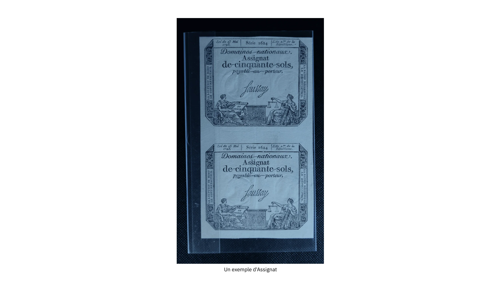

Comme cette monnaie papier a fait disparaître toute la bonne monnaie en métaux précieux, conformément à cette fameuse loi de Gresham, ils se sont retrouvés avec une pénurie de pièces et pour frapper des pièces, ils ont utilisé le métal de cloche saisi au clergé. Voici une belle pièce de métal de cloche frappée à partir de ce cuivre récupéré, en faisant fondre les pièces saisies au clergé.

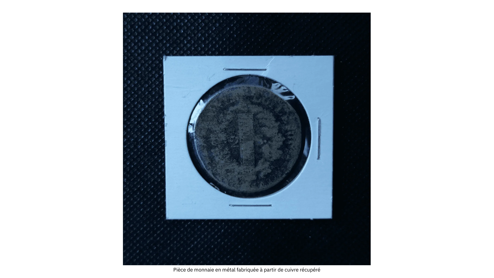

### La domination britannique (XVIIIe – début XXe siècle)

L’Angleterre, après avoir dépassé les Pays-Bas, s’imposa comme puissance dominante au XVIIIe siècle. La livre sterling est la plus ancienne monnaie encore en usage, liée à l’origine à une livre d’argent. Graduellement, son statut s’affermit, soutenu par une révolution financière et fiscale : la monarchie parlementaire, la forte capacité à lever l’impôt et la création de la Banque d’Angleterre en 1694.

Au fil des guerres contre la France, le Royaume-Uni sortit vainqueur en 1815 (Waterloo), ce qui confirma sa suprématie. Durant le XIXe siècle, la livre sterling agit comme monnaie de réserve mondiale. À son apogée, avec seulement 2,5 % de la population mondiale, la Grande-Bretagne produisit 20 % du revenu global et contrôlait près du quart de la surface terrestre.

La Révolution industrielle et l’adoption d’un Gold Standard (1717 ou 1718, sous la supervision d’Isaac Newton au Royal Mint) renforcèrent la crédibilité de la livre. La Banque d’Angleterre adopta un étalon-or à 4,25 livres par once d’or, permettant aux détenteurs de billets de les convertir en or.

Cependant, la Première Guerre mondiale (1914-1918) mit fin à ce système. En quelques semaines, toutes les grandes puissances belligérantes suspendirent la convertibilité en or. L’empire britannique, puis la livre, sortirent exsangues de la Seconde Guerre mondiale, cédant la place au dollar américain au XXe siècle.

Comme artefact, ici, j’ai de belles pièces intéressantes. En fait, ce sont des poids monétaires. Celui-ci représente le souverain. Les premières représentations de la livre étaient des souverains. Je ne possède que des poids monétaires pour représenter ces pièces, car je n’ai pas les moyens d’acheter un vrai souverain. Pour les peser, on utilisait une balance, puis on plaçait le poids monétaire équivalent au souverain.

Le souverain était une pièce d’or valant à l’origine une livre. Avant ce fameux souverain, on retrouvait la Guinée, suivant le même principe. La Guinée était ainsi nommée parce que l’origine des métaux précieux qu’elle contenait provenait de ce pays, la Guinée.

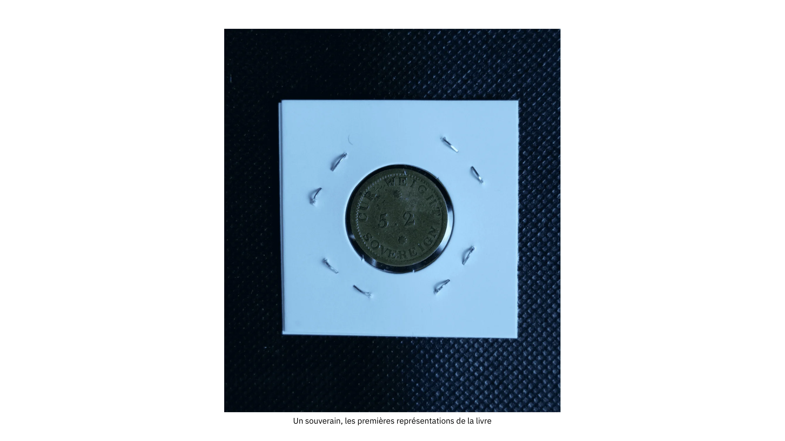
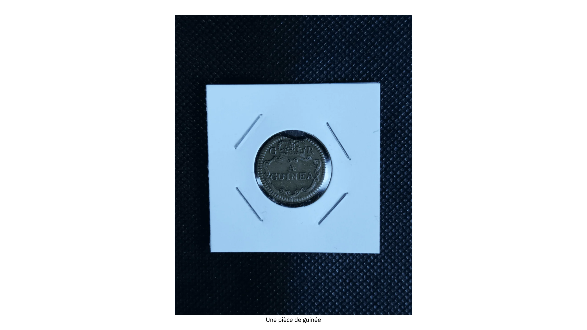

## L'émergence des banques centrales
<chapterId>15777771-1e28-55f7-a400-69868a47079b</chapterId>

:::video id=7661b7b5-e00f-48f3-b69a-6fb2eb5ebba4:::

Suite à cette section sur l'histoire des premières monnaies de réserve et l'évolution des monnaies de réserve, voici un segment sur l'émergence des banques centrales. Cela suit à peu près le même chemin que l'émergence des monnaies de réserve, mais se concentre un peu plus sur les technologies bancaires de l'époque.

Les prémices des banques et proto-bourses

Dès le XIIIe siècle, les Italiens (Florence, Gênes, Venise…) développent des techniques de comptabilité en partie double. Plus tard, Anvers (XVIe s.) devint la première place financière de l’Europe du Nord, puis ce rôle revint à Amsterdam, grâce à la Bourse d’Amsterdam (1609), où s’échangeaient les actions de la VOC.

À Anvers, on avait des foires marchandes où les marchands se rencontraient souvent pour effectuer des règlements de dette. À cette époque, on inventa de nouveaux outils financiers. Celui-ci est un peu plus récent, daté de 1761, mais il s’agit d’un billet à ordre. On voit que tout est écrit à la main, avec des inscriptions à l’arrière. C’est un magnifique artefact de l'époque.

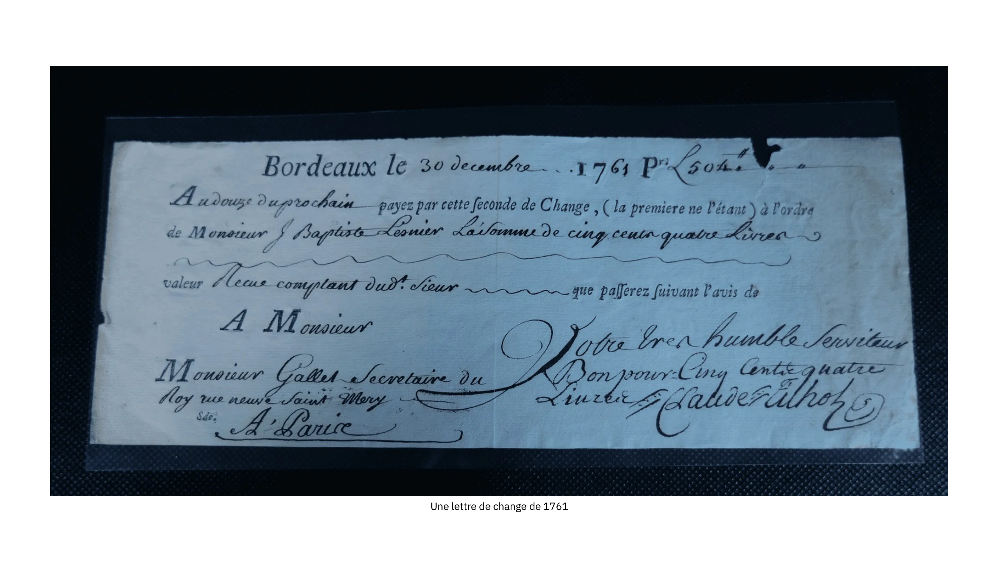

Cette effervescence suscita la création d’institutions bancaires plus sophistiquées. Les banquiers lombards puis les marchands hollandais perfectionnèrent les instruments de crédit (lettres de change, billets à ordre, etc.). Le système bancaire moderne repose sur cette idée : la monnaie peut être du crédit, et pas simplement du métal.

On voit que déjà ça revient à notre question d'origine sur les origines de la monnaie.  
Est-ce que la monnaie émane bien d'une marchandise qui émerge du besoin d'échanger ou est-ce qu'elle émerge du crédit? 
On peut retrouver encore des traces dans cette section.

### L’exemple suédois, Stockholms Banco et Riksens Ständers Bank

La Suède fut pionnière en matière de banque centrale : en 1657, Johan Palmstruch créa le Stockholm Banco, autorisé à prêter plus que ses réserves en métal. C’est ici qu’apparaît la première utilisation de la réserve fractionnaire. Cependant, l’émission excessive de billets provoqua une panique et une ruée vers la banque dès 1663. Tiens, tiens…

En 1668, pour pallier ces dérives, la Riksens Ständers Bank, première banque centrale du monde, fut fondée à Stockholm. Toutefois, elle subit elle aussi des crises (1709, 1715…), souvent liées à l’abus de billets pour financer les guerres du royaume.

### Le coup d’éclat manqué de John Law 

Dirigeons-nous vers la France, où l’on retrouve encore notre cher John Law.

John Law, Écossais, persuada le Régent (duc d’Orléans) de créer une banque privée, la Banque Générale (1716), autorisée à émettre du papier contre de l’or, de l’argent et les dettes de l’État. Devenue Banque Royale (1718), elle favorisa l’envolée des actions de la Compagnie du Mississippi.

Lorsque la réalité rattrapa la spéculation, la panique fut aggravée par la décision d’interdire la détention d’or et d’obliger l’usage des billets de Law. Tiens, tiens…

Finalement, la bulle éclata en 1720, provoquant un effondrement qui ruina durablement la crédibilité du papier-monnaie en France.

### La Banque d’Amsterdam, l’essor d’un modèle précurseur

On se transporte maintenant à Amsterdam en 1609, où la Bank of Amsterdam (Wisselbank) prit progressivement le contrôle de la garde des pièces et de la convertibilité. Elle interdit la circulation des billets de caisse privés et obligea les changeurs à déposer, chaque soir, toutes leurs pièces dans ses coffres. Petit à petit, elle s’appropria ainsi la gestion de la monnaie.

J’ai déjà mentionné que, dans le commerce international, on n’utilisait plus nécessairement les pièces de métal elles-mêmes : la banque fonctionnait surtout avec de la monnaie scripturale, inscrite dans ses livres.

Grâce à la puissance commerciale hollandaise, la Bank of Amsterdam joua le rôle de première banque centrale de facto, stabilisant les échanges internationaux. Mais, avec le temps, elle accorda des prêts non couverts à la VOC et se retrouva à court de métal pour soutenir ses engagements.

En 1790, on découvrit qu’elle avait prêté d’immenses sommes à la VOC et se trouvait pratiquement en faillite, ce qui ruina la crédibilité du gulden.

### La Banque d’Angleterre, acte fondateur de la modernité bancaire

Dans l’Angleterre du XVIIᵉ siècle, l’or et l’argent étaient entreposés chez les orfèvres (goldsmiths), qui émettaient des reçus faisant office de moyens de paiement. Ce système, encore très décentralisé, montra rapidement ses limites lorsque la Couronne se retrouva dans un besoin massif de financement pour la guerre contre la France.

En 1694, fut fondée la Bank of England (BoE) : un mariage de convenance entre le gouvernement, désespéré d’obtenir des fonds, et les milieux d’affaires londoniens. La Banque d’Angleterre reçut progressivement le monopole de l’émission des billets (renforcé en 1708, 1742, etc.). Désormais, les billets adossés à des réserves d’or circulaient au même titre que les pièces métalliques.

Ce point est essentiel pour comprendre la prise de contrôle croissante de la monnaie par l’État ou par des institutions sous son autorité.
– À Amsterdam, la Banque forçait déjà les changeurs à déposer chaque soir leurs pièces dans ses coffres.
– En Angleterre, une étape supplémentaire fut franchie : les banques privées n’eurent plus le droit d’émettre des billets convertibles en or. Elles pouvaient encore émettre des billets, mais ceux-ci n’étaient convertibles qu’en billets de la Banque d’Angleterre, elle-même seule autorisée à échanger ses billets contre de l’or.

Ainsi se met en place une monnaie à trois étages :
-L’or à la base,
-Les billets de la Banque d’Angleterre, convertibles en or,
-Les billets des banques privées, convertibles uniquement en billets de la Banque centrale.

Avant cela, une banque privée pouvait encore émettre des billets directement échangeables contre du métal. C’est donc une étape cruciale dans la centralisation du contrôle monétaire.

La Banque d’Angleterre devint également l’instrument principal du financement de l’État, orchestrant des emprunts massifs et structurant la dette publique qui permit l’essor économique britannique. Ce modèle se consolida au XVIIIᵉ et XIXᵉ siècles, jusqu’à faire de la livre sterling la monnaie de réserve mondiale, soutenue par la puissance de l’Empire britannique et par l’étalon-or.

Les monnaies de réserve mondiales se sont succédé au fil des siècles, chacune portée par la puissance économique, commerciale et militaire d’un État ou d’un empire : Portugal, Espagne, Pays-Bas, Grande-Bretagne, puis États-Unis au XXᵉ siècle. À chaque transition, on observe le même cycle : une phase d’expansion économique, un essor du commerce, l’adoption internationale de la monnaie, puis l’accumulation de dettes, les guerres coûteuses, l’abus du crédit ou de la création monétaire… et finalement le déclin.

L’émergence des banques centrales suit un mouvement parallèle. Elles apparaissent progressivement, souvent dans des périodes de guerre où les souverains ont besoin de financements massifs. Ces institutions permettent alors à l’État d’émettre de la dette à grande échelle. L’adoption de l’étalon-or (notamment en Angleterre entre le XVIIᵉ et le XIXᵉ siècle) a offert une apparence de stabilité, jusqu’aux chocs des deux guerres mondiales qui ont conduit à l’abandon progressif de la convertibilité or.

Ainsi, le pouvoir de battre monnaie s’est déplacé : d’abord monopole du souverain, il passe entre les mains d’acteurs privés (orfèvres, banquiers), puis de structures semi-publiques — les banques centrales. Cette évolution traduit une transformation profonde de la souveraineté monétaire, désormais institutionnalisée et intégrée à un système financier globalisé.

En résumé, c’est exactement ce que nous avons vu plus tôt : le poids de la dette a glissé de la figure du souverain vers des institutions capables d’émettre de la monnaie ou de la dette — banques centrales, parlements, autorités fiscales.

Et surtout, on est passé d’une dette qui pouvait s’effacer avec la faillite d’un roi à une dette collective reposant durablement sur les épaules de la population.

## La route vers le système fiat
<chapterId>27a98545-d350-56ee-a200-92468e6b9b33</chapterId>
:::video id=e27a753e-aeee-4307-a65c-9506aab380a1:::

Nous en sommes déjà arrivés à la fin de ce cours sur l'histoire de la monnaie et en toute fin de cours, j'avais envie de vous proposer deux sujets. Le premier sujet est les différentes étapes qui ont mené à notre système actuel fiat. Donc on va reprendre essentiellement les faits qu'on a vus dans le point 5 au sujet de la création des banques centrales. On va le voir assez rapidement de façon succincte et après la différence c'est qu'on va ajouter le concept du dollar américain qui est ultimement la monnaie de réserve actuelle. On va voir un peu comment ça a évolué, comment le dollar est né, le dollar est né de quoi, comment il a évolué, comment il a changé, quelles étapes il est passé pour devenir un système fiat parce que l'origine du dollar c'est une pièce en argent.

Ensuite, tout de suite après, je vais vous faire un petit segment très court sur l'histoire de la finance pour comprendre très facilement comment on est arrivé à l'état de providence. Donc on va voir deux sujets. Nous allons voir comment on est arrivé au système fiat et tout de suite après, on va regarder comment l'évolution de la finance nous a mené au concept de l'état de providence.

### Les fondations européennes du système bancaire moderne 

Retournons au XIIIᵉ siècle avec le florin. Pour comprendre comment on en est arrivé au modèle fiat, il faut commencer l’histoire à cette époque. Oui, on a le florin, mais il existait aussi une technologie financière apparue au même moment avec les Médicis : les lettres de change.

Ensuite, on a eu la bourse d’Anvers avec le développement du concept d’escompte et des billets à ordre.
Puis, comme on l’a vu, la VOC inaugura le premier marché d’actions à Amsterdam. C’était la naissance du capitalisme moderne, avec les compagnies par actions et l’échange de titres. La Banque d’Amsterdam imposa ensuite l’utilisation des dépôts par décret : les changeurs étaient obligés de déposer les pièces à la fin de la journée et ne pouvaient plus conserver la monnaie métallique eux-mêmes.

Vient ensuite la création de la Banque d’Angleterre, née de la nécessité de financer la guerre à la fin du XVIIᵉ siècle. Les banques privées furent alors reléguées à la troisième couche de la monnaie. À cette époque, leurs billets n’étaient plus échangeables contre de l’or : seuls les billets de la Banque d’Angleterre l’étaient. Cela démontre bien une saisie du pouvoir monétaire par l’institution qu’est la Banque d’Angleterre.

Au passage, toute cette section — du florin jusqu’à la création des banques centrales  est extrêmement bien résumée dans le livre La monnaie pyramide de Nick Batia (Layered Money en anglais), que j’ai eu la chance de traduire avec quelques collègues. Nous avons fait un excellent travail pour permettre à tous les francophones de profiter de ces enseignements.

Nous sommes donc à la fin du XVIIᵉ siècle : la Banque d’Angleterre a été créée pour financer la guerre.
Les banques privées ont été reléguées à la troisième couche de la monnaie. Leurs billets n’étaient plus convertibles en or ; seuls ceux de la Banque d’Angleterre l’étaient. C’est une étape supplémentaire dans la prise de contrôle de la monnaie par l’institution centrale.

Ensuite vient la panique de 1776. Tout le monde remonte la pyramide monétaire. Concrètement, cela signifie qu’il y a une ruée vers les banques : les détenteurs de billets de troisième couche (ceux des banques privées) tentent d’obtenir des billets de la Banque d’Angleterre, puis de les échanger contre de l’or. Mais évidemment, les coffres ne contenaient pas assez d’or.
Les autorités ont donc décrété une forme de congé bancaire pour éviter de devoir rembourser les billets en or, et cet épisode donna naissance au concept de prêteur de dernier recours.

### L'évolution du dollar américain 

Donc, on est passé du florin jusqu'à la Banque d'Angleterre. Ensuite, évidemment, il y a eu l’étape de la Première Guerre et de la Deuxième Guerre, mais avant cela, nous sommes en 1796, de l’autre côté de l’Atlantique, avec les Américains. En 1776, c’était encore une colonie anglaise, britannique, et donc les colonies… Voici un billet du Connecticut : c’est un vrai, un billet de deux shillings du Connecticut datant de 1776.

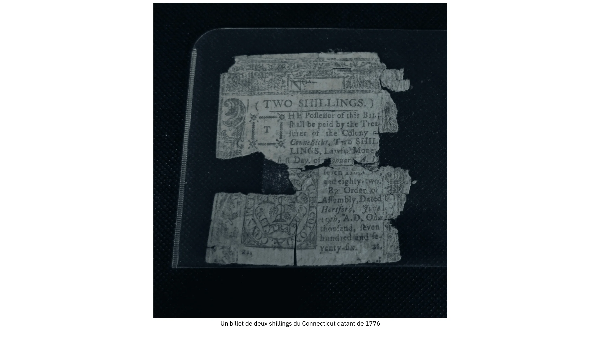

C’est juste avant qu’ils déclarent la guerre à l’Angleterre et puissent éventuellement émettre leur propre monnaie. Entre-temps, il y avait cette monnaie papier, mais ils utilisaient aussi le dollar espagnol pour les espèces, pour les pièces. D’ailleurs, le nom dollar est resté pour le dollar américain.

Je crois que c’est en 1792, si je ne dis pas de bêtises, qu’ils ont adopté une loi leur permettant de battre monnaie. Et pour vous donner un exemple, voici un dollar américain moderne.

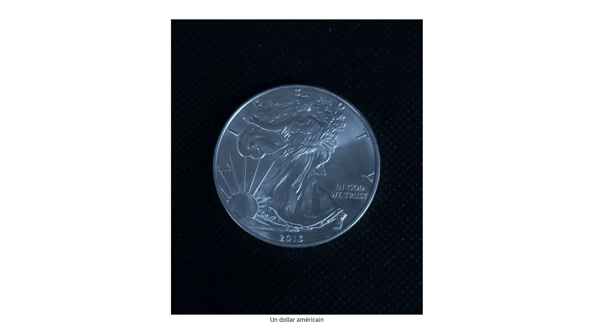

Bon, évidemment, ça ne vaut pas un dollar. Il y a environ 30 ou 40 dollars de valeur, c’est en fait une once d’argent, donc, selon le cours de l’argent, cela vaut au moins 30 ou 40 dollars US. Aujourd’hui, évidemment, ça ne vaut plus qu’un dollar, mais cela représente précisément le format de l’époque. Le dollar américain démarre à cette valeur en argent.

Ensuite, on peut passer à la guerre civile en Amérique. Les Confédérés ont imprimé de l’argent, et cette monnaie a connu de l’hyperinflation. Ce n’est pas dans la liste officielle de Hanke-Krus, car cela n’a pas atteint 50 %, mais l’inflation mensuelle a atteint 40 %. Ils en ont donc imprimé beaucoup durant la guerre.
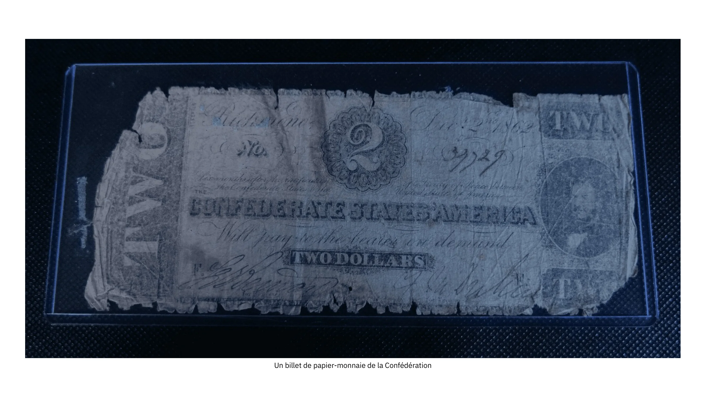

Et leurs opposants, au nord, avaient des dollars aussi. On vient de voir des dollars confédérés, et maintenant c'est les dollars du nord. Et ils s'appelaient le greenback parce que le dos était vert.

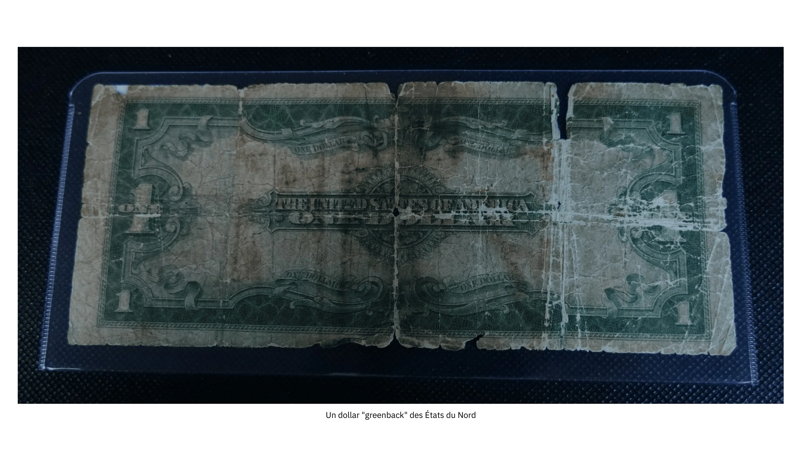

Et je vous invite à comparer la différence de taille avec les billets modernes. Les billets à l'époque étaient plus gros.

Donc, c'est le Nord qui a gagné. Le greenback est devenu la monnaie des Amériques. Ensuite, on a eu la fondation de la FED en 1913, puis la Première Guerre mondiale.

À la suite de la Première Guerre mondiale, dans la dernière série de billets imprimés, on voyait toujours la mention "redeemable in gold on demand". Ces billets, en 1928, pouvaient encore acheter 20 $ en or, c’est-à-dire près d’une once d’or. Le prix de l’or était alors de 20,67 $ l’once. Ce billet pouvait donc acheter une once d’or en 1928.  

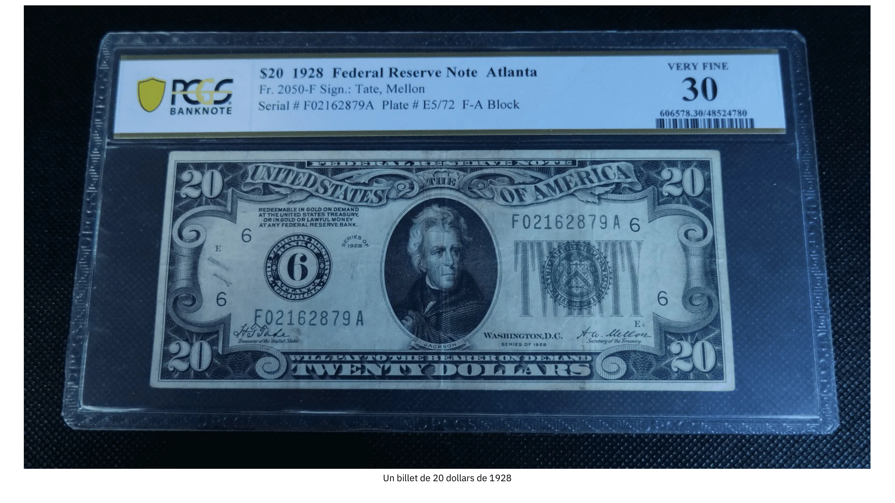

Aujourd’hui, une once d’or vaut environ 3 000 $ US. On voit ici tout le pouvoir de la dévaluation. Ce billet est le dernier imprimé avec la mention "redeemable in gold". Après le Order 6102, l’or a été saisi, ainsi que les certificats d’or. Voici un gold certificate de 1928.

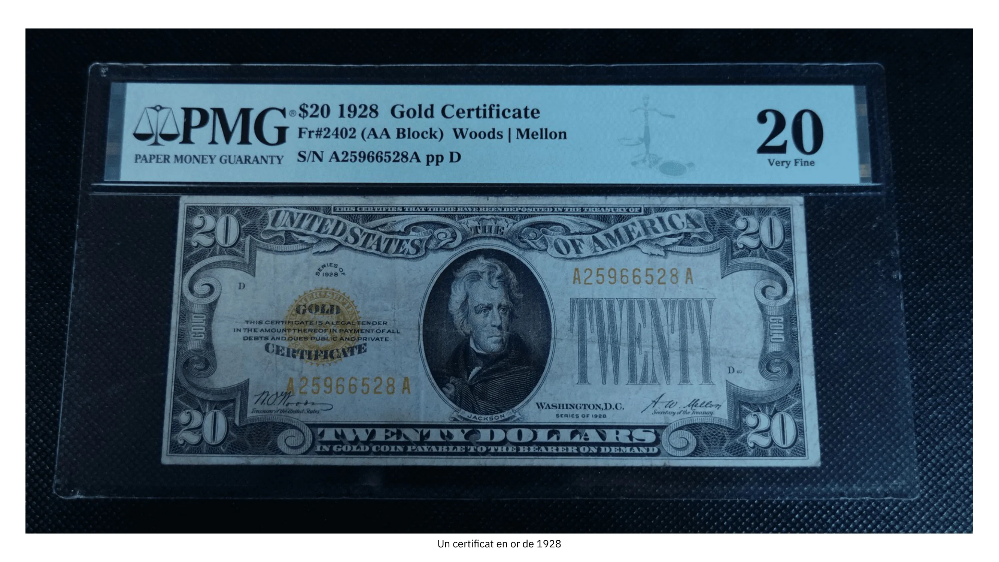

Ce certificat, en plus d’être "redeemable in gold" comme le billet de 1928, l’était en pièces d’or. C’est vraiment écrit dessus : "pièces d’or". Tous ont été saisis. Posséder un tel certificat était illégal jusqu’en 1964. Je suis très content d’en posséder un.

À l’époque, chaque once d’or a été échangée contre un billet comme celui-là après 1934. En 1933, l’Order 6102 a saisi tout l’or. Après cette saisie, chaque once d’or valait 20,67 $. En 1934, de nouveaux billets sont sortis avec la mention "this note is legal tender for all debts".

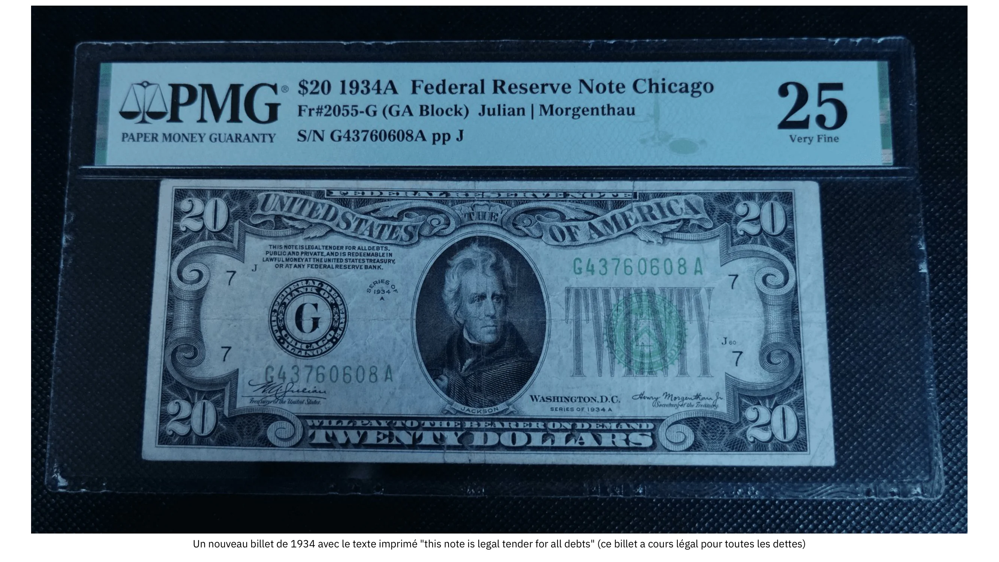

C’est à ce moment que la notion de cours légal apparaît, remplaçant le "redeemable in gold". Les deux billets se ressemblent, seule la mention change. L’arnaque, c’est que le dollar a été dévalué à cette époque : le prix de l’or est passé de 20,67 $ à 35 $ l’once, soit une dévaluation d’environ 40 %.

Ensuite vient la Deuxième Guerre mondiale. Après celle-ci, l’accord de Bretton Woods centralise tout l’or du monde aux États-Unis. Les Américains émettent des billets en échange. Ces billets ne sont plus échangeables en or par la population, mais seulement par les États.

Avec le temps, des pays comme la France ou l’Allemagne se sont doutés que probablement plus de dollars étaient en circulation que d’or dans les coffres américains. Ils ont demandé à rapatrier leur or. La réponse a été : "d’accord, mais cela prendra un peu de temps".

En 1971, Richard Nixon rompt définitivement le lien entre les billets et l’or, en blâmant indirectement les spéculateurs.

À l’époque, l’or était sous-évalué : encore à 35 $ l’once, ce qui ne reflétait ni le volume de monnaie imprimée ni la valeur réelle sur le marché. Son prix est ensuite passé de 34 $ à 800 $ en quelques années. Comme dans certaines périodes historiques, par exemple à Rome, on a détaché le lien entre le denier et le solidus pour laisser l’or flotter. Ici, l’or a flotté et son prix s’est ajusté librement sur le marché.

### Le système monétaire fiat moderne et ses implications

Et c'est ce qui résume, en fait, comment on est passé d'un système monétaire basé sur l’argent métal ou sur l’or. Petit à petit, les institutions ont grappillé de plus en plus de pouvoir sur la monnaie. Et au final, on assiste à une décision unilatérale de couper complètement le lien entre les métaux précieux et la monnaie, suite à une surimpression.

C'est ce qui fait qu'aujourd'hui, il n'existe plus de lien entre l’or et les billets ou la monnaie scripturale. Et ce n’est même pas non plus un système de réserve fractionnaire : ce concept est un peu dépassé. Ce sont plutôt les banques privées qui créent la monnaie par le crédit bancaire. La création monétaire est surtout corrélée au taux d’intérêt directeur, décidé par la banque centrale.

Il n'y a pas vraiment de limite. Il n'y a plus vraiment de niveau de réserve : en Amérique et au Canada, le niveau de réserve se résume simplement au fait que les banques doivent pouvoir répondre aux échanges interbancaires pour ne pas manquer de liquidité.

Il leur suffit de s’assurer qu’elles peuvent effectuer ces transferts, mais il n’y a pas de 1 %, 3 % ou 10 % de réserve obligatoire. On a vraiment quitté le concept de réserve fractionnaire. Aujourd’hui, ce sont les banques centrales et les gouvernements par leurs déficits fiscaux, les banques centrales par le quantitative easing (QE), et les banques privées par la création de crédits bancaires qui font augmenter la masse monétaire totale et, selon moi, influencent l’inflation.

En conclusion, si vous voulez comprendre très précisément le lien entre la monnaie et l’inflation, j’ai un cours sur Plan B d’environ cinq heures dédié à ce sujet. Vous y apprendrez la différence entre l’augmentation des prix, que l’on observe dans la vie quotidienne, et l’inflation. Ce n’est pas la même chose. Souvent, lorsqu’on parle d’inflation, on fait référence à l’augmentation des prix et non à l’inflation au sens strict. L’inflation, c’est un concept précis qui s’explique par l’augmentation de la masse monétaire.

Je vous laisse ainsi conclure ce sujet sur le monde fiat en vous expliquant qu’il existe des ressources pour mieux comprendre comment les phénomènes que je viens d’expliquer découlent de cette situation, et notamment l’inflation.

Je vous remercie pour votre attention.

## L'histoire des bulles monétaires 
<chapterId>b6451c46-917d-11f0-97de-6bc5081765fa</chapterId>

:::video id=5967d9a6-aae4-4b84-a283-71b1b735bca4:::

### L’invention de la monnaie papier et la première grande bulle

Avec la création des banques centrales au XVIIIᵉ siècle, une véritable révolution a vu le jour : l’argent « magique » sous forme de billets. L’exemple le plus marquant en France reste John Law. Cet Écossais exilé à Paris proposa au régent, le duc d’Orléans, de résoudre la faillite des finances royales en créant une banque d’État et une compagnie commerciale coloniale : la fameuse Banque Royale et la Compagnie du Mississippi.

Par ce système, Law lia monnaie papier et actions de sa compagnie. Plus de billets circulaient, plus les actions grimpaient, et plus la banque semblait solide… jusqu’à ce que la spéculation dépasse largement la réalité. La bulle éclata brutalement en 1720, ruinant nobles, bourgeois et une bonne partie de l’Europe venue spéculer rue Quincampoix. Résultat : une méfiance durable envers la monnaie papier en France et la première leçon européenne de bulle spéculative.

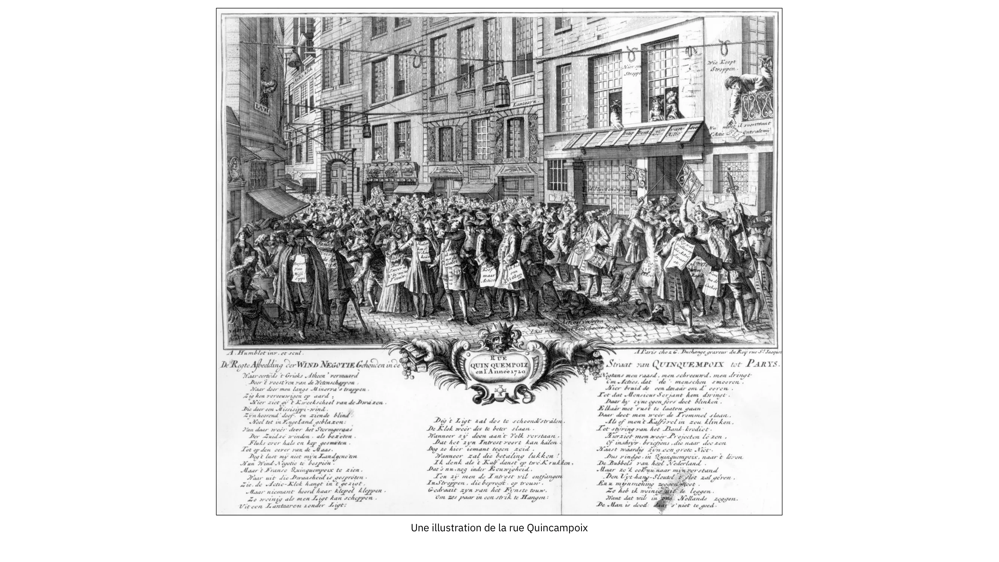

### Quand le foncier devient « garantie »

Un siècle plus tard, la Révolution française innova à son tour avec les **assignats**, monnaie adossée aux biens saisis de l’Église. Une idée séduisante sur le papier – transformer le foncier en garantie monétaire – mais inefficace : les terres ne sont ni liquides, ni divisibles. Résultat : hyperinflation, interdictions multiples pour contraindre à leur usage, inflation incontrôlée et pénuries. 

Napoléon, profondément marqué par ce chaos, rétablit l’or et l’argent comme base monétaire en 1800 avec la création de la Banque de France, garantissant du même coup la solde régulière de ses armées. Une manière pragmatique de regagner confiance : payer en pièces sonnantes et trébuchantes.

### Les années folles et la grande crise de 1929

Sautons deux siècles. Après la Première Guerre mondiale, les États financèrent l’effort par l’inflation et la suspension de l’or. Dans les années 1920, la Fed américaine pratiqua une politique monétaire trop accommodante pour soutenir la livre sterling britannique.

Résultat : crédit facile, spéculation effrénée sur Wall Street, achats d’actions à crédit, émergence d’une bulle immobilière et bancaire. 

Quand la machine s’emballa, le krach de 1929 fut inévitable : faillites bancaires massives, chômage record, files devant les soupes populaires. De là naquit l’idée fausse mais persistante que toute déflation est mauvaise, alors qu’il faut distinguer entre une déflation par croissance (saine) et une déflation par dette (dévastatrice).

### L’Asie des années 90 et l’effet domino

Dans les années 1990, le « miracle asiatique » fit rêver le monde : taux de change arrimés au dollar, croissance à 8-10 %, afflux de capitaux occidentaux. Tout allait bien… jusqu’à ce que la marée se retire. Faillites en cascade, monnaies dévaluées de 80 %, investisseurs ruinés. Le FMI dut intervenir, imposant des réformes douloureuses. Même scénario qu’à chaque fois : capital abondant, bulles nourries à crédit, puis effondrement.

### 2008 et l’ère de la bulle permanente

La bulle Internet (2000) fut suivie par la bulle immobilière des subprimes. La titrisation transforma des prêts bancaires en produits financiers « triple A », disséminés partout dans le monde. La promesse : éliminer le risque en le diluant. La réalité : tous les risques étaient en réalité corrélés. Quand l’immobilier s’écroula, c’est l’ensemble du système bancaire mondial qui vacilla.

Résultat : sauvetages publics massifs, quantitative easing, taux zéro. Avec cela, une fuite en avant : chaque crise ne purgera plus les excès, mais sera couverte par toujours plus de dette et d’impression monétaire. C’est ce qui a mené à la situation actuelle : la “everything bubble”, où tout actions, immobilier, art, crypto, même les cartes Pokémon gonfle artificiellement.

### Le retour éternel de l’argent magique

D’un siècle à l’autre, une constante se dessine : dès qu’une société croit pouvoir créer de la richesse avec de la monnaie au lieu de produire des biens réels, les bulles apparaissent. De John Law à 2008, de la rue Quincampoix à Wall Street, le processus se répète : euphorie, crédit, emballement, puis ruine.  

Et à la fin, invariablement, lorsque plus personne n’a confiance dans le papier, les peuples cherchent autre chose or, terres, valeurs refuges ou monnaies nouvelles. Hier Napoléon imposait le métal, aujourd’hui certains voient la relève dans Bitcoin.  

L’histoire de la finance n’est qu’un cycle sans fin : imprimer, spéculer, s’effondrer. Jusqu’à la prochaine bulle.

## Monnaie et violence
<chapterId>9486fe64-854f-5e17-86b3-8873baca39a8</chapterId>
:::video id=bd6d0807-2d8f-4637-a0f5-1e990e5c0d0f:::

Cette courte section, au sujet de la monnaie et de la violence, reviendra sur plusieurs événements que nous avons déjà vus tout au long du cours. Il s’agit simplement de faire un petit résumé de certaines anecdotes que je trouve intéressantes.

### Technologie et rapport de violence

Une petite liste d’anecdotes que nous avons probablement déjà abordées dans le cours. Cela sert à introduire une discussion particulièrement fascinante que j’ai eue avec Théo, au sujet d’une conférence qu’il avait donnée à B-Ondy, que j’ai trouvée très intéressante, notamment sur les avancées technologiques et leurs effets sur le rapport de violence entre la population et l’État.

### Monnaie et coercition étatique

Donc, pour introduire cette section, je vais vous faire une petite liste, vraiment pas exhaustive, juste pour vous rappeler les événements qu’on a probablement déjà couverts dans le cours.

Un lien avec la monnaie et la violence que je peux déjà faire, c’est souvent lorsqu’il s’agit d’une monnaie papier sans valeur qu’on peut imprimer à l’infini : cela vient souvent avec toutes sortes de règles et de menaces. On peut déjà parler des assignats, où il était littéralement écrit sur le papier que les contrefacteurs étaient menacés de mort. On trouve facilement dans les textes de loi de l’époque des menaces de mort pour ceux qui n’acceptaient pas cette fameuse monnaie papier.

Toujours en France, dans un des textes de loi que j’ai pu obtenir concernant la Révolution, j’ai vu dans certains textes liés à la monnaie la description du per diem pour le transport de la guillotine. Pour ceux qui transportaient et opéraient la guillotine, on décrivait le per diem auquel ils avaient droit pour faire leur travail. Je trouvais ça assez loufoque.

Aussi, on a parlé de la monnaie en Chine, la monnaie-signe, qui venait elle aussi avec tout un encadrement de l’État. On a vu dans cette section au début du cours que certaines pièces étaient écartées si elles étaient jugées moins belles, avec des conséquences prévues dans la loi pour cela.

On a également une anecdote où un roi en Angleterre finit par couper la main de ceux qui frappaient la monnaie s’ils ne respectaient pas le comportement attendu dans leur travail.

Toujours en Chine, j’ai lu des références à une saisie de cuivre dans les monastères bouddhistes. À un moment, le cuivre avait pris de la valeur, ce qui déstabilisait leur économie, basée sur une monnaie-signe qui n’avait pas réellement de lien avec le métal. Ils ont donc saisi le cuivre dans ces monastères.

Même chose pour les monastères en Angleterre durant la Réforme anglaise. Lorsque le roi se disputa avec le pape à propos de son divorce, il profita de l’abolition des monastères pour saisir les richesses de ces organisations ecclésiastiques.

Même situation en France, lors de la Révolution : tous les avoirs de l’Église furent saisis, et on a fabriqué de belles pièces de monnaie à partir du métal des cloches.

Si on remonte encore plus loin, une des notions de violence économique et de lois liberticides se retrouve chez Dioclétien, avec sa caste héréditaire, directement liée au fait que les paysans refusaient d’accepter la monnaie dévaluée et voulaient quitter leur travail. Dioclétien réagit en leur disant : « vous ne pouvez pas quitter votre terre, ni vos enfants », et la même règle s’appliquait aux soldats.

Je trouve que c’est une forme de violence assez explicite. On peut aussi parler des Templiers et d’un roi français : lorsqu’ils s’installèrent en France, le roi, voyant la manne de leurs richesses et ses propres problèmes de financement, leur fit un procès. Certains Templiers purent partir avec une partie du trésor, ce qui a donné naissance à des légendes comme celle de Oak Island au Canada. Des chercheurs pensent qu’un trésor des Templiers y est enfoui, et ils forent depuis plus d’une dizaine d’années pour le retrouver. Cela a donné une émission de télé, que mon père suit assidûment.

Voilà, c’est une petite liste rapide de faits que nous avons vus dans ce cours, et qui, je pense, soulèvent un lien entre la monnaie et la violence. Je vous laisse maintenant avec la prochaine partie de Théo, qui va nous raconter une histoire très intéressante sur les changements technologiques et le rapport de pouvoir entre la plèbe et les autorités.

Merci !

## Les conséquences économiques de la violence organisée 
<chapterId>66bd4674-2159-5489-ad4b-ec5e3fb691af</chapterId>
:::video id=c8b063c6-aeb4-4a94-9027-b11d369e71a4:::

### La violence organisée et l'évolution de l'État 

L'historien Frederic C. Lane propose une thèse révolutionnaire : l'anatomie de l'État à travers l'histoire est façonnée par les technologies de projection de la violence. Partant du principe wébérien que l'État détient le monopole de la violence légitime, Lane observe que ce monopole paradoxalement plus efficient que la concurrence dans ce domaine évolue selon les rapports entre coût d'attaque et coût de défense.

Cette analyse, reprise par les auteurs de "L'Individu Souverain" (1997), explique les mutations historiques de l'organisation politique : du système féodal médiéval aux cités États de la Renaissance, puis aux États nations industriels et enfin aux États providence modernes. Chaque transition correspond à une rupture technologique majeure dans l'exercice de la violence, survenant approximativement tous les 400-500 ans.

### L'équilibre médiéval 
Au Moyen Âge, l'économie agraire dominait à plus de 90 %. Le paysan, littéralement enraciné à sa terre, ne pouvait fuir le seigneur et ses chevaliers. La technologie militaire armures forgées à la main, années d'entraînement à l'épée était extrêmement coûteuse. Cette asymétrie favorisait largement l'attaque au détriment de la défense.

Le paysan, contraint à l'immobilité, devient l'otage du seigneur local de la violence. Sa capacité à extorquer des impôts atteint des sommets, même si, paradoxalement, les impôts médiévaux restent modestes comparés aux 78 % de prélèvements obligatoires actuels. Le seigneur peut taxer à sa guise, car le paysan ne peut ni résister ni partir.

### La Renaissance marchande 

L'émergence du commerce hanséatique au Nord et méditerranéen au Sud transforme la donne. Les marchands, principaux créateurs de valeur ajoutée, possèdent un capital mobile : leurs navires. Ils n'ont besoin que de milices maritimes légères, les mers étant difficiles à contrôler. Surtout, ils peuvent facilement migrer vers le port voisin si la taxation devient excessive.

Cette mobilité crée une concurrence fiscale entre cités-États. Venise, Gênes, Bruges doivent offrir le cadre le plus libéral possible : contrats fiables, monnaie de qualité, assurances, taxation minimale. Les princes doivent séduire plutôt que contraindre. L'asymétrie s'inverse : la défense (par la fuite) devient plus facile que l'attaque.

### L'ère industrielle 

La révolution industrielle ramène une configuration proche du féodalisme. Les usines, chemins de fer et chaînes de montage représentent des investissements massifs et immobiles. Henry Ford ne peut délocaliser ses installations face à la taxation. Les ouvriers, concentrés dans les cités industrielles, se syndiquent pour négocier collectivement plutôt que de migrer individuellement.

L'État "provident-stratège" émerge : planification industrielle (Japon, Corée), protection militaire des infrastructures, minima sociaux pour la main-d'œuvre. La Seconde Guerre mondiale illustre cette vulnérabilité : bombarder les usines ennemies devient la stratégie dominante. La concentration du capital physique permet une extraction fiscale massive pour financer l'État-providence.

### La révolution du microprocesseur 

Trois innovations technologiques bouleversent aujourd'hui ces équilibres millénaires. Le microprocesseur transforme la guerre : un opérateur au Nevada pilote un drone en Afghanistan avec une précision chirurgicale. La guerre du Golfe (1991) démontre cette rupture : la quatrième armée mondiale (Irak) est anéantie en 45 jours avec moins de 200 morts côté coalition. La supériorité technologique rend l'attaque frontale impossible.

Internet et la cryptographie asymétrique révolutionnent la création de valeur. Un développeur peut travailler de n'importe où avec un MacBook et Starlink, exportant sa production instantanément et gratuitement. Les "digital nomads" échappent à la captivité géographique, mettant les États en concurrence comme jamais depuis la Renaissance.

Bitcoin représente l'aboutissement de cette logique : une monnaie affranchie de l'État, protégée par un bouclier cryptographique inviolable. La richesse devient défendable contre toute force physique. L'individu retrouve une capacité de défense absolue face au monopole étatique.

### L'effondrement du modèle westphalien

Les États-providence occidentaux, conçus pour l'ère industrielle, deviennent obsolètes. Les créateurs de valeur développeurs, artistes, financiers migrent vers Singapour, Dubaï ou El Salvador, préférant moins de services publics contre une taxation minimale. Les géants modernes (Apple, Tether) n'ont besoin ni de bureaux ni d'infrastructures physiques.

Cette fuite des cerveaux crée une spirale : moins de contributeurs nets, services publics dégradés, taxation accrue sur ceux qui restent, accélération des départs. Les États doivent radicalement réduire leur périmètre ou faire faillite. Le morcellement en petites juridictions compétitives — nouveau modèle de cités-États numériques — semble inévitable.

L'histoire nous enseigne que ces transitions durent des générations. Mais la séparation monnaie État opérée par Bitcoin pourrait accélérer le processus. L'individu vote désormais avec ses pieds et son portefeuille cryptographique, redessinant la carte du pouvoir mondial selon des lignes que nous commençons seulement à percevoir.

## Une très courte histoire de la finance
<chapterId>1d37fff1-a091-5034-8e71-4af590b8ffce</chapterId>
:::video id=fdfabbc6-e4d8-463a-8522-19176f8fb460:::

Suite à ce récit de l'histoire de la monnaie qui nous amène jusqu'au système fiat, j'aimerais assez rapidement et de manière très succincte vous expliquer l'évolution de la finance qui a mené éventuellement à l'état providence. Au départ, à l'époque romaine, on a eu des pièces de monnaie.

C'est une technologie financière qui a permis à l'empire de payer des soldats, de s'épandre, de faire le commerce. Ça a très bien fonctionné, sauf qu' il y avait trop d'évaluations. À un moment où ils ont cessé l'expansion et ils ont arrêté d'avoir des butins de leurs guerres, de l'expansion de territoire, leur système s'est effondré.

### L'évolution des technologies financières 

Ensuite, on a eu le Moyen Âge, où il y a eu assez peu d'évolution jusqu'au Florin, qui a ramené une monnaie stable, et les développements bancaires en Italie et à Anvers, où l'on a développé le concept de « time value of money », donc l'escompte. L'escompte a été développé pour créer une forme de monnaie papier, sous la forme d'un promissory note, une promesse que plus tard on pourrait récupérer 100 $ plus un taux d'intérêt.

Une technologie financière a été développée pour permettre de vendre le billet avant la fin du terme : si on le vend après 4 mois sur un terme de 6 mois, la personne paie une prime pour compenser la perte de rendement des deux mois restants.

Cette technologie financière a été développée à Anvers et à Amsterdam à cette époque. Ensuite, on a vu l'évolution des banques centrales et la notion de prêteur de dernier recours. On peut penser que, durant la Banque d'Amsterdam, l’usage des pièces a été progressivement délaissé au niveau du commerce international au profit de la monnaie scripturale.

Plus tard, au XVIIIᵉ siècle, au niveau de la technologie financière, on peut parler des assurances. Une anecdote est très bien racontée dans le livre The Ascent of Money de Neil Ferguson. La première compagnie d'assurance née s'appelait Scottish Widow. Essentiellement, c'était le clergé qui voulait développer une assurance pour les prêtres, qui parfois mouraient prématurément. Le clergé, à l'époque, s'occupait pendant un an de la veuve et de la descendance en Écosse.

Ils ont donc inventé les calculs actuariaux pour déterminer combien chaque prêtre devait contribuer, et si le prêtre mourait, l'assurance couvrait la survie de sa femme et de ses enfants. Ce système, développé par Scottish Widow, a ensuite été étendu et constitue la base des calculs actuariaux modernes.

### De l'assurance privée à l'État-providence

Donc, l'assurance fait partie de l'histoire de la technologie financière. Et cela m'amène au concept d'État-providence : ces assurances privées ont rencontré un problème d'optimisation. Par exemple, si l'on propose une assurance santé à des personnes en bonne santé, elles auront peut-être moins d'intérêt à payer la prime, se disant : « Moi je suis en santé, je ne tomberai pas malade ». Tandis que les personnes qui savent qu'elles sont malades voudront certainement souscrire.

On obtient donc un déséquilibre : le nombre de personnes malades souscrivant à l'assurance est plus élevé que celui des personnes en santé. Si l'on calcule les chiffres, ils ne s'équilibrent pas, car il est probablement impossible d'assurer assez de personnes en bonne santé pour compenser le risque. En économie, c'est le concept d'aléa moral.

Une des solutions proposées a été de rendre ces assurances obligatoires. Si tout le monde est tenu de contribuer, l'équilibre est rétabli : les personnes en santé et celles en mauvaise santé participent, répartissant les risques sur une plus grande population.

Ainsi, dans plusieurs régions du monde, l'État a décidé de prendre en charge cette situation. Je ne suis pas expert sur toutes ces questions, mais il semble que ce raisonnement s'applique à d'autres formes d'assurance, comme l'assurance chômage. L'idée est de simplifier et d'optimiser : il est plus efficace qu'un seul organisme central gère la distribution des risques.

À mon avis, cela a conduit à la centralisation de ces concepts d'assurance et à la naissance de l'État-providence. Les initiatives privées, créées pour répondre aux besoins du marché et distribuer le risque dans la population, ont été reprises par l'État pour des raisons logiques liées à l'aléa moral et à l'optimisation.

### Modèles alternatifs et réflexions sur les monopoles d'État

Et au final, dans certains pays comme le Canada, on se retrouve avec plusieurs types d’assurances — assurance santé, assurance chômage — qui sont des monopoles de l’État.

Je peux donner un exemple que je connais. En Suisse, c’est un peu différent. Il y a des mutuelles privées, des hôpitaux privés, et tu peux choisir ta mutuelle, ton forfait, tout en ayant des services relativement universels, même si une grande part de ce système reste privée.
Donc, il est possible que ce soit aussi opéré par le privé. Mais tout ce que je voulais vous expliquer, ce n’est pas pour juger qu’un système soit meilleur qu’un autre. C’était plutôt pour montrer qu’en lisant l’histoire de la finance, je me suis rendu compte de la raison pour laquelle, en Occident  notamment en France et au Canada l’État a voulu prendre le contrôle de certains principes financiers.

Ce que je voulais montrer, c’est que ce concept d’assurance est avant tout une évolution de la finance, et que parfois les gouvernements, comme ils savent si bien le faire, vont essayer d’en prendre le contrôle, un peu comme ils ont cherché à prendre le contrôle de la monnaie pour plusieurs raisons. Une des raisons, pour la monnaie, est le concept de prêteur de dernier recours.

C’est plus sûr s’il y a une grosse institution derrière qui distribue le risque de façon plus large. À l’origine, cette institution pouvait analyser quelles banques étaient assez solides pour survivre et les empêcher de s’effondrer en leur prêtant de l’argent.

À l’époque, il y avait vraiment une analyse lorsque ce concept est apparu pour la première fois. Mais à la fin, on sauve tout le monde : le concept de « too big to fail » s’applique à presque toutes les banques, à cause de la centralisation, et aussi à toutes les grosses entreprises. On voit donc qu’à la fin, c’est un concept appliqué de manière large par l’État, un peu comme le concept d’assurance que je viens de vous décrire.

En conclusion, l’État décide de tout prendre en charge. Cette technologie financière, créée pour la première fois en Écosse pour répondre à un problème spécifique, nous amène à terme à l’État-providence. Il utilise les principes financiers d’actuariat pour offrir des services à sa population selon ses besoins. Mais on peut s’entendre que la concentration et le monopole qui en découlent posent toutes sortes de problèmes, que l’on observe aujourd’hui au Canada ou en France. Il existe pourtant d’autres modèles, comme celui de la Suisse.

Il faut simplement réaliser que le concept d’État-providence émane de la finance, et qu’il existe probablement d’autres voies à explorer que ces monopoles d’État. On pourrait même appliquer ce raisonnement au concept de prêteur de dernier recours des banques centrales, mais cela est un autre sujet.

# Section finale
<partId>9bada469-7ef0-511a-9eaa-f8eb66d5906f</partId>

## Évaluer ce cours
<chapterId>a9494e2b-8a4d-5811-8a7b-b4a91fb22778</chapterId>

<isCourseReview>true</isCourseReview>

## Conclusion
<chapterId>1094e793-b4c6-5782-aa4a-71cde00ce7c0</chapterId>

<isCourseConclusion>true</isCourseConclusion>

