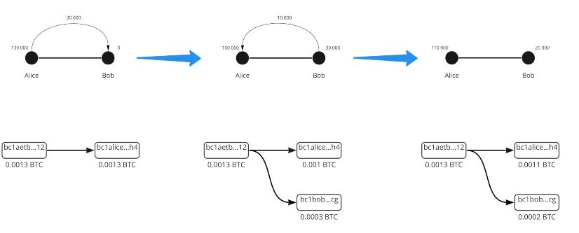
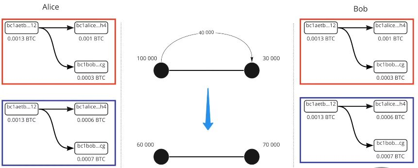
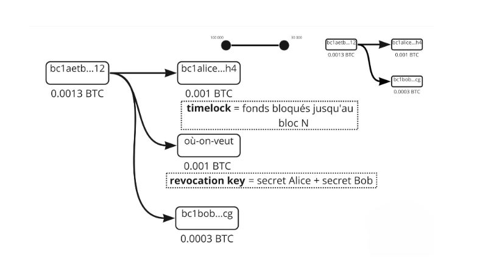
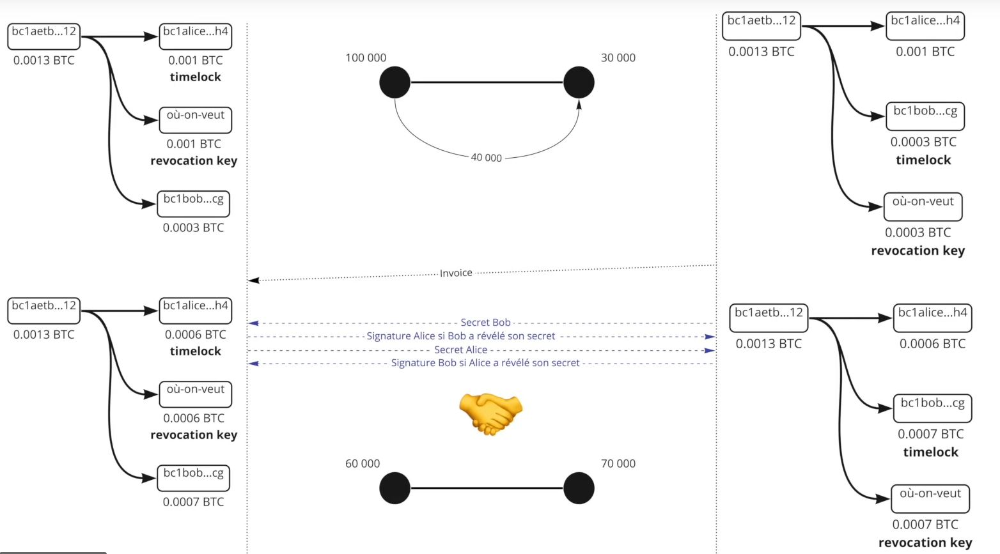
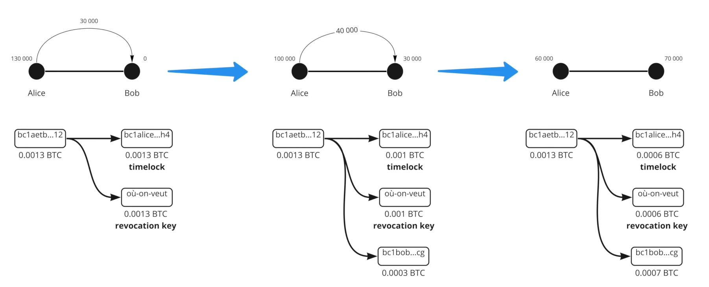

# Eine Reise zur zweiten Schicht von Bitcoin

Dieser Kurs ist eine theoretische Einführung in die technische Funktionsweise des Lightning Network.

Willkommen in der aufregenden Welt des Lightning Network, einer zweiten Schicht von Bitcoin, die sowohl technologisch anspruchsvoll als auch voller Potenzial ist. Wir werden uns in die technischen Tiefen dieser Technologie stürzen, ohne uns auf spezifische Tutorials oder Anwendungsszenarien zu konzentrieren. Um das Beste aus diesem Kurs herauszuholen, ist ein solides Verständnis von Bitcoin unerlässlich. Es ist eine Erfahrung, die eine ernsthafte und konzentrierte Herangehensweise erfordert. Sie können auch in Erwägung ziehen, den Kurs LN 202 parallel zu absolvieren, der einen praktischeren Aspekt dieser Erkundung bietet. Machen Sie sich bereit für eine Reise, die Ihre Wahrnehmung des Bitcoin-Ökosystems verändern könnte.

Viel Spaß beim Entdecken!

+++

# Das Lightning Network verstehen


Das Lightning-Netzwerk ist eine Zahlungsinfrastruktur der zweiten Schicht, die auf dem Bitcoin-Netzwerk aufgebaut ist und schnelle und kostengünstige Transaktionen ermöglicht. Um das Lightning-Netzwerk vollständig zu verstehen, ist es unerlässlich, zu verstehen, was Zahlungskanäle sind und wie sie funktionieren.

Ein Zahlungskanal im Lightning ist eine Art "privater Weg" zwischen zwei Benutzern, der schnelle und wiederholte Bitcoin-Transaktionen ermöglicht. Wenn ein Kanal geöffnet wird, hat er eine feste Kapazität, die von den Benutzern im Voraus festgelegt wird. Diese Kapazität stellt den maximalen Betrag an Bitcoin dar, der zu einem bestimmten Zeitpunkt im Kanal übertragen werden kann.

Zahlungskanäle sind bidirektional, was bedeutet, dass sie zwei "Seiten" haben. Zum Beispiel, wenn Alice und Bob einen Zahlungskanal öffnen, kann Alice Bitcoin an Bob senden und Bob kann Bitcoin an Alice senden. Transaktionen innerhalb des Kanals ändern nicht die Gesamtkapazität des Kanals, sondern ändern die Verteilung dieser Kapazität zwischen Alice und Bob.


Damit eine Transaktion in einem Lightning-Zahlungskanal möglich ist, muss der Benutzer, der die Mittel sendet, ausreichend Bitcoin auf seiner Seite des Kanals haben. Wenn Alice beispielsweise 1 Bitcoin an Bob über ihren Kanal senden möchte, muss sie mindestens 1 Bitcoin auf ihrer Seite des Kanals haben.
Grenzen und Funktionsweise von Zahlungskanälen im Lightning.
Obwohl die Kapazität eines Lightning-Zahlungskanals festgelegt ist, begrenzt dies nicht die Gesamtzahl der Transaktionen oder das Gesamtvolumen von Bitcoin, das durch den Kanal übertragen werden kann. Zum Beispiel können Alice und Bob bei einem Kanal mit einer Kapazität von 1 Bitcoin Hunderte von Transaktionen von 0,01 Bitcoin oder Tausende von Transaktionen von 0,001 Bitcoin durchführen, solange die Gesamtkapazität des Kanals zu einem bestimmten Zeitpunkt nicht überschritten wird.

Trotz dieser Einschränkungen sind Lightning-Zahlungskanäle eine effektive Möglichkeit, schnelle und kostengünstige Bitcoin-Transaktionen durchzuführen. Sie ermöglichen es Benutzern, Bitcoin zu senden und zu empfangen, ohne hohe Transaktionsgebühren zu zahlen oder lange Bestätigungszeiten im Bitcoin-Netzwerk zu erwarten.

Zusammenfassend bieten Lightning-Zahlungskanäle eine leistungsstarke Lösung für diejenigen, die schnelle und kostengünstige Bitcoin-Transaktionen durchführen möchten. Es ist jedoch wichtig, ihr Funktionieren und ihre Grenzen zu verstehen, um sie vollständig nutzen zu können.


Beispiel:

- Alice hat 100.000 SAT
- Bob hat 30.000 SAT

Dies ist der aktuelle Zustand des Kanals. Bei einer Transaktion entscheidet Alice, 40.000 SAT an Bob zu senden. Sie kann es tun, weil 40.000 <100.000.

Der neue Zustand des Kanals ist also:

- Alice 60.000 SAT
- Bob 70.000 SAT

```
Anfangszustand des Kanals:
Alice (100.000 SAT) ============== Bob (30.000 SAT)

Nach der Übertragung von Alice an Bob von 40.000 SAT:
Alice (60.000 SAT) ============== Bob (70.000 SAT)

```


Jetzt möchte Bob 80.000 SAT an Alice senden. Da er nicht über die Liquidität verfügt, kann er es nicht tun. Die maximale Kapazität des Kanals beträgt 130.000 SAT, wobei eine Ausgabe von bis zu 60.000 SAT für Alice und 70.000 SAT für Bob möglich ist.


# Bitcoin, Adressen, UTXO und Transaktionen


In diesem zweiten Kapitel nehmen wir uns Zeit, um zu verstehen, wie Bitcoin-Transaktionen tatsächlich funktionieren, was uns bei der Verwendung von Lightning sehr nützlich sein wird. Wir werden auch kurz auf das Konzept der Multi-Signatur-Adresse eingehen, das für das nächste Kapitel über das Öffnen von Kanälen im Lightning-Netzwerk entscheidend ist.

- Private Key> Public Key> Adresse: Bei einer Transaktion sendet Alice Geld an Bob. Letzterer gibt eine Adresse an, die durch seinen öffentlichen Schlüssel gegeben wird. Alice, die selbst das Geld auf eine Adresse über ihren öffentlichen Schlüssel erhalten hat, verwendet nun ihren privaten Schlüssel, um die Transaktion zu signieren und damit die Bitcoins der Adresse freizugeben.
- Bei einer Transaktion müssen in Bitcoin alle Bitcoins bewegt werden. Als UTXO (Unspend Transaction Output) bezeichnet, werden alle Bitcoin-Stücke ausgehen und schließlich zum Eigentümer zurückkehren.
  Alice hat 0,002 BTC und Bob hat 0 BTC. Alice entscheidet sich, 0,0015 BTC an Bob zu senden. Sie wird eine Transaktion von 0,002 BTC signieren, wobei 0,0015 BTC an Bob gehen und 0,0005 BTC in ihre Brieftasche zurückkehren werden.


Hier haben wir aus einer UTXO (Alice hat 0,0002 BTC an einer Adresse) also 2 UTXOs erstellt (Bob hat 0,0015 BTC und Alice hat einen neuen UTXO (unabhängig vom vorherigen) von 0,0005 BTC erhalten).

```
Alice (0,002 BTC)
  |
  V
Bitcoin-Transaktion (0,002 BTC)
  |
  |----> Bob (0,0015 BTC)
  |
  V
Alice (neuer UTXO: 0,0005 BTC)
```

Im Lightning Network werden Multi-Signaturen verwendet. Es sind also 2 Signaturen erforderlich, um die Mittel freizugeben, d.h. zwei private Schlüssel, um das Geld zu bewegen. Es können also Alice und Bob sein, die zusammen zustimmen müssen, das Geld (die UTXO) freizugeben. In LN sind dies speziell 2/2-Transaktionen, daher sind unbedingt beide Signaturen erforderlich im Gegensatz zu Multi-Signaturen 2/3 oder 3/5, bei denen nur eine Kombination der vollständigen Anzahl von Schlüsseln erforderlich ist.


# Kanaleröffnung


Nun betrachten wir die Kanaleröffnung genauer und wie diese über eine Bitcoin-Transaktion erfolgt.

Das Lightning Network hat verschiedene Kommunikationsebenen:

- P2P-Kommunikation (Lightning Network-Protokoll)
- Zahlungskanal (Lightning Network-Protokoll)
- Bitcoin-Transaktion (Bitcoin-Protokoll)


Um einen Kanal zu öffnen, sprechen die beiden Peers über einen Kommunikationskanal:

- Alice: "Hallo, ich möchte einen Kanal öffnen!"
- Bob: "Ok, hier ist meine öffentliche Adresse."


Alice hat nun 2 öffentliche Adressen, um eine 2/2 Multi-Sig-Adresse zu erstellen. Sie kann nun eine Bitcoin-Transaktion erstellen, um Geld dorthin zu senden.

Angenommen, Alice hat eine UTXO von 0,002 BTC und möchte einen Kanal mit Bob von 0,0013 BTC öffnen. Sie wird also eine Transaktion mit 2 Ausgangs-UTXOs erstellen:

- ein UTXO von 0,0013 an die 2/2 Multi-Sig-Adresse
- ein UTXO von 0,0007 an eine ihrer Wechseladressen (Rückgabe der UTXOs).

Diese Transaktion ist noch nicht öffentlich, da sie Bob vertrauen müsste, um das Geld aus der Multi-Sig freizugeben.

Aber wie geht es dann?

Alice wird eine zweite Transaktion erstellen, die als "Rückzugstransaktion" bezeichnet wird, bevor sie die Einzahlung in die Multi-Sig veröffentlicht.


Die Rückzugstransaktion wird die Mittel von der Multi-Sig-Adresse auf eine ihrer Adressen ausgeben (bevor alles veröffentlicht wird).
Nachdem beide Transaktionen erstellt wurden, teilt Alice Bob mit, dass alles erledigt ist und bittet ihn um eine Unterschrift mit seinem öffentlichen Schlüssel, damit sie ihre Mittel wiedererlangen kann, falls etwas schief geht. Bob stimmt zu, da er nicht unehrlich ist.

Alice kann also alleine auf die Mittel zugreifen, da sie bereits Bobs Unterschrift hat. Sie veröffentlicht die Transaktionen. Der Kanal ist nun geöffnet und es gibt auf der Seite von Alice 0,0013 BTC (130.000 SAT).


# Lightning-Transaktionen und Engagement-Transaktionen


Lassen Sie uns nun untersuchen, was tatsächlich hinter den Kulissen passiert, wenn Mittel von einer Seite des Kanals auf die andere im Lightning-Netzwerk übertragen werden, insbesondere das Konzept der Engagement-Transaktion. Die On-Chain-Abhebungs-/Schließungstransaktion stellt den Kanalzustand dar und garantiert, wem die Mittel nach jeder Übertragung gehören. Nach einer Lightning-Übertragung gibt es also ein Update dieser nicht realisierten Transaktion/Kontakt zwischen den beiden Peers, Alice und Bob, die dieselbe Transaktion mit dem aktuellen Kanalzustand erstellen, falls es zu einer Schließung kommt:

- Alice eröffnet einen Kanal mit Bob mit 130.000 SAT auf ihrer Seite. Die von beiden im Falle einer Schließung akzeptierte Abhebungstransaktion besagt, dass 130.000 SAT an Alice gehen werden, wenn der Kanal geschlossen wird. Bob stimmt zu, da dies fair ist.


- Alice sendet 30.000 SAT an Bob. Es gibt also eine neue Abhebungstransaktion, die besagt, dass im Falle einer Schließung Alice 100.000 SAT und Bob 30.000 SAT erhält. Beide stimmen zu, da dies fair ist.


- Alice sendet 10.000 SAT an Bob, eine neue Abhebungstransaktion wird erstellt, um zu sagen, dass Alice 90.000 SAT und Bob 40.000 SAT erhält. Beide stimmen zu, da dies fair ist.



```
Anfangszustand des Kanals:
Alice (130.000 SAT) =============== Bob (0 SAT)

Nach der ersten Übertragung:
Alice (100.000 SAT) =============== Bob (30.000 SAT)

Nach der zweiten Übertragung:
Alice (90.000 SAT) =============== Bob (40.000 SAT)

```

Das Geld bewegt sich also nie, aber das endgültige Gleichgewicht wird über eine signierte, aber nicht veröffentlichte On-Chain-Transaktion aktualisiert. Die Abhebungstransaktion ist also eine Engagement-Transaktion. Die Satoshis-Übertragungen sind eine weitere, aktuellere Engagement-Transaktion, die das Gleichgewicht aktualisiert.

# Engagement-Transaktionen


Wenn Engagement-Transaktionen den Kanalzustand mit der Liquidität zum Zeitpunkt X bestimmen, können wir dann betrügen, indem wir einen alten Zustand veröffentlichen? Die Antwort ist ja, da wir bereits die Vorunterschrift der beiden Teilnehmer in der nicht veröffentlichten Transaktion haben.



Um dieses Problem zu lösen, werden wir Komplexität hinzufügen:

- Timelock = Mittel gesperrt bis Block N
- Widerrufsschlüssel = Alice-Geheimnis und Bob'-Geheimnis

Zwei Elemente werden der Engagement-Transaktion hinzugefügt. Daher muss Alice auf das Ende des Timelocks warten, und jeder, der den Widerrufsschlüssel besitzt, kann die Mittel ohne Warten auf das Ende des Timelocks verschieben. Wenn Alice versucht zu betrügen, verwendet Bob den Widerrufsschlüssel, um Alice zu bestehlen und zu bestrafen.
 


Ab sofort (und in der Realität) ist die Engagement-Transaktion nicht mehr dieselbe für Alice und Bob. Sie sind symmetrisch, aber jeder hat unterschiedliche Einschränkungen. Sie geben sich gegenseitig ihr Geheimnis, um den Widerrufsschlüssel der vorherigen Engagement-Transaktion zu erstellen. Daher erstellt Alice den Kanal mit Bob, 130.000 SAT auf ihrer Seite, sie hat einen Timelock, der sie daran hindert, ihr Geld sofort zurückzubekommen, sie muss ein wenig warten. Der Widerrufsschlüssel kann das Geld freischalten, aber nur Alice hat ihn (Alice's Engagement-Transaktion). Sobald eine Übertragung stattfindet, wird Alice ihr altes Geheimnis an Bob weitergeben, so dass dieser den Kanal im vorherigen Zustand leeren kann, falls Alice versucht zu betrügen (Alice wird bestraft). 



Auf die gleiche Weise wird Bob sein Geheimnis an Alice weitergeben, damit sie ihn bestrafen kann, falls er versucht zu betrügen. Der Vorgang wird bei jeder neuen Engagement-Transaktion wiederholt. Ein neues Geheimnis wird entschieden und ein neuer Widerrufsschlüssel erstellt. Daher muss für jede neue Transaktion die vorherige Engagement-Transaktion zerstört werden, indem das Widerrufsgeheimnis gegeben wird. Wenn also Alice oder Bob versucht zu betrügen, kann der andere vorher handeln (dank des Timelocks) und somit Betrug vermeiden. Bei Transaktion Nr. 3 wird daher das Geheimnis der Transaktion Nr. 2 gegeben, um Alice und Bob zu ermöglichen, sich gegen Alice oder Bob zu verteidigen.



Die Person, die die Transaktion mit dem Timelock erstellt (die das Geld sendet), kann den Widerrufsschlüssel nur nach dem Timelock verwenden. Die Person, die das Geld empfängt, kann ihn jedoch vor dem Timelock verwenden, wenn es zu Betrug auf beiden Seiten eines Kanals im Lightning-Netzwerk kommt. Insbesondere gehen wir detailliert auf die Mechanismen ein, die dazu dienen, sich gegen möglichen Betrug seitens des Partners im Kanal zu schützen.

# Kanalschließung


Wir interessieren uns für die Kanalschließung durch eine Bitcoin-Transaktion, die je nach Fall unterschiedliche Formen annehmen kann. Es gibt drei Arten von Kanalschließungen:

- Die Gute: Kooperative Schließung
- Die Brutale: Erzwungene Schließung (nicht kooperativ)
- Der Schurke: Schließung durch einen Betrüger


## Die Gute

Die beiden Parteien sprechen miteinander und vereinbaren, den Kanal zu schließen. Sie stoppen alle Transaktionen und validieren einen endgültigen Zustand des Kanals. Sie einigen sich auf Netzwerkgebühren (die Person, die den Kanal öffnet, zahlt die Schließungsgebühren). Sie erstellen nun die Schließungstransaktion. Es gibt also eine Schließungstransaktion, die sich von den Engagement-Transaktionen unterscheidet, da es keinen Timelock und keinen Widerrufsschlüssel gibt. Die Transaktion wird veröffentlicht und Alice und Bob erhalten ihre jeweiligen Salden. Diese Art der Schließung ist in der Regel schnell (da kein Timelock vorhanden ist) und kostengünstig.


## Der Schurke

Alice möchte den Kanal schließen, aber Bob antwortet nicht, da er offline ist (Internet- oder Stromausfall). Alice wird daher die neueste Engagement-Transaktion (die letzte) veröffentlichen. Die Transaktion wird veröffentlicht und der Timelock wird aktiviert. Die Gebühren wurden bei der Erstellung dieser Transaktion vor X Zeit in der Vergangenheit festgelegt! Die MemPool ist das Netzwerk, das sich seitdem geändert hat, und das Protokoll verwendet standardmäßig Gebühren, die 5-mal höher sind als die aktuellen Gebühren zum Zeitpunkt der Erstellung der Transaktion. Erstellung von Gebühren in Höhe von 10 SAT, daher wurde die Transaktion mit 50 SAT berücksichtigt. Zum Zeitpunkt der erzwungenen Veröffentlichung ist das Netzwerk der Abschluss-Transaktion:

- 1 SAT = um 50\* überbezahlt
- 100 SAT = um 2\* unterbezahlt

Dies macht die erzwungene Schließung länger (Timelock) und vor allem riskanter in Bezug auf Gebühren und damit mögliche Validierung durch die Miner.


## Der Betrüger

Alice versucht zu betrügen, indem sie eine alte Engagement-Transaktion veröffentlicht. Aber Bob überwacht die MemPool und beobachtet, ob Transaktionen versuchen, alte zu veröffentlichen. Wenn er welche findet, verwendet er den Widerrufsschlüssel, um Alice zu bestrafen und alle SAT aus dem Kanal zu nehmen.


Zusammenfassend ist die Schließung des Kanals im Lightning Network ein entscheidender Schritt, der verschiedene Formen annehmen kann. Bei einer kooperativen Schließung kommunizieren beide Parteien und einigen sich auf einen endgültigen Zustand des Kanals. Dies ist die schnellste und kostengünstigste Option. Eine erzwungene Schließung tritt jedoch auf, wenn eine der Parteien nicht reagiert. Dies ist eine teurere und längere Situation aufgrund unvorhersehbarer Transaktionsgebühren und der Aktivierung des Timelocks. Schließlich kann ein Teilnehmer, der versucht, durch Veröffentlichung einer alten Engagement-Transaktion zu betrügen, der Schurke sein und alle SAT des Kanals verlieren. Es ist daher entscheidend, diese Mechanismen für eine effektive und faire Nutzung des Lightning Network zu verstehen.

# Lightning Network


In diesem siebten Kapitel untersuchen wir die Funktionsweise von Lightning als Kanalnetzwerk und wie Zahlungen von ihrer Quelle zu ihrem Ziel geleitet werden.

Lightning ist ein Netzwerk von Zahlungskanälen. Es sind also Tausende von Peers mit ihren Liquiditätskanälen, die miteinander verbunden sind und sich so selbst nutzen, um Transaktionen zwischen nicht verbundenen Peers durchzuführen.


Die Liquidität der Kanäle kann sich nicht in andere Liquiditätskanäle verlagern.

`Alice -> Eden - > Bob`. Die Satoshis bewegten sich nicht von `Alice -> Bob`, sondern von `Alice -> Eden` und von `Eden -> Bob`.

Jede Person und jeder Kanal hat also unterschiedliche Liquidität. Um Zahlungen zu tätigen, muss also eine Route im Netzwerk gefunden werden, die über genügend Liquidität verfügt. Fehlt diese, wird die Zahlung nicht erfolgreich sein.

Gegeben sei das folgende Netzwerk:

```
Anfangszustand des Netzwerks :
Alice (130 SAT) ==== (0 SAT) Susie (90 SAT) ==== (200 SAT) Eden (150 SAT) ==== (100 SAT) Bob
```


Wenn Alice entweder 40 SAT an Bob überweist, dann wird die Liquidität entlang der Route zwischen den beiden Parteien umverteilt.

```
Nach der Übertragung von 40 SAT von Alice an Bob :
Alice (90 SAT) ==== (40 SAT) Susie (50 SAT) ==== (240 SAT) Eden (110 SAT) ==== (140 SAT) Bob.
```


Im Anfangszustand kann Bob jedoch keine 40 SAT an Alice senden, da Susie keine Liquidität mit Alice hat, um ihr 40 SAT zu senden, sodass die Zahlung über diese Route nicht möglich ist. Es wird also eine andere Route benötigt, auf der die Transaktion nicht möglich ist.

Im ersten Beispiel ist deutlich zu erkennen, dass Susie und Eden nichts verloren und nichts gewonnen haben. Um zu akzeptieren, dass sie als Router für die Transaktion verwendet werden, verlangen die Lightning Network-Knoten eine Gebühr!

Es gibt unterschiedliche Gebühren, je nachdem, wo sich die Liquidität befindet.

Alice - Bob

- Gebühr von Alice = Alice -> Bob
- Gebühren von Bob = Bob -> Alice


Es gibt zwei Arten von Gebühren:

- Eine feste Gebühr unabhängig vom Betrag: 1 SAT (Standard, kann aber geändert werden).
- Eine variable Gebühr (0,01% standardmäßig).

Beispiel für eine Gebühr :

- Alice - Susie; 1/1 (1 als feste Gebühr und 1 als variable Gebühr).
- Susie - Eden; 0/200
- Eden - Bob; 1/1

Also:

- Gebühr 1: (von Alice a selbst bezahlt) 1 + (40.000\*0.000001)
- Gebühr 2: 0 + 40.000 \* 0.0002 = 8 SAT
- Kosten 3: 1 + 40 000\* 0.000001 = 0.4 SAT


Versenden:

1. Senden von 40 009.04 Alice -> Susie; Alice zahlt a ihre Gebühren selbst, daher zählt es nicht.
2. Susie tut Eden den Gefallen, 40 001.04 zu senden; sie nimmt die Provision von 8 SAT.
3. Eden tut den Gefallen, 40.000 an Bob zu schicken; er nimmt seine 1.04 SAT Gebühr.

Alice zahlt 9.04 SAT Gebühr und Bob erhält 40.000 SAT.


Im LN entscheidet der Knoten von Alice also vor dem Senden über die Route. Es gibt also eine Suche nach der besten Route und Alice ist die einzige, die die Route und den Preis kennt. Die Zahlung wird gesendet, aber Susie hat keine Informationen.


Für Susie oder Eden: Sie wissen nicht, wer der endgültige Empfänger ist oder wer sendet. Dies ist eine Zwiebel-Routing. Der Knoten muss also einen Plan des Netzwerks behalten, um seinen Weg zu finden, aber keiner der Vermittler hat Informationen.

## HTLC - Hashed Time Locked Contract


In einem herkömmlichen Routing-System, wie kann man sicherstellen, dass Eden nicht betrügt und seinen Teil des Vertrags einhält?

HTLC ist also ein Zahlungsvertrag, der nur mit einem Geheimnis entsperrt werden kann. Wenn es nicht enthüllt wird, läuft der Vertrag ab. Es ist also eine bedingte Zahlung. Wie werden sie verwendet?


Betrachten wir die folgende Situation
`Alice (100 000 SAT) ==== (30 000 SAT) Susie (250 000 SAT) ==== (0 SAT) Bob`

- Bob generiert ein Geheimnis S (die Präimage) und berechnet den Hash r= hash(s)
- Bob sendet eine Rechnung an Alice mit "r"
- Alice sendet ein HTLC von 40.000 SAT an Susie mit der Bedingung, "s'" zu enthüllen, so dass hash(s')=r
- Susie sendet ein ähnliches HTLC an Bob
- Bob entsperrt das HTLC von Susie, indem er "s" zeigt
- Susie entsperrt das HTCL von Alice, indem sie "S" zeigt

Wenn Bob offline ist und das Geheimnis, das ihm die Legitimität gibt, das Geld zu erhalten, niemals herausfindet, wird das HTLC nach einer bestimmten Anzahl von Blöcken ablaufen.


Die HTLCs laufen in umgekehrter Reihenfolge ab: also Ablauf Susie - Bob und dann Alice - Susie.
So, wenn Bob zurückkommt, ändert sich nichts. Andernfalls, wenn Alice storniert, während Bob zurückkommt, wird es ein Durcheinander geben und Leute können umsonst gearbeitet haben.

Und dann, was passiert bei der Schließung? Tatsächlich sind unsere Engagement-Transaktionen noch komplexer. Es muss das Zwischenbilanz darstellen, falls der Kanal geschlossen wird.

Es gibt also ein HTLC-out von 40.000 Satoshis (mit den oben genannten Einschränkungen) in der Engagement-Transaktion über eine Ausgabe Nr. 3.


Alice hat also in der Engagement-Transaktion:

- Ausgabe Nr. 1: 60.000 SAT für Alice über eine Timelock- und Widerrufsschlüssel (was ihr bleibt)
- Ausgabe Nr. 2: 30.000, die bereits Susie gehören
- Ausgabe Nr. 3: 40.000 in HTLC

Die Engagement-Transaktion von Alice ist mit einem HTCL-out, da sie an die Empfängerin, Susie, ein HTLC-in sendet.


Also, wenn diese Engagement-Transaktion veröffentlicht wird, kann Susie das Geld von HTCL mit dem Bild "s" abrufen. Wenn sie die Vorabbildung nicht hat, erhält Alice das Geld, sobald HTCL abläuft. Betrachten Sie die Ausgänge (UTXO) als verschiedene Zahlungen mit verschiedenen Bedingungen.
Nach der Zahlung (Ablauf oder Ausführung) ändert sich der Zustand des Kanals und die Transaktion mit HTCL existiert nicht mehr. Wir kehren zu etwas Klassischem zurück.
Im Falle einer kooperativen Schließung: Wir stoppen die Zahlungen und warten auf die Ausführung der Überweisungen/HTCL, die Transaktion ist leicht, daher billiger, da es maximal 1 oder 2 Ausgänge gibt.
Bei einer erzwungenen Schließung: Wir veröffentlichen mit allen laufenden HTLCs, was sehr schwer und teuer wird. Und es ist ein Durcheinander.

Zusammenfassend verwendet das Routing-System des Lightning-Netzwerks Hash Time-Locked Contracts (HTLC), um eine sichere und überprüfbare Zahlung zu gewährleisten. HTLCs ermöglichen bedingte Zahlungen, bei denen das Geld nur mit einem Geheimnis entsperrt werden kann, um sicherzustellen, dass die Teilnehmer ihre Verpflichtungen einhalten.Im gezeigten Beispiel möchte Alice SAT an Bob über Susie senden. Bob generiert ein Geheimnis, erstellt einen Hash davon und übermittelt ihn an Alice. Alice und Susie richten ein HTLC auf der Grundlage dieses Hashs ein. Sobald Bob das HTLC von Susie entsperrt, indem er ihr das Geheimnis zeigt, kann Susie das HTLC von Alice entsperren.Wenn Bob das Geheimnis nicht innerhalb einer bestimmten Zeit preisgibt, läuft das HTLC ab. Das Verfallsdatum erfolgt in umgekehrter Reihenfolge, um sicherzustellen, dass bei einer Rückkehr von Bob keine unerwünschten Auswirkungen auftreten.

Bei der Schließung des Kanals werden bei einer kooperativen Schließung die Zahlungen unterbrochen und die HTLCs gelöst, was in der Regel weniger kostspielig ist. Wenn die Schließung erzwungen wird, werden alle laufenden HTLC-Transaktionen veröffentlicht, was sehr teuer und unordentlich werden kann.Insgesamt fügt der HTLC-Mechanismus eine zusätzliche Sicherheitsebene im Lightning-Netzwerk hinzu, um sicherzustellen, dass Zahlungen ordnungsgemäß ausgeführt werden und die Benutzer ihre Verpflichtungen einhalten.

# Finding Your Way


Die einzigen öffentlichen Daten sind die gesamte Kanalkapazität (Alice + Bob), aber wir wissen nicht, wo die Liquidität ist. Um weitere Informationen zu erhalten, hört unser Knoten den LN-Kommunikationskanal ab, um Ankündigungen neuer Kanäle und Aktualisierungen der Kanalgebühren zu erhalten. Ihr Knoten sieht auch in der Blockchain nach, wenn Kanäle geschlossen werden.

Da wir nicht über alle Informationen verfügen, müssen wir mit den Informationen, die wir haben (maximale Kanalkapazität und nicht, wo sich die Liquidität befindet), eine Graph-/Routensuche durchführen.

Kriterien:

- Erfolgschancen
- Gebühren
- Ablaufzeit der HTLCs
- Anzahl der Zwischenknoten
- Zufälligkeit


Wenn es also 3 mögliche Routen gibt:

- Alice > 1 > 2 > 5 > Bob
- Alice > 1 > 2 > 4 > 5 > Bob
- Alice 1 > 2 > 3 > Bob

Dann suchen wir theoretisch die beste Route mit den geringsten Gebühren und der höchsten Erfolgschance: maximale Liquidität und möglichst wenige Hops.

Wenn zum Beispiel 2-3 nur eine Kapazität von 130.000 SAT haben, ist es sehr unwahrscheinlich, dass 100.000 gesendet werden können, daher hat die Wahl Nr. 3 keine Erfolgschancen.


Nun hat der Algorithmus seine 3 Auswahlmöglichkeiten getroffen und wird daher die erste ausprobieren:

Wahl 1:

- Alice sendet einen HTLC von 100.000 SAT an 1;
- 1 macht einen HTLC von 100.000 SAT für 2
- 2 macht einen HTLC von 100.000 SAT an 5, aber 5 kann nicht, also wird es angekündigt.

Die Information wird zurückgesendet, also entscheidet Alice, die zweite Route auszuprobieren:

- Alice sendet einen HTLC von 100.000 an 1
- 1 macht einen HTLC von 100.000 zu 2
- 2 macht einen HTLC von 100.000 zu 4
- 4 macht einen HTLC von 100.000 zu Bob. Bob hat die Liquidität, also ist es in Ordnung.
- Bob verwendet das Präbild (Hash) des HTLC und verwendet daher das Geheimnis, um die 100.000 SAT wiederzuerlangen
- 5 hat nun das Geheimnis des HTLC, um den blockierten HTLC von 4 wiederzuerlangen
- 4 hat nun das Geheimnis des HTLC, um den blockierten HTLC von 2 wiederzuerlangen
- 2 hat nun das Geheimnis des HTLC, um den blockierten HTLC von 1 wiederzuerlangen
- 1 hat nun das Geheimnis des HTLC, um den blockierten HTLC von Alice wiederzuerlangen

Alice hat das Scheitern der Route 1 nicht gesehen, sie hat nur eine Sekunde länger gewartet. Eine Zahlungsfehler tritt auf, wenn es keine mögliche Route gibt. Um die Suche nach einer Route zu erleichtern, kann Bob Alice Informationen zur Unterstützung ihrer Rechnung bereitstellen:

- Der Betrag
- Seine Adresse
- Der Hash des Präbilds, damit Alice den HTLC erstellen kann
- Hinweise auf Bobs Kanäle

Bob kennt die Liquidität der Kanäle 5 und 3, da er direkt damit verbunden ist, er kann das Alice mitteilen. Er warnt Alice, dass Knoten 3 unnötig ist, was Alice potenziell davon abhält, ihre Route zu machen.Ein weiteres Element wären private Kanäle (also nicht im Netzwerk veröffentlicht), die Bob haben kann. Wenn Bob einen privaten Kanal mit 1 hat, kann er Alice sagen, ihn zu benutzen, und das würde Alice > 1 > Bob geben.


Abschließend ist das Routing von Transaktionen im Lightning Network ein komplexer Prozess, der die Berücksichtigung verschiedener Faktoren erfordert. Während die Gesamtkapazität der Kanäle öffentlich ist, ist die genaue Verteilung der Liquidität nicht direkt zugänglich. Dies zwingt die Knoten dazu, die wahrscheinlichsten erfolgreichen Routen abzuschätzen, unter Berücksichtigung von Kriterien wie Gebühren, HTLC-Verfallszeit, Anzahl der Zwischenknoten und einem Zufallsfaktor. Wenn mehrere Routen möglich sind, versuchen die Knoten, die Gebühren zu minimieren und die Erfolgschancen zu maximieren, indem sie Kanäle mit ausreichender Liquidität und einer minimalen Anzahl von Sprüngen wählen. Wenn eine Transaktion aufgrund unzureichender Liquidität fehlschlägt, wird eine andere Route ausprobiert, bis eine Transaktion erfolgreich ist.

Darüber hinaus kann der Empfänger zusätzliche Informationen wie Adresse, Betrag, Preimage-Hash und Hinweise auf seine Kanäle bereitstellen, um die Suche nach einer Route zu erleichtern. Dies kann dazu beitragen, Kanäle mit ausreichender Liquidität zu identifizieren und unnötige Transaktionsversuche zu vermeiden. Letztendlich ist das Routing-System im Lightning Network darauf ausgelegt, die Geschwindigkeit, Sicherheit und Effizienz von Transaktionen zu optimieren und gleichzeitig die Privatsphäre der Benutzer zu wahren.

# Rechnung, LNURL, Keysend


Eine LN-Rechnung (oder Invoice) ist lang und unangenehm zu lesen, aber sie ermöglicht eine dichte Darstellung einer Zahlungsaufforderung.

Beispiel:
lnbc1m1pskuawzpp5qeuuva2txazy5g483tuv9pznn9ft8l5e49s5dndj2pqq0ptyn8msdqqcqzpgxqrrsssp5v4s00u579atm0em6eqm9nr7d0vr64z5j2sm5s33x3r9m4lgfdueq9qyyssqxkjzzgx5ef7ez3dks0laxayx4grrw7j22ppgzyhpydtv6hmc39skf9hjxn5yd3kvv7zpjdxd2s7crcnemh2fz26mnr6zu83w0a2fwxcqnvujl3

- lnbc1m = lesbarer Teil
- 1 = Trennung vom Rest
- Dann der Rest
- Bc1 = Bech32-Codierung (Basis 32), daher werden 32 Zeichen verwendet.
- 10 = 1.2.3.4.5.6.7.8.9.0
- 26 = abcdefghijklmnopqrstuvwxyz
- 32 = nicht "b-i-o" und nicht "1"

## lnbc1m

- ln = Lightning
- Bc = Bitcoin (Mainnet)
- 1 = Betrag
- M = Milli (10*-3 / u = Mikro 10*-6 / n = Nano 10*-9 / p = Pico 10*-12)
  Hier gilt 1m = 1 \* 0,0001 BTC = 100.000 BTC.

"Bitte zahlen Sie 100.000 SAT auf dem Lightning-Netzwerk des Bitcoin-Mainnets an pskuawzpp5qeuuva2txazy5g483tuv9pznn9ft8l5e49s5dndj2pqq0ptyn8msdqqcqzpgxqrrsssp5v4s00u579atm0em6eqm9nr7d0vr64z5j2sm5s33x3r9m4lgfdueq9qyyssqxkjzzgx5ef7ez3dks0laxayx4grrw7j22ppgzyhpydtv6hmc39skf9hjxn5yd3kvv7zpjdxd2s7crcnemh2fz26mnr6zu83w0a2fwxcqnvujl3".

## Zeitstempel (wann es erstellt wurde)

Es kann 0 oder mehr zusätzliche Teile enthalten:

- Hash des Preimages
- Zahlungsgeheimnis (Zwiebel-Routing)
- Beliebige Daten
- LN-Pub-Schlüssel des Empfängers
- Ablaufzeit (Standard 1 Stunde)
- Routing-Anweisungen
- Signatur des gesamten

Es gibt andere Arten von Rechnungen. Das Meta-Protokoll LNURL ermöglicht es, direkt eine Satoshis-Menge anstelle einer Anfrage bereitzustellen. Dies ist sehr flexibel und ermöglicht viele Verbesserungen in Bezug auf die Benutzererfahrung.


Ein Keysend ermöglicht es Alice, Geld an Bob zu senden, ohne dass Bob die Anfrage hat. Alice erhält die ID von Bob, erstellt ein Preimage ohne Bob zu fragen und fügt es in ihre Sendung ein. Bob wird also eine Überraschungsanfrage erhalten, bei der er das Geld freischalten kann, da Alice bereits die Arbeit erledigt hat.


Zusammenfassend kodiert eine Lightning Network-Rechnung, obwohl sie auf den ersten Blick komplex erscheint, effektiv eine Zahlungsanforderung. Jeder Abschnitt der Rechnung enthält wichtige Informationen, einschließlich des zu zahlenden Betrags, des Empfängers, des Zeitstempels der Erstellung und möglicherweise weiterer Informationen wie dem Hash des Preimages, dem Zahlungsgeheimnis, den Routing-Anweisungen und der Ablaufzeit. Protokolle wie LNURL und Keysend bieten signifikante Verbesserungen in Bezug auf Flexibilität und Benutzererfahrung, z. B. die Möglichkeit, Geld ohne vorherige Anfrage der anderen Partei zu senden. Diese Technologien machen den Zahlungsprozess auf dem Lightning Network reibungsloser und effizienter.

### Unterstütze uns

Dieser Kurs sowie der gesamte Inhalt dieser Universität wurden Ihnen kostenlos von unserer Community zur Verfügung gestellt. Um uns zu unterstützen, können Sie ihn teilen, Mitglied der Universität werden und sogar über GitHub zu ihrer Entwicklung beitragen. Im Namen des gesamten Teams vielen Dank!

### Bewertung der Schulung

Ein Bewertungssystem für die Ausbildung wird bald in diese neue E-Learning-Plattform integriert werden! In der Zwischenzeit vielen Dank für die Teilnahme am Kurs und wenn Sie ihn genossen haben, denken Sie daran, ihn zu teilen.

# Liquiditätsmanagement


Wir geben einige allgemeine Hinweise, um die immer wiederkehrende Frage des Liquiditätsmanagements auf Lightning zu beantworten.

In LN gibt es 3 Arten von Personen:

- Käufer: Sie haben ausgehende Liquidität, was am einfachsten ist, da es nur darum geht, Kanäle zu öffnen.
- Händler: Es ist komplizierter, da sie eingehende Liquidität über andere Knoten und Akteure benötigen. Sie müssen Leute haben, die mit ihnen verbunden sind.
- Routing-Knoten: Sie möchten mit Liquidität auf beiden Seiten und einer guten Verbindung zu vielen Knoten ausbalanciert sein, um so oft wie möglich genutzt zu werden.

Wenn Sie also eingehende Liquidität benötigen, können Sie diese von Dienstleistungen kaufen.


Alice kauft mit Susie einen Kanal für 1 Million Satoshis, also öffnet sie einen Kanal mit direkt 1.000.000 SAT auf der Eingangsseite. Sie kann dann bis zu 1 Million SAT an Zahlungen von Kunden akzeptieren, die mit Susie verbunden sind (die sehr gut vernetzt ist).

Eine andere Lösung wäre, Zahlungen zu leisten; Sie zahlen 100.000 aus einem bestimmten Grund und können nun 100.000 empfangen.


## Lösung Loop Out: Atomic Swap LN - BTC

Alice 2 Millionen - Susie 0


Alice möchte die Liquidität an Susie senden, also macht sie einen Loop Out (einen speziellen Knoten, der einen Pro-Service zum Ausgleich von LN/BTC anbietet).
Alice sendet 1 Million an Loop über Susies Knoten, also hat Susie die Liquidität und Loop sendet das Gleichgewicht on-chain an Alice Knoten zurück.


Also gehen die 1 Million zu Susie, letztere sendet 1 Million an Loop, Loop sendet 1 Million an Alice. Alice hat also die Liquidität zu Susie verschoben, gegen Zahlung einiger Gebühren an Loop für den Service.

Das Schwierigste an LN ist, die Liquidität zu halten.


Zusammenfassend ist das Liquiditätsmanagement im Lightning Network ein Schlüsselaspekt, der von der Art des Benutzers abhängt: Käufer, Händler oder Routing-Knoten. Käufer, die ausgehende Liquidität benötigen, haben die einfachste Aufgabe: Sie öffnen einfach Kanäle. Händler, die eingehende Liquidität benötigen, müssen mit anderen Knoten und Akteuren verbunden sein. Routing-Knoten hingegen streben ein Gleichgewicht der Liquidität auf beiden Seiten an. Es gibt mehrere Lösungen zur Liquiditätsverwaltung, wie den Kauf von Kanälen oder die Zahlung zur Erhöhung der Empfangskapazität. Die Option "Loop Out", die einen Atomic Swap zwischen LN und BTC ermöglicht, bietet eine interessante Lösung zur Wiederherstellung der Liquidität. Trotz dieser Strategien bleibt die Aufrechterhaltung der Liquidität im Lightning Network eine komplexe Herausforderung.

# Geh weiter

## Zusammenfassung der Schulung


Unser Ziel war es, zu erklären, wie das Lightning-Netzwerk funktioniert und wie es auf Bitcoin aufbaut.

Das Lightning-Netzwerk ist ein Netzwerk von Zahlungskanälen. Wir haben gesehen, wie ein Zahlungskanal zwischen zwei Parteien funktioniert, aber wir haben auch unseren Blick auf das gesamte Netzwerk und das Konzept des Zahlungskanalnetzwerks erweitert.


Die Kanäle werden über eine Bitcoin-Transaktion geöffnet und können so viele Transaktionen wie möglich aufnehmen. Der Zustand des Kanals wird durch eine Commitment-Transaktion dargestellt, die jeder Partei zeigt, was sie auf ihrer Seite des Kanals hat. Wenn eine Transaktion im Kanal stattfindet, verpflichten sich die Parteien zum neuen Zustand, indem sie den alten Zustand widerrufen und eine neue Commitment-Transaktion erstellen.


Die Paare schützen sich vor Betrug mit Widerrufsschlüsseln und einer Zeitverzögerung. Die gegenseitige Zustimmung zur Schließung des Kanals ist bevorzugt. Im Falle einer erzwungenen Schließung wird die letzte Commitment-Transaktion veröffentlicht.


Zahlungen können die Kanäle anderer Zwischenknoten nutzen. Bedingte Zahlungen auf der Grundlage von Hash Time-Locked Contracts (HTLC) ermöglichen es, Gelder zu sperren, bis die Zahlung vollständig gelöst ist. Das Onion-Routing wird im Lightning-Netzwerk verwendet. Zwischenknoten kennen das endgültige Ziel der Zahlungen nicht. Alice muss die Zahlungsroute berechnen, hat jedoch nicht alle Informationen zur Liquidität in den Zwischenkanälen.


Es gibt eine Wahrscheinlichkeitskomponente, wenn eine Zahlung über das Lightning-Netzwerk gesendet wird. 


Um Zahlungen zu erhalten, muss die Liquidität in den Kanälen verwaltet werden, was durch das Bitten anderer Personen, Kanäle zu uns zu öffnen, durch das Öffnen eigener Kanäle und durch die Verwendung von Tools wie Loop oder durch den Kauf/Miete von Kanälen auf Marktplätzen erfolgen kann.

## Interview mit Fanis


Hier ist eine Zusammenfassung des Interviews:

Das Lightning Network ist eine ultraschnelle Zahlungslösung auf Bitcoin, die die Einschränkungen der Skalierbarkeit des Netzwerks umgeht. Die Bitcoins auf Lightning sind jedoch nicht so sicher wie die auf der Bitcoin-Blockchain, da Dezentralisierung und Sicherheit zugunsten der Skalierbarkeit priorisiert werden.

Eine übermäßige Erhöhung der Blockgröße ist keine gute Lösung, da dies Kompromisse bei Knoten und Datenkapazität bedeutet. Stattdessen ermöglicht das Lightning Network die Erstellung von Zahlungskanälen zwischen zwei Bitcoin-Nutzern, ohne dass die Transaktionen auf der Blockchain erscheinen, wodurch Platz auf den Blöcken gespart und Bitcoin heute skaliert werden kann.

Es gibt jedoch Kritik an der Skalierbarkeit und Zentralisierung des Lightning Network, mit potenziellen Problemen im Zusammenhang mit der Schließung von Kanälen und hohen Transaktionsgebühren. Um diese Probleme zu lösen, wird empfohlen, keine kleinen Kanäle zu öffnen, um zukünftige Probleme zu vermeiden, und die Transaktionsgebühren mit Child Pay for Parent zu erhöhen.

Zukünftige Lösungen für das Lightning Network sind das Batching und die Erstellung von Kanälen in Gruppen, um Transaktionsgebühren zu reduzieren, sowie langfristig die Erhöhung der Blockgröße. Es ist jedoch wichtig zu beachten, dass Bitcoins auf Lightning nicht so sicher sind wie Bitcoins auf der Bitcoin-Blockchain.

Die Privatsphäre auf Bitcoin und Lightning sind miteinander verbunden, wobei das Zwiebel-Routing ein gewisses Maß an Privatsphäre für Transaktionen garantiert. Auf Bitcoin ist jedoch standardmäßig alles transparent, wobei Heuristiken verwendet werden, um Bitcoins von Adresse zu Adresse auf der Bitcoin-Blockchain zu verfolgen.

Der Kauf von Bitcoins mit KYC ermöglicht es der Börse, die Abhebungstransaktionen zu kennen, während runde Beträge und Wechseladressen anzeigen, welche Teile einer Transaktion für eine andere Person und welche für sich selbst bestimmt sind.

Um die Privatsphäre zu verbessern, brechen gemeinsame Aktionen und Coinjoins die Wahrscheinlichkeitsberechnungen, indem sie Transaktionen durchführen, bei denen mehrere Personen gemeinsam eine Transaktion durchführen. Chain-Analyse-Unternehmen haben Schwierigkeiten zu bestimmen, was du mit deinen Bitcoins machst, wenn du ihnen folgst.

Auf Lightning wissen nur zwei Personen von der Transaktion, und es ist vertraulicher als Bitcoin. Das Zwiebel-Routing bedeutet, dass ein Zwischenknoten den Absender und Empfänger der Zahlung nicht kennt.

Um das Lightning Network zu nutzen, wird empfohlen, eine Schulung auf deinem YouTube-Kanal oder direkt auf der Website Discover Bitcoin zu absolvieren oder die Schulung auf Umbrell zu nutzen. Es ist auch möglich, bei einer Zahlung auf Lightning einen beliebigen Text zu senden, indem ein dafür vorgesehenes Feld verwendet wird, was für Spenden oder Messaging nützlich sein kann.
Cependant, es ist wichtig zu beachten, dass Routing-Nodes auf Lightning in Zukunft reguliert werden könnten, mit einigen Staaten, die versuchen werden, Routing-Nodes zu regulieren.
Für Händler ist es notwendig, Liquidität zu verwalten, um Zahlungen im Lightning-Netzwerk zu akzeptieren, wobei aktuelle Einschränkungen mit geeigneten Lösungen überwunden werden können.

Schließlich ist die Zukunft von Bitcoin vielversprechend, mit einer möglichen Projektion von einer Million in fünf Jahren. Um die Professionalisierung der Branche und die Schaffung eines alternativen Systems zum bestehenden Bankensystem zu gewährleisten, ist es wichtig, zum Netzwerk beizutragen und aufzuhören, zu vertrauen.

## Dankeschön und weiterhin den Kaninchenbau erkunden

Herzlichen Glückwunsch! 🎉
Sie haben den LN 201-Kurs - Einführung in das Lightning-Netzwerk abgeschlossen!
Sie können stolz auf sich sein, denn es war nicht einfach. Beachten Sie, dass nur wenige Menschen so tief in den Bitcoin-Kaninchenbau hinabsteigen.

Zunächst einmal ein großes Dankeschön an Fanis Makalakis, der uns diesen großartigen kostenlosen Kurs zu einem ethnischeren Aspekt von Lightning angeboten hat. Folgen Sie ihm auf Twitter, seinem Blog oder seiner Arbeit bei LN Market.

Wenn Sie das Projekt unterstützen möchten, zögern Sie nicht, uns auf Patreon zu sponsern. Ihre Spenden werden dazu beitragen, Inhalte für neue Kurse zu produzieren, und natürlich werden Sie die Ersten sein, die informiert werden (einschließlich des nächsten Kurses von Fanis, der in Arbeit ist!).

Das Lightning-Netzwerk-Abenteuer geht weiter mit dem Kurs über Umbrel und dem Aufbau eines Lightning-Netzwerkknotens. Schluss mit der Theorie und Platz für die Praxis mit dem LN 202-Kurs!

Küsse und bis bald!

Rogzy
