# ビットコイン・レイヤー2への旅

このコースは、ライトニング・ネットワークの技術的な動作に関する理論的なレッスンです。

ライトニング・ネットワークのエキサイティングな世界へようこそ。これはビットコインのレイヤー2（L2）であり、洗練された潜在能力に満ちたものです。具体的なチュートリアルや使用するシナリオに焦点を当てずに、この技術の技術的な深層に潜り込むことになります。このコースを最大限に活用するためには、ビットコインについての堅固な理解が必要です。それは真剣そのものかつ集中的なアプローチが必要な体験です。また、この探求により実践的な側面を提供するLN 202コースを並行して受講することも検討してください。それでは、ビットコイン・エコシステムの認識を変えるかもしれない旅に備えてください。

新たな発見をぜひ楽しみましょう！

+++

# 基礎
## ライトニング・ネットワークを理解する


ライトニング・ネットワークは、高速かつ低コストなトランザクションを可能にするビットコイン・ネットワーク上に構築されたレイヤー2の支払いインフラです。ライトニング・ネットワークの動作を完全に理解するためには、ペイメント・チャネルとその動作原理を理解することが不可欠です。

ライトニング・ペイメント・チャネルは、高速で繰り返し可能なビットコイントランザクションを可能にする、2人のユーザー間のための「専用レーン」のようなものです。チャネルが開かれると、ユーザーによって事前に定義された固定容量が与えられます。この容量は、チャネル内でいつでも送金できるビットコインの最大量を表します。

ペイメント・チャネルは双方向であり、2つの「側面」を持っています。例えば、AliceとBobがペイメント・チャネルを開いた場合、AliceはBobにビットコインを送金することができ、BobもAliceにビットコインを送金することができます。チャネル内のトランザクションはチャネルの総容量を変更しませんが、AliceとBobの間でその容量の分配を変更します。

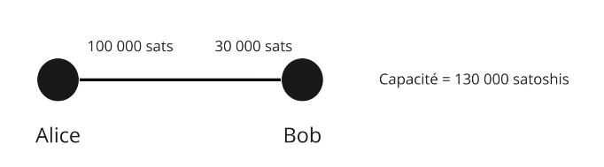

ライトニング・ペイメント・チャネル内でトランザクションを行うためには、資金を送金するユーザーは自身のチャネル側に十分なビットコインを持っている必要があります。例えば、Aliceが彼らのチャネルを通じてBobに1ビットコインを送金したい場合、彼女は少なくとも1ビットコインを自身のチャネル側に持っている必要があります。ライトニング・ペイメント・チャネルの制限と動作原理について。ライトニング・ペイメント・チャネルの容量は固定されていますが、これはトランザクションの総数やチャネルを通じて送信できるビットコインの総量を制限するものではありません。例えば、AliceとBobが1ビットコインの容量を持つチャネルを持っている場合、彼らはチャネルの総容量が超えない限り、0.01ビットコインのトランザクションを何百回も行ったり、0.001ビットコインのトランザクションを何千回も行ったりすることができます。

これらの制限にもかかわらず、ライトニング・ペイメント・チャネルは高速かつ低コストなビットコイン・トランザクションを行う効率的な方法です。ビットコイン・ネットワーク上での高いトランザクション手数料の支払いや長い確認期間（confirmation periods）を待つ必要がなく、ユーザーはビットコインの送受金を行うことができます。

要約すると、ライトニング・ペイメント・チャネルは、高速かつ低コストなビットコイン・トランザクションを行いたい人々にとって強力な解決策を提供します。しかし、それらの動作と制限を完全に理解することが重要です。

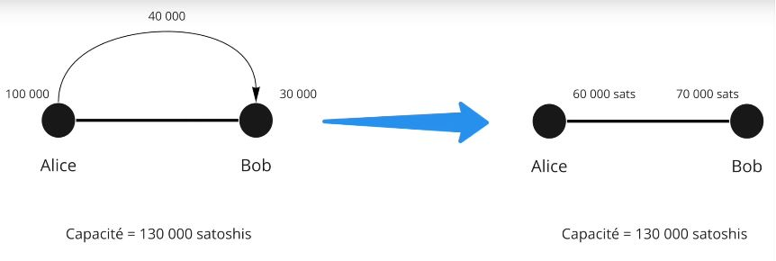

例：

- Aliceは100,000 SATを持っています。
- Bobは30,000 SATを持っています。

これはチャネルの現在の状態です。トランザクション中、AliceはBobに40,000 SATを送ることを決定します。彼女はそれをすることができます。なぜなら40,000 < 100,000だからです。

したがって、チャネルの新しい状態は次のとおりです：

- Alice 60,000 SAT
- Bob 70,000 SAT

```
チャネルの初期状態：
Alice（100,000 SAT）============== Bob（30,000 SAT）

Aliceが40,000 SATをBobに送金した後：
Alice（60,000 SAT）============== Bob（70,000 SAT）

```
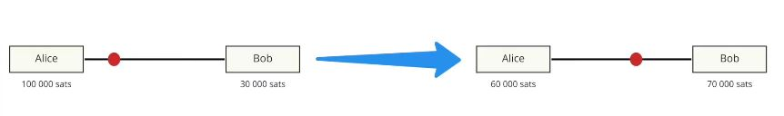

さて、BobはAliceに80,000 SATを送りたいと思っています。彼は流動性がないため、それはできません。チャネルの最大容量は130,000 SATで、Aliceは最大で60,000 SAT、Bobは最大で70,000 SATを送金できます。

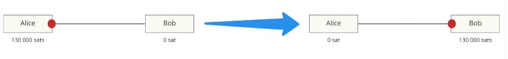

## ビットコイン、アドレス、UTXO、トランザクション


この第2章では、ビットコイン・トランザクションが実際にどのように機能するかを詳しく説明し、これはライトニングの理解にも非常に役立ちます。また、ライトニング・ネットワークでのチャネル開設について説明する次の章を理解するために重要なマルチシグ（multi-Signature）・アドレスの概念についても簡単に説明します。

- 秘密鍵 > 公開鍵 > アドレス：トランザクション中、AliceはBobにお金を送ります。Bobは公開鍵によって与えられたアドレスを提供します。Aliceは自身の公開鍵を介してアドレスにお金を受け取り、その後、秘密鍵を使用してトランザクションに署名し、アドレスからビットコインを引き出します。
- ビットコイン・トランザクションでは、すべてのビットコインが移動する必要があります。UTXO（Unspend Transaction Output / 未使用トランザクション出力）と呼ばれるビットコインのビットは、すべて所有者に戻るために一時的に出て行きます。
  Aliceは0.002 BTCを持っており、Bobは0 BTCです。Aliceは0.0015 BTCをBobに送ることを決定します。彼女は0.002 BTCのトランザクションに署名し、そのうちの0.0015 BTCがBobに行き、0.0005 BTCが彼女のウォレットに戻ります。

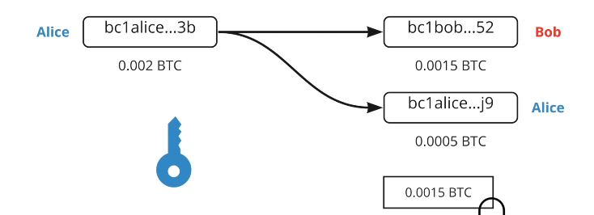

ここでは、1つのUTXO（Aliceはアドレス上で0.0002 BTCを持っています）から2つのUTXO（Bobは0.0015を持ち、Aliceは新しいUTXO（前のものとは独立したもの）で0.0005 BTCを持っています）を作成しました。

```
Alice（0.002 BTC）
  |
  V
ビットコイン・トランザクション（0.002 BTC）
  |
  |----> Bob（0.0015 BTC）
  |
  V
Alice（新しいUTXO：0.0005 BTC）
```

ライトニング・ネットワークでは、マルチシグが使用されます。したがって、資金を引き出すためには2つの署名、つまりお金を移動させるための2つの秘密鍵が必要です。これはAliceとBobが一緒にお金（UTXO）を引き出すために合意する必要があることを意味します。LN（ライトニング・ネットワーク）では具体的には、2/2トランザクションが使用されるため、両方の署名が絶対に必要です。これは2/3または3/5マルチシグとは異なり、完全な鍵の組み合わせのみが必要な場合です。

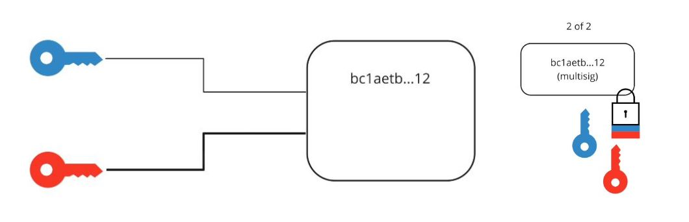

# チャネルの開設と終了
## チャネルの開設


さて、チャネルの開設について詳しく見ていき、それがビットコインのトランザクションを介してどのように行われるかを説明します。
ライトニング・ネットワークには、異なるレベルの通信があります：
- P2P通信（ライトニング・ネットワークプロトコル）
- ペイメント・チャネル（ライトニング・ネットワークプロトコル）
- ビットコイントランザクション（ビットコインプロトコル）

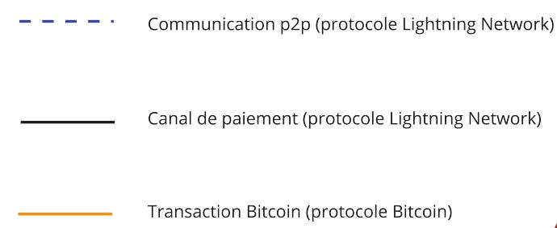

チャネルを開くために、2つのピアは通信チャネルを介して通信します：

- Alice: "こんにちは、チャネルを開きたいです！"
- Bob: "わかりました、こちらが私の公開アドレスです。"

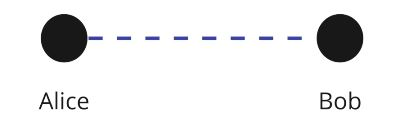

Aliceは今、2つの公開アドレスを持って2/2マルチシグアドレスを作成することができます。彼女はそれにお金を送るためにビットコイントランザクションを作成することができます。

例えば、Aliceは0.002 BTCのUTXOを持っており、Bobと0.0013 BTCのチャネルを開きたいとします。彼女は2つのUTXOを出力とするトランザクションを作成します：

- 2/2マルチシグアドレスへの0.0013のUTXO
- 彼女のおつりアドレスの1つへの0.0007のUTXO（UTXOの返却）

このトランザクションはまだ公開されていません。なぜなら、この段階では彼女はBobがマルチシグからお金を取り出すことができることを信頼しているからです。

しかし、どのように進めればよいのでしょうか？

Aliceは、資金のデポジットを公開する前に「引き出しトランザクション」と呼ばれる2つ目のトランザクションを作成します。

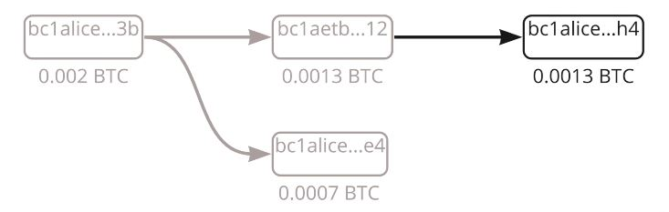

引き出しトランザクションは、マルチシグアドレスから彼女のアドレスに資金を支出します（これはすべてが公開される前に行われます）。
両方のトランザクションが作成されたら、AliceはBobに完了したことを伝え、彼の公開鍵で署名を求めます。これにより、何か問題が発生した場合に彼女が資金を回収できるようになります。Bobは不正ではないので同意します。

AliceはすでにBobの署名を持っているため、資金を単独で回収することができます。彼女はトランザクションを公開します。チャネルは今、Aliceの側に0.0013 BTC（130,000 SAT）を持って開かれています。

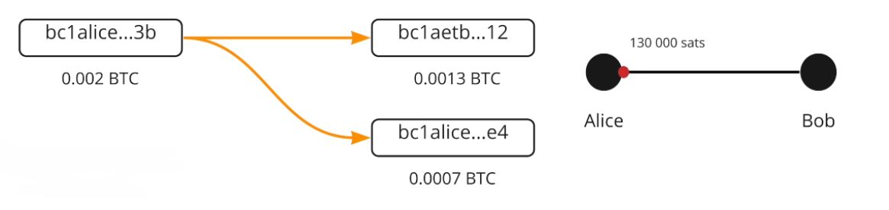

## ライトニングトランザクションとコミットメントトランザクション


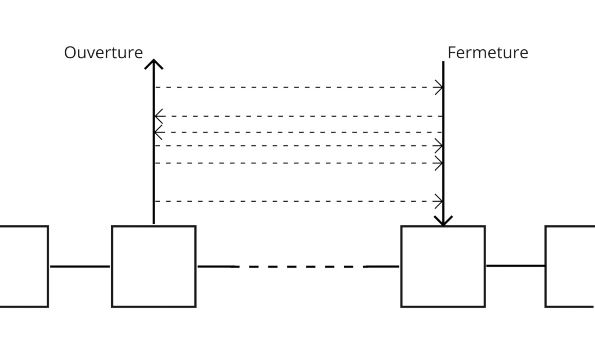

さて、ライトニング・ネットワーク上のチャネルの片側からもう一方への資金の移動において、コミットメントトランザクションの概念を用いて、裏側で実際に何が起こっているかを分析しましょう。オンチェーンの引き出し/クロージャートランザクションは、チャネルの状態を表し、各転送後に誰が資金を所有するかを保証します。したがって、ライトニング・ネットワークの転送後、クロージャーの場合には実行されないこのトランザクション/契約の更新が、AliceとBobという2つのピアによって作成されます。現在のチャネルの状態を持つ同じトランザクションです。

- AliceはBobと130,000 SATを彼女の側に持つチャネルを開きます。クロージャーの場合に双方が受け入れる引き出しトランザクションには、130,000 SATがクロージャー時にAliceに送られると記載されており、Bobは公平だと同意します。

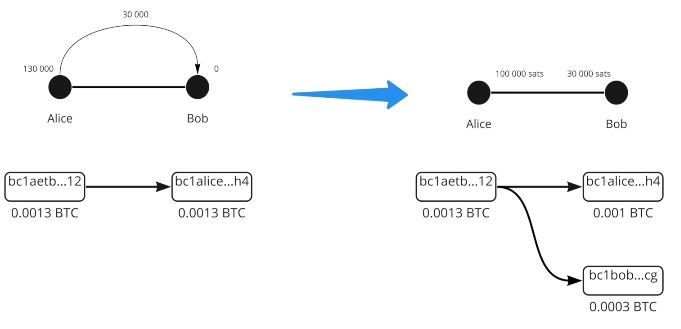

- AliceはBobに30,000 SATを送ります。これにより、クロージャーの場合にAliceが100,000 SATを受け取り、Bobが30,000 SATを受け取ると記載された新しい引き出しトランザクションが作成されます。双方が公平だと同意します。

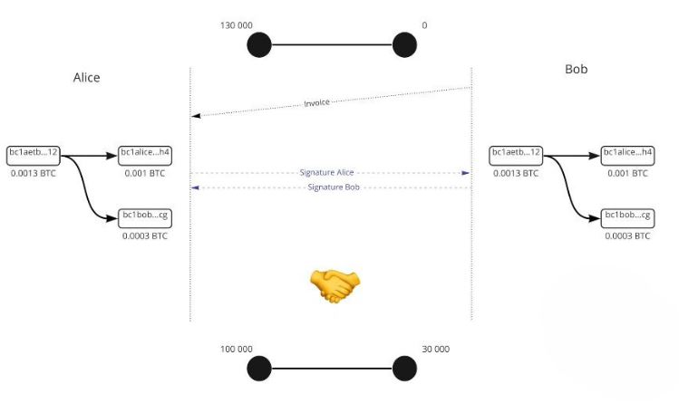

- AliceはBobに10,000 SATを送り、新しい引き出しトランザクションが作成され、クロージャーの場合にAliceが90,000 SATを受け取り、Bobが40,000 SATを受け取ると記載されます。双方が公平だと同意します。
チャネルの初期状態：
Alice（130,000 SAT）============== Bob（0 SAT）

最初の送金後：
Alice（100,000 SAT）============== Bob（30,000 SAT）

2回目の送金後：
Alice（90,000 SAT）============== Bob（40,000 SAT）

お金は動かないが、最終的な残高は署名されたがオンチェーンで公開されていないトランザクションによって更新される。したがって、引き出しトランザクションはコミットメントトランザクションです。サトシの送金は、残高を更新する別の最近のコミットメントトランザクションです。

## コミットメントトランザクション

もしコミットメントトランザクションが時点Xでの流動性を持つチャネルの状態を決定する場合、古い状態を公開することで不正行為を行えるでしょうか？答えは「はい」です。なぜなら、公開されていないトランザクションにおいて、既に両参加者の事前署名があるからです。

この問題を解決するために、複雑さを追加します：

- タイムロック = ブロックNまでロックされた資金
- 廃止キー = Aliceの秘密とBobの秘密

これらの要素はコミットメントトランザクションに追加されます。その結果、Aliceはタイムロックの終了まで待たなければならず、廃止キーを保持している人はタイムロックの終了を待たずに資金を移動することができます。もしAliceが不正行為を試みる場合、Bobは廃止キーを使用してAliceから資金を奪い罰することができます。

今（そして実際には）、コミットメントトランザクションはAliceとBobにとって同じではありません。それらは対称的ですが、それぞれ異なる制約を持っており、お互いに前のコミットメントトランザクションの廃止キーを作成するために秘密を交換します。したがって、AliceはBobとチャネルを作成し、130,000 SATを自分の側に持ち、即座にお金を回収することはできません。廃止キーはお金を解除することができますが、それを持っているのはAliceだけです（Aliceのコミットメントトランザクション）。送金が行われると、Aliceは古い秘密をBobに提供し、したがってBobはAliceが不正行為を試みた場合にチャネルを前の状態に戻すことができます（Aliceは罰せられます）。

同様に、Bobは自分の秘密をAliceに提供します。したがって、彼が不正行為を試みた場合、Aliceは彼を罰することができます。新しいコミットメントトランザクションごとにこの操作が繰り返されます。新しい秘密が決定され、新しい廃止キーが作成されます。したがって、新しいトランザクションごとに、前のコミットメントトランザクションは廃止秘密を与えることで破棄されなければなりません。したがって、AliceまたはBobが不正行為を試みた場合、もう一方は（タイムロックのおかげで）それより前に行動し、不正行為を回避することができます。トランザクション＃3中、トランザクション＃2の秘密が与えられるため、AliceとBobはAliceまたはBobに対して自衛することができます。

トランザクションを作成する人（お金を送る人）は、タイムロックの後でしか廃止キーを使用することができません。しかし、お金を受け取る人は、ライトニング・ネットワークのチャネル内で相手の不正行為に備えるために、タイムロックの前にそれを使用することができます。特に、チャネル内で相手の不正行為に対して防御するためのメカニズムを詳細に説明します。

## チャネルのクローズ

チャネルを閉じる方法については、[こちらの動画](https://youtu.be/FVmQvNpVW8Y)をご覧ください。
私たちは、ケースによって異なる形式を取ることができるビットコイン取引を通じたチャネルのクロージャに興味があります。チャネルのクロージャには3つのタイプがあります：
- 良い：協力的なクロージャ
- 強制：強制的なクロージャ（非協力的）
- 詐欺：詐欺師によるクロージャ

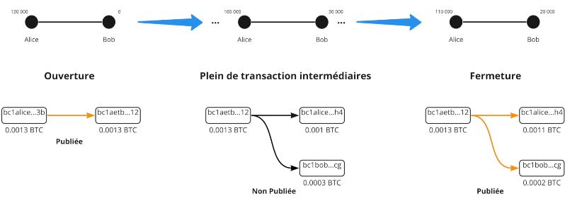
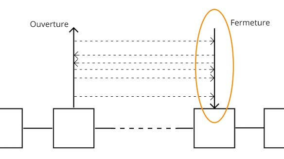


### 良い

2つのピアが通信し、チャネルを閉じることに同意します。彼らはすべてのトランザクションを停止し、チャネルの最終状態を確定します。彼らはネットワークの手数料に合意します（チャネルを開いた人がクロージング手数料を支払います）。そして、クロージングトランザクションを作成します。タイムロックや取り消しキーがないため、コミットメントトランザクションとは異なるクロージングトランザクションがあります。その後、トランザクションが公開され、AliceとBobはそれぞれの残高を受け取ります。このタイプのクロージャは速く（タイムロックがないため）一般的に安価です。


### 強制

Aliceはチャネルを閉じたいが、Bobはオフライン（インターネットまたは停電）のため応答しない。そのため、Aliceは最新のコミットメントトランザクション（最後のトランザクション）を公開します。トランザクションが公開され、タイムロックがアクティブになります。そして、このトランザクションが作成されたときに手数料が決定されました！メンプールはその後変更されたネットワークであり、したがって、トランザクションが作成されたときの現在の手数料の5倍の手数料がプロトコルのデフォルトです。作成手数料は10 SATであり、したがって、トランザクションは50 SATと見なされます。強制的なクロージャの時点では、ネットワークは次のようになります：

- 1 SAT = 50\*オーバーペイ
- 100 SAT = 2\*アンダーペイ

これにより、強制的なクロージャは（タイムロックにより）より長くなり、手数料やマイナーによる可能な検証のリスクが高くなります。

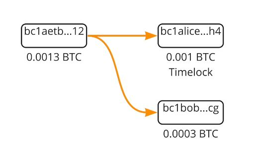

### 詐欺

Aliceは古いコミットメントトランザクションを公開しようとします。しかし、Bobはメンプールを監視し、古いトランザクションを公開しようとするトランザクションを監視します。もし見つかれば、彼は取り消しキーを使用してAliceを罰し、チャネルからすべてのSATを取ります。

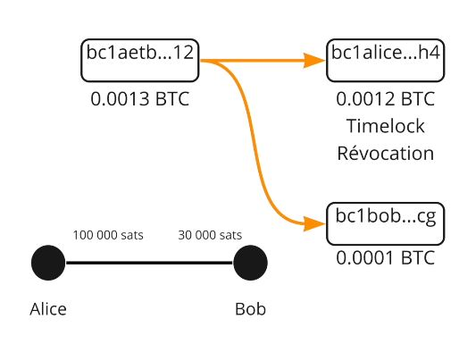

結論として、ライトニング・ネットワークにおけるチャネルのクロージャは、さまざまな形式を取る重要なステップです。協力的なクロージャでは、両当事者が通信し、チャネルの最終状態に合意します。これは最も速く、最も安価なオプションです。一方、強制的なクロージャは、一方の当事者が応答しない場合に発生します。これは予測不可能な手数料とタイムロックのアクティベーションにより、より高価で長い状況です。最後に、参加者が古いコミットメントトランザクションを公開しようとする場合、詐欺師はチャネルからすべてのSATを失うことで罰せられます。したがって、ライトニング・ネットワークの効果的かつ公正な利用のために、これらのメカニズムを理解することが重要です。

# 流動性ネットワーク
## ライトニング・ネットワーク


この第7章では、ライトニングがチャネルのネットワークとしてどのように機能し、支払いがソースから目的地までどのようにルーティングされるかを学びます。

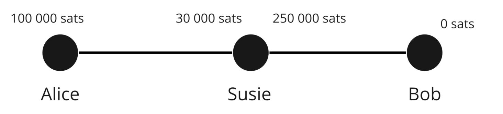
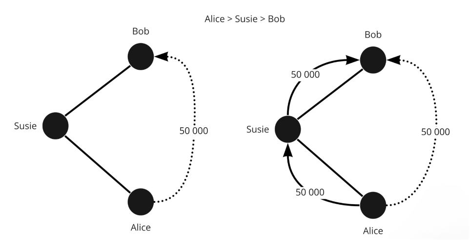

ライトニングはペイメント・チャネルのネットワークです。自分自身の流動性チャネルを持つ数千のピアが互いに接続されており、非接続のピア間でトランザクションを実行するために自己利用されます。これらのチャネルの流動性は他の流動性チャネルに移動することはできません。
Alice -> エデン -> Bob」。サトシは「Alice -> Bob」ではなく、「Alice -> エデン」と「エデン -> Bob」に移動しました。
したがって、各人とチャネルには異なる流動性があります。支払いを行うには、十分な流動性を持つネットワーク内の経路を見つける必要があります。十分な流動性がない場合、支払いは行われません。

次のネットワークを考えてみましょう。

```
ネットワークの初期状態：
Alice（130 SAT）====（0 SAT）スージー（90 SAT）====（200 SAT）エデン（150 SAT）====（100 SAT）Bob
```
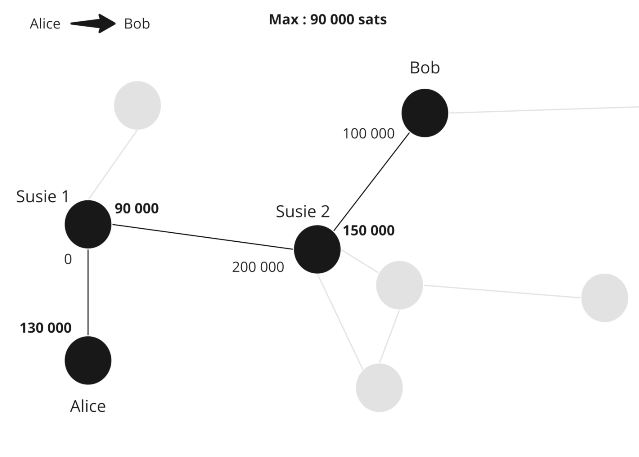

AliceがBobに40 SATを送る場合、流動性は2つの当事者間の経路に沿って再分配されます。

```
AliceがBobに40 SATを送った後：
Alice（90 SAT）====（40 SAT）スージー（50 SAT）====（240 SAT）エデン（110 SAT）====（140 SAT）Bob
```

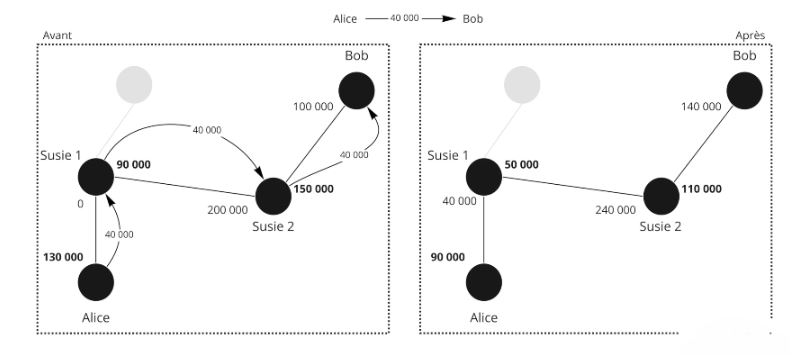

しかし、初期状態では、BobはAliceに40 SATを送ることができません。なぜなら、スージーはAliceとの間に40 SATを送るための流動性を持っていないからです。したがって、この経路を通じた支払いは不可能です。したがって、トランザクションが不可能な別の経路が必要です。

最初の例では、スージーとエデンは何も失っておらず、何も得ていません。ライトニング・ネットワークのノードは、トランザクションのルーティングに使用されることに同意するために手数料を請求します！

流動性の位置によって異なる手数料があります。

Alice - Bob

- Aliceの手数料 = Alice -> Bob
- Bobの手数料 = Bob -> Alice

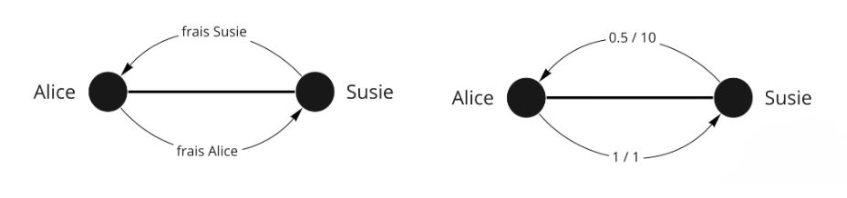

手数料には2種類あります。

- 金額に関係なく固定の手数料：1 SAT（デフォルトですが、変更可能）
- 変動手数料（デフォルトでは0.01％）

手数料の例：

- Alice - スージー；1/1（固定手数料1と変動手数料1）
- スージー - エデン；0/200
- エデン - Bob；1/1

したがって：

- 手数料1：（Aliceが自分自身に支払う）1 +（40,000 * 0.000001）
- 手数料2：0 + 40,000 * 0.0002 = 8 SAT
- 手数料3：1 + 40,000 * 0.000001 = 0.4 SAT

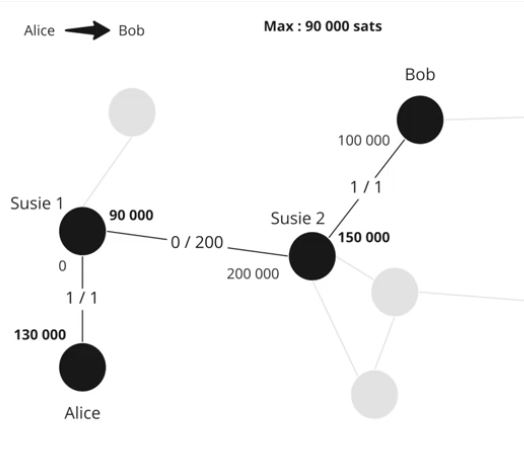

配送：

1. 40,009.04Alice -> スージーの出荷；Aliceは自分自身の費用を支払うので、カウントされません
2. スージーはエデンに40,001.04を送るお礼をします。彼女はこの手数料として8 SATを取ります
3. エデンはBobに40,000を送るサービスを提供します。彼は1.04 SATの手数料を取ります。

Aliceは9.04 SATの手数料を支払い、Bobは40,000 SATを受け取りました。


ライトニング・ネットワークでは、Aliceのノードが支払いを送信する前に経路を決定します。したがって、最適な経路を探し、Aliceだけが経路と価格を知っています。支払いは送信されますが、スージーには情報がありません。

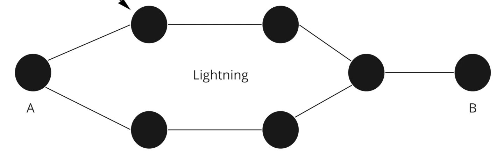
スージーまたはイーデンの場合：彼らは最終受取人や送金者が誰であるかを知りません。これがオニオンルーティングです。ノードは自身のルートを見つけるためにネットワークの計画を保持する必要がありますが、中間者は何の情報も持っていません。

## HTLC - ハッシュタイムロック契約


従来のルーティングシステムでは、イーデンが不正行為をせず、契約の一部を遵守することをどのように保証できますか？

HTLCは、秘密でのみ解除できる支払い契約です。それが明かされない場合、契約は期限切れになります。したがって、条件付きの支払いです。どのように使用されますか？

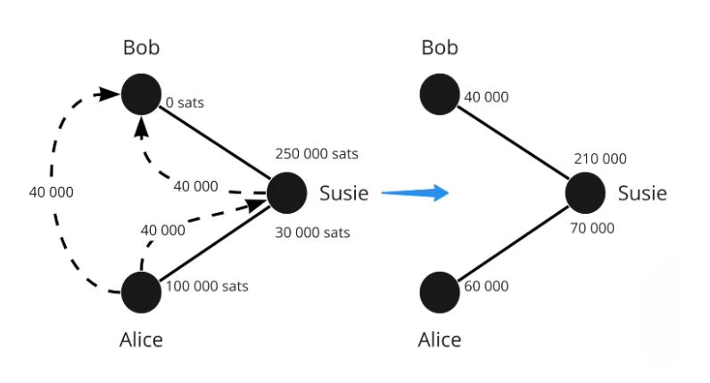

次の状況を考えてみましょう：
`Alice（100,000 SAT）====（30,000 SAT）スージー（250,000 SAT）====（0 SAT）Bob`

- Bobは秘密のS（プレイイメージ）を生成し、ハッシュr = hash(s)を計算します。
- Bobは「r」を含めた請求書をAliceに送ります。
- Aliceは「s'」を明らかにするという条件で、40,000 SATのHTLCをスージーに送ります。ただし、hash(s') = rとなるようなものです。
- スージーは同様のHTLCをBobに送ります。
- Bobは「s」をスージーに示すことで、スージーのHTLCを解除します。
- スージーは「S」をAliceに示すことで、AliceのHTLCを解除します。

もしBobがオフラインであり、お金を受け取るための正当性を与える秘密を取得しない場合、HTLCは一定のブロック数後に期限切れになります。

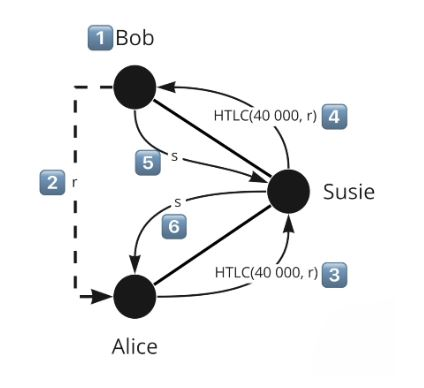

HTLCは逆の順序で期限切れになります：スージー-Bobの期限切れ、次にAlice-スージーの期限切れです。これにより、Bobが戻ってきても何も変わりません。そうでなければ、Aliceが戻ってくる間にBobが戻ってきた場合、混乱し、人々が無駄に働いた可能性があります。

では、クロージャーの場合はどうなるのでしょうか？実際には、私たちのコミットメントトランザクションはさらに複雑です。チャネルが閉じられた場合、中間のバランスを表現する必要があります。

したがって、コミットメントトランザクションにはHTLC-outが含まれています。これは、出力＃3を介して40,000サトシのHTLCを持っています（前述の制限付き）。


Aliceのコミットメントトランザクションには次のものがあります：

- 出力＃1：タイムロックと取り消しキーを介したAliceへの60,000 SAT（彼女の残り）
- 出力＃2：既にスージーが所有している30,000
- 出力＃3：HTLCの40,000

AliceのコミットメントトランザクションはHTLC-outです。なぜなら、彼女は受信者であるスージーにHTLC-inを送っているからです。

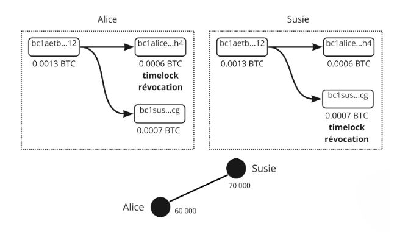

したがって、このコミットメントトランザクションを公開すると、スージーは「s」のイメージでHTCLのお金を回収することができます。もし彼女がプレイイメージを持っていない場合、HTCLが期限切れになった後にAliceがお金を回収します。出力（UTXO）を異なる条件を持つ異なる支払いと考えてください。
支払いが行われると（期限切れまたは実行）、チャネルの状態が変化し、HTCLのトランザクションは存在しなくなります。私たちは古典的なものに戻ります。
協力的なクロージャーの場合：支払いを停止し、転送/HTCLの実行を待ちます。トランザクションは軽量なので、最大1つまたは2つの出力がありますので、より安価です。
強制的なクロージャーの場合：進行中のすべてのHTLCを公開するため、非常に重く、非常に高価になります。そして、それは混乱します。
要約すると、Lightning Networkのルーティングシステムは、Hash Time-Locked Contracts（HTLC）を使用して安全かつ検証可能な支払いを保証します。HTLCは、お金を秘密でのみアンロックできる条件付き支払いを可能にし、参加者が自分の約束を果たすことを保証します。提示された例では、AliceはSusieを介してBobにSATを送りたいと考えています。Bobは秘密を生成し、それのハッシュを作成してAliceに送信します。AliceとSusieは、このハッシュに基づいてHTLCを設定します。Bobが秘密を示してSusieのHTLCをアンロックすると、Susieはその後、AliceのHTLCをアンロックできます。

Bobが一定期間内に秘密を明かさない場合、HTLCは期限切れになります。期限切れは逆の順序で発生し、Bobがオンラインに戻っても望ましくない結果が生じないようにします。

チャネルを閉じる際、協力的な閉鎖の場合、支払いは中断され、HTLCは解決されます。これは一般的に費用が少なくなります。閉鎖が強制的な場合、進行中のすべてのHTLCトランザクションが公開され、非常に高額で混乱した状態になる可能性があります。

要約すると、HTLCメカニズムはLightning Networkに追加のセキュリティレイヤーを提供し、支払いが正しく実行され、ユーザーが約束を果たすことを保証します。

## 進む方法


唯一の公開データは、チャネルの総容量（Alice + Bob）ですが、流動性がどこにあるかはわかりません。
より詳しい情報を得るために、当社のノードは新しいチャネルの発表やチャネル手数料の更新のためにLN通信チャネルを監視します。また、チャネルのクロージャーについてはブロックチェーンを確認します。

すべての情報を持っていないため、持っている情報（最大チャネル容量と流動性の場所ではなく）でグラフ/ルートを検索する必要があります。

基準：

- 成功確率 - 手数料
- HTLCの期限切れ時間
- 中間ノードの数
- ランダム性


したがって、3つの可能なルートがある場合：

- Alice > 1 > 2 > 5 > Bob
- Alice > 1 > 2 > 4 > 5 > Bob
- Alice 1 > 2 > 3 > Bob

理論上の最良のルートを探しています。手数料が最も低く、成功確率が最も高いルート：最大の流動性と可能な限り少ないホップ数。

たとえば、2-3の容量が130,000 SATしかない場合、100,000を送ることは非常に困難ですので、選択肢3は成功の可能性がありません。

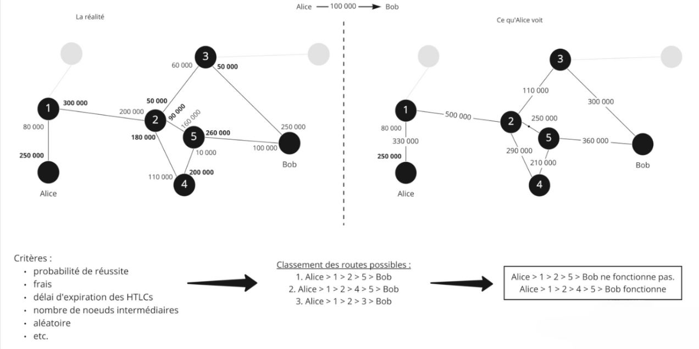

今、アルゴリズムは3つの選択肢を作り、最初の選択肢を試します：

選択肢1：

- Aliceは100,000 SATのHTLCを1に送信します。
- 1は100,000 SATのHTLCを2に作成します。
- 2は100,000 SATのHTLCを5に作成しますが、5はそれを行うことができないため、それを発表します。

情報が送り返されるので、Aliceは2番目のルートを試すことにします：

- Aliceは100,000 SATのHTLCを1に送信します。
- 1は100,000 SATのHTLCを2に作成します。
- 2は100,000 SATのHTLCを4に作成します。
- 4は100,000 SATのHTLCをBobに作成します。Bobは流動性を持っているので、問題ありません。
- BobはHTLCのプレイメージ（ハッシュ）を使用し、秘密を使用して100,000 SATを取得します。
- 5は今、4からブロックされたHTLCを取得するためのHTLCの秘密を持っています。
- 4番は、2からブロックされたHTLCを取り戻すためのHTLCの秘密を持っています- 2番は、1からブロックされたHTLCを取り戻すためのHTLCの秘密を持っています
- 1番は、AliceのブロックされたHTLCを取り戻すためのHTLCの秘密を持っています

Aliceは1つのルートの失敗を見ていませんでしたが、彼女はただ1秒長く待っていました。支払いの失敗は、可能なルートが存在しない場合に発生します。ルートの検索を容易にするために、BobはAliceに彼女の請求書を手助けするための情報を提供することができます：

- 金額
- 彼のアドレス
- AliceがHTLCを作成できるようにするためのプレイイメージのハッシュ
- Bobのチャネルに関する指示

Bobはチャネル5と3の流動性を知っているため、彼はAliceにそれを伝えることができます。彼はノード3が無駄であることをAliceに警告し、Aliceが彼女のルートを作成するのを防ぎます。
もう1つの要素は、Bobが持っているかもしれない非公開のチャネル（つまり、ネットワーク上に公開されていないチャネル）です。Bobが1と非公開のチャネルを持っている場合、彼はAliceにそれを使用するように伝えることができ、Aliceは> 1 > Bob'を与えるでしょう。


結論として、ライトニング・ネットワーク上のルーティングトランザクションは、さまざまな要素を考慮する複雑なプロセスです。チャネルの総容量は公開されていますが、流動性の正確な分布は直接アクセスできません。これにより、ノードは手数料、HTLCの有効期限、中間ノードの数、およびランダム要素などの基準を考慮して、最も成功する可能性の高いルートを推定する必要があります。複数のルートが可能な場合、ノードは手数料を最小化し、十分な流動性と最小限のホップ数を持つチャネルを選択することで成功の可能性を最大化しようとします。流動性が不十分でトランザクションの試行が失敗した場合、成功するトランザクションが行われるまで別のルートが試されます。

さらに、ルートの検索を容易にするために、受信者はアドレス、金額、プレイイメージのハッシュ、およびチャネルに関する指示などの追加情報を提供することができます。これにより、十分な流動性を持つチャネルを特定し、不必要なトランザクション試行を回避することができます。最終的に、ライトニング・ネットワークのルーティングシステムは、トランザクションの速度、セキュリティ、効率を最適化し、ユーザーのプライバシーを保護するために設計されています。

# ライトニング・ネットワークのツール
## 請求書、LNURL、Keysend


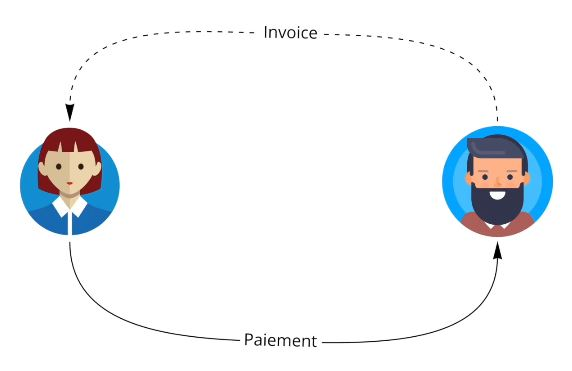

LN請求書（または請求書）は長くて読みにくいですが、支払いリクエストの密な表現を可能にします。

例：
lnbc1m1pskuawzpp5qeuuva2txazy5g483tuv9pznn9ft8l5e49s5dndj2pqq0ptyn8msdqqcqzpgxqrrsssp5v4s00u579atm0em6eqm9nr7d0vr64z5j2sm5s33x3r9m4lgfdueq9qyyssqxkjzzgx5ef7ez3dks0laxayx4grrw7j22ppgzyhpydtv6hmc39skf9hjxn5yd3kvv7zpjdxd2s7crcnemh2fz26mnr6zu83w0a2fwxcqnvujl3

- lnbc1m = 読みやすい部分
- 1 = 残りとの区切り
- 残りの部分
- Bc1 = Bech32エンコーディング（ベース32）、つまり32文字が使用されます。
- 10 = 1.2.3.4.5.6.7.8.9.0- 26 = abcdefghijklmnopqrstuvwxyz
- 32 = not "b-i-o" and not "1"

### lnbc1m

- ln = ライトニング
- Bc = ビットコイン（メインネット）
- 1 = 金額
- M = ミリ（10^-3 / u = マイクロ 10^-6 / n = ナノ 10^-9 / p = ピコ 10^-12）
  ここで、1m = 1 \* 0.0001btc = 100,000 BTC
  "ビットコインメインネットワークのライトニング・ネットワークに100,000 SATを支払ってください。支払先はpskuawzpp5qeuuva2txazy5g483tuv9pznn9ft8l5e49s5dndj2pqq0ptyn8msdqqcqzpgxqrrsssp5v4s00u579atm0em6eqm9nr7d0vr64z5j2sm5s33x3r9m4lgfdueq9qyyssqxkjzzgx5ef7ez3dks0laxayx4grrw7j22ppgzyhpydtv6hmc39skf9hjxn5yd3kvv7zpjdxd2s7crcnemh2fz26mnr6zu83w0a2fwxcqnvujl3"

### タイムスタンプ（作成時）

0個以上の追加パーツが含まれています：

- プリイメージのハッシュ
- 支払い秘密（オニオンルーティング）
- 任意のデータ
- 受信者のLN公開鍵
- 有効期限（デフォルトは1時間）
- ルーティングヒント
- 全体の署名

他の種類の請求書もあります。LNURLメタプロトコルでは、リクエストを行わずに直接サトシの金額を提供することができます。これは非常に柔軟で、ユーザーエクスペリエンスの向上に多くの改善をもたらします。

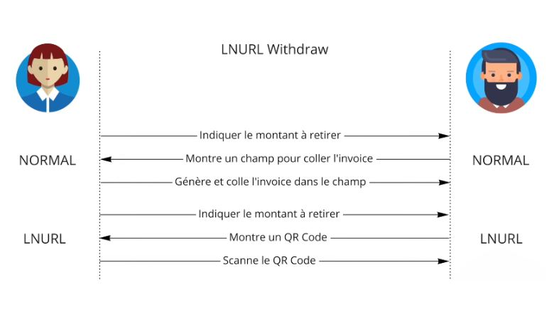

キーセンドを使用すると、AliceはBobのリクエストなしでお金を送ることができます。AliceはBobのIDを取得し、Bobに尋ねることなくプリイメージを作成し、支払いに含めます。したがって、BobはすでにAliceが作業を完了しているため、お金を解除できる驚きのリクエストを受け取ります。

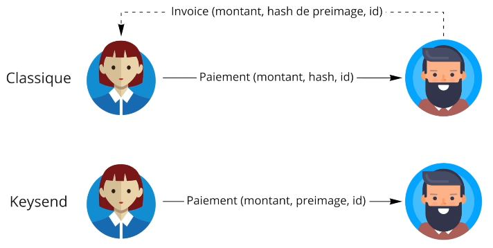

結論として、ライトニング・ネットワークの請求書は、一見複雑ですが、支払いリクエストを効果的にエンコードしています。請求書の各セクションには、支払われる金額、受信者、作成タイムスタンプ、およびプリイメージのハッシュ、支払い秘密、ルーティングヒント、有効期限などの他の情報が含まれています。LNURLやキーセンドなどのプロトコルは、相手方の事前のリクエストなしに資金を送るなど、柔軟性とユーザーエクスペリエンスの面で大幅な改善を提供します。これらの技術により、ライトニング・ネットワーク上の支払いプロセスがスムーズで効率的になります。

## 流動性の管理


ライトニング・ネットワークにおける流動性の管理について、いくつかの一般的なガイドラインを提供します。

LNでは、3つのタイプの人物が存在します：

- 購入者：彼らは出金流動性を持っており、これは最も簡単なタイプです。彼らは単にチャネルを開けば良いです。
- 商人：これはより複雑で、他のノードや他のアクターからの入金流動性が必要です。彼らは自分に接続された人々を持っている必要があります。
- ルーティングノード：彼らは両側の流動性がバランスしており、できるだけ多くのノードとの良好な接続を持つことを望んでいます。
したがって、着金流動性が必要な場合は、サービスから購入することができます。


Aliceはスージーと100万サトシでチャネルを購入し、着金側に直接100万SATでチャネルを開きます。その後、スージーと接続している顧客から最大100万SATの支払いを受けることができます（スージーはよく接続されています）。

別の解決策は支払いを行うことです。Xの理由で10万を支払った場合、今後10万を受け取ることができます。

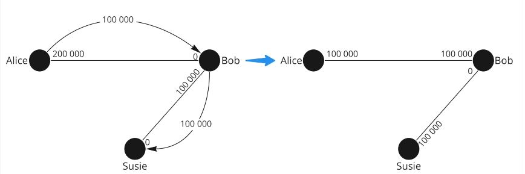

### ループアウトソリューション：Atomic swap LN - BTC

Alice200万 - スージー0

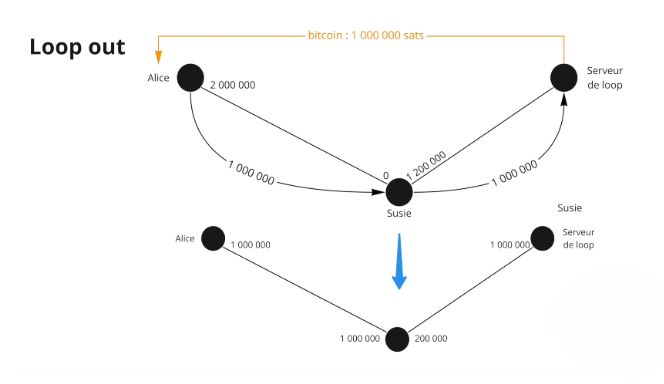

Aliceはスージーに流動性を送りたいので、ループアウト（LN/BTCのバランスを調整するためのプロサービスを提供する特別なノード）を行います。
Aliceはスージーのノードを介してループに100万を送信し、スージーは流動性を持ち、ループはオンチェーンのバランスをAliceのノードに送り返します。


したがって、100万がスージーに行き、スージーが100万をループに送り、ループが100万をAliceに送ります。Aliceはしたがって、ループに手数料を支払ってスージーに流動性を移動しました。

LNで最も複雑なことは流動性を維持することです。

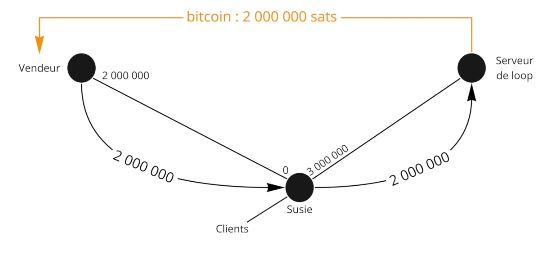

まとめると、ライトニング・ネットワーク上の流動性管理は、ユーザーのタイプ（バイヤー、商人、ルーティングノード）に依存する重要な問題です。出金流動性が必要なバイヤーは、単にチャネルを開くだけで済みます。着金流動性が必要な商人は、他のノードやアクターに接続する必要があります。一方、ルーティングノードは両側の流動性のバランスを保つことを目指しています。チャネルの購入や受信容量の増加のための支払いなど、流動性を管理するためのさまざまな解決策が存在します。LNとBTCの間でAtomic Swapを可能にする「ループアウト」オプションは、流動性のバランスを調整するための興味深い解決策を提供します。これらの戦略にもかかわらず、ライトニング・ネットワーク上の流動性の維持は複雑な課題です。

# さらに進む
## コースのまとめ


私たちの目標は、ライトニング・ネットワークがどのように機能し、Bitcoinに依存しているかを説明することでした。

ライトニング・ネットワークはペイメント・チャネルのネットワークです。2つの利害関係者間でペイメント・チャネルがどのように機能するかを見てきましたが、私たちはまた、全体のネットワーク、ペイメント・チャネルのネットワークの概念にも目を向けました。

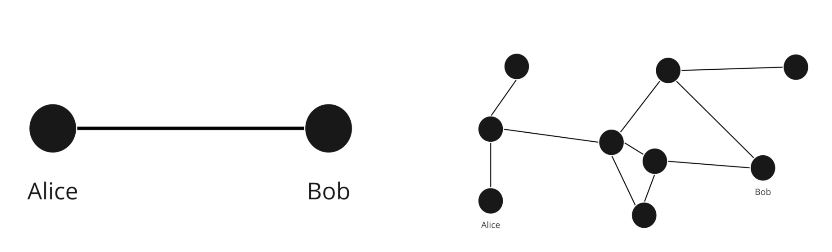

チャネルはBitcoinトランザクションを介して開かれ、できるだけ多くのトランザクションを受け入れることができます。チャネルの状態は、各利害関係者がチャネルの自分の側に持っているものを送るコミットメントトランザクションによって表されます。チャネル内でトランザクションが発生すると、利害関係者は古い状態を取り消し、新しいコミットメントトランザクションを作成することで新しい状態にコミットします。

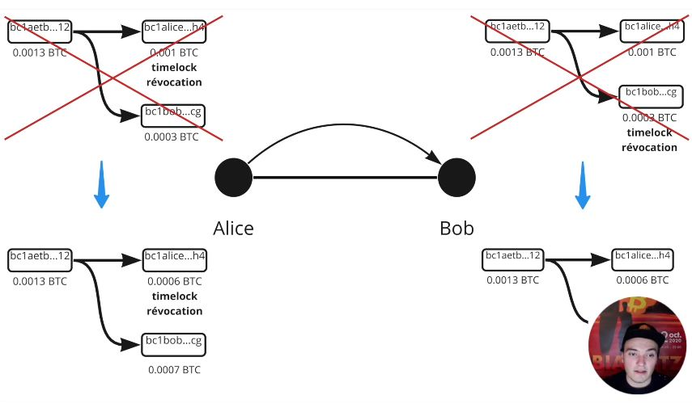

ペアは取引の不正行為から保護するために取り消しキーとタイムロックを使用します。チャネルを閉じる際には相互の同意による閉鎖が好まれます。強制的な閉鎖の場合は、最後のコミットメントトランザクションが公開されます。

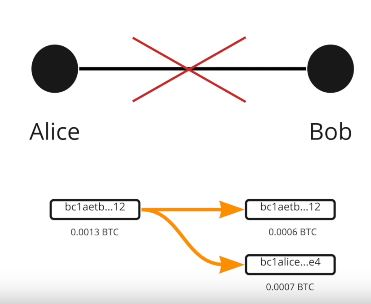
支払いは他の中間ノードからチャネルを借りることができます。ハッシュタイムロック（HTLC）による条件付き支払いでは、支払いが完全に解決されるまで資金をロックすることができます。オニオンルーティングはライトニング・ネットワークで使用されています。中間ノードは支払いの最終目的地を知りません。Aliceは支払い経路を計算する必要がありますが、中間チャネルの流動性に関するすべての情報を持っていません。
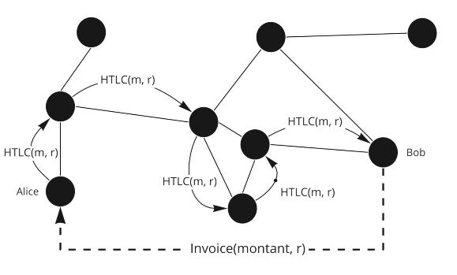

ライトニング・ネットワークを介して支払いを送信する際には確率要素があります。


支払いを受け取るためには、チャネルで流動性を管理する必要があります。これは他の人にチャネルを開いてもらったり、自分でチャネルを開いたり、Loopのようなツールを使用したり、マーケットプレイスでチャネルを購入/賃貸したりすることで行うことができます。


## ファニスのインタビュー


以下はインタビューの要約です：

ライトニング・ネットワークは、ビットコイン上の超高速な支払いソリューションであり、ネットワークのスケーラビリティに関連する制限を回避することができます。ただし、ライトニング上のビットコインは、スケーラビリティよりも分散化とセキュリティが優先されるため、ビットコインチェーン上のビットコインほど安全ではありません。

ブロックサイズの過度の増加は、ノードとデータ容量を犠牲にするため、良い解決策ではありません。代わりに、ライトニング・ネットワークでは、ブロックチェーン上のトランザクションを表示せずに、2つのビットコインユーザー間でペイメント・チャネルを作成することができます。これにより、ブロック上のスペースを節約し、ビットコインを今日のスケーリングに対応させることができます。

ただし、ライトニング・ネットワークのスケーラビリティと中央集権化に関する批判があり、チャネルのクローズや高いトランザクション手数料に関連する潜在的な問題があります。これらの問題を解決するためには、将来の問題を避けるために小さなチャネルを開かないことや、Child Pay for Parentでトランザクション手数料を増やすことが推奨されています。

ライトニング・ネットワークの将来に考慮されている解決策は、トランザクション手数料を削減するためにバッチ処理やグループでのチャネル作成を行うこと、そして長期的にはブロックサイズを増やすことです。ただし、ライトニング上のビットコインは、ビットコインチェーン上のビットコインほど安全ではないことに注意することが重要です。

ビットコインとライトニング上のプライバシーは関連しており、オニオンルーティングによりトランザクションの一定レベルのプライバシーが確保されています。ただし、ビットコインではデフォルトですべてが透明であり、ヒューリスティックスが使用されてビットコインチェーン上のアドレスからアドレスへのビットコインの追跡が行われます。

KYCでビットコインを購入することで、取引所は引き出しトランザクションを知ることができます。また、丸めた金額やお釣りのアドレスにより、トランザクションの一部が他の人に destinated され、一部が自分自身に destinated されていることがわかります。

プライバシーを向上させるためには、共同行動やコインジョインにより、複数の人々が一緒にトランザクションを行うことで確率計算を妨げることができます。チェーン分析会社は、あなたがビットコインをどのように使用しているかを追跡することがより困難になります。

ライトニングでは、トランザクションを知っているのは2人だけであり、ビットコインよりも機密性が高いです。オニオンルーティングにより、中間ノードは支払いの送信者と受信者を知りません。

ライトニング・ネットワークを使用するためには、YouTubeチャネルやDiscover Bitcoinのウェブサイトでのトレーニングを受けるか、Umbrellでのトレーニングを利用することを推奨します。また、ライトニング上で支払い中に任意のテキストを送信することも可能であり、寄付やメッセージングに役立つ場合があります。
ただし、ライトニングのルーティングノードは将来的に規制される可能性があり、一部の国がルーティングノードの規制を試みています。商人にとっては、適切な解決策で制約を克服するために流動性を管理する必要があります。

最後に、ビットコインの将来は有望であり、5年後には100万ドルに達する可能性があります。業界の専門化と既存の銀行システムに対する代替システムの創造のために、ネットワークへの貢献と信頼の停止が重要です。

## 謝辞とウサギの穴の探求を続ける
おめでとうございます！🎉LN 201トレーニング-ライトニング・ネットワークの紹介を完了しました！

簡単ではないため、自分自身に誇りを持つことができます。ビットコインのウサギ穴に深く入り込む人はほとんどいません。

まず、Fanis Makalakisさんには、ライトニングのより民族的な側面についてのこの素晴らしい無料のコースを提供していただき、心から感謝いたします。彼のTwitter、ブログ、またはLN marketで彼の活動をフォローすることを躊躇しないでください。

そして、プロジェクトを支援したい場合は、Patreonでスポンサーになることを躊躇しないでください。寄付金は新しいトレーニングコースのコンテンツの制作に使用され、もちろん、Fanisの次のコースについても最初に情報を受け取ることができます（現在制作中です！）。

ライトニング・ネットワークの冒険はUmbrelトレーニングとライトニング・ネットワークノードの実装で続きます。理論は終わりで、今度はLN 202トレーニングで実践の時間です！

キスしてまた近いうちに会いましょう！

Rogzy'
