# ビットコイン・レイヤー2への旅

このコースは、ライトニング・ネットワークの技術的な動作に関する理論的なレッスンです。

ライトニング・ネットワークのエキサイティングな世界へようこそ。これはビットコインのレイヤー2（L2）であり、洗練された潜在能力に満ちたものです。具体的なチュートリアルや使用するシナリオに焦点を当てずに、この技術の技術的な深層に潜り込むことになります。このコースを最大限に活用するためには、ビットコインについての堅固な理解が必要です。それは真剣そのものかつ集中的なアプローチが必要な体験です。また、この探求により実践的な側面を提供するLN 202コースを並行して受講することも検討してください。それでは、ビットコイン・エコシステムの認識を変えるかもしれない旅に備えてください。

新たな発見をぜひ楽しみましょう！

+++

# 基礎
<partId>32647d62-102b-509f-a3ba-ad1d6a4345f1</partId>
## ライトニング・ネットワークを理解する
<chapterId>df6230ae-ff35-56ea-8651-8e65580730a8</chapterId>


ライトニング・ネットワークは、高速かつ低コストなトランザクションを可能にするビットコイン・ネットワーク上に構築されたレイヤー2の支払いインフラです。ライトニング・ネットワークの動作を完全に理解するためには、ペイメント・チャネルとその動作原理を理解することが不可欠です。

ライトニング・ペイメント・チャネルは、高速で繰り返し可能なビットコイントランザクションを可能にする、2人のユーザー間のための「専用レーン」のようなものです。チャネルが開かれると、ユーザーによって事前に定義された固定容量が与えられます。この容量は、チャネル内でいつでも送金できるビットコインの最大量を表します。

ペイメント・チャネルは双方向であり、2つの「側面」を持っています。例えば、AliceとBobがペイメント・チャネルを開いた場合、AliceはBobにビットコインを送金することができ、BobもAliceにビットコインを送金することができます。チャネル内のトランザクションはチャネルの総容量を変更しませんが、AliceとBobの間でその容量の分配を変更します。


ライトニング・ペイメント・チャネル内でトランザクションを行うためには、資金を送金するユーザーは自身のチャネル側に十分なビットコインを持っている必要があります。例えば、Aliceが彼らのチャネルを通じてBobに1ビットコインを送金したい場合、彼女は少なくとも1ビットコインを自身のチャネル側に持っている必要があります。ライトニング・ペイメント・チャネルの制限と動作原理について。ライトニング・ペイメント・チャネルの容量は固定されていますが、これはトランザクションの総数やチャネルを通じて送信できるビットコインの総量を制限するものではありません。例えば、AliceとBobが1ビットコインの容量を持つチャネルを持っている場合、彼らはチャネルの総容量が超えない限り、0.01ビットコインのトランザクションを何百回も行ったり、0.001ビットコインのトランザクションを何千回も行ったりすることができます。

これらの制限にもかかわらず、ライトニング・ペイメント・チャネルは高速かつ低コストなビットコイン・トランザクションを行う効率的な方法です。ビットコイン・ネットワーク上での高いトランザクション手数料の支払いや長い確認期間（confirmation periods）を待つ必要がなく、ユーザーはビットコインの送受金を行うことができます。

要約すると、ライトニング・ペイメント・チャネルは、高速かつ低コストなビットコイン・トランザクションを行いたい人々にとって強力な解決策を提供します。しかし、それらの動作と制限を完全に理解することが重要です。


例：

- Aliceは100,000 SATを持っています。
- Bobは30,000 SATを持っています。

これはチャネルの現在の状態です。トランザクション中、AliceはBobに40,000 SATを送ることを決定します。彼女はそれをすることができます。なぜなら40,000 < 100,000だからです。

したがって、チャネルの新しい状態は次のとおりです：

- Alice 60,000 SAT
- Bob 70,000 SAT

```
チャネルの初期状態：
Alice（100,000 SAT）============== Bob（30,000 SAT）

Aliceが40,000 SATをBobに送金した後：
Alice（60,000 SAT）============== Bob（70,000 SAT）

```
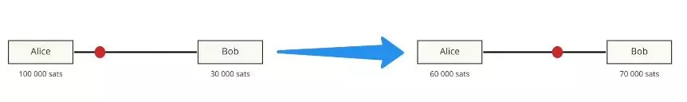

さて、BobはAliceに80,000 SATを送りたいと思っています。彼は流動性がないため、それはできません。チャネルの最大容量は130,000 SATで、Aliceは最大で60,000 SAT、Bobは最大で70,000 SATを送金できます。


## ビットコイン、アドレス、UTXO、トランザクション
<chapterId>0cfb7e6b-96f0-508b-9210-90bc1e28649d</chapterId>


この第2章では、ビットコイン・トランザクションが実際にどのように機能するかを詳しく説明し、これはライトニングの理解にも非常に役立ちます。また、ライトニング・ネットワークでのチャネル開設について説明する次の章を理解するために重要なマルチシグ（multi-Signature）・アドレスの概念についても簡単に説明します。

- 秘密鍵 > 公開鍵 > アドレス：トランザクション中、AliceはBobにお金を送ります。Bobは公開鍵によって与えられたアドレスを提供します。Aliceは自身の公開鍵を介してアドレスにお金を受け取り、その後、秘密鍵を使用してトランザクションに署名し、アドレスからビットコインを引き出します。
- ビットコイン・トランザクションでは、すべてのビットコインが移動する必要があります。UTXO（Unspend Transaction Output / 未使用トランザクション出力）と呼ばれるビットコインのビットは、すべて所有者に戻るために一時的に出て行きます。
  Aliceは0.002 BTCを持っており、Bobは0 BTCです。Aliceは0.0015 BTCをBobに送ることを決定します。彼女は0.002 BTCのトランザクションに署名し、そのうちの0.0015 BTCがBobに行き、0.0005 BTCが彼女のウォレットに戻ります。


ここでは、1つのUTXO（Aliceはアドレス上で0.0002 BTCを持っています）から2つのUTXO（Bobは0.0015を持ち、Aliceは新しいUTXO（前のものとは独立したもの）で0.0005 BTCを持っています）を作成しました。

```
Alice（0.002 BTC）
  |
  V
ビットコイン・トランザクション（0.002 BTC）
  |
  |----> Bob（0.0015 BTC）
  |
  V
Alice（新しいUTXO：0.0005 BTC）
```

ライトニング・ネットワークでは、マルチシグが使用されます。したがって、資金を使うためには2つの署名、つまりお金を移動させるための2つの秘密鍵が必要です。これはAliceとBobが一緒にお金（UTXO）を引き出すために合意する必要があることを意味します。LN（ライトニング・ネットワーク）では具体的には、2/2トランザクションが使用されるため、両方の署名が絶対に必要です。これは2/3または3/5マルチシグとは異なり、完全な鍵の組み合わせのみが必要な場合です。


# チャネルの開設と閉鎖
<partId>900b5b6b-ccd0-5b2f-9424-4b191d0e935d</partId>
## チャネルの開設
<chapterId>96243eb0-f6b5-5b68-af1f-fffa0cc16bfe</chapterId>


さて、チャネルの開設について詳しく見ていき、それがビットコイン・ランザクションを介してどのように行われるかを説明します。

ライトニング・ネットワークには、さまざまな通信レベルがあります：

- P2P通信（ライトニング・ネットワーク・プロトコル）
- ペイメント・チャネル（ライトニング・ネットワーク・プロトコル）
- ビットコイン・トランザクション（ビットコイン・プロトコル）


チャネルを開くために、2つのピアは通信チャネルを介して通信します：

- Alice: "こんにちは、チャネルを開きたいです！"
- Bob: "わかりました、こちらが私の公開アドレスです。"


Aliceは今、2つの公開アドレスを持って2/2マルチシグ・アドレスを作成することができます。彼女はそれにお金を送るためにビットコイン・トランザクションを作成することができます。

例えば、Aliceは0.002 BTCのUTXOを持っており、Bobと0.0013 BTCのチャネルを開きたいとします。彼女は2つのUTXOを出力とするトランザクションを作成します：

- 2/2マルチシグ・アドレスへ0.0013のUTXO
- 彼女のおつりアドレスの1つへ0.0007のUTXO（UTXOの返却）

このトランザクションはまだ公開されていません。なぜなら、この段階では彼女はBobがマルチシグからお金を取り出すことができることを信頼しているからです。

しかし、どのように進めればよいのでしょうか？

Aliceは、資金のデポジットを公開する前に「引き出し（withdrawal）トランザクション」と呼ばれる2つ目のトランザクションを作成します。


引き出しトランザクションは、マルチシグ・アドレスによって彼女のアドレスの資金を使います（これはすべてが公開される前に行われます）。
両方のトランザクションが作成されたら、AliceはBobに完了したことを伝え、彼の公開鍵で署名を求めます。これにより、何か問題が発生した場合に彼女が資金を回収できるようになります。Bobは不正ではないので同意します。

AliceはすでにBobの署名を持っているため、資金を単独で回収することができます。彼女はトランザクションを公開します。チャネルは今、Aliceの側に0.0013 BTC（130,000 SAT）を持って開かれています。


## ライトニング・トランザクションとコミットメント・トランザクション
<chapterId>7d3fd135-129d-5c5a-b306-d5f2f1e63340</chapterId>


さて、ライトニング・ネットワーク上のチャネルの片側からもう一方への資金の移動において、コミットメント・トランザクション（commitment transaction）の概念を用いて、裏側で実際に何が起こっているかを分析しましょう。オンチェーンの引き出し/閉鎖（クロージャー / closure）・トランザクションは、チャネルの状態を表し、各転送後に誰が資金を所有するかを保証します。したがって、ライトニング・ネットワークの転送後、閉鎖の場合には実行されないこのトランザクション/契約（contract）の更新が、AliceとBobという2つのピアによって作成されます。現在のチャネルの状態を持つ同じトランザクションです。

- AliceはBobと130,000 SATを彼女の側に持つチャネルを開きます。閉鎖の場合に双方が受け入れる引き出しトランザクションには、130,000 SATが閉鎖時にAliceに送られると記載されており、Bobは公平であるとしてそれに同意します。


- AliceはBobに30,000 SATを送ります。これにより、閉鎖の場合にAliceが100,000 SATを受け取り、Bobが30,000 SATを受け取ると記載された新しい引き出しトランザクションが作成されます。双方が公平であるとしてそれに同意します。

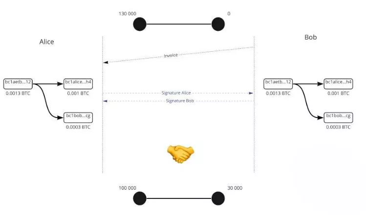

- AliceはBobに10,000 SATを送り、新しい引き出しトランザクションが作成され、閉鎖の場合にAliceが90,000 SATを受け取り、Bobが40,000 SATを受け取ると記載されます。双方が公平であるとしてそれに同意します。


```
チャネルの初期状態：
Alice（130,000 SAT）============== Bob（0 SAT）

最初の送金後：
Alice（100,000 SAT）============== Bob（30,000 SAT）

2回目の送金後：
Alice（90,000 SAT）============== Bob（40,000 SAT）
```
お金は動きませんが、最終的な残高は署名されたがオンチェーンで公開されていないトランザクションによって更新されます。したがって、引き出しトランザクションはコミットメント・トランザクションです。サトシ（satoshi）の送金は、残高を更新する別の最近のコミットメント・トランザクションです。

## コミットメント・トランザクション
<chapterId>f2f61e5b-badb-5947-9a81-7aa530b44e59</chapterId>


もしコミットメント・トランザクションが時点Xでの流動性を持つチャネルの状態を決定する場合、古い状態を公開することで不正行為を行えるでしょうか？答えは「はい」です。なぜなら、公開されていないトランザクションにおいて、既に両参加者の事前署名があるからです。


この問題を解決するために、複雑さを加えます：

- タイムロック（Timelock） = ブロックNまでロックされた資金
- 失効鍵（Revocation key） = Aliceの秘密とBobの秘密

これらの要素はコミットメント・トランザクションに追加されます。その結果、Aliceはタイムロックの終了まで待たなければならず、失効鍵を保持している人はタイムロックの終了を待たずに資金を移動することができます。もしAliceが不正行為を試みる場合、Bobは失効鍵を使用してAliceから資金を奪い返し罰することができます。


今（そして実際には）、コミットメント・トランザクションはAliceとBobにとって同じではありません。それらは対称的ですが、それぞれ異なる制約を持っており、お互いに前のコミットメント・トランザクションの失効鍵を作成するために秘密を交換します。したがって、AliceはBobとチャネルを作成し、130,000 SATを自分の側に持ち、即座にお金を回収することはできません。失効鍵はお金を解除することができますが、それを持っているのはAliceだけです（Aliceのコミットメント・トランザクション）。送金が行われると、Aliceは古い秘密をBobに提供し、したがってBobはAliceが不正行為を試みた場合にチャネルを前の状態に戻すことができます（Aliceは罰せられます）。


同様に、Bobは自分の秘密をAliceに提供します。したがって、彼が不正行為を試みた場合、Aliceは彼を罰することができます。新しいコミットメント・トランザクションごとにこの操作が繰り返されます。新しい秘密が決定され、新しい失効鍵が作成されます。したがって、新しいトランザクションごとに、前のコミットメント・トランザクションは失効秘密を与えることで破棄されなければなりません。したがって、AliceまたはBobが不正行為を試みた場合、もう一方は（タイムロックのおかげで）それより前に行動し、不正行為を回避することができます。トランザクション＃3中、トランザクション＃2の秘密が与えられるため、AliceとBobはAliceまたはBobに対して自衛することができます。


トランザクションを作成する人（お金を送る人）は、タイムロックの後でしか失効鍵を使用することができません。しかし、お金を受け取る人は、ライトニング・ネットワークのチャネル内で相手の不正行為に備えるために、タイムロックの前にそれを使用することができます。特に、チャネル内で相手の不正行為に対して防衛するためのメカニズムを詳細に説明します。

## チャネルの閉鎖
<chapterId>29a72223-2249-5400-96f0-3756b1629bc2</chapterId>


私たちは、ケースによって異なる形式を取ることができるビットコイン・トランザクションを通じたチャネルの閉鎖（クロージャー / closure）に興味があります。このチャネル閉鎖には3つのタイプがあります：

- グッド（The good）：協力的閉鎖
- 強制（The brute）：強制的閉鎖（非協力的）
- チート（The cheat）：詐欺的閉鎖

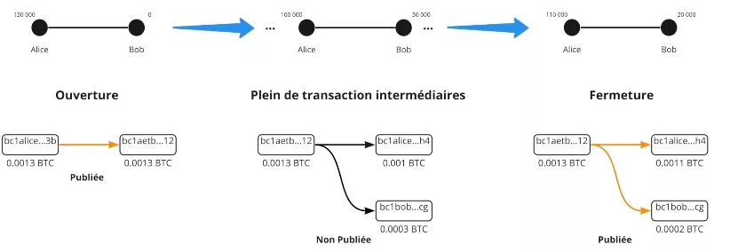


### グッド（協力的）

2つのピアが通信し、チャネルを閉じることに同意します。彼らはすべてのトランザクションを停止し、チャネルの最終状態を確定します。彼らはネットワークの手数料に合意します（チャネルを開いた人がクロージング手数料を支払います）。そして、閉鎖トランザクションを作成します。タイムロックや失効鍵がないため、コミットメント・トランザクションとは異なる閉鎖トランザクションとなります。その後、トランザクションが公開され、AliceとBobはそれぞれの残高を受け取ります。このタイプの閉鎖は速く（タイムロックがないため）一般的に安価です。

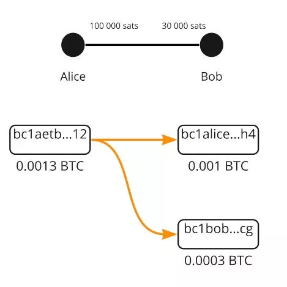


### 強制（非協力的）

Aliceはチャネルを閉じたいが、Bobはオフライン（インターネットまたは電力）のため応答しません。そのため、Aliceは最新のコミットメント・トランザクション（最後のトランザクション）を公開します。トランザクションが公開され、タイムロックがアクティブになります。そして、このトランザクションが作成されたときに手数料が決定されます！メンプール（MemPool）はその後変更されたネットワークであり、したがって、トランザクションが作成されたときの現在の手数料の5倍の手数料がプロトコルのデフォルトです。作成手数料は10 SATであり、したがって、トランザクションは50 SATと見なされます。非協力的閉鎖時には、ネットワークは次のようになります：

- 1 SAT = 50\*オーバーペイ
- 100 SAT = 2\*アンダーペイ

これにより、強制的閉鎖は（タイムロックにより）より長くなり、手数料やマイナーによる可能な検証のリスクが高くなります。


### チート（詐欺的）

Aliceは古いコミットメント・トランザクションを公開しようとします。しかし、Bobはメンプールを監視し、古いトランザクションを公開しようとするトランザクションを監視します。もし見つかれば、彼は失効鍵を使用してAliceを罰し、チャネルからすべてのSATを取り上げます。

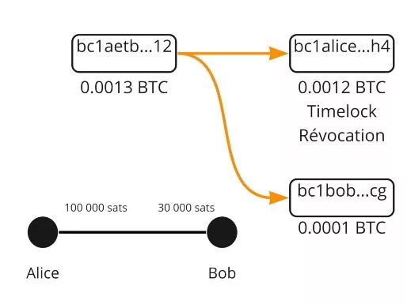

結論として、ライトニング・ネットワークにおけるチャネルの閉鎖は、さまざまな形式を取る重要なステップです。協力的閉鎖では、両当事者が通信し、チャネルの最終状態に合意します。これは最も速く、最も安価なオプションです。一方、非協力的閉鎖は、一方の当事者が応答しない場合に発生します。これは予測不可能な手数料とタイムロックのアクティベーションにより、より高価で長い状況が発生します。最後に、参加者が古いコミットメント・トランザクションを公開しようとする場合、詐欺師はチャネルからすべてのSATを失うことで罰せられます。したがって、ライトニング・ネットワークの効果的かつ公正な利用のために、これらのメカニズムを理解することが重要です。

# 流動性ネットワーク
<partId>a873f1cb-751f-5f4a-9ed7-25092bfdef11</partId>
## ライトニング・ネットワーク
<chapterId>45a7252c-fa4f-554b-b8bb-47449532918e</chapterId>


この第7章では、ライトニングがチャネル・ネットワークとしてどのように機能し、支払いが送金者から目的地（受金者）までどのようにルーティングされるかを学びます。


ライトニングはペイメント・チャネル・ネットワークです。自分自身の流動性チャネル（liquidity channel）を持つ数千のピアが互いに接続されており、接続されていないピア間でトランザクションを実行するために利用されます。これらのチャネルの流動性は他の流動性チャネルに移動することはできません。

Alice -> Eden -> Bob」。サトシ（satoshi）は「Alice -> Bob」ではなく、「Alice -> Eden」と「Eden -> Bob」に移動しました。

したがって、各個人と各チャネルには異なる流動性があります。支払いを行うには、十分な流動性を持つネットワーク内のルートを見つける必要があります。十分な流動性がない場合、支払いは行われません。

次のネットワークを考えてみましょう：

```
ネットワークの初期状態：
Alice（130 SAT）====（0 SAT）Susie（90 SAT）====（200 SAT）Eden（150 SAT）====（100 SAT）Bob
```


AliceがBobに40 SATを送る場合、流動性は2つの当事者間のルートに沿って再分配されます。

```
AliceがBobに40 SATを送った後：
Alice（90 SAT）====（40 SAT）Susie（50 SAT）====（240 SAT）Eden（110 SAT）====（140 SAT）Bob
```


しかし、初期状態では、BobはAliceに40 SATを送ることができません。なぜなら、SusieはAliceとの間に40 SATを送るための流動性を持っていないからです。つまり、このルートを通じた支払いは不可能です。そのため、トランザクションが不可能な別のルートが必要です。

最初の例では、SusieとEdenは何も失っておらず、何も得ていません。ライトニング・ネットワークのノードは、トランザクションのルーティングに使用されることに同意するために手数料を請求します！

流動性の位置によって異なる手数料がかかります：

Alice - Bob

- Aliceの手数料 = Alice -> Bob
- Bobの手数料 = Bob -> Alice


手数料には2種類あります：

- 金額に関係なく固定の手数料：1 SAT（デフォルトですが、変更可能）
- 変動手数料（デフォルトでは0.01％）

手数料の例：

- Alice - Susie；1/1（固定手数料1と変動手数料1）
- Susie - Eden；0/200
- Eden - Bob；1/1

したがって：

- 手数料1：（Aliceが自分自身に支払う）1 + (40,000\*0.000001)
- 手数料2：0 + 40,000 \* 0.0002 = 8 SA
- 手数料3：1 + 40,000\* 0.000001 = 0.4 SAT


送金手数料：

1. 40,009.04 Alice -> Susieの送金；Aliceは自分自身の費用を支払うので、カウントされません。
2. SusieはEdenに40,001.04を送るお礼をします。彼女はこの手数料として8 SATを受け取ります。
3. EdenはBobに40,000を送るサービスを提供します。彼は1.04 SATの手数料を受け取ります。

Aliceは9.04 SATの手数料を支払い、Bobは40,000 SATを受け取りました。


ライトニング・ネットワークでは、Aliceのノードが支払いを送金する前にルートを決定します。したがって、最適なルートを探し、Aliceだけがルートと価格を知っています。支払いは送金されますが、Susieには情報がありません。


SusieまたはEdenの場合：彼らは最終受金者や送金者が誰であるかを知りません。これがオニオン・ルーティング（onion routing）です。ノードは自身のルートを見つけるためにネットワークの計画を保持する必要がありますが、中間者は何の情報も持っていません。

## HTLC - ハッシュタイム・ロック契約
<chapterId>4369b85a-1365-55d8-99e1-509088210116</chapterId>


従来のルーティング・システムでは、Edenが不正行為をせず、契約の一部を遵守することをどのように保証できるでしょうか？

HTLC（ハッシュタイム・ロック契約 / Hashed Time Locked Contract）は、秘密でのみ解除できる支払い契約です。それが明かされない場合、契約は期限切れになります。したがって、条件付きの支払いと言えます。その使用方法は？


次の状況を考えてみましょう：
`Alice（100,000 SAT）====（30,000 SAT）Susie（250,000 SAT）====（0 SAT）Bob`

- Bobは秘密のS（プレイメージ）を生成し、ハッシュr = hash(s)を計算します。
- Bobは「r」を含めたインボイスをAliceに送ります。
- Aliceは「s'」を明らかにするという条件で、40,000 SATのHTLCをSusieに送ります。ただし、hash(s') = rとなるようなものです。
- Susieは同様のHTLCをBobに送ります。
- Bobは「s」をSusieに示すことで、SusieのHTLCを解除します。
- Susieは「S」をAliceに示すことで、AliceのHTLCを解除します。

もしBobがオフラインであり、お金を受け取るための正当性を与える秘密を取得しない場合、HTLCは一定のブロック数後に期限切れになります。


HTLCは逆の順序で期限切れになります：Susie-Bobの期限切れ、次にAlice-Susieの期限切れです。これにより、Bobが戻ってきても何も変わりません。そうでなければ、ボブが戻ってくる間にアリスがキャンセルすれば、大混乱になり、人々は無駄に働いたことになるかもしれません。

では、閉鎖の場合はどうなるのでしょうか？実際には、私たちのコミットメント・トランザクションはさらに複雑です。チャネルが閉じられた場合、中間のバランスを表現する必要があるからです。

したがって、コミットメント・トランザクションにはHTLC-outが含まれています。これは、出力＃3を介して40,000 SAT（前述のとおり制限付き）のHTLCを持っています。

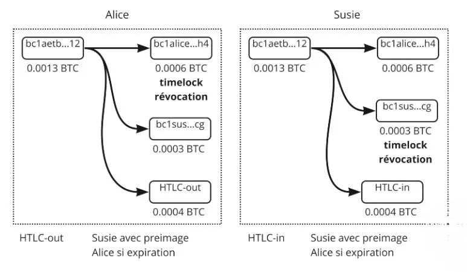

Aliceのコミットメント・トランザクションには次のものがあります：

- 出力＃1：タイムロックと失効鍵を介したAliceへの60,000 SAT（彼女の残り）
- 出力＃2：既にSusieが所有している30,000
- 出力＃3：HTLCの40,000

Aliceのコミットメント・トランザクションはHTLC-outです。なぜなら、彼女は受金者であるSusieにHTLC-inを送っているからです。


したがって、このコミットメント・トランザクションを公開すると、Susieは「s」のイメージでHTCLのお金を回収することができます。もし彼女がプレイメージを持っていない場合、HTCLが期限切れになった後にAliceがお金を回収します。出力（UTXO）を、異なる条件を持つ異なる支払いだと考えてください。支払いが行われると（期限切れまたは実行）、チャネルの状態が変化し、HTCLのトランザクションは存在しなくなります。私たちは古典的なものに戻ります。協力的閉鎖の場合：支払いを停止し、転送/HTCLの実行を待ちます。トランザクションは軽量なので、最大1つまたは2つの出力があるためより安価です。
非協力的閉鎖の場合：進行中のすべてのHTLCを公開するため、非常に重く、非常に高価になります。そして、それはしばし混乱します。

要約すると、ライトニング・ネットワークのルーティング・システムは、ハッシュタイム・ロック契約（HTLC）を使用して安全かつ検証可能な支払いを保証します。HTLCは、お金を秘密でのみロックを解除できる条件付き支払いを可能にし、参加者が自分の約束を果たすことを保証します。提示された例では、AliceはSusieを介してBobにSATを送りたいと考えています。Bobは秘密を生成し、それのハッシュを作成してAliceに送信します。AliceとSusieは、このハッシュに基づいてHTLCを設定します。Bobが秘密を示してSusieのHTLCロックを解除すると、Susieはその後、AliceのHTLCロックを解除できます。Bobが一定期間内に秘密を明かさない場合、HTLCは期限切れになります。期限切れは逆の順序で発生し、Bobがオンラインに戻っても望ましくない結果が生じないようにします。

チャネルを閉じる際、協力的閉鎖の場合であれば、支払いは中断され、HTLCは解決されます。これは一般的に費用が少なくなります。閉鎖が非協力的な場合、進行中のすべてのHTLCトランザクションが公開され、非常に高額で混乱した状態になる可能性があります。要約すると、HTLCメカニズムはライトニング・ネットワークに追加のセキュリティ・レイヤーを提供し、支払いが正しく実行され、ユーザーが約束を果たすことを保証します。

## 自分の道を見つける
<chapterId>7e2ae959-c2a1-512e-b5d6-8fd962e819da</chapterId>


唯一の公開データは、チャネルの総容量（Alice + Bob）ですが、流動性がどこにあるかはわかりません。より詳しい情報を得るために、私たちのノードは新しいチャネルの発表やチャネル手数料の更新のためにLN通信チャネルを監視します。また、チャネルの閉鎖についてはブロックチェーンを確認します。

私たちはすべての情報を持っていないため、持っている情報（最大チャネル容量と流動性の場所ではなく）でグラフ/ルートを検索する必要があります。

基準：

- 成功確率 - 手数料
- HTLCの期限切れ時間
- 中間ノードの数
- ランダム性

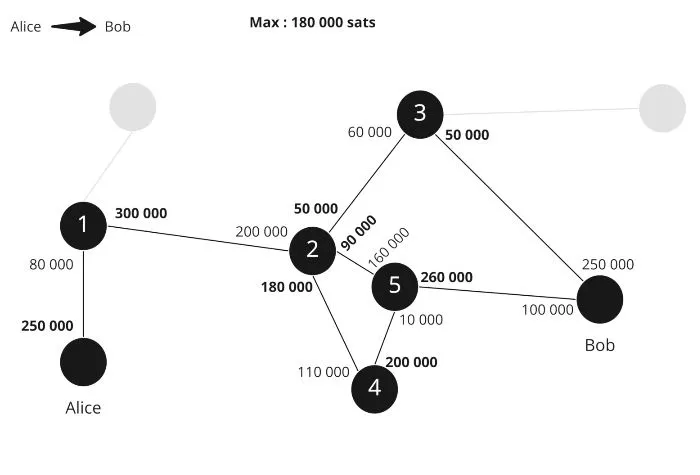

つまり、可能性のあるルートが3つあるとすると：

- Alice > 1 > 2 > 5 > Bob
- Alice > 1 > 2 > 4 > 5 > Bob
- Alice 1 > 2 > 3 > Bob

理論上の最良のルートを探しています。手数料が最も低く、成功確率が最も高いルート：最大の流動性と可能な限り少ないホップ数です。

たとえば、2-3の容量が130,000 SATしかない場合、100,000を送ることは非常に困難ですので、選択肢3は成功の可能性がありません。


今、アルゴリズムは3つの選択肢を作り、最初の選択肢を試します：

選択肢1：

- Aliceは100,000 SATのHTLCを1に送信します；
- 1は100,000 SATのHTLCを2に作成します；
- 2は100,000 SATのHTLCを5に作成しますが、5はそれを行うことができないため、それをアナウンスします。

情報が送り返されたので、Aliceは2番目のルートを試すことにします：

- Aliceは100,000 SATのHTLCを1に送信します；
- 1は100,000 SATのHTLCを2に作成します；
- 2は100,000 SATのHTLCを4に作成します；
- 4は100,000 SATのHTLCをBobに作成します。Bobは流動性を持っているので、問題ありません。
- BobはHTLCのプレイメージ（ハッシュ）を使用し、秘密を使って100,000 SATを取得します。
- 5は今、4からブロックされたHTLCを取得するためのHTLCの秘密を持っています。
- 4は、2からブロックされたHTLCを取り戻すためのHTLCの秘密を持っています。
- 2は、1からブロックされたHTLCを取り戻すためのHTLCの秘密を持っています。
- 1は、AliceのブロックされたHTLCを取り戻すためのHTLCの秘密を持っています。

Aliceは1つのルートの失敗を見ていませんでしたが、彼女はただ1秒間だけ長く待っていました。支払いの失敗は、可能なルートが存在しない場合に発生します。ルートの検索を容易にするために、BobはAliceに彼女のインボイスをサポートするための情報を提供することができます：

- 金額
- 彼のアドレス
- AliceがHTLCを作成できるようにするためのプレイメージのハッシュ
- Bobのチャネルに関する指示

Bobはチャネル5と3の流動性を知っているため、彼はAliceにそれを伝えることができます。彼はノード3が無駄であることをAliceに警告し、Aliceが彼女のルートを作成するのを防ぎます。
もう1つの要素は、Bobが持っているかもしれない非公開のチャネル（つまり、ネットワーク上に公開されていないチャネル）です。Bobが1と非公開のチャネルを持っている場合、彼はAliceにそれを使用するように伝えることができ、Alice > 1 > Bob'となるでしょう。

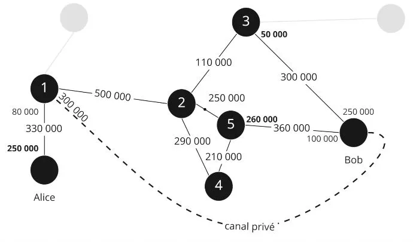

結論として、ライトニング・ネットワーク上のルーティング・トランザクションは、さまざまな要素を考慮する複雑なプロセスです。チャネルの総容量は公開されていますが、流動性の正確な分布は直接アクセスできません。これにより、ノードは手数料、HTLCの有効期限、中間ノードの数、およびランダム要素などの基準を考慮して、最も成功する可能性の高いルートを推定する必要があります。複数のルートが可能な場合、ノードは手数料を最小化し、十分な流動性と最小限のホップ数を持つチャネルを選択することで成功の可能性を最大化しようとします。流動性が不十分でトランザクションの試行が失敗した場合、成功するトランザクションが行われるまで別のルートが試されます。

さらに、ルートの検索を容易にするために、受金者はアドレス、金額、プレイメージのハッシュ、およびチャネルに関する指示などの追加情報を提供することができます。これにより、十分な流動性を持つチャネルを特定し、不必要なトランザクション試行を回避することができます。最終的に、ライトニング・ネットワークのルーティング・システムは、トランザクションの速度、セキュリティ、効率を最適化し、ユーザーのプライバシーを保護するために設計されています。

# ライトニング・ネットワークのツール
<partId>74d6c334-ec5d-55d9-8598-f05694703bf6</partId>
## インボイス、LNURL、Keysend
<chapterId>e34c7ecd-2327-52e3-b61e-c837d9e5e8b0</chapterId>


LNインボイス（またはインボイス）は長くて読みにくいですが、支払いリクエストを濃密に表現することができます。

例：
lnbc1m1pskuawzpp5qeuuva2txazy5g483tuv9pznn9ft8l5e49s5dndj2pqq0ptyn8msdqqcqzpgxqrrsssp5v4s00u579atm0em6eqm9nr7d0vr64z5j2sm5s33x3r9m4lgfdueq9qyyssqxkjzzgx5ef7ez3dks0laxayx4grrw7j22ppgzyhpydtv6hmc39skf9hjxn5yd3kvv7zpjdxd2s7crcnemh2fz26mnr6zu83w0a2fwxcqnvujl3

- lnbc1m = 読みやすい部分
- 1 = 残りとの区切り
- 残りの部分
- Bc1 = Bech32エンコーディング（ベース32）、つまり32文字が使用されます。
- 10 = 1.2.3.4.5.6.7.8.9.0
- 26 = abcdefghijklmnopqrstuvwxyz
- 32 = "b-i-o "でも "1 "でもない

### lnbc1m

- ln = ライトニング
- Bc = ビットコイン（メインネット）
- 1 = 金額
- M = ミリ（10^-3 / u = マイクロ 10^-6 / n = ナノ 10^-9 / p = ピコ 10^-12）
  ここで、1m = 1 \* 0.0001btc = 100,000 BTC
  "ビットコイン・メインネットワークのライトニング・ネットワークに100,000 SATを支払ってください。支払先はpskuawzpp5qeuuva2txazy5g483tuv9pznn9ft8l5e49s5dndj2pqq0ptyn8msdqqcqzpgxqrrsssp5v4s00u579atm0em6eqm9nr7d0vr64z5j2sm5s33x3r9m4lgfdueq9qyyssqxkjzzgx5ef7ez3dks0laxayx4grrw7j22ppgzyhpydtv6hmc39skf9hjxn5yd3kvv7zpjdxd2s7crcnemh2fz26mnr6zu83w0a2fwxcqnvujl3です"

### タイムスタンプ（作成時）

0個以上の追加パーツが含まれています：

- プリイメージのハッシュ
- 支払秘密（オニオン・ルーティング）
- 任意のデータ
- 受金者のLN公開鍵
- 有効期限（デフォルトは1時間）
- ルーティングのヒント
- 全体の署名

他の種類のインボイスもあります。LNURLメタ・プロトコルでは、リクエストを行わずに直接サトシの金額を提供することができます。これは非常に柔軟で、ユーザー・エクスペリエンスの向上に多くの改善をもたらします。


Keysendを使用すると、AliceはBobのリクエストなしでお金を送ることができます。AliceはBobのIDを取得し、Bobに尋ねることなくプリイメージを作成し、支払いに含めます。したがって、BobはすでにAliceが作業を完了しているため、お金のロックを解除できるサプライズ・リクエストを受け取ることになります。


結論として、ライトニング・ネットワークのインボイスは、一見複雑ですが、支払いリクエストを効果的にエンコードしています。インボイスの各セクションには、支払われる金額、受金者、作成タイムスタンプ、およびプリイメージのハッシュ、支払秘密、ルーティングのヒント、有効期限などの情報が含まれています。LNURLやKeysendなどのプロトコルは、相手の事前リクエストなしに資金を送るなど、柔軟性とユーザー・エクスペリエンス面で大幅な改善策を提供します。これらの技術により、ライトニング・ネットワーク上の支払いプロセスがスムーズで効率的になります。

## 流動性の管理
<chapterId>cc76d0c4-d958-57f5-84bf-177e21393f48</chapterId>


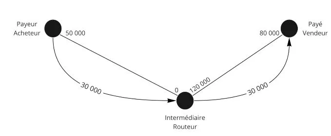


ライトニング・ネットワークにおける流動性の管理（managing liquidity）について、いくつかの一般的なガイドラインを提供します。

LNでは、3タイプの人間が存在します：

- 購入者：彼らは出金流動性（outgoing liquidity）を持っており、これは最も簡単なタイプです。彼らは単にチャネルを開けば良いです。
- マーチャント：これはより複雑で、他のノードや他のアクターからの入金流動性（incoming liquidity）が必要です。彼らは自分に接続された人々を持っている必要があります。
- ルーティング・ノード：彼らは両側の流動性がバランスしており、できるだけ多くのノードとの良好な接続を持つことを望んでいます。
- 
したがって、入金流動性が必要な場合は、サービスから購入することができます。

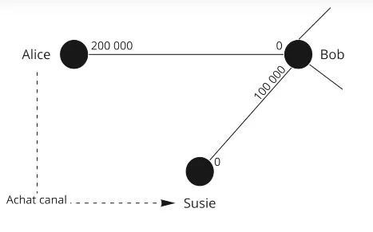

AliceはSusieと100万SATでチャネルを購入し、入金側に直接100万SATでチャネルを開きます。その後、Susieと接続している顧客から最大1,000,000 SATの支払いを受けることができます（よく接続された顧客たち）。

別の解決策は支払いを行うことです。Xという理由で100,000を支払った場合、今後100,000を受け取ることができます。


### ループアウト・ソリューション：Atomic swap LN - BTC

Alice 200万 - Susie 0

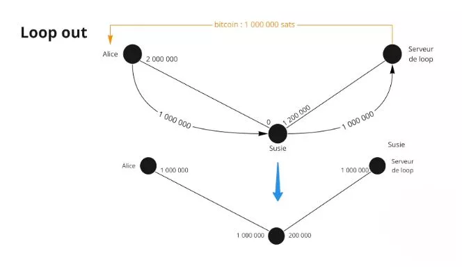

AliceはSusieに流動性を送りたいので、ループアウト/Loop out（LN/BTCのバランスを調整するためのプロ・サービスを提供する特別なノード）を行います。
AliceはSusieのノードを介してループに100万を送金し、Susieは流動性を持ち、ループはオンチェーンのバランスをAliceのノードに送り返します。

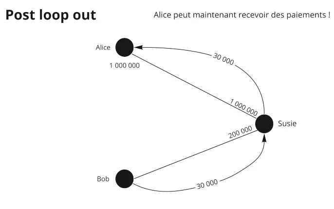

したがって、100万がSusieに行き、Susieが100万をループに送り、ループが100万をAliceに送ります。そのため、Aliceはループに手数料を支払ってSusieに流動性を移動しました。

LNで最も複雑なことは流動性を維持することです。


要約すると、ライトニング・ネットワーク上の流動性の管理は、ユーザーのタイプ（バイヤー、マーチャント、ルーティング・ノード）に依存する重要な問題です。出金流動性が必要なバイヤーは、単にチャネルを開くだけで済みます。着金流動性が必要なマーチャントは、他のノードやアクターに接続する必要があります。一方、ルーティング・ノードは両側の流動性のバランスを保つことを目指しています。チャネルの購入や受金容量を増やすための支払いなど、流動性を管理するためのさまざまな解決策が存在します。LNとBTCの間でAtomic Swapを可能にする「ループアウト」オプションは、流動性のバランスを調整するための興味深い解決策を提供しています。こうした戦略にもかかわらず、ライトニング・ネットワーク上の流動性の維持は複雑な課題です。

# さらに進む
<partId>6bbf107d-a224-5916-9f0c-2b4d30dd0b17</partId>
## コースのまとめ
<chapterId>a65a571c-561b-5e1c-87bf-494644653c22</chapterId>


私たちの目標は、ライトニング・ネットワークがどのように機能し、どのようにビットコインと密接に関係しているかを説明することでした。

ライトニング・ネットワークはペイメント・チャネル・ネットワークです。2つの利害関係者間でペイメント・チャネルがどのように機能するかを見てきましたが、私たちはまた、全体のネットワーク、ペイメント・チャネル・ネットワークの概念にも目を向けました。


チャネルはビットコイン・トランザクションを介して開かれ、できるだけ多くのトランザクションを受け入れることができます。チャネルの状態は、各利害関係者が自分のチャネル側に持っているものを送るコミットメント・トランザクションによって表されます。チャネル内でトランザクションが発生すると、利害関係者は古い状態を取り消し、新しいコミットメント・トランザクションを作成することで新しい状態にコミットします。

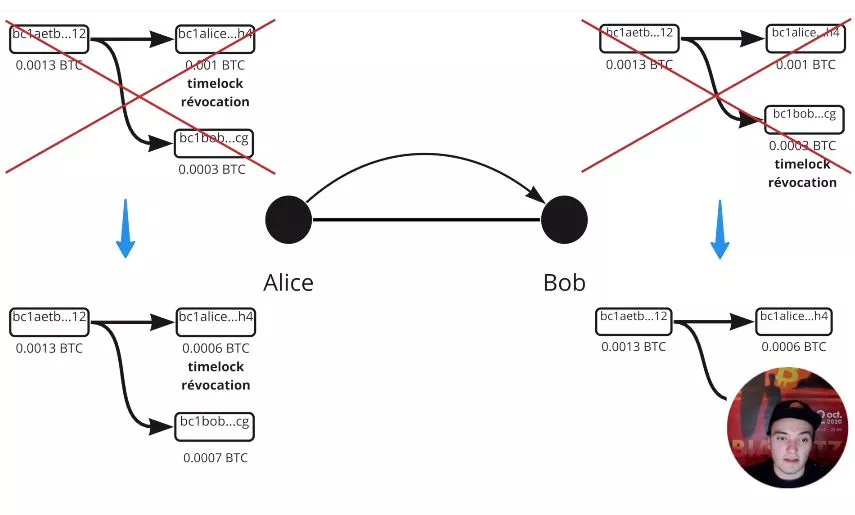

ペアは取引の不正行為から保護するために失効鍵とタイムロックを使用します。チャネルを閉じる際には相互の同意による閉鎖が好まれます。非協力的閉鎖の場合は、最後のコミットメント・トランザクションが公開されます。


支払いは他の中間ノードからチャネルを借りることができます。ハッシュタイム・ロック契約（HTLC）による条件付き支払いでは、支払いが完全に解決されるまで資金をロックすることができます。オニオン・ルーティングはライトニング・ネットワークで使用されています。中間ノードは支払いの最終目的地を知りません。Aliceは支払いルートを計算する必要がありますが、中間チャネルの流動性に関するすべての情報を持っていません。


ライトニング・ネットワークを介して支払いを送金する際には確率的な要素があります。

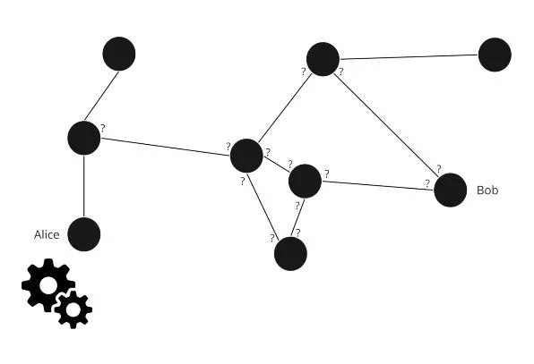

支払いを受け取るためには、チャネルで流動性を管理する必要があります。これは他の人にチャネルを開いてもらったり、自分でチャネルを開いたり、Loopのようなツールを使用したり、マーケットプレイスでチャネルを購入/賃貸したりすることで行うことができます。


## ファニスへのインタビュー
<chapterId>077cb5f5-1626-5da5-9964-e67b1de503bf</chapterId>


以下はインタビューの要約です：

ライトニング・ネットワークは、ビットコイン上の超高速なペイメント・ソリューションであり、ネットワークのスケーラビリティに関連する制限を回避することができます。ただし、ライトニング上のビットコインは、スケーラビリティよりも分散化とセキュリティが優先されるため、ビットコイン・チェーン上のビットコインほど安全ではありません。

ブロックサイズの過度の増加は、ノードとデータ容量を犠牲にするため、良い解決策ではありません。代わりに、ライトニング・ネットワークでは、ブロックチェーン上のトランザクションを表示せずに、2つのビットコイン・ユーザー間でペイメント・チャネルを作成することができます。これにより、ブロック上のスペースを節約し、ビットコインを今日のスケーリングに対応させることができます。

ただし、ライトニング・ネットワークのスケーラビリティと中央集権化に関する批判があり、チャネルの閉鎖や高いトランザクション手数料に関連する潜在的な問題があります。これらの問題を解決するためには、将来の問題を避けるために小さなチャネルを開かないことや、チャイルド・フォロー・ペアレント（Child Pay for Parent）によってトランザクション手数料を引き上げることが推奨されています。

ライトニング・ネットワークの将来に考慮されている解決策は、トランザクション手数料を削減するためにバッチ処理やグループでのチャネル作成を行うこと、そして長期的にはブロックサイズを増やすことです。ただし、ライトニング上のビットコインは、ビットコイン・チェーン上のビットコインほど安全ではないことに注意することが重要です。

ビットコインとライトニング上のプライバシーは関連しており、オニオン・ルーティングはトランザクションの一定レベルのプライバシーを保証します。しかし、ビットコインでは、ビットコイン・チェーン上のアドレスからアドレスへのビットコインを追跡するためにヒューリスティックが使用され、デフォルトですべてが透明化されています。

KYCでビットコインを購入することで、取引所は引き出しトランザクションを知ることができます。また、丸めた金額やお釣りのアドレスにより、トランザクションの一部が他の人に振り分けられたこと、一部が自分自身に振り分けられたことがまるわかりです。

プライバシーを向上させるためには、共同行動やコインジョイン（coinjoin）により、複数の人々が一緒にトランザクションを行うことで確率的な計算を妨げることができます。そうすることで、チェーン分析会社は、あなたがビットコインをどのように使用しているかを追跡することがより困難になります。

ライトニング上では、トランザクションを知っているのは2人だけであり、ビットコインよりも機密性が高いです。オニオン・ルーティングにより、中間ノードは支払いの送信者と受信者を知りません。

ライトニング・ネットワークを使用するためには、YouTubeチャンネルやディスカバー・ビットコイン（discover Bitcoin）のウェブサイトでトレーニングを受けるか、Umbrellでのトレーニングを利用することを推奨します。また、ライトニング上で支払い中に任意のテキストを送信することも可能であり、寄付やメッセージングに役立つ場合があります。ただし、ライトニングのルーティング・ノードは将来的に規制される可能性があり、一部の国がルーティング・ノードの規制を試みています。そのため、マーチャントにとっては、適切な解決策で制約を克服するために流動性を管理する必要があります。

最後に、ビットコインの将来は有望であり、5年後には100万ドルに達する可能性があります。業界の専門化と既存の銀行システムに対する代替システムの創造のために、ネットワークへの貢献とトラストレスが重要なのです。

## 謝辞とラビットホールの探求を続けよう
<chapterId>afc0d72b-4fbc-5893-90b2-e27fb519ad02</chapterId>

おめでとうございます！🎉あなたは LN 201トレーニング-ライトニング・ネットワークの紹介を修了しました！このコースは決して簡単ではないため、自分で自分を褒めてあげましょう。ビットコインのウラビットホールに深く入り込む人はほとんどいませんから。

まずはじめに、ライトニングの民族的な側面に関する素晴らしい無料コースを提供してくれたファニス・マカラキスに心から感謝します。彼のTwitter、ブログ、またはライトニング。マーケット（LN market）で彼の活動をフォローしてください。

そして、そして、このプロジェクトを支援したい方は、遠慮なくパトロン（Patreon）でスポンサーになってください。寄付金は、新しいトレーニング・コースのコンテンツ制作に使用されます。もちろん、寄付をしたあなたはいち早く情報をゲットすることができます（ファニスの次回作も準備中です！）。

ライトニング・ネットワークの冒険はUmbrelトレーニングとライトニング・ネットワーク・ノードの実装で続きます。理論編はここまで。LN 202トレーニングは、いよいよ実践編です！

キスをして、また近いうちにお会いしましょう！

Rogzy
