# Cesta k druh칠 vrstv캩 Bitcoinu

Tento kurz je teoretickou lekc칤 o technick칠m fungov치n칤 Lightning Network.

V칤tejte ve vzru코uj칤c칤m sv캩t캩 Lightning Network, druh칠 vrstv캩 Bitcoinu, kter치 je sofistikovan치 a pln치 potenci치lu. Chyst치me se pono콏it do technick칳ch hlubin t칠to technologie, ani bychom se zam캩콏ovali na konkr칠tn칤 tutori치ly nebo sc칠n치콏e pou쬴t칤. Pro co nejlep코칤 vyu쬴t칤 tohoto kurzu je nezbytn칠 m칤t pevn칠 porozum캩n칤 Bitcoinu. Jedn치 se o z치쬴tek, kter칳 vy쬬duje v치쬹칳 a soust콏ed캩n칳 p콏칤stup. M콢쬰te tak칠 zv치쬴t paraleln칤 absolvov치n칤 kurzu LN 202, kter칳 nab칤z칤 prakti캜t캩j코칤 pohled na toto pr콢zkum. P콏ipravte se na cestu, kter치 by mohla zm캩nit va코e vn칤m치n칤 ekosyst칠mu Bitcoinu.

U쬴jte si objevov치n칤!

+++

# Z치klady
<partId>32647d62-102b-509f-a3ba-ad1d6a4345f1</partId>

## Porozum캩n칤 Lightning Network
<chapterId>df6230ae-ff35-56ea-8651-8e65580730a8</chapterId>

Lightning Network je druhovrstvov치 platebn칤 infrastruktura postaven치 na s칤ti Bitcoin, kter치 umo쮄갓je rychl칠 a n칤zkon치kladov칠 transakce. Pro pln칠 porozum캩n칤 fungov치n칤 Lightning Network je nezbytn칠 rozum캩t, co jsou platebn칤 kan치ly a jak funguj칤.

Platebn칤 kan치l Lightning je druh "soukrom칠 dr치hy" mezi dv캩ma u쬴vateli, kter치 umo쮄갓je rychl칠 a opakovan칠 transakce v Bitcoinu. Kdy je kan치l otev콏en, je mu p콏id캩lena pevn치 kapacita, kter치 je p콏edem definov치na u쬴vateli. Tato kapacita p콏edstavuje maxim치ln칤 mno쬽tv칤 Bitcoinu, kter칠 m콢쬰 b칳t v dan칠m okam쬴ku v kan치lu p콏en치코eno.

Platebn칤 kan치ly jsou obousm캩rn칠, co znamen치, 쬰 maj칤 dv캩 "strany". Nap콏칤klad, pokud Alice a Bob otev콏ou platebn칤 kan치l, Alice m콢쬰 pos칤lat Bitcoin Bobovi a Bob m콢쬰 pos칤lat Bitcoin Alice. Transakce uvnit콏 kan치lu nem캩n칤 celkovou kapacitu kan치lu, ale m캩n칤 rozd캩len칤 t칠to kapacity mezi Alice a Boba.


Pro mo쬹ost transakce v platebn칤m kan치lu Lightning mus칤 u쬴vatel, kter칳 pos칤l치 prost콏edky, m칤t dostatek Bitcoinu na sv칠 stran캩 kan치lu. Pokud chce Alice poslat 1 Bitcoin Bobovi prost콏ednictv칤m jejich kan치lu, mus칤 m칤t na sv칠 stran캩 kan치lu alespo켿 1 Bitcoin.
Limity a fungov치n칤 platebn칤ch kan치l콢 na Lightning.
I kdy je kapacita platebn칤ho kan치lu Lightning pevn치, neomezuje to celkov칳 po캜et transakc칤 ani celkov칳 objem Bitcoinu, kter칳 m콢쬰 b칳t prost콏ednictv칤m kan치lu p콏en치코en. Nap콏칤klad, pokud maj칤 Alice a Bob kan치l s kapacitou 1 Bitcoin, mohou prov칠st stovky transakc칤 o 0,01 Bitcoinu nebo tis칤ce transakc칤 o 0,001 Bitcoinu, pokud celkov치 kapacita kan치lu nen칤 v dan칠m okam쬴ku p콏ekro캜ena.

P콏es tyto omezen칤 jsou platebn칤 kan치ly Lightning efektivn칤m zp콢sobem, jak prov치d캩t rychl칠 a levn칠 transakce v Bitcoinu. Umo쮄갓j칤 u쬴vatel콢m pos칤lat a p콏ij칤mat Bitcoin bez nutnosti platit vysok칠 transak캜n칤 poplatky nebo 캜ekat na dlouh칠 potvrzovac칤 doby na s칤ti Bitcoin.
Shrnut칤: Lightning platebn칤 kan치ly nab칤zej칤 siln칠 콏e코en칤 pro ty, kte콏칤 cht캩j칤 prov치d캩t rychl칠 a levn칠 Bitcoin transakce. Je v코ak nezbytn칠 porozum캩t jejich fungov치n칤 a omezen칤m, aby bylo mo쬹칠 je pln캩 vyu쮂셦.
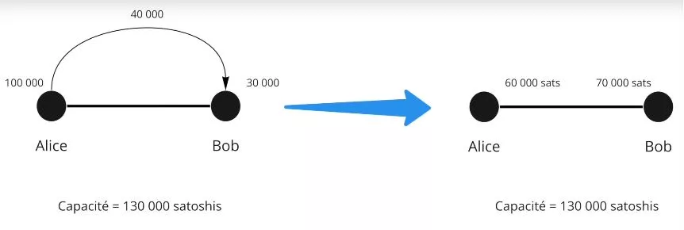

P콏칤klad:

- Alice m치 100,000 SAT
- Bob m치 30,000 SAT

To je sou캜asn칳 stav kan치lu. B캩hem transakce se Alice rozhodne poslat Bobovi 40,000 SAT. M콢쬰 tak u캜init, proto쬰 40,000 < 100,000.

Nov칳 stav kan치lu je tedy:

- Alice 60,000 SAT
- Bob 70,000 SAT

```
Po캜치te캜n칤 stav kan치lu:
Alice (100,000 SAT) ============== Bob (30,000 SAT)

Po p콏evodu Alice na Boba 40,000 SAT:
Alice (60,000 SAT) ============== Bob (70,000 SAT)

```


Nyn칤 chce Bob poslat Alici 80,000 SAT. Nem치vaje dostate캜nou likviditu, nem콢쬰. Maxim치ln칤 kapacita kan치lu je 130,000 SAT, s mo쬹칳m v칳dajem a 60,000 SAT pro Alici a 70,000 SAT pro Boba.

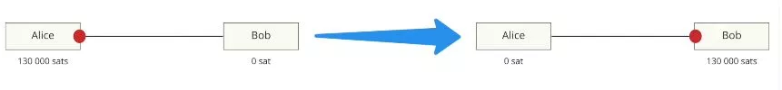

## Bitcoin, adresy, UTXO a transakce
<chapterId>0cfb7e6b-96f0-508b-9210-90bc1e28649d</chapterId>

V t칠to druh칠 kapitole si vezmeme 캜as na studium toho, jak Bitcoin transakce skute캜n캩 funguj칤, co bude velmi u쬴te캜n칠 pro pochopen칤 Lightning. Tak칠 stru캜n캩 diskutujeme koncept multi-signature adres, kter칳 je kl칤캜ov칳 pro pochopen칤 dal코칤 kapitoly o otev칤r치n칤 kan치l콢 na Lightning Network.

- Soukrom칳 kl칤캜 > Ve콏ejn칳 kl칤캜 > Adresa: B캩hem transakce Alice pos칤l치 pen칤ze Bobovi. Ten poskytne adresu danou jeho ve콏ejn칳m kl칤캜em. Alice, kter치 sama obdr쬰la pen칤ze na adrese prost콏ednictv칤m sv칠ho ve콏ejn칠ho kl칤캜e, nyn칤 pou쬴je sv콢j soukrom칳 kl칤캜 k podeps치n칤 transakce a t칤m uvoln칤 bitcoiny z adresy.
- V Bitcoin transakci mus칤 v코echny bitcoiny pohnout. Jmenovan칠 UTXO (Unspend Transaction Output), kousky bitcoinu odejdou, pouze aby se pot칠 vr치tily majiteli.
  Alice m치 0.002 BTC, Bob m치 0 BTC. Alice se rozhodne poslat Bobovi 0.0015 BTC. Podep칤코e transakci 0.002 BTC, kde 0.0015 p콢jde Bobovi a 0.0005 se vr치t칤 do jej칤 pen캩쬰nky.


Zde, z jednoho UTXO (Alice m치 0.0002 BTC na adrese), jsme vytvo콏ili 2 UTXO (Bob m치 0.0015 a Alice m치 nov칠 UTXO (nez치visl칠 na p콏edchoz칤m) 0.0005 BTC).

```
Alice (0.002 BTC)
  |
  V
Bitcoinov치 transakce (0.002 BTC)
  |
  |----> Bob (0.0015 BTC)
  |
  V
Alice (nov칠 UTXO: 0.0005 BTC)
```
V Lightning Network se pou쮂셨aj칤 v칤cepodepisov칠 transakce. Proto jsou k odem캜en칤 prost콏edk콢 vy쬬dov치ny 2 podpisy, tj. dva soukrom칠 kl칤캜e pro p콏esun pen캩z. To mohou b칳t Alice a Bob, kte콏칤 mus칤 spole캜n캩 souhlasit s odem캜en칤m pen캩z (UTXO). Konkr칠tn캩 v LN jde o 2/2 transakce, tak쬰 oba podpisy jsou absolutn캩 nezbytn칠, na rozd칤l od v칤cepodepisov칳ch transakc칤 2/3 nebo 3/5, kde je vy쬬dov치na pouze kombinace celkov칠ho po캜tu kl칤캜콢.


# Otev칤r치n칤 a zav칤r치n칤 kan치l콢
<partId>900b5b6b-ccd0-5b2f-9424-4b191d0e935d</partId>

## Otev콏en칤 kan치lu
<chapterId>96243eb0-f6b5-5b68-af1f-fffa0cc16bfe</chapterId>

Nyn칤 se podrobn캩ji pod칤v치me na otev콏en칤 kan치lu a jak se to d캩l치 prost콏ednictv칤m Bitcoinov칠 transakce.

Lightning Network m치 r콢zn칠 칰rovn캩 komunikace:

- P2P komunikace (protokol Lightning Network)
- Platebn칤 kan치l (protokol Lightning Network)
- Bitcoinov치 transakce (protokol Bitcoin)

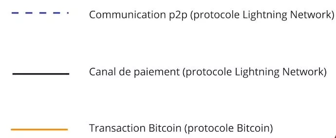

K otev콏en칤 kan치lu komunikuj칤 dva partne콏i prost콏ednictv칤m komunika캜n칤ho kan치lu:

- Alice: "Ahoj, chci otev콏칤t kan치l!"
- Bob: "Ok, tady je moje ve콏ejn치 adresa."

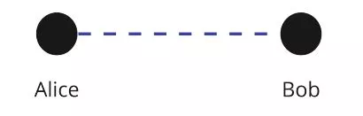

Alice nyn칤 m치 2 ve콏ejn칠 adresy pro vytvo콏en칤 v칤cepodepisov칠 adresy 2/2. Nyn칤 m콢쬰 prov칠st bitcoinovou transakci a poslat na ni pen칤ze.

P콏edpokl치dejme, 쬰 Alice m치 UTXO 0.002 BTC a chce otev콏칤t kan치l s Bobem o 0.0013 BTC. Vytvo콏칤 transakci se 2 UTXO jako v칳stup:

- UTXO 0.0013 na v칤cepodepisovou adresu 2/2
- UTXO 0.0007 na jednu z jej칤ch adres pro vr치cen칤 (vr치cen칤 UTXO).

Tato transakce je코t캩 nen칤 ve콏ejn치, proto쬰 v t칠to f치zi Alice d콢v캩콏uje Bobovi, 쬰 bude schopen odemknout pen칤ze z v칤cepodepisov칠 adresy.

Ale jak tedy postupovat?

Alice vytvo콏칤 druhou transakci nazvanou "transakce pro v칳b캩r" p콏ed zve콏ejn캩n칤m vkladu prost콏edk콢 na v칤cepodepisovou adresu.


Transakce pro v칳b캩r utrat칤 prost콏edky z v칤cepodepisov칠 adresy na jednu z jej칤ch adres (to se d캩l치 p콏ed v코칤m zve콏ejn캩n칤m).
Jakmile jsou ob캩 transakce sestaveny, Alice 콏ekne Bobovi, 쬰 je hotovo a 쮂멳치 ho o podpis jeho ve콏ejn칳m kl칤캜em, vysv캩tluj칤c, 쬰 takto m콢쬰 z칤skat zp캩t sv칠 prost콏edky, pokud by se n캩co pokazilo. Bob souhlas칤, proto쬰 nen칤 ne캜estn칳.

Alice nyn칤 m콢쬰 z칤skat prost콏edky zp캩t sama, proto쬰 u m치 Bob콢v podpis. Transakce zve콏ejn칤. Kan치l je nyn칤 otev콏en s 0.0013 BTC (130,000 SAT) na stran캩 Alice.


## Lightning transakce & Commitment transakce
<chapterId>7d3fd135-129d-5c5a-b306-d5f2f1e63340</chapterId>


Nyn칤 se pod칤vejme, co se skute캜n캩 d캩je v z치kulis칤 p콏i p콏evodu prost콏edk콢 z jedn칠 strany na druhou v kan치lu na Lightning Network, s pojmem transakce z치vazku (commitment transaction). Transakce v칳b캩ru/uzav콏en칤 na blockchainu (on-chain) reprezentuje stav kan치lu, garantuj칤c칤, kdo vlastn칤 prost콏edky po ka쬯칠m p콏evodu. Tak쬰 po p콏evodu na Lightning Network dojde k aktualizaci t칠to transakce/smlouvy, kter치 nen칤 provedena mezi dv캩ma partnery, Alic칤 a Bobem, kte콏칤 vytvo콏칤 stejnou transakci s aktu치ln칤m stavem kan치lu v p콏칤pad캩 uzav콏en칤:
- Alice otev콏e kan치l s Bobem s 130 000 SAT na jej칤 stran캩. Transakce v칳b캩ru p콏ijat치 ob캩ma v p콏칤pad캩 uzav콏en칤 uv치d칤, 쬰 130 000 SAT p콢jde Alici p콏i uzav콏en칤, a Bob souhlas칤, proto쬰 je to spravedliv칠.


- Alice po코le 30 000 SAT Bobovi. Nyn칤 existuje nov치 transakce v칳b캩ru uv치d캩j칤c칤, 쬰 v p콏칤pad캩 uzav콏en칤 obdr쮂 Alice 100 000 SAT a Bob 30 000 SAT. Oba souhlas칤, proto쬰 je to spravedliv칠.


- Alice po코le 10 000 SAT Bobovi, a je vytvo콏ena nov치 transakce v칳b캩ru uv치d캩j칤c칤, 쬰 Alice obdr쮂 90 000 SAT a Bob 40 000 SAT v p콏칤pad캩 uzav콏en칤. Oba souhlas칤, proto쬰 je to spravedliv칠.


```
Po캜치te캜n칤 stav kan치lu:
Alice (130 000 SAT) =============== Bob (0 SAT)

Po prvn칤m p콏evodu:
Alice (100 000 SAT) =============== Bob (30 000 SAT)

Po druh칠m p콏evodu:
Alice (90 000 SAT) =============== Bob (40 000 SAT)

```

Pen칤ze se nikam nepohnou, ale kone캜n칳 z콢statek je aktualizov치n prost콏ednictv칤m podepsan칠, ale nezve콏ejn캩n칠 transakce na blockchainu. Transakce v칳b캩ru je tedy transakce z치vazku. P콏evody satoshi jsou dal코칤, nov캩j코칤 transakce z치vazku, kter치 aktualizuje z콢statek.

## Transakce z치vazku
<chapterId>f2f61e5b-badb-5947-9a81-7aa530b44e59</chapterId>

Pokud transakce z치vazku ur캜uj칤 stav kan치lu s likviditou v 캜ase X, m콢쬰me podv치d캩t zve콏ejn캩n칤m star칠ho stavu? Odpov캩캞 je ano, proto쬰 u m치me p콏ed-podeps치n칤 obou 칰캜astn칤k콢 v nezve콏ejn캩n칠 transakci.


Abychom tento probl칠m vy콏e코ili, p콏id치me slo쬴tost:

- 캛asov칳 z치mek (Timelock) = prost콏edky uzam캜en칠 do bloku N
- Kl칤캜 pro zru코en칤 (Revocation key) = Alicino tajemstv칤 a Bobovo tajemstv칤

Tyto dva prvky jsou p콏id치ny do transakce z치vazku. V d콢sledku toho mus칤 Alice po캜kat na konec 캛asov칠ho z치mku, a kdokoli dr쮂 kl칤캜 pro zru코en칤, m콢쬰 pohnout prost콏edky bez 캜ek치n칤 na konec 캛asov칠ho z치mku. Pokud se Alice pokus칤 podv치d캩t, Bob pou쬴je kl칤캜 pro zru코en칤, aby ji okradl a potrestal.

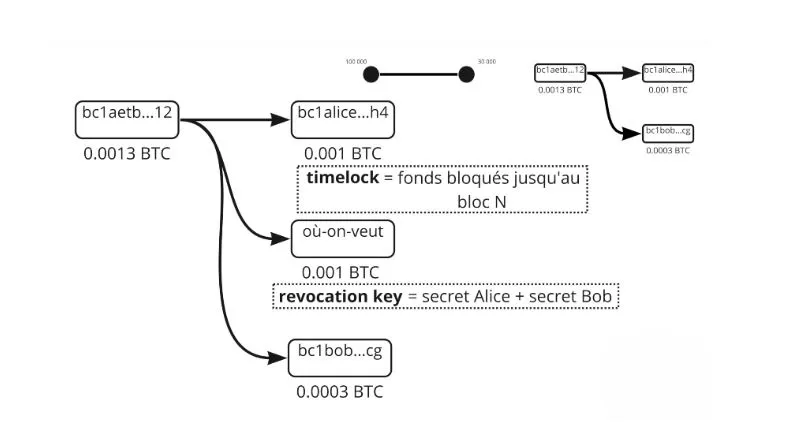
Nyn칤 (a ve skute캜nosti) nen칤 transakce z치vazku stejn치 pro Alici a Boba, jsou symetrick칠, ale ka쬯치 s r콢zn칳mi omezen칤mi, d치vaj칤 si navz치jem sv칠 tajemstv칤, aby vytvo콏ili revoka캜n칤 kl칤캜 p콏edchoz칤 transakce z치vazku. Tak쬰 p콏i vytv치콏en칤, Alice vytvo콏칤 kan치l s Bobem, 130 000 SAT na jej칤 stran캩, m치 Timelock, kter칳 j칤 br치n칤 okam쬴t캩 z칤skat zp캩t sv칠 pen칤ze, mus칤 chv칤li po캜kat. Revoka캜n칤 kl칤캜 m콢쬰 pen칤ze odemknout, ale m치 ho jen Alice (Alicina transakce z치vazku). Jakmile dojde k p콏evodu, Alice poskytne sv칠 star칠 tajemstv칤 Bobovi a ten tak bude moci kan치l vypr치zdnit do p콏edchoz칤ho stavu v p콏칤pad캩, 쬰 by se Alice pokusila podv치d캩t (Alice je tedy potrest치na).


Podobn캩 Bob poskytne sv칠 tajemstv칤 Alici. Tak쬰 pokud by se pokusil podv치d캩t, Alice ho m콢쬰 potrestat. Operace se opakuje pro ka쬯ou novou transakci z치vazku. Je rozhodnuto o nov칠m tajemstv칤 a nov칠m revoka캜n칤m kl칤캜i. Tak쬰 pro ka쬯ou novou transakci mus칤 b칳t p콏edchoz칤 transakce z치vazku zni캜ena poskytnut칤m revoka캜n칤ho tajemstv칤. Tak쬰 pokud se Alice nebo Bob pokus칤 podv치d캩t, druh칳 m콢쬰 jednat d콏칤ve (d칤ky Timelocku) a t칤m podv치d캩n칤 zabr치nit. B캩hem transakce 캜. 3 je tedy tajemstv칤 transakce 캜. 2 poskytnuto, aby umo쬹ilo Alici a Bobovi br치nit se proti Alici nebo Bobovi.


Osoba, kter치 vytv치콏칤 transakci s Timelockem (ta, kter치 pos칤l치 pen칤ze), m콢쬰 revoka캜n칤 kl칤캜 pou쮂셦 a po Timelocku. Osoba, kter치 pen칤ze p콏ij칤m치, ho v코ak m콢쬰 pou쮂셦 p콏ed Timelockem v p콏칤pad캩 podvodu z jedn칠 strany kan치lu na druhou v s칤ti Lightning Network. Zejm칠na detailn캩 popisujeme mechanismy, kter칠 n치m umo쮄갓j칤 br치nit se mo쬹칠mu podvodu ze strany partnera v kan치lu.

## Uzav콏en칤 kan치lu
<chapterId>29a72223-2249-5400-96f0-3756b1629bc2</chapterId>

Zaj칤m치me se o uzav콏en칤 kan치lu prost콏ednictv칤m Bitcoinov칠 transakce, kter칠 m콢쬰 m칤t v z치vislosti na p콏칤padu r콢zn칠 formy. Existuj칤 3 typy uzav콏en칤 kan치lu:

- Dobr칠: kooperativn칤 uzav콏en칤
- Hrub칠: vynucen칠 uzav콏en칤 (nekooperativn칤)
- Podvodn칠: uzav콏en칤 podvodn칤kem

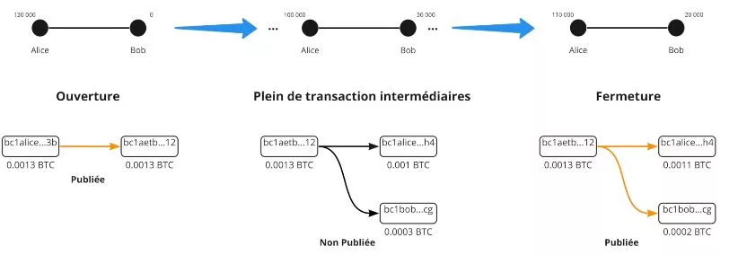


### Dobr칠

Ob캩 strany komunikuj칤 a dohodnou se na uzav콏en칤 kan치lu. Zastav칤 ve코ker칠 transakce a ov캩콏칤 kone캜n칳 stav kan치lu. Dohodnou se na poplatc칤ch s칤t캩 (osoba, kter치 kan치l otev콏ela, plat칤 poplatky za uzav콏en칤). Nyn칤 vytvo콏칤 uzav칤rac칤 transakci. Ta se li코칤 od transakc칤 z치vazku, proto쬰 nem치 Timelock ani revoka캜n칤 kl칤캜. Transakce je pot칠 zve콏ejn캩na a Alice a Bob obdr쮂 sv칠 p콏칤slu코n칠 z콢statky. Tento typ uzav콏en칤 je rychl칳 (proto쬰 neexistuje Timelock) a obecn캩 levn칳.


### Hrub칠

Alice chce kan치l uzav콏칤t, ale Bob nereaguje, proto쬰 je offline (v칳padek internetu nebo elekt콏iny). Alice pot칠 zve콏ejn칤 nejnov캩j코칤 transakci z치vazku (posledn칤). Transakce je zve콏ejn캩na a aktivuje se Timelock. Pot칠 byly poplatky rozhodnuty, kdy byla tato transakce vytvo콏ena p콏ed 캜asem X! MemPool je s칤콘, kter치 se od t칠 doby zm캩nila, tak쬰 protokol v칳choz칤 nastaven칤 poplatk콢 na 5kr치t vy코코칤 ne byly v dob캩 vytvo콏en칤 transakce. Poplatek za vytvo콏en칤 10 SAT, tak쬰 transakce je pova쬺v치na za 50 SAT. V dob캩 vynucen칠ho uzav콏en칤 je s칤콘:
- 1 SAT = p콏eplaceno o 50\* - 100 SAT = nedoplaceno o 2\*

To zp콢sobuje, 쬰 nucen칠 uzav콏en칤 je del코칤 (Timelock) a zejm칠na riskantn캩j코칤 z hlediska poplatk콢 a mo쬹칠ho ov캩콏en칤 t캩쬬콏i.


### Podvodn칤k

Alice se pokus칤 podv치d캩t t칤m, 쬰 zve콏ejn칤 starou transakci z치vazku. Ale Bob sleduje MemPool a hled치 transakce, kter칠 se pokou코ej칤 zve콏ejnit star칠. Pokud n캩jakou najde, pou쬴je kl칤캜 pro zru코en칤, aby potrestal Alici a vzal v코echny SAT z kan치lu.

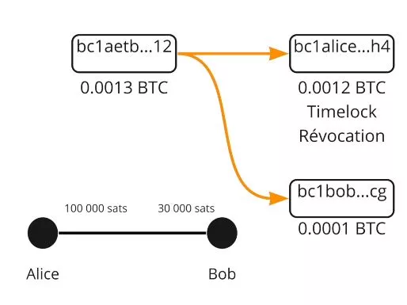

Z치v캩rem, uzav콏en칤 kan치lu v Lightning Network je kl칤캜ov칳m krokem, kter칳 m콢쬰 nab칳vat r콢zn칳ch forem. P콏i kooperativn칤m uzav콏en칤 ob캩 strany komunikuj칤 a dohodnou se na kone캜n칠m stavu kan치lu. To je nejrychlej코칤 a nejm칠n캩 n치kladn치 mo쬹ost. Na druhou stranu, nucen칠 uzav콏en칤 nastane, kdy jedna ze stran nereaguje. Jedn치 se o dra쮄뫆 a del코칤 situaci kv콢li nep콏edv칤dateln칳m poplatk콢m za transakce a aktivaci Timelocku. Nakonec, pokud 칰캜astn칤k se pokus칤 podv치d캩t t칤m, 쬰 zve콏ejn칤 starou transakci z치vazku, podvodn칤k, m콢쬰 b칳t potrest치n ztr치tou v코ech SAT z kan치lu. Je tedy z치sadn칤 tyto mechanismy ch치pat pro efektivn칤 a spravedliv칠 pou쮂셨치n칤 Lightning Network.

# S칤콘 likvidity
<partId>a873f1cb-751f-5f4a-9ed7-25092bfdef11</partId>

## Lightning Network
<chapterId>45a7252c-fa4f-554b-b8bb-47449532918e</chapterId>

V t칠to sedm칠 kapitole studujeme, jak Lightning funguje jako s칤콘 kan치l콢 a jak jsou platby sm캩rov치ny od jejich zdroje k jejich c칤li.


Lightning je s칤콘 platebn칤ch kan치l콢. Tis칤ce vrstevn칤k콢 se sv칳mi vlastn칤mi kan치ly likvidity jsou propojeni mezi sebou, a tak se sami pou쮂셨aj칤 k prov치d캩n칤 transakc칤 mezi nepropojen칳mi vrstevn칤ky. Likvidita t캩chto kan치l콢 nem콢쬰 b칳t p콏evedena na jin칠 kan치ly likvidity.

Alice -> Eden -> Bob`. Satoshi se nepohnuli z `Alice -> Bob`, ale z `Alice -> Eden` a z `Eden -> Bob`.

Tak쬰 ka쬯치 osoba a kan치l m치 r콢znou likviditu. Pro proveden칤 plateb je t콏eba naj칤t trasu v s칤ti s dostate캜nou likviditou. Pokud nen칤 dostatek, platba neprojde.

Zva쬾e n치sleduj칤c칤 s칤콘:

```
Po캜치te캜n칤 stav s칤t캩:
Alice (130 SAT) ==== (0 SAT) Susie (90 SAT) ==== (200 SAT) Eden (150 SAT) ==== (100 SAT) Bob
```


Pokud m치 Alice p콏ev칠st 40 SAT na Boba, pak se likvidita p콏erozd캩l칤 pod칠l trasy mezi ob캩ma stranami.

```
Po p콏evodu 40 SAT od Alice na Boba:
Alice (90 SAT) ==== (40 SAT) Susie (50 SAT) ==== (240 SAT) Eden (110 SAT) ==== (140 SAT) Bob
```


Nicm칠n캩, v po캜치te캜n칤m stavu nem콢쬰 Bob poslat 40 SAT Alici, proto쬰 Susie nem치 쮂멳nou likviditu s Alic칤, aby poslala 40 SAT, tak쬰 platba p콏es tuto trasu nen칤 mo쬹치. Proto pot콏ebujeme jinou trasu, kde je transakce nemo쬹치.

V prvn칤m p콏칤kladu je jasn칠, 쬰 Susie a Eden nic neztratili a nic nez칤skali. Uzly Lightning Network 칰캜tuj칤 poplatek za souhlas s pou쬴t칤m k sm캩rov치n칤 transakce!
Existuj칤 r콢zn칠 poplatky v z치vislosti na tom, kde se likvidita nach치z칤
Alice - Bob

- Poplatek Alice = Alice -> Bob
- Poplatek Boba = Bob -> Alice


Existuj칤 dva typy poplatk콢:

- fixn칤 poplatek bez ohledu na 캜치stku: 1 SAT (v칳choz칤, ale lze upravit)
- variabiln칤 poplatek (standardn캩 0,01 %)

P콏칤klad poplatk콢:

- Alice - Susie; 1/1 (1 fixn칤 poplatek a 1 variabiln칤 poplatek)
- Susie - Eden; 0/200
- Eden - Bob; 1/1

Tedy:

- Poplatek 1: (plat칤 Alice sama sob캩) 1 + (40,000\*0.000001)
- Poplatek 2: 0 + 40,000 \* 0.0002 = 8 SAT
- Poplatek 3: 1 + 40,000\* 0.000001 = 0.4 SAT

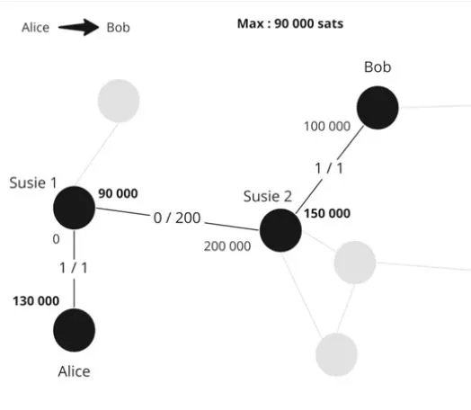

Doprava:

1. Z치silka 40,009.04 Alice -> Susie; Alice plat칤 sv칠 vlastn칤 n치klady, tak쬰 se to nepo캜칤t치
2. Susie d캩l치 Edenovi laskavost a pos칤l치 40 001.04; bere si tuto provizi 8 SAT
3. Eden poskytuje slu쬭u posl치n칤 40,000 Bobovi, bere si sv콢j poplatek 1.04 SAT.

Alice zaplatila poplatek 9.04 SAT a Bob obdr쬰l 40,000 SAT.


V Lightning Network je to uzel Alice, kter칳 rozhoduje o trase p콏ed odesl치n칤m platby. Proto se hled치 nejlep코칤 trasa a Alice je jedin치, kdo zn치 trasu a cenu. Platba je odesl치na, ale Susie nem치 쮂멳n칠 informace.


Pro Susie nebo Edena: nev캩d칤, kdo je kone캜n칳 p콏칤jemce, ani kdo platbu pos칤l치. To je onion routing. Uzel mus칤 udr쬺vat pl치n s칤t캩, aby na코el svou trasu, ale 쮂멳n칳 z prost콏edn칤k콢 nem치 쮂멳n칠 informace.

## HTLC - Hashed Time Locked Contract
<chapterId>4369b85a-1365-55d8-99e1-509088210116</chapterId>

V tradi캜n칤m sm캩rovac칤m syst칠mu, jak m콢쬰me zajistit, aby Eden nepodv치d캩l a dodr쬰l svou 캜치st smlouvy?

HTLC je platebn칤 smlouva, kter치 m콢쬰 b칳t odem캜ena pouze s tajemstv칤m. Pokud nen칤 odhaleno, pak smlouva vypr코칤. Jedn치 se tedy o podm칤n캩nou platbu. Jak se pou쮂셨aj칤?


Zva쬾e n치sleduj칤c칤 situaci:
`Alice (100,000 SAT) ==== (30,000 SAT) Susie (250,000 SAT) ==== (0 SAT) Bob`

- Bob generuje tajemstv칤 S (preimage) a vypo캜칤t치 hash r = hash(s)
- Bob po코le Alice fakturu s "r" zahrnut칳m
- Alice po코le HTLC 40,000 SAT Susie s podm칤nkou odhalen칤 "s'" tak, 쬰 hash(s') = r
- Susie po코le podobn칠 HTLC Bobovi
- Bob odemkne HTLC Susie uk치z치n칤m "s"
- Susie odemkne HTLC Alice uk치z치n칤m "S"

Pokud je Bob offline a nikdy nez칤sk치 tajemstv칤, kter칠 mu d치v치 legitimitu p콏ij칤mat pen칤ze, pak HTLC vypr코칤 po ur캜it칠m po캜tu blok콢.

HTLC vypr코칤 v opa캜n칠m po콏ad칤: nejprve vypr코칤 Susie-Bob, pot칠 Alice-Susie. T칤mto zp콢sobem, pokud se Bob vr치t칤, nic se nezm캩n칤. Jinak, pokud Alice zru코칤, zat칤mco se Bob vrac칤, vznikne zmatek a lid칠 mohou pracovat zbyte캜n캩.

Tak co se stane v p콏칤pad캩 uzav콏en칤? Ve skute캜nosti jsou na코e z치vazkov칠 transakce je코t캩 slo쬴t캩j코칤. Mus칤me reprezentovat mezi캜asov칳 z콢statek, pokud je kan치l uzav콏en.

Proto je v z치vazkov칠 transakci HTLC-out 40 000 satoshi (s omezen칤mi vid캩n칳mi d콏칤ve) prost콏ednictv칤m v칳stupu 캜. 3.

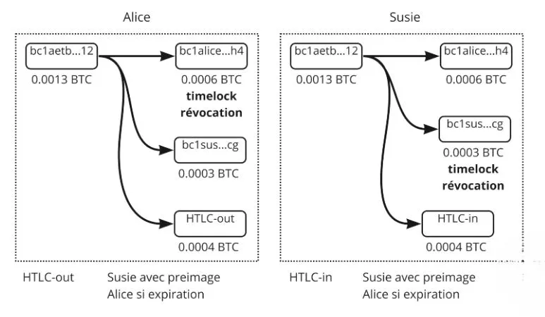

Alice m치 ve z치vazkov칠 transakci:

- V칳stup 캜. 1: 60 000 SAT pro Alice prost콏ednictv칤m 캜asov칠ho z치mku a kl칤캜e pro zru코en칤 (co j칤 z콢st치v치)
- V칳stup 캜. 2: 30 000, kter칠 ji pat콏칤 Susie
- V칳stup 캜. 3: 40 000 v HTLC

Z치vazkov치 transakce Alice je s HTLC-out, proto쬰 pos칤l치 HTLC-in p콏칤jemci, Susie.


Pokud tedy zve콏ejn칤me tuto z치vazkovou transakci, Susie m콢쬰 z칤skat pen칤ze HTCL s obr치zkem "s". Pokud nem치 p콏edobraz, Alice z칤sk치 pen칤ze jakmile HTCL vypr코칤. P콏edstavte si v칳stupy (UTXO) jako r콢zn칠 platby s r콢zn칳mi podm칤nkami.
Jakmile je platba provedena (vypr코en칤 platnosti nebo proveden칤), stav kan치lu se zm캩n칤 a transakce s HTCL ji neexistuje. Vrac칤me se k n캩캜emu klasick칠mu.
V p콏칤pad캩 kooperativn칤ho uzav콏en칤: zastav칤me platby a tedy 캜ek치me na proveden칤 p콏evod콢/HTCL, transakce je lehk치, tak쬰 m칠n캩 n치kladn치, proto쬰 existuje maxim치ln캩 1 nebo 2 v칳stupy.
Pokud je uzav콏en칤 vynucen칠: zve콏ejn칤me v코e s prob칤haj칤c칤mi HTLC, tak쬰 se to st치v치 velmi t캩쬶칳m a velmi n치kladn칳m. A je to zmatek.

Shrnut칤, syst칠m sm캩rov치n칤 Lightning Network pou쮂셨치 Hash Time-Locked Contracts (HTLC) k zaji코t캩n칤 bezpe캜n칳ch a ov캩콏iteln칳ch plateb. HTLC umo쮄갓j칤 podm칤n캩n칠 platby, kde pen칤ze mohou b칳t odem캜eny pouze s tajemstv칤m, 캜칤m zaji코콘uj칤, 쬰 칰캜astn칤ci spln칤 sv칠 z치vazky.
V prezentovan칠m p콏칤kladu chce Alice poslat SAT Bobovi p콏es Susie. Bob vygeneruje tajemstv칤, vytvo콏칤 z n캩j hash a p콏enese jej Alici. Alice a Susie nastav칤 HTLC na z치klad캩 tohoto hashe. Jakmile Bob odemkne HTLC Susie uk치z치n칤m j칤 tajemstv칤, Susie pak m콢쬰 odemknout HTLC Alice.
V p콏칤pad캩, 쬰 Bob neodhal칤 tajemstv칤 v ur캜it칠m 캜asov칠m obdob칤, HTLC vypr코칤. Vypr코en칤 platnosti prob칤h치 v opa캜n칠m po콏ad칤, co zaji코콘uje, 쬰 pokud se Bob vr치t칤 online, nedojde k ne쮂멳ouc칤m n치sledk콢m.

P콏i uzav칤r치n칤 kan치lu, pokud jde o kooperativn칤 uzav콏en칤, platby jsou p콏eru코eny a HTLC jsou vy콏e코eny, co je obecn캩 m칠n캩 n치kladn칠. Pokud je uzav콏en칤 vynucen칠, v코echny prob칤haj칤c칤 HTLC transakce jsou zve콏ejn캩ny, co se m콢쬰 st치t velmi n치kladn칳m a zmaten칳m.
Shrnut칤, mechanismus HTLC p콏id치v치 dal코칤 vrstvu bezpe캜nosti do Lightning Network, zaji코콘uj칤c칤, 쬰 platby jsou spr치vn캩 provedeny a u쬴vatel칠 pln칤 sv칠 z치vazky.

## Naj칤t cestu
<chapterId>7e2ae959-c2a1-512e-b5d6-8fd962e819da</chapterId>

Jedin치 ve콏ejn치 data jsou celkov치 kapacita kan치lu (Alice + Bob), ale nev칤me, kde se nach치z칤 likvidita.
Pro z칤sk치n칤 v칤ce informac칤 n치코 uzel naslouch치 komunika캜n칤mu kan치lu LN pro ozn치men칤 nov칳ch kan치l콢 a aktualizace poplatk콢 za kan치l. V치코 uzel tak칠 sleduje blockchain pro uzav콏en칤 kan치l콢.
Jeliko nem치me ve코ker칠 informace, mus칤me hledat graf/trasu s informacemi, kter칠 m치me (maxim치ln칤 kapacita kan치lu a ne kde se nach치z칤 likvidita).

Krit칠ria:

- Pravd캩podobnost 칰sp캩chu - Poplatky
- 캛as expirace HTLC
- Po캜et mezilehl칳ch uzl콢
- N치hodnost


Pokud tedy existuj칤 3 mo쬹칠 trasy:

- Alice > 1 > 2 > 5 > Bob
- Alice > 1 > 2 > 4 > 5 > Bob
- Alice 1 > 2 > 3 > Bob

Hled치me teoreticky nejlep코칤 trasu s nejni쮄뫆셠i poplatky a nejvy코코칤 코anc칤 na 칰sp캩ch: maxim치ln칤 likvidita a co nejm칠n캩 skok콢.

Nap콏칤klad, pokud 2-3 m치 kapacitu pouze 130 000 SAT, odesl치n칤 100 000 je velmi nepravd캩podobn칠, tak쬰 mo쬹ost #3 nem치 코anci na 칰sp캩ch.


Nyn칤 algoritmus u캜inil sv칠 3 volby a pokus칤 se o prvn칤:

Volba 1:

- Alice po코le HTLC 100 000 SAT na 1;
- 1 po코le HTLC 100 000 SAT na 2;
- 2 po코le HTLC 100 000 SAT na 5, ale 5 to nem콢쬰 prov칠st, tak to ozn치m칤.

Informace jsou posl치ny zp캩t, tak쬰 Alice se rozhodne zkusit druhou trasu:

- Alice po코le HTLC 100 000 na 1;
- 1 po코le HTLC 100 000 na 2;
- 2 po코le HTLC 100 000 na 4;
- 4 po코le HTLC 100 000 na Boba. Bob m치 likviditu, tak쬰 je to v po콏치dku.
- Bob pou쬴je preimage (hash) HTLC a t칤m pou쬴je tajemstv칤 k z칤sk치n칤 100 000 SAT
- 5 nyn칤 m치 tajemstv칤 HTLC k z칤sk치n칤 zablokovan칠ho HTLC od 4
- 4 nyn칤 m치 tajemstv칤 HTLC k z칤sk치n칤 zablokovan칠ho HTLC od 2
- 2 nyn칤 m치 tajemstv칤 HTLC k z칤sk치n칤 zablokovan칠ho HTLC od 1
- 1 nyn칤 m치 tajemstv칤 HTLC k z칤sk치n칤 zablokovan칠ho HTLC od Alice

Alice nevid캩la selh치n칤 trasy 1, jen 캜ekala o sekundu d칠le. Selh치n칤 platby nastane, kdy nen칤 mo쬹치 쮂멳n치 trasa. Aby se usnadnilo hled치n칤 trasy, Bob m콢쬰 poskytnout Alici informace, kter칠 j칤 pomohou s jej칤 fakturou:

- 캛치stka
- Jeho adresa
- Hash preimage, aby Alice mohla vytvo콏it HTLC
- Indikace o kan치lech Boba

Bob zn치 likviditu kan치l콢 5 a 3, proto쬰 je k nim p콏칤mo p콏ipojen, m콢쬰 toto Alici nazna캜it. Upozorn칤 Alici, 쬰 uzel 3 je zbyte캜n칳, co br치n칤 Alici v potenci치ln칤m vytvo콏en칤 jej칤 trasy.
Dal코칤m prvkem by mohly b칳t soukrom칠 kan치ly (tedy nezve콏ejn캩n칠 v s칤ti), kter칠 Bob m콢쬰 m칤t. Pokud m치 Bob soukrom칳 kan치l s 1, m콢쬰 콏칤ct Alici, aby ho pou쬴la, a to by dalo Alici > 1 > Bob'.


Na z치v캩r, sm캩rov치n칤 transakc칤 v Lightning Network je slo쬴t칳 proces, kter칳 vy쬬duje zohledn캩n칤 r콢zn칳ch faktor콢. A캜koliv celkov치 kapacita kan치l콢 je ve콏ejn치, p콏esn칠 rozd캩len칤 likvidity p콏칤mo dostupn칠 nen칤. To nut칤 uzly odhadovat nejpravd캩podobn캩j코칤 칰sp캩코n칠 trasy, p콏i캜em berou v 칰vahu krit칠ria jako jsou poplatky, doba expirace HTLC, po캜et mezilehl칳ch uzl콢 a faktor n치hodnosti. Kdy je mo쬹칳ch v칤ce tras, uzly se sna쮂 minimalizovat poplatky a maximalizovat 코ance na 칰sp캩ch v칳b캩rem kan치l콢 s dostate캜nou likviditou a minim치ln칤m po캜tem skok콢. Pokud pokus o transakci sel쬰 kv콢li nedostate캜n칠 likvidit캩, je vyzkou코ena dal코칤 trasa, dokud nen칤 transakce 칰sp캩코n캩 provedena.
D치le, aby se usnadnilo hled치n칤 trasy, m콢쬰 p콏칤jemce poskytnout dal코칤 informace, jako je adresa, 캜치stka, hash p콏edobrazu a indikace o jejich kan치lech. To m콢쬰 pomoci identifikovat kan치ly s dostate캜nou likviditou a vyhnout se zbyte캜n칳m pokus콢m o transakci. Nakonec je syst칠m sm캩rov치n칤 Lightning Network navr쬰n tak, aby optimalizoval rychlost, bezpe캜nost a efektivitu transakc칤 p콏i zachov치n칤 soukrom칤 u쬴vatele.

# N치stroje Lightning Network
<partId>74d6c334-ec5d-55d9-8598-f05694703bf6</partId>

## Faktura, LNURL, Keysend
<chapterId>e34c7ecd-2327-52e3-b61e-c837d9e5e8b0</chapterId>


Faktura LN (nebo faktura) je dlouh치 a nep콏칤jemn치 na 캜ten칤, ale umo쮄갓je hustou reprezentaci 쮂멳osti o platbu.

P콏칤klad:
lnbc1m1pskuawzpp5qeuuva2txazy5g483tuv9pznn9ft8l5e49s5dndj2pqq0ptyn8msdqqcqzpgxqrrsssp5v4s00u579atm0em6eqm9nr7d0vr64z5j2sm5s33x3r9m4lgfdueq9qyyssqxkjzzgx5ef7ez3dks0laxayx4grrw7j22ppgzyhpydtv6hmc39skf9hjxn5yd3kvv7zpjdxd2s7crcnemh2fz26mnr6zu83w0a2fwxcqnvujl3

- lnbc1m = 캜iteln치 캜치st
- 1 = odd캩len칤 od zbytku
- Pak zbytek
- Bc1 = k칩dov치n칤 Bech32 (z치klad 32), tak쬰 se pou쮂셨치 32 znak콢.
- 10 = 1.2.3.4.5.6.7.8.9.0
- 26 = abcdefghijklmnopqrstuvwxyz
- 32 = ne "b-i-o" a ne "1"

### lnbc1m

- ln = Lightning
- Bc = bitcoin (hlavn칤 s칤콘)
- 1 = 캜치stka
- M = mili (10^-3 / u = mikro 10^-6 / n = nano 10^-9 / p = piko 10^-12'
  Zde 1m = 1 * 0.0001btc = 100,000 BTC
Pros칤m, zapla콘te 100 000 SAT v s칤ti Lightning na Bitcoin mainnetu na adresu pskuawzpp5qeuuva2txazy5g483tuv9pznn9ft8l5e49s5dndj2pqq0ptyn8msdqqcqzpgxqrrsssp5v4s00u579atm0em6eqm9nr7d0vr64z5j2sm5s33x3r9m4lgfdueq9qyyssqxkjzzgx5ef7ez3dks0laxayx4grrw7j22ppgzyhpydtv6hmc39skf9hjxn5yd3kvv7zpjdxd2s7crcnemh2fz26mnr6zu83w0a2fwxcqnvujl3
### 캛asov칠 raz칤tko (kdy bylo vytvo콏eno)

Obsahuje 0 nebo v칤ce dal코칤ch 캜치st칤:

- Hash p콏edobrazu
- Tajemstv칤 platby (onion routing)
- Libovoln치 data
- Ve콏ejn칳 kl칤캜 p콏칤jemce LN
- 캛as vypr코en칤 platnosti (v칳choz칤 1 hodina)
- N치pov캩dy pro sm캩rov치n칤
- Podpis cel칠ho

Existuj칤 i jin칠 typy faktur. Meta-protokol LNURL umo쮄갓je poskytnout p콏칤mou 캜치stku v satoshi m칤sto vytv치콏en칤 po쬬davku. To je velmi flexibiln칤 a umo쮄갓je mnoho vylep코en칤 z hlediska u쬴vatelsk칠 zku코enosti.


Keysend umo쮄갓je Alici poslat pen칤ze Bobovi bez Bobova po쬬davku. Alice z칤sk치 Bobovo ID, vytvo콏칤 p콏edobraz bez Bobova dotazu a zahrne jej do sv칠 platby. Tak쬰 Bob obdr쮂 p콏ekvapiv칳 po쬬davek, kde m콢쬰 pen칤ze odemknout, proto쬰 Alice u ud캩lala pr치ci.


Z치v캩rem, faktura Lightning Network, a캜koliv na prvn칤 pohled slo쬴t치, efektivn캩 k칩duje po쬬davek na platbu. Ka쬯치 캜치st faktury obsahuje kl칤캜ov칠 informace, v캜etn캩 캜치stky k platb캩, p콏칤jemce, 캜asov칠ho raz칤tka vytvo콏en칤 a potenci치ln캩 dal코칤ch informac칤, jako je hash p콏edobrazu, tajemstv칤 platby, n치pov캩dy pro sm캩rov치n칤 a 캜as vypr코en칤 platnosti. Protokoly jako LNURL a Keysend nab칤zej칤 v칳znamn치 vylep코en칤 z hlediska flexibility a u쬴vatelsk칠 zku코enosti, umo쮄갓j칤 nap콏칤klad pos칤lat prost콏edky bez p콏edchoz칤ho po쬬davku od druh칠 strany. Tyto technologie 캜in칤 proces platby hlad코칤 a efektivn캩j코칤 v s칤ti Lightning.

## Spr치va likvidity
<chapterId>cc76d0c4-d958-57f5-84bf-177e21393f48</chapterId>


Poskytujeme n캩kolik obecn칳ch pokyn콢 k odpov캩di na neust치lou ot치zku spr치vy likvidity v Lightning.

V LN existuj칤 3 typy lid칤:

- Kupuj칤c칤: maj칤 odchoz칤 likviditu, co je nejjednodu코코칤, proto쬰 sta캜칤 otev콏칤t kan치ly
- Obchodn칤ci: je to slo쬴t캩j코칤, proto쬰 pot콏ebuj칤 p콏칤choz칤 likviditu od ostatn칤ch uzl콢 a akt칠r콢. Mus칤 m칤t lidi, kte콏칤 jsou k nim p콏ipojeni
- Sm캩rovac칤 uzly: cht캩j칤 m칤t vyv치쬰nou likviditu na obou stran치ch a dobrou spojenost s mnoha uzly, aby byli co nejv칤ce vyu쮂셨치ni

Pokud tedy pot콏ebujete p콏칤choz칤 likviditu, m콢쬰te si ji koupit od slu쬰b.


Alice kupuje kan치l od Susie za 1 milion satoshi, tak쬰 otev콏e kan치l p콏칤mo s 1 000 000 SAT na p콏칤choz칤 stran캩. Pot칠 m콢쬰 p콏ij칤mat platby a do v칳코e 1 milionu SAT od z치kazn칤k콢, kte콏칤 jsou spojeni se Susie (kter치 je dob콏e propojena).
Dal코칤m 콏e코en칤m by bylo prov치d캩t platby; zaplat칤te 100 000 z d콢vodu X, nyn칤 m콢쬰te p콏ij칤mat 100 000.


### 콎e코en칤 Loop Out: Atomick칳 swap LN - BTC

Alice 2 miliony - Susie 0


Alice chce poslat likviditu Susie, tak쬰 provede Loop out (speci치ln칤 uzel, kter칳 nab칤z칤 profesion치ln칤 slu쬭u pro vyrovn치n칤 LN/BTC).
Alice po코le 1 milion Loopu p콏es uzel Susie, tak쬰 Susie m치 likviditu a Loop po코le z콢statek on-chain zp캩t na uzel Alice.

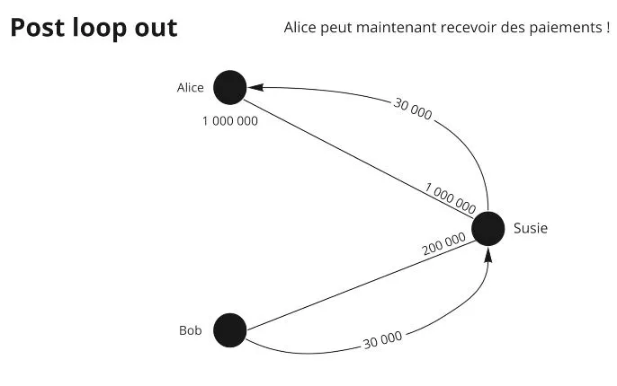

Tak쬰 1 milion jde Susie, Susie po코le 1 milion Loopu, Loop po코le 1 milion Alice. Alice tedy p콏esunula likviditu Susie za cenu n캩jak칳ch poplatk콢 zaplacen칳ch Loopu za slu쬭u.

Nejslo쬴t캩j코칤 v캩c칤 v LN je udr쬰t likviditu.


Z치v캩rem, spr치va likvidity na Lightning Network je kl칤캜ovou ot치zkou, kter치 z치vis칤 na typu u쬴vatele: kupuj칤c칤, obchodn칤k, nebo sm캩rovac칤 uzel. Kupuj칤c칤, kte콏칤 pot콏ebuj칤 odchoz칤 likviditu, maj칤 nejjednodu코코칤 칰kol: jednodu코e otev콏ou kan치ly. Obchodn칤ci, kte콏칤 vy쬬duj칤 p콏칤choz칤 likviditu, mus칤 b칳t propojeni s ostatn칤mi uzly a akt칠ry. Sm캩rovac칤 uzly naopak usiluj칤 o udr쬰n칤 vyv치쬰nosti likvidity na obou stran치ch. Existuje n캩kolik 콏e코en칤 pro spr치vu likvidity, jako je n치kup kan치l콢 nebo platba za zv칳코en칤 p콏ij칤mac칤 kapacity. Mo쬹ost "Loop Out", umo쮄갓j칤c칤 Atomick칳 Swap mezi LN a BTC, nab칤z칤 zaj칤mav칠 콏e코en칤 pro vyrovn치n칤 likvidity. P콏esto z콢st치v치 udr쬺v치n칤 likvidity na Lightning Network slo쬴tou v칳zvou.

# J칤t d치le
<partId>6bbf107d-a224-5916-9f0c-2b4d30dd0b17</partId>

## Souhrn kurzu
<chapterId>a65a571c-561b-5e1c-87bf-494644653c22</chapterId>

Na코칤m c칤lem bylo vysv캩tlit, jak funguje Lightning Network a jak je z치visl치 na Bitcoinu.

Lightning Network je s칤콘 platebn칤ch kan치l콢. Vid캩li jsme, jak funguje platebn칤 kan치l mezi dv캩ma stranami, ale tak칠 jsme roz코칤콏ili na코i vizi na celou s칤콘, na pojem s칤t캩 platebn칤ch kan치l콢.


Kan치ly jsou otev콏eny prost콏ednictv칤m Bitcoinov칠 transakce a mohou obsahovat co nejv칤ce transakc칤. Stav kan치lu je reprezentov치n z치vaznou transakc칤, kter치 po코le ka쬯칠 stran캩 to, co m치 na sv칠 stran캩 kan치lu. Kdy dojde k transakci v r치mci kan치lu, strany se zav치쬺u k nov칠mu stavu t칤m, 쬰 zru코칤 star칳 stav a vytvo콏칤 novou z치vaznou transakci.


P치ry se chr치n칤 p콏ed podvody pomoc칤 kl칤캜콢 pro zru코en칤 a 캜asov칠ho z치mku. Uzav콏en칤 kan치lu vz치jemn칳m souhlasem je preferov치no. V p콏칤pad캩 nucen칠ho uzav콏en칤 se zve콏ejn칤 posledn칤 z치vazn치 transakce.

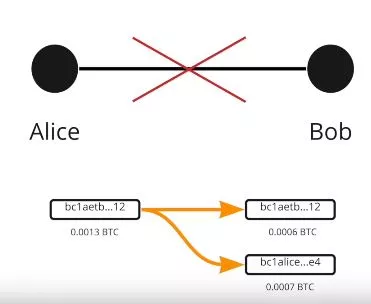

Platby mohou vyu쮂셨at kan치ly od jin칳ch meziuzl콢. Podm칤n캩n칠 platby na z치klad캩 hash time lock (HTLC) umo쮄갓j칤 uzamknout prost콏edky, dokud nen칤 platba pln캩 vy콏e코ena. V Lightning Network se pou쮂셨치 onion routing. Meziuzly neznaj칤 kone캜n칳 c칤l plateb. Alice mus칤 vypo캜칤tat platebn칤 trasu, ale nem치 v코echny informace o likvidit캩 v meziuzlech.


P콏i odes칤l치n칤 platby p콏es Lightning Network je prvek pravd캩podobnosti.

Pro p콏ij칤m치n칤 plateb je nutn칠 spravovat likviditu v kan치lech, co lze prov칠st t칤m, 쬰 po쮂멳치me ostatn칤, aby n치m otev콏eli kan치ly, otev콏eme si kan치ly sami, a pou쮂셨치me n치stroje jako Loop nebo kupujeme/p콢j캜ujeme si kan치ly na tr쬴코t칤ch.

## Rozhovor s Fanisem
<chapterId>077cb5f5-1626-5da5-9964-e67b1de503bf</chapterId>

Zde je shrnut칤 rozhovoru:

Lightning Network je ultra-rychl칠 platebn칤 콏e코en칤 na Bitcoinu, kter칠 umo쮄갓je obej칤t omezen칤 souvisej칤c칤 se 코k치lovatelnost칤 s칤t캩. Bitcoiny na Lightning Network v코ak nejsou tak bezpe캜n칠 jako ty na Bitcoinov칠m 콏et캩zci, proto쬰 decentralizace a bezpe캜nost maj칤 p콏ednost p콏ed 코k치lovatelnost칤.

P콏칤li코n칠 zv캩t코ov치n칤 velikosti bloku nen칤 dobr칳m 콏e코en칤m, proto쬰 ohro쬿je uzly a kapacitu dat. M칤sto toho Lightning Network umo쮄갓je vytv치콏en칤 platebn칤ch kan치l콢 mezi dv캩ma u쬴vateli Bitcoinu bez zobrazov치n칤 transakc칤 na blockchainu, 캜칤m 코et콏칤 m칤sto v bloc칤ch a umo쮄갓je Bitcoinu 코k치lovat dnes.

Existuj칤 v코ak kritiky t칳kaj칤c칤 se 코k치lovatelnosti a centralizace Lightning Network, s potenci치ln칤mi probl칠my souvisej칤c칤mi s uzav칤r치n칤m kan치l콢 a vysok칳mi transak캜n칤mi poplatky. Pro 콏e코en칤 t캩chto probl칠m콢 se doporu캜uje vyh칳bat se otev칤r치n칤 mal칳ch kan치l콢, aby se p콏ede코lo budouc칤m probl칠m콢m, a zvy코ovat transak캜n칤 poplatky pomoc칤 Child Pay for Parent.

콎e코en칤mi pro budoucnost Lightning Network jsou hromad캩n칤 a vytv치콏en칤 kan치l콢 ve skupin치ch za 칰캜elem sn칤쬰n칤 transak캜n칤ch poplatk콢, stejn캩 jako zv칳코en칤 velikosti bloku v dlouhodob칠m horizontu. Je v코ak d콢le쬴t칠 poznamenat, 쬰 bitcoiny na Lightning Network nejsou tak bezpe캜n칠 jako bitcoiny na Bitcoinov칠m 콏et캩zci.

Soukrom칤 na Bitcoinu a Lightning jsou propojeny, p콏i캜em onion routing zaji코콘uje ur캜itou 칰rove켿 soukrom칤 pro transakce. Na Bitcoinu je v코ak v코echno v칳choz칤 transparentn칤, s heuristikami pou쮂셨an칳mi pro sledov치n칤 Bitcoin콢 z adresy na adresu na Bitcoinov칠m 콏et캩zci.

Koup캩 Bitcoin콢 s KYC umo쮄갓je burze zn치t transakce v칳b캩ru, zat칤mco kulat칠 캜치stky a zm캩nov칠 adresy umo쮄갓j칤 v캩d캩t, kter치 캜치st transakce je ur캜ena pro jinou osobu a kter치 캜치st je ur캜ena pro sebe.

Pro zlep코en칤 soukrom칤 umo쮄갓j칤 spole캜n칠 akce a coinjoins naru코it v칳po캜ty pravd캩podobnosti t칤m, 쬰 v칤ce lid칤 prov치d칤 transakci spole캜n캩. Spole캜nosti prov치d캩j칤c칤 anal칳zu 콏et캩zce maj칤 t캩쮄뫆 칰kol zjistit, co d캩l치te se sv칳mi bitcoiny sledov치n칤m.

Na Lightning Network jsou o transakci informov치ny pouze dv캩 osoby a je to d콢v캩rn캩j코칤 ne Bitcoin. Onion routing znamen치, 쬰 meziuzel nezn치 odes칤latele a p콏칤jemce platby.

Pro pou쮂셨치n칤 Lightning Network se doporu캜uje absolvovat 코kolen칤 na va코em YouTube kan치lu nebo p콏칤mo na webu discover Bitcoin, nebo vyu쮂셦 코kolen칤 na Umbrell. Je tak칠 mo쬹칠 pos칤lat libovoln칳 text b캩hem platby na Lightning pomoc칤 vyhrazen칠ho pole pro tento 칰캜el, co m콢쬰 b칳t u쬴te캜n칠 pro dary nebo zpr치vy.
Je v코ak d콢le쬴t칠 poznamenat, 쬰 sm캩rovac칤 uzly Lightning mohou b칳t v budoucnu regulov치ny, p콏i캜em n캩kter칠 st치ty se pokou코ej칤 regulovat sm캩rovac칤 uzly. Pro obchodn칤ky je nutn칠 spravovat likviditu pro p콏ij칤m치n칤 plateb na Lightning Network, s aktu치ln칤mi omezen칤mi, kter치 lze p콏ekonat s vhodn칳mi 콏e코en칤mi.

Nakonec, budoucnost Bitcoinu je slibn치 s mo쬹ou projekc칤 jednoho milionu za p캩t let. Pro zaji코t캩n칤 profesionalizace pr콢myslu a vytvo콏en칤 alternativn칤ho syst칠mu k existuj칤c칤mu bankovn칤mu syst칠mu je d콢le쬴t칠 p콏isp칤vat do s칤t캩 a p콏estat d콢v캩콏ovat.


## Ohodno콘te kurz
<chapterId>38814c99-eb7b-5772-af49-4386ee2ce9b0</chapterId>
<isCourseReview>true</isCourseReview>


## Pod캩kov치n칤 a pokra캜ujte v prozkoum치v치n칤 kr치li캜칤 nory
<chapterId>afc0d72b-4fbc-5893-90b2-e27fb519ad02</chapterId>

Gratulujeme! 游꿀
칔sp캩코n캩 jste dokon캜ili LN 201 코kolen칤 - 칔vod do Lightning Network!
M콢쬰te b칳t na sebe hrd칤, proto쬰 to nen칤 snadn칠. V캩zte, 쬰 m치lokdo se dostane tak hluboko do kr치li캜칤 nory Bitcoinu.
P콏edev코칤m bych cht캩l velmi pod캩kovat Fanisovi Makalakisovi za nab칤dnut칤 tohoto skv캩l칠ho bezplatn칠ho kurzu zam캩콏en칠ho na v칤ce etnick칳 aspekt Lightning. Nev치hejte ho sledovat na Twitteru, na jeho blogu nebo prost콏ednictv칤m jeho pr치ce na LN market.
Pokud chcete projekt podpo콏it, nev치hejte n치s sponzorovat na Patreonu. Va코e dary budou pou쬴ty na produkci obsahu pro nov칠 v칳ukov칠 kurzy a samoz콏ejm캩 budete prvn칤, kdo bude informov치n (v캜etn캩 o Fanisov캩 dal코칤m kurzu, na kter칠m se pracuje!).

Dobrodru쬽tv칤 s Lightning Network pokra캜uje s v칳cvikem Umbrel a implementac칤 uzlu Lightning Network. Teorie je za n치mi a je 캜as na praxi s kurzem LN 202 te캞!

Polibky a brzy na vid캩nou!
Rogzy'
