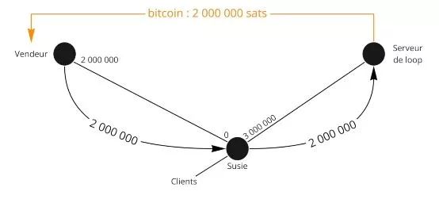
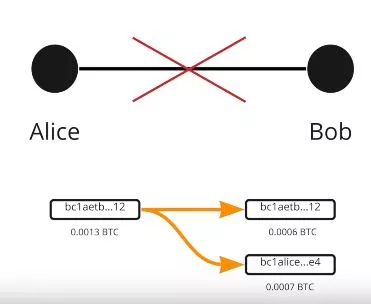

# A Journey to Bitcoin's Second Layer

This course is a theoretical lesson on the technical functioning of the Lightning Network.

Welcome to the exciting world of the Lightning Network, a second layer of Bitcoin that is both sophisticated and full of potential. We are about to dive into the technical depths of this technology, without focusing on specific tutorials or usage scenarios. To get the most out of this course, a solid understanding of Bitcoin is essential. This is an experience that requires a serious and focused approach. You may also consider taking the LN 202 course in parallel, which offers a more practical aspect to this exploration. Get ready to embark on a journey that could change your perception of the Bitcoin ecosystem.

Enjoy the discovery!

+++

# The Fundamentals
<partId>32647d62-102b-509f-a3ba-ad1d6a4345f1</partId>

## Understanding the Lightning Network
<chapterId>df6230ae-ff35-56ea-8651-8e65580730a8</chapterId>


The Lightning Network is a second-layer payment infrastructure built on the Bitcoin network that enables fast and low-cost transactions. To fully understand how the Lightning Network works, it is essential to understand what payment channels are and how they work.

A Lightning payment channel is a kind of "private lane" between two users that allows for fast and repetitive Bitcoin transactions. When a channel is opened, it is given a fixed capacity, which is defined in advance by the users. This capacity represents the maximum amount of Bitcoin that can be transmitted in the channel at any given time.

Payment channels are bidirectional, meaning they have two "sides." For example, if Alice and Bob open a payment channel, Alice can send Bitcoin to Bob, and Bob can send Bitcoin to Alice. Transactions inside the channel do not change the total capacity of the channel, but they do change the distribution of that capacity between Alice and Bob.


For a transaction to be possible in a Lightning payment channel, the user sending the funds must have enough Bitcoin on their side of the channel. If Alice wants to send 1 Bitcoin to Bob through their channel, she must have at least 1 Bitcoin on her side of the channel.
Limits and Functioning of Payment Channels on Lightning.
Although the capacity of a Lightning payment channel is fixed, this does not limit the total number of transactions or the total volume of Bitcoin that can be transmitted through the channel. For example, if Alice and Bob have a channel with a capacity of 1 Bitcoin, they can perform hundreds of transactions of 0.01 Bitcoin or thousands of transactions of 0.001 Bitcoin, as long as the total capacity of the channel is not exceeded at any given time.

Despite these limitations, Lightning payment channels are an efficient way to perform fast and inexpensive Bitcoin transactions. They allow users to send and receive Bitcoin without having to pay high transaction fees or wait for long confirmation periods on the Bitcoin network.

In summary, Lightning payment channels offer a powerful solution for those who want to perform fast and inexpensive Bitcoin transactions. However, it is essential to understand their operation and limitations in order to fully take advantage of them.


Example:

- Alice has 100,000 SAT
- Bob has 30,000 SAT

This is the current state of the channel. During a transaction, Alice decides to send 40,000 SAT to Bob. She can do so because 40,000 < 100,000.

The new state of the channel is therefore:

- Alice 60,000 SAT
- Bob 70,000 SAT

```
Initial state of the channel:
Alice (100,000 SAT) ============== Bob (30,000 SAT)

After Alice's transfer to Bob of 40,000 SAT:
Alice (60,000 SAT) ============== Bob (70,000 SAT)

```


Now, Bob wants to send 80,000 SAT to Alice. Not having the liquidity, he cannot. The maximum capacity of the channel is 130,000 SAT, with a possible expenditure of up to 60,000 SAT for Alice and 70,000 SAT for Bob.


## Bitcoin, addresses, UTXO and transactions
<chapterId>0cfb7e6b-96f0-508b-9210-90bc1e28649d</chapterId>


In this second chapter, we take the time to study how Bitcoin transactions actually work, which will be very useful for understanding Lightning. We also briefly discuss the concept of multi-signature addresses, which is crucial for understanding the next chapter on opening channels on the Lightning Network.

- Private key > Public key > Address: During a transaction, Alice sends money to Bob. The latter provides an address given by his public key. Alice, who herself received the money on an address via her public key, now uses her private key to sign the transaction and thus unlock the bitcoins from the address.
- In a Bitcoin transaction, all bitcoins must move. Named UTXO (Unspend Transaction Output), the bits of bitcoin will all leave only to return to the owner afterwards.
  Alice has 0.002 BTC, Bob has 0 BTC. Alice decides to send 0.0015 BTC to Bob. She will sign a transaction of 0.002 BTC where 0.0015 will go to Bob and 0.0005 will return to her wallet.


Here, from one UTXO (Alice has 0.0002 BTC on an address), we have created 2 UTXOs (Bob has 0.0015 and Alice has a new UTXO (independent of the previous one) of 0.0005 BTC).

```
Alice (0.002 BTC)
  |
  V
Bitcoin Transaction (0.002 BTC)
  |
  |----> Bob (0.0015 BTC)
  |
  V
Alice (new UTXO: 0.0005 BTC)
```

In Lightning Network, multi-signatures are used. Therefore, 2 signatures are required to unlock the funds, i.e., two private keys to move the money. This can be Alice and Bob who, together, must agree to unlock the money (the UTXO). In LN specifically, they are 2/2 transactions, so both signatures are absolutely necessary, unlike 2/3 or 3/5 multi-signatures where only a combination of the complete number of keys is required.


# Opening and closing of channels
<partId>900b5b6b-ccd0-5b2f-9424-4b191d0e935d</partId>

## Channel Opening
<chapterId>96243eb0-f6b5-5b68-af1f-fffa0cc16bfe</chapterId>


Now, we will take a closer look at channel opening and how it is done through a Bitcoin transaction.

The Lightning Network has different levels of communication:

- P2P communication (Lightning Network protocol)
- Payment channel (Lightning Network protocol)
- Bitcoin transaction (Bitcoin protocol)


To open a channel, the two peers communicate through a communication channel:

- Alice: "Hi, I want to open a channel!"
- Bob: "Ok, here is my public address."


Alice now has 2 public addresses to create a 2/2 multi-sig address. She can now make a bitcoin transaction to send money to it.

Let's say Alice has a UTXO of 0.002 BTC and she wants to open a channel with Bob of 0.0013 BTC. She will create a transaction with 2 UTXOs as output:

- a UTXO of 0.0013 to the 2/2 multi-sig address
- a UTXO of 0.0007 to one of her change addresses (return of UTXOs).

This transaction is not yet public because if it is at this stage, she trusts Bob to be able to unlock the money from the multi-sig.

But then how to proceed?

Alice will create a second transaction called a "withdrawal transaction" before publishing the deposit of funds in the multi-sig.


The withdrawal transaction will spend the funds from the multi-sig address to an address of hers (this is done before everything is published).
Once both transactions are built, Alice tells Bob that it's done and asks him for a signature with his public key, explaining that this way she can recover her funds if something goes wrong. Bob agrees because he is not dishonest.

Alice can now recover the funds alone, as she already has Bob's signature. She publishes the transactions. The channel is now open with 0.0013 BTC (130,000 SAT) on Alice's side.


## Lightning Transaction & Commitment Transaction
<chapterId>7d3fd135-129d-5c5a-b306-d5f2f1e63340</chapterId>


Now let's analyze what really happens behind the scenes when transferring funds from one side to the other of a channel on the Lightning Network, with the notion of commitment transaction. The on-chain withdrawal/closure transaction represents the state of the channel, guaranteeing who owns the funds after each transfer. So after a Lightning Network transfer, there is an update of this transaction/contract not executed between the two peers, Alice and Bob, who create the same transaction with the current channel state in case of closure:

- Alice opens a channel with Bob with 130,000 SAT on her side. The withdrawal transaction accepted by both in case of closure states that 130,000 SAT will go to Alice at closure, and Bob agrees because it's fair.


- Alice sends 30,000 SAT to Bob. There is now a new withdrawal transaction stating that in case of closure, Alice will receive 100,000 SAT and Bob 30,000 SAT. Both agree because it's fair.


- Alice sends 10,000 SAT to Bob, and a new withdrawal transaction is created stating that Alice will receive 90,000 SAT and Bob 40,000 SAT in case of closure. Both agree because it's fair.


```
Initial state of the channel:
Alice (130,000 SAT) =============== Bob (0 SAT)

After the first transfer:
Alice (100,000 SAT) =============== Bob (30,000 SAT)

After the second transfer:
Alice (90,000 SAT) =============== Bob (40,000 SAT)

```

The money never moves, but the final balance is updated via a signed but not published on-chain transaction. The withdrawal transaction is therefore a commitment transaction. The satoshi transfers are another more recent commitment transaction that updates the balance.

## Commitment Transactions
<chapterId>f2f61e5b-badb-5947-9a81-7aa530b44e59</chapterId>


If commitment transactions dictate a channel state with liquidity at time X, can we cheat by publishing an old state? The answer is yes, because we already have the pre-signature of both participants in the unpublished transaction.


To solve this problem, we will add complexity:

- Timelock = funds locked until block N
- Revocation key = Alice's secret and Bob's secret'

These two elements are added to the commitment transaction. As a result, Alice must wait for the end of the Timelock, and anyone who holds the revocation key can move the funds without waiting for the end of the Timelock. If Alice tries to cheat, Bob uses the revocation key to steal and punish Alice.


Now (and in reality) the commitment transaction is not the same for Alice and Bob, they are symmetrical but each with different constraints, they give each other their secret in order to create the revocation key of the previous commitment transaction. So at the creation, Alice creates the channel with Bob, 130,000 SAT on her side, she has a Timelock that prevents her from immediately recovering her money, she must wait a bit. The revocation key can unlock the money but only Alice has it (Alice's commitment transaction). Once there is a transfer, Alice will provide her old secret to Bob and therefore the latter will be able to empty the channel to the previous state in case Alice tries to cheat (Alice is therefore punished).


Similarly, Bob will provide his secret to Alice. So that if he tries to cheat, Alice can punish him. The operation is repeated for each new commitment transaction. A new secret is decided and a new revocation key. So for each new transaction, the previous commitment transaction must be destroyed by giving the revocation secret. Thus if Alice or Bob tries to cheat, the other can act before (thanks to the Timelock) and thus avoid cheating. During transaction #3, the secret of transaction #2 is therefore given to allow Alice and Bob to defend themselves against Alice or Bob.


The person who creates the transaction with the Timelock (the one who sends the money) can only use the revocation key after the Timelock. However, the person who receives the money can use it before the Timelock in case of cheating from one side to the other of a channel on the Lightning Network. In particular, we detail the mechanisms that allow us to guard against possible cheating by one's peer within the channel.

## Channel Closure
<chapterId>29a72223-2249-5400-96f0-3756b1629bc2</chapterId>


We are interested in channel closure through a Bitcoin transaction, which can take different forms depending on the case. There are 3 types of channel closure:

- The good: cooperative closure
- The brute: forced closure (non-cooperative)
- The cheat: closure by a cheater


### The good

The two peers communicate and agree to close the channel. They stop all transactions and validate a final state of the channel. They agree on network fees (the person who opened the channel pays the closing fees). They now create the closing transaction. There is a closing transaction, different from commitment transactions because there is no Timelock and revocation key. The transaction is then published and Alice and Bob receive their respective balances. This type of closure is fast (because there is no Timelock) and generally inexpensive.


### The brute

Alice wants to close the channel, but Bob does not respond because he is offline (internet or power outage). Alice will then publish the most recent commitment transaction (the last one). The transaction is published and the Timelock is activated. Then, the fees were decided when this transaction was created X time in the past! The MemPool is the network that has changed since, so the protocol defaults to fees 5 times higher than the current ones when the transaction was created. Creation fee at 10 SAT, so the transaction considered 50 SAT. At the time of forced closure, the network is:

- 1 SAT = overpaid by 50\*
- 100 SAT = underpaid by 2\*

This makes forced closure longer (Timelock) and especially more risky in terms of fees and possible validation by miners.


### The cheater

Alice tries to cheat by publishing an old commitment transaction. But Bob monitors the MemPool and watches for transactions that try to publish old ones. If he finds any, he uses the revocation key to punish Alice and take all the SAT from the channel.


In conclusion, channel closure in the Lightning Network is a crucial step that can take various forms. In a cooperative closure, both parties communicate and agree on a final state of the channel. This is the fastest and least expensive option. On the other hand, a forced closure occurs when one party is non-responsive. This is a more expensive and longer situation due to unpredictable transaction fees and the activation of the Timelock. Finally, if a participant tries to cheat by publishing an old commitment transaction, the cheater, they can be punished by losing all the SAT from the channel. It is therefore crucial to understand these mechanisms for effective and fair use of the Lightning Network.

# A liquidity network
<partId>a873f1cb-751f-5f4a-9ed7-25092bfdef11</partId>

## Lightning Network
<chapterId>45a7252c-fa4f-554b-b8bb-47449532918e</chapterId>


In this seventh chapter, we study how Lightning works as a network of channels and how payments are routed from their source to their destination.


Lightning is a network of payment channels. Thousands of peers with their own liquidity channels are connected to each other, and thus self-use to carry out transactions between unconnected peers. The liquidity of these channels cannot be transferred to other liquidity channels.

Alice -> Eden - > Bob`. Satoshis have not moved from `Alice -> Bob`, but from `Alice -> Eden`and from`Eden -> Bob`.

So each person and channel has different liquidity. To make payments, you need to find a route in the network with enough liquidity. If there isn't enough, the payment won't go through.

Consider the following network:

```
Initial state of the network:
Alice (130 SAT) ==== (0 SAT) Susie (90 SAT) ==== (200 SAT) Eden (150 SAT) ==== (100 SAT) Bob
```


If Alice is to transfer 40 SAT to Bob, then the liquidity will be redistributed along the route between the two parties.

```
After Alice transfers 40 SAT to Bob:
Alice (90 SAT) ==== (40 SAT) Susie (50 SAT) ==== (240 SAT) Eden (110 SAT) ==== (140 SAT) Bob
```


However, in the initial state, Bob can't send 40 SAT to Alice because Susie doesn't have any liquidity with Alice to send 40 SAT, so payment isn't possible via this route. We therefore need another route where the transaction is possible.

In the first example, it's clear that Susie and Eden have lost nothing and gained nothing. Lightning Network nodes charge a fee for agreeing to be used to route the transaction!

There are different fees depending on where the liquidity is located

Alice - Bob

- Alice's fee = Alice -> Bob
- Bob's fee = Bob -> Alice


There are two types of fee:

- a fixed fee regardless of the amount: 1 SAT (default but can be modified)
- a variable fee (0.01% by default)

Fee example:

- Alice - Susie; 1/1 (1 fixed charge and 1 variable charge)
- Susie - Eden; 0/200
- Eden - Bob; 1/1

Therefore:

- Fee 1: (paid by Alice to herself) 1 + (40,000\*0.000001)
- Fee 2: 0 + 40,000 \* 0.0002 = 8 SAT
- Charge 3: 1 + 40,000\* 0.000001 = 1.04 SAT


Shipping :

1. Shipment of 40,009.04 Alice -> Susie; Alice pays her own expenses so it doesn't count
2. Susie does Eden the favor of sending 40 001.04; she takes this commission of 8 SAT
3. Eden does the service of sending 40,000 to Bob, he takes his 1.04 SAT fee.

Alice paid a 9.04 SAT fee and Bob received 40,000 SAT.


In the Lightning Network, it is Alice's node that decides the route before sending the payment. Therefore, there is a search for the best route and Alice is the only one who knows the route and the price. The payment is sent, but Susie has no information.


For Susie or Eden: they do not know who the final recipient is, nor who is sending the payment. This is onion routing. The node must keep a plan of the network to find its route, but none of the intermediaries have any information.

## HTLC - Hashed Time Locked Contract
<chapterId>4369b85a-1365-55d8-99e1-509088210116</chapterId>


In a traditional routing system, how can we ensure that Eden does not cheat and respects their part of the contract?

HTLC is a payment contract that can only be unlocked with a secret. If it is not revealed, then the contract expires. It is therefore a conditional payment. How are they used?


Consider the following situation:
`Alice (100,000 SAT) ==== (30,000 SAT) Susie (250,000 SAT) ==== (0 SAT) Bob`

- Bob generates a secret S (the preimage) and calculates the hash r = hash(s)
- Bob sends an invoice to Alice with "r" included
- Alice sends an HTLC of 40,000 SAT to Susie with the condition of revealing "s'" such that hash(s') = r
- Susie sends a similar HTLC to Bob
- Bob unlocks Susie's HTLC by showing her "s"
- Susie unlocks Alice's HTLC by showing her "S"

If Bob is offline and never retrieves the secret that gives him the legitimacy to receive the money, then the HTLC will expire after a certain number of blocks.


The HTLCs expire in reverse order: Susie-Bob expiration, then Alice-Susie expiration. This way, if Bob returns, it does not change anything. Otherwise, if Alice cancels while Bob returns, it will be a mess and people may have worked for nothing.

So, what happens in case of closure? In fact, our commitment transactions are even more complex. We need to represent the intermediate balance if the channel is closed.

Therefore, there is an HTLC-out of 40,000 satoshis (with the limitations seen before) in the commitment transaction via output #3.


Alice has in the commitment transaction:

- Output #1: 60,000 SAT for Alice via a Timelock and revocation key (what remains for her)
- Output #2: 30,000 that already belongs to Susie
- Output #3: 40,000 in HTLC

Alice's commitment transaction is with an HTLC-out because she sends an HTLC-in to the recipient, Susie.


Therefore, if we publish this commitment transaction, Susie can retrieve the HTCL money with the "s" image. If she does not have the pre-image, Alice retrieves the money once the HTCL expires. Think of outputs (UTXO) as different payments with different conditions.
Once the payment is made (expiration or execution), the channel state changes and the transaction with HTCL no longer exists. We return to something classic.
In the case of cooperative closure: we stop payments and therefore wait for the execution of transfers/HTCL, the transaction is light so less expensive because there are a maximum of 1 or 2 outputs.
If forced closure: we publish with all the HTLCs in progress, so it becomes very heavy and very expensive. And it's a mess.

In summary, the Lightning Network routing system uses Hash Time-Locked Contracts (HTLC) to ensure secure and verifiable payment. HTLCs allow conditional payments where money can only be unlocked with a secret, thus ensuring that participants fulfill their commitments.
In the example presented, Alice wants to send SAT to Bob through Susie. Bob generates a secret, creates a hash of it, and transmits it to Alice. Alice and Susie set up an HTLC based on this hash. Once Bob unlocks Susie's HTLC by showing her the secret, Susie can then unlock Alice's HTLC.
In the event that Bob does not reveal the secret within a certain period of time, the HTLC expires. Expiration occurs in reverse order, ensuring that if Bob comes back online, there are no undesirable consequences.

When closing the channel, if it is a cooperative closure, payments are interrupted and HTLCs are resolved, which is generally less expensive. If the closure is forced, all ongoing HTLC transactions are published, which can become very expensive and messy.
In summary, the HTLC mechanism adds an additional layer of security to the Lightning Network, ensuring that payments are executed correctly and that users fulfill their commitments.

## Finding your way
<chapterId>7e2ae959-c2a1-512e-b5d6-8fd962e819da</chapterId>


The only public data is the total channel capacity (Alice + Bob) but we do not know where the liquidity is located.
To have more information, our node listens to the LN communication channel for announcements of new channels and updates to channel fees. Your node also looks at the blockchain for channel closures.

As we do not have all the information, we must search for a graph/route with the information we have (maximum channel capacity and not where the liquidity is located).

Criteria:

- Success probability - Fees
- HTLC expiration time
- Number of intermediate nodes
- Randomness


So if there are 3 possible routes:

- Alice > 1 > 2 > 5 > Bob
- Alice > 1 > 2 > 4 > 5 > Bob
- Alice 1 > 2 > 3 > Bob

We are looking for the best route in theory with the lowest fees and the highest chance of success: maximum liquidity and the fewest hops possible.

For example, if 2-3 only has a capacity of 130,000 SAT, sending 100,000 is very unlikely, so choice #3 has no chance of success.


Now the algorithm has made its 3 choices and will try the first one:

Choice 1:

- Alice sends an HTLC of 100,000 SAT to 1;
- 1 makes an HTLC of 100,000 SAT to 2;
- 2 makes an HTLC of 100,000 SAT to 5, but 5 cannot do it, so it announces it.

The information is sent back, so Alice decides to try the second route:

- Alice sends an HTLC of 100,000 to 1;
- 1 makes an HTLC of 100,000 to 2;
- 2 makes an HTLC of 100,000 to 4;
- 4 makes an HTLC of 100,000 to Bob. Bob has the liquidity, so it's okay.
- Bob uses the preimage (hash) of the HTLC and thus uses the secret to retrieve the 100,000 SAT
- 5 now has the secret of the HTLC to retrieve the blocked HTLC from 4
- 4 now has the secret of the HTLC to retrieve the blocked HTLC from 2
- 2 now has the secret of the HTLC to retrieve the blocked HTLC from 1
- 1 now has the secret of the HTLC to retrieve Alice's blocked HTLC

Alice did not see the failure of route 1, she just waited one second longer. A payment failure occurs when there is no possible route. To facilitate the search for a route, Bob can provide information to Alice to help with her invoice:

- The amount
- His address
- The hash of the preimage so that Alice can create the HTLC
- Indications on Bob's channels

Bob knows the liquidity of channels 5 and 3 because he is directly connected to them, he can indicate this to Alice. He warns Alice that node 3 is useless, which prevents Alice from potentially making her route.
Another element would be the private channels (therefore not published on the network) that Bob can have. If Bob has a private channel with 1, he can tell Alice to use it and it would give Alice > 1 > Bob'.


In conclusion, routing transactions on the Lightning Network is a complex process that requires consideration of various factors. While the total capacity of channels is public, the precise distribution of liquidity is not directly accessible. This forces nodes to estimate the most likely successful routes, taking into account criteria such as fees, HTLC expiration time, the number of intermediate nodes, and a randomness factor. When multiple routes are possible, nodes seek to minimize fees and maximize the chances of success by choosing channels with sufficient liquidity and a minimum number of hops. If a transaction attempt fails due to insufficient liquidity, another route is tried until a successful transaction is made.

Furthermore, to facilitate route searching, the recipient can provide additional information such as the address, amount, preimage hash, and indications on their channels. This can help identify channels with sufficient liquidity and avoid unnecessary transaction attempts. Ultimately, the Lightning Network routing system is designed to optimize the speed, security, and efficiency of transactions while preserving user privacy.

# Tools of the Lightning Network
<partId>74d6c334-ec5d-55d9-8598-f05694703bf6</partId>

## Invoice, LNURL, Keysend
<chapterId>e34c7ecd-2327-52e3-b61e-c837d9e5e8b0</chapterId>


An LN invoice (or invoice) is long and not pleasant to read, but it allows for a dense representation of a payment request.

Example:
lnbc1m1pskuawzpp5qeuuva2txazy5g483tuv9pznn9ft8l5e49s5dndj2pqq0ptyn8msdqqcqzpgxqrrsssp5v4s00u579atm0em6eqm9nr7d0vr64z5j2sm5s33x3r9m4lgfdueq9qyyssqxkjzzgx5ef7ez3dks0laxayx4grrw7j22ppgzyhpydtv6hmc39skf9hjxn5yd3kvv7zpjdxd2s7crcnemh2fz26mnr6zu83w0a2fwxcqnvujl3

- lnbc1m = readable part
- 1 = separation from the rest
- Then the rest
- Bc1 = Bech32 encoding (base 32), so 32 characters are used.
- 10 = 1.2.3.4.5.6.7.8.9.0
- 26 = abcdefghijklmnopqrstuvwxyz
- 32 = not "b-i-o" and not "1"

### lnbc1m

- ln = Lightning
- Bc = bitcoin (mainnet)
- 1 = amount
- M = milli (10*-3 / u = micro 10*-6 / n = nano 10*-9 / p = pico 10*-12'
  Here 1m = 1 \* 0.001btc = 100,000 SAT
  "Please pay 100,000 SAT on the Lightning network of the Bitcoin mainnet to pskuawzpp5qeuuva2txazy5g483tuv9pznn9ft8l5e49s5dndj2pqq0ptyn8msdqqcqzpgxqrrsssp5v4s00u579atm0em6eqm9nr7d0vr64z5j2sm5s33x3r9m4lgfdueq9qyyssqxkjzzgx5ef7ez3dks0laxayx4grrw7j22ppgzyhpydtv6hmc39skf9hjxn5yd3kvv7zpjdxd2s7crcnemh2fz26mnr6zu83w0a2fwxcqnvujl3"

### Timestamp (when it was created)

It contains 0 or more additional parts:

- Hash of the preimage
- Payment secret (onion routing)
- Arbitrary data
- LN public key of the recipient
- Expiration time (default 1 hour)
- Routing hints
- Signature of the whole

There are other types of invoices. The LNURL meta-protocol allows for providing a direct satoshi amount instead of making a request. This is very flexible and allows for many improvements in terms of user experience.


A Keysend allows Alice to send money to Bob without having Bob's request. Alice retrieves Bob's ID, creates a preimage without asking Bob, and includes it in her payment. So, Bob will receive a surprise request where he can unlock the money because Alice has already done the work.


In conclusion, a Lightning Network invoice, although complex at first glance, effectively encodes a payment request. Each section of the invoice contains key information, including the amount to be paid, the recipient, the creation timestamp, and potentially other information such as the hash of the preimage, the payment secret, routing hints, and expiration time. Protocols such as LNURL and Keysend offer significant improvements in terms of flexibility and user experience, allowing, for example, to send funds without prior request from the other party. These technologies make the payment process smoother and more efficient on the Lightning Network.

## Managing Liquidity
<chapterId>cc76d0c4-d958-57f5-84bf-177e21393f48</chapterId>


We provide some general guidelines to answer the perennial question of managing liquidity on Lightning.

In LN, there are 3 types of people:

- Buyers: they have outgoing liquidity, which is the simplest because they just need to open channels
- Merchants: it's more complicated because they need incoming liquidity from other nodes and other actors. They must have people connected to them
- Routing nodes: they want to be balanced with liquidity on both sides and have a good connection to many nodes to be used as much as possible

So if you need incoming liquidity, you can buy it from services.


Alice buys a channel with Susie for 1 million satoshis, so she opens a channel with directly 1,000,000 SAT on the incoming side. She can then accept up to 1 million SAT in payment from customers who are connected with Susie (who is well connected).

Another solution would be to make payments; you pay 100,000 for X reason, you can now receive 100,000.


### Loop Out Solution: Atomic swap LN - BTC

Alice 2 million - Susie 0


Alice wants to send liquidity to Susie, so she does a Loop out (a special node that offers a pro service to rebalance LN/BTC).
Alice sends 1 million to Loop via Susie's node, so Susie has the liquidity and Loop sends the on-chain balance back to Alice's node.


So the 1 million goes to Susie, Susie sends 1 million to Loop, Loop sends 1 million to Alice. Alice has therefore moved liquidity to Susie at the cost of some fees paid to Loop for the service.

The most complicated thing in LN is to keep liquidity.



In conclusion, liquidity management on the Lightning Network is a key issue that depends on the type of user: buyer, merchant, or routing node. Buyers, who need outgoing liquidity, have the simplest task: they simply open channels. Merchants, who require incoming liquidity, must be connected to other nodes and actors. Routing nodes, on the other hand, seek to maintain a balance of liquidity on both sides. Several solutions exist for managing liquidity, such as purchasing channels or paying to increase receiving capacity. The "Loop Out" option, allowing for an Atomic Swap between LN and BTC, offers an interesting solution for rebalancing liquidity. Despite these strategies, maintaining liquidity on the Lightning Network remains a complex challenge.

# Go further
<partId>6bbf107d-a224-5916-9f0c-2b4d30dd0b17</partId>

## Summary of the course
<chapterId>a65a571c-561b-5e1c-87bf-494644653c22</chapterId>


Our goal was to explain how the Lightning Network works and how it relies on Bitcoin to function.

The Lightning Network is a network of payment channels. We have seen how a payment channel works between two stakeholders, but we have also expanded our vision to the entire network, to the notion of a network of payment channels.


Channels are opened via a Bitcoin transaction and can accommodate as many transactions as possible. The state of the channel is represented by a commitment transaction that sends to each stakeholder what they have on their side of the channel. When a transaction occurs within the channel, the stakeholders commit to the new state by revoking the old state and building a new commitment transaction.


Pairs protect themselves from cheating with revocation keys and a time lock. Mutual consent closure is preferred to close the channel. In case of forced closure, the last commitment transaction is published.



Payments can borrow channels from other intermediate nodes. Conditional payments on the hash time lock (HTLC) allow funds to be locked until the payment is fully resolved. Onion routing is used in the Lightning Network. Intermediate nodes do not know the final destination of payments. Alice must calculate the payment route, but does not have all the information about liquidity in intermediate channels.


There is a probability component when sending a payment via the Lightning Network.


To receive payments, liquidity must be managed in the channels, which can be done by asking others to open channels to us, opening channels ourselves, and using tools like Loop or buying/renting channels on marketplaces.

## Fanis' Interview
<chapterId>077cb5f5-1626-5da5-9964-e67b1de503bf</chapterId>

Here is a summary of the interview:

The Lightning Network is an ultra-fast payment solution on Bitcoin that allows bypassing the limitations related to the network's scalability. However, bitcoins on Lightning are not as secure as those on the Bitcoin chain because decentralization and security are prioritized over scalability.

Excessive block size increase is not a good solution as it compromises nodes and data capacity. Instead, the Lightning Network allows creating payment channels between two Bitcoin users without showing transactions on the blockchain, saving space on blocks and allowing Bitcoin to scale today.

However, there are criticisms regarding the scalability and centralization of the Lightning Network, with potential issues related to channel closure and high transaction fees. To solve these problems, it is recommended to avoid opening small channels to avoid future problems and to increase transaction fees with Child Pay for Parent.

Solutions considered for the future of the Lightning Network are batching and creating channels in groups to reduce transaction fees, as well as increasing block size in the long term. However, it is important to note that bitcoins on Lightning are not as secure as bitcoins on the Bitcoin chain.

Privacy on Bitcoin and Lightning are linked, with onion routing ensuring a certain level of privacy for transactions. However, on Bitcoin, everything is transparent by default, with heuristics used to track Bitcoins from address to address on the Bitcoin chain.

Buying Bitcoins with KYC allows the exchange to know withdrawal transactions, while round amounts and change addresses allow knowing which part of a transaction is intended for another person and which part is intended for oneself.

To improve privacy, joint actions and coinjoins allow breaking probability calculations by making transactions where multiple people make a transaction together. Chain analysis companies have a harder time determining what you are doing with your bitcoins by following.

On Lightning, only two people are aware of the transaction, and it is more confidential than Bitcoin. Onion routing means that an intermediate node does not know the sender and recipient of the payment.

To use the Lightning Network, it is recommended to follow a training on your YouTube channel or directly on the discover Bitcoin website, or to use the training on Umbrell. It is also possible to send arbitrary text during a payment on Lightning using a dedicated field for this, which can be useful for donations or messaging.
However, it is important to note that Lightning routing nodes could be regulated in the future, with some states attempting to regulate routing nodes. For merchants, it is necessary to manage liquidity to accept payments on the Lightning Network, with current constraints that can be overcome with appropriate solutions.

Finally, the future of Bitcoin is promising with a possible projection of one million in five years. To ensure the professionalization of the industry and the creation of an alternative system to the existing banking system, it is important to contribute to the network and stop trusting.


## Give us some feedback about this course
<chapterId>ec4b0ae7-8b2d-9675-ce25-59bd9db754c8</chapterId>
<isCourseReview>true</isCourseReview>

## Acknowledgments and keep digging the rabbit hole
<chapterId>afc0d72b-4fbc-5893-90b2-e27fb519ad02</chapterId>

Congratulations! 🎉
You have completed the LN 201 training - Introduction to the Lightning Network!
You can be proud of yourself because it's not easy. Know that few people go as deep into the Bitcoin rabbit hole.

First of all, a big thank you to Fanis Makalakis for offering us this great free course on a more ethnic aspect of Lightning. Don't hesitate to follow him on Twitter, on his blog, or through his work at LN market.

Then, if you want to help the project, don't hesitate to sponsor us on Patreon. Your donations will be used to produce content for new training courses and of course, you will be the first to be informed (including for Fanis' next one which is in the works!).

The Lightning Network adventure continues with the Umbrel training and the implementation of a Lightning Network node. Theory is over and it's time for practice with the LN 202 training now!

Kisses and see you soon!

Rogzy'
