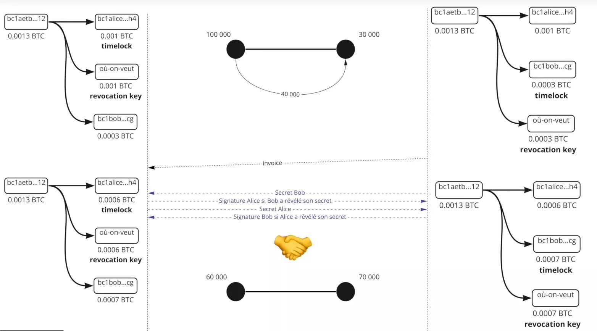
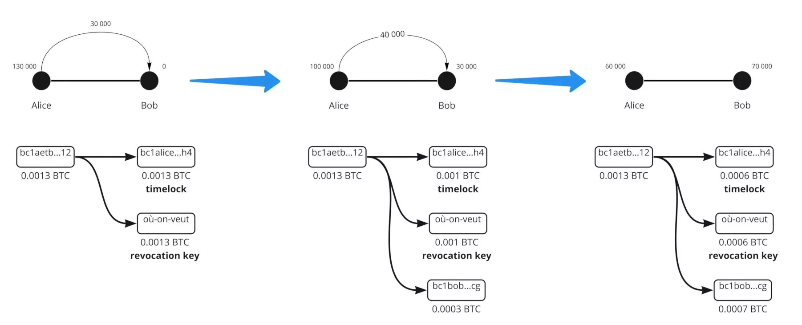
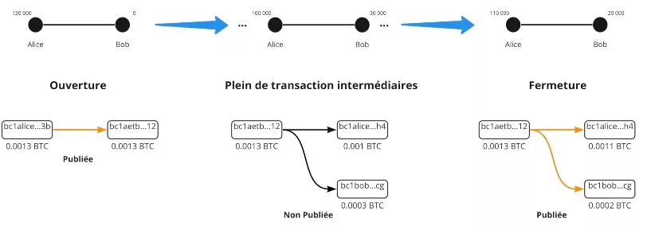
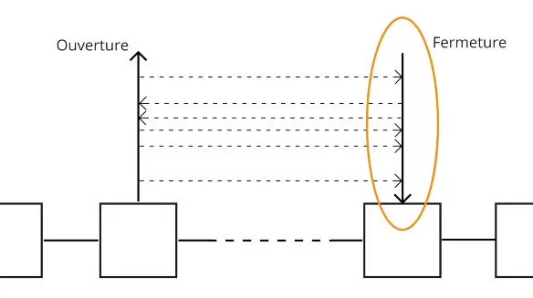
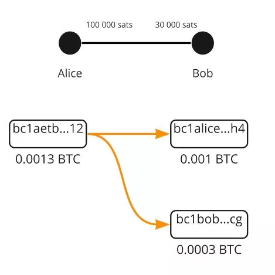

# Matka Bitcoinin toiseen kerrokseen

Tämä kurssi on teoreettinen oppitunti Lightning-verkon teknisestä toiminnasta.

Tervetuloa jännittävään Lightning-verkon maailmaan, Bitcoinin toiseen kerrokseen, joka on sekä monimutkainen että täynnä potentiaalia. Olemme sukeltamassa tämän teknologian teknisiin syvyyksiin keskittymättä tiettyihin opastuksiin tai käyttötapauksiin. Tämän kurssin hyödyntämiseksi perusteellinen ymmärrys Bitcoinista on välttämätöntä. Tämä on kokemus, joka vaatii vakavaa ja keskittynyttä lähestymistapaa. Saatat myös harkita LN 202 -kurssin suorittamista rinnakkain, joka tarjoaa käytännöllisemmän näkökulman tähän tutkimukseen. Valmistaudu aloittamaan matka, joka saattaa muuttaa käsitystäsi Bitcoin-ekosysteemistä.

Nauti löydöstä!

+++

# Perusteet
<partId>32647d62-102b-509f-a3ba-ad1d6a4345f1</partId>

## Lightning-verkon ymmärtäminen
<chapterId>df6230ae-ff35-56ea-8651-8e65580730a8</chapterId>

Lightning-verkko on toisen kerroksen maksuinfrastruktuuri, joka on rakennettu Bitcoin-verkon päälle ja mahdollistaa nopeat ja edulliset transaktiot. Lightning-verkon toiminnan täydelliseksi ymmärtämiseksi on olennaista ymmärtää, mitä maksukanavat ovat ja miten ne toimivat.

Lightning-maksukanava on eräänlainen "yksityinen kaista" kahden käyttäjän välillä, joka mahdollistaa nopeat ja toistuvat Bitcoin-siirrot. Kun kanava avataan, sille annetaan kiinteä kapasiteetti, joka määritellään etukäteen käyttäjien toimesta. Tämä kapasiteetti edustaa maksimimäärää Bitcoinia, joka voidaan lähettää kanavassa milloin tahansa.

Maksukanavat ovat kaksisuuntaisia, mikä tarkoittaa, että niillä on kaksi "puolta". Esimerkiksi, jos Alice ja Bob avaavat maksukanavan, Alice voi lähettää Bitcoinia Bobille, ja Bob voi lähettää Bitcoinia Alicelle. Kanavan sisäiset transaktiot eivät muuta kanavan kokonaiskapasiteettia, mutta ne muuttavat kapasiteetin jakautumista Alicen ja Bobin välillä.


Jotta transaktio olisi mahdollinen Lightning-maksukanavassa, rahaa lähettävällä käyttäjällä on oltava tarpeeksi Bitcoinia kanavansa puolella. Jos Alice haluaa lähettää 1 Bitcoinin Bobille kanavansa kautta, hänen on oltava vähintään 1 Bitcoin hänen puolellaan kanavassa.
Rajoitukset ja maksukanavien toiminta Lightning-verkossa.
Vaikka Lightning-maksukanavan kapasiteetti on kiinteä, se ei rajoita kokonaismäärää transaktioita tai Bitcoinin kokonaismäärää, joka voidaan lähettää kanavan kautta. Esimerkiksi, jos Alicella ja Bobilla on kanava, jonka kapasiteetti on 1 Bitcoin, he voivat suorittaa satoja 0.01 Bitcoinin transaktioita tai tuhansia 0.001 Bitcoinin transaktioita, kunhan kanavan kokonaiskapasiteetti ei milloinkaan ylity.

Huolimatta näistä rajoituksista, Lightning-maksukanavat ovat tehokas tapa suorittaa nopeita ja edullisia Bitcoin-siirtoja. Ne mahdollistavat käyttäjille Bitcoinin lähettämisen ja vastaanottamisen maksamatta korkeita siirtomaksuja tai odottamatta pitkiä vahvistusaikoja Bitcoin-verkossa.
Yhteenvetona voidaan sanoa, että Lightning-maksukanavat tarjoavat tehokkaan ratkaisun niille, jotka haluavat suorittaa nopeita ja edullisia Bitcoin-siirtoja. On kuitenkin olennaista ymmärtää niiden toiminta ja rajoitukset, jotta niistä saisi täyden hyödyn.


Esimerkki:

- Alicella on 100 000 SAT
- Bobilla on 30 000 SAT

Tämä on kanavan nykytila. Siirron aikana Alice päättää lähettää 40 000 SAT Bobille. Hän voi tehdä niin, koska 40 000 < 100 000.

Kanavan uusi tila on siis:

- Alice 60 000 SAT
- Bob 70 000 SAT

```
Kanavan alkutila:
Alice (100 000 SAT) ============== Bob (30 000 SAT)

Alicen siirrettyä 40 000 SAT Bobille:
Alice (60 000 SAT) ============== Bob (70 000 SAT)

```


Nyt Bob haluaa lähettää 80 000 SAT Alicelle. Koska hänellä ei ole tarpeeksi likviditeettiä, hän ei voi tehdä sitä. Kanavan maksimikapasiteetti on 130 000 SAT, jossa Alicen mahdollinen meno on enintään 60 000 SAT ja Bobin 70 000 SAT.


## Bitcoin, osoitteet, UTXO ja siirrot
<chapterId>0cfb7e6b-96f0-508b-9210-90bc1e28649d</chapterId>

Tässä toisessa luvussa käytämme aikaa tutkiaksemme, miten Bitcoin-siirrot todellisuudessa toimivat, mikä on erittäin hyödyllistä Lightningin ymmärtämisen kannalta. Käsittelemme myös lyhyesti moniallekirjoitusosoitteiden konseptia, joka on keskeinen seuraavan luvun ymmärtämiseksi Lightning-verkon kanavien avaamisesta.

- Yksityinen avain > Julkinen avain > Osoite: Siirron aikana Alice lähettää rahaa Bobille. Jälkimmäinen tarjoaa osoitteen, jonka hänen julkinen avaimensa on antanut. Alice, joka itse sai rahat osoitteeseen hänen julkisen avaimensa kautta, käyttää nyt yksityistä avaintaan allekirjoittaakseen siirron ja näin vapauttaakseen bitcoinit osoitteesta.
- Bitcoin-siirrossa kaikkien bitcoinien on liikuttava. Nimeltään UTXO (Unspend Transaction Output), bitcoinin palaset lähtevät kaikki vain palatakseen omistajalleen myöhemmin.
  Alicella on 0,002 BTC, Bobilla on 0 BTC. Alice päättää lähettää 0,0015 BTC Bobille. Hän allekirjoittaa 0,002 BTC:n siirron, josta 0,0015 menee Bobille ja 0,0005 palaa hänen lompakkoonsa.


Tässä, yhdestä UTXO:sta (Alicella on 0,0002 BTC osoitteessa), olemme luoneet 2 UTXO:a (Bobilla on 0,0015 ja Alicella on uusi UTXO (riippumaton edellisestä) 0,0005 BTC).

```
Alice (0,002 BTC)
  |
  V
Bitcoin-siirto (0,002 BTC)
  |
  |----> Bob (0,0015 BTC)
  |
  V
Alice (uusi UTXO: 0,0005 BTC)
```
Salama-verkossa käytetään moniallekirjoituksia. Siksi varojen vapauttamiseen vaaditaan 2 allekirjoitusta, eli kaksi yksityistä avainta rahan siirtämiseen. Tämä voi olla Alice ja Bob, jotka yhdessä, täytyy suostua rahojen vapauttamiseen (UTXO). LN:ssä erityisesti, ne ovat 2/2 transaktioita, joten molemmat allekirjoitukset ovat ehdottoman välttämättömiä, toisin kuin 2/3 tai 3/5 moniallekirjoituksissa, joissa tarvitaan vain yhdistelmä kokonaisavainten määrästä.


# Kanavien avaaminen ja sulkeminen
<partId>900b5b6b-ccd0-5b2f-9424-4b191d0e935d</partId>

## Kanavan Avaaminen
<chapterId>96243eb0-f6b5-5b68-af1f-fffa0cc16bfe</chapterId>

Nyt tarkastelemme lähemmin kanavan avaamista ja miten se tehdään Bitcoin-transaktiolla.

Salama-verkolla on eri viestintätasoja:

- P2P-viestintä (Salama-verkon protokolla)
- Maksukanava (Salama-verkon protokolla)
- Bitcoin-transaktio (Bitcoin-protokolla)


Kanavan avatakseen kaksi vertaista kommunikoi viestintäkanavan kautta:

- Alice: "Hei, haluan avata kanavan!"
- Bob: "Ok, tässä on julkinen osoitteeni."


Alicella on nyt 2 julkista osoitetta luodakseen 2/2 moniallekirjoitusosoitteen. Hän voi nyt tehdä bitcoin-transaktion lähettääkseen rahaa siihen.

Sanotaan, että Alicella on 0.002 BTC:n UTXO ja hän haluaa avata kanavan Bobin kanssa 0.0013 BTC:llä. Hän luo transaktion, jossa on 2 UTXO:ta lähtönä:

- 0.0013 UTXO 2/2 moniallekirjoitusosoitteeseen
- 0.0007 UTXO yhteen hänen vaihto-osoitteistaan (UTXO:jen palautus).

Tämä transaktio ei ole vielä julkinen, sillä tässä vaiheessa hän luottaa Bobiin pystyäkseen vapauttamaan rahat moniallekirjoituksesta.

Mutta miten sitten edetä?

Alice luo toisen transaktion, jota kutsutaan "nostotransaktioksi", ennen kuin julkaisee varojen talletuksen moniallekirjoitukseen.


Nostotransaktio käyttää varoja moniallekirjoitusosoitteesta hänen omaan osoitteeseensa (tämä tehdään ennen kaiken julkaisemista).
Kun molemmat transaktiot on rakennettu, Alice kertoo Bobille, että se on tehty ja pyytää häntä allekirjoittamaan julkisella avaimellaan, selittäen, että näin hän voi palauttaa varansa, jos jotain menee pieleen. Bob suostuu, koska hän ei ole epärehellinen.

Alice voi nyt palauttaa varat yksin, koska hänellä on jo Bobin allekirjoitus. Hän julkaisee transaktiot. Kanava on nyt avoin 0.0013 BTC:llä (130 000 SAT) Alicen puolella.


## Salama-transaktio & Sitoutumistransaktio
<chapterId>7d3fd135-129d-5c5a-b306-d5f2f1e63340</chapterId>


Nyt analysoidaan, mitä todella tapahtuu kulissien takana, kun varoja siirretään toiselta puolelle toiselle Lightning Networkin kanavassa, sitoumustapahtuman käsitteen avulla. Ketjussa tapahtuva nosto-/sulkemistapahtuma edustaa kanavan tilaa, taaten kuka omistaa varat jokaisen siirron jälkeen. Joten Lightning Network -siirron jälkeen tämän tapahtuman/sopimuksen tila päivittyy, mutta sitä ei toteuteta kahden osapuolen, Alicen ja Bobin, välillä, jotka luovat saman tapahtuman nykyisellä kanavan tilalla sulkemistilanteessa:
- Alice avaa kanavan Bobin kanssa 130 000 SAT:lla omalla puolellaan. Sulkemistilanteessa molempien hyväksymä nostotapahtuma toteaa, että 130 000 SAT menee Alicelle sulkemisen yhteydessä, ja Bob suostuu, koska se on reilua.


- Alice lähettää 30 000 SAT Bobille. Nyt on olemassa uusi nostotapahtuma, joka toteaa sulkemistilanteessa, että Alice saa 100 000 SAT ja Bob 30 000 SAT. Molemmat suostuvat, koska se on reilua.


- Alice lähettää 10 000 SAT Bobille, ja luodaan uusi nostotapahtuma, joka toteaa, että Alice saa 90 000 SAT ja Bob 40 000 SAT sulkemistilanteessa. Molemmat suostuvat, koska se on reilua.


```
Kanavan alkutila:
Alice (130 000 SAT) =============== Bob (0 SAT)

Ensimmäisen siirron jälkeen:
Alice (100 000 SAT) =============== Bob (30 000 SAT)

Toisen siirron jälkeen:
Alice (90 000 SAT) =============== Bob (40 000 SAT)
```

Raha ei liiku, mutta lopullinen saldo päivitetään allekirjoitetulla, mutta julkaisemattomalla ketjutapahtumalla. Nostotapahtuma on siis sitoumustapahtuma. Satoshi-siirrot ovat toinen, uudempi sitoumustapahtuma, joka päivittää saldon.

## Sitoumustapahtumat
<chapterId>f2f61e5b-badb-5947-9a81-7aa530b44e59</chapterId>

Jos sitoumustapahtumat määrittelevät kanavan tilan likviditeetillä hetkellä X, voimmeko huijata julkaisemalla vanhan tilan? Vastaus on kyllä, koska meillä on jo molempien osallistujien esiallekirjoitus julkaisemattomassa tapahtumassa.


Ratkaisuksi lisäämme monimutkaisuutta:

- Timelock = varat lukittuina lohkoon N asti
- Revocation key = Alicen salaisuus ja Bobin salaisuus'

Nämä kaksi elementtiä lisätään sitoumustapahtumaan. Seurauksena Alice joutuu odottamaan Timelockin päättymistä, ja kuka tahansa, jolla on revocation key, voi siirtää varoja odottamatta Timelockin päättymistä. Jos Alice yrittää huijata, Bob käyttää revocation keytä varastaakseen ja rankaistakseen Alicea.


Nyt (ja todellisuudessa) sitoutumistransaktio ei ole sama Alicelle ja Bobille, ne ovat symmetrisiä mutta kullakin on erilaiset rajoitukset, he antavat toisilleen salaisuutensa, jotta voivat luoda edellisen sitoutumistransaktion peruutusavaimen. Joten luomishetkellä Alice luo kanavan Bobin kanssa, 130 000 SAT hänen puolellaan, hänellä on aikalukko, joka estää häntä välittömästi saamasta rahansa takaisin, hänen täytyy odottaa hetki. Peruutusavain voi avata rahat, mutta vain Alicella on se (Alicen sitoutumistransaktio). Kun siirto tapahtuu, Alice antaa vanhan salaisuutensa Bobille ja siten jälkimmäinen voi tyhjentää kanavan edelliseen tilaan, jos Alice yrittää huijata (Alice siis rangaistaan).



Samoin Bob antaa salaisuutensa Alicelle. Joten jos hän yrittää huijata, Alice voi rangaista häntä. Toiminto toistetaan jokaiselle uudelle sitoutumistransaktiolle. Uusi salaisuus päätetään ja uusi peruutusavain. Joten jokaiselle uudelle transaktiolle, edellinen sitoutumistransaktio on tuhottava antamalla peruutussalaisuus. Näin ollen, jos Alice tai Bob yrittää huijata, toinen voi toimia ennen (kiitos aikaluukon) ja siten välttää huijauksen. Transaktiossa #3, transaktion #2 salaisuus annetaan siis mahdollistamaan Alicen ja Bobin puolustautumisen Alicen tai Bobin huijausta vastaan.



Henkilö, joka luo transaktion aikaluukolla (se, joka lähettää rahat), voi käyttää peruutusavainta vasta aikaluukon jälkeen. Kuitenkin henkilö, joka vastaanottaa rahat, voi käyttää sitä ennen aikaluukkoa, jos toisella puolella kanavaa Lightning Networkissa tapahtuu huijaus. Erityisesti käymme läpi mekanismeja, jotka mahdollistavat mahdollisen huijauksen estämisen kanavakumppanin toimesta.

## Kanavan Sulkeminen
<chapterId>29a72223-2249-5400-96f0-3756b1629bc2</chapterId>

Olemme kiinnostuneita kanavan sulkemisesta Bitcoin-transaktion kautta, joka voi ottaa eri muotoja riippuen tapauksesta. Kanavan sulkemistyyppejä on 3:

- Hyvä: yhteistyöllinen sulkeminen
- Raaka: pakotettu sulkeminen (ei-yhteistyöllinen)
- Huijaus: huijarin sulkeminen





### Hyvä

Kaksi vertaista kommunikoi ja sopii kanavan sulkemisesta. He lopettavat kaikki transaktiot ja vahvistavat kanavan lopullisen tilan. He sopivat verkkojen maksuista (henkilö, joka avasi kanavan, maksaa sulkemismaksut). He luovat nyt sulkemistransaktion. On olemassa sulkemistransaktio, joka eroaa sitoutumistransaktioista, koska siinä ei ole aikaluukkoa eikä peruutusavainta. Transaktio julkaistaan ja Alice ja Bob saavat vastaavat saldonsa. Tämän tyyppinen sulkeminen on nopea (koska ei ole aikaluukkoa) ja yleensä edullinen.



### Raaka

Alice haluaa sulkea kanavan, mutta Bob ei vastaa, koska hän on offline-tilassa (internet- tai sähkökatkos). Alice julkaisee silloin viimeisimmän sitoutumistransaktion (viimeisen). Transaktio julkaistaan ja aikaluukko aktivoituu. Sitten, maksut päätettiin, kun tämä transaktio luotiin X aikaa sitten! MemPool on verkko, joka on muuttunut siitä lähtien, joten protokolla olettaa maksuiksi 5 kertaa korkeammat kuin nykyiset, kun transaktio luotiin. Luomismaksu 10 SAT, joten transaktio katsotaan 50 SAT:ksi. Pakotetun sulkemisen aikaan verkko on:
- 1 SAT = yli maksettu 50\*- 100 SAT = ali maksettu 2\*

Tämä tekee pakotetusta sulkemisesta pidemmän (Timelock) ja erityisesti riskialttiimman maksujen ja mahdollisen louhijoiden validoinnin kannalta.


### Huijari

Alice yrittää huijata julkaisemalla vanhan sitoumustapahtuman. Mutta Bob seuraa MemPoolia ja tarkkailee tapahtumia, jotka yrittävät julkaista vanhoja. Jos hän löytää sellaisen, hän käyttää peruutusavainta rangaistakseen Alicea ja ottaakseen kaikki SATit kanavalta.


Yhteenvetona voidaan todeta, että kanavan sulkeminen Lightning-verkossa on ratkaiseva vaihe, joka voi ottaa erilaisia muotoja. Yhteistyöllisessä sulkemisessa molemmat osapuolet kommunikoivat ja sopivat kanavan lopullisesta tilasta. Tämä on nopein ja vähiten kallis vaihtoehto. Toisaalta pakotettu sulkeminen tapahtuu, kun toinen osapuoli ei vastaa. Tämä on kalliimpi ja pidempi tilanne ennakoimattomien siirtomaksujen ja Timelockin aktivoitumisen vuoksi. Lopuksi, jos osallistuja yrittää huijata julkaisemalla vanhan sitoumustapahtuman, huijari, hän voidaan rangaista menettämällä kaikki SATit kanavalta. On siis ratkaisevan tärkeää ymmärtää nämä mekanismit tehokkaan ja reilun Lightning-verkon käytön kannalta.

# Likviditeettiverkko
<partId>a873f1cb-751f-5f4a-9ed7-25092bfdef11</partId>

## Lightning-verkko
<chapterId>45a7252c-fa4f-554b-b8bb-47449532918e</chapterId>

Tässä seitsemännessä luvussa tutkimme, miten Lightning toimii kanavien verkostona ja miten maksut reititetään lähteestään määränpäähänsä.


Lightning on maksukanavien verkosto. Tuhannet vertaiset omilla likviditeettikanavillaan ovat yhteydessä toisiinsa, ja siten itse käyttävät toimiaan suorittaakseen transaktioita yhdistämättömien vertaisten välillä. Näiden kanavien likviditeettiä ei voida siirtää muihin likviditeettikanaviin.

Alice -> Eden - > Bob`. Satoshit eivät ole liikkuneet `Alice -> Bob`, vaan `Alice -> Eden`ja`Eden -> Bob`.

Joten jokaisella henkilöllä ja kanavalla on erilainen likviditeetti. Maksujen suorittamiseksi sinun on löydettävä verkosta reitti, jolla on tarpeeksi likviditeettiä. Jos sitä ei ole tarpeeksi, maksu ei mene läpi.

Harkitse seuraavaa verkkoa:

```
Verkon alkutila:
Alice (130 SAT) ==== (0 SAT) Susie (90 SAT) ==== (200 SAT) Eden (150 SAT) ==== (100 SAT) Bob
```


Jos Alicen on siirrettävä 40 SAT Bobille, likviditeetti uudelleenjärjestellään reitin varrella kahden osapuolen välillä.

```
Alicen siirrettyä 40 SAT Bobille:
Alice (90 SAT) ==== (40 SAT) Susie (50 SAT) ==== (240 SAT) Eden (110 SAT) ==== (140 SAT) Bob
```


Alkutilanteessa Bob ei kuitenkaan voi lähettää 40 SAT Alicea kohti, koska Susiella ei ole likviditeettiä Alicen kanssa lähettääkseen 40 SAT, joten maksu tämän reitin kautta ei ole mahdollinen. Tarvitsemme siis toisen reitin, jossa transaktio on mahdoton.

Ensimmäisessä esimerkissä on selvää, että Susie ja Eden eivät ole menettäneet mitään eivätkä saaneet mitään. Lightning-verkon solmut veloittavat maksun suostuessaan reitittämään transaktion!
Maksuista riippuen siitä, missä likviditeetti sijaitsee
Alice - Bob

- Alicen maksu = Alice -> Bob
- Bobin maksu = Bob -> Alice


On olemassa kaksi tyyppistä maksua:

- kiinteä maksu riippumatta määrästä: 1 SAT (oletusarvo, mutta voidaan muuttaa)
- muuttuva maksu (oletusarvoisesti 0,01%)

Maksuesimerkki:

- Alice - Susie; 1/1 (1 kiinteä maksu ja 1 muuttuva maksu)
- Susie - Eden; 0/200
- Eden - Bob; 1/1

Näin ollen:

- Maksu 1: (Alicen itselleen maksama) 1 + (40,000\*0.000001)
- Maksu 2: 0 + 40,000 \* 0.0002 = 8 SAT
- Maksu 3: 1 + 40,000\*0.000001 = 0.4 SAT


Toimitus:

1. Lähetys 40,009.04 Alice -> Susie; Alice maksaa omat kulunsa, joten sitä ei lasketa
2. Susie tekee Edenille palveluksen lähettämällä 40 001.04; hän ottaa tämän 8 SAT komission
3. Eden tekee palveluksen lähettämällä 40,000 Bobille, hän ottaa 1.04 SAT maksun.

Alice maksoi 9.04 SAT maksun ja Bob sai 40,000 SAT.


Lightning-verkossa on Alicen solmu, joka päättää reitin ennen maksun lähettämistä. Siksi etsitään parasta reittiä ja vain Alice tietää reitin ja hinnan. Maksu lähetetään, mutta Susiella ei ole tietoa.


Susien tai Edenin osalta: he eivät tiedä, kuka on lopullinen vastaanottaja, eikä kuka lähettää maksun. Kyseessä on sipulireititys. Solmun on pidettävä suunnitelmaa verkostosta löytääkseen reittinsä, mutta yksikään välittäjistä ei omaa tietoa.

## HTLC - Hashed Time Locked Contract
<chapterId>4369b85a-1365-55d8-99e1-509088210116</chapterId>

Perinteisessä reititysjärjestelmässä, miten voimme varmistaa, että Eden ei huijaa ja kunnioittaa sopimuksensa osaa?

HTLC on maksusopimus, joka voidaan avata vain salaisuudella. Jos sitä ei paljasteta, sopimus vanhenee. Siksi se on ehdollinen maksu. Miten niitä käytetään?


Harkitse seuraavaa tilannetta:
`Alice (100,000 SAT) ==== (30,000 SAT) Susie (250,000 SAT) ==== (0 SAT) Bob`

- Bob luo salaisuuden S (esikuva) ja laskee hashin r = hash(s)
- Bob lähettää Alicelle laskun, jossa on "r" mukana
- Alice lähettää HTLC:n 40,000 SAT Susielle ehdolla, että paljastetaan "s'", jotta hash(s') = r
- Susie lähettää vastaavan HTLC:n Bobille
- Bob avaa Susien HTLC:n näyttämällä hänelle "s"
- Susie avaa Alicen HTLC:n näyttämällä hänelle "S"

Jos Bob on offline-tilassa eikä koskaan hanki salaisuutta, joka antaa hänelle oikeutuksen vastaanottaa rahat, HTLC vanhenee tietyn määrän lohkojen jälkeen.

HTLC:t vanhenevat käänteisessä järjestyksessä: ensin Susie-Bobin vanheneminen, sitten Alice-Susien vanheneminen. Näin, jos Bob palaa, se ei muuta mitään. Muussa tapauksessa, jos Alice peruuttaa samalla kun Bob palaa, seurauksena voi olla sotku ja ihmiset ovat saattaneet tehdä työtä turhaan.

Mitä siis tapahtuu kanavan sulkemisen yhteydessä? Itse asiassa sitoumustapahtumamme ovat vielä monimutkaisempia. Meidän on kuvattava väliaikainen saldo, jos kanava suljetaan.

Siksi sitoumustapahtumassa on HTLC-ulostulo 40 000 satoshista (aiemmin nähtyjen rajoitusten kanssa) ulostulossa #3.


Alicen sitoumustapahtumassa on:

- Ulostulo #1: 60 000 SAT Alicelle aikarajoituksen ja peruutusavaimen kautta (se, mikä hänelle jää)
- Ulostulo #2: 30 000, joka jo kuuluu Susielle
- Ulostulo #3: 40 000 HTLC:ssä

Alicen sitoumustapahtuma sisältää HTLC-ulostulon, koska hän lähettää HTLC-sisääntulon vastaanottajalle, Susielle.


Jos siis julkaisemme tämän sitoumustapahtuman, Susie voi hakea HTCL-rahat "s"-kuvan avulla. Jos hänellä ei ole esikuvaa, Alice saa rahat takaisin, kun HTCL vanhenee. Ajattele ulostuloja (UTXO) erilaisina maksuina eri ehdoilla.
Kun maksu on suoritettu (vanhentuminen tai suoritus), kanavan tila muuttuu ja HTCL-tapahtumaa ei enää ole. Palaamme johonkin klassiseen.
Yhteistyöllisen sulkemisen tapauksessa: keskeytämme maksut ja odotamme siis siirtojen/HTCL:n suorittamista, tapahtuma on kevyt, joten vähemmän kallis, koska ulostuloja on enintään 1 tai 2.
Jos pakotettu sulkeminen: julkaisemme kaikki meneillään olevat HTLC:t, joten siitä tulee erittäin raskas ja kallis. Ja se on sotku.

Yhteenvetona, Lightning Networkin reititysjärjestelmä käyttää Hash Time-Locked Contracts (HTLC) -sopimuksia varmistaakseen turvalliset ja todennettavat maksut. HTLC:t mahdollistavat ehdolliset maksut, joissa rahat voidaan avata vain salaisuudella, varmistaen näin, että osallistujat täyttävät sitoumuksensa.
Esitellyssä esimerkissä Alice haluaa lähettää SAT:ia Bobille Susien kautta. Bob luo salaisuuden, luo siitä hashin ja välittää sen Alicelle. Alice ja Susie perustavat tämän hashin perusteella HTLC:n. Kun Bob paljastaa Susielle salaisuuden, Susie voi sitten avata Alicen HTLC:n.
Jos Bob ei paljasta salaisuutta tietyn ajan kuluessa, HTLC vanhenee. Vanheneminen tapahtuu käänteisessä järjestyksessä, varmistaen, että jos Bob tulee takaisin linjoille, ei ole ei-toivottuja seurauksia.

Kanavan sulkemisen yhteydessä, jos kyseessä on yhteistyöllinen sulkeminen, maksut keskeytetään ja HTLC:t ratkaistaan, mikä on yleensä vähemmän kallista. Jos sulkeminen on pakotettu, kaikki meneillään olevat HTLC-tapahtumat julkaistaan, mikä voi tulla erittäin kalliiksi ja sotkuiseksi.
Yhteenvetona, HTLC-mekanismi lisää lisäkerroksen turvallisuutta Lightning Networkiin, varmistaen, että maksut suoritetaan oikein ja että käyttäjät täyttävät sitoumuksensa.

## Löytäessäsi tiesi
<chapterId>7e2ae959-c2a1-512e-b5d6-8fd962e819da</chapterId>

Ainoa julkinen tieto on kanavan kokonaiskapasiteetti (Alice + Bob), mutta emme tiedä, missä likviditeetti sijaitsee.
Lisätietojen saamiseksi solmumme kuuntelee LN-viestintäkanavaa uusien kanavien ilmoitusten ja kanavamaksujen päivitysten varalta. Solmusi tarkastelee myös lohkoketjua kanavien sulkemisten varalta.
Koska meillä ei ole kaikkea tietoa, meidän on etsittävä graafia/reittiä käytettävissä olevien tietojen perusteella (kanavan maksimikapasiteetti ja ei missä likviditeetti sijaitsee).

Kriteerit:

- Onnistumisen todennäköisyys - Maksut
- HTLC:n vanhentumisaika
- Välisolmujen määrä
- Satunnaisuus


Joten jos mahdollisia reittejä on 3:

- Alice > 1 > 2 > 5 > Bob
- Alice > 1 > 2 > 4 > 5 > Bob
- Alice > 1 > 2 > 3 > Bob

Etsimme teoriassa parasta reittiä, jolla on alhaisimmat maksut ja suurin onnistumisen mahdollisuus: maksimaalinen likviditeetti ja mahdollisimman vähän hyppyjä.

Esimerkiksi, jos 2-3:n kapasiteetti on vain 130 000 SAT, 100 000:n lähettäminen on erittäin epätodennäköistä, joten vaihtoehto #3 ei onnistu.


Nyt algoritmi on tehnyt 3 valintaa ja yrittää ensimmäistä:

Valinta 1:

- Alice lähettää HTLC:n 100 000 SAT:lla 1:lle;
- 1 tekee HTLC:n 100 000 SAT:lla 2:lle;
- 2 tekee HTLC:n 100 000 SAT:lla 5:lle, mutta 5 ei voi tehdä sitä, joten se ilmoittaa siitä.

Tiedot lähetetään takaisin, joten Alice päättää kokeilla toista reittiä:

- Alice lähettää HTLC:n 100 000:lla 1:lle;
- 1 tekee HTLC:n 100 000:lla 2:lle;
- 2 tekee HTLC:n 100 000:lla 4:lle;
- 4 tekee HTLC:n 100 000:lla Bobille. Bobilla on likviditeetti, joten se on ok.
- Bob käyttää HTLC:n preimagea (hash) ja käyttää siten salaisuutta hankkiakseen 100 000 SAT
- 5:llä on nyt HTLC:n salaisuus hankkiakseen estetyn HTLC:n 4:ltä
- 4:llä on nyt HTLC:n salaisuus hankkiakseen estetyn HTLC:n 2:ltä
- 2:lla on nyt HTLC:n salaisuus hankkiakseen estetyn HTLC:n 1:ltä
- 1:llä on nyt HTLC:n salaisuus hankkiakseen Alicen estetyn HTLC:n

Alice ei nähnyt reitin 1 epäonnistumista, hän vain odotti sekunnin kauemmin. Maksun epäonnistuminen tapahtuu, kun mahdollista reittiä ei ole. Reitin etsimisen helpottamiseksi Bob voi antaa Alicelle tietoja, jotka auttavat hänen laskussaan:

- Summa
- Hänen osoitteensa
- Preimagen hash, jotta Alice voi luoda HTLC:n
- Merkintöjä Bobin kanavista

Bob tietää kanavien 5 ja 3 likviditeetin, koska hän on suoraan yhteydessä niihin, hän voi ilmoittaa tämän Alicelle. Hän varoittaa Alicea, että solmu 3 on hyödytön, mikä estää Alicen mahdollisesti tekemästä reittiään.
Toinen elementti voisi olla yksityiset kanavat (joten ei julkaistu verkossa), joita Bobilla voi olla. Jos Bobilla on yksityinen kanava 1:n kanssa, hän voi kertoa Alicelle käyttämään sitä ja se antaisi Alicelle > 1 > Bob'.


Yhteenvetona voidaan todeta, että reititys Lightning-verkossa on monimutkainen prosessi, joka vaatii erilaisten tekijöiden huomioon ottamista. Vaikka kanavien kokonaiskapasiteetti on julkinen, tarkan likviditeetin jakautumisen näkeminen suoraan ei ole mahdollista. Tämä pakottaa solmut arvioimaan todennäköisimmin onnistuvat reitit, ottaen huomioon kriteereitä kuten maksut, HTLC:n vanhentumisaika, välisolmujen määrä ja satunnaisuustekijä. Kun useita reittejä on mahdollisia, solmut pyrkivät minimoimaan maksut ja maksimoimaan onnistumisen mahdollisuudet valitsemalla kanavia, joissa on riittävästi likviditeettiä ja mahdollisimman vähän hyppyjä. Jos transaktioyritys epäonnistuu riittämättömän likviditeetin vuoksi, toista reittiä kokeillaan kunnes onnistunut transaktio tehdään.
Lisäksi, helpottaakseen reitin etsimistä, vastaanottaja voi tarjota lisätietoja, kuten osoitteen, määrän, esikuvahashin ja merkintöjä kanavistaan. Tämä voi auttaa tunnistamaan riittävän likviditeetin kanavia ja välttämään tarpeettomia transaktioyrityksiä. Lopulta Lightning-verkon reititysjärjestelmä on suunniteltu optimoimaan transaktioiden nopeus, turvallisuus ja tehokkuus säilyttäen samalla käyttäjän yksityisyyden.

# Lightning-verkon työkalut
<partId>74d6c334-ec5d-55d9-8598-f05694703bf6</partId>

## Lasku, LNURL, Keysend
<chapterId>e34c7ecd-2327-52e3-b61e-c837d9e5e8b0</chapterId>


LN-lasku (tai lasku) on pitkä ja epämiellyttävä lukea, mutta se mahdollistaa tiiviin esityksen maksupyynnöstä.

Esimerkki:
lnbc1m1pskuawzpp5qeuuva2txazy5g483tuv9pznn9ft8l5e49s5dndj2pqq0ptyn8msdqqcqzpgxqrrsssp5v4s00u579atm0em6eqm9nr7d0vr64z5j2sm5s33x3r9m4lgfdueq9qyyssqxkjzzgx5ef7ez3dks0laxayx4grrw7j22ppgzyhpydtv6hmc39skf9hjxn5yd3kvv7zpjdxd2s7crcnemh2fz26mnr6zu83w0a2fwxcqnvujl3

- lnbc1m = luettava osa
- 1 = erottaa lopusta
- Sitten loppu
- Bc1 = Bech32-koodaus (base 32), joten käytetään 32 merkkiä.
- 10 = 1.2.3.4.5.6.7.8.9.0
- 26 = abcdefghijklmnopqrstuvwxyz
- 32 = ei "b-i-o" eikä "1"

### lnbc1m

- ln = Lightning
- Bc = bitcoin (pääverkko)
- 1 = määrä
- M = milli (10^-3 / u = mikro 10^-6 / n = nano 10^-9 / p = piko 10^-12'
  Tässä 1m = 1 * 0.0001btc = 100,000 BTC
Ole hyvä ja suorita maksu 100 000 SAT Lightning-verkossa Bitcoinin pääverkkoon osoitteeseen pskuawzpp5qeuuva2txazy5g483tuv9pznn9ft8l5e49s5dndj2pqq0ptyn8msdqqcqzpgxqrrsssp5v4s00u579atm0em6eqm9nr7d0vr64z5j2sm5s33x3r9m4lgfdueq9qyyssqxkjzzgx5ef7ez3dks0laxayx4grrw7j22ppgzyhpydtv6hmc39skf9hjxn5yd3kvv7zpjdxd2s7crcnemh2fz26mnr6zu83w0a2fwxcqnvujl3
### Aikaleima (luontihetkellä)

Se sisältää 0 tai useampia lisäosia:

- Esikuvan hajautus
- Maksusalaisuus (sipulireititys)
- Satunnaiset tiedot
- Vastaanottajan LN julkinen avain
- Vanhentumisaika (oletus 1 tunti)
- Reititysvihjeet
- Koko laskun allekirjoitus

On olemassa muita laskutyyppejä. LNURL-metaprotokolla mahdollistaa suoran satoshi-määrän tarjoamisen pyynnön sijaan. Tämä on erittäin joustavaa ja mahdollistaa monia parannuksia käyttäjäkokemuksen kannalta.


Keysend mahdollistaa Alicen lähettää rahaa Bobille ilman, että Bobin tarvitsee pyytää sitä. Alice hankkii Bobin tunnuksen, luo esikuvan kysymättä Bobilta ja sisällyttää sen maksuunsa. Näin Bob saa yllätyspyynnön, jossa hän voi vapauttaa rahat, koska Alice on jo tehnyt työn.


Yhteenvetona voidaan todeta, että vaikka Lightning Networkin lasku vaikuttaa ensi silmäyksellä monimutkaiselta, se koodaa tehokkaasti maksupyynnön. Laskun jokainen osa sisältää keskeistä tietoa, mukaan lukien maksettava summa, vastaanottaja, luontiaikaleima ja mahdollisesti muuta tietoa kuten esikuvan hajautus, maksusalaisuus, reititysvihjeet ja vanhentumisaika. Protokollat kuten LNURL ja Keysend tarjoavat merkittäviä parannuksia joustavuuden ja käyttäjäkokemuksen osalta, mahdollistaen esimerkiksi varojen lähettämisen ilman toisen osapuolen etukäteispyyntöä. Nämä teknologiat tekevät maksuprosessista sujuvamman ja tehokkaamman Lightning-verkossa.

## Likviditeetin hallinta
<chapterId>cc76d0c4-d958-57f5-84bf-177e21393f48</chapterId>


Tarjoamme yleisiä ohjeita ikuisen likviditeetin hallinnan kysymykseen Lightning-verkossa.

LN:ssä on 3 tyyppistä ihmistä:

- Ostajat: heillä on lähtevää likviditeettiä, mikä on yksinkertaisinta, koska heidän tarvitsee vain avata kanavia
- Kauppiaat: se on monimutkaisempaa, koska he tarvitsevat saapuvaa likviditeettiä muilta solmuilta ja toimijoilta. Heidän täytyy olla yhteydessä ihmisiin
- Reitityssolmut: he haluavat olla tasapainossa likviditeetin molemmin puolin ja olla hyvin yhdistettyjä moniin solmuihin, jotta niitä käytettäisiin mahdollisimman paljon

Joten jos tarvitset saapuvaa likviditeettiä, voit ostaa sitä palveluista.


Alice ostaa kanavan Susielta 1 miljoonalla satoshilla, joten hän avaa kanavan suoraan 1 000 000 SAT saapuvalla puolella. Hän voi sen jälkeen hyväksyä maksuja asiakkailta jopa 1 miljoonaan SAT asti, jotka ovat yhteydessä Susieen (joka on hyvin yhdistetty).
Toinen ratkaisu olisi tehdä maksuja; maksat 100 000 X syystä, voit nyt vastaanottaa 100 000.


### Loop Out -ratkaisu: Atomivaihto LN - BTC

Alice 2 miljoonaa - Susie 0


Alice haluaa lähettää likviditeettiä Susielle, joten hän tekee Loop out -toimen (erityinen solmu, joka tarjoaa ammattimaisen palvelun LN/BTC:n tasapainottamiseksi).
Alice lähettää 1 miljoonan Loopille Susien solmun kautta, joten Susiella on likviditeetti ja Loop lähettää ketjussa olevan saldon takaisin Alicen solmuun.


Joten 1 miljoona menee Susielle, Susie lähettää 1 miljoonan Loopille, Loop lähettää 1 miljoonan Alicelle. Alice on siis siirtänyt likviditeettiä Susielle maksamalla joitakin maksuja Loopille palvelusta.

LN:ssä vaikeinta on likviditeetin ylläpitäminen.


Yhteenvetona voidaan todeta, että likviditeetin hallinta Lightning Networkissa on keskeinen kysymys, joka riippuu käyttäjätyypistä: ostaja, kauppias tai reitityssolmu. Ostajilla, jotka tarvitsevat lähtevää likviditeettiä, on yksinkertaisin tehtävä: he vain avaavat kanavia. Kauppiaat, jotka tarvitsevat saapuvaa likviditeettiä, on oltava yhdistettyinä muihin solmuihin ja toimijoihin. Reitityssolmut puolestaan pyrkivät ylläpitämään likviditeetin tasapainoa molemmilla puolilla. Likviditeetin hallintaan on olemassa useita ratkaisuja, kuten kanavien ostaminen tai vastaanottokapasiteetin lisääminen maksamalla. "Loop Out" -vaihtoehto, joka mahdollistaa atomivaihdon LN:n ja BTC:n välillä, tarjoaa mielenkiintoisen ratkaisun likviditeetin tasapainottamiseen. Näistä strategioista huolimatta likviditeetin ylläpitäminen Lightning Networkissa on monimutkainen haaste.

# Mene pidemmälle
<partId>6bbf107d-a224-5916-9f0c-2b4d30dd0b17</partId>

## Kurssin yhteenveto
<chapterId>a65a571c-561b-5e1c-87bf-494644653c22</chapterId>

Tavoitteenamme oli selittää, miten Lightning Network toimii ja miten se nojaa Bitcoiniin toimiakseen.

Lightning Network on maksukanavien verkosto. Olemme nähneet, miten maksukanava toimii kahden osapuolen välillä, mutta olemme myös laajentaneet näkemystämme koko verkkoon, maksukanavien verkoston käsitteeseen.


Kanavat avataan Bitcoin-siirrolla ja ne voivat sisältää niin monta siirtoa kuin mahdollista. Kanavan tila esitetään sitoutumistransaktiolla, joka lähettää kummallekin osapuolelle sen, mitä heillä on kanavan puolella. Kun kanavassa tapahtuu siirto, osapuolet sitoutuvat uuteen tilaan hylkäämällä vanhan tilan ja rakentamalla uuden sitoutumistransaktion.


Parit suojaavat itseään huijauksilta peruutusavaimilla ja aikalukolla. Kanavan sulkeminen yhteisellä suostumuksella on suositeltavaa. Pakotetussa sulkemisessa julkaistaan viimeinen sitoutumistransaktio.


Maksut voivat lainata kanavia muilta välisolmuilta. Ehdolliset maksut hash-aikalukon (HTLC) avulla mahdollistavat varojen lukitsemisen, kunnes maksu on täysin selvitetty. Sipulireititystä käytetään Lightning Networkissa. Välisolmut eivät tiedä maksujen lopullista määränpäätä. Alicen on laskettava maksureitti, mutta hänellä ei ole kaikkea tietoa välisolmujen likviditeetistä.


Maksun lähettämisessä Lightning Networkin kautta on todennäköisyyskomponentti.

Maksujen vastaanottamiseksi kanavien likviditeettiä on hallinnoitava, mikä voidaan tehdä pyytämällä muita avaamaan kanavia meille, avaamalla kanavia itse ja käyttämällä työkaluja kuten Loop tai ostamalla/vuokraamalla kanavia markkinapaikoilta.

## Faniksen haastattelu
<chapterId>077cb5f5-1626-5da5-9964-e67b1de503bf</chapterId>

Tässä on yhteenveto haastattelusta:

Lightning Network on erittäin nopea maksuratkaisu Bitcoinille, joka mahdollistaa Bitcoin-verkon skaalautuvuuteen liittyvien rajoitusten kiertämisen. Kuitenkin bitcoinit Lightning-verkossa eivät ole yhtä turvallisia kuin Bitcoin-ketjussa, koska hajautus ja turvallisuus ovat etusijalla skaalautuvuuteen nähden.

Liiallinen lohkokoon kasvattaminen ei ole hyvä ratkaisu, koska se vaarantaa solmut ja datan kapasiteetin. Sen sijaan Lightning Network mahdollistaa maksukanavien luomisen kahden Bitcoin-käyttäjän välille näyttämättä transaktioita lohkoketjussa, säästäen tilaa lohkoissa ja mahdollistaen Bitcoinin skaalautumisen tänään.

Kuitenkin Lightning Networkin skaalautuvuuteen ja keskittymiseen liittyvät kritiikit ovat olemassa, mahdollisten ongelmien ollessa kanavien sulkeminen ja korkeat transaktiomaksut. Näiden ongelmien ratkaisemiseksi suositellaan välttämään pienten kanavien avaamista tulevaisuuden ongelmien välttämiseksi ja transaktiomaksujen kasvattamista Child Pay for Parent -toiminnolla.

Tulevaisuudessa harkittuja ratkaisuja Lightning Networkille ovat transaktioiden ryhmittely ja kanavien luominen ryhmissä transaktiomaksujen vähentämiseksi, sekä lohkokoon kasvattaminen pitkällä aikavälillä. On kuitenkin tärkeää huomata, että bitcoinit Lightning-verkossa eivät ole yhtä turvallisia kuin bitcoinit Bitcoin-ketjussa.

Yksityisyys Bitcoinissa ja Lightningissa ovat yhteydessä toisiinsa, sipulireitityksen tarjotessa tietyn tason yksityisyyttä transaktioille. Kuitenkin Bitcoinissa kaikki on oletusarvoisesti läpinäkyvää, heuristiikkojen avulla seuraten bitcoineja osoitteesta toiseen Bitcoin-ketjussa.

Bitcoinien ostaminen KYC:n avulla mahdollistaa vaihdon tietää nostotransaktiot, kun taas pyöreät summat ja vaihto-osoitteet mahdollistavat tietää, mikä osa transaktiosta on tarkoitettu toiselle henkilölle ja mikä osa itselle.

Yksityisyyden parantamiseksi yhteistoiminnot ja coinjoinit mahdollistavat todennäköisyyslaskelmien rikkomisen tekemällä transaktioita, joissa useat ihmiset tekevät transaktion yhdessä. Ketjuanalyysiyhtiöillä on vaikeampaa määrittää, mitä teet bitcoineillasi seuraamalla.

Lightning-verkossa vain kaksi ihmistä tietää transaktiosta, ja se on luottamuksellisempi kuin Bitcoin. Sipulireititys tarkoittaa, että välisolmu ei tiedä maksun lähettäjää ja vastaanottajaa.

Lightning Networkin käyttämiseksi suositellaan seuraamaan koulutusta YouTube-kanavallasi tai suoraan discover Bitcoin -verkkosivustolla, tai käyttämään koulutusta Umbrellissa. On myös mahdollista lähettää mielivaltaista tekstiä maksun yhteydessä Lightningissa käyttämällä tähän tarkoitettua kenttää, mikä voi olla hyödyllistä lahjoituksissa tai viestinnässä.
On kuitenkin tärkeää huomata, että Lightning-reitityssolmuja saatetaan säädellä tulevaisuudessa, joissakin valtioissa pyrittäessä säätämään reitityssolmuja. Kauppiaiden on tarpeen hallita likviditeettiä maksujen vastaanottamiseksi Lightning Networkissa, nykyisten rajoitusten voittamiseksi sopivilla ratkaisuilla.

Lopuksi, Bitcoinin tulevaisuus on lupaava mahdollisen miljoonan arvon ennustuksella viidessä vuodessa. Alan ammattimaistumisen ja olemassa olevan pankkijärjestelmän vaihtoehdon luomisen varmistamiseksi on tärkeää osallistua verkkoon ja lopettaa luottaminen.


## Arvioi kurssi
<chapterId>38814c99-eb7b-5772-af49-4386ee2ce9b0</chapterId>
<isCourseReview>true</isCourseReview>

## Loppukoe
<chapterId>7ed33400-aef7-5f3e-bfb1-7867e445d708</chapterId>
<isCourseExam>true</isCourseExam>


## Kiitokset ja jatka kaninkolon tutkimista
<chapterId>afc0d72b-4fbc-5893-90b2-e27fb519ad02</chapterId>

Onneksi olkoon! 🎉
Olet suorittanut LN 201 -koulutuksen - Johdatus Lightning Networkiin!
Voit olla ylpeä itsestäsi, sillä se ei ole helppoa. Tiedä, että harvat ihmiset sukeltavat näin syvälle Bitcoinin kaninkoloon.
Ensinnäkin suuri kiitos Fanis Makalakikselle, joka tarjosi meille tämän mahtavan ilmaisen kurssin Lightningin etnisemmästä näkökulmasta. Älä epäröi seurata häntä Twitterissä, hänen blogissaan tai hänen työssään LN-markkinalla.

Sitten, jos haluat auttaa projektia, älä epäröi sponsoroida meitä Patreonissa. Lahjoituksiasi käytetään uusien koulutuskurssien sisällön tuottamiseen ja tietenkin sinä olet ensimmäisenä tietoinen (mukaan lukien Faniksen seuraava, joka on työn alla!).

Lightning Network -seikkailu jatkuu Umbrel-koulutuksella ja Lightning Network -solmun toteuttamisella. Teoria on ohi ja on aika siirtyä käytäntöön LN 202 -koulutuksessa nyt!

Suukkoja ja nähdään pian!

Rogzy'
