# Un voyage vers la seconde couche de Bitcoin

Cette formation est un cours théorique sur le fonctionnement technique du Lightning Network.

Bienvenue dans le monde passionnant du Lightning Network, une seconde couche de Bitcoin, qui une avancée technologique à la fois sophistiquée et riche de potentialités. Nous nous apprêtons à plonger dans les profondeurs techniques de cette technologie, sans nous concentrer sur des tutoriels ou des scénarios d'utilisation spécifiques. Pour tirer le meilleur parti de cette formation, une solide compréhension de Bitcoin est indispensable. C'est une expérience qui requiert une approche sérieuse et concentrée. Vous pouvez également envisager de suivre le cours LN 202 en parallèle, qui offre un aspect plus pratique à cette exploration. Préparez-vous à embarquer pour un voyage qui pourrait changer votre perception de l'écosystème Bitcoin.

Bonne découverte !

+++

# Les fondamentaux
<partId>32647d62-102b-509f-a3ba-ad1d6a4345f1</partId>

## Comprendre le Lightning Network
<chapterId>df6230ae-ff35-56ea-8651-8e65580730a8</chapterId>


Bienvenue dans la formation LNP201 qui vise à expliquer le fonctionnement technique du Lightning Network.

Le Lightning Network est un réseau de canaux de paiement construit au-dessus du protocole Bitcoin, visant à permettre des transactions rapides et à faible coût. Il permet la création de canaux de paiement entre les participants, au sein desquels les transactions peuvent être effectuées presque instantanément et avec des frais minimes, sans avoir à enregistrer chaque transaction individuellement sur la blockchain. Le Lightning Network vise ainsi à améliorer la scalabilité de Bitcoin et à rendre possible son utilisation pour des paiements de faible valeur.

Avant d’explorer l'aspect "réseau", il est important de comprendre le concept de **canal de paiement** sur Lightning, son fonctionnement et ses spécificités. C'est l'objet de ce premier chapitre.

### Le concept de canal de paiement

Un canal de paiement permet à deux parties, ici **Alice** et **Bob**, d'échanger des fonds sur le réseau Lightning. Chaque protagoniste possède un nœud, symbolisé par un cercle, et le canal entre eux est représenté par un segment.

01

Dans notre exemple, Alice a 100 000 Satoshi de son côté du canal, et Bob en possède 30 000, pour un total de 130 000 Satoshi, ce qui constitue la **capacité du canal**.

**Mais qu'est-ce qu'un Satoshi ?**

Le **Satoshi** (ou "sat") est une unité de compte sur Bitcoin. À l’instar d’un centime pour l’euro, un Satoshi est simplement une fraction de Bitcoin. Un Satoshi équivaut à **0,00000001 Bitcoin**, soit un cent millionième de Bitcoin. Utiliser le Satoshi devient de plus en plus pratique à mesure que la valeur de Bitcoin augmente.

### L'allocation des fonds dans le canal

Revenons au canal de paiement. La notion clé ici est celle de "**côté du canal**". Chaque participant possède des fonds de son côté du canal : Alice 100 000 Satoshi et Bob 30 000. Comme nous l'avons vu, la somme de ces fonds représente la capacité totale du canal, un élément fixé lors de son ouverture.

02

Prenons un exemple de transaction Lightning. Si Alice souhaite envoyer 40 000 Satoshi à Bob, cela est possible, car elle dispose de suffisamment de fonds (100 000 Satoshi). Après cette transaction, Alice aura 60 000 Satoshi de son côté et Bob 70 000.

03

La **capacité du canal**, soit 130 000 Satoshi, reste constante. Ce qui change, c'est l'allocation des fonds. Ce système ne permet pas d'envoyer plus de fonds que ce que l'on possède. Par exemple, si Bob souhaitait renvoyer 80 000 Satoshi à Alice, il ne pourrait pas, car il n'en possède que 70 000.

Une autre manière de visualiser l'allocation des fonds est d'imaginer un **curseur** qui indique où se trouvent les fonds dans le canal. Au départ, avec 100 000 Satoshi pour Alice et 30 000 pour Bob, le curseur est logiquement du côté d'Alice. Après la transaction de 40 000 Satoshi, le curseur se déplacera légèrement du côté de Bob, qui possède désormais 70 000 Satoshi.

04

Cette représentation est utile pour visualiser l'équilibre des fonds dans un canal.

### Les règles fondamentales d’un canal de paiement

Le premier point à retenir est que la **capacité du canal** est fixe. C’est un peu comme le diamètre d’un tuyau : il détermine la quantité maximale de fonds que l’on peut envoyer en une seule fois à travers le canal.

Prenons un exemple : si Alice possède 130 000 Satoshi de son côté, elle ne peut envoyer à Bob que 130 000 Satoshi au maximum en une seule transaction. Cependant, Bob pourra ensuite renvoyer ces fonds à Alice, partiellement ou en totalité.

Ce qu’il est important de comprendre, c’est que la capacité fixe du canal limite le montant maximal d’une transaction, mais pas le nombre total de transactions possibles, ni le volume global de fonds échangés au sein du canal.

**Que devez-vous retenir de ce chapitre ?**
- La capacité d’un canal est fixe et détermine le montant maximal pouvant être envoyé en une seule transaction.
- Les fonds d’un canal sont répartis entre les deux participants, et chacun ne peut envoyer à l'autre que les fonds qu'il possède de son côté.
- Le Lightning Network permet ainsi d’échanger des fonds de manière rapide et efficace, tout en respectant les limitations imposées par la capacité des canaux.

C’est la fin de ce premier chapitre, où nous avons posé les bases du Lightning Network. Nous verrons dans les prochains comment ouvrir un canal et approfondirons les concepts abordés ici.


## Bitcoin, adresses, UTXO et transactions
<chapterId>0cfb7e6b-96f0-508b-9210-90bc1e28649d</chapterId>


Ce chapitre est un peu particulier puisqu'il ne sera pas directement consacré à Lightning, mais à Bitcoin. En effet, le Lightning Network est une surcouche de Bitcoin. Il est donc essentiel de bien comprendre certains concepts fondamentaux de Bitcoin pour appréhender correctement le fonctionnement de Lightning par la suite dans les prochains chapitres. Dans ce chapitre, nous allons revoir les bases sur les adresses de réception Bitcoin, les UTXOs, ainsi que le fonctionnement des transactions Bitcoin.

### Les adresses Bitcoin, les clés privées et les clés publiques

Une adresse Bitcoin est une suite de caractères dérivée d'une **clé publique**, elle-même calculée à partir d'une **clé privée**. Comme vous le savez sûrement, on l'utilise pour verrouiller des bitcoins, ce qui équivaut à les recevoir sur notre portefeuille.

La clé privée est un élément secret qui **ne doit jamais être partagé**, alors que la clé publique et l'adresse peuvent être partagées sans risque de sécurité (leur divulgation représente seulement un risque pour votre confidentialité). Voici une représentation commune que nous adopterons tout au long de cette formation : 
- Les **clés privées** seront représentées **à la verticale**.
- Les **clés publiques** seront représentées **à l'horizontale**.
- Leur couleur permet d'indiquer qui en a la possession (Alice en orange et Bob en noir...).

### Les transactions Bitcoin : envoi de fonds et scripts

Sur Bitcoin, une transaction consiste à envoyer des fonds d'une adresse à une autre. Prenons l'exemple d'Alice qui envoie 0,002 Bitcoin à Bob. Alice utilise la clé privée associée à son adresse pour **signer** la transaction, prouvant ainsi qu'elle est bien en mesure de dépenser ces fonds. Mais que se passe-t-il exactement derrière cette transaction ? Les fonds sur une adresse Bitcoin sont verrouillés par un **script**, une sorte de mini-programme qui impose certaines conditions pour dépenser les fonds.

Le script le plus courant demande une signature avec la clé privée associée à l'adresse. Lorsque Alice signe une transaction avec sa clé privée, elle **déverrouille le script** qui bloque les fonds, et ces derniers peuvent alors être transférés. Le transfert des fonds implique l'ajout d'un nouveau script sur ces fonds, stipulant que pour les dépenser, il faudra cette fois-ci la signature avec la clé privée de **Bob**.

05

### Les UTXO : Unspent Transaction Outputs

Sur Bitcoin, ce que nous échangeons réellement ne sont pas directement des bitcoins, mais des **UTXO** (*Unspent Transaction Outputs*), c'est-à-dire des "sorties de transactions non dépensées". 

Un UTXO est un morceau de bitcoin qui peut être de n'importe quelle valeur, par exemple **2 000 bitcoins**, **8 bitcoins** ou encore **8 000 sats**. Chaque UTXO est bloqué par un script, et pour le dépenser, il faut satisfaire les conditions du script, souvent une signature avec la clé privée correspondant à une adresse de réception donnée.

Les UTXO ne peuvent pas être divisés. Chaque fois qu'ils sont utilisés pour dépenser le montant en bitcoins qu'ils représentent, il faut le faire en totalité. C'est un peu comme un billet de banque : si vous avez un billet de 10 € et que vous devez 5 € au boulanger, vous ne pouvez pas simplement couper le billet en deux. Vous devez lui donner le billet de 10 €, et il vous rendra 5 € de monnaie. C'est exactement le même principe pour les UTXO sur Bitcoin ! Par exemple, lorsque Alice débloque un script avec sa clé privée, elle déverrouille l'UTXO entier. Si elle souhaite n'envoyer qu'une partie des fonds représentés par cet UTXO à Bob, elle peut le "fragmenter" en plusieurs plus petits. Elle enverra alors 0.0015 BTC à Bob et se renverra le reste, 0.0005 BTC sur une **adresse de change**.

Voici un exemple de transaction avec 2 sorties :
- Un UTXO de 0.0015 BTC pour Bob, bloqué par un script exigeant la signature avec la clé privée de Bob.
- Un UTXO de 0.0005 BTC pour Alice, bloqué par un script nécessitant sa propre signature.

06

### Les adresses multisignatures

En plus des adresses simples générées à partir d'une seule clé publique, il est possible de créer des **adresses multisignatures** à partir de plusieurs clés publiques. Un cas particulier intéressant pour le Lightning Network est l'**adresse multisignature 2/2**, générée à partir de deux clés publiques :

07

Pour dépenser les fonds verrouillés avec cette adresse multisignature 2/2, il faut signer avec les deux clés privées associées aux clés publiques.

08

Ce type d'adresse est justement la représentation sur la blockchain Bitcoin des canaux de paiement sur le Lightning Network.

**Que devez-vous retenir de ce chapitre ?**
- Une **adresse Bitcoin** est dérivée d'une clé publique, elle-même dérivée d'une clé privée.
- Les fonds sur Bitcoin sont verrouillés par des **scripts**, et pour dépenser ces fonds, il faut satisfaire le script, ce qui revient généralement à fournir une signature avec la clé privée correspondante.
- Les **UTXO** sont des morceaux de bitcoins bloqués par des scripts, et chaque transaction sur Bitcoin consiste à déverrouiller un UTXO puis à en créer un ou plusieurs nouveaux en contrepartie.
- Les **adresses multisignatures 2/2** nécessitent la signature de deux clés privées pour dépenser les fonds. Ce sont ces adresses spécifiques que l'on utilise dans le cadre de Lightning pour créer des canaux de paiement.

Ce chapitre sur Bitcoin nous a permis de revoir quelques notions essentielles pour la suite. Dans le prochain chapitre, nous allons justement découvrir comment fonctionne l'ouverture des canaux sur le Lightning Network.


# Ouverture et fermeture des canaux
<partId>900b5b6b-ccd0-5b2f-9424-4b191d0e935d</partId>

## Ouverture de canal
<chapterId>96243eb0-f6b5-5b68-af1f-fffa0cc16bfe</chapterId>


Dans ce chapitre, nous allons voir plus précisément comment ouvrir un canal de paiement sur le Lightning Network et comprendre le lien entre cette opération et le système Bitcoin sous-jacent.

### Les canaux Lightning

Comme nous l'avons vu dans le premier chapitre, un **canal de paiement** sur Lightning peut être comparé à un "tuyau" d’échange de fonds entre deux participants (**Alice** et **Bob** dans nos exemples). La capacité de ce canal correspond à la somme des fonds disponibles de chaque côté. Dans notre exemple, Alice dispose de **100 000 Satoshi** et Bob de **30 000 Satoshi**, ce qui donne une **capacité totale** de **130 000 Satoshi**.

09

### Les niveaux d’échange d’informations

Il est important de bien distinguer les différents niveaux d’échange sur Lightning :
- **Les communications pair-à-pair (protocole Lightning)** : ce sont les messages que les nœuds Lightning s’envoient pour communiquer. Nous représenterons ces messages en ligne noire pointillée sur nos schémas.
- **Les canaux de paiement (protocole Lightning)** : ce sont les chemins pour échanger des fonds sur Lightning, que nous représenterons en ligne noire.
- **Les transactions Bitcoin (protocole Bitcoin)** : ce sont les transactions effectuées onchain, que nous représenterons en ligne orange.

10

Notons qu'il est possible pour un nœud Lightning de communiquer via le protocole P2P sans ouvrir de canal, mais pour échanger des fonds, un canal est nécessaire.

### Les étapes pour ouvrir un canal Lightning

1. **Échange de messages** : Alice souhaite ouvrir un canal avec Bob. Elle lui envoie un message contenant le montant qu'elle veut déposer dans le canal (130 000 sats) et sa clé publique. Bob répond en partageant sa propre clé publique.

11

2. **Création de l’adresse multisignature** : Avec ces deux clés publiques, Alice crée une **adresse multisignature 2/2**, ce qui signifie que les fonds qui seront plus tard déposés sur cette adresse nécessiteront les deux signatures (Alice et Bob) pour être dépensés.

12

3. **Transaction de dépôt** : Alice prépare une transaction Bitcoin pour déposer des fonds sur cette adresse multisignature. Par exemple, elle peut décider d’envoyer **130 000 Satoshi** sur cette adresse multisignature. Cette transaction est **construite mais pas encore publiée** sur la blockchain.

13

4. **Transaction de retrait** : Avant de publier la transaction de dépôt, Alice construit une transaction de retrait pour pouvoir récupérer ses fonds en cas de problème avec Bob. En effet, lorsque Alice publiera la transaction de dépôt, ses sats seront verrouillés sur une adresse multisignature 2/2 qui nécessite à la fois sa signature, mais également la signature de Bob pour être débloquée. Alice s'assure contre ce risque de perte en construisant la transaction de retrait qui lui permet de récupérer ses fonds.

14

5. **Signature de Bob** : Alice envoie à Bob la transaction de dépôt pour preuve et lui demande de signer la transaction de retrait. Une fois la signature de Bob obtenue sur la transaction de retrait, Alice est assurée de pouvoir récupérer ses fonds à tout moment, car il ne manque plus que sa propre signature pour déverrouiller le multisignature.

15

6. **Publication de la transaction dépôt** : Une fois la signature de Bob obtenue, Alice peut publier la transaction de dépôt sur la blockchain Bitcoin, ce qui marque ainsi l'ouverture officielle du canal Lightning entre les 2 utilisateurs.

16

### Quand le canal est-il ouvert ?

Le canal est considéré comme ouvert une fois que la transaction de dépôt est incluse dans un bloc Bitcoin et qu'elle a atteint une certaine profondeur de confirmations (nombre de blocs suivants).

**Que devez-vous retenir de ce chapitre ?**
- L'ouverture d’un canal commence par l'échange de **messages** entre les deux parties (échange de montants et de clés publiques).
- Un canal est formé en créant une **adresse multisignature 2/2** et en y déposant des fonds via une transaction Bitcoin.
- La personne qui ouvre le canal s’assure de pouvoir **récupérer ses fonds** grâce à une transaction de retrait signée par l’autre partie avant de publier la transaction de dépôt.

Dans le chapitre suivant, nous allons étudier le fonctionnement technique d'une transaction Lightning dans un canal.

## Transaction d’engagement
<chapterId>7d3fd135-129d-5c5a-b306-d5f2f1e63340</chapterId>


Dans ce chapitre, nous allons découvrir le fonctionnement technique d'une transaction au sein d’un canal sur le Lightning Network, c'est-à-dire lorsque des fonds sont déplacés d'un côté à l'autre du canal.

### Rappel du cycle de vie d’un canal

Comme vu précédemment, un canal Lightning commence par une **ouverture** via une transaction Bitcoin. Le canal peut être **fermé** à tout moment, également via une transaction Bitcoin. Entre ces deux moments, on peut effectuer une quasi-infinité de transactions au sein du canal, sans passer par la blockchain Bitcoin. Voyons ce qui se passe lors d'une transaction dans le canal.

17

### L'état initial du canal

Au moment de l’ouverture du canal, Alice a déposé **130 000 Satoshi** sur l'adresse multisignature du canal. Ainsi, à l'état initial, tous les fonds sont du côté d'Alice. Avant d’ouvrir le canal, Alice avait aussi fait signer à Bob une **transaction de retrait**, qui lui permettrait de récupérer ses fonds si elle souhaitait fermer le canal.

18

### Transactions non publiées : les transactions d'engagement

Lorsqu'Alice fait une transaction dans le canal pour envoyer des fonds à Bob, une nouvelle transaction Bitcoin est créée pour refléter ce changement dans la répartition des fonds. Cette transaction, appelée **transaction d’engagement**, n’est pas publiée sur la blockchain, mais représente le nouvel état du canal suite à la transaction Lightning. 

Prenons un exemple avec Alice qui envoie 30 000 Satoshi à Bob :
- **Initialement** : Alice possède 130 000 Satoshi.
- **Après la transaction** : Alice possède 100 000 Satoshi, et Bob 30 000 Satoshi.

Pour valider ce transfert, Alice et Bob créent une nouvelle **transaction Bitcoin non publiée** qui enverrait **100 000 Satoshi à Alice** et **30 000 Satoshi à Bob** depuis l’adresse multisignature. Les deux parties construisent cette transaction de manière indépendante, mais avec les mêmes données (montants et adresses). Une fois construite, chacun signe la transaction et échange sa signature avec l'autre. Cela permet à chacun de publier la transaction à tout moment si nécessaire pour récupérer sa part du canal sur la blockchain principale de Bitcoin.

19

### Processus de transfert : la facture (invoice)

Lorsque Bob souhaite recevoir des fonds, il envoie à Alice une ***invoice*** pour 30 000 Satoshi. Alice procède alors au paiement de cette facture en initiant le transfert au sein du canal. Comme nous l’avons vu, ce processus repose sur la création et la signature d'une nouvelle **transaction d’engagement**.

Chaque transaction d’engagement représente la nouvelle répartition des fonds dans le canal après le transfert. Dans cet exemple, après la transaction, Bob dispose de 30 000 Satoshi et Alice de 100 000 Satoshi. Si l’un des deux participants décidait de publier cette transaction d'engagement sur la blockchain, elle entraînerait la fermeture du canal et les fonds seraient distribués conformément à cette dernière répartition.

20

### Nouvel état après une seconde transaction

Prenons un autre exemple : après la première transaction où Alice a envoyé 30 000 Satoshi à Bob, Bob décide de renvoyer **10 000 Satoshi à Alice**. Cela crée un nouvel état du canal. La nouvelle **transaction d'engagement** représentera cette répartition actualisée : 
- **Alice** possède maintenant **110 000 Satoshi**.
- **Bob** possède **20 000 Satoshi**.

21

Encore une fois, cette transaction n’est pas publiée sur la blockchain, mais peut l’être à tout moment en cas de fermeture du canal.

En résumé, lorsque des fonds sont transférés au sein d’un canal Lightning :
- Alice et Bob créent une nouvelle **transaction d'engagement**, qui reflète la nouvelle répartition des fonds.
- Cette transaction Bitcoin est **signée** par les deux parties, mais **non publiée** sur la blockchain Bitcoin tant que le canal reste ouvert.
- Les transactions d’engagement garantissent que chacun des participants peut récupérer ses fonds à tout moment sur la blockchain Bitcoin en publiant la dernière transaction signée.

Cependant, ce système présente une faille potentielle, que nous aborderons dans le prochain chapitre. Nous y verrons comment chaque participant peut se protéger contre une tentative de tricherie de l’autre partie.

## Clé de révocation
<chapterId>f2f61e5b-badb-5947-9a81-7aa530b44e59</chapterId>


Dans ce chapitre, nous allons approfondir le fonctionnement des transactions sur le Lightning Network en abordant les mécanismes de protection contre la tricherie, pour garantir que chaque partie respecte les règles au sein d’un canal.

### Rappel : les transactions d’engagement

Comme vu précédemment, les transactions sur Lightning reposent sur des **transactions d'engagement** non publiées. Ces transactions reflètent la répartition actuelle des fonds dans le canal. Lorsqu'une nouvelle transaction Lightning est effectuée, une nouvelle transaction d'engagement est créée et signée par les deux parties pour refléter le nouvel état du canal.

Prenons un exemple simple :
- **État initial** : Alice possède **100 000 Satoshi**, Bob **30 000 Satoshi**.
- Après une transaction où Alice envoie **40 000 Satoshi** à Bob, la nouvelle transaction d'engagement répartit les fonds ainsi :
  - Alice : **60 000 Satoshi**
  - Bob : **70 000 Satoshi**

22

Les deux parties peuvent, à tout moment, publier la **dernière transaction d'engagement** signée pour fermer le canal et récupérer leurs fonds.

### La faille : tricher en publiant une ancienne transaction

Un problème potentiel apparaît si l'une des parties décide de **tricher** en publiant une ancienne transaction d'engagement. Par exemple, Alice pourrait publier une transaction d'engagement plus ancienne où elle possédait **100 000 Satoshi**, même si elle n'en a plus que **60 000** dans la réalité. Cela lui permettrait de voler **40 000 Satoshi** à Bob.

23

Pire encore, Alice pourrait publier la toute première transaction de retrait, celle avant l'ouverture du canal, où elle possédait **130 000 Satoshi**, et ainsi voler l'intégralité des fonds du canal.

24

### Solution : la clé de révocation et le timelock

Pour éviter cette tricherie d'Alice, sur le Lightning Network, on ajoute des **mécanismes de sécurité** dans les transactions d’engagement :
1. **Le timelock** : Chaque transaction d'engagement inclut un timelock pour les fonds d'Alice. Le timelock est une primitive de contrat intelligent qui permet de définir une condition temporelle à remplir pour qu'une transaction puisse être ajoutée à un bloc. Cela signifie qu'Alice ne pourra pas récupérer ses fonds avant un certain nombre de blocs si elle publie une des transactions d'engagements. Ce timelock commence à s'appliquer dès la confirmation de la transaction d'engagement. Sa durée est généralement proportionnelle à la taille du canal, mais elle peut également être configurée manuellement.
2. **La clé de révocation** : Les fonds d'Alice peuvent également être dépensés immédiatement par Bob s’il possède la **clé de révocation**. Cette clé est composée d'un secret détenu par Alice et d'un secret détenu par Bob. Notons que ce secret est différent pour chaque transaction d'engagement.

Grâce à ces 2 mécanismes combinés, Bob a le temps de détecter la tentative de tricherie d'Alice, et de la punir en récupérant son output grâce à la clé de révocation, ce qui revient pour Bob à récupérer l'intégralité des fonds du canal. Notre nouvelle transaction d'engagement va donc dorénavant ressembler à cela :

25

Détaillons ensemble le fonctionnement de ce mécanisme.

### Processus de mise à jour des transactions

Lorsqu'Alice et Bob mettent à jour l'état du canal avec une nouvelle transaction Lightning, ils s'échangent en amont leurs **secrets** respectifs pour la transaction d'engagement précédente (celle qui va devenir obsolète et qui pourrait permettre à l'un des deux de tricher). Cela signifie que, dans le nouvel état du canal :
- Alice et Bob ont une nouvelle transaction d'engagement représentant la répartition actuelle des fonds après la transaction Lightning.
- Chacun dispose du secret de l'autre pour la transaction précédente, ce qui leur permet d'utiliser la clé de révocation uniquement si l'un d'eux tente de tricher en publiant une transaction avec un ancien état dans les mempools des nœuds Bitcoin. En effet, pour punir l'autre partie, il est nécessaire de détenir à la fois les deux secrets et la transaction d'engagement de l'autre, qui inclut l'input signé. Sans cette transaction, la clé de révocation seule est inutile. La seule façon d'obtenir cette transaction est de la récupérer dans les mempools (dans les transactions en attente de confirmation) ou bien dans les transactions confirmées sur la blockchain pendant le timelock, ce qui prouve que l'autre partie tente de tricher, que ce soit volontairement ou non.

Prenons un exemple pour bien comprendre ce processus :
1. **État initial** : Alice possède **100 000 Satoshi**, Bob **30 000 Satoshi**.

26

2. Bob souhaite recevoir 40 000 Satoshi d'Alice via leur canal Lightning. Pour ce faire :
	- Il lui envoie une invoice ainsi que son secret pour la clé de révocation de sa transaction d'engagement précédente. 
	- En réponse, Alice lui fournit sa signature pour la nouvelle transaction d'engagement de Bob, ainsi que son secret pour la clé de révocation de sa transaction précédente.
	- Enfin, Bob envoie sa signature pour la nouvelle transaction d'engagement d'Alice. 
	- Ces échanges permettent à Alice d'envoyer **40 000 Satoshi** à Bob sur Lightning via leur canal, et les nouvelles transactions d'engagement reflètent désormais cette nouvelle répartition des fonds.

27

3. Si Alice tente de publier l’ancienne transaction d'engagement où elle possédait encore **100 000 Satoshi**, Bob, ayant obtenu la clé de révocation, peut immédiatement récupérer les fonds grâce à cette clé, tandis qu'Alice est bloquée par le timelock.

28

Même si, dans ce cas, Bob n'a aucun intérêt économique à tenter de tricher, s'il le fait malgré tout, Alice bénéficie également d'une protection symétrique lui offrant les mêmes garanties.

**Que devez-vous retenir de ce chapitre ?**

Les **transactions d'engagement** sur le Lightning Network incluent des mécanismes de sécurité qui réduisent à la fois le risque de tricherie et les incitations à y recourir. Avant de signer une nouvelle transaction d'engagement, Alice et Bob s'échangent leurs **secrets** respectifs pour les transactions d'engagements précédentes. Si Alice tente de publier une ancienne transaction d'engagement, Bob peut utiliser la **clé de révocation** pour récupérer l'intégralité des fonds avant qu’Alice ne le puisse (car elle est bloquée par le timelock), ce qui la punit pour avoir tenté de tricher.

Ce système de sécurité garantit que les participants respectent les règles du Lightning Network, et qu'ils ne peuvent pas tirer profit de la publication d'anciennes transactions d'engagement.

À ce stade de la formation, vous savez donc comment sont ouverts les canaux Lightning et comment fonctionnent les transactions dans ces canaux. Dans le prochain chapitre, nous découvrirons les différentes manières de fermer un canal et de récupérer ses bitcoins sur la blockchain principale.


## Fermeture de canal
<chapterId>29a72223-2249-5400-96f0-3756b1629bc2</chapterId>


Dans ce chapitre, nous allons aborder la **fermeture d'un canal** sur le Lightning Network, qui se réalise au travers d’une transaction Bitcoin, tout comme l’ouverture d’un canal. Après avoir vu comment fonctionnent les transactions au sein d’un canal, il est maintenant temps de voir comment clôturer un canal et récupérer les fonds sur la blockchain Bitcoin.

### Rappel du cycle de vie d'un canal

Le **cycle de vie d’un canal** commence par son **ouverture**, via une transaction Bitcoin, puis on effectue des transactions Lightning au sein de celui-ci, et enfin, lorsque les parties souhaitent récupérer leurs fonds, le canal est **fermé** grâce à une seconde transaction Bitcoin. Les transactions intermédiaires effectuées sur Lightning sont représentées par des **transactions d’engagement** non publiées.

29

### Les trois types de fermeture de canal

Il existe trois manières principales de fermer ce canal, que l’on peut appeler **le bon, la brute et le truand** (inspiré par Andreas Antonopoulos dans *Mastering the Lightning Network*) :

1. **Le bon** : la **fermeture coopérative**, où Alice et Bob se mettent d'accord pour fermer le canal.
2. **La brute** : la **fermeture forcée**, où l’une des parties décide de fermer le canal de manière honnête, mais sans l'accord de l'autre.
3. **Le truand** : la **fermeture avec tricherie**, où l'une des parties tente de voler des fonds en publiant une ancienne transaction d’engagement (n'importe laquelle, mais pas la dernière, qui reflète la répartition réelle et juste des fonds).

Prenons un exemple :
- Alice possède **100 000 Satoshi** et Bob **30 000 Satoshi**.
- Cette répartition est reflétée dans **2 transactions d’engagements** (une par utilisateur) qui ne sont pas publiées, mais qui pourraient l’être en cas de fermeture du canal.

30

### Le bon : la fermeture coopérative

Dans une **fermeture coopérative**, Alice et Bob se mettent d’accord pour fermer le canal. Voici comment cela se passe :
1. Alice envoie un message à Bob via le protocole de communication Lightning pour proposer la fermeture du canal.
2. Bob accepte, et les deux parties stoppent toute nouvelle transaction dans le canal.

31

3. Alice et Bob négocient ensemble les frais de la **transaction de fermeture**. Ces frais sont généralement calculés en fonction du marché de frais de Bitcoin du moment de la fermeture. Il est important de noter que **c’est toujours la personne qui a ouvert le canal** (Alice dans notre exemple) qui paie les frais de fermeture.
4. Ils construisent une nouvelle **transaction de fermeture**. Cette transaction ressemble à une transaction d’engagement, mais sans timelock ni mécanismes de révocation, puisque les deux parties coopèrent et qu’il n’y a aucun risque de tricherie. Cette transaction de fermeture coopérative est donc une transaction différentes des transactions d'engagement.

Par exemple, si Alice possède **100 000 Satoshi** et Bob **30 000 Satoshi**, la transaction de fermeture enverra **100 000 Satoshi** à l’adresse d’Alice et **30 000 Satoshi** à l’adresse de Bob, sans contraintes de timelock. Une fois cette transaction signée par les deux parties, elle est publiée par Alice. Une fois la transaction confirmée sur la blockchain Bitcoin, le canal Lightning sera officiellement fermé.

32

La **fermeture coopérative** est la méthode de fermeture à privilégier, car elle est rapide (sans timelock) et les frais de transaction sont ajustés en fonction des conditions actuelles du marché Bitcoin. Cela évite de payer trop peu, ce qui risquerait de bloquer la transaction dans les mempools, ou de surpayer inutilement, ce qui entraine une perte financière inutile pour les participants.

### La brute : la fermeture forcée

Lorsque le nœud d'Alice envoi un message à celui de Bob pour lui demander une fermeture coopérative, si celui-ci ne répond pas (par exemple, en raison d'une coupure Internet ou d'un problème technique), Alice peut procéder à une **fermeture forcée** en publiant la **dernière transaction d'engagement** signée.

Dans ce cas, Alice va simplement publier la dernière transaction d’engagement, qui reflète l'état du canal au moment où la dernière transaction Lightning a eu lieu avec la bonne répartition des fonds.

33

Cette transaction inclut un **timelock** pour les fonds d'Alice, ce qui rend la fermeture plus lente.

34

Aussi, les frais de la transaction d’engagement peuvent être inadaptés au moment de la fermeture, car ils ont été définis à l'époque où la transaction a été créée, parfois plusieurs mois auparavant. En général, les clients Lightning surévaluent les frais pour éviter les problèmes futurs, mais cela peut entraîner des frais excessifs ou bien à l'inverse trop faibles.

En résumé, la **fermeture forcée** est une option de dernier recourt lorsque le pair ne répond plus. Elle est plus lente et moins économique qu'une fermeture coopérative. Elle est donc à éviter autant que possible.

### Le truand : la tricherie

Enfin, une fermeture avec **tricherie** survient lorsque l'une des parties tente de publier une ancienne transaction d’engagement, souvent où elle détenait plus de fonds qu’elle ne devrait. Par exemple, Alice pourrait publier une ancienne transaction où elle possédait **120 000 Satoshi**, alors qu’elle n’en possède plus que **100 000** en réalité.

35

Bob, pour éviter cette triche, surveille la blockchain Bitcoin et son mempool pour s’assurer qu’Alice ne publie pas une ancienne transaction. Si Bob détecte une tentative de tricherie, il peut utiliser la **clé de révocation** pour récupérer les fonds d’Alice et la punir en prenant l’intégralité des fonds du canal. Puisque Alice est bloquée par le timelock sur son output, Bob a le temps de le dépenser sans timelock de son côté pour récupérer toute la somme sur une adresse lui appartenant.

36

Évidemment, la tricherie peut potentiellement aboutir si Bob ne se manifeste pas dans le délai imposé par le timelock sur l'output d'Alice. Dans ce cas, l'output d'Alice est débloqué, ce qui lui permet de le consommer pour créer un nouvel output vers une adresse qu'elle contrôle.

**Que devez-vous retenir de ce chapitre ?**

Il y a trois façons de fermer un canal :
1. **La fermeture coopérative** : rapide et moins coûteuse, où les deux parties s’entendent pour fermer le canal et publier une transaction de fermeture adaptée.
2. **La fermeture forcée** : moins souhaitable, car elle repose sur la publication d'une transaction d’engagement, avec des frais potentiellement inadaptés et un timelock, ce qui ralentit la fermeture.
3. **La tricherie** : si l'une des parties tente de voler des fonds en publiant une ancienne transaction, l'autre peut utiliser la clé de révocation pour punir cette tricherie.

Dans les prochains chapitres, nous allons découvrir le Lightning Network sous un angle plus large, en étudiant notamment le fonctionnement de son réseau.


# Un réseau de liquidité
<partId>a873f1cb-751f-5f4a-9ed7-25092bfdef11</partId>

## Lightning le Réseau
<chapterId>45a7252c-fa4f-554b-b8bb-47449532918e</chapterId>


Dans ce septième chapitre, nous étudions le fonctionnement de Lightning en tant que réseau de canaux et comment des paiements sont acheminés de leur source vers leur destination.

Le Lightning est un réseau de canaux de paiement. Ce sont donc des milliers de pairs avec leurs canaux de liquidité qui sont connectés entre eux, et ainsi s’auto-utilisent pour réaliser des transactions entre pairs non-connecté.

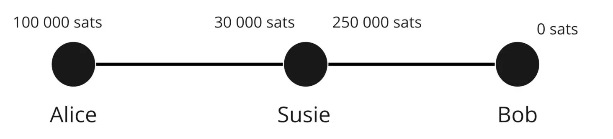
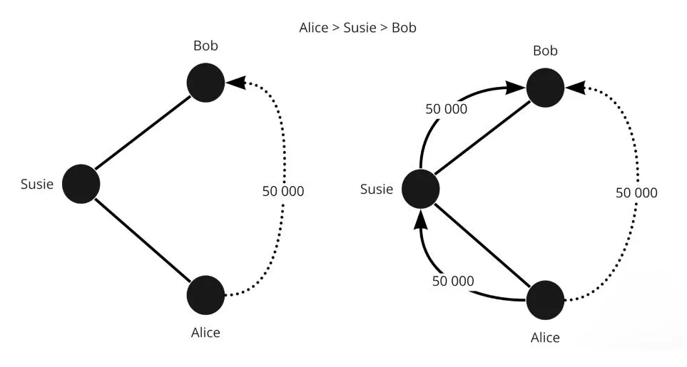

La liquidité des canaux ne peut pas se déplacer dans d’autres canaux de liquidité.

`Alice -> Eden – > Bob`. Les satoshis n’ont pas bougé d’`Alice -> Bob`, mais d’`Alice -> Eden` et d’`Eden -> Bob`.

Chaque personne et canaux a donc de la liquidité différente. Afin de réaliser des paiements, il faut donc trouver une route dans le réseau avec assez de liquidité. S’il en manque, le paiement n’aboutira pas.

Soit le réseau suivant :

```
État initial du réseau :
Alice (130 SAT) ==== (0 SAT) Susie (90 SAT) ==== (200 SAT) Eden (150 SAT) ==== (100 SAT) Bob
```
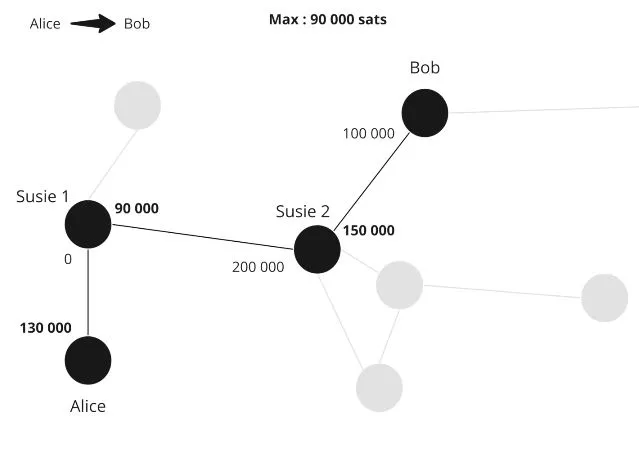

Si Alice soit faire un transfert de 40 SAT à Bob alors la liquidité sera redistribuée le long de la route entre les deux parties.

```
Après le transfert de Alice à Bob de 40 SAT :
Alice (90 SAT) ==== (40 SAT) Susie (50 SAT) ==== (240 SAT) Eden (110 SAT) ==== (140 SAT) Bob
```
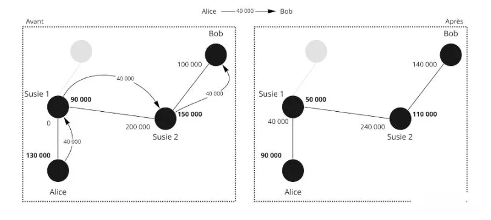

Toutefois, dans l'état initial, Bob ne peut pas envoyer 40 SAT à Alice car Susie n’a pas de liquidité avec Alice pour lui envoyer 40 SAT, donc le paiement n’est pas possible via cette route. Il faut donc une autre route où la transaction est impossible.

Dans le premier exemple, on remarque bien que Susie et Eden n’ont rien perdu et rien gagné. Pour accepter d’être utilisés pour router la transaction, les nœuds Lightning Network demandent des frais !

Il y a des frais différents en fonction d’où se trouve la liquidité

Alice – Bob

- Frais d’Alice = Alice -> Bob
- Frais de Bob = Bob -> Alice

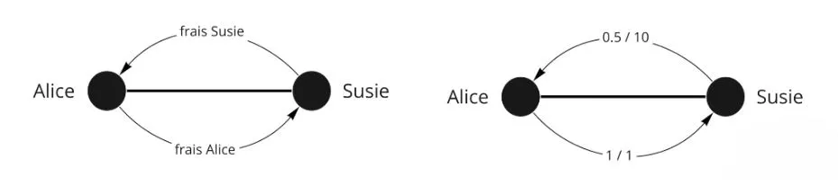


Il y a deux types de frais :

- un frais fixe quel que soit le montant : 1 SAT (par défaut mais modifiable)
- un frais variable (0.01% par défaut)

Exemple de frais :

- Alice – Susie ; 1/1 (1 en frais fixe et 1 en frais variable)
- Susie – Eden ; 0/200
- Eden – Bob ; 1/1

Donc :

- Frais 1 : (payé par Alice a elle-même) 1 + (40 000/*0.000001)
- Frais 2 : 0 + 40 000 /* 0.0002 = 8 SAT
- Frais 3 : 1 + 40 000/* 0.000001 = 0.4 SAT

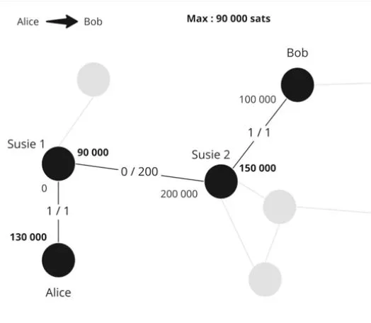

Envoi :

1. Envoi de 40 009.04 Alice -> Susie ; Alice paye a elle-même ses frais donc cela ne compte pas
2. Susie rend le service d’envoyer 40 001.04 à Eden, elle prend ça commission de 8 SAT
3. Eden rend le service d’envoyer 40 000 à Bob, il prend son 1.04 SAT de frais.

Alice a payé 9.04 SAT de frais et Bob a reçu 40 000 SAT.

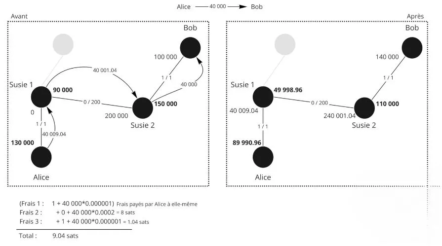

Dans le LN, c’est donc le nœud d’Alice qui va décider de la route avant l’envoi. Il y a donc une recherche de la meilleure route et Alice est la seule qui connait la route et le prix. Le paiement est envoyé mais Susie n’a pas d’information.

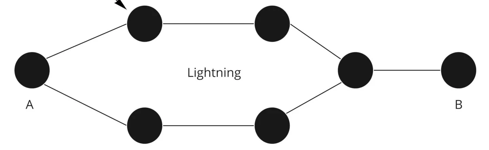

Pour Susie ou Eden : ils ne savent pas qui est le destinataire final, ni celui qui envoie. Ceci est un routage en oignon. Le nœud doit donc garder un plan du réseau pour trouver sa route, mais aucun des intermédiaires n’a d’information.

## HTLC – Hashed Time Locked Contract
<chapterId>4369b85a-1365-55d8-99e1-509088210116</chapterId>


Dans un système de routage classique, comment s’assurer qu’Eden ne triche pas et respecte bien sa part du contrat ?

HTLC est donc un contact de paiement où l’on peut déverrouiller uniquement avec un secret. S’il n’est pas dévoilé, alors le contrat expire. C’est donc un paiement conditionnel. Comment sont-ils utilisés ?

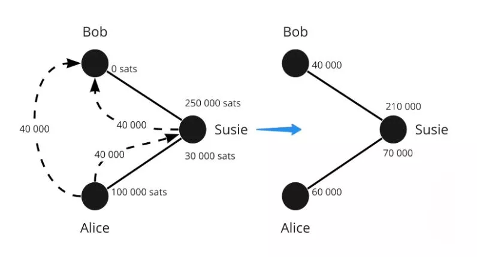

Considérons la situation suivante
`Alice (100 000 SAT) ==== (30 000 SAT) Susie (250 000 SAT) ==== (0 SAT) Bob`

- Bob génère un secret S (la préimage) et en calcule le hash r= hash(s)
- Bob envoie une invoice à Alice avec notamment « r »
- Alice envoie un HTLC de 40 000 SAT à Susie avec pour condition de révéler « s’ » tel que hash(s’)=r
- Susie envoie un HTLC similaire à Bob
- Bob déverrouille le HTLC de Susie en lui montrant « s »
- Susie déverrouille le HTCL d’Alice en lui montrant « S »

Si Bob est hors ligne et ne relève jamais le secret qui lui donne la légitimité de recevoir l’argent, dans ce cas le HTLC va expirer après un certain nombre de bloc.

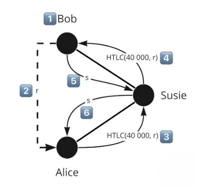

Les HTLC expirent dans l’ordre du dernier au premier : donc expiration Susie – Bob puis Alice – Susie.
Comme ça, si Bob revient, ça ne change rien. Dans le cas contraire, si Alice annule alors que Bob revient, ce sera le bordel et des gens peuvent avoir travaillé pour rien.

Bon et alors, la question c’est : en cas de clôture, il se passe quoi ? En fait, nos transactions d’engagement sont encore plus complexes. Il faut représenter la balance intermédiaire si jamais le canal se fait fermer.

Il y a donc un HTLC-out de 40 000 satoshis (avec les limitations vues avant) dans la transaction d’engagement via un output n°3.

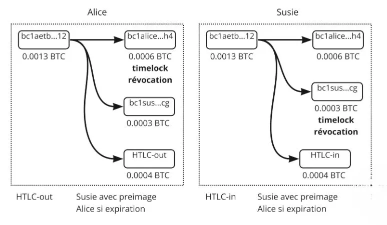

Alice a donc dans la transaction d’engagement :

- Output n°1 : 60 000 SAT pour Alice via un Timelock et clé de révocation (ce qui lui reste)
- Output n°2 : 30 000 qui appartienne déjà à Susie
- Output n°3 : 40 000 en HTLC

La transaction d’engagement d’Alice est avec un HTCL-out car elle envoie à la destinatrice, Susie, un HTLC-in.

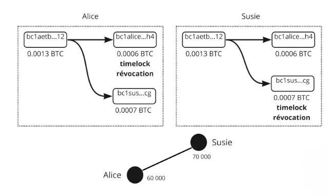

Donc si l’on publie cette transaction d’engagement, Susie peut récupérer l’argent du HTCL avec l’image « s ». Si elle n’a pas la préimage, Alice récupère l’argent une fois que le HTCL expire. Pensez les sorties (UTXO) comme différents paiements avec différentes conditions.
Une fois le paiement passé (expiration ou exécution), l’état du canal change et la transaction avec HTCL n’existe plus. On retourne avec quelque chose de classique.
En cas de fermeture coopérative : on arrête les paiements et donc on attend l’exécution des transferts/HTCL, la transaction est légère donc moins chère car il y a maximum 1 ou 2 outputs. 

Si fermeture forcée : on publie avec tous les HTLC en cours, ça devient donc très lourd et très coûteux. Et c’est le bordel.

En résumé, le système de routage du Lightning Network utilise des Hash Time-Locked Contracts (HTLC) pour assurer un paiement sécurisé et vérifiable. Les HTLC permettent de réaliser des paiements conditionnels où l'argent ne peut être déverrouillé qu'avec un secret, garantissant ainsi que les participants respectent leurs engagements.
Dans l'exemple présenté, Alice souhaite envoyer des SAT à Bob par l'intermédiaire de Susie. Bob génère un secret, crée un hash de celui-ci et le transmet à Alice. Alice et Susie mettent en place un HTLC basé sur ce hash. Une fois que Bob déverrouille le HTLC de Susie en lui montrant le secret, Susie peut alors déverrouiller le HTLC d'Alice.
Dans le cas où Bob ne révèle pas le secret dans un certain laps de temps, le HTLC expire. L'expiration se produit dans l'ordre du dernier au premier, assurant que si Bob revient en ligne, il n'y a pas de conséquences indésirables.

Lors de la clôture du canal, si c'est une clôture coopérative, les paiements sont interrompus et les HTLCs sont résolus, ce qui est généralement moins coûteux. Si la clôture est forcée, toutes les transactions HTLC en cours sont publiées, ce qui peut devenir très coûteux et désordonné.En somme, le mécanisme des HTLC ajoute une couche de sécurité supplémentaire dans le Lightning Network, assurant que les paiements sont exécutés correctement et que les utilisateurs respectent leurs engagements.

## Trouver sa voie
<chapterId>7e2ae959-c2a1-512e-b5d6-8fd962e819da</chapterId>


La seule donnée publique est la capacité totale du canal (Alice + Bob) mais on ne sait pas où se trouve la liquidité.
Pour avoir plus d’infos, notre nœud écoute le canal de communication du LN pour des annonces de nouveaux canaux et les mises à jour des frais des canaux. Votre nœud regarde aussi la blockchain pour la fermeture de canaux.

Comme nous n’avons pas toutes les informations, on doit faire une recherche de graph/route avec les informations qu’on a (capacité maximum des canaux et non où est la liquidité).

Critères :

- Probabilité de réussite
- Frais
- Délai d’expiration des HTLC
- Nombre de nœuds intermédiaires
- Aléatoire

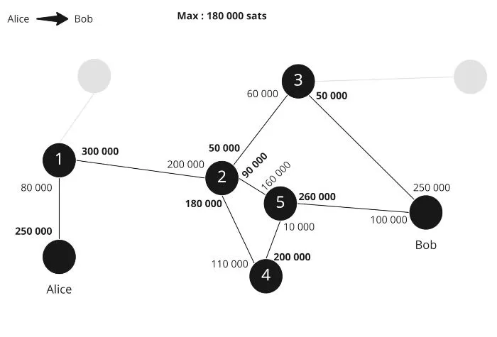

Donc s’il y a 3 routes possibles :

- Alice > 1 > 2 > 5 > Bob
- Alice > 1 > 2 > 4 > 5 > Bob
- Alice 1 > 2 > 3 > Bob

On cherche donc la meilleure en théorie avec le moins de frais et le plus de chance de réussir : un maximum de liquidité et le moins de hop possible.

Si par exemple, 2-3 aillant que 130 000 SAT de capacité, envoyer 100 000 est très peu probable donc le choix n°3 a pu de chances de succès.

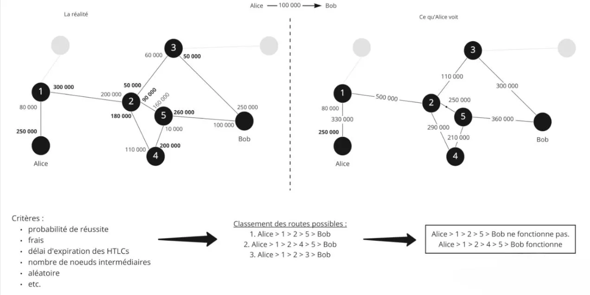

Désormais l’algorithme a fait ses 3 choix et va donc essayer le premier :

Choix 1 :

- Alice envoie un HTCL à 1 de 100 000 SAT ;
- Le 1 fait un HTLC de 100 000 SAT pour le 2
- Le 2 fait un HTLC de 100 000 SAT au 5 sauf que le 5 ne peut pas, donc l’annonce.

L’information est renvoyée donc Alice décide d’essayer la deuxième route :

- Alice envoie un HTLC de 100 000 à 1
- 1 fait un HTLC de 100 000 à 2
- 2 fait un HTLC de 100 000 vers 4
- 4 fait un HTLC de 100 000 vers Bob. Bob a la liquidité donc c’est ok.
- Bob utilise la préimage (hash) du HTLC et donc utilise le secret pour récupérer les 100 000 SAT
- 5 a donc désormais le secret du HTLC pour récupérer le HTLC bloqué de 4
- 4 a donc désormais le secret du HTLC pour récupérer le HTLC bloqué de 2
- 2 a donc désormais le secret du HTLC pour récupérer le HTLC bloqué de 1
- 1 a donc désormais le secret du HTLC pour récupérer le HTLC bloqué d’Alice

Alice n’a pas vu l’échec de la route 1, elle a juste attendu 1 seconde de plus. Un échec de paiement se déroule lorsqu’il n’y a pas de route possible. Pour faciliter la recherche de route, Bob peut fournir des infos à Alice pour aider dans son invoice :

- Le montant
- Son adresse
- Le hash de la préimage pour qu’Alice puisse créer le HTLC
- Des indications sur les canaux de Bob

Bob connait la liquidé des canaux 5 et 3 car il est directement connecté avec, il peut indiquer ça à Alice. Il prévient Alice que le nœud 3 est inutile, ça évite à Alice de potentiellement faire sa route.
Un autre élément serait les canaux privés (donc non publiés au réseaux) que Bob peut avoir. Si Bob a un canal privé avec 1, il peut dire à Alice de l’utiliser et ça donnerait Alice > 1 > Bob

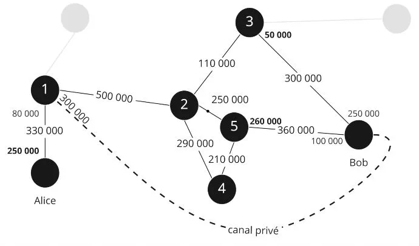

En conclusion, le routage des transactions sur le Lightning Network est un processus complexe qui requiert la prise en compte de divers facteurs. Alors que la capacité totale des canaux est publique, la répartition précise de la liquidité n'est pas directement accessible. Cela oblige les nœuds à estimer les routes les plus probables de réussite, en tenant compte de critères tels que les frais, le délai d'expiration des HTLC, le nombre de nœuds intermédiaires et un facteur d'aléatoire.
Lorsque plusieurs routes sont possibles, les nœuds cherchent à minimiser les frais et à maximiser les chances de réussite en choisissant des canaux avec une liquidité suffisante et un nombre minimum de sauts. Si une tentative de transaction échoue en raison d'une liquidité insuffisante, une autre route est essayée jusqu'à ce qu'une transaction réussisse.

Par ailleurs, pour faciliter la recherche de route, le destinataire peut fournir des informations supplémentaires, comme l'adresse, le montant, le hash de la préimage, et des indications sur ses canaux. Cela peut aider à identifier les canaux avec une liquidité suffisante et éviter les tentatives de transactions inutiles.
En fin de compte, le système de routage du Lightning Network est conçu pour optimiser la vitesse, la sécurité et l'efficacité des transactions, tout en préservant la confidentialité des utilisateurs.

# Outils du lightning Network
<partId>74d6c334-ec5d-55d9-8598-f05694703bf6</partId>
## Invoice, LNURL, Keysend
<chapterId>e34c7ecd-2327-52e3-b61e-c837d9e5e8b0</chapterId>


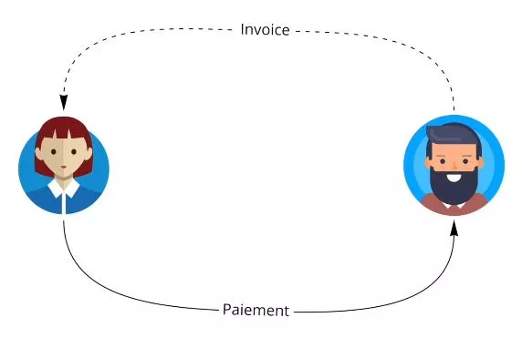

Une facture LN (ou invoice) c’est long et pas agréable à lire, mais cela permet de représenter de manière dense une demande de paiement.

Exemple :
lnbc1m1pskuawzpp5qeuuva2txazy5g483tuv9pznn9ft8l5e49s5dndj2pqq0ptyn8msdqqcqzpgxqrrsssp5v4s00u579atm0em6eqm9nr7d0vr64z5j2sm5s33x3r9m4lgfdueq9qyyssqxkjzzgx5ef7ez3dks0laxayx4grrw7j22ppgzyhpydtv6hmc39skf9hjxn5yd3kvv7zpjdxd2s7crcnemh2fz26mnr6zu83w0a2fwxcqnvujl3

- lnbc1m = partie lisible
- 1 = séparation avec le reste
- Puis le reste
- Bc1 = Encodage Bech32 (base 32), on utilise donc 32 caractères.
- 10 = 1.2.3.4.5.6.7.8.9.0
- 26 = abcdefghijklmnopqrstuvwxyz
- 32 = pas le « b- i- o » et pas le « 1 »

### lnbc1m

- ln = Lightning
- Bc = bitcoin (mainnet)
- 1 = montant
- M = milli (10*-3 / u = micro 10*-6 / n = nano 10*-9 / p = pico 10*-12

Ici 1m = 1 /* 0.0001btc = 100 000 BTC

« Prié de payer 100 000 SAT sur le réseau Lightning du mainnet bitcoin à pskuawzpp5qeuuva2txazy5g483tuv9pznn9ft8l5e49s5dndj2pqq0ptyn8msdqqcqzpgxqrrsssp5v4s00u579atm0em6eqm9nr7d0vr64z5j2sm5s33x3r9m4lgfdueq9qyyssqxkjzzgx5ef7ez3dks0laxayx4grrw7j22ppgzyhpydtv6hmc39skf9hjxn5yd3kvv7zpjdxd2s7crcnemh2fz26mnr6zu83w0a2fwxcqnvujl3 »

### Timestamp (quand il a été créé)

Il contient 0 ou plusieurs parties supplémentaires :

- Hash de la préimage
- Secret de paiement (routage en oignon)
- Données arbitraires
- Clé publique LN du destinataire
- Durée d’expiration (par défaut 1h)
- Indications de routage
- Signature de l’ensemble

Il existe d’autres types d’invoice. Le meta-protocole LNURL permet de fournir un montant de satoshis direct au lieu de faire une demande. C’est très flexible et permet beaucoup d’améliorations en termes d’expérience utilisateur.

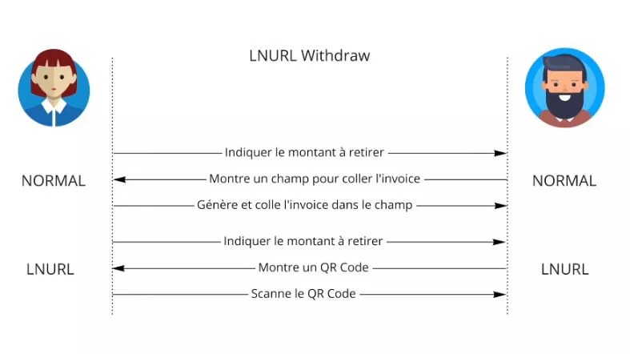

Un Keysend permet à Alice d’envoyer de l’argent à Bob sans avoir la demande de Bob. Alice récupère l’ID de Bob, crée une préimage sans demander à Bob et l’inclus dans son envoi. Donc, Bob va recevoir une demande surprise où il peut débloquer l’argent car Alice a déjà effectué le travail.

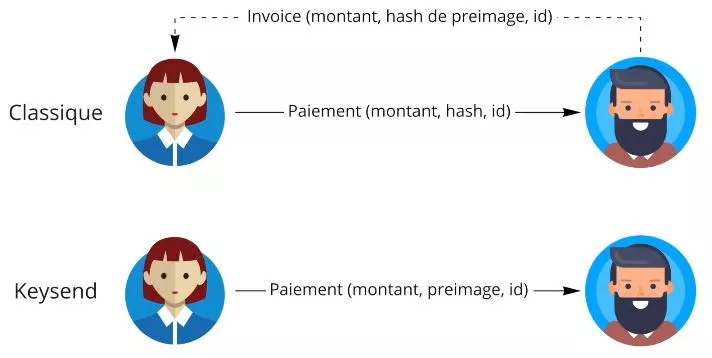

En conclusion, une facture Lightning Network, bien que complexe à première vue, encode de manière efficace une demande de paiement. Chaque section de l'invoice renferme des informations clés, incluant le montant à payer, le destinataire, le timestamp de création, et potentiellement d'autres informations comme le hash de la préimage, le secret de paiement, les indications de routage, et la durée d'expiration. Les protocoles tels que LNURL et Keysend offrent des améliorations significatives en termes de flexibilité et d'expérience utilisateur, permettant par exemple d'envoyer des fonds sans demande préalable de l'autre partie. Ces technologies rendent le processus de paiement plus fluide et plus efficace sur le Lightning Network.

## Gérer sa liquidité
<chapterId>cc76d0c4-d958-57f5-84bf-177e21393f48</chapterId>


Nous donnons quelques repères généraux pour répondre à la sempiternelle question de la gestion de la liquidité sur Lightning.


Dans LN, il y a 3 types de personnes :

- Les acheteurs : ils ont de la liquidé sortante, c’est le plus simple car il suffit d’ouvrir des canaux
- Les commerçants : c’est plus compliqué car ils ont besoin de liquidité entrante via d’autres nœuds et d’autre acteurs. Ils doivent avoir des gens connectés à eux
- Les nœuds de routage : ils veulent être équilibre avec de la liquidité des deux côtes et une bonne connexion à de nombreux nœuds pour être utilisés le plus possible

Donc si vous avez besoin de liquidité entrante, vous pouvez en acheter à des services.


Alice achète un canal avec Susie pour 1 million de satoshis donc elle ouvre un canal avec directement 1 000 000 SAT du coté entrant. Elle peut alors accepter jusqu’à 1 million de SAT de paiement par les clients qui seraient connectés avec Susie (qui est très connectée).

Une autre solution serait de faire des paiements ; vous payez 100 000 pour X raison, vous pouvez désormais recevoir 100 000.


### Solution Loop Out : Atomic swap LN – BTC

Alice 2 millions – Susie 0


Alice veut envoyer la liquidité vers Susie, donc elle fait un Loop out (un nœud spécial qui offre un service pro de rééquilibre LN/BTC).
Alice envoie 1 million à loop via le nœud de Susie, donc Susie a la liquidité et Loop renvoie la balance on-chain au nœud d’Alice.


Donc les 1 million partent chez Susie, cette dernière envoie 1 million à Loop, Loop envoie 1 million à Alice. Alice a donc déplacé la liquidité vers Susie au prix de quelques frais payés à Loop pour le service.

Le plus compliqué dans LN est de garder la liquidité.


En conclusion, la gestion de la liquidité sur le réseau Lightning Network est un enjeu clé, qui dépend du type d'utilisateur : acheteur, commerçant ou nœud de routage. Les acheteurs, ayant besoin de liquidité sortante, ont la tâche la plus simple : ils ouvrent simplement des canaux. Les commerçants, nécessitant une liquidité entrante, doivent être connectés à d'autres nœuds et acteurs. Les nœuds de routage, quant à eux, cherchent à maintenir un équilibre de liquidité des deux côtés. Plusieurs solutions existent pour gérer la liquidité, comme l'achat de canaux ou le paiement pour augmenter la capacité de réception. L'option "Loop Out", permettant un Atomic Swap entre LN et BTC, offre une solution intéressante pour rééquilibrer la liquidité. Malgré ces stratégies, maintenir la liquidité sur le réseau Lightning Network reste un défi complexe.

# Allez plus loin
<partId>6bbf107d-a224-5916-9f0c-2b4d30dd0b17</partId>

## Résumé de la formation
<chapterId>a65a571c-561b-5e1c-87bf-494644653c22</chapterId>


Notre objectif était d'expliquer comment le réseau Lightning fonctionne et comment il s'appuie sur Bitcoin pour fonctionner.

Le réseau Lightning est un réseau de canaux de paiement. Nous avons vu comment un canal de paiement fonctionne entre deux parties prenantes, mais nous avons également élargi notre vision à l'ensemble du réseau, à la notion de réseau de canaux de paiement.


Les canaux sont ouverts via une transaction Bitcoin et peuvent accueillir autant de transactions que possible. L'état du canal est représenté par une transaction d'engagement qui envoie à chacune des parties prenantes ce qu'elle possède de son côté du canal. Lorsqu'une transaction a lieu au sein du canal, les parties prenantes s'engagent sur le nouvel état en révoquant l'ancien état et en construisant une nouvelle transaction d'engagement.


Les paires se protègent de la tricherie avec des clés de révocation et un time lock. La fermeture mutuelle consentie est préférée pour fermer le canal. En cas de fermeture forcée, on publie la dernière transaction d'engagement.


Les paiements peuvent emprunter les canaux d'autres nœuds intermédiaires. Les paiements conditionnels sur l'acné (HTLC) permettent de bloquer les fonds en attendant la résolution complète du paiement. Le routage en oignon est utilisé dans Lightning Network. Les nœuds intermédiaires ne connaissent pas la destination finale des paiements. Alice doit calculer la route du paiement, mais n'a pas toutes les informations sur la liquidité dans les canaux intermédiaires.


Il y a une composante de probabilité lorsqu'on envoie un paiement via Lightning Network.


Pour recevoir des paiements, il faut gérer la liquidité dans les canaux, ce qui peut se faire en demandant à d'autres personnes d'ouvrir des canaux vers nous, en ouvrant soi-même des canaux et en utilisant des outils comme Loop ou en achetant/louant des canaux sur des marketplaces.


## Interview de Fanis
<chapterId>077cb5f5-1626-5da5-9964-e67b1de503bf</chapterId>


Voici un résumé de l'interview :

Le Lightning Network est une solution de paiement ultra-rapide sur Bitcoin qui permet de contourner les limitations liées à la scalabilité du réseau. Cependant, les bitcoins sur Lightning ne sont pas aussi sûrs que ceux sur la chaîne Bitcoin car la décentralisation et la sécurité sont privilégiées au détriment de la scalabilité.

L'augmentation excessive de la taille des blocs n'est pas une bonne solution car cela a des compromis en termes de nœuds et de capacité de données. Au lieu de cela, le Lightning Network permet de créer des canaux de paiement entre deux utilisateurs de Bitcoin sans faire apparaître les transactions sur la blockchain, économisant ainsi de la place sur les blocs et permettant à Bitcoin de scaler aujourd'hui.

Cependant, il y a des critiques concernant la scalabilité et la centralisation de Lightning Network, avec des problèmes potentiels liés à la fermeture des canaux et aux frais de transaction élevés. Pour résoudre ces problèmes, il est recommandé d'éviter d'ouvrir des petits canaux pour éviter les problèmes futurs et d'augmenter les frais de transaction avec Child Pay for Parent.

Des solutions envisagées pour l'avenir de Lightning Network sont le batching et la création de canaux en groupes pour réduire les frais de transaction, ainsi que l'augmentation de la taille des blocs à long terme. Cependant, il est important de noter que les bitcoins sur Lightning ne sont pas aussi sécurisés que les bitcoins sur la chaîne Bitcoin.

La confidentialité sur Bitcoin et Lightning sont liées, avec le routage en oignon garantissant un certain niveau de confidentialité pour les transactions. Cependant, sur Bitcoin, tout est transparent par défaut, avec des heuristiques utilisées pour traquer les Bitcoins d'adresse en adresse sur la chaîne Bitcoin.

Les achats de Bitcoins avec KYC permettent à l'exchange de connaître les transactions de retrait, tandis que les montants ronds et les adresses de change permettent de savoir quelle partie d'une transaction est destinée à une autre personne et quelle partie est destinée à soi-même.

Pour améliorer la confidentialité, les actions jointes et les coinjoins permettent de briser les calculs de probabilité en faisant des transactions où plusieurs personnes font une transaction ensemble. Les sociétés d'analyse de chaînes ont plus de mal à déterminer ce que tu fais de tes bitcoins en suivant.

Sur Lightning, il n'y a que deux personnes qui sont au courant de la transaction et c'est plus confidentiel que Bitcoin. Le routage en oignon signifie qu'un nœud intermédiaire ne connaît pas l'émetteur et le destinataire du paiement.

Pour utiliser Lightning Network, il est recommandé de suivre une formation sur ta chaîne YouTube ou directement sur le site découvre Bitcoin, ou d'utiliser la formation sur Umbrell. Il est également possible d'envoyer du texte arbitraire lors d'un paiement sur Lightning en utilisant un champ dédié pour cela, ce qui peut être utile pour des dons ou pour de la messagerie.

Cependant, il est important de noter que les nodes routage sur Lightning pourraient être régulés à l'avenir, avec certains États qui vont tenter de réguler les nodes routage.

Pour les marchands, il est nécessaire de gérer la liquidité pour accepter les paiements en Lightning Network, avec des contraintes actuelles qui peuvent être surmontées avec des solutions appropriées.

Enfin, le futur de Bitcoin est prometteur avec une projection possible d'un million en cinq ans. Pour assurer la professionnalisation de l'industrie et la création d'un système alternatif à celui du système bancaire existant, il est important de contribuer au réseau et d'arrêter de faire confiance.


## Évaluez ce cours
<chapterId>38814c99-eb7b-5772-af49-4386ee2ce9b0</chapterId>
<isCourseReview>true</isCourseReview>

## Examen final
<chapterId>7ed33400-aef7-5f3e-bfb1-7867e445d708</chapterId>
<isCourseExam>true</isCourseExam>


## Remerciements et continuez à creuser le terrier du lapin
<chapterId>afc0d72b-4fbc-5893-90b2-e27fb519ad02</chapterId>

Félicitations ! 🎉

Vous avez terminé la formation LN 201 – Introduction au Lightning Network !
Vous pouvez être fier de vous car ce n’est pas facile. Sachez que peu sont les personnes qui descendent aussi bas dans le terrier du Bitcoin.

Tout d’abord, un grand merci à Fanis Makalakis pour nous avoir offert ce super cours gratuit sur un aspect plus ethnique du Lightning. N’hésitez pas à le suivre sur Twitter, sur son blog ou via son travail chez LN market.

Ensuite, si vous souhaitez aider le projet, n’hésitez pas à nous sponsoriser sur Patreon. Vos dons serviront à produire du contenus pour de nouvelles formations et bien évidemment, vous serez les premiers à être tenus au courant (y compris pour la prochaine de Fanis qui est dans les tuyaux !).

L’aventure Lightning Network continue avec la formation sur Umbrel et la mise en place d’un nœud Lightning Network. Fini la théorie et place à la pratique avec la formation LN 202 désormais !

Bisous et à très bientôt !

Rogzy
