# Perjalanan ke Lapisan Kedua Bitcoin

Kursus ini adalah pelajaran teoretis tentang fungsi teknis dari Lightning Network.

Selamat datang di dunia yang menarik dari Lightning Network, lapisan kedua dari Bitcoin yang canggih dan penuh potensi. Kita akan menyelami kedalaman teknis dari teknologi ini, tanpa fokus pada tutorial spesifik atau skenario penggunaan. Untuk mendapatkan manfaat maksimal dari kursus ini, pemahaman yang solid tentang Bitcoin sangat penting. Ini adalah pengalaman yang membutuhkan pendekatan yang serius dan fokus. Anda juga dapat mempertimbangkan untuk mengambil kursus LN 202 secara paralel, yang menawarkan aspek praktis yang lebih banyak dari eksplorasi ini. Bersiaplah untuk memulai perjalanan yang dapat mengubah persepsi Anda tentang ekosistem Bitcoin.

Nikmati penemuan tersebut!

+++

# Dasar-Dasar
<partId>32647d62-102b-509f-a3ba-ad1d6a4345f1</partId>

## Memahami Lightning Network
<chapterId>df6230ae-ff35-56ea-8651-8e65580730a8</chapterId>


Lightning Network adalah infrastruktur pembayaran lapisan kedua yang dibangun di atas jaringan Bitcoin yang memungkinkan transaksi cepat dan biaya rendah. Untuk sepenuhnya memahami cara kerja Lightning Network, sangat penting untuk memahami apa itu saluran pembayaran dan bagaimana cara kerjanya.

Saluran pembayaran Lightning adalah semacam "jalur pribadi" antara dua pengguna yang memungkinkan transaksi Bitcoin yang cepat dan berulang. Ketika sebuah saluran dibuka, kapasitasnya ditetapkan, yang didefinisikan terlebih dahulu oleh pengguna. Kapasitas ini mewakili jumlah maksimum Bitcoin yang dapat ditransmisikan dalam saluran pada waktu tertentu.

Saluran pembayaran bersifat dua arah, artinya memiliki dua "sisi." Misalnya, jika Alice dan Bob membuka saluran pembayaran, Alice dapat mengirim Bitcoin ke Bob, dan Bob dapat mengirim Bitcoin ke Alice. Transaksi di dalam saluran tidak mengubah kapasitas total saluran, tetapi mereka mengubah distribusi kapasitas tersebut antara Alice dan Bob.


Untuk sebuah transaksi dapat terjadi di saluran pembayaran Lightning, pengguna yang mengirim dana harus memiliki cukup Bitcoin di sisi saluran mereka. Jika Alice ingin mengirim 1 Bitcoin ke Bob melalui saluran mereka, dia harus memiliki setidaknya 1 Bitcoin di sisinya.
Batasan dan Fungsi Saluran Pembayaran di Lightning.
Meskipun kapasitas saluran pembayaran Lightning tetap, ini tidak membatasi jumlah total transaksi atau total volume Bitcoin yang dapat ditransmisikan melalui saluran. Misalnya, jika Alice dan Bob memiliki saluran dengan kapasitas 1 Bitcoin, mereka dapat melakukan ratusan transaksi 0.01 Bitcoin atau ribuan transaksi 0.001 Bitcoin, selama kapasitas total saluran tidak terlampaui pada waktu tertentu.

Meskipun ada batasan ini, saluran pembayaran Lightning adalah cara yang efisien untuk melakukan transaksi Bitcoin yang cepat dan murah. Mereka memungkinkan pengguna untuk mengirim dan menerima Bitcoin tanpa harus membayar biaya transaksi yang tinggi atau menunggu periode konfirmasi yang lama di jaringan Bitcoin.
Ringkasan, saluran pembayaran Lightning menawarkan solusi yang kuat bagi mereka yang ingin melakukan transaksi Bitcoin yang cepat dan murah. Namun, sangat penting untuk memahami cara kerjanya dan keterbatasannya agar dapat sepenuhnya memanfaatkannya.
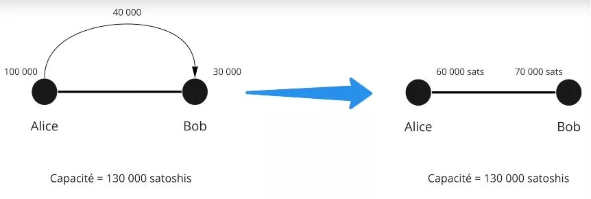

Contoh:

- Alice memiliki 100.000 SAT
- Bob memiliki 30.000 SAT

Ini adalah keadaan saluran saat ini. Selama transaksi, Alice memutuskan untuk mengirim 40.000 SAT ke Bob. Dia dapat melakukannya karena 40.000 < 100.000.

Keadaan baru dari saluran tersebut adalah:

- Alice 60.000 SAT
- Bob 70.000 SAT

```
Keadaan awal saluran:
Alice (100.000 SAT) ============== Bob (30.000 SAT)

Setelah transfer Alice ke Bob sebesar 40.000 SAT:
Alice (60.000 SAT) ============== Bob (70.000 SAT)

```


Sekarang, Bob ingin mengirim 80.000 SAT ke Alice. Karena tidak memiliki likuiditas, dia tidak bisa. Kapasitas maksimal saluran adalah 130.000 SAT, dengan pengeluaran maksimal hingga 60.000 SAT untuk Alice dan 70.000 SAT untuk Bob.


## Bitcoin, alamat, UTXO dan transaksi
<chapterId>0cfb7e6b-96f0-508b-9210-90bc1e28649d</chapterId>


Dalam bab kedua ini, kami meluangkan waktu untuk mempelajari bagaimana transaksi Bitcoin sebenarnya bekerja, yang akan sangat berguna untuk memahami Lightning. Kami juga secara singkat membahas konsep alamat multi-tanda tangan, yang sangat penting untuk memahami bab selanjutnya tentang membuka saluran di Jaringan Lightning.

- Kunci pribadi > Kunci publik > Alamat: Selama transaksi, Alice mengirim uang ke Bob. Yang terakhir memberikan alamat yang diberikan oleh kunci publiknya. Alice, yang sendiri menerima uang di alamat melalui kunci publiknya, sekarang menggunakan kunci pribadinya untuk menandatangani transaksi dan dengan demikian membuka kunci bitcoin dari alamat tersebut.
- Dalam transaksi Bitcoin, semua bitcoin harus berpindah. Dinamakan UTXO (Unspend Transaction Output), bit-bit bitcoin akan semua keluar hanya untuk kembali ke pemilik setelahnya.
  Alice memiliki 0,002 BTC, Bob memiliki 0 BTC. Alice memutuskan untuk mengirim 0,0015 BTC ke Bob. Dia akan menandatangani transaksi 0,002 BTC di mana 0,0015 akan pergi ke Bob dan 0,0005 akan kembali ke dompetnya.

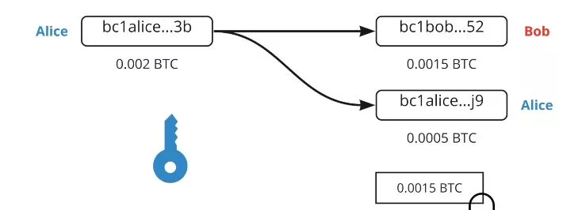

Di sini, dari satu UTXO (Alice memiliki 0,0002 BTC di sebuah alamat), kita telah menciptakan 2 UTXO (Bob memiliki 0,0015 dan Alice memiliki UTXO baru (independen dari sebelumnya) sebesar 0,0005 BTC).

```
Alice (0,002 BTC)
  |
  V
Transaksi Bitcoin (0,002 BTC)
  |
  |----> Bob (0,0015 BTC)
  |
  V
Alice (UTXO baru: 0,0005 BTC)
```
Dalam Lightning Network, multi-signature digunakan. Oleh karena itu, diperlukan 2 tanda tangan untuk membuka dana, yaitu, dua kunci privat untuk memindahkan uang. Ini bisa jadi Alice dan Bob yang, bersama-sama, harus setuju untuk membuka uang (UTXO). Khususnya di LN, mereka adalah transaksi 2/2, sehingga kedua tanda tangan benar-benar diperlukan, tidak seperti multi-signature 2/3 atau 3/5 di mana hanya kombinasi dari jumlah kunci yang lengkap yang diperlukan.


# Pembukaan dan Penutupan Saluran
<partId>900b5b6b-ccd0-5b2f-9424-4b191d0e935d</partId>

## Pembukaan Saluran
<chapterId>96243eb0-f6b5-5b68-af1f-fffa0cc16bfe</chapterId>


Sekarang, kita akan melihat lebih dekat tentang pembukaan saluran dan bagaimana hal itu dilakukan melalui transaksi Bitcoin.

Lightning Network memiliki berbagai tingkat komunikasi:

- Komunikasi P2P (protokol Lightning Network)
- Saluran pembayaran (protokol Lightning Network)
- Transaksi Bitcoin (protokol Bitcoin)


Untuk membuka saluran, kedua peer berkomunikasi melalui saluran komunikasi:

- Alice: "Hai, saya ingin membuka saluran!"
- Bob: "Oke, ini alamat publik saya."


Alice sekarang memiliki 2 alamat publik untuk membuat alamat multi-sig 2/2. Dia sekarang dapat membuat transaksi bitcoin untuk mengirim uang ke sana.

Misalkan Alice memiliki UTXO sebesar 0.002 BTC dan dia ingin membuka saluran dengan Bob sebesar 0.0013 BTC. Dia akan membuat transaksi dengan 2 UTXO sebagai output:

- UTXO sebesar 0.0013 ke alamat multi-sig 2/2
- UTXO sebesar 0.0007 ke salah satu alamat kembalian miliknya (pengembalian UTXO).

Transaksi ini belum publik karena jika pada tahap ini, dia mempercayai Bob untuk dapat membuka uang dari multi-sig.

Lalu bagaimana cara melanjutkannya?

Alice akan membuat transaksi kedua yang disebut "transaksi penarikan" sebelum mempublikasikan deposit dana di multi-sig.

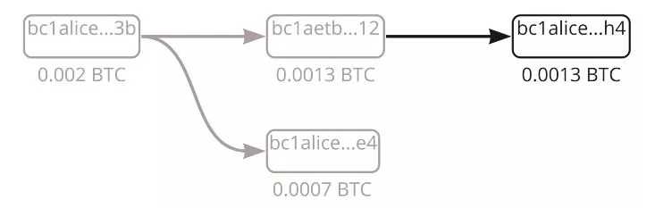

Transaksi penarikan akan menghabiskan dana dari alamat multi-sig ke alamat miliknya (ini dilakukan sebelum semuanya dipublikasikan).
Setelah kedua transaksi dibuat, Alice memberitahu Bob bahwa itu sudah selesai dan meminta tanda tangan dari kunci publiknya, menjelaskan bahwa dengan cara ini dia dapat memulihkan dana jika ada yang salah. Bob setuju karena dia tidak tidak jujur.

Alice sekarang dapat memulihkan dana sendirian, karena dia sudah memiliki tanda tangan Bob. Dia mempublikasikan transaksi. Saluran sekarang terbuka dengan 0.0013 BTC (130,000 SAT) di sisi Alice.

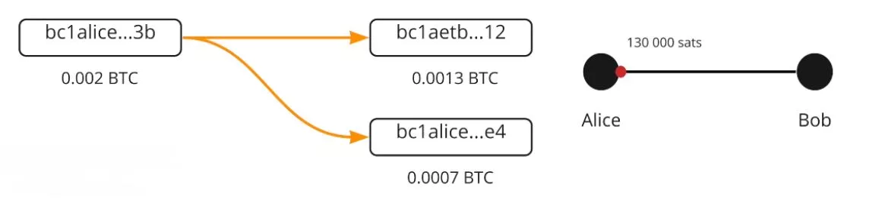

## Transaksi Lightning & Transaksi Komitmen
<chapterId>7d3fd135-129d-5c5a-b306-d5f2f1e63340</chapterId>


Mari kita analisis apa yang sebenarnya terjadi di balik layar ketika mentransfer dana dari satu sisi ke sisi lain dari sebuah saluran di Lightning Network, dengan konsep transaksi komitmen. Transaksi penarikan/penutupan on-chain mewakili keadaan saluran, menjamin siapa yang memiliki dana setelah setiap transfer. Jadi, setelah transfer Lightning Network, ada pembaruan dari transaksi/kontrak ini yang tidak dieksekusi antara dua rekan, Alice dan Bob, yang menciptakan transaksi yang sama dengan keadaan saluran saat ini dalam kasus penutupan:
- Alice membuka saluran dengan Bob dengan 130.000 SAT di sisinya. Transaksi penarikan yang diterima oleh keduanya dalam kasus penutupan menyatakan bahwa 130.000 SAT akan pergi ke Alice saat penutupan, dan Bob setuju karena itu adil.


- Alice mengirim 30.000 SAT ke Bob. Sekarang ada transaksi penarikan baru yang menyatakan bahwa dalam kasus penutupan, Alice akan menerima 100.000 SAT dan Bob 30.000 SAT. Keduanya setuju karena itu adil.


- Alice mengirim 10.000 SAT ke Bob, dan transaksi penarikan baru dibuat yang menyatakan bahwa Alice akan menerima 90.000 SAT dan Bob 40.000 SAT dalam kasus penutupan. Keduanya setuju karena itu adil.

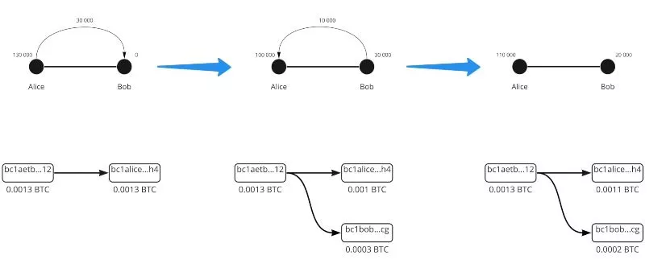


```
Keadaan awal saluran:
Alice (130.000 SAT) =============== Bob (0 SAT)

Setelah transfer pertama:
Alice (100.000 SAT) =============== Bob (30.000 SAT)

Setelah transfer kedua:
Alice (90.000 SAT) =============== Bob (40.000 SAT)

```

Uangnya tidak pernah bergerak, tetapi saldo akhir diperbarui melalui transaksi on-chain yang ditandatangani tetapi tidak dipublikasikan. Oleh karena itu, transaksi penarikan adalah transaksi komitmen. Transfer satoshi adalah transaksi komitmen yang lebih baru yang memperbarui saldo.

## Transaksi Komitmen
<chapterId>f2f61e5b-badb-5947-9a81-7aa530b44e59</chapterId>


Jika transaksi komitmen menentukan keadaan saluran dengan likuiditas pada waktu X, dapatkah kita curang dengan mempublikasikan keadaan lama? Jawabannya adalah ya, karena kita sudah memiliki pra-tanda tangan kedua peserta dalam transaksi yang tidak dipublikasikan.


Untuk menyelesaikan masalah ini, kita akan menambahkan kompleksitas:

- Timelock = dana terkunci sampai blok N
- Kunci pembatalan = rahasia Alice dan rahasia Bob'

Dua elemen ini ditambahkan ke transaksi komitmen. Akibatnya, Alice harus menunggu akhir dari Timelock, dan siapa pun yang memiliki kunci pembatalan dapat memindahkan dana tanpa menunggu akhir dari Timelock. Jika Alice mencoba curang, Bob menggunakan kunci pembatalan untuk mencuri dan menghukum Alice.

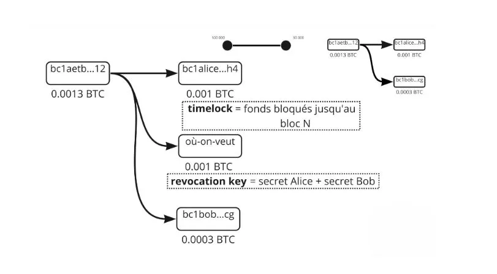
Sekarang (dan dalam kenyataannya) transaksi komitmen tidak sama untuk Alice dan Bob, mereka simetris tetapi masing-masing dengan batasan yang berbeda, mereka saling memberikan rahasia mereka untuk menciptakan kunci pembatalan dari transaksi komitmen sebelumnya. Jadi pada saat pembuatan, Alice membuat saluran dengan Bob, 130.000 SAT di sisinya, dia memiliki Timelock yang mencegahnya dari segera mengambil kembali uangnya, dia harus menunggu sebentar. Kunci pembatalan dapat membuka uang tetapi hanya Alice yang memilikinya (transaksi komitmen Alice). Setelah ada transfer, Alice akan memberikan rahasia lamanya kepada Bob dan oleh karena itu yang terakhir akan dapat mengosongkan saluran ke keadaan sebelumnya jika Alice mencoba curang (Alice oleh karena itu dihukum).

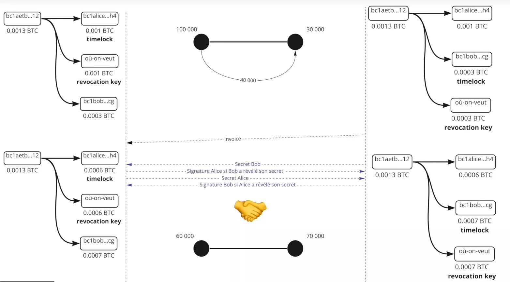

Demikian pula, Bob akan memberikan rahasianya kepada Alice. Sehingga jika dia mencoba curang, Alice dapat menghukumnya. Operasi ini diulang untuk setiap transaksi komitmen baru. Rahasia baru diputuskan dan kunci pembatalan baru. Jadi untuk setiap transaksi baru, transaksi komitmen sebelumnya harus dihancurkan dengan memberikan rahasia pembatalan. Dengan demikian jika Alice atau Bob mencoba curang, yang lain dapat bertindak sebelumnya (berkat Timelock) dan dengan demikian menghindari kecurangan. Selama transaksi #3, rahasia transaksi #2 oleh karena itu diberikan untuk memungkinkan Alice dan Bob mempertahankan diri mereka terhadap Alice atau Bob.

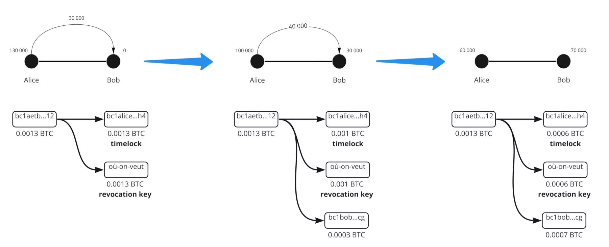

Orang yang membuat transaksi dengan Timelock (orang yang mengirim uang) hanya dapat menggunakan kunci pembatalan setelah Timelock. Namun, orang yang menerima uang dapat menggunakannya sebelum Timelock dalam kasus kecurangan dari satu sisi ke sisi lain dari saluran di Lightning Network. Secara khusus, kami merinci mekanisme yang memungkinkan kami untuk menjaga terhadap kemungkinan kecurangan oleh rekan sejawat dalam saluran.

## Penutupan Saluran

<chapterId>29a72223-2249-5400-96f0-3756b1629bc2</chapterId>


Kami tertarik pada penutupan saluran melalui transaksi Bitcoin, yang dapat mengambil berbagai bentuk tergantung pada kasusnya. Ada 3 jenis penutupan saluran:

- Yang baik: penutupan kooperatif
- Yang kasar: penutupan paksa (non-kooperatif)
- Yang curang: penutupan oleh penipu


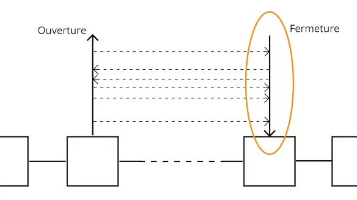

### Yang baik

Dua rekan berkomunikasi dan setuju untuk menutup saluran. Mereka menghentikan semua transaksi dan memvalidasi keadaan akhir saluran. Mereka setuju pada biaya jaringan (orang yang membuka saluran membayar biaya penutupan). Mereka sekarang membuat transaksi penutupan. Ada transaksi penutupan, berbeda dari transaksi komitmen karena tidak ada Timelock dan kunci pembatalan. Transaksi kemudian dipublikasikan dan Alice serta Bob menerima saldo masing-masing. Tipe penutupan ini cepat (karena tidak ada Timelock) dan umumnya tidak mahal.


### Yang kasar
Alice ingin menutup saluran, tetapi Bob tidak merespon karena dia sedang offline (internet atau pemadaman listrik). Alice kemudian akan mempublikasikan transaksi komitmen terbaru (yang terakhir). Transaksi dipublikasikan dan Timelock diaktifkan. Kemudian, biaya ditentukan ketika transaksi ini dibuat X waktu yang lalu! MemPool adalah jaringan yang telah berubah sejak itu, sehingga protokol secara default menetapkan biaya 5 kali lebih tinggi dari biaya saat transaksi dibuat. Biaya pembuatan pada 10 SAT, sehingga transaksi dianggap 50 SAT. Pada saat penutupan paksa, jaringan adalah:
- 1 SAT = terlalu banyak membayar sebanyak 50\*
- 100 SAT = kurang membayar sebanyak 2\*

Hal ini membuat penutupan paksa menjadi lebih lama (Timelock) dan terutama lebih berisiko dalam hal biaya dan validasi yang mungkin oleh penambang.


### Si Penipu

Alice mencoba menipu dengan mempublikasikan transaksi komitmen lama. Namun, Bob memantau MemPool dan mengawasi transaksi yang mencoba mempublikasikan yang lama. Jika dia menemukan salah satunya, dia menggunakan kunci pembatalan untuk menghukum Alice dan mengambil semua SAT dari saluran tersebut.


Kesimpulannya, penutupan saluran di Lightning Network adalah langkah penting yang dapat mengambil berbagai bentuk. Dalam penutupan yang kooperatif, kedua pihak berkomunikasi dan setuju pada keadaan akhir saluran. Ini adalah opsi tercepat dan paling murah. Di sisi lain, penutupan paksa terjadi ketika salah satu pihak tidak merespon. Ini adalah situasi yang lebih mahal dan lebih lama karena biaya transaksi yang tidak dapat diprediksi dan aktivasi Timelock. Akhirnya, jika seorang peserta mencoba menipu dengan mempublikasikan transaksi komitmen lama, si penipu, mereka dapat dihukum dengan kehilangan semua SAT dari saluran tersebut. Oleh karena itu, sangat penting untuk memahami mekanisme ini untuk penggunaan Lightning Network yang efektif dan adil.

# Jaringan likuiditas

## Lightning Network


Dalam bab ketujuh ini, kita mempelajari bagaimana Lightning bekerja sebagai jaringan saluran dan bagaimana pembayaran dialirkan dari sumbernya ke tujuannya.


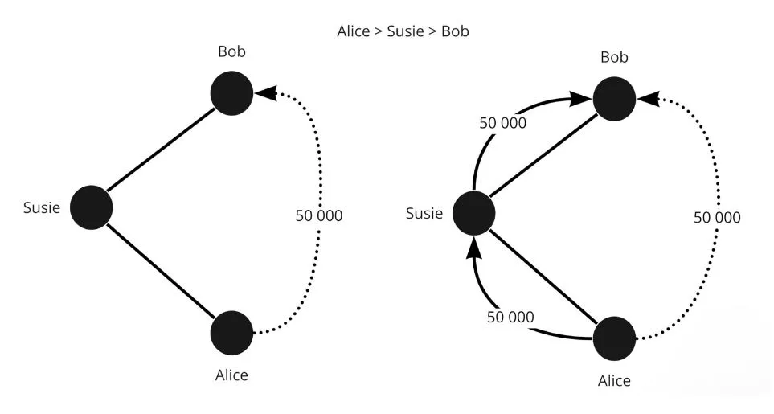

Lightning adalah jaringan saluran pembayaran. Ribuan rekan dengan saluran likuiditas mereka sendiri terhubung satu sama lain, dan dengan demikian menggunakan diri mereka sendiri untuk melakukan transaksi antar rekan yang tidak terhubung. Likuiditas dari saluran ini tidak dapat ditransfer ke saluran likuiditas lain.

Alice -> Eden - > Bob`. Satoshi tidak berpindah dari `Alice -> Bob`, tetapi dari `Alice -> Eden`dan dari`Eden -> Bob`.

Jadi, setiap orang dan saluran memiliki likuiditas yang berbeda. Untuk melakukan pembayaran, Anda perlu menemukan rute di jaringan dengan likuiditas yang cukup. Jika tidak cukup, pembayaran tidak akan dilakukan.

Pertimbangkan jaringan berikut:

```
Keadaan awal jaringan:
Alice (130 SAT) ==== (0 SAT) Susie (90 SAT) ==== (200 SAT) Eden (150 SAT) ==== (100 SAT) Bob
```


Jika Alice harus mentransfer 40 SAT ke Bob, maka likuiditas akan didistribusikan ulang di sepanjang rute antara kedua pihak.

```
Setelah Alice mentransfer 40 SAT ke Bob:
Alice (90 SAT) ==== (40 SAT) Susie (50 SAT) ==== (240 SAT) Eden (110 SAT) ==== (140 SAT) Bob

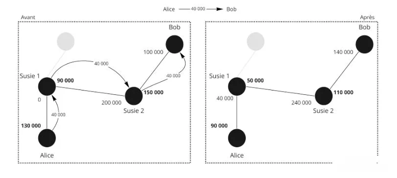

Namun, dalam keadaan awal, Bob tidak bisa mengirim 40 SAT ke Alice karena Susie tidak memiliki likuiditas dengan Alice untuk mengirim 40 SAT, sehingga pembayaran tidak mungkin dilakukan melalui rute ini. Oleh karena itu, kita memerlukan rute lain di mana transaksi ini tidak mungkin.

Dalam contoh pertama, jelas bahwa Susie dan Eden tidak kehilangan apa-apa dan tidak mendapatkan apa-apa. Node Jaringan Lightning mengenakan biaya untuk setuju digunakan untuk merutekan transaksi!

Ada berbagai biaya tergantung pada di mana likuiditas berada

Alice - Bob

- Biaya Alice = Alice -> Bob
- Biaya Bob = Bob -> Alice

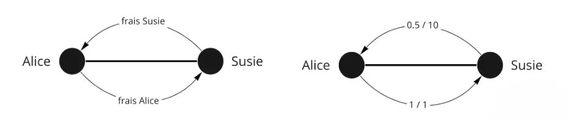

Ada dua jenis biaya:

- biaya tetap tanpa memandang jumlah: 1 SAT (default tapi bisa diubah)
- biaya variabel (0,01% secara default)

Contoh biaya:

- Alice - Susie; 1/1 (1 biaya tetap dan 1 biaya variabel)
- Susie - Eden; 0/200
- Eden - Bob; 1/1

Oleh karena itu:

- Biaya 1: (dibayar oleh Alice kepada dirinya sendiri) 1 + (40,000\*0,000001)
- Biaya 2: 0 + 40,000 \* 0,0002 = 8 SAT
- Biaya 3: 1 + 40,000\* 0,000001 = 0,4 SAT

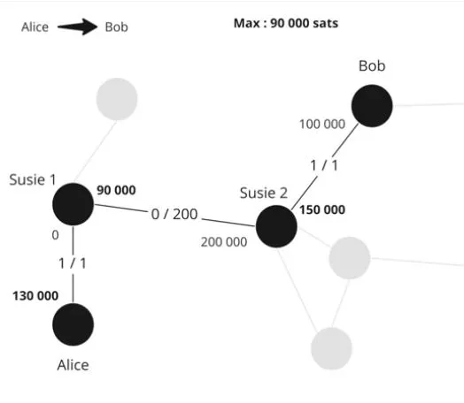

Pengiriman:

1. Pengiriman 40,009.04 Alice -> Susie; Alice membayar biaya sendiri jadi tidak dihitung
2. Susie melakukan kebaikan dengan mengirimkan 40 001.04 ke Eden; dia mengambil komisi ini sebesar 8 SAT
3. Eden melakukan layanan dengan mengirimkan 40,000 ke Bob, dia mengambil biaya 1.04 SAT.

Alice membayar biaya 9.04 SAT dan Bob menerima 40,000 SAT.


Di Jaringan Lightning, node Alice yang memutuskan rute sebelum mengirim pembayaran. Oleh karena itu, ada pencarian rute terbaik dan hanya Alice yang mengetahui rute dan harganya. Pembayaran dikirim, tapi Susie tidak memiliki informasi.

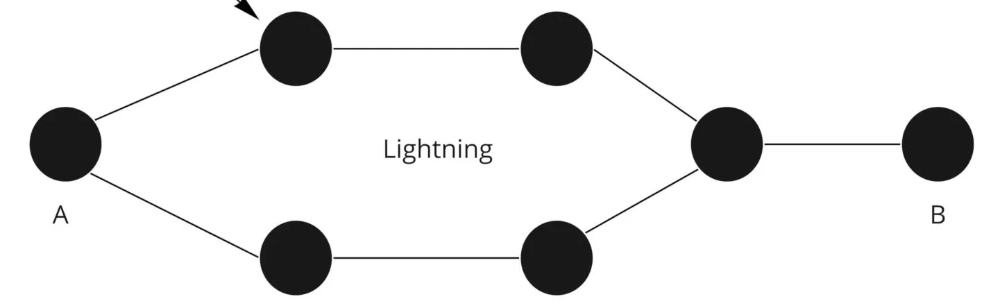

Untuk Susie atau Eden: mereka tidak tahu siapa penerima akhir, atau siapa yang mengirim pembayaran. Ini adalah onion routing. Node harus menyimpan rencana jaringan untuk menemukan rutenya, tapi tidak satu pun dari perantara yang memiliki informasi.

## HTLC - Hashed Time Locked Contract
<chapterId>4369b85a-1365-55d8-99e1-509088210116</chapterId>


Dalam sistem perutean tradisional, bagaimana kita dapat memastikan bahwa Eden tidak curang dan menghormati bagian mereka dari kontrak?

HTLC adalah kontrak pembayaran yang hanya bisa dibuka dengan sebuah rahasia. Jika tidak diungkapkan, maka kontrak tersebut kedaluwarsa. Oleh karena itu, ini adalah pembayaran bersyarat. Bagaimana mereka digunakan?


Pertimbangkan situasi berikut:
Alice (100,000 SAT) ==== (30,000 SAT) Susie (250,000 SAT) ==== (0 SAT) Bob
- Bob menghasilkan rahasia S (preimage) dan menghitung hash r = hash(s)
- Bob mengirimkan faktur kepada Alice dengan "r" termasuk di dalamnya
- Alice mengirimkan HTLC sebesar 40,000 SAT kepada Susie dengan syarat mengungkapkan "s'" sehingga hash(s') = r
- Susie mengirimkan HTLC serupa kepada Bob
- Bob membuka HTLC Susie dengan menunjukkan "s" kepadanya
- Susie membuka HTLC Alice dengan menunjukkan "s" kepadanya

Jika Bob offline dan tidak pernah mengambil rahasia yang memberinya legitimasi untuk menerima uang, maka HTLC akan kedaluwarsa setelah jumlah blok tertentu.

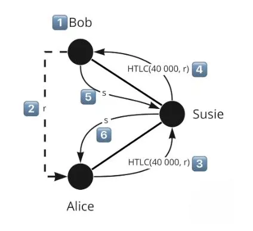

HTLC kedaluwarsa dalam urutan terbalik: kedaluwarsa Susie-Bob, kemudian kedaluwarsa Alice-Susie. Dengan cara ini, jika Bob kembali, itu tidak mengubah apa pun. Sebaliknya, jika Alice membatalkan sementara Bob kembali, itu akan menjadi masalah dan orang mungkin telah bekerja sia-sia.

Jadi, apa yang terjadi dalam kasus penutupan? Sebenarnya, transaksi komitmen kami bahkan lebih kompleks. Kami perlu merepresentasikan saldo antara jika saluran ditutup.

Oleh karena itu, ada HTLC-out sebesar 40,000 satoshi (dengan batasan yang dilihat sebelumnya) dalam transaksi komitmen melalui output #3.


Alice memiliki dalam transaksi komitmen:

- Output #1: 60,000 SAT untuk Alice melalui Timelock dan kunci pembatalan (yang tersisa untuknya)
- Output #2: 30,000 yang sudah milik Susie
- Output #3: 40,000 dalam HTLC

Transaksi komitmen Alice adalah dengan HTLC-out karena dia mengirimkan HTLC-in kepada penerima, Susie.

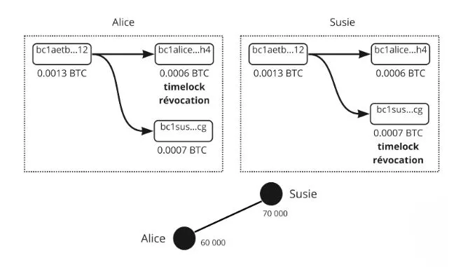

Oleh karena itu, jika kita menerbitkan transaksi komitmen ini, Susie dapat mengambil uang HTCL dengan gambar "s". Jika dia tidak memiliki pre-image, Alice mengambil uang setelah HTCL kedaluwarsa. Pikirkan output (UTXO) sebagai pembayaran yang berbeda dengan kondisi yang berbeda.
Setelah pembayaran dilakukan (kedaluwarsa atau eksekusi), status saluran berubah dan transaksi dengan HTCL tidak lagi ada. Kita kembali ke sesuatu yang klasik.
Dalam kasus penutupan kooperatif: kita menghentikan pembayaran dan oleh karena itu menunggu eksekusi transfer/HTCL, transaksi lebih ringan sehingga lebih murah karena ada maksimum 1 atau 2 output.
Jika penutupan paksa: kita menerbitkan dengan semua HTLC yang sedang berlangsung, sehingga menjadi sangat berat dan sangat mahal. Dan itu berantakan.

Ringkasnya, sistem perutean Jaringan Lightning menggunakan Hash Time-Locked Contracts (HTLC) untuk memastikan pembayaran yang aman dan dapat diverifikasi. HTLC memungkinkan pembayaran bersyarat di mana uang hanya dapat dibuka dengan rahasia, sehingga memastikan bahwa peserta memenuhi komitmen mereka.
Dalam contoh yang disajikan, Alice ingin mengirim SAT kepada Bob melalui Susie. Bob menghasilkan rahasia, membuat hash darinya, dan mentransmisikannya kepada Alice. Alice dan Susie menyiapkan HTLC berdasarkan hash ini. Setelah Bob membuka HTLC Susie dengan menunjukkan rahasianya, Susie kemudian dapat membuka HTLC Alice.
Dalam peristiwa bahwa Bob tidak mengungkapkan rahasia dalam periode waktu tertentu, HTLC kedaluwarsa. Kedaluwarsa terjadi dalam urutan terbalik, memastikan bahwa jika Bob kembali online, tidak ada konsekuensi yang tidak diinginkan.
Saat menutup kanal, jika penutupan bersifat kooperatif, pembayaran terganggu dan HTLC diselesaikan, yang umumnya lebih murah. Jika penutupan dipaksakan, semua transaksi HTLC yang sedang berlangsung dipublikasikan, yang bisa menjadi sangat mahal dan berantakan. Secara keseluruhan, mekanisme HTLC menambahkan lapisan keamanan tambahan ke Lightning Network, memastikan bahwa pembayaran dilaksanakan dengan benar dan bahwa pengguna memenuhi komitmen mereka.

## Menemukan Jalur Anda
<chapterId>7e2ae959-c2a1-512e-b5d6-8fd962e819da</chapterId>


Data publik hanya adalah kapasitas total kanal (Alice + Bob) tetapi kita tidak tahu di mana likuiditas berada.
Untuk mendapatkan lebih banyak informasi, node kita mendengarkan saluran komunikasi LN untuk pengumuman kanal baru dan pembaruan biaya kanal. Node Anda juga melihat blockchain untuk penutupan kanal.

Karena kita tidak memiliki semua informasi, kita harus mencari grafik/rute dengan informasi yang kita miliki (kapasitas maksimum kanal dan bukan di mana likuiditas berada).

Kriteria:

- Probabilitas sukses - Biaya
- Waktu kedaluwarsa HTLC
- Jumlah node perantara
- Acak


Jadi jika ada 3 rute yang mungkin:

- Alice > 1 > 2 > 5 > Bob
- Alice > 1 > 2 > 4 > 5 > Bob
- Alice 1 > 2 > 3 > Bob

Kita mencari rute terbaik secara teori dengan biaya terendah dan peluang sukses tertinggi: likuiditas maksimum dan lompatan paling sedikit mungkin.

Misalnya, jika 2-3 hanya memiliki kapasitas 130.000 SAT, mengirim 100.000 sangat tidak mungkin, jadi pilihan #3 tidak memiliki peluang sukses.


Sekarang algoritma telah membuat 3 pilihannya dan akan mencoba yang pertama:

Pilihan 1:

- Alice mengirim HTLC sebesar 100.000 SAT ke 1;
- 1 membuat HTLC sebesar 100.000 SAT ke 2;
- 2 membuat HTLC sebesar 100.000 SAT ke 5, tetapi 5 tidak bisa melakukannya, jadi dia mengumumkannya.

Informasi dikirim kembali, jadi Alice memutuskan untuk mencoba rute kedua:

- Alice mengirim HTLC sebesar 100.000 ke 1;
- 1 membuat HTLC sebesar 100.000 ke 2;
- 2 membuat HTLC sebesar 100.000 ke 4;
- 4 membuat HTLC sebesar 100.000 ke Bob. Bob memiliki likuiditas, jadi tidak masalah.
- Bob menggunakan preimage (hash) dari HTLC dan dengan demikian menggunakan rahasia untuk mengambil 100.000 SAT
- 5 sekarang memiliki rahasia dari HTLC untuk mengambil HTLC yang diblokir dari 4
- 4 sekarang memiliki rahasia dari HTLC untuk mengambil HTLC yang diblokir dari 2
- 2 sekarang memiliki rahasia dari HTLC untuk mengambil HTLC yang diblokir dari 1
- 1 sekarang memiliki rahasia dari HTLC untuk mengambil HTLC yang diblokir Alice

Alice tidak melihat kegagalan rute 1, dia hanya menunggu satu detik lebih lama. Kegagalan pembayaran terjadi ketika tidak ada rute yang mungkin. Untuk memudahkan pencarian rute, Bob dapat memberikan informasi kepada Alice untuk membantu dengan faktur nya:

- Jumlahnya
- Alamatnya
- Hash dari preimage sehingga Alice dapat membuat HTLC
- Indikasi pada saluran Bob
Bob mengetahui likuiditas saluran 5 dan 3 karena dia secara langsung terhubung dengan mereka, dia dapat mengindikasikan ini kepada Alice. Dia memperingatkan Alice bahwa node 3 tidak berguna, yang mencegah Alice dari kemungkinan membuat rutenya.
Elemen lainnya adalah saluran privat (yang tidak dipublikasikan di jaringan) yang mungkin dimiliki Bob. Jika Bob memiliki saluran privat dengan 1, dia dapat memberitahu Alice untuk menggunakannya dan itu akan memberikan Alice > 1 > Bob'.


Kesimpulannya, merutekan transaksi di Lightning Network adalah proses yang kompleks yang memerlukan pertimbangan berbagai faktor. Meskipun kapasitas total saluran adalah publik, distribusi likuiditas yang tepat tidak langsung dapat diakses. Ini memaksa node untuk memperkirakan rute yang paling mungkin berhasil, dengan mempertimbangkan kriteria seperti biaya, waktu kedaluwarsa HTLC, jumlah node perantara, dan faktor keacakan. Ketika beberapa rute dimungkinkan, node berusaha untuk meminimalkan biaya dan memaksimalkan peluang keberhasilan dengan memilih saluran dengan likuiditas yang cukup dan jumlah lompatan minimum. Jika upaya transaksi gagal karena likuiditas yang tidak mencukupi, rute lain dicoba sampai transaksi berhasil dilakukan.

Selanjutnya, untuk memfasilitasi pencarian rute, penerima dapat memberikan informasi tambahan seperti alamat, jumlah, hash preimage, dan indikasi pada saluran mereka. Ini dapat membantu mengidentifikasi saluran dengan likuiditas yang cukup dan menghindari upaya transaksi yang tidak perlu. Pada akhirnya, sistem perutean Lightning Network dirancang untuk mengoptimalkan kecepatan, keamanan, dan efisiensi transaksi sambil menjaga privasi pengguna.

# Alat dari Lightning Network
<partId>74d6c334-ec5d-55d9-8598-f05694703bf6</partId>

## Invoice, LNURL, Keysend
<chapterId>e34c7ecd-2327-52e3-b61e-c837d9e5e8b0</chapterId>


Sebuah invoice LN (atau invoice) panjang dan tidak menyenangkan untuk dibaca, tetapi memungkinkan representasi yang padat dari permintaan pembayaran.

Contoh:
lnbc1m1pskuawzpp5qeuuva2txazy5g483tuv9pznn9ft8l5e49s5dndj2pqq0ptyn8msdqqcqzpgxqrrsssp5v4s00u579atm0em6eqm9nr7d0vr64z5j2sm5s33x3r9m4lgfdueq9qyyssqxkjzzgx5ef7ez3dks0laxayx4grrw7j22ppgzyhpydtv6hmc39skf9hjxn5yd3kvv7zpjdxd2s7crcnemh2fz26mnr6zu83w0a2fwxcqnvujl3

- lnbc1m = bagian yang dapat dibaca
- 1 = pemisahan dari sisanya
- Kemudian sisanya
- Bc1 = Pengkodean Bech32 (basis 32), jadi 32 karakter digunakan.
- 10 = 1.2.3.4.5.6.7.8.9.0
- 26 = abcdefghijklmnopqrstuvwxyz
- 32 = tidak "b-i-o" dan tidak "1"

### lnbc1m

- ln = Lightning
- Bc = bitcoin (mainnet)
- 1 = jumlah
- M = milli (10^-3) / u = mikro (10^-6) / n = nano (10^-9) / p = piko (10^-12) Di sini 1m = 1 \* 0.0001btc = 100,000 BTC
  "Mohon bayar 100,000 SAT di jaringan Lightning dari Bitcoin mainnet ke pskuawzpp5qeuuva2txazy5g483tuv9pznn9ft8l5e49s5dndj2pqq0ptyn8msdqqcqzpgxqrrsssp5v4s00u579atm0em6eqm9nr7d0vr64z5j2sm5s33x3r9m4lgfdueq9qyyssqxkjzzgx5ef7ez3dks0laxayx4grrw7j22ppgzyhpydtv6hmc39skf9hjxn5yd3kvv7zpjdxd2s7crcnemh2fz26mnr6zu83w0a2fwxcqnvujl3"

### Timestamp (waktu dibuat)

Ini berisi 0 atau lebih bagian tambahan:

- Hash dari preimage
- Rahasia pembayaran (onion routing)
- Data sembarang
- Kunci publik LN dari penerima
- Waktu kedaluwarsa (default 1 jam)
- Petunjuk routing
- Tanda tangan dari keseluruhan

Ada jenis faktur lainnya. Meta-protokol LNURL memungkinkan untuk menyediakan jumlah satoshi langsung alih-alih membuat permintaan. Ini sangat fleksibel dan memungkinkan banyak peningkatan dalam hal pengalaman pengguna.

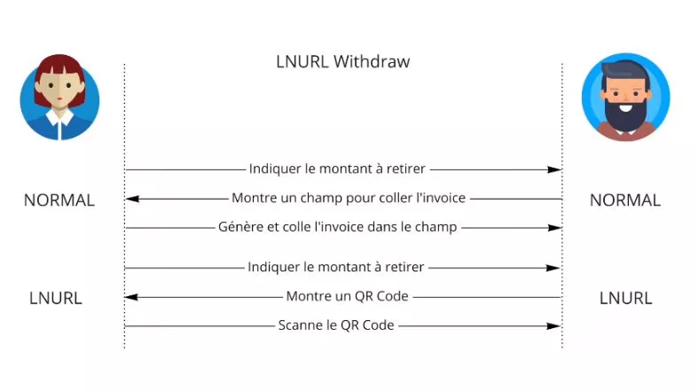

Keysend memungkinkan Alice untuk mengirim uang ke Bob tanpa permintaan dari Bob. Alice mengambil ID Bob, membuat preimage tanpa bertanya kepada Bob, dan memasukkannya dalam pembayarannya. Jadi, Bob akan menerima permintaan kejutan di mana dia bisa membuka uang karena Alice sudah melakukan pekerjaannya.

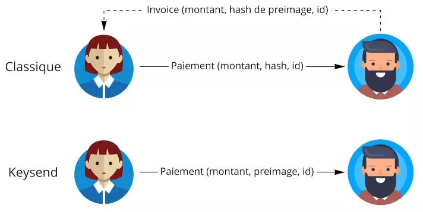

Kesimpulannya, faktur Jaringan Lightning, meskipun kompleks pada pandangan pertama, secara efektif mengkodekan permintaan pembayaran. Setiap bagian dari faktur berisi informasi kunci, termasuk jumlah yang harus dibayar, penerima, timestamp pembuatan, dan potensi informasi lain seperti hash dari preimage, rahasia pembayaran, petunjuk routing, dan waktu kedaluwarsa. Protokol seperti LNURL dan Keysend menawarkan peningkatan signifikan dalam hal fleksibilitas dan pengalaman pengguna, memungkinkan, misalnya, untuk mengirim dana tanpa permintaan sebelumnya dari pihak lain. Teknologi ini membuat proses pembayaran lebih lancar dan efisien di Jaringan Lightning.

## Mengelola Likuiditas
<chapterId>cc76d0c4-d958-57f5-84bf-177e21393f48</chapterId>


Kami menyediakan beberapa pedoman umum untuk menjawab pertanyaan abadi tentang mengelola likuiditas di Lightning.

Di LN, ada 3 jenis orang:

- Pembeli: mereka memiliki likuiditas keluar, yang paling sederhana karena mereka hanya perlu membuka saluran
- Pedagang: ini lebih rumit karena mereka membutuhkan likuiditas masuk dari node lain dan aktor lain. Mereka harus memiliki orang yang terhubung dengan mereka
- Node routing: mereka ingin seimbang dengan likuiditas di kedua sisi dan memiliki koneksi yang baik ke banyak node untuk digunakan sebanyak mungkin

Jadi jika Anda membutuhkan likuiditas masuk, Anda dapat membelinya dari layanan.
Alice membeli sebuah saluran dengan Susie seharga 1 juta satoshi, sehingga dia membuka saluran dengan langsung 1.000.000 SAT di sisi masuk. Dia kemudian dapat menerima pembayaran hingga 1 juta SAT dari pelanggan yang terhubung dengan Susie (yang memiliki banyak koneksi).

Solusi lainnya adalah melakukan pembayaran; Anda membayar 100.000 untuk alasan X, Anda sekarang dapat menerima 100.000.

### Solusi Loop Out: Atomic swap LN - BTC

Alice 2 juta - Susie 0

Alice ingin mengirim likuiditas ke Susie, jadi dia melakukan Loop out (sebuah node khusus yang menawarkan layanan profesional untuk menyeimbangkan kembali LN/BTC).
Alice mengirim 1 juta ke Loop melalui node Susie, sehingga Susie memiliki likuiditas dan Loop mengirim saldo on-chain kembali ke node Alice.

Jadi, 1 juta tersebut pergi ke Susie, Susie mengirim 1 juta ke Loop, Loop mengirim 1 juta ke Alice. Alice dengan demikian telah memindahkan likuiditas ke Susie dengan biaya beberapa biaya yang dibayarkan ke Loop untuk layanannya.

Hal paling rumit dalam LN adalah untuk menjaga likuiditas.

Kesimpulannya, manajemen likuiditas di Lightning Network adalah isu kunci yang tergantung pada jenis pengguna: pembeli, pedagang, atau node perutean. Pembeli, yang membutuhkan likuiditas keluar, memiliki tugas paling sederhana: mereka hanya membuka saluran. Pedagang, yang memerlukan likuiditas masuk, harus terhubung dengan node dan aktor lainnya. Node perutean, di sisi lain, berusaha untuk mempertahankan keseimbangan likuiditas di kedua sisi. Beberapa solusi ada untuk mengelola likuiditas, seperti membeli saluran atau membayar untuk meningkatkan kapasitas penerimaan. Opsi "Loop Out", yang memungkinkan untuk Atomic Swap antara LN dan BTC, menawarkan solusi menarik untuk menyeimbangkan kembali likuiditas. Meskipun dengan strategi ini, menjaga likuiditas di Lightning Network tetap menjadi tantangan yang kompleks.

# Lanjutkan
<partId>6bbf107d-a224-5916-9f0c-2b4d30dd0b17</partId>

## Ringkasan kursus
<chapterId>a65a571c-561b-5e1c-87bf-494644653c22</chapterId>

Tujuan kami adalah menjelaskan bagaimana Lightning Network bekerja dan bagaimana ia bergantung pada Bitcoin untuk berfungsi.

Lightning Network adalah jaringan dari saluran pembayaran. Kami telah melihat bagaimana saluran pembayaran bekerja antara dua pemangku kepentingan, tetapi kami juga telah memperluas visi kami ke seluruh jaringan, ke gagasan tentang jaringan saluran pembayaran.

Saluran dibuka melalui transaksi Bitcoin dan dapat menampung sebanyak mungkin transaksi. Keadaan saluran diwakili oleh transaksi komitmen yang mengirim ke setiap pemangku kepentingan apa yang mereka miliki di sisi saluran mereka. Ketika transaksi terjadi dalam saluran, pemangku kepentingan berkomitmen pada keadaan baru dengan mencabut keadaan lama dan membangun transaksi komitmen baru.

Pasangan melindungi diri mereka dari kecurangan dengan kunci pembatalan dan kunci waktu. Penutupan dengan persetujuan bersama lebih disukai untuk menutup saluran. Dalam kasus penutupan paksa, transaksi komitmen terakhir dipublikasikan.
Pembayaran dapat meminjam saluran dari node perantara lainnya. Pembayaran bersyarat pada hash time lock (HTLC) memungkinkan dana untuk dikunci sampai pembayaran sepenuhnya diselesaikan. Onion routing digunakan dalam Lightning Network. Node perantara tidak mengetahui tujuan akhir dari pembayaran. Alice harus menghitung rute pembayaran, tetapi tidak memiliki semua informasi tentang likuiditas di saluran perantara.
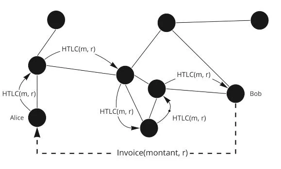

Ada komponen probabilitas ketika mengirim pembayaran melalui Lightning Network.


Untuk menerima pembayaran, likuiditas harus dikelola di saluran, yang dapat dilakukan dengan meminta orang lain untuk membuka saluran kepada kita, membuka saluran sendiri, dan menggunakan alat seperti Loop atau membeli/menyewa saluran di pasar.

## Wawancara Fanis
<chapterId>077cb5f5-1626-5da5-9964-e67b1de503bf</chapterId>

Berikut adalah ringkasan wawancara:

Lightning Network adalah solusi pembayaran ultra-cepat di Bitcoin yang memungkinkan untuk mengatasi keterbatasan terkait dengan skalabilitas jaringan. Namun, bitcoin di Lightning tidak seaman bitcoin di rantai Bitcoin karena desentralisasi dan keamanan diprioritaskan daripada skalabilitas.

Peningkatan ukuran blok yang berlebihan bukan solusi yang baik karena mengkompromikan node dan kapasitas data. Sebaliknya, Lightning Network memungkinkan pembuatan saluran pembayaran antara dua pengguna Bitcoin tanpa menampilkan transaksi di blockchain, menghemat ruang pada blok dan memungkinkan Bitcoin untuk berskala saat ini.

Namun, ada kritik mengenai skalabilitas dan sentralisasi dari Lightning Network, dengan potensi masalah terkait penutupan saluran dan biaya transaksi yang tinggi. Untuk mengatasi masalah ini, disarankan untuk menghindari membuka saluran kecil untuk menghindari masalah di masa depan dan untuk meningkatkan biaya transaksi dengan Child Pay for Parent.

Solusi yang dipertimbangkan untuk masa depan Lightning Network adalah batching dan membuat saluran dalam kelompok untuk mengurangi biaya transaksi, serta meningkatkan ukuran blok dalam jangka panjang. Namun, penting untuk dicatat bahwa bitcoin di Lightning tidak seaman bitcoin di rantai Bitcoin.

Privasi di Bitcoin dan Lightning terkait, dengan onion routing memastikan tingkat privasi tertentu untuk transaksi. Namun, di Bitcoin, semuanya transparan secara default, dengan heuristik digunakan untuk melacak Bitcoin dari alamat ke alamat di rantai Bitcoin.

Membeli Bitcoin dengan KYC memungkinkan bursa untuk mengetahui transaksi penarikan, sementara jumlah bulat dan alamat perubahan memungkinkan mengetahui bagian mana dari transaksi yang dimaksudkan untuk orang lain dan bagian mana yang dimaksudkan untuk diri sendiri.

Untuk meningkatkan privasi, tindakan bersama dan coinjoins memungkinkan memecah perhitungan probabilitas dengan membuat transaksi di mana beberapa orang melakukan transaksi bersama. Perusahaan analisis rantai memiliki waktu yang lebih sulit untuk menentukan apa yang Anda lakukan dengan bitcoin Anda dengan mengikuti.

Di Lightning, hanya dua orang yang mengetahui transaksi, dan ini lebih rahasia daripada Bitcoin. Onion routing berarti bahwa node perantara tidak mengetahui pengirim dan penerima pembayaran.

Untuk menggunakan Lightning Network, disarankan untuk mengikuti pelatihan di saluran YouTube Anda atau langsung di situs web discover Bitcoin, atau menggunakan pelatihan di Umbrell. Juga dimungkinkan untuk mengirim teks sembarang selama pembayaran di Lightning menggunakan bidang khusus untuk ini, yang dapat berguna untuk donasi atau pesan.
Namun, penting untuk dicatat bahwa node routing Lightning dapat diatur di masa depan, dengan beberapa negara berusaha mengatur node routing. Bagi pedagang, diperlukan untuk mengelola likuiditas untuk menerima pembayaran di Lightning Network, dengan kendala saat ini yang dapat diatasi dengan solusi yang tepat.

Akhirnya, masa depan Bitcoin menjanjikan dengan proyeksi kemungkinan satu juta dalam lima tahun. Untuk memastikan profesionalisasi industri dan penciptaan sistem alternatif untuk sistem perbankan yang ada, penting untuk berkontribusi pada jaringan dan berhenti mempercayai.
## Pengakuan dan Terus Menggali Lubang Kelinci

Selamat! 🎉
Anda telah menyelesaikan pelatihan LN 201 - Pengenalan ke Lightning Network!
Anda patut bangga pada diri sendiri karena ini bukanlah hal yang mudah. Ketahuilah bahwa hanya sedikit orang yang menggali lebih dalam ke lubang kelinci Bitcoin.

Pertama-tama, terima kasih banyak kepada Fanis Makalakis karena telah menawarkan kursus gratis yang hebat ini tentang aspek etnis Lightning. Jangan ragu untuk mengikutinya di Twitter, di blognya, atau melalui pekerjaannya di pasar LN.

Kemudian, jika Anda ingin membantu proyek ini, jangan ragu untuk mensponsori kami di Patreon. Donasi Anda akan digunakan untuk memproduksi konten untuk kursus pelatihan baru dan tentu saja, Anda akan menjadi yang pertama untuk diinformasikan (termasuk untuk kursus berikutnya dari Fanis yang sedang dalam pengerjaan!).

Petualangan Lightning Network berlanjut dengan pelatihan Umbrel dan implementasi node Lightning Network. Teori sudah selesai dan saatnya untuk praktek dengan pelatihan LN 202 sekarang!

Ciuman dan sampai jumpa lagi!

Rogzy'