# Путешествие к второму уровню Биткойна

Этот курс является теоретическим уроком о техническом функционировании Сети Lightning.

Добро пожаловать в захватывающий мир Сети Lightning, второго уровня Биткойна, который одновременно сложен и полон потенциала. Мы собираемся погрузиться в технические глубины этой технологии, не сосредотачиваясь на конкретных руководствах или сценариях использования. Для максимальной отдачи от этого курса необходимо хорошо разбираться в Биткойне. Это опыт, требующий серьезного и сосредоточенного подхода. Вы также можете рассмотреть возможность параллельного прохождения курса LN 202, который предлагает более практический аспект этого исследования. Приготовьтесь отправиться в путешествие, которое может изменить ваше восприятие экосистемы Биткойна.

Наслаждайтесь открытием!

+++

# Основы

<partId>32647d62-102b-509f-a3ba-ad1d6a4345f1</partId>


## Понимание Сети Lightning
<chapterId>df6230ae-ff35-56ea-8651-8e65580730a8</chapterId>

Сеть Lightning является инфраструктурой платежей второго уровня, построенной на сети Биткойна, которая позволяет совершать быстрые и недорогие транзакции. Для полного понимания работы Сети Lightning необходимо понять, что такое платежные каналы и как они работают.

Платежный канал Сети Lightning - это своего рода "частная дорожка" между двумя пользователями, которая позволяет совершать быстрые и повторяющиеся транзакции Биткойна. Когда канал открывается, ему присваивается фиксированная емкость, которая заранее определяется пользователями. Эта емкость представляет максимальное количество Биткойнов, которое может быть передано в канале в любой момент времени.

Платежные каналы являются двунаправленными, то есть имеют две "стороны". Например, если Алиса и Боб открывают платежный канал, Алиса может отправить Биткоины Бобу, а Боб может отправить Биткоины Алисе. Транзакции внутри канала не изменяют общую емкость канала, но они изменяют распределение этой емкости между Алисой и Бобом.

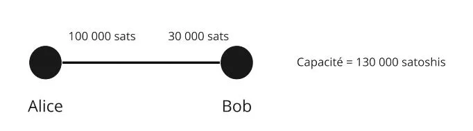

Для возможности транзакции в платежном канале Сети Lightning пользователь, отправляющий средства, должен иметь достаточно Биткойнов на своей стороне канала. Если Алиса хочет отправить 1 Биткойн Бобу через их канал, у нее должен быть как минимум 1 Биткойн на ее стороне канала.
Лимиты и функционирование платежных каналов в Сети Lightning.
Несмотря на то что емкость платежного канала Сети Lightning фиксирована, это не ограничивает общее количество транзакций или общий объем Биткойнов, которые могут быть переданы через канал. Например, если у Алисы и Боба есть канал с емкостью в 1 Биткойн, они могут совершить сотни транзакций по 0.01 Биткойна или тысячи транзакций по 0.001 Биткойна, пока общая емкость канала не будет превышена в любой момент времени.

Несмотря на эти ограничения, платежные каналы Сети Lightning являются эффективным способом совершения быстрых и недорогих транзакций Биткойна. Они позволяют пользователям отправлять и получать Биткойны, не платя высокие комиссии за транзакции или не ожидая долгих периодов подтверждения в сети Биткойна.

В заключение, каналы Lightning предлагают мощное решение для тех, кто хочет выполнять быстрые и недорогие транзакции в Биткойнах. Однако важно понимать их принцип работы и ограничения, чтобы полностью использовать их преимущества.

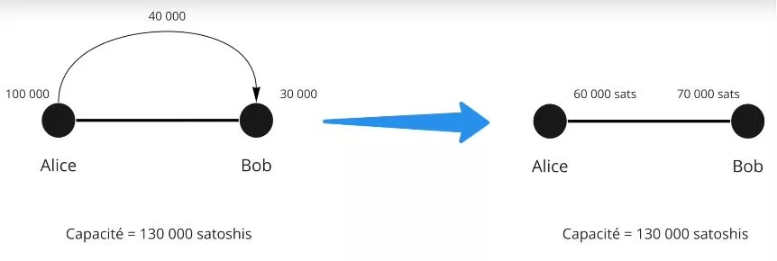

Пример:

- У Алисы 100,000 SAT
- У Боба 30,000 SAT

Это текущее состояние канала. Во время транзакции Алиса решает отправить Бобу 40,000 SAT. Она может это сделать, потому что 40,000 < 100,000.

Новое состояние канала, следовательно:

- Алиса 60,000 SAT
- Боб 70,000 SAT

```
Исходное состояние канала:
Алиса (100,000 SAT) ============== Боб (30,000 SAT)

После перевода Алисой 40,000 SAT Бобу:
Алиса (60,000 SAT) ============== Боб (70,000 SAT)

```

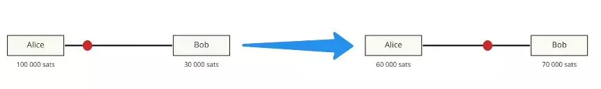

Теперь Боб хочет отправить Алисе 80,000 SAT. Не имея необходимой ликвидности, он не может этого сделать. Максимальная вместимость канала составляет 130,000 SAT, с возможным расходом до 60,000 SAT для Алисы и 70,000 SAT для Боба.


## Биткойн, адреса, UTXO и транзакции

<chapterId>0cfb7e6b-96f0-508b-9210-90bc1e28649d</chapterId>

В этой второй главе мы узнаем, как на самом деле работают транзакции Биткойн, что будет очень полезно для понимания Lightning. Мы также кратко обсуждим концепцию мультиподписных адресов, которая крайне важна для понимания следующей главы об открытии каналов в сети Lightning.

- Приватный ключ > Публичный ключ > Адрес: Во время транзакции Алиса отправляет деньги Бобу. Последний предоставляет адрес, полученный с его публичного ключа. Алиса, которая сама получила деньги на адрес через свой публичный ключ, теперь использует свой приватный ключ для подписи транзакции и таким образом разблокирует биткойны с адреса.
- В транзакции Биткойна все биткойны должны перемещаться. Так называемые UTXO (Unspend Transaction Output, Непотраченный Выход Транзакции), все биты биткойна будут переведены только для того, чтобы впоследствии вернуться к владельцу.
  У Алисы есть 0.002 BTC, у Боба 0 BTC. Алиса решает отправить Бобу 0.0015 BTC. Она подпишет транзакцию на 0.002 BTC, где 0.0015 уйдут Бобу, а 0.0005 вернутся в ее кошелек.

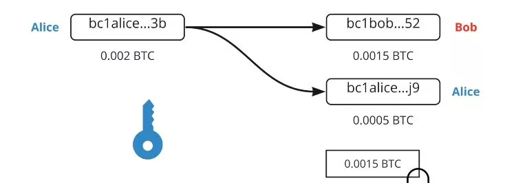

Здесь, из одного UTXO (у Алисы есть 0.0002 BTC на адресе), мы создали 2 UTXO (у Боба есть 0.0015 и у Алисы новый UTXO (независимый от предыдущего) 0.0005 BTC).

```
Алиса (0.002 BTC)
  |
  V
Транзакция Bitcoin (0.002 BTC)
  |
  |----> Боб (0.0015 BTC)
  |
  V
Алиса (новый UTXO: 0.0005 BTC)
```
В сети Lightning используются мультиподписи. Следовательно, для разблокировки средств требуются 2 подписи, т.е. два приватных ключа для перемещения денег. Это могут быть Алиса и Боб, которые вместе должны согласиться разблокировать деньги (UTXO). В LN (Lightning Network), в частности, это транзакции 2/2, так что обе подписи абсолютно необходимы, в отличие от мультиподписей 2/3 или 3/5, где требуется только комбинация от  полного числа ключей.


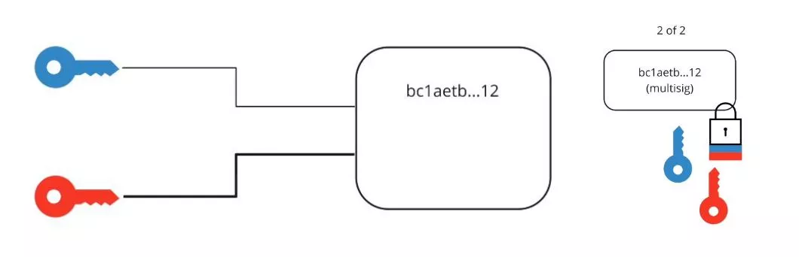

# Открытие и закрытие каналов

<partId>900b5b6b-ccd0-5b2f-9424-4b191d0e935d</partId>

## Открытие канала

<chapterId>96243eb0-f6b5-5b68-af1f-fffa0cc16bfe</chapterId>

Теперь мы более подробно рассмотрим, как происходит открытие канала через Биткойн-транзакцию.

В сети Lightning существуют разные уровни коммуникации:

- P2P коммуникация (протокол Lightning Network)
- Платежный канал (протокол Lightning Network)
- Биткойн-транзакция (протокол Биткойн)

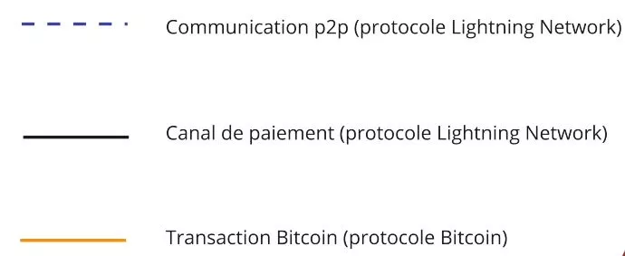

Для открытия канала два участника общаются через коммуникационный канал:

- Алиса: "Привет, я хочу открыть канал!"
- Боб: "Ок, вот мой публичный адрес."

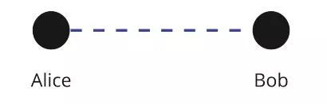

Теперь у Алисы есть 2 публичных адреса для создания мультиподписного адреса 2/2. Теперь она может совершить биткойн-транзакцию, чтобы отправить деньги на него.

Допустим, у Алисы есть UTXO на 0.002 BTC, и она хочет открыть канал с Бобом на 0.0013 BTC. Она создаст транзакцию с 2 UTXO в качестве выхода:

- UTXO на 0.0013 на мультиподписной адрес 2/2
- UTXO на 0.0007 на один из её адресов для сдачи (возврат UTXO).

Эта транзакция ещё не публична, потому что на этом этапе она доверяет Бобу, что он сможет разблокировать деньги с мультиподписного адреса.

Но как же тогда поступить?

Алиса создаст вторую транзакцию, называемую "транзакцией вывода", до публикации депозита средств в мультиподписной адрес.

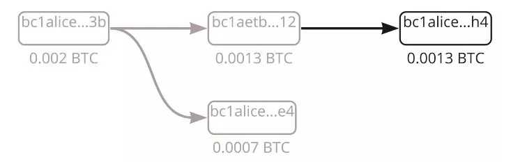

Транзакция вывода будет использовать средства с мультиподписного адреса на адрес Алисы (это делается до публикации всего остального).
Как только обе транзакции созданны, Алиса сообщает Бобу, что всё готово, и просит его подпись своим публичным ключом, объясняя, что таким образом она сможет вернуть свои средства, если что-то пойдет не так. Боб соглашается, потому что он не нечестен.

Теперь Алиса может восстановить средства самостоятельно, так как у неё уже есть подпись Боба. Она публикует транзакции. Канал теперь открыт с 0.0013 BTC (130,000 SAT) на стороне Алисы.

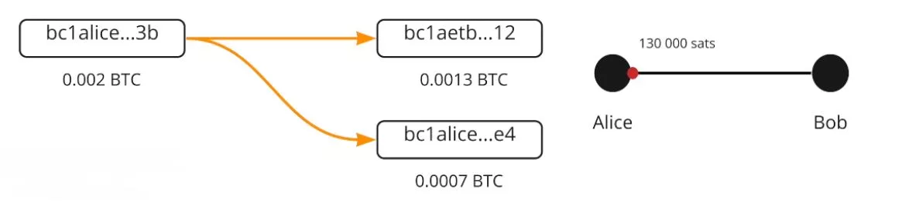

## Транзакция в сети Lightning & Транзакция обязательств

<chapterId>7d3fd135-129d-5c5a-b306-d5f2f1e63340</chapterId>

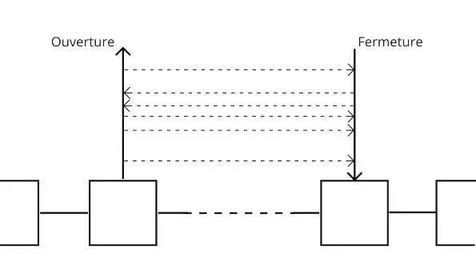

Теперь давайте проанализируем, что на самом деле происходит за кулисами при переводе средств с одной стороны на другую через канал в сети Lightning, рассматривая понятие транзакции обязательств (commitment transaction). Транзакция вывода средств/закрытия канала на блокчейне отображает состояние канала, гарантируя, кто владеет средствами после каждого перевода. Таким образом, после перевода в сети Lightning происходит обновление этой транзакции/контракта, не исполненного между двумя участниками, Алисой и Бобом, которые создают одну и ту же транзакцию с текущим состоянием канала на случай его закрытия:

- Алиса открывает канал с Бобом, имея 130,000 SAT со своей стороны. Транзакция вывода средств, принятая обоими в случае закрытия, указывает, что 130,000 SAT перейдут к Алисе при закрытии, и Боб соглашается, поскольку это справедливо.

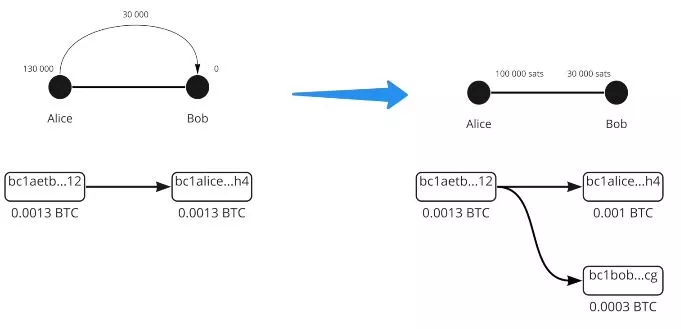

- Алиса отправляет 30,000 SAT Бобу. Теперь создается новая транзакция вывода средств, указывающая, что в случае закрытия Алиса получит 100,000 SAT, а Боб 30,000 SAT. Оба соглашаются, поскольку это справедливо.

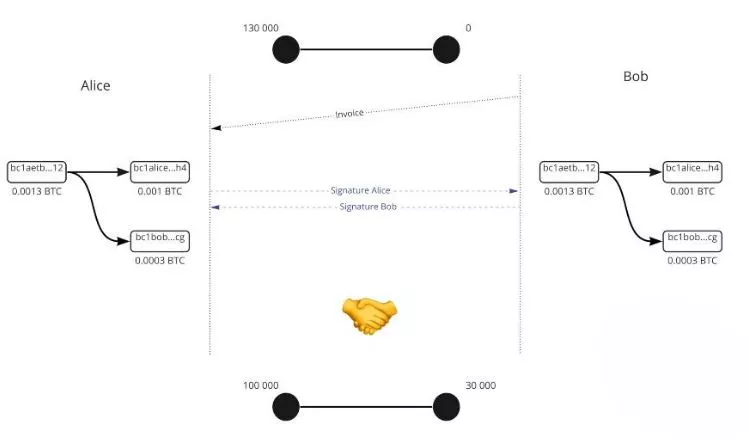

- Алиса отправляет 10,000 SAT Бобу, и создается новая транзакция вывода средств, указывающая, что Алиса получит 90,000 SAT, а Боб 40,000 SAT в случае закрытия. Оба соглашаются, поскольку это справедливо.

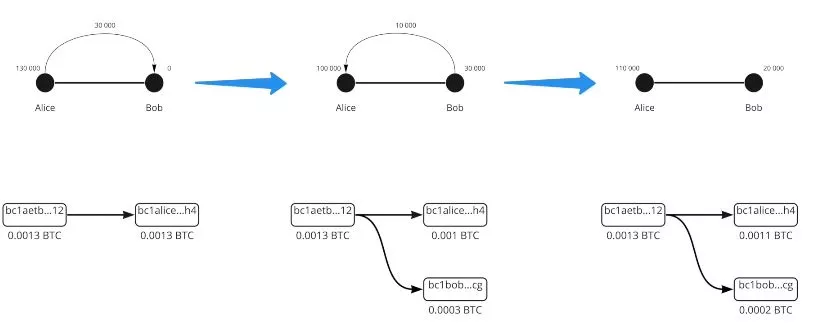

```
Исходное состояние канала:
Алиса (130,000 SAT) =============== Боб (0 SAT)

После первого перевода:
Алиса (100,000 SAT) =============== Боб (30,000 SAT)

После второго перевода:
Алиса (90,000 SAT) =============== Боб (40,000 SAT)
```

Деньги на самом деле не перемещаются, но конечный баланс обновляется через подписанную, но не опубликованную на блокчейне транзакцию. Таким образом, транзакция вывода средств является транзакцией обязательств. Переводы сатоши являются другой, более поздней транзакцией обязательств, которая обновляет баланс.

## Транзакции обязательств

<chapterId>f2f61e5b-badb-5947-9a81-7aa530b44e59</chapterId>

Если транзакции обязательств определяют состояние канала с ликвидностью на момент X, можем ли мы обмануть, опубликовав старое состояние? Ответ - да, потому что у нас уже есть предварительная подпись обоих участников в неопубликованной транзакции.

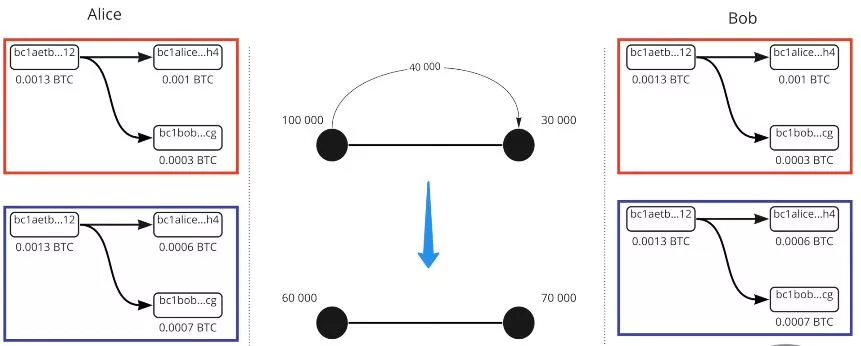

Чтобы решить эту проблему, мы добавим дополнительные условия:

- Временная блокировка (Timelock) = средства заблокированы до блока N
- Ключ отмены (Revocation key) = секрет Алисы и секрет Боба

Эти два элемента добавляются к транзакции обязательств. В результате Алисе необходимо дождаться окончания Временной блокировки, и любой, кто имеет ключ отмены может переместить средства, не дожидаясь окончания Временной блокировки. Если Алиса попытается обмануть, Боб использует ключ отмены, чтобы украсть средства у Алисы и тем самым наказать ее.

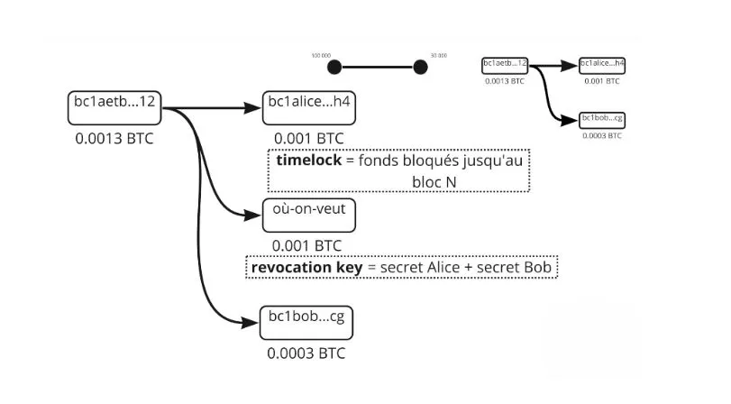

Сейчас (и на самом деле) транзакция обязательства для Алисы и Боба не одинакова, они симметричны, но каждый с разными ограничениями, они дают друг другу свои секреты для создания ключа отмены предыдущей транзакции обязательства. Таким образом, при создании Алиса создает канал с Бобом, 130 000 SAT с ее стороны, у нее есть Временная блокировка, который не позволяет ей немедленно вернуть свои деньги, ей нужно немного подождать. Ключ отмены может разблокировать деньги, но он есть только у Алисы (транзакция обязательства Алисы). Как только происходит перевод, Алиса предоставляет свой старый секрет Бобу, и тот, в свою очередь, сможет опустошить канал до предыдущего состояния в случае, если Алиса попытается обмануть (таким образом, он наказывает Алису).

Аналогично, Боб предоставляет свой секрет Алисе. Так что, если он попытается обмануть, Алиса может наказать его. Операция повторяется для каждой новой транзакции обязательства. Создается новый секрет и новый ключ отмены. Таким образом, для каждой новой транзакции предыдущая транзакция обязательства должна быть уничтожена путем предоставления секрета отмены. Таким образом, если Алиса или Боб попытаются обмануть, другой может действовать до этого (благодаря Временной блокировке) и таким образом избежать обмана. Во время транзакции №3 секрет транзакции №2, следовательно, предоставляется, чтобы позволить Алисе и Бобу защитить себя от Алисы или Боба.

Лицо, создающее транзакцию с Временной блокировкой (тот, кто отправляет деньги), может использовать ключ отмены только после окончания Временной блокировки. Однако лицо, получающее деньги, может использовать его до окончания Временной блокировки в случае обмана с другой стороны стороны на канала в сети Lightning. В частности, мы подробно рассматриваем механизмы, позволяющие защититься от возможного обмана со стороны своего партнера внутри канала.

## Закрытие канала
<chapterId>29a72223-2249-5400-96f0-3756b1629bc2</chapterId>


Теперь мы обсудим закрытие канала в сети Lightning. Закрытие канала через биткойн-транзакцию имеет разные формы в зависимости от случая. Существует 3 типа закрытия канала:

- Хорошее: закрытие сотрудничества
- Грубое: принудительное закрытие (без сотрудничества)
- Обман: закрытие обманщиком

### Хорошее

Две стороны общаются и договариваются о закрытии канала. Они прекращают все транзакции и подтверждают конечное состояние канала. Они договариваются о комиссиях сети (лицо, открывшее канал, платит комиссию за закрытие). Далее они создают транзакцию закрытия. Транзакция закрытия, отличная от транзакций обязательства, потому что в ней нет Временной блокировки и ключа отмены. Затем транзакция публикуется, и Алиса и Боб получают свои соответствующие балансы. Этот тип закрытия быстрый (потому что нет Временной блокировки) и, как правило, недорог.

### Грубое

Алиса хочет закрыть канал, но Боб не отвечает, потому что он не в сети (интернет или отключение электроэнергии). Тогда Алиса публикует самую последнюю транзакцию обязательства. Транзакция публикуется, и активируется Временная блокировка. Комиссии были установлены, когда эта транзакция была создана X времени назад! MemPool - это сеть, которая изменилась с тех пор, поэтому протокол по умолчанию устанавливает комиссии в 5 раз выше текущих, чем когда транзакция была создана. Комиссия за создание равна 10 SAT, так что цена транзакции теперь равна 50 SAT. Во время принудительного закрытия сеть является:


- 1 SAT = переплата в 50 раз\*
- 100 SAT = недоплата в 2 раза\*

Это делает принудительное закрытие более длительным (из-зи Временной блокировки) и особенно более рискованным с точки зрения комиссий и возможной валидации майнерами.

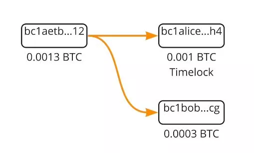

### Обман

Алиса пытается обмануть, публикуя старую транзакцию обязательства. Но Боб мониторит MemPool и следит за транзакциями, которые пытаются опубликовать старые. Если он находит такие, он использует ключ отмены, чтобы наказать Алису и забрать все SAT с канала.

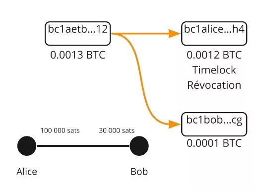

В заключение, закрытие канала в Сети Lightning является критически важным шагом, который может принимать различные формы. При закрытии сотрудничества обе стороны общаются и договариваются о конечном состоянии канала. Это самый быстрый и наименее дорогой вариант. С другой стороны, принудительное закрытие происходит, когда одна из сторон не отвечает. Это более дорогая и длительная ситуация из-за непредсказуемых комиссий за транзакции и активации Временной блокировки. Наконец, если участник пытается обмануть, публикуя старую транзакцию обязательства, мошенник может быть наказан потерей всех SAT с канала. Поэтому крайне важно понимать эти механизмы для эффективного и справедливого использования Сети Lightning.

# Сеть ликвидности

<partId>a873f1cb-751f-5f4a-9ed7-25092bfdef11</partId>

## Lightning Network

<chapterId>45a7252c-fa4f-554b-b8bb-47449532918e</chapterId>

В этой седьмой главе мы изучаем, как Lightning работает как сеть каналов и как платежи направляются от источника к получателю.

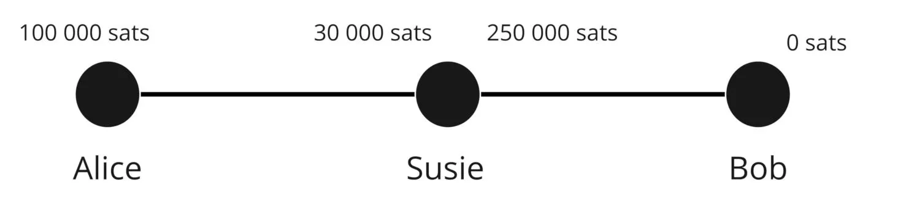
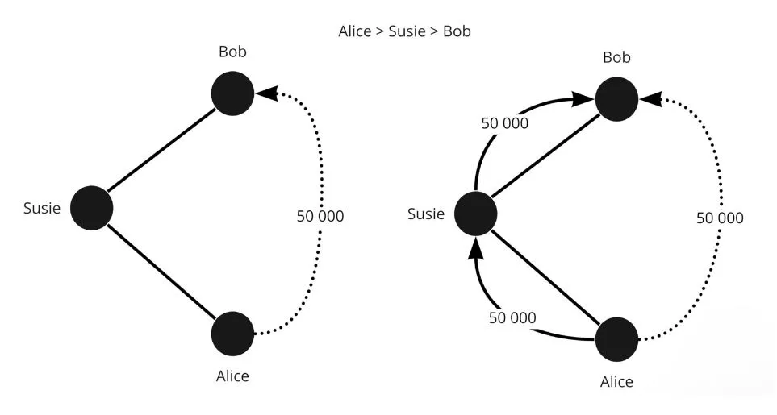

Lightning - это сеть платежных каналов. Тысячи узлов с собственными каналами ликвидности соединены друг с другом, и таким образом самостоятельно используются для проведения транзакций между несвязанными узлами. Ликвидность этих каналов не может быть передана в другие каналы ликвидности.


Алиса -> Иден - > Боб`. Сатоши не переместились от `Алисы -> Бобу`, но от `Алисы -> Идену` и от `Идена -> Бобу`.


Таким образом, у каждого человека и канала разная ликвидность. Для совершения платежей необходимо найти маршрут в сети с достаточной ликвидностью. Если ее недостаточно, платеж не пройдет.

Рассмотрим следующую сеть:

```
Исходное состояние сети:
Алиса (130 SAT) ==== (0 SAT) Сьюзи (90 SAT) ==== (200 SAT) Иден (150 SAT) ==== (100 SAT) Боб
```

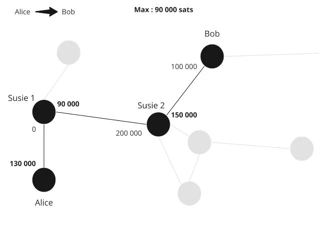

Если Алиса собирается перевести 40 SAT Бобу, то ликвидность будет перераспределена вдоль маршрута между двумя сторонами.

```
После того как Алиса переведёт 40 SAT Бобу:
Алиса (90 SAT) ==== (40 SAT) Сьюзи (50 SAT) ==== (240 SAT) Иден (110 SAT) ==== (140 SAT) Боб
```

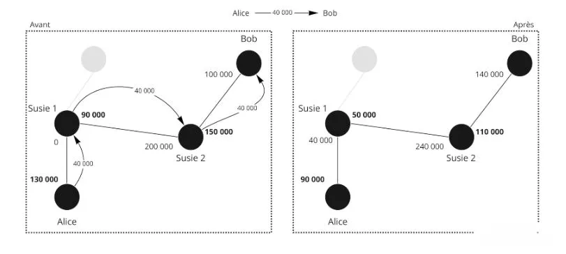

Однако, в исходном состоянии, Боб не может отправить 40 SAT Алисе, потому что у Сьюзи нет ликвидности с Алисой для отправки 40 SAT, поэтому платеж через этот маршрут невозможен. Поэтому нам нужен другой маршрут, где транзакция возможна.

В первом примере ясно, что Сьюзи и Эден ничего не потеряли и не приобрели. Узлы Сети Lightning взимают комиссию за согласие использовать их для маршрутизации транзакции!

В зависимости от местоположения ликвидности существуют различные комиссии

Алиса - Боб

- Комиссия Алисы = Алиса -> Боб
- Комиссия Боба = Боб -> Алиса

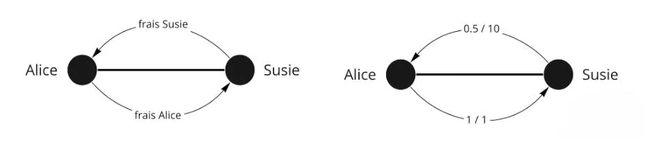

Существует два типа комиссий:

- фиксированная комиссия независимо от суммы: 1 SAT (по умолчанию, но может быть изменена)
- переменная комиссия (по умолчанию 0.01%)

Пример комиссии:

- Alice - Susie; 1/1 (1 фиксированная и 1 переменная комиссия)
- Susie - Eden; 0/200
- Eden - Bob; 1/1

Таким образом:

- Комиссия 1: (оплачивается Алисой самой себе) 1 + (40,000\*0.000001)
- Комиссия 2: 0 + 40,000 \* 0.0002 = 8 SAT
- Комиссия 3: 1 + 40,000\* 0.000001 = 1.04 SAT

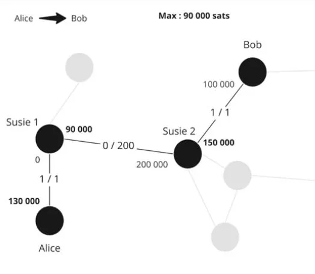

Отправка:

1. Отправка 40,009.04 Алиса -> Сьюзи; Алиса платит свои расходы, так что это не учитывается
2. Сьюзи делает Идену одолжение, отправляя 40 001.04; она берет с этого комиссию 8 SAT
3. Иден оказывает услугу, отправляя 40,000 Бобу, он берет свою комиссию 1.04 SAT.

Алиса заплатила комиссию 9.04 SAT, а Боб получил 40,000 SAT.

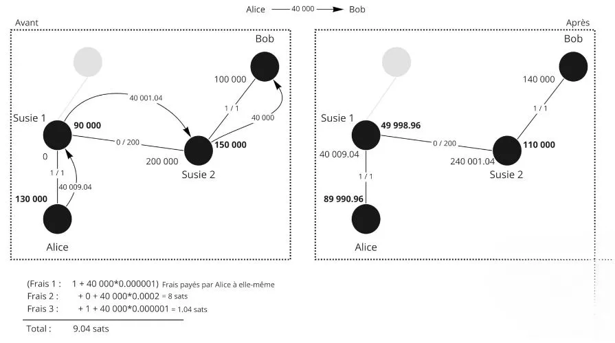

В сети Lightning именно узел Алисы решает маршрут перед отправкой платежа. Следовательно, происходит поиск лучшего маршрута, и только Алиса знает маршрут и цену. Платеж отправляется, но Сьюзи не имеет информации об этом.

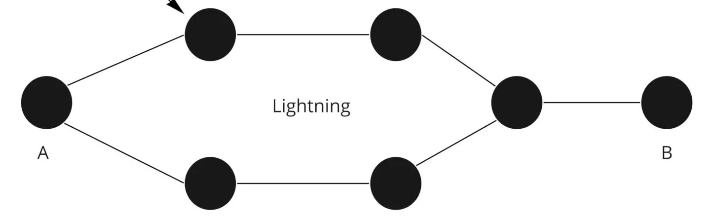

Для Сьюзи или Эдена: они не знают, ни кто конечный получатель, ни кто отправляет платеж. Это маршрутизация через луковицу (onion routing). Узел должен хранить план сети, чтобы найти свой маршрут, но ни один из посредников не имеет информации.


## HTLC - Hashed Time Locked Contract (Хешированый ограниченный по времени контракт)

<chapterId>4369b85a-1365-55d8-99e1-509088210116</chapterId>

В традиционной системе маршрутизации, как мы можем убедиться, что Иден не обманет и выполнит свою часть контракта?

HTLC - это платежный контракт, который может быть разблокирован только с помощью секрета. Если секретом никто не воспользовался, то контракт истекает. Таким образом, это условный платеж. Как использовать такие контракты?

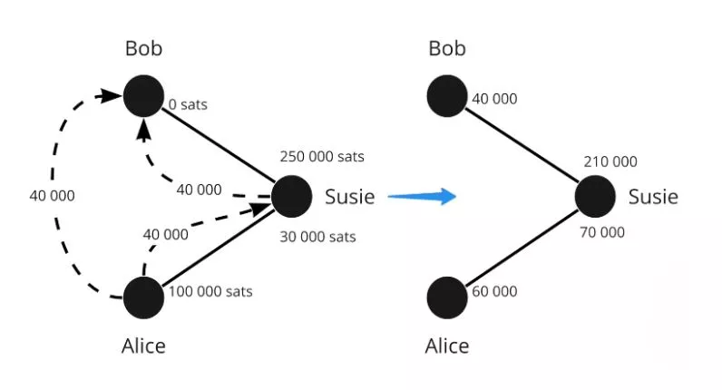

Рассмотрим следующую ситуацию:
`Alice (100,000 SAT) ==== (30,000 SAT) Susie (250,000 SAT) ==== (0 SAT) Bob`

- Боб генерирует секрет s (прообраз) и вычисляет хеш r = hash(s)
- Боб отправляет Алисе счет с включенным "r"
- Алиса отправляет HTLC на 40,000 SAT Сьюзи с условием раскрытия "s'", так что hash(s') = r
- Сьюзи отправляет похожий HTLC Бобу
- Боб разблокирует HTLC Сьюзи, показывая ей "s"
- Сьюзи разблокирует HTLC Алисы, показывая ей "s"

Если Боб не в сети и никогда не раскрывает свой секрет, который дает ему законное право получить деньги, то HTLC истекает после определенного количества блоков.

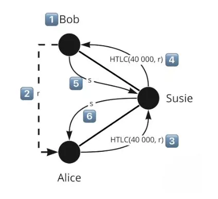

Сроки HTLC истекают в обратном порядке: сначала истекает срок Сьюза-Боб, затем истекает срок Алиса-Сьюзи. Таким образом, если Боб вернется, это ничего не изменит. В противном случае, если Алиса отменит операцию до того как Боб вернется, это создаст путаницу, и участники процесса возможно проделали их труд понапрасну.

Итак, что происходит в случае закрытия? На самом деле, наши транзакции обязательств еще более сложные. Нам нужно представить промежуточный баланс в случае закрытия канала.

Таким образом, в транзакции обязательства есть HTLC-out на 40 000 сатоши (с ограничениями, упомянутыми ранее) через выход №3.

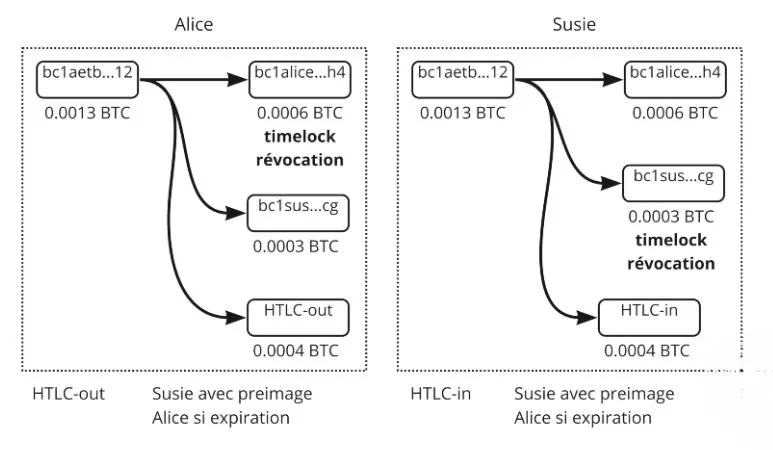

В транзакции обязательства у Алисы есть:

- Выход №1: 60 000 SAT для Алисы через Временную блокировку и ключ отмены (то, что остается для нее)
- Выход №2: 30 000, которые уже принадлежат Сьюзи
- Выход №3: 40 000 в HTLC

Транзакция обязательства Алисы с HTLC-out, потому что она отправляет HTLC-in получателю, Сьюзи.

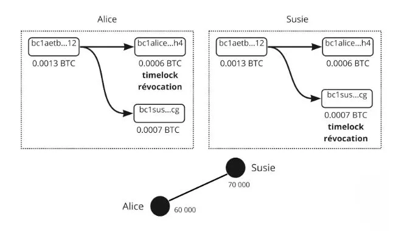

Таким образом, если мы опубликуем эту транзакцию обязательства, Сьюзи может получить HTCL деньги с помощью образа "s". Если у нее нет прообраза, Алиса получает деньги обратно после истечения срока HTCL. Думайте о выходах (UTXO) как о различных платежах с разными условиями.
Как только платеж совершен (истечение срока или выполнение), состояние канала меняется, и транзакция с HTCL больше не существует. Мы возвращаемся к классическому варианту.
В случае закрытия в результате сотрудничества: мы прекращаем платежи и, следовательно, ждем выполнения переводов/HTCL, транзакция легкая, поэтому менее дорогая, поскольку есть максимум 1 или 2 выхода.
В случае же принудительного закрытия: мы публикуем все текущие HTLC, поэтому это закрытие становится очень тяжелым и дорогим. И это беспорядок.

В заключение, система маршрутизации Сети Дightning использует Hash Time-Locked Contracts (HTLC) для обеспечения безопасного и проверяемого платежа. HTLC позволяют условные платежи, где деньги могут быть разблокированы только с помощью секрета, тем самым гарантируя, что участники выполняют свои обязательства.
В представленном примере Алиса хочет отправить SAT Бобу через Сьюзи. Боб генерирует секрет, создает его хеш и передает его Алисе. Алиса и Сьюзи настраивают HTLC на основе этого хеша. Как только Боб разблокирует HTLC Сьюзи, показав ей секрет, Сьюзи может затем разблокировать HTLC Алисы.
В случае, если Боб не раскроет секрет в течение определенного периода времени, HTLC истекает. Истечение срока происходит в обратном порядке и гарантирует, что если Боб вернется в сеть, нежелательных последствий не возникнет.

При закрытии канала, если это закрытие в результате сотрудничества, платежи прерываются, и HTLC выполняются, что, как правило, менее дорого. Если закрытие принудительное, все текущие транзакции HTLC публикуются, что может стать очень дорогим и запутанным.
В заключение, механизм HTLC добавляет дополнительный уровень безопасности к Сети Lightning, гарантируя, что платежи выполняются правильно и что пользователи выполняют свои обязательства.

## Нахождение своего пути

<chapterId>7e2ae959-c2a1-512e-b5d6-8fd962e819da</chapterId>

Единственные публичные данные - это общая вместимость канала (Алиса + Боб), но мы не знаем, где находится ликвидность.
Чтобы получить больше информации, наш узел прослушивает канал связи LN на предмет объявлений о новых каналах и обновлениях комиссий за каналы. Ваш узел также проверяет блокчейн на предмет закрытия каналов.
Поскольку у нас нет всей информации, мы должны искать граф/маршрут с имеющейся у нас информацией (максимальная вместимость канала, но не то, где находится ликвидность).

Критерии:

- Вероятность успеха - Комиссии
- Время истечения HTLC
- Количество промежуточных узлов
- Случайность

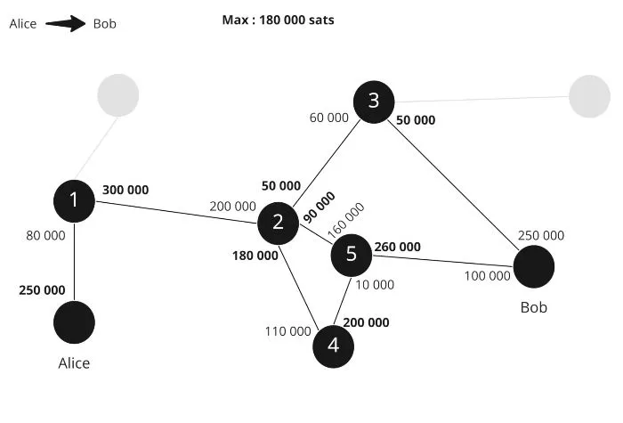

Итак, если есть 3 возможных маршрута:

- Алиса > 1 > 2 > 5 > Боб
- Алиса > 1 > 2 > 4 > 5 > Боб
- Алиса > 1 > 2 > 3 > Боб

Мы ищем лучший теоретический маршрут с наименьшими комиссиями и наибольшей вероятностью успеха: максимальная ликвидность и как можно меньше переходов.

Например, если у 2-3 есть только вместимость 130,000 SAT, отправка 100,000 крайне маловероятна, так что вариант №3 не имеет шансов на успех.

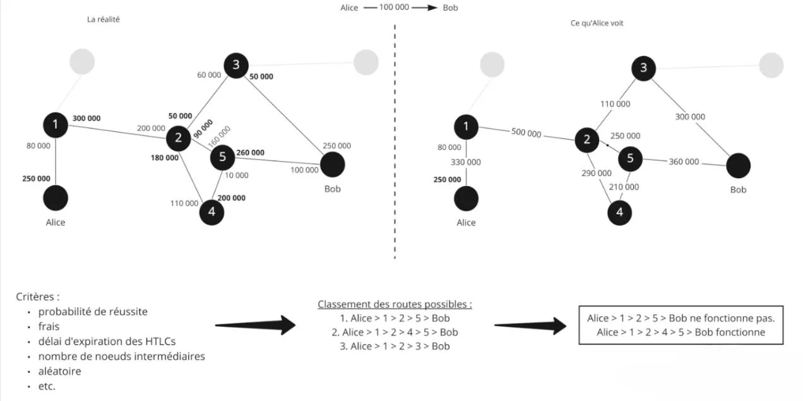

Теперь алгоритм сделал свои 3 выбора и попробует первый:

Выбор 1:

- Алиса отправляет HTLC на 100,000 SAT к 1;
- 1 отправляет HTLC на 100,000 SAT к 2;
- 2 отправляет HTLC на 100,000 SAT к 5, но 5 не может это сделать, поэтому объявляет об этом.

Информация отправляется обратно, так что Алиса решает попробовать второй маршрут:

- Алиса отправляет HTLC на 100,000 к 1;
- 1 отправляет HTLC на 100,000 к 2;
- 2 отправляет HTLC на 100,000 к 4;
- 4 отправляет HTLC на 100,000 к Бобу. У Боба есть ликвидность, так что все в порядке.
- Боб использует предварительный образ (хэш) HTLC и таким образом использует секрет для получения 100,000 SAT
- Теперь у 5 есть секрет HTLC для получения заблокированного HTLC от 4
- Теперь у 4 есть секрет HTLC для получения заблокированного HTLC от 2
- Теперь у 2 есть секрет HTLC для получения заблокированного HTLC от 1
- Теперь у 1 есть секрет HTLC для получения заблокированного HTLC Алисы

Алиса не видела неудачи маршрута 1, она просто подождала на одну секунду дольше. Сбой платежа происходит, когда нет возможного маршрута. Чтобы облегчить поиск маршрута, Боб может предоставить информацию Алисе, чтобы помочь с ее расчетами:

- Сумма
- Его адрес
- Хэш прообраза, чтобы Алиса могла создать HTLC
- Указания по каналам Боба

Боб знает ликвидность каналов 5 и 3, потому что он напрямую к ним подключен, он может рассказать это Алисе. Он предупреждает Алису, что узел 3 бесполезен, что предотвращает потенциальное создание маршрута Алисой через этот узел.
Другим элементом могут быть частные каналы (следовательно, не опубликованные в сети), которые могут быть у Боба. Если у Боба есть частный канал с 1, он мог бы сказать Алисе использовать его, и это дало бы Алиса > 1 > Боб'.

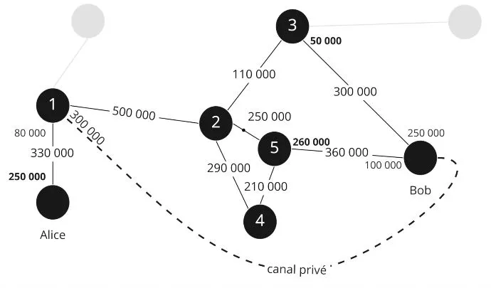

В заключение, маршрутизация транзакций в сети Lightning является сложным процессом, требующим учета различных факторов. Хотя общая емкость каналов является общедоступной, точное распределение ликвидности напрямую доступно не всегда. Это вынуждает узлы оценивать наиболее вероятные успешные маршруты, учитывая критерии, такие как комиссии, время истечения HTLC, количество промежуточных узлов и фактор случайности. Когда возможны несколько маршрутов, узлы стремятся минимизировать комиссии и максимизировать шансы на успех, выбирая каналы с достаточной ликвидностью и минимальным количеством переходов. Если попытка транзакции не удается из-за недостаточной ликвидности, пробуется другой маршрут до тех пор, пока транзакция не будет успешно выполнена.

Кроме того, для облегчения поиска маршрута получатель может предоставить дополнительную информацию, такую как адрес, сумма, хэш прообраза и указания по своим каналам. Это может помочь идентифицировать каналы с достаточной ликвидностью и избежать ненужных попыток транзакции. В конечном итоге система маршрутизации сети Lightning разработана для оптимизации скорости, безопасности и эффективности транзакций, сохраняя при этом конфиденциальность пользователей.

# Инструменты сети Lightning

<partId>74d6c334-ec5d-55d9-8598-f05694703bf6</partId>

## Счет-фактура, LNURL, Keysend

<chapterId>e34c7ecd-2327-52e3-b61e-c837d9e5e8b0</chapterId>

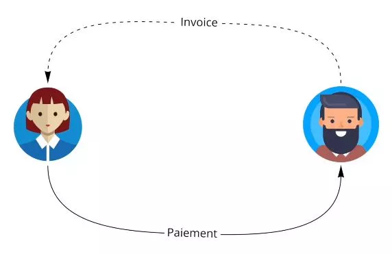

Счет-фактура LN (или счет) длинный и читать его сложно, но он позволяет компактно представить запрос на платеж.

Пример:
lnbc1m1pskuawzpp5qeuuva2txazy5g483tuv9pznn9ft8l5e49s5dndj2pqq0ptyn8msdqqcqzpgxqrrsssp5v4s00u579atm0em6eqm9nr7d0vr64z5j2sm5s33x3r9m4lgfdueq9qyyssqxkjzzgx5ef7ez3dks0laxayx4grrw7j22ppgzyhpydtv6hmc39skf9hjxn5yd3kvv7zpjdxd2s7crcnemh2fz26mnr6zu83w0a2fwxcqnvujl3

- lnbc1m = читаемая часть
- 1 = разделение от остального
- Затем остальное
- Bc1 = кодировка Bech32 (база 32), так что используется 32 символа.
- 10 = 1.2.3.4.5.6.7.8.9.0
- 26 = abcdefghijklmnopqrstuvwxyz
- 32 = не "b-i-o" и не "1"

### lnbc1m

- ln = Lightning
- Bc = bitcoin (основная сеть)
- 1 = сумма
- m = милли $10^{-3}$ / u = микро $10^{-6}$ / n = нано $10^{-9}$ / p = пико $10^{-12}$
  
  Здесь 1m = 1 * 0.001btc = 100,000 SAT
Пожалуйста, переведите 100 000 SAT в сети Lightning основной сети Bitcoin на pskuawzpp5qeuuva2txazy5g483tuv9pznn9ft8l5e49s5dndj2pqq0ptyn8msdqqcqzpgxqrrsssp5v4s00u579atm0em6eqm9nr7d0vr64z5j2sm5s33x3r9m4lgfdueq9qyyssqxkjzzgx5ef7ez3dks0laxayx4grrw7j22ppgzyhpydtv6hmc39skf9hjxn5yd3kvv7zpjdxd2s7crcnemh2fz26mnr6zu83w0a2fwxcqnvujl3


### Временная метка (когда была создана)

Она содержит 0 или более дополнительных частей:

- Хэш прообраза
- Секрет платежа (маршрутизация через onion)
- Произвольные данные
- Публичный ключ LN получателя
- Время окончания (по умолчанию 1 час)
- Подсказки для маршрутизации
- Подпись всего

Существуют и другие типы счетов. Мета-протокол LNURL позволяет указывать прямое количество сатоши вместо создания запроса. Это очень гибко и позволяет значительно улучшить опыт пользователя.

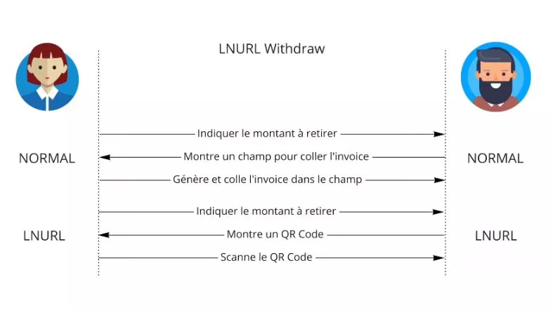

Keysend позволяет Алисе отправить деньги Бобу без запроса от Боба. Алиса получает ID Боба, создает прообраз без запроса у Боба и включает его в свой платеж. Таким образом, Боб получит неожиданный запрос, где он может разблокировать деньги, потому что Алиса уже сделала всю работу.

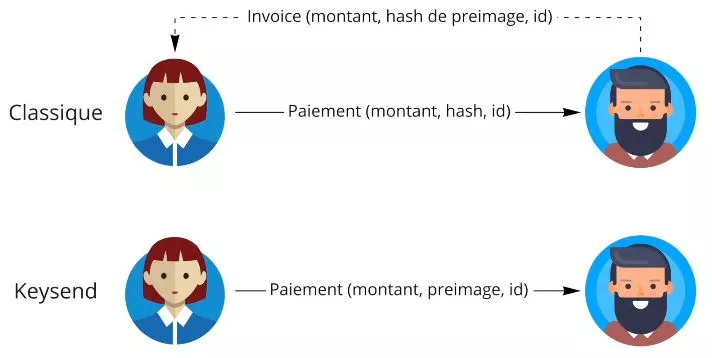

В заключение, счет в Сети Lightning, хотя на первый взгляд и кажется сложным, эффективно кодирует запрос на платеж. Каждый раздел счета содержит ключевую информацию, включая сумму к оплате, получателя, временную метку создания и, возможно, другую информацию, такую как хэш прообраза, секрет платежа, подсказки для маршрутизации и время окончания. Протоколы, такие как LNURL и Keysend, предлагают значительные улучшения с точки зрения гибкости и пользовательского опыта, позволяя, например, отправлять средства без предварительного запроса от другой стороны. Эти технологии делают процесс платежа более гладким и эффективным в Сети Lightning.

## Управление ликвидностью

<chapterId>cc76d0c4-d958-57f5-84bf-177e21393f48</chapterId>

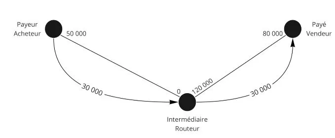

Мы предоставляем некоторые общие рекомендации для ответа на вечный вопрос об управлении ликвидностью в сети Lightning.

В LN есть 3 типа людей:

- Покупатели: у них есть исходящая ликвидность, что является самым простым, поскольку им просто нужно открывать каналы
- Торговцы: это сложнее, потому что им нужна входящая ликвидность от других узлов и участников. У них должны быть люди, подключенные к ним
- Узлы маршрутизации: они хотят иметь сбалансированную ликвидность с обеих сторон и хорошее соединение с многими узлами, чтобы их использовали как можно чаще

Поэтому, если вам нужна входящая ликвидность, вы можете купить ее у сервисов.

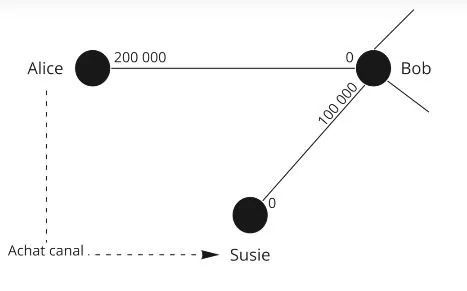

Алиса покупает канал у Сьюзи на 1 миллион сатоши, так что она открывает канал сразу с 1 000 000 SAT на входящей стороне. Теперь она может принимать платежи до 1 миллиона SAT от клиентов, которые подключены к Сьюзи (у которой много связей).

Еще одно решение - это совершение платежей; вы платите 100 000 по причине X, теперь вы можете получить 100 000.

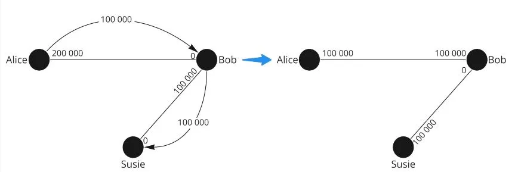

### Решение Loop Out: Атомарный своп LN - BTC

Алиса 2 миллиона - Сьюзи 0

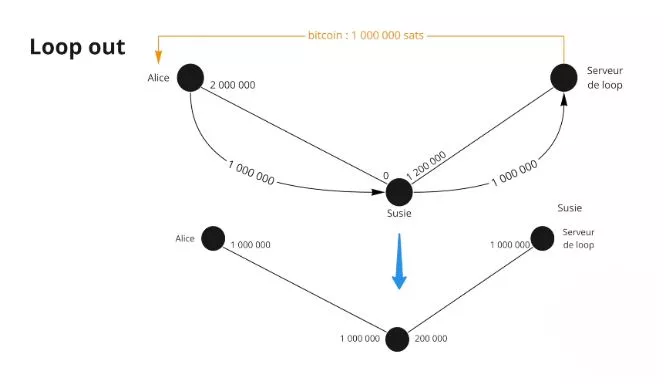

Алиса хочет отправить ликвидность Сьюзи, поэтому она использует Loop out (специальный узел, который предлагает профессиональную услугу для перебалансировки LN/BTC).
Алиса отправляет 1 миллион в Loop через узел Сьюзи, таким образом Сьюзи получает ликвидность, а Loop отправляет баланс в блокчейне обратно на узел Алисы.

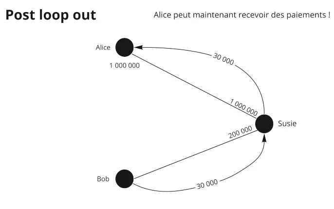

Таким образом, 1 миллион идет к Сьюзи, Сьюзи отправляет 1 миллион в Loop, Loop отправляет 1 миллион Алисе. Таким образом, Алиса передала ликвидность Сьюзи, заплатив некоторую комиссию Loop за услугу.

Самое сложное в LN - это сохранение ликвидности.

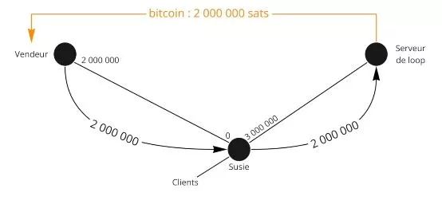

В заключение, управление ликвидностью в сети Lightning является ключевой задачей, которая зависит от типа пользователя: покупатель, продавец или маршрутизирующий узел. Покупателям, которым нужна исходящая ликвидность, задача стоит проще всего: они просто открывают каналы. Продавцам, которым нужна входящая ликвидность, необходимо быть подключенными к другим узлам и участникам. Маршрутизирующие узлы, в свою очередь, стремятся поддерживать баланс ликвидности с обеих сторон. Существует несколько решений для управления ликвидностью, таких как покупка каналов или оплата за увеличение приемной способности. Опция "Loop Out", позволяющая осуществить атомарный своп между LN и BTC, предлагает интересное решение для перебалансировки ликвидности. Несмотря на эти стратегии, поддержание ликвидности в сети Lightning остается сложной задачей.


# Идем дальше

<partId>6bbf107d-a224-5916-9f0c-2b4d30dd0b17</partId>

## Краткое содержание курса

<chapterId>a65a571c-561b-5e1c-87bf-494644653c22</chapterId>

Наша цель была объяснить, как работает сеть Lightning и как она зависит от Биткойна для своей работы.

Сеть Lightning - это сеть платежных каналов. Мы рассмотрели, как работает платежный канал между двумя сторонами, но также расширили наше видение до всей сети, до понятия сети платежных каналов.

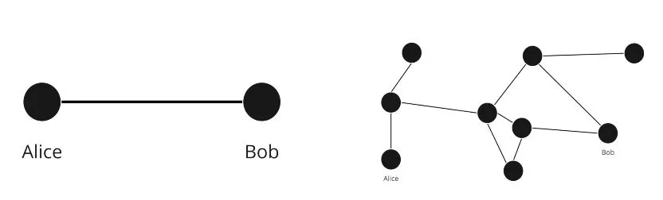

Каналы открываются через Биткойн транзакцию и могут вмещать столько транзакций, сколько возможно. Состояние канала представлено транзакцией обязательства, которая отправляет каждой стороне то, что у них есть с их стороны канала. Когда в канале происходит транзакция, стороны берут обязательства о новом состоянии канала, отказываясь от старого состояния и создавая новую транзакцию обязательства.

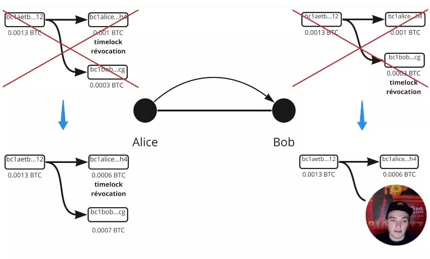

Пары защищают себя от обмана с помощью ключей отмены и временной блокировки. Закрытие канала по взаимному согласию предпочтительнее. В случае принудительного закрытия публикуется последняя транзакция обязательства.

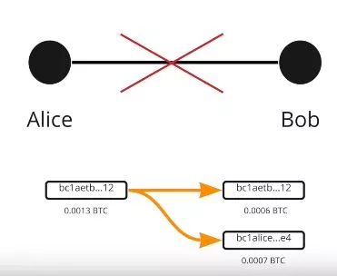

Платежи могут использовать каналы от других промежуточных узлов. Условные платежи на основе хеш-таймлока (HTLC) позволяют заблокировать средства до полного разрешения платежа. В сети Lightning используется маршрутизация через onion. Промежуточные узлы не знают конечного пункта назначения платежей. Алиса должна рассчитать маршрут платежа, но не имеет всей информации о ликвидности в промежуточных каналах.

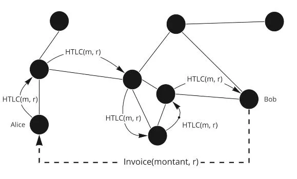

При отправке платежа через сеть Lightning существует вероятностный компонент.

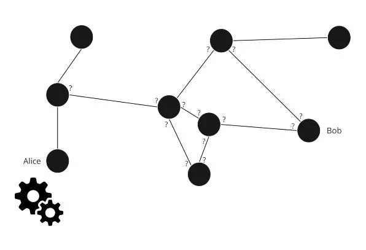

Для получения платежей необходимо управлять ликвидностью в каналах, что можно сделать, попросив других открыть каналы к нам, открыв каналы самостоятельно, а также используя инструменты вроде Loop или покупая/арендуя каналы на рынках.

## Интервью с Фанисом

<chapterId>077cb5f5-1626-5da5-9964-e67b1de503bf</chapterId>

Вот краткое содержание интервью:

Сеть Lightning - это ультрабыстрая платежная система на базе Биткойна, которая позволяет обойти ограничения, связанные с масштабируемостью сети. Однако биткойны в сети Lightning не так безопасны, как в сети Биткойн, поскольку приоритет отдается децентрализации и безопасности, а не масштабируемости.

Чрезмерное увеличение размера блока не является хорошим решением, так как это подрывает работу узлов и вместимость данных. Вместо этого сеть Lightning позволяет создавать платежные каналы между двумя пользователями Биткойн без отображения транзакций в блокчейне, экономя место в блоках и позволяя Биткойн масштабироваться сегодня.

Тем не менее, существуют критические замечания относительно масштабируемости и централизации сети Lightning, с потенциальными проблемами, связанными с закрытием каналов и высокими комиссиями за транзакции. Для решения этих проблем рекомендуется избегать открытия маленьких каналов, чтобы избежать будущих проблем, и увеличивать комиссии за транзакции с помощью Child Pay for Parent.

Рассматриваемые решения для будущего сети Lightning включают группировку и создание каналов группами для снижения комиссий за транзакции, а также увеличение размера блока в долгосрочной перспективе. Однако важно отметить, что биткойны в сети Lightning не так хорошо защищены, как биткойны в сети Биткойн.

Конфиденциальность в Биткойн и Lightning связаны, при этом маршрутизация через onion обеспечивает определенный уровень конфиденциальности для транзакций. Однако в Биткойн все по умолчанию прозрачно, с использованием эвристик для отслеживания биткойнов от адреса к адресу в сети Биткойн.

Покупка биткойнов с KYC позволяет бирже знать транзакции вывода, в то время как круглые суммы и адреса для сдачи позволяют знать, какая часть транзакции предназначена для другого человека, а какая - для себя.

Для улучшения конфиденциальности совместные действия и coinjoins (специальные сервисы для объединения транзикций) позволяют нарушать расчеты вероятностей, создавая транзакции, в которых несколько человек совершают транзакцию вместе. Компаниям, занимающимся анализом чейна, сложнее определить, что вы делаете со своими биткойнами, следя за ними.

В сети Lightning о транзакции знают только два человека, и она более конфиденциальна, чем Биткойн. Маршрутизация через onion означает, что промежуточный узел не знает отправителя и получателя платежа.

Для использования сети Lightning рекомендуется пройти обучение на YouTube-канале PlanB или непосредственно на сайте discover Bitcoin, или использовать обучение на Umbrell. Также возможно отправлять какой-нибудь текст во время платежа в сети Lightning, используя для этого специальное поле, что может быть полезно для пожертвований или сообщений.
Однако важно отметить, что узлы маршрутизации Lightning могут быть начать регулироваться в будущем, при этом некоторые государства пытаются регулировать узлы маршрутизации. Для торговцев необходимо управлять ликвидностью для приема платежей в сети Lightning, с текущими ограничениями, которые можно преодолеть с помощью соответствующих решений.

Наконец, будущее Bitcoin обещает быть светлым с возможной проекцией в один миллион через пять лет. Для обеспечения профессионализации индустрии и создания альтернативной системы существующей банковской системе важно вносить свой вклад в сеть и перестать доверять.


## Оцените курс
<chapterId>38814c99-eb7b-5772-af49-4386ee2ce9b0</chapterId>
<isCourseReview>true</isCourseReview>

## Выпускной экзамен
<chapterId>7ed33400-aef7-5f3e-bfb1-7867e445d708</chapterId>
<isCourseExam>true</isCourseExam>

## Благодарности и продолжайте копать кроличью нору
<chapterId>afc0d72b-4fbc-5893-90b2-e27fb519ad02</chapterId>

Поздравляем!
Вы законичили треннинг LN 201 - Введение в Сеть Lightning!
Вы можете гордиться собой, потому что это не так уж и просто. Знайте что не многие спустились так же глубоку в кроличью нору.

Прежде всего, большое спасибо Фанису Макалакису за предоставление нам этого замечательного бесплатного курса, посвященного более этническому аспекту Lightning. Не стесняйтесь подписываться на него в Twitter, читать его блог или следить за его работой в LN market.

Затем, если вы хотите помочь проекту, не стесняйтесь поддержать нас на Patreon. Ваши пожертвования будут использованы для создания контента для новых учебных курсов, и, конечно же, вы будете первыми, кто узнает об этом (включая следующий курс от Фаниса, который уже в разработке!).

Приключение с Lightning Network продолжается с тренингом Umbrel и внедрением узла Lightning Network. Теория закончилась, и пришло время для практики с курсом LN 202!

Целую и до скорой встречи!

Rogzy

