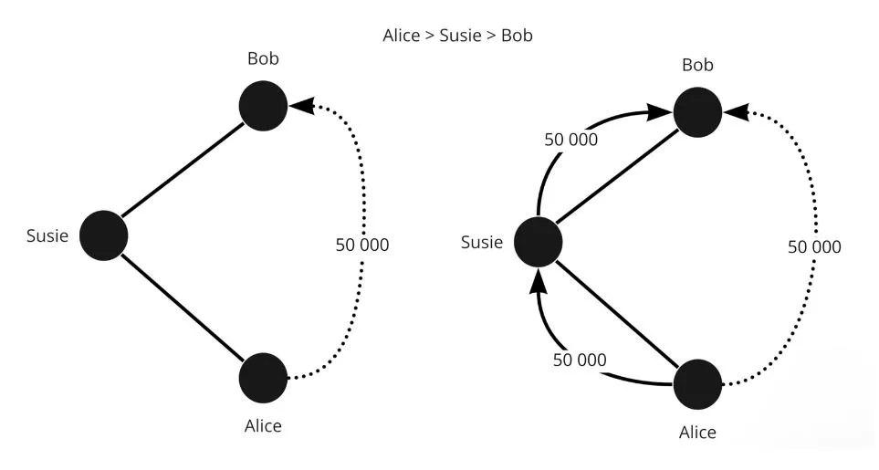
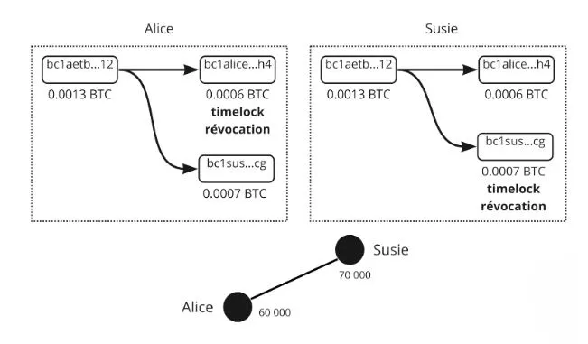
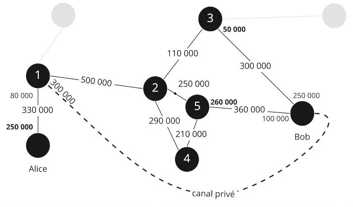
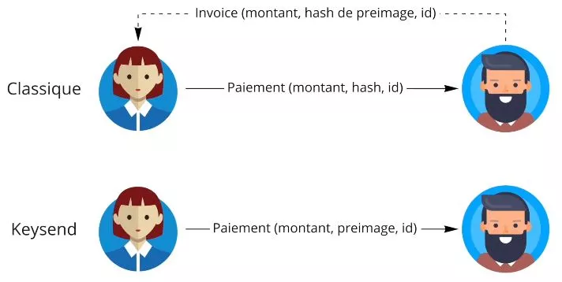
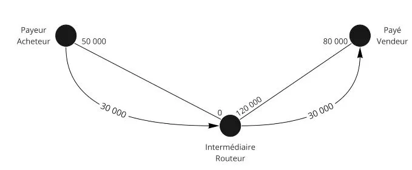

# Hành trình đến Lớp thứ hai của Bitcoin

Khóa học này là một bài học lý thuyết về cách thức hoạt động kỹ thuật của Lightning Network.

Chào mừng bạn đến với thế giới thú vị của Lightning Network, một lớp thứ hai của Bitcoin vừa phức tạp vừa đầy tiềm năng. Chúng ta sắp đắm chìm vào chiều sâu kỹ thuật của công nghệ này, không tập trung vào các hướng dẫn cụ thể hay kịch bản sử dụng. Để hiểu sâu về khóa học này, việc nắm vững kiến thức về Bitcoin là cần thiết. Đây là một trải nghiệm đòi hỏi sự nghiêm túc và tập trung. Bạn cũng có thể xem xét tham gia khóa học LN 202 song song, mang lại một khía cạnh thực hành hơn cho cuộc khám phá này. Hãy sẵn sàng cho một hành trình có thể thay đổi cách nhìn của bạn về hệ sinh thái Bitcoin.

Hãy tận hưởng quá trình khám phá!

+++

# Cơ bản
<partId>32647d62-102b-509f-a3ba-ad1d6a4345f1</partId>

## Hiểu về Lightning Network
<chapterId>df6230ae-ff35-56ea-8651-8e65580730a8</chapterId>

Lightning Network là một cơ sở hạ tầng thanh toán lớp thứ hai được xây dựng trên mạng Bitcoin, cho phép thực hiện giao dịch nhanh chóng và với chi phí thấp. Để hiểu rõ cách thức hoạt động của Lightning Network, điều cần thiết là phải hiểu về kênh thanh toán và cách chúng hoạt động.

Một kênh thanh toán Lightning là một loại "làn đường riêng" giữa hai người dùng cho phép thực hiện giao dịch Bitcoin nhanh chóng và lặp đi lặp lại. Khi một kênh được mở, nó được cấp một khả năng chứa cố định, được xác định trước bởi người dùng. Khả năng chứa này đại diện cho lượng Bitcoin tối đa có thể được truyền trong kênh tại bất kỳ thời điểm nào.

Kênh thanh toán là hai chiều, nghĩa là chúng có hai "phía". Ví dụ, nếu Alice và Bob mở một kênh thanh toán, Alice có thể gửi Bitcoin cho Bob, và Bob cũng có thể gửi Bitcoin cho Alice. Các giao dịch trong kênh không thay đổi tổng khả năng chứa của kênh, nhưng chúng thay đổi sự phân bổ khả năng chứa đó giữa Alice và Bob.


Để một giao dịch có thể diễn ra trong một kênh thanh toán Lightning, người dùng gửi tiền phải có đủ Bitcoin ở phía của họ trong kênh. Nếu Alice muốn gửi 1 Bitcoin cho Bob qua kênh của họ, cô ấy phải có ít nhất 1 Bitcoin ở phía của mình trong kênh.
Giới hạn và Cách thức Hoạt động của Kênh Thanh toán trên Lightning.
Mặc dù khả năng chứa của một kênh thanh toán Lightning là cố định, điều này không hạn chế tổng số giao dịch hoặc tổng khối lượng Bitcoin có thể được truyền qua kênh. Ví dụ, nếu Alice và Bob có một kênh với khả năng chứa 1 Bitcoin, họ có thể thực hiện hàng trăm giao dịch 0.01 Bitcoin hoặc hàng nghìn giao dịch 0.001 Bitcoin, miễn là tổng khả năng chứa của kênh không bị vượt quá tại bất kỳ thời điểm nào.

Mặc dù có những hạn chế này, kênh thanh toán Lightning là một cách hiệu quả để thực hiện giao dịch Bitcoin nhanh chóng và rẻ. Chúng cho phép người dùng gửi và nhận Bitcoin mà không cần phải trả phí giao dịch cao hoặc chờ đợi thời gian xác nhận lâu trên mạng Bitcoin.

Tóm lại, kênh thanh toán Lightning cung cấp một giải pháp mạnh mẽ cho những ai muốn thực hiện giao dịch Bitcoin nhanh chóng và rẻ. Tuy nhiên, việc hiểu rõ về cách thức hoạt động và giới hạn của chúng là cần thiết để tận dụng triệt để chúng.


Ví dụ:

- Alice có 100,000 SAT
- Bob có 30,000 SAT
Đây là trạng thái hiện tại của kênh. Trong một giao dịch, Alice quyết định gửi 40,000 SAT cho Bob. Cô ấy có thể làm như vậy vì 40,000 < 100,000.
Vì vậy, trạng thái mới của kênh là:

- Alice 60,000 SAT
- Bob 70,000 SAT

```
Trạng thái ban đầu của kênh:
Alice (100,000 SAT) ============== Bob (30,000 SAT)

Sau khi Alice chuyển 40,000 SAT cho Bob:
Alice (60,000 SAT) ============== Bob (70,000 SAT)

```


Bây giờ, Bob muốn gửi 80,000 SAT cho Alice. Không có đủ thanh khoản, anh ta không thể làm được. Tổng dung lượng tối đa của kênh là 130,000 SAT, với khả năng chi tiêu tối đa lên đến 60,000 SAT cho Alice và 70,000 SAT cho Bob.


## Bitcoin, địa chỉ, UTXO và giao dịch
<chapterId>0cfb7e6b-96f0-508b-9210-90bc1e28649d</chapterId>

Trong chương thứ hai này, chúng ta dành thời gian để nghiên cứu cách giao dịch Bitcoin thực sự hoạt động, điều này sẽ rất hữu ích để hiểu về Lightning. Chúng tôi cũng sơ lược thảo luận về khái niệm địa chỉ đa chữ ký, điều này rất quan trọng để hiểu về chương tiếp theo về việc mở kênh trên Mạng Lưới Lightning.

- Khóa riêng > Khóa công khai > Địa chỉ: Trong một giao dịch, Alice gửi tiền cho Bob. Người sau cung cấp một địa chỉ được tạo ra từ khóa công khai của mình. Alice, người nhận tiền thông qua một địa chỉ từ khóa công khai của mình, bây giờ sử dụng khóa riêng của mình để ký giao dịch và do đó mở khóa bitcoin từ địa chỉ.
- Trong một giao dịch Bitcoin, tất cả bitcoin phải di chuyển. Được gọi là UTXO (Unspend Transaction Output), các bit của bitcoin sẽ tất cả rời đi chỉ để quay trở lại với chủ sở hữu sau đó.
  Alice có 0.002 BTC, Bob có 0 BTC. Alice quyết định gửi 0.0015 BTC cho Bob. Cô ấy sẽ ký một giao dịch của 0.002 BTC nơi 0.0015 sẽ đi đến Bob và 0.0005 sẽ quay trở lại ví của cô ấy.


Ở đây, từ một UTXO (Alice có 0.0002 BTC trên một địa chỉ), chúng tôi đã tạo ra 2 UTXO (Bob có 0.0015 và Alice có một UTXO mới (độc lập với cái trước) của 0.0005 BTC).

```
Alice (0.002 BTC)
  |
  V
Giao dịch Bitcoin (0.002 BTC)
  |
  |----> Bob (0.0015 BTC)
  |
  V
Alice (UTXO mới: 0.0005 BTC)
```

Trong Mạng Lưới Lightning, đa chữ ký được sử dụng. Do đó, cần 2 chữ ký để mở khóa tiền, tức là, hai khóa riêng để di chuyển tiền. Điều này có thể là Alice và Bob, cả hai cùng phải đồng ý để mở khóa tiền (UTXO). Cụ thể trong LN, đó là các giao dịch 2/2, vì vậy cả hai chữ ký đều hoàn toàn cần thiết, không giống như đa chữ ký 2/3 hoặc 3/5 nơi chỉ cần một tổ hợp của số lượng khóa hoàn chỉnh là đủ.


# Mở và đóng kênh
<partId>900b5b6b-ccd0-5b2f-9424-4b191d0e935d</partId>

## Mở Kênh
<chapterId>96243eb0-f6b5-5b68-af1f-fffa0cc16bfe</chapterId>

Bây giờ, chúng ta sẽ xem xét kỹ lưỡng hơn về việc mở kênh và cách thức thực hiện thông qua một giao dịch Bitcoin.

Mạng Lưới Lightning có các cấp độ giao tiếp khác nhau:

- Giao tiếp P2P (giao thức Mạng Lưới Lightning)
- Kênh thanh toán (giao thức Mạng Lưới Lightning)
- Giao dịch Bitcoin (giao thức Bitcoin)
Để mở một kênh, hai bên liên lạc qua một kênh truyền thông:

- Alice: "Xin chào, tôi muốn mở một kênh!"
- Bob: "Ok, đây là địa chỉ công khai của tôi."

Alice giờ đây có 2 địa chỉ công khai để tạo một địa chỉ multi-sig 2/2. Cô ấy có thể thực hiện một giao dịch bitcoin để gửi tiền vào đó.

Giả sử Alice có một UTXO là 0.002 BTC và cô ấy muốn mở một kênh với Bob với 0.0013 BTC. Cô ấy sẽ tạo một giao dịch với 2 UTXO làm đầu ra:

- một UTXO của 0.0013 đến địa chỉ multi-sig 2/2
- một UTXO của 0.0007 đến một trong những địa chỉ thay đổi của cô ấy (trả lại UTXOs).

Giao dịch này chưa được công khai vì nếu ở giai đoạn này, cô ấy tin tưởng Bob có thể mở khóa tiền từ multi-sig.

Nhưng sau đó phải làm thế nào?

Alice sẽ tạo một giao dịch thứ hai được gọi là "giao dịch rút tiền" trước khi công bố việc gửi tiền vào multi-sig.

Giao dịch rút tiền sẽ chi tiêu tiền từ địa chỉ multi-sig đến một địa chỉ của cô ấy (điều này được thực hiện trước khi mọi thứ được công bố).
Một khi cả hai giao dịch được xây dựng, Alice thông báo cho Bob rằng việc này đã hoàn tất và yêu cầu anh ấy ký một chữ ký với khóa công khai của mình, giải thích rằng như vậy cô ấy có thể lấy lại tiền của mình nếu có điều gì đó không ổn. Bob đồng ý vì anh ấy không phải là người không trung thực.

Alice giờ đây có thể tự mình lấy lại tiền, vì cô ấy đã có chữ ký của Bob. Cô ấy công bố các giao dịch. Kênh giờ đây đã mở với 0.0013 BTC (130,000 SAT) ở phía Alice.

## Giao Dịch Lightning & Giao Dịch Cam Kết
<chapterId>7d3fd135-129d-5c5a-b306-d5f2f1e63340</chapterId>

Bây giờ, hãy phân tích xem thực sự có gì xảy ra đằng sau hậu trường khi chuyển tiền từ một bên sang bên kia của một kênh trên Lightning Network, với khái niệm về giao dịch cam kết. Giao dịch rút tiền/chốt kênh trên chuỗi đại diện cho trạng thái của kênh, đảm bảo ai sở hữu tiền sau mỗi lần chuyển giao. Vì vậy, sau một giao dịch Lightning Network, có một cập nhật của giao dịch/hợp đồng này không được thực hiện giữa hai bên, Alice và Bob, ai tạo ra cùng một giao dịch với trạng thái kênh hiện tại trong trường hợp chốt kênh:

- Alice mở một kênh với Bob với 130,000 SAT ở phía cô ấy. Giao dịch rút tiền được cả hai chấp nhận trong trường hợp chốt kênh nói rằng 130,000 SAT sẽ đi đến Alice khi chốt kênh, và Bob đồng ý vì nó công bằng.

- Alice gửi 30,000 SAT cho Bob. Giờ đây có một giao dịch rút tiền mới nói rằng trong trường hợp chốt kênh, Alice sẽ nhận được 100,000 SAT và Bob 30,000 SAT. Cả hai đồng ý vì nó công bằng.

- Alice gửi 10,000 SAT cho Bob, và một giao dịch rút tiền mới được tạo ra nói rằng Alice sẽ nhận được 90,000 SAT và Bob 40,000 SAT trong trường hợp chốt kênh. Cả hai đồng ý vì nó công bằng.

```
Trạng thái ban đầu của kênh:
Alice (130,000 SAT) =============== Bob (0 SAT)

Sau lần chuyển tiền đầu tiên:
Alice (100,000 SAT) =============== Bob (30,000 SAT)

Sau lần chuyển tiền thứ hai:
Alice (90,000 SAT) =============== Bob (40,000 SAT)
```

Tiền không bao giờ di chuyển, nhưng số dư cuối cùng được cập nhật thông qua một giao dịch trên chuỗi được ký kết nhưng không được công bố. Do đó, giao dịch rút tiền là một giao dịch cam kết. Các chuyển đổi satoshi là một giao dịch cam kết khác, gần đây hơn, cập nhật số dư.

## Giao Dịch Cam Kết
<chapterId>f2f61e5b-badb-5947-9a81-7aa530b44e59</chapterId>

Nếu giao dịch cam kết quy định trạng thái kênh với tính thanh khoản tại thời điểm X, liệu chúng ta có thể gian lận bằng cách công bố một trạng thái cũ? Câu trả lời là có, bởi vì chúng ta đã có chữ ký trước của cả hai bên tham gia trong giao dịch chưa được công bố.


Để giải quyết vấn đề này, chúng ta sẽ thêm độ phức tạp:

- Timelock = quỹ bị khóa cho đến khối N
- Revocation key = bí mật của Alice và bí mật của Bob'

Hai yếu tố này được thêm vào giao dịch cam kết. Kết quả là, Alice phải chờ đến khi kết thúc Timelock, và bất kỳ ai giữ chìa khóa hủy bỏ có thể di chuyển quỹ mà không cần chờ đến hết Timelock. Nếu Alice cố gắng gian lận, Bob sử dụng chìa khóa hủy bỏ để ăn cắp và trừng phạt Alice.


Bây giờ (và trong thực tế) giao dịch cam kết không giống nhau đối với Alice và Bob, chúng đối xứng nhưng mỗi người có những ràng buộc khác nhau, họ trao cho nhau bí mật của mình để tạo ra chìa khóa hủy bỏ của giao dịch cam kết trước đó. Vì vậy, ngay từ khi tạo, Alice tạo kênh với Bob, 130,000 SAT ở phía mình, cô ấy có một Timelock ngăn cản việc cô ấy lập tức thu hồi tiền của mình, cô ấy phải chờ đợi một chút. Chìa khóa hủy bỏ có thể mở khóa tiền nhưng chỉ Alice có nó (giao dịch cam kết của Alice). Một khi có một chuyển giao, Alice sẽ cung cấp bí mật cũ của mình cho Bob và do đó người sau có thể làm rỗng kênh về trạng thái trước đó trong trường hợp Alice cố gắng gian lận (Alice do đó bị trừng phạt).


Tương tự, Bob sẽ cung cấp bí mật của mình cho Alice. Vì vậy, nếu anh ta cố gắng gian lận, Alice có thể trừng phạt anh ta. Hoạt động này được lặp lại cho mỗi giao dịch cam kết mới. Một bí mật mới được quyết định và một chìa khóa hủy bỏ mới. Vì vậy, cho mỗi giao dịch mới, giao dịch cam kết trước đó phải được hủy bỏ bằng cách cung cấp bí mật hủy bỏ. Như vậy nếu Alice hoặc Bob cố gắng gian lận, người kia có thể hành động trước (nhờ vào Timelock) và do đó tránh được gian lận. Trong giao dịch #3, bí mật của giao dịch #2 do đó được cung cấp để cho phép Alice và Bob tự vệ chống lại Alice hoặc Bob.


Người tạo giao dịch với Timelock (người gửi tiền) chỉ có thể sử dụng chìa khóa hủy bỏ sau Timelock. Tuy nhiên, người nhận tiền có thể sử dụng nó trước Timelock trong trường hợp gian lận từ một bên này sang bên kia của một kênh trên Lightning Network. Cụ thể, chúng tôi chi tiết các cơ chế cho phép chúng tôi bảo vệ chống lại khả năng gian lận của đối tác trong kênh.

## Đóng Kênh
<chapterId>29a72223-2249-5400-96f0-3756b1629bc2</chapterId>

Chúng tôi quan tâm đến việc đóng kênh thông qua một giao dịch Bitcoin, có thể có các hình thức khác nhau tùy thuộc vào trường hợp. Có 3 loại đóng kênh:

- Loại tốt: đóng kênh hợp tác
- Loại mạnh: đóng kênh ép buộc (không hợp tác)
- Loại gian lận: đóng kênh bởi kẻ gian lận


### Loại tốt
Hai bên giao tiếp và đồng ý đóng kênh. Họ dừng tất cả các giao dịch và xác nhận trạng thái cuối cùng của kênh. Họ thống nhất về phí mạng (người mở kênh trả phí đóng). Bây giờ họ tạo giao dịch đóng kênh. Có một giao dịch đóng kênh, khác với các giao dịch cam kết vì không có Timelock và khóa thu hồi. Giao dịch sau đó được công bố và Alice và Bob nhận được số dư tương ứng của họ. Loại đóng kênh này nhanh (vì không có Timelock) và nói chung là không tốn kém.


### Người thô bạo

Alice muốn đóng kênh, nhưng Bob không phản hồi vì anh ta đang offline (mất internet hoặc mất điện). Alice sau đó sẽ công bố giao dịch cam kết gần nhất (cái cuối cùng). Giao dịch được công bố và Timelock được kích hoạt. Sau đó, phí được quyết định khi giao dịch này được tạo X thời gian trước! MemPool là mạng đã thay đổi kể từ đó, vì vậy giao thức mặc định là phí cao hơn 5 lần so với phí hiện tại khi giao dịch được tạo. Phí tạo là 10 SAT, vì vậy giao dịch được coi là 50 SAT. Tại thời điểm đóng cưỡng chế, mạng là:

- 1 SAT = trả quá nhiều 50*
- 100 SAT = trả không đủ 2*

Điều này khiến việc đóng cưỡng chế mất thời gian hơn (Timelock) và đặc biệt rủi ro hơn về phí và khả năng được các thợ mỏ xác nhận.


### Kẻ gian lận

Alice cố gắng gian lận bằng cách công bố một giao dịch cam kết cũ. Nhưng Bob giám sát MemPool và tìm kiếm các giao dịch cố gắng công bố những cái cũ. Nếu anh ta tìm thấy bất kỳ, anh ta sử dụng khóa thu hồi để trừng phạt Alice và lấy tất cả SAT từ kênh.


Kết luận, việc đóng kênh trong Lightning Network là một bước quan trọng có thể diễn ra theo nhiều hình thức. Trong một việc đóng kênh hợp tác, cả hai bên giao tiếp và đồng ý về trạng thái cuối cùng của kênh. Đây là lựa chọn nhanh nhất và ít tốn kém nhất. Mặt khác, một việc đóng cưỡng chế xảy ra khi một bên không phản hồi. Đây là một tình huống tốn kém và mất thời gian hơn do phí giao dịch không thể đoán trước và việc kích hoạt Timelock. Cuối cùng, nếu một bên tham gia cố gắng gian lận bằng cách công bố một giao dịch cam kết cũ, kẻ gian lận, họ có thể bị phạt bằng cách mất tất cả SAT từ kênh. Do đó, việc hiểu rõ những cơ chế này là rất quan trọng để sử dụng Lightning Network một cách hiệu quả và công bằng.

# Một mạng lưới thanh khoản
<partId>a873f1cb-751f-5f4a-9ed7-25092bfdef11</partId>

## Lightning Network
<chapterId>45a7252c-fa4f-554b-b8bb-47449532918e</chapterId>

Trong chương thứ bảy này, chúng ta nghiên cứu cách Lightning hoạt động như một mạng lưới các kênh và cách thanh toán được định tuyến từ nguồn đến điểm đến của chúng.




Lightning là một mạng lưới các kênh thanh toán. Hàng ngàn đối tác với các kênh thanh khoản riêng của họ được kết nối với nhau, và do đó tự sử dụng để thực hiện các giao dịch giữa các đối tác không kết nối. Thanh khoản của các kênh này không thể được chuyển sang các kênh thanh khoản khác.

Alice -> Eden - > Bob`. Satoshis không di chuyển từ `Alice -> Bob`, mà từ `Alice -> Eden` và từ `Eden -> Bob`.

Vì vậy, mỗi người và kênh có thanh khoản khác nhau. Để thực hiện thanh toán, bạn cần tìm một tuyến đường trong mạng có đủ thanh khoản. Nếu không đủ, thanh toán sẽ không được thực hiện.

Xem xét mạng lưới sau:

```
Trạng thái ban đầu của mạng:
Alice (130 SAT) ==== (0 SAT) Susie (90 SAT) ==== (200 SAT) Eden (150 SAT) ==== (100 SAT) Bob
```
Nếu Alice muốn chuyển 40 SAT cho Bob, thì lượng thanh khoản sẽ được phân bổ lại dọc theo tuyến đường giữa hai bên.

```
Sau khi Alice chuyển 40 SAT cho Bob:
Alice (90 SAT) ==== (40 SAT) Susie (50 SAT) ==== (240 SAT) Eden (110 SAT) ==== (140 SAT) Bob
```

Tuy nhiên, trong trạng thái ban đầu, Bob không thể gửi 40 SAT cho Alice vì Susie không có thanh khoản nào với Alice để gửi 40 SAT, vì vậy việc thanh toán qua tuyến đường này là không thể. Do đó, chúng ta cần một tuyến đường khác nơi giao dịch là không thể.

Trong ví dụ đầu tiên, rõ ràng là Susie và Eden không mất gì và cũng không được gì. Các nút của Lightning Network thu phí cho việc đồng ý được sử dụng để chuyển giao dịch!

Có các loại phí khác nhau tùy thuộc vào vị trí của thanh khoản

Alice - Bob

- Phí của Alice = Alice -> Bob
- Phí của Bob = Bob -> Alice

Có hai loại phí:

- một phí cố định bất kể số lượng: 1 SAT (mặc định nhưng có thể được chỉnh sửa)
- một phí biến đổi (0.01% theo mặc định)

Ví dụ về phí:

- Alice - Susie; 1/1 (1 phí cố định và 1 phí biến đổi)
- Susie - Eden; 0/200
- Eden - Bob; 1/1

Do đó:

- Phí 1: (do Alice trả cho chính mình) 1 + (40,000\*0.000001)
- Phí 2: 0 + 40,000 \* 0.0002 = 8 SAT
- Phí 3: 1 + 40,000\* 0.000001 = 0.4 SAT

Vận chuyển:

1. Gửi 40,009.04 từ Alice -> Susie; Alice trả chi phí của mình nên không tính
2. Susie làm ơn gửi 40 001.04 cho Eden; cô ấy lấy phí hoa hồng 8 SAT
3. Eden thực hiện dịch vụ gửi 40,000 cho Bob, anh ta lấy phí 1.04 SAT.

Alice đã trả một phí 9.04 SAT và Bob nhận được 40,000 SAT.

Trong Lightning Network, đó là nút của Alice quyết định tuyến đường trước khi gửi thanh toán. Do đó, có một việc tìm kiếm tuyến đường tốt nhất và chỉ mình Alice biết tuyến đường và giá cả. Thanh toán được gửi đi, nhưng Susie không có thông tin.

Đối với Susie hoặc Eden: họ không biết ai là người nhận cuối cùng, cũng không biết ai đang gửi thanh toán. Đây là onion routing. Nút phải giữ một kế hoạch của mạng để tìm tuyến đường của mình, nhưng không có bất kỳ trung gian nào có thông tin.

## HTLC - Hợp Đồng Thời Gian Khóa Băm
<chapterId>4369b85a-1365-55d8-99e1-509088210116</chapterId>

Trong một hệ thống định tuyến truyền thống, làm thế nào chúng ta có thể đảm bảo rằng Eden không gian lận và tuân thủ phần của hợp đồng?

HTLC là một hợp đồng thanh toán chỉ có thể được mở khóa bằng một bí mật. Nếu nó không được tiết lộ, thì hợp đồng sẽ hết hạn. Do đó, đây là một thanh toán có điều kiện. Chúng được sử dụng như thế nào?


Xem xét tình huống sau:
Alice (100,000 SAT) ==== (30,000 SAT) Susie (250,000 SAT) ==== (0 SAT) Bob
- Bob tạo ra một bí mật S (hình ảnh trước) và tính toán băm r = hash(s)
- Bob gửi một hóa đơn cho Alice với "r" được bao gồm
- Alice gửi một HTLC của 40,000 SAT cho Susie với điều kiện tiết lộ "s'" sao cho hash(s') = r
- Susie gửi một HTLC tương tự cho Bob
- Bob mở khóa HTLC của Susie bằng cách cho cô ấy xem "s"
- Susie mở khóa HTLC của Alice bằng cách cho cô ấy xem "S"

Nếu Bob không trực tuyến và không bao giờ lấy được bí mật cho phép anh ta nhận tiền, thì HTLC sẽ hết hạn sau một số lượng khối nhất định.


Các HTLC hết hạn theo thứ tự ngược lại: hết hạn Susie-Bob, sau đó là hết hạn Alice-Susie. Như vậy, nếu Bob trở lại, nó không thay đổi gì. Ngược lại, nếu Alice hủy bỏ trong khi Bob trở lại, nó sẽ là một mớ hỗn độn và mọi người có thể đã làm việc vô ích.

Vậy, điều gì xảy ra trong trường hợp đóng cửa? Thực tế, các giao dịch cam kết của chúng tôi còn phức tạp hơn nữa. Chúng ta cần đại diện cho số dư trung gian nếu kênh được đóng lại.

Do đó, có một HTLC-out của 40,000 satoshi (với các hạn chế đã thấy trước đó) trong giao dịch cam kết qua output #3.


Alice có trong giao dịch cam kết:

- Output #1: 60,000 SAT cho Alice qua một Timelock và khóa thu hồi (số tiền còn lại cho cô ấy)
- Output #2: 30,000 đã thuộc về Susie
- Output #3: 40,000 trong HTLC

Giao dịch cam kết của Alice có HTLC-out vì cô ấy gửi một HTLC-in cho người nhận, Susie.



Do đó, nếu chúng ta công bố giao dịch cam kết này, Susie có thể lấy tiền HTCL với hình ảnh "s". Nếu cô ấy không có hình ảnh trước, Alice lấy lại tiền sau khi HTCL hết hạn. Hãy nghĩ về các output (UTXO) như là các khoản thanh toán khác nhau với các điều kiện khác nhau.
Một khi thanh toán được thực hiện (hết hạn hoặc thực thi), trạng thái kênh thay đổi và giao dịch với HTCL không còn tồn tại nữa. Chúng ta quay trở lại với điều gì đó cổ điển.
Trong trường hợp đóng cửa hợp tác: chúng ta dừng thanh toán và do đó chờ đợi thực thi chuyển giao/HTCL, giao dịch nhẹ hơn nên ít tốn kém hơn vì có tối đa 1 hoặc 2 output.
Nếu đóng cửa bắt buộc: chúng ta công bố với tất cả các HTLC đang tiến hành, vì vậy nó trở nên rất nặng và rất tốn kém. Và đó là một mớ hỗn độn.

Tóm lại, hệ thống định tuyến Mạng Lưới Sét sử dụng Hợp Đồng Bị Khóa Bằng Thời Gian Hash (HTLC) để đảm bảo thanh toán an toàn và có thể xác minh. HTLC cho phép thanh toán có điều kiện nơi tiền chỉ có thể được mở khóa bằng một bí mật, do đó đảm bảo rằng các bên tham gia thực hiện cam kết của họ.
Trong ví dụ được trình bày, Alice muốn gửi SAT cho Bob thông qua Susie. Bob tạo ra một bí mật, tạo ra một băm của nó và truyền nó cho Alice. Alice và Susie thiết lập một HTLC dựa trên băm này. Một khi Bob mở khóa HTLC của Susie bằng cách cho cô ấy xem bí mật, Susie có thể sau đó mở khóa HTLC của Alice.
Trong trường hợp Bob không tiết lộ bí mật trong một khoảng thời gian nhất định, HTLC sẽ hết hạn. Hết hạn xảy ra theo thứ tự ngược lại, đảm bảo rằng nếu Bob trở lại trực tuyến, không có hậu quả không mong muốn nào.
Khi đóng kênh, nếu đó là một việc đóng cửa hợp tác, các khoản thanh toán bị gián đoạn và HTLCs được giải quyết, điều này thường ít tốn kém hơn. Nếu việc đóng cửa bị ép buộc, tất cả các giao dịch HTLC đang diễn ra được công bố, có thể trở nên rất tốn kém và rối rắm. Tóm lại, cơ chế HTLC thêm một lớp bảo mật bổ sung cho Lightning Network, đảm bảo rằng các khoản thanh toán được thực hiện chính xác và người dùng thực hiện các cam kết của họ.

## Tìm đường đi
<chapterId>7e2ae959-c2a1-512e-b5d6-8fd962e819da</chapterId>

Dữ liệu công khai duy nhất là tổng dung lượng kênh (Alice + Bob) nhưng chúng ta không biết vị trí của tính thanh khoản.
Để có thêm thông tin, nút của chúng ta lắng nghe kênh truyền thông LN để nhận thông báo về các kênh mới và cập nhật phí kênh. Nút của bạn cũng xem xét blockchain để tìm các đóng cửa kênh.

Vì chúng ta không có tất cả thông tin, chúng ta phải tìm một đồ thị/đường đi với thông tin chúng ta có (dung lượng kênh tối đa và không phải vị trí của tính thanh khoản).

Tiêu chí:

- Khả năng thành công - Phí
- Thời gian hết hạn HTLC
- Số lượng nút trung gian
- Ngẫu nhiên


Vì vậy, nếu có 3 đường đi có thể:

- Alice > 1 > 2 > 5 > Bob
- Alice > 1 > 2 > 4 > 5 > Bob
- Alice 1 > 2 > 3 > Bob

Chúng ta đang tìm đường đi tốt nhất theo lý thuyết với phí thấp nhất và khả năng thành công cao nhất: tính thanh khoản tối đa và ít bước nhất có thể.

Ví dụ, nếu 2-3 chỉ có dung lượng 130,000 SAT, việc gửi 100,000 là rất khó khăn, vì vậy lựa chọn #3 không có cơ hội thành công.


Bây giờ thuật toán đã đưa ra 3 lựa chọn của mình và sẽ thử lựa chọn đầu tiên:

Lựa chọn 1:

- Alice gửi một HTLC 100,000 SAT cho 1;
- 1 tạo một HTLC 100,000 SAT cho 2;
- 2 tạo một HTLC 100,000 SAT cho 5, nhưng 5 không thể thực hiện, vì vậy nó thông báo.

Thông tin được gửi trở lại, vì vậy Alice quyết định thử đường đi thứ hai:

- Alice gửi một HTLC 100,000 cho 1;
- 1 tạo một HTLC 100,000 cho 2;
- 2 tạo một HTLC 100,000 cho 4;
- 4 tạo một HTLC 100,000 cho Bob. Bob có tính thanh khoản, vì vậy mọi thứ ổn.
- Bob sử dụng preimage (hash) của HTLC và do đó sử dụng bí mật để lấy lại 100,000 SAT
- 5 giờ đây có bí mật của HTLC để lấy lại HTLC bị chặn từ 4
- 4 giờ đây có bí mật của HTLC để lấy lại HTLC bị chặn từ 2
- 2 giờ đây có bí mật của HTLC để lấy lại HTLC bị chặn từ 1
- 1 giờ đây có bí mật của HTLC để lấy lại HTLC bị chặn của Alice

Alice không thấy sự thất bại của đường đi 1, cô chỉ chờ thêm một giây nữa. Một sự thất bại thanh toán xảy ra khi không có đường đi nào khả thi. Để tìm kiếm một đường đi dễ dàng hơn, Bob có thể cung cấp thông tin cho Alice để giúp với hóa đơn của mình:

- Số tiền
- Địa chỉ của anh ấy
- Hash của preimage để Alice có thể tạo HTLC
- Chỉ dẫn về các kênh của Bob
Bob biết về tính thanh khoản của các kênh 5 và 3 vì anh ấy trực tiếp kết nối với chúng, anh ấy có thể chỉ ra điều này cho Alice. Anh ấy cảnh báo Alice rằng nút 3 là vô dụng, điều này ngăn Alice tiềm năng tạo ra lộ trình của mình. Một yếu tố khác có thể là các kênh riêng tư (do đó không được công bố trên mạng) mà Bob có thể có. Nếu Bob có một kênh riêng với 1, anh ấy có thể nói với Alice sử dụng nó và nó sẽ cho Alice > 1 > Bob'.



Kết luận, việc định tuyến giao dịch trên Lightning Network là một quá trình phức tạp đòi hỏi phải xem xét các yếu tố khác nhau. Mặc dù tổng dung lượng của các kênh là công khai, nhưng phân bổ chính xác của tính thanh khoản không trực tiếp truy cập được. Điều này buộc các nút phải ước lượng các lộ trình thành công nhất có thể, lưu ý đến các tiêu chí như phí, thời gian hết hạn HTLC, số lượng nút trung gian, và yếu tố ngẫu nhiên. Khi có nhiều lộ trình có thể, các nút tìm cách giảm thiểu phí và tối đa hóa cơ hội thành công bằng cách chọn các kênh có đủ tính thanh khoản và số bước nhảy tối thiểu. Nếu một nỗ lực giao dịch thất bại do thiếu tính thanh khoản, một lộ trình khác được thử cho đến khi một giao dịch thành công được thực hiện.

Hơn nữa, để tạo điều kiện tìm kiếm lộ trình, người nhận có thể cung cấp thông tin bổ sung như địa chỉ, số tiền, băm preimage, và chỉ dẫn về các kênh của họ. Điều này có thể giúp xác định các kênh có đủ tính thanh khoản và tránh các nỗ lực giao dịch không cần thiết. Cuối cùng, hệ thống định tuyến của Lightning Network được thiết kế để tối ưu hóa tốc độ, an ninh, và hiệu quả của giao dịch trong khi bảo vệ quyền riêng tư của người dùng.

# Công Cụ của Lightning Network
<partId>74d6c334-ec5d-55d9-8598-f05694703bf6</partId>

## Hóa Đơn, LNURL, Keysend
<chapterId>e34c7ecd-2327-52e3-b61e-c837d9e5e8b0</chapterId>


Một hóa đơn LN (hoặc hóa đơn) dài và không dễ đọc, nhưng nó cho phép biểu diễn dày đặc của một yêu cầu thanh toán.

Ví dụ:
lnbc1m1pskuawzpp5qeuuva2txazy5g483tuv9pznn9ft8l5e49s5dndj2pqq0ptyn8msdqqcqzpgxqrrsssp5v4s00u579atm0em6eqm9nr7d0vr64z5j2sm5s33x3r9m4lgfdueq9qyyssqxkjzzgx5ef7ez3dks0laxayx4grrw7j22ppgzyhpydtv6hmc39skf9hjxn5yd3kvv7zpjdxd2s7crcnemh2fz26mnr6zu83w0a2fwxcqnvujl3

- lnbc1m = phần có thể đọc được
- 1 = phân cách với phần còn lại
- Sau đó là phần còn lại
- Bc1 = mã hóa Bech32 (base 32), vì vậy sử dụng 32 ký tự.
- 10 = 1.2.3.4.5.6.7.8.9.0
- 26 = abcdefghijklmnopqrstuvwxyz
- 32 = không bao gồm "b-i-o" và không "1"

### lnbc1m

- ln = Lightning
- Bc = bitcoin (mainnet)
- 1 = số lượng
- M = milli (10^-3 / u = micro 10^-6 / n = nano 10^-9 / p = pico 10^-12'
  Ở đây 1m = 1 * 0.0001btc = 100,000 BTC
Vui lòng thanh toán 100,000 SAT trên mạng Lightning của Bitcoin mainnet cho pskuawzpp5qeuuva2txazy5g483tuv9pznn9ft8l5e49s5dndj2pqq0ptyn8msdqqcqzpgxqrrsssp5v4s00u579atm0em6eqm9nr7d0vr64z5j2sm5s33x3r9m4lgfdueq9qyyssqxkjzzgx5ef7ez3dks0laxayx4grrw7j22ppgzyhpydtv6hmc39skf9hjxn5yd3kvv7zpjdxd2s7crcnemh2fz26mnr6zu83w0a2fwxcqnvujl3
### Dấu thời gian (khi được tạo)

Nó chứa 0 hoặc nhiều phần bổ sung:

- Hash của preimage
- Bí mật thanh toán (onion routing)
- Dữ liệu tùy ý
- Khóa công khai LN của người nhận
- Thời gian hết hạn (mặc định 1 giờ)
- Gợi ý định tuyến
- Chữ ký của toàn bộ

Có các loại hóa đơn khác. Giao thức meta LNURL cho phép cung cấp một lượng satoshi cụ thể thay vì tạo một yêu cầu. Điều này rất linh hoạt và cho phép nhiều cải tiến về trải nghiệm người dùng.


Keysend cho phép Alice gửi tiền cho Bob mà không cần yêu cầu của Bob. Alice lấy ID của Bob, tạo một preimage mà không hỏi Bob, và bao gồm nó trong thanh toán của mình. Vì vậy, Bob sẽ nhận được một yêu cầu bất ngờ nơi anh có thể mở khóa tiền vì Alice đã thực hiện công việc.



Kết luận, một hóa đơn mạng Lightning, mặc dù phức tạp ở cái nhìn đầu tiên, hiệu quả mã hóa một yêu cầu thanh toán. Mỗi phần của hóa đơn chứa thông tin quan trọng, bao gồm số tiền phải trả, người nhận, dấu thời gian tạo, và có thể là thông tin khác như hash của preimage, bí mật thanh toán, gợi ý định tuyến, và thời gian hết hạn. Các giao thức như LNURL và Keysend cung cấp những cải tiến đáng kể về linh hoạt và trải nghiệm người dùng, cho phép, ví dụ, gửi tiền mà không cần yêu cầu trước từ bên kia. Những công nghệ này làm cho quá trình thanh toán trở nên mượt mà và hiệu quả hơn trên mạng Lightning.

## Quản lý Tính thanh khoản
<chapterId>cc76d0c4-d958-57f5-84bf-177e21393f48</chapterId>



Chúng tôi cung cấp một số hướng dẫn chung để trả lời câu hỏi muôn thuở về việc quản lý tính thanh khoản trên Lightning.

Trong LN, có 3 loại người:

- Người mua: họ có tính thanh khoản đi ra, đây là điều đơn giản nhất vì họ chỉ cần mở kênh
- Các nhà bán lẻ: phức tạp hơn vì họ cần tính thanh khoản đến từ các nút khác và các nhân vật khác. Họ phải có người kết nối với họ
- Các nút định tuyến: họ muốn cân bằng tính thanh khoản ở cả hai bên và có kết nối tốt với nhiều nút để được sử dụng càng nhiều càng tốt

Vì vậy, nếu bạn cần tính thanh khoản đến, bạn có thể mua nó từ các dịch vụ.


Alice mua một kênh với Susie với 1 triệu satoshis, vì vậy cô ấy mở một kênh với trực tiếp 1,000,000 SAT ở phía đến. Cô ấy sau đó có thể chấp nhận thanh toán lên đến 1 triệu SAT từ khách hàng được kết nối với Susie (người có nhiều kết nối).

Một giải pháp khác sẽ là thực hiện thanh toán; bạn trả 100,000 cho lý do X, bạn giờ đây có thể nhận 100,000.


### Giải pháp Loop Out: Hoán đổi nguyên tử LN - BTC
Alice 2 triệu - Susie 0


Alice muốn gửi thanh khoản cho Susie, vì vậy cô ấy thực hiện một Loop out (một node đặc biệt cung cấp dịch vụ chuyên nghiệp để cân bằng lại LN/BTC).
Alice gửi 1 triệu cho Loop qua node của Susie, vì vậy Susie có thanh khoản và Loop gửi lại số dư on-chain cho node của Alice.


Vì vậy, 1 triệu đi đến Susie, Susie gửi 1 triệu cho Loop, Loop gửi 1 triệu cho Alice. Như vậy, Alice đã chuyển thanh khoản cho Susie với chi phí là một số phí trả cho Loop cho dịch vụ này.

Điều phức tạp nhất trong LN là giữ thanh khoản.


Kết luận, quản lý thanh khoản trên Lightning Network là một vấn đề chính phụ thuộc vào loại người dùng: người mua, người bán, hoặc node định tuyến. Người mua, cần thanh khoản ra, có nhiệm vụ đơn giản nhất: họ chỉ cần mở kênh. Người bán, cần thanh khoản vào, phải được kết nối với các node và các nhân vật khác. Ngược lại, các node định tuyến tìm cách duy trì sự cân bằng thanh khoản ở cả hai phía. Có một số giải pháp tồn tại để quản lý thanh khoản, như mua kênh hoặc trả tiền để tăng khả năng nhận. Tùy chọn "Loop Out", cho phép Hoán đổi nguyên tử giữa LN và BTC, cung cấp một giải pháp thú vị cho việc cân bằng lại thanh khoản. Mặc dù có những chiến lược này, việc duy trì thanh khoản trên Lightning Network vẫn là một thách thức phức tạp.

# Đi sâu hơn
<partId>6bbf107d-a224-5916-9f0c-2b4d30dd0b17</partId>

## Tóm tắt khóa học
<chapterId>a65a571c-561b-5e1c-87bf-494644653c22</chapterId>

Mục tiêu của chúng tôi là giải thích cách Lightning Network hoạt động và nó phụ thuộc vào Bitcoin như thế nào để hoạt động.

Lightning Network là một mạng lưới các kênh thanh toán. Chúng tôi đã xem xét cách một kênh thanh toán hoạt động giữa hai bên liên quan, nhưng chúng tôi cũng đã mở rộng tầm nhìn của mình ra toàn bộ mạng lưới, đến khái niệm về một mạng lưới các kênh thanh toán.


Các kênh được mở thông qua một giao dịch Bitcoin và có thể chứa nhiều giao dịch nhất có thể. Trạng thái của kênh được biểu diễn bởi một giao dịch cam kết gửi cho mỗi bên liên quan những gì họ có ở phía của mình trong kênh. Khi một giao dịch xảy ra trong kênh, các bên liên quan cam kết với trạng thái mới bằng cách hủy bỏ trạng thái cũ và xây dựng một giao dịch cam kết mới.


Các cặp bảo vệ mình khỏi gian lận với các khóa hủy bỏ và khóa thời gian. Đóng kênh bằng sự đồng thuận lẫn nhau được ưu tiên để đóng kênh. Trong trường hợp đóng kênh bắt buộc, giao dịch cam kết cuối cùng được công bố.


Các khoản thanh toán có thể mượn kênh từ các node trung gian khác. Các khoản thanh toán điều kiện dựa trên khóa thời gian hash (HTLC) cho phép khóa tiền cho đến khi thanh toán được giải quyết hoàn toàn. Onion routing được sử dụng trong Lightning Network. Các node trung gian không biết điểm đến cuối cùng của các khoản thanh toán. Alice phải tính toán lộ trình thanh toán, nhưng không có tất cả thông tin về thanh khoản trong các kênh trung gian.


Có một yếu tố xác suất khi gửi một khoản thanh toán qua Lightning Network.


Để nhận thanh toán, thanh khoản phải được quản lý trong các kênh, có thể được thực hiện bằng cách yêu cầu người khác mở kênh cho chúng ta, tự mở kênh, và sử dụng các công cụ như Loop hoặc mua/thuê kênh trên các thị trường.


## Phỏng vấn Fanis
<chapterId>077cb5f5-1626-5da5-9964-e67b1de503bf</chapterId>

Dưới đây là tóm tắt của cuộc phỏng vấn:
Mạng Lưới Lightning là một giải pháp thanh toán cực kỳ nhanh trên Bitcoin, cho phép vượt qua các hạn chế liên quan đến khả năng mở rộng của mạng. Tuy nhiên, bitcoin trên Lightning không an toàn như trên chuỗi Bitcoin vì sự phân cấp và an ninh được ưu tiên hơn khả năng mở rộng.

Việc tăng kích thước khối quá mức không phải là giải pháp tốt vì nó làm ảnh hưởng đến các nút và khả năng lưu trữ dữ liệu. Thay vào đó, Mạng Lưới Lightning cho phép tạo các kênh thanh toán giữa hai người dùng Bitcoin mà không hiển thị giao dịch trên blockchain, tiết kiệm không gian trên các khối và cho phép Bitcoin mở rộng ngày nay.

Tuy nhiên, có những chỉ trích về khả năng mở rộng và sự tập trung của Mạng Lưới Lightning, với các vấn đề tiềm ẩn liên quan đến việc đóng kênh và phí giao dịch cao. Để giải quyết những vấn đề này, người ta khuyến nghị tránh mở các kênh nhỏ để tránh vấn đề trong tương lai và tăng phí giao dịch với Child Pay for Parent.

Các giải pháp được xem xét cho tương lai của Mạng Lưới Lightning bao gồm việc gộp lô và tạo kênh theo nhóm để giảm phí giao dịch, cũng như tăng kích thước khối trong dài hạn. Tuy nhiên, quan trọng là phải lưu ý rằng bitcoin trên Lightning không an toàn như bitcoin trên chuỗi Bitcoin.

Sự riêng tư trên Bitcoin và Lightning được liên kết, với việc sử dụng onion routing đảm bảo một mức độ riêng tư nhất định cho các giao dịch. Tuy nhiên, trên Bitcoin, mọi thứ đều minh bạch theo mặc định, với các phép suy luận được sử dụng để theo dõi Bitcoin từ địa chỉ này sang địa chỉ khác trên chuỗi Bitcoin.

Mua Bitcoin với KYC cho phép sàn giao dịch biết các giao dịch rút tiền, trong khi các số tiền tròn và địa chỉ thay đổi cho phép biết phần nào của giao dịch dành cho người khác và phần nào dành cho bản thân.

Để cải thiện sự riêng tư, các hành động chung và coinjoins cho phép phá vỡ các phép tính xác suất bằng cách thực hiện các giao dịch nơi nhiều người cùng thực hiện một giao dịch cùng nhau. Các công ty phân tích chuỗi khó có thể xác định bạn đang làm gì với bitcoin của mình bằng cách theo dõi.

Trên Lightning, chỉ có hai người biết về giao dịch, và nó bảo mật hơn Bitcoin. Onion routing có nghĩa là một nút trung gian không biết người gửi và người nhận thanh toán.

Để sử dụng Mạng Lưới Lightning, bạn được khuyến nghị theo dõi một khóa học trên kênh YouTube của bạn hoặc trực tiếp trên trang web discover Bitcoin, hoặc sử dụng khóa học trên Umbrell. Cũng có thể gửi văn bản tùy ý trong một giao dịch trên Lightning sử dụng một trường dành riêng cho việc này, có thể hữu ích cho việc quyên góp hoặc nhắn tin.
Tuy nhiên, quan trọng là phải lưu ý rằng các nút định tuyến Lightning có thể được quản lý trong tương lai, với một số quốc gia cố gắng quản lý các nút định tuyến. Đối với các nhà bán lẻ, cần quản lý thanh khoản để chấp nhận thanh toán trên Mạng Lưới Lightning, với các hạn chế hiện tại có thể được vượt qua với các giải pháp phù hợp.

Cuối cùng, tương lai của Bitcoin hứa hẹn với một dự báo có thể đạt một triệu trong năm năm. Để đảm bảo sự chuyên nghiệp hóa của ngành và tạo ra một hệ thống thay thế cho hệ thống ngân hàng hiện tại, quan trọng là phải đóng góp cho mạng lưới và ngừng tin tưởng.


## Cho chúng tôi biết phản hồi của bạn về khóa học này
<chapterId>38814c99-eb7b-5772-af49-4386ee2ce9b0</chapterId>
<isCourseReview>true</isCourseReview>

## Kỳ thi cuối cùng
<chapterId>7ed33400-aef7-5f3e-bfb1-7867e445d708</chapterId>
<isCourseExam>true</isCourseExam>


## Lời cảm ơn và tiếp tục khám phá hố thỏ
<chapterId>afc0d72b-4fbc-5893-90b2-e27fb519ad02</chapterId>

Xin chúc mừng! 🎉
Bạn đã hoàn thành khóa LN 201 - Giới thiệu về Mạng Lưới Lightning!
Bạn có thể tự hào về bản thân vì điều này không hề dễ dàng. Hãy biết rằng ít người đi sâu vào hố thỏ Bitcoin như vậy.

Trước hết, một lời cảm ơn lớn đến Fanis Makalakis vì đã cung cấp cho chúng tôi khóa học miễn phí tuyệt vời này về khía cạnh dân tộc học của Lightning. Đừng ngần ngại theo dõi anh ấy trên Twitter, trên blog của mình, hoặc qua công việc của anh ấy tại thị trường LN.

Sau đó, nếu bạn muốn giúp đỡ dự án, đừng ngần ngại tài trợ cho chúng tôi trên Patreon. Quyên góp của bạn sẽ được sử dụng để sản xuất nội dung cho các khóa học mới và tất nhiên, bạn sẽ là người đầu tiên được thông báo (bao gồm cả khóa học tiếp theo của Fanis đang được thực hiện!).

Cuộc phiêu lưu Mạng Lưới Lightning tiếp tục với khóa học Umbrel và việc triển khai một nút Mạng Lưới Lightning. Lý thuyết đã kết thúc và đã đến lúc thực hành với khóa học LN 202 bây giờ!
RogzyHôn và hẹn gặp lại bạn sớm!
