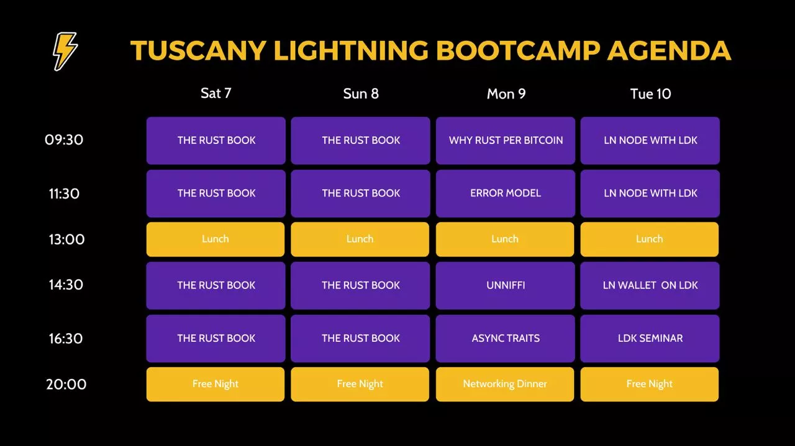
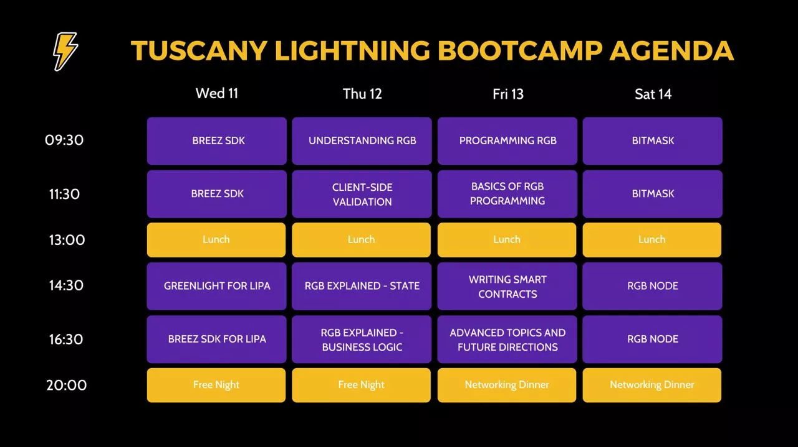

# Meningkatkan keterampilan pengembangan LN Anda

Selamat datang di perjalanan LN Anda dengan SDK.

Dalam kursus ini, Anda akan mempelajari dasar-dasar buku Rust, kemudian melanjutkan dengan beberapa pemrograman LN menggunakan SDK, dan menyelesaikan dengan beberapa latihan praktis. Para pengajar kami dari berbagai latar belakang akan memandu Anda menuju keterampilan praktis dan menjelaskan berbagai tantangan yang sering dihadapi oleh insinyur LN saat ini.

Kursus ini difilmkan selama seminar LANGSUNG yang diselenggarakan oleh Fulgur'Ventures selama acara LN Tuscany pada Oktober 2023.

Nikmati kursusnya!

+++

# Pengantar
<partId>594ab43f-7216-5326-ab41-f92b85be4581</partId>

## Kurikulum Kursus & Pengantar
<chapterId>36526df2-66a2-58df-8f38-378fb553f08c</chapterId>

### Pengantar

Selamat datang di kursus pemrograman lanjutan tentang SDK. Dalam pelatihan ini, Anda akan mempelajari dasar-dasar Rust, kemudian fokus pada BTC & Rust, dan menyelesaikan dengan beberapa latihan praktis menggunakan SDK.

Pelatihan ini untuk sementara hanya tersedia dalam bahasa Inggris dan merupakan bagian dari seminar langsung yang diselenggarakan bulan Oktober lalu di Tuscany oleh Fulgure Venture. Program acara LANGSUNG dapat ditemukan di bawah ini, dan pelatihan ini akan fokus hanya pada minggu pertama. Paruh kedua ditargetkan pada RGB dan dapat ditemukan di kursus RGB.

### Pengajar

Terima kasih banyak kepada para pengajar kami yang telah menjadi bagian dari program ini:

- Alekos: "Hai, saya seorang coder dan hacker Italia. Saya telah bekerja pada berbagai proyek seperti bitcoindevkit, magicalbitcoin, dan h4ckbs"
- Andrei: "Ahli Lightning di LIPA"
- Gabriel: "Saya menulis kode dan melakukan hal-hal."
- Jesse de Wit: "Penggemar jaringan Lightning | pengembang | Breez"

### Jadwal Seminar

Minggu 1 dari acara LN Tuscany

Setelah Anda menyelesaikan kursus ini, jika Anda tertarik dengan pelatihan lanjutan, berikut adalah bagian kedua dari jadwal:

Semoga sukses dengan studi Anda.

# Belajar cara coding dengan buku Rust
<partId>152b58c9-fb33-5d3b-9c15-64919869aa34</partId>

## Pengantar ke Rust (1/7)
<chapterId>af7108eb-4974-5ac2-9784-d2a5c0d77a45</chapterId>
<professor>radio-talent</professor>

## Pengantar ke Rust (2/7)
<chapterId>918ca359-c123-5414-af01-253016670f3a</chapterId>

## Pengantar ke Rust (3/7)
<chapterId>0278ed13-68b6-59e1-97c5-f8dde505549b</chapterId>

## Pengantar ke Rust (4/7)
<chapterId>915e523a-8fbd-5789-ab42-99b56a2a16c3</chapterId>

## Pengantar ke Rust (5/7)
<chapterId>96d54999-cdbc-5601-acac-1bc7acbe2eb7</chapterId>

## Pengantar ke Rust (6/7)
<chapterId>a66c63ed-9514-51d1-b3a0-c8edb57603bb</chapterId>

## Pengantar ke Rust (7/7)
<chapterId>21cf8dab-239a-580a-85cd-34326aeb1b26</chapterId>

# Rust & BTC 
<partId>0f4f2ff0-7f41-5ce3-8f64-9ecff69c5355</partId>

## Mengapa Rust untuk Bitcoin
<chapterId>92f13f36-70bd-5b00-8c6c-fcd1a1bd1531</chapterId>

## Model Kesalahan
<chapterId>1a648363-0aff-54dd-a79d-ead75231e5d6</chapterId>

## Unniffit
<chapterId>fe1be3e3-2288-5a10-b64b-9ba72fb985d1</chapterId>

## Trait Asinkron
<chapterId>e1610abe-574c-5995-abe4-a92b0dca4c93</chapterId>

# Pengembangan LNP/BP dengan SDK
<partId>42e8e0f8-1c07-5c71-8378-c57afb38e25d</partId>

## Node LN pada SDK
<chapterId>643e4670-bb1f-581f-a102-f84e8e5d2a02</chapterId>

## Breez sdk
<chapterId>52f20a4d-7d81-58e4-be00-9d39334352af</chapterId>

## Greenlight untuk lipa
<chapterId>7ba30435-d26e-5e6f-a973-94080d44bf27</chapterId>

## Breez sdk untuk lipa
<chapterId>93d87d63-dd7b-5e05-ad2e-dda12915ea32</chapterId>

# Kesimpulan
<partId>aff1e861-e6a3-58ad-af6a-33ceaedbda99</partId>

## Evaluasi kursus ini
<chapterId>9331e519-9e5c-5639-9d0d-055587d8ba4c</chapterId>
<isCourseReview>true</isCourseReview>

## Kata Penutup
<chapterId>d47b792e-d269-595b-9290-4788aba6e298</chapterId>
Terima kasih telah berpartisipasi dalam kursus ini! Kami harap Anda menyukainya.

Jika Anda ingin terus belajar dari seminar ini, kami mendorong Anda untuk mengikuti kursus RGB yang tersedia di platform ini.

Anda juga dapat melihat kursus lainnya dan terus belajar dari berbagai sumber daya kami.
Terima kasih banyak kepada Fulgur Venture atas penyelenggaraan kursus ini dan kepada para pengajar kami atas partisipasinya.
