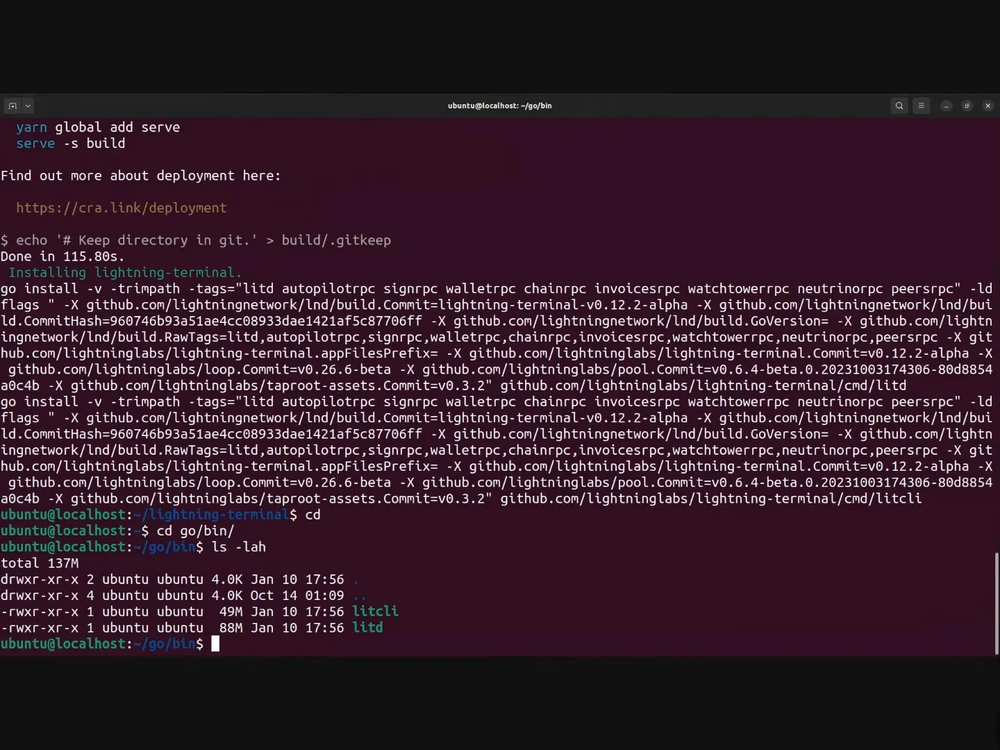
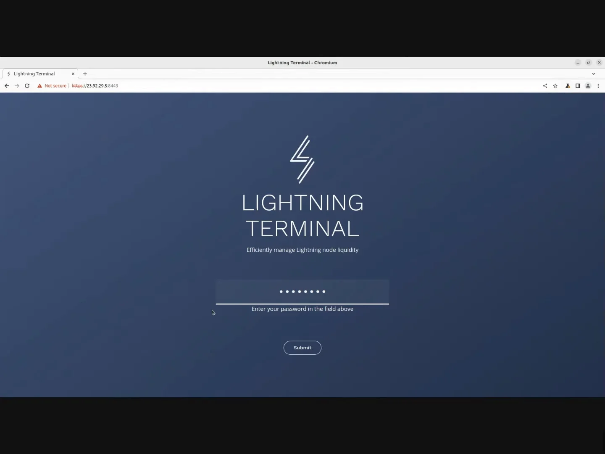
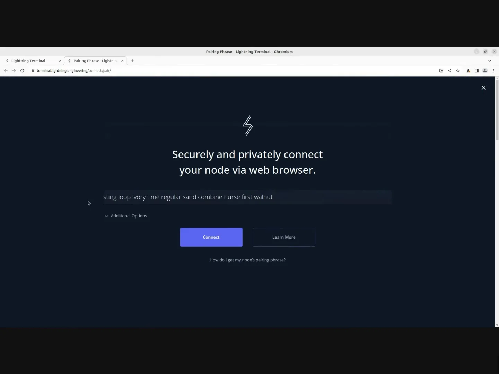
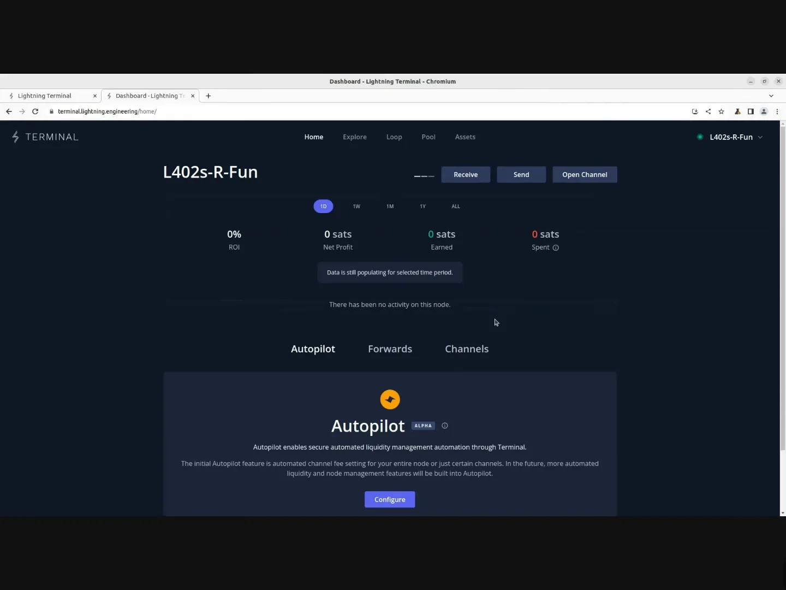
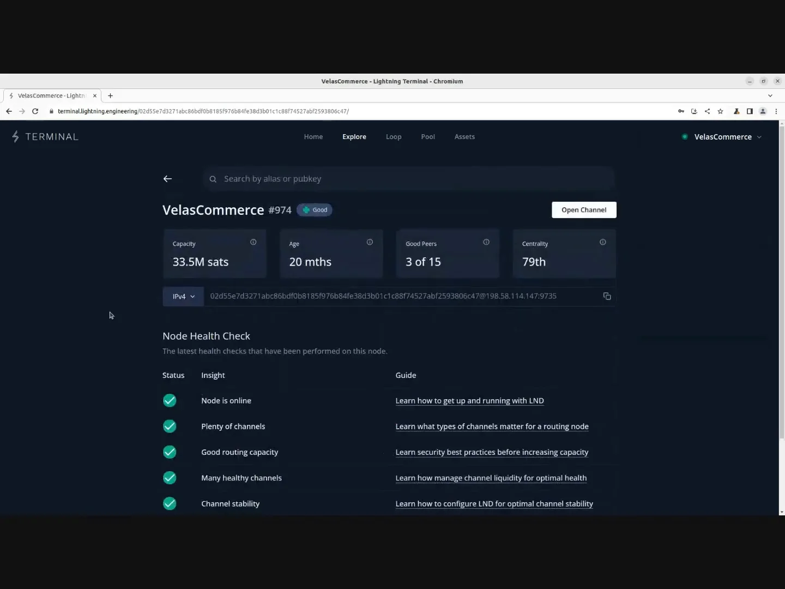
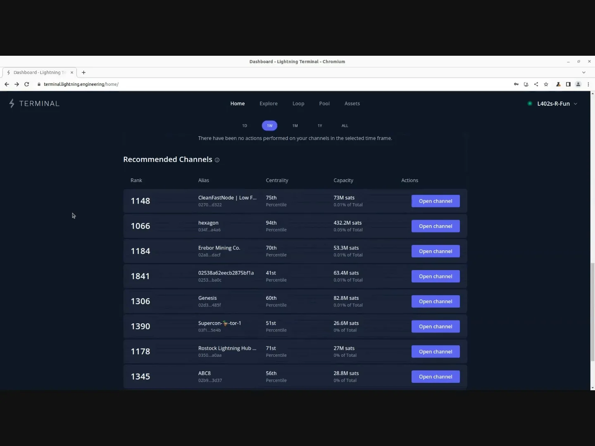
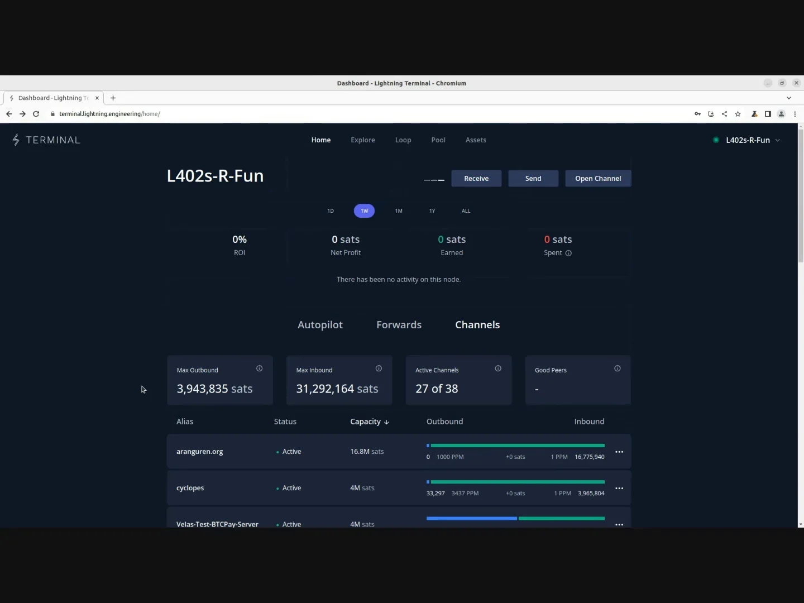

# A Journey into Your Lightning Node

Running a Lightning node is one thing. Managing it effectively is another challenge entirely. Whether you are routing payments across the network, running a merchant setup, or simply experimenting on testnet, the operational demands of a Lightning node go far beyond the initial installation: monitoring channel health, balancing liquidity, optimizing fee policies, and keeping your infrastructure secure and resilient.

This is where **Lightning Terminal** comes in. Developed by Lightning Labs, Lightning Terminal (also known as **LitD**, for Lightning Terminal Daemon) is an all-in-one management stack that bundles several essential tools into a single binary: **Loop** for liquidity swaps, **Pool** for the channel marketplace, **Faraday** for accounting and analytics, **Taproot Assets**, and optionally **LND** itself. In other words, rather than managing five separate daemons and their inter-process communications, you run one program that ties everything together through a unified web interface.

This course is built around the demo series by **Hannah Rosenberg** from Lightning Labs. Each chapter pairs a video walkthrough with detailed written content, including the actual CLI commands, configuration files, and procedures you will need. This is a hands-on, practice-focused course: you will spend most of your time in the terminal and in the Terminal web interface, working with real tools on real (or testnet) infrastructure.

### Prerequisites

To follow this course comfortably, you should have:

- A basic understanding of how the Lightning Network works (channels, routing, invoices)
- Familiarity with the Linux command line (`ssh`, `nano`, `systemctl`, `git`)
- An existing LND node running on testnet or mainnet (for the first 10 chapters), or a fresh Ubuntu server (for the final chapter, which builds everything from scratch)
- Go 1.21+ and Node.js installed on your machine (for compiling LitD from source)

If you have never set up a Lightning node before, we recommend starting with the [LNP 202 course](https://planb.academy/courses/lnp202), which walks you through the initial setup of your first Lightning node.

### Course structure

The course is organized in three parts:

**Part 1: Getting Started with Terminal**

We begin by installing LitD and connecting to the Terminal web interface. From there, we explore the Health Checks framework to evaluate your node's performance across six key metrics, then dive into the financial analytics dashboard to understand your routing revenue, channel efficiency, and network position. The part concludes with Autofees, an automated fee management system that adjusts your channel policies based on historical traffic patterns.

**Part 2: Managing Your Node's Network**

In this part, we move into active node management. You will learn how to operate multiple Lightning nodes from a single Terminal dashboard, open channels efficiently using batch transactions, manage your liquidity through Loop swaps (both manual and automated), and leverage Peer Insights to make data-driven decisions about your channel partnerships.

**Part 3: Advanced Features and Full Node Setup**

The final part covers advanced topics: the Liquidity Report for diagnosing silent routing problems, LND Accounts for creating sandboxed virtual wallets with granular permissions, and a comprehensive from-scratch installation walkthrough using the Run LITD repository. This last chapter is the most code-intensive in the course, covering server hardening, Bitcoin Core installation, LitD compilation, wallet initialization, and systemd service management.

### Documentation and resources

Throughout this course, we reference the official Lightning Labs documentation extensively. Here are the key resources you may want to bookmark:

- [Lightning Terminal docs](https://docs.lightning.engineering/lightning-network-tools/lightning-terminal)
- [Loop docs](https://docs.lightning.engineering/lightning-network-tools/loop)
- [Pool docs](https://docs.lightning.engineering/lightning-network-tools/pool)
- [LND docs](https://docs.lightning.engineering/lightning-network-tools/lnd)
- [Run LITD repository](https://github.com/lightninglabs/lightning-terminal)
- [Lightning Node Connect](https://docs.lightning.engineering/lightning-network-tools/lightning-terminal/lightning-node-connect)

Ready to take full control of your Lightning node? Let's get started.

+++

# Introduction
<partId>a1f3d9c2-7b4e-4c8a-9d5f-2e6b8c0d4a7e</partId>

## Course overview
<chapterId>f4e2a1b3-5c6d-4e8f-9a0b-1d3c5e7f2a4b</chapterId>

Welcome to the LNP 404 course! Together, we will explore how to manage, optimize, and understand your Bitcoin Lightning node through the power of **Lightning Terminal** (LitD), an all-in-one management stack developed by Lightning Labs.

This course is built around the demo series by [Hannah Rosenberg](https://planb.academy/professors/hannah-rosenberg) from Lightning Labs. Each chapter pairs a video walkthrough with detailed written content, including the actual CLI commands, configuration files, and procedures you will need.

### Why this course matters

Running a Lightning node means you are part of the payment infrastructure of Bitcoin. But without proper tooling, operating a node is like flying blind: you cannot see which channels are profitable, where liquidity is stuck, or whether your fee policies are competitive. Most node operators leave money on the table simply because they lack visibility into their own operations.

This course gives you that visibility and the tools to act on it.

### What you will learn

By the end of this course, you will be able to:

- Install, configure, and run Lightning Terminal on your own infrastructure
- Diagnose node performance issues using health checks and liquidity reports
- Automate fee management so your channels stay competitive without manual tuning
- Rebalance liquidity through Loop swaps (manual and automated) with budget controls
- Open multiple channels in a single on-chain transaction to save fees
- Manage a fleet of Lightning nodes from one unified dashboard
- Create sandboxed virtual accounts with spending limits for apps and users
- Build a complete Lightning node from scratch on a fresh Ubuntu server

These are the operational skills that separate a passive node operator from someone who runs a professional, revenue-generating Lightning infrastructure.

### Curriculum

**Part 1: Getting Started with Terminal** covers installation, the Health Checks diagnostic framework, financial analytics (ROI, forwards, channel insights), and the Autofees algorithm for automated fee management.

**Part 2: Managing Your Node's Network** covers multi-node management from a single dashboard, batch channel openings, Lightning Loop for liquidity management (Loop In, Loop Out, Auto Loop), and Peer Insights for data-driven channel decisions.

**Part 3: Advanced Features and Full Node Setup** covers the Liquidity Report for diagnosing silent routing problems, LND Accounts for sandboxed virtual wallets, and a comprehensive from-scratch node build using the Run LITD repository.

### Prerequisites and tools

This course assumes familiarity with the Linux command line (`bash`, `ssh`, `nano`, `systemctl`, `git`) and a basic understanding of how the Lightning Network works (channels, routing, invoices). You will work primarily with **Go**, **Node.js**, and **systemd** configuration files. All commands shown use `bash` on Ubuntu.

You will need either an existing LND node (testnet or mainnet) for the first 10 chapters, or a fresh Ubuntu server for the final chapter. If you have never set up a Lightning node before, I recommend starting with the [LNP 202 course](https://planb.academy/courses/lnp202).

### Documentation and resources

Throughout this course, we reference the official Lightning Labs documentation:

- [Lightning Terminal docs](https://docs.lightning.engineering/lightning-network-tools/lightning-terminal)
- [Loop docs](https://docs.lightning.engineering/lightning-network-tools/loop)
- [Pool docs](https://docs.lightning.engineering/lightning-network-tools/pool)
- [LND docs](https://docs.lightning.engineering/lightning-network-tools/lnd)
- [Run LITD repository](https://github.com/lightninglabs/lightning-terminal)
- [Lightning Node Connect](https://docs.lightning.engineering/lightning-network-tools/lightning-terminal/lightning-node-connect)

Ready to take full control of your Lightning node? Let's get started.

# First steps of installing your Lightning Node
<partId>d74ec352-1a5d-466d-a06d-571fc9f99937</partId>

## Install & Connect
<chapterId>0fa71ff6-9b15-4e8b-8270-2ff7df465c11</chapterId>


Running a Lightning node is one thing. Managing it with confidence is something else entirely. In this first chapter, we will install **Lightning Terminal**, the all-in-one management interface developed by Lightning Labs, and we will connect it to an existing LND node. By the end of this chapter, you will have a running `litd` daemon, a proper configuration file, a systemd service that survives reboots, and a secure browser connection to Terminal on the web.

Let's go!

### What is Lightning Terminal?

Before we touch the command line, let's understand what we are about to install. **Lightning Terminal (LitD)** is a unified management stack that bundles several powerful tools into a single binary:

- **LND** (optionally, if you do not already have it running)
- **Lightning Loop** for submarine swaps between on-chain and off-chain Bitcoin
- **Lightning Pool** for buying and selling inbound channel liquidity
- **Faraday** for financial reporting and channel analytics
- **Taproot Assets Protocol** for asset issuance over Lightning

In other words, `litd` is the gateway between a browser-based management interface and your Lightning node's gRPC API. Anyone who has access to `litd` can monitor and manage the node, which is why we will pay careful attention to authentication and security throughout this chapter.

### Two Deployment Modes

LitD supports two ways of running alongside LND:

| Mode | Description | When to use |
|------|-------------|-------------|
| **Integrated mode** | LitD ships with its own embedded LND instance | Fresh installations where you want everything in a single process |
| **Remote mode** | LitD connects to an already-running LND instance | Existing nodes where you want to add Terminal without reconfiguring LND |

In this course, we will use **remote mode**, which is the ideal approach when you already have a production or testnet LND node running. Remote mode lets you enhance your existing setup with Loop, Pool, Faraday, and the Terminal web interface without touching your LND installation.

### Prerequisites

Installing `litd` from source requires up-to-date development tools. Before proceeding, verify that you have recent versions of both Go and Node.js on your machine:

```bash
go version
```

You should see something like `go1.21.3` or newer.

```bash
node --version
```

You should see `v20.x` or newer (the exact version matters less than being reasonably current).

You will also need a running Bitcoin backend (typically `bitcoind`) and a functioning LND node. Let's confirm that both processes are active:

```bash
ss -tlnp | grep -E 'bitcoind|lnd|litd'
```

You should see `bitcoind` and `lnd` listening on their respective ports. If `litd` already appears, you may have a previous installation; stop it before continuing.

### Cloning and Compiling LitD

Now that our environment is ready, let's install LitD from source. We begin by cloning the official Lightning Labs repository:

```bash
git clone https://github.com/lightninglabs/lightning-terminal.git
cd lightning-terminal
```

Next, we check out the latest stable release. As of this writing, that is version `v0.12.2-alpha`:

```bash
git checkout v0.12.2-alpha
```

Then we compile and install the binary with a single command:

```bash
make install
```

This step compiles the Go backend, builds the UI assets, and places the `litd` binary in your `$GOPATH/bin` directory. It typically takes a few minutes. Once it completes, confirm that `litd` is accessible system-wide:

```bash
litd --version
```

If the version string prints correctly, the installation is complete.



Let's move on to configuration.

### Preparing the LND Configuration

Before `litd` can communicate with your existing LND node, we need to verify one critical setting in your LND configuration file. Open it:

```bash
nano ~/.lnd/lnd.conf
```

Look for the following line (or add it if it is missing):

```ini
rpcmiddleware.enable=true
```

This setting enables the **RPC Middleware Interceptor**, which allows `litd` to authenticate and communicate with LND. Without it, `litd` will fail to connect in remote mode, and you may encounter cryptic macaroon errors. Save and close the file, then restart LND if you had to modify this setting.

### Creating the LitD Configuration File

Rather than passing dozens of flags on the command line each time we start `litd`, we will create a dedicated configuration file. First, let's create the data directory:

```bash
mkdir -p ~/.lit
```

Now create the configuration file:

```bash
nano ~/.lit/lit.conf
```

Here is a complete configuration for remote mode. We will walk through each section:

```ini
# LitD operation mode
lnd-mode=remote

# Network (change to mainnet for production)
network=testnet

# UI password (use a strong, unique password on production nodes)
uipassword=YourSecurePasswordHere

# Remote LND connection settings
remote.lnd.rpcserver=localhost:10009
remote.lnd.macaroonpath=~/.lnd/data/chain/bitcoin/testnet/admin.macaroon
remote.lnd.tlscertpath=~/.lnd/tls.cert

# HTTPS listen address for the Terminal UI
httpslisten=0.0.0.0:8443
```

Let's examine what each block does:

1. **`lnd-mode=remote`** tells `litd` that we already have an LND node running. From `litd`'s perspective, LND is a remote service it connects to, even when both run on the same machine.

2. **`network=testnet`** ensures `litd` operates on the correct network. If you are running mainnet, change this accordingly. A network mismatch will produce macaroon authentication errors that can be difficult to diagnose.

3. **`uipassword`** sets the password for the browser-based Terminal UI. On a production machine, use a password generated by a password manager.

4. **The three `remote.lnd.*` lines** tell `litd` how to talk to LND: the RPC server address, the path to the admin macaroon for authentication, and the path to the TLS certificate. Note that the macaroon path includes the network name (`testnet` in our case).

5. **`httpslisten=0.0.0.0:8443`** instructs `litd` to listen for HTTPS connections on port 8443 from any network interface. This is the port we will use to access the Terminal UI in a browser.

### Setting Up a Systemd Service

We could start `litd` manually with a simple command like `litd --uipassword=YourPassword`, but that approach lacks resilience. If the machine reboots at 2 AM, your Terminal connection disappears. A systemd service solves this problem elegantly.

Create the service file:

```bash
sudo nano /etc/systemd/system/litd.service
```

Paste the following configuration:

```ini
[Unit]
Description=LitD Lightning Terminal Daemon
Requires=lnd.service
After=lnd.service

[Service]
ExecStart=/home/<your-user>/go/bin/litd
User=<your-user>
Group=<your-user>
Type=simple
Restart=always
RestartSec=120

[Install]
WantedBy=multi-user.target
```

Replace `<your-user>` with your actual Linux username. A few points worth noting:

- **`Requires=lnd.service`** and **`After=lnd.service`** ensure that `litd` starts only after LND is up and running. Since `litd` depends on LND's RPC interface, starting it before LND would cause connection failures.
- **`Restart=always`** with a **`RestartSec=120`** delay means that if `litd` crashes, systemd will wait two minutes and then restart it automatically.
- The `ExecStart` path should point to wherever `make install` placed the `litd` binary (typically `$GOPATH/bin/litd`).

Now enable and start the service:

```bash
sudo systemctl enable litd
sudo systemctl start litd
```

Verify that `litd` is running and listening on the expected port:

```bash
ss -tlnp | grep 8443
```

If you see `litd` listening on port 8443, the daemon is operational. You can also check its status at any time with:

```bash
sudo systemctl status litd
```

### Accessing the Terminal UI

With `litd` running, open a browser and navigate to:

```
https://<your-server-ip>:8443
```

If you have not configured a domain name or SSL certificate (which is typical on testnet), your browser will display a security warning about the self-signed certificate. This is expected; proceed past the warning for testing purposes. On a production node, you would configure a proper TLS certificate.

Enter the UI password you defined in `lit.conf`, and you will see the Terminal interface.



From here, you have access to all the management tools we will explore throughout this course: health checks, channel management, Loop, Pool, Autofees, and more.

### Connecting to Terminal on the Web

The local UI is useful, but Lightning Terminal truly shines when accessed through **Terminal on the web** at `terminal.lightning.engineering`. This hosted interface connects to your node remotely using **Lightning Node Connect (LNC)**, an encrypted communication protocol that works even when your node sits behind Tor or NAT.

Here is how LNC works at a high level: your `litd` daemon makes an outgoing connection to a web proxy (the "mailbox"). Because the connection is outgoing, you do not need to open any ports on your firewall. The proxy server sees only encrypted blobs; Lightning Labs cannot inspect your private channel balances, HTLCs, or on-chain data. The connection is authenticated using a **one-time pairing phrase**, a set of 10 words that you should treat with the same care as a password.

#### Connecting via the UI

From the local Terminal interface, click the connection button to initiate an LNC session. The interface will generate a 10-word pairing phrase. Copy this phrase, then navigate to `terminal.lightning.engineering` in your browser. Paste the phrase, set a session password, and you are connected.



#### Connecting via the Command Line

For automation or headless setups, you can generate the connection string directly from the command line using `litcli`:

```bash
litcli --network=testnet sessions add --label default --type admin
```

This command creates a new administrative session and outputs a connection string. You can then paste this string into the Terminal web interface to establish the connection. Note that `litcli` supports several session types beyond `admin`, including read-only sessions for monitoring dashboards.

**Important:** The connection string is equivalent to an administrative private key for your node. Never broadcast it publicly, and never reuse a pairing phrase after it has been consumed.

### Summary

Let's recap what we have accomplished in this chapter. We installed `litd` from source by cloning the Lightning Labs repository and running `make install`. We verified that `rpcmiddleware.enable=true` is set in our LND configuration. We created a dedicated `lit.conf` file with all the parameters needed for remote mode operation. We set up a systemd service so that `litd` starts automatically and survives reboots. Finally, we connected to Terminal on the web using Lightning Node Connect.



In the next chapter, we will explore what Terminal reveals about our node's health and discover how the health check system evaluates routing performance across six key metrics.

## Health Checks and Recommendations
<chapterId>ceb149b0-473b-4264-8bc3-b64ec8717aac</chapterId>


Now that we have Lightning Terminal installed and connected, let's explore the first thing it shows us: the health of our node. In this chapter, we will examine how Terminal evaluates your node across six diagnostic metrics, what each metric actually measures, and how the **Recommended Channels** feature suggests new peers that benefit both your node and the broader Lightning Network.

### Why Health Checks Matter

Running a Lightning node is not simply a matter of keeping software online. A routing node must maintain sufficient channels, balanced liquidity, stable connections, and quality peers in order to forward payments reliably. Without a systematic way to evaluate these factors, operators are left guessing about their node's effectiveness.

Terminal's **Health Checks** provide exactly this systematic evaluation. Think of them as a diagnostic report for your node, covering six dimensions of routing performance. However, and this is an important nuance, these checks are designed specifically for routing nodes. If your node specializes in sending payments (a consumer wallet) or receiving payments (a merchant endpoint), it may not score well on all six checks, and that is perfectly fine. The checks measure routing capability, not general usefulness.

### Exploring Your Node's Health

When you connect to Terminal on the web, the homepage displays a summary of your node's health status at the top. To get a more detailed view, navigate to the **Explore** tab and search for your node by alias or public key:

1. Copy your node's public key from the homepage
2. Click the **Explore** tab
3. Paste your public key into the search field



This brings up a detailed profile of your node, including its overall score, current capacity, age, number of good peers, and centrality measure. Below these summary statistics, you will find the six individual health checks.

### The Six Health Checks

Let's walk through each check and understand what it measures:

**1. Node Is Online**

This is the most fundamental check. A routing node must be reachable on the network to forward payments. If your node experiences frequent downtime, it cannot route payments, and peers will eventually close their channels with you. For routing nodes, consistent uptime is not optional; it is the foundation upon which everything else depends.

**2. Plenty of Channels**

A routing node needs a sufficient number of active channels to create viable payment paths. A node with only one or two channels cannot meaningfully participate in routing because there are too few paths through it. Terminal evaluates whether your node has enough active channels to function as a useful routing intermediary. Around 14 active channels is generally considered adequate connectivity for routing operations.

**3. Good Routing Capacity**

Having many channels is necessary but not sufficient. Each channel must also have **adequate capacity in both directions** to route payments of reasonable size. In other words, a channel where all the balance sits on one side cannot forward payments in the depleted direction. This check evaluates whether your channels collectively provide enough bidirectional capacity to handle typical routing requests.

**4. Many Healthy Channels**

Beyond capacity, Terminal evaluates whether your channels are actually healthy. A **healthy channel** is one that remains active, has reasonable capacity, and sees some activity over time. This check focuses specifically on public channels (channels that are announced to the network graph). Private channels, which are typically used for mobile wallets or merchant endpoints, are not factored into this metric.

**5. Channel Stability**

Do your channels stay open and active, or do they frequently go offline? This check penalizes nodes whose channels are unstable, where peers disconnect often or where channels are opened and closed in rapid succession. Stability signals to the network that your node is a reliable routing partner.

**6. Many Good Peers**

This is the most demanding check. It evaluates not just your own node's performance, but the quality of the nodes you connect to. Your public channels should reach out to **other well-performing routing nodes**. A node that connects only to poorly maintained or unreliable peers inherits some of that unreliability, because payments that route through your node depend on your peers being available and well-connected too.

In Terminal's terminology, a **"stable peer"** is a node that passes five of the six health checks, typically all checks except this last one ("many good peers"). This definition becomes important for the Recommended Channels feature, which we will explore next.

### Understanding Your Scores

Each health check includes a link to more detailed documentation. If you pass some checks but fail others, these links provide actionable guidance on how to improve. Here is a general diagnostic approach:

| Failed Check | Likely Cause | Action |
|-------------|-------------|--------|
| Node is online | Uptime issues | Investigate network stability, configure systemd for auto-restart |
| Plenty of channels | Too few connections | Open additional channels to well-connected peers |
| Good routing capacity | Channels depleted on one side | Rebalance using Loop (covered in a later chapter) |
| Many healthy channels | Inactive or undersized channels | Close inactive channels, open larger ones |
| Channel stability | Frequent opens/closes or peer disconnections | Choose more stable peers, investigate network issues |
| Many good peers | Connected to poorly performing nodes | Open channels to recommended peers (see below) |

### Recommended Channels



Scroll down on the Channels tab of the homepage, and you will find the **Recommended Channels** section. This feature identifies nodes on the network that would benefit from a well-connected peer, and it suggests that you be that peer.

The recommendation logic works as follows: Terminal identifies "stable peers," nodes that pass five of six health checks (everything except "many good peers"). These are reliable, well-maintained nodes that simply need better-connected partners to reach their full routing potential. When you open a channel to one of these recommended nodes, the benefit operates on three levels:

1. **Your node** gains a new, reliable routing partner
2. **The recommended peer** may pass its final health check, becoming a fully healthy routing node
3. **The network as a whole** benefits from more decentralized routing paths and better capital allocation

For each recommended node, Terminal displays its rank, alias, centrality score, and total capacity. You can click on any recommendation to view detailed information, including how long the node has been active, how many peers it has, and which health checks it passes.

It is worth noting that opening a channel to a recommended peer does not guarantee that the peer will pass its final health check. Success also depends on the capacity you allocate to the channel and ongoing maintenance of that channel's liquidity balance.

### Summary

In this chapter, we explored Terminal's Health Checks framework and the Recommended Channels feature. We learned that the six health checks evaluate routing-specific performance: uptime, channel count, bidirectional capacity, channel health, stability, and peer quality. We also discovered how the recommendation system identifies stable peers that would benefit from new connections, creating a virtuous cycle of network improvement.

In the next chapter, we will dive into the data that Terminal provides about your node's financial performance, routing activity, and channel-level analytics.

## Insights, Forwards, and Channels
<chapterId>37799ff2-ca5a-4db4-aa21-fed5a5420be4</chapterId>


Now that we understand how Terminal evaluates our node's health, let's explore the financial and operational data it provides. The Terminal Web homepage is effectively your node's command center, consolidating routing data, profitability metrics, and channel analytics into a single interface. In this chapter, we will examine the four key performance indicators, the forwarding log, the top routes analysis, and the channel management tools that make Terminal such a powerful operational dashboard.

### The Four Key Performance Indicators

At the top of the Terminal homepage, you will find four metrics that provide an instant snapshot of your node's financial performance:

| Metric | What It Measures |
|--------|-----------------|
| **Spent Satoshis** | Total operational costs: on-chain fees for opening and closing channels, routing fees paid when sending payments, rebalancing costs |
| **Earned Satoshis** | Revenue generated from forwarding payments through your node |
| **Net Profit** | Earned Satoshis minus Spent Satoshis |
| **ROI (Return on Investment)** | Net Profit relative to the total capital locked in your channels |

These four numbers tell you, at a glance, whether your node is operating at a profit or a loss. If you are running a routing node with the goal of earning fees, this is where you assess whether your strategy is working. If your node is not optimized for routing (perhaps it exists primarily to support a specific application or service), a negative ROI is not necessarily a problem; it simply reflects a different use case.

You can adjust the **time period** for these metrics using the controls at the top of the dashboard. This allows you to isolate specific periods, which is particularly useful when evaluating the impact of a fee policy change or a new channel opening.

### Profit and Loss Breakdown

For deeper financial analysis, click through to the **Profit and Loss breakdown**. This view itemizes your revenue sources and expense categories, providing granular visibility into where your satoshis are flowing. The breakdown shows:

- How you have been **earning fees** (which channels and routes generate the most revenue)
- How you have been **spending satoshis** (channel opening costs, routing fees, rebalancing expenses)

One of the most practical features here is the **CSV export** button. You can download your complete profit and loss data and import it into a spreadsheet for external accounting, tax reporting, or more sophisticated financial modeling. For operators who manage multiple nodes or need to report to stakeholders, this bridges the gap between node management and traditional bookkeeping.

### Top Routes

Below the KPI summary, you will find the **Top Routes** section. This is where Terminal reveals the specific payment pathways that drive the majority of your forwarding volume and fee revenue.

Understanding your top routes is strategically important. If a particular channel combination consistently generates the highest fees, that tells you several things: those channels have adequate liquidity, the fee rates are attracting traffic, and the peers on either end are active routing participants. These are the channels you want to pay the most attention to when it comes to liquidity management.

The analysis breaks down further into **Top Outbound** and **Top Inbound** categories. This distinction helps you understand the directionality of your traffic:

- **Top Outbound** channels are the ones through which payments most frequently leave your node. These channels tend to drain your local (outbound) balance over time.
- **Top Inbound** channels are the ones through which payments most frequently arrive at your node. These channels accumulate local balance over time.

Understanding these flow patterns is crucial for anticipating liquidity needs. If a high-earning outbound channel is steadily draining, you know you will eventually need to replenish its local balance (using Loop In, for example) to keep the revenue flowing.

### The Forwards Log

Scrolling down further, you reach the **Forwards** section. This is a comprehensive log of every payment your node has forwarded, displayed both as a time-series graph and as a detailed event list.

The graph provides a visual overview of routing activity over time. You can adjust the time window to zoom in on specific periods of interest. Below the graph, each forwarding event is logged individually, showing:

- The timestamp of the forward
- The amount forwarded
- The fee earned for facilitating that payment

This level of detail creates an audit trail that is invaluable for troubleshooting. If you notice a drop in forwarding activity, you can correlate it with specific events: a channel going offline, a fee policy change, or a liquidity imbalance that developed on a key route.

### The Channels Tab

Let's now turn to the **Channels** tab, which represents the operational core of Terminal Web. At the top level, you will see aggregate statistics:

- **Total channels** (active and inactive)
- **Total outbound capacity** (your ability to send or route outward)
- **Total inbound capacity** (your ability to receive or route inward)



But the real power of this tab lies in the **per-channel liquidity visualization**. For each channel, Terminal displays a visual bar showing the balance distribution between local (outbound) and inbound liquidity. At a glance, you can see:

- Channels that are **local-heavy** (full of outbound liquidity, depicted on the left side of the bar)
- Channels that are **remote-heavy** (full of inbound liquidity, depicted on the right side of the bar)
- Channels that are **well-balanced** (liquidity distributed roughly evenly)

This visual representation is far more efficient than reading through numerical tables. In a few seconds, you can scan all your channels and identify which ones need attention.

### Per-Channel Analytics

Click on any individual channel, and Terminal reveals detailed metrics:

- **Satoshis earned** through that specific channel
- **ROI** for channels you opened (comparing earned fees against the on-chain cost of opening the channel)
- **Peer information** including the node alias and public key
- **Channel status** (active or inactive)
- **Total capacity** of the channel

The ROI calculation is particularly valuable for evaluating past decisions. If you opened a channel and the fees it has generated exceed the on-chain cost of creating it, that channel is profitable. If not, you may want to consider whether to keep it open or reallocate that capital elsewhere.

### Channel Actions

From the channel detail view, you can take direct action:

- **Update the fee policy** for that specific channel. If a channel is underperforming, adjusting its fee rate may attract more routing traffic. If it is being depleted too quickly, raising the fee can slow the drain.
- **Close the channel** if it is consistently inactive or unprofitable. Closing an underperforming channel frees up capital that can be redeployed to a more productive peer.

Terminal also logs all **channel lifecycle events**, including opens, cooperative closes, and force closes. This history appears in the **Channel Actions** section and provides context for understanding changes in your channel count over time. If you notice your channel count dropped unexpectedly, check this log to see whether a peer force-closed on you, or whether an old inactive channel was cleaned up.

### Summary

In this chapter, we explored Terminal's financial dashboard and channel management tools. We examined the four KPIs that summarize node profitability (Spent Sats, Earned Sats, Net Profit, ROI), the Top Routes analysis for identifying high-value payment paths, the Forwards log for auditing individual routing events, and the Channels tab for visual liquidity management and per-channel analytics.

In the next chapter, we will discover how to automate one of the most time-consuming aspects of node management: fee adjustment. The Autofees feature can significantly reduce your operational overhead while improving both fee earnings and liquidity balance.

## Autofees
<chapterId>c6264c0b-10f6-4261-8d1e-47593168d8ca</chapterId>


If you have been managing a Lightning routing node for any length of time, you know that fee management is one of the most persistent operational challenges. Set your fees too high, and traffic stops flowing through your channels. Set them too low, and you underprice your liquidity, draining your outbound capacity without earning adequate compensation. In this chapter, we will explore **Autofees**, a Terminal feature that automates fee adjustments on a per-peer basis, adapting dynamically to changes in demand and routing flows.

### Why Automate Fees?

Manual fee management requires constant attention. Each channel has its own traffic patterns, each peer behaves differently, and market conditions shift over time. An operator managing dozens of channels would need to monitor each one individually, compare forwarding volumes, evaluate whether current fees are capturing enough value, and adjust accordingly. This is time-consuming and error-prone.

Autofees addresses this by applying an intelligent algorithm that observes your node's routing history and adjusts fees incrementally. The goal is twofold: **stabilize traffic** to prevent the feast-or-famine pattern that many routing nodes experience, and **prevent underpricing of liquidity** so that your outbound capacity is not drained without fair compensation.

### How the Algorithm Works

The Autofees engine does not apply random or uniform adjustments. It operates on a comparative analysis of historical performance, and it works on a **per-peer basis**, not as a blanket policy across your entire node.

Here is the core mechanism:

1. **Establish a baseline.** The algorithm examines the forwarding traffic of your **top five earning peers over the past 60 days**. This establishes a reference throughput: how much volume, under what conditions, generated the best returns.

2. **Compare recent activity.** The algorithm then looks at forwarding traffic from the **past few days** and compares it against this 60-day baseline.

3. **Adjust accordingly.**
   - If recent traffic **exceeds** the baseline, the algorithm interprets this as a demand surge and may incrementally **increase fees** to capture more revenue.
   - If recent traffic **falls below** the baseline, the algorithm interprets this as a demand slump and may **decrease fees** to attract more routing volume.

4. **Liquidity protection.** When a channel reaches approximately **7/8ths depletion** (only 1/8 of its capacity remaining on one side), fees increase mildly to signal scarcity and discourage further draining.

Updates occur in **small increments every three days**. This conservative pacing minimizes network gossip overhead (since fee policy changes must be broadcast to the network) and prevents the algorithm from overreacting to short-term fluctuations.

In other words, Autofees behaves like a patient, data-driven operator who checks each channel's performance every few days and makes small, targeted adjustments based on what the numbers say.

### Privacy Architecture

A natural concern when enabling any automated tool is: what data does it access, and who can see it? Autofees is designed with the **principle of least privilege** in mind.

When you enable Autofees, Terminal establishes a dedicated **Lightning Node Connect (LNC)** session with strictly limited permissions:

| Access Type | Scope |
|------------|-------|
| **Read** | Forwarding history, channel balances, current fee policies |
| **Write** | Fee policy updates only (cannot spend funds, close channels, or alter other node settings) |

This means the Autofees session cannot move your money, cannot close your channels, and cannot modify anything beyond fee rates. The session is visible in `litd` and can be revoked at any time.

To further protect your privacy, `litd` employs a **Privacy Mapper** that obfuscates sensitive data before it leaves your node. Specifically:

- **Channel IDs** are mapped to random values
- **Channel points** are obfuscated
- **Node public keys** are obfuscated
- **Amounts in forwarding data** are randomly altered to break amount correlation
- **Timestamps in forwarding data** are randomly altered to break time correlation

The Privacy Mapper ensures that the external algorithm can optimize fee calculations without knowing your node's specific identity or topology. You can inspect these mappings at any time using the command line:

```bash
litcli privacy
```

This command lets you manually convert between real and privacy-mapped values for debugging purposes.

### Configuration Prerequisites

Before enabling Autofees, you need to verify two configuration items.

**Required: Enable RPC Middleware**

Open your LND configuration file:

```bash
nano ~/.lnd/lnd.conf
```

Ensure this line is present:

```ini
rpcmiddleware.enable=true
```

Without this setting, Autofees cannot intercept and modify fee policies. If you followed the installation in Chapter 1.1, you already have this configured.

**Recommended: Set a High Initial Fee Rate**

Lightning Labs recommends setting a relatively high default fee rate before enabling Autofees:

```ini
bitcoin.feerate=2500
```

The reasoning is strategic: the algorithm can safely **lower** fees from a high starting point to find the optimal rate. If you start with a low fee rate, the algorithm has limited upward room and your channels may be drained before fees adjust sufficiently. Starting high is the conservative approach; the algorithm will find the right level by adjusting downward.

**Important side effect:** Enabling Autofees automatically sets the channel **CLTV delta to 100 blocks**. The CLTV delta (CheckLockTimeVerify) is the number of blocks your node requires for HTLC timeout. A value of 100 is reasonable for most routing nodes, but you should be aware of this automatic change.

### Enabling Autofees

With the prerequisites in place, enabling Autofees takes just a few clicks in the Terminal interface:

1. Navigate to the **Loop** tab in Terminal
2. Click **Autopilot**
3. Click **Enable**
4. Review the per-channel toggles and adjust as needed
5. Click **Save**

That is it. The algorithm begins working immediately, establishing its baseline from your historical forwarding data.

### Per-Peer Granularity

One of the most practical aspects of Autofees is that you can **enable or disable it on a per-channel basis**. After enabling the feature globally, scroll down to see the list of your channels with individual toggles.

This allows a hybrid management approach:

- **Automated channels**: Enable Autofees for channels where you are unsure of the optimal fee rate or where manual management is too time-consuming
- **Manual channels**: Keep Autofees disabled for strategic peers where you have a specific fee policy in mind (for example, a channel to Loop's node where you want a fixed rate)

Even with Autofees enabled, you retain the ability to **manually override any fee rate at any time**. The algorithm will respect your manual changes and factor them into subsequent adjustments.

### Operational Best Practices

A few guidelines to get the most out of Autofees:

- **Do not restart Autofees unnecessarily.** Restarting the feature causes the algorithm to re-establish its baseline, which can lead to false double-counting of forwarding data across overlapping periods.
- **Be patient.** The algorithm updates every three days. Give it at least two to three weeks to establish meaningful patterns before evaluating its performance.
- **Algorithm improvements are deployed server-side.** You do not need to upgrade `litd` to receive the latest version of the Autofees algorithm. Improvements are delivered through Terminal automatically.
- **Monitor the results.** Use the Insights and Forwards data we explored in the previous chapter to evaluate whether Autofees is improving your fee revenue and liquidity balance over time.

### Summary

In this chapter, we explored Autofees, Terminal's automated fee management feature. We learned that the algorithm establishes a 60-day baseline from your top-earning peers, compares recent traffic against that baseline, and makes small per-peer adjustments every three days. We examined the privacy architecture, including the dedicated LNC session with restricted permissions and the Privacy Mapper that obfuscates your node's identity. We configured the prerequisites (`rpcmiddleware.enable=true` and a high initial fee rate) and walked through the activation process in the Terminal UI.

With Autofees running, your node can adapt to changing market conditions without constant manual intervention, freeing you to focus on higher-level strategy: choosing peers, managing liquidity through Loop, and expanding your routing capacity through Pool. These are exactly the topics we will cover in the chapters ahead.

# Managing Your Node's Network
<partId>b6bc2556-170a-4992-8046-a8756d91a6b6</partId>

## Multi-Node Connections
<chapterId>9f6f9bf3-999e-4dad-9d2d-0b725178d754</chapterId>


As your Lightning infrastructure grows, a natural question arises: how do we manage multiple nodes without juggling separate browser sessions, bookmarks, and login credentials for each one? Whether you are running a mainnet routing node alongside a testnet playground, maintaining redundant backups, or overseeing nodes for different organizations, the overhead of context-switching between isolated dashboards quickly becomes a bottleneck.

Lightning Terminal solves this with its **multi-node connection system**. In this chapter, we will explore how to generate connection strings for multiple nodes, onboard them into a single Terminal workspace, and switch between them instantly. The process is remarkably straightforward, but the security implications deserve careful attention.

### Generating a Connection String

The foundation of every Terminal connection is the **connection string**, a cryptographic pairing phrase generated by Lightning Node Connect (LNC). Because LNC works through outgoing connections to a web proxy, you do not need to open any ports on your firewall or modify your Tor configuration. The node reaches out to the proxy; the proxy never reaches in.

You can generate connection strings through the LitD web interface, but the command line gives us more explicit control over the session parameters. Let's examine the `litcli` command that creates a new administrative session:

```bash
litcli --network=testnet sessions add --label="Routing-Node-East" --type=admin
```

Let's break down each parameter:

- `--network=testnet` specifies the network this node operates on (use `mainnet` for production nodes).
- `sessions add` tells `litcli` to create a new LNC session.
- `--label="Routing-Node-East"` assigns a human-readable name that will appear in the Terminal dropdown, helping you distinguish nodes at a glance.
- `--type=admin` grants full administrative privileges over the node. For read-only monitoring, you could use `--type=readonly` instead.

When you execute this command, `litcli` outputs a connection string. In other words, this string is the cryptographic key that authorizes Terminal to communicate with your node. It looks something like a long encoded phrase, and it is the only thing standing between an attacker and full administrative access to your channels and funds.

**This point is critical**: treat every connection string with the same care you would give a private key. Never paste it into a public chat, never transmit it over an unencrypted channel, and never store it in plaintext alongside other credentials. Once you have used it to pair with Terminal, the string is consumed and cannot be reused, but until that moment, anyone who possesses it can connect.

### Connecting Your First Node

With the connection string in hand, we navigate to the Terminal web interface and click the **Connect My Node** button. After pasting the string, Terminal prompts us to create a **session password**. This is a critical secondary security layer: even if someone gains access to the browser or device running Terminal, they cannot interact with your node without entering this password.

In other words, the connection string authenticates the node-to-proxy link, while the session password protects the local browser session. Together, they form a two-factor model that keeps your node secure.

Once the password is confirmed, Terminal establishes the encrypted connection. You will see your node's dashboard populate with its channels, balances, health checks, and routing data. At this point, the first node is fully onboarded.

### Adding Additional Nodes

To add a second (or third, or tenth) node, we follow the exact same procedure on the other machine. Let's say we have a second testnet node. We SSH into it and generate another connection string:

```bash
litcli --network=testnet sessions add --label="L402-Fun-Node" --type=admin
```

Back in the Terminal interface, we click **Add Node** in the header area, paste the new connection string, and set a password for this session. Terminal treats each connection independently, maintaining separate authentication tokens and session states.

After confirmation, both nodes are now available in your workspace.

### Context Switching Between Nodes

Once multiple nodes are onboarded, the **node selector dropdown** in the Terminal header becomes your primary navigation tool. Clicking it reveals a list of all connected nodes, identified by the labels you assigned during session creation.

When you select a different node, the entire dashboard context refreshes instantly:

- **Metrics update**: ROI, net profit, earned sats, and spent sats reflect the selected node's data.
- **Channel list refreshes**: you see only the peers and channels associated with the active node.
- **Tool state changes**: the Loop, Pool, and Autopilot interfaces update to show swaps, auctions, and fee configurations relevant to the currently selected node.

This efficient switching mechanism allows operators to maintain situational awareness across their entire fleet. If you notice a liquidity imbalance on one node, you can address it immediately, then switch to another node to check on a pending channel opening, all without leaving the Terminal workspace.

### Summary

In this chapter, we saw how to generate LNC connection strings via `litcli`, onboard multiple nodes into a single Terminal session, and switch between them using the node selector dropdown. The key takeaway is that **multi-node management requires no additional infrastructure**: the same LNC protocol that secures a single connection scales seamlessly to many. In the next chapter, we will put these connected nodes to work by opening channels efficiently using batch transactions.


## Opening Channels & Batching
<chapterId>c7e83bd9-df1c-4763-8401-488b733d835c</chapterId>


Now that we can manage our nodes from a single interface, let's examine one of the most important operations any node operator performs: opening payment channels. More specifically, we will learn how to open multiple channels simultaneously using a single on-chain transaction, a feature called **batch opens**.

To understand why this matters, we first need to appreciate the cost structure of channel creation.

### Why Batching Matters

Every Lightning payment channel is anchored by an on-chain Bitcoin transaction. This transaction creates a **2-of-2 multisignature output** that locks funds cooperatively between you and your peer. Traditionally, if you wanted to open five channels, you would broadcast five separate transactions to the Bitcoin network, each one consuming its own inputs, paying its own mining fees, and occupying its own block space.

This approach is wasteful for two reasons. First, each transaction carries overhead bytes for its inputs, signatures, and metadata, so you pay miner fees five times for work that could largely be consolidated. Second, if you are spending from a single large UTXO, each individual transaction produces a change output, fragmenting your wallet into progressively smaller pieces. Over time, this **UTXO fragmentation** leads to higher fees on future transactions because spending many small UTXOs requires more input data than spending one large one.

**Batch opens solve both problems at once.** By aggregating multiple channel openings into a single transaction, you consume one set of inputs, pay one mining fee (amortized across all channels), and produce a clean set of outputs: one per channel, plus a single change output returning the remainder to your wallet.

In other words, if opening five channels individually might cost you 5,000 satoshis in total fees, batching them together might cost only 1,500 satoshis for the same result. The savings scale with the number of channels and the prevailing fee environment.

### Preparing for a Batch Open

Before you begin, you need two things:

1. **Sufficient on-chain funds** in your LND wallet to cover the total capacity of all channels plus the mining fee.
2. **The public keys** of the peers you want to connect with. You can find these through the Terminal Explorer tab, through Lightning network explorers like [1ML](https://1ml.com/) or [Amboss](https://amboss.space/), or by asking the node operator directly.

A public key (also called a **node identity key**) is a 66-character hexadecimal string that uniquely identifies a node on the Lightning Network. It looks something like this:

```
02e7a7d3c1e6055b7b7457d95e04d9bbd24f200fd4a58daca7beee7bc776e17440
```

### Walking Through the Batch Workflow

Let's open two channels simultaneously using the Terminal interface. Here is the step-by-step process:

**Step 1: Initiate the first channel.**
Click the **Open Channel** button on the Terminal homepage. Paste the public key of your first target peer into the search field. Terminal validates that this node exists on the network and is reachable.

**Step 2: Set the channel capacity.**
Define how many satoshis you want to commit to this channel. For example, we might allocate 1,000,000 satoshis (0.01 BTC):

```
Channel capacity: 1,000,000 sats
```

This amount becomes the total capacity of the channel, initially sitting entirely on your side as outbound liquidity.

**Step 3: Configure fees and visibility.**
Terminal presents two important configuration options:

- **Fee settings**: the base fee and fee rate that your node will charge for routing payments through this channel. You can accept the defaults or tune them based on your routing strategy.
- **Channel visibility**: choose between a public or a private channel.

**Public channels are broadcast** to the network graph, meaning any node can discover them and attempt to route payments through them. This is the standard choice for routing nodes that want to earn forwarding fees.

**Private channels remain unannounced.** Only you and your direct peer know the channel exists. This is appropriate for mobile wallets, merchant terminals, or any situation where you want to send and receive without advertising your channel to the wider network.

**Step 4: Add another channel to the batch.**
Here is where the magic happens. Instead of clicking "Submit," click **Add Channel**. This stacks a second channel into the same pending transaction. Paste the public key of your second peer, configure the capacity, fees, and visibility just as before.

You can repeat this step as many times as you need. Each additional channel adds minimal marginal cost to the transaction.

**Step 5: Set the mining fee and broadcast.**
Once all channels are queued, Terminal presents a final screen where you select the **mining fee rate** for the entire batch transaction. A higher fee rate means faster confirmation; a lower fee rate saves money but may take longer to confirm. Choose based on your urgency.

Click the **Batch Open Channels** button to broadcast the transaction.

### Verifying on a Block Explorer

After broadcasting, the channels enter a **pending confirmation** state while the transaction awaits confirmation. You can verify the batch structure by looking up the transaction on any block explorer. A properly executed batch transaction will show:

- **Transaction inputs**: one or more UTXOs from your LND wallet.
- **Channel outputs**: multiple outputs of varying sizes (one per channel, each matching the capacity you specified).
- **Change output returned**: a single output returning the remaining funds to your wallet.

For example, if you opened two channels of 1,000,000 sats each from a 5,000,000 sat UTXO, the transaction would show:

```
Input:   5,000,000 sats (your UTXO)
Output:  1,000,000 sats (Channel 1 - 2-of-2 multisig)
Output:  1,000,000 sats (Channel 2 - 2-of-2 multisig)
Output:  2,999,500 sats (change back to your wallet, minus fees)
```

This confirms that both channels were funded from a single transaction, exactly as intended.

### Summary

In this chapter, we learned that batch opens aggregate multiple channel openings into a single on-chain transaction, reducing fees and preventing UTXO fragmentation. We walked through the Terminal workflow for configuring each channel's capacity, fees, and visibility, then stacking them into one batch. In the next chapter, we will explore what happens after channels are open: how to manage their liquidity over time using Lightning Loop.

## Lightning Loop
<chapterId>f2642efb-a485-4bc9-b571-d8e901e3e8b1</chapterId>


Now that we know how to open channels efficiently, we face the ongoing challenge that defines Lightning node operation: **liquidity management**. A channel does not stay balanced on its own. Every payment that flows through it shifts the balance, and over time, channels inevitably become lopsided. When all the funds sit on your side, you can send but cannot receive. When all the funds sit on your peer's side, you can receive but cannot send. Either way, the channel's utility drops significantly.

The traditional solution was to close the unbalanced channel and open a new one, which is expensive and slow. **Lightning Loop** provides a far better alternative: it lets you rebalance channels without closing them, using a cryptographic technique called **submarine swaps**.

In this chapter, we will explore Loop Out, Loop In, and the powerful Auto Loop automation system.

### Understanding Submarine Swaps

Before we dive into the interface, let's take a moment to understand the mechanism that makes Loop possible. A **submarine swap** is an atomic exchange between on-chain Bitcoin and off-chain Lightning Bitcoin. "Atomic" means that either both sides of the swap complete, or neither does. There is no scenario where one party takes the money and disappears.

The swap uses Hash Time-Locked Contracts (HTLCs) on both layers:

1. One party creates a secret value (called the **preimage, or secret**) and shares only its hash.
2. An on-chain HTLC locks funds that can be claimed by revealing the preimage, or refunded after a timeout.
3. A Lightning HTLC locks funds on the other side, gated by the same hash.
4. When one party reveals the preimage to claim one side, the other party can use that same preimage to claim the other side.

In other words, the swap is cryptographically bound so that both legs must settle together. This is what makes Loop **non-custodial and trustless**: the Loop server never takes custody of your funds.

### Loop Out: Creating Inbound Liquidity

**Loop Out** is the operation you use when a channel is full on your side (high local balance, low remote balance). You can send payments through this channel, but you cannot receive them. To fix this, Loop Out moves funds from your Lightning channel to an on-chain address, freeing up space on the remote side.

Here is what happens step by step:

1. You initiate a Loop Out for a specified amount.
2. The Loop server creates an on-chain HTLC locked to a hash.
3. Your node routes a Lightning payment (locked to the same hash) to the Loop server through the target channel.
4. The Loop server reveals the preimage to claim the Lightning payment.
5. You use that preimage to sweep the on-chain HTLC to your Bitcoin address.

The net result: your Lightning channel now has more room on the remote side (inbound liquidity), and you received the equivalent amount on-chain.

**Using Loop Out in Terminal:**

In the Terminal interface, navigate to the **Loop tab** in the header. You will see a list of your channels, and you can filter by those with **low inbound** balance. Select the channel you want to rebalance, then drag the slider to your desired target balance (for example, 50% for a roughly balanced channel).

Click the **Next button**, and Terminal presents the fee breakdown:

- **Loop service fee**: paid to the Loop server for facilitating the swap.
- **On-chain fees**: paid to miners for confirming the settlement transaction.
- **Lightning routing fees**: paid to intermediate nodes for routing the payment to the Loop server.

You also have access to **advanced options**, including the ability to specify a custom on-chain address where you want the funds delivered (instead of your LND wallet's default address).

If the fees look acceptable, click the **Submit button** to execute the swap.

**Via CLI:**

For operators who prefer the command line, you can also execute Loop Out directly:

```bash
loop out --channel 735057608151793668 --conf_target 250 \
  --label "rebalance-east-node" --max_swap_routing_fee 2500 \
  --addr bc1qvnfuf2zvg6mrfyjhc8h4c7ge9a7ywfrav52qru \
  --amt 1000000
```

Key parameters:

| Flag | Purpose |
|------|---------|
| `--channel` | Force the swap through a specific channel (by short channel ID) |
| `--conf_target` | Desired confirmation speed in blocks (higher = lower fee) |
| `--label` | Human-readable tag for identifying the swap later |
| `--max_swap_routing_fee` | Cap on Lightning routing fees in satoshis |
| `--addr` | Custom destination for the on-chain funds |
| `--amt` | The swap amount in satoshis |

You can check current minimum/maximum amounts and fee estimates before committing:

```bash
loop terms
loop quote out 1000000
```

### Loop In: Restoring Outbound Liquidity

**Loop In** serves the inverse function. Use it when a channel has been depleted on your side (low local balance, high remote balance), leaving you unable to send or route outgoing payments.

In a Loop In, you send on-chain Bitcoin to the Loop server, and it sends you the equivalent amount over Lightning, pushing funds back to your side of the channel.

**Before you begin**: unlike Loop Out, a Loop In requires that you hold sufficient **on-chain Bitcoin reserves**. If your LND wallet does not have enough funds, Terminal will alert you before proceeding. You may need to reduce the swap amount or deposit more on-chain Bitcoin first.

**Using Loop In in Terminal:**

Filter your channels by **low outbound** balance, select the target channel, and drag the slider to your desired balance. Click the **Next button** and choose the **One-time manual** loop option.

An important setting here is the **confirmation target**. Since Loop In begins with an on-chain transaction, you can trade speed for cost:

- A **low confirmation target** (e.g., 3 blocks) means higher miner fees but faster liquidity availability.
- A **high confirmation target** (e.g., 100 blocks) means lower miner fees but a longer wait before the swap completes.

Choose based on how urgently you need the outbound capacity.

**Via CLI:**

```bash
loop in --last_hop 02e7a7d3c1e6055b7b7457d95e04d9bbd24f200fd4a58daca7beee7bc776e17440 \
  --amt 500000
```

The `--last_hop` flag is particularly useful: it specifies which peer should deliver the final Lightning payment, giving you precise control over which channel receives the new outbound capacity.

### Auto Loop: Automated Liquidity Management

Manual loops are effective for spot adjustments, but high-volume routing nodes need continuous rebalancing. Executing loops by hand every time a channel drifts out of balance is neither scalable nor practical. This is where **Auto Loop** transforms liquidity management into a background service.

Auto Loop monitors your channel balances and **automatically dispatches swaps** when they breach configured thresholds. It operates at three hierarchical levels:

1. **Node level**: balances the aggregate liquidity across your entire node.
2. **Peer level**: manages the total balance across all channels shared with a specific peer (useful when you have multiple channels with the same counterparty).
3. **Channel level**: micro-manages the liquidity of a single, high-priority channel.

**Enabling Auto Loop in Terminal:**

In the Loop tab, select a channel and click the **Next button**. Instead of choosing "One-time manual," select the **Auto Loop** option. Terminal then presents the budget configuration:

**The budget system** is the safety mechanism that prevents Auto Loop from spending unlimited fees on your behalf. You configure:

- **Minimum loop size**: the threshold below which Auto Loop will not execute a swap (prevents tiny, fee-inefficient "dust" loops).
- **Maximum fee per swap**: a hard ceiling on what any individual swap can cost.
- **Total budget amount**: the maximum satoshis Auto Loop can spend on fees (service fees + on-chain fees + routing fees combined) within a given period.
- **Budget period**: how often the budget refreshes. Options include 1 day, 3 days, 7 days, 14 days, or 28 days.

For example, you might configure: "I am willing to spend up to 50,000 satoshis in total fees every 7 days to keep this channel balanced."

**Via CLI, the equivalent configuration looks like this:**

```bash
# Enable Autoloop
loop setparams --autoloop=true

# Set a liquidity rule for a specific channel
loop setrule 735057608151793668 --incoming_threshold=25 --outgoing_threshold=25

# Configure the budget: 100,000 sats refreshing every 7 days
loop setparams --autobudget=100000 --autobudgetrefreshperiod=604800s

# Set fee limits
loop setparams --sweepconf=250 --maxswapfee=1 --maxroutingfee=1
```

The `--incoming_threshold` and `--outgoing_threshold` parameters define the minimum percentage of channel capacity that must remain as inbound and outbound liquidity, respectively. When either side falls below its threshold, Auto Loop triggers a swap to restore the balance.

**Monitoring Auto Loop:**

Once active, the Autopilot dashboard (accessible via the **Autopilot toggle** button at the top of the Loop tab) shows you:

- Whether Auto Loop is currently active or paused.
- How many loops have been performed recently.
- The current budget consumption.
- A history of all automated swaps.

You can **pause Auto Loop at any time** without losing your configuration. You can also adjust the budget, fee limits, or thresholds on the fly. Just remember to click the **Save button** after making changes.

A useful CLI command for debugging is `loop suggestswaps`, which shows what Auto Loop *would* dispatch without actually executing anything:

```bash
loop suggestswaps
```

This is essentially a dry run that lets you verify your rules and budgets are configured correctly before enabling automation.

**Please note**: Autoloop parameters are **not persisted across restarts** of the `loopd` daemon. If you restart your node, you will need to reconfigure your Autoloop settings.

### Summary

In this chapter, we explored the three modes of Lightning Loop: manual Loop Out (to create inbound liquidity), manual Loop In (to restore outbound liquidity), and Auto Loop (to automate the entire process). The underlying mechanism, submarine swaps, ensures that all operations are trustless and non-custodial. The budget system gives you precise control over costs, and the three-tier hierarchy (node, peer, channel) lets you tailor your liquidity strategy to your specific needs. In the next chapter, we will look at how to evaluate the peers you are connected to using Terminal's Peer Insights feature.

## Peer Insights
<chapterId>27d09714-6496-4451-bb08-1927e0148d1e</chapterId>


Up to this point, we have learned how to connect nodes, open channels efficiently, and manage liquidity. But there is a question we have not yet addressed: how do we evaluate whether a particular peer is worth connecting to, and how do we measure the value of our existing relationships? Making good peering decisions is one of the most consequential aspects of running a routing node, because **the quality of your peers directly determines the quality of your routing**.

Lightning Terminal's **Peer Insights** feature, available in the Explorer tab, provides the intelligence layer we need to make these decisions. It operates on two tiers: general reconnaissance data available for any public node on the network, and detailed performance analytics available only for nodes with whom you already share a channel.

### The Explorer Tab

When you navigate to the **Explorer tab** with a node connected to Terminal, you see a ranked list of top-performing nodes on the network. This list goes beyond simple capacity rankings. Terminal augments each entry with contextual badges, small visual indicators that surface useful information at a glance.

For example, you might see a badge indicating that a node has **open liquidity orders** in the Pool marketplace (we will explore Pool in a later chapter). Another badge might tell you that a particular node is already **your peer**, meaning you have at least one channel open with them.

Each node entry also displays key metrics:

- **Total channel capacity**: the total Bitcoin locked in the node's channels.
- **Node age on network**: how long the node has been active on the network.
- **Number of peers**: how many other nodes it is connected to.
- **Centrality score**: a measure of how critical this node is to the overall network topology. A high centrality score means many shortest paths between other nodes pass through this one, making it an important routing hub.
- **Health check status**: whether the node passes Terminal's six health checks.

These metrics allow you to quickly scan for stable, well-connected candidates before committing capital to a new channel.

### Searching for a Specific Node

Beyond browsing the ranked list, you can search for any node on the network by pasting its public key into the search field:

```
02e7a7d3c1e6055b7b7457d95e04d9bbd24f200fd4a58daca7beee7bc776e17440
```

Terminal will pull up a detailed profile for that node, displaying its capacity, age, peer count, centrality, and health check results. This is useful when someone recommends a peer or when you want to evaluate a node before opening a channel with it.

### The Fee Distribution Graph

One of the most powerful analytical tools in Peer Insights is the **fee distribution graph**. This visualization shows you how a node has priced its channels, giving you a window into its routing philosophy.

The graph uses a dual-axis design:

- **Horizontal axis (x)**: fee rates, from low on the left to high on the right.
- **Vertical axis (y)**: the number of channels.
- **Split view**: the upper portion shows **inbound fee distribution**, and the lower portion shows **outbound fee distribution**.

Each bar on the graph represents a group of channels clustered at a similar fee rate. By hovering over a bar, you can see exactly how many channels fall within that fee range.

Let's say you are examining a node with 16 channels. The graph might show:

- 15 channels with outbound fee rates clustered between 660 and 1,000 ppm (parts per million).
- 1 channel with a significantly lower outbound fee.
- 5 channels with low inbound fees, 6 with moderate inbound fees, 2 with higher inbound fees, and 3 outliers with very high inbound fees.

What does this tell us? The tight clustering of outbound fees suggests this operator actively manages their fee policy and has settled on a consistent strategy for most channels. The single low-fee outlier might be a strategic channel to a high-volume peer where the operator is willing to accept lower margins for reliable throughput. The spread in inbound fees suggests different peers have set different inbound rates on their end of the channels.

**Why this matters for you**: if you are about to open a channel with this node, the fee distribution graph helps you set competitive fees. If most of their outbound channels are priced at 800 ppm, and you set yours at 2,000 ppm, routing algorithms will likely prefer cheaper paths and your channel may see little traffic. Conversely, if you set your fees too low, you might attract more traffic than you can sustain, depleting your channel quickly.

This data is available for **any public node on the network**, not just your peers. It is all derived from the public network graph.

### Peer-Specific Performance Analytics

For nodes with whom you already share a channel, Peer Insights unlocks an additional layer of data: your actual interaction history. While the fee distribution graph shows public information anyone can see, **performance analytics draw from your node's private forwarding data** to show the real value of the relationship.

Key metrics include:

- **Number of channels**: how many channels you share with this peer.
- **Total forwards**: the count of payments that have been routed through your shared channels.
- **Volume routed**: the cumulative amount of satoshis that have flowed through the connection.
- **Fees earned**: the direct revenue this peer relationship has generated for your node.

For instance, you might discover that a peer with whom you have a single channel has routed 1,400,000 satoshis across just 3 forwarding events, earning you 136.5 satoshis in fees. That is useful context: a small number of forwards, but each one carrying significant volume.

This data transforms abstract channel management into **evidence-based decision making**. Consider these scenarios:

- A channel has high capacity but zero forwarding events over the past month. The analytics make this inefficiency obvious, signaling that you should either adjust fees, close the channel, or investigate why traffic is avoiding this route.
- A channel shows consistently high volume and steady fee earnings. This peer is valuable, and you might consider opening an additional channel to increase capacity, or you might raise fees slightly to capture more revenue without discouraging traffic.
- A peer generates high volume but at very low fees. You can evaluate whether the revenue justifies the capital locked in the channel, or whether that capital would earn more deployed elsewhere.

### Putting It All Together

Peer Insights brings together three layers of intelligence:

1. **Network-wide scouting** (Explorer tab rankings, badges, health checks) for discovering potential new peers.
2. **Fee analysis** (the fee distribution graph) for understanding a node's pricing strategy before and after you connect.
3. **Relationship analytics** (forwarding events, volume, earnings) for measuring the real return on each channel.

Together, these tools allow you to treat your node not just as a piece of software, but as a portfolio of financial relationships that require active monitoring and optimization. The best routing nodes are not simply the ones with the most channels or the most capacity; they are the ones whose operators make informed decisions about where to deploy their capital, informed by exactly the kind of data that Peer Insights provides.

### Summary

In this chapter, we explored the Peer Insights feature in Terminal's Explorer tab. We learned how to scout potential peers using capacity, centrality, and health check data; how to analyze a node's fee strategy using the fee distribution graph; and how to evaluate existing peer relationships using forwarding metrics. These tools give you the intelligence foundation for making sound channel management decisions. In the next part of the course, we will continue building on these skills by examining liquidity reports and advanced node accounting.

# Last Steps
<partId>2e886890-62f7-4453-9c6f-9b397a280b75</partId>

## Liquidity Reports
<chapterId>ed0d914d-08af-4e32-9eb0-93955bff0474</chapterId>


### Why Liquidity Visibility Matters

Throughout this course, we have explored many facets of Lightning node management: health checks, fee automation, channel opening strategies, and submarine swaps. All of these tools share one underlying concern, the management of liquidity. Now, let us turn to a feature that synthesizes this concern into a single diagnostic view.

The fundamental challenge of **liquidity management on the Lightning Network** is that failure is silent. When your node lacks sufficient capacity in the right direction, payments do not fail with a loud error on your side. They simply route around you. The senders find alternative paths, and you, the operator, never see the revenue that could have been yours. In other words, the most costly liquidity problems are the ones you do not know you have.

Lightning Terminal addresses this with the **Liquidity Report**, accessible from the main dashboard. This tool provides a comprehensive visualization of your node's ability to receive, send, and route payments of various sizes. If you are not already very familiar with the concepts of inbound and outbound liquidity, I recommend reviewing the [Lightning Labs documentation on understanding liquidity](https://docs.lightning.engineering) before continuing, as this chapter builds directly on those fundamentals.

### The Routable Liquidity Chart

The primary instrument in the Liquidity Report is the **Routable Liquidity Chart**. This chart breaks your node's total capacity into its two critical components:

- **Inbound liquidity**: the funds sitting on the remote side of your channels, representing your ability to receive payments.
- **Outbound liquidity**: the funds sitting on your local side, representing your ability to send payments or initiate the first hop of a routed payment.

The chart offers two viewing modes. The **Cumulative View** aggregates all your channels into a single ratio, letting you assess the overall balance at a glance. For instance, you might immediately see that your node is heavily skewed toward inbound capacity, with relatively little outbound. Whether this distribution is desirable depends entirely on your use case: a merchant receiving payments benefits from strong inbound liquidity, while a routing node needs a healthy balance of both.

The **Detailed View** breaks the same data down by individual channels. This is where you begin to identify specific channels that may need rebalancing, either through manual intervention or through the Loop operations we covered earlier in the course.

I recommend visiting the Liquidity Report regularly. Because silent liquidity problems accumulate gradually (a channel slowly depleting over weeks, for example), periodic review is the most reliable way to catch issues before they become costly.

### The Simulation Engine

Liquidity is not a static property. A node that routes a 500,000 satoshi payment with ease might completely fail when confronted with a 15,000,000 satoshi transaction. The capacity exists in aggregate, but no single channel may be large enough to carry the larger payment.

To help operators reason about this, the Liquidity Report includes a **simulation engine** with three preset payment sizes:

- `500,000 sats`
- `5,000,000 sats`
- `15,000,000 sats`

As you toggle between these settings, two elements of the dashboard update dynamically:

1. **The Routable Liquidity Chart** adjusts to show which channels remain viable at each payment size. Channels that lack sufficient depth simply disappear from the visualization, making bottlenecks immediately visible.
2. **The Estimated Last Hop Fee** recalculates to project what it would cost an external sender to route a payment of that size through your node.

This simulation capability is essential for capacity planning. If you expect your node to handle large-value payments (perhaps because you serve as a routing hub for business clients), you can verify that you actually have channels deep enough to support those transactions. If the chart goes blank at `5,000,000 sats`, you know exactly where to focus your next channel opening or Loop operation.

### Analyzing Routing Quality by Fee Rate

Beyond raw capacity, the Liquidity Report analyzes your channels through the lens of fee rates. The **Routable Inbound Chart**, located below the main liquidity visualization, plots your channels along two axes:

- **X-axis**: the fee rate (in parts per million) associated with each channel.
- **Y-axis**: two perspectives are available. The **Channel Count** view shows how many channels fall into each fee range, while the **Channel Percentage** view shows the proportion of your total routing capacity available at each fee rate.

This dual-perspective chart reveals the quality of your routing options, not just the quantity. It helps you answer specific strategic questions:

- **Do I have inbound liquidity at competitive fee rates?** If all your capacity is concentrated in high-fee channels, the network's routing algorithms may consistently bypass you in favor of cheaper paths.
- **Are there dead zones in my fee distribution?** The chart may highlight fee ranges where you have zero routable capacity, marked with an attention indicator for channels that need intervention.

Watch how this chart changes as you adjust the simulated payment size. You may discover that your node handles small payments across many fee ranges, but only a handful of channels can support medium or large payments. This insight allows you to rebalance or open new channels specifically to fill the gaps in your routing profile.

### Summary

The Liquidity Report transforms node management from a reactive process (fixing problems after they manifest) into a proactive strategy. By combining the routable liquidity visualization, the payment size simulation engine, and the fee rate analysis chart, you gain the ability to detect silent inefficiencies and address them before they cost you revenue. As we will see in the next chapter, this kind of granular control extends even further when we introduce virtual accounts on top of your node.

## LND Accounts
<chapterId>0d31ef81-4e77-4c5e-adc5-081df64c27ec</chapterId>


### The Problem of Shared Access

Now that we understand how to monitor and optimize a node's liquidity, let us examine a different operational challenge: sharing that node's capabilities with multiple users or applications.

In a typical LND deployment, any application that connects to the node receives broad access to its full balance and channel infrastructure. A mobile wallet, a tipping bot, and a merchant point-of-sale system might all authenticate with the same administrative macaroon. If any one of these applications is compromised, the attacker gains access to everything. This is a fragile security model, and it becomes increasingly dangerous as more services depend on a single node.

Lightning Terminal solves this with a feature called **LND Accounts**. These are **virtual off-chain accounts** layered on top of a single LND node, each with its own authentication token, spending limits, and permission scope. Let us explore how they work and why they matter.

### Understanding the Architecture

It is crucial to understand what an LND Account is and, equally important, what it is not. An LND Account does not possess its own on-chain wallet, its own Lightning channels, or its own private keys. All cryptographic key management and liquidity remain under the control of the host LND node. The "account" is a logic layer: a virtual partition that tracks a balance and enforces access rules.

In other words, the host node operator retains full custody of the underlying funds. The account holder enters a trust relationship with the node operator regarding the availability of those funds. This is, by design, a custodial arrangement at the account level. The operator manages the real channels and liquidity; the account holder operates within a sandboxed environment defined by the operator.

This architecture is powered by the **RPC Middleware Interceptor**, which intercepts every API call made with an account macaroon and filters the responses accordingly. When an account holder queries their balance, for example, they see only their virtual allocation, not the node's full channel balance. On-chain balance always returns `0`. The channel list returns empty. Payment and invoice histories are filtered to show only transactions belonging to that specific account.

### Security Through Segregation

The primary value of LND Accounts is **risk containment through resource segregation**. Each account operates as a distinct, sandboxed environment with three layers of constraint:

- **Granular permissions**: each account operates under a specific **macaroon authentication token** (native to LND) with restricted permission scopes. The standard account macaroon includes permissions like `info:read`, `invoices:read`, `invoices:write`, `offchain:read`, `offchain:write`, and `onchain:read`.
- **Budget allocations**: operators assign a strict spending limit in satoshis. Even if the connected application attempts to spend more, LND rejects the request at the protocol level.
- **Expiration enforcement**: accounts can be configured with time-limited validity (for example, 90 days). Once the expiration passes, the account's connection string ceases to function, preventing "zombie" permissions from becoming long-term vulnerabilities.

This layered model reduces what security professionals call the "blast radius" of a breach. If a specific account credential is stolen, the attacker is limited strictly to that account's remaining budget and permissions. The core node, other accounts, and the underlying channel infrastructure remain untouched.

### Creating an Account via the Terminal UI

Let us walk through the practical workflow for creating an LND Account using the Lightning Terminal web interface. We will use the **Lightning Node Connect** tab, which handles both standard connections and custodial account creation.

1. Navigate to the **Lightning Node Connect** tab in the LitD UI.
2. Click **Create a new session** and assign it a descriptive name (for example, `AccountsDemo`).
3. Under **Permission Types**, select **Custom Type** rather than a standard admin or read-only preset.
4. In the permissions panel, select **Custodial Account**. Notice that this selection reveals additional fields: a **balance allocation** (the spending limit in satoshis) and an **expiration date**.
5. Define the budget and expiration (for example, 100,000 sats with a 90-day expiry).
6. Click the **Submit button**.

The system generates a **Lightning Node Connect pairing phrase** (and optionally a QR code) that encapsulates the account's connection credentials. This pairing phrase can be shared with the intended user or application.

**Important to note**: custodial accounts created this way connect exclusively through Lightning Node Connect. They cannot be used with the Terminal web interface directly; they are designed for wallet applications, browser extensions, or custom integrations.

### Creating an Account via the CLI

For operators who prefer command-line workflows, accounts can also be created using `litcli`:

```bash
litcli accounts create 50000 --save_to /tmp/user.macaroon
```

This command creates an account with a 50,000 satoshi budget and saves the corresponding macaroon to the specified path. You can then inspect the macaroon to verify its permissions:

```bash
lncli printmacaroon --macaroon_file /tmp/user.macaroon
```

To list all existing accounts and their IDs:

```bash
litcli accounts list
```

If you need to create an LNC session specifically tied to an account:

```bash
litcli sessions add --label pointofsale --type account --account_id d64dbc31b28edf66
```

And to test the account by querying the channel balance through its restricted macaroon:

```bash
lncli --macaroonpath=/tmp/user.macaroon channelbalance
```

If a macaroon is lost but the account still exists, it can be reconstructed by baking a new base macaroon and adding the account-specific caveat:

```bash
lncli bakemacaroon info:read invoices:read invoices:write offchain:read offchain:write onchain:read peers:read --save_to tmp.macaroon
lncli constrainmacaroon --custom_caveat_name account --custom_caveat_condition <account_id> tmp.macaroon accounts.macaroon
rm tmp.macaroon
```

### Practical Use Cases

This functionality opens several practical scenarios:

- **Onboarding friends or family**: a node operator creates an account with a modest budget and shares the QR code. The recipient downloads a compatible wallet (such as Zeus), scans the code, and immediately has access to the Lightning Network using the operator's liquidity, without needing to manage channels or understand the underlying infrastructure.
- **Application isolation**: a developer running multiple microservices against a single node can create separate accounts for each service. A bug in one service cannot drain the wallet of another.
- **Enhanced security model**: when multiple applications connect to a single LND node, each receives its own constrained account rather than sharing a single administrative macaroon. Application A has its own permissions and budget; Application B has its own permissions and budget. A compromise of one does not affect the other.

### Summary

LND Accounts extend the capabilities of a single Lightning node by introducing **virtual off-chain partitions** with isolated budgets, permissions, and expiration policies. Whether configured through the Terminal UI or the command line, they provide a practical security layer for operators who share their node's infrastructure with multiple users or applications. In the next and final chapter, we will bring everything together by building a complete LitD node from scratch.

## RUN LITD: Building a Node from Scratch
<chapterId>710c2090-e905-4141-8b12-7a81d7c276a1</chapterId>


### Why Build a Node from Scratch?

Throughout this course, we have worked with an already-running Lightning Terminal instance, exploring its features one by one. Now, in this final technical chapter, we will go through the entire process of building a LitD node from a bare server. This is where all the concepts we have studied converge into a single, hands-on deployment.

As we discussed in the very first chapter, **Lightning Terminal Daemon (LitD)** is a unified binary that bundles LND with Loop, Pool, Faraday, and Taproot Assets into a single integrated system. By running LitD rather than managing five separate daemons, we dramatically simplify the operational complexity of a full Lightning Labs stack.

To streamline this deployment, we will use the **Run LitD** repository, a community resource inspired by Alex Bosworth's well-known "Run LND" guide. The Run LitD repository provides three complementary pathways:

1. **Automated bash scripts**: handle the end-to-end installation (ideal for rapid testing and development environments).
2. **Manual checklists**: step-by-step notes for operators who want to audit every command before executing it.
3. **Example configuration files**: reference `bitcoin.conf`, `lit.conf`, and `systemd` service files that can be adapted to any environment.

**Important disclaimer**: as noted in the repository itself, these scripts are designed for developers who want to spin up a node quickly for testing purposes. If you are building a production node with real funds, take the time to read through every script, audit every configuration line, and follow your own security best practices. Do not blindly trust any automation when real money is at stake.

### Server Requirements and Prerequisites

These scripts have been tested on **Ubuntu 24.04**. If you are running a different distribution, the process will likely work with minor adjustments, but be prepared for occasional differences in package names or paths.

Here are the baseline hardware requirements:

| Resource | Minimum | Notes |
|----------|---------|-------|
| **RAM (minimum)** | 4 GB | Sufficient for a pruned node with LitD |
| **Storage (pruned)** | ~80 GB | Default configuration in the scripts |
| **Storage (archival)** | ~1 TB+ | Only if you need full blockchain history |
| **Operating system** | Ubuntu 24.04 | Tested target; other Debian-based systems may work |

Note that the scripts configure a **pruned Bitcoin node** by default. If you want to run a full archival node, look for the pruning configuration line in the Bitcoin setup script and adjust it accordingly. For full archival nodes, you may also want to configure an external data store for the blockchain data; the Run LitD repository includes notes on how to do this.

The installation proceeds in three stages, each handled by a separate script:

1. **Server Preparation** (`server_setup.sh`): creates a dedicated user, configures SSH keys, disables root login and password authentication.
2. **Bitcoin Core Setup** (binary or source script): installs Bitcoin Core with signature verification.
3. **LitD Deployment** (two or three scripts depending on method): installs dependencies, compiles LitD from source, configures `lit.conf`, initializes the wallet, and sets up `systemd` services.

### Stage 1: Server Preparation

We begin by logging into our fresh Ubuntu server as root. The first task is to clone the Run LitD repository:

```bash
git clone https://github.com/lightninglabs/run-litd.git
```

Navigate into the repository and examine the scripts:

```bash
cd run-litd
ls scripts/
```

The server setup script handles basic security hardening. Before running it, ensure it is executable:

```bash
chmod +x scripts/server_setup.sh
```

Since we are logged in as root, we run it directly:

```bash
./scripts/server_setup.sh
```

The script will prompt you for several pieces of information:

1. **Sudo password for the new `ubuntu` user**: this creates a non-root user that will own all subsequent operations.
2. **SSH public keys**: paste the public keys you want to authorize for this user. Each key should be on its own line. Press Enter after the last key, then Ctrl+D to confirm.

Once the script completes, it will have:
- Created a new `ubuntu` user with sudo privileges
- Configured SSH key-based authentication for that user
- Disabled root login over SSH
- Disabled password-based authentication

At this point, log out of the root session and reconnect as the new `ubuntu` user:

```bash
ssh ubuntu@<your-server-ip>
```

After logging back in, move the repository to the new user's home directory and fix ownership:

```bash
sudo mv /root/run-litd /home/ubuntu/
sudo chown -R ubuntu:ubuntu /home/ubuntu/run-litd
```

### Stage 2: Installing Bitcoin Core

With the server secured, we install the Bitcoin backend. The repository offers two methods:

- **Binary installation**: downloads the pre-compiled Bitcoin Core binary and verifies signatures. Faster, suitable when the focus is on LitD rather than Bitcoin Core itself.
- **Source installation**: compiles Bitcoin Core from source. More thorough and auditable, but slower.

For this walkthrough, we will use the binary method. Make the script executable and run it with `sudo`:

```bash
chmod +x scripts/bitcoin_setup_binary.sh
sudo ./scripts/bitcoin_setup_binary.sh
```

The script performs the following operations automatically:
- Downloads the specified version of Bitcoin Core
- Verifies cryptographic signatures for security
- Installs the binary to the appropriate system path
- Creates the Bitcoin data directory with correct permissions
- Generates a `bitcoin.conf` configuration file
- Creates and enables a `systemd` service for `bitcoind`

During execution, the script will output an **RPC connection string** (containing the `rpcuser` and `rpcpassword`). This is critical:

```
rpcuser=yourgenerateduser
rpcpassword=yourgeneratedpassword
```

**Copy this connection string immediately and store it safely.** You will need it when configuring LitD in the next stage. If you lose it or encounter connection errors between Bitcoin Core and LitD later, you can regenerate it by following the instructions in the repository's checklist.

The script will also ask you to select a network:

- **mainnet (production)**: for use with real bitcoin
- **signet (testing)**: recommended when learning

For our demonstration, we select **signet for testing**. After the script completes, verify that Bitcoin Core is running:

```bash
sudo systemctl status bitcoind
```

You should see the service active and running. Bitcoin Core will begin synchronizing with the blockchain in the background.

### Stage 3: Installing LitD from Source

Now we arrive at the core of this chapter: installing Lightning Terminal Daemon. We will compile from source, which provides a complete understanding of what is happening on the server. The repository also offers a binary download script if you prefer speed over transparency.

The LitD source installation is divided into two (or three) scripts that run sequentially.

#### Script 1: Install Dependencies

The first script installs the build dependencies: **Go, Node.js, and Yarn**.

```bash
chmod +x scripts/litd_setup_1.sh
sudo ./scripts/litd_setup_1.sh
```

This script:
- Installs the Go programming language (required to compile LitD and LND)
- Configures the `GOPATH` environment variable
- Installs Node.js (required for building the web UI)
- Installs Yarn (the package manager used by the Terminal frontend)

Because the Go path configuration modifies the shell environment, log out and log back in after this script completes:

```bash
exit
ssh ubuntu@<your-server-ip>
```

Then verify that all dependencies were installed correctly:

```bash
go version
```

You should see the installed Go version. Then check Node.js and Yarn:

```bash
node --version
yarn --version
```

If all three commands return version numbers, the dependencies are properly installed and we can proceed.

#### Script 2: Compile and Configure LitD

The second script is the most substantial. It clones the Lightning Terminal repository, compiles the binary from source, and generates the configuration file.

```bash
chmod +x scripts/litd_setup_2.sh
sudo ./scripts/litd_setup_2.sh
```

The compilation process takes approximately 5 to 10 minutes depending on your server's resources. Once complete, the script prompts you for configuration parameters:

1. **Network selection**: enter `signet` (or `mainnet`, matching your Bitcoin Core configuration).
2. **RPC connection string**: paste the `rpcuser` and `rpcpassword` that you saved during the Bitcoin Core setup. Be careful with copy-paste errors here; a mismatched credential is the most common cause of connection failures between Bitcoin Core and LitD.
3. **UI password**: choose a password for the Lightning Terminal web interface.
4. **Node alias**: a human-readable name for your node (for example, `my-litd-node`).

The script creates the configuration file at `~/.lit/lit.conf`. Let us examine what a typical configuration looks like:

```ini
# Lightning Terminal configuration
lnd-mode=integrated

# UI
uipassword=YOUR_SECURE_PASSWORD

# LND settings (note the lnd. prefix)
lnd.bitcoin.active=1
lnd.bitcoin.signetseednode=x.x.x.x
lnd.bitcoin.node=bitcoind
lnd.bitcoind.rpchost=127.0.0.1
lnd.bitcoind.rpcuser=yourgenerateduser
lnd.bitcoind.rpcpass=yourgeneratedpassword
lnd.bitcoind.zmqpubrawblock=tcp://127.0.0.1:28332
lnd.bitcoind.zmqpubrawtx=tcp://127.0.0.1:28333
lnd.alias=my-litd-node

# Taproot Assets settings can be added here
```

Notice the critical syntax: when running in **integrated mode**, all LND parameters must be prefixed with `lnd.`. A setting that would be `alias=my-litd-node` in a standalone `lnd.conf` becomes `lnd.alias=my-litd-node` in `lit.conf`. This prefix system allows the daemon to route each setting to the correct internal sub-server (LND, Loop, Pool, Faraday, or Taproot Assets).

#### Wallet Initialization

Before running the final setup script, we must initialize the LND wallet. This is a manual step that generates the cryptographic seed for your node.

Open two terminal windows connected to your server. In the first window, start LitD manually:

```bash
litd
```

LitD will start up but pause, indicating that it needs a wallet to be created or unlocked. In the second terminal window, create the wallet:

```bash
lncli --network=signet create
```

**Note on network mismatch**: the `--network` flag must match your configured network. If there is a mismatch (for example, using `--network=mainnet` when LitD is configured for signet), you may encounter a macaroon error.

The wallet creation process will prompt you for:

1. **Wallet password**: enter the password (twice for confirmation). This is the password LitD will use to unlock the wallet on startup.
2. **New seed or existing seed**: select the option to create a new seed.
3. **Optional passphrase encryption**: you can skip this for testing environments.

The system then displays your **24-word recovery seed**:

```
abandon ability able about above absent absorb abstract absurd abuse access accident ...
```

**Back up this seed immediately using your preferred secure backup method.** This seed is the master key to all funds on this node. If you lose it and your server fails, your funds are unrecoverable.

#### Auto-Unlock Configuration

The setup scripts include a mechanism for **automatic wallet unlocking**. During installation, a file is created containing the wallet password. This allows LitD to decrypt the wallet automatically on system reboot, ensuring your node comes back online after power failures or maintenance without manual intervention.

The password file is stored securely with restricted permissions. You can verify its location and contents (on a test node) with:

```bash
cat ~/.lit/wallet_password
```

In a production environment, you should carefully evaluate the security trade-offs of auto-unlock. Storing the password on disk means that anyone with root access to the server can unlock the wallet. For high-value nodes, you may prefer manual unlock after each reboot.

After the wallet is initialized, stop LitD gracefully in the first terminal (Ctrl+C) and proceed to the final script.

#### Script 3: Systemd Services and Final Configuration

The third and final script wraps everything into `systemd` services and applies final configuration updates:

```bash
chmod +x scripts/litd_setup_3.sh
sudo ./scripts/litd_setup_3.sh
```

This script:
- Updates the `lit.conf` with any remaining settings
- Creates a `systemd` service file for LitD at `/etc/systemd/system/litd.service`
- Enables and starts the LitD service

Upon completion, the script displays a confirmation message. Verify that both services are running:

```bash
sudo systemctl status bitcoind
sudo systemctl status litd
```

Both should show as active. You can also check the LitD logs for any errors:

```bash
sudo journalctl -u litd -f
```

### Exploring the Installed System

Now that our node is fully operational, let us take a moment to examine the file system structure that the scripts have created.

The key directories are:

| Path | Contents |
|------|----------|
| `~/.bitcoin/` | Bitcoin Core data directory and `bitcoin.conf` |
| `~/.lnd/` | LND data (channels, macaroons, wallet) |
| `~/.lit/` | LitD configuration (`lit.conf`) and TLS certificate |
| `~/.tapd/` | Taproot Assets daemon data |

To inspect the Bitcoin Core configuration:

```bash
cat ~/.bitcoin/bitcoin.conf
```

To inspect the LitD configuration:

```bash
cat ~/.lit/lit.conf
```

The `systemd` service files are located at:

```bash
ls /etc/systemd/system/bitcoind.service /etc/systemd/system/litd.service
```

These services are configured to start automatically on boot and restart on failure. This is essential for node reliability: you do not want to be manually restarting services at 3 AM because of a brief power interruption.

To manage the services:

```bash
# Stop LitD
sudo systemctl stop litd

# Start LitD
sudo systemctl start litd

# Restart LitD (after config changes)
sudo systemctl restart litd

# View recent logs
sudo journalctl -u litd --since "10 minutes ago"
```

### Summary

In this chapter, we have walked through the complete process of building a Lightning Terminal node from a bare Ubuntu server. We progressed through three stages: server hardening (SSH, dedicated user, disabled root access), Bitcoin Core installation (binary download with signature verification), and LitD compilation from source (Go, Node.js, Yarn dependencies, followed by the build and configuration). We initialized the wallet, configured auto-unlock for resilience, and wrapped everything in `systemd` services for production-grade process management.

This is the culmination of everything we have covered in this course. You now have a fully operational LitD node with access to LND, Loop, Pool, Faraday, and Taproot Assets, all manageable from the Lightning Terminal web interface or via the command line. The health checks, autofees, liquidity reports, and account management features we explored in earlier chapters are all available on this node, ready to be configured according to your operational needs.

# Conclusion
<partId>90cfdd76-7deb-4162-87a5-24bb845ba786</partId>

## Ratings & Reviews
<chapterId>dd13ca51-9c2c-4cb8-bdfc-c452f205229a</chapterId>

<isCourseReview>true</isCourseReview>

## Final Exam
<chapterId>2a19c10e-ced6-11f0-8ab2-cf79e817a351</chapterId>
<isCourseExam>true</isCourseExam>

## Conclusion
<chapterId>8cf6f7c4-a520-40e6-a198-42fdd0d78f3b</chapterId>

Over the course of LNP 404, we have progressively explored the full Lightning Terminal stack, moving from initial installation and connection all the way through to building a complete node from scratch.

In **Part 1**, we established the foundations: installing LitD, connecting via Lightning Node Connect, understanding health checks, navigating the dashboard's insights and forwarding data, and configuring Autofees for dynamic fee management.

In **Part 2**, we expanded our operational toolkit: managing multiple nodes from a single interface, opening channels efficiently through batch transactions, using Lightning Loop for non-custodial liquidity swaps, and leveraging Peer Insights to make informed decisions about channel partners.

In **Part 3**, we completed the picture with the Liquidity Report (a diagnostic tool for silent liquidity problems), LND Accounts (virtual off-chain partitions for sharing node access securely), and the full Run LitD deployment walkthrough that tied every concept together in practice.

The Lightning Network is still a rapidly evolving system. The tools we have covered in this course, particularly Lightning Terminal, Loop, Pool, Faraday, and Taproot Assets, continue to receive updates and new features. I encourage you to consult the official documentation at [docs.lightning.engineering](https://docs.lightning.engineering) regularly, and to experiment with the features on signet or testnet before deploying changes to a production node.

If you found this course helpful, I would be very grateful if you could take a few moments to rate it and share your feedback. Your input helps improve the material for future students and supports the Plan B Network's mission to make Bitcoin education accessible to everyone.

Thank you for following this course, and congratulations on reaching the end. You now have both the conceptual understanding and the practical skills to operate a Lightning node with confidence. Let's keep building.

<isCourseConclusion>true</isCourseConclusion>
