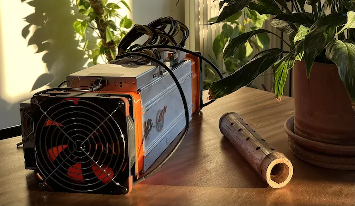
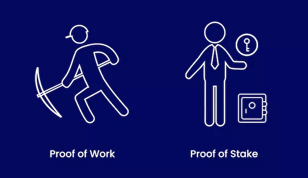

# Ihre ersten Schritte im Mining!

In diesem Kurs werden wir die Mining-Industrie vertiefen, um dieses so komplexe Thema zu entmystifizieren! Der Kurs ist für alle zugänglich und erfordert keine anfängliche Investition.

Der erste Abschnitt wird theoretisch sein, wo wir mit Ajelex eine tiefgehende Diskussion über viele Themen rund um das Mining führen werden, was uns ein besseres Verständnis dieser Industrie und der damit verbundenen wirtschaftlichen und geopolitischen Herausforderungen ermöglicht.
Im zweiten Abschnitt werden wir uns einem praktischen Fall zuwenden. Tatsächlich werden wir lernen, wie man einen gebrauchten S9-Miner in eine zusätzliche Heizung für zu Hause umwandelt! Durch schriftliche und Videoanleitungen zeigen und erklären wir Ihnen alle Schritte, um dies bei Ihnen zu Hause zu erreichen :)

Wir hoffen, Ihnen durch dieses Video zu zeigen, dass die Mining-Industrie komplexer ist, als sie scheint, und dass das Studium dazu beiträgt, die ökologische Debatte, die damit verbunden ist, zu nuancieren!
Wenn Sie Hilfe bei Ihrem Vorhaben benötigen, wurde ein Telegram für die Studierenden erstellt, und alle notwendigen Teile können auf unserem E-Commerce gefunden werden!

+++

# Einführung

<partId>a99dc130-3650-563f-8d42-a0b5160af0ab</partId>

## Willkommen!

<chapterId>7ad1abeb-a190-5c85-8bff-44df71331e4d</chapterId>

Willkommen bei MINING 201: Eine Einführung ins Mining. Ajelex, Jim & Rogzy freuen sich, Sie bei Ihren ersten konkreten Schritten in dieser neuen Industrie zu begleiten. Wir hoffen, dass Ihnen der Kurs gefällt und dass Sie sich dem Abenteuer des Home-Minings anschließen!

### Kursüberblick

Im ersten Abschnitt dieses Kurses widmen wir uns der Theorie des Minings mit Ajelex. Wir werden ausführlich über viele Themen rund um das Mining diskutieren, was uns ein besseres Verständnis dieser Industrie sowie der damit verbundenen wirtschaftlichen und geopolitischen Herausforderungen ermöglicht.

Im zweiten Abschnitt werden wir uns einem faszinierenden praktischen Fall zuwenden, indem wir lernen, wie man einen gebrauchten S9-Miner in eine zusätzliche Heizung für zu Hause umwandelt. Dank schriftlicher und Videoanleitungen werden alle notwendigen Schritte sorgfältig erklärt, um sicherzustellen, dass Sie in diesem innovativen Projekt erfolgreich sind.

Diese Lernreise wird Ihnen zeigen, dass die Mining-Industrie komplexer ist, als sie erscheint, und bietet eine ausgewogene Perspektive auf die damit verbundene ökologische Debatte. Kontinuierliche Unterstützung wird über eine dedizierte Telegram-Gruppe für Studierende verfügbar sein, und alle notwendigen Teile werden leicht auf unserer E-Commerce-Plattform zugänglich sein.

### Lehrplan:

Theoretischer Abschnitt:

- Erklärung des Minings.
- Die Mining-Industrie.
- Die Feinheiten der Mining-Industrie.
- Mining im Bitcoin-Protokoll.
- Bitcoin-Preis und Hashrate, eine Korrelation?
- Souveränität und Regulierung
- Interview mit einem Fachmann aus der Mining-Industrie

Praktischer Abschnitt: Attakai

- Einführung in Attakai.
- Einkaufsführer.
- Modifikation der Software eines Antminer S9.
- Austausch der Lüfter zur Reduzierung der Lärmbelästigung
- Konfiguration eines Pools.
- Konfigurieren Ihres Antminer S9 mit Braiins OS+.

Bereit, dieses faszinierende Abenteuer zu beginnen? Lassen Sie uns gemeinsam in die faszinierende Welt des Home-Minings eintauchen!

# Alles über das Mining wissen

<partId>aa99ef2c-da29-5317-a533-2ffa4f66f674</partId>

## Erklärung des Minings

<chapterId>36a82de7-87ee-5e7a-b69e-48fc30030447</chapterId>

### Mining erklärt: Die Puzzle-Analogie

Um das Konzept des Minings auf vereinfachte Weise zu erklären, kann eine treffende Analogie verwendet werden: das Puzzle. Ähnlich wie bei einem Puzzle ist das Mining eine komplexe Aufgabe, die zu bewältigen ist, aber leicht zu überprüfen ist, sobald sie abgeschlossen ist. Im Kontext des Bitcoin-Minings bemühen sich die Miner, schnell ein digitales Puzzle zu lösen. Der erste Miner, der das Puzzle löst, präsentiert seine Lösung dem gesamten Netzwerk, das dann leicht die Gültigkeit überprüfen kann. Diese erfolgreiche Überprüfung ermöglicht es dem Miner, einen neuen Block zu validieren und ihn zur Timechain von Bitcoin hinzuzufügen. Als Anerkennung für ihre Arbeit, die erhebliche Kosten verursacht, wird der Miner mit einer bestimmten Anzahl von Bitcoins belohnt. Diese Belohnung stellt einen finanziellen Anreiz für die Miner dar, weiterhin Transaktionen zu validieren und das Netzwerk zu sichern.

Ursprünglich wurde im Bitcoin-Netzwerk eine Belohnung von 50 Bitcoins alle zehn Minuten vergeben, parallel zur Entdeckung eines Blocks etwa alle zehn Minuten durch die Miner. Diese Belohnung wird alle 210.000 Blöcke, was ungefähr alle vier Jahre entspricht, halbiert. Diese Vergütung dient als starker Anreiz für die Miner, trotz der hohen Energiekosten am Mining-Prozess teilzunehmen. Ohne diese Belohnung würde das energieintensive Mining aufgegeben werden, was die Sicherheit und Stabilität des gesamten Bitcoin-Netzwerks gefährden würde.
Die aktuelle Mining-Belohnung ist zweigeteilt. Einerseits umfasst sie die Erzeugung neuer Bitcoins, die von ursprünglich 50 Bitcoins alle zehn Minuten auf heute (2023) 6,25 Bitcoins gesunken ist. Andererseits beinhaltet sie die Transaktionsgebühren oder Mining-Gebühren der Transaktionen, die der Miner in seinen Block aufnimmt. Wenn eine Bitcoin-Transaktion durchgeführt wird, werden Transaktionsgebühren gezahlt. Diese Gebühren funktionieren wie eine Art Auktion, bei der die Nutzer angeben, wie viel sie bereit sind zu zahlen, damit ihre Transaktion im nächsten Block enthalten ist. Um ihre Belohnung zu maximieren, wählen Miner, die in ihrem eigenen Interesse handeln, die profitabelsten Transaktionen für die Aufnahme in ihren Block aus, unter Berücksichtigung des begrenzten verfügbaren Raums. Somit setzt sich die Mining-Belohnung sowohl aus der Generierung neuer Bitcoins als auch aus den Transaktionsgebühren zusammen, was eine fortlaufende Anreizstruktur für die Miner bietet und die Langlebigkeit und Sicherheit des Bitcoin-Netzwerks gewährleistet.

### Die Miner und Ihre Werkzeuge: Exploration

Der Mining-Prozess besteht darin, einen gültigen Hash zu finden, der vom Bitcoin-Netzwerk akzeptiert wird. Dieser Hash, einmal berechnet und gefunden, ist irreversibel, ähnlich wie Kartoffeln, die zu Püree verarbeitet werden. Er verifiziert eine bestimmte Funktion ohne die Möglichkeit der Umkehrung. Miner, die im Wettbewerb stehen, verwenden Maschinen, um diese Hashes zu berechnen. Obwohl es theoretisch möglich ist, diesen Hash manuell zu finden, macht die Komplexität der Operation diese Option unpraktikabel. Computer, die in der Lage sind, diese Berechnungen schnell durchzuführen, werden daher eingesetzt, verbrauchen jedoch eine erhebliche Menge an Strom.

Zu Beginn dominierte das CPU-Zeitalter, in dem Miner ihre persönlichen Computer für das Bitcoin-Mining verwendeten. Die Entdeckung der Vorteile von GPUs (Grafikprozessoren) für diese Aufgabe markierte einen Wendepunkt, der den Hashrate erheblich steigerte und den Energieverbrauch senkte. Der Fortschritt hörte hier nicht auf, mit der späteren Einführung von FPGAs (Field-Programmable Gate Array / Feldprogrammierbare Gatteranordnung). FPGAs dienten als Plattform für die Entwicklung von ASICs (Application-Specific Integrated Circuit / Anwendungsspezifischer integrierter Schaltkreis).

ASICs sind Chips, vergleichbar mit einem CPU-Chip, jedoch sind sie entwickelt, um eine bestimmte Art von Berechnung auf die effizienteste Weise durchzuführen. Das heißt, ein CPU kann viele verschiedene Arten von Berechnungen durchführen, ohne besonders für eine Art optimiert zu sein, während ein ASIC nur eine Art von Berechnung durchführen kann, dies jedoch sehr effizient. Im speziellen Fall sind Bitcoin-ASICs für die Berechnung des SHA256-Algorithmen vorgesehen.
Heutzutage verwenden Bergleute ausschließlich für diese Operation entwickelte ASICs, die optimiert sind, um mit dem geringstmöglichen Energieverbrauch und so schnell wie möglich eine maximale Anzahl von Kombinationen zu testen. Diese Computer, die keine anderen Aufgaben als das Bitcoin-Mining ausführen können, sind ein greifbarer Beweis für die kontinuierliche Entwicklung und zunehmende Spezialisierung der Bitcoin-Mining-Industrie. Diese ständige Evolution spiegelt die intrinsische Dynamik von Bitcoin wider, wo eine Anpassung der Schwierigkeit die Produktion eines Blocks alle zehn Minuten garantiert, trotz der exponentiellen Steigerung der Mining-Kapazität.
Um die Intensität dieses Prozesses zu veranschaulichen, betrachten Sie einen typischen Miner, der in der Lage ist, 14 TeraHash pro Sekunde zu erreichen, das entspricht 14 Billionen Versuchen pro Sekunde, um den richtigen Hash zu finden. Im gesamten Bitcoin-Netzwerk erreicht man heute etwa 300 HexaHash pro Sekunde, was die kollektive Kraft, die im Bitcoin-Mining mobilisiert wird, unterstreicht.

### Ajustement de la difficulté:

Die Anpassung der Schwierigkeit ist ein entscheidender Mechanismus im Betrieb des Bitcoin-Netzwerks, der sicherstellt, dass die Blöcke durchschnittlich alle 10 Minuten abgebaut werden. Diese Dauer ist ein Durchschnitt, da der Mining-Prozess tatsächlich ein Spiel der Wahrscheinlichkeiten ist, ähnlich dem Würfeln in der Hoffnung, eine Zahl zu werfen, die niedriger ist als die durch die Schwierigkeit festgelegte Zahl. Alle 2016 Blöcke passt das Netzwerk die Mining-Schwierigkeit an, basierend auf der durchschnittlichen Zeit, die benötigt wurde, um die vorherigen Blöcke zu minen. Wenn die durchschnittliche Zeit länger als 10 Minuten ist, wird die Schwierigkeit verringert, und umgekehrt, wenn sie kürzer ist, wird die Schwierigkeit erhöht. Dieser Anpassungsmechanismus stellt sicher, dass die Mining-Zeit neuer Blöcke im Laufe der Zeit konstant bleibt, unabhängig von der Anzahl der Miner oder der gesamten Rechenleistung des Netzwerks. Aus diesem Grund wird die Bitcoin-Blockchain auch als Timechain bezeichnet.

- Beispiel China:
  Der Fall China illustriert perfekt den Mechanismus zur Anpassung der Mining-Schwierigkeit. Mit seiner reichlich vorhandenen und kostengünstigen Energie war das Land das globale Hauptzentrum für das Bitcoin-Mining. Im Jahr 2021 verbot China jedoch abrupt das Bitcoin-Mining auf seinem Territorium, was zu einem massiven Rückgang der globalen Hashrate des Bitcoin-Netzwerks um etwa 50% führte. Diese schnelle Abnahme der Mining-Leistung hätte das Bitcoin-Netzwerk ernsthaft stören können, indem sie die durchschnittliche Zeit zum Mining eines Blocks erhöht. Der Schwierigkeitsanpassungsmechanismus griff jedoch ein, indem er die Mining-Schwierigkeit reduzierte, um sicherzustellen, dass die Block-Mining-Frequenz im Durchschnitt bei 10 Minuten bleibt. Dieser Fall demonstriert die Effizienz und Resilienz des Bitcoin-Schwierigkeitsanpassungsmechanismus, der die Stabilität und Vorhersehbarkeit des Netzwerks auch bei plötzlichen und bedeutenden Veränderungen in der globalen Mining-Landschaft gewährleistet.

### Entwicklung der Bitcoin-Mining-Maschinen

In Bezug auf die Entwicklung der Bitcoin-Mining-Maschinen ist es wichtig zu betonen, dass der Kontext eher auf ein traditionelles Geschäftsmodell ausgerichtet ist. Die Miner erzielen ihre Einnahmen durch die Validierung von Blöcken, eine Aufgabe, deren Erfolgswahrscheinlichkeit relativ gering ist. Das derzeit verwendete Maschinenmodell, der Antminer S9, obwohl es ein älteres Modell ist, das um 2016 eingeführt wurde, bleibt auf dem Gebrauchtmarkt im Umlauf und wird zwischen etwa 100€ und 200€ gehandelt. Der Preis der Mining-Maschinen variiert jedoch je nach dem Wert des Bitcoins, und ein neueres Modell, der Antminer S19, wird derzeit auf etwa 3000€ geschätzt.

Angesichts der ständigen technologischen Entwicklung im Mining-Bereich müssen sich Fachleute strategisch positionieren. Die Mining-Industrie ist ständigen Innovationen ausgesetzt, wie die kürzlich erfolgte Einführung der Version J des S19 und die erwartete Einführung des S19 XP zeigen, die deutlich höhere Mining-Kapazitäten bieten. Darüber hinaus beschränken sich die Verbesserungen nicht nur auf die rohe Leistung der Maschinen. Zum Beispiel verwendet das neue Modell S19 XP ein Flüssigkeitskühlsystem, eine technische Änderung, die eine signifikante Verbesserung der Energieeffizienz ermöglicht. Obwohl Innovation eine Konstante bleibt, werden zukünftige Effizienzgewinne wahrscheinlich geringer sein als bisher, aufgrund des Erreichens einer gewissen Schwelle der technologischen Innovation.

Zusammenfassend lässt sich sagen, dass sich die Bitcoin-Mining-Industrie weiterhin anpasst und entwickelt. Die Akteure im Bereich müssen mit zunehmend begrenzten Effizienzsteigerungen in der Zukunft rechnen und ihre Strategien entsprechend anpassen. Obwohl zukünftige technologische Fortschritte weiterhin erwartet werden, werden diese wahrscheinlich in einem kleineren Maßstab stattfinden, was die zunehmende Reife des Sektors widerspiegelt.

## Die Bitcoin-Mining-Industrie

<chapterId>0896dfc1-c97e-5bec-9bf1-8c20b3388a2c</chapterId>

### Mining-Pools

Heutzutage hat sich das Bitcoin-Mining zu einer ernsthaften, substantiellen Industrie entwickelt, mit vielen nun öffentlichen Akteuren und einer wachsenden Zahl bedeutender Miner. Diese Entwicklung hat das Mining für kleinere Akteure fast unzugänglich gemacht, aufgrund der hohen Kosten, die mit der Anschaffung neuer Mining-Maschinen verbunden sind. Daher stellt sich die Frage nach der Verteilung der Hashrate unter verschiedenen Marktteilnehmern. Die Situation ist komplex, da es entscheidend ist, sowohl die Verteilung der Hashrate unter verschiedenen Unternehmen als auch unter verschiedenen Mining-Pools zu betrachten.

Ein Mining-Pool ist eine Gruppierung von Minern, die ihre Rechenressourcen bündeln, um ihre Chancen auf erfolgreiches Mining zu erhöhen. Diese Kooperation ist notwendig, da eine kleine, isolierte Mining-Maschine im Wettbewerb mit den Giganten der Industrie steht, was ihre Erfolgschancen auf ein vernachlässigbares Niveau reduziert. Das Mining funktioniert nach einem Lotterieprinzip, und die Chancen, alle zehn Minuten einen Block (und damit die Bitcoin-Belohnung) zu gewinnen, sind für einen kleinen, einzelnen Miner extrem gering. Indem sie sich in Pools zusammenschließen, können die Miner ihre Rechenleistung kombinieren, häufiger Blöcke finden und anschließend die Belohnungen proportional zu jedem Miners Beitrag zum Pool verteilen.

Zum Beispiel, wenn ein Pool einen Block findet und 6,25 Bitcoins gewinnt, würde ein Miner, der 1% der gesamten Rechenleistung des Pools beiträgt, 1% der 6,25 gewonnenen Bitcoins erhalten. Es ist jedoch zu beachten, dass Mining-Pools in der Regel eine kleine Provision (meist etwa 2%) erheben, um die Betriebskosten der Genossenschaft zu decken.

### Die von der Industrie verwendeten Softwares

Im Kontext des Bitcoin-Minings ist die Rolle der Software ebenso entscheidend wie die der Hardware. Ein Beispiel hierfür ist die Rolle von Bitmain, einem produktiven Hersteller, der den Antminer S9 entwickelt hat. Neben der Mining-Hardware stützt sich die Industrie stark auf kollaborative Mining-Pools, wie zum Beispiel Brainspool, der etwa 5% der globalen Hashrate des Bitcoin-Netzwerks kontrolliert.

Die Akteure in dieser Branche sind ständig bestrebt, die Effizienz durch Hardware und Software zu steigern. Ein beliebtes Software-Beispiel in diesem Zusammenhang ist BrainsOS Plus. Diese Software ersetzt das ursprüngliche Betriebssystem der Mining-Maschine, was es ermöglicht, dieselben Operationen effizienter durchzuführen. Mit einer solchen Software kann ein Miner die Effizienz seiner Maschine um 25% steigern. Das bedeutet, dass die Maschine für die gleiche Menge an Strom 25% mehr Hashrate produzieren kann, wodurch die Belohnungen für den Miner erhöht werden. Diese Softwareoptimierung ist ein wesentlicher Bestandteil der Wettbewerbsfähigkeit im Bitcoin-Mining und zeigt die Bedeutung eines integrierten Ansatzes, der sowohl Hardware- als auch Softwareverbesserungen kombiniert, um Effizienz und Erträge zu maximieren.

### Die Regulierung und der Stromtarif

Wie in China und anderswo beobachtet, hat die Regulierung einen erheblichen Einfluss auf das Mining. Obwohl es in Frankreich keine bedeutenden Miner gibt, stellen die Regulierung und die hohen Strompreise in Europa bedeutende Hindernisse dar. Miner sind ständig auf der Suche nach kostengünstigem Strom, um ihre Gewinne zu maximieren. Daher fördern die hohen Stromkosten in Europa und Frankreich nicht die Attraktivität dieser Regionen für Miner.

Miner tendieren dazu, sich in Regionen mit niedrigen Stromtarifen niederzulassen, oft in Schwellenländern oder Ländern mit Energieüberschüssen. Zum Beispiel befindet sich ein großer Teil der globalen Hashrate in Texas, USA. Texas verfügt über ein unabhängiges Stromnetz, das seine Energieressourcen nicht mit anderen Staaten teilt. Diese Besonderheit zwingt Texas oft dazu, mehr Strom zu produzieren als notwendig, um Engpässe zu vermeiden, was zu einem Überschuss führt. Bitcoin-Miner nutzen diese Überproduktion, indem sie sich in Texas niederlassen, wo sie während Zeiten des Energieüberschusses zu sehr niedrigen Stromtarifen Bitcoin minen können. Diese Situation zeigt den signifikanten Einfluss von Regulierungen und Stromtarifen auf das Bitcoin-Mining und unterstreicht die Bedeutung dieser Faktoren bei der Entscheidung der Miner über den Standort ihrer Mining-Operationen.

### Wohin gehen die Miner und wie wird die Energie verwaltet?

Indem die Auswirkungen der Bitcoin-Miner auf die Energiewelt hervorgehoben werden, ist die Richtung klar: Diese Akteure sind ständig auf der Suche nach günstigen Stromquellen, oft solchen, die verschwendet oder ungenutzt sind. Dieses Phänomen ist in Regionen mit neuen elektrischen Infrastrukturen offensichtlich, wie solchen, die mit neuen Wasserkraftwerken ausgestattet sind.

Nehmen wir ein Beispiel. In einem Land, das gerade ein Wasserkraftwerk baut, beginnt die Stromproduktion oft, bevor die Verteilungsnetze vollständig betriebsbereit sind. Diese Verzögerung kann erhebliche Kosten verursachen und Investitionen in solche Infrastrukturprojekte entmutigen. Jedoch können Bitcoin-Miner als eine flexible Nachfragequelle eingreifen, bereit, diesen "verwaisten" Strom zu verbrauchen und somit die Infrastrukturkosten zu dämpfen. Die Implikation hier ist, dass man neue Anlagen sofort rentabel machen kann, was die Schaffung neuer Stromquellen fördert. Dieses Prinzip gilt auch im kleineren Maßstab. Ob es sich um eine Einzelperson handelt, die einen Wassergenerator an einem kleinen Fluss nutzt, oder um einen Haushalt mit Solarpanelen, der überschüssige Strom kann genutzt werden, um eine Bitcoin-Mining-Operation zu betreiben.

In Frankreich beispielsweise werden Stromüberschüsse aus Solarpanelen ins Netz eingespeist und die Produzenten erhalten von EDF einen Verbrauchskredit. Ähnlich kann man sich einen Miner vorstellen, der auf diesen Überschüssen operiert und sich abschaltet, wenn die lokale Nachfrage das Angebot erreicht. Obwohl dies egoistisch erscheinen mag, da es die Produktion von Bitcoins gegenüber der Unterstützung des lokalen Stromnetzes bevorzugt, bietet es einen anderen Blickwinkel: die Stabilisierung des Stromnetzes. Die komplexe Verwaltung von Stromüberschüssen, manchmal sogar mit Kosten für deren Beseitigung verbunden, kann erheblich vereinfacht werden. Bitcoin-Miner können diese Überschüsse absorbieren und als flexibler Puffer wirken, indem sie die Nachfrage anpassen, statt das Angebot.

### Die Zentralisierung des Minings

Die Zentralisierung des Minings wird als eine große Herausforderung betrachtet. Große Akteure, wie Foundry, dominieren den Markt, was potenziell zur Zensur von Transaktionen führen kann. Diese Zentralisierung kann das Netzwerk auch anfällig für Angriffe machen, insbesondere den 51%-Angriff, bei dem ein Akteur oder eine Gruppe mehr als 50% der Hashrate des Netzwerks kontrolliert, was es ihnen ermöglicht, das Netzwerk zu kontrollieren und zu manipulieren.
Regulierungsrisiko Es wird hervorgehoben, dass, sollte ein Land wie die Vereinigten Staaten beschließen, bestimmte Bitcoin-Transaktionen zu regulieren oder zu verbieten, dies erhebliche Auswirkungen auf das Netzwerk haben könnte, insbesondere wenn ein großer Teil der Hashrate in diesem Land zentralisiert ist.

Um dieser Zentralisierung entgegenzuwirken, werden verschiedene Strategien diskutiert:

- Home Mining: Die Idee des Home Mining basiert auf der Dezentralisierung der Mining-Aktivitäten. Sie ermutigt Einzelpersonen, am Mining-Prozess von zu Hause aus teilzunehmen, wodurch der Hashrate breiter verteilt wird.
- Stratum V2: Das Protokoll Stratum V2 bietet einen weiteren Ansatz. Im Gegensatz zu seinem Vorgänger ermöglicht Stratum V2 den Minern, die Transaktionen auszuwählen, die sie in die von ihnen geminten Blöcke aufnehmen. Diese Fähigkeit stärkt die Widerstandsfähigkeit gegen Zensur und verringert die Möglichkeit für große Mining-Pools, das Netzwerk zu dominieren. Indem es einzelnen Minern mehr Macht gibt, kann das Stratum V2-Protokoll eine entscheidende Rolle im Kampf gegen die Zentralisierung der Hashrate spielen.
  Open-Sourcing von Mining-Software
- Das Open-Sourcing der Mining-Software: Dies ist eine weitere potenziell effektive Strategie. Indem die Mining-Software allen zugänglich gemacht wird, hätten kleinere Miner dieselben Möglichkeiten wie große Mining-Unternehmen, am Blockchain-Netzwerk teilzunehmen und dazu beizutragen. Dieser Ansatz würde eine breitere Verteilung der Hashrate fördern und somit zur Dezentralisierung des Netzwerks beitragen.
- Diversifikation der Akteure und der Geografie: Die Förderung der Teilnahme verschiedener Akteure aus unterschiedlichen geografischen Regionen am Mining von Kryptowährungen kann ebenfalls effektiv sein. Durch die geografische Diversifizierung der Hashrate wird es schwieriger für einen einzelnen Akteur oder ein einzelnes Land, eine unverhältnismäßige Kontrolle oder Einfluss auf das Netzwerk auszuüben. Dieser Ansatz kann dazu beitragen, das Netzwerk vor potenziellen Angriffen zu schützen und seine Dezentralisierung zu stärken.

Die allgemeine Schlussfolgerung ist, dass die Dezentralisierung für die Sicherheit und Resilienz des Bitcoin-Netzwerks entscheidend ist. Obwohl die Zentralisierung Vorteile in Bezug auf Effizienz bieten kann, setzt sie das Netzwerk erheblichen Risiken aus, einschließlich Zensur und 51%-Angriffen. Initiativen wie Takai und die Einführung neuer Protokolle wie Stratum V2 sind wichtige Schritte zur Dezentralisierung und zum Schutz des Bitcoin-Netzwerks vor diesen Bedrohungen.

## Die Nuancen der Mining-Industrie

<chapterId>7b9ee427-316a-54e3-a2d4-4ea97839a31b</chapterId>

### Das Prinzip von Attakai

Im aktuellen Kontext mag das Bitcoin-Mining mit S9 komplex erscheinen, doch eine tiefere Analyse eröffnet den Weg zu innovativen Alternativen. Das Prinzip von Attakai basiert auf Überlegungen zur Nutzung von Mining-Anlagen in verschiedenen Arten von Gebäuden, wie Schulen oder Krankenhäusern. Die Kernidee besteht darin, einige Mining-Maschinen an verschiedenen Orten zu platzieren, um die von diesen Maschinen erzeugte Wärme zur Beheizung der Einrichtungen wiederzuverwenden. Durch die Wahl leistungsfähigerer Modelle wie die S19 könnte die Mining-Aktivität verteilt werden, was eine bessere Gesamtleistung fördert und gleichzeitig nützlich zur Gesellschaft beiträgt. Diese Initiative zielt darauf ab, große zentralisierte Mining-Anlagen zu konkurrenzieren, indem die von den Mining-Maschinen abgegebene Wärme produktiv und effizient genutzt wird.

Die Initiative Attakai entstand aus einem persönlichen Experiment des Home-Minings, das von zwei Freunden durchgeführt wurde, die aktiv am Bitcoin-Netzwerk teilnehmen wollten. Sie stießen auf große Hindernisse, wie den hohen Geräuschpegel der Mining-Ausrüstung, die für industrielle und nicht für häusliche Nutzung konzipiert war. Um dieses Problem zu lösen, wurden Hardware-Modifikationen an den Mining-Maschinen vorgenommen. Leistungsfähigere und leisere Ventilatoren ersetzten die Originalausrüstung, wodurch das Mining zu Hause zugänglicher und weniger störend wurde. Darüber hinaus machte die Hinzufügung eines Wi-Fi-Adapters eine Ethernet-Kabelverbindung überflüssig, was den Mining-Prozess zu Hause weiter vereinfachte. Im Winter wurden diese modifizierten Miner als Heizquelle genutzt, was eine Belästigung in einen Vorteil verwandelte.

Nachdem sie ihr Projekt der Bitcoin-Community vorgestellt und großes Interesse geweckt hatten, entschieden sich die Erfinder von Attakai, detaillierte Anleitungen auf der Plattform Découvre Bitcoin zu veröffentlichen, sodass jeder ihre Erfahrungen mit dem Home-Mining nachbilden konnte. Sie planen nun, dieses Konzept über den häuslichen Rahmen hinaus zu erweitern. Das Ziel ist zu demonstrieren, wie ein modifizierter Miner in eine leise Zusatzheizung für den Winter umgewandelt werden kann, was einen sanften Übergang zu einem zweiten Ausbildungsteil bietet, der sich der praktischen Umsetzung dieser Modifikationen widmet, illustriert durch Erklärvideos. Es bleibt jedoch die Frage, ob diese Initiative auf eine größere Skala ausgedehnt werden kann, um eine realistische und nachhaltige Alternative zu den aktuellen zentralisierten Mining-Strukturen zu bieten.

### Die Grenze dieser Dezentralisierung?

Obwohl die Idee der Dezentralisierung des Minings durch die produktive Nutzung der erzeugten Wärme vielversprechend erscheint, gibt es bestimmte Grenzen und offene Fragen. Sehr energieintensive Einrichtungen wie Saunas und Schwimmbäder könnten von diesem Konzept profitieren, indem sie die von den Minern erzeugte Wärme nutzen, um das Wasser ihrer Anlagen zu erwärmen. Diese Praxis wird bereits von einigen Mitgliedern der Bitcoin-Community umgesetzt, die verschiedene Methoden erforschen, um die Wärme, die durch die Mining-Ausrüstung erzeugt wird, effizient zu nutzen. Zum Beispiel könnte theoretisch ein Festsaal durch drei oder vier S19, die jeweils 3000 Watt verbrauchen und eine entsprechende Menge an Wärme produzieren, beheizt werden.

Es sollte jedoch betont werden, dass der Energieverbrauch und die Wärmeproduktion gleich sind, egal ob die Energie von einem elektrischen Heizkörper oder einem Miner verwendet wird. Für ein Kilowatt Strom, das verwendet wird, wird die Menge der erzeugten Wärme in beiden Fällen gleich sein. Der Unterschied besteht darin, dass der Miner nicht nur Wärme liefert, sondern auch eine Belohnung in Bitcoin, was einen wirtschaftlichen Anreiz bietet, einen Miner anstelle eines einfachen elektrischen Heizkörpers zu verwenden. Diese zusätzliche Belohnung könnte dazu beitragen, Bedenken hinsichtlich des hohen Energieverbrauchs der Miner zu mildern.

Die Frage der Effizienz und der langfristigen Machbarkeit der Nutzung von Bitcoin-Minern für die Heizung bleibt offen. Kontinuierliche Innovationen in der Mining-Hardware und in den Heiztechnologien könnten potenziell neue Wege für eine effizientere Nutzung der durch das Mining erzeugten Wärme eröffnen, was zur Lebensfähigkeit dieses Ansatzes in der Zukunft beitragen könnte.

### Warum BTC-Belohnungen?

Die Frage der Belohnung in Bitcoin statt in einer anderen Währung ist entscheidend im von Satoshi Nakamoto konzipierten System. Die Schaffung von Bitcoin ist durch eine feste Obergrenze von 21 Millionen Einheiten gekennzeichnet. Das Ziel war es, einen fairen Weg zu finden, diese neu geschaffenen Einheiten zu verteilen. Die Miner, die ihre Rechenleistung zur Sicherung des Netzwerks bereitstellen und damit jede Attacke zunehmend kostspieliger machen, schützen so effektiv das Bitcoin-Netzwerk. Als Gegenleistung für diesen entscheidenden Beitrag werden sie mit den neu geschaffenen Bitcoins belohnt, was die Verteilung der Coins im Ökosystem erleichtert.
Es handelt sich um ein Win-Win-System. Die Miner werden sowohl für die Sicherung des Netzwerks als auch für die Genehmigung von Transaktionen bezahlt. Die neu erstellten Bitcoins werden als Anreiz gegeben, um die Sicherheit zu verstärken, und die Transaktionsgebühren sind ein zusätzliches Einkommen für die Genehmigung der Transaktionen. Diese beiden Elemente zusammen bilden die Gesamtbelohnung für das Mining. Die Frage nach der Zukunft des Minings stellt sich aufgrund der geplanten Reduzierung der Mining-Belohnungen, die alle vier Jahre halbiert werden, ein Ereignis, das als "Halving" bekannt ist. Bis 2032 wird die Blockbelohnung unter einem Bitcoin liegen, und im Jahr 2140 werden keine neuen Bitcoins mehr erstellt. Zu diesem Zeitpunkt werden die Miner ausschließlich von den Transaktionsgebühren abhängig sein, um eine Vergütung zu erhalten. Das Bitcoin-Netzwerk muss eine große Menge an Transaktionen unterstützen, mit ausreichend hohen Gebühren, um die Rentabilität des Minings zu gewährleisten.
Der Aufstieg des Lightning Network, das schnelle und kostengünstige Transaktionen außerhalb der Hauptkette von Bitcoin ermöglicht, wirft Fragen über die Zukunft des Minings auf. Das Lightning Network hat das Potenzial, die Transaktionsgebühren erheblich zu reduzieren, was sich somit auf das Einkommen der Miner auswirkt. Dies wird jedoch von der Annahme und Nutzung des Lightning Network im Vergleich zum Hauptnetzwerk von Bitcoin abhängen. In einem pessimistischen Szenario könnten die Miner es rentabel finden, selbst mit Verlust zu minen, wenn sie ihre Kosten amortisiert haben und Zugang zu günstigem Strom haben. In einem optimistischeren Szenario könnten die Transaktionsgebühren im Hauptnetzwerk von Bitcoin hoch genug bleiben, um die Rentabilität des Minings zu erhalten.

### Was sollte in einem Bitcoin-Block enthalten sein?

In Bezug auf die Frage, was in einem Bitcoin-Block enthalten sein sollte, ist es entscheidend, die komplementäre Natur der verschiedenen Schichten des Bitcoin-Netzwerks zu berücksichtigen. Obwohl das Lightning Network schnellere und kostengünstigere Transaktionen ermöglichen kann, ist es immer noch von der Basisschicht von Bitcoin, oft als „Settlement Layer“ bezeichnet, für das Öffnen und Schließen von Zahlungskanälen abhängig.

Mit dem erwarteten Wachstum des Lightning Network und der damit einhergehenden Zunahme von Kanalöffnungen und -schließungen wird der Platz in den Bitcoin-Blöcken immer wertvoller. Die Bitcoin-Community neigt bereits dazu, die Bewahrung dieses Raumes zu schätzen, in Anerkennung seiner inhärenten Begrenzung. Diese Erkenntnis hat zu Diskussionen über die legitime oder nicht legitime Nutzung des Blockraums geführt, mit Bedenken hinsichtlich des „Spams“ auf der Blockchain durch Transaktionen, die als nicht wesentlich angesehen werden.

Die Spekulation um die zukünftige Nutzung des Blockraums ist weit verbreitet, doch es wird allgemein anerkannt, dass dies eine seltene Ressource ist, die weise genutzt werden sollte. Auch wenn das Verlangen besteht, ihn zu füllen, ist es entscheidend, ihn zu bewahren, um die langfristige Lebensfähigkeit des Bitcoin-Netzwerks zu sichern, in Erwartung eines zukünftigen Anstiegs der Nachfrage nach Blockraum. Wie in jedem freien Markt werden Angebot und Nachfrage die Nutzung des Blockraums regulieren. Mit einem begrenzten Angebot müssen die Stakeholder kluge Entscheidungen über die Nutzung dieses wertvollen Raums treffen, um die Effizienz und Sicherheit des Bitcoin-Netzwerks langfristig zu gewährleisten.

## Das Mining im Bitcoin-Protokoll

<chapterId>879a66b0-c20a-56b5-aad0-8a21be61e338</chapterId>

Die Rolle der Miner im Bitcoin-Netzwerk war ein intensiv diskutiertes Thema während des Blockkriegs. Obwohl sie für die Sicherheit und Funktionalität des Netzwerks unerlässlich sind, halten die Miner nicht notwendigerweise die ultimative Macht im Bitcoin-Ökosystem. Das Gleichgewicht zwischen den Minern, den Knoten und den Endbenutzern gewährleistet die Integrität und Verteilung des Netzwerks.

### Der Blockkrieg

Während des Blockkriegs waren viele Miner gegen bestimmte Entwicklungen im Netzwerk, was die Spannungen zwischen den verschiedenen Akteuren des Ökosystems hervorhob. Die Frage bleibt, wie man die Macht zwischen den Minern, den Knoten und den Benutzern ausbalancieren kann, um die langfristige Sicherheit von Bitcoin zu gewährleisten.

Das Sicherheitsdilemma von Bitcoin beruht auf einem heiklen Gleichgewicht. Obwohl die Miner eine wesentliche Rolle bei der Validierung und Erstellung von Blöcken spielen, halten die Knoten die Integrität aufrecht, indem sie Transaktionen und Blöcke überprüfen und validieren. Ein falscher oder betrügerischer Block wird von den Knoten abgelehnt, wodurch der Miner zensiert und die Sicherheit des Netzwerks bewahrt wird. Die Macht wird auch von den Knoten und den Benutzern des Bitcoin-Netzwerks gehalten. Die Knoten haben die Macht der Überprüfung und Validierung, während die Benutzer die Macht haben, zu entscheiden, welche Blockchain sie verwenden. Diese Machtverteilung sichert die Verteilung und Integrität des Bitcoin-Netzwerks.

Der Blockkrieg hat die Unsicherheit und Spannung offenbart, die in der Verwaltung des Bitcoin-Netzwerks inhärent sind. Obwohl Bitcoin Core derzeit die dominante Kette ist, bleibt die Debatte über die Governance und das Management des Netzwerks bestehen.
Letztendlich wird die Verantwortung von allen Akteuren im Bitcoin-Netzwerk geteilt. Ein Rückgang der Anzahl der Nutzer, Knoten oder Miner könnte das Netzwerk schwächen, was das Risiko einer Zentralisierung und Anfälligkeit für Angriffe erhöht. Jeder Akteur trägt zur Robustheit und Sicherheit des Netzwerks bei und verstärkt die Bedeutung, ein Gleichgewicht von Macht und Verantwortung aufrechtzuerhalten.

### Die Macht der Miner

Die elegante Spieltheorie von Satoshi Nakamoto hat eine Situation geschaffen, in der jeder Akteur im Bitcoin-Netzwerk dazu angehalten ist, korrekt zu handeln, um sowohl seine eigenen Interessen als auch die der anderen Teilnehmer zu schützen. Dies schafft ein Gleichgewicht, in dem schlechtes Verhalten geahndet werden kann, was wiederum die Sicherheit und Stabilität des gesamten Systems stärkt. Trotz dieses Gleichgewichts bleiben Staaten eine potenzielle Bedrohung. Wie bei der Präsentation auf Surfing Bitcoin 2022 angegeben, können Staaten versuchen, die Mining-Industrie anzugreifen, was das Bitcoin-Netzwerk Risiken der Zentralisierung und Angriffen aussetzt. Hypothetische Szenarien wie ein militärischer Angriff auf die Produktionsstätten für Mining-Hardware unterstreichen die Bedeutung der geografischen und industriellen Diversifizierung für die Resilienz des Bitcoin-Netzwerks.

Die Zentralisierung der Produktion von Mining-Hardware in China stellt ein weiteres Risiko dar. Eine Weigerung, Mining-Maschinen zu exportieren, oder eine Ansammlung von Hashrate für einen potenziellen 51%-Angriff durch China unterstreichen die Notwendigkeit einer diversifizierten Produktion von Mining-Hardware. Angesichts dieser Risiken erkundet die Bitcoin-Gemeinschaft aktiv Lösungen. Unternehmen wie Intel planen, Mining-Ausrüstung in den USA zu produzieren, was zur Verteilung der Produktion beiträgt. Andere Initiativen, wie die von Block mit seinem Open-Source Mining Development Kit (MDK), zielen darauf ab, das Monopol auf Design und Produktion von Mining-Hardware zu verringern und eine breitere Verteilung der Hashrate zu ermöglichen. Im Zentrum dieser Diskussionen steht die grundlegende Mission von Bitcoin: ein zensurresistentes Werteaustauschnetzwerk zu sein. Die Bitcoin-Gemeinschaft bemüht sich ständig, die Verteilung, Zensurresistenz und Anti-Fragilität des Netzwerks zu stärken, und lehnt Vorschläge wie den Übergang zum Proof of Stake ab, die nicht mit diesen grundlegenden Prinzipien übereinstimmen.

### Der physische Link der Arbeitsnachweis vs. der Nachweis des Einsatzes

Der Proof of Work (PoW) ist wesentlich, da er die physische Verbindung zwischen der realen Welt und Bitcoin darstellt. Obwohl Bitcoins immateriell sind, erfordert ihre Produktion greifbare Energie, was einen direkten Link zur physischen und realen Welt herstellt. Diese Verbindung stellt sicher, dass die Produktion und Validierung von Bitcoins und Blöcken echte Energiekosten haben, wodurch das Bitcoin-Netzwerk in der physischen Realität verankert wird und seine vollständige Dominanz durch mächtige Entitäten verhindert wird. PoW fungiert als Bollwerk gegen Zentralisierung, indem es sicherstellt, dass die Teilnahme am Netzwerk und die Validierung von Transaktionen eine Investition in greifbare Ressourcen erfordern. Dies verhindert die Monopolisierung des Netzwerks durch Entitäten, die sonst die Kontrolle übernehmen könnten, ohne signifikante Eintrittsbarrieren, und gewährleistet so eine gerechtere Verteilung von Macht und Einfluss innerhalb des Bitcoin-Netzwerks.

### Die Grenzen des Proof of Stake

Andererseits garantiert der Proof of Stake (PoS), obwohl er die Teilnahme in kleinem Maßstab ermöglicht, keinen gleichwertigen Schutz gegen Zentralisierung. In einem PoS-Netzwerk haben diejenigen, die bereits eine große Menge der Währung besitzen, eine unverhältnismäßige Macht, was die bestehenden Machtungleichheiten in der Gesellschaft widerspiegelt. Diese Dynamik könnte potenziell die Zentralisierung und die Konzentration der Macht in den Händen weniger weiterführen, entgegen den grundlegenden Verteilungszielen des Bitcoin-Netzwerks. Das Argument, dass jeder am PoS teilnehmen kann, auch in kleinem Umfang, indem er sich Pools anschließt, ist nicht unbedingt stichhaltig. In einem PoW-Netzwerk kann selbst ein kleiner Beitragender mit bescheidener Ausrüstung aktiv teilnehmen und zur Sicherheit und Verteilung des Netzwerks beitragen.

### Zusammenfassung

Zusammenfassend stärken die Miner das Bitcoin-Netzwerk gegen Zensur, indem sie Elektrizität verwenden, um den Proof of Work von Bitcoin zu berechnen, und werden mit neuen Bitcoins und Transaktionsgebühren belohnt. Mit der Professionalisierung der Branche treten verschiedene Akteure auf, die unterschiedliche Rollen spielen, von der Chip-Erstellung bis zur Verwaltung von Mining-Farmen. Darüber hinaus greift auch die Finanzwelt ein, indem sie kontrolliert, wer die verschiedenen Marktphasen überlebt. Das Problem der Zentralisierung bleibt bestehen, wobei die reichsten Entitäten den Markt potenziell dominieren könnten. Dennoch werden Alternativen auf Hardware- und Softwareebene entwickelt. Es liegt an jedem Einzelnen, zu handeln und zur Verteilung des Netzwerks beizutragen. Bitcoin bietet nicht nur in Bezug auf Freiheit, sondern auch auf Energieunabhängigkeit eine beispiellose Gelegenheit. Trotz der Kontroversen um seinen Stromverbrauch bietet Bitcoin einen wirtschaftlichen Anreiz für einen Übergang zu einer rationaleren und reichlicheren Energienutzung, was zuvor ein ökologisches Ideal war.

## Bitcoin-Preis und Hashrate, eine Korrelation?

<chapterId>e6676214-007c-5181-968e-c27536231bd6</chapterId>

### Hashrate, Preis und Rentabilität

Der aktuelle Hashrate, obwohl der Preis von Bitcoin bei 30.000$ im Vergleich zu seinem vorherigen Höchststand von 69.000$ liegt, unterstreicht die greifbare Verbindung zwischen dem Mining und der realen Welt. Perioden mit steigenden Preisen (Bull Market) führen zu einer starken Nachfrage nach Bitcoin-Mining und einem Anstieg der Bestellungen von Maschinen bei Herstellern wie Avalon und Bitmain. Die Produktion und Lieferung sind jedoch nicht sofort, was zu einer Diskrepanz zwischen erhöhter Nachfrage und späterer Verfügbarkeit führt. Dies kann dazu führen, dass Maschinen, die während eines Bullenmarktes bestellt wurden, in einem fallenden Markt geliefert werden, was eine bemerkenswerte Asymmetrie zwischen niedrigem Preis und hohem Hashrate hervorhebt.

Diese Situation illustriert auch die Resilienz von Bitcoin, die oft anhand seines Preises bewertet wird. Eine tiefere Analyse der Gesundheit von Bitcoin erfordert jedoch die Betrachtung seiner Hashrate, die die Berechnungen pro Sekunde im Bitcoin-Netzwerk misst. Während der Preis von Bitcoin schwankt, bleibt sein Kosten, verbunden mit dem Strombedarf zum Betreiben der Mining-Maschinen, wesentlich, um die Marktdynamik zu verstehen. Indem man sich auf die Kosten statt auf den Preis konzentriert, erhält man eine konsistentere Perspektive auf die Stabilität und langfristige Lebensfähigkeit von Bitcoin. Generell ist der Kosten von Bitcoin proportional zu seinem Preis, was ein besseres Verständnis der Preisschwankungen und zukünftigen Aussichten bietet.

### Hashrate und Belohnung

Das Mining etabliert einen Mindestpreis für Bitcoin, unter dem die Miner mit Verlust verkaufen würden. Die Kosten des Minings beeinflussen den Preis erheblich, wie durch das Verbot des Minings in China illustriert, wo Hashrate und Preis signifikant fielen, sich jedoch schnell erholten. Sich nur auf den Preis zu konzentrieren, kann irreführend sein. Die Untersuchung der Kosten, über Rentabilitätsrechner, bietet eine ausgewogenere Perspektive. Der Markt kann sich jedoch irrational verhalten, wobei Miner gezwungen sein könnten, mit Verlust zu verkaufen, was den Preis potenziell unter die Mining-Kosten senken könnte. Um die Gesundheit von Bitcoin und seine Dezentralisierung zu bewerten, könnte eine Gleichung entwickelt werden, die verschiedene Faktoren wie die Anzahl der Knoten und den Preis integriert. Dieser Ansatz könnte eine nuanciertere Analyse von Bitcoin im Vergleich zu Diskussionen bieten, die sich nur auf den Preis konzentrieren.

### Mining für Profit oder für das Netzwerk?

Die Frage ist tiefgreifend und umfasst mehrere Dimensionen des Bitcoin-Minings. Das Gleichgewicht zwischen der Gewinnsuche und dem Beitrag zur Sicherheit und Verteilung des Bitcoin-Netzwerks ist ein ständiges Dilemma für die Miner. Die Debatte geht in der Bitcoin-Gemeinschaft weiter, mit starken Argumenten auf beiden Seiten.

- Mining für den Profit:

  - Pro: Miner sind natürlich vom Gewinnpotenzial angezogen, das das Bitcoin-Mining bietet. Die Investition in teure Mining-Ausrüstung kann sich durch Mining-Belohnungen und Transaktionsgebühren amortisieren, besonders wenn der Bitcoin-Preis hoch ist.
  - Kontra: Die Gewinnsuche kann zur Zentralisierung der Hashing-Power führen, wenn nur wenige große Unternehmen es sich leisten können, in hochwertige Mining-Ausrüstung zu investieren. Darüber hinaus kann der Energieverbrauch des profitgetriebenen Minings eine erhebliche Umweltauswirkung haben.

- Mining für das Netzwerk:

* Pro: Mining, um zur Sicherheit und Dezentralisierung des Bitcoin-Netzwerks beizutragen, ist eine noble Initiative. Es hilft, die Widerstandsfähigkeit des Netzwerks zu stärken und Zensur sowie Angriffen zu widerstehen.
* Kontra: Ohne ausreichende finanzielle Anreize kann es für Miner schwierig sein, das Netzwerk weiterhin zu unterstützen, besonders wenn sie mit Verlust arbeiten.

Die Initiative Attakai hebt die Bedeutung des Beitrags zum Netzwerk hervor und bietet Lösungen, um das Mining zugänglicher und weniger schädlich zu machen. Die Möglichkeit, zu Hause zu minen, mit erschwinglicherer Ausrüstung und Lösungen zur Reduzierung der Lärmbelästigung, kann dazu beitragen, das Bitcoin-Mining zu demokratisieren. Sie ermutigt diejenigen, die sich für Bitcoin interessieren, nicht nur zu investieren und Bitcoins zu halten, sondern auch aktiv zur Sicherung des Netzwerks beizutragen. Indem sie getestete Ausrüstungen und Anleitungen für den Zusammenbau und die Installation bereitstellt, erleichtert Attakai den Einstieg in die Welt des Bitcoin-Minings. Sie fördert auch Innovation und kontinuierliche Verbesserungen, indem sie die Gemeinschaft einlädt, ihre Ideen und Erfahrungen zu teilen und das Mining zu Hause zu verbessern. Das Modell Attakai ist eine Antwort auf die Frage, ob man für den Profit oder für das Netzwerk minen sollte. Es geht nicht nur darum, Gewinne zu erzielen, sondern auch die Verteilung und Sicherheit des Bitcoin-Netzwerks zu stärken, während es mehr Menschen ermöglicht wird, am Mining teilzunehmen, zu lernen und diese entscheidende Branche zu verstehen. Die Herausforderung eines möglichen Verbots des Minings in Europa bleibt eine offene Frage. Dies wirft Bedenken hinsichtlich der Zukunft des Bitcoin-Minings in der Region und der Notwendigkeit einer ausgewogenen Regulierung auf, die die Bedeutung des Minings für die Sicherheit und Lebensfähigkeit des Bitcoin-Netzwerks anerkennt, während gleichzeitig Umweltfragen angegangen werden. Attakai und ähnliche Initiativen können eine entscheidende Rolle in dieser Debatte spielen, indem sie zeigen, dass ein nachhaltigeres und verantwortungsbewussteres Mining möglich ist und gleichzeitig positiv zum Bitcoin-Netzwerk beiträgt.

## Souveränität und Regulierung

<chapterId>9d9a5908-2acc-501e-906b-a6fce9ecfebd</chapterId>

### Souveränität vor Profit?

Um die entscheidende Frage des Reichtums durch Mining zu adressieren, ist es wichtig, verschiedene Perspektiven und Ansätze zu berücksichtigen. Fragen zur Rentabilität des Minings sind häufig, mit Diskussionen über den Kauf von Anteilen an Unternehmen wie Riot oder das Mieten von Mining-Geräten in Ländern mit niedrigen Energiekosten wie Island oder Russland. Bevor man sich auf das Mining einlässt, sollte man die Rentabilität des Minings im Vergleich zum direkten Kauf von Bitcoin abwägen. Wenn die Kosten für das Mining eines Bitcoin die Kosten für den direkten Kauf übersteigen, ist es in der Regel klüger, den Bitcoin direkt zu kaufen. Dies vermeidet die zahlreichen Herausforderungen und Kosten, die mit dem Mining-Prozess verbunden sind.

Jedoch bietet das Mining einzigartige Möglichkeiten, sich im Bitcoin-Ökosystem zu engagieren. Zum Beispiel kann das Mining von Bitcoin im Winter eine clevere Methode sein, Ihre Wohnung zu heizen, während Sie gleichzeitig Einkommen in Bitcoin generieren. Eine weitere Option besteht darin, in Unternehmen zu investieren, die Mining-Hardware verkaufen und die Geräte an Standorten mit niedrigen Energiekosten lagern und verwalten, wodurch Zugang zu günstigen Stromtarifen ohne die Mühen der Geräteverwaltung geboten wird.

Trotz dieser Möglichkeiten stellt das Mining erhebliche Herausforderungen dar. Das bekannte Sprichwort aus der Welt der Kryptowährungen, "Nicht deine Schlüssel, nicht deine Bitcoins", findet eine ähnliche Resonanz in der Welt des Minings: "Nicht deine Hashrate, nicht deine Belohnung". Geschichten von Enttäuschungen und abgeschalteten Maschinen sind alltäglich, mit vielen Akteuren, die außergewöhnliche Ergebnisse versprechen, aber nicht liefern. Probleme mit der Stromversorgung und Maschinenausfälle können Investoren machtlos zurücklassen, mit teuren Geräten, die sie nicht kontrollieren können. In diesem Kontext sind Vorsicht und ein tiefes Verständnis des Mining-Sektors entscheidend, bevor man sich darauf einlässt. Obwohl die Möglichkeiten für Gewinne bestehen, sind die Risiken erheblich, und ein informierter und bedachter Ansatz ist wesentlich, um sich in diesem komplexen und oft unvorhersehbaren Bereich zurechtzufinden. Es ist daher von entscheidender Bedeutung, gründliche Recherchen durchzuführen und die Vor- und Nachteile sorgfältig abzuwägen, bevor man sich auf das Bitcoin-Mining einlässt.

### Unberührte Bitcoins

Das Streben, seinen eigenen Hashrate zu besitzen, stellt sich als vielversprechender Weg in der Welt des Minings dar. Jedoch erfordert das Navigieren in diesem komplexen Ökosystem einen vorsichtigen Ansatz. Der Bereich des Cloud-Minings ist von zahlreichen Betrügereien geprägt, die durch ein mangelndes Verständnis des Minings seitens vieler Investoren genährt werden. Verlockende Angebote, auf verschiedene Weisen verpackt, können leicht diejenigen in die Irre führen, die nicht ausreichend informiert sind. Im Gegensatz dazu bietet das Besitzen eigener Mining-Ausrüstung erhebliche Vorteile. Neben der persönlichen Befriedigung, aktiv zur Sicherung des Bitcoin-Netzwerks beizutragen und die Belohnungen direkt in sein Wallet fallen zu sehen, gibt es den attraktiven Aspekt der "jungfräulichen Bitcoins". Dies sind frisch geschürfte Bitcoins, die noch nie ausgegeben wurden und an die keine Geschichte anhaftet. Diese Bitcoins werden oft als wertvoller angesehen, da sie nie "beschmutzt" wurden, was eine gewisse Garantie gegen Ablehnung durch Regulierungsbehörden oder große Handelsplattformen bietet.

Die Möglichkeit, jungfräuliche Bitcoins zu schürfen, während man die Verfahren zur Kundenkenntnis (KYC) umgeht, ist ein weiterer Mehrwert. Viele Mining-Pools verlangen nicht die Identität der Miner, was es ermöglicht, Bitcoins zu erwerben, ohne sich umständlichen Identitätsprüfungen zu unterziehen. Jungfräuliche Bitcoins gelten als "sauber", ohne jegliche vorherige Geschichte oder Assoziation. Sie sind besonders bei großen institutionellen Akteuren gefragt, die die Legitimität ihrer digitalen Vermögenswerte gegenüber den Regulierungsbehörden garantieren können. Trotz dieser Vorteile ist es entscheidend zu erkennen, dass die Mining-Industrie extrem wettbewerbsfähig und volatil bleibt und unvorhergesehene Vorfälle die Mining-Operationen stören können.

In diesem Kontext erscheint die Wahl eines autonomen und gebildeten Ansatzes beim Mining als klug. Das Erwerben des eigenen Hashrates und das Investieren in persönliche Mining-Ausrüstung, während man sich der Risiken und Herausforderungen bewusst bleibt, kann potenziell einen sichereren und befriedigenderen Weg zur Erlangung von jungfräulichen Bitcoins bieten, wodurch die finanzielle Souveränität des Einzelnen gestärkt und das Bitcoin-Ökosystem insgesamt unterstützt wird.

### Ist das Mining in Europa verboten?

Mit der Frage des möglichen Verbots des Minings in Europa werden Diskussionen über die Regulierung immer relevanter. Die schwankende regulatorische Landschaft kann tatsächlich einen erheblichen Einfluss auf die Bitcoin-Mining-Industrie haben. Ein Verbot des Minings in Europa ist ein denkbares Szenario, insbesondere wenn man die Vorfälle in China betrachtet. Obwohl Mining-Operationen in China trotz des Verbots weiterhin bestehen, könnte Europa einen ähnlichen Weg einschlagen. Eine breitere Verteilung der Hashrate in verschiedenen Regionen könnte dazu beitragen, die Gemeinschaft der Miner in Europa zu stärken, indem sie effektiv gegen Missverständnisse und Fehlinformationen über das Mining, seine Umweltauswirkungen und seinen Einfluss auf das Stromnetz vorgehen.

Angesichts von Kampagnen wie denen von Greenpeace und den oft irreführenden Zahlen einiger Studien bleibt die beste Waffe die wahrheitsgemäße Information. Es ist entscheidend, die Öffentlichkeit und Entscheidungsträger über die Realität des Minings, seine Komplexität und seine Nuancen zu informieren, anstatt sich auf Klischees und ungenaue Informationen zu verlassen. Je mehr Menschen informiert und sich dessen bewusst sind, was Mining wirklich ist, desto besser kann sich die Industrie gegen mögliche restriktive Regulierungen verteidigen.

Zusammenfassend lässt sich sagen, dass trotz des regulatorischen Risikos und der Möglichkeit eines Mining-Verbots in Europa, die mächtigste Waffe die Bildung und Information bleibt. Ein klares und präzises Verständnis des Minings, seiner Funktionsweise und seiner Auswirkungen kann dazu beitragen, die Industrie zu entmystifizieren und gegen Desinformation anzukämpfen, und bietet so eine bessere Widerstandsfähigkeit gegen potenziell schädliche Regulierungen. Die Initiative, Menschen über das Mining zu informieren und zu bilden, wie es diese Diskussion tut, ist ein Schritt in die richtige Richtung, um die Nachhaltigkeit und das Wachstum des Minings in Europa und weltweit zu gewährleisten. Kontinuierliche Bemühungen, zu erziehen und zu informieren, sind entscheidend, um eine sichere und florierende Zukunft für die Bitcoin-Mining-Industrie zu sichern.

## Interview mit einem Fachmann aus der Mining-Industrie

<chapterId>4d613261-d1a8-5ffe-a50c-047a3d77d6c5</chapterId>

### Hinter den Kulissen des industriellen Minings - Sebastien Gouspillou

# Home-Mining und Wärmerückgewinnung

<partId>78d22d06-2c4a-573f-86bb-1027115dad3a</partId>

## Attakai - Home-Mining ermöglicht und zugänglich gemacht!

<chapterId>1f5d1b74-2f99-5f31-a088-a73d36491ebf</chapterId>

Attakai, was auf Japanisch "ideale Temperatur" bedeutet, ist der Name der Initiative, die das Bitcoin-Mining durch Wärmerückgewinnung entdecken möchte, ins Leben gerufen von @ajelexBTC und @jimzap21 mit Découvre Bitcoin.
Dieser Leitfaden zur Umrüstung eines ASIC dient als Grundlage, um mehr über das Mining, seine Funktionsweise und die zugrunde liegende Wirtschaft zu erfahren, indem gezeigt wird, wie ein Bitcoin-Miner als Heizkörper in Wohnungen verwendet werden kann. Dies bietet mehr Komfort und Einsparungen und ermöglicht es den Teilnehmern, BTC-Cashback auf ihrer Stromrechnung ohne KYC zu erhalten.

Bitcoin passt automatisch die Mining-Schwierigkeit an und belohnt die Miner für ihre Teilnahme. Die Konzentration der Hashrate kann jedoch Risiken für die Neutralität des Netzwerks darstellen. Die Verwendung der Rechenleistung von Bitcoin für Heizungslösungen kommt dem Netzwerk selbst direkt zugute, indem die Verteilung der Rechenleistung erhöht wird.

### Warum die Wärme eines ASIC wiederverwenden?

Es ist wichtig, die Beziehung zwischen Energie und Wärmeerzeugung in einem elektrischen System zu verstehen.

Für eine Investition von 1 kW elektrischer Energie erzeugt ein elektrischer Heizkörper 1 kW Wärme, nicht mehr und nicht weniger. Neue Heizkörper sind nicht effizienter als herkömmliche Heizkörper. Ihr Vorteil liegt in ihrer Fähigkeit, die Wärme kontinuierlich und gleichmäßig im Raum zu verteilen, was im Vergleich zu herkömmlichen Heizkörpern mehr Komfort bietet. Herkömmliche Heizkörper wechseln zwischen hoher Heizleistung und keiner Heizleistung, was regelmäßige Temperaturschwankungen und Unbehagen verursacht.

Ein Computer oder allgemeiner gesagt eine elektronische Platine verbraucht keine Energie, um Berechnungen durchzuführen. Es benötigt lediglich Energie, die durch seine Komponenten fließt, um zu funktionieren. Der Energieverbrauch entsteht durch den elektrischen Widerstand der Komponenten, der Verluste erzeugt und somit Wärme erzeugt, dies nennt man den Joule-Effekt.

Einige Unternehmen haben die Idee entwickelt, den Bedarf an Rechenleistung und Heizung durch Radiatoren/Server zu bündeln. Die Idee besteht darin, die Server eines Unternehmens in kleine Einheiten aufzuteilen, die in Wohnungen oder Büros platziert werden können. Diese Idee stößt jedoch auf mehrere Probleme. Der Bedarf an Servern steht nicht im Zusammenhang mit dem Heizungsbedarf, und Unternehmen können die Rechenkapazitäten ihrer Server nicht flexibel nutzen. Es gibt auch Grenzen für die Bandbreite, die Privatpersonen besitzen können. All diese Einschränkungen machen es dem Unternehmen unmöglich, diese kostspieligen Installationen rentabel zu machen oder ein stabiles Online-Serverangebot bereitzustellen, ohne über Rechenzentren zu verfügen, die einspringen können, wenn der Heizungsbedarf nicht vorhanden ist.

> Die Wärme Ihres Computers wird nicht verschwendet, wenn Sie Ihr Zuhause heizen müssen. Wenn Sie eine elektrische Heizung verwenden, wo Sie wohnen, ist die Wärme Ihres Computers keine Verschwendung. Es kostet genauso viel, diese Wärme mit Ihrem Computer zu erzeugen. Wenn Sie ein Heizsystem haben, das günstiger ist als elektrische Heizung, liegt die Verschwendung nur im Kostenunterschied. Wenn es Sommer ist und Sie eine Klimaanlage verwenden, ist es doppelt so viel. Das Bitcoin-Mining sollte dort stattfinden, wo es am günstigsten ist. Vielleicht wird es dort sein, wo das Klima kalt ist und die Heizung elektrisch ist, wo das Mining kostenlos wird.
> Satoshi Nakamoto - 8. August 2010

Bitcoin und sein Proof-of-Work-System zeichnen sich dadurch aus, dass sie die Mining-Schwierigkeit automatisch an die Menge der vom gesamten Netzwerk durchgeführten Berechnungen anpassen. Diese Menge wird als Hashrate bezeichnet und in Hashes pro Sekunde gemessen. Derzeit wird sie auf 380 Exahashes pro Sekunde geschätzt, was 380 Billionen Billionen Hashes pro Sekunde entspricht. Diese Hashrate repräsentiert Arbeit und damit eine Menge an aufgewendeter Energie. Je höher die Hashrate ist, desto höher wird die Schwierigkeit und umgekehrt. Daher kann ein Bitcoin-Miner zu jeder beliebigen Zeit aktiviert oder deaktiviert werden, ohne Auswirkungen auf das Netzwerk, im Gegensatz zu Heizkörpern/Servern, die stabil bleiben müssen, um ihren Dienst anzubieten. Der Miner wird für seine Beteiligung belohnt, relativ zu den anderen, auch wenn sie gering ist.

Zusammenfassend produzieren ein elektrischer Heizkörper und ein Bitcoin-Miner beide 1 kW Wärme für 1 kW verbrauchten Strom. Der Miner erhält jedoch auch Bitcoins als Belohnung. Unabhängig vom Strompreis, dem Bitcoin-Preis oder dem Wettbewerb im Bitcoin-Mining-Netzwerk ist es wirtschaftlich vorteilhafter, sich mit einem Miner anstatt mit einem elektrischen Heizkörper zu heizen.

### Der Mehrwert für Bitcoin

Es ist wichtig zu verstehen, wie das Mining zur Dezentralisierung von Bitcoin beiträgt.
Mehrere bereits bestehende Technologien wurden geschickt kombiniert, um den Nakamoto-Konsens zum Leben zu erwecken. Dieser Konsens belohnt wirtschaftlich ehrliche Akteure für ihre Beteiligung am Betrieb des Bitcoin-Netzwerks und entmutigt unehrliche Akteure. Dies ist einer der Schlüsselpunkte, die es dem Netzwerk ermöglichen, nachhaltig zu existieren.
Ehrliche Akteure, die das Mining gemäß den Regeln durchführen, konkurrieren miteinander, um den größtmöglichen Anteil an der Belohnung für die Produktion neuer Blöcke zu erhalten. Dieser wirtschaftliche Anreiz führt natürlich zu einer Form der Zentralisierung, da Unternehmen sich dazu entscheiden, sich auf diese lukrative Tätigkeit zu spezialisieren und ihre Kosten durch Skaleneffekte zu senken. Diese industriellen Akteure haben eine vorteilhafte Position für den Kauf, die Wartung von Maschinen sowie für die Verhandlung von Großhandelsstromtarifen.

> Anfangs würden die meisten Benutzer Netzwerkknoten ausführen, aber wenn das Netzwerk über einen bestimmten Punkt hinaus wachsen würde, würde es zunehmend den Spezialisten mit spezialisierten Hardware-Serverfarmen überlassen. Ein Server-Array würde nur einen Knoten im Netzwerk benötigen, und der Rest des LAN würde sich mit diesem Knoten verbinden.
> Satoshi Nakamoto - 2. November 2008

Einige Entitäten halten einen erheblichen Anteil der Gesamtrechenleistung in großen Mining-Farmen. Wir können die jüngste Kältewelle in den USA beobachten, bei der ein erheblicher Teil der Rechenleistung offline genommen wurde, um die Energie zu den Haushalten umzuleiten, die einen außergewöhnlichen Strombedarf hatten. Über mehrere Tage hinweg wurden die Miner wirtschaftlich dazu angeregt, ihre Farmen abzuschalten, und daher kann man dieses außergewöhnliche Wetter auf der Bitcoin-Rechenleistungskurve sehen.

Dieses Thema könnte problematisch werden und stellt ein erhebliches Risiko für die Neutralität des Netzwerks dar. Ein Akteur, der mehr als 51% der Rechenleistung besitzt, könnte Transaktionen leichter zensieren, wenn er es wünscht. Daher ist es wichtig, die Rechenleistung auf mehrere Akteure zu verteilen, anstatt sie in zentralisierten Entitäten zu konzentrieren, die beispielsweise leicht von einer Regierung beschlagnahmt werden könnten.

**Wenn die Miner in Tausenden oder sogar Millionen von Haushalten auf der ganzen Welt verteilt sind, wird es für einen Staat sehr schwierig, die Kontrolle darüber zu erlangen.**

Ein Miner ist bei seiner Auslieferung ab Werk nicht geeignet, um als Heizung in einem Haushalt zu dienen, aufgrund von zwei Hauptproblemen: übermäßiger Lärm und fehlende Einstellungsmöglichkeiten. Diese Probleme können jedoch durch Hardware- und Softwaremodifikationen leicht gelöst werden, um einen viel leiseren Miner zu erhalten, der wie moderne elektrische Heizungen eingestellt und automatisiert werden kann.

**Attakaï ist eine Bildungsinitiative, die Ihnen beibringt, wie Sie den Antminer S9 auf die wirtschaftlichste Weise nachrüsten können.**

Dies ist eine ausgezeichnete Gelegenheit, durch praktisches Lernen zu lernen und gleichzeitig durch kostenlose satoshi KYC belohnt zu werden.

## Leitfaden zum Kauf eines gebrauchten ASIC

<chapterId>3b0b3bf0-859b-57f2-b92f-843ac70b7e68</chapterId>

In diesem Abschnitt werden wir bewährte Praktiken für den Kauf eines gebrauchten Bitmain Antminer S9 behandeln, der die Grundlage für dieses Retrofitting-Tutorial als Heizkörper bildet. Dieser Leitfaden gilt auch für andere ASIC-Modelle, da es sich um einen allgemeinen Leitfaden für den Kauf gebrauchter Mining-Hardware handelt.

Der Antminer S9 ist ein Gerät, das von Bitmain seit Mai 2016 angeboten wird. Er verbraucht 1400W Strom und erzeugt 13,5 TH/s. Obwohl er als alt betrachtet wird, ist er immer noch eine ausgezeichnete Option für den Einstieg ins Mining. Da er in großer Stückzahl produziert wurde, ist es einfach, Ersatzteile in vielen Teilen der Welt zu finden. Man kann ihn in der Regel peer-to-peer auf Websites wie Ebay oder LeBonCoin erwerben, da Händler, die sich an professionelle Kunden richten, ihn aufgrund seiner geringeren Wettbewerbsfähigkeit im Vergleich zu neueren Maschinen nicht mehr anbieten. Er ist weniger effizient als ASICs wie der Antminer S19, der seit März 2020 angeboten wird, aber das macht ihn zu einer erschwinglichen gebrauchten Hardware, die besser für die von uns durchgeführten Modifikationen geeignet ist.

Der Antminer S9 ist in mehreren Varianten (i, j) erhältlich, die geringfügige Änderungen an der Hardware der ersten Generation vornehmen. Wir glauben nicht, dass dies Ihre Kaufentscheidung beeinflussen sollte, und dieser Leitfaden funktioniert für alle diese Varianten.

Der Preis für ASICs variiert je nach vielen Faktoren wie dem Bitcoin-Preis, der Netzwerkschwierigkeit, der Effizienz der Maschine und den Stromkosten. Es ist daher schwierig, eine genaue Schätzung für den Kauf einer gebrauchten Maschine abzugeben. Im Februar 2023 liegt der erwartete Preis in Frankreich in der Regel zwischen 100€ und 200€, aber diese Preise können sich sehr schnell ändern.

Der Antminer S9 besteht aus folgenden Teilen:

- 3 Hashboards, die die Chips enthalten, die das Hashing erzeugen

- Eine Steuerplatine mit einem Steckplatz für eine SD-Karte, einem Ethernet-Anschluss und Anschlüssen für die Hashboards und Lüfter. Dies ist das Gehirn Ihres ASIC.

- 3 Datenkabel, die die Hashboards mit der Steuerplatine verbinden

- Das Netzteil, das mit 220V arbeitet und daher wie ein herkömmliches Haushaltsgerät angeschlossen werden kann

- 2 Lüfter mit 120mm Durchmesser

- Ein männliches C13-Kabel

Beim Kauf einer gebrauchten Maschine ist es wichtig, zu überprüfen, ob alle Teile vorhanden und funktionsfähig sind. Beim Austausch sollten Sie den Verkäufer bitten, die Maschine einzuschalten, um ihre ordnungsgemäße Funktion zu überprüfen. Es ist wichtig zu überprüfen, ob das Gerät ordnungsgemäß eingeschaltet wird, und dann die Internetverbindung zu überprüfen, indem Sie ein Ethernet-Kabel anschließen und über einen Webbrowser auf demselben lokalen Netzwerk auf die Bitmain-Anmeldeseite zugreifen. Sie können diese IP-Adresse finden, indem Sie sich mit der Benutzeroberfläche Ihres Internetrouters verbinden und nach verbundenen Geräten suchen. Diese Adresse sollte das folgende Format haben: 192.168.x.x

Überprüfen Sie auch, ob die Standardanmeldeinformationen funktionieren (Benutzername: root, Passwort: root). Wenn die Standardanmeldeinformationen nicht funktionieren, müssen Sie einen Reset der Maschine durchführen.

Sobald Sie verbunden sind, sollten Sie den Status jeder Hashboard auf dem Dashboard sehen können. Wenn der Miner mit einem Pool verbunden ist, sollten alle Hashboards funktionieren. Es ist wichtig zu beachten, dass Miner viel Lärm machen, das ist normal. Stellen Sie außerdem sicher, dass die Lüfter ordnungsgemäß funktionieren.

Sie können dann den Mining-Pool des Vorbesitzers entfernen, um Ihren eigenen einzurichten. Wenn Sie möchten, können Sie die Hashboards auch überprüfen, indem Sie die Maschine demontieren. Dieser Schritt ist jedoch komplexer und erfordert mehr Zeit und bestimmte Werkzeuge. Wenn Sie diese Demontage durchführen möchten, können Sie sich auf den nächsten Teil dieses Tutorials beziehen, der beschreibt, wie dies gemacht wird. Es ist wichtig zu beachten, dass Miner viel Staub sammeln und regelmäßige Wartung erfordern. Diesen Staubansammlungen und der Qualität der Wartung können Sie beim Demontieren der Maschine begegnen.
Nachdem Sie all diese Punkte überprüft haben, können Sie Ihre Maschine mit maximalem Vertrauen kaufen. Bei Zweifeln wenden Sie sich an die Community.

Um diesen Leitfaden in einem Satz zusammenzufassen: **"Vertraue nicht, überprüfe"**.

[Sie können sich auch an professionelle Anbieter von gebrauchten Mining-Maschinen wenden, wie unseren Partner 21energy. Sie bieten getestete, gereinigte S9-Maschinen mit bereits installierter BraiiinOS+ Software an. Mit dem Affiliate-Code "decouvre" erhalten Sie einen 10% Rabatt auf den Kauf einer S9-Maschine und unterstützen gleichzeitig das Attakai-Projekt.](https://21energy.io/en/produkt/bitmain-antminer-s9-bundle/)

## Anleitung zum Kauf von Hardwarekomponenten für die Modifikation des S9

<chapterId>fa5f5eca-bcbf-5a83-9b03-98ecbadbabd6</chapterId>

Besitzer eines Antminer S9 wissen wahrscheinlich, wie laut und sperrig dieses Gerät sein kann. Es ist jedoch möglich, es mit einigen einfachen Schritten in eine leise und vernetzte Heizung umzuwandeln. In diesem Abschnitt stellen wir Ihnen die erforderliche Ausrüstung für die Modifikationen vor.

Wenn Sie ein erfahrener Heimwerker sind und Ihren Miner in eine Heizung verwandeln möchten, ist dieses Tutorial genau das Richtige für Sie. Wir möchten Sie darauf hinweisen, dass Modifikationen an elektronischen Geräten elektrische Risiken mit sich bringen können. Es ist daher unerlässlich, alle erforderlichen Vorsichtsmaßnahmen zu treffen, um Schäden oder Verletzungen zu vermeiden.

1. Lüfter austauschen

Die Original-Lüfter des Antminer S9 sind zu laut, um den Antminer als Heizung zu verwenden. Die Lösung besteht darin, sie durch leisere Lüfter zu ersetzen. Unser Team hat mehrere Modelle der Marke Noctua getestet und den Noctua NF-A14 iPPC-2000 PWM als besten Kompromiss ausgewählt. Achten Sie darauf, die 12V-Version der Lüfter auszuwählen. Dieser 140mm-Lüfter kann bis zu 1200W Heizleistung erzeugen und gleichzeitig einen theoretischen Geräuschpegel von 31 dB aufrechterhalten. Um diese 140mm-Lüfter installieren zu können, benötigen Sie einen Adapter von 140mm auf 120mm, den Sie im DécouvreBitcoin-Shop finden können. Außerdem werden wir auch 140mm-Schutzgitter hinzufügen.

Der Lüfter des Netzteils ist ebenfalls ziemlich laut und muss ausgetauscht werden. Wir empfehlen den Noctua NF-A6x25 PWM. Beachten Sie, dass die Anschlüsse der Noctua-Lüfter nicht die gleichen sind wie die Originalanschlüsse. Sie benötigen also einen Adapter, um sie anzuschließen. Zwei sollten ausreichen. Achten Sie auch hier darauf, die 12V-Version des Lüfters auszuwählen.

2. Hinzufügen eines WLAN/Ethernet-Bridges

Anstatt ein Ethernet-Kabel zu verwenden, können Sie Ihren Antminer über WLAN verbinden, indem Sie einen WLAN/Ethernet-Bridge hinzufügen. Wir haben den vonets vap11g-300 ausgewählt, da er es Ihnen ermöglicht, das WLAN-Signal Ihres Internet-Routers einfach zu empfangen und an Ihren Antminer über Ethernet weiterzuleiten, ohne ein separates Netzwerk zu erstellen. Wenn Sie über Elektrokenntnisse verfügen, können Sie ihn direkt mit der Stromversorgung des Antminer betreiben, ohne ein USB-Ladegerät hinzufügen zu müssen. Dafür benötigen Sie eine weibliche 5,5mmx2,1mm-Buchse.

3. Optional: Hinzufügen einer intelligenten Steckdose
   Wenn Sie Ihren Antminer von Ihrem Smartphone aus ein- und ausschalten und seinen Energieverbrauch überwachen möchten, können Sie eine Smart Plug hinzufügen. Wir haben den ANTELA Smart Plug in der 16A-Version getestet, der mit der Smartlife-App kompatibel ist. Mit diesem Smart Plug können Sie den täglichen und monatlichen Energieverbrauch überprüfen und er verbindet sich direkt über WLAN mit Ihrem Internetrouter.
   

Liste des Materials und Links

- 2X 3D-Adapterstück 140mm auf 120mm

- [2X NF-A14 iPPC-2000 PWM](https://www.amazon.fr/Noctua-nf-polarized-A14-industrialppc-PWM-2000/dp/B00KESSUDW/ref=sr_1_2?__mk_fr_FR=ÅMÅŽÕÑ&crid=JCNLC31F3ECM&keywords=NF-A14+iPPC-2000+PWM&qid=1676819936&sprefix=nf-a14+ippc-2000+pwm%2Caps%2C114&sr=8-2)

- [2X 140mm Lüftergitter](https://www.amazon.fr/dp/B06XD4FTSQ?psc=1&ref=ppx_yo2ov_dt_b_product_details)
- [Noctua NF-A6x25 PWM](https://www.amazon.fr/Noctua-nf-a6-25-PWM-Ventilateur-Marron/dp/B00VXTANZ4/ref=sr_1_1_sspa?__mk_fr_FR=ÅMÅŽÕÑ&crid=3T313ABZA5EDE&keywords=Noctua+NF-A6x25+PWM&qid=1676819329&sprefix=noctua+nf-a6x25+pwm%2Caps%2C71&sr=8-1-spons&sp_csd=d2lkZ2V0TmFtZT1zcF9hdGY&psc=1&smid=A38F5RZ72I2JQ)

- [Elektrikerzucker 2,5mm2](https://www.amazon.fr/Legrand-LEG98433-Borne-raccordement-Nylbloc/dp/B00BBHXLYS/ref=sr_1_3?__mk_fr_FR=ÅMÅŽÕÑ&crid=25IRJD7A0YN2A&keywords=sucre%2Belectrique%2B2mm2&qid=1676820815&sprefix=sucre%2Belectrique%2B2mm2%2Caps%2C84&sr=8-3&th=1)
- [Vonets vap11g-300](https://www.amazon.fr/Vonets-VAP11G-300-Bridge-convertit-Ethernet/dp/B014SK2H6W/ref=sr_1_3_sspa?__mk_fr_FR=ÅMÅŽÕÑ&crid=13Q33UHRKCKG5&keywords=vonet&qid=1676819146&s=electronics&sprefix=vonet%2Celectronics%2C98&sr=1-3-spons&sp_csd=d2lkZ2V0TmFtZT1zcF9hdGY&psc=1)
- [Optionale ANTELA Smart Plug](https://www.amazon.fr/dp/B09YYMVXJZ/ref=twister_B0B5X46QLW?_encoding=UTF8&psc=1)

# Attakai - Änderung der Software eines Antminer S9

<partId>afc9c29a-84aa-5f1d-82e2-5fd9ff2e1805</partId>

## Einrichten einer Vonet WLAN/Ethernet-Bridge

<chapterId>3cf487a4-21ef-5b24-83d5-789b811f740f</chapterId>

Um Ihren ASIC über WLAN zu verbinden, benötigen Sie ein Gerät namens Bridge, das das WLAN-Signal Ihres Routers empfängt und an ein anderes Gerät über Ethernet weiterleitet.

Es gibt viele Geräte, die dies ermöglichen. Wir empfehlen den VONETS WiFi Bridge/Repeater aufgrund seiner Benutzerfreundlichkeit.

Versorgen Sie die Bridge, indem Sie sie über USB anschließen.

Verbinden Sie sich von Ihrem Computer aus mit dem WLAN VONETS\_**\*\*** mit dem Passwort 12345678.

Benutzername: admin
Passwort: admin

Wählen Sie den Assistenten aus.

Wählen Sie das WLAN aus, mit dem Sie Ihren Miner verbinden möchten, und klicken Sie auf Weiter.

ACHTUNG: Die Vonet-Bridge funktioniert nur im 2,4-GHz-Band. Heutzutage bieten Router in der Regel zwei WLAN-Netzwerke an, eines im 2,4-GHz-Band und eines im 5-GHz-Band.

Geben Sie das Passwort Ihres WLAN-Netzwerks in "Source WIFI hotspot password" ein. Wenn Sie Ihre Vonet-Bridge nicht verwenden möchten, um Ihr WLAN-Netzwerk zu erweitern, aktivieren Sie das Kontrollkästchen "Disable Hotspot". Andernfalls lassen Sie dieses Kontrollkästchen deaktiviert.

Klicken Sie anschließend auf "Apply".

Zum Abschluss müssen Sie auf "Reboot" klicken. Die Bridge wird in wenigen Minuten neu starten.

Die Bridge sollte sich mit Ihrem Router verbinden oder unter dem Namen "[VONETS.COM](http://vonets.com/)" angezeigt werden. Möglicherweise müssen Sie die Bridge aus- und wieder einstecken, wenn sie auch nach einigen Minuten nicht verbunden ist.

Sobald die Bridge verbunden ist, schließen Sie das Ethernet-Kabel der Bridge an Ihren ASIC an und schließen Sie den ASIC an das Stromnetz an. Sie können dann auf die Benutzeroberfläche des ASIC zugreifen, als ob er direkt über Ethernet mit Ihrem Router verbunden wäre.

## Zurücksetzen eines Antminer S9

<chapterId>b518b6bd-9dae-5136-ae3c-1fafb1cb2592</chapterId>

Vor der Installation von BraiinOS+ kann es erforderlich sein, Ihren S9 auf die Werkseinstellungen zurückzusetzen.
Diese Methode kann zwischen 2 Minuten und 10 Minuten nach dem Start des Miners angewendet werden.
2 Minuten nach dem Einschalten des Miners drücken Sie bitte 5 Sekunden lang auf die "Reset"-Taste und lassen Sie sie dann los. Der Miner wird innerhalb von 4 Minuten auf die Werkseinstellungen zurückgesetzt und startet automatisch neu (es ist nicht erforderlich, ihn auszuschalten).

## BraiinsOS+ auf einem Antminer S9 installieren

<chapterId>38e8b1a8-8b1d-51ed-8b92-59d4ddb15184</chapterId>

Die von Antminer auf ihren Mining-Maschinen installierte Originalsoftware ist funktional eingeschränkt. Aus diesem Grund werden wir in dieser Anleitung eine andere Software namens BraiinsOS+ installieren. Es handelt sich um eine Drittanbieter-Software, die von dem ersten Bitcoin-Mining-Pool entwickelt wurde und mehr Funktionen bietet, z. B. die Möglichkeit, die Leistung der Maschine zu ändern.

Es gibt mehrere Möglichkeiten, Braiins OS+ auf einem ASIC zu installieren. Sie können sich auf diese Anleitung und die [offizielle Braiins-Dokumentation](https://academy.braiins.com/en/braiins-os/about/) beziehen.

Hier zeigen wir Ihnen, wie Sie Braiins OS+ einfach direkt auf den Speicher Ihres Antminers mit der BOS-Toolbox-Software installieren und dabei das ursprüngliche Betriebssystem ersetzen.

1. Schließen Sie Ihren Antminer an und verbinden Sie ihn mit Ihrem Internet-Router.
2. Laden Sie die BOS-Toolbox für Windows / Linux herunter.
3. Entpacken Sie die heruntergeladene Datei und öffnen Sie die Datei "bos-toolbox.bat". Wählen Sie die Sprache aus und nach kurzer Zeit sehen Sie dieses Fenster:

4. Die BOS-Toolbox ermöglicht es Ihnen, die IP-Adresse Ihres Antminers leicht zu finden und BraiinsOS+ zu installieren. Wenn Sie die IP-Adresse Ihrer Maschine bereits kennen, können Sie zum Schritt 8 übergehen. Andernfalls gehen Sie zum Scan-Tab.

5. Normalerweise liegt der IP-Adressbereich in Heimnetzwerken zwischen 192.168.1.1 und 192.168.1.255. Geben Sie daher im IP-Bereich-Feld "192.168.1.0/24" ein. Wenn Ihr Netzwerk anders ist, ändern Sie diese Adressen entsprechend. Klicken Sie dann auf "Start".

6. Achtung, wenn der Antminer ein Passwort hat, funktioniert die Erkennung nicht. In diesem Fall ist es am einfachsten, einen Reset durchzuführen.

7. Sie sollten alle Antminer in Ihrem Netzwerk sehen, hier ist die IP-Adresse 192.168.1.37

8. Klicken Sie auf "Back" und dann auf die Registerkarte "Install". Geben Sie die zuvor gefundene IP-Adresse ein und klicken Sie auf "Start".

> Wenn die Installation nicht funktioniert, kann es erforderlich sein, einen Reset durchzuführen und es erneut zu versuchen (siehe vorherigen Abschnitt).

9. Nach einigen Momenten wird Ihr Antminer neu starten und Sie können auf die Braiins OS+ Benutzeroberfläche unter der angegebenen IP-Adresse zugreifen, hier 192.168.1.37, die Sie direkt in die Adressleiste Ihres Browsers eingeben können. Der Standard-Benutzername ist "root" und es gibt kein Standardpasswort.

## BraiinsOS+ konfigurieren

<chapterId>36e432f2-85bc-52d0-a62a-009fc4c69338</chapterId>

Sie müssen sich über einen Browser mit der lokalen IP-Adresse Ihres ASIC-Geräts in Ihrem Netzwerk verbinden.

Sie können die IP-Adresse Ihrer Maschine mit dem BOS-Toolbox-Tool oder direkt auf der Webseite Ihres Routers finden.

Die Standard-Anmeldeinformationen sind die gleichen wie für das ursprüngliche Betriebssystem.

- Benutzername: root
- Passwort: (keines)

Sie werden dann vom Dashboard von Brains OS+ begrüßt.

### Dashboard

Auf dieser ersten Seite können Sie die Leistung Ihrer Maschine in Echtzeit überwachen.

- Drei Echtzeit-Diagramme zeigen Ihnen die Temperatur, die Hashrate und den Gesamtstatus Ihrer Maschine.
- Auf der rechten Seite finden Sie die tatsächliche Hashrate, die durchschnittliche Chip-Temperatur, Ihre geschätzte Effizienz in W/THs und den Stromverbrauch.
- Darunter finden Sie die Lüfterdrehzahl in Prozent der maximalen Geschwindigkeit sowie die Anzahl der Umdrehungen pro Minute.

- Weiter unten finden Sie eine detaillierte Ansicht jedes Hashboards. Die durchschnittliche Temperatur des Boards und der Chips, die Spannung und die Frequenz.
- Ein Überblick über die aktiven Mining-Pools in Pools.
- Der Status des Autotunings in Tuner Status.
- Auf der rechten Seite Details zu den an den Pool übermittelten Daten.

### Konfiguration

### System

### Schnellaktionen

# Attakai - Lüftermodifikation

<partId>98266a8f-3745-58a0-9f6b-26a9734e1427</partId>

## Austausch des Netzteil-Lüfters

<chapterId>0c6befa7-f3ef-5bcf-ae8d-0ad5e5d41d70</chapterId>

> ACHTUNG: Es ist unerlässlich, zuvor Braiins OS+ auf Ihrem Miner oder einer anderen Software installiert zu haben, die die Leistung Ihres Geräts reduzieren kann. Diese Maßnahme ist entscheidend, da wir leistungsschwächere Lüfter installieren werden, die weniger Wärme abführen können, um den Lärm zu reduzieren.

### Benötigte Materialien

- 1 Noctua NF-A6x25 PWM Lüfter
- 2,5 mm² Elektrikerzucker

> ACHTUNG: Bevor Sie beginnen, stellen Sie sicher, dass Ihr Miner vom Stromnetz getrennt ist, um das Risiko eines Stromschlags zu vermeiden.

Zunächst entfernen Sie die 6 Schrauben an der Seite des Gehäuses, die es geschlossen halten. Sobald die Schrauben entfernt sind, öffnen Sie das Gehäuse vorsichtig, um den Kunststoffschutz, der die Komponenten bedeckt, zu entfernen.

Als nächstes ist es an der Zeit, den Original-Lüfter zu entfernen, wobei darauf geachtet werden muss, die anderen Komponenten nicht zu beschädigen. Entfernen Sie dazu die Schrauben, die ihn an Ort und Stelle halten, und lösen Sie vorsichtig den weißen Kleber, der den Stecker umgibt. Es ist wichtig, vorsichtig vorzugehen, um Kabel oder Stecker nicht zu beschädigen.

Nachdem der Original-Lüfter entfernt wurde, werden Sie feststellen, dass die Anschlüsse des neuen Noctua-Lüfters nicht mit denen des Original-Lüfters übereinstimmen. Der neue Lüfter verfügt tatsächlich über 3 Kabel, einschließlich eines gelben Kabels, das die Geschwindigkeit steuert. In diesem speziellen Fall wird dieses Kabel jedoch nicht verwendet. Um den neuen Lüfter anzuschließen, wird daher empfohlen, einen speziellen Adapter zu verwenden. Es ist jedoch wichtig zu beachten, dass dieser Adapter manchmal schwer zu finden sein kann.

Wenn Sie diesen Adapter nicht haben, können Sie den neuen Lüfter dennoch anschließen, indem Sie einen Drahtmutter verwenden. Dazu müssen Sie die Kabel des alten und des neuen Lüfters abschneiden.

Verwenden Sie auf dem neuen Lüfter einen Cutter und schneiden Sie vorsichtig die Konturen des Hauptmantels 1 cm lang, ohne die Kabelmäntel darunter zu durchtrennen.

Ziehen Sie dann den Hauptmantel nach unten und schneiden Sie die Kabelmäntel des roten und schwarzen Kabels auf die gleiche Weise wie zuvor ab. Schneiden Sie das gelbe Kabel bündig ab.

Es ist schwieriger, den Hauptmantel des alten Lüfters zu durchschneiden, ohne die Mäntel der roten und schwarzen Kabel zu beschädigen. Dazu haben wir eine Nadel verwendet, die wir zwischen den Hauptmantel und die roten und schwarzen Kabel geschoben haben.

Sobald die roten und schwarzen Kabel freigelegt sind, schneiden Sie vorsichtig die Mäntel ab, um die elektrischen Drähte nicht zu beschädigen.

Verbinden Sie dann die Kabel mit einer Drahtmutter, das schwarze Kabel mit dem schwarzen und das rote Kabel mit dem roten. Sie können auch Elektrikerband hinzufügen.

Nachdem die Verbindung hergestellt wurde, ist es an der Zeit, den neuen Noctua-Lüfter mit dem Gitter und den alten Schrauben zu montieren. Die neuen Schrauben, die sich in der Box befinden, werden später wiederverwendet. Stellen Sie sicher, dass Sie ihn in der richtigen Ausrichtung platzieren. Sie werden einen Pfeil auf einer der Seiten des Lüfters bemerken, der die Richtung des Luftstroms angibt. Es ist wichtig, den Lüfter so zu platzieren, dass dieser Pfeil nach innen zum Gehäuse zeigt. Schließen Sie dann den Lüfter wieder an.

> Optional: Wenn Sie über Kenntnisse in Elektrizität verfügen, können Sie direkt an der 12V-Stromversorgungsbuchse einen weiblichen 5,5-mm-Klinkenstecker hinzufügen, der den Wi-Fi-Brücke Vonet direkt mit Strom versorgt. Wenn Sie sich jedoch nicht sicher sind, was Ihre elektrischen Fähigkeiten betrifft, ist es besser, den USB-Anschluss mit einem Smartphone-Ladegerät zu verwenden, um das Risiko eines Kurzschlusses oder eines elektrischen Schadens zu vermeiden.

Nachdem die Verbindungen hergestellt wurden, legen Sie die Kunststoffabdeckung wieder über den Kunststoff des Gehäuses und nicht hinein.

Setzen Sie schließlich die Gehäuseabdeckung wieder ein und schrauben Sie die 6 Schrauben an den Seiten fest, um alles an Ort und Stelle zu halten. Und voilà, Ihr Netzteilgehäuse ist jetzt mit einem neuen Lüfter ausgestattet.

## Ersetzen der Hauptlüfter

<chapterId>a29f60f1-3fa3-57fc-a630-9c97cec30e56</chapterId>

> ACHTUNG: Es ist unerlässlich, dass Sie zuvor Braiins OS+ oder eine andere Software auf Ihrem Miner installiert haben, die die Leistung Ihres Geräts reduzieren kann. Diese Maßnahme ist entscheidend, da wir leisere Lüfter installieren werden, die weniger Wärme abführen können.

### Benötigte Materialien

- 2 Stück 3D-Adapter 140mm auf 120mm
- 2 Noctua NF-A14 iPPC-2000 PWM-Lüfter
- 2 140mm Lüftergitter

> ACHTUNG: Bevor Sie beginnen, stellen Sie sicher, dass Ihr Miner vom Stromnetz getrennt ist, um das Risiko eines Stromschlags zu vermeiden.

1. Zuerst trennen Sie die Lüfter ab und schrauben sie ab.

2. Die Anschlüsse der neuen Noctua-Lüfter passen nicht zu den Originalanschlüssen, aber keine Panik! Nehmen Sie Ihr Cutter-Messer heraus und schneiden Sie vorsichtig die kleinen Kunststofflaschen ab, damit die Anschlüsse perfekt zu Ihrem Miner passen.

3. Es ist Zeit, die 3D-Teile zu installieren!
   Befestigen Sie sie auf beiden Seiten des Miners mit den Schrauben, die Sie von den Lüftern entfernt haben. Schrauben Sie sie fest, bis der Schraubenkopf in das 3D-Teil eingedrückt ist und es gut an Ort und Stelle gehalten wird. Achten Sie darauf, nicht zu fest anzuziehen, da Sie das Teil verformen könnten und eine der Schrauben einen Kondensator berühren könnte!

4. Gehen wir nun zu den Lüftern über.

Befestigen Sie sie mit den Schrauben, die in der Box enthalten sind, an den 3D-Teilen. Achten Sie auf die Luftzirkulationsrichtung, die Pfeile an den Seiten der Lüfter zeigen Ihnen die Richtung an. Gehen Sie von der Ethernet-Port-Seite zur anderen Seite. Siehe Foto unten.

5. Letzter Schritt: Schließen Sie die Lüfter an und befestigen Sie die Gitter darüber mit den Schrauben, die nicht in der Lüfterbox verwendet wurden. Sie haben nur 4 davon, aber 2 pro Gitter in gegenüberliegenden Ecken reichen aus. Wenn nötig, können Sie auch in einem Baumarkt nach ähnlichen Schrauben suchen.

Bis Sie Ihrem neuen Heizgerät ein sexieres Gehäuse bieten können, können Sie das Gehäuse und das Netzteil mit Elektriker-Kabelbindern befestigen.

Und als letzter Schliff schließen Sie den Vonet-Bridge am Ethernet-Port an seine Stromversorgung an.

Und voilà, Bravo! Sie haben die gesamte mechanische Komponente Ihres Miners ausgetauscht. Sie sollten jetzt viel weniger Lärm hören.

# Attakai - Konfiguration

<partId>9c3918a8-d9a3-5a1f-bb9a-70314f7ac175</partId>

## Beitritt zu einem Mining-Pool

<chapterId>b57a6105-0a53-5fe9-bad1-d6d9daf97c0d</chapterId>

Man kann sich einen Mining-Pool wie eine landwirtschaftliche Genossenschaft vorstellen. Die Landwirte bringen ihre Produktion zusammen, um die Varianz von Angebot und Nachfrage zu reduzieren und so stabilere Einnahmen für ihren Betrieb zu erzielen. Ein Mining-Pool funktioniert auf die gleiche Weise, wobei die gemeinsam genutzte Ressource Hashes sind. Die Entdeckung eines einzigen gültigen Hashes ermöglicht die Erstellung eines Blocks und den Gewinn der Coinbase oder Belohnung, die derzeit 6,25 BTC plus die Transaktionsgebühren im Block beträgt.

Wenn Sie alleine minen, werden Sie nur belohnt, wenn Sie einen Block finden. Da Sie gegen alle anderen Miner auf dem Planeten konkurrieren, hätten Sie sehr geringe Chancen, diese große Lotterie zu gewinnen, und Sie müssten trotzdem die mit der Nutzung Ihres Miners verbundenen Kosten tragen, ohne Garantie auf Erfolg. Mining-Pools lösen dieses Problem, indem sie die Rechenleistung von mehreren (tausenden) Minern bündeln und die Belohnung entsprechend dem prozentualen Anteil am Hashrate des Pools teilen, wenn ein Block gefunden wurde. Um Ihre Chancen, alleine einen Block zu minen, zu visualisieren, können Sie dieses Tool verwenden. Wenn Sie die Informationen eines Antminer S9 eingeben, sehen Sie, dass die Chancen, einen Hash zu finden, der die Erstellung eines Blocks ermöglicht, bei 1/24 777 849 pro Block oder 1/172 068 pro Tag liegen. Es würde im Durchschnitt (bei konstanter Hashrate und Schwierigkeit) 471 Jahre dauern, um einen Block zu finden.
Trotzdem, da in Bitcoin alles Wahrscheinlichkeit ist, kommt es manchmal vor, dass "Solo-Miner" für dieses Risiko belohnt werden: Solo Bitcoin Miner löst Block mit einer Hashrate von nur 10 TH/s und schlägt extrem unwahrscheinliche Chancen - Decrypt

Wenn Sie gerne spielen, können Sie es versuchen, aber unser Leitfaden wird sich nicht in diese Richtung orientieren. Stattdessen werden wir uns auf den Mining-Pool konzentrieren, der am besten zu unseren Bedürfnissen passt, um ein Heizsystem zu erstellen.

Bei der Auswahl eines Mining-Pools sollten Sie die Funktionsweise der Pool-Belohnungen berücksichtigen, die unterschiedlich sein können, sowie den Mindestbetrag, der vor dem Abheben der Belohnungen auf eine Adresse erreicht werden muss. Zum Beispiel bietet Braiins, der hier besprochene Softwareanbieter, auch einen Pool an. Dieser Pool hat ein Belohnungssystem namens "Score", das die Miner dazu ermutigt, über längere Zeiträume zu minen. Die Teilnahme beinhaltet einen Aktivitätszeitfaktor, der mit einer "Scoring-Hashrate" ausgedrückt wird. In unserem Fall, wo wir ein Heizsystem wünschen, das nur für wenige Minuten eingeschaltet werden kann, ist dies nicht das ideale Belohnungssystem. Wir bevorzugen ein Belohnungssystem, das uns für jede Teilnahme eine gleichwertige Belohnung gibt. Darüber hinaus beträgt der Mindestauszahlungsbetrag für den Braiins Pool 100.000 Sats und erfolgt On-Chain. Wir verlieren also einige Sats durch Transaktionsgebühren und ein Teil unserer Belohnung kann blockiert werden, wenn wir im Winter nicht genug minen.

Das Belohnungsmodell, das uns interessiert, ist PPS, was "Pay-per-Share" bedeutet. Dies bedeutet, dass der Miner für jeden gültigen Share eine Belohnung erhält. Es gibt auch eine Variante dieses Systems, FPPS (Full Pay Per Share) genannt, bei dem nicht nur die Belohnung der Coinbase, sondern auch die Transaktionsgebühren im Block aufgeteilt werden. Die Mining-Pools, die wir empfehlen, um Ihr Mining/Heizung anzuschließen, sind Linecoin Pool (FPPS) und Nicehash (PPS).

- Nicehash: Der Vorteil von Nicehash besteht darin, dass Abhebungen mit geringen Gebühren über Lightning durchgeführt werden können. Darüber hinaus beträgt der Mindestauszahlungsbetrag 2000 Sats. Der Nachteil ist, dass Nicehash seine Hashrate für die rentabelste Blockchain verwendet, ohne dem Benutzer wirklich die Kontrolle zu geben, und daher nicht unbedingt zur Bitcoin-Hashrate beiträgt.

- Linecoin: Der Vorteil von Linecoin ist die Vielzahl der angebotenen Funktionen, wie zum Beispiel ein detailliertes Dashboard, die Möglichkeit, Abhebungen mit einem Paynym (BIP 47) für einen besseren Datenschutz durchzuführen, und die Integration eines Telegram-Bots sowie direkt in der mobilen Anwendung konfigurierbare Automatisierungen. Dieser Pool baut nur Bitcoin-Blöcke ab, aber der Mindestbetrag für Abhebungen bleibt mit 100.000 Sats hoch. In einem nächsten Artikel werden wir die Benutzeroberfläche eines dieser Pools genauer betrachten.

Um einen Pool in Braiins 0S+ einzurichten, müssen Sie ein Konto in einem Pool Ihrer Wahl erstellen. Hier nehmen wir das Beispiel von Linecoin:

Sobald Ihr Konto erstellt ist, klicken Sie auf "Mit Pool verbinden".

Kopieren Sie dann die Stratum-Adresse sowie Ihren Benutzernamen:

Sie können nun zur Benutzeroberfläche von Braiins OS+ zurückkehren und diese Anmeldeinformationen eingeben. Das Passwortfeld können Sie leer lassen.

## Optimieren Sie die Leistung Ihres Antminer S9

<chapterId>25380972-31c7-540d-80d8-17a06b171ca0</chapterId>

Das Übertakten und das Auto-Tuning beinhalten beide das Anpassen der Frequenzen auf den Hash-Boards, um die Leistung des ASICs zu verbessern. Der Unterschied zwischen den beiden liegt in der Komplexität dieser Frequenzeinstellungen.

Das Übertakten ist eine einfache Anpassung, bei der die Frequenz auf den Hash-Boards erhöht wird, um die Hash-Rate der Maschine zu erhöhen. Das Untertakten hingegen besteht darin, die Taktfrequenz eines integrierten Schaltkreises unterhalb seiner Nennfrequenz zu verringern. Durch die Verringerung der Taktfrequenz eines ASICs durch Untertakten wird auch die von der Hardware erzeugte Wärme reduziert. Dadurch kann die Geschwindigkeit der Lüfter, die zur Kühlung des ASICs benötigt werden, verringert werden, da sie nicht so hart arbeiten müssen, um eine angemessene Temperatur aufrechtzuerhalten. Durch die Verringerung der Lüftergeschwindigkeit wird auch das von der ASIC erzeugte Geräusch reduziert. Dies kann besonders nützlich für Benutzer sein, die ASICs zu Hause verwenden und die Lärmbelästigung durch die Mining-Hardware minimieren möchten.

Braiins OS+ unterstützt das Übertakten, Untertakten von ASICs und Auto-Tuning. Es ermöglicht Benutzern, die Taktfrequenz ihrer Hardware flexibel einzustellen, um die Leistung zu maximieren oder Energie zu sparen, je nach ihren Vorlieben.

### Optimieren Sie die Leistung Ihres Antminer S9 mit Auto-Tuning

Vor 2018 hatten Miner zwei Möglichkeiten, einen Vorteil in ihrer Tätigkeit zu erlangen: kostengünstigen Strom zu finden und effizientere Hardware zu kaufen. Im Jahr 2018 wurde jedoch eine neue Entwicklung im Bereich der Mining-Software und -Firmware entdeckt, namens AsicBoost. Diese Technik ermöglicht es Minern, ihre Kosten um etwa 13% zu senken, indem sie die Firmware auf ihren Geräten ändern.

Heute gibt es einen neuen Fortschritt im Bereich der Mining-Software und -Firmware namens Autotuning, der einen noch größeren Vorteil bietet als AsicBoost. ASICs bestehen aus vielen kleinen Computerchips, die das Hashing durchführen. Diese Chips bestehen aus Silizium, demselben Element, das weit verbreitet in Halbleitern und anderen mikroelektronischen Komponenten verwendet wird. Der Schlüssel hier ist zu verstehen, dass nicht alle Siliziumchips identisch sind, sondern dass sie geringfügig in ihren elektrischen Eigenschaften variieren können. Die Hardwarehersteller wissen das und veröffentlichen die Leistungsspezifikationen ihrer Mining-Maschinen basierend auf der unteren Grenze ihrer Toleranzen. Mit anderen Worten, die Hersteller kennen die Frequenz, die für die durchschnittlichen Chips am besten funktioniert, und verwenden diese Frequenz einheitlich für alle Chips in der Maschine.

Dies setzt eine Obergrenze für die Hash-Rate, die eine Maschine haben kann. Das Autotuning ist ein Prozess, bei dem Algorithmen die optimalen Frequenzen für das Hashing Chip für Chip bewerten, anstatt die gesamte Maschine als eine Einheit zu behandeln. Dies bedeutet, dass ein qualitativ hochwertigerer Chip, der mehr Hashes pro Sekunde durchführen kann, eine höhere Frequenz erhält, während ein qualitativ minderwertigerer Chip, der relativ weniger durchführen kann, eine niedrigere Frequenz erhält. Das Chip-Autotuning ist im Wesentlichen eine Möglichkeit, die Leistung eines ASICs über die darauf ausgeführte Software und Firmware zu optimieren.

Das Endergebnis ist eine höhere Hash-Rate pro Watt Stromverbrauch, was bedeutet, dass die Miner höhere Gewinnmargen erzielen können. Der Grund, warum Maschinen nicht mit dieser Art von Software ausgeliefert werden, ist, dass eine Maschinenvarianz unerwünscht ist, da die Kunden genau wissen wollen, was sie bekommen, und es daher keine gute Idee für die Hersteller ist, ein Produkt zu verkaufen, das von Maschine zu Maschine keine konstanten und vorhersehbaren Leistungen aufweist. Darüber hinaus erfordert das Chip-Autotuning erhebliche Entwicklungsressourcen, da es komplex ist, umzusetzen. Die Hersteller investieren bereits viele Ressourcen in die Entwicklung ihrer eigenen Firmware. Es gibt Softwarelösungen, die das Autotuning ermöglichen, wie z.B. Braiins OS+. Diese verbessern die Leistung des ASICs um bis zu 20%.

## Bewerten Sie den Kurs

<chapterId>6af13742-df68-5cf4-b7aa-93dc0c2eaae9</chapterId>
<isCourseReview>true</isCourseReview>

## Steuern Sie einen Antminer S9 von Ihrem Smartphone aus

<chapterId>6e7c234a-a445-5070-b087-531d16c42107</chapterId>

### Erstellen von Verknüpfungen auf iOS

