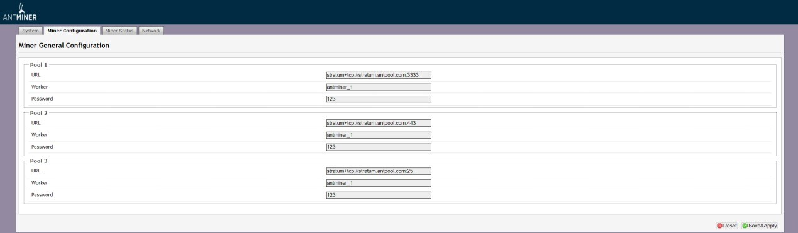
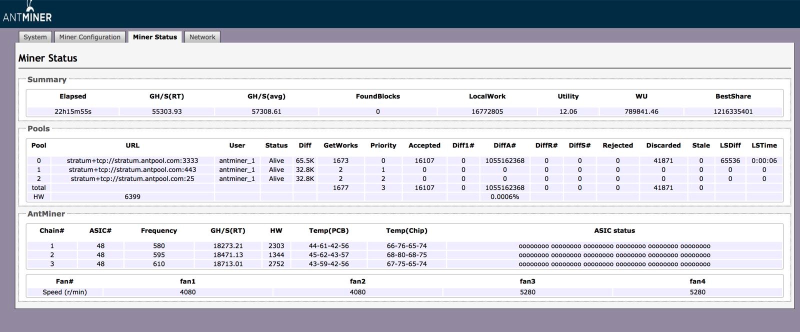
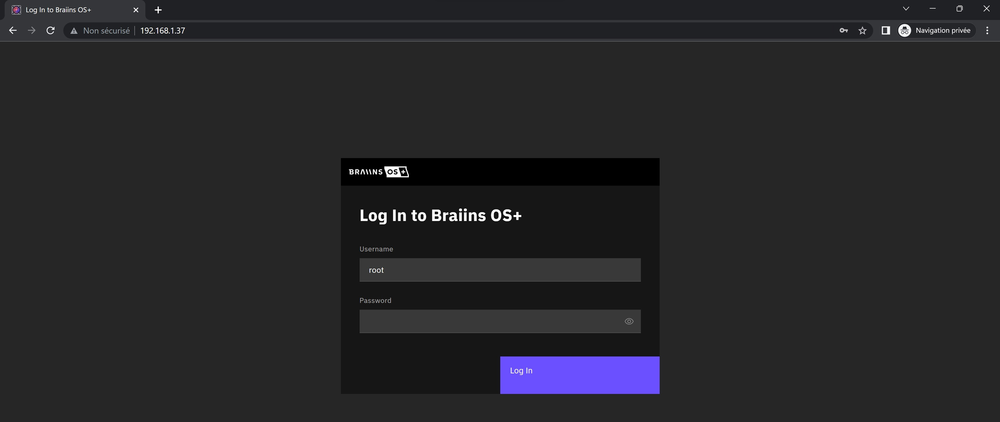
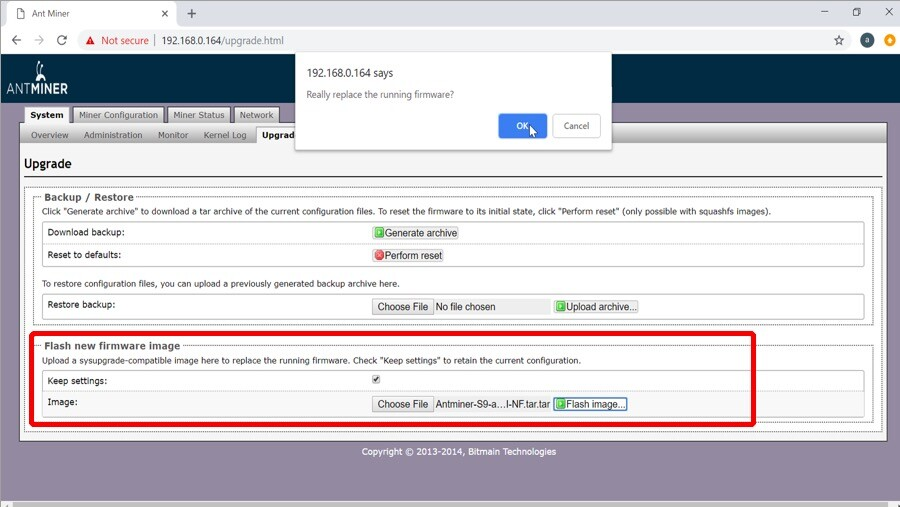
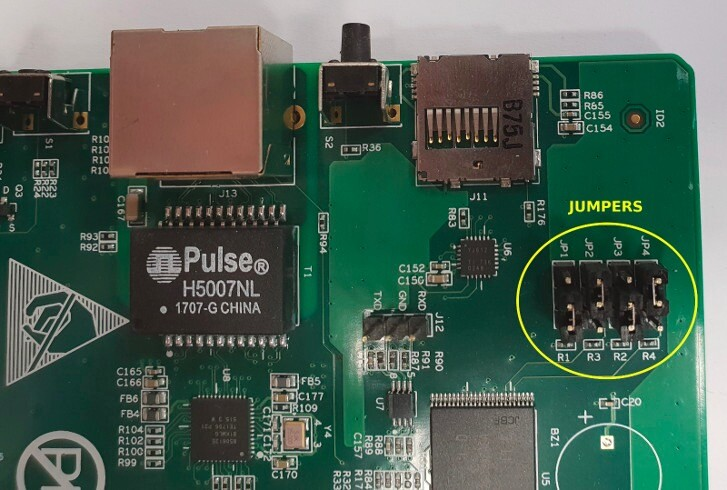

# Introduction

## Explication du minage

### Le minage in a nutsehll: un puzzul

La manière dont j'ai de l'expliquer généralement le plus simplement du monde, c'est que j'aime bien utiliser des analogies et souvent je parle d'un puzzle parce qu'un puzzle, c'est quelque chose qui est difficile à faire et en fait qui est facile à vérifier et en fait, ce à quoi correspond le minage, c'est qu'on a des mineurs qui vont essayer le plus rapidement possible de faire un puzzle et la personne qui est le premier à résoudre ce puzzle va pouvoir le présenter au reste du réseau et tout le monde est dans la capacité de vérifier que le puzzle est valide. Le mineur qui valide ce puzzle a le droit de pouvoir ajouter un bloc à la blockchain de Bitcoin et pour ça, parce qu'il fournit un travail donc ça va avoir un coût pour lui, il va être récompensé d'un certain nombre de bitcoins.

### Pourquoi s'embeter a miner ? la recompense

Au début du réseau Bitcoin, la récompense était de 50 bitcoins toutes les dix minutes parce qu'il ne faut pas oublier qu'on a un bloc toutes les dix minutes en moyenne qui est trouvé par les mineurs et cette récompense est divisée par deux tous les 210 000 blocs ou environ tous les quatre ans. Et en fait, cette récompense elle agit comme une incitation à ce que les les personnes, les mineurs puissent s'adonner à cette à cette activité qui est le minage. Parce que le minage a un coût, il a un coût en électricité. Si jamais il n'y avait pas de récompense, les gens ne le feraient pas et donc en fait tout le monde est en compétition tout le temps pour résoudre ce puzzle et pouvoir récupérer cette récompense. Cette récompense, je pense, Je pense qu'on peut, c'est important de le préciser, qu'elle est composée de la création de nouveaux bitcoins, donc comme je le citais un peu auparavant, donc c'est 50 bitcoins toutes les 10 minutes à la première époque, aujourd'hui qu'ils sont de 6,25 bitcoins toutes les 10 minutes, et des frais de transaction qu'il décide d'inclure dans son bloc. Et donc quand vous faites une transaction bitcoin, vous payez des frais de transaction. Ces frais de transaction, ça agit un peu comme une place d'enchaire, où vous levez un petit panneau comme ça pour dire, moi je suis prêt à mettre tant, pour que ma transaction, elle passe dans le bloc suivant. Le mineur, comme il agit pour son propre intérêt, il va tout simplement regarder parmi toutes les transactions qui sont disponibles, et comme il a un espace limité dans son bloc aussi, il va regarder les transactions les plus intéressantes pour lui, économiquement, à inclure pour pouvoir avoir la récompense la plus grande possible. Et donc c'est pour ça qu'on a une récompense de minage qui est composée de cette génération de nouveaux bitcoins, aujourd'hui 6,25, plus les frais de transaction.

### Qui sont les miner et lerus outil :

c'est qui sont ces mineurs ? Quels outils ils utilisent pour faire ce fameux puzzle, qui est non pas un puzzle, mais une équation mathématique, ou du moins un challenge qui vont essayer de résoudre, comme tu dis, toutes les dix minutes. Ce n'est pas vraiment toutes les dix minutes, c'est qu'ils essaient toutes les secondes, et il y a quelqu'un qui trouve toutes les dix minutes. Comment est-ce qu'ils font ces essais ? Est-ce que c'est un bout de papier ? Est-ce que c'est des hommes derrière des calculatrices ? Ou est-ce que ce ne serait pas par hasard, pile coïncidence incroyable, la machine qu'on a devant nous ? Quelle est un peu cette évolution ? Alors en fait, ce qu'essayent de trouver les mineurs, c'est un hash valide qui peut être accepté par le réseau bitcoin. Et ce hash valide, en fait, c'est une opération mathématique qui permet d'aller que dans un sens. C'est le principe d'un hash. Et donc c'est-à-dire que c'est possible, quand on calcule un hash, et qu'on trouve un hash, on ne peut pas revenir en arrière et… Comment le dire ? C'est comme la purée. On ne peut pas remettre les patates ensemble. Exactement, c'est exactement ça, c'est-à-dire qu'on est capable de vérifier qu'un hash va donner une certaine fonction et qu'on n'est pas capable de revenir en arrière. En fait, les mineurs sont en compétition avec des machines pour pouvoir trouver ces hashes. En soi, on pourrait imaginer que ce hash pourrait être trouvé sur une feuille de papier. Ce que j'ai déjà vu être fait, mais ce qui est très rare, parce que c'est quand même une opération compliquée. Mais en tout cas, ce qui est intéressant, c'est que ce hash peut être trouvé grâce à un ordinateur qui va, lui, le faire assez rapidement. Mais malgré tout, ça va avoir une consommation d'électricité de pouvoir le faire. Et donc, en fait, les mineurs effectuent ces hashes et essayent d'en effectuer au maximum pour essayer de trouver la bonne combinaison, par hasard, pour essayer de trouver le hash valide. Et du coup, pour faire tous ces calculs, ils n'utilisent plus leurs mains parce que, comme tu dis, c'est trop long. Ils n'utilisent plus non plus leur ordinateur. On n'utilise pas non plus des cartes graphiques, de ce que j'ai compris, même si c'est les gamers qui crient. Quel outil, comment est-ce qu'on en est arrivé au ASICS ? En fait, au début du réseau Bitcoin, les personnes utilisaient leurs ordinateurs de bureau pour pouvoir miner du Bitcoin. Et c'est en fait ce qu'on a appelé à l'époque l'ère du CPU. Mais assez rapidement, en fait, les mineurs se sont rendus compte qu'il y avait une manière de fabriquer encore plus de nouveaux hashes, de tester encore plus de nouvelles combinaisons pour trouver ce hash valide, pour pouvoir toucher cette récompense. Et ils ont trouvé que leurs cartes graphiques étaient capables d'effectuer encore plus de hashes pour une quantité d'énergie égale ou inférieure. Et donc, c'est là que tout le réseau s'est mis à utiliser des cartes graphiques et que miner avec un CPU est devenu très inefficient. Et on a eu une augmentation énorme du hashrate. Le hashrate qui est le nombre de hashes proposés par tous les acteurs du réseau à un instant T. Donc le nombre de tentatives pour essayer de gagner le prochain Bitcoin. Exactement. Parce que je pense que c'est important d'en parler. Par exemple, ce mineur qu'on a en face de nous, il fait 14 TeraHash par seconde. C'est-à-dire que le mineur en question va faire 14 000 milliards d'essais chaque seconde pour trouver une combinaison qui serait la bonne. À l'échelle du réseau total de Bitcoin, on est environ aujourd'hui à 300 HexaHash chaque seconde, qui est l'intégralité de tous les mineurs et ce qui est encore un ordre de grandeur encore supérieur. Comme tu le disais, tout ça c'est approximatif. C'est-à-dire qu'on est capable d'estimer la probabilité trouver ce hash valide. Une autre manière de le voir, ce serait un lancé de dés où des mineurs lancent des dés et ils savent qu'avec deux dés, ils doivent tomber sur une combinaison qui fait moins de 6. Et en fait, de manière probabiliste, on est capable de calculer le nombre de lancés moyens qu'il faudrait pour pouvoir avoir un lancé de dés qui serait au-dessous de 6. Et c'est pour ça que les mineurs trouvent en moyenne un bloc, donc la bonne combinaison toutes les 10 minutes, mais ça peut être plus et ça peut être moins. C'est pour ça que si on regarde un explorateur de blocs, on peut voir que parfois, on va avoir deux blocs qui vont être trouvés de manière successive à une minute de différence. Et parfois, ça va être plus, par exemple, 30 minutes pour trouver deux blocs successifs.

### Ajustement de la difficultyé:

Mais le réseau a une manière assez intelligente de pouvoir s'attaquer à tous les 2016 blocs. Le réseau regarde la moyenne qu'il a fallu pour pouvoir trouver les 2016 blocs précédents. Et si cette moyenne est supérieure à 10 minutes, c'est-à-dire que la difficulté est trop haute, et donc il va baisser la difficulté. A l'inverse, si cette moyenne est plus basse, c'est-à-dire que la difficulté est trop haute et du coup, inversement, la difficulté va être ajustée. En tout cas, c'est important à préciser parce que c'est surtout pour expliquer que la quantité d'énergie demandée par Bitcoin, elle n'est pas fixe. Elle est dépendante du nombre d'acteurs qui choisissent volontairement de sa donnée au minage.

Si je comprends bien, on a un bloc toutes les 10 minutes, sauf que des fois, c'est plus, des fois, c'est moins parce que c'est purement de la chance. On a augmenté la quantité d'essais à travers le temps. Il y a 10 ans, il y avait beaucoup moins d'essais qu'aujourd'hui. Aujourd'hui, c'est dans des milliards de milliards de milliards. Du coup, on a changé la technologie qu'on utilisait pour miner. On est passé des ordinateurs aux cartes graphiques. Est-ce que les cartes graphiques, c'est pour ça qu'il y en a plus ? Il y a beaucoup de gens qui minent encore avec des cartes graphiques. Est-ce que c'est Bitcoin ? C'est vrai que je ne suis pas allé plus loin. Il y a eu les cartes graphiques. Ensuite, il y a eu une autre évolution qu'on a appelée les FPGA qui sont des circuits encore plus spécialisés dans le fait de miner. Tout ça a duré quelques années, pas très longtemps. Assez rapidement, on s'est mis à fabriquer des machines qui étaient là uniquement faites pour miner. C'est ce qu'on appelle aujourd'hui les ASIC, les Application Specific Integrated Circuit. C'est ce qu'on a en face de moi. nous en fait. C'est un ordinateur qui est optimisé pour pouvoir effectuer cette seule opération qui est de miner, donc tester le plus grand nombre de possibilités pour la quantité la plus petite d'énergie possible. Donc c'est des ordinateurs bitcoin qui sont conçus, pensés, designés uniquement pour miner du bitcoin. Aucune autre cryptomonnaie, aucune autre solution mathématique, aucune autre tâche. C'est pas des ordinateurs pour tourner Windows ou Linux. Ils servent qu'à ça. Et alors quand tu disais un mécanisme finalement d'ajustement de difficulté pour garantir un bloc toutes les dix minutes, si je comprends bien le raisonnement derrière bitcoin, c'est de dire à travers le temps on va avoir de plus en plus de personnes qui essaient, on va avoir de plus en plus de machines de ce type qui vont être produites, donc on va tester de plus en plus de combinaisons. Sauf que de plus je lance 2D, de plus j'ai de probabilité de trouver très vite le résultat. Je dois faire un 6, je lance 1D, j'ai une chance sur 6. Si jamais je lance 200D de façon indépendante, je vais tout de suite trouver mon 6 au premier lancé. Et du coup pour résoudre ce problème, comme tu dis finalement, de plus il y a de mineurs qui arrivent à terme, de plus ce sera dur de trouver bitcoin. Donc c'est comme si tous ces nouveaux mineurs ne changeaient rien à notre équation de base. Et de la même façon, si pour une raison x ou y, beaucoup de mineurs venaient à disparaître, le réseau se réajusterait. Du coup je me demande, est-ce que ce système finalement de protection des dix minutes, si j'ai bien compris par rapport à bitcoin, comme on l'a vu dans bitcoin 101, c'est ça qui permet de garantir que nos blocs arrivent toutes les dix minutes, même si la Chine demain se met à miner du bitcoin ou si demain la Chine arrête de miner du bitcoin. C'est bien ça ? Exactement. C'est une manière de protéger bitcoin parce que bitcoin, on veut qu'il soit prévisible. Dans un monde incertain, on a envie d'avoir des choses certaines et on a envie d'avoir un instrument de mesure fixe qui ne bouge pas. Et c'est pour ça que la distribution de bitcoin est fixée dans le temps. Et la manière dont cette distribution est assurée d'une manière fixe, ça va être grâce à cet ajustement de la difficulté. Ce qui fait que peu importe le nombre d'acteurs qui vont se mettre à miner, la distribution de nouveaux bitcoins va rester la même. C'est juste que la récompense qui en découle va être divisée entre un plus grand nombre d'acteurs. Et d'ailleurs, tu t'évoquais la Chine, et je pense que c'est un exemple intéressant parce que la Chine, pendant longtemps, a été la terre du minage où la plupart des faits de minage, parce qu'on peut imaginer en fait que les fermes de minage correspondent à des milliers de ces machines qu'on a en face de nous. C'est des hangars de serveurs. Exactement, des hangars d'ASIC, qu'on peut appeler aussi des serveurs, mais qui sont des hangars complets. Et en fait, jusqu'en 2021, la Chine, pour plein de raisons, parce qu'ils ont une énergie abondante, peu chère, a été l'endroit où la plupart du minage était localisé. Sauf qu'en 2021, la Chine a pris la décision d'interdire le minage sur son territoire. Et du jour au lendemain, les mineurs ont dû trouver une solution et se délocaliser. C'est pour ça que si on regarde le hashrate de Bitcoin, dont je l'ai un peu évoqué tout à l'heure, qui est la quantité totale de hash proposé au réseau, on a vu une chute abrupte du hashrate, qui a diminué pratiquement de 50%. Et en fait, c'est juste parce que les machines ont été débranchées. Et donc, les mineurs, à ce moment-là, se sont retrouvés avec des machines sur le dos. Ils se sont retrouvés avec des mineurs qui leur ont coûté un certain prix. Donc, pour les rentabiliser, il faut les brancher. Et donc, a commencé une course pour pouvoir envoyer ces mineurs partout dans le monde, dans des endroits où ils pouvaient être branchés, au meilleur tarif. Parce qu'encore une fois, le mineur, il va toujours chercher l'énergie la moins chère. Donc ensuite, on peut imaginer des fermes de minage qui sont là, et essayer d'explorer toute la planète pour essayer de voir quelles sont les sources d'énergie les moins chères que je peux trouver pour brancher mon mineur.

### L'évolution des machine:

Du coup, parlant de leur business model, donc là, en Chine, bon, c'est pas une question de business, c'est une question de régulation, j'ai l'impression. Mais du coup, le mineur, tu l'as dit, il gagne de l'argent d'une seule façon en validant un bloc. Peut-être, avant de parler de leurs coûts et de leurs récompenses, la probabilité de trouver ce bloc, elle est minime. Notre machine, là, tu nous as dit que c'était un ancien modèle en plus. Exactement, qui est sorti environ en 2016, le Antminer S9, donc qui est de la marque Bitmain. Ça coûte combien, ça? Alors, le prix des machines fluctue déjà en fonction du cours du Bitcoin. Là, actuellement, un Antminer S9, on peut le trouver sur le marché de l'occasion parce qu'ils se font plus neufs, autour de 200 euros. Mais par contre, si on allait sur la même marque et qu'on avait un mineur avec les performances les plus actuelles, qui serait un Antminer S19, qui a un gain environ de 10 fois sur son efficience, on est plus autour de 2000 euros aujourd'hui pour cette même machine. Alors, sachant que ça fluctue beaucoup, je m'imagine avec le prix du Bitcoin. Et alors là, du coup, on a un S9, j'imagine qu'il y a des choses entre deux, puis un S19. La prochaine, est-ce qu'on doit, enfin, j'imagine que les acteurs, parce que c'est une industrie sérieuse désormais, ils attendent. attendre la prochaine phase ? On va avoir un S29 qui sera encore une fois dix fois supérieur ? Est-ce qu'on doit finalement changer nos machines régulièrement ? Comment est-ce que ces professionnels se positionnent ? Parce que là nous c'est facile, on en a un, mais si tu me dis qu'il me faut un hangar avec dix mille machines pour commencer à avoir une industrie un peu sérieuse et un vrai business, à quel point je dois remplacer mes machines ? Est-ce qu'on a une nouvelle machine, une nouvelle génération qui arrive ? Alors il y a tout le temps une nouvelle génération. Effectivement on a le S19 qui est sorti dans sa version J, qui fait environ 110 terahertz par seconde, mais il y a aussi un nouveau mineur qui est le S19 XP, mais qui a encore une meilleure efficience de tête, on devrait être à 150 terahertz par seconde ou quelque chose comme ça. Mais ensuite le gain d'efficience n'est pas seulement obtenu de cette manière-là, il va être aussi obtenu grâce à des modifications comme l'hydro, où en fait ici on a un mineur dont le refroidissement se fait à travers des ventilateurs, et dans l'hydro par exemple sur la version XP dont je te parlais, les mineurs ne sont plus refroidis avec de l'air mais avec du liquide parce qu'ils sont tout simplement immergés dans un liquide spécial qui est non conducteur et donc qui permet aux mineurs de fonctionner. En fait toutes ces petites modifications permettent un tout petit gain d'efficience qui permet d'être un tout petit peu meilleur que les voisins et donc tous les mineurs sont toujours à la recherche de ce petit gain d'efficience pour essayer de miner le maximum de bitcoin pour une quantité d'énergie toujours plus faible. Et selon moi, les gains en efficience du futur seront bien moindres que ce qu'on a connu jusqu'à aujourd'hui. La raison est que jusqu'à présent, quand le minage est arrivé, c'était une industrie qui était nouvelle et donc ça veut dire que les innovations qui se sont succédées étaient à chaque fois des marches très très grandes, mais comme on est arrivé un peu à un palier de l'innovation, on peut professionnaliser l'industrie, c'est ça ? disons que ce palier est à chaque fois, c'est toujours un petit peu plus dur d'améliorer cette chose là. Une autre analogie dont je pourrais parler c'est par exemple l'avion où quand l'avion a été créé, on a chaque décennie eu des avions de plus en plus rapides, puissants, ce genre de choses. Sauf qu'aujourd'hui on est arrivé à un niveau d'efficience tel sur un avion qu'effectivement entre 2010 et 2020, les avions ne sont pas dix fois plus performants que le précédent et c'est simplement parce que tout l'argent qui a été injecté dans la recherche et le développement de minage aujourd'hui a fait des machines qui sont pratiquement le summum de ce qu'on est capable de faire. Donc les gains d'efficience sont toujours présents dans le futur, mais sûrement à des échelles moindres de quand on est passé au CPU, au GPU, du GPU au FPGA et du FPGA jusqu'à l'ASIC. Et donc voilà, c'est pour ça qu'on aura toujours des gains d'efficience, mais qu'ils seront toujours moindres. Et voilà, en gros, moi, ma vision, donc c'est un peu une spéculation, mais je pense qu'effectivement, ces bons technologiques seraient quelque chose qu'on verra de moins en moins et il faudra s'adapter à une augmentation plus lissée de l'efficience du minage.

## l'industrie du minage

### Les pool de minage

On voit bien que le minage c'est désormais une industrie sérieuse, grosse, il y a beaucoup d'acteurs qui sont publics, il y a beaucoup de très très gros mineurs à quel point du coup c'est devenu quelque chose d'inaccessible le minage parce que nous on en a un petit Avoir une opération avec énormément de nouvelles machines ça a un coût très gros donc on pourrait se poser la question de finalement la distribution de ce hashrate et alors là je pense que c'est un peu tricky parce qu'il y aurait deux choses à voir c'est à quel point des sociétés ont beaucoup de hashrate et à quel point des poules de minage ont des hashrate. Comme on n'a peut-être pas encore parlé des poules de minage peut-être survoler rapidement ce sujet, expliquer qu'est ce que c'est une poule de minage l'idée, si je vais le faire très simple et de ce que j'ai compris, tu m'expliqueras si j'ai tort c'est que notre petite machine ici elle ne fait pas beaucoup de compétition face aux géants donc je vais me mettre avec des copains pour avoir une chance de réussir. Exactement, comme on l'a expliqué tout à l'heure, le minage c'est une loterie plus ou moins et donc si on était en compétition avec tout le reste des mineurs nos chances de pouvoir remporter un bloc toutes les dix minutes, de remporter le jackpot seraient très très faibles et donc on pourrait on a payé 200 euros pour gagner 6,5 bitcoins donc 200 euros pour 300 milles c'est pas mal exactement mais les chances de gagner 6,25 bitcoins sont tellement faibles que cette machine pourrait être branchée pendant des décennies et des décennies sans jamais trouver un bloc peut-être avec l'espoir d'un jour pouvoir en trouver un mais sans certitude. Je joue pas au loto, ne jouez pas au loto parce que vous êtes perdant sur les stats. Exactement et donc ce que ce que se sont dit les mineurs c'est que ils allaient créer des coopératives où ils allaient mettre leur hache en commun et redistribuer la récompense entre toutes les personnes en fonction de leur participation. Donc on peut imaginer ça de la même manière qu'une coopérative agricole ou un agriculteur pour pouvoir lisser tout au long de l'année sa demande mais en commun c'est le fruit de sa production pour pouvoir ensuite avoir un lissage de son revenu. Et donc de la même manière les mineurs vont sur des pôles de minage où toutes les pôles collectent les haches de tout le monde et donc ont un hache rate beaucoup plus élevé que chaque mineur individuellement, trouvent des blocs plus souvent et donc du coup d'une manière plus prévisible et à chaque fois qu'ils vont trouver un bloc ils vont regarder le pourcentage que chacun de ces mineurs individuellement a participé et ils vont redistribuer cette récompense. Un exemple, je trouve un bloc de 6,25 bitcoins et j'ai moi plusieurs machines qui correspondent à 1% de la puissance totale de calcul de la poule. Après le gain de ces 6,25 bitcoins, la poule va me rémunérer de 1% des 6,25 qu'elle vient de récupérer. La poule effectivement ne fait pas gratuitement et va se prendre une petite marge qui généralement est de l'ordre des 2% de la récompense pour faire fonctionner cette coopérative qu'on appelle une poule. J'essaie de servir l'industrie

### les software

en entière là. On a nos créateurs, enfin on a nos concepteurs de machines. Ant Mining, tu as dit, c'est ça ? Alors c'est Bitmain et le modèle est un Antminer de la version S9. On a ensuite du coup nos poules collaboratifs pour se mettre dessus ? Exactement, on peut citer un exemple, on peut citer par exemple Brainspool qui est une poule de minage qui possède environ 5% du hashrate global. On a des mineurs qui utilisent ces deux services. On a les utilisateurs de bitcoin qui du coup utilisent le service des mineurs qui utilisent ces deux services. On va faire un magnifique graphe, je le visualise très bien, vous serez content les viewers. On a également du coup après j'imagine des optimisations de software, parce que là tu m'as parlé de hardware qu'on améliore. J'imagine qu'il doit y avoir du software quelque part dans cette machine, donc il y a sûrement des sociétés qui se spécialisent là-dessus, c'est ça ? C'est ça, donc systématiquement, comme tu dis, tout le monde va essayer de gagner de l'efficience absolument partout, sur le hardware, sur le software. Par exemple sur le software, on va pouvoir aller chercher du côté du logiciel de seconde main, je ne sais pas si c'est le bon terme, mais par exemple l'un des plus utilisés aujourd'hui, ça va être BrainsOS Plus, qui est un logiciel qui vient remplacer le système d'exploitation de base de la machine pour pouvoir faire les mêmes opérations, mais d'une manière plus efficiente. Et généralement, par exemple sur ce mineur, on a un gain d'efficience d'environ 25%. Donc la machine, pour une quantité égale d'électricité, est capable de produire 25% de haches supplémentaires et d'augmenter le nombre de haches qu'elle envoie à la poule, et donc la récompense qu'elle récolte de son côté. Donc on peut l'imaginer comme ils ont optimisé le code pour que ça soit mieux, et donc on les utilise eux. Exactement.

### la régulation et le tarrif electricité

Dans nos acteurs, on a le software, et après, j'ai envie de dire qu'il y a la régulation, qui joue énormément, comme on l'a vu avec en Chine ou ailleurs. On pourra revenir là-dessus, parce que je sais qu'en France, on n'a pas de mineurs. C'est ça. On n'a pas de mineurs, mais en France, on a des mineurs. ce n'est pas seulement la régulation qui nous empêche, mais c'est aussi les tarifs de notre électricité. On a parlé du fait que le mineur va toujours être à la recherche de l'électricité la moins chère, parce qu'il fait ça clairement pour son gain personnel. L'électricité en Europe étant relativement élevée par rapport au reste du monde, les mineurs n'ont pas d'intérêt économique à miner sur le territoire européen et en France. C'est pour ça qu'on voit les mineurs généralement se diriger vers des endroits où ils peuvent avoir des tarifs d'électricité les plus bas possibles. D'accord. Donc, pays émergents, pays avec des surplus énergétiques ? On est plus dans ces deux-là ? Exactement. Donc, on a plusieurs… L'exemple principal, puisqu'une grande partie du hash rate se trouve au Texas, c'est parce que le Texas a un réseau électrique qui n'est pas connecté au reste des États-Unis. C'est-à-dire que quand les autres États des États-Unis ont une offre et une demande qui peuvent se rencontrer entre États, le Texas, lui, est isolé. C'est-à-dire que s'il crée des surplus d'énergie, il est obligé de trouver un moyen de les utiliser. Et donc, en fait, ce qui va se passer, c'est que cette feature, un petit peu, fait que le Texas est obligé, des fois, souvent, de produire plus d'énergie que nécessaire pour s'assurer que… Et donc, quand je parle d'énergie, je parle d'électricité. Donc, le Texas va créer plus d'électricité que nécessaire pour s'assurer que si la demande est présente, il va pouvoir y répondre pour ne pas qu'il y ait de coupure d'électricité. Et donc, les mineurs utilisent cela à leur avantage en étant présents au Texas, car ils vont, eux, proposer une demande ajustable pour le réseau. C'est-à-dire que quand le Texas a un surplus d'électricité, les mineurs sont branchés, ils minent du bitcoin à un tarif d'électricité très bas, car de toute façon, cette énergie, cette électricité est en surplus. Donc, elle aurait été sûrement gaspillée si jamais les mineurs n'étaient pas là.

### ou vont les mineur ?

Et donc, c'est, je dirais, un des constats assez logiques du minage, c'est que comme les mineurs cherchent l'énergie la moins chère, l'électricité la moins chère, et que l'électricité la moins chère est généralement celle qui est gaspillée, les mineurs cherchent l'électricité gaspillée autour du monde. Et cette électricité gaspillée, on peut aussi la trouver dans les endroits ayant des nouvelles infrastructures électriques. Je te donne un exemple, si je suis dans un pays où je fabrique un barrage hydroélectrique. Qu'est-ce que je vais fabriquer en premier ? Le barrage hydroélectrique. Dans ce cas-là, j'ai un coût d'infrastructure assez considérable pour fabriquer le barrage, mais je n'ai pas les lignes pour pouvoir relier ça. cette énergie, cette électricité nouvelle à la demande. Et donc, en fait, ça va engendrer un coût énorme, ce qui va parfois réduire la possibilité, la volonté des personnes à se lancer dans ces projets d'infrastructure. Ou je peux prendre le... Je peux faire ça d'une autre manière en installant les lignes électriques en premier, ce qui va aussi me coûter de l'argent, mais je ne vais pas avoir la source d'électricité de l'autre côté. Dans ces endroits-là, le minage intervient comme une demande qui peut s'implanter partout et être présente pour pouvoir rembourser une partie des frais que vont avoir ces acteurs qui se lancent dans ces projets d'infrastructure. Le temps que toute l'infrastructure électrique soit complète et que la demande, que l'offre trouve sa demande. Mais attends, ce que tu es en train de me dire, en gros, c'est qu'on peut rentabiliser tout de suite des nouvelles installations et donc augmenter la création de nouvelles sources de transformation en électricité. Enfin, d'énergie pour d'exploiter. Exactement, c'est ça, c'est on peut l'imaginer à une échelle individuelle, ce qui sera peut-être plus simple à... Un petit broulin en roue chez toi, tu as une petite rivière qui passe, tu mets ton petit thermotruc pour transformer ton courant en électricité. Plus courant que ça, je dirais même jusqu'aux personnes qui installent des panneaux solaires sur leur maison. On a beaucoup de personnes qui installent des panneaux solaires et en fait, les panneaux solaires font de l'énergie. Et c'est souvent le cas de toutes les énergies renouvelables. Qui n'est pas d'énergie renouvelable, et donc l'électricité. Dans les énergies renouvelables, elles sont peu pilotables. Donc, c'est à dire que quand le soleil brille, quand il brille, le vent souffle quand il souffle. On ne peut pas vraiment, on n'a pas vraiment une production d'électricité qui est en phase avec la demande. Et quand une personne installe des panneaux solaires, si jamais elle a un surplus d'électricité, la manière dont ça fonctionne en France aujourd'hui, c'est que ce surplus d'électricité est redistribué sur le réseau et la personne est rémunérée par un crédit sur sa consommation de la part d'EDF. De la même manière, on pourrait très bien imaginer un mineur branché chez quelqu'un qui a des panneaux solaires sur son toit et lorsque sa production d'électricité dépasse sa demande personnelle, cette électricité pourrait très bien être envoyée dans un mineur qui lui fonctionnerait sur ses surplus d'électricité, mais qui s'éteindrait au moment où la quantité d'électricité demandée rejoint l'offre. C'est un petit peu égoïste. C'est à dire ? On pourrait débattre qu'au lieu de soutenir le grid et tes voisins, tu culpidement, de miner tes bitcoins ? Alors effectivement mais c'est surtout une manière de stabiliser le réseau électrique parce que le réseau électrique est très complexe avec des acteurs qui se trouvent absolument partout et pour pouvoir se débarrasser de l'électricité en surplus que tous les acteurs par exemple européens créent, on a des échanges d'électricité qui se font quotidiennement en Europe et c'est pour ça qu'on a même des parfois des prix négatifs d'électricité c'est à dire que si par exemple dans une journée très ensoleillée avec du vent et les centrales nucléaires qui tournent à fond on a des surplus d'électricité et que c'est le cas sur toute l'Europe donc personne ne récupère sa l'électricité parfois un pays est obligé de payer d'autres acteurs pour pouvoir prendre cette énergie et donc ça veut dire que non seulement l'énergie à un coût mais ensuite on doit payer pour s'en débarrasser et donc c'est là que le minage il intervient comme un moyen de pouvoir rendre l'électricité de manière générale plus efficiente en ajustant non plus l'offre d'électricité mais en ajustant la demande parce que toutes ces sources d'énergie sont peu pilotables et donc du coup on pilote la demande et quand je parle de peu pilotable on peut penser à une centrale nucléaire qui ne peut pas s'arrêter ou baisser en régime instantanément on parlait tout à l'heure des panneaux solaires dont on ne peut pas contrôler on ne peut pas contrôler quand le soleil brille les éoliennes on ne peut pas contrôler quand le vent souffle et en fait on se rend compte que à défaut de pouvoir piloter l'offre d'électricité on se met à piloter la demande ok ok donc c'est un peu comme si bitcoin et enfin les mineurs du coup sont des mangeurs d'énergie plein d'électricité que personne ne veut exactement du coup si on repart sur leur business modèle ils veulent avoir la machine la plus efficace dans la régulation la plus sympa avec l'énergie avec l'électricité la moins chère ça c'est un petit peu leur objectif leur coût c'est donc des machines du savoir-faire des ingénieurs des personnes sur place de la maintenance un hangar et après le coût de l'électricité donc ils essaient de le b

### centralisation du réseau

là eux il varie énormément donc comment est ce que le mineur se positionne entre finalement des coûts qui sont très prévisibles et des revenus qui sont très peu prévisibles, outre les poules. Ils ne savent pas combien de frais ils vont toucher. Tu m'as parlé d'un halving, enfin tu as parlé du halving du coup, qui arrive régulièrement. Comment est-ce qu'au long terme, un acteur qui va mettre autant d'argent dans des machines comme ça, une infrastructure, peut-il s'assurer de la pérennité de son business avec des revenus si variables en termes de probabilités et de quantité de frais touchés par transaction. Il va y avoir plusieurs manières de le faire, en tout cas, pour répondre à ta question qui a une réponse complexe, c'est que l'industrie du minage est une industrie très compétitive et que beaucoup y perdent leur plume. C'est pour ça qu'on voit souvent le minage se centraliser de plus en plus dans les mains d'acteurs qui peuvent assumer les pertes, qui sont parfois des bénéfices, mais cette compétitivité qui parfois génère des pertes centralise ce hashrate. C'est pour ça qu'on a une centralisation au niveau des poules, mais aussi une centralisation énorme au niveau des fermes de minage, où souvent les plus gros acteurs sont ceux qui survivent. On a par exemple une poule très grande qui est Foundry, qui aujourd'hui mine environ 40% des blocs toutes les 10 minutes parce qu'elle possède la plus grosse partie du hashrate qui lui est envoyé. Et de la même manière, on va avoir des entreprises comme Riot qui sont des énormes fermes de minage et donc qui du coup, quand le prix du bitcoin baisse, que les frais de transaction ne sont plus suffisants et ce genre de choses, vont pouvoir assumer des pertes de manière beaucoup plus simple que des plus petits acteurs. Ce qui est un défaut pour le réseau, c'est que si le hashrate n'est pas distribué, on a un risque de centralisation, ce qui fait qu'on a un risque de censure. Je peux donner un exemple, on peut avoir Foundry par exemple, qui en minant 40% des blocs, pourrait théoriquement commencer à censurer un certain nombre de transactions en décidant de ne pas les inclure dans les blocs qu'elle crée. Et c'est ce qu'on appelle souvent l'attaque des 51% et c'est pour ça que tout le temps, le réseau devrait chercher à se distribuer pour essayer de lutter contre cette attaque sur le réseau bitcoin qui serait l'attaque des 51%. D'accord. Mais en gros, on y arrive. dit 40%, si on imagine régulation US, si on imagine interdiction d'avoir un certain type de transactions parce qu'elles sont privées, anonymes ou autres, quelle est notre marge de manœuvre pour se défendre ? Est-ce que avoir un S9 chez soi branché à ses panneaux solaires est une réponse pour essayer de défendre cette décentralisation ? Est-ce que c'est aux acteurs eux-mêmes de réaliser qu'ils sont contre Bitcoin et donc qu'ils ont un intérêt à déjeuner, déjeuner des machines en dose hors des US pour se préparer à un risque étatique ? Comment est-ce que les gens se positionnent et quel est ton point de vue là-dessus ? Il va y avoir plusieurs manières de le faire. On va avoir par exemple du software qui va pouvoir être créé pour pouvoir mitiger ce risque et notamment on va avoir le protocole Stratum V2 qui est le protocole qui permet aux mineurs de communiquer avec les pools. Stratum V1 jusqu'à présent fonctionnait de la manière suivante où c'était la pool qui fabriquait les blocs et donc qui choisissait les transactions qu'elle allait inclure dans les blocs. Donc elle était plus ou moins responsable de la création du bloc et donc c'était elle qui pouvait censurer les transactions. Stratum, pour essayer de comprendre, c'est la chose qui communique entre finalement la machine physique et le réseau Bitcoin, c'est ça ? Et la pool de minage. D'accord. Donc c'est le protocole qui permet aux mineurs de communiquer avec la pool et de pouvoir lui envoyer le travail qu'il produit. D'accord. Et donc Stratum V2, ce qu'il introduit, c'est qu'il introduit la possibilité aux mineurs eux-mêmes de créer les blocs en incluant les transactions qu'ils souhaitent. Ce qui du coup déporte la responsabilité de la création du choix des transactions à inclure dans le bloc et ça distribue ce choix rendant le réseau beaucoup moins sensible à la censure. Donc voilà, ça c'est une des manières dont le réseau se protège de cette attaque des 51%. Je dirais qu'une autre manière dont le réseau peut le prévenir, mais ce serait un peu malhonnête de me dire que cette solution va immédiatement changer les choses, ce serait effectivement de distribuer le hashrate en ayant non plus des fermes de minage mais en ayant des mineurs qui fonctionnent un peu partout. On peut imaginer un S9 dans un monde idéal dans chaque maison. Le fait de distribuer ce hashrate rendrait encore une fois le Bitcoin encore moins sensible à la censure, mais malgré tout concurrencer aujourd'hui les énormes activités dans le minage est quelque chose de très compliqué. Malgré tout, nous on a lancé une initiative à Takai qui essaye de, non seulement d'être une initiative éducative pour apprendre aux gens à miner, mais aussi amorcer une discussion sur la distribution de ce hashrate en essayant de faire germer l'idée chez les bitcoiners qu'une distribution du hashrate est quelque chose de positif en général pour le réseau. Parce qu'une fois que toutes ces fermes de minage, on a pris l'exemple du Texas, se trouvent sur le sol américain, que plus de 50% du hashrate global se trouve sur le sol américain, même s'il est distribué chez différents acteurs et différentes entreprises, le jour où bitcoin devient un problème suffisant pour l'état et que l'état américain décide de l'attaquer, ce serait très facile pour lui de saisir les machines qui se trouvent sur son territoire et du coup, pour cet état, de mener une attaque de 51%, alors que si les machines étaient distribuées sur des zones géographiques diverses, ce serait beaucoup plus difficile pour un acteur unique d'attaquer le réseau bitcoin en une seule fois.

## Le Home-mining

### Le principe de Attakai

Et du coup, en S9, ça semble compliqué, mais la majorité des gens, des institutions, des bâtiments ne sont pas que des maisons, il y a également des immeubles, il y a également des écoles, des hôpitaux. On pourrait imaginer là-bas, pas mettre des fermes avec des milliers de racks de trucs, mais quelques machines pour finalement, comme tu l'as dit plusieurs fois, réutiliser la chaleur peut-être de ces machines pour chauffer ces établissements et du coup mettre des S19 qui sont beaucoup plus performants, comme tu l'as dit, un peu partout. Et dans ce cas, on aurait une chance de rivaliser. Exactement. Donc pour répondre à ça, je peux parler un peu de l'initiative Ataka et la manière dont l'initiative a vu le jour, c'est qu'avec mon ami Jim, on a voulu miner chez nous, de la même manière que plein de bitcoiners ont des notes chez eux. Moi, j'avais envie de voir une machine chez moi qui minait pour pouvoir participer et comprendre. Mais malheureusement, un mineur en l'état n'est pas du tout fait pour un particulier s'il souhaite miner chez lui. C'est pas pensé pour eux ? Exactement, c'est pas pensé pour eux. Le mineur, il est vendu pour des industriels qui veulent se lancer dans cette activité, de la même manière qu'une pelleteuse n'est pas faite pour être utilisée par un particulier chez lui au quotidien. C'est des équipements industriels. Et donc, une des plus grosses nuisances, clairement, c'est le bruit. Le mineur fait un bruit tel que s'il était dans cette pièce, on ne pourrait juste tout simplement pas se parler. On peut s'amuser au montage à vous mettre le bruit du mineur là. Ce serait impressionnant, oui. Si ça vous a fait chier, c'est pour ça que c'est chiant. Voilà. Donc, clairement, ça rend le minage d'un appartement plus ou moins impossible. Même dans une maison, même à l'extérieur, ce serait quelque chose de très nuisible. Donc, on a cherché comment pouvoir miner chez nous et on est arrivé à trouver des manières de modifier le hardware du mineur en changeant les ventilateurs d'origine pour des ventilateurs plus performants qui, eux, sont silencieux. Et c'est pour ça qu'on voit d'ailleurs ces pièces oranges imprimées en 3D qui ont été placées ici. Parce que comme ces ventilateurs ne sont pas d'origine, on a créé une pièce qui permet à ces ventilateurs de pouvoir se connecter au mineur. Et on a fait différentes modifications comme l'ajout d'un adaptateur Wi-Fi. Parce que normalement, le mineur devrait être connecté à un câble Ethernet. Donc, on peut imaginer un grand câble qui serait connecté jusqu'au routeur. et c'était quelque chose qu'on pouvait facilement régler avec un adaptateur en Wi-Fi. Et donc, au cours de l'hiver, on a commencé à d'abord acheter ce mineur, le modifier, imprimer des pièces en 3D, changer les ventilateurs, et on est arrivé à quelque chose d'assez simple à utiliser, qui, malgré tout, rejetait de la chaleur. Et c'est là que le mineur devient intéressant parce que, comme un des produits du minage est la chaleur qui est produite par les puces et qui est éjectée par les ventilateurs qui se trouvent les deux côtés, on a eu l'idée tout simplement d'utiliser ce mineur comme un chauffage pour chauffer nos appartements respectifs. Et donc, on a commencé à bidouiller ce mineur en l'automatisant pour pouvoir faire en sorte qu'il puisse réagir à des éléments d'une maison connectée et pouvoir réagir à des événements extérieurs, comme une baisse de température et son allumage et ce genre de choses. Et au final, après avoir fait tout ça et avoir miné tout l'hiver, on a un peu présenté notre initiative à la communauté Bitcoin. Et face à l'intérêt de la communauté, on a décidé de rédiger des guides qui sont disponibles sur Découvre Bitcoin pour essayer de permettre aux gens par eux-mêmes, s'ils le souhaitent, de découvrir le minage de la même manière qu'on l'a fait. Parce que tout ce que je connais aujourd'hui sur le minage, je l'ai appris en bidouillant mon propre mineur. Et pour moi, pour permettre au plus grand nombre de personnes de découvrir le minage et de le comprendre, ça m'a semblé naturel que de leur proposer, d'eux-mêmes faire leur propre avis en essayant. Et c'est pour ça qu'on a lancé cette initiative à Takai, qui a pour but de montrer à quelqu'un comment il peut modifier un mineur pour le transformer en un chauffage d'appoint silencieux qu'il peut utiliser pendant l'hiver. C'est une excellente transition. Pour vous proposer la deuxième partie de cette formation, Jim nous présentera Takai, qui est en fait ce S9 que vous voyez ici. Et on va vraiment, pas par pas, ensemble le mettre en place. Donc il sera complètement déhaussé. Vous pourrez vous aussi vous obtenir un S9 et toutes les pièces adéquates pour la modification. Et ensuite, ensemble, on va le monter pour qu'il y ait une vidéo qui accompagne les guides disponibles juste en dessous, sur le site Découvre Bitcoin. sur la formation, peu importe où vous écoutez ceci. Alors ça c'est pour les particuliers, on a un modèle entreprise, est-ce que c'est réaliste d'imaginer que cette même initiative finalement d'utilisation de Bitcoin dans notre vie quotidienne en se chauffant peut être agrandie à une échelle plus conséquente ?

### la limite de cette decentralisation?

J'aime bien imaginer les saunas, les piscines et ce genre d'établissements qui sont très énergivores finalement. Bien sûr et c'est déjà ce qui est fait par la communauté Bitcoin, c'est vrai que nous on a appris en observant ce que les autres faisaient aussi et c'est vrai que sur toute la planète, plein de gens essayent des solutions pour pouvoir justement réutiliser cette chaleur de manière la plus efficiente. Donc on a des gens qui chauffent des piscines en utilisant justement les mineurs immergés dont je parlais tout à l'heure, en utilisant des échangeurs de chaleur qui eux viennent chauffer l'eau de la piscine et donc on peut complètement imaginer de réutiliser cette chaleur à une échelle industrielle et on pourrait avoir par exemple une salle des fêtes qui serait chauffée par trois ou quatre S19 qui individuellement consomment 3000 watts et donc produisent 3000 watts de chaleur en retour. D'accord et ça ne coûterait pas plus d'électricité en coûts financiers que si jamais on utilisait des radiateurs comme nous on a l'habitude en France ? Exactement, pour une quantité équivalente d'énergie et d'électricité mise dans un ordinateur et donc dans un mineur, une quantité équivalente de chaleur est produite. C'est à dire que si j'ai un radiateur électrique dans lequel je mets un kilowatt d'électricité, ce radiateur électrique va produire la même quantité de chaleur que si je mets un kilowatt d'énergie électrique dans mon mineur. Mais la particularité c'est que mon chauffage électrique ne me donne pas de bitcoin alors que mon mineur lui me fournit la chaleur plus une petite récompense en bitcoin. Donc c'est une incitation économique à pouvoir utiliser un mineur pour chauffer plutôt que d'utiliser un simple radiateur électrique. Alors ça me permet de dévier un petit peu et de changer de sujet mais c'est vrai qu'il y a quelque chose qui perturbe toujours.

### pourquoi avoir des récopense en BTC

Tu as dit récompense en bitcoin. Pourquoi est-ce que Satoshi a décidé que quand on minait, on était récompensé en bitcoin et pas dans une autre devise ? Il aurait pu imaginer plein d'autres systèmes de distribution. Pourquoi celui-là finalement ? Parce qu'il fallait trouver une manière de distribuer les bitcoins qui sont créés. C'est à dire que bitcoin c'est une monnaie dont On a 21 millions d'unités et il faut trouver une manière de répartir cet argent, ces tokens, dans ce qu'ils sont créés. Et la manière qui a été imaginée de le faire, c'est tout simplement de distribuer les nouveaux bitcoins créés aux personnes qui viennent protéger le réseau. Parce que chaque mineur qui vient miner protège le réseau en rendant une attaque de plus en plus chère contre le réseau bitcoin. Et donc pour la sécurité apportée au réseau, le mineur est récompensé par le réseau, par ces nouveaux bitcoins créés. Et donc la raison pour laquelle cette récompense s'est faite en bitcoin, c'est pour la simple et bonne raison que ça permet la distribution de ces nouveaux bitcoins aux personnes qui aident le plus le réseau dans sa sécurité. Et donc on voit que c'est un cercle vertueux. Alors du coup c'est rigolo, les mineurs ont deux sources de revenus qui viennent de la même chose, valider un bloc. Les bitcoins créés et rajoutés en tant qu'inflation sur la masse monétaire bitcoin, donc c'est les 625 que tu me parlais, tu disais que ceux-là finalement ils étaient donnés pour sécuriser le réseau. Et les autres c'est des frais de transaction, donc eux ils sont plus donnés pour avoir approuvé les transactions des gens. Est-ce que c'est bien comme ça qu'on peut le voir ? Et du coup je me pose la question de plus tard, qu'est-ce qui se passera naturellement si on continue ce schéma et que finalement ces 625 ils baissent, ils baissent, ils baissent. Quel est le rôle du mineur ? Est-ce qu'il va toujours s'amuser à défendre le réseau s'il n'est pas payé pour ? Est-ce qu'il ne fera que des frais ? Comment on voit la chose ? Exactement, de toute façon cette question va se poser assez rapidement. En 2100 ? Alors même plus tôt que ça, parce qu'en 2032 la récompense ne sera déjà même plus d'un bitcoin toutes les 10 minutes. Donc aujourd'hui plus de 95% de la supply, donc de l'offre totale de bitcoin a déjà été minée. Donc pour tout le reste de l'histoire de bitcoin que nous allons voir, les gens vont se partager une infime partie des bitcoins restants. Donc les mineurs vont devoir très rapidement avoir une autre incitation économique à pouvoir miner que la récompense offerte par le réseau. Mais au final c'est comme ça que bitcoin a été créé, parce que le bitcoin sera en vitesse de croisière le jour où les mineurs ne seront plus dépendants de la récompense du réseau, mais bien des frais de transaction pour pouvoir rémunérer leur activité. c'est pour ça que le réseau Bitcoin, on peut imaginer en tout cas le réseau Bitcoin dans le futur, avoir des blocs pleins avec des frais de transaction très élevés qui vont permettre de rémunérer les mineurs et pouvoir compenser cette baisse du nombre de Bitcoins créés. Parce que comme tu l'as dit, tu parlais de 2100, je crois que c'est 2140 exactement. En 2140, il n'y aura tout simplement plus de nouveaux Bitcoins créés. Et ça veut dire que la seule récompense sera les frais de transaction ajoutés par les utilisateurs. Donc en soi, si le réseau a énormément de transactions, le mineur va pouvoir gagner de l'argent parce qu'il va partager tous les énormes frais de transaction qui sont à l'intérieur de ses blocs. Par contre, effectivement, si jamais les blocs sont vides, là on aurait un problème. C'est pour ça qu'on a besoin que les mineurs ne soient plus dépendants de cette création de nouveaux Bitcoins pour être rentables. Si l'inverse était vrai, alors on pourrait estimer que le réseau Bitcoin a un problème et qu'il court peut-être à sa perte. D'accord. Donc on a deux façons de le voir. Le scénario un peu pessimiste, c'est de se dire finalement qu'ils sont assez rentables avec très peu parce qu'ils ont déjà tout amorti, que l'électricité est gratuite, que les machines sont vieilles, que c'est que du bonus s'ils touchent. Donc en fait, ils s'habillent à miner même à perte. Au final, les petites pouillettes qu'ils toucheront, c'est bien. Ou la deuxième, c'est comme tu dis, que les frais explosent. Mais dans ce cas, est-ce que le lightning ne vient pas détruire le business model des mineurs ? Parce que ce qu'on a vu à la fin de Bitcoin 101, ou ce que vous pouvez voir si vous regardez les formations sur le lightning network disponibles 100% gratuitement sur l'académie, c'est que ça permet des microtransactions instantanées sans passer par les mineurs.

### que devrais otn mettre sur BTC

Donc est-ce que dans Bitcoin, il y a même de la compétition finalement entre ces différents réseaux de transactions ? Ou est-ce qu'il faut les voir différemment ? Souvent j'entends le mot settlement layer, probablement très visible en français. Est-ce qu'ils sont complémentaires, compétitifs ? Comment tu le vois les choses ? De toute façon, même pour faire fonctionner le réseau de lightning, il y a quand même, comme tu dis, une settlement layer qui a besoin d'exister. Parce que pour pouvoir ouvrir un canal de lightning ou le fermer, on a besoin de faire une transaction sur le réseau. Donc si on estime que le réseau de lightning va se développer, on peut penser que le nombre d'ouvertures et de fermetures de canaux va augmenter. Et donc que le besoin d'espace dans les blocs nécessaires, qu'il va y avoir une augmentation. demande. Donc ce qui est intéressant c'est de voir qu'on parle de block space donc d'espace dans les blocs et qu'aujourd'hui la communauté bitcoin a plus tendance à essayer de préserver l'espace dans les blocs plus qu'à essayer de le combler parce que tout le monde estime qu'au final cet espace est tellement petit, tellement limité que chaque utilisation de block space devrait être légitime. C'est pour ça qu'on entend des fois la communauté parler de spam sur la blockchain parce que certaines personnes pensent qu'il y a des utilisations légitimes de ce block space et d'autres qui sont illégitimes. Donc je dirais que tout est spéculation mais que tout est spéculation et mais que effectivement le block space de bitcoin est une ressource rare et que pour l'instant mon opinion personnelle est qu'on devrait essayer de le combler mais malgré tout de le préserver parce qu'il risque de se rarifier dans le futur. Et à la fin ça reste un marché libre finalement donc ce sera toujours l'offre et la demande, l'offre est limitée. Merci d'avoir écouté la vidéo. Pour nous suivre sur les réseaux c'est Découvre Bitcoin. Un grand merci au Patreon, aux personnes qui font des donations ou qui nous soutiennent via le e-commerce pour qu'on puisse continuer à fournir des formations, tutoriels et interviews gratuites en trois langues. Pour plus d'informations sur bitcoin ou pour n'importe quelle autre question rendez-vous directement sur www.découvrebitcoin.com. On se retrouve pour la prochaine vidéo, à bientôt les amis !

## Le minage dans le protocole bitcoin

### la guerre des bloc

On a eu beaucoup de débats sur la taille des blocs qui étaient du coup directement liés finalement à la rémunération des mineurs et bon également les nœuds mais il y avait cette notion de mineur. Ce qui est assez rigolo du coup ce serait peut-être faire un parallèle sur, tu parlais de centralisation, du pouvoir des mineurs. Quelle est leur place dans l'équilibre finalement de sécurité de bitcoin parce que j'ai l'impression qu'ils sont très très importants. Néanmoins ils n'ont pas le pouvoir parce que les nœuds ont le pouvoir. Lorsqu'il y a eu la guerre des blocs, les mineurs étaient contre le réseau bitcoin, du moins on pourrait dire qu'une majorité des mineurs était contre le réseau bitcoin. Où est-ce que tu mettrais bitcoin dans ce dilemme de fin dans la sécurité de bitcoin en général et est-ce que les mineurs finalement peuvent pas un jour, tout comme ils l'ont fait dans le passé, se retourner contre nous, surtout avec une attaque étatique comme tu as décrit le scénario ? Sur bitcoin, plusieurs acteurs ont différents types de pouvoirs. C'est difficile de voir exactement lequel en a le plus parce que est-ce que le pouvoir est dans les mains des nœuds qui vérifient et valident les transactions et les blocs ? Un pardon pour tout le monde du coup, le mineur quand il fait un bloc, comprenez bien qu'il doit être validé par tout le réseau et donc c'est les nœuds, on a une formation sur les nœuds. Donc si jamais les nœuds refusent le bloc du mineur, le mineur est censuré parce que finalement son bloc n'est pas propagé. Donc c'est pour ça qu'un mineur qui ferait un mauvais bloc ou un bloc erroné ne peut pas tricher. Et donc est-ce que le pouvoir est dans la main des nœuds qui, eux, vérifient et valident les blocs ou est-ce qu'il est dans la main des mineurs qui proposent les blocs ou est-ce qu'il est dans la main des utilisateurs qui décident d'utiliser cette chaîne de bitcoin plutôt qu'une autre ? C'est une nuance où chacun peut un peu avoir son avis et dont au final je pense que personne n'a une réponse définitive parce que quand on regarde la guerre des blocs, on voit qu'à ce moment-là tout le monde allait un peu doucement avec incertitude sur la manière dont cette guerre allait se terminer et qui allait réellement définir quelle était la bonne chaîne à choisir. Et donc aujourd'hui c'est Bitcoin Core qui a gagné mais à l'époque rien n'était certain. Donc c'est difficile d'affirmer parfaitement qui a une place prépondérante dans le réseau bitcoin et qui est l'acteur avec le plus de pouvoir. Je pense que c'est un pouvoir qui est divisé à différents niveaux entre ces différents acteurs parce que si les utilisateurs n'utilisent plus bitcoin, ils ne font plus de transactions donc les mineurs n'en récupèrent plus de frais de transaction, n'ont plus d'incitation économique à miner, ils arrêtent de miner, le réseau devient de plus en plus fragile et le réseau meurt. Si le nombre de noeuds diminue, le nombre de personnes qui valident les blocs diminue, encore une fois un risque de centralisation et le réseau petit à petit devient de plus en plus fragile et peut mourir. Et de la même manière si le nombre de mineurs baisse, le hashrate baisse, le réseau devient de plus en plus fragile et le réseau meurt. Donc tous les acteurs ont une certaine responsabilité qui est partagée à différents niveaux. Je pense que c'est dur de mesurer parfaitement quelle est la place exacte de chaque acteur dans le fonctionnement global de bitcoin.

### le pouvoir des mineur

C'est beau la théorie du jeu que Satoshi a imaginé quand même là dessus. Exactement. Souvent ce que j'entends c'est que bitcoin c'est un mexican standoff avec tout le monde qui a un pistolet sur la tête de tout le monde et donc tout le monde essaie de protéger ses intérêts en menaçant tous les autres et donc tout le monde a un intérêt à agir bien en protégeant, tout le monde se protège en essayant de protéger les autres. Ce qui est assez rigolo c'est que dans ce truc la personne qui a le plus à gagner à ce qu'on s'entretue tous c'est finalement l'état qui ne pourra pas contrôler bitcoin à terme. Il a tout intérêt à mettre son gros doigt dessus et essayer par tous les moyens possibles de contrôler le réseau. Ça me fait penser du coup à une présentation que Kevin de Revolt ou de Wizard Sardine a fait à Surfing Bitcoin 2022 où il explique comment les états pourraient attaquer l'industrie du minage avec par exemple malchance incroyable, la Chine positionne des bateaux autour de Taïwan, scénario évidemment futuristique qui n'arrivera pas et malheureusement un missile arrive sur l'usine de ces petites machines. TSMC. Comment on fait ? Quelle est notre solution ? Est-ce que des initiatives vont commencer à être lancées par différents acteurs de l'industrie pour mitiger à ça ? Complètement et bien donc en fait ce dont tu parles c'est donc pas la centralisation du hashrate, c'est même donc pas la centralisation effectuée par les poules mais à ce moment là c'est la centralisation de la production du matériel et donc effectivement on a aussi une certaine forme de centralisation comme tous les mineurs aujourd'hui sont faits en Chine. On peut imaginer que la Chine se mette à refuser l'export de nouvelles machines, les garde uniquement sur leur territoire pour des usages gouvernementaux et du coup fasse une attaque 51% par ce biais là parce que comme nous sur notre territoire on n'est pas capable de fabriquer ces mêmes machines, on est du coup dépendant de leur création pour pouvoir nous en fournir. Donc effectivement c'est un axe d'attaque et la communauté Bitcoin s'interroge énormément et essaye de lancer des initiatives pour essayer encore une fois de distribuer cette responsabilité sur la production de nouvelles machines. On peut parler des initiatives d'Intel qui se lancent dans le minage donc c'est quelque chose que tout le monde suit de près puisque Intel est un acteur énorme et qui voudrait donc produire des puces qui permettent le minage sur le sol américain ce qui distribuerait une partie de ce minage. On a aussi les initiatives comme celles de Block qui essayent de lancer une initiative open source qu'on appelle un MDK ou Mining Development Kit qui essaye d'inciter la communauté à proposer du matériel de minage open source qui pourrait faire en sorte un peu à l'image d'Atakai de distribuer le hashrate en permettant à tout et chacun de posséder un petit peu de hashrate chez eux. Et donc en tout cas c'est des questions que la communauté Bitcoin se pose parce que clairement Bitcoin sa fonction principale c'est d'être une monnaie qui est avec une résistance à la censure et donc c'est toujours à travers cet angle et ce prisme que la communauté Bitcoin se positionne par rapport à l'utilité de cette technologie. Le but n'est pas de faire le plus de transactions possible, le but n'est pas de... le but est réellement de faire la monnaie la plus résistante à la censure possible et donc à chaque fois la recherche d'amélioration du réseau et de son fonctionnement va dans le sens d'une recherche de moins de censure. D'où le fait que, on vous mettra des ressources dans la description, énormément de gens disent qu'un passage au proof of stake pour Bitcoin n'est pas possible, n'a aucun sens et en plus ne permettrait pas d'aller dans la direction que tu viens de dire, anti fragilité, anti censure, robustesse face à de la centralisation, etc.

### et la pos

Donc si jamais la question était encore sur la table on l'abordera pas trop ici mais clairement le proof of work permet finalement cette protection. Le proof of work est le lien physique qu'ont les bitcoins avec notre monde. Parce que les bitcoins... Ils sont pas matériels, on peut pas les toucher. Les bitcoins sont de l'information et donc c'est à dire que si les bitcoins sont de l'information et restent dans le domaine de l'information sans lien avec le monde réel, on voit que cette information elle peut être contrôlée par un certain nombre d'acteurs plus que par d'autres. Et en fait le proof of work est vraiment ce lien, ce cordon ombilical qu'a le réseau avec le monde physique. Parce qu'on sait que pour produire un hash il faut du travail et pour fournir ce travail il faut de l'énergie. Et comme on sait que l'énergie qui est l'électricité en l'occurrence ici ne peut pas apparaître de nulle part, on sait qu'il y aura forcément un coût au fait de faire fonctionner le réseau et d'obtenir de nouveaux bitcoins et de valider de nouveaux blocs. Et donc pour moi cette notion elle est essentielle et c'est pour ça que le passage au proof of stake est... Parce que notre société fonctionne déjà sur un système de proof of stake où plus les acteurs ont de pouvoir, plus ils ont de pouvoir. Alors que là le proof of work permet réellement une... permet d'éviter cette centralisation par des acteurs qui pourraient avoir à un instant T une mainmise totale sur le réseau. Et l'argument de dire avec oui avec le proof of stake tout le monde peut participer même à très petite échelle en se mettant dans les poules n'est pas forcément valide parce que... parce qu'il suffit de reprendre un S9 et avec deux trois modifications réussir à mettre sa petite contribution au réseau aussi mince soit elle finalement.

### recap

Exactement. Très bien très bien très bien ça fait un gros tour d'horizon. Si on devait faire un petit récap du coup les mineurs protègent le réseau bitcoin face à la censure. Ils font ça en utilisant de l'électricité qu'ils injectent dans des machines pour calculer la preuve de travail du bitcoin. Ils sont récompensés du coup avec la création de nouveaux bitcoin et toutes les frais de transaction des transactions qu'ils ont mis dans leur bloc. Au terme de toute notre évolution d'industrie ça s'est professionnalisé. Aujourd'hui il y a aussi bien des personnes qui créent les puces, qui créent les machines, qui créent les softwares, qui managent ces fermes. Il y a des gens qui financent donc également la finance qui vient se mettre dans cette belle équation chaotique avec leur pouvoir de dette et de décider finalement qui survit et qui meurt lors des phases de marché. Comme tu l'as décrit finalement comme tu disais les grands mangent les petits. Les grands entre guillemets on peut dire ceux qui ont les poches les plus profondes ou l'accès à la monnaie magique le plus vite. Ce qui est une vraie problématique sur la centralisation. Des alternativités existent au niveau software mais également au niveau hardware qui sont en train d'être développés par la communauté et c'est à nous tous et je parle à vous petit viewer de prendre les choses en main tout simplement. C'est bien pour ça qu'on fait tout notre boulot quand même soyons honnêtes parce que bitcoin c'est une opportunité incroyable pour notre avenir aussi bien en termes de liberté mais en termes de d'indépendance énergétique parce qu'en fait il y a une formation entière qui va être filmée par Keynes très prochainement et mis disponible sur l'académie. On va parler de l'aspect plus écologique de bitcoin de sa consommation parce que ça utilise beaucoup beaucoup d'électricité comme tu l'as dit donc il y a des polémiques là dessus. Mais en même temps c'est une opportunité en or pour faire évoluer notre société vers une abondance énergétique et d'électricité beaucoup plus rationnelle que celle actuelle et bitcoin vient donner un incentive économique à cette transition écologique alors qu'avant elle était purement idéaliste et assez imaginaire à mes yeux et là on a un truc réel qui vient faire que ça se concrétise.

## Prix du bticoin et le hasrate, une corrélation ?

### Le prix et la connection au miange

Le point que je pourrais aborder, c'est qu'aujourd'hui le hashrate expose. Il n'a jamais été aussi haut. Bitcoin pourtant n'est pas au plus haut qu'il a été. On filme ça Bitcoin et tourne autour des 30 000. Voilà, 30 000 dollars, il a au passé été à 69 000 dollars et pourtant le hashrate n'a jamais été aussi haut. Donc effectivement, la compétition est la plus dure pour un Bitcoin qui ne vaut pas ce qu'il a pu valoir.
Et en fait, c'est là qu'on se rend compte du lien dans le monde réel entre le minage et le monde physique où les machines, pendant le bull market, donc quand Bitcoin était à son plus haut, tout le monde voulait miner. C'est-à-dire que le minage était tellement rentable, le Bitcoin valait tellement que tout le monde voulait miner. Donc tout le monde a passé d'énormes commandes. Et donc ces commandes qui ont été passées aux peu d'acteurs dont on a parlé, qui fabriquent les machines comme Avalon, Bitmain ont pris ces commandes, mais les machines ne peuvent pas être fabriquées instantanément et elles ne peuvent pas être livrées et installées instantanément. Et donc c'est là qu'on voit une certaine inertie dans la mise à disposition de ces machines. Ce qui fait que les machines qui ont été commandées par ces acteurs en plein bull market, quand Bitcoin était au plus haut, se retrouvent dans les mains de ces industriels du minage quand Bitcoin n'est pas au plus bas, mais presque en tout cas pour ce cycle. Et donc c'est là qu'on voit cette asymétrie qui est assez étonnante entre un prix bas et un Shred qui est très très haut. Donc ce qui prouve aussi la résilience de Bitcoin, c'est que souvent on mesure Bitcoin et sa résilience par rapport à son prix. Bitcoin est à 69 000, Bitcoin est à 30 000. Alors ce qu'on devrait observer pour pouvoir vraiment observer la santé de Bitcoin, c'est son Shred. C'est-à-dire que le Shred de Bitcoin, c'est vraiment le nombre de tours par minute qu'a la machine. Parce que moi ce que je dis souvent aux gens autour de moi, c'est que les gens me disent oui mais le prix de Bitcoin, est-ce qu'il va augmenter, est-ce qu'il va baisser, quelle est ta spéculation pour le moment ? par rapport à ça et moi j'ai tendance à leur dire que Bitcoin a un prix mais il a surtout un coût et que Bitcoin est à l'image d'une matière industrielle qui a un coût pour être extrait et ce coût d'extraction est le prix de l'électricité qui est nécessaire pour pouvoir faire fonctionner les machines qui elles minent et donc je pense que c'est plus intéressant de regarder Bitcoin à travers son coût que de regarder Bitcoin à travers son prix et ce qu'on voit aussi sur la vie de Bitcoin c'est que généralement le coût de Bitcoin a été aux alentours de son prix et donc c'est pour ça qu'on peut beaucoup mieux comprendre le prix de Bitcoin en analysant d'abord son coût.

### mon point de vue :

Je le vois, j'ai mon avis même si c'est un avis qui est même pour moi incertain, j'ai tendance à penser qu'effectivement le minage crée un prix plancher qui fait que c'est très difficile pour le prix de Bitcoin de descendre au-dessous d'un certain prix parce que si Bitcoin descendait au-dessous d'un certain prix ça reviendrait à des gens qui créeraient des Bitcoins systématiquement et les distribueraient à perte à tout le monde, ce qui semble assez irrationnel donc à ce moment-là c'est vrai que même s'il y a beaucoup de facteurs qui rentrent en jeu, j'ai tendance à penser que le coût de Bitcoin a un énorme impact sur son prix et d'ailleurs la particularité qu'on a vue pendant l'interdiction de la Chine, ce qui a été jamais vu dans l'histoire de Bitcoin, c'est-à-dire une baisse de 50% du hashrate en quelques semaines, on voit que le prix a réagi, c'est-à-dire qu'au moment où le hashrate a chuté drastiquement, le prix de Bitcoin a chuté drastiquement pour au final revenir quelques mois plus tard à un niveau équivalent et le hashrate qui est aussi quelques mois plus tard revenu à un niveau équivalent et qui aujourd'hui l'a largement dépassé donc pour moi les deux sont liés. Je n'ai pas envie de m'avancer exactement sur le niveau exact de ce lien voudrais dire aux viewers c'est que c'est toujours plus intéressant de regarder les implications du coût de bitcoin plus que d'observer un indicateur comme le prix qui seul est quelque chose qui pour moi a très peu de sens. Et donc il y a plusieurs manières d'étudier ce coût. Vous avez des outils comme des calculateurs de profitabilité qui existent. Moi j'en utilise un souvent qui est développé par la société Brains qui est au final la même société qui fabrique le logiciel que nous avons installé sur ces machines mais également qui est aussi une poule de minage. Et en fait on peut tout simplement rentrer le prix de l'électricité, la difficulté actuelle et le hashrate ou en tout cas l'efficience de cette machine qui est par exemple les 14 terah par seconde et ça nous permet de voir quel est le coût que de miner un bitcoin avec ces paramètres. Et donc moi c'est quelque chose qui dans la manière dont j'ai avancé avec bitcoin m'a permis de rationaliser énormément de choses par rapport au prix et donc au coût de bitcoin parce que quand quelqu'un me dit bitcoin ne vaut rien j'ai envie de lui répondre oui mais il coûte beaucoup et du coup je pense que quelqu'un qui comprend le minage aurait beaucoup de mal à justifier la phrase qu'on entend souvent c'est à dire bitcoin ne vaut rien. Ok intéressant. J'avoue que pour moi je pense pas qu'il y a un floor price par les mineurs. Je pense que le marché est beaucoup trop irrationnel et qu'en fait un mineur qui doit liquider, qui doit vendre, il y aura toujours quelqu'un qui aura moins cher et en fait le prix peut descendre, descendre et quel floor il y a ? Le floor pour moi c'est ma machine qui est amortie, qui me coûte zéro, que je dois mettre à la benne si je veux la dégager et mon panneau solaire. Et en fait à une certaine échelle tu auras toujours des mineurs qui vont rebrancher des machines en fonction de à quel point le hashrate peut descendre ou à quel point ça change. J'ai du mal à associer vraiment le prix, enfin pour moi le prix joue plus que le hashrate. C'est le prix qui est avant le hashrate. Mais par contre je trouve que ça donne une information quand même intéressante c'est que c'est comme je l'ai évoqué c'est moi même une idée dont je me fais du minage mais qui n'est qu'une idée certes éduquée avec l'information que j'ai mais imparfaite. Mais en tout cas on voit que les discussions sujets là sont généralement beaucoup plus intéressantes comparé à des simples discussions sur le prix de Bitcoin. Voilà, le prix n'est pas inventant, d'ailleurs ça m'a fait, quand tu parlais d'un indicateur de la santé de Bitcoin, c'est pas comme ça que tu l'as formulé, c'est que ce serait intéressant d'avoir justement donc une équation qui met le nombre de nœuds, le nombre de nœuds actifs, ce facteur, le prix, et essayer de pondérer ça d'une bonne façon pour avoir une sorte de ratio de se dire est-ce que Bitcoin justement continue son degré de décentralisation, etc. Il y a plein de facteurs, je ne sais pas si ça existe mais je me suis dit que ça pouvait être sympa comme petit facteur.

### comment investir dans le minage

Et alors du coup, je te vois, viewer en commentaire, comment on devient riche en minant ? Comment est-ce qu'on s'expose finalement à ce minage ? Est-ce que à ta caille c'est pas forcément voulu pour être rentable ? Est-ce qu'il faut acheter des parts de Riot ? Est-ce qu'on peut louer des machines dans des hangars en Islande ou en Russie ? Comment est-ce que tu pourrais répondre peut-être à cette question qui, je n'en doute pas, viendrait ? Et avant que tu répondes, mon petit grain de sel, ce serait penser toujours la profitabilité par rapport à un coût présent d'achat de Bitcoin. C'est la façon dont moi personnellement je le vois. C'est-à-dire que si cette machine vous coûte un million de Satoshi, est-ce qu'elle va vous rapporter un million de Satoshi ? C'est même voir combien coûte le fait de miner un Bitcoin avec cette machine. Et si le coût de miner un Bitcoin dépasse le prix auquel vous auriez acheté ce même Bitcoin, il est souvent plus efficient de juste aller acheter ce Bitcoin plutôt que d'aller le miner. Après, il existe différentes manières de vous y exposer. Vous avez la manière, comme nous l'avons fait avec Atakai, en branchant un mineur chez vous pendant l'hiver, en chauffant votre appartement ou votre maison de cette manière-là et en récoltant des Bitcoins, où vous pouvez vous exposer en investissant dans des entreprises, par exemple en achetant du matériel, des entreprises qui vous proposent des mineurs qui vont être branchés à l'étranger. Je peux vous donner un exemple. Vous avez une entreprise qui va avoir un hangar de mineurs et elle va vous vendre le mineur malgré le fait qu'elle va le stocker dans son hangar. Donc elle va récupérer effectivement une certaine marge sur le mineur mais ça va lui permettre, elle, d'accéder à un tarif électrique généralement pas possible pour un particulier et permettre à quelqu'un de miner sans avoir toutes les nuisances parce que le mineur peut être à l'autre bout du monde pour ce qu'il en est. Donc ça, ça peut se faire dans sa totalité, ça peut se faire en partie. On peut imaginer, il y a des entreprises qui le font, qui vous vendent des parties d'un mineur. Donc si vous avez un mineur de 100 terres à hache, vous pouvez vendre ce mineur à 10 personnes qui vont se stocker. séparer ses 100 TRH en 10 TRH par seconde chacun, mais je pense que de la même manière que Bitcoin, dans la possession des Bitcoins, il y a un adage qu'on peut utiliser dans le minage, c'est que dans le Bitcoin, l'adage est « pas tes clés, pas tes Bitcoins », et je pense que dans le minage, on peut dire la même chose, c'est que pas ton hashrate, pas ta récompense, parce que j'entends beaucoup d'histoires de machines qui se déconnectent, de promesses qui ne sont pas tenues par différents acteurs autour du monde qui promettent mondes et merveilles sur le fonctionnement de leur entreprise et le fonctionnement de leur machine, et j'entends malheureusement souvent beaucoup de déceptions par rapport à la réalité, une fois que les différents endroits ont des problèmes d'approvisionnement d'électricité, des problèmes avec des machines qui s'éteignent, et la personne se retrouve impuissante avec une machine qui n'est pas en sa possession et qui lui a pourtant coûté un certain prix. Et c'est pour ça que même si c'est une initiative intéressante, que je comprends l'envie de se lancer là-dedans, en investissant dans le minage et en s'y exposant physiquement le moins possible,

### reprendre de la sovereignté en minant

j'ai envie de croire que la manière la plus intéressante de s'appliquer dans cet univers, c'est de trouver des manières de pouvoir posséder son propre hashrate. Et donc Atakai est une de ces initiatives, et je peux vous laisser faire vos recherches pour trouver d'autres initiatives qui existent aujourd'hui et qui vous permettent de miner chez vous avec un niveau de nuisance minime, qui sont selon moi des initiatives beaucoup plus intéressantes que de déléguer cette responsabilité à un tiers. On en revient toujours à la souveraineté, à qui tu délègues ton argent, ton pouvoir et ton hashrate. Et n'oubliez pas que c'est aussi vous qui sécurisez le réseau avec, donc tout comme vous avez probablement un noeud, avoir ne serait-ce qu'un S9 qui a un tout petit peu de hash, ça peut donner aussi cette sensation de contribuer, de « I'm doing my part » dans le protocole. Évidemment si vous avez beaucoup plus d'argent, il va falloir scaler up votre opération, mais bon, c'est des problèmes complètement... différents. Beaucoup de scams je trouve quand même sur l'industrie du minage, beaucoup de promesses, très peu d'opérations qui tiennent dans le temps j'ai envie de dire. Ok c'est lancé mais il y a toujours des merdes par-ci par-là, ils doivent bouger. C'est un milieu très compétitif. C'est super compétitif. C'est très très compétitif. Et c'est pas encore assez mature. C'est un marché libre dans la définition la plus libre du marché qu'on peut avoir et la difficulté à comprendre ce qu'est le minage nourrit énormément les scams qui existent dans cette industrie. Comme beaucoup de personnes entendent parler du minage, comprennent les gains mais ne comprennent pas forcément comment fonctionne le minage, c'est très facile de se faire duper et tromper en investissant dans quelque chose qu'on ne comprend pas totalement. Tu peux le packager de plein de façons. On peut te vendre le S9 là-bas, on peut te vendre une partie du hash, on peut te vendre une représentation de contrat de ce hash. Il y a beaucoup de façons de te vendre une exposition qui sont plus ou moins complexes, inutilement complexes souvent et d'ailleurs quand c'est inutilement complexe, il faut se poser les questions. Et je dois dire à un niveau personnel c'est très satisfaisant d'avoir son mineur branché, d'observer son hash rate en temps réel, et de voir les blocs trouvés par la poule sur laquelle on est connecté, et de voir les récompenses proportionnelles tomber sur son portefeuille souverain en récompense. Je dois dire que juste cet aspect, et je le trouve suffisamment intéressant pour être recherché par la communauté en général, donc c'est quelque chose que je conseille à tout le monde, et donc de ne pas déléguer cette responsabilité, prendre dans leurs mains cette souveraineté et posséder leur propre hash rate en regardant les différentes opportunités de minage à la maison, les plebs miners comme ils sont appelés en anglais, et qui sont aussi une manière intéressante de pouvoir obtenir du bitcoin non KYC, qui est quelque chose d'assez recherché par un certain nombre de personnes, parce que quand vous minez, vous échangez du bitcoin contre de l'électricité, et donc ça vous permet d'obtenir du bitcoin sans passer par le KYC, ce qui pour moi est toujours une valeur supplémentaire pour l'individu lorsqu'il a l'opportunité. Alors pourquoi il est non KYC ? Parce que la poule de minage ne demande pas l'identité des personnes qui ou en tout cas pas toutes, mais une grande partie des pôles de minage ne demande pas l'identité des personnes qui participent à ça, comme on l'a utilisé l'analogie tout à l'heure, à sa coopérative. Et on pourrait même rajouter quelque chose d'assez intéressant, c'est que c'est non KYC mais blanc. Exactement, c'est non KYC, c'est blanc, c'est une participation à... Tu veux l'expliquer c'est quoi blanc ? Tu veux l'expliquer ? Le concept c'est que dans le monde, malheureusement, énormément de personnes vont vouloir et donc ça va être fait, on va diviser les bitcoins entre blancs et noirs en fonction de leur passé. Et même s'ils étaient blancs mais que tu les mixes potentiellement, ils deviendront noirs. Si ce que je viens de dire est trop complexe pour vous, énormément de ressources sur l'université. Les bitcoins les plus blancs qui existent sont les bitcoins sortis des mineurs. Parce qu'ils sont vierges. Parce qu'en fait, exactement, ils n'ont jamais été tentés. Ils n'ont jamais été possédés par quelqu'un d'autre. Exactement. Donc ils sont neutres d'histoire. Et objectivement neutres, personne ne peut... Exactement. Donc c'est vrai que cet aspect est très intéressant. Et quand on voit parfois la difficulté d'obtenir des bitcoins blancs, des bitcoins non KYC et miner chez soi, me semble être une manière très sensée de les acquérir tout en participant activement à la sécurité du réseau et à sa distribution. C'est fou. Et du coup, ces bitcoins blancs sont même recherchés par certains gros acteurs institutionnels parce qu'ils peuvent acheter en batch beaucoup de bitcoins directement à des gros mineurs. Et ils sont garantis que leurs bitcoins ne seront pas rejetés plus tard par des régulateurs ou des exchanges plus gros. Donc même dans les institutions, le marché se professionnalise énormément. Et on pourrait même après parler dans une autre vidéo ou plus tard aujourd'hui des contrats de Hache pour se hedger en tant que grosse ferme de minage. Ou même particulier, même si j'avoue que je ne sais pas pourquoi en particulier se hedger sur son S9.

### miner pour du profit ou pour le réseau ?

Je m'éloigne. Mais pour moi, toutes ces solutions dont tu parles, j'aime bien la phrase de rester humble et stacker des sats. Et je pense que toujours chercher à maximiser son profit en prenant toujours plus de risques. Je joue le jeu fiat là, je joue l'avocat du fiat. Donc prenez vos risques si vous le souhaitez ou vous pouvez vous amuser en la jouant safe chez vous et en apprenant surtout beaucoup. Donc voilà, moi c'est ça avec quoi j'aimerais laisser toute la communauté Bitcoin. c'est en essayant d'allumer une étincelle d'intérêt dans la tête de tous et chacun en disant que eux aussi peuvent découvrir qu'est-ce que c'est que cette industrie par eux-mêmes en faisant l'expérience chez eux et c'est pour ça que je suis content d'ailleurs de pouvoir participer avec DecodeBitcoin à faciliter cet accès non seulement à la connaissance qui l'accompagne mais aussi à la connaissance qui l'accompagne et l'intérêt que ça peut qui a besoin d'être cité. Est-ce qu'il se passe promo du coup ou est-ce qu'on en trouve des petits des petits attaquages ? Donc nous on ne voit pas l'intérêt dans le fait de vendre la machine toute montée. Et notre but n'est pas non plus de faire des millions sur l'attaquage. Exactement et je pense que plein d'acteurs dont certains français ont des solutions que nous on trouve très très bien et donc on vous invite vraiment à aller vous même les trouver et vous y intéresser. Vous pouvez aussi nous poser des questions quand vous avez l'occasion de nous rencontrer ou sur les réseaux sociaux à ce sujet là. Nous comme c'est une initiative éducative, une grande partie de cet objet c'est aussi le montage qui va derrière et c'est pour ça qu'on va vous mettre à disposition pour les personnes que ça intéresse des S9 qui ont été testés par nos soins avec les pièces nécessaires pour la modification pour qu'ils soient plus utilisables dans un environnement sans l'inusance sonore donc qu'on a beaucoup évoqué et les guides qui l'accompagnent pour pouvoir les monter. Donc vous pouvez vous rendre sur le site de DécouvreBitcoin.com pour commander un S9 du coup qui sont achetés et revendus par nos soins et qui vous permettent de suivre cette initiative, de participer, de proposer vos améliorations aussi parce qu'on n'a vraiment pas le l'ego de dire qu'on a créé le système parfait et on est même plutôt curieux de voir toutes les améliorations qui vont pouvoir être apportées au fil du temps par les différentes personnes qui vont se lancer dans cette initiative aussi. Donc pour vous la meilleure manière de vous lancer c'est soit de pouvoir directement trouver du matériel d'occasion en passant par des sites de seconde main tels Ebay ou ce genre de choses ou vous pouvez passer directement par nous pour vous procurer un S9 si c'est plus simple pour vous. De la même manière vous pouvez choisir d'imprimer vous-même vos pièces en 3D si vous possédez une imprimante 3D ou décider de passer par nous où les pièces en 3D sont disponibles sur nos sites de e-commerce et tous les liens pour pouvoir acheter les différents autres que vous voyez installés sur le mineur tels que les ventilateurs ou l'adaptateur Wi-Fi sont disponibles sur Amazon avec les liens disponibles dans nos guides Atakai. Donc voilà, Atakai, c'est le nom de l'initiative. Ça peut être intéressant de dire pourquoi aussi Atakai. Atakai, c'est un mot en japonais qui veut dire la température idéale. Voilà, ça nous semblait intéressant de donner un nom à cette initiative pour simplifier aussi le dialogue autour de tout ça. Et donc voilà, tout ce qui va tourner autour de Bitcoin et la démocratisation du minage chez DecodeBitcoin va utiliser un peu ce modèle Atakai. Et donc, on est impatient de pouvoir vous proposer aussi plus de contenu à ce sujet-là et pouvoir éveiller la curiosité sur le minage sur notre territoire qui manque de hashrate. Ouais, manque astronomique de hashrate et surtout de conscience industrielle, même que ça existe, quoi. Donc, il y a un gap à franchir. Quand vous m'avez proposé Atakai, j'ai trouvé ça absolument super dès le début. C'est un excellent outil pédagogique d'éveil. On aura des variantes beaucoup plus petites avec tous les ESP32. Oui, il peut y avoir, voilà. Et tout comme des DB en général, l'initiative est open source, nos guides sont gratuits, cette formation est gratuite. Le tutoriel qu'on va faire avec Jim après va vous expliquer comment faire. Vous n'êtes pas obligés de passer par nous si vous ne voulez pas nous donner des infos. Si vous voulez contribuer, expliquez-nous comment l'améliorer. Si vous voulez créer des plus beaux designs, expliquez-nous quel design vous allez faire. On va essayer d'organiser des petits jeux concours pour le personnaliser. Nous, on a une idée un peu de Rocket que vous avez peut-être déjà vue ou que vous verrez. Si vous voulez un autre design, allez-y. On pense vraiment que cette initiative doit être ouverte à toute la communauté. Et petit à petit, décentraliser le réseau humblement. Comme on dit, notre but, ce n'est pas d'en foutre des centaines de millions. Le but, c'est déjà que les plebs bitcoiners français en ont un. Ce serait déjà une belle réussite. Déjà, si la communauté des maxis avait tous un petit peu de hashrate, je me sentirais très heureux de voir ça. De la même manière qu'à chaque fois qu'un pleb me dit qu'il a une note qui tourne chez lui, je suis content de l'apprendre parce que je trouve que c'est une initiative qui a du sens. Et je trouve que si on en faisait de même avec le minage, on aurait un réseau qui serait toujours de plus en plus résistant. Et je pense que c'est ce qu'on souhaite tous. Évidemment, sachant que le minage sera-t-il banni en Europe ? Terminons par cette question ouverte.

### va ton bannir le bitcoin ?

À quel point la régulation, comme on l'a dit, qui peut être un énorme facteur, sûrement le plus gros facteur même d'attaque à notre égard, à quel point l'Europe pourrait interdire Bitcoin ? Quelle est ta trajectoire là-dessus, pour conclure ?

Alors ce serait intéressant qu'ils soient interdits, vu son absence. Oui, ce serait très drôle. Malheureusement, le sol européen me fait penser qu'on serait capable de faire ça. Ça a été fait en Chine, donc aujourd'hui, je pense que l'argument de dire que ce n'est pas possible, ce n'est pas vrai, même si je dois ajouter une nuance dans le sens où il reste toujours du hashrate en Chine, même après son interdiction. Malgré tout, c'est une interdiction qui est possible. Je pense que distribuer le hashrate et mettre du hashrate un peu partout, ça peut permettre aussi à la communauté de mineurs d'être plus fort sur le sol européen, d'être plus vocale sur les poncifs qu'on entend généralement sur le fonctionnement du minage, son impact sur la planète, son impact sur le réseau électrique. Et donc, je pense que ça aussi, c'est une force pour le meilleur que d'avoir de plus en plus de personnes qui comprennent ce qu'est le minage et qui seront capables de défendre le propos de Bitcoin et le propos du minage la prochaine fois que ce nouveau poncif qui a été débunké un nombre de fois incommensurable sera prononcé. Donc oui, je pense que c'est vraiment possible que des attaques continuent sur Bitcoin. On les voit quotidiennement. En date, on a le crâne de Satoshi, Skull of Satoshi avec la campagne Change the Code de Greenpeace. On a des acteurs comme Alex De Vries de Digiconomics qui vont, à l'aide de chiffres bien manipulés, pouvoir jeter de l'ombre sur ce qu'est le minage. Et donc, je pense que si ces acteurs continuent à agir de la manière dont ils ont agi jusqu'à présent, on a un risque réglementaire qui existera sur nos territoires. Et je pense que la meilleure manière de lutter contre ce risque de désinformation, c'est l'information. Et donc, c'est de permettre à tout le monde de comprendre le minage, pas à travers les poncifs de Greenpeace, pas à travers les poncifs de Digiconomics, mais à travers la réalité de ce qu'est le minage, la complexité et sa nuance. Et donc... Voilà, c'est ce que j'aimerais vraiment transmettre à toute la communauté des players de miner français. Amen, nickel. Alex, merci beaucoup d'avoir joué le jeu. J'espère que cette première partie de Minage 201 vous plaît. L'idée, comme vous l'avez vu, c'est de vous accompagner doucement dans cette nouvelle, ce nouveau pan de l'éducation. C'est une matière, Bitcoin, dans cette matière, le minage est une autre matière, un rabito à l'infini. Si vous avez la moindre question, n'hésitez pas à la poser en commentaire, on se fera un plaisir de vous répondre. On vous met plein de ressources également en commentaire et on se retrouve juste après pour le tutoriel pratique de Atakai avec Jim. Encore une fois, merci à toute l'équipe, merci à nos Patreons, merci aux personnes qui sont membres, qui nous soutiennent et merci aux personnes de la caméra. Et merci à toi, Alex. Merci à vous. Un plaisir.

# Attakai - le home-mining rendu possible et accessible !

##

L'initiative "Attakaï" explore le minage de Bitcoin en utilisant la chaleur générée. Le guide propose des solutions pour rendre les mineurs adaptés à une utilisation en tant que radiateurs dans les logements, offrant ainsi plus de confort et d'économies d'énergie. Le Bitcoin ajuste automatiquement la difficulté du minage et récompense les mineurs pour leur travail. Cependant, la concentration du hashrate peut poser des risques pour la neutralité du réseau. "Attakaï" offre un guide pratique pour rétrofitter les mineurs de manière économique, permettant aux participants de réduire leur facture d'électricité et d'être récompensés avec des sats sans KYC.

### Introduction

“Attakaï », qui signifie « la température idéal » en japonais, est le nom de l’initiative visant à découvrir le minage de bitcoin à travers la réutilisation de la chaleur lancée par @ajelexBTC et @BlobOnChain avec Découvre Bitcoin. Ce guide de retrofitting d’un ASIC servira de base pour en apprendre plus sur le minage, son fonctionnement, son histoire récente et l’économie sous-jacente.

## Pourquoi réutiliser la chaleur d’un ASIC ?

Il est important de comprendre la relation entre l’énergie et la production de chaleur dans un système électrique.

Pour un investissement de 1 kW d’énergie électrique, un radiateur électrique produit 1 kW de chaleur, ni plus ni moins. Les nouveaux radiateurs ne sont pas plus performants que les radiateurs traditionnels. Leur avantage réside dans leur capacité à diffuser la chaleur de manière continue et homogène dans une pièce, apportant ainsi plus de confort par rapport aux radiateurs traditionnels qui alternent entre une forte puissance de chauffage et une absence de chauffage, générant ainsi des variations de température régulières et de l’inconfort.

Un ordinateur, ou plus largement une carte électronique, ne consomme pas d’énergie pour effectuer des calculs, il a simplement besoin que de l’énergie circule dans ses composants pour fonctionner. La consommation d’énergie est dû à la résistance électrique des composants qui produit des pertes créant ainsi de la chaleur c’est ce qu’on appel l’effet joule.

Certaines entreprises ont eu l’idée de mutualiser les besoins en puissance de calcul et les besoins de chauffage grâce à des radiateurs/serveur. L’idée étant de distribuer les serveurs d’une entreprise en petites unités qui pourraient être placées dans des logements ou des bureaux. Cependant, cette idée rencontre plusieurs problèmes. La besoin des serveurs n’est pas liée au besoin de chauffage et les entreprises ne peuvent pas utiliser les capacités de calcul de leurs serveurs de façon flexible. Il existe aussi des limites à la bande passante que des particuliers peuvent posséder. Toutes ces contraintes ne permettent pas à l’entreprise de rentabiliser ces installations coûteuses ni de fournir une offre de serveur en ligne stable sans avoir des centres de données capables de prendre le relais quand le besoin de chauffage n’est pas présent.

        “La chaleur de votre ordinateur n’est pas gaspillée si vous devez chauffer chez vous. Si vous utilisez un chauffage électrique là où vous habitez, alors la chaleur de votre ordinateur n’est pas un gâchis. C’est le même prix si vous générer cette chaleur avec votre ordinateur.Si vous avez un autre système de chauffe moins cher que l’électrique alors le gaspillage est seulement dans la différence de coût. Si c’est l’été et que vous utilisez la climatisation alors c’est le double.
        La création de bitcoins devrait avoir lieu là où elle est moins chère. Peut-être que ce sera là où le climat est froid et là où le chauffage est électrique, où miner deviendrait gratuit.”

        Satoshi Nakamoto – 8 août 2010

Le Bitcoin et sa preuve de travail se démarquent car ils ajustent automatiquement la difficulté du minage en fonction de la quantité de calcul effectué par l’ensemble du réseau, cette quantité s’appelle le hashrate et est exprimé en hash/seconde. Aujourd’hui il est estimé à 280 Exahash/seconde, soit 280 milliards de milliards de hash/seconde. Ce hashrate représente du travail et donc une quantité d’énergie dépensée. Plus le hashrate est élevée, plus la difficulté augmente, et inversement. Ainsi, on peut activer ou désactiver un mineur Bitcoin à n’importe quel moment sans incidence pour le réseau contrairement aux radiateurs/serveurs qui nécessiterait de rester stables pour offrir leur service. Le mineur est récompensé pour le travail effectué relativement au travail des autres, aussi petite cette participation soit-elle.

En résumé, un radiateur électrique et un mineur Bitcoin produisent tout deux 1 kW de chaleur pour 1 kW d’électricité dépensée. Cependant, le mineur reçoit également des bitcoins en récompense. Indépendamment du prix de l’électricité, du prix du bitcoin ou de la concurrence de l’activité de minage sur le réseau Bitcoin, il est économiquement plus avantageux de se chauffer avec un mineur plutôt qu’avec un radiateur électrique.

## La plus-value pour Bitcoin

Nous ne rentrerons pas dans les détails du fonctionnement du minage ici (ressources disponibles sur l’académie si besoin). Ce qu’il est important de comprendre, c’est la manière dont le minage participe à la décentralisation de Bitcoin.
Plusieurs technologies déjà existantes ont été ingénieusement combinées pour donner vie au consensus de Nakamoto. Ce consensus permet de récompenser économiquement les acteurs honnêtes pour leur participation au fonctionnement du réseau Bitcoin, tout en décourageant les acteurs malhonnêtes. C’est l’un des points clés qui permet au réseau d’exister de façon durable.
Les acteurs honnêtes, ceux qui effectuent du minage selon les règles, sont tous en concurrence les uns avec les autres pour obtenir la plus grande part possible de la récompense pour la production de nouveaux blocs. Cette incitation économique conduit naturellement à une forme de centralisation car des entreprises choisissent de se spécialiser dans cette activité lucrative en réduisant leurs coûts grâce aux économies d’échelle. Ces acteurs industriels ont une position avantageuse, pour l’achat, la maintenance de machines mais aussi pour la négociation de tarifs d’électricité de gros.

        “Au début, la plupart des utilisateurs exécuteraient des nœuds de réseau, mais à mesure que le réseau se développerait au-delà d’un certain point, il serait de plus en plus laissé aux spécialistes avec des fermes de serveurs de matériel spécialisé. Une batterie de serveurs n’aurait besoin que d’un seul nœud sur le réseau et le reste du LAN se connecte à ce nœud.”
        - Satoshi Nakamoto – 2 novembre 2008

Certaines entités détiennent un pourcentage considérable du hashrate total dans de grandes fermes de minage. On peut observer la récente vague de froid aux États-Unis où une partie importante du hashrate a été mise hors ligne pour permettre à l’énergie d’être redirigée vers les foyers ayant un besoin exceptionnel d’électricité. Pendant plusieurs jours, les mineurs ont été incités économiquement à éteindre leurs fermes et on peut donc voir cette météo exceptionnelle sur la courbe du hashrate de Bitcoin.

Ce sujet pourrait devenir problématique et apporte un risque important pour la neutralité du réseau. Un acteur possédant plus de 51% du hashrate pourrait plus facilement censurer des transactions s’il le souhaitait. C’est pourquoi il est important de distribuer le hashrate entre de multiples acteurs plutôt que dans des entités centralisées qui pourraient être plus facilement saisies par un gouvernement, par exemple.

**Si les mineurs sont répartis dans des milliers, voire des millions de logements à travers le monde, il devient très compliqué pour un État d’en prendre le contrôle.**

À sa sortie d’usine, un mineur n’est pas approprié pour servir de radiateur dans un logement, en raison de deux problèmes principaux : un bruit excessif et l’absence de réglage. Cependant, ces problèmes peuvent être facilement résolus grâce à des modifications simples réalisées au hardware et au software, permettant d’obtenir un mineur beaucoup plus silencieux et pouvant être paramétré et automatisé comme les chauffages électriques modernes.

**Attakaï est une initiative éducative qui vous apprend à effectuer un retrofitting de l’Antminer S9 de la manière la plus économique possible.**

C’est une excellente opportunité pour apprendre en pratiquant. En plus de réduire votre facture d’électricité, vous êtes récompensé pour votre participation par des sats KYC free.

## Guide d’achat pour un ASIC d’occasion

### Achat d'un S9 d'occasion

Dans cet section nous allons voir les bonnes pratiques afin d’acheter un Bitmain Antminer S9 d’occasion, la machine sur laquelle ce tutoriel de retrofitting en radiateur sera basé. Ce guide fonctionne aussi pour d’autres modèles d’ASIC car il s’agit d’un guide d’achat général pour du matériel de minage d’occasion.

Le Antminer S9 est un appareil proposé par Bitmain depuis mai 2016. Il consomme 1323W d’électricité et produit 13,5 TH/s. Bien qu’il soit considéré comme ancien, il reste une excellente option pour débuter le minage. Étant donné qu’il a été produit en grande quantité, il est facile de trouver des pièces détachées en abondance dans de nombreuses régions du monde. On peut généralement l’acquérir de façon pair à pair sur des sites tels qu’Ebay ou LeBonCoin, car les revendeurs s’adressant aux professionnels ne le proposent plus en raison de sa moindre compétitivité par rapport à des machines plus récentes. Il est moins efficient que des ASIC comme le Antminer S19, proposé depuis mars 2020, mais cela en fait un matériel d’occasion abordable et plus approprié pour les modifications que nous allons effectuer.

Le Antminer S9 existe en plusieurs déclinaisons (i,j) qui apportent des modifications mineures au matériel de première génération. Nous ne pensons pas que cet élément devrait orienter votre décision d’achat et ce guide fonctionnera pour toutes ces déclinaisons.

Le prix des ASIC varie en fonction de nombreux facteurs comme le cours du prix du bitcoin, la difficulté du réseau, l’efficience de la machine et le coût de l’électricité. Il est donc difficile de donner une estimation précise pour l’achat d’une machine d’occasion. En février 2023, le prix attendu en France se situe généralement entre 100€ et 200€ mais ces prix sont susceptible de changer très rapidement

Le Antminer S9 est composé des parties suivantes :

- 3 hashboards où sont les puces qui produisent le hachage

- Une carte de contrôle comprenant un emplacement pour une carte SD, un port Ethernet et des connecteurs pour les hashboards et les ventilateurs. C’est le cerveau de votre ASIC.

- 3 câbles de data qui connectent les hashboards avec la carte de contrôle

- L’alimentation qui fonctionne en 220V et peut donc être branchée comme un appareil ménager classique

- 2 ventilateurs de 120mm

- Un cable C13 mâle

Lorsque vous achetez une machine d’occasion, il est important de vérifier que toutes les pièces sont incluses et fonctionnelles. Lors de l’échange, vous devriez demander au vendeur de mettre en marche la machine pour vérifier son bon fonctionnement. Il est important de vérifier que l’appareil s’allume correctement, puis de vérifier la connectivité à internet en branchant un câble Ethernet et en accédant à l’interface de connection de Bitmain via un navigateur internet sur le même réseau local. Vous pourrez trouver cette adresse IP en vous connectant à l’interface de votre routeur internet et en cherchant les appareils connectés. Cette adresse devrait avoir le format suivant : 192.168.x.x

Vérifiez également que les identifiants par défaut fonctionnent (identifiant : root, mot de passe : root). Si les identifiants par défaut ne fonctionne pas il faudra effectuer un reset de la machine.

Une fois connecté, vous devriez pouvoir voir l’état de chaque hashboard sur le tableau de bord. Si le mineur est connecté à une pool, vous devriez voir toutes les hashboards fonctionner. Il est important de noter que les mineurs font beaucoup de bruit, c’est normal. Assurez-vous également que les ventilateurs fonctionnent correctement.

Vous pouvez ensuite supprimer la pool de minage de l’ancien propriétaire pour configurer la vôtre par la suite. Si vous le souhaitez, vous pouvez également inspecter les hashboards en démontant la machine. Cependant, cette étape est plus complexe et nécessite plus de temps et certains outils. Si vous souhaitez procéder à ce démontage, vous pouvez vous référer à la partie suivante de ce tutoriel qui détaille comment le faire. Il est important de noter que les mineurs collectent beaucoup de poussière et nécessitent un entretien régulier. C’est cette accumulation de poussière et la qualité de l’entretien que vous pourrez observer en démontant la machine.
Après avoir passé en revue tous ces points, vous pouvez acheter votre machine avec un degré de confiance maximum. En cas de doute, adressez-vous à la communauté et si vous avez besoin de matériel pour réaliser ce tutoriel, n’hésitez pas à nous envoyer un message.

Pour synthétiser ce guide en une phrase : **« Ne faites pas confiance, vérifiez »**.

### Achat des pièces pour modifications hardware du S9

### Comment transformer votre Antminer S9 en un chauffage silencieux et connecté ?

Si vous êtes propriétaire d’un Antminer S9, vous savez probablement à quel point cet équipement peut être bruyant et encombrant. Cependant, il est possible de le transformer en un chauffage silencieux et connecté en suivant quelques étapes simples. Dans cet article nous allons vous présenter les équipements nécessaires pour effectuer les modifications, tandis qu’un article ultérieur expliquera en détail les étapes à suivre pour réaliser ces changements.

### 1. Remplacer les ventilateurs

Les ventilateurs d’origine de l’Antminer S9 sont trop bruyants pour utiliser votre Antminer en chauffage. La solution est de les remplacer par des ventilateurs plus silencieux. Notre équipe a testé plusieurs modèles de la marque Noctua et à sélectionné le Noctua NF-A14 iPPC-2000 PWM comme le meilleur compromis, attention à bien choisir la version 12V des ventilateurs. Ce ventilateur de 140mm peut permettre de produire jusqu’à 1300W de chauffage tout en maintenant un niveau de bruit théorique de 31 dB. Pour pouvoir monter ces ventilateurs de 140mm, il faudra utiliser un adaptateur 140mm vers 120mm que vous pourrez retrouver sur la boutique de DécouvreBitcoin. Et nous ajouterons également des grilles de protection 140mm.

Le ventilateur de l’alimentation est également assez bruyant et doit être remplacé. Nous recommandons le Noctua NF-A6x25 PWM. Notez que les connecteurs des ventilateurs Noctua ne sont pas les mêmes que ceux d’origine, donc vous aurez besoin d’un sucre pour les connecter, 2 suffirons. Attention ici aussi à bien choisir la version 12V du ventilateur.

### 2. Ajouter un bridge WIFI/Ethernet

Au lieu d’utiliser un câble Ethernet, vous pouvez connecter votre Antminer en WIFI en ajoutant un bridge WIFI/Ethernet. Nous avons sélectionné le vonets vap11g-300 car il permet facilement de récupérer le signal WIFI de votre box Internet et de le transmettre à votre Antminer en Ethernet sans créer de sous réseau. Si vous avez des compétences en électricité pouvez l’alimenter directement avec l’alimentation du Antminer sans avoir besoin de rajouter un chargeur USB, pour cela vous aurez besoin d’un jack 5,5mmx2,1mm femelle.

### 3. Optionnel : ajouter une prise connectée

Si vous souhaitez allumer/éteindre votre Antminer depuis votre smartphone et monitorer sa consommation d’énergie, vous pouvez ajouter une prise connectée. Nous avons testé la prise ANTELA en version 16A compatible avec l’application smartlife. Cette prise connectée permet de consulter la consommation jour par jour et mois par mois et se connecte directement en WIFI à votre box Internet.

    Liste du matériel et liens

        - 2X pièce 3D adapteur 140mm vers 120mm

        - 2X NF-A14 iPPC-2000 PWM https://www.amazon.fr/Noctua-nf-polarized-A14-industrialppc-PWM-2000/dp/B00KESSUDW/ref=sr_1_2?__mk_fr_FR=ÅMÅŽÕÑ&crid=JCNLC31F3ECM&keywords=NF-A14+iPPC-2000+PWM&qid=1676819936&sprefix=nf-a14+ippc-2000+pwm%2Caps%2C114&sr=8-2

        -	2X Grilles de ventilateurs 140mm https://www.amazon.fr/dp/B06XD4FTSQ?psc=1&ref=ppx_yo2ov_dt_b_product_details
        -	Noctua NF-A6x25 PWM https://www.amazon.fr/
        Noctua-nf-a6-25-PWM-Ventilateur-Marron/dp/B00VXTANZ4/ref=sr_1_1_sspa?__mk_fr_FR=ÅMÅŽÕÑ&crid=3T313ABZA5EDE&keywords=Noctua+NF-A6x25+PWM&qid=1676819329&sprefix=noctua+nf-a6x25+pwm%2Caps%2C71&sr=8-1-spons&sp_csd=d2lkZ2V0TmFtZT1zcF9hdGY&psc=1&smid=A38F5RZ72I2JQ

        -	Sucre d’électricien 2,5mm2 https://www.amazon.fr/Legrand-LEG98433-Borne-raccordement-Nylbloc/dp/B00BBHXLYS/ref=sr_1_3?__mk_fr_FR=ÅMÅŽÕÑ&crid=25IRJD7A0YN2A&keywords=sucre%2Belectrique%2B2mm2&qid=1676820815&sprefix=sucre%2Belectrique%2B2mm2%2Caps%2C84&sr=8-3&th=1

        -	Vonets vap11g-300 https://www.amazon.fr/Vonets-VAP11G-300-Bridge-convertit-Ethernet/dp/B014SK2H6W/ref=sr_1_3_sspa?__mk_fr_FR=ÅMÅŽÕÑ&crid=13Q33UHRKCKG5&keywords=vonet&qid=1676819146&s=electronics&sprefix=vonet%2Celectronics%2C98&sr=1-3-spons&sp_csd=d2lkZ2V0TmFtZT1zcF9hdGY&psc=1

        -	Optionnel prise connectée ANTELA https://www.amazon.fr/dp/B09YYMVXJZ/ref=twister_B0B5X46QLW?_encoding=UTF8&psc=1

# TUTORIEL : Comment transformer un mineur en chauffage ?

Si vous êtes un bricoleur averti et que vous cherchez à transformer un mineur en chauffage, ce tutoriel est fait pour vous. Nous tenons à vous avertir que les modifications apportées à un appareil électronique peuvent présenter des risques électriques et d’incendie. Il est donc essentiel de prendre toutes les précautions nécessaires pour éviter tout dommage ou blessure.
En sortie d’usine, un mineur n’est pas vraiment utilisable comme radiateur dans un logement, car il est beaucoup trop bruyant et qu’il n’est pas réglable. Toutefois, il est possible d’effectuer des modifications simples pour résoudre ces problèmes.

        ATTENTION : Il est essentiel d’avoir préalablement installé Braiins OS+ sur votre mineur, ou tout autre logiciel ayant la capacité de réduire les performances de votre machine. Cette mesure est cruciale, car dans le but de réduire le bruit, nous allons installer des ventilateurs moins puissants, qui pourront dissiper moins de chaleur.

### Matériels nécessaires

- 2 pièces 3D adapteur 140mm vers 120mm
- 2 ventilateurs Noctua NF-A14 iPPC-2000 PWM
- 2 grilles de ventilateurs 140mm
- 1 ventilateur Noctua NF-A6x25 PWM
- Sucre d’électricien 2,5mm2
- Vonets VAP11G-300
- Optionnel : prise connectée ANTELA

### Remplacement des ventilateurs

Nous allons commencer par remplacer le ventilateur de l’alimentation.

        ATTENTION : Tout d’abord, avant de commencer, assurez-vous de bien avoir débranché votre mineur pour éviter tout risque d’électrocution.

Nous allons commencer par remplacer le ventilateur de l’alimentation.

Tout d’abord, retirez les 6 vis sur le côté du boîtier qui le maintiennent fermé. Une fois les vis retirées, ouvrez délicatement le boîtier pour retirer la protection plastique qui recouvre les composants.

Ensuite, il est temps de retirer le ventilateur d’origine en prenant soin de ne pas endommager les autres composants. Pour ce faire, retirez les vis qui le maintiennent en place et décollez délicatement la colle blanche qui entoure le connecteur. Il est important de procéder avec délicatesse pour éviter d’endommager les fils ou les connecteurs.

Une fois le ventilateur d’origine retiré, vous remarquerez que les connecteurs du nouveau ventilateur Noctua ne correspondent pas à ceux du ventilateur d’origine. En effet, le nouveau ventilateur dispose de 3 fils, dont un fil jaune qui permet de contrôler la vitesse. Cependant, ce fil ne sera pas utilisé dans ce cas précis. Pour brancher le nouveau ventilateur, il est donc recommandé d’utiliser un adaptateur spécial. Il est cependant important de noter que cet adaptateur peut parfois être difficile à trouver.

Si vous ne disposez pas de cet adaptateur, vous pouvez tout de même procéder au branchement du nouveau ventilateur en utilisant un sucre d’électricien. Pour cela, vous devrez couper les câbles de l’ancien et du nouveau ventilateur.

Sur le nouveau ventilateur, utilisez un cutter et coupez délicatement les contours de la gaine principale à 1cm sans coupez les gaines des câbles en dessous.

Puis en tirant la gaine principale vers le bas, coupez les gaines des câble rouge et noir de la même manière que précédemment. Et coupez le câble jaune à ras.

Sur l’ancien ventilateur il est plus délicat de découper la gaine principale sans abîmer les gaines des files rouge et noir. Pour cela, nous avons utilisé une aiguille que nous avons glissé entre la gaine principale et les fils rouges et noirs.

Une fois les fils rouges et noirs dégagés, coupez les gaines toujours délicatement pour ne pas abîmer les fils électriques.

Puis relier les câbles avec un sucre, le fil noir avec le noir et le fil rouge avec le rouge. Vous pouvez également rajouter du scotch d’électricien.

Une fois le branchement effectué, il est temps de mettre en place le nouveau ventilateur Noctua avec la grille et les anciennes vis, les nouvelles vis qui sont dans la boîte seront réutilisé plus tard. Assurez-vous de le placer avec la bonne orientation. Vous remarquerez une flèche sur l’un des côtés du ventilateur, qui indique le sens du flux d’air. Il est important de placer le ventilateur de manière à ce que cette flèche pointe vers l’intérieur du boîtier. Puis rebranchez le ventilateur.

        Optionnel : Si vous êtes compétent en électricité, vous pouvez ajouter directement sur la sortie d’alimentation 12V un connecteur jack 5,5 mm femelle qui permettra d’alimenter directement le bridge Wi-Fi Vonet. Cependant, si vous n’êtes pas sûr de vos compétences en électricité, il est préférable d’utiliser le connecteur USB avec un chargeur de type smartphone pour éviter tout risque de court-circuit ou de dommage électrique.

Une fois les branchements effectués, remettez bien le plastique du couvercle par-dessus le plastique du boîtier et pas à l’intérieur.

Enfin, remettez le couvercle du boîtier en place puis revissez les 6 vis sur les côtés pour maintenir le tout bien en place. Et voilà, votre boîtier d’alimentation est désormais équipé d’un nouveau ventilateur

### Remplacement des 2 ventilateurs principaux

1. Tout d’abord, débranchez les ventilateurs et dévissez-les.
   

2. Les connecteurs des nouveaux ventilateurs Noctua ne correspondent pas à ceux d’origine, mais pas de panique ! Sortez votre cutter et coupez délicatement les petites languettes en plastique pour que les connecteurs s’adaptent parfaitement à votre mineur.

3. C’est l’heure de l’installation des pièces 3D !
   Fixez-les des deux côtés du mineur à l’aide des vis que vous avez retirées des ventilateurs. Vissez jusqu’à ce que la tête de vis sous rentrer dans la pièce 3D et que celle-ci soit bien maintenu en place. Attention à ne pas trop serrer, vous pourriez déformer la pièce et une des vis risque de toucher un condensateur ! Puis coupez délicatement les petites languettes en plastique pour que les connecteurs s’adaptent parfaitement à votre mineur.

4. Passons maintenant aux ventilateurs.
   Fixez-les sur les pièces 3D à l’aide des vis fournies la boîte. Attention au sens de circulation de l’air, les flèches sur les côtés des ventilateurs vous indiqueront la direction à suivre. Allez du côté du port Ethernet à l’autre côté. Voir photo ci-dessous

5. Dernière étape : branchez les ventilateurs et fixez les grilles par-dessus avec les vis qui n’ont pas été utilisées dans la boîte du ventilateur de l’alimentation. Vous en avez seulement 4 mais 2 par grille dans des angles opposés suffiront. Vous pouvez également chercher d’autres vis similaires dans un magasin de bricolage si besoin.

En attendant de pouvoir offrir un casing plus sexy à votre nouveau chauffage, vous pouvez attacher le boîtier et l’alimentation ensemble avec des colliers de serrage d’électricien.

Et pour la touche finale, branchez le bridge Vonet sur le port Ethernet à son alimentation. Si ce n’est pas encore fait, vous pouvez suivre ce tutoriel pour paramétrer votre bridge.

Et voilà, bravo ! Vous venez de remplacer l’ensemble de la partie mécanique de votre mineur. Vous devriez maintenant entendre beaucoup moins de bruit.

# Modification du software - Réinitialiser un Antminer S9

**Série d’articles proposée par BlobOnChain & Ajelex – 15/02/2023**

## Explication du software du mineur

### Réinitialiser via le bouton « Reset »

Cette méthode peut être appliquée dans les 10 minutes après le démarrage du mineur.

Après avoir allumé le mineur pendant 2 minutes, veuillez appuyer sur le bouton « Reset » pendant 5 secondes, puis relâchez-le. Le mineur sera restauré aux paramètres d’usine dans les 4 minutes et redémarrera automatiquement (il n’est pas nécessaire de l’éteindre).

Restore via web side

Connectez-vous à l’interface utilisateur de votre mineur, cliquez sur « Upgrade » >> « Effectuer une réinitialisation », puis cliquez sur « OK » dans la fenêtre pop-up.

### Système d’exploitation d’origine

Pour cette partie, nous supposerons que la machine fonctionne, est en marche et que son système d’exploitation d’origine est installé. Nous allons voir brièvement l’interface du système d’exploitation d’origine proposée par Bitmain.

Tout d’abord, connectez vous à votre machine à travers votre réseau local :

Une fois sur la page de connexion, vous devrez vous connecter à l’ASIC en utilisant les identifiants par défaut :

– username: root
– password: root

(Comment reset si mot de passe par défaut ne fonctionne pas ?)

Le système d’exploitation principal est relativement basique. Avec les 4 onglets : System, Miner Configuration, Miner Status, Network. Dans l’onglet Miner Configuration vous pouvez configurer jusqu’à 3 pools de minage.

Dans l’onglet Miner Status vous pourrez observer différentes informations sur le fonctionnement de l’ASIC en direct. Le hashrate exprimé en GH/s, des informations plus précises sur la pool ainsi qu’un détail sur le statut de chaque hashboard et la vitesse des ventilateurs en rotations/minute.

### Braiins OS+

Maintenant, nous allons étudier le logiciel pour ASICs Braiins OS+(https://braiins.com/os/plus). Le logiciel est développé par la société Braiins(https://braiins.com/) qui est l’entreprise mère de la pool de minage Braiins Pool'https://braiins.com/pool). Cette pool de minage possède au moment de l’écriture de ces lignes 4.39% du hashrate global( https://mempool.space/fr/mining/pool/slushpool). La société basée à Prague était anciennement nommée Slushpool et est la première pool de minage ayant débutée en novembre 2010. Aujourd’hui la société aux activités variées propose des outils d’étude de profitabilité pour le minage ( https://insights.braiins.com/en), des solutions de gestion de fermes de minage en parallèle de se son activité de pool et son logiciel d’optimisation pour ASICs. Elle propose aussi de miner à en utilisant le nouveau protocole Stratum V2(https://braiins.com/bitcoin-mining-stack-upgrade).

Nous allons donc étudier plus en détail le fonctionnement des appareils de la marque Bitmain qui sont pour l’instant les seuls modèles compatibles :

- S19, S19 Pro, S19j, S19j Pro, T19,

- 17, S17 Pro, S17+, S17e, T17, T17+, T17e & S9 [i, j]

Le logiciel Braiins OS peut être installé assez simplement sur toutes les machines citées ci-dessus. Il permettra un contrôle plus précis d’une machine en permettant de l’overclocker sur-cadençage ou de l’underclocker sous-cadençage. Il permet également un réglage fin de la fréquence de chaque puce grâce à une fonctionnalité d’optimisation automatique appelée l’autotuning. Comme chaque puce de hachage est légèrement différente du fait de son procédé de fabrication, le logiciel teste la fréquence optimale pour chacune d’entre elles afin d’obtenir une efficience (W/THs) maximum. Le logiciel annonce des performances pouvant être supérieures de 25% à celles d’origine. Selon nos mesures il est possible d’atteindre ces figures.

## Installation de Braiins OS+

Il existe plusieurs façons d’installer Braiins OS+ sur un ASIC. Vous pouvez vous référer à ce guide mais aussi à la documentation officielle de Braiins et aux tutoriels vidéo.
Installation de Braiins OS+ directement sur la mémoire du Antminer

Découvrez comment installer facilement Braiins OS+ directement sur la mémoire de votre Antminer avec BOS toolbox, en remplaçant ainsi le système d’exploitation d’origine, à travers les étapes détaillées ci-dessous. Si vous souhaitez conserver l’OS d’origine en parallèle vous pouvez installer Braiins OS+ sur un carte SD.

1. Alimentez votre Antimner et branchez le à votre Box internet
2. Télécharger BOS toolbox Windows / Linux
3. Décompressez le fichier téléchargé et ouvrez le fichier bos-toolbox.bat choisissez la langue puis après quelque instant vous verrez cette fenêtre:

4. Bos toolbox va vous permettre de facilement trouver l’adresse IP de votre Antminer et installer Braiins OS+. Si vous connaissez déjà l’adresse IP de cotre machine vous pouvez passer à l’étape 8. Autrement, aller dans l’onglet scan.

5. Habituellement sur les réseaux domestique la plage d’adresse IP se situe entre 192.168.1.1 et 192.168.1.255, mettez donc dans le champs IP range “192.168.1.0/24. Si votre réseaux est différent veuillez changer ces adresses. Puis cliquez sur “Start”

6. Attention, si le Antminer possède un mot de passe alors la détection ne fonctionnera pas. Si c’est le cas le plus simple est d’effectuer un Reset factory

7. Vous devriez voir apparaître l’ensemble des Antminer sur votre réseau, ici l’adresse IP est 192.168.1.37

8. Cliquez sur Back puis l’onglet install, rentrez l’adresse IP précédemment trouvée dans le champs Miner(s) et “admin” (ou “root”) dans le champs Password, c’est le mot de passe par défaut puis cliquer sur “Start”.
   Si l’installation ne fonctionne pas, ni avec “admin” ou “root” en Password il peut être nécessaire d’effectuer un reset factory puis essayer de nouveau.

9. Après quelques instants, votre Antminer va redémarrer et vous pourrez accéder à l’interface de Braiins OS+ à l’adresse IP en question, ici 192.168.1.37 à rentrer directement dans la barre d’adresse de votre navigateur, username par défaut “root” pas de password par défaut.
   Installation de Braiins OS+ sur une carte SD

La deuxième méthode utilise l’interface d’origine de votre Antminer. Cette méthode fonctionne pour les machines avec un système d’exploitation datant d’avant 2019.

### Interface Antminer

1. Télécharger le nouveau système d’exploitation à installer ici.
2. Comme dans la section précédente, connectez vous à votre machine à travers votre réseau local.
3. Allez dans l’onglet System puis Upgrade
4. Chargez le fichier que vous avez téléchargé et flashez l’image.

### Carte micro SD

Une seconde méthode vous permet d’utiliser une carte micro SD. Cette méthode fonctionne uniquement avec les machines avec un système d’exploitation datant d’après 2019.

1. Téléchargez le nouveau système d’exploitation à installer ici.

2. Flashez l’image téléchargée sur une carte Micro SD. pour cela, vous pouvez utiliser Etcher. Simplement copier le fichier dans la carte micro SD ne fonctionnera pas.

3. Si vous possédez un Antminer S9 et ses déclinaisons (S9i, S9j) vous devrez ajuster des “jumper” pour forcer votre ASIC à démarrer à partir du fichier contenu sur la carte micro SD plutôt que la NAND. Si vous avez un autre modèle, vous pouvez passer à la partie 4. Les jumpers se trouvent sur la carte de contrôle sur la partie supérieur de l’ASIC, à proximiter du port Ethernet. Vous devrez la retirer en la faisant glisser en arrière. Une fois la position du jumper modifiée comme sur les images ci-dessous BOOT FROM SD vous pouvez réinsérer la carte de contrôle et connecter le S9 à nouveau.

4. Insérez la carte micro SD dans l’ASIC.
5. Démarrez l’ASIC. Si la version d’installation automatique a été utilisée, le nouveau système d’exploitation sera automatiquement installé. L’installation est terminée lorsque les deux LEDs s’allument au même moment. Vous pouvez redémarrer l’ASIC et retirer la carte micro SD. Si l’autre version a été téléchargée, vous devrez laisser la carte Micro SD à l’intérieur de l’ASIC.

Pour plus d’informations sur l’installation, vous pouvez visiter cette section du site de Braiins.

## L’interface de votre mineur

Vous devrez vous connecter à votre ASIC de façon similaire. En utilisant l’adresse IP locale de votre appareil sur votre réseau à travers un navigateur.

Les identifiants par défaut sont les mêmes que le système d’exploitation d’origine.

- username: root
- password: root

Vous serez alors accueilli par le Dashboard de Brains OS+

### Dashboard

Sur cette première pages vous pourrez observer les performances de votre machine en direct.

- Trois graphiques en temps réel qui vous présente la température, le hashrate ainsi que le statut global de votre machine.
- Sur la droite le hashrate réel, la température moyenne des puces, votre efficience estimée en W/THs ainsi que la consommation électrique.
- Au dessous la vitesse de rotation des ventilateurs en pourcentage de la vitesse maximum ainsi que le nombre de rotations/minute.

- Plus bas vous trouverez une vue détaillée de chaque hashboard. La température moyenne de la board et des puces qui la compose, la tension et la fréquence.
- Un détail sur les pools de minage active dans Pools.
- Le statut de l’autotuning dans Tuner Status.
- Sur la droite des détails sur les parts transmises à la pool.

### Configuration

### System

### Quick actions

## Configuration d’une pool

On peut imaginer une pool de minage comme une coopérative agricole. Les agriculteurs mettent en commun leur production pour réduire la variance de l’offre et de la demande et ainsi obtenir des revenus plus stables pour leur exploitation. Une pool de minage fonctionne de la même manière et la matière première mise en commun sont des hash. En effet, la découverte d’un seul hash valide permet la création d’un bloc et ainsi de remporter la coinbase ou la récompense aujourd’hui de 6,25 BTC plus les frais des transactions inclus dans le bloc. Si vous minez seul, vous ne serez récompensé que lorsque vous trouverez un bloc. Étant en compétition contre tous les autres mineurs de la planète, vous auriez donc très peu de chances de remporter ce grand loto et vous devriez malgré tout payer les frais associés à l’utilisation de votre mineur sans aucune garantie de réussite. Les pools de minage viennent répondre à cette problématique en mutualisant la puissance de calcul de plusieurs (milliers) de mineurs et en partageant la récompense de ces derniers en fonction du pourcentage de participation au hashrate de la pool lorsqu’un bloc a été trouvé. Pour visualiser vos chance de miner un block de miner un block seul vous pouvez utiliser cet outil. En rentrant les informations d’un Antminer S9 on voit que les chances de trouver un hash permettant la création d’un block sont de 1/24 777 849 chaque bloc ou de 1/ 172 068 par jour. Il faudrait en moyenne (avec un hashrate et une difficulté constante) 471 ans pour trouver un bloc.

Malgré tout, comme dans Bitcoin tout est probabilité, il arrive parfois que des “solo miner” soit récompensés pour cette prise de risque : Solo Bitcoin Miner Solves Block With Hash Rate of Just 10 TH/s, Beating Extremely Unlikely Odds – Decrypt

Si vous aimez jouer, vous pouvez essayer, mais notre guide ne s’orientera pas dans cette direction. Au lieu de cela, nous allons nous concentrer sur la pool de minage qui convient le mieux à nos besoins pour créer un système de chauffage.

Les considérations à avoir en choisissant une pool de minage sont le fonctionnement des récompenses de la pool, qui peuvent être différentes, ainsi que le montant minimum avant de pouvoir retirer les récompenses sur une adresse. Par exemple, Braiins, qui propose le logiciel dont nous parlons ici, propose également une pool. Cette pool a un système de récompense appelé “Score” qui encourage les mineurs à miner pendant de longues périodes. La participation inclut un facteur de temps d’activité qui est exprimé avec un “scoring hashrate”. Dans notre cas, où nous souhaitons un système de chauffage qui peut être allumé pendant quelques minutes seulement, ce n’est pas le système de récompense idéal. Nous préférons plutôt un système de récompense qui nous donne une récompense égale pour chaque participation. De plus, le montant minimum de retrait pour Braiins Pool est de 100 000 sats et On-Chain. Nous perdons donc quelques sats en frais de transaction et une partie de notre récompense peut être bloquée si nous ne minons pas suffisamment pendant l’hiver.

Le modèle de récompense qui nous intéresse est le PPS, qui signifie « pay-per-share ». Cela signifie que le mineur recevra une récompense pour chaque partage valide. Il existe également une variante de ce système, le FPPS (Full Pay Per Share), qui divise non seulement la récompense de la coinbase, mais aussi les frais de transaction inclus dans le bloc. Les pools de minage que nous vous recommandons pour connecter votre minage/chauffage sont Linecoin Pool (FPPS) et Nicehash (PPS).

- Nicehash : L’avantage de Nicehash est que le retrait peut être effectué en utilisant Lightning avec des frais minimes. De plus, le montant minimum de retrait est de 2000 sats. L’inconvénient est que Nicehash utilise son hashrate pour la blockchain la plus rentable, sans donner vraiment le contrôle à l’utilisateur et elle ne participe donc pas forcément au hashrate de Bitcoin.

- Lincoin : L’avantage de Linecoin est le nombre de fonctionnalités proposées, telles qu’un tableau de bord détaillé, la possibilité de faire des retraits avec un Paynym (BIP 47) pour une meilleure protection de la vie privée, et l’intégration d’un bot Telegram ainsi que des automatisations directement configurables dans l’application mobile. Cette pool ne mine que des blocs Bitcoin mais le montant minimum pour retirer reste élevé à 100 000 sats. Nous examinerons plus en détail l’interface d’une de ces pools dans un prochain article.

Pour configurer une pool dans Braiins 0S+, il faudra créer un compte dans l’une des pool de votre choix. Ici nous allons prendre l’exemple de Lincoin :

Une fois votre compte créé, cliquez sur Connect To Pool

Ensuite copiez l’adresse Stratum ainsi que votre username :

Vous pouvez à présent retourner dans l’interface de Braiins OS+ afin de rentrer ces identifiant. Pour le mot de passe, vous pouvez laisser le champ vide.

## Overclocking et Underclocking

L’overclocking et l’autotuning consiste tous les deux à ajuster les fréquences sur les cartes de hachage pour améliorer les performances de l’ASIC. La différence entre les deux réside dans la complexité de ces réglages de fréquence.

L**overclocking** est un ajustement simple qui consiste à augmenter la fréquence sur les cartes de hachage pour augmenter le taux de hachage de la machine. L’underclocking, quant à lui, consiste à diminuer la fréquence d’horloge d’un circuit intégré en dessous de sa fréquence nominale En réduisant la fréquence d’horloge d’un ASIC par l’underclocking, on réduit également la chaleur générée par le matériel. Cela permet de diminuer la vitesse des ventilateurs nécessaires pour refroidir l’ASIC, car ils n’ont pas à travailler aussi dur pour maintenir une température appropriée. En réduisant la vitesse des ventilateurs, le bruit généré par l’ASIC est également réduit. Cela peut être particulièrement utile pour les utilisateurs qui utilisent des ASIC à la maison et qui cherchent à minimiser les perturbations sonores causées par le matériel de minage.

Il est important de noter que l’underclocking peut entraîner une réduction des performances de l’ASIC, il est donc important de trouver un bon équilibre entre les performances et le bruit.

Braiins OS+ prend en charge l’overclocking, l’underclocking des ASICs et l’autotuning. Il permet aux utilisateurs de régler la fréquence d’horloge de leur matériel de manière flexible pour maximiser les performances ou économiser de l’énergie selon leurs préférences.

## Autotuning

Avant 2018, les mineurs avaient deux moyens de gagner un avantage dans leur activité : trouver de l’électricité à un coût raisonnable et acheter du matériel plus efficace. Cependant, en 2018, une nouvelle avancée a été découverte dans le domaine des logiciels et des micrologiciels miniers, appelée AsicBoost. Cette technique permet aux mineurs de réduire leurs coûts d’environ 13% en modifiant le micrologiciel exécuté sur leurs appareils.

Aujourd’hui, il existe une nouvelle avancée dans le secteur des logiciels et des micrologiciels miniers appelée autoréglage (ou autotuning) qui offre un avantage encore plus important qu’AsicBoost. Les ASIC sont composées de nombreuses petites puces informatiques qui effectuent le hachage. Ces puces sont faites de silicium, le même élément largement utilisé dans les semi-conducteurs et autres composants microélectroniques. La compréhension clé ici est que toutes les puces de silicium ne sont pas identiques – chacune peut varier légèrement dans ses propriétés électriques. Les fabricants de matériel le savent et publient les spécifications de performances de leurs machines minières en fonction de la limite inférieure de leurs tolérances. En d’autres termes, les fabricants connaissent la fréquence qui fonctionne le mieux pour les puces moyennes et ils utilisent cette fréquence de manière uniforme pour toutes les puces de la machine.

Cela met une limite supérieure au taux de hachage qu’une machine peut avoir. L’autoréglage est un processus dans lequel des algorithmes évaluent les fréquences optimales pour le hachage puce par puce, au lieu de traiter l’ensemble de la machine comme une seule unité. Cela signifie qu’une puce de meilleure qualité qui peut effectuer plus de hachages par seconde obtiendra une fréquence plus élevée, et une puce de qualité inférieure qui peut effectuer relativement moins obtiendra une fréquence plus faible. Le réglage automatique par puce est essentiellement un moyen d’optimiser les performances d’un ASIC via le logiciel et le micrologiciel qui y sont exécutés.

Le résultat final est un taux de hachage plus élevé par watt d’électricité, ce qui signifie des marges bénéficiaires plus importantes pour les mineurs. La raison pour laquelle les machines ne sont pas distribuées avec ce type de logiciel est que la variance par machine n’est pas souhaitable, car les clients veulent savoir exactement ce qu’ils obtiennent et il est donc une mauvaise idée pour les fabricants de vendre un produit qui n’a pas des performances constantes et prévisibles d’une machine à l’autre. En outre, le réglage automatique par puce nécessite des ressources de développement considérables, car il est complexe à mettre en place. Les fabricants dépensent déjà beaucoup de ressources pour développer leurs propres firmwares. Il existe des solutions logicielles qui permettent de mettre en place l’autotuning, comme Braiins OS+. En plus d’améliorer les performances de l’ASIC jusqu’à 20%.

# conclusion

## Interview de Gouspillou
