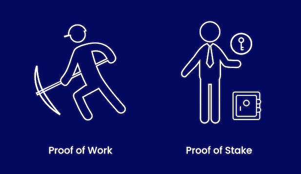
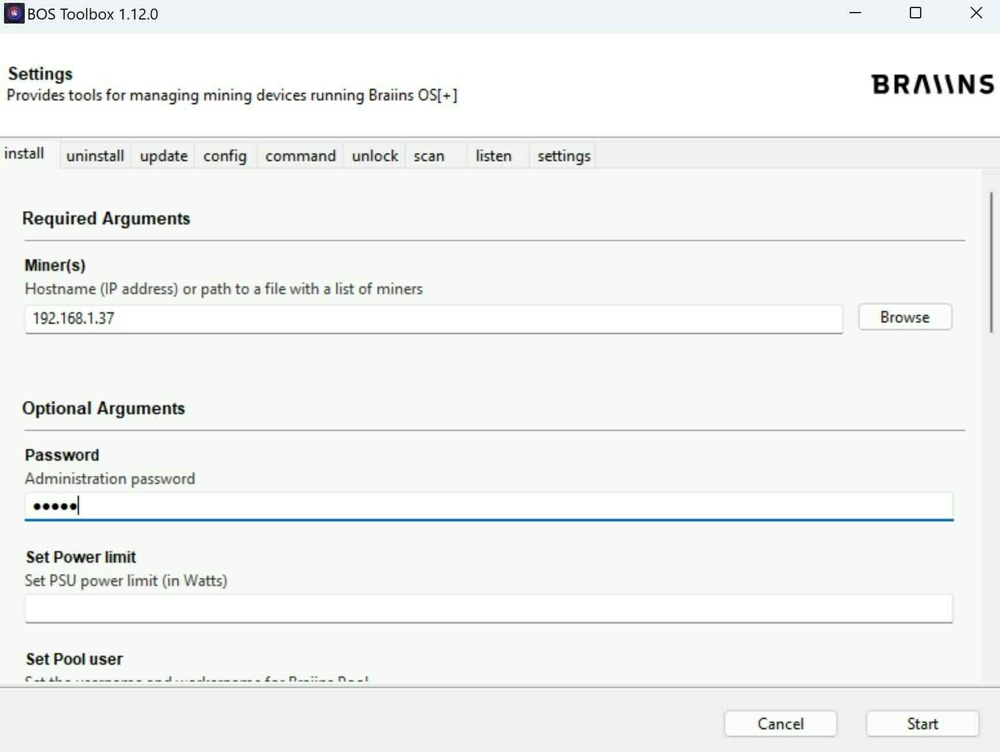

# Hatua zako za kwanza katika uchimbaji!

Katika mafunzo haya, tutachunguza tasnia ya uchimbaji ili kuondoa utata katika somo hili ngumu! Mafunzo haya yanapatikana kwa kila mtu na hayahitaji uwekezaji wa awali.

Sehemu ya kwanza itakuwa ya nadharia, ambapo Ajelex na mimi tutafanya mazungumzo ya kina juu ya mada mbalimbali zinazohusiana na uchimbaji. Hii itatusaidia kuelewa vizuri tasnia hii na masuala ya kiuchumi na kisiasa yanayohusiana nayo.
Katika sehemu ya pili, tutashughulikia kesi halisi. Kwa kweli, tutajifunza jinsi ya kubadilisha kifaa cha uchimbaji cha S9 kilichotumika kuwa mfumo wa kupasha joto nyumbani! Kupitia mwongozo wa maandishi na video, tutawaonyesha na kuelezea hatua zote za kufanikisha hili nyumbani kwako :)

Kupitia video hii, tunatumai kukueleza kuwa tasnia ya uchimbaji ni ngumu zaidi kuliko inavyoonekana, na kuisoma kunasaidia kufafanua mjadala wa mazingira unaohusiana nayo!
Ikiwa unahitaji msaada na usanidi wako, kuna kikundi cha Telegram kilichoundwa kwa wanafunzi, na vifaa vyote muhimu vinapatikana kwenye jukwaa letu la biashara mtandaoni!

+++

# Utangulizi

## Karibu!

Karibu kwenye MINING 201: utangulizi wa uchimbaji. Ajelex, Jim & Rogzy wana furaha kukusaidia katika hatua zako za kwanza katika tasnia hii mpya. Tunatumai utafurahia kozi hii na kujiunga na safari ya uchimbaji nyumbani!

### Muhtasari wa Kozi

Katika kozi hii, sehemu ya kwanza itazingatia nadharia ya uchimbaji na Ajelex. Tutafanya mazungumzo ya kina juu ya mada mbalimbali zinazohusiana na uchimbaji, ambayo itatusaidia kuelewa vizuri tasnia hii na masuala ya kiuchumi na kisiasa yanayohusiana nayo.

Katika sehemu ya pili, tutajishughulisha na kesi halisi ya kuvutia, tukijifunza jinsi ya kubadilisha kifaa cha uchimbaji cha S9 kilichotumika kuwa mfumo wa kupasha joto nyumbani. Kupitia mwongozo wa maandishi na video, hatua zote muhimu zitaelezwa kwa umakini, kuhakikisha mafanikio yako katika mradi huu wa ubunifu.

Safari hii ya kujifunza itakuonyesha kuwa tasnia ya uchimbaji ni ngumu zaidi kuliko inavyoonekana, ikitoa mtazamo uliobalance kuhusu mjadala wa mazingira unaohusiana nayo. Msaada utakuwa unapatikana kupitia kikundi maalum cha Telegram kwa wanafunzi, na vifaa vyote muhimu vitapatikana kwa urahisi kwenye jukwaa letu la biashara mtandaoni.

### Mtaala:

Sehemu ya Nadharia:
* Maelezo ya uchimbaji.
* Tasnia ya uchimbaji.
* Nuansi za tasnia ya uchimbaji.
* Uchimbaji katika itifaki ya Bitcoin.
* Bei ya Bitcoin na Hashrate, Uhusiano? Uhuru na Udhibiti.
* Mahojiano na Mtaalamu wa Tasnia ya Uchimbaji

Sehemu ya Vitendo: Attakai
* Utangulizi wa Attakai.
* Mwongozo wa Ununuzi.
* Kubadilisha Programu ya Antminer S9.
* Kubadilisha Mashabiki ili Kupunguza Kelele.
* Usanidi wa Kundi la Uchimbaji.
* Usanidi wa Antminer S9 na Braiins OS+.

Tayari kuanza safari hii ya kusisimua? Hebu tuvuke pamoja katika ulimwengu wa kuvutia wa uchimbaji nyumbani!
Ili kuelezea dhana ya uchimbaji kwa njia rahisi, mfano unaofaa unaweza kutumika: ule wa puzzle. Kama puzzle, uchimbaji ni kazi ngumu ya kufanya lakini rahisi kuthibitisha mara baada ya kukamilika. Katika muktadha wa uchimbaji wa Bitcoin, wachimbaji wanajitahidi kutatua haraka puzzle ya kidijitali. Mchimbaji wa kwanza kutatua puzzle anawasilisha suluhisho lake kwa mtandao mzima, ambao kwa urahisi unaweza kuthibitisha uhalali wake. Uthibitisho huu wa mafanikio unaruhusu mchimbaji kuthibitisha kizuizi kipya na kuongeza kwenye Mnyororo wa Muda wa Bitcoin. Kama kutambua kazi yao, ambayo inahusisha gharama kubwa, mchimbaji anapewa idadi fulani ya bitcoins. Tuzo hii inatumika kama motisha ya kifedha kwa wachimbaji kuendelea na kazi yao ya kuthibitisha shughuli na kuhakikisha usalama wa mtandao wa Bitcoin.

Awali katika mtandao wa Bitcoin, tuzo iliyotolewa ilikuwa bitcoins 50 kila dakika kumi, sawa na ugunduzi wa kizuizi kila dakika kumi kwa wastani na wachimbaji. Tuzo hii inapunguzwa nusu kila kuzuizi 210,000, takriban kila baada ya miaka minne. Malipo haya yanatumika kama motisha yenye nguvu ya kuhamasisha wachimbaji kushiriki katika mchakato wa uchimbaji licha ya gharama yake ya nishati. Bila tuzo, uchimbaji unaotumia umeme ungeachwa, kuathiri usalama na utulivu wa mtandao wa Bitcoin nzima.
Tuzo ya uchimbaji ya sasa ni mbili. Kwa upande mmoja, inajumuisha uundaji wa bitcoins mpya, ambao umepungua kutoka bitcoins 50 kila dakika kumi awali hadi bitcoins 6.25 leo (2023). Kwa upande mwingine, inajumuisha ada za shughuli, au ada za uchimbaji, kutoka kwa shughuli ambazo mchimbaji anachagua kuzijumuisha kwenye kizuizi chao. Wakati shughuli ya bitcoin inafanywa, ada za shughuli hulipwa. Ada hizi hufanya kazi kama aina ya mnada ambapo watumiaji wanaweka wazi ni kiasi gani wako tayari kulipa ili shughuli yao iweze kujumuishwa kwenye kizuizi kinachofuata. Ili kuongeza tuzo yao, wachimbaji, wakifanya kwa maslahi yao wenyewe, huchagua shughuli zenye faida zaidi kuzijumuisha kwenye kizuizi chao, kuzingatia nafasi iliyopo mdogo. Hivyo, tuzo ya uchimbaji inajumuisha uundaji wa bitcoins mpya na ada za shughuli, ikidumisha motisha endelevu kwa wachimbaji na kuhakikisha umri mrefu na usalama wa mtandao wa Bitcoin.

### Wachimbaji na Vifaa Vyao: Uchimbaji

Mchakato wa uchimbaji unahusisha kupata hash halali ambayo inakubalika kwa mtandao wa Bitcoin. Mara iliyohesabiwa na kupatikana, hash hii haiwezi kubadilishwa, kama vile viazi vinavyogeuzwa kuwa viazi yaliyosagwa. Inathibitisha kazi fulani bila uwezekano wa kurudi nyuma. Wachimbaji, katika ushindani, hutumia mashine kuhesabu hash hizi. Ingawa inawezekana kwa nadharia kupata hash hii kwa mkono, ugumu wa shughuli hiyo hufanya chaguo hili lisifae. Kompyuta, zinazoweza kufanya hesabu hizi kwa haraka, hutumiwa, zikatumia kiasi kikubwa cha umeme.

Mwanzoni, enzi ya CPU ilidhibiti, ambapo wachimbaji walitumia kompyuta zao binafsi kwa uchimbaji wa Bitcoin. Ugunduzi wa faida za GPU (kadi za picha) kwa kazi hii ulikuwa hatua muhimu, ukiongeza sana kiwango cha hash na kupunguza matumizi ya nishati. Maendeleo hayakusimama hapo, na kuanzishwa kwa FPGAs (mifumo ya lango inayoweza kubadilishwa). FPGAs ilihudumu kama jukwaa la maendeleo ya ASICs (mzunguko maalum wa programu uliointegreka).

ASICs ni vijenzi, vinavyofanana na kipande cha CPU, hata hivyo, vimeundwa kufanya aina moja tu ya hesabu kwa njia bora zaidi iwezekanavyo. Kwa maneno mengine, CPU inaweza kufanya aina nyingi tofauti za hesabu bila kuwa maalum sana kwa aina moja ya hesabu au nyingine, wakati ASIC itaweza kufanya aina moja tu ya hesabu, lakini kwa ufanisi sana. Katika kesi ya ASICs za Bitcoin, zimeundwa kwa ajili ya hesabu ya algorithm ya SHA256.
Leo hii, wachimbaji wanatumia kwa kiasi kikubwa ASICs zilizotengwa kwa shughuli hii, zilizoboreshwa ili kujaribu idadi kubwa zaidi ya mchanganyiko kwa matumizi ya nishati ndogo iwezekanavyo na haraka iwezekanavyo. Kompyuta hizi, ambazo haziwezi kutekeleza majukumu mengine isipokuwa uchimbaji wa Bitcoin, ni ushahidi thabiti wa mabadiliko ya mara kwa mara na ujuzi unaongezeka katika tasnia ya uchimbaji wa Bitcoin. Mabadiliko haya ya mara kwa mara yanadhihirisha mabadiliko ya asili ya Bitcoin, ambapo marekebisho ya ugumu yanahakikisha uzalishaji wa kizuizi kila baada ya dakika kumi licha ya ongezeko la kasi la uwezo wa uchimbaji.

Ili kuelezea ukali wa mchakato huu, fikiria mchimbaji wa kawaida anayeweza kufikia 14 TeraHash kwa sekunde, au jaribio bilioni 14 kila sekunde kupata hash sahihi. Kwa kiwango cha mtandao wa Bitcoin, sasa tunafikia takriban 300 HexaHash kwa sekunde, ikionyesha nguvu ya pamoja iliyohamasishwa katika uchimbaji wa Bitcoin.

### Marekebisho ya Ugumu:

Marekebisho ya ugumu ni kifaa muhimu katika uendeshaji wa mtandao wa Bitcoin, ikihakikisha kuwa kizuizi kinachimbwa wastani kila baada ya dakika 10. Kipindi hiki ni wastani kwa sababu mchakato wa uchimbaji ni mchezo wa uwezekano, kama vile kutupa dadu kwa matumaini ya kupata nambari ndogo kuliko nambari iliyowekwa na ugumu. Kila kizuizi 2016, mtandao unarekebisha ugumu wa uchimbaji kulingana na wakati wastani uliohitajika kuchimba kizuizi kilichopita. Ikiwa wakati wastani ni zaidi ya dakika 10, ugumu hupunguzwa, na kinyume chake, ikiwa wakati wastani ni mdogo, ugumu huongezeka. Mfumo huu wa marekebisho unahakikisha kuwa wakati wa uchimbaji wa kizuizi kipya unabaki thabiti kwa muda, bila kujali idadi ya wachimbaji au nguvu ya kompyuta ya mtandao kwa jumla. Ndiyo sababu Blockchain ya Bitcoin pia inaitwa Timechain.

* Mfano kutoka China:
Kesi ya China inaonyesha vizuri mfumo huu wa marekebisho ya ugumu. Ikiwa na nishati tele na rahisi, China ilikuwa kitovu kikuu cha uchimbaji wa Bitcoin ulimwenguni. Mwaka 2021, nchi hiyo ghafla ilipiga marufuku uchimbaji wa Bitcoin katika eneo lake, ikisababisha kupungua kwa kasi kwa nguvu ya uchimbaji wa mtandao wa Bitcoin, karibu 50%. Kupungua kwa haraka kwa nguvu ya uchimbaji kunaweza kuathiri sana mtandao wa Bitcoin kwa kuongeza wakati wastani wa uchimbaji wa kizuizi. Walakini, mfumo wa marekebisho ya ugumu ulianza kufanya kazi, kupunguza ugumu wa uchimbaji ili kuhakikisha kuwa kasi ya uchimbaji wa kizuizi inabaki wastani wa dakika 10. Kesi hii inaonyesha ufanisi na uimara wa mfumo wa marekebisho ya ugumu wa Bitcoin, ambao unahakikisha utulivu na uwezekano wa mtandao, hata katika uso wa mabadiliko makubwa na ya ghafla katika mandhari ya uchimbaji ulimwenguni.

### Mabadiliko ya Mashine za Uchimbaji wa Bitcoin

Kuhusu mabadiliko ya mashine za uchimbaji wa Bitcoin, ni muhimu kuelewa kuwa muktadha unazingatia zaidi mfano wa biashara wa jadi. Wachimbaji wanapata mapato yao kutoka kwa uthibitisho wa kizuizi, kazi yenye uwezekano mdogo wa mafanikio. Mfano wa sasa unaotumiwa, Antminer S9, ingawa ni mfano wa zamani uliozinduliwa karibu 2016, bado unapatikana sokoni ya bidhaa za mkono wa pili, ikibadilishwa kwa takriban €100 hadi €200. Walakini, bei ya mashine za uchimbaji inabadilika kulingana na thamani ya Bitcoin, na mfano mpya, Antminer S19, kwa sasa inakadiriwa kuwa karibu €3000.

Kutokana na maendeleo ya kiteknolojia yanayofanyika mara kwa mara katika uwanja wa uchimbaji, wataalamu lazima wajipange kwa busara. Tasnia ya uchimbaji inaendelea kubadilika, kama inavyodhihirishwa na kutolewa hivi karibuni kwa toleo la J la S19 na kutolewa kwa S19 XP, ambayo inatoa uwezo mkubwa sana wa uchimbaji. Zaidi ya hayo, maboresho hayahusiani tu na utendaji wa mashine. Kwa mfano, mfano mpya wa S19 XP hutumia mfumo wa baridi wa maji, marekebisho ya kiufundi ambayo inaruhusu uboreshaji mkubwa katika ufanisi wa nishati. Ingawa ubunifu unaendelea kuwa jambo la kawaida, faida za ufanisi za baadaye zitakuwa ndogo ikilinganishwa na zile zilizoonekana hadi sasa, kutokana na kufikia kizingiti fulani cha ubunifu wa kiteknolojia.
Kwa ujumla, tasnia ya uchimbaji wa Bitcoin inaendelea kubadilika na kuendeleza, na wachezaji wa tasnia lazima watarajie kupungua kwa faida za ufanisi siku zijazo na kurekebisha mikakati yao ipasavyo. Maendeleo ya teknolojia ya baadaye, ingawa bado yapo, yanatarajiwa kutokea kwa kiwango kidogo, ikionyesha ukomavu unaokua wa sekta hiyo.

## Tasnia ya uchimbaji

### Vikundi vya Uchimbaji

Kwa sasa, uchimbaji wa Bitcoin umebadilika kuwa tasnia nzito na kubwa, na wachezaji wengi sasa wanajulikana hadharani na idadi inayoongezeka ya wachimbaji muhimu. Mabadiliko haya yamefanya uchimbaji kuwa karibu haiwezekani kwa wachezaji wadogo kutokana na gharama kubwa zinazohusiana na kununua mashine mpya za uchimbaji. Hii inasababisha swali la usambazaji wa nguvu ya uchimbaji kati ya wachezaji mbalimbali wa soko. Hali ni ngumu kwa sababu ni muhimu kuchunguza usambazaji wa nguvu ya uchimbaji kati ya kampuni tofauti na kati ya vikundi vya uchimbaji tofauti.

Kikundi cha uchimbaji ni kikundi cha wachimbaji ambao wanachanganya rasilimali zao za kompyuta ili kuongeza nafasi zao za uchimbaji. Ushirikiano huu ni muhimu kwa sababu mashine ndogo ya uchimbaji iliyotengwa inashindana na wachezaji wakubwa wa tasnia, kupunguza nafasi zake za mafanikio hadi kiwango kidogo sana. Uchimbaji unafanya kazi kwa kanuni ya bahati nasibu, na nafasi za kushinda kizuizi (na kwa hivyo tuzo ya Bitcoin) kila baada ya dakika kumi ni ndogo sana kwa mchimbaji mdogo binafsi. Kwa kuchanganya pamoja, wachimbaji wanaweza kuunganisha nguvu zao za kompyuta, kupata kizuizi mara kwa mara, na kisha kugawa tuzo kwa uwiano kwa mchango wa kila mchimbaji kwenye kikundi.

Kwa mfano, ikiwa kikundi kinapata kizuizi na kushinda bitcoins 6.25, mchimbaji anayechangia 1% ya nguvu ya kompyuta ya jumla ya kikundi atapokea 1% ya bitcoins 6.25 zilizopatikana. Walakini, inapaswa kuzingatiwa kuwa vikundi vya uchimbaji kwa ujumla huchukua tume ndogo (kawaida karibu 2%) kufidia gharama za uendeshaji wa ushirikiano.

### Programu inayotumiwa na tasnia

Katika muktadha wa uchimbaji wa Bitcoin, jukumu la programu ni muhimu kama vifaa. Mfano wa hii unadhihirishwa na jukumu la Bitmain, mtengenezaji maarufu ambaye alitengeneza Antminer S9. Mbali na vifaa vya uchimbaji, tasnia inategemea sana vikundi vya uchimbaji vinavyoshirikiana, kama vile Brainspool, ambayo inadhibiti takriban 5% ya nguvu ya uchimbaji ya kimataifa ya mtandao wa Bitcoin.
Washiriki katika tasnia hii daima wanatafuta kuongeza ufanisi kupitia vifaa na programu. Kwa mfano, programu maarufu inayotumiwa katika muktadha huu ni BrainsOS Plus. Programu hii inachukua nafasi ya mfumo wa uendeshaji wa awali wa mashine ya uchimbaji, kuruhusu shughuli sawa kufanywa kwa ufanisi zaidi. Kwa programu kama hiyo, mchimbaji anaweza kuongeza ufanisi wa mashine yao kwa 25%. Hii inamaanisha kwamba kwa kiasi sawa cha umeme, mashine inaweza kuzalisha 25% zaidi ya nguvu ya uchimbaji, hivyo kuongeza tuzo zinazopokelewa na mchimbaji. Uboreshaji wa programu kama hii ni sehemu muhimu ya ushindani katika uchimbaji wa Bitcoin, ikionyesha umuhimu wa njia iliyoundwa ambayo inaunganisha uboreshaji wa vifaa na programu ili kuboresha ufanisi na mapato.

### Udhibiti na Viwango vya Umeme

Kama ilivyoonekana nchini China na mahali pengine, udhibiti una athari kubwa kwa uchimbaji. Ingawa hakuna wachimbaji muhimu nchini Ufaransa, udhibiti na viwango vya umeme vya juu barani Ulaya ni vizuizi vikubwa. Wachimbaji daima wanatafuta umeme wa bei rahisi ili kuongeza faida zao. Kwa hivyo, gharama kubwa ya umeme barani Ulaya na Ufaransa haivuti wachimbaji kwenye mikoa hii.
Wachimbaji mara nyingi huvutika kuelekea maeneo yenye viwango vya umeme vya chini, mara nyingi katika nchi zinazoibuka au nchi zenye ziada ya nishati. Kwa mfano, sehemu kubwa ya hashrate ya ulimwengu iko Texas, Marekani. Texas ina gridi ya umeme huru ambayo haishiriki rasilimali zake za nishati na majimbo mengine. Hali hii ya kipekee mara nyingi inasababisha Texas kuzalisha umeme zaidi ya kutosha ili kuepuka upungufu, na kuunda ziada. Wachimbaji wa Bitcoin wanatumia faida ya uzalishaji huu wa ziada kwa kuanzisha shughuli zao huko Texas, ambapo wanaweza kuchimba bitcoins kwa viwango vya umeme vya chini sana wakati wa kipindi cha ziada ya nishati. Hali hii inaonyesha ushawishi mkubwa wa kanuni na viwango vya umeme katika uchimbaji wa Bitcoin, ikisisitiza umuhimu wa sababu hizi katika maamuzi ya wachimbaji kuhusu eneo la shughuli zao za uchimbaji.

### Wachimbaji wanakwenda wapi na usimamizi wa nishati?

Kwa kuzingatia athari za wachimbaji wa Bitcoin katika ulimwengu wa nishati, mwelekeo ni wazi: watendaji hawa daima wanatafuta vyanzo vya umeme rahisi, mara nyingi vile ambavyo vinapotea au havijatumika. Hali hii inaonekana katika maeneo yenye miundombinu ya umeme mpya, kama vile yale yaliyo na mabwawa ya umeme ya hivi karibuni.

Hebu tuangalie mfano. Katika nchi ambayo inajenga bwawa, uzalishaji wa umeme mara nyingi huanza kabla ya mistari ya usambazaji haijakamilika kikamilifu. Pengo hili la wakati linaweza kusababisha gharama kubwa na kuzuia uwekezaji katika miradi ya miundombinu kama hiyo. Walakini, wachimbaji wa Bitcoin wanaweza kufanya kama chanzo cha mahitaji kinachoweza kubadilika, tayari kuchukua umeme huu "ulioachwa", na hivyo kusaidia kupunguza gharama za miundombinu. Maana hapa ni kwamba ufungaji mpya unaweza kuwa wa faida mara moja, kuchochea uundaji wa vyanzo vipya vya umeme. Kanuni hii pia inatumika kwa kiwango kidogo. Iwe ni mtu binafsi anayetumia jenereta ya umeme ya maji kwenye mto mdogo au kaya iliyo na paneli za jua, umeme uliozidi unaweza kutumika kwa shughuli za uchimbaji wa Bitcoin.

Nchini Ufaransa, kwa mfano, umeme uliozidi kutoka kwa paneli za jua unarudishwa kwenye gridi na wazalishaji wanafidiwa na mkopo wa matumizi kutoka EDF. Vivyo hivyo, mtu anaweza kuwazia mchimbaji anayefanya kazi kwa kutumia umeme huu uliozidi, akizima wakati mahitaji ya ndani yanalingana na usambazaji. Ingawa inaweza kuonekana kuwa ni ubinafsi, kuweka uzalishaji wa Bitcoin juu ya kusaidia gridi ya umeme ya ndani, inatoa mtazamo mwingine: kustabilisha gridi ya umeme. Usimamizi mgumu wa umeme uliozidi, mara nyingi hata na gharama zinazohusiana na kujiondoa, unaweza kuwa rahisi sana. Wachimbaji wa Bitcoin wanaweza kuchukua ziada hizi, wakifanya kama kizuizi kinachoweza kubadilika, kurekebisha mahitaji badala ya usambazaji. Katika ulimwengu ambapo uzalishaji wa umeme kutoka kwa vyanzo vya nishati mbadala (visivyo na udhibiti) unazidi kuongezeka, wachimbaji wanaweza kucheza jukumu muhimu katika kuhakikisha usawa wa gridi zetu za umeme, wakati wanafaidika na umeme rahisi au ziada kuendesha shughuli zao za uchimbaji.

### Ushirikishwaji wa Uchimbaji

Ushirikishwaji wa uchimbaji unajadiliwa kama changamoto kubwa. Wachezaji wakubwa, kama Foundry, wanadhibiti soko, ambalo linaweza kusababisha ukandamizaji wa shughuli. Ushirikishwaji huu pia unaweza kufanya mtandao uwe hatarini kwa mashambulizi, ikiwa ni pamoja na shambulio la 51%, ambapo mhusika au kikundi kinadhibiti zaidi ya 50% ya nguvu ya hashing ya mtandao, kuwaruhusu kudhibiti na kudanganya mtandao.
Hatari ya Kanuni Inasisitizwa kuwa ikiwa nchi kama Marekani itaamua kusimamia au kupiga marufuku baadhi ya shughuli za Bitcoin, inaweza kuwa na athari kubwa kwa mtandao, hasa ikiwa sehemu kubwa ya nguvu ya hashing iko katika nchi hiyo.

Kupambana na ushirikishwaji huu, mikakati tofauti inajadiliwa:
* Uchimbaji wa Nyumbani: Wazo la Uchimbaji wa Nyumbani linategemea kusambazwa kwa shughuli za uchimbaji. Inahamasisha watu binafsi kushiriki katika uchimbaji kutoka nyumbani kwao, hivyo kusambaza hashrate kwa kiasi kikubwa.
* Stratum V2: Itifaki ya Stratum V2 inatoa njia nyingine. Tofauti na mtangulizi wake, Stratum V2 inaruhusu wachimbaji kuchagua ni shughuli zipi za kuingiza kwenye vitalu wanavyochimba. Uwezo huu unaimarisha upinzani dhidi ya uchujaji na kupunguza uwezo wa mabwawa makubwa ya uchimbaji kudhibiti mtandao. Kwa kumpa nguvu zaidi kila mchimbaji binafsi, itifaki ya Stratum V2 inaweza kucheza jukumu muhimu katika mapambano dhidi ya umoja wa nguvu za uchimbaji. Kufungua Chanzo cha Programu ya Uchimbaji
* Kufungua chanzo cha programu ya uchimbaji: Hii ni mkakati mwingine wenye uwezo wa kuwa na athari. Kwa kufanya programu ya uchimbaji ipatikane kwa kila mtu, wachimbaji wadogo wangekuwa na fursa sawa na kampuni kubwa za uchimbaji kushiriki na kuchangia kwenye mtandao wa blockchain. Njia hii ingeongeza usambazaji mpana wa nguvu ya uchimbaji, hivyo kuchangia kwenye ugawanyaji wa mtandao.
* Kudiversify Watendaji na Jiografia: Kuhamasisha ushiriki wa watendaji mbalimbali kutoka kwenye mikoa tofauti kwenye uchimbaji wa sarafu za sarafu pia kunaweza kuwa na athari. Kwa kudiversify nguvu ya uchimbaji kijiografia, inakuwa ngumu zaidi kwa mtendaji au nchi moja kudhibiti au kuathiri mtandao kwa kiwango kisicholingana. Njia hii inaweza kusaidia kulinda mtandao dhidi ya mashambulio yanayowezekana na kuimarisha ugawanyaji wake.

Hitimisho kuu ni kwamba ugawanyaji ni muhimu kwa usalama na uthabiti wa mtandao wa Bitcoin. Ingawa umoja wa nguvu za uchimbaji unaweza kutoa faida za ufanisi, unafichua mtandao kwa hatari kubwa, ikiwa ni pamoja na uchujaji na mashambulio ya 51%. Miradi kama Takai na uchukuzi wa itifaki mpya kama Stratum V2 ni hatua muhimu kuelekea ugawanyaji na kulinda mtandao wa Bitcoin dhidi ya vitisho hivi.

## Nuances ya tasnia ya uchimbaji

### Kanuni ya Attakai

Kikomo cha ugawanyaji huu?
Ingawa wazo la kugawanya uchimbaji kwa njia ya matumizi ya joto linalozalishwa linaonekana kuwa na matumaini, lina vikwazo fulani na maswali yanabaki. Vituo vinavyotumia nishati nyingi kama vile sauna na mabwawa yanaweza kunufaika na wazo hili kwa kutumia joto linalozalishwa na wachimbaji kuwasha maji katika miundombinu yao. Tendo hili tayari linatekelezwa na baadhi ya wanachama wa jamii ya Bitcoin, ambao wanachunguza njia tofauti za kutumia kwa ufanisi joto linalozalishwa na vifaa vya uchimbaji. Kwa mfano, ukumbi wa sherehe unaweza nadharia kuwa unaweza kuota na wachimbaji watatu au wanne wa S19, kila mmoja akitumia watts 3000 na kuzalisha kiasi sawa cha joto.

Hata hivyo, inapaswa kuzingatiwa kuwa matumizi ya nishati na uzalishaji wa joto ni sawa, iwe nishati inatumika na kiyoyozi cha umeme au mchimbaji. Kwa kila kilowati ya umeme inayotumiwa, kiasi cha joto kinachozalishwa kitakuwa sawa katika kesi zote mbili. Tofauti iko katika ukweli kwamba mchimbaji hutoa joto na pia thawabu ya bitcoin, hivyo kutoa kichocheo cha kiuchumi kutumia mchimbaji badala ya kiyoyozi cha umeme cha kawaida. Thawabu hii ya ziada inaweza kusaidia kupunguza wasiwasi juu ya matumizi makubwa ya nishati ya wachimbaji.

Swali la ufanisi na uwezekano wa muda mrefu wa kutumia wachimbaji wa bitcoin kwa ajili ya kuota linabaki wazi. Ubunifu unaendelea katika vifaa vya uchimbaji na teknolojia za kupokanzwa inaweza kufungua njia mpya za matumizi yenye ufanisi zaidi ya joto linalozalishwa na uchimbaji, hivyo kuchangia uwezekano wa njia hii katika siku zijazo.

### Kwa nini Kuwa na Thawabu za BTC?

Swali la kutoa thawabu kwa bitcoin badala ya sarafu nyingine ni muhimu katika mfumo uliofikiriwa na Satoshi Nakamoto. Uumbaji wa Bitcoin unajulikana kwa kikomo kilichowekwa cha vitengo milioni 21. Lengo lilikuwa kupata njia ya haki ya kusambaza vitengo hivi vipya vilivyoundwa. Wachimbaji, kwa kutoa nguvu zao za kompyuta kulinda mtandao na kufanya mashambulio yoyote kuwa ghali zaidi, wanachangia kwa ufanisi kulinda mtandao wa Bitcoin. Kama malipo kwa mchango muhimu huu, wanapewa bitcoins zilizoundwa hivi karibuni, kurahisisha usambazaji wa sarafu ndani ya mfumo.
Ni mfumo wa kushinda-kushinda. Wachimbaji wanapewa thawabu kwa kusimamia mtandao na kuidhinisha shughuli. Bitcoin mpya zilizoundwa zinatolewa kama motisha ya kuimarisha usalama, na ada za shughuli ni mapato ya ziada kwa kuidhinisha shughuli. Mambo haya mawili yanayounganishwa yanafanya thawabu kamili ya uchimbaji. Swali la mustakabali wa uchimbaji linatokea kutokana na kupungua kwa programu ya thawabu ya uchimbaji, ambayo hupungua nusu kila baada ya miaka minne, tukio linalojulikana kama "nusu". Kufikia mwaka 2032, thawabu ya kizuizi itakuwa chini ya bitcoin moja, na kufikia mwaka 2140, hakutakuwa na bitcoin mpya zilizoundwa. Wakati huo, wachimbaji watakuwa wanategemea ada za shughuli pekee kwa fidia. Mtandao wa Bitcoin utahitaji kusaidia idadi kubwa ya shughuli, na ada za kutosha za juu, ili kuhakikisha faida ya uchimbaji. Kuibuka kwa Mtandao wa Lightning, ambao unaruhusu shughuli za haraka na za gharama nafuu nje ya mnyororo mkuu wa Bitcoin, kunazua maswali juu ya mustakabali wa uchimbaji. Mtandao wa Lightning una uwezo wa kupunguza sana ada za shughuli, hivyo kuathiri mapato ya wachimbaji. Hata hivyo, hii itategemea ushawishi na matumizi ya Mtandao wa Lightning ikilinganishwa na mtandao mkuu wa Bitcoin. Katika hali ya kukata tamaa, wachimbaji wanaweza kupata faida kwa kuchimba hata kwa hasara ikiwa wameamortize gharama zao na wanapata umeme wa bei rahisi. Katika hali ya matumaini zaidi, ada za shughuli kwenye mtandao mkuu wa Bitcoin zinaweza kuendelea kuwa za kutosha kuweka faida ya uchimbaji.

### Ni nini kinapaswa kuwa sehemu ya Kizuizi cha Bitcoin?

Kuhusu swali la ni nini kinapaswa kuwa sehemu ya kizuizi cha Bitcoin, ni muhimu kuzingatia asili ya nyongeza ya safu tofauti za mtandao wa Bitcoin. Ingawa Mtandao wa Lightning unaweza kuwezesha shughuli za haraka na za bei nafuu, bado unategemea safu ya msingi ya Bitcoin, mara nyingi inayojulikana kama "safu ya makazi," kwa kufungua na kufunga njia za malipo.

Kwa ukuaji uliotarajiwa wa Mtandao wa Lightning na ongezeko la kufungua na kufunga njia za malipo, nafasi katika kizuizi cha Bitcoin itakuwa na thamani zaidi. Jamii ya Bitcoin tayari ina mwelekeo wa kuthamini uhifadhi wa nafasi hii, ikigundua kikomo chake cha asili. Uwepo huu umesababisha majadiliano juu ya matumizi halali ya nafasi ya kizuizi, na wasiwasi juu ya "spam" kwenye blockchain kutoka kwa shughuli zinazofikiriwa kuwa sio muhimu.

Kuna uvumi kuhusu matumizi ya nafasi ya kizuizi hapo baadaye, lakini kwa ujumla inakubaliwa kuwa ni rasilimali adimu ambayo inapaswa kutumiwa kwa busara. Ingawa kuna hamu ya kuijaza, ni muhimu kuilinda ili kuhakikisha uhai wa muda mrefu wa mtandao wa Bitcoin, kwa kutarajia ongezeko la mahitaji ya nafasi ya kizuizi hapo baadaye. Kama katika soko lolote huru, usambazaji na mahitaji yatarekebisha matumizi ya nafasi ya kizuizi. Na ugavi mdogo, wadau watalazimika kufanya uchaguzi wa kufahamu kuhusu matumizi ya nafasi hii yenye thamani ili kuhakikisha ufanisi na usalama wa muda mrefu wa mtandao wa Bitcoin.

## Uchimbaji katika Itifaki ya Bitcoin

Jukumu la wachimbaji katika mtandao wa Bitcoin limekuwa suala la mjadala mkali wakati wa vita vya kizuizi. Ingawa ni muhimu kwa usalama na utendaji wa mtandao, wachimbaji hawana lazima wawe na nguvu ya mwisho katika mazingira ya Bitcoin. Usawa kati ya wachimbaji, nodes, na watumiaji wa mwisho unahakikisha uadilifu na usambazaji wa mtandao.

### Vita vya Kizuizi

Wakati wa vita vya kizuizi, wachimbaji wengi walikuwa wakipinga maendeleo fulani ya mtandao, wakisisitiza mvutano kati ya wahusika tofauti katika mfumo wa ikolojia. Swali linabaki juu ya jinsi ya kusawazisha nguvu kati ya wachimbaji, nodes, na watumiaji ili kuhakikisha usalama wa muda mrefu wa Bitcoin.

Usalama na Usawa wa Nguvu

Dilema ya usalama wa Bitcoin inategemea usawa wa kutilia maanani. Wakati wachimbaji wanacheza jukumu muhimu katika kuthibitisha na kuunda vitalu, nodi zinahakikisha uadilifu kwa kuthibitisha na kuidhinisha shughuli na vitalu. Kizuizi kisicho sahihi au cha udanganyifu kitakataliwa na nodi, kufuta mchimbaji na kuhifadhi usalama wa mtandao. Nodi na watumiaji wa mtandao wa Bitcoin pia wanashikilia nguvu. Nodi zina nguvu ya kuthibitisha na kuidhinisha, wakati watumiaji wana nguvu ya kuchagua ni blockchain ipi itumike. Uwiano huu wa nguvu unahakikisha usambazaji na uadilifu wa mtandao wa Bitcoin.

Vita vya vitalu vilifunua kutokuwa na uhakika na mvutano uliopo katika kusimamia mtandao wa Bitcoin. Ingawa Bitcoin Core ndio mnyororo unaodominika kwa sasa, mjadala kuhusu utawala na usimamizi wa mtandao unaendelea.

Mwishowe, jukumu linagawanywa kati ya wahusika wote katika mtandao wa Bitcoin. Kupungua kwa idadi ya watumiaji, nodi, au wachimbaji kunaweza kudhoofisha mtandao, kuongeza hatari ya kujikita na kuwa hatarini kwa mashambulizi. Kila mhusika anachangia nguvu na usalama wa mtandao, hivyo kuimarisha umuhimu wa kudumisha uwiano wa nguvu na jukumu.

### Nguvu ya wachimbaji

Mfumo wa mchezo wa kifalsafa wa Satoshi Nakamoto uliweka hali ambapo kila mhusika katika mtandao wa Bitcoin anapata motisha ya kuchukua hatua sahihi ili kulinda maslahi yao na ya washiriki wengine. Hii inaunda usawa ambapo tabia mbaya inaweza kuchukuliwa hatua dhidi yake, hivyo kuimarisha usalama na utulivu wa mfumo mzima. Licha ya usawa huu, nchi zinabaki kuwa tishio. Kama ilivyoelezwa katika uwasilishaji wa Surfing Bitcoin 2022, nchi zinaweza kujaribu kushambulia tasnia ya uchimbaji, kuweka mtandao wa Bitcoin katika hatari ya kujikita na mashambulizi. Hali za kufikirika kama shambulio la kijeshi dhidi ya vituo vya uzalishaji wa vifaa vya uchimbaji zinaonyesha umuhimu wa kusambazwa kijiografia na viwandani kwa uthabiti wa mtandao wa Bitcoin.

Umiliki wa kati wa uzalishaji wa vifaa vya uchimbaji nchini China pia unaleta hatari nyingine. Kukataa kuuza mashine za uchimbaji au kukusanya nguvu za hash kwa shambulio la 51% linalowezekana na China kunasisitiza umuhimu wa kusambazwa kwa uzalishaji wa vifaa vya uchimbaji. Kukabiliana na hatari hizi, jamii ya Bitcoin inatafuta suluhisho. Kampuni kama Intel wanazingatia kuzalisha vifaa vya uchimbaji nchini Marekani, wakichangia kusambazwa kwa uzalishaji. Miradi mingine, kama vile Kituo cha Maendeleo ya Uchimbaji wa Block (MDK) cha chanzo wazi, inalenga kupunguza umonopolishaji wa kubuni na uzalishaji wa vifaa vya uchimbaji, kuruhusu usambazaji mpana wa nguvu ya hash. Katikati ya majadiliano haya ni lengo kuu la Bitcoin: kuwa mtandao wa kubadilishana thamani usio na uwezo wa kufungwa. Jamii ya Bitcoin inajitahidi daima kuimarisha usambazaji, upinzani dhidi ya uwezo wa kufungwa, na uimara wa mtandao, ikikataa mapendekezo kama kubadilisha kwa ushahidi wa umiliki ambao haufuati kanuni hizi msingi.

### Kiungo halisi kati ya ushahidi wa kazi na ushahidi wa umiliki

Ushahidi wa Kazi (PoW) ni muhimu kwa sababu unawakilisha kiungo halisi kati ya ulimwengu halisi na Bitcoin. Ingawa bitcoins ni vitu visivyoweza kuguswa, uzalishaji wao unahitaji nishati halisi, hivyo kuweka kiungo moja kwa moja na ulimwengu halisi na wa kweli. Uhusiano huu unahakikisha kuwa uzalishaji na uthibitishaji wa bitcoins na vitalu una gharama halisi ya nishati, kuifunga mtandao wa Bitcoin katika ukweli wa kimwili na kuzuia udhibiti kamili na vyombo vyenye nguvu. PoW inafanya kazi kama kizuizi dhidi ya kujikita, ikihakikisha kuwa ushiriki katika mtandao na uthibitishaji wa shughuli unahitaji uwekezaji katika rasilimali halisi. Hii inazuia umonopolishaji wa mtandao na vyombo ambavyo vingeweza kuchukua udhibiti bila vizuizi vikubwa, hivyo kuhakikisha usambazaji wa nguvu na ushawishi sawa ndani ya mtandao wa Bitcoin.

### Mipaka ya Ushahidi wa Ushahidi wa Umiliki

Kwa upande mwingine, Uthibitisho wa Umiliki (PoS), ingawa inaruhusu ushiriki wa kiwango kidogo, haithibitishi ulinzi sawa dhidi ya ukuzaji wa kati. Katika mtandao wa PoS, wale ambao tayari wanamiliki kiasi kikubwa cha sarafu wana nguvu isiyolingana, ikionyesha kutokuwepo kwa usawa wa nguvu zilizopo katika jamii kwa ujumla. Hali hii inaweza kudumisha ukuzaji wa kati na umakinifu wa nguvu mikononi mwa wachache, kinyume na malengo ya msingi ya kusambaza mtandao wa Bitcoin. Hoja kwamba mtu yeyote anaweza kushiriki katika PoS, hata kwa kiwango kidogo, kwa kujiunga na vikundi, sio lazima iwe imara. Katika mtandao wa PoW, hata mchango mdogo, na vifaa vya kawaida, mtu anaweza kushiriki kikamilifu na kuchangia katika usalama na usambazaji wa mtandao.

### Muhtasari

Kwa kufupisha, wachimbaji wanaimarisha mtandao wa Bitcoin dhidi ya ukandamizaji kwa kutumia umeme kuhesabu uthibitisho wa kazi kwa Bitcoin, na wanapewa tuzo ya bitcoins mpya na ada za shughuli. Kwa kitaalamu zaidi wa tasnia, tofauti za wachimbaji zinaibuka, wakicheza majukumu mbalimbali, kutoka kwa uumbaji wa chip hadi usimamizi wa shamba la uchimbaji. Aidha, fedha pia inaingilia kati, ikitoa udhibiti kwa kufanya maamuzi juu ya nani anayesurvive wakati wa hatua tofauti za soko. Tatizo la ukuzaji wa kati linaendelea, na taasisi tajiri huenda wakadhibiti soko. Walakini, njia mbadala zinaendelezwa katika viwango vya vifaa na programu. Ni jukumu la kila mtu kuchukua hatua na kuchangia katika usambazaji wa mtandao. Bitcoin inawakilisha fursa isiyokuwa na kifani si tu kwa uhuru bali pia kwa uhuru wa nishati. Licha ya utata unaohusiana na matumizi yake ya umeme, Bitcoin inatoa motisha ya kiuchumi kwa mpito kuelekea matumizi ya nishati yenye mantiki na yenye wingi, ikitekeleza wazo ambalo hapo awali lilikuwa ni wazo la mazingira.

## Bei ya Bitcoin na Hashrate, kuna uhusiano?

Uchimbaji kwa faida au kwa mtandao?

Hashrate ya sasa, ingawa bei ya Bitcoin iko kwenye $30,000 ikilinganishwa na kilele chake cha hapo awali cha $69,000, inaonyesha uhusiano halisi kati ya uchimbaji na ulimwengu halisi. Kipindi cha kuongezeka kwa bei (soko la ng'ombe) kinapelekea mahitaji makubwa ya uchimbaji wa Bitcoin na ongezeko la maagizo ya mashine kutoka kwa watengenezaji kama Avalon na Bitmain. Walakini, uzalishaji na utoaji sio wa papo hapo, na hivyo kusababisha kutokuwepo kwa uwiano kati ya mahitaji yaliyoongezeka na upatikanaji baadaye. Hii inaweza kusababisha utoaji wa mashine zilizoagizwa wakati wa soko la ng'ombe katika soko linalopungua, ikionyesha kutokuwepo kwa uwiano kati ya bei ya chini na hashrate ya juu.

Hali hii pia inaonyesha uthabiti wa Bitcoin, mara nyingi ukiwa na tathmini kulingana na bei yake. Walakini, uchambuzi wa kina wa afya ya Bitcoin unahitaji kuchunguza hashrate yake, ambayo inapima hesabu kwa sekunde katika mtandao wa Bitcoin. Wakati bei ya Bitcoin inabadilika, gharama yake, inayohusiana na umeme unahitajika kuendesha mashine za uchimbaji, inabaki muhimu kwa kuelewa mienendo ya soko. Kwa kuzingatia gharama badala ya bei, mtazamo thabiti zaidi juu ya utulivu na uwezekano wa muda mrefu wa Bitcoin unapatikana. Kwa ujumla, gharama ya Bitcoin inalingana na bei yake, ikitoa ufahamu bora wa mabadiliko ya bei na matarajio ya baadaye.

Hashrate na Tuzo

Uchimbaji unaweka bei ya chini ya Bitcoin, ambapo wachimbaji wangeuza kwa hasara. Gharama ya uchimbaji inaathiri sana bei, kama inavyoonyeshwa na marufuku ya uchimbaji nchini China, ambapo hashrate na bei zilishuka sana lakini zikapona haraka. Kuzingatia bei pekee kunaweza kuwa na maelekeo. Kusoma gharama, kupitia kalkuleta faida, kunatoa mtazamo ulio sawia zaidi. Walakini, soko linaweza kuwa na tabia isiyo ya kawaida, na wachimbaji kulazimika kuuza kwa hasara, ikipunguza bei chini ya gharama ya uchimbaji. Kwa kutathmini afya ya Bitcoin na usambazaji wake, equation inayojumuisha sababu mbalimbali, kama idadi ya nodi na bei, inaweza kuendelezwa. Njia hii inaweza kutoa uchambuzi wenye undani zaidi wa Bitcoin ikilinganishwa na majadiliano yanayotegemea bei pekee.

Uchimbaji kwa faida au kwa mtandao?
Swali hili ni kubwa na linajumuisha vipengele kadhaa vya uchimbaji wa Bitcoin. Usawa kati ya kutafuta faida na kuchangia usalama na usambazaji wa mtandao wa Bitcoin ni changamoto kubwa kwa wachimbaji. Mjadala unaendelea ndani ya jamii ya Bitcoin, na hoja kali kila upande.

* Uchimbaji kwa ajili ya faida:
  - Kwa: Wachimbaji kwa asili wanavutiwa na uwezekano wa faida ambao uchimbaji wa Bitcoin unatoa. Uwekezaji katika vifaa vya gharama kubwa vya uchimbaji unaweza kuwa na faida kupitia tuzo za uchimbaji na ada za shughuli, hasa wakati bei ya Bitcoin iko juu.
  - Kinyume chake: Kutafuta faida kunaweza kusababisha umiliki wa nguvu ya hashing ikiwa ni kampuni chache kubwa tu zinaweza kumudu kuwekeza katika vifaa vya uchimbaji vya hali ya juu. Aidha, matumizi ya nishati ya uchimbaji kwa ajili ya faida yanaweza kuwa na athari kubwa kwa mazingira.

* Uchimbaji kwa ajili ya mtandao:
  - Kwa: Uchimbaji kuchangia usalama na ugawanyiko wa mtandao wa Bitcoin ni jitihada nzuri. Inasaidia kuimarisha uimara na upinzani wa mtandao dhidi ya ukandamizaji na mashambulizi.
  - Kinyume chake: Bila motisha ya kifedha ya kutosha, inaweza kuwa vigumu kwa wachimbaji kuendelea kusaidia mtandao, hasa ikiwa wanafanya kazi kwa hasara.

Mradi wa Attakai unasisitiza umuhimu wa kuchangia kwenye mtandao wakati unatoa suluhisho za kufanya uchimbaji kuwa rahisi na wenye madhara madogo. Uwezo wa kuchimba nyumbani, na vifaa vya bei nafuu zaidi na suluhisho za kupunguza uchafuzi wa kelele, kunaweza kusaidia kufanya uchimbaji wa Bitcoin kuwa wa kidemokrasia. Inahamasisha wale wanaopenda Bitcoin sio tu kuwekeza na kumiliki bitcoins, lakini pia kushiriki kikamilifu katika kusaidia mtandao. Kwa kutoa vifaa vilivyothibitishwa na mwongozo wa usanidi na ufungaji, Attakai inafanikisha kuingia katika ulimwengu wa uchimbaji wa Bitcoin. Pia inahamasisha uvumbuzi na uboreshaji endelevu, ikialika jamii kuchangia na kushiriki mawazo na uzoefu wao ili kuimarisha uchimbaji wa nyumbani. Mfano wa Attakai ni jibu kwa swali la uchimbaji kwa faida au kwa ajili ya mtandao. Sio tu kuhusu kupata faida, lakini pia kuhusu kuimarisha usambazaji na usalama wa mtandao wa Bitcoin wakati wa kuwawezesha watu zaidi kushiriki katika uchimbaji, kujifunza, na kuelewa tasnia muhimu hii. Changamoto ya marufuku ya uchimbaji inayowezekana barani Ulaya bado ni swali linaloendelea. Hii inaleta wasiwasi kuhusu mustakabali wa uchimbaji wa Bitcoin katika eneo hilo na haja ya kanuni inayowiana ambayo inatambua umuhimu wa uchimbaji kwa usalama na uwezekano wa mtandao wa Bitcoin wakati inashughulikia masuala ya mazingira. Attakai na miradi mingine kama hiyo inaweza kucheza jukumu muhimu katika mjadala huu, ikionyesha kuwa inawezekana kuchimba kwa njia endelevu na yenye jukumu wakati wa kuchangia kwa mtandao wa Bitcoin kwa njia chanya. 

## Uhuru na udhibiti

### Uhuru kabla ya faida?

Kujibu swali muhimu la utajiri kupitia uchimbaji, ni muhimu kuzingatia mitazamo na njia mbalimbali. Maswali kuhusu faida ya uchimbaji ni ya kawaida, na wasiwasi kuhusu ununuzi wa hisa katika kampuni kama Riot au kukodisha mashine za uchimbaji katika nchi zenye nishati nafuu kama Iceland au Urusi. Kabla ya kujihusisha na uchimbaji, jambo muhimu ni kulinganisha faida ya uchimbaji na ununuzi moja kwa moja wa Bitcoin. Ikiwa gharama ya kuchimba Bitcoin moja inazidi gharama ya ununuzi moja kwa moja, kwa ujumla ni busara kununua Bitcoin moja kwa moja. Hii inaepuka changamoto na gharama nyingi zinazohusiana na mchakato wa uchimbaji.

Hata hivyo, uchimbaji unatoa njia za kipekee za kushiriki katika mfumo wa Bitcoin. Kwa mfano, kuchimba Bitcoin wakati wa majira ya baridi kunaweza kuwa njia nzuri ya kuweka joto nyumbani wakati unapata kipato kwa Bitcoin. Chaguo lingine ni kuwekeza katika kampuni zinazouza vifaa vya uchimbaji na kuhifadhi na kusimamia mashine hizo katika maeneo yenye nishati nafuu, hivyo kutoa upatikanaji wa viwango vya umeme vyenye faida bila usumbufu wa usimamizi wa vifaa.
Licha ya chaguzi hizi, uchimbaji madini unakabiliwa na changamoto kubwa. Methali inayojulikana katika ulimwengu wa sarafu za dijiti, "Sio funguo zako, sio Bitcoins zako," inaleta kumbukumbu sawa katika ulimwengu wa uchimbaji madini: "Sio nguvu yako ya kuchimba, sio thawabu zako." Hadithi za kukatisha tamaa na mashine zisizounganishwa ni za kawaida, na watendaji wengi wakiahidi matokeo ya kipekee lakini hawayatekelezi. Matatizo ya ugavi wa umeme na kushindwa kwa mashine yanaweza kuwaacha wawekezaji bila nguvu, na vifaa ghali ambavyo hawadhibiti. Katika muktadha huu, tahadhari na ufahamu wa kina wa sekta ya uchimbaji madini ni muhimu kabla ya kujihusisha nayo. Ingawa fursa za faida zipo, hatari ni kubwa, na njia iliyofikiriwa na iliyofahamika ni muhimu katika kusafiri katika uwanja huu mgumu na mara nyingi usiotabirika. Kwa hivyo, utafiti wa kina na kuzingatia kwa makini faida na hasara ni muhimu kabla ya kujihusisha na uchimbaji wa Bitcoin.

### Bitcoins Safi

Uchimbaji Madini Umezuiliwa Ulaya?

Aspiration ya kumiliki nguvu ya kuchimba yenyewe inajitokeza kama njia yenye ahadi katika ulimwengu wa uchimbaji madini. Walakini, kusafiri katika mazingira magumu kama haya kunahitaji njia yenye tahadhari. Sekta ya uchimbaji wa wingu inajulikana kwa idadi kubwa ya udanganyifu, uliosababishwa na uelewa mdogo wa uchimbaji kwa sehemu kubwa ya wawekezaji. Ofa zenye kuvutia, zilizopangwa kwa njia mbalimbali, zinaweza kuwadanganya kirahisi wale ambao hawana habari ya kutosha. Kwa upande mwingine, umiliki wa vifaa vya kuchimba yenyewe unatoa faida kubwa. Mbali na kuridhika kibinafsi cha kuchangia kikamilifu katika usalama wa mtandao wa Bitcoin na kuona thawabu zikija kwenye mkoba wako, kuna upande mzuri wa "bitcoins safi". Hizi ni bitcoins zilizochimbwa hivi karibuni ambazo hazijatumika kamwe na hazina historia iliyowekwa. Bitcoins hizi mara nyingi huchukuliwa kuwa na thamani zaidi kwa sababu hazijawahi "kuchafuka", zikitoa uhakikisho fulani dhidi ya kukataliwa na wasimamizi au majukwaa makubwa ya ubadilishaji.
Uwezo wa kuchimba bitcoins safi wakati kuepuka taratibu za kumjua mteja (KYC) ni thamani iliyopatikana zaidi. Mabwawa mengi ya uchimbaji hayahitaji wachimbaji kutoa kitambulisho chao, kuruhusu kupata bitcoins bila kufuata mchakato mrefu wa uthibitishaji wa kitambulisho. Bitcoins safi huchukuliwa kuwa "safi", bila historia au uhusiano wowote. Hasa, zinatafutwa sana na wachezaji wakubwa wa taasisi ambao wanaweza kuhakikisha uhalali wa mali zao dijiti kwa mamlaka za udhibiti. Walakini, licha ya faida hizi, ni muhimu kutambua kuwa sekta ya uchimbaji bado ni ya ushindani na ya kubadilika sana, na matukio yasiyotarajiwa yanaweza kuvuruga shughuli za uchimbaji.

Katika muktadha huu, kuchagua njia ya kujitegemea na yenye elimu ya uchimbaji inaonekana kuwa busara. Kupata nguvu yako ya kuchimba na kuwekeza katika vifaa vya kuchimba binafsi, wakati ukiwa na ufahamu wa hatari na changamoto, inaweza kutoa njia salama na yenye kuridhisha ya kupata bitcoins safi, hivyo kuimarisha uhuru wa kifedha wa mtu binafsi wakati unalinda mfumo wa Bitcoin kwa ujumla.

### Uchimbaji Madini Umezuiliwa Ulaya?

Kwa swali la marufuku inayowezekana ya uchimbaji madini Ulaya, majadiliano juu ya udhibiti yanazidi kuwa muhimu. Mandhari ya kisheria inayobadilika inaweza kuwa na athari kubwa kwa sekta ya uchimbaji madini ya Bitcoin. Marufuku ya uchimbaji madini Ulaya ni hali inayoweza kufikirika, haswa ikizingatiwa mifano iliyopo nchini China. Ingawa shughuli za uchimbaji zinaendelea nchini China licha ya marufuku, Ulaya inaweza kufuata njia kama hiyo. Usambazaji mpana wa nguvu ya kuchimba katika mikoa tofauti unaweza kusaidia kuimarisha jamii ya uchimbaji madini Ulaya, kuwawezesha kupinga kwa ufanisi uelewa mbaya na dhana potofu juu ya uchimbaji, athari yake kwa mazingira, na athari yake kwenye gridi ya umeme.

Ukikabiliwa na kampeni kama hizo za Greenpeace na takwimu zisizo sahihi kutoka kwa tafiti fulani, silaha bora inabaki kuwa taarifa sahihi. Ni muhimu kuwaelimisha umma na wale wanaofanya maamuzi kuhusu ukweli wa uchimbaji madini, ugumu wake, na nyuzi zake, badala ya kuwaacha wategemee dhana potofu na taarifa zisizo sahihi. Watu wakiwa na ufahamu na uelewa zaidi juu ya uchimbaji madini halisi, tasnia inaweza kujilinda dhidi ya kanuni za kuzuia zinazoweza kujitokeza.

Kwa kumalizia, licha ya hatari za kisheria na uwezekano wa kupigwa marufuku kwa uchimbaji madini barani Ulaya, silaha yenye nguvu zaidi inabaki kuwa elimu na taarifa. Uelewa wazi na sahihi wa uchimbaji madini, jinsi unavyofanya kazi, na athari zake unaweza kusaidia kuondoa fumbo katika tasnia hiyo na kupambana na habari potofu, hivyo kutoa upinzani bora dhidi ya kanuni zinazoweza kuwa na madhara. Juhudi za kuwaelimisha na kuwapa taarifa watu kuhusu uchimbaji madini, kama inavyofanyika katika mjadala huu, ni hatua inayoelekea kwenye mwelekeo sahihi wa kuhakikisha uendelevu na ukuaji wa uchimbaji madini barani Ulaya na ulimwenguni kote. Juu ya hayo, juhudi zinazoendelea za kuwaelimisha na kuwapa taarifa watu ni muhimu ili kuhakikisha mustakabali salama na wenye mafanikio kwa tasnia ya uchimbaji wa Bitcoin. 

Mahojiano na mtaalamu wa tasnia ya uchimbaji madini

Nyuma ya pazia la uchimbaji madini wa viwandani - Sebastien Gouspillou

# Uchimbaji madini nyumbani na matumizi ya joto tena

## Attakai - kufanya uchimbaji madini nyumbani uwezekane na kupatikana!

Attakai, ambayo inamaanisha "joto bora" kwa Kijapani, ndiyo jina la jitihada ya kugundua uchimbaji wa Bitcoin kupitia matumizi ya joto tena yaliyoanzishwa na @ajelexBTC na @jimzap21 na Découvre Bitcoin.
Mwongozo huu wa kuboresha ASIC utatumika kama msingi wa kujifunza zaidi kuhusu uchimbaji madini, jinsi unavyofanya kazi, na uchumi uliopo kwa kuonyesha uwezekano wa kubadilisha kifaa cha kuchimba Bitcoin ili kitumike kama radieta nyumbani. Hii inatoa faraja zaidi na akiba, ikiruhusu washiriki kupokea BTC bila KYC kama fidia ya gharama ya umeme ya kupasha joto.

Bitcoin inaendesha kiotomatiki ugumu wa uchimbaji na inawalipa wachimbaji kwa ushiriki wao. Walakini, umakini wa nguvu ya uchimbaji unaweza kuleta hatari kwa usawa wa mtandao. Matumizi ya nguvu ya kompyuta ya Bitcoin kwa suluhisho za kupasha joto kunafaidisha mtandao yenyewe kwa kuongeza usambazaji wa nguvu ya kompyuta.

### Kwa nini kutumia tena joto kutoka kwa ASIC?

Ni muhimu kuelewa uhusiano kati ya nishati na uzalishaji wa joto katika mfumo wa umeme.

Kwa uwekezaji wa 1 kW ya nishati ya umeme, radiator ya umeme inazalisha 1 kW ya joto, hakuna zaidi wala hakuna chini. Radieta mpya sio bora zaidi kuliko radieta za jadi. Faida yao iko katika uwezo wao wa kusambaza joto kwa usawa na kwa muda mrefu katika chumba, hivyo kutoa faraja zaidi ikilinganishwa na radieta za jadi ambazo hubadilishana kati ya nguvu kubwa ya kupasha joto na kutokuwa na joto, hivyo kusababisha mabadiliko ya mara kwa mara ya joto na kutokuwa na faraja.

Kompyuta, au kwa ujumla bodi ya umeme, haichukui nishati kufanya hesabu, inahitaji tu nishati kufanya kazi kupitia sehemu zake. Matumizi ya nishati yanatokana na upinzani wa umeme wa sehemu, ambao husababisha hasara na kuzalisha joto, inayojulikana kama athari ya Joule.
Baadhi ya makampuni yamekuja na wazo la kuunganisha mahitaji ya nguvu za kompyuta na mahitaji ya joto kupitia radiator/sava. Wazo hili ni kugawa seva za kampuni katika vitengo vidogo ambavyo vinaweza kuwekwa nyumbani au ofisini. Hata hivyo, wazo hili linakabiliwa na matatizo kadhaa. Mahitaji ya seva hayahusiani na mahitaji ya joto, na makampuni hayawezi kutumia uwezo wa kompyuta zao kwa ufanisi. Pia kuna mipaka ya upana wa bandari ambayo watu binafsi wanaweza kuwa nayo. Vizuizi vyote hivi vinazuia kampuni kufanya ufungaji huu ghali kuwa na faida au kutoa huduma ya seva mkondoni yenye utulivu bila vituo vya data vinavyoweza kuchukua nafasi wakati joto halihitajiki. "Joto linalozalishwa na kompyuta yako halipotei bure ikiwa unahitaji kutoa joto nyumbani kwako. Ikiwa unatumia mfumo wa kupasha umeme mahali unapoishi, basi joto kutoka kwa kompyuta yako halipotei bure. Gharama ya kuzalisha joto hili na kompyuta yako ni sawa. Ikiwa una mfumo wa kupasha joto rahisi zaidi kuliko kupasha umeme, basi upotevu ni tofauti tu kwenye tofauti ya gharama. Ikiwa ni majira ya joto na unatumia hewa ya kupoza, basi ni upotevu mara mbili. Uchimbaji wa Bitcoin unapaswa kufanyika mahali ambapo ni rahisi zaidi. Labda itakuwa mahali ambapo hali ya hewa ni baridi na ambapo kupasha joto ni kwa umeme, ambapo uchimbaji utakuwa bure. "
> Satoshi Nakamoto - Agosti 8, 2010

Bitcoin na ushahidi wake wa kazi unajitokeza kwa sababu inaendadjust kiotomatiki ugumu wa uchimbaji kulingana na kiasi cha hesabu kinachofanywa na mtandao mzima. Kiasi hiki kinaitwa hashrate na kinaonyeshwa kwa hesabu kwa sekunde. Leo inakadiriwa kuwa ni exahashes 380 kwa sekunde, ambayo ni trilioni bilioni 380 kwa sekunde. Hashrate hii inawakilisha kazi na kwa hivyo kiasi cha nishati iliyotumiwa. Hashrate ikiwa kubwa, ugumu ni mkubwa, na kinyume chake. Kwa hivyo, mchimbaji wa Bitcoin anaweza kuwezeshwa au kuzimwa wakati wowote bila kuathiri mtandao, tofauti na radiator/sava ambazo zinahitaji kuwa thabiti ili kutoa huduma yao. Mchimbaji anapata thawabu kwa ushiriki wao, ikilinganishwa na wengine, bila kujali ni ndogo kiasi gani.

Kwa muhtasari, radiator ya umeme na mchimbaji wa Bitcoin wote hutoa 1 kW ya joto kwa 1 kW ya umeme uliotumiwa. Walakini, mchimbaji pia hupokea bitcoins kama thawabu. Bila kujali bei ya umeme, bei ya bitcoin, au ushindani katika shughuli za uchimbaji wa Bitcoin kwenye mtandao, kiuchumi ni faida zaidi kupasha joto na mchimbaji badala ya radiator ya umeme.

### Thamani iliyotolewa kwa Bitcoin

Jambo muhimu kuelewa ni jinsi uchimbaji unavyochangia kwenye ugawanyaji wa Bitcoin.
Teknolojia kadhaa zilizopo zimeunganishwa kwa ujanja kuwezesha makubaliano ya Nakamoto kuwa hai. Makubaliano haya yanawalipa washiriki wakweli kwa mchango wao katika uendeshaji wa mtandao wa Bitcoin, wakati yanawakatisha tamaa washiriki wasio waaminifu. Hii ni moja ya mambo muhimu ambayo inaruhusu mtandao kuwepo kwa muda mrefu.
Washiriki wakweli, wale wanaochimba kulingana na sheria, wanashindana kila mmoja kwa mwingine ili kupata sehemu kubwa iwezekanavyo ya thawabu ya kuzalisha vitalu vipya. Motisha hii kiuchumi kwa asili inapelekea aina fulani ya umoja wakati makampuni yanachagua kujikita katika shughuli hii yenye faida kwa kupunguza gharama zao kupitia uchumi wa kiwango. Washiriki hawa wa viwanda wana nafasi nzuri ya kununua na kudumisha mashine, pamoja na kujadiliana viwango vya umeme wa jumla.

> "Kwa kuanza, watumiaji wengi wangefanya nodes za mtandao, lakini kadri mtandao unavyokua zaidi ya kiwango fulani, ingeachwa zaidi na wataalamu na server farms za vifaa maalum. Server farm ingehitaji tu kuwa na node moja kwenye mtandao na sehemu nyingine ya LAN inaunganisha kwenye node hiyo."
>
> - Satoshi Nakamoto - Novemba 2, 2008

Entititi fulani zinashikilia asilimia kubwa ya jumla ya nguvu ya hash katika mashamba makubwa ya uchimbaji. Tunaweza kuona mawimbi baridi ya hivi karibuni nchini Marekani ambapo sehemu kubwa ya nguvu ya hash ilifungwa ili kupeleka nishati kwa kaya zilizo na hitaji kubwa la umeme. Kwa siku kadhaa, wachimbaji walikuwa na motisha ya kiuchumi kuzima mashamba yao, na hali ya hewa ya kipekee inaweza kuonekana kwenye mstari wa nguvu ya hash ya Bitcoin.
Hali hii inaweza kuwa tatizo na inaleta hatari kubwa kwa usawa wa mtandao. Mhusika mwenye zaidi ya asilimia 51 ya nguvu ya hash anaweza kwa urahisi kuzuia shughuli ikiwa wanataka. Ndio maana ni muhimu kusambaza nguvu ya hash kati ya wahusika wengi badala ya entititi zilizojitokeza ambazo zinaweza kuchukuliwa kwa urahisi na serikali, kwa mfano.

**Ikiwa wachimbaji wanasambazwa katika maelfu, au hata mamilioni, ya kaya ulimwenguni, inakuwa ngumu sana kwa serikali kuchukua udhibiti wao.**

Wakati inatoka kiwandani, mchimbaji hafai kutumika kama kiyoyozi nyumbani, kutokana na matatizo mawili makuu: kelele nyingi na ukosefu wa marekebisho. Walakini, matatizo haya yanaweza kutatuliwa kwa urahisi kupitia marekebisho ya vifaa na programu, kuruhusu mchimbaji mwenye sauti ndogo sana ambayo inaweza kusanidiwa na kiotomatiki kama kiyoyozi cha umeme cha kisasa.

**Attakaï ni mpango wa elimu unaojifunza jinsi ya kurekebisha Antminer S9 kwa njia yenye gharama nafuu zaidi.**

Hii ni fursa nzuri ya kujifunza kwa vitendo wakati unapata thawabu kwa ushiriki wako na satoshi zisizohitaji KYC.

## Mwongozo wa Ununuzi wa ASIC iliyotumika

Katika sehemu hii, tutajadili mazoea bora ya kununua Bitmain Antminer S9 iliyotumika, kifaa ambacho mafunzo haya ya kurekebisha radiator yatajikita. Mwongozo huu pia unatumika kwa mifano mingine ya ASIC kwani ni mwongozo wa ununuzi wa jumla wa vifaa vya uchimbaji vilivyotumika.

Antminer S9 ni kifaa kinachotolewa na Bitmain tangu Mei 2016. Kinatumia umeme wa 1400W na kuzalisha 13.5 TH/s. Ingawa kinachukuliwa kuwa cha zamani, bado ni chaguo bora kwa kuanza uchimbaji. Tangu kizalishwe kwa wingi, ni rahisi kupata sehemu za kuchangamana kwa wingi katika maeneo mengi ya ulimwengu. Kawaida inaweza kununuliwa kwa mtu kwa mtu kwenye tovuti kama eBay au LeBonCoin, kwani wauzaji wataalamu hawatoi tena kutokana na ushindani wake mdogo ikilinganishwa na mashine mpya. Ni chini ya ufanisi kuliko ASIC kama Antminer S19, inayotolewa tangu Machi 2020, lakini hii inafanya iwe vifaa vya bei nafuu vilivyotumika na inafaa zaidi kwa marekebisho tutakayofanya.

Antminer S9 inakuja katika mabadiliko kadhaa (i, j) ambayo hufanya marekebisho madogo kwa vifaa vya kizazi cha kwanza. Hatunaamini kuwa hii inapaswa kuathiri uamuzi wako wa ununuzi, na mwongozo huu unafanya kazi kwa mabadiliko yote haya.

Bei ya ASIC inabadilika kulingana na mambo mengi kama bei ya bitcoin, ugumu wa mtandao, ufanisi wa mashine, na gharama ya umeme. Kwa hivyo, ni vigumu kutoa makadirio sahihi ya ununuzi wa mashine iliyotumika. Mnamo Februari 2023, bei inayotarajiwa nchini Ufaransa kwa ujumla inatofautiana kati ya €100 hadi €200, lakini bei hizi zinabadilika haraka.

Antminer S9 ina sehemu zifuatazo:

- 3 bodi za hash ambazo zina chips zinazozalisha nguvu ya hash.

- Bodi ya kudhibiti ambayo ina nafasi ya kadi ya SD, bandari ya Ethernet, na viunganishi kwa bodi za hash na mashabiki. Hii ndio ubongo wa ASIC yako.

- Nyaya 3 za data ambazo zinaunganisha hashboards kwenye kadi ya udhibiti.

- Ugavi wa umeme, ambao unafanya kazi kwa 220V na unaweza kuunganishwa kama kifaa cha kawaida cha nyumbani.

- Mashabiki 2 wa 120mm.

- Nyaya ya kiume ya C13.

Unaponunua mashine iliyotumika, ni muhimu kuhakikisha kuwa sehemu zote zipo na zinafanya kazi. Wakati wa kubadilishana, unapaswa kuomba muuzaji kuwasha mashine ili kuhakikisha kuwa inafanya kazi vizuri. Ni muhimu kuhakikisha kuwa kifaa kinawashwa kwa usahihi, na kisha kuhakikisha uunganisho wa mtandao kwa kuunganisha nyaya ya Ethernet na kupata kiolesura cha kuingia cha Bitmain kupitia kivinjari cha wavuti kwenye mtandao wa ndani sawa. Unaweza kupata anwani hii ya IP kwa kuunganisha kwenye kiolesura chako cha router ya mtandao na kutafuta vifaa vilivyounganishwa. Anwani hii inapaswa kuwa na muundo ufuatao: 192.168.x.x

Pia, hakikisha kuwa vitambulisho vya msingi vinafanya kazi (jina la mtumiaji: root, nenosiri: root). Ikiwa vitambulisho vya msingi havifanyi kazi, utahitaji kurejesha mashine.

Baada ya kuunganishwa, unapaswa kuweza kuona hali ya kila hashboard kwenye dashibodi. Ikiwa mchimbaji ameunganishwa na dimbwi, unapaswa kuona hashboards zote zinafanya kazi. Ni muhimu kuzingatia kuwa wachimbaji hutoa kelele nyingi, ambayo ni ya kawaida. Pia, hakikisha mashabiki wanafanya kazi vizuri.

Kisha unaweza kuondoa dimbwi la uchimbaji la mmiliki wa awali ili kuweka yako mwenyewe baadaye. Ikiwa unataka, unaweza pia kukagua hashboards kwa kuchukua mashine vipande. Walakini, hatua hii ni ngumu zaidi na inahitaji muda zaidi na vifaa fulani. Ikiwa unataka kuendelea na uchambuzi huu, unaweza kurejelea sehemu inayofuata ya mafunzo haya ambayo inaelezea jinsi ya kufanya hivyo. Ni muhimu kuzingatia kuwa wachimbaji hukusanya vumbi nyingi na huhitaji matengenezo ya kawaida. Unaweza kuona uchomaji huu wa vumbi na ubora wa matengenezo kwa kuchukua mashine vipande.
Baada ya kuchunguza mambo haya yote, unaweza kununua mashine yako kwa kiwango kikubwa cha ujasiri. Ikiwa una shaka, wasiliana na jamii.

Kuifupisha mwongozo huu kwa sentensi moja: **"Usiamini, hakiki."**

[Unaweza pia kumgeukia wataalam katika ukarabati wa mashine za uchimbaji, kama mshirika wetu 21energy. Wanatoa mashine za S9 zilizopimwa, zilizosafishwa, na zilizo na programu ya BraiiinOS+ tayari imewekwa. Kwa kutumia nambari ya washirika "decouvre," utapokea punguzo la 10% kwenye ununuzi wa S9 wakati unaisaidia mradi wa Attakai.](https://21energy.io/en/produkt/bitmain-antminer-s9-bundle/)

## Mwongozo wa kununua marekebisho ya vifaa kwa S9

Ikiwa wewe ni mmiliki wa Antminer S9, labda unajua jinsi vifaa hivi vinavyoweza kuwa vya sauti na vikubwa. Walakini, inawezekana kubadilisha kuwa kifaa cha kupasha joto kimya na kilichounganishwa kwa kufuata hatua chache rahisi. Katika sehemu hii, tutawasilisha vifaa vinavyohitajika kufanya marekebisho.

Ikiwa wewe ni fundi mwenye ujuzi na unatafuta kubadilisha mchimbaji kuwa kifaa cha kupasha joto, mafunzo haya ni kwa ajili yako. Tunataka kukuarifu kuwa marekebisho yaliyofanywa kwenye kifaa cha umeme yanaweza kuwa na hatari za umeme. Ni muhimu kuchukua tahadhari zote muhimu ili kuepuka uharibifu au majeraha yoyote.
1. Badilisha mashabiki
Mashabiki ya awali ya Antminer S9 ni kelele sana kutumia Antminer yako kama kifaa cha kupasha joto. Suluhisho ni kubadilisha na mashabiki tulivu. Timu yetu imejaribu mifano kadhaa kutoka kwa chapa ya Noctua na imechagua Noctua NF-A14 iPPC-2000 PWM kama suluhisho bora. Hakikisha kuchagua toleo la 12V la mashabiki. Mashabiki haya ya 140mm yanaweza kutoa hadi 1200W ya joto wakati wa kudumisha kiwango cha kelele cha nadharia cha 31 dB. Ili kufunga mashabiki haya ya 140mm, utahitaji kutumia kigeuzi cha 140mm hadi 120mm, ambacho unaweza kupata kwenye duka la DécouvreBitcoin. Pia tutaweka kinga za 140mm.

Mashabiki wa ugavi wa umeme pia ni kelele sana na yanahitaji kubadilishwa. Tunapendekeza Noctua NF-A6x25 PWM. Tafadhali kumbuka kuwa viunganishi vya mashabiki wa Noctua sio sawa na vya awali, kwa hivyo utahitaji kigeuzi cha viunganishi ili kuvishikiza. Viwili vitatosha. Tena, hakikisha kuchagua toleo la 12V la shabiki.

2. Ongeza daraja la WIFI/Ethernet

Badala ya kutumia kebo ya Ethernet, unaweza kuunganisha Antminer yako kupitia WIFI kwa kuongeza daraja la WIFI/Ethernet. Tumechagua vonets vap11g-300 kwa sababu inakuwezesha kwa urahisi kupata ishara ya WIFI kutoka kwenye sanduku lako la mtandao na kuipitisha kwa Antminer yako kupitia Ethernet bila kuunda subnet. Ikiwa una ujuzi wa umeme, unaweza kuipatia nguvu moja kwa moja na ugavi wa umeme wa Antminer bila haja ya kuongeza chaja ya USB. Kwa hili, utahitaji jack ya kike ya 5.5mmx2.1mm.

3. Hiari: Ongeza plagi ya akili
Ikiwa unataka kuwasha/kuzima Antminer yako kutoka kwenye simu yako na kufuatilia matumizi yake ya umeme, unaweza kuongeza plagi ya akili. Tuliangalia plagi ya ANTELA katika toleo la 16A, inayofaa na programu ya smartlife. Plagi hii ya akili inakuwezesha kuona matumizi ya umeme ya kila siku na kila mwezi na inaunganisha moja kwa moja kwenye router yako ya mtandao kupitia WiFi.

Orodha ya vifaa na viungo

* 2X kigeuzi cha 3D 140mm hadi 120mm

* [2X NF-A14 iPPC-2000 PWM](https://www.amazon.fr/Noctua-nf-polarized-A14-industrialppc-PWM-2000/dp/B00KESSUDW/ref=sr_1_2?__mk_fr_FR=ÅMÅŽÕÑ&crid=JCNLC31F3ECM&keywords=NF-A14+iPPC-2000+PWM&qid=1676819936&sprefix=nf-a14+ippc-2000+pwm%2Caps%2C114&sr=8-2)

* [2X kinga za mashabiki za 140mm](https://www.amazon.fr/dp/B06XD4FTSQ?psc=1&ref=ppx_yo2ov_dt_b_product_details)
* [Noctua NF-A6x25 PWM](https://www.amazon.fr/Noctua-nf-a6-25-PWM-Ventilateur-Marron/dp/B00VXTANZ4/ref=sr_1_1_sspa?__mk_fr_FR=ÅMÅŽÕÑ&crid=3T313ABZA5EDE&keywords=Noctua+NF-A6x25+PWM&qid=1676819329&sprefix=noctua+nf-a6x25+pwm%2Caps%2C71&sr=8-1-spons&sp_csd=d2lkZ2V0TmFtZT1zcF9hdGY&psc=1&smid=A38F5RZ72I2JQ)
* [Sukari ya umeme ya mafundi 2.5mm2](https://www.amazon.fr/Legrand-LEG98433-Borne-raccordement-Nylbloc/dp/B00BBHXLYS/ref=sr_1_3?__mk_fr_FR=ÅMÅŽÕÑ&crid=25IRJD7A0YN2A&keywords=sucre%2Belectrique%2B2mm2&qid=1676820815&sprefix=sucre%2Belectrique%2B2mm2%2Caps%2C84&sr=8-3&th=1)
* [Vonets vap11g-300](https://www.amazon.fr/Vonets-VAP11G-300-Bridge-convertit-Ethernet/dp/B014SK2H6W/ref=sr_1_3_sspa?__mk_fr_FR=ÅMÅŽÕÑ&crid=13Q33UHRKCKG5&keywords=vonet&qid=1676819146&s=electronics&sprefix=vonet%2Celectronics%2C98&sr=1-3-spons&sp_csd=d2lkZ2V0TmFtZT1zcF9hdGY&psc=1)
* [Ficha ya smart ANTELA ya hiari](https://www.amazon.fr/dp/B09YYMVXJZ/ref=twister_B0B5X46QLW?_encoding=UTF8&psc=1)

# Attakai - Kubadilisha Programu ya Antminer S9

## Kuweka Daraja la Vonet WIFI/Ethernet

Ili kuunganisha ASIC yako kupitia WIFI, utahitaji kifaa kinachoitwa daraja. Kifaa hiki kinakuwezesha kupata ishara ya WIFI kutoka kwa router yako na kuipitisha kwa kifaa kingine kupitia Ethernet.

Vifaa vingi vinaweza kutekeleza kazi hii, lakini tunapendekeza Daraja la VONETS WiFi/Repeater kwa urahisi wake.

Washa daraja kwa kukiunganisha kupitia USB.

Kutoka kwenye kompyuta yako, unganisha kwenye mtandao wa WIFI wa VONETS_****** kwa nywila 12345678.

Ingia kwa kutumia jina la mtumiaji "admin" na nywila "admin".

Chagua Mchawi.

Chagua mtandao wa WIFI unayotaka kuunganisha kifaa chako cha kuchimba madini, kisha bonyeza Ijayo.

TAARIFA: Daraja la Vonet linafanya kazi tu kwenye mzunguko wa 2.4GHz. Siku hizi, router kwa kawaida hutoa mitandao miwili ya WIFI, moja kwenye 2.4GHz na nyingine kwenye 5GHz.
Ingiza nenosiri la mtandao wako wa WIFI kwenye uga wa "Nenosiri la kisimbuzi cha WIFI cha Chanzo". Ikiwa hauitaji kutumia daraja lako la Vonet kuongeza mtandao wako wa WIFI, angalia kisanduku cha "Zima Kisimbuzi". Vinginevyo, acha bila kuchagua.

Kisha bofya Tumia.

Hatimaye, bofya kwenye kuanzisha upya ili kuanzisha upya daraja. Itachukua dakika chache kuanzisha upya.

Daraja linapaswa kuunganisha kwenye router yako na kuonekana chini ya jina "[VONETS.COM](http://vonets.com/)". Ikiwa bado halijaunganisha baada ya dakika chache, huenda ukahitaji kutoa na kuweka tena daraja.

Baada ya daraja kuunganishwa, unganisha kebo ya Ethernet kutoka darajani kwenda kwenye ASIC yako, kisha unganisha ASIC kwenye kifaa cha umeme. Kisha unaweza kufikia kiolesura cha ASIC kwa njia ile ile kama ikiwa imeunganishwa moja kwa moja kwenye router yako kupitia Ethernet.

## Kuweka upya Antminer S9

Kabla ya kufunga BraiinOS+, inaweza kuwa muhimu kuweka upya S9 yako kwenye mipangilio yake ya kiwanda.
Njia hii inaweza kutumika kati ya dakika 2 na dakika 10 baada ya kuanza kwa mchimbaji.
Dakika 2 baada ya kuwasha mchimbaji, tafadhali bonyeza kifungo cha "Weka upya" kwa sekunde 5, kisha acha. Mchimbaji atarejeshwa kwenye mipangilio ya kiwanda ndani ya dakika 4 na kuanza tena kiotomatiki (hakuna haja ya kuizima).

## Kufunga BraiinsOS+ kwenye Antminer S9

Programu ya asili iliyowekwa na Antminer kwenye mashine zao za uchimbaji ni mdogo kwa utendaji. Ndio sababu katika mwongozo huu, tutainstall programu nyingine inayoitwa BraiinsOS+. Ni programu ya mtu wa tatu iliyoendelezwa na dimbwi la kwanza kabisa la uchimbaji wa Bitcoin ambalo lina huduma zaidi na inaruhusu, kwa mfano, kubadilisha nguvu ya mashine.

Kuna njia kadhaa za kufunga Braiins OS+ kwenye ASIC. Unaweza kurejelea mwongozo huu pamoja na [hati rasmi ya Braiins](https://academy.braiins.com/en/braiins-os/about/).

Hapa, tutajifunza jinsi ya kufunga Braiins OS+ kwa urahisi moja kwa moja kwenye kumbukumbu ya Antminer yako kwa kutumia programu ya BOS toolbox, ikichukua nafasi ya mfumo wa uendeshaji wa asili, kupitia hatua zilizoelezwa hapa chini.

1. Washa Antminer yako na uunganishe kwenye kisanduku chako cha mtandao.
2. Pakua BOS toolbox kwa Windows / Linux.
3. Fungua faili iliyopakuliwa na ufungue faili ya bos-toolbox.bat. Chagua lugha, na baada ya muda mfupi, utaona dirisha hili:

4. BOS toolbox itakuruhusu kupata anwani ya IP ya Antminer yako na kufunga BraiinsOS+. Ikiwa tayari unajua anwani ya IP ya mashine yako, unaweza kuruka hadi hatua ya 8. Vinginevyo, nenda kwenye kichupo cha skani.

5. Kawaida, kwenye mitandao ya nyumbani, safu ya anwani ya IP iko kati ya 192.168.1.1 na 192.168.1.255, kwa hivyo ingiza "192.168.1.0/24" kwenye uga wa safu ya IP. Ikiwa mtandao wako ni tofauti, tafadhali badilisha anwani hizi kulingana na hilo. Kisha bonyeza "Anza".

6. Tahadhari, ikiwa Antminer ina nenosiri, utambuzi hautafanya kazi. Ikiwa ndivyo, suluhisho rahisi ni kufanya upya.

7. Unapaswa kuona Antminers zote kwenye mtandao wako zikionekana hapa, na anwani ya IP ni 192.168.1.37.
8. Bonyeza "Nyuma" na kisha kwenye kichupo "Sakinisha", ingiza anwani ya IP uliyoipata hapo awali, na bonyeza "Anza".

> Ikiwa usakinishaji haufanyi kazi, inaweza kuwa ni lazima kufanya upya na kujaribu tena (angalia sehemu iliyotangulia).

9. Baada ya muda mfupi, Antminer yako itaanza upya na utaweza kufikia kiolesura cha Braiins OS+ kwenye anwani ya IP iliyoainishwa, hapa 192.168.1.37, moja kwa moja kwenye upau wa anwani ya kivinjari chako. Jina la mtumiaji chaguo-msingi ni "root" na hakuna nenosiri chaguo-msingi.

## Sanidi BraiinsOS+

Utahitaji kuunganisha kwenye ASIC yako kwa kutumia anwani ya IP ya ndani ya kifaa chako kwenye mtandao wako kupitia kivinjari.

Unaweza kupata anwani ya IP ya kifaa chako kwa kutumia zana ya BOS toolbox au moja kwa moja kwenye ukurasa wa wavuti wa router yako.

Sifa za msingi ni sawa na mfumo wa uendeshaji wa awali.

- jina la mtumiaji: root
- nenosiri: (hakuna)

Kisha utakaribishwa na Dashibodi ya Brains OS+.

### Dashibodi

Kwenye ukurasa huu wa kwanza, unaweza kuona utendaji halisi wa wakati halisi wa kifaa chako.

- Grafu tatu za wakati halisi zinazoonyesha joto, hashrate, na hali kuu ya kifaa chako.
- Kulia, hashrate halisi, joto wastani la chip, ufanisi uliokadiriwa katika W/THs, na matumizi ya nguvu.
- Chini, kasi ya kifaa cha hewa kama asilimia ya kasi kubwa na idadi ya mzunguko kwa dakika.

- Zaidi chini, utapata mtazamo wa kina wa kila hashboard. Joto wastani la bodi na chips inayojumuisha, pamoja na voltage na frequency.
- Maelezo juu ya mabwawa ya uchimbaji madini yanayotumika katika Pools.
- Hali ya autotuning katika Tuner Status.
- Kulia, maelezo juu ya data inayotumwa kwenye bwawa.

### Usanidi

### Mfumo

### Hatua za haraka

# Attakai - Kubadilisha Kifaa cha Kupooza

## Badilisha kifaa cha kupooza cha ugavi wa umeme

> ANGALIZO: Ni muhimu kuwa umesakinisha hapo awali Braiins OS+ kwenye kifaa chako, au programu nyingine yoyote inayoweza kupunguza utendaji wa kifaa chako. Hatua hii ni muhimu kwa sababu ili kupunguza kelele, tutasakinisha mashabiki dhaifu zaidi ambao hawawezi kutoa joto kidogo.

### Vifaa vinavyohitajika

- Kifaa cha kupooza cha Noctua NF-A6x25 PWM
- Sukari ya umeme ya milimita 2.5

> ANGALIZO: Kwanza kabisa, kabla ya kuanza, hakikisha umekata umeme wa kifaa chako ili kuepuka hatari yoyote ya umeme.

Kwanza, ondoa visu 6 kwenye upande wa kesi ambao unashikilia kifuniko kimefungwa. Mara baada ya visu kuondolewa, fungua kwa uangalifu kesi ili kuondoa kinga ya plastiki inayofunika sehemu.
Kisha, ni wakati wa kuondoa kifaa cha kupoza hewa cha awali, kwa kuhakikisha kuwa hauharibu sehemu zingine. Ili kufanya hivyo, ondoa visu ambavyo vinashikilia kifaa hicho mahali pake na kwa uangalifu vua gundi nyeupe inayozunguka kiunganishi. Ni muhimu kuendelea kwa uangalifu ili kuepuka kuharibu nyaya au viunganishi.

Baada ya kifaa cha kupoza hewa cha awali kuondolewa, utaona kuwa viunganishi vya kifaa kipya cha Noctua havilingani na vile vya kifaa cha awali. Kwa kweli, kifaa kipya kina nyaya 3, ikiwa ni pamoja na nyaya ya manjano ambayo inaruhusu kudhibiti kasi. Walakini, nyaya hii haitatumika katika kesi hii maalum. Ili kuunganisha kifaa kipya, ni vyema kutumia kigeuzi maalum. Walakini, ni muhimu kuzingatia kuwa kigeuzi hiki mara nyingi kinaweza kuwa kigumu kupata.

Ikiwa huna kigeuzi hiki, bado unaweza kuendelea kuunganisha kifaa kipya kwa kutumia sukari ya mtaalamu wa umeme. Ili kufanya hivyo, utahitaji kukata nyaya za kifaa cha zamani na kipya.

Kwenye kifaa kipya, tumia kisu na kata kwa uangalifu mstari wa nje wa kifuniko kikuu kwa cm 1 bila kukata kifuniko cha nyaya kilichopo chini.

Kisha, kwa kuvuta kifuniko kikuu kuelekea chini, kata kifuniko cha nyaya nyekundu na nyeusi kwa njia ile ile kama awali. Na kata nyaya ya manjano kwa usawa.

Kwenye kifaa cha zamani, ni ngumu zaidi kukata kifuniko kikuu bila kuharibu kifuniko cha nyaya nyekundu na nyeusi. Kwa hili, tulitumia sindano ambayo tulisukuma kati ya kifuniko kikuu na nyaya nyekundu na nyeusi.

Baada ya nyaya nyekundu na nyeusi kuonekana, kata kifuniko kwa uangalifu ili kuepuka kuharibu nyaya za umeme.

Kisha, unganisha nyaya kwa kutumia sukari, nyaya nyeusi na nyeusi na nyekundu na nyekundu. Unaweza pia kuongeza piape ya umeme.

Baada ya kuunganisha, ni wakati wa kufunga kifaa kipya cha Noctua na kifuniko na visu vya zamani. Visu vipya kwenye sanduku vitatumika tena baadaye. Hakikisha kuweka kifaa katika mwelekeo sahihi. Utagundua mshale upande mmoja wa kifaa, unaonyesha mwelekeo wa mtiririko wa hewa. Ni muhimu kuweka kifaa ili mshale huu uelekee ndani ya kesi. Kisha unganisha kifaa tena.

> Hiari: Ikiwa una maarifa ya umeme, unaweza moja kwa moja kuongeza kiunganishi cha kike cha 5.5mm kwenye pato la umeme la 12V, ambalo litatoa umeme moja kwa moja kwa daraja la Wi-Fi la Vonet. Walakini, ikiwa haujiamini na ujuzi wako wa umeme, ni bora kutumia kiunganishi cha USB na chaja ya aina ya simu ya mkononi ili kuepuka hatari yoyote ya kuziba au uharibifu wa umeme.

Baada ya kuunganisha, weka kifuniko cha plastiki juu ya plastiki ya kesi na sio ndani.

Hatimaye, rudisha kifuniko cha kesi mahali pake na pindua visu 6 kwenye pande ili kushikilia kila kitu mahali pake. Na hapo unayo, kesi yako ya ugavi wa umeme sasa imefungwa na kifaa kipya cha kupoza hewa.

> ONYO: Ni muhimu kuwa na Braiins OS+ iliyosanikishwa hapo awali kwenye kifaa chako, au programu nyingine yoyote inayoweza kupunguza utendaji wa kifaa chako. Hatua hii ni muhimu kwa sababu ili kupunguza kelele, tutasakinisha mashabiki dhaifu zaidi, ambayo itasambaza joto kidogo.

### Vifaa Vinavyohitajika

- 2 vipande vya kubadilisha 3D 140mm hadi 120mm
- Mashabiki 2 wa Noctua NF-A14 iPPC-2000 PWM
- 2 grill za mashabiki za 140mm

> ONYO: Kwanza kabisa, kabla ya kuanza, hakikisha kuzima kifaa chako ili kuepuka hatari yoyote ya umeme.

1. Kwanza, zima mashabiki na kuzifungua.

2. Vifaa vipya vya Noctua havilingani na vifaa vya awali, lakini usiwe na wasiwasi! Chukua kisu chako na kata kwa uangalifu vijiti vidogo vya plastiki ili viunganishi vilingane vizuri kwenye kifaa chako.

3. Ni wakati wa kusakinisha sehemu za 3D!
Zisakinisha pande zote za kifaa chako kwa kutumia visu ulivyotoa kwenye mashabiki. Zisakinisha hadi kichwa cha visu kilingane na sehemu ya 3D na iwe imara. Jihadhari usizisakinisha sana, kwani unaweza kuzibadilisha sura na moja ya visu inaweza kugusa kondakta!

4. Sasa twende kwenye mashabiki.

Zisakinisha kwenye sehemu za 3D kwa kutumia visu zilizotolewa kwenye sanduku. Angalia mwelekeo wa hewa, mishale kwenye pande za mashabiki itaonyesha mwelekeo unaofaa kufuata. Anza kutoka upande wa bandari ya Ethernet kwenda upande mwingine. Angalia picha hapa chini.

5. Hatua ya mwisho: unganisha mashabiki na wasakinishie grill juu kwa kutumia visu ambavyo havikutumiwa kwenye sanduku la mashabiki wa ugavi wa umeme. Una visu 4 tu, lakini 2 kwa kila grill kwenye pembe zinazokinzana itatosha. Unaweza pia kutafuta visu kama hizo kwenye duka la vifaa ikihitajika.

Huku ukingojea kuweza kutoa kesi yenye mtindo zaidi kwa kifaa chako kipya cha kupasha joto, unaweza kuunganisha kesi na ugavi wa umeme kwa kutumia kamba za umeme za mafundi.

Na kwa kugusa ya mwisho, unganisha daraja la Vonet kwenye bandari ya Ethernet na ugavi wake wa umeme.

Na hapo umefanikiwa, pongezi! Umebadilisha sehemu yote ya mitambo ya kifaa chako. Sasa unapaswa kusikia kelele kidogo sana.

# Attakai - Configuration

## Kujiunga na dimbwi la uchimbaji

Mtu anaweza kufikiria kundi la uchimbaji madini kama ushirika wa kilimo. Wakulima wanachanganya uzalishaji wao pamoja ili kupunguza tofauti ya usambazaji na mahitaji na hivyo kupata mapato thabiti zaidi kwa shughuli zao. Kundi la uchimbaji madini linafanya kazi kwa njia hiyo hiyo, na rasilimali inayoshirikiwa ni hashes. Kwa kweli, ugunduzi wa hash moja halali unaruhusu uundaji wa kizuizi na ushindi wa coinbase au tuzo, kwa sasa ni 6.25 BTC pamoja na ada za shughuli zilizojumuishwa kwenye kizuizi. Ikiwa unachimba peke yako, utapata tuzo tu unapopata kizuizi. Kwa kuwa unashindana na wachimbaji wengine wote duniani, ungekuwa na nafasi ndogo sana ya kushinda bahati nasibu hii na bado ungehitaji kulipa ada zinazohusiana na matumizi ya kifaa chako cha uchimbaji bila uhakika wowote wa mafanikio. Vikundi vya uchimbaji madini vinatatua tatizo hili kwa kuchanganya nguvu za kompyuta za wachimbaji kadhaa (elfu) na kugawana tuzo zao kulingana na asilimia ya ushiriki katika nguvu ya hash ya kundi wakati kizuizi kinapopatikana. Ili kuona nafasi yako ya kuchimba kizuizi peke yako, unaweza kutumia zana hii. Kwa kuingiza habari ya Antminer S9, tunaweza kuona kuwa nafasi za kupata hash ambayo inaruhusu uundaji wa kizuizi ni 1 kati ya 24,777,849 kwa kila kizuizi au 1 kati ya 172,068 kwa siku. Kwa wastani (na nguvu ya hash na ugumu uliokithiri), itachukua miaka 471 kupata kizuizi.
Hata hivyo, kwa kuwa kila kitu katika Bitcoin kinategemea uwezekano, mara nyingine hutokea kuwa wachimbaji pekee wanapewa tuzo kwa kuchukua hatari hii: Mchimbaji wa Bitcoin pekee anapata Kizuizi na Hash Rate ya Th/s 10 tu, Akipita Nafasi Zisizowezekana Sana - Decrypt

Ikiwa unapenda kucheza kamari, unaweza kujaribu, lakini mwongozo wetu hautazingatia hilo. Badala yake, tutazingatia kundi la uchimbaji madini linalofaa zaidi kwa mahitaji yetu ya kuunda mfumo wa kupasha joto.
Vitu vya kuzingatia unapochagua kundi la uchimbaji madini ni uendeshaji wa tuzo za kundi, ambazo zinaweza kutofautiana, pamoja na kiasi cha chini kabla ya kuweza kutoa tuzo kwa anwani. Kwa mfano, Braiins, ambayo inatoa programu tunayojadili hapa, pia inatoa kundi la uchimbaji madini. Kundi hili lina mfumo wa tuzo unaoitwa "Score" ambao unahamasisha wachimbaji kuchimba kwa muda mrefu. Ushiriki unajumuisha sababu ya muda wa kuwasha inayoelezwa kama "hashrate ya alama". Katika kesi yetu, ambapo tunataka mfumo wa kupasha joto ambao unaweza kuwashwa kwa dakika chache tu, hii sio mfumo mzuri wa tuzo. Tunapendelea mfumo wa tuzo ambao hutupa tuzo sawa kwa kila ushiriki. Zaidi ya hayo, kiasi cha chini cha kutoa Braiins Pool ni 100,000 sats na On-Chain. Kwa hivyo tunapoteza baadhi ya sats katika ada za shughuli na sehemu ya tuzo yetu inaweza kufungwa ikiwa hatuchimbi vya kutosha wakati wa majira ya baridi.

Mfano wa tuzo ambao unatuvutia ni PPS, ambayo inasimama kwa "kulipwa kwa kila ushiriki". Hii inamaanisha kuwa mchimbaji atapokea tuzo kwa kila ushiriki halali. Kuna pia toleo la mfumo huu, FPPS (Full Pay Per Share), ambalo haligawanyi tu tuzo ya coinbase, lakini pia ada za shughuli zilizojumuishwa kwenye kizuizi. Vikundi vya uchimbaji madini tunavyopendekeza kwa kuunganisha uchimbaji/kupasha joto ni Linecoin Pool (FPPS) na Nicehash (PPS).

- Nicehash: Faida ya Nicehash ni kwamba unaweza kutoa kwa kutumia Lightning na ada ndogo. Zaidi ya hayo, kiasi cha chini cha kutoa ni 2000 sats. Kikwazo ni kwamba Nicehash hutumia nguvu yake ya hash kwa blockchain inayolipa zaidi, bila kumpa udhibiti halisi mtumiaji, kwa hivyo inaweza isichangie kwa lazima kwenye nguvu ya hash ya Bitcoin.
- Linecoin: Faida ya Linecoin ni idadi ya huduma zinazotolewa, kama vile dashibodi iliyodetai, uwezo wa kufanya uondoaji na Paynym (BIP 47) kwa ulinzi bora wa faragha, na uingizaji wa boti ya Telegram pamoja na automations inayoweza kusanidiwa moja kwa moja kwenye programu ya simu. Dimbwi hili linachimba tu vitengo vya Bitcoin, lakini kiwango cha chini cha kutoa bado ni kikubwa sana, kikiwa ni 100,000 sats. Tutachunguza kwa undani zaidi muundo wa moja ya dimbwi hizi katika makala ya baadaye.
Kuweka dimbwi katika Braiins OS+, utahitaji kuunda akaunti katika moja ya dimbwi unayopendelea. Hapa tutachukua mfano wa Linecoin:

Baada ya akaunti yako kuundwa, bonyeza kwenye Unganisha na Dimbwi

Kisha nakili anwani ya Stratum na jina lako la mtumiaji:

Sasa unaweza kurudi kwenye muundo wa Braiins OS+ ili kuingiza sifa hizi. Kwa nenosiri, unaweza kuacha uga ukiwa wazi.

## Kuongeza Ufanisi wa Antminer S9 Yako

Kuongeza kasi na autotuning zote zinahusisha kurekebisha marudio kwenye bodi za hashing ili kuboresha utendaji wa ASIC. Tofauti kati ya hizo mbili ziko katika ugumu wa mipangilio hii ya marudio.

Kuongeza kasi ni marekebisho rahisi ambayo yanahusisha kuongeza marudio kwenye bodi za hashing ili kuongeza kiwango cha hash cha kifaa. Kupunguza kasi, kwa upande mwingine, kunahusisha kupunguza marudio ya saa ya mzunguko wa mzunguko uliowekwa chini ya marudio yake ya kawaida. Kwa kupunguza marudio ya saa ya mzunguko wa ASIC kupitia kupunguza kasi, joto linalozalishwa na vifaa pia linapunguzwa. Hii inaruhusu kupungua kwa kasi ya mashabiki inayohitajika baridi ASIC, kwani hawalazimiki kufanya kazi kwa bidii kuweka joto linalofaa. Kwa kupunguza kasi ya mashabiki, kelele inayozalishwa na ASIC pia inapunguzwa. Hii inaweza kuwa muhimu hasa kwa watumiaji ambao hutumia ASIC nyumbani na wanatafuta kupunguza usumbufu wa kelele unaosababishwa na vifaa vya uchimbaji.

Braiins OS+ inasaidia kuongeza kasi, kupunguza kasi ya ASIC, na autotuning. Inaruhusu watumiaji kurekebisha marudio ya saa ya vifaa vyao kwa ufanisi mkubwa au kuokoa nishati kulingana na mapendeleo yao.

### Kuongeza ufanisi wa Antminer S9 yako na auto-tuning

Kabla ya mwaka 2018, wachimbaji walikuwa na njia mbili za kupata faida katika shughuli zao: kupata umeme kwa gharama nzuri na kununua vifaa bora zaidi. Walakini, mwaka 2018, uvumbuzi mpya uligunduliwa katika programu na firmware ya uchimbaji, ulioitwa AsicBoost. Mbinu hii inaruhusu wachimbaji kupunguza gharama zao kwa takriban 13% kwa kubadilisha firmware inayotumika kwenye vifaa vyao.
Leo, kuna uvumbuzi mpya katika sekta ya programu na firmware ya uchimbaji inayoitwa autotuning, ambayo inatoa faida kubwa zaidi kuliko AsicBoost. ASIC zimeundwa na vijidude vingi vidogo vya kompyuta vinavyofanya hashing. Vipande hivi ni vya silicon, kipengele sawa kinachotumiwa sana katika vifaa vya semiconductor na sehemu zingine za microelectronic. Ufahamu muhimu hapa ni kwamba sio vijidude vyote vya silicon ni sawa, kila kimoja kinaweza kutofautiana kidogo katika mali zake za umeme. Watengenezaji wa vifaa wanatambua hili na huchapisha maelezo ya utendaji wa mashine zao za uchimbaji kulingana na kiwango cha chini cha uvumilivu wao. Kwa maneno mengine, watengenezaji wanajua marudio ambayo yanafanya kazi vizuri kwa vijidude vya wastani na hutumia marudio haya kwa usawa kwa vijidude vyote kwenye mashine.
Hii inaweka kiwango cha juu cha kiwango cha hash ambacho mashine inaweza kuwa nacho. Autotuning ni mchakato ambapo algorithms huchambua vipimo bora vya marudio kwa kila chip kwa hashing, badala ya kuitendea mashine nzima kama kitengo kimoja. Hii inamaanisha kwamba chip bora zaidi ambayo inaweza kufanya hashes zaidi kwa sekunde itapata marudio ya juu, na chip duni ambayo inaweza kufanya hashes kidogo itapata marudio ya chini. Autotuning kwa kiwango cha chip ni njia ya kuboresha utendaji wa ASIC kupitia programu na firmware inayotumika.

Matokeo yake ni kiwango cha juu cha hash kwa kila watt ya umeme, ambayo inamaanisha faida kubwa kwa wachimbaji. Sababu kwa nini mashine hazisambazwi na aina hii ya programu ni kwamba tofauti za mashine hazitakiwi, kwani wateja wanataka kujua hasa wanachopata, kwa hivyo ni wazo mbaya kwa watengenezaji kuuza bidhaa ambayo haina utendaji thabiti na unaoweza kutabirika kutoka mashine moja hadi nyingine. Kwa kuongezea, autotuning kwa kiwango cha chip inahitaji rasilimali kubwa za maendeleo, kwani ni ngumu kuutekeleza. Watengenezaji tayari hutumia rasilimali nyingi kukuza firmware zao wenyewe. Kuna suluhisho za programu ambazo huruhusu autotuning, kama vile Braiins OS+. Kwa kuongezea, inaboresha utendaji wa ASIC kwa asilimia 20%.

## Kudhibiti Antminer S9 kwa kutumia simu yako ya mkononi

### Kuunda njia za mkato kwenye iOS

