# Những bước đầu tiên trong hành trình đào bitcoin của bạn!

Trong khóa học này, chúng ta sẽ đi sâu vào ngành công nghiệp đào bitcoin để làm sáng tỏ chủ đề phức tạp này! Khóa học mở cửa cho tất cả mọi người và không yêu cầu bất kỳ khoản phí nào.

Phần đầu tiên sẽ là lý thuyết, nơi Ajelex và tôi sẽ có cuộc thảo luận sâu rộng về các chủ đề liên quan đến đào bitcoin. Điều này sẽ giúp chúng ta hiểu rõ hơn về ngành công nghiệp này cũng như các vấn đề kinh tế và địa chính trị liên quan đến nó.
Trong phần thứ hai, chúng ta sẽ giải quyết một bài toán thực tế. Thực vậy, chúng ta sẽ học cách biến đổi một máy đào S9 đã qua sử dụng thành một hệ thống sưởi cho ngôi nhà của mình! Thông qua hướng dẫn viết và video, chúng tôi sẽ chỉ dẫn và giải thích tất cả các bước để thực hiện điều này tại nhà của bạn :)

Chúng tôi hy vọng, qua video này bạn sẽ thấy rằng ngành công nghiệp đào bitcoin phức tạp hơn vẻ ngoài của nó và việc nghiên cứu về ngành này sẽ làm rõ cuộc tranh luận về môi trường liên quan đến nó!
Nếu bạn cần sự giúp đỡ trong quá trình thực hiện, chúng tôi đã tạo một nhóm Telegram dành cho học viên, và tất cả các linh kiện cần thiết có thể tìm thấy trên nền tảng thương mại điện tử của chúng tôi.

+++

# Giới thiệu
<partId>a99dc130-3650-563f-8d42-a0b5160af0ab</partId>

## Chào mừng!
<chapterId>7ad1abeb-a190-5c85-8bff-44df71331e4d</chapterId>

Chào mừng bạn đến với khoá học **MINING 201: Giới thiệu về đào bitcoin.** Ajelex, Jim & Rogzy rất vinh hạnh được đồng hành cùng bạn ở những bước đầu tiên trong hành trình khám phá ngành công nghiệp mới mẻ này. Chúng tôi hy vọng bạn sẽ thích khóa học và tham gia vào cuộc phiêu lưu đào bitcoin tại nhà!

### Tổng quan về Khóa học

Trong khóa học này, phần đầu tiên sẽ tập trung vào lý thuyết về đào bitcoin cùng Ajelex. Chúng ta sẽ có những cuộc thảo luận sâu rộng về các chủ đề liên quan đến đào bitcoin, qua đó giúp chúng ta hiểu rõ hơn về ngành công nghiệp này cũng như các vấn đề kinh tế và địa chính trị liên quan đến nó.

Trong phần thứ hai, chúng ta sẽ bắt tay vào một bài thực hành thú vị, học cách biến đổi một máy đào S9 đã qua sử dụng thành một hệ thống sưởi cho gia đình. Thông qua hướng dẫn viết và video, tất cả các bước cần thiết sẽ được giải thích tỉ mỉ, đảm bảo bạn có thể thực hiện thành công dự án sáng tạo này.

Hành trình học tập này sẽ cho bạn thấy rằng ngành công nghiệp đào bitcoin phức tạp hơn vẻ ngoài của nó và việc nghiên cứu về ngành này sẽ làm rõ cuộc tranh luận về môi trường liên quan đến nó!
Nếu bạn cần sự giúp đỡ trong quá trình thực hiện, chúng tôi đã tạo một nhóm Telegram dành cho học viên, và tất cả các linh kiện cần thiết có thể tìm thấy trên nền tảng thương mại điện tử của chúng tôi.

### Chương trình học:

Phần Lý thuyết:
* Giải thích về hoạt động đào bitcoin.
* Ngành công nghiệp đào bitcoin.
* Những nét đặc trưng của ngành công nghiệp đào bitcoin.
* Đào bitcoin trong giao thức Bitcoin.
* Giá bitcoin và Hashrate, một sự tương quan?
* Chủ quyền và Quy định quản lý
* Phỏng vấn với một chuyên gia của ngành công nghiệp đào bitcoin

Phần Thực hành: Attakai
* Giới thiệu về Attakai.
* Hướng dẫn mua hàng.
* Chỉnh sửa phần mềm của Antminer S9.
* Thay thế quạt để giảm tiếng ồn.
* Cấu hình Pool.
* Cấu hình Antminer S9 với Braiins OS+.

Bạn đã sẵn sàng để tham gia vào cuộc phiêu lưu hấp dẫn này? Hãy cùng nhau khám phá thế giới thú vị của đào bitcoin tại nhà!

# Tất cả những gì bạn cần biết về đào bitcoin
<partId>aa99ef2c-da29-5317-a533-2ffa4f66f674</partId>

## Giải thích về đào bitcoin
<chapterId>36a82de7-87ee-5e7a-b69e-48fc30030447</chapterId>
### Giải thích về đào bitcoin: Trò chơi xếp hình

Để giải thích khái niệm đào bitcoin một cách đơn giản, chúng ta có thể sử dụng một phép ẩn dụ tương tự: trò chơi xếp hình. Giống như một trò chơi xếp hình, đào bitcoin là một nhiệm vụ phức tạp để hoàn thành, nhưng dễ dàng để xác minh tính chính xác của kết quả. Trong bối cảnh của đào bitcoin, các thợ đào cố gắng tìm lời giải cho một bài toán kỹ thuật số một cách nhanh chóng. Thợ đào đầu tiên giải được bài toán này sẽ thông báo kết quả của mình cho toàn bộ mạng lưới, mà sau đó toàn bộ mạng lưới có thể dễ dàng xác minh tính hợp lệ của kết quả đó. Việc xác minh thành công sẽ cho phép thợ đào xác nhận một khối mới và thêm nó vào cuốn sổ cái Bitcoin, còn được gọi là Blockchain Bitcoin, hoặc Timechain Bitcoin. Để công nhận công việc của họ, một việc đòi hỏi phải tiêu tốn chi phí đáng kể, thợ đào được thưởng một số lượng bitcoin nhất định. Phần thưởng này là một động lực tài chính để thợ đào tiếp tục công việc xác nhận giao dịch và bảo vệ mạng lưới Bitcoin.

Phần thưởng đào hiện tại gồm hai phần. Một mặt, nó bao gồm số bitcoin mới được tạo ra với mỗi khối, gọi là trợ cấp khổi, đã giảm từ 50 bitcoin mỗi mười phút lúc ban đầu xuống còn 3,125 bitcoin mỗi mười phút ở hiện tại (2024). Mặt khác, nó bao gồm phí giao dịch, hoặc phí đào, từ các giao dịch mà thợ đào chọn để bao gồm trong khối của họ. Khi một giao dịch bitcoin được thực hiện, phí giao dịch được trả cho thợ đào. Loại phí này hoạt động như một hình thức đấu giá nơi người dùng cho thấy họ sẵn lòng trả bao nhiêu để giao dịch của họ được xử lý trong khối tiếp theo. Để tối đa hóa phần thưởng của mình, các thợ đào, hành động theo lợi ích của bản thân, chọn các giao dịch có lợi nhuận cao nhất để đưa vào trong khối của họ, bởi vì không gian của mỗi khối là có giới hạn. Do đó, phần thưởng đào bao gồm cả việc tạo ra bitcoin mới (trợ cấp khối) và phí giao dịch, đảm bảo một động lực liên tục cho thợ đào và đảm bảo sự lâu dài và an ninh cho mạng lưới Bitcoin.
Ban đầu trong mạng lưới Bitcoin, trợ cấp khối được trao là 50 bitcoin mỗi mười phút, tương đương với mỗi khối được thợ đào khám phá. Trợ cấp khối này sẽ giảm đi một nửa sau mỗi 210.000 khối, tương đương khoảng 4 năm, trong một sự kiện được gọi là halving. Phần thưởng khối là một động lực quan trọng để khuyến khích thợ đào tham gia vào quá trình đào bitcoin, mặc dù đây là một quá trình tiêu tốn chi phí năng lượng. Nếu không có phần thưởng, sẽ không ai tham gia vào việc đào bitcoin rất tốn kém này cả, điều đó sẽ làm suy yếu sự an toàn và ổn định của toàn bộ mạng lưới Bitcoin.

### Các thợ đào và công cụ của họ

Quá trình đào bitcoin liên quan đến việc tìm một mã băm hợp lệ được mạng lưới Bitcoin chấp nhận. Một khi được tính toán và tìm thấy, mã băm này không thể đảo ngược, tương tự như việc biến khoai tây thành khoai tây nghiền, bạn không thể đảo ngược lại bằng cách biến bột khoai tây thành củ khoai tây được. Nó xác minh một hàm số nhất định mà không có khả năng quay trở lại. Các thợ đào, trong sự cạnh tranh, sử dụng các máy tính để tính toán những mã băm này. Mặc dù về lý thuyết có thể tìm thấy mã băm này bằng tay, nhưng độ phức tạp của quá trình đào bitcoin làm cho phương án này không khả thi. Do đó, máy tính, có khả năng thực hiện những phép tính này một cách nhanh chóng, được sử dụng, nhưng chúng đồng thời tiêu thụ một lượng điện năng đáng kể.

Ban đầu là thời kỳ của CPU chiếm ưu thế, nơi các thợ đào sử dụng máy tính cá nhân của họ để đào bitcoin. Việc phát hiện ra lợi thế của GPU (card đồ họa) cho nhiệm vụ này đã đánh dấu một bước ngoặt, làm tăng đáng kể tốc độ băm và giảm tiêu thụ năng lượng của mạng lưới. Sự tiến hoá không dừng lại ở đó, với sự ra đời sau đó của FPGA (Field-Programmable Gate Arrays). FPGA đã trở thành nền tảng cho sự phát triển của ASIC (Application-Specific Integrated Circuits).

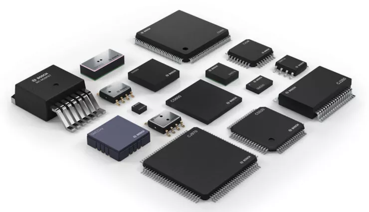
ASIC là các con chip, có thể so sánh với chip CPU, tuy nhiên, chúng được phát triển để thực hiện chỉ một loại phép tính cụ thể một cách hiệu quả nhất có thể. Nói cách khác, một CPU có khả năng thực hiện nhiều loại phép tính khác nhau mà không được tối ưu hóa cho một loại phép tính cụ thể nào, trong khi một ASIC sẽ chỉ có thể thực hiện một loại phép tính duy nhất, nhưng rất hiệu quả. Trong trường hợp của các ASIC dành cho đào bitcoin, chúng được thiết kế cho chỉ để thực hiện phép tính của thuật toán SHA256. 
Ngày nay, các thợ đào chủ yếu chỉ sử dụng ASIC chuyên dụng cho hoạt động này, được tối ưu hóa để kiểm tra được số lượng tối đa các kết hợp với lượng tiêu thụ năng lượng nhỏ nhất có thể và càng nhanh càng tốt. Những máy tính này, không thể thực hiện các nhiệm vụ khác ngoài việc đào bitcoin, là minh chứng cho sự phát triển liên tục và chuyên môn hóa ngày càng cao của ngành công nghiệp đào bitcoin. Sự tiến hoá không ngừng này phản ánh động lực nội tại của Bitcoin, nơi có một cơ chế điều chỉnh độ khó để đảm bảo việc tạo ra một khối mới sau trung bình mỗi mười phút bất chấp sự tăng trưởng theo cấp số nhân trong công suất đào.

Để minh họa cho sức mạnh của hoạt động đào, hãy xem xét một thợ đào điển hình có khả năng đạt được tốc độ 14 TeraHash mỗi giây, tức là 14 nghìn tỷ phép thử mỗi giây để tìm ra mã băm chính xác. Ở quy mô của mạng lưới Bitcoin, chúng ta hiện đạt được khoảng hơn 600 HexaHash mỗi giây (2024), cho thấy sức mạng tập thể khổng lồ được huy động để đào bitcoin.

### Điều chỉnh độ khó

Điều chỉnh độ khó là một cơ chế quan trọng trong hoạt động của mạng lưới Bitcoin, nó đảm bảo rằng các khối mới được đào sau trung bình mỗi 10 phút. Đây là khoảng thời gian trung bình vì quá trình đào thực chất là một trò chơi xác suất, tương tự như việc tung xúc xắc và hy vọng sẽ ra một số nhỏ hơn số được xác định trước bởi độ khó. Sau mỗi 2016 khối, mạng lưới Bitcoin sẽ điều chỉnh độ khó dựa trên thời gian trung bình cần thiết để đào các khối trước đó. Nếu thời gian trung bình lớn hơn 10 phút, độ khó sẽ được giảm xuống, và ngược lại, nếu thời gian trung bình thấp hơn 10 phút, độ khó sẽ được tăng lên. Cơ chế điều chỉnh này đảm bảo rằng khoảng thời gian trung bình để đào được một khối mới luôn ổn định theo thời gian, bất kể số lượng thợ đào hay tổng sức mạnh tính toán của toàn mạng lưới. Đây là lý do tại sao Blockchain của Bitcoin cũng được gọi là Timechain.

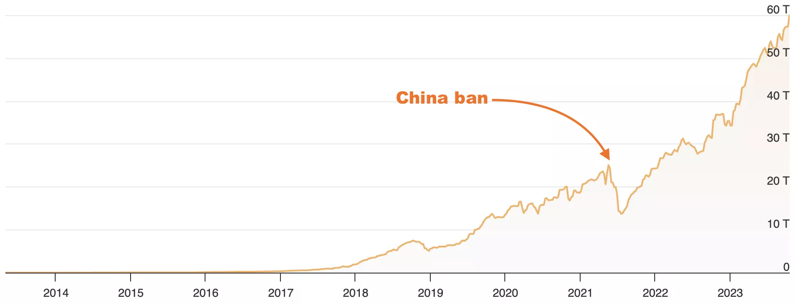

* Ví dụ từ Trung Quốc:
Trường hợp của Trung Quốc minh họa hoàn hảo cho cơ chế điều chỉnh độ khó này. Với nguồn năng lượng dồi dào và giá rẻ, Trung Quốc là trung tâm đào bitcoin chính trên toàn cầu. Năm 2021, chính phủ nước này đột ngột cấm đào bitcoin trên lãnh thổ của mình, dẫn đến sự sụt giảm lớn trong tổng hashrate (tốc độ băm) của toàn mạng lưới Bitcoin toàn cầu, khoảng 50%. Sự sụt giảm đột ngột sức mạnh đào có thể đã làm gián đoạn nghiêm trọng mạng lưới Bitcoin bằng cách tăng thời gian đào được khối mới. Tuy nhiên, cơ chế điều chỉnh độ khó đã được kích hoạt, giảm độ khó đào để đảm bảo rằng tốc độ đào khối mới vẫn ở mức trung bình 10 phút mỗi khối. Ví dụ này chứng minh sự hiệu quả và khả năng phục hồi của cơ chế điều chỉnh độ khó của Bitcoin, đảm bảo sự ổn định và dự đoán được của mạng lưới, ngay cả trong bối cảnh có những thay đổi đột ngột và đáng kể trong hoạt động đào bitcoin toàn cầu.

### Sự phát triển của máy đào bitcoin

Khi xem xét sự tiến hóa của máy đào bitcoin, quan trọng là phải lưu ý rằng lĩnh vực này hướng nhiều hơn về mô hình kinh doanh truyền thống. Các thợ đào kiếm thu nhập từ việc xử lý khối, một công việc có xác suất thành công tương đối thấp. Loại máy hiện tại đang được sử dụng, Antminer S9, mặc dù là một mẫu cũ được ra mắt vào khoảng năm 2016, vẫn còn lưu hành trên thị trường hàng đã qua sử dụng, được giao dịch với giá khoảng €100 đến €200. Tuy nhiên, giá của máy đào biến đổi dựa trên giá trị của Bitcoin, và một mẫu mới hơn, Antminer S19, hiện được ước tính có giá khoảng €3000.
Trước sự tiến bộ không ngừng trong lĩnh vực đào bitcoin, các chuyên gia phải định vị chiến lược của mình một cách thông minh. Ngành công nghiệp đào bitcoin đổi mới không ngừng, như được minh chứng bằng sự mắt gần đây của phiên bản S19 J và S19 XP sắp tới, với năng lực đào vượt trội. Hơn nữa, cải tiến không chỉ liên quan đến hiệu suất thô của các máy móc. Ví dụ, mẫu S19 XP sử dụng hệ thống làm mát bằng chất lỏng, một cải tiến kỹ thuật giúp cải thiện đáng kể hiệu suất tiêu thụ năng lượng. Mặc dù đổi mới vẫn luôn là yếu tố chủ đạo, nhưng những lợi ích hiệu quả trong tương lai có thể sẽ nhỏ hơn so với những gì đã quan sát được cho đến nay, do đổi mới công nghệ đã đạt đến một ngưỡng nhất định.
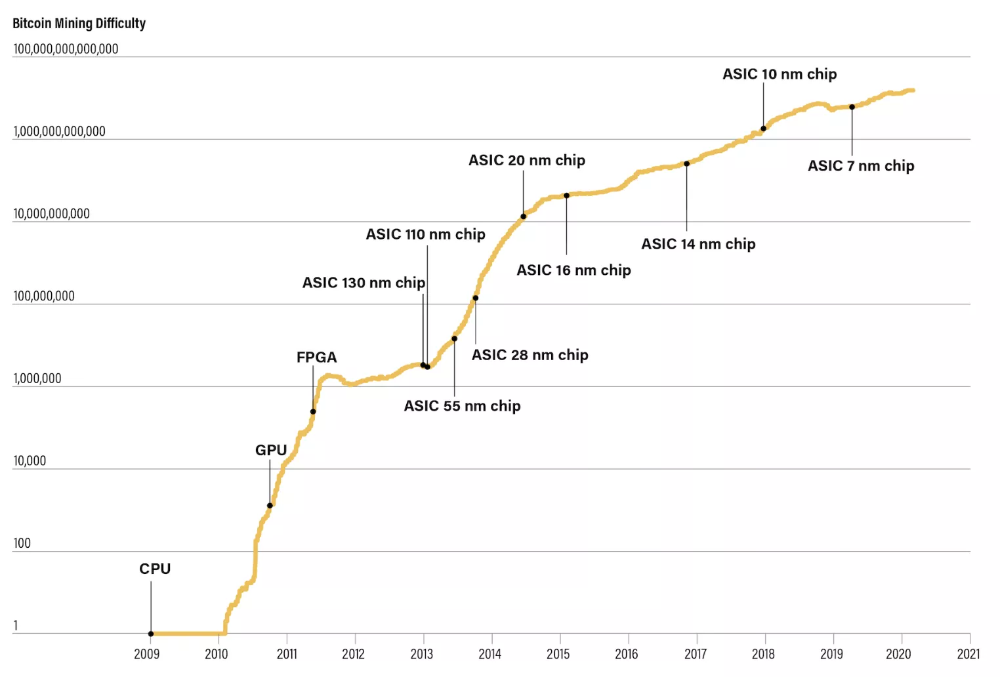

Kết luận, ngành công nghiệp đào bitcoin tiếp tục thích nghi và phát triển, và các thực thể tham gia vào ngành phải dự đoán được sự giảm bớt lợi ích hiệu quả trong tương lai và điều chỉnh chiến lược của mình cho phù hợp. Các tiến bộ công nghệ trong tương lai, mặc dù vẫn có nhưng khả năng cao là sẽ chỉ xảy ra trên một quy mô nhỏ hơn, phản ánh sự trưởng thành ngày càng tăng của ngành.

## Ngành công nghiệp đào bitcoin
<chapterId>0896dfc1-c97e-5bec-9bf1-8c20b3388a2c</chapterId>

### Các pool đào bitcoin

Hiện nay, việc đào bitcoin đã phát triển thành một ngành công nghiệp nghiêm túc và quy mô lớn, với nhiều bên tham gia được biết đến công khai và số lượng thợ đào ngày càng tăng. Sự phát triển này đã khiến cho gần như không thể thực hiện việc đào bitcoin nhỏ lẻ được nữa vì chi phí để mua máy đào rất cao. Điều này đặt ra câu hỏi về sự phân bổ sức mạnh băm (hashrate) giữa các đối tượng thị trường khác nhau. Tình hình trở nên phức tạp hơn vì cần phải xem xét cả sự phân bổ hashrate giữa các công ty khác nhau và giữa các pool đào khác nhau.

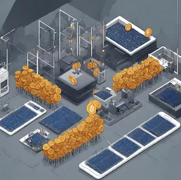

Một pool đào bitcoin là một nhóm các thợ mỏ kết hợp nguồn lực tính toán của họ để tăng cơ hội đào thành công. Sự hợp tác này là cần thiết bởi vì một máy đào bitcoin nhỏ lẻ không thể cạnh tranh với các gã khổng lồ trong ngành, bởi vì cơ hội đào thành công của một máy đào nhỏ lẻ giảm xuống gần như bằng 0. Đào bitcoin hoạt động theo nguyên tắc xổ số, và cơ hội giành chiến thắng mỗi 10 phút (tìm ra được một khối mới và nhận phần thưởng bằng bitcoin) là vô cùng thấp đối với một thợ đào nhỏ lẻ. Khi kết hợp lại thành các pool đào, các thợ đào có thể kết hợp sức mạnh tính toán của mình, từ đó có thể tìm thấy các khối một cách thường xuyên hơn và sau đó chia sẻ phần thưởng theo tỷ lệ đóng góp sức mạnh tính toán của mỗi thợ đào.

Ví dụ, nếu một pooltìm thấy một khối và giành được 6,25 bitcoin, một thợ đào đóng góp 1% tổng sức mạnh tính toán của pool sẽ nhận được 1% của 6,25 bitcoin kiếm được. Tuy nhiên, cần lưu ý rằng các pool đào thường giữ lại một khoản hoa hồng nhỏ, khoảng 2%, để trang trải chi phí hoạt động.

### Phần mềm được sử dụng trong ngành đào bitcoin

Trong ngành đào bitcoin, vai trò của phần mềm cũng quan trọng như phần cứng. Điều này được minh họa bởi vai trò của Bitmain, một nhà sản xuất nổi tiếng đã phát triển Antminer S9. Ngoài phần cứng, ngành này còn phụ thuộc nhiều vào các pool đào hợp tác, như Brainspool, kiểm soát khoảng 5% tổng hashrate của mạng lưới Bitcoin toàn cầu.
Các bên tham gia ngành này luôn tìm cách tăng hiệu quả thông qua phần cứng và phần mềm. Ví dụ, một phần mềm phổ biến được sử dụng là BrainsOS Plus. Phần mềm này thay thế hệ điều hành gốc của máy đào, cho phép vận hành một cách hiệu quả hơn. Với phần mềm như vậy, một thợ đào có thể tăng hiệu quả đào của mình lên 25%. Điều này có nghĩa là với một lượng điện năng tương đương, máy có thể sản xuất thêm 25% hashrate, do đó tăng phần thưởng mà thợ đào nhận được. Tối ưu hóa phần mềm là một yếu tố thiết yếu để cạnh tranh trong đào bitcoin, chứng minh tầm quan trọng của việc kết hợp cả cải tiến phần cứng và phần mềm nhằm tối đa hóa hiệu quả và lợi nhuận.
### Quy định và giá điện

Như đã thấy ở Trung Quốc và các nơi khác, quy định có ảnh hưởng đáng kể đến hoạt động đào bitcoin. Mặc dù không có những thợ đào lớn ở Pháp, quy định và giá điện cao ở Châu Âu là những trở ngại lớn. Các thợ đào luôn tìm kiếm điện giá rẻ để tối đa hóa lợi nhuận của họ. Bởi vậy, chi phí điện cao ở Châu Âu và Pháp không thu hút các thợ đào đến những khu vực này.

Các thợ đào thường hướng đến các khu vực có giá điện thấp, thường là ở các quốc gia đang phát triển hoặc các quốc gia dư thừa năng lượng. Ví dụ, một phần lớn tổng hashrate toàn cầu được đặt tại Texas, Hoa Kỳ. Texas có một lưới điện độc lập, không chia sẻ nguồn năng lượng của mình với các bang khác. Điều này thường dẫn đến việc Texas phải sản xuất ra nhiều điện hơn mức cần thiết để tránh thiếu hụt, từ đó dẫn đến sự dư thừa năng lượng. Các thợ đào bitcoin tận dụng việc sản xuất quá mức này bằng cách thiết lập trại đào bitcoin tại Texas, nơi họ có thể đào bitcoin với giá điện rất thấp trong các khoảng thời gian có dư thừa năng lượng. Điều này này cho thấy ảnh hưởng đáng kể của quy định và giá điện đối với hoạt động đào bitcoin, nhấn mạnh tầm quan trọng của những yếu tố này trong quyết định địa điểm máy của các thợ đào.

### Thợ đào đi đâu và quản lý năng lượng?

Các thợ đào bitcoin có ảnh hưởng rõ rệt đến lĩnh vực năng lượng, họ luôn có xu hướng tìm kiếm những nguồn điện giá rẻ, thường là những nguồn điện bị lãng phí hoặc chưa được khai thác. Hiện tượng này đặc biệt rõ ràng ở các khu vực có cơ sở hạ tầng điện mới, như những nơi có đập thuỷ điện mới được xây dựng.

Hãy lấy một ví dụ. Trong một quốc gia đang xây dựng đập thuỷ điện, việc sản xuất ra điện thường bắt đầu trước khi các đường dây truyền tải điện được hoàn thiện. Khoảng thời gian này có thể phát sinh chi phí đáng kể và làm giảm động lực đầu tư vào các dự án cơ sở hạ tầng như vậy. Tuy nhiên, các thợ đào bitcoin có thể đóng vai trò như một nguồn cầu linh hoạt, sẵn sàng nhảy vào tiêu thụ lượng điện "mồ côi" này, từ đó giúp giảm bớt chi phí cơ sở hạ tầng. Điều này giúp các cơ sở mới có thể lập tức sinh lời, thúc đẩy việc tạo ra các nguồn điện mới. Nguyên tắc này cũng áp dụng được cho quy mô nhỏ hơn. Dù là một cá nhân sử dụng máy phát thủy điện trên một con sông nhỏ hay một hộ gia đình được trang bị tấm pin năng lượng mặt trời, điện sản xuất dư thừa có thể được sử dụng để cung cấp năng lượng cho các hoạt động đào bitcoin.

Ví dụ, ở Pháp điện dư thừa từ tấm pin năng lượng mặt trời được đưa trở lại lưới điện và các nhà sản xuất được EDF chi trả bằng tín dụng tiêu thụ. Tương tự, một thợ đào có thể sử dụng nguồn điện dư thừa này, ngừng hoạt động khi nhu cầu địa phương bằng với nguồn cung. Mặc dù điều này có thể bị xem là ích kỷ, khi ưu tiên sản xuất bitcoin hơn là hỗ trợ lưới điện địa phương, nhưng nó cũng mang lại một lợi ích khác: ổn định lưới điện. Việc quản lý lượng điện dư thừa rất phức tạp, đôi khi thậm chí phải tốn chi phí để xử lý, nhưng việc này có thể được đơn giản hóa đáng kể nhờ vào các thợ đào bitcoin. Các thợ đào bitcoin có thể hấp thụ lượng dư thừa này, hoạt động như một bộ đệm linh hoạt, điều chỉnh từ phía cầu thay vì cung. Trong một thế giới mà sản lượng điện từ các nguồn tái tạo (không kiểm soát được) đang liên tục tăng, các thợ đào có thể đóng một vai trò quan trọng trong việc đảm bảo cân bằng cho lưới điện của chúng ta, đồng thời hưởng lợi từ nguồn điện giá rẻ hoặc dư thừa để cung cấp năng lượng cho hoạt động đào bitcoin của họ.

### Tập trung hoá hoạt động đào bitcoin

Tập trung hoá hoạt động đào bitcoin được xem là một thách thức lớn. Các tay chơi lớn, như Foundry, chiếm lĩnh thị trường, có thể dẫn đến việc kiểm duyệt các giao dịch. Sự tập trung hoá này cũng khiến cho mạng lưới dễ bị tấn công, bao gồm cả cuộc tấn công 51%, nơi một cá nhân hoặc nhóm kiểm soát hơn 50% sức mạnh tính toán của mạng, cho phép họ kiểm soát và thao túng mạng lưới Bitcoin.

Một rủi ro khác là nếu một quốc gia như Hoa Kỳ đưa ra quy định hoặc cấm một số giao dịch Bitcoin, điều này có thể có ảnh hưởng đáng kể đến mạng lưới, đặc biệt nếu một phần lớn sức mạnh tính toán được tập trung tại quốc gia đó.

Để chống lại sự tập trung hóa này, các chiến lược khác nhau được đang thảo luận:
* **Đào bitcoin tại nhà (Home Mining):** Ý tưởng về đào bitcoin tại nhà hướng tới phi tập trung hoá hoạt động đào. Nó khuyến khích cá nhân tham gia vào hoạt động đào bitcoin từ nhà của họ, từ đó phân tán sức mạnh tinh toán rộng rãi hơn.
* **Stratum V2:** Giao thức Stratum V2 đưa ra một cách tiếp cận khác. Không giống như phiên bản trước, Stratum V2 cho phép các thợ đào chọn lựa các giao dịch để đưa vào trong các khối họ khai thác. Điều này này tăng cường khả năng chống kiểm duyệt và giảm sự thống trị của các pool đào lớn. Bằng cách trao quyền nhiều hơn cho các thợ đào cá nhân, giao thức Stratum V2 đóng góp vai trò quan trọng trong việc chống lại sự tập trung hoá sức mạnh tính toán của mạng lưới.
* **Mã nguồn mở cho phần mềm đào bitcoin:** Đây là một chiến lược tiềm năng khác. Bằng cách phát triển mã nguồn mở và cho phép mọi người truy cập vào phần mềm đào bitcoin, các thợ đào nhỏ sẽ có cùng cơ hội như các công ty lớn để tham gia và đóng góp vào mạng lưới Bitcoin. Cách tiếp cận này sẽ khuyến khích sự phân tán rộng rãi hơn của sức mạng tính toán, từ đó đóng góp vào sự phi tập trung của mạng lưới.
* **Đa dạng hoá các thành phần tham gia và phân bổ về mặt địa lý:** Khuyến khích sự tham gia của nhiều chủ thể từ các khu vực địa lý khác nhau vào hoạt động đào bitcoin cũng sẽ mang lại hiệu quả. Bằng cách đa dạng hóa sức mạnh tính toán về mặt địa lý, sẽ rất khó để một thực thể hoặc một quốc gia duy nhất có thể kiểm soát hoặc có ảnh hưởng quá lớn đối với mạng lưới Bitcoin. Cách tiếp cận này có thể bảo vệ mạng lưới chống lại các cuộc tấn công tiềm năng và tăng cường sự phi tập trung của nó.

Tóm lại, sự phi tập trung là rất quan trọng đối với sự an toàn và khả năng phục hồi của mạng lưới Bitcoin. Mặc dù tập trung hoá có thể mang lại lợi ích về mặt hiệu quả, nó cũng mang lại những rủi ro đáng kể cho mạng lưới, bao gồm kiểm duyệt giao dịch và các cuộc tấn công 51%. Các sáng kiến như Takai và việc áp dụng các giao thức mới như Stratum V2 là những bước quan trọng hướng tới sự phi tập trung và bảo vệ mạng lưới Bitcoin chống lại những rủi ro này.

## Những nét đặc trưng của ngành công nghiệp đào bitcoin
<chapterId>7b9ee427-316a-54e3-a2d4-4ea97839a31b</chapterId>

### Nguyên Tắc của Attakai

Giới hạn của sự phi tập trung này?

Mặc dù ý tưởng về việc phi tập trung hoá hoạt động đào bitcoin thông qua việc sử dụng có hiệu quả nhiệt lượng được tạo ra có vẻ hứa hẹn, nó có những hạn chế nhất định và vẫn còn những câu hỏi. Các cơ sở tiêu thụ năng lượng cao như phòng xông hơi và bể bơi có thể thu được lợi ích từ ý tưởng này bằng cách sử dụng nhiệt lượng do các thợ đào tạo ra để làm ấm nước trong cơ sở của họ. Việc này đã được một số thành viên của cộng đồng Bitcoin thực hiện, những người đang khám phá các phương pháp khác nhau để sử dụng hiệu quả nhiệt lượng được tạo ra bởi thiết bị đào bitcoin. Ví dụ, về lý thuyết, một hội trường tổ chức tiệc có thể được sưởi ấm bởi ba hoặc bốn máy đào S19, mỗi máy tiêu thụ 3000 watt và tạo ra một lượng nhiệt tương đương.

Tuy nhiên, cần lưu ý rằng việc tiêu thụ năng lượng và lượng nhiệt được tạo ra là tương đương, cho dù là năng lượng được sử dụng bởi một bộ sưởi điện hay một máy đào. Với mỗi kilowatt điện sử dụng, lượng nhiệt được tạo ra sẽ giống nhau trong cả hai trường hợp. Sự khác biệt nằm ở việc máy đào không chỉ cung cấp nhiệt mà còn thu được phần thưởng bitcoin, do đó mang đến một động cơ kinh tế để sử dụng một máy đào thay vì một bộ sưởi điện đơn giản. Phần thưởng bổ sung này có thể giúp giảm bớt mối quan ngại về việc tiêu thụ năng lượng cao của các máy đào.

Hiệu quả và khả năng thực hiện lâu dài của việc sử dụng các máy đào bitcoin để sưởi ấm vẫn còn là một câu hỏi mở. Các đổi mới liên tục trong phần cứng máy đào và công nghệ sưởi ấm có thể mở ra các cơ hội mới cho để sử dụng hiệu quả hơn nhiệt lượng được tạo ra bởi hoạt động đào bitcoin, từ đó đóng góp vào tính khả thi của cách tiếp cận này trong tương lai.

### Tại sao có phần thưởng bitcoin?
Vấn đề thưởng bằng bitcoin thay vì một loại tiền tệ khác là cốt lõi trong hệ thống do Satoshi Nakamoto thiết kế ra. Giới hạn 21 triệu đơn vị là một đặc tính quan trọng của Bitcoin. Mục tiêu là phân phối công bằng lượng bitcoin được tạo mới. Các thợ đào, bằng cách cung cấp sức mạnh tính toán của họ, bảo vệ mạng lưới và nâng cao chi phí để tấn công mạng lưới lên đến mức rất đắt đỏ. làm cho bất kỳ cuộc tấn công nào trở nên đắt đỏ hơn. Đổi lại, họ được thưởng bằng bitcoin mới được tạo ra, tạo điều kiện cho việc phân phối coin trong hệ sinh thái.

Đây là một hệ thống có lợi cho cả hai bên. Các thợ đào được thưởng cho cả việc bảo vệ mạng lưới và xử lý giao dịch. Bitcoin mới được tạo ra là một động lực để tăng cường bảo mật, và phí giao dịch là thu nhập bổ sung cho việc xử lý giao dịch. Hai yếu tố này kết hợp tạo nên tổng phần thưởng cho hoạt động đào. Tuy nhiên, do thiết kế giảm dần lượng bitcoin mới được tạo ra trong một khối, giảm một nửa sau mỗi 4 năm, thông qua một sự kiện được gọi là "halving", hoạt động đào nảy sinh một vấn đề trong tương lai. Đến năm 2032, lượng bitcoin mới được tạo ra trong mỗi khối sẽ ít hơn 1 bitcoin, và đến năm 2140, không còn bitcoin mới nào được tạo ra. Tại thời điểm này, thu nhập của các thợ đào hoàn toàn dựa vào phí giao dịch. Khi đó, mạng lưới Bitcoin cần có đủ lượng giao dịch, với số phí đủ cao để đảm bảo các thợ đào vẫn có thể kiếm được lợi nhuận để duy trì hoạt động đào.

Sự phát triển của Lightning Network, cho phép giao dịch nhanh với chi phí thấp ngoài chuỗi chính, cũng đặt ra một câu hỏi về tương lai của hoạt động đào bitcoin. Lightning Network có khả năng giảm đáng kể phí giao dịch trên mạng chính (do người dùng chuyển sang sử dụng Lightning Network), do đó ảnh hưởng đến thu nhập của các thợ đào. Tuy nhiên, điều này sẽ phụ thuộc vào khả năng áp dụng và sử dụng Lightning Network so với mạng lưới chính. Trong một kịch bản bi quan, các thợ đào có thể vẫn thu được lợi nhuận nếu họ đã khấu hao chi phí và có quyền truy cập vào nguồn điện giá rẻ. Trong một kịch bản lạc quan hơn, phí giao dịch trên mạng lướichính có thể vẫn đủ cao để đảm bảo mang lại lợi nhuận cho hoạt động đào.

### Cái gì nên được đưa vào trong một khối Bitcoin?

Về câu hỏi cái gì nên được đưa vào trong một khối Bitcoin, điều quan trọng là phải xem xét bản chất bù trừ lẫn nhau của các lớp khác nhau trên mạng lưới Bitcoin. Mặc dù Lightning Network cho phép giao dịch nhanh hơn và rẻ hơn, nó vẫn phụ thuộc vào lớp cơ sở của Bitcoin, thường được gọi là "lớp tất toán - settlement layer," để mở và đóng các kênh thanh toán.

Với sự phát triển dự kiến của Lightning Network và sự gia tăng các hoạt động mở và đóng kênh, không gian trong các khối Bitcoin sẽ trở nên ngày càng quý giá. Cộng đồng Bitcoin đã có xu hướng đánh giá cao việc bảo tồn không gian này, nhận ra giới hạn nội tại của nó. Nhận thức này đã dẫn đến các cuộc thảo luận về việc sử dụng không gian khối một cách hợp lệ, với những lo ngại về "spam" trên blockchain bởi các giao dịch được coi là không cần thiết.

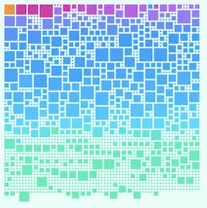

Có nhiều suy đoán về việc sử dụng không gian khối trong tương lai, nhưng nói chung mọi người đều chấp nhận rằng đây là một nguồn tài nguyên khan hiếm nên được sử dụng một cách khôn ngoan. Mặc dù có mong muốn lấp đầy nó, việc bảo tồn nó là cần thiết để đảm bảo sự tồn tại lâu dài của mạng lưới Bitcoin, tiên lượng cho một sự gia tăng nhu cầu đối với không gian khối trong tương lai. Như trong bất kỳ thị trường tự do nào, cung và cầu sẽ điều chỉnh việc sử dụng không gian khối. Với nguồn cung hạn chế, các bên liên quan sẽ cần phải đưa ra những lựa chọn khôn ngoan về việc sử dụng không gian quý giá này để đảm bảo hiệu quả và an ninh lâu dài của mạng lưới Bitcoin.

## Đào bitcoin trong Giao thức Bitcoin
<chapterId>879a66b0-c20a-56b5-aad0-8a21be61e338</chapterId>

Vai trò của các thợ đào trong mạng lưới Bitcoin đã là đề tài tranh luận sôi nổi trong giai đoạn cuộc chiến kích thước khối - "block size wars". Mặc dù là yếu tố thiết yếu cho sự an toàn và chức năng của mạng lưới, các thợ đào không nhất thiết nắm giữ quyền lực tối thượng trong hệ sinh thái Bitcoin. Sự cân bằng giữa thợ đào, người vận hành node và người dùng cuối đảm bảo tính toàn vẹn và phân tán của mạng lưới.

### Cuộc chiến kích thước khối

Trong cuộc chiến kích thước khối, nhiều thợ đào đã phản đối một số thay đổi trong mạng lưới, làm nổi lên sự căng thẳng giữa các bên tham gia trong hệ sinh thái. Câu hỏi đặt ra là làm thế nào để cân bằng quyền lực giữa thợ đào, node và người dùng để đảm bảo an ninh lâu dài cho mạng lưới Bitcoin.

Tình thế tiến thoái lưỡng nan về an ninh của Bitcoin dựa trên một sự cân bằng tinh tế. Trong khi thợ đào đóng vai trò quan trọng trong việc xác nhận và tạo ra các khối, các node duy trì tính toàn vẹn bằng cách xác minh và xác nhận các giao dịch và khối. Một khối sai lệch hoặc gian lận sẽ bị các node từ chối, do đó kiểm duyệt thợ đào và bảo vệ an ninh của mạng lưới. Quyền lực cũng được nắm giữ bởi các node và người dùng của mạng lưới Bitcoin. Các node có quyền xác minh và xác nhận, trong khi người dùng có quyền chọn blockchain nào để sử dụng. Sự phân phối quyền lực này đảm bảo sự phân tán và tính toàn vẹn của mạng lưới Bitcoin.

Cuộc chiến kích thước khối đã phơi bày sự không chắc chắn và căng thẳng trong nội tại của hoạt động quản trị mạng lưới Bitcoin. Mặc dù Bitcoin Core hiện là chuỗi chủ đạo, các cuộc tranh luận về quản trị và quản lý mạng lưới vẫn tiếp diễn.

Cuối cùng, trách nhiệm được chia sẻ giữa tất cả các bên tham gia vào mạng lưới Bitcoin. Sự sụt giảm số lượng người dùng, node, hoặc thợ đào có thể làm suy yếu mạng lưới, tăng nguy cơ tập trung hóa và dễ bị tấn công. Mỗi bên đều đóng góp vào sự vững mạnh và an ninh của mạng lưới, làm nổi bật tầm quan trọng của việc duy trì cân bằng quyền lực và trách nhiệm.

### Quyền lực của các thợ đào
Lý thuyết trò chơi tinh tế của Satoshi Nakamoto đã thiết lập nên một tình huống nơi mà mỗi thành viên trong mạng lưới Bitcoin được khuyến khích hành động đúng đắn để bảo vệ lợi ích của chính họ và của các bên khác. Điều này tạo ra một sự cân bằng nơi hành vi xấu có thể bị trừng phạt, do đó tăng cường an ninh và ổn định của toàn bộ hệ thống. Mặc dù có sự cân bằng này, các quốc gia vẫn là một mối đe dọa tiềm tàng. Như được chỉ ra trong bài thuyết trình tại **Surfing Bitcoin 2022**, các quốc gia có thể cố gắng tấn công ngành công nghiệp đào bitcoin, gây ra rủi ro tập trung hoá và dễ bị tấn công đối với mạng lưới Bitcoin. Các kịch bản giả định như một cuộc tấn công quân sự nhắm vào các cơ sở sản xuất phần cứng đào bitcoin làm nổi bật tầm quan trọng của sự đa dạng hóa về mặt địa lý và công nghiệp để đảm bảo tính kiên cường của mạng lưới Bitcoin.
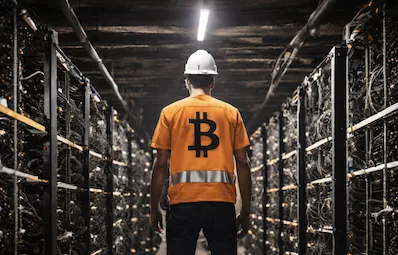

Việc tập trung sản xuất phần cứng máy đào ở Trung Quốc đặt ra một rủi ro khác. Việc Trung Quốc từ chối xuất khẩu máy đào hoặc tích lũy hashrate cho một cuộc tấn công 51% tiềm năng cho thấy nhu cầu về sự đa dạng hóa hoạt động sản xuất phần cứng máy đào. Để đối phó với những rủi ro này, cộng đồng Bitcoin đang tích cực tìm kiếm các giải pháp. Các công ty như Intel đang xem xét việc sản xuất máy đào tại Hoa Kỳ, góp phần vào sự phân tán quá trình sản xuất phần cứng. Các sáng kiến khác, như Bộ công cụ phát triển hoạt động đào mã nguồn mở của Block (Mining Development Kit - MDK), nhằm giảm bớt độc quyền trong thiết kế và sản xuất phần cứng máy đào, từ đó mở rộng phân phối hashrate. Trọng tâm của những cuộc thảo luận này là sứ mệnh của Bitcoin: là một mạng lưới trao đổi giá trị chống kiểm duyệt. Cộng đồng Bitcoin không ngừng nỗ lực để tăng cường sự phi tập trung, khả năng chống kiểm duyệt, và chống sự dễ vỡ của mạng lưới, từ chối các đề xuất như chuyển sang bằng chứng cổ phần POS, không phù hợp với những nguyên tắc cơ bản này.

### Mối liên kết vật lý của Bằng chứng công việc - POW
Bằng chứng công việc (PoW) là thiết yếu bởi vì nó tạo ra mối liên kết vật lý giữa thế giới thực và Bitcoin. Mặc dù bitcoin không hữu hình, quá trình sản xuất ra chúng đòi hỏi năng lượng hữu hình, từ đó thiết lập một sự kết nối trực tiếp với thế giới vật lý. Mối liên kết này đảm bảo rằng việc sản xuất và xác thực bitcoin và các khối đòi hỏi một chi phí năng lượng thực sự, qua đó neo giữ mạng lưới Bitcoin vào thực tại vật lý và ngăn chặn các thực thể mạnh mẽ thống trị hoàn toàn mạng lưới. PoW hoạt động như một pháo đài chống lại sự tập trung hoá quyền lực, đảm bảo rằng việc tham gia vào mạng lưới và xác thực giao dịch đòi hỏi phải đầu tư vào các nguồn lực hữu hình. Điều này ngăn chặn sự độc quyền hoá mạng lưới bởi các thực thể có thể nắm quyền kiểm soát mà không gặp bất kỳ rào cản đáng kể nào, từ đó đảm bảo sự phân phối quyền lực và ảnh hưởng công bằng hơn trong mạng lưới Bitcoin.

### Hạn chế của Bằng chứng cổ phần - POS

Mặt khác, Bằng chứng cổ phần (PoS), mặc dù cho phép sự tham gia ở quy mô nhỏ, không đảm bảo sự bảo vệ chống lại sự tập trung quyền lực tương tự như POW. Trong một mạng lưới POS, những người đã sở hữu một lượng lớn tiền tệ có quyền lực không cân xứng, phản ánh sự bất bình đẳng quyền lực hiện có trong xã hội nói chung. Động lực này có thể tiếp tục duy trì sự tập trung hoá quyền lực vào tay một số ít người, trái với mục tiêu phân phối quyền lực cơ bản của mạng lưới Bitcoin. Lập luận rằng mọi người có thể tham gia vào PoS, ngay cả ở quy mô nhỏ, bằng cách tham gia vào các pool, không nhất thiết là vững chắc. Trong một mạng lưới POW, ngay cả một người đóng góp có nguồn lực hạn chế, với thiết bị khiêm tốn, cũng có thể tham gia tích cực và đóng góp vào sự an toàn và phân phối của mạng lưới.

### Tóm tắt

Tóm lại, các thợ đào củng cố mạng lưới Bitcoin, chống lại sự kiểm duyệt bằng cách sử dụng điện năng để tính toán bằng chứng công việc của Bitcoin, và được thưởng bằng bitcoin mới và phí giao dịch. Với sự chuyên nghiệp hóa của ngành, các bên tham gia khác nhau xuất hiện, đóng vai trò khác nhau, từ việc tạo ra chip đến quản lý các trang trại đào. Ngoài ra, vấn đề tài chính cũng đóng vai trò quan trọng, bằng cách quyết định ai sống sót qua các giai đoạn thị trường khác nhau. Vấn đề tập trung hoá quyền lực vẫn tồn tại, với các thực thể giàu có nhất có khả năng thống trị thị trường. Tuy nhiên, các giải pháp thay thế đang được phát triển ở cả cấp độ phần cứng lẫn phần mềm. Mỗi cá nhân đều có trách nhiệm hành động và đóng góp vào sự phân phối quyền lực của mạng lưới. Bitcoin không chỉ đại diện cho tự do về tài chính mà còn là một cơ hội để đạt được sự độc lập về năng lượng. Mặc dù có nhiều tranh cãi xung quanh việc tiêu thụ điện năng của nó, Bitcoin cung cấp một động lực kinh tế cho sự chuyển đổi hướng tới việc sử dụng năng lượng hợp lý và hiệu quả hơn, hiện thực hoá điều mà trước đây được gọi là lý tưởng về sinh thái học.

## Giá bitcoin và Hashrate, có sự tương quan?
<chapterId>e6676214-007c-5181-968e-c27536231bd6</chapterId>

### Hashrate, giá bitcoin, và lợi nhuận
Mức hashrate hiện tại, mặc dù giá Bitcoin đang ở mức 30.000 đô la so với đỉnh trước đó là 69.000 đô la, làm nổi bật mối liên kết hữu hình giữa hoạt động đào và thế giới thực. Các giai đoạn thị trường tăng giá dẫn đến nhu cầu cao đối với hoạt động đào bitcoin và tăng số lượng đơn đặt hàng máy đào tới các nhà sản xuất như Avalon và Bitmain. Tuy nhiên, việc sản xuất và giao hàng không diễn ra ngay lập tức, tạo ra sự không khớp giữa sự gia tăng nhu cầu và sự có sẵn nguồn cung. Điều này có thể dẫn đến hiện tượng máy đào được đặt hàng trong thời kỳ thị trường tăng giá nhưng được giao trong giai đoạn thị trường giảm giá, làm nổi bật sự bất cân xứng đáng kể giữa giá thấp và mức hashrate cao.
Tình huống này cũng cho thấy tính kiên cường của mạng lưới Bitcoin, thường được đánh giá dựa trên giá của nó. Tuy nhiên, để phân tích sâu hơn về sức khỏe của Bitcoin cần phải xem xét tới hashrate của nó, đo lường số lượng tính toán trong mỗi giây trên toàn mạng lưới Bitcoin. Trong khi giá của Bitcoin biến động, chi phí liên quan đến tiêu thụ điện năng của các thợ đào vẫn là yếu tố quan trọng để hiểu về động lực thị trường. Bằng cách tập trung vào chi phí thay vì giá, chúng ta có được một cái nhìn nhất quán hơn về sự ổn định và khả năng tồn tại lâu dài của Bitcoin. Nói chung, chi phí đào bitcoin tỷ lệ thuận với giá của nó, mang lại một hiểu biết rõ ràng hơn về sự biến động giá và triển vọng tương lai.
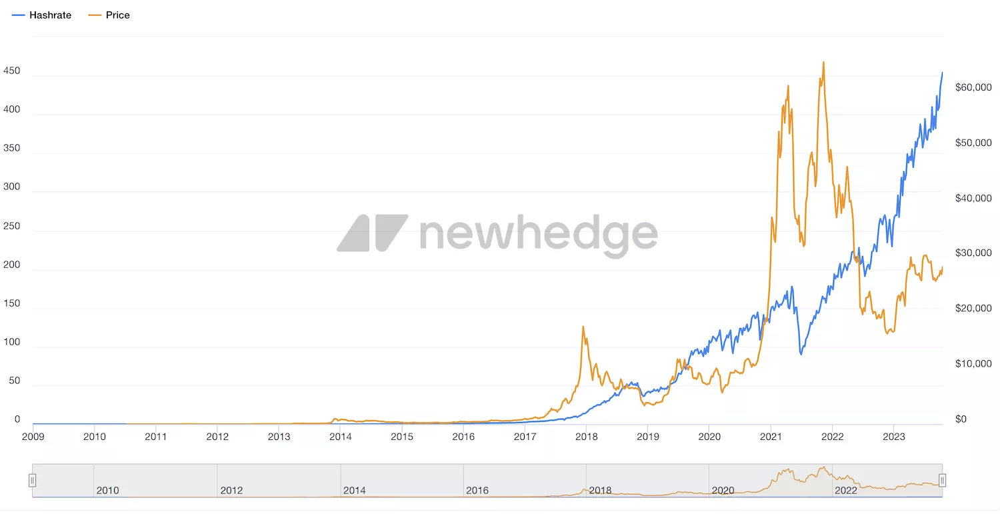

### Hashrate và phần thưởng

Việc đào thiết lập một mức giá sàn cho bitcoin, dưới đó các thợ đào sẽ bán lỗ. Chi phí đào bitcoin ảnh hưởng đáng kể đến giá, như được minh họa bởi lệnh cấm ở Trung Quốc, khi hashrate và giá đã giảm đáng kể nhưng nhanh chóng phục hồi. Chỉ tập trung vào giá có thể gây hiểu lầm. Nghiên cứu chi phí, thông qua các công cụ tính toán lợi nhuận, mang lại một cái nhìn cân bằng hơn. Tuy nhiên, thị trường có thể hành xử một cách phi lý, buộc các thợ đào phải bán lỗ, có khả năng làm giảm giá xuống dưới chi phí đào. Để đánh giá sức khỏe của Bitcoin và sự phân quyền của nó, một phương trình bao gồm các yếu tố khác nhau, như số lượng node và giá, có thể được phát triển. Cách tiếp cận này mang đến một phân tích tinh tế hơn về Bitcoin so với các cuộc thảo luận chỉ dựa trên giá.

### Đào vì lợi nhuận hay vì mạng lưới?

Đây là một câu hỏi sâu sắc và bao gồm nhiều khía cạnh của hoạt động đào bitcoin. Sự cân bằng giữa việc tìm kiếm lợi nhuận và đóng góp vào sự an toàn và phân phối của mạng lưới Bitcoin là một bài toán được đặt ra đối với các thợ đào. Cuộc tranh luận tiếp tục trong cộng đồng Bitcoin, với những lập luận mạnh mẽ từ cả hai phía.

* **Đào vì lợi nhuận:**
- **Ủng hộ:** Các thợ đào bị thu hút một cách tự nhiên bởi tiềm năng kiếm tiền từ hoạt động đào bitcoin. Đầu tư vào thiết bị đào đắt tiền có thể mang lại lợi nhuận thông qua phần thưởng đào và phí giao dịch, đặc biệt khi giá bitcoin cao.
- **Chống lại:** Việc theo đuổi lợi nhuận có thể dẫn đến sự tập trung sức mạnh tính toán (hasrate) nếu chỉ có một vài công ty lớn có khả năng đầu tư vào thiết bị đào cao cấp. Ngoài ra, việc đào vì lợi nhuận có thể gây ra tác động tiêu cực đáng kể tới môi trường.

* **Đào vì mạng lưới:**
 - **Ủng hộ:** Đào để đóng góp vào sự an toàn và phân quyền của mạng lưới Bitcoin là một hành động cao cả. Nó giúp gia tăng sự kiên cường và khả năng chống lại kiểm duyệt, nguy cơ bị tấn công của mạng lưới.
 - **Chống lại:** Nếu động lực tài chính không đủ lớn, thợ đào rất khó để duy trì việc hỗ trợ mạng lưới, đặc biệt là khi họ phải chịu lỗ.
**Sáng kiến Attakai** nhấn mạnh tầm quan trọng của việc đóng góp vào mạng lưới đồng thời cung cấp các giải pháp để làm cho hoạt động đào bitcoin trở nên dễ tiếp cận và ít gây hại hơn. Khả năng đào bitcoin tại nhà, với thiết bị có giá cả phải chăng hơn và các giải pháp giảm ô nhiễm tiếng ồn, có thể giúp dân chủ hóa hoạt động đào bitcoin. Điều này khuyến khích những người quan tâm đến Bitcoin không chỉ đầu tư và giữ bitcoin mà còn tham gia tích cực vào việc bảo vệ mạng lưới. Bằng cách cung cấp thiết bị đã được kiểm định và hướng dẫn lắp đặt, Attakai giúp cho việc tham gia vào hoạt động đào bitcoin trở nên dễ dàng hơn. Nó cũng khuyến khích sự đổi mới và cải tiến liên tục, mời gọi sự đóng góp  và chia sẻ ý tưởng, kinh nghiệm từ cộng đồng để cải thiện hoạt động đào bitcoin tại nhà. Mô hình Attakai là câu trả lời cho câu hỏi về việc đào để kiếm lợi nhuận hay vì hỗ trợ mạng lưới. Đó không chỉ là về việc kiếm lợi nhuận, mà còn giúp tăng cường sự phi tập trung và bảo mật của mạng lưới Bitcoin, đồng thời cho phép nhiều người tham gia vào hoạt động đào, học hỏi và hiểu về ngành công nghiệp quan trọng này. Thách thức về một lệnh cấm đào bitcoin tiềm năng ở Châu Âu vẫn là một câu hỏi mở. Điều này đặt ra mối quan tâm về tương lai của hoạt động đào bitcoin trong khu vực và nhu cầu về một quy định cân bằng, ở đó thấy được tầm quan trọng của hoạt động đào cho sự an toàn và tính khả thi của mạng lưới Bitcoin trong khi giải quyết các vấn đề môi trường. Attakai và các sáng kiến tương tự có thể đóng một vai trò quan trọng trong cuộc tranh luận này, cho thấy rằng chúng ta có thể đào bitcoin theo cách bền vững và có trách nhiệm hơn, đồng thời đóng góp tích cực cho mạng lưới Bitcoin.

## Chủ quyền và quy định quản lý
<chapterId>9d9a5908-2acc-501e-906b-a6fce9ecfebd</chapterId>

### Chủ quyền trước, lợi nhuận sau?
Để giải quyết vấn đề về sự giàu có thông qua việc đào bitcoin, điều quan trọng là chúng ta cần đánh giá từ nhiều góc độ khác nhau. Những thắc mắc về khả năng sinh lời của hoạt động đào bitcoin là phổ biến, rồi các thắc mắc xung quanh việc mua cổ phần trong các công ty như Riot hay việc thuê máy đào ở các quốc gia có chi phí năng lượng thấp như Iceland hoặc Nga. Trước khi tham gia vào hoạt động đào bitcoin, một điều cần xem xét là so sánh lợi nhuận từ đào bitcoin so với việc mua trực tiếp bitcoin. Nếu chi phí đào một bitcoin vượt quá chi phí mua nó trực tiếp, thì việc mua trực tiếp bitcoin thường là lựa chọn khôn ngoan hơn. Cách này tránh được nhiều thách thức và chi phí liên quan đến quá trình đào bitcoin.

Tuy nhiên, việc đào bitcoin mang lại những cơ hội độc đáo để tham gia vào hệ sinh thái Bitcoin. Ví dụ, việc đào bitcoin vào mùa đông có thể là một cách thông minh để sưởi ấm nhà bạn trong khi tạo ra doanh thu bằng bitcoin. Một lựa chọn khác là đầu tư vào các công ty bán thiết bị đào bitcoin, lưu trữ và quản lý máy đào ở những địa điểm có chi phí năng lượng thấp, do đó mang lại lợi thế về giá điện mà không cần phải quản lý thiết bị.

Mặc dù có những lựa chọn này, hoạt động đào bitcoin vẫn đặt ra những thách thức đáng kể. Có một câu ngạn ngữ nổi tiếng trong thế giới tiền mã hóa, "Không phải chìa khóa của bạn, không phải bitcoin của bạn - Not your keys, not your bitcoins," điều này cũng có thể áp dụng tương tự trong lĩnh vực đào bitcoin: "Không phải hashrate của bạn, không phải phần thưởng của bạn - Not your hashrate, not your rewars." Câu chuyện về sự thất vọng do máy móc bị ngắt kết nối là phổ biến, với nhiều đơn vị hứa hẹn những kết quả tuyệt vời nhưng không thực hiện được. Các vấn đề về nguồn cung cấp điện và sự cố máy móc có thể khiến nhà đầu tư bất lực, thiết bị thì đắt tiền nhưng họ không thể tự kiểm soát được. Trong bối cảnh này, sự thận trọng và hiểu biết sâu sắc về ngành đào bitcoin là rất quan trọng trước khi tham gia. Mặc dù có cơ hội để đạt được lợi nhuận, nhưng rủi ro là đáng kể, và một cách tiếp cận khôn ngoan và suy nghĩ cẩn thận là cần thiết để khám phá lĩnh vực phức tạp và thường không dự đoán được này. Do đó, việc nghiên cứu kỹ lưỡng và cân nhắc cẩn thận các ưu và nhược điểm trước khi tham gia vào hoạt động đào bitcoin là rất quan trọng.

### Bitcoin sạch (Virgin bitcoins)
Khát vọng sở hữu hashrate của riêng mình xuất hiện như một con đường đầy triển vọng trong thế giới đào bitcoin. Tuy nhiên, việc khám phá hệ sinh thái phức tạp này đòi hỏi một cách tiếp cận thận trọng. Lĩnh vực khai thác mây (cloud mining) nổi tiếng bởi số lượng lớn các vụ lừa đảo, do thiếu hiểu biết về đào bitcoin từ nhiều nhà đầu tư. Những lời đề nghị hấp dẫn, được đóng gói theo nhiều cách khác nhau, có thể dễ dàng lừa dối những người chưa tìm hiểu kỹ càng. Mặt khác, việc sở hữu thiết bị đào của riêng bạn mang lại nhiều lợi ích đáng kể. Ngoài sự hài lòng cá nhân khi đóng góp tích cực vào an ninh của mạng lưới Bitcoin và thấy phần thưởng chảy vào ví của mình, còn có thêm khía cạnh hấp dẫn của "bitcoin sạch." Đây là những bitcoin mới được đào, chưa bao giờ được chi tiêu và không có lịch sử nào gắn liền với chúng. Những bitcoin này thường được coi là có giá trị hơn vì chúng chưa bao giờ bị "ô nhiễm," mang lại một sự đảm bảo nhất định chống lại sự từ chối của các cơ quan quản lý hoặc các nền tảng giao dịch lớn.

Khả năng đào được bitcoin sạch và tránh được các thủ tục Know Your Customer (KYC) là một giá trị gia tăng khác. Nhiều pool đào không yêu cầu danh tính của người tham gia, do đó cho phép việc thu thập bitcoin mà không cần trải qua các thủ tục kiểm tra danh tính mệt mỏi. Bitcoin mới được đào được xem là "sạch," không mang theo lịch sử hay liên kết nào trước đó. Chúng đặc biệt được các nhà đầu tư tổ chức lớn tìm kiếm, vì họ có thể đảm bảo tính hợp pháp của tài sản số trước các cơ quan quản lý. Tuy nhiên, mặc dù có những lợi ích này, điều quan trọng là phải nhận ra rằng ngành công nghiệp đào bitcoin vẫn cực kỳ cạnh tranh và biến động, và các sự cố không lường trước được có thể làm gián đoạn hoạt động đào bitcoin.

Trong bối cảnh này, việc chọn một cách tiếp cận tự chủ và có kiến thức về ngành đào là khôn ngoan. Sở hữu hashrate của riêng mình và đầu tư vào thiết bị khai thác cá nhân, trong khi vẫn ý thức được các rủi ro và thách thức, có thể mang lại một con đường an toàn và thỏa mãn hơn để thu thập bitcoin sạch, từ đó nâng cao chủ quyền tài chính của cá nhân trong khi vẫn hỗ trợ được cho toàn bộ hệ sinh thái Bitcoin.

### Đào bitcoin có bị cấm ở Châu Âu không?
Với vấn đề về khả năng cấm đào bitcoin ở Châu Âu, các cuộc thảo luận về quy định trở nên ngày càng quan trọng. Các biến động trong quy định quản lý có thể ảnh hưởng đáng kể đến ngành công nghiệp đào bitcoin. Lệnh cấm đào bitcoin ở Châu Âu là một kịch bản có thể xảy ra, đặc biệt là khi xét đến các tiền lệ ở Trung Quốc. Mặc dù hoạt động đào bitcoin tiếp tục diễn ra ở Trung Quốc bất chấp lệnh cấm, Châu Âu có thể đi theo một con đường tương tự. Sự phân bổ rộng rãi hơn của hashrate qua các khu vực khác nhau có thể giúp củng cố cộng đồng thợ đào ở Châu Âu, cho phép họ đối phó hiệu quả với những hiểu lầm và quan niệm sai lầm về khai thác, tác động môi trường của nó, và ảnh hưởng đến mạng lưới điện.

Đối mặt với các chiến dịch như của Greenpeace và những con số thường gây hiểu lầm từ một số nghiên cứu, vũ khí tốt nhất vẫn là thông tin chính xác. Việc cung cấp thông tin chính xác cho công chúng và các nhà lập pháp về thực tế của hoạt động đào bitcoin, sự phức tạp và các nét tinh tế của nó, thay vì để họ dựa vào các định kiến và thông tin không chính xác, là điều cần thiết. Càng nhiều người được thông tin và hiểu được đào bitcoin thực sự là gì, ngành công nghiệp càng có thể tự vệ chống lại các quy định hạn chế tiềm tàng.

Kết luận, mặc dù có rủi ro quy định và khả năng cấm đào bitcoin ở Châu Âu, vũ khí mạnh mẽ nhất vẫn là giáo dục và thông tin. Sự hiểu biết rõ ràng và chính xác về đào bitcoin, cách thức hoạt động và tác động của nó có thể giúp làm sáng tỏ ngành công nghiệp và chống lại các thông tin sai lệch, từ đó cung cấp khả năng chống chịu tốt hơn trước các quy định gây hại tiềm tàng. Sáng kiến đào tạo và thông tin cho mọi người về khai thác, như cuộc thảo luận này, là một bước đi đúng hướng để đảm bảo sự bền vững và phát triển của hoạt động đào bitcoin ở Châu Âu và trên toàn thế giới. Nỗ lực liên tục để giáo dục và thông tin là cần thiết để đảm bảo một tương lai an toàn và thịnh vượng cho ngành công nghiệp đào bitcoin.

## Phỏng vấn với một chuyên gia ngành công nghiệp khai thác
<chapterId>4d613261-d1a8-5ffe-a50c-047a3d77d6c5</chapterId>

### Hậu trường của ngành công nghiệp đào bitcoin - Sebastien Gouspillou

# Khai thác tại nhà và tái sử dụng nhiệt
<partId>78d22d06-2c4a-573f-86bb-1027115dad3a</partId>

## Attakai - biến khai thác tại nhà trở nên khả thi và dễ tiếp cận!
<chapterId>1f5d1b74-2f99-5f31-a088-a73d36491ebf</chapterId>

Attakai, có nghĩa là "nhiệt độ lý tưởng" trong tiếng Nhật, là tên của sáng kiến đào bitcoin bằng cách tái sử dụng nhiệt được khởi xướng bởi @ajelexBTC và @jimzap21 với sự hỗ trợ từ Découvre Bitcoin.
Hướng dẫn cải tiến ASIC này là cơ hội để tìm hiểu thêm về đào bitcoin, cách thức hoạt động và nền kinh tế liên quan bằng cách chứng minh khả năng sử dụng một máy đào bitcoin như là một máy sưởi trong nhà. Điều này không chỉ mang lại nhiều sự thoải mái mà còn tiết kiệm chi phí, đồng thời mang lại phần thưởng bằng bitcoin không cần KYC từ hoá đơn tiền điện sưởi ấm của mình.

Bitcoin tự động điều chỉnh độ khó của hoạt động đào và thưởng cho các thợ đào vì sự tham gia của họ. Tuy nhiên, sự tập trung hoá hashrate có thể gây rủi ro cho tính trung lập của mạng lưới. Sử dụng sức mạnh tính toán của Bitcoin cho các giải pháp sưởi ấm trực tiếp mang lại lợi ích cho chính mạng lưới bằng cách tăng cường phân phối sức mạnh tính toán.

### Tại sao tái sử dụng nhiệt từ một ASIC?

Quan trọng là phải hiểu mối quan hệ giữa năng lượng tiêu thụ và nhiệt lượng sinh ra trong một hệ thống điện.

Với một khoản đầu tư 1 kW năng lượng điện, một bộ tản nhiệt điện sản xuất 1 kW nhiệt, không nhiều hơn, không ít hơn. Bộ tản nhiệt mới không hiệu quả hơn bộ tản nhiệt truyền thống. Ưu điểm của chúng nằm ở khả năng phân phối nhiệt liên tục và đều đặn trong một phòng, mang lại sự thoải mái hơn. Bộ tản nhiệt truyền thống có sự thay đổi giữa công suất sưởi cao và trạng thái không hoạt động, do đó tạo ra sự biến đổi nhiệt độ thường xuyên và gây ra sự không thoải mái.

Một máy tính, hoặc rộng hơn là một bảng điện tử, không tiêu thụ năng lượng để thực hiện các phép tính, việc tiêu thụ năng lượng là do điện trở của các link kiện thành phần, từ đó tạo ra tổn thất và sinh ra nhiệt, được biết đến là hiệu ứng Joule.

Một số công ty đã nghĩ ra ý tưởng kết hợp nhu cầu về sức mạnh tính toán với nhu cầu về sưởi ấm thông qua bộ tản nhiệt/máy chủ. Ý tưởng là phân phối máy chủ của một công ty thành các đơn vị nhỏ có thể được đặt trong nhà hoặc văn phòng. Tuy nhiên, ý tưởng này đối mặt với một số vấn đề. Nhu cầu về máy chủ không liên quan đến nhu cầu về sưởi ấm, và các công ty không thể sử dụng linh hoạt khả năng tính toán trên máy chủ của họ. Cũng có giới hạn về băng thông mà các cá nhân có thể có. Tất cả những ràng buộc này làm cho những lắp đặt đắt đỏ này khó mang lại lợi nhuận hoặc cung cấp một dịch vụ máy chủ trực tuyến ổn định mà không cần đến trung tâm dữ liệu có thể tiếp quản khi không cần sưởi ấm.
> "Nhiệt sinh ra từ máy tính của bạn không phải là lãng phí nếu bạn cần sưởi ấm cho ngôi nhà của mình. Nếu bạn sử dụng máy sưởi điện nơi bạn sống, thì nhiệt từ máy tính của bạn không phải là lãng phí. Chi phí để tạo ra nhiệt này với máy tính của bạn là như nhau. Nếu bạn có hệ thống sưởi khác rẻ hơn sưởi điện, thì sự lãng phí chỉ nằm ở sự chênh lệch chi phí. Nếu là vào mùa hè và bạn sử dụng điều hòa, thì đó là sự lãng phí gấp đôi. Việc đào bitcoin nên được thực hiện ở nơi rẻ hơn. Có thể đó sẽ là nơi có khí hậu lạnh và nơi chúng ta sưởi ấm bằng điện, nơi mà việc đào bitcoin sẽ trở nên miễn phí."
> Satoshi Nakamoto - Ngày 8 tháng 8 năm 2010
Bitcoin và thuật toán đồng thuận bằng chứng công việc (Proof Of Work) của nó nổi bật bởi khả năng tự động điều chỉnh độ khó của việc đào dựa trên sức mạnh tính toán của toàn bộ mạng lưới. Sức mạnh này được gọi là hashrate và được biểu thị bằng số hash mỗi giây. Hiện nay, nó được ước tính là 380 exahash mỗi giây, tức là 380 tỷ tỷ hash mỗi giây. Hashrate này thể hiện cho công việc và do đó là một lượng năng lượng đã tiêu thụ. Hashrate càng cao thì độ khó càng lớn, và ngược lại. Do đó, một máy đào bitcoin có thể được kích hoạt hoặc ngừng hoạt động bất kỳ lúc nào mà không ảnh hưởng đến mạng lưới, không giống như các máy chủ/radiators cần phải duy trì ổn định để cung cấp dịch vụ của mình. Thợ đào được thưởng cho sự tham gia của họ, theo tỷ lệ tương đối so với người khác, dù nó có thể nhỏ bé đến mức nào.

Tóm lại, một bộ sưởi điện hay một máy đào bitcoin đều sản xuất ra 1 kW nhiệt lượng cho 1 kW điện tiêu thụ. Tuy nhiên, người đào bitcoin còn nhận được bitcoin như phần thưởng. Bất kể giá điện, giá bitcoin, hay sự cạnh tranh trong hoạt động đào bitcoin trên mạng lưới, việc sưởi ấm bằng máy đào là kinh tế hơn so với sử dụng bộ sưởi bằng điện.

### Giá trị gia tăng cho Bitcoin

Điều quan trọng cần hiểu là việc đào bitcoij góp phần như thế nào vào sự phi tập trung của Bitcoin.
Một số công nghệ hiện có đã được kết hợp một cách tài tình để tạo ra cái được gọi là sự đồng thuận của Nakamoto. Cơ chế đồng thuận này sử dụng bitcoin làm phần thưởng cho những người tham gia trung thực vì đóng góp của họ vào hoạt động của mạng lưới Bitcoin, đồng thời làm giảm khả năng của những người tham gia không trung thực. Đây là một trong những điểm chính cho phép mạng lưới tồn tại một cách bền vững.
Những người chơi trung thực, những người đào theo quy tắc, đều cạnh tranh với nhau để nhận được phần thưởng lớn nhất có thể thông qua việc tìm thấy các khối mới. Động lực kinh tế này tự nhiên dẫn đến sự tập trung hoá khi các công ty chọn chuyên môn hóa vào hoạt động kinh doanh này bằng cách giảm chi phí bằng cách mở rộng quy mô. Những tay chơi công nghiệp này có lợi thế trong việc mua và bảo trì máy móc, cũng như thương lượng giá điện bán buôn.

> "Ban đầu, hầu hết người dùng sẽ chạy các node mạng, nhưng khi mạng phát triển vượt qua một điểm nhất định, việc vận hành node sẽ dần được tập trung vào các trang trại máy chủ của phần cứng chuyên dụng. Một trang trại máy chủ chỉ cần có một node trên mạng lưới và phần còn lại sẽ kết nối nội bộ với node đó."
> - Satoshi Nakamoto - Ngày 2 tháng 11 năm 2008

Một số thực thể nắm giữ một phần trăm đáng kể tổng hashrate thông qua các trang trại đào lớn. Chúng ta có thể quan sát trong làn sóng không khí lạnh gần đây ở Hoa Kỳ, khi một phần lớn hashrate đã bị ngắt kết nối để chuyển hướng năng lượng cho các hộ gia đình có nhu cầu điện khẩn cấp. Trong vài ngày, các thợ đào được khuyến khích tắt trang trại của họ, và thời tiết bất thường này có thể được thấy trên đường cong hashrate của Bitcoin.

Vấn đề này có thể trở nên phức tạp và đặt ra một rủi ro đáng kể đối với tính trung lập của mạng lưới. Một thực thể với hơn 51% hashrate có thể dễ dàng kiểm duyệt giao dịch nếu họ muốn. Đó là lý do tại sao việc phân phối hashrate giữa nhiều thực thể khác nhau hơn thay vì các thực thể tập trung có thể dễ dàng bị một chính phủ chiếm đoạt, là điều rất quan trọng đối với mạng lưới Bitcoin.

**Nếu các thợ đào được phân phối trong hàng nghìn, hoặc thậm chí hàng triệu, hộ gia đình trên khắp thế giới, sẽ rất khó cho một quốc gia nào muốn kiểm soát họ.**

Khi vừa ra khỏi nhà máy, một máy đào không phù hợp để sử dụng làm bộ sưởi trong nhà, do hai vấn đề chính: tiếng ồn quá mức và thiếu khả năng điều chỉnh. Tuy nhiên, những vấn đề này có thể được giải quyết một cách dễ dàng thông qua các thay đổi phần cứng và phần mềm, để tạo ra một máy đào yên tĩnh hơn có thể được cấu hình và tự động hóa như các bộ sưởi điện hiện đại.

**Attakaï là một sáng kiến nhằm giáo dục bạn cách nâng cấp Antminer S9 theo cách tiết kiệm chi phí nhất.**
Đây là một cơ hội tuyệt vời để học hỏi thông qua việc thực hành trong khi được nhận thưởng bằng những satoshi không cần KYC.

## Hướng dẫn mua máy ASIC cũ
<chapterId>3b0b3bf0-859b-57f2-b92f-843ac70b7e68</chapterId>

Trong phần này, chúng ta sẽ thảo luận về các phương pháp tốt nhất để mua một máy đào Bitmain Antminer S9 cũ, thiét bị sẽ được sử dụng để chuyển đổi thành một máy sưởi thông qua hướng dẫn này. Hướng dẫn này cũng áp dụng cho các mẫu ASIC khác vì đây là một hướng dẫn mua hàng cũ chung cho các loại máy đào.

Antminer S9 là thiết bị do Bitmain cho ra mắt từ tháng 5 năm 2016. Nó tiêu thụ 1400W điện năng và sản xuất 13,5 TH/s. Mặc dù được coi là cũ, nhưng nó vẫn là một lựa chọn xuất sắc để bắt đầu việc đào bitcoin. Vì đã được sản xuất với số lượng lớn, nên có thể dễ dàng tìm kiếm phụ tùng thay thế ở nhiều khu vực trên thế giới. Nói chung, máy này có thể được mua qua người bán trực tiếp trên các trang web như eBay hoặc LeBonCoin, vì các nhà bán lẻ chuyên nghiệp không còn cung cấp nó do tính cạnh tranh thấp hơn so với các mẫu máy mới hơn. Nó kém hiệu quả hơn so với ASIC như Antminer S19, được ra mắt từ tháng 3 năm 2020, nhưng điều này làm cho nó trở thành phần cứng cũ có giá cả phải chăng và phù hợp hơn cho các sửa đổi mà chúng ta sẽ thực hiện.

Antminer S9 có một số biến thể (i, j) tạo ra những thay đổi nhỏ cho phần cứng thế hệ đầu tiên. Điều này không nên ảnh hưởng đến quyết định mua của bạn, vì hướng dẫn này được áp dụng cho tất cả các biến thể này.

Giá của ASIC thay đổi tùy thuộc vào nhiều yếu tố như giá bitcoin, độ khó của mạng lưới, hiệu quả của máy móc, và chi phí điện. Do đó, việc đưa ra một ước lượng chính xác cho việc mua một máy cũ là khó khăn. Vào tháng 2 năm 2023, giá dự kiến ở Pháp thường dao động từ €100 đến €200, nhưng những giá này có thể thay đổi nhanh chóng.

Antminer S9 bao gồm các bộ phận sau:

- 3 hashboard chứa các chip sản xuất sức mạnh băm.

- Một bảng điều khiển bao gồm một khe cắm cho thẻ SD, cổng Ethernet, và các kết nối cho hashboard và quạt. Đây là bộ não của ASIC.

- 3 cáp dữ liệu kết nối hashboard với bảng điều khiển.

- Nguồn cấp điện, hoạt động trên lưới điện 220V và có thể dùng như một thiết bị gia dụng thông thường.

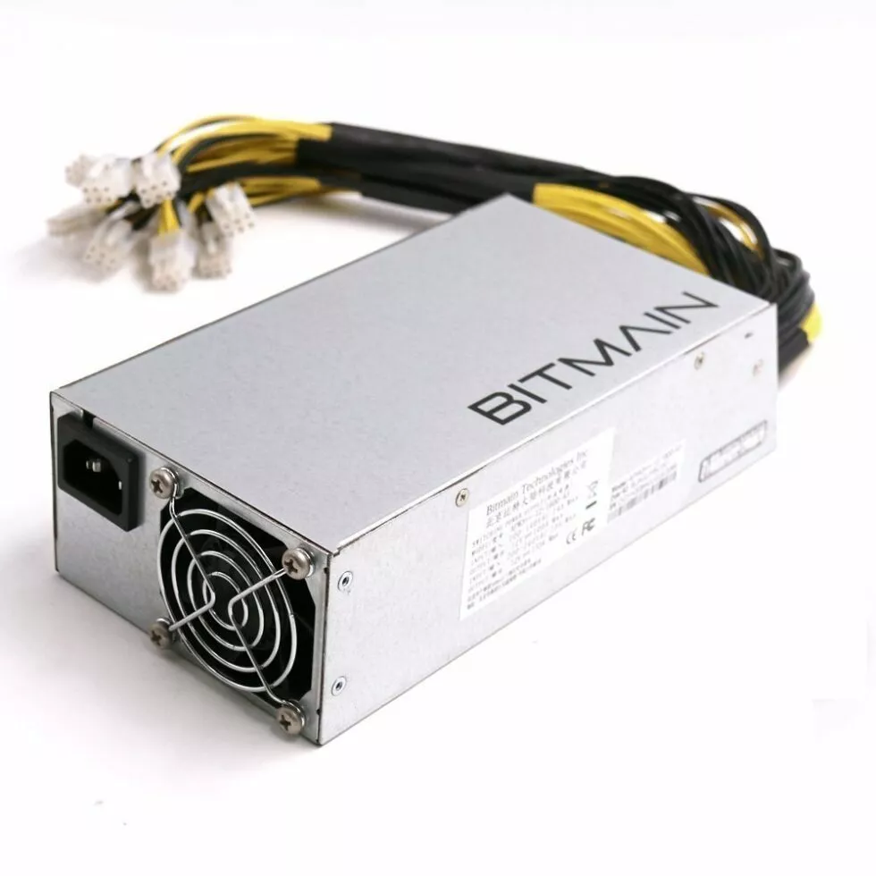

- 2 quạt 120mm.

- Một phích cắm C13.

Khi mua một máy cũ, điều quan trọng là phải kiểm tra xem có đẩy đủ tất cả các bộ phận và chúng có đang hoạt động hay không. Trong quá trình giao dịch, bạn nên yêu cầu người bán bật máy để kiểm tra tình trạng hoạt động của máy. Quan trọng là phải xác minh rằng thiết bị được bật lên đúng cách, sau đó kiểm tra kết nối internet bằng cách cắm cáp Ethernet và truy cập giao diện đăng nhập Bitmain qua trình duyệt web trên cùng một mạng cục bộ. Bạn có thể tìm địa chỉ IP này bằng cách kết nối với giao diện router internet của bạn và tìm kiếm các thiết bị đã kết nối. Địa chỉ này nên có định dạng sau: 192.168.x.x

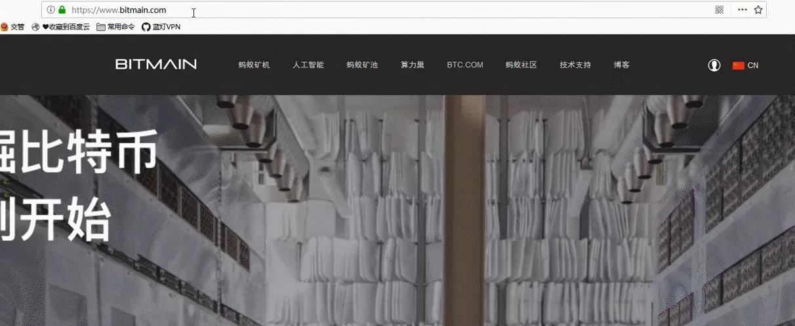
Hãy kiểm tra xem thông tin đăng nhập mặc định có hoạt động không (tên đăng nhập: root, mật khẩu: root). Nếu thông tin đăng nhập mặc định không hoạt động, bạn sẽ cần phải khởi động lại máy.

Khi đã kết nối, bạn sẽ có thể xem trạng thái của từng hashboard trên bảng điều khiển. Nếu máy đào được kết nối với một pool đào, bạn sẽ thấy tất cả các hashboard đang hoạt động. Điều quan trọng cần lưu ý là máy đào tạo ra rất nhiều tiếng ồn, điều này là bình thường. Ngoài ra, hãy chắc chắn rằng quạt đang hoạt động đúng cách.

Sau đó, bạn có thể loại bỏ pool đào của chủ sở hữu trước để thiết lập pool đào của riêng bạn sau này. Nếu bạn muốn, bạn cũng có thể kiểm tra các hashboard bằng cách tháo máy. Tuy nhiên, bước này phức tạp hơn và đòi hỏi nhiều thời gian cũng như một số công cụ. Nếu bạn muốn tiến hành tháo máy, bạn có thể tham khảo phần tiếp theo của hướng dẫn này. Điều quan trọng cần lưu ý là máy đào hút rất nhiều bụi và đòi hỏi bảo dưỡng định kỳ. Bạn có thể quan sát sự tích tụ bụi và chất lượng bảo dưỡng bằng cách tháo máy.
Sau khi xem xét tất cả những điểm này, bạn có thể tự tin mua máy. Nếu có nghi ngờ, hãy tham khảo ý kiến của cộng đồng.

Tóm tắt hướng dẫn này trong một câu: **"Đừng tin, hãy kiểm chứng."**

[Bạn cũng có thể tìm đến các chuyên gia trong việc tái chế máy đào, như đối tác của chúng tôi 21energy. Họ cung cấp máy S9 đã được kiểm tra, làm sạch và cài đặt sẵn phần mềm BraiiinOS+. Với mã giới thiệu "decouvre," bạn sẽ nhận được mức giảm giá 10% khi mua một máy S9 và cũng đồng thời hỗ trợ dự án Attakai.](https://21energy.io/en/produkt/bitmain-antminer-s9-bundle/)

## Hướng dẫn mua sắm phần cứng để cải tiến cho mẫu S9
<chapterId>fa5f5eca-bcbf-5a83-9b03-98ecbadbabd6</chapterId>

Là chủ sở hữu của một Antminer S9, chắc hẳn bạn đã biết rằng thiết bị này có thể tạo ra tiếng ồn và rất cồng kềnh. Tuy nhiên, bạn có thể biến nó thành một bộ sưởi ấm yên tĩnh và kết nối với một số thao tác đơn giản. Trong phần này, chúng tôi sẽ giới thiệu các thiết bị cần thiết để thực hiện các chỉnh sửa.

Nếu bạn là một người thợ lành nghề và muốn biến một máy đào thành bộ sưởi ấm, hướng dẫn này dành cho bạn. Chúng tôi muốn cảnh báo bạn rằng việc chỉnh sửa một thiết bị điện tử có thể gây ra rủi ro về điện. Do đó, việc trang bị tất cả các biện pháp phòng ngừa cần thiết để tránh bất kỳ hư hại hoặc chấn thương nào là điều rất quan trọng.

1. Thay thế quạt

Quạt gốc của Antminer S9 quá ồn để sử dụng máy đào của bạn như một bộ sưởi ấm. Giải pháp là thay thế chúng bằng loại quạt yên tĩnh hơn. Đội ngũ của chúng tôi đã thử nghiệm một số mẫu từ thương hiệu Noctua và đã đánh giá Noctua NF-A14 iPPC-2000 PWM là lựa chọn tốt nhất. Hãy chắc chắn chọn phiên bản 12V của quạt. Quạt 140mm này có thể tạo ra đến 1200W sức nóng trong khi duy trì mức độ ồn lý thuyết là 31 dB. Để lắp đặt những quạt 140mm này, bạn sẽ cần sử dụng bộ chuyển đổi từ 140mm sang 120mm, thứ mà bạn có thể tìm thấy tại cửa hàng DécouvreBitcoin. Chúng tôi cũng sẽ thêm lưới bảo vệ 140mm.

Quạt của bộ nguồn cũng khá ồn và cần được thay thế. Chúng tôi khuyến nghị sử dụng quạt Noctua NF-A6x25 PWM. Lưu ý rằng các đầu nối của quạt Noctua không giống với đầu nối gốc, vì vậy bạn sẽ cần một bộ chuyển đổi đầu nối để kết nối chúng. Hai cái là đủ. Một lần nữa, hãy chắc chắn chọn phiên bản 12V của quạt.

2. Thêm cầu nối WIFI/Ethernet

Thay vì sử dụng cáp Ethernet, bạn có thể kết nối Antminer của mình qua WIFI bằng cách thêm một cầu nối WIFI/Ethernet. Chúng tôi đã chọn vonets vap11g-300 vì nó cho phép bạn dễ dàng thu sóng WIFI từ hộp Internet của bạn và truyền nó đến Antminer qua Ethernet mà không tạo ra mạng con. Nếu bạn có kỹ năng về điện, bạn có thể cung cấp điện trực tiếp cho nó bằng nguồn cung cấp điện của Antminer mà không cần thêm bộ sạc USB. Đối với điều này, bạn sẽ cần một jack cắm 5.5mmx2.1mm.

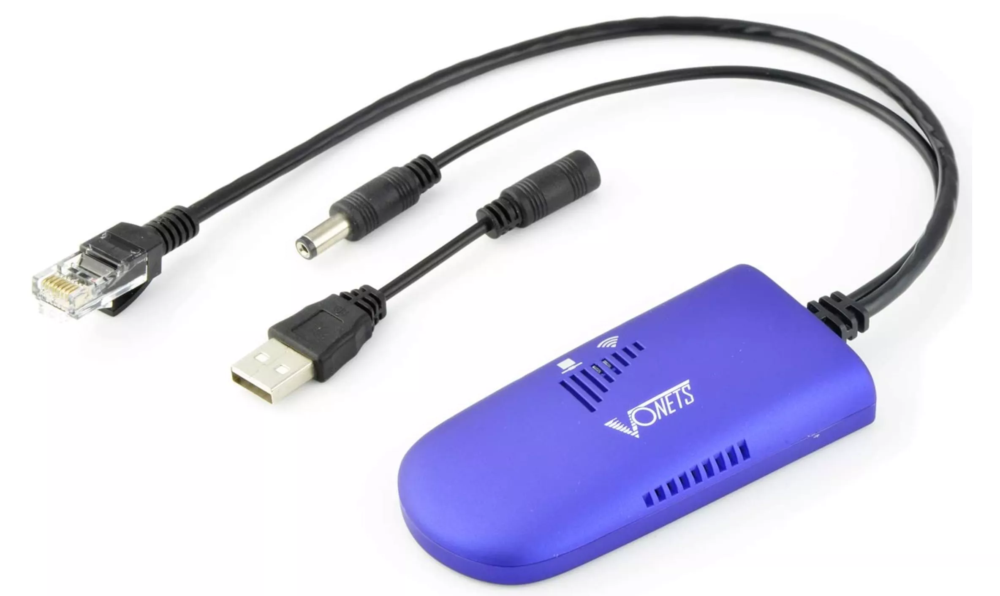

3. Tùy chọn: thêm ổ cắm thông minh
Nếu bạn muốn bật/tắt Antminer của mình từ điện thoại thông minh và theo dõi mức tiêu thụ điện năng của nó, bạn có thể thêm một ổ cắm thông minh. Chúng tôi đã thử nghiệm ổ cắm ANTELA phiên bản 16A, tương thích với ứng dụng smartlife. Ổ cắm thông minh này cho phép bạn xem mức tiêu thụ điện năng hàng ngày, hàng tháng và kết nối trực tiếp với bộ định tuyến internet của bạn qua WiFi.

Danh sách thiết bị và liên kết đến cửa hàng

* 2X miếng chuyển đổi 3D từ 140mm sang 120mm

* [2X NF-A14 iPPC-2000 PWM](https://www.amazon.fr/Noctua-nf-polarized-A14-industrialppc-PWM-2000/dp/B00KESSUDW/ref=sr_1_2?__mk_fr_FR=ÅMÅŽÕÑ&crid=JCNLC31F3ECM&keywords=NF-A14+iPPC-2000+PWM&qid=1676819936&sprefix=nf-a14+ippc-2000+pwm%2Caps%2C114&sr=8-2)

* [2X lưới bảo vệ quạt 140mm](https://www.amazon.fr/dp/B06XD4FTSQ?psc=1&ref=ppx_yo2ov_dt_b_product_details)
  
* [Noctua NF-A6x25 PWM](https://www.amazon.fr/Noctua-nf-a6-25-PWM-Ventilateur-Marron/dp/B00VXTANZ4/ref=sr_1_1_sspa?__mk_fr_FR=ÅMÅŽÕÑ&crid=3T313ABZA5EDE&keywords=Noctua+NF-A6x25+PWM&qid=1676819329&sprefix=noctua+nf-a6x25+pwm%2Caps%2C71&sr=8-1-spons&sp_csd=d2lkZ2V0TmFtZT1zcF9hdGY&psc=1&smid=A38F5RZ72I2JQ)
* [Đầu nối trung gian 2.5mm2](https://www.amazon.fr/Legrand-LEG98433-Borne-raccordement-Nylbloc/dp/B00BBHXLYS/ref=sr_1_3?__mk_fr_FR=ÅMÅŽÕÑ&crid=25IRJD7A0YN2A&keywords=sucre%2Belectrique%2B2mm2&qid=1676820815&sprefix=sucre%2Belectrique%2B2mm2%2Caps%2C84&sr=8-3&th=1)
* [Vonets vap11g-300](https://www.amazon.fr/Vonets-VAP11G-300-Bridge-convertit-Ethernet/dp/B014SK2H6W/ref=sr_1_3_sspa?__mk_fr_FR=ÅMÅŽÕÑ&crid=13Q33UHRKCKG5&keywords=vonet&qid=1676819146&s=electronics&sprefix=vonet%2Celectronics%2C98&sr=1-3-spons&sp_csd=d2lkZ2V0TmFtZT1zcF9hdGY&psc=1)
* [Ổ cắm thông minh ANTELA tùy chọn](https://www.amazon.fr/dp/B09YYMVXJZ/ref=twister_B0B5X46QLW?_encoding=UTF8&psc=1)

# Attakai - Chỉnh sửa phần mềm của Antminer S9
<partId>afc9c29a-84aa-5f1d-82e2-5fd9ff2e1805</partId>

## Thiết lập cầu nối WIFI/Ethernet Vonet
<chapterId>3cf487a4-21ef-5b24-83d5-789b811f740f</chapterId>

Để kết nối ASIC của bạn qua WIFI, bạn sẽ cần một thiết bị được gọi là cầu nối. Thiết bị này cho phép bạn thu tín hiệu WIFI từ bộ định tuyến và truyền nó đến thiết bị khác qua Ethernet.

Có nhiều thiết bị có thể thực hiện chức năng này, nhưng chúng tôi khuyên dùng cầu nối/Repeater WIFI VONETS vì sự tiện lợi của nó.

Cấp nguồn cho cầu nối bằng cách kết nối qua USB.

Từ máy tính của bạn, kết nối với mạng WIFI VONETS_****** với mật khẩu 12345678.

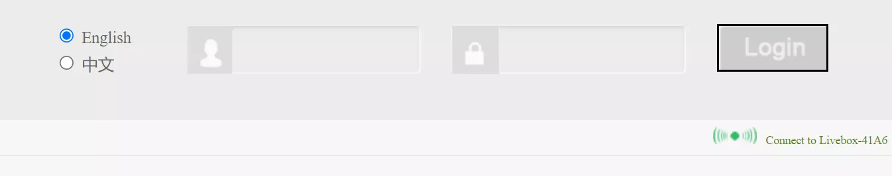

Đăng nhập với tên người dùng "admin" và mật khẩu "admin".

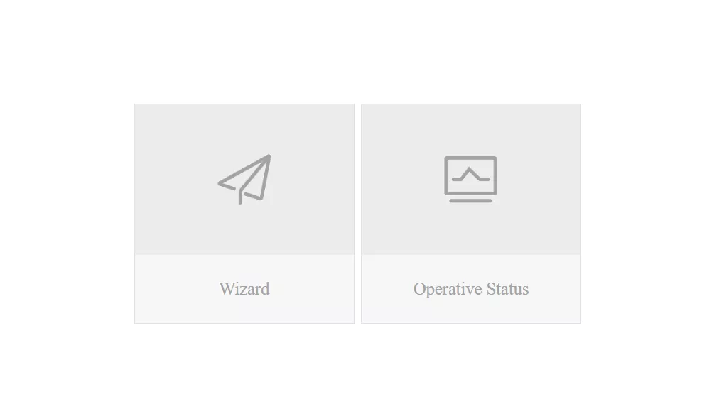

Chọn Wizard.

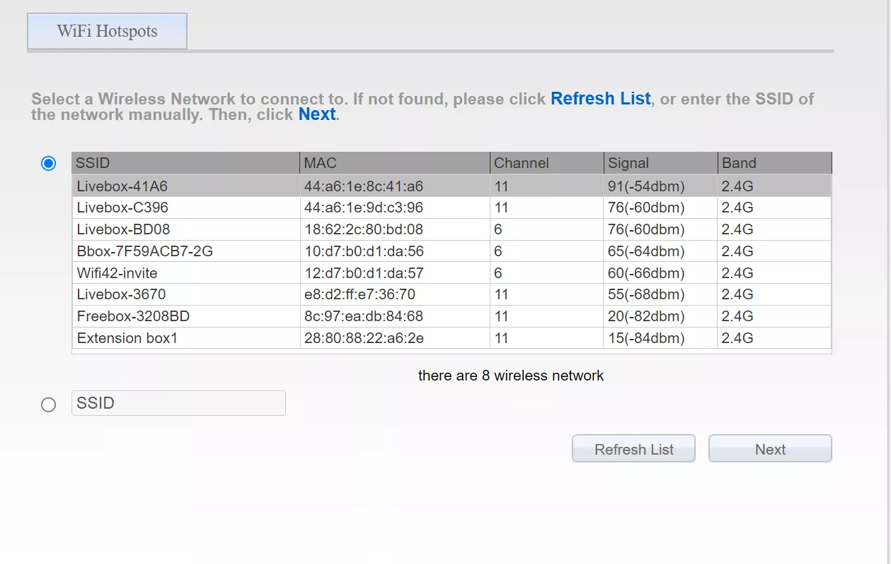

Chọn mạng WIFI mà bạn muốn kết nối với máy đào của mình, sau đó nhấn Next.

LƯU Ý: Cầu nối Vonet chỉ hoạt động trên tần số 2.4GHz. Hiện nay, bộ định tuyến thường cung cấp hai mạng WIFI, một trên 2.4GHz và một trên 5GHz.

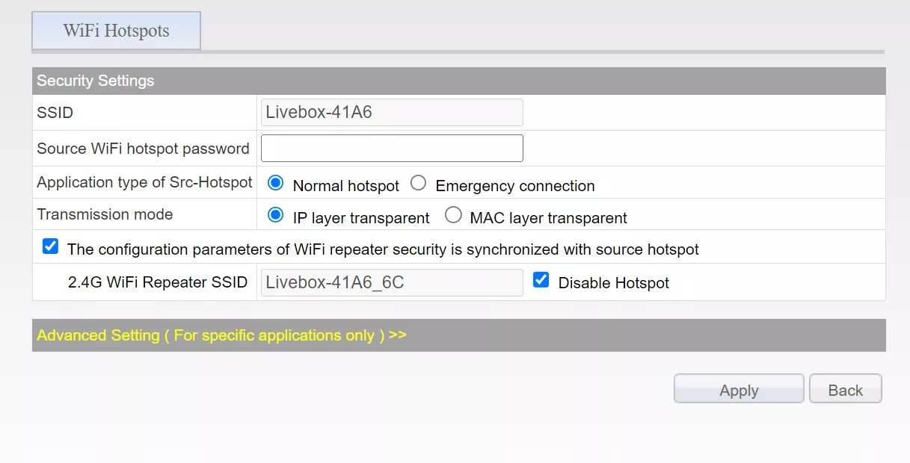

Nhập mật khẩu cho mạng WIFI của bạn vào trường "Source WIFI hotspot password". Nếu bạn không muốn sử dụng cầu nối Vonet của mình để mở rộng mạng WIFI của mình, hãy đánh dấu vào ô "Disable Hotspot". Nếu không, để nguyên không đánh dấu.

Sau đó bạn có thể nhấn Apply.

Cuối cùng, nhấn vào Reboot để khởi động lại cầu nối. Việc này sẽ mất vài phút.

Cầu nối sẽ kết nối với bộ định tuyến của bạn và xuất hiện dưới tên "[VONETS.COM](http://vonets.com/)". Nếu sau vài phút mà vẫn không kết nối được, có thể bạn sẽ cần phải rút phích cắm rồi cắm lại cầu nối.
Sau khi kết nối xong, hãy kết nối cáp Ethernet từ cầu nối vào ASIC của bạn, sau đó cắm ASIC vào ổ điện. Bạn có thể truy cập giao diện ASIC theo cùng một cách như thể nó được kết nối trực tiếp với router của bạn qua Ethernet.

## Thiết lập lại cài đặt gốc cho Antminer S9
<chapterId>b518b6bd-9dae-5136-ae3c-1fafb1cb2592</chapterId>

Trước khi cài đặt BraiinOS+, có thể bạn phải đưa S9 của bạn về cài đặt gốc của nhà máy.
Phương pháp này có thể được áp dụng trong khoảng từ 2 phút đến 10 phút sau khi khởi động máy đào.
2 phút sau khi bật máy đào, vui lòng nhấn nút "Reset" trong 5 giây, sau đó thả ra. Máy đào sẽ được khôi phục về cài đặt gốc trong vòng 4 phút và sẽ khởi động lại tự động (không cần phải tắt máy).

## Cài đặt BraiinsOS+ trên Antminer S9
<chapterId>38e8b1a8-8b1d-51ed-8b92-59d4ddb15184</chapterId>

Phần mềm gốc được Antminer cài đặt trên các máy đào của họ bị hạn chế về chức năng. Đó là lý do vì sao trong hướng dẫn này, chúng ta sẽ cài đặt một phần mềm khác gọi là BraiinsOS+. Đây là phần mềm của bên thứ ba được phát triển bởi pool đào bitcoin đầu tiên trên thế giới với nhiều tính năng hơn và cho phép, ví dụ, chỉnh sửa công suất của máy.

Có một số cách để cài đặt Braiins OS+ trên ASIC. Bạn có thể tham khảo hướng dẫn này cũng như [tài liệu chính thức của Braiins](https://academy.braiins.com/en/braiins-os/about/).

Ở đây, chúng ta sẽ xem cách dễ dàng cài đặt Braiins OS+ trực tiếp trên bộ nhớ của Antminer bằng cách sử dụng phần mềm BOS toolbox, thay thế hệ điều hành gốc, thông qua các bước chi tiết dưới đây.

1. Bật Antminer của bạn và kết nối nó với hộp internet của bạn.
2. Tải xuống BOS toolbox cho Windows / Linux.
3. Giải nén tệp đã tải và mở tệp bos-toolbox.bat. Chọn ngôn ngữ, và sau vài phút, bạn sẽ thấy cửa sổ này:

4. BOS toolbox sẽ giúp bạn dễ dàng tìm địa chỉ IP của Antminer và cài đặt BraiinsOS+. Nếu bạn đã biết địa chỉ IP của máy, bạn có thể bỏ qua đến bước 8. Nếu không, hãy chuyển đến tab "scan".

5. Thông thường, trên các mạng gia đình, phạm vi địa chỉ IP nằm giữa 192.168.1.1 và 192.168.1.255, vì vậy nhập "192.168.1.0/24" vào trường phạm vi IP. Nếu mạng của bạn khác, vui lòng thay đổi các địa chỉ này cho phù hợp. Sau đó nhấn vào "Start".

6. Chú ý, nếu Antminer có mật khẩu, việc tìm kiếm sẽ không hoạt động. Nếu rơi vào trường hợp đó, giải pháp đơn giản nhất là thực hiện một lần đặt lại về trạng thái cài đặt gốc của nhà máy.

7. Bạn sẽ thấy tất cả các Antminer trên mạng của mình xuất hiện ở đây, và địa chỉ IP là 192.168.1.37.

8. Nhấn vào "Back" và sau đó là tab "Install", nhập địa chỉ IP đã tìm thấy trước đó, và nhấn vào "Start".

> Nếu việc cài đặt không thành công, có thể cần thực hiện đặt lại cài đặt gốc và thử lại (xem phần trước).
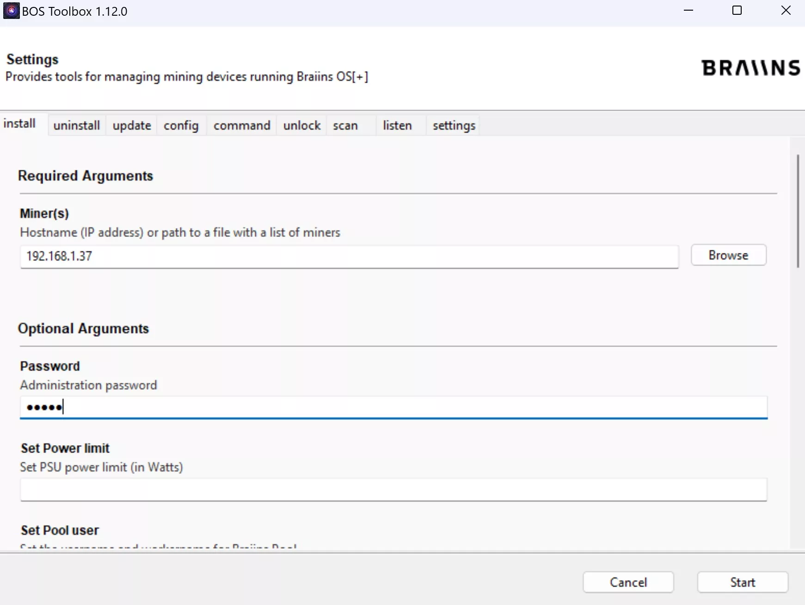
9. Sau vài phút, Antminer của bạn sẽ khởi động lại và bạn có thể truy cập giao diện Braiins OS+ tại địa chỉ IP đã chỉ định, ở đây là 192.168.1.37, trực tiếp trên thanh địa chỉ trình duyệt của bạn. Tên người dùng mặc định là "root" và không có mật khẩu mặc định.

## Cấu hình BraiinsOS+
<chapterId>36e432f2-85bc-52d0-a62a-009fc4c69338</chapterId>

Bạn cần kết nối với ASIC của mình sử dụng địa chỉ IP cục bộ của thiết bị thông qua trình duyệt.

Bạn có thể tìm địa chỉ IP của máy của mình sử dụng công cụ BOS toolbox hoặc trực tiếp trên trang web của router.

Thông tin đăng nhập mặc định giống như hệ điều hành gốc.

- tên người dùng: root
- mật khẩu: (không có)

Sau đó, bạn sẽ được chào đón bởi Bảng điều khiển Braiins OS+.

### Bảng điều khiển

Trên trang đầu tiên này, bạn có thể quan sát hiệu suất thực tế của máy đào.

- Ba biểu đồ thời gian thực hiển thị nhiệt độ, hashrate và trạng thái tổng thể của máy đào.
- Bên phải, hashrate thực tế, nhiệt độ chip trung bình, hiệu quả ước tính theo W/THs và mức tiêu thụ điện năng.
- Bên dưới, tốc độ quạt tính theo phần trăm của tốc độ tối đa và số vòng quay mỗi phút.

- Phía dưới, bạn sẽ tìm thấy chi tiết về từng hashboard. Nhiệt độ trung bình của bảng và các chip bên trong nó, cũng như điện áp và tần số.
- Chi tiết về các hồ bơi khai thác hoạt động trong Pools.
- Trạng thái của việc tự điều chỉnh trong Tuner Status.
- Bên phải, chi tiết về dữ liệu được truyền đến pool đào.

### Cấu hình

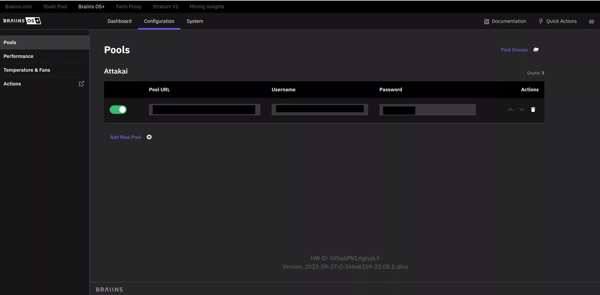

### Hệ thống

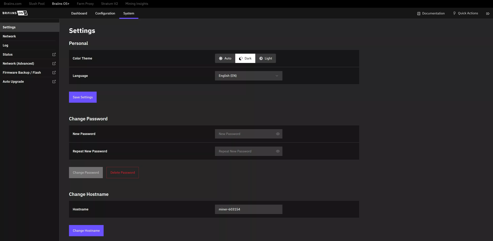

### Hành động nhanh

# Attakai - Chỉnh sửa quạt
<partId>98266a8f-3745-58a0-9f6b-26a9734e1427</partId>

## Thay quạt của bộ nguồn
<chapterId>0c6befa7-f3ef-5bcf-ae8d-0ad5e5d41d70</chapterId>

> CẢNH BÁO: Điều cần thiết là phải đã cài đặt Braiins OS+ trên máy đào của bạn, hoặc bất kỳ phần mềm nào khác có thể giảm hiệu suất của máy. Biện pháp này rất quan trọng vì để giảm tiếng ồn, chúng ta sẽ lắp đặt quạt yếu hơn có thể tản nhiệt kém hơn.

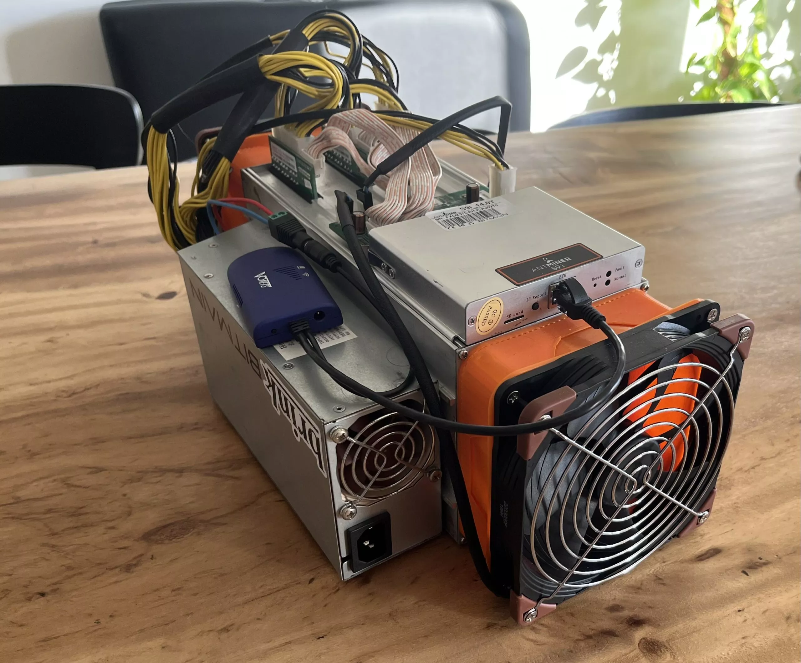

### Vật liệu cần thiết

- 1 quạt Noctua NF-A6x25 PWM
- Đầu nối trung gian 2.5mm2

> CẢNH BÁO: Đầu tiên, trước khi bắt đầu, hãy chắc chắn rằng bạn đã rút phích cắm của máy đào để tránh mọi nguy cơ bị điện giật.

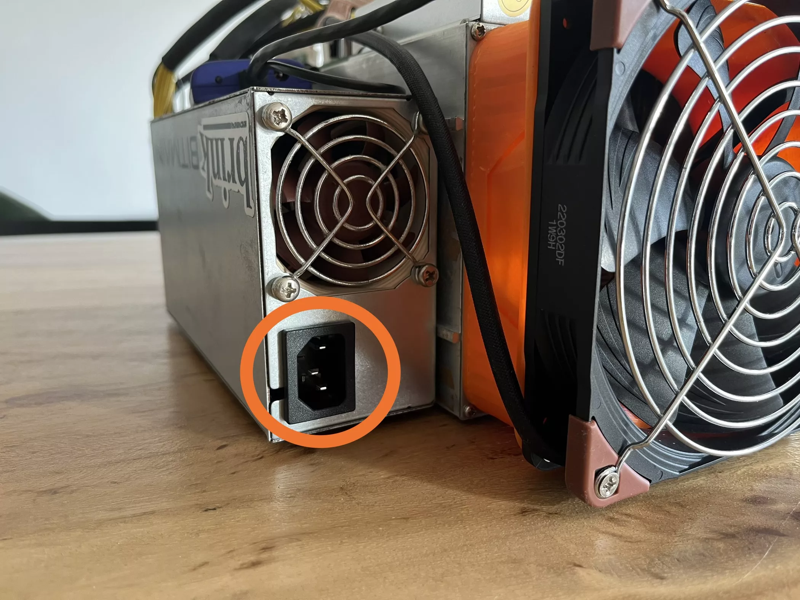

Tháo 6 ốc vít ở bên cạnh vỏ để mở nó ra. Sau khi các ốc vít được tháo ra, cẩn thận mở vỏ để bỏ lớp bảo vệ nhựa che phủ các linh kiện.

Tiếp theo, đã đến lúc tháo quạt gốc, cẩn thận để không làm hỏng các linh kiện khác. Để làm điều này, tháo các ốc vít giữ nó và nhẹ nhàng gỡ bỏ keo trắng xung quanh đầu nối. Quan trọng là phải tiến hành một cách cẩn thận để tránh làm hỏng dây hoặc đầu nối.

Sau khi quạt gốc được tháo ra, bạn sẽ nhận thấy rằng các đầu nối của quạt Noctua mới không khớp với quạt gốc. Thực tế, quạt mới có 3 dây, bao gồm một dây màu vàng cho phép điều khiển tốc độ. Tuy nhiên, dây này sẽ không được sử dụng trong trường hợp này. Do đó, để kết nối quạt mới, việc sử dụng một bộ chuyển đổi đặc biệt được khuyến nghị. Tuy nhiên, cần phải lưu ý rằng bộ chuyển đổi này đôi khi có thể khó tìm.

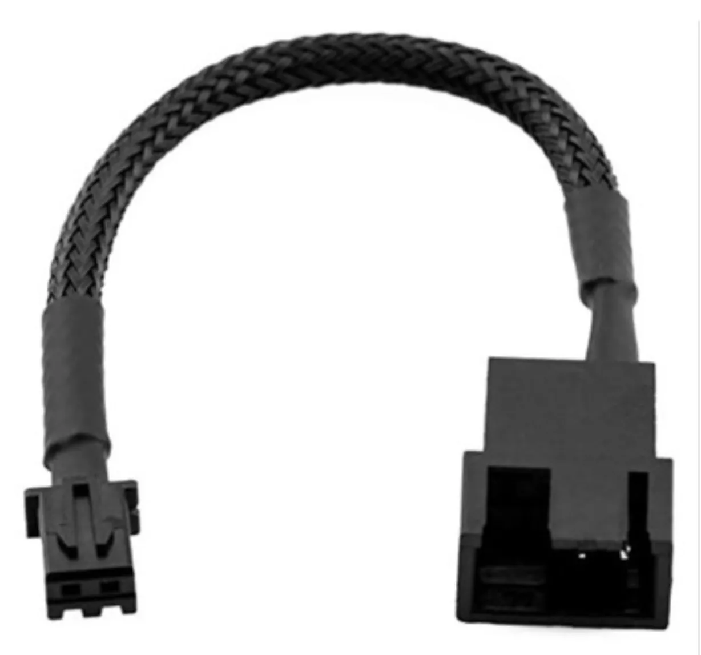

Nếu bạn không có bộ chuyển đổi này, bạn vẫn có thể tiếp tục kết nối quạt mới bằng cách sử dụng đầu nối trung gian. Để làm điều này, bạn sẽ cần cắt các dây của quạt cũ và quạt mới.

Trên quạt mới, sử dụng dao cắt và cẩn thận cắt đường viền của vỏ chính ở khoảng cách 1cm mà không cắt vào vỏ của các dây bên trong.

Sau đó, kéo vỏ chính xuống dưới, cắt vỏ của dây đỏ và dây đen theo cách tương tự như trước. Và cắt dây vàng ngắn gọn.

Trên quạt cũ, việc cắt vỏ chính mà không làm hỏng vỏ của dây đỏ và dây đen là khó khăn hơn. Để làm điều này, chúng tôi đã sử dụng một cây kim để luồn giữa vỏ chính và dây đỏ và dây đen.

Một khi dây đỏ và dây đen được lộ ra, cắt vỏ cẩn thận để tránh làm hỏng dây điện.

Sau đó, kết nối các dây bằng đầu nối trung gian, dây đen với dây đen và dây đỏ với dây đỏ. Bạn cũng có thể thêm băng dính điện.

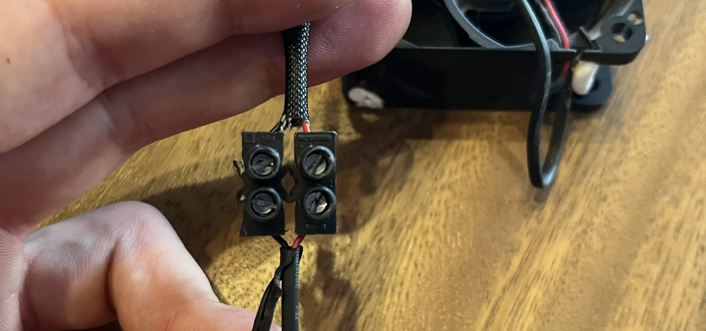
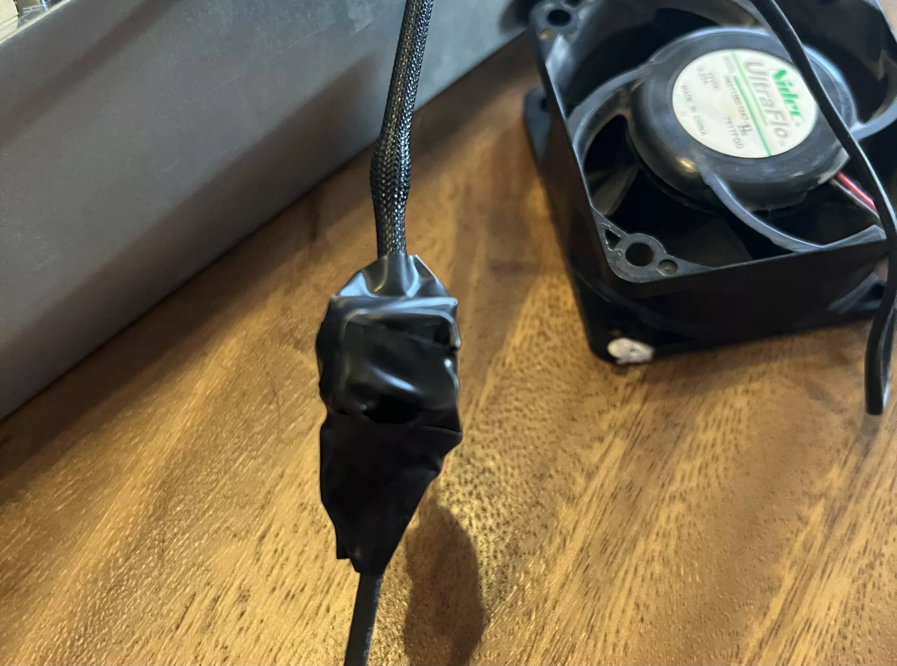

Một khi kết nối được thực hiện, đã đến lúc lắp quạt Noctua mới với lưới bảo vệ và các ốc vít cũ. Các ốc vít mới trong hộp sẽ được sử dụng lại sau. Đảm bảo đặt nó theo hướng đúng. Bạn sẽ nhận thấy một mũi tên trên một bên của quạt, chỉ hướng luồng khí. Quan trọng là phải đặt quạt sao cho mũi tên này hướng vào bên trong của thùng máy. Sau đó kết nối lại quạt.

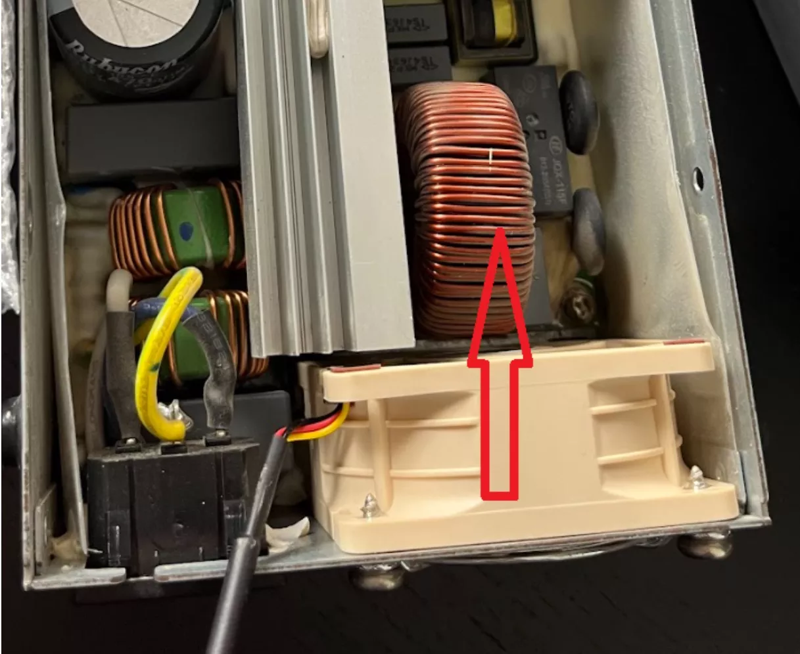

> Tùy chọn: Nếu bạn có kiến thức về điện, bạn có thể thêm trực tiếp một đầu nối jack nữ 5.5mm vào nguồn điện 12V để cung cấp điện trực tiếp cho cầu Wi-Fi Vonet. Tuy nhiên, nếu bạn không chắc về kỹ năng điện của mình, tốt nhất là sử dụng đầu nối USB với một bộ sạc kiểu điện thoại thông minh để tránh bất kỳ rủi ro nào về ngắn mạch hoặc hỏng hóc điện.

Một khi các kết nối được thực hiện, đặt nắp nhựa che lên phía trên của thùng máy và không phải nằm bên trong.

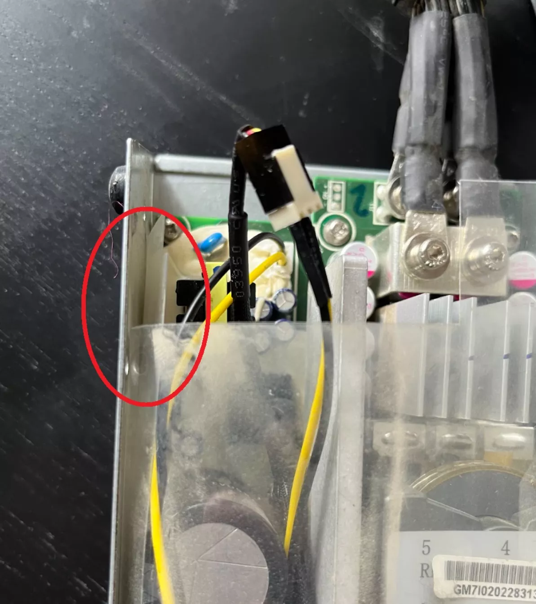

Cuối cùng, đặt nắp thùng máy trở lại và vặn 6 ốc vít ở các bên để giữ mọi thứ cố định. Vậy là thùng bộ cung cấp nguồn của bạn giờ đây đã được trang bị một quạt mới.

## Thay thế quạt chính
<chapterId>a29f60f1-3fa3-57fc-a630-9c97cec30e56</chapterId>
> CẢNH BÁO: Điều cần thiết là phải đã cài đặt Braiins OS+ trên máy đào của bạn, hoặc bất kỳ phần mềm nào khác có thể giảm hiệu suất của máy. Biện pháp này rất quan trọng vì để giảm tiếng ồn, chúng ta sẽ lắp đặt quạt yếu hơn có thể tản nhiệt kém hơn.

### Vật liệu cần thiết

- 2 miếng chuyển đổi 3D từ 140mm sang 120mm
- 2 quạt Noctua NF-A14 iPPC-2000 PWM
- 2 lưới bảo vệ quạt 140mm

> CẢNH BÁO: Trước hết, trước khi bắt đầu, hãy chắc chắn ngắt kết nối máy đào của bạn để tránh rủi ro bị điện giật.

1. Đầu tiên, ngắt kết nối quạt và tháo chúng ra.

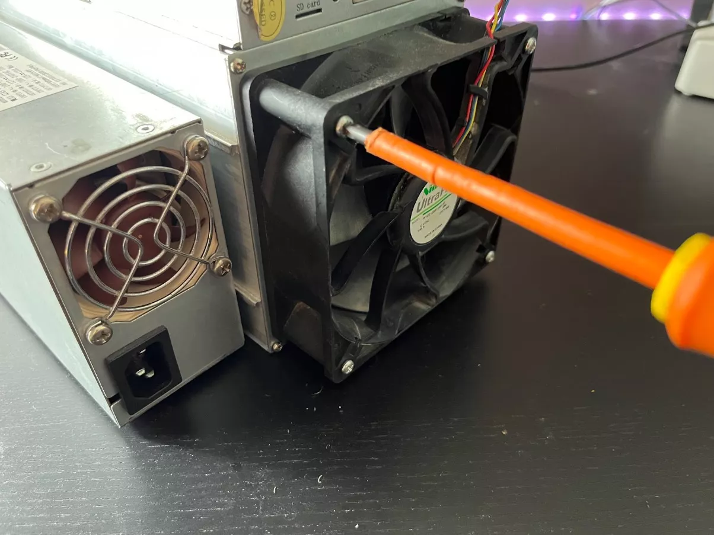

2. Các đầu nối của quạt Noctua mới không khớp với đầu nối gốc, nhưng đừng lo! Lấy dao cắt của bạn và cẩn thận cắt bỏ các thanh nhựa nhỏ sao cho các đầu nối vừa khít với máy đào của bạn.

3. Đã đến lúc lắp đặt các bộ chuyển đổi 3D!
Gắn chúng vào cả hai bên của máy đào sử dụng các ốc vít bạn đã tháo ra từ quạt. Vặn chúng cho đến khi đầu ốc vít bằng phẳng với bộ chuyển đổi 3D và đảm bảo nó được giữ chắc chắn. Hãy cẩn thận không vặn quá chặt, vì bạn có thể làm biến dạng bộ chuyển đổi và một trong các ốc vít có thể chạm vào tụ điện!

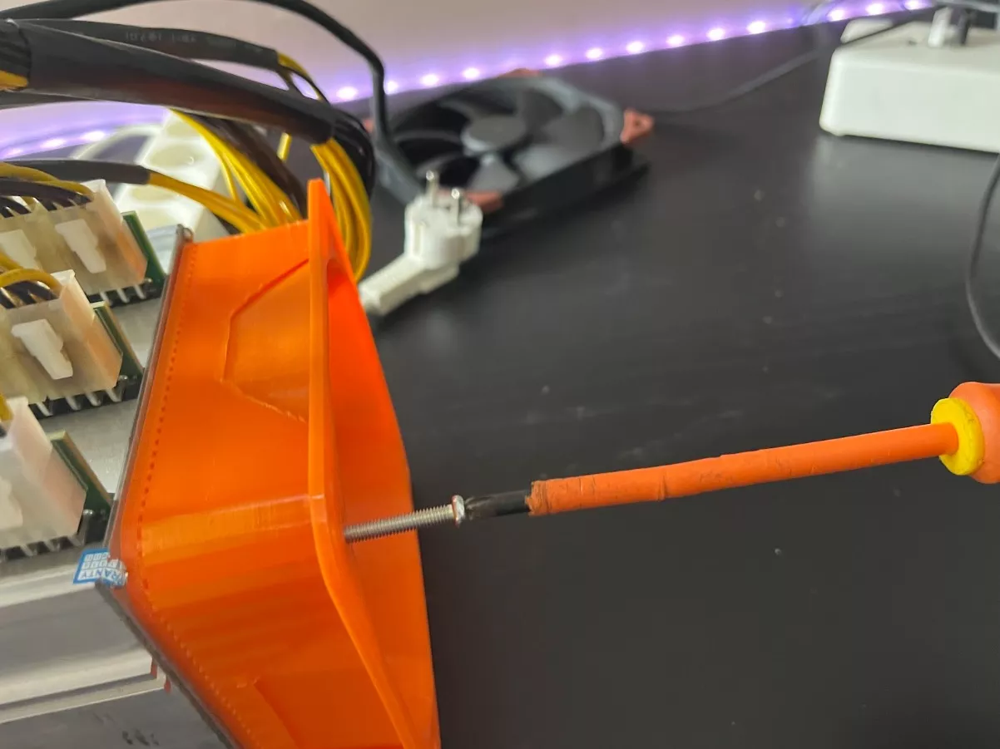

4. Bây giờ chúng ta chuyển sang phần quạt.

Gắn chúng vào các bộ chuyển đổi 3D sử dụng các ốc vít được cung cấp trong hộp. Chú ý đến hướng luồng khí, các mũi tên trên cạnh của quạt sẽ chỉ hướng bạn cần theo. Di chuyển từ phía cổng Ethernet sang phía bên kia. Xem hình dưới đây.

5. Bước cuối cùng: kết nối quạt và gắn lưới bảo vệ phía trên với các ốc vít không sử dụng trong hộp quạt nguồn. Bạn chỉ có 4 cái, nhưng 2 cái cho mỗi lưới ở các góc đối diện là đủ. Bạn cũng có thể tìm các ốc vít tương tự tại cửa hàng phần cứng nếu cần.

Trong khi chờ đợi một vỏ máy đẹp mắt hơn cho bộ sưởi mới của bạn, bạn có thể gắn vỏ máy và nguồn điện với dây buộc điện.

Và cho bước hoàn thiện, kết nối cầu nối Vonet vào cổng Ethernet và nguồn điện của nó.

Vậy là, xin chúc mừng! Bạn vừa thay thế toàn bộ phần cơ khí của máy đào của mình. Bây giờ bạn nên nghe thấy tiếng ồn ít hơn nhiều so với trước.

# Attakai - Cấu hình
<partId>9c3918a8-d9a3-5a1f-bb9a-70314f7ac175</partId>

## Tham gia một pool đào
<chapterId>b57a6105-0a53-5fe9-bad1-d6d9daf97c0d</chapterId>
Chúng ta có thể hình dung một pool đào như một hợp tác xã nông nghiệp. Các nông dân tổ chức hoạt động sản xuất của họ lại với nhau để giảm biến động của cung và cầu, do đó, thu được thu nhập ổn định hơn cho hoạt động của họ. Một pool đào hoạt động theo cùng nguyên lý tương tự, với nguồn lực được chia sẻ là các mã băm (hash). Thực vậy, việc phát hiện ra một hash hợp lệ duy nhất cho phép thợ đào tạo ra một khối và giành được phần thưởng, hiện tại là 3,125 BTC (2024) cộng với các phí giao dịch được bao gồm trong khối.

Nếu đào bitcoin một mình, bạn chỉ được thưởng khi tìm thấy một khối. Khi cạnh tranh với tất cả các thợ đào khác trên hành tinh, bạn sẽ có rất ít cơ hội để giành chiến thắng trong trò chơi xổ số này và bạn vẫn phải trả các phí liên quan đến việc sử dụng máy đào của mình mà không có bất kỳ bảo đảm nào về thành công. Các pool đào giải quyết vấn đề này bằng cách tập hợp sức mạnh tính toán của nhiều (hàng nghìn) thợ đào và chia sẻ phần thưởng của họ dựa trên tỷ lệ phần trăm tham gia vào hashrate của pool khi một khối được tìm thấy. Để biết được cơ hội một mình đào thành công một khối, bạn có thể sử dụng công cụ này. Bằng cách nhập thông tin của một Antminer S9, chúng ta có thể thấy rằng cơ hội tìm thấy một hash cho phép tạo ra một khối là 1 trong 24.777.849 cho mỗi khối hoặc 1 trong 172.068 mỗi ngày. Trung bình (với hashrate và độ khó không đổi), sẽ mất 471 năm để một thợ đào Antmier S9 riêng lẻ tìm thấy một khối.

Tuy nhiên, vì mọi thứ trong Bitcoin đều dựa trên xác suất, đôi khi các thợ đào đơn lẻ được thưởng cho việc chấp nhận rủi ro này: Một thợ đào đơn lẻ dã tìm được một khối với Hashrate chỉ là 10 TH/s, chiến thắng với tỷ lệ vô cùng nhỏ – Decrypt

Nếu bạn thích cờ bạc, bạn có thể thử, nhưng hướng dẫn này sẽ không tập trung vào hướng đó. Thay vào đó, chúng ta sẽ tập trung vào pool đào phù hợp nhất với nhu cầu của chúng ta để tạo ra một hệ thống sưởi.

Các yếu tố cần xem xét khi chọn một pool đào là cách vận hành của hệ thống phần thưởng của pool, có thể thay đổi, cũng như số lượng tối thiểu trước khi có thể rút phần thưởng về một địa chỉ. Ví dụ, Braiins, cung cấp phần mềm mà chúng tôi đang thảo luận ở đây, cũng cung cấp một pool đào. Pool này có một hệ thống phần thưởng gọi là "Score" khuyến khích thợ đào khai thác trong thời gian dài. Sự tham gia bao gồm một yếu tố về thời gian hoạt động được biểu thị như một "scoring hashrate". Trong trường hợp của chúng ta, nơi chúng ta muốn một hệ thống sưởi có thể được bật chỉ trong vài phút, đây không phải là hệ thống phần thưởng lý tưởng. Chúng ta ưa thích một hệ thống phần thưởng cho chúng ta một phần thưởng bằng nhau cho mỗi lần tham gia. Ngoài ra, số lượng rút tối thiểu cho Braiins Pool là 100.000 sat và rút On-Chain. Vì vậy, chúng ta mất một số sat cho phí giao dịch và một phần phần thưởng có thể sẽ bị khóa nếu chúng ta không đào đủ trong mùa đông.

Mô hình phần thưởng mà chúng tôi quan tâm là PPS, có nghĩa là "pay - per - share - trả tiền theo mỗi phần". Điều này có nghĩa là thợ mỏ sẽ nhận được phần thưởng cho mỗi phần hợp lệ. Cũng có một biến thể của hệ thống này, FPPS (Full Pay Per Share), không chỉ chia sẻ phần thưởng coinbase, mà còn cả phí giao dịch được bao gồm trong khối. Các pool đào mà chúng tôi khuyến nghị để kết nối khai thác/sưởi của bạn là Linecoin Pool (FPPS) và Nicehash (PPS).

- Nicehash: Lợi ích của Nicehash là việc rút tiền có thể được thực hiện trên Lightning Network với phí tối thiểu. Ngoài ra, số lượng rút tối thiểu là 2000 sat. Nhược điểm là Nicehash sử dụng hashrate của mình cho blockchain nào có lợi nhuận cao nhất, mà không cho phép người dùng kiểm soát, vì vậy nó có thể không nhất thiết đóng góp vào hashrate của Bitcoin.
- Linecoin: Lợi thế của Linecoin là số lượng tính năng được cung cấp, như bảng điều khiển chi tiết, khả năng thực hiện rút tiền với Paynym (BIP 47) để bảo vệ quyền riêng tư tốt hơn, và việc tích hợp bot Telegram cũng như tự động hóa có thể cấu hình trực tiếp trong ứng dụng di động. Pool này chỉ đào các khối Bitcoin, nhưng số lượng tối thiểu để rút tiền vẫn cao, ở mức 100,000 sats. Chúng tôi sẽ xem xét giao diện của một trong những pool này một cách chi tiết hơn trong một bài viết tương lai.
Để cấu hình một pool trong Braiins OS+, bạn sẽ cần tạo một tài khoản trong một trong những pool mà bạn lựa chọn. Ở đây chúng ta sẽ lấy ví dụ về Linecoin:

Sau khi tài khoản của bạn được tạo, nhấp vào Connect To Pool

Sau đó sao chép địa chỉ Stratum và tên người dùng của bạn:

Bây giờ bạn có thể quay lại giao diện Braiins OS+ để nhập những thông tin đăng nhập này. Đối với mật khẩu, bạn có thể để trống.

## Tối ưu hóa hiệu suất cho Antminer S9 của bạn
<chapterId>25380972-31c7-540d-80d8-17a06b171ca0</chapterId>

Cả việc tăng tốc và tự động điều chỉnh đều liên quan đến việc điều chỉnh tần số trên các hashboard để cải thiện hiệu suất của ASIC. Sự khác biệt giữa hai phương pháp này nằm ở độ phức tạp của các cài đặt tần số.

Tăng tốc là một điều chỉnh đơn giản bao gồm việc tăng tần số trên các hashboard để tăng tốc độ băm của máy. Ngược lại, giảm tốc động cơ bao gồm việc giảm tần số của một mạch tích hợp dưới tần số danh nghĩa của nó. Bằng cách giảm tần số của một ASIC thông qua việc giảm tốc, nhiệt độ sinh ra bởi phần cứng cũng được giảm. Điều này cho phép giảm tốc độ của quạt cần thiết để làm mát ASIC, vì chúng không cần phải làm việc chăm chỉ để duy trì nhiệt độ phù hợp. Bằng cách giảm tốc độ quạt, tiếng ồn phát ra bởi ASIC cũng được giảm. Điều này có thể đặc biệt hữu ích cho những người dùng ASIC tại nhà và muốn giảm thiểu sự phiền toái do tiếng ồn từ thiết bị đào.

Braiins OS+ hỗ trợ tăng tốc, giảm tốc các ASIC, và tự động điều chỉnh. Nó cho phép người dùng điều chỉnh linh hoạt tần số phần cứng của họ để tối đa hóa hiệu suất hoặc tiết kiệm năng lượng theo sở thích của họ.

### Tối ưu hóa hiệu suất cho Antminer S9 của bạn với tự động điều chỉnh

Trước năm 2018, thợ đào có hai cách để có được lợi thế trong hoạt động của mình: tìm kiếm điện với giá cả hợp lý và mua phần cứng hiệu quả hơn. Tuy nhiên, vào năm 2018, một tiến bộ mới được phát hiện trong lĩnh vực phần mềm và firmware đào, được gọi là AsicBoost. Kỹ thuật này cho phép thợ đào giảm chi phí của họ khoảng 13% bằng cách chỉnh sửa firmware chạy trên thiết bị của mình.

Ngày nay, có một tiến bộ mới trong lĩnh vực phần mềm và firmware đào được gọi là tự động điều chỉnh, mang lại lợi thế lớn hơn cả AsicBoost. Các ASIC được cấu thành từ nhiều chip máy tính nhỏ thực hiện nhiệm vụ băm. Những chip này được làm từ silicon, cùng một nguyên tố được sử dụng rộng rãi trong bán dẫn và các thành phần vi điện tử khác. Điều quan trọng ở đây là không phải tất cả các chip silicon đều giống nhau, mỗi chip có thể có sự khác biệt nhỏ về tính chất điện. Các nhà sản xuất phần cứng biết điều này và công bố thông số hiệu suất máy đào của họ dựa trên giới hạn thấp nhất của sự chịu đựng của chúng. Nói cách khác, các nhà sản xuất biết tần số hoạt động tốt nhất cho các chip trung bình và họ sử dụng tần số này một cách đồng nhất cho tất cả các chip trong máy.
Điều này đặt ra một giới hạn trên cho tốc độ hash mà một máy có thể có. Autotuning là quá trình mà trong đó các thuật toán đánh giá các tần số tối ưu cho việc hash của từng chip một, thay vì xử lý toàn bộ máy như một đơn vị duy nhất. Điều này có nghĩa là một chip chất lượng cao có thể thực hiện nhiều hash mỗi giây sẽ nhận được tần số cao hơn, và một chip chất lượng thấp hơn có thể thực hiện ít hash hơn sẽ nhận được tần số thấp hơn. Autotuning ở cấp độ chip về cơ bản là một cách để tối ưu hóa hiệu suất của một ASIC thông qua phần mềm và firmware chạy trên nó.

Kết quả cuối cùng là tốc độ hash cao hơn trên mỗi watt điện năng tiêu thụ, điều này có nghĩa là lợi nhuận lớn hơn cho các thợ đào. Lý do tại sao các máy không được phân phối với loại phần mềm này là vì sự biến động của máy là không mong muốn, vì khách hàng muốn biết chính xác họ đang nhận được cái gì, vì vậy việc bán một sản phẩm không có hiệu suất nhất quán và dự đoán được từ máy này sang máy khác là ý tưởng tồi cho các nhà sản xuất. Ngoài ra, autotuning ở cấp độ chip đòi hỏi nguồn lực phát triển đáng kể, vì nó phức tạp để triển khai. Các nhà sản xuất đã chi rất nhiều nguồn lực để phát triển firmware của riêng họ. Có các giải pháp phần mềm cho phép autotuning, như Braiins OS+, có thể cải thiện hiệu suất ASIC lên đến 20%.

## Cho chúng tôi biết phản hồi của bạn về khóa học này
<chapterId>6af13742-df68-5cf4-b7aa-93dc0c2eaae9</chapterId>
<isCourseReview>true</isCourseReview>

## Điều khiển Antminer S9 từ điện thoại thông minh của bạn
<chapterId>6e7c234a-a445-5070-b087-531d16c42107</chapterId>

### Tạo phím tắt trên iOS

