# Tout Bitcoiner souverain se doit de: détenir ses clés privées, faire tourner un nœud, miner à la maison

Le parcours du bitcoiner souverain se déroule souvent de cette manière. D'abord on cherche à mettre nos précieux satoshis à l'abris en sautant le pas de la garde en propre. On télécharge notre wallet favori et on se fournit en matériel de "stockage à froid".

Ensuite on comprend que détenir ses propres clés ne suffit pas à nous garantir un accès autonome au réseau bitcoin car seuls les opérateurs de nœuds peuvent diffuser des transactions sans demander la permission. Alors on fait tourner son propre nœud.

Pour finir l'étape ultime de tout Bitcoiner souverain c'est d'ajouter sa propre contribution à la sécurité du réseau en déployant de la puissance de calcul supplémentaire, du hashrate, et en minant depuis chez soit.

Dans ce cours MIN202 nous verrons comment miner du bitcoin à la maison, grace à des machines adaptées à cet usage et facilement configurable par tous.
Nous verrons les différentes solutions hardware qui s'offrent à nous pour ce faire, les logiciels associés, et comment les utiliser. 

Désormais miner à la maison est devenu simple, les solutions "plug & play" sont là et c'est une excellente nouvelle.

# Introduction

## Aperçu du cours

Bienvenue dans le cours MIN 202. L'objectif ici sera de permettre à quiconque qui décide de miner du bitcoin de pouvoir le faire facilement chez soit, tout en en comprenant les enjeux et les limitations potentielles. Est-ce utile, est-ce rentable, si oui dans quel contexte etc...

### Partie 1- Introduction

Dans cette partie nous rappellerons rapidement les notions de bases du fonctionnement de bitcoin et de la **preuve de travail**, afin de savoir faire la différence entre un appareil de mining et un nœud bitcoin simple et se remémorer les bases.
Ce sera l'occasion pour nous de rappeler le rôle du minage au sein du protocole bitcoin, et donc la place des mineurs et des pool de mining dans cet écosystème, leur rôle, leur pouvoir et influence sur le réseau.
Nous verrons également les défis qui se posent au particulier qui souhaiteraient participer et miner depuis chez lui, et les solutions potentielles qui s'offrent à lui

### Partie 2 - Pourquoi  et comment miner soit-même ?

Dans la seconde partie de ce cours nous essaierons de déterminer les raisons qui peuvent pousser un particulier à vouloir miner à la maison, et les différentes manière d'y parvenir en fonction du contexte et du profil de chacun.

Nous détaillerons ainsi le fonctionnement du minage en solo ou en pool "mutualiste" en essayant de vous aider à choisir la meilleur manière de vous y prendre en fonction de vos objectifs.

Nous dresserons à cet effet un panorama des solutions logicielles et matérielles adaptées à un usage domestique, et qui ne nécessitent aucune connaissances particulière que ce soit en informatique ou du matériel à utiliser.

### Partie 3 - Installer et configurer son premier mineur personnel

Dans cette troisième grande partie, nous étudierons le projet Bitaxe en détail. Ce projet 100% Open Source tant du point de vue matériel que logiciel, vise à rendre le minage accessible à tout un chacun, en permettant de construire soit même sa machine ASIC et de l'opérer.

Puis nous verrons en détail comment installer l'appareil et le configurer. On en profitera également pour dresser une cartographie des pools de minages (solo ou mutualistes) que vous pourrez utiliser avec votre Bitaxe, de leurs caractéristiques et spécificités.

Enfin nous en profiterons pour faire un tour complet d'AxeOS le système d'exploitation de votre Bitaxe, afin de comprendre comment le piloter sur le bout des doigts.

Pour finir on passera en revue les bonnes pratiques visant le bon entretien de votre machine afin que celle-ci soit opérationnelle le plus longtemps possible.
#### Bitaxe le projet 100% Open Source

#### Installation d'un Bitaxe et connexion à une "solopool"
#### Panorama des différentes Pool de mining
#### Découverte d'AxeOS 
#### Entretien de la machine 

### Partie 4 - Miner via sa propre pool de minage et construire ses propres templates de bloc

Enfin nous aborderons dans une dernière partie les moyens mis à la disposition des particuliers pour miner de manière aussi autonome que possble. En effet les pools de mining sont en fait des intermédaires, c'est à dire des tiers de confiance.

Un mineur souverain doit en effet être en mesure d'ajouter sa propre puissance de calcul au réseau de manière indépendante, sans dépendre de ces tiers. Nous verrons comment cela est possible même pour les débutant du mining.

Ce sera l'occasion de parler de Stratum v2 de Datum, et des applications "Public Pool" et "Bassin" qui donnent un plus grand contrôle à l'utilisateur en lui permettant de s'affranchir en partie ou totalement du bon vouloir des pools de minage.

## Rappel rapide sur la preuve de travail et le minage de Bitcoin

Commençons par rappeler succinctement à quoi sert la **preuve de travail**, et ce qu'on appelle communément le minage de Bitoin.
Bitcoin est un système de cash électronique pair-à-pair. C'est à dire qu'il ne repose sur aucune entité centrale pour fonctionner. Il s'agit en fait d'un réseau d'ordinateur stockant le grand livre de compte et l'historique des transactions et des balances de chacun des utilisateurs du réseau.

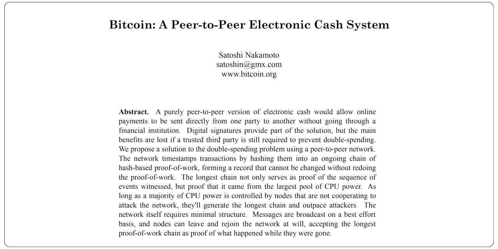

### Le problème de la double dépense

Habituellement dans les sytèmes d'échanges électroniques traditionnels, une entité (banque, banque centrale etc....) est chargée de débiter et créditer les comptes des utilisateurs en fonction des transactions effectuées par ces derniers. Ces banques permettent de remédier au problème de la double dépense que posent les systèmes électroniques, au sein desquels les données peuvent être dupliquées facilement. Quand un utilisateur dépense ses sous, la banque s'assure que son compte est bien débité, et que le compte du destinataire est bien crédité et qu'ainsi aucune monnaie supplémentaire n'est créée.

Ça c'est en théorie, puisqu'en pratique on sait que les banques commerciales et centrales ont bel et bien le pouvoir  de créer de la monnaie ex-nihilo, et qu'elles profitent de ce privilège pour s'approprier les ressources des autres indûment.

Le génie de Satoshi Nakamoto est justement d'avoir réussi à trouver un moyen de se passer d'intermédiaire pour "débiter" et "créditer" les comptes des utilisateurs de Bitcoin. Personne n'est en mesure de pervertir le registre, car n'importe qui peut participer et contrôler ce qui y est inscrit. Tout le monde peut très facilement vérifier toutes les transactions qui s'y déroulent, les refuser si elles sont invalides (par exemple si la transaction dépense un bitcoin déjà dépensé précédemment), et même proposer de nouvelles transactions qui viendront mettre à jour le registre.

Dans Bitcoin pour éviter le spam et une croissance de la base de donnée trop rapide, les transactions sont ajoutées au registre par bloc de taille limitée (max 4 MB) toutes les 10 minutes en moyenne (cela représente généralement quelques milliers de transactions toutes les 10 minutes).
Mais alors qui choisit quelles transactions vont être ajoutées puisqu'on a décidé de se passer d'entité centrale ? C'est là que la **preuve de travail** intervient. 
Certes tout le monde peut proposer un nouveau bloc de transactions, mais sous réserve qu'une **preuve de travail** suffisante ait été apportée. C'est là que les mineurs entre en jeu.

### La preuve de travail, pierre angulaire de la résolution du problème de la double dépense

Chaque mineur qui veut proposer un nouveau bloc et ainsi recevoir la récompense de bloc associée (constituée de la subvention de bloc  de 3,125 BTC  à l 'heure où est écrit ce cours, et des frais de transactions payés par les utilisateurs) peut le faire à condition d'avoir la preuve qu'un travail a été fournie. En somme il s'agit d'une sorte de compétition entre mineurs, chacun essayant de trouver une solution à un problème cryptographique que l'on ne détaillera pas ici. Ce qu'il faut retenir c'est que c'est par le biais de ce concours, que l'on est en mesure de désigner qui est en droit d'ajouter le dernier bloc au "grand livre de compte" qu'on appelle "blockchain". Bien sûr si quelqu'un cherchait à propager une transaction dépensant des Bitcoin déjà intégrés au grand registre, les nœuds du réseau s'en rendraient compte et la considéreraient comme invalide et le travail effectué aurait été du gaspillage de ressource.

Ainsi la **preuve de travail** est l'élément central du protocole Bitcoin permettant de désigner alternativement et en dehors de toute considération autre que l'énergie dépensée pour essayer de résoudre le problème le plus rapidement possible, qui sera en mesure de modifier le registre et de recevoir sa récompense.

### Nœuds mineurs & Nœuds non mineurs

Pour en terminer avec ces rappels théoriques sur le fonctionnement du minage, il convient de savoir distinguer les principaux acteurs du réseau que sont les **nœuds mineurs** et les **nœuds non mineurs.**

Les nœuds **non mineurs**, sont simplement des utilisateurs du réseau, qui stockent le grand livre de compte, vérifient que les blocs ajoutés par les mineurs sont valides, et qui relaient les transactions d'autres nœud du réseau afin que celles-ci aient une chance d'atteindre un nœud mineur pour être ajoutée au registre. Un nœud non mineur sert en quelque sorte de porte d'accès au réseau Bitcoin. Sans nœud vous ne pouvez pas diffuser de transactions sur le réseau (à moins de joindre directement un mineur), ni vérifier le solde de vos adresses et de votre wallet. En synthèse un nœud non mineur permet **d'utiliser** le réseau et de transacter de manière souveraine.

Les **nœuds mineurs** quant à eux possèdent en plus une partie logicielle additionnelle, leur permettant d’interagir avec des machines de minage qu'on appelle aujourd'hui machines **ASIC (Application Specific integrated Circuit)**. Ils sélectionnent les transactions qui les intéressent le plus, généralement celles qui payent le plus de frais et constituent des blocs. Puis ils proposent ces blocs candidats à la machine de minage qui essaye de résoudre le fameux problème cryptographique. Puis en cas de succès le nœud mineur propose le bloc et sa **preuve de travail** au réseau. En synthèse un nœud mineur permet de **faire fonctionner** le réseau.

## Miner soit-même "à la maison" défis et solutions

### Une industrie du minage ultra compétitive

Une compétition acharnée a lieu depuis plus d'une décennie désormais, entre des mineurs du monde entier, pour tenter de miner le plus de bitcoin , le tout en dépensant le moins d'énergie possible. En effet les machines **ASIC** cherchent à réaliser le plus de calculs à la seconde, nécessitant une puissance électrique considérable. Le challenge pour un mineur est donc de toujours de dépenser le moins d'énergie que la valeur des bitcoins qu'il va générer. La chasse à l'énergie peu cher et à la rationnalisation des couts de maintenance et d'entretien des machines, a nécessairement conduit cette industrie à se professionaliser.

Aujourd'hui les mineurs professionnels ont accès à de l'énergie infiniment moins chère que des particuliers, prisonniers des prix parfois articificellement gonflés par les taxes qu'ils ont à payer, et la mauvaise gestion des réseaux de productions et de distributions en situation de monopoles. Les fermes de minage elles, négocient avec les fournisseurs d'électricité des prix extrèmement avantageux en monétisant les extra-capacités, c'est à dire en achetant à très bas prix (parfois négatifs !!!) de l'énergie qui serait autrement gaspillée par l'énergéticien.

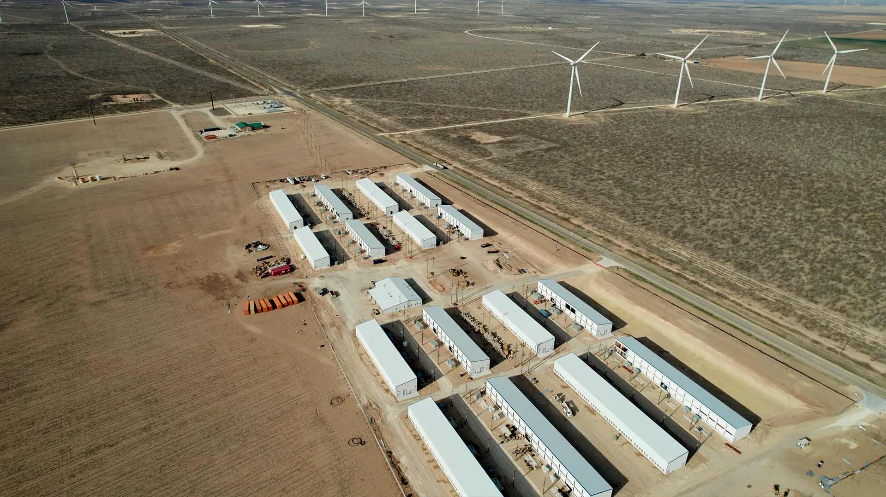

Dans ce cadre, l'efficience atteinte par ces entité géantes est diabolique. C'est à dire que l'énergie nécessaire pour produire un hash cryptographique ne cesse de diminuer au fil du temps. On peut alors légitimement s'interroger sur la possibilité pour un  mineur non professionel, qui ne bénéficie pas de ces prix avantageux de l'énergie, de partciper au fonctionnement du réseau.

### Quelle place pour le minage des particuliers ?

En effet à quoi bon participer et essayer de miner si on dépense plus d'électrité que ce qu'on récupère en Bitcoin ?

Certains avanceront l'argument de l'**altruisme**. En effet si on veut éviter une centralisation des capacités de minages entre les mains de ces grandes entreprises qui peuvent être soumises facilement aux caprices des politiciens corrompus, il faut miner coûte que coûte. Ceci peut en effet être un sérieux vecteur d'attaque sur  Bitcoin, mais n'est ce pas comme essayer de vider un piscine olympique à la petit cuillère ?

D'autres vous dirons que miner est rentable si on se projette suffisamment loin dans le futur. En effet la théorie économique voudrait que la valeur de Bitcoin continue à augmenter pour peu que la croissance de la demande perdure. Mais si on est persuadé que la valeur de Bitcoin a vocation à augmenter, ne vaut-il pas mieux acheter directement du BTC plutôt qu'une machine de minage qu'on ne sera jamais certain d'ammortir ?

Quand bien même on aurait décider de miner coûte que coute est-ce vraiment réalisable à la maison ? Après-tout ces grosses machines sont extrèmement couteuses, bruyantes, difficiles à entretenir. La plupart d'entres-elle demandent en plus une telle puissance électrique que les prises domestiques ne peuvent tout simplement pas suivre. Alors est-ce possible pour un simple individu d'apporter se pierre à l'édifice en dehors de l'altruisme ou de la spéculation à long terme ?

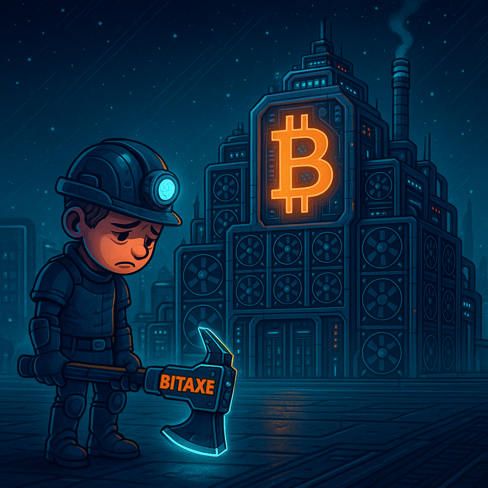

Dans la partie suivante de ce cours nous verrons qu'il est effectivement possible pour des particuliers de se lancer dans le minage de Bitcoin, et que des solutions hardware et software existent déjà, permettant aux individus quelques soit leurs sources de motivation (altruisme, curiosité, spéculation, et bien d'autres encore) ou leur compétences de participer au fonctionnement du coeur du réseau bitcoin.

On verra même que dans certains cas, miner à la maison peut présenter un certains nombre d'avantages ou d'oppotunité, voir être profitable  en fonction de sa situation personnelle, du climat et prix de l'électricité de la zone géographique sur laquelle on vit, par exemple:

- en hiver dans les pays où il est nécessaire de se chauffer, des machines ASIC ultra performantes mais modifiées pour être silencieuses et utilisables en intérieures en mode "plug & play" sont d'ores et déjà produites par certains constructeurs.
- utilisation des minis machines "ticket de loterie" consommant à peine 20W permettent de "jouer à la loterie bitcoin" en "solominant"avec des probabilité de jackpot bien supérieure aux loteries nationales.

# Pourquoi et comment miner soit-même ?

## Pourquoi miner en Pool "mutualiste" (supprimer tout les ##)

### Qu'est ce qu'une pool de minage ?

Une **pool de minage** est un regroupement de mineurs qui mettent en commun leur puissance de calcul (hashrate) pour **travailler collectivement** à la recherche de blocs. En effet en tant que mineur  individuel, il est presque impossible de trouver un bloc par soi-même tant notre puissance de calcul est dérisoire comparée à celle de l'ensemble du réseau.

Ici, lorsqu'un des mineurs de la pool trouve un bloc, cette dernière reçoit la **récompense complète (3.125 25 BTC + les frais )**, puis la répartit entre ses membres, proportionnellement à leur contribution.

Cela **lisse les revenus** et **réduit la variance**, ce qui est vital pour les petits mineurs. 

### Pour des revenus réguliers et prévisibles

Sans cette association entre mineurs qui partagent la récompense lorsque l'un d'entre eux trouve un bloc, un mineur isolé pourrait miner des années sans rien trouver. En rejoignant une pool, les paiements sont réguliers , et prévisibles. La pool demande à chaque mineur du groupe de soumettre des preuves de travail partielles appelées "shares" , puis attribut

Cela **réduit la variance** : au lieu de tout miser sur une "loterie" où les chances de miner un bloc seul sont infimes , on obtient  des fractions de BTC régulièrement, quotidiennement ou hebdomadairement, en fonction de son hashrate. 

## Pourquoi faire du solo mining

Le **solo mining** (ou minage en solo) consiste à miner  **sans passer par une pool mutualiste**. 

Aujourd'hui les solominer sont clairement extrêmement minoritaires, et sont majoritairement des particuliers qui le font par passion. On se rapporche là de la manière originelle de miner, à l'époque ou Satoshi Nakamoto, Hall Finey, et tous les 1ers Bitcoiners légendaires encaissaient 50 bitcoins toutes les 10 minutes par le seul travail de leur processeur de laptop.

Les professionnels ayant eux besoin de revenus réguliers pour palier à leurs obligations. Cependant comme on le verra ci-dessous, il y a de vraies raisons (techniques, idéologiques et stratégiques) qui peuvent motiver ce choix.

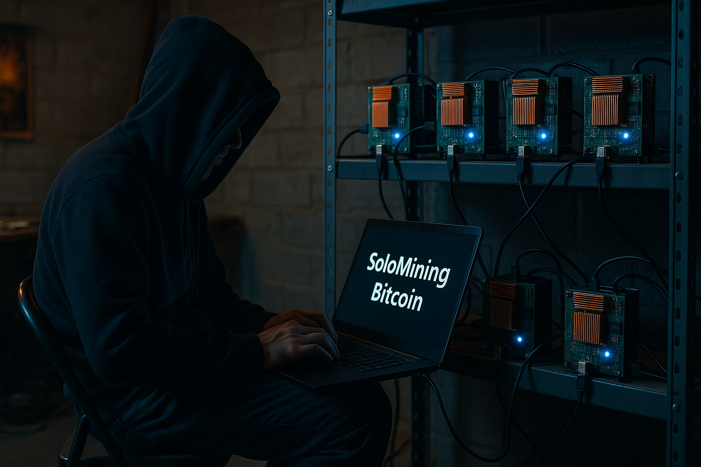

### Qu'est-ce que le solomining ?

On vient de voir que dans le minage en **pool**, on contribue à un effort collectif pour trouver le prochain bloc. On soumet  des “shares” et si le pool trouve un bloc, la récompense (3,125 BTC actuellement + les frais de transaction) est **répartie**  au pro-rata la puissance de chacun.

En **solo mining**, il est soit possible de faire tourner son propre nœud et son propre logiciel de minage afin de miner de manière totalement souveraine.
Ou bien de passer par un service tiers, une sorte de proxy qu'on appellera "solo pool", et qui nous apportera la couche logicielle nécessaire à la construction des blocs ainsi que le nœud Bitcoin.

Quoi qu'il en soit cette fois-ci quand un mineur trouve un bloc, ce dernier garde **100 % de la récompense**. On peut également préciser que même lorsqu'on choisit le solomining, 2 approches sont possibles:

 **La première** consiste à déléguer à un tiers qu'on appellera "solopool", la responsabilité de connecter notre machine de minage au réseau Bitcoin en mettant à notre disposition un nœud Bitcoin, et le logiciel qui sert à construire le bloc template sur lequel va travailler notre machine. Ce tiers prélèvera la plupart du temps des frais pour le service rendu, et est une source de confiance avec des risques de censure ou pourquoi pas de malhonnêteté (le manager de la "solopool" peut théoriquement tenter de tricher et s'auto attribuer la récompense de bloc si le miner n'est pas attentif.
 

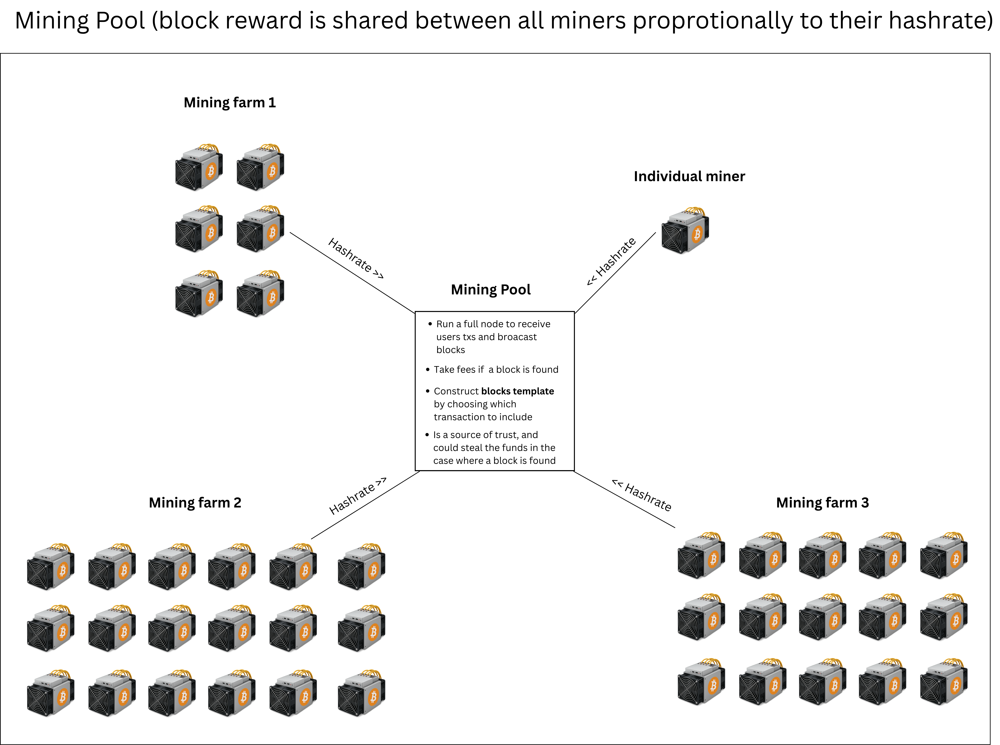

**La seconde** consiste pour chaque solominer à auto héberer sur un serveur qui lui appartient le nœud bitcoin et le logiciel de minage qui lui permet de sélectionner lui même les transactions qu'il veut inclure dans sont bloc, et de construire soit-même le bloc template. C'est la manière la plus souveraine de faire du solomining et aujourd'hui les miniserveurs personnels comme Umbrel ou Start9 bien connus des bitoiners, permettent de facilement choisir cette option si on le désire.

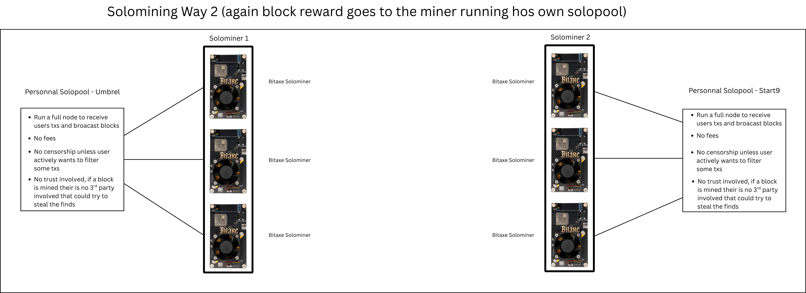

Mais évidemment, quelque soit notre manière de procéder, les chances de succès sont **extrêmement faibles** pour un solominer à la maison avec une puissance de calcul modeste.

Pouquoi diable choisir le solomining alors ?

### Pour la souveraineté et l’indépendance

Si tu le souhaites, tu **n’as besoin de faire confiance à personne** : ni à un pool, ni à un intermédiaire.
Tes blocs (potentiels) et les transactions qui le constituent sont directement soumis à ton propre nœud et ne  sont pas filtrées. En effet une grande pool de mining (solo ou pas) soumise à la régulation pourrait être contrainte de censurer les transactions "non conformes" c'est à dire qui ne plaisent pas au pouvoir politique local.
En solominant, et dans l'hypothèse ou suffisamment de mineurs autour du monde font de même, on pourrait s'assurer qu'aucune censure n'est possible sur bitcoin puisqu'au moins un bloc par jour par exemple, pourrait être miné par un individus souverain.

On participe ainsi à la **décentralisation du  hasrate**, et chaque mineur indépendant renforce la résilience face à la censure ou à la centralisation des pools. En solo mining, **on devient totalement souverain.**

### Pour la confidentialité 

Vous n'avez pas à partager vos données de minage (comme votre hashrate ou vos adresses bitcoin ou même votre adresse IP) avec un opérateur de pool tiers, ce qui préserve votre vie privée. De plus, vous avez un contrôle absolu sur votre configuration, sans risque de censure ou de manipulation par un pool (par exemple, en cas de fork ou de politique interne).

### Pour l’expérimentation et l’apprentissage

C’est une excellente manière de **comprendre Bitcoin techniquement**, notamment :comment fonctionne la propagation des blocs. la communication avec un nœud complet . la logique du Proof-of-Work.Les petits mineurs (avec un Bitaxe, un Antminer, etc.) utilisent souvent le solo mining **à titre pédagogique**.

### Pour la loterie 

Trouver un bloc, même avec du matériel modeste, c’est **comme gagner au loto**. La récompense actuelle est de 3,125 BTC + frais, mais comme on le verra plus tard, même avec une machine peu puissante et accessible financièrement, qui tourne en permanance dans notre salon , les chances de gagner sont tout de même supérieures à celles d'une loterie traditionelle.

Probabilité faible, mais gain énorme — surtout quand on fait tourner la machine pour le plaisir et non pour le profit.
Par exemple si 1 millions de Bitaxes (petites machines de mining) dont on estime qu'aujourd'hui déjà des centaines de milliers sont en service) minaient en solo, cela représenterait au jour ou ce paragraphe est écrit, environ 1 Eh/s soit 1/1000 du hashrate total. De quoi miner un bloc par semaine. Un ticket de loto par semaine gagné par un individu quelque part dans le monde, de quoi changer une vie.

En synthèse et quelque soit la raison qui pousse un individu à solominer, il s'agit là de se reconnecter à la vision originelle de Satoshi où n'importe quel utilisateur du réseau participait à renforcer la sécurité et la décentralisation de celui-ci via un système d'incitations bien alignées. Même un mineur uniquement intéressé par l'aspect loterie du minage de bitcoin devient un maillon important du réseau. En effet les petits ruisseaux faisant les grandes rivières, une généralisation de ce type de comportement pourrait aider de manière substantielles au retour d'une partie significative du hashrate entre les mains des particuliers.

| Feature          | Solomining                                                                         | Pool Mining                                                                        |
| ---------------- | ---------------------------------------------------------------------------------- | ---------------------------------------------------------------------------------- |
| Rewards          | Whole Block Reward                                                                 | Shared reward based on hashrate contribution among the pool                        |
| Payment term     | Extremely rare, you  may never be rewarded at all especially as a small home miner | Regular payments are received, ideal for those who have access to cheap electricty |
| Sovereignty      | Can be total                                                                       | A third party decides which txs to include and can censor                          |
| Fees             | Can be zero                                                                        | A % of the block reward is take by the pool                                        |
| Setup Complexity | A bit harder for those who seek total sovereignty                                  | Easy                                                                               |

## Panorama des solutions hardware

Nous allons dans ce paragraphe détailler une partie (nonexhaustive) des solutions matérielles qui s'offrent à vous pour miner à la maison. Les machines que nous présenterons sont "plug & play" et adaptée à un usage domestique, et peuve même tourner dans votre salon.

En effet les machines ASIC "professionelles" qui sont destinées à être installées sur rack dans des conteneurs ou datacenter, sont beaucoup trop bruyants et puissantes pour être utilisée en intérieur.
Ici certaines des machines présentées sont même marketées par leur fabriquant comme des radiateurs, à installer dans les pièces de votre maison en hiver pour vous chauffer.

### Bitaxe - Le projet 100% Open Source

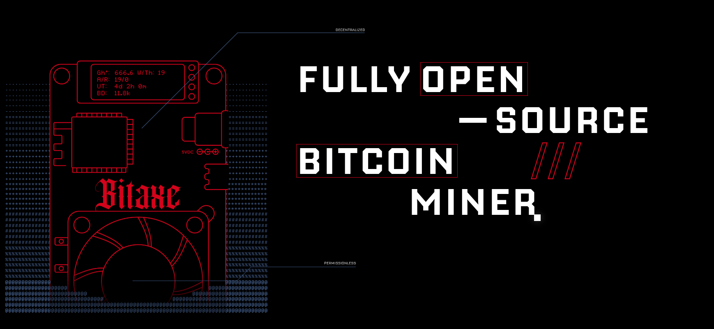

Le projet Bitaxe est né du constat que la centralisation du minage tant au niveau des pool de minage que de fabricants de machines pouvait à terme causer un problème pour Bitcoin. Il était temps de tenter de reprendre un peu de contrôle sur cet aspect fondamental du projet qu'est le mining.

Le problème c'est que les puces ASIC qui sont ensuite assemblées par centaines au sein des grosses machines que nous connaissons bien et qu'on retrouve dans les ferme de mining, ne sont pas vendues au détail par leurs fabricants pour être utilisées par qui le veut. Par exemple Bitmain, le plus gros constructeur de machine ASIC du monde, réserve précieusement ses propres puces ASIC à ses propres machines (les fameux Antminer). Et c'est également le cas pour tous les autres fabricants.

Comment faire pour proposer une solution Open Source dans ces conditions. Tout simplement en achetant des machines Antminer complètes, en les désossant, et un déssoudant les puces ASIC, pour les réhabiliter et leur donner une seconde vie au sein du projet de mining open source le plus célèbre de l'écosystème Bitcoin: **[Bitaxe](https://github.com/bitaxeorg)**

Cerise sur le gâteau l'ensemble du projet est 100% open source, tant au niveau du hardware que du software. N'importe qui peut donc s'approvisionner en composants et construire sont propre appareil rendant le projet quasiment inaltérable. Dans la pratique les particuliers se fournissent auprès de constructeurs (autrement dit des geeks bricoleurs) spécialisés répartis autour du monde, plutôt que de se munir des pièces et de son faire à souder pour le fabriquer soit-même.

Au moment où ces lignes sont écrites, la version la plus performante du projet Bitaxe est le Bitaxe Gamma, propulsée par une puce Bitmain BM1370, et délivrant environ 1,2 Th/s de hashrate, pour moins de 20W de consommation.

Vous pouvez par exemple vous procurer le votre si vous êtes en europe chez [Bitcoin Bazar](https://bitcoinbazar.fr/en/collections/home-mining), Silexperience, ou encore PlebStyle. 

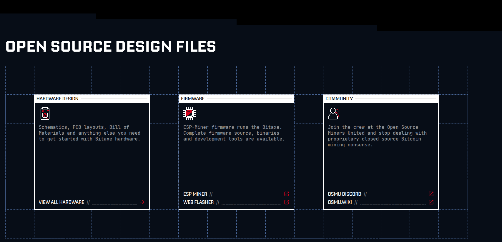

### NerdQAxe++

Le projet Bitaxe a très rapidement fait des émules et de nombreuses évolutions de celui-ci on vu le jour.
Les QAxe sont une sous famille de Bitaxe qui présentent sur un seule carte PCB non pas une puce ASIC mais 4 d'où le "Q".

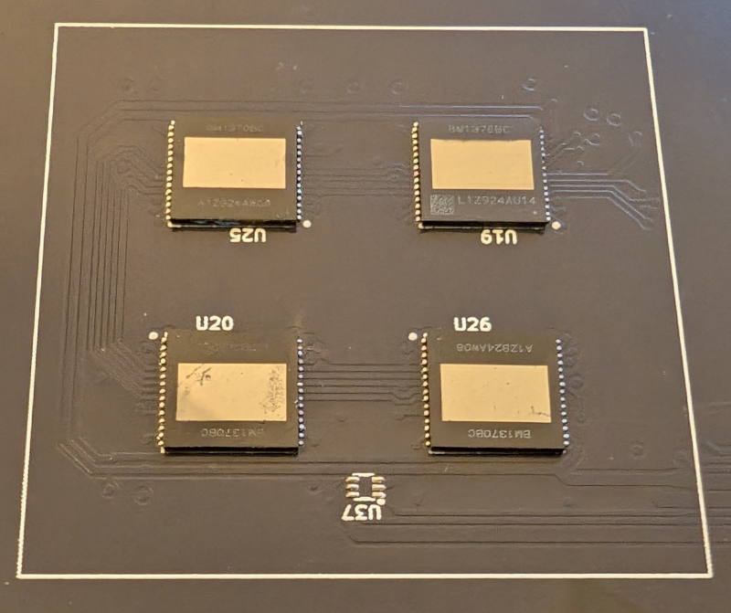

Les NerdQAxe sont un sous-ensemble de la famille QAxe présentant un écran écran plus grand qu'un Bitaxe traditionnel (ESP32 Lilygo display), pour une meilleure expérience utilisateur.
Les "++" siginfient que les 4 puces ASIC installées sont les dernières et plus performantes disponibles sur le marché à date (4 x BM1370). Ainsi et sans grande surprise on obtient environs 5Th/s de hashrate pour moins de 80W de consommation électrique.

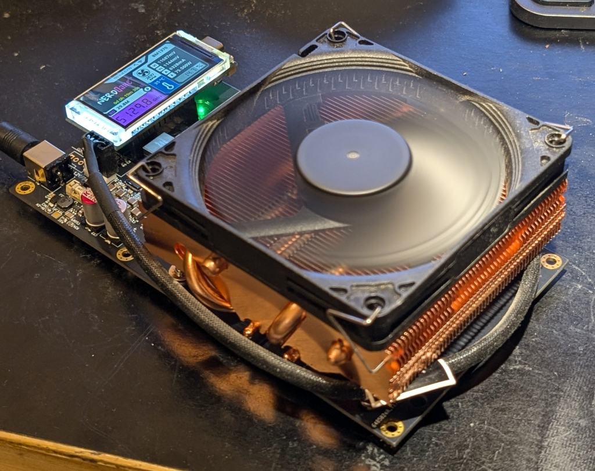

Mais le firmware (le logiciel qui tourne sur l'appareil) utilisé est fondalement celui du projet racine Bitaxe. Il est il me semble utile de mentionner cette variante pour porter à la connaissance de  ceux qui auraient envie de plus de puissance, tout en gardant l'esprit totalement open source et transparent. Mais bien d'autre dérivés sont disponibles qu'on ne pourra pas détailler ici.

### Braiins BMM101

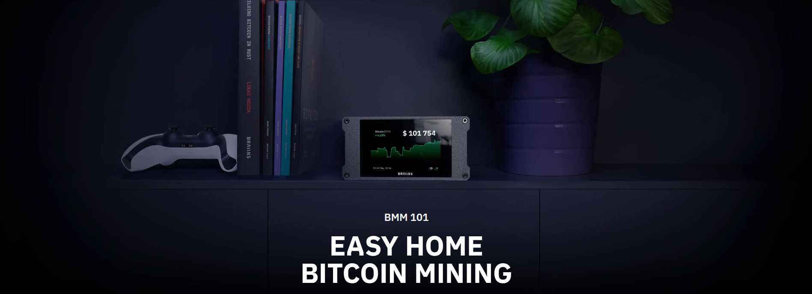

https://www.youtube.com/watch?v=QXonFfguymw

Cet appareil proposé par la société Braiins est un "Home Miner" vendu sans équivoque comme un ticket de loterie. Le but est placer la machine dans votre pièce à vivre, de profiter de son silence remarcable et de l'oublier. Il ne s'agit pas vraiment d'obtenir une quelconque rentabilité, mais de tenter sa chance en essayant d'être le prochain mineur qui fournira la preuve de travail nécessaire pour miner un bloc.  Braiins la société qui le fabrique est une référence dans l'écosystème bitcoin, connue pour fournir des solutions de mining en pool depuis 2010 et toujours en activité aujourd'hui et que l'on présentera plus tard dans notre panorama des pool de mining.

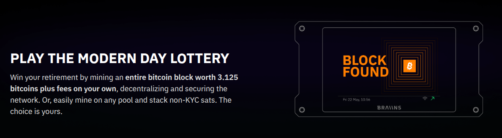

En synthèse cet appareil au design soigné vous permettra de déployer un hasrate de 1 Th/s pour 35/40 W de consommation électrique, le tout avec un bruit réduit de 40 dB.  Le design est soigné, le grand écran permettant d'afficher les informations importantes concernant l'appareil mais aussi le réseau Bitcoin  et même plus.

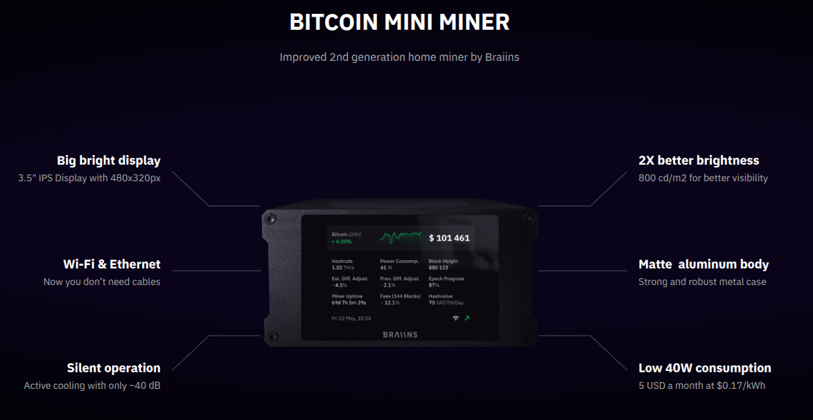

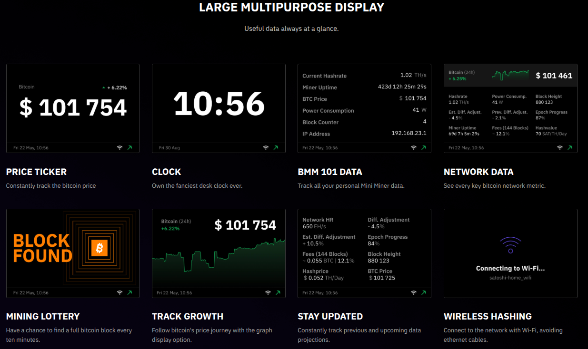

### La Gamme Avalon Home de Cannan

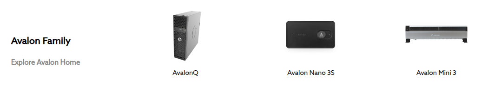

Canaan est une entreprise Singapourienne et un des 3 plus grands constructeurs de machines de minages et de puces ASIC au monde, au côté de l'indétronable Bitmain et de MicroBT.
Ils développent une gamme de produits s'adressant aux particuliers qui voudraient miner à la maison tout en utilisant l'énergie dissipée par l'équipement pour chauffer son logement, plutôt que d'évacuer cette chaleur comme le font habituellement les mineurs professionnels.

Le défit est donc de faire entrer dans les foyers des machines suffisament puissantes pour chauffer une potentiellement une pièce entière, tout en garantissant un niveau de bruit minimal des ventilateurs pour ne par perturber la vie quotidienne de l'utilisateur. La gamme de produits "Avalon Home" de Canaan que nous présenterons ci-après relève ce défit avec brio. 

#### Avalon Nano 3S

L'Avalon Nano 3S est l'équipement le moins puissant mais le plus compact de cette gamme de produits, présenté comme un chauffage d'appoint. Il vous sera utile posé sur un bureau pour vous réchauffer les doigts en hiver dans votre pièce mal isolée et non chauffée. Mais en aucun cas suffisant pour chauffer ne serait-ce qu'une petite pièce.

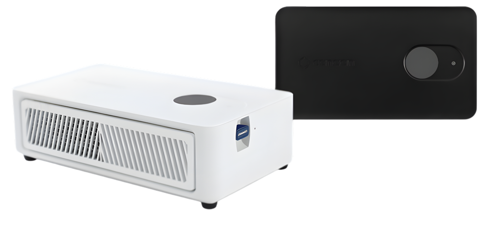

Cette petite boite d'envrion 20 cm par 11 cm et de seulement 1kg  (L205mm x W115mm x H58.5mm exactement )  délivre  un impressionnant 6Th/s de Hashrate (grace à 12 puces ASIC maison) pour seulement 140W de consommation. Il fonctionne en WIFI même si il existe des moyen de le connecter au LAN via un adaptateur USB-RJ45. Plutôt silencieux également puisque fonctionnant sur une plage de bruit entre 30 et 40dB.

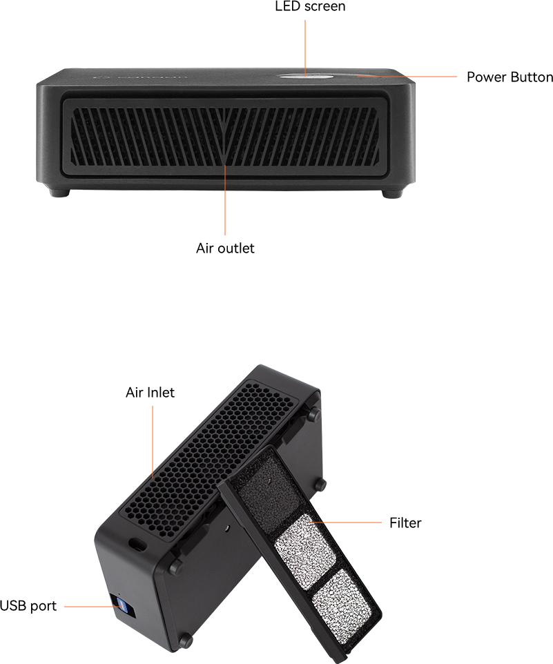

Tous les appareils de la gamme sont pilotables et configurables  de manière plutôt ludique via l'application "Avalon Family" disponible via votre store d'application favori. Vous pourrez le régler selon 3 mode de puissance.

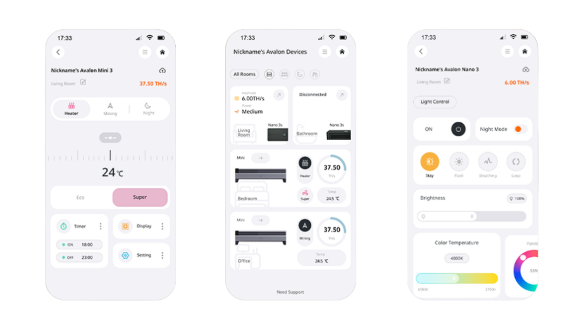

Un tutoriel détaillé pour apprendre comment le configurer est disponible ic: https://planb.academy/fr/tutorials/mining/hardware/canaan-avalon-nano-3f6ac96e-ea8a-4dee-9b9b-13875824c9a6

S'il s'agit de vous en procurer une unité, Bitcoin Bazar petite boutique physique située à Paris entièrement dédiée à Bitcoin, en vend au côté de tout l'attirail du Bitcoiner souverain: https://bitcoinbazar.fr/en/products/avalon-nano-3s

### Avalon Mini 3

Le Avalon Mini 3 quant à lui nous fait passer à la vitresse supérieure en nous proposant jusqu'à 40Th/S pour 800 W de consommation électriquen (66 puces maison Canaan). Le format de l'appareil fait vraiment penser à celui d'un radiateur, et le silence est là encore au rendez-vous. Suffisant pour chauffer une petite pièce d'environ 20/30m2.

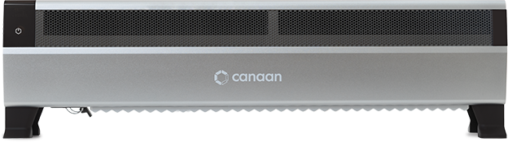

Les dimensions sont un peu plus supérieures à ce que le Nano 3S vu au dessus propose évidemment, mais restent raisonnables avec 75 cm de longueur pour en encombrement réduit (L760mm x W104mm x H214.5mm (Net)) et un poid d'environ 8 kg. Celles d'un radiateur classique en somme. 
La connectivité est assurée par le WIFI (possibilité optionnelle d'utiliser du RJ45 via adaptateur). Le bruit est là encore extrèmement bien géré pour un appareil de cette puissance (entre 35dB et 55dB suivant les modes de fonctionnement).

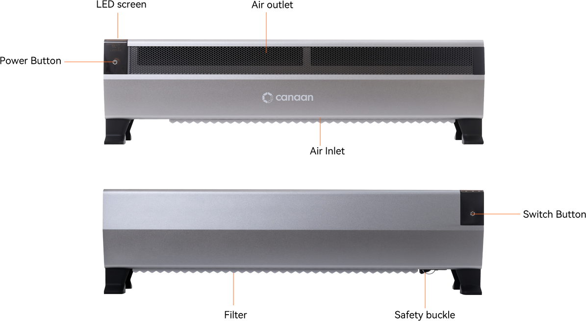
L'application Avalon Family vous permet ici aussi de configurer et piloter l'appareil. 2 mode de fonctionnement sont proposés:
- Chauffage (bruit réduit mais perfrmance un peu en deça du maximum)
- Mining (on pousse l'appareil au maximum mais les ventilateur poussent un peu plus pour refroidir les puces générant plus de bruit)

Un tutoriel pour vous aider à paramétrer l'appareil est également disponible sur le site de l'academy: https://planb.academy/fr/tutorials/mining/hardware/canaan-avalon-mini-f2185435-10a3-4d7b-b88f-f1a489babab7

https://bitcoinbazar.fr/en/products/avalon-mini-3

### Avalon Q

Le Avalon Q est l'appareil le plus puissant de la gamme. Il équivaut en terme de hashrate et de puissance à 2 Avalon Mini 3 très exactement 90 Th/s pour 1700W (grace à 160 puce ASIC Canaan) , le tout avec l'allure d'une unité centrale de vieux PC des années 2000.

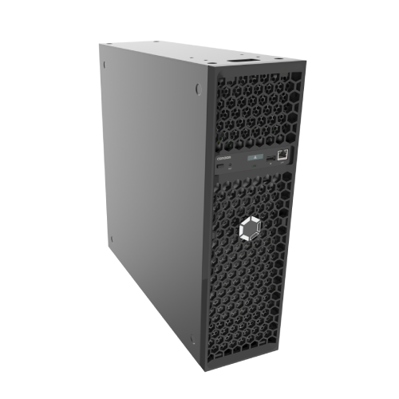
Cette impressionante machine se rapproche en terme performance de ce que proposent certaines machines professionelles, mais l'encombrement  (L455mm x W130.5mm x H440mm) et le niveau sonore (45 ~ 65 dB) sont de nouveau si bien gérés que l'appareil trouvera une place de choix dans votre salon et sera en mesure de chauffer une grande pièce de 40 m2.

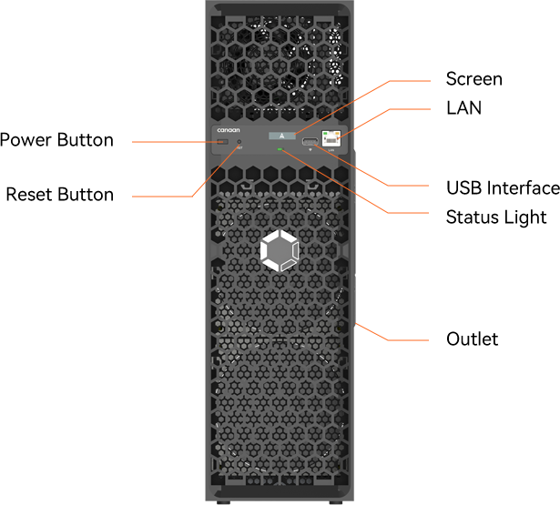

De nouveau, l'application Avalon Family permet le pilotage, et la connectivité s'effectue en WIFI avec possibilité de connexion au LAN en RJ45 avec un adaptateur. 

https://bitcoinbazar.fr/en/products/avalon-q

## Panorama des solutions software

Lorsqu'il s'agit de matériel de minage, le logiciel installé sur l'appareil  est appelé "firmware". Ce logiciel se compose en synthèse de l'OS (Operating System) de l'appareil, du logiciel de minage, et de l'interface web / application mobile, qui vous permettra d'interagir facilement avec votre miner depuis un navigateur d'ordinateur classique, ou votre smartphone.

Nous présenterons ici un aperçu non exhaustif de certains de ces logiciels en s'attardant davantage sur les machines qui font l'objet de cette formation, c'est à dire celles que nous instrallerons à la maison.

Aujourd'hui les machines de minage sont livrées avec un firmware préinstallé par le fabricant, vous épargnant de devoir choisir quoi installer que ce soit pour les machines traditionnelles de Bitmain, MicroBT, et Canaan mais également dans notre cas de machine de Home Mining à l'attention de particuliers.

Sachez cependant qu'il est  possible dans certains cas de remplacer le firmware du  constructeur par un autre si on le souhaite, pour bénéficier des certaines fonctionnalitées par exemple.

C'est le cas de Braiins OS qui peut se subtituer au firmware de base des appareils Antminer de Bitmain par exemple. On présentera rapidement l'OS dans le paragraphe suivant puisque que c'est l'OS qui équipe notre appareil Braiins BMM101 présenté plus haut, et qu'elle présente des caractéristiques et fonctionnalitées interessantes.

### Braiins OS

### AxeOS & Esp-Miner

### Avalon Family App

# Installer et configurer son premier mineur personnel

## Mise en perspective et ordres de grandeurs

Dans ce paragraphe  nous entrons dans la pratique. Nous verrons comment paramétrer un Bitaxe Gamma 601 et le connecter à une pool de mining.

Pour ceux qui auraient opté pour des appareils de la gamme Avalon de Canaan, vous trouverez des tutoriels disponibles ci-dessous:

https://planb.academy/fr/tutorials/mining/hardware/canaan-avalon-nano-3f6ac96e-ea8a-4dee-9b9b-13875824c9a6

https://planb.academy/fr/tutorials/mining/hardware/canaan-avalon-mini-f2185435-10a3-4d7b-b88f-f1a489babab7

https://planb.academy/fr/tutorials/mining/hardware/braiins-mini-miner-f5aec001-fb05-4e89-b3b2-a31abec1253c

Pour rappel un Bitaxe Gamma fournit un hashrate d'environ 1,2 Th/s. C'est à la fois énorme et minuscule. Enorme car une seule de ces petites machines est désormais plus puissante et immensément plus efficiente que les machines les plus performates d'il y 10 ans. Minuscule car en branchant un Bitaxe, vous ne représentez qu'un milliardième du hashrate mondial atuel (évalué à environ 1 Zetahash par seconde au moment où ces lignes sont écrites).

Cela étant dit il va nous falloir décider comment allouer notre hasrate de la manière la plus "smart" possible. En simple est-il plus malin de miner en pool, ou de solominer avec un Bitaxe ?

**Bitaxe en pool**: avec 1,2 Th/s un Bitaxe vous permettrait au moment où sont écrites ces lignes de générer 4 centimes de dollars par jours de bitcoin, sans compter la dépense énergétique qui dépendra de chacun et qui pour la majorité d'entre nous sera supérieure à la récompense. En dehors du fait d'obtenir quelques sats non KYC, l'intérêt est très limité. C'est pour quoi les Bitaxes sont utilisés dans leur écrasante majorité comme des tickets de lotterie.

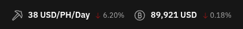

**Bitaxe en solomining:

Mais alors s'il s'agit de jouer à la lotterie Bitcoin, quelles sont nos chances de tirer le gros et de gagner les 3,125 bitcoins + frais de la récompense de block allouée à chaque mineur chanceux ?

Comme on vient de le voir un peu plus haut un Bitaxe seul, c'est 1 / 1000 000 000 de la puissance de calcul globale déployée sur terre. Est-ce à dire que notre chance de trouver un block est de 1 sur 1 milliard ? Ce serait le cas si on essayait une seule fois de miner un block, c'est à dire qu'on allumerait notre appareil pendant les 10 prochaines minutes en croisant les doigts, jusqu'au prochian bloc miné. Là effectivement nos chances seraient de 1 sur 1 milliard.

Mais la beauté de Bitcoin, c'est qu'un nouveau bloc est miné toutes les 10 minutes environ, ce qui nous permet de jouer à la lotterie Bitcoin environ 144 fois par jour. Et ça ça change beaucoup de choses en terme de statistiques, car ça n'étonnera personne: plus on jour, plus on a de chance de gagner.

Alors quelles sont nos chances exactement ? Des sites existent ([solochance.com](https://solochance.com/) ou [sololuck.com](https://www.sololuck.com/)) nous permettant de calculer cela (même si le calcul n'est aps très compliqué en soit), qui varient légèrement en fonction de leur appréciation du hashrate global et autres paramètres.

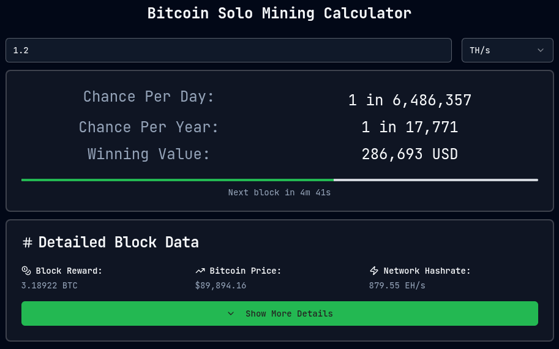

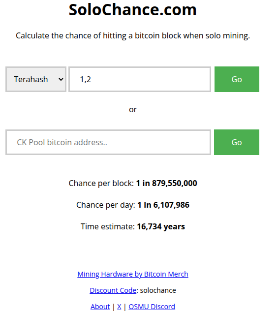

Cela permet quand même de se rendre compte des ordres de grandeurs dont nous parlons.

| Bitaxe Gamma (1.2 Th/s) 15th of December 2025 | Duration of mining activity | Number of tries | Chance of hitting a block |
| --------------------------------------------- | --------------------------- | --------------- | ------------------------- |
|                                               | 1 block                     | 1               | 1/1000 000 000            |
|                                               | 1 day                       | 144             | 1 / 6000 000              |
|                                               | 1 year                      | 53560           | 1/ 18 000                 |

Ainsi pour résumer, laisser son Bitaxe Gamma touner toute l'année, revient à effectuer  une fois par an, un tirage au sort avec 1 chance sur 18000 de gagner le jackpot.

Mais dans les faits, est-ce que nous avons des exemples de solominers ayant trouvé un blocs et empocher la récompense ?
Eh bien oui, il suffit pour se faire une idée de suivre l'actualité du solomining sur les réseaux sociaux (X principalement), pour s'en convaincre. Régulièrement, une ou deux fois par moins en 2025, des heureux gagnants sont repérés.

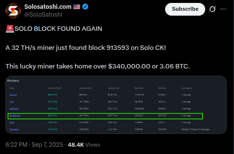

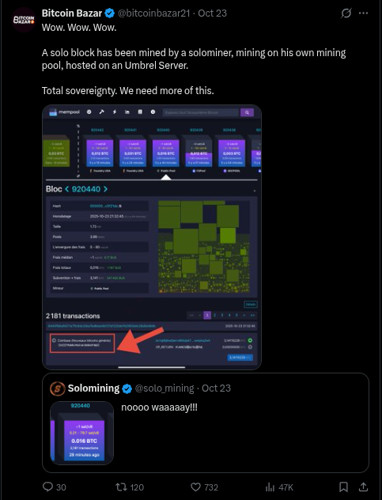

Si l'on veut un  moyen non exhaustif mais assez fiable d'avoir une idée du nombre de "solo blocs" trouvés, alors il nous faut tout simplement observer les blocs minés par la pus grande solo pool du monde "Solo CkPool": https://mempool.space/mining/pool/solock

On remarque alors qu'environ 1 bloc par mois est trouvé par un miner solo via cette pool. Cependant il est à noté qu'un mineur solo peut tout aussi bien être un Bitaxe dans un salon, qu'un mineur  professionel possédant des dizaines de machines dernier cri.

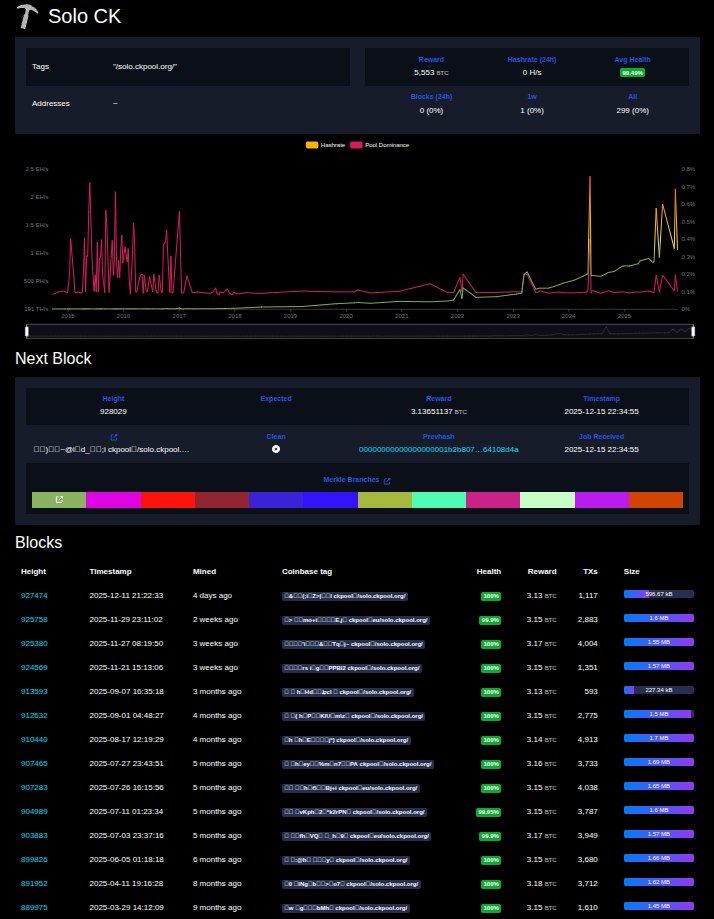

Dernière remarque, mais il est à noter que certain chanceux ont eux déjà réussi à miner des blocs sur des pool [auto hébergées sur leur propre serveur Umbrel](https://mempool.space/mining/pool/publicpool). Le meilleur moyen de miner selon moi, comme le faisaient les mineurs des origines, sans dépendre de personne. Et aujourd'hui, c'est à la portée de n'importe qui. On reviendra dans le dernier paragraphe de cette formation sur les applications permettant de miner en tout autonomie et en quelques clics.

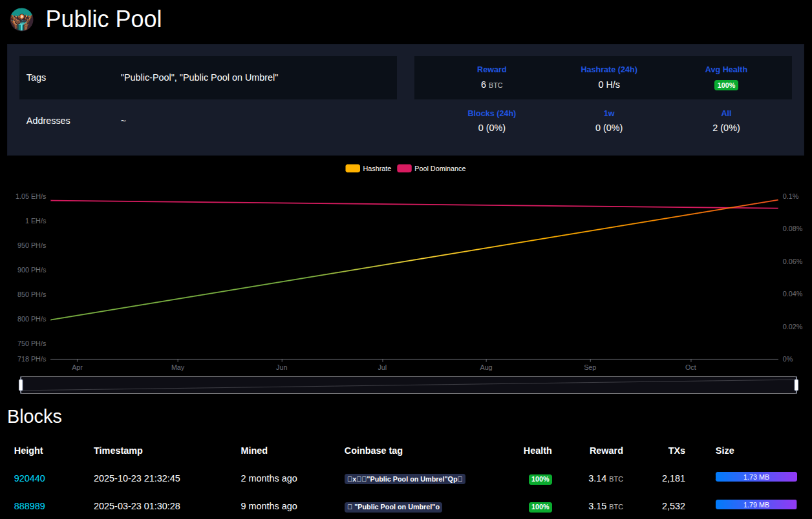

## Installation d'un Bitaxe et connexion à une "solopool"

Entrons dans le dur du sujet désormais et installons notre 1er Bitaxe.

Après l'avoir mis sous tention, des indications apparaissent sur son petit écran. Il vous faudra vous munir de votre smartphone ou de votre ordinateur pour aller rechercher dans les paramètres WI-FI l'appareil répondant au nom de **Bitaxe_E25D**. Bien sur ce nom sera différent dans votre cas.

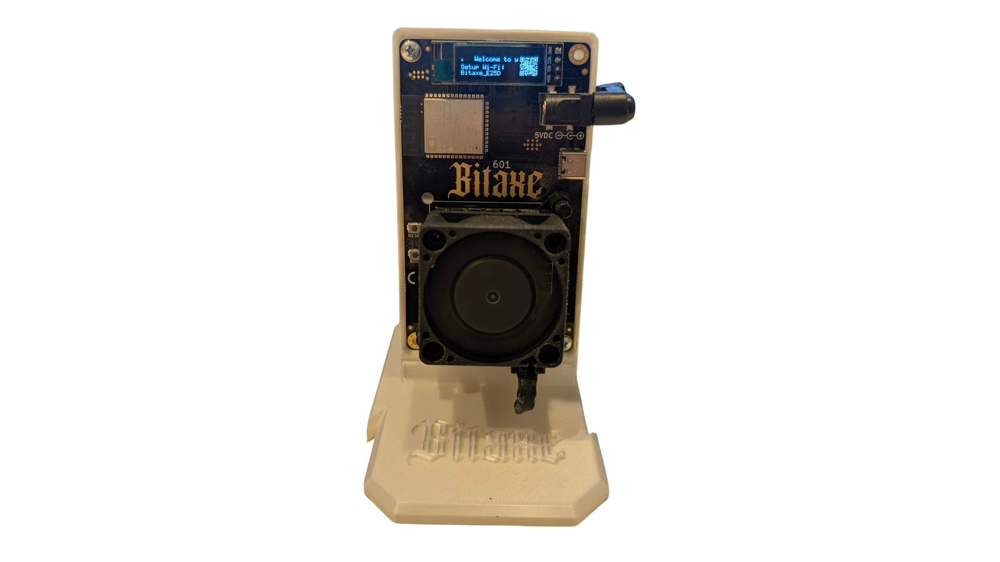

Une fois que vous aurez cliquez sur le nom de l'appareil , une oage web s'ouvrira automatiquement en vous demandant de renseigner:

- le nom de l'appareil tel qu'il appaitra sur votre réseau local (livre à vous de chosir celui qui vous convient)
- votre Wi-Fi SSID, c'est à dire le nom du réseau Wi-Fi de votre routeur, ici Livebox-43A0.
- Le mot de passe Wi-Fi permettant de se connecter à votre réseau local en Wi-Fi

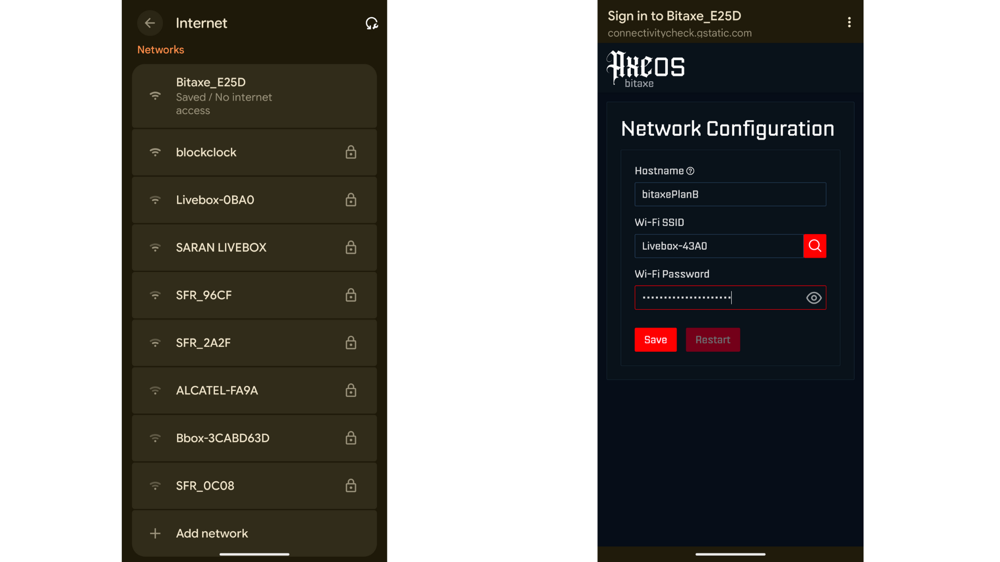

Une fois les champs complétés, cliquez sur "Save", puis "Restart".

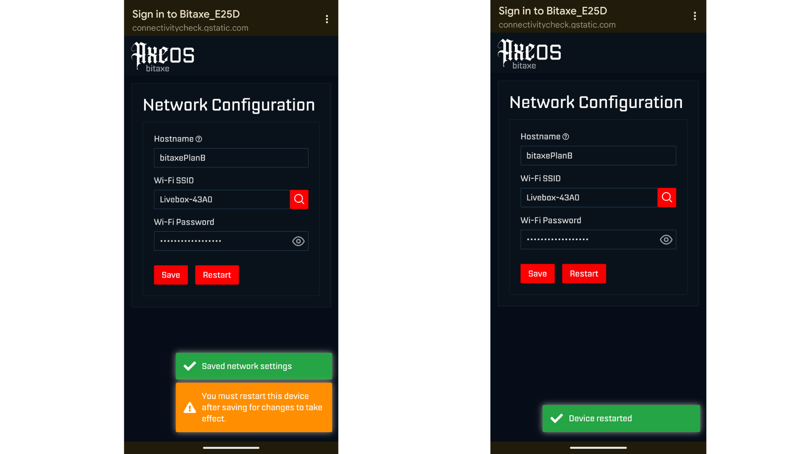

L'appareil redémarre, et est désormais connecté à votre réseau local. Une adresse IP lui a donc été attribuée qu'il nous conviendra de déterminer car c'est grace à cet identifiant que l'on pourra interagir avec l'appareil.

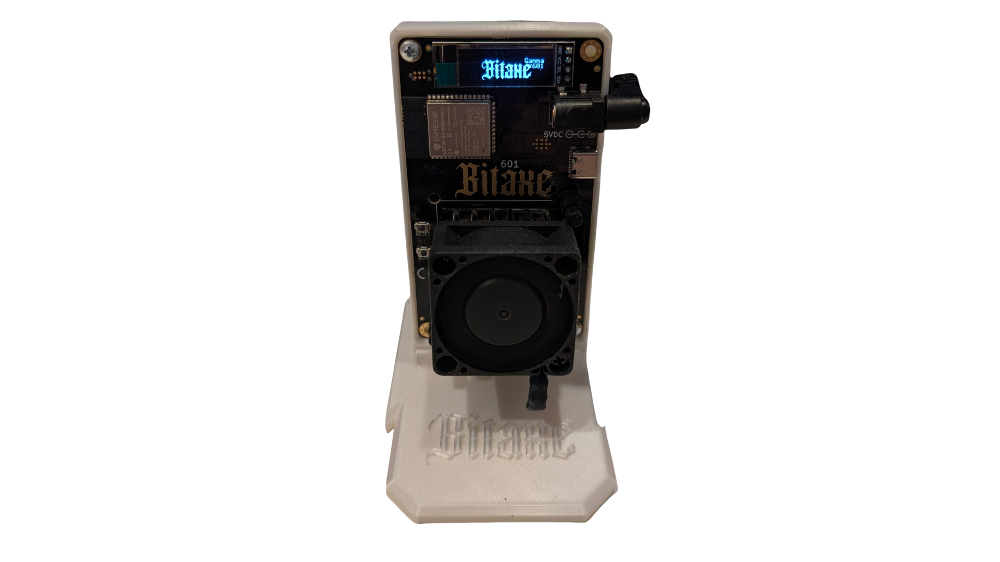

Avec les Bitaxes l'adresse IP est très facile à trouver puisqu'elle s'affiche sur l'écran de l'appareil tout simplement, comme indiqué ci_dessous:

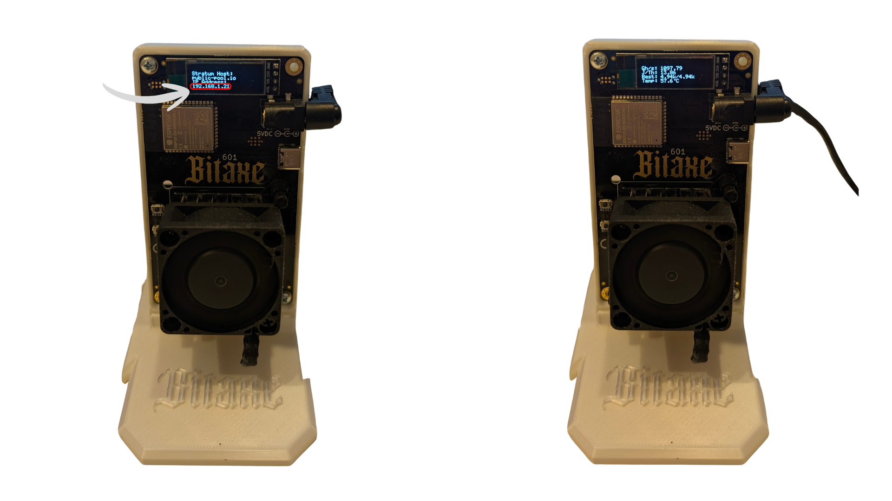

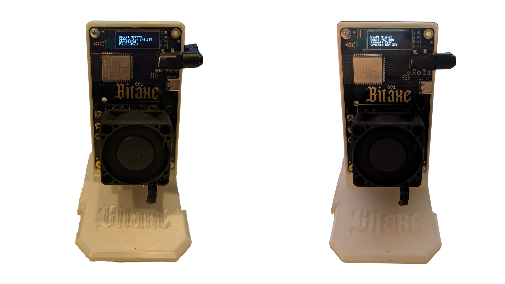

Ainsi l'adresse IP attribuée à notre Bitaxe 601 est "192.168.1.21".
En tapant cette adresse dans notre navigateur favori, on arrive sur l'interface d'AxeOS qui pilote l'appareil et qui va nous permettre de le connecter à une la pool de minage de notre choix, entre autre.

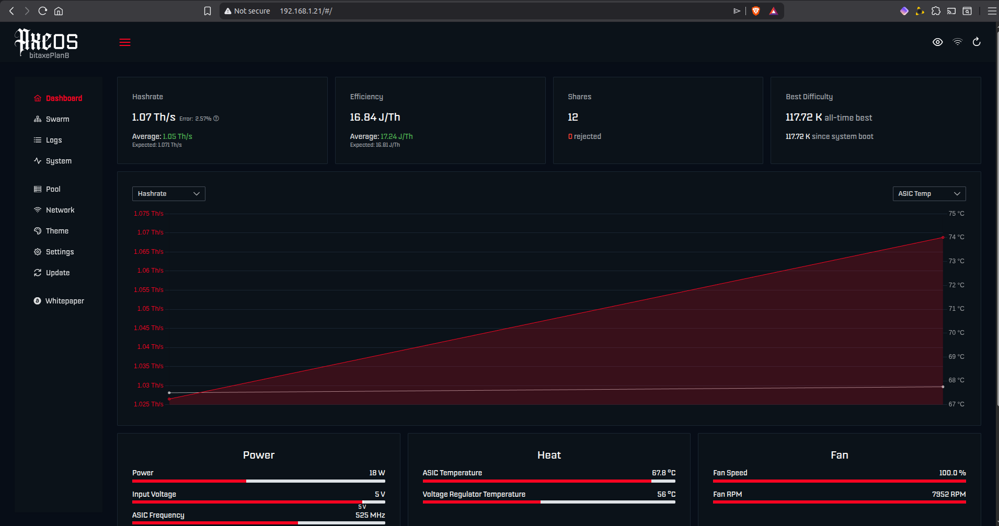

Allons configurer maintenant la solopool de minage vers laquelle nous allons pointer notre hashrate. 
Pour rappel cette pool est chargée de nous donner un accès au réseau Bitcoin, de sélectionner les transactions à inclure dans le bloc sur lequel nous travaillons, et de diffuser notre bloc valide sur le réseau Bitcoin, dans le cas où nous serions chanceux.

**NB: Lorsque vous initialisez pour la première fois votre Bitaxe, des pools et adresses bitcoins sont déjà renseignées par défaut, mais il faut les remplacer autrement vous minerez pour quelqu'un d'autre si vous ne faites rien.

**La pool renseignée par défaut est Public Pool (Public Pool est un pool au code open source et ouvert, sans frai et conçu pour les petits mineurs comme le Bitaxe.  L'adresse par défaut est celle de l'OSMU l'oraganisation responsable du développement du projet Bitaxe****

Ce tutoriel est réalisé sous la version v 2.11.0 d'Axe OS. Il est  possible que les menus soient sensiblement différents suivant la version de l'OS qui flashé sur votre appareil au moment où vous le configurerez. 

Cliquons via le menu de gauche sur "Pool".

Il nous est donné la possibilité de renseigner 2 pool différentes ici, une principale et une pool de backup au cas où la première ait des problèmes, notre Bitaxe basculera alors automatiquement sur la pool de secours garantissant une continuité du service, maximisant ainsi vos chances de miner un bloc.

Pour chaque Pool les champs à renseigner sont:

- Stratum Host
- Stratum Port
- User
- Password

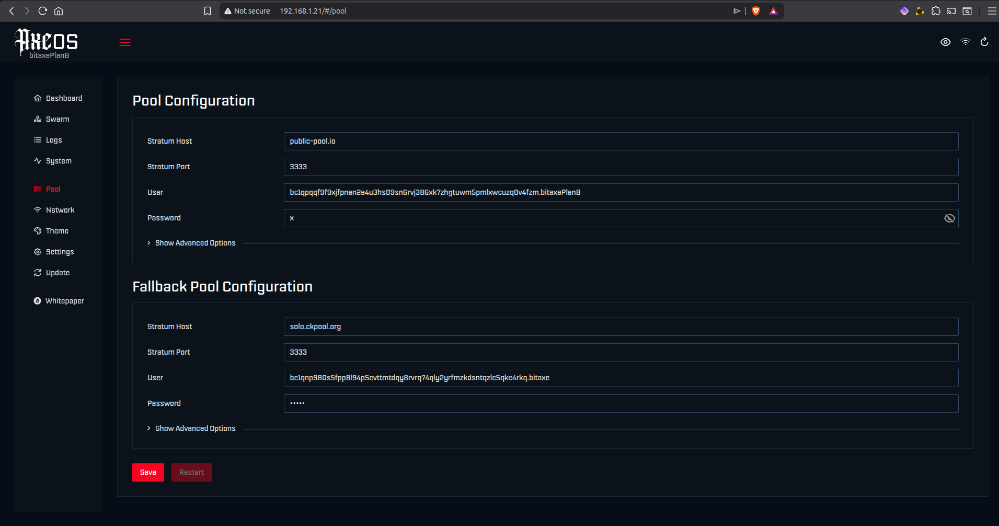

Nous choisissons en  pool principale Public Pool, une solo Pool très populaire chez les solominers, toujour en quête de son premier bloc miné malgré les quelques  40 Ph/s que des solominer du monde entier pointent vers elle.

On verra au pragraphe suivant qu'il existe de multiples services de solopool similaires à celui-ci, et qu'il convient de faire attention car ces fournisseurs de services restent des intermédiares  qui peuvent très bien être malhonnêtes.

En allant sur https://web.public-pool.io/#/ on nous indique les informations à renseigner dans les champs qui nous intéressent:

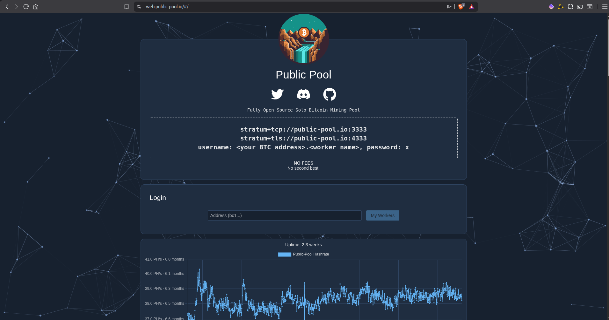

- Stratum Host: **stratum+tcp://public-pool.io** (ou simplement public-pool.io)
- Stratum Port: **3333**
- User: **"votre adresse bitcoin"."nom de votre appareil"** soit pour nous bc1qpqqf9f9xjfpnen2e4u3hs09sn6rvj386xk7zhgtuwm5pmlxwcuzq0v4fzm.bitaxePlanB
- Password: x (dans le protocole de minage stratum le mot de passe n'a pas d'importance dans la plupart des cas ce sera "x")

En solopool secondaire de backup, nous optons pour Ckpool, la plus grosse pool de solomining qui elle pour le coup a déjà miné de multiples blocs. Sur https://solo.ckpool.org/ on nous indique là aussi les champs à remplir dans l'interface de notre Bitaxe. Comme nous sommes située en Europe, nous choisissons le serveur européen pour bénéficier de meilleures performances.

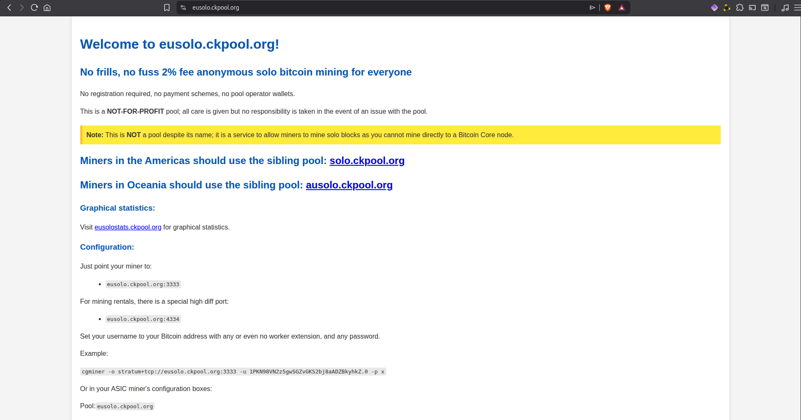

- Stratum Host: **stratum+tcp://eusolo.ckpool.org** (ou simplement eusolo.ckpool.org)
- Stratum Port: **3333**
- User: **"votre adresse bitcoin"."nom de votre appareil"** soit pour nous bc1qpqqf9f9xjfpnen2e4u3hs09sn6rvj386xk7zhgtuwm5pmlxwcuzq0v4fzm.bitaxePlanB
- Password: "x" là encore.

Lorsque tout cela est fait, il suffit de cliquer sur "Save" puis "Restart" en bas de l'écran dans AxeOS pour que notre hasrate pointe effectivement vers les pools que nous venons de choisir et que le solomining commence !

Allons maintenant vérifier que Public Pool détecte bien notre hashrate et que tous fonctionne correctement.

Pour ce faire rensignez simplement votre adresse dans le champ prévu à cette effet sur https://web.public-pool.io/#/. Votre adresse Bitcoin vous sert non seulement à recevoir les éventuelles récompense mais également à vous identifier en tant qu'entité minière. Il s'agit en quelque sort de votre identité du point de vue de la pool.

Cliquez ensuite sur le bouton "My Workers" pour visualiser l'ensemble des appareils liés à votre adresse que Public Pool détecte.

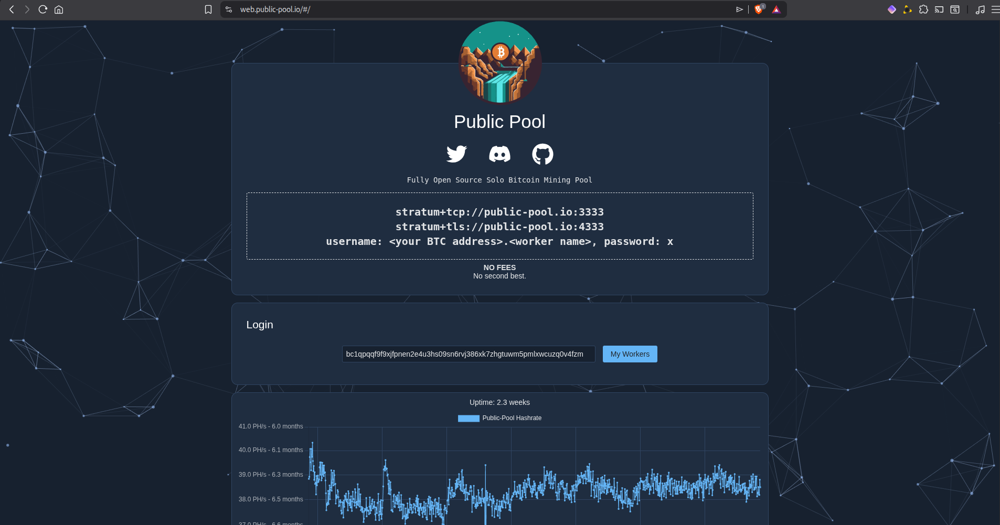

On voit bien ici notre Bitaxe, dénommé par le nom qu'on lui a attribué "bitaxePlanB".

Les informations affichées sont en synthèse:

- la difficulté totale du réseau, c'est à dire un nombre déterminé par le protocole et dont l'ajustement permet  l'émission régulière environ toute les 10 minutes, de nouveaux Bitcoin. Plus ce nombre est élevé, plus il sera difficile pour un mineur de "trouver un bloc". Ce nombre est ajusté tous les 2016 blocs soit environ toutes les 2 semaines pour faire varier la difficulté du minage à la hausse ou à la baisse. Ici la difficulté affichée est de 148,2 Téra.
- Notre meilleure difficulté personnelle sur la période d'activité du mineur: pour nous 92,77 M (millions). Autrement dit il nous faudra faire environ 1,5 millions de fois mieux pour trouver un bloc...
- Le hashrate global de 984 Eh/s
- La hauteur de bloc
- Les information en temps réel sur le hashrate de notre appareil tel que détecté par la pool

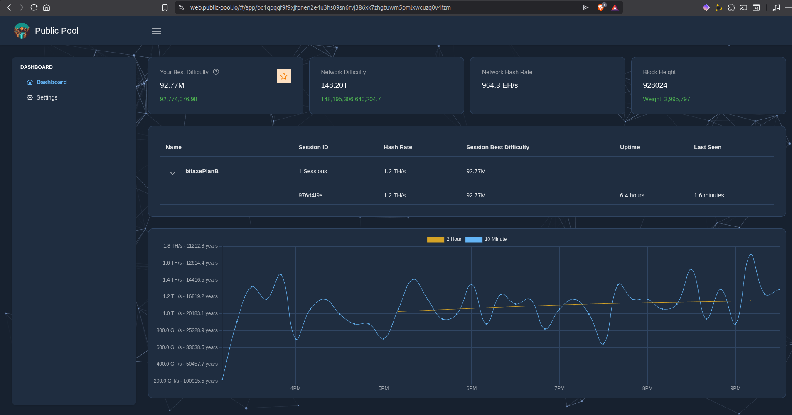

Nous sommes désormais parés, nous minons et participons à l'effort global et la décentralisation du hashrate tout en ayant une maigre chance d'être récompensé. Mission accomplie.

## Panorama des différentes Pool de mining

**Disclaimer:** Les Pool de mining sont des tiers de confiance. Si vous ne faites pas tourner votre propre logiciel de mining et comptez sur quelqu'un d'autre pour le faire, de la confiance est nécessaire et rien ne garanti que l'opérateur du serveur auquel vous êtes connecté est honnêtes.

Nous venons de voir dans le rapide tutoriel du paragraphe précédent, 2 solo pool que l'on peut choisir afin de connecter notre "hasheur" au réseau Bitcoin et lui permettre de miner.
Public Pool et CkPool sont en effet les 2 solutions les plus populaires du marché auprès des solominers mais elles sont loin d'être les seules.

Nous verrons dans ce paragraphe un panorama assez complet mais comme souvent non exhaustif des solutions qui s'offrent à nous, et des caractéristiques de chacune des solutions.

### Les solopools

#### [La plus grande et réputée: CkPool](https://solo.ckpool.org/)

CkPool est la solution de référence pour les solominer, fondée par une figure bien connue et presque légendaire de l'écosystème open source du mining Bitcoin: Con Kolivas alias [Dr-Ck (@ckpooldev) ](https://x.com/ckpooldev) sur les réseaux sociaux.
C'est la solopool qui a permis de miner le plus de solo blocs et de loin, notamment du à son ancienneté et à la réputation de son développeur.

Elle cumule aujourd'hui un hashrate total de 215 PH/s.

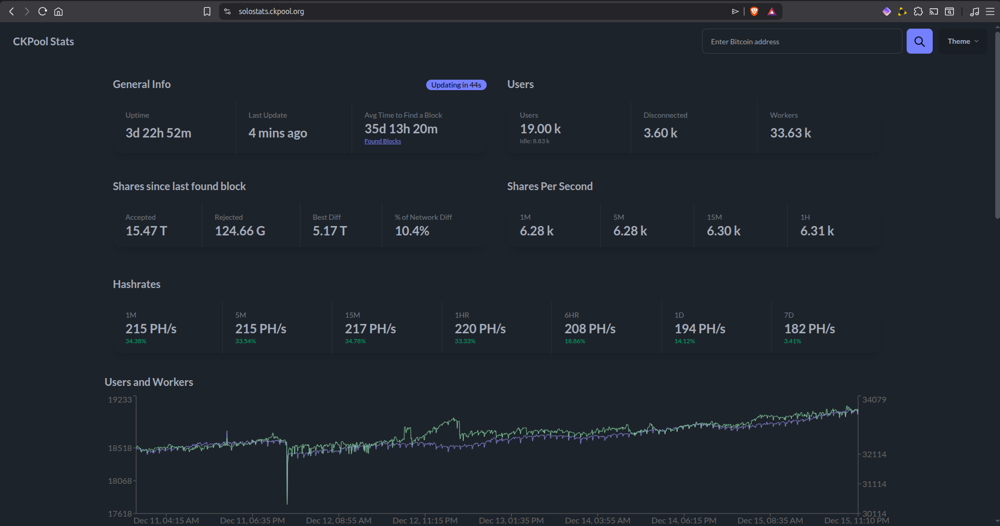

Elle prélève 2% de frais à chaque bloc trouvé en échange d'une confiance, d'une fiabilité et d'un "uptime" qui n'est plus à démontrer.

Ainsi si vous trouvez un bloc par l'intermédiaire de CkPool, la transaction coinbase créditera votre adresse, moins les 2% de frais comme on peut le constater ci-dessous pour le dernier bloc trouvé par CkPool.

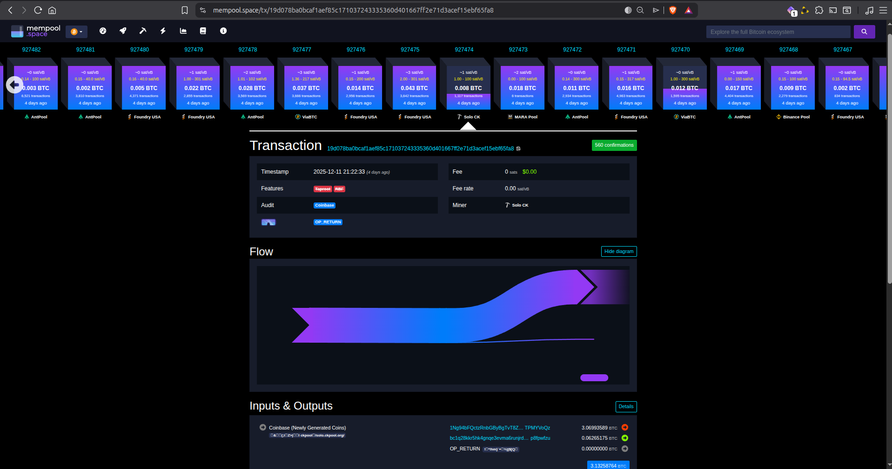

Synthèse:

- frais: 2%
- fiabilité: élevée
- confiance: élevée
#### [Le petit nouveau "Public Pool"](https://web.public-pool.io/#/)

Public Pool a émergé en 2023 en parallèle du projet Bitaxe, afin de permettre aux mineurs débutant de se connecter facilement au réseau Bitcoin. C'est cette pool que nous avons choisi dans el rapide tutoriel Bitaxe du chapitre précédent.

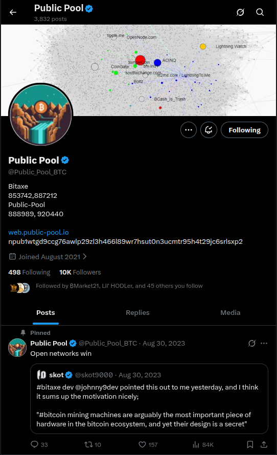

Il s'agit un pool de minage solo open-source pour Bitcoin, lancé  par [Benjamin Wilson](https://x.com/Public_Pool_BTC). 

Il existe deux modes :

- [Hébergé](https://web.public-pool.io/#/) : Géré par le site [public-pool.io](https://web.public-pool.io/#/v), idéal pour les débutants.
- Auto-hébergé : Vous installez le logiciel sur votre propre nœud Bitcoin (par exemple via Umbrel), pour plus de contrôle et de souveraineté, et une faible latence.

**Anecdote**: aujourd'hui 2 blocs ont déjà été trouvé via le mode "Auto-hébergé" par des mineurs indépendants, alors qu'aucun n'a encore été trouvé via la mode "Hébergé" qui enregistre pourtant 40Ph/s de hashrate. Cela devrait par contre changer dans les mois à venir car 40 Ph/s nous donne en théorie  2 chances par an de solominer un block.

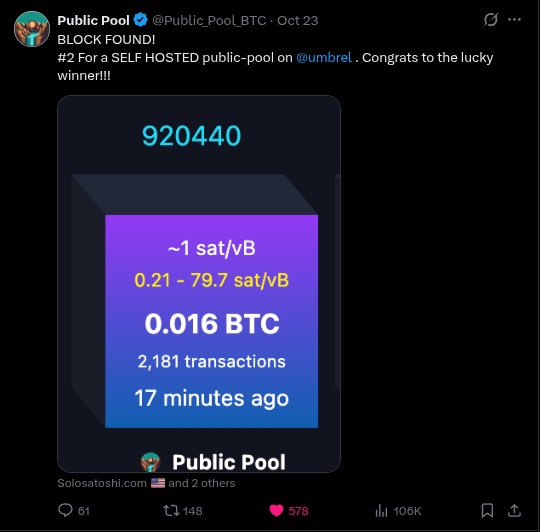

Synthèse:

- frais: 0%
- fiabilité: élevée
- confiance: élevée
#### [La plus Originale : Parasite Pool](https://parasite.space/)

Il s'agit d'une petite pool de mining encore confidentielle basée sur un fork de CkpPool et ne totalisant qu'un hashrate de 15 Ph/spour le moment (même si c'est déjà beaucoup), mais qui mérite qu'on s'y attarde tant l'initiative est singulière.

[*"Centralized Bitcoin mining is a festering wound, bleeding out Satoshi’s vision of a decentralized network secured by equal peers. Corporate pools choke the life from home miners, hoarding hash rate and wrecking them with fees. Parasite Pool is the blade that severs their grip—a radical reimagination of mining with zero fees, simple Lightning payouts, and coinbase logic that flips the script"* ](https://zkshark.substack.com/p/parasite-pool-igniting-the-mining)- [**ZK-Shark**](https://x.com/ZK_shark)

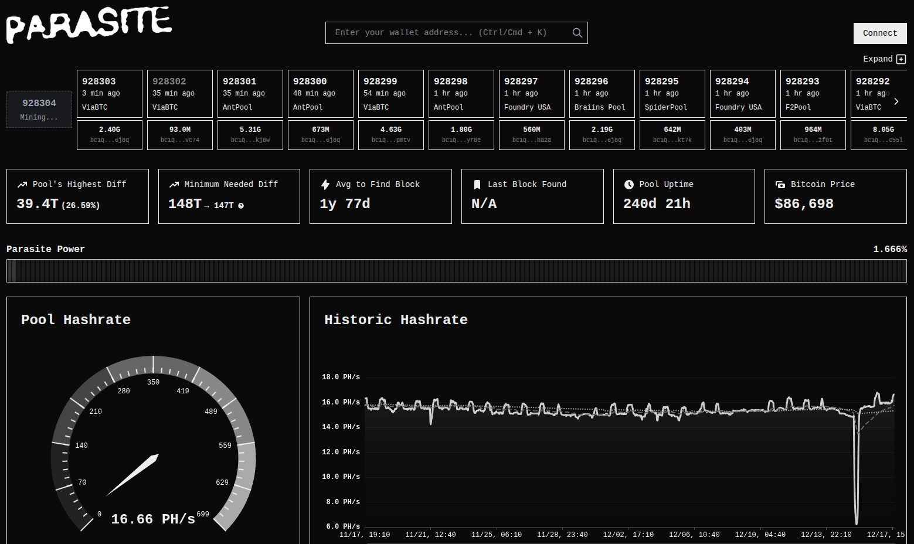

Fondée par le développeur [ZK-Shark ](https://x.com/ZK_shark)cette pool qualifiée d'encore expérimentale et en "phase beta" par son fondateur vise à apporter sa propre pierre à l'édifice de la décentralisation du hashrate pour le ramener plus proche de la vision originelle de Satoshi, où chaque membre du réseau participe à son fonctionnement.

En synthèse:

- 0 frais
- Paiements Lightning intégrés
- Une gestion de la transaction Coinbase radicalement différente. Si un membre de la pool trouve en bloc, 1 Bitcoin entier lui est directement attribué tandis que le reste est partagé entre les membres de la pool via Lightning.
- Fiabilité: élevée
- Confiance: Intermédiaire (encore à démontrer)
  
  
#### [Braiins Solo](https://solo.braiins.com/stats)

Braiins, déjà entraperçu lors de notre panorama rapide des logiciels de mining , est un acteur majeur du mining proposant depuis 2010 (plus vieille pool de mining du monde) une des principale pool  "mutualiste" totalisant aujourd'hui 15 Eh/s soit environ 1.5% du hashrate mondial.

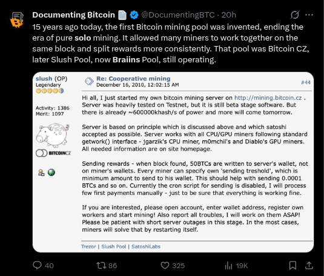

Braiins propose depuis Janvier 2023, en concordance avec cette réémergence du home mining, sa version solo aux plus téméraires: [**Braiins Solo](https://solo.braiins.com/stats).**

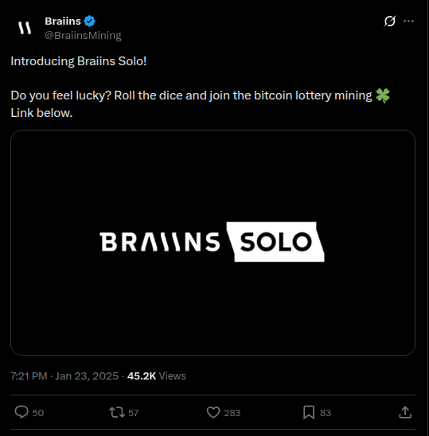

Braiins n'est plus à présenter, cette solopool est fiable sur tous les plans. Il vous en coûtera 0.5% de frais si vous gagnez le jackpot, honorable.

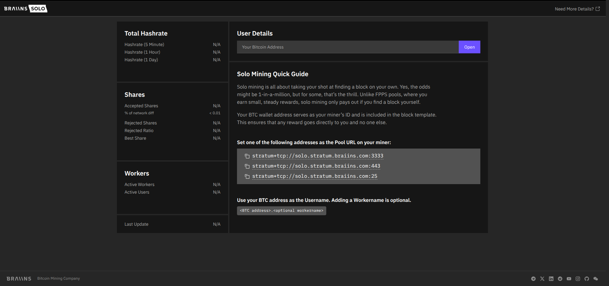

Synthèse:

- frais: 0.5 %
- fiabilité: élevée
- confiance: élevée

#### [La Pool "Deutsche Qualität" de Solomining](https://pool.solomining.de/#/)

[Solomining](https://solomining.de/en) est un des acteurs majeur dans la production de machines Bitaxe et de ses dérivés en Europe. Son initiative de solopool avec 0% de frais directement forké du code de Public Pool est bienvenue. 

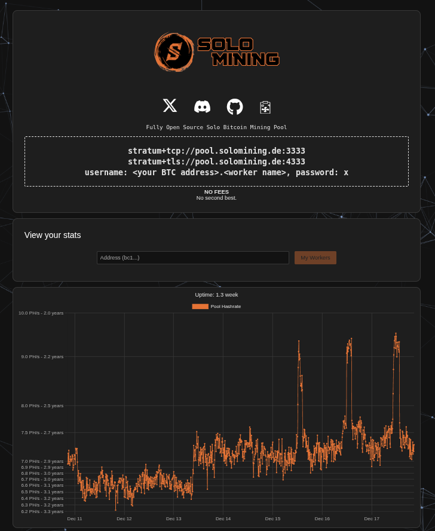

- frais: 0 %
- fiabilité: élevée
- confiance: intermédiaire / élevée

#### [La Pool montante francophone des "chauffagistes"](https://chauffagistes-pool.fr/en/public-stats.html)

La Pool des "[chauffagistes]()" est une petite pool francophone (mais ouverte aux anglophones également) qui vient d'atteindre son Ph/s de puissance de calcul au moment où sont écrites ces lignes. Il s'agit par cette initiative de fédérer le plus de personnes motivées par la perspective de se chauffer en minant, tout en créant une petite communauté de passionnés qui s'entraident et se donnent des astuces. Elle se veut bien évidemment sérieuse et fiable mais également ludique et amusante avec des happening et challenges originaux organisés par la communauté.

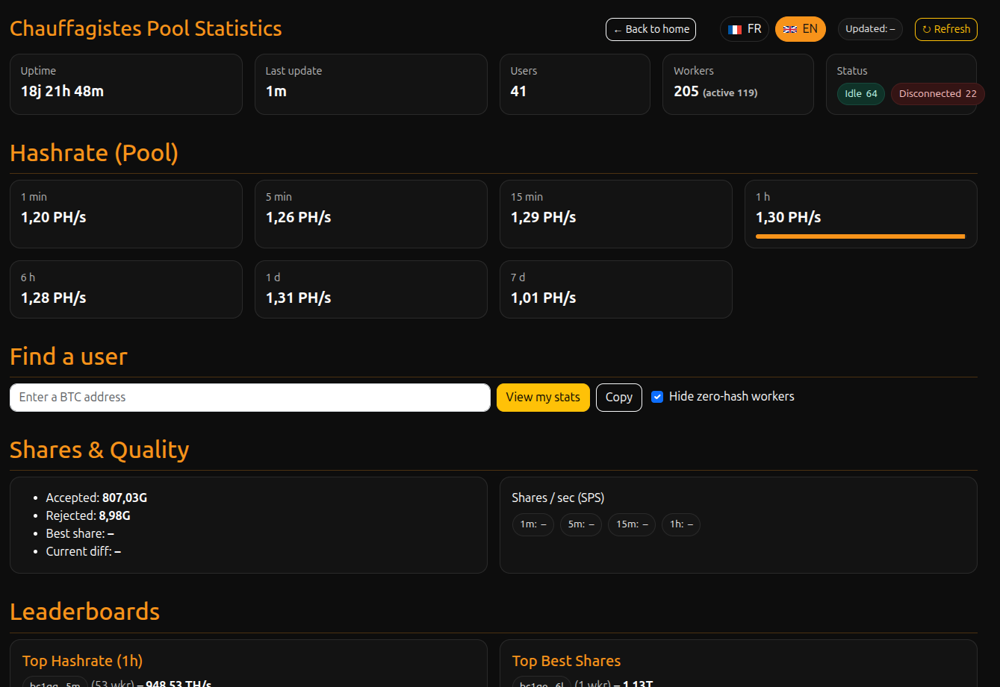

- frais: 0 %
- fiabilité: élevée
- confiance: intermédiaire / élevée

| Type de Pool | Open Source | Frais |
| ------------ | ----------- | ----- |
|              |             |       |

### Les Pool "Mutualistes" adaptées au HomeMining

Ici nous nous concentrerons uniquement sur les pools de mining "mutualistent" où la récompense est partagé au prorata du hashrate apporté, permettant une distribution des récompenses via le lightning network. Cette caractéristique démontre clairement l'orientation vers les petits home miner de la pool et sa volonté de permettre même au tout petit hashrate de participer.

#### [Braiins ](https://braiins.com/pool)

Braiins Pool, est la version de Braiins Solo évoquée précédemment. Elle permet les [retrait des récompenses de minage via le lightning network](https://academy.braiins.com/en/braiins-pool/rewards-and-payouts/#lightning-payouts) ce qui est un gros plus pour le petits mineursqui devraient parfois attendre des semaines voir des moins avant de pouvoir récupérer leur récompense on-chain en cas de frais élevés sur le réseau bitcoin, ou pour éviter de se retrouver avec un "UTXO" (un morceau de bitcoin, un "pièce") "trop petite" en portefeuille. 

*==**Voir avec Loic s'il existe une formation planB qui parle du management des UTXO à insérer ici**==*

Braiins vous permet ainsi de renseigner une adresse Lightning  et de régler une limite "threshold" au delà de laquelle votre un paiement vers votre wallet lightning sera automatiquement déclenché. On voit dans la capture d'écran ci-dessous que dès que la récompense de minage atteint 10000 sats, alors Braiins paiera automatiquement la lightning adresses louferlou@getalby.com.

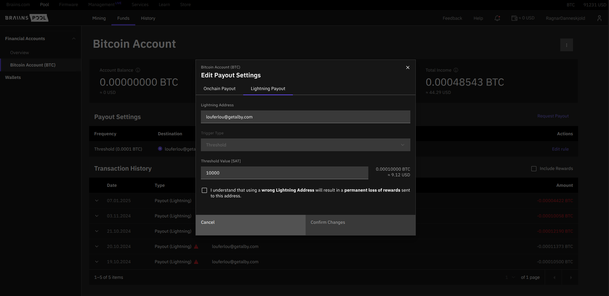

Par exemple un Avalon Nano 3S qui vous rapporterait environ 200 satoshis par jour, déclencherait une transaction vers votre wallet Lightning tous les moins et demi environ.

Pour en savoir plus sur la manière d'obtenir et d'utiliser une LIghtning Address vouspouvez vous référer à **=="Voir avec Loic si ça existe"==**

Vous pouvez bien évidemment régler une limite de retrait automatique plus basse de 10000 sats si vos le souhaitez, ou réaliser des retraits manuels à n'importe quels moments.

Les récompenses de minage se font selon le modèle dit [FPPS (Full Pay Per Share) ](https://academy.braiins.com/en/braiins-pool/rewards-and-payouts/#fpps-specification) permettant des revenus garantis pour tous les mineurs même si la pool ne trouve pas de blocs pendant un temps plus élevé qu'habituellement.

Synthèse:

- frais: 2 %
- fiabilité: élevée
- confiance: élevée

#### Ocean Mining

Ocean Mining est une des pool d'envergure (environ 25Eh/s au moment où sont écrit ces lignes) les plus récentes du paysage du mining. Lancée en novembre 2023 sous l'impulsion de [Luke Dashjr](https://x.com/LukeDashjr)  (une figure tumultueuse de l'écosystème bitcoin doublé d'un développeur talentueux, contributeur à Bitcoin Core et beaucoup d'autres projets) et financé notemment pas le célèbre [Jack Dorsey](https://x.com/jack) a pour objectif de redonner le pouvoir aux mineurs individuels.

L'accent est ainsi mis sur la possibilité pour chaque mineur de construire son propre bloc en sélectionnant les transactions qui lui importent grâce au protocole DATUM, un dérivé de STRATUM V2. En synthèse les mineurs sont en contrôle, la pool ne sert qu'à répartir les récompense et calculer le travail fournit par chacun, mais ne choisit pas les transactions à inclure, augmentant ainsi la décentralisation et diminuant le risque de censure.

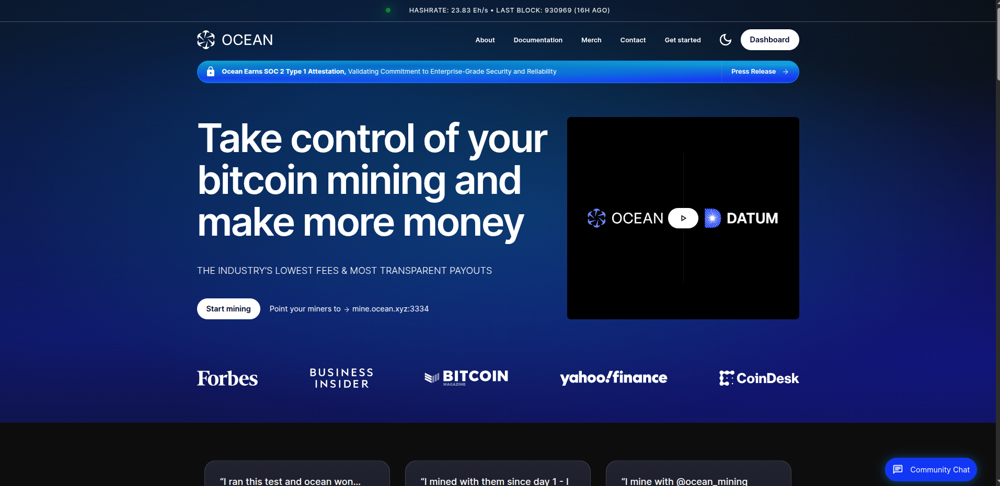

OCEAN est une pool qui se veut non custodiale, c'est à dire que les mineurs sont directement récompensés via la transaction coinbase (la transation qui crée des nouveau bitcoins à chaque nouveau blocks) de chaque bloc.
Toute les récompenses au dessus de la limite de 0.01048576 BTC sont versées via la transaction Coinbase directement, sinon il y a un quand même un peu de confiance nécessaire le temps d'atteindre cette limite pour retirer ses bitcoins.

Pour ceux qui ne souhaitent pas attendre cette limite pour retirer leurs précieux satoshis, comme les solominers que nous nous sommes, il est possible de mettre en place de "payout lightning" permettant même au très petit contributeurs de récupérer leur part du gâteau. Les pâyout Lightning donnent droit à des frais réduits de 1% au lieu des 2% de la pool par défaut.

Les personnalisation des blocs est un feature amusante qui permet aux mineurs individuels de marquer leur nom à jamais dans la blockchain bitcoin. Même si les récompenses sont partagées, le mineur qui a trouvé le blocs laisse une trace indélébile.

Aucun KYC n'est bien sur demandé.

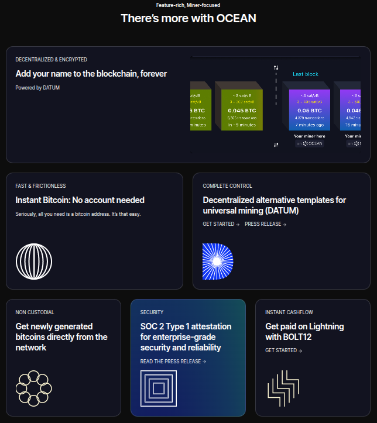

Synthèse:

- frais: 2 % / 1% si payout Lightning
- fiabilité: élevée
- confiance: élevée

| Type de Pool | Open Source | Frais | Spécificité |     |
| ------------ | ----------- | ----- | ----------- | --- |
| Solo         |             |       |             |     |
| Mutualiste   |             |       |             |     |

## Découverte d'AxeOS (v2.12.2)

Après ce panorama des différentes pools de mining auquel vous pourrez connecter votre Bitaxe, allons faire un tour d'horizon complet d'AxeOs  le logiciel de votre Bitaxe afin de comprendre comment en tirer le meilleur parti.

### Onglet "Dashboard"

Ici les paramètres généraux de votre Bitaxe comme:

- son hashrate instantané, et moyenné sur différente période de temps (1m/10m/1h).
- L'efficience de votre appareil, c'est à dire la puissance nécessaire pour produire 1Th/s, autrement dit l'énergie nécessaire pour produire 1 Th (ici 17.5 J/Th).
- Les shares soumises à la pool de mining (preuvent de travail)
- la meilleure difficulté de la vie de votre machine, et celle de la dernière session de celle-ci (depuis son dernier redémarrage). Pour rappel plus les hash trouvés par votre machine sont des nombres petits (le but du minage est de trouver les hash les plus petits possibles) plus la difficulté associée est élevée. Ainsi plus la difficulté affichée ici est grande, plus cela signifie vous avez été proche de trouver un bloc. Dans l'exemple ci-dessous, la meilleur difficulté jamais atteinte par notre Bitaxe est 17.56 G (17 560 000 000) sachant que la difficulté globale du réseau Bitcoin est de 148.26 T (148 260 000 000 000). Autrement dit, il aurait fallu trouver un hash 8333 fois plus petit que le plus petit jamais trouvé par l'appareil...On y est pas encore...

En partie basse de l'écran de l'onglet "Dashboard", des informations sur l'Etat de votre pareil "Alimentation", "Chaleur", "Ventilateur" sont affichées. Ici ce que vous avez à retenir c'est que tant que les barres d'état ne sont pas totalement remplies alors votre appareil fonctionne de manière nominale.
Une donnée particulièrement importante à surveiller pour un opérateur de Bitaxe est la température de l'ASIC. Au delà de 70°C la puce surchauffe et le bitaxe s'arrête de miner pour éviter d'endommager l'appareil. Ainsi dans les environnement chaud notamment en été il conviendra parfois d'abaisser la puissance de calcul de votre appareil pour lui éviter de surchauffer. Nous verrons comment régler cela plus bas.

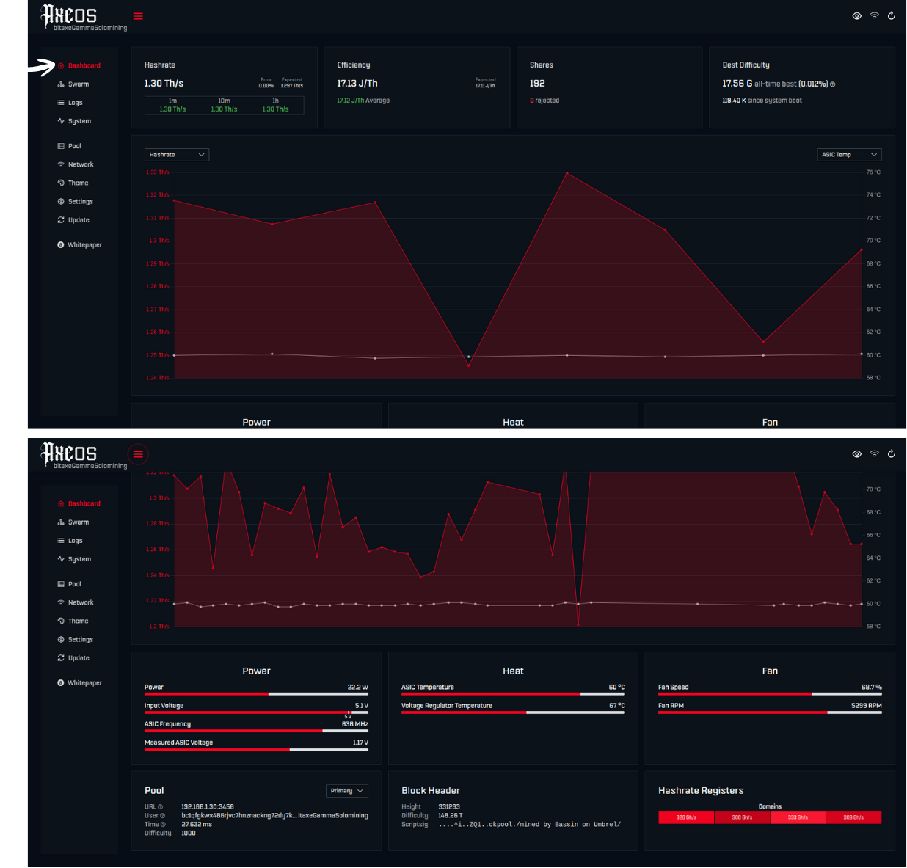

### Onglet "Swarm"

L'onglet Swarm vous permettra d'obtenir une vision d'ensemble de tous les appareils de la famille Bitaxe sur votre réseau local pour un management global facilité. Tout ce qui tourne sous AxeOS sera visible ici, et un clique sur chaque appareil listé permet de s'y connecter. Très pratique pour s'assurer que tous vos appareils fonctionnent bien, qu'aucun n'a surchauffer sans que vous en rendiez compte, même si certains d'entre eux sont cachés dans votre grenier ou votre cave.

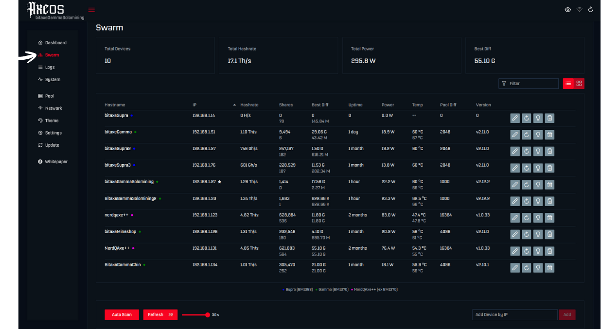

### Onglet "Logs"

Ici votre Bitaxe enregistre étqpe par étape ce qu'il fait, et les erreurs éventuelles qu'il rencontre. Peut-être très utilse pour débugguer l'appareil et comprendre d'où vient une panne éventuelle ou la manière dont on peut résoudre un bug.

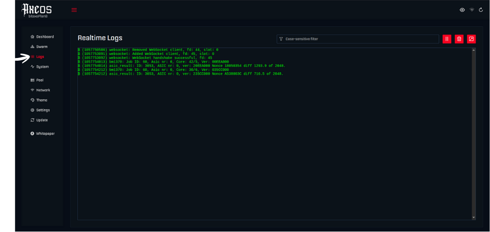

### Onglet "System"

Ce menu permet d'avoir une vision d'ensemble du système justement. Version du firmware installée, uptime, adresse Ip, réseau WIFI....

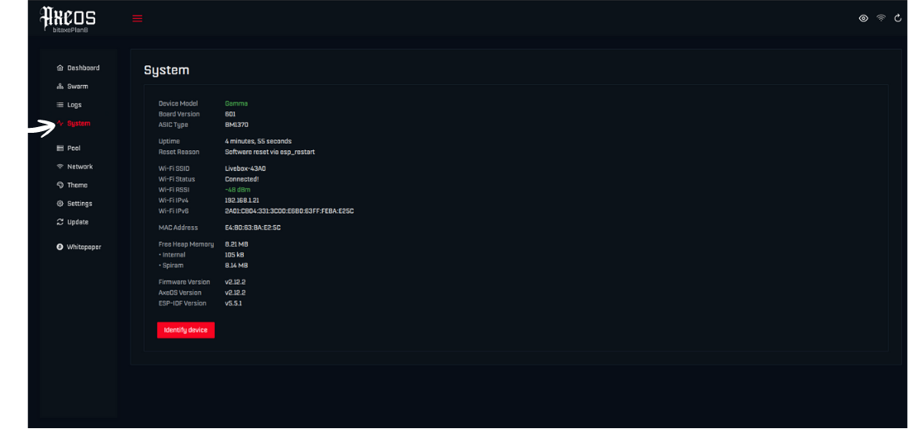

### Onglet "Pool"

Ici évidemment il s'agit du menu permettant de choisir à quelle pool on souhaite se connecter comme déjà vu plus haut lors du tutoriel de paramétrage de notre Bitaxe.

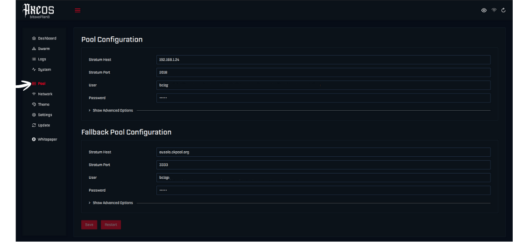

### Onglet "Network"

Là on règle les connexion WIFI à notre réseau local. Si vous changer le mot de passe de votre routeur ou voulez connecter votre appareil à un réseau WIFI différent, c'est ici que ça se passe.

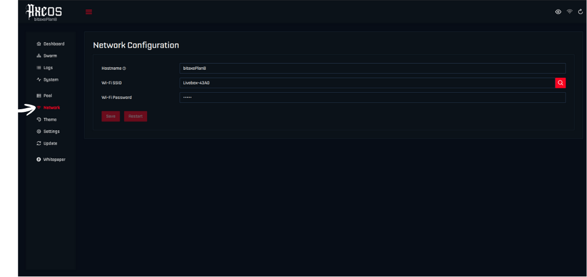

### Onglet "Theme"

Il ne s'agit là que de cosmétique, pour changer l'apparence de votre interface. Vous pouvez changer la couleur des boutons en Orange / Rouge / Bleu / Vert / Violet ou passer d'un thème sombre à clair et inversement.

Profitons en pour opter pour un thème "Orange" pour la suite de ce cours.

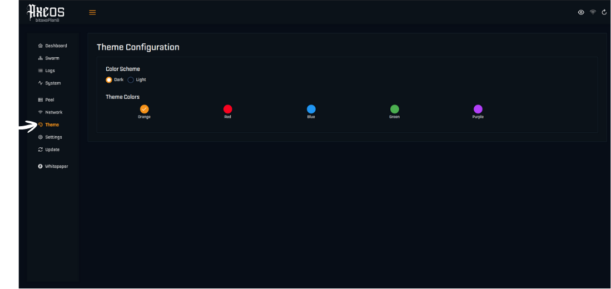

### Onglet "Settings"

Nous sommes ici dans le cœur du réacteur. C'est là que le management de l'appareil  s'effectue.
Vous serez en mesure de régler la fréquence de la puce ASIC, son Voltage et la vitesse de rotation du ventilateur via la partie haute de ce menu.

Bien sûr plus la fréquence de votre puce est grande, plus le hashrate en sortie est important, mais plus la puissance requise l'est également, et surtout plus le besoin en refroidissement s'accentue. En effet suivant la température dans laquelle évolue votre appareil, il sera parfois nécessaire d'ajuster ces paramètres pour éviter une surchauffe. Par exemple en été lorsqu'il fait chaud, il peut être nécessaire de baisser la fréquence de la puce afin d'en faire diminuer la température. A l'inverse en hiver, il va être possible de pousser l'appareil au delà de ses réglages par défaut sans surchauffe à la clé.
Soyer prudent quand vous jouez avec ses paramètres et augmentez les valeurs progressivement par palier pour éviter de détériorer la puce.

Le reste du menu permet de gérer l'écran du Bitaxe, de choisir de l'éteindre complètement, ou au bout d'un certain temps, d'inverser ses couleurs etc...

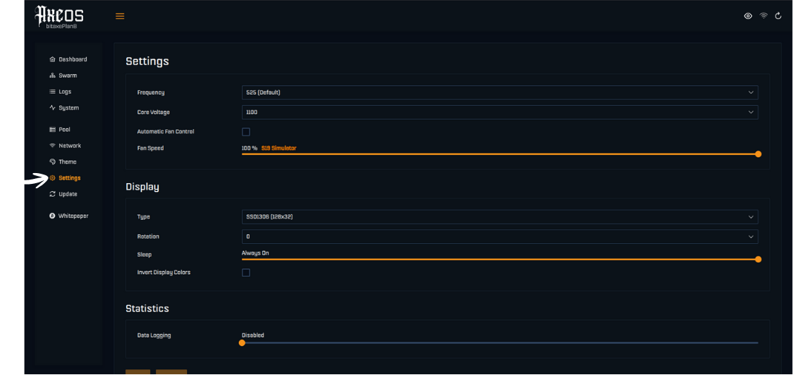

### Onglet "Update"

Il s'agit là d'un des principaux menu d'AxeOs, celui vous permettant de très facilement mettre à jour l'interface graphique et l'OS de manière extrêmement simple. L'équipe en charge du développement publie très régulièrement des mise à jour corrigeant des bugs et améliorant l'expérience générale, donc n'hésitez pas à aller vérifier si une nouvelle version n'est pas disponible de temps en temps.

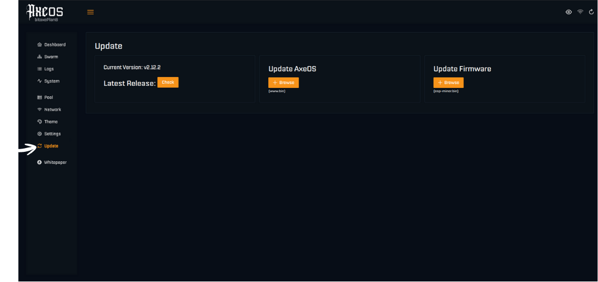

Pour ce faire cliquez sur le bouton "Check". Cette commande va alors directement interroger le répertoire de la plateforme Github dédié au projet Bitaxe afin d'essayer d'y déceler une nouvelle version du logiciel AxeOS et du firmware.

Un message d'alerte apparaîttalors pour vous avertir qu'une requête va être réalisée auprès des serveurs de Github, qui aurons donc connaissance de votre adresse IP et du fait que vous chercher à mettre à jour un appareil "bitcoin".
Le VPN installé sur votre ordinateur ne vous servira à rien ici, car c'est le BItaxe lui-même qui va faire la requête. Donc pour les amoureux de la vie privée, allez directement chercher les nouvelles versions du logiciel via votre PC si vous souhaitez rester discrets.

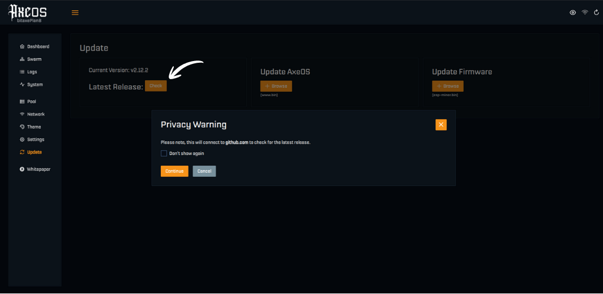

Si vous acceptez que votre IP soit exposée, cliquez sur "Continue". Sera affichée à l'écran la version actuelle d'AxeOS ainsi que la plus récente détectée. Dans notre exemple nous sommes à jour. Mais si vous avez du retard et n'êtes pas, cliquez sur les deux liens "esp-miner.bin" et "www.bin" afin de télécharger les fichier de mise à jour, et enregistrez les dans un répertoire quelconque de votre ordinateur.

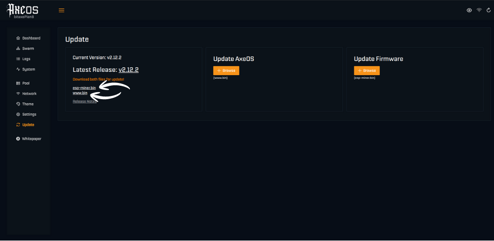

Une fois que c'est fait cliquez sur "Browse" en dessous de "Update AxeOS" et allez chercher dans le répertoire de votre ordinateur le fichier "www.bin" que vous venez de télécharger. Quand vous l'aurez sélectionné, la mise à jour d'AxeOS commencera. De la même manière pour mettre à jour le firmware de l'appareil, cliquez sur "Browse" en dessous de "Update Firmware" et sélectionnez le fichier "esp-miner.bin". La mise à jour démarrera et l'appareil redémarrera automatiquement une fois cela terminé.

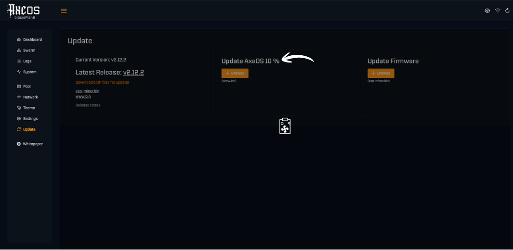

### Onglet "Whitepaper"

Petit clin d'oeil de l'équipe de développement du projet Bitaxe, chaque appareil embarque au sein de son firmware une copie du White Paper de Satoshi Nakamoto. Si vous cliquez sur "Whitepaper" le fichier enregistré sur votre appareil s'ouvrira. Une manière amusante de rendre encore plus immuable si besoin le document fondateur de l'outil le plus révolutionnaire que l'humanité ait connue jusque là.

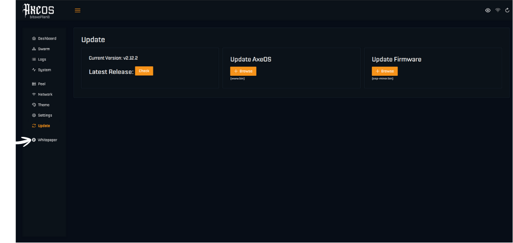

# Miner de manière souveraine

Cette partie du cours présentera les raisons pour lesquelles un solominer peut vouloir opter pour une souveraineté totale quand il s'agit de miner. Originellement, le logiciel Bitcoin publié par Satoshi Nakamoto permettait par défaut aux utilisateurs de miner. Au fur et à mesure que l'activité de mining s'est professionnalisé et qu'un particulier seul n'avait plus de chance de trouver un block en minant sur son ordinateur directement, la partie du code permettant le minage a été supprimée par les développeurs de Bitcoin Core. Le mineur interne a d'abord été déprécié, puis complètement supprimé dans Bitcoin Core version 0.13.0, sortie en août 2016.

Les notes de version indiquent : **"As CPU mining has been useless for a long time, the internal miner has been removed in this release, and replaced with a simpler implementation for the test framework."**

Ainsi un mineur doit désormais installer cette partie du code de son côté et y connecter sa machine.

C'est ce qu'on fait lorsque l'on se connecte à une pool distante telles que celles listées plus haut, qu'elles soient des solopool, ou des pool classiques "mutualistes". Ainsi nous dépendons et faisons confiance à un tiers qui construit les blocs pour nous, calcule notre puissance de calcul et les récompenses associées, et nous paye éventuellement.

## Pourquoi ? (Block Template / intermédiare etc...)

**En Solomining** particulièrement, les avantages qu'apporte la dépendance à un tiers sont quasiment inexistants, si ce n'est la facilité. Autant s'il s'agit de s'associer à d'autres mineurs pour obtenir un revenu régulier, le passage par un tiers est quasi obligatoire. Autant lorsqu'il s'agit de miner seul, rien ne dit que ce tiers de confiance n'essaiera pas de vous subtiliser la récompense éventuelle en substituant son adresse à la votre....
Rien ne dit non plus comme déjà évoqué plus haut, que l'entité manageant la pool à laquelle vous faites confiance, ne décidera pas de censurer les transactions des gens qu'elle n'aime pas ou qu'une autorité lui demande de bloquer. 

Si vous êtes un Bitcoiner souverain adepte du solomining ce qui est le cas de la plupart d'entre vous qui lisez ces lignes, vous serez certainement ravis d'apprendre qu'aujourd'hui il est devenu très facile pour n'importe qui de miner sur sa propre solopool, auto hébergée sur un serveur Umbrel ou Start9 par exemple.

L'autre bonne nouvelle c'est que même lorsqu'on mine en **"pool mutualistes"** pour qui souhaite recevoir des récompenses régulières, des innovations permettent désormais aux mineurs souverains de soumettre leurs propre bloc template. C'est à dire que chaque mineur de la pool sélectionne les transactions qu'il inscrira dans le bloc si c'est lui qui le trouve. Ainsi le pouvoir de censure de la pool est quasiment réduit à néant. Celle ci se cantonne à son rôle de distributeur de récompenses au prorata de la puissance de calcul de chacun.

==Insérer les liens vers les tuto / cours existants==

## Stratum V2 & Datum (Pool mutualistes)

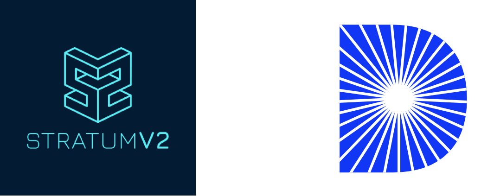

### Statum V2

Stratum est un protocole Open Source qui permet aux pool de fonctionner et d’interagir avec les machines de minage.  En résumé Stratum c'est le langage qui permet aux mineurs et aux pools de se parler et de miner ensemble.

Ce protocole:

- **Relie les mineurs au pool**
	Permet aux appareils de minage (ASICs) de se connecter à un mining pool.
- **Distribue le travail**
	Le pool envoie aux mineurs des « jobs » (modèles de blocs à miner) en temps réel.
- **Collecte les preuves de travail**
	Les mineurs envoient leurs « shares » (preuves partielles de travail) au pool.
- **Calcule les récompenses**
	Le pool utilise les shares pour mesurer la contribution de chaque mineur et distribuer les rewards (BTC).
- **Gère les proxies (dans les grandes fermes)**
	Permet d’agréger des milliers de mineurs derrière un proxy avant d’envoyer au pool.

Cependant, Stratum v1, la première implémentation (qui date de 2012 !) de ce protocole open source vient avec quelques limitations qui sont rédhibitoires pour qui se soucie de la décentralisation de Bitcoin.

Comme [[Pavlenex]] un personnage central (Product Manager travaillant sur nombre de projets bitcoin et fervent  promoteur du projet Stratum V2) dans la mise au point et la promotion de Stratum V2 le souligne:

 "*Toutes les dix minutes environ, le réseau Bitcoin crée un nouveau bloc de transactions.
 Qui décide quelles transactions entrent dans ces blocs Bitcoin ?
 Si votre réponse est « les mineurs », vous avez tort.*"
 
 ET
 
 "*Prêt pour une autre révélation ?*  
*Saviez-vous que les communications entre les appareils de minage, les pools et les proxies qui agrègent les connexions ne sont pas chiffrées ?
Cela signifie qu’ils sont vulnérables à une simple attaque de l’homme du milieu (man-in-the-middle). N’importe qui capable d’intercepter la connexion pourrait facilement voler du hashrate et le rediriger vers sa propre ferme.
Cette attaque a été prouvée et elle se produit actuellement. Cependant, les pools de minage ne la divulguent pas publiquement, car cela nuirait à leur image*."

En effet Stratum V1 confie à la pool de mining le soin de choisir quelles transactions seront inscrites dans les blocs minés. La volonté des mineurs individuels s'effacent donc devant celle des pools laissant place à la possible censure des transactions qui seraient jugée comme "non désirables" quelqu'en soit la justification.

Sans parler du fait que les communications non chiffrées entre tous les acteurs de ces pools pourraient donner lieux à des manipulations importantes, permettant à des entités malveillantes de s'attribuer le travail qu'elles n'ont pas fournie.

C'est là  que Stratum V2 entre jeu. La version 2 du protocole permet donc:

- Le chiffrement (NOISE)
- La résistance à la censure : les mineurs peuvent proposer leurs propres transactions
- Une meilleure efficacité (moins de bande passante)
- Davantage de standardisation et flexibilité
- Une interopérabilité améliorée

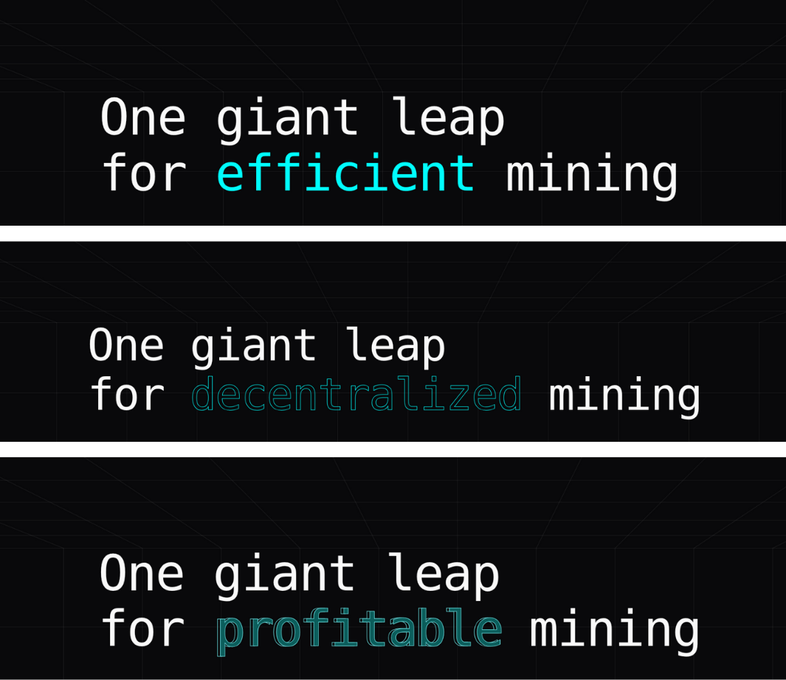

Mais alors comment utiliser Stratum V2 concrètement avec sa machine de mining pour gagner en autonomie et participer à la décentralisation du mining ? Eh  bien aujourd'hui ce n'est vraiment pas évident.
Actuellement  seules 2 pools de mining "mutualistes" ( Braiins Pool & DMND)  supportent le protocole, et la plupart des firmwares installés sur les machines de minages ne sont pas compatibles, obligeants les miners à utiliser des proxy qui rendent compatibles les firmwares avec stratum V2 ce qui ajoute pas mal de frictions. Même si la principale raison reste l'inertie des pool de mining et des grands acteurs du marchés (mineurs, constructeur de machines etc...).

En synthèse, dans le cadre de ce cours sur le home mining, la possibilité la plus évidente pour un mineur à la maison qui souhaiterait utiliser Stratum V2 est d'opter pour le mineur de [[#Braiins BMM101]] présenté plut haut. Il est nativement compatible Stratum V2 et couplé à la pool Braiins Pool il vous permettra d'utiliser Stratum V2 sans difficulté.

### Datum

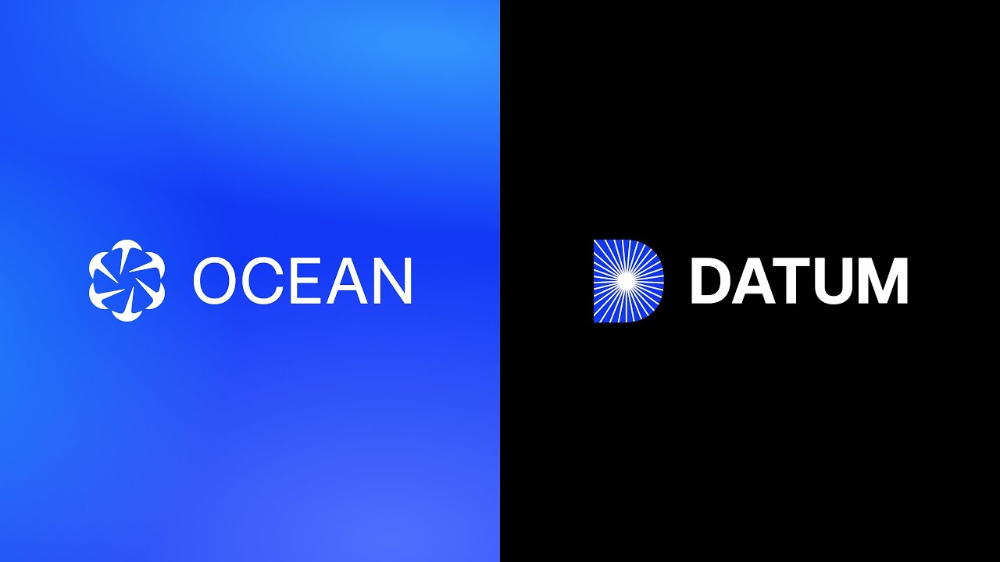

Dans la droite lignée de Stratum V2, Datum est le protocole open source dédié au mining de l'implémentation Bitcoin Knots et de la pool OCEAN Mining (Stratum fonctionne avec Bitcoin Core).
Les constats sur la centralisation du mining via les pools sont les mêmes, et Datum y répond en permettant là encore aux mineurs de construire leur propre bloc template c'est à dire de choisir le transactions à inclure dans les blocs.

Mais là où Stratum V2 est encore relativement difficile d'accès particulièrement pour des home miners amateurs, Datum est d'ores et déjà utilisable avec n'importe quelle machine de minage compatible Stratum V1 sans avoir à mettre à jour le firmware pour qu'il soit compatible DATUM. Pour les posesseurs de serveurs Umbrel ou Start9 , un il suffira de télécharger via le store l'application Datum.

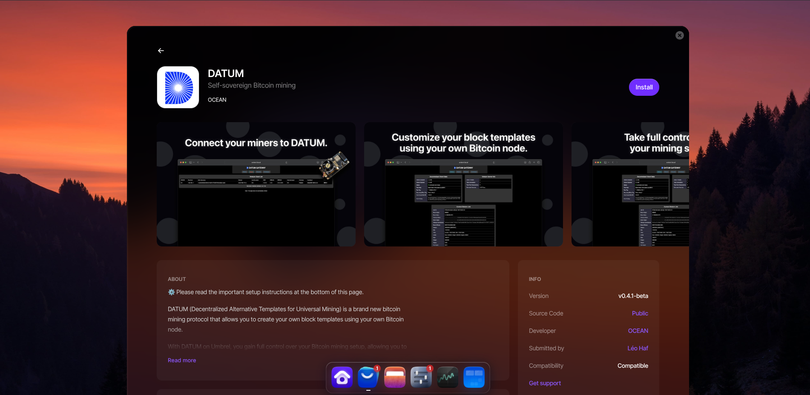

Ensuite, il vous faudra également télécharger Bitcoin Knots. Si vous avec Bitcoin Core, pas de panique, vous n'êtes pas obligés de recommencer le téléchargement de la blockchain depuis 0.

## Public Pool & Bassin sur Umbrel / Start 9 (Solopool)

Pour les solominers qui jouent à la loterie sans compétences techniques particulières, il est désormais possible de le faire en parfaite autonomie, sans dépendance quelconque à un tiers. Là encore un serveur Umbrel ou Start9 est tout de même requis. Ensuite deux applications sont à télécharger, que l'on présentera succinctement ci-dessous.

### Public Pool pour Umbrel / Start9

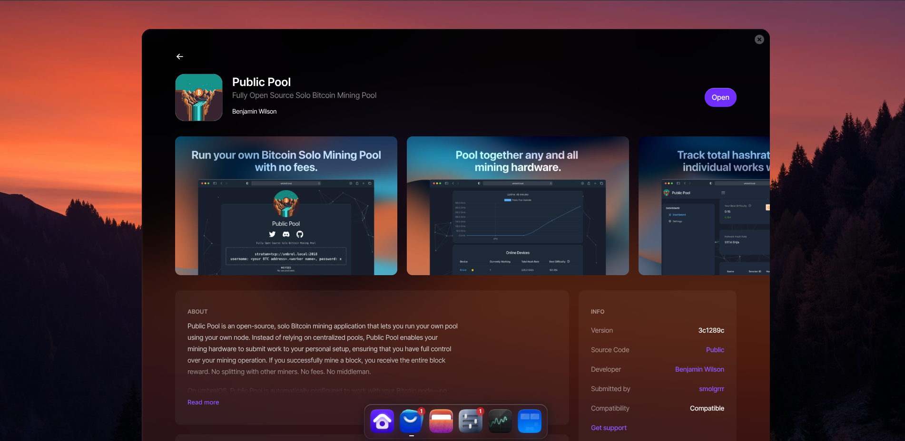
 
 
 Il s'agit exactement du même logiciel que vu précédemment dans notre panorama des solopools, sauf que cette fois-ci il tourne en local sur votre machine, connecté à votre propre full node Bitcoin. Et pas sur le serveur d'un développeur tiers qui met gracieusement à disposition son infrastructure. Nous sommes là en automie totale.
 
 Une fois l'application installée sur votre Umbrel / Start9, y connecter votre machine de mining est exactement similaire à ce qu'on a vu pour le paramétrage de notre Bitaxe lorsque l'on avaitopté pour Public Pool en pool principale. Sauf qu'ici, personne ne vous dicte quelles transactions sont à inclures dans votre bloc template, et personne n'est en mesure d'essayer de voler les bitcoins éventuellement minés. On est revenu à la façon originelle d'utiliser Bitcoin. Ses clés privées, son nœud, sa machine à hasher.
 
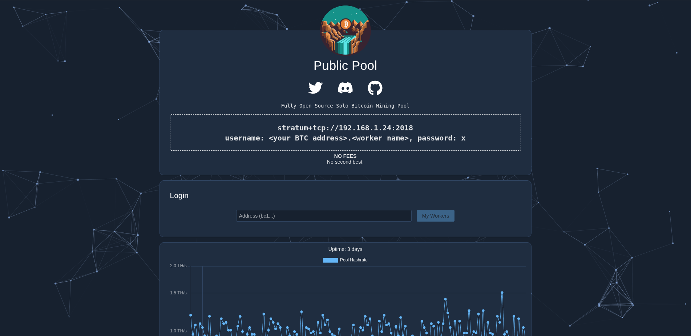

### Bassin sur Umbrel

Cette application n'est pour le moment disponible que sur Umbrel, mais elle apporte une concurrence bienvenue à Public Pool. Bassin est le nom de l'application créée via le code open source de CkPool qu'on a là encore évoquée lors de notre panorama des pools de mining, et qui a été choisie en solopool de backup lors du paramétrage de notre Bitaxe.

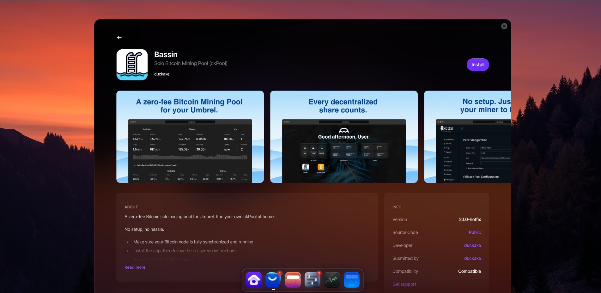

Une fois l'application installée, c'est du vu et revu lorsqu'il s'agit de pointer votre hashrate vers votre solopool.

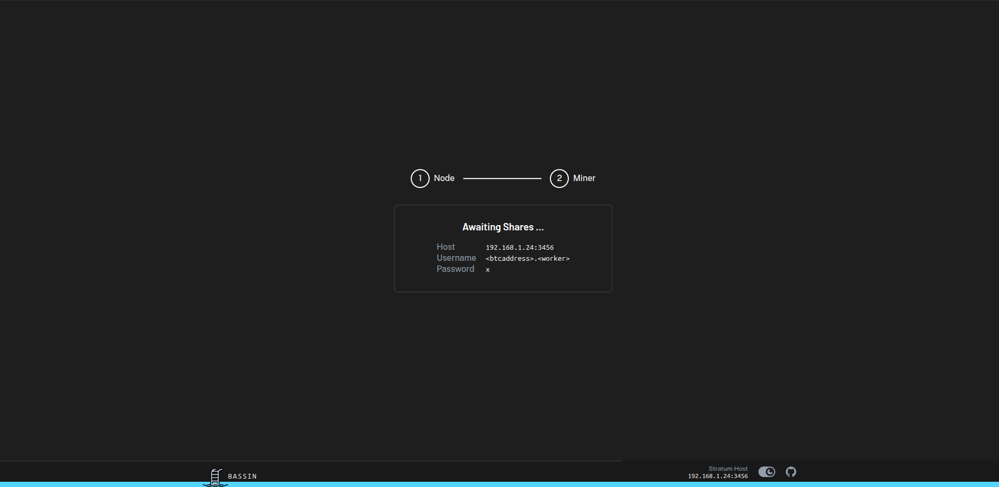

En quelques instants, votre Bitaxe est connecté à Bassin et commence à lui proposer des shares.

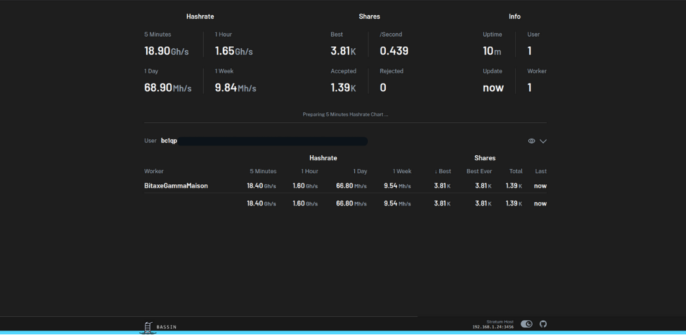
# Partie finale

PARTIE AUTOMATIQUE. NE RIEN NOTER ICI

## Avis & Notes

<isCourseReview>true</isCourseReview>

PARTIE AUTOMATIQUE. NE RIEN NOTER ICI

## Examen final

<isCourseExam>true</isCourseExam>

PARTIE AUTOMATIQUE. NE RIEN NOTER ICI

## Conclusion

<isCourseConclusion>true</isCourseConclusion>

PARTIE AUTOMATIQUE. NE RIEN NOTER ICI

