# L’essentiel pour naviguer dans l’univers IP


___
Ce cours NET 201 est une adaptation du cours *Les bases du réseau : TCP/IP, IPv4 et IPv6*, rédigé par Philippe Pierre en français et publié sur [IT-Connect](https://www.it-connect.fr/cours/les-bases-du-reseau-tcpip-ipv4-et-ipv6/), sous licence Creative Commons Attribution - ShareAlike 4.0 International (CC BY-SA 4.0). Des modifications substantielles ont été apportées à la version originale.
___

Dans ce cours, je vous propose de décrire le fonctionnement de l’adressage IP, brique de base de nos architectures et de nos équipements en réseau. On va notamment balayer le protocole TCP/IP afin de voir quelle(s) relation(s) entretiennent ces fameuses adresses IP avec d’un côté les adresses physiques et de l’autre, les noms de machine, enregistrés dans les DNS.

On essaiera de voir les différences entre IPv4 et IPv6, et, pour chacun de ces protocoles on expliquera les différents types d’adresses : privée, publique, broadcast, unicast…

Je propose de terminer ce tour d’horizon par un récapitulatif des différents outils de diagnostic d’un réseau, permettant d’analyser, d’auditer mais également de modifier le comportement de celui-ci.

Ce cours s’adresse principalement aux informaticiens et linuxiens ou étudiants ayant quelques notions en réseau et souhaitant approfondir leurs connaissances et mieux maitriser la gestion et l’administration des équipements connectés sur des environnements de type Unix/Linux.

+++


# Introduction
<partId>a52b996d-1e23-470f-a9df-7ad88790099a</partId>

## Aperçu du cours
<chapterId>9f238ecd-c9bb-4886-a205-2beba609fb13</chapterId>

Ce cours propose une introduction complète aux fondamentaux des réseaux IP et se structure en quatre grandes parties, chacune abordant un aspect essentiel pour comprendre, configurer et diagnostiquer un réseau informatique.

### Protocole TCP/IP

Dans cette première partie, nous poserons les bases nécessaires en explorant la notion de réseau et l’historique du protocole TCP/IP. Nous étudierons ses composantes majeures : l’IP, le TCP, ainsi qu’une brève incursion dans le protocole QoS IPv5. Nous aborderons également les primitives de services pour comprendre la logique d’échange de données.

### L’adressage IPv4

Nous poursuivrons avec un module dédié à l’adressage IPv4. Vous apprendrez l’utilisation concrète de l’IPv4, ses différents types d’adresses (privées, publiques, broadcast…), le rôle fondamental du DNS, ainsi que le fonctionnement de l’adresse Ethernet et du protocole ARP. Vous découvrirez également la traduction d’adresses via le NAT et la configuration réseau de base.

### L’adressage IPv6

La troisième partie sera consacrée à l’adressage IPv6, nécessaire pour répondre aux limites de l’IPv4. Nous détaillerons ses normes et définitions, l’assignation des adresses dans un réseau local, la gestion des blocs d’adresses et la relation entre IPv6 et le DNS.

### Outils de diagnostic réseau

Enfin, nous conclurons par une présentation des principaux outils de diagnostic réseau. Ces derniers vous permettront d’analyser, contrôler et résoudre les dysfonctionnements. Cette partie sera structurée par couches : Accès Réseau, Réseau, Transport et supérieure.

À l’issue de ce parcours, vous disposerez des connaissances fondamentales pour administrer efficacement une infrastructure réseau et diagnostiquer ses éventuelles défaillances.

Prêt à plonger dans l’univers des réseaux informatiques ? Allons-y ! 

**REMARQUE** : les descriptions sont celles d’un système GNU/Linux CentOS 7. Mais, les configurations réseau sont sensiblement les mêmes entre un système Debian et un système CentOS. Donc, on ne fera pas de différence. Lorsqu’il y en aura une, on la préfixera avec un logo spécifique.

*N.B. : Si vous rencontrez des termes qui vous sont inconnus au cours de la formation, veuillez consulter [le glossaire](https://planb.network/resources/glossary) pour en trouver les définitions.*


# Protocole TCP/IP
<partId>53fd4b73-cdf1-4865-ba29-1ac8ec3e9e9a</partId>


## Qu’est-ce qu’un réseau ?
<chapterId>7370904f-f8f5-4ad4-a63a-5931d94c3b3b</chapterId>


Ce premier module se propose de décrire de façon approfondie le fonctionnement du protocole TCP/IP. Nous verrons notamment les origines de ce mécanisme d’échange ainsi que l’adressage associé.

On décrira ici les différents composants et comment s’articule le modèle TCP/IP. Les principales définitions seront posées afin d’avoir une meilleure compréhension du fonctionnement de ce modèle et surtout quels sont les périphériques accédés. Mais commençons d'abord par revoir ce qu'est un réseau.

Un réseau au sens étymologique représente un ensemble de points entrelacés par un ensemble de relations. Par extension, cela désigne un ensemble interconnecté d’équipements et de leurs relations, autorisant la circulation en continu ou discontinue. On va ainsi trouver différents types de réseaux :

- Réseau en anneau
- Réseau en arbre
- Réseau en bus
- Réseau en étoile
- Réseau maillé

### Réseau en anneau

On dit d’un réseau que sa topologie est en anneau, lorsque toutes les stations, ou les équipements, sont connectés en chaine les uns aux autres par une liaison bipoint de la dernière à la première. Chaque poste joue le rôle de station intermédiaire. Toute trame émise depuis une station est réémise vers la suivante. La défaillance d’un hôte rompt la chaîne.

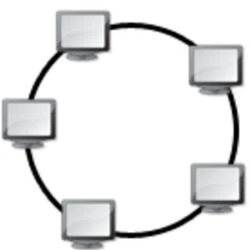


### Réseau en arbre

On parle aussi de réseau hiérarchique, car l’architecture est divisée en niveaux. Le sommet représente la racine ou le sommet et est connecté à plusieurs nœuds du niveau inférieur. Ces nœuds peuvent également être connectés à un ou plusieurs nœuds du niveau inférieur… Le tout forme un arbre. Là encore, si le père des équipements (le sommet de l’arbre), vient à défaillir, cela interdit toute communication avec ses subordonnés.

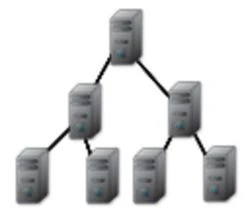

### Réseau en bus

Le câblage ici s’effectue via une liaison unique des unités. Cela représente un faible coût de déploiement et la défaillance d’un nœud, n’empêche pas les autres de fonctionner. Les équipements peuvent être reliés de façon passive par dérivation électrique ou optique. Le point faible, dans ce cas, est le support (ou média) de transfert. Lorsque celui-ci tombe en panne, c’est tout le réseau qui s’arrête.


### Réseau en étoile

Ce genre d’architecture est également appelé "_hub & spoke_". C’est la topologie la plus courante. Elle permet une gestion et un dépannage très facile. La panne d’un nœud ne perturbe absolument par le réseau global. En revanche, le concentrateur (aussi appelé hub ou plus fréquemment appelé commutateur), qui relie tous les nœuds entre eux, constitue un point unique de défaillance. Une panne de cet équipement rend le réseau totalement inutilisable. Le réseau Ethernet est un très bon exemple de réseau en étoile. Il faut toujours veiller, par contre à la longueur des câbles utilisés.

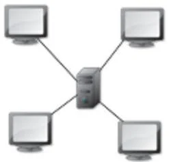


**REMARQUE** : on trouve encore dans certains cas une topologie de réseau linéaire. Son énorme avantage est son faible coût de déploiement, mais la défaillance d’un nœud provoque la scission du réseau en deux sous-réseaux distincts.

### Réseau maillé

Cela correspond à plusieurs liaisons point à point où chaque unité est reliée à N-1 point permettant ainsi de la mettre en relation avec l’ensemble des autres équipements. L’inconvénient de cette architecture est le nombre de liaisons nécessaires qui croient lorsque le nombre de points augmente : pour `N` terminaux, il faut `N x (N-1) / 2` liaisons. Ce genre de topologie se rencontre dans les grands réseaux de distribution, comme Internet.

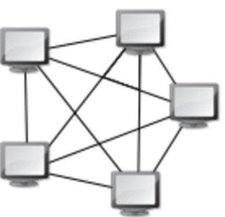

Il existe évidemment un certain nombre d’autres topologies, comme le réseau en grille ou le réseau en hyper cube. En fait, Internet est le nom donné à l’interconnexion de nombreux réseaux ayant des topologies différentes. L’unification se fait au niveau de l’adressage IP (qu’il s’agisse de IPv4 ou IPv6) et d’un très grand nombre de règles et de protocoles définis par l’IETF. Ainsi, aucun des cas de topologies mentionnés ci-dessus ne correspond. Comme la majorité des grands réseaux, on dit d’Internet que sa topologie est quelconque et indépendante du plan d’adressage qui y est défini.

## Les origines de TCP/IP
<chapterId>266b6864-8789-48d7-bc85-001cb9f1651f</chapterId>

A l’origine de TCP, il y avait le **DARPA** (_Defense Advanced Research Project Agency_), qui a initié le projet ARPANET, dans les années 1970. C’est ce même organisme qui a alors financé la célèbre université de Berkeley afin d’intégrer les protocoles de base de TCP/IP, au sein du système Unix BSD-4.

**REMARQUE** : dans les années 70, on ne parlait pas encore de Linux, et, à peine plus de Minix, le système d’Andrew TANNENBAUM. Les informaticiens de l’époque n’avaient comme choix de système, qu’Unix (voire aussi OpenVMS), et/ou les systèmes centraux.

Le protocole TCP/IP (on devrait d’ailleurs parler de duo de protocoles), s’est popularisé grâce à son interface générique de programmation d’échange de données entre machine d’un même réseau, à base de primitives sockets, et aussi grâce à l’intégration de protocoles applicatifs.

**RAPPEL** : Le projet ARPANET est le père fondateur de ce que l’on connaît aujourd’hui sous l’appellation d’Internet. De plus, il est rappelé qu’Internet est un réseau de type commutation de paquets, accessible au public et où l’information est transmise grâce à un ensemble standardisé de protocoles de transfert de données, permettant, entre autres, l’élaboration d’applications et de services variés tels que :

- Courrier électronique  
- World Wide Web (aussi abrégé en www)  
- Transfert de fichiers  
- Partage de fichiers

C’est l’organisme Internet Architecture Board (abrégé en IAB) qui, au travers de ses deux bureaux, ci-dessous, pilote la supervision et l’intégration de ces protocoles réseau :

- **IRTF** (**I**nternet **R**esearch **T**ask **F**orce) : chargé du développement des protocoles  
- **IETF** (**I**nternet **E**ngineering **T**ask **F**orce) : chargé du réseau Internet

Les adresses réseau référencées, sont distribuées par le **NIC** (_**N**etwork **I**nformation **C**enter_) et en France, par l’**INRIA** (_**I**nstitut **N**ational des **R**echerches en **I**nformatique et des **A**utomatismes_). L’ensemble des protocoles TCP/IP est décrit au sein de documents de type **RFC** (_**R**equest **F**or **C**omments_) dont la numérotation est RFC973.

La pile TCP/IP est le plus souvent représentée sous forme d’un empilement de quatre couches que l’on superpose au modèle **OSI** (_**O**pen **S**ystems **I**nterconnection_) conçu par l’**ISO** (_**I**nternational **S**tandards **O**rganization_) à sept couches et à la base des autres systèmes de réseau :

- Couche ACCÈS RÉSEAU  
- Couche INTERNET  
- Couche TRANSPORT  
- Couche APPLICATION

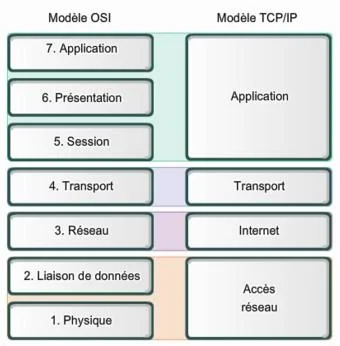

L’actuelle version du protocole IP est IPv4. Mais, le futur s’appuiera probablement sur IPv6, qui reste compatible avec la version actuelle et propose un adressage, sur 128 bits, permettant alors d’étendre les capacités réseau, en matière de taille et d’adressage.

En termes d’actions aux périphériques et aux applications, chaque couche apporte son lot de services permettant de traiter les différents problèmes sous-jacents :

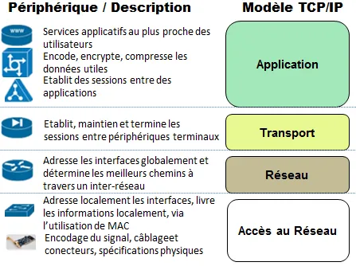

## Le protocole QoS IPv5
<chapterId>570ded19-be61-4005-844e-9490570a6455</chapterId>

L’entête du paquet IP contient plusieurs champs avec un rôle précis lors de la lecture et l’acheminement des paquets. On y trouve notamment l’adresse du destinataire du paquet, la taille de l’entête et bien d’autres renseignements. Le premier de ces champs s’intitule "Version" et fait 4 bits de longueur. Comme semble l’indiquer son intitulé, il sert à connaître la version du protocole utilisé.

**REMARQUE** : c’est l’IANA (_Internet Assigned Numbers Authority_), un organisme d’autorité et de régulation de l’Internet, qui attribue un nombre (parmi les 24 valeurs possibles), pour chaque nouvelle version de protocole d’interconnexion. Si l’on consulte le tableau des versions actuelles on découvre ceci :

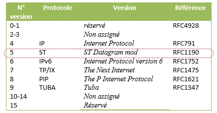

Ainsi, la version IPv5 a bien existé et s’apparente à un protocole ST (_Stream Protocol_) plus spécifiquement orienté **Qualité de Service** (ou QoS). Il s’agit d’un protocole expérimental, ayant vu le jour dans les années 80. Seuls, quelques équipements réseau géraient ce protocole. Il s’agissait de garantir de bout-en-bout, une qualité de service, très similaire à ce que fait RSVP (_Resource Reservation Protocol_) sur les routeurs actuels.

Ceci a eu pour effet que, lorsqu’il a fallu concevoir la nouvelle génération de protocole IP, la demande d’adresse était telle, qu’il a donc été décidé de passer de la version IPv4 à la version IPv6, en évitant, de fait, les problèmes d’incompatibilité. Le protocole IPv5 a donc existé, mais a été très vite abandonné car, il n’a pas connu le succès espéré.

**RAPPEL** : **un protocole consiste à définir les règles de communication** : c’est-à-dire les structures de données et les algorithmes, alors que le service (au travers de primitives de services, écoutant sur un ou plusieurs particuliers), représente l’implémentation d’un protocole. Cela revient le plus souvent à établir un logiciel client et un logiciel serveur. On peut maintenant voir le protocole IP.


## Le protocole IP
<chapterId>758fddbd-b652-4c18-bd1e-d038bd2e4d05</chapterId>
### Définitions et généralités

Ce protocole permet de gérer l’acheminement des paquets d’une machine à une autre, ainsi que l’adressage. Au plus bas niveau (physique), on dispose alors d’interfaces pour communiquer d’un point à un autre. Grâce à trois champs du paquet, on peut facilement déterminer le destinataire d’un message :

- Le champ adresse IP  
- Le champ masque sous-réseau  
- Le champ passerelle

Les données circulent sur le réseau Internet sous forme de datagrammes (c’est pour cela que l’on parle alors de commutation de paquets). Les datagrammes sont des ensembles de données encapsulées, auxquelles on a ajouté des entêtes, correspondant aux informations liées à leur transport : adresse IP, destination, type de service…

La taille maximale d’un datagramme est de 65536 octets. Mais, cette valeur est rarement atteinte, car les réseaux ont une capacité moindre par rapport à une telle dimension. De plus, les réseaux utilisés pour propager de l’information sur Internet, sont adossés à différentes technologies, si bien que la taille maximale d’un datagramme peut également varier selon le type de réseau sous-jacent.

### Fragmentation des datagrammes IP

La taille maximum d’une trame est appelée MTU (_Maximum Transfer Unit_) et entraine alors la fragmentation du datagramme, lorsque la taille de celui-ci est plus importante que le MTU du réseau considéré. Les MTU les plus fréquents sont :

- ARPANET : 1000  
- ETHERNET : 1500  
- FDDI : 4470

La fragmentation d’un datagramme s’effectue au niveau des équipements de routage, c’est-à-dire lors de la transition des datagrammes, d’un réseau dont le MTU est important à un réseau dont le MTU est plus réduit. Donc, lorsqu’un datagramme est trop grand pour passer en un seul morceau sur le réseau considéré, le routeur va le fragmenter (ou plus prosaïquement, le découper), en fragments de taille inférieure au MTU dudit réseau et de façon à ce que la taille du fragment soit un multiple de 8 octets :

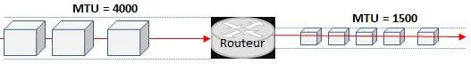

L’équipement réseau peut ensuite envoyer ces fragments de façon autonome et les encapsuler (c’est-à-dire, ajouter un entête à chacun des fragments), pour tenir compte de la nouvelle taille du fragment (une sorte de ré étiquetage). Le routeur en profite également pour ajouter des informations à l’intention de la machine destinatrice afin qu’elle puisse réassembler les morceaux dans le bon ordre.

ATTENTION : à ce stade, on remarquera que rien n’indique que les fragments arriveront dans l’ordre souhaité au départ, étant donné que chacun d’eux est acheminé de façon indépendante.

### Encapsulation des données

Afin de tenir compte des transformations et de la fragmentation, chaque datagramme se voit ajouté plusieurs champs, permettant de procéder au ré-assemblage ultérieur. Ce mécanisme, appelé l’encapsulation, permet de fournir les informations liées à chaque couche de passage du datagramme et de pouvoir faire en sorte d’acheminer correctement l’information vers son destinataire.

Ainsi, lors d’une transmission, les données traversent chaque couche du modèle TCP/IP de la machine émettrice et à chacune d’elles, une nouvelle information, appelée entête, est ajoutée au paquet de données. Il s’agit d’un ensemble de d’informations garantissant la transmission. Au niveau de la machine réceptrice, l’information transite alors par chacune des couches du modèle, l’entête est lue, puis supprimée. Ainsi, à la réception, le message se présente dans son état originel :

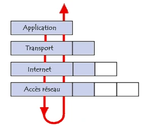

A chaque niveau, le paquet se transforme, puisqu’on lui ajoute de nouveaux entêtes dont les appellations changent au fil des couches :

- Le paquet de données est appelé **message**, au niveau de la couche Application.  
- Le message après encapsulation, s’appelle un **segment** sur la couche Transport.  
- Le segment une fois encapsulé s’apparente à un **datagramme**.  
- Pour finir, au niveau Accès, on parle de **trame**.

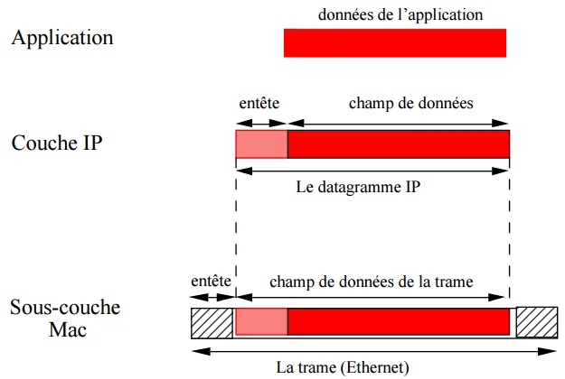

Au final, si l’on prend l’exemple d’une transmission d’un paquet depuis un client, à destination d’un serveur, on peut représenter le flux binaire et d’encapsulation de la façon suivante :

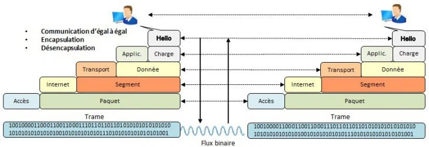

### Adressage IP

Mais, même en utilisant les différents principes décrits ci-dessus, le réseau nécessite de se repérer pour délivrer les paquets de données. Au niveau de la couche Internet, le protocole prévoit de fournir une identification unique pour chaque extrémité de la communication. C’est ce que l’on va appeler l’adresse IP (définie sur 32 bits), et constituée de quatre nombres, séparés par des points : N1.N2.N3.N4

En fait, cette adresse comporte elle-même deux parties :

- Une adresse réseau (aussi appelée _netid_)  
- Une adresse hôte (au sein du réseau qu’elle adresse aussi appelée _hostid_)

Suivant les cas de figure, il existe quatre ou cinq classes d’adresses, notifiée par les lettres A à E :

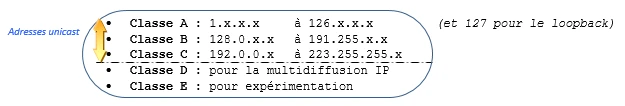

IMPORTANT : il existe, comme on peut le constater, des catégories (ou des tranches) d’adresses qui ne peuvent en aucun cas être exploitées. En particulier, dans la classe C, il n’est possible d’avoir que 254 machines. Or, l’identifiant de la machine est codé sur 8 bits (soient 256 valeurs possibles). Les deux absents représentent respectivement :

**- Pour la valeur 0 : l’adresse du réseau**  
**- Pour la valeur 255 : l’adresse de diffusion (aussi appelée multidiffusion)**

REMARQUE : en fonction de la classe d’adresse considérée, le nombre maximum de sous-réseaux (et donc, de machines ou d’adresses délivrées) varie :


De plus, au sein de chaque classe d’adresses, certaines ne peuvent être routées sur Internet et sont alors réservées aux réseaux locaux (ou aux réseaux privés). C’est d’ailleurs pour cela qu’on les appelle des adresses privées :

- Classe A : 10.0.0.0 à 10.255.255.255  
- Classe B : 172.16.0.0 à 172.31.255.255  
- Classe C : 192.168.0.0 à 192.168.255.255

**-> Adresses devant être "natées" pour sortir sur Internet.**

Exemple : soit l’adresse d’hôte 192.168.7.5, on peut déterminer les adresses suivantes :

- 192.168.7.0 : Adresse Réseau  
- 192.168.7.1 : Adresse broadcast (ou diffusion)  
- 192.168.7.5 : Adresse de machine (ou unicast)  
- 224.x.x.x : Adresse multicast (aussi appelée Classe D multidiffusion)

Une adresse particulière : 127.0.0.1, représente l’adresse de loopback, aussi appelée bouclage et notée, (du moins sur des machine [Linux](https://www.it-connect.fr/cours-tutoriels/administration-systemes/linux/ "Linux")), lo. Elle représente la machine elle-même (sans la nommer), ainsi que le sous-réseau identifié par 127.0.0.0/8.

En effet, chaque réseau peut être lui-même découpé en sous-réseaux, à l’aide de masques permettant un ciselage plus fin des adresses. Ainsi, le netmask (ou masque de sous-réseau), est un masque binaire permettant de séparer immédiatement, l’adresse réseau pour ce sous-réseau, de l’adresse de l’hôte, pour un message global. De la même façon que l’on a attribué des classes aux tranches d’adresses, on découpe les sous-réseaux en classes :

- Classe A : 255.0.0.0  
- Classe B : 255.255.0.0  
- Classe C : 255.255.255.0

La règle d’or, en matière de communication réseau, consiste à n’établir de lien qu’entre machines de même réseau ou de même sous-réseau. Ainsi, le calcul d’un sous-réseau s’effectue (en reprenant l’exemple ci-dessus), à partir des informations dont on dispose :

- Réseau : 192.168.1.0  
- Adresse du Réseau : 192.168.1.255  
- Masque de réseau : 255.255.255.0

**Étape 1** : On doit alors déterminer combien de machines on souhaite intégrer dans le sous-réseau. En considérant qu’un réseau de classe C permet d’intégrer 254 machines (puisque 0 et 255 sont réservés). Si l’on se fixe, par exemple 60 machines à adresser (en ajoutant deux à cette valeur : une adresse pour le sous-réseau et une pour le broadcast), on obtient alors la valeur de 62.

**Étape 2** : Une fois le nombre d’adresses déterminé, on doit trouver la puissance de 2 exacte (ou juste supérieure), au nombre fixé. D’après l’exemple, on aura 26=64.

**Étape 3** : Il faut ensuite écrire le masque en binaire, en plaçant tous les bits du masque de réseau (ici de classe C), à 1 et en positionnant les n premiers bits du masque, correspondant à la partie machine, à 0 (d’après l’exemple n=6) :


**Étape 4** : on peut alors convertir ce masque en décimal, soit 255.255.255.192 et calculer l’ensemble des sous-réseaux possible (en faisant varier les "y" derniers bits du masque correspondant alors à la partie machine soit, d’après l’exemple :

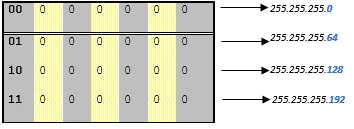

**Étape 5** : au final, on obtient quatre sous-réseaux de 62 machines (soient un total de 248 machines), auxquelles on peut ajouter les 2x4 adresses réservées afin de disposer de 256 adresses potentielles.

Ce genre d’opération revient, en fait, à subdiviser le bloc "HostId", au sein de l’entête d’adresse en deux champs HostId et SubnetId :

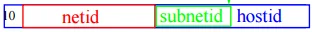

### Adressage CIDR

A l’orée des années 90, suite à l’engouement pour Internet, au niveau des entreprises, le système d’attribution des réseaux IP, basé sur le système des classes montra quelques limites, notamment en ce qui concerne les tables de routages. Il a donc fallu trouver une parade à ce problème. C’est ainsi qu’un nouveau système de répartition des adresses fut initialisé : le CIDR ou _Classless Inter-Domain Routing_ (qui d’ailleurs à aujourd’hui supplanté le système des classes d’attribution d’adresses).

Le but était de pouvoir regrouper plusieurs réseaux de classes C en un seul bloc d’adresses de 2nx256 et n’avoir qu’une seule entrée en vis-à-vis de ces réseaux (avec agrégation de routes). On parlait alors de supernetting. Puis, ce mécanisme fut alors propagé aux réseaux de classe B (même si le besoin était moindre, par rapport à la classe C), puis aux réseaux de classe A (là, le besoin d’agrégation ne se pose même pas). En réalité, c’est l’ensemble de la représentation de l’espace d’adressage qui a été modifié.

Du coup, définir des masques réseau plus grands que celui de la classe naturelle du préfixe réseau, revient à exprimer un bloc CIDR. Ces blocs peuvent éventuellement, représenter des réseaux (au sens n° de réseau et de masque). Les blocs peuvent aussi être un ensemble de réseaux, de même préfixe, ou un seul et même réseau. Dans ce cas, la taille du bloc est égale au masque du réseau, ou à une portion de ce réseau.

Un bloc se définit par son préfixe séparé par le symbole "/" et suivi du nombre de bits représentatifs de la taille du bloc.

**Exemple** : /17 indique que les dix-sept premiers bits représentent la taille d’adresses ou le masque réseau. La taille du bloc est en fait de 2(32-n), où n représente la valeur mentionnée par /17 (soit 32-17=15, c’est-à-dire 215=131072 adresses IP. En déduisant les deux adresses particulières, on obtient 131070 adresses, au total).

Pour information voici, les quatre premières lignes du tableau de correspondance CIDR d’attribution des adresses :


**NOTE** : le sous-réseau zéro était considéré comme un sous-réseau non standard, par le RFC 950, bien qu'utilisable. La pratique de réserver le sous-réseau 0 et le sous réseau 1 est cependant considéré comme obsolète, depuis le RFC 1878. Il s'agit du premier sous-réseau d'un réseau.

**Exemple** : le sous-réseau 1.0.0.0 avec 255.255.0.0 comme masque de sous-réseau.

Le problème, avec ce sous-réseau, c’est que l'adresse unicast pour le sous-réseau est la même que l'adresse unicast du réseau de classe A complet. Ce problème n'est plus d'actualité puisque cette réserve n'avait été conservée, que pour rester compatible avec de vieux matériels, ne sachant pas gérer le CIDR. Ce qui aujourd’hui n’est plus d’actualité.

**ASTUCE** : il existe bien évidemment un utilitaire permettant d’effectuer les calculs de masque de sous-réseau en notation CIDR, à la façon d’une calculette en intégrant les étapes mentionnées ci-dessus : il s’agit de l’outil _ipcalc_.


## Le protocole TCP
<chapterId>860bf7d5-a502-4d10-a12c-9827f6c2d393</chapterId>

**Le protocole TCP (_Transmission Control Protocol_) est un des principaux acteurs de la couche TRANSPORT du modèle TCP/IP. Il permet au niveau des applications, de gérer les données en provenance ou à destination de la couche inférieure (c’est-à-dire du protocole IP).**

Le protocole TCP a pour tâche de :

- Remettre en ordre les datagrammes en provenance du protocole IP.  
- Vérifier le flot de données afin d’éviter une saturation du réseau.  
- Formater les données en segments de longueur variable pour les remettre au protocole IP.  
- Initialiser et terminer une communication.

Ainsi, le protocole TCP assure le transfert des données de façon fiable, bien qu’il s’appuie sur le protocole de niveau inférieur : IP, qui lui n’intègre aucun contrôle de livraison de datagramme.

En fait, TCP possède un système d’accusé de réception permettant au client et au serveur de s’assurer de la bonne réception mutuelle des données (un peu comme on le fait pour la réception d’un colis postal). Lors de l’émission d’un segment, un numéro d’ordre (aussi appelé numéro de séquence), lui est associé. De même, à réception d’un segment de données, la machine réceptrice retourne un segment d’information dont le drapeau (aussi appelé **flag**) est positionné à 1. Cela signifie qu’il s’agit d’un accusé de réception. Ce flag est accompagné d’un numéro d’accusé de réception prenant alors la valeur du numéro d’ordre précédent :

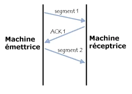

Après quoi, grâce à une minuterie déclenchée dès la réception d’un segment, au niveau de l’émetteur, le segment est réexpédié dès lors que le délai imparti est écoulé. En effet, dans ce cas, le protocole considère que le segment est perdu :

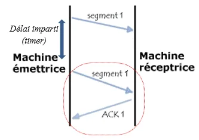

**REMARQUE** : mais, si le segment n’était pas perdu et qu’il arrive malgré tout à destination, le récepteur saura, grâce au numéro d’ordre qu’il s’agit d’un doublon et ne conservera alors que le dernier segment arrivé à destination.

**IMPORTANT** : étant donné que le processus de communication se fait via une émission de données et d’un accusé de réception, basé sur ce fameux numéro de séquence, il est nécessaire que les machines émettrice et réceptrice (c’est-à-dire, respectivement le client et le serveur), connaissent le numéro d’ordre initial de la transmission effectuée par l’autre machine.

Il est donc convenu que l’établissement d’une connexion entre deux applications s’effectue de la manière suivante :

- Les ports de service doivent être ouverts.  
- L’application du serveur est à l’écoute (en mode passif), en attente d’une connexion entrante.  
- L’application sur le client émet une requête de connexion vers le serveur. L’application du client est alors dite en ouverture active.

Donc, les deux machines en communication doivent synchroniser leurs séquences. Cela se fait par le mécanisme appelé "_three way handshake_" (traduit en poignée de main à trois temps – c’est le protocole que l’on a communément, nous humain, l’habitude d’utiliser pour se dire "bonjour").

**NOTE** : ce mode "_three way handshake_" est également utilisé lors de la clôture de session.

Ce dialogue établi, permet d’initier la communication et se déroule (comme le libellé le laisse supposer), en trois étapes :

- L’émetteur (le client), transmet un segment dont le drapeau est valorisé à 1 (afin de signifier qu’il s’agit d’un segment de synchronisation), avec un numéro d’ordre C, appelé numéro d’ordre initial du client.

- Le récepteur (le serveur), reçoit le segment initial en provenance du client et lui envoie un accusé de réception. Ce segment ACK de synchronisation contient également le numéro d’ordre du serveur incrémenté de 1.

- Enfin, le client transmet au serveur, un accusé de réception (avec le flag ACK à 1 et celui de SYN à 0 – car il ne s’agit plus d’un segment de synchronisation). Le numéro d’ordre S, récupéré du serveur est alors incrémenté de 1, à son tour :


À la suite de ce premier échange, entre deux machines, comportant trois séquences, les deux protagonistes sont alors synchronisés et la communication effective peut commencer. Des petits malins ont alors trouvé un moyen de détourner ce mécanisme et en ont fait un outil de piratage appelé IP Spoofing. En fait, cela permet de corrompre la relation d’approbation établie, à des fins malicieuses.

Afin d’empêcher ce détournement, on peut limiter le nombre d’accusés de réception pour désengorger le trafic réseau, en fixant le nombre de séquence, au bout duquel un accusé de réception est nécessaire. Cette valeur est stockée dans le champ "fenêtre" de l’entête TCP/IP.

Ce système, appelé "méthode de la fenêtre glissante", définit une fourchette de séquences n’ayant nul besoin d’un accusé de réception et se déplace au fur et à mesure que les accusés de réception sont détectés.

**Exemple** : après une ouverture de communication, le n° de séquence est 3 et autorise jusqu’à la séquence 5 :


**IMPORTANT** : la taille de cette fenêtre glissante n’est pas fixe. Ainsi, le serveur peut inclure (toujours dans le champ "fenêtre", la taille de la fenêtre qui lui semble la plus adaptée. De la sorte, en cas d’accusé de réception indiquant une demande d’augmentation de la taille de la fenêtre, le client peut déplacer celle-ci vers la droite. Mais, en cas de réduction, le client attend que la fenêtre se déplace d’elle-même.

En ce qui concerne la fin d’une connexion, le protocole prévoit que le client demande lui-même à mettre fin à la transmission, au même titre que le serveur. La terminaison s’effectue alors de la façon suivante :

- Une des machines envoie un segment avec le drapeau FIN à 1. L’application se met en attente du signal de fin. Ainsi, elle termine de recevoir le segment en cours et ignorera les suivants.

- Après réception de ce segment, l’autre machine envoie également un accusé de réception avec le drapeau FIN à 1 et expédie les segments en cours. À la suite de quoi, la machine informe l’application qu’un segment FIN a été reçu et envoie aussi un segment FIN à son vis-à-vis, clôturant ainsi la communication.

**Ainsi, l’association des deux protocoles TCP et IP permettent d’acheminer les messages de bout-en-bout.** On a très souvent l’habitude de schématiser l’utilisation de ces protocoles par le schéma suivant, démontrant la rapidité du premier protocole (IP avec remise en "best effort") et la rigueur de l’autre (TCP avec remise négociée) :


Lorsque l’on souhaite privilégier la rapidité par rapport à la sécurité de transmission, il est possible d’utiliser le protocole UDP, orienté sans connexion, plutôt que TCP.

En effet, dans le cas de l’utilisation du protocole UDP, lorsqu’une machine émettrice diffuse des paquets à destination d’une autre, ce flux est unidirectionnel. La transmission des données se fait sans en avertir le destinataire et ce dernier reçoit les informations sans effectuer d’accusé de réception à l’intention de la première machine.

Pour pouvoir fonctionner ainsi, il suffit donc que l’encapsulation des données envoyées par le protocole UDP ne transmette pas les informations concernant l’émetteur. Ainsi, ce dernier ne connaitra pas non plus l’émetteur des données, à l’exception de son adresse IP.

**REMARQUE** : on compare très souvent le protocole TCP au protocole régissant les communications téléphoniques (connectées) et le protocole UDP au protocole régissant la distribution de messages (par facteur interposé, donc sans connexion notoire).

## Primitives de services
<chapterId>4480afb7-e950-4ccb-88fa-d132f9dc3479</chapterId>

Comme on l’a dit précédemment, les services représentent l’implémentation des protocoles que l’on vient de voir. Or, le modèle TCP/IP a hérité de son prédécesseur le modèle OSI (à sept couches) son architecture.

Chaque couche est construite sur la précédente et chaque réseau ne peut utiliser que les couches qui lui sont nécessaires. Chaque couche possède ses propres structures de données indépendantes. Par contre, le rôle de chaque couche est d’offrir des services à la couche supérieure. Il y a alors deux aspects à prendre en compte dans cette architecture :

**- Aspect vertical (couche N vers couche N+1 (ou inversement)) :**


**- Aspect horizontal : (client vers serveur ou réciproquement) :**

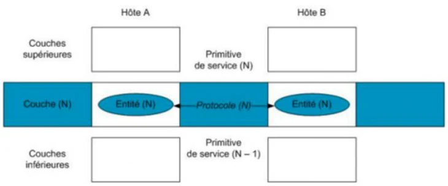

**IMPORTANT** : Les structures de données d’une couche sont conçues de manière à garantir une parfaite compatibilité avec les structures utilisées par les autres couches et ce, pour assurer une transmission plus efficiente.

**RAPPEL** : une structure de données et une terminologie propre à chacune des couches ont été définies de manière à la décrire intégralement. Ainsi, les termes qu’utilisent les différentes couches TCP/IP pour faire référence à des données transmises sont-ils également différents (comme on l’a mentionné plus haut).

Selon la couche et le protocole (TCP ou UDP) utilisés, on adaptera les notions à traiter en se basant sur les termes fixés par le schéma ci-dessous :


Aussi, en matière d’échanges d’information, les couches intermédiaires communiquent entre elles grâce à des primitives de service écoutant sur des ports spécifiques réservés. Si les échanges réseau se font grâce aux protocoles, les interactions entre les couches se font, quant à elles, par le biais des services et de leurs primitives.

Si on cumule l’aspect horizontal avec l’aspect vertical, on devrait avoir la représentation suivante :

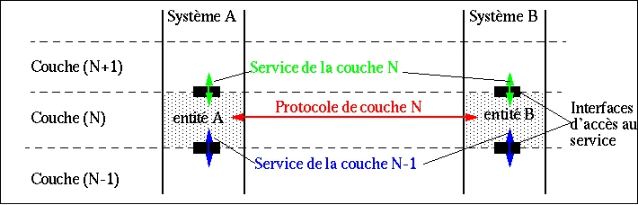

### Synthèse de la partie

On a vu dans ce module, que le modèle utilisé aujourd’hui pour configurer le réseau d’accès à Internet était un modèle en quatre couches et que l’on utilisait principalement l’association de TCP/IP, sans pour autant se passer de modes plus rapides, mais moins sécurisés, que propose le [protocole UDP](https://www.it-connect.fr/les-protocoles-tcp-et-udp-pour-les-debutants/ "protocole UDP").

Ce modèle fonctionne grâce aux protocoles implémentés sous forme de primitives de services qui permettent de s’adapter aux besoins des différentes couches à traverser. L’identification des matériels connectés s’effectue grâce à un système d’adressage, subdivisé en cinq classes. Parmi les adresses définies, certaines sont réservées et d’autres sont non routables sur Internet.

Les réseaux d’adresses ainsi classifiées peuvent, à leur tour être divisés en sous-réseaux. A une époque le découpage se faisait manuellement en calculant les masques de sous-réseaux. Mais, depuis peu, il existe une autre méthode adossée à la notation et aux blocs CIDR.


# L’adressage IPv4
<partId>83f3c3e5-378c-440f-a095-df210842efde</partId>

## Utilisation de l’IPv4
<chapterId>79e4dd18-446a-435b-9f25-c88a00f8bec6</chapterId>

**Cette partie va se consacrer à approfondir les notions vues précédemment, concernant les protocoles TCP et IP, en détaillant les différentes utilisations faites de ces fameuses adresses IP.**

On verra également la relation qu’il peut y avoir entre une adresse IP et un nom logique, enregistré au sein d’un annuaire DNS et avec une adresse MAC physique, servant à établir des routes de transmission privilégiées.

On consacrera un chapitre au mécanisme de translation d’adresses IP et à la façon de l’implémenter tout en participant à la politique de sécurité de l’entreprise.

**Maintenant que l’on en sait un peu plus sur la méthodologie d’adressage avec la suite de protocole TCP/IP, on sait qu’une adresse IP n’est rien d’autre qu’un numéro d’identification, attribué de façon permanente (ou provisoire), à chaque appareil connecté à un réseau informatique, utilisant le protocole IP (_Internet Protocol_).** Donc, il s’agit de la base du système d’acheminement (aussi appelé routage, dans le jargon informatique), des adresses sur Internet.

Il existe des adresses IP de version 4 (sur 32bits, c’est-à-dire sur 4 octets) et de version 6 (sur 128bits, soient 16 octets, que l’on verra un peu plus loin).

**REMARQUE** : la version IPv4 est, encore aujourd’hui, la plus utilisée. Elle se représente en notation décimale (avec quatre valeurs comprises entre 0 et 255), séparées par des points.

_Exemple : adresse 172.16.254.1_

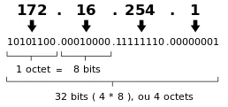

Ainsi, l’adresse IP est attribuée à chaque interface réseau de tout matériel informatique : qu’il s’agisse d’un routeur, d’un commutateur, d’un serveur ou d’un portable… connecté à un réseau adossé au protocole de communication IP, entre ses différents nœuds.

L’expression des octets d’une adresse IP au format binaire, peut facilement être convertie au format décimal. En effet, chaque adresse IP possède une longueur de 32bits et est composée de quatre champs de 8bits chacun. Les octets sont séparés par des points et représentent un nombre décimal entre 0 et 255. L’adresse est ainsi découpée en deux parties :

- Une partie Netid afin d’identifier le réseau  
- Une partie Hostid pour identifier la machine

**Le bit de poids faible représente la valeur décimale 1 et le bit de poids fort se voit affecté la valeur 128**. Ainsi, il ne reste plus qu’à calculer la valeur décimale en partant du tableau suivant :


Si l’on reprend l’exemple précédent (en supposant que l’on ne connaisse pas l’adresse IP et que l’on ne dispose que de la valeur binaire), on devrait alors convertir :

Cette adresse peut être assignée individuellement (par l’administrateur du réseau local, au sein d’un sous-réseau correspondant), soit automatiquement, grâce au protocole DHCP qui distribue les adresses, selon une plage prédéfinie. Si l’équipement dispose de plusieurs interfaces, chacune va alors se voir attribuer une adresse IP spécifique. Enfin, une interface peut également avoir plusieurs adresses IP.

Chaque paquet transmis par le protocole IP, contient l’adresse IP de l’émetteur ainsi que l’adresse IP du destinataire. Les routeurs acheminent donc les paquets vers leur destination, de proche en proche.

**ATTENTION** : certaines adresses utilisées pour la diffusion (qu’il s’agisse de multicast ou de broadcast) ne sont pas utilisable pour adresser des machines individuelles. De plus, il existe une technique dite anycast permettant de faire correspondre une adresse IP à plusieurs équipements connectés, répartis sur Internet.

**RAPPEL** : La première chose à faire, pour manipuler des adresses IP, est d’identifier la classe d’adresses utilisées :

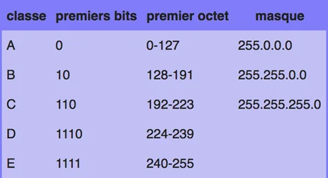

Deux adresses particulières ne peuvent jamais être attribuées :

- L’adresse réseau  
- L’adresse de diffusion

Par contre, pour chaque classe d’adresses, il existe une plage particulière, réservée à l’utilisation de réseaux privés :

- Classe A : 10.0.0.0  
- Classe A : 127.0.0.0 (réseau local)  
- Classe B : de 172.16.0.0 à 172.31.0.0  
- Classe C : de 192.168.0.0 à 192.168.255.0

Comme cela a été mentionné précédemment, il est également possible de découper un réseau en sous-réseaux, grâce à un masque de sous-réseau ou à l’utilisation de blocs CIDR.

**NOTE** : Il existe de nombreux calculateurs de masques de sous-réseau sur Internet. On peut notamment utiliser celui proposé par [le CRIC de Grenoble](http://cric.grenoble.cnrs.fr/Administrateurs/Outils/CalculMasque/). On verra qu’il existe aussi des outils fournit avec le système d’exploitation ou à installer.

Parmi les adresses utilisées il existe une catégorie bien pratique : l’adresse de diffusion. Elle permet d’envoyer un datagramme à l’ensemble des machines d’un même réseau. Pour rappel, cette adresse est obtenue en mettant tous les bits de la partie "hostid" à 1.

## Les différents types d’adresses IPv4
<chapterId>2adfad24-a90d-45b5-b808-3d2f6598bebf</chapterId>

Lorsqu’une adresse est enregistrée (auprès d’un organisme officiel), et directement routable sur Internet, on parle alors d’adresse publique. Se sont généralement des adresses permettant de présenter les sites institutionnels des entreprises ou de certains organismes particuliers. Elles doivent être uniques, et ce, de façon internationale. Elles sont déclarées auprès de l’IANA, qui est, depuis 2005, une division de l’ICANN (_Internet Corporation for Assigned Names and Numbers_), et permet de définir l’usage des différentes plages d’adresses IP, en segmentant l’espace en 256 blocs de taille /8 (d’après la notation CIDR).

Les adresses IP unicast sont donc distribuées par l’IANA au niveau des _Registres Internet Régionaux_ (aussi appelée RIR) et ceux-ci gèrent à la fois les ressources d’adressage IPv4 et IPv6, pour leur région. L’espace d’adressage unicast IPv4 est alors composé de blocs d’adresses /8 (de 1/8 à 223/8). Chacun de ces blocs peut être soit :

- réservé  
- assigné à un réseau final  
- assigné à un registre Internet régional (ou RIR)

Il est possible d’interroger les bases de données RIR, afin de savoir à qui est assignée telle adresse IP, en utilisant la commande whois, ou directement via les sites web des RIR.

A l’inverse, les autres adresses, sont dites privées et ne sont utilisables que dans un réseau local (voire privé – cas des clusters de calculs, par exemple) et peuvent ne pas être uniques à l’échelon mondial. Par contre, au sein dudit réseau privé elles doivent ne pas avoir de doublon.

Afin de transformer des adresses privées en adresses publiques et d’accéder alors à Internet, à partir d’un poste ou d’un équipement privé, on a recours à la traduction d’adresse réseau. **Cette opération est aussi appelée Network Address Translation ou NAT**. On consacrera un chapitre entier à ce genre de mécanisme.

Lorsque l’on souhaite mentionner une adresse non spécifiée, on utilisera alors la notation ::128/. Ce genre d’adresse est bien sûr illégal, en tant qu’adresse de destination. Mais, elle peut être utilisée localement, dans une application afin d’adresser n’importe quelle interface réseau.

**REMARQUE** : en IPv6, on verra apparaître la notion d’adresse locale de site fec0::/10, bien que considérée comme étant obsolète par la RFC3879, qui permet de privilégier l’adressage public en découragent le recours au processus de translation NAT. On a alors recours aux adresses locales uniques fc00::/7, qui facilitent l’interconnexion de réseaux privés, en identifiant un identifiant aléatoire sur 40bits.

La popularité d’Internet a abouti à l’épuisement, en 2011, des blocs d’adresses IPv4 disponibles. Étant donné que cela menaçait le développement du réseau, on alors vu apparaître différentes techniques, parmi lesquelles :

- la migration vers le protocole IPv6  
- l’utilisation du protocole NAT, permettant à de nombreux équipements d’un réseau privé de partager une adresse publique.  
- L’utilisation des RIR, traduisant des politiques d’affectation d’adresses plus contraignantes tenant compte des besoins réels à court terme.  
- (cas plus rare) la récupération des blocs attribués antérieurement et libérés par les entreprises.

## Le DNS, un annuaire d’adresses
<chapterId>511244ec-ba43-44ac-b4c3-b41579a15cff</chapterId>

**Nous autres pauvres humains, avons du mal à retenir tous ces chiffres compliqués que l’on appelle adresse IP. Ceci est d’autant plus vrai d’après ce que l’on vient d’évoquer dans le chapitre précédent : à savoir qu’une adresse pouvait en masquer beaucoup d’autres !**

Aussi, au niveau de la couche supérieure, il a été défini un certain nombre de mécanismes permettant de convertir une adresse IP en nom littéral (plus parlant, pour les administrateurs, qu’une série de bits ou qu’une adresse IP), et de les enregistrer au sein d’un annuaire appelé _Domain Name System_ (ou DNS), régi par le protocole BIND (_Berkeley Internet Name Daemon_).

Ce système permet, entre autres de convertir des adresses IP en nom de domaine et inversement, pour n’importe quel équipement enregistré auprès de l’annuaire DNS. Le nom de domaine est généralement plus explicite et on le fait correspondre à une adresse IP. Les noms de domaines sont séparés par des points. Le nom complet est également appelé nom FQDN (_Fully Qualified Domain Name_). L’élément le plus à droite de cette appellation se nomme TLD (_Top Level Domain_) et l’élément le plus à gauche représente l’hôte (soit l’adresse IP qui lui est affiliée).

Un DNS peut être représenté sous forme d’un arbre. Une zone est une partie d’un domaine, gérée par un serveur particulier. Chaque zone peut ainsi gérer un ou plusieurs sous-domaines, chacun d’eux pouvant être répartis sur plusieurs zones. On eut dire qu’une zone représente l’unité d’administration dont une personne peut être responsable :


On peut ainsi spécifier un domaine, mais également une machine en particulier, puisque son nom est alors déclaré dans la base du DNS. L’annuaire DNS a été conçu pour palier aux limites des fichiers de déclaration d’hôtes (/etc/hosts sous [Linux](https://www.it-connect.fr/cours-tutoriels/administration-systemes/linux/ "Linux")).

**ATTENTION** : un annuaire DNS peut avoir un périmètre limité et ne pas pouvoir accéder à Internet directement. Dans ce cas, si aucune délégation DNS n’a été effectuée, la requête vers Internet (ou depuis Internet) ne pourra pas aboutir. On ne pourra alors pas résoudre le nom (ou l’adresse IP en reverse) de la machine concernée.

Chaque serveur DNS contient une configuration particulière pour les routeurs de courrier électronique (avec une définition de type MX), permettant une résolution inverse ainsi que la spécification d’un facteur de priorité et une tolérances aux pannes. Le serveur lui-même, possède une étiquette particulière : “SOA“ (_Start Of Authority_) permettant de le distinguer des autres machines déclarées.

Dans le chapitre suivant, nous verrons les adresses Ethernet, appelées aussi les adresses MAC.

## A la découverte de l’adresse Ethernet et d’ARP
<chapterId>d02109f6-9bf9-4261-a8f9-e1aa4398b949</chapterId>

### Définitions

Mais, pour satisfaire le protocole d’acheminement, il manque une brique essentielle. En effet, en tant qu’humain nous sommes capables d’identifier une machine ou un équipement, par rapport à son adresse IP et de récupérer ainsi son nom, enregistré dans l’annuaire DNS. Mais, une machine n’est pas capable d’identifier le serveur de destination des paquets à transférer de cette façon. Il lui faut un identifiant analysable et compréhensible par sa mémoire. Il s’agit de l’adresse MAC (_Media Access Control_) que l’on appelle plus communément adresse Ethernet.

**ATTENTION** : ce type d’adresse ne doit surtout pas être confondue avec l’adresse physique qui est un nombre binaire représentant un emplacement dans le bus d’adresse de la mémoire centrale d’une machine. L’adresse physique est à opposer à l’adresse virtuelle.

Celle-ci identifie de manière unique le [matériel](https://www.it-connect.fr/actualites/actu-materiel/ "matériel") informatique comme étant connecté au réseau. Ce type d’adresse est attribué définitivement au périphérique lors de sa fabrication, par le constructeur lui-même.

La différence avec une adresse IP est que cette dernière est attribuée de façon unique à un équipement connecté à un réseau spécifique. Mais, elle est attribuée par l’administrateur réseau (ou par le serveur DHCP).

**IMPORTANT** : toutes les cartes réseau possèdent une [adresse MAC](https://www.it-connect.fr/quest-ce-qu-une-adresse-mac/ "adresse MAC") (même celles contenues dans les PC, tablettes, Smartphones ou autres équipements).

L’adresse MAC constitue la partie inférieure de la couche liaison (couche 2 du modèle OSI). Elle insère et administre ce type d’adresses au sein des trames transmises. On l’appelle parfois adresse Ethernet ou UAA (_Universally Administered Address_). Elle est constituée de 48bits (soient 6 octets) et est généralement représentée sous la forme hexadécimale, en séparant les octets par  le caractère ‘ :’ ou ‘-‘.

Exemple : adresse MAC 5A:BC:17:A2:AF:15

Sur les six octets, **les trois premiers permettent d’identifier le constructeur du matériel réseau** (on appelle cet agrégat d’octets l’OUI (_Organisationally Unique Identifier_). Il s’agit d’une notion que l’on retrouve également dans le protocole SNMP. Les trois octets suivants sont labellisés comme étant le NIC (_Network Interface Controller)_.

### Modification de l’adresse MAC

A moins de “bidouiller“ l’adresse MAC d’un équipement réseau, les valeurs fournies, sont généralement uniques. Mais, certaines personnes souhaitent, malgré tout modifier l’adresse MAC d’une carte réseau local, sur certains systèmes d’exploitation, l’adresse Ethernet n’est pas utilisée directement et cela permet alors de la modifier facilement, au niveau logiciel (et non matériel).

REMARQUE : les causes de modification d’une adresse MAC peuvent être variées :

- Une application réclame l’exécution sur d’une adresse Ethernet spécifique.
- A cause d’un conflit existant entre deux équipements réseau.

Sa modification permet de réduire le risque de traçage inhérent à tout identifiant gravé dans le marbre. Toutefois, cela peut aussi amener d’autres problèmes : filtrage spécifique, pare-feu à modifier…

Afin de sécuriser certains réseaux sans fil, on peut avoir recours au filtrage d’adresse MAC. Si celui-ci est activé, seul les périphériques dont l’adresse MAC est autorisée pourront accéder au réseau concerné. Toutefois, cette méthode n’est pas recommandée, car les personnes cherchant à accéder audit réseau de façon détournée peuvent facilement obtenir une adresse MAC permise (ou la construire) et l’utiliser alors, pour réaliser des actions malveillantes.

### Correspondance MAC/IP

Afin de trouver à quelle adresse IP correspond telle ou telle adresse Ethernet, on peut recourir à l’utilitaire arp suivi de l’adresse IP dot on souhaite connaitre la correspondance.

_Exemple_ : pour l’adresse interne 192.168.1.5

```shell
arp –a 192.168.1.5

Interface : 192.168.1.5  --- 0x5
    Adresse Internet    Adresse Physique        Type
    192.168.1.5        00:54:BC:17:14:6E        dynamique
```

**RAPPEL** : L’adresse MAC et l’adresse IP (aussi appelée adresse logique), sont deux choses totalement indépendantes l’une de l’autre. Tous les périphériques réseau possèdent une adresse MAC (ou adresse Ethernet). Il s’agit donc, comme on vient de le voir, d’un numéro qui les identifie de manière unique, en tant que matériel informatique, connectable au réseau. Cette adresse est attribuée définitivement, au périphérique, lors de sa fabrication par le constructeur.

- Adresse MAC :


- Adresse IP :


Mais, au sein des infrastructures réseau d’entreprise, l’une ne va pas sans l’autre, puisque les deux identifie un élément dudit réseau. L’adresse MAC est utile pour les requêtes du protocole DHCP : la machine réclamant une adresse IP au serveur DHCP, communique par le biais de son adresse MAC avec ce serveur.

**Le protocole ARP est primordial dans la connectivité réseau car il met en correspondance l’adresse physique d’un élément réseau donné avec une adresse IP** (c’est d’ailleurs pour cela qu’il s’appelle protocole de résolution d’adresse ou _Address Resolution Protocol_).

Ce protocole permet, comme on l’a vu dans l’exemple ci-dessus, de connaître l’adresse physique d’une carte réseau correspondant à une adresse IP. Chaque machine connectée au réseau possède son numéro d’identification unique de 48bits. Mais, la communication sur Internet ne se fait pas directement à partir de ce numéro mais à partir de l’adresse logique (ou adresse IP), attribuée, quant à elle, par un organisme.

Pour faire correspondre les adresses physiques aux adresses logiques, le protocole ARP interroge les machines du réseau afin de connaître leur adresse physique et d’en créer une table de correspondance, dans une mémoire cache. Ainsi, lorsqu’une machine doit communiquer avec une autre, elle n’a qu’à consulter cette table de correspondance.

**REMARQUE** : si jamais l’adresse demandée ne se trouve pas dans la table, le protocole ARP émet alors une requête sur le réseau. Les machines sont tenues d’y répondre et de comparer l’adresse logique qui leur est présentée à la leur. Si l’une d’entre elles s’identifie à cette adresse, la machine répondra à la requête ARP, qui stockera alors le couple MAC/IP ainsi récupéré, dans la table de correspondance et la communication pourra s’effectuer, sans difficulté.

Le protocole ARP peut être vu comme la mise en annuaire des correspondances MAC/IP (au même titre que l’on effectue la mise en annuaire des correspondances IP/Noms DNS.

**A l’inverse, il existe un protocole RARP (_Reverse Address Resolution Protocol_) permettant d’effectuer les opérations inverses et de fournir alors, l’adresse MAC correspondant à une adresse IP.**

En réalité, le protocole RARP est uniquement utilisé pour des stations de travail n’ayant pas de disque dur et demandant à connaître leur adresse physique. Ce dernier protocole souffre de nombreuses limitations dont le temps d’administration passé à le maintenir n’est pas le moindre. Généralement, le protocole RARP est remplacé par le protocole DRARP qui en est une version plus dynamique.

Ces protocoles de routage sont essentiels au bon fonctionnement du réseau, car ce sont les dispositifs implémentés dans les routeurs, permettant de “choisir“ le chemin que les datagrammes peuvent emprunter afin d’arriver à destination.

**RAPPEL** : un routeur n’est rien d’autre qu’une machine avec deux cartes réseaux (donc potentiellement au moins deux interfaces réseau) et mettant en relation ces différents réseaux. Les routeurs fonctionnent donc grâce aux tables de routage et à ces fameux protocoles en suivant le mode de fonctionnement suivant :

- Le routeur reçoit une trame provenant d’un équipement connecté à un des réseaux auquel il est lui-même rattaché.
- Les datagrammes sont transmis à la couche IP.
- Le routeur vérifie l’entête du datagramme.
- Si l’adresse IP fait partie des réseaux connus auquel le routeur est rattaché, l’information peut être envoyée à la couche APPLICATION, après que l’entête ait été désencapsulée. Dans le cas contraire, le routeur consulte sa table de routage, à la recherche d’un chemin à emprunter pour délivrer l’information.
- Le datagramme est ensuite envoyé via la carte réseau reliée au réseau sur lequel le routeur a décidé de l’envoyer.

Lorsque l’émetteur et le destinataire d’un message font partie du même réseau, on parle alors d’une remise directe. Si par contre, il y a un ou plusieurs routeur(s) intermédiaire(s) entre l’émetteur et le destinataire, on parle alors de remise indirecte.

Lorsque la table de routage est constituée par l’administrateur on parle alors de routage statique (c’est généralement le cas pour des petits réseaux que l’on peut facilement administrer). Par contre, si le routeur construit lui-même ses tables de routage, on parle alors de routage dynamique.

**La table de routage, quant à elle, n’est rien d’autre qu’une table de correspondance entre l’adresse de la machine destinatrice et le nœud suivant auquel le routeur doit délivrer le message.** En fait, il suffit que celui-ci soit délivré sur le réseau contenant la machine cible, pour ne pas avoir à stocker l’adresse IP complète, mais uniquement l’identifiant du réseau (Hostid de l’adresse IP). On peut représenter la table de routage de la façon suivante :


Ainsi, grâce à ce tableau, le routeur, connaissant l’adresse du destinataire encapsulée dans le message, va pouvoir savoir sur quelle interface réseau le datagramme doit être remis ainsi que le routeur directement accessible pour faire suivre l’information.

Ce mécanisme permettant de connaître le maillon suivant dans la chaîne de transmission et menant à la destination s’appelle routage par sauts successifs (soit next-hop routing).

**REMARQUE** : dans l cas d’un routage statique, c’est l’administrateur qui doit mettre à jour la table de routage. Pour un routage dynamique, c’est le protocole via un utilitaire qui effectue cette mise à jour.

Parmi les protocoles de routage, on peut citer : RIP (_Routing Information Protocol_) et OSPF (_Open Shortest Path First_), qui sont le plus souvent, implémentés sur les commutateurs/Routeurs de premier niveau des entreprises.

## NAT : Translation d’adresse
<chapterId>4f984d5d-f2e0-4faf-b703-ff315f32cef4</chapterId>

### Définition

Le mécanisme de translation d’adresses (aussi appelé _Network Address Translation_ ou NAT) a été conçu pour répondre à la pénurie d’adresses IP utilisées avec le protocole IPv4.

**REMARQUE** : à terme, le protocole IPv6 devrait résoudre le manque d’adresses, puisque le passe d’un mécanisme 32bits à 128bits (soient 16 octets).

Le fonctionnement du NAT consiste à utiliser une seule adresse IP routable (ou un nombre limité d’adresses IP), afin de connecter l’ensemble des machines du réseau. Ceci permet de réaliser une translation au niveau de la passerelle de connexion à Internet entre l’adresse interne de la machine  souhaitant se connecter (qui est non routable) et l’adresse IP de la passerelle.

**Ce processus permet de sécuriser le réseau interne, puisqu’il masque totalement l’adressage interne. Vu d’un observateur extérieur au réseau, toutes les requêtes semblent provenir de la même adresse IP.**

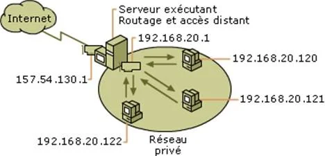

### Types de translation

Selon les cas de figure, on va distinguer deux types de traduction (ou translation) :

- Translation statique
- Translation dynamique

Lorsqu’on associe une adresse IP publique à une adresse IP privée (interne au réseau), on appelle cela de la translation NAT statique. Le routeur (ici, il s’agirait plus d’une passerelle), permet ainsi d’associer à une adresse IP privée (exemple : 192.168.20.1), une adresse publique routable sur Internet (157.54.130.1) et de faire la traduction, dans le sent sortant, comme dans le sens entrant tout en modifiant l’adresse directement dans le paquet émis.

**ATTENTION** : Ce type de translation permet alors de connecter des machines du réseau interne à Internet, de manière transparente, sans pour autant résoudre le problème de pénurie d’adresses IP. En effet, pour le nombre d’adresses internes à associer il faut le même nombre d’adresses routables.

Le mécanisme de NAT dynamique permet de partager une adresse IP routable entre plusieurs équipements du réseau privé. Ainsi, vues de l’extérieur, toutes les machines du réseau d’adressage interne possèdent virtuellement la même adresse IP.

En langage anglais cela se traduit par du IP masquerading : il s’agit de mascarade IP qui est synonyme de translation NAT dynamique.

De plus, pour fonctionner ce système s’appuie également sur la translation de port (aussi appelée Port Address Translation ou PAT). Il s’agit de l’affectation d’un port source différent lors de chaque requête de telle sorte à pouvoir maintenir une correspondance entre les requêtes du réseau interne et les réponses des systèmes provenant d’Internet, toutes adressée à l’adresse IP du routeur.

**NOTE** : le mécanisme de PAT est également appelé NAT Overloading ou surcharge du NAT, puisque tel est son rôle.

### Implémentation du NAT

Les correspondances entre les adresses privées (internes) et publiques (externes) sont généralement engrangées dans une table, sous forme de paire {Adresse interne, Adresse externe}. Lorsqu’une trame est transmise depuis une adresse privée vers l’extérieur, elle traverse le routeur NAT, qui remplace, dans l’entête du paquet TCP/IP, l’adresse de l’émetteur par l’adresse IP externe.

Le remplacement inverse est effectué lorsqu’une trame correspondant à cette même connexion doit être routée vers l’adresse interne. Il est donc aisé de réutiliser une entrée dans la table de correspondance du NAT, à condition qu’aucun trafic, avec ces adresses, n’ait traversé le routeur pendant un certain laps de temps paramétrable.

_Exemple : table NAT simplifiée_


Dans cet exemple, si aucun trafic ni aucune translation n’est apparu depuis 3600 secondes (pour la seconde ligne), l’entrée pourra être réclamée puisqu’elle est marquée comme réutilisable. Le champ durée marquant 0 signifie que la machine est déjà en conversation.

Bien que beaucoup d’applications utilisent favorablement le NAT sans difficulté, ce mécanisme n’est pas anodin et peut poser quelques problèmes à certaines applications du réseau et fait alors porter une complexité additionnelle sur le fonctionnement de ces applications.

Parmi les problèmes que l’on peut rencontrer, on peut citer :

- Les communications entre postes derrière un NAT (cas des protocoles peer-to-peer).
- Le protocole IPSec : son entête est modifié et devient alors illisible.
- Le protocole XWindow : les connexions TCP, initiées par les clients vers le display.

En règle générale, le mécanisme de NAT pose problème lorsqu’un protocole de communication transmet l’adresse IP de la machine source, dans un paquet et/ou des numéros de ports. L’adresse n’étant pas valide, après franchissement du routeur NAT, elle ne peut être employée par la machine destinataire.

**REMARQUE** : Pour pallier à cet inconvénient, les routeurs NAT doivent inspecter le contenu, en manipulant les paquets les traversant, afin de remplacer les adresses IP spécifiées, par les adresses externes. Cela implique de connaître le format du protocole posant problème.

**IMPORTANT** : le mécanisme NAT ne fait que participer à la politique de sécurité  d’un site, mais ce n’est pas son objectif principal. Une fois la translation effectuée, celle-ci est bidirectionnelle. On peut donc dire que le NAT n’est pas un substitut des pare-feu.

_Exemple : imaginons le réseau d’entreprise suivant :_

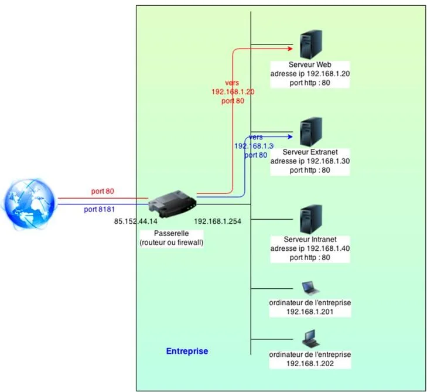

Ainsi, pour se connecter au serveur web de l’exemple, depuis un poste en interne, il suffit d’exécuter l’url : http://192.168.1.20:80 (l’indication du port est optionnelle, mais, uniquement dans le cas où la valeur est 80).

**Dans le cas où l’on souhaite atteindre ce serveur web depuis l’extérieur, il faut suivre le circuit rouge du schéma) et exécuter l’url http://85.152.44.14:80. C’’est le NAT qui effectuera la translation en http://192.168.1.20:80.**

Il suffit d’appliquer ce mode de fonctionnement aux autres serveurs autorisés à disposer d’une translation d’adresses tel que le serveur Extranet de l’exemple ci-dessus (circuit bleu).

**REMARQUE** : dans le cadre du mécanisme NAT, on peut rencontrer des interfaces réseau appelées virbrx. Il s’agit d’interface “_Virtual Bridge X_“, issue du monde Xen, fournit par la bibliothèque de virtualisation libvirt pour interconnecter le monde interne, au monde externe de la machine et permettre au système NAT d’être opérationnel. Cela est généralement utilisé comme un pont (ou bridge) et se configure dans le répertoire _/etc/sysconfig/network-scripts_, via le script ifcfg-virbr0 suivant (par exemple) :

```shell
NAME= ""

BOOTPROTO=none

MACADDR=""

TYPE=Bridge

DEVICE=virbr0

NETMASK=255.255.255.0

MTU=""

BROADCAST=192.168.0.255

IPADDR=192.168.0.1

NETWORK=192.168.0.0

ONBOOT=yes
```

Lorsque le pont est créé, il faut faire en sorte de router le trafic et d’activer l’option de NAT :

```shell
echo 1 > /proc/sys/net/ipv4/ip_forward (routage)
```

```shell
iptables –t NAT –A POSTROUTING –o <WAN> -s 192.168.0.0/24 –j MASQUERADE (natage)
```

Dans le prochain chapitre, nous allons voir comment configurer une adresse IP sous Linux, de manière simple et de manière avancée.

## Comment configurer le réseau avec ifconfig ?
<chapterId>8ba7e946-d2a0-4841-8d54-e85ba96baa25</chapterId>

### Configuration standard

Maintenant que l’on a vu la théorie, passons un peu à la pratique. Il s’agit ici de concrétiser la création ou la configuration du réseau. Chaque distribution propose une interface graphique différente. Par contre, la commande universelle de configuration d’un réseau, sur GNU/Linux, s’appelle ifconfig.

**ASTUCE** : il existe également une autre commande permettant également de lister toutes les interfaces, y compris celles qui sont inactives : ip addr.

C’est un peu le couteau suisse du paramétrage réseau. On peut l’utiliser à la fois pour initialiser une interface, modifier un masque réseau, positionner une adresse IP ou encore activer ou désactiver telle ou telle interface.

Exemple : activation de l’interface eth0 avec l’adresse 192.168.1.2

```shell
ifconfig eth0  inet 192.168.1.2   netmask 255.255.255.0
```

Une fois l’interface générée, il est alors possible de l’activer (ou la désactiver) avec les options up (ou down):

```shell
ifconfig eth0 up
```

Afin d’interroger une interface, il suffit simplement d’exécuter la commande ifconfig en précisant l’interface que l’on souhaite inspecter :

```shell
ifconfig eth2
```

Par défaut, sur GNU/Linux, la commande ifconfig seule, sans option, fournit la liste et les propriétés des interfaces actives. Si l’on souhaite visualiser l’ensemble des interfaces, y compris celles qui ne sont pas actives, il faut utiliser l’option –a :

```shell
ifconfig –a
```

ASTUCE : même si ce n’est pas le plus courant des usages, on peut ajouter une seconde adresse IP à une interface déjà configurée :

```shell
ifconfig eth2:en1 172.18.2.39
```

En suppléments des options up et down, il existe carrément des commandes permettant d’activer ou désactiver les interfaces réseau : ifup et ifdown. Celles-ci utilisent la configuration mentionnée dans les fichiers se trouvant dans le répertoire **/etc/sysconfig/network-scripts**.

```shell
ifup eth1
```

```shell
ifdown eth2
```

Outre les fichiers de configuration mentionnés ci-dessus, il existe également un fichier network, se trouvant dans le répertoire **/etc/sysconfig** permettant de préciser les paramètres suivants :

- NETWORKING  : activation ou non du réseau au démarrage du système
- HOSTNAME : nom de domaine qualifié (FQDN)
- GATEWAY : adresse IP de la passerelle permettant le routage
- GATEWAYDEV  : interface réseau permettant d’accéder à la passerelle
- NISDOMAIN : appartenance (ou non) à un annuaire de noms NIS
- DNS1 : adresse IP du serveur DNS primaire
- DNS2 : adresse IP du serveur DNS secondaire

Les fichiers de configuration ifcfg*, du répertoire /etc/sysconfig/network-scripts contiennent le paramétrage des différentes interfaces réseau et peuvent être soit statique (adresse fixe), soit dynamique (utilisation d’un serveur DHCP) :

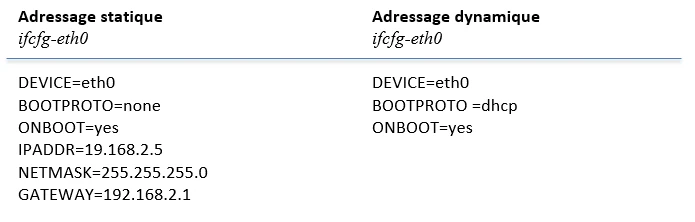

### Configuration avancée : le teaming

En matière de réseau, on peut faire en sorte de redonder son réseau en doublant les interfaces utilisées. Cela s’appelle du teaming ou du bonding. Cela consiste à agréger plusieurs interfaces en une seule afin d’augmenter la bande passante et la résilience.


ATTENTION : ce mode de fonctionnement nécessite le chargement d’un module noyau particulier : le module bonding. De plus, il faut deux interfaces actives pour pouvoir réaliser la pseudo-interface bond0 schématisée sur la capture ci-dessus. Il faut donc déclarer trois fichiers ifcfg* :

- ifcfg-eth0
- ifcfg-eth1
- ifcfg-bond0

Il existe sept modes de bonding que l’on peut paramétrer au niveau du module noyau installé :

- mode 0 : équilibrage de charge (aussi appelée balance round robin)
- mode 1 : Sauvegarde active
- mode 2 : Balance XOR
- mode 3 : Broadcast
- mode 4 : 802.3ad
- mode 5 : balance “Traffic Load Balancing“ ou TLB
- mode 6 : balance “Adaptive Load Balancing“ ou ALB

**Généralement, sur des configurations de production, on a tendance à privilégier les modes 5 ou 6 permettant de changer dynamiquement, à la fois d’interface réseau et d’adresse MAC.** Une fois que l’on a configuré le module noyau en éditant le fichier /etc/modprobe.d/bond0.conf de la façon suivante :

```shell
alias bond0 bonding
```

```bash
options bond0 miimon mode=5
```

On peut alors désactiver les deux cartes réseau pour pouvoir paramétrer le bonding et les transformer en interfaces esclaves:

```shell
ifconfig eth0 down
```

```shell
ifconfig eth1 down
```

On peut ensuite créer l’interface bond0 avec son adresse Ethernet active (celle, généralement de l’interface eth0 associée) et configurer l’adresse IP à lui attribuer :

```shell
ifconfig bond0 hw ether 00:17:56:BC:02:3A
```

```shell
ifconfig bond0 192.168.2.3 netmask 255.255.255.0 gateway 192.168.2.1
```

Après cela, il faut transformer les deux interfaces eth0 et eth1 en esclave inféodées à l’interface bond0 :

```shell
ifenslave bond0 eth0
```

```shell
ifenslave bond0 eth1
```

ASTUCE : si l’on a besoin à un quelconque moment de libérer une interface ou d’en remplacer une, il suffit juste d’exécuter la commande suivante :

```shell
ifenslave –d bond0 eth1 (for example)
```

Maintenant, il faut créer les fichiers de configuration, dans le répertoire **/etc/sysconfig/network-scripts** des différentes interfaces réseau, en commençant par ifcfg-bond0 :

```shell
DEVICE=bond0

ONBOOT=yes

BOOTPROTO=none

IPADDR=192.168.2.3

NETMASK=255.255.255.0

BROADCAST=192.168.2.255

GATEWAY=192.168.2.1

USERCTL=no
```

Ensuite, on passe à la configuration de ifcfg-eth0 :

```shell
DEVICE=eth0

USERCTL=no

ONBOOT=yes

MASTER=bond0

SLAVE=yes
```

Et pour finir, on passe à celle de ifcfg-eth1, qui ressemble à s’y méprendre au fichier ifcfg-eth0:

```shell
DEVICE=eth1

USERCTL=no

ONBOOT=yes

MASTER=bond0

SLAVE=yes
```

Pour pouvoir démarrer cette configuration, il faut alors redémarrer le service réseau du système, en exécutant l’instruction suivante :

```shell
systemctl restart network
```

**REMARQUE** : une particularité des interfaces réseau sous GNU/Linux, c’est qu’il est possible d’attribuer un ou plusieurs alias à une carte réseau, à partir de son interface principale. Cela permet d’attribuer, en réalité plusieurs adresses IP à la même interface.

En effet, lorsqu’une interface dispose de plusieurs adresses IP, la première est considérée en tant qu’adresse principale de l’interface et les suivantes comme des alias. Ceux-ci utilisent alors le nom de l’interface réseau principale, suivi du numéro d’alias séparé du nom, par le caractère ‘:’.

Exemple : pour générer des alias de l’interface eth0

```shell
ifconfig eth0:1 192.168.1.2 netmask 255.255.255.0 up
```

**ATTENTION** : le masque mentionné ici correspond au masque de sous-réseau. De plus, pour que cette pseudo-nouvelle interface fonctionne, il ne faut pas oublier de créer son fichier de configuration :

```shell
DEVICE=eth0:1

BOOTPROTO=static

IPADDR=192.168.1.2

NETMASK=255.255.255.0

ONBOOT=yes 
```

Il faut alors activer la nouvelle interface en exécutant la commande ci-dessous :

```shell
ifup eth0:1
```

Nous allons maintenant passer à la partie suivante qui sera consacrée à l'adressage IPV6.

# L’adressage IPv6
<partId>9b1d87f1-2a68-496e-b5dd-76cf74fb8cde</partId>


## IPv6 : Normes et définitions
<chapterId>d1f16f0a-1104-460d-8d67-f725665f8e3f</chapterId>

Cette partie va maintenant décrire la génération suivante d’adressage : IPv6 (à l’époque on parlait de IPng ou IP New Generation). Mais, commençons par détailler les quelques règles qui régissent l’administration de l’espace d’adressage IPv6.

Les objectifs de ce nouveau protocole sont multiples. En premier lieu, il lui faut :

- Supporter les milliards d’équipements connectés, en s’affranchissant de l’inefficacité de l’espace d’adressage actuel en IPv4.

- Réduire également la taille des tables de routage.

- Simplifier le protocole afin de permettre aux routeurs de faire circuler les datagrammes plus rapidement.

- Fournir une sécurité plus efficiente, en termes d’authentification et de confidentialité, notamment, par rapport à l’actuel protocole IP.

- Accorder plus de crédit au type de service et tout particulièrement à ceux associés aux applications temps réel.

- Faciliter la mobilité des machines, sans pour autant changer d’adresse.

- Permettre au protocole une meilleure évolution dans le futur.

- Favoriser une coexistence la plus légère possible entre l’ancien et le nouveau protocole.

Pour toutes ces raisons, il est raisonnable de s’orienter vers le protocole IPv6 qui répond favorablement aux différents objectifs mentionnés ci-dessus. De plus, si ce nouveau protocole n’est pas compatible avec IPv4, il l’est toutefois avec les autres protocoles Internet : qu’il s’agisse de TCP, UDP, ICMP, DNS et même avec les protocoles de routage tels que OSPF, IGMP et BGP (même si certains ajustements, concernant le fonctionnement avec des adresses longues, sont nécessaires).

### Règles d’écriture

Suite à la pénurie d’adresse IP en IPv4, il a fallu imaginer un stratagème pour ne plus être limité et permettre un avenir étendu à Internet. L’adresse IPv6, au même titre que le protocole IPv4 est une adresse IP. Sa longueur est de 128bits, soient 16 octets. On dispose approximativement de 3,4x1038 adresses possibles.

La notation décimale pointée, utilisée par le protocole IPv4 est abandonnée au profit d’une écriture hexadécimale où les huit groupes de deux octets sont séparés par des caractères ‘:’.

Exemple : écriture d’une adresse IPv6

**1987:0c02:0000:84c2:0000:0000:cf2a:9077**

Mais, en ce qui concerne l’écriture de ce genre d’adresse, on peut omettre les zéro non significatifs (en tête d’octet). Ainsi, l’adresse en exemple, ci-dessus peut aussi s’écrire :

**1987:c02:0:84c2:0:0:cf2a:9077**

Ensuite, une suite unique de 1 à n groupes consécutifs de 16bits tous nuls peut être également omise, en conservant malgré tout les signes ‘:’, de chaque côté de la partie effacée. On peut donc abréger l’adresse IPv6 ci-dessus de la façon suivante :

**1987:c02:0:84c2::cf2a:9077**

**IMPORTANT** : étant donné que le caractère ":" est utilisé pour séparer les groupes d’octets, il apporte également de la confusion quant à l’écriture des url web. En effet, ce même caractère ":" désigne aussi la séparation de l’adresse IP et de son port de service. Pour palier à ce problème, il a donc été décidé d’écrire l’adresse IPv6 d’une url entre crochets.

Exemple : URL pour l’adresse IPv6 2002:400:2A41:378::34A2:36

```shell
http://[2002:400:2A41:378::34A2:36] :8080
```

L’expression des adresses IPv4, dans le formalisme IPv6, peuvent être écrites en utilisant la représentation décimale pointée, précédée de la chaîne "::" :

```shell
::192.168.1.5
```

**ATTENTION** : par contre, on ne peut en aucun cas supprimer une seconde série de bits à zéro. Il n’est autorisé d’en éliminer qu’une seule série. Ainsi, la séquence ‘::’ signifie qu’il faut combler tout ce qu’il manque par des zéro. Il existe ainsi plusieurs façons différentes de représenter une adresse IPv6. C’est la RFC5952 qui décrit  une représentation canonique.

### Les types d’adresses IPv6

Une adresse IPv6 non spécifiée est alors abrégée en ::0.0.0.0 ou de façon canonisée en ::. Tout comme en IPv4, il existe plusieurs catégories d’adresses, chacune jouant des rôles particuliers, décrits au sein des RFC5156, RFC4291 et RFC3587.

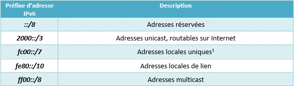

Sur un réseau local, il faut utiliser le préfixe fd00::/8.  

#### Adresses réservées

Parmi les adresses réservées de cette classe, certaines sont assez particulières et se distinguent des autres par leurs rôles :

- **Adresse ::/128** : il s’agit d’une adresse non spécifiée qui n’est jamais assignée à un serveur, mais peut être utilisée comme adresse source en acquisition d’adresse IPv6.
- **Adresse ::1/128** : c’est l’adresse de loopback équivalent à l’adresse 127.0.0.1 du protocole IPv4.
- **Adresses 64:ff9b::/96** : il s’agit d’adresses réservées pour les traducteurs de protocoles définit dans la RFC6052.
- **Adresses ::ffff:0:0/96** : il s’agit d’une représentation d’adresses IPv4 dans une structure particulière d’IPv6. Ces adresses sont utilisées par des logiciels, mais elles ne doivent pas être présentes sur le réseau.
- **Adresses ::ffff:0:0:0/96** : ce sont des adresses IPv4 traduites pour un usage particulier, décrit par la RFC2765.

#### Adresses globales unicast

Ces adresses représentent 1/8ème de l’espace d’adressage total du protocole IPv6. Parmi ces adresses on distingue la plage d’adresses 2001::/16 qui sont celles ouvertes à la réservation depuis 1999. Ces adresses sont allouées par bloc /23 à /12 (on parle ici aussi de blocs, comme pour ceux de la notation CIDR), par l’IANA à un registre International régional.

**REMARQUE** : nombre d’expressions utilisées pour IPv4 vont se retrouvées aussi en IPv6, même si le sens n’est pas toujours tout à fait le même.

Ces blocs sont, pour la plupart sont réservés à des usages particuliers, parmi lesquels on peut citer :

- 2001:2::/48 utilisées pour des tests de performance, décrits par la RFC5180.
- 2001:db8::/32 réservées pour la documentation et décrit par la RFC3849.

Il y a également des adresses 2002::/16 qui permettent d’acheminer les flux IPv6 au travers d’un ou plusieurs réseaux IPv4. On verra un peu plus loin que ces adresses sont essentielles car elles participent à la transition IPv4/IPv6 afin de résoudre le crucial inconvénient de l’incompatibilité entre les adresses IPv4 et celles d’IPv6.

**IMPORTANT** : les autres adresses routables sont actuellement réservées à des usages ultérieurs. Cela représente environ les trois quarts de la plage d’adresses routables.

#### Adresses locales uniques

Ces adresses notifiées par fc00::/7, sont généralement utilisées pour des communications locales et ne sont pas routables, sauf sur les sites qui le souhaitent. C’est l’équivalent des adresses privées décrites par la RFC1918, de l’espace d’adressage IPv4, étendues à IPv6.

**NOTE** : Le 8ème bit est actuellement fixé à 1, ainsi cela donne le préfixe de plage d’adresses fd00::/8, permettant d’assigner cette plage d’adresses à un usage local. Cette adresse comprend alors un préfixe pseudo-aléatoire de 40bits afin d’éviter les conflits, lors de l’interconnexion à d’autres réseaux privés.

#### Adresses locales de lien

Ce type d’adresses, préfixées par fc00::/7, utilisable uniquement au sein d’un réseau local de niveau 2, sont non routables et appartiennent à la plage fe80::/64. Les adresses ne sont uniques que sur un lien et une machine peut donc disposer de plusieurs interfaces avec la même adresse locale de lien. Il suffit de préciser l’interface pour lever l’ambiguïté.

#### Adresses multicast

Il faut bien comprendre que, pour le protocole IPv6, il n’existe aucune adresse de broadcast. Cette notion est remplacée par des adresses multicast, propres à l’application associée. Cette plage est préfixée par ff00::/8. Parmi cette plage, il existe l’adresse ff02::1 qui est un peu particulière. Elle est limitée au lien local. Mais, son utilisation par les applications est dépréciée, voire même découragée.

Exemple : utilisation de l’adresse multicast **ff02::1:ff00:0/104 par NDP**

NDP (Neighbor Discovery Protocol) est un protocole de niveau 3, responsable de la découverte des autres machines sur le même lien réseau.

### Périmètre des adresses

La portée d’une adresse IPv6 (on parle alors d’_IPv6 Address Scope_), est représentée à la fois par son domaine de validité et par son unicité. On distingue donc trois grandes familles d’adresses :

- **Les adresses unicast**

Ce type d’adresses regroupe les adresses loopback, dont la portée est limitée à l’hôte, les adresses locales de lien et les adresses locales uniques (aussi appelées ULA). Ces dernières, ont une portée globale et possède le découpage suivant :


Cela signifie que les adresses sont uniques dans le monde, et peuvent être utilisées pour communiquer avec d’autres adresses également globalement uniques, ou avec des adresses locales de lien, pour des liens, bien évidemment, directement  connectés.

**REMARQUE** : le modèle géographique est le même que celui du réseau Internet actuel, dans lequel les fournisseurs n’interviennent guère. C’est dans ce cadre que le protocole IPv6 permet de gérer les deux types d’adresses : adresses unicast locales et adresses de liens locaux. Ces dernières ont le découpage ci-dessous :

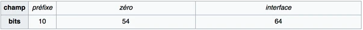

Toutes ces adresses, lorsqu’elles passent par la procédure de création automatique, on t généralement 8 octets représentant le réseau et 8 autres octets décrivant l’interface utilisée sur ce réseau.

- **Les adresses anycast**

Ce type d’adresse possède une portée identique à celle des adresses unicast globales ci-dessus. Cette technique est similaire à la diffusion multidestinataire multicast : l’adresse de destination est alors un groupe d’adresses. Mais, au lieu d’essayer de délivrer le datagramme à tous les membres du groupe, IPv6 tente de le livrer à un de ses membres, généralement le plus proche ou le plus à même de recevoir le paquet. Le découpage est le suivant :

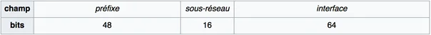

- **Les adresses multicast**

Pour cette catégorie, ce sont les 4 bits les moins significatifs du second octet (soit `ff0<s>::`) qui identifient la portée de l’adresse où `<s>` varie de la façon suivante :

Pour s=1, l’adresse multicast est locale à l’équipement.

Pour s=2, l’adresse est locale au lien.

Pour s=5, l’adresse est locale au site.

Pour s=8, l’adresse est locale à l’organisation.

Pour s=e, l’adresse devient globale.

Les adresses de diffusion multidestinataire possèdent un champ Flag (sur 4bits) et un champ concernant la portée (également sur 4bits) suivi d’un champ d’identification du groupe (sur 112 bits). C’est l’un des bits du champ Flag qui permet de distinguer les groupes permanents des groupes transitoires.

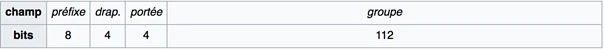


## Assignation des adresses dans un réseau local
<chapterId>4c9c3e52-59bc-499a-af0a-6dd369a9e029</chapterId>

Dans ce court chapitre, nous allons introduire l'assignation des adresses IPv6 dans un réseau local.

La taille du sous-réseau d’une adresse IPv6 étant de 64bits, les hôtes disposent alors des 64 bits restants pour renseigner leur numérotation, à l’intérieur du sous-réseau. Afin d’attribuer des adresses de sous-réseau il existe principalement deux techniques :

- Configuration manuelle
- Configuration automatique

Dans le premier cas, c’est l’administrateur qui fixe l’adresse. Celles constituées de 0 ou de 1 ne jouent aucun rôle particulier, au sein du protocole. Dans le second cas, un certain nombre de logiciels permettent d’automatiser la distribution d’adresses.

Par exemple, on peut utiliser NDP permettant l’auto configuration sans état, basée sur l’adresse MAC de l’hôte. Cela est décrit par la RFC4862. Une autre technique, propres aux clients des systèmes Microsoft Windows, permet un tirage pseudo aléatoire. Enfin, de la même façon  qu’on utilise le protocole DHCP pour assigner des adresses à des équipements connectés, dans l’espace d’adressage IPv4, on dispose aussi du protocole DHCPv6, décrit par la RFC3315.

**NOTE** : les 64 bits décrivant l’interface sont construits à partir de la connaissance de l’adresse MAC, dans un format appelé EUI-64, utilisé notamment par FireWire et IPv6. Mais, ce système n’est pas sans poser quelques interrogations vis-à-vis de la protection de la vie privée, dans la mesure où les adresses MAC sont visibles dans le datagramme IPv6 et peuvent ainsi permettre d’identifier facilement l’équipement final.

Les adresses EUI-64 sont construites à partir de l’adresse MAC-48 en insérant FFFE dans les octets 4 et 5 de l’adresse considérée :

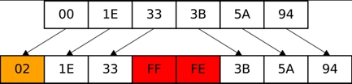

Au même titre qu’une adresse distribuée par le protocole DHCP à une durée de vie pouvant être limitée, ici aussi, on peut configurer une durée de vie préférée et une durée de vie de validité. Celles-ci sont programmées au sein des routeurs qui fournissent les préfixes, dans l’opération de configuration automatique.

**ASTUCE** : combinant cela avec un changement DNS associé, ces durées de vie permettent une transition progressive vers une nouvelle architecture IPv6 (appartenant, par exemple, à un nouveau fournisseur d’accès), sans pour autant  devoir interrompre le service.

Lorsque la durée d’utilisation d’une adresse dépasse celle de la valeur préférée, elle n’est alors plus utilisée par les nouvelles connexions. Lorsque sa période de validité est atteinte, elle est supprimée de la configuration de l’interface.


## Assignation des blocs d’adresses IPv6
<chapterId>45cce866-1b58-4888-b3fe-15c922180839</chapterId>

### Distribution des adresses

Comme on l’a mentionné plus haut, les adresses IP unicast sont distribuées par l’IANA aux registres Internet régionaux (aussi appelés RIR). Ceux-ci gèrent les ressources d’adressage IPv4 et IPv6, dans leur zone ou leur région.

L’IANA alloue alors des blocs de taille /23 à /12 (comme on l’a déjà dit ci-dessus), dans l’espace unicast global, aux cinq RIR déclarés. Ces derniers peuvent alors les allouer aux fournisseurs d’accès à Internet, sous forme de blocs minimum de /48.

**REMARQUE** : Les RIR peuvent alors décider de subdiviser leur bloc /23 en 512 blocs de /32 (soit un par fournisseur). Puis, ce dernier peut aussi assigner 65536 blocs /48 à ses clients, qui disposent à ce stade de 65536 réseaux /64.

On peut donc résumer cette répartition avec le tableau des structures de préfixes distribués, ci-dessous :

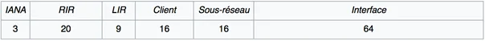

Étant donné le nombre et la disponibilité des adresses, l’utilisation du mécanisme NAT n’est plus vraiment de mise. Il est possible d’interroger les bases de données des RIR afin de connaître à qui (ou à quel organisme) est attribuée telle adresse IP, grâce à la commande _whois_ (ou directement en ouvrant le site web du RIR).

De plus, afin d’encourager l’agrégation des adresses, le plan d’adressage IPv6 ne prévoyait au départ, que des blocs de type _Provider Aggregatable_ (abrégés en _PA_), liés au fournisseur d’accès à Internet, lui-même. La possibilité d’être multi-hébergé (appelé _multihoming_) étant réalisé par l’assignation de plusieurs adresses de type PA aux équipements. Ce processus implique une renumérotation en cas de changement de FAI. Mais, le protocole IPv6 favorise ce mécanisme, grâce à la durée de vie et à l’auto configuration des adresses IP.

**IMPORTANT** : en 2009, la politique d’attribution des adresses IPv6 a été modifiée afin d’accepter l’assignation de blocs type _Provider Independant_ (noté _PI_), aux entreprises désireuses de se connecter à plusieurs hébergeurs, la taille minimale du bloc assigné étant de /48. Le document RIPE 512 décrit la politique développée en la matière.

### Notation des masques de sous-réseau

Un sous-réseau, au sens le plus large est un groupe d’adresses IPv6, commençant par une séquence binaire. Le nombre de bits inclus dans cette séquence est notée au format décimal derrière un caractère de barre oblique : `/`.

Exemple : cas du masque 2001:db8:1:1a0::/59

**Il s’agit du sous-réseau correspondant aux adresses comprises entre 2001:db8:1:1a0:0:0:0:0 et 2001:db8:1:1bf:ffff:ffff:ffff:ffff**

### Paquets IPv6 et entêtes

Un paquet IPv6 possède également un entête fixe de 40 octets et il est possible qu’une ou plusieurs entêtes optionnelles d’extension, suivent immédiatement l’entête fixe IPv6. L’entête d’extension fournit des informations complémentaires.

Certaines entêtes ont un format fixe, mais, d’autres contiennent un nombre variable de champs également variables. Dans cette optique, chaque item est codé sous forme du triplet {_Type, Longueur, Value_}. Le champ _Type_ fait un octet de longueur et précise la nature de l’option. Les différentes catégories ont été choisies de telle sorte à ce que les deux premiers bits précisent quoi faire, aux routeurs rencontrés, pour qu’ils sachent comment exécuter les instructions Leurs choix sont les suivants :

- Ignorer l’option
- Détruire le datagramme
- Retourner un message ICMP à la source
- Détruire le datagramme sans retourner de message ICMP (cas d’un paquet multidestinataire)

Le champ Longueur est également d’un octet et indique la taille du champ Valeur (de 0 à 255), contenant une information quelconque à l’intention du destinataire. Voici les différentes entêtes que l’on peut rencontrer.

On peut avoir affaire à une entête dite pas-à-pas (aussi appelée _hop-by-hop_), contenant des informations destinées aux routeurs rencontrés sur le parcours du datagramme. La structure générale de ce genre d’entête est la suivante :

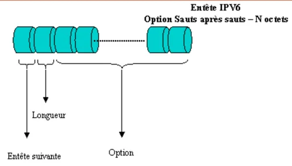

L’entête de routage fournit la liste d’un ou plusieurs routeurs devant être parcourus, sur le trajet vers la destination du paquet. On dénombre alors deux types de routage, souvent combinés ensemble : le routage strict (où la route intégrale est clairement établie) et le routage lâche (où seuls les routeurs obligatoires sont mentionnés).

Ainsi, les quatre premiers champs de l’entête routage contiennent quatre entiers d’un octet, chacun définissant respectivement :

- Le type d’entête suivant
- Le type de routage (généralement valorisé à 0)
- Le nombre d’adresses présentes dans l’entête (pouvant aller de 1 à 24)
- Une adresse fournissant la prochaine étape à visiter

**REMARQUE** : ce dernier champ débute avec la valeur zéro et est incrémenté lors de chaque étape ou chaque adresse visitée. La structure fournit par cette entête est la suivante :

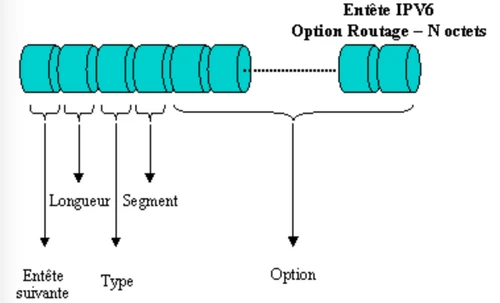

Concernant la fragmentation, les champs relatifs à celle-ci ont été retirés de l’entête fixe, car IPv6 possède une approche quelque peu différente de celle d’IPv4. Tout d’abord, tous les ordinateurs et routeurs, conformes à IPv6 doivent supporter les datagrammes de 576 octets. Cette règle place la fragmentation dans une optique secondaire.

De plus, lorsqu’un hôte envoie un trop grand datagramme IPv6, contrairement à ce qu’il se passe avec la fragmentation IPv4, le routeur, qui ne peut transmettre le message, retourne alors un message d’erreur à la source. En effet, le message stipule à l’émetteur d’interrompre toute communication avec ce format vers la destination. Il est beaucoup plus efficace de transmettre l’information à la bonne dimension. Ainsi, les routeurs peuvent fragmenter les paquets à la volée.

En effet, l’entête fragmentation traite celle-ci à l’identique de la méthode IPv4, car elle contient l’identifiant de datagramme, le numéro de fragment ainsi qu’un bit précisant si d’autres fragments suivent.

**IMPORTANT** : dans le protocole IPv6, seul l’ordinateur source peut fragmenter le datagramme. Les routeurs rencontrés sur le trajet ne le peuvent pas. Ainsi, l’hôte source peut fragmenter le datagramme en morceaux et utiliser l’entête fragmentation afin de transmettre les morceaux.

La structure de données proposées par l’entête fragmentation est la suivante :

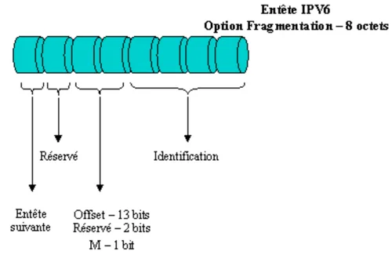

L’entête authentification (aussi appelée _AH_ ou _Authentication Header_), décrit un mécanisme permettant au destinataire d’un datagramme de valider l’identité de l’émetteur. On rappelle que dans le protocole IPv4, aucun mécanisme similaire n’est proposé. L’utilisation du chiffrement des données renforce alors la sécurité du datagramme, car seul le véritable destinataire peut lire les données.

Cette entête sert aussi au contrôle d’intégrité pour garantir au récepteur que personne n’a modifié le contenu du message, lors de son transfert sur le réseau. On peut éventuellement utiliser cette entête afin de détecter les "rejeux".

Son principe est très simple : l’émetteur calcule un authentificateur sur un datagramme et le diffuse avec le paquet sur lequel il porte. Le récepteur récupère cette valeur et s’assure qu’elle est authentique par rapport à son origine. Sa structure de données est la suivante :

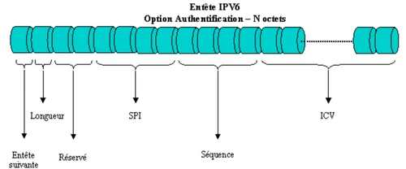

L’entête Option de destination s’utilise pour des champs qui n’ont besoin d’être interprétés et compris que du seul hôte destinataire. Dans la version originale du protocole IPv6, la seule option de destination ayant été définie, est l’option nulle. Cela permet de compléter cette entête avec des zéros et obtenir  alors un multiple de 8 octets.

**REMARQUE** : cette entête n’est pas utilisée pour le moment. Il a été défini pour s’assurer que les nouveaux logiciels de routage pourront l’utiliser, dans le cas où il serait envisagé une option de destination ultérieure. La structure de données associée est la suivante :


## Relation entre IPv6 et DNS
<chapterId>4a30c17b-873a-428f-8efb-a2b31959849f</chapterId>

Au sein d’un annuaire DNS, les noms de domaines sont associés à une adresse IPv6 grâce à l’enregistrement AAAA :

```shell
ipv6.mydmn.org.         IN      AAAA    2001:66c:2a8:22::c100:68b
```

Les noms d’hôtes, quant à eux, peuvent être associés à une ou plusieurs adresses IPv6 et/ou IPv4 (n’oublions pas qu’il faut rester compatible avec les protocoles existants, autant que faire se peut). La résolution inverse d’un nom d’hôte s’effectue grâce à l’indicateur PTR, dans le domaine ip6.arpa et en inversant les octets de la forme canonique. Soit, d’après l’exemple précédent :

```shell
b.8.6.0.0.1.c.0.0.0.0.0.0.0.0.2.2.8.a.2.c.6.6.1.0.0.2.ip6.arpa IN PTR         ipv6.mydmn.org.
```

**ATTENTION** : Les requêtes émises, peuvent être transmises à la fois par IPv6 et par IPv4 et la réponse du serveur DNS, ne doit en aucun cas dépendre du protocole utilisé par le client. Lorsque les adresses IPv4 et IPv6 existent et sont toutes deux utilisables pour contacter une machine distante, la RFC6724 permet de préciser la stratégie à employer concernant le choix de l’adresse sélectionnée.

**RAPPEL** : en règle générale, le choix privilégie les adresses de type IPv6, à moins que l’administrateur du système n’en décide autrement. Lorsqu’une adresse IPv6 doit être utilisée comme nom d’hôte, pour une url, elle doit obligatoirement être encadrée par des crochets : [] afin de ne pas provoquer une confusion avec les ‘:’ de séparation de l’Uri et du numéro de port de service de l’url.

### Synthèse de la partie

On a vu comment une adresse IPv6 était construite et qu’elles étaient les règles régissant la distribution de ces adresses. De même, on s’est intéressé à la constitution de blocs d’adresses permettant une répartition (effectuée par L’IANA) selon les _Registres Internet  régionaux_ (les _RIR_) dispatchés vers les fournisseurs d’accès à Internet, qui eux-mêmes distribuent les réseaux disponibles à leurs clients.

Si les adresses IPv4 et IPv6 sont incompatibles entre elles, il reste que les protocoles TCP, UDP, BIND et ICMP sont adaptés à la nouvelle déclinaison de l’adressage IPv6. Cela signifie alors que l’on peut bien évidemment continuer d’utiliser les outils déjà existants mais en utilisant leur version propre à l’espace d’adressage IPv6.


# Outils de diagnostic réseau
<partId>368a5c6f-ec48-4b28-970f-3a770788ad37</partId>

## Les outils de la couche Accès Réseau
<chapterId>1d25a21d-6900-4fbe-a438-e06c8afb9e02</chapterId>

**Cette partie s’intéresse à l’utilisation concrète de l’adressage IP et aux outils Linux, permettant de diagnostiquer ou d’auditer un réseau d’entreprise. On balaiera chaque couche du modèle TCP/IP en détaillant les différents outils propres à cette partie :**

- Couche Accès Réseau  
- Couche Réseau  
- Couche Transport/Application

On étudiera également l’aspect paquets au travers d’outils comme tcpdump et/ou wireshark. Pour finir, on listera les principaux ports de services utilisés par les protocoles du modèle TCP/IP.

Au travers de ces outils, il s’agit avant tout de savoir identifier un éventuel problème et de surtout connaître parfaitement son système afin de le configurer de façon optimum.

### Outil arp

On en a déjà parlé précédemment, mais le premier outil pour analyser le réseau sur la couche ACCES RESEAU s’appelle arp. Il permet, à partir d’une adresse MAC (ou adresse Ethernet) de récupérer la correspondance d’adresse IP et de visualiser, le cas échant la table de routage.

Ainsi, pour faire afficher toutes les tables en cours d’utilisation au sein du cache ARP, au niveau de toutes les interfaces, on peut interroger l’outil de la façon suivante :

```shell
arp -a
```

Si on souhaite visualiser les entrées du cache ARP pour une adresse IP spécifique, il suffit de passer celle-ci en paramètre à la commande :

```shell
arp -a 192.168.1.5
```

Si, au lieu d’une seule adresse IP, on souhaite visualiser les entrées du cache ARP pour une interface réseau particulier, on peut également passer celle-ci en paramètre, au lieu d’une adresse IP :

```shell
arp –a –N eth0
```

Il est également possible de modifier la table ARP, en ajoutant une nouvelle entrée grâce à l’option –s :

```shell
arp –s 192.168.1.7 00:17:BC:56:4F :25 eth2
```

La mention de l’interface est une option. On peut ne pas le préciser et la première interface applicable sera alors utilisée. Enfin, il est possible de supprimer une entrée de la table ARP en utilisant l’option –d :

```shell
arp –d 192.168.1.7
```

**REMARQUE** : là aussi, on peut préciser de façon optionnelle l’interface que l’on souhaite voir appliquée.

### Outils d’analyse de paquets

Parmi la panoplie d’outils mis à notre disposition pour analyser le trafic, il en existe deux qu’il faut toujours avoir à disposition :

- tcpdump
- wireshark

Le premier, travaille en temps réel, en moyennant le temps de traitement utilisé par le programme. On peut ainsi facilement surveiller l’activité réseau d’une machine. De plus, en redirigeant les captures vers un fichier en sortie, les informations ainsi récupérées des paquets capturés, sont alors conservées et utilisables ensuite, par d’autres outils, compatibles avec le format libcap. Le format d’utilisation est le suivant :

```shell
tcpdump –w <Fichier Out> -i <Interface> -s <Fenêtre> -n <Filtre>
```

La notion de fenêtre permet de limiter l taille des traces capturées. C’est généralement utilisé avec la valeur 0 (pas de limite). L’option –n permet de ne pas remplacer les valeurs numériques par des expressions littérales. Ce genre de filtre permet aussi de déterminer le trafic à capturer. On peut alors utiliser les mots-clés host, port, src ou dst afin de spécifier le filtrage de la capture à réaliser.

Exemple : capture vers un fichier au format libcap des requêtes HTTP d’un serveur 192.168.25.24 :

```shell
tcpdump –w fichier.cap –i eth0 –s0 –n port 80 and host 192.168.25.24
```

L’outil Wireshark (anciennement appelé Ethereal) est une application de capture de trames, multiplateformes, disponible sur les environnements Windows et/ou [Linux](https://www.it-connect.fr/cours-tutoriels/administration-systemes/linux/ "Linux"). Cet outil s’appuie, lui aussi sur le format libcap. Ainsi, on peut sauvegarder les données capturées par cet outil ou exploiter des captures provenant d’un autre logiciel.

Pour l’initialiser, il faut en premier lieu lancer le programme wireshark et ouvrir le menu **Capture** afin de sélectionner l’interface sur laquelle on souhaite effectuer ces captures. Lorsque la carte réseau a été repérée (celle à laquelle l’adresse IP est associée), on peut alors déclencher les premières captures en cliquant sur le bouton **Start**. Pour arrêter la prise de captures, il suffit simplement d’appuyer sur le bouton **Stop**.

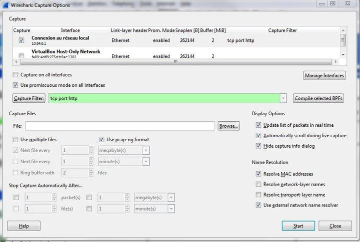

Là où tcpdump s’intéresse vraiment à l’aspect paquets des trames circulant sur le réseau, wireshark est beaucoup plus orienté trafic et qualité de service. L’un n’est pas un clone de l’autre et tous deux ont des fonctions bien spécifiques qui les rendent indispensables.

### Outils d’analyse d’interface

Au niveau le plus bas du réseau, on peut tout à fait récupérer de l’information concernant l’interface à configurer : connaître la vitesse de l’interface, savoir quel type de négociation (_half_ ou _full duplex_) ou encore si l’option wake-on-lan est active ou non, on dispose pour cela de l’utilitaire ethtool.

L’outil permet de visualiser les informations disponibles ou activées pour une interface particulière. Mais, on peut aussi modifier ses propriétés de façon interactive.

**REMARQUE** : l’outil n’est pas nécessairement installé. Si ce n’est pas le cas, on peut l’installer en exécutant l’instruction suivante :

```shell
yum install –y ethtool
```

Si par exemple, on interroge l’interface enp0s3 (caractéristique des distributions CentOS7), on obtient alors :

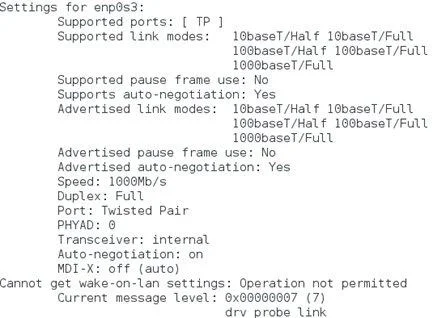

Parmi les nombreuses options de l’outil, on remarquera la possibilité de modifier les propriétés suivantes grâce à l’option -s :

- vitesse
- type de négociation :{half, full}
- port type
- auto négociation

**Exemple** : modifier l’auto négociation pour l’activer sur l’interface

```shell
ethtool –s enp0s3 autoneg on
```

Ou, on peut également demander à activer l’option Wake-On-Lan dès la détection d’activité sur l’interface :

```shell
ethtool –s enp0s3 wol p
```

**ATTENTION** : dans toutes les requêtes passées à la commande ethtool, le nom de l’interface doit toujours suivre l’option concernée : -s pour la modification, ou autres.


## Les outils de couche Réseau
<chapterId>d2c5bf35-4284-4af8-8e8b-049c696a511b</chapterId>

### Outils d’analyse de trafic

L’outil qui vient en premier à l’esprit à ce niveau est ping. Il permet de tester la connectivité IP de bout-en-bout mais également d’avoir des informations concernant les enregistrements de l’annuaire DNS :

```shell
ping 172.17.18.19
```

```shell
mydmn.org (172.17.18.19): 56 data bytes

64 bytes from 172.17.18.19: icmp_seq=0 ttl=56 time=7.7 ms

64 bytes from 172.17.18.19: icmp_seq=1 ttl=56 time=6.0 ms

64 bytes from 172.17.18.19: icmp_seq=2 ttl=56 time=5.5 ms
```

**REMARQUE** : la réponse à la commande ping est différente selon que la route existe (ou est inconnue), et que la machine cible est ou non disponible. Mais, dans l’instruction ci-dessus, on remarque que la résolution de nom mydmn.org est automatiquement résolue avec l’adresse IP.

**RAPPEL** : la commande ping s’appuie sur le protocole ICMP (_Internet Control Message Protocol_), permettant la vérification de la connectivité et des paquets envoyés. L’interrogation de la commande ping, peut également renseigner sur les informations suivantes :

- L’adresse IP (avec le nom enregistré dans l’annuaire DNS.
- Le numéro de séquence ICMP
- La durée de vie du paquet (aussi appelé _Time-To-Live_ ou _TTL_)
- Le temps de propagation en boucle (aussi appelé _round-trip delay_)
- Le nombre de paquets perdus

La durée de vie ou TTL permet de connaître le nombre de routeurs traversés par le paquet lors de l’échange entre l’émetteur et le destinataire. Chaque paquet IP possède un champ TTL valorisé avec une valeur relativement grande. A chaque passage de routeur, ce champ est automatiquement décrémenté. Lorsque la valeur atteint la valeur zéro, le routeur interprétera cela comme le fait que le paquet tourne en boucle et le détruira.

**IMPORTANT** : Le temps de propagation correspond à la durée d’un aller-retour entre l’émetteur et le destinataire. Un paquet doit en règle générale avoir un temps de propagation inférieur à 200ms.

Cela permet aussi d’envoyer des paquets de type broadcast en utilisant l’option –b et en mentionnant l’adresse IP sur laquelle on souhaite effectuer la diffusion :

```shell
ping –b 192.168.1.255
```

De plus, on peut passer en paramètre une taille d’intervalle avec l’option –i (par défaut, la valeur est positionnée à 1 seconde). On peut également forcer le nombre d’écho que l’on souhaite, via l’option -c :

```shell
ping –i 0.2 –c 10 192.168.1.7
```

### Outils d’analyse de route

La commande route est utilisée pour configurer statiquement des routes. Mais, elle peut également fournir des éléments de diagnostic :

```shell
route

Table de routage IP du noyau

Destination     Gateway         Genmask         Flags Metric Ref    Use Iface

10.32.16.0      *                    255.255.252.0   U     0      0        0 eth0

169.254.0.0     *                  255.255.0.0       U     0      0        0 eth0

default         cb1-vrrp-srv    200 0.0.0.0       UG    0      0        0 eth0
```

En effet, dans le champ ‘_Flags_’ ci-dessus, on peut connaître les réseaux (locaux ou distants, dans le cas d’accessibilité d’une passerelle) ou éventuellement quelles routes seront acceptées ou rejetées par le système local. Les cas possibles sont les suivants :

- U : Up - la route est active et exploitable.  
- H : Host - la cible est un hôte.  
- G : Gateway - la cible est accessible par une passerelle.  
- D : Dynamic - la route est configurée par un protocole de routage.  
- ! : Le noyau a rejeté la route

**REMARQUE** : comme on le constate, la commande route, seule permet d’afficher les routes statiques définies sur le système. Si l’on souhaite ajouter une route, il suffit d’utiliser l’option add et de préciser s’il s’agit d’un réseau, d’un hôte ou d’une passerelle.

La commande route, par défaut affiche la table de routage au format numérique (option –n). Mais, on peut demander l’affichage au format d’hôte (avec résolution de nom), en utilisant l’option –e.

Le formalisme standard de la commande est le suivant :

```shell
route [Options]
```

Où les options peuvent être :

"-n" : affiche la table de routage au format numérique.

"-e" : affiche la table de routage au format d’hôte FQDN.

"add" : permet d’ajouter une route statique.

"del" : permet de supprimer une route statique.

Avec les options _add_ et _del_ on peut alors indiquer quel type de cible on souhaite traiter (et de quelle façon, on souhaite le faire) :

Exemple : ajout d’une route statique à un réseau dans la table de routage :

```shell
route add –net 192.168.1.0 netmask 255.255.255.0 gw 192.168.1.1 dev eth0
```

### Outils de traçage

La commande `traceroute`, tout comme `ping`, permet de déterminer à quel niveau du circuit emprunté par les paquets, il y a une rupture de trafic vers le destinataire. On peut ainsi interroger la cible avec son om FQDN (enregistré dans l’annuaire DNS) ou avec son adresse IP :

```shell
traceroute mydmn.org
```

La commande traceroute s’appuie sur le champ TTL des paquets IP. Lorsque ce champ arrive à zéro, le routeur, estimant que le paquet tourne en boucle le détruit et envoie une notification ICMP à l’expéditeur.

C’est exactement ce que fait _traceroute_ : il envoie des paquets à un port UDP non privilégié, réputé non utilisé par la pile TCP/IP (par défaut, il s’agit du port 33434) avec un TTL à 1. Et, le premier routeur rencontré va supprimer le paquet et renvoyer un paquet ICMP, donnant entre autre, l’adresse IP du routeur et son temps de propagation en boucle. En incrémentant séquentiellement le champ TTL afin d’obtenir une réponse de chacun des routeurs sur le circuit, traceroute va, au final,  récupérer une réponse "_ICMP port unreachable_", de la part de l’équipement cible, et reconstituant par la même, le chemin parcouru. En cas de rupture dans le cheminement, on devrait voir apparaître des caractères "*". Dns le cas contraire, la résolution va jusqu’à son terme :

```shell
traceroute to www.google.fr (216.58.210.35), 64 hops max, 52 byte packets

 1  par81-024.ff.avast.com (62.210.189.205)  25.107 ms  24.235 ms  24.383 ms

 2  62-210-189-1.rev.poneytelecom.eu (62.210.189.1)  27.341 ms  27.119 ms  28.184 ms

 3  a9k1-45x-s43-1.dc3.poneytelecom.eu (195.154.1.92)  25.910 ms  25.040 ms  25.558 ms

 4  72.14.218.182 (72.14.218.182)  36.234 ms  39.907 ms  38.130 ms

 5  108.170.244.177 (108.170.244.177)  25.880 ms

    108.170.244.240 (108.170.244.240)  25.791 ms

    108.170.244.177 (108.170.244.177)  26.449 ms

 6  216.239.62.143 (216.239.62.143)  26.491 ms

    216.239.43.157 (216.239.43.157)  26.414 ms

    216.239.62.139 (216.239.62.139)  26.400 ms

 …

 9  108.170.246.161 (108.170.246.161)  33.174 ms

    108.170.246.129 (108.170.246.129)  34.342 ms

    108.170.246.161 (108.170.246.161)  33.707 ms

10  108.170.232.105 (108.170.232.105)  33.845 ms  33.846 ms

    108.170.232.103 (108.170.232.103)  34.206 ms

11  lhr25s11-in-f35.1e100.net (216.58.210.35)  34.094 ms  33.353 ms  33.718 ms
```

### Outils de vérification des connexions actives

Outre l’outil que l’on a vu ci-dessus, concernant le routage, il existe également une autre commande listant les connexions TCP actives de la machine. La commande netstat permet de lister l’ensemble des ports TCP et UDP ouverts au niveau du serveur et d’obtenir des statistiques concernant certains protocoles tels que Ethernet, IPv4, IPv6, ICMP…

La commande utilisée seule affiche l’ensemble des connexions ouvertes par la machine que ce soit en UDP ou en TCP. Le formalisme de la commande est le suivant :

```shell
netstat [-a] [-e] [-n] [-o] [-s] [-p <Proto>] [-r] [intervalle]
```

L’option –a affiche l’ensemble des connexions et des ports en écoute sur la machine. Si l’on souhaite faire afficher les adresses et les numéros de port au format numérique (sans résolution de noms), il faut utiliser l’option –n. Pour afficher les statistiques Ethernet, on peut positionner l’option –e.

Exemple : affichage des connexions sur le port web TCP/80 :

```shell
netstat –an|egrep ".* :80"
```

Ce genre de commande affichera le résultat de toutes les connexions écoutant sur le port 80 :

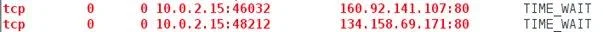

L’option –o permet de détailler le numéro de processus associé à une connexion et l’option –r affiche alors la table de routage. Il nous reste alors l’option –p suivi du nom du protocole (au choix, TCP, UDP ou IP), permettant d’afficher les informations concernant le protocole passé en paramètre. Enfin, l’option –s affiche les statistiques détaillées, classées par protocole.

**REMARQUE** : en option, il est possible de passer un intervalle permettant de déterminer la période de rafraichissement des informations (en secondes). Par défaut, cette option est valorisée à 1.

Exemple : afficher les statistiques des connexions par type de protocole IP, TCP ICMP…

```shell
netstat -s
```

## Les outils de la couche Transport et supérieure
<chapterId>bce47931-930e-4288-b0fd-666c9a1066b5</chapterId>

### Outils d’interrogation DNS

A ce niveau on peut facilement interroger un serveur de noms et obtenir des informations non seulement concernant le domaine ou l’hôte, mais aussi en diagnostiquant les problèmes de configuration du DNS grâce à la commande nslookup (_Name System Lookup Up_).

Par défaut, la commande nslookup interroge le nom configuré sur la machine. Mais, on peut également interroger un serveur de nom particulier en le préfixant par "-" lors de la requête d’interrogation:

```shell
nslookup 192.6.23.4 –mydmn.org
```

**IMPORTANT** : basé sur le même principe, mais plus riche que la commande _nslookup_, on peut également utiliser _dig_, permettant d’interroger de façon avancée les serveurs de noms DNS.

**ASTUCE** : afin de forcer la recherche d’hôtes sur un ou plusieurs serveurs de noms, on peut renseigner le fichier /etc/resolv.conf avec les champs _search_ et _nameserver_ suivants :

```shell
vi /etc/resolv.conf

search mydmn.org

nameserver mydmn1.org

nameserver mydmn2.org

```

On peut aussi utiliser la commande host afin d’interroger les serveurs de noms afin, notamment de détecter les dysfonctionnements sur une interface réseau : serveurs hors service ou ports désactivés.

**ATTENTION** : il ne faut surtout pas lancer ce genre de commande sur des hôtes ou des réseaux où l’on n’est pas administrateur. En effet, cela s’apparente à un hacking en bonne et due forme, car la commande lance une analyse de l’existant, au niveau des serveurs de noms afin de récupérer de l’information.

### Outils d’interrogation du réseau

De même que la commande host interroge le serveur de noms, l’administrateur désireux d’interroger la proximité des équipements connectés sur un réseau, pourra utiliser l’outil nmap.

**ATTENTION** : même recommandation que pour la commande host, il ne s’agit pas de pirater ou de scruter un réseau dont on n’est pas maître car cela est passible de sanctions!

**L’outil _nmap_ est très complet, il peut à la fois visualiser l’ensemble des ports TCP ou UDP ouverts, pour l’ensemble d’un réseau ou simplement une plage d’adresses dédiées.** Son énorme avantage, par rapport à d’autres outils c’est qu’il permet de synthétiser sous forme de rapport l’ensemble des ports ouverts au niveau d’un réseau ou d’une machine. En réalité, il s’agit d’un outil scannant les ports ouverts sur une machine distante.

Afin de scanner un équipement distant, il suffit d’exécuter la commande suivante en passant en paramètre l’adresse IP (ou le nom) de la machine concernée :

```shell
nmap 192.168.0.1
```

Évidemment, ce que l’on peut faire pour un serveur peut aussi être fait pour l’ensemble d’un réseau :

```shell
nmap 192.168.0.0/24
```

Cela aide énormément les administrateurs pour analyser et réduire les portes ouvertes de leurs machines, car ils peuvent ainsi connaître les services à protéger contre d’éventuelles attaques :

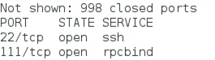

### Outils d’interrogation des processus

Il existe une commande permettant de lister les fichiers ouverts et/ou les processus actifs, au niveau du système d’exploitation. Il s’agit de la commande _lsof_. Il existe plusieurs modes d’utilisation. On peut, par exemple ne s’intéresser qu’aux processus de type Internet via l’option -i :

```shell
lsof –i
```

On peut aussi ne s’intéresser qu’à une machine particulière en fournissant l’adresse IP en paramètre, et éventuellement un port de service (dans l’exemple, le port [SMTP](https://www.it-connect.fr/messagerie-decouverte-des-protocoles-smtp-pop-imap-et-mapi/ "SMTP") 25):

```shell
lsof –ni @192.168.2.1:25
```

Mais, ce qui est très intéressant dans cette commande, c’est que l’on peut aussi interroger le système et vérifier les processus ouverts sur un périphérique particulier :

```shell
lsof /dev/sda1
```

On peut, à l’inverse souhaiter connaître tous les ports réseau ouverts par un processus passé en paramètre (dans l’exemple n° PID 1521):

```shell
lsof –i –a –p 1521
```

En cumulant les foncions, on peut enfin connaître tous les fichiers ouverts par un ou plusieurs utilisateur(s) particulier(s) et/ou par un processus courant :

```shell
lsof –p 1521 –u 500, phil
```

De nombreux autres outils existent également. Mais, déjà avec ceux mentionnés ici, on devrait largement se faire une idée précise de son environnement et être capable, le cas échéant d’analyser la cause du problème et de le corriger.

### Synthèse de la partie

On a vu un certain nombre d’outils, mais surtout on a balayé les différentes couches, qui grâce à ces programmes peuvent être administrées de façon plus aisée. Cela permet aux administrateurs de se faire une idée plus précise de leur système quant aux équipements connectés et à leur adresse utilisée.

**Couche ACCES RESEAU** :

- Outil arp
- Outil tcpdump
- Outil wireshark

**Couche RESEAU** :

- Outil ping
- Outil route
- Outil traceroute
- Outil netstat

**Couches TRANSPORT/APPLICATION :**

- Outil nslookup
- Outil nmap
- Outil lsof


# Partie finale
<partId>09d5393c-63bc-42fc-bf79-c65e380211bd</partId>


## Avis & Notes
<chapterId>114c33c0-9831-4d74-affd-f5d37adc53c3</chapterId>


<isCourseReview>true</isCourseReview>


## Examen final
<chapterId>b99e005e-8dd0-4fa4-b302-f940c27a30ac</chapterId>


<isCourseExam>true</isCourseExam>


## Conclusion
<chapterId>3b449814-78f3-41c0-8138-0a04f3682719</chapterId>


<isCourseConclusion>true</isCourseConclusion>
