# L’essentiel pour naviguer dans l’univers IP

Plongez au cœur de l’univers IP et donnez-vous les moyens de comprendre et d’administrer efficacement vos réseaux. Dans ce cours, vous découvrirez de manière claire et concrète tout ce qu’il faut savoir sur les réseaux informatiques.

Vous allez comprendre le fonctionnement des réseaux et de l’adressage IP. Vous apprendrez également à distinguer IPv4 et IPv6, à identifier et utiliser les différentes catégories d’adresses (publiques, privées, unicast, broadcast…), et à saisir toute l’importance du protocole TCP/IP et des liens qu’il tisse entre adresses IP, adresses physiques et noms DNS.

Pour aller plus loin, vous découvrirez en fin de cours les principaux outils de diagnostic réseau : analyser, auditer, ajuster… vous saurez enfin agir avec méthode et précision sur vos équipements.

NET 302 s’adresse avant tout aux étudiants, utilisateurs de Linux ou simplement aux curieux souhaitant comprendre les notions base en réseau et renforcer leur autonomie dans la gestion, le dépannage et l’optimisation des infrastructures.

Rejoignez-nous et transformez vos connaissances en véritable expertise opérationnelle !

___
Ce cours NET 302 est une adaptation du cours *Les bases du réseau : TCP/IP, IPv4 et IPv6*, rédigé par Philippe Pierre en français et publié sur [IT-Connect](https://www.it-connect.fr/cours/les-bases-du-reseau-tcpip-ipv4-et-ipv6/), sous licence Creative Commons Attribution - ShareAlike 4.0 International ([CC BY-SA 4.0](https://creativecommons.org/licenses/by-sa/4.0/)). Des modifications substantielles ont été apportées à la version originale par Loïc Morel : le texte original a été intégralement réécrit, développé et enrichi afin d’offrir un contenu actualisé et approfondi, tout en conservant l’esprit pédagogique de la version initiale de Philippe Pierre. Les schémas ont également été refaits.
___

+++


# Introduction
<partId>a52b996d-1e23-470f-a9df-7ad88790099a</partId>

## Aperçu du cours
<chapterId>9f238ecd-c9bb-4886-a205-2beba609fb13</chapterId>

Ce cours propose une introduction complète aux fondamentaux des réseaux IP et se structure en quatre grandes parties, chacune abordant un aspect essentiel pour comprendre, configurer et diagnostiquer un réseau informatique.

### Protocole TCP/IP

Dans cette première partie, nous poserons les bases nécessaires en explorant la notion de réseau et l’historique du protocole TCP/IP. Nous étudierons ses composantes majeures : l’IP, le TCP, ainsi qu’une brève incursion dans le protocole QoS IPv5. Nous aborderons également les primitives de services pour comprendre la logique d’échange de données.

### L’adressage IPv4

Nous poursuivrons avec un module dédié à l’adressage IPv4. Vous apprendrez l’utilisation concrète de l’IPv4, ses différents types d’adresses (privées, publiques, broadcast…), le rôle fondamental du DNS, ainsi que le fonctionnement de l’adresse Ethernet et du protocole ARP. Vous découvrirez également la traduction d’adresses via le NAT et la configuration réseau de base.

### L’adressage IPv6

La troisième partie sera consacrée à l’adressage IPv6, nécessaire pour répondre aux limites de l’IPv4. Nous détaillerons ses normes et définitions, l’assignation des adresses dans un réseau local, la gestion des blocs d’adresses et la relation entre IPv6 et le DNS.

### Outils de diagnostic réseau

Enfin, nous conclurons par une présentation des principaux outils de diagnostic réseau. Ces derniers vous permettront d’analyser, contrôler et résoudre les dysfonctionnements. Cette partie sera structurée par couches : Accès Réseau, Réseau, Transport et supérieure.

À l’issue de ce parcours, vous disposerez des connaissances fondamentales pour administrer efficacement une infrastructure réseau et diagnostiquer ses éventuelles défaillances.

Prêt à plonger dans l’univers des réseaux informatiques ? Allons-y ! 

**REMARQUE** : les descriptions sont celles d’un système GNU/Linux CentOS 7. Mais, les configurations réseau sont sensiblement les mêmes entre un système Debian et un système CentOS. Donc, on ne fera pas de différence. Lorsqu’il y en aura une, on la préfixera avec un logo spécifique.

*N.B. : Si vous rencontrez des termes qui vous sont inconnus au cours de la formation, veuillez consulter [le glossaire](https://planb.network/resources/glossary) pour en trouver les définitions.*


# Protocole TCP/IP
<partId>53fd4b73-cdf1-4865-ba29-1ac8ec3e9e9a</partId>


## Qu’est-ce qu’un réseau ?
<chapterId>7370904f-f8f5-4ad4-a63a-5931d94c3b3b</chapterId>

Dans ce premier module, nous allons présenter de manière approfondie le fonctionnement du protocole TCP/IP, pierre angulaire de nos communications numériques modernes. Nous y aborderons notamment ses origines, ses principes fondamentaux et le système d’adressage qui en découle, indispensable pour garantir la circulation de l’information entre les différents équipements connectés.

Nous détaillerons également les principaux composants qui structurent ce modèle et expliquerons comment ces éléments interagissent pour former un réseau opérationnel, fiable et extensible. Mais avant toute chose, il est essentiel de revenir à la notion même de réseau.

Étymologiquement, un réseau désigne un ensemble de points reliés entre eux par des liens, formant une structure interconnectée. Dans le domaine des télécommunications et de l’informatique, cette définition se traduit concrètement par un regroupement d’équipements (ordinateurs, routeurs, commutateurs, points d’accès...) capables d’échanger des données par l’intermédiaire de supports physiques ou sans fil. Un réseau permet ainsi la circulation d’informations de manière continue ou intermittente, selon les besoins, les protocoles utilisés et la nature de l’architecture déployée.

Au fil du temps, différentes topologies se sont imposées pour répondre à des besoins spécifiques en termes de coût, de performance, de résilience ou encore de facilité de maintenance. Parmi ces topologies classiques, on retrouve notamment :
- le réseau en anneau,
- le réseau en arbre,
- le réseau en bus,
- le réseau en étoile,
- le réseau maillé.

### Réseau en anneau

Une topologie en anneau se caractérise par une connexion des équipements selon une boucle fermée : chaque station est reliée à la suivante jusqu’à ce que la dernière soit connectée à la première. Dans ce schéma, chaque équipement agit comme un relais pour transmettre les données au maillon suivant, ce qui permet à l’information de circuler dans un seul sens ou parfois dans les deux sens selon le type de réseau.

L’avantage d’une telle organisation réside dans la simplicité de son câblage et dans l’absence de dépendance vis-à-vis d’un équipement central. Toutefois, la continuité du réseau repose sur la bonne santé de chaque élément : la défaillance d’un seul poste peut interrompre l’ensemble de la communication, ce qui impose souvent la mise en place de mécanismes de redondance ou de contournement.


### Réseau en arbre

Le réseau en arbre, ou topologie hiérarchique, s’inspire directement de la structure d’un arbre généalogique. Il est constitué de niveaux successifs : un nœud racine situé au sommet dessert plusieurs nœuds de rang inférieur, eux-mêmes pouvant alimenter d’autres nœuds et ainsi de suite.

Cette organisation hiérarchique est particulièrement adaptée aux réseaux étendus nécessitant une répartition claire des responsabilités et une gestion segmentée. Toutefois, cette structuration rend le réseau vulnérable à la défaillance des nœuds supérieurs : la perte du sommet ou d’un branchement principal peut priver de connectivité une partie entière de l’infrastructure.


### Réseau en bus

Dans une topologie en bus, tous les équipements partagent un même support de transmission, généralement une ligne coaxiale ou une fibre optique. Chaque unité est connectée de manière passive, sans modification active du signal, et peut émettre ou recevoir des données sur ce canal commun.

Le principal avantage d’un réseau en bus est son coût d’installation réduit grâce à un câblage simplifié. De plus, la panne d’un poste isolé ne compromet pas la communication des autres. En revanche, le support physique unique représente un point critique : toute coupure ou dysfonctionnement de ce média entraîne l’arrêt complet du trafic pour l’ensemble du réseau.


### Réseau en étoile

La topologie en étoile, appelée "*hub and spoke*", est aujourd’hui la plus répandue, notamment grâce au réseau Ethernet domestique et professionnel. Tous les périphériques y sont reliés à un équipement central.

Cette disposition offre une grande facilité de gestion et de maintenance : la défaillance d’un nœud périphérique n’affecte pas la totalité du réseau. En revanche, le dispositif central représente un point de défaillance unique : sa panne entraîne l’arrêt global de la communication. Il convient également de veiller à la qualité du câblage et à la longueur des liaisons afin d’assurer des performances optimales.

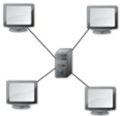

**Remarque** : il existe encore des réseaux organisés selon une topologie linéaire, proche du bus, où les équipements sont raccordés les uns à la suite des autres. Cette solution, bien que peu coûteuse à déployer, présente l’inconvénient majeur qu’une seule rupture isole une partie des hôtes et scinde le réseau en sous-ensembles indépendants.

### Réseau maillé

Le réseau maillé est conçu pour offrir une redondance maximale : chaque équipement est directement relié à tous les autres. Une telle organisation garantit une continuité de service même en cas de défaillance de plusieurs liens ou hôtes, car le trafic peut être redirigé par des chemins alternatifs.

En contrepartie, le nombre de connexions à établir croît rapidement avec le nombre de terminaux. Pour `N` points de connexion, il faut prévoir `N × (N-1) / 2` liaisons distinctes, ce qui rend cette topologie coûteuse et complexe à mettre en place. Elle est donc réservée aux réseaux critiques nécessitant une haute disponibilité, comme certains segments d’Internet ou des infrastructures industrielles sensibles.


Il existe par ailleurs d’autres variantes topologiques, telles que les réseaux en grille ou en hypercube, qui répondent à des besoins spécifiques en matière de calcul distribué ou de traitement parallèle.

À l’échelle mondiale, Internet se présente comme une interconnexion massive de réseaux utilisant des topologies diverses, unifiés par un adressage commun (IPv4 et IPv6) et une collection de protocoles normalisés définis par l’IETF (*Internet Engineering Task Force*). C’est cette hétérogénéité qui fait dire qu’Internet n’obéit à aucune topologie unique : sa structure est souple, évolutive et indépendante du schéma d’adressage logique qui la rend exploitable.

## Les origines de TCP/IP
<chapterId>266b6864-8789-48d7-bc85-001cb9f1651f</chapterId>

À l’origine du protocole TCP, on trouve la **DARPA** (*Defense Advanced Research Projects Agency*), une agence de recherche et développement du département de la Défense des États-Unis, qui initia dans les années 1970 le projet ARPANET. Ce projet visait à relier entre eux des centres de recherche et des universités par un réseau capable de résister aux coupures physiques et d’assurer la transmission fiable des données, même en cas de défaillance partielle de l’infrastructure.

Dans cette dynamique, la DARPA finança notamment l'université de Berkeley afin d’intégrer les premiers protocoles TCP/IP au sein de son système Unix BSD, ce qui a contribué à la diffusion et à la normalisation de ce protocole dans le monde académique et plus tard dans le monde industriel.

**Remarque** : à cette époque, les informaticiens ne disposaient pas encore de Linux, qui ne verra le jour qu’au début des années 1990, ni même réellement de Minix, le système éducatif conçu par Andrew TANNENBAUM. Les options se limitaient essentiellement à Unix, ou parfois à des systèmes centraux propriétaires comme OpenVMS. Unix, grâce à sa souplesse et son ouverture, joua donc un rôle essentiel dans la propagation des premiers concepts de mise en réseau.

Le protocole TCP/IP (qui devrait plus justement être désigné comme une suite de protocoles articulés autour de TCP et IP) s’est imposé grâce à sa capacité à offrir une interface de programmation standardisée pour l’échange de données entre machines sur un même réseau. Cette interface qui repose sur l’utilisation de primitives appelées "*sockets*", facilite la création de connexions fiables et flexibles, tout en intégrant des protocoles applicatifs essentiels.

ARPANET constitue donc le socle historique de l’Internet moderne. En effet, Internet est un réseau mondial fondé sur le principe de la commutation de paquets, où l’information circule au moyen d’un ensemble de protocoles standardisés qui assurent la compatibilité et l’interopérabilité entre des systèmes hétérogènes. Cette architecture ouverte permet le développement et l’exploitation de nombreux services et applications, parmi lesquels :
- les emails,
- le World Wide Web (www),
- le transfert et le partage de fichiers...

La gouvernance et l’évolution de ces protocoles sont supervisées par l’***Internet Architecture Board*** (IAB). Cet organisme coordonne les orientations techniques par l’intermédiaire de deux structures principales :
- **IRTF** (_Internet Research Task Force_), qui mène des recherches de fond sur l’évolution et l’amélioration des protocoles ;
- **IETF** (_Internet Engineering Task Force_), qui élabore, standardise et documente les protocoles opérationnels déployés sur Internet.

Pour la distribution des ressources réseau, telles que les plages d’adresses IP ou les noms de domaine, des organismes spécifiques interviennent. À l’échelle internationale, ces missions sont assurées par le **NIC** (_Network Information Center_), tandis qu’en France par exemple, l’**INRIA** (_Institut National de Recherche en Informatique et en Automatique_) y contribue également pour la gestion et l’attribution de certaines ressources nationales.

L’ensemble des spécifications des protocoles TCP/IP est consigné dans des documents appelés **RFC** (_Request For Comments_), véritables références techniques, dont la numérotation est en perpétuelle évolution pour refléter l’enrichissement constant de la suite protocolaire.

La pile TCP/IP est souvent représentée comme un empilement de quatre couches fonctionnelles, parfois mises en parallèle avec le modèle **OSI** (_Open Systems Interconnection_) élaboré par l’**ISO** (_International Standards Organization_), qui compte sept couches et constitue une référence conceptuelle en matière de réseaux.

On distingue ainsi dans la pile TCP/IP :
- la couche ACCÈS RÉSEAU, qui assure la liaison physique et les protocoles de contrôle d’accès au média ;
- la couche INTERNET, qui prend en charge le routage et l’adressage IP ;
- la couche TRANSPORT, qui garantit la fiabilité et la gestion des flux de données grâce à des protocoles tels que TCP ou UDP ;
- la couche APPLICATION, qui regroupe les protocoles destinés aux utilisateurs et aux logiciels comme HTTP, FTP, SMTP ou encore DNS.

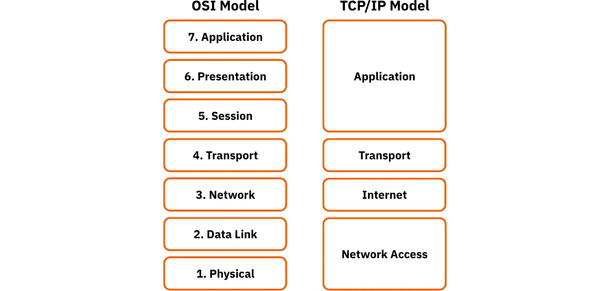

Aujourd’hui, la version la plus utilisée du protocole IP est IPv4, mais ses limitations en matière d’adressage (32 bits) ont conduit à l’élaboration de la version IPv6. Cette dernière, avec son adressage sur 128 bits, offre une capacité quasi illimitée, essentielle pour accompagner l’expansion fulgurante des équipements connectés et répondre aux enjeux de l’Internet des objets, de la mobilité et de la sécurité.

Chaque couche de la pile TCP/IP apporte des services spécifiques, permettant de traiter de manière modulaire les différentes problématiques : transmission physique, adressage logique, intégrité des échanges et services applicatifs.


## Le protocole QoS IPv5
<chapterId>570ded19-be61-4005-844e-9490570a6455</chapterId>

L’en-tête d’un paquet IP est une structure de données essentielle, organisée en plusieurs champs distincts, chacun remplissant une fonction précise pour assurer la bonne transmission et le traitement des paquets tout au long de leur parcours sur le réseau. Parmi ces champs, on trouve notamment l’adresse IP de destination, indispensable pour aiguiller correctement le paquet vers son destinataire final, mais aussi la longueur totale de l’en-tête, des informations de contrôle et de vérification, et d’autres paramètres permettant de gérer le flux et la qualité de la communication.

Le tout premier champ de cet en-tête se nomme "Version". Il occupe 4 bits et indique clairement la version du protocole IP à laquelle le paquet se conforme. Cette version est importante, car elle informe chaque routeur ou équipement intermédiaire de la manière dont il doit interpréter et manipuler les données encapsulées.

**Remarque** : la gestion et l’attribution des versions de protocoles IP relèvent de la responsabilité de l’**IANA** (_Internet Assigned Numbers Authority_), l’organisme international chargé d’administrer plusieurs paramètres de l’Internet, tels que les adresses IP, les noms de domaine et les numéros de versions de protocoles. À l’heure actuelle, seules 24 combinaisons binaires peuvent être affectées pour désigner une version de protocole d’interconnexion. Si l’on consulte le tableau des versions actuelles on découvre ceci :


Parmi ces versions figure la version IPv5, qui, bien que méconnue du grand public, a bel et bien existé sous la forme du protocole ST (_Stream Protocol_). Conçu dans les années 1980, IPv5 visait principalement à répondre à un besoin émergent à l’époque : garantir une "_Quality of Service_" ou "QoS" pour certains flux de données nécessitant une transmission continue et stable, comme la voix sur IP ou les flux multimédias. L’objectif était d’offrir une bande passante et une priorité garanties de bout en bout, un concept similaire à ce que propose aujourd’hui le protocole RSVP (_Resource Reservation Protocol_) pour la réservation dynamique de ressources réseau sur les routeurs modernes.

Cependant, le protocole IPv5 est resté au stade expérimental et n’a été mis en œuvre que sur une poignée d’équipements réseau. Son adoption limitée et l’évolution rapide des besoins en adressage ont conduit les concepteurs de l’Internet à opter pour un saut direct de la version IPv4 à IPv6. Ce choix visait notamment à contourner les limitations d’adressage posées par IPv4, tout en évitant toute confusion ou incompatibilité avec les spécifications expérimentales de la version 5.

Ainsi, bien que le protocole IPv5 ait contribué à ouvrir la voie à la réflexion sur la qualité de service et la gestion du trafic, il n’a jamais été déployé à grande échelle et reste aujourd’hui un jalon historique plus qu’un standard utilisé.

**Rappel** : un protocole définit avant tout un ensemble de règles de communication : structures de données, algorithmes, formats de paquets et conventions permettant à différents équipements d’échanger des informations de manière fiable et compréhensible. Le service, quant à lui, correspond à l’implémentation concrète de ce protocole au travers de programmes spécifiques (clients, serveurs) qui mettent en œuvre ces règles et rendent les fonctionnalités accessibles aux utilisateurs et aux applications.

Nous pouvons désormais nous pencher plus en détail sur la structure et le fonctionnement du protocole IP, socle indispensable de toute communication en réseau.

## Le protocole IP
<chapterId>758fddbd-b652-4c18-bd1e-d038bd2e4d05</chapterId>

### Définitions et généralités

Le protocole IP, ou "***Internet Protocol***", constitue la pierre angulaire du modèle TCP/IP : il assure le transport des paquets de données d’un hôte à un autre au sein d’un réseau, qu’il soit local ou étendu à l’échelle mondiale. Son rôle est double : il prend en charge l’adressage logique des équipements et garantit l’acheminement des paquets à travers des réseaux souvent hétérogènes et interconnectés.

Au niveau physique, la transmission repose sur des interfaces matérielles qui établissent les connexions point à point entre les nœuds. Toutefois, c’est bien le protocole IP qui rend possible la communication de bout en bout en fournissant à chaque paquet les informations nécessaires pour trouver sa route parmi un ensemble de chemins possibles.

Trois éléments principaux contenus dans l’en-tête IP permettent de définir précisément la destination finale d’un paquet :

- **L’adresse IP** : identifie de manière unique l’hôte de destination dans le réseau.
- **Le masque de sous-réseau** : précise la partie de l’adresse qui désigne le réseau et celle qui identifie l’hôte, ce qui facilite le découpage logique en sous-réseaux.
- **La passerelle** : indique le routeur intermédiaire par lequel le paquet peut transiter pour atteindre un réseau extérieur ou une autre portion du réseau local.

Sur Internet, les données ne circulent pas sous forme de flux continus mais sous forme de **datagrammes**, c’est-à‑dire des blocs de données autonomes encapsulés avec toutes les informations indispensables à leur acheminement. Ce principe illustre la **commutation de paquets**, qui permet de fragmenter l’information en unités indépendantes pouvant emprunter des chemins différents pour rejoindre le même destinataire.

Chaque datagramme IP contient ainsi, en plus de la charge utile (*payload*), un en-tête structuré où figurent notamment l’adresse de destination, l’adresse source, le type de service, le numéro de version du protocole, et diverses informations de contrôle nécessaires à la gestion de la transmission.

La taille maximale théorique d’un datagramme IP est de **65 536 octets**, valeur fixée par la limite de codage du champ longueur totale dans l’en-tête. Dans la pratique, cette taille est rarement atteinte car les réseaux physiques sur lesquels transitent les paquets (Ethernet, Wi-Fi, fibre optique…) imposent souvent des contraintes plus strictes, connues sous le nom de **MTU** (_Maximum Transmission Unit_). Si un datagramme excède la capacité du lien physique, il doit être fragmenté en paquets plus petits, chaque fragment étant transmis séparément puis réassemblé à l’arrivée.

Cette capacité d’adaptation fait du protocole IP un protocole robuste et flexible, apte à s’appuyer sur une multitude de technologies sous-jacentes tout en assurant une compatibilité universelle entre les systèmes et réseaux hétérogènes.

### Fragmentation des datagrammes IP

Lorsqu’un datagramme IP doit transiter sur un réseau dont la capacité de transmission est inférieure à sa taille, il devient nécessaire de le **fragmenter** pour qu’il puisse être transporté sans encombre. Cette limite physique de taille est donc désignée par le terme **MTU**, c’est-à‑dire la taille maximale qu’une trame peut atteindre sur un réseau donné sans nécessiter de découpage préalable.

Chaque technologie de réseau impose son propre MTU en fonction de ses caractéristiques matérielles et protocolaires. Parmi les valeurs les plus répandues, on peut citer :

- **ARPANET** : 1000 octets
- **Ethernet** : 1500 octets
- **FDDI** : 4470 octets

Quand un datagramme dépasse le MTU d’un segment de réseau qu’il doit emprunter, les équipements de routage se chargent de le **fragmenter** en plusieurs morceaux plus petits, chacun respectant la limite imposée. Cette opération se produit typiquement lors du passage d’un réseau à haut MTU vers un réseau à plus faible capacité. Par exemple, un datagramme provenant d’un réseau FDDI peut être fragmenté pour être transmis sur un segment Ethernet.

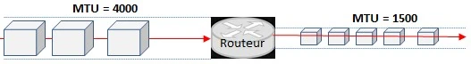

Le processus de fragmentation se déroule ainsi :
- Le routeur découpe le datagramme en fragments de taille inférieure ou égale au MTU du réseau cible.
- Il veille également à ce que chaque fragment ait une taille qui soit un multiple de 8 octets, car le protocole IP utilise ce multiple pour coder correctement l’offset de réassemblage.
- Chaque fragment reçoit son propre en-tête IP, qui comporte notamment des informations indispensables pour permettre au destinataire final de réassembler les fragments dans l’ordre initial.

Ces fragments sont ensuite transmis indépendamment les uns des autres : chacun peut suivre un chemin différent à travers le réseau, en fonction des tables de routage, de la charge des liaisons ou d’éventuelles pannes sur certaines routes. Rien ne garantit donc qu’ils parviendront à destination dans l’ordre où ils ont été émis.

Au moment de l’arrivée, c’est la machine destinatrice qui se charge du **réassemblage**. Grâce aux informations contenues dans les en-têtes (identifiant commun, offset et indicateurs de fragmentation) le système réordonne les fragments pour reconstituer le datagramme initial avant de le transmettre à la couche supérieure. Si l’un des fragments est perdu ou corrompu pendant la transmission, l’intégralité du datagramme est généralement rejetée, car sans tous les morceaux, le contenu reconstitué serait incomplet ou incohérent.

Ce mécanisme de fragmentation et de réassemblage, bien qu’efficace, présente néanmoins certaines limites en termes de performance et de charge réseau : chaque fragment ajoute une surcharge de traitement pour les routeurs et les hôtes, et le risque de perte de fragments augmente le taux de retransmission. C’est pourquoi la gestion adéquate du MTU et l’optimisation de la taille des paquets transmis restent des aspects importants pour garantir une communication fluide et efficace sur un réseau IP.

### Encapsulation des données

Pour garantir l’acheminement correct des données à travers les différentes couches du modèle TCP/IP, le mécanisme de l’**encapsulation** joue un rôle important. À chaque étape du passage d’un message depuis l’application de l’expéditeur jusqu’à la machine destinataire, des informations supplémentaires (appelées entêtes) sont ajoutées afin de fournir aux équipements intermédiaires et aux couches logicielles les instructions nécessaires au traitement, à la livraison et, le cas échéant, à la reconstitution de l’information initiale.

Lorsqu’un message est émis, il traverse successivement les quatre couches de la pile TCP/IP. À chaque couche, un nouvel entête est préfixé au bloc de données existant : chaque entête contient des métadonnées spécifiques, telles que les adresses logiques ou physiques, les ports de communication, les numéros de séquence, les indicateurs de contrôle d’erreurs, et toute information permettant de gérer la transmission et le routage.

Ainsi, la transmission suit un processus structuré : la couche Application génère le **message** initial, contenant les données brutes. La couche Transport encapsule ce message dans un **segment**, en y adjoignant notamment les ports source et destination, les numéros de séquence et les mécanismes de contrôle de flux. La couche Internet prend le segment, y ajoute un entête IP pour former un **datagramme**, spécifiant notamment les adresses IP source et destination. Enfin, la couche Accès Réseau encapsule ce datagramme dans une **trame**, en ajoutant des informations comme les adresses MAC et les codes de vérification d’intégrité (CRC).

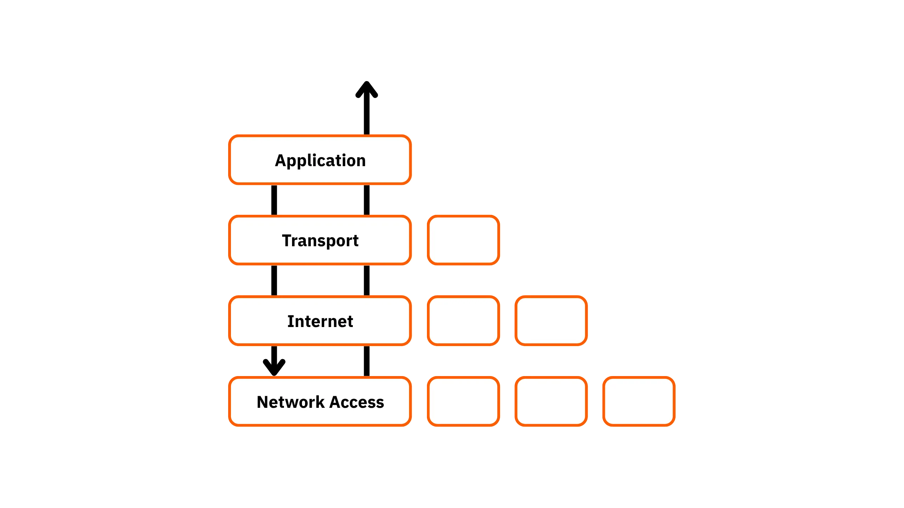

Ce processus d’encapsulation assure non seulement l’intégrité et la traçabilité des données, mais aussi leur adaptabilité : à chaque transition d’un réseau à un autre, les entêtes fournissent aux équipements les informations essentielles pour décider de l’itinéraire, vérifier la validité ou procéder à la fragmentation si nécessaire.

À l’arrivée, le mécanisme s’inverse : la machine réceptrice reçoit la trame au niveau de la couche Accès Réseau, qui lit l’entête correspondant et le retire. Le datagramme est ensuite transmis à la couche Internet, qui lit l’entête IP, puis l’enlève à son tour pour livrer le segment à la couche Transport. Cette dernière traite les entêtes de transport, vérifie l’intégrité du flux et remet finalement le **message** à l’application cible dans son état originel.

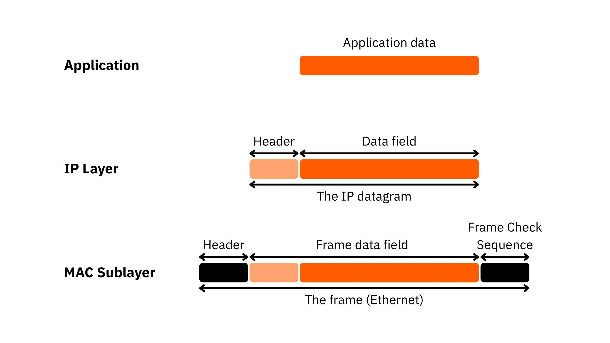

Ce schéma illustre la transformation progressive des données à chaque niveau :

- **Message** : bloc d’information au niveau de la couche Application.
- **Segment** : unité de données après encapsulation par la couche Transport.
- **Datagramme** : forme prise à la suite de l’ajout de l’entête IP par la couche Internet.
- **Trame** : bloc final prêt à être transmis sur le support physique par la couche Accès Réseau.

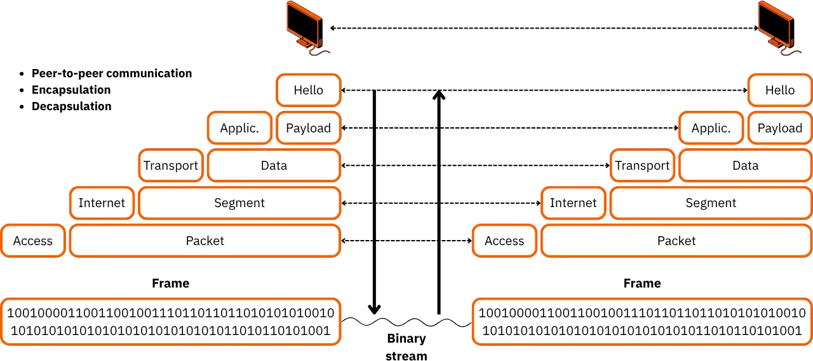

Ce processus, essentiel à la fiabilité et à l’universalité des communications sur Internet, garantit que chaque donnée, aussi fragmentée ou complexe soit-elle, puisse être transportée de bout en bout tout en restant compréhensible et exploitable par la machine réceptrice.

### Adressage IP

Même en appliquant les mécanismes fondamentaux de commutation de paquets, de fragmentation et d’encapsulation, un réseau ne pourrait remplir sa mission sans un système d’adressage rigoureux. Pour que chaque paquet de données trouve son chemin vers le bon destinataire, la couche Internet s’appuie sur un identifiant unique : l’**adresse IP**. En version IPv4, celle-ci est codée sur **32 bits** et se présente sous la forme de quatre nombres décimaux séparés par des points, selon le format classique N1.N2.N3.N4 (par exemple : 192.168.1.12).

Une adresse IP est structurée en deux parties distinctes : la première, appelée **_netid_**, identifie le réseau auquel appartient l’hôte ; la seconde, le **_hostid_**, précise l’hôte individuel à l’intérieur de ce réseau. Cette séparation logique facilite la hiérarchisation et l’organisation du réseau mondial en de multiples réseaux interconnectés.

Historiquement, le système IPv4 s’appuie sur un découpage en classes, notées de A à E, qui détermine l’étendue des plages d’adresses et leur usage. Chaque classe réserve un nombre défini de bits au _netid_ et au _hostid_, ce qui influe directement sur le nombre de réseaux et d’hôtes possibles.


Il faut savoir que toutes les combinaisons binaires ne sont pas exploitables pour identifier des hôtes. Dans une adresse de **classe C**, par exemple, le dernier octet offre 8 bits, soit 256 valeurs possibles. Toutefois, deux d’entre elles ont une fonction spéciale : la valeur 0 désigne le réseau lui-même, tandis que 255 correspond à l’adresse de **diffusion** (_broadcast_), qui permet d’envoyer un paquet à tous les hôtes du réseau en une seule fois. Il reste donc 254 adresses réellement utilisables pour des machines.

Le nombre maximum d’adresses varie sensiblement d’une classe à l’autre, ce qui permet d’adapter le plan d’adressage aux besoins : de vastes réseaux publics pour les classes A, des réseaux d’entreprise pour les classes B, ou des réseaux plus restreints pour les classes C.

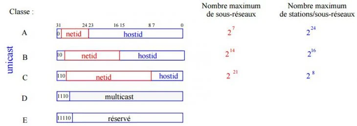

Certaines plages d’adresses sont réservées et ne transitent jamais sur Internet. On parle alors d’**adresses privées**, destinées aux réseaux internes d’organisations, d’entreprises ou de particuliers. Elles ne peuvent pas être routées directement sur Internet sans passer par une traduction d’adresses, généralement assurée par un dispositif NAT (*Network Address Translation*). Ces plages sont :
- Pour la **Classe A** : de 10.0.0.0 à 10.255.255.255
- Pour la **Classe B** : de 172.16.0.0 à 172.31.255.255
- Pour la **Classe C** : de 192.168.0.0 à 192.168.255.255

Lorsqu’un équipement interne utilise l’une de ces adresses pour accéder à Internet, son adresse privée est remplacée par une adresse publique valide par un routeur ou une passerelle NAT.

Prenons un exemple : si un hôte possède l’adresse **192.168.7.5**, on peut en déduire plusieurs informations complémentaires. L’adresse **192.168.7.0** correspond au réseau, **192.168.7.1** est souvent attribuée au routeur local, **192.168.7.5** désigne l’hôte spécifique.

Une adresse particulière mérite d’être citée : **127.0.0.1**, appelée "***loopback***" ou adresse de **bouclage**. Sur les systèmes Linux, elle est associée à l’interface **lo**. Cette adresse permet à une machine de s’adresser à elle-même pour des tests ou des diagnostics locaux, sans passer par une interface physique. L’ensemble de la plage **127.0.0.0/8** est réservé à cet usage.

Pour optimiser l’utilisation des adresses et organiser des réseaux complexes, le concept de **masque de sous-réseau** (_netmask_) est indispensable. Ce masque binaire permet de distinguer, à l’intérieur d’une adresse IP, la partie _netid_ de la partie _hostid_. Chaque classe dispose d’un masque par défaut : **255.0.0.0** pour la classe A, **255.255.0.0** pour la classe B et **255.255.255.0** pour la classe C.

Une bonne conception réseau repose sur le respect d’un principe fondamental : les machines qui doivent échanger directement des données doivent appartenir au même réseau ou au même sous-réseau. Pour répondre à des besoins de segmentation, on procède donc souvent au ***subnetting***, c’est-à‑dire à la division d’un réseau en sous-réseaux plus petits grâce à des masques plus fins.

Prenons un cas concret. Soit un réseau de **classe C** : 192.168.1.0/24 avec un masque initial de 255.255.255.0. Si l’on souhaite organiser ce réseau pour accueillir quatre sous-réseaux de 60 machines chacun, plusieurs étapes sont nécessaires.

**Étape 1** : Déterminer le nombre d’adresses nécessaires. Ici, 60 hôtes + 2 adresses réservées (réseau et diffusion) donnent 62 adresses par sous-réseau.

**Étape 2** : Chercher la puissance de deux immédiatement supérieure. 2⁶ = 64.

**Étape 3** : Adapter le masque en conséquence. En binaire, on conserve les bits du _netid_ et on réserve les bits nécessaires au _hostid_. Ici, on obtient un masque binaire qui, une fois converti, donne **255.255.255.192**.


**Étape 4** : Calculer les plages d’adresses pour chaque sous-réseau en variant les bits réservés à l’hôte.


**Étape 5** : Ainsi, on obtient quatre sous-réseaux, chacun capable d’héberger jusqu’à 62 machines, tout en conservant l’efficacité du plan d’adressage global. La partie _hostid_ de l’adresse est donc subdivisée en deux : une pour le _subnetid_ et l’autre pour l’hôte proprement dit.


Ce principe fondamental du subnetting reste incontournable dans l’ingénierie réseau moderne, car il permet d’allouer les ressources IP avec précision, de contrôler le trafic et d’assurer une bonne isolation entre segments tout en maintenant une gestion claire et évolutive.

### Adressage CIDR

Au début des années 1990, avec l’essor fulgurant d’Internet dans le monde des entreprises et des organismes, le système classique d’attribution d’adresses IP basé sur les classes (A, B, C) a révélé ses limites. En effet, cette approche, rigide par nature, provoquait un gaspillage conséquent d’adresses IP et compliquait considérablement la gestion des tables de routage, qui devenaient de plus en plus volumineuses et difficiles à maintenir à jour. Pour pallier ces contraintes, une solution plus souple et optimisée a vu le jour : le **CIDR** (_Classless Inter-Domain Routing_), qui s’est progressivement imposé comme la norme et a largement supplanté l’ancien modèle par classes.

L’idée fondatrice du CIDR est de pouvoir regrouper plusieurs réseaux adjacents, notamment des blocs de classe C, en une seule entité logique appelée **superréseau** (_supernet_). Grâce à cette agrégation, une seule entrée suffit dans les tables de routage pour représenter plusieurs sous-réseaux, ce qui réduit significativement la taille des routes gérées par les routeurs et améliore leur performance. À l’origine, le besoin d’agrégation était surtout pressant pour les adresses de classe C, plus restreintes en capacité, mais le concept s’est étendu aux classes B, et même par principe aux classes A, bien que la problématique y soit moins critique en raison de la vaste plage d’adresses qu’elles offrent.

Avec le CIDR, la notion de classe disparaît : l’espace d’adressage est traité comme un continuum qu’il est possible de découper ou d’agréger à volonté selon les besoins. Concrètement, on peut ainsi définir des **blocs CIDR** en utilisant des masques de sous-réseau plus flexibles que ceux imposés par les classes standards. Ces blocs peuvent représenter soit un réseau unique, soit un ensemble contigu de sous-réseaux partageant le même préfixe.

Un bloc CIDR est désigné par la syntaxe _adresse/préfixe_, où le "/" est suivi du nombre de bits définissant la portion fixe du réseau. Par exemple, **/17** signifie que les dix-sept premiers bits de l’adresse représentent la partie réseau, laissant les quinze bits restants pour identifier les hôtes à l’intérieur de ce bloc.

Prenons un exemple concret : un bloc **/17** permet de disposer de 2^(32-17) adresses, soit 2^15 = 32 768 adresses potentielles. En soustrayant les deux adresses réservées (adresse du réseau et adresse de diffusion), on obtient 32 766 adresses réellement attribuables à des hôtes. Ce principe permet aux administrateurs réseaux de dimensionner très finement leurs plages IP, en ajustant les tailles des sous-réseaux aux besoins réels, sans gaspiller inutilement des adresses précieuses.

Pour faciliter la conversion et la compréhension, on utilise des tableaux de correspondance, tel que celui ci-dessous, qui présente les préfixes CIDR courants et leur équivalence en nombre d’adresses :

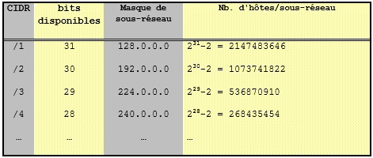

**NOTE** : Historiquement, le RFC 950 considérait le sous-réseau zéro comme non standard et déconseillait son usage, principalement pour éviter des confusions lors du routage. Toutefois, cette restriction est devenue obsolète avec le RFC 1878, qui autorise pleinement son exploitation. Les anciennes réserves concernaient avant tout la compatibilité avec du matériel ancien, incapable de gérer correctement les notations CIDR. Aujourd’hui, grâce aux équipements modernes, cette limitation a disparu.

À titre d’exemple : le sous-réseau **1.0.0.0** associé à un masque de sous-réseau **255.255.0.0** illustre parfaitement ce principe : autrefois ambigu avec l’identifiant de réseau complet en classe A, il est désormais parfaitement valide et utilisable.

**ASTUCE** : pour réaliser sans erreur les calculs de sous-réseaux et convertir rapidement des adresses en notation CIDR, il existe des outils pratiques comme ***ipcalc***. Véritable calculette réseau, cet utilitaire simplifie la planification d’adressage en affichant clairement le découpage, les plages disponibles et les masques associés, ce qui est particulièrement utile pour les administrateurs et les étudiants qui souhaitent se familiariser avec cette notation devenue incontournable.

```shell
sudo apt install ipcalc
```


## Le protocole TCP
<chapterId>860bf7d5-a502-4d10-a12c-9827f6c2d393</chapterId>

Le **protocole TCP** (_Transmission Control Protocol_) occupe une place centrale au sein de la **couche TRANSPORT** du modèle TCP/IP. Il constitue un maillon entre les applications et la couche Internet, en organisant le transfert fiable des données échangées entre deux machines distantes. Là où le protocole IP se contente de transmettre des paquets sans garantie de livraison ni d’ordre, TCP prend en charge l’intégrité et la cohérence du flux de données, ce qui garantit ainsi aux applications une communication sans perte, sans doublon et dans l’ordre d’envoi.

Les principales responsabilités de TCP peuvent se résumer ainsi :
- il réordonne les datagrammes IP reçus,
- il surveille le flux de données pour éviter la congestion,
- il segmente ou recompose les blocs de données en unités adaptées (appelées **segments**),
- il gère les étapes d’établissement et de terminaison de la connexion entre les deux extrémités de la communication.

Concrètement, TCP est un protocole orienté connexion, ce qui signifie qu’il met en place une relation explicite et suivie entre le client et le serveur. Pour cela, il s’appuie sur un système de **numéros de séquence** et d’**accusés de réception** : à chaque segment envoyé, un identifiant unique est attribué pour permettre à la machine réceptrice de vérifier l’intégrité et l’ordre des données reçues. En retour, le destinataire renvoie un segment de confirmation avec un **flag ACK** positionné à 1, indiquant la bonne réception et précisant le prochain numéro attendu.


Pour renforcer la fiabilité, TCP intègre une minuterie : dès l’envoi d’un segment, un délai est activé. Si l’accusé de réception ne parvient pas dans ce laps de temps, le segment est réémis automatiquement, l’émetteur considérant qu’il a été perdu durant le transit. Ce mécanisme de retransmission automatique compense les pertes inhérentes aux réseaux IP, qui peuvent survenir en cas de surcharge, d’erreur de routage ou de panne d’équipement.


TCP est capable de détecter et gérer les doublons éventuels. Si un segment est réémis mais que l’original arrive tout de même, le destinataire, grâce aux numéros de séquence, identifie le doublon et ne conserve que la version correcte, ce qui élimine ainsi toute ambiguïté dans le flux reçu.

Pour que ce processus fonctionne, il est indispensable que les deux machines partagent une compréhension commune des numéros de séquence initiaux. Cela suppose que l’établissement de la connexion s’effectue en respectant une procédure stricte : d’un côté, le **serveur** écoute sur un port spécifique en attente d’une demande entrante (mode passif) ; de l’autre, le **client** initie activement la connexion en envoyant une requête au serveur via le même port de service.

**REMARQUE** : Un "port" est un identifiant numérique (allant de 0 à 65 535) attribué à une application réseau sur un ordinateur ; il sert à différencier plusieurs services qui utilisent simultanément la même adresse IP. Lorsqu’un client envoie des données, il précise le numéro de port afin que le système d’exploitation du serveur sache quel programme (par exemple : 80 pour HTTP, 443 pour HTTPS, 25 pour SMTP) doit recevoir la communication. Un port fonctionne donc comme une porte dédiée : il organise la circulation des paquets entrants et sortants, évite les confusions entre services et permet une gestion fine des accès grâce à des règles de pare-feu ou de filtrage.

L’échange de synchronisation des séquences repose sur le fameux mécanisme dit du **"*three-way handshake*"** (littéralement : "poignée de main en trois temps"), comparable à la manière dont deux personnes se saluent pour établir un contact. Cette phase d’initialisation, qui permet la fiabilité de TCP, se déroule donc en 3 étapes :

1. Le client envoie un premier segment de synchronisation (**SYN**) avec le flag approprié activé et un numéro de séquence initial (par exemple : C) ;
2. Le serveur à la réception répond en retour avec un segment d’accusé de réception (**SYN-ACK**) : il accuse réception du numéro de séquence du client et communique à son tour son propre numéro de séquence initial, incrémenté de 1 ;
3. Enfin, le client envoie un dernier segment (**ACK**) confirmant qu’il a bien reçu le numéro de séquence du serveur et finalise la synchronisation : le flag SYN est alors désactivé et le flag ACK reste positionné pour signifier que la connexion est prête.


Ce protocole d’échange garantit que les deux parties partagent la même base de numérotation avant de transmettre des données utiles. Une fois cette synchronisation réalisée, la session est ouverte : les segments peuvent circuler dans les deux sens, chacun étant accusé de réception, ce qui assure une fiabilité maximale du flux.

Il convient de noter que ce ***three-way handshake*** est également utilisé pour la fermeture de la connexion, afin de s’assurer qu’aucun segment en transit ne soit perdu ou interrompu brutalement.

Enfin, bien que conçu pour la robustesse et la fiabilité, ce processus a aussi donné naissance à certaines vulnérabilités exploitables : des attaques comme l’**IP Spoofing** visent à contourner ou corrompre cette relation de confiance, en se faisant passer pour une machine autorisée grâce à la falsification des numéros de séquence, ouvrant ainsi une brèche pour intercepter ou manipuler le flux de données échangé.

Afin de limiter ces risques liés au détournement du mécanisme de synchronisation des séquences et de maîtriser la charge réseau, le protocole TCP a recours à une technique de gestion du flux appelée "**méthode de la fenêtre glissante**" ("_Sliding Window_"). Ce système permet de réguler la quantité de données qui peuvent être envoyées sans nécessiter immédiatement d’accusé de réception pour chaque segment, ce qui réduit ainsi la surcharge inutile sur le réseau tout en maintenant une bonne fiabilité.

Concrètement, la fenêtre glissante définit une plage de numéros de séquence autorisés à circuler librement entre l’émetteur et le récepteur sans que chaque segment individuel ne doive être accusé réception. À mesure que des accusés de réception parviennent au système émetteur, la fenêtre "glisse" : elle se décale vers la droite pour inclure de nouveaux segments à transmettre. La taille de cette fenêtre (importante pour optimiser le débit tout en évitant la congestion) est précisée dans le champ **"fenêtre"** de l’en-tête TCP/IP.

**Exemple** : si le numéro de séquence initial est 3 et que la fenêtre autorise jusqu’à la séquence 5, les segments compris entre 3 et 5 peuvent être envoyés sans attendre d’accusé de réception pour chacun.

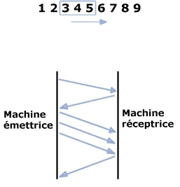

Il est important de souligner que la taille de la fenêtre glissante n’est pas fixe. Elle s’ajuste dynamiquement en fonction de l’état du réseau et de la capacité de traitement du récepteur. Lorsqu’un récepteur estime pouvoir traiter un volume de données plus important, il peut indiquer au travers du champ "fenêtre" qu’une extension est souhaitée. L’émetteur adapte alors sa fenêtre en conséquence. À l’inverse, en cas de surcharge ou de risque de saturation, le récepteur peut demander une réduction : l’émetteur attendra alors que la fenêtre se déplace avant de poursuivre l’envoi de segments supplémentaires.

Concernant la **clôture d’une connexion TCP**, le protocole prévoit une procédure symétrique pour garantir la fin propre et ordonnée des échanges. L’une des deux machines peut initier la fermeture en émettant un segment avec le drapeau **FIN** positionné à 1, qui signale sa volonté de terminer la communication. Elle attend ensuite la fin de réception des segments encore en transit et ignore toute donnée ultérieure.

À réception de ce segment, la machine destinataire répond par un accusé de réception, également marqué du drapeau FIN : elle finalise l’envoi de ses propres segments en cours, puis informe l’application locale de la fermeture effective de la session. Ainsi, la fermeture est toujours double et contrôlée, ce qui minimise le risque de perte de données.

Cette gestion précise, qui allie la souplesse de l’acheminement IP au contrôle rigoureux de TCP, est souvent illustrée par un schéma mettant en parallèle la rapidité du protocole IP (qui fonctionne selon le principe **"best effort"** sans garantie de livraison) et la fiabilité du protocole TCP (qui encadre la transmission grâce à une logique d’accusés de réception et de séquences négociées).

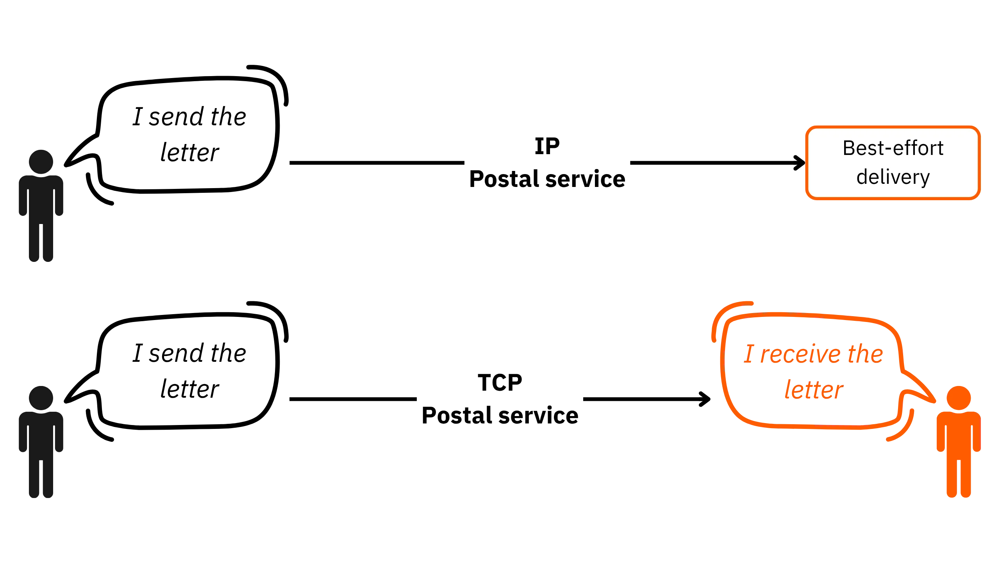

Cependant, dans certaines situations, la priorité n’est pas donnée à la fiabilité absolue mais à la vitesse de transmission et à la simplicité. C’est notamment le cas pour des applications comme le streaming en direct ou la voix sur IP, qui tolèrent quelques pertes de paquets sans impact majeur sur l’expérience utilisateur. Dans ces cas, on privilégie le recours au **protocole UDP** (_User Datagram Protocol_).

UDP fonctionne sur un principe radicalement différent de TCP : il est **orienté sans connexion**, c’est-à‑dire qu’il ne met en place aucune relation préalable entre l’émetteur et le destinataire. Lorsqu’une machine émet des paquets via UDP, elle les envoie de façon unidirectionnelle : le destinataire reçoit les données sans jamais renvoyer d’accusé de réception, et l’émetteur ne sait pas précisément si le message est bien arrivé. L’en-tête UDP est volontairement minimaliste : il ne transporte pas d’informations de contrôle sur l’état de la connexion, hormis l’adresse IP et le port de destination.

Cette logique est souvent comparée à une analogie du quotidien : le protocole TCP ressemble à un **appel téléphonique**, où un circuit est établi, suivi, et contrôlé tout au long de la conversation. À l’inverse, le protocole UDP s’apparente à l’envoi d’un **message par courrier**, où l’expéditeur glisse une lettre dans une boîte aux lettres sans garantie immédiate que le destinataire l’a bien reçue, ni retour d’information systématique.

Cette complémentarité entre TCP et UDP permet aux réseaux modernes de s’adapter à des usages variés, selon qu’ils requièrent une fiabilité maximale ou une rapidité d’exécution prioritaire.

## Primitives de services
<chapterId>4480afb7-e950-4ccb-88fa-d132f9dc3479</chapterId>

### Architecture en couches et organisation des échanges

Comme nous l’avons évoqué précédemment, les **services** constituent l’implémentation concrète des protocoles que nous avons détaillés jusqu’ici. Le modèle TCP/IP, bien qu’il diffère du modèle **OSI**, hérite de son approche structurée en couches : chaque couche est conçue pour remplir un rôle spécifique et pour offrir des **services** à la couche immédiatement supérieure, ce qui établit ainsi une architecture modulaire, robuste et facilement maintenable.

Chaque couche s’appuie sur les fonctionnalités offertes par la couche inférieure et, réciproquement, fournit à la couche supérieure une interface cohérente pour gérer les données. Dans cette architecture, chaque couche dispose de **structures de données propres**, soigneusement définies pour garantir une parfaite compatibilité avec celles des autres couches. Cette compatibilité est indispensable pour assurer une transmission fluide, fiable et compréhensible des informations, d’un point d’extrémité à un autre.

Deux aspects fondamentaux organisent ces échanges :

- L’**aspect vertical**, qui décrit la relation entre une couche et la couche qui la surplombe ou la sous-tend (de la couche N vers la couche N+1, et inversement).

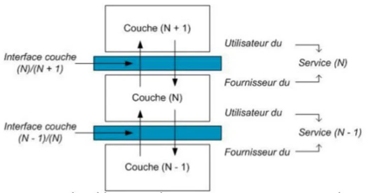

- L’**aspect horizontal**, qui met en lumière l’interaction entre les applications distantes, c’est-à-dire le dialogue qui s’établit d’un **client** vers un **serveur**, ou réciproquement.


L’architecture en couches repose sur le principe que chaque niveau ne traite que les informations qui relèvent de sa compétence : ainsi, les structures de données, les entêtes et les mécanismes de contrôle varient d’une couche à l’autre, mais l’ensemble forme un tout cohérent, permettant l’acheminement progressif des données vers leur destination finale.

**Rappel** : pour nommer les unités de données qui transitent entre les couches, une terminologie spécifique a été définie : **message** pour la couche Application, **segment** pour la couche Transport (TCP), **datagramme** pour la couche Internet (IP) et **trame** pour la couche Accès Réseau. Cette distinction s’accompagne de structures adaptées à chaque contexte, comme le montre le schéma suivant :

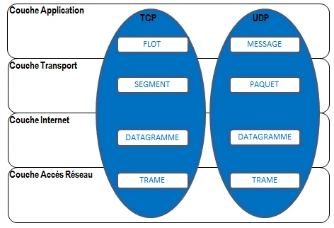

### Primitives de service et unités de données

Au cœur de ce fonctionnement, les échanges entre couches reposent sur des **primitives de service**, qui servent d’interfaces de communication. Ces primitives jouent le rôle de guichets, qui écoutent sur des **ports spécifiques** réservés, et permettent ainsi aux processus d’établir, de maintenir et de terminer les connexions réseau de manière contrôlée. Si les protocoles organisent le format et la transmission des données sur le réseau, ce sont bien les **services et leurs primitives** qui assurent la liaison verticale entre les couches.

Ainsi, le modèle TCP/IP combine l’aspect horizontal (communication entre applications distribuées) et l’aspect vertical (interactions internes entre couches) pour offrir une architecture complète et extensible. La superposition de ces deux aspects donne une vue d’ensemble de l’échange de données dans une communication réseau structurée.

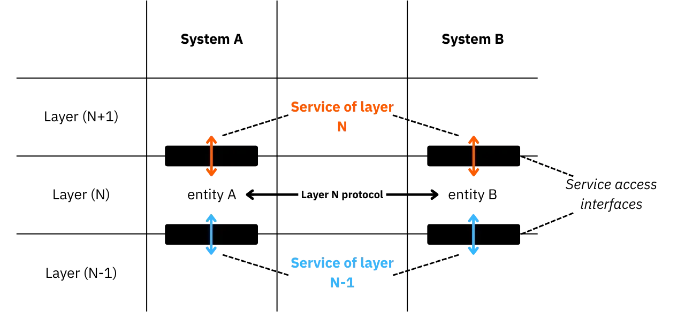

### Synthèse de la partie

Dans cette première grande partie, nous avons mis en lumière l’architecture fondamentale qui régit aujourd’hui la configuration et le fonctionnement des réseaux connectés à Internet. Cette architecture repose sur un **modèle en quatre couches**, inspiré du modèle OSI, et s’articule autour de la suite de protocoles **TCP/IP**, la colonne vertébrale des communications modernes. Nous avons vu que TCP, grâce à son approche orientée connexion, garantit un transfert fiable, tandis que l’UDP, plus léger et plus rapide, offre une alternative pour des usages où la rapidité prime sur la fiabilité.

Le bon fonctionnement de ce modèle repose sur l’implémentation des protocoles au moyen de **primitives de services**. Celles-ci assurent la liaison entre les couches et permettent d’adapter le traitement des données aux spécificités de chaque niveau, du transport à l’application, en passant par Internet et l’accès réseau. Cette approche modulaire rend le système à la fois souple et robuste.

L’adressage IP constitue un autre pilier de cette infrastructure. Chaque équipement connecté est identifié par une **adresse IP unique**, issue d’un espace structuré en **classes** (de A à E). Certaines de ces adresses sont réservées à des usages spécifiques, comme le bouclage local ou la multidiffusion, tandis que d’autres, dites "**adresses privées**", ne sont pas routées sur Internet sans être traduites (NAT). Cette classification permet une organisation logique et hiérarchique des réseaux.

Nous avons également abordé la notion de **sous-réseaux**, qui permet de fractionner un réseau en segments plus petits pour mieux gérer les ressources IP et optimiser la circulation des données. Si le découpage manuel à l’aide des masques de sous-réseaux reste un principe important, il a été largement modernisé grâce au **CIDR** (_Classless Inter-Domain Routing_). Cette méthode a transformé la gestion de l’adressage en permettant une attribution plus souple et plus rationnelle des plages IP, tout en réduisant la taille des tables de routage.

En maîtrisant ces concepts : couches, protocoles, primitives de services, adressage et sous-réseautage, on dispose des bases solides pour comprendre le fonctionnement technique des réseaux modernes et pour configurer efficacement une infrastructure réseau adaptée aux besoins actuels. Dans la prochaine partie, nous allons étudié plus précisément l'adressage IPv4.


# L’adressage IPv4
<partId>83f3c3e5-378c-440f-a095-df210842efde</partId>

## Utilisation de l’IPv4
<chapterId>79e4dd18-446a-435b-9f25-c88a00f8bec6</chapterId>

Cette deuxième partie approfondit les principes abordés précédemment en mettant l’accent sur la manière dont les **adresses IPv4** sont effectivement mises en œuvre dans un réseau informatique concret. Il s’agit ici de comprendre en détail non seulement leur format et leur logique, mais aussi les mécanismes qui permettent de relier ces adresses aux autres éléments indispensables du réseau : **noms DNS**, **adresses MAC**, **sous-réseaux** et **techniques de traduction**.

Une adresse IP est, pour rappel, un identifiant numérique unique attribué à chaque **interface réseau** d’un équipement. Elle permet de localiser cet équipement au sein d’un réseau et de l’atteindre pour lui transmettre des données. Ainsi, un routeur, un serveur, un poste de travail, une imprimante réseau ou même une caméra de surveillance dispose d’au moins une adresse IP propre. L’adresse IP sert de base à la **routabilité**, c’est-à-dire la capacité des équipements à acheminer les paquets d’un point A à un point B, même s’ils sont physiquement très éloignés.

Il est important de retenir qu’une adresse IP peut être attribuée de manière **statique**, c’est-à-dire fixée manuellement et inscrite dans la configuration de l’appareil, ou **dynamique**, c’est-à-dire allouée automatiquement à la demande grâce au protocole **DHCP** (_Dynamic Host Configuration Protocol_). Le DHCP simplifie la gestion du parc réseau, en évitant la configuration manuelle de chaque poste, tout en permettant un contrôle précis grâce à des réservations et des durées de bail.

Le protocole **IPv4**, toujours dominant malgré l’émergence de l’IPv6, utilise un format codé sur **32 bits**, divisés en **quatre octets**. Chaque octet, composé de 8 bits, est exprimé en décimal sous forme d’un nombre compris entre 0 et 255. Les 4 octets sont séparés par des points pour former une notation claire et lisible.

_Exemple : l’adresse 172.16.254.1_

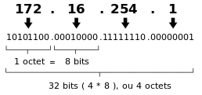

Chaque bit au sein d’un octet a un poids bien défini : le bit de gauche (bit de poids fort) vaut 128, le suivant 64, puis 32, 16, 8, 4, 2 et 1 pour le bit de droite (bit de poids faible). Ainsi, l’écriture binaire est convertie en décimal par simple addition des poids activés.  
Le tableau ci-dessous rappelle cette correspondance :

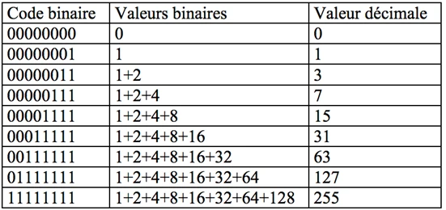

Par exemple, pour convertir une adresse IP binaire en notation décimale, on additionne les valeurs des bits à 1 pour chaque octet.


Il est important de noter qu’une adresse IP identifie **une interface réseau** et non l’appareil dans sa globalité. Un serveur multi-cartes, comme un pare-feu ou un routeur, possède donc plusieurs interfaces, chacune avec sa propre adresse IP. De plus, une seule interface peut se voir attribuer plusieurs adresses IP, notamment pour répondre à plusieurs réseaux virtuels ou services.

Chaque paquet IP encapsule l’adresse IP de **l’expéditeur** et celle du **destinataire** dans son en-tête. Les **routeurs**, situés aux jonctions des réseaux, lisent ces informations pour déterminer la route optimale pour transmettre le paquet de proche en proche jusqu’à la machine cible. Sans un adressage rigoureux, le trafic ne saurait être orienté correctement et l’interconnexion mondiale des réseaux serait impossible.

L’adressage IPv4 obéit à des règles précises : chaque adresse est composée de deux parties : le **NetID**, qui désigne le réseau de rattachement, et le **HostID**, qui identifie l’équipement au sein de ce réseau. La délimitation entre NetID et HostID est fixée par le **masque de sous-réseau**, qui précise combien de bits appartiennent à chaque portion. Plus le NetID est long, plus le nombre de sous-réseaux possibles est grand, mais le nombre d’hôtes par sous-réseau diminue en conséquence.

Dans les débuts d’IPv4, les réseaux étaient organisés en **classes** (A, B, C, D et E). Chaque classe correspond à une plage spécifique de NetID et définit une granularité fixe :

- Classe A : réseaux très vastes avec un grand nombre d’hôtes
- Classe B : réseaux de taille intermédiaire
- Classe C : réseaux de petite taille
- Classe D : adresses réservées à la multidiffusion (_multicast_)
- Classe E : adresses expérimentales, non utilisées pour l’adressage classique

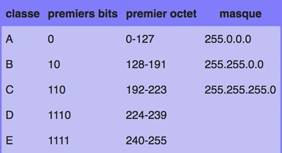

Certaines adresses ont un rôle bien particulier. L’**adresse de réseau** désigne l’identifiant du réseau lui-même et sert à configurer les tables de routage ; l’**adresse de diffusion** (_broadcast_) permet d’envoyer un paquet à tous les hôtes d’un même sous-réseau en une seule émission : pour cela, tous les bits du HostID sont mis à 1.

Les plages suivantes sont réservées pour des usages internes :

- **10.0.0.0/8** (Classe A privée)
- **127.0.0.0/8** (bouclage local ou _loopback_)
- **172.16.0.0 à 172.31.255.255** (Classe B privée)
- **192.168.0.0 à 192.168.255.255** (Classe C privée)

Les adresses **127.0.0.1** et plus largement tout le bloc 127.0.0.0/8 servent au test interne : une requête envoyée à cette adresse ne quitte jamais la machine. Cela permet de vérifier localement qu’un service réseau répond bien.

Pour tirer pleinement parti de l’espace d’adressage, les administrateurs segmentent souvent leurs réseaux en **sous-réseaux** (_subnets_) grâce à des masques de sous-réseau ou à la notation **CIDR** (_Classless Inter-Domain Routing_), qui offre une gestion plus fine et réduit le gaspillage d’adresses. Le CIDR est aujourd’hui incontournable pour ajuster précisément la taille des plages IP et pour alléger les tables de routage.

Dans les réseaux modernes, l’adressage IP est souvent associé à d’autres identifiants : le **nom de domaine** enregistré dans un **DNS** (_Domain Name System_) permet d’associer une adresse IP à un nom plus facile à retenir ; l’**adresse MAC**, quant à elle, est un identifiant physique gravé dans la carte réseau, utilisé pour le transport au niveau local (_Ethernet_). Lorsqu’un paquet IP doit être transmis physiquement, c’est la table ARP qui fait la correspondance entre l’adresse IP et l’adresse MAC de destination.

Enfin, pour pallier la pénurie d’adresses IPv4 et améliorer la sécurité on peut recourir à la **traduction d’adresses** (_NAT_). Le NAT permet à plusieurs hôtes internes, utilisant des adresses privées, de partager une seule adresse IP publique pour sortir sur Internet.

**Remarque** : de nombreux outils en ligne et intégrés aux systèmes d’exploitation facilitent le calcul des masques, comme le [calculateur du CRIC de Grenoble](http://cric.grenoble.cnrs.fr/Administrateurs/Outils/CalculMasque/). Ces utilitaires aident à planifier efficacement le découpage du réseau.

Pour conclure, l’adresse de diffusion reste une fonction pratique pour envoyer un même message à tous les équipements connectés à un segment : en pratique, la partie _HostID_ est mise à 1 pour signifier que tous les hôtes sont visés par le même paquet.

## Les différents types d’adresses IPv4
<chapterId>2adfad24-a90d-45b5-b808-3d2f6598bebf</chapterId>

L’adressage IPv4 se divise principalement en deux grandes catégories : les adresses **publiques**, directement accessibles sur Internet, et les adresses **privées**, destinées à un usage interne dans un réseau local.

Une **adresse IPv4 publique** est une adresse unique au niveau mondial. Elle est enregistrée auprès d’un organisme officiel et est routable sur l’ensemble du réseau Internet. Les entreprises et organisations s’en servent pour rendre accessibles leurs services : serveurs web, infrastructures de messagerie, services de cloud public, etc. L’unicité mondiale de ces adresses est indispensable pour éviter tout conflit ou collision d’acheminement. C’est l’**IANA** (_Internet Assigned Numbers Authority_), qui, depuis 2005, relève de l’**ICANN** (_Internet Corporation for Assigned Names and Numbers_), qui gère la distribution de ces plages. Concrètement, l’IANA divise l’espace IPv4 en **256 blocs de taille /8**, selon la notation CIDR. Chaque bloc représente un peu plus de 16,7 millions d’adresses (2³²/2⁸).

Ces blocs d’adresses unicast sont confiés par l’IANA aux **Registres Internet Régionaux** (_Regional Internet Registries_ ou RIR). Ces RIR se chargent de redistribuer les adresses au niveau régional, en fonction des besoins réels des fournisseurs d’accès, des entreprises ou des administrations. L’espace d’adressage unicast s’étend des blocs **1/8 à 223/8**, avec des portions soit réservées pour des usages particuliers (recherche, documentation, tests), soit attribuées directement à un réseau final ou à un RIR pour redistribution.

Pour vérifier à qui appartient une adresse IP publique, il est possible de consulter les bases des RIR grâce à la commande **whois** ou en utilisant les interfaces web mises à disposition par chaque registre. Ces outils permettent de remonter à l’organisation ou au fournisseur ayant déclaré cette adresse.

À l’opposé, on trouve les **adresses IPv4 privées**, qui constituent une réponse pragmatique à la pénurie d’adresses publiques. Ces adresses, non routables sur Internet, sont réservées à des environnements locaux : réseaux d’entreprises, LAN domestiques, datacenters ou clusters de calcul. Elles ne sont pas uniques au niveau mondial : de nombreux réseaux privés peuvent réutiliser les mêmes plages sans interférence tant qu’ils restent isolés ou qu’ils passent par un dispositif de traduction d’adresses pour sortir sur Internet.

Pour qu’un équipement interne, configuré avec une adresse privée, puisse accéder au réseau global, on recourt au mécanisme de **NAT** (_Network Address Translation_). Le NAT joue un rôle important : il traduit l’adresse privée en adresse publique à la volée, ce qui permet à des dizaines, voire des centaines de postes internes de partager une seule adresse publique. Cette méthode optimise l’utilisation de l’espace IPv4 tout en ajoutant une couche de sécurité par dissimulation des topologies internes.

Par ailleurs, certaines adresses spéciales sont dites **non spécifiées**. La notation **0.0.0.0** ou sa version en IPv6 **::/128** indique l’absence d’adresse concrète : cette valeur est illégale comme adresse de destination sur le réseau, mais elle peut être utilisée localement par un hôte pour signifier "toutes les interfaces" ou "adresse non encore assignée". Ce mécanisme est couramment exploité lors de l’attribution dynamique par DHCP ou pour l’écoute sur toutes les interfaces d’un serveur.

En IPv6, comme nous le verrons dans la partie suivante, le principe d’adressage privé existe aussi, même si le standard recommande de privilégier l’adressage public pour éviter la multiplication des couches NAT. Les anciennes **adresses locales de site** (_site-local_) du bloc **fec0::/10** ont été déclarées obsolètes par le **RFC 3879**, pour des raisons de cohérence et de sécurité. Elles ont été remplacées par le concept d’**adresses locales uniques** (_ULA_), situées dans le bloc **fc00::/7**. Les ULA permettent de construire des réseaux privés IPv6 tout en assurant une interconnexion interne propre, grâce à un identifiant aléatoire sur 40 bits qui garantit l’unicité à l’échelle locale.

Face à la saturation de l’espace IPv4 (l’épuisement des blocs libres fut officiellement constaté en 2011) plusieurs stratégies ont vu le jour pour prolonger la viabilité du protocole. Parmi elles : la migration progressive vers **IPv6**, la généralisation du **NAT**, le durcissement des politiques d’allocation par les RIR (imposant une gestion plus fine et la justification des besoins) et, plus rarement, la récupération de blocs non utilisés ou rendus par des entreprises.

Ces différentes catégories et stratégies illustrent à quel point l’adressage IP est à la fois une problématique technique et une question de gouvernance mondiale, au cœur même de l’expansion continue d'Internet.


## Le DNS, un annuaire d’adresses
<chapterId>511244ec-ba43-44ac-b4c3-b41579a15cff</chapterId>

Il faut bien admettre que pour nous autres humains, mémoriser de longues suites de chiffres binaires ou décimaux n’est pas chose aisée. Cette difficulté devient encore plus marquée lorsque l’on considère la complexité de l’adressage IP et la multiplicité des adresses qu’une seule peut parfois masquer, notamment lorsqu’on emploie des mécanismes comme le NAT ou l’hébergement virtuel.

Pour pallier cette limite naturelle, la couche Application s’appuie sur un système capable de faire le lien entre une **adresse IP** et un **nom logique** plus compréhensible et surtout plus simple à manipuler. C’est précisément le rôle du **DNS**, pour ***Domain Name System***, un immense annuaire hiérarchique et distribué qui associe des noms de domaine lisibles à des adresses IP. Ce système repose sur un ensemble de protocoles et de services, dont le plus connu est **BIND** (_Berkeley Internet Name Daemon_), un logiciel libre servant de référence pour la majorité des serveurs DNS dans le monde.

Le principe fondamental du DNS est simple : pour tout équipement connecté (qu’il s’agisse d’un site web, d’un serveur de messagerie ou d’un service réseau) on enregistre une correspondance entre un nom de domaine et une ou plusieurs adresses IP. Cette correspondance est bidirectionnelle : on peut résoudre un nom en adresse (résolution directe) ou retrouver un nom à partir d’une adresse IP (résolution inverse). Cela rend l’adressage humainement exploitable tout en maintenant la précision technique indispensable pour le routage.

Un nom de domaine est toujours structuré hiérarchiquement, chaque niveau étant séparé par un point : le nom complet est appelé **FQDN** (_Fully Qualified Domain Name_). L’élément le plus à droite est le **TLD** (_Top Level Domain_) comme `.com`, `.org` ou `.fr`. L’élément le plus à gauche désigne l’hôte, c’est-à‑dire la machine spécifique à laquelle l’adresse IP est liée.

Le système DNS est conçu comme un **arbre de zones**. Chaque **zone** représente une portion de l’espace de noms, gérée par un serveur DNS spécifique. Une même zone peut inclure plusieurs **sous-domaines**, eux-mêmes potentiellement répartis sur d’autres zones administrées par des serveurs distincts. Une zone est donc l’unité administrative de base dont un administrateur est responsable : gestion, mises à jour, délégations éventuelles...

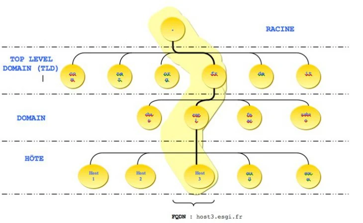

Ainsi, il devient possible non seulement de pointer vers un domaine principal (par exemple `example.com`) mais aussi de gérer finement chaque hôte (`www`, `mail`, `ftp`, etc.) par des enregistrements précis. À l’origine, cette fonction de résolution était assurée par de simples fichiers statiques (`/etc/hosts` sous Linux) mais cette méthode s’est vite révélée inadaptée pour un Internet mondial, évolutif et interconnecté.

Il est important de comprendre qu’un **serveur DNS** peut avoir un périmètre limité : un DNS interne à une entreprise, par exemple, peut ne pas être accessible directement depuis Internet. Si ce DNS n’est pas configuré pour déléguer les requêtes ou n’a pas de relation de confiance avec d’autres serveurs, certaines requêtes échoueront : ni le nom ni l’adresse IP ne pourront alors être résolus en dehors de la zone définie.

Un serveur DNS contient également des informations spécifiques au routage des courriels. Par exemple, un enregistrement de type **MX** (_Mail Exchange_) désigne les serveurs de messagerie responsables de recevoir les e-mails pour un domaine donné. Ces enregistrements définissent des priorités (facteur de pondération) et des solutions de basculement en cas de panne. Le fichier de zone d’un serveur DNS débute toujours par une déclaration **SOA** (_Start Of Authority_) : cette étiquette désigne le serveur comme source officielle de l’information pour la zone qu’il administre.

Le DNS, grâce à sa structure hiérarchique et distribuée, reste aujourd’hui une brique incontournable d'Internet, et permet à chaque utilisateur de se connecter à des services en utilisant des noms de domaine clairs au lieu de longues adresses IP techniques.

Dans le prochain chapitre, nous aborderons une autre notion fondamentale : les **adresses Ethernet**, également connues sous le nom d’**adresses MAC**, qui permettent d’assurer l’acheminement des données au niveau physique du réseau local.


## À la découverte de l’adresse Ethernet et d’ARP
<chapterId>d02109f6-9bf9-4261-a8f9-e1aa4398b949</chapterId>

### Définitions

Pour que le protocole d’acheminement des données puisse fonctionner de manière fiable et cohérente, une composante fondamentale reste indispensable. Si, en tant qu’êtres humains, nous savons facilement identifier une machine grâce à son adresse IP ou à son nom, récupéré via le DNS, une machine, quant à elle, doit pouvoir reconnaître sans ambiguïté l’équipement de destination pour transmettre les paquets. Pour cela, elle s’appuie sur un identifiant matériel spécifique, directement exploitable par son interface réseau : l’adresse MAC (_Media Access Control_).

Il convient de ne surtout pas confondre cette adresse MAC avec ce que l’on nomme l’adresse physique au sens de l’architecture mémoire. En effet, l’adresse physique, en informatique, désigne un emplacement précis dans le bus d’adresse de la mémoire centrale, et s’oppose à l’adresse virtuelle qui, elle, relève de la gestion de la mémoire par le système d’exploitation. L’adresse MAC, quant à elle, relève strictement du matériel réseau.

Attribuée de manière permanente et unique par le constructeur lors de la fabrication de l’équipement, l’adresse MAC identifie sans équivoque la carte réseau, qu’il s’agisse d’un ordinateur, d’un smartphone, d’une imprimante réseau ou de tout autre périphérique communicant. Contrairement à l’adresse IP, qui peut être dynamique et assignée par l’administrateur ou un serveur DHCP, l’adresse MAC reste, en principe, inchangée durant toute la vie du périphérique, sauf intervention volontaire.

Il est essentiel de rappeler que toute interface réseau, qu’elle soit câblée ou sans fil, possède une adresse MAC. Cette adresse est utilisée au sein de la couche liaison de données (couche 2 du modèle OSI) pour insérer et gérer l’adresse matérielle dans chaque trame réseau échangée. On parle parfois d’_adresse Ethernet_ ou encore d’_UAA_ (_Universally Administered Address_). Standardisée sur une longueur de 48 bits, soit 6 octets, elle s’écrit en notation hexadécimale, généralement sous la forme d’octets séparés par des `:` ou des `-`.

Par exemple : `5A:BC:17:A2:AF:15`

Dans cette structure, les trois premiers octets servent à identifier le fabricant de la carte réseau : c’est ce que l’on appelle l’OUI (_Organisationally Unique Identifier_), un identifiant unique attribué à chaque constructeur, également utilisé dans d’autres protocoles comme SNMP pour garantir l’unicité. Les trois octets restants constituent le numéro de série proprement dit du contrôleur réseau, appelé NIC (_Network Interface Controller_), qui différencie chaque carte produite par ce constructeur.

### Modification de l’adresse MAC

En théorie, l’adresse MAC est conçue pour rester fixe, mais il existe des méthodes pour la modifier, notamment pour répondre à des besoins particuliers ou contourner certaines contraintes. Cette opération, que l’on appelle souvent _spoofing MAC_, consiste à remplacer l’adresse matérielle d’origine par une valeur différente, définie au niveau logiciel. Certains systèmes d’exploitation facilitent cette modification, notamment lorsque l’adresse Ethernet réelle n’est pas exploitée directement par le pilote.

Les motifs pouvant conduire à un tel changement sont variés. Il peut s’agir de la nécessité pour une application donnée d’exiger une adresse Ethernet spécifique pour fonctionner correctement, ou de résoudre un conflit d’adresses identiques entre deux équipements partageant le même réseau local.

Changer l’adresse MAC peut également être motivé par des considérations de confidentialité : en masquant l’identifiant unique gravé dans la carte, l’utilisateur réduit ainsi les possibilités de traçage de son appareil par des réseaux ou des services de surveillance. Toutefois, cette pratique n’est pas sans conséquences. Modifier une adresse MAC peut perturber certains dispositifs de filtrage ou nécessiter de reconfigurer les pare-feu pour autoriser le nouveau matériel.

Dans certains réseaux, notamment dans le cadre de la sécurisation des accès Wi-Fi, il est fréquent de recourir au filtrage d’adresses MAC pour restreindre l’accès aux seuls équipements préalablement autorisés. Bien que cette technique puisse apporter un premier niveau de contrôle, elle présente une efficacité limitée. Des attaquants peuvent facilement capturer une adresse MAC valide autorisée sur le réseau, la forger et l’utiliser à leur profit pour contourner la restriction, ce qui rend ce type de filtrage insuffisant s’il n’est pas couplé à d’autres mesures de sécurité plus robustes.
### Correspondance MAC/IP

Pour qu’un réseau local fonctionne de manière fluide et cohérente, il est indispensable d’établir un lien clair entre les adresses physiques, comme les adresses MAC, et les adresses logiques, c’est-à‑dire les adresses IP. Sans cette correspondance, un ordinateur saurait certes vers quelle adresse IP envoyer un paquet, mais serait incapable de savoir comment le transmettre concrètement sur le réseau physique. C’est là qu’intervient le protocole ARP (_Address Resolution Protocol_), qui automatise ce mécanisme.

Dans la pratique, lorsqu’un utilisateur souhaite connaître l’adresse MAC correspondant à une adresse IP précise, il peut s’appuyer sur l’utilitaire `arp`. Cet outil interroge la table ARP locale de la machine pour afficher les correspondances déjà connues entre adresses IP et adresses MAC sur le réseau local. Il est ainsi possible de vérifier rapidement la liaison effective entre les couches logiques et physiques.

Exemple pratique : si l’on veut vérifier quelle carte réseau correspond à l’adresse IP `192.168.1.5`, on utilisera la commande suivante :

```bash
arp –a 192.168.1.5
```

La sortie affichera notamment l’adresse physique (MAC) associée, la nature de l’entrée (statique ou dynamique) et l’interface concernée.

```
Interface : 192.168.1.5 --- 0x5
    IP Address            MAC Address                Type
    192.168.1.5           00:54:BC:17:14:6E          D
```

Il est donc important de garder à l’esprit que l’adresse MAC et l’adresse IP sont deux identifiants totalement distincts mais étroitement complémentaires. L’adresse MAC est gravée de façon unique par le constructeur dans chaque interface réseau et sert à identifier physiquement l’équipement sur le réseau local. L’adresse IP, quant à elle, est une adresse logique attribuée dynamiquement ou statiquement pour permettre à la machine de s’intégrer au réseau IP et d’échanger des paquets au-delà de son réseau local.

- Exemple visuel d’adresse MAC :

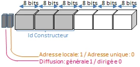

- Exemple visuel d’adresse IP :

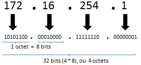

Dans un environnement d’entreprise, ces deux niveaux d’adressage ne peuvent fonctionner séparément. Par exemple, lors de l’attribution automatique d’une adresse IP par un serveur DHCP, c’est l’adresse MAC de l’équipement qui sert de point de départ. L’ordinateur envoie une requête DHCP en broadcast, incluant son adresse MAC, afin de se voir attribuer une adresse IP disponible par le serveur. Sans cette identification matérielle, le serveur DHCP ne saurait pas à quel appareil délivrer l’adresse.

Le protocole ARP est donc fondamental : il assure la liaison entre les adresses IP et les adresses physiques, et permet donc aux machines de traduire une destination logique en une destination matérielle réelle. Lorsqu’un ordinateur doit envoyer un paquet à une machine du même réseau, il consulte d’abord sa table ARP pour vérifier si l’adresse MAC du destinataire est déjà connue. Si ce n’est pas le cas, il diffuse une requête ARP à tous les hôtes du réseau local. La machine qui reconnaît l’adresse IP cible dans cette requête répond en précisant son adresse MAC. L’émetteur inscrit alors ce couple IP/MAC dans son cache ARP pour éviter d’avoir à répéter l’opération à chaque envoi.

Cette table ARP agit donc comme un mini-annuaire de correspondance, mis à jour dynamiquement, un peu comme le DNS le fait pour associer des noms de domaine à des adresses IP. Sans ARP, aucun échange local ne serait possible car la couche liaison de données doit impérativement connaître l’adresse MAC pour encapsuler correctement les trames Ethernet.

À l’inverse, le protocole RARP (_Reverse Address Resolution Protocol_) a été conçu pour résoudre la situation opposée : permettre à une machine qui ne connaît que son adresse MAC de découvrir son adresse IP. C’était notamment le cas pour les anciennes stations de travail sans disque dur local, qui devaient démarrer via le réseau et réclamer une adresse IP. Cependant, RARP présentait des limites en matière de flexibilité et de maintenance, et a été progressivement remplacé par DRARP (_Dynamic Reverse ARP_) puis par BOOTP et DHCP, beaucoup plus évolués et automatisés.

Ces protocoles d’association jouent un rôle important dans le routage. Un routeur est en réalité une machine dotée de plusieurs interfaces réseau, reliant différents segments. Quand un routeur reçoit une trame, il la traite pour extraire le datagramme IP, puis examine l’entête IP pour déterminer la destination. Si la destination se trouve sur un réseau directement connecté, le datagramme est remis en remise directe après mise à jour de l’entête. Si la destination appartient à un autre réseau, le routeur consulte sa table de routage pour identifier le meilleur chemin, ou _next hop_, vers la destination.

Ce fonctionnement permet de diviser le trajet en segments plus courts et gérables. Chaque routeur intermédiaire ne connait que la prochaine étape, pas forcément la destination finale.

**Rappel :** on parle de remise directe quand l’expéditeur et le destinataire sont sur le même réseau physique ; sinon, la remise est dite indirecte car elle transite par un ou plusieurs routeurs.

La table de routage, administrée soit manuellement (routage statique), soit dynamiquement (routage dynamique), contient les informations nécessaires pour décider du chemin à emprunter. Dans les petits réseaux, une configuration statique est suffisante, mais dans les grandes infrastructures, le routage dynamique s’impose pour ajuster automatiquement les routes en fonction des changements de topologie ou d’état des liens.

La table de routage agit comme un tableau de correspondance entre les adresses IP cibles et les passerelles suivantes. Elle ne conserve généralement pas toutes les adresses hôtes mais seulement l’identifiant du réseau (_network ID_), ce qui allège considérablement son volume.


Grâce à ces entrées, le routeur peut déterminer rapidement via quelle interface et vers quel nœud il doit transmettre chaque datagramme. Cette logique d’acheminement, combinée au protocole ARP pour résoudre les adresses MAC correspondantes, garantit l’efficacité et la fiabilité du transfert de données sur l’ensemble du réseau.

Enfin, parmi les protocoles de routage dynamiques, on retrouve des standards comme RIP (_Routing Information Protocol_), basé sur l’algorithme de distance, et OSPF (_Open Shortest Path First_), qui calcule les chemins les plus courts à travers une topologie complexe. Ces protocoles s’échangent en permanence des informations de mise à jour pour optimiser les chemins, réduire les coûts de transmission et améliorer la résilience du réseau face aux pannes ou aux congestions.

## NAT : Traduction d’adresse
<chapterId>4f984d5d-f2e0-4faf-b703-ff315f32cef4</chapterId>

### Définition

Le _Network Address Translation_ (NAT) est une technique qui a vu le jour pour pallier l’épuisement progressif du stock d’adresses IPv4 disponibles. Conçu comme un mécanisme intermédiaire avant la généralisation d’IPv6, le NAT a permis aux entreprises et aux particuliers de continuer à connecter un grand nombre de machines tout en utilisant un nombre restreint d’adresses IP publiques.

**Rappel important :** le passage d’IPv4 à IPv6 permet théoriquement de résoudre ce problème d’épuisement puisque l’espace d’adressage passe de 32 bits à 128 bits, ce qui offre ainsi un nombre d’adresses quasi illimité (2^128). Toutefois, en pratique, la transition reste partielle et le NAT demeure aujourd’hui encore très répandu.

Le principe du NAT repose sur un fonctionnement simple mais particulièrement efficace : au lieu d’attribuer une adresse IP publique unique à chaque machine du réseau interne, on utilise une seule adresse routable (ou un petit pool d'adresses) pour l’ensemble des terminaux privés. La passerelle NAT, souvent intégrée au routeur ou au pare-feu, se charge alors de traduire dynamiquement l’adresse IP interne et les informations nécessaires pour acheminer correctement le trafic vers l’extérieur, puis d’assurer le retour des réponses vers la machine émettrice.

Ce procédé présente un avantage immédiat : il masque totalement l’architecture interne du réseau. Pour un observateur externe, toutes les requêtes émises par les postes de travail, serveurs ou imprimantes partagent la même identité publique. L’adressage privé, généralement constitué d’adresses IP issues des plages réservées (par exemple 192.168.x.x ou 10.x.x.x), reste donc invisible depuis Internet.

En plus de répondre à la pénurie d’adresses IPv4, le NAT renforce donc la sécurité en créant une première barrière logique entre le réseau interne et le réseau public. Les communications entrantes non sollicitées sont ainsi naturellement filtrées, car seules les connexions initiées depuis l’intérieur bénéficient de la traduction nécessaire pour recevoir les réponses.

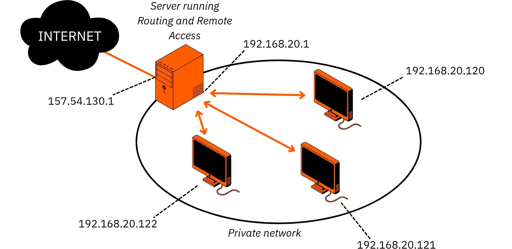

### Types de traduction

Le NAT peut être mis en œuvre sous différentes formes, adaptées à des besoins spécifiques. On distingue principalement deux grands modes de fonctionnement : la traduction statique et la traduction dynamique.

**La traduction statique** consiste à établir une correspondance fixe entre une adresse IP privée et une adresse IP publique. Chaque machine interne dispose alors d’une adresse publique dédiée qui lui est associée de manière permanente. Par exemple, une machine interne configurée en 192.168.20.1 peut être associée à l’adresse routable 157.54.130.1. Lorsqu’un paquet sortant quitte le réseau local, le routeur modifie l’adresse source du paquet pour lui substituer l’adresse publique, et effectue l’opération inverse pour le trafic entrant. Cette traduction bidirectionnelle est transparente pour l’utilisateur.

**Attention :** si ce mécanisme permet d’isoler le réseau interne, il ne résout en rien le problème de pénurie d’adresses IP publiques, car il faut toujours autant d’adresses publiques que de machines à exposer. La traduction statique est donc surtout utilisée lorsque certaines ressources internes doivent impérativement rester joignables depuis l’extérieur (serveur web, serveur mail…).

**La traduction dynamique**, quant à elle, est plus souple et économique en adresses IP publiques. Dans ce scénario, plusieurs machines internes partagent simultanément une même adresse IP routable pour accéder à Internet. Du point de vue du monde extérieur, l’ensemble du réseau interne se présente sous une seule identité. Cette mutualisation est rendue possible grâce à une technique complémentaire : la traduction de ports, appelée _Port Address Translation_ (PAT).

Le PAT, souvent désigné sous le terme _IP masquerading_ ou encore _NAT Overloading_, consiste à ajouter un identifiant supplémentaire (le numéro de port source) pour chaque connexion sortante. Ainsi, lorsque plusieurs machines du réseau local établissent des connexions simultanées vers Internet, la passerelle NAT attribue à chacune un port unique. Elle conserve ensuite une table de correspondance interne liant chaque couple (adresse IP privée, port source) à l’adresse publique et au port de sortie effectivement utilisé. Lorsque la réponse revient, le routeur NAT consulte cette table pour acheminer les paquets vers la machine interne appropriée.

Ce mécanisme est aujourd’hui omniprésent dans les routeurs domestiques, car il permet à des dizaines de terminaux (ordinateurs, smartphones, objets connectés...) de partager la même adresse IP publique, tout en maintenant une communication fluide.

Le NAT prolonge donc la durée de vie d’IPv4 tout en ajoutant un niveau de cloisonnement et de sécurité appréciable. Toutefois, avec l’adoption progressive d’IPv6 et son espace d’adressage immense, le rôle du NAT tendra à se réduire, même si, pour des raisons de compatibilité et de contrôle, il restera encore utilisé dans certains environnements pour segmenter et filtrer les flux.

### Implémentation du NAT

Pour garantir le fonctionnement correct du mécanisme de traduction d’adresses, le routeur ou la passerelle NAT doit conserver une trace précise des correspondances établies entre chaque adresse privée du réseau interne et l’adresse publique qu’elle utilise pour communiquer vers l’extérieur. Ces informations sont stockées dans une table dite de "traduction NAT", qui joue un rôle central dans la gestion des flux réseau.

Chaque entrée de cette table associe au minimum une paire composée de l’adresse IP interne de la machine émettrice et de l’adresse IP externe qui sera exposée sur Internet. Lorsque qu’un paquet issu du réseau privé est émis vers une destination publique, le routeur NAT intercepte la trame, analyse l’entête IP et TCP/UDP, puis remplace l’adresse source privée par l’adresse publique de la passerelle. Dans le sens retour, le paquet entrant est capturé par la même passerelle, qui vérifie la table de correspondance et effectue l’opération inverse pour rediriger le flux vers l’adresse IP interne initiale.

Ce principe de traduction dynamique repose sur une gestion fine de la table : chaque entrée reste valide tant qu’un trafic actif la justifie. Après un délai d’inactivité paramétrable, l’entrée est purgée et peut être réutilisée pour de nouvelles connexions.

_Exemple de table de traduction NAT simplifiée :_

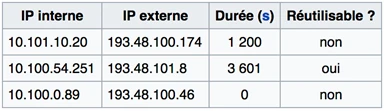

Dans cet exemple, si aucun paquet n’a transité pour la seconde ligne depuis plus d’une heure (3600 secondes), l’entrée est marquée comme réutilisable. À l’inverse, un champ de durée à zéro indique qu’une communication est en cours et que la correspondance est verrouillée.

Bien que le NAT s’intègre de manière transparente pour la majorité des usages courants (navigation web, courrier électronique, transfert de fichiers...) il peut cependant introduire des contraintes supplémentaires pour certaines applications réseau. En effet, certaines technologies reposent sur l’échange explicite d’adresses IP ou de ports dans le corps même des paquets. Or, ces informations deviennent incohérentes après passage par la passerelle NAT.

Parmi les cas les plus typiques de limitations, on peut citer :
- Les protocoles de type pair-à-pair (P2P), qui nécessitent l’établissement de connexions directes entre postes, sont perturbés par la barrière du NAT, car chaque machine interne partage la même adresse IP externe et ne peut être contactée directement sans configuration spécifique (comme le *port forwarding* ou l’UPnP) ;
- Le protocole IPSec, utilisé pour sécuriser les communications réseau, chiffre l’entête des paquets. Or, comme le NAT a besoin de modifier ces entêtes pour remplacer les adresses IP, le chiffrement rend impossible cette modification, ce qui compromet la compatibilité sans mise en place de mécanismes d’adaptation comme le NAT-T (*NAT Traversal*) ;
- Le protocole X Window, qui permet l’affichage distant d’applications graphiques sous Unix/Linux, fonctionne selon une logique où le serveur X envoie activement des connexions TCP vers les clients. Cette inversion du sens habituel des connexions peut être bloquée par la traduction NAT.

De manière générale, tout protocole intégrant une référence explicite à l’adresse IP interne dans la charge utile du paquet sera affecté, car cette adresse ne correspond plus à l’adresse réelle visible depuis Internet une fois la traduction effectuée.

**Remarque importante :** pour pallier ces problèmes, certains routeurs NAT disposent de fonctionnalités de _Deep Packet Inspection_ (DPI) ou de _Protocol Helpers_, qui inspectent le contenu des paquets pour identifier et remplacer dynamiquement les adresses ou numéros de ports inscrits dans les données applicatives. Cette manipulation nécessite toutefois une parfaite connaissance du format du protocole à traiter et peut représenter une vulnérabilité ou un surcoût en ressources.

**Point de vigilance :** le NAT contribue certes à masquer le réseau interne et à contrôler la circulation des flux entrants, mais il ne remplace en aucun cas un pare-feu dédié. La traduction ne constitue pas une barrière de sécurité complète : elle doit toujours être complétée par des règles de filtrage précises pour bloquer le trafic non sollicité ou indésirable.

_Pour illustrer le fonctionnement concret, prenons l’exemple suivant :_

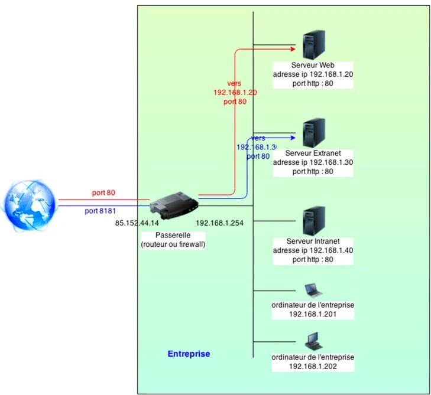

Dans ce scénario, un poste interne peut accéder au serveur web interne en appelant directement l’URL `http://192.168.1.20:80`. Ici, l’indication du port est optionnelle puisque `80` est le port standard pour le HTTP. À l’inverse, si une requête est initiée depuis l’extérieur, l’utilisateur saisira l’adresse publique `http://85.152.44.14:80`. Le routeur NAT réceptionne la requête, consulte sa table de correspondance et traduit automatiquement l’adresse publique en adresse privée, redirigeant la connexion vers` http://192.168.1.20:80`.

Ce principe est identique pour tout autre serveur autorisé à recevoir des connexions depuis Internet, comme le serveur Extranet (circuit bleu sur le schéma).

**Remarque pratique :** dans les environnements virtualisés, on rencontre fréquemment des interfaces réseau appelées _virbrX_ (pour _Virtual Bridge X_). Ces ponts virtuels, fournis notamment par la bibliothèque libvirt ou l’hyperviseur Xen, servent à relier le réseau interne virtuel des machines invitées au réseau physique, tout en appliquant le NAT. Leur configuration se réalise généralement via des scripts situés dans `/etc/sysconfig/network-scripts/`, comme illustré ci-dessous pour `virbr0` :

```shell
NAME=""
BOOTPROTO=none
MACADDR=""
TYPE=Bridge
DEVICE=virbr0
NETMASK=255.255.255.0
MTU=""
BROADCAST=192.168.0.255
IPADDR=192.168.0.1
NETWORK=192.168.0.0
ONBOOT=yes
```

Une fois le pont virtuel en place, il est nécessaire d’activer le routage IP et de configurer la traduction de ports avec `iptables` :

```shell
echo 1 > /proc/sys/net/ipv4/ip_forward
```

```shell
iptables -t nat -A POSTROUTING -o <WAN> -s 192.168.0.0/24 -j MASQUERADE
```

Grâce à cette configuration, le trafic sortant est routé et la traduction NAT est assurée pour permettre aux machines virtuelles de communiquer avec l’extérieur sans exposer directement leurs adresses IP internes.

Dans le chapitre suivant, nous aborderons en détail la configuration des adresses IP sous Linux, à travers des méthodes simples et avancées adaptées à différents contextes d’administration.

## Comment configurer le réseau avec ifconfig ?
<chapterId>8ba7e946-d2a0-4841-8d54-e85ba96baa25</chapterId>

### Configuration standard

Après avoir posé les bases théoriques du réseau et compris comment s’articulent adresses IP, masques, routage et traduction, il est important de passer à la mise en pratique. Sous GNU/Linux, la configuration du réseau peut se faire de plusieurs façons, mais la commande historique et universelle reste `ifconfig`. Bien qu’aujourd’hui remplacée par `ip` dans les distributions modernes, `ifconfig` reste incontournable pour comprendre la configuration bas niveau des interfaces réseau.

Cette commande, véritable couteau suisse, permet d’attribuer ou de modifier une adresse IP, de changer un masque de sous-réseau, de démarrer ou d’arrêter une interface, ou encore de consulter son état à tout moment.

**ASTUCE :** pour visualiser toutes les interfaces (même celles qui sont désactivées) la commande `ip addr` est plus complète et désormais recommandée. Elle est compatible avec les environnements récents et offre des informations détaillées.

Prenons un premier exemple concret : pour activer une interface Ethernet nommée `eth0` et lui attribuer l’adresse IP `192.168.1.2` avec le masque `255.255.255.0`, on saisira :

```shell
ifconfig eth0 inet 192.168.1.2 netmask 255.255.255.0
```

Une fois l’adresse configurée, l’interface doit être activée pour que le système l’exploite effectivement. Cela se fait grâce aux options `up` ou `down` :

```shell
ifconfig eth0 up
```

Pour désactiver l’interface, la même commande s’utilise avec `down` :

```shell
ifconfig eth0 down
```

Si l’on souhaite simplement vérifier l’état d’une interface spécifique, il suffit de préciser son nom :

```shell
ifconfig eth2
```

Sans aucun argument, `ifconfig` liste uniquement les interfaces actives. Pour obtenir une vue exhaustive, y compris celles qui sont présentes mais désactivées, on ajoute l’option `-a` :

```shell
ifconfig -a
```

**Astuce pratique :** `ifconfig` offre également la possibilité de configurer une adresse IP supplémentaire sur une interface existante en créant un alias. Cela peut être utile pour associer plusieurs adresses IP à une même carte réseau, par exemple pour faire cohabiter différents sous-réseaux ou services.

```shell
ifconfig eth2:en1 172.18.2.39
```

En complément direct, les commandes `ifup` et `ifdown` permettent, quant à elles, de démarrer ou stopper une interface réseau en s’appuyant sur les fichiers de configuration statiques situés dans `/etc/sysconfig/network-scripts/`. Ces scripts décrivent la configuration permanente des interfaces et assurent leur initialisation correcte au démarrage du système.

Exemple pour activer une interface via son fichier de configuration :

```shell
ifup eth1
```

Et pour la désactiver proprement :

```shell
ifdown eth2
```

Dans la plupart des distributions Linux basées sur Red Hat (RHEL, CentOS, Fedora), la gestion du réseau repose sur deux éléments : le fichier global `network` et les fichiers individuels `ifcfg-*`.

Le fichier `/etc/sysconfig/network` fixe les paramètres généraux du réseau pour le système tout entier. Parmi les directives que l’on peut y définir, on retrouve notamment :

- `NETWORKING` : pour indiquer si le réseau doit être activé au démarrage du système.
    
- `HOSTNAME` : pour spécifier le nom d’hôte pleinement qualifié (FQDN) de la machine.
    
- `GATEWAY` : pour déclarer l’adresse IP de la passerelle par défaut utilisée pour acheminer le trafic sortant.
    
- `GATEWAYDEV` : pour indiquer l’interface associée à cette passerelle.
    
- `NISDOMAIN` : pour intégrer la machine dans un domaine NIS si nécessaire.
    
- `DNS1` et `DNS2` : pour définir les adresses IP des serveurs DNS primaire et secondaire.

Les fichiers `ifcfg-*`, situés dans `/etc/sysconfig/network-scripts/`, contiennent quant à eux la configuration spécifique de chaque interface. Ces fichiers précisent si l’interface utilise une adresse IP statique, que l’administrateur définit manuellement, ou si elle doit obtenir dynamiquement ses paramètres via un serveur DHCP. Ils incluent également d’autres informations comme le masque, le nom de l’interface, son état (`ONBOOT`), et parfois les options liées à la gestion VLAN ou au bridging.

Illustration simplifiée d’un fichier de configuration `ifcfg` :


Cette structuration claire et modulaire rend la gestion des interfaces flexible et facilement automatisable, que ce soit pour un poste individuel ou pour une flotte de serveurs administrés à grande échelle.


### Configuration avancée : le teaming

Dans les environnements réseau professionnels, il est fréquent de chercher à garantir une continuité de service même en cas de défaillance matérielle. Pour cela, on met en place des mécanismes de redondance et d’agrégation de liens. On parle alors de _teaming_ ou de _bonding_. Ces techniques consistent à combiner plusieurs interfaces physiques pour les faire fonctionner comme une seule interface logique, appelée généralement `bond0`. L’objectif est double : augmenter la bande passante disponible et assurer une tolérance aux pannes.

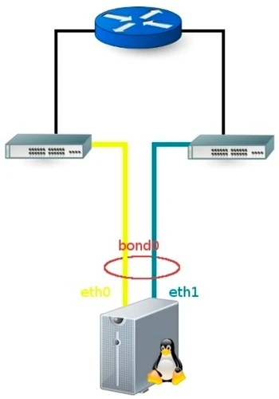

**Attention :** pour activer le bonding, le noyau Linux doit disposer du module `bonding`. Sans ce module, il est impossible de créer l’interface agrégée. De plus, il faut au minimum deux interfaces physiques actives pour constituer le lien redondant. Dans l’exemple ci-dessus, la pseudo-interface `bond0` agrège `eth0` et `eth1`.

Pour configurer un bonding, on crée trois fichiers `ifcfg*` dans le répertoire `/etc/sysconfig/network-scripts` : un pour chaque interface physique et un pour l’interface bondée.

Les modes de bonding définissent le comportement du regroupement de liens. Il en existe sept principaux :

- **Mode 0 :** équilibrage de charge (_balance round robin_) – envoie les paquets de manière circulaire sur chaque interface pour optimiser la bande passante.
- **Mode 1 :** _active-backup_ – seule une interface est active à la fois, l’autre prend le relais en cas de panne.
- **Mode 2 :** _balance XOR_ – sélection de l’interface selon une règle de XOR entre l’adresse MAC source et destination.
- **Mode 3 :** _broadcast_ – envoie les paquets sur toutes les interfaces simultanément.
- **Mode 4 :** 802.3ad (_Link Aggregation Control Protocol_) – agrégation dynamique standardisée, nécessite un switch compatible.
- **Mode 5 :** _Traffic Load Balancing (TLB)_ – répartition de la charge selon la charge réelle.
- **Mode 6 :** _Adaptive Load Balancing (ALB)_ – ajuste dynamiquement la répartition de charge et permet même de gérer la négociation ARP pour équilibrer les flux en réception.

**Dans les infrastructures de production, on privilégie souvent les modes 5 ou 6, car ils combinent souplesse et performance.** Une fois le module `bonding` chargé, on le configure dans `/etc/modprobe.d/bond0.conf` :

```shell
alias bond0 bonding
```

```shell
options bond0 miimon=100 mode=5
```

Le paramètre `miimon` définit l’intervalle de surveillance en millisecondes pour vérifier l’état des interfaces esclaves.

On commence par désactiver les interfaces physiques pour les basculer en mode esclave :

```shell
ifconfig eth0 down
```

```shell
ifconfig eth1 down
```

Ensuite, on crée l’interface `bond0` et on lui attribue une adresse MAC (souvent reprise de l’interface `eth0`) et une adresse IP statique :

```shell
ifconfig bond0 hw ether 00:17:56:BC:02:3A
```

```shell
ifconfig bond0 192.168.2.3 netmask 255.255.255.0 gateway 192.168.2.1
```

Il faut maintenant lier les interfaces physiques au bonding avec l’utilitaire `ifenslave` :

```shell
ifenslave bond0 eth0
```

```shell
ifenslave bond0 eth1
```

**Astuce :** pour retirer une interface du groupe sans arrêter l’ensemble, on utilise l’option `-d` :

```shell
ifenslave -d bond0 eth1
```

Côté configuration permanente, trois fichiers `ifcfg` doivent être créés dans `/etc/sysconfig/network-scripts` :

**Fichier `ifcfg-bond0` :**

```shell
DEVICE=bond0
ONBOOT=yes
BOOTPROTO=none
IPADDR=192.168.2.3
NETMASK=255.255.255.0
BROADCAST=192.168.2.255
GATEWAY=192.168.2.1
USERCTL=no
```

**Fichier `ifcfg-eth0` :**

```shell
DEVICE=eth0
USERCTL=no
ONBOOT=yes
MASTER=bond0
SLAVE=yes
```

**Fichier `ifcfg-eth1` :**

```shell
DEVICE=eth1
USERCTL=no
ONBOOT=yes
MASTER=bond0
SLAVE=yes
```

Une fois les fichiers prêts, on relance le service réseau pour activer la nouvelle configuration :

```shell
systemctl restart network
```

**Remarque :** en plus du bonding, Linux permet d’attribuer plusieurs adresses IP à une même interface via le mécanisme des alias. Ces alias se créent en ajoutant un suffixe à l’interface principale, séparé par `:`.

Exemple pour ajouter un alias `eth0:1` avec une IP supplémentaire :

```shell
ifconfig eth0:1 192.168.1.2 netmask 255.255.255.0 up
```

Il est alors nécessaire de créer un fichier de configuration pour cet alias :

```shell
DEVICE=eth0:1
BOOTPROTO=static
IPADDR=192.168.1.2
NETMASK=255.255.255.0
ONBOOT=yes
```

Et pour activer l’alias :

```shell
ifup eth0:1
```

Le bonding et le système d’alias IP offrent ainsi une grande flexibilité pour construire une architecture réseau robuste et adaptée aux besoins de haute disponibilité.

Dans la suite de ce cours, nous aborderons les particularités et la mise en œuvre de l’adressage IPv6.

# L’adressage IPv6
<partId>9b1d87f1-2a68-496e-b5dd-76cf74fb8cde</partId>

## IPv6 : Normes et définitions
<chapterId>d1f16f0a-1104-460d-8d67-f725665f8e3f</chapterId>

Nous abordons à présent la nouvelle génération d’adressage IP : le protocole IPv6, initialement désigné sous le nom d’IPng (_IP Next Generation_). Conçu pour surmonter les limites structurelles d’IPv4, ce protocole introduit une architecture d’adressage largement étendue, ainsi que de nombreuses optimisations techniques.

Les motivations qui ont conduit à l’adoption d’IPv6 sont multiples et répondent à des besoins critiques pour l’évolution d’Internet. Tout d’abord, IPv6 devait permettre de supporter la croissance exponentielle du nombre d’équipements connectés (un objectif inatteignable avec l’espace d’adressage limité d’IPv4). Ensuite, le protocole vise à réduire la taille des tables de routage, ce qui contribue à rendre les échanges plus efficaces et allège le travail des routeurs sur le long terme.

IPv6 ambitionne également de simplifier certains aspects du traitement des paquets, afin de fluidifier la circulation des datagrammes et d’optimiser la vitesse de transfert entre les réseaux. Du point de vue de la sécurité, IPv6 intègre nativement des fonctionnalités améliorées d’authentification et de confidentialité qui, bien qu’elles puissent être complétées par des mécanismes externes, représentent une avancée notable par rapport à IPv4.

Parmi les autres objectifs, on note une prise en compte plus fine des types de services, notamment pour garantir une meilleure qualité pour les applications temps réel (voix sur IP, visioconférence...). IPv6 doit également permettre une gestion plus souple de la mobilité : un appareil peut ainsi changer de point d’accès sans changer d’adresse de manière visible pour ses correspondants.

Enfin, IPv6 a été conçu pour coexister avec les protocoles historiques. S’il n’est pas directement compatible avec IPv4 sur le plan binaire, il reste parfaitement interopérable avec les couches supérieures comme TCP, UDP, ICMPv6, DNS, ainsi qu’avec les protocoles de routage tels qu’OSPF, BGP ou IGMP, moyennant certains ajustements pour la gestion des adresses étendues.

### Règles d’écriture

L’un des changements majeurs avec IPv6 est le format même de l’adresse IP. Pour résoudre la pénurie chronique d’adresses IPv4, la longueur de l’adresse a été portée à 128 bits, soit 16 octets, contre seulement 32 bits pour IPv4. En théorie, cela ouvre un champ d'adresses possibles de :

$$3,4 \times 10^{38}$$

Cela garantit ainsi une capacité quasi illimitée pour accueillir tous les équipements actuels et futurs.

L’écriture des adresses IPv6 diffère notablement de la notation décimale pointée classique. Une adresse IPv6 se compose de huit groupes de 16 bits, exprimés en hexadécimal et séparés par des deux-points `:`.

Par exemple :

```
1987:0c02:0000:84c2:0000:0000:cf2a:9077
```

Pour alléger cette écriture, les zéros en tête de chaque groupe peuvent être omis. L’exemple précédent devient alors :

```
1987:c02:0:84c2:0:0:cf2a:9077
```

De plus, une seule séquence continue de groupes de zéros peut être remplacée par la notation `::`, ce qui permet de condenser l’adresse :

```
1987:c02:0:84c2::cf2a:9077
```

**Attention :** la règle est stricte : une seule et unique séquence de zéros consécutifs peut être abrégée par `::`. Si une adresse comporte plusieurs suites de zéros, seule la plus longue est condensée. C’est ce principe qui garantit l’unicité et la lisibilité de l’adresse.

**Particularité importante :** le caractère `:` utilisé pour séparer les blocs hexadécimaux pose un problème potentiel dans les URL, car `:` sert également à indiquer le port du service. Pour lever toute ambiguïté, les adresses IPv6 insérées dans une URL doivent obligatoirement être encadrées par des crochets `[ ]`.

Exemple d’accès HTTP sur un port spécifique pour l’adresse `2002:400:2A41:378::34A2:36` :

```
http://[2002:400:2A41:378::34A2:36]:8080
```

Lorsque l’on souhaite exprimer une adresse IPv4 dans un contexte IPv6, on peut employer une notation mixte en décimal pointé, précédée de la chaîne `::` :

```
::192.168.1.5
```

Cette compatibilité facilite la transition entre les deux protocoles en permettant d’inclure des blocs IPv4 dans l’espace IPv6.

**Note :** pour uniformiser les représentations, la RFC 5952 définit un format canonique qui précise les règles d’abréviation à suivre pour éviter les variantes multiples d’une même adresse. Bien respecter ces recommandations contribue à limiter les erreurs d’interprétation et à garantir la cohérence des configurations réseau.

### Les types d’adresses IPv6

L’adressage IPv6 se distingue de son prédécesseur par une grande diversité de catégories d’adresses, chacune conçue pour répondre à des usages précis, tout en garantissant une flexibilité d’acheminement et de gestion du réseau. Comme en IPv4, on y retrouve des adresses globales, locales, réservées ou spécifiques à certains mécanismes de transition.

Une adresse IPv6 non spécifiée est représentée par `::` ou, sous forme plus explicite, `::0.0.0.0`. Cette forme particulière sert notamment lors de l’acquisition d’une adresse ou comme valeur par défaut pour indiquer l’absence d’adresse.

| IPv6 Address Prefix | Description                                 |
| ------------------- | ------------------------------------------- |
| ::/8                | Reserved addresses                          |
| 2000::/3            | Unicast addresses, routable on the Internet |
| fc00::/7            | Unique local addresses (1)                  |
| fe80::/10           | Link-local addresses                        |
| ff00::/8            | Multicast addresses                         |

(1) : *Sur un réseau local privé, on privilégie le préfixe `fd00::/8` pour affecter des adresses internes non routables sur Internet.*

#### Adresses réservées

Certaines plages IPv6 sont explicitement réservées et ne doivent pas être utilisées comme adresses globales. Elles ont un rôle technique bien défini :

- **`::/128`** : adresse non spécifiée, jamais attribuée à un équipement de façon persistante, mais utilisée comme adresse source par une machine en attente de configuration.
- **`::1/128`** : l’adresse de _loopback_, équivalent direct de `127.0.0.1` en IPv4, qui permet à une machine de s’adresser à elle-même.
- **`64:ff9b::/96`** : bloc réservé aux traducteurs de protocoles pour l’interconnexion IPv4/IPv6, tel que défini dans la RFC6052.
- **`::ffff:0:0/96`** : bloc de compatibilité pour représenter une adresse IPv4 dans une structure IPv6 spécifique, souvent utilisé en interne par les applications.
- **`::ffff:0:0:0/96`** : bloc similaire pour les adresses IPv4 traduites, défini par la RFC2765, principalement pour des usages précis de transition.

Ces blocs garantissent l’interopérabilité et facilitent la migration entre les deux versions du protocole.

#### Adresses globales unicast

Les adresses globales unicast constituent l’essentiel de l’espace IPv6 routable publiquement. Elles représentent environ 1/8ème de l’espace d’adressage. Depuis 1999, l’IANA attribue ces blocs, tels que le préfixe `2001::/16`, par blocs CIDR (de `/23` à `/12`) aux registres régionaux, qui les redistribuent ensuite aux fournisseurs et aux organisations.

Certaines plages ont des usages documentés particuliers :

- **`2001:2::/48`** : réservée aux tests de performance et d’interopérabilité, RFC5180.
- **`2001:db8::/32`** : réservée à la documentation et aux exemples, RFC3849.
- **`2002::/16`** : utilisée pour le mécanisme 6to4, qui permet de transporter du trafic IPv6 à travers une infrastructure IPv4 (important pour la phase de transition entre les deux protocoles).

**À noter :** une large part des adresses globales reste encore inexploitée et constitue une réserve pour les extensions futures d'Internet.

#### Adresses locales uniques (ULA)

Les adresses locales uniques (`fc00::/7`) sont l’équivalent IPv6 des adresses privées IPv4 (RFC1918). Elles permettent de créer des réseaux internes isolés sans risque de conflit avec l’adressage public. Dans la pratique, le préfixe effectif est `fd00::/8`, le 8ème bit étant fixé à 1 pour définir l’usage local. Chaque bloc ULA intègre un identifiant pseudo-aléatoire de 40 bits, ce qui minimise ainsi les collisions d’adresses en cas d’interconnexion de réseaux privés distincts.

#### Adresses locales de lien (Link-local)

Les adresses link-local (`fe80::/64`) servent exclusivement aux communications internes sur un même segment de niveau 2 (même VLAN ou switch). Elles ne sont jamais routées au-delà du lien local. Chaque interface réseau génère automatiquement une adresse link-local, souvent dérivée de son adresse MAC via le schéma EUI-64.

Particularité : une même machine peut utiliser la même adresse link-local sur plusieurs interfaces, à condition de préciser l’interface lors des communications pour éviter toute ambiguïté.

#### Adresses multicast

En IPv6, le concept de broadcast disparaît au profit du multicast, plus efficace pour diffuser des paquets à un groupe de destinataires définis. La plage multicast est préfixée par `ff00::/8`. Parmi ces adresses, on trouve par exemple `ff02::1`, qui cible tous les nœuds du lien local. Bien que pratique, cette adresse est désormais déconseillée pour les applications, car elle peut générer des diffusions non contrôlées.

Un usage fréquent du multicast concerne le _Neighbor Discovery Protocol_ (NDP), qui remplace ARP en IPv6. NDP s’appuie sur des adresses multicast spécifiques, comme `ff02::1:ff00:0/104`, pour découvrir automatiquement les autres hôtes connectés au même lien.

En combinant ces types d’adresses, IPv6 offre une palette complète pour répondre aux besoins de routage global, de communications locales, de migration IPv4/IPv6 et d’autoconfiguration des équipements tout en améliorant l’efficacité des transmissions réseau.

### Périmètre des adresses

La portée d’une adresse IPv6 (*scope*), définit précisément le domaine dans lequel cette adresse est considérée comme valide et unique. Comprendre cette notion est important pour maîtriser l’acheminement des paquets et l’organisation logique d’un réseau fonctionnant en IPv6. On regroupe généralement les adresses IPv6 en trois grandes catégories selon leur périmètre et leur mode d’utilisation : unicast, anycast et multicast.

Les **adresses unicast** constituent la catégorie la plus courante et englobent plusieurs sous-types bien distincts. Elles regroupent notamment l’adresse _loopback_ (`::1`), dont la portée est strictement limitée à l’hôte qui l’utilise, et qui permet de tester la pile réseau en interne sans émettre de trafic sur le réseau physique. À cela s’ajoutent les adresses locales de lien (_link-local_) dont la portée est restreinte à un segment de réseau unique : elles servent aux communications directes entre équipements situés sur le même lien physique ou logique (par exemple un switch ou un VLAN unique). Enfin, les adresses locales uniques (_ULA_, pour _Unique Local Addresses_) correspondent à des plages d’adresses internes à un réseau d’entreprise ; elles ont une portée potentiellement plus large car elles peuvent être routées à travers plusieurs segments privés mais ne sont jamais visibles sur Internet.

Ce découpage conceptuel se matérialise souvent par une structure binaire où la première partie de l’adresse (les 64 premiers bits) identifie le préfixe réseau et la seconde moitié (64 bits également) identifie de façon unique l’interface de l’équipement sur ce réseau. Cette séparation facilite l’autoconfiguration des adresses grâce aux mécanismes comme SLAAC (_Stateless Address Autoconfiguration_), qui permettent aux machines de générer automatiquement une adresse stable basée sur l’adresse MAC ou un identifiant pseudo-aléatoire.

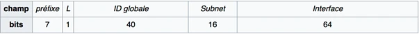

L’architecture IPv6 reprend le modèle hiérarchique du routage global de l’Internet actuel : le découpage des préfixes permet aux registres régionaux et aux opérateurs de gérer la distribution d’adresses de façon décentralisée, tout en assurant l’unicité globale. C’est dans ce cadre qu’un même hôte peut posséder simultanément une adresse unicast globale, pour communiquer sur Internet, et une adresse link-local pour interagir localement, par exemple pour le voisinage immédiat ou les messages de découverte de routeur.


Les **adresses anycast** représentent une notion intermédiaire qui tire parti du modèle unicast tout en offrant un comportement proche du multicast dans certains cas. Une adresse anycast est, en réalité, une adresse unicast affectée à plusieurs interfaces réparties sur différents nœuds du réseau. Lorsqu’un paquet est émis vers une adresse anycast, le protocole IPv6 s’efforce de le livrer à l’un des hôtes partageant cette adresse, en privilégiant généralement celui qui est le plus proche selon la topologie du routage. Ce principe optimise la rapidité de traitement des requêtes et améliore la résilience des services distribués : l’exemple typique est celui des serveurs DNS racine, pour lesquels l’adressage anycast permet de diriger automatiquement les requêtes vers le point de présence le plus proche.

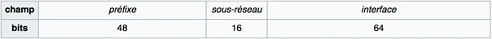

Enfin, les **adresses multicast** remplacent dans IPv6 le mécanisme de broadcast, jugé trop coûteux et inadapté à l’échelle d’un réseau mondial. Une adresse multicast identifie un groupe d’interfaces, généralement dispersées sur plusieurs hôtes, qui souhaitent recevoir simultanément les mêmes paquets. Pour chaque adresse multicast, la portée est spécifiée par un champ particulier : les 4 bits de _scope_ inclus dans la structure de l’adresse. Ces bits définissent la limite géographique ou logique de diffusion :

- Un scope de `1` signifie que le paquet est destiné uniquement à l’équipement local.
- Un scope de `2` indique une portée limitée au lien local : tous les équipements sur le même segment physique ou virtuel peuvent recevoir le message.
- Un scope de `5` étend la portée au site, typiquement à l’ensemble d’un réseau d’entreprise interne.
- Un scope de `8` étend la portée à une organisation, permettant la diffusion à tous les sous-réseaux d’une même entité.
- Enfin, un scope de `e` (14 en hexadécimal) désigne une portée globale, qui rend le groupe multicast accessible depuis Internet tout entier, sous réserve que l’infrastructure de routage le permette.

Chaque adresse multicast IPv6 est structurée en plusieurs champs : un champ _Flag_ (4 bits) précise notamment si le groupe est permanent ou transitoire, un champ _Scope_ (4 bits) définit la portée, et un champ d’identification (112 bits) indique le numéro du groupe multicast.


Un exemple emblématique de multicast IPv6 est l’utilisation par le protocole _Neighbor Discovery Protocol_ (NDP). Plutôt que de recourir à ARP comme en IPv4, NDP s’appuie sur des adresses multicast comme `ff02::1:ff00:0/104` pour diffuser ses requêtes de découverte de voisinage, en sollicitant uniquement les hôtes concernés sur le même lien.

Ainsi, le périmètre des adresses IPv6 structure finement la manière dont les flux de données sont émis, reçus et routés. Cette granularité rend le protocole plus souple et plus performant pour gérer les communications locales comme globales, tout en évitant les inconvénients d’un broadcast généralisé.

## Assignation des adresses dans un réseau local
<chapterId>4c9c3e52-59bc-499a-af0a-6dd369a9e029</chapterId>

Dans ce chapitre, nous allons aborder l’un des aspects les plus concrets de la mise en œuvre d’IPv6 : l’assignation des adresses IP aux hôtes dans un réseau local. L’architecture IPv6 a été pensée pour offrir une grande souplesse et permettre à chaque machine de générer automatiquement sa propre adresse, tout en laissant la possibilité d’une configuration entièrement manuelle.

Un réseau local IPv6 repose sur un découpage systématique de l’adresse en deux parties : les 64 premiers bits représentent le préfixe du sous-réseau, fourni généralement par un routeur ou une autorité d’adressage, tandis que les 64 bits restants sont utilisés par l’hôte pour s’identifier de manière unique sur ce segment. Ce modèle simplifie grandement l’agrégation des routes et la gestion des blocs d’adresses.

Pour attribuer des adresses aux équipements, deux approches principales sont utilisées :
- La configuration manuelle, dans laquelle l’administrateur spécifie précisément l’adresse de chaque interface ;
- La configuration automatique, qui permet aux équipements de générer ou d’obtenir dynamiquement leur propre adresse.

Dans le cas d’une configuration manuelle, l’administrateur définit l’adresse IPv6 complète sur chaque interface. Les adresses composées uniquement de zéros ou de uns n’ont pas de signification particulière en IPv6, contrairement à IPv4 où certaines valeurs réservées existent pour les adresses de réseau ou de diffusion. Cette approche reste pertinente dans des environnements maîtrisés, mais elle devient vite lourde à maintenir à grande échelle.

En configuration automatique, plusieurs méthodes existent pour permettre aux équipements d’obtenir une adresse IPv6 fonctionnelle sans intervention manuelle. Le protocole **NDP** (_Neighbor Discovery Protocol_), spécifié par la RFC4862, permet l’auto-configuration *stateless*. Dans ce mode, l’hôte reçoit un préfixe réseau depuis un routeur local, et complète lui-même l’adresse avec un identifiant basé sur son adresse MAC. Cette méthode est extrêmement simple à mettre en œuvre et ne nécessite aucun serveur central.

Certaines implémentations, comme celles présentes dans les systèmes Windows, peuvent utiliser un tirage pseudo-aléatoire pour générer la partie hôte de l’adresse, ce qui améliore la confidentialité par rapport à l’utilisation directe de l’adresse MAC. En effet, la visibilité de l’adresse MAC dans les paquets IPv6 pose des problèmes de protection de la vie privée, car elle permet de suivre un appareil dans différents contextes réseau.

Une autre méthode largement utilisée est l’emploi du protocole DHCPv6, spécifié dans la RFC3315. Similaire au DHCP utilisé en IPv4, il permet une configuration plus contrôlée, centralisée, avec gestion des baux, options supplémentaires (DNS, MTU...), et enregistrement dans des bases de données. DHCPv6 peut être utilisé seul ou en complément de la configuration stateless pour fournir des paramètres annexes sans forcément attribuer l’adresse IP elle-même.

**Remarque importante :** lorsqu’on utilise la méthode basée sur l’adresse MAC, celle-ci est transformée en identifiant de 64 bits par le mécanisme EUI-64. Ce mécanisme insère les octets `FF:FE` au centre de l’adresse MAC d’origine (en 48 bits), et inverse le 7ème bit pour marquer l’unicité globale. Cela donne un identifiant d’interface stable, utilisé dans l’adresse IPv6 complète.

Voici un exemple de transformation d’une adresse MAC en EUI-64 :


Cependant, en raison des inquiétudes croissantes autour du traçage des appareils, les systèmes d’exploitation modernes (notamment Linux, Windows 10+, macOS, Android) proposent par défaut des mécanismes de "privacy extension", qui utilisent des identifiants d’interface aléatoires renouvelés périodiquement pour les connexions sortantes, tout en conservant un identifiant stable pour les communications internes (DNS, DHCPv6…).

Comme pour le DHCP en IPv4, les adresses IPv6 automatiquement assignées peuvent être associées à deux durées de vie définies par les routeurs ou serveurs DHCPv6 :
- *Preferred lifetime* : au-delà de cette durée, l’adresse reste valide, mais elle n’est plus utilisée pour initier de nouvelles connexions ;
- *Valid lifetime* : lorsque cette durée expire, l’adresse est entièrement retirée de la configuration de l’interface.

Cette logique permet de gérer dynamiquement l’évolution du réseau, en assurant par exemple une transition fluide d’un ancien fournisseur d’accès à un nouveau. En mettant à jour le préfixe annoncé par les routeurs et en ajustant les enregistrements DNS en parallèle, il est possible d’opérer une migration IPv6 sans interruption de service perceptible.

**Astuce :** l’utilisation combinée des durées de vie des adresses et des DNS permet de mettre en place une stratégie de transition progressive, où les nouvelles connexions s’orientent vers une nouvelle topologie, tandis que les anciennes terminent leur cycle de vie de façon transparente.

En résumé, IPv6 propose une flexibilité très étendue pour l’assignation des adresses : configuration manuelle, auto-configuration avec ou sans état, DHCPv6, ou encore génération aléatoire. Chaque approche a ses avantages et ses contraintes, et peut être adaptée en fonction du niveau de contrôle requis, de la taille du réseau, ou encore des exigences en matière de confidentialité.


## Assignation des blocs d’adresses IPv6
<chapterId>45cce866-1b58-4888-b3fe-15c922180839</chapterId>

### Distribution des adresses

Le plan d’allocation des adresses IPv6 a été structuré pour répondre à deux objectifs : garantir l’unicité globale des adresses et permettre une hiérarchisation logique favorisant l’agrégation et la simplification des tables de routage. À l’instar d’IPv4, l’*Internet Assigned Numbers Authority* (IANA) reste au sommet de cette hiérarchie. C’est elle qui gère l’espace d’adressage unicast global et délègue des blocs d’adresses aux cinq registres Internet régionaux (_RIR_).

Les cinq RIR existants sont :
- ARIN (Amérique du Nord),
- RIPE NCC (Europe, Moyen-Orient, Asie centrale),
- APNIC (Asie-Pacifique),
- AFRINIC (Afrique),
- LACNIC (Amérique latine et Caraïbes).

L’IANA attribue à chaque RIR des blocs IPv6 de taille variable, généralement compris entre /23 et /12. Ces tailles permettent une grande souplesse tout en assurant l’évolutivité à long terme. Une fois ces blocs reçus, les RIR sont chargés de les redistribuer aux fournisseurs d’accès à Internet (FAI), aux grandes entreprises ou à des institutions publiques.

Les FAI se voient le plus souvent attribuer des blocs de type /32, bien que cette taille puisse varier selon la taille du FAI et sa zone géographique. À leur tour, ils peuvent allouer à chacun de leurs clients un bloc de /48, ce qui offre à chaque organisation 65 536 sous-réseaux distincts de /64 (ce qui est extrêmement généreux comparé à IPv4).

**Remarque importante :** un bloc /32 contient exactement 65 536 sous-blocs /48. On comprend ainsi que chaque FAI peut desservir plusieurs dizaines de milliers de clients sans manquer d’adresses. Chaque client disposera alors, grâce à son /48, d’un espace gigantesque pour structurer son propre réseau interne avec autant de segments /64 qu’il le souhaite.

Cette hiérarchie peut se visualiser dans le tableau suivant, qui illustre les tailles typiques de blocs alloués à chaque niveau :

| IANA | RIR | LIR | Customer | Subnet | Interface |
|------|-----|-----|----------|--------|-----------|
|  3   | 20  |  9  |    16    |   16   |     64    |

Avec cette abondance d’adresses, le recours au NAT (*Network Address Translation*), devenu quasi indispensable en IPv4 pour pallier la pénurie d’adresses publiques, n’a plus lieu d’être. Chaque hôte connecté à Internet peut disposer d’une adresse publique unique et globale, ce qui simplifie la connectivité de bout en bout et facilite l’usage de protocoles comme IPSec, VoIP ou les connexions entrantes.

Pour vérifier à quel organisme une adresse IPv6 a été attribuée, on peut utiliser la commande `whois`, qui interroge les bases de données publiques des RIR. Cette transparence permet d’identifier l’organisation propriétaire d’un préfixe, ce qui peut être utile pour des questions de réseau, d’analyse ou de sécurité.

### Adressage PA vs PI

À l’origine, le modèle d’allocation IPv6 prévoyait uniquement l’usage de blocs de type PA (*Provider Aggregatable*), c’est-à-dire liés au fournisseur d’accès. Dans ce modèle, l’organisation cliente reçoit son préfixe du FAI, ce qui implique qu’en cas de changement de fournisseur, elle devra renuméroter l’ensemble de son infrastructure.

Ce mécanisme est facilité par les capacités d’auto-configuration d’IPv6 et la gestion des durées de vie des adresses, mais il reste contraignant pour les entreprises ayant des infrastructures critiques ou des exigences de redondance avec plusieurs fournisseurs.

C’est pourquoi, à partir de 2009, les politiques d’attribution ont été élargies pour permettre l’existence de blocs PI (*Provider Independent*). Ces blocs (généralement de taille /48) sont attribués directement à une entreprise ou une institution par un RIR, indépendamment de tout FAI. Ce modèle est particulièrement adapté aux organisations pratiquant le *multihoming*, c’est-à-dire connectées à plusieurs opérateurs simultanément. Le document RIPE-512 détaille précisément la politique européenne d’attribution de ces blocs PI par exemple.

### Notation des masques de sous-réseau

La notation des sous-réseaux en IPv6 utilise, tout comme en IPv4, la notation CIDR (*Classless Inter-Domain Routing*). Elle consiste à indiquer, après l’adresse, le nombre de bits constituant le préfixe, à l’aide du caractère `/`.

Prenons l’exemple suivant :

```
2001:db8:1:1a0::/59
```

Cela signifie que les 59 premiers bits sont fixes et désignent le réseau. Tous les bits restants (ici 69 bits) peuvent varier pour identifier des sous-réseaux ou des hôtes.

Ainsi, cette notation couvre les adresses allant de `2001:db8:1:1a0:0:0:0:0` à `2001:db8:1:1bf:ffff:ffff:ffff:ffff`.

Ce bloc couvre donc un ensemble de 8 sous-réseaux /64, chacun pouvant accueillir un très grand nombre d’hôtes.

La souplesse offerte par cette notation permet une planification fine de l’espace d’adressage, aussi bien dans les grandes infrastructures que dans les réseaux domestiques ou les environnements virtualisés. Elle favorise également l’agrégation des routes, réduisant la charge sur les routeurs et facilitant le déploiement à grande échelle.

### Paquets IPv6 et en-têtes

Le format d’un paquet IPv6 se distingue de son prédécesseur IPv4 par sa simplicité apparente et sa grande extensibilité. Un datagramme IPv6 débute toujours par un en-tête de taille fixe de 40 octets, qui contient les informations essentielles au routage du paquet. Ce choix bien plus épuré que l’en-tête IPv4 (qui pouvait varier de 20 à 60 octets) permet de traiter les paquets plus rapidement et plus efficacement dans les routeurs.

Toutefois, IPv6 ne sacrifie pas les fonctionnalités : au lieu d’intégrer de nombreux champs optionnels dans l’en-tête principal, il introduit un système d’en-têtes d’extension, placés immédiatement après l’en-tête de base. Ces en-têtes facultatifs permettent d’ajouter des données ou des instructions spécifiques à certaines fonctionnalités sans alourdir inutilement le traitement des paquets ordinaires.

Certains de ces en-têtes suivent un format rigide, mais d'autres sont conçus pour contenir un nombre variable d’options. Dans ces cas-là, chaque option est encodée selon un triplet `{Type, Longueur, Valeur}` :

- Le champ "Type" (1 octet) indique la nature de l’option ;
- Les deux premiers bits du "Type" précisent la conduite à adopter par les routeurs si l’option n’est pas reconnue :
	- Ignorer l’option et continuer le traitement,
	- Supprimer le datagramme,
	- Supprimer le datagramme et retourner un message ICMP d’erreur à la source,
	- Supprimer le datagramme sans notification (dans le cas de paquets multicast).
- Le champ "Longueur" (1 octet) spécifie la taille du champ "Valeur", compris entre 0 et 255 octets ;
- Le champ "Valeur" contient les données associées à l’option.

Voici un aperçu des différents types d’en-têtes d’extension définis par IPv6.

#### En-tête Hop-by-Hop

Cet en-tête, s’il est présent, est toujours placé immédiatement après l’en-tête de base. Il contient des informations destinées à être lues par chaque routeur traversé, ce qui le distingue des autres en-têtes généralement traités uniquement par la destination. Il est typiquement utilisé pour signaler des paramètres globaux ou déclencher des traitements spécifiques tout au long du trajet.

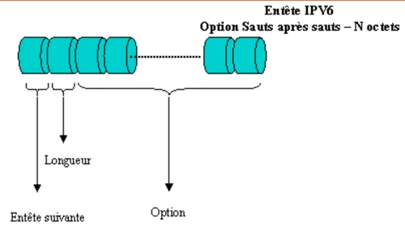

#### En-tête de routage

L’en-tête de routage permet de spécifier une liste d’adresses intermédiaires par lesquelles le paquet doit transiter. On distingue deux grandes approches :
- Le routage strict : le chemin exact est déterminé à l’avance ;
- Le routage lâche : seules certaines étapes obligatoires sont spécifiées.

Les quatre premiers champs de cet en-tête sont les suivants :
- **Next Header** : identifie le type de l’en-tête suivant ;
- **Routing Type** : définit la méthode de routage (généralement `0`) ;
- **Segments Left** : nombre de segments restant à parcourir ;
- **Address[n]** : liste des adresses intermédiaires.

Le champ "Segments Left" débute à zéro, puis est incrémenté à chaque étape pour indiquer quelle adresse doit être atteinte en priorité.


#### En-tête de fragmentation

Contrairement à IPv4, où les routeurs pouvaient fragmenter les paquets, seul l’hôte source est autorisé à fragmenter les datagrammes en IPv6. Cela permet d’alléger la charge des routeurs intermédiaires et d’optimiser la transmission.

Tous les nœuds IPv6 doivent néanmoins pouvoir transmettre des datagrammes d’au moins 576 octets. Si un datagramme trop volumineux ne peut être acheminé, le routeur renvoie un message ICMPv6 à la source, l’informant que le paquet est trop grand. L’hôte source ajuste alors sa taille.

L’en-tête de fragmentation contient les champs suivants :
- **Identification** : identifiant du datagramme pour reconstitution.
- **Fragment Offset** : position du fragment dans le datagramme original.
- **M flag** : indique s’il reste d’autres fragments.

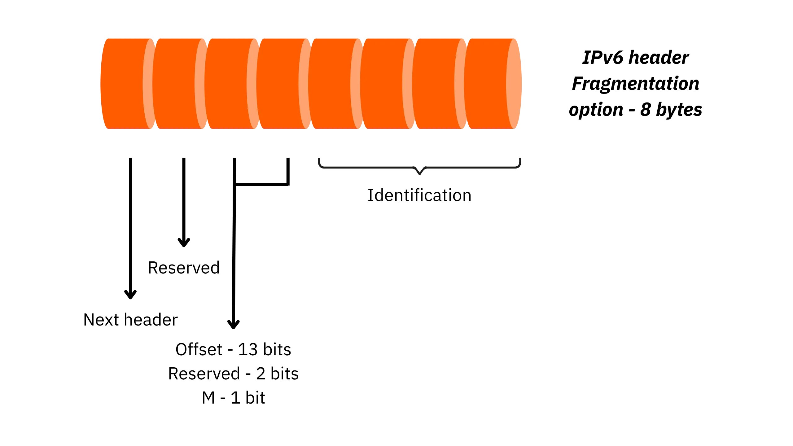

#### En-tête d’authentification (AH)

Cet en-tête vise à sécuriser les communications en garantissant l’authenticité de l’émetteur et l’intégrité des données. Il est utilisé notamment avec le protocole IPsec. Grâce à un code de vérification (authentificateur), le destinataire peut s’assurer que le message provient bien de l’expéditeur attendu et qu’il n’a pas été altéré en cours de route.

En cas de tentative de modification frauduleuse, le code d’authentification ne correspondra plus, et le datagramme pourra être rejeté. Ce mécanisme permet également de lutter contre les attaques par rejeu, en détectant les duplications non autorisées.

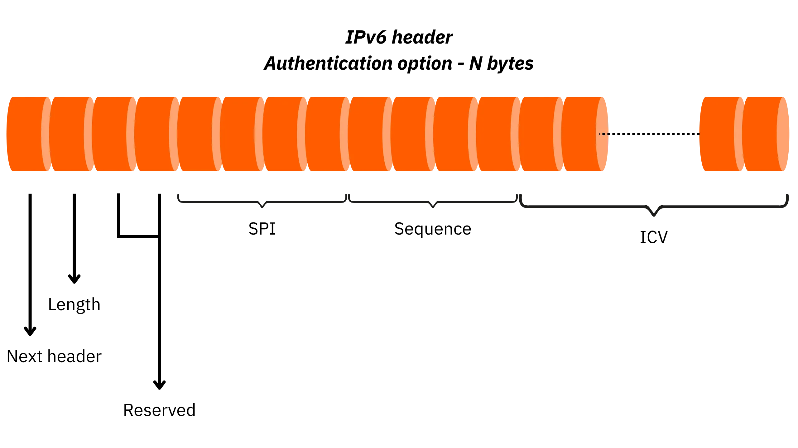

#### En-tête Option de destination

Cet en-tête est destiné uniquement au destinataire final du datagramme. Il permet d’ajouter des options ou des métadonnées propres à l’application, sans que les routeurs intermédiaires n’en tiennent compte.

Initialement, aucune option de ce type n’était définie dans le protocole. Toutefois, cet en-tête a été introduit dès la conception d’IPv6 pour permettre l’ajout futur d’extensions sans modifier la structure globale des paquets. L’option nulle, par exemple, sert uniquement à compléter l’en-tête jusqu’à un multiple de 8 octets, pour des raisons d’alignement mémoire.

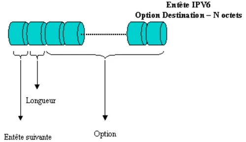


La conception des paquets IPv6 repose donc sur une séparation claire entre un en-tête de base minimaliste et des en-têtes d’extension optionnels, introduits de manière modulaire. Cette architecture garantit à la fois la performance du traitement standard et la souplesse nécessaire pour faire évoluer le protocole, intégrer des mécanismes de sécurité, de routage complexe ou de qualité de service, tout en maintenant la compatibilité avec les infrastructures futures.

## Relation entre IPv6 et DNS
<chapterId>421eacb8-b80b-4aee-910f-e069ed805f00</chapterId>

Dans les réseaux modernes, le DNS (*Domain Name System*) permet la traduction des noms de domaine en adresses IP utilisables par les machines. Avec l’introduction d’IPv6, le DNS a naturellement dû s’adapter pour supporter les nouvelles adresses sur 128 bits, tout en maintenant la compatibilité avec IPv4. Cette coexistence est importante dans les environnements dual-stack où les deux versions du protocole IP cohabitent.

### Enregistrements DNS spécifiques à IPv6

Pour associer un nom de domaine à une adresse IPv6, le DNS utilise un enregistrement de type AAAA (*quad-A*), par analogie avec le type "A" utilisé pour les adresses IPv4. L’enregistrement AAAA permet donc d’indiquer qu’un nom de domaine correspond à une adresse IPv6 donnée. Voici un exemple concret :

```shell
ipv6.mydmn.org.         IN      AAAA    2001:66c:2a8:22::c100:68b
```

Cet enregistrement indique que le domaine `ipv6.mydmn.org` est associé à l’adresse IPv6 `2001:66c:2a8:22::c100:68b`. Il est tout à fait possible, et même recommandé dans un contexte de compatibilité, d’associer un même nom de domaine à plusieurs adresses IP, qu’elles soient de type IPv4 (via un enregistrement A) ou IPv6 (via un enregistrement AAAA). Cela permet aux clients compatibles IPv6 de préférer cette version du protocole, tout en assurant le fonctionnement pour ceux qui ne supportent qu’IPv4.

Par ailleurs, le DNS prend également en charge la résolution inverse, c’est-à-dire la correspondance entre une adresse IP et un nom de domaine. Dans le cas d’IPv6, cette opération utilise des enregistrements de type PTR placés dans la zone `ip6.arpa`. Cette zone est spécifiquement réservée pour les résolutions inverses IPv6, à l’instar de la zone `in-addr.arpa` pour IPv4.

### Résolution inverse

La résolution inverse d’une adresse IPv6 suit une règle stricte : on transforme l’adresse en notation hexadécimale complète (16 octets, soit 32 caractères), on inverse l’ordre de chaque chiffre hexadécimal, et on les sépare par des points, en suffixant le tout avec `ip6.arpa`. Par exemple, pour l’adresse suivante :

```shell
2001:66c:2a8:22::c100:68b
```

Sa version complète serait :

```shell
2001:066c:02a8:0022:0000:0000:c100:068b
```

Et sa résolution inverse se présente ainsi :

```shell
b.8.6.0.0.1.c.0.0.0.0.0.0.0.0.2.2.8.a.2.c.6.6.1.0.0.2.ip6.arpa. IN PTR    ipv6.mydmn.org.
```

Cette méthode garantit l’unicité et la standardisation des résolutions inverses dans l’espace d’adressage IPv6.

**Attention** : les requêtes DNS peuvent être envoyées indifféremment sur une liaison IPv4 ou IPv6. Le protocole de transport utilisé n’a aucune influence sur le type de réponse attendue. En d’autres termes, un client connecté en IPv6 peut tout à fait demander une adresse IPv4, et inversement. Le serveur DNS doit donc fournir les informations disponibles, sans se baser sur le protocole utilisé par le client pour la requête.

Le choix entre une adresse IPv4 ou IPv6 à utiliser pour se connecter à une machine cible, lorsqu’un nom d’hôte est associé aux deux types d’adresses, est régi par la RFC 6724. Cette norme définit un algorithme de sélection des adresses basé sur des critères tels que la proximité, la portée, ou la préférence explicite de certains préfixes. Par défaut, IPv6 est généralement prioritaire sur IPv4, sauf configuration contraire imposée par l’administrateur du système ou du réseau.

**Rappel important** : lorsqu’une adresse IPv6 doit être utilisée dans une URL (*Uniform Resource Locator*), elle doit impérativement être encadrée par des crochets (`[]`). Cela permet d’éviter toute confusion entre les deux-points (`:`) utilisés pour séparer les segments de l’adresse IPv6 et ceux qui sont utilisés dans l’URL pour séparer le nom de l’hôte du port de service.

Exemple valide :

```shell
http://[2001:db8::1]:8080
```

Cela garantit un traitement correct de l’URL, aussi bien par les navigateurs que par les serveurs web.

L’intégration d’IPv6 dans le système DNS repose donc sur de nouveaux types d’enregistrements, une méthode stricte pour les résolutions inverses, et des règles précises de sélection et de formatage qui assurent la compatibilité et la cohérence du routage.

### Synthèse de la partie

Dans cette partie, nous avons exploré en détail les principes fondamentaux qui régissent l’adressage IPv6. Nous avons d’abord expliqué la manière dont une adresse IPv6 est structurée, en insistant sur sa longueur de 128 bits, sa notation hexadécimale, ainsi que sur les différentes règles de simplification d’écriture permettant de raccourcir certaines séquences répétitives de zéros. Cette structure permet à IPv6 de surmonter les limitations de l’espace d’adressage d’IPv4, tout en apportant des garanties de scalabilité et de hiérarchisation efficaces.

Nous avons ensuite examiné les différentes catégories d’adresses IPv6 : unicast, anycast et multicast, en détaillant pour chacune leurs portées, leur utilisation typique et leur représentation dans l’espace d’adressage.

Par la suite, nous avons étudié les méthodes d’assignation des adresses IPv6 dans un réseau local, que ce soit via une configuration manuelle, via le protocole DHCPv6, ou encore grâce à des mécanismes d’autoconfiguration sans état comme ceux proposés par NDP. Ces approches permettent aux équipements de générer automatiquement leur propre adresse à partir du préfixe reçu et de leur adresse MAC (via EUI-64), tout en assurant une certaine flexibilité en matière de gestion de durée de vie et de confidentialité.

Nous avons également détaillé la manière dont les blocs d’adresses sont alloués, en partant de l’IANA, qui les distribue aux cinq RIR (*Registres Internet Régionaux*), puis aux fournisseurs d’accès, qui les redistribuent à leurs clients sous forme de sous-réseaux (souvent en /48, permettant 65536 sous-réseaux /64). La distinction entre les blocs _Provider Aggregatable_ (PA) et _Provider Independent_ (PI) permet de gérer des situations de _multihoming_ ou de changement de fournisseur.

Nous avons vu que le DNS s’adapte à IPv6 grâce à l’enregistrement AAAA et que les mécanismes de résolution inverse utilisent une nouvelle structure dans la zone `ip6.arpa`. Le protocole DNS reste indépendant du protocole de transport utilisé (IPv4 ou IPv6), ce qui assure une parfaite interopérabilité dans un environnement dual-stack.

IPv6 n’est donc pas une simple évolution de son prédécesseur, mais bien une refonte en profondeur du système d’adressage, pensée pour les défis actuels et futurs du réseau mondial.

Dans la dernière partie de ce cours NET 302, nous allons passer à la pratique et nous intéresser aux outils de diagnostic réseau.


# Outils de diagnostic réseau
<partId>368a5c6f-ec48-4b28-970f-3a770788ad37</partId>

## Les outils de la couche Accès Réseau
<chapterId>1d25a21d-6900-4fbe-a438-e06c8afb9e02</chapterId>

**Cette partie s’intéresse à l’utilisation concrète de l’adressage IP et aux outils Linux, permettant de diagnostiquer ou d’auditer un réseau d’entreprise. On balaiera chaque couche du modèle TCP/IP en détaillant les différents outils propres à cette partie :**

- Couche Accès Réseau  
- Couche Réseau  
- Couche Transport/Application

On étudiera également l’aspect paquets au travers d’outils comme tcpdump et/ou wireshark. Pour finir, on listera les principaux ports de services utilisés par les protocoles du modèle TCP/IP.

Au travers de ces outils, il s’agit avant tout de savoir identifier un éventuel problème et de surtout connaître parfaitement son système afin de le configurer de façon optimum.

### Outil arp

On en a déjà parlé précédemment, mais le premier outil pour analyser le réseau sur la couche ACCES RESEAU s’appelle arp. Il permet, à partir d’une adresse MAC (ou adresse Ethernet) de récupérer la correspondance d’adresse IP et de visualiser, le cas échant la table de routage.

Ainsi, pour faire afficher toutes les tables en cours d’utilisation au sein du cache ARP, au niveau de toutes les interfaces, on peut interroger l’outil de la façon suivante :

```shell
arp -a
```

Si on souhaite visualiser les entrées du cache ARP pour une adresse IP spécifique, il suffit de passer celle-ci en paramètre à la commande :

```shell
arp -a 192.168.1.5
```

Si, au lieu d’une seule adresse IP, on souhaite visualiser les entrées du cache ARP pour une interface réseau particulier, on peut également passer celle-ci en paramètre, au lieu d’une adresse IP :

```shell
arp –a –N eth0
```

Il est également possible de modifier la table ARP, en ajoutant une nouvelle entrée grâce à l’option –s :

```shell
arp –s 192.168.1.7 00:17:BC:56:4F :25 eth2
```

La mention de l’interface est une option. On peut ne pas le préciser et la première interface applicable sera alors utilisée. Enfin, il est possible de supprimer une entrée de la table ARP en utilisant l’option –d :

```shell
arp –d 192.168.1.7
```

**REMARQUE** : là aussi, on peut préciser de façon optionnelle l’interface que l’on souhaite voir appliquée.

### Outils d’analyse de paquets

Parmi la panoplie d’outils mis à notre disposition pour analyser le trafic, il en existe deux qu’il faut toujours avoir à disposition :

- tcpdump
- wireshark

Le premier, travaille en temps réel, en moyennant le temps de traitement utilisé par le programme. On peut ainsi facilement surveiller l’activité réseau d’une machine. De plus, en redirigeant les captures vers un fichier en sortie, les informations ainsi récupérées des paquets capturés, sont alors conservées et utilisables ensuite, par d’autres outils, compatibles avec le format libcap. Le format d’utilisation est le suivant :

```shell
tcpdump –w <Fichier Out> -i <Interface> -s <Fenêtre> -n <Filtre>
```

La notion de fenêtre permet de limiter l taille des traces capturées. C’est généralement utilisé avec la valeur 0 (pas de limite). L’option –n permet de ne pas remplacer les valeurs numériques par des expressions littérales. Ce genre de filtre permet aussi de déterminer le trafic à capturer. On peut alors utiliser les mots-clés host, port, src ou dst afin de spécifier le filtrage de la capture à réaliser.

Exemple : capture vers un fichier au format libcap des requêtes HTTP d’un serveur 192.168.25.24 :

```shell
tcpdump –w fichier.cap –i eth0 –s0 –n port 80 and host 192.168.25.24
```

L’outil Wireshark (anciennement appelé Ethereal) est une application de capture de trames, multiplateformes, disponible sur les environnements Windows et/ou [Linux](https://www.it-connect.fr/cours-tutoriels/administration-systemes/linux/ "Linux"). Cet outil s’appuie, lui aussi sur le format libcap. Ainsi, on peut sauvegarder les données capturées par cet outil ou exploiter des captures provenant d’un autre logiciel.

Pour l’initialiser, il faut en premier lieu lancer le programme wireshark et ouvrir le menu **Capture** afin de sélectionner l’interface sur laquelle on souhaite effectuer ces captures. Lorsque la carte réseau a été repérée (celle à laquelle l’adresse IP est associée), on peut alors déclencher les premières captures en cliquant sur le bouton **Start**. Pour arrêter la prise de captures, il suffit simplement d’appuyer sur le bouton **Stop**.

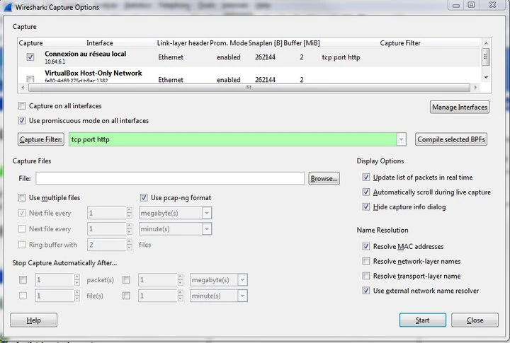

Là où tcpdump s’intéresse vraiment à l’aspect paquets des trames circulant sur le réseau, wireshark est beaucoup plus orienté trafic et qualité de service. L’un n’est pas un clone de l’autre et tous deux ont des fonctions bien spécifiques qui les rendent indispensables.

### Outils d’analyse d’interface

Au niveau le plus bas du réseau, on peut tout à fait récupérer de l’information concernant l’interface à configurer : connaître la vitesse de l’interface, savoir quel type de négociation (_half_ ou _full duplex_) ou encore si l’option wake-on-lan est active ou non, on dispose pour cela de l’utilitaire ethtool.

L’outil permet de visualiser les informations disponibles ou activées pour une interface particulière. Mais, on peut aussi modifier ses propriétés de façon interactive.

**REMARQUE** : l’outil n’est pas nécessairement installé. Si ce n’est pas le cas, on peut l’installer en exécutant l’instruction suivante :

```shell
yum install –y ethtool
```

Si par exemple, on interroge l’interface enp0s3 (caractéristique des distributions CentOS7), on obtient alors :

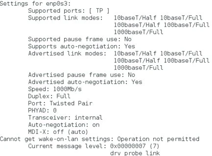

Parmi les nombreuses options de l’outil, on remarquera la possibilité de modifier les propriétés suivantes grâce à l’option -s :

- vitesse
- type de négociation :{half, full}
- port type
- auto négociation

**Exemple** : modifier l’auto négociation pour l’activer sur l’interface

```shell
ethtool –s enp0s3 autoneg on
```

Ou, on peut également demander à activer l’option Wake-On-Lan dès la détection d’activité sur l’interface :

```shell
ethtool –s enp0s3 wol p
```

**ATTENTION** : dans toutes les requêtes passées à la commande ethtool, le nom de l’interface doit toujours suivre l’option concernée : -s pour la modification, ou autres.


## Les outils de couche Réseau
<chapterId>d2c5bf35-4284-4af8-8e8b-049c696a511b</chapterId>

### Outils d’analyse de trafic

L’outil qui vient en premier à l’esprit à ce niveau est ping. Il permet de tester la connectivité IP de bout-en-bout mais également d’avoir des informations concernant les enregistrements de l’annuaire DNS :

```shell
ping 172.17.18.19
```

```shell
mydmn.org (172.17.18.19): 56 data bytes

64 bytes from 172.17.18.19: icmp_seq=0 ttl=56 time=7.7 ms

64 bytes from 172.17.18.19: icmp_seq=1 ttl=56 time=6.0 ms

64 bytes from 172.17.18.19: icmp_seq=2 ttl=56 time=5.5 ms
```

**REMARQUE** : la réponse à la commande ping est différente selon que la route existe (ou est inconnue), et que la machine cible est ou non disponible. Mais, dans l’instruction ci-dessus, on remarque que la résolution de nom mydmn.org est automatiquement résolue avec l’adresse IP.

**RAPPEL** : la commande ping s’appuie sur le protocole ICMP (_Internet Control Message Protocol_), permettant la vérification de la connectivité et des paquets envoyés. L’interrogation de la commande ping, peut également renseigner sur les informations suivantes :

- L’adresse IP (avec le nom enregistré dans l’annuaire DNS.
- Le numéro de séquence ICMP
- La durée de vie du paquet (aussi appelé _Time-To-Live_ ou _TTL_)
- Le temps de propagation en boucle (aussi appelé _round-trip delay_)
- Le nombre de paquets perdus

La durée de vie ou TTL permet de connaître le nombre de routeurs traversés par le paquet lors de l’échange entre l’émetteur et le destinataire. Chaque paquet IP possède un champ TTL valorisé avec une valeur relativement grande. A chaque passage de routeur, ce champ est automatiquement décrémenté. Lorsque la valeur atteint la valeur zéro, le routeur interprétera cela comme le fait que le paquet tourne en boucle et le détruira.

**IMPORTANT** : Le temps de propagation correspond à la durée d’un aller-retour entre l’émetteur et le destinataire. Un paquet doit en règle générale avoir un temps de propagation inférieur à 200ms.

Cela permet aussi d’envoyer des paquets de type broadcast en utilisant l’option –b et en mentionnant l’adresse IP sur laquelle on souhaite effectuer la diffusion :

```shell
ping –b 192.168.1.255
```

De plus, on peut passer en paramètre une taille d’intervalle avec l’option –i (par défaut, la valeur est positionnée à 1 seconde). On peut également forcer le nombre d’écho que l’on souhaite, via l’option -c :

```shell
ping –i 0.2 –c 10 192.168.1.7
```

### Outils d’analyse de route

La commande route est utilisée pour configurer statiquement des routes. Mais, elle peut également fournir des éléments de diagnostic :

```shell
route

Table de routage IP du noyau

Destination     Gateway         Genmask         Flags Metric Ref    Use Iface

10.32.16.0      *                    255.255.252.0   U     0      0        0 eth0

169.254.0.0     *                  255.255.0.0       U     0      0        0 eth0

default         cb1-vrrp-srv    200 0.0.0.0       UG    0      0        0 eth0
```

En effet, dans le champ ‘_Flags_’ ci-dessus, on peut connaître les réseaux (locaux ou distants, dans le cas d’accessibilité d’une passerelle) ou éventuellement quelles routes seront acceptées ou rejetées par le système local. Les cas possibles sont les suivants :

- U : Up - la route est active et exploitable.  
- H : Host - la cible est un hôte.  
- G : Gateway - la cible est accessible par une passerelle.  
- D : Dynamic - la route est configurée par un protocole de routage.  
- ! : Le noyau a rejeté la route

**REMARQUE** : comme on le constate, la commande route, seule permet d’afficher les routes statiques définies sur le système. Si l’on souhaite ajouter une route, il suffit d’utiliser l’option add et de préciser s’il s’agit d’un réseau, d’un hôte ou d’une passerelle.

La commande route, par défaut affiche la table de routage au format numérique (option –n). Mais, on peut demander l’affichage au format d’hôte (avec résolution de nom), en utilisant l’option –e.

Le formalisme standard de la commande est le suivant :

```shell
route [Options]
```

Où les options peuvent être :

"-n" : affiche la table de routage au format numérique.

"-e" : affiche la table de routage au format d’hôte FQDN.

"add" : permet d’ajouter une route statique.

"del" : permet de supprimer une route statique.

Avec les options _add_ et _del_ on peut alors indiquer quel type de cible on souhaite traiter (et de quelle façon, on souhaite le faire) :

Exemple : ajout d’une route statique à un réseau dans la table de routage :

```shell
route add –net 192.168.1.0 netmask 255.255.255.0 gw 192.168.1.1 dev eth0
```

### Outils de traçage

La commande `traceroute`, tout comme `ping`, permet de déterminer à quel niveau du circuit emprunté par les paquets, il y a une rupture de trafic vers le destinataire. On peut ainsi interroger la cible avec son om FQDN (enregistré dans l’annuaire DNS) ou avec son adresse IP :

```shell
traceroute mydmn.org
```

La commande traceroute s’appuie sur le champ TTL des paquets IP. Lorsque ce champ arrive à zéro, le routeur, estimant que le paquet tourne en boucle le détruit et envoie une notification ICMP à l’expéditeur.

C’est exactement ce que fait _traceroute_ : il envoie des paquets à un port UDP non privilégié, réputé non utilisé par la pile TCP/IP (par défaut, il s’agit du port 33434) avec un TTL à 1. Et, le premier routeur rencontré va supprimer le paquet et renvoyer un paquet ICMP, donnant entre autre, l’adresse IP du routeur et son temps de propagation en boucle. En incrémentant séquentiellement le champ TTL afin d’obtenir une réponse de chacun des routeurs sur le circuit, traceroute va, au final,  récupérer une réponse "_ICMP port unreachable_", de la part de l’équipement cible, et reconstituant par la même, le chemin parcouru. En cas de rupture dans le cheminement, on devrait voir apparaître des caractères "*". Dns le cas contraire, la résolution va jusqu’à son terme :

```shell
traceroute to www.google.fr (216.58.210.35), 64 hops max, 52 byte packets

 1  par81-024.ff.avast.com (62.210.189.205)  25.107 ms  24.235 ms  24.383 ms

 2  62-210-189-1.rev.poneytelecom.eu (62.210.189.1)  27.341 ms  27.119 ms  28.184 ms

 3  a9k1-45x-s43-1.dc3.poneytelecom.eu (195.154.1.92)  25.910 ms  25.040 ms  25.558 ms

 4  72.14.218.182 (72.14.218.182)  36.234 ms  39.907 ms  38.130 ms

 5  108.170.244.177 (108.170.244.177)  25.880 ms

    108.170.244.240 (108.170.244.240)  25.791 ms

    108.170.244.177 (108.170.244.177)  26.449 ms

 6  216.239.62.143 (216.239.62.143)  26.491 ms

    216.239.43.157 (216.239.43.157)  26.414 ms

    216.239.62.139 (216.239.62.139)  26.400 ms

 …

 9  108.170.246.161 (108.170.246.161)  33.174 ms

    108.170.246.129 (108.170.246.129)  34.342 ms

    108.170.246.161 (108.170.246.161)  33.707 ms

10  108.170.232.105 (108.170.232.105)  33.845 ms  33.846 ms

    108.170.232.103 (108.170.232.103)  34.206 ms

11  lhr25s11-in-f35.1e100.net (216.58.210.35)  34.094 ms  33.353 ms  33.718 ms
```

### Outils de vérification des connexions actives

Outre l’outil que l’on a vu ci-dessus, concernant le routage, il existe également une autre commande listant les connexions TCP actives de la machine. La commande netstat permet de lister l’ensemble des ports TCP et UDP ouverts au niveau du serveur et d’obtenir des statistiques concernant certains protocoles tels que Ethernet, IPv4, IPv6, ICMP…

La commande utilisée seule affiche l’ensemble des connexions ouvertes par la machine que ce soit en UDP ou en TCP. Le formalisme de la commande est le suivant :

```shell
netstat [-a] [-e] [-n] [-o] [-s] [-p <Proto>] [-r] [intervalle]
```

L’option –a affiche l’ensemble des connexions et des ports en écoute sur la machine. Si l’on souhaite faire afficher les adresses et les numéros de port au format numérique (sans résolution de noms), il faut utiliser l’option –n. Pour afficher les statistiques Ethernet, on peut positionner l’option –e.

Exemple : affichage des connexions sur le port web TCP/80 :

```shell
netstat –an|egrep ".* :80"
```

Ce genre de commande affichera le résultat de toutes les connexions écoutant sur le port 80 :


L’option –o permet de détailler le numéro de processus associé à une connexion et l’option –r affiche alors la table de routage. Il nous reste alors l’option –p suivi du nom du protocole (au choix, TCP, UDP ou IP), permettant d’afficher les informations concernant le protocole passé en paramètre. Enfin, l’option –s affiche les statistiques détaillées, classées par protocole.

**REMARQUE** : en option, il est possible de passer un intervalle permettant de déterminer la période de rafraichissement des informations (en secondes). Par défaut, cette option est valorisée à 1.

Exemple : afficher les statistiques des connexions par type de protocole IP, TCP ICMP…

```shell
netstat -s
```

## Les outils de la couche Transport et supérieure
<chapterId>bce47931-930e-4288-b0fd-666c9a1066b5</chapterId>

### Outils d’interrogation DNS

A ce niveau on peut facilement interroger un serveur de noms et obtenir des informations non seulement concernant le domaine ou l’hôte, mais aussi en diagnostiquant les problèmes de configuration du DNS grâce à la commande nslookup (_Name System Lookup Up_).

Par défaut, la commande nslookup interroge le nom configuré sur la machine. Mais, on peut également interroger un serveur de nom particulier en le préfixant par "-" lors de la requête d’interrogation:

```shell
nslookup 192.6.23.4 –mydmn.org
```

**IMPORTANT** : basé sur le même principe, mais plus riche que la commande _nslookup_, on peut également utiliser _dig_, permettant d’interroger de façon avancée les serveurs de noms DNS.

**ASTUCE** : afin de forcer la recherche d’hôtes sur un ou plusieurs serveurs de noms, on peut renseigner le fichier /etc/resolv.conf avec les champs _search_ et _nameserver_ suivants :

```shell
vi /etc/resolv.conf

search mydmn.org

nameserver mydmn1.org

nameserver mydmn2.org

```

On peut aussi utiliser la commande host afin d’interroger les serveurs de noms afin, notamment de détecter les dysfonctionnements sur une interface réseau : serveurs hors service ou ports désactivés.

**ATTENTION** : il ne faut surtout pas lancer ce genre de commande sur des hôtes ou des réseaux où l’on n’est pas administrateur. En effet, cela s’apparente à un hacking en bonne et due forme, car la commande lance une analyse de l’existant, au niveau des serveurs de noms afin de récupérer de l’information.

### Outils d’interrogation du réseau

De même que la commande host interroge le serveur de noms, l’administrateur désireux d’interroger la proximité des équipements connectés sur un réseau, pourra utiliser l’outil nmap.

**ATTENTION** : même recommandation que pour la commande host, il ne s’agit pas de pirater ou de scruter un réseau dont on n’est pas maître car cela est passible de sanctions!

**L’outil _nmap_ est très complet, il peut à la fois visualiser l’ensemble des ports TCP ou UDP ouverts, pour l’ensemble d’un réseau ou simplement une plage d’adresses dédiées.** Son énorme avantage, par rapport à d’autres outils c’est qu’il permet de synthétiser sous forme de rapport l’ensemble des ports ouverts au niveau d’un réseau ou d’une machine. En réalité, il s’agit d’un outil scannant les ports ouverts sur une machine distante.

Afin de scanner un équipement distant, il suffit d’exécuter la commande suivante en passant en paramètre l’adresse IP (ou le nom) de la machine concernée :

```shell
nmap 192.168.0.1
```

Évidemment, ce que l’on peut faire pour un serveur peut aussi être fait pour l’ensemble d’un réseau :

```shell
nmap 192.168.0.0/24
```

Cela aide énormément les administrateurs pour analyser et réduire les portes ouvertes de leurs machines, car ils peuvent ainsi connaître les services à protéger contre d’éventuelles attaques :

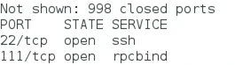

### Outils d’interrogation des processus

Il existe une commande permettant de lister les fichiers ouverts et/ou les processus actifs, au niveau du système d’exploitation. Il s’agit de la commande _lsof_. Il existe plusieurs modes d’utilisation. On peut, par exemple ne s’intéresser qu’aux processus de type Internet via l’option -i :

```shell
lsof –i
```

On peut aussi ne s’intéresser qu’à une machine particulière en fournissant l’adresse IP en paramètre, et éventuellement un port de service (dans l’exemple, le port [SMTP](https://www.it-connect.fr/messagerie-decouverte-des-protocoles-smtp-pop-imap-et-mapi/ "SMTP") 25):

```shell
lsof –ni @192.168.2.1:25
```

Mais, ce qui est très intéressant dans cette commande, c’est que l’on peut aussi interroger le système et vérifier les processus ouverts sur un périphérique particulier :

```shell
lsof /dev/sda1
```

On peut, à l’inverse souhaiter connaître tous les ports réseau ouverts par un processus passé en paramètre (dans l’exemple n° PID 1521):

```shell
lsof –i –a –p 1521
```

En cumulant les foncions, on peut enfin connaître tous les fichiers ouverts par un ou plusieurs utilisateur(s) particulier(s) et/ou par un processus courant :

```shell
lsof –p 1521 –u 500, phil
```

De nombreux autres outils existent également. Mais, déjà avec ceux mentionnés ici, on devrait largement se faire une idée précise de son environnement et être capable, le cas échéant d’analyser la cause du problème et de le corriger.

### Synthèse de la partie

On a vu un certain nombre d’outils, mais surtout on a balayé les différentes couches, qui grâce à ces programmes peuvent être administrées de façon plus aisée. Cela permet aux administrateurs de se faire une idée plus précise de leur système quant aux équipements connectés et à leur adresse utilisée.

**Couche ACCES RESEAU** :

- Outil arp
- Outil tcpdump
- Outil wireshark

**Couche RESEAU** :

- Outil ping
- Outil route
- Outil traceroute
- Outil netstat

**Couches TRANSPORT/APPLICATION :**

- Outil nslookup
- Outil nmap
- Outil lsof


# Partie finale
<partId>09d5393c-63bc-42fc-bf79-c65e380211bd</partId>


## Avis & Notes
<chapterId>114c33c0-9831-4d74-affd-f5d37adc53c3</chapterId>


<isCourseReview>true</isCourseReview>


## Examen final
<chapterId>b99e005e-8dd0-4fa4-b302-f940c27a30ac</chapterId>


<isCourseExam>true</isCourseExam>


## Conclusion
<chapterId>3b449814-78f3-41c0-8138-0a04f3682719</chapterId>


<isCourseConclusion>true</isCourseConclusion>
