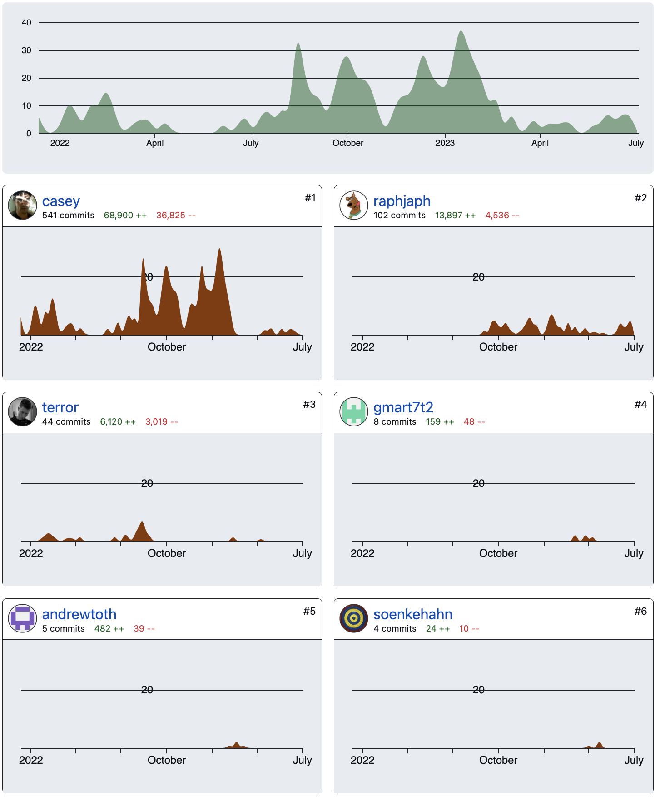
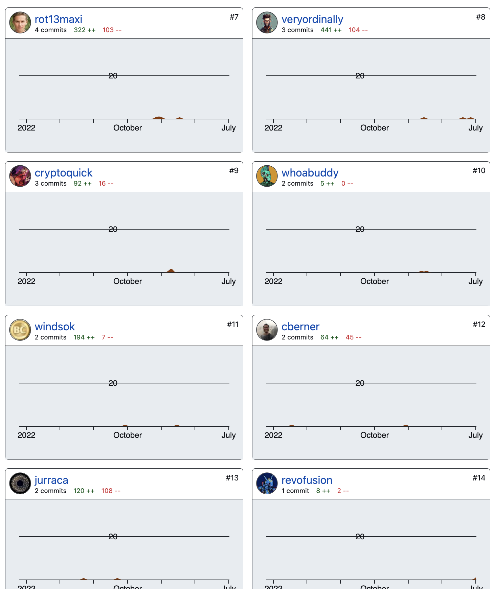
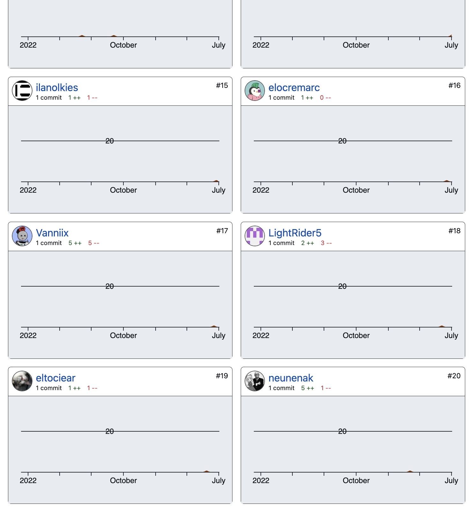

# Cours sur les Ordinals

*Ordinals* est un nouveau protocole construit sur Bitcoin qui apporte de nouvelles opportunités, de nouveaux risques et de belles promesses. 
C'est un protocole Open-Source qui peut changer beaucoup de choses sur Bitcoin. 
Pour ce faire je propose ci-dessous une base de cours la plus complète possible. Je ne pense pas être capable de rédiger la totalité de ce cours tout seul et propose à tous ceux qui sont intéressés par *Ordinals* de se joindre à moi pour tenter de présenter au mieux et au plus tôt ce cours.

Ce cours me semble essentiel dans l'écosystème Bitcoin, à l'heure de *RGB*, [RGB Protocol on Bitcoin, What is it? | Trust Machines](https://trustmachines.co/learn/what-is-the-rgb-protocol-on-bitcoin/#:~:text=The%20RGB%20network%20is%20a,assets%20on%20the%20Bitcoin%20blockchain.), des annonces de *Ark*, [Bitcoin Developer Introduces New Layer 2 Protocol Ark - Bitcoin Magazine - Bitcoin News, Articles and Expert Insights](https://bitcoinmagazine.com/technical/bitcoin-developer-introduces-new-layer-2-protocol-ark) et une marketcap d'Ordinals estimée à $55,393,093 [Bitcoin Ordinals Analysis](https://dune.com/dgtl_assets/bitcoin-ordinals-analysis).
Comprendre ce nouveau protocole et surtout les derniers développements basés sur ce protocole me semble capital !

Vous trouverez ci-dessous le sommaire, suivi d'un plan détaillé et des parties qui doivent être creusées.

Je me tiens à votre disposition pour toutes questions, critiques ou retour de votre part sur cette pull request ou par mail : galoisfield2718@gmail.com.


# Sommaire

## I/ Introduction
### 1) Premières traces du dossier sur Github & Workshop de Casey
####	a) Une première publication
####	b) La présentation by Casey
####	c) L'arrivée des degens et des techos
### 2) Des idées anciennes, remises au goût du jour
#### 	a) Les colored coins
#### 	b) Counterparty
#### 	c) Ethreum et les ABI
### 3) La core Team
####	a) Github
####	b) Twitter
####	c) Le passage du flambeau

## II) Théorie et implémentation
### 1) Compter les sats
#### 	a) La méthode
####	b) Les choix de Casey
####	c) A la recherche des sats rares
### 2) L'inscription
####	a) L'idée
####	b) La pratique
####	c) Le code
### 3) Le client
####	a) Bitcoin Core 
####	b) `ord`
####	c) Les commandes élémentaires 

## III) Utilisation et dernières avancées
### 1) Outils en lignes
####	a) Wallets
####	b) Platforms
####	c) Marketplace
### 2) JSON et nouveaux protocoles
#### 	a) Début du `sns`
####	b) Arrivée de `brc-20`
#### 	c) Un Meta Protocol : BOSS
### 3) Les cursed inscriptions
####	a) L'issue git #2062
####	b) Le développement
####	c) L'intégration


## Conclusion
### Retour sur l'histoire
### Quel avenir ?
### Pour s'investir


## Annexe A : Utilisation offline du site iancoleman.com pour la génération d'adresse bech32.
## Annexe B : Rédaction de script avec `bitcoin-cli`


# Plan détaillé du cours

Le but de ce cours est de s'adresser à tous les profils et dont les parties doivent pouvoir être lues indépendamment.  

## I/ Introduction
Dans cette section le but est de s'intéresser à l'histoire de ce protocole et à l'humain qu'il y a derrière.
Le but n'est pas d'être technique mais de comprendre d'où ça vient, de qui et pour quelles motivations. 
Comprendre qui sont les participants et pouvoir permettre aux gens de se renseigner par eux-mêmes davantage sur ces développeurs.

### 1) Premières traces du dossier sur Github & Workshop de Casey
-> Le développeur phare de ce protocole est Casey Rodarmor ([Casey (@rodarmor) | Twitter](https://twitter.com/rodarmor/), [R O D A R M O R](https://rodarmor.com/), [casey (Casey Rodarmor) | Github](https://github.com/casey/)). 
En 2015, il travailla activement sur Bitcoin Core où il réalisa une série de batchs (mises-à-jours) et un remaniement d'une partie du code de Bitcoin Core ([Casey Rodarmor's Resume](https://rodarmor.com/resume/index.html)).

-> Taproot : en quelques mots, à partir de la réduction du poids des adresses et de l'augmentation de la taille de la *witness* (partie du block space laissant....)


-> En tant qu'important contributeurs on retrouve [raphjaph (raph)](https://github.com/raphjaph), un étudiant d'informatique à l'université de Munich et [veryordinally (ordinally)](https://github.com/veryordinally?tab=overview&from=2015-12-01&to=2015-12-31) dont le profil a été crée en 2015 mais actif seulement sur Ordinals.

	-> Sur Ordinally on a moins d'infos que sur les autres et ce profil parait assez étrange. Il serait intéressant de creuser d'avantage.

	-> Détailler les autres contributeurs : [Contributors to ordinals/ord](https://github.com/ordinals/ord/graphs/contributors)  

####	a) Une première publication
-> J'avais sauvegardé cette information qui maintenant n'est plus disponible 
[creation ord](./assets/Create_ord_casey.png)

-> On voit donc un travail pensé pendant presque un an par Casey avant la présentation de son idée en Octobre 2022, sur laquelle nous reviendrons.

-> [Casey Rodarmor: Why I Developed the Ordinals Bitcoin NFT Project](https://www.coindesk.com/consensus-magazine/2023/02/23/casey-rodarmor-why-i-developed-the-ordinals-bitcoin-nft-project-coindesk/)
 

####	b) La présentation by Casey
-> [Ordinals Workshop with Casey Rodarmor](https://www.youtube.com/watch?v=MC_haVa6N3I)

-> Ce workshop fut la première présentation live par Casey de ce nouveau protocole. Il a eu lieu à Austin au Texas le 27 Août 2022 [Ordinals Workshop with Rodamar, sam. 27 août 2022, 12:00 | Meetup](https://www.meetup.com/fr-FR/pleb-lab/events/287948415/). Il a présenté en live sa théorie, sur ce qu'est Ordinals et les ressources proposées.

-> Qu'est-ce qu'Ordinals ?

```
What are Ordinals?

A scheme for assigning ordinal numbers to satoshis and tracking them across transactions, and a command-line utility, `ord` for querying information about ordinals. 

```

-> Une présentation de ses motivations par l'art génératif et donner l'opportunité aux artistes d'inscrire leurs œuvres sur Bitcoin.

-> Une présentation assez difficile de ce qu'il entend par "compter les sats" ce sur quoi nous reviendrons plus en détail par la suite. Avec une live démo du site web [ordinals.com](https://ordinals.com), une description du dossier sur Github et enfin la présentation d'un algorithme Python permettant de montrer comment compter les satoshis.


####	c) L'arrivée des degens et des techos

-> Il fallu néanmoins attendre décembre 2022 pour avoir la première inscription [Inscription #0](https://ord.link/0) réalisée par **bc1qv8zhcjzpjw4m4tdyc5zn3dmax0z6rr6l78fevg** dont on peut voir qu'il ne l'a pas conservée puisque transférée immédiatement à une autre adresse [Activity for bc1qv8zhcjzpjw4m4tdyc5zn3dmax0z6rr6l78fevg | Ordiscan](https://ordiscan.com/address/bc1qv8zhcjzpjw4m4tdyc5zn3dmax0z6rr6l78fevg/activity). L'adresse finale qui possède l'inscription #0 est assez active [Activity for bc1pz4kvfpurqc2hwgrq0nwtfve2lfxvdpfcdpzc6ujchyr3ztj6gd9sfr6ayf | Ordiscan](https://ordiscan.com/address/bc1pz4kvfpurqc2hwgrq0nwtfve2lfxvdpfcdpzc6ujchyr3ztj6gd9sfr6ayf/activity).

-> Les Bitcoin rocks [Bitcoin Rocks | Ordiscan](https://ordiscan.com/collection/bitcoin-rocks) furent la première collection minté entre 71 et 247. Ils ont été la porte d'entrée des Degens 

### 2) Des idées anciennes, remises au goût du jour

-> Ici, il serait intéressant d'interviewer des gens l'ayant vécu pour avoir leur retour d'expérience. 

#### 	a) Counter Party (2012)

#### 	b) Les colored coins (2014)

#### 	c) Ethreum et les ABI (2015)

### 3) La core Team

####	a) Github
[Contributors to ordinals/ord](https://github.com/ordinals/ord/graphs/contributors)






####	b) Twitter

Une liste Twitter regroupant les principaux core developpers [ordinals dev list](https://twitter.com/i/lists/1627776735210098708?s=20).
iiiiiiiii
####	c) Le passage du flambeau
[Casey: "I haven't been able to give ord the attention it deserves, so I am pleased to announce that @raphjaph has agreed to step up as lead maintainer! Raph is an impoverished student, and his work on ord will be entirely funded by donations. If you can, please consider donating!…"](https://twitter.com/rodarmor/status/1662617512700420096[Casey: "I haven't been able to give ord the attention it deserves, so I am pleased to announce that @raphjaph has agreed to step up as lead maintainer! Raph is an impoverished student, and his work on ord will be entirely funded by donations. If you can, please consider donating!…"](https://twitter.com/rodarmor/status/1662617512700420096))

## II) Théorie et implémentation

### 1) Compter les sats

```
Every satoshi is serially numbered, starting at 0, in the order in which it is mined. These numbers are termed "ordinal numbers", or "ordinals", as they are ordinal numbers in the mathematical sense, giving the order of each satoshi in the totally supply. The word "ordinal" is nicely unambiguous, as it is not used elsewhere in the Bitcoin protocol.
The ordinal numbers of transaction inputs are transferred to outputs in first-in-first-out order, according to the size and order of the transactions inputs and outputs.

If a transaction is mined with the same transaction ID as outputs currently in the UTXO set, following the behavior of Bitcoin Core, the new transaction outputs displace the older UTXO set entries, destroying the ordinals contained in any unspent outputs of the first transaction. This rule is required to handle the two pairs of mainnet transactions with duplicate transaction IDs, namely the coinbase transactions of blocks 91812/91842, and 91722/91880, mined before BIP-34 made the creation of transactions with duplicate IDs impossible.

For the purposes of the assignment algorithm, the coinbase transaction is considered to have an implicit input equal in size to the subsidy, followed by an input for every fee-paying transaction in the block, in the order that those transactions appear in the block. The implicit subsidy input carries the block's newly created ordinals. The implicit fee inputs carry the ordinals that were paid as fees in the block's transactions.

Underpaying the subsidy does not change the ordinal numbers of satoshis mined in subsequent blocks. Ordinals depend only on how many satoshis could have been mined, not how many actually were.
```

#### 	a) La méthode

-> Détaillée longuement dans son workshop et présentée ci-dessus, il faut en faire une synthèse en français.

####	b) Les choix de Casey

-> Casey a choisit de nommer les sats en les numérotants.

-> Il a également ajouté des "steps" en plus du halving avec les cycles et autres pour créer de la rareté sur certains sats.

-> Il a créé un classement de sats rares. 

--> Néanmoins de nouvelles raretés sont apparus : *Retrouver le site qui permet de check ses sats et donne de nouvelles raretés*

####	c) A la recherche des sats rares

-> Outils online le plus facile. On donne son adresse et ils l'analysent.

-> Moyen de le faire par ligne de commande mais je ne sais toujours pas comment.

### 2) L'inscription

-> Maintenant qu'on sait compter les sats, on peut les manipuler. Ordinals propose d'inscrire sur ces derniers.

####	a) L'idée

-> Quand on fait une transaction, on peut stocker la data sur le premier sat de la tx. 

-> Techniquement il est utilisé une double tx de commit puis de reveal. Cela doit encore être détaillé sur pourquoi cette double tx. A priori c'est pour que le reveal connaisse l'output et puisses inscrire sur le bon sat. 
Mais il faut encore creuser un petit peu.


####	b) La pratique

-> Concrétement on n'a pas besoin de comprendre pourquoi ce fonctionnement pour l'utiliser. 

Néanmoins, suite à une inscription avec le client `ord` on obtient un json output de cette forme : 

```JSON
{
  "commit": "0bdbae349b685c0a59fa275f18d4ad14c3972fb5998d513399a478d87d805e00",
  "inscription": "d4ad4cd729fdd4dfaa5279aed4910e4afcfac6e3be25900ba40a2faebef28a9fi0",
  "reveal": "d4ad4cd729fdd4dfaa5279aed4910e4afcfac6e3be25900ba40a2faebef28a9f",
  "fees": 8440
}

```

####	c) Le code

--> ordinals/ord/src/commands/sub-command/Inscription.rs

### 3) Le client
La référence pour cette partie est cette vidéo : [How To Setup A Bitcoin Node & Ord Wallet](https://www.youtube.com/watch?v=tdC8kmjn5N0&list=LL&index=1&t=0s)
Cette vidéo est faites sur Windows et étant sur Mac avec un node sur Disque dur externe je proposerai les commandes pour setup ceci sur Linux et Mac.

####	a) Bitcoin Core 

Requirements : 
- env. 700 Go de stockage, en SSD si possible.
- une bonne connexion internet.

Soit vous avez un vieil ordinateur et vous faites tourner le nœud Bitcoin sur celui-ci, soit je vous conseille de prendre un disque dur externe SSD de 1 To. Vous en trouver pour moins d'une centaine d'euros sur internet en général. 
-> Lien pour Comparateur de prix et de marques. 

[jonasnick/bitcoin-node: "How to Run a Bitcoin Node" handout](https://github.com/jonasnick/bitcoin-node)

**Step-by-Step installation Bitcoin Core**
1) Allez sur : [Download - Bitcoin](https://bitcoin.org/en/download) puis télécharger le version qui correspond à votre système d'exploitation ; 

2) Ouvrez le paquet qui doit ressembler à ceci : 
--> Mettre une image

3) Suivre les instructions

4) Configurer via `bitcoin.conf` pour que le lieu de stockage soit de la forme : 
*Sur Mac* : 
- `/Volumes/mon_disque/bitcoin`

*Sur Linux* : 
- `/media/mon_disque/bitcoin`

*Sur Windows* : 
- `C:/mon_disque`

5) Ligne de commande : 
*Sur Mac* : 
```
./bitcoin/bin/bitcoind --conf=/Volumes/mon_disque/bitcoin/bitcoin.conf --txindex=1
```
3) Suivre les instructions

4) Configurer via `bitcoin.conf` pour que le lieu de stockage soit de la forme : 
*Sur Mac* : 
- `/Volumes/mon_disque/bitcoin`

*Sur Linux* : 
- `/media/mon_disque/bitcoin`

*Sur Windows* : 
- `C:/mon_disque`

5) Ligne de commande : 
*Sur Mac* : 
```
./bitcoin/bin/bitcoind --conf=/Volumes/mon_disque/bitcoin/bitcoin.conf --txindex=1
```
Si cela ne suffit pas pour le forcer à télécharger la blockchain dans `mon_disque` alors ajouter les flags `--data-dir=/Volumes/mon_disque/bitcoin/Bitcoin --blocksdir=/Volumes/mon_disque/bitcoin/Bitcoin/blocks --settings=/Volumes/mon_disque/bitcoin/Bitcoin/settings.json --walletdir=/Volumes/mon_disque/bitcoin/Bitcoin/wallets --txindex=1`

*Sur Linux* : 


*Sur Windows* : 

####	b) `ord`
Une fois que le nœud est entièrement téléchargé on peut télécharger et lancer le client `ord`. On parle de client pour parler de la ligne de commande qui est utilisé pour intéragir avec le protocole ordinals.

Téléchargez `ord`: [Releases · ordinals/ord](https://github.com/ordinals/ord/releases)
en prenant la dernière mise à jour.

----------------

Attention je n'ai pas encore trouver comment faire pour que l'indexing du client qui produit `index.redb` soit dans le disque dur et non pas sur l'ordinateur.
Néanmoins, il est beaucoup plus léger que la chain Bitcoin (~ 13 Go) donc c'est moins dérangeant. 

----------------


####	c) Les commandes élémentaires 

`ord help` Liste toutes les commandes
`ord wallet help` Liste les sous-commandes de wallet
`ord wallet create` Crée un nouveau wallet
`ord wallet balance` Donne la balance du wallet ord actuel
`ord wallet inscribe` Permet d'inscrire via la syntaxe : `ord wallet inscribe path/to/file.ext --fee-rate=xxx` où `ext` est un des types suivants : txt, json, webp, html,   
`ord wallet inscriptions`
On pourra noter qu'il existe les commandes : `ord server` et 

## III) Utilisation et dernières avancées

Evidemment tout le monde ne va pas utiliser le client `ord` avec le full node Bitcoin.

Il faut donc des outils plus accessibles et online. 
Ces outils online présentent aussi parfois certains avantages, comme l'optimisation de frais, bien plus difficile via le client seul, des inscriptions spéciales via des templates pour certains protocoles (voir III.2), ou les cursed inscriptions (voir III.3).

Ils permettent donc une intégration simple et avancée des dernières fonctionnalités offertes par le protocole ordinals.

Plongeons alors dans ces outils avant de nous attaquer aux protocoles construits sur Ordinals puis aux Cursed Inscriptions.

### 1) Outils en lignes
Les outils en lignes apparaissent comme nécessaires pour le développement de l'écosystème et on va essayer de les traiter en profondeur. 

-> Des tutos sur chacun de ces outils serait le bienvenue ;)


####	a) Wallets

[Bitcoin Ordinals Wallets Have Arrived: A Guide For Beginners and Experts](https://nftnow.com/news/bitcoin-ordinals-wallets-have-arrived/)

- Unisat

-------------------------
Présentés dans l'article
-------------------------

- OrdinalsWallet 

- Xverse 

- Hiro

####	b) Platforme de mint

Assez similaires aux wallets il faut y ajouter : 

- lookordinals.com (certainement le moins cher du marché actuellement, recommandé par @0xGrug ) 

- Gamma.io


####	c) Marketplace

Elles sont moins nombreuses. On trouve : 

- Unisat.io/marketplace

- ordinalswallet.com

- 

### 2) JSON et nouveaux protocoles

Rapidement, le coût d'inscription d'image étant élevé des gens se sont tournés sur l'inscription de fichier textuel (moi le premier [galoisfield.btc](https://ord.link/187784)).
Néanmoins, avec de simple fichier texte comment se repérer ? Comment les retrouver ?
Comment les **INDEXER** ? 

Cette question de l'indexing est majeure sur ce protocole Ordinals et sur les protocoles construits sur Ordinals. 

Mais alors comment ça marche ?

Plongeons dans l'histoire !

#### 	a) Début du `sns`

Un acteur important de l'ecosystème ordinals est [@domodata](https://twitter.com/domodata).

Arrivé avec son full node le 24 février [domo: "Full node finally running. Will soon find out if the feeling of owning a wallet full of UTXOs, redolent with the scent of rare and exotic sats, is beyond compare."](https://twitter.com/domodata/status/1629134663842254848) il proposa rapidement de nouveaux standard.

Le premier qu'il a utilisé est `sns` pour Sats Name Service : 

[domo: "@sats-names"](https://twitter.com/domodata/status/1630948879737794561)

Etant le premier protocole construit sur Ordinals il a deux manière d'être utilisé.

1. La première très simple qui consiste simplement à inscrire un fichier texte avec `.sats`. Ce n'est pas celle qui nous intéressera ici.

2. Définir un fichier JSON contenant les specifications suivant : 
  a) Le nom du protocole via `"p" : "sns"`, ici le protocole utilisé est `sns`.
  b) L'opération voulu via `"op": "reg"`, ici `reg` signifie que l'on défninit un nouveau nom.
  c) Le nom choisit via : `"name" : "my_name.sats"`, on choisit `my_name.sats`.

3. On a aussi deux paramèters optionnels dans ce protocole : 
  a) L'association d'un sats name à une adresse btc via `"rev" : "bc1q...."`.
  b) L'association d'un sats name à une inscription via `"relay" : "...i0"`.

Vous trouverez la documentation à l'adresse suivante [Mint names - Sats Names](https://docs.sats.id/sats-names/sns-spec/mint-names)

L'idée du protocole `sns` qui sera celle qui nous suivra tout au long de ces sur-protocoles est l'utilisation d'un JSON vérifiant toujours plus ou moins cette structure. 

En voici un exemple :  
```JSON
{
 "p" : "sns",
 "op" : "reg",
 "name" : "galoisfield.sats",
 "rev" : "1A1zP1eP5QGefi2DMPTfTL5SLmv7DivfNa"
}
```

On a donc ici construit un protocole dont les éléments sont facilement reprérables parmi toutes les inscritpions et permettant à n'importe qui d'*indexer* ces éléments et de les utiliser dans n'importe quelles applications. 

-> Pour les developpeurs chevronnés vous pouvez essayer de développer ou d'intégrer ce protocole à une application pour permettre le login des utilisateurs ou la vérification d'achievements dans votre app. 


####	b) Arrivée de `brc-20`

Maintenant que l'on a compris le fonctionnement du protocole `sns` il nous sera très facile d'appréhender d'autre protocole comme par exemple `brc-20`.

Posé pour la première fois par *@domodata* [domo: "Using inspiration from @sats_names and @redphonecrypto, I wondered if the concept could be expanded to fungible tokens. This is what I came up with: 2/x https://t.co/h6fksQ1WpM"](https://twitter.com/domodata/status/1633658976931037184).

L'idée est simple : répliquer le concept de protocole comme `sns` pour créer des tokens sur Bitcoin. 

On garde : le protocole, l'opération, on remplace `name` par `tick`, on ajoute `amt` pour le montant de jetons considérés et on distingue les opérations de déploiement, de mint et de transfer. 

L'opération la plus *tricky* est celle de transfer sur laquelle nous reviendrons un peu plus tard. 

Une contrainte posé par Domo est que le ticker d'un brc-20 ne doit comporter que 4 caractères. 

-> Trouver une ref de pourquoi 4 caractères.


Faisons le schéma complet d'un token `DBTC` pour DécouvreBitcoin (le token existe déjà et n'y est pas relié, ceci est simplement à titre indicatif et ne constitue en aucun cas une invitation à le mint, l'acheter ou autre) : 

1. Le déploiement

On a notre ticker maintenant il faut décider d'un montant. Pour être cohérent avec celui déjà déployé prenons 21 000.
```JSON
{ 
 "p": "brc-20",
 "op": "deploy",
 "tick": "DBTC",
 "amt" : "21000",
 "lim" : "1"
}
```

L'instruction `lim` détermine combien de token pourront être minté en une fois. 

Si `lim = 1` mais que vous en mintez 2 alors vous n'aurez aucun token car votre instruction ne sera pas valide au regard du protocole. 
Faites bien attention à ceci quand vous mintez !


  

2. Le mint

Une fois notre token déployé on peut le mint. Pour cela il faut inscrire le JSON suivant : 

```JSON
{
 "p" : "brc-20",
 "op": "mint",
 "tick": "DBTC",
 "amt": "1"
}
```

Une fois l'inscription minée dans un block vous aurez 1 DBTC associé à votre addresse de mint.


3. Le transfer

Maintenant que vous avez mint le token `DBTC` vous pouvez le transférer (à votre meilleur ami, votre compagne ou compagnon ou quelqu'un qui souhaiterais vous l'acheter).

Pour ce faire il vous faudra suivre deux étapes : 

A. L'inscription de l'opération `transfer` 

```JSON
{
 "p": "brc-20",
 "op": "transfer",
 "tick": "DBTC",
 "amt": "1"
}
```

Ici vous avez maintenant 1 DBTC transférable au regard du protocole `brc-20`.

Vous pouvez alors le transférer.

B. Le transfer du token

Il vous faut maintenant faire une tansaction Bitcoin. 
Vous devez envoyer l'inscription de transfer à la personne souhaitée. 

Via les wallets online cela se fait en cliquant simplement sur `Transfer` ou `Envoie`.

Via le client ord il vous faudra :
- lister vos inscriptions par la commande `ord wallet inscriptions` ; 
- selectionner celle qui vous intéresse ; 
- entrer la commande `ord --cookie-file=/Volumes/mon_disque/bitcoin/.cookie wallet send --fee-rate 3 bc1pxsa6d95jrwald4jjsu0kwu4pyaztmjvh6rdjyrztfv0yx2gakk9qse5sjf acddd636c4ab0fb45c9f70ce2598cffa205c88594de916832a5789e3e58ca688i0`.

Si vous connaissez déjà l'inscription de transfer entrez directement la dernière commande (adaptée à vos système d'exploitation, ici MacOs).


On a donc ici couvert toutes les opérations réalisables avec `brc-20`. 
A ce stade vous devez mieux voir comment fonctionne ces protocoles construits sur Ordinals. 

Il y aurait beaucoup à dire des discussions qui ont animés les différents discord et telegram en lien avec `brc-20` et cela pourra faire l'objet d'articles annexes.


#### 	c) Un Meta Protocol : BOSS

Maintenant que nous avons compris comment fonctionne ces deux protocoles nous pouvons nous attaquer à un très gros morceau qui est pour l'instant toujours en développement le Meta Procole **BOSS** (Bitcoin Operationnal Standard System).

-> BOSS propose un avenir florissant avec l'idée de Meta Protocols. Créant un standard sur tous ces protocoles sauvages ainsi qu'une machine virtuelle on peut s'attendre à ce que beaucoup de solutions de demain soit construites sur BOSS.
En tout cas, BOSS va être un terrain d'expérimentation assez fou sur Bitcoin.


-> De nouvelles choses sont régulièrement proposés. Des interfaces améliorées, du code à clarifier, des articles à écrire, des tutos à réaliser, les choses qui arrivent ne manque pas et nous devons nous tenir informés pour être là où les choses se développent.


### 3) Les cursed inscriptions

####	a) L'issue git #2062

####	b) Le développement

# Conclusion

Une des choses les plus puissantes offertes par Ordinals est certainement BOSS. Actuellement en développement, les promesses de BOSS sont assez folles. 
Il faudrait dédier un papier entier aux fonctionnalités qu'annonce BOSS et une étude approfondie du lightpaper.

Un workshop coordoné avec un développeur JS ayant étudié les propositions techniques de la BVM (Bitcoin Virtual Machine) proposée par BOSS et un "théoricien" mettant en lumière l'architecture du projet pourrait être très intéressant pour mieux appréhender BOSS.

Evidemment il n'y a pas que BOSS. Beaucoup de choses sont encore à découvrir et créer ! 
Ce cours bien qu'autant exhaustif que possible est loin de tout couvrir et nécessite encore beaucoup de travail d'approfondissement et de recherche individuelle comme académique pour pouvoir être complet.


### Pour s'investir

-> Participer à la rédaction de ce cours.

-> Tuto Youtube, Live, contenus, accompagnement de gens intéressés.

-> Développement par fork d'unisat ou de lookordinals.

-> Développement de nouvelles idées via des inscriptions HTML ou interprétation de code au format txt via un nouvel indexer peut être essayé.

-> Prise en main de BOSS dès que le code sera disponible. Pour un tech JS, se coordoner pour organiser le workshop discuté précedemment. 


