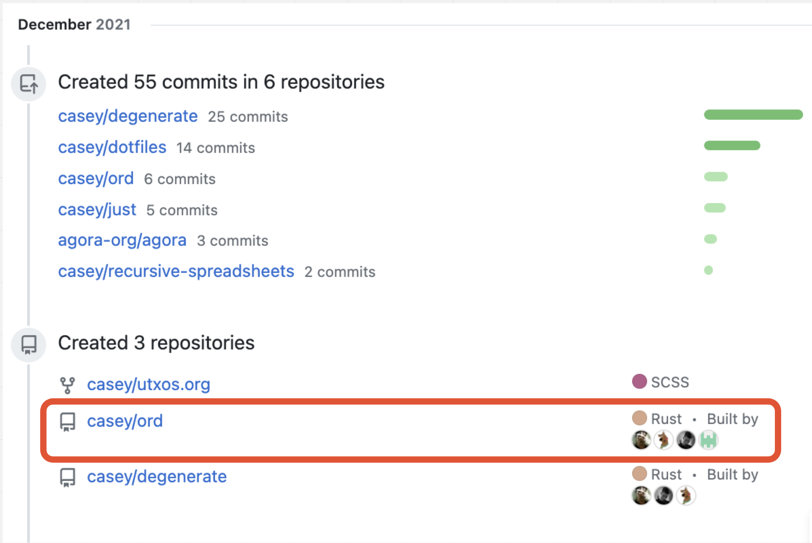
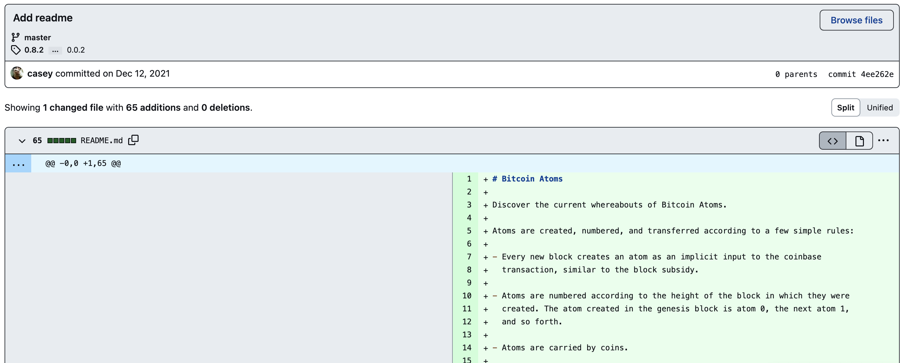
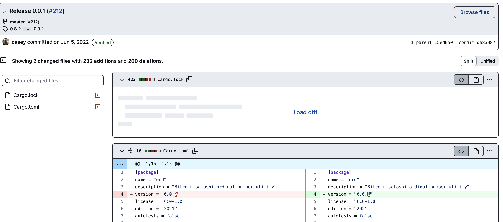
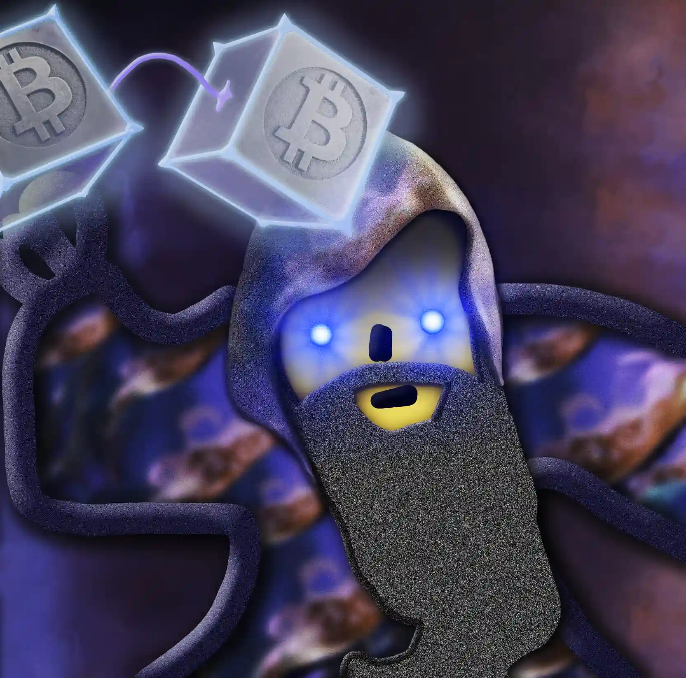
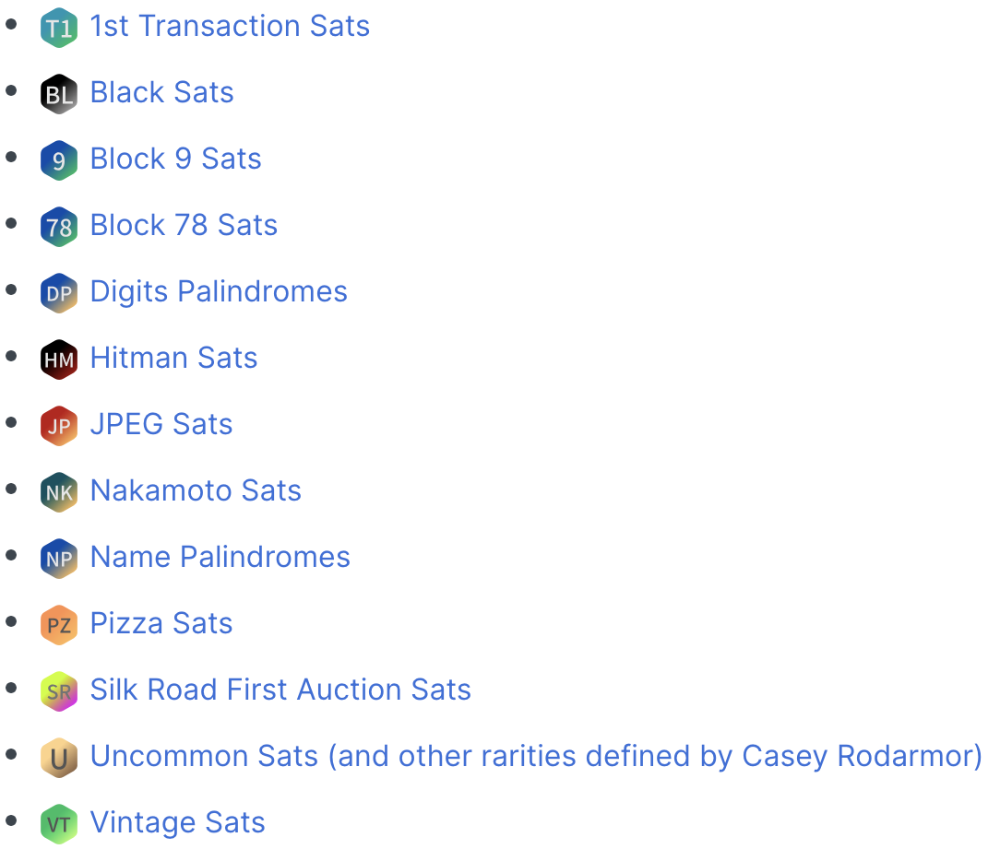

# Cours sur les Ordinals

*Ordinals* est un nouveau protocole construit sur Bitcoin qui apporte de nouvelles opportunités, de nouveaux risques et de belles promesses. 
C'est un protocole Open-Source qui peut changer beaucoup de choses sur Bitcoin. 
Pour ce faire je propose ci-dessous une base de cours la plus complète possible. Je ne pense pas être capable de rédiger la totalité de ce cours tout seul et propose à tous ceux qui sont intéressés par *Ordinals* de se joindre à moi pour tenter de présenter au mieux et au plus tôt ce cours.

Ce cours me semble essentiel dans l'écosystème Bitcoin, à l'heure de *RGB*, [RGB Protocol on Bitcoin, What is it? | Trust Machines](https://trustmachines.co/learn/what-is-the-rgb-protocol-on-bitcoin/#:~:text=The%20RGB%20network%20is%20a,assets%20on%20the%20Bitcoin%20blockchain.), des annonces de *Ark*, [Bitcoin Developer Introduces New Layer 2 Protocol Ark - Bitcoin Magazine - Bitcoin News, Articles and Expert Insights](https://bitcoinmagazine.com/technical/bitcoin-developer-introduces-new-layer-2-protocol-ark) et une marketcap d'Ordinals estimée à $55,393,093 [Bitcoin Ordinals Analysis](https://dune.com/dgtl_assets/bitcoin-ordinals-analysis).
Comprendre ce nouveau protocole et surtout les derniers développements basés sur ce protocole me semble capital !

Vous trouverez ci-dessous le sommaire, suivi d'un plan détaillé et des parties qui doivent être creusées.

Je suis disponible pour toutes questions, critiques ou retour de votre part sur ce repo ou par mail : galoisfield2718@gmail.com.


# Sommaire

## Introduction

## I/ Histoire
### 1) Premières traces du dossier sur Github & Workshop de Casey
####	a) Une première publication
####	b) La présentation by Casey
####	c) L'arrivée des degens et des techos
### 2) Des idées anciennes, remises au goût du jour
#### 	a) Les colored coins
#### 	b) Counterparty
#### 	c) Ethreum et les ABI
### 3) La core Team
####	a) Github
####	b) Twitter
####	c) Le passage du flambeau

## II) Théorie et implémentation
### 1) Compter les sats
#### 	a) La méthode
####	b) Les choix de Casey
####	c) A la recherche des sats rares
### 2) L'inscription
####	a) L'idée
####	b) La pratique
####	c) Le code
### 3) Le client
####	a) Bitcoin Core 
####	b) `ord`
####	c) Les commandes élémentaires 

## III) Utilisation et dernières avancées
### 1) Outils en lignes
####	a) Wallets
####	b) Platforms
####	c) Marketplace
### 2) JSON et nouveaux protocoles
#### 	a) Début du `sns`
####	b) Arrivée de `brc-20`
#### 	c) Un Meta Protocol : BOSS
### 3) Quelques techniques déployées
###     a) Les cursed inscriptions


## Conclusion
### Retour sur l'histoire
### Quel avenir ?
### Pour s'investir


## Annexe A : Utilisation offline du site iancoleman.com pour la génération d'adresse bech32.
## Annexe B : Rédaction de script avec `bitcoin-cli`


[*inscription*](https://ord.link/1187713)

## Introduction

-----------
Le but de ce cours est de s'adresser à tous les profils et dont les parties doivent pouvoir être lues indépendamment
-----------


C'EST UN **PROTOCOLE SUR BITCOIN** !

*Comment ça ?*

Dans une transaction Bitcoin on peut mettre un message.
Ce message doit respecter une certaine structure et utiliser des "fonctions" du protocole Bitcoin.
Ces "fonctions" sont appelées des <u>opérations</u>. L'ensemble de ces opérations est appelé l'`OP_CODE`.
Ces opérations sont envoyées au *réseau Bitcoin* dans des transactions.
On appelle <u>réseau Bitcoin</u>, l'ensemble des machines exécutant le protocole Bitcoin. On trouvera un détail des clients utilisés pour accéder au réseau Bitcoin sur [Coin Dance | Bitcoin Nodes Summary](https://coin.dance/nodes/share).

Via l'`OP_CODE` on peut réaliser des opérations algorithmique sur le réseau Bitcoin, on appelle cela un `script`. Pour plus de détail : [Opcodes used in Bitcoin Script - Bitcoin Wiki](https://wiki.bitcoinsv.io/index.php/Opcodes_used_in_Bitcoin_Script)

> Pour aller plus loin : Qu'est-ce qu'une transaction Bitcoin ?

Ordinals (comme d'autre avant) propose un standard de transaction, qui s'appelle `enveloppe` : 
```
OP_FALSE
OP_IF
  OP_PUSH "ord"
  OP_PUSH 1
  OP_PUSH "text/plain;charset=utf-8"
  OP_PUSH 0
  OP_PUSH "Hello, world!"
OP_ENDIF
``` 

Initialement l'`OP_RETURN` était utilisé pour inscrire et indexer du texte (détaillé dans I.2 : Des idées anciennes, remises au goût du jour). 
Depuis les récentes mises à jour cela a pu évoluer (comme on le verra au II.2 : Théorie et implémentation, *l'inscription*).

Ce protocole a donc pu être utilisé de l'arrivée de l'art génératif élémentaire (I.1.c : l'arrivée des degens et des techos) jusqu'à aujourd'hui avec l'annonce d'un méta protocole comme [BOSS](https://github.com/galoisfield2718/boss) (III.2.c).

Les évolutions sont multiples et il n'est pas possible de tout suivre. Le but est donc ici d'apporter un premier éclairage sur la théorie des [`Ordinals`](https://www.youtube.com/watch?v=g-isJScvFlE).
> Remarque vocabulaire : En anglais on parle de 'Ordinal Theory' le compte GitHub qui gère le dossier principal `ord` se nomme `ordinals`. Il est d'usage de parler d'Ordinals et le mot 'ordinal' se retrouve en général au pluriel. C'est pourquoi il semble naturel de traduire en français la Théorie des Ordinals. 


## I/ Histoire

Dans cette section le but est de s'intéresser à l'histoire de ce protocole et à l'humain qu'il y a derrière.
Le but n'est pas d'être technique mais de comprendre d'où ça vient, de qui et pour quelles motivations. 
Comprendre qui sont les participants et pouvoir permettre à chacun de se renseigner par eux-mêmes davantage sur ces développeurs.

### 1) Premières traces du dossier sur Github & Workshop de Casey
Le développeur phare de ce protocole est Casey Rodarmor ([Casey (@rodarmor) | Twitter](https://twitter.com/rodarmor/), [R O D A R M O R](https://rodarmor.com/), [casey (Casey Rodarmor) | Github](https://github.com/casey/)). 
En 2015, il travailla activement sur Bitcoin Core où il réalisa une série de batchs (mises-à-jours) et le remaniement d'une partie du code de Bitcoin Core ([Casey Rodarmor's Resume](https://rodarmor.com/resume/index.html)).

Taproot : en quelques mots, à partir de la réduction du poids des adresses et de l'augmentation de la taille de la *witness* (voir section II.1) cela permet de stocker du contenu traduit en hexadécimal. 
> Remarque : Un travail de recherche reste à effectuer sur la traduction de cette witness `hex to text` qui ne fonctionne pas en l'état. Tester pour cela la witness d'une inscription dans [CyberChef](https://gchq.github.io/CyberChef/).

En tant qu'important contributeurs on retrouve [raphjaph (raph)](https://github.com/raphjaph), un étudiant d'informatique à l'université de Munich et [veryordinally (ordinally)](https://github.com/veryordinally?tab=overview&from=2015-12-01&to=2015-12-31) dont le profil a été crée en 2015 mais actif seulement sur Ordinals.

> Sur Ordinally on a moins d'infos que sur les autres et ce profil parait assez étrange. Il serait intéressant de creuser d'avantage ainsi que de détailler les autres contributeurs : [Contributors to ordinals/ord](https://github.com/ordinals/ord/graphs/contributors).

Entrons vers les premières publications faites par Casey Rodarmor avant de détailler sa présentation puis tenter de retracer l'histoire de l'arrivée des 'degens' via le travail encore à étudier des premiers techos (rocks, taproot wizard et autres art génératifs). 

####	a) Une première publication


*Cette information n'est plus disponible sur le profil de Casey (prise le 22/05/23).*

Avec le commit d'initialisation du README le 12 Décembre 2021 : [Premier commit](https://github.com/ordinals/ord/commit/4ee262e3456b82120f20474ee89eab22930ac0fe)


On pourra retrouver le premier README [ici](./assets/first_README.md).

On voit donc un travail pensé pendant un an par Casey avant sa [présentation](https://www.coindesk.com/consensus-magazine/2023/02/23/casey-rodarmor-why-i-developed-the-ordinals-bitcoin-nft-project-coindesk/) en Octobre 2022, sur laquelle nous reviendrons.

On voit la première release [0.0.1](https://github.com/ordinals/ord/commit/da839875b9500d769e2877f6702978bd49391669) le 5 juin 2022.


####	b) La présentation by Casey
-> [Ordinals Workshop with Casey Rodarmor](https://www.youtube.com/watch?v=MC_haVa6N3I)

Ce workshop fut la première présentation live par Casey de ce nouveau protocole. 
Il a eu lieu à Austin au Texas le 27 Août 2022 [Ordinals Workshop with Rodamar, sam. 27 août 2022, 12:00 | Meetup](https://www.meetup.com/fr-FR/pleb-lab/events/287948415/). Il a présenté en live sa théorie, ce qu'est Ordinals et les ressources proposées.

Une présentation de ses motivations par l'art génératif et donner l'opportunité aux artistes d'inscrire leurs œuvres sur Bitcoin.

> Une présentation assez difficile de ce qu'il entend par "compter les sats" ce sur quoi nous reviendrons plus en détail par la suite. Avec une live démo du site web [ordinals.com](https://ordinals.com), une description du dossier sur Github et enfin la présentation d'un algorithme Python permettant de montrer comment compter les satoshis.

Cette présentation fut plutôt basée sur la théorie des sats que sur l'application du protocole. Il n'y a pas eu d'exemple d'utilisation de la ligne de commande `ord` servant à inscrire depuis le terminal ni de démonstration d'inscriptions uniquement une explication du fonctionnement théorique.

####	c) L'arrivée des degens et des techos

Il aura fallu attendre décembre 2022 pour avoir la première inscription [Inscription #0](https://ord.link/0) réalisée par **bc1qv8zhcjzpjw4m4tdyc5zn3dmax0z6rr6l78fevg** dont on peut voir qu'il ne l'a pas conservée puisque transférée immédiatement à une autre adresse [Activity for bc1qv8zhcjzpjw4m4tdyc5zn3dmax0z6rr6l78fevg | Ordiscan](https://ordiscan.com/address/bc1qv8zhcjzpjw4m4tdyc5zn3dmax0z6rr6l78fevg/activity). L'adresse finale qui possède l'inscription #0 est assez active [Activity for bc1pz4kvfpurqc2hwgrq0nwtfve2lfxvdpfcdpzc6ujchyr3ztj6gd9sfr6ayf | Ordiscan](https://ordiscan.com/address/bc1pz4kvfpurqc2hwgrq0nwtfve2lfxvdpfcdpzc6ujchyr3ztj6gd9sfr6ayf/activity).

Les Bitcoin rocks [Bitcoin Rocks | Ordiscan](https://ordiscan.com/collection/bitcoin-rocks) furent la première collection mintée entre 71 et 247 inscriptions. Ils ont été la porte d'entrée des 'Degens'. Ils ont permit de montrer comment publier une collection sur Ordinals. 

Les [Taproot Wizard](https://taprootwizards.com/) furent les premiers à réaliser l'art génératif ressemblant au crypto punk et on connue un certain succès dans la commuunauté. Ils étaient les premiers à minter des images algorithmique sur Ordinals.
Les chiffres sur Taproot Wizard peuvent être trouvés sur [OXALUS.io](https://oxalus.io/nft/ordinals/bitcoin-wizards).

Pour une [description](https://unisat.io/market/collection?collectionId=bitcoin-wizards) : Bitcoin Wizard est un projet Ordinal NFT célébrant le 10ème anniversaire de la collection originale Bitcoin Wizard créée par mavensbot. Magic Internet Money est une publicité iconique du subreddit bitcoin. Créé le lundi 18 février 2013 par u/mavensbot, c'est rapidement devenu la pub la plus populaire de reddit. 
mavensbot est le père de Magic Internet Money: Bitcoin Wizard.


[*Inscription #652*](https://ord.link/652)
 
Jusqu'à récemment en ajouter encore le 29 juin 2023 : 

[*Inscription #14,163,842*](https://ord.link/14163842)

Plus qu'un simple projet, ils sont un symbole des débuts d'Ordinals et de bitcoin sur reddit et Internet !

Cette collection a ramenée les premières liquidités nécessaires au développement de l'écosystème et reste une partie historique importante. 

Les degens ont continués leur périple....


### 2) Des idées anciennes, remises au goût du jour

> Ici, il serait intéressant d'interviewer des gens l'ayant vécu pour avoir leur retour d'expérience. 

#### 	a) Counter Party (2012)

#### 	b) Les colored coins (2014)

#### 	c) Ethreum et les ABI (2015)

### 3) La core Team

Bien que Casey soit la tête de proue de ce projet, il n'est évidemment pas seul !

Seuls quelques uns ont participés très activement au code, mais de nombreuses personnes ont apportées des contributions sans lesquelles nous n'aurions pas un outil aussi complet que celui actuel.
Les différentes issues et discussion constituent également des contributions en soi mais ne sont malheureusement pas repertoriée dans les commits ^^.

A nous de chercher et d'indexer pour leur rendre hommage ;)

####	a) Github
[Contributors to ordinals/ord](https://github.com/ordinals/ord/graphs/contributors)


####	b) Twitter

Une liste Twitter regroupant les principaux core developpers [ordinals dev list](https://twitter.com/i/lists/1627776735210098708?s=20).

####	c) Le passage du flambeau
[Casey: "I haven't been able to give ord the attention it deserves, so I am pleased to announce that @raphjaph has agreed to step up as lead maintainer! Raph is an impoverished student, and his work on ord will be entirely funded by donations. If you can, please consider donating!…"](https://twitter.com/rodarmor/status/1662617512700420096)

## II) Théorie et implémentation

La documentation la plus technique disponible actuellement se trouve sur [bip.mediawiki](https://github.com/ordinals/ord/blob/0.0.2/bip.mediawiki).

### 1) Compter les sats

Casey part de l'idée de numéroter chaque satoshis sur Bitcoin

> Every satoshi is serially numbered, starting at 0, in the order in which it is mined. These numbers are termed "ordinal numbers", or "ordinals", as they are ordinal numbers in the mathematical sense, giving the order of each satoshi in the totally supply. The word "ordinal" is nicely unambiguous, as it is not used elsewhere in the Bitcoin protocol.
> The ordinal numbers of transaction inputs are transferred to outputs in first-in-first-out order, according to the size and order of the transactions inputs and outputs.

> If a transaction is mined with the same transaction ID as outputs currently in the UTXO set, following the behavior of Bitcoin Core, the new transaction outputs displace the older UTXO set entries, destroying the ordinals contained in any unspent outputs of the first transaction. This rule is required to handle the two pairs of mainnet transactions with duplicate transaction IDs, namely the coinbase transactions of blocks 91812/91842, and 91722/91880, mined before BIP-34 made the creation of transactions with duplicate IDs impossible.

> For the purposes of the assignment algorithm, the coinbase transaction is considered to have an implicit input equal in size to the subsidy, followed by an input for every fee-paying transaction in the block, in the order that those transactions appear in the block. The implicit subsidy input carries the block's newly created ordinals. The implicit fee inputs carry the ordinals that were paid as fees in the block's transactions.

> Underpaying the subsidy does not change the ordinal numbers of satoshis mined in subsequent blocks. Ordinals depend only on how many satoshis could have been mined, not how many actually were.

#### 	a) La méthode

-> Détaillée longuement dans son workshop et présentée ci-dessus, il faut en faire une synthèse en français.

> Ordinals may be written as the ordinal number followed by the Romance-language ordinal indicator °, for example 13°.

A satpoint may be used to indicate the location of an ordinal within an output. A satpoint consists of an outpoint, i.e., a transaction ID and output index, with the addition of the offset of the ordinal within that output. For example, if the ordinal in question is at offset 6 in the first output of a transaction can be written as:

`680df1e4d43016571e504b0b142ee43c5c0b83398a97bdcfd94ea6f287322d22:0:6`

A slot may be used to indicate the output of an ordinal without referring to a transaction ID, by substituting the block height and transaction index within the block for the transaction ID. It is written as a dotted quad. For example, the ordinal at offset 100 in the output at offset 1, in the coinbase transaction of block 83 can be written as:

`83.0.1.100`

Satoshis with ordinals that are not valuable or notable can be referred to as cardinal, as their identity does not matter, only the amount. A cardinal output is one whose ordinals are unimportant for the purpose at hand, for example an output used only to provide padding to avoid creating a transaction with an output below the dust limit.

> Any ordinal transfer can be accomplished in a single transaction, but the resulting transaction may contain outputs below the dust limit, and thus be non-standard and difficult to get included in a block. Consider a scenario where Alice owns an output containing the range of ordinals [0,10], the current dust limit is 5 satoshis, and Alice wishes to send send ordinals 4° and 6° to Bob, but retain ordinal 5°. Alice could construct a transaction with three outputs of size 5, 1, and 5, containing ordinals [0,4], 5, and [6,10]. The second output is under the dust limit, and so such a transaction would be non-standard.

This transfer, and indeed any transfer, can be accomplished by breaking the transfer into multiple transactions, with each transaction performing one or more splits and merging in padding outputs as needed.

To wit, Alice could perform the desired transfer in two transactions. The first transaction would send ordinals [0,4] to Bob, and return as change ordinals [5,10] to Alice. The second transaction would take as inputs an output of at least 4 satoshis, the change input, and an additional input of at least one satoshi; and create an output of size 5 to Bob's address, and the remainder as a change output. Both transactions avoid creating any non-standard outputs, but still accomplish the same desired transfer of ordinals.

Techniquement : 

```
# subsidy of block at given height
def subsidy(height):
  return 50 * 100_000_000 >> height // 210_000

# first ordinal of subsidy of block at given height
def first_ordinal(height):
  start = 0
  for height in range(height):
    start += subsidy(height)
  return start

# assign ordinals in given block
def assign_ordinals(block):
  first = first_ordinal(block.height)
  last = first + subsidy(block.height)
  coinbase_ordinals = list(range(first, last))

  for transaction in block.transactions[1:]:
    ordinals = []
    for input in transaction.inputs:
      ordinals.extend(input.ordinals)

    for output in transaction.outputs:
      output.ordinals = ordinals[:output.value]
      del ordinals[:output.value]

    coinbase_ordinals.extend(ordinals)

  for output in block.transaction[0].outputs:
    output.ordinals = coinbase_ordinals[:output.value]
    del coinbase_ordinals[:output.value]
```
####	b) Les choix de Casey

Casey a choisit de nommer les sats en les numérotants.

Il a également ajouté des "steps" en plus du halving avec les cycles et autres pour créer de la rareté sur certains sats.
Il a créé un classement de sats rares que l'on peut voir détaillé [ici](https://docs.ordinals.com/overview.html).

Les raretés initiales étant : 
- `common`: Tous les sats qui ne sont pas les premiers de leur bloc.
- `uncommon`: Le premier sat de chaque bloc.
- `rare`: Le premier sat de chaque ajustement de difficulté.
- `epic`: Le premier sat de chaque halving.
- `legendary`: Le premier sat de chaque cycle.
- `mythic`: Le premier sat du genesis bloc (Unique !).

Néanmoins de nouvelles raretés sont apparus notamment chez [sating](https://sating.io) : 


####	c) A la recherche des sats rares

Pour une recherche à la main dans Sparrow Wallet on a [Franken | How to find and extract rare sats from your Bitcoin wallet!](https://www.youtube.com/watch?v=4Gro5AmFdfY).
Outils online le plus facile. On donne son adresse et ils l'analysent : [Sat scanner | sating](https://sating.io/).

Il est possible de le faire par ligne de commande via la [documentation officielle | 7.3 Sat Hunting](https://docs.ordinals.com/guides/sat-hunting.html). Je ne l'ai pas encore testé. 


### 2) L'inscription

Maintenant qu'on sait compter les sats, on peut les manipuler. 
Ordinals, plus précisément la ligne de commande `ord`, propose d'inscrire sur ces derniers.
Sur cette partie on va donc se concentrer sur la ligne de commande aka le client `ord`.

####	a) L'idée

Quand on fait une transaction, on peut stocker la data sur le premier sat de la tx. 

Techniquement il est utilisé une double tx de commit puis de reveal. Cela vient de la mise à jour SegWit (pour Segregated Witness) avec l'intégration du champ witness dont vous pouvez avoir un détail dans [Segregated witness road to implementation](https://www.coingecko.com/learn/segregated-witness-road-to-implementation). Ici cela permettrait de connaître l'output et d'inscrire sur le bon sat.
 
L'utilisation de la witness en native a dût se faire à partir du commit [Add commands to mint and verify NFTs (#211) · ordinals/ord@15ed050](https://github.com/ordinals/ord/commit/15ed050d59de6e0f1d581de5a92e3809d0069b0c). Elle se fait via l'utilisation de la nouvelle classe `Witness` depuis `blockdata` de la librairie rust [bitcoin](https://docs.rs/bitcoin/latest/bitcoin/).


####	b) La pratique

Concrétement on n'a pas besoin de comprendre pourquoi ce fonctionnement pour l'utiliser. 

Néanmoins, suite à une inscription avec le client `ord` on obtient une sortie json de la forme : 

```JSON
{
  "commit": "0bdbae349b685c0a59fa275f18d4ad14c3972fb5998d513399a478d87d805e00",
  "inscription": "d4ad4cd729fdd4dfaa5279aed4910e4afcfac6e3be25900ba40a2faebef28a9fi0",
  "reveal": "d4ad4cd729fdd4dfaa5279aed4910e4afcfac6e3be25900ba40a2faebef28a9f",
  "fees": 8440
}

```

####	c) Le code

> [ordinals/ord/src/subcommand/wallet/inscribe.rs](https://github.com/ordinals/ord/tree/master/src/subcommand/wallet/inscribe.rs)

Le but n'est pas d'analyser TOUT le code mais détailler quelques fonction importantes comme `create_inscription_transactions` et `build_reveal_transaction`.

> Pour les dev, ce fichier `inscribe.rs` doit pouvoir être modifié modéremment sans impacter le reste du programme client `ord`. Par exemple, les fees utilisés pour réaliser les transactions doivent pouvoir être modifié.
Une discussion approfondie avec des tests d'implémentation avancées pourrait être intéressante.

### 3) Le client

La référence pour cette partie est cette vidéo : [How To Setup A Bitcoin Node & Ord Wallet](https://www.youtube.com/watch?v=tdC8kmjn5N0&list=LL&index=1&t=0s)
Cette vidéo est faites sur Windows et étant sur Mac avec un node sur Disque dur externe je proposerai les commandes pour setup ceci sur Linux et Mac.

####	a) Bitcoin Core 

Requirements : 
- env. 700 Go de stockage, en SSD si possible.
- une bonne connexion internet.

Soit vous avez un vieil ordinateur et vous faites tourner le nœud Bitcoin sur celui-ci, soit je vous conseille de prendre un disque dur externe SSD de 1 To. Vous en trouver pour moins d'une centaine d'euros sur internet en général. 


[jonasnick/bitcoin-node: "How to Run a Bitcoin Node" handout](https://github.com/jonasnick/bitcoin-node)


L'installation a déjà été traitée sur DécouvreBitcoin [tutorials/node/bitcoin-core-mac-windows](https://github.com/GaloisField2718/sovereign-university-data/tree/main/tutorials/node/bitcoin-core-mac-windows) et [tutorials/node/bitcoin-core-linux](https://github.com/GaloisField2718/sovereign-university-data/tree/main/tutorials/node/bitcoin-core-linux).

<!--
**Step-by-Step installation Bitcoin Core**
1) Allez sur : [Download - Bitcoin](https://bitcoin.org/en/download) puis télécharger le version qui correspond à votre système d'exploitation ; 

2) Ouvrez le paquet qui doit ressembler à ceci : 
Mettre une image

3) Suivre les instructions

4) Configurer via `bitcoin.conf` pour que le lieu de stockage soit de la forme : 
*Sur Mac* : 
- `/Volumes/mon_disque/bitcoin`

*Sur Linux* : 
- `/media/mon_disque/bitcoin`

*Sur Windows* : 
- `C:/mon_disque`

5) Ligne de commande : 
*Sur Mac* : 
```
./bitcoin/bin/bitcoind --conf=/Volumes/mon_disque/bitcoin/bitcoin.conf --txindex=1
```
3) Suivre les instructions

4) Configurer via `bitcoin.conf` pour que le lieu de stockage soit de la forme : 
*Sur Mac* : 
- `/Volumes/mon_disque/bitcoin`

*Sur Linux* : 
- `/media/mon_disque/bitcoin`

*Sur Windows* : 
- `C:/mon_disque`

5) Ligne de commande : 
*Sur Mac* : 
```
./bitcoin/bin/bitcoind --conf=/Volumes/mon_disque/bitcoin/bitcoin.conf --txindex=1
```
Si cela ne suffit pas pour le forcer à télécharger la blockchain dans `mon_disque` alors ajouter les flags `--data-dir=/Volumes/mon_disque/bitcoin/Bitcoin --blocksdir=/Volumes/mon_disque/bitcoin/Bitcoin/blocks --settings=/Volumes/mon_disque/bitcoin/Bitcoin/settings.json --walletdir=/Volumes/mon_disque/bitcoin/Bitcoin/wallets --txindex=1`

*Sur Linux* : 


*Sur Windows* : 
-->


Pour sa configuration il faut qu'il tourne sur `bitcoind` avec le flag `--txindex=1` (ou bien l'ajouter à `bitcoin.conf`.

> Sur Mac j'ai réussi à le faire tourner sur mon disque dur externe en spécifiant chaque chemin pour les flags : `--conf, --datadir, --blocksdir, --walletdir`.
> Je le lance avec `cd /Volumes/Crucial\ X8/Bitcoin/bitcoin/bin && ./bitcoind --conf=/Volumes/Crucial\ X8/bitcoin/Bitcoin/bitcoin.conf --datadir=/Volumes/Crucial\ X8/bitcoin/Bitcoin --blocksdir=/Volumes/Crucial\ X8/bitcoin/Bitcoin/blocks --settings=/Volumes/Crucial\ X8/bitcoin/Bitcoin/settings.json --walletdir=/Volumes/mon_disque/bitcoin/Bitcoin/wallets --txindex=1`.


####	b) `ord`

Une fois que le nœud est entièrement téléchargé on peut télécharger et lancer le client `ord`. On parle de client pour parler de la ligne de commande qui est utilisé pour intéragir avec le protocole ordinals.

Téléchargez `ord`: [Releases · ordinals/ord](https://github.com/ordinals/ord/releases) en prenant la dernière mise à jour.

----------------

Attention je n'ai pas encore trouver comment faire pour que l'indexing du client qui produit `index.redb` soit dans le disque dur et non pas sur l'ordinateur.
Néanmoins, il est beaucoup plus léger que la chain Bitcoin (~ 13 Go) donc c'est moins dérangeant. 

----------------


####	c) Les commandes élémentaires 

`ord help` Liste toutes les commandes

`ord wallet help` Liste les sous-commandes de wallet

`ord wallet create` Crée un nouveau wallet

`ord wallet balance` Donne la balance du wallet ord actuel

`ord wallet inscribe` Permet d'inscrire via la syntaxe : `ord wallet inscribe path/to/file.ext --fee-rate=xxx` où `ext` est un des types suivants : txt, json, webp, html,   

`ord wallet inscriptions`

On pourra noter qu'il existe les commandes : `ord server` et `ord preview` servant à générer son propre explorer web loacl ordinals sur la base du site [ordinals.com](https://ordinals.com).

## III) Utilisation et dernières avancées

Evidemment tout le monde ne va pas utiliser le client `ord` avec le full node Bitcoin.

Il faut donc des outils plus accessibles et online. 
Ces outils online présentent aussi parfois certains avantages, comme l'optimisation de frais, bien plus difficile via le client seul, des inscriptions spéciales via des templates pour certains protocoles (voir III.2), ou les cursed inscriptions (voir III.3).

Ils permettent donc une intégration simple et avancée des dernières fonctionnalités offertes par le protocole ordinals.

Plongeons alors dans ces outils avant de nous attaquer aux protocoles construits sur Ordinals puis aux Cursed Inscriptions et autres joyeusetés techniques actuelles.

### 1) Outils en lignes
Les outils en lignes apparaissent comme nécessaires pour le développement de l'écosystème et on va essayer de les traiter en profondeur. 

**ATTENTION : Tout ceci est encore en développement. Ne mettez ou ne laissez pas trop de Bitcoin dessus. On peut découvrir prochainement des failles et cela peut résulter en des pertes totales des ordinals et de votre argent.Rien n'est sur à 100% et ces plateformes sont très nouvelles.**

> Des tutos sur chacun de ces outils serait le bienvenue ;)


####	a) Wallets

Un article sur les wallet ordinals qualitatif : [Bitcoin Ordinals Wallets Have Arrived: A Guide For Beginners and Experts](https://nftnow.com/news/bitcoin-ordinals-wallets-have-arrived/).

- [Unisat](https://unisat.io/)

- [OrdinalsWallet](https://ordinalswallet.com/) 

- [Xverse](https://www.xverse.app/) 

- [Hiro](https://wallet.hiro.so/) *Ne m'inspire pas confiance personnellement. Des hacks potentiels.*

####	b) Platforme de mint

Assez similaires aux wallets il faut y ajouter : 

- [lookordinals.com](https://lookordinals.com) (certainement le moins cher du marché actuellement, recommandé par @0xGrug ) 

- [Gamma.io](https://gamma.io)


####	c) Marketplace

Elles sont moins nombreuses. On trouve : 

- [Unisat Marketplace](https://unisat.io/marketplace)

- [Ordinals Wallet Marketplace] (https://ordinalswallet.com/marketplace)

- [Magic Eden - Bitcoin NFT Marketplace](https://magiceden.io/ordinals)

### 2) JSON et nouveaux protocoles

Rapidement, le coût d'inscription d'image étant élevé des gens se sont tournés sur l'inscription de fichier textuel (moi le premier [galoisfield.btc](https://ord.link/187784)).
Néanmoins, avec de simple fichier texte comment se repérer ? Comment les retrouver ?
Comment les **INDEXER** ? Et comment définir **un cadre** et des règles ?

> Cette question de l'indexing est majeure sur ce protocole Ordinals et sur les protocoles construits sur Ordinals. 

Mais alors comment ça marche ?

Plongeons dans l'histoire !

#### 	a) Début du `sns`

Un acteur important de l'ecosystème ordinals est [@domodata](https://twitter.com/domodata).

Arrivé avec son full node le 24 février [domo: "Full node finally running. Will soon find out if the feeling of owning a wallet full of UTXOs, redolent with the scent of rare and exotic sats, is beyond compare."](https://twitter.com/domodata/status/1629134663842254848) il proposa rapidement de nouveaux standards.

Le premier qu'il a utilisé est `sns` pour Sats Name Service : 

[domo: "@sats-names"](https://twitter.com/domodata/status/1630948879737794561)

Etant le premier protocole construit sur Ordinals il a deux manières d'être utilisé.

1. La première très simple qui consiste simplement à inscrire un fichier texte avec `.sats`. Ce n'est pas celle qui nous intéressera ici.

2. Définir un fichier JSON contenant les spécifications suivantes : 
  a) Le nom du protocole via `"p" : "sns"`, ici le protocole utilisé est `sns` ; 
  b) L'opération voulue via `"op": "reg"`, ici `reg` signifie que l'on défninit un nouveau nom ; 
  c) Le nom choisit via : `"name" : "my_name.sats"`, on choisit `my_name.sats`.

3. On a aussi deux paramètres optionnels dans ce protocole : 
  a) L'association d'un sats name à une adresse btc via `"rev" : "bc1q...."` ;
  b) L'association d'un sats name à une inscription via `"relay" : "...i0"`.

Vous trouverez la documentation à l'adresse suivante [Mint names - Sats Names](https://docs.sats.id/sats-names/sns-spec/mint-names)

L'idée du protocole `sns` qui sera celle qui nous suivra tout au long de ces sur-protocoles est l'utilisation d'un JSON vérifiant toujours plus ou moins cette structure. 

En voici un exemple :  
```JSON
{
 "p" : "sns",
 "op" : "reg",
 "name" : "galoisfield.sats",
 "rev" : "1A1zP1eP5QGefi2DMPTfTL5SLmv7DivfNa"
}
```

On a donc ici construit un protocole dont les éléments sont facilement reprérables parmi toutes les inscritpions et permettant à n'importe qui d'*indexer* ces éléments et de les utiliser dans n'importe quelles applications. 

> Pour les developpeurs chevronnés vous pouvez essayer de développer ou d'intégrer ce protocole à une application pour permettre le login des utilisateurs ou la vérification d'achievements dans votre app. 


####	b) Arrivée de `brc-20`

Maintenant que l'on a compris le fonctionnement du protocole `sns` il nous sera très facile d'appréhender d'autres protocoles comme par exemple `brc-20`.

Posé pour la première fois par *@domodata* [domo: "Using inspiration from @sats_names and @redphonecrypto, I wondered if the concept could be expanded to fungible tokens. This is what I came up with."](https://twitter.com/domodata/status/1633658976931037184).

L'idée est simple : répliquer le concept de protocole comme `sns` pour créer des tokens sur Bitcoin. 

On garde : le protocole, l'opération, on remplace `name` par `tick`, on ajoute `amt` pour le montant de jetons considérés et on distingue les opérations de déploiement, de mint et de transfer. 

L'opération la plus *tricky* est celle de transfer sur laquelle nous reviendrons un peu plus tard. 

Une contrainte posée par Domo est que le ticker d'un brc-20 ne doit comporter que 4 caractères. 

> Trouver une ref de pourquoi 4 caractères.

Pour un détail en vidéo de ces explications vous pouvez consulter [The Only BRC-20 Guide You Will Need](https://www.youtube.com/watch?v=XftBkRZ9jqk).

Faisons le schéma complet d'un token `DBTC` pour DécouvreBitcoin (le token existe déjà et n'y est pas relié, ceci est simplement à titre indicatif et ne constitue en aucun cas une invitation à le mint, l'acheter ou autre) : 

1. Le déploiement

On a notre ticker maintenant il faut décider d'un montant. Pour être cohérent avec celui déjà déployé prenons 21 000.
```JSON
{ 
 "p": "brc-20",
 "op": "deploy",
 "tick": "DBTC",
 "amt" : "21000",
 "lim" : "1"
}
```

L'instruction `lim` détermine combien de token(s) pourront être minté en une fois. 

Si `lim = 1` mais que vous en mintez 2 alors vous n'aurez aucun token car votre instruction ne sera pas valide au regard du protocole. 
Faites bien attention à ceci quand vous mintez !


  

2. Le mint

Une fois notre token déployé on peut le mint. Pour cela il faut inscrire le JSON suivant : 

```JSON
{
 "p" : "brc-20",
 "op": "mint",
 "tick": "DBTC",
 "amt": "1"
}
```

Une fois l'inscription minée dans un block vous aurez 1 DBTC associé à votre addresse de mint.


3. Le transfer

Maintenant que vous avez mint le token `DBTC` vous pouvez le transférer (à votre meilleur ami, votre compagne ou compagnon ou quelqu'un qui souhaiterais vous l'acheter).

Pour ce faire il vous faudra suivre deux étapes : 

A. L'inscription de l'opération `transfer` 

```JSON
{
 "p": "brc-20",
 "op": "transfer",
 "tick": "DBTC",
 "amt": "1"
}
```

Ici vous avez maintenant 1 DBTC transférable au regard du protocole `brc-20`.

Vous pouvez alors le transférer.

B. Le transfer du token

Il vous faut maintenant faire une tansaction Bitcoin. 
Vous devez envoyer l'inscription de transfer à la personne souhaitée. 

Via les wallets online cela se fait en cliquant simplement sur `Transfer` ou `Envoie`.

Via le client ord il vous faudra :
- lister vos inscriptions par la commande `ord wallet inscriptions` ; 
- selectionner celle qui vous intéresse ; 
- entrer la commande `ord --cookie-file=/Volumes/mon_disque/bitcoin/.cookie wallet send --fee-rate 3 bc1pxsa6d95jrwald4jjsu0kwu4pyaztmjvh6rdjyrztfv0yx2gakk9qse5sjf acddd636c4ab0fb45c9f70ce2598cffa205c88594de916832a5789e3e58ca688i0`.

Si vous connaissez déjà l'inscription de transfer entrez directement la dernière commande (adaptée à votre contexte, en particulier pour l'emplacement du `cookie-file` si nécessaire). 


On a donc ici couvert toutes les opérations réalisables avec `brc-20`. 
A ce stade vous devez mieux voir comment fonctionne ces protocoles construits sur Ordinals. 

Il y aurait beaucoup à dire des discussions qui ont animées les différents discord et telegram en lien avec `brc-20` et cela pourra faire l'objet d'articles annexes.


#### 	c) Un Meta Protocol : BOSS

Maintenant que nous avons compris comment fonctionne ces deux protocoles nous pouvons nous attaquer à un très gros morceau qui est pour l'instant toujours en développement le Meta Procole [**BOSS** (Bitcoin Operationnal Standard System)](https://github.com/opstandard/Boss).

BOSS propose un avenir florissant avec l'idée de Meta Protocols. Créant un standard sur tous ces protocoles sauvages ainsi qu'une machine virtuelle. On peut s'attendre à ce que beaucoup de solutions de demain soit construites sur BOSS.
En tout cas, BOSS va être un terrain d'expérimentation assez fou sur Bitcoin.


De nouvelles choses sont régulièrement proposées. Des interfaces améliorées, du code à clarifier, des articles à écrire, des tutos à réaliser, les choses qui arrivent ne manque pas et nous devons nous tenir informés pour être là où les choses se développent.


### 3) Quelques anecdotes techniques

#### a) Les cursed inscriptions

Les inscriptions "maudites". Ces inscriptions ont fait leur apparitions quelques mois après le lancement d'Ordinals.
Une cursed inscription est basiquement une inscritpion non valide a priori pour le protocole Ordinals.

####	i) L'issue git #2062

Dans l'issue git [Inscription numbers off by one, or the curious case of transaction `c1e0db6368a43...d9e4117151` · Issue #2062 · ordinals/ord](https://github.com/ordinals/ord/issues/2062) quelque chose d'étrange a été trouvé. 
Une inscription avec 0 satoshi attachée !

Enfer et damnation ! Nous avons dit qu'il fallait inscrire sur des satoshis. Comment est-ce possible ?

Est-ce la seule forme d'inscription non valide ?

NON ! 

De nombreuses inscriptions non valides au regard du protocole Ordinals ont pu être inscrite dont on peut avoir un détail avec l'issue ouverte par Casey [Cursed Inscription Tracking Issue · Issue #2045 · ordinals/ord](https://github.com/ordinals/ord/issues/2045). 

Des inscriptions multiples, des inscriptions avec d'autres `OP_CODE` par exemple l'`op_code`, `OP_66` qui n'est pas indexé par `ord`, ... .

Afin d'intégrer les cursed inscriptions sur le marché et sur l'indexer il a été décidé dans un premier temps de les indexer par un nombre négatif avant de les considérer comme valides et positives dans la nouvelle mise à jour [Leonidas.og: "Version 0.6.0 of the Ordinals Protocol just went live! Here is everything you need to know about this major update"](https://twitter.com/LeonidasNFT/status/1665437076450336768).

On n'en est encore qu'au début et beaucoup de choses vont être amenée à changer. Les cursed inscriptions seront quelque chose d'historique pour l'écosystème. Même s'il n'est pas nécessaire de se plonger à corps perdu dans ce type d'inscription il est important de voir que cela a été un pas important dans l'intégration de nouvelles formes d'inscriptions sur Ordinals. 
Ordinals est un protcole très jeune et en constante évolution. Suivre ce genre d'événement permet de mieux comprendre ce peut arriver par la suite et savoir gérer des nouveautés dans les inscriptions.

Pour plus de détail sur les `OP_CODE` de Bitcoin on pourra consulter [Opcodes used in Bitcoin Script - Bitcoin Wiki](https://wiki.bitcoinsv.io/index.php/Opcodes_used_in_Bitcoin_Script).

-> Références supplémentaires sur les cursed inscritptions
[Bitcoin Ordinals and the mystery of the 'cursed Inscriptions' - AMBCrypto](https://ambcrypto.com/bitcoin-ordinals-and-the-mystery-of-the-cursed-inscriptions/)
[Inscriptions in Reverse: The Quirky Journey of Cursed Ordinals - Influencive](https://www.influencive.com/inscriptions-in-reverse-the-quirky-journey-of-cursed-ordinals/)
[Bitcoin Ordinals rolls out upgrade to rectify 'Cursed Inscriptions' issue](https://cointelegraph.com/news/bitcoin-ordinals-upgrade-rectify-cursed-inscriptions-issue)


####	ii) Le développement

La mise à jour d'ordinals pour prendre en compte les cursed inscriptions dans la version (0.6.0) publiée le 4 juin 2023.

[raph: "Just released a new version of ord (0.6.0), which implements the first steps in recognizing more types of inscriptions (cursed inscriptions). Additionally you can now pass in RPC credentials through command-line flags, environmental vars or a config file. https://t.co/Xi6C92cC6z"](https://twitter.com/raphjaph/status/1665367103342362625)

L'acceptation de ces cursed inscriptions permet maintenant de manipuler "légalement" les inscriptions multiples dans une même transaction et sur un même satoshi. 

-> Il faudrait préparer un TP sur ce sujet !

#### b) bitmap et les names

Certaines inscriptions se sont popularisées en écrivant uniquement du texte dans ses dernières. Certaines modes ont bien marchée et un que j'aime bien sont les [𝕏 names](https://ordinalswallet.com/collection/%F0%9D%95%8F-names).

> Compléter avec la doc bitmap.

# Conclusion

Une des choses les plus puissantes offertes par Ordinals est certainement BOSS. Actuellement en développement, les promesses de BOSS sont assez folles. 
Il faudrait dédier un papier entier aux fonctionnalités qu'annonce BOSS et une étude approfondie du lightpaper.

Un workshop coordoné avec un développeur JS ayant étudié les propositions techniques de la BVM (Bitcoin Virtual Machine) proposée par BOSS et un "théoricien" mettant en lumière l'architecture du projet pourrait être très intéressant pour mieux appréhender BOSS.

Evidemment il n'y a pas que BOSS. Beaucoup de choses sont encore à découvrir et créer ! 
Ce cours bien qu'autant exhaustif que possible est loin de tout couvrir et nécessite encore beaucoup de travail d'approfondissement et de recherche individuelle comme académique pour pouvoir être complet.


### Pour s'investir

-> Participer à la rédaction de ce cours.

-> Tuto Youtube, Live, contenus, accompagnement de gens intéressés.

-> Développement par fork d'unisat ou de lookordinals.

-> Développement de nouvelles idées via des inscriptions HTML ou interprétation de code au format txt via un nouvel indexer peut être essayé.

-> Prise en main de BOSS dès que le code sera disponible. Pour un tech JS, se coordoner pour organiser le workshop discuté précedemment. 


### Annexe


> Cryptographie : Dans le commit [@15ed05](https://github.com/ordinals/ord/commit/15ed050d59de6e0f1d581de5a92e3809d0069b0c) il ajouta le package pour la gestion de la signature de Schnorr via `secp256k1` au fichier `main.rs`


