# Journey to freedom

This course explores liberty as a social project, drawing on the rich French liberal tradition of the 18th and 19th centuries. Through the writings of thinkers such as Frédéric Bastiat, Gustave de Molinari, Paul Leroy-Beaulieu, Benjamin Constant, and Charles Dunoyer, you will discover how liberty is not an abstract utopia, but deeply rooted in the facts of human existence.

Ready to discover why freedom is not only a moral ideal, but also the most effective solution to the challenges facing our societies? Let's begin this intellectual journey to the heart of French liberal thought.

+++

# Introduction

<partId>ac94f192-5a35-45d6-a1fe-569ed7a8ef53</partId>

## Course overview

<chapterId>ed0febb0-507b-4920-a88f-6a00388ae4f5</chapterId>

Why title this course *Freedom as a Social Project*? Because freedom is not an abstract utopia dreamed up by disconnected theorists. It is, first and foremost, a set of observable facts about human nature and the world we inhabit. The French liberal tradition of the 18th and 19th centuries, from the Physiocrats and Turgot to Frédéric Bastiat, Gustave de Molinari, Benjamin Constant, and Paul Leroy-Beaulieu, built an extraordinary intellectual edifice on this very insight. Their works, long buried under decades of interventionist consensus, deserve to be rediscovered.

This course, developed by the Institut Coppet and presented by Benoît Malbranc, invites you on a journey through the foundations, the history, and the practical mechanics of liberty. We will not merely define freedom in the abstract; we will anchor it in the concrete realities of human existence, trace its gradual conquest across centuries, and confront the sophisms that have been deployed to justify its suppression.

The course is organized into five parts:

**Part 1, Foundations of Freedom.** We begin with the human facts that give rise to liberty and property: bodily existence, the finitude of resources, the individuality of perceptions, self-ownership, and the natural limits of reason. From these facts flow freedom of thought, freedom of the press, freedom of work, the non-aggression principle, and the internal contradictions of all constraint systems.

**Part 2, History of Freedom.** We then trace the long march of liberty from prehistoric communism through the abolition of slavery and serfdom, examining how technical and intellectual progress gradually replaced authority with contract. We will see why the history of civilization is, at its core, the history of emancipation.

**Part 3, How Freedom Works.** Here we explore the concrete mechanisms of a free society: self-governance, production and exchange, the role of profits and prices, the harmony of interests, and the structural failures of unfreedom, from taxation and protectionism to the programmed collapse of central planning.

**Part 4, Sophisms of Unfreedom.** Freedom's enemies do not rely on force alone; they rely on fallacies. We will dissect the intellectual, democratic, economic, social, and international sophisms that sustain systems of constraint, following Bastiat's devastating method of exposing what is seen and what is not seen.

**Part 5, Philosophy of Liberalism.** Finally, we outline a program of liberty: freedom of contract and employment, the reduction of state powers, liberal alternatives to the welfare state, individual autonomy, the right of secession, and the path toward international security founded on law rather than domination.

Throughout these lessons, we will let the great thinkers speak in their own words. Bastiat, Molinari, Constant, Tocqueville, Leroy-Beaulieu, Destutt de Tracy, their arguments remain as powerful today as when they were first written. The challenges they addressed, protectionism, excessive taxation, democratic despotism, the illusion of central planning, are precisely the challenges we face in the 21st century.

Ready to embark on this intellectual journey to the heart of the French liberal tradition? Let us begin.

# Foundations of freedom

<partId>466452a9-508e-5bae-bc6a-9213814cf1e5</partId>

## The human facts behind freedom and property

<chapterId>8eb03d97-ff42-51a1-bd42-9271d3213ac4</chapterId>

### The French liberal tradition

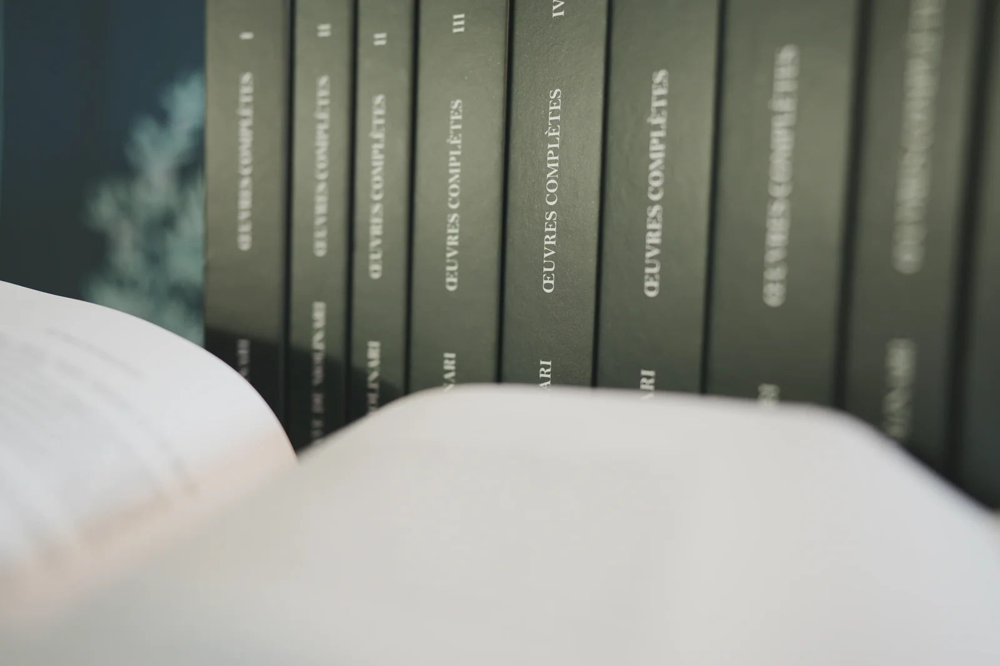

The French liberal tradition of the 18th and 19th centuries constitutes one of the richest, and most unjustly neglected, chapters of the Western intellectual heritage. The Institut Coppet, which developed this course, has devoted itself to rehabilitating the works of the great French liberal economists and philosophers: the complete works of Gustave de Molinari, the writings of Turgot, the friend of the Physiocrats, and many others.

Why does this tradition deserve our attention? For three reasons. First, ideas of liberty are making their return in contemporary debate, and it is about time. Second, this tradition is deeply rooted in French-speaking culture, in our own categories of thought, which makes it particularly accessible to the francophone world. Third, and most importantly, it is universalist in its vocation. From the 18th century onward, these thinkers conceived of human beings as human beings, not as citizens of a particular country or a particular epoch. The influence of a Frédéric Bastiat, for instance, extends far beyond France’s borders and remains strikingly relevant today.

### Against the hatred of theorists

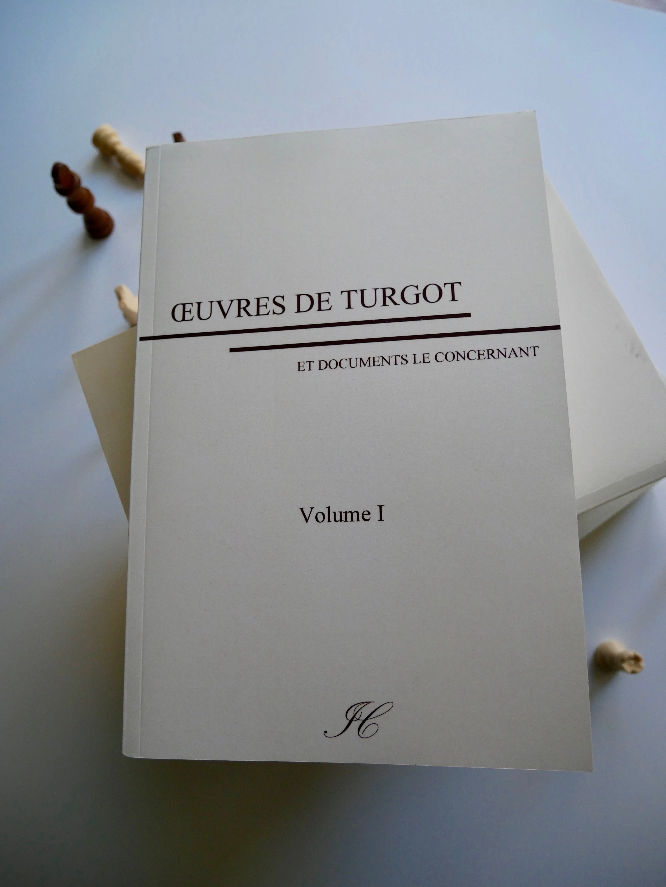

There has always been a certain contempt for theorists. They are dismissed as inhabitants of a world apart, disconnected from reality, while practitioners are celebrated for their concrete, hands-on knowledge. But does this opposition hold up?

Consider: every one of our everyday actions rests on implicit theories. When we climb a staircase, when we pick up an object and hand it to someone, we are unconsciously applying the theory of gravitation. Without theories, even unspoken ones, we simply cannot act. The real question, then, is not whether to be a theorist or a practitioner, but whether we have good theories, grounded in observable facts, or bad ones, built on fallacies.

A particularly damaging version of this prejudice operates in the political realm. Freedom, as an abstract ideal, is almost universally accepted, it is one of the founding dogmas of modern democracies. And yet liberalism, the systematic theory of freedom, is rejected as too abstract, too conceptual. This leads to an arbitrary sorting of freedoms into "good" and "bad" categories: political freedom is valued; economic freedom is distrusted. But consider: the same principles that underpin religious tolerance and universal suffrage, namely, the individual’s capacity for choice, should logically lead to the recognition of economic freedom as well. If I am competent to choose between competing ideas in matters of conscience, and between competing candidates in matters of politics, why should I be declared incompetent when it comes to choosing what to buy, where to work, or whom to trade with?

Without this coherence, freedom is reduced to the simple faculty of periodically choosing a political master. In other words, the collective choice, temporary, infrequent, and imposed uniformly, eliminates the countless individual choices that would enable constant adaptation to circumstances, direct responsibility, and respect for the diversity of human preferences.

### The Ideologists: practitioners of liberty

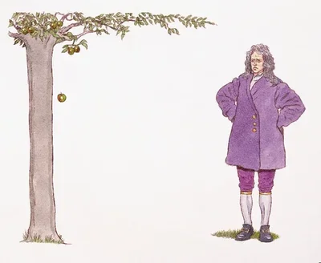

During the French Revolution and the First Empire, a remarkable group of intellectuals known as the *Idéologues*, Destutt de Tracy, Cabanis, Volney, sought to anchor the theory of liberty in the rigorous observation of facts. Far from being disconnected academics, they were themselves practitioners: Pierre-Jean-Georges Cabanis (1757–1808) was a physician; Antoine Destutt de Tracy (1754–1836), a former artillery officer turned agronomist and philosopher, devoted his later years to agriculture and the study of political economy.

It was Napoleon who gave them the pejorative label "ideologues", ironically, since it was Bonaparte himself who, at Saint Helena, confessed that when his ministers asked the purpose of all his conquests and ambitions, he did not know, and admitted that they were astonished by this confession. The so-called practitioner acted without direction; the so-called ideologues possessed a coherent understanding of human action.

### The body, the space, the apple: property as fact

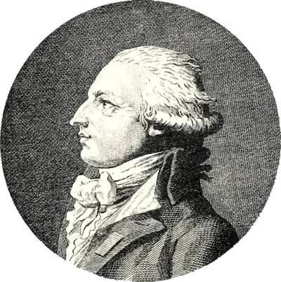

What facts did the Ideologists identify? Let us begin where they began: with the human body itself.

The human being is, first and foremost, a body among other bodies, an entity necessarily occupying physical space. Consider the simple act of sleeping in a bed. Even in a collectivist society, the bed belongs to the sleeper *de facto* while he occupies it. One may imagine a system of communal ownership, but when one sleeps, one sleeps in *one’s own* bed, one occupies it by the mere fact of lying there. Property, in this most basic form, is not an arbitrary social construct. It is a direct and inescapable consequence of our bodily existence.

More fundamentally, appropriation is required by nature. To eat an apple is necessarily to appropriate it. To breathe is to appropriate the air. Every human action demands the appropriation of something. Property is therefore a reality rooted in our physical existence, like gravity, like the need to place one’s two feet on the ground, not a convention that can be decreed or abolished at will.

### Competition: an inescapable fact

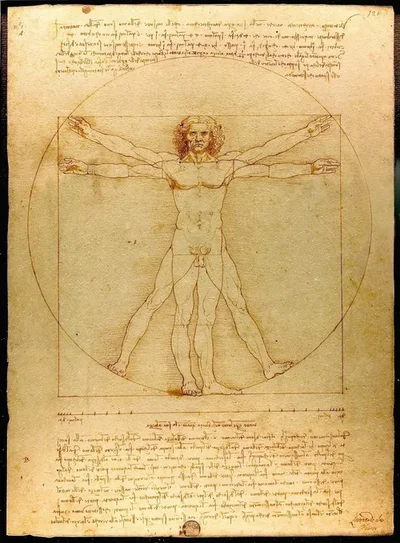

The finite nature of the world gives rise to a further consequence: competition. Apples must be appropriated precisely because they are not infinite in number. We can critique competition, we can deplore it, but we cannot eliminate it. Collectivist systems do not abolish competition; they merely redirect it into political channels, queues, administrative privileges, factional struggles, often at a far greater cost in efficiency and justice. The real question is not whether competition will exist, but what rules should govern it.

### The individuality of perceptions

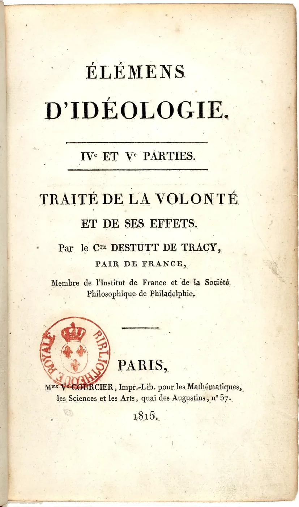

When we turn from the external world to the human being himself, we encounter another foundational fact: the radical individuality of our sensations. I have hunger; I have thirst; I see, *I*, the individual, directly and personally. One cannot experience hunger through another person, nor see through another’s eyes.

This has profound implications for social organization. Decisions grounded in direct personal perception contain information that collective decisions cannot replicate. If I am hungry and I act to satisfy my hunger, the effects are immediate and precisely tailored to my situation. A collective decision about food, by contrast, must aggregate the perceptions of many individuals, each with different needs in terms of timing, intensity, and preference. Its outcomes will inevitably be less adapted to each person’s actual condition.

From this individuality of sensation there also arises what Adam Smith called *sympathy*, the capacity to feel, in an attenuated way, the sensations of others, and the need for human cooperation, since even the most self-sufficient individual depends on exchange and mutual aid.

### Will, self-ownership, and the origin of the "mine" and "thine"

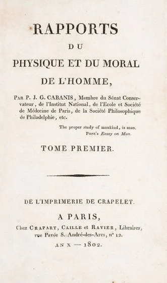

Sensation leads to will, and will is the first form of liberty. While some of our actions are reflexive, automatic responses to stimuli, the great majority are the product of reflection and deliberate choice. I feel my own body, I can act through my own body, of my own will: this is the foundation of self-ownership.

Destutt de Tracy, in his *Éléments d’idéologie* (1815), expressed this insight with remarkable clarity:

> "It seems, hearing certain philosophers and certain legislators, that at a precise moment, one spontaneously and without cause imagined saying ‘mine’ and ‘thine,’ and that one could and even should have dispensed with it. But ‘thine’ and ‘mine’ were never invented; they were recognized the day one could say ‘you’ and ‘I.’ And the idea of ‘me’ and ‘you,’ or rather of ‘me’ and ‘other than me,’ was born, if not the very day a sentient being experienced impressions, at least the day when, as a consequence of those impressions, he experienced the feeling of willing, the possibility of acting that follows from it, and a resistance to that feeling and that act."

In other words, property and liberty are not inventions of legislators. They are recognitions of facts as old as human consciousness itself.

### Human diversity and the limits of reason

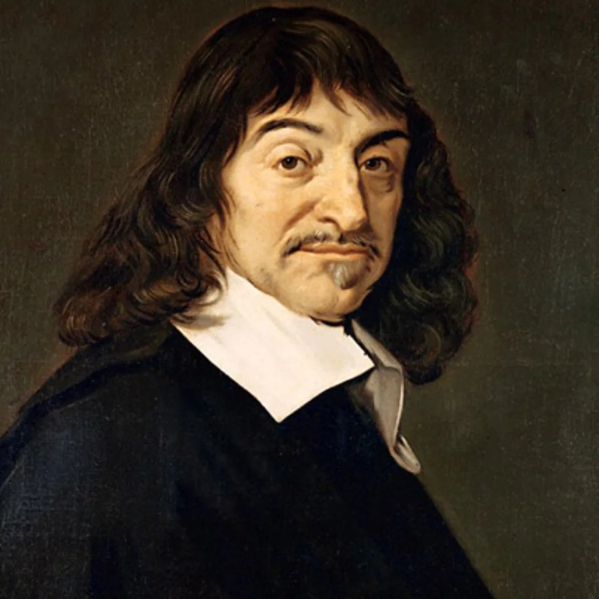

Nature does not produce identical beings. From the earliest observations of newborns, we can detect great diversity in physical capacities, temperaments, and inclinations. Cabanis, the physician among the Ideologists, studied these physiological differences extensively: an individual of weak constitution will not have the same desires, the same recreations, the same ambitions as one endowed with great energy and physical vigor.

This natural diversity has direct consequences for freedom. Different individuals have different wills, and must therefore have the liberty to act according to their own inclinations. This applies to education, children must be educated according to their aptitudes and tastes, not uniformly. It applies to the freedom of work, one cannot simply inherit one’s father’s or grandfather’s trade by tradition if it does not match one’s own abilities. And it applies to freedom of choice in consumption, since the satisfaction derived from goods and services depends on this irreducible diversity.

Finally, a fact that Descartes brought to light and that the Physiocrats and the 19th-century French liberal economists developed to its fullest implications: the limits of human reason. Descartes used the example of the *chiliogon*, a polygon with a thousand sides, to show that the human mind cannot visualize it. Our reason is a powerful tool, but it has boundaries.

The Physiocrats of the 18th century drew from this the conclusion that central planning is impossible. No central authority, no bureau of ministers, however vast, could foresee, anticipate, organize, and coordinate the millions of individual human actions that constitute a society and a market economy. The impossibility of planning is already inscribed in the facts of humanity, and above all in the fact that our reason, however admirable, has its limits.

In the lessons that follow, we will return to these factual foundations of liberty and property. We will contrast them with the ideas and practices of unfreedom, to understand why systems of constraint are grounded not in facts but in sophisms, sophisms that we will have the opportunity to expose in a later part of this course.

## Freedom of expression, freedom of the press and free education

<chapterId>e19775a3-6b1d-50ed-ba6b-979f93a78b4b</chapterId>

### The human fact of thought

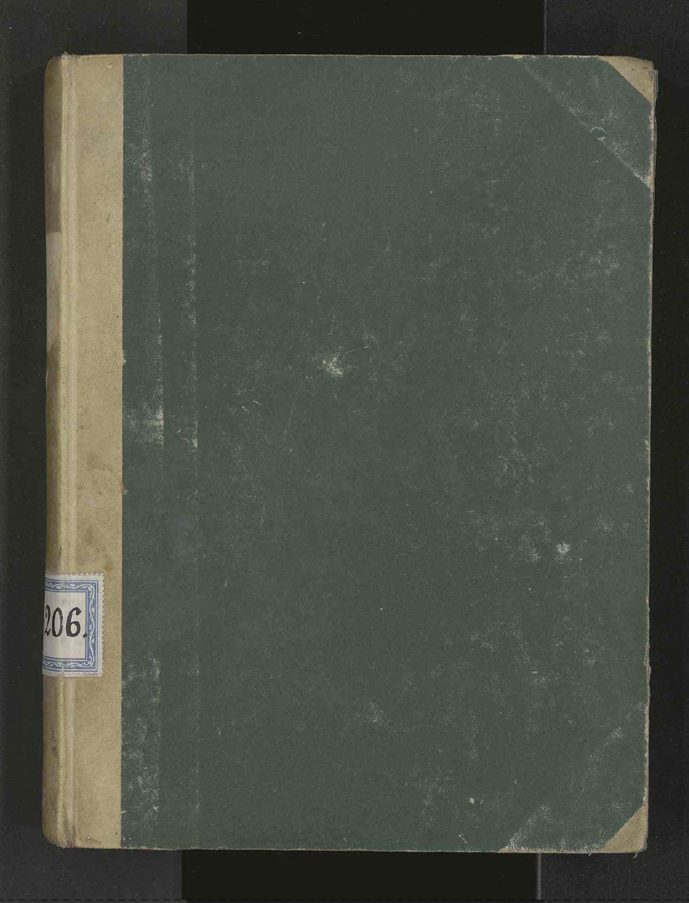

We established in the previous chapter that liberty rests on observable facts about human nature: the body, the occupation of space, the appropriation of things, the individuality of perceptions. But the human being is not only a body, he is also, and perhaps above all, a mind. From this single fact flow religious tolerance, freedom of expression, freedom of the press, and free education.

Charles Comte (1782–1837), in his *Cours de droit naturel*, a series of lectures delivered in Lausanne around 1830, of which we still possess the manuscript, makes this point from the very first lesson: a human being devoid of cognitive capacity would scarcely be recognized as human. We form bonds with others precisely because they are thinking beings, because they have feelings, ideas, convictions that we can share and debate.

This capacity for thought is accompanied by something that no materialist account can ignore: the *pleasure* of thinking. Consider the case of Father Yves-Marie André, a Jesuit scholar whose superiors forbade him from continuing his research on Malebranche. He suffered profoundly, though not everyone would feel the same deprivation with equal intensity. For many people, developing their ideas, exchanging them, teaching them to others, constitutes one of the deepest sources of human satisfaction. The pleasure of learning, the pleasure of teaching, the pleasure of intellectual discovery, these are facts of human experience, not luxuries reserved for the privileged few.

### From thought to expression: the chain of liberty

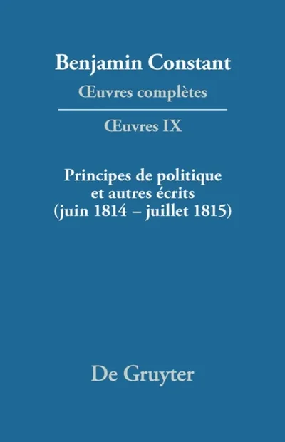

Thought is a manifestation of the will. We feel, we conceive projects and ideas, and we naturally wish to transmit them. Expression, whether spoken, written, or printed, is simply the materialization of thought. If we are free to will, and free to think (since no power on earth can prevent us from thinking), then there is a strong natural presumption in favor of free expression. To break the chain between sensation, will, thought, and its material expression requires very powerful arguments indeed.

Here we encounter a fundamental insight: the inviolability of conscience. One can burn a man for his opinions, it has been done, but one cannot burn his thought. The stake destroys the thinker, not the thinking. No authority has ever had power over thought itself; it can only reach its material expression. We are free to change our ideas, to pursue them to their conclusion, to abandon one intuition and embrace another. This freedom is not a gift of legislation. It is a fact of our nature.

### Benjamin Constant and the sacred property of thought

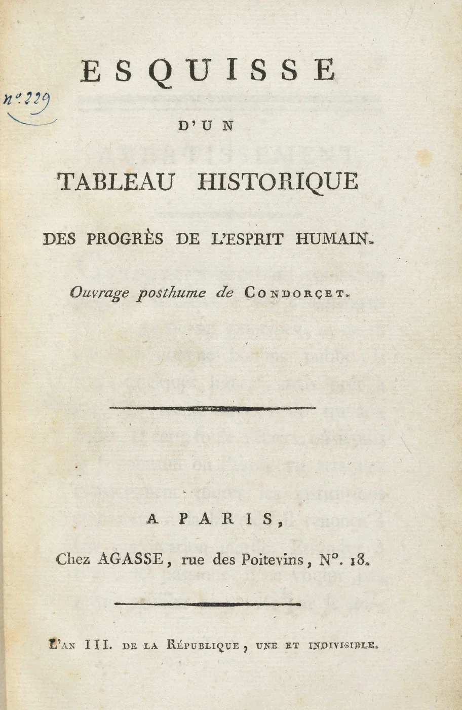

Benjamin Constant (1767–1830), the great Swiss-French liberal, devoted much of his career to defending freedom of the press and individual liberties amid the turbulent political upheavals of post-revolutionary France. In his *Principes de politique* (1815), he expressed the implications of this intellectual self-ownership with characteristic force:

> "Error or truth, man's thought is his most sacred property; error or truth, tyrants are equally guilty when they attack it. He who proscribes superstition in the name of philosophy, and he who proscribes independent reason in the name of God, equally deserve the execration of all men of good will."

In other words, since the individual is the sole owner of his thought, to suppress it in the name of any supposedly higher reason, whether religious or rationalist, is fundamentally unjust. The property of thought belongs to the thinker, and no external tribunal, however well-intentioned, is competent to rule on the contents of another man's mind.

### Human perfectibility and the necessity of free debate

Why, beyond the mere recognition of a natural right, should we actively value freedom of expression? The answer lies in a great idea that the 18th-century philosophical movement brought to maturity: *human perfectibility*.

Nicolas de Condorcet (1743–1794), who stood at the crossroads of the Enlightenment philosophers and the Physiocrat economists, a close friend of Turgot, wrote his masterwork, the *Esquisse d'un tableau historique des progrès de l'esprit humain*, under extraordinary circumstances. In hiding, about to be arrested and executed during the Terror, without books, he composed in a single room a sweeping vision of human progress across the ages.

The core thesis was revolutionary: contrary to the Christian doctrine of the Fall, which posits a descent from original perfection, human civilization is ascending. Each generation transmits its discoveries to the next, and humanity advances from century to century. But this progress is not automatic. New ideas, audacious, pioneering, often initially rejected, must be freely communicated. The discoverer must be able to teach his conceptions to others, to his descendants, and to society at large, so that what was once considered too bold may be tested, accepted, and put into practice.

The debate of ideas functions much like economic competition: among many competing merchants, it is the one who produces best and at lowest cost who succeeds. Similarly, in the marketplace of ideas, confrontation allows the best-founded conceptions to prevail, because everyone can observe their effects and judge whether they accord with the facts. The natural variety of human beings, which we have already noted, is itself the source of this variety of ideas. Individuals born with different constitutions, raised in different environments, will inevitably develop different perceptions, different sensibilities, different judgments. Free debate is therefore not an optional luxury; it is the indispensable mechanism by which the most well-grounded ideas can reach their audience and advance civilization.

### Freedom of the press: the tribunal of public opinion

Freedom of the press extends the principle of free expression into the political realm. Human actions, and especially collective, governmental actions, produce effects that are felt differently by different people. A regulation affecting a particular industry causes suffering to those within it that others may not perceive at all. Each individual must be able to express and publicize the consequences he observes: "This institution harms me, and here is how."

The Abbé de Saint-Pierre, at the beginning of the 18th century, compared political institutions to clocks that need to be wound from time to time. Indeed, laws and institutions grow stale; they require periodic reform. But reform requires informed public opinion, and informed public opinion requires a free press.

French history provides a stark illustration of what happens without this mechanism. In the 18th century, the Enlightenment philosophers electrified the intellectual elite with their ideas. Turgot, as minister, attempted sweeping reforms. But there were no newspapers accessible to the common people, no channels through which an informed public opinion could form and sustain the reform effort. The mass of the population was excluded from the great intellectual debate. The result was that change could only come through revolution, through the violent overthrow of the entire system, rather than through gradual, prepared, peaceful reform.

The free press, by contrast, acts as what the liberals called "the tribunal of public opinion", a mechanism that is both free and rapid. Citizens observe the effects of laws and institutions, formulate their judgments, and communicate them publicly. This tribunal costs nothing; it operates continuously; and it prepares the ground for reform so that violent upheaval becomes unnecessary. It is, in a sense, a profitable enterprise: private newspapers and journals sustain themselves economically while simultaneously performing the essential civic function of democratic criticism.

### Free education: the inescapable conclusion

We arrive at free education, the freedom that, logically, should require no separate defense, yet which encounters the greatest resistance.

Consider: if we accept freedom of expression, does it not follow that we accept the freedom to teach? If we accept freedom of the press, the right to communicate one's ideas through print, how can we deny the right to communicate those same ideas in a classroom? And if we accept religious freedom, the freedom not merely to pray silently at home (which exists under every tyranny) but to worship publicly, to found churches, to propagate one's faith, then we must accept the freedom to educate one's children according to one's beliefs.

Édouard Laboulaye (1811–1883), one of the great defenders of educational freedom during the era of Jules Ferry's reforms, fought this battle with passion, and, unfortunately, lost it. The liberals lost again more decisively in the following decades. Yet the arguments remain unanswerable.

The case against state monopoly in education rests on two facts. First, the natural fact of parental love. Mothers and fathers are the natural tutors of their children. The state, a succession of political parties, elected in moments of enthusiasm, on vast programs whose details most voters do not know, is an artificial substitute for this natural guardianship. Of course, there may be cases of abuse where recourse to an alternative guardian is needed. But to fabricate in advance, and for all children, a substitute tutor, to replace the parent by default, is neither logical nor grounded in the facts of human existence.

Second, the fact of human diversity, which we have encountered again and again. Children are not identical. From birth, they differ in physical capacities, temperaments, aptitudes, and inclinations. To teach the same things in the same way to children who have been made differently by nature is to postulate something that does not exist, the uniformity of human beings. Only educational freedom, with its competition of schools, methods, rhythms, and programs, can accommodate this irreducible diversity and allow each individual to develop according to his own nature.

In the lessons that follow, we will move from these civil liberties to the factual foundations of economic freedom, the freedom of work, of trade, and of property in its material forms.

## Property and freedom of work

<chapterId>9b71cfae-425c-5255-a0f2-7a5b6805e284</chapterId>

### Self-ownership: the first property

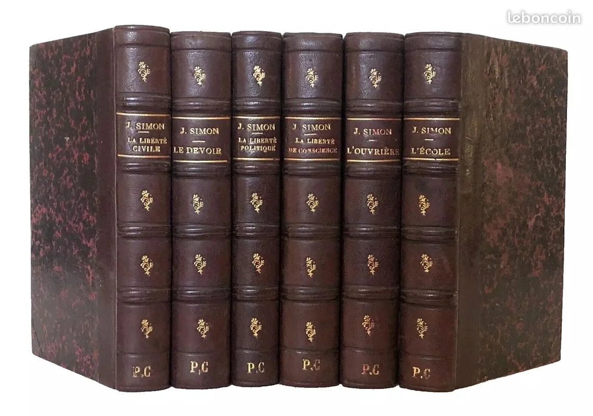

We now turn from civil liberties to the economic freedoms, property, freedom of work, free trade, that are less readily accepted in contemporary debate, yet which rest on exactly the same factual foundations. Indeed, political freedom without economic freedom is a means without an end: it is the freedom to choose a master, not the freedom to live as a self-governing individual.

There is no property of things without property of self. And what is self-ownership? It is the culmination of a chain of facts we have already examined. Consider two cycles of thought that materialize it. The first runs from sensation to judgment, then to opinion: our sensory perceptions are personal and individual; our judgments are free; their expression leads to freedom of the press, education, and religious tolerance. The second cycle links observation, reasoning, and adaptation: the individual observes, establishes links of cause and effect, then acts according to a personal plan of conduct.

Jules Simon (1814–1896), philosopher and statesman, demonstrated in a remarkable series of works, notably *La Liberté civile* and *La Liberté* (1859), that the most complex economic notions, such as capital or freedom of labor, rest ultimately on simple human facts: free reflection and the ownership of one's own thought. From sensation to judgment, from judgment to action, from action to production, the chain is unbroken, and self-ownership is its first link.

### Why property of things

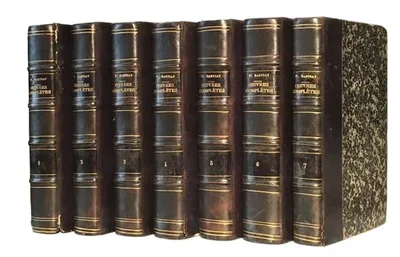

Self-ownership leads naturally to the ownership of things, because human existence can only be sustained through appropriation and production. We must eat, we must clothe ourselves, and to do so we must produce, which requires precisely those acts of observation, reasoning, and purposeful action that belong to self-ownership.

There is no consumption without appropriation. We saw this with the apple: to eat it is to make it one's own. And this appropriation, as its name implies, is an act of making something *proper*, personal, individual. It is because I appropriate individually that I feel the effects individually: it is I who am no longer hungry, I who experience the satisfaction.

But property extends beyond the consumption of perishable goods to the ownership of land, and here a crucial fact enters: possession is work. The image of the settler clearing virgin land, dripping with sweat, captures this reality perfectly. Land in its natural state is often utterly unfit for human needs. To make it productive, one must clear it, cultivate it, maintain it, repair the soil's natural fertility, manage drainage and irrigation. This is arduous, sustained labor.

The same principle extends to capital. To preserve and increase one's capital is a form of negative work, it demands resistance to the constant temptation of immediate consumption, and the ability to direct investments wisely. Many lose their capital, whether through dissipation in consumption or through misguided ventures that fail to reproduce in value what they cost in initial investment.

Frédéric Bastiat, in his *Œuvres complètes*, expressed this link between work and property with characteristic precision:

> "Man can live and enjoy only through an assimilation, a perpetual appropriation, that is, through a perpetual application of his faculties to things, or through labor. From this arises Property."

In other words, property is not an invention of legislators. It is the natural and necessary consequence of human action applied to the world.

### The universality of property

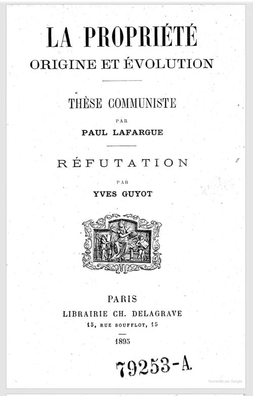

If property were merely a social convention, one would expect to find societies without it. But the opposite is true: property can be observed in all ages and all societies, at different levels of development.

We can even observe it among animals, who claim and defend territories, burrows, nesting sites, hunting grounds, and who recognize, at least in a rudimentary form, the property of other individuals. Bodies cannot live except under a regime of property.

Even at the Stone Age, caves and resources were treated as property, not by all humanity, but by specific tribes. This collective tribal property should not be confused with communism: the tribe excluded other groups. The property was "common" only within its boundaries, and private in relation to all outsiders. The form of ownership was adapted to the conditions of production: hunting, for example, could not be conducted within narrow enclosures, because animals roamed vast territories. But the principle of property was already present, only its application differed.

### Freedom of work: from need to action

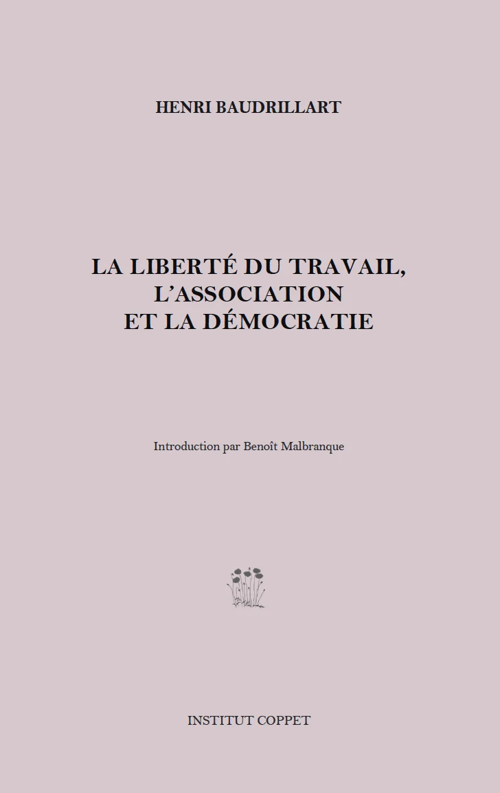

What are the facts at the origin of freedom of work? First, the reality of human need. Needs are not imaginary or fictitious; they are felt, real, and inescapable. One cannot live without satisfying them. And they are individual: it is *I* who feel hunger, *I* who suffer from an ill-sheltered dwelling, *I* who know the intensity of my own discomfort.

From this individual need flows the necessity of an individual plan of action, which is to say, work. I must respond to my needs using my own body, my own faculties, my own intelligence. The plan of conduct I devise is mine by definition: it arises from my own sensations and my own reasoning about the best way to satisfy them.

A second foundation is the variety of dispositions, tastes, and strengths among individuals. Even facing the same need, different individuals feel it differently and possess different capacities to address it. Some have strong bodies that resist long hours of physical labor; others tire quickly but recover after a night's sleep. Some are drawn to manual work, others to intellectual pursuits. Each must be free to employ his own body, which he owns, in the manner best suited to his own situation.

When a regulatory state intervenes, it breaks this natural chain. It presumes to know the worker's sensations better than he does, and to prescribe a plan of action without regard for individual dispositions. But the sensation is personal: only I know how intensely I feel my hunger, how urgently I need shelter. And the plan of action is personal: only I can judge which application of my faculties will best respond to my needs.

### Self-interest and the harmony of the world

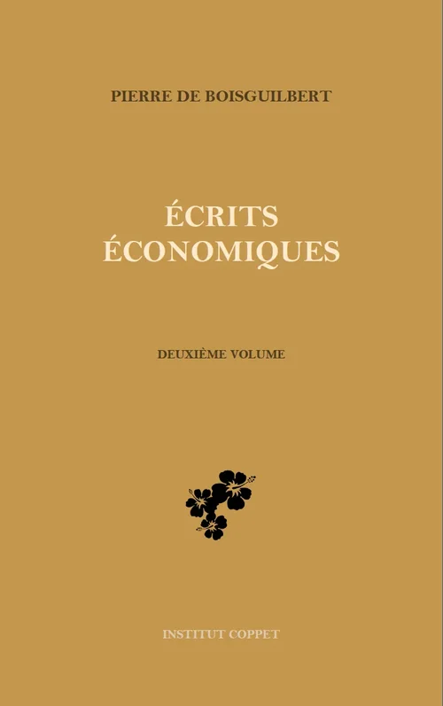

The motive that drives all this activity is self-interest, a fact identified in the French liberal tradition well before Adam Smith. Pierre de Boisguilbert (1646–1714), in his economic writings at the turn of the 18th century, expressed it with remarkable clarity:

> "There is a reflection to be made: that all the commerce of the earth, wholesale and retail, and even agriculture, is governed solely by the interest of the entrepreneurs, who have never thought of rendering service nor of obliging those with whom they deal; and every innkeeper who sells wine to travelers has never had the intention of being useful to them, nor the travelers who stop at his house of making the journey for fear that his provisions might be lost. It is this reciprocal utility which makes the harmony of the world and the maintenance of states; each one thinks of procuring his personal interest to the highest degree and with the greatest ease possible."

Self-interest is not a moral failing to be overcome; it is a fact of human nature, rooted in the individuality of our sensations. It is because I suffer, because I seek the pleasure that will reach me individually, that I develop plans and actions to improve my condition. And it is precisely this pursuit, multiplied across millions of individuals, that produces the harmony of the world.

### Free trade: the logical conclusion

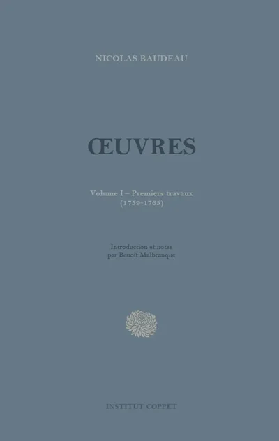

Nicolas Baudeau (1730–1792), a Physiocrat economist, drew the ultimate consequence of these principles with devastating directness:

> "By what right, if you please, by what motive and for what utility do you decide that such-and-such a kind of durable work shall be done in such-and-such a way and not in any other, by such-and-such a person and not by any other? For either I shall find my pleasure and my advantage in enjoying things thus, or I shall find it in enjoying them otherwise, I, the legitimate possessor of a good acquired by my labor, who can employ it for my well-being. If I find my pleasure and advantage in consuming such-and-such an object, in having such-and-such a worker labor for me and in having him labor thus, your regulations and your privileges are quite useless to him. If I do not find it there, if I find it on the contrary in the object you prohibit, in the person you exclude, you manifestly violate my liberty, my property; you prevent, you restrict my enjoyments. Now that is precisely the moral evil, the offense, the usurpation, that is precisely what authority ought to prevent."

Free trade is the logical extension of all these principles. If I am the legitimate owner of a good, acquired by my labor or by a previous exchange, then who has the authority to prevent me from exchanging it for another good that pleases me more? To forbid such an exchange is to violate my liberty and my property simultaneously. The liberal economists of the 18th and 19th centuries did not invent a theory; they observed facts about human nature and drew their consequences with rigorous consistency.

## Non-aggression, respect for property and peace

<chapterId>e8519889-1178-521e-9de7-b32f6177d92b</chapterId>

### Pain, fear, and the limits of freedom

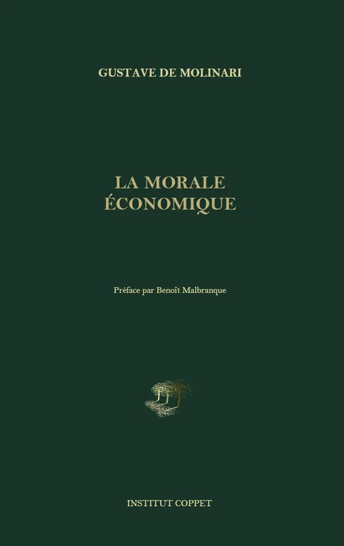

What defines the boundary of one person's freedom? The answer begins with a fact as universal as it is elemental: pain. It is through pain, transmitted by the nervous system, felt in the body, that violations of our freedom and bodily integrity become perceptible. Without pain, we could not recognize aggression. This physiological reality establishes a natural limit to everyone's liberty: any action that causes pain to another constitutes an infringement of their self-ownership.

Gustave de Molinari (1819–1912), one of the most profound thinkers in the French liberal tradition, his career spanned nearly a century, from the age of Louis-Philippe to the eve of the First World War, developed a second dimension of this analysis in his *Morale économique*. Beyond pain, there is fear: the anticipation of harm, and the inhibition of action it produces. When others infringe upon our rights or pose a credible threat, we are compelled to reconsider and adjust our plans. We cannot act as we would have acted in the absence of the threat. Our effective freedom is diminished, even before any physical aggression occurs.

However, and this is a crucial distinction, not all nuisances are of the same order. Imagine a baker in a small town; a competitor opens a shop across the street. The first baker suffers a real economic nuisance. But is this an aggression that the law should punish? Clearly not. The competitor has not violated anyone's person or property; he has merely exercised his own freedom.

Historical developments reveal a gradual expansion of the nuisances that societies no longer consider punishable. In the Middle Ages, competition itself was often condemned: an inventor's new technique threatened the livelihood of established craftsmen in small, closed markets where the effects were felt acutely and there were few alternative outlets. The progressive emancipation from such restrictions, the recognition that competition and innovation, though they cause discomfort, are not crimes, has accompanied the development of freer and more prosperous societies.

### Harmony, peace, and the logic of exchange

Frédéric Bastiat and Gustave de Molinari often summarized their liberal doctrine in two words: "liberty and peace", or, as they sometimes formulated it, "liberty within, peace without." These are not separate aspirations; they are the natural consequences of the same principles.

The harmony of a free society is rooted in the simplest of economic relationships: that between customer and supplier. The customer needs his supplier to obtain the desired goods; the supplier needs his customer to be prosperous, for a rational merchant prefers wealthy customers capable of acquiring his products to impoverished ones who cannot buy anything. This logic applies at every level: within a family, within a city, between nations. It creates mutually beneficial relationships that naturally engender cooperation and peace.

The Abbé de Saint-Pierre, the great pacifist of the early 18th century, much studied later by Molinari, identified a further fact underpinning this harmony: the universal need for security. No individual, however strong, is strong enough to protect himself alone. The strongest man alive was not strong in childhood, will not be strong in old age, and is not strong at every moment, he sleeps, he falls ill, he weakens. This fundamental vulnerability creates a universal need for collective security, which can only be satisfied through the rule of law: agreed-upon rules that protect each person's liberty and property, enabling peaceful exchange.

Finally, the very evolution of production tends toward peace. Hunting and fishing are, in a sense, violent modes of production, destruction rather than creation. The wheat field represents an advance toward peaceful production: it creates utility where none existed before, without destroying other living things. Modern production, increasingly, embodies the logic of harmony rather than predation, and this tendency has only to be recognized and supported by law to produce truly liberal societies.

### Political freedom: decentralization and universal suffrage

Political freedom, though it is a means rather than an end, rests on its own factual foundations. The first is the principle of decentralization, which follows directly from human variety. Human beings are not clones; they have different needs, preferences, and circumstances. This diversity is, above all, individual, not merely regional or national. Logically, decentralization should be pushed to its furthest consequence: individual autonomy.

Benjamin Constant, whom we have already met as a defender of freedom of thought, was one of the most passionate advocates of decentralization. His argument is simple: one cannot plan, organize, or direct a society from a center while ignoring the irreducible diversity of its members. The impossibility of central planning, which we encountered earlier in the limits of human reason, reappears here in the political sphere.

Universal suffrage finds its justification in the same facts. Pleasures and pains are individual: I feel the effects of a law in myself, directly and personally. Others feel different effects and form different judgments. Each person's perception must therefore count, because each contributes information that no central authority could possess. The just law is one that aggregates these individual judgments, not one that is imposed by a minority who presume to know better.

### Civil liberty: from expression to marriage

We have already established the factual foundations of freedom of expression and religious tolerance: they arise from the individuality of human personality and the diversity of judgments that follows from self-ownership. Because personalities differ, judgments will, and must, differ as well. This diversity is not an obstacle to truth but the very engine of human perfectibility: it is through the confrontation of different judgments that the best ideas emerge and civilization advances.

Consider one further example: the choice of a spouse. There are, as the saying goes, a thousand shades of beauty and a thousand ways of being happy. Aesthetic and emotional perceptions are profoundly individual, rooted in the unique physiological constitution and life experience of each person. The freedom to choose whom to love and whom to marry is not a luxury; it is a direct consequence of the same human facts that ground all the other liberties.

With this, we have completed our survey of the principal facts that ground the doctrine of liberty. Liberalism, we may now say, is anchored in the facts of human existence, in the body, the senses, the will, the diversity of individuals, the need for security, the logic of exchange. The systems of unfreedom, by contrast, must deny or ignore these facts. It is to their factual contradictions that we turn in the next chapter.

## The factual contradictions of constraint systems

<chapterId>c13f7395-6734-5c64-b86c-af7922ffbcb0</chapterId>

### The contradictions surrounding property

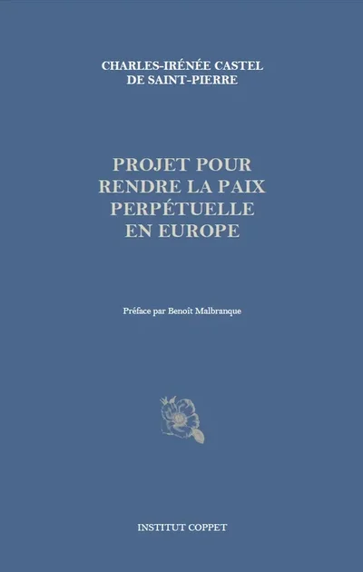

We begin with the most famous slogan of the anti-property movement: Pierre-Joseph Proudhon's "property is theft." Bastiat had no difficulty dismantling this formula, for it is self-contradictory on its face: if property is theft, then theft is property, what is legitimate is illegitimate, and what is illegitimate is legitimate. The phrase sounds revolutionary, but it says nothing coherent. Bastiat, in his *Œuvres complètes*, returned systematically to the origin of property, work, self-ownership, human faculties, and demonstrated that it is grounded in the facts of every society and every age.

The systems of unfreedom postulate an original spoliation: all the best lands, they claim, were seized by force at the dawn of history, and the present owners merely enjoy without labor what their ancestors stole. But this narrative contains two fatal errors.

First, it assumes an ease of enrichment that contradicts all experience. The Marxist vision, and it is strikingly present in all socialist thought, imagines that profits fall automatically from capital, as if one merely had to invest and then collect. There are no bankruptcies in this picture, no sleepless nights of worry, no enterprises that fail because they do not reproduce in value what they cost. This is fantasy, not fact.

Second, if the original despoilment were real, we would expect to see the descendants of these ancient plunderers among the wealthiest families today. But where are they? As time advances, exchanges are conducted legitimately, value for value, work for work. Properties that exist today have been validated a thousand times over by labor and voluntary exchange. Moreover, the conditions of production are constantly evolving: lands once considered supremely valuable can lose their worth entirely, while previously neglected territories, as the contemporary scramble for rare-earth minerals illustrates, can become immensely precious. The idea that all wealth was fixed and seized at the beginning is not merely a moral error; it is contrary to the facts of economic history.

### Contradictions against human nature

Uniform laws and administrative centralization are in direct contradiction with the natural diversity of human beings. These systems impose uniform ways of working, enjoying property, and organizing life, yet property, by its nature, should confer the liberty to use it as one sees fit, within the limits of others' rights. Under regimes of unfreedom, the nominal owner becomes a mere usufructuary: the true proprietor is the state. We are brought back, unwittingly, to the principles of the Ancien Régime, when the king was the ultimate owner of all lands. The systems of unfreedom are, at bottom, always retrograde, they return to the past they claim to have surpassed.

The weakening of self-interest is another fundamental contradiction. Every human being is born with a distinct personality that deepens throughout life. Freedom allows self-interest to find its own satisfactions, voluntarily and peacefully, at its own pace. Unfreedom imposes standardized satisfactions that correspond to no one's actual needs.

The rejection of parental love in education is particularly severe. State education replaces the natural feelings of the mother and father, their intimate knowledge of their child's personality, their emotional investment, with the cold administrative guardianship of a political apparatus that changes with every election cycle. The state has no sentiment, no appreciation for the unique personality of each child. To substitute it for the natural tutors is not progress; it is a contradiction of the most fundamental facts of human attachment.

### The impossible war on thought

Attempts to control thought take many forms: subsidized press, monopolistic national education, limitations on religious freedom, regulated democracy. All are attacks on the very nature of human thought, which is formed within, belongs intimately to each individual, and is the purest expression of self-ownership. Systems of coercion attempt to break the natural link between a person's ideas and their peaceful expression, thereby depriving society of the creative confrontation of opinions from which truth emerges.

This reveals a profound misunderstanding. Thought cannot be controlled from outside without destroying the capacity to think creatively and critically. Systems that impose intellectual orthodoxy end up stifling the very innovation and progress on which the advancement of civilization depends.

### The impossible battles against economic facts

Competition is a fundamental datum of human existence, made inescapable by the finiteness of resources. Systems of unfreedom wage an impossible war against it, not realizing that competition cannot be suppressed, only redirected. Throughout history, it has existed in two principal forms: violent competition (where groups seize resources by force) and peaceful competition (where individuals exchange freely). Political competition, the acquisition of resources through majority vote, is, in essence, a continuation of violent competition under a democratic disguise: one group acquires what another has produced, not through exchange but through legal compulsion.

The aspiration to abolish the law of supply and demand is equally futile. Paul Leroy-Beaulieu (1843–1916), one of the rare liberals elected to the National Assembly, recounted attending socialist public meetings where he was accused of having "voted for" the law of supply and demand, as though it were a legislative act! But the law of supply and demand is simply the natural expression of free human action: when a price rises, individuals reduce their consumption; when it falls, they increase it. This behavior is universal, arising from the structure of human sensation and choice. No decree can abolish it.

The dream of abolishing private property encounters a similar contradiction. Leroy-Beaulieu, in his *Le Collectivisme*, explained it vividly to the workers and peasants who were seduced by the ideal of collectivization: the enjoyment of commonly owned property is profoundly impoverished compared to private ownership. Each citizen is theoretically the owner of one sixty-five-millionth of a national forest or public monument, but when he visits it (if he has the right to visit it), he barely feels like a proprietor at all. Collectivization destroys what the liberals called "the master's eye", that special attention, that personal incentive to improve and maintain, that only the true owner possesses. The inevitable result is neglect and the sub-optimal use of resources.

Finally, the abolition of interest on money and the regulation of profits are attacks on voluntary exchange mechanisms. Interest is simply the price at which capital is transmitted from one who has it to one who needs it, reflecting the time, risk, and sacrifice of the lender. To suppress it, as the medieval prohibitions on usury attempted, does not eliminate the need for capital transmission; it merely forces it underground, creating workarounds and injustices, as the role imposed upon Jewish moneylenders in the Middle Ages tragically illustrates.

These contradictions could be multiplied endlessly. But the pattern is clear: every system of unfreedom wages war against facts, facts of human nature, facts of the physical world, facts of economic life. The systems of liberty, by contrast, are built upon these facts. With this contrast established, we now turn to the history of freedom, to trace, across the centuries, how liberty has gradually won its way against the forces of constraint.

# History of freedom

<partId>367e5e75-44e1-5fab-803f-744cf5ddc85c</partId>

## Prehistoric man and primitive communism

<chapterId>ed3a71e6-6e1b-504a-8c53-fe21b891ad27</chapterId>

### Freedom in history: an ancient possession or a modern conquest?

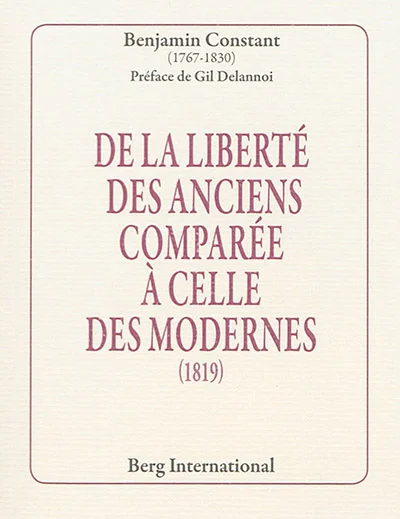

After examining, in the first part, the human facts that ground the doctrine of liberty, we now turn to history. For freedom is not simply a set of facts about the human personality and the world we inhabit; it is also a historical construction. The conditions of human liberty are stronger and more numerous today than they were in the earliest ages of human history. To understand why freedom is a project for the 21st century, we must trace how it has been built, how it has become increasingly practicable, and why it was so difficult to exercise in antiquity.

There has always been debate on this subject, and the French liberal tradition of the 19th century produced one of its most illuminating exchanges. Germaine de Staël (1766-1817), in her opposition to Napoleon, coined the memorable phrase: "Freedom is ancient, and despotism is modern." As if Bonaparte's practice of power were a novelty that had disrupted an age-old tradition of liberty. Benjamin Constant took the opposite view, and, in our judgment, the more correct one. Freedom in earlier centuries, and in antiquity in particular, was neither real nor complete. A long line of 19th-century liberal thinkers extended this analysis, demonstrating that the historical conditions of the past were not conducive to full liberty, and that, on the contrary, each passing century, with its technical improvements and economic transformations, has made freedom more practicable and more firmly grounded in the facts of modern life.

### The myths of the golden age and the social contract

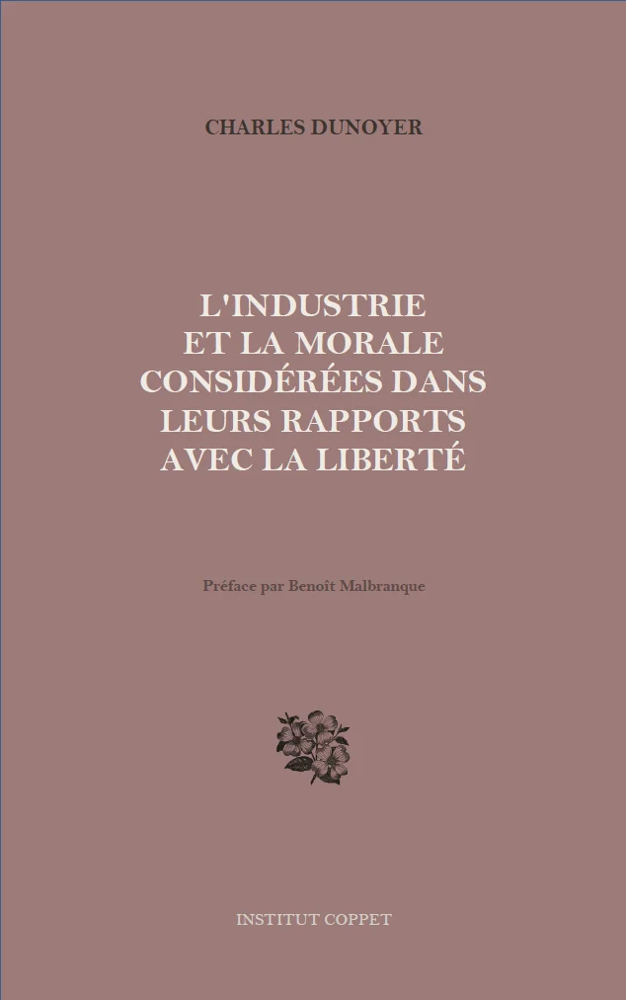

The history of freedom has always been accompanied by myths, and two of the most famous deserve our attention.

The first is Jean-Jacques Rousseau's myth of the *bon sauvage*, which introduces the idea that freedom, autonomy, independence, and the full plenitude of human power are to be found in the past. This is the eternal golden age, shared by philosophers and religious thinkers across the centuries: the conviction that humanity has fallen from an original state of perfection. The liberals of the 18th century, at the time of Rousseau himself, and then through the Revolution and the entire 19th century, systematically countered this false idea. The actual conditions of existence in primitive societies bear no resemblance to the idyll of the noble savage.

The second myth is that of the social contract, the notion that society was founded by a primitive agreement among free individuals. But the elements necessary for such a contract were lacking at the supposed time of its creation: a developed language, the very conception of a society beyond the family. Society is not a voluntary creation born of conscious agreement; it exists from the outset as a natural condition of human existence. One does not create a society; one is born into one. These are historical contradictions and errors that the liberals identified, and that allow us to develop a more accurate view of the history of liberty.

### Self-ownership in prehistoric societies: a non-existent reality

How are we to understand self-ownership in prehistoric or ancient epochs? In these societies, as travelers of the 18th and 19th centuries also confirmed when they encountered archaic societies still surviving in remote regions, the child was the property of the father. He had absolutely no liberty until the age at which he could bear arms and provide for himself. The woman, likewise, was considered the property of her husband or her father; she could be sold, given as inheritance, or exchanged as a material good.

The Abbé de Saint-Pierre explained this situation by the extreme weakness of productive power at the time. Production was limited to hunting, fishing, and gathering; security was nonexistent. There was an imperative need for adult male support. If a woman wished, as the Abbé put it, to "taste freedom" and flee her encampment, she would face certain death in the wilderness, for there was no independent productive capacity available to her. One simply could not create conditions that did not yet exist.

In the same way, the individual was entirely subjected to the tribe. A set of rules governed every action, including the most personal. The private sphere that we define today as a space of freedom did not exist. These societies practiced the systematic sacrifice of individuals considered incapable or weak: abortion, the sacrifice of widows and the elderly were regular practices, often sanctioned by laws and religions. The circumstances that explain all of this are, first, an ungrateful and unproductive nature, making it extraordinarily difficult to obtain resources and wealth in the earliest ages of human history. There were also climatic hazards and dangers from other tribes; security simply did not exist. One was completely subject to the vagaries of nature, far more so than today, when hazards can be anticipated and solutions found to mitigate their effects. The combat for life, against the natural world and against competing tribes, was conducted without any particular protection, without security at the scale of tribes or nations.

### The impossibility of private land ownership

Private ownership of land was equally impossible to establish. The productive activities of the time, hunting, fishing, and gathering, required vast common territories. The hunt for buffalo or elephant, for instance, could not be conducted within an enclosed terrain of two hectares. Nomadic life was a necessity, not a choice. Pastoral peoples, by definition, could not attach themselves to a fixed, small plot of private property.

This communal ownership should not be confused with communism in the ideological sense. The land was common within the tribe, within the family or the group of families, but it was considered the property of that group. There were significant conflicts between tribes; no one imagined that the entire earth was the common property of all. These groups behaved like animals defending their territory. But this was not private property linked to the individual; it was a collective adaptation to the conditions of production.

### "Free! Free to do what?"

Charles Dunoyer (1786-1862), in his remarkable work *L'industrie et la morale considérées dans leurs rapports avec la liberté* (1825), and later in *De la liberté du travail* (1845), showed that freedom is a progressive construction. We are freer in industrial societies than in feudal societies, freer under feudalism than under ancient slavery, and freer under slavery than in prehistoric times. But what was prehistoric man free to do? Nothing, because human existence was subject to every conceivable constraint.

The absence of security was a fundamental obstacle to freedom of action. Why act, why undertake, when the fruits and effects of one's actions are constantly compromised by danger? The omnipotence of custom further prevented any real liberty. Given the lack of security and the overwhelming number of hazards, it was judged better to impose a direction on man than to leave him with his feeble lights amid circumstances too difficult for individual judgment. The great mass of the population submitted to custom, perhaps less willingly among the elite, but broadly and thoroughly, because the circumstances demanded it.

### The impossibility of freedom of thought

Could freedom of thought be exercised in such conditions? The development of intelligence requires daily cultivation through education and observation. But how could intelligence be mobilized when production depended principally on brute force? The productive activities of early societies relied on physical strength to obtain the necessities of survival, and there was little scope for intellectual contribution.

Technical innovations transformed this equation fundamentally. The steam engine is an emblematic example: it belongs to a series of tools, machines, and technological improvements that, from the Middle Ages to the present, have allowed freedom of thought to become a practical reality. Consider the comparison between a porter, who transfers goods by the strength of his back, and a locomotive driver. These two occupations do not require the same human dispositions. The latter permits a far more complete development of intellectual capacities and a genuine acquisition and exercise of freedom of thought.

These are the historical elements that explain the progressive development of liberty. In the lessons that follow, we will examine the specific circumstances that made freedom increasingly possible, and how it has imposed itself, step by step, as the governing principle of modern societies.

## The ancient raison d'être of slavery, serfdom and political authority

<chapterId>29fc841c-eb21-522d-818c-9b50c6558396</chapterId>

### The first raison d'être of slavery

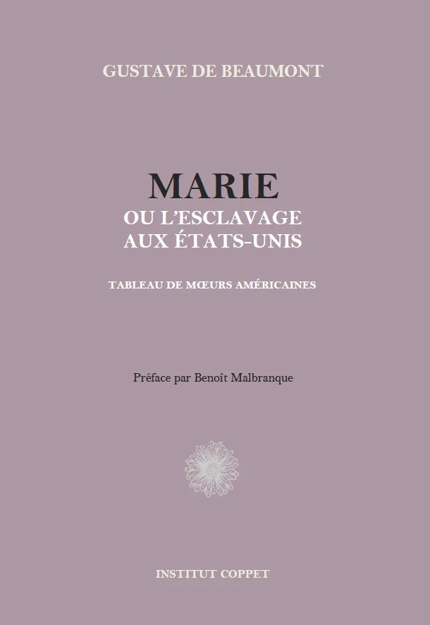

After examining the unfreedom imposed by the circumstances of humanity's most distant past, we now turn to the specific institutions that grew from those circumstances: slavery, serfdom, and political subjection. We will see how these forms of non-liberty, once rooted in the facts of their time, gradually yielded to new facts and new circumstances.

Slavery was born in specific circumstances, imposed itself in all societies, and developed universally, because it was intimately linked to the conditions of the epoch. First, the production and acquisition of wealth were accomplished almost exclusively through force: hunting, combat, and conquest. Men trained in violence and domination of others, in the domination of animals and in violent conquest, were naturally inclined toward the enslavement of their fellow men.

The characteristics of individual production in the past deserve our attention. The results were mediocre: one labored enormously, employing great physical force, but the outcomes were extremely small and deeply uncertain. The weakness of markets compounded this difficulty. Even if one had produced abundantly, how could one transport perishable goods? Today, of course, the market is open; even fruits and vegetables can be shipped across the world. In the earliest epochs, transfer between two villages or two tribes was already immensely difficult, especially when human groups lived at great distances from one another. There was almost no preservation apart from dried meats and similar methods. Commerce was extremely limited, and consequently wealth was hard to obtain amid numerous and powerful hazards.

In this precarious existence, slavery served as a form of insurance against existential risks. It permitted workers to contribute to production without having to risk their lives each day in the most dangerous activities. Slavery persisted in these societies because two elements sustained it: the daily violence and insecurity, and the mediocrity of productive results that required labor to be organized by force.

Aristotle himself provided a retrospective justification. Slavery existed, he explained, because there were no machines. If production could have been mechanized, if tools could have performed the work of human muscles, slaves would have been dispensable. But production remained extremely limited and uncertain, and so the balance of advantages and disadvantages of this brutal insurance tilted in favor of the institution of slavery, in all ancient societies, as a consequence of those particular historical circumstances.

### The successive transformations of slavery

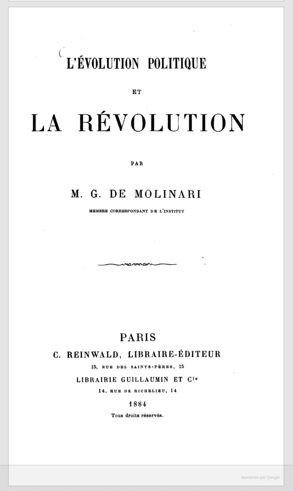

Yet slavery, however firmly anchored in the historical circumstances of humanity's earliest ages, began to transform as production itself transformed. When economic activity became more intellectual, requiring creativity and innovation, slavery proved profoundly inadequate. A slave responds to the whip and the rod, but he cannot invent. When a society needs invention, when it needs to employ mental vigor productively, slavery becomes inoperable. At the same time, as circumstances became less dangerous, individuals found within themselves the capacity to govern their own conduct and the willingness to assume the risks of an autonomous existence.

These transformative forces drove the gradual abolition and mutation of slavery, first into serfdom, then into other, less restrictive forms of political or social domination. Century after century, as circumstances changed, individual liberty became more and more possible. This evolution was especially visible in societies most affected by technical and technological progress, where new circumstances provided concrete support for the expansion of freedom.

### The liberal critique of modern slavery

The maintenance of slavery in America in the 18th and 19th centuries presented a major historical paradox. French liberal thinkers recognized that slavery may have had a certain justification in the most ancient societies, in antiquity and in the earliest ages of colonial exploration. But the slavery of Black people in the modern era had no justification whatsoever; it was an anti-productive system maintained artificially by political authority.

Gustave de Beaumont (1802-1866), who undertook his famous voyage to the United States in 1831 alongside Alexis de Tocqueville, chose upon his return to focus his own work on the reality of the massacre of Native Americans and the condition of Black people in American society, both enslaved and nominally free, while Tocqueville devoted himself to writing *Democracy in America*.

Charles Comte (1782-1837) and other liberal authors identified two principal effects of slavery that led them to condemn the system in the strongest terms. First, the brutalizing effect on the slave himself. Under the new conditions of production, even as early as the 18th century, there was a growing need for intellectual effort, for the application of intelligence and even morality to productive work. Slavery did nothing but brutalize the person; it could not call upon his intellectual capacities, depriving him of any possibility of development. Second, and equally devastating, was the brutalization of the slave owners themselves. They developed a profoundly negative view of work and employed nothing but force. The habit of dominating others transformed their ideas and their character. It was no accident, these authors observed, that the great slave-owning families of Virginia produced so many politicians and presidents: the practice of domination over others engendered conceptions that were profoundly illiberal, incompatible with the principles of equality that ought to underpin modern societies.

### Political subjection: born of the same circumstances

Political subjection, too, had its roots in the same circumstances as slavery. In the most ancient societies, the imperative need for security demanded leadership. One could not go hunting without direction, for one unproductive hunt, two unproductive hunts, meant famine and death. In combat, when one tribe attacked another, there was a need for resolution, for rapid and decisive choices. This need for chiefs and political domination imposed itself, and we see in these societies an extensive power of leaders and, above all, of regulations covering nearly every aspect of life.

The risk of war, combined with the extreme weakness of security, demanded national-scale political protection. The narrowness of markets and the nullity of communications further reinforced this dependence: one could not emancipate oneself from one's group, could not seek out competition or new ideas, because communications were too feeble. One was therefore subjected to the political power that governed, a power that may have had greater justification in the past, precisely because those circumstances were so much more dangerous and decisive than they have since become.

With this examination of the historical raisons d'être of unfreedom, we can already sense the transformation. In the following lesson, we will trace the technical and intellectual progress that, by changing the conditions of human existence, has made freedom not merely possible but increasingly inevitable.

## Emancipating technical and intellectual progress

<chapterId>a9cf7eb2-4639-5b8a-8fd6-2ad0a9e7cff2</chapterId>

### From destruction to production

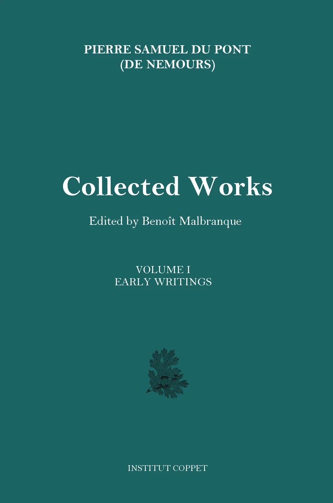

We now examine the specific elements that, across the history of humanity, have permitted the transition from systems of non-liberty to the progressive establishment of freedom. What new circumstances opened the door?

Let us begin with the transformations of production itself. In the earliest epochs of human history, production was, properly speaking, destruction rather than creation. Hunting, fishing, and gathering took from nature's storehouse without adding anything new. Human groups did not create foodstuffs; they merely seized what they found. This imposed severe limits: the game had to reproduce, the fruit trees had to be sufficiently numerous, and once a territory was depleted, one had to wait an entire season or move on. Nomadic displacement modified the space in which these groups operated, but fundamentally they remained in a logic of destruction and seizure, not of production.

Here we encounter, once again, Rousseau, and his famous image of the man who first enclosed a piece of land, thereby becoming the original despoiler of a supposedly common earth. Paul Leroy-Beaulieu (1843-1916), in *Le Collectivisme*, demonstrated that this image is false. The land was not common to all humanity; it was common within a small human group, the tribe or the family, but it was considered the property of that group. There were significant and regular conflicts between tribes. No one imagined that the earth belonged in common to all different groups; they behaved like animals defending their territory.

The man who first enclosed a piece of land was not, therefore, a despoiler, but rather a generous benefactor. He transformed production by destruction into genuine production. By mastering the elements of life, through breeding and the beginnings of agriculture, he caused more resources to be born than he consumed. He created a true surplus of production, improving the environment in which he lived and drawing forth new wealth that he did not merely seize but genuinely created. This was a revolution, because entirely new conditions could arise from it: the hazards could be better understood and anticipated, the population could grow, and the new resources made it possible to finance collective protection, security, and the beginnings of social order.

### Security as both prerequisite and consequence

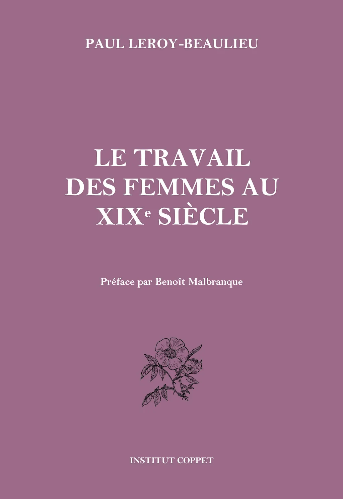

Dupont de Nemours (1739-1817), one of the great Physiocrat economists who anticipated Turgot and, indeed, Adam Smith, wrote in 1765 in the *Journal de l'agriculture, du commerce et des finances*:

> "A crop that yields no net product, however abundant the harvests, can sustain only a small number of scattered families, without any relations, commerce, or communication with one another, and consequently without these families being able to form a nation, even if they inhabited a territory as vast as Europe; for the isolated men who cultivated this land would have no guarantor to ensure the property of their harvests, nor even the safety of their persons, since it would be impossible for them to incur any expense for the maintenance of a tutelary authority powerful enough to repress the disorders that the cupidity of those who would violate the rights of others might occasion."

The logic behind this passage is clear: the new resources generated by genuine production, particularly agriculture, make it possible to introduce a higher degree of security into human relations. There are more resources, therefore more exchanges, and peaceful, contractual relations can develop to a far greater extent than was possible in the warlike societies of the hunting epoch.

Yet here we encounter a paradox that explains the historically slow pace of progress. Security is a prerequisite for economic development: without it, how can one innovate, invest, or produce? But security is also a consequence of development, since only a production surplus can finance the institutions that guarantee social order. This cycle is very difficult to set in motion, and once started, it advances only slowly. But once it gains momentum, it tends to reinforce itself progressively.

### What capitalism truly means

The term "capitalism," though somewhat imprecise, allows us to identify what lies behind the emancipating technical and intellectual progress of recent centuries. At its core, capitalism represents the substitution of the tool and the machine for brute force as the central element of production. This is the end of domination based on physical power, and the beginning of peaceful production and exchange.

This transformation profoundly altered the status of individuals, and particularly of women. In hunting and warring societies, women's productive contribution was considered secondary, because it depended on physical strength in which they were disadvantaged. The arrival of sophisticated machines and tools, requiring less brute force and more spirit, direction, and intellectual vigor, enabled women to increase their productivity substantially and to participate in economic life on more equal terms. Self-ownership, that foundational principle of individual liberty, grew with capitalism and its technical and technological advances.

Technical progress also opened markets. Roads, and especially railways in the 19th century, expanded outlets, enabled national and international competition, and subjected societies increasingly to the logic of contract rather than constraint. The price of life itself rose, because the individual, being more productive from an earlier age to a more advanced one, could contribute, innovate, and exercise freedom throughout a much longer span of active existence.

### The changing status of the innovator

These transformations also altered the value placed on innovation. In the most ancient societies, the innovator was viewed with deep suspicion, because he created uncertainty. In a world where one lived day to day, where hazards were overwhelming and security nonexistent, new ideas were dangerous. The human group would not follow an innovator who could not guarantee that his new methods would yield results, because the cost of failure was starvation.

New material conditions permitted new ideas to flourish. The historical tendency toward human perfectibility made innovation not merely tolerable but actively sought. In the Middle Ages, innovators were persecuted and burned; in modern societies, they have become heroes. This reversal is not a change of moral fashion; it is the direct consequence of material conditions that now allow experimentation, tolerate failure, and reward improvement.

When we examine the different stages of development, from the earliest societies with their meager production and extreme vulnerability to natural hazards, through to societies capable of deploying machines and tools that diminish the pressure of nature's uncertainties, we see a profound correlation between material conditions and the potential for individual freedom. Freedom is not an abstract philosophical aspiration; it depends fundamentally on the material conditions that enable human beings to free themselves from the most pressing necessities of existence.

## History at a glance

<chapterId>3fffa63c-58bb-5c97-a2f5-fec90c05f182</chapterId>

### A summary and a deeper synthesis

Let us pause to draw together the threads of the preceding lessons before proceeding to the new circumstances of our own century. What general view of history emerges from the analysis we have conducted?

First, we identified a set of facts that, in the most ancient societies, prevented the full establishment of liberty and property. The numerous hazards of production, the extreme precariousness and meagerness of results, and the very conditions of productive activity, notably hunting, which required vast territories incompatible with small private property, all conspired to make freedom and property more a distant aspiration than a concrete reality.

Then we identified the facts that permitted emancipation: the birth of agriculture, which introduced peaceful production and the accumulation of surpluses; the multiplication of exchanges made possible by greater resources; the emergence of contractual relations, introducing interactions based on mutual agreement rather than force. From these material transformations arose new ideas and new possibilities for human organization.

### A new way of reading history

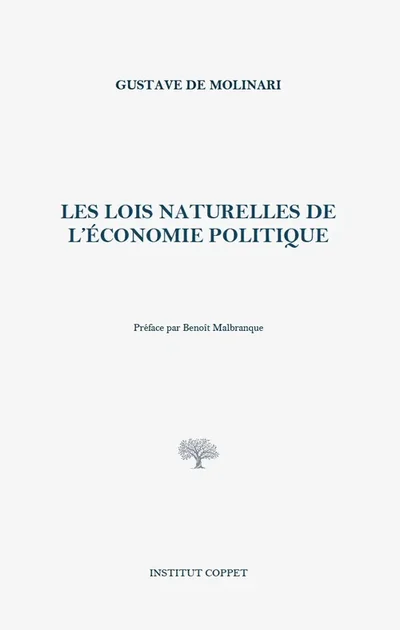

All national and world histories can be analyzed through this lens, and it is a profoundly important, though regrettably neglected, approach. The conventional narrative of history focuses on the conquest and transmission of power: the rise and fall of dynasties, the birth of monarchies, the succession of political regimes. This has little real interest. What matters most is the gradual conquest of freedom: how it advances, why it advances, and what drives it forward.

Ancient societies, those of Antiquity and the Middle Ages, were organized differently precisely because their production techniques differed radically. Political systems were not arbitrary impositions; they were responses to material circumstances. Several major transitions mark this progression: the beginnings of agriculture and private property, the passage from slavery to serfdom and from serfdom to regulated labor (an uneven transition, accomplished with considerable difficulty in some societies but proceeding century after century), the birth of small-scale industry, the great inventions (the steam engine above all), and the discovery of new continents.

Each of these transformations opened markets and created the conditions for competition. Without roads, without railways, without the discovery of other peoples and other lands, the world remained small, without communication, without competition of ideas or competition of products. One lived on a tiny market, under both political and economic domination, and suffered the full force of natural hazards, because commerce, which enables the balancing of agricultural outcomes across regions and seasons, did not exist.

### The Enlightenment: when ideas meet new circumstances

The Enlightenment movement represents, in our view, one of the most significant moments in this history. It was the emergence and manifestation of new ideas that found their application precisely because material conditions had changed. The thinkers of this epoch, the Physiocrats, Turgot in particular, and Condorcet, anticipated an ever-increasing progress of humanity. This notion of perfectibility of the human species led them to conceive of institutions, and above all a practice of liberty, that would be far more ambitious than anything previously attempted, because freedom was now increasingly imposed by new circumstances, and its practical utility was making itself felt.

Consider the contrast with the Middle Ages. In the medieval period, free competition and the freedom of prices could reasonably be considered impractical. The baker in a small town had a reserved market; one could not obtain bread from a competitor several kilometers away. For many goods, even agricultural ones, there was simply no alternative source, and producers consequently exercised a domination over consumers that the circumstances of the time made almost inevitable. In the 18th century, the Physiocrats observed the birth of world trade, particularly in agricultural commodities, and demonstrated that these new circumstances demanded free trade, which would allow prices to reach equilibrium and goods to be obtained at the lowest cost.

### Reforms versus revolutions

The French example of the 18th century illustrates, with painful clarity, the great necessity of harmonizing ideas with facts. The philosophers of the Enlightenment electrified the intellectual elite with their ideas, and Turgot, as minister, attempted sweeping reforms. But the fundamental problem was the impossibility of aligning new ideas with social realities without passing through violent revolution. How could an enlightened public opinion be formed without a free press, without channels through which ideas could reach the common people?

Normally, reforms and public opinion work together: gradual changes, guided by informed judgment, allow ideas to be peacefully reconciled with facts, extending freedom because the new circumstances both impose and permit it. Revolutions, by contrast, produce enormous violence (their costs are considerable) and tend to impose far more change than public opinion is prepared to absorb. This explains the frequent and bitter reversals that follow revolutionary periods: the population is not ready for everything the revolution demands.

The patient work of gradual reform is therefore preferable. It allows societies to embrace greater freedom when the time truly permits, without the destructive convulsions of violent upheaval. This is one of the essential conclusions of our historical analysis, and it prepares us for the question we will address in the next lesson: what are the specific circumstances of our own century, and why are they the most favorable to liberty that have ever existed in the history of humanity?

## The new circumstances of the 21st century

<chapterId>a1c0c590-d0f6-5a18-a949-67f7a568ca6d</chapterId>

### The increasingly intellectual character of work

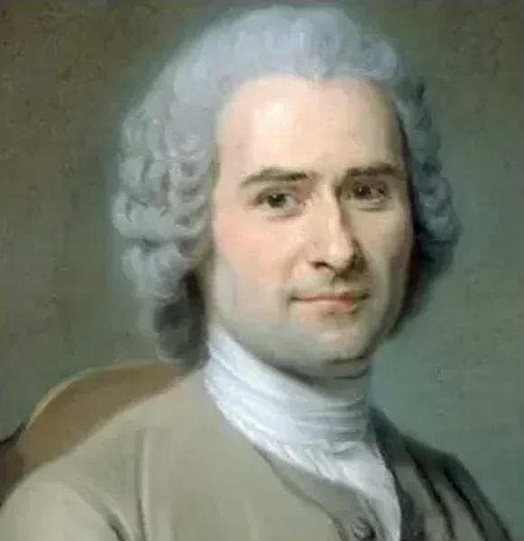

We come now to the conclusion of this second part, and to the question that gives it its full significance: what are the new circumstances of the 21st century, and why do they make freedom not merely possible but imperative?

The first and most decisive fact is that work has become increasingly intellectual. This creates an entirely new situation, because the development of thought does not happen by miracle; it happens through free debate, through the competition of ideas, and therefore through religious tolerance, freedom of expression, and free education. In societies where production required nothing but brute force, educational freedom had no particular importance; one simply had to learn to hunt or to break stone. The intellectual patrimony of humanity was far smaller, and education occupied a correspondingly reduced domain.

The great defect of authoritarian systems of education and thought is that they always conceive of ideas and truth as fixed, as things merely to be transmitted. But the truth is not fixed; knowledge is created, it improves, and the purpose of education, like the purpose of all freedom of expression, of science, of research, and even of religious tolerance (for there is a necessary progress of religious ideas as well, a subject on which many French liberals, Benjamin Constant among them, labored extensively) is to enable this creation and improvement.

Paul Leroy-Beaulieu, in his *Essai sur la répartition des richesses*, was one of the French liberal authors who most thoroughly analyzed these new circumstances and their future implications. He showed that the increasingly intellectual character of work enriches new layers of society, and in particular transforms the situation of women. As work becomes more intellectual, women's value and productive contribution rise dramatically. One can no longer confine them to the household and the family without cutting society off from the intelligence of half of humanity, intelligence that is needed for innovation, for technical and technological improvements, and for the general advancement of production.

### The abundance of new resources

Work has also become far more productive, and this introduces a cascade of new circumstances. Greater productivity generates new resources that can be employed, first, for savings and individual self-sufficiency. The individual becomes increasingly capable of sustaining himself and of activating his individual liberty by assuming the responsibilities that come with it, rather than relying on the security of servitude. These new resources can also finance security on a collective level: a police force, a justice system, far more effective and far less costly, proportionally, than anything available in the past.

Resources become available to mitigate hazards: diseases, natural disasters, and the countless uncertainties that once dominated human existence. In the most ancient societies, communities were entirely at the mercy of these hazards; today, we can anticipate them, protect against them, and dedicate resources to their management.

Perhaps most significantly, new resources become available to care for the weak and the vulnerable: children, the elderly, the severely disabled. In the earliest societies, these individuals were systematically sacrificed, not out of cruelty but out of economic necessity. The elderly could not be sustained when they could no longer contribute to production. Newborns were tested for physical fitness; those deemed weak were killed. In some societies, the firstborn child was routinely sacrificed, on the reasoning that, like the first fruits of a tree, the earliest offspring were not as sound as those that followed. Women were maintained in minimal numbers, because they cost resources to sustain and their productive contribution, in an economy based on brute force, was considered negligible. These practices, which we examine today with a mixture of horror and curiosity, attributing them to religious ideas or superstition, were in fact economic necessities imposed by the extreme precariousness of existence.

### Globalization and the harmony of interests

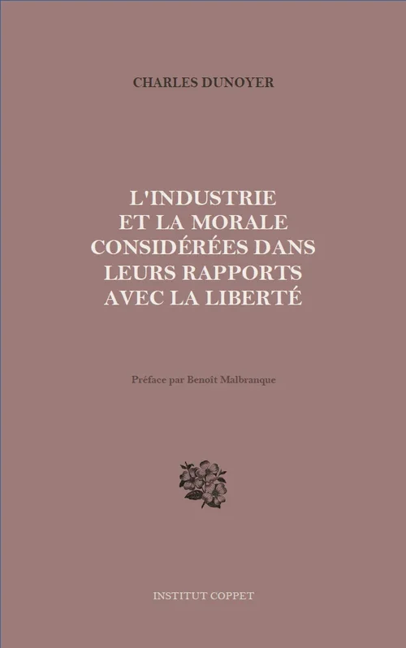

The new circumstances also include globalization, the opening of markets that permits the harmony of interests. In the modern world, we are increasingly in relationships between producers and consumers, between suppliers and clients, rather than in the opposition of interests that characterized ancient societies. When production depends on seizure rather than creation, when two groups compete for the same hunting ground, they are locked in a zero-sum conflict. But peaceful competition, made possible by ever-widening markets, allows each producer to improve, to innovate, and to serve consumers at lower cost, creating mutual benefit.

International competition also makes the effects of harmful regulations, heavy taxes, and excessive public debt far more visible and consequential. In the closed societies of the past, political domination could be total, because there was no alternative; there was no external market against which to measure one's performance. Today, the nations that are most liberal draw the greatest profit from commerce, precisely because they are in competition with nations that are indebted, interventionist, burdened by oppressive regulations and heavy taxation, and consequently less productive. The consequences of unfreedom are no longer hidden; they are exposed by the relentless comparison of international trade.

### Technology: the retreat of thought control

Finally, the history of technology, which reaches back to the earliest ages but has accelerated stupendously in the last two centuries, provides perhaps the most striking of the new circumstances. Technology has enabled advances in freedom and consolidated gains that would otherwise be fragile.

Consider the retreat of the control of thought. The French liberals of the 19th century, even during the era of Napoleon III, struggled to write letters to one another freely. The press was controlled; correspondence was surveilled. Publishing a book required navigating censorship and regulation; an imprimeur could not risk publishing works that might be banned, just as under the Ancien Régime, when a royal authorization was needed to print any volume. Today, technology has dramatically reduced the ability of governments to control the transmission of ideas between individuals. The creation and dissemination of new ideas is immeasurably easier than it was even two centuries ago.

We see this also in the protection of private life, and in the development of digital currencies, which permit exchanges far less constrained than those of the past. These are elements upon which I would like to conclude this examination of new circumstances. The past is far more deeply embedded in conditions of non-liberty than we tend to realize, and today we see new elements of technology, of productive and above all intellectual work, a revolution of immense importance, that make freedom more practicable than ever before.

We can return to the fundamental facts of human nature that we established in the first part: self-ownership, individual liberty, individual autonomy. These facts have not changed; but the circumstances that permit their exercise have changed profoundly across history. This was the entire purpose of the second part of our course. We now turn to the effects of freedom and the effects of constraint, which we will compare, before examining the sophisms that sustain political domination even in our own day, and finally outlining a program of liberty, economic, social, political, and international, as it is possible today after these historical transformations.

# How freedom works

<partId>d8b75eca-d6c5-535c-a659-2a0320783baf</partId>

## The ability to govern oneself

<chapterId>aeca263f-cce0-5025-829e-4480b73394a6</chapterId>

### The good use of freedom

After examining the facts that ground the doctrine of liberty and the historical evolution of freedom and constraint, we arrive at a crucial preliminary question before studying how freedom operates in practice. For freedom to truly assert itself as a project for society, and for it to make genuine progress in history, it must be well used. And to use freedom well, one must first learn to use it.

Two essential principles guide this apprenticeship. The first: do no harm to yourself. If one squanders one's own strength, if one uses freedom in an uninformed or reckless manner, one may destroy the very freedom one seeks to exercise. The second: do no harm to others. Those who attack the freedom of others place themselves at war with humankind and with society, and in organized societies this war inevitably results in a severe diminution of one's own freedom through the intervention of judicial and police institutions.

Beyond these two protective principles, there is a third requirement: to use freedom with maximum useful effect. This optimization of freedom is made possible by the technological and technical developments we have traced in the preceding part, the fruit of a long historical process. When we analyze the facts of history, what matters most is not the succession of political powers or territorial battles, but this gradual development of freedom and the apprenticeship that accompanies it.

### Harming oneself: freedom that destroys itself

Alcoholism provides a particularly enlightening example of a use of freedom that ultimately harms the person exercising it. It begins as a free act, but it gradually diminishes the individual's capacity for freedom by placing him in a state of dependence. The immediate effects of excessive consumption are compounded by more distant effects: a loss of faculties, a reduced willpower, a diminished possession of oneself and one's own forces. The individual becomes less and less capable of making use of his capacities, including his mental ones.

More generally, intemperance and all actions or habits that deprave, enervate, or brutalize our faculties are obstacles to true freedom. The more these behaviors impair our capacities, the less free we are to make enlightened use of them, or indeed any use at all.

### Harming others: war against humankind

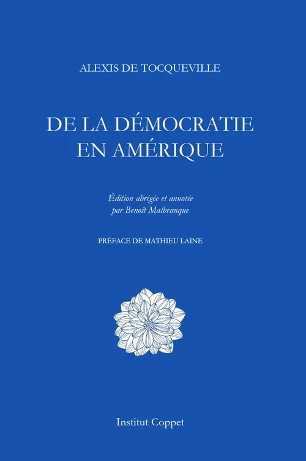

When an individual harms others, whether by threats, endangerment, or outright violation of their rights, he enters into a state of war with the human race. The Abbé de Saint-Pierre, in his great work on the project of perpetual peace, explains how security is born in human societies and how it must progressively extend to the national and then the international level. The absence of security diminishes not only the freedom of others but also that of the aggressor himself, since in organized societies, to be an enemy of the freedom of others is to risk a severe loss of one's own.

Charles Dunoyer, in *L'industrie et la morale considérées dans leurs rapports avec la liberté* (1825), drew on the accounts of travelers and explorers who had visited societies resembling those of humanity's earliest ages, to illustrate why these conditions made men less free than modern societies can offer. His descriptions deserve to be quoted at length:

> "VORACITY. When the natives of New Holland have killed a seal, says Péron, cries of joy rise on all sides; nothing is thought of but the feast; the ferocious victors group themselves around their victim; it is torn apart on every side at once; each man eats, sleeps, wakes, eats, and sleeps again.
>
> INCONTINENCE. The savage has little inclination to pleasure. It is the effect of the rigors of his condition, of the hunger he endures, of the exhausting fatigues he supports. But the savage is cold without being continent; and wherever a less harsh condition renders him more disposed to the pleasures of love, the licentiousness of his morals is excessive.
>
> IMPROVIDENCE. The savage, says Robertson, does not think of building a hut until he is compelled by the rigor of the cold, and if the weather softens while he has his hand to the work, he abandons his task unfinished, without thinking that the cold might ever return. When the Carib has slept, he would give his hammock for a trifle; in the evening, he would sacrifice everything to recover it; and the next day, he would give it away again for nothing, without thinking of his regrets of the day before."

These testimonies contradict the representations inherited from Rousseau and demonstrate that freedom is a construction, a becoming, an apprenticeship that depends on the moralization and industrialization of men.

### From primitive vice to the capacity for self-government

It is the progress of self-government that has enabled the great advances from the ancient and primitive epochs: from slavery to serfdom, and from serfdom to a freedom that is increasingly unregulated and effective. Today, we are gradually arriving at a society of potentially free men, precisely because they have acquired the moral and intellectual capacities necessary to make enlightened use of their liberty. This historical evolution demonstrates that freedom is not a natural state; it is the result of a civilizational process.

Having established these preconditions, we can now examine the factual elements concerning freedom itself: its effects and how it operates in practice. While freedom is grounded in fact, and follows logically from historical analysis as the culmination of a great process of progress, we must still understand how it works and why it works as it does. This understanding is essential if we are to make freedom a coherent and feasible project for society.

## Production and contracts

<chapterId>0cb003fe-58ac-5fa5-89b1-97e558fc98ac</chapterId>

### Production: a historical conquest

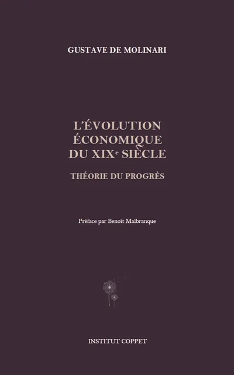

Understanding economic freedom is a major challenge in our reflection on freedom as a project for society. The economic dimension of liberty is often poorly understood, not because it is intrinsically complex, but because economic education remains insufficient, particularly in France. Yet the mechanisms of production and exchange are relatively simple, and they need to be clarified to understand how a liberal society is essentially founded on contract, exchange, and peaceful production.

Production itself represents a genuine conquest in the history of mankind. For a long time, human societies were content to gather foodstuffs without any particular creative input, through hunting, fishing, and gathering, where man's productive activity remained minimal. To analyze production correctly, we must understand it as the creation of new utility, as a service rendered to others or to ourselves. Producing does not mean creating matter, since, in accordance with Lavoisier's principle, man can neither create nor destroy an atom. The retailer, for example, by transferring foodstuffs and making them available to the consumer in an accessible and organized way, renders a genuine service. This transfer from one place to another constitutes real production, for which the consumer is prepared to pay.

### The error of "productive" and "unproductive" workers

Adam Smith, among other thinkers, made a significant error in distinguishing between productive and unproductive workers. In the "unproductive" category he placed lawyers, artists, and doctors, on the grounds that their product would disappear immediately after delivery. This view is profoundly flawed. A teacher's lesson does not disappear; it constitutes an element of intellectual and immaterial production whose effects endure. Gustave de Molinari rightly observed: "What good tools certain books are!" Production extends far beyond the mere transformation of matter. Work, generally speaking, is about creating new utilities and rendering services. To be of service to others is what production truly means.

### The conditions of production

The conditions of production reveal a path that is both theoretical and historical. The first requirement is an appropriate choice of means and ends, which implies enlightened freedom and a sense of self-government. One must be the owner of oneself, and one must be able to choose wisely among the various options available. This capacity for choice requires freedom of thought and freedom of action. The second condition is the possible use of means; in other words, property. Without ownership of things, of tools, and of one's own body (everything begins with self-ownership), production becomes impossible. The third condition is the possibility of profitability, which is conditioned by security. Without security, I cannot undertake a viable production project, for I risk being hindered by violence, threats, or the theft of my resources.

The direction of production obeys what the economists called "natural law," according to which the production of all things organizes itself, in time, in place, and in the most useful manner. Economic agents seek their own interest, not a narrow, selfish one, but a broad and enlightened interest. Motivated by the search for profit and security in their resources, they gravitate toward those branches of production that yield profits. These profits signal the consumer's willingness to pay, because the products in question facilitate his life, enrich it, and cover his needs. Prices and profits are thus the signals that naturally guide production, without the need for governmental or regulatory organization.

### Exchange as a positive-sum game

The central element that explains the importance of contract and exchange is their nature as positive-sum games. I make a contract because it is in my interest to do so; otherwise, I would simply prefer not to contract. Similarly, in economic terms, if I make an exchange, it is because I find it advantageous; if not, I refrain. The Abbé de Saint-Pierre, at the beginning of the 18th century, was one of the first to recognize the full importance of this principle. In his *Projet pour perfectionner le commerce* (1735), he expressed it with characteristic clarity:

> "When a sale is made between merchants, the seller gains and the buyer also; for without a reciprocal gain, real or apparent, neither would the seller sell at such a price, nor would the buyer on his side buy at such a price. Sometimes one of the two makes a mistake; but commonly, with regard to their needs and their interests, both gain from the exchange, sometimes equally, but more often unequally. From this it follows that to multiply exchanges or sales between merchants, between the subjects of a nation, and between nation and nation, is to contribute to their enrichment; to diminish commerce, to diminish the number of exchanges, of sales, of purchases between traders, is to diminish their profit and their revenue."

From this analysis stems a fundamental conclusion. The more contracts are made, the more advantageously the contract replaces the law in many domains. Freedom consists precisely in this choice to act in one direction or another with the properties at one's disposal, the first being one's own person, then that of legitimately acquired things, in order to exchange them in a mutually advantageous manner.

## The role of profits and prices

<chapterId>549e00c3-eece-5401-be62-b82c774af893</chapterId>

### The two forms of competition

The history of mankind can be read as a gradual transformation of the ways in which individuals compete with one another. In the earliest ages, competition was exercised principally through war and violence: the seizure of goods and subsistence commodities obtained by hunting, fishing, and gathering. The market was extremely small, and production limited. Since the world is composed of finite resources, some form of competition for them was inevitable. But the real progress of civilization lay in replacing this violent competition with contract and voluntary exchange.

Interventionism and socialism, unfortunately, represent a reverse step in this great historical progress. They replace freedom with tutelage and centralized authority, substituting the contract with a return to appropriation through coercion. The resemblance between competition through violence and competition through politics is visible in their effects: the distribution of wealth through violence or through politics redistributes existing resources, but does not increase them. Competition through contract, by contrast, founded on the mutual benefit of the exchanging parties, distributes wealth on the basis of each contributor's merit, while simultaneously increasing the total through the motivation of self-interest.

### The law of supply and demand: nothing other than freedom itself

Charles Coquelin (1802-1852), in his article on competition published in 1853 in the *Dictionnaire de l'économie politique*, expressed a fundamental truth: the law of supply and demand is nothing other than the functioning of economic freedom itself. Without freedom, this law simply cannot operate. Imagine a citizen receiving ration coupons: he has no possibility of reducing or increasing his demand according to his preferences. Similarly, companies subjected to political production decisions cannot vary their supply according to circumstances. The law of supply and demand therefore presupposes freedom as its indispensable precondition.

In a free economy, price plays an essential signaling role. In a vast market with a large population, economic agents need a compass to guide them through production: what to produce, when to produce it, where to produce it, and how. Price provides precisely this crucial information, assigning a value to the various productive combinations and, as it rises or falls, guiding the self-interest of individuals toward the actions that will enable them to achieve maximum satisfaction while meeting the real needs of society. Profits and interest rates are likewise signals: they indicate where there is need, and where there is not, among the various factors of production.

### The blindness of centralized planning

Paul Leroy-Beaulieu, writing in his *Le Collectivisme* (1884), anticipated with remarkable foresight the great developments of communism in the 20th century. He demonstrated that socialism, by rejecting profit and replacing the price mechanism with a centralized machine directing both production and consumption, was condemning itself to operate blindly. Without the price signal, centralized management has no way of knowing real human needs, nor of perceiving the effects of changes in those needs or in the supply of production. This absence of signals makes the failure of centralized production and collectivist distribution inevitable.

The operation of freedom, by contrast, enables production in useful time. High profits encourage new producers to enter the manufacture of a given product; this participation continues until enough producers have stepped in to satisfy the additional demand. The potential or anticipated price signals to all market agents what should be produced, where, and how. This spontaneous coordination extends over space, with geographical distribution between different countries, and over time, since the price signal indicates when a technology becomes sufficiently valued to be profitable.

### Everything in economically useful time

In a system of freedom, we can rely on the self-interest and free will of individuals to seek out new opportunities as best they can. This pursuit of profit naturally involves failures and trial and error, the constant effort to distinguish real opportunities from those that prove disappointing. Interventionism, by contrast, organizes everything according to political signals and electoral imperatives. It produces in politically useful time, with "strategic investments" based on the idea that the state perceives latent needs in society. But one may well ask: are these investments yielding profits or losses? If there are profits, it means the market demand is real; if there are losses, the state has misallocated the resources of its taxpayers.

The decisive advantage of economic freedom is that production is never too early or too late. When some entrepreneurs prematurely imagine that demand exists for an innovation, the absence of profits dissuades them, and they are not followed. Conversely, when profits are within reach, ambitious entrepreneurs try the experiment and discover that consumer resources are available; they are then followed by others, after a period of learning new production techniques. In this way, everything is done in economically useful time, founded on real satisfactions demanded by consumers, rather than on idealized political satisfactions that do not exist in reality.

## Self-interest, innovation and progress

<chapterId>958075af-fb8f-50d9-9bf5-4d9882e03072</chapterId>

### Self-interest: broader than egoism

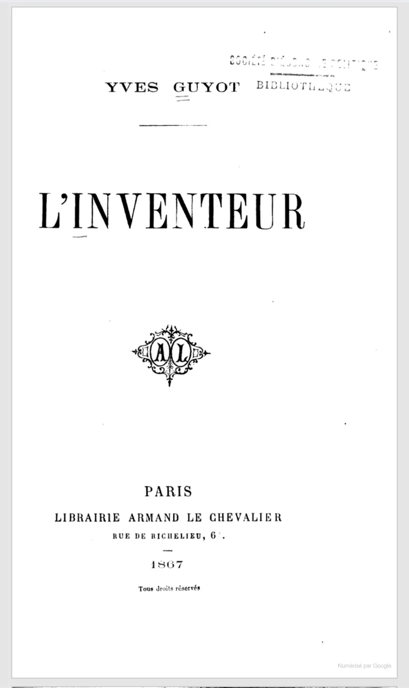

Economic liberalism rests on a concept of self-interest that is often misunderstood and caricatured. Alexis de Tocqueville (1805-1859), in *De la démocratie en Amérique*, observed that American society is founded on the pursuit of self-interest, with the law giving free rein to this natural aspiration. Yet Tocqueville also noticed something crucial: the only egoism of which individuals are truly capable consists in forgetting the greater society in order to think of themselves and their own. This observation reveals a fundamental truth: self-interest can never be reduced to strict, geometric egoism.

In reality, human beings are capable of a broad self-regard that begins with the family, then extends to a circle of acquaintances, a small enterprise, an association. To speak of individuals entrenched in a narrow selfishness does not correspond to the facts we observe daily. Self-interest is rooted in human existence through the series of pleasures and sufferings that each person feels and measures according to individual perception, personal constitution, and, one might say, genetic inheritance. The human person remains the sole judge of means and ends, which is the foundation of all action. Our actions flow from personal sensations and then from intellectual reasoning about means and ends, all organized around the individual, with objectives that extend well beyond mere egoism to encompass familial and social dimensions.

### Innovation and progress: the fruit of self-interest

Self-interest is a propulsive force. It drives the improvement of processes and the quest for progress. To enrich oneself and bring satisfaction to oneself and to others, one must act in a useful way, which naturally leads to innovation. Innovation and progress are the response to humanity's changing circumstances: new challenges constantly require new solutions. Each improvement modifies the economic environment in which man lives, demanding new combinations, new methods, new ventures. Societies cannot be fixed; they must constantly innovate.

Yves Guyot (1843-1928), one of the last great figures of French liberalism at the turn of the 20th century, dedicated his first book to the role of the inventor. It follows the logic of the facts of liberalism: the taste for the satisfactions of body and mind drives the individual to seek new ways of organizing his activity, finding new combinations, and responding to hazards. Society as a whole observes that circumstances are changing, that production conditions are evolving, and that by responding to them in an enlightened manner, additional wealth becomes accessible. This recognition that improvements are possible aligns with the great idea of human perfectibility: the conviction that the golden age lies not in the past but in the future, and that it is the role of invention and innovation to bring it nearer.

### The state does not innovate

The state does not innovate, and this fact is of considerable importance. Ancient societies such as Egypt, where professions were handed down from father to son, illustrate the phenomenon of fixed societies. The state reproduces this non-innovation by its very nature as a bureaucracy. It relies on the activities of civil servants who have no personal initiative and no remuneration proportionate to their innovation. Everything is laid down in regulations; there is neither the will nor the interest to innovate, and the system itself is not designed for innovation. National education is a perfect illustration: it is not designed to improve knowledge, but simply to distribute a body of knowledge conceived as a fixed asset to be spread around. The genius, the original mind, must ask the opinion of his superiors before acting; and "What is the use of it?" is the first question he hears.

Paul Leroy-Beaulieu, anticipating in 1883 what collectivism would look like in practice, predicted with extraordinary accuracy how communist experiments in Russia and elsewhere would actually function. He explained that these systems cannot wait for internal innovations; they must content themselves with copying those from outside. In semi-communist societies, innovation must come from the free sectors, as it is impossible to innovate in the monopolized sectors of public services. The remuneration of progress proves impossible under collectivism, since there is no positive appreciation of innovation, and therefore no choice to mobilize resources for progress. The individual is denied the freedom to take the risk of believing in an innovation and reaping its reward.

### The remuneration of progress in free societies

In systems of freedom, progress is rewarded in several ways. Industrial and commercial profits are the principal form: when an innovative product reaches the market, the innovator, being the first to propose a new solution that satisfies consumer needs better and more cheaply, enjoys a kind of temporary rent. In modern societies, there is also a glory associated with inventors, quite unlike ancient societies where innovators were viewed with hostility. This glory constitutes a form of remuneration, comparable to that received by great artists, poets, or even politicians, whose material compensation often remains modest but is supplemented by prestige. Patents and intellectual property also enable the remuneration of progress through self-interest.

In a free society, self-interest leads to innovation and progress. In a system of unfreedom, self-interest is dammed and shattered in favor of a pre-defined social interest. Innovation and progress are viewed critically, as they were in ancient societies, and it is thought sufficient to do what one knows how to do. Communist societies do not allow individuals of genius, with different ideas that nobody initially believes in, to bring their projects to fruition. The march of innovation certainly involves many failures, but also many successes, which, in a system of freedom based on contracts and voluntary exchange, lead to that perfectibility of which all the 18th-century liberals spoke.

## Harmony of interests and peace

<chapterId>370f4e98-021b-5c81-a109-3b57b689905f</chapterId>

### When interests clash: the world before production

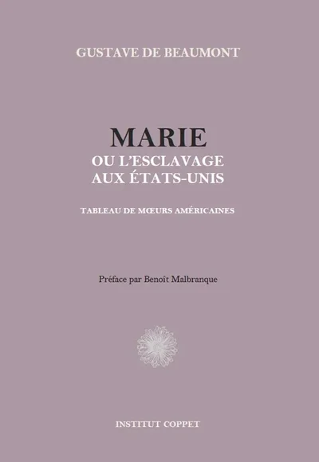

The notion of harmony of interests is a fundamental pillar of liberal thought, yet it is frequently dismissed with skepticism. Opponents of liberalism regard it as utopian, a naïve dream, on the premise that human interests are fundamentally antagonistic. We shall see that this objection rests on an erroneous assessment of reality and an incomplete reading of history.

To understand this harmony, we must first ask: under what circumstances are human interests truly opposed? In the earliest ages of humanity, human beings found themselves in direct competition for limited resources that nobody had produced. Nature offered fruit trees, fish in rivers, resources on the seashore, but no human society had created these riches. Appropriation was by force and destruction rather than by production, and there was only one way to grow rich: take what your neighbour possessed, or fight for access to resources that nobody had cultivated. In such a world, every gain was necessarily someone else's loss. The interests of human beings were antagonistic precisely because no one was producing anything new.

### The birth of harmonious exchange

The modern world rests on a radically different principle: the production of new utilities. From the moment agriculture appears, when the wheat field becomes a genuine source of wealth, truly voluntary exchanges are born that enrich both parties simultaneously. As the Abbé de Saint-Pierre observed in the French liberal tradition, relationships founded on contract, respect for the rights of others, and voluntary exchange form a "chain of harmony" linking individuals, communities, and nations.

This harmony has been constructed gradually. The opening of the world through navigation, the development of transport technologies enabling more regular and extensive trade, and the security guaranteeing commercial relations have together built an ever-widening web of interdependence between suppliers, customers, and all economic agents. This interdependence becomes most visible in times of crisis. The American Civil War of the 1860s provides a striking illustration: by severing the cotton trade, the conflict brought ruin to textile industries across Europe, particularly in Lyon, despite the fact that France was not a belligerent. The impoverishment of one link in the chain immediately impoverished all the others.

### International peace as the condition for prosperity

The need for international peace flows logically from this global harmony. Since trade is a positive-sum game in which all parties mutually enrich each other, it becomes imperative to maintain security both within societies and between nations. Every disruption to the world economic order produces nuisances that reverberate throughout the entire chain of exchange: accidents, crises, climatic hazards, and above all wars, which by devastating the productive order of the countries affected impoverish the whole of humanity.

Gustave de Molinari (1819-1912), the Belgian-born French economist who directed the *Journal des économistes* for decades, devoted his late career to what he called a veritable "war on war." In his view, rising global interdependence had made armed conflict not merely immoral but economically suicidal for all participants. In the fifteenth or sixteenth century, a conflict in Africa or Asia would scarcely have affected European populations, because the sphere of exchange remained narrow and societies lived in relative self-sufficiency. Today, that insulation has vanished. The more extensive the chain of exchange, the more devastating any break in it becomes, which paradoxically constitutes a powerful argument in favour of peace.

### The liberal programme for peace

The transition to a peaceful world is, however, a long apprenticeship. Human societies remain marked by ancient conceptions of production through violence, conquest, hunting, and gathering. The new conceptions of peaceful production, exchange, and harmony must be learned and disseminated, and this is a work of generations. The French liberal tradition offers several complementary approaches to this challenge.

The Abbé de Saint-Pierre (1658-1743), one of the earliest thinkers on perpetual peace, proposed international institutions capable of guaranteeing the rule of law on a global scale. Frédéric Passy (1822-1912), the first Nobel Peace Prize laureate in 1901, placed his confidence in public opinion: if peoples understood that their prosperity depended on the prosperity of their trading partners, the demand for peace would become irresistible. Molinari argued for international justice and police forces to enforce the rights of nations as domestic courts enforce the rights of individuals. Frédéric Bastiat, for his part, saw free trade itself as the surest foundation for peace: the more nations exchange, the more their interests converge, and the more costly war becomes for all.

Liberalism thus presents itself as a great harmonious chain of exchanges and contracts, founded on freedom and property, enabling progress and improving the situation of every individual. The "chain of harmony" that the Abbé de Saint-Pierre described in theory has become, through the development of world commerce, a palpable, material reality.

## The different varieties of unfreedom

<chapterId>747ec342-bccd-5203-a198-c6e75505801b</chapterId>

### The extreme form: communism as organized spoliation

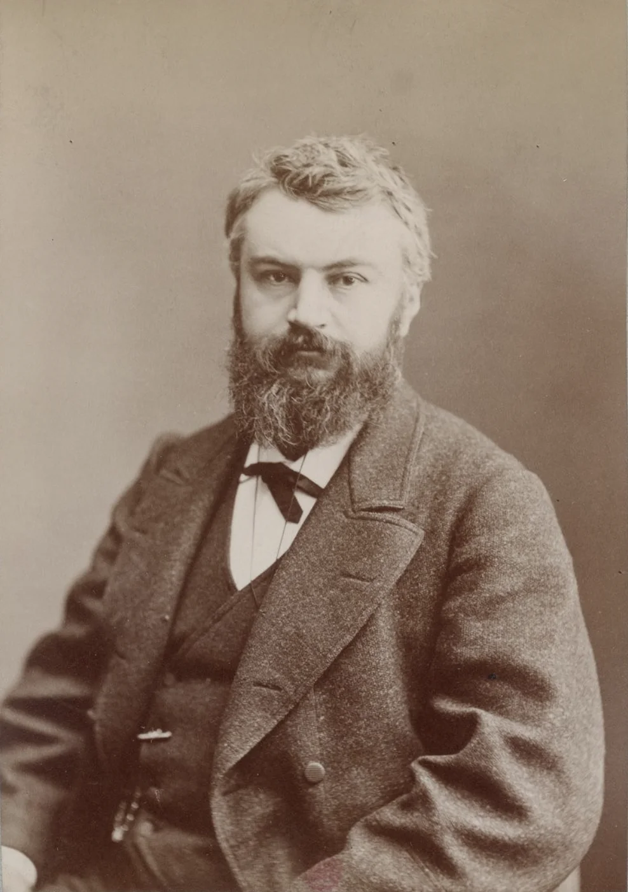

Having examined the foundations of freedom in the facts of human existence, traced the historical evolution of liberty and constraint, and analysed the workings of the free economy, we must now turn to the systems of unfreedom. Why do they fail? And why must modern societies move decisively toward freedom-based solutions?

All systems of unfreedom share a common characteristic: they are profoundly backward-looking. Primitive communism, which organised the sharing of land and tools within small groups, was a response to the production and security circumstances of the earliest human societies. In its modern form, communism represents an attempt to return to that archaic condition, where the individual counted for nothing. The extreme form of unfreedom manifests itself in the total subjugation of the individual and the destruction of his property. In the communist system, all property is regulated and controlled by others, constituting a form of collective slavery. The individual retains only those few properties of self that cannot be broken: his inviolable consciousness, his capacity to think freely in the privacy of his own mind, since unmanifested thought remains beyond the reach of any power. But every other freedom vanishes: the freedom to have a family, material ownership of things, ownership of land, ownership of one's own labour.

Paul Leroy-Beaulieu, in the first edition of his major work *Le Collectivisme* (1883), brilliantly analyses these different socialist systems. He questions the deliberate vagueness that surrounded the concrete description of communist society:

> The communist doctrines speak abundantly of the end of capitalist exploitation and of future abundance, but the actual functioning of this great administration that would own all the land, all the machines, and manage all the factories, all of this is very poorly explained.

Leroy-Beaulieu's analysis proved prophetic. Decades before the Soviet experiment, he explained how communist systems would actually work in practice: organised spoliation on a national scale, analogous to slavery, where the fruits of each individual's labour are appropriated by the central administration.

### Socialism: the moderate form of unfreedom

Socialism and interventionism represent a more moderate form of unfreedom. In these systems, private services are progressively replaced by public ones, and individuals are held in trusteeship by a large regulatory state. Unlike communism, which attempts to organise all production and consumption in a dirigiste manner, socialism operates, so to speak, as half-communism. It is precisely this reduced, practical ambition that explains its persistence today, whereas communism collapsed because it represented too abrupt a return to the societies of the past. The modern individual had acquired, through intellectual work and the practice of freedom, both the capacity and the will to govern himself. Communism destroyed this entirely; socialism merely constrains it.

What socialism fundamentally shares with communism, however, is the replacement of contract, free choice, and individual autonomy by political direction. Voluntary, mutually beneficial exchanges give way to regulations and so-called public services. Political choice, necessarily collective and expressed through democratic elections, replaces individual choices that everyone can control directly. Consider the difference: in daily life, an individual observes his own reality, weighs alternatives, and freely modifies his course of action. In a democracy, the citizen must acquiesce to an overall programme among reduced options, with no real control over what happens next. If the central communist state decides that strawberries are not worth producing because apple orchards are more efficient, there will be no freedom to consume strawberries. Socialism operates on the same logic, merely in a diluted form.

### The insidious form: confiscatory taxes and intrusive regulations

A still more discreet form of unfreedom persists in the guise of confiscatory taxes and intrusive regulations. We must distinguish carefully here. The taxes that finance justice and police, guaranteeing the security of persons and property, are legitimate contributions, akin to a collective purchase. But the taxes that operate a genuine confiscation, and the regulations that make choices on behalf of individuals and delimit the boundaries of contracts according to the ideas of those in power, represent a real tutelage.

Gustave de Molinari, with his customary verve, shows that in many of these regulations the owner is no longer truly the owner. He has ceded his property to the state and is now merely a usufructuary, a possessor of temporary enjoyment. The true proprietor, the one who makes decisions about the property, is not the individual who believed himself to be the owner, but the central or even the local state. Consider the naïve homeowner who decides to repaint his house. He believes he has the right to use and dispose of his property as he sees fit, provided he does not infringe on the rights of others. Yet he discovers that he is merely the usufructuary of a house that belongs, in effect, to the community. Inheritance taxes and hindered free trade reveal the same dispossession: a web of regulations, laws, and customs stands between the individual's voluntary, harmless choice and the decisions imposed by public power.

### Freedom, property, and equality: inseparable principles

Freedom cannot be dissociated from property or from equality, for these notions are deeply intertwined. Frédéric Bastiat stated the matter plainly: freedom is property. To be free means to make whatever use one wishes of one's property, of oneself, and of the things one legitimately possesses. The person whose property is truly respected is truly free, since he can dispose of himself, his forces and faculties for work, of what he owns for commerce, and of his intellectual faculties for free thought and expression.

Systems of unfreedom are characterised precisely by inequality: some individuals freely enjoy their property, while others are dispossessed and have their choices dictated by others. When freedom exists only for some, we are in a system of unfreedom, whatever its particular form.

Yves Guyot (1843-1928), journalist, politician, and one of the most combative French liberals of his generation, fought all these battles at the turn of the century. He defended feminism: a system that excludes half the human race from the enjoyment of its own faculties is not a system of freedom but of tutelage with precise geometry. He combated racism and anti-Semitism: if Jews wished to form their own communities, practise their trades, or profess their ideas, this was simply individual liberty in action, protected by freedom of religion, expression, and association. He opposed what we would today call national preference: preventing advantageous contracts by excluding one part of humanity from exchange contradicts the very principle of individual freedom that enables harmony in the world. Freedom of work, exchange, and contract must apply to all without distinction.

## Replacing contract with policy

<chapterId>061e5c30-cb50-5205-8a1b-e41b7d1d234a</chapterId>

### The myth of the state as a deity

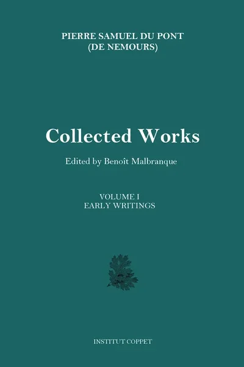

The state has been the object of a remarkable mythologisation, particularly during the nineteenth century under the influence of German writers. These authors presented it as a kind of earthly deity: an intangible, superior being, devoid of human defects, endowed with a capacity for foresight and direction that no individual could possibly possess. The state was compared to the brain of the social body, and from this metaphor flowed the ambition to entrust it with ever broader responsibilities.

Paul Leroy-Beaulieu, who studied in Germany as a young man and knew this literature intimately, opposes to this idealised vision a much more down-to-earth analysis of what the modern state actually is. The democratic state does not function like the Ancien Régime, where power derived from a hereditary family line. Its reality is far humbler: men organised into parties vying for possession of political power. These parties operate a monopoly that is all the more harmful for being temporary, leading to hasty enjoyment of the benefits of power, waste of public resources, and laws drafted by individuals who are not always suited to the functions they assume.

### The electoral process versus individual deliberation

The electoral process differs fundamentally from the process of individual judgement. When a person makes a private decision, whether to enter into a contract, make an exchange, or undertake a line of work, he makes observations and reflects carefully before acting. This deliberation takes place slowly and peacefully within his own mind. In the political sphere, by contrast, decisions emerge from agitation and election fever, in a climate of short-termism hardly conducive to the enlightened judgement that the complex issues the state claims to handle would require.

The democratic state also systematically sacrifices minority interests. Since decisions emerge from a majority, that majority naturally tends, in the absence of sufficient constitutional constraints, to infringe on the individual rights of minority citizens. Worse still, future generations find themselves taxed in advance, inheriting debts and interest on expenditure to which they have never consented. This directly contradicts the great principle of the American Revolution: no taxation without representation.

### Necessary and parasitic attributions of the state

We must draw a careful distinction between the legitimate functions of the state and its parasitic functions. Laws that guarantee the protection of individuals through a judicial and police system establish the security necessary for exchanges and contracts. These laws enable individuals to weave mutually beneficial relationships with one another and thus build society. Such laws guarantee property, liberty, and security: we may call them the "negative" attributions of the state, meaning attributions that merely protect without intervening in the substance of individual choices.

Unfortunately, far too many laws hinder, prevent, and regulate the activities of individuals who are not infringing the rights of others. These are the "positive" attributions of the state, replacing contract and exchange by majority decision and administrative regulation. The individual is hindered in his ownership of things, or in his ownership of himself, under pretexts of indefinite and indefinable harm to society or to certain categories of persons. It is precisely this replacement of contract by politics that constitutes the core mechanism of unfreedom.

### The superiority of contract over political choice

Let us compare the two systems directly. In a society founded on contract, the individual is responsible for his fate and master of his faculties. He decides to satisfy his needs, seeks solutions to improve his existence, and engages in a process of discovery and deliberation that is part and parcel of his own individuality. Free competition constantly improves the alternatives on offer. The individual observes his own reality, feels the effects of his choices through pain or pleasure, and can freely modify his course of action, minute by minute, day by day. If the available contractual options do not satisfy him, he can create his own solution. The contracts he forms are mutually advantageous for all parties involved.

In a system founded on political power, this process is truncated at every stage. Electoral agitation and misleading promises replace calm deliberation. The citizen votes on the basis of a general impression of a candidate rather than a careful assessment of specific measures. The choices are too complex and all-encompassing for any individual to measure their effects on himself. On the market, everyone can choose freely between competing alternatives; the market for political ideas, by contrast, remains restricted and under tutelage. Consider the difference: as a consumer, I can judge immediately whether a particular purchase satisfied my needs; but how am I to judge whether the grand reforms of national education or the postal service have given me satisfaction? I am not a consumer of everything, and my individual experience bears on something that vastly exceeds me. Finally, political choice is imposed by majority and by package. The individual is forced to acquiesce to an entire programme, entering into exchanges that may well be disadvantageous to him, whereas contractual freedom would allow him to make of his faculties and properties the use he deems best according to his own criteria.

## Power through taxation and monetary manipulation

<chapterId>ca113581-6969-58b4-a9f8-996ab409be25</chapterId>

### Taxation: contribution versus confiscation

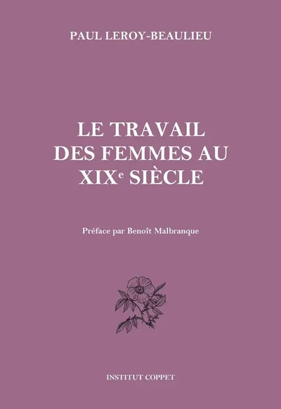

The fundamental distinction between contribution and taxation is the starting point for any reflection on the practices of unfreedom. Contribution represents a legitimate exchange: the citizen participates in the financing of essential collective services, such as courts and police, which guarantee the security of transactions and enable peaceful social life. It is, in effect, a collective purchase, a service rendered for a service paid.

Arbitrary taxation, by contrast, is rooted in a radically different conception of the relationship between the individual and power. As early as the end of the seventeenth century, Pierre de Boisguilbert vigorously criticised the fiscal conceptions of the Ancien Régime, where the sovereign considered himself the owner of all lands and all subjects. The arbitrary *taille* (the main direct tax of the period) perfectly illustrates this logic of political tutelage: the individual belongs to the nation and owes his resources at the whim of those in power. The French Revolution shattered some of these conceptions, but did not truly replace them, so deeply were they rooted in mentalities.

The question of fair taxation occupied liberal economists throughout the eighteenth and nineteenth centuries. In their view, a legitimate tax should be proportional rather than progressive: each individual, equally protected by the common legal framework, should contribute equally to society's burdens. Progressive taxation represents a return to ancient conceptions in which the individual is the property of the group, and his forces are used as others see fit. Frédéric Bastiat developed this idea of an exchange of service for service, insisting that taxes must be legible, so that every taxpayer knows precisely what he receives in return for his contribution.

### Deficit and debt: taxing those who cannot defend themselves

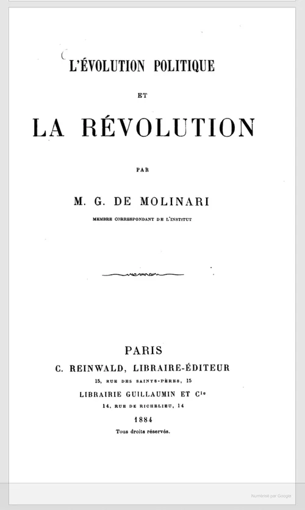

Alexis de Tocqueville, after his voyage to the United States, identified with particular clarity the democratic problem of public spending. Political power, however well-intentioned, cannot be thrifty. The fundamental mechanism is the rupture of the link between enjoyment and punishment: individuals have a natural tendency to shift burdens onto others while enjoying the benefits themselves, and deficits and debt make it legally possible (if morally indefensible) to pass the cost of services obtained onto future generations.

This practice constitutes a major contradiction with the democratic principle that there should be no taxation without representation. Future citizens, who do not yet exist and take no part in current deliberations, find themselves unable to defend their interests in the face of decisions that commit them. As Tocqueville saw, our grandchildren are not present to defend their pockets. Democracy, which already tends to sacrifice minorities, thus also sacrifices future generations.

### Money as an instrument of domination

In the logic of political domination, money ceases to be a commodity or service like any other and becomes an instrument of power. Jurists and economists allied to this conception present money as a sign of sovereignty, asserting that a nation cannot exist without minting its own currency. Yet the primary mission of the law should be to protect and organise the possibility of exchanges and contracts, not to substitute itself for the participants of society by imposing this or that service upon them.

As early as the fourteenth century, Nicolas Oresme analysed the harmful effects of monetary manipulation on commerce. Monetary debasement produces [inflation](https://planb.academy/resources/glossary/inflation) and destabilises prices, for the monetary signal becomes uncertain when the master of the measures of value can arbitrarily alter their content. Metallic money itself was often no more than an illusion: coins contained low-value alloys that nineteenth-century liberal writers aptly called "copper assignats," titles without real value that the political power imposed on contracting parties as instruments of exchange.

Freedom offers solutions through competition and innovation. Bills of exchange and banknotes, invented in the Middle Ages, and today private currencies, provide contracting parties with means of exchange that are voluntarily accepted, rather than a currency with no intrinsic value used primarily to finance political power.

### War and the denial of secession

Gustave de Molinari paid particular attention to the question of war, observing the contradiction between this archaic mode of international relations and the new phenomena of peaceful production and globalisation. War is essentially a manifestation of the conflicting interests of rulers themselves, who seek to extend their monopoly of territorial domination as an industrialist would seek to increase his clientele.

This logic of expansion is a vestige of the feudal system, where the state was conceived as the owner of the nation. The history of territorial transfers between ruling families, by marriage or by sale, illustrates this conception perfectly. The purchase of Louisiana, or later of Alaska, demonstrates the possibility of acquiring not only land but also the right to dominate its inhabitants, who had no say in the transaction.

The doctrine of liberty opposes this logic with the principle of individual and collective secession: the free choice of individuals who belong to themselves and who decide for themselves what political organisation will satisfy their needs. Yet even in America, long considered a model of liberty, secession was denied to the states that wished to recover their sovereignty. Modern constitutions proclaim a single, indivisible republic, prohibiting all collective emancipation. A region cannot join another country, nor can it become autonomous to manage its own public services. This fundamental contradiction in no way prevents states from seeking to conquer new political clienteles, thus perpetuating the very practices of domination they claim to proscribe.

## The different variants of protectionism

<chapterId>3c1cf3d1-e2f5-5a95-9671-bf82b4de4a4e</chapterId>

### What is protectionism?

Protectionism is one of the most significant manifestations of unfreedom, and one of the most durable. To understand it, we must recall that competition is naturally imposed on human beings by the finiteness of available resources. This scarcity creates a need for acquisition and distribution, which can be achieved either by contract or by politics. Free competition distributes resources justly, since it rewards the productive efforts of individuals. But it inevitably leaves behind some who are less productive, who fail to make the right decisions in the economic and social process, who lag behind the march of progress.

Protectionism appears as a response to this competition of methods, ideas, and products. It offers a solution to those who do not wish to keep pace with progress and who feel overshadowed by the more enterprising individuals. These individuals seek not merely to protect themselves but to extract wealth from the enterprising population and to live at their expense. Democracy, by giving power to the masses, naturally tends to produce this protectionism, for the masses are generally little inclined toward progress. The typical response to innovation is a dismissive "What use is it?" This tendency is often accompanied by hostility toward the rich, fuelled by envy and the belief that they do not deserve their wealth. Protectionism thus amounts to a disproportionate case of self-defence against the natural functioning of competition.

### The "pillow" of customs protection

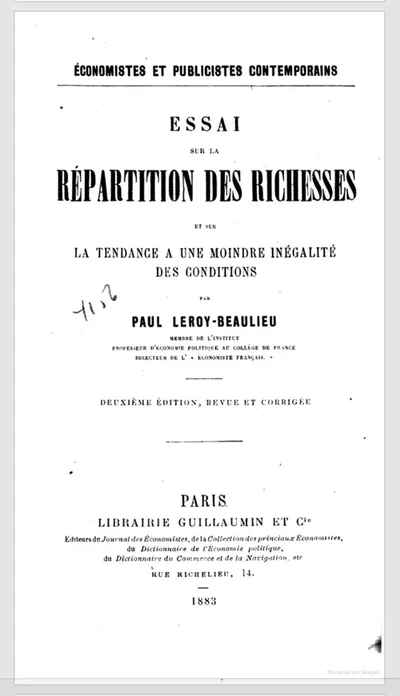

Protectionism in international trade is the most familiar form of this notion. Yet freedom calls for free trade: the ownership of things acquired through work legitimately confers the right to exchange them for other products and services. The liberal system rests on complete free trade, which allows everyone to use his property as he sees fit through mutually beneficial exchanges, enriching society and satisfying needs while making work genuinely remunerative.

Protectionism reverses this logic. Nineteenth-century authors, from Harriet Martineau to Frédéric Bastiat, Gustave de Molinari, and Paul Leroy-Beaulieu, described its effects with a vivid image: the "pillow of customs protection." The less enterprising producers simply rest on their laurels, since competition from abroad is not permitted. When foreign entrepreneurs discover innovative methods of production, or offer better products at lower prices, domestic producers can sleep tranquilly on this protective pillow. Customs impede the entry of competing goods by taxing them heavily, preventing domestic consumers from acquiring better products and creating a form of economic domination by domestic producers over their own population.

### The customs of competitive examinations

The protectionist idea extends well beyond international trade. What nineteenth-century French liberals called the "customs of competitive examinations" represents the same logic applied to the freedom of work. These limitations are designed to protect certain professions by making it easier to memorise a programme in a state-designed school than to allow entrepreneurs to advance in innovative ways. The right of entry severely limits competition through regulated apprenticeship schemes, to the apparent benefit of established practitioners. But this benefit is illusory: professions shielded from competition by the routine of examinations do not attract the geniuses, innovators, and inventors who would take them to the next level. Like national education, which is founded on the idea that knowledge merely needs to be distributed rather than improved, the customs of examinations train individuals in a fixed way of working.

This approach substitutes the preventive system for the repressive system, the only one accepted by liberalism. The repressive system is founded on individual responsibility: if I infringe the rights of another, I must make reparation. The preventive system, by contrast, organises regulations in advance that are supposed to prevent such infringements, but itself begins with an infringement of rights by forbidding the non-harmful use of freedom. Arthur Mangin, along with Charles Dunoyer and Charles Comte before him, led this fight for freedom of work and a repressive system for proven nuisances, in direct continuity with Turgot's struggle against the guilds. Their example of the freedom of medicine and pharmacy, a reality in England and the United States but fiercely contested on the European continent, illustrates the principle in its most provocative form.

### Labour protectionism and anti-immigration laws

A modern application of protectionism concerns the restriction of immigration. In the eighteenth century, it was commonplace for foreigners to hold public office (Minister Necker, for instance) or to serve in the army (the Swiss Guards). This openness contrasts sharply with the return to protectionism in public functions that we observe today, a subject on which there is remarkably little debate.

The Société d'économie politique, which brought together the great French liberals of the nineteenth century, closely examined the anti-immigration laws emerging in Anglo-Saxon societies. These countries, having dominated the native populations, were entrenching themselves and refusing competition from other peoples who wished to participate not through conquest but through contract and exchange. The Chinese who sought to work in the mines of Australia or California were rejected by restrictive measures that violated both freedom and property.

These authors identified labour protectionism as the future dominant form of protectionism. While the protectionism of big business aims to shield domestic producers from foreign competition on products, worker protectionism seeks to shield domestic workers from competition with foreign workers. The notion of protectionism thus reveals different shades of unfreedom: in the exchange of property through customs duties, in the freedom of work through competitive examinations, and in the freedom to travel and work through anti-immigration laws.

## The eternal failure of unfreedom

<chapterId>e4b15871-df1d-5d98-a395-16e24e7258d5</chapterId>

### The impossibility of planning, from the Physiocrats to the twentieth century

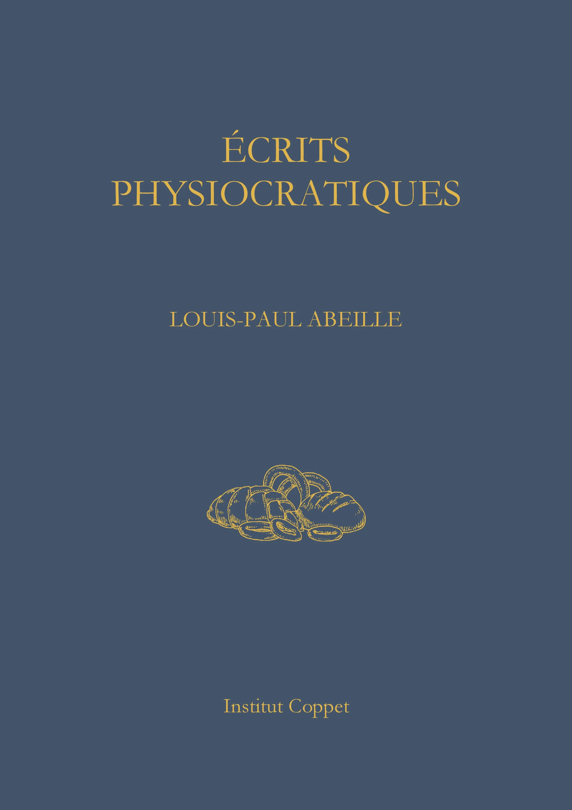

The failure of unfreedom has a long intellectual history. As early as the mid-eighteenth century, the Physiocrats opened a fundamental debate on the possibility of a society in which the state, by organising unfreedom, would take decisions in place of individuals to create a supposedly more harmonious economic and social order. Their reflection crystallised around the great question of grain: wheat was the major food resource of the time, and its production and trade were debated throughout the century. The state fixed prices, prohibited transfers between regions, controlled economic agents, and attempted to organise the distribution of this essential commodity.

The Physiocrats, including Louis-Paul Abeille, Turgot, the Marquis de Mirabeau, and Dupont de Nemours, developed decisive arguments against this approach. Political power, they showed, lacks what we may call "the eye of the master": the ability to perceive economic realities that only individuals possess in their daily lives. The nature of demand, supply, resources employed, and prices are variables far too complex for a central authority to evaluate and to make the system function optimally. Through freedom, by contrast, each economic agent responds with his own intuitions to the signals he perceives, notably prices and competition, and adopts appropriate responses to events. This intellectual legacy of the Physiocrats was passed on to the French liberals and to all the liberal economists of the nineteenth and twentieth centuries.

### Leroy-Beaulieu's prophecy: "slavery without the nest egg"

The French liberal tradition extended this analysis into the nineteenth century, most notably through Paul Leroy-Beaulieu and his major work *Le Collectivisme* (1883). Leroy-Beaulieu set out to analyse in advance how a communist society would actually function, since the theorists of communism, Karl Marx foremost among them, had been remarkably sparing with details about the society that was to replace capitalism. Socialism, after an apparent defeat in 1848, was returning in force around the Commune, and with democracy and universal suffrage it was becoming increasingly threatening.

Leroy-Beaulieu's conclusion was devastating. Communism, he argued, would constitute a form of slavery worse than traditional slavery itself:

> It is slavery without the nest egg, without the possibility of redemption. The individual is deprived of freedom with no path to liberation, no prospect of self-ownership, individual autonomy, or the freedom to act according to his own ideas.

Political freedom would necessarily be suppressed, since democratic functioning does not permit the sustainable management of production and distribution processes. A permanent tutelary power becomes indispensable. And the communists cannot accept that this power be transferred to opponents of the system: the abandonment of the communist form of society is, by definition, unthinkable.

### The chain of lost freedoms

The principle of unfreedom in production and distribution has direct consequences for every dimension of individual existence. Let us trace the chain. There is no freedom of domicile in a collectivist system, because there is no freedom of work: a superior decision dictates to individuals which branches of production they will participate in and how they will work. Since one lives near one's workplace, and cannot choose one's work, one cannot choose one's home. The freedom to found a family or to maintain friendships is itself compromised, for exchanges, which are also a form of friendship, are regulated and controlled by state authority.

There is no freedom of the press, for two fundamental reasons. First, political freedom is severely restricted, since criticism of the system is incompatible with its perpetuation. Second, as the state owns the means of production, it is the sole printer and decides on the distribution of books and periodicals. Without ownership of presses or printing houses, freedom of expression is entirely eliminated.

There is no freedom of consumption, since the state decides what will be produced and in what quantities. If the collectivist state decides that strawberry production is not worth the labour, there will simply be no strawberries to consume. In a liberal system, by contrast, the contract between willing buyers and willing producers, freely formed and mutually beneficial, would satisfy this demand without any need for central direction.

### The twentieth century confirms the prophecy

The twentieth century brought a striking confirmation to the predictions of the French liberals. The communist system, once it became a reality, demonstrated the accuracy of analyses that had anticipated both the impossibility of central planning and the complete tyranny such a regime would engender. In a liberal system, contracts are freely established between producers and consumers in a harmonious and peaceful relationship. The collectivist system organises, instead, a complete tutelage of the individual, replacing the free direction of oneself by oneself with the regulatory and arbitrary decisions of a political power, elected or unelected.

This intellectual and factual history of the failure of unfreedom is a fundamental lesson. The trajectory of human history pushes us to reject ever more decisively the communist idea and the idea of tutelage, in order to bring about freedom, autonomy, individual decision-making, and voluntary, peaceful exchange between people.

# Sophisms of unfreedom

<partId>de66dc14-7dc0-52c5-aedf-5efe4820b9c1</partId>

## Intellectual sophistry: false definitions of freedom

<chapterId>9bd81fd4-20ed-5305-845a-d081811946ee</chapterId>

### Why sophisms matter

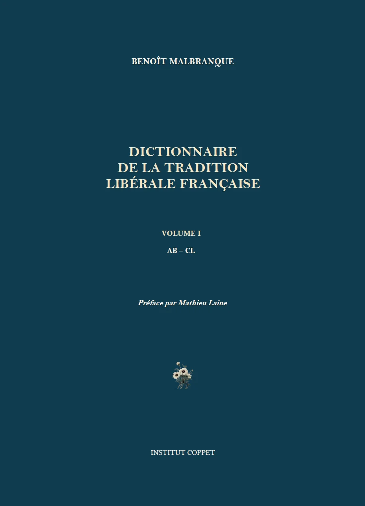

We arrive at a fundamental question: why does unfreedom continue to dominate our societies, even though it is refuted by the facts and contradicts the historical movement toward greater freedom? The answer lies in the existence of tenacious sophisms that serve as the intellectual foundation for systems of unfreedom. The notion of sophism owes much to Frédéric Bastiat, author of the famous *Sophismes économiques*. Bastiat held that the socialists and interventionists of his day were mistaken, but with good intentions. As the common expression reminds us, the road to hell is paved with good intentions. For Bastiat, the adversary of liberalism is not the sophist himself, but the sophism: a reasoning error or a factual error that needs to be corrected by economic science.

### How the French liberals defined freedom

The nineteenth-century French liberal tradition provides a solid conceptual framework for understanding what freedom really means. Let us examine three definitions that converge on the same essential insight.

Yves Guyot writes:

> The rights of man consist in the free use of his will and his faculties.

This corresponds to self-ownership and its materialisation within the limits of the rights of others. Paul Leroy-Beaulieu adds an essential clarification:

> Freedom does not consist in absolute security, in freedom from all risks; freedom is the faculty that man has of determining his own acts, and not the power of ensuring that the result of his acts always corresponds to his desires or his needs.

This definition carefully distinguishes freedom from the guarantee of success. Finally, Charles Comte defines freedom as:

> The state of a person who encounters in his fellows no obstacle to the regular development of his being or to the innocent exercise of his faculties.

These three definitions converge on a conception of freedom rooted in self-ownership and in the mutual respect of individual rights.

### Montesquieu's dangerous definition

Against these rigorous definitions, political thought also harbours erroneous conceptions of freedom. The most famous is that of Montesquieu: "Freedom is the right to do whatever the laws allow." This seemingly innocent formula turns out to be extremely dangerous, for it permits any infringement of an individual's innocent freedoms provided it is authorised by law. Nineteenth-century liberal thinkers criticised Montesquieu sharply on this point. Destutt de Tracy devoted an entire work, his *Commentaire sur l'Esprit des lois*, to correcting the erroneous notions of this great thinker. Benjamin Constant, for his part, developed a theory clearly distinguishing the sphere of innocent, free individual action from the sphere of power, the latter existing simply to guarantee the exercise of rights without determining the wills or actions of individuals.

### Negative freedom versus positive freedom

A crucial distinction underlies the entire debate: that between negative and positive freedom. Negative freedom is defined as the absence of obstacles. The individual encounters no hindrance in the expression of his will, so long as he does not directly harm others. This concept is deeply rooted in the notion of property: it designates the freedom to make innocent use of one's own body, faculties, and legitimately possessed goods. Positive freedom, by contrast, is conceived as the capacity to do and to obtain. According to this vision, the individual is free when he can obtain the things he desires. This concept breaks with the notion of property and opens the door to socialist justifications of state intervention.

Paul Leroy-Beaulieu, in *Le Collectivisme*, demonstrates that socialism, even with its different notion of freedom, prevents people from doing things without guaranteeing the promised results. Socialism thus fails doubly: it delivers neither the freedom conceived by liberals nor the freedom supposedly brought about by its own theories. Understanding these fundamental distinctions enables us to grasp how initial conceptual errors in the definition of freedom give rise to sophisms in the economic, social, and international spheres.

## The democratic fallacy: guardianship of guardians

<chapterId>96869664-df6e-5f47-92ad-ac93c88e4f55</chapterId>

### The paradox of the guardianship of guardians

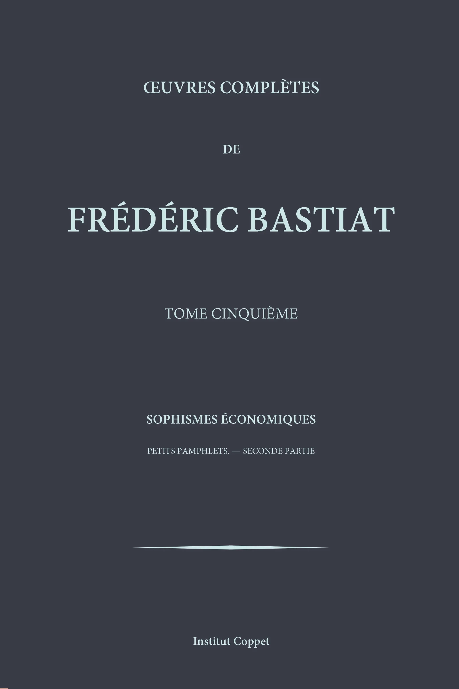

The fallacy of the guardianship of guardians is one of the most remarkable contradictions of contemporary political systems. We live within structures that multiply regulations, hindrances, and public direction, substituting for individual acts that would naturally flow from free perception, free judgement, and personal will. This public tutelage rests on a precise premise: that citizens are fundamentally incapable of governing themselves, and require preventive supervision to avoid potentially harmful acts. Rather than repress genuine infringements of the rights of others, the system prefers to anticipate and supervise, on the assumption that individuals left to their own devices will make choices that are inappropriate, uninformed, or contradictory to their own interests.

Yet this same system of unfreedom operates under a democratic form that postulates exactly the opposite. The democratic mechanism asserts that all citizens, equally, are perfectly capable of making informed political choices between different options. They can compare programmes, evaluate political personalities, judge the foreseeable effects of proposed measures, and assess the merits of envisaged reforms. The contradiction is glaring: the same individuals deemed incapable of deciding for themselves in their daily lives are simultaneously deemed capable of deciding for the community as a whole.

### Why economic choice is simpler than political choice

This contradiction is all the more striking given that choice on the daily economic market is infinitely simpler than political choice. In our consumption decisions, we compare satisfactions on a daily basis; the decision-making process is direct, and the results are immediately apparent. We observe the consequences of our choices, and we adjust our behaviour in the light of experience. The knowledge required remains within our reach, since we consume goods that we can evaluate directly.

The political market presents radically different characteristics. Decisions are spaced out over time, and their consequences are collective and therefore difficult to examine for any individual. A political measure may affect people who are entirely invisible to the voter, making it impossible to grasp the full implications of one's choice. Elections are moments of collective fever, when decisions bear on entire programmes that are complex and difficult to assess in their totality. On the economic market, if I am dissatisfied with a purchase, I can change my supplier immediately. On the political market, I must wait years and accept the consequences of choices I may never have wanted. If there is an inability to choose wisely, it is precisely in the political sphere that this inability should manifest itself most strongly.

### Tocqueville and democratic despotism

Alexis de Tocqueville famously identified, particularly in the second part of *Democracy in America* (1840), what he called "democratic despotism": the tendency for freedoms to be curtailed by the democratic mass itself, when the state becomes the director of society. The danger lies in democracy turning against its own purpose. Whereas it should guarantee respect for individual rights and organise the repression of infringements of human freedoms, it is itself transformed into an instrument of infringement of those very rights.

Tocqueville was long misunderstood precisely because of his nuanced position. He recognised the inevitability of democratic rule while remaining clear-sighted about its dangers, in particular its spendthrift and despotic tendencies, which he was already observing in the United States of his time. His analysis retains a particular resonance today for all democratic societies facing the same challenges.

### The necessity of limiting democracy

Faced with these dangers, liberal thought, notably that of Benjamin Constant, developed the idea that democracy must be bounded by constitutional rules and by enlightened public opinion. Democracy is a means, not an end. This means is certainly good and necessary, but it remains dangerous if left unchecked. Interventionist and socialist systems push the tutelage to the maximum, granting the guardians the most extensive power while drastically reducing individual freedom. Recognising the obvious contradiction between the supposed inability to choose for oneself and the asserted ability to choose collectively for others is the first step toward a truly liberal society, founded on respect for individual autonomy.

## The economic fallacy: work as a goal, not a means

<chapterId>ffec06b3-1fea-51c8-9bdc-d36efcfd82df</chapterId>

### Bastiat and the economic sophisms

We now turn to the economic sophisms that form the intellectual foundation of systems of unfreedom. These sophisms underpin both communism and the various forms of excessive regulation and oppressive taxation that persist today. Frédéric Bastiat devoted most of his work, sadly cut short by his untimely death in 1850, to identifying and deconstructing these errors. His *Sophismes économiques* remain particularly relevant, for economic freedom is still widely contested in our contemporary societies, allowing systems of compression and authority to survive.

Bastiat understood that to establish freedom, it was first necessary to destroy the competing systems founded on faulty reasoning. While these sophisms are easily recognised by the discerning eye, the general population does not always identify them spontaneously. The role of the liberal economist is therefore to point out factual errors and reasoning flaws in the analysis of societies, exchange, and production. For Bastiat, both protectionism and socialism represented backward steps toward outdated economic conceptions, and had to be combated by rigorous demonstration of their logical inconsistencies.

### Labour as a goal versus labour as a means

One of the major economic sophisms identified by Bastiat concerns the fundamental inversion between labour as an end and labour as a means. Protectionists present labour as an end in itself: they seek to defend it and to make people work more. This perspective leads them to value work as an expenditure of strength and energy, without attending to the concrete results of this activity. They celebrate the cost to the individual, rather than questioning what it achieves.

Liberals adopt a radically different perspective, focusing on the effects of work rather than on work itself. The real goal is to obtain for workers the maximum satisfaction in exchange for the same quantity of labour, not to maximise work while losing sight of its purpose. This inversion between ends and means is found frequently in the arguments for unfreedom. We have already seen it in the case of political liberty, which is often presented as an ultimate goal when in fact it is a means to the satisfactions of civil liberty, economic freedom, and freedom of action. As Tocqueville demonstrated, the democratic system has its strengths and weaknesses, but its value lies in what it achieves, namely certain guarantees for the freedom of all.

### False logical links and the fictitious opposition of interests

Another sophism that concerned Bastiat deeply is the reasoning he summarised as *post hoc, ergo propter hoc*: "after this, therefore because of this." This covers the causal inversions and false logical connections established by socialists and protectionists, who construct rapid chains of reasoning in which, on close examination, obvious errors can be detected. They postulate conclusions that do not follow logically from their premises, and often build their theoretical scaffolding on factually false foundations or ill-defined concepts. The opposition between "general interest" and "particular interest" serves as a frequent pretext for undermining individual rights, presenting this general interest as a superior entity that authorises all violations of the supposedly inferior freedoms of individuals.

In his unfinished work *Les Harmonies économiques* (1850), Bastiat develops the fundamental idea that interests in a liberal society are harmonic, not antagonistic. When individuals trade and enter into voluntary contracts, both parties benefit. The opposition of interests belongs to the conceptions of the most distant past, where the conditions of production effectively created conflicts, as between two tribes competing for the same hunting ground. This archaic vision unfortunately persists in contemporary economic thought, through the notion of the balance of trade or the idea that we should not "enrich our enemies." In the relationship between customers and suppliers, the vocabulary of enemies and enrichment at the expense of others simply has no place.

### Why the same sophisms keep returning

Bastiat insisted on this point because, in his day, England was constantly portrayed as an ogre seeking to dominate and enrich itself at the expense of France. This discourse was perpetuated throughout the nineteenth and twentieth centuries, and we hear it again in the twenty-first with the resurgence of protectionism. The same economic sophisms continue to underpin it. Eradicating such fallacious reasoning requires rigorous economic education and, above all, the dissemination of liberal economic thought, which has identified many of these errors in the analysis of human relationships in the marketplace.

## The social fallacy: social classes and capitalist exploitation

<chapterId>a154cdd1-5cc7-56c0-839b-a898305cdf30</chapterId>

### Social classes: past and present

To understand the sophism of capitalist exploitation, we must first examine the historical reality of social classes. Unfree societies have traditionally functioned with a high degree of social stratification, a feature still found in contemporary communist societies. This stratification fundamentally opposes those who have the freedom to choose for themselves and others, and those who are deprived of it. Charles Comte, in his *Traité de législation* (which Frédéric Bastiat considered his favourite book), examines the different states of society to show how freedom and unfreedom have functioned throughout history.

In ancient societies such as Egypt, India, Greece, and Rome, social classes remained relatively fixed. Certain groups of individuals enjoyed freedom, while others were deprived of it, with a high degree of social reproduction where trades were handed down from father to son. In the Middle Ages, relations between serfs and lords perpetuated this fixed stratification. Modern society, since the French Revolution and even before, is characterised by individual autonomy, equality before the law, and equal access to all professions. It is precisely this development that distinguishes modernity from earlier societies.

### The futility of Marxist social categories

The socialist and communist interpretation asserts that social classes persist in modern societies, maintaining less freedom for certain parts of the population. But when we rigorously analyse what social classes actually mean in the present, we discover fundamental contradictions. Paul Leroy-Beaulieu, in *Le Collectivisme*, attempts to take the claims of socialists seriously by examining their vocabulary opposing "workers" to the elite possessing the "means of production."

These notions prove extremely difficult to apply in practice. Wealthy artists and singers do not own the means of production. A great footballer would logically be a proletarian, since even the ball does not belong to the players. A journalist, a great scientist, or a lawyer would equally be proletarians, since they work with their hands and their intellect without owning the tools of their trade. In his *Essai sur la répartition des richesses*, Leroy-Beaulieu demonstrates that modern societies are organised around work: we must constantly redeem our wealth through labour, and the development of capital is itself a daily task of market analysis and investment. This reality reveals the futility of Marxist social categories in a society founded on equal rights and freedom of work.

### Who does capitalism really benefit?

Contrary to the idea of exploitation, certain traditionally disadvantaged groups benefit particularly from the development of the market economy. Leroy-Beaulieu, in *Le travail des femmes au XIXe siècle*, shows that women are among the greatest beneficiaries of capitalist progress. In ancient societies, their lot was far from enviable: their lesser productive power and the general lack of security penalised them disproportionately. In capitalist societies founded on voluntary exchange, security improves, contracts rest on free will, and as work becomes increasingly mechanised and intellectual, the physical difference between men and women diminishes in economic significance. Women can earn better wages and enjoy a more dignified status.

The lot of children improves for the same reason. As work becomes more intellectual, it becomes impossible to put children to work immediately. Training through education, slow and costly, ensures a better lot and greater respect for children. On environmental questions, liberal authors recognise the nuisances of dangerous and unhealthy industries, deforestation, and pollution, while insisting that one cannot harm others freely: there exists a perimeter of free action, beyond which responsibility for proven nuisance applies.

### The liberal sensitivity to poverty

The socialist assertion that the poor become ever poorer in capitalist societies is contradicted by the facts. Leroy-Beaulieu demonstrates that the real trend in societies founded on contract and voluntary exchange is the constant improvement of the condition of the masses. Consumer goods become available at ever-lower prices, and labour productivity continually increases. This can be verified simply by observing the size of dwellings, the quality and frequent renewal of clothing, and the improvement of food.

Yet liberal writers also display a strong sensitivity toward poverty and the weak, inherited from the Enlightenment. Turgot's fight for freedom of labour aimed precisely at enabling everyone to make a living from their work, including the women excluded from male guilds. Bastiat, in the nineteenth century, led his fight for free trade explicitly for the poor, since free trade enables the worker to derive maximum satisfaction from his daily work, while protectionism raises the price of every commodity he needs. These thinkers proposed liberal solutions to poverty founded on freedom, contract, human sympathy, and association, the latter being an extension of the individual that gives new strength to individual will and action.

## The international fallacy: national property before private property

<chapterId>e4cc0069-d2b8-5c33-8dc3-ccc2655afe68</chapterId>

### The socialist attack on private property

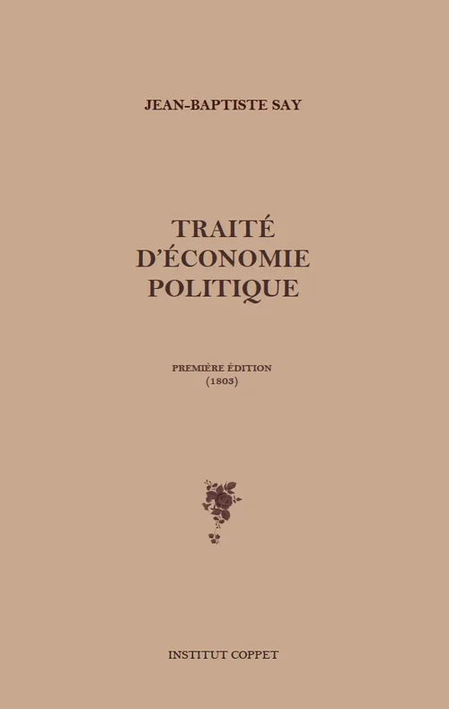

Socialist and communist thought take a particularly paradoxical theoretical stance on property. These currents of thought regularly attack private property, holding that the individual appropriation of things and land is contrary to justice. According to this vision, we should live in a world where wealth is distributed in a common and equal manner, or according to a collective, political organisation aimed at balancing the distribution of resources. This criticism naturally extends to inheritance, seen as an unfair transmission of wealth that should be politically organised rather than left to the free decision of individuals.

For liberals, inheritance is a logical extension of the right of ownership. If I am truly a proprietor, I have the freedom to do with my wealth as I wish: to give it away, to sell it, or to pass it on to my heirs. Free exchange itself rests on this fundamental respect for the ownership of things and of oneself. Transmitting some or all of one's wealth to one's heirs in no way infringes on the equal rights of others.

### How national property is born

To understand the paradox between the socialist rejection of private property and the defence of national property, we must analyse how property is born within its collective and national boundaries. Ancestral tribes and human groups took possession of territories, sometimes by violence, but often simply by the first discovery of new lands. This work of discovery was by no means simple: it was accompanied by a considerable effort of conservation in the face of the constant dangers posed by settling in an unfamiliar place.

The transfer of a human group to a new area was fraught with difficulties. People had to survive in unknown conditions when they had previously known where to draw their means of subsistence. They had to fight the climate, the animals of prey, the uncertainty of unknown soil. This work of taking possession was often paid for at the cost of lives. Over the generations, these groups not only extracted their subsistence from the territory but improved it through farming, digging canals, and building roads. This process resembles exactly that by which an individual improves his own property after taking possession of it and clearing it.

### The variable-geometry recognition of property

The contradiction becomes apparent when we observe that socialists and communists are perfectly willing to recognise the boundaries and borders of national groups while rejecting private property. In contemporary debates about wars of conquest or attacks by one country against another, they pose as defenders of frontiers. But what is a frontier, if not the recognition of the limits of a group's collective ownership of its territory? To defend frontiers is to recognise that a group of individuals deserves guaranteed respect for its property, even at the cost of armed intervention.

This position becomes particularly uncomfortable as we descend the community ladder. In micro-states, socialists also respect collective property. But how far down does this respect extend? To a community of a thousand? A hundred? A single family? The first level is, of course, the individual. If we respect the boundaries of property at the level of the group, why not respect them at the individual level? This logic reveals that we remain prisoners of ancient tribal conceptions, where collective ownership of a hunting ground was exclusive to all other tribes without being conceived as belonging to the whole human race.

We can also turn the inheritance argument against socialists by asking: why do they defend inheritance in its collective forms? National ownership of land, such as that of France, implies that it is always French people who inherit from French people. Why, then, should the world's dispossessed, those who live in deserts or unfavourable climates, not also inherit? Why not redistribute wealth worldwide? Socialists will not admit it, because they fully recognise the ownership of borders at the national level while refusing to recognise it at the individual level.

### Taxation and regulation as territorial aggression

This analysis also enables us to understand how systems of unfreedom undermine individual autonomy. Taxes, when they exceed the legitimate contribution of service for service, constitute a form of territorial aggression against individual property. Regulation, too, represents a form of dispossession: the homeowner forbidden to paint his house the colour he wishes discovers that his supposed ownership is merely usufruct. These interventions dispossess us of our own property, whether the property of ourselves, of things, or of land. The international sophism thus reveals a variable-geometry recognition of property, where states and nations benefit from protection of their collective property, while the individual who acquires goods through work and exchange must endure regulation, supervision, and tutelage.

# Philosophy of liberalism

<partId>67ec4570-8d65-5d03-8ce3-12caa4a132ea</partId>

## Freedom of contract and employment

<chapterId>085d5756-4ffe-5e2e-8b41-9a94102c97d3</chapterId>

### Why we want freedom of contract

The contract is the fundamental element of free societies, for it represents the concrete expression of the free disposition of oneself and of the goods that legitimately belong to us. Because each individual is the owner of himself, he mobilises this ownership in his contractual commitments, binding his will to that of others to accomplish certain actions. Properties derived from previous work and exchanges can likewise be mobilised in these contractual relationships, which must be understood as a positive-sum game in which each party finds an advantage in participating.

The voluntary contract is also the cement of society itself. Society can be defined as the multiplicity of exchanges between individuals: without exchange or contract, it exists only in fact, but it takes real shape through contract and voluntary association. This contractual functioning is the foundation of social harmony and peace, since it rests on mutually advantageous and freely negotiated relationships. When a person chooses to enter into a contract, it is precisely because he finds it advantageous to carry out the transaction rather than to abstain.

### Why we want freedom of work

Work is one of the most fundamental human acts, and its freedom encompasses a remarkably wide field of application. Many activities can be considered as work: freedom of expression, for example, is also a form of freedom of work, since journalism, the press, and printing are professions. Religious tolerance itself touches on this freedom, since the celebration of mass is work. Guaranteeing freedom of work is therefore tantamount to guaranteeing an extremely comprehensive freedom.

This freedom is justified by inescapable facts. Human needs vary from one individual to another, as do the means of satisfying them, and work is precisely the means of creating satisfactions and products for exchange. There is a fundamental diversity between the strengths and aptitudes of different individuals, who evolve in a changing environment that demands different skills at different stages of their lives.

Freedom of work has a propulsive character that makes progress possible. Human perfectibility is achieved through this freedom, because centralised management merely reproduces patterns of production that are already known. The freedom to work enables us to break from well-trodden paths and advance toward new creations. A coherent programme of freedom of work therefore implies combating regulated professions, the "customs of examinations," and public monopolies, recognising the superiority of the repressive system (which punishes real violations of the rights of others) over the preventive system (which hinders everyone's activity a priori).

### Why we want monetary and banking freedom

Banking and monetary freedom is a particular application of the freedom of work, since money simply represents a service rendered and a product exchanged on the market. Jean-Gustave Courcelle-Seneuil, in his influential *La Banque libre*, together with Charles Coquelin and others, helped revitalise the economic theory behind this freedom in the nineteenth century. These thinkers offered a comprehensive critique of the long history of state monetary manipulation, devaluation, and inflation.

Courcelle-Seneuil asserted the French Revolution's ideas on freedom of work and property, explaining that there was no reason to justify a public monopoly of money. Free banking would make banking and monetary services available to more people, including the farmers who were excluded from the system at the time. As in Scotland and certain American states of the period, freedom of banking and money encourages innovation and progress, driven by the self-interest that motivates market participants to develop new solutions to satisfy consumers. The potential for monetary innovation, of which today we perceive only the first signs, is vast.

## Reduced state powers

<chapterId>abb3498a-0232-5a58-aea0-52730b75ee84</chapterId>

### The reduction of state powers

The political programme of liberty is fundamentally based on a drastic reduction in the powers of the state, particularly those considered parasitic. This idea runs through the entire French liberal tradition, from the Marquis d'Argenson and the Physiocrats in the eighteenth century, with their famous *laissez faire* principle, to the great thinkers of the nineteenth century such as Paul Leroy-Beaulieu. While these authors recognise that the state has a number of necessary powers, notably in policing, justice, and certain aspects of land-use planning, they all agree on the need to strictly limit its scope of action.

The debate on the functions of the state has always been intense within the liberal family, but a consensus emerges around a fundamental distinction. On one side are the necessary attributions: principally the establishment of a rule of law, the protection of freedom of contract and the enforcement of contracts, and the defence of individual rights against violation. On the other side are ancillary functions, many of which are perfectly suited to private initiative, free association, and the market economy. History shows that roads and bridges have often been built and managed privately in many societies.

### The structural inefficiency of state action

The state, in all its economic manifestations, is a deficient and costly mechanism. Its limited productive power stems from the fact that it does not rely on individual initiative and enterprise, and does not allow personal interest to develop fully. The functionarism that characterises it generates an organisation that is not very progressive and poorly adapted to the rapid evolution of society. This maladaptation becomes particularly problematic in a context of constant technical innovation, where progress must be anticipated and the production of goods and services constantly improved.

It is important to emphasise that it is not the individual alone who replaces the state, but free association and the coordination of individual forces on the basis of exchange and contract. Individualism does not replace socialism: it is free enterprise and voluntary cooperation that take over far more effectively.

### Decentralisation is not the answer

The programme to reduce state powers must not be confused with simple decentralisation. While the latter has some merit in recognising the variety of human existence, the local state has no more legitimacy than the central state to intervene in ways that are abusive and contrary to individual freedoms. Simply transferring powers from the central state to local authorities is not a satisfactory solution. The real aim is to transfer these powers to the realm of private activity: to the individual, to free association, and to enterprise.

### Education and health: the paradox of monopolisation

Education and healthcare are perfect examples of the perverse effects of state monopolisation. Paul Leroy-Beaulieu, in his *Essai sur la répartition des richesses* (1885), anticipated that the great doctors and elite professors would become the privileged people of the future in a society founded on contract. As life became increasingly precious to individuals in an advanced civilisation, those who protected and enriched it would see their value recognised in due measure.

The current reality reveals a paradoxical situation. Education and healthcare professionals, who produce extremely valuable services, are in fact the first to be sacrificed by the public service system, which devalues their work and prevents them from acquiring the place in society that should be theirs. The state considers these branches so essential that it must monopolise them, but it is precisely because they are so useful that they would be highly valued in a regime of freedom.

## The liberal alternative to the welfare state

<chapterId>8be24b04-53da-5d80-8e76-3b6f3530723f</chapterId>

### Voluntary solidarity and free association

The liberal perspective on social issues rests on a particular conception of human existence, centred on individual freedom and personal responsibility. Human relations are naturally organised around contract, but also around what we may call human sympathy and the individual's natural associations: the family circle, relatives and close friends, as well as the free associations and companies in which each person evolves.

This social organisation allows for the emergence of voluntary solidarity, which can reach considerable proportions. The mutual aid societies that developed in the nineteenth century are a perfect illustration. These organisations were in fact the ancestors of today's welfare state and social security systems, with the crucial difference that they operated on the basis of competition rather than state monopoly. This competition between establishments and methods enabled continuous improvement in practices, favouring the success of the most efficient forms and the abandonment of those that failed.

The power of free association deserves special recognition. The isolated individual has always found himself in a weak position when faced with the vagaries of life and the evolution of his productive capacities. It is precisely for this reason that human beings have lived in society since the time of the tribes. Association and private enterprise, not the individual alone, must be the solution to the state's declining powers. Private assistance, unlike regulatory and bureaucratic public assistance, elevates man by respecting his individuality and pushing him toward progress, whereas public assistance tends to degrade him and keep him in a tutelage comparable to that of a serf.

### Feminism and liberalism

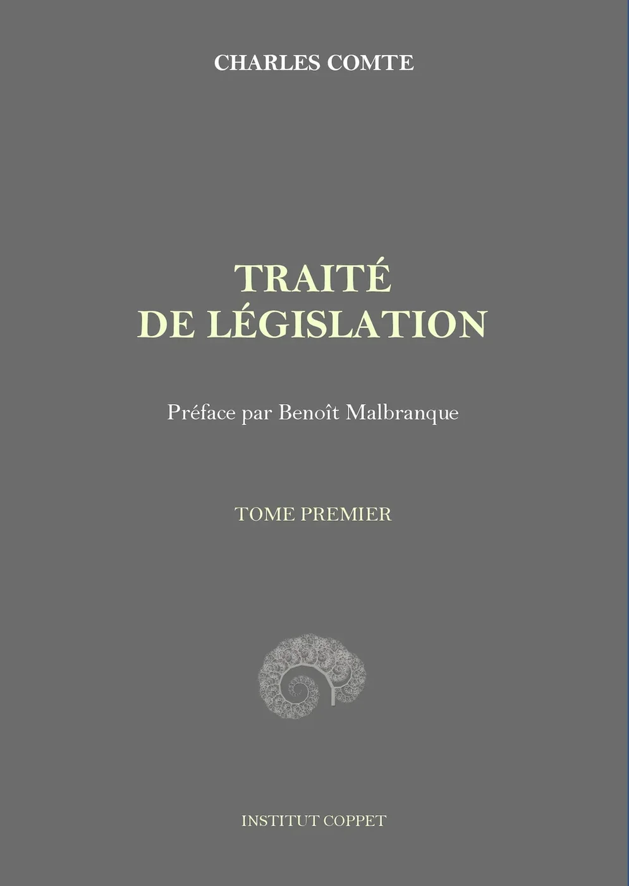

The liberal analysis of feminism rests on a historical and anthropological study of the condition of women in different societies. Charles Comte, in his *Traité de législation*, examines the condition of various population categories in ancient societies and in those recently discovered in Australia and New Zealand. His analysis reveals that in primitive societies, the lot of women was far from enviable: they were truly the slaves of their time.

The emancipation of women was achieved through freedom and through what we call capitalism: the use of tools and machines that gradually gave women a productive capacity equal to, or even greater than, that of men. This technological development placed a greater emphasis on perseverance, moral and intellectual virtues, where early societies had valued brute force alone. The central notion of consent is the fundamental point of convergence between feminism and liberalism, since contract and free exchange are based entirely on this principle. The system of tutelage and constraint, by contrast, rests on non-consent or majority consent, which dispenses with the individual, day-to-day agreement of each person.

### The liberal position on racism and immigration

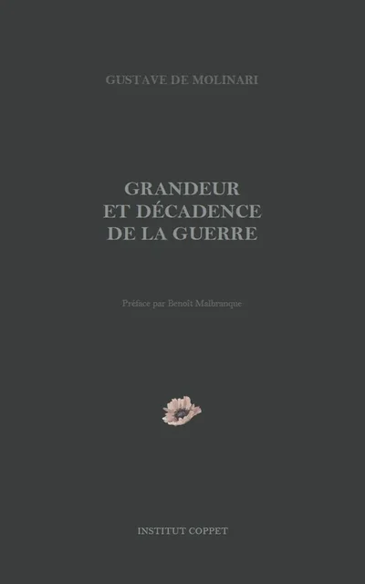

The question of racism was the subject of numerous discussions at the Société d'économie politique in the nineteenth century, which brought together France's leading liberal intellectuals. These debates addressed various manifestations of racism, from anti-Semitism and the fate of Jews in Romania to the situation of Chinese in California and Australia. The vast majority of the society's members took a positive view of the mixing of human groups, believing that competition is propulsive and that the work of generations, combining different elements of culture and intelligence, leads to the best possible development of civilisation, provided this is accomplished on the basis of contract and voluntary cooperation. The individualistic character of the doctrines of liberty directly contradicts collective representations of races or nations as homogeneous groups.

The question of immigration must be approached from the liberal fundamentals of self-ownership and ownership of things. When immigration is founded on voluntary exchange, legitimate appropriation of goods, and equal contracts, freedom of immigration must be asserted. Gustave de Molinari, himself a Belgian immigrant who lived in France, epitomises this position. He and the vast majority of French liberals of his time viewed immigration positively, recognising that the fight against immigration constituted a new form of protectionism: a labour protectionism comparable to that of industrialists protecting their profits from international competition. Just as industrialists wished to reserve a national market for themselves, workers and their political representatives, under universal suffrage, saw competition from foreign workers as an embarrassment. The social liberal programme was therefore not limited to economic issues but encompassed the retreat of the state in favour of contract and free trade, in a perspective perfectly compatible with contemporary feminist and anti-racist movements.

## Individual autonomy and collective self-defence

<chapterId>1811a240-b5c8-5c34-906a-a5a030ca847f</chapterId>

### The individual as the foundation of political freedom

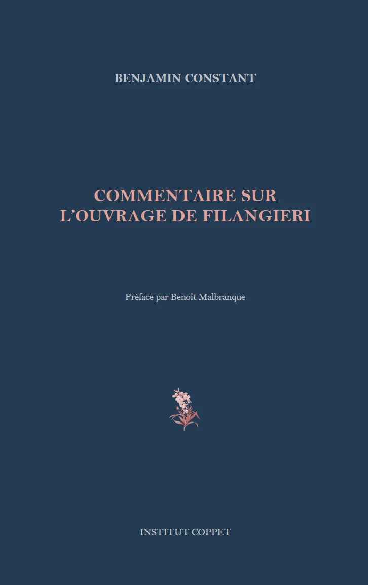

The doctrine of freedom rests on a principle that deserves to be clearly established: the individual is the inescapable starting point for any reflection on liberty. This assertion derives from a factual observation of human nature. We do not enjoy things collectively; we do not possess an innate collective will, but an individual will of our own. Through exchange and contract, collective decisions can emerge, but the primary foundation always remains the individual, not the nation, the group, or any other collective category.

This recognition has important consequences for political organisation. Unfreedom almost always manifests itself in the subjugation of the individual in the name of a supposed collective interest. Laws must therefore be founded on the recognition of human rights and fundamental freedoms, while framing this freedom so that it does not infringe on the similar freedoms of others. Benjamin Constant, in his *Commentaire sur l'ouvrage de Filangieri* and in his *Principes de politique*, insists on the necessary silence of the law when the individual makes a just and legitimate use of his liberty and property. This silence of the law is an essential principle: the only permissible limitation on individual freedom lies in the protection of the freedoms of others.

### Nations as voluntary associations

The liberal society is founded on voluntary exchange and contract, which profoundly transforms our understanding of the nation. Nations are to be understood as large associations through and within which individuals organise the administration of justice and the police. They are not superior entities that dominate or possess individuals.

History teaches us that the pretexts usually invoked to found national unity, such as unity of language, culture, or history, do not withstand impartial analysis. The wars that have enlarged certain territories have not been waged on the basis of linguistic or cultural affinities but according to opportunities for political expansion. The great movement of colonisation is a perfect illustration. We must therefore think differently about politics, gradually replacing political serfdom with increasingly contractual and voluntary foundations.

### Secession and freedom of government

The notion of secession is the logical continuation of this reflection. Gustave de Molinari explored the question in particular depth at the time of the American Civil War. This long and costly conflict raised not only the question of slavery but also that of political autonomy and what Molinari called "freedom of government." The fundamental question is whether one can freely choose one's government, or whether one remains in trusteeship, possessed by a nation from which one cannot exclude oneself.

True freedom of contract does not simply consist in being party to a social contract; it implies the freedom to sign or not to sign, and thus to choose to enter or leave a group under voluntary conditions. Collective secession enables a group of people to break away from one nation to form another, or to join an entity already formed. Territorial or geographical pretexts are no more valid than linguistic ones, as demonstrated by the existence of landlocked states and political groups sharing different languages.

### Toward international security founded on law

As early as 1713, the Abbé de Saint-Pierre identified the need for organised international security. Historically, security was established gradually: first between tribes, then on a national scale with the end of serfdom and the creation of vast states. Today, the proportion of human relations conducted on an international basis has grown considerably, making it ever more imperative to establish security on very broad boundaries.

A state of international law that would recognise freedom of action while punishing infringements of that freedom does not yet exist on a global scale. We must prepare for its organisation, as history is moving toward an increasingly liberal functioning of societies. Security is an indispensable condition for voluntary human relations, since without it, innocent freedom can neither be recognised nor practically implemented. Freedom that is constantly in danger is freedom destroyed in advance.

## Freedom rooted in human facts

<chapterId>fa1ae25f-bdcf-50db-9a12-d880ff568875</chapterId>

### Freedom rooted in the facts of human existence

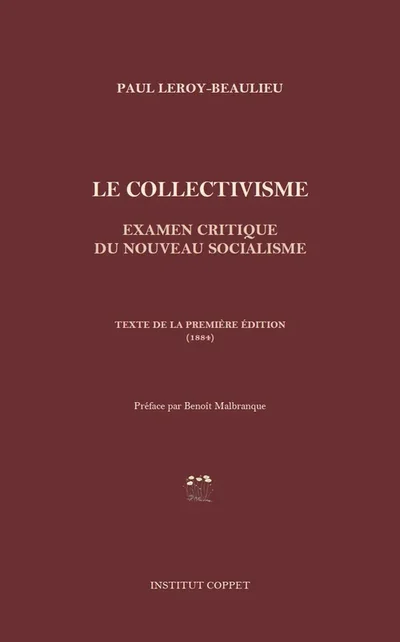

This course on freedom as a project for society rests on a fundamental conviction that deserves to be forcefully reiterated in conclusion: freedom is neither a utopia nor a mere abstract theory, but is deeply rooted in the facts of human existence. The first part of the course established this essential foundation by examining the realities that characterise the human condition. Among these fundamental facts, self-ownership occupies a central place, for it is precisely because man owns himself that he can legitimately possess things, material goods, and land. This human variety, this irreducible individuality, is the foundation on which any serious reflection on freedom must be built.

An examination of the historical conditions of freedom reveals a gradual and slow process. Ancient societies lived under extreme hazards and constant danger, operating according to modes of production based on violence and the collective appropriation of wealth rather than on the creation of new value. Yet history shows a remarkable tendency for authority to be replaced by contract, which makes it clear that socialist and interventionist solutions are in fact backward-looking. Communism appears as the most regressive form of this tendency, taking us back to the time of tribes on a national and international scale.

### Freedom works; unfreedom fails

The concrete mechanisms by which freedom produces its beneficial effects have been examined in detail: prices and profits that guide production, exchange and contract that ensure every transaction is mutually advantageous, the satisfaction of needs through economic freedom. In contrast, unfreedom in its various forms, from complete communism to excessive taxation and over-regulation, breaks the fundamental human bonds of individuality and will. It substitutes tutelage for personal choice and replaces the contract with politics, with its defective and costly functioning. Authors such as Paul Leroy-Beaulieu and the Physiocrats before him had perfectly anticipated this failure.

To maintain itself despite its repeated failures, unfreedom must rely on sophisms: distorted representations of reality that enable the public to retain confidence in systems that collapse as soon as they are seriously examined. The intellectual sophism (false definitions of freedom), the democratic sophism (guardianship of guardians), the economic sophisms (labour as a goal, opposition of interests), the social sophism (fictitious class exploitation), and the international sophism (variable-geometry recognition of property) all reveal the same fundamental weakness: a system with no real foundation and perfectly predictable failures.

### Reform, not revolution; opinion, not force

The programme of freedom that emerges from this analysis must be bold, for it is founded on the real principles of human nature: self-ownership, individual autonomy, and contract. It implies a reduction in the powers of the state and a transformation of public services into private ones, with increasing reliance on free exchange. But the French liberal tradition teaches that reforms are to be preferred to revolutions. Tocqueville demonstrated masterfully in *L'Ancien Régime et la Révolution* that revolutionary upheavals cost a great deal without transforming society as much as they promise, often resulting in the consolidation of centralising power.

The example of the campaign for the abolition of the Corn Laws in nineteenth-century England illustrates the way forward. Richard Cobden and the Anti-Corn Law League, celebrated by Frédéric Bastiat, achieved success by mobilising public opinion through meetings held throughout England, Scotland, and Ireland. This method of convincing through the debate of ideas remains the goal to be pursued today, for it is perfectly in tune with the values of competition, freedom, and perfectibility that liberalism stands for. The march of history leads us toward ever greater freedom, and it is our task to ensure that this march is accomplished through peaceful reform and enlightened opinion rather than through violence and upheaval.

# Final section

<partId>7955883a-ce99-11f0-90a5-fb346d61dc16</partId>

## Reviews & Ratings

<chapterId>8058b634-ce99-11f0-958c-fbaed1cbe973</chapterId>

<isCourseReview>true</isCourseReview>

## Final examination

<chapterId>867d105a-ce99-11f0-81ae-03ab890b34e2</chapterId>

<isCourseExam>true</isCourseExam>

## Conclusion

<chapterId>8a843872-ce99-11f0-89f2-d3569420a90c</chapterId>

<isCourseConclusion>true</isCourseConclusion>
