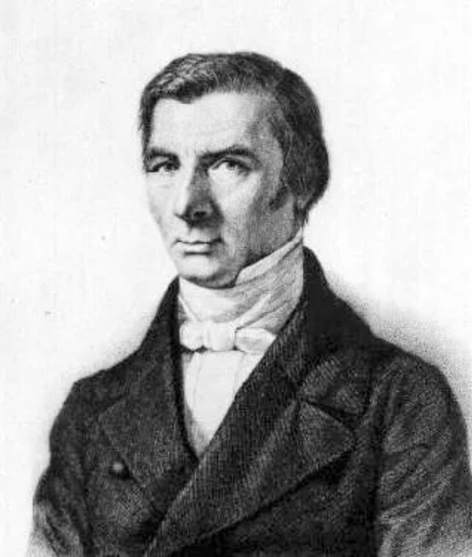
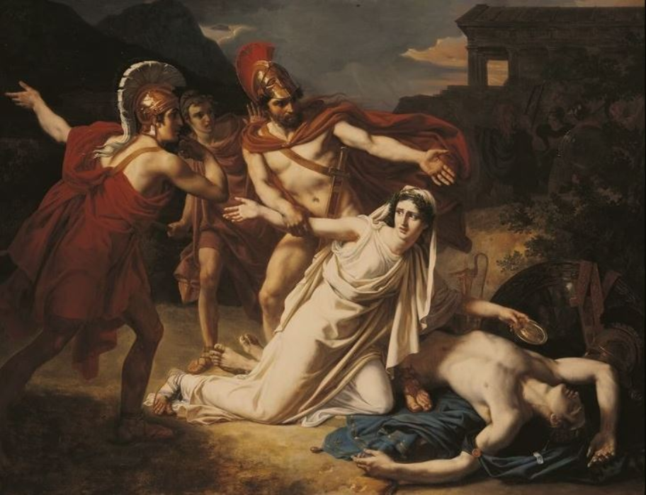
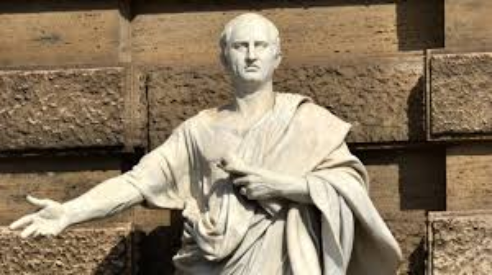
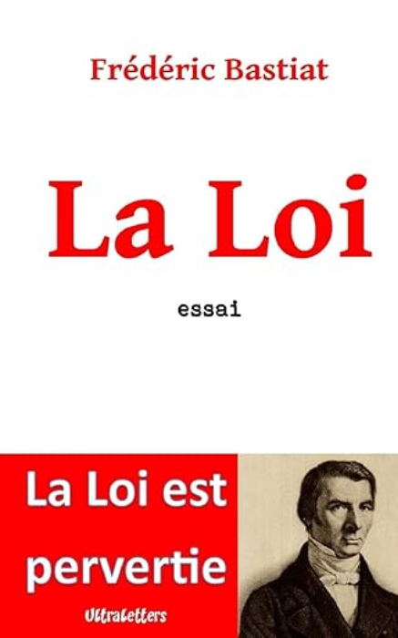
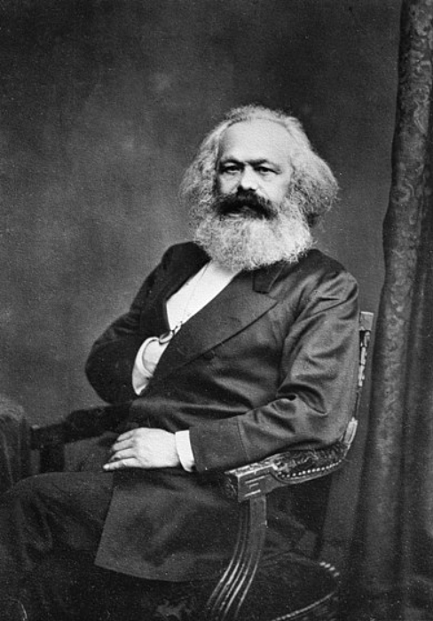
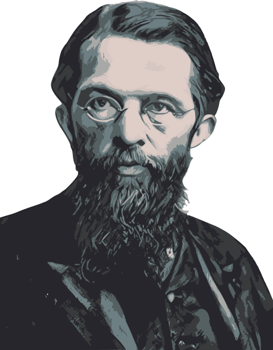

# Eine Reise durch die philosophische Geschichte der Freiheit

Eine philosophische Geschichte der Freiheit erforscht die Freiheit durch die Geschichte hindurch. Damien Theillier untersucht zwei politische Philosophien: Freiheit und Macht. Er analysiert Denker wie Frédéric Bastiat, Lord Acton, Karl Marx und Murray Rothbard und beleuchtet ihre Ansichten über Produktion, Plünderung, Klassenkampf und den Staat.

Der Kurs geht zurück zu den Ursprüngen der Freiheit in der Antike, bei den Griechen und Römern, durch das Mittelalter, wo die menschliche Freiheit in religiösen und politischen Kontexten diskutiert wird. Er zeigt, wie sich die Ideen der Freiheit mit der Geburt der Universitäten und den ersten Formen des Kapitalismus in italienischen Städten entwickelten.

Von der Renaissance bis zur Aufklärung untersucht der Kurs den Aufstieg der Freiheit, gekennzeichnet durch religiöse Toleranz und wirtschaftliche Freiheit, gipfelnd in 1776 mit bedeutenden Ereignissen wie dem Philadelphia-Kongress. Die 19. und 20. Jahrhunderte erleben den Höhepunkt und Niedergang der Freiheit, konfrontiert mit Kritik am Kapitalismus und den Gefahren des Kollektivismus, und setzen die zeitgenössischen Herausforderungen für die Freiheit in Perspektive.

+++

# Freiheit oder Macht

<partId>e59475e9-3ae4-5e66-a17e-218de0281b06</partId>

## Einführung: Es gibt nur zwei politische Philosophien

<chapterId>ffa60c0d-ee2b-575d-a4ac-4e9ccdad396f</chapterId>

Warum diesen Kurs betiteln als: eine Geschichte der Freiheit? Weil wir die Beziehung zwischen Ideen und Ereignissen verstehen müssen, um unsere Ära besser zu beurteilen und mit Unterscheidungsvermögen zu handeln. Es ist in der Vergangenheit, dass wir die Elemente für ein besseres Verständnis dessen finden, was Freiheit ist und die Gründe, warum wir sie schätzen müssen.

> Wenn die Vergangenheit die Zukunft nicht mehr erleuchtet, wandelt der Geist in Dunkelheit (Alexis de Tocqueville - _Demokratie in Amerika_.)

Gleichzeitig sagte Auguste Comte: "Man kennt eine Wissenschaft nicht vollständig, bis man ihre Geschichte kennt." Diese Wahrheit könnte auf die Idee der Freiheit angewendet werden.
Tatsächlich ist Freiheit keine neue Idee. Es ist ein Erbe, das durch Generationen weitergegeben wird. Die gesamte Geschichte der Zivilisation zeugt von einem unermüdlichen Kampf um Freiheit.

Das Ziel dieses Kurses ist jedoch nicht nur, die Geschichte der Freiheit zu beleuchten, sondern auch, und das ist noch wichtiger, kritisches Urteilsvermögen zu entwickeln. Tatsächlich reicht die Geschichte allein nicht aus, um die Gegenwart und die Zukunft zu beurteilen. Sie muss von kritischer Reflexion und einem Urteil über die Fehler der Vergangenheit begleitet werden. Das ist der Beitrag der Philosophie. Deshalb habe ich diesen Kurs betitelt als: eine philosophische Geschichte der Freiheit. Es geht tatsächlich darum zu erforschen, wie Philosophen durch die Zeitalter hindurch die Freiheit konzipiert haben.

### Die Aufgabe der Philosophie

Von ihren Ursprüngen hat sie einen doppelten Zweck:

- Erstens, vagen und verwirrten Konzepten einen Sinn zu geben. Was ist gut, wahr, gerecht, schön? So wie die Funktion der Geschichte darin besteht, die Vergangenheit zu erhellen, so ist die Philosophie die Kunst, Konzepte korrekt zu definieren. Deshalb müssen wir in diesem Kurs damit beginnen zu verstehen, was Freiheit ist.

Freiheit ist ein Konzept, das eine Vielzahl von Varianten umfasst, die ebenso viele mögliche Ausprägungen derselben Realität sind: politische Freiheit, wirtschaftliche Freiheit, Gewissensfreiheit, Redefreiheit, Religionsfreiheit, Vereinigungsfreiheit usw. Über welche Realität sprechen wir?

Freiheit kann einfach als die Macht der Wahl definiert werden, mit dem, was einem selbst gehört. Sie ist eine inhärente Fähigkeit des Menschen. Es ist eine Realität, die im Wesentlichen individuell ist. Nur das Individuum kann denken und handeln, das heißt, Entscheidungen treffen. Das bedeutet nicht, dass das Individuum allein ist, dass es niemandem etwas schuldet. Im Gegenteil, es lebt in der Gesellschaft und muss mit anderen für sein eigenes Wohl zusammenarbeiten. Aber jeder bleibt frei, zu kooperieren oder nicht und muss die Verantwortung für seine Entscheidungen übernehmen.

Der Begriff der Verantwortung ist ein Korollar zur Freiheit, denn jede Wahl hat Konsequenzen. Die verantwortungsvolle Person ist diejenige, die die Kosten ihrer eigenen Entscheidungen trägt und diese Kosten nicht auf andere abwälzt. Mit anderen Worten, Freiheit ist anspruchsvoll. Es ist eine moralische Vorstellung, die Rechte, aber auch Pflichten gegenüber anderen impliziert, einschließlich der Pflicht, deren Freiheit zu respektieren.

- Zweitens ist die Philosophie normativ, im Gegensatz zur Geschichte, die lediglich beschreibend ist. Daher unterscheidet sich die politische Philosophie von den Politikwissenschaften. Politische Philosophie ist normativ, das heißt, sie schreibt Werte vor und beurteilt menschliche Handlungen nach einem Kriterium der Gerechtigkeit. Andererseits begnügen sich die Politikwissenschaften damit, Regime zu beschreiben, die Geschichte von Institutionen zu machen, ohne Werturteile zu fällen.

### Philosophie der Freiheit und Philosophie der Macht

Aus dieser Perspektive gibt es nur zwei Arten von politischen Philosophien: die Philosophie der Freiheit und die Philosophie der Macht.

- Die Philosophie der Freiheit basiert auf dem natürlichen Recht auf Eigentum und behauptet, dass der einzige Zweck des Gesetzes darin besteht, privates Eigentum und Verträge zu schützen. Jeder sollte in der Lage sein, mit dem, was ihm gehört, zu tun, was er will, vorausgesetzt, er schadet niemandem. Es ist eine Philosophie, die gleiche Freiheit für alle verteidigt, über sich selbst und sein Eigentum unter der Bedingung der Verantwortung zu verfügen. Es ist die Philosophie des freien Marktes.
- Die Philosophie der Macht rechtfertigt die Autorität bestimmter kollektiver Entitäten wie des Staates oder der Gesellschaft, die Grenzen für den Markt und das Eigentum und damit für die Freiheit festzulegen. In diesem Rahmen obliegt es dem Gesetz, die Wirtschaft, Gesundheit, Wohnen, Kultur, Bildung usw. zu organisieren. Diese konstruktivistische Philosophie hatte immer ihre Verteidiger, im Namen des kollektiven Interesses, der Gleichheit, des Schutzes und des Wohlergehens.

Der Antagonismus zwischen diesen beiden Philosophien existiert in allen Epochen. Aber wir können ihn mit der Philosophie der Aufklärung illustrieren. Es gibt deutlich eine Trennlinie zwischen zwei Arten von Denkern.

Diejenigen, die die erste Philosophie in Frankreich verteidigen, sind die Physiokraten, mit François Quesnay an ihrer Spitze. Sie nennen sich Physiokraten (der Name kommt vom griechischen Physis, was Natur bedeutet, und Kratos, was Herrschaft bedeutet), weil sie ein wirtschaftliches und soziales Denken auf der Grundlage der natürlichen Rechte des Menschen entwickeln. Für sie existieren Gesellschaft, Menschen und Eigentum vor den Gesetzen. In diesem System erklärt Bastiat,

> Es ist nicht so, dass es Eigentum gibt, weil es Gesetze gibt, sondern es gibt Gesetze, weil es Eigentum gibt. (_Eigentum und Gesetz_).

Für Turgot und Say, Schüler von Quesnay, existiert ein natürliches Gesetz, unabhängig von den Launen der Gesetzgeber, das für alle Menschen gilt und jeder Gesellschaft vorausgeht. Diese Philosophie stammt direkt aus der mittelalterlichen Scholastik, den Stoikern, Aristoteles und Sophokles. Die ungeschriebenen Gesetze sind sowohl den geschriebenen Gesetzen voraus als auch überlegen, weil sie aus der menschlichen Natur und Vernunft entspringen.

Die zweite Philosophie findet sich bei Autoren wie Rousseau, Robespierre oder Kant, die die republikanische Tradition verkörpern, für die die Souveränität des allgemeinen Willens die wahre Quelle des Rechts ist. Ein Zeitgenosse von Quesnay, Rousseau, ist ein Anti-Physiokrat. Für ihn muss der Gesetzgeber die Gesellschaft organisieren, wie ein Mechaniker, der eine Maschine aus toter Materie erfindet.

> "Wer es wagt, die Gründung eines Volkes zu unternehmen", sagt Rousseau, "muss sich fähig fühlen, sozusagen die menschliche Natur zu ändern, jeden Einzelnen, der für sich ein vollkommenes und einsames Ganzes ist, in einen Teil eines größeren Ganzen zu verwandeln, von dem dieser Einzelne gewissermaßen sein Leben und Sein erhält." (_Gesellschaftsvertrag_)

Aus dieser Perspektive ist es die Aufgabe des Gesetzgebers, zu organisieren, zu verändern, sogar Eigentum abzuschaffen, wenn er es für gut hält. Für Rousseau ist Eigentum nicht natürlich, sondern konventionell, wie die Gesellschaft selbst. Robespierre wiederum etabliert das Prinzip, dass "Eigentum das Recht jedes Bürgers ist, den ihm durch das Gesetz garantierten Teil der Güter zu genießen und darüber zu verfügen." Es gibt kein natürliches Recht auf Eigentum; es gibt nur eine unbestimmte Anzahl von möglichen und kontingenten Arrangements.

## Frédéric Bastiat: Produktion versus Plünderung

<chapterId>5a8a3452-9970-51a0-a5ea-f367b63137bc</chapterId>

Wenn man Lehrbücher öffnet, stellte Bastiat fest, lernt man, dass die Menschheit ohne das Eingreifen der Macht dem Nichts verdammt wäre:

> "Es genügt, fast willkürlich, ein Buch der Philosophie, Politik oder Geschichte zu öffnen, um zu sehen, wie tief verwurzelt in unserem Land diese Idee ist, geboren aus klassischen Studien und der Mutter des Sozialismus, dass die Menschheit eine inerte Materie ist, die vom Macht Leben, Organisation, Moralität und Reichtum erhält; — oder schlimmer, dass die Menschheit selbst zu ihrer Degradierung tendiert und nur durch die mysteriöse Hand des Gesetzgebers auf dieser Abwärtsspirale gestoppt wird." ([_Das Gesetz_](http://bastiat.org/fr/la_loi.html)).

Mit anderen Worten, das kulturelle Vorurteil, das die westliche Philosophie sowie die Geschichtsschreibung dominiert, ist, dass wir alles der Macht verdanken: Freiheit, Gesundheit, Bildung, Sicherheit, Wohlstand. Die Menschheit wird als "inerte Materie" beschrieben, die dank des Gesetzgebers Gestalt annimmt.

Aber die Realität der Macht ist laut Bastiat ganz anders. Macht ist Unterdrückung. Er schreibt:
Öffnen Sie die Annalen der Menschheit willkürlich! Konsultieren Sie die antike oder moderne Geschichte, heilige oder profane, und fragen Sie sich, woher all diese Kriege der Rasse, Klasse, Nationen und Familien kommen! Sie werden immer diese unveränderliche Antwort erhalten: Aus dem Durst nach Macht. ([_Parlamentarische Unvereinbarkeiten_](http://bastiat.org/fr/incompatibilites_parlementaires.html))
Es ist der Durst nach Macht, der an der Wurzel aller Formen der Unterdrückung in der Geschichte steht. In einem Brief an Frau Chevreux, datiert auf den 23. Juni 1850, skizziert Bastiat die Phasen der Unterdrückung: "Zeiten des Kampfes, darüber, wer den Staat ergreifen wird; und Zeiten der Waffenruhe, die das ephemere Reich der triumphierenden Unterdrückung sein werden, ein Vorbote eines neuen Kampfes." Zuerst die Eroberung der Macht durch Krieg, dann die Errichtung eines Staates, der durch Plünderung des Reichtums seiner Bürger subsistiert.
Die Geschichte ist somit ein Kampf zwischen zwei Prinzipien: Freiheit und Unterdrückung:

> Freiheit! Das ist letztendlich das harmonische Prinzip. Unterdrückung! Das ist das dissonante Prinzip; der Kampf dieser beiden Mächte füllt die Annalen der Menschheit. ([_Wirtschaftliche Harmonien_](http://bastiat.org/fr/conclusion_eo_harmonies.html), Schluss der Originalausgabe).

### Was ist Unterdrückung?

Mit einem Wort, es ist Plünderung. Bastiat skizziert die Hauptarten der Plünderung, die von den herrschenden Eliten ausgehen: Krieg, Sklaverei, Theokratie und Monopol. Tatsächlich, nach seiner Meinung: "Es gibt nur zwei Wege, um die Notwendigkeiten für die Erhaltung, Verschönerung und Verbesserung des Lebens zu erwerben: PRODUKTION und PLÜNDERUNG." ([_Die Physiologie der Plünderung_](http://bastiat.org/fr/physiologie_de_la_spoliation.html))

Was ist der Unterschied zwischen Produktion und Plünderung? Hier ist Bastiats Antwort:

> Um zu produzieren, muss man all seine Fähigkeiten auf die Beherrschung der Natur richten; denn es ist die Natur, die bekämpft, gezähmt und versklavt werden muss. Deshalb ist Eisen, das zu einem Pflug umgewandelt wird, das Emblem der Produktion. Um zu plündern, muss man all seine Fähigkeiten auf die Beherrschung der Menschen richten; denn es sind sie, die bekämpft, getötet oder versklavt werden müssen. Deshalb ist Eisen, das zu einem Schwert umgewandelt wird, das Emblem der Plünderung. ([_Wirtschaftliche Harmonien_](http://bastiat.org/fr/guerre.html), Krieg).

Mit anderen Worten, Produktion ist Macht über die Natur. Plünderung ist Macht über Menschen. Es gibt jedoch zwei Formen der Plünderung: legale und illegale.
Illegale Plünderung ist der Diebstahl oder das Verbrechen, das von einem Bürger gegen einen anderen begangen wird. Es ist die Handlung des Banditen oder des Betrügers. Die schlimmste Form der Plünderung ist jedoch die, die durch das Gesetz vollbracht wird: "Es gibt Menschen, die denken, dass Plünderung ihre ganze Unmoral verliert, vorausgesetzt, sie ist legal. Was mich betrifft, kann ich mir keinen verschärfenden Umstand vorstellen." ([_Was man sieht und was man nicht sieht_](http://bastiat.org/fr/cqovecqonvp.html#RESTRICTION)).

Bastiat teilt uns mit, dass es noch zwei Formen der legalen Plünderung gibt:

> Externe Plünderung wird Krieg, Eroberungen, Kolonien genannt. Interne Plünderung wird Steuern, Positionen, Monopole genannt. ([_Cobden und die Liga_](http://bastiat.org/fr/introduction_cobden_ligue.html), Einleitung).

In [_Die Physiologie der Plünderung_](http://bastiat.org/fr/physiologie_de_la_spoliation.html) erläutert er:
Das wahre und gerechte Gesetz der Menschen lautet: Frei debattierter Austausch von Dienstleistung gegen Dienstleistung. Plünderung besteht darin, durch Gewalt oder Betrug die Freiheit der Debatte zu verbieten, um eine Dienstleistung zu erhalten, ohne eine zu erbringen. Plünderung durch Gewalt wird wie folgt ausgeübt: Man wartet, bis ein Mensch etwas produziert, und entreißt es ihm dann, Waffe in der Hand. Sie wird formell durch das Dekalog verurteilt: Du sollst nicht stehlen. Wenn es von Einzelperson zu Einzelperson geschieht, wird es Diebstahl genannt und führt ins Gefängnis; wenn es von Nation zu Nation geschieht, wird es Eroberung genannt und führt zu Ruhm.

### Geschichte der Plünderung

Historisch gesehen haben herrschende Eliten immer von Plünderungen gelebt. Bastiat merkt an:

> Gewalt, angewandt auf Plünderung, ist die Grundlage der menschlichen Annalen. Ihre Geschichte nachzuzeichnen, würde fast vollständig die Geschichte aller Völker reproduzieren: Assyrer, Babylonier, Meder, Perser, Ägypter, Griechen, Römer, Goten, Franken, Hunnen, Türken, Araber, Mongolen, Tataren, ganz zu schweigen von den Spaniern in Amerika, den Engländern in Indien, den Franzosen in Afrika, den Russen in Asien usw.
>
> ([_Ökonomische Sophismen_](http://bastiat.org/fr/conclusion_sophismes.html), Schlussfolgerung des ersten Bandes).
> Plünderung, in ihrer brutalsten Form, bewaffnet mit Fackel und Schwert, füllt die Annalen der menschlichen Geschichte. Welche Namen fassen Geschichte zusammen? Cyrus, Sesostris, Alexander, Scipio, Caesar, Attila, Tamerlan, Muhammad, Pizarro, Wilhelm der Eroberer; das ist naive Plünderung durch Eroberungen. Ihnen gehören die Lorbeeren, Monumente, Statuen und Triumphbögen. ([_Ökonomische Harmonien_](http://bastiat.org/fr/conclusion_eo_harmonies.html), Schlussfolgerung der Originalausgabe).
> Die Geschichte der Welt ist die Geschichte, wie eine Gruppe von Menschen andere systematisch plünderte, oft durch Krieg, Sklaverei, Theokratie. Heutzutage ist es das Monopol, das heißt, wirtschaftliche Privilegien, die vom Staat an seine Klienten verteilt werden.

Ein paar Tage vor seinem Tod in Rom im Jahr 1850 vertraute Bastiat seinem Freund Prosper Paillottet an:

> Eine wichtige Aufgabe für die politische Ökonomie ist es, die Geschichte der Plünderung zu schreiben. Es ist eine lange Geschichte, in der von Anfang an Eroberungen, Völkerwanderungen, Invasionen und all die verheerenden Exzesse der Gewalt im Konflikt mit der Gerechtigkeit erscheinen. Aus all dem gibt es heute noch lebendige Spuren, und es ist eine große Schwierigkeit für die Lösung der Fragen, die in unserem Jahrhundert gestellt werden. Wir werden zu dieser Lösung nicht gelangen, bis wir klar festgestellt haben, inwiefern und wie Ungerechtigkeit, die ihren Anteil unter uns nimmt, sich in unseren Bräuchen und in unseren Gesetzen verankert hat.
>
> (P. Paillottet, _Neun Tage in der Nähe eines sterbenden Mannes_)

## Lord Acton: Freiheit ist der Motor der Geschichte

<chapterId>de971d92-4e26-5870-a961-18dfa06497cf</chapterId>

Es ist bekannt, Geschichte wird von den Siegern geschrieben. Die Aufmerksamkeit konzentriert sich oft auf die Eroberung der Macht, auf das Leben der Machthaber und auf die Konflikte, die sie mit denen haben, die ihren Platz einnehmen möchten.

Das gilt besonders für Lehrbücher, die für öffentliche Schulen bestimmt sind und von Professoren verfasst werden, die vom Staat angestellt sind.
Dies trifft nicht auf das Werk in zwei Bänden zu, das von einem Historiker aus Cambridge im 19. Jahrhundert geschrieben wurde, [Lord Acton](https://www.lesbelleslettres.com/livre/9782251447858/le-pouvoir-corrompt). Sein vollständiger Name ist John Emerich Edward Dalberg, Baron von Acton (1834-1902). Er ist der Autor von _Geschichte der Freiheit in der Antike und im Christentum_. Sein Werk wird als eines der wichtigsten zu diesem Thema angesehen, und er widmete einen großen Teil seiner Karriere diesem Thema. Sein Werk, obwohl unvollendet, ist eine mächtige Warnung vor den Gefahren des Machtmissbrauchs, und sein Eintreten für Freiheit und individuelle Verantwortung bleibt heute relevant.
Dieser Autor ist am bekanntesten für sein Maxime: "Macht tendiert dazu, zu korrumpieren, und absolute Macht korrumpiert absolut." Eine Formel, die an die von Montesquieu in [_Der Geist der Gesetze_](https://fr.wikisource.org/wiki/Page:Montesquieu_-_Esprit_des_Lois_-_Tome_1.djvu/316) erinnert:

> Es ist eine ewige Erfahrung, dass jeder Mensch, der Macht hat, versucht ist, sie zu missbrauchen.

### Actons These

Für Acton ist der Konflikt zwischen Freiheit und Macht das zentrale Thema der Menschheitsgeschichte, und Freiheit ist die treibende Kraft des Fortschritts und der Evolution der Gesellschaften. Acton suchte die Faktoren zu verstehen, die zum Aufstieg der Freiheit im Westen beitrugen. Sein Ziel war es, die Bedingungen für deren Erhaltung und Entwicklung zu identifizieren. Er studierte philosophische Ideen, soziale Strukturen und politische Kontexte, die ihr Entstehen im Laufe der Zeit begünstigten.

Seine zentrale These ist, dass "Freiheit durch den Konflikt der Mächte etabliert wird." Laut Acton war die katholische Kirche Jahrhunderte nach dem Fall des Weströmischen Reiches die einzige Kraft, die in der Lage war, die Autorität von Feudalherren, Monarchen und Kaisern herauszufordern. Dieser Machtkampf zwischen Kirche und Staat erwies sich als entscheidend für den Aufstieg der Freiheit. Europa hatte einen starken Gott und eine schwache Macht, aufgrund des anhaltenden Streits im Mittelalter zwischen Päpsten und Königen. Im Gegensatz dazu hatte China eine schwache Gottheit und eine starke bürokratische Macht.

> Mit Freiheit meine ich die Gewissheit, dass jeder Mensch geschützt wird, wenn er tut, was er für seine Pflicht hält, gegen den Einfluss von Autorität und Mehrheiten, von Brauch und Meinung. Der Staat ist nur in seinem eigenen unmittelbaren Bereich kompetent, Pflichten zu setzen und zwischen Gut und Böse zu unterscheiden.
>
> (Lord Acton)
> Mit anderen Worten, Freiheit ist das Recht für Individuen, ihrem eigenen Gewissen zu folgen, und es ist nicht die Rolle des Staates, das Verhalten einer Person in philosophischen, moralischen und religiösen Angelegenheiten zu diktieren.
> Friedrich Hayek hatte ursprünglich in Erwägung gezogen, die Mont Pelerin Society die "Acton-Tocqueville-Gesellschaft" zu nennen, als Tribut an zwei Denker, die er zutiefst bewunderte: Lord Acton und Alexis de Tocqueville. Letztendlich wurde der Name des Ortes, an dem das erste Treffen der Gesellschaft stattfand, Mont Pelerin in der Schweiz, gewählt.

### Voltaire und Condorcet

Aber die Idee, dass die Freiheit in Europa aus internen Kämpfen zwischen verschiedenen Machtansprüchen geboren wurde, die die Errichtung absoluter Herrschaft verhinderten, ist nicht einzigartig für Acton. Sie findet sich bereits bei Denkern wie Voltaire und Condorcet.

So führt Voltaire in seinen [_Philosophischen Briefen_](https://fr.wikisource.org/wiki/Lettres_philosophiques/Lettre_6) die englische Freiheit auf Konflikte zwischen Königen und Adligen zurück, die eine übermäßige Machtkonzentration verhinderten. Und er bemerkt:
Wenn es in England nur eine Religion gäbe, wäre deren Despotismus zu fürchten; gäbe es nur zwei, würden sie sich gegenseitig die Kehlen durchschneiden; aber es gibt dreißig, und sie leben in Frieden und Glück. ([Über die Presbyterianer](https://fr.wikisource.org/wiki/Lettres_philosophiques/Lettre_6))

Condorcet führt in seinem [_Entwurf eines historischen Bildes des Fortschritts des menschlichen Geistes_](https://fr.wikisource.org/wiki/Esquisse_d%E2%80%99un_tableau_historique_des_progr%C3%A8s_de_l%E2%80%99esprit_humain) die dezentralisierte Machtstruktur in Italien auf die Rivalität zwischen dem Papst und dem Kaiser zurück, was vielen unabhängigen Stadtstaaten das Überleben ermöglichte.

Diese These findet sich auch in einem monumentalen Werk aus dem Jahr 1983: _Recht und Revolution: Die Bildung der westlichen Rechtstradition_, von Harold J. Berman ([Französische Übersetzung von Raoul Audouin](https://www.eyrolles.com/Entreprise/Livre/droit-et-revolution-9782903449667/), veröffentlicht von der Universitätsbuchhandlung Aix en Provence im Jahr 2002). Bermans Analyse hebt die entscheidende Rolle des rechtlichen Pluralismus in der Geschichte des Westens hervor. Dieses System, weit davon entfernt, eine bloße Quelle der Komplexität zu sein, war ein Motor für Entwicklung, Freiheit und Innovation und prägte die westlichen Rechtstraditionen dauerhaft.

## Marx: Geschichte als Klassenkampf

<chapterId>438100e6-a385-55c6-b2c5-ad192c564757</chapterId>

Es gibt jedoch auch eine andere Perspektive auf die Geschichte. Sie war recht erfolgreich und genoss lange Zeit die Unterstützung westlicher Intellektueller und Vertreter des Globalen Südens. Dies ist die sozialistische und marxistische Sicht der Geschichte.

Sie erklärt das außergewöhnliche Wachstum Europas hauptsächlich durch den Fortschritt der Technologie in Verbindung mit der "ursprünglichen Akkumulation" von Kapital, die aus Imperialismus, Sklaverei, dem Dreieckshandel, der Enteignung kleiner Bauern und der Ausbeutung der Arbeiterklasse resultiert. Das Fazit ist klar. Dieses außergewöhnliche europäische Wachstum wurde auf Kosten von Millionen und Abermillionen von Sklaven und unterdrückten Menschen erreicht.

Zunächst hat Marx in einem Punkt recht: Geschichte ist die Geschichte von Klassenkämpfen und Ausbeutung. Das Zitat ist bekannt, es ist der erste Satz des ersten Kapitels des [_Kommunistischen Manifests_](https://fr.wikisource.org/wiki/Manifeste_du_parti_communiste/Andler): "Die Geschichte aller bisherigen Gesellschaft ist die Geschichte von Klassenkämpfen." Marx selbst räumte ein, dass er seine Theorie des Klassenkampfes von früheren Autoren übernommen hatte:

> Ich beanspruche kein Verdienst für die Entdeckung der Klassen und Klassenkämpfe in der modernen Gesellschaft. Lange vor mir hatten bürgerliche Historiker die historische Entwicklung dieses Klassenkampfes und bürgerliche Ökonomen die ökonomische Anatomie der Klassen beschrieben.
>
> (_Brief an J. Weydemeyer_, 5. März 1852).

Aber er irrt sich in einem grundlegenden Punkt bezüglich der Arbeiterklasse: Es ist nicht das Kapital, das Ausbeutung produziert. Mit anderen Worten, der Klassenkampf findet nicht innerhalb der Produktion statt, sondern zwischen denen, die Steuern zahlen, und denen, die sie einnehmen.

Laut Marx besteht die Ausbeutung in einem Prozess, bei dem ein Teil des vom Arbeiter geschaffenen Werts ohne Bezahlung extrahiert wird, was es den Kapitalisten ermöglicht, einen Gewinn zu erzielen. Mit anderen Worten, Ausbeutung wäre ein Mechanismus, der es Kapitalisten ermöglicht, sich zu bereichern, indem sie die Arbeit des Proletariats stehlen.
Diese Analyse spiegelt ein Missverständnis des Mehrwerts und der kooperativen sowie dynamischen Natur des Wirtschaftslebens wider. Tatsächlich ist der Gewinn, den der Unternehmer erhält, eine Entschädigung für das Risiko, das er eingeht, und der Arbeiter oder Angestellte ist kein Sklave. In einer Wettbewerbssituation können sie einen Vertrag mit ihrem Arbeitgeber akzeptieren oder ablehnen. Sie treffen eine Entscheidung, die eine Kosten-Nutzen-Analyse widerspiegelt.

### Die Industrielle Revolution in Frage gestellt

In der Tat verzerrt die marxistische Analyse die historische Realität der Industriellen Revolution. Ludwig von Mises klärte diese Frage in seinem wirtschaftswissenschaftlichen Traktat [_Human Action_](http://herve.dequengo.free.fr/Mises/AH/AHTDM.htm) (siehe insbesondere das Kapitel mit dem Titel [Popular Interpretation of the Industrial Revolution](http://herve.dequengo.free.fr/Mises/AH/AH21.htm#inter2)) sowie in einer Reihe von Vorlesungen, die unter dem Titel: [_Economic Policy: Thoughts for Today and Tomorrow_](http://herve.dequengo.free.fr/Mises/PE/PE_TDM.htm) veröffentlicht wurden. (Ebenfalls lesenswert, The Anti-Capitalistic Mentality [hier](https://www.institutcoppet.org/wp-content/uploads/2011/05/La-Mentalit%C3%A9-anticapitaliste.pdf) und [hier](http://herve.dequengo.free.fr/Mises/MAC/MAC_TDM.htm)).

Mises erklärt, dass Jobs in Fabriken, obwohl sie nach unseren Maßstäben miserabel waren, die bestmögliche Gelegenheit für die Arbeiter der damaligen Zeit darstellten.

Lassen Sie uns einen Auszug aus _Human Action_ lesen:

> In den ersten Jahrzehnten der industriellen Revolution waren die Lebensstandards der Fabrikarbeiter skandalös niedrig im Vergleich zu den Bedingungen ihrer Zeitgenossen aus den oberen Klassen und im Vergleich zur gegenwärtigen Situation der industriellen Massen. Die Arbeitszeiten waren lang, die sanitären Bedingungen der Werkstätten erbärmlich. Die Arbeitsfähigkeit der Einzelnen erschöpfte sich schnell. Aber die Tatsache bleibt, dass für die Überschussbevölkerung, die die Aneignung von Gemeinschaftsweideland (Einhegungen) in das schlimmste Elend gestürzt hatte und für die buchstäblich kein Platz im Rahmen des herrschenden Produktionssystems war, die Fabrikarbeit die Rettung war. Diese Menschen strömten zu den Werkstätten, aus dem einzigen Grund, dass sie unbedingt ihren Lebensstandard verbessern mussten.

Mises fügt hinzu, dass die Verbesserung der menschlichen Bedingungen somit durch die Ansammlung von Kapital ermöglicht wurde:

> Die radikale Veränderung der Situation, die den westlichen Massen den gegenwärtigen Lebensstandard (einen tatsächlich hohen Lebensstandard im Vergleich zu dem, was er in vor-kapitalistischen Zeiten war, und zu dem, was er in der Sowjetunion ist) verliehen hat, war die Wirkung der Kapitalakkumulation durch Sparen und kluge Investitionen von weitsichtigen Unternehmern. Keine technologische Verbesserung wäre erreichbar gewesen, wenn die zusätzlichen materiellen Kapitalien, die für die praktische Nutzung neuer Erfindungen erforderlich waren, nicht durch vorheriges Sparen ermöglicht worden wären.

Bezüglich der marxistischen Geschichtsschreibung können wir uns auch auf Friedrich Hayek in _Capitalism and the Historians_ (University of Chicago Press, 1954) und sein Kapitel mit dem Titel "History and Politics" beziehen. Laut Hayek war es nicht die Industrialisierung, die die Arbeiter elend machte, wie die dunkle Legende des Kapitalismus, die vom Marxismus verbreitet wird, behauptet. Er merkt an:

> Die wirkliche Geschichte der Verbindung zwischen Kapitalismus und dem Aufstieg des Proletariats ist fast das Gegenteil von dem, was diese Theorien der Enteignung der Massen vorschlagen.
> Vor der Industriellen Revolution lebten die meisten Menschen in ländlichen Gesellschaften und waren für ihr Überleben auf die Landwirtschaft angewiesen. Sie hatten wenig zu verkaufen auf dem Markt, was ihre Möglichkeiten und ihren Lebensstandard begrenzte. Jeder erwartete, in absoluter Armut zu leben und sah ein ähnliches Schicksal für seine Nachkommen vor. Niemand war empört über eine Situation, die unvermeidlich zu sein schien.
> 

Mit dem Aufkommen der Industrialisierung entstanden neue Möglichkeiten, was eine wachsende Nachfrage nach Arbeitskräften schuf. Zum ersten Mal konnten Menschen ohne Land oder bedeutende Ressourcen ihre Arbeitskraft an Fabriken und Manufakturen im Austausch für einen Lohn verkaufen, was Sicherheit für die Zukunft gewährleistete.

Dieser neue Zugang zu Einkommen ermöglichte es ihnen, sich selbst zu ernähren und zu beherbergen, selbst in schnell wachsenden Städten. So förderte die Industrielle Revolution eine Bevölkerungsexplosion, die unter den wirtschaftlichen Stagnationsbedingungen der vorindustriellen Ära nicht möglich gewesen wäre.

So bemerkt Hayek, "wirtschaftliches Leiden wurde sowohl sichtbarer als auch schien weniger gerechtfertigt, weil der allgemeine Wohlstand schneller wuchs als je zuvor."

Daher wurde der Arbeiter nicht ausgebeutet, auch wenn die Löhne niedrig waren, aufgrund des Überflusses an Arbeitskräften, die das Land verließen.

In Wirklichkeit macht Ausbeutung nur als Aggression gegen Privateigentum Sinn. In diesem Sinne ist Ausbeutung immer die Handlung des Staates. Denn der Staat ist die einzige Institution, die ihre Einnahmen durch Zwang, das heißt durch Gewalt, erhält. So ist die wirkliche Ausbeutung, wie wir bei Bastiat gesehen haben, die der produktiven Klassen durch die Klasse der Staatsbeamten. Es wäre genauer zu sagen, dass die Geschichte aller Gesellschaft bis zu unseren Tagen nichts anderes ist als die Geschichte des Kampfes zwischen Plünderern und den produktiven Klassen.

### Das "europäische Wunder"

Nachfolgend ermöglicht uns eine nuanciertere historische Analyse als die von Marx, die Idee eines räuberischen Europas, das seinen Erfolg allein dem Imperialismus und der Sklaverei verdankt, in Frage zu stellen. Indem sie sich in die vergleichende Wirtschaftsgeschichte vertieften, suchten einige zeitgenössische Historiker die Ursprünge der Entwicklung Europas in dem, was es von anderen großen Zivilisationen, insbesondere denen Chinas, Indiens und des Islams, unterschied. Diese Merkmale wurden von [David Landes](https://www.eyrolles.com/Entreprise/Livre/richesse-et-pauvrete-des-nations-9782226110381/), [Jean Baechler](https://academiesciencesmoralesetpolitiques.fr/publications/publications-de-lacademie/jean-baechler/), [François Crouzet](https://www.cairn.info/revue-entreprises-et-histoire-2010-4-page-219.htm) und [Douglass North](https://www.iedm.org/fr/65134-douglass-north-l-un-des-economistes-les-plus-originaux/) erforscht. Diese Forscher versuchten zu verstehen, was als das "europäische Wunder" bezeichnet wird. Sie konzentrierten ihre Aufmerksamkeit auf die Tatsache, dass Europa ein Mosaik aus geteilten und konkurrierenden Jurisdiktionen war, wo nach dem Fall Roms keine zentrale politische Macht in der Lage war, ihren Willen durchzusetzen.

Wie Jean Baechler, Mitglied der Akademie der Moral- und Politikwissenschaften, in _Die Ursprünge des Kapitalismus_ (1971) sagt:

> Die erste Bedingung für die Maximierung der wirtschaftlichen Effizienz ist die Befreiung der Zivilgesellschaft vom Staat (...) Die Expansion des Kapitalismus verdankt ihren Ursprung und ihre Daseinsberechtigung der politischen Anarchie.

Mit anderen Worten, das große "Nicht-Ereignis", das Europas Schicksal dominierte, war die Abwesenheit eines hegemonialen Imperiums, wie das, das China dominierte.
Es ist dieses radikal dezentralisierte Europa, das Parlamente, Landtage und Generalstände hervorbrachte. Es gab Geburtsstätten von Chartas wie der berühmten Magna Carta der Engländer, aber es produzierte auch die freien Städte Norditaliens und Flanderns: Venedig, Florenz, Genua, Amsterdam, Gent und Brügge. Schließlich entwickelte es das Konzept des Naturrechts sowie das Prinzip, dass selbst der Fürst nicht über dem Gesetz steht, eine Lehre, die in den mittelalterlichen Universitäten von Bologna, Oxford und Paris verwurzelt ist und sich bis nach Wien und Krakau erstreckt. Zum Abschluss dieses Kapitels war der wirtschaftliche und kulturelle Aufschwung Europas nicht auf die Eroberung und Ausbeutung des Rests der Welt zurückzuführen. Es dominierte die Welt dank seines wirtschaftlichen Fortschritts. Was als "Imperialismus" bezeichnet wurde, ist die Folge, nicht die Ursache des wirtschaftlichen Fortschritts Europas. Aber um zu Lord Acton zurückzukehren, was die westliche Zivilisation noch mehr von allen anderen unterscheidet, ist ihre Bestätigung des Wertes des Individuums. In diesem Sinne war die Gewissensfreiheit, insbesondere in religiösen Angelegenheiten, ein grundlegender Pfeiler dieser Zivilisation. Darauf werden wir im folgenden Abschnitt zurückkommen.

## Murray Rothbard: Staat versus Gesellschaft

<chapterId>5a0020ca-2bbd-5e09-8389-d57c57542cb2</chapterId>

Im letzten Kapitel von _Anatomy of the State_ (übersetzt ins Französische als _L’anatomie de l’Etat_, von den Résurgence-Editionen), schlägt Murray Rothbard eine Theorie der Geschichte vor. Dieses sehr kurze Kapitel trägt den Titel: Geschichte, ein Rennen zwischen Staatsmacht und sozialer Macht. Laut Rothbard kann die Geschichte als ein ewiger Konflikt zwischen zwei grundlegenden Prinzipien verstanden werden:

- Friedliche Zusammenarbeit und Produktion, die den freiwilligen Austausch und die Schaffung von Wohlstand durch Arbeit und Innovation repräsentieren.
- Zwanghafte Ausbeutung und Raub, verkörpert durch die Herrschaft des Staates, der sich die Früchte der Arbeit der Einzelnen durch Gewalt aneignet.

Unter Bezugnahme auf Albert J. Nock verwendet Rothbard die Begriffe "soziale Macht" und "Staatsmacht", um diese beiden gegensätzlichen Kräfte zu bezeichnen:

- Soziale Macht: entsteht aus der Zusammenarbeit und dem Einfallsreichtum freier Individuen, führt zu wirtschaftlichem Fortschritt und Wohlstand. Es ist eine Macht über die Natur, die kreative Fähigkeit des Menschen, die Natur in Ressourcen und Wissen umzuwandeln, zum kollektiven Wohl der Gesellschaft.
- Staatsmacht: wird durch Zwang und Gewalt auferlegt, sucht die Gesellschaft für den eigenen Nutzen zu kontrollieren und auszubeuten. Es ist eine Macht, die über den Menschen ausgeübt wird. Sie besteht darin, "die Früchte der Gesellschaft für den Nutzen nicht-produktiver (tatsächlich anti-produktiver) Führer abzuzapfen."

### Der Staat als Parasit

Rothbard betrachtet den Staat als einen Parasiten, der auf Kosten der produktiven Gesellschaft lebt. Er besetzt strategisch "Kommandoposten", um Reichtum und Macht zu appropriieren. Monopol der Gewalt, Justiz, Bildung, Infrastruktur. Und er fügt hinzu: "In der modernen Wirtschaft ist Geld der wesentliche Kommandoposten."
Für Rothbard sollte das Prinzip der Freiheit auch für Geld gelten. Wenn wir für Freiheit in anderen Bereichen sind, wenn wir Eigentum und die Person gegen das Eindringen des Staates schützen wollen, muss unsere dringendste Aufgabe sein, die Möglichkeit eines freien Marktes für Geld zu erkunden. (Siehe zu diesem Punkt seinen Essay: _State, What Have You Done with Our Money?_ Übersetzung von Stéphane Couvreur für das Institut Coppet, 2011).

### Das Scheitern von Versuchen, den Staat zu begrenzen

Rothbard warnt vor der Idee, dass geschriebene Verfassungen allein Freiheit und die Begrenzung der Macht garantieren könnten:
Die letzten Jahrhunderte waren Zeiten, in denen Männer versuchten, dem Staat verfassungsmäßige und andere Grenzen aufzuerlegen, nur um festzustellen, dass solche Grenzen, wie alle anderen Versuche auch, gescheitert waren. Von all den vielen Formen, die Regime im Laufe der Jahrhunderte annahmen, von all den Konzepten und Institutionen, die ausprobiert wurden, gelang es keiner, den Staat unter Kontrolle zu halten.
Eine schriftliche Verfassung hat sicherlich viele Vorteile, aber es ist ein schwerwiegender Fehler anzunehmen, dass sie ausreichen würde. Tatsächlich kann die Mehrheitspartei mit ihrer Macht eine umfassende Interpretation annehmen, um ihre Macht zu erhöhen. Ohne konkrete Mechanismen zur Durchsetzung von Rechten und angesichts einer dominierenden Partei, die entschlossen ist, ihre Macht auszuweiten, riskieren Verfassungen unwirksam zu werden und zu irreführenden Werkzeugen zu verkommen.

### Das 20. Jahrhundert: Ein Jahrhundert des Rückzugs

Laut Rothbard ist die Geschichte kein linearer Prozess, sondern vielmehr eine Oszillation zwischen dem Fortschritt sozialer Macht und dem Wiederaufleben der Kontrolle durch den Staat:

- Perioden der Freiheit: wenn soziale Macht blüht, nehmen Freiheit, Frieden und Wohlstand zu.
- Perioden der Staatsdominanz: wenn der Staat die Oberhand gewinnt, führt dies zu Unterdrückung, Krieg und Regression.

Vom 17. Jahrhundert bis zum 19. Jahrhundert gab es in vielen westlichen Ländern Perioden der Beschleunigung sozialer Macht und eines entsprechenden Anstiegs von Freiheit, Frieden und materiellem Wohlergehen. Aber Rothbard erinnert uns daran, dass das 20. Jahrhundert von einem Wiederaufleben der Staatsmacht geprägt war, mit schlimmen Folgen: einem Anstieg von Sklaverei, Krieg und Zerstörung:

> In diesem Jahrhundert sieht sich die Menschheit erneut der virulenten Herrschaft des Staates gegenüber; der Staat nun bewaffnet mit der schöpferischen Kraft des Menschen, konfisziert und für seine eigenen Zwecke pervertiert.
> Was ist überhaupt eine freie Gesellschaft? Es ist eine Gesellschaft ohne Monopol. In seinem Werk der politischen Philosophie, _Ethik der Freiheit_ (1982), antwortet Rothbard: "eine Gesellschaft, in der es keine rechtliche Möglichkeit der zwanghaften Aggression gegen die Person oder das Eigentum eines Individuums gibt." Deshalb, so sagt er, reduziert sich die politische Philosophie, die die Prinzipien einer gerechten Gesellschaft definieren muss, auf eine einzige Frage: "Wer besitzt legitim was?"
> 

Für Rothbard kann die soziale Ordnung vorherrschen, wenn sie das Produkt der Verallgemeinerung vertraglicher Verfahren für den freien Austausch von Eigentumsrechten ist, indem alle wirtschaftlichen Aktivitäten und sogar souveräne Funktionen (Zentralbank, Gerichte) privatisiert werden und indem auf Wettbewerb unter Schutzagenturen zurückgegriffen wird.

Und er fügt hinzu:

> Wir haben nun alle Varianten des Statismus gekostet, und sie sind alle gescheitert. Überall in der westlichen Welt zu Beginn des 20. Jahrhunderts hatten Geschäftsführer, Politiker und Intellektuelle begonnen, ein "neues" gemischtes Wirtschaftssystem, der Staatsdominanz, anstelle des relativen Laissez-faire des vorherigen Jahrhunderts zu fordern. Neue Allheilmittel, auf den ersten Blick attraktiv, wie Sozialismus, der korporatistische Staat, der Wohlfahrts-Kriegsstaat usw., wurden ausprobiert und sind alle offensichtlich gescheitert. Die Argumente zugunsten des Sozialismus und der staatlichen Planung erscheinen nun als Plädoyers für ein gealtertes, erschöpftes und gescheitertes System. Was bleibt zu versuchen, außer Freiheit?
>
> (_Ethik der Freiheit_)

# Die Ursprünge der Freiheit: Antike

<partId>d7a9d251-6d44-5f2f-9cc5-88796c84f61b</partId>

## Die Erfindung der kritischen Rationalität durch die Griechen

<chapterId>5b5f65e6-f980-5971-b9f6-a37244503325</chapterId>

Die Erfahrung der athenischen Demokratie hat einen bleibenden Eindruck in der Geschichte des politischen Denkens hinterlassen und inspiriert auch heute noch Ideale der Demokratie und der Bürgerbeteiligung.

Die athenische Demokratie zeichnete sich durch lebhafte öffentliche Debatten über städtische Angelegenheiten aus, die hauptsächlich auf dem Marktplatz, der Agora, stattfanden. Diese Betriebsweise, basierend auf Vernunft und kritischer Diskussion, stand in starkem Kontrast zu früheren Praktiken, bei denen Gesetze und Bräuche als heilig und unveränderlich galten, überliefert von den Vorfahren und geschützt durch die Götter.

### Die Geburt der Politik mit der Stadt

Die athenische Demokratie stellt einen bedeutenden Bruch mit vergangenen Traditionen dar. Tatsächlich konnte es in früheren Gesellschaften keine "Politik" im Sinne einer Diskussion über soziale Regeln geben, da diese auf transzendente Weise durch Mythos auferlegt wurden.

Der Historiker Jean-Pierre Vernant schreibt:

> Das Aufkommen der Polis stellt in der Geschichte des griechischen Denkens ein entscheidendes Ereignis dar. Sicherlich würden die vollen Konsequenzen in Bezug auf intellektuelle Entwicklung und im Bereich der Institutionen erst langfristig realisiert werden; die Polis würde durch mehrere Stadien, verschiedene Formen gehen. Jedoch markiert ihr Aufkommen, das zwischen dem 8. und 7. Jahrhundert angesetzt werden kann, einen Anfang, eine wahre Erfindung; durch sie nehmen das soziale Leben und die Beziehungen unter den Menschen eine neue Form an, deren Originalität die Griechen vollständig empfinden würden. (...) Was das Polis-System vor allem impliziert, ist eine außerordentliche Vorherrschaft der Rede über alle anderen Machtinstrumente. Sie wird zum politischen Werkzeug par excellence, zum Schlüssel aller Autorität im Staat, zum Mittel des Befehls und der Herrschaft über andere. (...) Eine zweite Charakteristik der Polis ist die Art der vollständigen Öffentlichkeit, die den wichtigsten Manifestationen des sozialen Lebens gegeben wird. Man könnte sogar sagen, dass die Polis nur insoweit existiert, als ein öffentlicher Bereich entstanden ist, in zwei verschiedenen, doch miteinander verbundenen Bedeutungen des Begriffs: ein Sektor von gemeinsamem Interesse, im Gegensatz zu privaten Angelegenheiten; offene Praktiken, eingerichtet im hellen Tageslicht, im Gegensatz zu geheimen Verfahren. (...) Von nun an werden Diskussion, Argumentation, Kontroverse die Regeln des intellektuellen Spiels, ebenso wie des politischen Spiels. Die ständige Kontrolle der Gemeinschaft wird über die Schöpfungen des Geistes sowie über die Magistrate des Staates ausgeübt.
>
> (Jean Pierre Vernant, _Die Ursprünge des griechischen Denkens_, Paris, P.U.F, 1962)

Das griechische Wort "polis", das auf Französisch "Politik" ergibt, bedeutet Stadtstaat. Wenn Aristoteles schreibt, dass "der Mensch von Natur aus ein politisches Tier ist", bedeutet das nicht, dass er für die Macht gemacht ist. Mit Politik bezieht er sich auf die Fähigkeit der Menschen, auf dem öffentlichen Platz zu beraten, um zu bestimmen, was gerecht und ungerecht ist.

Diese Neuheit basiert auf der grundlegenden Unterscheidung zwischen zwei Begriffen in der griechischen Sprache, "phusis" und "nomos", die zwei Arten von Gesetzen bezeichnen:

- _Phusis_ ist das Naturgesetz (was das Wort "Physik" auf Französisch ergibt).
- _Nomos_ ist das menschliche Gesetz (ein Begriff, der im Wort "Autonomie" zu finden ist, was "seinem eigenen Gesetz gehorchen" bedeutet).
  Die Stadt entsteht mit der Idee, dass das Gesetz (nomos) menschlichen Ursprungs ist, dass es frei von Menschen geändert werden kann, im Gegensatz zur Natur, und dass es für alle gelten kann. Die Griechen werden sich dann der Autonomie der sozialen und politischen Ordnung im Verhältnis zur natürlichen Ordnung bewusst.
  Dies markiert das Erscheinen der Politik: die fortlaufende Diskussion über die eigentlichen Regeln des sozialen Lebens. Von nun an werden Probleme durch gemeinschaftliches Handeln gelöst und nicht durch eine unveränderliche heilige Ordnung.
  Und Jean-Pierre Vernant fügt hinzu:

> Die griechische Vernunft ist diejenige, die auf eine positive, reflektierende, methodische Weise es uns ermöglicht, auf Menschen einzuwirken, nicht um die Natur zu verändern. Innerhalb ihrer Grenzen wie in ihren Innovationen ist sie die Tochter der Stadt.

### Die Idee der Freiheit unter dem Gesetz

Soziale Harmonie wird nicht durch die absichtliche Handlung der Götter produziert, sondern durch den Gehorsam aller Bürger gegenüber demselben unpersönlichen Gesetz. Macht ist nicht länger die Angelegenheit von Priestern, sie ist zur Angelegenheit aller geworden. So entsteht die Vorstellung von Gleichheit vor dem Gesetz: "_isonomia_", aber auch Rhetorik. Die Beherrschung der Rede war wesentlich, um seine Mitbürger in Versammlungen und Gerichten zu überzeugen.

Für Aristoteles ist Tyrannei der Gehorsam gegenüber einem Mann, und Freiheit ist der Gehorsam gegenüber dem Gesetz. Ihm wird dieses Zitat zugeschrieben:

> Das Gesetz herrschen zu lassen bedeutet, die ausschließliche Herrschaft der Vernunft zu wünschen. Stattdessen die Herrschaft eines Mannes zu begehren, bedeutet, die eines wilden Tieres hinzuzufügen, denn Begierde und Zorn verzerren das Urteil der Herrscher, selbst wenn sie die besten Männer sind.

Nach ihm garantieren Gesetze, da sie unpersönlich und dauerhaft sind, Gerechtigkeit und Gleichheit für alle Bürger.

Cicero, der berühmte römische Redner und Philosoph des 1. Jahrhunderts v. Chr., griff diese Idee auf: "Wir sind Sklaven der Gesetze, damit wir frei sein können" (_De Republica_, Buch III, Kapitel 13). In diesem Abschnitt entwickelt Cicero ein Argument zugunsten einer Republik, die von Gesetzen regiert wird, anstatt von einem Mann oder einer kleinen Gruppe von Männern.
Die Idee der Republik ist eine, die aus der griechischen Philosophie stammt. Sie wurde oft mit der Demokratie kontrastiert, die als zu riskant angesehen wurde. Platon betitelte sein Hauptwerk der politischen Philosophie: _Die Republik_, und er beurteilt die Demokratie sehr hart. Wenn das Volk regiert, besteht ein starkes Risiko, das Gesetz ihrer Wünsche durchzusetzen und das Gute mit dem Angenehmen zu verwechseln. Daher der tragische Tod des Sokrates, zum Tode verurteilt von einer Volksjury, manipuliert von den Sophisten. Platon zog alle Lehren daraus.

Aristoteles würde den Begriff Republik verwenden, um die gerechte Verfassung zu bezeichnen, die das Gemeinwohl anstrebt und die Bürger als freie Männer behandelt. Ein wahres Regime der Freiheit ist eines, in dem das Gesetz allgemein, für alle gleich, anonym und kein persönlicher Befehl ist.

Die Idee der Freiheit unter dem Gesetz findet sich auch im angelsächsischen Begriff "Rule of Law".

### Politische Freiheit

Man kann sagen, dass die Griechen das Konzept der politischen Freiheit erfunden haben, im Gegensatz zur tyrannischen Herrschaft. Die Griechen jener Epoche betrachteten die Sklaverei als eine natürliche Institution und dass Sklaven nicht denselben Status wie Bürger hatten. Dies mag im Widerspruch zur Idee der Freiheit stehen, aber für sie war Freiheit mit der Staatsbürgerschaft verbunden und nicht mit der Abwesenheit von Sklaverei.

Herodot, in _Historia_ und Aischylos in seiner Tragödie _Die Perser_, illustrieren brillant den Kontrast zwischen der absoluten und tyrannischen Monarchie des Xerxes und dem Freiheitsgeist der Griechen. Dieses Volk, gekennzeichnet durch die Abwesenheit von Herren und die Weigerung, sich von Barbaren versklaven zu lassen, egal wie zahlreich, findet seine Stärke im Gesetz, dem "nomos", seinem wahren Herrn, der seine Freiheit garantiert. Und dieses Gesetz entspringt dem Willen aller.

Laut Jacqueline de Romilly:
Die Griechen selbst scheinen diese Originalität gemessen und sich ihrer zu Beginn des 5. Jahrhunderts bewusst geworden zu sein, im Schock, der sie den persischen Eindringlingen entgegensetzte. Und die erste Tatsache, die ihnen auffiel, war, dass es einen politischen Unterschied zwischen ihnen und ihren Gegnern gab, der alles andere bestimmte. Die Perser gehorchten einem absoluten Herrscher, der ihr Meister war, den sie fürchteten und vor dem sie sich niederwarfen: Diese Praktiken waren in Griechenland nicht üblich. Es gibt einen erstaunlichen Dialog bei Herodot, der Xerxes einem ehemaligen König von Sparta gegenüberstellt. Dieser König kündigt Xerxes an, dass die Griechen nicht nachgeben werden, weil Griechenland immer gegen die Versklavung an einen Herrscher kämpft. Es wird kämpfen, egal wie viele seine Gegner sind. Denn, wenn die Griechen frei sind, "sind sie nicht in allem frei: Sie haben einen Herrn, das Gesetz, das sie noch mehr fürchten als eure Untertanen euch fürchten."
(_Das antike Griechenland bei der Entdeckung der Freiheit, Paris, Editions de Fallois, 1989_)

Herodot ist überzeugt, dass ein Volk freier Männer ein Volk ist, das einem Gesetz gehorcht und nicht einem Herrscher, wie im persischen Reich, wo nur ein Mann frei ist und alle anderen Sklaven sind. Dies gilt für Athen, eine Demokratie, aber es gilt auch für Sparta. Der König erschafft das Gesetz nicht, er setzt seinen Willen nicht durch. Er sorgt für die Einhaltung des Gesetzes, er ist in dessen Dienst und stirbt, wenn nötig, um es zu verteidigen.

### Die Suche nach Wahrheit und Pluralismus

Indem sie sich von mythologischem Denken entfernten, waren Thales, Anaximander, Anaximenes und später Demokrit und Empedokles die Ersten, die versuchten, die Physis (Natur) durch Vernunft und nicht durch übernatürliche Entitäten zu verstehen.

Das grundlegende Prinzip, das von diesen frühen vorsokratischen Philosophen aufgestellt wurde, ist, dass die Elemente des Kosmos (des Universums) an ihrem Platz bleiben, weil sie alle gleichermaßen demselben "Naturgesetz" (Physis) unterworfen sind, das auf eine universelle und notwendige Weise ausgesprochen werden kann. Das Universum ist rational, es bildet ein strukturiertes Ganzes, das der Mensch mit seiner Vernunft (dem "Logos" im Gegensatz zum "Mutos", dem Mythos) entdecken kann.

Laut Karl Popper verdanken wir den Philosophen des antiken Griechenlands, insbesondere den Vorsokratikern, die Erfindung des kritischen Rationalismus, das heißt, der westlichen Tradition der kritischen Diskussion, der Quelle des wissenschaftlichen Denkens und des Pluralismus. Er erklärt dies in einem Kapitel von _Vermutungen und Widerlegungen_ mit dem Titel "Rückkehr zu den Vorsokratikern":
Bezüglich der ersten Anzeichen der Existenz einer kritischen Haltung, einer neuen Freiheit des Denkens, erscheinen sie in Anaximanders Kritik an Thales. Dies ist ein ziemlich singuläres Phänomen, der Denker, den Anaximander kritisiert, ist sein Meister, sein Landsmann, einer der Sieben Weisen, der Gründer der ionischen Schule. Nach der Tradition war Anaximander nur vierzehn Jahre jünger als Thales, und er formulierte wahrscheinlich seine Kritiken und präsentierte seine neuen Konzepte zu Lebzeiten seines Meisters (sie starben, wie es scheint, ein paar Jahre auseinander). Jedoch findet sich in den Quellen kein Beweis für Meinungsverschiedenheiten, Streitigkeiten oder Schismen.

Diese Elemente deuten laut ihm darauf hin, dass es Thales war, der diese neue Tradition der Freiheit begründete, basierend auf einer originellen Beziehung zwischen Meister und Schüler. Thales konnte Kritik tolerieren und darüber hinaus etablierte er die Tradition, diese anzuerkennen. Popper identifiziert hier einen Bruch mit der dogmatischen Tradition, die nur eine einzige Schulmeinung zulässt, um sie durch Pluralismus und Fallibilismus zu ersetzen.

> Unsere Versuche, die Wahrheit zu erfassen und zu entdecken, sind nicht endgültig, sondern fähig zur Verbesserung, unser Wissen, unser Lehrgebäude sind spekulativer Natur, sie bestehen aus Annahmen, Hypothesen und nicht aus sicheren und endgültigen Wahrheiten.

Das einzige Mittel, das wir haben, um uns der Wahrheit zu nähern, sind Kritik und Diskussion. Aus dem antiken Griechenland kommt daher diese Tradition:

> Die darin besteht, kühne Vermutungen anzustellen und freie Kritik zu üben, eine Tradition, die am Ursprung des rationalen und wissenschaftlichen Ansatzes stand und folglich unserer westlichen Kultur, die die einzige ist, die auf der Wissenschaft basiert, auch wenn dies offensichtlich nicht ihre einzige Grundlage ist.

## Die Erfindung des Rechts durch die Römer

<chapterId>e9337ad6-5a75-5894-a017-9a507939cb51</chapterId>

Das Römische Reich war eine riesige kosmopolitische Entität. Auf seinem Höhepunkt, um 117 n. Chr., war es ein immenser multiethnischer und mehrsprachiger Staat:

- Im Westen erstreckte es sich von Großbritannien (heutiges England) bis Spanien, über Gallien (heutiges Frankreich) und den Norden Afrikas.
- Im Norden erreichte es den Rhein und die Donau und umfasste Teile von Deutschland, den Niederlanden, der Schweiz, Österreich, Ungarn, Rumänien und Bulgarien.
- Im Süden grenzte es an das Mittelmeer, einschließlich Italien, Griechenland, den Balkan, Kleinasien (heutige Türkei), Syrien, Libanon, Palästina, Ägypten und Kyrenaika (Teil des heutigen Libyens).
- Im Osten erstreckte es sich bis nach Mesopotamien (heutiges Irak) und Armenien.

Von da an entwickelten die Römer das Recht weit über die Griechen hinaus, die in kleinen, ethnisch homogenen Stadtstaaten lebten. Unter der Römischen Republik gab es bereits rechtlichen Schutz des Eigentums und individueller Rechte.

Tatsächlich bestand die Funktion des Rechts darin, ein friedliches Zusammenleben und den Austausch unter den Menschen zu ermöglichen, indem die Grenzen von "mein" und "dein" abgesteckt wurden.

Privateigentum nahm in der römischen Zivilisation eine neue Dimension an, die es zuvor, selbst in der griechischen Zivilisation, nicht gekannt hatte.

Das römische Recht würde zur Grundlage aller modernen westlichen Gesetze im Mittelalter und bis in unsere Zeit werden.

### Der Schutz individueller Rechte

Schließlich legte das römische Recht großen Wert auf die Rechte und Freiheiten der Einzelnen, und römische Bürger waren stolz auf ihren Bürgerstatus. Das Gesetz der Zwölf Tafeln (450 v. Chr.) bildete das erste Korpus geschriebener Gesetze, die allen römischen Bürgern, sowohl Patriziern als auch Plebejern, zugänglich waren. Diese Kodifizierung half, das Recht zu klären und zu standardisieren, das zuvor verstreut und oft gewohnheitsmäßig war, und sorgte für ein gewisses Maß an Transparenz in der Anwendung des Rechts zu heiraten, zu kaufen, zu verkaufen usw.

Dieses Gesetz entspricht erstaunlich den grundlegenden natürlichen Rechten, wie sie zweitausend Jahre später von John Locke theoretisiert wurden. Es ermöglicht den Schutz individueller Rechte gegen Willkür und Machtmissbrauch.

Sicherlich waren Frauen, Sklaven und Ausländer immer noch vom vollen Schutz des Gesetzes ausgeschlossen. Dennoch stellte das Gesetz der Zwölf Tafeln einen bedeutenden Fortschritt dar und eine Basis für die weitere Entwicklung individueller Rechte, die auf alle ausgedehnt wurden.
Das Gesetz der Zwölf Tafeln legt besonderen Wert auf Eigentumsrechte:

- Es definiert die verschiedenen Arten von Eigentum (Land, beweglich usw.)
- Es unterteilt Eigentum in usus (Nutzungsrecht), fructus (Recht, die Früchte zu erhalten) und abusus (Recht zu veräußern)
- Es spezifiziert die Bedingungen für den Erwerb, die Übertragung und den Schutz dieser Güter.

Zusammenfassend trägt es dazu bei, Transaktionen zu sichern und Individuen vor willkürlichen Enteignungen zu schützen, mit der Möglichkeit der Rechtsmittel im Streitfall.

### Die Geburt des Humanismus und des Privatlebens

Was man ist, hängt davon ab, was man besitzt. Sein ist nicht so unabhängig vom Haben, wie manchmal gesagt wird, denn was wir besitzen, unterscheidet uns von dem, was andere besitzen. Und unser Leben gehört uns, wir besitzen zuerst unsere Fähigkeiten, unseren Körper, bevor wir materielle Güter besitzen.

In der römischen Gesellschaft konnte sich jeder zunehmend von anderen unterscheiden und so zum Akteur seines eigenen Lebens werden. Der Mensch spielt nun eine einzigartige Rolle, und Cicero verwendet das Wort "persona", um ihn zu bezeichnen. Die "persona" war eine Maske, die römische Schauspieler trugen, aber sie bezog sich auch auf die rechtliche und soziale Persönlichkeit eines Individuums. Der Begriff persona implizierte, dass Individuen unterschiedliche Entitäten mit eigenen Rechten und Verantwortlichkeiten waren. Das Konzept der individuellen menschlichen Person (das Ich) mit ihrem inneren Leben und einzigartigen Schicksal wurde geboren und würde sich mit dem Christentum entwickeln.

Darüber hinaus enthalten römische Literatur und Philosophie viele Beispiele für Reflexionen über die Natur des Individuums, Glück, Weisheit und das Leben in der Gesellschaft.

### Seneca und das glückliche Leben

Ein Modell des Gleichgewichts im Denken ist Seneca, ein römischer stoischer Philosoph, der über die Bedeutung von Tugend, Vernunft und Selbstkontrolle schrieb. Ein Zeitgenosse Jesu, war er gleichzeitig ein Tutor Neros, ein wohlhabender Bankier und ein berühmter römischer Schriftsteller.

Die Abhandlung über das glückliche Leben (_De Vita Beata_) ist ein Plädoyer für die stoische Moral. Glück, sagt Seneca, "ist eine freie Seele \[...\] unzugänglich für Angst \[...\] für die das einzige Übel moralische Schande ist." Ein Schüler des Sokrates, fürchtet der stoische Weise nicht das physische Übel, den Tod oder sogar das Leiden von Ungerechtigkeit. Für ihn ist das einzige Übel das moralische Übel. Daher liegt das höchste Gut in der Tugend.

Jedoch ist Vergnügen nicht unvereinbar mit Tugend:

> Die Alten schrieben vor, das beste Leben zu leben, nicht das angenehmste, auf eine Weise, dass Vergnügen nicht der Führer des rechten Willens ist, sondern sein Begleiter auf dem Weg.

Deswegen lehnt der weise Mann die Gaben des Schicksals nicht ab:

> Er liebt Reichtümer nicht, er bevorzugt sie; er nimmt sie nicht in sein Herz auf, sondern in sein Haus; er lehnt ab, was er besitzt, nicht ab, er beherrscht sie und möchte, dass sie seiner Tugend reichlich Stoff bieten.

Seneca geht noch weiter. Für den weisen Mann sind Reichtümer Anlass und Mittel, Tugend zu üben:
In der Armut [...] gibt es nur eine Art von Tugend: nicht zu wanken oder sich niedergeschlagen zu lassen; im Reichtum haben Mäßigung, Großzügigkeit, Unterscheidungsvermögen, Wirtschaftlichkeit und Pracht freien Lauf.

### Das Konzept eines höheren Gesetzes

Der Begriff "Menschenrechte", um den sich viele Juristen scharen, abonniert implizit die Idee eines höheren Gesetzes, da er Rechte anvisiert, die mit der Menschheit selbst verbunden sind, bevor irgendeine positive Gesetzgebung existiert. Ohne diese übergeordnete moralische Norm gäbe es keine kritische Autorität mehr, die in der Lage wäre, die Rechtsordnung zu interpretieren und in Frage zu stellen.
Diese Idee erinnert uns daran, dass der Fürst (genauso wie politische Führer) nicht die Gerechtigkeit selbst besitzt, sondern selbst einem Gesetz unterworfen ist, das ihn übertrifft und sein Urteil regulieren muss. Das ist das, was Philosophen der Antike, besonders die Römer wie Cicero oder die Stoiker, als Naturrecht bezeichneten. Seine Ursprünge finden sich im griechischen Denken, bei Sophokles und Aristoteles.

Aristoteles unterscheidet zwischen natürlicher Gerechtigkeit und gesetzlicher Gerechtigkeit. Natürliche Gerechtigkeit ist das, was universell gültig ist, an jedem Ort und zu allen Zeiten. Es ist ein ungeschriebenes Gesetz, bekannt durch die Vernunft. Gesetzliche Gerechtigkeit ist das, was an sich indifferent ist, aber durch eine konventionelle Wahl für jeden verbindlich wird und in einem Rechtstext geschrieben steht. Mit anderen Worten, es wird eine Unterscheidung zwischen Naturrecht und positivem Recht gemacht.

Der Dramatiker Sophokles inszeniert in seinem Stück _Antigone_ einen Konflikt zwischen göttlichem Recht und menschlichem Recht. Antigone weigert sich, dem Dekret von König Kreon zu gehorchen, das die Bestattung ihres Bruders verbietet, und argumentiert, dass göttliche Gesetze, unveränderlich und überlegen, Vorrang vor menschlichen Gesetzen haben.

Wenn Antigone Kreon nicht gehorcht, stellt sie das positive Recht in Frage, um ihrem moralischen und religiösen Gewissen zu folgen. Wenn es nur das positive Recht gibt, sagt Aristoteles, hat Kreon immer recht, selbst wenn er im Unrecht ist. Aber wenn wir die regulierende Idee eines natürlichen oder göttlichen Rechts aufrechterhalten, kann Antigone aufstehen, wenn die Zeit gekommen ist, und gegen ein ungerechtes Gesetz das höhere Recht des ungeschriebenen Gesetzes anrufen.

### Cicero und das Naturrecht

Cicero lebte im 1. Jahrhundert v. Chr. und gilt als der größte Redner der lateinischen Sprache unter dem Römischen Reich. Er ist auch ein moralischer und politischer Philosoph, der den Stoikern nahesteht. Seine Essays wurden von gebildeten Europäern über viele Jahrhunderte hinweg gelesen.

In seiner Abhandlung _Über die Gesetze_ (_De Legibus_) reflektiert er über die Grundlage des Rechts. Laut ihm kann das positive Recht, die Gesamtheit der Konventionen oder geschriebenen Gesetze, die von einer Gesellschaft angenommen wurden, keine der Bezeichnung würdige Gerechtigkeit etablieren. Es existiert eine natürliche Gerechtigkeit, eingeschrieben in die menschliche Vernunft: "Das Gesetz hat eine Grundlage in der Natur selbst." Zu sagen, dass gerecht und ungerecht das Ergebnis einer Konvention sind, bedeutet zu sagen, dass Wahrheit dekretiert wird. Jedoch kann Wahrheit nicht dekretiert werden, selbst nicht von der Mehrheit, sie leitet unsere Urteile.
Cicero lehnt auch den Nutzen als Grundlage des Rechts ab. Tatsächlich schreibt er:

> Wenn Gerechtigkeit der Gehorsam gegenüber geschriebenen Gesetzen und den Einrichtungen der Völker ist und wenn, wie diejenigen, die es behaupten, der Nutzen das Maß aller Dinge ist, wird er die Gesetze verachten und brechen, wer glaubt, seinen Vorteil darin zu sehen. So gibt es keine Gerechtigkeit mehr, wenn es nicht eine Natur der Gerechtigkeit gibt, die wirkt; wenn sie auf dem Nutzen basiert, stürzt ein anderer Nutzen sie um. Wenn also das Recht nicht auf der Natur basiert, verschwinden alle Tugenden. Was wird, in der Tat, aus Großzügigkeit, Liebe zum Vaterland, Respekt vor Dingen, die uns heilig sein müssen, dem Willen, anderen zu dienen, der Bereitschaft, Dienste anzuerkennen? All diese Tugenden entstehen aus der Neigung, die wir haben, Menschen zu lieben, was die Grundlage des Gesetzes ist.

Demnach gibt es laut ihm eine universelle Gerechtigkeit, eingeschrieben in Vernunft und Natur. Cicero schreibt in der _De Republica_:
Das wahre Gesetz ist die rechte Vernunft in Übereinstimmung mit der Natur; es ist von universeller Anwendung, unveränderlich und ewig; es lädt zur Pflicht durch seine Befehle ein und wendet von dem falschen Weg durch seine Verbote ab \[…\]. Weder der Senat noch das Volk haben die Macht, uns von der Befolgung zu dispensieren \[…\]. Es ist nicht eines in Athen und ein anderes in Rom, nicht eines heute und ein anderes morgen. Aber es ist ein einziges und dasselbe Gesetz, ewig, unveränderlich, zu allen Zeiten und bei allen Völkern in Kraft \[…\]. Wer diesem Gesetz nicht gehorcht, flieht vor sich selbst und verachtet seine eigene menschliche Natur.
Dieses Gesetz steht über den geltenden Gesetzgebungen, daher "kann es durch andere Gesetze nicht für ungültig erklärt werden, noch können irgendwelche seiner Vorschriften abgeschwächt werden, noch kann es vollständig aufgehoben werden", fügt Cicero hinzu. Politische Macht hat keinen Einfluss darauf.

Weder Wahrheit noch Gerechtigkeit können dekretiert werden, selbst von der Mehrheit nicht, denn sonst werden sie zum Objekt aller Manipulationen. Daher ist es, selbst wenn der Herrscher das Volk ist, nicht richtig, die Prinzipien des Naturrechts zu übertreten.
Indem er behauptete, dass das Gesetz nicht auf bloße vom Gesetzgeber erlassene Statuten reduziert werden kann, zielte Cicero darauf ab, gegen legislative Willkür zu kämpfen und eine politische Moral vorzuschlagen. Diese Idee hat einen dauerhaften Einfluss auf das westliche Denken gehabt.

## Der Fall Roms

<chapterId>1b0f3de8-696a-5dbc-bb5e-e03ddafb4ebf</chapterId>

Warum ging Rom unter und fiel letztendlich? Viele glauben gerne, dass das Römische Reich plötzlich unter dem Einfluss barbarischer Invasionen zusammenbrach. Die Ursachen für den Zusammenbruch des Römischen Reiches sind jedoch viel früher zu finden, im Imperialismus und in wirtschaftlichem und monetärem Dirigismus.

1734 entwickelte Montesquieu in seinen _Betrachtungen über die Ursachen der Größe der Römer und ihres Niedergangs_ eine originelle und einheitliche These, um den Aufstieg und Fall der römischen Macht zu erklären: die Freiheit, die unter der Republik gewonnen und dann unter dem Imperium verloren ging. Von dem Moment an, als die römische Herrschaft sich ausdehnte, ging die Freiheit verloren, und der Verfall setzte ein.

Das Römische Reich war ein parasitäres Militärregime, das nur durch einen ständigen Zustrom von geplündertem Reichtum von außen, zu Sklaven gemachten Gefangenen und gestohlenen Ländern überleben konnte.

Tatsächlich kam die Bereicherung der römischen Aristokratie nur von der Beute der Invasionen und nicht von irgendeiner Wertschöpfung. Aber mit dem Ende der Eroberungen und den abnehmenden Erträgen aus Plünderungen musste die Verwaltung immer mehr zu Steuererhöhungen greifen, um ihren Bedarf an Reichtum zu befriedigen, was zu einer allgemeinen Verarmung der Bevölkerung des Reiches führte.

### Brot und Spiele

Um 140 schrieb der römische Historiker Fronto:

> Die römische Gesellschaft kümmert sich vor allem um zwei Dinge, ihre Lebensmittelversorgung und ihre Spektakel.

Gladiatorenkämpfe, Wagenrennen und Theateraufführungen, oft kostenlos, zogen riesige Menschenmengen an und ermöglichten es den Eliten, die Gunst des Volkes zu gewinnen. Die Macht bot ihren Bürgern Spiele an, aber auch Weizen, Brot, Schweinefleisch und Olivenöl. Diese Strategie diente als politische Strategie, um soziale Spannungen zu mildern, die Aufmerksamkeit von wirtschaftlichen Problemen abzulenken und die Macht der Kaiser zu stärken.

Unter der Herrschaft von Kaiser Antoninus Pius (von 138 bis 161) erreichte die römische Bürokratie gigantische Ausmaße.
Da die Steuereinnahmen nicht ausreichten, um die Verwaltung und Garnisonen zu finanzieren, begannen die Kaiser, immer mehr Währung auszugeben, indem sie den Silbergehalt jeder Münze reduzierten. Der Denarius, die Hauptwährung Roms, sah seinen Silbergehalt zwischen 235 und 284 n. Chr. von 100% auf 0,5% fallen. Mit der Abwertung der Währung stiegen die Preise unkontrollierbar, was zu einem Rückgang des Konsums, des Handels und des Vertrauens führte.
Der Fall des Römischen Reiches war ein langsamer Prozess, der direkt mit der Insolvenz eines korrupten Währungssystems verbunden war. Die darauffolgende Hyperinflation führte zum Zusammenbruch der Wirtschaft und zum Verlust des Vertrauens der Menschen in die Währung.

Dann wurde zur wirtschaftlichen Instabilität auch politische Instabilität hinzugefügt, mit mehr als 50 verschiedenen Kaisern auf dem Thron in 50 Jahren.

### Preissteuerung

Ein klassisches Beispiel für Interventionismus entstand in Rom, als Kaiser Diokletian die Preise deckeln wollte. Interventionismus wird definiert als das Handeln einer Macht, die über ihre Rolle der Aufrechterhaltung von Ordnung und dem Schutz der Bürger hinausgeht. Es ist ein Versuch, den Markt zu kontrollieren, mit dem Ziel, Preise, Löhne, Zinssätze und Gewinne zu modifizieren.

Die wiederholten Geldemissionen durch aufeinanderfolgende Kaiser, um den Anstieg der Militärausgaben zu bewältigen, hatten einen Preisanstieg verursacht. Im Jahr 301 verkündete Diokletian das Edikt der Höchstpreise in einem Versuch, sie zu deckeln. Es war ein Fehlschlag.

Ludwig von Mises beschreibt diese Episode, die die schädlichen Auswirkungen des Interventionismus gut veranschaulicht:
Der römische Kaiser Diokletian ist dafür bekannt, der letzte römische Kaiser gewesen zu sein, der Christen verfolgte. Die römischen Kaiser hatten im späteren Teil des dritten Jahrhunderts nur eine finanzielle Methode, nämlich die Währung zu entwerten. In diesen primitiven Zeiten, vor der Erfindung der Druckerpresse, war die Inflation selbst sozusagen primitiv. Sie beinhaltete Betrug bei der Prägung von Münzen, insbesondere Silber, bis die Farbe der Legierung geändert und das Gewicht deutlich reduziert wurde. Das Ergebnis dieser Entwertung der Währungen, gekoppelt mit der entsprechenden Zunahme im Umlauf, war ein Anstieg der Preise, gefolgt von einem Edikt der Preissteuerung. Und die römischen Kaiser hielten sich nicht zurück, die Gesetze durchzusetzen; sie hielten den Tod nicht für eine zu harte Strafe für einen Mann, der einen zu hohen Preis gefordert hatte. Sie setzten Preissteuerungen durch, aber als Konsequenz brachten sie die Gesellschaft zu Fall. Dies führte letztendlich zur Auflösung des Römischen Reiches und auch zum Zusammenbruch der Arbeitsteilung.
([Wirtschaftspolitik, Reflexionen für heute und morgen](http://herve.dequengo.free.fr/Mises/PE/PE_3.htm))

### Vom Liberalismus zum Sozialismus

In den Fußstapfen von Montesquieu zeigt Philippe Fabry, dass Rom eine Entwicklung vom Liberalismus zum Sozialismus durchlief. Philippe Fabry ist ein Historiker für Recht, Institutionen und politische Ideen. Er hat an der Universität Toulouse 1 Capitole gelehrt und ist Autor mehrerer Bücher, einschließlich _Rom, vom Liberalismus zum Sozialismus_, 2014.

War Rom die größte liberale Macht der antiken Welt? Verfiel es dann in eine Form des Sozialismus? Definieren wir zuerst die Begriffe:

Liberalismus: Vertrauen in das Handeln von Individuen, das eine spontane Ordnung erzeugt, einfach weil es aus ihren freiwilligen Interaktionen resultiert, durch das freie Spiel des Marktes und den Respekt für ihre unveräußerlichen Rechte.

Sozialismus: die Organisation der Gesellschaft als Ganzes durch den Staat, durch die Planung von Produktion und Konsum.
Die These des Buches von Philippe Fabry ist, dass "der Fall des Römischen Reiches die Konsequenz der Sackgasse ist, in die der kaiserliche Sozialismus die antike Welt geführt hatte." Es war der Dirigismus des römischen Kaiserstaates, der zu seinem Zusammenbruch führte. Die Römische Republik, die die größte liberale Macht der antiken Welt war, bestand von 510 v. Chr. bis 23 v. Chr., fast 500 Jahre. Allerdings verschwand allmählich die bürgerliche Kollegialität, die die Römische Republik charakterisierte, zugunsten der persönlichen Macht, verkörpert durch Kaiser, die den Regierungsstil der orientalischen Potentaten des alten Ägyptens und Persiens übernahmen. Mit einer zuvor gemäßigten Außenpolitik brechend, unterwarf Rom plötzlich durch Krieg riesige Bevölkerungen, was Ströme von Sklaven für wohlhabende römische Investoren lieferte und die Mittelschichten ruinierte. Im Gegenzug forderte die römische Bevölkerung immer mehr Subventionen.

In den frühen Tagen seiner Größe betrachtete sich jeder Römer als die Hauptquelle seines Einkommens. Was er freiwillig auf dem Markt erwerben konnte, war die Quelle seines Lebensunterhalts. Roms Niedergang begann, als eine große Anzahl von Bürgern eine andere Einkommensquelle entdeckte: den politischen Prozess oder den umverteilenden Staat.

Die Römer gaben dann Freiheit und persönliche Verantwortung im Austausch für Versprechen von Privilegien und vom Staat direkt verteiltem Reichtum auf. Die Bürger übernahmen die Idee, dass es vorteilhafter war, Einkommen durch politische Mittel zu erlangen, anstatt durch Arbeit.

Philippe Fabry fasst zusammen:

> die beobachteten Schwächen des kaiserlichen Systems \[…\] sind jene aller totalitären Regime: "Absolute Priorität für die Aufrechterhaltung des bestehenden Systems, Ineffizienz in der wirtschaftlichen Produktion, Korruption, Vetternwirtschaft.

Und er fügt hinzu:

> Insgesamt muss das wirtschaftliche, politische, künstlerische und religiöse Leben unter dem Römischen Reich im 4. Jahrhundert ziemlich ähnlich gewesen sein wie unter Breschnew in der UdSSR (und in den schlimmsten Momenten unter Stalin) oder wie es heute in Nordkorea sein kann: die gesamte Bevölkerung der römischen Welt wurde durch den kaiserlichen Sozialismus reglementiert und litt direkt oder indirekt unter seinen Auswirkungen.

# Die Ursprünge der Freiheit: das Mittelalter

<partId>f47bd5fc-c4a7-5d3b-b102-7b948bb43268</partId>

## Die Bekräftigung der menschlichen Freiheit

<chapterId>96ca5622-f8e4-58ef-b358-7f7d25543104</chapterId>

Die christliche Idee der Freiheit entwickelte sich in der mittelalterlichen Theologie des Heiligen Augustinus im 4. Jahrhundert bis zu Thomas von Aquin im 13. Jahrhundert. Was ist diese Idee?

### Freiheit ist in der Idee der Sünde impliziert

Von Anfang an lehrt das Christentum, dass Sünde eine persönliche Angelegenheit ist, nicht dem Kollektiv innewohnend, sondern dass jedes Individuum die Verantwortung für sein eigenes Heil übernehmen muss. "Gott hat sein Geschöpf mit freiem Willen ausgestattet, der Fähigkeit, Unrecht zu tun, und damit die Verantwortung für die Sünde", betont der Heilige Augustinus in seiner Abhandlung über den freien Willen, _De Libero Arbitrio_.
Sünde kann ohne Freiheit nicht existieren. Tatsächlich ist der christliche Gott ein Richter, der "Tugend" belohnt und "Sünde" bestraft. Aber diese Auffassung von Gott ist genau unvereinbar mit Fatalismus, denn eine Person könnte nicht schuldig sein und ihr mea culpa machen, wenn sie nicht zuerst frei wäre, ihr eigenes Verhalten zu bestimmen. Seine moralische Schuld anzuerkennen, seine Schuld, bedeutet zu erkennen, dass man hätte anders handeln können.
"Warum tun wir das Falsche?" fragt der heilige Augustinus. Wenn ich mich nicht irre, hat das Argument gezeigt, dass wir auf diese Weise durch den freien Willen des Willens handeln. Aber dieser freie Wille, dem wir unsere Fähigkeit zu sündigen verdanken, überzeugt uns, frage ich mich, ob Er, der uns erschaffen hat, gut daran getan hat, ihn uns zu geben. Es scheint in der Tat so, dass wir der Sünde nicht ausgesetzt gewesen wären, wenn wir ihn nicht gehabt hätten; aber es ist zu befürchten, dass auf diese Weise Gott auch als der Autor unserer schlechten Handlungen erscheint. (_De libero arbitrio_, I, 16, 35.)

Wenn Gott wollte, dass der Mensch das Falsche tun kann, ist Er dann nicht indirekt verantwortlich für das Böse? Warum wollte Gott die Möglichkeit des Bösen? Der heilige Augustinus antwortet:

> den freien Willen, ohne den niemand gut leben kann, musst du erkennen, dass er ein Gut ist, und dass er ein Geschenk Gottes ist, und dass diejenigen, die dieses Gut missbrauchen, verurteilt werden sollten, anstatt zu sagen, dass derjenige, der es gegeben hat, es nicht hätte geben sollen.

Die Antwort des heiligen Augustinus auf das Problem ist zu sagen, dass Gott für die Möglichkeit des Bösen verantwortlich ist, aber nicht für dessen Verwirklichung. Er will die Möglichkeit des Bösen, weil diese Möglichkeit notwendig für die Freiheit ist, ohne die es keine Verantwortung gibt, das heißt, keinen Zugang zur Würde des moralischen Lebens.

Aber die Verwirklichung des moralischen Bösen ist das Werk des Menschen, der seinen Freiheit schlecht nutzt, und nicht Gottes, der will, dass der Mensch das Gute wählt.

Zusammenfassend ist Freiheit ein Gut, weil sie es einem erlaubt, sich selbst auf das Gute und auf Gott, der das absolute Gute ist, auszurichten, aber sie impliziert notwendigerweise und gleichzeitig die Möglichkeit, das Böse zu wählen und Gott abzulehnen.

### Gott tut das Gute nicht an unserer Stelle

In der mittelalterlichen Theologie ist die Vorsehung keine ständige Intervention Gottes im Leben der Menschen, als ob Gott an unserer Stelle und ohne unsere Zustimmung handeln würde. Im Gegenteil, Gott gibt jeder Kreatur gemäß ihrer Natur Fähigkeiten, die es ihr ermöglichen, für sich selbst zu sorgen und so ihre volle Entwicklung zu erreichen. Gott tut das Gute nicht für die Kreatur an ihrer Stelle.

Und je höher wir in der Skala der Wesen gehen, vom Mineral zum Menschen, desto mehr delegiert Gott seiner Kreatur die Macht, eigenständig zu handeln. Er vertraut dem Menschen die Freiheit an, sich selbst zu regieren und die Welt mit seiner Vernunft zu regieren, gemäß der Tugend der Klugheit.

So schreibt der heilige Thomas (_Summa contra Gentiles_, III, 69 und 122):

> Von der Vollkommenheit der Geschöpfe zu nehmen, bedeutet, von der Vollkommenheit der göttlichen Macht abzuziehen (...) Gott wird nur deshalb von uns beleidigt, weil wir gegen unser eigenes Gut handeln.

Die Vorsehung gibt uns also die Mittel, unsere eigene Vorsehung zu sein. Und er fügt hinzu:

> Ein Mensch kann seine Handlungen lenken und regieren. Daher nimmt die rationale Kreatur nicht nur teil, indem sie regiert wird, sondern auch, indem sie regiert.

Damit der Mensch seinen Freiheit bestmöglich nutzen kann, gibt Gott ihm ein Werkzeug, das seine Vernunft ist, und ein Handbuch, um ihn zu erleuchten, das ist das Naturrecht.

Das Naturrecht drückt sich in uns durch Neigungen aus, wie die Liebe zur Wahrheit, der Gehorsam gegenüber der Vernunft oder die berühmte goldene Regel: "Tue nicht anderen, was du nicht willst, dass man dir tut." Diese Neigungen sind ihm zufolge angeboren. Tatsächlich schreibt der heilige Thomas: "Es muss berücksichtigt werden, dass die natürliche Gerechtigkeit das ist, wozu die Natur des Menschen neigt."
Allerdings reicht dieses innere Licht nicht aus, um gut zu handeln. Die Entwicklung konkreter Handlungsnormen und deren Anwendung auf spezifische Situationen ist notwendig. Es obliegt dann den Juristen, diese Normen zu definieren, in Übereinstimmung mit dem Naturrecht: dies sind menschliche Gesetze. Aber das Naturrecht ist dem menschlichen Gesetz überlegen und es setzt sich universell durch, auch gegenüber Fürsten.
Laut Thomas von Aquin:

> Durch die Erkenntnis des Naturrechts gelangt der Mensch direkt zur gemeinsamen Ordnung der Vernunft, vor und über der politischen Ordnung, zu der er als Bürger einer bestimmten Gesellschaft gehört.
> Daher gibt es ein Recht, das vor der Gründung des Staates existiert, einen Satz allgemeiner Prinzipien, die die Vernunft durch das Studium der Natur des Menschen, wie Gott ihn erschaffen hat, artikulieren kann. Dieses Recht setzt sich gegenüber dem Monarchen, der Macht durch, die es dann respektieren muss. Und die von der politischen Autorität erlassenen Gesetze sind nur insoweit bindend, als sie mit dem Naturrecht übereinstimmen.

## Vernunft und Glaube: ein offener Wettbewerb

<chapterId>ca379c2e-57cb-541d-8ddb-4b925032a779</chapterId>

Im Mittelalter konkurrieren Vernunft und Glaube um den Zugang zur Wahrheit. In der Nachfolge von Abélard und Albertus Magnus verteidigte Thomas von Aquin im 13. Jahrhundert die Rechte der Vernunft und ihre Autonomie in Bezug auf den Glauben.

Er entlehnt von Aristoteles die Idee einer autonomen natürlichen Ordnung, unabhängig von der himmlischen Ordnung. Diese natürliche Ordnung wird zwar von der übernatürlichen Ordnung überschritten, existiert aber separat und ist ihr vorgeordnet. Daher gibt es für ihn zwei Wege, um die Wahrheit über die Welt und insbesondere über Gott zu erlangen:

- Einerseits die **Vernunft**, die von der Natur, von der sinnlichen Erfahrung ausgeht, die Ideen entwickelt und durch ihr Räsonieren zu rationalen Gewissheiten gelangt.
- Andererseits der **Glaube**, der von einer Offenbarung ausgeht, das heißt, einem von Gott inspirierten heiligen Text. Der Ansatz ist entgegengesetzt, es ist nicht die Realität oder eine menschliche Eigenschaft (das Denken), die zu Gewissheiten führt, sondern von oben durch Gott gegebene Wahrheiten, die die Realität erklären werden.

Wie lässt sich dann beides miteinander vereinbaren? Im Mittelalter können zwei Traditionen der Artikulation des Verhältnisses zwischen Vernunft/Glaube identifiziert werden: Mystik und religiöser Rationalismus.

### Die Rivalität zwischen Mystik und religiösem Rationalismus

Mystik besteht darin, die Vernunft vom Glauben auszuschließen. Der Glaube ist absolut, jenseits des Räsonierens und sollte niemals der Vernunft unterworfen werden. Wenn er der Vernunft widerspricht, ist das normal, und zu versuchen, die offenbarten Wahrheiten in den Rahmen der Vernunft einzupassen, ist Ketzerei. Gott ist weit über der Vernunft, mit anderen Worten, es hat keinen Sinn, zu versuchen, Ihn zu erklären. Daher wird die Philosophie sehr schlecht angesehen. Gott wäre sogar über die menschliche Sprache hinaus: Er wäre das Unnennbare, das ganz Andere. Sein Wille ist absolut und willkürlich. Daher sollte man nicht versuchen zu verstehen, warum Gott dies oder das getan hat, Gehorsam ist die einzig angemessene Haltung.
Im Islam wird auch gesagt, dass man Gott nicht darstellen oder Ihm ein Bild geben sollte. In der christlichen Welt schrieb ein Mystiker wie Meister Eckhart in einer Predigt: "Alle Dinge haben ein Warum, aber Gott hat kein Warum." Für Mystiker ist die einzige gültige Philosophie die, die direkt aus der Offenbarung kommt. Alles, was nicht von ihr kommt, ist weder wahr noch falsch, sondern entbehrt jeglichen Wahrheitswerts.
Das direkte Gegenteil dieses Gedankens ist der, der besagt, dass nur die Vernunft recht hat und dass aller Glaube unsinnig ist. Dies ist absoluter Rationalismus, der zum Atheismus führt. Allerdings hat sich eine solche Strömung im Mittelalter noch nicht herausgebildet.
Für Befürworter des religiösen Rationalismus gibt es eine Komplementarität zwischen Vernunft und Glauben: dies ist die mittlere Position. Die Wahrheit kann sowohl durch den Glauben als auch durch die Vernunft erkannt werden. Und so muss das, was im Glauben wahr ist, auch in der Vernunft wahr sein und umgekehrt. Die Wahrheit ist eine, aber sie ist auf zwei Wegen zugänglich. Daher gibt es zwei Wissenschaften, die sich nicht widersprechen können, sondern sich ergänzen: die Naturwissenschaft oder Philosophie und die heilige Wissenschaft oder Theologie. Ist dies nicht der Fall, erscheint ein Widerspruch zwischen Vernunft und Glauben, liegt es entweder daran, dass man schlecht argumentiert, oder dass man die Heilige Schrift falsch interpretiert.
So sagt Thomas von Aquin: "Der Glaube ist die Zustimmung der Vernunft, bewegt durch den Willen in Abwesenheit von Beweisen." Mit anderen Worten, die Vernunft ist in der Lage, die Welt und Gott rational bis zu einem gewissen Punkt zu erfassen. An diesem Punkt stößt sie auf keine weiteren Beweise. Der Wille kann dann wählen zu glauben und so weiter durch den Glauben zur Wahrheit zu gelangen, oder nicht zu glauben. Aber der Glaube ist kein Sprung ins Absurde, er ist keine Demütigung der Vernunft.

Dies ist die mittlere Position, die versucht, Glauben und Vernunft zu versöhnen. Wahrer Rationalismus bedeutet nicht, alles abzulehnen, was die Vernunft nicht versteht, sondern über die Grenzen der Vernunft nachzudenken. Was über die Vernunft hinausgeht, ist nicht notwendigerweise gegen die Vernunft. Ein Zitat von Pascal in den **_Pensées_** illustriert diese Denkweise sehr gut: "Zwei Extreme: die Vernunft ausschließen, nur die Vernunft zulassen."

### Die Geburt der Universitäten

Das christliche Mittelalter war zu Beginn des 13. Jahrhunderts durch die Geburt und Vielfalt von Universitäten im Westen gekennzeichnet. Eine Universität ist eine Gemeinschaft von Studenten und Meistern aus derselben Stadt unter der Kontrolle der Kirche und umfasst grundsätzlich vier Fakultäten: Künste, Theologie, Recht, Medizin. Theologie wird als eine Wissenschaft konzipiert, nach dem Modell der griechischen Wissenschaft.

Im Jahr 1200 gründete Philippe-Auguste die Universität von Paris, die schnell zur renommiertesten Universität in Europa wurde. Im Jahr 1257 gründete Robert de Sorbon ein theologisches Kolleg an der Universität von Paris, das später Sorbonne genannt werden sollte. Eine neue Methode des Lehrens und Forschens, bekannt als Scholastik (von schola, Schule), entstand innerhalb dieser Universitäten. Sie beinhaltete die "disputatio", eine Art von widersprüchlicher Debatte vor einem Publikum. Eine These wurde vorgeschlagen, gefolgt von Einwänden, auf die eine Antwort gegeben werden musste. Sobald alle Argumente erschöpft waren, würde der Meister die Debatte mit einer begründeten Lösung auflösen.

Unter den großen Aristotelischen Meistern, die diese Ära prägten, können wir Albertus Magnus (1200-1280) und Thomas von Aquin (1224-1274) nennen. Letzterer, indem er die Vernunft in ihre Rechte setzte, hob die Spezifität und Autonomie der philosophischen Weisheit in Bezug auf die Theologie hervor. So wie die Gnade die Natur voraussetzt und sie erfüllt, setzt der Glaube die Vernunft voraus und vervollkommnet sie.

Von da an würde der religiöse Rationalismus endgültig über den Mystizismus siegen.

## Religion und Politik: Die Geburt des souveränen Staates

<chapterId>a925ea80-9f66-5f0b-8ab0-f428ae5c12dc</chapterId>

Im Mittelalter erbten die Kirche und die christlichen Monarchien ein politisches Modell vom Römischen Reich, das Historiker das theologisch-politische System nennen, was bedeutet, dass es ein System ist, in dem die Macht heilig ist, d.h., wo der politische Führer auch ein religiöser Führer ist.
Aus diesem Grund sind mittelalterliche Gesellschaften durch politisch-religiösen Unanimismus gekennzeichnet. Politische Machtbasen stützen ihre Legitimität, Autorität und Einheit auf den christlichen (oder muslimischen) Glauben. Sie betrachten sich selbst als Hüter der kulturellen und religiösen Orthodoxie und behandeln diejenigen, die von dieser Einmütigkeit abweichen, als Außenseiter. In diesem Kontext konnte, selbst wenn eine gewisse Toleranz denen zugestanden werden könnte, die sich von der gemeinsamen kulturellen Vision lösen (wie zum Beispiel Juden), ihnen kein Recht auf Pluralismus anerkannt werden. Erst mit dem Ende des Mittelalters, mit der Eroberung Amerikas, wurde das Problem der bürgerlichen Freiheiten für die Kirche entscheidend und führte zum Aufkommen einer ersten Rechtsphilosophie, die individuelle Freiheiten bekräftigte und schützte, Pluralismus legitimierte und staatlichen Zwang verurteilte.

### Saint Augustine und die theokratische Versuchung

Die Frage der Beziehung zwischen Politik und Religion nahm Gestalt an durch das Werk von Saint Augustine _Civitas Dei_ (_Der Gottesstaat_). Darin erklärt er, dass zwei Sphären koexistieren:
Zwei Lieben haben also zwei Städte gemacht: die Liebe zu sich selbst zum Verachtung Gottes, die irdische Stadt; die Liebe zu Gott, zum Verachtung seiner selbst, die himmlische Stadt.

Wir haben also:

- Eine spirituelle Macht, die von Gott stammt, wird durch den Papst verkörpert und wird über das gesamte Christentum ausgeübt (das ist die Stadt Gottes).
- Die Stadt der Menschen, die irdisch ist und aus einer lokalen und zeitlichen Macht besteht. Sie stammt von der Erbsünde, vom Bösen.

Jedoch ist für Augustinus diese irdische Stadt notwendig. Sie ist notwendig, weil sie den Frieden garantiert. So muss das Zusammenleben mit dem Religiösen gut verwaltet werden, und es sollte durch ein Übergewicht der spirituellen Macht über die zeitliche Macht reguliert werden. Aber es sollte keine radikale Trennung oder offener Konflikt geben, und beide Entitäten sollten zusammenarbeiten. Historiker haben diese Lehre politischen Augustinismus genannt.

### Die Rivalität zwischen zeitlicher Macht und spiritueller Macht

Jedoch waren weder Päpste noch Könige mit dieser Allianz zufrieden. Die Kirche versuchte, ihre Autorität über die politische Macht zu beanspruchen, während die politische Macht versuchte, sich zu befreien, um ihre Souveränität zu behaupten.

So wird die Kirche auf ihrer Seite ihr Recht und ihre Gerichte entwickeln und postulieren, dass der Papst irdische Streitigkeiten schlichten kann. Auf ihrer Seite werden Könige beginnen, einen Staatsapparat so mächtig wie möglich zu entwickeln. Sie werden auch versuchen, die Lösung von Rechtskonflikten zu zentralisieren, dann werden sie allmählich die Besteuerung verallgemeinern, die territoriale Verwaltung entwickeln und Armeen aufstellen: Sie werden die Grundlagen des modernen Staates legen.

In Wirklichkeit führte der Wettbewerb zwischen den Mächten zu zahlreichen Konflikten. Jeder Fürst oder jeder Papst versuchte immer, das letzte Wort zu haben und zu überzeugen, dass er die oberste Autorität innehatte, als letztes Mittel. So erklärte Papst Gregor VII:

> Der Papst ist der einzige Mann, dessen Füße alle Fürsten küssen müssen.

Auf seiner Seite zögerte Saint Louis nicht, sich Papst Innozenz IV. zu widersetzen, der Kaiser Friedrich II. exkommuniziert und abgesetzt hatte, und entzog ihm damit jegliche Glaubwürdigkeit unter seinem Volk. Sein Enkel, Philipp der Schöne, würde dasselbe tun.

Die theokratische Versuchung der Kirche stößt auch auf die Theorie des "Gottesgnadentums". Wenn sich die Könige von Frankreich als Monarchen durch "Gottesgnadentum" proklamieren, ist es, um dem Griff des Papstes zu entkommen und ihre Autorität direkt von Gott zu ziehen, ohne Befehle vom Klerus erhalten zu müssen.

## Biblische Ethik: Der heilige Wert des Individuums

<chapterId>7a27494d-8481-52ea-a551-e430bdb5315f</chapterId>

Das antike Denken unterordnete den Menschen einem göttlichen Kosmos, das heißt, einem perfekten Universum, von dem er lediglich ein Teil war. Der Monotheismus hingegen betont den unendlich überlegenen Wert des Menschen gegenüber der Natur, insofern der Mensch nach dem Bild Gottes geschaffen ist. Dieser entscheidende Punkt ist der Ursprung einer wahren ethischen Revolution. Die Bibel bekräftigt den heiligen und unendlichen Wert jedes einzelnen Menschen.
Deshalb verändert die biblische Ethik unsere Beziehung zum Bösen. Sie bringt eine scharfe und beispiellose Sensibilität für menschliches Leiden mit sich. Sie ermutigt uns daher, als abnormal und unerträglich anzusehen, was die Menschheit bis dahin als vollkommen erträglich empfunden hatte, insbesondere das Böse, das anderen, den Schwachen, den Unschuldigen angetan wird.

### Der Übergang von einer symmetrischen Ethik zu einer asymmetrischen Ethik

Symmetrische Ethik geht darum, strenge Gleichheit in menschlichen Beziehungen oder strenge Gegenseitigkeit zu etablieren. Sie erscheint in der Tugend der Gerechtigkeit, der höchsten Tugend für die Griechen. Gerechtigkeit bedeutet, anderen das zu geben, was ihnen zusteht: jedem das Seine. Und die Wahrnehmung der Zeit als zyklisch führt dazu, dass man sich nicht verantwortlich für das Böse fühlt, das andere begangen haben. Es gibt Böses auf der Erde, aber es hat immer existiert und wird immer existieren. Dies muss als Teil der Gewinn- und Verlustrechnung angesehen werden, und die Summe davon ist konstant. Es gibt nichts zu tun, es wird immer so sein, das ist griechischer und römischer Fatalismus.

Biblische Ethik ist asymmetrisch, was bedeutet, dass man mehr geben muss, als geschuldet ist. Jeder fühlt sich verantwortlich für das Böse, auch für das, was er nicht begangen hat. Ethik des Gebens, Ethik der Vergebung, Ethik des Mitgefühls. Man kann nicht gleichgültig gegenüber dem Leiden anderer bleiben und darf kein grundloses Leiden tolerieren, auch wenn es nicht von uns kommt. Die Gelassenheit des stoischen Weisen, der das Schicksal akzeptiert, wird unmöglich. Das ist die Bedeutung des Gleichnisses vom barmherzigen Samariter. Nichts verpflichtet ihn, anzuhalten und sich um einen von Räubern verwundeten Mann zu kümmern. Aus der ethischen Revolution, die die Bibel mit sich bringt, wird die gesamte Menschheit zu einer Art barmherzigem Samariter. Sie ist eingeladen, das Böse, das anderen angetan wird, nicht zu tolerieren und dagegen anzukämpfen.
Darüber hinaus sehen wir mit Gott als Schöpfer das Aufkommen eines neuen Konzepts, das der Gleichheit: Vor Gott sind alle Menschen gleich. Es gibt keine privilegierten Individuen angesichts der transzendenten Unendlichkeit Gottes, und alle Menschen sind gleich.

### Die Rechte der Indianer

Die bekannteste Inkarnation dieser aufkommenden Doktrin ist die Schule von Salamanca, in Spanien im 16. Jahrhundert. Francisco de Vitoria, einer ihrer Vertreter, behauptet, dass, wenn jeder Mensch nach dem Bild Gottes geschaffen ist, kein Mensch einem anderen unterlegen erklärt werden kann, nicht der Jude, nicht der schwarze Sklave, nicht der Indianer.

Die Entdeckung Amerikas stellte einen echten Kulturschock dar, einen ersten Bruch im politisch-religiösen Einheitsdenken, das aus der Antike übernommen wurde. Die berühmte Kontroverse über die Rechte der Indianer teilte tatsächlich Theologen in zwei entgegengesetzte und unversöhnliche Lager.

In einem Lager gab es die Befürworter des kulturellen Monolithismus und das Prinzip des Zwangs. Für sie lebten die Indianer außerhalb der biblischen Botschaft. Das könnte bedeuten, dass Gott sich ihnen nicht offenbaren wollte. Warum? Zwei Hypothesen sind dann denkbar: 1° Sie sind große Sünder (Kannibalismus) 2° Sie sind rückständig und näher am Tier als am Menschen. Deshalb haben sie das Recht, sie als Sklaven zu behandeln und ihr Land mit Gewalt zu nehmen, mit der Begründung, dass sie sowohl Ungläubige als auch Barbaren sind.
Im anderen Lager standen die Befürworter des Pluralismus und der Bürgerrechte: das sind die Theologen der Schule von Salamanca, Jünger des Heiligen Thomas. Nach Francisco de Vitoria und Bartolomeo de Las Casas müssen Rechte für die Indianer als menschliche Wesen anerkannt werden und nicht, weil sie sich der katholischen Religion angeschlossen haben oder nicht. Sie sollten nicht nur nicht mit Gewalt bekehrt werden, sondern auch ihr Besitz sollte nicht genommen werden, noch sollten sie irgendeiner Form von Sklaverei unterworfen werden. Ihre Argumentation basiert auf der thomistischen Konzeption des Naturrechts, das sich vom göttlichen Recht unterscheidet.
In der _Summa Theologica_ stellt St. Thomas die folgende Frage: Sollte man einem ungläubigen Fürsten gehorchen, der nicht an Gott glaubt? Und er antwortet mit Ja, weil legitime Autorität ein natürliches Recht ist und die Ungläubigkeit oder der Atheismus des Fürsten kein Grund für Rebellion ist. Die politische Ordnung ist in erster Linie eine natürliche Ordnung. Weiter fragt er: Sollte Krieg gegen die Ungläubigen geführt und ihnen der Glaube aufgezwungen werden? Er antwortet mit Nein: Ein Krieg ist nur gerecht, wenn er defensiv ist. Schließlich kann der Glaube nur eine freie Handlung sein.
Die Gelehrten von Salamanca wendeten diese Überlegungen auf den Fall der indigenen Völker an: Eigentum ist ein natürliches Recht. Daher ist das Nehmen von Ländern der indigenen Völker Diebstahl, genauso als wären sie Christen. Es ist auch nicht erlaubt, Krieg gegen sie zu führen, da es keine Aggression von ihrer Seite gibt, sondern von unserer.

Die Angelegenheit der indigenen Völker war der erste Riss im politisch-religiösen Monolith. Es zeigte, dass die Einheit der politischen Gesellschaft auf einer anderen Grundlage als der religiösen Einheit der Bewohner desselben Territoriums ruhen könnte, auf der Grundlage einer gemeinsamen Zugehörigkeit zur menschlichen Natur.

Die Idee der Menschlichkeit macht Fortschritte. Es kam tatsächlich dazu, dass nur eine Menschheit betrachtet wurde, der natürlicherweise gleiche Rechte zugeordnet sind. Aber es wird noch Zeit brauchen, bis dies von allen akzeptiert wird. Dies wird insbesondere den Beitrag der Naturwissenschaften mit dem Konzept der menschlichen Spezies erfordern.

## Die ersten Skizzen des Kapitalismus

<chapterId>236bdeeb-7bd3-536a-9df1-8791800bf31e</chapterId>

Wir haben gesehen, dass das Christentum den Menschen eine moralische Pflicht auferlegt, an der Verbesserung der Welt zu arbeiten. Gott möchte, dass der Mensch glücklich ist, aber er möchte sein Gutes nicht an seiner Stelle erreichen. Es liegt also am Christen, das moralische Übel zu bekämpfen, seinen Nächsten zu lieben, den Opfern zu helfen, kurz gesagt, für eine gerechtere und humanere Welt zu arbeiten. Ist der Kapitalismus, das heißt die freie Wirtschaft, die auf Privateigentum und Vertragsfreiheit basiert, mit der christlichen Pflicht vereinbar?

Ein Teil der Antwort liegt in der Tatsache, dass der Kapitalismus in einem religiösen Kontext entstand, lange vor der protestantischen Reformation. Der andere Teil der Antwort besteht darin, die Tatsache zu beobachten, dass der Kapitalismus das beste Mittel ist, um die materielle und moralische Bedingung der Individuen zu verbessern. Nur eine freie Wirtschaft, die auf Eigentumsrechten und freiwilliger Zusammenarbeit basiert, ist in der Lage, Menschen nachhaltig aus dem Elend zu heben.

Konzentrieren wir uns auf den ersten Punkt. Der zweite Punkt wird im folgenden Abschnitt behandelt.

### Der Aufstieg der italienischen Städte

Henri Pirenne, ein belgischer Historiker des frühen 20. Jahrhunderts, widmete einen Teil seiner Arbeit der Analyse des Aufkommens des Kapitalismus in Europa. In seinem Buch _Geschichte Europas_ stellt er fest:

Alle wesentlichen Merkmale des Kapitalismus — individuelles Unternehmertum, der Fortschritt des Kredits, Handelsgewinne, Spekulation usw. — existierten bereits ab dem 12. Jahrhundert in den italienischen Stadtstaaten, Venedig, Genua oder Florenz. Nach Pirenne haben diese Handelsstädte dank ihres kommerziellen Dynamismus und ihrer strategischen Position an maritimen Routen wirtschaftliche Praktiken entwickelt, die charakteristisch für den entstehenden Kapitalismus sind. Er hebt insbesondere hervor:

- **Der Aufstieg des individuellen Unternehmertums:** Italienische Kaufleute, oft aus wohlhabenden Familien, investierten ihre eigenen Mittel in entfernte Handelsexpeditionen und übernahmen somit die Risiken in der Erwartung erheblicher Gewinne.
- **Die Expansion des Kredits:** Die Entwicklung des internationalen Handels stimulierte die Nutzung verschiedener Kreditinstrumente, wie Wechselbriefe und Bankoperationen, was die Finanzierung von Transaktionen erleichterte und Kapitalbewegungen förderte.
- **Das Streben nach Gewinn:** Die primäre Motivation der italienischen Kaufleute war das Streben nach Handelsgewinnen. Sie engagierten sich in riskanten Unternehmungen in der Hoffnung, ihre Gewinne durch den Handel mit wertvollen Produkten auf entfernten Märkten zu maximieren.
- **Das Aufkommen der Spekulation:** Die Unsicherheit, die mit Seereisen und Preisschwankungen einhergeht, führte zu spekulativen Praktiken, bei denen Kaufleute auf die Entwicklung der Warenpreise wetteten.

Pirenne beobachtet, dass diese Praktiken, obwohl sie auch in anderen Regionen Europas vorhanden waren, in den italienischen Stadtstaaten eine besonders frühe und intensive Entwicklung erlebten. Er führt dieses Phänomen auf mehrere Faktoren zurück, einschließlich des Aufstiegs des Seehandels, des Einflusses der Kreuzzüge, der Schwächung feudaler Strukturen und des innovativen Geistes, der für diese Handelsstädte charakteristisch ist.

### Die Problematik der zinsbringenden Darlehen

Die Schriften verurteilen zinsbringende Darlehen, genannt Wucher, da sie der Meinung sind, dass das Verleihen von Geld zu Zinsen einer Ausbeutung schutzbedürftiger Kreditnehmer gleichkommt. In der Praxis jedoch drückte die Kirche ein Auge zu.

Jacques Le Goff ist ein französischer Historiker, der sich auf die Kultur und Mentalitäten des Mittelalters spezialisiert hat. In Anlehnung an Pirenne erkennt er die Anwesenheit der Samen des Kapitalismus bereits im Mittelalter, insbesondere in italienischen Städten, wo Praktiken wie individuelles Unternehmertum, das Streben nach Gewinn und die Nutzung von Kreditinstrumenten bereits vorhanden waren.
Oder Le Goff hebt in _L'usure au Moyen Âge_ (1967, neu aufgelegt im Jahr 1986 unter dem Titel: _La bourse et la vie; économie et religion au moyen-age_) hervor, dass bereits im 13. Jahrhundert der heilige Albertus Magnus die Vorstellung von "legitimem Zins" theoretisiert hatte, die später von Thomas von Aquin weiterentwickelt wurde. Trotz religiöser Verbote existierte die Praxis des Verleihens und erfüllte reale wirtschaftliche Bedürfnisse. Lange vor Adam Smith verstanden sie, dass Zinsen auf Darlehen kein Wucher waren, sondern eine Möglichkeit, das Risiko für den Kreditgeber und die Investition für den Kreditnehmer zu vergüten, die am Grundstein des Kapitalismus stehen.

Jedoch muss nach dem französischen Historiker der Aufstieg des Kapitalismus in einem breiteren Kontext wirtschaftlicher, sozialer und kultureller Transformationen gesehen werden, die sich über mehrere Jahrhunderte entfalteten. Le Goff betont insbesondere die Bedeutung der Handelsrevolution des 15. und 16. Jahrhunderts, gekennzeichnet durch die Expansion des Seehandels und die Entdeckung neuer Handelsrouten, die die Akkumulation von Kapital und die Vorherrschaft der Marktlogik stimulierte.

### Eine Kritik an monetären Manipulationen

Die systematische Untersuchung wirtschaftlicher Gesetze beginnt im Hochmittelalter. Die ersten Ökonomen sind die scholastischen Theologen der Schule von Paris. Der erste von ihnen, der eine wissenschaftliche Abhandlung ausschließlich einem wirtschaftlichen Thema widmete, ist Nicolas Oresme (1325-1382). Um 1360 verfasste er seine _Abhandlung über den Ursprung, die Natur, das Gesetz und die Veränderungen des Geldes_, die die Ideen der Scholastiker seiner Zeit zusammenfasst und weiterentwickelt.

Im Zentrum seiner monetären Analyse liegt das Problem der "Mutationen" des Geldes, das heißt, Veränderungen im Metallgehalt von Münzen und ihrer Nennung. Diese Veränderungen haben seit Anbeginn der Zeit stattgefunden und sind für die Antike und das Mittelalter gut dokumentiert. Ihre sichtbarste Auswirkung ist die Veränderung der Kaufkraft der Geldeinheit, insbesondere deren Verringerung. Dies ist eine primitive Form der Inflation, die Oresme eindeutig als Übel verurteilt.

Oresme stellt sofort eine zentrale Frage: Ist Inflation für die Gemeinschaft vorteilhaft? Er antwortet verneinend und argumentiert, dass Inflation das Geld nicht nützlicher oder weniger nützlich für den Austausch macht. Die Wirtschaft kann unabhängig vom Preisniveau gut funktionieren, und somit unabhängig von der nominellen Geldmenge.
Aber wenn das der Fall ist, ergibt sich offensichtlich eine weitere Frage: Warum existieren Währungsveränderungen? Und insbesondere, warum strebt man danach, die Geldmenge zu erhöhen? Oresme antwortet, dass diese Veränderungen nicht die gleichen Konsequenzen für verschiedene Mitglieder der Gemeinschaft haben. Sie begünstigen bestimmte Personen auf Kosten anderer. Die Gewinner von Währungsveränderungen haben ein materielles Interesse an deren Durchführung. Allgemein sind diese Gewinner die Machthaber. Oresme schreibt:

> Mir scheint, dass der primäre und letztendliche Grund, warum der Fürst die Macht ergreifen will, Währungen zu ändern, der Gewinn oder Profit ist, den er daraus ziehen kann, denn sonst wäre es ohne Grund, dass er so viele und so beträchtliche Mutationen vornehmen würde.

Dann fügt er diese Details hinzu:

> Welchen Gewinn der Fürst auch immer daraus zieht, es geht notwendigerweise auf Kosten der Gemeinschaft. Nun ist alles, was ein Fürst auf Kosten der Gemeinschaft tut, eine Ungerechtigkeit und die Tat, nicht eines Königs, sondern eines Tyrannen, wie Aristoteles sagt (...) Wenn der Fürst rechtmäßig eine einfache Änderung in der Währung vornehmen und daraus einen Gewinn ziehen kann, kann er aus einem ähnlichen Grund eine größere Änderung vornehmen und mehr Gewinn erzielen (...) So könnte der Fürst schließlich fast das gesamte Geld oder Vermögen seiner Untertanen an sich ziehen und sie in Knechtschaft reduzieren, was eine vollständige Beweisführung für Tyrannei und sogar eine wahre und perfekte Tyrannei wäre, wie sie aus den Philosophien und den Geschichten der Alten hervorgeht.

Oresme betont, dass Währungsveränderungen nicht einfach ein Spiel der Umverteilung zugunsten der Macht auf Kosten des Rests der Gemeinschaft sind. Sie führen zu Gesamtverlusten — das Spiel ist negativ-sum. Eine Währung, die häufig verändert wird, stört den Handel und lädt Fälscher ein, von der allgemeinen Verwirrung zu profitieren.

Außerdem, wenn zwei verschiedene Währungen gesetzliches Zahlungsmittel genießen, werden Akteure diejenige horten, die mehr wert ist, so dass nur die minderwertige Währung im Umlauf bleibt. (Oresme antizipiert hier das berühmte "Greshamsche Gesetz": Schlechtes Geld verdrängt gutes in einem gesetzlichen Zahlungsmittelregime.) Er kommt zu dem Schluss, dass Währungsmanipulationen schlimmer als Wucher sind und dass sie wahrscheinlich eine bedeutende Ursache für den Niedergang des Römischen Reiches waren, wie wir zuvor gesehen haben.

# Der Aufstieg der Freiheit: Von der Renaissance bis zur Aufklärung

<partId>58793f94-f217-530a-a877-b5b6df70a5fe</partId>

## Plädoyer für religiöse Toleranz

<chapterId>c4c9a729-4a0f-5814-8e32-9aff4d373018</chapterId>

Von der Renaissance an sollte Europa von Religionskriegen verwüstet werden. Toleranz wurde daher zu einer der großen Schlachten der Aufklärung.

Für einige würde die wissenschaftliche Methode Menschen über Vorurteile hinweg mit einer gemeinsamen Sicht auf die Welt vereinen. Ist die universelle Anziehungskraft nicht dieselbe für einen Katholiken, einen Protestanten, einen Juden oder einen Atheisten? So stellt die Encyclopédie von Diderot und d’Alembert einen Versuch dar, universelles Wissen zu fördern, das fähig ist, Menschen zu vereinen.

Voltaire dachte dasselbe über den Handel. Er könnte Toleranz etablieren, viel besser als jede politische Institution.

### Profit als "friedliche Religion"

Für Voltaire ist es in erster Linie die Fehlbarkeit des Menschen, die die Grundlage einer Doktrin der Toleranz und politischen Freiheit bildet. Er schreibt in seinem _Philosophischen Wörterbuch_ (1764):

> Toleranz ist die notwendige Konsequenz unserer Erkenntnis, fehlbar zu sein. Irren ist menschlich, und wir alle machen ständig Fehler. Lasst uns einander unsere Torheiten vergeben; das ist das erste Gesetz der Natur.

Aber in seinen _Philosophischen Briefen_ (1734) bietet Voltaire einen anderen Standpunkt. Er beobachtet, dass in England der Handel religiöse Toleranz fördert, die eine wesentliche Komponente des zivilen Friedens und damit des Glücks ist. Er schreibt diese Briefe, um die Religionskriege in Frankreich zu kritisieren, die von einer absoluten und aufdringlichen politischen Macht angeheizt wurden. Dies stellt die erste radikale Kritik am Ancien Régime dar.

Was für Voltaire das Glück eines Individuums oder einer Nation ausmacht, ist ein Regime, in dem die Menschen in Frieden miteinander leben, in einem gewissen materiellen Komfort. Deshalb ist eine Gesellschaft umso freier und glücklicher, als sie auf dem Handel im Sinne des wirtschaftlichen Austauschs basiert.

Drei Punkte sind nach Voltaire zu berücksichtigen:

1. Das Glück einer Nation erfordert ein leichtes materielles Leben, das die Künste fördert.
2. Luxus und Handel sind Garantien für Freiheiten.
3. Schließlich ist Handel gut, weil er zivilisierte und damit friedliche Beziehungen zwischen den Menschen fördert.

Je mehr der Handel geschätzt wird, desto mehr verblassen Vorurteile angesichts wirtschaftlicher Interessen. Trotz ihrer konfessionellen Unterschiede haben alle Männer, die Handel treiben, dasselbe Objekt im Zentrum ihrer Sorgen: Profit. Das gemeinsame Streben nach Profit führt zu Kooperation und Respekt vor den Meinungen anderer, insbesondere ihren religiösen Überzeugungen.
In dem _Sechsten Brief_, _"Über die Presbyterianer"_, liefert Voltaire das Beispiel der Londoner Börse. In diesem Höhepunkt des internationalen Handels machen "der Jude, der Muslim und der Christ" Geschäfte miteinander, "als ob sie derselben Religion angehörten". Sie reservieren "den Namen der Ungläubigen nur für diejenigen, die Bankrott gehen".

Der Abschnitt ist es wert, in seiner Gesamtheit zitiert zu werden, weil er so berühmt ist:
Betreten Sie die Londoner Börse, einen Ort, der respektabler ist als viele Gerichtshöfe; dort sehen Sie Delegierte aus allen Nationen, die sich zum Nutzen der Menschheit versammelt haben. Dort handeln der Jude, der Muslim und der Christ miteinander, als wären sie derselben Religion zugehörig, und nennen nur diejenigen, die Bankrott gehen, Ungläubige; dort vertraut der Presbyterianer dem Anabaptisten, und der Anglikaner akzeptiert das Versprechen des Quäkers. Nachdem sie diese friedlichen und freien Versammlungen verlassen haben, gehen einige zur Synagoge, andere trinken; einer lässt sich in einem großen Becken im Namen des Vaters durch den Sohn im Heiligen Geist taufen; ein anderer lässt die Vorhaut seines Sohnes beschneiden und murmelt hebräische Worte über das Kind, die er nicht versteht; andere gehen zu ihrer Kirche, um auf die Inspiration Gottes zu warten, ihre Hüte auf dem Kopf, und alle sind zufrieden.
Der Handel vereint also die Menschen um eine "gleiche Religion", den Profit. Und er ermöglicht es den Individuen, religiöse oder Klassenunterschiede zu übersehen, die die Ursprünge von Konflikten sind. In England ist der Profit somit eine friedliche Religion. Aber wie steht es um Frankreich?

Im _Zehnten Brief_, "Über den Handel", beschreibt Voltaire die französische Mentalität wie folgt: "der Kaufmann hört oft, dass sein Beruf mit Verachtung gesprochen wird, bis zu dem Punkt, dass er töricht genug ist, sich dafür zu schämen." Im Gegensatz dazu fühlt sich der englische Kaufmann einem "gerechten Stolz" und vergleicht sich "nicht ohne Grund, mit einem römischen Bürger". Voltaire zollt der englischen Mittelschicht, ihrem Handel und ihrer friedlichen Gesellschaft Tribut.

### Wahrheit erfordert Freiheit

Doch Frankreich mangelte es nicht an großen Geistern. Es ist wenig bekannt, aber Anne Robert Jacques Turgot, Baron de Laulne, war zuallererst ein führender Denker, bevor er unter Ludwig XVI. zum Generalcontroller der Finanzen wurde. Er war der Autor einer meisterhaften Abhandlung über politische Ökonomie, _Reflexionen über die Bildung und Verteilung des Reichtums_ (1766), die _Der Wohlstand der Nationen_ von Adam Smith (1776) voranging.

Seine frühen Schriften spiegeln sein Engagement für die Philosophie der Aufklärung wider. Im Jahr 1754 veröffentlichte er seine _Briefe über bürgerliche Toleranz_ und 1757 mehrere Artikel, die für _Die Enzyklopädie_ von Diderot und d'Alembert geschrieben wurden.
In seinen Briefen präsentiert Turgot eine Definition von Toleranz. Tolerieren bedeutet, Gewalt gegen den Irrtum abzulehnen. Mit anderen Worten, Toleranz ist nicht die Akzeptanz des Irrtums. Man kann dagegen kämpfen, aber mit den Waffen der Überzeugung und der Vernunft, nicht mit Gewalt.

Anschließend bemühte sich Turgot, Ludwig XVI. dazu zu bringen, den Satz: "Ich schwöre, die Ketzerei zu unterdrücken" aus dem Eid zu entfernen, der am Tag der Krönung geleistet wurde. In _Denkschrift an den König über Toleranz_ (1775) schreibt er:
Werden die Verteidiger der Intoleranz sagen, dass der Fürst das Recht hat zu befehlen, wenn seine Religion wahr ist und man ihm dann gehorchen muss? Nein, selbst dann kann und sollte man ihm nicht gehorchen; denn wenn man der Religion folgen muss, die er vorschreibt, dann nicht, weil er es befiehlt, sondern weil sie wahr ist; und es ist nicht, noch kann es sein, dass sie wahr ist, weil der Fürst es vorschreibt. Es gibt keinen Menschen, der töricht genug wäre, eine Religion aus einem solchen Grund für wahr zu halten. Daher gehorcht derjenige, der ihr in gutem Glauben folgt, nicht dem Fürsten, er gehorcht nur seinem Gewissen; und der Befehl des Fürsten fügt der Verpflichtung, die dieses Gewissen ihm auferlegt, kein Gewicht hinzu. Ob der Fürst eine Religion glaubt oder nicht glaubt, ob er befiehlt, ihr zu folgen oder nicht, sie ist weder mehr noch weniger das, was sie ist, wahr oder falsch. Die Meinung des Fürsten ist daher absolut fremd für die Wahrheit einer Religion und folglich für die Verpflichtung, ihr zu folgen: der Fürst hat daher, als Fürst, kein Recht zu urteilen, kein Recht zu befehlen in dieser Hinsicht; seine Inkompetenz ist absolut in Angelegenheiten dieser Ordnung, die nicht in seinem Zuständigkeitsbereich liegen, und in denen das Gewissen jedes Einzelnen nur Gott als einzigen Richter haben kann und muss.
Mit anderen Worten, tolerant zu sein bedeutet nicht, feindselig gegenüber Religion zu sein. Es bedeutet zu betrachten, dass religiöser Glaube nicht unter politische Macht fällt, sondern unter das Gewissen jedes Einzelnen. Wahrheit erfordert Freiheit; sie darf nie unter Strafe aufgezwungen werden, da sie sonst verdorben wird.

- Ideen sollten ausgetauscht werden, genau wie Waren

## Plädoyer für wirtschaftliche Freiheit

<chapterId>23fbb745-4fd1-5322-8fba-3ff2e998c7e2</chapterId>

Wirtschaftsliberalismus wird oft mit einer angelsächsischen Tradition in Verbindung gebracht, die von Adam Smith stammt, im Gegensatz zum "politischen Liberalismus", der angeblich aus der kontinentalen Aufklärung, insbesondere in Frankreich, stammt. Diese Ansicht ist falsch.

Als Reaktion auf den Merkantilismus und im weiteren Sinne auf die Ideen des Ancien Régime wurde die Wirtschaftswissenschaft in Frankreich geboren. Mit der Aufklärung kam eine Zeit, in der Philosophen begannen, sich selbst als "Ökonomen" zu bezeichnen; dies waren die Physiokraten.

Sie legten die Grundlagen der liberalen Wirtschaftslehre. Die Hauptvertreter der physiokratischen Schule sind François Quesnay, der Marquis de Mirabeau, Lemercier de la Rivière, Abbé Nicolas Baudeau, Louis-Paul Abeille und Pierre-Samuel Dupont de Nemours.

> Die politische Ökonomie, fasst Dupont de Nemours zusammen, ist die Wissenschaft des Naturrechts, angewandt auf zivilisierte Gesellschaften. (_Korrespondenz mit J.-B. Say_).

Sie befürworteten das "Laissez-faire", welches empfiehlt, dass der Staat nicht in die Wirtschaft eingreifen sollte.

Von diesem Punkt an begannen sich innerhalb der Aufklärung zwei sehr unterschiedliche Auffassungen zu entwickeln:

- Auf der einen Seite gibt es diejenigen, die glauben, dass diese soziale Harmonie künstlich erreicht werden muss und durch den Zwang des Staates; dies sind die Theorien des Vertrags.
- Auf der anderen Seite gibt es diejenigen, die glauben, dass die Regierungsführung durch Interessen erreicht werden kann, indem man individuelle Interessen innerhalb des Rahmens von Spielregeln, die von allen bekannt und akzeptiert sind, sich selbst harmonisieren lässt: dies sind die Markttheorien.

### Gegen Colbertismus

Diese Phrase erschien, als Jean-Baptiste Colbert, der Hauptberater von Ludwig XIV., eines Tages die Kaufleute fragte: "Was kann ich für euch tun?" Einer von ihnen, namens François Legendre, antwortete: "Lasst uns machen!"
Der Ausdruck wurde von den Physiokraten, François Quesnay, dem Marquis d'Argenson und dann von Vincent de Gournay übernommen: "Laissez-faire, laissez passer." Es wurde ihr Motto.

Bezugnehmend auf das Naturrecht (der Begriff stammt von _phusis_, Natur, und _cratos_, Macht oder Herrschaft), glaubten die Physiokraten, dass es wirtschaftliche Gesetze gibt, die nicht von politischer oder religiöser Macht abhängen, sondern von der Natur des Menschen und der Gesellschaften selbst. Die wirtschaftliche Ordnung ist die natürliche Ordnung der Gesellschaften. Die politische Macht muss sich ihr unterordnen.
Die Physiokraten machten es sich zur Aufgabe zu demonstrieren, dass der Merkantilismus, die Wirtschaftspolitik in Frankreich sowie in England, nicht nur ineffizient, sondern auch unmoralisch war. Colbert war einer der ersten modernen Staatsinterventionisten. Er war überzeugt, dass staatliche Regulierung nationalen Wohlstand generieren könnte. Der Staat agierte als Bankier, Händler und Anbieter. Er kontrollierte die Währung, lenkte den Handel und verteilte den Reichtum um.
Nach Colbert war das Ziel, "eine Zunahme des Reichtums durch die Förderung der Industrie" zu suchen. Und er fügte hinzu: "Frankreich kann sich nur auf Kosten von England und Holland bereichern."

Im Gegensatz dazu war für die Physiokraten der Freihandel die einzig gute Wirtschaftspolitik, weil es ein Positivsummenspiel war und die Wirtschaft von natürlichen Gesetzen regiert wurde, die nicht durch willkürliche Gesetze gestört werden sollten.

### Die Vorteile des freien Marktes

Bis zur Französischen Revolution lebte die Gesellschaft in einer aristokratischen Wirtschaft, die auf Geschenk und Privileg basierte. Willkürliche Handlungen und Schikanen erschwerten den Marktzugang für gewöhnliche Bürger.

Jedoch entwickelte sich seit dem Mittelalter, wie wir gesehen haben, die Marktwirtschaft. Kaufleute wurden wohlhabender und erlangten immer mehr wirtschaftliche Freiheit.

Der Markt handelt von freiwilligem Austausch zu einem ausgehandelten Preis. Der Markt verbessert die materielle, intellektuelle und politische Bedingung jedes Einzelnen, weil er den Erwerb von Autonomie- und Initiativräumen ermöglicht.

Tatsächlich wollen Menschen von Natur aus ihre eigene Situation und die ihrer Liebsten durch den Austausch von Gütern und Dienstleistungen verbessern. Daher der Wunsch dieser neuen Philosophen, der "Ökonomen", dem Volk zu ermöglichen, sich ein ausreichendes Einkommen zu beschaffen und somit das zu erreichen, was Kant in seiner Schrift _Was ist Aufklärung?_ ihre "Mündigkeit", ihre Entscheidungs- und Handlungsautonomie nennt.

Für die Physiokraten teilt Freiheit nicht. Der Kampf gegen politische Privilegien und die Bekämpfung wirtschaftlicher Renten sind ein und dasselbe. Die große Neuheit der modernen Ökonomen zu Beginn des 18. Jahrhunderts war, dass sie sich auf das Individuum konzentrierten mit der Absicht, dessen Handlungsfähigkeit wiederherzustellen, während sie darüber nachdachten, wie man Leidenschaften und Interessen durch den freien Markt eindämmen kann.

Wie lässt sich das Zusammenleben von Menschen mit divergierenden Interessen gestalten? Was tun, wenn Menschen in Konflikt geraten, wenn sie Fehler machen, wenn sie gierig und selbstsüchtig sind?

Die Physiokraten antworteten in drei Schritten:

1. Es ist die Freiheit der Verträge, die die Lösung von Interessenkonflikten ermöglicht, nicht der Gesellschaftsvertrag, der ein Pseudo-Vertrag ist, da er nicht gebrochen werden kann. Die Analyse sozialer Probleme in Bezug auf Markt und Austausch ermöglicht es uns, Beziehungen zwischen Individuen und zwischen Nationen als ein Positivsummenspiel zu betrachten und befasst sich sowohl mit den Fragen der Institution als auch mit der Regulierung der Gesellschaft, indem behauptet wird, dass Bedürfnis und Interesse allein die Beziehungen zwischen Menschen regieren.
2. Natürliche Freiheit ist das Recht, über sich selbst und sein Eigentum zu verfügen. Daher ist die Harmonie der Interessen auf der Grundlage des Respekts vor legitimen Eigentum möglich, das durch Arbeit erworben und aus der Nutzung unserer Fähigkeiten hervorgegangen ist. Und es ist diese auf Eigentum basierende Freiheit, die der Schlüssel zum sozialen Problem ist, nicht die Einschränkung durch das Gesetz.
3. Die Rolle des Staates besteht darin, Verträge durchzusetzen und die Sicherheit von Personen und Eigentum zu garantieren. Dies ist das berühmte "Laissez faire", das Motto der Physiokraten. Der Staat regiert besser, wenn er weniger regiert und den Einzelnen die Freiheit lässt, Initiativen zu ergreifen und ihre Verantwortung zu übernehmen.

Kurz gesagt, wenn jeder sein privates Interesse im Respekt vor dem Naturgesetz frei verfolgen kann, wird der Frieden und Wohlstand aller besser gesichert sein, als durch eine politische Organisation, die das allgemeine Interesse von oben definieren und durch die Einschränkung des Gesetzes auferlegen würde. Politische Freiheit ist eine nützliche Sache, aber sie reicht nicht aus, um den Individuen die Autonomie der Entscheidung und Handlung zu geben, die sie benötigen. Das ist die Lehre der Physiokraten. Die französische liberale Schule des 19. Jahrhunderts, mit Say, Constant, Dunoyer, Bastiat und Molinari, wird sich daran erinnern und dieses Erbe brillant gegen den aufkommenden Sozialismus verteidigen.

## Ein Schlüsseljahr für die freie Welt: 1776

<chapterId>c1ba85f8-e8d1-5794-b198-8c683efb0d9b</chapterId>

1776 ist ein Jahr, das in Geschichtsbüchern oft übersehen wird. Aber in drei Ländern, Frankreich, Schottland und Nordamerika, werden mehrere Ereignisse eine unauslöschliche Spur in der Geschichte der Freiheit hinterlassen.

### Die Schande von Turgot

Während seiner kurzen Amtszeit als Finanzminister (Controller General) von August 1774 bis Mai 1776 versuchte Ann-Robert Jacques Turgot, bedeutende Reformen durchzuführen, um der Verschwendungssucht, zahlreichen lokalen Monopolen ein Ende zu setzen und zum Freihandel zurückzukehren. Er ging sogar so weit, König Ludwig XVI. mit diesen Worten zu ermahnen:

> Sie müssen sich, Sire, gegen Ihre Güte mit Ihrer Güte selbst wappnen, wenn man bedenkt, woher das Geld kommt, das Sie an Ihre Höflinge verteilen können.
> Im Jahr 1774 veröffentlichte er seine Sechs Edikte, um die Zünfte und Meisterschaften (Korporationen, die zu Monopolen und Eintrittsbarrieren auf dem Arbeitsmarkt geworden waren) abzuschaffen, interne Zölle auf den Getreidehandel abzuschaffen, Zwangsarbeit (Corvée) abzuschaffen und Toleranz gegenüber Protestanten zu etablieren.

Leider warfen die steigenden Weizenpreise, die auf eine schlechte Ernte folgten, Zweifel an seinen Reformen auf. Turgot schrieb zu seiner Verteidigung:

> Wenn es in den Provinzen immer noch Hungersnöte geben würde, sollte dies nicht als Einwand gegen die Freiheit genommen werden; es sollte nur geschlossen werden, dass die Freiheit nicht lange genug etabliert wurde, um alle ihre Effekte zu erzeugen.

Er stieß jedoch hauptsächlich auf den Zorn des Adels, der versuchte, seine Privilegien zu verteidigen. Angesichts einer Intrige, die vom Prinzen von Conti angezettelt wurde, zog er es vor, im Mai 1776 zurückzutreten, anstatt in dem, was er als das Heil der Monarchie und Frankreichs betrachtete, nachzugeben. Sein Fall beendete das erste Experiment in Frankreich mit einer freien Marktwirtschaft (Für weiterführende Literatur siehe Edgar Faure, _La disgrâce de Turgot_).
Turgots Hauptwerk, _Reflexionen über die Entstehung und Verteilung des Reichtums_ (1766), verdankt viel der Lehre der Physiokraten. Turgot überarbeitet und erweitert das von Quesnay und vor ihm von Boisguilbert vorgeschlagene Freimarktmodell gegenüber den Merkantilisten. Aber seine Ideen sind mindestens ebenso stark von seinem Freund Jacques Vincent de Gournay beeinflusst, der 1751 zum Intendanten des Handels ernannt wurde. Turgot reiste mit ihm während seiner Inspektionsreisen durch das Land.

Turgot ist ein Apostel des Naturrechts, das er auch als "System der Freiheit" bezeichnet. Er betont oft, dass Wettbewerb in einem freien Markt die Preise natürlich reguliert und Missbräuche verhindert. Zudem macht er den Kaufmann zum Eckpfeiler des Marktmechanismus. Tatsächlich sind Staatsagenten weniger motiviert und vor allem weniger gut informiert als Kaufleute. Daher ist es effizienter, den Handel in den Händen privater Interessen zu belassen.

Es ist nicht nötig zu beweisen, dass jeder Einzelne der alleinige Richter über die vorteilhafteste Nutzung seines Verstandes und seiner Arme ist. Sie allein besitzen das lokale Wissen, ohne das der aufgeklärteste Mensch nur blind argumentieren kann. Sie allein haben eine Erfahrung, die umso zuverlässiger ist, als sie auf ein einzelnes Objekt beschränkt ist. Sie lernen durch ihre wiederholten Versuche, ihre Erfolge, ihre Verluste und erwerben ein Taktgefühl, dessen Feinheit, geschärft durch das Gefühl der Notwendigkeit, alle Theorie des gleichgültigen Spekulanten weit übertrifft. (_Lobpreisung von Vincent de Gournay_).

Hier antizipiert Turgot weitgehend das Argument von Mises und Hayek über die Unmöglichkeit jeglicher wirtschaftlicher Berechnung in einem sozialistischen Wirtschaftssystem.

Indem er ein Kapitel "Der Glanz Turgots" widmet, betont Murray Rothbard in seiner Wirtschaftsgeschichte aus österreichischer Perspektive, dass "Turgots Einfluss auf das nachfolgende ökonomische Denken ernsthaft eingeschränkt wurde (...) durch den folgenden Mythos, dass Adam Smith der Begründer der politischen Ökonomie war." Und er fügt hinzu: "Es war der Franzose J.B. Say, offiziell ein Anhänger von Smith, auf den Turgot letztendlich den größten Einfluss hatte, insbesondere seine Theorie des Nutzwertes."

### Das Meisterwerk von Condillac

Im Jahr 1776 veröffentlichte der Philosoph Étienne Bonnot de Condillac _Handel und Regierung_, zweifellos eines der großartigsten Plädoyers jener Ära zugunsten von Freihandel und individueller Freiheit.

_Handel und Regierung_ enthält, was später als Theorie der Subjektivität des Wertes bezeichnet werden würde, was ihm alle Lobpreisungen der österreichischen Ökonomen einbrachte, angefangen bei Menger. Condillac behauptet, im Anschluss an Turgot, aber mit größerer Klarheit, dass der Wert nicht in der Arbeit liegt, sondern in der Tatsache, dass jeder einen Nutzen im Austausch findet:

> Der Wert der Dinge, schreibt er, basiert auf ihrer Nützlichkeit, oder, was auf dasselbe hinausläuft, auf dem Bedarf, den wir an ihnen haben; oder, was wiederum auf dasselbe hinausläuft, auf dem Gebrauch, den wir von ihnen machen können. Und er fügt hinzu: "Eine Sache hat nicht deshalb einen Wert, weil sie etwas kostet, wie angenommen wird; sondern sie kostet, weil sie einen Wert hat.

Somit liegt der Wert nicht in der Sache in Form einer Menge von Arbeit, die hätte geleistet werden müssen (die Arbeitswertthese, die die von Adam Smith und Ricardo sein würde), sondern außerhalb der Sache, mit anderen Worten, in der Intensität des Verlangens, das der Käufer empfindet.
Es handelt sich auch um eine Abhandlung über Philosophie, da sie zeigt, wie freier und freiwilliger Austausch ein Werkzeug der Emanzipation ist, das gerechter als staatliche Eingriffe ist, weil es egalitär und anti-hierarchisch ist. Es ist in der Lage, reife und verantwortungsbewusste Bürger zu etablieren und ist die Antwort auf die tyrannischen Driften des Ancien Régime. Tatsächlich, wenn die Exzesse des Individualismus durch den Markt reguliert werden können, kann nichts die Missbräuche der zentralen Macht regulieren. Deshalb lädt Condillac die Macht ein, den freien Handel von jeglichem Hindernis zu befreien und auf jegliche Intervention im wirtschaftlichen Bereich zu verzichten.

### Ein Manifest für Freiheit in Amerika

1776 veröffentlichte ein Engländer namens Thomas Paine in Amerika eine scharfe Broschüre, die die englische Monarchie kritisierte und für die Unabhängigkeit der amerikanischen Kolonisten eintrat: _Common Sense_.

Paine argumentiert, dass:

- Die Zivilgesellschaft existiert vor der Regierung
- Die Monarchie ist ein veraltetes und despotisches politisches System.
- Amerika leidet unter britischer Herrschaft.
- Die Amerikanische Revolution ist eine universelle Sache, die die Werte Freiheit, Gleichheit und Verantwortung verteidigt.
- Amerika muss sich von England trennen und eine Republik gründen, um diese Werte zu verkörpern.

Der Autor unterscheidet sorgfältig zwischen Zivilgesellschaft und Staat:

> Die Gesellschaft ist das Ergebnis unserer Bedürfnisse, die Regierung das unserer Bosheit. \[…\] Der soziale Zustand ist ein Gut unter allen Hypothesen. Die Regierung, selbst in ihrer Perfektion, ist nur ein notwendiges Übel; in ihrer Unvollkommenheit ist sie ein unerträgliches Übel.

Der Erfolg des Buches ist immens. Es verkaufte etwa 100.000 Exemplare in wenigen Monaten, in einem Land mit drei Millionen Einwohnern und trug dazu bei, das amerikanische Unabhängigkeitsgefühl zu befeuern.

Thomas Paine spielte durch seine Broschüre eine entscheidende Rolle in der Amerikanischen Revolution und bei der Inspiration der Ideale von Freiheit und Demokratie. Er beeinflusste direkt die Amerikanische Unabhängigkeitserklärung, die ein paar Monate später angenommen wurde.

### Der Kongress von Philadelphia

Am 4. Juli 1776, in Philadelphia, wo sie im Kongress (auf Englisch "Convention") versammelt sind, nehmen die Vertreter der Dreizehn Englischen Kolonien Nordamerikas eine Resolution an, die besagt, dass die "Vereinigten Staaten frei und unabhängige Staaten sind und zu Recht sein sollen". Die Resolution wird von John Adams, (einem der Inspiratoren der Tea Party) und Benjamin Franklin, Delegierten aus Massachusetts, unterstützt. Die Unabhängigkeitserklärung wird von Thomas Jefferson, Delegiertem aus Virginia, entworfen.

In den folgenden Jahren kämpften die Franzosen La Fayette, Rochambeau, Admiral de Grasse, Graf d'Estaing, General Duportail, Marquis de la Rouerie, Kommandant Pierre L'Enfant, Schriftsteller Beaumarchais und viele andere an der Seite der Aufständischen, um sie vom Joch des Königs von England zu befreien.

141 Jahre später, am 4. Juli 1917, mitten im Weltkrieg, wurde eine Zeremonie für die ersten Soldaten der AEF, die in Paris ankamen, auf dem Friedhof Picpus am Grab von La Fayette, dem "Helden der zwei Welten", organisiert. Bei dieser Gelegenheit hielt Captain Charles E. Stanton aus dem Stab von General Pershing eine berühmte Rede:
Es tut mir leid, dass ich mich nicht in der schönen Sprache des treuen Landes an die französische Bevölkerung wenden kann. Es darf nicht vergessen werden, dass Ihre Nation unser Freund war, als Amerika um seine Existenz kämpfte, als eine Handvoll mutiger und patriotischer Männer entschlossen war, die Rechte zu verteidigen, die ihr Schöpfer ihnen gegeben hatte – dass Frankreich in der Person von Lafayette uns mit Worten und Taten zur Seite stand. Es wäre undankbar, dies nicht zu bedenken, und Amerika wird seinen Verpflichtungen nicht nachlassen...

Daher ist es mit großem Stolz, dass wir die Farben in Anerkennung und Respekt gegenüber diesem Bürger Ihrer großen Republik umarmen, und hier und jetzt im Schatten der ruhmreichen Toten versichern wir ihm unser Herz und unsere Ehre, um diesem Krieg ein günstiges Ende zu geben.

Lafayette, wir sind hier!

1789 war es wieder Lafayette, zusammen mit Jefferson, der die ersten Grundlagen der Erklärung der Menschenrechte von 1789 legte.

### Der Wohlstand der Nationen

Adam Smith veröffentlichte 1776 _Eine Untersuchung über die Natur und die Ursachen des Wohlstands der Nationen_. Ein umfangreiches Werk, das ihn oft als Ökonomen kategorisiert, obwohl er Moralphilosophie an der Universität von Glasgow lehrte. In karikierter Weise wird er als der Vater der modernen Ökonomie in Erinnerung behalten.

In Wirklichkeit verdankte Smith den Ökonomen Quesnay und Turgot viel, denen er während einer mehr als einjährigen Reise in Frankreich begegnete. In diesem Buch beschreibt er insbesondere ein "einfaches System der natürlichen Freiheit", in dem Individuen, die ihren eigenen Interessen nachgehen, "durch eine unsichtbare Hand" dazu geführt werden, das Wohlergehen der Gesellschaft als Ganzes zu fördern.

Hier ist der berühmteste Abschnitt:
Indem er den Erfolg der nationalen Industrie über den der ausländischen Industrien bevorzugt, denkt er nur daran, sich größere Sicherheit zu verschaffen; und indem er diese Industrie so lenkt, dass ihr Produkt den höchstmöglichen Wert hat, denkt er nur an seinen eigenen Gewinn; in diesem, wie in vielen anderen Fällen, wird er durch eine unsichtbare Hand geleitet, um ein Ende zu erreichen, das überhaupt nicht Teil seiner Absichten ist; und es ist nicht immer das Schlimmste für die Gesellschaft, dass dieses Ende nicht Teil seiner Absichten ist. (_Der Wohlstand der Nationen_)

Diese berühmte unsichtbare Hand illustriert die Idee, dass freier Wettbewerb auf einem freien Markt zu einer effizienten Allokation von Ressourcen und einer Maximierung des allgemeinen Wohlergehens führt.

Smiths wichtigster Beitrag zur Freiheit war die Klärung der Idee der spontanen Ordnung. Tatsächlich argumentiert Smith, dass Individuen, indem sie versuchen, ihre eigenen Bedürfnisse und Wünsche zu befriedigen, dazu ermutigt werden, Güter und Dienstleistungen zu produzieren und auszutauschen, auf eine Weise, die die Bedürfnisse der Gesellschaft effektiver erfüllt, als es eine zentrale Planung könnte.

Diese Idee der spontanen Ordnung würde zu einem Schlüsselkonzept in der Arbeit von Friedrich Hayek werden, der seine Schuld an der schottischen Aufklärung und insbesondere an Adam Smith anerkennen würde.

## Das Zeitalter der Revolutionen

<chapterId>c260e3ab-31a2-5ad7-b775-4bdcdc13b859</chapterId>

Die große Neuheit dieser modernen Periode in der westlichen Geschichte ist das Aufkommen einer Gesellschaft, die sich außerhalb religiöser Abhängigkeit organisiert. Dies bedeutet nicht das Verschwinden religiösen Glaubens oder den Tod Gottes. Aber Gott wird zu einer privaten Angelegenheit, nicht mehr vermischt mit politischen Angelegenheiten. Es gibt kein Verschwinden der Religion, sondern eine Entthronung ihrer leitenden Rolle. Es wird zu einem System individueller Überzeugungen.

Diese Säkularisierung der westlichen Welt geschah nicht über Nacht. Sie wurde durch Ideen vorbereitet. Wie so oft, steht die Philosophie an der Spitze großer kultureller Veränderungen.
Seit Machiavelli und Hobbes wird der Mensch als ein Wesen der Leidenschaften verstanden, angetrieben von widersprüchlichen Tendenzen. Es war daher notwendig, regulierende Prinzipien für diese Leidenschaften zu finden, um die Konflikte und Gewalt, zu denen sie führen, zu vermeiden.
Wir haben über Ökonomen und ihre Befürwortung des freien Marktes gesprochen. Aber für viele Philosophen setzt die Lösung des Problems eher die Einrichtung einer souveränen Macht durch einen rechtlichen Vertrag voraus.

Bis ins 18. Jahrhundert ist das Hauptproblem dieser Philosophen daher das der Souveränität. Es ist in erster Linie eine Frage der Gerechtigkeit: Wer kann legitim Souveränität ausüben?

### Volkssouveränität

Die Idee wurde im 17. Jahrhundert von Locke inspiriert und dann von Rousseau aufgegriffen. Die souveräne Macht muss nicht nur aus dem freien Willen des Volkes kommen, sondern auch in ihm residieren. Dies ist die Rousseauistische Theorie der Souveränität des allgemeinen Willens, was wir heute Demokratie nennen.

Rousseau konzipiert das Volk als ein autonomes Individuum, das fähig ist, sich den Gesetzen zu unterwerfen, die es festlegt. Der freie Wille des Volkes bildet die einzige gerechte Grundlage der Souveränität. Rousseau würde diesen rechtlichen Humanismus, der für die Moderne charakteristisch ist, zu seinen letzten Konsequenzen entwickeln, indem er das Volk als ein Individuum konzipiert, das fähig ist, sich frei selbst zu bestimmen oder als einen allgemeinen Willen. So beinhaltet der Vertrag die Unterwerfung unter Gesetze, die der Mensch als allgemeiner Wille sich selbst als besonderer Wille gibt. Die Theorie des allgemeinen Willens oder der Souveränität des Volkes ermöglicht somit die Versöhnung von Freiheit und Unterwerfung. Die Selbstinstitution des Gesetzes oder politische Autonomie war seit Rousseau tatsächlich eine wesentliche Komponente der Demokratie.

Aber die Frage nach dem Ursprung der Souveränität ist nicht die einzige. Die Reflexion kann eine neue Richtung nehmen, die der Art und Weise der Ausübung der Souveränität. Ist der allgemeine Wille immer gerecht? Und vor allem, ist es ihm erlaubt, in die Zivilgesellschaft einzugreifen und innerhalb welcher Grenzen?

### Die Theorie der begrenzten Macht

Einer der Aufklärungsphilosophen, dessen Einfluss in Frankreich und Amerika sehr stark war, ist John Locke. Er war die Inspiration hinter den Gründervätern der Vereinigten Staaten, aber auch der Erklärung der Menschen- und Bürgerrechte von 1789

Alle vorherigen Systeme hatten angenommen, dass Freiheiten nur Privilegien sind, die von der Macht aufgrund einer jederzeit widerrufbaren Autorisierung gewährt werden. Für Locke gehört das Leben eines Menschen ihm selbst kraft eines natürlichen Rechts (Bedeutung: kraft eines in der menschlichen Natur inhärenten moralischen Prinzips) und dass der einzige moralische Zweck einer Regierung der Schutz individueller Rechte ist.

Locke weist dem Staat die Mission zu, individuelles Eigentum zu verteidigen, was "Leben, Freiheit und Besitz" bedeutet:

> Der große und hauptsächliche Zweck, warum Menschen sich zu Gemeinwesen vereinigen und sich einer Regierung unterstellen, ist die Bewahrung ihres Eigentums. (Two Treatises of Government, § 87).

Thomas Jefferson verankerte Lockes Theorie der unveräußerlichen Rechte in der Unabhängigkeitserklärung:
Wir halten diese Wahrheiten für selbstverständlich, dass alle Menschen gleich geschaffen sind, dass sie von ihrem Schöpfer mit bestimmten unveräußerlichen Rechten ausgestattet sind, zu diesen gehören Leben, Freiheit und das Streben nach Glück.

Darüber hinaus schöpft Artikel 2 der französischen Erklärung der Menschenrechte von 1789 ebenfalls Inspiration aus dieser Lockeschen Tradition des Naturrechts:

> Das Ziel jeder politischen Vereinigung ist die Bewahrung der natürlichen und unveräußerlichen Rechte des Menschen. Diese Rechte sind Freiheit, Eigentum, Sicherheit und Widerstand gegen Unterdrückung.

### Zwei Revolutionen im Vergleich

Die Amerikanische Revolution wurde von Männern angeführt, die von grundlegenden, unveräußerlichen Rechten sprachen. Sie führte zur Bildung eines dezentralisierten Staates mit begrenzter Herrschaft des Rechts. Auf der anderen Seite des Atlantiks fand ein weiteres politisches Experiment statt: die Französische Revolution, die als mutiger Aufstand des Volkes begann, endete in einer Reihe von Massakern, blutigen internen Konflikten und ebnete den Weg für die militärische Diktatur Napoleons Bonaparte. Warum ein solcher Unterschied?
Im 19. Jahrhundert versuchte Alexis de Tocqueville, ein französischer politischer Philosoph, diese Unterschiede zwischen den beiden Schwesterrevolutionen zu ergründen. Er führt den Erfolg der Amerikanischen Revolution auf mehrere Faktoren zurück.

Erstens in der Art und Weise, wie die Republik definiert wurde. Die Französische Republik ist eine und unteilbar. Die Amerikanische Republik besteht aus souveränen Staaten, von denen jeder seine eigene Gerichtsbarkeit und lokale Interessen besitzt. Föderalismus gilt in Frankreich als Verrat. In Amerika würde Verrat darin bestehen, Einheit aufzwingen zu wollen. Bis zumindest zum Amerikanischen Bürgerkrieg war die Union in der Vielfalt der Staaten die Stärke der Föderation.

Er argumentiert auch, dass der Glaube Amerikas an ein höheres Gesetz eine entscheidende Rolle spielte. Die Unabhängigkeitserklärung verkündet, dass alle Menschen gleich erschaffen sind, dass sie mit bestimmten unveräußerlichen Rechten ausgestattet sind (Leben, Freiheit, Eigentum und das Streben nach Glück) und dass der Zweck einer Regierung ausschließlich darin besteht, diese Rechte zu sichern. Es ging darum, Prinzipien und Ideale wiederherzustellen, die von der britischen Krone mit Füßen getreten wurden.

Der Erste Zusatzartikel der Amerikanischen Verfassung, verfasst im Jahr 1789, besagt:
Der Kongress soll kein Gesetz erlassen, das die Einrichtung einer Religion betrifft oder die freie Ausübung derselben verbietet; oder die Freiheit der Rede oder der Presse einschränkt; oder das Recht des Volkes, sich friedlich zu versammeln und die Regierung um Abhilfe von Beschwerden zu ersuchen.

Diese Formulierung schützt ausdrücklich vor der Tyrannei der Mehrheit. Die Französische Revolution war jedoch ganz anders. Die Franzosen wollten sich vollständig von der Vergangenheit lösen. Die jahrhundertealten Prinzipien des christlichen Erbes entsprachen nicht mehr den Erwartungen von Revolutionären wie Robespierre.

### Vom Aufstand des Dritten Standes zum Schrecken der Jakobiner

Abbé Sieyès (1748-1836) gilt als der Vater der Französischen Revolution. Er ist der Autor von _Was ist der Dritte Stand?_, im Januar 1789

Der Dritte Stand umfasste alle, die nicht zum Klerus oder zum Adel gehörten. Gleich in den ersten Zeilen seines berühmten Pamphlets lobte Abbé Sieyès die individuellen Freiheiten und den freien Wettbewerb:

> Ist nicht die Wirkung des Monopols bekannt? Wenn es diejenigen entmutigt, die es ausschließt, ist es nicht bekannt, dass es diejenigen, die es begünstigt, weniger geschickt macht? Ist es nicht bekannt, dass jede Arbeit, von der der freie Wettbewerb entfernt wird, teurer und schlechter ausgeführt wird?

Die Nacht des 4. August 1789 ist das Gründungsereignis der Französischen Revolution, noch mehr als der 14. Juli, der als Nationalfeiertag gewählt wurde. Tatsächlich wurde während der damals abgehaltenen Sitzung das Feudalsystem beendet. Privilegien wurden abgeschafft, sowohl die des Adels als auch die des Klerus. Im März 1791, nach mehreren Monaten einer Art rechtlichen Schwebezustands, wurden auch Zünfte abgeschafft und vollständige Arbeitsfreiheit hergestellt. Die Revolution bestätigte das Werk von Turgot. Aber nicht für lange...
In Frankreich, gegen Ende des Jahres 1791, verschärfte eine Hungersnot die Volksunruhen. Aufstände lähmten den Getreidehandel, und Brot war knapp. Eine umfassende Bewegung forderte das Agrargesetz, das heißt, die Verteilung der Weizenproduktion durch den Staat. Die Versammlung widerstand jedoch diesem Versuch der Kollektivierung. Anfangs stimmte sie für die Konfiszierung von Kircheneigentum und in einem zweiten Schritt für die Zivilverfassung des Klerus.
Die Konfiszierung von Kircheneigentum zielte darauf ab, die Finanzkrise abzuwenden; sie sollte als Sicherheit für die Assignaten dienen, was eine massive Ausgabe von Papiergeld bedeutete.
Weiterhin, wie Dupont de Nemours vorhergesagt hatte, verschlimmerte die Ausgabe von Falschgeld die Krise nur noch, was zu einer weit verbreiteten Inflation und einem starken Verfall des Wertes der Assignaten führte. Im August 1792 führten die Hungerunruhen wiederum zur Insurrektion von Paris, zur Hinrichtung von Ludwig XVI. im Januar 1793 und dann zur Schreckensherrschaft.

Im Jahr 1795, fünf Jahre nach der ersten Ausgabe, hatte das Papiergeld 99% seines Wertes verloren. Die Französische Revolution setzte sich unter dem Direktorium bis 1799 fort, als Napoleon durch einen Staatsstreich die Macht ergriff. Er wurde zum Ersten Konsul der Französischen Republik, bevor er 1804 zum Kaiser gekrönt wurde. Dies war einer der ersten offensichtlichen Widersprüche zur Erklärung der Menschenrechte, die verkündete, dass Privateigentum unverletzlich sei.

In Amerika gab es keinen wirtschaftlichen Dirigismus, noch eine monetäre Bankrottsituation wie die der Assignaten. Und vor allem gab es keine Proskriptionen, keine Massenemigrationen, keine Guillotine, keine Massaker und keine Schreckensherrschaft. Sofort sieht man den Unterschied in den Handlungsmitteln, der die Amerikanische Revolution von der Französischen Revolution trennt.

Mit Rousseau und Robespierre wollten die Franzosen glauben, dass die Nation oder der allgemeine Wille unbegrenzte Macht hatte und alles rechtfertigte. Aus der Tatsache, dass das Volk regierte, wurde geschlossen, dass es alle Rechte hatte. Es gab offensichtlich einen Widerspruch zwischen den großen Prinzipien der Revolution und den Mitteln, die eingesetzt wurden, um sie triumphieren zu lassen.

Dies ist übrigens der Sinn der Bemerkung von Friedrich Hayek in seinem Buch _Die Verfassung der Freiheit_:

> Der entscheidende Faktor, der die Bemühungen der Revolution zugunsten der Förderung der individuellen Freiheit zunichte machte, war, dass sie die Illusion schuf, insofern alle Macht dem Volk übergeben worden war, seien alle Vorsichtsmaßnahmen gegen den Missbrauch dieser Macht unnötig geworden.

# Apogäum und Niedergang: Vom 19. zum 20. Jahrhundert

<partId>39810d57-19e3-5166-8f2e-40b763154148</partId>

## Die Freiheit der Modernen

<chapterId>e575f4c1-7144-591b-ab98-d976ec4102fb</chapterId>

Laut Benjamin Constant kann Freiheit in unseren modernen Gesellschaften nicht mehr so verstanden werden wie in den Gesellschaften der Antike als direkte Teilnahme an den Angelegenheiten der Stadt.

### Freiheit im Privatleben

In der Antike war das Individuum in öffentlichen Angelegenheiten souverän, aber in all seinen privaten Beziehungen versklavt. Das Opfer der individuellen Freiheit wurde durch die Nutzung politischer Rechte kompensiert: das Recht, verschiedene Teile der Souveränität direkt auszuüben, in der öffentlichen Versammlung zu beraten, über Gesetze abzustimmen, Urteile zu fällen, Magistrate zu bewerten und zu beurteilen. Es handelt sich um eine politische und kollektive Freiheit:
Die Freiheit der Alten bestand aus aktiver und ständiger Teilnahme an der kollektiven Macht. Unsere Freiheit hingegen muss aus dem friedlichen Genuss privater Unabhängigkeit bestehen; daraus folgt, dass wir viel stärker als die Alten an unserer individuellen Unabhängigkeit hängen müssen. (_Über die Freiheit der Alten im Vergleich zu der der Modernen_ (1819))

Moderne Freiheit ist bürgerliche Freiheit, die wirtschaftliche Freiheit einschließt und auf dem Recht auf Privatsphäre basiert. Es ist das Recht, keiner Willkür ausgesetzt zu sein, das Recht auf Meinungsäußerung, Versammlung, Bewegung, Glaubensfreiheit und Industrie. Es gibt keine Freiheit ohne die Möglichkeit, den eigenen Lebensstil und die eigenen Werte zu wählen, also keine Freiheit ohne die Möglichkeit, sich von der Gemeinschaft zurückzuziehen und folglich keine Freiheit ohne eine Begrenzung des Staates, um die Existenz dieses privaten Raumes zu ermöglichen. Es ist eine Freiheit, die dem entspricht, was Amerikaner als Bürgerrechte bezeichnen.

Diese Definition von Freiheit findet sich bei John Stuart Mill:

> Die einzige Freiheit, die diesen Namen verdient, ist die, unser eigenes Gutes auf unsere eigene Weise zu verfolgen, solange wir nicht versuchen, anderen das ihre zu nehmen oder ihre Bemühungen, es zu erlangen, zu behindern. (...) Die Menschheit gewinnt mehr, indem sie jeder Person erlaubt, so zu leben, wie sie es für richtig hält, als indem sie sie zwingt, so zu leben, wie es anderen gut erscheint. (_Über die Freiheit_, 1859)

Mill skizziert die Grenzen der staatlichen Souveränität: sie endet dort, wo die Souveränität des Individuums beginnt. Wenn eine Handlung eines Individuums keine schädlichen Konsequenzen für andere hat, dann ist das Individuum völlig frei, sie auszuführen. Der Staat muss die Beziehungen zwischen den Individuen regulieren, aber er kann nicht weitergehen, indem er in das Privatleben der Individuen eingreift. Wenn das Individuum sich selbst schadet, kann der Staat nichts anderes tun, als zu "ermahnen" oder zu versuchen, sie zu "überzeugen" oder zu "überreden": er kann nicht zwingen oder bestrafen. Denn Mill fügt hinzu: "Der einzige legitime Grund, aus dem ein Staat Gewalt gegen eines seiner Mitglieder, gegen dessen Willen, anwenden darf, ist, um zu verhindern, dass anderen Schaden zugefügt wird."
Die politische Macht, die der Freiheit der Modernen entspricht, ist daher eine begrenzte Macht: "Lassen Sie die Autorität sich darauf beschränken, gerecht zu sein, wir werden uns um unser Glück kümmern", verkündet Benjamin Constant. Es liegt nicht am Staat, uns zu sagen, wie wir glücklich sein sollen.

### Die Rousseauistische Verwirrung

Laut Constant war "die Verwechslung dieser beiden Arten von Freiheiten bei uns, während zu berühmten Epochen unserer Revolution, die Ursache vieler Übel." Jean-Jacques Rousseau, indem er Freiheit ausschließlich als die kollektive Teilnahme der Bürger an politischem Handeln auffasste, ermutigte Robespierre, die Bürger durch Terror zu zwingen. Die Fehltritte der Revolution sind also das Ergebnis der modernen Anwendung politischer Prinzipien, die unter den Alten gültig waren.

Aber das bedeutet nicht, politische Freiheit, Teilnahme an der Macht, zu opfern. Constant spezifiziert, dass, wenn moderne Freiheit sich von der antiken Freiheit unterscheidet, sie von einer anderen Art von Gefahr bedroht ist. Die Gefahr der Freiheit der Alten war Willkür. Die Gefahr der Freiheit der Modernen wäre, die politischen Garantien dieser Freiheit durch eine Art Gleichgültigkeit gegenüber dem Gemeinwohl aufzugeben. Mit anderen Worten, es liegt an den Bürgern, eine permanente Wachsamkeit über ihre Vertreter auszuüben.

Tatsächlich behauptet Benjamin Constant in seinen _Prinzipien der Politik_:

> Die Souveränität des Volkes ist nicht unbegrenzt, sie ist innerhalb der Grenzen umrissen, die durch Gerechtigkeit und die Rechte der Individuen gezogen sind. Der Wille eines ganzen Volkes kann nicht gerecht machen, was ungerecht ist.
> Dies ist eine neue Kritik an Rousseau und dem _Gesellschaftsvertrag_: Selbst ein allgemeiner Wille unterliegt Grenzen, und er kann das, was unter das Naturrecht fällt, nicht ändern. Es existiert ein Recht, das der politischen Autorität vorausgeht und überlegen ist: das ist das Naturrecht. Dieses Recht setzt die Grenzen der politischen Macht und begrenzt individuelle Freiheiten.
> Zu sagen, dass alle legitime Macht auf dem allgemeinen Willen begründet sein muss, bedeutet nicht, dass alles, was der allgemeine Wille entscheidet, legitim ist. Constant stellt sich somit in Einklang mit der Erklärung der Menschen- und Bürgerrechte von 1789, Artikel II, der besagt, dass der Staat nur dazu eingerichtet ist, natürliche Rechte zu bewahren, das heißt Freiheit, Verantwortung und Eigentum. Es gibt daher Bereiche, in denen die politische Macht keinen Einfluss hat: Moral und Religion, aber auch die Wissenschaften, die unter die Autorität des Wissens fallen, und schließlich die Industrie, fügt Constant hinzu.

### Politische Freiheit und wirtschaftliche Freiheit

Politische Freiheit ohne andere Freiheiten ist laut Benjamin Constant nur eine Illusion. Politische Freiheit ist die Freiheit, an der Ausübung der Macht teilzunehmen. Die Macht des Volkes oder der Massen kann jedoch Freiheiten zerstören, weil sie der Mehrheit das Recht gibt, ihren Willen der gesamten Gesellschaft aufzuzwingen, einschließlich ihrer Launen oder ihrer Ideologie des Augenblicks: konfiskatorische Steuern ohne Entschädigung, Durchsetzung eines einzigen Gedankens, Zensur, Repression und intellektueller Terrorismus. Deshalb kann es ohne bürgerliche Freiheiten, einschließlich der Religionsfreiheit und der wirtschaftlichen Freiheit, keine wahre Freiheit geben. Benjamin Constant trennt den politischen Liberalismus nicht vom wirtschaftlichen Liberalismus:

> Seit vierzig Jahren verteidige ich dasselbe Prinzip, Freiheit in allem, in Religion, in Philosophie, in Literatur, in Industrie, in Politik: und mit Freiheit meine ich den Triumph der Individualität, sowohl über die Autorität, die durch Despotismus regieren würde, als auch über die Massen, die das Recht beanspruchen, die Minderheit der Mehrheit zu unterwerfen. Despotismus hat kein Recht. Die Mehrheit hat das Recht, die Minderheit zu zwingen, die Ordnung zu respektieren: aber alles, was die Ordnung nicht stört, alles, was nur intern ist, wie die Meinung; alles, was in der Meinungsäußerung anderen nicht schadet, sei es durch das Provozieren materieller Gewalt oder durch das Entgegenstellen eines gegenteiligen Ausdrucks; alles, was in Bezug auf die Industrie der konkurrierenden Industrie erlaubt, frei zu operieren, ist individuell und kann nicht legitim der sozialen Macht unterworfen werden.

Mit anderen Worten, in einer freien Gesellschaft ist es notwendig, eine strenge Grenze zwischen dem öffentlichen und dem privaten Bereich zu etablieren. Das Prinzip dieser Grenze liegt darin, anderen nicht zu schaden, das heißt, nicht in ihr Eigentum einzugreifen.

## Stärken und Schwächen der Demokratie

<chapterId>753e065d-dbee-5d61-aa56-b1c074c95499</chapterId>

Alexis de Tocqueville war ein scharfer Beobachter der Demokratie und ein Kritiker des demokratischen Individualismus.

Tocquevilles Analyse der Demokratie erweitert im Wesentlichen die Unterscheidung, die Constant zwischen der Freiheit der Alten und der der Modernen gemacht hat. In einem Artikel von 1836 (_Sozialer und politischer Zustand Frankreichs vor und seit 1789_) vergleicht Tocqueville methodisch die aristokratische Freiheit mit der demokratischen Freiheit. Erstere wird definiert als "Der Genuss eines Privilegs", und Tocqueville zitiert das Beispiel des römischen Bürgers, der seine Freiheit nicht aus der Natur, sondern aus seiner Zugehörigkeit zu Rom ableitet.
Das zweite Konzept, das "die richtige Vorstellung von Freiheit" darstellt, besteht in einem "gleichen und unveräußerlichen Recht, unabhängig von seinen Mitmenschen zu leben". Diese moderne Vorstellung von Freiheit ist also nicht wie die erste eine politische Vorstellung; sie basiert auf dem Naturrecht und sie ist "richtig", weil sie sich gleichmäßig auf jeden Menschen erstreckt. Es ist geschrieben:
Gemäß der modernen Auffassung, der demokratischen Auffassung und, wage ich zu sagen, der richtigen Auffassung von Freiheit, wird jedem Menschen unterstellt, dass er von Natur aus die notwendige Aufklärung erhalten hat, um sich selbst zu führen. Damit bringt er bei Geburt ein gleiches und unveräußerliches Recht mit, unabhängig von seinen Mitmenschen zu leben, in allem, was nur ihn selbst betrifft, und sein eigenes Schicksal nach Belieben zu gestalten.

Tocqueville ist darauf bedacht, alle politischen und kulturellen Auswirkungen dieser typisch modernen Lebensweise zu identifizieren. Als Bewunderer von Pascal zielt er darauf ab, die Größe und das Elend der Demokratie darzustellen.

Im Jahr 1841 analysiert er in _Demokratie in Amerika_ dieses demokratische Prinzip, das sich in der Angleichung der Bedingungen gegen die Hierarchie der Klassen und die Autorität der Traditionen durchsetzt. Und er beobachtet, dass dieser Prozess logischerweise die Auflösung sozialer Einflüsse, die Bande der Abhängigkeit begleitet und den sozialen Zusammenhalt atomisiert, was die eigentliche Ausübung der Freiheit und politischen Verantwortung des Bürgers bedroht. Darüber hinaus führt der Verlust großer alter Ideale (Tugend, das Gemeinwohl) zur Verarmung des Lebenssinns, zu "kleinen und vulgären Vergnügungen", zu Langeweile und Unbehagen.

Tatsächlich bedeutet die Gleichheit der Bedingungen, die die Demokratie kennzeichnet, dass jede Person dazu neigt, sich in sich selbst zurückzuziehen, ohne eine Verbindung, die sie mit anderen verbindet. Die individuelle Unabhängigkeit, die diese neue Freiheit weiht, macht die Ausübung bürgerlicher Tugenden durch die Förderung der Gleichgültigkeit gegenüber dem Gemeinwohl schwierig. Als Ergebnis setzen sich moderne Demokratien dem "sanften und regelmäßigen" Despotismus des Staatswesens aus, dieser neuen Form der Knechtschaft, die durch das wachsende Desinteresse der Menschen am politischen Leben möglich wird. Die Demokratie neigt somit symmetrisch zu zwei Exzessen, die sich gegenseitig nähren:

Einerseits der Individualismus, das heißt das "Desinteresse an öffentlichen Angelegenheiten" und "die Liebe zu materiellen Vergnügungen". Tocqueville definiert Individualismus genau als ein Gefühl der Selbstgenügsamkeit, das den Bürger dazu führt, sich von anderen zu isolieren und sich in sich selbst zurückzuziehen. Dies ist hedonistischer Narzissmus.

Und andererseits das Staatswesen, das Individuen zerstört, indem es sie in einem Zustand der Kindheit hält. Der Staat "arbeitet gerne für ihr Glück, aber er will der alleinige Akteur sein."
Tatsächlich geht die Gleichstellung mit einer größeren Fragilität der Individuen einher, die isoliert und voneinander getrennt werden. Um Anarchie zu vermeiden und ihren Besitz zu schützen, verlassen sie sich auf eine einzigartige und zentrale Macht, der sie alle ihre Rechte delegieren. Daher ist es nach Tocqueville notwendig, zivile Vereinigungen und "lokale Demokratie" zu entwickeln, um Gegenkräfte zu erhalten und damit sowohl gegen Individualismus als auch gegen Despotismus zu kämpfen, die beide die Freiheit töten.

Der Autor von _Demokratie in Amerika_ warnt uns:

> Tatsächlich gibt es eine edle und legitime Leidenschaft für Gleichheit, die die Menschen antreibt, alle stark und geachtet sein zu wollen. Diese Leidenschaft tendiert dazu, die Kleinen in den Rang der Großen zu heben; aber es gibt auch im menschlichen Herzen einen verdorbenen Geschmack für Gleichheit, der die Schwachen dazu bringt, die Starken auf ihr Niveau herabziehen zu wollen, und der die Menschen dazu bringt, Gleichheit in der Knechtschaft der Ungleichheit in der Freiheit vorzuziehen. (...) Die Nationen unserer Tage können es nicht so einrichten, dass die Bedingungen in ihnen nicht gleich sind; aber es liegt an ihnen, ob die Gleichheit sie zur Knechtschaft oder zur Freiheit, zur Aufklärung oder zur Barbarei, zum Wohlstand oder zum Elend führt.
> Für Tocqueville ist der Mensch viel stärker zur Gleichheit als zur Freiheit hingezogen. Und er sieht dies als eine große Gefahr für die Demokratie. Warum bevorzugt der Mensch die Leidenschaft für die Gleichheit zwischen den beiden? Weil Freiheit direkt sichtbare Kosten produziert und ihre Vorteile langfristiger sind, in der Zukunft liegen (Freiheit liefert keinen Inhalt, nur die Kapazität, das Glück gemäß dem eigenen Urteil zu suchen). Umgekehrt bringt Gleichheit sofort sichtbare positive Ergebnisse und ihre Fehler offenbaren sich erst langfristig.

### Das Recht auf Arbeit

Das Recht auf Arbeit ist ein gutes Beispiel für die Abdriftungen des demokratischen Egalitarismus. In einer Rede vor der verfassunggebenden Versammlung im Jahr 1848 sprach sich Tocqueville gegen das Recht auf Arbeit im Verfassungsentwurf aus. Wenn der Staat sich verpflichtet, allen Arbeitern Arbeit zu verschaffen, argumentierte er, oder wenn er sicherstellt, dass sie diese immer auf dem Arbeitsmarkt finden, wie es die Sozialisten wollen, wird er dazu geführt, "der große und einzigartige Organisator der Arbeit" zu werden.

In dieser Rede vergleicht Tocqueville den Sozialismus mit dem Ancien Régime, für das "seine Untertanen schwache und gebrechliche Wesen sind, die immer an der Hand gehalten werden müssen, damit sie nicht fallen oder sich verletzen." Sozialismus ist somit "eine neue Form der Knechtschaft" aus drei Gründen:

1. Moralisch fördert der Sozialismus durch seine direktive und kollektivistische Staatskontrolle die Verantwortungslosigkeit. Er ist immer durch "eine tiefe Verachtung für das Individuum als solches" gekennzeichnet.

2. Politisch ist er despotisch, weil er im Namen des Glücks danach strebt, "der Herr jedes Menschen, sein Vormund und sein Erzieher zu werden."

3. Wirtschaftlich ist er ineffizient, weil er durch seine Regulierungen und seine Ablehnung des Privateigentums den Wettbewerb ausschaltet.

### Das Gesetz und seine Missbräuche

Was dachte Frédéric Bastiat über die Demokratie? Er antwortete bereits 1846:

> Ich bin für die Demokratie, wenn Sie mit diesem Wort meinen: Jedem das Eigentum an seiner Arbeit, Freiheit für alle, Gleichheit für alle, Gerechtigkeit für alle und Frieden unter allen. (_Freihandel_).

Aber 1848, nach der Februarrevolution, wurde Bastiat als Abgeordneter der Landes in einer Versammlung gewählt, in der die Sozialisten triumphierend Einzug hielten. Diese forderten nur eines: dass das Gesetz das Prinzip der Brüderlichkeit verankere. Mit anderen Worten, Gesetze zu verabschieden, um allen Arbeit, Bildung und Gesundheitsversorgung zu bieten.

Unter der Herrschaft sozialistischer Ideen beobachtete Bastiat, dass die Wahlmaschine benutzt wurde, um öffentliche Gelder zu plündern, somit der Bürger:

> Die öffentlichen Finanzen werden nicht lange brauchen, um in völliges Chaos zu fallen. Wie könnte es anders sein, wenn der Staat damit beauftragt ist, für jeden alles zu bieten? Das Volk wird durch Steuern erdrückt werden, Kreditaufnahme folgt auf Kreditaufnahme; nachdem die Gegenwart erschöpft ist, wird die Zukunft verzehrt. Schließlich, da es im Prinzip akzeptiert wird, dass der Staat verantwortlich ist, im Namen der Bürger Brüderlichkeit zu schaffen, wird das gesamte Volk in Bittsteller verwandelt. Landbesitz, Landwirtschaft, Industrie, Handel, die Marine, industrielle Unternehmen, alles wird sich rühren, um die Gunst des Staates zu beanspruchen. Die Staatskasse wird buchstäblich geplündert. ([_Gerechtigkeit und Brüderlichkeit_](http://bastiat.org/fr/justice_fraternite.html))

Der Staat wird dann, nach Bastiats Worten,

> die große Fiktion, durch die jeder versucht, auf Kosten aller anderen zu leben. ([_Der Staat_](http://bastiat.org/fr/l_etat.html))
> Bastiat entwickelt auch die Idee, dass Konflikte entstehen, wenn das Gesetz von seiner rechtmäßigen Rolle abweicht. In seiner berühmten Broschüre [_Das Gesetz_](http://bastiat.org/fr/la_loi.html) zeigt er, warum und wie das Gesetz zum "Schlachtfeld aller Gier" geworden ist, was bedeutet, eine Quelle von Privilegien, situativen Renten und willkürlicher Besteuerung. Sobald grundsätzlich zugelassen wird, dass das Gesetz von seiner wahren Mission abgelenkt werden kann, dass es Eigentum verletzen kann, anstatt sie zu garantieren, folgt notwendigerweise ein Klassenkampf, entweder um sich gegen Plünderung zu verteidigen oder sie zum eigenen Vorteil zu organisieren.
> 

In Fällen, in denen das Gesetz lediglich die Rechte jedes Einzelnen durchsetzt und _"die kollektive Organisation des individuellen Rechts auf legitime Verteidigung"_ garantiert, ist niemand in der Lage, es zu seinem eigenen Vorteil auf Kosten aller auszunutzen, in einem solchen Ausmaß, dass die Form der Regierung zu einer sekundären Frage wird.

Erst wenn das Gesetz seine rechtmäßigen Grenzen überschreitet, wird der Gesetzgeber bestechlich. Dies führt dann zu einem heftigen Kampf zwischen verschiedenen kategorischen Interessen, die alle darauf erpicht sind, den gesetzgebenden Apparat zu erobern, um Privilegien zu erlangen, die per Definition plündernd sind.

Laut Bastiat führt die sozialistische Demokratie zu einem permanenten Defizit in den Haushalten und letztendlich zu Gewalt. Tatsächlich, indem unermüdlich Versprechungen vervielfacht werden und sie nicht erfüllt werden können, entwickelt die Wahlmaschine eine Verbitterung, die den Grundstein für Revolutionen legt. Er schreibt:

> Aber wenn die Regierung es übernimmt, Löhne zu erhöhen und zu regulieren und es nicht kann; wenn sie es übernimmt, allen Unglücken zu helfen und es nicht kann; wenn sie es übernimmt, allen Arbeitern Pensionen zu gewähren und es nicht kann... sehen wir nicht, dass am Ende jeder Enttäuschung, ach! mehr als wahrscheinlich, eine ebenso unvermeidliche Revolution steht? ([_Das Gesetz_](http://bastiat.org/fr/la_loi.html))

Bastiats Schlussfolgerung:
Betrachten Sie den Globus. Welches sind die glücklichsten, moralischsten und friedlichsten Völker? Diejenigen, bei denen das Gesetz am wenigsten in private Aktivitäten eingreift; wo die Regierung am wenigsten spürbar ist; wo die Individualität die größte Widerstandsfähigkeit und die öffentliche Meinung den größten Einfluss hat; wo administrative Mechanismen am wenigsten und am einfachsten sind; die Steuern am wenigsten belastend und am wenigsten ungleich; populäre Unzufriedenheit am wenigsten provoziert und am wenigsten gerechtfertigt; wo die Verantwortung von Individuen und Klassen am aktivsten ist und wo folglich, wenn die Moral nicht perfekt ist, sie unaufhaltsam dazu neigt, sich selbst zu korrigieren; wo Transaktionen, Vereinbarungen, Assoziationen am wenigsten behindert sind; wo Arbeit, Kapital und Bevölkerung die geringsten künstlichen Verschiebungen erleiden ([_Das Gesetz_](http://bastiat.org/fr/la_loi.html))

## Die marxistische Kritik am Kapitalismus

<chapterId>16c82521-7c51-5d84-b660-0b358447e3bd</chapterId>

Es war im 19. Jahrhundert, dass die Kritik am Kapitalismus, insbesondere die marxistische Kritik, entstand.

Was nützt das Recht zu sprechen, zu schreiben und zu wählen, rief Marx aus, wenn das tägliche Leben ein Kampf ums Überleben ist? Jenseits eines bestimmten Schwellenwerts entspricht Armut Knechtschaft. Die soziale Ordnung nützt also nur dann jedem, wenn das Prinzip einer gerechten Verteilung der Güter angewandt wird. Es war diese Kritik am Liberalismus, die Marx dazu veranlasste, die Notwendigkeit einer rationalen und geplanten Kontrolle der sozialen Ordnung in Betracht zu ziehen. Von nun an muss der Minimalstaat der Liberalen von einem starken Staat abgelöst werden, der in der Lage ist, echte Gleichheit herzustellen, die nach Marx so weit geht, dass das Privateigentum abgeschafft und kollektiviert wird. In einer abgemilderten Version, der "Sozialdemokratie", wird vom Staat verlangt, nicht nur die abstrakten Rechte des Menschen, sondern auch die konkreten Rechte des Menschen zu garantieren. Neue Rechte werden geschaffen, soziale und wirtschaftliche Rechte, die vom Staat garantiert werden: das Recht auf Arbeit, das Recht auf Wohnen, das Recht auf Gesundheit (kostenlos), das Recht auf Bildung (kostenlos).

### Der Mythos vom unparteiischen Staat

Die grundlegende Kritik, die Marx am politischen Liberalismus übt, insbesondere in seinen frühen Schriften (_Kritik der Hegelschen Rechtsphilosophie_ und _Zur Judenfrage_), konzentriert sich auf die Trennung von bürgerlicher Gesellschaft und Staat. Diese Kritik muss im allgemeinen Rahmen seiner Interpretation der "Bürgerlichen Revolution" verstanden werden. Es ist diese Revolution, die zur Bildung eines vom bürgerlichen Leben getrennten Staates führt, der das Universelle, also das gemeinsame Interesse, anstreben soll, indem er die Rolle eines unparteiischen Schiedsrichters spielt.

All dies ist jedoch für Marx nur ein trügerischer Schein. In Wirklichkeit ist der Staat nichts anderes als ein Instrument, das dazu bestimmt ist, die besonderen Interessen der herrschenden Klasse zu bedienen. Mit anderen Worten, der Staat ist nicht unparteiisch; er ist nicht von der bürgerlichen Gesellschaft getrennt. Tatsächlich ist der liberale Staat der Ort einer doppelten Illusion. Die Illusion des Universellen, wie wir gerade gesehen haben, und folglich die Illusion der Emanzipation. Tatsächlich hat die Revolution den Bürger emanzipiert, indem sie die Volkssouveränität und die Gleichheit vor dem Gesetz einführte, aber diese Freiheit und Gleichheit bleiben rein ideal und abstrakt. Es ist falsch, Marx zufolge, zu denken, wie Rousseau oder Hegel, dass der Mensch seine rationale Natur vollständig verwirklicht, indem er Bürger wird. In Wirklichkeit kann man Bürger werden und bleibt dennoch ausgebeutet, versklavt, den Launen der Begierden, der Anarchie des Egoismus und dem Gesetz des Stärkeren ausgeliefert.

Die Emanzipation des Bürgers bedeutet nach Marx keineswegs die Emanzipation des Menschen, wie die Erklärung von 1789 suggeriert, sondern vielmehr den Triumph des zerstörerischen Individualismus und daher der Ungleichheit. Freiheit als die Macht, alles zu tun, was anderen nicht schadet, ein Pfeiler der Menschenrechte, ist eine rein negative Freiheit, die keine Beziehung zwischen den Menschen herstellt, sondern im Gegenteil ihre Trennung, ihren Antagonismus und letztlich ihre Knechtschaft fördert. Die Freiheit der Menschenrechte ist eine formale Freiheit.

Diese politische Illusion des Liberalismus ist die weltliche Seite der religiösen Illusion, fügt Marx hinzu. Die Formel ist bekannt: "Religion ist das Opium des Volkes." Religion ist ein Trost, sie bietet Euphorie und verspricht Emanzipation im Jenseits. Aber sie lenkt den Menschen von seiner wahren Emanzipation hier auf Erden ab. Die Staatsbürgerschaft verhält sich zur Tätigkeit des Arbeiters wie das Reich Gottes zur elenden Existenz auf dieser Erde. Sie wird nie verwirklicht. Diese doppelte Trennung konstituiert eine doppelte Entfremdung, was die Nichterfüllung des Menschen seiner Menschlichkeit oder seine imaginäre Vollendung bedeutet.

### Wirtschaftliche Entfremdung

Tatsächlich ist für Marx und im Einklang mit dem historischen Materialismus die ökonomische Entfremdung die Wurzel der politischen Entfremdung sowie der religiösen Entfremdung. In der ökonomischen Entfremdung, ein Ergebnis des Kapitalismus (definiert als der private Besitz der Produktionsmittel), ist der Arbeiter gezwungen, seine Arbeitskraft als Ware zu verkaufen. Darüber hinaus wird ihm das Produkt seiner Arbeit entzogen, das dem Arbeitgeber gehört. Er ist somit entfremdet, was bedeutet, dass er von sich selbst getrennt ist, weil seine Arbeit etwas Fremdes für ihn wird, das er aus Zwang ausführt, um zu überleben. Doch Arbeit ist für Marx die quintessentiell menschliche Handlung, diejenige, durch die das eigentliche Wesen des Menschen, nämlich Freiheit, verwirklicht wird. Deshalb bedeutet die Befreiung der Arbeit auch, den Menschen in seine Würde und Menschlichkeit wiederherzustellen.

Politische Revolution ist daher eine Illusion, so seine Ansicht, solange sie nicht von einer wirtschaftlichen und sozialen Revolution begleitet wird, die den Menschen aus der kapitalistischen Knechtschaft befreien und somit die Einheit zwischen dem Arbeiter und dem Bürger, zwischen Gesellschaft und Staat, dem privaten und dem öffentlichen Bereich herstellen kann. Die formale Freiheit und Gleichheit des Bürgers wird dadurch real, in einer klassenlosen Gesellschaft.

## Die österreichische Kritik am Marxismus

<chapterId>f05dae71-c478-5de1-996e-1b7b4255d373</chapterId>

Die Österreichische Schule der Nationalökonomie, gegründet von Carl Menger am Ende des 19. Jahrhunderts, stand von Anfang an den Theorien von Karl Marx entgegen.

### Der Klassenkampf

Österreichische Ökonomen lehnen die marxistische Vorstellung vom Klassenkampf ab, nach der der Konflikt zwischen der Kapitalistenklasse und der Arbeiterklasse unvermeidlich wäre und der Motor des sozialen Wandels sein würde.

**Jeder soziale Wandel ist nur durch das Handeln von Individuen möglich und nicht durch abstrakte soziale Kräfte wie Klassen.**

Die Österreicher argumentieren, dass die Gesellschaft nicht in zwei antagonistische Klassen geteilt ist, sondern aus Individuen mit vielfältigen Interessen und Bedürfnissen besteht. Sie betonen, dass wirtschaftliche Beziehungen zwischen Individuen im Allgemeinen gegenseitig vorteilhaft sind und nicht auf Ausbeutung basieren.

Zum Beispiel stellt ein Arbeitgeber einen Arbeiter ein, weil er dessen Fähigkeiten benötigt, um ein Gut oder eine Dienstleistung zu produzieren, die die Verbraucher wünschen. Der Arbeiter wiederum nimmt den Job an, weil er ein Einkommen benötigt, um seine Bedürfnisse zu befriedigen. Diese Beziehung ist gegenseitig vorteilhaft und nicht konfliktreich.
Ludwig von Mises hebt hervor, dass Marx es versäumt hat, zwischen dem zu unterscheiden, was zur bürgerlichen Ideologie in den Menschenrechten gehört und was sie in der Praxis bedeuten, die Umwälzungen, die sie im sozialen Leben mit sich bringen. Viele kritische Denker der Menschenrechte haben denselben Fehler gemacht. Das galt auch für Gegenrevolutionäre wie Joseph de Maistre oder Louis de Bonald.

In _The Ethics of Liberty_ und _Anatomy of the State_ erklärte Murray Rothbard, dass Ausbeutung nur als Aggression gegen Privateigentum Sinn ergibt und dass nur der Staat seine Einnahmen durch Aggression erhält, das heißt durch Besteuerung, Schulden, Geld drucken und somit durch Inflation. In Wirklichkeit ist es die staatliche Intervention und nicht der Klassenkampf, die Quelle von Gewalt und Konflikten in der Gesellschaft ist. Der Staat schafft durch die Aneignung von Ressourcen und die Regulierung der Wirtschaft Verzerrungen und Ungerechtigkeiten, die zu Konflikten und Unterdrückung führen. Die Beendigung der Ausbeutung erfordert daher eine Reduzierung der Macht der räuberischen Kaste: des Staates.
Zu diesem Punkt siehe auch: _Marxistische und Österreichische Klassenanalyse_, Hans Hermann Hoppe, Journal of Libertarian Studies, Vol IX Nr. 2, Herbst 1990. [Übersetzung von François Guillaumat](https://fr.liberpedia.org/L%E2%80%99analyse_de_classe_marxiste_et_celle_des_Autrichiens). Enthalten als Kapitel 4 in _The Economics and Ethics of Private Property_ (Boston: Kluwer Academic Publishers, 1993).

### Polylogismus

Das Konzept des Klassenkampfes kann auch zu der Idee führen, dass alles erlaubt ist. Marx argumentierte, dass Vorstellungen von Gut, Böse, Gerechtigkeit, Recht, Wahrheit, klassenrelativ seien. Die menschliche Vernunft sei angeboren unfähig, die Wahrheit zu finden. Die logische Struktur des Geistes unterscheide sich je nach sozialer Klasse. Es gebe keine universell gültige Logik.

Mises prägte den Begriff "Polylogismus", um diesen Sophismus zu erklären. "Poly" bedeutet viele und "Logismus" bezieht sich auf rationalen Diskurs und Logik. Nach Marx gäbe es mehrere unvereinbare Logiken, die der Proletarier und die der Bourgeoisie.

Doch bis Mitte des 19. Jahrhunderts wagte niemand, die Tatsache in Frage zu stellen, dass die logische Struktur des Geistes identisch und allen Menschen gemeinsam sei. Alle menschlichen Beziehungen basieren auf der Annahme einer einheitlichen logischen Struktur. Menschen können eine Diskussion führen, weil sie sich auf etwas berufen können, das allen gemeinsam ist, nämlich die logische Struktur der Vernunft.

Mises schreibt:
Marx und die Marxisten (...) haben gelehrt, dass das Denken durch die Klassensituation des Denkers bestimmt ist. Was das Denken hervorbringt, ist nicht Wahrheit, sondern Ideologien. Im Kontext der marxistischen Philosophie bedeutet dieses Wort eine Verschleierung des egoistischen Interesses der Klasse, zu der das denkende Individuum gehört. Deshalb ist es sinnlos, mit Menschen aus einer anderen sozialen Klasse über irgendetwas zu diskutieren. Ideologien müssen nicht durch deduktives Räsonieren widerlegt werden; sie müssen entlarvt werden, indem man die Klassensituation, den sozialen Hintergrund ihrer Autoren anprangert. So diskutieren Marxisten nicht über die Verdienste physikalischer Theorien; sie enthüllen einfach die bürgerliche Herkunft der Physiker. (_Die allmächtige Regierung_).

In den Augen der Marxisten irren Ricardo, Freud, Bergson und Einstein, weil sie bürgerlich sind. So behaupten Marxisten, dass die logische Struktur des Geistes je nach Klassenzugehörigkeit unterschiedlich wäre. Jede Klasse hätte ihre eigene Logik und daher ihre eigene Ökonomie, Mathematik, Physik usw. Die einzige Logik und die einzige exakte, korrekte und ewige Wissenschaft wären die der Marxisten.

Deswegen würde Georges Sorel, der Importeur des Marxismus nach Frankreich, sagen, dass Gewalt nützlich sei, vorausgesetzt, sie ist "proletarisch". Nicht überraschend findet sich die gleiche Argumentation in den Schriften von Lenin und dann Trotzki. Da klassische Moral und Recht Erfindungen der herrschenden Klasse sind, ist alles erlaubt.

### Arbeit und Profit

Die Österreicher behaupten, dass Marx' Arbeitswerttheorie, nach der der Wert einer Ware durch die für ihre Produktion notwendige Arbeitsmenge bestimmt wird, ein Irrtum sei. Sie argumentieren, dass der Wert subjektiv sei und durch die Präferenzen der Verbraucher bestimmt werde, nicht durch Produktionskosten.

Eugen von Böhm-Bawerk, einer der frühen österreichischen Ökonomen, kritisierte in seinem Werk _Wert, Kapital und Zins_ (1886) Marx' Arbeitswerttheorie. Böhm-Bawerk argumentierte, dass Marx' Theorie auf einem grundlegenden Fehler beruhe, nämlich der Annahme, dass alle Arbeitseinheiten identisch seien. In Wirklichkeit, so argumentierte er, sei einige Arbeit anstrengender oder produktiver als andere, und dies bestimme den Wert einer Ware. Bezüglich der Profittheorie argumentierte Marx, dass Profit eine Form des Diebstahls sei. Es ist das Konzept der Ausbeutung, nach dem Kapitalisten einen ungerechten Mehrwert aus der Arbeit der Arbeiter ziehen. Die Österreicher widerlegen diese Idee, indem sie argumentieren, dass Löhne durch den Wert bestimmt werden, den Arbeiter den Unternehmen bringen, und dass Gewinne die Belohnung für Unternehmer sind, die Risiken eingehen und effizient investieren. Profit ist also eine Belohnung für den Unternehmer, der Risiken eingeht und in neue Produkte und Prozesse investiert.
Friedrich Hayek entwickelte eine Theorie des Profits auf der Grundlage des Konzepts der Unsicherheit, die insbesondere in Jean-Baptiste Says Werk verwurzelt ist. Nach Hayek verdienen Unternehmer einen Profit, weil sie die zukünftigen Bedürfnisse der Verbraucher besser vorhersagen können als andere wirtschaftliche Akteure.

### Die Unmöglichkeit der ökonomischen Kalkulation

Marxisten glauben, dass der Sozialismus, ein Wirtschaftssystem, in dem die Produktionsmittel von den Arbeitern besessen und kontrolliert werden, dem Kapitalismus unweigerlich überlegen ist. Die Österreicher behaupten hingegen, dass der Sozialismus in der Praxis unerreichbar sei, da er einen unrealistischen Grad an zentraler Planung erfordern würde.

Bereits 1922 demonstrierte Ludwig von Mises in seinem Buch _Sozialismus_, dass der Sozialismus zu weit verbreiteten Knappheiten führen würde, da zentrale Planer ohne das durch den Markt bereitgestellte Preissystem keine genauen wirtschaftlichen Kalkulationen anstellen könnten.

## Der Weg zur Knechtschaft

<chapterId>3f92f346-3062-5f76-8c54-3a9075e2b030</chapterId>

Alarmiert durch den Aufstieg des staatlichen Interventionismus in den Wirtschaften der westlichen Demokratien schrieb Hayek _Der Weg zur Knechtschaft_ als philosophische Kritik am Kollektivismus, sei es von rechts oder links. Dank des _Reader’s Digest_ in mehreren Millionen Exemplaren veröffentlicht, hat dieses Buch wesentlich zu Hayeks Ruhm in den Vereinigten Staaten beigetragen.

### Die Anziehungskraft des Kollektivismus

Geschrieben zwischen 1940 und 1943, zielt dieser kurze Essay darauf ab, eine erste Bewertung der dirigistischen Experimente zu geben, die in der zweiten Hälfte der 1930er Jahre versucht wurden: die Verstaatlichungen und das keynesianische Management der Nachfrage, das sich in sozialdemokratischen Europa und im New Deal Amerika durchsetzte. Gewidmet "den Sozialisten aller Parteien", sucht er zu demonstrieren, dass "der Westen allmählich das Prinzip der wirtschaftlichen Freiheit aufgegeben hat, ohne die bisher keine individuelle oder politische Freiheit möglich war."
Tatsächlich findet sich der gleiche Prozess der politischen Zentralisierung und der gleiche Wunsch, eine dirigistische Organisation durch die traditionellen Mechanismen des Marktes zu ersetzen, überall. In Großbritannien wie in den Vereinigten Staaten wird behauptet, dass die öffentliche Macht alles planen und alles lösen kann.

Was das authentische Liberalismus betrifft, so ist es mit Gerechtigkeit beschäftigt. Aber Hayek erinnert uns daran, dass es Sache der Zivilgesellschaft und nicht des Staates ist, diese Solidarität zu organisieren. Was Liberalismus und Sozialismus unterscheidet, sind nicht die Ziele, sondern die Mittel. Nach Hayek,

> möchte der Liberalismus, dass wir die Kräfte des Wettbewerbs bestmöglich als Mittel zur Koordinierung menschlicher Anstrengungen nutzen; er will nicht, dass wir die Dinge so lassen, wie sie sind.
> Deshalb fügt Hayek hinzu, hat der Staat einen unbestreitbaren Aktivitätsbereich:
> Die Bedingungen zu schaffen, unter denen der Wettbewerb so effektiv wie möglich sein wird, ihn dort zu ersetzen, wo er nicht effektiv sein kann, und Dienstleistungen zu erbringen, die von solcher Art sind, dass der Gewinn, nach Smiths Formel, die Kosten für keine Gruppe erstatten kann.

Umgekehrt ist die Planung der Wirtschaft und der Gesellschaft im Allgemeinen, das Wesen des Sozialismus, gegen den Wettbewerb als solchen gerichtet. Jedoch gibt es laut Hayek eine Unvereinbarkeit zwischen den Zielen des Sozialismus (soziale Gerechtigkeit, Gleichheit und Sicherheit) und den vom Sozialismus vorgesehenen Mitteln, um diese zu erreichen (Abschaffung des Privateigentums, Kollektivierung der Produktionsmittel, Planwirtschaft).

### Die sozialistischen Wurzeln des Nationalsozialismus

Von den ersten Seiten an stellt Hayek eine Parallele zwischen dem Triumph sozialistischer Ideale im Westen und dem gleichzeitigen Erfolg totalitärer Utopien her.

> Wenige Menschen, warnt er in seinem Vorwort, sind bereit zu erkennen, dass der Aufstieg des Faschismus und des Nationalsozialismus keine Reaktion gegen die Trends (...) der vorherigen Periode war, sondern ein unvermeidliches Ergebnis dieser Trends. Dies ist etwas, das die meisten Menschen nicht sehen wollten, selbst in dem Moment, als sie die Ähnlichkeit erkannten, die bestimmte negative Merkmale der inländischen Regime des kommunistischen Russlands und Nazi-Deutschlands boten. Das Ergebnis ist, dass viele Menschen, die sich selbst weit über den Aberrationen des Nationalsozialismus sehen und alle seine Manifestationen aufrichtig hassen, gleichzeitig für Ideale arbeiten, deren Verwirklichung direkt zu dieser verabscheuten Tyrannei führen würde.
> Laut Hayek teilen Sozialismus und Nationalsozialismus eine Reihe von grundlegenden Gemeinsamkeiten, insbesondere die Ablehnung des Individualismus und die spontane Ordnung des Marktes. Beide Ideologien priorisieren das Wohl der Gruppe über die Rechte und Freiheiten der Einzelnen und streben danach, eine homogene Gesellschaft zu schaffen, die durch gemeinsame Werte und Ziele vereint ist. Weder Sozialisten noch Nationalsozialisten zögern, Gewalt und Zwang einzusetzen, um ihre Ziele zu erreichen. Sie sind bereit, individuelle Freiheiten zu unterdrücken und Dissens im Namen des größeren Wohls der Gesellschaft zu unterdrücken.
> Im Kapitel mit dem Titel "Die sozialistischen Wurzeln des Nationalsozialismus" weist Hayek darauf hin, dass der Nationalsozialismus sozialistische Planung (daher sein Name, Nationalsozialismus) der Wirtschaft als Mittel zur Errichtung einer totalen Kontrolle über die Bevölkerung beansprucht.

Deutsche und italienische Sozialisten ebneten lediglich den Weg für den Nationalsozialismus, indem sie politische Parteien gründeten, die alle Aktivitäten des Einzelnen, von der Geburt bis zum Tod, lenkten und ihre Meinungen zu allem diktierten. Es waren nicht die Faschisten, sondern die Sozialisten, die begannen, Kinder in politische Organisationen zu regimentieren, ihr Privatleben und ihre Gedanken zu kontrollieren.

Die Nazis übernahmen lediglich den staatlichen, dirigistischen und interventionistischen Diskurs, der bereits von den Marxisten popularisiert wurde. Viele faschistische Führer, wie Mussolini in Italien, Laval in Frankreich und Oswald Mosley in Großbritannien, begannen ihre politische Laufbahn als linksgerichtete Aktivisten, bevor sie sich aufgrund ideologischer Nähe dem Faschismus oder Hitlerismus zuwandten.

Zum Schluss fordert Hayek seine Zeitgenossen auf, sich von dem "Wahnsinn" und dem "zeitgenössischen Obskurantismus" abzuwenden, um die Menschheit von den "Fehlern, die unser Leben in der jüngsten Vergangenheit beherrscht haben", zu befreien. Laut ihm ist das beste Garant für Freiheit das Privateigentum. Wenn alle Produktionsmittel in den Händen einiger weniger Organisatoren konzentriert sind, unterliegen wir einer totalen Macht, denn diese wirtschaftliche Macht wird zu einem politischen Instrument der Kontrolle über unser gesamtes Leben.

# Der Aufstieg des Wohlfahrtsstaates im 20. Jahrhundert

<partId>49e581cb-3dca-5f10-ac34-5b4cbd3d7c36</partId>

## Der Triumph von Keynes

<chapterId>f40fc495-bcf7-5b7a-95ad-3a3ccba3e3ba</chapterId>

Der Kapitalismus wird oft beschuldigt, die Quelle der Aufforderung zu sein: "wir müssen immer mehr produzieren", oder der Formel: "Konsum ist gut für das Wachstum." Diese Ideen stammen jedoch nicht aus dem traditionellen Kapitalismus, sondern aus dem Keynesianismus, der seit den 1930er Jahren die Wirtschaftswissenschaft und die politische Klasse dominiert hat.

### Die Analyse der Krise von 1929

Veröffentlicht im Jahr 1936, fegte das Buch von John Maynard Keynes: _The General Theory of Employment, Interest, and Money_, alles auf seinem Weg hinweg. Indem er die Ursachen der Großen Depression und die Mittel zu deren Überwindung hinterfragt, beschreibt er ein neues wirtschaftliches Paradigma, das Generationen von Ökonomen und Politikern umwandeln würde.

Um es weit zu fassen, erzeugt öffentliche Ausgaben Wachstum und um das Haushaltsdefizit zu unterstützen, muss eine Geldpolitik mit niedrigen Zinssätzen implementiert werden. So würde anfänglich die diskretionäre Erhöhung der öffentlichen Ausgaben einen Multiplikatoreffekt auf die wirtschaftliche Aktivität haben, fähig, die Rezession zu begrenzen und die Erholung zu beschleunigen. Dann, in einer zweiten Phase, würde Geld als Instrument der Wirtschaftspolitik betrachtet, das von den öffentlichen Behörden zum Zweck der makroökonomischen Stabilisierung verwendet werden sollte.

Keynesianismus ist daher der Anspruch, die Mittel für starkes Wachstum und Vollbeschäftigung durch öffentliche Ausgaben und Konsum zu bieten. Und dieser Wachstumsplan basiert auf der Kontrolle des Geldes.

Tatsächlich, laut Keynes, sind langfristige Ersparnisse eine Bremse für den Konsum und daher für das Wachstum. Geld muss daher über die Zeit an Kaufkraft verlieren, um Individuen zu ermutigen, mehr und schneller zu konsumieren, was gut für die Wirtschaft ist. In der keynesianischen Logik der Stimulierungspolitiken ist der Hauptfeind das Sparen.

Laut Keynes kann dieser Feind mit niedrig verzinsten Liquiditäten bekämpft werden. Deshalb müssen Zentralbanken Geld monopolisieren und kontrollieren.

Mit Keynes wurde das 20. Jahrhundert zum Jahrhundert des Vertrauens in Experten und in die Planung. Die sozialen Ingenieure an der Spitze der Regierung und der Geldpolitik können Hebel ziehen, die angeblich den Wohlstand wiederherstellen sollen, da sie eine makroökonomische Sicht der Welt besitzen.

### Das umstrittene Erbe von Keynes

Für Keynes ist staatliche Intervention notwendig, um die Nachfrage zu stimulieren und den wirtschaftlichen Motor neu zu starten. Diese Lehre hat in Universitäten und Lehrbüchern triumphiert. Doch staatliche Intervention hat ihre Mängel und kann Krisen langfristig verschärfen, anstatt sie zu lösen.

Deshalb kritisieren einige Ökonomen, in der Minderheit, Keynes für seinen Kurzfristismus und befürworten eine Rückkehr zu Markmechanismen als bessere Alternative zur staatlichen Intervention.
So erklärte Friedrich Hayek, dass die kontinuierliche Senkung der Zinssätze durch Zentralbanken und die künstliche Ausweitung des Kredits nur wirtschaftliche Akteure in die Irre führen könnten, indem sie investieren, als ob viele gesparte Ressourcen existierten (da Zinssätze natürlich in Reaktion auf eine Erhöhung der Ersparnisse sinken). Diese Fehlallokation von Ressourcen führt dann zu einem künstlichen Anstieg des Wachstums, einer Blase, die von einer brutalen Rezession gefolgt wird. Für diesen Beitrag zur Theorie der Zyklen erhielt Hayek 1974 den Nobelpreis für Wirtschaftswissenschaften.
Zusammen mit anderen hob er auch die Gefahr der Zentralisierung und Manipulation der Währung hervor. Dies ist insbesondere der Fall bei dem Franzosen Jacques Rueff, ebenfalls ein Schüler und Freund von Ludwig von Mises.

Nach seinem Abschluss an der École Polytechnique im Jahr 1919 hatte Rueff eine Karriere als leitender Beamter und war in den 1920er und 30er Jahren wirtschaftlicher Berater zahlreicher Regierungen. Sein Hauptwerk erschien 1945: _L’ordre social_ (Die soziale Ordnung), in dem er ein starkes Argument zugunsten des freien Marktes aus wirtschaftlicher, philosophischer und moralischer Sicht entwickelt.

Dieses Buch enthält ein Schlüsselkapitel mit dem Titel: "Sound Money or Totalitarian State" (Gesundes Geld oder totalitärer Staat). In diesem Kapitel entwickelt er zwei Thesen. Die erste: "Falsches Geld führt zu sozialer Unordnung". Die zweite These folgt aus der ersten: "Soziale Unordnung führt zu sozialer Sklaverei". Falsches Geld ist Papiergeld, das von jeder physischen Realität getrennt und von der herrschenden Macht manipuliert wird. Soziale Unordnung ist die Inflation und der Konsumismus, die daraus resultieren. Soziale Sklaverei ist die Abhängigkeit der Gesellschaft vom Staat, der Verlust jeglicher finanzieller, moralischer und politischer Autonomie.

1947, fünf Jahre nach der französischen Übersetzung von _The General Theory_, veröffentlichte er einen Artikel mit dem Titel: _Die Fehler der Allgemeinen Theorie von Lord Keynes_. Er gab folgende Warnungen heraus:
Es ist wahrscheinlich, dass die nächste Depressionsperiode zur weit verbreiteten Anwendung der von Lord Keynes vorgeschlagenen Politik weltweit führen wird. Ich scheue mich nicht, zu behaupten, dass diese Politik die Arbeitslosigkeit nur in geringem Maße reduzieren wird, aber sie wird tiefgreifende Konsequenzen für die Entwicklung der Länder haben, in denen sie angewendet wird. (...) Wegen Lord Keynes wird der nächste Zyklus eine Gelegenheit für tiefgreifende politische Veränderungen sein, die einige erhoffen, während andere sie fürchten. In jedem Fall werden auf einer falschen Theorie basierende Maßnahmen tiefgreifend andere Auswirkungen haben als die, die sie fördern sollten. Ihre Ineffizienz wird für einen großen Teil der öffentlichen Meinung ein neuer Grund sein, die Ersetzung eines Regimes zu fordern, das sich durch seine Verleugnung selbst zerstört haben wird.
Ab 1958 wird unter der Autorität von General de Gaulle eine Politik zur Korrektur der französischen Wirtschaft durchgeführt, die von Jacques Rueff inspiriert wurde. Sie wird zu den berühmten "Trente Glorieuses" (Dreißig Glorreiche Jahre) führen.

In _The Monetary Sin of the West_ (Die monetäre Sünde des Westens) schreibt Rueff 1971:

> Es ist durch das Haushaltsdefizit, dass die Menschen ihre Freiheit verlieren.

Er fügt hinzu: "Inflation bedeutet, Ausgaben, die nichts einbringen, mit Geld zu subventionieren, das nicht existiert." Laut ihm: "Man könnte denken, wenn man die Entwicklung des internationalen Währungssystems beobachtet, dass der Westen Lenins Rat befolgt, nach dem es ausreicht, seine Währung zu korrumpieren, um das bürgerliche Regime zu zerstören.

1976 greift er in einem Artikel für die Zeitung _Le Monde_ ein letztes Mal den Keynesianismus an.
Keine Religion hat sich so schnell auf der ganzen Welt verbreitet wie die der Beschäftigung. Angetrieben von der Erinnerung an die Arbeitslosigkeitstragödien, die England und Deutschland in den 1920er Jahren heimgesucht haben, ist sie zum vorrangigen Prinzip, ob ausgesprochen oder impliziert, der Wirtschaftspolitik in fast jedem Land der Welt geworden. Unter dem cleveren und scheinheiligen Deckmantel der "allgemeinen Theorie" verborgen, von enthusiastischen und blinden Jüngern zum Status einer Regierungshandlungsbibel erhoben, hat sie das wahre Gesicht der Inflationspolitiken, die sie abdeckte, maskiert. Durch diesen Umweg hat sie Regierungen ein gutes Gewissen gegeben, die, nachdem sie ihre Möglichkeiten der Steuern und des Leihens ausgeschöpft hatten, zu den trügerischen Freuden der Geldschöpfung griffen. (_Das Ende der Keynesianischen Ära oder: Als die Langfristigkeit zu Ende ging_, Euromoney, April 1976, S.70-7.)

## Verlassen des Goldstandards

<chapterId>f52da9ae-c4bc-5d1a-8fd0-8fcae5948e34</chapterId>

Geld ist ein Werkzeug, das es Menschen ermöglicht hat, über den Tauschhandel hinauszugehen, zu sparen und in großem Maßstab durch den Markt zu koordinieren. Es hat die Spezialisierung der Arbeit, komparative Vorteile, Handelsgewinne, wirtschaftliche Berechnung ermöglicht. Ohne Geld gibt es keine moderne Zivilisation.

### Gold als globaler Standard

Und es stellt sich heraus, dass eine bestimmte Form von Geld sich allmählich von anderen unterschieden hat, um über die Jahrhunderte hinweg der globale Standard der Referenz zu werden, nämlich Gold.

Tatsächlich ist Gold eine harte Währung, schwer zu produzieren, kostspielig zu fälschen. Der Markt hat Gold als die zuverlässigste, haltbarste und am wenigsten manipulierbare Währung gewählt. Die Geschichte zeigt, dass Menschen, wenn sie die Währung wählen können, die sie verwenden, dazu tendieren, Gold zu wählen.

Deswegen schreibt Ludwig von Mises in _Human Action_:

> Der Goldstandard war der Weltstandard der kapitalistischen Ära, der zunehmenden Wohlstands, Freiheit und Demokratie \[…\] Er war der internationale Standard, den der internationale Handel und die Weltkapitalmärkte benötigten \[…\] Er trug Industrie, Kapital und die westliche Zivilisation in die entlegensten Ecken des Planeten, schuf zuvor unbekannten Reichtum.
> Aber der Goldstandard zwingt Regierungen dazu, ihre Ausgaben durch Steuern statt durch Inflation zu finanzieren, was eine gewisse Feindseligkeit von politischen und wirtschaftlichen Eliten gegenüber diesem System erklärt. Denn die Bindung der Währung an ein Edelmetall begrenzt die Fähigkeit der Zentralbanken, das Wachstum des Wohlfahrtsstaates durch die indirekte Steuer, die Inflation ist, zu finanzieren.
> Deswegen erklärte Keynes bereits 1923:

> In Wahrheit ist der Goldstandard bereits ein barbarisches Relikt. (...) Die Verteidiger des alten Standards bemerken nicht, wie weit er sich bereits vom Geist und den Bedürfnissen der neuen Zeiten entfernt hat. (J.M. Keynes, _Monetary Reform_).

### Der "Nixon-Schock"

Das Bretton-Woods-System, entworfen im Jahr 1944 und vollständig implementiert im Jahr 1959, basierte sowohl auf Gold als auch auf dem Dollar, der einzigen Währung, die in Gold umtauschbar war. Daher war es notwendig, Dollar anzuhäufen, um Gold erhalten zu können.

Zu jener Zeit, insbesondere während des Vietnamkriegs, führte der Anstieg der Defizite der US-Regierung dazu, dass viele ausländische Länder, einschließlich Frankreich, ihre Dollar bei der FED in Gold umtauschen wollten. Am 15. August 1971 entschied Präsident Nixon, das Versprechen der Dollar-Konvertibilität in Gold aufzuheben, und schuf damit die erste vollständig auf Papier basierende Währung in der Geschichte der Vereinigten Staaten. Von diesem Tag an kann der Moment datiert werden, an dem Geld vollständig unter die Kontrolle der Zentralbanken geriet. In einem Interview soll Richard Nixon gesagt haben:

> Wir sind alle Keynesianer heute.

Tatsächlich gaben viele Keynesianische Ökonomen an, dass die Aufgabe des Goldstandards den Regierungen die Flexibilität gab, die benötigt wurde, um auf wirtschaftliche Krisen zu reagieren oder diese zu verhindern.

Laut Alan Greenspan, dem ehemaligen Vorsitzenden der FED, der amerikanischen Zentralbank, ist der Goldstandard unvereinbar mit Staatsverschuldung und der Finanzierung des Wohlfahrtsstaates:

> Ich habe immer eine Nostalgie für die Preisstabilität, die im Goldstandard inhärent ist, gehegt; ein stabiles Währungsziel war sein primäres Ziel. Aber ich habe schon lange eingesehen, dass der Goldstandard nicht leicht die vorherrschende Ansicht über die Funktion einer Regierung akkommodiert, insbesondere die Pflicht, ein Sozialversicherungssystem zu gewährleisten. \[…\] Die meisten Amerikaner haben Inflation als den Preis toleriert, den man für einen modernen Wohlfahrtsstaat zahlt. Es gibt keine Befürworter des Goldstandards mehr, und ich sehe wenig Möglichkeit seiner Rückkehr. (_The Age of Turbulence_).
> Im Gegenteil, für Menschen wie Jacques Rueff ist das Aufgeben von Edelmetall ein Fehler, der nur zu einer kontinuierlichen Abnahme der Kaufkraft führen kann, begleitet von einem Rückgang des Lebensstandards, einer Zunahme der Einkommensungleichheit und wachsender wirtschaftlicher Instabilität.
> 

Im Februar 1965 hatte General de Gaulle, direkt inspiriert von Rueff, während einer Fernseh-Pressekonferenz eine Rückkehr zum Goldstandard vorgeschlagen. Er erklärte:

> Gold, das seine Natur nicht ändert, das keine Nationalität hat, das ewig und universell als der unveränderliche Wert par excellence gehalten wird.

### Ein Geldmarkt ohne Staatsmonopol ist möglich

1976 schlug Hayek eine Alternative zum Monopol des Staates auf die Währungsschöpfung vor: Wettbewerb zwischen Währungen. In seinem Buch, _Pour une vraie concurrence des monnaies_ (_Die Entnationalisierung des Geldes_), stellte er sich einen Geldmarkt ohne Staatsmonopol vor, in dem mehrere private Währungen existieren würden. Die Schaffung und Verwaltung verschiedener Währungen durch private Einheiten würde es den Individuen ermöglichen, die stabilste und zuverlässigste Währung zu wählen, was den Wettbewerb und die Disziplin unter den Emittenten fördern würde.

Er schreibt:

> Solange wir nicht eine Situation wiederhergestellt haben, in der Regierungen (sowie andere öffentliche Behörden) wissen, dass sie, wenn sie zu viel ausgeben, wie jeder andere auch, nicht in der Lage sein werden, ihren Verpflichtungen nachzukommen, wird es keine Pause in diesem Prozess geben, der, indem er kollektive Aktivität anstelle von privater Aktivität setzt, droht, individuelle Initiative zu ersticken. Unter der aktuellen unbegrenzten Demokratie, in der die Regierung die Macht hat, speziellen materiellen Vorteilen an bestimmte Gruppen zu verleihen, ist sie gezwungen, die Unterstützung von genügend von ihnen zu kaufen, um eine Mehrheit zu bilden. (Kap. XXI, Die Auswirkungen von Finanzen und öffentlichen Ausgaben).

Für Hayek resultiert die vergangene Instabilität der Marktwirtschaft aus der Tatsache, dass der wichtigste Regulator der Marktmechanismen, nämlich das Geld, selbst nicht das Produkt eines Marktprozesses sein konnte.

Hayek glaubte, dass ein freier Markt privater Währungen zu größerer monetärer Stabilität führen würde. Fast 50 Jahre später verkörpert eine Kryptowährung wie Bitcoin Hayeks Wettbewerbsvision, indem sie eine dezentralisierte Alternative zum monopolistischen System der Zentralbanken bietet. Bitcoin, mit seinem Emissionslimit von 21 Millionen Einheiten, ist eine Garantie gegen Inflation und die Willkür von Regulierungsbehörden.

## Bewerten Sie den Kurs
<chapterId>6759868f-749d-5fe7-bbb1-24f603e8b34e</chapterId>
<isCourseReview>true</isCourseReview>

## Schlussfolgerung: die Macht der Ideen

<chapterId>50676155-c071-5bee-a14e-0c251f0375da</chapterId>

Die Krise, die wir durchmachen, ist eine Krise der Zivilisation, das heißt, eine intellektuelle Krise mit moralischen, politischen und wirtschaftlichen Konsequenzen.

Es wird viel über die Krise der Politik gesprochen, den Niedergang der parlamentarischen Demokratie, der repräsentativen Regierung und damit der Freiheit. Diese Krise wird ziemlich leicht dem Kapitalismus und der "Diktatur der Märkte" zugeschrieben.

Diese Situation ist tatsächlich die Konsequenz eines radikalen intellektuellen Wandels der Ideen. Seit dem Ende des 19. Jahrhunderts hat Europa die Ideen aufgegeben, die es ermöglicht hatten, zu einem wohlhabenden und aufgeklärten Kontinent zu werden. Eine Weile lang widerstand seine älteste Tochter, Amerika, den Winden des Kollektivismus, bevor sie ebenfalls von ihnen überwältigt wurde.

1941 machte George Orwell diese Einschätzung:

> Es ist klar, dass das Zeitalter des freien Kapitalismus zu Ende geht und dass ein Land nach dem anderen eine zentralisierte Wirtschaft übernimmt, die man Sozialismus oder Staatskapitalismus nennen kann, wie man möchte. In diesem System verschwindet die wirtschaftliche Freiheit des Einzelnen und in großem Maße seine Freiheit im Allgemeinen - Freiheit zu handeln, seine Arbeit zu wählen, sich zu bewegen. Erst sehr kürzlich haben wir begonnen, die Implikationen dieses Phänomens zu erahnen. Zuvor war nie angenommen worden, dass das Verschwinden der wirtschaftlichen Freiheit die intellektuelle Freiheit beeinträchtigen könnte. Es wurde üblicherweise gedacht, dass Sozialismus eine Art Liberalismus sei, erweitert um eine moralische Dimension. Der Staat würde sich um dein wirtschaftliches Leben kümmern und dich von der Angst vor Armut, Arbeitslosigkeit usw. befreien, aber er müsste sich nicht in dein privates intellektuelles Leben einmischen. Jetzt ist der Beweis erbracht worden, dass diese Ansichten falsch waren.

Aber entgegen dem, was die Untergangspropheten ankündigen, ist die westliche Zivilisation im 21. Jahrhundert nicht dazu verdammt, zu verschwinden. Sie hat ihre Potenziale nicht erschöpft. Die Freiheit steht noch bevor.

Das schlug Murray Rothbard 1982 vor:
Wir haben nun alle Varianten des Staatsinterventionismus erlebt, und sie sind alle gescheitert. Überall in der westlichen Welt zu Beginn des 20. Jahrhunderts begannen Wirtschaftsführer, Politiker und Intellektuelle, ein "neues" gemischtes Wirtschaftssystem, eine Staatsdominanz, anstelle des relativen Laissez-faire des vorherigen Jahrhunderts zu fordern. Neue Allheilmittel, auf den ersten Blick attraktiv, wie Sozialismus, der korporative Staat, der Wohlfahrts-Kriegsstaat usw., wurden ausprobiert und sind alle offensichtlich gescheitert. Die Argumente zugunsten des Sozialismus und der staatlichen Planung erscheinen nun als Plädoyers für ein gealtertes, erschöpftes und gescheitertes System. Was bleibt zu versuchen, wenn nicht die Freiheit?
In gewisser Weise ist unsere Situation besser als in der Vergangenheit. Nach den aufeinanderfolgenden Misserfolgen verschiedener sozialistischer, kommunistischer und sozialdemokratischer Experimente wissen wir heute besser als gestern, wahre Ideen von falschen zu unterscheiden. Und falsche Ideen können widerlegt und durch wahre ersetzt werden. Wie Mises sagte:
Alles, was in der globalen Gesellschaft, in der wir leben, geschieht, ist das Ergebnis von Ideen. Das Gute und das Schlechte. Was notwendig ist, ist die Bekämpfung falscher Ideen. (...) Unsere Zivilisation kann überleben, und sie muss es auch. Und sie wird dank besserer Ideen als jenen, die die Welt heute regieren, überleben; und diese besseren Ideen werden von der heranwachsenden Generation entwickelt werden.
(_Wirtschaftspolitik: Gedanken für heute und morgen_, 1979).

