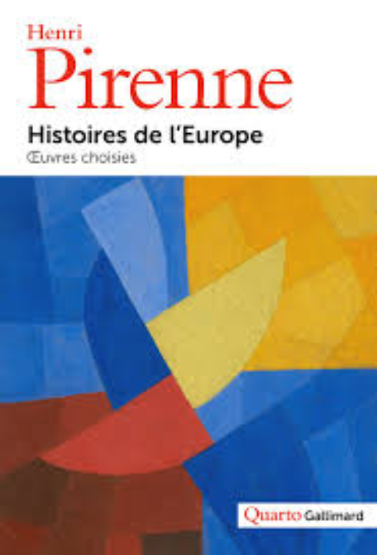
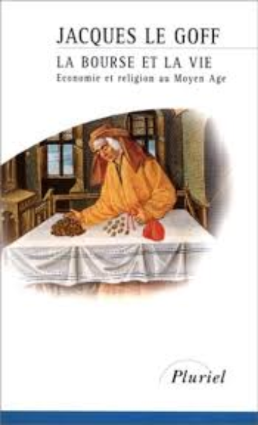
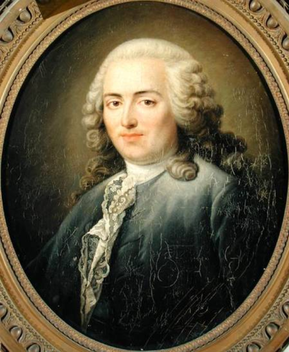
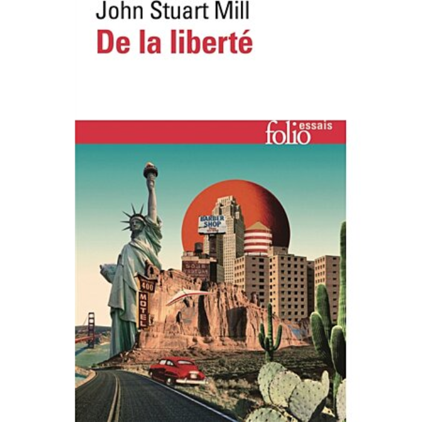
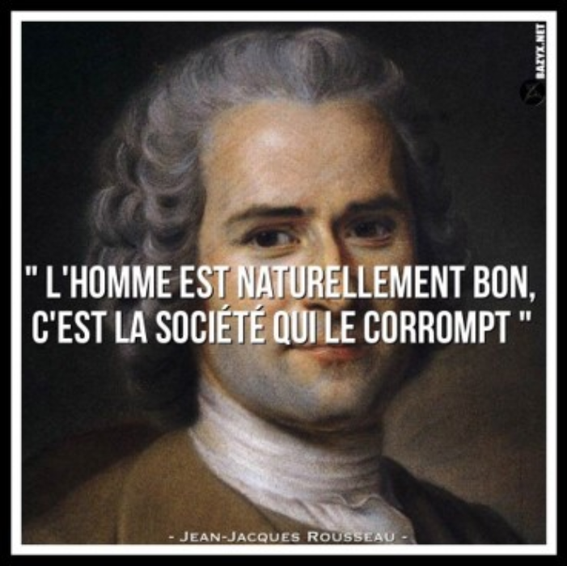
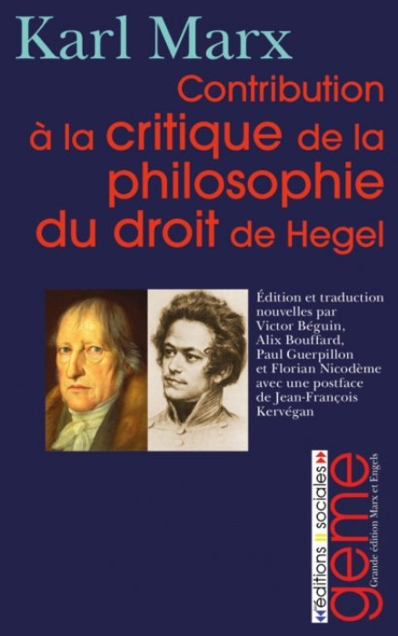
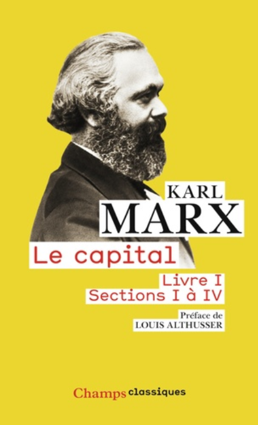

# Un voyage dans l'histoire philosophique de la liberté

Une histoire philosophique de la liberté explore la liberté à travers l'histoire. Damien Theillier examine deux philosophies politiques : la liberté et le pouvoir. Il analyse des penseurs comme Frédéric Bastiat, Lord Acton, Karl Marx et Murray Rothbard, mettant en lumière leurs visions sur la production, la spoliation, la lutte des classes, et l'État.

Le cours remonte aux origines de la liberté dans l'Antiquité, avec les Grecs et les Romains, en passant par le Moyen-Age, où la liberté humaine est discutée dans les contextes religieux et politiques. Il montre comment les idées de liberté ont évolué avec la naissance des universités et les premières formes de capitalisme dans les villes italiennes.

De la Renaissance aux Lumières, le cours examine la montée de la liberté, marquée par la tolérance religieuse et la liberté économique, culminant en 1776 avec des événements majeurs comme le Congrès de Philadelphie. Le XIXe et XXe siècles voient l'apogée et le déclin de la liberté, face aux critiques du capitalisme et aux dangers du collectivisme, mettant en perspective les défis contemporains pour la liberté.

+++

# La liberté ou le pouvoir
<partId>e59475e9-3ae4-5e66-a17e-218de0281b06</partId>

## Introduction: Il n’y a que deux philosophies politiques
<chapterId>ffa60c0d-ee2b-575d-a4ac-4e9ccdad396f</chapterId>

Pourquoi intituler ce cours : une histoire de la liberté ? Parce que nous avons besoin de comprendre la relation entre les idées et les événements, pour mieux juger notre époque et agir avec discernement. C’est dans le passé que nous trouvons les éléments d'une meilleure compréhension de ce qu’est la liberté et des raisons pour lesquelles nous devons la chérir.

> Quand le passé n'éclaire plus l'avenir, l'esprit marche dans les ténèbres (Alexis de Tocqueville - _De la démocratie en Amérique_.)

A la même époque, on trouve cette phrase d’Auguste Comte : « On ne connaît pas complètement une science tant qu'on n'en sait pas l'histoire ». On pourrait appliquer cette vérité à l’idée de liberté.

En effet, la liberté n’est pas une idée nouvelle. C’est un héritage transmis par les générations. Toute l’histoire de la civilisation est le témoignage d’une lutte incessante pour la liberté.

Mais le but de ce cours n'est pas seulement d'éclairer le passé de la liberté mais aussi et surtout de se former un jugement critique. En effet l’histoire ne suffit pas pour juger le présent et l’avenir. Elle a besoin d’être accompagnée d’une réflexion critique et d’un jugement sur les erreurs du passé. Tel est l’apport de la philosophie. C’est pourquoi j’ai intitulé ce cours : une histoire philosophique de la liberté. Il s’agit en effet d’explorer la manière dont les philosophes ont conçu la liberté au cours des âges.

### La tâche de la philosophie

Depuis ses origines, elle est double :

- Premièrement, elle est de donner un sens à des concepts flous et confus. Qu’est-ce que le bien, le vrai, le juste, le beau ? Autant l’histoire a pour fonction d’éclairer le passé, autant la philosophie est l’art de définir correctement les concepts. C’est pourquoi il nous faut commencer dans ce
  cours par comprendre ce qu’est la liberté.

La liberté est un concept qui recouvre une multitude de variantes qui sont autant de déclinaisons possible d’une même réalité : liberté politique, économique, liberté de conscience, de parole, liberté religieuse, d’association etc. De quelle réalité s’agit-il ?

La liberté peut se définir simplement comme le pouvoir du choix, avec ce qui est à soi. C’est une faculté inhérente à l’être humain. C’est une réalité par essence individuelle. Seul l’individu peut penser et agir, c’est-à-dire faire des choix. Cela ne signifie pas que l’individu est seul, qu’il ne doit rien aux autres. Au contraire, il vit en société et doit coopérer avec les autres pour son propre bien. Mais chacun reste libre de coopérer ou non et doit assumer la responsabilité de ses choix.

La notion de responsabilité est corollaire de la liberté car tout choix a des conséquences. Est responsable celui qui assume les coûts de ses propres choix et ne fait pas reposer ce coût sur les autres. En d’autre termes, la liberté est exigeante. C’est une notion morale qui implique des droits mais aussi des devoirs envers les autres, dont celui de respecter leur liberté.

- Deuxièmement, la philosophie est normative, à la différence de l’histoire qui est seulement descriptive. Ainsi la philosophie politique se distingue des sciences politiques. La philosophie politique est normative, cela signifie qu’elle prescrit des valeurs et juge les actions humaines à l’aune d’un critère de la justice. De leur côté, les sciences politiques se contentent de décrire les régimes, de faire l’histoire des institutions, sans porter de jugement de valeur.

### Philosophie de la liberté et philosophie du pouvoir

De ce point de vue, il n’existe deux sortes de philosophies politiques et deux seulement. La philosophie de la liberté et la philosophie du pouvoir.

- La philosophie de la liberté est celle qui s’appuie sur le droit naturel de propriété et affirme que la loi n’a d’autre objet que de protéger la propriété privée et les contrats. Chacun devrait pouvoir faire ce qu’il veut avec ce qui lui appartient à condition de n’agresser personne. C’est une philosophie qui défend une égale liberté pour tous de disposer de soi et de sa propriété sous condition de responsabilité. C’est la philosophie du libre marché.
- La philosophie du pouvoir justifie l’autorité de certaines entités collectives comme l’État ou la société pour décider des limites à donner au marché et à la propriété, donc à la liberté. Dans ce cadre, c’est à la loi d’organiser l’économie, la santé, le logement, la culture, l’éducation... Cette philosophie constructiviste a toujours eu ses défenseurs, au nom de l’intérêt collectif, de l’égalité, de la protection et du bien-être.

L’antagonisme entre ces deux philosophies existe à toutes les époques. Mais nous pouvons l’illustrer avec la philosophie des Lumières. On voit clairement une ligne de partage entre deux types de penseurs.

Ceux qui défendent la première philosophie en France sont les Physiocrates, avec François Quesnay à leur tête. Ils se nomment physiocrates, (le nom vient du grec Physis qui veut dire nature et Kratos qui veut dire règle) car ils développent une pensée économique et sociale fondée sur les droits naturels de l’homme. Pour eux la société, les personnes et les propriétés existent antérieurement aux lois. Dans ce système, explique Bastiat, 

> Ce n’est pas parce qu’il y a des lois qu’il y a des propriétés, mais parce qu’il y a des propriétés qu’il y a des lois. (_Propriété et Loi_).

Pour Turgot et Say, disciples de Quesnay, il existe une loi naturelle, indépendante du bon plaisir des législateurs qui est valable pour tous les hommes et antérieure à toute société. C’est une philosophie qui provient en droite ligne de la scolastique médiévale, des stoïciens, d’Aristote et de Sophocle. Les lois non-écrites sont à la fois antérieures et supérieurs aux lois écrites car elles découlent de la nature humaine et de la raison.

La seconde philosophie se retrouve chez des auteurs comme Rousseau, Robespierre ou Kant, qui incarnent la tradition républicaine pour laquelle la souveraineté de la volonté générale est la véritable source du droit. Contemporain de Quesnay, Rousseau est un anti-physiocrate. Pour lui le législateur doit organiser la société, comme un mécanicien qui invente une machine à partir d’une matière inerte.

> Celui qui ose entreprendre d’instituer un peuple, dit Rousseau, doit se sentir en état de changer, pour ainsi dire, la nature humaine, de transformer chaque individu qui, par lui-même, est un tout parfait et solitaire, en partie d’un plus grand tout dont cet individu reçoive en quelque sorte sa vie et son être. (_Contrat social_)

Dans cette perspective, le législateur a pour mission d’organiser, modifier, supprimer même la propriété, s’il le trouve bon. Pour Rousseau, la propriété n’est pas naturelle mais conventionnelle, comme la société elle-même. À son tour Robespierre pose le principe que « La propriété est le droit qu’a chaque citoyen de jouir et de disposer de la portion de biens qui lui est garantie par la loi ». Il n’y a pas de droit naturel de propriété, il n’y a qu’un nombre indéfini d’arrangements possibles et contingents.

## Frédéric Bastiat : production versus spoliation
<chapterId>5a8a3452-9970-51a0-a5ea-f367b63137bc</chapterId>

Quand on ouvre les manuels scolaires, remarquait Bastiat, on apprend que l’humanité serait vouée au néant sans l’intervention du pouvoir :

> Il suffit d’ouvrir, à peu près au hasard, un livre de philosophie, de politique ou d’histoire pour voir combien est fortement enracinée dans notre pays cette idée, fille des études classiques et mère du Socialisme, que l’humanité est une matière inerte recevant du pouvoir la vie, l’organisation, la moralité et la richesse ; — ou bien, ce qui est encore pis, que d’elle-même l’humanité tend vers sa dégradation et n’est arrêtée sur cette pente que par la main mystérieuse du Législateur. ([_La loi_](http://bastiat.org/fr/la_loi.html)).

Autrement dit, le préjugé culturel qui domine la philosophie occidentale ainsi que l’historiographie c’est que nous devons tout au pouvoir : la liberté, la santé, l’éducation, la sécurité, la prospérité. L’humanité est décrite comme une « matière inerte » qui prendrait forme grâce au législateur.

Mais la réalité du pouvoir est tout autre selon Bastiat. Le pouvoir c’est l’oppression. Il écrit :

> Ouvrez donc au hasard les annales de l’humanité ! Consultez l’histoire ancienne ou moderne, sacrée ou profane, demandez-vous d’où sont venues toutes ces guerres de races, de classes, de nations, de familles ! Vous obtiendrez toujours cette réponse invariable : De la soif du pouvoir. ([_Incompatibilités parlementaires_](http://bastiat.org/fr/incompatibilites_parlementaires.html))

C’est la soif du pouvoir qui est à l’origine de toutes les formes d’oppression dans l’histoire. Dans une lettre à Mme Chevreux, datée du 23 juin 1850, Bastiat indique quelles sont les phases de l’oppression : « Les temps de luttes, à qui s’emparera de l’État ; et les temps de trêve qui seront le règne éphémère d’une oppression triomphante, présage d’une lutte nouvelle. » D’abord la conquête du pouvoir par la guerre, puis l’établissement d’un État qui subsiste par le pillage des richesses de ses citoyens.

L’histoire est donc une lutte entre deux principes : la liberté et l’oppression : 

> Liberté ! voilà, en définitive, le principe harmonique. Oppression ! voilà le principe dissonant ; la lutte de ces deux puissances remplit les annales du genre humain. ([_Harmonies économiques_](http://bastiat.org/fr/conclusion_eo_harmonies.html), conclusion de l’édition originale).

### Qu’est-ce que l’oppression ?

En un mot, c’est la spoliation. Bastiat esquisse les principaux types de spoliation qui proviennent des élites dirigeantes : la guerre, l’esclavage, la théocratie et le monopole. En effet, selon lui : « Il n’y a que deux moyens de se procurer les choses nécessaires à la conservation, à l’embellissement et au perfectionnement de la vie : la PRODUCTION et la SPOLIATION. » ([_Physiologie de la Spoliation_](http://bastiat.org/fr/physiologie_de_la_spoliation.html))

Quelle est la différence entre production et spoliation ? Voici la réponse de Bastiat :

> Pour produire, il faut diriger toutes ses facultés vers la domination de la nature ; car c’est elle qu’il s’agit de combattre, de dompter et d’asservir. C’est pourquoi le fer converti en charrue est l’emblème de la production. Pour spolier, il faut diriger toutes ses facultés vers la domination des hommes ; car ce sont eux qu’il faut combattre, tuer ou asservir. C’est pourquoi le fer converti en épée est l’emblème de la spoliation. ([_Harmonies économiques_](http://bastiat.org/fr/guerre.html), Guerre).

Autrement dit, la production c’est le pouvoir sur la nature. La spoliation c’est le pouvoir sur les hommes. Or il y a deux formes de spoliation : légale et illégale.

La spoliation illégale, c’est le vol ou le crime accomplit par un citoyen contre un autre citoyen. C’est l’action du bandit ou de l’escroc.

Mais la pire forme de spoliation est celle qui est accomplie par la loi : « Il y a des gens qui pensent que la spoliation perd toute son immoralité pourvu qu’elle soit légale. Quant à moi, je ne saurais imaginer une circonstance plus aggravante. » ([_Ce qu’on voit et ce qu’on ne voit pas_](http://bastiat.org/fr/cqovecqonvp.html#RESTRICTION)).

Il y a encore deux formes de spoliation légale, nous dit Bastiat : 

> La spoliation au dehors s’appelle guerre, conquêtes, colonies. La spoliation au dedans se nomme impôts, places, monopoles. ([_Cobden et la ligue_](http://bastiat.org/fr/introduction_cobden_ligue.html)_, Introduction_).

Dans [_Physiologie de la spoliation_](http://bastiat.org/fr/physiologie_de_la_spoliation.html), il développe :

> La véritable et équitable loi des hommes, c’est : Échange librement débattu de service contre service. La Spoliation consiste à bannir par force ou par ruse la liberté du débat afin de recevoir un service sans le rendre. La Spoliation par la force s’exerce ainsi : On attend qu’un homme ait produit quelque chose, qu’on lui arrache, l’arme au poing. Elle est formellement condamnée par le Décalogue : Tu ne prendras point. Quand elle se passe d’individu à individu, elle se nomme vol et mène au bagne ; quand c’est de nation à nation, elle prend nom conquête et conduit à la gloire.

### Histoire de la spoliation

Historiquement les élites dirigeantes ont toujours vécu de la spoliation. Bastiat note :

> La force appliquée à la spoliation fait le fond des annales humaines. En retracer l’histoire, ce serait reproduire presque en entier l’histoire de tous les peuples : Assyriens, Babyloniens, Mèdes, Perses, Égyptiens, Grecs, Romains, Goths, Francs, Huns, Turcs, Arabes, Mongols, Tartares, sans compter celle des Espagnols en Amérique, des Anglais dans l’Inde, des Français en Afrique, des Russes en Asie, etc.
>
> ([_Sophismes économiques_](http://bastiat.org/fr/conclusion_sophismes.html)_, Conclusion du premier volume)_.

ou encore: 

> La spoliation, sous sa forme la plus brutale, armée de la torche et de l’épée, remplit les annales du genre humain. Quels sont les noms qui résument l’histoire ? Cyrus, Sésostris, Alexandre, Scipion, César, Attila, Tamerlan, Mahomet, Pizarre, Guillaume le Conquérant ; c’est la spoliation naïve par voie de conquêtes. À elle les lauriers, les monuments, les statues, les arcs de triomphe. ([_Harmonies économiques_](http://bastiat.org/fr/conclusion_eo_harmonies.html), conclusion de l’édition originale).

L’histoire du monde est l’histoire de la façon dont un groupe de personnes en a pillé d’autres, souvent de manière systématique, au moyen de la guerre, de l’esclavage, de la théocratie. De nos jours, c’est le monopole, c’est-à-dire les privilèges économiques distribués par l’État à ses clients.

Quelques jours avant sa mort à Rome en 1850, Bastiat confiait à son ami Prosper Paillottet :

> Un travail bien important à faire, pour l’économie politique, c’est d’écrire l’histoire de la Spoliation. C’est une longue histoire dans laquelle, dès l’origine, apparaissent les conquêtes, les migrations des peuples, les invasions et tous les funestes excès de la force aux prises avec la justice. De tout cela il reste encore aujourd’hui des traces vivantes, et c’est une grande difficulté pour la solution des questions posées dans notre siècle. On n’arrivera pas à cette solution tant qu’on n’aura pas bien constaté en quoi et comment l’injustice, faisant sa part au milieu de nous, s’est impatronisée dans nos mœurs et dans nos lois.
> 
> (P. Paillottet, _Neuf jours près d’un mourant_)

## Lord Acton : la liberté est le moteur de l’histoire
<chapterId>de971d92-4e26-5870-a961-18dfa06497cf</chapterId>

On le sait, l’histoire est écrite par les vainqueurs. L'attention est souvent portée sur la conquête du pouvoir, sur la vie des dirigeants au pouvoir et sur les conflits qui les opposent à ceux qui souhaitent prendre leur place.

Ceci est particulièrement vrai des manuels scolaires destinés aux écoles publiques et rédigés par des professeurs employés par l’État.

Tel n’est pas le cas d’un ouvrage en deux tomes écrit par un historien de Cambridge au XIXe siècle, [Lord Acton](https://www.lesbelleslettres.com/livre/9782251447858/le-pouvoir-corrompt). Son nom complet est John Emerich Edward Dalberg, baron of Acton (1834-1902). Il est l’auteur de _Histoire de la Liberté dans l'Antiquité Et le Christianisme_. Son travail est considéré comme l'un des plus importants sur le sujet et il y a consacré une grande partie de sa carrière. Son œuvre, bien qu’inachevée, est une mise en garde puissante contre les dangers de l'abus de pouvoir et son plaidoyer pour la liberté et la responsabilité individuelle reste d’actualité.

Cet auteur est surtout connu pour sa maxime : « Le pouvoir tend à corrompre et le pouvoir absolu corrompt absolument ». Une formule qui fait écho à celle de Montesquieu dans [_L’esprit des lois_](https://fr.wikisource.org/wiki/Page:Montesquieu_-_Esprit_des_Lois_-_Tome_1.djvu/316) :

> C’est une expérience éternelle que tout homme qui a du pouvoir est porté à en abuser.

### La thèse d’Acton

Pour Acton, le conflit entre la liberté et le pouvoir est le fil rouge de l'histoire humaine et la liberté est le moteur du progrès et de l'évolution des sociétés. Acton a voulu comprendre les facteurs qui ont contribué à l'essor de la liberté en Occident. Son objectif était de cerner les conditions nécessaires à sa préservation et à son développement. Il a étudié les idées philosophiques, les structures sociales et les contextes politiques qui ont favorisé son émergence au cours du temps.

Sa thèse centrale est que « la liberté est établie par le conflit des pouvoirs ». Selon Acton, pendant des siècles après la chute de l'Empire romain d'Occident, l'Église catholique était la seule force capable de contester l'autorité des seigneurs féodaux, des monarques et des empereurs. Cette lutte de pouvoir entre l'Église et l'État s'avéra cruciale pour l'essor de la liberté. L’Europe disposait d’un Dieu fort et d’un pouvoir faible, du fait de la querelle permanente, au Moyen Âge, entre les papes et les rois. Au contraire, la Chine connaissait une divinité faible et un pouvoir bureaucratique fort.

> Par liberté j'entends l'assurance que tout homme sera protégé, lorsqu'il accomplit ce qu'il croit être son devoir, contre l'influence de l'autorité et des majorités, de la coutume et de l'opinion. L'État n'est compétent pour fixer des devoirs et pour distinguer entre le bien et le mal que dans sa propre sphère immédiate. 
>
> (Lord Acton)

En d’autres termes, la liberté c’est le droit pour les individus suivre leur propre conscience et ce n’est pas à l’État de dicter à l’homme sa conduite sur le plan philosophique, moral et religieux.

Friedrich Hayek avait initialement envisagé de nommer la Société du Mont Pèlerin : « Acton-Tocqueville Society », en hommage à ces deux penseurs qu'il admirait profondément : Lord Acton et Alexis de Tocqueville. C'est finalement le nom du lieu où s'est tenue la première réunion de la Société, le Mont Pèlerin en Suisse, qui a été retenu.

### Voltaire et Condorcet

Mais l'idée selon laquelle la liberté en Europe est née des luttes intestines entre différents prétendants au pouvoir, empêchant l'établissement d'une domination absolue, n'est pas unique à Acton. On la trouve déjà chez des penseurs tels que Voltaire et Condorcet.

Ainsi Voltaire, dans ses [_Lettres philosophiques_](https://fr.wikisource.org/wiki/Lettres_philosophiques/Lettre_6), attribue la liberté anglaise aux conflits entre les rois et les nobles qui ont empêché toute concentration excessive du pouvoir. Et il note :

> S’il n’y avait en Angleterre qu’une religion, son despotisme serait à craindre ; s’il n’y en avait que deux, elles se couperaient la gorge ; mais il y en a trente, et elles vivent en paix et heureuses. ([Sur les presbytériens](https://fr.wikisource.org/wiki/Lettres_philosophiques/Lettre_6))

Condorcet, dans son [_Esquisse pour un tableau historique des progrès de l'esprit humain_](https://fr.wikisource.org/wiki/Esquisse_d%E2%80%99un_tableau_historique_des_progr%C3%A8s_de_l%E2%80%99esprit_humain), attribue la structure décentralisée du pouvoir en Italie à la rivalité entre le pape et l'empereur, qui a permis la survie de nombreuses cités-États indépendantes.

On retrouve également cette thèse dans un ouvrage monumental datant de 1983 : _Droit et Révolution : La formation de la tradition juridique occidentale_, de Harold J. Berman ([traduction française de Raoul Audouin](https://www.eyrolles.com/Entreprise/Livre/droit-et-revolution-9782903449667/), publiée par la Librairie de l’Université d’Aix en Provence en 2002). L'analyse de Berman met en lumière le rôle crucial du pluralisme juridique dans l'histoire de l'Occident. Ce système, loin d'être une simple source de complexité, a été un moteur de développement, de liberté et d'innovation, façonnant durablement les traditions juridiques occidentales.

## Marx : l’histoire comme lutte des classes
<chapterId>438100e6-a385-55c6-b2c5-ad192c564757</chapterId>

Une autre vision de l’histoire existe néanmoins. Elle a connu un certain succès et a longtemps bénéficié du soutien des intellectuels occidentaux et des représentants des pays du Sud. C’est la vision socialiste et marxiste de l’histoire.

Elle explique l’extraordinaire croissance de l’Europe principalement par le progrès des techniques combiné avec l’ « accumulation primitive » du capital, issue de l’impérialisme, de l’esclavage, du commerce triangulaire, de l’expropriation des petits paysans et de l’exploitation de la classe ouvrière. La conclusion apparaît clairement. Cette croissance européenne exceptionnelle se serait réalisée au détriment de millions et de millions d’esclaves et d’opprimés.

Dans un premier temps Marx a raison sur un point : l’histoire est l’histoire de la lutte des classes et de l’exploitation. La citation est connue, c’est la première phrase du premier chapitre du [_Manifeste du parti communiste_](https://fr.wikisource.org/wiki/Manifeste_du_parti_communiste/Andler) : « Toute l’histoire de la société humaine jusqu’à ce jour est l’histoire de luttes de classes. » Marx, lui-même, a reconnu qu'il avait emprunté sa théorie de la lutte des classes à des auteurs antérieurs :

> Je n'ai aucun mérite pour la découverte des classes ni de la lutte entre les classes dans la société moderne. Bien avant moi, les historiens bourgeois avaient décrit le développement historique de cette lutte des classes et les économistes bourgeois l'anatomie économique des classes. 
>
> (_Lettre à J. Weydemeyer_, 5 mars 1852).

Mais il se trompe sur un point fondamental concernant la classe ouvrière : ce n’est pas le capital qui produit l’exploitation. Autrement dit, la lutte des classes n’a pas lieu au sein de la production mais entre ceux qui paient des impôts et ceux qui les prélèvent.

Selon Marx, l’exploitation est un processus qui consiste à extraire une partie de la valeur créée par le travailleur sans le payer, ce qui permet aux capitalistes de réaliser un profit. En d’autres termes, l’exploitation serait un mécanisme qui permettrait aux capitalistes de s’enrichir en volant le travail des prolétaires.

Cette analyse reflète une compréhension erronée de la plus-value et du caractère coopératif et dynamique de la vie économique. En effet, le profit que perçoit l'entrepreneur est la rémunération du risque qu'il prend et l’ouvrier ou l’employé n’est pas un esclave. Dans une situation de concurrence, il peut accepter ou refuser un contrat avec son employeur. Il fait un choix qui reflète un calcul de coût d’opportunité.

### La révolution industrielle en question

En fait, l’analyse marxiste déforme la réalité historique de la révolution industrielle. Ludwig von Mises a clarifié cette question dans son traité d’économie [_L’Action humaine_](http://herve.dequengo.free.fr/Mises/AH/AHTDM.htm) (voir en particulier le chapitre intitulé [Interprétation populaire de la révolution industrielle](http://herve.dequengo.free.fr/Mises/AH/AH21.htm#inter2)) ainsi que dans une série de conférences publiées sous le titre : [_Politique économique. Réflexions pour aujourd'hui et pour demain_](http://herve.dequengo.free.fr/Mises/PE/PE_TDM.htm). (A lire également, La mentalité anticapitaliste [ici](https://www.institutcoppet.org/wp-content/uploads/2011/05/La-Mentalit%C3%A9-anticapitaliste.pdf) et [ici](http://herve.dequengo.free.fr/Mises/MAC/MAC_TDM.htm)).

Mises explique que les emplois dans les usines, quoique misérables pour nous, représentaient pour les ouvriers de l’époque la meilleure opportunité possible.

Lisons un extrait de _l’Action humaine_ :

> Dans les premières décennies de la révolution industrielle le niveau de vie des travailleurs des fabriques était scandaleusement bas en comparaison des conditions de leurs contemporains des classes supérieures, et en comparaison de la situation présente des foules industrielles. Les heures de travail étaient longues, les conditions sanitaires des ateliers déplorables. La capacité de travail des individus s'épuisait rapidement. Mais le fait demeure, que pour le surplus de population que l'appropriation des terres de pâtures communales (enclosures) avait réduit à la pire misère, et pour qui il n'y avait littéralement pas de place dans le cadre du système de production régnant, le travail à la fabrique était le salut. Ces gens vinrent en foule dans les ateliers, pour la seule raison qu'il leur fallait absolument améliorer leur niveau de vie.

Mises ajoute que l’amélioration de la condition humaine a donc été permise par l’accumulation du capital :

> Le changement radical de situation qui a conféré aux masses occidentales le présent niveau de vie (un haut niveau de vie en vérité, comparé à ce qu'il était aux temps précapitalistes, et à ce qu'il est en Russie soviétique) fut l'effet de l'accumulation de capital grâce à l'épargne et d'un investissement avisé par des entrepreneurs qui voyaient loin. Aucune amélioration technologique n'aurait été réalisable si le supplément de capitaux matériels requis pour l'utilisation pratique des nouvelles inventions n'avait été préalablement rendu réalisable par l'épargne.

Sur l’historiographie marxiste, nous pouvons aussi nous référer à Friedrich Hayek dans _Capitalism and the Historians_ (University of Chicago Press, 1954) et son chapitre intitulé « History and Politics ». Selon Hayek, ce n’est pas l’industrialisation qui a rendu les travailleurs misérables, comme l’affirme la légende noire du capitalisme propagée par le marxisme. Il note :

> La véritable histoire de la connexion entre le capitalisme et la montée du prolétariat est presque à l’opposé de ce que ces théories de l’expropriation des masses suggèrent.

Avant la Révolution industrielle, la plupart des gens vivaient dans des sociétés rurales et dépendaient de l'agriculture pour leur survie. Ils avaient peu de choses à vendre sur le marché, ce qui limitait leurs opportunités et leur niveau de vie. Chacun s’attendait à vivre dans une pauvreté absolue et envisageait un sort similaire pour ses descendants. Personne ne s’indignait d’une situation qui semblait être fatale.

Avec l'avènement de l'industrialisation, de nouvelles opportunités ont émergé, créant une demande croissante de main-d'œuvre. Pour la première fois, des personnes sans terre ou ressources importantes pouvaient vendre leur force de travail aux usines et aux manufactures en échange d'un salaire, garantissant une sécurité pour l’avenir.

Ce nouvel accès au revenu leur a permis de se nourrir et de se loger, même dans les villes en pleine expansion. C'est ainsi que la Révolution industrielle a favorisé une explosion démographique qui n'aurait pas été possible dans les conditions de stagnation économique de l'époque préindustrielle.

C’est ainsi, remarque Hayek, que « la souffrance économique devint à la fois plus visible et sembla moins justifiée, parce que la richesse générale était en train d’augmenter plus vite que jamais auparavant. »

Par conséquent l’ouvrier n’était pas exploité, même si les salaires étaient bas, du fait de l’abondance de la main d’œuvre, fuyant les campagnes.

En réalité, l'exploitation n'a de sens que comme une agression contre la propriété privée. En ce sens, l’exploitation est toujours le fait de l’État. Car l’État est la seule institution qui obtient ses revenus par la coercition, c’est-à-dire par la force. Donc la véritable exploitation, comme nous l’avons vu avec Bastiat, c’est celle des classes productives par la classe des fonctionnaires de l’État. Il faudrait donc plutôt dire que l’histoire de toute société jusqu'à nos jours n’est que l'histoire de la lutte entre les pillards et les classes productives.

### Le « miracle européen »

Dans un second temps, une analyse historique plus nuancée que celle de Marx permet de contester cette idée d’une Europe prédatrice, qui ne devrait sa réussite qu’à l’impérialisme et à l’esclavage.

En s’intéressant à l’histoire économique comparée, certains historiens contemporains ont recherché les origines du développement de l’Europe dans ce qui la distinguait des autres grandes civilisations, en particulier celles de la Chine, de l’Inde et l’Islam. Ces caractéristiques ont été explorées par [David Landes](https://www.eyrolles.com/Entreprise/Livre/richesse-et-pauvrete-des-nations-9782226110381/), [Jean Baechler](https://academiesciencesmoralesetpolitiques.fr/publications/publications-de-lacademie/jean-baechler/), [François Crouzet](https://www.cairn.info/revue-entreprises-et-histoire-2010-4-page-219.htm), et [Douglass North](https://www.iedm.org/fr/65134-douglass-north-l-un-des-economistes-les-plus-originaux/). Ces chercheurs ont essayé de comprendre ce qu’on appelle le « miracle européen ». Ils ont focalisé leur attention sur le fait que l'Europe était une mosaïque de juridictions divisées et concurrentes, où, après la chute de Rome, aucun pouvoir politique central n'était capable d'imposer sa volonté.

Comme le dit Jean Baechler, membre de l’Académie des sciences morales et politiques, dans _Les Origines du capitalisme_ (1971) :

> La première condition pour la maximisation de l'efficacité économique est la libération de la société civile à l'égard de l'État (...) L'expansion du capitalisme doit son origine et sa raison d'être à l'anarchie politique.

Autrement, dit, le grand « non-événement » qui a dominé le destin de l'Europe fut l'absence d'un empire hégémonique, comme celui qui a dominé la Chine.

C'est cette Europe radicalement décentralisée qui a produit les parlements, les diètes et les États-Généraux. Elle a engendré les chartes comme la célèbre Magna Carta des Anglais, mais elle a aussi produit les villes libres d'Italie du Nord et des Flandres : Venise, Florence, Gênes Amsterdam, Gand et Bruges. Enfin elle a développé le concept de droit naturel, ainsi que le principe selon lequel même le Prince n'est pas au-dessus de la loi, une doctrine enracinée dans les universités médiévales de Bologne, d'Oxford et de Paris, jusqu’à Vienne et Cracovie.

En conclusion de ce chapitre, l’Europe ne doit pas son décollage économique et culturel à la conquête et à l’exploitation du reste du monde. Elle a dominé le monde grâce à ses progrès économiques. Ce que l’on a appelé l’« impérialisme » est la conséquence et non la cause du progrès économique de l’Europe. Mais pour revenir à Lord Acton, ce qui distingue plus encore la civilisation occidentale de toutes les autres, c'est son affirmation de la valeur de l'individu. En ce sens, la liberté de conscience, notamment en matière religieuse a constitué un pilier fondamental de cette civilisation. Nous y reviendrons dans la section suivante.

## Murray Rothbard : État versus société
<chapterId>5a0020ca-2bbd-5e09-8389-d57c57542cb2</chapterId>

Dans le dernier chapitre de _Anatomy of the State_ (traduit en français _L’anatomie de l’Etat_, aux édition Résurgence), Murray Rothbard propose une théorie de l’histoire. Ce chapitre très court est intitulé : L’histoire, course entre pouvoir étatique et pouvoir social. Selon Rothbard, l'histoire peut être comprise comme un conflit permanent entre deux principes fondamentaux :

- La coopération pacifique et la production qui représentent l'échange volontaire et la création de richesse par le travail et l'innovation.
- L'exploitation et la prédation coercitives qui sont incarnées par la domination de l'État, qui s'approprie les fruits du travail des individus par la force.

Se référant à Albert J. Nock, Rothbard utilise les termes « pouvoir social » et « pouvoir d'État » pour désigner ces deux forces opposées :

- Le pouvoir social : émerge de la coopération et de l'ingéniosité des individus libres, menant au progrès économique et à la prospérité. C’est un pouvoir sur la nature, la capacité créatrice de l'homme à transformer la nature en ressources et en connaissances, pour le bien collectif de la société.
- Le pouvoir d'État : s'impose par la contrainte et la violence, cherchant à contrôler et à exploiter la société pour son propre bénéfice. C’est un pouvoir exercé sur l’homme. Il consiste à « drainer les fruits de la société au profit de dirigeants non productifs (en fait anti-productifs) ».

### L'État comme parasite

Rothbard considère l'État comme un parasite qui vit aux dépens de la société productive. Il s'empare de « postes de commandement » stratégiques pour s'approprier la richesse et le pouvoir. Monopole de la force, de la justice, de l’éducation, des infrastructures. Et il ajoute « Dans l’économie moderne, la monnaie est le poste de commandement essentiel ».

Pour Rothbard, le principe de liberté doit s’appliquer également à la monnaie. Si nous sommes en faveur de la liberté dans les autres secteurs, si nous voulons protéger la propriété et la personne contre l’intrusion de l’État, notre tâche la plus urgente doit être d’explorer la possibilité d’un marché libre de la monnaie. (Voir sur ce point son essai : _Etat, qu’as-tu fait de notre monnaie ?_ Traduction Stéphane Couvreur pour l’Institut Coppet, 2011).

### L’échec des tentatives de limiter l’Etat

Rothbard met en garde contre l'idée que les constitutions écrites, à elles seules, pourraient garantir la liberté et la limitation du pouvoir :

> Les derniers siècles furent des époques où les hommes tentèrent d’imposer des limites constitutionnelles et autres à l’État, et finirent par constater que de telles limites, comme toutes les autres tentatives, avaient échoué. De toutes les nombreuses formes que les régimes prirent au cours des siècles, de tous les concepts et institutions qui furent essayés, aucun n’a réussi à tenir l’État sous contrôle.

Une constitution écrite a certainement de nombreux avantages, mais c’est une grave erreur de supposer qu’elle serait suffisante. En effet, le parti majoritaire, fort de son pouvoir, peut adopter une interprétation extensive pour augmenter son pouvoir. Sans mécanismes concrets pour faire respecter les droits, et face à un parti dominant déterminé à étendre son pouvoir, les constitutions risquent de devenir des outils inefficaces, trompeurs.

### Le XXe siècle : un siècle de recul

Selon Rothbard, l'histoire n'est pas un processus linéaire, mais plutôt une oscillation entre l'avancée du pouvoir social et le regain de contrôle par l'État :

- Périodes de liberté : lorsque le pouvoir social s'épanouit, la liberté, la paix et la prospérité augmentent.
- Périodes de domination étatique: lorsque l’'État reprend le dessus, entraînant l'oppression, la guerre et la régression.

Du XVIIe siècle au XIXe siècle, dans de nombreux pays occidentaux, il y eut des périodes d’accélération du pouvoir social et une augmentation corollaire de liberté, de paix, et de bien-être matériel, Mais Rothbard rappelle que le XXe siècle a été marqué par une résurgence du pouvoir d'État, avec des conséquences néfastes : augmentation de l'esclavage, de la guerre et de la destruction. :

> Durant ce siècle, la race humaine fait face, une fois encore, au règne virulent de l’État ; l’État désormais armé du pouvoir créateur de l’homme, confisqué et perverti à ses propres fins.

Qu’est-ce qu’une société libre finalement ? C’est une société sans monopole. Dans son ouvrage de philosophie politique, _Ethique de la liberté_ (1982), Rothbard répond : « une société dans laquelle il n’existe aucune possibilité légale d’agression coercitive contre la personne ou la propriété d’un individu. ». C’est pourquoi, selon lui, la philosophie politique, qui doit définir les principes d’une société juste, se réduit à une et une seule question : « Qui est légitimement propriétaire de quoi ? »

Pour Rothbard, l'ordre social peut régner s’il est le produit de la généralisation des procédures contractuelles de libre-échange des droits de propriété, en privatisant toutes les activités économiques et même régaliennes (banque centrale, tribunaux) et en recourant à la concurrence entre agences de protection.

Et il ajoute :

> On a maintenant tâté de toutes les variantes de l’étatisme et elles ont toutes échoué. Partout dans le monde occidental au début du 20ème siècle les chefs d’entreprise, les politiciens et intellectuels s’étaient mis à appeler de leurs vœux un “nouveau” système d’économie mixte, de domination étatique, à la place du laissez-faire relatif du siècle précédent. De nouvelles panacées, attrayantes à première vue, comme le socialisme, l’Etat corporatiste, l’Etat-Providence-Gendarme du monde, etc. ont été essayées et toutes ont manifestement échoué. Les argumentaires en faveur du socialisme et de la planification étatique apparaissent maintenant comme des plaidoyers pour un système vieilli, épuisé et raté. Que reste-t-il à essayer sinon la liberté ?
>
> (_Ethique de la liberté_)

# Les origines de la liberté : l’Antiquité
<partId>d7a9d251-6d44-5f2f-9cc5-88796c84f61b</partId>

## L’invention de la rationalité critique par les Grecs
<chapterId>5b5f65e6-f980-5971-b9f6-a37244503325</chapterId>

L'expérience de la démocratie athénienne a marqué durablement l'histoire de la pensée politique et continue d'inspirer les idéaux de démocratie et de participation citoyenne dans le monde d'aujourd'hui.

Or la démocratie athénienne se caractérisait par un vif débat public sur les affaires de la cité, qui se tenait principalement sur l'agora, la place du marché. Ce mode de fonctionnement, fondé sur la raison et la discussion critique, tranchait nettement avec les pratiques antérieures où les lois et les coutumes étaient considérées comme sacrées et immuables, léguées par les ancêtres et protégées par les dieux.

### La naissance de la politique avec la cité

La démocratie athénienne représente une rupture majeure avec les traditions passées. En effet, dans les sociétés antérieures, il ne peut pas y avoir de « politique » au sens d’une discussion sur les règles sociales, puisque celles-ci sont imposées de manière transcendante par le mythe.

L’historien Jean-Pierre Vernant écrit :

> L'apparition de la polis constitue, dans l'histoire de la pensée grecque, un événement décisif. Certes, sur le plan intellectuel comme dans le domaine des institutions, il ne portera toutes ses conséquences qu'à terme ; la polis connaîtra des étapes multiples, des formes variées. Cependant, dès son avènement, qu'on peut situer entre le VIIIe et le VIIe siècle, elle marque un commencement, une véritable invention ; par elle, la vie sociale et les relations entre les hommes prennent une forme neuve, dont les Grecs sentiront pleinement l'originalité. (…) Ce qu'implique le système de la polis, c'est d'abord une extraordinaire prééminence de la parole sur tous les autres instruments du pouvoir. Elle devient l'outil politique par excellence, la clé de toute autorité dans l'État, le moyen de commandement et de domination sur autrui. (…) Un second trait de la polis est le caractère de pleine publicité donnée aux manifestations les plus importantes de la vie sociale. On peut même dire que la polis existe dans la mesure seulement où s'est dégagé un domaine public, aux deux sens, différents, mais solidaires, du terme : un secteur d'intérêt commun, s'opposant aux affaires privées ; des pratiques ouvertes, établies au grand jour, s'opposant à des procédures secrètes. (…) Désormais la discussion, l'argumentation, la polémique deviennent les règles du jeu intellectuel, comme du jeu politique. Le contrôle constant de la communauté s'exerce sur les créations de l'esprit comme sur les magistratures de l'Etat.
>
> (Jean Pierre Vernant, _Les origines de la pensée grecque_, Paris, P.U.F, 1962)

Le mot grec « polis » qui va donner « politique » en français, signifie la cité. Quand Aristote écrit que « l’homme est par nature un animal politique », cela ne veut pas dire qu’il est fait pour le pouvoir. Il entend par politique la faculté qu’ont les hommes de délibérer sur la place publique pour déterminer le juste et l’injuste.

Cette nouveauté repose sur la distinction fondamentale entre deux termes de la langue grecque, « phusis » et « nomos » qui désignent deux types de lois :

- _Phusis_ est la loi de la nature (qui donne le mot « physique » en français).
- _Nomos_ est la loi humaine (terme qu’on retrouve dans le mot « autonomie » qui signifie « obéir à sa propre loi »).

La Cité émerge avec l’idée que la loi (nomos) est d’origine humaine, qu’elle peut être modifiée librement par l’homme, contrairement à la nature, et peut s’appliquer à tous. Les Grecs prennent alors conscience de l’autonomie de l’ordre social et politique par rapport à l’ordre naturel.

C’est l’apparition de la politique : la discussion permanente sur les règles mêmes de la vie sociale. Désormais, les problèmes seront résolus par une action concertée et non par un ordre sacral immuable.

Et Jean-Pierre Vernant ajoute :

> La raison grecque, c'est celle qui de façon positive, réfléchie, méthodique, permet d'agir sur les hommes, non de transformer la nature. Dans ses limites comme dans ses innovations, elle est fille de la cité.

### L’idée de liberté sous la loi

L’harmonie sociale n’est pas produite par l’action intentionnelle des dieux, mais par l’obéissance de tous les citoyens à une même loi impersonnelle. Le pouvoir n’est plus l’affaire des prêtres, il est devenu l’affaire de tous. Ainsi émerge la notion d’égalité devant la loi : « _isonomia_ », mais aussi la rhétorique. La maîtrise de la parole était essentielle pour convaincre ses concitoyens dans les assemblées et les tribunaux.

Pour Aristote, la tyrannie c’est l’obéissance à un homme et la liberté c’est l’obéissance à la loi. On lui attribue cette citation : 

> Vouloir le règne de la loi, c’est vouloir le règne exclusif de la raison. Vouloir au contraire le règne d’un homme, c’est y ajouter celui d’une bête sauvage, car le désir et la colère faussent le jugement des gouvernants, fussent-ils les meilleurs des hommes.

Selon lui, les lois, étant impersonnelles et permanentes, permettent de garantir la justice et l'égalité pour tous les citoyens.

Cicéron, célèbre orateur et philosophe romain du 1er siècle avant J.-C., a repris cette idée : « Nous sommes esclaves des lois pour pouvoir être libres » (_De Republica_, Livre III, chapitre 13). Dans ce passage, Cicéron développe un argumentaire en faveur d'une république gouvernée par les lois, plutôt que par un homme ou un petit groupe d'hommes.

L’idée de république est une idée qui vient de la philosophie grecque. Elle a même souvent été opposée à la démocratie, jugée trop risquée. Platon a intitulé son livre principal de philosophie politique : _La République_ et il juge très sévèrement la démocratie. Quand le peuple gouverne, il risque fort d’imposer la loi de ses désirs et de confondre le bien avec l’agréable. D’où la mort tragique de Socrate, condamné à mort par un jury populaire, manipulé par les sophistes. Platon en a tiré toutes les leçons.

Aristote reprendra le terme de république pour désigner la constitution juste, celle qui vise l’intérêt commun et traite les citoyens comme des hommes libres. Un véritable régime de liberté est un régime où la loi est générale, égale pour tous, anonyme, et non un commandement personnel.

On retrouvera également l’idée de liberté sous la loi dans le vocable anglo-saxon de « Rule of Law ».

### La liberté politique

On peut affirmer que les Grecs ont inventé le concept de liberté politique, par opposition à la domination tyrannique. Les Grecs de cette époque considéraient que l’esclavage était une institution naturelle et que les esclaves n’avaient pas le même statut que les citoyens. Cela peut sembler contradictoire avec l’idée de liberté, mais pour eux la liberté était liée à la citoyenneté et non à l’absence d’esclavage.

Hérodote, dans _Historia_ et Eschyle dans sa tragédie _Les Perses_, illustrent avec brio le contraste entre la monarchie absolue et tyrannique de Xerxès et l'esprit de liberté des Grecs. Ce peuple, caractérisé par l'absence de maîtres et le refus de se soumettre à l'esclavage par des barbares, si nombreux soient-ils, trouve sa force dans la loi, le « nomos », son véritable maître qui garantit sa liberté. Et cette loi émane de la volonté de tous.

Selon Jacqueline de Romilly :

> Les Grecs eux-mêmes semblent avoir mesuré cette originalité et en avoir pris conscience au début du Ve siècle, dans le choc qui les opposa aux envahisseurs perses. Et le premier fait qui les frappa alors fut qu’il existait entre eux et leurs adversaires, une différence politique, qui commandait tout le reste. Les Perses obéissaient à un souverain absolu, qui était leur maître, qu’ils craignaient, et devant lequel ils se prosternaient : ces usages n’avaient pas cours en Grèce. On trouve un étonnant dialogue qui, dans Hérodote, oppose Xerxès à un ancien roi de Sparte. Ce roi annonce à Xerxès que les Grecs ne lui cèderont pas car la Grèce lutte toujours contre un asservissement à un maître. Elle se battra, quel que soit le nombre de ses adversaires. Car, si les Grec sont libres, « ils ne sont pas libres en tout : ils ont un maître, la loi, qu’ils redoutent encore bien plus que tes sujets ne te craignent.
>
> (_La Grèce Antique à la découverte de la liberté, Paris, Editions de Fallois, 1989_)

Hérodote est convaincu qu’un peuple d’hommes libres est un peuple qui obéit à une loi et non à maître, comme dans l’empire Perse ou un seul homme est libre et tous les autres sont esclaves. C’est vrai pour Athènes, une démocratie, mais c’est vrai aussi pour Sparte. Le roi ne crée par la loi, il n’impose pas sa volonté. Il veille au respect de la loi, il est à son service et il meurt, s’il le faut, pour la défendre.

### La quête de vérité et le pluralisme

Se dégageant de la pensée mythologique, Thalès, Anaximandre, Anaximène, puis plus tard Démocrite et Empédocle, ont été les premiers à chercher à comprendre la phusis (nature) par la raison et non par des entités surnaturelles.

Le principe fondamental posé par ces premiers philosophes présocratiques est que les éléments du kosmos (l’univers) tiennent en place parce qu’ils sont tous également soumis à une même « loi de la nature » (phusis) que l’on peut énoncer de manière universelle et nécessaire. L’univers est rationnel, il constitue un ensemble structuré, que l’homme peut découvrir avec sa raison (le « logos » par opposition au « mutos », le mythe).

D’après Karl Popper, on doit aux philosophes de la Grèce antique, en particulier aux présocratiques, l’invention du rationalisme critique, c’est-à-dire la tradition occidentale de la discussion critique, source de la pensée scientifique et du pluralisme. Il s’en explique dans un chapitre de _Conjectures et Réfutations_ intitulé « Retour aux présocratiques » :

> Quant aux premiers indices de l’existence d’une attitude critique, d’une liberté de pensée nouvelles, c’est dans la critique de Thalès par Anaximandre qu’ils apparaissent. Il y a là un phénomène tout à fait singulier, le penseur qu’Anaximandre critique est son maître, son compatriote, l’un des Sept Sages, celui qui a fondé l’École ionienne. D’après la tradition, Anaximandre n’avait que quatorze ans de moins que Thalès, et il a vraisemblablement formulé ses critiques et exposé ses conceptions nouvelles du vivant de son maître (ils sont morts, semble-t-il, à quelques années d’intervalle). Or, on ne découvre dans les sources aucune trace de dissension, de querelle ni de schisme.

Ces éléments indiquent, selon lui, que c’est Thalès qui est à l’origine de cette tradition de liberté nouvelle, fondée sur une relation originale entre maître et disciple. Thalès a su tolérer la critique et, plus encore, il a fondé la tradition prescrivant d’y faire droit. Popper identifie là une rupture par rapport à la tradition dogmatique, qui n’autorise qu’une seule doctrine d’école, afin de lui substituer le pluralisme et le faillibilisme.

> Nos tentatives pour saisir et découvrir la vérité ne présentent pas un caractère définitif mais sont susceptibles de perfectionnement, notre savoir, notre corps de doctrine sont de nature conjecturale, ils sont faits de suppositions, d’hypothèses, et non de vérités certaines et dernières.

Les seuls moyens dont nous disposons pour approcher la vérité sont la critique et la discussion. De la Grèce antique provient donc cette tradition:

> Qui consiste à formuler des conjectures hardies et à exercer la libre critique, tradition qui a été à l’origine de la démarche rationnelle et scientifique et, partant, de cette culture occidentale qui est la nôtre et la seule qui soit fondée sur la science même si, de toute évidence, ce n’est pas là son seul fondement.

## L’invention du droit par les romains
<chapterId>e9337ad6-5a75-5894-a017-9a507939cb51</chapterId>

L’empire romain était une vaste entité cosmopolite. A son apogée, vers 117 après J.-C., il était un immense État pluriethnique et plurilingue :

- À l'ouest, il s'étendait de la Grande-Bretagne (actuelle Angleterre) à l'Espagne, en passant par la Gaule (actuelle France) et le nord de l'Afrique.
- Au nord, il atteignait le Rhin et le Danube, englobant des parties de l'Allemagne, des Pays-Bas, de la Suisse, de l'Autriche, de la Hongrie, de la Roumanie et de la Bulgarie.
- Au sud, il bordait la mer Méditerranée, incluant l'Italie, la Grèce, les Balkans, l'Asie Mineure (actuelle Turquie), la Syrie, le Liban, la Palestine, l'Égypte et la Cyrénaïque (partie de l'actuelle Libye).
- À l'est, il s'étendait jusqu'en Mésopotamie (actuel Irak) et en Arménie.

Dès lors, les romains ont poussé très loin l’élaboration du droit contrairement aux grecs qui vivaient dans de petites cités ethniquement homogènes. Sous la république romaine, on trouve déjà une protection juridique de la propriété et des droits individuels.

En effet, le droit a pour fonction de rendre possible la cohabitation pacifique et l’échange entre les hommes, en délimitant les frontières du « mien » et du « tien ».

La propriété privée a pris une nouvelle dimension dans la civilisation romaine qu’elle n’avait pas connue auparavant, même dans la civilisation grecque.

Le droit romain deviendra le socle de tous les droits occidentaux modernes au cours du Moyen-Âge et jusqu’à nos jours.

### La protection des droits individuels

Enfin le droit romain accordait une grande importance aux droits et aux libertés des individus, et les citoyens romains étaient fiers de leur statut de citoyen. La Loi des Douze Tables (450 av. J.-C.) a constitué le premier corpus de lois écrites et accessibles à tous les citoyens romains, patriciens comme plébéiens. Cette codification a permis de clarifier et d'uniformiser le droit, qui était auparavant dispersé et souvent coutumier, garantissant un certain niveau de transparence dans l'application du droit de se marier, d’acheter, de vendre etc.

Cette loi correspond de façon étonnante aux droits naturels fondamentaux tels que théorisés par John Locke deux mille ans plus tard. Elle permet une protection des droits individuels contre l'arbitraire et les abus de pouvoir.

Certes, les femmes, les esclaves et les étrangers étaient encore exclus de la pleine protection de la loi. Néanmoins, la Loi des Douze Tables a constitué un progrès important et une base pour le développement ultérieur de droits individuels étendus à tous.

La Loi des Douze Tables accorde notamment une importance particulière aux droits de propriété :

- Elle définit les différents types de propriété (foncière, mobilière, etc.)
- Elle décompose la propriété en usus (droit d’usage), fructus (droit de percevoir les fruits) et abusus (droit d’aliéner)
- Elle précise les conditions d'acquisition, de transmission et de protection de ces biens.

En résumé, elle contribue à sécuriser les transactions et à protéger les individus contre les expropriations arbitraires, avec la possibilité de recours en cas de litige.

### La naissance de l’humanisme et de la vie privée

Ce que l’on est dépend de ce que l’on a. L’être n’est pas si indépendant de l’avoir qu’on le dit parfois car ce qu’on possède nous distingue de ce que possède autrui. Et notre vie nous appartient, nous possédons d’abord nos facultés, notre corps avant de posséder des biens matériels.

Dans la société romaine, chacun peut se différencier de plus en plus d’autrui et devenir ainsi acteur de sa propre vie. L’homme joue désormais un rôle singulier et Cicéron utilise le mot de « persona » pour le désigner. La "persona" était un masque porté par les acteurs romains, mais elle désignait également la personnalité juridique et sociale d'un individu. La notion de persona impliquait que les individus étaient des entités distinctes avec leurs propres droits et responsabilités. La notion de personne humaine individuelle (l’ego) avec sa vie intérieure et son destin singulier est née, elle se développera avec le christianisme.

De plus, la littérature et la philosophie romaines contiennent de nombreux exemples de réflexions sur la nature de l'individu, le bonheur, la sagesse et la vie en société.

### Sénèque et la vie heureuse

Un modèle d’équilibre dans la pensée est Sénèque, philosophe stoïcien romain qui a écrit sur l'importance de la vertu, de la raison et du contrôle de soi. Contemporain de Jésus, il fut à la fois précepteur de Néron, riche banquier et célèbre écrivain romain.

Le Traité de la Vie Heureuse (_De Vita Beata_) est un plaidoyer pour la morale stoïcienne. Le bonheur, dit Sénèque, « c'est une âme libre \[...\] inaccessible à la crainte \[...\] pour qui le mal unique est l'indignité morale ». Disciple de Socrate, le sage stoïcien ne craint pas le mal physique, la mort ou même le fait de subir l’injustice. Pour lui, le seul mal, c’est le mal moral. Par conséquent le souverain bien réside dans la vertu.

Pour autant, le plaisir n’est pas incompatible avec la vertu :

> Les anciens ont prescrit de vivre la vie la meilleure et non la plus agréable, de telle sorte que le plaisir soit non pas le guide de la volonté droite, mais son compagnon de route.

C’est pourquoi, le sage ne rejette pas les dons de la fortune :

> Il n'aime pas les richesses, il les préfère ; il ne les accueille pas dans son cœur, mais dans sa maison ; il ne rejette pas celle qu'il possède, il les domine et veut qu'elles fournissent à sa vertu une plus ample matière.

Sénèque va plus loin encore. Les richesses sont pour le sage l’occasion et le moyen d’exercer la vertu :

> Dans la pauvreté \[...\] il n'y a qu'un genre de vertu : ne pas fléchir ni se laisser déprimer ; au milieu des richesses, la tempérance, la libéralité, le discernement, l'économie, la magnificence ont le champ libre.

### La notion de loi supérieure

L’expression « droits de l’Homme », à laquelle se rallient beaucoup de juristes, souscrit implicitement à l’idée d’une loi supérieure car elle vise les droits liés avant toute législation positive à l’humanité même de l’Homme. Sans cette norme morale supérieure, il n’y aurait plus d’instance critique capable d’interpréter et de mettre en question l’ordre juridique.

Cette idée rappelle que le Prince (tout comme les chefs politiques) ne dispose pas de la justice elle-même mais qu’il est lui-même soumis à une loi qui le dépasse et doit réguler son jugement.

C’est ce que les philosophes de l’Antiquité et particulièrement les romains comme Cicéron ou les stoïciens ont appelé le droit naturel. On en trouve les origines dans la pensée grecque, chez Sophocle et Aristote.

Aristote distingue une justice naturelle et une justice légale. La justice naturelle est ce qui est universellement valide, en tout lieu et en tout temps. C’est une loi non écrite, connue par la raison. La justice légale est ce qui est en soi indifférent mais qui s’impose à tous par suite d’un choix conventionnel et qui est écrit dans un texte juridique. Autrement dit, on distingue un droit naturel et un droit positif.

Le dramaturge Sophocle, dans sa pièce _Antigone_, met en scène un conflit entre la loi divine et la loi humaine. Antigone refuse d'obéir au décret du roi Créon qui interdit l'inhumation de son frère, arguant que les lois divines, immuables et supérieures, priment sur les lois humaines.

Quand Antigone désobéit à Créon, elle s’oppose au droit positif pour obéir à sa conscience morale et religieuse. S’il n’y a que le droit positif, dit Aristote, Créon a toujours raison, même quand il a tort. Mais si nous maintenons l’idée régulatrice d’un droit naturel ou divin, Antigone peut se dresser le moment venu et invoquer contre une loi injuste, le droit supérieur de la loi non écrite.

### Cicéron et le droit naturel

Cicéron a vécu au 1er siècle avant Jésus-Christ et il est considéré comme le plus grand orateur de langue latine sous l’empire romain. C’est aussi un philosophe moral et politique proche des stoïciens. Ses essais ont été lus par les européens instruits durant de nombreux siècles.

Dans son traité _Des Lois_ (_De Legibus_), il réfléchit au fondement du droit. Selon lui, le droit positif, l’ensemble des conventions ou des lois écrites adoptées par une société, ne saurait fonder une justice digne de ce nom. Il existe une justice naturelle, inscrite dans la raison humaine : « le droit a un fondement dans la nature même ». Dire que le juste et l'injuste sont le résultat d'une convention revient à dire que la vérité se décrète. Or la vérité ne se décrète pas, fut-ce à la majorité, elle guide nos jugements.

Cicéron rejette aussi l’utilité comme fondement du droit. En effet écrit-il :

> Si la justice est l'obéissance aux lois écrites et aux institutions des peuples et si, comme le disent ceux qui le soutiennent, l'utilité est la mesure de toutes choses, il méprisera et enfreindra les lois, celui qui croira y voir son avantage. Ainsi plus de justice, s'il n'y a pas une nature ouvrière de justice ; si c'est sur l'utilité qu'on la fonde, une autre utilité la renverse. Si donc le droit ne repose pas sur la nature, toutes les vertus disparaissent. Que deviennent en effet la libéralité, l'amour de la patrie, le respect des choses qui doivent nous être sacrées, la volonté de rendre service à autrui, celle de reconnaître le service rendu ? Toutes ces vertus naissent du penchant que nous avons à aimer les hommes, qui est le fondement du droit.

Il existe donc selon lui une justice universelle, inscrite dans la raison et la nature. Cicéron écrit dans le _De Republica_ :

> La loi vraie est la droite raison en accord avec la nature ; elle est d’application universelle, invariable et éternelle ; elle invite au devoir par ses commandements et détourne du mauvais chemin par ses interdictions \[…\]. Ni le Sénat ni le peuple n’ont le pouvoir de nous dispenser de lui obéir \[…\]. Elle n’est point autre à Athènes et autre à Rome, point autre aujourd’hui et autre demain. Mais c’est une seule et même loi, éternelle, immuable, qui est en vigueur en tout temps et chez tous les peuples \[…\]. Quiconque n’obéit pas à cette loi se fuit lui-même et méprise sa propre nature d’homme.

Cette loi est supérieure aux législations en vigueur, dès lors, « on ne peut ni l’infirmer par d’autres lois, ni déroger à quelques-uns de ses préceptes, ni l’abroger tout entière », ajoute Cicéron. Le pouvoir politique n'a aucune prise sur elle.

Ni la vérité ni la justice ne se décrètent, fut-ce à la majorité, car sinon elles deviennent l’enjeu de toutes les manipulations. Donc même si le dirigeant est le peuple, il n’est pas en droit de transgresser les principes de la loi naturelle.

En affirmant que le droit ne peut se réduire aux seules lois édictées par le législateur, Cicéron a voulu lutter contre l’arbitraire législatif et proposer une morale politique. Cette idée a eu une influence durable sur la pensée occidentale.

## La chute de Rome
<chapterId>1b0f3de8-696a-5dbc-bb5e-e03ddafb4ebf</chapterId>

Pourquoi Rome a-t-elle déclinée puis finalement chutée ? Beaucoup aiment à penser que l’Empire Romain s’est effondré subitement, sous le coup des invasions barbares. Mais les causes de l’effondrement de l’Empire Romain sont à chercher bien plus en amont, dans l’impérialisme et le dirigisme économique et monétaire.

En 1734, dans ses _Considérations sur les causes de la grandeur des Romains et de leur décadence_, Montesquieu avait développé une thèse originale et unifiée pour expliquer l’ascension et la chute de la puissance romaine : la liberté gagnée sous la République puis perdue sous l’Empire. A partir du moment où s’étend la domination romaine, se perd la liberté et s’introduit la décadence.

L'Empire romain fut un régime militaire parasite, qui ne pouvait survivre que par un afflux permanent de richesses pillées à l’extérieur, des prisonniers réduits en esclavage et des terres volées.

En effet, l'enrichissement de l'aristocratie romaine ne provenait que du butin des invasions et non d'une quelconque création de valeur. Mais avec la fin des conquêtes et les rendements décroissants des pillages, l’administration dut recourir de plus en plus aux augmentations d’impôts pour satisfaire son besoin de richesses, ce qui entraîna un appauvrissement général de la population de l'Empire.

### Du pain et des jeux

Vers 140, l’historien romain Fronto écrivait:

> La société romaine est préoccupée principalement par deux choses, ses ressources alimentaires et ses spectacles.

Les combats de gladiateurs, les courses de chars et les représentations théâtrales, souvent gratuits, attiraient des foules immenses et permettaient aux élites de gagner la faveur du peuple. Le pouvoir fournissait des jeux à ses citoyens, mais aussi du blé, du pain, du porc et de l’huile d’olive. Cette stratégie servait de stratégie politique pour apaiser les tensions sociales, détourner l'attention des problèmes économiques et renforcer le pouvoir des empereurs.

Sous le règne de l’empereur Antonin le Pieux (de 138 à 161), la bureaucratie romaine atteignit des proportions gigantesques.

Mais comme les revenus des impôts ne suffisaient pas à financer l'administration et les garnisons, les empereurs commencèrent à émettre de plus en plus de monnaie en réduisant la quantité d'argent dans chaque pièce.

Le Denarius, la monnaie principale de Rome, vit sa teneur en argent passer de 100% à 0,5% entre 235 et 284 après JC. Avec la dévaluation de la monnaie, les prix augmentèrent de manière incontrôlable, entraînant une baisse de la consommation, du commerce et de la confiance.

La chute de l’Empire Romain fut un processus lent, directement relié à la faillite d’un système monétaire corrompu. L’hyperinflation qui en découla fit chuter l’économie et fit perdre la confiance du peuple dans la monnaie.

Puis l'instabilité politique s’est ajoutée à l’instabilité économique, avec plus de 50 empereurs différents sur le trône en 50 ans.

### Le contrôle des prix

Un exemple classique d’interventionnisme a vu le jour à Rome lorsque l’empereur Dioclétien a voulu bloquer les prix. L'interventionnisme se définit comme l'action d’un pouvoir qui va au-delà de son rôle de maintien de l'ordre et de protection des citoyens. Il s'agit d'une tentative de contrôle du marché, visant à modifier les prix, les salaires, les taux d'intérêt et les profits.

Les émissions monétaires à répétition par les empereurs successifs pour faire face à l'augmentation des dépenses militaires, avaient provoqué une flambée des prix. En 301 Dioclétien proclame l’édit du Maximum pour tenter de les plafonner. C’est un échec.

Ludwig von Mises décrit cet épisode qui illustre bien les effets néfastes de l'interventionnisme :

> L'empereur romain Dioclétien, (est) bien connu pour avoir été le dernier empereur romain qui ait persécuté les Chrétiens. Les empereurs romains, dans la seconde partie du troisième siècle ne disposaient que d'une seule méthode financière, qui était de falsifier la monnaie. Dans ces âges primitifs, avant l'invention de la presse à imprimer, l'inflation elle-même était primitive, pour ainsi dire. Elle comportait une fraude au niveau de la frappe des pièces, en particulier de l'argent, jusqu'à ce que la couleur de l'alliage en soit changée et le poids considérablement réduit. Le résultat de cet avilissement des monnaies joint à l'augmentation corrélative de la circulation fut une hausse des prix, suivie par un édit de contrôle des prix. Et les empereurs romains n'y allaient pas de main morte pour faire appliquer les lois ; ils ne considéraient pas que la mort fût une peine trop lourde pour un homme qui avait demandé un prix trop élevé. Ils firent respecter le contrôle des prix, mais en conséquence ils firent crouler la société. Cela finit par la désintégration de l'empire romain, et celle aussi de la division du travail.
>
> ([Politique économique, Réflexion pour aujourd’hui et pour demain](http://herve.dequengo.free.fr/Mises/PE/PE_3.htm))

### Du libéralisme au socialisme

Dans le sillage de Montesquieu, Philippe Fabry démontre que Rome a connu une trajectoire qui va du libéralisme au socialisme. Philippe Fabry est historien du droit, des institutions et des idées politiques. Il a enseigné à l’Université Toulouse 1 Capitole et il est l’auteur de plusieurs livres dont _Rome, du libéralisme au socialisme_, 2014.

Rome fut elle la plus grande puissance libérale du monde antique ? Sombra-t-elle ensuite dans une forme de socialisme ? Définissons d’abord les termes :

Libéralisme : la confiance dans l’action des individus, produisant un ordre spontané, juste puisque résultant de leurs interactions volontaires, par le libre jeu du marché et le respect de leurs droits inaliénables.

Socialisme : l’organisation par l’État de la société considérée comme un tout, au moyen de la planification de la production et de la consommation.

La thèse du livre de Philippe Fabry est que « la chute de l’Empire romain est la conséquence de l’impasse dans laquelle le socialisme impérial avait conduit le monde antique ». C’est le dirigisme de l’État impérial romain qui a conduit à son effondrement.

La République romaine, qui fut la plus grande puissance libérale du monde antique, a duré de 510 avant J.-C. à 23 avant J.-C., soit près de 500 ans. Mais progressivement, la collégialité civique qui caractérisait la République romaine a disparu au profit d’un pouvoir personnel incarné par des empereurs qui adoptèrent le style de gouvernement des potentats orientaux de l'Égypte et de la Perse antique.

Rompant avec une politique extérieure jusque-là modérée, Rome soumis soudainement par la guerre des populations immenses qui fournirent des flots d’esclaves aux riches investisseurs romains, ruinant les classes moyennes. La population romaine exigea en retour de plus en plus de subventions.

Aux premiers temps de sa grandeur, chaque Romain se considérait lui-même comme la principale source de ses revenus. Ce qu’il pouvait acquérir volontairement sur ​​le marché, était la source de son gagne-pain. Le déclin de Rome a commencé quand un grand nombre de citoyens ont découvert une autre source de revenus : le processus politique ou l'État redistributif.

Les Romains ont alors abandonné la liberté et la responsabilité personnelle contre des promesses de privilèges et de richesses distribuées directement par le gouvernement. Les citoyens adoptèrent l’idée qu’il était plus avantageux d’obtenir un revenu par des moyens politiques plutôt que par le travail.

Philippe Fabry résume:

> les faiblesses observées du système impérial \[…\] sont celles de tous les régimes totalitaires »_ : _« Priorité absolue donnée au maintien du système en place, inefficacité dans la production économique, corruption, clientélisme.

Et il ajoute :

> Au total la vie économique, politique, artistique, religieuse sous l’Empire romain au IVe siècle devait ressembler assez fortement à ce qu’elle était sous Brejnev en URSS (et dans les pires moments sous Staline) ou à ce qu’elle peut être aujourd’hui en Corée du Nord : toute la population du monde romain était enrégimentée par le socialisme impérial et en subissait, directement ou indirectement, les effets.

# Les origines de la liberté : le Moyen-Âge
<partId>f47bd5fc-c4a7-5d3b-b102-7b948bb43268</partId>

## L’affirmation de la liberté humaine
<chapterId>96ca5622-f8e4-58ef-b358-7f7d25543104</chapterId>

L’idée chrétienne de la liberté s’est développée dans la théologie médiévale de Saint Augustin au IVe siècle, à Saint Thomas d’Aquin au XIIIe siècle. Quelle est cette idée ?

### La liberté est impliquée dans l’idée de péché

D'emblée, le christianisme enseigne que le péché est une affaire personnelle, qu'il n'est pas inhérent au groupe, mais que chaque individu doit avoir la responsabilité de son propre salut. « Dieu a conféré à sa créature, avec le libre arbitre, la capacité de mal agir, et par-là même, la responsabilité du péché » affirme Saint Augustin dans son traité sur le libre arbitre _De Libero Arbitrio_.

Pas de péché sans liberté. Certes, le Dieu chrétien est un juge qui récompense la « vertu » et punit le « péché ». Mais cette conception de Dieu est justement incompatible avec le fatalisme car l’homme ne pourrait pas être coupable et faire son mea culpa s’il n’était pas d’abord libre de déterminer lui-même son comportement. Reconnaître sa faute morale, sa culpabilité, c’est reconnaître qu’on aurait pu agir autrement.

> D’où vient que nous agissons mal ? demande Saint Augustin. Si je ne me trompe, l’argumentation a montré que nous agissons ainsi par le libre arbitre de la volonté. Mais ce libre arbitre auquel nous devons notre faculté de pécher, nous en sommes convaincus, je me demande si celui qui nous a créés a bien fait de nous le donner. Il semble, en effet, que nous n’aurions pas été exposés à pécher si nous en avions été privés ; mais il est à craindre que, de cette façon, Dieu aussi passe pour l’auteur de nos mauvaises actions. (_De libero arbitrio_, I, 16, 35.)

Si Dieu a voulu que l’homme puisse agir mal, n’est-il pas alors indirectement responsable du mal ? Pourquoi Dieu a-t-il voulu la possibilité du mal ? Saint Augustin répond :

> la volonté libre sans laquelle personne ne peut bien vivre, tu dois reconnaître et qu’elle est un bien, et qu’elle est un don de Dieu, et qu’il faut condamner ceux qui mésusent de ce bien plutôt que de dire de celui qui l’a donné qu’il n’aurait pas dû le donner.

La réponse de S. Augustin au problème consiste à dire que Dieu est responsable de la possibilité du mal mais non de sa réalisation. Il veut la possibilité du mal car cette possibilité est nécessaire à la liberté sans laquelle il n’y a pas de responsabilité c’est-à-dire d’accès à la dignité de la vie morale.

Mais la réalisation du mal moral est l’œuvre de l’homme, qui fait un mauvais usage de sa liberté et non de Dieu qui veut que l’homme choisisse le bien.

En résumé, la liberté est un bien car elle permet de s’ordonner au bien et à Dieu qui est le bien absolu mais elle implique nécessairement et simultanément la possibilité de choisir le mal et de rejeter Dieu.

### Dieu ne fait pas le bien à notre place

Dans la théologie médiévale, la providence n'est pas une intervention permanente de Dieu dans la vie des hommes, comme si Dieu agissait à notre place et sans notre consentement. Au contraire, Dieu donne à chaque créature, selon sa nature, des facultés lui permettant de subvenir elle-même à ses besoins et atteindre ainsi son plein développement. Dieu ne fait pas le bien de la créature à sa place.

Et plus on s'élève dans l'échelle des êtres, du minéral à l'homme, plus Dieu délègue à sa créature le pouvoir d’agir elle-même. Il confie à l'homme la liberté de se gouverner lui-même et de gouverner le monde avec sa raison, selon la vertu de prudence.

Ainsi, Saint Thomas écrit (_Somme contre les Gentils_, III, 69 et 122) :

> Retirer à la perfection des créatures, c'est retirer à la perfection du pouvoir divin (...) Dieu n'est offensé par nous que du fait que nous agissons contre notre propre bien.

La Providence nous donne donc les moyens d'être à nous même notre propre providence. Et il ajoute :

> Un homme peut diriger et gouverner ses actions. Par consé­quent la créature rationnelle participe de la divine providence non seulement en étant gouverné mais également en gouver­nant.

Pour que l’homme fasse le meilleur usage possible de sa liberté, Dieu lui donne un outil qui est sa raison et un mode d’emploi pour l’éclairer qui est la loi naturelle.

La loi naturelle s’exprime en nous par des inclinations telles que l’amour de la vérité, l’obéissance à la raison ou la fameuse règle d’or : « Ne fais pas à autrui ce que tu ne voudrais pas subir ». Ces inclinations sont selon lui innées. En effet, écrit Saint Thomas, « il faut considérer que le juste naturel est ce vers quoi la nature de l'homme l'incline ».

Toutefois, cette lumière intérieure ne suffit pas pour bien agir. L’élaboration de normes concrètes d’action et leur application à des situations particulières est nécessaire. Il revient alors aux juristes de définir ces normes, en accord avec la loi naturelle : ce sont les lois humaines. Mais la loi naturelle est supérieure à la loi humaine et elle s’impose universellement, y compris aux Princes.

Selon Saint Thomas :

> Par la connaissance de la loi naturelle, l'homme accède directement à l'ordre commun de la raison, avant et au-dessus de l'ordre politique auquel il appartient en tant que citoyen d'une société particulière.

Il existe donc un droit antérieur à la formation de l'État, un ensemble de principes généraux que la raison peut énoncer en étudiant la nature de l'homme telle que Dieu l'a créée. Ce droit s'impose au monarque, au pouvoir, qui doit dès lors le respecter. Et les lois édictées par l'autorité politique n’ont force obligatoire que selon leur conformité au droit naturel.

## Raison et foi : une concurrence ouverte
<chapterId>ca379c2e-57cb-541d-8ddb-4b925032a779</chapterId>

Au Moyen Âge, la raison et la foi sont en concurrence pour l'accès à la vérité. A la suite d’Abélard et d’Albert Le Grand, Thomas d’Aquin, au XIIIe siècle, choisit de défendre les droits de la raison et son autonomie par rapport à la foi.

Il emprunte à la pensée d'Aristote l'idée d'un ordre naturel autonome, indépendant de l'ordre céleste. Cet ordre naturel est certes transcendé par l'ordre surnaturel, mais il existe cependant à part et lui est antérieur. Il y a donc pour lui deux manières d’accéder à la vérité sur le monde et en particulier sur Dieu :

- D'un côté **la raison**, qui part de la nature, de l’expérience sensible, qui élabore des idées et parvient par ses raisonnements à des certitudes rationnelles.
- De l'autre, **la foi** qui part d’une Révélation, c’est-à-dire d’un texte sacré inspiré de Dieu. La démarche est inverse, ce n'est pas le réel ou une caractéristique humaine (la pensée) qui conduit à des certitudes mais ce sont des vérités données d’en haut par Dieu qui vont expliquer le réel.

Comment alors concilier les deux ? Au Moyen Âge, on peut recenser deux traditions d'articulation du rapport raison/foi : le mysticisme et le rationalisme religieux.

### La rivalité entre mysticisme et rationalisme religieux

Le mysticisme consiste à exclure la raison de la foi. Celle-ci est absolue, au-delà du raisonnement, et ne doit jamais être soumise à la raison. Si elle contredit la raison, c'est normal, et vouloir faire entrer les vérités révélées dans le cadre de la raison est une hérésie. Dieu est bien au-delà de la raison, autrement dit, il ne sert à rien de chercher à l'expliquer. Dès lors, la philosophie est très mal vue. Dieu serait même au-delà du langage humain : ce serait l'innommable, le Tout Autre. Sa volonté est absolue et arbitraire. Il ne faut donc pas chercher à comprendre pourquoi Dieu a fait ceci ou cela, il suffit d’obéir, c’est la seule attitude qui convienne.

Dans l’islam, on dira aussi qu’il ne faut pas représenter Dieu, lui donner une image. Dans le monde chrétien, un mystique comme Maître Eckhart écrivit notamment dans un Sermon : « Toutes choses ont un pourquoi, mais Dieu n'a pas de pourquoi. » Pour les mystiques, la seule philosophie valable est celle qui vient directement de la Révélation. Tout ce qui ne provient pas d’elle n’est ni vrai ni faux mais dépourvu de toute valeur de vérité.

L'opposée directe de cette pensée est celle qui consiste à dire que seule la raison a raison, et que toute foi est un non-sens. C’est le rationalisme absolu, qui débouche sur l’athéisme. Toutefois, un tel courant n'émerge pas encore au Moyen Âge.

Pour les tenants du rationalisme religieux, il y a une complémentarité entre raison et foi : c'est la position intermédiaire. La vérité peut aussi bien être connue par la foi que par la raison. Et ainsi, ce qui est vrai dans la foi doit l'être aussi en raison, et inversement. La vérité est une mais elle est accessible de deux manières. Il y a donc deux sciences qui ne peuvent se contredire mais qui se complètent l’une l’autre : la science naturelle ou philosophie et la science sacrée ou théologie. Si ce n'est pas le cas, si une contradiction apparaît entre la raison et la foi, c'est soit que l'on raisonne mal, soit que l'on interprète mal les Écritures.

Ainsi pour Thomas d'Aquin, « La foi est l'assentiment de la raison mue par la volonté en l'absence d'évidence. » Autrement dit, la raison est capable d'appréhender le monde et Dieu, rationnellement, jusqu'à à un certain point. A ce point, elle ne rencontre plus d'évidence. La volonté peut choisir alors de croire, et donc d'aller plus loin vers la vérité par la foi, où de ne pas croire. Mais la foi n’est pas un saut dans l’absurde, elle n’est pas une humiliation de la raison.

C'est la position médiane, qui cherche à réconcilier foi et raison. Le vrai rationalisme n’est pas de rejeter tout ce que la raison ne comprend pas mais de penser les limites de la raison. Ce qui dépasse la raison n’est pas nécessairement contre la raison. Une citation de Pascal dans les **_Pensées_** illustre très bien cet état d'esprit : « Deux excès : exclure la raison, n'admettre que la raison. »

### La naissance des universités

Le Moyen Âge chrétien est marqué, au début du XIIIe siècle, par la naissance et la multiplicité des universités en Occident. Une université est une communauté d'étudiants et de maîtres d'une même ville sous le contrôle de l'Église et comportant en principe quatre facultés : arts, théologie, droit, médecine. La théologie est conçue comme une science, sur le modèle de la science grecque.

En 1200, Philippe-Auguste crée l’Université de Paris qui devient très vite l’université la plus réputée d’Europe. En 1257, Robert de Sorbon fonde un collège de théologie à l’Université de Paris qui s’appellera plus tard la Sorbonne.

Une nouvelle méthode d’enseignement et de recherche appelée scolastique (de schola, école) apparaît au sein de ces universités. On y pratique la « disputatio », sorte de débat contradictoire devant un auditoire. Une thèse est proposée. Elle est suivie d’objections auxquelles il faut opposer une réponse. Une fois l'ensemble des arguments épuisés, le maître tranche le débat en une solution argumentée.

Parmi les grands maîtres aristotéliciens qui ont marqué cette époque, citons Albert le Grand (1200-1280) et Thomas d’Aquin (1224-1274). Ce dernier, établissant la raison dans ses droits, met en lumière la spécificité et l’autonomie de la sagesse philosophique par rapport à la théologie. De même que la grâce suppose la nature et l’accomplit, la foi suppose et perfectionne la raison.

Dès lors, c’est le rationalisme religieux qui va l’emporter définitivement sur le mysticisme.

## Religion et politique : la naissance de l’État souverain
<chapterId>a925ea80-9f66-5f0b-8ab0-f428ae5c12dc</chapterId>

Au Moyen Âge l’Église et les monarchies chrétiennes ont hérité d’un modèle politique qui est celui de l’Empire Romain et que les historiens appellent le système théologico-politique c’est-à-dire un système où le pouvoir est sacral c’est-à-dire ou le chef politique est en même temps un chef religieux.

C’est pourquoi les sociétés médiévales sont caractérisées par l’unanimisme politico-religieux. Le pouvoir politique fonde sa légitimité, son autorité et son unité sur la foi chrétienne (ou musulmane). Il se considère comme le gardien de l'orthodoxie culturelle et religieuse et traite comme des parias ceux qui s’éloignent de cette unanimité. Dans ce cadre, même si une certaine tolérance peut être concédée à ceux qui se détachent de la vision culturelle commune (les juifs par exemple), aucun droit au pluralisme ne peut leur être reconnu. Il faudra attendre la fin du Moyen-âge, avec la conquête de l’Amérique pour que le problème des libertés civiles se pose de façon cruciale à l’Église et pour voir apparaître une première philosophie du droit qui affirme et protège les libertés individuelles, légitime le pluralisme et condamne la coercition étatique.

### Saint Augustin et la tentation théocratique

La question des rapports entre le politique et le religieux a pris forme avec l'ouvrage _Civitas Dei_ (_La Cité de Dieu_) de Saint Augustin. Dans ce dernier, celui-ci explique que deux sphères cohabitent :

> Deux amours ont donc fait deux cités : l'amour de soi jusqu'au mépris de Dieu, la cité terrestre ; l'amour de Dieu, jusqu'au mépris de soi, la cité céleste.

Nous avons donc :

- Un pouvoir spirituel issu de Dieu est incarné par le Pape et s'exerce sur toute la chrétienté (c'est la cité de Dieu).
- La cité des hommes, qui est terrestre et faite d'un pouvoir local et temporel. Elle est issue du péché originel, du Mal.

Cependant, pour Augustin, cette cité terrestre est nécessaire. Elle est nécessaire car elle garantit la paix. Ainsi, la coexistence avec le religieux doit bien se faire et elle doit être réglée par une prédominance du pouvoir spirituel sur le pouvoir temporel. Mais il ne devrait pas y avoir de séparation radicale ni de conflit ouvert et les deux entités devraient travailler ensemble. Les historiens ont appelé cette doctrine l’augustinisme politique.

### La rivalité entre pouvoir temporel et pouvoir spirituel

Toutefois ni les papes ni les rois n’étaient satisfaits de cette alliance. L’Église a essayé de revendiquer son autorité sur le pouvoir politique tandis que le pouvoir politique a tenté de s’en affranchir pour affirmer sa souveraineté.

C’est ainsi que l'Église de son côté va mettre au point son droit et ses tribunaux et va postuler que le Pape peut régler les différends terrestres. De leur côté, les rois vont commencer à développer un appareil d'État le plus puissant possible. Ils vont aussi tenter de centraliser la résolution des conflits juridiques, puis ils vont peu à peu généraliser l'impôt, développer une administration territoriale et lever des armées : ils vont poser les bases de l'État moderne.

Dans la réalité, la compétition entre les pouvoirs a donné lieu à de nombreux conflits. Chaque Prince ou chaque Pape a toujours essayé d'emporter le dernier mot et de convaincre qu'il possédait l'autorité suprême, en dernier recours. Ainsi, le Pape Grégoire VII déclarait:

>Le pape est le seul homme dont tous les princes doivent baiser les pieds.

De son côté, Saint Louis n’a pas hésité à s’opposer au Pape Innocent IV qui avait excommunié et déposé l’empereur Frédéric II, le privant ainsi de toute crédibilité auprès de son peuple. Son petit-fils, Philippe Le Bel, fera de même.

La tentation théocratique de l’Église se heurte aussi à la théorie du « droit divin ». Si les rois de France se proclament monarques de « droit divin », c’est pour échapper à l’emprise du Pape et tirer leur autorité directement de Dieu, sans avoir d’ordre à recevoir des clercs.

## L’éthique biblique : la valeur sacrée de l’individu
<chapterId>7a27494d-8481-52ea-a551-e430bdb5315f</chapterId>

La pensée antique subordonne l’homme à un cosmos divin, c’est-à-dire à un univers parfait dont il n’est qu’une parcelle. Le monothéisme, au contraire, affirme la valeur infiniment supérieure de l’homme sur la nature, dans la mesure où l’homme est créé à l’image de Dieu. Ce point capital est à l’origine d’une véritable révolution éthique. Dans la Bible est affirmée la valeur sacrée et infinie de chaque être humain.

C’est pourquoi l’éthique biblique change notre rapport au mal. Elle apporte une sensibilité aigüe et inédite à la souffrance humaine. Elle incite donc à considérer comme anormaux et insupportables des maux que l'humanité jusque-là avait trouvé parfaitement supportables, en particulier le mal fait à autrui, au faible, à l’innocent.

### Le passage d’une éthique symétrique à une éthique dissymétrique

L’éthique symétrique, c’est celle qui consiste à établir une stricte égalité dans les rapports humains ou stricte réciprocité. Elle apparaît dans la vertu de justice, vertu suprême pour les grecs. La justice c’est rendre à l’autre ce qu’on lui doit : à chacun le sien. Et le fait de percevoir le temps comme cyclique conduit à ne pas se sentir responsable du mal fait par les autres. Il y a du mal sur Terre mais il a toujours existé et il existera toujours. Il faut passer cela au compte des profits et des pertes et la somme en est constante. Il n'y a rien à faire, il en sera toujours ainsi, c’est le fatalisme grec et romain.

L’éthique biblique est dissymétrique ce qui veut dire qu’on doit donner plus que ce qu’on doit. Chacun se sent responsable du mal, même de celui que l’on n’a pas commis. Éthique du don, éthique du pardon, éthique de la compassion. On ne peut pas rester indifférent à la souffrance d’autrui et on ne doit pas tolérer la souffrance gratuite, y compris lorsqu’elle ne vient pas de nous. La quiétude du sage stoïcien qui accepte le destin devient impossible. C’est le sens de la parabole du Bon Samaritain. Rien ne l’oblige à s’arrêter et à prendre soin d’un homme blessé par des bandits. A partir de la révolution éthique apportée par la Bible, l'humanité entière devient une sorte de Bon Samaritain. Elle est invitée à ne pas tolérer le mal fait à autrui et à le combattre.

De plus, puisque Dieu est créateur, nous voyons apparaître un nouveau concept, celui d’égalité : face à Dieu tous les hommes sont égaux. Il n'y a pas de privilégiés face à l'immensité du Dieu transcendant et les hommes sont tous égaux..

### Le droit des Indiens

L'incarnation la plus connue de cette doctrine émergente est l'école de Salamanque, en Espagne au XVIe siècle. Francisco de Vitoria, l’un de ses représentants, affirme que si tout homme est créé à l’image de Dieu, aucun homme ne peut être déclaré inférieur à un autre, ni le juif, ni l’esclave noir, ni l’indien.

La découverte des Amériques va constituer un véritable choc culturel, une première brèche dans l’unanimisme politico-religieux hérité de l’Antiquité. La fameuse querelle du droit des Indiens va en effet diviser les théologiens en deux camps opposés et irréconciliables.

Dans un premier camp, il y a les tenants du monolithisme culturel et du principe de coercition. Pour eux, les Indiens ont vécu en dehors du message biblique. Cela peut signifier que Dieu n’a pas voulu se révéler à eux. Pourquoi ? Deux hypothèses sont alors envisageables : 1° Ils sont de grands pécheurs (cannibalisme) 2° Ils sont arriérés et plus proches de la bête que de l’homme. C’est pourquoi on a le droit alors de les traiter comme des esclaves et de leur prendre leurs terres par la force, au motif qu’ils sont à la fois infidèles et barbares.

Dans l’autre camp, il y a les tenants du pluralisme et des libertés civiles : ce sont les théologiens de l’école de Salamanque, disciples de S. Thomas. Selon Francisco de Vitoria et Bartolomeo de Las Casas, des droits doivent être reconnus aux Indiens en tant qu'êtres humains et non du fait qu'ils ont adhéré ou non à la foi catholique. Non seulement on ne doit pas les convertir par la force, mais on ne doit pas non plus prendre leurs biens ou les soumettre à une quelconque forme d’esclavage. Leur argumentation s’appuie sur la conception thomiste de la loi naturelle, distincte de la loi divine.

Dans la _Somme Théologique_, S. Thomas pose la question suivante : faut-il obéir à un Prince infidèle, qui ne croit pas en Dieu ? Et il répond oui, car l’autorité légitime est de droit naturel et l’infidélité du Prince ou son athéisme n’est pas un motif de rébellion. L’ordre politique est d’abord un ordre naturel. Il se demande encore : faut-il faire la guerre aux infidèles et leur imposer la foi ? Il répond non : une guerre n’est juste que si elle est défensive. Enfin la foi ne peut être qu’un acte libre.

Les scolastiques de Salamanque vont appliquer ce raisonnement au cas des Indiens : la propriété est de droit naturel. Par conséquent prendre aux Indiens leurs terres, c’est commettre un vol, autant que s’ils sont des chrétiens. Il n’est pas non plus permis de leur faire la guerre étant donné qu’il n’y a pas d’agression de leur part mais bien plutôt de la notre.

L’affaire des Indiens fut la première brèche dans le monolithisme politico-religieux. Elle montra que l’unité de la société politique pouvait reposer sur une autre base que l'unité religieuse des habitants d'un même territoire, sur la base d’une commune appartenance à la nature humaine.

L’idée d'humanité progresse. On en vient effectivement à considérer qu'il n'y a qu'une seule humanité à laquelle des droits égaux sont naturellement liés. Mais il faudra encore du temps pour qu’elle s’impose à tous. Il faudra notamment l’apport des sciences naturelles avec le concept d’espèce humaine.

## Les premières ébauches du capitalisme
<chapterId>236bdeeb-7bd3-536a-9df1-8791800bf31e</chapterId>

Nous avons vu que le christianisme fait aux hommes un devoir moral impérieux d’œuvrer à l’amélioration du monde. Dieu veut que l’homme soit heureux mais il ne veut pas réaliser son bien à sa place. C’est donc au chrétien de combattre le mal moral, d’aimer son prochain, de secourir les victimes, bref d’œuvrer pour un monde plus juste et plus humain. Le capitalisme, c'est-à-dire l'économie libre fondée sur la propriété privée et la liberté des contrats est-il compatible avec le devoir du chrétien ?

Une partie de la réponse est dans le fait que le capitalisme a pris naissance dans un contexte religieux, bien avant la réforme protestante. L’autre partie de la réponse consiste à observer le fait que le capitalisme est le meilleur moyen d’améliorer la condition matérielle et morale des individus. Seule une économie libre, fondée sur les droits de propriété et la coopération volontaire, est capable de sortir l’homme durablement de la misère.

Penchons-nous sur le premier point. Le second point sera abordé dans la section suivante.

### L’essor des villes italiennes

Henri Pirenne, un historien belge du début du XXe siècle, a consacré une partie de ses travaux à l'analyse de l'émergence du capitalisme en Europe. Dans son ouvrage _Histoire de l'Europe_, il affirme que :

> Tous les traits essentiels du capitalisme — l'entreprise individuelle, les progrès du crédit, les pro­fits commerciaux, la spéculation, etc. — existaient déjà à partir du XIIe siècle dans les villes-états italiennes, Venise, Gênes ou Florence.

Selon Pirenne, ces cités marchandes, à la faveur de leur dynamisme commercial et de leur position stratégique sur les routes maritimes, avaient développé des pratiques économiques caractéristiques du capitalisme naissant. Il met notamment en avant :

- **L'essor de l'entreprise individuelle :** Les marchands italiens, souvent issus de familles aisées, investissaient leurs fonds propres dans des expéditions commerciales lointaines, assumant ainsi les risques et escomptant des profits substantiels.
- **L'expansion du crédit :** Le développement des échanges internationaux a stimulé l'utilisation de divers instruments de crédit, tels que les lettres de change et les opérations bancaires, permettant de financer les transactions et de faciliter les mouvements de capitaux.
- **La recherche du profit :** La motivation principale des marchands italiens était la recherche de profits commerciaux. Ils s'engageaient dans des entreprises risquées, espérant maximiser leurs gains en négociant des produits de valeur sur des marchés lointains.
- **L'apparition de la spéculation :** L'incertitude inhérente aux voyages maritimes et aux fluctuations des prix donnait naissance à des pratiques spéculatives, où les marchands pariaient sur l'évolution des cours des marchandises.

Pirenne observe que ces pratiques, bien que présentes dans d'autres régions d'Europe, ont connu un développement particulièrement précoce et intense dans les villes-états italiennes. Il attribue ce phénomène à plusieurs facteurs, dont l'essor du commerce maritime, l'influence des croisades, l'affaiblissement des structures féodales et l'esprit d'innovation caractéristique de ces cités marchandes.

### La question du prêt à intérêt

Les Écritures condamnent le prêt à intérêt, appelé usure, considérant que prêter de l'argent contre intérêt revenait à exploiter les emprunteurs vulnérables. Toutefois, dans la pratique, l’Eglise fermait les yeux sur la question.

Jacques Le Goff est un historien français spécialiste de la culture et des mentalités médiévales. A la suite de Pirenne, il reconnaît la présence de germes du capitalisme dès le Moyen Âge, notamment dans les villes italiennes, où des pratiques telles que l'entreprise individuelle, la recherche du profit et l'utilisation d'instruments de crédit étaient déjà présentes.

Or Le Goff souligne dans _L'usure au Moyen Âge_ (1967, republié en 1986 sous le titre : _La bourse et la vie ; économie et religion au moyen-age_) que dès le XIIIe siècle, saint Albert le Grand avait théorisé la notion « d’intérêt légitime » développée après lui par saint Thomas d’Aquin. Malgré les interdits religieux, la pratique du crédit existait et répondait à des besoins économiques réels. Longtemps avant Adam Smith, ils avaient compris que le prêt à intérêt n’était pas de l’usure mais une façon de permettre la rémunération du risque pour le prêteur et l’investissement pour l’emprunteur, qui sont à la base du capitalisme.

Toutefois, selon l’historien français, l'essor du capitalisme doit être replacé dans un contexte plus large de transformations économiques, sociales et culturelles qui se sont déroulées sur plusieurs siècles. Le Goff souligne notamment l'importance de la Révolution commerciale des XVe et XVIe siècles, marquée par l'expansion des échanges maritimes et la découverte de nouvelles routes commerciales, qui a stimulé l'accumulation de capitaux et la prépondérance de la logique marchande.

### Une critique des manipulations de la monnaie

L'étude systématique des lois économiques commence au Haut Moyen Âge. Les premiers économistes sont les théologiens scolastiques de l'école de Paris. Le premier d'entre eux qui écrit un traité scientifique entièrement consacré â un sujet économique s'appelle Nicolas d'Oresme (1325-1382). Vers 1360, il rédige son _Traité sur l'origine, la nature, le droit et les mutations des monnaies_ qui résume et développe les idées des scolastiques de son temps.

Au cœur de son analyse monétaire se trouve le problème des « mutations » de la monnaie, c'est-à-dire des altérations du contenu métallique des pièces et de leur dénomination. Ces altérations ont lieu depuis l'aube des temps et sont bien documentées pour l'Antiquité et le Moyen Âge. Leur effet le plus visible est de changer le pouvoir d'achat de l'unité monétaire, en particulier de le diminuer. Il s'agit alors d'une forme primitive d'inflation qu’Oresme condamne clairement comme un mal.

Oresme soulève d'emblée une question centrale : l'inflation est-elle utile pour la communauté ? Il répond par la négative, soutenant que l'inflation ne rend la monnaie ni plus ni moins utile pour les échanges. L'économie peut bien fonctionner quel que soit le niveau des prix, et donc quelle que soit la masse monétaire nominale.

Mais si tel est le cas, une autre question se pose évidemment : pourquoi les altérations de la monnaie existent-elles ? Et en particulier, pourquoi chercher à augmenter la masse monétaire ? Oresme répond que ces altérations n'ont pas les mêmes conséquences pour les différents membres de la communauté. Elles profitent à certaines personnes au détriment d'autres. Les gagnants des altérations de la monnaie ont un intérêt matériel à les mettre en place. En règle générale, ces gagnants sont les hommes au pouvoir. Oresme écrit :

> Il me semble que la cause première et dernière pour laquelle le prince veut s'emparer du pouvoir de muer les monnaies, c'est le gain ou profit qu'il peut en avoir, car autrement, c'est sans raison qu'il ferait des mutations si nombreuses et si considérables.

Puis il ajoute encore ces précisions :

> Tout ce que le prince en retire de gain, c'est nécessairement aux dépens de la communauté. Or, tout ce qu'un prince fait aux dépens de la communauté est une injustice et le fait, non d'un roi, mais d'un tyran, comme dit Aristote (…) Si le prince peut, à bon droit, faire une mutation simple de la monnaie et en retirer quelque gain, il peut, pour une raison analogue, faire une plus grande mutation et en retirer plus de gain (...) Ainsi le prince pourrait enfin attirer à lui presque tout l'argent ou les richesses de ses sujets et les réduire à la servitude, ce qui serait faire entièrement preuve de tyrannie et même d'une vraie et parfaite tyrannie, comme il ressort des philosophes et des histoires des anciens.

Oresme souligne que les altérations de la monnaie ne sont pas simplement un jeu de redistribution en faveur du pouvoir au détriment du reste de la communauté. Elles entraînent des pertes globales — le jeu est à somme négative. Une monnaie en altération fréquente perturbe le commerce et elle invite les faux-monnayeurs à profiter de la confusion générale.

De plus, si deux monnaies différentes profitent du cours légal, les agents vont thésauriser celle qui vaut plus, de manière que seule la monnaie inférieure demeure en circulation. (Oresme anticipe ici la fameuse « loi de Gresham » : la mauvaise monnaie chasse la bonne dans un régime de cours légal.) Il conclut que les manipulations de la monnaie sont pires que l'usure et que, probablement, elles ont été une cause importante du déclin de l'Empire romain, comme nous l’avons vu précédemment.

# L’essor de la liberté : de la Renaissance aux Lumières
<partId>58793f94-f217-530a-a877-b5b6df70a5fe</partId>

## Plaidoyer pour la tolérance religieuse
<chapterId>c4c9a729-4a0f-5814-8e32-9aff4d373018</chapterId>

A partir de la Renaissance, l'Europe allait être ravagée par des guerres de religion. La tolérance fut donc un des grands combats des Lumières.

Pour certains la méthode scientifique allait unifier les hommes par delà les préjugés dans un même regard sur le monde. L'attraction universelle n'est-elle pas la même pour un catholique, un protestant un juif ou un athée ? Ainsi l’Encyclopédie de Diderot et d’Alembert constitue la tentative de promouvoir un savoir universel, capable d’unir les hommes.

Voltaire pensera la même chose à propos du commerce. Celui-ci peut instaurer la tolérance, bien mieux que n’importe quelle institution politique

### Le profit comme « religion » pacifique

Pour Voltaire, c’est d’abord la faillibilité de l’homme qui constitue le fondement d’une doctrine de la tolérance et de la liberté politique. Il écrit dans son _Dictionnaire philosophique_ (1764) :

>La tolérance est la conséquence nécessaire de la conscience que nous avons d’être faillible. L’erreur est humaine et nous faisons tous sans cesse des fautes. Pardonnons nous mutuellement nos bêtises c’est la première loi de la nature.

Mais dans ses _Lettres Philosophiques_ (1734), Voltaire apporte un autre point de vue. Il observe qu’en Angleterre le commerce favorise la tolérance religieuse qui est une composante essentielle de la paix civile et donc du bonheur. Il écrit ces lettres pour critiquer les guerres de religion en France, attisées par un pouvoir politique absolu et intrusif. Il s’agit de la première critique radicale de l’Ancien Régime.

Ce qui constitue le bonheur d’un individu ou d’une nation pour Voltaire, c’est un régime dans lequel les hommes vivent en paix les uns avec les autres, dans un certain confort matériel. C’est pourquoi, une société est d’autant plus libre et heureuse qu’elle est fondée sur le commerce au sens de l’échange économique.

Trois points sont à considérer selon Voltaire :

1. Le bonheur d’une nation nécessite une vie matérielle aisée qui favorise les arts.
2. Le luxe et le commerce sont garants des libertés.
3. Enfin le commerce est bon parce qu’il promeut des rapports civilisés et donc pacifiques entre les hommes.

Plus le commerce est valorisé, plus les préjugés s'effacent face aux intérêts économiques. Malgré leurs différences confessionnelles, les hommes qui commercent ont tous un même objet au centre de leurs préoccupations : le profit. Or la recherche commune du profit entraîne la coopération et le respect des opinions d’autrui, en particulier de ses croyances religieuses.

Dans la _Sixième lettre_, _« Sur les presbytériens »_, Voltaire donne l’exemple de la Bourse de Londres. En ce haut lieu du commerce international, « le juif, le mahométan et le chrétien » font des affaires ensemble, « comme s’ils étaient de la même Religion ». Ils ne donnent « le nom d’infidèles qu’à ceux qui font banqueroute ».

Le passage vaut la peine d’être cité tout entier tellement il est fameux :

> Entrez dans la Bourse de Londres, cette place plus respectable que bien des cours ; vous y voyez rassemblés les députés de toutes les nations pour l'utilité des hommes. Là, le juif, le mahométan et le chrétien traitent l'un avec l'autre comme s'ils étaient de la même religion, et ne donnent le nom d’infidèles qu'à ceux qui font banqueroute ; là, le presbytérien se fie à l'anabaptiste, et l'anglican reçoit la promesse du quaker. Au sortir de ces pacifiques et libres assemblées, les uns vont à la synagogue, les autres vont boire ; celui-ci va se faire baptiser dans une grande cuve au nom du Père par le Fils au Saint-Esprit ; celui-là fait couper le prépuce de son fils et fait marmotter sur l'enfant des paroles hébraïques qu'il n'entend point ; ces autres vont dans leur église attendre l'inspiration de Dieu, leur chapeau sur la tête, et tous sont contents.

Le commerce réunit donc les hommes autour d’une « même religion », le profit. Et il permet aux individus de faire abstraction des différences religieuses ou de classes, à l’origine des conflits. En Angleterre le profit est donc une religion pacifique. Mais qu’en est-il en France ?

Dans la _Dixième Lettre_, « Sur le commerce », Voltaire décrit ainsi l’état d’esprit des Français : « le négociant entend lui-même parler si souvent avec mépris de sa profession, qu’il est assez sot pour en rougir. » En Angleterre, en revanche, le marchand éprouve un « juste orgueil», et se compare « non sans quelque raison, à un citoyen romain ». Voltaire rend hommage à la classe moyenne anglaise, à leur commerce et leur société pacifique.

### La vérité exige la liberté

Pourtant la France ne manquait pas de grands esprits. On le sait peu mais Anne Robert Jacques Turgot, baron de Laulne fut d’abord un penseur de premier plan, avant de devenir Contrôleur général des finances de Louis XVI. Il fut l’auteur d’un magistral traité d’économie politique, _Réflexions la formation et la distribution des richesses_ (1766), antérieur à _La richesse des nations_ d’Adam Smith (1776).

Ses premiers écrits témoignent de son engagement en faveur de la philosophie des Lumières. En 1754, il publie ses _Lettres sur la tolérance civile_ et en 1757, plusieurs articles écrits pour _L’Encyclopédie_ de Diderot et d’Alembert.

Dans ses lettres, Turgot avance une définition de la tolérance. Tolérer c’est refuser d’employer la violence contre l’erreur. Autrement dit, la tolérance n’est pas l’acceptation de l’erreur. On peut se battre contre elle mais avec les armes de la conviction et de la raison, pas avec la violence.

Par la suite, Turgot s'efforça d'obtenir de Louis XVI la suppression de la formule : « Je jure de supprimer l'hérésie » dans le serment prêté le jour du sacre. Dans _Mémoire au roi sur la tolérance_ (1775), il écrit :

> Les défenseurs de l'intolérance diront-ils que le prince a droit de commander quand sa religion est vraie et qu'alors on doit lui obéir ? Non, même alors, on ne peut ni ne doit lui obéir ; car si l'on doit suivre la religion qu'il prescrit, ce n'est pas parce qu'il le commande, mais parce qu'elle est vraie ; et ce n'est pas, ni ne peut être, parce que le prince le prescrit qu'elle est vraie. Il n'y a aucun homme assez absurde pour croire une religion vraie par une pareille raison. Celui donc qui s'y soumet de bonne foi n'obéit pas au prince, il n'obéit qu'à sa conscience; et l'ordre du prince n'ajoute, ni ne peut ajouter, aucun poids à l'obligation que cette conscience lui impose. Que le prince croie ou ne croie pas une religion, qu'il commande ou ne commande pas de la suivre, elle n'en est ni plus ni moins ce qu'elle est, vraie ou fausse. L'opinion du prince est donc absolument étrangère à la vérité d'une religion, et par conséquent à l'obligation de la suivre : le prince n'a donc, comme prince, aucun droit de juger, aucun droit de commander à cet égard ; son incompétence est absolue sur les choses de cet ordre, qui ne sont point de son ressort, et dans lesquelles la conscience de chaque individu n'a et ne peut avoir que Dieu pour seul juge.

En d’autres mots, être tolérant ce n’est pas être hostile à la religion. C’est considérer que la croyance religieuse ne relève pas du pouvoir politique mais de la conscience de chacun. La vérité requiert la liberté, elle ne doit jamais être imposée sous peine de se corrompre.

- Les idées doivent s’échanger, comme les biens

## Plaidoyer pour la liberté économique
<chapterId>23fbb745-4fd1-5322-8fba-3ff2e998c7e2</chapterId>

On associe souvent le « libéralisme économique » à une tradition anglo-saxonne issue d’Adam Smith pour l’opposer au « libéralisme politique » qui serait issu des Lumières continentales, en particulier de la France. Ce schéma est faux.

C’est en réaction au mercantilisme et plus généralement aux idées de l’Ancien Régime qu’est née la science économique en France. Avec les Lumières s’ouvre une période dans laquelle des philosophes se font appeler « économistes », ce sont les physiocrates.

C’est eux qui ont jeté les bases de l'économie libérale. Les principaux représentants de l’école physiocratique sont François Quesnay, le marquis de Mirabeau, Lemercier de la Rivière, l'abbé Nicolas Baudeau, Louis-Paul Abeille et Pierre-Samuel Dupont de Nemours.

> L'économie politique, résume Dupont de Nemours, est la science du droit naturel appliqué aux sociétés civilisées. (_Correspondance avec J.-B. Say_).

Ils défendent le « Laissez-faire » qui préconise la non-intervention de l'État dans l'économie.

On voit dès lors émerger au sein des Lumières deux conceptions très différentes :

- Il y a d’une part ceux qui pensent qu’il faut réaliser cette harmonie sociale artificiellement et par la contrainte de l’Etat, ce sont les théories du contrat.
- Il y a d’autre part ceux qui pensent qu’on peut gouverner par les intérêts, c’est-à-dire laisser les intérêts individuels s’harmoniser eux-mêmes, dans le cadre de règles du jeu connues et admises par tous : ce sont les théories du marché.

### Contre le colbertisme

Cette formule est apparue lorsque Jean-Baptiste Colbert, principal conseiller de Louis XIV, demanda un jour à des marchands : « Que puis-je faire pour vous ? » L’un d’eux, nommé François Legendre lui répondit : « Laissez-nous faire ! »

La formule fut reprise par les Physiocrates, François Quesnay, le marquis d’Argenson, puis par Vincent de Gournay : « Laissez-faire, laissez passer ». C’est devenu leur devise.

En référence au droit naturel (le terme vient _phusis_, la nature et _cratos_ le pouvoir ou la règle), les physiocrates estiment qu’il existe des lois économiques, qui ne dépendent pas du pouvoir politique ou religieux mais de la nature même de l’homme et des sociétés. L’ordre économique est l’ordre naturel des sociétés. Le pouvoir politique doit s’y soumettre.

Les physiocrates vont donc s’employer à démontrer que le mercantilisme, la politique économique en France comme en Angleterre, est non seulement inefficace mais aussi immorale. Colbert fut un des premiers étatistes modernes. Il était convaincu que la régulation gouvernementale pouvait engendrer la prospérité nationale. L’État est à la fois banquier, commerçant et nourricier. Il contrôle la monnaie, il dirige le commerce, il redistribue les richesses.

Selon Colbert, il faut rechercher « une augmentation de la richesse en encourageant l’industrie ». Et il ajoutait également : « La France ne peut s’enrichir que par la ruine de l’Angleterre et de la Hollande ».

Au contraire, pour les physiocrates, le libre-échange est la seule bonne politique économique car elle est un jeu à somme positive et l'économie est régie par des lois naturelles qu’il faut se garder de troubler par des lois arbitraires.

### Les bienfaits du marché libre

Jusqu’à la Révolution française, la société vit dans une économie aristocratique fondée sur le don et le privilège. L’arbitraire et les vexations rendent l’accès au marché difficile pour les simples citoyens.

Pourtant depuis le Moyen-Âge, comme nous l’avons vu, l’économie marchande se développe. Les marchands s’enrichissent et gagnent de plus en plus de liberté économique.

Le marché c’est l’échange volontaire à un prix débattu. Le marché améliore le sort matériel, intellectuel et politique de chacun car il permet d’acquérir des espaces d’autonomie et d’initiative.

En effet, l’homme veut naturellement améliorer son sort et celui de ses proches, par l’échange de biens et de services. D’où la volonté de ces nouveaux philosophes, les « économistes », de permettre au peuple de se procurer par lui-même un revenu suffisant et ainsi d’accéder à ce que Kant appelle dans son opuscule _Qu’est-ce que les Lumières ?_ sa « majorité », son autonomie de décision et d’action.

Pour les physiocrates, la liberté ne divise pas. Combattre les privilèges politiques et lutter contre les rentes économiques ne font qu'un. La grande nouveauté des économistes modernes, à l’aube du XVIIIe siècle, est qu’ils s’intéressent à chaque individu avec la volonté de lui rendre sa capacité d’action tout en réfléchissant à la manière de contenir les passions et les intérêts par le marché libre.

En effet, comment faire coexister des hommes aux intérêts divergents ? Comment faire si les hommes entrent en conflit, s’ils se trompent, s’ils sont cupides et égoïstes ?

Les physiocrates répondent en trois temps :

1. C’est la liberté des contrats qui permet de résoudre les conflits d’intérêts et non le contrat social qui est un pseudo-contrat puisqu’on ne peut pas le rompre. Les analyses du problème social en termes de marché et d’échange permettent d’envisager les rapports entre individus et entre nations comme un jeu à somme positive et règlent à la fois les problèmes de l’institution et de la régulation du social en affirmant que le besoin et l’intérêt régissent à eux seuls les rapports entre les hommes.

2. La liberté naturelle c’est le droit de disposer de soi et de ce qui nous appartient. L’harmonie des intérêts est donc possible sur la base du respect de la propriété légitime, celle qui est acquise par le travail et qui découle de l’usage de nos facultés. Et c’est cette liberté fondée sur la propriété qui est la clé du problème social, non la contrainte de la loi.

3. Le rôle de l’État est de faire respecter les contrats et de garantir la sécurité des personnes et des biens. C’est le fameux « Laissez faire », la devise des physiocrates. L’État gouverne mieux quand il gouverne moins et qu’il laisse aux individus la liberté de prendre des initiatives et d’assumer leur responsabilité.

En bref, si chacun peut poursuivre librement son intérêt privé dans le respect de la loi naturelle, la paix et la prospérité de tous seront mieux assurées que par une organisation politique qui définirait d’en haut l’intérêt général et l’imposerait par la contrainte de la loi. La liberté politique est une chose utile mais elle ne suffit pas à donner aux individus l’autonomie de décision et d’action dont ils ont besoin. Telle est la leçon des physiocrates. L’école libérale française du XIXe siècle, avec Say, Constant, Dunoyer, Bastiat et Molinari, s’en souviendra et défendra brillamment cet héritage contre le socialisme naissant.

## Une année-clé pour le monde libre : 1776
<chapterId>c1ba85f8-e8d1-5794-b198-8c683efb0d9b</chapterId>

1776 est une année qui passe souvent inaperçue dans les manuels d’histoire. Mais dans trois pays, France, Ecosse et Amérique du Nord, plusieurs évènements vont marquer l’histoire de la liberté d’une empreinte indélébile.

### La disgrâce de Turgot

Lors de son court passage au ministère des finances (Contrôleur général), d’août 1774 à mai 1776, Ann-Robert Jacques Turgot tenta des réformes majeures pour mettre un terme aux dépenses somptuaires, aux nombreux monopoles locaux et pour revenir au libre-échange. En Il ira même jusqu’à sermonner le roi Louis XVI en ces termes :

> Il faut, Sire, vous armer contre votre bonté, de votre bonté même, considérer d’où vous vient cet argent que vous pouvez distribuer à vos courtisans.

En 1774 il publia ses Six Édits pour abolir les jurandes et maîtrises (les corporations qui étaient devenues des monopoles et des barrières à l’entrée dans le marché du travail), abolir les droits de douane internes sur le commerce du grain, abolir le travail forcé (la corvée) et établir la tolérance envers les protestants.

Malheureusement l’envolée des prix du blé, suite à une mauvaise récolte, va porter le soupçon sur ses réformes. Turgot écrivit pour sa défense : 

> Lorsque dans les provinces on verrait encore des disettes, il ne faudrait pas en faire une objection contre la liberté ; il faudrait seulement en conclure que la liberté n’est pas établie depuis assez longtemps pour avoir produit tous ses effets.

Mais il se heurtera surtout à la colère des nobles, qui tentèrent de défendre leurs privilèges. Confronté à une cabale montée par le Prince de Conti, il préfère démissionner en mai 1776 plutôt que de céder sur ce qu’il regardait comme le salut de la monarchie et de la France. Sa chute mit fin à la première expérience en France d’une économie de libre marché (A lire pour en savoir plus, Edgar Faure, _La disgrâce de Turgot_).

L’ouvrage majeur de Turgot, _Réflexions la formation et la distribution des richesses_ (1766), doit beaucoup à la doctrine des Physiocrates. Turgot reprend et prolonge le modèle de libre marché proposée par Quesnay et avant lui par Boisguilbert contre les mercantilistes. Mais ses idées doivent au moins autant à l’influence de son ami Jacques Vincent de Gournay, nommé intendant du commerce en 1751. Turgot a voyagé avec lui à travers tout le pays, lors de ses tournées d’inspection.

Turgot est un apôtre du droit naturel, qu’il appelle aussi « système de la liberté ». Il souligne souvent que la concurrence sur un marché libre a pour effet de réguler naturellement les prix et d’empêcher les abus. Par ailleurs, il fait du marchand la pièce maîtresse du mécanisme de marché. En effet, les agents de l’État sont moins motivés et surtout moins bien informés que ne le sont les commerçants. Il est donc plus efficace de laisser le commerce aux mains des intérêts privés.

> Il est inutile de prouver que chaque particulier est le seul juge de cet emploi le plus avantageux de sa tête et ses bras. Il a seul les connaissances locales sans lesquelles l’homme le plus éclairé ne raisonne qu’à l’aveugle. Il a seul une expérience d’autant plus sûre qu’elle est bornée à un seul objet. Il s’instruit par ses essais réitérés, par ses succès, par ses pertes et acquiert un tact dont la finesse, aiguisée par le sentiment du besoin, passe de bien loin toute la théorie du spéculateur indifférent. (_Éloge de Vincent de Gournay_).

Turgot anticipe ici largement l’argument de Mises et de Hayek sur l’impossibilité de tout calcul économique dans un système économique socialiste.

Consacrant un chapitre à « L’Éclat de Turgot », Murray Rothbard dans son histoire économique d’un point de vue autrichien, souligne que « l’influence de Turgot sur la pensée économique ultérieure fut sérieusement restreinte (…) par le mythe suivant lequel Adam Smith serait le fondateur de l’économie politique. » Et il ajoute « c’est sur le Français J.B. Say, officiellement adepte de Smith, que Turgot a finalement eu le plus d’influence, particulièrement sa théorie de la valeur-utilité. »

### Le chef d’œuvre de Condillac

En 1776, le philosophe Étienne Bonnot de Condillac, publie _Le Commerce et le Gouvernement_, signant sans doute l’un des plus magnifiques plaidoyer de cette époque en faveur du libre échange et de la liberté individuelle.

_Le Commerce et le Gouvernement_ contient ce qui sera appelé plus tard une théorie de la subjectivité de la valeur, ce qui lui vaudra tous les éloges des économistes autrichiens, à commencer par Menger. A la suite de Turgot, mais avec une plus grande clarté, Condillac affirme que la valeur réside non dans le travail mais dans le fait que chacun trouve un intérêt dans l’échange :

> La valeur des choses, écrit-il, est fondée sur leur utilité, ou, ce qui revient au même, sur le besoin que nous en avons ; ou, ce qui revient encore au même, sur l’usage que nous en pouvons faire. » Et il ajoute : « Une chose n'a pas une valeur, parce qu'elle coûte, comme on le suppose ; mais elle coûte, parce qu'elle a une valeur.

La valeur ne réside donc pas à l’intérieur de la chose sous forme d’une quantité de travail qu’il aurait fallu pour la produire (thèse de la valeur travail qui sera celle d’Adam Smith et de Ricardo) mais à l’extérieur de la chose, autrement dit dans l’intensité du désir qu’en éprouve l’acheteur.

C’est également un traité de philosophie en ce qu’il démontre comment l’échange libre et volontaire est un outil d’émancipation plus juste que l’intervention de l’État car il est égalitaire et anti hiérarchique. Il est à même d’instituer des citoyens majeurs et responsables et il est la réponse aux dérives tyranniques de l’Ancien régime. En effet, si les excès de l’individualisme peuvent être régulés par le marché, rien ne peut réguler les abus du pouvoir central. C’est pourquoin Condillac invite le pouvoir à libérer le commerce de toute entrave et à renoncer à toute intervention dans la sphère économique.

### Un manifeste pour la liberté en Amérique

En 1776, un anglais nommé Thomas Paine publie en Amérique un pamphlet virulent qui critique la monarchie anglaise et plaide pour l'indépendance des colons américains : _Le Sens commun_ (en anglais _Common Sense)_.

Paine y argumente que :

- La société civile existe avant le gouvernement
- La monarchie est un système politique dépassé et despotique.
- L'Amérique souffre sous la domination britannique.
- La Révolution américaine est une cause universelle qui défend les valeurs de liberté, d'égalité et de responsabilité.
- L'Amérique doit se séparer de l'Angleterre et fonder une république pour incarner ces valeurs.

L’auteur prend soin de bien distinguer la société civile et l’Etat :

> La société est le résultat de nos besoins, le gouvernement est celui de notre perversité. \[…\] L’état social est un bien sous toutes les hypothèses. Le gouvernement, dans sa perfection même, n’est qu’un mal nécessaire ; dans son imperfection, c’est un mal insupportable.

Le succès du livre est immense. Il s’est vendu à quelques 100 000 exemplaires en quelques mois, dans un pays de trois millions d’habitants et il contribue à galvaniser le sentiment d'indépendance des Américains.

Thomas Paine, grâce à son pamphlet, a joué un rôle crucial dans la révolution américaine et dans l'inspiration des idéaux de liberté et de démocratie. Il influencera directement la Déclaration d'Indépendance américaine adoptée quelques mois après.

### Le congrès de Philadelphie

Le 4 juillet 1776, à Philadelphie, où ils sont réunis en congrès (en anglais, « Convention »), les représentants des Treize Colonies anglaises d'Amérique du nord adoptent une résolution disposant que les « États-Unis sont, et doivent en droit être, des États libres et indépendants ». La résolution est appuyée par John Adams, (l'un des inspirateurs du Tea-party) et Benjamin Franklin, délégués du Massachussets. La déclaration d’indépendance sera rédigée par Thomas Jefferson, délégué de la Virginie.

Au cours des années qui suivent, les Français La Fayette, Rochambeau, l'amiral de Grasse, le comte d'Estaing, le général Duportail, le marquis de la Rouerie, le commandant Pierre L'Enfant, l'écrivain Beaumarchais et bien d'autres combattirent aux côtés des Insurgents pour les libérer du joug du roi d’Angleterre.

141 ans plus tard, le 4 juillet 1917, en pleine Guerre mondiale, une cérémonie est organisée pour les premiers soldats de l’AEF arrivés à Paris au cimetière de Picpus sur la tombe de La Fayette, le « héros des deux mondes ». A cette occasion le capitaine Charles E. Stanton de l’état-major du général Pershing prononce un discours resté célèbre :

> Je regrette de ne pas pouvoir m’adresser à la population française dans la belle langue de son loyal pays. Le fait ne peut pas être oublié que votre nation était notre amie quand l’Amérique s’est battue pour son existence, quand une poignée d’hommes courageux et patriotes ont été déterminés à défendre les droits de leur Créateur leur avait donné -- que la France en la personne de Lafayette est venue à notre aide en paroles et en actes. Ce serait de l’ingratitude de ne pas se souvenir de cela et l'Amérique ne fera pas défaut à ses obligations...
>
> Par conséquent, c'est avec une grande fierté que nous embrassons les couleurs en hommage de respect envers ce citoyen de votre grande République, et ici et maintenant dans l'ombre de l'illustre mort nous l'assurons de notre cœur et notre honneur pour donner à cette guerre une issue favorable.
>
> Lafayette nous sommes là !

En 1789, c’est encore La Fayette, avec Jefferson, qui vont jeter les premières bases de la déclaration des Droits de l’homme de 1789.

### La Richesse des Nations

Adam Smith publie en 1776 _Recherches sur la nature et les causes de la richesse des nations_. Une œuvre foisonnante qui le classe souvent comme économiste alors qu’il enseignait la philosophie morale à l’université de Glasgow. De façon caricaturale, on a retenu de lui qu’il était le père de l'économie moderne.

En réalité Smith doit beaucoup aux économistes Quesnay et Turgot qu’il a rencontré lors d’un voyage de plus d’un an en France. Dans ce livre, il décrit notamment un « système simple de liberté naturelle » dans lequel les individus, poursuivant leurs propres intérêts, sont conduits « par une main invisible » à promouvoir le bien-être de la société dans son ensemble.

Voici le passage le plus connu :

> En préférant le succès de l’industrie nationale à celui de l’industrie étrangère, il ne pense qu’à se donner personnellement une plus grande sûreté ; et en dirigeant cette industrie de manière à ce que son produit ait le plus de valeur possible, il ne pense qu’à son propre gain ; en cela, comme dans beaucoup d’autres cas, il est conduit par une main invisible à remplir une fin qui n’entre nullement dans ses intentions ; et ce n’est pas toujours ce qu’il y a de plus mal pour la société, que cette fin n’entre pour rien dans ses intentions. (_La richesse des nations_)

Cette fameuse main invisible illustre l'idée que la concurrence libre dans un marché libre conduit à une allocation efficace des ressources et à une maximisation du bien-être général.

La plus importante contribution de Smith à la liberté fut de clarifier l’idée de l’ordre spontané. En effet Smith soutient que les individus, en cherchant à satisfaire leurs propres besoins et désirs, sont incités à produire et à échanger des biens et services de manière à répondre aux besoins de la société de manière plus efficace qu'une planification centrale ne le pourrait.

Cette idée d’ordre spontané deviendra un concept-clé dans l’œuvre de Friedrich Hayek, qui reconnaîtra sa dette à l’égard des Lumières écossaises et d’Adam Smith en particulier.

## L’ère des révolutions
<chapterId>c260e3ab-31a2-5ad7-b775-4bdcdc13b859</chapterId>

La grande nouveauté de cette période moderne de l’histoire occidentale, c’est l’apparition d’une société qui s'organise en dehors de la dépendance religieuse. Cela ne signifie pas la disparition de la croyance religieuse ou la mort de Dieu. Mais Dieu devient une affaire privée, il n’est plus mêlé aux affaires politiques. Il n’y a pas disparition de la religion mais destitution de son rôle directeur. Elle devient un système de croyances individuelles.

Cette sécularisation du monde occidental ne s’est pas faite en un jour. Elle a été préparée par des idées. Comme souvent, la philosophie est aux avant-postes des changements culturels majeurs.

Depuis Machiavel et Hobbes, l’homme est compris comme un être de passions, animé de tendances contradictoires. Il fallait donc trouver des principes régulateurs de ces passions afin d’éviter les conflits et les violences qu’elles entraînent.

Nous avons parlé des économistes et de leur plaidoyer pour le marché libre. Mais pour de nombreux philosophes la solution du problème suppose plutôt l’institution d’un pouvoir souverain par le biais d’un contrat juridique.

Jusqu’au XVIIIème siècle, le problème politique principal pour ces philosophes est donc celui de la souveraineté. Il s’agit avant tout d’une interrogation sur le juste : qui peut légitimement exercer la souveraineté ?

### La souveraineté populaire

L’idée est insufflée par Locke au XVIIème puis reprise par Rousseau. Le pouvoir souverain doit non seulement provenir de la volonté libre du peuple mais aussi résider en elle. C’est la théorie rousseauiste de la souveraineté de la volonté générale, ce qu’on appelle aujourd’hui la démocratie.

Rousseau conçoit le peuple comme un individu autonome capable de se soumettre lui-même aux lois qu’il institue. La volonté libre du peuple constitue le seul fondement juste de la souveraineté. Rousseau développera jusque dans ses ultimes conséquences cet humanisme juridique, caractéristique de la Modernité, en concevant le peuple comme un individu capable de s'autodéterminer librement ou comme une volonté générale. Ainsi, le contrat implique la soumission à des lois que l'homme comme volonté générale se donne à lui-même comme volonté particulière. La théorie de la volonté générale ou de la souveraineté du peuple permet ainsi de concilier liberté et soumission. L'auto-institution de la loi ou l'autonomie politique constitue bien depuis Rousseau une composante essentielle de la démocratie.

Mais la question de l’origine de la souveraineté n’est pas la seule. La réflexion peut prendre une nouvelle direction, celle du mode d’exercice de la souveraineté. La volonté générale est-elle toujours juste ? Et surtout, est-elle autorisée à intervenir dans la société civile et dans quelles limites ?

### La théorie du pouvoir limité

L’un des philosophes des Lumières dont l’influence a été très forte en France et en Amérique, est John Locke. Il fut l’inspirateur des Pères fondateurs des États-Unis Unis mais aussi de la Déclaration des droits de l’homme et du citoyen en 1789

Tous les systèmes précédents avaient considéré que les libertés ne sont que des privilèges accordés par le pouvoir en vertu d’une autorisation qui peut être révoquée à tout moment. Pour Locke, la vie de l’homme est sienne en vertu d’un droit naturel (ce qui signifie : en vertu d’un principe moral inhérent à la nature humaine) et que le seul but moral d’un gouvernement est la protection des droits individuels.

Locke attribue à l’État la mission de défendre la propriété individuelle, c’est-à-dire « la vie, la liberté et les biens » :

> La plus grande et la principale fin que se proposent les hommes lorsqu’ils s’unissent en communauté et se soumettent à un gouvernement, c’est de conserver leurs propriétés. (Du gouvernement civil, § 87).

Thomas Jefferson a inscrit la théorie lockéenne des droits inaliénables dans la Déclaration d'Indépendance :

> Nous tenons ces vérités pour évidentes, que tous les hommes sont créés égaux, qu'ils sont dotés par leur Créateur de certains droits inaliénables, parmi eux, la vie, la liberté et la poursuite du bonheur.

Enfin, l’article 2 de la Déclaration française des droits de 1789 s’inspire également de cette tradition lockéenne du droit naturel :

> Le but de toute association politique est la conservation des droits naturels et imprescriptibles de l’homme. Ces droits sont la liberté, la propriété, la sûreté, et la résistance à l’oppression.

### Deux révolutions comparées

La Révolution américaine fut conduite par des hommes qui parlaient de droits fondamentaux inaliénables. Elle a conduit à la formation d’un État de droit décentralisé et limité. De l’autre côté de l’Atlantique se produisit une autre expérience politique : la Révolution française, qui débuta comme une révolte courageuse du peuple, s’acheva sur une série de massacres, de combats internes sanglants tout en laissant la place à la dictature militaire de Napoléon Bonaparte. Pourquoi une telle différence ?

Au XIXe siècle, Alexis de Tocqueville, philosophe politique français, a tenté de cerner ces différences entre deux révolutions sœurs. Il attribue la réussite de la Révolution américaine à plusieurs facteurs.

D’abord dans la manière de définir la république. La République française est une et indivisible. La République américaine est composée d'États souverains, possédant une juridiction particulière et des intérêts locaux. Le fédéralisme est considéré en France comme une trahison. En Amérique, la trahison consisterait à vouloir imposer l'unité. Jusqu’à la guerre civile américaine en tout cas, l'Union dans la diversité des États, faisait la force de la Fédération.

Il fait également valoir que la foi de l’Amérique en une loi supérieure a joué un rôle décisif. La Déclaration d’indépendance proclame tous les hommes sont créés égaux, qu’ils sont dotés de certains droits inaliénables (vie, liberté, propriété et recherche du bonheur) et que le but d’un gouvernement est uniquement d’assurer ces droits. Il s’agissait de restaurer des principes et des idéaux qui étaient foulés aux pieds par la couronne britannique.

Le premier amendement de la Constitution américaine, rédigé en 1789, énonce :

> Le Congrès ne fera aucune loi pour conférer un statut institutionnel à une religion, aucune loi qui interdise le libre exercice d'une religion, aucune loi qui restreigne la liberté d'expression, ni la liberté de la presse, ni le droit des citoyens de se réunir pacifiquement et d'adresser à l'État des pétitions pour obtenir réparation de torts subis.

On trouve dans cette formulation une protection explicite contre la tyrannie de la majorité. Mais la Révolution française fut bien différente. Les Français voulurent faire table rase du passé. Les principes séculaires de l’héritage chrétien ne répondaient plus aux attentes de révolutionnaires comme Robespierre.

### De la révolte du tiers état à la terreur jacobine

L’abbé Sieyès (1748-1836) est considéré comme le père de la Révolution française. Il est l’auteur de _Qu'est-ce que le tiers état ?_, en janvier 1789

Le tiers état est l'ensemble des personnes n'appartenant ni au clergé, ni à la noblesse. Dès les premières lignes de son célèbre pamphlet, l’abbé Sieyès fait l’éloge des libertés individuelles et de la libre concurrence :

> Ne connaît-on pas les effets du monopole ? S’il décourage ceux qu’il écarte, ne sait-on pas qu’il rend moins habiles ceux qu’il favorise ? Ne sait-on pas que tout ouvrage dont on éloigne la libre concurrence sera fait plus chèrement et plus mal ?.

La nuit du 4 août 1789 est l’événement fondateur de la Révolution française, bien plus que le 14 juillet qu’on a retenu comme fête nationale. En effet, au cours de la séance qui se tenait alors, l'Assemblée constituante met fin au système féodal. Les privilèges furent abolis, ceux des nobles et ceux du clergé. En mars 1791, après plusieurs mois d’une sorte de flou juridique, les corporations furent également supprimées et l’entière liberté du travail était instaurée. La Révolution entérinait l’œuvre de Turgot. Mais pas pour longtemps…

En France, fin 1791, la disette exacerbe l’agitation populaire. Les émeutes paralysent le commerce des grains, le pain manque. Un vaste mouvement réclame la loi agraire, c’est-à-dire la distribution par l’État de la production de blé. L’Assemblée résiste toutefois à cette tentative de collectivisation. Dans un premier temps, elle vote la confiscation des biens de l’Église et dans un second temps la constitution civile du clergé.

La confiscation des biens de l’Église avait pour but de conjurer la crise financière, elle devait servir de gage pour les Assignats c’est-à-dire une émission massive de papier-monnaie.

Par ailleurs, comme Dupont de Nemours l’avait prédit, l’émission de fausse monnaie ne fit qu’aggraver la crise, provoquant une inflation généralisée et la chute brutale de la valeur des Assignats. En août 1792 les émeutes de la faim entrainèrent à leur tour l’insurrection de Paris, l’exécution de Louis XVI en janvier 1793, puis la Terreur.

En 1795, cinq ans après la première émission, le papier-monnaie, avait perdu 99 % de sa valeur. La Révolution française s'est poursuivie sous le Directoire jusqu'en 1799, lorsque Napoléon a pris le pouvoir par un coup d'État. Il devient Premier Consul de la République française avant d'être couronné Empereur en 1804. Ce fut l’une des premières contradictions flagrantes avec la Déclaration des droits de l’homme qui proclamait pourtant que la propriété privée était inviolable.

En Amérique, il n'y eut pas de dirigisme économique, ni de faillite monétaire comme celle des Assignats. Et surtout, il n’y eut pas non plus de proscriptions, d'émigrations en masse, pas de guillotine, pas de massacres et pas de Terreur. On voit, tout de suite, la différence qui, dans leurs moyens d'action, sépare la révolution américaine de la révolution française.

Avec Rousseau et Robespierre, les Français ont voulu croire que la Nation ou la volonté générale avait un pouvoir illimité et justifiait tout. De ce que le peuple gouvernait, on a conclu qu’il avait tous les droits. Il y avait manifestement une contradiction entre les grands principes de la Révolution, et les moyens employés pour les faire triompher.

C’est d’ailleurs le sens de la remarque de Friedrich Hayek dans son livre _La Constitution de la Liberté_ :

> Le facteur décisif qui a rendu vains les efforts de la Révolution en faveur de la promotion de la liberté individuelle, fut qu’elle créa l’illusion que, dans la mesure où tout le pouvoir avait été remis aux mains du peuple, toutes les précautions contre l’abus de ce pouvoir étaient devenues sans objet.

# Apogée et déclin : du XIXe au XXe siècle
<partId>39810d57-19e3-5166-8f2e-40b763154148</partId>

## La liberté des Modernes
<chapterId>e575f4c1-7144-591b-ab98-d976ec4102fb</chapterId>

Selon Benjamin Constant, la liberté, dans nos sociétés modernes, ne peut plus se comprendre à la manière des sociétés de l’Antiquité comme participation directe aux affaires de la cité.

### Liberté dans la vie privée

Chez les Anciens, l’individu est souverain dans les affaires publiques, mais esclave dans tous ses rapports privés. Le sacrifice de la liberté individuelle est compensé par l’usage des droits politiques : droit d’exercer directement plusieurs parties de la souveraineté, de délibérer sur la place publique, de voter les lois, de prononcer les jugements, d’évaluer et de juger les magistrats. C’est une liberté politique et collective :

> La liberté des Anciens se composait de la participation active et constante au pouvoir collectif. Notre liberté, à nous, doit se composer de la jouissance paisible de l’indépendance privée ; il s’ensuit que nous devons être bien plus attachés que les anciens à notre indépendance individuelle. (_De la liberté des Anciens comparée à celle des Modernes_ (1819))

La liberté moderne c’est la liberté civile, dont la liberté économique fait partie et qui repose sur le droit à la vie privée. C’est le droit de n’être soumis à aucun arbitraire, le droit d’expression, de réunion, de déplacement, de culte et d’industrie. Pas de liberté sans la possibilité de choisir son mode de vie et ses valeurs, donc pas de liberté sans la possibilité de se soustraire à la communauté et par conséquent pas de liberté sans une limitation de l’État pour permettre l'existence de cet espace privé. C’est une liberté qui correspond à ce que les Américains appellent les droits civiques.

On retrouve cette définition de la liberté chez John Stuart Mill :

> La seule liberté digne de ce nom, est celle de travailler à notre propre bien de la manière qui nous est propre, pour autant que nous ne cherchions pas à en priver les autres ou à leur faire obstacle dans leurs efforts pour l’obtenir. (…) L’humanité gagnera davantage à laisser chaque homme vivre comme bon lui semble qu’à le contraindre à vivre comme bon semble aux autres. (_De la liberté_, 1859)

Mill trace les limites de la souveraineté de l’État : elle s’arrête là où commence celle de l’individu. Si une action individuelle n’a aucune conséquence néfaste sur autrui, alors l’individu est complètement libre de l’accomplir. L’État doit encadrer les relations interindividuelles, mais il ne peut aller au-delà, en faisant de l’ingérence dans la vie privée des individus. Si l’individu se nuit à lui-même, l’État ne peut rien faire, à part « lui faire des remontrances » ou essayer de le « raisonner » ou le « persuader » : il ne peut ni contraindre, ni punir. Car ajoute Mill : « La seule raison légitime pour laquelle un État peut user de la force contre un de ses membres, contre sa volonté, est d’empêcher que du mal soit fait à autrui. »

Le pouvoir politique correspondant à la liberté des Modernes est donc un pouvoir limité : « Que l’autorité se borne à être juste, nous nous chargeons de notre bonheur », clame Benjamin Constant. Ce n’est pas à l’État de nous dire comment être heureux.

### La confusion rousseauiste

Selon Constant, « la confusion de ces deux espèces de libertés a été, parmi nous, durant des époques trop célèbres de notre révolution, la cause de beaucoup de maux ». Jean-Jacques Rousseau, en pensant la liberté uniquement comme participation collective des citoyens à l’action politique, a incité Robespierre à contraindre les citoyens par la terreur. Les errements de la Révolution sont donc le résultat de l’application moderne de principes politiques valables chez les anciens.

Mais il n’est pas question pour autant de sacrifier la liberté politique, la participation au pouvoir. Constant précise que si la liberté moderne diffère de la liberté antique, elle est menacée d’un danger d’une espèce différente. Le danger de la liberté des anciens était l’arbitraire. Le danger de la liberté des modernes serait de renoncer aux garanties politiques de cette liberté par une sorte d’indifférence au bien public. Autrement dit, il appartient aux citoyens d’exercer une surveillance permanente sur leurs représentants.

En effet, dans ses _Principes de politique_, Benjamin Constant affirme :

> La souveraineté du peuple n’est pas illimitée, elle est circonscrite dans les bornes que lui tracent la justice et les droits des individus. La volonté de tout un peuple ne peut rendre juste ce qui est injuste.

C’est une nouvelle critique de Rousseau et du _Contrat Social_ : même une volonté générale est soumise à des limites et elle ne peut changer ce qui relève du droit naturel. Il existe un droit antérieur et supérieur à l’autorité politique : c’est le droit naturel. Ce droit fixe les bornes du pouvoir politique et limite les libertés individuelles.

Dire que tout pouvoir légitime doit être fondé sur la volonté générale ne veut pas dire que tout ce que la volonté générale décide est légitime. Constant se rattache ainsi à la Déclaration des droits de l’homme de 1789, article II, qui stipule que l’État n’est institué que pour conserver les droits naturels, c’es-à-dire la liberté, la responsabilité et la propriété. Il y a donc des domaines dans lesquels le pouvoir politique n’a aucune influence : la morale et la religion, mais aussi les sciences qui relèvent de l’autorité du savoir et enfin l’industrie, ajoute Constant.

### Liberté politique et liberté économique

La liberté politique sans les autres libertés n'est qu'un leurre selon Benjamin Constant. La liberté politique est la liberté de participer à l’exercice du pouvoir. Mais le pouvoir du peuple ou de la masse peut s’avérer destructeur des libertés car il accorde à la majorité votante le droit d’imposer sa volonté à l’ensemble de la société, y compris son caprice ou son idéologie du moment : impôts confiscatoires et sans contrepartie, police de la pensée unique, censure, répression et terrorisme intellectuel. C’est pourquoi il ne saurait y avoir de véritable liberté sans les libertés civiles, dont la liberté religieuse et la liberté économique font partie. Benjamin Constant ne sépare pas libéralisme politique et libéralisme économique :

> J’ai défendu quarante ans le même principe, liberté en tout, en religion, en philosophie, en littérature, en industrie, en politique : et par liberté, j’entends le triomphe de l’individualité, tant sur l’autorité qui voudrait gouverner par le despotisme, que sur les masses qui réclament le droit d’asservir la minorité à la majorité. Le despotisme n’a aucun droit. La majorité a celui de contraindre la minorité à respecter l’ordre : mais tout ce qui ne trouble pas l’ordre, tout ce qui n’est qu’intérieur, comme l’opinion ; tout ce qui, dans la manifestation de l’opinion, ne nuit pas à autrui, soit en provoquant des violences matérielles, soit en s’opposant à une manifestation contraire ; tout ce qui, en fait d’industrie, laisse l’industrie rivale s’exercer librement, est individuel, et ne saurait être légitimement soumis au pouvoir social.

Autrement dit, dans une société libre, il est nécessaire d'établir une frontière stricte entre sphère publique et sphère privée. Le principe de cette frontière réside dans le fait de ne pas nuire à autrui, c’est-à-dire de ne pas porter atteinte à sa propriété.

## Forces et faiblesses de la démocratie
<chapterId>753e065d-dbee-5d61-aa56-b1c074c95499</chapterId>

Alexis de Tocqueville fut un observateur attentif de la démocratie et un critique de l’individualisme démocratique.

L'analyse tocquevillienne de la démocratie ne fait que prolonger en un sens la distinction de Constant entre la liberté des Anciens et celle des Modernes. Dans un article de 1836 (_État social et politique de la France avant et depuis 1789_), Tocqueville établit une comparaison méthodique entre la liberté aristocratique et la liberté démocratique. La première se définit comme « La jouissance d'un privilège » et Tocqueville de citer en exemple le citoyen romain qui tient sa liberté non de la nature mais de son appartenance à Rome. 

La seconde notion, qui est « la notion juste de la liberté », consiste dans un « droit égal et imprescriptible à vivre indépendant de ses semblables. » Cette notion moderne de la liberté n'est donc pas comme la première une notion politique, elle se fonde sur le droit naturel et elle est « juste » parce qu'elle s'étend également à tout homme. Il écrit :

> D’après la notion moderne, la notion démocratique, et j’ose le dire la notion juste de la liberté, chaque homme, étant présumé avoir reçu de la nature les lumières nécessaires pour se conduire, apporte en naissant un droit égal et imprescriptible à vivre indépendant de ses semblables, en tout ce qui n’a rapport qu’à lui-même, et à régler comme il l’entend sa propre destinée.

Tocqueville est attentif à cerner tous les effets politiques et culturels de cette nouvelle manière d’être, typiquement moderne. Admirateur de Pascal, il veut dresser le tableau des grandeurs et des misères de la démocratie.

En 1841 dans _La Démocratie en Amérique_, il analyse ce principe démocratique qui s'affirme dans l'égalisation des conditions contre la hiérarchie des classes et l’autorité des traditions. Et il constate que ce processus s'accompagne logiquement de la dissolution des influences sociales, des liens de dépendance et atomise le lien social, menaçant ainsi l'exercice même de la liberté et de la responsabilité politique du citoyen. De plus, la perte des grands idéaux antiques (la vertu, le bien commun) conduit à l'appauvrissement du sens de la vie, « aux petits et vulgaires plaisirs », à l'ennui et à l'inquiétude.

En effet, l’égalité de condition, qui caractérise la démocratie, fait que chacun tend à se replier sur soi, sans lien qui le rattache aux autres. L'indépendance individuelle que consacre cette nouvelle liberté rend difficile l'exercice des vertus civiques en nourrissant l'indifférence au bien publique. Du coup, les démocraties modernes s'exposent au despotisme « doux et régulier » de l'étatisme, cette nouvelle forme de servitude rendue possible par le désintérêt croissant du peuple pour la vie politique. La démocratie tend donc symétriquement vers deux excès qui se nourrissent l’un l’autre :

D’une part l’individualisme, c’est-à-dire le « désintérêt pour les affaires publiques » et « l’amour des jouissances matérielles ». Tocqueville définit précisément l’individualisme comme un sentiment d’autosuffisance qui conduit le citoyen à s’isoler des autres et à se replier sur lui-même. C’est le narcissisme hédoniste.

Et d’autre part l’étatisme qui détruit les individus en les maintenant dans un état d’enfance. L’État « travaille volontiers à leur bonheur mais il veut en être l’unique agent ».

En effet, l’égalisation s’accompagne d’une fragilité plus grande des individus qui deviennent isolés et séparés les uns des autres. Pour éviter l’anarchie et protéger leurs biens, ils s’en remettent à un pouvoir unique et central auquel ils délèguent tous leurs droits. Il faut donc, selon Tocqueville, développer les associations civiles et la « démocratie locale » pour entretenir les contre-pouvoirs et par là même lutter à la fois contre l’individualisme et le despotisme, tous deux liberticides.

L’auteur de _La Démocratie en Amérique_ nous met en garde :

> Il y a en effet une passion mâle et légitime pour l'égalité qui excite les hommes à vouloir être tous forts et estimés. Cette passion tend à élever les petits au rang des grands ; mais il se rencontre aussi dans le cœur humain un goût dépravé pour l'égalité, qui porte les faibles à vouloir attirer les forts à leur niveau, et qui réduit les hommes à préférer l'égalité dans la servitude à l'inégalité dans la liberté. (…) Les nations de nos jours ne sauraient faire que dans leur sein les conditions ne soient pas égales ; mais il dépend d’elles que l’égalité les conduise à la servitude ou à la liberté, aux lumières ou à la barbarie, à la prospérité ou aux misères.

Pour Tocqueville, l'homme est beaucoup plus attiré par l'égalité que par la liberté. Et il voit donc là un danger majeur pour la démocratie. Pourquoi entre les deux passions l'homme préfère-t-il celle de l'égalité ? Parce que la liberté produit des coûts directement visibles, et ses bénéfices sont plus lointains, inscrits dans le long terme (la liberté ne donne pas de contenu, seulement la capacité de rechercher le bonheur selon son propre jugement). A l'inverse, l'égalité amène des résultats positifs immédiatement visibles et ses défauts ne se révèlent que dans le long terme.

### Le droit au travail

Le droit au travail est un bon exemple des dérives de l’égalitarisme démocratique. Dans un discours à l’Assemblée constituante en 1848, Tocqueville a pris position contre le droit au travail dans le projet de constitution. Si l’État entreprend de donner du travail à tous les travailleurs, argumentait-il, ou s’il veille à ce qu’ils en trouvent toujours sur le marché de l’emploi, comme le veulent les socialistes, il sera entraîné à devenir « le grand et unique organisateur du travail ».

Dans ce discours, Tocqueville compare le socialisme à l’Ancien Régime, pour qui « ses sujets sont des êtres infirmes et faibles qu’il faut toujours tenir par la main, de peur qu’ils ne tombent ou ne se blessent. » Le socialisme est donc « une nouvelle forme de la servitude » et ce, pour trois raisons :

1. Moralement, le socialisme déresponsabilise par son étatisme dirigiste et collectiviste. Il se caractérise toujours par « un profond mépris pour l’individu pris en lui-même ».
2. Politiquement il est despotique car, au nom du bonheur, il veut se faire « le maître de chaque homme, son précepteur et son pédagogue ».
3. Économiquement, il est inefficace car il élimine la concurrence par ses réglementations et son rejet de la propriété privée.

### La loi et ses dérives

Que pensait Frédéric Bastiat de la démocratie ? Il a répondu dès 1846 : 

> Je suis de la démocratie, si vous entendez par ce mot : À chacun la propriété de son travail, liberté pour tous, égalité pour tous, justice pour tous, et paix entre tous. (_Libre-échange_).

Mais en 1848, après la révolution de février, Bastiat est élu député des Landes dans une assemblée où les socialistes font une entrée triomphante. Ces derniers ne demandent qu’une seule chose : qu’on inscrive dans la loi le principe de la fraternité. Autrement dit, faire voter des lois pour fournir du travail, de l’éducation et des soins de santé à tous.

Sous le règne des idées socialistes, Bastiat observe que la machine électorale est utilisée pour piller l’argent public, donc le citoyen :

> Les finances publiques ne tarderont pas d’arriver à un complet désarroi. Comment pourrait-il en être autrement quand l’État est chargé de fournir tout à tous ? Le peuple sera écrasé d’impôts, on fera emprunt sur emprunt ; après avoir épuisé le présent, on dévorera l’avenir. Enfin, comme il sera admis en principe que l’État est chargé de faire de la fraternité en faveur des citoyens, on verra le peuple tout entier transformé en solliciteur. Propriété foncière, agriculture, industrie, commerce, marine, compagnies industrielles, tout s’agitera pour réclamer les faveurs de l’État. Le Trésor public sera littéralement au pillage. ([_Justice et fraternité_](http://bastiat.org/fr/justice_fraternite.html))

L’État devient alors selon les propos de Bastiat

> la grande fiction à travers laquelle tout le monde s’efforce de vivre aux dépens de tout le monde. ([_L’Etat_](http://bastiat.org/fr/l_etat.html))

Bastiat développe aussi l’idée que le conflit naît lorsque la loi sort de son juste rôle. Dans son célèbre pamphlet [_La Loi_](http://bastiat.org/fr/la_loi.html), il montre pourquoi et comment la loi est devenue « le champ de bataille de toutes les cupidités », c’est-à-dire une source de privilèges, de rentes de situation et d’arbitraire fiscal. Dès que l’on admet en principe que la loi peut être détournée de sa vraie mission, qu'elle peut violer les propriétés au lieu de les garantir, il s’ensuit nécessairement une lutte des classes, soit pour se défendre contre la spoliation, soit pour l'organiser aussi à son profit.

Dans les cas où la loi se contente de faire respecter les droits de chacun et de garantir _« l’organisation collective du droit individuel de légitime défense »_, personne n’est dans la possibilité de l’instrumentaliser à son profit au détriment de tous, à tel point que la forme même du gouvernement devient une question secondaire.

Ce n’est que lorsque la loi sort de ses justes bornes que le législateur devient corruptible. Il s’ensuit alors une lutte acharnée entre divers intérêts catégoriels, tous soucieux de capturer l’appareil législatif en vue d’obtenir des privilèges par définition spoliateurs.

Selon Bastiat la démocratie socialiste conduit au déficit permanent des budgets et finalement à la violence. En effet, en multipliant inlassablement les promesses, et en étant incapable de les réaliser, la machine électorale développe une rancœur qui fait le lit des révolutions. Il écrit :

> Mais si le gouvernement se charge d’élever et de régler les salaires et qu’il ne le puisse ; s’il se charge d’assister toutes les infortunes et qu’il ne le puisse ; s’il se charge d’assurer des retraites à tous les travailleurs et qu’il ne le puisse… ne voit-on pas qu’au bout de chaque déception, hélas ! plus que probable, il y a une non moins inévitable révolution ? ([_La loi_](http://bastiat.org/fr/la_loi.html))

Conclusion de Bastiat :

> Jetez les yeux sur le globe. Quels sont les peuples les plus heureux, les plus moraux, les plus paisibles? Ceux où la Loi intervient le moins dans l'activité privée; où le gouvernement se fait le moins sentir; où l'individualité a le plus de ressort et l'opinion publique le plus d'influence; où les rouages administratifs sont les moins nombreux et les moins compliqués; les impôts les moins lourds et les moins inégaux; les mécontentements populaires les moins excités et les moins justifiables; où la responsabilité des individus et des classes est la plus agissante, et où, par suite, si les mœurs ne sont pas parfaites, elles tendent invinciblement à se rectifier; où les transactions, les conventions, les associations sont le moins entravées; où le travail, les capitaux, la population subissent les moindres déplacements artificiels ([_La loi_](http://bastiat.org/fr/la_loi.html))

## La critique marxiste du capitalisme
<chapterId>16c82521-7c51-5d84-b660-0b358447e3bd</chapterId>

C’est au cours du XIXe siècle qu’émerge la critique du capitalisme et en particulier la critique marxiste.

A quoi bon le droit de parler, d’écrire et de voter, s’écriait Marx, si la vie quotidienne est une lutte pour la survie ? A partir d’un certain seuil, la pauvreté équivaut à la servitude. L’ordre social ne profite donc à tous que si l’on applique le principe d’une juste répartition des biens. C’est cette critique du libéralisme qui conduisit Marx à envisager la nécessité d’une maîtrise rationnelle et planifiée de l’ordre social. Dès lors, à l’État minimal des libéraux doit succéder un État fort capable d’instaurer l’égalité réelle ce qui, selon Marx, va jusqu’à la suppression de la propriété privée et sa collectivisation. Dans une version plus adoucie, la « social-démocratie », on demande à l’État de garantir non plus seulement les droits de l’homme abstraits mais les droits de l’homme concrets. De nouveaux droits sont créés, les droits sociaux et économiques, garantis par l’État : droit au travail, droit au logement, droit à la santé (gratuite), droit à l’éducation (gratuite).

### Le mythe de l’État impartial

La critique fondamentale que Marx adresse au libéralisme politique, en particulier dans ses écrits de jeunesse (_Critique de la philosophie du droit de Hegel_ et _La question juive_), porte sur la séparation de la société civile et de l’État. Cette critique doit être située dans le cadre général de son interprétation de la « Révolution bourgeoise ». C’est cette révolution qui aboutit à la formation d’un État séparé de la société civile et qui est censé viser l’universel c’est-à-dire l’intérêt commun en jouant un rôle d’arbitre impartial.

Mais tout ceci n’est pour Marx qu’une apparence trompeuse. En réalité l’État n’est qu’un instrument destiné à servir les intérêts particuliers de la classe dominante. Autrement dit, l’État n’est pas impartial, il n’est pas séparé de la société civile. En fait l’État libéral est le lieu d’une double illusion. Illusion de l’universel, nous venons de le voir et, par conséquent, illusion d’émancipation. En effet, la Révolution a émancipé le citoyen en instituant la souveraineté populaire et l’égalité devant la loi, mais cette liberté et cette égalité restent purement idéales et abstraites. Il est faux, dit Marx, de penser, comme Rousseau ou Hegel, que l’homme accomplit pleinement sa nature rationnelle en devenant citoyen. En réalité, on peut devenir citoyen et rester un exploité, un esclave, abandonné à l’arbitraire des désirs, à l’anarchie des égoïsmes et à la loi du plus fort.

L’émancipation du citoyen, selon Marx, ne signifie aucunement l’émancipation de l’homme, comme le laisse entendre la Déclaration de 1789, mais bien plutôt le triomphe de l’individualisme destructeur et donc de l’inégalité. La liberté comme pouvoir de faire tout ce qui ne nuit pas à autrui, pilier des droits de l’homme, est une liberté purement négative qui n’instaure pas de relation entre les hommes mais favorise au contraire leur séparation, leur antagonisme et finalement leur servitude. La liberté des droits de l’homme est une liberté formelle.

Cette illusion politique du libéralisme est le versant profane de l’illusion religieuse, ajoute Marx. On connaît la formule : « la religion est l’opium du peuple ». La religion est une consolation, elle procure une euphorie et promet une émancipation dans l’au-delà. Mais elle détourne l’homme de sa véritable émancipation ici-bas. La citoyenneté est, par rapport à l’activité du travailleur, comme le royaume de Dieu par rapport à l’existence misérable sur cette terre. Elle ne se réalise jamais. Cette double séparation constitue une double aliénation c’est-à-dire le non-accomplissement par l’homme de son humanité ou son accomplissement imaginaire.

### L’aliénation économique

En fait, pour Marx et conformément au matérialisme historique, c’est l’aliénation économique qui est à la racine de l’aliénation politique comme de l’aliénation religieuse. Dans l’aliénation économique, fruit du capitalisme (défini comme la propriété privée des instruments de production), l’ouvrier est obligé de vendre sa force de travail comme une marchandise. De plus il est dépossédé du produit de son travail qui est la propriété du patron. Il est donc aliéné, c’est-à-dire séparé de lui-même car son travail lui devient quelque chose d’étranger qu’il accomplit par force, pour survivre. Or le travail, pour Marx, est l’acte proprement humain, celui par lequel se réalise l’essence même de l’homme, à savoir la liberté. C’est pourquoi la libération du travail a aussi pour signification de rendre l’homme à sa dignité et à son humanité.

La révolution politique est donc une illusion, selon lui, tant qu’elle ne s’accompagne pas d’une révolution économique et sociale capable de libérer l’homme de la servitude capitaliste et de réaliser ainsi l’unité entre le travailleur et le citoyen, entre la société et l’État, la sphère privée et la sphère publique. La liberté et l’égalité formelles du citoyen deviendront ainsi réelles, dans la société sans classes.

## La critique autrichienne du marxisme
<chapterId>f05dae71-c478-5de1-996e-1b7b4255d373</chapterId>

L'école autrichienne d'économie, fondée par Carl Menger à la fin du XIXe siècle, s'est opposée dès le départ aux théories de Karl Marx.

### La lutte des classes

Les économistes autrichiens rejettent la notion marxiste de lutte des classes, selon laquelle le conflit entre la classe capitaliste et la classe ouvrière serait inévitable et serait le moteur du changement social.

**Tout changement social n’est possible qu’à partir de l’action des individus et non de forces sociales abstraites comme les classes.**

Les Autrichiens soutiennent que la société n'est pas divisée en deux classes antagonistes, mais plutôt composée d'individus aux intérêts et aux besoins divers. Ils soulignent que les relations économiques entre les individus sont généralement mutuellement bénéfiques, et non basées sur l'exploitation.

Par exemple, un employeur embauche un travailleur parce qu'il a besoin de ses compétences pour produire un bien ou un service que les consommateurs souhaitent. Le travailleur, quant à lui, accepte l'emploi parce qu'il a besoin d'un revenu pour subvenir à ses besoins. Cette relation est mutuellement bénéfique, et non conflictuelle.

Ludwig von Mises souligne que Marx n’a pas su distinguer dans les droits de l’homme ce qui relève de l’idéologie bourgeoise et ce qu’ils signifient dans la pratique, les bouleversements qu'ils impliquent dans la vie sociale. Beaucoup de penseurs critiques des droits de l’homme ont commis la même erreur. Ce fut aussi le cas de contre-révolutionnaires, comme Joseph de Maistre ou Louis de Bonald.

Dans _Éthique de la liberté_ et _Anatomie de l’Etat_, Murray Rothbard a expliqué que l'exploitation n'a de sens que comme une agression contre la propriété privée et que seul l’État obtient ses revenus par l’agression, c’est-à-dire par la fiscalité, par la dette, par la planche à billets et donc par l’inflation. En réalité c'est l'intervention étatique, et non la lutte des classes, qui est la source de la violence et des conflits dans la société. L'État, en s'appropriant des ressources et en régulant l'économie, crée des distorsions et des injustices qui donnent lieu à des conflits et à la répression. En finir avec exploitation suppose donc de réduire les pouvoirs de la caste prédatrice : l’État.

Sur ce point, voir aussi : _Marxist and Austrian Class Analysis_, Hans Hermann Hopp, Journal of Libertarian Studies, Vol IX n°2, automne 1990. [Traduction de François Guillaumat](https://fr.liberpedia.org/L%E2%80%99analyse_de_classe_marxiste_et_celle_des_Autrichiens). Repris comme chapitre 4 de _The Economics and Ethics of Private Property_ (Boston : Kluwer Academic Publishers, 1993).

### Le polylogisme

Le concept de lutte des classes peut aussi conduire à l’idée que tout est permis. Marx a soutenu que les notions de bien, de mal, de justice, de droit, de vérité, étaient relatives aux classes. La raison de l'homme, affirma-t-il, est congénitalement inapte à trouver la vérité. La structure logique de l'esprit est différente selon les classes sociales. Il n'existe pas de logique universellement valable.

Mises a inventé le concept de « polylogisme » pour expliquer ce sophisme. « Poly » signifie plusieurs et « logie » renvoie au discours rationnel et à la logique. Il y aurait donc, selon Marx, plusieurs logiques incompatibles, celle des prolétaires et celle des bourgeois.

Or jusqu'au milieu du XIXe siècle, personne n'osait contester le fait que la structure logique de l'esprit était identique et commune à tous les êtres humains. Toutes les relations humaines sont fondées sur l'hypothèse d'une structure logique uniforme. Les hommes peuvent entrer en discussion parce qu'ils peuvent faire appel à quelque chose de commun à tous, à savoir la structure logique de la raison.

Mises écrit :

> Marx et les marxistes (...) ont enseigné que la pensée est déterminée par la situation de classe de celui qui pense. Ce que la pensée produit n'est pas la vérité, mais des idéologies. Ce mot signifie, dans le contexte de la philosophie marxiste, un déguisement de l'intérêt égoïste de classe à laquelle appartient l'individu qui pense. C'est pourquoi il est inutile de discuter quoi que ce soit avec des personnes d'une autre classe sociale. Les idéologies n'ont pas besoin d'être réfutées par un raisonnement déductif ; elles doivent être démasquées en dénonçant la situation de classe, l'arrière-plan social de leurs auteurs. Ainsi les marxistes ne discutent pas les mérites des théories physiques ; ils dévoilent simplement l'origine bourgeoise des physiciens. (_Le gouvernement omnipotent_).

Aux yeux des marxistes, Ricardo, Freud, Bergson et Einstein sont dans le faux parce qu'ils sont bourgeois. Ainsi, les marxistes affirment que la structure logique de l'esprit serait différente suivant l’appartenance à une classe. Chaque classe aurait sa propre logique et donc une économie, des mathématiques, une physique et ainsi de suite qui lui serait propre. La seule logique et la seule science exactes, correctes et éternelles seraient celles des marxistes.

C’est pourquoi Georges Sorel, l'importateur du marxisme en France, dira que la violence est salutaire, à condition qu'elle soit « prolétarienne ». On retrouvera sans surprise le même raisonnement dans les écrits de Lénine, puis de Trotski. Dès lors que la morale classique et le droit sont des inventions de la classe dominante, tout est permis.

### Travail et profit

Les Autrichiens affirment que la théorie de la valeur-travail de Marx, selon laquelle la valeur d'une marchandise est déterminée par la quantité de travail nécessaire à sa production, est erronée. Ils soutiennent que la valeur est subjective et déterminée par les préférences des consommateurs, et non par les coûts de production.

Eugen von Böhm-Bawerk, l'un des premiers économistes autrichiens, a critiqué la théorie de la valeur-travail de Marx dans son ouvrage _Wert, Kapital und Zins_ (1886). Böhm-Bawerk a soutenu que la théorie de Marx reposait sur une erreur fondamentale, à savoir que toutes les unités de travail sont identiques. En réalité, a-t-il argumenté, certains travaux sont plus pénibles ou plus productifs que d'autres, et c'est ce qui détermine la valeur d'une marchandise.

Concernant la théorie du profit, Marx a soutenu que le profit est une forme de vol. C’est la notion d'exploitation, selon laquelle les capitalistes extraient une plus-value injuste du travail des ouvriers. Les Autrichiens réfutent cette idée en arguant que les salaires sont déterminés par la valeur que les travailleurs apportent aux entreprises, et que les profits sont la récompense des entrepreneurs qui prennent des risques et investissent efficacement. Le profit est donc une récompense pour l'entrepreneur qui prend des risques et investit dans de nouveaux produits et processus.

Friedrich Hayek a développé une théorie du profit basée sur le concept d'incertitude et qui prend sa source chez Jean-Baptiste Say notamment. Selon Hayek, les entrepreneurs gagnent un profit parce qu'ils sont capables de mieux prévoir les besoins futurs des consommateurs que les autres acteurs économiques.

### L’impossibilité du calcul économique

Les Marxistes croient que le socialisme, un système économique dans lequel les moyens de production sont détenus et contrôlés par les travailleurs, est inévitablement supérieur au capitalisme. Les Autrichiens, en revanche, affirment que le socialisme est impossible à réaliser dans la pratique, car il nécessiterait un degré irréaliste de planification centrale.

Dès 1922, dans son livre _Socialisme,_ Ludwig von Mises démontre que le socialisme conduirait à une pénurie généralisée, car les planificateurs centraux ne seraient pas en mesure de faire des calculs économiques précis sans le système de prix fourni par le marché.

## La route de la servitude
<chapterId>3f92f346-3062-5f76-8c54-3a9075e2b030</chapterId>

Alarmé par la montée de l'interventionnisme des gouvernements dans les économies des démocraties occidentales, Hayek écrit _La Route de la Servitude_ (_The Road to Serfdom)_, comme une critique philosophique des collectivismes, qu’ils soient de droite ou de gauche. Tirée à plusieurs millions d’exemplaires, grâce au _Reader’s Digest_, ce livre a largement contribué à la notoriété d’Hayek aux États-Unis.

### La séduction du collectivisme

Rédigé entre 1940 et 1943, ce petit essai entend dresser un premier bilan des expériences dirigistes tentées dans la seconde moitié des années 1930 : les nationalisations et la gestion keynésienne de la demande qui s'est emparée de l'Europe sociale-démocrate et de l’Amérique du New Deal. Dédié aux « socialistes de tous les partis », il entend démontrer que « l’Occident a progressivement abandonné le principe de la liberté économique sans lequel aucune liberté individuelle ou politique n’a par le passé été possible ».

On retrouve en effet partout à l’œuvre le même processus de centralisation politique et la même volonté de substituer une organisation dirigiste aux mécanismes traditionnels du marché. En Grande Bretagne comme aux États-Unis, on affirme que la puissance publique doit tout planifier et peut tout résoudre.

Quant au libéralisme authentique, il est soucieux de la justice. Mais Hayek rappelle qu’il appartient à la société civile et non à l’État d’organiser cette solidarité. Ce qui différencie le libéralisme et le socialisme, ce ne sont pas les fins, ce sont les moyens. Selon Hayek, 

> Le libéralisme veut qu'on fasse le meilleur usage possible des forces de la concurrence en tant que moyen de coordonner les efforts humains ; il ne veut pas qu'on laisse les choses en l'état où elles sont.

C’est pourquoi, ajoute Hayek, l'État a un domaine d'activité incontestable : 

> Créer les conditions dans lesquelles la concurrence sera la plus efficace possible, la remplacer là où elle ne peut être efficace, fournir les services qui sont d'une nature telle que le profit, selon la formule de Smith, ne saurait en rembourser le coût à aucun groupe.

A l'inverse, la planification de l’économie et de la société en général, essence du socialisme, est dirigée contre la concurrence en tant que telle. Or, selon Hayek, il y une incompatibilité entre les fins du socialisme (justice sociale, égalité et sécurité) et les moyens prévus par le socialisme pour y parvenir (abolition de la propriété privée, collectivisation des moyens de production, économie planifiée).

### Les racines socialistes du nazisme

Dès les premières pages, Hayek établit un parallèle entre le triomphe des idéaux socialistes en Occident et le succès concomitant des utopies totalitaires.

> Peu de gens, prévient-il dans sa préface, sont prêts à reconnaître que l’ascension du fascisme et du nazisme a été non pas une réaction contre les tendances (…) de la période antérieure, mais un résultat inévitable de ces tendances. C’est une chose que la plupart des gens ont refusé de voir, même au moment où l’on s’est rendu compte de la ressemblance qu’offraient certains traits négatifs des régimes intérieurs de la Russie communiste et de l’Allemagne nazie. Le résultat en est que bien des gens qui se considèrent très au-dessus des aberrations du nazisme et qui en haïssent très sincèrement toutes les manifestations, travaillent en même temps pour des idéaux dont la réalisation mènerait tout droit à cette tyrannie abhorrée.

Selon Hayek, socialisme et nazisme partagent un certain nombre de points communs fondamentaux, en particulier le rejet de l'individualisme et de l'ordre spontané du marché. Les deux idéologies privilégient le bien-être du groupe sur les droits et libertés des individus et cherchent à créer une société homogène unie par des valeurs et des objectifs communs. Ni les socialistes ni les nazis n'hésitent à utiliser la force et la coercition pour atteindre leurs objectifs. Ils sont prêts à supprimer les libertés individuelles et à réprimer la dissidence au nom de l'intérêt supérieur de la société.

Dans le chapitre intitulé « Les racines socialistes du nazisme », Hayek rappelle que le nazisme revendique la planification socialiste (d’où son nom, national-socialisme) de l’économie, comme moyen d’instaurer un contrôle total de la population.

Les socialistes allemands et italiens n’ont fait que préparer la voie au nazisme en mettant en place des partis politiques qui dirigeaient toutes les activités de l’individu, de sa naissance à sa mort, qui lui dictaient ses opinions sur chaque chose. Ce ne sont pas les fascistes mais les socialistes qui ont commencé à enrégimenter les enfants dans des organisations politiques, à contrôler leur vie privée et leur pensée.

Les nazis n’ont fait que récupérer le discours étatiste, dirigiste et interventionniste déjà popularisé par les marxistes. De nombreux dirigeants fascistes, comme Mussolini en Italie, Laval en France et Oswald Mosley en Grande-Bretagne, avaient commencé leur carrière politique en tant que militants de gauche avant de se convertir au fascisme ou à l’hitlérisme, par proximité idéologique.

Hayek appelle en conclusion ses contemporains à tourner le dos aux « folies » et à « l’obscurantisme contemporain » pour débarrasser l’humanité des « erreurs qui ont dominé notre vie dans un passé récent ». Selon lui, la meilleure garantie de la liberté est la propriété privée. Quand tous les moyens de production sont concentrés dans les mains de quelques organisateurs, nous sommes soumis à un pouvoir total car ce pouvoir économique devient un instrument politique de contrôle sur notre vie entière.

# L’essor de l’État providence au XXe siècle
<partId>49e581cb-3dca-5f10-ac34-5b4cbd3d7c36</partId>

## Le triomphe de Keynes
<chapterId>f40fc495-bcf7-5b7a-95ad-3a3ccba3e3ba</chapterId>

On accuse souvent le capitalisme d’être à l’origine de l’injonction : « il faut produire toujours plus », ou bien de la formule : « consommer est bon pour la croissance ». Pourtant ces idées ne proviennent pas du capitalisme traditionnel mais du keynésianisme qui règne depuis les années trente, dans la science économique et dans la classe politique.

### L’analyse de la crise de 29

Paru en 1936, le livre de John Maynard Keynes : _Théorie générale de l'emploi, de l'intérêt et de la monnaie_, a tout balayé sur son passage. S’interrogeant sur les causes de la Grande Dépression et les moyens d’en sortir, il décrit un nouveau paradigme économique, qui va convertir des générations d’économistes et d’hommes politiques.

Pour résumer à grands traits, la dépense publique produit la croissance et pour soutenir le déficit budgétaire, il faut mettre en œuvre une politique monétaire de taux bas. Ainsi, dans un premier temps, l’augmentation discrétionnaire des dépenses publiques aurait un effet multiplicateur sur l’activité économique, de nature à limiter la récession et accélérer la reprise. Puis, dans un second temps, la monnaie serait considérée comme un instrument de politique économique à utiliser par la puissance publique à des fins de stabilisation macroéconomique.

Le keynésianisme c’est donc la prétention de fournir les moyens d’une forte croissance et du plein emploi par la dépense publique et la consommation. Et ce plan de croissance est fondé sur le contrôle de la monnaie.

En effet, d’après Keynes, l’épargne de long terme est un frein à la consommation et donc à la croissance. La monnaie doit donc perdre son pouvoir d’achat avec le temps pour inciter les individus à consommer plus et plus rapidement, ce qui est une bonne chose pour l’économie. Dans la logique keynésienne des politiques de relance, le principal ennemi est l’épargne.

Selon Keynes, cet ennemi peut être combattu par des liquidités à faible taux. C’est pourquoi les banques centrales doivent monopoliser et contrôler l’argent.

Avec Keynes, le XXe siècle est devenu le siècle de la confiance dans les experts et dans la planification. Les ingénieurs sociaux aux commandes du gouvernement et de la politique monétaire, peuvent actionner des leviers qui sont censés rétablir la prospérité, puisqu'ils possèdent une vision macro-économique du monde.

### L’héritage controversé de Keynes

Pour Keynes, l'intervention de l'État est nécessaire pour stimuler la demande et relancer la machine économique. Cette doctrine a triomphé dans les universités et les manuels scolaires. Pourtant l’intervention étatique a ses failles et peut aggraver les crises sur le long terme au lieu de les résoudre.

C’est pourquoi certains économistes, minoritaires, vont reprocher à Keynes son court-termisme et préconiser un retour aux mécanismes du marché comme meilleure alternative à l’intervention de l’État.

Ainsi, Friedrich Hayek a expliqué que la réduction continuelle des taux d’intérêt par les banques centrales et l’expansion artificielle du crédit ne pouvait qu’induire les acteurs économiques en erreur, les faisant investir comme si de nombreuses ressources épargnées existaient (puisque les taux d’intérêt diminuent naturellement en réponse à la hausse de l’épargne). Cette mauvaise allocation des ressources alimente alors une hausse artificielle de la croissance, une bulle, à laquelle succède une récession brutale. C’est cette contribution à la théorie des cycles qui a valu à Hayek le prix Nobel d’économie en 1974.

Avec d’autres, il va également souligner le danger de centraliser et de manipuler la monnaie. C’est notamment le cas du Français Jacques Rueff, également disciple et ami de Ludwig von Mises.

Diplômé de l’école Polytechnique en 1919, Rueff a exercé une carrière de haut fonctionnaire et fut conseiller économique de nombreux gouvernements dans les années 20 et 30. Son ouvrage majeur parait en 1945 : _L’ordre social_, dans lequel il développe un argumentaire puissant en faveur du libre marché, tant du point de vue économique que philosophique et moral.

Ce livre comporte un chapitre clé qui s’intitule : « Monnaie saine ou État totalitaire ». Dans ce chapitre, il développe deux propositions. La première : « La fausse monnaie engendre le désordre social ». La seconde proposition découle de la première : « Le désordre social engendre l’esclavage social ». La fausse monnaie, c’est la monnaie-papier, décorrélée de toute réalité physique et manipulée par le pouvoir en place. Le désordre social, c’est l’inflation et le consumérisme qui en résulte. L’esclavage social, c’est la dépendance de la société vis-à-vis de l’État, la perte de toute autonomie, financière, morale et politique.

En 1947, soit cinq ans après la traduction en français de _La théorie générale_, il faisait paraître un article intitulé : _Les erreurs de la théorie générale de Lord Keynes_. Il lançait les avertissements suivants :

> Il est probable que la prochaine période de dépression entraînera l’application généralisée dans le monde de la politique suggérée par lord Keynes. Je ne crains pas de me tromper en affirmant que cette politique ne réduira le chômage que dans une faible mesure, mais qu'elle aura des conséquences profondes sur l'évolution des pays dans lesquels elle sera appliquée. (…) Du fait de lord Keynes, la prochaine cyclique sera l'occasion de profonds changements politiques, que certains espèrent, que d'autres redoutent. En tout cas, fondé sur une théorie fausse, les remèdes qui seront mis en œuvre entraîneront des répercussions profondément différentes de celles qu'ils étaient appelés à promouvoir. Leur inefficacité sera, pour une grande partie de l'opinion, raison nouvelle de réclamer la substitution d'un régime qui, en se reniant, se sera lui-même détruit.

A partir de 1958, une politique de redressement de l’économie française, inspirée par Jacques Rueff, sera conduite sous l’autorité du Général de Gaulle. Elle conduira aux fameuses « Trente glorieuses ».

Dans _Le péché monétaire de l’Occident_, en 1971, Rueff écrit :

> C’est par le déficit budgétaire que les hommes perdent leur liberté ». 

Il ajoute: "L'inflation, c'est de subventionner des dépenses qui ne rapportent rien avec de l'argent qui n'existe pas ». Selon lui : «  On croirait, en observant l'évolution du système monétaire international, que l'Occident s'applique à mettre en œuvre le conseil de Lénine, suivant lequel : Pour détruire le régime bourgeois, il suffit de corrompre sa monnaie.

En 1976, il s’attaque une dernière une fois au keynésianisme dans un article du journal _Le Monde_ :

> Aucune religion ne s'est répandue dans le monde aussi vite que celle de l'emploi. Portée par le souvenir des drames du chômage qui avait ravagé l'Angleterre et l'Allemagne pendant les années 20, elle est devenue le premier principe, expresse ou tacite, de la politique économique dans presque tous les pays du monde. Masquant son objet sous l'habillage habile et spécieux de la "théorie générale", élevée par des disciples enthousiastes et aveugles à la hauteur d'une bible de l'action gouvernementale, elle a dissimulé le véritable visage des politiques d'inflation qu'elle recouvrait. Par ce détour, elle a donné bonne conscience aux gouvernements qui, ayant épousé leurs possibilités d'impôts et d'emprunts, recouraient aux délices trompeurs de la création monétaire. (_La fin de l'ère keynésienne_. Version anglaise: "The End of the Keynesian Era or: When the Long Run Ran Out", Euromoney, avril 1976, pp.70-7.)

## L’abandon de l’étalon-or
<chapterId>f52da9ae-c4bc-5d1a-8fd0-8fcae5948e34</chapterId>

La monnaie est un outil qui a permis aux humains de sortir du troc, d’épargner et de se coordonner à grande échelle par le marché. Elle a rendu possible la spécialisation du travail, les avantages comparatifs, les gains à l’échange, le calcul économique. Sans monnaie, il n’y a pas de civilisation moderne.

### L’or comme étalon mondial

Et il se trouve qu’une forme particulière de monnaie s’est progressivement détachée des autres pour devenir au cours des siècles l’étalon mondiale de référence, c’est l’or.

En effet, l’or est une monnaie dure, difficile à produire, coûteuse à falsifier. L’or a été élu par le marché comme la monnaie la plus fiable, la plus durable et la moins manipulable. L’histoire montre que lorsque les individus peuvent choisir la monnaie qu’ils utilisent, ils ont tendance à choisir l’or.

C’est pourquoi, dans _L’Action humaine_, Ludwig von Mises écrit : 

> L’étalon-or a été l’étalon mondial au temps du capitalisme, de l’accroissement du bien-être, de la liberté et de la démocratie \[…\] C’était l’étalon international dont le commerce international et les marchés mondiaux des capitaux avaient besoin \[…\] Il a porté l’industrie, le capital et la civilisation occidentales dans les coins les plus reculés de la planète, créant des richesses inconnues jusqu’alors.

Mais l'étalon-or contraint les gouvernements à financer leurs dépenses par l'impôt plutôt que par l'inflation, ce qui explique une certaine hostilité des élites politico-économiques envers ce système. Car le fait de relier la monnaie à un métal précieux limite la capacité des banques centrales à financer la croissance de l’État-providence via la taxe indirecte qu’est l’inflation.

C’est pourquoi dès 1923, Keynes déclarait : 

> En vérité, l’étalon d’or est déjà une relique barbare. (…) Les défenseurs de l’ancien étalon ne remarquent pas combien il est maintenant éloigné de l’esprit et des besoins des temps nouveaux. (J.M. Keynes, _La réforme monétaire_).

### Le « choc Nixon »

Le système de Bretton Woods, conçu en 1944, entré pleinement en vigueur en 1959, reposait à la fois sur l’or et sur le dollar, seule monnaie convertible en or. Il fallait donc accumuler des dollars pour pouvoir obtenir de l’or.

A cette époque, avec la guerre du Vietnam notamment, l’augmentation des déficits du gouvernement américain poussèrent de nombreux pays étrangers, dont la France, à vouloir convertir leurs dollars en or auprès de la FED. Le 15 août 1971, le président Nixon décida l’annulation de la promesse de convertibilité du dollar en or, créant ainsi la première monnaie entièrement papier de l’histoire des États-Unis. On peut dater de ce jour le moment où l’argent est complètement passé sous le contrôle des banques centrales. Lors d’une interview, Richard Nixon aurait dit :

> Nous sommes tous keynésiens aujourd’hui.

En effet, pour de nombreux économistes keynésiens, l’abandon de l’étalon-or a donné aux gouvernements la flexibilité nécessaire pour répondre ou prévenir les crises économiques.

Selon Alan Greenspan, ancien président de la FED, la banque centrale américain, l'étalon-or est incompatible avec l’endettement étatique et le financement de l'État-providence :

> J'ai toujours nourri de la nostalgie pour la stabilité des prix inhérente à l'étalon-or ; une monnaie stable en était le premier objectif. Mais j'ai depuis longtemps admis que l'étalon-or ne s'accommode pas aisément de l'opinion dominante sur la fonction d'un gouvernement, notamment le devoir d'assurer un système de sécurité sociale. \[…\] La plupart des Américains ont toléré l'inflation comme le prix à payer pour avoir un État-providence moderne. Il n'existe plus aujourd'hui de partisans de l'étalon-or, et je ne vois guère de possibilité qu'il revienne. (_Le Temps des turbulences_).

Au contraire, pour des gens comme Jacques Rueff, l’abandon du précieux métal est une erreur qui ne peut que provoquer une baisse continue du pouvoir d'achat, s'accompagnant d'une baisse du niveau de vie, d'une augmentation des inégalités de revenus et d'une instabilité économique croissante.

En février 1965, lors d’une conférence de presse télévisée, le général de Gaulle, directement inspiré par Rueff, avait proposé qu'on revienne à l'étalon-or. Il affirmait :

> L'or, qui ne change pas de nature, qui n'a pas de nationalité, qui est tenu, éternellement et universellement, comme la valeur inaltérable par excellence.

### Un marché monétaire sans monopole de l'Etat est possible

En 1976, Hayek a proposé une alternative au monopole de la création monéaire par l’Etat : la concurrence entre les monnaies. Dans son livre, _Pour une vraie concurrence des monnaies_ (_The Denationalization of money_), il envisage un marché monétaire sans monopole de l'Etat dans lequel il existerait plusieurs monnaies privées. La création et la gestion de différentes monnaies par des entités privées permettraient aux individus de choisir la monnaie la plus stable et la plus fiable, encourageant ainsi la concurrence et la discipline des émetteurs.

Il écrit :

> Tant que nous n’aurons pas restauré une situation dans laquelle les gouvernements (ainsi que les autres autorités publiques) savent que s’ils dépensent trop ils seront, comme quiconque autre, incapables de satisfaire à leurs obligations, il n’y aura aucune pause dans ce processus qui, par la substitution de l’activité collective a l’activité privée, menace d’étouffer l’initiative individuelle. Sous la démocratie illimitée actuelle, dans laquelle le gouvernement a le pouvoir conférer des bénéfices matériels spéciaux à des groupes particuliers, il est contraint d’acheter le soutien d’un nombre suffisant d’entre eux afin de constituer une majorité. (Ch. XXI, Les effets des finances et des dépenses publiques).

Pour Hayek, l’instabilité passée de l’économie de marché résulte du fait que le régulateur le plus important des mécanismes de marche, à savoir la monnaie, n’a pas pu être lui-même le fruit d’un processus de marché.

Hayek pensait qu’un marché libre des monnaies privées mènerait à une plus grande stabilité monétaire. Près de 50 ans plus tard, une cryptomonnaie comme Bitcoin incarne cette vision concurrentielle de Hayek en proposant une alternative décentralisée au système monopolistique des banques centrales. Bitcoin, avec sa limite d'émission à 21 millions d’unités, est une garantie contre l’inflation et l’arbitraire des régulateurs.

## Évaluez ce cours
<chapterId>6759868f-749d-5fe7-bbb1-24f603e8b34e</chapterId>
<isCourseReview>true</isCourseReview>

## Conclusion : le pouvoir des idées
<chapterId>50676155-c071-5bee-a14e-0c251f0375da</chapterId>

La crise que nous traversons est une crise de civilisation, c’est-à-dire une crise intellectuelle aux conséquences morales, politiques et économiques.

On parle beaucoup de la crise du politique, du déclin de la démocratie parlementaire, du gouvernement représentatif et donc de la liberté. On impute un peu facilement cette crise au capitalisme et à la « dictature des marchés ».

Cette situation est en fait la conséquence d’un changement intellectuel radical dans les idées. Depuis la fin du XIXe siècle, l’Europe a abandonné les idées qui lui avaient permis de devenir un continent prospère et éclairé. Pendant quelque temps, sa fille aînée, l’Amérique a résisté aux vents du collectivisme, avant de se laisser submerger elle aussi.

En 1941, George Orwell faisait ce bilan :

> Il est évident que l’âge du libre capitalisme touche à sa fin et qu’un pays après l’autre est en train d’adopter une économie centralisée que l’on peut appeler socialisme ou capitalisme d’État, comme on veut. Dans ce système, la liberté économique de l’individu et dans une large mesure sa liberté tout court – liberté d’agir, de choisir son travail, de circuler – disparaissent. Ce n’est que tout récemment que l’on a commencé à entrevoir les implications de ce phénomène. Précédemment on n’avait jamais imaginé que la disparition de la liberté économique pourrait affecter la liberté intellectuelle. On pensait d’ordinaire que le socialisme était une sorte de libéralisme augmenté d’une morale. L’État allait prendre votre vie économique en charge et vous libérerait de la crainte de la pauvreté, du chômage, etc., mais il n’aurait nul besoin de s’immiscer dans votre vie intellectuelle privée. Maintenant la preuve a été faite que ces vues étaient fausses.

Mais contrairement à ce que nous annoncent les prophètes de malheur, la civilisation occidentale n’est pas vouée à disparaitre au XXIe siècle. Elle n’a pas épuisé ses virtualités. La liberté reste à venir.

C’est ce que suggérait Murray Rothbard en 1982 :

> On a maintenant tâté de toutes les variantes de l’étatisme et elles ont toutes échoué. Partout dans le monde occidental au début du 20ème siècle les chefs d’entreprise, les politiciens et intellectuels s’étaient mis à appeler de leurs vœux un “nouveau” système d’économie mixte, de domination étatique, à la place du laissez-faire relatif du siècle précédent. De nouvelles panacées, attrayantes à première vue, comme le socialisme, l’État corporatiste, l’État-Providence-Gendarme du monde, etc. ont été essayées et toutes ont manifestement échoué. Les argumentaires en faveur du socialisme et de la planification étatique apparaissent maintenant comme des plaidoyers pour un système vieilli, épuisé et raté. Que reste-t-il à essayer sinon la liberté ?

En un certain sens, notre situation est meilleure que par le passé. Après les échecs successifs des différentes expériences socialistes, communistes et sociales-démocrates, nous savons aujourd’hui distinguer, mieux qu’hier, les idées vraies des idées fausses. Et les idées fausses peuvent être réfutées et remplacées par des idées vraies. Comme le disait Mises: 

> Tout ce qui arrive dans la société mondiale où nous vivons est le résultat des idées. Le bon et le mauvais. Ce qu’il faut c’est combattre les idées fausses. (…) Notre civilisation peut survivre, et elle le doit. Et elle survivra grâce à des idées meilleures que celles qui gouvernent le monde aujourd’hui ; et ces idées meilleures seront développées par la génération montante. 
>
> (_Politique économique. Réflexions pour aujourd’hui et pour demain_, 1979).
