# Hành hình xuyên qua lịch sử triết học của tự do

Lịch sử triết học về tự do khám phá khái niệm tự do xuyên suốt lịch sử. Damien Theillier nghiên cứu hai triết lý chính trị: tự do và quyền lực. Ông phân tích các nhà tư tưởng như Frédéric Bastiat, Lord Acton, Karl Mác, và Murray Rothbard, làm sáng tỏ quan điểm của họ về sản xuất, cướp bóc, đấu tranh giai cấp, và Nhà nước.

Khóa học quay trở lại với nguồn gốc của tự do từ thời Cổ đại, với người Hy Lạp và La Mã, qua thời Trung Cổ, nơi tự do của con người được thảo luận trong các bối cảnh tôn giáo và chính trị. Nó chỉ ra cách mà các ý tưởng về tự do đã phát triển cùng với sự ra đời của các trường đại học và các hình thức đầu tiên của Chủ nghĩa Tư bản ở các thành phố của Ý.

Từ Phục Hưng đến thời kỳ Khai Sáng, khóa học xem xét sự nổi lên của tự do, được đánh dấu bởi lòng khoan dung tôn giáo và tự do kinh tế, đạt đến đỉnh cao vào năm 1776 với các sự kiện quan trọng như Đại hội Philadelphia. Thế kỷ 19 và 20 chứng kiến sự thăng hoa và suy tàn của tự do, đối mặt với những chỉ trích về Chủ nghĩa Tư bản và những mối đe doạ của chủ nghĩa tập thể, đặt trong bối cảnh những thách thức đương đại đối với tự do.

+++

# Tự do hay Quyền lực

<partId>e59475e9-3ae4-5e66-a17e-218de0281b06</partId>

## Giới thiệu: Chỉ có hai triết lý chính trị

<chapterId>ffa60c0d-ee2b-575d-a4ac-4e9ccdad396f</chapterId>

Tại sao khoá học này được đặt tên là lịch sử của tự do? Bởi vì chúng ta cần hiểu mối quan hệ giữa các ý tưởng và các sự kiện, để đánh giá thời đại của chúng ta một cách sâu sắc và hành động sáng suốt. Chính trong quá khứ, chúng ta tìm thấy các yếu tố để hiểu rõ hơn tự do là gì và tại sao chúng ta phải trân trọng nó.

> Khi quá khứ không còn soi sáng cho tương lai, tâm trí bước đi trong bóng tối (Alexis de Tocqueville - _Nền dân trị Mỹ_.)

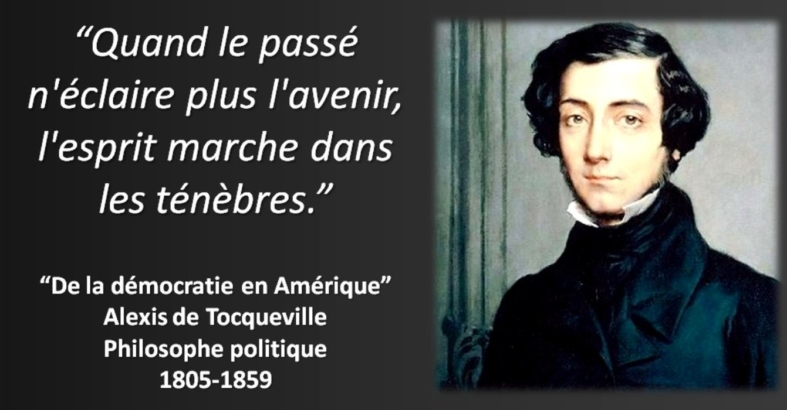

Cùng thời điểm đó, Auguste Comte nói: "Người ta không thực sự hiểu một khoa học cho đến khi biết lịch sử của nó." Sự thật này có thể được áp dụng cho ý tưởng về tự do.
Thực vậy, tự do không phải là một ý tưởng mới. Đó là một di sản được truyền lại qua các thế hệ. Toàn bộ lịch sử của nền văn minh nhân loại chứng minh cho một cuộc đấu tranh không ngừng vì tự do.
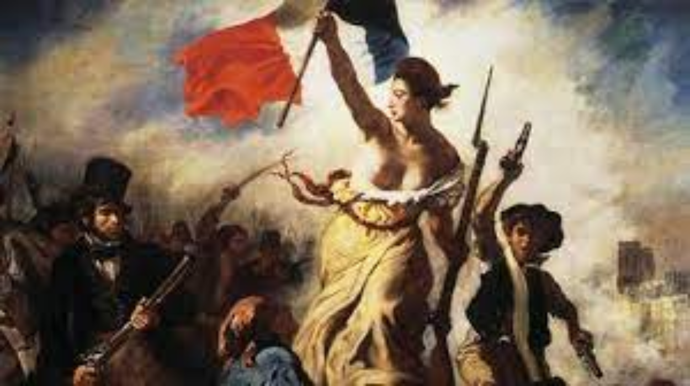

Tuy nhiên, mục tiêu của khóa học này không chỉ là làm sáng tỏ lịch sử của tự do mà còn, và quan trọng hơn, là phát triển tư duy phản biện. Thực vậy, lịch sử một mình không đủ để đánh giá hiện tại và tương lai. Nó cần đi kèm với sự phản biện và đánh giá về những sai lầm của quá khứ. Đây là đóng góp của triết học. Đó là lý do tại sao tôi đã đặt tên cho khóa học này là: Lịch sử triết học về tự do. Thực vậy, khoá học này khám phá cách mà các triết gia đã hình dung về tự do qua các thời đại.

### Nhiệm vụ của triết học

Từ nguồn gốc của nó, triết học có hai mục đích:

- Thứ nhất, triết học mang lại ý nghĩa cho những khái niệm mơ hồ và lẫn lộn. Cái gì là tốt, đúng, công bằng, đẹp? Giống như chức năng của lịch sử là làm sáng tỏ quá khứ, vậy triết học là nghệ thuật định nghĩa chính xác các khái niệm. Đó là lý do tại sao chúng ta cần bắt đầu khóa học này bằng việc hiểu tự do là gì.

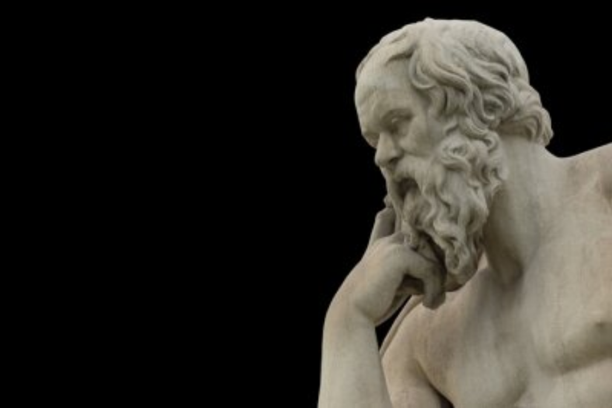
Tự do là một khái niệm bao gồm nhiều biến thể, mỗi biến thể là một khả năng diễn giải khác nhau cho cùng một thực tế: tự do chính trị, tự do kinh tế, tự do tư tưởng, tự do ngôn luận, tự do tôn giáo, tự do hội họp, v.v. Chúng ta đang nói về thực tế nào?

Tự do có thể được định nghĩa đơn giản là quyền lựa chọn, với những gì thuộc về bản thân mình. Đó là một năng lực bẩm sinh của con người. Đó là một thực tế mang bản chất cá nhân. Chỉ có cá nhân mới có thể suy nghĩ và hành động, tức là lựa chọn. Điều này không có nghĩa là cá nhân đó cô đơn, không nợ bất cứ điều gì từ người khác. Ngược lại, anh ta sống trong xã hội và phải hợp tác với người khác vì lợi ích của bản thân. Nhưng mỗi người vẫn có quyền tự do lựa chọn hợp tác hoặc không và phải chịu trách nhiệm cho những lựa chọn đó của bản thân.

Khái niệm trách nhiệm là hệ quả của tự do bởi vì mỗi lựa chọn đều có hậu quả. Người có trách nhiệm là người chấp nhận chi phí sinh ra từ những lựa chọn của bản thân và không chuyển gánh nặng này cho người khác. Nói cách khác, tự do không miễn phí. Đó là một khái niệm đạo đức không chỉ thể hiện quyền lợi mà còn thể hiện cả nghĩa vụ đối với người khác, bao gồm nghĩa vụ tôn trọng tự do của họ.

- Thứ hai, triết học là chuẩn mực, không giống như lịch sử, chỉ mang tính mô tả. Do đó, triết học chính trị khác biệt với khoa học chính trị. Triết học chính trị mang tính chuẩn mực, nghĩa là nó đề ra giá trị và đánh giá hành động của con người theo tiêu chí của công lý. Ngược lại, khoa học chính trị chỉ mô tả các chế độ, lịch sử của các tổ chức, mà không đưa ra phán xét giá trị.

### Triết học về tự do và triết học về quyền lực

Từ góc độ này, chỉ có hai loại triết học chính trị: triết học về tự do và triết học về quyền lực.

- Triết học về tự do dựa trên quyền tự nhiên về sở hữu và khẳng định rằng mục đích duy nhất của luật pháp là bảo vệ quyền sở hữu và các hợp đồng cá nhân. Mỗi người nên được tự do làm những gì họ muốn với những gì thuộc về họ, miễn là họ không làm hại ai. Đây là một triết học bảo vệ tự do bình đẳng cho tất cả mọi người trong việc sử dụng bản thân và quyền sở hữu của mình dưới điều kiện có trách nhiệm. Đó là triết lý của thị trường tự do.
- Triết học về quyền lực biện minh cho quyền lực của một số thực thể tập thể như Nhà nước hoặc xã hội để quyết định giới hạn được đặt ra cho thị trường và quyền sở hữu, và do đó là tự do. Trong khuôn khổ này, luật pháp có nhiệm vụ tổ chức kinh tế, sức khỏe, nhà ở, văn hóa, giáo dục... Triết học kiến tạo này luôn có những người bảo vệ, với danh nghĩa lợi ích tập thể, bình đẳng, bảo vệ và phúc lợi.

Sự đối lập giữa hai triết học này tồn tại trong mọi thời đại. Nhưng chúng ta có thể minh họa điều này với triết học của thời kỳ Khai sáng. Rõ ràng có một ranh giới phân chia giữa hai loại tư duy.

Những người bảo vệ triết lý tự do ở Pháp là các nhà triết học trọng nông, với François Quesnay đứng đầu. Họ tự gọi mình là physiocrats (tên gọi bắt nguồn từ tiếng Hy Lạp Physis, nghĩa là tự nhiên, và Kratos, nghĩa là quyền lực) bởi vì họ phát triển một tư duy kinh tế và xã hội dựa trên quyền tự nhiên của con người. Đối với họ, xã hội, con người và quyền sở hữu tồn tại trước khi có luật pháp. Trong hệ thống này, Bastiat giải thích,

> Không phải vì có luật pháp mà có quyền sở hữu, mà vì có quyền sở hữu mà có luật pháp. (_Propriété et Loi - Quyền sở hữu và Luật pháp_).
> Đối với Turgot và Say, những người theo học Quesnay, tồn tại một luật tự nhiên, thứ độc lập với những thay đổi tùy hứng của các nhà lập pháp, có giá trị cho tất cả mọi người và tồn tại trước bất kỳ xã hội nào. Triết lý này trực tiếp đến từ học thuyết Trung Cổ, các triết gia khắc kỷ, Aristotle và Sophocles. Các luật không viết là những luật vừa có trước vừa vượt trội hơn các luật viết vì chúng bắt nguồn từ bản chất con người và lý trí.
> 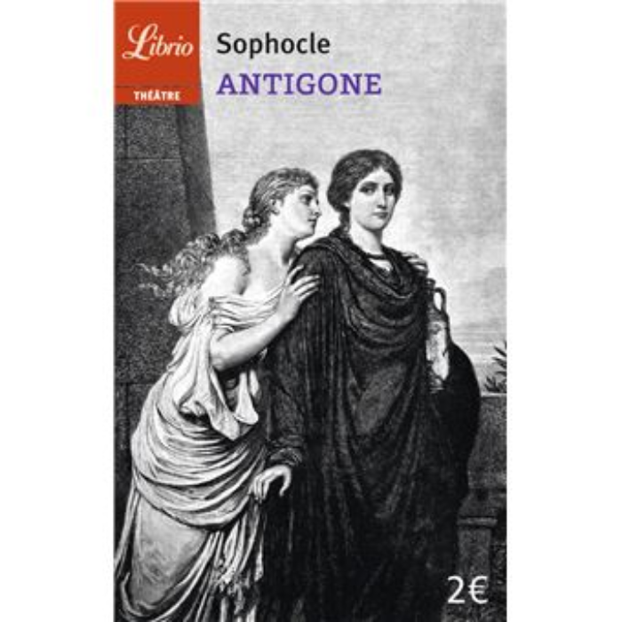
> Triết lý thứ hai được tìm thấy ở các tác giả như Rousseau, Robespierre, hoặc Kant, những người đại diện cho truyền thống cộng hòa mà trong đó chủ quyền của ý chí chung là nguồn gốc thực sự của pháp luật. Cùng thời với Quesnay, Rousseau là một người chống trường phái trọng nông. Đối với ông, nhà lập pháp phải tổ chức xã hội, giống như một thợ máy phát minh ra một máy móc từ vật chất vô tri.
> 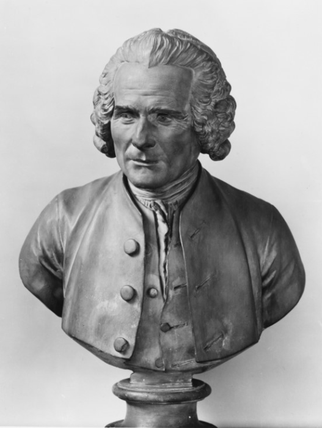

> "Người nào dám đảm nhận công việc thành lập một dân tộc," Rousseau nói, "phải cảm thấy mình có khả năng thay đổi, có thể nói, bản chất con người, biến mỗi cá nhân, người mà bản thân là một toàn thể hoàn hảo và cô độc, thành một phần của một toàn thể lớn hơn mà từ đó cá nhân này nhận được cuộc sống và sự tồn tại của mình." (_Khế ước xã hội - Contrat social_)

Từ quan điểm này, nhiệm vụ của nhà lập pháp là tổ chức, thay đổi, thậm chí là bãi bỏ quyền sở hữu nếu ông ta cho rằng điều đó là tốt. Đối với Rousseau, quyền sở hữu không phải là tự nhiên mà là thông lệ, giống như chính xã hội. Đến lượt mình, Robespierre thiết lập nguyên tắc rằng "Quyền sở hữu là quyền của mọi công dân được hưởng và sử dụng phần hàng hóa được pháp luật bảo đảm cho mình." Không có quyền sở hữu tự nhiên đối, chỉ có một số lượng vô hạn các sắp xếp khả dĩ và tùy ý.

## Frédéric Bastiat: sản xuất so với cướp bóc

<chapterId>5a8a3452-9970-51a0-a5ea-f367b63137bc</chapterId>

Theo Bastiat, khi một người mở cuốn sách giáo khoa ở trường, người ta học được rằng nhân loại sẽ tiến về miền hư vô nếu không có sự can thiệp của quyền lực:

> "Chỉ cần mở, gần như ngẫu nhiên, bất kỳ một cuốn sách về triết học, chính trị, hoặc lịch sử nào để thấy được ý tưởng này đã ăn sâu vào đất nước chúng ta như thế nào, một ý tưởng sinh ra từ các nghiên cứu cổ điển và là mẹ đẻ của Chủ nghĩa Xã hội, rằng nhân loại là một vật chất trơ nhận được cuộc sống, tổ chức, đạo đức, và sự thịnh vượng từ quyền lực; — hoặc tồi tệ hơn, rằng chính nhân loại tự mình hướng tới sự suy đồi và chỉ được ngăn chặn trên con dốc này bởi bàn tay bí ẩn của Nhà Lập pháp." ([_Luật Pháp - La Loi_](http://bastiat.org/fr/la_loi.html)).

Nói cách khác, định kiến văn hóa thống trị triết học phương Tây cũng như sử học là chúng ta nợ quyền lực mọi thứ: tự do, sức khỏe, giáo dục, an ninh, sự thịnh vượng. Nhân loại được mô tả là "vật chất trơ" được hình thành nhờ vào nhà lập pháp.

Nhưng thực tế về quyền lực lại khác hẳn theo Bastiat. Quyền lực là sự áp bức. Ông viết:
> Mở ngẫu nhiên các trang sử của nhân loại! Hãy tham khảo lịch sử cổ đại hoặc hiện đại, tâm linh hoặc trần tục, và tự hỏi tất cả những cuộc chiến giữa các chủng tộc, giai cấp, quốc gia, và gia đình đến từ đâu! Bạn sẽ luôn nhận được một câu trả lời: Từ khát vọng quyền lực. ([_Sự không tương thích giữa các nghị sĩ - Incompatibilités Parlementaires_](http://bastiat.org/fr/incompatibilites_parlementaires.html))

Khát vọng quyền lực chính là nguồn gốc của mọi hình thức áp bức trong lịch sử. Trong một bức thư gửi bà Chevreux, ngày 23 tháng 6 năm 1850, Bastiat đã phác thảo các giai đoạn của sự áp bức: "Những thời kỳ đấu tranh để chiếm lấy Nhà nước; và những thời kỳ đình chiến sẽ là triều đại ngắn ngủi của một cuộc đàn áp thắng lợi, dấu hiệu báo trước cho một cuộc đấu tranh mới." Đầu tiên, là chinh phục quyền lực thông qua chiến tranh, sau đó là thiết lập một Nhà nước được duy trì sự tồn tại bằng cách cướp bóc tài sản của công dân.

Lịch sử do đó là cuộc đấu tranh giữa hai nguyên tắc: tự do và áp bức:

> Tự do! Đó, cuối cùng, là nguyên tắc hài hòa. Áp bức! Đó là nguyên tắc bất hoà; cuộc đấu tranh của hai quyền lực này lấp đầy các trang sử của nhân loại. ([_Sự hài hoà kinh tế - Harmonies Économiques_](http://bastiat.org/fr/conclusion_eo_harmonies.html), kết luận của bản gốc).

### Áp bức là gì?

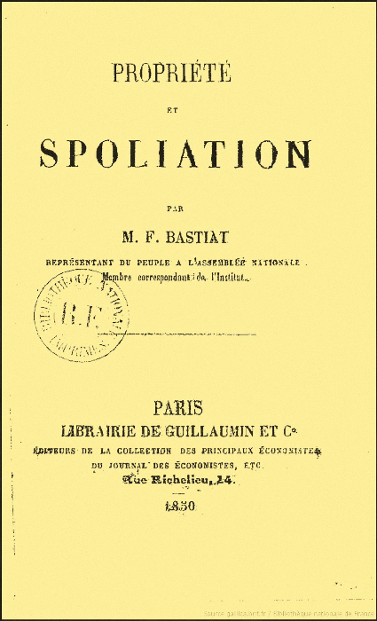

Nói một cách ngắn gọn, đó là sự cướp đoạt. Bastiat đã chỉ ra các loại hình cướp đoạt chính đến từ tầng lớp cai trị: chiến tranh, nô lệ, thần quyền, và độc quyền. Thực vậy, theo ông: "Chỉ có hai cách để thu được những thứ cần thiết cho việc bảo tồn, làm đẹp, và cải thiện cuộc sống: SẢN XUẤT và CƯỚP ĐOẠT." ([_Triết học về Cướp đoạt - Physiologie de la Spoliation_](http://bastiat.org/fr/physiologie_de_la_spoliation.html))

Sự khác biệt giữa sản xuất và cướp đoạt là gì? Đây là câu trả lời của Bastiat:

> Để sản xuất, người ta phải hướng tất cả khả năng của mình vào việc chinh phục thiên nhiên; bởi vì chính thiên nhiên phải được chiến đấu, thuần hóa, và khuất phục. Đó là lý do tại sao sắt được chuyển đổi thành cái cày là biểu tượng của sản xuất. Để cướp bóc, người ta phải hướng tất cả khả năng của mình vào việc thống trị con người; bởi vì chính họ phải bị chiến đấu, giết chết, hoặc làm nô lệ. Đó là lý do tại sao sắt được chuyển đổi thành kiếm là biểu tượng của cướp đoạt. ([_Sự hài hoà kinh tế, Chiến tranh - Harmonies Économiques, Guerre_](http://bastiat.org/fr/guerre.html)).

Nói cách khác, sản xuất là thực thi quyền lực lên thiên nhiên. Cướp đoạt là thực thi quyền lực lên con người. Tuy nhiên, có hai hình thức cướp đoạt: hợp pháp và bất hợp pháp.
Cướp đoạt bất hợp pháp là hành vi trộm cắp hoặc tội phạm do một công dân gây ra cho công dân khác. Đó là hành động của tên cướp hoặc kẻ lừa đảo. Tuy nhiên, hình thức cướp đoạt tồi tệ nhất là cướp đoạt được thực hiện bằng luật: "Có những người nghĩ rằng cướp đoạt mất đi mọi tính bất lương miễn là nó hợp pháp. Đối với tôi, tôi không thể tưởng tượng ra một hoàn cảnh nào tệ hơn." ([_Cái thấy được và cái không thấy được - Ce qu’on voit et ce qu’on ne voit pas_](http://bastiat.org/fr/cqovecqonvp.html#RESTRICTION)).

Bastiat cho chúng ta biết vẫn còn hai hình thức cướp đoạt hợp pháp:

> Cướp đoạt từ bên ngoài được gọi là chiến tranh, chinh phục, thuộc địa. Cướp bóc từ bên trong được gọi là thuế, chức vụ, độc quyền. ([_Cobden và Liên đoàn, Giới thiệu - Cobden et la ligue, Introduction_](http://bastiat.org/fr/introduction_cobden_ligue.html)).

Trong [_Triết học về Cướp đoạt - Physiologie de la Spoliation__](http://bastiat.org/fr/physiologie_de_la_spoliation.html), ông đã mở rộng:
> Luật chân chính và công bằng của con người là: Trao đổi các dịch vụ một cách tự do. Cướp đoạt là việc cấm quyền tự do trao đổi, tranh luật bằng vũ lực hoặc lừa dối để được nhận dịch vụ mà không cần phải phải đáp lại. Cướp đoạt bằng vũ lực được thực hiện như sau: Người ta chờ đợi một người sản xuất ra thứ gì đó, sau đó giật lấy nó từ anh ta, với vũ khí trong tay. Hành động này chính thức bị nghiêm cấm trong Mười Điều Răn: Ngươi không được ăn cắp. Khi điều này xảy ra giữa các cá nhân, nó được gọi là trộm cắp và dẫn đến tù tội; khi nó diễn ra giữa các quốc gia, nó được gọi là chinh phục và dẫn đến vinh quang.

### Lịch sử của cướp đoạt

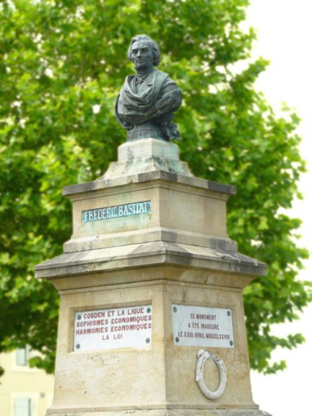

Lịch sử cho thấy, các tầng lớp cai trị luôn sống nhờ vào cướp đoạt. Bastiat nhận xét:

> Sức mạnh được dùng vào cướp đoạt là cơ sở của lịch sử nhân loại. Công việc ghi chép lại lịch sử của sự cướp đoạt có lẽ chính là việc tái hiện gần như toàn bộ lịch sử của tất cả các dân tộc: Assyrians, Babylonians, Medes, Ba Tư, Ai Cập, Hi Lạp, La Mã, Goths, Franks, Hung Nô, Thổ Nhĩ Kỳ, Ả Rập, Mông Cổ, Tartars, chưa kể đến người Tây Ban Nha ở Mỹ, người Anh ở Ấn Độ, người Pháp ở Châu Phi, người Nga ở Châu Á, v.v.
>
> ([_Những ảo tưởng kinh tế - Sophismes Économiques_](http://bastiat.org/fr/conclusion_sophismes.html), Kết luận của tập đầu tiên).
Hay một lần nữa khẳng định:

> Cướp đoạt, trong hình thức tàn bạo nhất của nó, với ngọn đuốc và thanh kiếm, lấp đầy các trang sử của nhân loại. Những cái tên nào tóm tắt lịch sử? Cyrus, Sesostris, Alexander, Scipio, Caesar, Attila, Tamerlan, Muhammad, Pizarro, William the Conqueror; đây là sự cướp đoạt ngây thơ thông qua chinh phục. Họ được tôn vinh bằng những vòng nguyệt quế, tượng đài, tượng và cổng chiến thắng. ([_Sự hài hoà kinh tế, Chiến tranh - Harmonies Économiques_](http://bastiat.org/fr/conclusion_eo_harmonies.html), kết luận của bản gốc).
> Lịch sử thế giới là lịch sử về cách một nhóm người cướp đoạt nhóm người khác, thường xuyên một cách có hệ thống, thông qua chiến tranh, nô lệ, thần quyền. Ngày nay, đó là độc quyền, tức là những đặc quyền kinh tế do Nhà nước phân phát cho các khách hàng của mình.

Vài ngày trước khi qua đời ở Rome vào năm 1850, Bastiat đã tâm sự với bạn mình, Prosper Paillottet:

> Một nhiệm vụ quan trọng của kinh tế chính trị là viết nên lịch sử của sự cướp đoạt. Đó là một lịch sử dài, trong đó, ngay từ đầu, xuất hiện các cuộc chinh phục, cuộc di cư của các dân tộc, các cuộc xâm lược, và tất cả những hậu quả tai hại của cuộc xung đột giữa sức mạnh với công lý. Tất cả những điều này vẫn còn dấu vết sống động trong ngày nay, và đó là một khó khăn lớn để giải quyết các vấn đề được đặt ra trong thế kỷ của chúng ta. Chúng ta sẽ không có được giải pháp cho đến khi xác định rõ ràng được từ đâu và vì sao sự bất công, thứ đã chiếm được một vị trí ở giữa chúng ta, đã ăn sâu vào trong phong tục và luật pháp của chúng ta.
>
> (P. Paillottet, _Chín ngày ở bên cạnh một người đàn ông sắp ra đi - Nine Days Near a Dying Man_)

## Lord Acton: Tự do là động lựa của lịch sử

<chapterId>de971d92-4e26-5870-a961-18dfa06497cf</chapterId>

Như đã biết, lịch sử được viết bởi những người chiến thắng. Sự chú ý thường tập trung vào việc chinh phục quyền lực, cuộc sống của các nhà lãnh đạo cầm quyền, và những xung đột giữa họ với những người muốn chiếm lấy vị trí của họ.

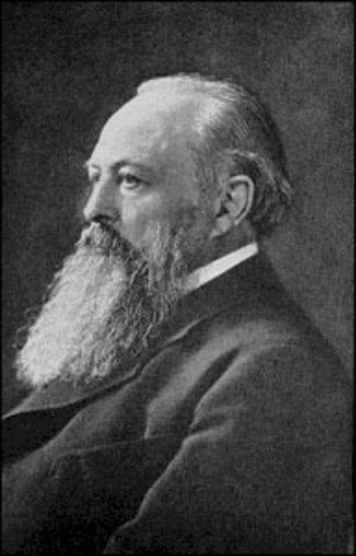

Điều này đặc biệt đúng với các sách giáo khoa dành cho trường công lập và được viết bởi các giáo sư do Nhà nước tuyển dụng.
Tuy nhiên, không phải lúc nào cũng vậy, và hai tập của một nhà sử học đến từ Cambridge trong thế kỷ 19, [Lord Acton](https://www.lesbelleslettres.com/livre/9782251447858/le-pouvoir-corrompt) thể hiện điều đó. Tên đầy đủ của ông là John Emerich Edward Dalberg, Baron of Acton (1834-1902). Ông là tác giả của _Lịch sử Tự do trong thời Cổ đại và Cơ đốc giáo - History of Liberty in Antiquity and Christianity_. Công trình của ông được coi là một trong những tác phẩm quan trọng nhất về chủ đề này, và ông đã công hiến phần lớn sự nghiệp của mình cho nó. Công trình của ông, mặc dù còn dang dở, là một lời cảnh báo mạnh mẽ về nguy cơ lạm dụng quyền lực, và lời kêu gọi của ông về bảo vệ tự do cùng với trách nhiệm cá nhân vẫn còn nguyên giá trị cho đến ngày nay.
Tác giả này được biết đến nhiều nhất với câu nói của mình: 
> "Quyền lực có xu hướng bị tha hoá, và quyền lực tuyệt đối thì tha hoá tuyệt đối."

Câu nói này liên tưởng đến quan điểm của Montesquieu trong [_Tinh thần của luật pháp - L’esprit des lois_](https://fr.wikisource.org/wiki/Page:Montesquieu_-_Esprit_des_Lois_-_Tome_1.djvu/316):

> Có một chân lý vĩnh hằng là ai có quyền lực trong tay cũng đều bị cám dỗ để lạm dụng nó.

### Luận điểm của Acton

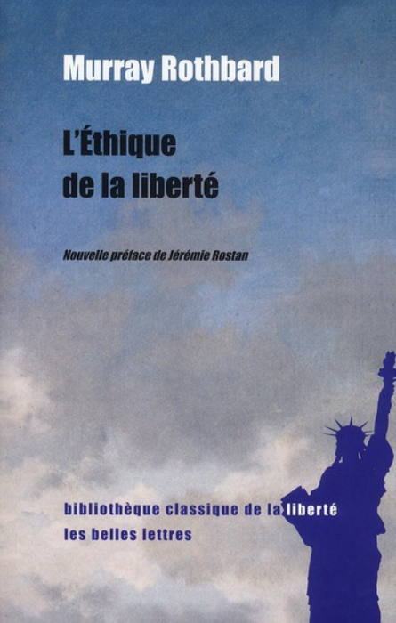

Đối với Acton, xung đột giữa tự do và quyền lực là sợi chỉ đỏ xuyên suốt lịch sử nhân loại, trong đó tự do là động lực của sự tiến bộ và sự phát triển của các xã hội. Acton đã tìm hiểu những yếu tố góp phần vào sự nổi lên của tự do ở phương Tây. Mục tiêu của ông là xác định những điều kiện cần thiết cho sự bảo tồn và phát triển của nó. Ông đã nghiên cứu các ý tưởng triết học, cấu trúc xã hội, và bối cảnh chính trị đã tạo điều kiện cho sự nảy nở của tự do theo thời gian.

Luận điểm chính của ông là "tự do được thiết lập bởi sự xung đột của các quyền lực." Theo Acton, trong nhiều thế kỷ sau sự sụp đổ của Đế chế La Mã phương Tây, Giáo hội Công giáo là lực lượng duy nhất có khả năng thách thức quyền lực của các lãnh chúa phong kiến, quốc vương, và hoàng đế. Cuộc đấu tranh quyền lực giữa Giáo hội và Nhà nước đã được chứng minh là đóng vai trò quan trọng cho sự nổi lên của tự do. Châu Âu có một vị Chúa mạnh mẽ và một quyền lực Nhà nước yếu, do cuộc tranh chấp liên tục, trong thời Trung Cổ, giữa giáo hoàng và các vị vua. Ngược lại, Trung Quốc có một thần linh yếu và một quyền lực Nhà nước mạnh.

> Khi đề cập đến tự do, tôi muốn nói đến sự đảm bảo rằng mỗi người sẽ được bảo vệ, khi họ làm những gì họ tin là bổn phận của mình, chống lại ảnh hưởng của quyền lực và đa số, của phong tục và dư luận. Nhà nước chỉ có thẩm quyền đặt ra bổn phận và phân biệt giữa thiện - ác, đúng - sai chỉ trong phạm vi trực tiếp của mình.
>
> (Lord Acton)
Nói cách khác, tự do là quyền của cá nhân được theo đuổi lương tâm của mình, và nhà nước không có quyền định đoạt hành vi của một người trong các vấn đề triết học, đạo đức, và tôn giáo.
Ban đầu, Friedrich Hayek đã dự định đặt tên cho Hội Mont Pelerin là "Hội Acton-Tocqueville," để tưởng nhớ hai nhà tư tưởng mà ông rất ngưỡng mộ: Lord Acton và Alexis de Tocqueville. Cuối cùng, tên của địa điểm nơi cuộc họp đầu tiên của Hội được tổ chức, Mont Pelerin ở Thụy Sĩ, đã được chọn.

### Voltaire và Condorcet

Nhưng ý tưởng cho rằng tự do ở Châu Âu nảy nở từ những cuộc đấu tranh nội bộ giữa các bên tranh giành quyền lực, ngăn chặn việc thiết lập của sự thống trị tuyệt đối, không phải là quan điểm của riêng Acton. Nó đã được tìm thấy trong các nhà tư tưởng như Voltaire và Condorcet.

Vì vậy, Voltaire, trong [_Những bức thư triết học - Philosophical Letters_](https://fr.wikisource.org/wiki/Lettres_philosophiques/Lettre_6) của mình, đã cho rằng tự do của Anh nảy sinh từ những xung đột giữa vua và quý tộc, thứ đã ngăn chặn bất kỳ sự tập trung quyền lực quá mức nào. Và ông lưu ý:
> Nếu chỉ có một tôn giáo ở Anh, sự độc tài của nó sẽ rất đáng sợ; nếu chỉ có hai, họ sẽ chém giết lẫn nhau; nhưng có tới ba mươi tôn giáo, nên họ sống trong hòa bình và hạnh phúc. ([Về những người theo trường phái Trưởng lão - On the Presbyterians](https://fr.wikisource.org/wiki/Lettres_philosophiques/Lettre_6))
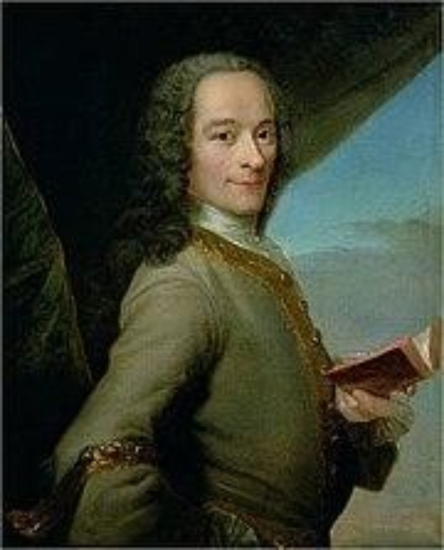

Condorcet, trong tác phẩm [_Bản phác thảo một bức tranh lịch sử về sự tiến bộ của tinh thần con người - Sketch for a Historical Picture of the Progress of the Human Mind_](https://fr.wikisource.org/wiki/Esquisse_d%E2%80%99un_tableau_historique_des_progr%C3%A8s_de_l%E2%80%99esprit_humain) của mình, đã cho rằng cấu trúc quyền lực phân tán ở Ý là do sự cạnh tranh giữa giáo hoàng và hoàng đế, điều này đã cho phép nhiều thành bang độc lập cùng tồn tại.

Luận điểm này cũng được tìm thấy trong một công trình quan trọng có từ năm 1983: _Luật và Cách mạng: Hình thành của truyền thống pháp lý phương Tây - Law and Revolution: The Formation of the Western Legal Tradition_, của Harold J. Berman ([Bản dịch tiếng Pháp của Raoul Audouin](https://www.eyrolles.com/Entreprise/Livre/droit-et-revolution-9782903449667/), được xuất bản bởi Nhà sách Đại học Aix en Provence vào năm 2002). Phân tích của Berman nhấn mạnh vai trò quan trọng của chủ nghĩa đa pháp lý trong lịch sử phương Tây. Hệ thống này, thay vì chỉ là một nguồn gốc phức tạp đơn thuần, đã là động lực cho sự phát triển, tự do và đổi mới, định hình nên truyền thống bền vững lâu dài của nền pháp lý phương Tây.

## Mác: Lịch sử như là một cuộc đấu tranh giai cấp

<chapterId>438100e6-a385-55c6-b2c5-ad192c564757</chapterId>

Tuy nhiên, vẫn có một góc nhìn khác về lịch sử. Nó đã khá thành công và lâu nay nhận được sự ủng hộ của các học giả phương Tây và đại diện từ phía Nam toàn cầu. Đó là quan điểm lịch sử theo xã hội chủ nghĩa và Mác-xít.
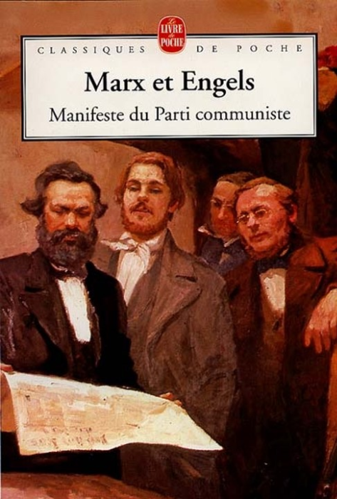

Quan điểm này giải thích sự tăng trưởng phi thường của châu Âu chủ yếu là nhờ sự tiến bộ của công nghệ kết hợp với "sự tích lũy nguyên thuỷ" của vốn, bắt nguồn từ chủ nghĩa đế quốc, chế độ nô lệ, thương mại tam giác, sự tước đoạt đất đai của nông dân và sự bóc lột tầng lớp lao động. Kết luận rõ ràng: Sự tăng trưởng phi thường của châu Âu đã được đạt được nhờ vào cái giá phải trả của hàng triệu và hàng triệu nô lệ và người dân bị áp bức.

Ban đầu, Mác đúng về một điều: lịch sử là lịch sử của các cuộc đấu tranh giai cấp và bóc lột. Câu nói này rất nổi tiếng, đó là câu đầu tiên của chương đầu tiên của [_Tuyên ngôn của Đảng Cộng sản - Communist Manifesto_](https://fr.wikisource.org/wiki/Manifeste_du_parti_communiste/Andler): "Lịch sử của mọi xã hội tồn tại cho đến ngày nay là lịch sử của các cuộc đấu tranh giai cấp." Chính Mác đã tự thừa nhận rằng ông mượn lý thuyết về cuộc đấu tranh giai cấp từ các tác giả trước đó:

> Tôi không có công lao gì trong việc phát hiện ra các giai cấp và cuộc đấu tranh giai cấp trong xã hội hiện đại. Trước tôi, các sử gia tư bản đã mô tả sự phát triển lịch sử của cuộc đấu tranh giai cấp này và các nhà kinh tế học tư bản đã mô tả cấu trúc kinh tế của các giai cấp.
>
> (_Thư gửi J. Weydemeyer_, ngày 5 tháng 3 năm 1852).

Nhưng ông đã nhầm về một điểm cơ bản liên quan đến tầng lớp lao động: không phải vốn tạo ra sự bóc lột. Nói cách khác, cuộc đấu tranh giai cấp không diễn ra trong lòng sản xuất mà giữa những người đóng thuế và những người thu thuế.

Theo Mác, bóc lột là quá trình trích một phần giá trị do người lao động tạo ra mà không trả tiền cho họ, điều này cho phép các nhà tư bản tạo ra lợi nhuận. Nói cách khác, bóc lột sẽ là một cơ chế cho phép các nhà tư bản làm giàu bằng cách ăn cắp lao động của giai cấp vô sản.
Phân tích này phản ánh một sự hiểu lầm về giá trị thặng dư và bản chất hợp tác và động lực tự nhiên của đời sống kinh tế. Thực sự, lợi nhuận mà doanh nhân nhận được là sự bồi thường cho rủi ro họ chấp nhận, và người lao động hay nhân viên không phải là những nô lệ. Trong tình huống cạnh tranh, họ có thể chấp nhận hoặc từ chối hợp đồng với người sử dụng lao động của mình. Họ đưa ra lựa chọn đựa trên phân tích chi phí-lợi ích.

### Cuộc Cách mạng Công nghiệp dưới lăng kính khác

Thực tế, phân tích của Mác đã bóp méo thực tế lịch sử của cuộc Cách mạng Công nghiệp. Ludwig von Mises đã làm rõ vấn đề này trong tác phẩm kinh tế học của mình [_Hành động của con người - Human Action_](http://herve.dequengo.free.fr/Mises/AH/AHTDM.htm) (đặc biệt là chương có tiêu đề [Diễn giải phổ biến về Cách mạng Công nghiệp - Popular Interpretation of the Industrial Revolution](http://herve.dequengo.free.fr/Mises/AH/AH21.htm#inter2)) cũng như trong một loạt bài giảng được xuất bản dưới tiêu đề: [_Chính sách kinh tế: Những suy ngẫm cho hôm nay và ngày mai - Economic Policy: Thoughts for Today and Tomorrow_](http://herve.dequengo.free.fr/Mises/PE/PE_TDM.htm). (Và cũng đáng đọc là tác phẩm _Tâm lý chống Chủ nghĩa Tư bản - The Anti-Capitalistic Mentality_ [ở đây](https://www.institutcoppet.org/wp-content/uploads/2011/05/La-Mentalit%C3%A9-anticapitaliste.pdf) và [ở đây](http://herve.dequengo.free.fr/Mises/MAC/MAC_TDM.htm)).

Mises giải thích rằng công việc trong các nhà máy, mặc dù khốn khổ theo tiêu chuẩn của chúng ta, nhưng lại là cơ hội tốt nhất có thể cho người lao động thời bấy giờ.

Hãy đọc một đoạn trích từ _Hành động của con người_:

> Trong những thập kỷ đầu của cuộc Cách mạng Công nghiệp, mức sống của công nhân nhà máy thấp đến mức bị chỉ trích khi so với điều kiện của các tầng lớp thượng lưu đương thời, và so với tình hình hiện tại của đám đông công nghiệp. Giờ làm việc kéo dài, điều kiện vệ sinh tại các nhà xưởng làm việc tồi tệ. Khả năng lao động của các cá nhân nhanh chóng bị cạn kiệt. Nhưng sự thật vẫn là, đối với phần dân số dư thừa do việc chiếm đoạt đất chăn thả cộng đồng (enclosures) đã đẩy họ vào cảnh khốn cùng nhất, và cho những người mà thực sự không có chỗ đứng trong hệ thống sản xuất đương thời, thì công việc nhà máy là một sự cứu rỗi. Những người này đổ xô đến các nhà xưởng, vì lý do duy nhất là họ cần cải thiện mức sống của mình.

Mises thêm rằng, sự cải thiện điều kiện sống của con người như vậy được có được là nhờ vào việc tích lũy vốn:

> Sự thay đổi căn bản trong tình hình đã đem lại cho quần chúng phương Tây mức sống hiện tại (một mức sống cao thực sự, so với thời kỳ tiền tư bản, và so với những gì đang diễn ra ở nước Nga Xô viết) là kết quả của việc tích lũy vốn thông qua tiết kiệm và đầu tư khôn ngoan của các doanh nhân có tầm nhìn xa. Không có sự cải thiện công nghệ nào có thể đạt được nếu như không thông qua tiết kiệm để có được lượng vốn vật chất bổ sung cần thiết cho việc áp dụng các phát minh mới vào thực tế sản xuất.

Về lịch sử học Mác-xit, chúng ta cũng có thể tham khảo Friedrich Hayek trong _Chủ nghĩa Tư bản và các sử gia - Capitalism and the Historians_ (Nhà Xuất Bản Đại Học Chicago, 1954) và chương có tiêu đề "_Lịch sử và Chính trị - History and Politics_". Theo Hayek, không phải công nghiệp hóa đã làm cho công nhân khốn khổ, như truyền thuyết đen tối về Chủ nghĩa Tư bản mà Mác chủ trương tuyên truyền. Ông cho rằng:
> Lịch sử thực sự của mối liên hệ giữa Chủ nghĩa Tư bản và sự nổi lên của giai cấp vô sản gần như hoàn toàn trái ngược lại với những gì được đề xuất trong các lý thuyết về sự tước đoạt quần chúng.

Trước Cách mạng Công nghiệp, hầu hết mọi người sống trong các xã hội nông thôn và phụ thuộc vào nông nghiệp để sinh tồn. Họ có rất ít thứ để bán trên thị trường, điều này hạn chế cơ hội và mức sống của họ. Mọi người đều kỳ vọng sẽ sống trong cảnh nghèo đói tuyệt đối và hình dung một số phận tương tự cho con cháu của mình. Không ai phẫn nộ trước một tình huống dường như là không thể tránh khỏi.
> 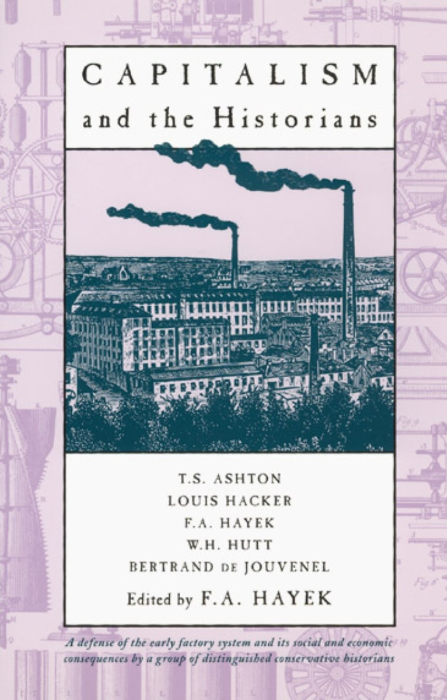

Với sự xuất hiện của công nghiệp hóa, những cơ hội mới đã xuất hiện, tạo ra nhu cầu lớn đối với lao động. Lần đầu tiên, những người không có đất đai hoặc nguồn lực đáng kể có thể bán sức lao động của mình cho các nhà máy và xưởng sản xuất để đổi lấy tiền lương, đảm bảo sự an toàn cho tương lai.

Nguồn thu nhập này giúp họ tự nuôi sống và tự cung cấp nhà ở, ngay cả trong các thành phố đang mở rộng nhanh chóng. Do đó, Cách mạng Công nghiệp đã thúc đẩy một cuộc bùng nổ dân số mà không thể có được dưới điều kiện kinh tế trì trệ của kỷ nguyên tiền công nghiệp.

Hayek nhận xét, "sự đau khổ kinh tế vừa trở nên rõ ràng hơn vừa dường như ít chính đáng hơn, bởi vì sự giàu có chung đang tăng nhanh hơn bao giờ hết."

Do đó, người lao động không bị bóc lột, ngay cả khi tiền lương thấp, do sự dồi dào của lao động chạy trốn khỏi nông thôn.

Trên thực tế, bóc lột chỉ có ý nghĩa khi nó là một hành động xâm phạm quyền tư hữu. Trong nghĩa này, bóc lột luôn là hành động của Nhà nước. Bởi vì Nhà nước là cơ quan duy nhất có được thu nhập thông qua sự cưỡng chế, tức là, bằng vũ lực. Do đó, sự bóc lột thực sự, như chúng ta đã thấy với Bastiat, là sự bóc lột các tầng lớp sản xuất bởi tầng lớp các quan chức nhà nước. Sẽ chính xác hơn khi nói rằng lịch sử của toàn bộ xã hội cho đến ngày nay là lịch sử của cuộc đấu tranh giữa những kẻ cướp đoạt và các tầng lớp sản xuất.

### "Phép màu Châu Âu"

Sau đó, một phân tích lịch sử tinh tế hơn so với Mác cho phép chúng ta thách thức ý tưởng về một Châu Âu cướp bóc, vốn chỉ đạt được thành công là hoàn toàn nhờ vào chủ nghĩa đế quốc và chế độ nô lệ. Bằng cách đào sâu vào lịch sử kinh tế so sánh, một số nhà sử học đương đại đã đi tìm nguồn gốc của sự phát triển của Châu Âu trong những yếu tố mà nó khác biệt nó với các nền văn minh lớn khác, đặc biệt là của Trung Quốc, Ấn Độ và Hồi giáo. Những đặc điểm này đã được khám phá bởi [David Landes](https://www.eyrolles.com/Entreprise/Livre/richesse-et-pauvrete-des-nations-9782226110381/), [Jean Baechler](https://academiesciencesmoralesetpolitiques.fr/publications/publications-de-lacademie/jean-baechler/), [François Crouzet](https://www.cairn.info/revue-entreprises-et-histoire-2010-4-page-219.htm), và [Douglass North](https://www.iedm.org/fr/65134-douglass-north-l-un-des-economistes-les-plus-originaux/). Các nhà nghiên cứu này đã cố gắng tìm hiểu điều được gọi là "phép màu Châu Âu." Họ tập trung sự chú ý vào thực tế rằng Châu Âu là một tập hợp của các khu vực pháp lý phân chia và cạnh tranh, nơi, sau sự sụp đổ của Rome, không có một quyền lực chính trị trung ương nào có khả năng áp đặt ý chí của mình lên tất cả.

Như Jean Baechler, một thành viên của Viện hàn lâm Khoa học Đạo đức và Chính trị, nói trong _Nguồn gốc của Chủ nghĩa Tư bản - Les Origines du capitalisme_ (1971):

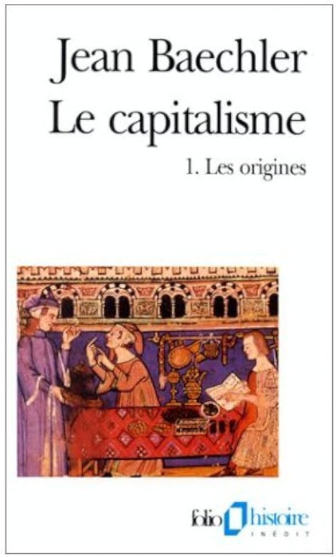

> Điều kiện đầu tiên để tối đa hóa hiệu quả kinh tế là sự giải phóng xã hội dân sự khỏi Nhà nước (...) Sự phát triển của Chủ nghĩa Tư bản có nguồn gốc và lý do tồn tại của nó nhờ vào tình trạng vô chính phủ.

Nói cách khác, "sự kiện không xảy ra" vĩ đại đã chi phối số phận của Châu Âu là sự vắng mặt của một đế chế thống trị, giống như thứ đã thống trị ở Trung Quốc.
Chính sự phân quyền triệt để ở châu Âu đã tạo ra các nghị viện, hội đồng, và các cơ quan hành chính nhà nước. Nó đã cho ra đời các hiến chương như Magna Carta nổi tiếng của người Anh, nhưng cũng đã sản sinh ra các thành phố tự do ở miền Bắc Ý và Flanders: Venice, Florence, Genoa, Amsterdam, Ghent, và Bruges. Cuối cùng, nó đã phát triển khái niệm về luật tự nhiên, cũng như nguyên tắc rằng ngay cả Hoàng tử cũng không được đứng trên pháp luật, một học thuyết có nguồn gốc từ các trường đại học Trung Cổ ở Bologna, Oxford, và Paris, mở rộng đến Vienna và Krakow. 
Kết luận của chương này, sự bùng nổ kinh tế và văn hóa của châu Âu không phải do chinh phục và khai thác phần còn lại của thế giới. Nó đã thống trị thế giới nhờ vào tiến bộ kinh tế của mình. Điều được gọi là "chủ nghĩa đế quốc" là hậu quả, không phải là nguyên nhân, của sự tiến bộ kinh tế của châu Âu. Nhưng quay trở lại với Lord Acton, điều làm cho nền văn minh phương Tây khác biệt hơn tất cả các nền văn minh khác là sự khẳng định giá trị của cá nhân. Trong nghĩa này, tự do lương tâm, đặc biệt là trong vấn đề tôn giáo, đã là một trụ cột cơ bản của nền văn minh này. Chúng ta sẽ quay lại vấn đề này trong phần tiếp theo.

## Murray Rothbard: Nhà Nước so với Xã hội

<chapterId>5a0020ca-2bbd-5e09-8389-d57c57542cb2</chapterId>

Trong chương cuối cùng của _Anatomy of the State - Giải phẫu Nhà nước_, Murray Rothbard đề xuất một lý thuyết về lịch sử. Chương rất ngắn này có tiêu đề: Lịch sử, một cuộc đua giữa quyền lực nhà nước và quyền lực xã hội. Theo Rothbard, lịch sử có thể được hiểu là một cuộc xung đột vĩnh viễn giữa hai nguyên tắc cơ bản:

- **Sự hợp tác và sản xuất hòa bình**, đại diện cho sự trao đổi tự nguyện và sự tạo ra của cải thông qua lao động và đổi mới.
- **Sự bóc lột và trấn lột cưỡng bức**, được thể hiện qua sự thống trị của Nhà nước, chiếm đoạt thành quả lao động của các cá nhân bằng vũ lực.

Dẫn chiếu đến Albert J. Nock, Rothbard sử dụng các thuật ngữ "quyền lực xã hội" và "quyền lực nhà nước" để nhắc đến hai lực lượng đối lập này:

- **Quyền lực xã hội:** phát triển từ sự hợp tác và sáng tạo của các cá nhân tự do, dẫn đến sự tiến bộ về kinh tế và sự thịnh vượng. Đó là quyền lực được áp đặt lên tự nhiên, khả năng sáng tạo của con người biến đổi tự nhiên thành tài nguyên và kiến thức, vì lợi ích chung của xã hội.
- **Quyền lực nhà nước:** được áp đặt thông qua cưỡng chế và bạo lực, tìm cách kiểm soát và khai thác xã hội cho lợi ích riêng. Đó là quyền lực được áp đặt lên con người. Nó bao gồm "việc chiếm đoạt thành quả của xã hội để phục vụ cho lợi ích của những kẻ lãnh đạo không sản xuất (trong thực tế, là phản sản xuất)."

### Nhà Nước như một ký sinh trùng

Rothbard coi Nhà nước như một ký sinh trùng sống nhờ vào xã hội sản xuất. Nó chiếm giữ "các vị trí chỉ huy" chiến lược để chiếm đoạt tài sản và quyền lực. Độc quyền về sức mạnh, công lý, giáo dục, cơ sở hạ tầng. Và ông còn nhấn mạnh thêm: "Trong nền kinh tế hiện đại, tiền tệ là vị trí chỉ huy thiết yếu."
Đối với Rothbard, nguyên tắc tự do cũng nên được áp dụng cho tiền tệ. Nếu chúng ta ủng hộ tự do trong các lĩnh vực khác, nếu chúng ta muốn bảo vệ quyền sở hữu và con người khỏi sự xâm phạm của Nhà nước, nhiệm vụ cấp bách nhất của chúng ta phải là nghiên cứu tính khả thi của một thị trường tự do cho tiền tệ. (Xem về điểm này trong bài luận của ông: _State, What Have You Done with Our Money? - Nhà nước đã làm gì với tiền của chúng ta (tạm dịch)_).

### Sự thất bại của các nỗ lực nhằm hạn chế nhà nước

Rothbard cảnh báo về ý tưởng rằng bản thân các bản hiến pháp thành văn có thể đảm bảo tự do và hạn chế quyền lực của nhà nước:
> Các thế kỷ đã qua là những thời điểm mà con người cố gắng áp đặt các giới hạn hiến pháp và các giới hạn khác lên Nhà nước, chỉ để phát hiện ra rằng những giới hạn đó, cũng như tất cả các nỗ lực khác, đã thất bại. Trong tất cả các hình thức thể chế nhà nước qua các thế kỷ, trong tất cả các ý tưởng và tổ chức chúng ta đã thử nghiệm, chưa có gì thành công trong việc kiểm soát Nhà nước.

Một hiến pháp thành văn chắc chắn có nhiều ưu điểm, nhưng sẽ là một sai lầm nghiêm trọng khi cho rằng chỉ mình nó là đủ để kiểm soát Nhà nước. Thực tế, đảng đa số, với quyền lực của mình, có thể diễn giải rộng rãi hiến pháp để tăng cường quyền lực của mình. Nếu không có các cơ chế cụ thể để thực thi các quyền, và đối mặt với một đảng lớn quyết tâm mở rộng quyền lực của mình, hiến pháp có nguy cơ trở nên không hiệu quả, và trở thành công cụ gây hiểu lầm.

### Thế kỷ 20: Một thế kỷ đi thụt lùi

Theo Rothbard, lịch sử không phải là một quá trình tiến triển tuyến tính, mà là sự dao động giữa sự tiến bộ của quyền lực xã hội và sự trỗi dậy của quyền lực Nhà nước:

- **Các thời kỳ tự do:** khi quyền lực xã hội phát triển, tự do, hòa bình, và sự thịnh vượng tăng lên.
- **Các thời kỳ thống trị của Nhà nước:** khi quyền lực Nhà nước giành ưu thế, dẫn đến áp bức, chiến tranh, và suy thoái.

Từ thế kỷ 17 đến thế kỷ 19, ở nhiều quốc gia phương Tây, đã có các thời kỳ tăng tốc của quyền lực xã hội và do đó có sự tăng lên tương ứng của tự do, hòa bình, và sự thịnh vượng về vật chất. Nhưng Rothbard nhắc nhở chúng ta rằng thế kỷ 20 đã được đánh dấu bằng sự trỗi dậy của quyền lực Nhà nước, với những hậu quả nghiêm trọng: sự tăng lên của nô lệ, chiến tranh, và sự phá hủy:

> Trong thế kỷ này, loài người đối mặt, một lần nữa, với sự cai trị ác liệt của Nhà nước; quyền lực sáng tạo của con người giờ đây đã bị Nhà nước tịch thu và bóp méo cho mục đích của chính nó.

Sau tất cả, như thế nào là một xã hội tự do? Đó là một xã hội không có độc quyền. Trong công trình triết học chính trị của mình, _Đạo đức của Tự do - Ethics of Liberty_ (1982), Rothbard trả lời: "một xã hội mà không có sự khả thi nào về mặt pháp lý để xâm phạm cưỡng ép đối với cá nhân hoặc quyền sở hữu của một người." Đó là lý do tại sao, theo ông, triết học chính trị, phải định rõ nguyên tắc của một xã hội công bằng, được thu hẹp thành chỉ còn một câu hỏi duy nhất: "Ai là chủ sở hữu hợp pháp của cái gì?"
> 

Đối với Rothbard, trật tự xã hội có thể tồn tại nếu nó là sản phẩm của sự phổ biến các quy trình hợp đồng cho việc tự do trao đổi quyền sở hữu, bằng cách tư nhân hóa tất cả các hoạt động kinh tế và thậm chí các chức năng mang tính chủ quyền quốc gia (như ngân hàng trung ương, tòa án) và bằng cách thúc đẩy sự cạnh tranh giữa các cơ quan bảo vệ.

Và ông thêm vào:

> Chúng ta đã nếm trải tất cả các biến thể của chủ nghĩa nhà nước, và tất cả đều đã thất bại. Ở khắp nơi trên thế giới phương Tây vào đầu thế kỷ 20, các nhà lãnh đạo doanh nghiệp, chính trị gia, và trí thức đã bắt đầu kêu gọi một hệ thống kinh tế hỗn hợp "mới", với sự thống trị của nhà nước, thay thế cho sự tự do tương đối của thế kỷ trước. Những phương thuốc mới, hấp dẫn ngay từ cái nhìn đầu tiên, như Chủ nghĩa Xã hội, nhà nước tập quyền, nhà nước phúc lợi - chiến tranh, v.v., đã được thử nghiệm và tất cả đều đã rõ ràng thất bại. Những lập luận ủng hộ Chủ nghĩa Xã hội và kế hoạch hoá nhà nước giờ đây xuất hiện như là những lời kêu gọi cho một hệ thống già cỗi, kiệt quệ, và thất bại. Còn lại gì để thử ngoài tự do?
> (_Đạo đức của Tự do_)

# Nguồn gốc của tự do: thời Cổ đại

<partId>d7a9d251-6d44-5f2f-9cc5-88796c84f61b</partId>

## Sự phát minh của lý luận phê phán bởi người Hy Lạp

<chapterId>5b5f65e6-f980-5971-b9f6-a37244503325</chapterId>

Trải nghiệm của nền dân chủ Athens đã để lại dấu ấn lâu dài trong lịch sử tư tưởng chính trị và tiếp tục truyền cảm hứng cho các lý tưởng về dân chủ và sự tham gia của công dân trong thế giới ngày nay.
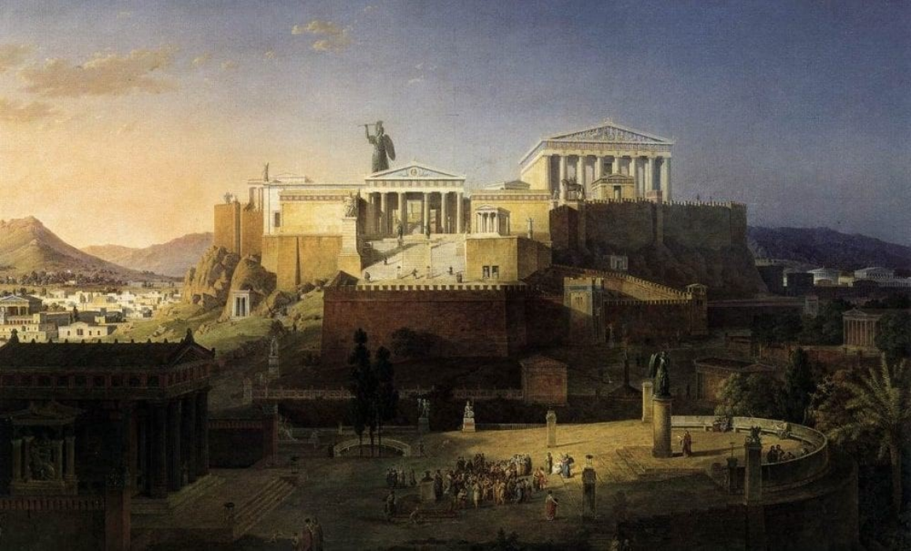

Nền dân chủ Athens được đặc trưng bởi cuộc tranh luận công khai sôi nổi về các vấn đề của thành phố, chủ yếu diễn ra tại agora, khu chợ. Phương thức hoạt động này, dựa trên lý trí và tranh luận phê phán, tương phản mạnh mẽ với các phong tục trước đó, nơi mà luật lệ và tục lệ được coi là thiêng liêng và bất biến, được truyền lại bởi tổ tiên và được bảo vệ bởi các vị thần.

### Sự ra đời của chính trị với thành bang

Nền dân chủ Athens đại diện cho một bước ngoặt lớn so với các truyền thống trước đó. Thực sự, trong các xã hội trước đó, không thể có "chính trị" theo nghĩa của một cuộc thảo luận về các quy tắc xã hội, vì những quy tắc này được áp đặt một cách siêu việt thông qua thần thoại.
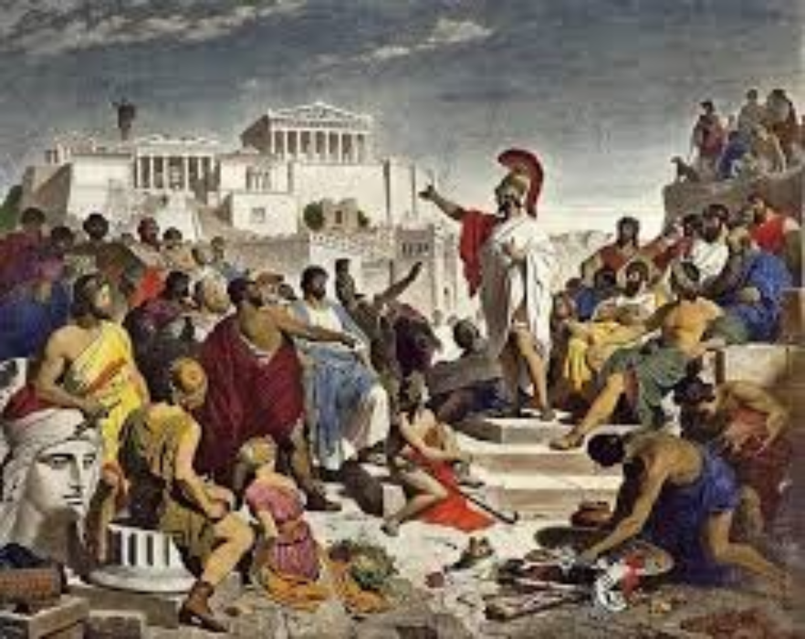

Nhà sử học Jean-Pierre Vernant viết:

> Sự xuất hiện của thành bang (polis) đánh dấu một sự kiện quyết định trong lịch sử tư tưởng Hy Lạp. Chắc chắn, về mặt phát triển trí tuệ và trong lĩnh vực các thể chế, những hậu quả đầy đủ của nó chỉ được nhận ra trong dài hạn; thành bang sẽ trải qua nhiều giai đoạn, các hình thức khác nhau. Tuy nhiên, từ khi xuất hiện, có thể vào khoảng thế kỷ 8 và 7 trước Công nguyên, nó đánh dấu một khởi đầu, một phát minh thực sự; thông qua nó, đời sống xã hội và mối quan hệ giữa con người với nhau đã mang một hình thức mới, sự độc đáo mà người Hy Lạp sẽ cảm nhận đầy đủ. (...) Điều mà hệ thống thành bang ngụ ý trước hết là sự ưu tiên vượt trội của lời nói trên tất cả các công cụ quyền lực khác. Nó trở thành công cụ chính trị tối thượng, chìa khóa của mọi quyền lực trong nhà nước, phương tiện của sự chỉ huy và sự thống trị đối với người khác. (...) Một đặc điểm thứ hai của thành bang là tính công khai toàn diện của những biểu hiện quan trọng nhất của đời sống xã hội. Người ta có thể nói rằng thành bang chỉ tồn tại khi một lĩnh vực công cộng đã xuất hiện, trong hai nghĩa khác nhau nhưng liên kết với nhau của thuật ngữ: một lĩnh vực của lợi ích chung, trái ngược với các vấn đề riêng tư; các thực hành mở, được thiết lập dưới ánh sáng mặt trời, trái ngược với các thủ tục bí mật. (...) Từ đó, thảo luận, tranh luận và tranh cãi trở thành quy tắc của trò chơi trí tuệ, cũng như trò chơi chính trị. Sự kiểm soát liên tục của cộng đồng được thực hiện đối với các sáng tạo của trí óc cũng như đối với các quan chức của nhà nước.
>
> (Jean Pierre Vernant, _Nguồn gốc của tư tưởng Hy Lạp - Les origines de la pensée grecque_, Paris, P.U.F, 1962)

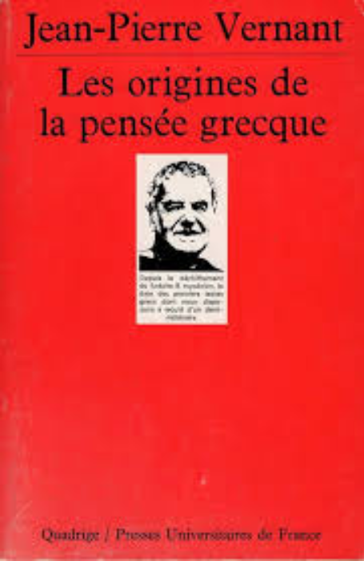

Từ "polis" trong tiếng Hy Lạp, nguồn gốc của từ "chính trị - politics" trong tiếng Anh, có nghĩa là thành bang. Khi Aristotle viết rằng "về bản chất, con người là một sinh vật chính trị," điều đó không có nghĩa là anh ta được sinh ra để nắm quyền lực. Bằng cách dùng từ chính trị, ông ám chỉ đến khả năng mà con người có thể thảo luận tại quảng trường công cộng để xác định cái gì là công bằng và cái gì là bất công.

Sự mới mẻ này dựa trên sự phân biệt quan trọng giữa hai thuật ngữ trong ngôn ngữ Hy Lạp, "phusis" và "nomos," dùng để chỉ đến hai loại luật khác nhau:

- _Phusis_ là luật của tự nhiên (tạo ra từ "physisc - vật lý").
- _Nomos_ là luật do con người tạo ra (thuật ngữ được tìm thấy trong từ "autonomy," có nghĩa là tự chủ - tuân theo luật của chính mình).
  Thành bang xuất hiện với ý tưởng rằng luật (nomos) có nguồn gốc từ con người, có thể được tự do sửa đổi bởi con người, không giống như tự nhiên, và có thể áp dụng cho tất cả. Người Hy Lạp sau đó trở nên ý thức về sự tự chủ của trật tự xã hội và chính trị trong mối quan hệ với tự nhiên.
Điều này đánh dấu sự xuất hiện của chính trị: cuộc thảo luận liên tục về chính các quy tắc của đời sống xã hội. Từ giờ trở đi, các vấn đề sẽ được giải quyết thông qua hành động phối hợp chứ không phải bởi một trật tự thiêng liêng bất biến.
Và Jean-Pierre Vernant đã bổ sung:

> Lý trí Hy Lạp, là lý trí tích cực, có suy nghĩ, có phương pháp luận, cho phép chúng ta tác động lên con người, chứ không phải để biến đổi thiên nhiên. Trong giới hạn cũng như trong những đổi mới của nó, nó là con đẻ của thành bang.

### Ý Tưởng về tự do dưới luật pháp

Sự hòa hợp xã hội không được tạo ra bởi hành động có chủ ý của các vị thần, mà bởi sự tuân thủ của tất cả công dân đối với cùng một luật pháp vô danh chung. Quyền lực không còn là việc của các giáo sĩ, nó đã trở thành việc của tất cả mọi người. Như vậy, khái niệm về sự bình đẳng trước pháp luật xuất hiện: "_isonomia_," như một lối tu từ. Thành thạo trong việc sử dụng lời nói là cần thiết để thuyết phục các công dân của mình trong các cuộc họp và tòa án.

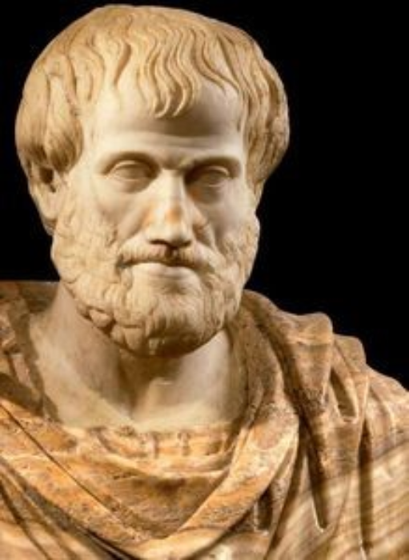

Đối với Aristotle, chế độ độc tài là sự tuân theo một người, và tự do là sự tuân theo luật pháp. Ông được cho là đã nói câu này:

> Mong muốn sự cai trị của luật pháp là mong muốn sự cai trị độc quyền của lý trí. Mong muốn thay vào đó sự cai trị của một người đồng nghĩa với chấp nhận sự thống trị của một con thú hoang, vì ham muốn và giận dữ làm méo mó sự phán xét của các người cai trị, ngay cả khi họ là những người tốt nhất.

Theo ông, luật pháp, vì là vô danh và vĩnh cữu, đảm bảo công bằng và bình đẳng cho tất cả công dân.

Cicero, nhà hùng biện và triết học nổi tiếng người La Mã của thế kỷ thứ nhất trước Công nguyên, đã tiếp nhận ý tưởng này: "Chúng ta là nô lệ của các luật pháp để được tự do" (_De Republica_, Quyền III, chương 13). Trong đoạn văn này, Cicero phát triển lập luận ủng hộ một nền cộng hòa được cai trị bởi luật pháp, thay vì bởi một người hoặc một nhóm nhỏ người.

Ý tưởng về cộng hòa là một ý tưởng đến từ triết học Hy Lạp. Nó thường được đặt đối lập với dân chủ, được coi là quá mạo hiểm. Plato đã đặt tên cho tác phẩm chính của mình về triết học chính trị: _Cộng Hòa - The Republic_, và ông đã rất nghiêm khắc với dân chủ. Khi nhân dân cai trị, có một rủi ro lớn là họ sẽ áp đặt luật lệ dựa trên ham muốn của họ và nhầm lẫn giữa cái tốt với cái dễ chịu. Do đó, cái chết bi thảm của Socrates, bị kết án tử hình bởi một bồi thẩm đoàn nhân dân bị thao túng bởi các nhà nguỵ biện. Plato đã rút ra được tất cả các bài học từ sự kiện này.

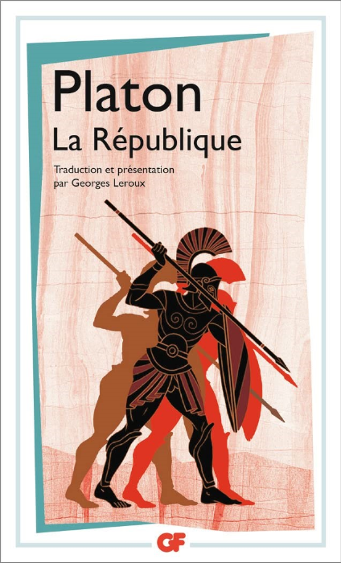

Aristotle sẽ sử dụng thuật ngữ cộng hòa để chỉ hiến pháp công bằng, cái hướng tới lợi ích chung và đối xử với công dân như những người tự do. Một chế độ tự do thực sự là nơi mà luật pháp là chung, bình đẳng cho tất cả, vô danh, và không phải là mệnh lệnh cá nhân.

Ý tưởng về tự do dưới luật pháp cũng được tìm thấy trong thuật ngữ Anglo-Saxon "Rule of Law - Pháp quyền".

### Tự do chính trị

Có thể nói rằng người Hy Lạp đã phát minh ra khái niệm về tự do chính trị, đối lập với sự thống trị chuyên chế. Người Hy Lạp thời đó coi nô lệ là một thể chế tự nhiên và rằng nô lệ không có cùng địa vị với công dân. Điều này có vẻ mâu thuẫn với ý tưởng về tự do, nhưng đối với họ, tự do gắn liền với quyền công dân chứ không phải là sự vắng bóng của chế độ nô lệ.

Herodotus, trong _Lịch sử - Historia_ và Aeschylus trong bi kịch _Người Ba Tư - The Persians_ của mình, đã minh họa một cách xuất sắc sự tương phản giữa chế độ quân chủ chuyên chế của Xerxes và tinh thần tự do của người Hy Lạp. Dân tộc này, được đặc trưng bởi sự vắng bóng của các chủ nhân và từ chối  bị biến thành nô lệ bởi bởi những kẻ man rợ, bất kể chúng đông đảo như thế nào, tìm thấy sức mạnh của mình trong luật pháp, "nomos", người chủ thực sự đảm bảo tự do của họ. Và luật pháp này phát xuất từ ý chí của tất cả mọi người.

Theo Jacqueline de Romilly:
> Dường như bản thân người Hy Lạp đã tự nhận thức được sự độc đáo này và bắt đầu ý thức về nó vào đầu thế kỷ thứ 5, trong cuộc chiến tranh chống lại những kẻ xâm lược Ba Tư. Và sự kiện đầu tiên khiến họ chú ý là có một sự khác biệt về chính trị giữa họ và đối thủ của mình, điều này chi phối mọi thứ khác. Người Ba Tư tuân theo một vị vua tuyệt đối, người là chủ nhân của họ, người mà họ sợ hãi, và trước mặt người đó họ phải quỳ gối: những phong tục này không phổ biến ở Hy Lạp. Có một cuộc đối thoại đáng kinh ngạc trong tác phẩm của Herodotus, trong đó Xerxes đối thoại với một cựu vương của Sparta. Vị vua này thông báo cho Xerxes rằng người Hy Lạp sẽ không chịu khuất phục vì Hy Lạp luôn chiến đấu chống lại việc bị nô dịch dưới tay một chủ nhân. Họ sẽ chiến đấu, bất kể kẻ thù đông đảo như thế nào đi chăng nữa. Bởi vì, nếu người Hy Lạp tự do, "họ không tự do hoàn toàn: họ có một chủ nhân, đó là luật pháp, là thứ mà họ còn sợ hơn là cả các thần dân của ngài sợ ngài."

(_Hy Lạp cổ đại và sự khám phá về tự do - La Grèce Antique à la découverte de la liberté, Paris, Editions de Fallois, 1989_)

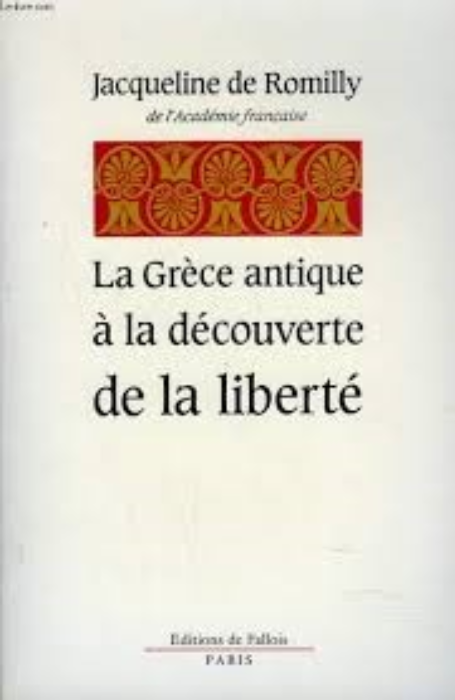

Herodotus tin rằng một dân tộc của những người tự do là một dân tộc tuân theo luật pháp chứ không phải tuân theo một chủ nhân, như trong đế chế Ba Tư nơi chỉ có một người là tự do và tất cả những người khác là nô lệ. Điều này đúng với Athens, một nền dân chủ, nhưng cũng đúng với Sparta. Vua không tạo ra luật pháp, ông không áp đặt ý muốn của mình. Ông đảm bảo sự tôn trọng của luật pháp, ông phục vụ cho nó và ông sẵn sàng chết để bảo vệ nó nếu cần thiết.

### Công cuộc tìm kiếm sự thật và Thuyết đa nguyên

Thoát khỏi tư tưởng thần thoại, Thales, Anaximander, Anaximenes, và sau này là Democritus và Empedocles, là những người đầu tiên tìm cách hiểu phusis (tự nhiên) bằng lý trí chứ không phải thông qua các thực thể siêu nhiên.

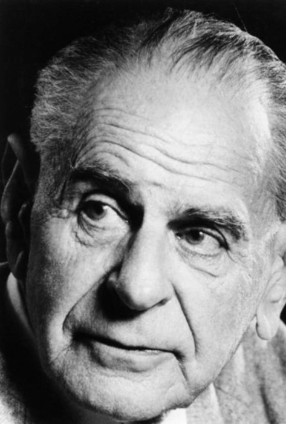

Nguyên tắc cơ bản được những triết gia trước Socratic đặt ra là các yếu tố của kosmos (vũ trụ) được tồn tại vì chúng đều tuân theo cùng một "luật tự nhiên" (phusis) có thể được phát biểu một cách phổ quát và cần thiết. Vũ trụ là hợp lý, nó tạo thành một tổng thể có cấu trúc, thứ mà con người có thể khám phá bằng lý trí của mình (cái "logos" (lý trí, logic) đối lập với "mutos" (thần thoại)).

Theo Karl Popper, các triết gia của Hy Lạp cổ đại, đặc biệt là các Pre-Socratics, đã phát minh ra chủ nghĩa duy lý phê phán, tức là truyền thống phương Tây về thảo luận phê phán, nguồn gốc của tư duy khoa học và chủ nghĩa đa nguyên. Ông giải thích điều này trong một chương của _Giả thuyết và Bác bỏ - Conjectures and Refutations_ có tiêu đề "Quay trở lại với các triết gia tiền Socratics":
> Những dấu hiệu đầu tiên về sự tồn tại của một thái độ phê phán, của một dạng tự do tư tưởng mới, xuất hiện trong lời phê bình của Anaximander đối với Thales. Đây là một hiện tượng độc đáo, người mà Anaximander chỉ trích là chính thầy của mình, đồng hương của mình, một trong Bảy nhà hiền triết (Seven Sages), người đã sáng lập ra trường phái Ionian. Theo truyền thống, Anaximander chỉ nhỏ hơn Thales mười bốn tuổi, và có lẽ ông đã đưa ra những lời phản biện và trình bày những khái niệm mới của mình trong thời gian người thầy của mình còn sống (dường như họ qua đời chỉ cách nhau vài năm). Tuy nhiên, không có bằng chứng nào về sự bất đồng, tranh cãi, hoặc chia rẽ được tìm thấy trong các nguồn tài liệu.

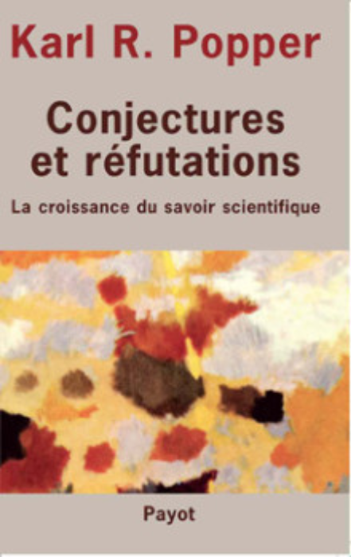
Những yếu tố này cho thấy, theo ông, rằng chính Thales đã khởi xướng truyền thống tự do mới này, dựa trên mối quan hệ giữa thầy và trò. Thales có thể chấp nhận sự phản biện và hơn nữa, ông đã thiết lập truyền thống chấp nhận sự phản biện. Popper ở đây nhận diện một sự đứt gãy với truyền thống giáo điều, chỉ cho phép một học thuyết duy nhất, để thay thế nó bằng chủ nghĩa đa nguyên và chủ nghĩa có thể sai lầm.

> Nỗ lực của chúng ta trong việc nắm bắt và khám phá sự thật không có tính chất cuối cùng nhưng có khả năng được cải thiện, kiến thức của chúng ta, các học thuyết của chúng ta là mang tính chất phỏng đoán, chúng được tạo thành từ các giả định, giả thuyết, và không phải là những chân lý chắc chắn và cuối cùng.

Cách duy nhất để chúng ta có để tiếp cận sự thật là phản biện và thảo luận. Do đó, từ Hy Lạp cổ đại chúng ta đã có truyền thống này:

> Truyền thống đưa ra các giả thuyết táo bạo và thực hiện sự phản biện tự do, là nguồn gốc cho phương pháp tiếp cận hợp lý và khoa học và, do đó, tạo nên nền văn hóa phương Tây này của chúng ta, nền văn hóa duy nhất được xây dựng trên khoa học mặc dù rõ ràng đây không phải là cơ sở duy nhất của nó.

## Sự phát minh ra luật pháp bởi người La Mã

<chapterId>e9337ad6-5a75-5894-a017-9a507939cb51</chapterId>

Đế chế La Mã là một thực thể đa văn hóa rộng lớn. Vào thời kỳ đỉnh cao, khoảng năm 117 SCN, đó là một quốc gia đa dân tộc và đa ngôn ngữ:

- Ở phía tây, nó mở rộng từ Đại Anh (nước Anh ngày nay) đến Tây Ban Nha, đi qua Gaul (nước Pháp ngày nay) và phía bắc của Châu Phi.
- Ở phía bắc, nó chạm đến sông Rhine và sông Danube, bao gồm các phần của Đức, Hà Lan, Thụy Sĩ, Áo, Hung-ga-ri, Ru-ma-ni và Bun-ga-ri.
- Ở phía nam, nó giáp với Địa Trung Hải, bao gồm Ý, Hy Lạp, bán đảo Balkan, Tiểu Á (nước Thổ Nhĩ Kỳ ngày nay), Syria, Li-băng, Palestine, Ai Cập, và Cyrenaica (một phần của Libya ngày nay).
- Ở phía đông, nó mở rộng đến Mesopotamia (Iraq ngày nay) và Armenia.

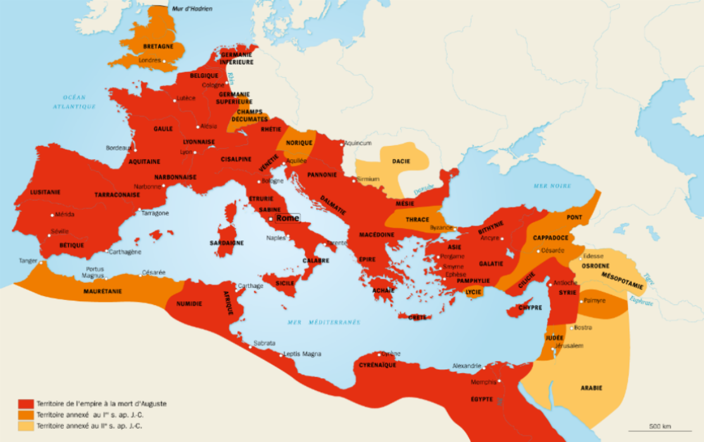

Từ đó, người La Mã đã tiến xa trong việc phát triển luật pháp hơn hẳn người Hy Lạp, những người sống trong các thành bang nhỏ, đồng nhất về dân tộc. Dưới thời Cộng hòa La Mã, đã có sự bảo vệ pháp lý đối với quyền sở hữu và quyền cá nhân.

Thực vậy, chức năng của luật pháp là làm cho sự chung sống và trao đổi giữa mọi người trở nên khả thi, bằng cách định rõ ranh giới của "của tôi" và "của bạn."

Quyền tư hữu đã có một ý nghĩa mới trong nền văn minh La Mã mà trước đó không biết đến, ngay cả trong nền văn minh Hy Lạp.

Luật La Mã sau này sẽ trở thành nền tảng của tất cả các luật pháp phương Tây hiện đại trong thời Trung Cổ và cho đến ngày nay.

### Sự bảo vệ quyền cá nhân

Luật La Mã đặc biệt chú trọng đến quyền và tự do của cá nhân, và công dân La Mã tự hào về địa vị công dân của mình. Luật Mười hai Bảng (450 TCN) là bộ luật thành văn đầu tiên có thể tiếp cận được cho tất cả công dân La Mã, bao gồm cả tần lớp quý tộc và dân thường. Việc hệ thống hoá này đã giúp làm rõ và tiêu chuẩn hóa luật pháp, trước đó thường là rời rạc và chủ yếu là mang tính tập tục, đảm bảo một mức độ minh bạch nhất định trong việc thực thi các quyền như kết hôn, mua, bán, v.v.

Luật này tương ứng một cách đáng ngạc nhiên với các quyền tự nhiên cơ bản mà John Locke đã lý thuyết hóa hai nghìn năm sau đó. Nó cho phép bảo vệ quyền cá nhân chống lại sự tùy tiện và lạm dụng quyền lực.

Tất nhiên, phụ nữ, nô lệ, và người nước ngoài vẫn bị loại trừ khỏi sự bảo vệ đầy đủ của luật pháp. Tuy nhiên, Luật Mười hai Bảng đã đánh dấu một bước tiến đáng kể và là một cơ sở cho sự phát triển tiếp theo của quyền cá nhân được mở rộng cho tất cả.
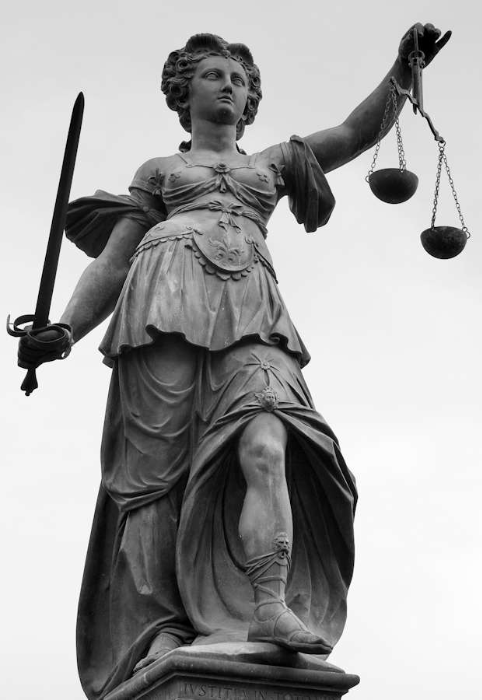
Luật Mười hai Bảng đặc biệt nhấn mạnh tầm quan trọng của quyền sở hữu:

- Nó định nghĩa các loại tài sản khác nhau (đất đai, động sản, v.v.)
- Nó phân chia tài sản thành usus (quyền sử dụng), fructus (quyền nhận lợi tức), và abusus (quyền chuyển nhượng)
- Nó quy định các điều kiện cho việc mua bán, chuyển giao, và bảo vệ những tài sản này.

Tóm lại, nó góp phần bảo đảm các giao dịch và bảo vệ các cá nhân khỏi việc bị tịch thu tài sản một cách tùy tiện, và cho phép họ kháng cáo trong trường hợp xảy ra tranh chấp.

### Sự ra đời của chủ nghĩa nhân văn và đời sống cá nhân

Con người là gì phụ thuộc vào những gì họ sở hữu. Bản chất của con người không hoàn toàn độc lập với những gì họ sở hữu như một số người thường nói, bởi vì những gì chúng ta sở hữu sẽ phân biết chúng ta với người khác. Cuộc sống của chúng ta thuộc về chúng ta và trước hết, chúng ta sở hữu các năng lực, cơ thể của mình trước khi sở hữu tài sản vật chất.

Trong xã hội La Mã, mỗi người có thể ngày càng phân biệt bản thân so với người khác và do đó trở thành diễn viên chính của cuộc đời mình. Con người giờ đây đóng một vai trò đơn nhất, và Cicero sử dụng từ "persona" để nói đến họ. "Persona" là một chiếc mặt nạ mà các diễn viên La Mã đeo, nhưng nó cũng ám chỉ tính cách pháp lý và xã hội của một cá nhân. Khái niệm về persona ngụ ý rằng các cá nhân là những thực thể riêng biệt với quyền và trách nhiệm của riêng họ. Ý niệm về con người cá nhân (cái tôi) với đời sống nội tâm và số phận đơn nhất của mình đã được sinh ra, và nó sẽ phát triển cùng với Kitô giáo.

Hơn nữa, văn học và triết học La Mã chứa đựng nhiều suy ngẫm về bản chất của cá nhân, hạnh phúc, trí tuệ, và cuộc sống trong xã hội.

### Seneca và cuộc sống hạnh phúc

Một hình mẫu của sự cân bằng trong tư tưởng là Seneca, một triết gia khắc kỷ thời La Mã, người đã viết về tầm quan trọng của đức hạnh, lý trí, và tự kiểm soát bản thân. Là một người đương thời với Jesus, ông đồng thời là thầy dạy Nero, một chủ ngân hàng giàu có, và là một nhà văn La Mã nổi tiếng.

Tác phẩm _Bàn về cuộc sống hạnh phúc - De Vita Beata_ là một bản luận văn ủng hộ đạo đức khắc kỷ. Hạnh phúc, theo Seneca, "là một tâm hồn tự do \[...\] không bị nỗi sợ xâm chiếm \[...\] đối với người mà điều ác duy nhất là sự ô nhục về mặt đạo đức." Một môn đồ của Socrates, nhà hiền triết khắc kỷ không sợ hãi về thể xác, cái chết, hoặc thậm chí là chịu đựng bất công. Đối với ông, điều ác duy nhất là cái ác về mặt đạo đức. Do đó, điều thiện tối cao nằm ở đức hạnh.

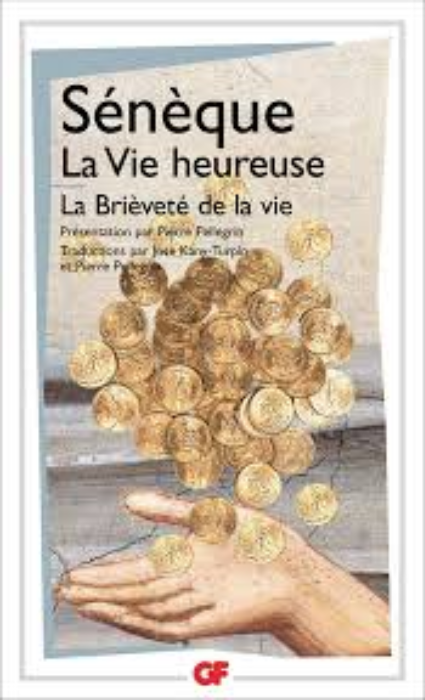

Tuy nhiên, niềm vui không mâu thuẫn với đức hạnh:

> Người xưa đã khuyên răn rằng sống cuộc sống tốt nhất, không phải là cuộc sống thoải mái nhất, nơi mà niềm vui không phải là người dẫn đường cho ý chí đúng đắn, mà là một người bạn đồng hành.

Đó là lý do tại sao người khôn ngoan không từ chối những món quà của may mắn:

> Anh ta không yêu tiền bạc, anh ưa thích chúng; anh ta không chào đón chúng vào trái tim mình, mà vào nhà của mình; anh ta không chối bỏ những gì mình sở hữu, anh chế ngự chúng và muốn chúng phục vụ cho đức hạnh của mình.

Thậm chí, Seneca còn đi xa hơn nữa. Đối với người khôn ngoan, của cải là cơ hội và phương tiện để thực hành đức hạnh:
Trong nghèo đói [...] chỉ có một loại đức hạnh: không thất vọng hoặc nản chí; giữa của cải, sự điều độ, lòng hào phóng, sự sáng suốt, tiết kiệm, và sự vĩ đại có thể tự do phát triển.

### Khái niệm về luật tối cao

Thuật ngữ "quyền con người," mà nhiều luật sư ủng hộ, ngầm chấp nhận ý tưởng về một luật tối cao bởi vì nó nhắm đến các quyền liên kết với chính bản thân con người trước bất kỳ luật lệ nào được ban hành chủ động. Nếu không có chuẩn mực đạo đức cao hơn này, sẽ không còn cơ quan nào có khả năng phản biện, giải thích và đặt câu hỏi về trật tự pháp lý.
Ý tưởng này nhắc nhở chúng ta rằng Hoàng tử (giống như các nhà lãnh đạo chính trị) không sở hữu công lý, mà bản thân ông ta phải tuân theo một luật lệ cao hơn bản thân mình và phải điều chỉnh các phán xét của mình.

Đây là điều mà các triết gia thời Cổ đại, đặc biệt là người La Mã như Cicero hay các triết gia khắc kỷ, gọi là luật tự nhiên. Nguồn gốc của nó có thể được tìm thấy trong tư tưởng Hy Lạp, với các tác phẩm của Sophocles và Aristotle.

Aristotle phân biệt giữa công lý tự nhiên và công lý pháp lý. Công lý tự nhiên là những gì có giá trị phổ quát, ở mọi nơi và mọi thời đại. Đó là một luật bất thành văn, được nhận biét qua lý trí. Trong khi đó, công lý pháp lý mang tính trung lập nhưng trở nên bắt buộc đối với mọi người thông qua một sự lựa chọn theo quy ước và được ghi trong một văn bản pháp lý. Nói cách khác, có một sự phân biệt giữa luật tự nhiên và luật thực định.

Nhà soạn kịch Sophocles, trong vở kịch _Antigone_ của mình, đã dàn dựng một cuộc xung đột giữa luật thiêng liêng và luật nhân loại. Antigone từ chối tuân theo sắc lệnh cấm chôn cất người anh trai của cô từ Vua Creon, cô đã lập luận rằng luật thiêng liêng là bất biến và tối cao, vượt lên trên luật nhân loại.

Khi Antigone không tuân lệnh Creon, cô đã đối đầu với luật thực định để tuân theo lương tâm đạo đức và tôn giáo của mình. Aristotle nói, nếu chỉ có luật thực định, Creon luôn đúng, ngay cả khi ông ta sai. Nhưng nếu chúng ta gìn giữ ý tưởng về một luật tự nhiên hoặc thiêng liêng, Antigone có thể đứng lên khi cần và sử dụng quyền tối cao của luật bất thành văn để kêu gọi chống lại một luật bất công.

### Cicero và Luật tự nhiên

Cicero sống vào thế kỷ thứ 1 TCN và được coi là nhà hùng biện vĩ đại nhất của ngôn ngữ Latinh dưới Đế chế La Mã. Ông cũng là một triết gia về đạo đức và chính trị gần gũi với trường phái khắc kỷ. Các tiểu luận của ông đã được các trí thức châu Âu đọc trong nhiều thế kỷ.

Trong luận án _Về Luật - De Legibus_, ông suy ngẫm về nền tảng của luật pháp. Theo ông, luật thực định - bộ quy tắc hoặc luật lệ thành văn được một xã hội chấp nhận - không thể là cơ sở duy nhất để thiết lập nên công lý. Tồn tại một công lý tự nhiên, được khắc ghi trong lý trí con người: "luật pháp có nền tảng trong chính bản thân tự nhiên." Cho rằng công bằng và bất công chỉ là kết quả của một quy tắc đồng nghĩa với nói rằng sự thật có thể được quyết định theo ý chí. Tuy nhiên, sự thật không thể bị định đoạt, ngay cả bởi đa số, nó dẫn đường cho các phán xét của chúng ta.
Cicero cũng bác bỏ quan điểm sử dụng lợi ích làm nền tảng của luật pháp. Thực vậy, ông viết:

> Nếu công lý chỉ là sự tuân thủ các luật thành văn và các thể chế của các dân tộc, và nếu như những người ủng hộ quan điểm đó nói, lợi ích là thước đo của mọi thứ, thì khi nhìn thấy lợi ích, người ta sẽ khinh thường và phá vỡ các luật. Như vậy, không còn công lý nữa, nếu không có cái được xem là bản chất tự nhiên tạo ra công lý; nếu nó (công lý) dựa trên lợi ích, một lợi ích khác sẽ có thể lật ngược được nó. Do đó, nếu luật pháp không dựa trên bản chất tự nhiên, tất cả các đức hạnh sẽ biến mất. Điều gì sẽ xảy ra với lòng hào phóng, tình yêu quê hương, sự tôn kính những điều thiêng liêng đối với chúng ta, ý chí phục vụ người khác, lòng biết ơn vì đã được phục vụ? Tất cả các đức tính này đều bắt nguồn từ xu hướng yêu thương con người, đó là nền tảng của luật pháp.

Do đó, theo Cicero, có một công lý phổ quát, được khắc sâu trong lý trí và tự nhiên. Cicero viết trong _Về nền cộng hoà - De Republica_:
> Luật chân chính là lý trí đúng đắn phù hợp với tự nhiên; nó có giá trị phổ quát, không thay đổi và vĩnh cửu; nó khuyến khích nghĩa vụ thông qua các mệnh lệnh của mình và ngăn chặn hành vi sai trái bằng các lệnh cấm \[…\]. Cả Thượng viện lẫn nhân dân đều không có quyền miễn trừ chúng ta khỏi việc phải tuân theo nó \[…\]. Luật này không khác biệt ở Athens so với ở La Mã, nó cũng không khác biệt giữa hôm nay và ngày mai. Đó là một luật lệ duy nhất và giống nhau, vĩnh cửu, bất biến, có hiệu lực mọi lúc và ở mọi nơi \[…\]. Bất kỳ ai không tuân theo luật này đều trốn tránh bản thân mình và khinh thường bản chất con người của mình.
Luật này vượt trội hơn các luật pháp hiện hành, do đó, "nó không thể bị vô hiệu hóa bởi các luật khác, không có bất kỳ điều khoản nào của nó có thể bị giảm bớt hoặc bãi bỏ hoàn toàn," Cicero thêm vào. Quyền lực chính trị không thể kiểm soát nó.

Cả sự thật lẫn công lý không thể bị quyết định bởi ý chí, dù là của đa số, bởi vì nếu không chúng sẽ trở thành đối tượng của mọi sự thao túng. Do đó, ngay cả khi người cai trị là nhân dân, họ cũng không được vi phạm các nguyên tắc của luật tự nhiên.
Khẳng định rằng pháp luật không thể chỉ giới hạn trong các điều luật do nhà lập pháp ban hành, Cicero muốn chống lại sự chuyên quyền trong hoạt động lập pháp và đề xuất một hệ thống đạo đức chính trị. Ý tưởng này đã có ảnh hưởng sâu sắc đối với tư tưởng phương Tây.

## Sự sụp đổ của La Mã

<chapterId>1b0f3de8-696a-5dbc-bb5e-e03ddafb4ebf</chapterId>

Tại sao La Mã lại suy tàn và cuối cùng đã sụp đổ? Nhiều người cho rằng Đế chế La Mã sụp đổ đột ngột do các cuộc tấn công xâm lược của những bộ tộc man rợ. Tuy nhiên, nguyên nhân sự sụp đổ của Đế chế La Mã phải được tìm thấy sớm hơn, trong chủ nghĩa đế quốc và các chính sách toàn trị của nhà nước đối với kinh tế và tiền tệ.

Vào năm 1734, trong tác phẩm _Suy ngẫm về nguyên nhân của sự vĩ đại và sự suy tàn của người La Mã - Considérations sur les causes de la grandeur des Romains et de leur décadence_, Montesquieu đã phát triển một luận điểm độc đáo và thống nhất để giải thích sự thăng trầm của quyền lực La Mã: tự do giành được dưới thời Cộng hòa và sau đó mất đi dưới thời Đế quốc. Từ khi sự thống trị của La Mã mở rộng, tự do bị mất đi, và sự suy tàn bắt đầu.

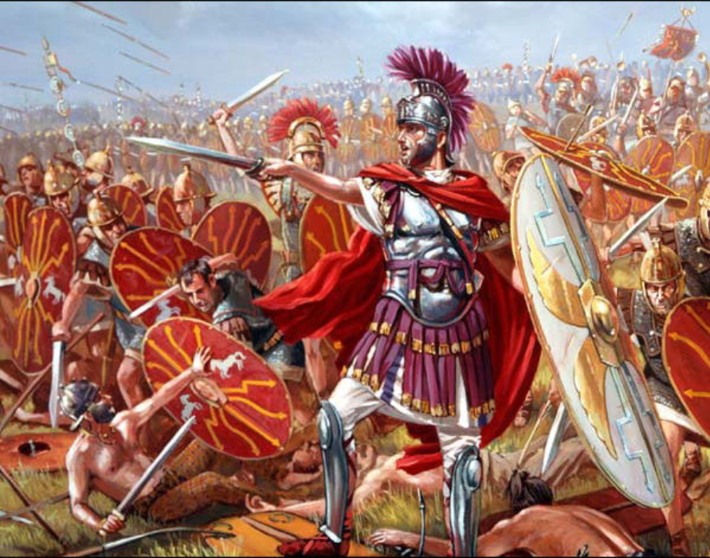

Đế chế La Mã là một chế độ quân sự ký sinh, chỉ có thể tồn tại thông qua một dòng chảy của cải bị cướp bóc liên tục từ bên ngoài, tù nhân bị biến thành nô lệ, và đất đai bị chiếm đoạt.

Thực vậy, sự giàu có của quý tộc La Mã chỉ đến từ chiến lợi phẩm của các cuộc xâm lược và không phải từ bất kỳ một quá trình kiến tạo nên giá trị nào cả. Nhưng khi các cuộc chinh phục kết thúc và lợi nhuận từ việc cướp đoạt sụt giảm, chính quyền ngày càng phải dựa vào việc tăng thuế để thỏa mãn nhu cầu về của cải, dẫn đến sự nghèo đói chung của dân chúng trong Đế chế.

### Bánh mì và trường đấu La Mã

Vào khoảng năm 140, nhà sử học La Mã Fronto viết:

> Xã hội La Mã chủ yếu quan tâm đến hai thứ, nguồn cung cấp thực phẩm và các buổi biểu diễn.

Các trận đấu giữa các võ sĩ giác đấu, các cuộc đua xe ngựa, và các buổi biểu diễn kịch, thường miễn phí, thu hút đám đông khổng lồ và giúp giới tinh hoa giành được sự ủng hộ của nhân dân. Những người cầm quyền không chỉ cung cấp trò chơi cho công dân của mình, mà họ còn cung cấp lúa mì, bánh mì, thịt lợn, và dầu ô liu. Chiến lược được sử dụng như một chiến lược chính trị để giảm bớt căng thẳng xã hội, chuyển hướng sự chú ý khỏi các vấn đề kinh tế, và củng cố quyền lực của các hoàng đế.

Dưới thời của Hoàng đế Antoninus Pius (từ 138 đến 161), bộ máy hành chính La Mã đạt đến quy mô khổng lồ.
Tuy nhiên, do thu nhập từ thuế không đủ để tài trợ cho bộ máy hành chính và quân đội, các hoàng đế bắt đầu phát hành thêm tiền bằng cách giảm bớt lượng bạc trong mỗi đồng xu. Denarius, đồng tiền chính của La Mã, đã giảm lượng bạc từ 100% xuống còn 0.5% trong khoảng từ năm 235 đến năm 284 sau Công Nguyên. Với việc tiền tệ mất giá, giá cả tăng không kiểm soát được, dẫn đến sự sụt giảm trong tiêu dùng, thương mại và niềm tin.

Sự sụp đổ của Đế chế La Mã là một quá trình chậm rãi, liên quan trực tiếp với sự phá sản của một hệ thống tiền tệ tham nhũng. Lạm phát cao đã gây ra sự sụp đổ của nền kinh tế và dẫn đến mất niềm tin của người dân vào tiền tệ.

Sau đó, sự bất ổn về chính trị lại càng làm tăng thêm sự bất ổn về kinh tế, khi có tới hơn 50 hoàng đế khác nhau ngồi vào ngai vàng trong vòng 50 năm.

### Kiểm soát giá cả

Một ví dụ điển hình về chủ nghĩa can thiệp xuất hiện ở La Mã là khi Hoàng đế Diocletian muốn đặt mức trần giá. Chủ nghĩa can thiệp được định nghĩa là hành động của một chính quyền vượt ra ngoài vai trò duy trì trật tự và bảo vệ công dân. Đó là nỗ lực kiểm soát thị trường, nhằm thay đổi giá cả, tiền lương, lãi suất và lợi nhuận.

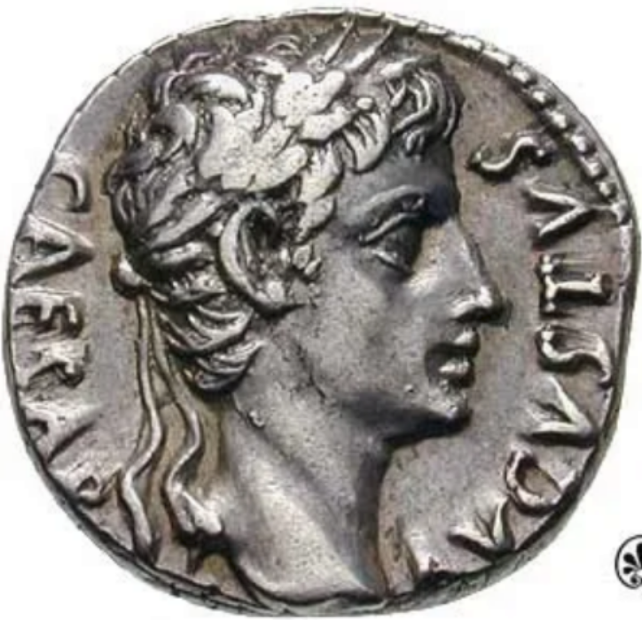

Việc phát hành tiền tệ liên tục bởi các hoàng đế kế tiếp để đối phó với việc gia tăng chi tiêu quân sự đã gây ra sự tăng vọt của giá cả. Năm 301, Diocletian tuyên bố Sắc lệnh Tối đa trong một nỗ lực để kiểm soát giá cả. Đó là một thất bại.

Ludwig von Mises mô tả sự kiện này, minh họa rõ ràng những tác động tiêu cực của chủ nghĩa can thiệp:
> Hoàng đế La Mã Diocletian nổi tiếng vì là hoàng đế La Mã cuối cùng bách hại các tín đồ Kitô giáo. Các hoàng đế La Mã, vào cuối thế kỷ thứ ba, chỉ có một phương pháp tài chính duy nhất, đó là làm giảm giá trị tiền tệ. Trong những thời đại nguyên thủy này, trước khi máy in được phát minh, lạm phát cũng rất sơ khai. Điều này liên quan đến gian lận trong việc đúc tiền, đặc biệt là bạc, đến mức màu sắc của hợp kim được thay đổi và trọng lượng giảm đáng kể. Kết quả của việc làm giảm giá trị các đồng tiền, kèm theo sự tăng nguồn cung tương ứng, là sự tăng giá, theo sau là một sắc lệnh kiểm soát giá cả. Và các hoàng đế La Mã không ngần ngại thực thi hình phạt tử hình đối với những người tăng giá bán quá cao. Họ thi hành kiểm soát giá cả, nhưng hậu quả là làm sụp đổ cả xã hội. Cuối cùng, đều này dẫn đến sự tan rã của Đế chế La Mã, và cũng là sự sụp đổ của hệ thống phân công lao động.
([_Chính sách kinh tế, suy ngẫm cho hôm nay và ngày mai - Economic Policy, Reflections for Today and Tomorrow_](http://herve.dequengo.free.fr/Mises/PE/PE_3.htm))

### Từ Chủ nghĩa Tự do đến Chủ nghĩa Xã hội

Tiếp bước của Montesquieu, Philippe Fabry chứng minh rằng La Mã đã trải qua một quỹ đạo từ Chủ nghĩa Tự do đến Chủ nghĩa Xã hội. Philippe Fabry là một nhà sử học về luật pháp, thể chế, và tư tưởng chính trị. Ông đã giảng dạy tại Đại học Toulouse 1 Capitole và là tác giả của nhiều cuốn sách, bao gồm _La Mã, từ Chủ nghĩa Tự do đến Chủ nghĩa Xã hội - Rome, du libéralisme au socialisme_, 2014.

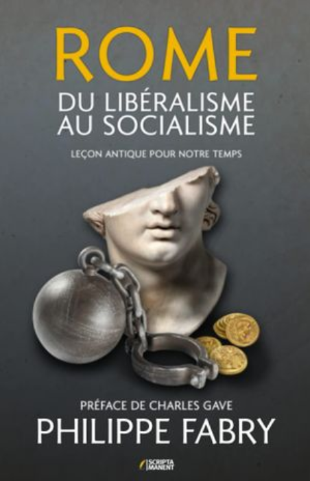

Liệu La Mã có phải là cường quốc tự do vĩ đại nhất của thế giới cổ đại không? Sau đó, liệu có phải là nó đã rơi vào một hình thức của Chủ nghĩa Xã hội không? Trước tiên, hãy định nghĩa các khái niệm này:

Chủ nghĩa Tự do: tin tưởng vào hành động của các cá nhân, tạo ra một trật tự tự phát và công bằng nhờ kết quả từ sự tương tác tự nguyện giữa họ, thông qua thị trường tự do và sự tôn trọng các quyền bất khả xâm phạm của họ.

Chủ nghĩa Xã hội: tổ chức xã hội bởi Nhà nước, xem xã hội như một tổng thể, thông qua việc lập kế hoạch sản xuất và tiêu dùng.
Luận điểm của Philippe Fabry trong cuốn sách là "sự sụp đổ của Đế chế La Mã là hậu quả của sự bế tắc mà Chủ nghĩa Xã hội đế quốc đã đưa thế giới cổ đại vào." Chính sự can thiệp của nhà nước đế quốc La Mã đã dẫn đến sự sụp đổ của nó. Cộng hòa La Mã, là cường quốc tự do vĩ đại nhất của thế giới cổ đại, tồn tại từ năm 510 TCN đến năm 23 TCN, gần 500 năm. Tuy nhiên, dần dần, quyền lực dân sự, thứ đặc trưng cho Cộng hòa La Mã, đã biến mất để nhường chỗ cho quyền lực cá nhân, hiện thân bởi các hoàng đế, những người đã áp dụng phong cách cai trị của các bạo chúa từ Ai Cập và Ba Tư cổ đại. Từ chỗ có một chính sách đối ngoại ôn hoà trước đó, La Mã đã bất ngờ chinh phục các vùng đất rộng lớn thông qua chiến tranh, cung cấp dòng nô lệ cho các nhà đầu tư giàu có ở La Mã, làm suy yếu tầng lớp trung lưu. Đổi lại, người dân La Mã càng ngày càng đòi hỏi nhiều trợ cấp hơn từ phía chính phủ.

Trong thời kỳ đỉnh cao vinh quang, mỗi người La Mã coi mình là nguồn thu nhập chính của bản thân bằng cách kiếm sống từ những gì có thể mua bán trên thị trường. Sự suy thoái của La Mã bắt đầu khi một lượng lớn công dân phát hiện ra một nguồn thu nhập khác: thông qua hoạt động chính trị hoặc nhà nước tái phân phối

Sau đó, người La Mã đã từ bỏ tự do và trách nhiệm cá nhân để đổi lấy lời hứa về đặc quyền và sự giàu có được phân phối trực tiếp bởi chính phủ. Công dân đã tin rằng kiếm thu nhập thông qua các phương tiện chính trị có lợi hơn so với thông qua lao động.

Philippe Fabry tóm tắt:

> Những điểm yếu được quan sát thấy của hệ thống đế quốc \[…\] là những điểm yếu của tất cả các chế độ toàn trị: "Ưu tiên tuyệt đối cho việc duy trì hệ thống hiện hữu, sự kém hiệu quả trong kinh tế, tham nhũng, chủ nghĩa thân hữu.

Và ông thêm rằng:

> Tổng cộng, đời sống kinh tế, chính trị, nghệ thuật và tôn giáo dưới Đế chế La Mã vào thế kỷ thứ 4 có lẽ rất giống với những gì đã diễn ra dưới thời Brezhnev ở Liên Xô (và trong những thời điểm tồi tệ nhất dưới thời Stalin) hoặc có thể là tình hình ngày nay ở Bắc Triều Tiên: toàn bộ dân số của Đế chế La Mã đã được quản lý bởi Chủ nghĩa Xã hội đế quốc và chịu đựng, trực tiếp hoặc gián tiếp, những tác động của nó.

# Nguồn gốc của tự do: thời Trung Cổ

<partId>f47bd5fc-c4a7-5d3b-b102-7b948bb43268</partId>

## Khẳng định về tự do của con người

<chapterId>96ca5622-f8e4-58ef-b358-7f7d25543104</chapterId>

Ý tưởng về tự do trong Kitô giáo đã được phát triển trong thần học thời Trung Cổ, từ Thánh Augustine vào thế kỷ thứ 4, đến Thánh Thomas Aquinas vào thế kỷ thứ 13. Vậy, ý tưởng này là gì?

### Tự do liên quan đến ý tưởng về tội lỗi

Ngay từ đầu, Kitô giáo dạy rằng tội lỗi là một vấn đề cá nhân, không phải là thứ thuộc về tập thể, mà mỗi cá nhân phải chịu trách nhiệm cho sự cứu rỗi của chính mình. "Chúa đã ban cho tạo vật của mình, ý chí tự do, khả năng làm điều sai và do đó, trách nhiệm về tội lỗi," Thánh Augustine khẳng định trong luận án về ý chí tự do, _De Libero Arbitrio_.
Tội lỗi không thể tồn tại nếu không có tự do. Thực vậy, Thiên Chúa của Kitô giáo là một vị thẩm phán khen thưởng cho "đức hạnh" và trừng phạt "tội lỗi". Nhưng quan niệm về Thiên Chúa này chính xác là không tương thích với định mệnh vì một người không thể bị kết tội và thực hiện xưng tội nếu họ không được tự do quyết định hành vi của mình. Thừa nhận lỗi lầm đạo đức của mình, tội lỗi của mình, là nhận thức rằng mình có thể đã hành động khác đi.
> "Sao chúng ta lại làm điều xấu?" Saint Augustine đã hỏi. "Nếu tôi không nhầm, lý luận đã chỉ ra rằng chúng ta hành động như vậy thông qua ý chí tự do của mình. Nhưng ý chí tự do này, mà chúng ta phải nhờ vào đó để có khả năng phạm tội, tôi tự hỏi liệu Người đã tạo ra chúng ta có làm đúng khi ban nó cho chúng ta không. Có vẻ như chúng ta sẽ không phạm tội lỗi nếu chúng ta đã bị tước đi ý chí tự do; nhưng cũng đáng sợ khi nghĩ rằng, theo cách này, Thiên Chúa cũng là tác giả của những hành động xấu xa của chúng ta. (_De libero arbitrio_, I, 16, 35.)

Nếu Chúa muốn con người có thể làm điều xấu, Người có phải chịu trách nhiệm gián tiếp cho cái ác không? Tại sao Chúa lại muốn có khả năng của cái ác? Saint Augustine trả lời:

> Ý chí tự do, là thứ mà không ai có thể sống tốt nếu thiếu, bạn phải nhận ra rằng đó là một điều tốt, và đó là một món quà từ Chúa, và chúng ta nên lên án những người lạm dụng điều tốt này chứ không phải là chỉ trích Đấng đã ban nó.

Câu trả lời của Saint Augustine cho vấn đề này là Thiên Chúa chịu trách nhiệm về khả năng xảy ra của cái ác nhưng không phải về việc thực hiện nó. Người muốn có khả năng của cái ác bởi vì khả năng này là cần thiết cho tự do, vì nếu như không có nó thì sẽ không có trách nhiệm, tức là, không có được phẩm giá trong đời sống đạo đức.

Nhưng việc thực hiện cái ác đạo đức là do con người, những kẻ đã lạm dụng tự do của mình, chứ không phải là do Thiên Chúa, Đấng mong muốn con người lựa chọn điều thiện.

Tóm lại, tự do là một điều tốt bởi vì nó cho phép người ta hướng mình về cái thiện và về Thiên Chúa, Đấng đại diện cho cái thiện tuyệt đối, nhưng tự do cũng đồng thời ngụ ý khả năng chọn cái ác và khước từ Thiên Chúa.

### Thiên Chúa không làm điều thiện thay chúng ta

Trong thần học thời Trung Cổ, sự quan phòng không phải là sự can thiệp liên tục của Chúa vào cuộc sống của con người, như thể Chúa hành động thay chúng ta và không cần sự đồng ý của chúng ta. Ngược lại, Chúa ban cho mỗi sinh vật, tùy theo bản chất của nó, những khả năng cho phép nó tự cung cấp cho mình và do đó đạt được sự phát triển đầy đủ. Chúa không làm điều thiện thay cho sinh vật.
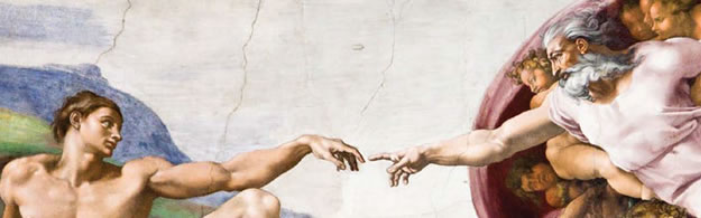

Và càng lên cao trong thang bậc của các sinh vật, từ khoáng vật đến con người, Thiên Chúa càng ủy thác cho sinh vật của mình nhiều quyền hành động độc lập. Ngài trao cho con người tự do để họ tự cai quản bản thân và thế giới bằng lý trí của mình, theo đức tính khôn ngoan.

Thánh Thomas viết (_Summa contra Gentiles_, III, 69 và 122):

> Tước đi từ sự hoàn hảo của các sinh vật sẽ làm giảm sự hoàn hảo của quyền năng thần thánh (...) Thiên Chúa chỉ bị chúng ta xúc phạm bởi vì chúng ta hành động chống lại lợi ích tốt của chính mình.

Vì vậy, sự quan phòng cho chúng ta phương tiện để tự mình quan phòng cho chính mình. Và người ta thêm vào:

> Một người có thể chỉ đạo và quản lý hành động của mình. Do đó, tạo vật có lý trí tham gia vào sự quan phòng thần thánh không chỉ bằng cách được cai quản mà còn bằng cách cai quản.

Để con người sử dụng tự do của mình một cách tốt nhất có thể, Thiên Chúa đã ban cho họ một công cụ là lý trí và một hướng dẫn để soi sáng cho họ là luật tự nhiên.

Luật tự nhiên thể hiện trong chúng ta thông qua các xu hướng như tình yêu sự thật, sự nghe theo lý trí, hoặc quy tắc vàng nổi tiếng: "Đừng làm cho người khác những gì mà bạn không muốn người khác làm cho mình." Theo ông, những xu hướng này là bẩm sinh. Thực vậy, Thánh Thomas viết, "cần phải xem xét rằng công lý tự nhiên là điều mà bản chất con người có xu hướng hướng tới."
Tuy nhiên, ánh sáng nội tại này không đủ để hành động tốt. Sự phát triển của các quy tắc hành động cụ thể và áp dụng chúng vào các tình huống cụ thể là cần thiết. Khi đó, các nhà làm luật có nhiệm vụ định nghĩa các quy tắc này, phù hợp với luật tự nhiên: đây là luật do con người đặt ra. Nhưng luật tự nhiên cao hơn luật do con người và nó áp đặt một cách phổ quát, kể cả đối với các Hoàng tử.
Theo Thánh Thomas:

> Thông qua việc hiểu biết về luật tự nhiên, con người tiếp cận trực tiếp với trật tự chung của lý trí, trước và cao hơn trật tự chính trị mà họ thuộc về như một công dân của một xã hội cụ thể.
> Do đó, có một quyền tồn tại trước khi hình thành Nhà nước, một tập hợp các nguyên tắc chung mà lý trí có thể diễn giải bằng cách nghiên cứu bản chất của con người như Thiên Chúa đã tạo ra. Quyền này áp đặt lên nhà cầm quyền họ phải tôn trọng nó. Và các luật do Nhà nước ban hành chỉ có hiệu lực nếu chúng phù hợp với luật tự nhiên.

## Lý trí và đức tin: một cuộc cạnh tranh công khai

<chapterId>ca379c2e-57cb-541d-8ddb-4b925032a779</chapterId>

Trong thời Trung Cổ, lý trí và đức tin cạnh tranh với nhau trong việc tiếp cận chân lý. Vào thế kỷ XIII, theo sau Abélard và Albert the Great, Thomas Aquinas đã chọn bảo vệ quyền của lý trí và sự tự chủ của nó so với đức tin.

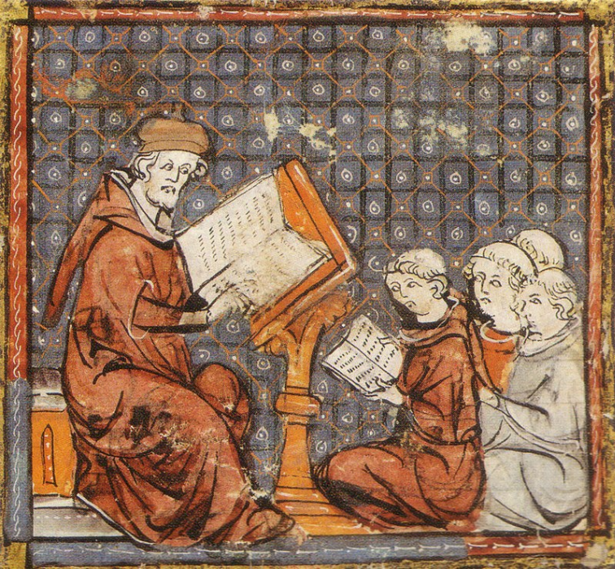

Ông mượn từ tư tưởng của Aristotle ý tưởng về một trật tự tự nhiên tự chủ, độc lập với trật tự thiêng liêng. Trật tự tự nhiên này thực sự bị vượt qua bởi trật tự siêu nhiên, nhưng nó tồn tại riêng biệt và trước nó. Do đó, đối với ông, có hai cách để tiếp cận sự thật về thế giới và đặc biệt là về Thiên Chúa:

- Một mặt, **lý trí**, bắt đầu từ tự nhiên, từ trải nghiệm cảm nhận, phát triển ý tưởng và có được chân lý thông qua suy luận lý trí của mình.
- Mặt khác, **đức tin** bắt đầu từ sự mặc khải, tức là một văn bản thiêng liêng được Thiên Chúa truyền cảm hứng. Cách tiếp cận là ngược lại, không phải là thực tế hay tư tưởng của con người dẫn đến chân lý mà là những sự thật được Chúa ban từ trên cao sẽ giải thích hiện thực.

Vậy làm thế nào để hòa giải hai điều này? Trong thời Trung Cổ, có hai truyền thống lớn về việc diễn giải mối quan hệ giữa lý trí và đức tin: chủ nghĩa thần bí và chủ nghĩa duy lý tôn giáo.

### Sự cạnh tranh giữa chủ nghĩa thần bí và chủ nghĩa duy lý tôn giáo

Chủ nghĩa thần bí loại bỏ lý trí ra khỏi đức tin. Đức tin là tuyệt đối, vượt qua lý luận, và không bao giờ nên bị lý trí chi phối. Nếu nó mâu thuẫn với lý trí, đó là điều bình thường, và việc cố gắng đưa những sự thật được mặc khải vào khuôn khổ của lý trí là một dị giáo. Chúa vượt xa lý trí, hay nói cách khác, việc cố gắng giải thích về Ngài sẽ không có ý nghĩa gì cả. Do đó, triết học bị coi thường. Thiên Chúa thậm chí còn vượt xa ngôn ngữ con người: Ngài là Đấng không thể đặt tên, là Đáng Khác biệt hoàn toàn. Ý của Ngài là tuyệt đối và tùy ý. Do đó, không nên tìm cách hiểu tại sao Thiên Chúa làm điều này hay điều kia, sự vâng lời là thái độ phù hợp duy nhất.
Trong Hồi giáo, người ta cũng nói rằng không nên mô tả, hình dung hay gán một hình ảnh cho Thiên Chúa. Trong thế giới Kitô giáo, một nhà thần bí như Meister Eckhart đã viết trong một bài giảng: "Mọi thứ đều có một lý do, nhưng Thiên Chúa không có lý do." Đối với các nhà thần bí, triết học hợp lệ duy nhất là triết học trực tiếp từ sự Mặc Khải. Bất cứ điều gì không đến từ nó thì không đúng cũng không sai nhưng không có giá trị chân lý.
Đối lập trực tiếp với quan điểm này là quan điểm chỉ có lý trí là đúng, và mọi đức tin đều vô nghĩa. Đây là chủ nghĩa duy lý tuyệt đối, dẫn đến chủ nghĩa vô thần. Tuy nhiên, một dòng tư tưởng như vậy chưa xuất hiện trong thời Trung Cổ.
Đối với những người ủng hộ chủ nghĩa duy lý tôn giáo, có sự bổ sung giữa lý trí và đức tin: đây là lập trường trung dung. Chân lý có thể được biết đến thông qua cả đức tin và lý trí. Do đó, những gì đúng trong đức tin cũng phải đúng trong lý trí, và ngược lại. Chân lý là một nhưng có thể tiếp cận theo hai cách. Do đó, có hai ngành khoa học không mâu thuẫn lẫn nhau mà bổ sung cho nhau là: khoa học tự nhiên hoặc triết học và khoa học thiêng liêng hoặc thần học. Nếu có mâu thuẫn xuất hiện giữa lý trí và đức tin, hoặc là người ta lý luận kém, hoặc là người ta hiểu sai Kinh Thánh.

Vì vậy, theo Thomas Aquinas, "Đức tin là sự đồng ý của lý trí được thúc đẩy bởi ý chí trong tình trạng không có bằng chứng." Nói cách khác, lý trí có khả năng nhận thức về thế giới và Thiên Chúa, một cách hợp lý, đến một mức độ nhất định. Tại điểm này, nó không tìm thấy thêm bằng chứng nào nữa. Khi đó, ý chí có thể chọn tin tưởng, và do đó tiến xa hơn về phía sự thật thông qua đức tin, hoặc không tin tưởng. Nhưng đức tin không phải là một bước nhảy vào cái phi lý, nó không phải là sự hạ thấp lý trí.

Đây là lập trường trung dung, tìm cách hòa giải giữa đức tin và lý trí. Chủ nghĩa duy lý thực sự không phải là từ chối mọi thứ mà lý trí không hiểu được mà là suy ngẫm về giới hạn của lý trí. Những gì vượt qua lý trí không nhất thiết là chống lại lý trí. Một trích dẫn từ Pascal trong **_Pensées_** minh họa rất tốt cho tinh thần này: "Hai thái cực: loại bỏ lý trí, chỉ chấp nhận lý trí."

### Sự ra đời của các trường đại học

Thời Trung Cổ Kitô giáo được đánh dấu, vào đầu thế kỷ XIII, bởi sự ra đời và phát triển của nhiều trường đại học ở phương Tây. Một trường đại học là một cộng đồng của sinh viên và giáo sư từ cùng một thành phố dưới sự kiểm soát của Giáo hội và thường có bốn khoa: nghệ thuật, thần học, luật, y học. Thần học được coi là một khoa học, theo mô hình của khoa học Hy Lạp.

Năm 1200, Philippe-Auguste thành lập Đại học Paris, nơi nhanh chóng trở thành trường đại học nổi tiếng nhất ở châu Âu. Năm 1257, Robert de Sorbon đã thành lập một trường cao đẳng thần học tại Đại học Paris, sau này được gọi là Sorbonne. Một phương pháp giảng dạy và nghiên cứu mới được biết đến với tên gọi "scholasticism - chủ nghĩa kinh viện" (từ "schola" nghĩa là trường học) đã xuất hiện trong các trường đại học này. Nó bao gồm "disputatio," một loại tranh luận đối lập trước công chúng. Một luận đề được đề xuất, tiếp theo là các phản đối mà người đưa ra đề xuất phải phản hồi. Khi tất cả các lập luận được trình bày, giáo sư sẽ giải quyết cuộc tranh luận với một giải pháp có lập luận chặt chẽ.

Trong số những bậc thầy theo trường phái Aristotle vĩ đại đã đánh dấu kỷ nguyên này, chúng ta có thể nhắc đến Albert the Great (1200-1280) và Thomas Aquinas (1224-1274). Thomas Aquinas, bằng cách thiết lập quyền của lý trí, đã làm nổi bật sự đặc biệt và tự trị của trí tuệ triết học so với thần học. Giống như hồng ân của Thiên Chúa bao hàm tự nhiên và hoàn thiện nó, đức tin bao hàm và hoàn thiện lý trí.

Do đó, chủ nghĩa duy lý tôn giáo đã chiến thắng hoàn toàn trước chủ nghĩa thần bí.

## Tôn giáo và chính trị: sự ra đời của Nhà nước có chủ quyền

<chapterId>a925ea80-9f66-5f0b-8ab0-f428ae5c12dc</chapterId>

Trong thời Trung Cổ, Giáo hội và các quốc vương Kitô giáo đã kế thừa một mô hình chính trị từ Đế chế La Mã, mà các nhà sử học gọi là hệ thống thần quyền-chính trị, có nghĩa là một hệ thống nơi quyền lực là thiêng liêng, tức là, nơi lãnh đạo chính trị cũng là một nhà lãnh đạo tôn giáo.
Đây là lý do tại sao đặc trung của các xã hội Trung Cổ là sự đồng nhất về chính trị và tôn giáo. Quyền lực chính trị xây dựng tính hợp pháp, quyền hạn, và sự thống nhất dựa trên niềm tin Kitô giáo (hoặc Hồi giáo). Nó tự coi mình là người bảo vệ của trật tự văn hóa và tôn giáo và coi những ai lệch lạc khỏi sự đồng nhất này là những kẻ ngoại đạo. Trong bối cảnh này, mặc dù một sự khoan dung nhất định có thể được nhượng bộ cho những người tách rời khỏi tầm nhìn văn hóa chung (như người Do Thái), không có quyền tự do tư tưởng nào được công nhận cho họ. Phải đến cuối thời Trung Cổ, với việc chinh phục châu Mỹ, vấn đề về quyền tự do dân sự trở thành một thách thức quan trọng đối với Giáo hội và triết lý pháp quyền đầu tiên khẳng định và bảo vệ quyền tự do cá nhân, hợp pháp hóa sự đa nguyên và lên án sự ép buộc của nhà nước cũng đã xuất hiện.

### Thánh Augustine và cám dỗ thần quyền

Câu hỏi về mối quan hệ giữa chính trị và tôn giáo được định hình qua tác phẩm _Thành phố của Thiên Chúa - Civitas Hei_ của Thánh Augustine. Trong đó, ông giải thích rằng có hai lĩnh vực tồn tại đồng thời:
Hai tình yêu đã tạo nên hai thành phố: tình yêu bản thân đến mức khinh thường Thiên Chúa, thành phố trần tục; tình yêu Thiên Chúa, đến mức khinh thường bản thân, thành phố thiên đàng.
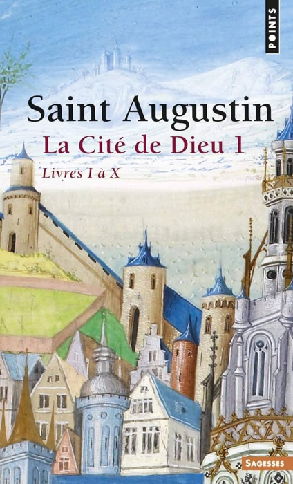

Do đó, chúng ta có:

- Một quyền lực tinh thần xuất phát từ Thiên Chúa được thể hiện qua Giáo hoàng và được thực thi trên toàn bộ Kitô giáo (đây là Thành phố của Thiên Chúa).
- Thành phố của con người, là trần tục và được tạo nên từ quyền lực địa phương và tạm thời, bắt nguồn từ tội lỗi nguyên thủy, từ cái ác.

Tuy nhiên, đối với Augustine, thành phố trần tục này là cần thiết. Nó cần thiết vì nó đảm bảo hòa bình. Do đó, nó cần phải có sự cộng sinh với tôn giáo, sự cộng sinh này nên được điều chỉnh bằng sự ưu thế của quyền lực tinh thần so với quyền lực trần tục. Nhưng không nên có sự tách biệt triệt để hay xung đột mở, và cả hai thực thể nên làm việc cùng nhau. Các nhà sử học đã gọi học thuyết này là chủ nghĩa chính trị Augustinian.

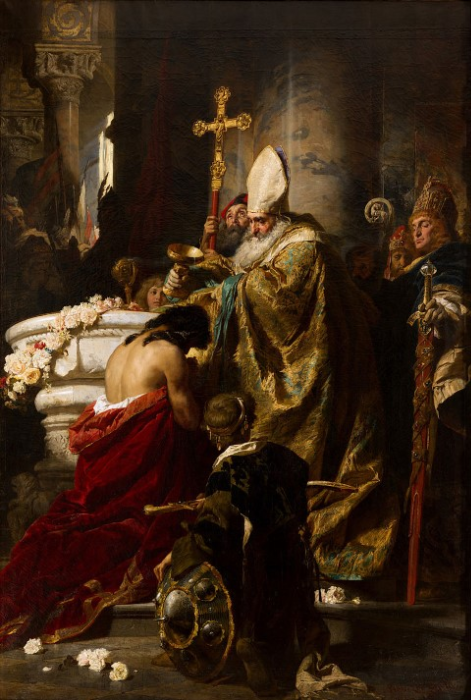

### Sự cạnh tranh giữa quyền lực trần tục và quyền lực tinh thần

Tuy nhiên, cả Giáo hoàng lẫn vua chúa đều không hài lòng với liên minh này. Giáo hội cố gắng khẳng định quyền kiểm soát của mình đối với quyền lực chính trị trong khi các nhà lãnh đạo chính trị cố gắng giải phóng bản thân khỏi sự kiểm soát này để khẳng định chủ quyền của mình.

Do đó, từ phía mình, Giáo hội đã phát triển hệ thống luật pháp và tòa án của mình và đề xuất rằng Giáo hoàng có thể giải quyết các tranh chấp trần tục. Trong khi đó, các vua chúa đã bắt đầu phát triển một bộ máy nhà nước mạnh mẽ nhất có thể. Họ cũng đã cố gắng tập trung giải quyết các xung đột pháp lý, sau đó họ sẽ dần dần phổ biến hóa việc thu thuế, phát triển bộ máy hành chính, và tuyển mộ quân đội: họ đã đặt nền móng cho Nhà nước hiện đại.

Trên thực tế, cuộc cạnh tranh giữa các quyền lực dẫn đến nhiều xung đột. Mỗi Hoàng tử hay mỗi Giáo hoàng luôn cố gắng để trở thành người có tiếng nói cuối cùng và khẳng định rằng mình nắm giữ quyền lực tối cao. Do đó, Giáo hoàng Gregory VII tuyên bố:

> Giáo hoàng là người duy nhất mà tất cả các hoàng tử phải hôn chân.

Về phần mình, Thánh Louis không ngần ngại đối đầu với Giáo hoàng Innocent IV, người đã tuyên bố trừng phạt và phế truất Hoàng đế Frederick II, từ đó tước đi mọi uy tín của ông ấy trước dân chúng. Cháu trai của ông, Philip Le Bel, cũng làm điều tương tự.

Cám dỗ thần quyền của Giáo hội cũng va chạm với lý thuyết "quyền lực thiêng liêng." Nếu các vua của Pháp tự xưng là quân chủ theo "quyền lực thiêng liêng," đó là để thoát khỏi sự kiểm soát của Giáo hoàng và khẳng định mình nhận quyền lực trực tiếp từ Chúa, mà không cần phải nhận lệnh từ giới tu sĩ.

## Đạo đức Kinh Thánh: giá trị thiêng liêng của cá nhân

<chapterId>7a27494d-8481-52ea-a551-e430bdb5315f</chapterId>

Tư tưởng cổ đại đã đặt con người dưới sự chi phối của một vũ trụ thần thánh, tức là, một vũ trụ hoàn hảo mà con người chỉ là một phần nhỏ. Ngược lại, chủ nghĩa độc thần khẳng định giá trị vô cùng cao của con người so với thiên nhiên, bởi con người được tạo ra theo hình ảnh của Chúa. Điểm cốt lõi này là nguồn gốc của một cuộc cách mạng đạo đức thực sự. Kinh Thánh khẳng định giá trị thiêng liêng và vô hạn của mỗi con người.

Đây là lý do tại sao đạo đức Kinh Thánh thay đổi mối quan hệ của chúng ta với cái ác. Nó mang lại một sự nhạy cảm sắc bén và chưa từng có đối với sự đau khổ của con người. Do đó, nó khuyến khích chúng ta coi những điều ác, đặc biệt là những điều ác đối với người khác, người yếu đuối, người vô tội, là bất thường và không thể chịu đựng được. Những điều ác mà trước đấy vẫn được chấp nhận, nay đã trở nên không thể dung thứ được.

### Sự chuyển dổi từ đạo đức đối xứng sang đạo đức bất đối xứng

Đạo đức đối xứng là việc thiết lập sự bình đẳng tuyệt đối trong mối quan hệ giữa con người với nhau hoặc sự hồi đáp qua lại chặt chẽ. Điều này xuất hiện trong đức tính công bằng, đức tính tối cao đối với người Hy Lạp. Công bằng là việc trả lại cho người khác những gì họ xứng đáng được nhận: mỗi người nhận được phần của mình. Và quan niệm thời gian như một chu kỳ tuần hoàn khiến cho người ta không cảm thấy có trách nhiệm với cái ác do người khác gây ra. Có cái ác trên trái đất, nhưng nó đã luôn tồn tại và sẽ luôn tồn tại. Điều này được xem như không thể tránh khỏi, sẽ luôn như vậy, và người ta chấp nhận điều này theo tinh thần định mệnh của người Hy Lạp và La Mã.

Đạo đức Kinh Thánh là bất đối xứng, nghĩa là một người phải cho đi nhiều hơn những gì họ nợ. Mọi người cảm thấy có trách nhiệm với cái ác, kể cả cái ác mà họ không gây ra. Đạo đức của sự cho đi, đạo đức của sự tha thứ, đạo đức của lòng thương xót. Một người không thể thờ ơ trước sự đau khổ của người khác và không được dung túng cho sự đau khổ vô lý, ngay cả khi nó không phải do chúng ta gây ra. Sự bình thản của nhà triết học khắc kỷ, người chấp nhận số phận, trở nên không thể. Đây là ý nghĩa của chuyện ngụ ngôn về người Samari tốt bụng. Không có gì bắt buộc anh ta phải dừng lại và chăm sóc một người đàn ông bị thương do bọn cướp tấn công cả. Kể từ cuộc cách mạng đạo đức do Kinh Thánh mang lại, toàn bộ nhân loại trở thành một loại người Samari tốt bụng. Nhân loại được mời gọi không chấp nhận cái ác gây ra cho người khác và chiến đấu chống lại nó.
Hơn nữa, vì Thiên Chúa là Đấng Tạo Hóa, chúng ta thấy sự xuất hiện của một khái niệm mới, đó là sự bình đẳng: trước mặt Thiên Chúa, tất cả mọi người đều bình đẳng. Không có cá nhân nào được ưu ái trước sự bao la vĩ đại của Thiên Chúa, và tất cả mọi người đều bình đẳng.

### Quyền của người da đỏ

Biểu hiện nổi tiếng nhất của học thuyết mới nổi này là trường phái Salamanca, ở Tây Ban Nha vào thế kỷ XVI. Francisco de Vitoria, một trong những đại diện của trường phái này, khẳng định rằng nếu mỗi con người được tạo ra theo hình ảnh của Thiên Chúa, không có con người nào có thể bị tuyên bố là thấp kém hơn người khác, không phải người Do Thái, không phải nô lệ da đen, và không phải người da đỏ.

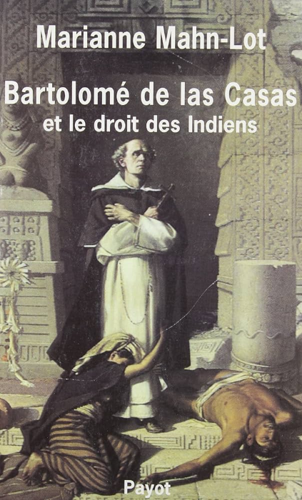

Việc khám phá ra châu Mỹ đã tạo ra một cú sốc văn hóa thực sự, một vết nứt đầu tiên trong sự đồng nhất chính trị-tôn giáo được thừa hưởng từ thời Cổ đại. Cuộc tranh luận nổi tiếng về quyền của người da đỏ thực sự đã chia rẽ các nhà thần học thành hai phe đối lập và không thể hòa giải.

Ở một phe, có những người ủng hộ chủ nghĩa độc tôn văn hoá và nguyên tắc cưỡng chế. Đối với họ, người da đỏ sống ngoài thông điệp của Kinh Thánh. Điều này có thể có nghĩa là Thiên Chúa không muốn tỏ mình ra cho họ. Tại sao? Có hai giả thuyết có thể xem xét: 1° Họ là những kẻ tội lỗi lớn (ăn thịt đồng loại) 2° Họ lạc hậu và gần gũi với thú vật hơn là con người. Vì vậy, chúng ta có quyền đối xử với họ như nô lệ và chiếm đoạt đất đai của họ bằng vũ lực, dựa trên lý do là họ vừa là ngoại đạo và vừa là man rợ.
Ở phe khác, có những người ủng hộ chủ nghĩa đa nguyên và quyền tự do dân sự: đó là các nhà thần học của trường phái Salamanca, những môn đồ của Thánh Thomas. Theo Francisco de Vitoria và Bartolomeo de Las Casas, người dân bản địa phải được công nhận quyền của mình như là con người, cho dù là họ đã tuân theo hoặc không tuân theo đức tin Công giáo. Không những không được ép buộc họ cải đạo bằng vũ lực, mà còn không được phép tước đoạt tài sản của họ cũng như không được bắt họ làm nô lệ dưới bất kỳ hình thức nào. Lập luận của họ dựa trên quan niệm về luật tự nhiên của Thánh Thomas, khác biệt với luật thần thánh.

Trong _Thần học Summa - Summa Theologica_, Thánh Thomas đặt ra câu hỏi sau: liệu người ta có nên tuân theo một Hoàng tử không trung thành, người không tin vào Chúa? Câu trả lời của ông là có, bởi vì quyền lực hợp pháp là thuộc về quyền tự nhiên, và sự không trung thành hoặc vô thần của Hoàng tử không phải là lý do để nổi loạn. Trật tự chính trị trước hết là một trật tự tự nhiên. Ông tiếp tục hỏi: liệu chiến tranh có nên được tiến hành với những kẻ ngoại đạo và có nên được áp đặt đức tin lên họ hay không? Câu trả lời của ông là không: một cuộc chiến chỉ chính đáng nếu nó là phòng vệ. Cuối cùng, đức tin chỉ có thể là một hành động tự do.

Các học giả của theo trường phái Salamanca áp dụng lý lẽ này cho trường hợp của người dân bản địa: tài sản là một quyền tự nhiên. Do đó, việc lấy đất từ người dân bản địa là phạm tội trộm cắp, cho dù họ có phải là người Kitô giáo hay không. Chúng ta cũng không được phép tiến hành chiến tranh với họ vì không có sự xâm lược từ phía họ, mà thực sự là từ phía chúng ta.

Vấn đề của người dân bản địa là vết nứt đầu tiên của khối thống nhất chính trị-tôn giáo. Nó cho thấy rằng sự thống nhất của xã hội chính trị có thể dựa trên một cơ sở khác ngoài sự thống nhất về tôn giáo của những người cư trú trên cùng một lãnh thổ, trên cơ sở thuộc về bản chất chung của con người

Ý tưởng về nhân loại tiến bộ đã được củng cố. Người ta bắt đầu nhìn nhận rằng chỉ có một nhân loại, mà ở đó quyền bình đẳng được gắn liền một cách tự nhiên. Nhưng vẫn cần thêm thời gian để ý tưởng này được tất cả mọi người chấp nhận. Điều này đặc biệt cần có sự đóng góp của các khoa học tự nhiên với khái niệm về loài người.

## Những phác thảo đầu tiên của Chủ nghĩa Tư bản

<chapterId>236bdeeb-7bd3-536a-9df1-8791800bf31e</chapterId>

Chúng ta đã thấy rằng Kitô giáo đặt ra một nghĩa vụ đạo đức đối với mọi người là phải góp phần cải thiện thế giới. Thiên Chúa muốn con người được hạnh phúc nhưng không muốn thực hiện điều đó thay cho họ. Do đó, người Kitô giáo phải chiến đấu chống lại cái ác về mặt đạo đức, yêu thương người hàng xóm, giúp đỡ nạn nhân, nói chung, làm việc vì một thế giới công bằng và nhân ái hơn. Liệu Chủ nghĩa Tư bản, tức là nền kinh tế tự do dựa trên quyền tư hữu và tự do hợp đồng, có tương thích với nghĩa vụ Kitô giáo không?

Một phần câu trả lời nằm ở việc Chủ nghĩa Tư bản bắt nguồn trong một bối cảnh tôn giáo, trước cả cuộc cải cách Tin lành. Phần khác của câu trả lời bao gồm việc quan sát thực tế rằng Chủ nghĩa Tư bản là phương tiện tốt nhất để cải thiện điều kiện vật chất và đạo đức của cá nhân. Chỉ có một nền kinh tế tự do, dựa trên quyền sở hữu và sự hợp tác tự nguyện, mới có khả năng giúp mọi người thoát khỏi cảnh nghèo đói một cách bền vững.

Hãy tập trung vào điểm đầu tiên. Điểm thứ hai sẽ được đề cập trong phần tiếp theo.

### Sự nổi lên của các thành phố Ý

Henri Pirenne, một nhà sử học người Bỉ của thế kỷ 20, đã dành một phần tác phẩm của mình để phân tích sự xuất hiện của Chủ nghĩa Tư bản ở Châu Âu. Trong cuốn sách _Lịch sử Châu Âu - History of Europe_ của mình, ông tuyên bố:
> Tất cả các đặc điểm cơ bản của Chủ nghĩa Tư bản — doanh nghiệp cá nhân, sự tiến bộ của tín dụng, lợi nhuận thương mại, đầu cơ, v.v. — đã tồn tại từ thế kỷ 12 ở các thành phố Ý, như Venice, Genoa, hoặc Florence.
Theo Pirenne, những thành phố thương mại này, nhờ vào sự năng động trong thương mại và vị trí chiến lược trên các tuyến đường biển, đã phát triển các hoạt động kinh tế đặc trưng của Chủ nghĩa Tư bản sơ khai. Ông đặc biệt nhấn mạnh:

- **Sự nổi lên của doanh nghiệp cá nhân:** Các thương nhân Ý, thường đến từ các gia đình giàu có, đã đầu tư vốn của chính họ vào các chuyến thám hiểm thương mại xa xôi, từ đó chấp nhận rủi ro và kỳ vọng vào lợi nhuận đáng kể.
- **Sự mở rộng của tín dụng:** Sự phát triển của thương mại quốc tế đã kích thích việc sử dụng các công cụ tín dụng đa dạng, như hối phiếu và hoạt động ngân hàng, giúp tài trợ cho các giao dịch và tạo điều kiện cho sự lưu chuyển vốn.
- **Theo đuổi lợi nhuận:** Động cơ chính của các thương nhân Ý là theo đuổi lợi nhuận thương mại. Họ tham gia vào các doanh nghiệp mạo hiểm, hy vọng tối đa hóa lợi nhuận của mình bằng cách giao dịch các sản phẩm giá trị ở các thị trường xa xôi.
- **Sự xuất hiện của đầu cơ:** Bản chất không chắc chắn trong các chuyến đi biển và biến động giá cả đã dẫn đến các hoạt động đầu cơ, nơi các thương nhân đặt cược vào sự biến động của giá cả hàng hóa.

Pirenne quan sát thấy rằng, mặc dù những hoạt động này có mặt ở các khu vực khác của châu Âu, nhưng chúng đặc biệt phát triển sớm và mạnh mẽ ở các thành phố Ý. Ông gán cho nguyên nhân của hiện tượng này vào một số yếu tố, bao gồm sự nổi lên của thương mại đường biển, ảnh hưởng của các cuộc Thập tự chinh, sự suy yếu của cấu trúc phong kiến, và tinh thần đổi mới đặc trưng của những thành phố thương mại này.

### Vấn đề về cho vay lấy lãi

Kinh Thánh lên án các khoản vay có tính lãi, được gọi là tín dụng, cho rằng việc cho vay lấy lãi là bóc lột những người đi vay dễ bị tổn thương. Tuy nhiên, trên thực tế, Giáo hội đã làm ngơ trước vấn đề này.

Jacques Le Goff là một nhà sử học Pháp chuyên về văn hóa và tư tưởng thời Trung Cổ. Tiếp bước Pirenne, ông nhận ra sự hiện diện của những hạt giống của Chủ nghĩa Tư bản ngay từ thời Trung Cổ, đặc biệt là ở các thành phố Ý, nơi các hoạt động như doanh nghiệp cá nhân, sự theo đuổi lợi nhuận, và việc sử dụng các công cụ tín dụng đã tồn tại. Trong _Cho vay nặng lãi thời Trung Cổ - L'usure au Moyen Âge_ (1967, tái bản năm 1986 dưới tiêu đề: _La bourse et la vie; économie et religion au moyen-age_), ông lưu ý rằng ngay từ thế kỷ XIII, Thánh Albert the Great đã lý thuyết hoá khái niệm "lãi suất hợp pháp", sau này được Thánh Thomas Aquinas phát triển thêm. Mặc dù có các lệnh cấm tôn giáo, hoạt động cho vay đã tồn tại và đáp ứng nhu cầu kinh tế thực sự. Từ rất lâu trước Adam Smith, họ đã hiểu rằng lãi suất cho vay không phải là tín dụng mà là một cách để bù đắp cho rủi ro của người cho vay và đầu tư cho người vay, đây là nền tảng của Chủ nghĩa Tư bản.

Tuy nhiên, theo nhà sử học Pháp, sự nổi lên của Chủ nghĩa Tư bản phải được đặt trong một bối cảnh rộng lớn hơn của các biến đổi kinh tế, xã hội và văn hóa diễn ra qua nhiều thế kỷ. Le Goff đặc biệt nhấn mạnh tầm quan trọng của Cuộc cách mạng Thương mại vào thế kỷ 15 và 16, được đánh dấu bởi sự mở rộng của thương mại đường biển và việc khám phá ra các tuyến đường thương mại mới, đã kích thích sự tích lũy về vốn và củng cố logic thương mại.

### Một phê phán về hành vi thao túng tiền tệ

Việc nghiên cứu có hệ thống về các quy luật kinh tế bắt đầu từ thời Trung Cổ. Những nhà kinh tế học đầu tiên là các nhà thần học kinh viện tại Trường Paris. Người đầu tiên trong số họ đã viết một luận án khoa học hoàn toàn dành riêng cho một đề tài kinh tế là Nicolas Oresme (1325-1382). Vào khoảng năm 1360, ông đã soạn _Chuyên luận về nguồn gốc, bản chất, luật lệ và sự biến đổi của tiền tệ - Treatise on the Origin, Nature, Law, and Alterations of Money_ nhằm tổng kết và phát triển các ý tưởng của các học giả kinh viện thời bấy giờ.
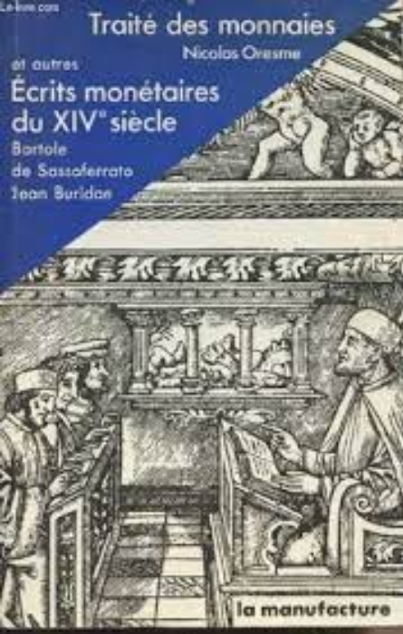

Trọng tâm trong phân tích về tiền tệ của ông là vấn đề về "sự biến đổi" của tiền tệ, tức là sự thay đổi về hàm lượng kim loại của đồng tiền và mệnh giá của chúng. Những thay đổi này đã xảy ra từ thời sơ khai và được ghi chép rõ ràng từ thời Cổ đại và Trung Cổ. Tác động rõ ràng nhất của chúng là thay đổi sức mua của đơn vị tiền tệ, đặc biệt là làm giảm sức mua. Đây là một hình thức lạm phát sơ khai mà Oresme đã thẳng thắn lên án như một điều xấu.

Oresme ngay lập tức đặt ra một câu hỏi quan trọng: lạm phát có mang lại lợi ích cho cộng đồng không? Ông trả lời là không, và cho rằng lạm phát không làm cho tiền tệ trở nên hữu ích hơn hoặc kém hữu ích đi trong các giao dịch. Nền kinh tế có thể hoạt động tốt bất kể mức giá, và do đó, bất kể nguồn cung tiền tệ danh nghĩa.
Nhưng nếu đúng như vậy, một câu hỏi khác tất yếu được đặt ra: tại sao lại có sự biến đổi của tiền tệ? Và cụ thể, tại sao lại tìm cách tăng nguồn cung tiền tệ? Oresme trả lời rằng những biến đổi này không có cùng hậu quả đối với các thành viên khác nhau trong cộng đồng. Chúng mang lại lợi ích cho một số người nhưng lại gây thiệt hại cho những thành viên khác của cộng đồng. Những người thắng cuộc trong việc biến đổi tiền tệ có lợi ích vật chất trong việc thực hiện chúng. Nói chung, những người thắng cuộc là những người có quyền lực. Oresme viết:

> Tôi nghĩ rằng lý do chính và cuối cùng mà nhà cầm quyền muốn giành quyền thay đổi tiền tệ là lợi nhuận ông ta có thể thu được từ đó, bởi vì nếu không, không có lý do gì mà ông ta lại thực hiện nhiều lần thay đổi và với quy mô lớn đến như vậy.

Sau đó, ông nói thêm:

> Bất kể lợi nhuận nào mà nhà cầm quyền thu được, nó chắc chắn là đến từ chi phí của cộng đồng. Bây giờ, bất cứ điều gì một người cầm quyền làm với chi phí của cộng đồng là một sự bất công, đó không phải là hành động của một vua, mà của một kẻ bạo chúa, như Aristotle đã nói (...) Nếu nhà cầm quyền có thể thực hiện một sự thay đổi nhỏ trong tiền tệ, với một lý do chính đáng, và thu được một số lợi nhuận từ đó, ông ta có thể, vì một lý do tương tự, thực hiện một sự thay đổi lớn hơn và thu được nhiều lợi nhuận hơn (...) Như vậy, cuối cùng, nhà cầm quyền có thể thu hút gần như toàn bộ tiền tệ hoặc của cải của các thần dân và đẩy họ xuống tình trạng nô lệ, điều này sẽ chứng minh trọn vẹn tính bạo chúa và thậm chí là một sự bạo chúa tuyệt đối và hoàn hảo, giống như các triết gia và câu chuyện lịch sử đã chỉ ra.

Oresme nhấn mạnh rằng việc biến đổi tiền tệ không đơn giản chỉ là một trò chơi tái phân phối lại lợi ích cho nhà cầm quyền bằng chi phí do phần còn lại của cộng đồng chịu đựng. Chúng gây ra tổn thất tổng thể - trò chơi có tổng âm. Một đồng tiền thường xuyên biến đổi sẽ làm rối loạn hoạt động thương mại và khuyến khích những kẻ làm tiền giả tận dụng sự hỗn loạn chung.

Hơn nữa, nếu có hai loại tiền tệ khác nhau được công nhận hợp pháp, các nhà giao dịch sẽ tích trữ loại có giá trị cao hơn, để chỉ còn lại loại tiền tệ kém giá trị trong lưu thông. (Ở đây, Oresme đã tiên đoán luật "Gresham" nổi tiếng: tiền xấu đẩy tiền tốt ra khỏi lưu thông trong một chế độ tiền tệ hợp pháp). Ông kết luận rằng việc thao túng tiền tệ còn tồi tệ hơn cả cho vay nặng lãi và rằng, có lẽ, chúng là một nguyên nhân quan trọng dẫn đến sự suy tàn của Đế chế La Mã, như chúng ta đã thấy trước đó.

# Sự nổi lên của tự do: từ thời Phục Hưng cho đến thời kỳ Khai Sáng

<partId>58793f94-f217-530a-a877-b5b6df70a5fe</partId>

## Lời kêu gọi về lòng khoan dung tôn giáo

<chapterId>c4c9a729-4a0f-5814-8e32-9aff4d373018</chapterId>

Từ thời kỳ Phục Hưng, châu Âu đã bị tàn phá bởi các cuộc chiến tranh tôn giáo. Do đó, lòng khoan dung trở thành một trong những trận chiến lớn của thời kỳ Khai Sáng.
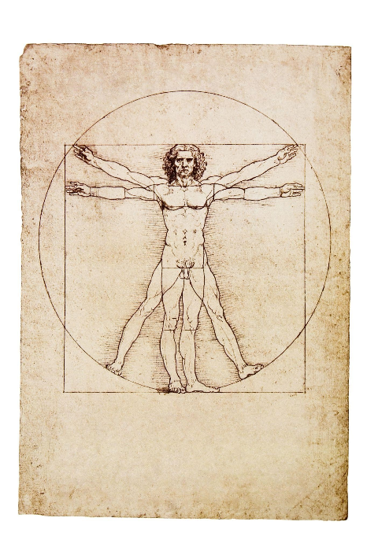

Đối với một số người, phương pháp khoa học sẽ đoàn kết mọi người vượt lên những định kiến với một quan điểm chung về thế giới. Chẳng phải luật hấp dẫn là phổ quát đối với một người Công giáo, một người Tin lành, một người Do Thái, hay một người vô thần đó sao? Do đó, _Bách khoa toàn thư - Encyclopédie_ của Diderot và d’Alembert thể hiện một nỗ lực nhằm thúc đẩy tri thức phổ quát, có khả năng đoàn kết mọi người.

Voltaire cũng có suy nghĩ tương tự về thương mại. Ông cho rằng có thể thiết lập lòng khoan dung, tốt hơn nhiều so với bất kỳ thể chế chính trị nào.

### Lợi nhuận như một "tôn giáo hòa bình"

Đối với Voltaire, chính sự sai lầm của con người tạo nên nền tảng cho một học thuyết về lòng khoan dung và tự do chính trị. Ông viết trong _Từ điển Triết học - Philosophical Dictionary_ (1764) của mình:

> Lòng khoan dung là kết quả tất yếu của việc chúng ta nhận thức được rằng mình có thể mắc sai lầm. Mắc lỗi là bản chất của con người, và chúng ta luôn mắc lỗi. Hãy tha thứ cho nhau những điều ngớ ngẩn; đây là luật đầu tiên của tự nhiên.

Nhưng trong _Thư Triết học - Philosophical Letters_ (1734) của mình, Voltaire lại đưa ra một quan điểm khác. Ông quan sát thấy ở Anh, thương mại thúc đẩy lòng khoan dung tôn giáo, đây là một thành phần thiết yếu của hòa bình dân sự và do đó là hạnh phúc. Ông viết những bức thư này để chỉ trích các cuộc chiến tranh tôn giáo ở Pháp, do quyền lực chính trị tuyệt đối kích động. Đây là sự phê phán đầu tiên đối với chế độ cũ.

Điều tạo nên hạnh phúc của một cá nhân hay một quốc gia đối với Voltaire là một chế độ mà mọi người chung sống hòa bình với nhau, trong một sự thoải mái vật chất nhất định. Đó là lý do tại sao một xã hội càng tự do và hạnh phúc khi nó được xây dựng dựa trên thương mại, hiểu theo nghĩa của trao đổi kinh tế.

Theo Voltaire, có ba điểm cần được xem xét:

1. Hạnh phúc của một quốc gia đòi hỏi một đời sống vật chất dễ chịu, điều này sẽ thúc đẩy sự phát triển của nghệ thuật.
2. Xa hoa và thương mại là bảo đảm của tự do.
3. Cuối cùng, thương mại là điều tốt bởi vì nó thúc đẩy mối quan hệ văn minh và do đó là hòa bình giữa mọi người.

Càng coi trọng thương mại, định kiến càng mờ nhạt trước lợi ích kinh tế. Dù có sự khác biệt về tôn giáo, những người buôn bán đều có cùng một mục tiêu ở trọng tâm sự quan tâm của họ: lợi nhuận. Việc cùng nhau tìm kiếm lợi nhuận dẫn đến sự hợp tác và tôn trọng ý kiến của người khác, đặc biệt là niềm tin tôn giáo của họ.
Trong _Bức thư thứ Sáu - Sixth Letter_, _"Về những người theo đạo Trưởng Lão - On the Presbyterians"_, Voltaire đưa ra ví dụ về Sở Giao dịch Chứng khoán Luân Đôn. Tại trung tâm của thương mại quốc tế này, "người Do Thái, người Hồi giáo và người Kitô giáo" làm ăn với nhau, "như thể họ thuộc cùng một Tôn giáo". Ở đó, chỉ có những người phá sản, không có khả năng trả nợ mới bị gọi là "kẻ ngoại đạo".

Đoạn văn này xứng đáng được trích dẫn đầy đủ vì nó quá nổi tiếng:
> Hãy bước vào Sở Giao dịch Chứng khoán Luân Đôn, một nơi được coi trọng hơn nhiều so với nhiều tòa án; ở đó bạn sẽ thấy các đại biểu đến từ tất cả các quốc gia tập hợp lại vì lợi ích chung của con người. Tại đây, người Do Thái, người Hồi giáo, và người Kitô giáo giao dịch với nhau như thể họ thuộc cùng một tôn giáo, và chỉ có những người phá sản mới bị gọi là "kẻ ngoại đao"; ở đó, người theo đạo Trưởng Lão tin tưởng người theo đạo Anabaptist, và người theo Anh giáo chấp nhận lời hứa của người Quaker. Sau khi rời khỏi những cuộc họp hoà bình và tự do này, một số người đi đến giáo đường, người khác đi uống rượu; một người đi để được rửa tội trong một bồn lớn nhân danh Cha, Con và Thánh Thần; một người khác cắt bao quy đầu cho con trai mình và lẩm bẩm tụng những từ Do Thái mà anh ta không hiểu; những người khác đi đến nhà thờ của họ để chờ đợi sự soi dẫn từ Chúa, đội mũ trên đầu, và tất cả đều cảm thấy hạnh phúc.

Vì vậy, thương mại đã kết nối con người quanh một "tôn giáo chung", lợi nhuận. Và nó cho phép các cá nhân bỏ qua những khác biệt về tôn giáo hay giai cấp, những nguồn gốc của xung đột. Ở Anh, lợi nhuận trở thành một tôn giáo hòa bình. Nhưng còn ở Pháp thì sao?

Trong _Bức thư thứ Mười_, "Về Thương mại", Voltaire mô tả tâm lý của người Pháp như sau: "thương nhân thường nghe thấy nghề nghiệp của mình bị khinh thường, đến mức anh ta cảm thấy xấu hổ về nó." Ngược lại, ở Anh, thương nhân cảm thấy một "niềm tự hào chính đáng", và so sánh mình "không phải không có lý do, với một công dân La Mã". Voltaire ca ngợi tầng lớp trung lưu Anh, nền thương mại, và xã hội hòa bình của họ.

### Sự thật đòi hỏi tự do

Tuy nhiên, nước Pháp không thiếu những tâm hồn vĩ đại. Ít ai biết rằng Anne Robert Jacques Turgot, Nam tước de Laulne trước khi trở thành Tổng kiểm soát Tài chính dưới thời Louis XVI, là một nhà tư tưởng hàng đầu. Ông là tác giả của một luận án xuất sắc về kinh tế chính trị, _Suy ngẫm về sự hình thành và phân phối của cải - Réflexions la formation et la distribution des richesses_ (1766), xuất bản trước _Sự giàu có của các Quốc gia - The Wealth of Nations_ của Adam Smith (1776).

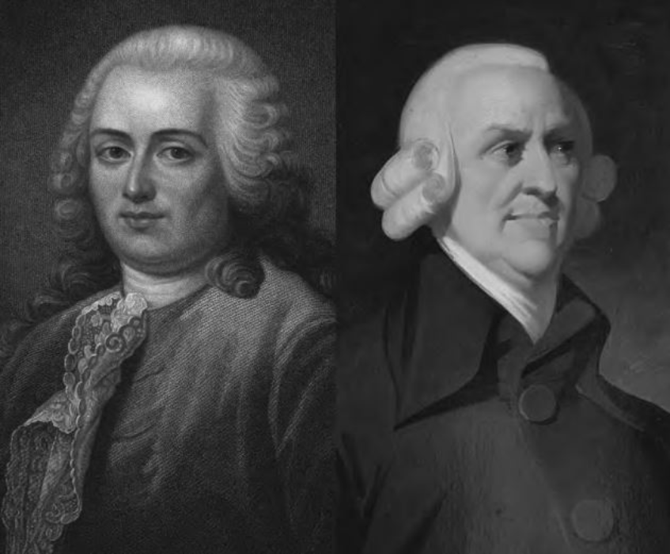
Những tác phẩm đầu tiên của ông cho thấy sự cam kết của ông với triết lý của Thời kỳ Khai sáng. Năm 1754, ông xuất bản _Những bức thư về sự khoan dung dân sự - Lettres sur la tolérance civile_ và vào năm 1757, một số bài viết được viết cho _Bách khoa toàn thư - Encyclopédie_ của Diderot và d'Alembert.
Trong các bức thư của mình, Turgot trình bày một định nghĩa về lòng khoan dung. Khoan dung có nghĩa là từ chối sử dụng bạo lực chống lại sai lầm. Nói cách khác, lòng khoan dung không có nghĩa là sự chấp nhận sai lầm. Nhưng để chống lại nó người ta sử dụng vũ khí của sự thuyết phục và lý lẽ, không phải bằng bạo lực.

Sau này, Turgot đã cố gắng thuyết phục Louis XVI loại bỏ cụm từ: "Tôi thề sẽ loại bỏ dị giáo" ra khỏi lời thề nhậm chức vào ngày đăng quang. Trong _Bản ghi nhớ gửi nhà vua về lòng khoang dung - Mémoire au roi sur la tolérance_ (1775), ông viết:
Những người bảo vệ sự không khoan dung có thể nói rằng hoàng tử có quyền ra lệnh khi tôn giáo của ông ấy là chân lý và người ta phải tuân theo ông ấy? Không, ngay cả khi đó, người ta không thể và không nên tuân theo ông ấy; bởi nếu phải theo đuổi tôn giáo mà ông ấy quy định, không phải vì ông ấy ra lệnh, mà vì nó là chân lý; và không phải, cũng không thể, vì hoàng tử quy định mà nó là chân lý. Không có người nào đủ ngu ngốc để tin một tôn giáo là chân lý vì lý do như vậy. Do đó, người tuân theo nó một cách chân thành không phải là tuân theo hoàng tử, người ta chỉ tuân theo lương tâm của mình; và mệnh lệnh của hoàng tử không làm tăng thêm trọng lượng cho nghĩa vụ mà lương tâm này áp đặt lên họ. Dù hoàng tử tin hay không tin vào một tôn giáo, dù ông ta ra lệnh hay không ra lệnh buộc mọi người theo đuổi nó, nó không hề thay đổi, chân lý hoặc sai lầm. Ý kiến của hoàng tử do đó hoàn toàn xa lạ với chân lý của một tôn giáo, và do đó với nghĩa vụ theo đuổi nó: hoàng tử, do đó, như một hoàng tử, không có quyền phán xét, không có quyền ra lệnh trong vấn đề này; vấn đề này hoàn toàn không nằm trong thẩm quyền, phạm vi của ông ta, mà ở đó lương tâm của mỗi cá nhân chỉ có thể có Chúa làm thẩm phán duy nhất.

Nói cách khác, khoan dung không có nghĩa là thù địch với tôn giáo. Nó thừa nhận rằng niềm tin tôn giáo không thuộc về quyền lực chính trị mà thuộc về lương tâm của mỗi cá nhân. Sự thật đòi hỏi tự do và không bao giờ nên bị áp đặt dưới các hình phạt có thể bị lạm dụng.

- Ý tưởng nên được trao đổi, giống như hàng hóa

## Lời biện hộ cho tự do kinh tế

<chapterId>23fbb745-4fd1-5322-8fba-3ff2e998c7e2</chapterId>

Chủ nghĩa Tự do kinh tế thường được liên kết với truyền thống Anglo-Saxon bắt nguồn từ Adam Smith, đối lập với "Chủ nghĩa Tự do chính trị," được cho là bắt nguồn từ thời kỳ Khai sáng của châu Âu lục địa, đặc biệt là ở Pháp. Quan điểm này không chính xác.

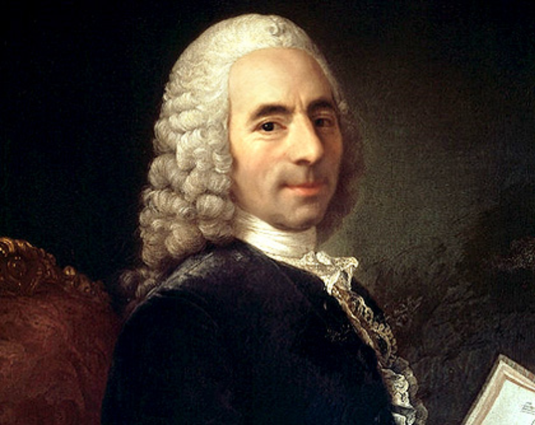

Chính trong phản ứng với chủ nghĩa bảo hộ và rộng hơn là với các tư tưởng của _Chế độ cũ - Ancien Régime_ mà khoa học kinh tế đã ra đời ở Pháp. Vào thời kỳ Khai sáng, các triết gia bắt đầu tự gọi mình là "nhà kinh tế học," họ thuộc trường phái Trọng Nông.

Họ đã đặt nền móng cho kinh tế học tự do. Các đại diện chính của trường phái Trọng Nông là François Quesnay, Marquis de Mirabeau, Lemercier de la Rivière, Abbé Nicolas Baudeau, Louis-Paul Abeille, và Pierre-Samuel Dupont de Nemours.

>  Theo Dupont de Nemours, Kinh tế chính trị là khoa học về luật tự nhiên áp dụng cho các xã hội văn minh. (_Trao đổi qua thư từ với J.-B. Say_).

Họ ủng hộ "Tự do kinh tế - Laissez-faire," khuyến nghị rằng nhà nước không nên can thiệp vào nền kinh tế.

Từ điểm này, hai quan niệm rất khác nhau bắt đầu xuất hiện trong phong trào Khai sáng:

- Một mặt, có những người tin rằng cần thiết lập sự hòa hợp xã hội một cách nhân tạo và thông qua sự ràng buộc của Nhà nước; đây là các lý thuyết về hợp đồng.
- Mặt khác, có những người tin rằng việc quản trị có thể được thực hiện thông qua các lợi ích, có nghĩa là cho phép lợi ích cá nhân tự hòa hợp trong khuôn khổ của các quy tắc được biết đến và chấp nhận bởi tất cả: đây là các lý thuyết về thị trường.

### Chống lại chủ nghĩa Colbert

Cụm từ "chống lại chủ nghĩa Colbert" này xuất hiện khi Jean-Baptiste Colbert, cố vấn chính của Louis XIV, vào một ngày đã hỏi các thương nhân: "Tôi có thể làm gì cho các bạn?" Một trong số họ, tên là François Legendre, trả lời: "Hãy để chúng tôi tự làm!" (Laissez-nous faire!)
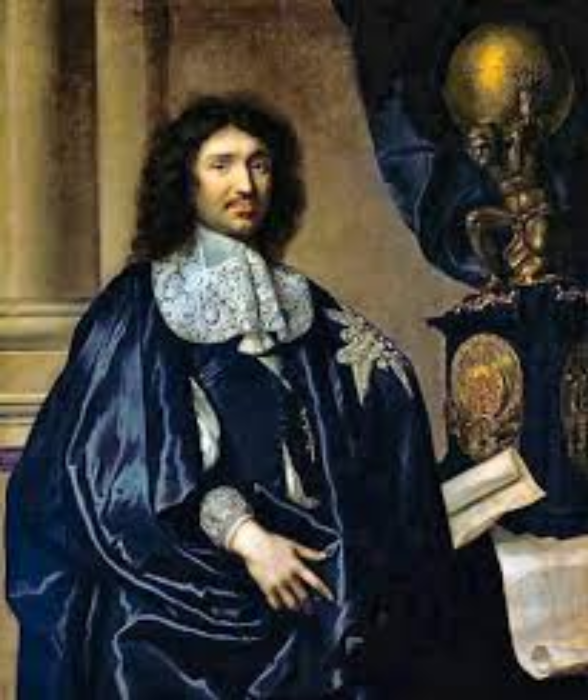
Cụm từ này được những người theo chủ nghĩa Trọng Nông như François Quesnay, Marquis d'Argenson, và sau đó là Vincent de Gournay chấp nhận: "Laissez-faire, laissez passer." Có thể dịch là: "Hãy để chúng tôi tự do hành động và lưu thông". Đây đã trở thành khẩu hiệu của họ.

Dựa trên luật tự nhiên (thuật ngữ này bắt nguồn từ _phusis_, tự nhiên, và _cratos_, quyền lực hoặc luật lệ), những người theo chủ nghĩa Trọng Nông tin rằng có những luật lệ kinh tế không phụ thuộc vào quyền lực chính trị hay tôn giáo mà xuất phát từ bản chất thực sự của con người và xã hội. Trật tự kinh tế là trật tự tự nhiên của xã hội. Quyền lực chính trị phải tuân theo nó.
Những người theo chủ nghĩa Trọng Nông đã chứng minh rằng chủ nghĩa bảo hộ, chính sách kinh tế ở Pháp cũng như ở Anh, không những không hiệu quả mà còn vô đạo đức. Colbert là một trong những nhà quản lý nhà nước hiện đại đầu tiên. Ông tin rằng quy định của chính phủ có thể tạo ra sự thịnh vượng cho quốc gia. Nhà nước hành động như một ngân hàng, thương gia, và nhà cung cấp. Nó kiểm soát tiền tệ, định hướng thương mại, và tái phân phối của cải.
Theo Colbert, mục tiêu là tìm kiếm "sự tăng trưởng về tài sản bằng cách khuyến khích công nghiệp." Và ông cũng thêm vào: "Pháp chỉ có thể giàu lên bằng cái giá mà Anh và Hà Lan phải trả."

Ngược lại, đối với những người theo chủ nghĩa Trọng Nông, thương mại tự do là chính sách kinh tế duy nhất đúng đắn bởi vì đó là một trò chơi có tổng dương và nền kinh tế được điều chỉnh bởi các luật tự nhiên chứ không nên bị xáo trộn bởi các luật lệ tùy tiện.

### Lợi ích của thị trường tự do

Trước cuộc Cách mạng Pháp, xã hội sống trong một nền kinh tế quý tộc dựa trên sự ban tặng và đặc quyền. Sự tuỳ tiện và bất công làm cho cho việc tiếp cận thị trường trở nên khó khăn đối với công dân bình thường.

Tuy nhiên, kể từ thời Trung Cổ, như chúng ta đã thấy, nền kinh tế thị trường bắt đầu phát triển. Các thương nhân trở nên giàu có hơn và có nhiều tự do kinh tế hơn.

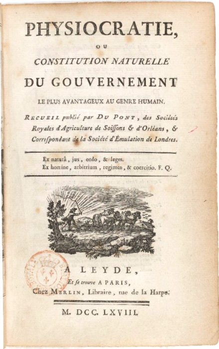

Nói về thị trường tức là nói về việc trao đổi tự nguyện với một giá cả được thương lượng. Thị trường cải thiện đời sống vật chất, trí tuệ, và chính trị của mọi người bởi vì nó giúp mọi người có được không gian để tự chủ và sáng kiến.

Thực vậy, con người tự nhiên muốn cải thiện điều kiện của bản thân và người thân của mình thông qua việc trao đổi hàng hóa và dịch vụ. Vì vậy, những triết gia mới này, các nhà "kinh tế học", mong muốn người dân có khả năng tự mình kiếm được thu nhập đủ để đạt được cái mà Kant gọi trong cuốn sách của mình _Khai Sáng là gì? - What is Enlightenment?_ là "đa số," tự chủ về quyết định và hành động của họ.

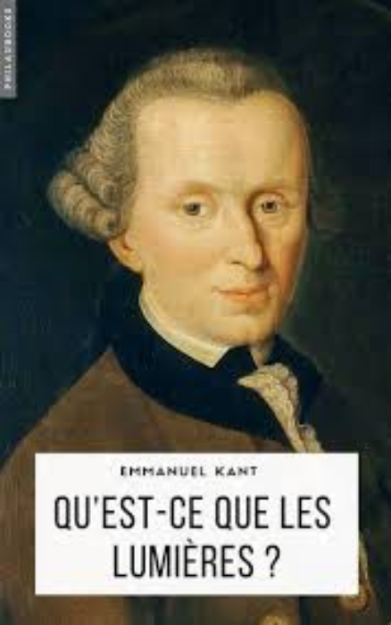

Đối với những người theo chủ nghĩa Trọng Nông, tự do không gây chia rẽ. Chống lại đặc quyền chính trị và chống lại hoạt động thu tô kinh tế là một. Điểm mới lại lớn của các nhà kinh tế học hiện đại, vào bình minh của thế kỷ 18, là họ tập trung vào từng cá nhân với ý định khôi phục lại khả năng hành động của họ trong khi suy nghĩ về cách kiềm chế đam mê và lợi ích thông qua thị trường tự do.

Thực vậy, làm thế nào để làm cho những con người có lợi ích đối lập cùng tồn tại với nhau? Phải làm gì nếu con người xung đột, nếu họ mắc lỗi, nếu họ tham lam và ích kỷ?

Những người theo chủ nghĩa Trọng Nông đã trả lời trong ba bước:

1. Chính sự tự do của các hợp đồng cho phép giải quyết xung đột lợi ích, chứ không phải là hợp đồng xã hội, đó là một hợp đồng giả mạo vì nó không thể bị phá vỡ. Phân tích các vấn đề xã hội dưới góc độ thị trường và trao đổi cho phép chúng ta nhìn nhận mối quan hệ giữa các cá nhân và giữa các quốc gia như một trò chơi có tổng dương và giải quyết cả vấn đề về thể chế và điều tiết xã hội bằng cách khẳng định rằng tự thân nhu cầu và lợi ích sẽ điều khiển mối quan hệ giữa con người với nhau.
2. Tự do tự nhiên là quyền tự quyết đối với bản thân và tài sản của mình. Do đó, sự hài hòa về lợi ích có thể đạt được dựa trên cơ sở tôn trọng quyền sở hữu hợp pháp, được tích lũy thông qua lao động và bắt nguồn từ việc sử dụng các năng lực của chúng ta. Và chính tự do dựa trên quyền sở hữu này là chìa khóa để giải quyết các vấn đề xã hội, chứ không phải là áp đặt của luật pháp.
3. Vai trò của Nhà nước là thực thi các hợp đồng và đảm bảo an ninh cho người dân và quyền sở hữu của họ. Đây chính là "Laissez faire," khẩu hiệu của các nhà kinh tế học Trọng Nông. Nhà nước cai trị tốt hơn khi nó cai trị ít hơn và cho phép các cá nhân được tự do hành động và chịu trách nhiệm.

Nói ngắn gọn, nếu mọi người có thể tự do theo đuổi lợi ích cá nhân của mình trên cơ sở tôn trọng luật tự nhiên, thì sự bình yên và thịnh vượng cho tất cả sẽ được đảm bảo tốt hơn so với việc một tổ chức chính trị sẽ định nghĩa lợi ích chung từ trên xuống và áp đặt nó thông qua sự ràng buộc của luật pháp. Tự do chính trị là một điều có ích nhưng nó không đủ để cho cá nhân quyền tự quyết và hành động mà họ cần. Đó chính là bài học của các nhà kinh tế học Trọng Nông. Trường phái tự do ở Pháp của thế kỷ 19, với Say, Constant, Dunoyer, Bastiat, và Molinari, đã ghi nhớ điều này và bảo vệ xuất sắc di sản này để chống lại Chủ nghĩa Xã hội đang nổi lên.

## Năm quan trọng của thế giới tự do: 1776

<chapterId>c1ba85f8-e8d1-5794-b198-8c683efb0d9b</chapterId>

Năm 1776 thường bị bỏ qua trong các cuốn sách giáo khoa lịch sử. Nhưng tại ba quốc gia, Pháp, Scotland, và Bắc Mỹ, một số sự kiện đã để lại dấu ấn không thể phai mờ trong lịch sử của tự do.

### Sự thất sủng của Turgot

Trong thời gian ngắn giữ chức Bộ trưởng Tài chính (Tổng kiểm soát tài chính), từ tháng 8 năm 1774 đến tháng 5 năm 1776, Ann-Robert Jacques Turgot đã cố gắng thực hiện các cải cách lớn để chấm dứt việc chi tiêu hoang phí, các độc quyền địa phương, và quay trở lại với thương mại tự do. Ông thậm chí đã đi xa đến mức khiển trách Vua Louis XVI như sau:

> Thưa Đức Vua, Ngài phải chống lại lòng tốt của mình bằng chính lòng tốt ấy, để xem xét lại nguồn gốc của số tiền mà Ngài phân phát cho các cận thần của mình.

Vào năm 1774, ông đã công bố Sáu Sắc lệnh nhằm bãi bỏ các hội nghề và chức nghiệp (các tổ chức đã trở thành độc quyền và rào cản đối với người muốn tham gia vào thị trường lao động), bãi bỏ các thuế quan nội địa đối với hoạt động buôn bán lúa mì, bãi bỏ lao động cưỡng bức, và thiết lập sự khoan dung đối với người Tin lành.

Tuy nhiên, giá lúa mì tăng vọt, sau một mùa màng kém, đã làm dấy lên nghi ngờ về các cải cách của ông. Turgot đã viết để bào chữa cho chính mình:

> Khi ở các tỉnh vẫn còn đói kém, không nên lấy đó làm lý do để phản đối tự do; chỉ nên kết luận rằng tự do chưa được thiết lập đủ lâu để có thể phát huy tất cả hiệu quả của nó.

Tuy nhiên, ông chủ yếu gặp phải sự phẫn nộ của giới quý tộc, những người cố gắng bảo vệ đặc quyền của mình. Đối mặt với một âm mưu do Hoàng tử Conti dẫn đầu, ông thà chọn từ chức vào tháng 5 năm 1776 chứ không chịu nhượng bộ trước thứ mà ông coi là sự cứu rỗi của nền quân chủ và nước Pháp. Sự sụp đổ của ông đã kết thúc thí nghiệm đầu tiên ở Pháp với nền kinh tế thị trường tự do (Để tìm hiểu thêm, xem Edgar Faure, _La disgrâce de Turgot_).
Tác phẩm chính của Turgot, _Suy ngẫm về sự hình thành và phân phối của cải - Réflexions la formation et la distribution des richesses_ (1766), chịu ảnh hưởng nhiều từ học thuyết của các nhà Trọng Nông. Turgot đã kế thừa và mở rộng mô hình thị trường tự do đã được Quesnay và trước đó là Boisguilbert đề xuất nhằm chống lại các nhà Trọng Thương. Nhưng tư tưởng của ông ít nhất cũng bị ảnh hưởng bởi bạn mình, Jacques Vincent de Gournay, người được bổ nhiệm làm uỷ viên về thương mại vào năm 1751. Turgot đã đi cùng ông ấy khắp đất nước trong các chuyến thăm dò của mình.

Turgot là một tín đồ của luật tự nhiên, mà ông cũng gọi là "hệ thống tự do." Ông thường nhấn mạnh rằng cạnh tranh trong một thị trường tự do sẽ tự nó điều chỉnh giá cả và ngăn chặn lạm dụng. Hơn nữa, ông xem thương nhân là trụ cột của cơ chế thị trường. Thực vậy, các đại lý nhà nước kém động lực và đặc biệt là kém thông tin hơn so với các thương nhân. Do đó, việc để thương mại trong tay tư nhân sẽ là hiệu quả hơn.

> Không cần phải chứng minh rằng mỗi cá nhân là người duy nhất biết cách sử dụng trí óc và sức mạnh của mình một cách có lợi nhất. Chỉ họ mới sở hữu kiến thức cục bộ mà nếu không có nó, người thông thái nhất cũng chỉ có thể suy luận một cách mù quáng. Chỉ họ mới có kinh nghiệm đáng tin cậy hơn vì nó chỉ giới hạn trong một đối tượng duy nhất. Họ học qua những lần thử nghiệm lặp đi lặp lại, thành công, thất bại của mình, và tích lũy được một sự nhạy bén và tinh tế vượt xa tất cả lý thuyết của những người suy đoán không liên quan. (_Lời khen ngợi Vincent de Gournay - Éloge de Vincent de Gournay_).

Ở đây, Turgot đã gần như tiên đoán trước lập luận của Mises và Hayek về sự bất khả thi của bất kỳ tính toán kinh tế nào trong một hệ thống kinh tế xã hội chủ nghĩa.

Murray Rothbard trong tác phẩm về lịch sử kinh tế từ góc nhìn của trường phái Áo, đã dành một chương cho "Vinh quang của Turgot," nhấn mạnh rằng "Ảnh hưởng của Turgot đối với tư tưởng kinh tế sau này bị hạn chế nghiêm trọng (...) bởi huyền thoại cho rằng Adam Smith là người sáng lập của kinh tế học chính trị." Và ông thêm vào, "J.B. Say, người được xem là môn đồ của Smith, thực chất lại chịu ảnh hưởng nhiều nhất từ Turgot, đặc biệt là lý thuyết về giá trị tiện ích của ông ấy."

### Kiệt tác của Condillac

Năm 1776, triết gia Étienne Bonnot de Condillac đã xuất bản _Thương mại và Chính phủ - Le Commerce et le Gouvernement_, tác phẩm được cọi là một trong những lời biện hộ tuyệt vời nhất của thời đại đó ủng hộ thương mại tự do và tự do cá nhân.

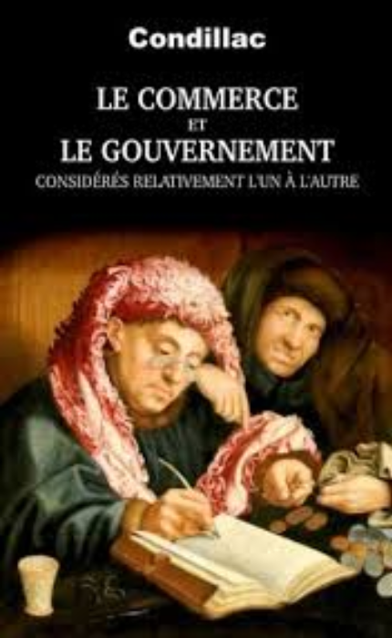

_Thương mại và Chính phủ_ chứa đựng những gì sau này sẽ được gọi là lý thuyết về tính chủ quan của giá trị, điều này đã mang lại cho ông tất cả những lời khen ngợi từ các nhà kinh tế học theo trường phái Áo, bắt đầu với Menger. Tiếp bước Turgot, nhưng với sự rõ ràng hơn, Condillac khẳng định rằng giá trị không nằm trong lao động mà nằm trong lợi ích thực tế mà mỗi người tìm thấy khi tham gia trao đổi:

> Giá trị của vật phẩm, ông viết, dựa trên tính hữu ích của chúng, hoặc, nói cách khác, dựa trên nhu cầu mà chúng ta có đối với chúng; hoặc, một lần nữa nói cách khác, dựa trên việc chúng ta có thể sử dụng chúng như thế nào. Và ông thêm vào: "Một vật không có giá trị vì nó tốn kém, như người ta thường nghĩ; mà nó tốn kém vì nó có giá trị.

Như vậy, giá trị không tồn tại bên trong vật thể dưới dạng một lượng lao động cần thiết để tạo ra nó (lý thuyết giá trị lao động của Adam Smith và Ricardo) mà nằm bên ngoài vật thể, nói cách khác, trong cường độ của ham muốn của người mua.
CĐây cũng là một luận văn triết học khi nó chứng minh rằng trao đổi tự do và tự nguyện là công cụ giải phóng công bằng hơn so với sự can thiệp của nhà nước bởi vì nó bình đẳng và phi thứ bậc. Nó có khả năng thiết lập nên những công dân trưởng thành và có trách nhiệm, và là giải pháp chống lại sự lạm quyền của chế độ cũ. Thực vậy, trong khi những sự thái quá của chủ nghĩa cá nhân có thể được điều chỉnh bởi thị trường, thì không có gì có thể điều chỉnh những lạm dụng của quyền lực trung ương. Đây là lý do tại sao Condillac kêu gọi nhà nước giải phóng thương mại khỏi mọi rào cản và từ bỏ mọi can thiệp vào lĩnh vực kinh tế.

### Bản tuyên ngôn cho tự do ở Mỹ

Năm 1776, một người Anh tên là Thomas Paine đã xuất bản ở Mỹ một cuốn sách nhỏ với lời chỉ trích gay gắt về chế độ quân chủ Anh và ủng hộ sự độc lập của các thuộc địa Mỹ, cuốn sách có tên là _Lẽ thường - Common Sense_.

Paine lập luận rằng:

- Xã hội dân sự tồn tại trước chính phủ
- Quân chủ là một hệ thống chính trị lỗi thời và chuyên chế.
- Mỹ đang chịu đựng sự áp bức từ Anh.
- Cuộc Cách mạng Mỹ là một lý tưởng phổ quát, bảo vệ các giá trị tự do, bình đẳng và trách nhiệm.
- Mỹ phải tách khỏi Anh và thiết lập một nền cộng hòa để hiện thực hoá những giá trị này.

Tác giả cẩn thận phân biệt giữa xã hội dân sự và Nhà nước:

> Xã hội là kết quả từ nhu cầu của chúng ta, chính phủ là kết quả từ sự bất lương của chúng ta. \[…\] Trạng thái xã hội là một điều tốt dưới mọi giả thuyết. Chính phủ, ngay cả trong trạng thái hoàn hảo của nó, chỉ là một điều ác cần thiết; trong trạng thái không hoàn hảo, nó là một điều ác không thể nào chịu đựng được.

Cuốn sách đã đạt được sự thành công vang dội. Nó đã bán được khoảng 100.000 bản trong vài tháng, trong một quốc gia có ba triệu dân và nó góp phần khơi dậy tinh thần độc lập của người Mỹ.

Thomas Paine, qua cuốn sách nhỏ của mình, đã đóng một vai trò quan trọng trong Cuộc Cách mạng Mỹ và truyền cảm hứng cho các lý tưởng về tự do và dân chủ. Ông cũng có ảnh hưởng trực tiếp đến Tuyên ngôn Độc lập của Mỹ, được thông qua vài tháng sau đó.

### Đại hội Philadelphia

Vào ngày 4 tháng 7 năm 1776, tại Philadelphia, các đại biểu của 13 Thuộc địa Anh ở Bắc Mỹ cùng tụ họp trong một hội nghị và thông qua một nghị quyết tuyên bố rằng "Hợp chúng quốc Hoa Kỳ là, và cần phải là các Quốc gia tự do và độc lập". Nghị quyết được John Adams, (một trong những người khởi xướng phong trào Tea Party) và Benjamin Franklin, đại biểu từ Massachusetts ủng hộ. Sau đó, Tuyên ngôn Độc lập được được soạn thảo bởi Thomas Jefferson, đại biểu từ Virginia.

Trong những năm tiếp theo, những người Pháp như La Fayette, Rochambeau, Đô đốc de Grasse, Bá tước d'Estaing, Tướng Duportail, Marquis de la Rouerie, Chỉ huy Pierre L'Enfant, nhà văn Beaumarchais, và nhiều người khác đã chiến đấu bên cạnh những người thuộc phe Nổi dậy để giải phóng họ khỏi ách cai trị của Vua Anh.
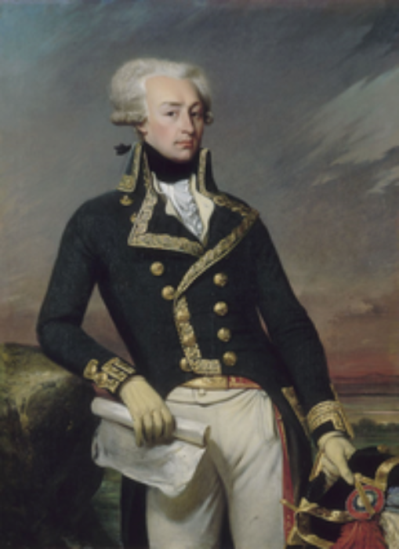

141 năm sau, vào ngày 4 tháng 7 năm 1917, trong bối cảnh của Thế chiến thứ nhất, một lễ kỷ niệm được tổ chức cho những người lính đầu tiên của Quân đội Viễn chinh Mỹ (AEF) đến Paris tại nghĩa trang Picpus trên mộ của La Fayette, "anh hùng của hai thế giới." Trong dịp này, Đại úy Charles E. Stanton từ ban tham mưu của Tướng Pershing đã phát biểu một bài diễn văn nổi tiếng:
> Tôi rất tiếc vì không thể phát biểu trước người dân Pháp bằng ngôn ngữ tuyệt vời của đất nước trung thành này. Không thể quên rằng quốc gia của các bạn đã là bạn của chúng tôi khi Mỹ đấu tranh cho sự tồn tại của mình, khi một nhóm nhỏ những người đàn ông dũng cảm và yêu nước quyết tâm bảo vệ quyền lợi mà Tạo Hóa đã ban cho họ -- khi đó, nước Pháp, thông qua Lafayette, đã đến giúp đỡ chúng tôi bằng cả lời nói và hành động. Sẽ là vô ơn nếu không nhớ đến điều này, và nước Mỹ sẽ không quên nghĩa vụ của mình...

> Do đó, trong buổi lễ tôn vinh này, với niềm tự hào lớn lao, chúng tôi chào quốc kỳ của các bạn như một biểu tượng tôn trọng đối với công dân của nền Cộng hoà vĩ đại này, và tại đây, ngay bây giờ, dưới bóng của những người đã khuất vĩ đại, chúng tôi cam kết với lòng trung thành và danh dự của mình để mang lại kết quả thuận lợi cho cuộc chiến này.

> Lafayette, chúng tôi đã có mặt ở đây!

Vào năm 1789, lại là La Fayette, cùng với Jefferson, đã đặt nền móng đầu tiên cho Tuyên ngôn Quyền Con Người năm 1789.

### Của cải của các Quốc gia

Vào năm 1776, Adam Smith đã xuất bản tác phẩm _Nghiên cứu về bản chất và nguyên nhân sự giàu có của các Quốc gia - An Inquiry into the Nature and Causes of the Wealth of Nations_. Một công trình đồ sộ thường khiến ông được coi như là như một nhà kinh tế học mặc dù ông giảng dạy triết học đạo đức tại Đại học Glasgow. Một cách biếm họa, ông thường được nhớ đến như cha đẻ của kinh tế học hiện đại.

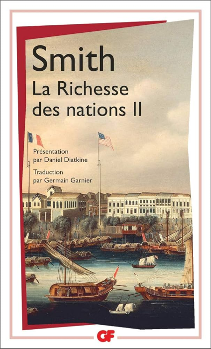

Trên thực tế, Smith chịu ảnh hưởng nhiều từ các nhà kinh tế học Quesnay và Turgot, những người mà ông đã gặp trong chuyến đi hơn một năm đến Pháp. Trong cuốn sách này, ông đặc biệt mô tả một "hệ thống tự do tự nhiên đơn giản" trong đó các cá nhân, theo đuổi lợi ích của riêng mình, được dẫn dắt "bởi một bàn tay vô hình" để thúc đẩy sự phồn thịnh của toàn xã hội.

Đây là đoạn nổi tiếng nhất trong tác phẩm của ông:
> Khi ưu tiên sự thành công của ngành công nghiệp quốc gia hơn là của các ngành công nghiệp nước ngoài, ông ta chỉ nghĩ đến việc tạo ra sự an toàn lớn hơn cho bản thân; và bằng cách điều hành ngành công nghiệp này sao cho sản phẩm của nó có giá trị cao nhất có thể, ông ta chỉ nghĩ đến lợi ích của chính mình; và giống như trong nhiều trường hợp khác, ông ta được dẫn dắt bởi một bàn tay vô hình để đạt được một mục đích mà hoàn toàn không nằm trong ý định của mình; và việc mục đích đó không nằm trong ý định của ông ta không phải lúc nào cũng là điều tệ nhất cho xã hội. (_Của cải của các Quốc Gia_)

Bàn tay vô hình nổi tiếng này minh họa ý tưởng rằng cạnh tranh tự do trong một thị trường tự do dẫn đến sự phân bổ tài nguyên hiệu quả và tối đa hóa sự phồn thịnh chung.

Đóng góp quan trọng nhất của Smith đối với tự do là làm rõ ý tưởng về trật tự tự phát. Thực vậy, Smith lập luận rằng các cá nhân, khi tìm cách thỏa mãn nhu cầu và mong muốn của bản thân, được khuyến khích sản xuất và trao đổi hàng hóa và dịch vụ để đáp ứng nhu cầu của xã hội một cách hiệu quả hơn nhiều so với bất kỳ kế hoạch tập trung nào.

Ý tưởng về trật tự tự phát này sẽ trở thành một khái niệm chủ chốt trong tác phẩm của Friedrich Hayek, người đã thừa nhận chịu ảnh hưởng lớn từ thời kỳ Khai Sáng ở Scotland và đặc biệt là từ Adam Smith.

## Kỷ nguyên của các cuộc cách mạng

<chapterId>c260e3ab-31a2-5ad7-b775-4bdcdc13b859</chapterId>

Điều mới mẻ lớn nhất trong thời kỳ hiện đại của lịch sử phương Tây là sự xuất hiện của một xã hội đã tổ chức bản thân mình ra khỏi sự phụ thuộc vào tôn giáo. Điều này không có nghĩa là niềm tin tôn giáo đã biến mất hay Thượng đế đã chết. Nhưng Thượng đế đã trở thành một vấn đề riêng tư, không còn lẫn lộn với các vấn đề chính trị. Tôn giáo không biến mất, nhưng mà giảm bớt vai trò chỉ đạo của nó. Nó trở thành một hệ thống niềm tin cá nhân.

Quá trình thế tục hóa của xã hội phương Tây không diễn ra qua một đêm. Nó được chuẩn bị bởi các ý tưởng. Như thường lệ, triết học luôn tiên phong trong những thay đổi văn hóa lớn.
Kể từ Machiavelli và Hobbes, con người được hiểu là một sinh vật của đam mê, được thúc đẩy bởi các xu hướng mâu thuẫn. Do đó, điều cần thiết là tìm ra các nguyên tắc để điều chỉnh cho những đam mê này nhằm tránh những xung đột và bạo lực mà chúng gây ra.
Chúng ta đã nói về các nhà kinh tế học và sự ủng hộ của họ đối với thị trường tự do. Nhưng đối với nhiều triết gia, giải pháp cho vấn đề này là đòi hỏi phải thiết lập một quyền lực tối cao thông qua một hợp đồng pháp lý.

Do đó, đến thế kỷ 18, vấn đề chính trị chính đối với những triết gia này là vấn đề về chủ quyền. Trọng tâm là một câu hỏi về công lý: Ai là chủ thể hợp pháp để thực thi quyền lực tối cao?

### Chủ quyền nhân dân

Ý tưởng này được đề xuất bởi Locke vào thế kỷ 17 và sau đó được Rousseau tiếp nối. Quyền lực tối cao không chỉ đến từ ý chí tự do của nhân dân mà còn phải nằm trong tay họ. Đây là lý thuyết về chủ quyền của ý chí chung do Rousseau phát triển, điều mà ngày nay chúng ta gọi là dân chủ.
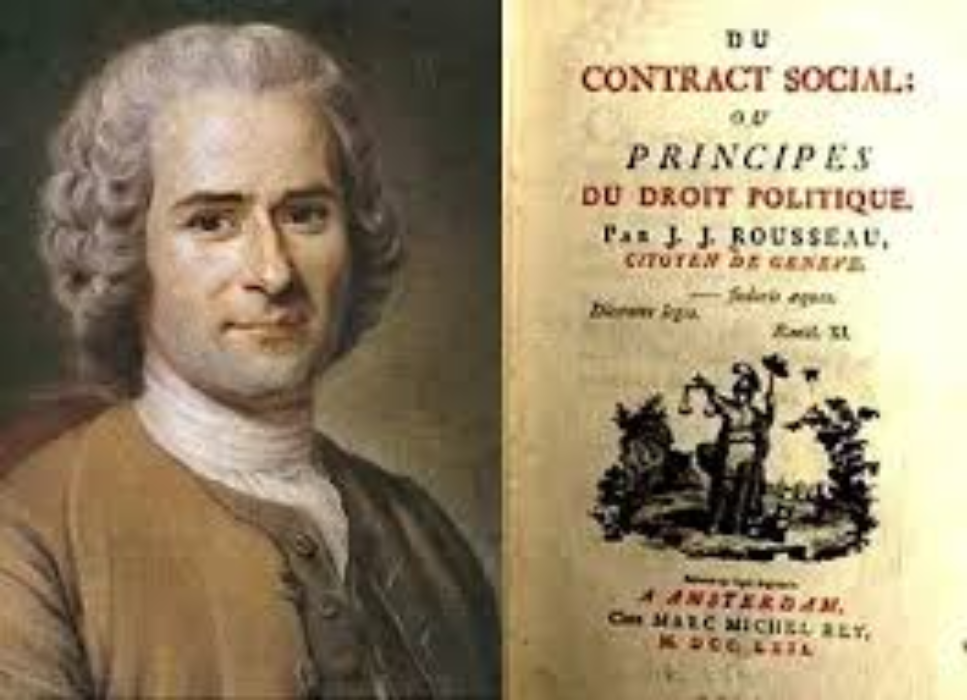

Rousseau xem nhân dân như một cá nhân tự chủ có khả năng tự áp đặt cho mình những luật lệ mà họ tự thiết lập. Ý chí tự do của nhân dân tạo thành nền tảng công lý duy nhất của chủ quyền. Rousseau đã phát triển chủ nghĩa nhân văn pháp lý này, đặc trưng của Thời đại Hiện đại, đến những hậu quả cuối cùng của nó, bằng cách xem con người như một cá nhân có khả năng tự quyết định một cách tự do hoặc như một ý chí chung. Như vậy, hợp đồng bao hàm sự tuân thủ các luật lệ mà con người, theo ý chí chung, tự ban cho mình như một ý chí riêng biệt. Do đó, lý thuyết về ý chí chung hoặc về chủ quyền của nhân dân hòa giải được tự do và sự tuân thủ. Tự thiết lập ra luật pháp hay quyền tự chủ chính trị thực sự đã là một thành phần thiết yếu của dân chủ kể từ thời Rousseau.

Nhưng câu hỏi về nguồn gốc của chủ quyền không phải là vấn đề duy nhất. Suy ngẫm có thể đi theo một hướng mới, đó là cách thức thực hiện chủ quyền. Ý chí chung có luôn là công lý không? Và quan trọng hơn, nó có được phép can thiệp vào xã hội dân sự không và trong những giới hạn nào?

### Lý thuyết về quyền lực giới hạn

Một trong những triết gia của thời kỳ Khai Sáng có ảnh hưởng mạnh mẽ ở Pháp và Mỹ là John Locke. Ông là nguồn cảm hứng cho các nhà lập quốc của Hoa Kỳ và cũng ảnh hưởng tới Tuyên ngôn Nhân Quyền và Dân Quyền vào năm 1789.

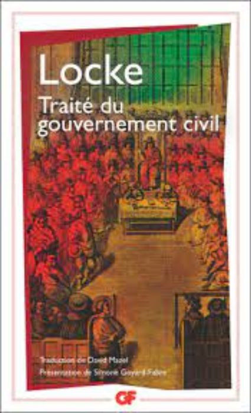

Tất cả các hệ thống trước đó đã coi rằng tự do chỉ là những đặc quyền được nhà cầm quyền ban tặng theo dạng ủy quyền và có thể bị thu hồi bất cứ lúc nào. Đối với Locke, cuộc sống của một người là của riêng họ theo quyền tự nhiên (nghĩa là: theo một nguyên tắc đạo đức tự nhiên trong bản chất con người) và mục đích đạo đức duy nhất của một chính phủ là bảo vệ quyền cá nhân.

Locke giao cho nhà nước nhiệm vụ bảo vệ quyền sở hữu cá nhân, tức là quyền về "cuộc sống, tự do, và tài sản":

> Mục đích lớn và chính yếu của việc con người hợp nhất thành các quốc gia và đặt mình dưới các chính phủ, là để bảo vệ quyền sở hữu của mình. (_Hai chuyên luận về Chính phủ - Two Treatises of Government_, § 87).

Thomas Jefferson đã ghi lại lý thuyết về quyền bất khả xâm phạm của Locke trong Tuyên ngôn Độc lập:
> Chúng tôi coi những sự thật này là hiển nhiên, rằng tất cả mọi người đều được sinh ra bình đẳng, rằng họ được Đấng Tạo Hoá ban cho một số quyền bất khả xâm phạm, trong đó có quyền sống, quyền tự do và quyền mưu cầu hạnh phúc.

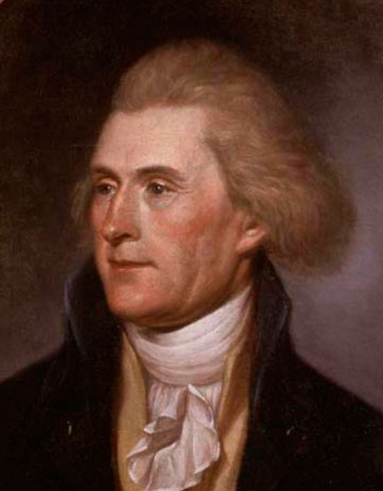

Hơn nữa, Điều 2 của Tuyên ngôn Nhân Quyền và Dân Quyền của năm 1789 cũng lấy cảm hứng từ truyền thống quyền tự nhiên của Locke:

> Mục tiêu của bất kỳ hiệp hội chính trị nào là bảo vệ các quyền tự nhiên và bất khả xâm phạm của con người. Những quyền này là tự do, tài sản, an toàn, và kháng cự chống lại áp bức.

### So sánh hai cuộc cách mạng

Cuộc Cách mạng Mỹ được lãnh đạo bởi những người nói về các quyền cơ bản bất khả xâm phạm. Nó dẫn đến việc hình thành một nhà nước có quyền lực phi tập trung và hạn chế. Ở phía bên kia Đại Tây Dương, một thí nghiệm chính trị khác diễn ra: Cuộc Cách mạng Pháp, bắt đầu như một cuộc nổi dậy dũng cảm của nhân dân, nhưng kết thúc bằng một loạt các vụ thảm sát, xung đột nội bộ đẫm máu, và mở đường cho chế độ độc tài quân sự của Napoleon Bonaparte. Tại sao lại có sự khác biệt như vậy?

Trong thế kỷ 19, Alexis de Tocqueville, một triết gia chính trị người Pháp, đã cố gắng phân tích những khác biệt giữa hai cuộc cách mạng này. Ông cho rằng thành công của cuộc Cách mạng Mỹ đến từ một số yếu tố.

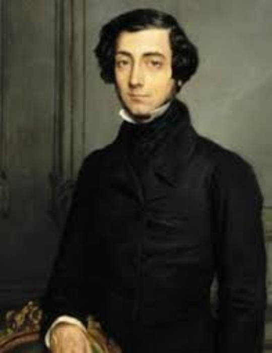

Đầu tiên là cách định nghĩa về nền cộng hòa. Cộng hòa Pháp là một và không thể chia cắt. Cộng hòa Mỹ được cấu thành từ các bang có chủ quyền, mỗi bang đều có phạm vi quyền lực và lợi ích địa phương của riêng mình. Chủ nghĩa liên bang được coi là phản quốc ở Pháp. Ở Mỹ, tội phản quốc bao gồm ý muốn áp đặt sự thống nhất. Ít nhất là cho đến khi Nội chiến Mỹ diễn ra, liên minh trong sự đa dạng của các bang là sức mạnh của Liên bang.

Ông cũng cho rằng niềm tin của Mỹ vào một luật tối cao đã đóng một vai trò quyết định. Tuyên ngôn Độc lập tuyên bố tất cả mọi người sinh ra đều được bình đẳng, rằng họ được ban cho một số quyền bất khả xâm phạm (quyền sống, quyền tự do, quyền sở hữu tài sản và quyền mưu cầu hạnh phúc) và mục đích của chính phủ chỉ đơn giản là để bảo vệ những quyền này. Điều này khôi phục các nguyên tắc và lý tưởng bị đè nén bởi chế độ quân chủ Anh.

Tu chính án đầu tiên của Hiến pháp Mỹ, được soạn thảo vào năm 1789, nêu rõ:
> Quốc hội không được ban hành bất kỳ luật nào về việc thành lập tôn giáo, hoặc cấm tự do thực hành tôn giáo; hoặc cắt giảm tự do ngôn luận, hoặc tự do báo chí; hoặc quyền của công dân hội họp một cách hòa bình, và kiến nghị Chính phủ để đòi hỏi công lý.

Cách diễn đạt này thể hiện rõ ràng việc bảo vệ chống lại sự độc tài của đa số. Tuy nhiên, cuộc Cách mạng Pháp lại khác biệt. Người Pháp muốn hoàn toàn tách rời khỏi quá khứ. Các nguyên tắc cổ xưa của di sản Kitô giáo không còn đáp ứng được kỳ vọng của những nhà cách mạng như Robespierre.

### Từ cuộc nổi dậy của tầng lớp thứ ba đến thời kỳ khủng bố của Jacobin

Abbé Sieyès (1748-1836) được coi là cha đẻ của Cách mạng Pháp. Ông là tác giả của _Tầng lớp thứ ba là gì? - Qu'est-ce que le tiers état?_, vào tháng 1 năm 1789

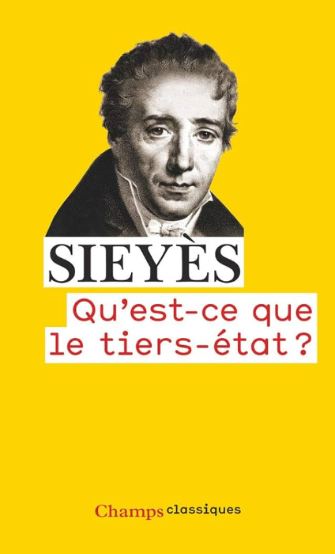

Tầng lớp thứ ba bao gồm tất cả những người không thuộc về giới giáo sĩ hoặc quý tộc. Ngay từ những dòng đầu tiên trong cuốn sách nổi tiếng của mình, Abbé Sieyès đã ca ngợi tự do cá nhân và tự do cạnh tranh:

> Không phải chúng ta đã biến đến hậu quả của độc quyền sao? Nếu nó làm nản lòng những người bị loại trừ, thì không phải nó đã làm cho những người được ưu ái kém trở nên kém hiệu quả hơn sao? Không phải chúng ta đã biết rằng bất kỳ công việc nào bị loại bỏ khỏi sự cạnh tranh tự do sẽ được thực hiện với chi phí đắt đỏ nhưng kém chất lượng hơn sao?

Đêm ngày 4 tháng 8 năm 1789, là sự kiện nền tảng của Cách mạng Pháp, còn hơn cả ngày 14 tháng 7, ngày đã được chọn làm ngày lễ quốc gia. Thực vậy, trong phiên họp diễn ra vào thời điểm đó, Hội đồng Lập hiến đã chấm dứt hệ thống phong kiến. Đặc quyền được bãi bỏ, đối với cả quý tộc và của giáo sĩ. Vào tháng 3 năm 1791, sau một thời gian không rõ ràng về mặt pháp lý, các hội nghề nghiệp cũng được bãi bỏ, và tự do lao động hoàn toàn được thiết lập. Cách mạng đã chứng thực những cải cách của Turgot. Nhưng không kéo dài...
Tại Pháp, vào cuối năm 1791, nạn đói làm trầm trọng thêm tình trạng bất ổn trong dân chúng. Bạo loạn làm tê liệt hoạt động thương mại ngũ cốc, và bánh mì trở nên khan hiếm. Một phong trào lớn đã yêu cầu luật phân chia ruộng đất, tức là Nhà nước đúng ra phân phối sản lượng lúa mì. Tuy nhiên, Quốc hội đã chống lại nỗ lực tập thể hóa này. Ban đầu, họ đã bỏ phiếu thông qua việc tịch thu tài sản của Giáo hội và, trong bước thứ hai, áp đặt hiến pháp dân sự cho Giáo hội.

Việc tịch thu tài sản của Giáo hội nhằm mục đích đối phó với cuộc khủng hoảng tài chính; nó được dùng làm tài sản đảm bảo cho Assignats, tức là việc phát hành tiền giấy quy mô lớn.

Hơn nữa, như Dupont de Nemours đã tiên đoán, việc phát hành tiền giả (ở đây là tiền giấy) chỉ làm trầm trọng thêm khủng hoảng, gây ra lạm phát trên diện rộng và sự sụp đổ giá trị của Assignats. Vào tháng 8 năm 1792, các cuộc bạo loạn vì nạn đói đã dẫn đến cuộc nổi dậy ở Paris, việc hành quyết Louis XVI vào tháng 1 năm 1793, và sau đó là thời kỳ Khủng bố.

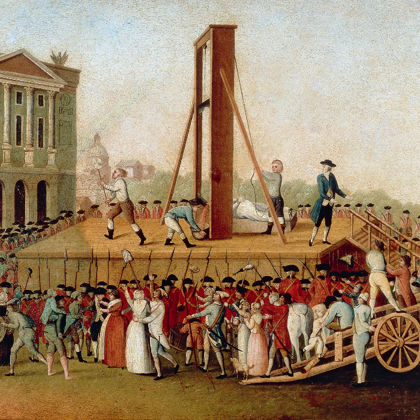

Vào năm 1795, năm năm sau lần phát hành đầu tiên, tiền giấy đã mất 99% giá trị của nó. Cách mạng Pháp tiếp tục dưới thời chế độ Đốc chính cho đến năm 1799, khi Napoleon giành quyền lực thông qua một cuộc đảo chính. Ông trở thành Đệ nhất Tổng tài của Cộng hòa Pháp trước khi được phong làm Hoàng đế vào năm 1804. Đây là một trong những mâu thuẫn rõ ràng đầu tiên với Tuyên ngôn Quyền con người, tuyên bố rằng quyền tư hữu là bất khả xâm phạm.

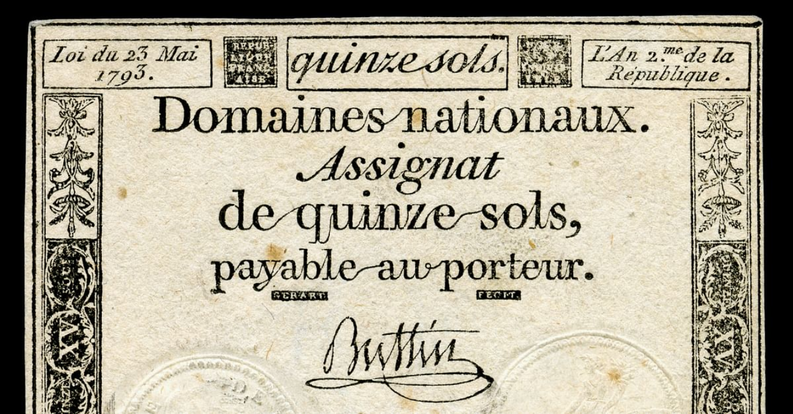

Ở Mỹ, không có sự can thiệp kinh tế, cũng không có sự phá sản tiền tệ như Assignats. Và quan trọng hơn, không có sự trục xuất, không có di cư hàng loạt, không có máy chém, không có thảm sát, và không có thời kỳ Khủng bố. Ngay lập tức, người ta có thể thấy sự khác biệt giữa Cách mạng Mỹ với Cách mạng Pháp.

Với Rousseau và Robespierre, người Pháp muốn tin rằng Quốc gia hoặc ý chí chung có quyền lực không giới hạn và biện minh cho mọi việc. Vì là nhân dân cầm quyền, nên người ta kết luận rằng họ có mọi quyền. Rõ ràng có một sự mâu thuẫn giữa các nguyên tắc lớn của Cách mạng và các phương tiện được dùng để hiện thực hoá chúng.

Đây cũng là ý nghĩa của nhận xét bởi Friedrich Hayek trong cuốn sách của ông _Hiến pháp Tự do - The Constitution of Liberty_:

> Yếu tố quyết định làm cho nỗ lực của Cách mạng nhằm thúc đẩy tự do cá nhân trở nên vô ích là vì nó tạo ra ảo tưởng rằng, khi mọi quyền lực đã được trao cho nhân dân, mọi biện pháp phòng ngừa nhằm chống lại sự lạm dụng quyền lực này trở nên không cần thiết.

# Đỉnh cao và sự suy tàn: Từ thế kỷ 19 đến thế kỷ 20

<partId>39810d57-19e3-5166-8f2e-40b763154148</partId>

## Tự do của thời hiện đại

<chapterId>e575f4c1-7144-591b-ab98-d976ec4102fb</chapterId>

Theo Benjamin Constant, tự do, trong xã hội hiện đại của chúng ta, không thể được hiểu theo cách của các xã hội cổ đại như là sự tham gia trực tiếp vào các công việc của thành phố.

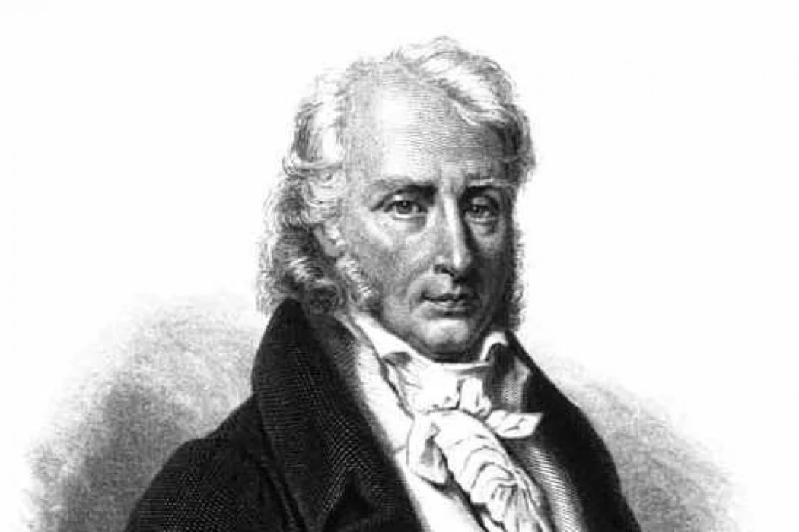

### Tự do trong đời sống riêng tư

Trong thời cổ đại, cá nhân có quyền lực tối cao trong các vấn đề công cộng, nhưng lại là nô lệ trong tất cả mọi mối quan hệ riêng tư. Việc hy sinh tự do cá nhân được bù đắp bằng quyền tham gia chính trị: quyền trực tiếp thực hiện một phần của chủ quyền, quyền thảo luận tại quảng trường công cộng, quyền bỏ phiếu về luật pháp, quyền tuyên bố phán quyết, quyền đánh giá và xét xử các quan chức. Đó là tự do chính trị và nó mang tính tập thể:
> Tự do của người cổ đại bao gồm sự tham gia tích cực và liên tục vào quyền lực tập thể. Ngược lại, tự do của chúng ta phải bao gồm việc thưởng thức sự độc lập của cá nhân một cách yên bình; do đó, chúng ta phải gắn bó nhiều hơn với sự độc lập cá nhân so với người cổ đại. (_Về Tự do của người cổ đại so với người hiện đại - On the Liberty of the Ancients Compared with that of the Moderns_ (1819))
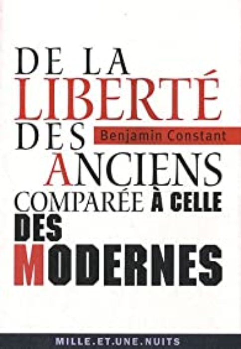

Tự do hiện đại là tự do dân sự, bao gồm tự do kinh tế và dựa trên quyền riêng tư. Đó là quyền không phải chịu sự chuyên quyền tuỳ tiện, quyền tự do ngôn luận, quyền tự do hội họp, quyền tự do di chuyển, quyền tự do tôn giáo, và quyền tự do kinh doanh. Không có tự do nếu không có khả năng lựa chọn lối sống và giá trị của bản thân, do đó không có tự do nếu không có khả năng tách khỏi cộng đồng và do đó không có tự do nếu không có sự giới hạn quyền lực của Nhà nước để đảm bảo sự tồn tại của không gian riêng tư này. Đó là loại tự do mà người Mỹ gọi là quyền dân sự.

Định nghĩa về tự do này được tìm thấy trong tác phẩm John Stuart Mill:

> Tự do duy nhất xứng đáng với cái tên đó, là tự do theo đuổi điều tốt lành của chính mình theo cách của mình, miễn là chúng ta không cố gắng tước đoạt của người khác hoặc cản trở nỗ lực của họ để đạt được nó. (...) Nhân loại thu được nhiều lợi ích hơn bằng cách để mỗi người sống theo cách mà họ cảm thấy phù hợp hơn là ép buộc họ phải sống theo cách mà người khác cho là tốt. (_Bàn về Tự do - On Liberty_, 1859)

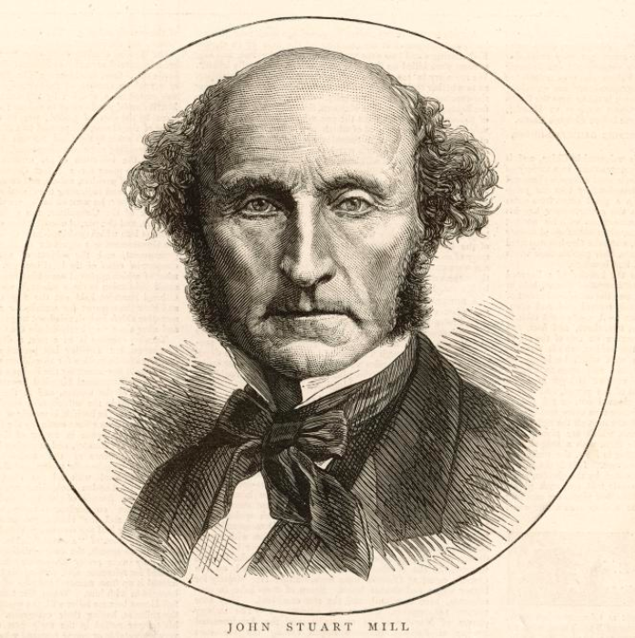

Mill đã vạch ra giới hạn của chủ quyền nhà nước: nó dừng lại ở nơi chủ quyền cá nhân bắt đầu. Nếu một hành động cá nhân không gây hậu quả xấu cho người khác, thì cá nhân đó hoàn toàn tự do thực hiện hành động đó. Nhà nước phải điều chỉnh mối quan hệ giữa các cá nhân, nhưng không thể can thiệp sâu hơn vào đời sống riêng tư của mỗi cá nhân. Nếu cá nhân tự gây hại cho bản thân, Nhà nước chỉ có thể "khuyên nhủ" hoặc cố gắng "lý luận" hoặc "thuyết phục" họ: không thể ép buộc hoặc trừng phạt. Vì Mill thêm vào: "Lý do hợp pháp duy nhất mà một nhà nước có thể sử dụng vũ lực để chống lại một thành viên của mình, trái với ý muốn của họ, là nhằm ngăn chặn sự gây hại đến người khác."
Do đó, quyền lực chính trị tương ứng với tự do hiện đại là một quyền lực có giới hạn: "Hãy để nhà cầm quyền giới hạn bản thân trong việc bảo vệ công lý, chúng tôi sẽ tự lo cho hạnh phúc của mình," Benjamin Constant tuyên bố. Nhà nước không có nhiệm vụ quyết định chúng ta nên hạnh phúc như thế nào.

### Sự nhầm lẫn của Rousseau

Theo Constant, "sự nhầm lẫn giữa hai loại tự do này của chúng ta đã gây ra nhiều điều xấu xa trong những giai đoạn quá nổi tiếng của cuộc cách mạng của chúng ta." Bằng cách chỉ coi tự do là sự tham gia tập thể của công dân vào hoạt động chính trị, Jean-Jacques Rousseau đã khuyến khích Robespierre cưỡng ép công dân thông qua khủng bố. Do đó, những sai lầm của Cách mạng Pháp là kết quả của việc áp dụng các nguyên tắc chính trị hợp lệ của người cổ đại vào thời hiện đại.

Nhưng điều này không có nghĩa là hy sinh tự do chính trị, sự tham gia vào quyền lực cai trị. Constant chỉ rõ rằng nếu tự do hiện đại khác với tự do cổ đại, nó bị đe dọa bởi một nguy cơ khác. Nguy cơ của tự do người cổ đại là sự chuyên quyền. Nguy cơ của tự do hiện đại sẽ là từ bỏ các bảo đảm chính trị của tự do này bằng thái độ thờ ơ đối với lợi ích công cộng. Nói cách khác, công dân phải giám sát chặt chẽ các đại biểu của mình.

Thực vậy, trong _Nguyên tắc Chính trị - Principles of Politics_ của mình, Benjamin Constant khẳng định:

> Chủ quyền của nhân dân không phải là vô hạn, nó được giới hạn trong những ranh giới được vạch ra bởi công lý và quyền của cá nhân. Ý chí của toàn bộ dân tộc cũng không thể làm cho cái bất công trở nên công bằng.
Đây là một phê bình mới về Rousseau và _Khế ước Xã hội - Contrat Social_: ngay cả ý chí chung cũng phải chịu sự giới hạn, và nó không thể thay đổi những gì thuộc về luật tự nhiên. Có một quyền tồn tại trước và cao hơn quyền lực chính trị: đó là luật tự nhiên. Quyền này thiết lập ranh giới của quyền lực chính trị và hạn chế tự do cá nhân.
Nói rằng tất cả quyền lực hợp pháp phải được xây dựng dựa trên ý chí chung không có nghĩa là mọi thứ mà ý chí chung quyết định đều là hợp pháp. Constant do đó đồng tình với Điều II của Tuyên ngôn Quyền Con Người năm 1789, quy định rằng Nhà nước chỉ được thành lập để bảo vệ quyền tự nhiên, tức là tự do, trách nhiệm và quyền sở hữu. Do đó, có những lĩnh vực mà quyền lực chính trị không có ảnh hưởng: đạo đức và tôn giáo, đồng thời cả khoa học vì nó thuộc về quyền lực của kiến thức và cuối cùng là công nghiệp, Constant thêm vào.

### Tự do chính trị và tự do kinh tế

Theo Benjamin Constant, tự do chính trị mà không đi kèm với các tự do khác thì chỉ là ảo tưởng. Tự do chính trị là quyền tham gia vào việc thi hành quyền lực nhà nước. Tuy nhiên, quyền lực của nhân dân hoặc quần chúng có thể phá hủy tự do vì nó trao cho đa số cử tri quyền áp đặt ý muốn của mình lên toàn xã hội, bao gồm cả những ý thích hoặc tư tưởng của họ vào thời điểm đó: thuế cao mà không có sự đền bù, kiểm soát tư tưởng, kiểm duyệt, đàn áp và khủng bố trí thức. Đó là lý do tại sao không thể có tự do thực sự nếu không có các quyền tự do dân sự, bao gồm tự do tôn giáo và tự do kinh tế. Benjamin Constant không tách biệt tự do chính trị khỏi tự do kinh tế:

> Trong bốn mươi năm, tôi đã bảo vệ cùng một nguyên tắc, tự do trong mọi thứ, trong tôn giáo, trong triết học, trong văn học, trong công nghiệp, trong chính trị. Và khi nói đến tự do, tôi muốn nói đến chiến thắng của cá nhân trước cả chính quyền muốn cai trị bằng chế độ độc tài và trước đám đông tuyên bố quyền nô dịch thiểu số theo ý muốn của đa số. Chế độ quyên quyền không có quyền nào cả. Đa số chỉ có quyền buộc thiểu số tôn trọng trật tự: nhưng mọi thứ không làm xáo trộn trật tự, mọi thứ chỉ là nội bộ, như ý kiến; mọi thứ, trong biểu đạt ý kiến, không làm hại người khác, bằng cách kích động bạo lực vật chất hoặc bằng cách phản đối một biểu đạt trái ý; mọi thứ, trong lĩnh vực công nghiệp, cho phép cạnh tranh tự do, là thuộc về cá nhân, và không thể bị kiểm soát hợp pháp bởi quyền lực xã hội.

Nói cách khác, trong một xã hội tự do, cần thiết phải xác định một ranh giới rõ ràng giữa lĩnh vực công cộng và lĩnh vực riêng tư. Nguyên tắc của ranh giới này nằm ở việc không làm hại người khác, tức là không xâm phạm đến quyền sở hữu của họ.

## Sức mạnh và điểm yếu của nền dân chủ

<chapterId>753e065d-dbee-5d61-aa56-b1c074c95499</chapterId>

Alexis de Tocqueville là một người quan sát sắc sảo về dân chủ và là một nhà phê bình của chủ nghĩa cá nhân trong nền dân chủ.

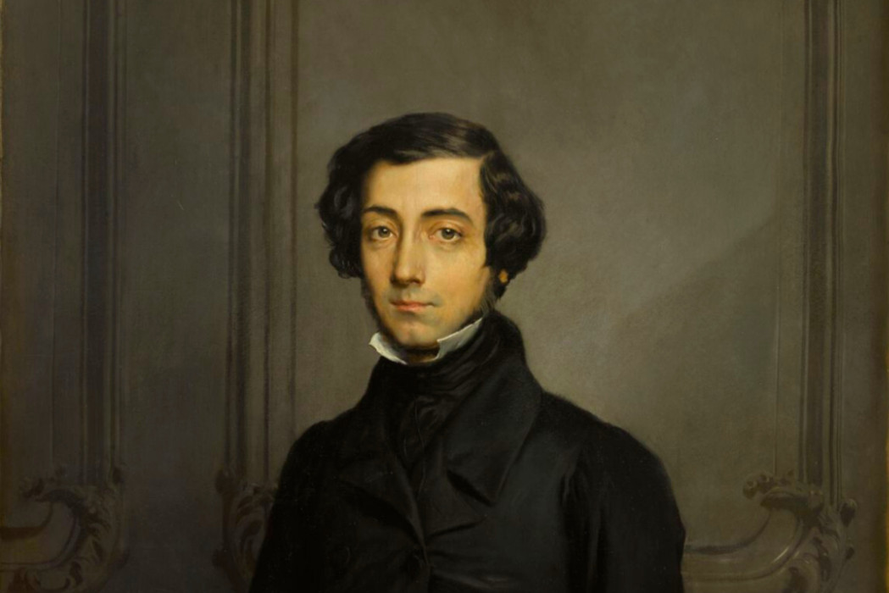

Phân tích của Tocqueville về dân chủ cơ bản mở rộng sự phân biệt giữa tự do của người cổ đại và tự do của người hiện đại mà Constant đã thực hiện. Trong một bài báo viết vào năm 1836 (_Tình trạng xã hội và chính trị của Pháp trước và sau 1789 - État social et politique de la France avant et depuis 1789_), Tocqueville đã so sánh tự do quý tộc với tự do dân chủ một cách có hệ thống. Tự do quý tộc được định nghĩa là "sự thụ hưởng một đặc quyền," và Tocqueville đã dẫn ví dụ về công dân La Mã, những người có tự do không phải từ tự nhiên mà từ việc họ thuộc về Rome.
Khái niệm thứ hai, được coi là "khái niệm đúng về tự do," bao gồm "quyền bình đẳng và bất khả xâm phạm để sống độc lập so với những người khác." Khái niệm hiện đại về tự do này không giống như khái niệm đầu tiên là một khái niệm chính trị, mà nó dựa trên luật tự nhiên và nó là "đúng đắn" bởi vì nó mở rộng đồng đều cho tất cả mọi người. Ông viết:
> Theo quan niệm hiện đại, quan niệm dân chủ, và tôi dám nói là quan niệm đúng đắn về tự do, mỗi người, được cho là đã nhận từ tự nhiên sự khai sáng cần thiết để tự điều khiển bản thân, sinh ra với quyền bình đẳng và bất khả xâm phạm để sống độc lập với đồng loại của mình, trong tất cả những gì chỉ liên quan đến bản thân, và tự do quyết định số phận của mình theo ý muốn của bản thân.

Tocqueville cẩn thận chỉ ra tất cả các ảnh hưởng về chính trị và văn hóa của cách sống mới này, cách sống điển hình của thời đại hiện đại. Là một người ngưỡng mộ Pascal, ông muốn mô tả sự vĩ đại và nỗi khốn khổ của nền dân chủ.

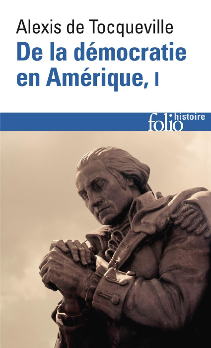

Vào năm 1841 trong _Nền dân chủ ở Mỹ - La Démocratie en Amérique_, ông phân tích nguyên tắc dân chủ này, nguyên tắc này khẳng định bản thân qua sự bình đẳng hóa về điều kiện, trái với hệ thống giai cấp và quyền lực của truyền thống. Và ông quan sát thấy quá trình này đi kèm với sự tan rã của ảnh hưởng xã hội, các mối quan hệ phụ thuộc, và làm cho các mối liên kết xã hội trở nên chia nhỏ, do đó đe dọa đến chính sự tự do và trách nhiệm chính trị của công dân. Hơn nữa, sự mất mát của những lý tưởng cao cả thời Cổ đại (đức hạnh, lợi ích chung) dẫn đến sự nghèo nàn về ý nghĩa của cuộc sống, với "những thú vui nhỏ bé và tầm thường," sự chán chường và bất an.

Thực vậy, sự bình đẳng về điều kiện, điều đặc trưng của nền dân chủ, có nghĩa là mỗi người có xu hướng thu mình lại, không có liên kết nào gắn kết họ với người khác. Sự độc lập cá nhân mà quyền tự do mới này tôn vinh làm cho việc thực hành các đức hạnh công dân trở nên khó khăn do nó thúc đẩy sự thờ ơ đối với các lợi ích chung. Kết quả là, các nền dân chủ hiện đại tự mình rơi vào "sự chuyên chế mềm mại và đều đặn" của chủ nghĩa nhà nước, một hình thức nô lệ mới ra đời do sự thờ ơ của người dân với đời sống chính trị. Do đó, nên dân chủ có xu hướng nghiêng dần về hai thái cực đối lập nhưng nuôi dưỡng lẫn nhau:

Một mặt, chủ nghĩa cá nhân, tức là "sự thờ ơ với vấn đề chung" và "tình yêu đối với thú vui vật chất." Tocqueville định nghĩa chủ nghĩa cá nhân chính xác là một cảm giác tự lập khiến công dân tự cô lập bản thân khỏi người khác và thu mình lại. Đây là chủ nghĩa khoái lạc vị kỷ.

Và mặt khác, chủ nghĩa nhà nước, phá hủy cá nhân bằng cách giữ họ trong trạng thái trẻ con. Nhà nước "tình nguyện làm việc vì hạnh phúc của họ nhưng nó muốn là chủ thể duy nhất làm điều đó."
Thực vậy, sự bình đẳng đi kèm với sự mong manh lớn hơn của cá nhân, những người trở nên cô lập và tách biệt khỏi nhau. Để tránh sự hỗn loạn và bảo vệ quyền sở hữu của mình, họ dựa vào một quyền lực trung ương và duy nhất mà họ ủy thác tất cả quyền lực của mình. Do đó, theo Tocqueville, việc phát triển các hiệp hội dân sự và "nền dân chủ địa phương" là điều cần thiết để duy trì các quyền lực đối trọng và do đó chống lại cả chủ nghĩa cá nhân và chế độ chuyên quyền, cả hai đều giết chết tự do.

Tác giả của _Nền dân chủ ở Mỹ_ cảnh báo chúng ta:

> Thực vậy, có một đam mê cao quý và chính đáng về sự bình đẳng, nó khơi dậy mong muốn trở nên mạnh mẽ và được tôn trọng của tất cả mọi người. Đam mê này có xu hướng nâng cao những người nhỏ bé lên ngang hàng với những người vĩ đại; nhưng cũng có trong trái tim con người một sở thích suy đồi đối với sự bình đẳng, khiến cho những kẻ yếu đuối muốn kéo những người mạnh mẽ xuống ngang tầm với họ, và khiến con người ưa chuộng sự bình đẳng trong tình trạng nô dịch hơn là bất bình đẳng trong trạng thái tự do. (...) Các quốc gia của ngày nay không thể tránh khỏi việc làm cho điều kiện sống trở nên bình đẳng; nhưng chính họ là người quyết định liệu sự bình đẳng sẽ dẫn họ đến nô dịch hay tự do, đến sự khai sáng hay tới sự man rợ, đến thịnh vượng hay đến khốn khổ.
Đối với Tocqueville, con người bị hấp dẫn bởi sự bình đẳng nhiều hơn là tự do. Và ông coi đây là một nguy cơ lớn đối với nền dân chủ. Tại sao con người lại ưu tiên ham muốn về sự bình đẳng hơn giữa hai lựa chọn này? Bởi vì tự do đi kèm với những chi phí trực tiếp có thể thấy ngay được, và lợi ích của nó chỉ có thể thấy được trong dài hạn (bản thân tự do không mang lại hạnh phúc, nó chỉ mang đến khả năng tìm kiếm hạnh phúc theo quan điểm của bản thân). Ngược lại, bình đẳng mang lại kết quả tích cực có thể thấy ngay lập tức còn nhược điểm của nó thì chỉ bộc lộ trong dài hạn.

### Quyền có việc làm

Quyền có việc làm là một ví dụ điển hình về những lệch lạc của chủ nghĩa quân bình dân chủ. Trong một bài phát biểu trước Quốc hội lập hiến vào năm 1848, Tocqueville đã lên tiếng chống lại quyền có việc làm vào trong dự thảo hiến pháp. Ông lập luận, nếu Nhà nước cam kết cung cấp việc làm cho tất cả người lao động, hoặc nếu nó đảm bảo rằng họ luôn tìm thấy việc làm trên thị trường lao động, như những người theo Chủ nghĩa Xã hội muốn, thành Nhà nước sẽ trở thành "người tổ chức lao động lớn và duy nhất."

Trong bài phát biểu này, Tocqueville so sánh Chủ nghĩa Xã hội với chế độ cũ (Ancien Régime), nơi "công dân của nó là những sinh vật yếu đuối và mềm mại luôn cần được dắt tay, nếu không họ sẽ ngã hoặc tự làm tổn thương chính mình." Do đó, Chủ nghĩa Xã hội là "một hình thức nô lệ mới" vì ba lý do sau:

1. **Về mặt đạo đức**, Chủ nghĩa Xã hội thúc đẩy sự vô trách nhiệm thông qua tập thể hoá và sự kiểm soát chỉ đạo của nhà nước. Nó luôn thể hiện "sự khinh thường sâu sắc đối với cá nhân như một cá thể."

2. **Về mặt chính trị**, nó là chuyên chế bởi vì, nhân danh hạnh phúc, nó muốn trở thành "chủ nhân của mỗi con người, người giám hộ và người dạy dỗ của họ."

3. **Về mặt kinh tế**, nó không hiệu quả bởi vì nó loại bỏ sự cạnh tranh thông qua các quy định và bác bỏ quyền tư hữu.

### Luật pháp và những sự lạm dụng

Frédéric Bastiat nghĩ gì về dân chủ? Ông đã trả lời ngay từ năm 1846:

> Tôi ủng hộ dân chủ, nếu ý của bạn là: Mỗi người sở hữu thành quả lao động của mình, tự do cho tất cả, bình đẳng cho tất cả, công lý cho tất cả, và hòa bình giữa mọi người. (_Tự do Thương mại - Libre-échange_).

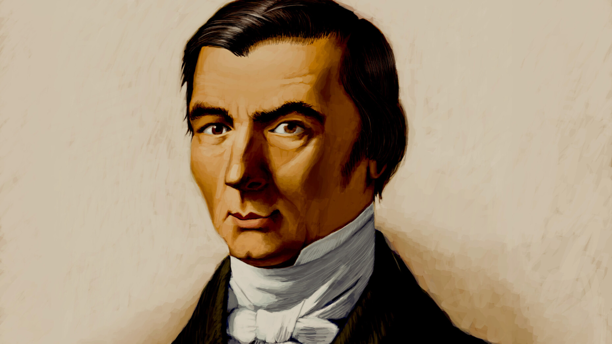

Nhưng vào năm 1848, sau cuộc cách mạng tháng Hai, Bastiat được bầu làm Nghị sĩ đại diện cho vùng Landes trong một hội đồng nơi những người xã hội chủ nghĩa đã có một chiến thắng vang dội. Những người này chỉ đòi một điều: rằng luật pháp phải khẳng định nguyên tắc tình anh em. Nói cách khác, thông qua các luật cung cấp việc làm, giáo dục, và chăm sóc sức khỏe cho tất cả mọi người.

Dưới sự thống trị của các ý tưởng xã hội chủ nghĩa, Bastiat quan sát thấy rằng bộ máy bầu cử được sử dụng để cướp đoạt tiền công, do đó là cướp đoạt tài sản của công dân:

> Tài chính công sẽ sớm rơi vào tình trạng hỗn loạn hoàn toàn. Làm sao có thể khác được khi Nhà nước được giao nhiệm vụ cung cấp mọi thứ cho tất cả mọi người? Người dân sẽ bị nghiền nát bởi thuế, vay mượn sẽ tiếp nối vay mượn; sau khi đã cạn kiệt hiện tại, họ sẽ tiếp tục ăn vào tương lai. Cuối cùng, khi nguyên tắc hoá việc Nhà nước chịu trách nhiệm tạo ra tình anh em vì lợi ích của công dân, toàn bộ dân tốc sẽ biến thành những kẻ ăn xin. Quyền sở hữu đất đai, nông nghiệp, công nghiệp, thương mại, hải quân, các công ty công nghiệp, tất cả sẽ nhộn nhịp đòi hỏi những ưu đãi từ Nhà nước. Kho bạc công sẽ thực sự bị cướp bóc. ([_Công lý và Tình anh em - Justice et fraternité_](http://bastiat.org/fr/justice_fraternite.html))

Nhà nước sau đó trở thành, theo lời của Bastiat:

> một sự hư cấu vĩ đại, mà thông qua đó mọi người cố gắng sống dựa vào người khác. ([_Nhà nước - L’Etat_](http://bastiat.org/fr/l_etat.html))
Bastiat cũng phát triển ý tưởng rằng xung đột nảy sinh khi luật pháp lệch khỏi vai trò đúng đắn của nó. Trong cuốn sách nổi tiếng của mình [_Luật pháp - The Law_](http://bastiat.org/fr/la_loi.html), ông đã chứng minh nguyên nhân và cách thức mà luật pháp đã trở thành "chiến trường của mọi lòng tham," nghĩa là nguồn gốc của đặc quyền, đặc ân và thuế khóa bất hợp lý. Ngay khi người ta chấp nhận về mặt nguyên tắc rằng luật pháp có thể được sử dụng cho mục đích khác với sứ mệnh thực sự của nó, rằng nó có thể vi phạm quyền sở hữu thay vì bảo đảm chúng, một cuộc đấu tranh giai cấp tất yếu sẽ xảy ra, hoặc là để phòng vệ chống lại sự cướp đoạt hoặc là để tổ chức cướp đoạt để trục lợi cho bản thân.

Trong trường hợp luật pháp chỉ đơn giản là bảo vệ quyền của cá nhân và đảm bảo _"tổ chức tập thể quyền tự vệ hợp pháp của cá nhân,"_ sẽ không ai có thể lợi dụng nó cho lợi ích cá nhân của mình mà gây thiệt hại cho tất cả những người khác, đến mức mà hình thức của chính phủ trở thành một câu hỏi thứ yếu.

Chỉ khi luật lệ vượt quá giới hạn đúng đắn của mình thì người lập pháp mới trở nên có thể tham nhũng. Điều này sau đó dẫn đến một cuộc đấu tranh khốc liệt giữa các nhóm lợi ích khác nhau, tất cả đều háo hức chiếm lấy cơ quan lập pháp để có được những đặc quyền mang tính cướp đoạt.

Theo Bastiat, dân chủ xã hội chủ nghĩa dẫn đến thâm hụt ngân sách vĩnh viễn và cuối cùng là bạo lực. Thực vậy, bằng cách không ngừng nhân lên những lời hứa không thể thực hiện được, bộ máy bầu cử phát triển sự phẫn nộ và đặt nền móng cho các cuộc cách mạng. Ông viết:

> Nhưng nếu chính phủ tự nhận trách nhiệm tăng lương và không thể thực hiện được; nếu nó tự nhận trách nhiệm hỗ trợ mọi nỗi bất hạnh và không thể thực hiện được; nếu nó tự nhận trách nhiệm cung cấp lương hưu cho mọi người lao động và không thể thực hiện được... và điều chúng ta không thấy được là sau mỗi sự thất vọng, nhiều khả năng là sẽ có một cuộc cách mạng không thể tránh khỏi. ([_Luật pháp - The Law_](http://bastiat.org/fr/la_loi.html))

Kết luận của Bastiat:
> Nhìn vào quả địa cầu. Những dân tộc nào là hạnh phúc, đạo đức và yên bình nhất? Những nơi mà luật pháp can thiệp ít nhất vào hoạt động tư nhân; nơi chính phủ ít hiện diện nhất; nơi các cá nhân mạnh mẽ nhất và dư luận có ảnh hưởng nhất; nơi cơ cấu hành chính gọn nhẹ và ít phức tạp nhất; thuế ít nặng nề và ít bất bình đẳng nhất; sự bất mãn của dân chúng ít bị kích động và ít có lý do nhất; nơi trách nhiệm của cá nhân và các tầng lớp được thực thi mạnh mẽ nhất, và do đó, nếu đạo đức không hoàn hảo, chúng có xu hướng tự sửa chữa không ngừng nghỉ; nơi giao dịch, thỏa thuận, hội họp ít bị cản trở nhất; nơi lao động, vốn và dân số ít bị thay thế, dịch chuyển nhân tạo nhất ([_Luật pháp - The Law_](http://bastiat.org/fr/la_loi.html))

## Phê bình của Mác về Chủ nghĩa Tư bản

<chapterId>16c82521-7c51-5d84-b660-0b358447e3bd</chapterId>

Vào thế kỷ 19, phê phán về Chủ nghĩa Tư bản đã nổi lên, đặc biệt là phê phán từ Mác.
Mác đã thốt lên, quyền được nói, viết và bầu cử có ích gì, nếu cuộc sống hàng ngày là một cuộc đấu tranh cho sinh tồn? Vượt qua một ngưỡng nhất định, nghèo đói tương đương với sự nô dịch. Do đó, trật tự xã hội chỉ mang lại lợi ích cho mọi người nếu nguyên tắc phân phối công bằng tài sản được áp dụng. Chính sự phê phán này về Chủ nghĩa Tự do đã dẫn Mác đến việc xem xét sự cần thiết của việc kiểm soát hợp lý và có kế hoạch đối với trật tự xã hội. Theo đó, nhà nước tối thiểu của các nhà tự do phải nhường chỗ cho một nhà nước mạnh mẽ có khả năng thiết lập sự bình đẳng thực sự, mà theo Mác, đi xa đến mức bãi bỏ quyền tư hữu và tập thể hóa nó. Trong một phiên bản mềm mỏng hơn, "dân chủ xã hội," nhà nước không chỉ đảm bảo các quyền trừu tượng mà còn các quyền cụ thể của con người. Các quyền mới được tạo ra, bao gồm quyền xã hội và kinh tế, được nhà nước bảo đảm: quyền có việc làm, quyền có nhà ở, quyền được chăm sóc sức khỏe (miễn phí), quyền giáo dục (miễn phí).

### Huyền thoại về nhà nước công bằng

Phê phán cơ bản mà Mác đưa ra nhắm vào Chủ nghĩa Tự do chính trị, đặc biệt trong các tác phẩm đầu của ông (_Phê bình Triết học pháp quyền của Hegel - Critique of Hegel's Philosophy of Right_ và _Về vấn đề Do Thái - On the Jewish Question_), tập trung vào sự tách biệt giữa xã hội dân sự và nhà nước. Phê phán này phải được hiểu trong bối cảnh chung của cách ông giải thích về "Cách mạng Tư sản." Chính cuộc cách mạng này dẫn đến việc hình thành một nhà nước tách biệt khỏi xã hội dân sự, thứ được cho là nhằm phục vụ cái phổ quát, nghĩa là lợi ích chung, bằng cách đóng vai trò là một trọng tài vô tư.

Tuy nhiên, theo Mác, tất cả những điều này chỉ là vẻ ngoài lừa dối. Trên thực tế, nhà nước không phải là gì khác ngoài là một công cụ nhằm phục vụ lợi ích cụ thể của tầng lớp cai trị. Nói cách khác, nhà nước không công bằng và cũng không tách biệt khỏi xã hội dân sự. Thực tế, nhà nước tự do là nơi của một ảo tưởng kép. Ảo tưởng về tính phổ quát, như chúng ta vừa thấy, và do đó, ảo tưởng về sự giải phóng. Cuộc cách mạng đã giải phóng công dân bằng cách thiết lập chủ quyền nhân dân và sự bình đẳng trước pháp luật, nhưng thứ tự do và bình đẳng này vẫn chỉ là lý tưởng và trừu tượng. Mác khẳng định, cho rằng con người hoàn toàn thực hiện bản chất lý trí của mình khi trở thành công dân như suy nghĩ của Rousseau hay Hegel là sai lầm. Trên thực tế, một người có thể trở thành công dân mà vẫn bị bóc lột, bị nô dịch, bị bỏ rơi bởi những ham muốn, sự hỗn loạn của chủ nghĩa vị kỷ, và luật của kẻ mạnh nhất.

Sự giải phóng của công dân, theo Mác, không đồng nghĩa với sự giải phóng của con người, như Tuyên ngôn năm 1789 gợi ý, mà đúng hơn sự chiến thắng của chủ nghĩa cá nhân huỷ diệt và do đó là của bất bình đẳng. Tự do là quyền được làm bất cứ điều gì không gây hại cho người khác, một trụ cột của quyền con người, là một tự do tiêu cực không tạo ra mối quan hệ giữa con người mà ngược lại, thúc đẩy sự tách biệt, đối kháng của họ và cuối cùng là nô dịch họ. Tự do của quyền con người là một tự do hình thức.

Ảo tưởng chính trị của Chủ nghĩa Tự do là mặt trái của ảo tưởng tôn giáo, Mác thêm vào. Như câu nói nổi tiếng: "tôn giáo là thuốc phiện của nhân dân." Tôn giáo là một sự an ủi, nó mang lại cảm giác phấn khích và hứa hẹn sự giải phóng trong kiếp sau. Nhưng nó làm lệch hướng con người khỏi sự giải phóng thực sự của mình ở thế giới thực này. Quyền công dân, so với hoạt động của người công nhân, giống như vương quốc của Chúa so với cuộc sống khốn khổ trên trần gian này. Nó không bao giờ trở thành hiện thực. Sự tách biệt kép này tạo thành một sự tha hoá kép, tức là con người không hoàn thành được nhân tính của mình hoặc chỉ hoàn thành nó trong tưởng tượng.

### Sự tha hoá kinh tế
Trên thực tế, đối với Mác và theo chủ nghĩa duy vật lịch sử, sự tha hóa kinh tế chính là nguồn gốc của sự tha hóa chính trị cũng như sự tha hóa tôn giáo. Trong sự tha hóa kinh tế, là kết quả của Chủ nghĩa Tư bản (được định nghĩa là sở hữu tư nhân đối với tư liệu sản xuất), người công nhân buộc phải bán sức lao động của mình như một hàng hóa. Hơn nữa, anh ta bị tước đoạt sản phẩm có được từ công sức lao động mình, sản phẩm đó thuộc về người sử dụng lao động. Do đó, anh ta do đó bị tha hóa, nghĩa là bị tách biệt khỏi chính mình vì công việc của anh ta trở thành thứ gì đó xa lạ mà anh ta phải làm vì bắt buộc, để tồn tại. Tuy nhiên, đối với Mác, lao động là hành động cốt lõi của con người, thông qua đó họ thực hiện chính bản chất thực sự của mình, tức là tự do. Đó là lý do tại sao giải phóng lao động cũng có nghĩa là khôi phục phẩm giá và nhân tính cho con người.

Theo Mác, cách mạng chính trị là một ảo tưởng, miễn là nó không đi kèm với một cuộc cách mạng kinh tế và xã hội có khả năng giải phóng con người khỏi ách nô dịch của Chủ nghĩa Tư bản và do đó đạt được sự thống nhất giữa người công nhân và công dân, giữa xã hội và nhà nước, giữa lĩnh vực tư và lĩnh vực công. Do đó, tự do và bình đẳng hình thức của công dân sẽ trở thành hiện thực, trong một xã hội không có giai cấp.

## Phê bình của trường phái kinh tế học Áo về Chủ nghĩa Mác

<chapterId>f05dae71-c478-5de1-996e-1b7b4255d373</chapterId>

Trường phái kinh tế học Áo, được Carl Menger sáng lập vào cuối thế kỷ 19, đã phản đối các lý thuyết của Karl Mác ngay từ đầu.

### Đấu tranh giai cấp

Các nhà kinh tế học Áo bác bỏ khái niệm về cuộc đấu tranh giai cấp của Mác, theo đó xung đột giữa giai cấp tư bản và giai cấp công nhân là điều không thể tránh khỏi và sẽ là động lực cho sự thay đổi của xã hội.

**Mọi sự thay đổi xã hội chỉ có thể đạt được thông qua hành động của các cá nhân, chứ không phải từ các lực lượng xã hội trừu tượng như các giai cấp.**

Trường phái Áo cho rằng xã hội không bị chia rẽ thành hai giai cấp đối kháng, mà thay vào đó là bao gồm các cá nhân với các lợi ích và nhu cầu khác nhau. Họ nhấn mạnh rằng các mối quan hệ kinh tế giữa các cá nhân thường mang lại lợi ích cho cả hai bên thay vì dựa trên sự bóc lột.

Ví dụ, một nhà tuyển dụng thuê một người lao động vì anh ta cần kỹ năng của người đó để sản xuất một hàng hóa hoặc dịch vụ mà người tiêu dùng mong muốn. Người lao động, ngược lại, chấp nhận công việc vì anh ta cần thu nhập để đáp ứng nhu cầu của mình. Mối quan hệ này mang lại lợi ích cho cả hai bên, và không xung đột.
Ludwig von Mises nhấn mạnh rằng, khi phê phán quyền con người, Mác đã không phân biệt được giữa những gì thuộc về ý thức hệ tư bản và những ý nghĩa thực tiễn của chúng, cũng như những biến động mà chúng gây ra trong đời sống xã hội. Nhiều nhà tư tưởng phê phán quyền con người cũng đã mắc phải sai lầm tương tự. Điều này cũng đúng với những nhà phản cách mạng, như Joseph de Maistre hay Louis de Bonald.
Trong _Đạo đức của Tự do - The Ethics of Liberty_ và _Giải phẫu của Nhà nước - Anatomy of the State_, Murray Rothbard giải thích rằng khái niệm bóc lột chỉ có ý nghĩa như một hành động xâm phạm quyền tư hữu và chỉ có Nhà nước mới kiếm được thu nhập thông qua sự xâm phạm, tức là thông qua thuế, nợ, in tiền, và do đó thông qua lạm phát. Trên thực tế, chính sự can thiệp của Nhà nước, chứ không phải các cuộc đấu tranh giai cấp, là nguồn gốc của bạo lực và xung đột trong xã hội. Nhà nước, bằng cách chiếm đoạt tài nguyên và quản lý nền kinh tế, đã tạo ra những méo mó và bất công dẫn đến xung đột và áp bức. Do đó, muốn chấm dứt sự bóc lột thì đòi hỏi phải giảm bớt quyền lực của tầng lớp trấn lột: Nhà nước.
Về vấn đề này, xem thêm: _Phân tích về giai cấp của chủ nghĩa Mác và trường phái Áo - Mácist and Austrian Class Analysis_, Hans Hermann Hoppe, Journal of Libertarian Studies, Vol IX No. 2, Mùa Thu 1990.(https://fr.liberpedia.org/L%E2%80%99analyse_de_classe_Máciste_et_celle_des_Autrichiens). Được tái bản thành Chương 4 trong _Kinh tế học và Đạo đức của quyền tư hữu - The Economics and Ethics of Private Property_ (Boston: Kluwer Academic Publishers, 1993).

### Chủ nghĩa đa logic - Polylogism

Khái niệm về cuộc đấu tranh giai cấp cũng có thể dẫn đến ý tưởng rằng mọi thứ đều được phép. Mác cho rằng các khái niệm về tốt, xấu, công bằng, đúng, sự thật, đều tương đối với các giai cấp. Theo ông, con người vốn bẩm sinh không thể tìm ra sự thật. Cấu trúc logic của tâm trí khác nhau tùy thuộc vào các giai cấp xã hội. Không có một logic nào có giá trị phổ quát.

Mises đã đặt ra thuật ngữ "polylogism" để giải thích cho sự nguỵ biện này. "Poly" có nghĩa là nhiều và "logism" ám chỉ lý luận và logic hợp lý. Theo Mác, sẽ có nhiều logic không tương thích, logic của giai cấp vô sản và logic của giai cấp tư sản.

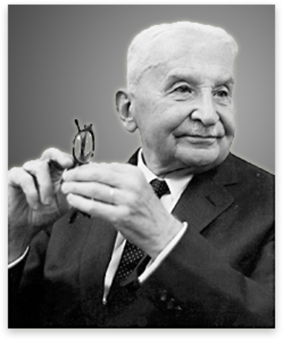

Tuy nhiên, cho đến giữa thế kỷ 19, không ai dám phủ nhận thực tế rằng cấu trúc logic của tư duy là giống nhau và phổ quát đối với tất cả mọi người. Tất cả các mối quan hệ giữa con người đều dựa trên giả định về một cấu trúc logic đồng nhất. Con người có thể tham gia thảo luận vì họ có thể dựa vào một thứ chung cho tất cả, đó là cấu trúc logic của lý trí.

Mises viết:
> Mác và các nhà Mác-xít (...) đã dạy rằng tư duy bị chi phối bởi tình trạng giai cấp của người suy nghĩ. Những gì suy nghĩ tạo ra không phải là sự thật, mà là các ý thức hệ. Trong triết học Mácist, từ này có nghĩa là một sự ngụy trang cho lợi ích ích kỷ của giai cấp mà cá nhân suy nghĩ đó thuộc về. Do đó, việc thảo luận bất cứ điều gì với mọi người từ một giai cấp xã hội khác là điều vô ích. Các ý thức hệ không cần phải được bác bỏ bằng lập luận suy diễn; chúng phải được vạch trần bằng cách tố cáo tình trạng giai cấp và bối cảnh xã hội của những người tạo ra chúng. Do đó, các nhà Mác-xít không thảo luận về giá trị của các lý thuyết vật lý; họ chỉ đơn giản vạch trần nguồn gốc tư sản của các nhà vật lý học. (_Chính phủ toàn năng - The Omnipotent Government_).

Trong mắt các nhà Mác-xít, thì Ricardo, Freud, Bergson, và Einstein đều sai lầm vì họ thuộc giai cấp tư sản. Do đó, các nhà Mác-xít tuyên bố rằng cấu trúc logic của tư duy sẽ khác nhau thay đổi theo giai cấp. Mỗi giai cấp sẽ có logic riêng và do đó có nền kinh tế, toán học, vật lý, v.v. của riêng mình. Chỉ có logic và khoa học của các nhà Mác-xit là chính xác, đúng đắn, và vĩnh cửu.

Đó là lý do tại sao Georges Sorel, người đã đưa chủ nghĩa Mác vào Pháp, đã nói rằng bạo lực có lợi, miễn là nó thuộc về "vô sản". Không ngạc nhiên, cùng một lập luận như vậy được tìm thấy trong các tác phẩm của Lê-nin, và sau đó là Trotsky. Vì đạo đức và pháp luật cổ điển là những phát minh của giai cấp thống trị, nên mọi thứ đều được phép.

### Lao động và lợi nhuận

Các nhà kinh tế học Áo khẳng định rằng lý thuyết giá trị lao động của Mác, rằng giá trị của một hàng hóa được xác định bởi lượng lao động cần thiết để sản xuất ra nó, là sai lầm. Họ cho rằng giá trị mang tính chủ quan và được xác định bởi thị hiếu của người tiêu dùng, không phải bởi chi phí sản xuất.

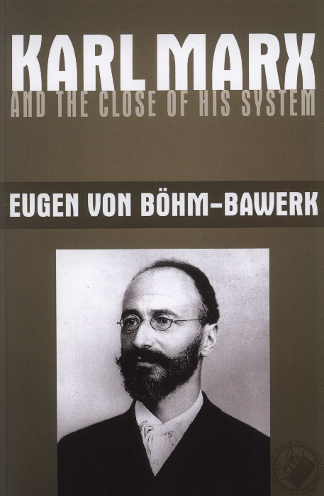
Eugen von Böhm-Bawerk, một trong những nhà kinh tế học Áo thời sơ khai, đã chỉ trích lý thuyết giá trị lao động của Mác trong công trình của mình _Giá trị, Tư bản và Lãi suất - Wert, Kapital und Zins_ (1886). Böhm-Bawerk cho rằng lý thuyết của Mác dựa trên một sai lầm cơ bản, đó là Mác cho rằng tất cả các đơn vị lao động đều giống nhau. Trên thực tế, ông lập luận, một số công việc khó khăn hoặc hiệu quả hơn những công việc khác, và đây chính là điều quyết định giá trị của một hàng hóa. Về lý thuyết lợi nhuận, Mác cho rằng lợi nhuận là một hình thức cướp đoạt. Đó là khái niệm về sự bóc lột, theo đó các nhà tư bản chiếm đoạt một giá trị thặng dư một cách không công bằng từ lao động của người công nhân. Các nhà kinh tế học Áo bác bỏ quan điểm này, họ lập luận rằng tiền lương được xác định bởi giá trị mà người lao động mang lại cho các công ty, và lợi nhuận là phần thưởng cho các doanh nhân đã chấp nhận rủi ro và đầu tư hiệu quả. Do đó, lợi nhuận là phần thưởng cho doanh nhân đã chấp nhận rủi ro để đầu tư vào sản phẩm và quy trình mới.

Friedrich Hayek đã phát triển một lý thuyết về lợi nhuận dựa trên khái niệm về sự không chắc chắn, lý thuyết này có sự kế thừa công trình của Jean-Baptiste Say. Theo Hayek, các doanh nhân kiếm được lợi nhuận vì họ có khả năng dự đoán tốt hơn nhu cầu tương lai của người tiêu dùng so với các thực thể kinh tế khác.

### Sự bất khả thi của tính toán kinh tế

Các nhà Mác-xít tin rằng Chủ nghĩa Xã hội, một hệ thống kinh tế mà tư liệu sản xuất được sở hữu và kiểm soát bởi giai cấp công nhân, là tất yếu ưu việt hơn Chủ nghĩa Tư bản. Ngược lại, các nhà kinh tế học trường phái Áo khẳng định rằng Chủ nghĩa Xã hội là không khả thi trong thực tế, vì nó đòi hỏi một mức độ kế hoạch hóa tập trung không thực tế.

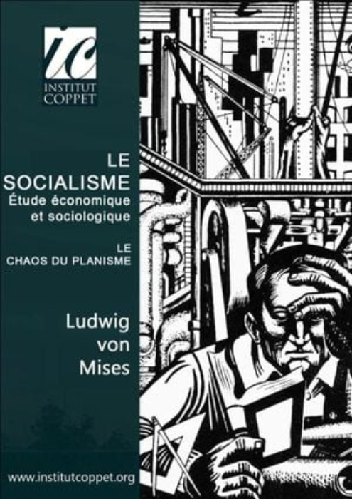

Ngay từ năm 1922, trong cuốn sách _Chủ nghĩa Xã hội - Socialism,_ Ludwig von Mises đã chứng minh rằng Chủ nghĩa Xã hội sẽ dẫn đến tình trạng khan hiếm hàng hoá trên diện rộng, vì các nhà hoạch định trung ương sẽ không thể thực hiện các tính toán kinh tế chính xác nếu không có hệ thống giá cả do thị trường cung cấp.

## Con đường dẫn đến chế độ nô lệ

<chapterId>3f92f346-3062-5f76-8c54-3a9075e2b030</chapterId>

Lo lắng trước sự gia tăng can thiệp của chính phủ vào nền kinh tế ở các nền dân chủ phương Tây, Hayek đã viết _Con đường dẫn đến chế độ nô lệ - The Road to Serfdom_ như một phê bình triết học về chủ nghĩa tập thể, dù là từ cánh hữu hay cánh tả. Với hàng triệu bản được bán nhờ vào sự quảng bá của _Reader’s Digest_, cuốn sách này đã tạo nên danh tiếng của Hayek tại Hoa Kỳ.

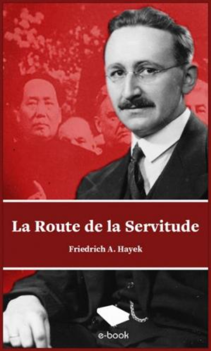

### Sức hút của chủ nghĩa tập thể

Viết từ năm 1940 đến năm 1943, bài luận ngắn này nhằm mục đích cung cấp một đánh giá ban đầu về các thí nghiệm kinh tế tập thể đã được thử nghiệm vào nửa sau của những năm 1930: quốc hữu hóa và quản lý nhu cầu theo lý thuyết của Keynes đã được áp dụng rộng rãi ở xã hội dân chủ châu Âu và Mỹ thời New Deal. Dành cho "những người xã hội chủ nghĩa của mọi đảng phái," cuốn sách tìm cách chứng minh rằng "phương Tây đã dần dần từ bỏ nguyên tắc tự do kinh tế, thứ mà nếu không có nó trong quá khứ thì sẽ không có bất kỳ tự do cá nhân hay tự do chính trị nào có thể tồn tại."
Thực vậy, quá trình tập trung hóa quyền lực chính trị và mong muốn thay thế các cơ chế thị trường truyền thống bằng một tổ chức chỉ huy là điểm chung được tìm thấy ở khắp mọi nơi. Ở Vương quốc Anh cũng như ở Hoa Kỳ, người ta khẳng định rằng Nhà nước phải lên kế hoạch cho tất cả và có thể giải quyết mọi vấn đề.

Trong khi đó Chủ nghĩa Tự do chân chính luôn quan tâm đến công lý. Nhưng Hayek nhắc nhở chúng ta rằng trách nhiệm tổ chức sự đoàn kết thuộc về xã hội dân sự chứ không phải là Nhà nước. Điều phân biệt Chủ nghĩa Tự do và Chủ nghĩa Xã hội không phải là mục địch, mà là phương tiện. Theo Hayek,

> Chủ nghĩa Tự do muốn chúng ta tận dụng tốt nhất có thể sức mạnh của sự cạnh tranh như một phương tiện để phối hợp nỗ lực của con người; chứ nó không muốn chúng ta giữ nguyên hiện trạng hiện tại.
Hayek bổ sung thêm rằng Nhà nước có một vai trò không thể phủ nhận:
> Tạo ra các điều kiện mà trong đó cạnh tranh sẽ hiệu quả nhất có thể, thay thế nó ở những nơi mà cạnh tranh không hiệu quả, cung cấp các dịch vụ mà lợi nhuận không thể bù đắp chi phí cho bất kỳ nhóm nào, theo công thức của Smith.

Ngược lại, việc lập kế hoạch cho kinh tế và xã hội nói chung, bản chất của Chủ nghĩa Xã hội, chống lại cạnh tranh. Tuy nhiên, theo Hayek, có một sự không tương thích giữa mục đích của Chủ nghĩa Xã hội (công bằng xã hội, bình đẳng và an toàn) và các phương tiện mà Chủ nghĩa Xã hội dự định sử dụng để đạt được chúng (xoá bỏ quyền tư hữu, tập thể hóa tư liệu sản xuất, nền kinh tế kế hoạch hoá).

### Gốc rễ của Chủ nghĩa Xã hội của Chủ nghĩa Phát xít

Ngay từ những trang đầu, Hayek thiết lập một sự đồng hành giữa sự thắng lợi của các lý tưởng Chủ nghĩa Xã hội ở phương Tây và sự thành công đồng thời của các ảo tưởng toàn trị.

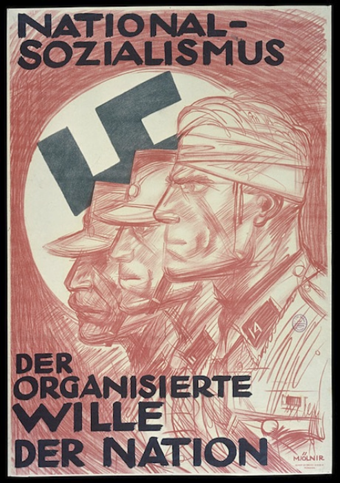

> Rất ít người, ông cảnh báo trong lời tựa, sẵn lòng nhận ra rằng sự nổi lên của Chủ nghĩa Phát xít và Chủ nghĩa Quốc xã không phải là phản ứng chống lại các xu hướng (...) của thời kỳ trước đó, mà là kết quả không thể tránh khỏi của những xu hướng đó. Điều này là một thứ mà hầu hết mọi người đã từ chối nhìn nhận, ngay cả khi họ nhận ra sự tương đồng của một số đặc điểm tiêu cực ở các chế độ Nga Cộng sản và Đức Quốc xã. Kết quả là nhiều người tự xem mình cao quý hơn những lệch lạc của Chủ nghĩa Quốc xã và thực sự ghét bỏ mọi biểu hiện của nó, nhưng đồng thời lại làm việc vì những lý tưởng mà việc thực hiện chúng sẽ trực tiếp dẫn đến sự chuyên chế mà chính họ ghê tởm.
Theo Hayek, Chủ nghĩa Xã hội và Chủ nghĩa Quốc xã có cùng một số điểm chung cơ bản, đặc biệt là sự chối bỏ chủ nghĩa cá nhân và trật tự tự phát của thị trường. Cả hai hệ tư tưởng đều ưu tiên lợi ích của tập thể hơn quyền lợi và tự do của cá nhân và tìm cách tạo ra một xã hội đồng nhất được thống nhất bởi các giá trị và mục tiêu chung. Cả Chủ nghĩa Xã hội lẫn Chủ nghĩa Quốc xã đều không ngần ngại sử dụng vũ lực và cưỡng chế để đạt được mục tiêu của mình. Họ sẵn lòng đàn áp tự do cá nhân và đàn áp sự bất đồng chính kiến nhân danh lợi ích của xã hội.
> Trong chương có tựa đề "Gốc rễ của Chủ nghĩa Xã hội của Chủ nghĩa Quốc xã," Hayek chỉ ra rằng Chủ nghĩa Quốc xã tuyên bố kế hoạch hóa Chủ nghĩa Xã hội (do đó tên gọi, Chủ nghĩa Xã hội Quốc gia) của nền kinh tế như một phương tiện để thiết lập quyền kiểm soát toàn diện đối với dân chúng.

Các nhà Chủ nghĩa Xã hội Đức và Ý chỉ đơn giản là đã mở đường cho Chủ nghĩa Quốc xã bằng cách thành lập các đảng phái chính trị điều khiển mọi hoạt động của cá nhân, từ khi sinh ra cho đến khi chết, chỉ đạo tư tưởng, ý kiến của họ về mọi thứ. Không phải là những kẻ Phát xít mà là các nhà Chủ nghĩa Xã hội đã bắt đầu việc quân sự hóa trẻ em vào các tổ chức chính trị, kiểm soát đời sống riêng tư và suy nghĩ của họ.

Các lãnh đạo Phát xít chỉ đơn giản là kế thừa các diễn ngôn về nhà nước, sự chỉ đoạ và can thiệp trên mọi mặt mà các nhà Mác-xít đã phổ biến rộng rãi. Nhiều lãnh đạo Phát xít, như Mussolini ở Ý, Laval ở Pháp, và Oswald Mosley ở Vương quốc Anh, đã bắt đầu sự nghiệp chính trị của mình như những nhà hoạt động cánh tả trước khi chuyển sang Chủ nghĩa Phát xít hoặc Chủ nghĩa Hít-le, do sự gần gũi về ý tưởng.

Để kết luận, Hayek kêu gọi quay lưng lại với "sự điên rồ" và "chủ nghĩa mê tín hiện đại" để giải thoát nhân loại khỏi "những sai lầm đã thống trị cuộc sống của chúng ta trong thời gian gần đây." Theo ông, bảo đảm tốt nhất cho tự do là quyền tư hữu. Khi tất cả tư liệu sản xuất được tập trung trong tay một số nhà tổ chức, chúng ta bị phụ thuộc vào quyền lực toàn trị bởi vì quyền lực kinh tế này sẽ trở thành một công cụ chính trị để kiểm soát toàn bộ cuộc sống của chúng ta.

# Sự nổi lên của Nhà nước Phúc lợi trong thế kỷ 20

<partId>49e581cb-3dca-5f10-ac34-5b4cbd3d7c36</partId>

## Chiến thắng của Keynes

<chapterId>f40fc495-bcf7-5b7a-95ad-3a3ccba3e3ba</chapterId>

Chủ nghĩa Tư bản thường bị cáo buộc là nguồn gốc của những mệnh lệnh như: "chúng ta phải luôn sản xuất ngày càng nhiều hơn," hoặc của công thức: "tiêu dùng tốt cho tăng trưởng." Tuy nhiên, những ý tưởng này không phát sinh từ Chủ nghĩa Tư bản truyền thống mà từ Chủ nghĩa Keynes, một học thuyết đã thống trị lĩnh vực khoa học kinh tế và giới chính trị kể từ những năm 1930.

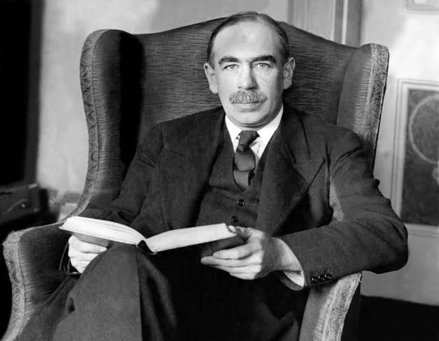

### Phân tích cuộc Đại suy thoái năm 1929

Xuất bản vào năm 1936, cuốn sách của John Maynard Keynes: _Lý thuyết chung về việc làm, lãi suất và tiền tệ - The General Theory of Employment, Interest, and Money_, đã tạo nên một cuộc cách mạng. Tìm hiểu về nguyên nhân của Đại suy thoái và cách để thoát khỏi nó, ông mô tả một mô hình kinh tế mới, thứ đã thu hút sự ủng hộ của nhiều nhà kinh tế học và chính trị gia.

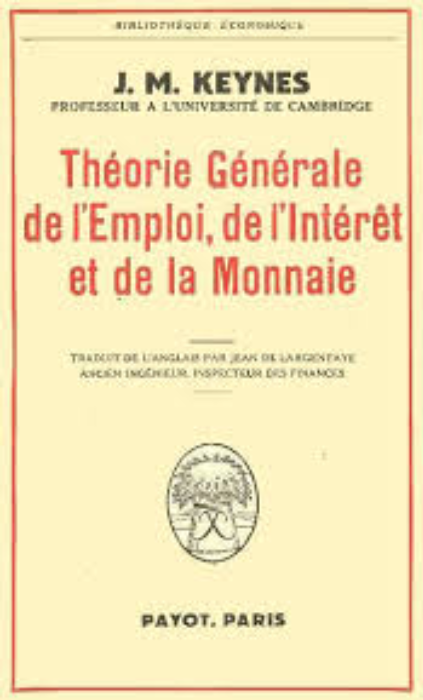

Tóm tắt ngắn gọn, chi tiêu công thúc đẩy tăng trưởng và để tài trợ cho thâm hụt ngân sách, cần phải triển khai một chính sách tiền tệ với lãi suất thấp. Đầu tiên, việc tăng chi tiêu công sẽ có tác động nhân lên đối với hoạt động kinh tế, giúp hạn chế suy thoái và tăng tốc độ phục hồi. Sau đó, ở giai đoạn thứ hai, tiền tệ sẽ được coi là một công cụ chính sách để nhà nước sử dụng nhằm mục đích ổn định vĩ mô.

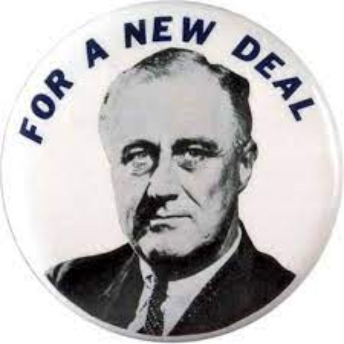

Chủ nghĩa Keynes vì thế là tuyên bố rằng chi tiêu công và tiêu dùng cung cấp phương tiện cho tăng trưởng mạnh mẽ và việc làm đầy đủ. Kế hoạch tăng trưởng này dựa trên việc kiểm soát tiền tệ.

Thực vậy, theo Keynes, tiết kiệm dài hạn cản trở tiêu dùng và do đó là trở ngại cho sự tăng trưởng. Vì vậy, tiền tệ cần phải bị giảm sức mua theo thời gian để khuyến khích các cá nhân tiêu dùng nhiều hơn và nhanh hơn, điều này là tốt cho nền kinh tế. Theo logic Keynes của các chính sách kinh thích kinh tế, tiết kiệm là kẻ thù.

Theo Keynes, có thể chống lại kẻ thù này bằng cách hạ thấp lãi suất. Đó là lý do tại sao các ngân hàng trung ương phải độc quyền và kiểm soát tiền tệ.

Với Keynes, thế kỷ 20 trở thành thế kỷ của niềm tin vào các chuyên gia kế hoạch hoá. Các kỹ sư xã hội, những người đứng đầu chính phủ và điều hành chính sách tiền tệ, có thể kéo cần gạt đòn bẩy để khôi phục sự thịnh vượng, vì họ sở hữu một tầm nhìn vĩ mô về thế giới.

### Di sản gây tranh cãi của Keynes

Đối với Keynes, sự can thiệp của nhà nước là cần thiết để kích thích nhu cầu và khôi phục nền kinh tế. Học thuyết này đã giành được chiến thắng trong các trường đại học và sách giáo khoa. Tuy nhiên, sự can thiệp của nhà nước có những khuyết điểm và có thể làm trầm trọng thêm các cuộc khủng hoảng trong dài hạn thay vì giải quyết chúng.

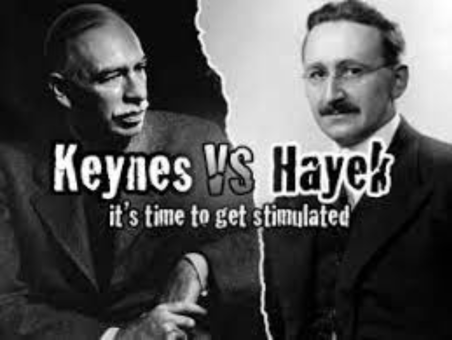

Đó là lý do tại sao một số nhà kinh tế, chỉ là số ít, chỉ trích Keynes vì tư duy ngắn hạn của ông và ủng hộ việc quay trở lại với cơ chế thị trường như một giải pháp thay thế tốt hơn cho sự can thiệp của nhà nước.
Friedrich Hayek đã giải thích rằng việc giảm lãi suất liên tục bởi các ngân hàng trung ương và sự mở rộng tín dụng nhân tạo chỉ có thể dẫn các thực thể kinh tế vào con đường sai lầm, khiến họ đầu tư như thể có nhiều nguồn lực tiết kiệm hơn thực tế (vì theo lẽ tự nhiên lãi suất giảm xuống khi tiết kiệm tăng). Sự phân bổ nguồn lực sai lầm này sẽ thúc đẩy một sự tăng trưởng nhân tạo, một bong bóng, kéo theo một cuộc suy thoái nghiêm trọng. Đóng góp này vào lý thuyết chu kỳ đã giúp Hayek được nhận giải Nobel Kinh tế vào năm 1974.
Cùng với những người khác, ông cũng nhấn mạnh sự nguy hiểm của việc tập trung hoá và thao túng tiền tệ. Đặc biệt là trường hợp của nhà kinh tế học người Pháp, Jacques Rueff, một môn đồ và là bạn của Ludwig von Mises.

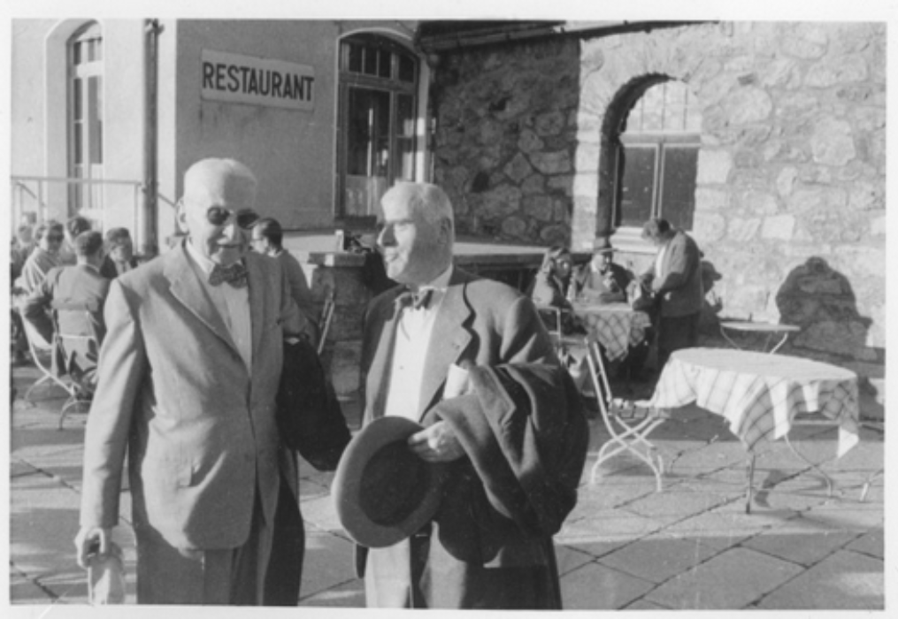
Tốt nghiệp từ École Polytechnique vào năm 1919, Rueff đã có một sự nghiệp làm quan chức cấp cao và là cố vấn kinh tế cho nhiều chính phủ trong những năm 1920 và 1930. Công trình quan trọng nhất của ông xuất bản vào năm 1945: _Trật tự xã hội - L’ordre social_, trong đó ông phát triển một luận điểm mạnh mẽ ủng hộ thị trường tự do, từ quan điểm kinh tế, triết học và đạo đức.
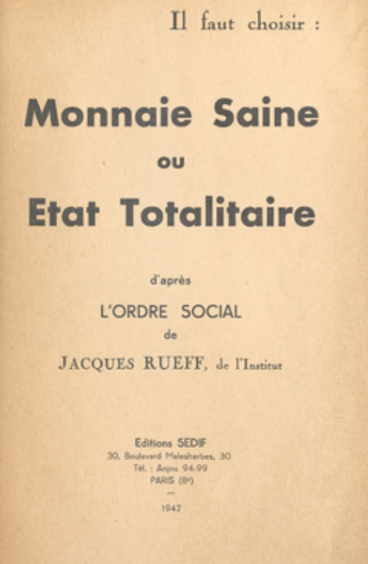

Cuốn sách này có một chương quan trọng có tiêu đề: "_Đồng tiền vững chắc hay Nhà nước toàn trị - Monnaie saine ou État totalitaire_". Trong chương này, ông phát triển hai luận điểm. 
- Luận điểm đầu tiên: "Đồng tiền yếu kém tạo ra rối loạn xã hội".
- Luận điểm thứ hai bắt nguồn từ luận điểm thứ nhất: "Rối loạn xã hội tạo ra nô lệ xã hội". Tiền yếu kém chính là tiền giấy, không được bảo chứng bởi bất kỳ thực thể vật lý nào và bị quyền lực cai trị thao túng. Rối loạn xã hội là lạm phát và chủ nghĩa tiêu dùng phát sinh từ nó. Nô lệ xã hội là sự phụ thuộc của xã hội vào nhà nước, mất hết tất cả sự tự chủ về tài chính, đạo đức và chính trị.

Vào năm 1947, năm năm sau khi bản dịch tiếng Pháp của _Lý thuyết chung - La théorie générale_ được phát hành, ông đã xuất bản một bài báo với tiêu đề: _Những sai lầm trong Lý thuyết chung của Lord Keynes - Les erreurs de la théorie générale de Lord Keynes_. Ông đã đưa ra những cảnh báo sau:
> Có khả năng là cuộc suy thoái tiếp theo sẽ dẫn đến việc chính sách do Lord Keynes đề xuất được áp dụng rộng rãi trên toàn thế giới. Tôi không sợ mình sẽ nhầm khi nói rằng chính sách này chỉ giảm thất nghiệp một cách không đáng kể, nhưng nó sẽ có những hậu quả sâu rộng đối với sự phát triển của các quốc gia áp dụng nó. (...) Bởi Lord Keynes, cuộc khủng hoảng tiếp theo sẽ là cơ hội cho những thay đổi chính trị sâu rộng, điều mà một số người hy vọng, trong khi những người khác lo sợ. Dù sao đi nữa, do dựa trên một lý thuyết sai lầm, nên những biện pháp được áp dụng sẽ mang lại những hậu quả hoàn toàn khác biệt so với những gì người ta mong đợi khi áp dụng chúng. Sự không hiệu quả của chúng sẽ là một lý do để nhiều người yêu cầu thay thế bằng một hệ thống mới, mà bằng cách phủ định chính nó sẽ tự huỷ chính nó.
Bắt đầu từ năm 1958, một chính sách nhằm tái cấu trúc nền kinh tế Pháp, lấy cảm hứng từ Jacques Rueff, sẽ được thực hiện dưới quyền lực của Tướng de Gaulle. Nó đã dẫn đến thời kỳ được gọi là "_Ba mươi năm Huy hoàng - Trente Glorieuses_".

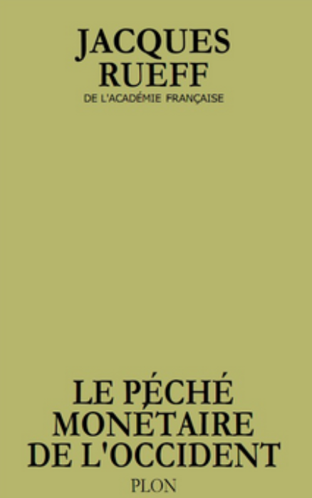

Trong _Tội lỗi về tiền tệ của phương Tây - Le péché monétaire de l’Occident_, vào năm 1971, Rueff viết:

> Chính thâm hụt ngân sách đã làm con người mất tự do

Ông nói thêm: "Lạm phát là việc tài trợ cho những khoản chi tiêu không mang lại lợi ích gì bằng những đồng tiền không hề tồn tại." Theo ông: "Khi quan sát sự phát triển của hệ thống tiền tệ quốc tế, người ta sẽ nghĩ rằng Phương Tây đang áp dụng lời khuyên của Lê-nin: Để phá hủy chế độ tư bản, chỉ cần phá hoạt đồng tiền của nó."

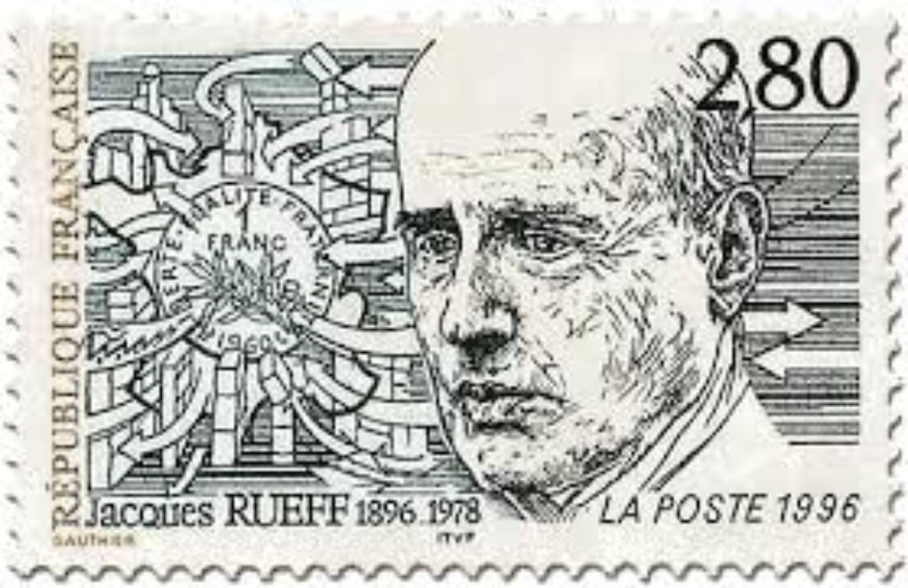

Vào năm 1976, ông một lần nữa tấn công Chủ nghĩa Keynes trong một bài viết cho tờ báo _Le Monde_.
> Không có tôn giáo nào lan truyền khắp thế giới nhanh như tôn giáo của việc làm. Được thúc đẩy bởi ký ức về những thảm họa thất nghiệp đã tàn phá Anh và Đức trong những năm 1920, dù là rõ rang hay ngầm hiểu, nó đã trở thành nguyên tắc hàng đầu của chính sách kinh tế ở hầu hết mọi quốc gia trên thế giới. Che giấu mục đích của mình dưới vỏ bọc khéo léo và giả dối của "lý thuyết chung," được những môn đồ nhiệt thành và mù quáng nâng lên thành kinh thánh cho hành động chính phủ, nó đã che giấu bộ mặt thực sự của các chính sách lạm phát mà nó tạo ra. Bằng con đường này, nó đã làm an lòng các chính phủ, những chính phủ đã cạn kiệt khả năng thu thuế và vay mượn, đã tìm thấy niềm vui lừa dối của việc tạo ra tiền tệ. (_Sự kết thúc của kỷ nguyên Keynes - La fin de l'ère keynésienne._, Tháng 4 năm 1976, tr.70-7.)

## Sự từ bổ chế độ bản vị vàng

<chapterId>f52da9ae-c4bc-5d1a-8fd0-8fcae5948e34</chapterId>

Tiền tệ là công cụ đã giúp loài người vượt lên trên hệ thống kinh tế dùng hàng đổi hàng, tiết kiệm và phối hợp trên quy mô lớn thông qua thị trường. Nó đã làm cho chuyên môn hóa lao động, lợi thế cạnh tranh, lợi ích từ thương mại và tính toán kinh tế trở nên khả thi. Không quá khi nói rằng: nếu không có tiền tệ sẽ không có nền văn minh hiện đại.

### Vàng là tiêu chuẩn toàn cầu

Có một hình thức tiền tệ đã dần dần tự phân biệt nó với những hình thức khác để trở thành chuẩn mực toàn cầu qua các thế kỷ, đó là vàng.

Thực vậy, vàng là một đồng tiền "cứng", khó sản xuất và rất tốn kém để làm giả. Thị trường đã chọn vàng là đồng tiền đáng tin cậy, bền vững và ít bị thao túng nhất. Lịch sử cho thấy khi mọi người có thể tự do lựa chọn đồng tiền để sử dụng, họ thường chọn vàng.

Đó là lý do tại sao, trong _Hành động của con người - Human Action_, Ludwig von Mises viết:

> Chế độ bản vị vàng là chuẩn mực toàn cầu của kỷ nguyên tư bản, của sự thịnh vượng, tự do và dân chủ \[…\] Đó là chuẩn mực quốc tế mà thương mại quốc tế và thị trường vốn thế giới cần \[…\] Nó đã mang công nghiệp, vốn và nền văn minh phương Tây đến với những góc xa xôi nhất của hành tinh, tạo ra sự giàu có chưa từng biết trước đây.
Nhưng chế độ bản vị vàng đã buộc các chính phủ phải hạn chế việc tài trợ cho chi tiêu của mình trong phạm vi của thu thuế thay vì lạm phát, điều này giải thích sự thù địch nhất định từ giới tinh hoa chính trị và kinh tế đối với hệ thống này. Bởi vì việc liên kết tiền tệ với một kim loại quý đã hạn chế khả năng của ngân hàng trung ương trong việc tài trợ cho sự mở rộng của nhà nước phúc lợi thông qua thuế gián tiếp là lạm phát.
Đó là lý do tại sao ngay từ năm 1923, Keynes đã tuyên bố:

> Thực tế, chế độ bản vị vàng đã là một di tích man rợ. (...) Những người bảo vệ chuẩn mực cũ không nhận ra rằng nó đã xa rời tinh thần và nhu cầu của thời đại mới như thế nào. (_Cải cách Tiền tệ - Monetary Reform_ J.M. Keynes).

### "Cú sốc Nixon"

Hệ thống Bretton Woods, được thiết lập vào năm 1944 và triển khai đầy đủ vào năm 1959, dựa trên cả vàng và đô-la Mỹ, đồng tiền duy nhất có thể chuyển đổi thành vàng. Do đó, cần phải tích lũy đô-la để có thể đổi lấy vàng.

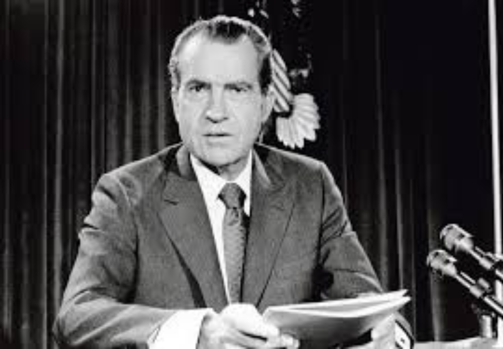
Vào thời điểm đó, cụ thể là trong Chiến tranh Việt Nam, sự gia tăng thâm hụt ngân sách của chính phủ Mỹ đã khiến nhiều quốc gia nước ngoài, bao gồm cả Pháp, muốn chuyển đổi đô-la của họ thành vàng tại FED. Vào ngày 15 tháng 8 năm 1971, Tổng thống Nixon đã quyết định hủy bỏ lời hứa chuyển đổi đô-la thành vàng, từ đó tạo ra đồng tiền giấy hoàn toàn đầu tiên trong lịch sử của Hoa Kỳ. Ngày này được đánh dấu là thời điểm tiền tệ hoàn toàn nằm dưới sự kiểm soát của các ngân hàng trung ương. Trong một cuộc phỏng vấn, Richard Nixon được cho là đã nói:

> Ngày nay, tất cả chúng ta là người theo Chủ nghĩa Keynes.

Thực vậy, đối với nhiều nhà kinh tế học Keynes, việc từ bỏ chế độ bản vị vàng đã cho phép chính phủ có sự linh hoạt cần thiết để phản ứng hoặc ngăn chặn các cuộc khủng hoảng kinh tế.

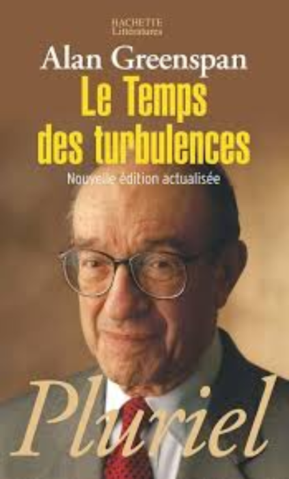

Theo Alan Greenspan, cựu chủ tịch FED, ngân hàng trung ương Mỹ, chế độ bản vị vàng không tương thích với nợ công và việc tài trợ cho nhà nước phúc lợi:

> Tôi luôn hoài niệm về sự ổn định giá cả vốn có trong chế độ bản vị vàng; một đồng tiền ổn định là mục tiêu hàng đầu của nó. Nhưng đã từ lâu, tôi chấp nhận rằng chế độ bản vị vàng không dễ dàng thích nghi với quan điểm phổ biến về chức năng của một chính phủ, đặc biệt là nghĩa vụ đảm bảo hệ thống an sinh xã hội. \[…\] Hầu hết người Mỹ đã chấp nhận lạm phát như là cái giá phải trả cho việc có một nhà nước phúc lợi hiện đại. Không còn ai ủng hộ chế độ bản vị vàng, và tôi thấy ít có khả năng nó sẽ trở lại. (_Thời kỳ của những biến động - The Age of Turbulence_).
Ngược lại, đối với những người như Jacques Rueff, việc từ bỏ kim loại quý là một sai lầm chỉ có thể dẫn đến sự sụt giảm liên tục trong sức mua, đi kèm với sự sụt giảm trong mức sống, gia tăng bất bình đẳng về thu nhập và sự bất ổn kinh tế ngày càng tăng.
> 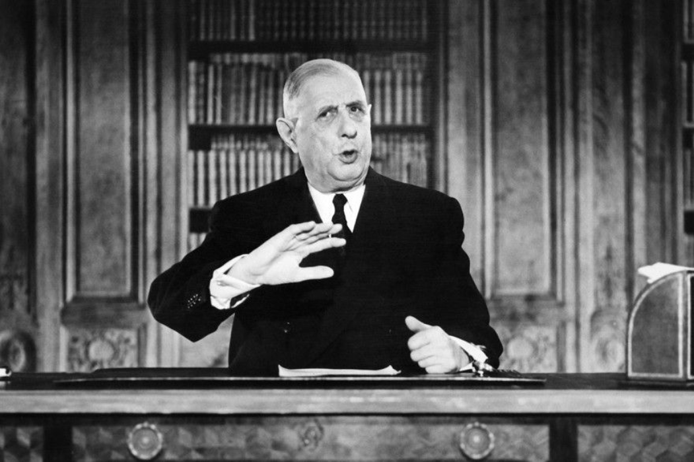

Vào tháng 2 năm 1965, trong một cuộc họp báo trên truyền hình, Tướng de Gaulle, được truyền cảm hứng từ Rueff, đã đề xuất quay trở lại chế độ bản vị vàng. Ông tuyên bố:

> Vàng, thứ không thay đổi bản chất, không có quốc tịch, được coi là có giá trị không thể thay đổi, vĩnh cửu và phổ quát.

### Một thị trường tiền tệ không có sự độc quyền của nhà nước là khả thi

Vào năm 1976, Hayek đã đề xuất một giải pháp thay thế cho độc quyền của Nhà nước trong việc tạo ra tiền tệ: sự cạnh tranh giữa các loại tiền tệ. Trong cuốn sách của mình, _Sự phi quốc gia hoá của tiền tệ - The Denationalization of Money_, ông đã tưởng tượng về một thị trường tiền tệ không có độc quyền của Nhà nước, nơi mà nhiều đồng tiền tư nhân tồn tại. Việc tạo ra và quản lý các loại tiền tệ khác nhau bởi các thực thể tư nhân sẽ cho phép các cá nhân lựa chọn đồng tiền ổn định và đáng tin cậy nhất, từ đó khuyến khích sự cạnh tranh và kỷ luật giữa các nhà phát hành.

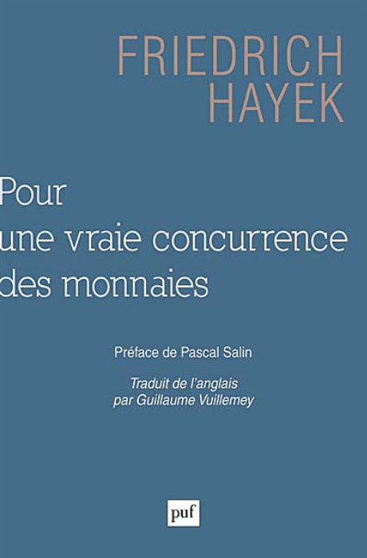

Ông viết:

> Chừng nào chúng ta chưa khôi phục được tình hình mà ở đó chính phủ (cũng như các cơ quan công quyền khác) biết rằng nếu chi tiêu quá mức họ sẽ, như bất kỳ ai khác, phá sản, thi sẽ không thể chấm dứt quá trình này, quá trình dùng các hoạt động tập thể để thay thế cho các hoạt động cá nhân, đe doạ làm ngột ngạt các sáng kiến cá nhân. Trong nền dân chủ không giới hạn hiện tại, nơi chính phủ có quyền ban tặng lợi ích vật chất đặc biệt cho các nhóm cụ thể, nó buộc phải mua chuộc đủ sự ủng hộ từ các nhóm đủ lớn để tạo thành đa số. (Chương XXI, _Ảnh hưởng của tài chính và chi tiêu công - The effects of finance and public spending_).

Theo Hayek, sự bất ổn trước đây của nền kinh tế thị trường là do yếu tố quan trọng nhất để điều tiết các cơ chế thị trường, tiền tệ, chưa thể là kết quả của một quá trình thị trường tự do.

Hayek tin rằng một thị trường tự do của các đồng tiền tư nhân sẽ dẫn đến sự ổn định tiền tệ lớn hơn. Gần 50 năm sau, một loại tiền điện tử như Bitcoin đã hiện thực hoá tầm nhìn cạnh tranh của Hayek bằng cách mang lại một giải pháp phi tập trung thay thế cho hệ thống độc quyền của các ngân hàng trung ương. Bitcoin, với giới hạn phát hành ở mức 21 triệu đơn vị, là một biện pháp để chống lại lạm phát và sự tùy tiện của các nhà quản lý.

## Đánh giá khóa học
<chapterId>6759868f-749d-5fe7-bbb1-24f603e8b34e</chapterId>
<isCourseReview>true</isCourseReview>

## Kết luận: sức mạnh của tư tưởng

<chapterId>50676155-c071-5bee-a14e-0c251f0375da</chapterId>

Cuộc khủng hoảng mà chúng ta đang trải qua là một cuộc khủng hoảng về văn minh, tức là, một cuộc khủng hoảng trí tuệ với những hậu quả về mặt đạo đức, chính trị và kinh tế.

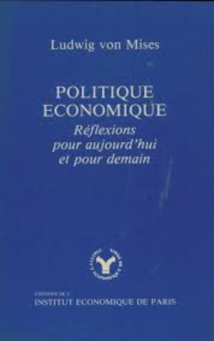

Có rất nhiều cuộc thảo luận về cuộc khủng hoảng chính trị, sự suy thoái của dân chủ nghị viện, chính phủ đại diện, và do đó là tự do. Người ta dễ dàng đổ lỗi cho Chủ nghĩa Tư bản và "sự thống trị của thị trường" vì đã gây ra cuộc khủng hoảng này.

Tình trạng này thực chất là hậu quả của một sự thay đổi trí tuệ triệt để về tư tưởng. Kể từ cuối thế kỷ 19, Châu Âu đã từ bỏ những tư tưởng từng biến nó trở thành một lục địa thịnh vượng và khai sáng. Trong một khoảng thời gian, đứa con đẻ lớn nhất của nó, Mỹ, đã chống lại những cơn gió của chủ nghĩa tập thể trước khi bị cuốn vào chúng.

Năm 1941, George Orwell đã đánh giá như sau:

> Rõ ràng là thời đại của Chủ nghĩa Tư bản tự do đang đến hồi kết, từng quốc gia một đang áp dụng một nền kinh tế tập trung, thứ có thể được gọi là Chủ nghĩa Xã hội hoặc Chủ nghĩa Tư bản nhà nước, tùy bạn. Trong hệ thống này, tự do kinh tế của cá nhân và ở một mức độ lớn hơn, tự do của anh ta nói chung - tự do hành động, tự do lựa chọn công việc, tự do di chuyển - đều biến mất. Chỉ rất gần đây chúng ta mới bắt đầu nhìn thấy hậu quả của hiện tượng này. Trước đây, chúng ta chưa bao giờ tưởng tượng được rằng sự biến mất của tự do kinh tế có thể ảnh hưởng đến tự do trí tuệ. Thông thường, người ta nghĩ rằng Chủ nghĩa Xã hội là một loại Chủ nghĩa Tự do có kèm theo đạo đức. Nhà nước sẽ chăm sóc cuộc sống kinh tế của bạn và giải phóng bạn khỏi nỗi sợ nghèo đói, thất nghiệp, v.v., nhưng nó sẽ không cần phải can thiệp vào cuộc sống trí tuệ cá nhân của bạn. Giờ đây, hiện thực đã chứng minh rằng những quan điểm này là sai lầm.

Nhưng trái với những gì các nhà tiên tri về ngày tận thế tuyên bố, nền văn minh phương Tây sẽ không bị diệt vong trong thế kỷ 21. Nó vẫn chưa cạn kiệt tiềm năng của mình. Tự do vẫn còn ở phía trước.

Đây là điều Murray Rothbard đã đề xuất vào năm 1982:
> Chúng ta đã nếm trải tất cả các biến thể của chủ nghĩa nhà nước, và tất cả đều đã thất bại. Ở khắp nơi trên thế giới phương Tây vào đầu thế kỷ 20, các nhà lãnh đạo doanh nghiệp, chính trị gia, và trí thức đã bắt đầu kêu gọi một hệ thống kinh tế hỗn hợp "mới", với sự thống trị của nhà nước, thay thế cho sự tự do tương đối của thế kỷ trước. Những phương thuốc mới, hấp dẫn ngay từ cái nhìn đầu tiên, như Chủ nghĩa Xã hội, nhà nước tập quyền, nhà nước phúc lợi - chiến tranh, v.v., đã được thử nghiệm và tất cả đều đã rõ ràng thất bại. Những lập luận ủng hộ Chủ nghĩa Xã hội và kế hoạch hoá nhà nước giờ đây xuất hiện như là những lời kêu gọi cho một hệ thống già cỗi, kiệt quệ, và thất bại. Còn lại gì để thử ngoài tự do?
Ở một khía cạnh nào đó, tình hình hiện tại của chúng ta tốt hơn so với quá khứ. Sau những thất bại liên tiếp của các thí nghiệm xã hội chủ nghĩa, cộng sản và xã hội dân chủ, ngày nay, chúng ta biết cách phân biệt ý tưởng đúng từ ý tưởng sai tốt hơn này hôm qua. Và các ý tưởng sai có thể bị bác bỏ và thay thế bằng ý tưởng đúng. Như Mises đã nói:
> Tất cả mọi thứ xảy ra trong xã hội toàn cầu mà chúng ta đang sống đều là kết quả của các ý tưởng. Cả tốt lẫn xấu. Điều cần thiết là phải chống lại những ý tưởng sai lầm. (...) Nền văn minh của chúng ta có thể tồn tại, và nó phải tồn tại. Và nó sẽ tồn tại nhờ vào những ý tưởng tốt đẹp hơn so với những ý tưởng đang chi phối thế giới ngày nay; và những ý tưởng tốt đẹp hơn này sẽ được phát triển bởi thế hệ tương lai. (_Chính sách kinh tế: Những suy tư cho hôm nay và ngày mai - Economic Policy: Thoughts for Today and Tomorrow_, 1979)

