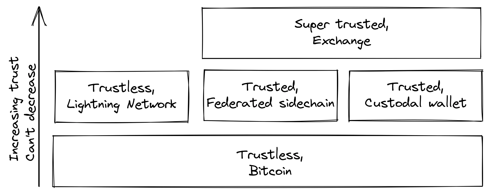
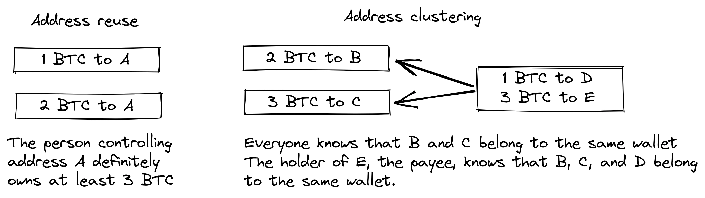
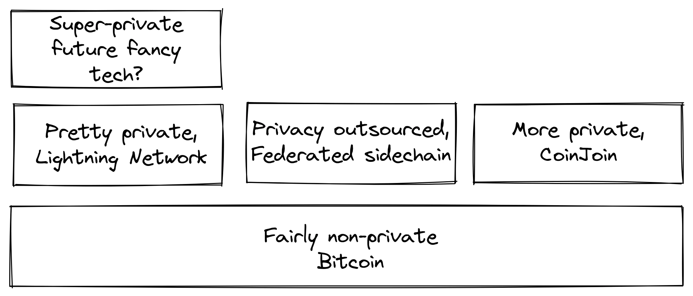
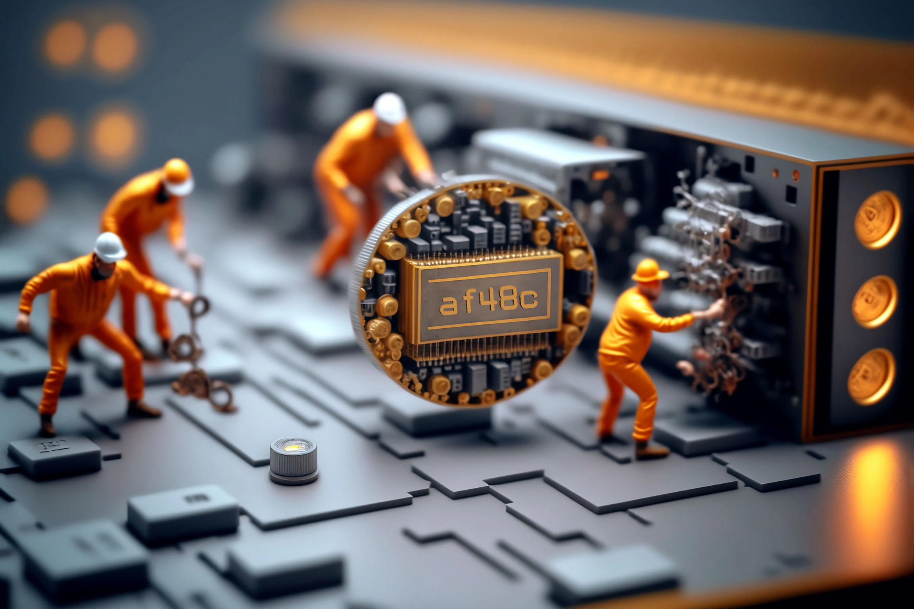
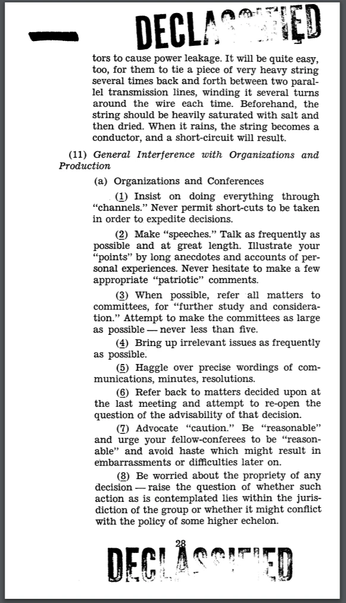
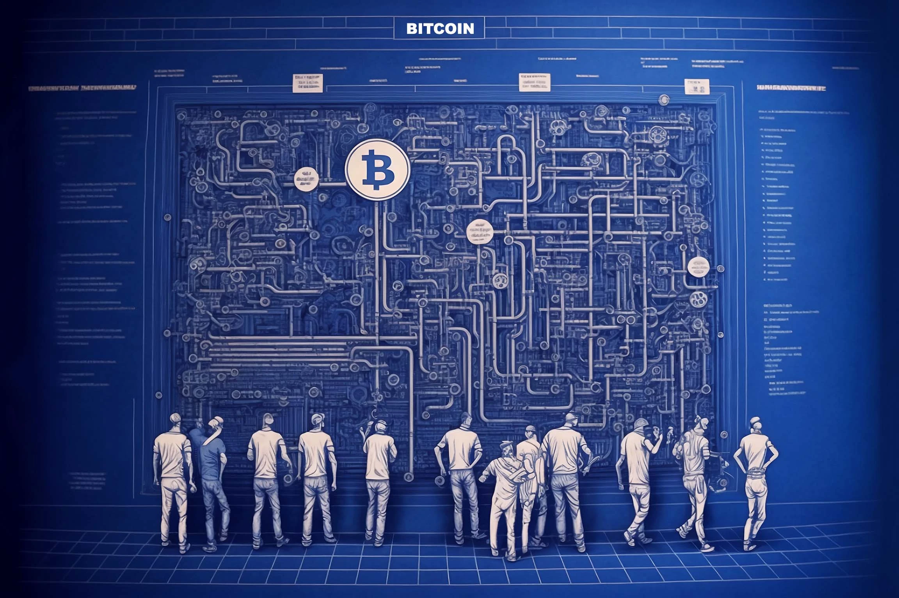
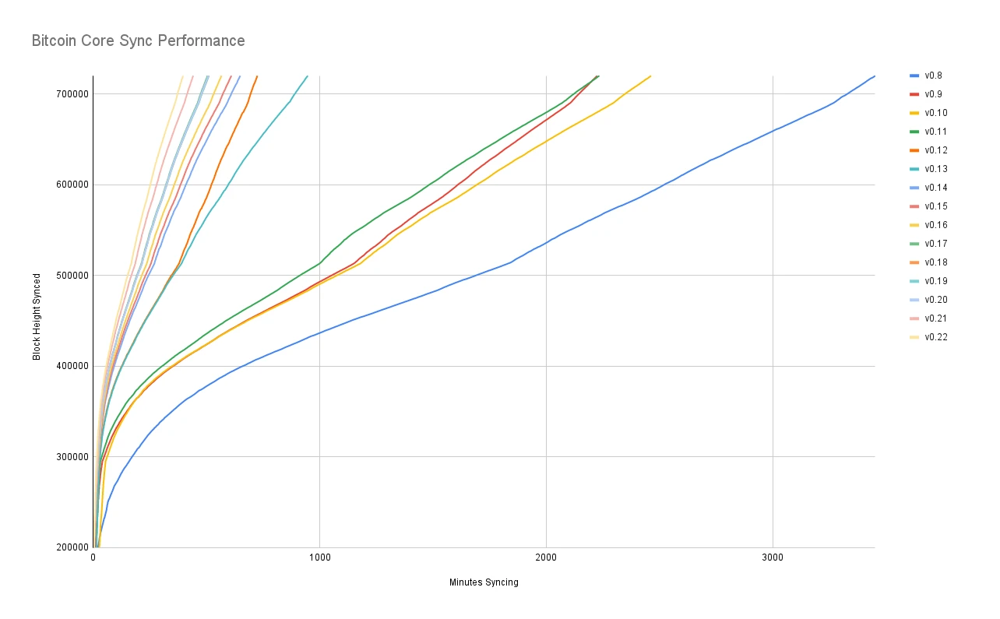
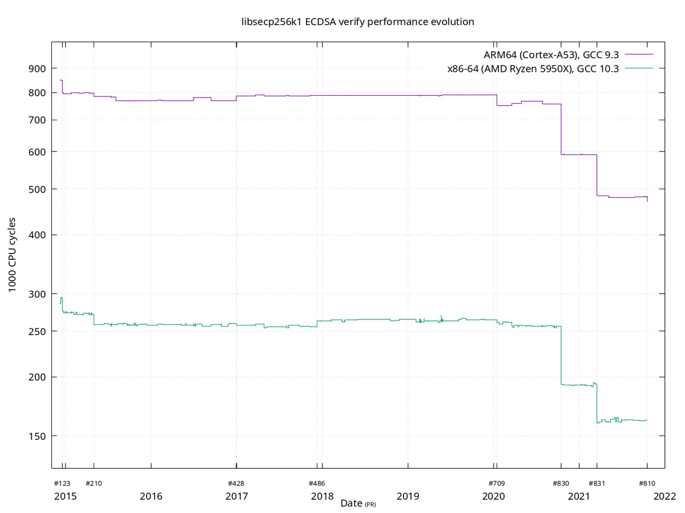
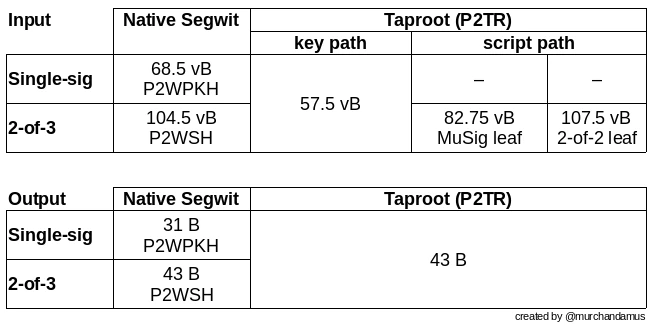
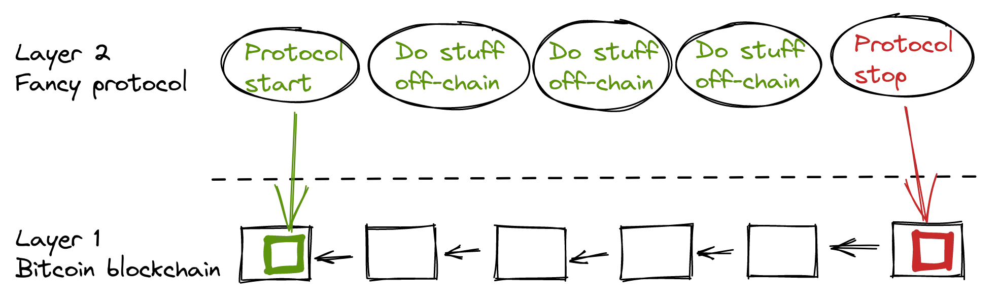

# Kuzama kwa kina katika Falsafa ya Maendeleo ya Bitcoin


Falsafa ya Maendeleo ya Bitcoin ni kozi kwa wasanidi wa Bitcoin ambao tayari wanaelewa misingi ya dhana na michakato kama vile Proof-of-Work, ujenzi wa block, na mzunguko wa maisha ya muamala, na ambao wanataka kujiendeleza kwa kupata uelewa wa kina wa falsafa ya muundo na mifumo ya ubadilishanaji ya Bitcoin.

Inapaswa kuwasaidia wasanidi wapya kuchukua masomo muhimu zaidi ya zaidi ya muongo mmoja wa ukuzaji wa Bitcoin na mijadala ya umma, huku ikiwapa muktadha muhimu wa kutathmini mawazo mapya (mazuri na mabaya!).


### Nini cha kutarajia?


Kama ilivyoelezwa hapo juu, huu ni mwongozo wa vitendo kwa watengenezaji wa Bitcoin. Hata hivyo, Bitcoin ni somo pana na changamano na hatukuweza kuangazia vipengele vyake vyote hapa. Kwa kozi hii, tunatumai kujadili vipengele muhimu ili kuanzisha shughuli yako ya usanidi na pia kukuwezesha kuichunguza zaidi peke yako.


Kuna watu wengi wanaohusika katika Bitcoin; kwa vile baadhi yao wana maoni yanayopingana, hapa unaweza kupata nyenzo zinazoeleza mawazo kinzani. Walakini, sisi hujaribu kila wakati kushikamana na uwanja wa ukweli, ambapo maoni hayajalishi.


### Nani aliandika haya?


Kozi hii imechukuliwa kutoka kwa kitabu cha eponimu ambacho mwandishi mkuu ni Kalle Rosenbaum, na Linnéa Rosenbaum alichangia kama mwandishi mwenza.

Kitabu hiki kiliidhinishwa na kufadhiliwa na [Chaincode Labs](https://learning.chaincode.com/), kituo cha maendeleo ambacho kinaendesha programu za elimu kwa wasanidi programu wanaotaka kujifunza kuhusu ukuzaji wa Bitcoin.


+++
# Utangulizi  

<partId>58c48e9b-e285-4dc6-8952-6cc5140b1313</partId>

## Muhtasari wa Kozi  

<chapterId>28b7256b-9cb0-463e-a82d-d732be86c98c</chapterId>

Karibu kwenye kozi hii ya PHI 301 kuhusu falsafa ya maendeleo ya Bitcoin.

Bitcoin ni zaidi ya sarafu-fiche; inawakilisha maono ya kifalsafa kuhusu ugatuaji, faragha, Trustlessness, na ustahimilivu. Kozi hii imeundwa mahsusi kwa watengenezaji ambao tayari wanaelewa misingi ya kiufundi ya Bitcoin na sasa wanataka kuimarisha uelewa wao wa kanuni zinazosimamia muundo na uongozi wa Bitcoin.

Katika kozi hii, utapata uelewa wazi wa maadili na mikakati msingi ambayo imeiongoza Bitcoin kwa zaidi ya muongo mmoja. Kwa kuchunguza kwa kina mada hizi, utajenga mtazamo muhimu unaohitajika ili kutathmini na kuchangia maendeleo ya baadaye kwa kujiamini.

### Maadili ya Msingi ya Bitcoin

Ni nini kinachofanya Bitcoin kuwa ya kipekee? Sehemu hii inafichua maadili ya msingi yaliyo katika muundo wa Bitcoin. Utachunguza **ugatuaji**, msingi unaohakikisha kuwa hakuna taasisi moja inayodhibiti mtandao; **Trustlessness**, ufunguo wa kuondoa utegemezi wa wahusika wa kati; **faragha**, muhimu kwa uhuru wa mtu binafsi na uadilifu wa mfumo; na **Finite Supply**, uhaba uliowekwa kimakodi unaounda utambulisho wa kiuchumi wa Bitcoin. Ukifahamu dhana hizi kikamilifu, utaweza kuelewa vyema nguvu na udhaifu wa Bitcoin.

### Uongozi wa Bitcoin

Kuongoza katika mazingira changamano ya uongozi wa Bitcoin kunahitaji zaidi ya ujuzi wa kiufundi—kunahitaji uelewa wa njia ya kipekee ya Bitcoin kuhusu makubaliano na maamuzi. Katika sehemu hii, utachunguza taratibu na falsafa zilizo nyuma ya michakato muhimu kama maboresho ya itifaki, umuhimu wa fikra za kiadui (adversarial thinking), nguvu ya ushirikiano wa wazi (open-source), changamoto zinazoendelea za scaling, na mikakati ya kina ya kushughulikia changamoto zinapotokea. Ukiwa na maarifa haya, utakuwa tayari si tu kushiriki, bali pia kuunda mustakabali wa Bitcoin kwa ufanisi na uwajibikaji.

Tayari kuchukua hatua inayofuata katika safari yako ya Bitcoin? Twende kazi!

***Kumbuka**: Ikiwa utakutana na maneno yoyote yasiyoeleweka yanayohusiana na Bitcoin wakati wa kozi, tafadhali tazama [kamusi](https://planb.network/resources/glossary) kwa maana zake.*

# Maadili ya Msingi ya Bitcoin  
<partId>2d6c683b-54c8-5465-b2ca-4e96a6828834</partId>


## Ugatuaji

<chapterId>9397c84b-0038-5d0e-88d5-11767ce8182d</chapterId>


Hii inachanganua ugatuaji ni nini na kwa nini ni muhimu kwa Bitcoin kufanya kazi. Tunatofautisha kati ya Ugatuaji wa miners na ule wa full node, na kujadili wanacholeta kwenye jedwali kwa upinzani wa udhibiti, mojawapo ya sifa kuu za Bitcoin.

Kisha mjadala hubadilika na kuelekea kuelewa kutoegemea upande wowote — au kutokuwa na ruhusa kwa watumiaji, miners na wasanidi programu — ambayo ni nyenzo muhimu ya mfumo wowote wa madaraka. Hatimaye, tunagusia jinsi Hard inavyoweza kuwa kufahamu mfumo uliogatuliwa kama Bitcoin, na kuwasilisha baadhi ya mifano ya kiakili ambayo inaweza kukusaidia kuusumbua.


Mfumo usio na sehemu kuu ya udhibiti unarejelewa kuwa *kugatuliwa*. Bitcoin imeundwa ili kuepuka kuwa na sehemu kuu ya udhibiti, au kwa usahihi zaidi *eneo kuu la udhibiti*.

Ugatuaji ni njia ya kufikia *upinzani wa udhibiti*.


Kuna vipengele viwili vikuu vya ugatuaji katika Bitcoin: ugatuaji wa Miner na ugatuaji wa Full node.


Ugatuaji wa Miner unarejelea ukweli kwamba uchakataji wa muamala haufanywi wala kuratibiwa na huluki yoyote kuu. Ugatuaji wa Full node unarejelea ukweli kwamba uthibitishaji wa vitalu, yaani, data ambayo wachimbaji hutoa, hufanywa kando ya mtandao, hatimaye na watumiaji wake, na sio na mamlaka chache zinazoaminika.


### Ugatuaji wa Miner 

Kulikuwa na majaribio ya kuunda sarafu za kidijitali kabla ya Bitcoin, lakini nyingi zilishindwa kutokana na ukosefu wa ugatuaji wa utawala na upinzani wa udhibiti.


Ugatuaji wa Miner katika Bitcoin unamaanisha kuwa *upangaji wa miamala* haufanywi na huluki yoyote au kundi lisilobadilika la huluki. Inafanywa kwa pamoja na wahusika wote wanaotaka kushiriki katika hilo; kundi hili la wachimbaji'' ni seti ya watumiaji inayobadilika. Mtu yeyote anaweza kujiunga au kuondoka anavyotaka. Mali hii hufanya Bitcoin kuwa sugu kwa udhibiti.


Ikiwa Bitcoin ingewekwa kati, ingekuwa hatarini kwa wale ambao wangetaka kuidhibiti, kama vile serikali. Ingefikia hatima sawa na majaribio ya awali ya kuunda pesa za kidijitali. Katika utangulizi wa [karatasi](https://www.blockstream.com/sidechains.pdf) yenye kichwa "Kuwezesha Ubunifu wa Blockchain na Pegged Sidechains", waandishi wanaeleza jinsi matoleo ya awali ya pesa za kidijitali hayakuwa na mazingira magumu (tazama pia sura ya Mawazo ya Kiadui katika sehemu inayofuata).


David Chaum alianzisha pesa dijitali kama mada ya utafiti mnamo 1983, katika mpangilio na seva kuu ambayo inaaminika kuzuia double-spending. Ili kupunguza hatari ya faragha kwa watu binafsi kutoka kwa chama hiki kikuu kinachoaminika, na kutekeleza uwezekano wa kugundulika, Chaum alianzisha saini ya upofu, ambayo alitumia kutoa njia za siri ili kuzuia kuunganishwa kwa saini za seva kuu (ambazo zinawakilisha sarafu), huku bado akiruhusu seva kuu kufanya uzuiaji wa matumizi mara mbili.

Sharti la seva kuu likawa kisigino cha Achilles cha pesa taslimu kidijitali[Gri99]. Ingawa inawezekana kusambaza nukta hii moja ya kutofaulu kwa kubadilisha sahihi ya seva kuu na sahihi ya kiwango cha juu cha watu waliotia sahihi kadhaa, ni muhimu kwa ukaguzi kwamba watia saini wawe tofauti na wanaoweza kutambulika. Hii bado inaacha mfumo katika hatari ya kushindwa, kwa kuwa kila anayetia sahihi anaweza kushindwa, au kushindwa, mmoja baada ya mwingine.


Ilibainika kuwa kutumia seva kuu kuagiza miamala haikuwa chaguo linalowezekana kwa sababu ya hatari kubwa ya udhibiti. Hata kama moja ingebadilisha seva kuu na shirikisho la seti isiyobadilika ya seva za *n*, ambayo angalau *m* lazima iidhinishe kuagiza, bado kungekuwa na ugumu. Shida inaweza kuhamia moja ambapo watumiaji lazima wakubaliane juu ya seti hii ya seva za *n* na vile vile jinsi ya kubadilisha seva hasidi na nzuri bila kutegemea mamlaka kuu.


Wacha tutafakari nini kinaweza kutokea ikiwa Bitcoin ingedhibitiwa. Kidhibiti kinaweza kushinikiza watumiaji kujitambulisha, kutangaza pesa zao zinatoka wapi au wanachonunua nazo kabla ya kuruhusu miamala yao kuingia kwenye Blockchain.


Pia, ukosefu wa upinzani wa udhibiti ungeruhusu kidhibiti kulazimisha watumiaji kupitisha sheria mpya za mfumo. Kwa mfano, wanaweza kulazimisha mabadiliko ambayo yaliwaruhusu kuingiza pesa Supply, na hivyo kujitajirisha. Katika tukio kama hilo, vizuizi vya uthibitishaji wa mtumiaji vitakuwa na chaguzi tatu za kushughulikia sheria mpya:


- Kubali: Kubali mabadiliko na uyapitishe katika Full node yao.
- Kataa: Kataa kupitisha mabadiliko; hii inamwacha mtumiaji mfumo ambao hauchakati miamala tena, kwani vizuizi vya kidhibiti sasa vinachukuliwa kuwa batili na Full node ya mtumiaji.
- Hoja: Teua kituo kipya cha udhibiti; watumiaji wote lazima watambue jinsi ya kuratibu na kisha wakubaliane kuhusu sehemu kuu mpya ya udhibiti.


Iwapo watafaulu, kuna uwezekano mkubwa kwamba masuala yale yale yatatokea tena wakati fulani katika siku zijazo, kwa kuzingatia kwamba mfumo huo ulibaki kuwa wa kudhibitiwa kama ulivyokuwa hapo awali.


Hakuna kati ya chaguzi hizi zenye manufaa kwa mtumiaji.


Upinzani dhidi ya udhibiti (censorship resistance) kupitia mgawanyiko (decentralization) ndicho kinachotofautisha Bitcoin na mifumo mingine ya fedha, lakini si jambo rahisi kutekeleza kutokana na tatizo la double-spending. Hili ni tatizo la kuhakikisha kuwa hakuna mtu anayeweza kutumia *coin* moja mara mbili, jambo ambalo watu wengi walidhani haliwezekani kutatuliwa kwa njia isiyo ya kati (decentralized). Satoshi Nakamoto anaandika katika [Bitcoin whitepaper](https://planb.network/bitcoin.pdf) kuhusu jinsi ya kutatua tatizo la Double-spending:


> Katika karatasi hii, tunapendekeza suluhisho la tatizo la double-spending kwa kutumia seva ya alama ya muda (timestamp server) iliyosambazwa kwa njia ya peer-to-peer ili kuzalisha uthibitisho wa kihakiki wa mpangilio wa muda wa miamala.


Hapa anatumia msemo wenye sauti ya kipekee "seva ya *timestamp* iliyosambazwa rika-kwa-rika". Neno kuu hapa ni *kusambazwa*, ambalo katika muktadha huu linamaanisha kuwa hakuna sehemu kuu ya udhibiti. Nakamoto kisha anaendelea kueleza jinsi *Proof-of-Work* ni suluhisho.

Bado, hakuna mtu anayeielezea vizuri zaidi kuliko

[Gregory Maxwell kwenye Reddit](https://www.reddit.com/r/Bitcoin/comments/ddddfl/question_on_the_vulnerability_of_bitcoin/f2g9e7b/), ambapo anajibu mtu anayependekeza kuwawekea kikomo miners wa nishati ya *hash* ili kuepuka mashambulizi yanayoweza kutokea kwa 51%:

> Mfumo uliogatuliwa kama vile Bitcoin hutumia uchaguzi wa umma. Lakini huwezi tu kuwa na kura ya 'watu' katika mfumo wa ugatuzi kwa sababu hiyo itahitaji chama cha serikali kuu kuidhinisha watu kupiga kura. Badala yake, Bitcoin hutumia kura ya nguvu ya kompyuta kwa sababu inawezekana kuthibitisha nguvu za kompyuta bila usaidizi wa serikali kuu au mtu wa tatu.


Chapisho hilo linaeleza jinsi mtandao uliogatuliwa wa Bitcoin unavyoweza kufikia makubaliano ya kuagiza miamala kupitia matumizi ya *Proof-of-Work*.


Kisha anahitimisha kwa kusema kwamba shambulio la 51% sio la kutisha sana, ikilinganishwa na watu wasiojali au kutoelewa sifa za ugatuaji za Bitcoin:


> Hatari kubwa zaidi kwa Bitcoin ni kwamba umma unaoitumia hautaelewa, hautajali, na hautalinda sifa za ugatuaji ambazo zinaifanya kuwa ya thamani zaidi ya njia mbadala za serikali kuu hapo kwanza.

Hitimisho ni muhimu. Iwapo watu hawatalinda ugatuaji wa Bitcoin, ambao ni wakala wa upinzani wake wa udhibiti, Bitcoin inaweza kuwa mwathirika wa mamlaka ya serikali kuu, hadi iwe katikati kiasi kwamba udhibiti unakuwa kitu. Halafu zaidi, ikiwa sio yote, pendekezo lake la thamani limepita. Hii inatuleta kwenye sehemu inayofuata ya ugatuaji wa Full node.


### Ugatuaji wa  Full node 

Katika aya zilizo hapo juu, tumezungumza zaidi juu ya ugatuaji wa *miner* na jinsi *miners* waliogawanyika wanaweza kuruhusu udhibiti. Lakini pia kuna kipengele kingine cha ugatuaji, ambacho ni ugatuaji wa *full node*.


Umuhimu wa ugatuaji wa *full node* unahusiana na kutokuwa na uaminifu. Tuseme mtumiaji ataacha kuendesha *full node* yake mwenyewe kutokana na, kwa mfano, ongezeko la marufuku la gharama ya uendeshaji. Katika hali hiyo, wanapaswa kuingiliana na mtandao wa Bitcoin kwa njia nyingine, ikiwezekana kwa kutumia *wallets* za mtandao au *wallets* nyepesi, ambayo inahitaji kiwango fulani cha uaminifu kwa watoa huduma hizi.

Mtumiaji huenda kutoka kwa kutekeleza moja kwa moja sheria za makubaliano ya mtandao hadi kuamini kuwa mtu mwingine atafanya hivyo. Sasa chukulia kuwa watumiaji wengi wanakabidhi utekelezaji wa makubaliano kwa huluki inayoaminika. Katika hali hiyo, mtandao unaweza kuzunguka haraka katika *centralization*, na sheria za mtandao zinaweza kubadilishwa kwa kula njama watendaji wabaya.


Katika makala ya [*Bitcoin Magazine*](https://bitcoinmagazine.com), Aaron van Wirdum anawahoji watengenezaji wa Bitcoin kuhusu mitazamo yao juu ya ugatuaji (decentralization) na hatari zinazohusiana na kuongeza block size. Majadiliano haya yalikuwa mada moto katika kipindi cha 2014–2017, wakati ambapo watu wengi walibishana kuhusu kuongeza kikomo cha block size ili kuruhusu ongezeko la muamala kwa wakati mmoja (transaction throughput).

Hoja yenye nguvu dhidi ya kuongeza block size ni kwamba huongeza gharama ya uthibitishaji. Ikiwa gharama ya uthibitishaji itapanda, itasukuma baadhi ya watumiaji kuacha kuendesha full nodes zao. Hii, kwa upande wake, itasababisha watu wengi zaidi kutoweza kutumia mfumo kwa njia ya trustless.

Pieter Wuille amenukuliwa katika nakala hiyo, ambapo anaelezea hatari za uwekaji kati wa Full node:


> Ikiwa kampuni za kura zinaendesha Full node, inamaanisha kuwa zote zinahitaji kushawishiwa kutekeleza sheria tofauti. Kwa maneno mengine: ugatuaji wa uthibitishaji wa vitalu ndio unaopa sheria za makubaliano uzito wao.
> Lakini ikiwa hesabu ya full node ingeshuka chini sana, kwa mfano kwa sababu kila mtu anatumia wallet sawa za wavuti, exchange na SPV au wallet za rununu, udhibiti unaweza kuwa ukweli. Na ikiwa mamlaka inaweza kudhibiti sheria za makubaliano, inamaanisha wanaweza kubadilisha chochote kinachofanya Bitcoin kuwa Bitcoin. Hata kikomo cha Bitcoin milioni 21.

Haya basi. Watumiaji wa Bitcoin wanapaswa kuendesha node zao kamili ili kuzuia vidhibiti na mashirika makubwa kujaribu kubadilisha sheria za makubaliano.


### Kuegemea upande wowote


Bitcoin haina upande wowote, au haina ruhusa, kama watu wanapenda kuiita. Hii ina maana kwamba Bitcoin haijali wewe ni nani au unaitumia kwa ajili gani.


Bitcoin ni neutral, ambayo ni jambo jema, na njia pekee inayoweza kufanya kazi. Iwapo ingedhibitiwa na shirika, ingekuwa tu aina nyingine ya kitu pepe na nisingependezwa nayo.


Mradi tu unafuata sheria, uko huru kuitumia utakavyo bila kuomba ruhusa kutoka kwa yeyote. Hii inajumuisha mining, kufanya miamala, na kujenga itifaki na huduma juu ya Bitcoin:


- Ikiwa mining ingekuwa mchakato ulioidhinishwa, tungehitaji mamlaka kuu ili kuchagua ni nani anayeruhusiwa kufanya mining. Hii inaweza kusababisha miners kusaini mikataba ya kisheria ambayo watakubali.

kukagua miamala kulingana na matakwa ya mamlaka kuu, ambayo inashinda madhumuni ya Mining kwanza.

- Iwapo watu*wanaofanya miamala* katika Bitcoin walipaswa kutoa maelezo ya kibinafsi, kutangaza miamala yao ilihusu nini, au kuthibitisha vinginevyo kwamba walistahili kufanya kazi, tutahitaji pia kituo kikuu cha mamlaka ili kuidhinisha watumiaji au miamala. Tena, hii inaweza kusababisha udhibiti na kutengwa.


- Iwapo wasanidi walilazimika kuomba ruhusa ya kuunda protocol juu ya Bitcoin, ni protocol tu zinazoruhusiwa na kamati kuu ya upeanaji ya wasanidi programu ndizo zingeweza kutengenezwa. Hii, kutokana na uingiliaji kati wa serikali, bila shaka itatenga itifaki zote za kuhifadhi faragha na majaribio yote ya kuboresha ugatuaji.


Katika viwango vyote, kujaribu kuweka vizuizi kwa nani atatumia Bitcoin kwa ajili ya nini kutaiumiza Bitcoin hadi kufikia hatua ambapo haitatekeleza tena pendekezo lake la thamani.


[Pieter Wuille answers a question on Stack Exchange](https://bitcoin.stackexchange.com/a/92055/69518) kuhusu jinsi blockchain inavyohusiana na hifadhidata za kawaida. Anaeleza jinsi kutokuhitaji ruhusa (permissionlessness) kunavyowezekana kupitia matumizi ya proof-of-work pamoja na motisha za kiuchumi.

Anahitimisha:


> Kutumia algoriti za makubaliano Trustless kama PoW  kitu ambacho hakuna muundo mwingine unaoweza kutoa — ushiriki usiohitaji ruhusa, yaani hakuna kundi maalum la washiriki wanaoweza kudhibiti mabadiliko yako. Hata hivyo, matumizi ya algoridhimu hizi huja kwa gharama kubwa, na kwa kuwa zinategemea mawazo ya kiuchumi, zinakuwa na manufaa hasa kwa mifumo inayojifafanua yenyewe na cryptocurrency yake. Huenda kuwepo nafasi moja au chache tu duniani kwa mifumo ya aina hii inayotumika kwa kweli.
> Pengine kuna mahali pekee ulimwenguni kwa moja au chache zilizotumika kati ya hizi.

Anaeleza kuwa, ili kufikia kutokuwa na ruhusa, mfumo huo kwa uwezekano mkubwa unahitaji sarafu yake yenyewe, na hivyo “kupunguza kesi za utumiaji kwa kiasi kikubwa hadi sarafu-fiche pekee”. Hii ni kwa sababu ushiriki usiohitaji ruhusa, au mining, unahitaji motisha za kiuchumi zilizojengewa moja kwa moja ndani ya mfumo.


### Ugatuaji wa Grokking 

. Hakuna kamati au watendaji katika Bitcoin. Gregory Maxwell, tena [kwenye subreddit ya Bitcoin](https://www.reddit.com/r/Bitcoin/comments/s82t2n/comment/htdte7w/?utm_source=share&utm_medium=web2x&context=3), analinganisha hii na lugha ya Kiingereza kwa njia ya kushangaza:


> Watu wengi wana muda wa Hard kuelewa mifumo ya uhuru, kuna mambo mengi katika maisha yao kama lugha ya Kiingereza-- lakini watu huichukulia kawaida na hata hawafikirii kama mifumo. Wamekwama katika njia kuu ya kufikiria ambapo kila kitu wanachofikiria kama 'kitu' kina mamlaka inayokidhibiti.
> Watu wengi hupata ugumu kuelewa mifumo inayojiendesha yenyewe. Kuna mifumo mingi ya aina hiyo katika maisha yao — kama vile lugha ya Kiingereza — lakini watu huichukulia kawaida tu bila hata kuifikiria kama mifumo. Wanakwama katika mtazamo wa kimamlaka, ambapo kila kitu wanachokiona kama "kitu" lazima kiwe na mamlaka inayokidhibiti.

> Bitcoin haina mkazo wa aina yoyote. Watu mbalimbali waliokumbatia Bitcoin walichagua kwa hiari yao kuieneza, na jinsi wanavyoamua kuifanya ni juu yao wenyewe. Watu waliobobea katika fikra za kimamlaka wanaweza kuona shughuli hizi na kudhani kuwa ni juhudi za mamlaka fulani ya Bitcoin — lakini mamlaka hiyo haipo.

Jinsi Bitcoin inavyofanya kazi kupitia ugatuaji inafanana na akili ya pamoja isiyo ya kawaida inayopatikana kati ya spishi nyingi asilia. Mwanasayansi wa kompyuta Radhika Nagpal anazungumza katika [Ted talk](https://www.ted.com/talks/radhika_nagpal_what_intelligent_machines_can_learn_from_a_school_of_fish) kuhusu tabia ya pamoja ya shule za samaki na jinsi wanasayansi wanajaribu kuiga kwa kutumia roboti.


> Pili, na jambo ambalo bado naliona kuwa la kushangaza zaidi, ni kwamba tunajua hakuna viongozi wanaosimamia kundi hili la samaki. Badala yake, tabia hii ya kipekee ya akili ya pamoja inatokea kabisa kutokana na mwingiliano kati ya samaki mmoja na mwingine. Kwa namna fulani, kuna mwingiliano au kanuni za mawasiliano kati ya samaki wa karibu zinazofanya kila kitu kifanye kazi.
> Kwa namna fulani, kuna mwingiliano huu au sheria za ushiriki kati ya samaki wa jirani ambazo hufanya yote yafanyike.

Anasema kuwa mifumo mingi, ama ya asili au ya bandia, inaweza na kufanya kazi bila viongozi, na ina nguvu na ustahimilivu. Kila mtu huingiliana tu na mazingira yao ya karibu, lakini kwa pamoja huunda kitu kikubwa.


*Shule za samaki hazina viongozi*

Haijalishi unafikiria nini kuhusu Bitcoin, asili yake ya ugatuzi hufanya iwe vigumu kudhibiti. Bitcoin ipo, na hakuna unachoweza kufanya kuihusu. Ni jambo la kuchunguzwa na sio kujadiliwa.


### Hitimisho kuhusu Ugatuaji


Tunatofautisha kati ya ugatuzi wa Full node na ugatuaji wa Mining. Ugatuaji wa Mining ni njia ya kufikia upinzani wa udhibiti, huku ugatuzi wa Full node ndio unaoweka sheria za makubaliano ya mtandao wa Hard kubadilika bila usaidizi mpana miongoni mwa watumiaji.


Asili ya ugatuzi ya Bitcoin inaruhusu kutoegemea upande wowote kwa wasanidi programu, watumiaji na miners. Mtu yeyote yuko huru kushiriki bila kuomba ruhusa.


Mifumo iliyogatuliwa inaweza kuwa ngumu kuielewa, lakini kuna mifano ya kiakili ambayo inaweza kusaidia, kwa mfano lugha ya Kiingereza au shule za samaki.


## Trustlessness

<chapterId>0506ba61-16a3-543c-95fa-3f3e2dd64121</chapterId>


Sura hii inatenganisha dhana ya Trustlessness, maana yake kutoka kwa mtazamo wa sayansi ya kompyuta, na kwa nini Bitcoin inapaswa kuwa trustless ili kuhifadhi pendekezo lake la thamani. Kisha tunazungumza kuhusu maana ya kutumia Bitcoin kwa njia ya trustless, na ni aina gani ya dhamana ambayo full node inaweza na haiwezi kukupa. Katika sehemu ya mwisho, tunaangalia mwingiliano wa ulimwengu halisi kati ya Bitcoin na programu au watumiaji halisi, na hitaji la kufanya mabadilishano kati ya urahisi na kutokuwa na uaminifu ili kufanya chochote.


Watu mara nyingi husema mambo kama "Bitcoin ni nzuri kwa sababu ni Trustless".


Je, wanamaanisha nini kwa Trustless? Pieter Wuille anaelezea neno hili linalotumika sana kwenye [Stack Exchange](https://Bitcoin.stackexchange.com/a/45674/69518):


> Imani tunayozungumzia katika "Trustless" ni neno dhahania la kiufundi. Mfumo unaosambazwa huitwa Trustless wakati hauhitaji wahusika wowote wanaoaminika kufanya kazi ipasavyo.

Kwa ufupi, neno trustless linarejelea sifa ya protocol ya Bitcoin ambapo inaweza kufanya kazi kimantiki bila "wahusika wowote wanaoaminika". Hii ni tofauti na uaminifu ambao lazima uweke kwenye programu au maunzi unayoendesha. Zaidi juu ya kipengele hiki cha mwisho cha uaminifu kitajadiliwa zaidi katika sura hii.


Katika mifumo ya serikali kuu, tunategemea sifa ya mwigizaji mkuu ili kuhakikisha kuwa atasimamia usalama au kurudisha nyuma masuala yanapotokea, pamoja na mfumo wa kisheria kuidhinisha ukiukaji wowote. Mahitaji haya ya uaminifu yana shida katika mifumo isiyojulikana ya ugatuzi — hakuna uwezekano wa kukimbilia, kwa hivyo hakuwezi kuwa na uaminifu wowote. Katika utangulizi wa [karatasi nyeupe ya Bitcoin](https://Bitcoin.org/Bitcoin.pdf), Satoshi Nakamoto anaelezea tatizo hili:

> Biashara kwenye Mtandao imekuja kutegemea takriban taasisi za fedha zinazotumika kama washirika wengine wanaoaminika kuchakata malipo ya kielektroniki.
> Ingawa mfumo hufanya kazi vizuri vya kutosha kwa shughuli nyingi, bado unakabiliwa na udhaifu wa asili wa muundo wa msingi wa uaminifu.  Miamala isiyoweza kutenduliwa kabisa haiwezekani, kwa kuwa taasisi za fedha haziwezi kuepuka kupatanisha mizozo. Gharama ya upatanishi huongeza gharama za muamala, kupunguza kiwango cha chini cha ukubwa wa muamala wa vitendo na kukata uwezekano wa miamala midogo ya kawaida, na kuna gharama pana katika kupoteza uwezo wa kufanya malipo yasiyoweza kutenduliwa kwa huduma zisizoweza kutenduliwa.
> Kwa uwezekano wa kugeuzwa, hitaji la uaminifu linaenea. Wafanyabiashara lazima wawe waangalifu na wateja wao, wakiwahangaisha kwa habari zaidi kuliko ambayo wangehitaji.  Asilimia fulani ya ulaghai inakubaliwa kuwa haiwezi kuepukika. Gharama hizi na kutokuwa na uhakika wa malipo kunaweza kuepukwa kibinafsi kwa kutumia sarafu halisi, lakini hakuna utaratibu uliopo wa kufanya malipo kupitia kituo cha mawasiliano bila mshirika anayeaminika.

Inaonekana kuwa hatuwezi kuwa na mfumo uliogatuliwa kwa msingi wa uaminifu, na ndiyo maana kutokuwa na uaminifu ni muhimu katika Bitcoin.


Ili kutumia Bitcoin kwa njia ya trustless, lazima uendeshe full node ya Bitcoin inayofanya uthibitishaji kamili. Hapo ndipo utaweza kuthibitisha kuwa block unazopokea kutoka kwa wengine zinafuata sheria za makubaliano — kwa mfano, kwamba ratiba ya utoaji wa sarafu inazingatiwa na kwamba hakuna matumizi ya mara mbili yanayotokea kwenye blockchain. Ikiwa hutumii full node, unatoa jukumu la uthibitishaji wa block za Bitcoin kwa mtu mwingine na kumwamini akuambie ukweli, jambo linalomaanisha kuwa hutumii Bitcoin kwa njia ya trustless.l


David Harding ameandika [makala kwenye tovuti ya Bitcoin.org](https://bitcoin.org/en/bitcoin-core/features/validation) akieleza jinsi kuendesha full node — au kutumia Bitcoin kwa njia ya trustless — kunakusaidia:


> Sarafu ya Bitcoin inafanya kazi tu wakati watu wanakubali bitcoins katika Exchange kwa vitu vingine vya thamani. Hiyo ina maana ni watu wanaokubali bitcoins ambao wanaipa thamani na ambao wanapata kuamua jinsi Bitcoin inapaswa kufanya kazi.
>

> Unapokubali bitcoins, una uwezo wa kutekeleza sheria za Bitcoin, kama vile kuzuia kutwaliwa kwa bitcoins za mtu yeyote bila kufikia funguo za faragha za mtu huyo.
> Kwa bahati mbaya, watumiaji wengi hutoa nguvu zao za kutekeleza. Hii huacha ugatuaji wa Bitcoin katika hali dhaifu, ambapo miners wachache wanaweza kushirikiana na benki chache na huduma za bila malipo ili kubadilisha sheria za Bitcoin kwa niaba ya watumiaji wote wasiothibitisha waliokabidhi mamlaka yao kwa wengine.
>

> Tofauti na wallet nyingine, Bitcoin Core hutekeleza sheria — kwa hivyo miners na benki wakibadilisha sheria kwa watumiaji wasiothibitisha, watumiaji hao hawataweza kulazimisha uthibitishaji kamili wa watumiaji wa Bitcoin Core kama wewe.

Anasema kuwa kuendesha full node kutakusaidia kuthibitisha kila sehemu ya blockchain bila kumwamini mtu mwingine yeyote, ili kuhakikisha kuwa sarafu unazopokea kutoka kwa wengine ni halisi. Hii ni nzuri, lakini kuna jambo moja muhimu ambalo full node haiwezi kukusaidia: haiwezi kuzuia matumizi maradufu kupitia kuandika upya kwa mnyororo.


> Kumbuka kwamba ingawa programu zote—ikiwa ni pamoja na Bitcoin Core—ziko hatarini kwa kuandikwa upya kwa mfululizo, Bitcoin hutoa mbinu ya ulinzi: kadiri miamala yako inavyokuwa na uthibitisho zaidi, ndivyo unavyokuwa salama. Hakuna ulinzi unaojulikana wa ugatuzi bora kuliko huo.

Haijalishi programu yako ni ya juu kiasi gani, bado unapaswa kuamini kuwa block zilizo na sarafu zako hazitaandikwa upya. Hata hivyo, kama ilivyoonyeshwa na Harding, unaweza kusubiri uthibitisho kadhaa, na baada ya hapo kuzingatia uwezekano wa kuandika upya chain kuwa mdogo kiasi cha kukubalika.


Motisha za kutumia Bitcoin kwa njia ya Trustless zinalingana na hitaji la mfumo la ugatuaji wa Full node. Kadiri watu wanavyozidi kutumia nodi zao kamili, ndivyo ugatuaji wa Full node unavyoongezeka, na hivyo Bitcoin yenye nguvu zaidi inasimama dhidi ya mabadiliko mabaya ya itifaki. Lakini kwa bahati mbaya, kama ilivyoelezwa katika sehemu ya Full node ya ugatuaji, watumiaji mara nyingi huchagua huduma zinazoaminika kama matokeo ya biashara isiyoepukika kati ya kutokuwa na uaminifu na urahisi.


Kutoaminika kwa Bitcoin ni muhimu kabisa kutoka kwa mtazamo wa mfumo. Mnamo 2018, Matt Corallo, [alizungumza kuhusu kutokuwa na uaminifu](https://btctranscripts.com/baltic-honeybadger/2018/trustlessness-scalability-and-directions-in-security-models/) katika mkutano wa Baltic Honeybadger huko Riga.


Kiini cha mazungumzo hayo ni kwamba huwezi kujenga mifumo ya trustless juu ya mfumo unaoaminika, lakini unaweza kujenga mifumo inayoaminika — kwa mfano, custodial wallet — juu ya mfumo wa trustless.





Msingi wa trustless layer unaruhusu exchange mbalimbali katika viwango vya juu.

Muundo huu wa usalama huruhusu mtengenezaji wa mfumo kuchagua exchange.

ambayo yana mantiki kwao bila kulazimisha biashara hiyo kwa wengine.


### Usiamini, thibitisha


Bitcoin inafanya kazi kwa trustlessness, lakini bado unapaswa kuamini programu na maunzi yako kwa kiwango fulani. Hii ni kwa sababu programu au maunzi yako yanaweza kuwa hayajaratibiwa kufanya kile kilichotajwa kwenye kisanduku. Kwa mfano:


- CPU inaweza kuundwa kwa makusudi ili kugundua utendakazi wa ufunguo wa faragha na kuvuja data ya ufunguo wa faragha.
- Generator ya nambari nasibu ya mfumo wa uendeshaji inaweza isiwe nasibu kama inavyodai.
- Bitcoin Core inaweza kuwa iliingia kisiri katika msimbo ambao utatuma funguo zako za faragha kwa mwigizaji fulani mbaya.


Kwa hivyo, mbali na kuendesha full node, unahitaji pia kuhakikisha kuwa unatekeleza programu uliyokusudia. Mtumiaji wa Reddit brianddk [aliandika makala](https://www.reddit.com/r/Bitcoin/comments/smj1ep/bitcoin_v220_and_guix_stronger_defense_against/) kuhusu viwango tofauti vya uaminifu unavyoweza kuchagua unapothibitisha programu yako. Katika sehemu ya "Kuamini wajenzi", anazungumzia kuhusu ujenzi unaoweza kurudiwa (reproducible builds).


> Miundo inayoweza kurudiwa ni njia ya kuunda programu ili wasanidi wengi wa jumuiya waweze kuijenga na kuhakikisha kuwa kisakinishi cha mwisho kilichozalishwa kinafanana na kile ambacho wasanidi wengine wamezalisha. Kwa mradi wa wazi sana unaoweza kurudiwa kama Bitcoin, hakuna msanidi programu mmoja anayehitaji kuaminiwa kabisa. Wasanidi wengi wanaweza kutekeleza muundo huo na kuthibitisha kwamba walizalisha faili ile ile ambayo mjenzi wa awali alitia saini kwa njia ya kidijitali.

Kifungu kinaeleza kuhusu viwango vitano vya uaminifu: kuamini tovuti, wajenzi wa programu, mkusanyaji wa msimbo (compiler), kokwa ya mfumo (kernel), na maunzi.


Ili kuendeleza zaidi mada ya miundo inayoweza kurudiwa, Carl Dong [alitoa wasilisho kuhusu Guix](https://btctranscripts.com/breaking-Bitcoin/2019/Bitcoin-build-system/) akieleza kwa nini kuamini mfumo wa uendeshaji, maktaba, na vikusanyaji kunaweza kuwa tatizo, pamoja na mfumo unaotumiwa na GW-3 unaoitwa Guix, na jinsi ya kurekebisha GW-3 leo.

> Kwa hivyo, tunaweza kufanya nini kuhusu ukweli kwamba chain yetu ya zana inaweza kuwa na jozi nyingi za vitu vinavyoaminika ambavyo vinaweza kuwa hasidi? Tunahitaji kwenda zaidi ya uwezo wa kujirudia. Tunahitaji kuwa bootstrappable. Hatuwezi kutegemea zana nyingi kama hizi ambazo tunalazimika kuzipakua na kuziamini kutoka kwa seva za nje zinazodhibitiwa na mashirika mengine.
> Tunapaswa kujua jinsi zana hizi zinavyoundwa na jinsi tunavyoweza kupitia mchakato wa kuzijenga tena, ikiwezekana kutoka kwa seti ndogo zaidi za jozi zinazoaminika. Tunahitaji kupunguza seti zetu za jozi tunazoamini kadiri tuwezavyo, na kuwa na njia inayoweza kukaguliwa kwa urahisi kutoka kwa chain hiyo ya zana hadi kwenye tunayotumia kuunda Bitcoin. Hii huturuhusu kuongeza uthibitishaji na kupunguza uaminifu.

Kisha anaelezea jinsi Guix huturuhusu tu kuamini binary ndogo ya baiti 357 ambayo inaweza kuthibitishwa na kueleweka kikamilifu ikiwa unajua jinsi ya kutafsiri maagizo. Hii ni ya kushangaza kabisa: mtu anathibitisha kuwa binary ya baiti 357 hufanya inavyopaswa, kisha kuitumia kuunda mfumo kamili wa ujenzi kutoka kwa nambari ya chanzo, na kuishia na binary ya Bitcoin Core ambayo inapaswa kuwa nakala halisi ya ile iliyozalishwa na mtu mwingine yeyote.


Kuna mantra ambayo bitcoiners wengi hujiandikisha, ambayo inachukua vizuri mengi ya hapo juu:

> Usiamini, thibitisha.

Hii inarejelea maneno "[tumaini, lakini thibitisha](https://en.wikipedia.org/wiki/Trust,_but_verify)" ambayo rais wa zamani wa Marekani Ronald Reagan alitumia katika muktadha wa upokonyaji silaha za nyuklia. [Bitcoiners](https://twitter.com/Truthcoin/status/1491415722123153408?s=20&t=ZyROxZxlBppdRpuuzsiF5w) walibadilisha msemo huo ili kuangazia kukataliwa kwa uaminifu na umuhimu wa kuendesha full node.


Ni juu ya watumiaji kuamua ni kwa kiwango gani wanataka kuthibitisha programu wanayotumia na data ya Blockchain wanayopokea. Kama ilivyo kwa vitu vingine vingi katika Bitcoin, kuna biashara kati ya urahisi na kutoaminiana. Karibu kila wakati ni rahisi zaidi kutumia Wallet ya uangalizi ikilinganishwa na kuendesha Bitcoin Core kwenye maunzi yako mwenyewe. Hata hivyo, kwa kuwa programu ya Bitcoin inapevuka na miingiliano ya watumiaji inaboreka, baada ya muda inapaswa kuwa bora katika kusaidia watumiaji walio tayari kufanya kazi kuelekea kutokuwa na uaminifu. Pia, watumiaji wanapopata maarifa zaidi baada ya muda, wanapaswa kuwa na uwezo wa kuondoa uaminifu hatua kwa hatua kutoka kwa mlinganyo.


Watumiaji wengine hufikiria vibaya na kuthibitisha vipengele vingi vya programu wanayoendesha. Kama matokeo, wanapunguza hitaji la uaminifu kwa kiwango cha chini kabisa, kwani wanahitaji tu kuamini vifaa vyao vya kompyuta na mfumo wa kufanya kazi. Kwa kufanya hivyo, wao pia huwasaidia watu ambao hawathibitishi maunzi yao kwa kina kwa kupaza sauti zao hadharani ili kuonya kuhusu masuala yoyote wanayoweza kupata. Mfano mmoja mzuri wa hili ni [tukio lililotokea mwaka wa 2018](https://bitcoincore.org/en/2018/09/20/notice/), wakati mtu aligundua hitilafu ambayo ingewaruhusu wachimbaji kutumia pato mara mbili katika shughuli hiyo hiyo:


> CVE-2018-17144, marekebisho ambayo yalitolewa mnamo Septemba 18 katika matoleo ya Bitcoin Core 0.16.3 na 0.17.0rc4, yalihusisha hitilafu ya Kunyimwa Huduma (Denial of Service) pamoja na hatari kubwa ya mfumuko wa bei. Awali, iliripotiwa kwa wasanidi programu kadhaa wanaofanya kazi kwenye Bitcoin Core, pamoja na miradi inayounga mkono sarafu-fiche nyingine, ikiwemo ABC na Unlimited, mnamo Septemba 17 kama hitilafu ya Kunyimwa Huduma pekee. Hata hivyo, tuligundua haraka kuwa suala hilo pia lilikuwa tishio la mfumuko wa bei kwa sababu ya msingi ule ule uliosababisha hitilafu hiyo na uliohitaji kurekebishwa.

Hapa, mtu asiyejulikana aliripoti suala ambalo liligeuka kuwa baya zaidi kuliko vile mwandishi wa habari alivyotambua. Hii inaangazia ukweli kwamba watu wanaothibitisha kanuni mara nyingi huripoti dosari za usalama badala ya kuzitumia vibaya. Hili ni jambo lenye manufaa kwa wale ambao hawawezi kuthibitisha kila kitu wao wenyewe.


Hata hivyo, watumiaji hawapaswi kuamini wengine kuwaweka salama, lakini wanapaswa kujithibitisha wenyewe wakati wowote na chochote wanachoweza; hivyo ndivyo mtu anavyobaki kuwa huru kadri awezavyo, na jinsi Bitcoin inavyofanikiwa. Kadiri macho yanavyotazama programu, ndivyo uwezekano mdogo wa msimbo na dosari za usalama kupenya.


### Hitimisho kuhusu trustlessness 


Itifaki ya Bitcoin ni trustless kwa sababu inaruhusu watumiaji kuingiliana nayo bila kuamini mtu wa tatu. Kiutendaji, hata hivyo, watu wengi hawawezi kuthibitisha rundo kamili la programu na maunzi wanayotumia kwa Bitcoin. Watu wenye ujuzi wanaothibitisha programu au maunzi wanaweza kuwaonya watu wengine, wasio na ujuzi wa kutosha, wanapogundua msimbo au hitilafu hasidi.

Bila trustlessness, hatuwezi kuwa na ugatuaji, kwa sababu uaminifu unahusisha sehemu kuu ya mamlaka. Unaweza kuunda mfumo unaoaminika juu ya mfumo wa trustless, lakini huwezi kuunda mfumo wa trustless juu ya mfumo unaoaminika.


## Faragha

<chapterId>1b960afe-0008-589b-b2f4-007d60d264c6</chapterId>


Sura hii inahusu jinsi ya kuweka taarifa zako za kibinafsi za kifedha kwako. Inafafanua ufaragha unasimamia nini katika muktadha wa Bitcoin, kwa nini ni muhimu, na inamaanisha nini kusema kwamba Bitcoin ni jina bandia. Pia inaangalia jinsi data ya kibinafsi inaweza kuvuja, zote mbili za On-Chain na off-chain.


Kisha, inazungumzia ukweli kwamba bitcoins zinapaswa kuwa fungible, yaani zinaweza kubadilishwa kwa bitcoins nyingine yoyote, na jinsi fungibility na faragha zinavyohusiana kwa karibu. Mwishowe, sura hii inatambulisha baadhi ya hatua unazoweza kuchukua ili kuboresha faragha yako na ya wengine.

Bitcoin inaweza kuelezwa kama mfumo wa kificho majina (pseudonymous), ambapo watumiaji wana majina mengi ya utani kwa kutumia funguo za umma. Kwa mtazamo wa kwanza, hii inaonekana kama njia nzuri ya kulinda watumiaji wasitambuliwe, lakini kwa kweli ni rahisi sana kuvuja taarifa za kifedha binafsi bila kusudi.


### Nini maana ya faragha?
Faragha inaweza kumaanisha mambo tofauti katika muktadha tofauti. Katika Bitcoin, kwa ujumla inamaanisha kuwa watumiaji hawahitaji kufichua taarifa zao za kifedha kwa wengine, isipokuwa wakifanya hivyo kwa hiari yao.

Kuna njia nyingi ambazo unaweza kuvuja taarifa zako binafsi kwa wengine, iwe kwa kujua au bila kujua. Data inaweza kuvuja kutoka kwenye blockchain ya umma au kupitia njia nyingine, kwa mfano wakati wahalifu wanaposhika mawasiliano yako ya internet.

Kuna njia nyingi ambazo unaweza kuvujisha habari zako za kibinafsi kwa wengine, kwa kujua au bila kujua. Data inaweza kuvuja kutoka kwa blockchain ya umma au kupitia njia zingine, kwa mfano wakati watendaji hasidi wanapoingilia mawasiliano yako ya mtandao.


### Kwa nini faragha ni muhimu?


Inaweza kuonekana wazi kwa nini faragha ni muhimu katika Bitcoin, lakini kuna baadhi ya vipengele vyake ambavyo mtu hawezi kufikiria mara moja. [Kwenye jukwaa la Bitcoin Talk](https://bitcointalk.org/index.php?topic=334316.msg3588908#msg3588908), Gregory Maxwell hutupitia sababu nyingi nzuri zinazomfanya afikirie kuwa faragha ni muhimu. Miongoni mwa hizo sababu ni soko huru, usalama, na heshima ya utu wa binadamu:

> Faragha ya kifedha ni kipengele muhimu cha uendeshaji mzuri wa soko huru: ikiwa unafanya biashara, huwezi kuweka bei kwa ufanisi ikiwa wasambazaji na wateja wako wanaweza kuona miamala yako yote bila idhini yako.
> Huwezi kushindana kwa ufanisi ikiwa mshindani wako anaweza kufuatilia mauzo yako. Binafsi, kiwango chako cha taarifa kinapotea katika shughuli zako za kibinafsi ikiwa huna faragha kwenye akaunti yako: kwa mfano, ikiwa utamlipa mwenye nyumba kwa Bitcoin bila faragha ya kutosha, mwenye nyumba ataona unavyopokea malipo mengine na anaweza kukulipa kodi zaidi.

> Faragha ya kifedha ni muhimu kwa usalama wa kibinafsi: ikiwa wezi wanaweza kuona matumizi yako, mapato, na mali zako, wanaweza kutumia taarifa hizo kukulenga na kukunyonya. Bila faragha, watu wenye nia mbaya wana uwezo zaidi wa kuiba utambulisho wako, kunyang’anya ununuzi wako mkubwa moja kwa moja, au kuiga biashara unayofanya katika miamala yako... na hivyo kuelewa ni kiasi gani hasa cha kujaribu kukudanganya.
> Faragha ya kifedha ni muhimu kwa heshima ya utu wa binadamu: hakuna mtu anayependa mhudumu mkali kwenye kahawa au majirani wavamizi wakasema kuhusu mapato yao au tabia za matumizi. Hakuna anayependa kuwa na familia mpendwa wanaouliza kwa nini wanununua viuatilifu au vitu vya ngono. Mwajiri wako hana haki ya kujua unagawia kanisa gani. Ni katika dunia yenye uelewa kamili na huru kutoka ubaguzi ambapo hakuna mtu anayeweza kudhibiti mwingine kupita kiasi ndipo tunaweza kudumisha heshima zetu na kufanya miamala yetu halali kwa uhuru bila kujizuia, ikiwa hatuna faragha.

Maxwell pia anagusia juu ya uwezekano wa kufungika, ambayo itajadiliwa baadaye katika sura hii, na pia jinsi faragha na utekelezaji wa sheria haupingani.


### Jina bandia

Tulitaja hapo juu kwamba Bitcoin ni mfumo wa kificho majina, na kwamba majina bandia ni funguo za umma. Katika vyombo vya habari mara nyingi husikia kwamba Bitcoin ni haijulikani, jambo ambalo si sahihi. Kuna tofauti kati ya kutokujulikana na mfumo wa kificho majina.

Andrew Poelstra [anafafanua katika chapisho la Bitcoin Stack Exchange](https://Bitcoin.stackexchange.com/a/29473/69518) jinsi kutokujulikana kunavyoweza kuonekana katika miamala:


> Kutokujulikana kwa jumla, kwa maana kwamba unapotumia pesa hakuna dalili za wapi zilipotoka au zinaelekea wapi, kinadharia inawezekana kufikiwa kwa kutumia mbinu ya kriptografia ya uthibitisho usio na maarifa.

Tofauti ni kwamba kwa njia ya kificho majina, unaweza kufuatilia malipo kati ya majina bandia, lakini kwa njia isiyojulikana ya pesa, huwezi kufanya hivyo. Kwa kuwa malipo ya Bitcoin yanaweza kufuatiliwa kati ya majina bandia, si mfumo usiojulikana.

Pia tumesema kwamba majina bandia ni funguo za umma, lakini kwa hakika ni anwani zinazotokana na funguo za umma. Kwa nini tunatumia anwani kama majina bandia badala ya kitu kingine, kama majina ya maelezo, mfano "watchme1984"? Hili [limefafanuliwa vyema](https://Bitcoin.stackexchange.com/a/25175/69518) na mtumiaji Tim S., pia kwenye Bitcoin Stack Exchange:

> Ili wazo la Bitcoin lifanye kazi, lazima uwe na sarafu ambazo zinaweza kutumika tu na mmiliki wa ufunguo wa kibinafsi aliyepewa. Hii inamaanisha kuwa chochote unachotuma lazima kifungwe, kwa njia fulani, kwa ufunguo wa umma.

> Kutumia majina bandia ya kiholela (kwa mfano majina ya watumiaji) kunge maana kwamba itabidi kuunganisha jina bandia hilo na ufunguo wa umma ili kuwezesha kriptografia ya ufunguo wa umma/kibinafsi. Hii ingetoa uwezo wa kuunda kwa usalama anwani/majina bandia nje ya mtandao (kwa mfano, kabla mtu kutuma pesa kwa jina la mtumiaji "tdumidu", itabidi kutangazwa kwenye blockchain kwamba "tdumidu" inamilikiwa na ufunguo wa umma "a1c...", na kujumuisha ada ili wengine wawe na sababu ya kuitangaza).

Pia, ingetia chumvi kupunguzwa kwa utambulisho (kwa kukuhimiza kutumia majina bandia mara nyingi), na kuongeza ukubwa wa blockchain bila sababu. Hii pia ingetengeneza hisia potofu ya usalama kwamba unamtumia mtu unayemfikiria (kwa mfano, kama nitachukua jina "Linus Torvalds" kabla hajalichukua, basi ni langu na watu wanaweza kutuma pesa wakidhani wanamlipa muundaji wa Linux, si mimi).

Kwa kutumia anwani, au funguo za umma, tunafanikisha malengo muhimu kama kuondoa haja ya kusajili jina bandia kabla, kupunguza hamasa ya kutumia majina bandia mara nyingi, kuepuka kuongezeka kupita kiasi kwa ukubwa wa blockchain, na kufanya iwe vigumu kuigiza watu wengine.

### Faragha ya Blockchain 

Faragha ya blockchain inarejelea taarifa unazofichua unapofanya miamala kwenye blockchain. Inahusiana na miamala yote, ile unayotuma pamoja na ile unayopokea.


Satoshi Nakamoto inatafakari kuhusu faragha ya On-Chain katika sehemu ya 7 ya [Bitcoin whitepaper](https://Bitcoin.org/Bitcoin.pdf):


> Kama kinga ya ziada, jozi mpya ya funguo inapaswa kutumika kwa kila muamala ili kuzuia kuhusishwa na mmiliki mmoja. Hata hivyo, kuhusishwa fulani haiwezi kuepukwa katika miamala yenye pembejeo nyingi, ambazo lazima zinaonyesha kuwa pembejeo zote zilimilikiwa na mmiliki mmoja. Hatari ni kwamba kama mmiliki wa funguo atafichuliwa, kuhusishwa kunaweza kufichua miamala mingine ambayo ilikuwa ya mmiliki huyo huyo.

Karatasi hiyo inatoa muhtasari wa shida kuu za faragha ya Blockchain, ambayo ni utumiaji tena wa Address na nguzo za Address. Ya kwanza ni kujieleza, ya mwisho inahusu uwezo wa kuamua, kwa kiwango fulani cha uhakika, kwamba seti ya anwani tofauti ni ya mtumiaji mmoja.





Uvujaji wa kawaida wa faragha kwenye Blockchain


Chris Belcher [aliandika kwa kina](https://en.Bitcoin.it/Privacy#Blockchain_attacks_on_privacy) kuhusu aina tofauti za uvujaji wa faragha unaoweza kutokea kwenye Bitcoin blockchain. Tunapendekeza usome angalau vifungu vichache vya kwanza chini ya sehemu ya "Blockchain mashambulizi dhidi ya faragha."


Jambo la kuchukua ni kwamba faragha katika Bitcoin sio kamili. Inahitaji juhudi kubwa kufanya miamala yenye faragha. Watu wengi hawako tayari kwenda mbali kiasi hicho kwa ajili ya faragha. Inaonekana kuna biashara wazi kati ya faragha na urahisi wa matumizi.

Kipengele kingine muhimu cha faragha ni kwamba hatua unazochukua kulinda faragha yako huathiri watumiaji wengine pia. Ikiwa huna makini na faragha yako mwenyewe, wengine wanaweza pia kupungukiwa faragha. Gregory Maxwell anafafanua hili kwa uwazi sana kwenye mjadala uleule wa Bitcoin Talk [uliounganisha hapo juu](https://bitcointalk.org/index.php?topic=334316.msg3589252#msg3589252), na anahitimisha kwa mfano:


> Hii pia hufanya kazi katika vitendo... Mchunguzi mwema wa usalama (whitehat hacker) kwenye IRC alijaribu kuvunjika kwa brainwallet na akagundua maneno yaliyo na takriban BTC 250 ndani yake. Tuliweza kumtambua mmiliki kutokana na anwani tu, kwa sababu alilipwa na huduma ya Bitcoin iliyotumia anwani moja mara nyingi, na mchunguzi huyo aliweza kuwahamasisha kutoa taarifa za mawasiliano za mtumiaji. Kwa kweli alipata mtumiaji kwa simu, walishangaa na kuchanganyikiwa—lakini walifurahia kutopoteza sarafu zao. Hapo ilikuwa mwisho mzuri wa hadithi. (Hii siyo mfano pekee, lakini ni mojawapo ya za kufurahisha zaidi).


Katika kesi hii, yote yalienda vizuri kwa sababu mdukuzi alikuwa na nia ya kusaidia, lakini usitegemee bahati kama hiyo wakati mwingine.

### Faragha isiyo ya Blockchain


Ingawa blockchain ni chanzo mashuhuri cha uvujaji wa faragha, kuna njia nyingi nyingine za uvujaji ambazo hazihusishi blockchain — nyingine zikiwa za ujanja zaidi. Njia hizi zinaweza kuwa kutoka kwa viweka kumbukumbu muhimu hadi kwa uchambuzi wa trafiki ya mtandao. Ili kujifunza zaidi kuhusu mbinu hizi, tafadhali rejelea tena [makala ya Chris Belcher](https://en.Bitcoin.it/Privacy#Non-blockchain_attacks_on_privacy), hasa sehemu ya "Mashambulizi yasiyo ya Blockchain dhidi ya faragha".


Miongoni mwa mashambulizi mengi, Belcher anataja uwezekano wa mtu kuchungulia muunganisho wako wa intaneti — kwa mfano, Mtoa Huduma wako wa Intaneti (ISP).

> Ikiwa mhasimu ataona muamala au block ukitoka kwenye node yako bila kuuona ukiingia awali, basi anaweza kujua kwa karibu uhakika kwamba muamala huo umetoka kwako au block hiyo umetengeneza wewe mwenyewe. Kwa kuwa muunganisho wa intaneti unahusika, mhasimu ataweza kuunganisha anwani yako ya IP na taarifa za Bitcoin zilizogunduliwa.
Hata hivyo, miongoni mwa vyanzo vya wazi kabisa vya uvujaji wa faragha ni exchanges. Kutokana na sheria, ambazo kawaida hujulikana kama KYC (Know Your Customer) na AML (Anti-Money Laundering, zinazotumika katika maeneo wanakoendesha shughuli zao, exchanges na kampuni zinazohusiana mara nyingi hulazimika kukusanya data binafsi za watumiaji wao, na hivyo kujenga hifadhidata kubwa kuhusu watumiaji gani wanamiliki bitcoins gani. Hifadhidata hizi ni honeypots nzuri kwa serikali dhalimu na wahalifu ambao siku zote hutafuta waathirika wapya. Kuna masoko halisi ya aina hii ya data, ambapo hackers huuza data kwa anayetoa dau kubwa zaidi.

kuuza data kwa mzabuni wa juu zaidi.


Ili kufanya mambo kuwa mabaya zaidi, makampuni ambayo yanasimamia hifadhidata hizi mara nyingi huwa na uzoefu mdogo wa kulinda data ya kifedha, kwa kweli wengi wao ni \[startups], na tunajua kwa uhakika kwamba uvujaji kadhaa tayari umetokea. Mifano michache ni:

[MobiQwik ya India](https://bitcoinmagazine.com/business/probably-the-largest-kyc-data-leak-in-history-demonstrates-the-umuhimu-of-Bitcoin-privacy) na [HubSpot](https://bitcoinmagazine.com/business/hubspot-18-data-security-Gusach-Gusach).


Tena, kulinda data dhidi ya aina mbalimbali za mashambulizi ni ngumu, na kuna uwezekano kwamba hutaweza kufanya hivyo kikamilifu. Itabidi uchague kubadilishana kati ya urahisi na faragha inayokufaa zaidi.

### Ukungu


Ufunguzi, katika muktadha wa sarafu, inamaanisha kuwa sarafu moja inaweza kubadilishana kwa sarafu nyingine yoyote ya sarafu sawa. Hii inachekesha

neno liliguswa kwa ufupi mapema katika sura hiyo.


Katika makala iliyojadiliwa hapo, Gregory Maxwell [alisema](https://bitcointalk.org/index.php?topic=334316.msg3588908#msg3588908):


> Faragha ya kifedha ni kipengele muhimu cha kugundulika katika Bitcoin: ikiwa unaweza kutofautisha sarafu moja kutoka kwa nyingine, basi uwezekano wao wa kuvumbua ni dhaifu. Ikiwa uwezo wetu wa kugundulika ni dhaifu sana katika mazoezi, basi hatuwezi kugatuliwa: ikiwa mtu muhimu atatangaza orodha ya sarafu zilizoibiwa hatakubali sarafu zinazotokana, lazima uangalie kwa uangalifu sarafu unazokubali dhidi ya orodha hiyo na urudishe zile ambazo hazijafanikiwa.  Kila mtu hukwama kuangalia orodha zisizoruhusiwa zinazotolewa na mamlaka mbalimbali kwa sababu katika ulimwengu huo tusingependa kukwama na sarafu mbaya. Hii inaongeza gharama za msuguano na shughuli na kufanya Bitcoin kuwa chini ya thamani kama pesa.

Hapa, anazungumza juu ya hatari inayotokana na ukosefu wa fungibility. Tuseme kuwa una UTXO. Historia hiyo ya UTXO kwa kawaida inaweza kufuatiliwa nyuma kwa miinuko kadhaa, ikipeperushwa hadi kwenye matokeo ya awali. Ikiwa mojawapo ya matokeo hayo yalihusika katika shughuli yoyote haramu, isiyotakikana au ya kutiliwa shaka, basi baadhi ya wapokeaji wa sarafu yako wanaweza kuikataa. Iwapo unafikiri kwamba wanaolipwa watathibitisha sarafu zako dhidi ya orodha ya watu walioidhinishwa au huduma ya orodha isiyoruhusiwa, unaweza kuanza kuangalia sarafu unazopokea pia, ili tu kuwa upande salama. Matokeo yake ni kwamba uwezekano mbaya wa kuvu utaimarisha uwezekano mbaya zaidi wa kuvu.


Adam Back na Matt Corallo [walitoa wasilisho kuhusu uwezekano](https://btctranscripts.com/scalingbitcoin/milan-2016/fungibility-overview/) wakiwa Scaling Bitcoin mjini Milan mwaka wa 2016. Walikuwa wakifikiria vivyo hivyo:


> Unahitaji kuwa na uwezo wa kubadilika ili Bitcoin ifanye kazi. Ikiwa unapokea sarafu lakini huwezi kuzitumia, basi unaanza kutilia shaka ikiwa unaweza kuzitumia. Ikiwa kuna mashaka kuhusu sarafu unazopokea, basi watu wataenda kwenye huduma za uchambuzi wa uchafu na kuangalia kama "sarafu hizi zimebarikiwa", na kisha watu watakataa kufanya biashara. Hii inachofanya ni kubadilisha Bitcoin kutoka kwa mfumo usio na kibali uliogatuliwa hadi mfumo wa kati unaohitaji idhini, ambapo una "IOU" kutoka kwa watoa huduma walioidhinishwa.

Inaonekana kwamba faragha na uwezekano wa kuvumbua huenda pamoja. Usahihi utadhoofika ikiwa faragha ni dhaifu — kwa mfano, sarafu za watu wasiotakikana zinaweza kuorodheshwa. Vivyo hivyo, faragha itadhoofika ikiwa uwezekano wa kugundulika ni dhaifu: ikiwa kuna orodha ya kile ambacho hakiruhusiwi, itakulazimu kuwauliza watoa huduma walioidhinishwa kuhusu sarafu za kukubali, na hivyo kufichua IP Address yako, address ya barua pepe yako, au taarifa nyingine nyeti. Vipengele hivi viwili vimeunganishwa sana hivi kwamba ni Hard kuzungumzia kimoja bila kingine.


### Hatua za faragha

Mbinu kadhaa zimetengenezwa ili kusaidia watu kujilinda kutokana na uvujaji wa faragha. Kati ya zile zilizo wazi zaidi ni, kama ilivyoonyeshwa na Nakamoto hapo awali, kwa kutumia kipekee
address kwa kila muamala, lakini zingine kadhaa zipo. Hatutakufundisha jinsi ya kuwa ninja wa faragha. Hata hivyo, Bitcoin Q+A ina muhtasari wa haraka wa teknolojia za kuimarisha faragha, iliyopangwa kwa kiasi fulani kulingana na jinsi Hard zinavyopaswa kutekelezwa. Unapoisoma, utagundua kuwa faragha ya Bitcoin mara nyingi inahusiana na vitu nje ya Bitcoin. Kwa mfano, hupaswi kujivunia bitcoins zako, na unapaswa kutumia Tor na VPN.


Chapisho pia linaorodhesha baadhi ya hatua zinazohusiana moja kwa moja na Bitcoin:


- Full node: Ikiwa hutatumia Full node yako mwenyewe, utavujisha taarifa nyingi kuhusu Wallet yako kwa seva kwenye mtandao. Kuendesha Full node ni hatua nzuri ya kwanza.
- Lightning Network: Itifaki kadhaa zipo juu ya Bitcoin, kwa mfano Lightning Network na Blockstream ya Liquid Sidechain.
- CoinJoin: Njia ya watu wengi kuunganisha miamala yao kuwa moja, na kuifanya iwe vigumu kufanya uchanganuzi wa msururu.


Katika [mazungumzo](https://btctranscripts.com/breaking-Bitcoin/2019/breaking-Bitcoin-privacy/) katika mkutano wa Breaking Bitcoin, Chris Belcher alitoa mfano wa vitendo wa kuvutia wa jinsi faragha imeboreshwa:


> Walikuwa kasino ya Bitcoin. Kamari ya mtandaoni hairuhusiwi nchini Marekani. Wateja wowote wa Coinbase ambao waliweka pesa moja kwa moja kwa Bustabit akaunti zao zingefungwa kwa sababu Coinbase ilikuwa ikifuatilia hili. Bustabit alifanya mambo machache. Walifanya kitu kinachoitwa kuepusha mabadiliko unapopitia- na unaona ikiwa unaweza kutengeneza muamala ambao hauna matokeo ya mabadiliko. Hii huokoa ada za Miner na pia huzuia uchanganuzi.
>

> Pia, waliingiza address zao za amana zilizotumika tena katika soko la pamoja. Kwa wakati huu, wateja wa coinbase.com hawakuwahi kupigwa marufuku. Inaonekana huduma ya ufuatiliaji wa Coinbase haikuweza kufanya uchambuzi baada ya hili, kwa hiyo inawezekana kuvunja algorithms hizi.

Pia alitaja mfano huu, miongoni mwa mengine, kwenye [Ukurasa wa Faragha](https://en.Bitcoin.it/Privacy) kwenye Bitcoin wiki.


Kumbuka jinsi ufaragha bora unavyoweza kupatikana kwa kujenga mifumo juu ya Bitcoin, kama ilivyo kwa Lightning Network:





Tabaka zilizo juu ya Bitcoin zinaweza kuongeza faragha


Tulibaini katika sura iliyopita kwamba hitaji la kuaminiana linaweza kuongezeka kila unavyojenga tabaka juu ya Bitcoin, lakini hali hiyo haionekani kuwa hivyo kwa faragha — ambayo inaweza kuboreshwa au kuharibiwa kiholela katika tabaka hizo za juu. Kwa nini? Tabaka lolote juu ya Bitcoin, kama ilivyoelezwa katika aya ya "Layered Scaling" kwenye sura ijayo ya Scaling, lazima litumie miamala ya on-chain mara kwa mara, la sivyo lisingekuwa “juu ya Bitcoin”. Tabaka zinazoongeza faragha kwa kawaida hujaribu kutumia safu ya msingi kwa kiwango kidogo kadri inavyowezekana ili kupunguza taarifa zinazofichuliwa.

Haya yote ni mbinu za kiufundi za kuboresha faragha yako. Lakini kuna njia nyingine pia. Mwanzoni mwa sura hii, tulisema kwamba Bitcoin ni mfumo wa kisiri bandia (pseudonymous). Hii ina maana kuwa watumiaji wa Bitcoin hawajulikani kwa majina yao halisi au taarifa nyingine binafsi, bali kwa funguo zao za umma. Funguo za umma hutumika kama majina bandia ya watumiaji, na mtumiaji anaweza kuwa na majina bandia mengi. Katika ulimwengu bora, utambulisho wako wa ana kwa ana hutenganishwa kabisa na majina yako bandia ya Bitcoin. Kwa bahati mbaya, kutokana na matatizo ya faragha yaliyoelezwa katika sura hii, utengano huu huwa unazorota kadri muda unavyosonga.

Ili kupunguza hatari za kuwa na data yako ya kibinafsi kufichuliwa ni kutoitoa mara ya kwanza au kuipa huduma za kati, ambazo huunda hifadhidata kubwa ambazo zinaweza kuvuja. Makala ya Bitcoin Q+A [inafafanua KYC](https://bitcoiner.guide/nokyconly/) na hatari zinazotokana nayo. Pia inapendekeza baadhi ya hatua unazoweza kuchukua ili kuboresha hali yako:


> Kwa bahati nzuri, kuna chaguzi kadhaa za kununua Bitcoin kupitia vyanzo visivyo na KYC. Haya yote ni mabadilishano ya P2P (yaani, kufanya biashara moja kwa moja na mtu mwingine kwa kutumia programu fulani) ambapo unafanya biashara bila mtu wa kati. Kwa bahati mbaya, wengine huuza. cryptocurrency nyingine pamoja na Bitcoin, kwa hivyo tunakusihi uwe mwangalifu.


Makala inapendekeza kuepuka kutumia exchange zinazohitaji KYC/AML, na badala yake kufanya biashara kwa faragha, au kutumia exchange za kidisentralishaji kama Bisq. 
(https://bisq.network/).


https://planb.network/en/tutorials/exchange/peer-to-peer/bisq-fe244bfa-dcc4-4522-8ec7-92223373ed04

Kwa usomaji wa kina zaidi kuhusu hatua za kupinga, rejelea [makala ya wiki kuhusu faragha] iliyotajwa hapo awali (https://en.Bitcoin.it/wiki/Privacy#Methods_for_improving_privacy_.28non-Blockchain.29), kuanzia "Mbinu za kuboresha faragha (zisizo za Blockchain)".


### Hitimisho kuhusu Faragha

Faragha ni muhimu sana lakini Hard kufikia. Hakuna risasi ya fedha ya faragha.

Ili kupata faragha inayostahili katika Bitcoin, unapaswa kuchukua hatua zinazoendelea, ambazo baadhi yake ni za gharama kubwa na zinazotumia muda.


## Finite Supply

<chapterId>af125ba2-ef98-5905-8895-41a538fe5ea5</chapterId>


Sura hii inaangazia kikomo cha supply ya Bitcoin cha BTC milioni 21 — au je, kweli ni kiasi hicho? Tunajadili jinsi kikomo hiki kinavyotekelezwa na nini mtu anaweza kufanya ili kuthibitisha kama kinaheshimiwa. Zaidi ya hayo, tunachungulia hali ya baadaye na kujadili mienendo itakayoibuka wakati block reward itakapobadilika kutoka kwa msingi wa subsidy hadi msingi wa ada.


Supply inayojulikana ya BTC milioni 21 inachukuliwa kuwa mali ya msingi ya Bitcoin. Lakini ni kweli imewekwa kwenye jiwe?


Wacha tuanze kwa kuangalia sheria za sasa za makubaliano zinasema nini kuhusu Supply ya Bitcoin, na ni kiasi gani kitakachoweza kutumika. Pieter Wuille aliandika kipande kuhusu hili [kwenye Stack Exchange](https://Bitcoin.stackexchange.com/a/38998/69518), ambamo alihesabu ni bitcoins ngapi zingekuwa mara sarafu zote zikichimbwa:


> Ukijumlisha nambari hizi zote pamoja, utapata 20999999.9769 BTC.

Lakini kutokana na sababu kadhaa --  -- kikomo hicho cha juu hakitafikiwa kamwe. Wuille anahitimisha:


> Hii inatuacha na 20999817.31308491 BTC (kuchukua kila kitu hadi block 528333 katika akaunti)

Hata hivyo, wallets mbalimbali zimepotea au kuibiwa, miamala imetumwa kwa Address isiyo sahihi, watu walisahau kuwa wanamiliki Bitcoin. Jumla ya hii inaweza kuwa mamilioni. Watu wamejaribu kujumlisha hasara zinazojulikana [hapa](https://bitcointalk.org/index.php?topic=7253.0).


Hii inatuacha na: ??? BTC.


Kwa hivyo tunaweza kuwa na uhakika kwamba Bitcoin Supply itakuwa 20999817.31308491 BTC zaidi. Sarafu zozote zilizopotea au zilizochomwa bila kuthibitishwa zitafanya nambari hii kuwa chini, lakini hatujui ni kiasi gani. Jambo la kufurahisha ni kwamba haijalishi, au bora bado inajalisha kwa njia chanya kwa wamiliki wa Bitcoin,

[kama ilivyoelezwa](https://bitcointalk.org/index.php?topic=198.msg1647#msg1647) na Satoshi Nakamoto:


> Sarafu zilizopotea hufanya tu sarafu za kila mtu kuwa na thamani kidogo zaidi.  Fikiria kama mchango kwa kila mtu.

Supply ya mwisho itapungua na hii inapaswa, angalau kwa nadharia, kusababisha kupungua kwa bei.


Muhimu zaidi kuliko idadi kamili ya sarafu katika mzunguko ni jinsi kikomo cha Supply kinavyotekelezwa bila mamlaka yoyote kuu. Lakabu chytrik inaiweka vizuri kwenye [Stack Exchange](https://Bitcoin.stackexchange.com/a/106830/69518):


> Kwa hivyo jibu ni kwamba sio lazima kumwamini mtu ili asiongeze Supply. Lazima tu utekeleze nambari fulani ambayo itathibitisha kuwa haijafanya.

Hata kama baadhi ya full node zitageukia upande wa giza na kuamua kukubali blocks zilivyo na miamala ya thamani ya juu ya coinbase, nodes zote zilizosalia zitazipuuza tu na kuendelea kufanya biashara kama kawaida. Baadhi ya full node zinaweza, kwa kukusudia au bila kukusudia, kuendesha programu mbovu, lakini kundi litalinda kwa uthabiti Blockchain. Kwa kumalizia, unaweza kuchagua kuamini mfumo bila kulazimika kumwamini mtu yeyote.


### block  rewards na ada za muamala

Block reward inaundwa na block reward pamoja na ada za miamala. Block reward inahitaji kulipia gharama za usalama za Bitcoin. Tunaweza kusema kwa uhakika kwamba chini ya masharti ya leo kuhusu block reward, ada za miamala, bei ya Bitcoin, saizi ya Mempool, nguvu ya Hash, kiwango cha ugatuaji, n.k., motisha kwa kila mchezaji kufuata sheria ni kubwa vya kutosha kuhifadhi mfumo salama wa pesa.


Ni nini hufanyika wakati block reward inakaribia sifuri? Ili kuweka mambo rahisi, hebu tuchukulie kuwa ni sawa na sifuri. Katika hatua hii, gharama ya usalama ya mfumo italipwa kupitia ada za muamala pekee. Nini wakati ujao unatuwekea wakati hili litatokea, hatuwezi kujua. Sababu za kutokuwa na uhakika ni nyingi, na tumeachwa kwenye uvumi. Kwa mfano, mchango wa Paul Sztorc kwa mada katika blogu yake ya Truthcoin mara nyingi ni wa kiuvumi, lakini ana angalau nukta moja thabiti (tafadhali kumbuka kuwa M2, kama inavyorejelewa na Sztorc, ni kipimo cha pesa supply):

> Ingawa hizi mbili zimeunganishwa katika "bajeti ya usalama", block reward na ada za muamala ni vitu tofauti kabisa. Ni tofauti kabisa, kama ilivyo "jumla ya faida ya VISA mnamo 2017" ikilinganishwa na "ongezeko la jumla la M2 mnamo 2017".


Leo, ni wamiliki ambao hulipa usalama (kupitia mfumuko wa bei wa fedha). Kesho itakuwa zamu ya watumiaji kubeba mzigo huu kwa namna fulani, kama inavyoonyeshwa hapa chini.


Kadiri muda unavyosonga, gharama za usalama zitabadilika kutoka kwa wamiliki hadi watumiaji


Wakati ada za ununuzi ndio motisha kuu ya Mining, motisha hubadilika. Hasa zaidi, ikiwa Mempool ya Miner haina ada za kutosha za muamala, inaweza kuwa faida zaidi kwa hiyo Miner kuandika upya historia ya Bitcoin badala ya kuirefusha. Bitcoin Optech ina [sehemu ya tabia hii] mahususi(https://bitcoinops.org/en/topics/fee-sniping/), inayoitwa *fee sniping*, iliyoandikwa na David Harding:


> Ubaguzi wa ada ni tatizo ambalo linaweza kutokea huku block reward ya Bitcoin ikiendelea kupungua na ada za miamala kuanza kutawala zawadi za block reward za Bitcoin. Iwapo ada za muamala ndizo zote muhimu, basi miner yenye x asilimia ya kiwango cha Hash ina nafasi ya x asilimia ya mining ya block inayofuata, kwa hivyo thamani inayotarajiwa kwao ya mining ni asilimia x ya seti bora zaidi ya feerate ya miamala katika Mempool yao.
>

> Vinginevyo, miner inaweza kujaribu kwa uaminifu mdogo kuchimba tena block iliyopita pamoja na block mpya kabisa ili kupanua mnyororo. Tabia hii inajulikana kama udukuzi wa ada, na nafasi isiyo ya uaminifu ya miner kufaulu ikiwa kila miner mwingine ni mwaminifu ni (x/(1-x))^2. Ijapokuwa udukuzi wa ada una uwezekano mdogo wa kufaulu kuliko mining ya uaminifu, kujaribu mining isiyo ya uaminifu kunaweza kuwa chaguo lenye faida zaidi ikiwa miamala katika block iliyotangulia ililipa ada za juu zaidi kuliko miamala ya sasa katika Mempool — nafasi ndogo kwa kiwango kikubwa inaweza kuwa ya thamani zaidi kuliko nafasi kubwa kwa kiwango kidogo.

Kutupa blanketi lenye unyevunyevu juu ya matumaini yetu ya siku zijazo ni ukweli kwamba ikiwa miners wataanza kufanya ubadhirifu wa ada, hii itawapa wengine motisha ya kufanya vivyo hivyo, na kuwaacha miners wachache waaminifu. Hali hii inaweza kuathiri vibaya usalama wa jumla wa Bitcoin. Harding anaendelea kuorodhesha hatua chache za kukabiliana nazo ambazo zinaweza kuchukuliwa, kama vile kutegemea kufuli za muda wa muamala ili kuweka vikwazo kuhusu ni wapi katika blockchain muamala unaweza kuonekana.


Kwa hivyo, ikizingatiwa kuwa maafikiano kuhusu supply ya mwisho yamesalia, block reward — shukrani kwa BIP42 ambayo ilirekebisha hitilafu ya mfumuko wa bei ya muda mrefu — itafikia sifuri karibu mwaka wa 2140. Je?


Haiwezekani kusema, lakini tunajua mambo machache:


- Karne ni *muda mrefu* kutoka kwa mtazamo wa Bitcoin. Ikiwa bado iko karibu, labda itakuwa imebadilika sana.
- Iwapo walio wengi wa kiuchumi wataona ni muhimu kubadilisha sheria na kuanzisha kwa mfano mfumuko wa bei wa kila mwaka wa 0.1% au 1% wa kila mwaka, Supply ya Bitcoin haitakuwa na kikomo tena.
- Kwa block reward ya sifuri na Mempool iliyo tupu au karibu tupu, mambo yanaweza kutetereka kwa sababu ya udukuzi wa ada.


Kwa kuwa mabadiliko ya kuelekea kwenye block reward inayotegemea ada pekee ni jambo la siku zijazo, inaweza kuwa busara kuepuka kufikia hitimisho mapema na badala yake kujaribu kushughulikia matatizo yanayoweza kutokea kadri muda unavyoruhusu. Kwa mfano, Peter Todd anaamini kuwa kuna hatari halisi kwamba bajeti ya usalama ya Bitcoin haitatosha katika siku zijazo, na kwa hivyo anapendekeza wazo la kuwepo kwa mfumuko mdogo wa bei wa kudumu katika Bitcoin. Hata hivyo, pia anaamini kwamba si wazo zuri kujadili suala hilo kwa sasa, kama alisema kwenye podcast ya What Bitcoin Did:


> Lakini, hiyo ni hatari kama miaka 10, 20 katika siku zijazo. Hiyo ni muda mrefu sana. Na, kwa wakati huo, ni nani kuzimu anajua hatari ni nini?

Labda tunaweza kufikiria Bitcoin kama kitu hai. Hebu fikiria mmea mdogo wa mwaloni unaokua polepole. Fikiria pia kwamba hujawahi kuona mti mzima katika maisha yako. Je! halingekuwa jambo la busara basi kuzuia masuala yako ya udhibiti badala ya kuweka mapema sheria zote za jinsi mmea huu unapaswa kuruhusiwa kukua na kukua?


### Hitimisho kuhusu Finite Supply


Ikiwa Bitcoin Supply itaongezeka zaidi ya milioni 21 hatuwezi kusema leo, na hiyo labda sio mbaya sana. Kuhakikisha kuwa bajeti ya usalama inabaki kuwa juu vya kutosha ni muhimu lakini sio haraka. Hebu tufanye mjadala huu katika miaka 10-50, wakati tunajua zaidi. Ikiwa bado ni muhimu.


# Utawala wa Bitcoin

<partId>411bf53f-af4b-50f1-b71b-e40fe3ff64b7</partId>


## Kuboresha

<chapterId>3ffa84d1-adfa-5fbc-9b13-384ea783fcdd</chapterId>





Kuboresha Bitcoin kwa njia salama kunaweza kuwa jambo gumu sana. Mabadiliko mengine huchukua miaka kadhaa kutekelezwa kikamilifu. Katika sura hii, tutajifunza msamiati wa kawaida unaohusiana na kuboresha Bitcoin, na kuchunguza baadhi ya mifano ya maboresho ya kihistoria kwenye itifaki yake pamoja na maarifa tuliyopata kutoka kwayo. Hatimaye, tutazungumzia kuhusu chain splits na hatari na gharama zinazohusiana nayo.


Ili kuelewa sura hii, unapaswa kusoma [kipande cha David Harding kuhusu maelewano na mifarakano](https://bitcointalk.org/dec/p1.html):


> Wataalamu wa Bitcoin mara nyingi huzungumza juu ya makubaliano, ambayo maana yake ni ya kufikirika na Hard kubandika. Lakini neno makubaliano lilitokana na neno la Kilatini concentus, "kuimba pamoja kwa maelewano" kwa hivyo tuzungumze sio mwafaka wa Bitcoin bali upatano wa Bitcoin.
>

>Harmony ndio hufanya Bitcoin kufanya kazi. Maelfu ya full node kila moja hufanya kazi kivyake ili kuthibitisha miamala wanayopokea ni halali, na hivyo kutoa makubaliano ya pamoja kuhusu hali ya Bitcoin ledger bila mmiliki wa node yeyote kumhitaji kumwamini mtu mwingine. Ni kama kwaya ambapo kila mshiriki huimba wimbo mmoja kwa wakati mmoja, na kwa pamoja kutoa kitu kizuri zaidi kuliko ambacho kila mmoja angeweza kutoa peke yake.
> Matokeo ya maelewano ya Bitcoin ni mfumo ambapo bitcoins ni salama, si tu dhidi ya wezi wadogo (mradi tu umehifadhi funguo zako salama), bali pia dhidi ya mfumuko wa bei usioisha, unyakuzi wa mali kwa wingi au kulenga mtu binafsi, au hata udhibiti wa moja kwa moja unaopatikana katika mifumo ya kifedha ya jadi tuliyoirithi.

> Sura hii inajadili jinsi Bitcoin inaweza kuboreshwa bila kusababisha migawanyiko. Kudumisha maelewano — yaani, kuhakikisha maafikiano yanaendelea — ni mojawapo ya changamoto kubwa katika maendeleo ya Bitcoin. Kuna tofauti nyingi za kiufundi katika kuboresha mifumo, ambazo zinaweza kueleweka vyema kwa kusoma mifano halisi ya visasisho vya awali. Kwa sababu hii, sura hii inatoa kipaumbele kikubwa kwa mifano ya kihistoria, na huanza kwa kuweka msingi na msamiati muhimu.


### Msamiati


Kulingana na Wikipedia, [utangamano wa mbele](https://en.wikipedia.org/wiki/Forward_compatibility) hurejelea hali ambayo programu ya zamani inaweza kuchakata data iliyoundwa na programu mpya zaidi, ikipuuza sehemu ambayo haielewi:


Kiwango kinatumia uoanifu wa mbele ikiwa bidhaa inayotii matoleo ya awali inaweza "kwa uzuri" kuchakata ingizo iliyoundwa kwa matoleo ya baadaye ya kiwango, na kupuuza sehemu mpya ambazo haielewi.


Kinyume chake, [upatanifu wa nyuma](https://en.wikipedia.org/wiki/Backward_compatibility) inarejelea wakati data kutoka kwa programu ya zamani inaweza kutumika kwenye programu mpya zaidi. Mabadiliko yanasemekana kuendana kikamilifu ikiwa yanaoana mbele na nyuma.


Mabadiliko ya sheria za makubaliano ya Bitcoin huitwa **Soft Fork** ikiwa yanaoana kikamilifu.
Hii ndiyo njia ya kawaida ya kuboresha Bitcoin, kwa sababu kadhaa ambazo tutajadili zaidi katika sura hii.
Ikiwa mabadiliko ya sheria za makubaliano ya Bitcoin yanapakana na matoleo ya awali na hayalingani na matoleo mapya, huitwa Hard Fork.


Kwa muhtasari wa kiufundi wa uma za Soft na uma za Hard, tafadhali soma [sura ya 11 ya Grokking Bitcoin](https://rosenbaum.se/book/grokking-Bitcoin-11.html). Inafafanua masharti haya na pia inaingia kwenye mifumo ya uboreshaji. Inapendekezwa, ingawa si lazima kabisa, kupata mtego juu ya hili kabla ya kuendelea kusoma.


### Uboreshaji wa kihistoria


Bitcoin haiko sawa leo na jinsi ilivyokuwa wakati block ya Genesis iliundwa. Maboresho mbalimbali yamefanywa kwa miaka mingi. Mnamo mwaka wa 2018, Eric Lombrozo [alizungumza katika mkutano wa Breaking Bitcoin](https://btctranscripts.com/breaking-Bitcoin/2017/changing-consensus-rules-without-breaking-Bitcoin/) kuhusu mifumo tofauti za uboreshaji wa Bitcoin zilizoibuka kwa muda. Alielezea hata jinsi Satoshi Nakamoto alivyosasisha Bitcoin kupitia Hard Fork:


> Kwa kweli kulikuwa na Hard Fork katika Bitcoin ambayo Satoshi alifanya, na ambayo hatungewahi kuifanya hivi — ni njia mbaya sana ya kufanya hivyo. Ukiangalia maelezo ya ahadi ya git hapa [757f076](https://github.com/Bitcoin/Bitcoin/commit/757f0769d8360ea043f469f3a35f6ec204740446), anasema kitu kuhusu toleo la 6x-configed make. Sawa. Hiyo ndiyo yote inasema; hakuna dalili kwamba inavunja utaratibu wowote. Kimsingi alikuwa ameificha ndani. Pia [alichapisha kwenye bitcointalk](https://bitcointalk.org/index.php?topic=626.msg6451#msg6451) akisema, tafadhali pata toleo jipya la 0.3.6 ASAP. Tulirekebisha hitilafu ya utekelezaji ambapo miamala ya uwongo inaweza kuonyeshwa kama inavyokubaliwa. Usikubali malipo ya Bitcoin hadi upate toleo jipya la 0.3.6. Ikiwa huwezi kuboresha mara moja, basi itakuwa bora kuzima nodi yako ya Bitcoin hadi utakapoweza. Na kisha, sijui kwa nini aliamua kufanya hivi pia; aliamua kuongeza uboreshaji katika nambari hiyo hiyo. Rekebisha hitilafu na uongeze uboreshaji fulani.

Anasema kuwa, iwe kwa kukusudia au la, Hard Fork hii iliunda fursa za Soft Fork zijazo, yaani waendeshaji Hati (opcodes) OP\_NOP1–OP\_NOP10.
Tutaangalia zaidi mabadiliko haya ya nambari katika CVE-2010-5141.
Opcodes hizi zimetumika kwa Soft Fork mbili hadi sasa:


- [BIP65](https://github.com/Bitcoin/bips/blob/master/bip-0065.mediawiki) (OP_CHECKLOCKTIMEVERIFY)
- [BIP113](https://github.com/Bitcoin/bips/blob/master/bip-0112.mediawiki) (OP_SEQUENCEVERIFY).


Lombrozo pia hutoa muhtasari wa jinsi mifumo ya uboreshaji imebadilika kwa miaka yote, hadi 2017.
Tangu wakati huo, uboreshaji mwingine mkubwa pekee, Taproot, umetumika.
Mchakato mrefu na changamano wa kuwezesha umetusaidia kupata maarifa zaidi kuhusu mbinu za kuboresha katika Bitcoin.


#### Uboreshaji wa SegWit


Ingawa visasisho vyote vilivyotangulia SegWit vilikuwa visivyo na maumivu, hii ilikuwa tofauti.
Wakati msimbo wa uanzishaji wa SegWit ulipotolewa mnamo Oktoba 2016, ilionekana kuwa na usaidizi mkubwa kutoka kwa watumiaji wa Bitcoin, lakini kwa sababu fulani wachimbaji hawakuonyesha msaada kwa uboreshaji huu, jambo lililozuia uanzishaji bila azimio lolote la mbele.


Aaron van Wirdum anaelezea barabara hii yenye kupindapinda katika makala yake ya Jarida la Bitcoin [Njia Ndefu ya kwenda SegWit](https://bitcoinmagazine.com/technical/the-long-road-to-SegWit-how-bitcoins-biggest-protocol-upgrade-became-reality).
Anaanza kwa kueleza SegWit ni nini na jinsi hiyo inavyoingia kwenye mjadala wa ukubwa wa block.
Van Wirdum kisha anaelezea zamu ya matukio zilizosababisha uanzishaji wake wa mwisho.
Katikati ya mchakato huu kulikuwa na utaratibu wa kuboresha uitwao user activated Soft Fork, au UASF kwa ufupi, ambao ulipendekezwa na mtumiaji Shaolinfry:


> Shaolinfry alipendekeza mbadala: mtumiaji aliyeamsha Soft Fork (UASF).
Badala ya kutumia hash, mtumiaji aliyeamsha Soft Fork atapanga siku ya bendera ambapo nodi zitaanza kutekeleza sheria kwa wakati uliotangazwa siku zijazo.
Ilimradi UASF hiyo itatekelezwa na wengi wa kiuchumi, inapaswa kuwafanya wachimbaji wengi kufuata (au kuwezesha) Soft Fork.

Miongoni mwa mambo mengine, anataja barua pepe ya Shaolinfry kwa orodha ya barua pepe ya Bitcoin‑dev.
Katika hafla hiyo, Shaolinfry [alibishana dhidi ya Miner‑activated Soft Forks](https://lists.linuxfoundation.org/pipermail/Bitcoin-dev/2017-February/013643.html), akiorodhesha shida kadhaa:


> Kwanza, inahitaji kuamini kwamba nguvu ya Hash itathibitishwa baada ya kuwezesha Soft Fork.
BIP66 Soft Fork ilikuwa kesi ambapo 95% ya Hashrate ilionyesha utayari, lakini kwa kweli karibu nusu haikuithibitisha sheria iliyoboreeshwa na ilichimbwa kwenye block batili kwa makosa.
>

> Pili, kuashiria kwa Miner ni aina ya kura ya turufu inayoruhusu asilimia ndogo ya hashrate kuamsha veto node ya uboreshaji kwa wote.
Hadi sasa, Soft Forks zimechukua fursa ya mazingira ya kati kati ya Mining, ambapo kuna madimbwi machache ya Mining yanayojenga Blocks halali; tunapoelekea katika mgawanyiko mkubwa zaidi wa hashrate, kuna uwezekano tutakabiliana na “inertia ya kuboresha” itakayopinga masasisho zaidi.

Shaolinfry pia aliangazia tafsiri potofu ya kawaida ya kuashiria Miner: watu kwa ujumla walidhani kuwa ilikuwa njia ambayo wachimbaji wangeweza kuamua juu ya uboreshaji wa itifaki, badala ya hatua iliyokusudiwa kusaidia kuratibu uboreshaji.
Kutokana na kutokuelewana huku, wachimbaji walihisi kulazimika kutangaza maoni yao hadharani kuhusu Soft Fork fulani, kana kwamba hiyo iliongezea uzito pendekezo hilo.


Pendekezo la UASF ni, kwa ufupi, “Siku ya Bendera” ambapo nodi huanza kutekeleza sheria mpya maalum.
Kwa njia hiyo, wachimbaji hawahitaji kufanya juhudi za pamoja kuratibu uboreshaji, lakini inaweza kuchochea kuwezesha mapema kabla ya Siku ya Bendera ikiwa msaada wa vitalu vya kutosha hautazuia utekelezaji.


> Maoni yangu ni kwamba ulimwengu uwe bora zaidi. Kwa kuwa mtumiaji aliyeamsha Soft Fork anahitaji muda mrefu kabla ya kuwezesha, tunaweza kuchanganya na BIP9 ili kutoa chaguo la kuwezesha kupitia uratibu wa nguvu ya Hash au kuwezesha ifikapo Siku ya Bendera, chaguo lolote litakaloanza kwanza.

> Katika visa vyote viwili,
tunaweza kutumia mifumo ya maonyo katika BIP9. Mabadiliko hayo ni rahisi kiasi, na kuongeza kigezo cha muda wa kuwezesha ambacho kitabadilisha hali ya BIP9 hadi LOCKED_IN kabla ya mwisho wa muda wa BIP9 wa utumiaji kuisha.

Wazo hili lilivutia watu wengi, lakini halikuweza kupata usaidizi wa pamoja, jambo lililosababisha wasiwasi juu ya uwezekano wa mgawanyiko wa mnyororo. Makala ya Aaron van Wirdum inaeleza jinsi hili hatimaye lilivyotatuliwa kutokana na BIP91, iliyoandikwa na James Hilliard:


> Hilliard alipendekeza suluhisho changamano lakini la busara ambalo lingengeuza kila kitu kuwa sawa: pamoja na Uwezeshaji wa Mashahidi waliotengwa kama ilivyopendekezwa na timu ya ukuzaji ya Bitcoin Core, BIP148 UASF, na utaratibu wa kuwezesha Makubaliano ya New York.
BIP91 inaweza kuweka Bitcoin nzima — angalau linapokuja suala la kuwezesha SegWit.

Kulikuwa na mambo mengine magumu zaidi yaliyohusishwa (k.m. yale yanayoitwa "Mkataba wa New York"), ambayo BIP hii ilibidi izingatiwe.
Tunakuhimiza usome makala ya Van Wirdum kikamilifu ili ujifunze kuhusu maelezo mengi ya kuvutia katika hadithi hii.

#### Majadiliano ya baada ya SegWit


Baada ya utekelezaji wa SegWit, mjadala kuhusu mbinu za utekelezaji uliibuka.
Kama ilivyobainishwa na Eric Lombrozo katika [mazungumzo yake kwenye mkutano wa Breaking Bitcoin](https://btctranscripts.com/breaking-Bitcoin/2017/changing-consensus-rules-without-breaking-Bitcoin/) na Shaolinfry, Miner-activated Soft Fork bora ingetekelezwa kwa utaratibu ulioamilishwa na Miner:


> Wakati mwingine pengine tutahitaji kuongeza vipengele zaidi kwenye itifaki ya Bitcoin.
Hili ni swali kubwa la kifalsafa la kujiuliza.
Je, tutatumia UASF ijayo?
Vipi kuhusu mbinu ya mseto?
Mbinu ya Miner-activated imeondolewa kabisa.
Hatutatumia tena BIP9.

Mnamo Januari 2020, Matt Corallo alituma barua pepe kwa orodha ya barua pepe ya [Bitcoin‑dev](https://lists.linuxfoundation.org/pipermail/Bitcoin-dev/2020-January/017547.html), ambayo ilizindua mjadala kuhusu mbinu za uanzishaji wa Soft Fork za siku zijazo.Aliorodhesha malengo matano aliyoyaona kuwa muhimu katika sasisho.David Harding ameifupisha katika jarida la [Bitcoin Optech](https://bitcoinops.org/en/newsletters/2020/01/15/#discussion-of-Soft-Fork-activation-mechanisms) kama ifuatavyo:

> Uwezo wa kukomesha uanzishaji ikiwa kuna pingamizi makali dhidi ya sheria mpya za makubaliano zinazopendekezwa.
Ugawaji wa muda wa kutosha baada ya kuachiliwa kwa programu iliyosasishwa ili kuhakikisha kuwa nodi nyingi za kiuchumi zimesasishwa na toleo jipya ili kutekeleza sheria hizo.
Matarajio kwamba kiwango cha Hashrate ya mtandao kitabakia sawa kabla na baada ya mabadiliko, pamoja na wakati wowote wa mpito.
Uzuiaji, inapowezekana, wa kuundwa kwa vitalu vinavyokiuka sheria mpya, jambo ambalo linaweza kusababisha uthibitisho wa uongo katika nodes zisizoboreshwa na wateja wa SPV.
Uhakikisho kwamba mbinu za kukomesha uanzishaji haziwezi kutumiwa vibaya na wapinzani au wafuasi kuzuia uboreshaji unaohitajika bila matatizo yoyote yanayojulikana.

Kile ambacho Corallo anapendekeza ni mchanganyiko wa Miner iliyoamilishwa Soft Fork na mtumiaji aliyeamilishwa Soft Fork:


> Kwa hivyo, kama chaguo halisi zaidi, nadhani njia ya uanzishaji inayoweka kielelezo sahihi na inazingatia ipasavyo malengo yaliyo hapo juu itakuwa:

>

> 1) uwekaji wa kawaida wa BIP 9 na upeo wa muda wa mwaka mmoja kwa
uanzishaji na utayari wa 95% wa Miner, +

> 2) Katika kesi ambapo hakuna uanzishaji unapotokea ndani ya mwaka, kuna kipindi cha miezi sita
cha utulivu ambacho jamii inaweza kuchanganua na kujadili.
sababu za kutokuwa na uanzishaji na

> 3) katika hali ambayo inaeleweka, kigezo rahisi cha mstari wa amri/Bitcoin.conf ambacho kilitumika tangu toleo la awali la uwekaji kuwezesha watumiaji kujijumuisha katika utumaji wa BIP 8 na upeo wa muda wa miezi 24 kwa ajili ya kuwezesha siku ya bendera (pamoja na toleo jipya la Bitcoin linalowezesha uwasilishaji wa bendera kwa ulimwengu wote).
>

> Hii hutoa upeo wa muda mrefu sana wa kuwezesha zaidi kiwango, huku bado ikihakikisha kuwa malengo katika #5 yanatimizwa, hata kama, katika hali hizo, upeo wa muda unahitaji kuongezwa kwa kiasi kikubwa ili kufikia malengo ya #3. Kuendeleza Bitcoin sio mbio. Ikibidi, kungoja kwa miezi 42 kunahakikisha kuwa hatuweki mfano mbaya ambao tutajuta kadri Bitcoin inavyoendelea kukua.

#### Uboreshaji wa Taproot - Jaribio la Haraka


Wakati Taproot ilikuwa tayari kutumwa mnamo Oktoba 2020, kumaanisha kuwa maelezo yote ya kiufundi kuhusu sheria zake za maafikiano yalikuwa yametekelezwa na kufikia kibali kikubwa ndani ya jumuiya, mijadala kuhusu jinsi ya kuipeleka ilianza kupamba moto. Majadiliano haya yalikuwa muhimu sana hadi wakati huo.


Mapendekezo mengi ya mifumo ya kuwezesha yalianza kuelea, na David Harding [alizifupisha kwenye Bitcoin Wiki](https://en.Bitcoin.it/wiki/Taproot_activation_proposals). Katika makala yake alielezea baadhi ya mali ya BIP8, ambayo wakati huo ilikuwa na mabadiliko ya hivi karibuni yaliyofanywa ili kuifanya iwe rahisi zaidi.


> Wakati waraka huu unaandikwa, \[BIP8] imetayarishwa kulingana na mafunzo tuliyojifunza mwaka wa 2017. Mabadiliko moja muhimu kufuatia BIPs 9+148 ni kwamba uanzishaji wa kulazimishwa sasa unategemea urefu wa kizuizi badala ya wakati wa wastani. Mabadiliko ya pili mashuhuri ni kwamba uanzishaji wa kulazimishwa ni kigezo cha boolean kilichochaguliwa wakati vigezo vya kuwezesha Soft Fork vimewekwa, iwe kwa ajili ya kupelekwa awali au kusasishwa kwa matumizi ya baadaye.

BIP8 bila kuwezesha kulazimishwa ni sawa na BIP9 biti za utekelezaji za muda na kucheleweshwa; tofauti kubwa pekee ni matumizi ya urefu wa block katika BIP8 ikilinganishwa na matumizi ya wastani wa muda uliopita katika BIP9.
Mpangilio hili huruhusu jaribio kushindwa (lakini linaweza kujaribiwa tena baadaye).


BIP8 yenye uanzishaji wa kulazimishwa inahitimisha kwa kipindi cha lazima cha kuashiria, ambapo vitalu vyote vilivyozalishwa kwa kuzingatia sheria zake lazima visaidie kuashiria utayari kwa Soft Fork kwa njia itakayochochea uanzishaji katika utekelezaji wa awali wa Soft Fork hiyo usiolazimishwa.
Kwa maneno mengine, ikiwa toleo la node x litatolewa bila uanzishaji wa kulazimishwa na, baadaye, toleo la y litatolewa ambalo linafanikiwa kulazimisha wachimbaji kuanza kuashiria utayari katika kipindi hicho hicho, matoleo yote mawili yataanza kutekeleza sheria mpya za makubaliano kwa wakati mmoja.

Unyumbufu huu wa pendekezo lililorekebishwa la BIP8 huwezesha kufafanua mawazo mengine kulingana na jinsi yanavyoweza kuonekana kwa BIP8.
Hii inatoa msingi wa pamoja wa matumizi kwa kuainisha mapendekezo mengi tofauti.


Kuanzia hatua hii na kuendelea majadiliano yalizidi kuwa motomoto, hasa kuhusu iwapo `lockinontimeout` inapaswa kuwa `kweli` (kama ilivyo kwa mtumiaji aliyeamilishwa Soft Fork, inayojulikana kama "BIP8 yenye kuwezesha kulazimishwa" na Harding) au `sivyo` (kama ilivyo katika Miner iliyowashwa Soft Fork, inayorejelewa kuwa "Harding" IP-359 IP.


Miongoni mwa mapendekezo yaliyoorodheshwa, mmoja wao aliitwa "Wacha tuone kitakachotokea". Kwa sababu fulani, pendekezo hili halikuvutia sana hadi miezi saba baadaye.


Katika muda wa miezi hiyo saba, mjadala uliendelea na ilionekana kama hakuna njia ya kufikia makubaliano mapana juu ya utaratibu gani wa kupeleka watumizi utumike. Kulikuwa na kambi mbili hasa: moja iliyopendelea `lockinontimeout=true` (umati wa UASF) na ile nyingine iliyopendelea `lockinontimeout=false` (umati wa "jaribu na ikishindikana fikiria upya"). Kwa kuwa hakukuwa na uungwaji mkono mkubwa kwa mojawapo ya chaguzi hizi, mjadala ulikwenda kwa duru na kuonekana hakuna njia ya kusonga mbele. Baadhi ya majadiliano haya yalifanyika kwenye IRC, katika kituo kiitwacho ##Taproot-activation, lakini [tarehe 5 Machi 2021](https://gnusha.org/Taproot-activation/2021-03-05.log), kitu kilibadilika:


```
06:42 < harding> roconnor: is somebody proposing BIP8(3m, false)?  I mentioned that the other day but I didn't see any responses.
[...]
06:43 < willcl_ark_> Amusingly, I was just thinking to myself that, vs this, the SegWit activation was actually pretty straightforward: simply a LOT=false and if it fails a UASF.
06:43 < maybehuman> it's funny, "let's see what happens" (i.e. false, 3m) was a poular choice right at the beginning of this channel iirc
06:44 < roconnor> harding: I think I am.  I don't know how much that is worth.  Mostly I think it would be a widely acceptable configuration based on my understanding of everyone's concerns.
06:44 < willcl_ark_> maybehuman: becuase everybody actually wants this, even miners reckoned they could upgrade in about two weeks (or at least f2pool said that)
06:44 < roconnor> harding: BIP8(3m,false) with an extended lockin-period.
06:45 < harding> roconnor: oh, good.  It's been my favorite option since I first summarized the options on the wiki like seven months ago.
06:45 <@michaelfolkson> UASF wouldn't release (true,3m) but yeah Core could release (false, 3m)
06:45 < willcl_ark_> harding: It certainly seems like a good approach to me. _if_ that fails, then you can try an understand why, without wasting too much time
```


Mbinu ya "wacha tuone kitakachotokea" hatimaye ilionekana kubofya akilini mwa watu`'. Mchakato huu baadaye ungeitwa "Jaribio la Haraka" kutokana na muda wake mfupi wa kuashiria. David Harding anaelezea wazo hili kwa jamii pana katika a

[barua pepe kwa orodha ya wanaopokea barua pepe ya Bitcoin-dev](https://lists.linuxfoundation.org/pipermail/Bitcoin-dev/2021-March/018583.html):

> Toleo la awali la pendekezo hili lilirekodiwa zaidi ya siku 200 zilizopita na msimbo wa msingi wa Taproot uliunganishwa kuwa Bitcoin Core zaidi ya siku 140 zilizopita. Kama tungeanzisha Jaribio la Haraka wakati Taproot ilipounganishwa (jambo ambalo si la kweli), tungekuwa aidha tungekuwa chini ya miezi miwili iliyopita au tungechukua hatua ya kuendelea na GW-36 ijayo. mwezi uliopita.
>

> Badala yake, tumejadiliana kwa muda mrefu na haionekani kuwa karibu na kile ninachofikiri ni suluhu linalokubalika kwa wingi kuliko wakati orodha ya wanaotuma barua pepe ilipoanza kujadili mipango ya kuwezesha baada ya SegWit zaidi ya mwaka mmoja uliopita nadhani Jaribio la Speedy ni njia ya maendeleo ya haraka ya generate ambayo ama itamaliza mjadala (kwa sasa, ikiwa uanzishaji umefaulu) au kutupatia mapendekezo6 data halisi ya siku zijazo.

Utaratibu huu wa utumaji uliboreshwa katika muda wa miezi miwili na kisha kutolewa katika [Bitcoin Core version 0.21.1](https://github.com/Bitcoin/Bitcoin/blob/master/doc/release-notes/release-notes-0.21.1.md#GW-3370-GW-3372). Wachimbaji walianza kwa haraka kutoa ishara kwa sasisho hili wakihamisha hali ya kupelekwa hadi `LOCKED_IN`, na baada ya muda wa ziada sheria za Taproot zilianza kutumika katikati ya Novemba 2021 kwenye block. [709632](https://Mempool.space/block/000000000000000000687bca986194dc2c1f949318629b44bb54ec0a94d8244).


#### Taratibu za kupeleka siku zijazo


Kwa kuzingatia matatizo ya uma za hivi majuzi za Soft, SegWit na Taproot, haijulikani wazi jinsi uboreshaji unaofuata utakavyowekwa. Jaribio la Haraka lilitumika kupeleka Taproot, lakini lilitumika kuziba pengo kati ya UASF na umati wa MASF, si kwa sababu imeibuka kama njia inayojulikana zaidi ya kupeleka.


### Hatari

Wakati wa uanzishaji wa fork yoyote, iwe ni hard au soft, iwe imeanzishwa na miners au watumiaji, kuna hatari ya kutokea kwa mgawanyiko wa mnyororo wa muda mrefu. Mgawanyiko unaodumu kwa zaidi ya blocks chache unaweza kuleta madhara makubwa kwa mtazamo kuhusu Bitcoin na hata kwa bei yake. Lakini zaidi ya yote, unaweza kusababisha mkanganyiko mkubwa kuhusu nini hasa ni Bitcoin. Je, Bitcoin ni mnyororo huu au ule?

Hatari ya user activated soft fork ni kwamba sheria mpya zinaweza kuanza kutumika hata kama sehemu kubwa ya hash power haiungi mkono. Hali kama hii inaweza kusababisha mgawanyiko wa mnyororo wa muda mrefu, ambao utaendelea hadi wakati ambapo sehemu kubwa ya hash power itakubali kutumia sheria mpya. Itakuwa vigumu zaidi kuwashawishi miners kuhamia kwenye mnyororo mpya ikiwa tayari wamechimba blocks baada ya mgawanyiko katika mnyororo wa zamani, kwa sababu kwa kufanya hivyo wangeacha rewards zao wenyewe. Hata hivyo, inafaa kutaja tukio la kipekee: mnamo Machi 2013 kulikuwa na mgawanyiko wa muda mrefu uliotokana na hard fork isiyokusudiwa, na kinyume na msukumo wa maslahi binafsi, pools mbili kubwa za mining ziliamua kuacha tawi lao la mgawanyiko ili kurejesha makubaliano.

Kwa upande mwingine, hatari ya miner activated soft fork inatokana na ukweli kwamba miners wanaweza kutoa ishara ya uongo, ikimaanisha kuwa kiwango halisi cha hash power kinachounga mkono mabadiliko kinaweza kuwa kidogo kuliko inavyoonekana. Ikiwa uungwaji mkono halisi haujafikia wingi wa hash power, kuna uwezekano mkubwa wa kuona mgawanyiko wa mnyororo wa muda mrefu kama ulioelezwa katika aya iliyopita. Tatizo hili, au linalofanana nalo, liliwahi kutokea wakati BIP66 ilipowekwa, lakini lilitatuliwa ndani ya blocks kama sita.

#### Gharama za kugawanyika

Jimmy Song [alizungumza kuhusu gharama zinazohusishwa na uma za Hard](https://btctranscripts.com/breaking-Bitcoin/2017/socialized-costs-of-Hard-forks/) katika Breaking Bitcoin mjini Paris, lakini mengi ya aliyosema yanatumika kwa mgawanyiko wa GW39 ambao haukufaulu kwa 399. Alizungumza kuhusu *mambo ya nje hasi*, na kuyafafanua kama gharama ambayo mtu mwingine anapaswa kulipa kwa ajili ya matendo yako mwenyewe:

> Mfano wa kawaida wa hali mbaya ya nje ni kiwanda. Labda wanazalisha- labda ni kiwanda cha kusafisha mafuta na wanazalisha kitu kizuri kwa uchumi lakini pia wanazalisha kitu ambacho ni cha nje hasi, kama uchafuzi wa mazingira. Sio tu kitu ambacho kila mtu anapaswa kulipia, kusafisha, au kuteseka. Lakini pia ni athari za mpangilio wa 2 na wa 3, kama vile msongamano mkubwa wa magari kuelekea kiwandani kutokana na wafanyakazi zaidi wanaohitaji kwenda huko. Unaweza pia kuwa- unaweza kuhatarisha baadhi ya wanyamapori karibu na huko. Sio kwamba kila mtu anapaswa kulipia vitu hasi vya nje, inaweza kuwa watu maalum, kama watu ambao hapo awali walikuwa wakitumia barabara hiyo au wanyama ambao walikuwa karibu na kiwanda hicho, na pia wanalipia gharama ya kiwanda hicho.

Katika muktadha wa Bitcoin, anatoa mfano wa hali hasi za nje kwa kutumia Bitcoin Cash (bcash), ambayo ni Hard Fork ya Bitcoin iliyoundwa muda mfupi kabla ya mkutano huo mnamo 2017. Anaainisha hali mbaya za nje za Hard Fork kwa gharama za wakati mmoja.


Miongoni mwa mifano mingi ya gharama za wakati mmoja, anataja zile zinazotokana na exchanges:

> Kwa hivyo tuna rundo la exchanges na walikuwa na gharama nyingi za wakati mmoja ambazo walipaswa kulipa. Jambo la kwanza lililotokea ni kwamba amana na uondoaji ulilazimika kusimamishwa kwa siku moja au mbili kwa exchanges hizi kwa sababu hawakujua nini kitatokea. Mengi ya exchanges haya yalilazimika kutumbukiza kwenye hifadhi ya Cold kwa sababu watumiaji wao walikuwa wakidai bcash. Ni sehemu ya wajibu wao wa uaminifu, wanapaswa kufanya hivyo. Pia unapaswa kukagua programu mpya. Hili ni jambo ambalo tulipaswa kufanya wakati wa itbit. Tunataka kutumia bcash – tunafanyaje? Je, tunapaswa kupakua fedha za elektroni? Je, ina programu hasidi? Inabidi twende tukakague. Tulikuwa na kama siku 10 kubaini kama hii ilikuwa sawa au la. Na kisha unapaswa kuamua, je, tutaruhusu tu uondoaji wa mara moja, au tutaorodhesha sarafu hii mpya? Kwa exchange ili kuorodhesha sarafu mpya, si rahisi – kuna kila aina ya taratibu mpya za kuhifadhi, kusaini, kuweka na kutoa pesa za Cold. Au unaweza kuwa na tukio hili la mara moja ambapo unawapa bcash yao wakati fulani na kisha hutafikiria tena juu yake. Lakini hiyo ina matatizo yake pia. Na hatimaye, na kwa njia yoyote ile, uondoaji au uorodheshaji – utahitaji miundombinu mipya ili kufanya kazi na token hii kwa njia fulani, hata ikiwa ni kujiondoa mara moja. Unahitaji njia fulani ya kutoa tokeni hizi kwa watumiaji wako. Tena, taarifa fupi. Kweli? Hakuna wakati wa kufanya hivi, lazima ufanyike haraka.
Pia anaorodhesha gharama za mara moja zinazoletwa na wafanyabiashara, wasindikaji wa malipo, wallet, miners na watumiaji, pamoja na baadhi ya gharama za kudumu, kwa mfano upotevu wa faragha na hatari kubwa ya kupanga upya.


Hakika, wakati mgawanyiko unatokea na mlolongo ulio na sheria za jumla zaidi unakuwa na nguvu zaidi kuliko mnyororo na sheria kali, reorg itatokea. Hii itakuwa na athari kali kwa shughuli zote zinazofanywa katika tawi lililofutwa. Kwa sababu hizi ni muhimu sana kujaribu kuzuia mgawanyiko wa minyororo wakati wote.


### Hitimisho kuhusu Uboreshaji


Bitcoin hukua na kubadilika kulingana na wakati. Mbinu tofauti za uboreshaji zimetumika kwa miaka mingi na mkondo wa kujifunza ni mwinuko. Mbinu zaidi na za kisasa zaidi zinaendelea kuvumbuliwa, tunapojifunza zaidi kuhusu jinsi mtandao unavyofanya kazi.


Ili kuweka Bitcoin katika maelewano, uma za Soft zimethibitishwa kuwa njia ya kusonga mbele, lakini swali kubwa bado halijajibiwa kikamilifu: tunawezaje kupeleka uma za Soft kwa usalama bila kusababisha ugomvi?


## Fikra za kiulinzi dhidi ya wapinzani

<chapterId>d4982f3d-4694-51cc-99be-28f54b03a2a2</chapterId>


Sura hii inazungumzia fikra za kiulinzi dhidi ya wapinzani, mtazamo unaolenga kile kinachoweza kwenda vibaya na jinsi wapinzani wanaweza kutenda. Tunaanza kwa kujadili dhana za usalama wa Bitcoin na mfumo wake wa usalama, kisha tunaeleza jinsi watumiaji wa kawaida wanaweza kuboresha mamlaka yao binafsi na usanifu wa nodi kamili wa Bitcoin kwa kufikiri kwa mtazamo wa kiulinzi. Kisha tunaangazia baadhi ya vitisho halisi kwa Bitcoin pamoja na kuingia katika mawazo ya mpinzani. Hatimaye, tunazungumza kuhusu kanuni ya upinzani ambayo inaweza kukusaidia kuelewa kwa nini watu wanafanyia kazi Bitcoin tangu awali.

Wakati wa kujadili usalama ndani ya mifumo mbalimbali, ni muhimu kuelewa mawazo ya usalama ni nini. Dhana ya kawaida ya usalama katika Bitcoin ni "tatizo la logarithm ya kipekee ni ngumu kusuluhisha", ambayo, kwa maneno rahisi, inamaanisha kuwa haiwezekani kupata ufunguo wa kibinafsi unaolingana na ufunguo fulani wa umma. Dhana nyingine nzuri ya usalama ni kwamba nguvu nyingi za mtandao ni za uaminifu, kumaanisha kuwa wanacheza kwa sheria. Ikiwa mawazo haya yamethibitishwa kuwa sio sawa, basi Bitcoin iko kwenye shida.

Mnamo 2015 Andrew Poelstra [alitoa hotuba](https://btctranscripts.com/scalingbitcoin/hong-kong-2015/security-assumptions/) katika mkutano wa Kuongeza Bitcoin huko Hong Kong, ambapo alichambua mawazo ya usalama ya Bitcoin. Anaanza kwa kuona kwamba mifumo mingi huwapuuza wapinzani kwa kiasi fulani; kwa mfano, ni kweli Hard kulinda jengo dhidi ya aina zote za matukio ya uhasama. Badala yake, kwa ujumla tunakubali uwezekano kwamba mtu anaweza kuchoma jengo, na kwa kiasi fulani kuzuia tabia hii na tabia nyingine potofu kupitia utekelezaji wa sheria n.k.


Tazama mlinganisho wa greg maxwell wa jengo:


Lakini mambo ya mtandaoni ni tofauti:


> Walakini, mtandaoni hatuna hii. Tuna tabia isiyojulikana na isiyojulikana, mtu yeyote anaweza kuunganishwa na kila mtu na kuumiza mfumo. Ikiwezekana kuumiza vibaya mfumo, basi wataifanya. Hatuwezi kudhani wataonekana na kwamba watakamatwa.

Matokeo yake ni kwamba udhaifu wote unaojulikana katika Bitcoin lazima utunzwe kwa namna fulani, vinginevyo watatumiwa. Baada ya yote, Bitcoin ni sufuria kubwa zaidi ya asali duniani.


Poelstra inaendelea kutaja jinsi Bitcoin ni aina mpya ya mfumo; ni mbaya zaidi kuliko, kwa mfano, itifaki ya kutia saini ambayo ina mawazo ya usalama yaliyo wazi sana.


Kwenye blogu yake ya kibinafsi, mhandisi wa programu Jameson Lopp, [anaingia katika hili](https://blog.lopp.net/bitcoins-security-model-a-deep-dive/):


> Kwa uhalisia, itifaki ya Bitcoin ilijengwa na inajengwa bila vipimo vilivyobainishwa rasmi au modeli ya usalama. Bora tunayoweza kufanya ni kusoma motisha na tabia ya watendaji ndani ya mfumo ili kuelewa vyema na kujaribu kuielezea.

Kwa hivyo, tuna mfumo ambao unaonekana kufanya kazi kivitendo, lakini ambao hatuwezi kuthibitisha rasmi kuwa ni salama. Uthibitisho labda hauwezekani kwa sababu ya

utata wa mfumo yenyewe.


### Sio tu kwa wataalam wa Bitcoin

Umuhimu wa fikra pinzani pia unaenea kwa watumiaji wa kila siku wa Bitcoin kwa kiwango fulani, sio tu kwa wasanidi na wataalamu wagumu wa Bitcoin. Ragnar Lifthasir anataja katika [tweetstorm](https://bitcoinwords.github.io/tweetstorm-on-adversarial-thinking) jinsi masimulizi sahili kuhusu Bitcoin – kwa mfano, "HODL tu" – yanaweza kudhalilisha Bitcoin yenyewe, na kuhitimisha kwa kusema.


> Ili kufanya Bitcoin na sisi wenyewe kuwa na nguvu tunahitaji kufikiria kama wahandisi wa programu wanaochangia Bitcoin. Wanakagua rika, wakitafuta dosari bila huruma. Katika hafla zao za teknolojia wanazungumza juu ya kila njia ambayo pendekezo linaweza kutofaulu. Wanafikiri kinyume. Wao ni wahafidhina


Anarejelea masimulizi haya sahili kama monomania. Kupitia ufafanuzi huu anasema kwamba kwa kuangazia jambo moja – kwa mfano, "HODL tu" – una hatari ya kupuuza mambo muhimu zaidi, kama vile kuweka Bitcoin yako salama au kufanya uwezavyo kutumia Bitcoin kwa njia ya Trustless.

### Vitisho

Kuna udhaifu mwingi unaojulikana katika Bitcoin, na wengi wao wanatumiwa kikamilifu. Ili kupata muhtasari wa hilo, angalia [Ukurasa wa Udhaifu](https://en.Bitcoin.it/wiki/Weaknesses) kwenye Bitcoin wiki. Kuna aina mbalimbali za matatizo zilizotajwa, kama vile

Wizi wa Wallet na mashambulizi ya kunyimwa huduma:


> Mshambulizi akijaribu kujaza mtandao na wateja wanaowadhibiti, basi utakuwa na uwezekano mkubwa wa kuunganisha kwenye nodi za washambuliaji pekee. Ingawa Bitcoin haitumii hesabu ya node kwa chochote, kutenganisha kabisa nodi kutoka kwa mtandao wa uaminifu kunaweza kusaidia katika utekelezaji wa mashambulizi mengine.

Aina hii ya shambulio huitwa *Sybil attack*, na hutokea wakati wowote huluki moja inapodhibiti nodi nyingi kwenye mtandao na kuzitumia kuonekana kama huluki nyingi.


Kama vile nukuu inavyotaja pia, shambulio la Sybil halifai kwenye mtandao wa Bitcoin kwa sababu hakuna upigaji kura kupitia node au vyombo vingine vinavyoweza kuhesabika, bali kupitia nguvu za kompyuta. Walakini, muundo huu wa gorofa huacha mfumo kushambuliwa na mashambulizi mengine. Ukurasa wa Bitcoin wiki pia unaangazia mashambulizi mengine yanayoweza kutokea, kama vile kuficha taarifa (mara nyingi hujulikana kama *shambulio la kupatwa kwa jua*), na jinsi Bitcoin Core inavyotekeleza baadhi ya hatua za kukabiliana na mashambulizi hayo.


Ya hapo juu ni mifano ya vitisho vya kweli ambavyo vinahitaji kutunzwa.


### Uwanja Rahisi wa Hujuma





Dondoo kutoka kwa Mwongozo wa Uga Rahisi wa Hujuma


Ili kuelewa vyema mawazo ya adui, inaweza kusaidia kupata muhtasari wa jinsi wanavyofanya kazi. Chombo cha serikali ya Marekani kilichoitwa Ofisi ya Huduma za Kimkakati, kilichofanya kazi wakati wa Vita vya Pili vya Dunia na kilikuwa na miongoni mwa madhumuni yake ya kufanya ujasusi, kufanya hujuma na kueneza propaganda, kilitoa [mwongozo](https://www.gutenberg.org/ebooks/26184) kwa wafanyakazi wao kuhusu jinsi ya kuhujumu adui ipasavyo. Kichwa chake kilikuwa "Mwongozo Rahisi wa Uga wa Hujuma" na kilikuwa na vidokezo thabiti vya kupenyeza adui ili kufanya maisha yao kuwa Hard. Vidokezo vinaanzia kuchoma ghala hadi kusababisha uchakavu wa kuchimba visima ili kupunguza adui

ufanisi.


Kwa mfano, kuna sehemu kuhusu jinsi mtu anayeingia anaweza kuvuruga mashirika. Sio ngumu kuona jinsi mbinu kama hizo zinavyoweza kutumika kulenga mchakato wa ukuzaji wa Bitcoin, ambao uko wazi kwa mtu yeyote kushiriki. Mshambulizi aliyejitolea anaweza kuweka maendeleo ya kukwama kwa wasiwasi usio na kikomo wa masuala yasiyo na umuhimu, kuhangaika juu ya maneno sahihi, na kujaribu kurudia majadiliano ambayo tayari yameshughulikiwa kwa kina. Mshambulizi pia anaweza kuajiri jeshi la troli ili kuzidisha ufanisi wao wenyewe; tunaweza kuliita hili shambulio la kijamii la Sybil. Kwa kutumia shambulio la kijamii la Sybil, wanaweza kuifanya ionekane kama kuna upinzani zaidi dhidi ya mabadiliko yanayopendekezwa kuliko ilivyo.


Hii inaangazia jinsi hali iliyodhamiriwa inaweza na itafanya kila kitu katika uwezo wake kumwangamiza adui, pamoja na kuivunja kutoka ndani. Kwa kuwa Bitcoin ni aina ya pesa ambayo hushindana na sarafu za kawaida za sarafu, kuna uwezekano kwamba mataifa yatachukulia Bitcoin kama adui.


### Axiome ya Upinzani


Eric Voskuil [anaandika kwenye ukurasa wake wa Cryptoeconomics wiki](https://github.com/libbitcoin/libbitcoin-system/wiki/Axiom-of-Resistance) kuhusu kile anachokiita "axiom ya upinzani":


>Kwa maneno mengine kuna dhana kwamba inawezekana kwa mfumo kupinga udhibiti wa serikali. Hili halikubaliwi kama ukweli lakini linachukuliwa kuwa wazo linalofaa, kwa sababu ya uchunguzi wa kimantiki wa tabia ya mifumo kama hiyo, ambayo juu yake itaegemeza mfumo.


>

> Mtu ambaye hakubali axiom ya upinzani anatafakari mfumo tofauti kabisa kuliko Bitcoin. Iwapo mtu anadhani kuwa haiwezekani kwa mfumo kupinga udhibiti wa serikali, hitimisho halina maana katika muktadha wa Bitcoin - vile vile hitimisho katika jiometri ya duara hukinzana na Euclidean. Je, Bitcoin inawezaje kutoruhusiwa au kustahimili udhibiti bila axiom? Mkanganyiko huo hupelekea mtu kufanya makosa ya wazi katika kujaribu kurekebisha mzozo huo.


Kimsingi anachosema ni kwamba pale tu mtu anapofikiria kuwa inawezekana kuunda mfumo ambao majimbo hayawezi kuudhibiti, ndio maana kujaribu.


Hii ina maana kwamba kufanya kazi kwenye Bitcoin unapaswa kukubali axiom ya upinzani, vinginevyo ungependa kutumia muda wako kwenye miradi mingine. Kukubali axiom hiyo hukusaidia kuelekeza juhudi zako za maendeleo kwenye matatizo halisi yaliyopo: kuweka usimbaji karibu na wapinzani wa ngazi ya serikali. Kwa maneno mengine, fikiria kinyume.


### Hitimisho kuhusu Mawazo ya Adui


Mfumo uliogatuliwa hauwezi kuwa na uwajibikaji nje ya mfumo wenyewe, kwa hivyo Bitcoin lazima izuie tabia mbovu kwa ukali zaidi kuliko mifumo ya kitamaduni. Mawazo ya adui ni muhimu katika mfumo kama huo.


Ili kuweka Bitcoin salama unahitaji kujua maadui wake na vivutio vyao. Vitisho vingi vinaonekana kujitokeza kwa mataifa ya kitaifa, ambayo yana nguvu kubwa ya kiuchumi, kupitia ushuru na uchapishaji wa pesa. Labda hawataacha marupurupu yao ya uchapishaji wa pesa kwa urahisi.


## Chanzo Huria

<chapterId>427a160c-f893-5b2c-afba-7b24e71ba899</chapterId>





Bitcoin imeundwa kwa kutumia programu huria. Katika sura hii tunachanganua maana ya hii, jinsi udumishaji wa programu unavyofanya kazi, na jinsi programu huria katika Bitcoin inavyoruhusu usanidi bila ruhusa. Tunachovya vidole vyetu vya miguu kwenye *teule cryptography*, ambayo inahusika na uteuzi na matumizi ya maktaba katika mifumo ya kriptografia. Sura hii inajumuisha sehemu kuhusu mchakato wa ukaguzi wa Bitcoin, ikifuatiwa na nyingine kuhusu njia ambazo watengenezaji wa Bitcoin wanafadhiliwa. Sehemu ya mwisho inazungumza kuhusu jinsi utamaduni wa chanzo huria wa Bitcoin unavyoweza kuonekana kuwa wa ajabu kutoka nje, na kwa nini ustaarabu huu unaotambulika ni ishara ya afya njema.


Programu nyingi za Bitcoin, na haswa Bitcoin Core, ni chanzo wazi. Hii ina maana kwamba msimbo wa chanzo wa programu unapatikana kwa umma kwa ujumla kwa uchunguzi, kuchezea, kurekebisha na kusambaza upya. Ufafanuzi wa chanzo huria katika [](https://opensource.org/osd) unajumuisha, miongoni mwa mengine, mambo muhimu yafuatayo:


> Ugawaji Upya Bila Malipo: Leseni haitazuia upande wowote kuuza au kusambaza programu kama sehemu ya usambazaji wa programu uliounganishwa unaojumuisha programu kutoka vyanzo mbalimbali. Leseni haitahitaji mrahaba au ada nyingine kwa mauzo hayo.
>

> Msimbo wa Chanzo: Programu lazima ijumuishwe na msimbo wa chanzo, na lazima iruhusu usambazaji katika msimbo wa chanzo pamoja na fomu iliyokusanywa. Ambapo bidhaa fulani haijasambazwa na msimbo wa chanzo, lazima kuwe na njia iliyotangazwa vyema ya kupata msimbo wa chanzo kwa gharama isiyozidi ya utayarishaji, ikiwezekana kwa kupakua kupitia Mtandao bila malipo. Msimbo wa chanzo lazima uwe fomu inayopendelewa ambayo mtayarishaji programu angeitumia kurekebisha programu. Msimbo wa chanzo uliofichwa kimakusudi hauruhusiwi. Fomu za kati kama vile matokeo ya kichakataji awali au ya mfasiri haziruhusiwi.
>

> Kazi Zilizotolewa: Leseni lazima iruhusu marekebisho na kazi zinazotokana, na lazima iruhusu kusambazwa chini ya masharti sawa na leseni ya programu asili.

Bitcoin Core inazingatia ufafanuzi huu kwa kusambazwa chini ya [MIT Leseni](https://github.com/Bitcoin/Bitcoin/blob/master/COPYING):


```
The MIT License (MIT)

Copyright (c) 2009-2022 The Bitcoin Core developers
Copyright (c) 2009-2022 Bitcoin Developers

Permission is hereby granted, free of charge, to any person obtaining a copy of this software and associated documentation files (the "Software"), to deal in the Software without restriction, including without limitation the rights to use, copy, modify, merge, publish, distribute, sublicense, and/or sell copies of the Software, and to permit persons to whom the Software is furnished to do so, subject to the following conditions:

The above copyright notice and this permission notice shall be included in all copies or substantial portions of the Software.
```


Kama ilivyobainishwa katika Sura ya "Usiamini, Thibitisha", ni muhimu kwa watumiaji kuwa na uwezo wa kuthibitisha kuwa programu ya Bitcoin wanayoendesha "inafanya kazi kama inavyotangazwa". Ili kufanya hivyo, lazima wawe na ufikiaji usio na kikomo wa msimbo wa chanzo wa programu wanayotaka kuthibitisha.


Katika sehemu zijazo tunaingia katika vipengele vingine vya kuvutia vya programu huria katika Bitcoin.


### Matengenezo ya programu


Msimbo wa chanzo wa Bitcoin Core hudumishwa katika hazina ya Git iliyopangishwa kwenye [GitHub](https://github.com/Bitcoin/Bitcoin). Mtu yeyote anaweza kuiga hazina hiyo bila kuomba ruhusa yoyote, na kisha kukagua, kujenga, au kufanya mabadiliko ndani yake. Hii inamaanisha kuwa kuna maelfu ya nakala za hazina iliyoenea ulimwenguni kote. Hizi zote ni nakala za hazina moja, kwa hivyo ni nini hufanya hazina hii maalum ya GitHub Bitcoin Core kuwa maalum sana? Kitaalam sio maalum hata kidogo, lakini kijamii imekuwa kitovu cha ukuzaji wa Bitcoin.


Bitcoin na mtaalamu wa usalama Jameson Lopp anaelezea hili vizuri sana katika [chapisho la blogu](https://blog.lopp.net/who-controls-Bitcoin-core-/) yenye kichwa "Nani Anayedhibiti Bitcoin Core?":


> Bitcoin Core ni kitovu cha ukuzaji wa protocol ya Bitcoin badala ya hatua ya amri na udhibiti. Iwapo itakoma kuwepo kwa sababu yoyote ile, msingi mpya ungeibuka — jukwaa la mawasiliano ya kiufundi ambalo limeegemezwa (kwa sasa ni hazina ya GitHub) ni suala la urahisi badala ya kufafanua/uadilifu wa mradi. Kwa kweli, tayari tumeona kitovu cha Bitcoin kikibadilika kutoka kwenye majukwaa ya maendeleo hadi hata majina!

Anaendelea kueleza jinsi programu ya Bitcoin Core inavyodumishwa na kulindwa dhidi ya mabadiliko mabaya ya msimbo. Muhtasari wa jumla kutoka kwa nakala hii kamili ni muhtasari wa mwisho wake:


> Hakuna anayedhibiti Bitcoin.
>

> Hakuna anayedhibiti sehemu kuu ya ukuzaji wa Bitcoin.

Msanidi wa Bitcoin Core Eric Lombrozo anazungumza zaidi kuhusu mchakato wa ukuzaji katika [chapisho lake la Kati](https://medium.com/@elombrozo/the-Bitcoin-core-merge-process-74687a09d81d) yenye jina "Mchakato wa Kuunganisha Msingi wa Bitcoin":


> Mtu yeyote anaweza ku-fork hazina ya msimbo na kufanya mabadiliko ya kiholela kwenye hazina yake mwenyewe. Anaweza kujenga mteja (client) kutoka kwenye hazina hiyo na kuiendesha badala ya kutumia Bitcoin Core ikiwa atataka. Pia anaweza kutengeneza matoleo ya binary kwa watu wengine kuendesha.
>
>Iwapo mtu anataka kuunganisha mabadiliko aliyoyafanya kwenye hazina yake ndani ya Bitcoin Core, anaweza kuwasilisha pull request. Mara tu inapowasilishwa, mtu yeyote anaweza kupitia mabadiliko hayo na kutoa maoni, bila kujali kama ana ruhusa ya commit kwenye Bitcoin Core au la.

Ni muhimu kutambua kwamba pull requests zinaweza kuchukua muda mrefu sana kabla ya kuunganishwa kwenye hazina na waendelezaji wanaosimamia, na mara nyingi hii husababishwa na ukosefu wa mapitio, ambao nao hutokana na ukosefu wa wakaguzi wa msimbo.

Lombrozo pia anazungumzia kuhusu mchakato unaohusiana na mabadiliko ya consensus, lakini hilo linazidi upeo wa sura hii. Tazama Sura iliyotangulia ya "Upgrading" kwa maelezo zaidi kuhusu jinsi protocol ya Bitcoin huboreshwa.

### Maendeleo Yasiyohitaji Ruhusa  
Tumeweka wazi kwamba mtu yeyote anaweza kuandika msimbo kwa ajili ya Bitcoin Core bila kuhitaji ruhusa yoyote, ingawa si lazima mabadiliko hayo yaunganishwe kwenye hazina kuu ya Git. Hii inahusiana na aina yoyote ya marekebisho, kuanzia kubadilisha rangi za muonekano wa kiolesura cha picha, hadi namna ujumbe wa peer-to-peer unavyopangwa, na hata sheria za consensus, yaani seti ya sheria zinazofafanua blockchain halali.

Labda jambo la muhimu vilevile ni kwamba watumiaji wako huru kuunda mifumo juu ya Bitcoin bila kuomba ruhusa yoyote. Tumeshuhudia miradi mingi ya programu iliyofanikiwa ambayo imejengwa juu ya Bitcoin, kama vile:

- Lightning Network: Mtandao wa malipo unaoruhusu malipo ya haraka ya kiasi kidogo sana. Inahitaji shughuli chache sana za On-Chain Bitcoin. Utekelezaji mbalimbali unaoweza kutekelezwa upo, kama vile [Umeme wa Msingi](https://github.com/ElementsProject/lightning), [LND](https://github.com/lightningnetwork/LND), [Eclair](https://github.com/ACINQ/eclair), na [Lightning Devkining Kit](Lightning Devkit).
- CoinJoin: Vyama vingi hushirikiana ili kuchanganya malipo yao katika shughuli moja ili kufanya Address kuunganishwa kuwa ngumu zaidi. Utekelezaji mbalimbali upo.
- Sidechains: Mfumo huu unaweza kufunga sarafu kwenye Blockchain ya Bitcoin ili kuifungua kwenye Blockchain nyingine. Hii inaruhusu bitcoins kuhamishwa hadi kwenye Blockchain nyingine, yaani Sidechain, ili kutumia vipengele vinavyopatikana kwenye Sidechain hiyo. Mifano ni pamoja na [Blockstream's Elements](https://github.com/ElementsProject/Elements).
- OpenTimestamps: Inakuruhusu [Timestamp hati](https://opentimestamps.org/) kwenye Blockchain ya Bitcoin kwa njia ya faragha. Kisha unaweza kutumia hiyo Timestamp kuthibitisha kwamba hati lazima iwepo kabla ya muda fulani.


Bila maendeleo yasiyo na kibali, mingi ya miradi hii isingewezekana. Kama ilivyoelezwa katika sura ya Kutoegemea upande wowote, ikiwa wasanidi programu walipaswa kuomba ruhusa ya kuunda protocol juu ya Bitcoin, basi ni protocol tu zinazoorodheshwa na kamati kuu ya upeanaji ya wasanidi programu ndizo zitatayarishwa.

Ni kawaida kwa mifumo kama ile iliyoorodheshwa hapo juu kujipatia leseni yenyewe kama programu huria, ambayo nayo inaruhusu watu kuchangia, kutumia tena, au kukagua misimbo yao bila kuomba ruhusa yoyote. Chanzo huria kimekuwa kiwango cha dhahabu cha utoaji leseni ya programu ya Bitcoin.

### Maendeleo ya jina bandia

Kutolazimika kuomba ruhusa ya kutengeneza programu ya Bitcoin huleta chaguo la kuvutia na muhimu kwenye jedwali: unaweza kuandika na kuchapisha msimbo, katika Bitcoin Core au mradi wowote wa chanzo huria, bila kufichua utambulisho wako.

Wasanidi wengi huchagua chaguo hili kwa kufanya kazi chini ya jina bandia na kujaribu kuliweka mbali na utambulisho wao wa kweli. Sababu za kufanya hivi zinaweza kutofautiana kutoka kwa msanidi programu hadi msanidi programu. Mtumiaji mmoja asiyejulikana ni ZmnSCPxj. Miongoni mwa miradi mingine, anachangia Bitcoin Core na Core Lightning, mojawapo ya utekelezaji kadhaa wa Lightning Network. [Anaandika](https://zmnscpxj.github.io/about.html) kwenye ukurasa wake wa wavuti:


> Mimi ni ZmnSCPxj, ​​mtu wa Intaneti aliyezalishwa bila mpangilio. Viwakilishi vyangu ni yeye/wake.
>

> Ninaelewa kwamba wanadamu kwa asili hutamani kujua utambulisho wangu. Hata hivyo, nadhani utambulisho wangu kwa kiasi kikubwa hauna maana, na ninapendelea kuhukumiwa na kazi yangu.
>

> Ikiwa unajiuliza ikiwa utatoa mchango au la, na unashangaa gharama yangu ya maisha au mapato yangu ni nini, tafadhali elewa kuwa kwa kusema vizuri, unapaswa kunichangia kulingana na matumizi unayopata yangu.
makala na kazi yangu kwenye Bitcoin na Lightning Network.


Katika kesi yake, sababu ya kutumia jina bandia ni kuhukumiwa kwa sifa zake na sio juu ya mtu au watu walio nyuma ya jina la uwongo ni nani au ni nani. Jambo la kufurahisha ni kwamba alifichua katika [makala kwenye CoinDesk](https://www.coindesk.com/markets/2020/06/29/many-Bitcoin-developers-are-choosing-to-use-pseudonyms-for-good-sababu/) kwamba jina bandia liliundwa kwa sababu tofauti.


> Sababu yangu ya awali [ya kutumia jina bandia] ilikuwa tu kwamba nilikuwa na wasiwasi [kuhusu] kufanya kosa kubwa; kwa hivyo ZmnSCPxj ilikusudiwa awali kuwa jina bandia la kutupwa ambalo linaweza kuachwa katika kesi kama hiyo. Walakini inaonekana imepata sifa nzuri zaidi, kwa hivyo nimeihifadhi

Kutumia jina bandia hakika hukuruhusu kuongea kwa uhuru zaidi bila kuweka sifa yako ya kibinafsi hatarini ikiwa utasema jambo la kijinga au kufanya kosa kubwa. Ikawa, jina lake bandia lilipata kuheshimika sana na mwaka wa 2019 [hata alipata ruzuku ya maendeleo](https://twitter.com/spiralbtc/status/1204815615678177280), ambayo yenyewe ni ushuhuda wa tabia ya Bitcoin isiyo na kibali.


Kwa ubishi, jina bandia linalojulikana zaidi katika Bitcoin ni Satoshi Nakamoto. Haijulikani kwa nini alichagua kujulikana kama jina bandia, lakini kwa mtazamo wa nyuma labda ulikuwa uamuzi mzuri kwa sababu nyingi:


- Kwa vile watu wengi wanakisia kuwa Nakamoto anamiliki Bitcoin nyingi, ni muhimu kwa usalama wake wa kifedha na kibinafsi kuweka utambulisho wake usijulikane.
- Kwa kuwa utambulisho wake haujulikani, hakuna uwezekano wa kushtaki mtu yeyote, jambo ambalo linawapa mamlaka mbalimbali za serikali muda mgumu.
- Hakuna mtu mwenye mamlaka wa kumtegemea, na kuifanya Bitcoin kuwa ya sifa na ustahimilivu zaidi dhidi ya udukuzi.


Kumbuka kwamba pointi hizi hazishiki tu kwa Satoshi Nakamoto, lakini kwa mtu yeyote anayefanya kazi katika Bitcoin au anayeshikilia kiasi kikubwa cha sarafu, kwa viwango tofauti.


### Uteuzi wa cryptography 


Wasanidi programu huria mara nyingi hutumia maktaba huria zilizotengenezwa na watu wengine. Hii ni sehemu ya asili na ya kushangaza ya mfumo wowote wa ikolojia wenye afya. Lakini programu ya Bitcoin inahusika na pesa halisi na, kwa kuzingatia hili, watengenezaji wanahitaji kuwa waangalifu zaidi wakati wa kuchagua ni maktaba ya tatu ambayo inapaswa kutegemea.


Katika [mazungumzo kuhusu usimbaji fiche](https://btctranscripts.com/greg-maxwell/2015-04-29-gmaxwell-Bitcoin-selection-cryptography/), Gregory Maxwell anataka kufafanua upya neno "cryptography" ambalo anaamini kuwa ni finyu sana. Anafafanua kuwa kimsingi *habari inataka kuwa huru*, na hufanya ufafanuzi wake wa kriptografia kwa kuzingatia hilo:


> Cryptography ni sanaa na sayansi tunayoyatumia kupambana na asili ya msingi ya taarifa, kuipinda kulingana na matakwa yetu ya kisiasa na kimaadili, na kuielekeza kwa malengo ya kibinadamu dhidi ya kila aina ya bahati nasibu na juhudi za kuipinga.

Kisha anatambulisha dhana ya selection cryptography, ambayo inaelezwa kama sanaa ya kuchagua zana za cryptography, na anaeleza kwa nini ni sehemu muhimu ya cryptography. Inahusu jinsi ya kuchagua maktaba, zana, na mbinu za cryptographic — au kama asemavyo, "mfumo wa cryptographic wa kuchagua mifumo ya cryptographic".


Kwa kutumia mifano halisi, anaonyesha jinsi selection cryptography inaweza kwenda vibaya kwa urahisi, na pia anapendekeza orodha ya maswali ambayo unaweza kujiuliza unapoitekeleza. Hapa chini kuna toleo lililofupishwa la orodha hiyo:


- Je, programu imekusudiwa kwa madhumuni yako?
- Je, masuala ya kriptografia yanazingatiwa kwa uzito?
- Mchakato wa ukaguzi ni upi? Je, kuna moja?
- Ni nini uzoefu wa waandishi?
- Je, programu imeandikwa?
- Je, programu inabebeka?
- Je, programu imejaribiwa?
- Je, programu inachukua mbinu bora?


Ingawa huu sio mwongozo wa mwisho wa mafanikio, inaweza kusaidia sana kupitia vidokezo hivi wakati wa kuchagua kriptografia.


Kwa sababu ya changamoto zilizotajwa hapo juu na Maxwell, Bitcoin Core hujitahidi sana kupunguza utegemezi wake kwa maktaba kutoka kwa wahusika wa tatu. Bila shaka, huwezi kuondoa utegemezi wote wa nje kabisa, la sivyo ingebidi uandike kila kitu mwenyewe, kuanzia uonyeshaji wa fonti hadi utekelezaji wa system calls.


### Mapitio

Sehemu hii inaitwa "Mapitio" badala ya "Mapitio ya Msimbo" kwa sababu usalama wa Bitcoin unategemea sana mapitio katika ngazi mbalimbali, si tu katika msimbo wa chanzo. Zaidi ya hayo, mawazo tofauti yanahitaji mapitio katika viwango tofauti: mabadiliko ya sheria za consensus yanahitaji mapitio ya kina zaidi katika ngazi nyingi ikilinganishwa na mabadiliko ya rangi ya muonekano au marekebisho ya tahajia.


Katika kuelekea kupitishwa kwa mwisho, wazo kawaida hutiririka kupitia awamu kadhaa za majadiliano na mapitio. Baadhi ya awamu hizi zimeorodheshwa hapa chini:


- Wazo limechapishwa kwenye orodha ya barua pepe ya Bitcoin-dev
- Wazo hilo limerasimishwa kuwa Pendekezo la Uboreshaji la Bitcoin (BIP)
- BIP inatekelezwa katika Pull request (PR) kwa Bitcoin Core
- Mbinu za upelekaji zinajadiliwa
- Baadhi ya mbinu shindani za uwekaji zinatekelezwa katika maombi ya kuvuta kwa Bitcoin Core
- Maombi ya kuvuta yanaunganishwa kwa tawi kuu
- Watumiaji huchagua kama watatumia programu au la


Katika kila moja ya awamu hizi, watu walio na maoni na asili tofauti hukagua taarifa inayopatikana, iwe ni msimbo wa chanzo, BIP, au wazo lililofafanuliwa kwa urahisi. Awamu kwa kawaida hazifanywi kwa namna yoyote kali ya juu-chini; kwa hakika, awamu nyingi zinaweza kutokea kwa wakati mmoja, na wakati mwingine kuna kurudi na kurudia kati yao. Watu tofauti wanaweza pia kutoa maoni wakati wa awamu tofauti.


Mmoja wa wakaguzi mahiri wa msimbo kwenye Bitcoin Core ni Jon Atack. Aliandika [chapisho la blogu](https://jonatack.github.io/articles/how-to-review-pull-requests-in-Bitcoin-core) kuhusu jinsi ya kukagua maombi ya kuvuta katika Bitcoin Core. Anasisitiza kuwa mhakiki mzuri wa msimbo huzingatia jinsi ya kuongeza thamani.


> Kama mgeni, lengo ni kujaribu kuongeza thamani, kwa urafiki na unyenyekevu, wakati wa kujifunza mengi iwezekanavyo.
>

> Mbinu nzuri ni kuifanya isikuhusu, bali "Ninawezaje kuhudumia vyema zaidi?"

Anaangazia ukweli kwamba ukaguzi ni kigezo cha kweli katika Bitcoin Core. Mawazo mengi mazuri hukwama katika hali tete ambapo hakuna hakiki hutokea, inasubiri. Ona kwamba kukagua sio tu kwa manufaa kwa Bitcoin, lakini pia ni njia nzuri ya kujifunza kuhusu programu huku ukitoa thamani yake, kwa wakati mmoja. Kanuni ya Atack ni kukagua 5-15 PRs kabla ya kutengeneza PR yako mwenyewe. Tena, mtazamo wako unapaswa kuwa juu ya jinsi ya kutumikia jamii vyema zaidi, sio jinsi ya kuunganisha msimbo wako. Juu ya hili, anasisitiza umuhimu wa kufanya mapitio katika kiwango sahihi: je, huu ni wakati wa nits na typos, au je, msanidi anahitaji mapitio zaidi yenye mwelekeo wa dhana? Jon Attack anaongeza:


> Swali la kwanza muhimu wakati wa kuanza ukaguzi linaweza kuwa, "Ni nini kinachohitajika zaidi hapa wakati huu?" Kujibu swali hili kunahitaji uzoefu na muktadha uliokusanywa, lakini ni swali muhimu katika kuamua jinsi unavyoweza kuongeza thamani zaidi kwa muda mfupi zaidi.

Nusu ya pili ya chapisho ina mwongozo muhimu wa kiufundi wa jinsi ya kufanya ukaguzi, na hutoa viungo vya hati muhimu kwa usomaji zaidi.


Msanidi wa Bitcoin Core na mhakiki wa misimbo Gloria Zhao ameandika [makala](https://github.com/glozow/Bitcoin-notes/blob/master/review-checklist.md) yenye maswali ambayo huwa anajiuliza wakati wa ukaguzi. Pia anasema kile anachokiona kuwa hakiki nzuri:


> Binafsi nadhani uhakiki mzuri ni ule ambao nimejiuliza maswali mengi ya uhakika kuhusu PR na kuridhika na majibu.
kwao. [...] Kwa kawaida, ninaanza na maswali ya dhana, kisha maswali yanayohusiana na mbinu, na kisha maswali ya utekelezaji. Kwa ujumla, mimi binafsi nadhani haina maana kuacha maoni yanayohusiana na sintaksia ya C++ kwenye rasimu ya PR, na ningehisi kukosa adabu kurejea "je, hii inaeleweka" baada ya mwandishi kushughulikia 20+ ya mapendekezo yangu ya shirika la kanuni.


Wazo lake kwamba ukaguzi mzuri unapaswa kuzingatia kile kinachohitajika zaidi kwa wakati maalum kwa wakati unalingana vyema na ushauri wa Jon Atack. Yeye

inapendekeza orodha ya maswali ambayo unaweza kujiuliza katika viwango mbalimbali vya mchakato wa uhakiki, lakini inasisitiza kuwa orodha hii si kamilifu kwa njia yoyote wala si mapishi ya moja kwa moja. Orodha hiyo inaonyeshwa na mifano ya maisha halisi kutoka kwa GitHub.


### Ufadhili

Watu wengi hufanya kazi na ukuzaji wa chanzo huria cha Bitcoin, ama kwa Bitcoin Core au kwa miradi mingine. Wengi hufanya hivyo kwa muda wao wa ziada bila kupata fidia yoyote, lakini watengenezaji wengine pia wanalipwa kuifanya.


Makampuni, watu binafsi na mashirika ambayo yana nia ya kuendelea kwa mafanikio ya Bitcoin yanaweza kuchangia fedha kwa wasanidi programu, moja kwa moja au kupitia mashirika ambayo nayo yanasambaza fedha kwa wasanidi binafsi. Pia kuna idadi ya kampuni zinazolenga Bitcoin ambazo huajiri watengenezaji wenye ujuzi ili kuwaruhusu kufanya kazi kwa muda wote kwenye Bitcoin.


### Mshtuko wa kitamaduni


Wakati mwingine watu hupata hisia kuwa kuna mijadala mingi na mijadala mikali isiyoisha kati ya wasanidi wa Bitcoin, na kwamba hawana uwezo wa kufanya maamuzi.


Kwa mfano, mbinu ya utekelezaji ya Taproot ilijadiliwa kwa muda mrefu ambapo "makundi" mawili yaliibuka. Moja lilitaka uboreshaji "ushindwe" ikiwa wachimbaji hawangepiga kura kwa wingi kuunga mkono sheria mpya baada ya muda fulani, huku jingine likitaka sheria hizo zitekelezwe baada ya muda huo bila kujali. Michael Folkson anatoa muhtasari wa hoja kutoka kwa makundi hayo mawili katika barua pepe kwa orodha ya barua ya Bitcoin-dev.

Mjadala uliendelea kuonekana kuwa wa milele, na ilikuwa kweli ngumu kuona makubaliano yoyote juu ya kuunda hii wakati wowote hivi karibuni. Hili liliwakatisha tamaa watu na matokeo yake joto likaongezeka. Gregory Maxwell (kama mtumiaji nullc) akiwa na wasiwasi [kwenye Reddit](https://www.reddit.com/r/Bitcoin/comments/hrlpnc/technical_taproot_why_activate/fyqbn8s/?utm_source=share&utm_medium=web2x&context=3):


> Kwa wakati huu, kusubiri zaidi hakuongezi ukaguzi na uhakika zaidi. Badala yake, ucheleweshaji wa ziada unapunguza hali na uwezekano wa kuongeza hatari kwa kiasi fulani kadiri watu wanavyoanza kusahau maelezo, kuchelewesha kazi ya utumiaji wa mkondo wa chini (kama vile usaidizi wa Wallet), na kutowekeza juhudi nyingi zaidi za ukaguzi kama wangekuwa wakiwekeza ikiwa wanahisi uhakika kuhusu muda wa kuwezesha.

Hatimaye, mzozo huu ulitatuliwa kutokana na pendekezo jipya la David Harding na Russel O'Connor liitwalo Speedy Trial, ambalo lilihusisha kipindi kifupi cha kuashiria kwa miners kufunga kuwezesha Taproot, au kushindwa haraka. Ikiwa wangeiwasha katika kipindi hicho cha muda, basi Taproot ingetumwa takriban miezi 6 baadaye.


Mtu ambaye hajazoea mchakato wa ukuzaji wa Bitcoin anaweza kufikiria kuwa mijadala hii mikali inaonekana mbaya na hata yenye sumu. Kuna angalau sababu mbili zinazowafanya waonekane mbaya, kwa macho ya watu wengine:


- Ikilinganishwa na kampuni zilizofungwa, mijadala yote hufanyika hadharani, bila kuhaririwa. Kampuni ya programu kama Google haiwezi kamwe kuruhusu wafanyakazi wake kujadili vipengele vilivyopendekezwa hadharani, kwa hakika ingechapisha taarifa kuhusu msimamo wa kampuni kuhusu suala hilo. Hii inafanya kampuni zionekane zenye usawa zaidi ikilinganishwa na Bitcoin.
- Kwa kuwa Bitcoin haina ruhusa, mtu yeyote anaruhusiwa kutoa maoni yake. Hii kimsingi ni tofauti na kampuni ya chanzo funge ambayo ina watu wachache wenye maoni, kwa kawaida watu wenye nia moja. Wingi wa maoni yaliyotolewa ndani ya Bitcoin ni ya kushangaza tu ikilinganishwa na, kwa mfano, PayPal.


Watengenezaji wengi wa Bitcoin wangesema kwamba uwazi huu huleta mazingira mazuri na yenye afya, na hata kwamba ni muhimu kwa ajili ya kutoa matokeo bora.


Kama ilivyodokezwa katika sura ya Threat, hoja ya pili hapo juu inaweza kuwa ya manufaa makubwa lakini pia ina upande wa hasara. Mshambulizi anaweza kutumia mbinu za kuchelewesha—kama zile zilizoelezewa katika [Simple Sabotage Field Manual](https://archive.org/details/SimpleSabotageFieldManual)—kuharibu mchakato wa kufanya maamuzi na wa maendeleo.


Jambo lingine linalofaa kutajwa ni kwamba, kwa kuwa Bitcoin ni pesa na Bitcoin Core inalinda kiasi cha pesa kisichopimika, usalama katika muktadha huu hauchukuliwi kirahisi. Ndio maana watengenezaji wa Bitcoin Core waliobobea wanaweza kuonekana kuwa wakaidi, mtazamo ambao mara nyingi huwa na msingi. Hakika, kipengele chenye mantiki dhaifu nyuma yake hakitakubaliwa. Vivyo hivyo ingetokea ikiwa kitavunja miundo inayoweza kurudiwa, kitaongeza vitegemezi vipya, au ikiwa msimbo hautafuata [mbinu bora za Bitcoin](https://github.com/Bitcoin/Bitcoin/blob/master/doc/developer-notes.md).

Wasanidi wapya (na wa zamani) wanaweza kufadhaika na hili. Lakini, kama ilivyo kawaida katika programu huria, unaweza kila wakati Fork hazina, kuunganisha chochote unachotaka kwa Fork yako mwenyewe, na kuunda na kuendesha mfumo wako wa jozi.


### Hitimisho kuhusu Open Source

Bitcoin Core na programu nyingine nyingi za Bitcoin ni open source, kumaanisha kuwa mtu yeyote ana uhuru wa kusambaza, kurekebisha, na kutumia programu hiyo jinsi apendavyo. Hifadhi ya Bitcoin Core kwenye GitHub kwa sasa ndiyo kitovu cha maendeleo ya Bitcoin, lakini hali hiyo inaweza kubadilika iwapo watu wataanza kutokuamini wasimamizi wake, au tovuti yenyewe.

Open source huruhusu maendeleo yasiyohitaji ruhusa ndani ya Bitcoin na juu yake. Iwe unaandika msimbo, unakagua msimbo au itifaki; open source ndicho kinachokuwezesha kufanya hivyo, kwa jina halisi au la kificho.

Mchakato wa maendeleo ya Bitcoin ni wazi kwa kiwango kikubwa, hali inayoweza kufanya Bitcoin ionekane kama mahali penye sumu na lisilo na ufanisi, lakini hiyo ndiyo inayoiweka Bitcoin imara dhidi ya wahusika wa kiovu.


## scaling

<chapterId>bb3f3924-202c-5cdd-b2e9-e0c1cab0e48e</chapterId>


Katika sura hii, tunachunguza jinsi ambavyo Bitcoin inaweza na haiwezi kufanya Scaling. Tunaanza kwa kuangalia jinsi watu walivyowahi kufikiri kuhusu Scaling huko nyuma. Kisha, sehemu kubwa ya sura hii inaelezea mbinu mbalimbali za kufanya Scaling ya Bitcoin, hususan Scaling ya wima (vertical), ya usawa (horizontal), ya ndani (inward), na Scaling ya tabaka (layered). Kila maelezo hufuatiwa na tafakari kuhusu iwapo mbinu hiyo inakinzana na thamani ya msingi ya Bitcoin.

Katika jamii ya Bitcoin, watu tofauti hutoa tafsiri tofauti kwa neno "Scaling". Baadhi huliona kama ongezeko la uwezo wa blockchain kushughulikia miamala, wengine hulichukulia kuwa ni kutumia blockchain kwa ufanisi zaidi, na wengine huliona kama maendeleo ya mifumo juu ya Bitcoin.

Katika muktadha wa Bitcoin, na kwa madhumuni ya kitabu hiki, tunafasiri Scaling kuwa ni kuongeza uwezo wa matumizi ya Bitcoin bila kuathiri upinzani wake dhidi ya udhibiti. Ufafanuzi huu unajumuisha aina kadhaa za mabadiliko, kwa mfano:

- Kufanya ingizo za muamala zitumie baiti chache zaidi  
- Kuboresha utendakazi wa uthibitishaji wa sahihi  
- Kupunguza matumizi ya bandwidth katika mtandao wa peer-to-peer  
- Kuweka miamala kwa pamoja (transaction batching)  
- Miundo ya tabaka (layered architecture)


Hivi karibuni tutaingia katika mbinu mbalimbali za Scaling, lakini hebu tuanze na muhtasari mfupi wa historia ya Bitcoin katika muktadha wa Scaling.


### Historia ya Scaling 


Scaling imekuwa kitovu cha majadiliano tangu Genesis ya Bitcoin. Sentensi ya kwanza kabisa ya [barua pepe ya kwanza](https://www.metzdowd.com/pipermail/cryptography/2008-November/014814.html) iliyojibu tangazo la Satoshi kuhusu karatasi nyeupe ya Bitcoin kwenye orodha ya barua pepe ya Cryptography kwa hakika ilikuwa inahusu Scaling:


> Satoshi Nakamoto aliandika:
>

> Nimekuwa nikifanya kazi kwenye mfumo mpya wa pesa za kielektroniki unaofanya kazi kikamilifu kwa peer-to-peer, bila chama cha kati cha kuaminika. Karatasi hiyo inapatikana katika [bitcoin.org/bitcoin.pdf](http://www.bitcoin.org/bitcoin.pdf)

> Tunahitaji sana mfumo kama huo, lakini jinsi ninavyoelewa pendekezo lako, haionekani kufikia saizi inayohitajika.

Mazungumzo yenyewe yanaweza yasiwe ya kuvutia sana au sahihi, lakini inaonyesha kuwa kuongeza imekuwa jambo la wasiwasi tangu mwanzo.


Majadiliano juu ya Scaling yalifikia kilele chao cha kupendeza mnamo 2015–2017, wakati kulikuwa na maoni mengi tofauti kuhusu ikiwa na jinsi ya kuongeza kikomo cha ukubwa wa block. Huo ulikuwa mjadala usiovutia kuhusu kubadilisha kigezo katika msimbo wa chanzo—mabadiliko ambayo kimsingi hayakusuluhisha chochote—lakini yalihamisha tatizo la Scaling hadi siku zijazo, na hivyo kujenga deni la kiufundi.


Mnamo mwaka wa 2015, mkutano uitwao [Scaling Bitcoin](https://scalingbitcoin.org/) ulifanyika Montreal, na mkutano wa kufuatilia miezi sita baadaye huko Hong Kong na baadaye katika maeneo kadhaa ulimwenguni. Lengo lilikuwa hasa jinsi ya kufanya Scaling. Watengenezaji wengi wa Bitcoin na wapenda shauku wengine walikusanyika katika mikutano hii ili kujadili masuala na mapendekezo mbalimbali ya kuongeza viwango. Mengi ya majadiliano haya hayakuhusu ongezeko la ukubwa wa block bali yalilenga suluhu za muda mrefu zaidi.


Baada ya mkutano wa Hong Kong mnamo Desemba 2015, Gregory Maxwell [alifupisha maoni yake](https://lists.linuxfoundation.org/pipermail/Bitcoin-dev/2015-December/011865.html) kuhusu masuala mengi ambayo yalikuwa yamejadiliwa, akianza na falsafa ya jumla ya Scaling:


> Kwa teknolojia iliyopo, kuna mabadilishano ya kimsingi kati ya kiwango na ugatuaji. Ikiwa mfumo ni wa gharama kubwa sana, watu watalazimika kuwaamini watu wengine badala ya kutekeleza kwa uhuru sheria za mfumo. Iwapo matumizi ya rasilimali ya Bitcoin Blockchain, ikilinganishwa na teknolojia inayopatikana, ni makubwa mno, Bitcoin inapoteza manufaa yake ya kiushindani ikilinganishwa na mifumo ya zamani kwa sababu uthibitishaji utakuwa wa gharama kubwa sana (na hivyo kuwaondoa watumiaji wengi), na kulazimisha uaminifu kwenye mfumo. Ikiwa uwezo ni mdogo sana na mbinu zetu za kufanya muamala hazifai, ufikiaji wa msururu wa utatuzi wa mizozo utakuwa wa gharama kubwa sana, tena kurudisha uaminifu kwenye mfumo.

Anazungumza juu ya biashara kati ya matokeo na ugatuaji. Ukiruhusu block kubwa zaidi, utawasukuma watu wengine kutoka kwenye mtandao kwa sababu hawatakuwa na nyenzo za kuhalalisha block tena. Lakini kwa upande mwingine, ikiwa ufikiaji wa nafasi ya block utakuwa ghali zaidi, watu wachache wataweza kumudu kuitumia kama njia ya kutatua mizozo. Katika visa vyote viwili, watumiaji wanasukumwa kuelekea huduma zinazoaminika.

Anaendelea kwa kufupisha mbinu nyingi za Scaling zilizowasilishwa kwenye mkutano huo. Miongoni mwao ni uthibitishaji wa sahihi ulio bora zaidi kiuhesabu, *Segregated Witness* ikijumuisha mabadiliko ya kikomo cha ukubwa wa block, utaratibu wa uenezi wa block unaotumia nafasi kwa ufanisi zaidi, na ujenzi wa itifaki juu ya Bitcoin katika tabaka. Mbinu nyingi kati ya hizi zimetekelezwa tangu wakati huo.

### Mbinu za Mbinu za Scaling


Kama ilivyodokezwa hapo juu, Scaling ya Bitcoin si lazima iwe juu ya kuongeza kikomo cha ukubwa wa block au mipaka mingine. Sasa tunapitia baadhi ya mbinu za jumla za Scaling, ambazo baadhi yake haziathiriwi na biashara ya ugatuaji-ufikivu iliyotajwa katika sehemu iliyotangulia.


#### Vertical Scaling

Vertical Scaling ni mchakato wa kuongeza rasilimali za kihesabu kwenye mashine zinazochakata data. Katika muktadha wa Bitcoin, mashine hizi ni node kamili—yaani mashine zinazothibitisha blockchain kwa niaba ya watumiaji wao.


Mbinu inayojadiliwa zaidi ya Vertical Scaling katika Bitcoin ni kuongeza kikomo cha ukubwa wa block. Hili lingewalazimu baadhi ya node kamili kuboresha vifaa vyao vya maunzi ili kuendana na ongezeko la mahitaji ya kihesabu. Hasara yake ni kwamba hufanyika kwa gharama ya kupunguza ugatuaji.


Kando na athari hasi kwenye ugatuaji wa full node, Vertical Scaling inaweza pia kuathiri vibaya ugatuaji na usalama wa mining ya Bitcoin kwa njia zisizo dhahiri. Hebu tuangalie jinsi miners "wanavyopaswa" kufanya kazi. Tuseme miner anachimba block katika urefu wa 7 na kuchapisha block hiyo kwenye mtandao wa Bitcoin. Itachukua muda kwa block hiyo kufikia kukubalika kwa upana, jambo ambalo linachangiwa na sababu mbili:


- Uhamisho wa block kati ya peers huchukua muda kwa sababu ya mapungufu ya bandwidth.  
- Uthibitishaji wa block huchukua muda.


Wakati block 7 inaenezwa kupitia mtandao, miners wengi bado wanaendelea na mining juu ya block 6 kwa sababu bado hawajapokea na kuhalalisha block 7. Katika kipindi hiki, ikiwa mmoja wa miners hawa atapata block mpya kwa urefu wa 7, kutakuwa na block mbili zinazoshindana kwa urefu huo. Kunaweza kuwepo tu block moja kwa kila urefu wa block (ikiwa ni pamoja na urefu wa 7), jambo ambalo lina maana kwamba mmoja kati ya wagombea hao wawili atalazimika kutupiliwa mbali.


Kwa kifupi, block zilizochakaa hutokea kwa sababu inachukua muda kwa kila block kuenea, na kadri uenezi unavyochelewa, ndivyo uwezekano wa block zilizochakaa unavyoongezeka.


Tuseme kwamba kikomo cha ukubwa wa block kimeondolewa na kwamba ukubwa wa wastani wa block huongezeka sana. Block basi zitaenea polepole kwenye mtandao kutokana na vikwazo vya bandwidth na muda wa uthibitishaji. Kuongezeka kwa muda wa uenezi pia kutaongeza uwezekano wa block kuchakaa.


Miners hawapendi block zao kuchakaa kwa sababu watapoteza block reward yao, hivyo watafanya kila wawezalo kuepuka hali hii. Hatua ambazo wanaweza kuchukua ni pamoja na:

- - Kuahirisha uthibitishaji wa block inayoingia, pia kunajulikana kama *mining* isiyothibitishwa. Miners wanaweza tu kuangalia Proof-of-Work ya kichwa cha block na kuanza mining juu yake, huku wakipakua block kamili na kuhalalisha.  
- Kujiunga na mining pool yenye bandwidth na muunganisho mkubwa zaidi.


Mining isiyo na uhalali inadhoofisha zaidi ugatuaji wa full node, kwani miner analazimika kuamini block zinazoingia, angalau kwa muda. Pia inadhuru usalama kwa kiasi fulani kwa sababu sehemu ya nguvu ya kompyuta ya mtandao ina uwezekano wa kujengwa juu ya blockchain batili, badala ya kujengwa juu ya mnyororo thabiti na halali.


Hoja ya pili ina athari mbaya kwa ugatuaji wa miners, kwa sababu kwa kawaida pool zilizo na muunganisho bora wa mtandao na bandwidth pia huwa kubwa zaidi, na hivyo kuwashawishi miners kuelekea kwenye pool chache kubwa.


#### Horizontal scaling


Horizontal Scaling hurejelea mbinu zinazogawanya mzigo wa kazi kwenye mashine nyingi. Ingawa hii ni mbinu iliyoenea ya Scaling katika tovuti na hifadhidata maarufu, haitekelezwi kwa urahisi katika Bitcoin.


Watu wengi hurejelea mbinu hii ya Scaling ya Bitcoin kama *sharding*. Kimsingi, inahusisha kuruhusu kila full node kuthibitisha sehemu tu ya blockchain. Peter Todd ameweka mawazo mengi katika dhana ya sharding. Aliandika [chapisho la blogu](https://petertodd.org/2015/why-scaling-Bitcoin-with-sharding-is-very-Hard) akielezea sharding kwa maneno ya jumla, na pia akiwasilisha wazo lake mwenyewe liitwalo *treechains*. Nakala hiyo ni ngumu kusoma, lakini Todd anatoa vidokezo ambavyo vinaweza kuwa na manufaa kabisa:


> Katika mifumo iliyogawanywa, ulinzi wa full node hautumiki, au angalau hautumiki moja kwa moja. Jambo zima ni kwamba si kila mtu ana data zote, hivyo inabidi uamue nini kitafanyika wakati data hiyo haipatikani.

Kisha anawasilisha mawazo mbalimbali juu ya jinsi ya kukabiliana na sharding, au kuongeza mlalo. Kuelekea mwisho wa chapisho, anahitimisha:

> Kuna tatizo kubwa ingawa: takatifu !@#$ ni tata iliyo hapo juu ikilinganishwa na Bitcoin! Hata toleo la "kiddy" la sharding — mpango wangu wa uwekaji mstari badala ya zk-SNARKS — labda ni agizo moja au mawili ya ukubwa zaidi kuliko kutumia itifaki ya Bitcoin ilivyo sasa, lakini kwa sasa asilimia kubwa ya kampuni katika nafasi hii inaonekana kuwa zimekata tamaa na kutumia watoa huduma wa API wa kati badala yake. Kwa kweli, kutekeleza yaliyo hapo juu na kuyafikisha mikononi mwa watumiaji wa mwisho haitakuwa rahisi.
>

> Kwa upande mwingine, ugatuaji sio nafuu: kutumia PayPal ni amri moja au mbili za ukubwa rahisi zaidi kuliko protocol ya Bitcoin.

Hitimisho analolifanya ni kwamba sharding *huenda* inawezekana kitaalamu, lakini itakuja kwa gharama ya utata mkubwa. Ikizingatiwa kuwa watumiaji wengi tayari wanaona Bitcoin kuwa ngumu sana na wanapendelea kutumia huduma za kati badala yake, itakuwa Hard kuwashawishi kutumia kitu kilicho ngumu zaidi.


#### Inward scaling


Wakati horizontal scaling na vertical scaling zimefanya kazi vizuri kihistoria katika mifumo ya kati kama hifadhidata na seva za wavuti, hazionekani kufaa kwa mtandao uliogatuliwa kama Bitcoin kutokana na athari zake za kuleta kujumlishwa.

Mbinu ambayo haithaminiwi vya kutosha ni ile tunayoweza kuiita inward scaling, ambayo inamaanisha "kufanya zaidi kwa kidogo". Hii inarejelea kazi endelevu inayofanywa na wasanidi wengi ili kuboresha algoriti zilizopo tayari, ili tuweze kufanya zaidi ndani ya mipaka iliyopo ya mfumo.

Maboresho yaliyopatikana kupitia inward scaling ni ya kuvutia, kwa uchache. Ili kukupa wazo la jumla kuhusu maboresho yaliyofanyika kwa miaka mingi, Jameson Lopp ameendesha majaribio ya msingi ya usawazishaji wa blockchain, akilinganisha matoleo mengi tofauti ya Bitcoin Core tangu toleo la 0.8.




Utendaji wa awali wa usawazishaji wa block (Initial Block Download) kwa matoleo mbalimbali ya Bitcoin Core. Katika mhimili wa Y ni urefu wa block uliosawazishwa, na katika mhimili wa X ni muda uliotumika kusawazisha hadi kufikia urefu huo.

Mstari tofauti unaonyesha matoleo tofauti ya Bitcoin Core. Mstari wa kushoto kabisa ni wa toleo la hivi karibuni, yaani toleo 0.22, ambalo lilitolewa Septemba 2021 na lilichukua dakika 396 kusawazisha kikamilifu. Mstari wa kulia kabisa ni toleo 0.8 kutoka Novemba 2013, ambalo lilichukua dakika 3452. Maboresho haya yote — takribani mara 10 — yanatokana na inward scaling.

Maboresho haya yanaweza kuorodheshwa katika makundi mawili: kuokoa nafasi (RAM, diski, bandwidth, n.k.) au kuokoa nguvu ya kihesabu. Makundi haya mawili yote huchangia katika maboresho yaliyoonyeshwa kwenye mchoro hapo juu.

Mfano mzuri wa maboresho ya kihesabu unaweza kupatikana katika maktaba ya *libsecp256k1*, ambayo, miongoni mwa mambo mengine, hutekeleza vipengele vya msingi vya kriptografia vinavyotumika kutengeneza na kuthibitisha sahihi za kidijitali. Pieter Wuille ni mmoja wa wachangiaji wa maktaba hii, na aliandika uzi wa Twitter unaoonyesha maboresho ya utendaji yaliyopatikana kupitia pull request mbalimbali.





Utendaji wa uthibitishaji wa sahihi kwa muda, ukiwa na pull request muhimu zilioonyeshwa kwenye mstari wa wakati.

Mchoro unaonyesha mwelekeo kwa aina mbili tofauti za CPU za 64-bit, yaani ARM na x86. Tofauti ya utendaji inatokana na maagizo ya kitaalamu zaidi yaliyopo kwenye x86 ikilinganishwa na usanifu wa ARM, ambao una maagizo machache na ya jumla zaidi. Hata hivyo, mwelekeo wa jumla ni sawa kwa usanifu wote wawili. Kumbuka kwamba mhimili wa Y ni wa logarithmiki, jambo ambalo hufanya maboresho yaonekane si ya kushangaza sana kuliko yalivyo kwa uhalisia.

Kuna pia mifano kadhaa mizuri ya maboresho ya kuokoa nafasi yaliyosaidia kuongeza utendaji. Katika chapisho la blogu ya Medium kuhusu mchango wa Taproot katika kuokoa nafasi, mtumiaji Murch analinganisha ni nafasi kiasi gani ya block ingehitajika kwa sahihi ya kiwango cha 2-of-3, akitumia Taproot kwa njia mbalimbali na pia bila kuitumia kabisa.





Uokoaji wa nafasi kwa aina tofauti za matumizi, kati ya matoleo ya Taproot na yale ya zamani.

Multisig ya 2-of-3 inayotumia native Segwit ingehitaji jumla ya 104.5+43 vB = 147.5 vB, ilhali matumizi ya kawaida ya Taproot yanayozingatia uokoaji wa nafasi yangetumia tu 57.5+43 vB = 100.5 vB. Kwa hali mbaya zaidi na katika matukio machache, kama pale ambapo msaini wa kawaida hayupo kwa sababu fulani, Taproot ingetumia 107.5+43 vB = 150.5 vB. Huhitaji kuelewa kila undani, lakini hili linapaswa kukupa taswira ya jinsi wasanidi wanavyofikiria kuhusu kuokoa nafasi — kila baiti moja ina umuhimu.

Mbali na inward scaling kwenye programu ya Bitcoin, kuna njia ambazo watumiaji wanaweza pia kuchangia kwenye inward scaling. Wanaweza kutengeneza miamala yao kwa busara zaidi ili kuokoa ada za muamala huku wakipunguza mahitaji ya rasilimali kwa node kamili.

Mbinu mbili maarufu zinazotumika kwa lengo hili zinaitwa transaction batching na output consolidation.

Wazo la transaction batching ni kuunganisha malipo mengi ndani ya muamala mmoja, badala ya kufanya muamala mmoja kwa kila malipo. Hii inaweza kukuokoa ada nyingi, na wakati huo huo kupunguza mzigo wa nafasi ya block.


Transaction batching huunganisha malipo mengi katika muamala mmoja ili kuokoa ada.

Output consolidation inahusu kutumia vipindi vya mahitaji ya chini ya nafasi ya block ili kuunganisha matoleo mengi kuwa toleo moja. Hii inaweza kupunguza gharama yako ya ada baadaye, wakati ambapo utahitaji kufanya malipo huku mahitaji ya nafasi ya block yakiwa juu.


Output consolidation: Unganisha sarafu zako ndogo kuwa sarafu moja kubwa wakati ada zikiwa chini ili kuhifadhi ada baadaye.

Huenda isiwe wazi mara moja jinsi output consolidation inavyosaidia katika inward scaling. Baada ya yote, jumla ya data ya blockchain huongezeka kidogo kwa mbinu hii. Hata hivyo, seti ya UTXO — yaani hifadhidata inayofuatilia nani anamiliki sarafu gani — hupungua kwa sababu unatumia sarafu nyingi kuliko unavyounda mpya. Hili hupunguza mzigo kwa node kamili katika kudumisha seti zao za UTXO.

Kwa bahati mbaya, mbinu hizi mbili za usimamizi wa UTXO zinaweza kuwa na madhara kwa faragha yako au ya wapokeaji wako. Katika hali ya batching, kila mpokeaji atajua kwamba sarafu zote zilizounganishwa zilitoka kwako kwenda kwa wapokeaji wengine (isipokuwa labda chenji). Katika hali ya UTXO consolidation, utaonyesha kwamba sarafu unazounganisha zinatoka kwenye wallet moja. Kwa hivyo huenda ukalazimika kufanya maamuzi kati ya ufanisi wa gharama na faragha.

#### Layered scaling

Njia yenye athari zaidi ya kuongeza huenda ikawa ni layering. Wazo la msingi la layering ni kwamba protocol inaweza kusuluhisha malipo kati ya watumiaji bila kuongeza miamala kwenye blockchain.

Protocol ya layered huanza na watu wawili au zaidi kukubaliana juu ya muamala wa kuanzisha ambao umewekwa kwenye blockchain, kama inavyoonyeshwa kwenye mchoro hapa chini.




Protocol ya kawaida ya Layer 2 juu ya Bitcoin, Layer 1.


Jinsi muamala huu wa kuanza unavyoundwa hutofautiana kati ya protocol, lakini mada ya kawaida ni kwamba washiriki huunda muamala wa kuanza ambao haujatiwa saini na idadi ya miamala ya adhabu iliyotiwa saini awali, ambayo hutumia matokeo ya muamala wa kuanza kwa njia mbalimbali. Baadaye, muamala wa kuanza utatiwa saini kikamilifu na kuchapishwa kwenye blockchain, na miamala ya adhabu inaweza kusainiwa kikamilifu na kuchapishwa ili kumuadhibu mhusika. Hii inawapa motisha washiriki kutimiza ahadi zao ili protocol ifanye kazi kwa njia ya trustless.

Mara tu muamala wa kuanza ukiwa kwenye blockchain, protocol inaweza kufanya kile inachopaswa kufanya. Kwa mfano, inaweza kufanya malipo ya haraka sana kati ya washiriki, kutekeleza baadhi ya mbinu za kuimarisha faragha, au kufanya uandishi wa hali ya juu zaidi ambao hautaauniwa na Bitcoin blockchain.

Hatutaelezea kwa undani jinsi protocol maalum hufanya kazi, lakini kama unavyoona katika takwimu iliyotangulia, blockchain haitumiki sana wakati wa mzunguko wa maisha wa protocol. Hatua zote za juicy hutokea *off-chain*. Tumeona jinsi hii inaweza kuwa ushindi kwa faragha ikiwa itafanywa vizuri, lakini pia inaweza kuwa faida kwa uboreshaji.

Katika [chapisho la Reddit](https://www.reddit.com/r/Bitcoin/comments/438hx0/a_trip_to_the_moon_requires_a_rocket_with/) yenye kichwa "Safari ya kwenda mwezini inahitaji roketi yenye hatua nyingi au la sivyo mlinganyo wa roketi utakula chakula chako cha mchana na kila mtu atakula chakula chako cha mchana... nje.", Gregory Maxwell anaeleza kwa nini kuweka tabaka ni njia bora zaidi ya kupata Bitcoin kwa kiwango kwa maagizo ya ukubwa.

Anaanza kwa kusisitiza upotofu wa kuangalia Visa au Mastercard kama washindani wakuu wa Bitcoin na kuonyesha jinsi kuongeza ukubwa wa juu wa block ni mbinu mbaya ya kukabiliana na ushindani huo. Kisha anazungumza kuhusu jinsi ya kuleta mabadiliko halisi kwa kutumia layers:


> Kwa hivyo-- Je, hiyo inamaanisha kuwa Bitcoin haiwezi kuwa mshindi mkubwa kama teknolojia ya malipo? La. Lakini ili kufikia aina ya uwezo unaohitajika kuhudumia mahitaji ya malipo ya ulimwengu lazima tufanye kazi kwa akili zaidi.
>

> Tangu mwanzo kabisa Bitcoin ilikuwa muundo wa kuingiza tabaka kwa njia salama kupitia uwezo wake mahiri wa kukandarasi (Je, unafikiri hiyo iliwekwa tu hapo ili watu waweze kuwa na falsafa ya nta kuhusu "DAOs" zisizo na maana?). Kwa hakika tutatumia mfumo wa Bitcoin kama hakimu wa roboti anayeweza kufikiwa kwa kiwango cha juu na anayeaminika kikamilifu na kufanya biashara zetu nyingi nje ya chumba cha mahakama-- lakini tutafanya shughuli kwa njia ambayo kama kitu kitaenda vibaya tunakuwa na ushahidi wote na makubaliano yaliyowekwa ili tuwe na uhakika kwamba mahakama ya roboti itarekebisha. (Upau wa pembeni wa Geek: Ikiwa hii inaonekana kuwa haiwezekani, nenda usome chapisho hili la zamani kwenye kata ya ununuzi)
>

> Hii inawezekana kwa sababu ya mali ya msingi ya Bitcoin. Mfumo wa msingi unaoweza kudhibitiwa au kutenduliwa haufai sana kuunda uchakataji wa muamala wa juu wa Layer juu... na ikiwa kipengee cha msingi si thabiti, hakuna umuhimu wa kufanya miamala nacho hata kidogo.

Mlinganisho na jaji ni kielelezo kabisa cha jinsi uwekaji tabaka unavyofanya kazi: hakimu huyu lazima awe asiyeharibika na kamwe asibadili mawazo yake, vinginevyo tabaka zilizo juu ya msingi wa Bitcoin wa Layer hazitafanya kazi kwa uhakika.


Anaendelea kwa kutoa hoja kuhusu huduma za serikali kuu. Kwa kawaida hakuna tatizo katika kuamini seva kuu iliyo na kiasi kidogo cha Bitcoin ili kufanya mambo: hiyo pia ni kuongeza kiwango.


Miaka mingi imepita tangu Maxwell aandike kipande hicho hapo juu, na maneno yake bado yapo sawa. Mafanikio ya Lightning Network yanathibitisha kuwa kuweka tabaka ni njia ya mbele ya kuongeza matumizi ya Bitcoin.


### Hitimisho kuhusu Scaling 

Tumekuwa tukijadili njia mbalimbali ambazo mtu anaweza kutaka kuongeza Bitcoin, yaani kuongeza uwezo wa matumizi ya Bitcoin. Kuongeza limekuwa jambo la kushughulikiwa katika Bitcoin tangu siku zake za mwanzo kabisa.

Tunajua leo kuwa Bitcoin haiongezeki vizuri kwa njia ya wima ("nunua vifaa vikubwa zaidi") wala kwa njia ya mlalo ("hakiki sehemu tu za data"), bali huongeza kwa ndani ("fanya zaidi kwa kidogo") na kwa layers ("jenga protocols juu ya Bitcoin").


## Wakati shit inapiga shabiki

<chapterId>fe39c13c-310f-51fd-84ff-6b92dd01c9e7</chapterId>


Bitcoin imejengwa na watu. Watu huandika programu, na watu hao hao huendesha programu hiyo. Linapogunduliwa hitilafu ya kiusalama au mdudu mbaya – je, kweli kuna tofauti kati ya hivyo viwili? – kila mara hugunduliwa na binadamu, wenye damu na nyama. Sura hii inachunguza yale watu hufanya, wanapaswa kufanya, na hawapaswi kufanya wakati mambo yanapoharibika. Sehemu ya kwanza inaeleza dhana ya “ufichuaji wa kuwajibika” (responsible disclosure), ambayo inahusu jinsi mtu anayegundua udhaifu anaweza kuchukua hatua kwa kuwajibika ili kupunguza madhara yanayoweza kutokea. Sehemu iliyosalia ya sura hii inakupeleka katika mizunguko ya baadhi ya udhaifu mkubwa zaidi wa kiusalama uliofunuliwa kwa miaka mingi, na jinsi ulivyoshughulikiwa na developers, miners, na watumiaji. Mambo hayakuwa makini sana katika ujana wa Bitcoin kama ilivyo leo.

Ufichuaji wa kuwajibika  
Fikiria kuwa umepata mdudu katika Bitcoin Core, mdudu unaomwezesha mtu yeyote kuzima node ya Bitcoin Core kwa mbali kwa kutumia ujumbe uliotengenezwa mahsusi. Fikiria pia kuwa wewe si mtu mbaya na ungependa suala hili lisitumike vibaya. Utafanya nini? Ukikaa kimya, mtu mwingine huenda akagundua tatizo hilo, na huwezi kuwa na hakika kwamba mtu huyo si mbaya.

Linapogunduliwa tatizo la kiusalama, mtu aliyeligundua anapaswa kutumia mbinu ya ufichuaji wa kuwajibika (responsible disclosure), ambayo ni dhana inayotumika sana miongoni mwa developers wa Bitcoin. Dhana hii: [imefafanuliwa kwenye Wikipedia]( https://en.wikipedia.org/wiki/Coordinated_vulnerability_disclosure ):


>Watengenezaji wa maunzi na programu mara nyingi huhitaji muda na rasilimali ili kurekebisha makosa yao. Mara nyingi, ni wadukuzi wa maadili wanaogundua udhaifu huu. Wadukuzi na wanasayansi wa usalama wa kompyuta wana mtazamo kuwa ni jukumu lao la kijamii kuwafahamisha umma kuhusu udhaifu huu. Kuficha tatizo kunaweza kupelekea hali ya usalama wa uongo. Ili kuepusha hali hii, wahusika huratibu na kujadili muda unaofaa wa kurekebisha udhaifu huo. Kulingana na athari inayoweza kutokea, muda unaohitajika kwa urekebishaji wa dharura au kutengenezwa na kutumika kwa suluhisho unaweza kuwa kuanzia siku chache hadi miezi kadhaa.

Hii ina maana kuwa ukigundua suala la kiusalama, unapaswa kuripoti hili kwa timu inayohusika na mfumo. Lakini hii ina maana gani katika muktadha wa Bitcoin? Hakuna anayedhibiti Bitcoin, lakini kwa sasa kuna kitovu cha maendeleo ya Bitcoin, yaani [hazina ya Bitcoin Core kwenye GitHub](https://github.com/Bitcoin/Bitcoin). Watunzaji wa hazina hiyo wanawajibikia msimbo uliomo, lakini hawawajibikii mfumo mzima - hakuna mtu yeyote anayewajibika moja kwa moja. Hata hivyo, mbinu bora kwa sasa ni kutuma barua pepe kwa: security@bitcoincore.org.

Katika [mazungumzo ya barua pepe](https://lists.linuxfoundation.org/pipermail/Bitcoin-dev/2017-September/015002.html) yenye kichwa “Ufichuzi unaowajibika wa hitilafu” ya mwaka 2017, Anthony Towns alijaribu kufupisha kile alichoona kuwa mbinu bora zilizopo. Alikusanya maoni kutoka kwa vyanzo na watu mbalimbali ili kutoa mtazamo wake juu ya mada hiyo.


- Udhaifu unapaswa kuripotiwaKupitia usalama kwenye bitcoincore.org:

- Suala muhimu (ambalo linaweza kutumiwa mara moja au tayari linatumiwa na kusababisha madhara makubwa) litashughulikiwa kwa:
  - kutolewa kwa kiraka haraka iwezekanavyo
  - arifa ya wazi kuhusu hitaji la kusasisha (au kuzima mifumo iliyoathiriwa)
  - kufichua kwa kiasi kidogo maelezo ya tatizo halisi, ili kuchelewesha uwezekano wa mashambulizi

- Udhaifu usio wa dharura (kwa sababu ni vigumu au ni ghali kuutumia) utashughulikiwa kwa:
  - kiraka na uhakiki katika mtiririko wa kawaida wa maendeleo
  - backport ya kiraka au njia mbadala kutoka kwenye tawi kuu hadi kwenye toleo la sasa

- Watengenezaji watajaribu kuhakikisha kuwa uchapishaji wa kiraka hauonyeshi asili ya athari kwa kutoa kiraka kwa wasanidi programu wazoefu ambao hawajaelezwa kuhusu athari, kuwaambia kwamba kinarekebisha athari fulani, na kuwaomba watambue athari hiyo wenyewe.

- Wasanidi wanaweza kupendekeza kwamba implementations nyingine za Bitcoin zipokee kiraka hicho mapema, kabla ya kutolewa rasmi, ikiwa wanaweza kufanya hivyo bila kufichua uwezekano wa kuathirika; kwa mfano, kama kiraka kina maboresho ya kiutendaji ambayo yanahalalisha kuingizwa kwake.

- Kabla ya athari hiyo kuwa hadharani, kwa kawaida watengenezaji watapendekeza kwa wasanidi rafiki wa Altcoin kwamba wapokee kiraka hicho. Lakini hili hufanyika tu baada ya kiraka kuenea vya kutosha ndani ya mtandao wa Bitcoin.

- Watengenezaji kwa kawaida hawataarifu wasanidi wa Altcoin waliotenda kwa uhasama (kwa mfano, kutumia udhaifu huo kushambulia wengine, au waliokiuka masharti ya ushirikiano).

- Watengenezaji wa Bitcoin hawatafichua maelezo ya udhaifu hadi zaidi ya 80% ya node za Bitcoin zitakapopeleka kiraka. Ugunduzi wa hatari unahimizwa kufuata sera hiyo hiyo.
  
Orodha hii inaonyesha ni kwa kiasi gani mtu anapaswa kuwa mwangalifu anapochapisha viraka vya Bitcoin, kwani kiraka chenyewe kinaweza kufichua udhaifu. Hoja ya nne ni ya kuvutia hasa kwa kuwa inaeleza jinsi ya kupima kama kiraka kimetengenezwa kwa ustadi wa kutosha kuficha udhaifu. Kwa kweli, ikiwa wasanidi wachache wenye uzoefu mkubwa hawawezi kubaini udhaifu huo hata wakijua kuwa kiraka kinarekebisha tatizo, basi kuna uwezekano mkubwa kuwa wengine pia hawataweza kugundua udhaifu huo kwa urahisi.


Mazungumzo yaliyopelekea barua pepe hii yalikuwa yakijadili ikiwa, lini, na jinsi ya kufichua udhaifu kwa altcoins na utekelezaji mwingine wa Bitcoin. Hakuna jibu moja lililo wazi hapa. “Kusaidia watu wema” huonekana kama jambo la busara, lakini ni nani anayefasiri hilo na ni wapi mstari unavuka? Bryan Bishop [alisema](https://lists.linuxfoundation.org/pipermail/Bitcoin-dev/2017-September/014983.html) kwamba kusaidia altcoins na hata scamcoins kujikinga dhidi ya unyonyaji wa kiusalama ni jukumu la kimaadili:

> Haitoshi kutetea Bitcoin na watumiaji wake dhidi ya vitisho vinavyoendelea, kuna jukumu la jumla zaidi la kuwalinda watumiaji wa aina zote na programu mbalimbali dhidi ya kila aina ya vitisho kwa njia yoyote, hata kama watu wanatumia programu za kijinga na zisizo salama ambazo binafsi huziungi mkono wala kushiriki kuziboresha. Kuhusisha maarifa ya athari ni suala nyeti na unaweza kuwa unapokea maarifa yenye athari kubwa zaidi ya moja kwa moja au isiyo ya moja kwa moja kuliko inavyoonekana hapo awali.

Pia mojawapo ya yaliyopelekea barua pepe ya Town hapo juu ilikuwa [chapisho](https://lists.linuxfoundation.org/pipermail/Bitcoin-dev/2017-September/014977.html) kutoka kwa Gregory Maxwell, ambapo alieleza kwamba udhaifu wa kiusalama unaweza kuwa mbaya zaidi kuliko unavyoonekana:

> Mara nyingi nimeona suala gumu la kutumia likigeuka kuwa rahisi ukigundua mbinu sahihi, au suala linaloonekana dogo likigeuka kuwa baya zaidi.
>
> Hitilafu rahisi za utendakazi, zikitumika kwa ustadi, zinaweza kutumika kuigawanya mtandao — Miner A na Exchange B wanaweza kuwa upande mmoja wa kizigeu, kila mtu mwingine upande mwingine... na kusababisha matumizi maradufu.
>
> Na kadhalika. Kwa hivyo ingawa ninakubali kwamba hali tofauti zinahitaji kushughulikiwa tofauti, hilo si wazi kila wakati. Ni busara kuchukulia hali kama mbaya zaidi kuliko unavyojua kwa sasa.

Pia alitaja kwamba “si sahihi kabisa kuiita thread hii chochote kuhusu ‘ufichuzi’ — thread hii si ya kufichua. Ufichuzi ni pale unapomjulisha muhusika. Thread hii inahusu uchapishaji, jambo tofauti sana. Uchapishaji ni pale unapokuwa na uhakika kuwa tayari umewaambia washambuliaji watarajiwa.”

Dokezo hili la mwisho kuhusu tofauti kati ya **ufichuzi** na **uchapishaji** ni muhimu. Sehemu rahisi ni kufichua kwa uwajibikaji; sehemu ngumu zaidi ni kuchapisha kwa busara.


### Mwanzo Mgumu wa Bitcoin

Bitcoin ilianza kama mradi wa mtu mmoja (angalau ndivyo jina bandia la muanzilishi wake linavyopendekeza), na mwanzoni Bitcoin haikuwa na thamani yoyote au ilikuwa na thamani ndogo sana. Kwa sababu hii, udhaifu na viraka vya kurekebisha makosa havikushughulikiwa kwa umakini kama ilivyo leo.

Bitcoin wiki ina orodha ya udhaifu wa kawaida na mifichuo ya hatari (CVEs) ambazo Bitcoin imepitia. Sehemu hii inaangazia baadhi ya matatizo ya kiusalama na matukio ya miaka ya awali ya Bitcoin. Hatutayajadili yote, lakini tumechagua machache tunayoyapata kuwa ya kuvutia zaidi.

2010-07-28: Tumia sarafu za mtu yeyote (CVE-2010-5141)
Mnamo Julai 28, 2010, mtu mwenye jina bandia ArtForz aligundua hitilafu katika toleo 0.3.4 ambayo ingewezesha mtu yeyote kuchukua sarafu kutoka kwa mtu mwingine yeyote. ArtForz aliripoti hitilafu hii kwa uwajibikaji kwa Satoshi Nakamoto na msanidi mwingine wa Bitcoin aitwaye Gavin Andresen.

Tatizo lilikuwa kwamba opereta wa script OP_RETURN ungesababisha programu kusitisha utekelezaji. Hivyo, ikiwa scriptPubKey ilikuwa <pubkey> OP_CHECKSIG na scriptSig ilikuwa OP_1 OP_RETURN, sehemu ya programu ndani ya scriptPubKey haingetekelezwa. Jambo pekee ambalo lingefanyika ni kuweka thamani ya 1 kwenye stack na kisha OP_RETURN kusababisha programu isitishe utekelezaji. Thamani yoyote isiyo sifuri juu ya stack baada ya programu kutekelezwa inamaanisha hali ya matumizi ya sarafu imetimizwa. Kwa kuwa kipengele cha juu cha stack ni 1 (na siyo sifuri), matumizi yangeruhusiwa.

Huu ndio ulikuwa msimbo wa kushughulikia `OP_RETURN`:


```
case OP_RETURN:
{
pc = pend;
}
break;
```

Athari ya `pc = pend;` ilikuwa kwa programu iliyosalia kuruka, kumaanisha kuwa hati yoyote ya kufunga katika scriptPubKey ingepuuzwa. Marekebisho hayo yalihusisha kubadilisha maana ya `OP_RETURN` ili ilishindwa mara moja, badala yake.


```
case OP_RETURN:
{
return false;
}
break;
```


Satoshi alifanya mabadiliko haya kwenye kifaa chake kisha akajenga binary inayoweza kutekelezwa yenye toleo 0.3.5. Kisha akachapisha kwenye jukwaa la Bitcointalk ujumbe wa onyo: \\ ALERT \\ Sasisha hadi 0.3.5 HARAKA, akihimiza watumiaji kusakinisha binary hiyo aliyotengeneza, bila kuwasilisha msimbo wa chanzo wa toleo hilo.


> Tafadhali pata toleo jipya la 0.3.5 HARAKA!  Tulirekebisha hitilafu ya utekelezaji ambapo iliwezekana kwamba miamala ya uwongo inaweza kukubaliwa.  Usikubali miamala ya Bitcoin kama malipo hadi upate toleo jipya la 0.3.5!

Ujumbe asili ulihaririwa baadaye na haupatikani tena katika umbo lake kamili. Kijisehemu kilicho hapo juu kinatoka kwa [jibu la kunukuu](https://bitcointalk.org/index.php?topic=626.msg6458#msg6458). Watumiaji wengine walijaribu binary ya Satoshi, lakini waliingia kwenye maswala nayo. Muda mfupi baadaye, [Satoshi iliandika](https://bitcointalk.org/index.php?topic=626.msg6469#msg6469):


> Bado sijapata wakati wa kusasisha SVN.  Subiri kwa 0.3.6, ninaijenga sasa.  Unaweza kuzima node yako wakati huo huo.

Na dakika 35 baadaye, [aliandika](https://bitcointalk.org/index.php?topic=626.msg6480#msg6480):


> SVN imesasishwa kwa toleo la 0.3.6.
>

> Kupakia ujenzi wa Windows wa 0.3.6 hadi Sourceforge sasa, kisha itaunda upya linux.

Katika hatua hii pia alionekana kusasisha chapisho la asili kutaja 0.3.6 badala ya 0.3.5:


> Tafadhali pata toleo jipya la 0.3.6 HARAKA!  Tulirekebisha hitilafu ya utekelezaji ambapo iliwezekana kwamba miamala ya uwongo inaweza kuonyeshwa kama inavyokubaliwa.  Usikubali miamala ya Bitcoin kama malipo hadi upate toleo jipya la 0.3.6!
>

> Ikiwa huwezi kupata toleo jipya la 0.3.6 mara moja, ni bora kuzima node yako ya Bitcoin hadi ufanye.
>

> Pia katika 0.3.6, hashing haraka:
> - Uboreshaji wa kache ya katikati shukrani kwa tcatm
> - Crypto++ ASM SHA-256 shukrani kwa BlackEye
> Jumla ya kuongeza kasi 2.4x haraka zaidi.
>

> Pakua:
>

> [http://sourceforge.net/projects/Bitcoin/files/Bitcoin/Bitcoin-0.3.6/](http://sourceforge.net/projects/bitcoin/files/Bitcoin/bitcoin-0.3.6/)
>

> Watumiaji wa Windows na Linux: ikiwa bado unatumia toleo 0.3.5, unapaswa kuboresha hadi 0.3.6.


Kumbuka tofauti katika maelezo ya tatizo kati ya ujumbe wa awali: “inaweza kuonyeshwa kama inavyokubaliwa” na “inaweza kukubalika”. Huenda Satoshi alipunguza makali ya mdudu huo katika mawasiliano yake ili asiangalie sana kwenye tatizo halisi. Hata hivyo, watu wengi walisasisha hadi 0.3.6 na kila kitu kilifanya kazi kama ilivyotarajiwa. Suala hilo liliweza kutatuliwa, kwa kushangaza, bila kusababisha upotevu wa Bitcoin.

Ujumbe wa Satoshi pia ulitaja uboreshaji fulani wa utendaji wa Mining. Haijulikani ni kwa nini aliambatanisha hili kwenye urekebishaji muhimu wa usalama—huenda alikusudia kuficha ukubwa wa tatizo halisi. Hata hivyo, kuna uwezekano mkubwa kuwa alijumuisha tu mabadiliko yote yaliyokuwepo katika tawi la maendeleo ya hazina ya Ubadilishaji, na urekebishaji wa usalama ukaambatana nayo.


Wakati huo, hakukuwa na takriban watumiaji wengi kama ilivyo leo, na thamani ya Bitcoin ilikuwa karibu na sifuri. Ikiwa jibu hili la hitilafu lingechezwa leo, lingechukuliwa kuwa onyesho kamili kwa sababu nyingi:


- Satoshi ilitoa toleo la binary-pekee la 0.3.5 lililo na marekebisho. Hakuna kiraka au msimbo uliotolewa, labda kama hatua ya kufifisha suala hilo.
- 0.3.5 [hata haikufanya kazi](https://bitcointalk.org/index.php?topic=626.msg6455#msg6455).
- Kurekebisha katika 0.3.6 kwa kweli ilikuwa Hard Fork.


Jambo lingine linaloweza kujadiliwa ni ikiwa ni nzuri au mbaya kwamba watumiaji waliulizwa kufunga node zao. Hili halingewezekana leo, lakini wakati huo watumiaji wengi walikuwa wakifuatilia kwa bidii mabaraza ya masasisho na kwa kawaida walikuwa wakiongoza mambo. Kwa kuzingatia kwamba ilikuwa inawezekana kufanya hivi, inaweza kuwa jambo la busara kufanya.


#### 2010-08-15 Utiririshaji wa matokeo yaliyochanganywa (CVE-2010-5139)


Katikati ya Agosti 2010, mtumiaji wa jukwaa la Bitcointalk jgarzik, a.k.a. Jeff Garzik,

[iligundua kuwa](https://bitcointalk.org/index.php?topic=822.msg9474#msg9474) muamala fulani katika urefu wa block 74638 ulikuwa na matokeo mawili ya thamani ya juu isivyo kawaida:


```
"out" : [
{
"value" : 92233720368.54277039,
"scriptPubKey" : "OP_DUP OP_HASH160 0xB7A73EB128D7EA3D388DB12418302A1CBAD5E890 OP_EQUALVERIFY OP_CHECKSIG"
},
{
"value" : 92233720368.54277039,
"scriptPubKey" : "OP_DUP OP_HASH160 0x151275508C66F89DEC2C5F43B6F9CBE0B5C4722C OP_EQUALVERIFY OP_CHECKSIG"
}
]
```


> "Thamani nje" katika block hii #74638 ni ya kushangaza kabisa:
>

> 92233720368.54277039 BTC?  Je, hiyo ni UINT64_MAX, nashangaa?

Labda, kulikuwa na hitilafu iliyosababisha int64 mbili (sio uint64, kama Garzik inavyodhaniwa) jumla ya matokeo kufurika hadi thamani hasi -0.00997538 BTC. Bila kujali jumla ya ingizo, "jumla" ya matokeo itakuwa ndogo, na kufanya shughuli hii kuwa SAWA kulingana na msimbo wa wakati huo.


Katika kesi hii, hitilafu ilikuwa imefichuliwa na kuchapishwa kupitia unyonyaji halisi. Matokeo ya bahati mbaya ya hii ni kwamba karibu bilioni 2x92 Bitcoin ilikuwa imeundwa, ambayo ilipunguza sana pesa ya Supply ya karibu sarafu milioni 3.7 zilizokuwepo wakati huo.


Katika mazungumzo yanayohusiana, [Satoshi ilichapisha](https://bitcointalk.org/index.php?topic=823.msg9531#msg9531) kwamba angeshukuru ikiwa watu watasimamisha Mining (au *kuzalisha*, kama walivyoiita wakati huo):


> Itasaidia ikiwa watu wataacha kuzalisha.  Labda tutahitaji kufanya upya tawi karibu na la sasa, na jinsi unavyopungua generate ndivyo itakuwa haraka zaidi.
>

> Kiraka cha kwanza kitakuwa katika SVN rev 132. Bado hakijapakiwa.  Ninasukuma mabadiliko mengine ya ziada kutoka kwa njia kwanza, kisha nitapakia kiraka cha hii.

Mpango wake ulikuwa kufanya Soft Fork kufanya miamala kama ile iliyojadiliwa hapa kuwa batili, na hivyo kubatilisha block (hasa block 74638) ambavyo vilikuwa na miamala kama hiyo. Chini ya saa moja baadaye, aliweka [kiraka katika marekebisho 132](https://sourceforge.net/p/Bitcoin/code/132/) ya hazina ya Ubadilishaji na [kuchapishwa kwenye jukwaa](https://bitcointalk.org/index.php?topic=823.msg9548#msg9548 watumiaji wanapaswa kufanya nini)


> Kiraka kimepakiwa kwa SVN rev 132!
>

> Kwa sasa, hatua zinazopendekezwa:
> 1) Zima.
> 2) Pakua faili za blk za knightmb.  (Badilisha faili zako za blk0001.dat na blkindex.dat)
> 3) Kuboresha.
> 4) Inapaswa kuanza na vitalu chini ya 74000. Wacha ipakue yaliyosalia.
>

> Ikiwa hutaki kutumia faili za knightmb, unaweza kufuta faili zako za blk*.dat, lakini kutakuwa na mzigo mwingi kwenye mtandao ikiwa kila mtu atapakua faharasa nzima ya block mara moja.
>

> Nitatengeneza matoleo hivi karibuni.

Alitaka watu wapakue data ya block kutoka kwa mtumiaji maalum, yaani knightmb, ambaye alikuwa amechapisha Blockchain yake jinsi inavyoonekana kwenye diski yake, faili blkXXXX.dat na blkindex.dat. Sababu ya kupakua data ya Blockchain kwa njia hii, kinyume na kusawazisha kutoka mwanzo, ilikuwa kupunguza vikwazo vya bandwidth ya mtandao.


Kulikuwa na tahadhari kubwa kuhusu hili: watumiaji wa data wangepakua kutoka knightmb [haijathibitishwa na programu ya Bitcoin](https://Bitcoin.stackexchange.com/a/113682/69518) wakati wa kuanza. Faili ya blkindex.dat ilikuwa na seti ya UTXO, na programu ingekubali data yoyote iliyomo kana kwamba tayari imeithibitisha. knightmb angeweza kudanganya data ili kujipatia yeye au mtu mwingine yeyote bitcoins.


Tena, watu walionekana kukubaliana na hili, na ugeuzaji wa block batili na warithi wake ulifanikiwa. Miners walianza kumtafuta mrithi mpya wa kuzuia [74637](https://Mempool.space/block/0000000000606865e679308edf079991764d88e8122ca9250aef5386962b6e84 au zuio la GW lilitokea kwa mujibu wa GW) 23:53 UTC, kama saa 6 baada ya suala hilo kugunduliwa. Saa 08:10 siku iliyofuata, mnamo Agosti 16, karibu na block 74689, mnyororo mpya ulikuwa umepita mnyororo wa zamani, kwa hivyo node zote ambazo hazijasasishwa zilijipanga tena kufuata mnyororo mpya. Hii ndio njia ya ndani kabisa - block 52 - katika historia ya Bitcoin.


Ikilinganishwa na toleo la OP_RETURN, suala hili lilishughulikiwa kwa njia safi zaidi:


- Hakuna toleo la kiraka cha binary pekee
- Programu iliyotolewa ilifanya kazi kama ilivyokusudiwa
- Hakuna Hard Fork


Watumiaji waliulizwa kusimamisha Mining wakati wa toleo hili pia. Tunaweza kujadili kama hili ni wazo zuri au la, lakini fikiria wewe ni Miner na unasadiki kwamba vizuizi vyovyote vilivyo juu ya kizuizi kibovu hatimaye vitafutiliwa mbali katika mpangilio wa kina: kwa nini upoteze rasilimali kwenye vitalu vilivyoangamizwa vya Mining?


Unaweza pia kufikiria kuwa ni jambo gumu kufanya kama ilivyopendekezwa na Nakamoto na kupakua Blockchain, pamoja na seti ya UTXO, kutoka kwa gari la Hard la dude nasibu. Ikiwa ndivyo, uko sawa: hiyo ni samaki. Lakini, kwa kuzingatia mazingira, jibu hili la dharura lilikuwa la busara.


Kuna tofauti muhimu kati ya kesi hii na kesi ya awali ya OP_RETURN: suala hili lilitumiwa porini, na hivyo kurekebisha kunaweza kufanywa moja kwa moja zaidi. Kwa upande wa OP_RETURN, iliwabidi kutatiza urekebishaji huo na kutoa taarifa za umma ambazo hazikufichua moja kwa moja tatizo lilikuwa nini.


#### 2013-03-11 toleo la kufuli la DB 0.7.2 - 0.8.0 (CVE-2013-3220)


Suala la kuvutia sana la thamani ya kielimu lilijitokeza Machi 2013. Ilionekana kuwa Blockchain ilikuwa imegawanyika (ingawa neno "Fork" limetumika katika nukuu iliyo hapa chini) baada ya block 225429. Maelezo ya tukio hili [yaliripotiwa katika BIP50](https://github.com/Bitcoin/0kib/5bip/blowi). Muhtasari unasema:


> Block ambayo ilikuwa na idadi kubwa ya pembejeo za muamala kuliko ilivyoonekana hapo awali ilichimbwa na kutangazwa. Node za Bitcoin 0.8 ziliweza kushughulikia hili, lakini baadhi ya node za kabla ya 0.8 zilikikataa, na kusababisha Fork isiyotarajiwa ya Blockchain. Mnyororo wa kabla ya 0.8—usiooana (kuanzia hapa na kuendelea utajulikana kama mnyororo wa 0.8)—wakati huo ulikuwa na takriban 60% ya nguvu ya Hash ya Mining, hivyo kuhakikisha kuwa mgawanyiko huo usingetatuliwa kiotomatiki (kama mnyororo wa awali wa 0.8 ungepita mnyororo wa 0.8 katika kazi jumla, ungezilazimisha node za 0.8 kupanga upya na kurudi kwenye mnyororo wa zamani).
>

> Ili kurejesha mnyororo wa kisheria haraka iwezekanavyo, BTCGuild na Slush walirudisha node zao za Bitcoin kutoka toleo 0.8 hadi 0.7 ili madimbwi yao pia yakatae block kubwa zaidi. Hatua hii iliweka nguvu kubwa ya Hash kwenye mnyororo usio na block hiyo kubwa, na hatimaye kusababisha node za 0.8 kujipanga upya na kurejea kwenye mnyororo wa kabla ya 0.8.

Hatua ya haraka iliyochukuliwa na BTCGuild na Slush ilikuwa muhimu sana katika dharura hii. Waliweza kuelekeza nguvu kubwa ya Hash kwenye tawi la kabla ya 0.8 la mgawanyiko, na hivyo kusaidia kurejesha makubaliano ya mtandao. Hii iliwapa watengenezaji muda wa kutafuta suluhu ya kudumu.


Kinachovutia pia katika toleo hili ni kwamba toleo la 0.7.2 haliendani na lenyewe, kama ilivyokuwa kwa matoleo ya awali pia. Hili limefafanuliwa katika sehemu ya sababu ya mizizi ya BIP50:


> Kwa mipangilio ya lock ya BDB ya kiwango cha juu isiyotosha, jambo hili liliishia kuwa kama sheria ya makubaliano ya mtandao inayotumika kuamua uhalali wa block (ingawa ni sheria isiyo sanifu wala salama, kwani matumizi ya lock yanaweza kutofautiana kutoka node hadi node).


Kwa kifupi, suala ni kwamba idadi ya lock za hifadhidata zinazohitajika na programu ya Bitcoin Core ili kuthibitisha block si ya kudumu au sanifu. Node moja inaweza kuhitaji lock X huku node nyingine ikihitaji lock X+1. Node pia zina kikomo cha juu cha lock zinazoruhusiwa kutumia. Ikiwa idadi ya lock zinazohitajika itazidi kikomo hicho, block itachukuliwa kuwa batili. Hivyo basi, ikiwa X+1 itazidi kikomo lakini X haizidi, node mbili zitagawanyika katika Blockchain na kutokubaliana kuhusu tawi lipi ni halali.

Suluhisho lililochaguliwa, mbali na hatua za haraka zilizochukuliwa na pool mbili kurejesha makubaliano, ilikuwa…


- ...punguza block kwa suala la saizi na lock zinazohitajika kwenye toleo la 0.8.1
– weka kiraka kwenye matoleo ya zamani (0.7.2 na mengine ya awali) kwa kutumia sheria mpya sawa, na uongeze kikomo cha lock cha kimataifa.

Isipokuwa kwa ongezeko la kikomo cha lock ulimwenguni katika hatua ya pili, sheria hizi zilitekelezwa kwa muda mfupi kwa kipindi kilichobainishwa mapema. Mpango ulikuwa kuondoa vikomo hivi mara tu node nyingi zitakapoboreshwa.


Soft Fork hii ilipunguza kwa kiasi kikubwa hatari ya kutofaulu kwa makubaliano, na miezi michache baadaye, Mei 15, sheria za muda ziliondolewa rasmi kwenye mtandao. Kumbuka kuwa uondoaji huu ulikuwa Hard Fork, lakini haikuwa na utata. Zaidi ya hayo, ulitolewa sambamba na Soft Fork iliyotangulia, hivyo watu waliokuwa wakiendesha programu iliyo na Soft Fork walikuwa wanajua vyema kwamba Hard Fork ingeifuata. Kwa hivyo, idadi kubwa ya node zilibaki kwenye makubaliano wakati Hard Fork ilipoamilishwa. Kwa bahati mbaya, hata hivyo, node chache ambazo hazijasasishwa zilitengwa katika mchakato.


Mtu anaweza kujiuliza ikiwa hili lingewezekana kufanyika leo. Mazingira ya Mining ni magumu zaidi siku hizi, na kulingana na nguvu ya Hash kwenye kila upande wa mgawanyiko, inaweza kuwa Hard kusambaza kiraka kama lile la BIP50 kwa haraka vya kutosha. Huenda ikawa Hard pia kuwashawishi wachimbaji kwenye tawi “lisilo sahihi” kuacha zawadi zao za block.


#### BIP66


BIP66 inavutia kwa sababu inaangazia umuhimu wa:

- uteuzi mzuri wa cryptography
– ufichuzi wa kuwajibika
– kupelekwa bila kufichua uwezekano wa kuathirika
– Mining juu ya block zilizoidhinishwa


BIP66 lilikuwa pendekezo la kuimarisha sheria za usimbaji sahihi katika Hati ya Bitcoin. [Motisha](https://github.com/Bitcoin/bips/blob/master/bip-0066.mediawiki#motivation) Iliwezekana kuchanganua saini kwa kutumia programu au maktaba nyingine tofauti na OpenSSL, ikijumuisha hata matoleo ya hivi majuzi ya OpenSSL. OpenSSL ni maktaba ya kriptografia ya madhumuni ya jumla ambayo Bitcoin Core ilikuwa inatumia wakati huo.


BIP ilianzishwa tarehe 4 Julai 2015. Hata hivyo, ingawa yaliyo hapo juu ni kweli, BIP66 pia hurekebisha suala kali zaidi ambalo halijatajwa katika BIP.


##### The vulnerability

Ufichuzi kamili wa toleo hili ulichapishwa mnamo Julai 28 2015 na Pieter Wuille katika

[barua pepe kwa orodha ya wanaopokea barua pepe ya Bitcoin-dev](https://lists.linuxfoundation.org/pipermail/Bitcoin-dev/2015-July/009697.html):


> aliandika,
>

> Ningependa kufichua athari niliyogundua mnamo Septemba 2014, ambayo haikuweza kutumiwa wakati kiwango cha juu cha 95% cha BIP66 kilifikiwa mapema mwezi huu.
>

> Maelezo mafupi:
>

> Muamala ulioundwa mahususi ungeweza kugeuza Blockchain kati ya node:
>

> - kutumia OpenSSL kwenye mifumo ya 32-bit na kwenye mifumo ya Windows 64-bit
> - kutumia OpenSSL kwenye mifumo isiyo ya Windows 64-bit (Linux, OSX, ...)
> - kutumia baadhi ya misingi ya kanuni zisizo za OpenSSL kwa kuchanganua saini

Barua pepe hiyo inaeleza kwa undani jinsi suala hilo liligunduliwa na hasa nini hasa kilikisababisha. Mwishoni, anawasilisha ratiba ya matukio, na tutarudia baadhi ya yale muhimu zaidi hapa. Baadhi ya matukio hayo, kama inavyoonyeshwa na takwimu hapo juu, tayari yameelezewa.


Rekodi ya matukio yanayozunguka BIP66. Vipengee vya rangi nyeusi vimeelezwa hapo juu.


##### Kabla ya ugunduzi


Bila mtu yeyote kujua kuhusu suala hilo, lingeweza kutatuliwa na BIP62 iliyopendekezwa kwa mapana wakati huo, ambayo ilikuwa ni juhudi ya kupunguza uwezekano wa muamala kuharibika. Miongoni mwa mabadiliko yaliyopendekezwa katika BIP62 yalikuwa ni kuimarisha sheria za makubaliano kuhusu usimbaji wa saini, yaani “usimbaji mkali wa DER”. Pieter Wuille alipendekeza marekebisho kadhaa kwa BIP hiyo mnamo Julai 2014, ambayo yangesuluhisha suala hilo:

> 2014-Jul-18: Ili kuhakikisha kwamba sheria za usimbaji sahihi za Bitcoin hazitegemei kichanganuzi mahususi cha OpenSSL, nilirekebisha pendekezo la BIP62 ili sharti lake kali kuhusu saini za DER litumike pia kwa muamala wa toleo la 1. Hakuna saini zisizo za DER zilizokuwa zikichimbwa tena wakati huo, hivyo jambo hili lilionekana halitakuwa na athari yoyote. Tazama https://github.com/Bitcoin/bips/pull/90 na http://lists.linuxfoundation.org/pipermail/Bitcoin-dev/2014-July/006299.html. Haikujulikana wakati huo, lakini kama ingesambazwa, hii ingeweza kuondoa athari hiyo.

Kwa sababu ya upana wa BIP hii, ambayo ilishughulikia kwa kiasi kikubwa zaidi ya "usimbuaji madhubuti wa DER", ilikuwa ikibadilika kila mara na haikukaribia kutumwa. BIP iliondolewa baadaye kwa sababu Shahidi Aliyetengwa, BIP141, alisuluhisha uharibifu wa muamala kwa njia tofauti na kamilifu zaidi.


##### Baada ya ugunduzi

OpenSSL ilitoa matoleo mapya ya programu zao pamoja na viraka ambavyo, kama vingetumika katika Bitcoin tangu mwanzo, vingesuluhisha suala hilo. Hata hivyo, kutumia toleo jipya lolote la OpenSSL pekee ndani ya toleo jipya la Bitcoin Core kunaweza kufanya hali kuwa mbaya zaidi. Gregory Maxwell anaeleza hili katika nyuzi ya barua pepe ya Januari 2015:

> 


Jambo kuu la kuzingatia hapa ni kwamba BIP zinapaswa kuwa zaidi au chini ya atomiki, yaani, zinapaswa kuwa kamili vya kutosha kutoa kitu muhimu au kutatua tatizo maalum, lakini pia ndogo vya kutosha kuruhusu kupata usaidizi mpana kutoka kwa watumiaji. Kadiri unavyojumuisha mambo mengi zaidi ndani ya BIP moja, ndivyo uwezekano wa kukubalika unavyopungua.


##### Imegawanywa kwa sababu ya Mining isiyo na uthibitisho

Kwa bahati mbaya, hadithi ya BIP66 haikuishia hapo. BIP66 ilipoamilishwa, ilisababisha matatizo makubwa kwa sababu baadhi ya miners hawakuwa wakithibitisha block walizokuwa wakijaribu kupanua. Hili linajulikana kama Mining isiyo halali, au SPV-Mining (kama ilivyo katika Uthibitishaji wa Malipo Uliorahisishwa). Ujumbe wa tahadhari ulitumwa kwa node za Bitcoin pamoja na kiungo cha [ukurasa wa wavuti unaoelezea suala hilo](https://bitcoin.org/en/alert/2015-07-04-spv-mining).


> Mapema asubuhi tarehe 4 Julai 2015, kiwango cha 950/1000 (95%) kilifikiwa. Muda mfupi baadaye, miner ndogo (sehemu ya asilimia 5 isiyoboreshwa) ilichimba block batili – kama tukio lililotarajiwa. Kwa bahati mbaya, ikawa kwamba takriban nusu ya kiwango cha mtandao cha Hash kilikuwa Mining bila kuthibitisha kikamilifu block (kinachoitwa SPV Mining), na kujenga block mpya juu ya block hiyo isiyo sahihi.

Ukurasa wa arifa uliwaagiza watu wangojee uthibitisho 30 zaidi kuliko kawaida ikiwa wanatumia matoleo ya zamani ya Bitcoin Core.


Mgawanyiko uliotajwa hapo juu ulitokea mnamo 2015-07-04 saa 02:10 UTC baada ya urefu wa block [363730](https://mempool.space/block/000000000000000006a320d752b46b532ec0f3f815c5a5a7a5a7a5a7a5a7a5a75a5a75a5a7a5a7575a759). Suala hili lilitatuliwa saa 03:50 siku hiyo hiyo, baada ya block 6 batili kuchimbwa. Kwa bahati mbaya, suala kama hilo lilitokea tena siku iliyofuata, yaani mnamo 2015-07-05 saa 21:50, lakini wakati huu tawi batili lilidumu block 3 tu.


Matukio ambayo yalisababisha BIP66, kupelekwa kwake, na matokeo yake ni uchunguzi mzuri sana wa jinsi wasanidi wa Bitcoin wanapaswa kuwa waangalifu. Vidokezo vichache muhimu kutoka kwa BIP66:


-Usawa kati ya uwazi na kutochapisha athari ni nyeti.  
– Kupeleka marekebisho kwa udhaifu ambao haujachapishwa ni mchezo mgumu kucheza.  
– Makubaliano ya kubakiza ni Hard.  
– Programu isiyokusudiwa kwa mifumo ya makubaliano kwa ujumla ni hatari.  
– BIP zinapaswa kuwa za atomiki kwa kiasi fulani.


### Hitimisho kuhusu Wakati Shit Inapiga Shabiki


Bitcoin ina hitilafu. Watu wanaogundua hitilafu wanahimizwa kuzifichua kwa kuwajibika kwa wasanidi wa Bitcoin, ili waweze kurekebisha hitilafu bila kuifichua hadharani. Kwa hakika, urekebishaji wa hitilafu unaweza kufichwa kama uboreshaji wa utendaji, au skrini nyingine ya moshi.


Tumeangalia baadhi ya masuala makali zaidi ambayo yamejitokeza kwa miaka mingi, na jinsi yalivyoshughulikiwa. Baadhi ziligunduliwa hadharani kupitia ushujaa ilhali zingine zilifichuliwa kwa uwajibikaji na zinaweza kurekebishwa kabla ya watendaji hasidi kupata nafasi ya kuzinyonya.


## Maswali ya Majadiliano

<chapterId>91462ca7-f09c-55da-a5b9-3e211de31da5</chapterId>


Maswali haya ya majadiliano si tu muhtasari wa maudhui katika "falsafa ya maendeleo ya Bitcoin", yanakusudiwa kukuhimiza kutafiti zaidi ili uhakikishe unatoka nje na kuchunguza.


Unaweza kupima kina cha uelewa wako kwa kuandika [insha-mini](https://www.youtube.com/watch?v=N4YjXJVzoZY) ya maneno 100–300 kwa kuchagua mada katika kundi hili la maswali. Ikiwa unataka maoni kutoka kwa kazi yako, unaweza kuyatuma kwa mini-essay@planb.network — tutafurahi zaidi kuyapitia.


#### **Ugatuaji**

Ugatuaji ni ngumu. Kwa nini tunapitia shida hizi zote ili kuufanikisha? Je, tunaweza kuchagua mbinu ya mseto, ambapo baadhi ya sehemu zimewekwa kati na nyingine hazijagatuuliwa?

Je, ugatuaji husababisha tatizo la matumizi maradufu, au tatizo la matumizi maradufu ndilo linalohitaji ugatuaji? Satoshi alitatua vipi tatizo la matumizi maradufu?

Ni katika nyanja zipi ambapo Bitcoin bado iko hatarini zaidi kudhibitiwa, na kwa nini udhibiti ni jambo baya sana? Je, kuna hoja zozote zinazounga mkono udhibiti?

Imesemekana kuwa Bitcoin haina ruhusa. Je, kuna njia nyingine za malipo unazoweza kufikiria kuwa hazina ruhusa?

#### Trustlessness

Trustlessness mara nyingi ni wigo, si hali ya ndiyo au hapana. Ni vipengele vipi vya Bitcoin ambavyo vinaonyesha Trustlessness, na vipi vinavyohitaji kiwango cha juu zaidi cha uaminifu? Je, hali hizi zinaweza kupunguzwa?

Unataka kuendesha Full node ili kuweza kuthibitisha miamala yote kikamilifu. Unapakua Bitcoin Core kutoka https://bitcoin.org/en/download. Uliweka uaminifu wapi, na uko wapi kwenye Trustlessness kamili?

Je, unaweza kujenga mfumo wa Trustlessness juu ya mfumo unaotegemea uaminifu?


#### Privacy

Ni faida zipi muhimu mtumiaji anayapata anapodumisha faragha nzuri anapotumia Bitcoin? Ni faida zipi za kiutu kwa mtandao mzima?

Ni kwa namna gani kutumia anwani ile ile mara kwa mara kunadhuru faragha yako?

Bitcoin inatumia mfano wa UTXO, ilhali sarafu-fiche nyingine mbadala zinatumia mfano wa akaunti. Ni athari gani za uchaguzi huu kwa faragha?


#### Finite Supply 

Je, kuna uhusiano gani kati ya Finite Supply ya Bitcoin na utoaji wa sarafu kupitia muamala wa coinbase? Uhusiano kati ya utoaji wa sarafu na bajeti ya usalama ukoje, na ni kwa namna gani vipengele hivi vinakinzana?

Ni vigezo gani Satoshi angeweza kurekebisha ili kubadilisha kikomo cha usambazaji wa Bitcoin? Nini kingebadilika kama angeamua kukiweka kikomo kuwa milioni 1? Vipi kuhusu trilioni 1?

Kwa nini baadhi ya watu wanapigia debe ongezeko la usambazaji wa Bitcoin? Je, unadhani hili litatokea?

#### **Upgrading**

Speedy Trial ni nini na kwa nini ilihitajika ili kuiwezesha Taproot?

Kwa nini tunahitaji asilimia kubwa ya miners kuboresha programu zao katika softfork? Kwa nini kizingiti kisiwe tu 51%?

#### Adversarial Thinking

Sybil attack ni nini, na ni nini kinachosababisha mtandao wa ugatuaji kuwa katika hatari kubwa ya shambulio hilo?

Kwa nini ni muhimu kwamba washiriki wote wa mtandao wa Bitcoin – si watengenezaji pekee – wafikiri kwa mtazamo wa kiadui?


#### Open Source

Ni wachache tu waendelezaji walio na ruhusa za GitHub wanaoweza kuunganisha msimbo kwenye hifadhi ya Bitcoin Core. Je, hili halipingani na mtandao usiohitaji ruhusa?

Je, mchakato wa maendeleo ya wazi (open source) uko katika hatari ya kushambuliwa kwa njia ya sybil attack? Ikiwa ndiyo, unaweza kukabiliana nalo vipi?

Ni faida na hasara zipi za kutegemea maktaba za wazi za wahusika wa tatu, na ni mbinu gani inayotumika katika Bitcoin Core?

Ni kwa njia zipi tunahitaji uhakiki zaidi ya ule wa msimbo pekee? Tunawezaje kujua kiwango cha ukaguzi kinachotosha?

Tunawezaje kuhakikisha kuwa kutakuwepo daima na watu wa kutosha wenye utaalamu wanaofanya kazi kwenye Bitcoin? Nini hufanyika ikiwa hawatakuwepo, na tunawezaje kupima uadilifu na nia zao?


#### 
Scaling

Inasemekana kuwa sharding hutoa faida za scaling kwa gharama ya ugumu. Je, tunapaswa au hatupaswi kupitisha maboresho ya kiteknolojia kwa sababu tu ni magumu kueleweka, hata kama yanaonekana kuwa sahihi kiteknolojia?

Ni mifano gani ya mbinu za inward scaling zilizowahi kuletwa kwenye Bitcoin?

Kwa nini vertical scaling ni ngumu zaidi katika mfumo wa ugatuaji? Vipi kuhusu horizontal scaling?

Inaonekana hatujafikia makubaliano kuhusu jinsi ya kuingiza dunia nzima kwenye Bitcoin. Je, Satoshi hakupaswa angalau kufikiria njia ya kufanikisha hili kabla ya kuchimba block ya kwanza mnamo 2009?

Utageuza vipi kila mojawapo ya haya (vertical, horizontal, inward, au si mbinu ya scaling):  
– sharding  
– blocksize increase  
– SegWit  
– SPV nodes  
– centralized exchanges  
– Lightning Network  
– block interval decrease  
– Taproot  
– sidechains

### Final Section
4b6ff4ef-b9ea-4c48-b05f-62d41a38fbbb

#### Reviews & Ratings 
d334a837-df46-4989-9cad-8d8779147dbe

true

### Conclusion
b77ed55c-b13a-430b-a212-37aab527b9e7

true

