# 金融主権への旅

信頼は脆いものです。特にお金に関してはなおさらです。この入門コースでは、第三者に依存せずにBitcoin決済を受け入れられる強力なツールであるBTCPay Serverをご案内します。BTCPay Serverのオペレーターになるための基礎を学びます。

AlekosとBasによって作成され、melontwistとasi0によって改編されたこのコースは、個人や企業が従来の決済システムに代わる仕組みをどのように構築しているかを明らかにします。Bitcoinに興味がある方でも、企業向けの決済インフラを運用する準備ができている方でも、現状に挑戦するための実践的なスキルを身につけることができます。金融的自立が実際にどのようなものかを探求する準備はできていますか？
+++
# はじめに


<partId>59e43fe3-b494-5da6-b4b4-9df5bdf08916</partId>


## コース概要


<chapterId>785ed2bc-94ae-4962-a26a-edf5742a3c72</chapterId>

⚠️ **重大なセキュリティ警告（2026年8月7日）:** BTCPay Serverに影響する重大な脆弱性が実際に悪用されており、資金の喪失につながるおそれがあります。直ちに `Admin Dashboard > Server > Maintenance > Update` から **バージョン 2.4.2** へ更新し、フッターに `2.4.2` と表示されていることを確認してください。すぐに更新できない場合は、BTCPay Serverを停止してください。更新後は、macaroonsおよび `macaroons.db` を完全に再生成し、その他のLightningバックエンドの認証文字列もすべて完全に再生成する必要があります。また、BTCPay Server内でホットなオンチェーンウォレットを生成していた場合は、その資金を移動したうえでウォレットを作成し直してください。インテグレーターの方はNBXplorerもバージョン2.6.10へ更新してください。出典: [BTCPay Server 2.4.2 リリースノート](https://github.com/btcpayserver/btcpayserver/releases/tag/v2.4.2)。

https://planb.academy/tutorials/business/point-of-sale/btcpay-server-update-7033a305-8404-4cba-8324-4c7eb679016b


BTCPay ServerのPOS 305コースへようこそ！


このトレーニングの目的は、あなたのビジネスや組織内でBTCPay Serverをインストール、設定、使用する方法を教えることです。BTCPay Serverは、Bitcoin決済を自律的、安全かつ低コストで処理できるオープンソースのソリューションです。このコースは、日常業務に完全に統合するためにBTCPay Serverのセルフホスティングをマスターしたい上級ユーザーを主な対象としています。


**セクション1: BTCPay Serverの紹介**

ログイン画面、ユーザーアカウント管理、新しいストアの作成など、BTCPay Serverの全体的な紹介から始めます。この紹介は、BTCPay Serverのインターフェースを理解し、このツールを使い始めるために必要な基本的な機能を把握するのに役立ちます。


**セクション2: Bitcoin鍵の保護入門**

Bitcoin資金のセキュリティは非常に重要です。このセクションでは、暗号鍵の生成、これらの鍵を保護するためのハードウェアウォレットの使用、そしてBTCPay Serverを介して鍵を操作する方法について説明します。また、トランザクションを最適化するためにBTCPay ServerのLightningウォレットを設定する方法についても学びます。


**セクション3: BTCPay Serverのインターフェース**

このパートでは、BTCPay Serverのユーザーインターフェースをご案内します。ダッシュボードの操作方法、ストアとサーバーの設定、決済の管理、統合されたプラグインの活用方法について学びます。目的は、あなたの特定のニーズに応じてインストールをカスタマイズするために必要なツールを提供することです。


**セクション4: BTCPay Serverの設定**

最後に、さまざまな環境でのBTCPay Serverの実践的なインストールに焦点を当てます。LunaNode、Voltage、Umbrelノードのいずれを使用する場合でも、各環境の特徴を考慮しながら、BTCPay Serverの導入と設定に必要な手順を学びます。


BTCPay Serverをマスターし、ビジネスを成長させる準備はできましたか？さあ、始めましょう！


## 著者によるBitcoinとBTCPay Serverへの賛辞


<chapterId>e1fe6294-3c82-5203-9537-779f9087c35a</chapterId>


まず、BTCPay Serverとは何か、その起源を理解することから始めましょう。私たちは、Bitcoinの世界で信頼を築くために、透明性と一定の基準を大切にしています。

この業界のあるプロジェクトが、これらの価値観を裏切りました。BTCPay Serverのリード開発者であるNicolas Dorierは、このことを個人的に受け止め、彼らを時代遅れにすると誓いました。それから何年も経った今も、私たちはこの未来に向かって、完全なオープンソースで日々取り組んでいます。


> これは嘘だ。私のあなたたちへの信頼は崩れた。私があなたたちを時代遅れにしてやる。
> Nicolas Dorier

Nicolasがこの言葉を発した後、構築を始める時が来ました。現在BTCPay Serverと呼ばれているものには、かなりの量の作業が費やされました。より多くの人々がこの取り組みに貢献したいと望みました。最もよく知られているのは、r0ckstardev、MrKukks、Pavlenex、そしてこのソフトウェアを最初に使用したマーチャントであるastupidmooseです。


オープンソースとは何を意味し、そのようなプロジェクトには何が必要なのでしょうか？


[FOSS](https://planb.academy/resources/glossary/foss)とは、Free & Open-Source Softwareの略です。前者（Free）は、誰でもソフトウェアのコピー、変更、さらには（営利目的であっても）派生版の配布を許可する条件を指します。後者（Open-Source）は、ソースコードをオープンに共有し、一般の人々に貢献や改良を促すことを指します。

これにより、すでに使用して価値を得ているソフトウェアへの貢献に熱心な経験豊富なユーザーが集まり、最終的にはプロプライエタリなソフトウェアよりも普及に成功することが証明されています。これは「情報は自由になりたがる」というBitcoinの理念とも一致しています。情熱的な人々を集めてコミュニティを形成し、単純に、より楽しいのです。Bitcoinと同様に、FOSSは必然なのです。


### 始める前に


このコースは複数の要素で構成されています。その多くは、教室の担当講師、あなたがアクセスできるDEMO環境、あなた自身のためのホスティングサーバー、そして場合によってはドメイン名によって用意されます。このコースを独学で修了する場合、DEMOと表示された環境は利用できませんのでご注意ください。

注: このコースを教室で受講する場合、教室の設定によってサーバー名が異なることがあります。そのため、サーバー名に含まれる変数も異なる場合があります。


### コース構成


各章には目標と知識評価があります。このコースではこれらを一つひとつ取り上げ、各レッスンブロック（つまり章）の終わりに重要な特徴の要約を提供します。イラストは、視覚的なフィードバックを提供し、重要な概念を視覚的な側面から強化するために使用されます。各レッスンブロックの最初に目標が設定されています。これらの目標は単なるチェックリストにとどまらず、新しいスキルセットへのガイドとなります。知識評価は、BTCPay Serverのセットアップが完成に近づくにつれて、徐々に難易度が上がっていきます。


### 受講生はこのコースで何を得られますか？


BTCPay Serverコースでは、受講生はBitcoinの技術的および非技術的な基本原理を理解することができます。BTCPay Serverを通じてBitcoinを使用するための幅広いトレーニングにより、受講生は自分自身のBitcoinインフラを運用できるようになります。


### 重要なウェブアドレスと連絡先


AlekosとBasがこのコースを執筆することを可能にしたBTCPay Server財団は、日本の東京にあります。BTCPay Server財団へは、以下に記載のウェブサイトから連絡できます。


- https://foundation.btcpayserver.org
- 公式チャットチャンネルに参加: https://chat.btcpayserver.org


## Bitcoin入門


<chapterId>5c0bc234-c188-5b4a-94d5-adee87a120e2</chapterId>


### 教室での演習によるBitcoinの理解


これは教室での演習なので、このコースを独学で受講する場合は実施できませんが、この演習の内容を読み進めることはできます。この課題を行うには、最低9名から11名が必要です。


この演習は、BBCによるイントロダクション「Bitcoinと[ブロックチェーン](https://planb.academy/resources/glossary/blockchain)の仕組み」を視聴してから開始します。


:::video id=c20b6df7-0c3a-4785-94b9-42ef59093acc:::


この演習には最低9名の参加者が必要です。この演習の目的は、Bitcoinがどのように機能するかを体感的に理解することです。ネットワーク内の各役割を演じることで、インタラクティブで遊び心のある学習ができます。この演習では[Lightning Network](https://planb.academy/resources/glossary/lightning-network)は使用しません。


### 例: 9名/11名が必要


役割は以下の通りです：


- 顧客 1名
- マーチャント 1名
- Bitcoin[ノード](https://planb.academy/resources/glossary/node) 7〜9名


**セットアップは以下の通りです：**


顧客は店舗でBitcoinを使って商品を購入します。


**シナリオ1 - 従来の銀行システム**


- セットアップ：
  - 添付のFigjam - [Activity Schematic](https://www.figma.com/file/ckmvMq02Jm2MegSsVCDFhc/Day-1-Classroom-Activity?type=whiteboard&node-id=0-1&t=KR31ofMaJX6S95UL-0)の図/説明を参照。
  - 3人の受講生ボランティアに、顧客役（Alice）、マーチャント役（Bob）、銀行役を演じてもらう。
- 一連の出来事を演じる：
  - 顧客 - オンラインで店舗を閲覧し、欲しい$25の商品を見つけ、購入したい旨をマーチャントに伝える。
  - マーチャント - 支払いを求める。
  - 顧客 - マーチャントにカード情報を送信する。
  - マーチャント - 銀行に情報を転送し（自身の身元情報と顧客の身元情報の両方を明かして）、$25の支払いを要求する。
  - 銀行は、顧客とマーチャント（AliceとBob）に関する情報を収集し、顧客の残高が十分であることを確認する。
  - Aliceの口座から\$25を引き落とし、Bobの口座に\$24を加え、サービス料として\$1を取る。
  - マーチャントは銀行から承認（サムズアップ）を受け取り、顧客に商品を発送する。
- コメント：
  - BobとAliceは銀行と取引関係を持っていなければならない。
  - 銀行はBobとAliceの両方の識別情報を収集する。
  - 銀行は手数料を取る。
  - 銀行は、各参加者の資金を常に保管する存在として信頼されなければならない。


**シナリオ2 - Bitcoinシステム**


- セットアップ：
  - 添付のFigjam - [Activity Schematic](https://www.figma.com/file/ckmvMq02Jm2MegSsVCDFhc/Day-1-Classroom-Activity?type=whiteboard&node-id=0-1&t=KR31ofMaJX6S95UL-0)の図/説明を参照。
  - 銀行の代わりに、ネットワーク上のコンピュータ（Bitcoinノード/[マイナー](https://planb.academy/resources/glossary/miner)）役の9人の受講生を配置する。
- 9台のコンピュータはそれぞれ、過去に行われたすべての取引の完全な履歴記録（したがって、偽造のない正確な残高）と、一連のルールを持っている：
  - トランザクションが適切に署名されていることを検証する（鍵が錠に合うこと）
  - ネットワーク内のピアに対して有効なトランザクションをブロードキャストおよび受信し、無効なもの（同じ資金を二重に使おうとするものを含む）は破棄する。
- 「ランダムな」コンピュータから受信した新しいトランザクションで、すべての内容が有効であれば定期的に記録を更新/追加する（注：簡単のため、今のところ[Proof of Work](https://planb.academy/resources/glossary/proof-of-work)の要素は無視している）。無効であれば拒否し、次の「ランダムな」コンピュータが更新を送るまで従来通り続ける。
  - 内容が有効であれば、適切な額の報酬が与えられる。
- 一連の出来事を演じる：
  - 顧客 - オンラインで店舗を閲覧し、欲しい$25の商品を見つけ、購入したい旨をマーチャントに伝える。
  - マーチャント - 自分の[ウォレット](https://planb.academy/resources/glossary/wallet)からインボイス/アドレスを顧客に送って支払いを求める。
  - 顧客 - トランザクション（マーチャントが提供したアドレスに$25相当のBTCを送金するもの）を構築し、Bitcoinネットワークにブロードキャストする。
- コンピュータ - トランザクションを受信し、以下を検証する：
  - 送金元のアドレスに少なくとも$25分のBTCがあること。
  - トランザクションが適切に署名されていること（顧客によって「ロック解除」されていること）。
  - そうでない場合、そのトランザクションはネットワークを通じて伝搬されない。条件を満たす場合、トランザクションは伝搬され、待機状態に置かれる。
  - マーチャントは、トランザクションが保留中で待機していることを確認できる。
- 「ランダムに」選ばれた1台のコンピュータが、そのトランザクションを含む「[ブロック](https://planb.academy/resources/glossary/block)」をブロードキャストすることで、提案されたトランザクションの確定を提案する。それが検証を通れば、そのコンピュータはBTCの報酬を受け取る。
  - オプション/上級 - コンピュータをランダムに選ぶ代わりに、あらかじめ決めた結果が出るまで（例：最初に6のゾロ目を出した者が選ばれる）コンピュータにサイコロを振らせてマイニングをシミュレートする。
  - また、2台のコンピュータがほぼ同時に勝利し、チェーンの分岐が起きた場合に何が起こるかも再現できる。
  - コンピュータは有効性をチェックし、ルールに合致していれば自分の台帳に記録を更新/追加し、トランザクションブロックをピアにブロードキャストする。
  - ランダムに選ばれたコンピュータは、有効なブロックを提案した報酬を受け取る。
  - マーチャントはトランザクションが確定したことを確認する。これで資金は受領され、商品が顧客に発送される。
- コメント：
  - 既存の銀行との取引関係は必要なかったことに注目。
  - 仲介する第三者は必要なく、コード/インセンティブで代替される。
  - 直接の取引の当事者以外によるデータ収集は行われず、参加者間で必要最小限の情報（例：配送先住所）だけをやり取りすればよい。
  - （商品を送るマーチャントを除いて）人々の間に信頼関係は必要なく、多くの点で現金購入に似ている。
  - お金は個人が直接所有している。
  - Bitcoinの台帳はわかりやすいようにドルで描かれているが、実際はBTCである。
  - ここでは1件のトランザクションがブロードキャストされる様子をシミュレートしているが、実際には複数のトランザクションがネットワーク内で保留されており、ブロックには一度に数千件のトランザクションが含まれる。[ノード](https://planb.academy/resources/glossary/node)はまた、二重支払いのトランザクションが保留されていないことも検証する（その場合、1つを除いてすべて破棄する）。
- 不正のシナリオ：
  - もし顧客が$25分のBTCを持っていなかったら？
    - 「ロック解除」と「所有」は同じことであり、コンピュータはトランザクションが適切に署名されているかをチェックして、そうでなければ拒否するため、顧客はトランザクションを作成できない。
  - ランダムに選ばれたコンピュータが「台帳を改ざん」しようとしたら？
    - 他のすべてのコンピュータは完全な履歴を持っており、その変更がルールの一つに違反していることに気づくため、そのブロックは拒否される。
    - ランダムに選ばれたコンピュータは報酬を得られず、そのブロックに含まれるトランザクションは一切確定されない。


## 知識評価


<chapterId>1461f064-933d-50ea-8935-324b68ec5d5f</chapterId>


### KA 教室でのディスカッション


第2のシナリオにおいて教室での演習で行われた単純化について議論し、実際のBitcoinシステムが何をしているのかをより詳しく説明してください。


### KA 用語の復習


前のセクションで紹介した以下の重要な用語を定義してください：


- ノード
- [Mempool](https://planb.academy/resources/glossary/mempool)
- [難易度](https://planb.academy/resources/glossary/difficulty)ターゲット
- ブロック


**追加の用語の意味をグループで話し合ってください：**


ブロックチェーン、トランザクション、二重支払い、ビザンチン将軍問題、[マイニング](https://planb.academy/resources/glossary/mining)、Proof of Work（PoW）、[ハッシュ関数](https://planb.academy/resources/glossary/hash-function)、ブロック報酬、最長チェーン、51%攻撃、アウトプット、アウトプットのロック、お釣り（チェンジ）、[サトシ](https://planb.academy/resources/glossary/satoshi-sat)、[公開鍵](https://planb.academy/resources/glossary/public-key)/秘密鍵、アドレス、公開鍵[暗号](https://planb.academy/resources/glossary/cryptography)、[電子署名](https://planb.academy/resources/glossary/digital-signature)、ウォレット


# BTCPay Serverの紹介


<partId>9c8a2d0c-9ba1-5c39-874c-f9eaf1bba663</partId>


## BTCPay Serverのログイン画面を理解する


<chapterId>14aad54c-9bd8-54f2-9455-178b8ae63408</chapterId>


### BTCPay Serverを使う


このコースブロックの目的は、BTCPay Serverソフトウェアの全体像を理解することです。共有環境では、講師のデモンストレーションに従い、BTCPay Serverのコースブックを参照しながら講師と一緒に進めていくことをお勧めします。複数の方法でウォレットを作成する方法を学びます。例として、ホットウォレットのセットアップや、BTCPay Server Vaultを通して接続された[ハードウェアウォレット](https://planb.academy/resources/glossary/hardware-wallet)があります。これらの目標は、コースの講師が表示しアクセスを提供するデモ環境で実施します。


このコースを独学で受講する場合、https://directory.btcpayserver.org/filter/hosts にデモ用のサードパーティホストのリストがあります。これらのサードパーティのサービスを本番環境として使用しないことを強くお勧めします。ただし、BitcoinとBTCPay Serverの使い方を紹介するという目的には適しています。


BTCPay Serverのロックスターを目指す研修生として、あなたにはBitcoinノードをセットアップした経験があるかもしれません。このコースは、特にBTCPay Serverのソフトウェアスタックに合わせて構成されています。


BTCPay Serverのオプションの多くは、他のBitcoinウォレット関連のソフトウェアにも何らかの形で存在します。


### BTCPay Serverのログイン画面


デモ環境にアクセスすると、「Login」または「Create your account」を求められます。サーバー管理者は、セキュリティ上の理由から新しいアカウントを作成する機能を無効にすることができます。BTCPay Serverはオープンソースソフトウェアであるため、ロゴやボタンの色は変更することができます。サードパーティのホストは、ソフトウェアをホワイトラベル化し、全体の外観を変更することができます。


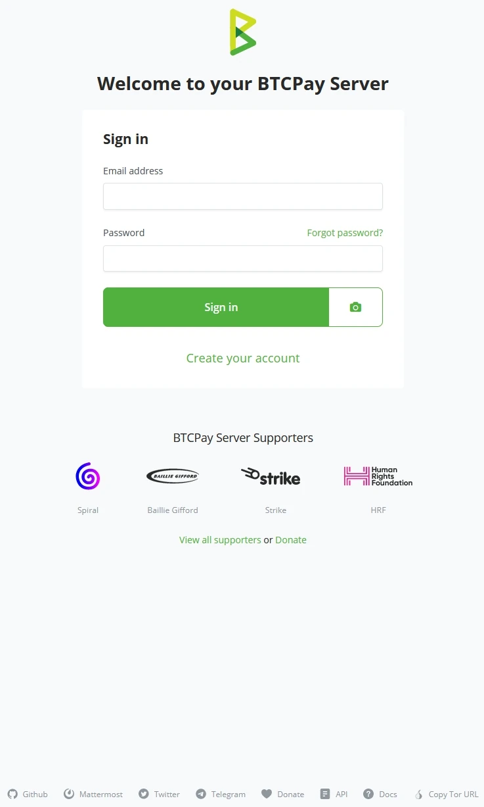


### アカウント作成ウィンドウ


BTCPay Serverでアカウントを作成するには、有効なメールアドレスの文字列が必要です。例えば example@email.com はメールアドレスとして有効な文字列です。


パスワードは、英字、数字、記号を含めて最低8文字必要です。パスワードを一度設定した後、最初のパスワード欄に入力したものと同じパスワードを確認のために再入力する必要があります。


メールアドレスとパスワードの両方の欄が正しく入力されたら、「Create Account」ボタンをクリックします。これで、講師のBTCPay Serverインスタンスにメールアドレスとパスワードが保存されます。


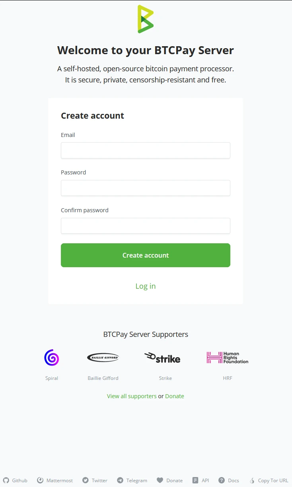


**注意！**


このコースを独学で受講する場合、このアカウントの作成はサードパーティのホスト上で行うことになる可能性が高いため、これらを本番環境として使用せず、トレーニング目的のみに使用することを改めて強調しておきます。


### BTCPay Server管理者によるアカウント作成


BTCPay Serverインスタンスの管理者は、BTCPay Serverのアカウントを作成することもできます。BTCPay Serverインスタンスの管理者は、「Server Settings」をクリックし(1)、「Users」タブをクリックし(2)、Usersタブの右上にある「+ Add User」ボタン(3)をクリックします。目標(4.3)では、アカウントの管理者コントロールについて詳しく説明します。


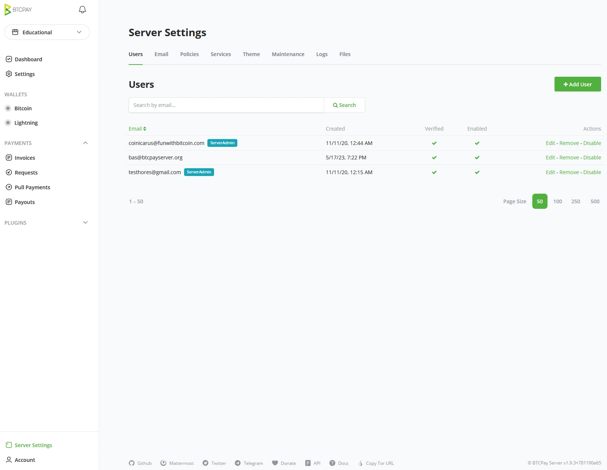


管理者としては、ユーザーのメールアドレスが必要で、初期パスワードを設定します。セキュリティ上の理由から、管理者はアカウントを使用する前にこのパスワードを変更するようユーザーに伝えることが推奨されます。管理者がパスワードを設定せず、サーバーにSMTPが設定されている場合、ユーザーは、アカウントを作成して自分でパスワードを設定するための招待リンクが記載されたメールを受け取ります。


### 例


講師と一緒にコースを受講する場合、講師が提供するリンクに従い、デモ環境でアカウントを作成してください。メールアドレスとパスワードを安全に保存していることを確認してください。このコースの残りのデモ目標には、これらのログイン認証情報が必要です。


講師は、この演習の前に、前もってメールアドレスを集めて招待リンクを送っている場合があります。指示があれば、メールを確認してください。


講師なしでコースを受講する場合は、BTCPay Serverのデモ環境を使用してアカウントを作成します。以下にアクセスしてください。


https://mainnet.demo.btcpayserver.org/login


このアカウントは、デモンストレーションやトレーニングの目的のみに使用し、決してビジネスには使用しないでください。


### スキルのまとめ


このセクションでは、以下のことを学びました：


- インターフェースを使ってホストされたサーバーにアカウントを作成する方法。
- サーバー管理者がサーバー設定でユーザーを手動で追加する方法。


### 知識評価


#### KA 概念の復習


デモサーバーを本番用途に使用するのが良くない理由を挙げてください。


## ユーザーアカウントの管理


<chapterId>b58ca6ee-b7fc-5e81-a6aa-c8ff212b4c55</chapterId>


### BTCPay Serverでのアカウント管理


ストアオーナーはアカウントを作成した後、BTCPay ServerのUIの左下でアカウントを管理することができます。「Account」ボタンの下には、複数の上位レベルの設定があります。


- ダーク/ライトモード
- 「Hide Sensitive Info（機密情報を隠す）」トグル
- アカウントの管理（Manage Account）


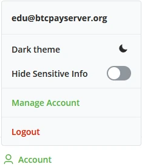


### ダークモードとライトモード


BTCPay Serverのユーザーは、UIのライトモード版とダークモード版を選択できます。顧客向けのページは変更されません。顧客向けのページでは、ダークモードかライトモードかについて顧客側の設定が使用されます。


### 機密情報を隠すトグル


「Hide Sensitive Info（機密情報を隠す）」ボタンは、手軽でシンプルなセキュリティの層を提供します。公共の場で、あなたの肩越しに誰かが覗いているかもしれない状況でBTCPay Serverを操作する必要がある場合、「Hide Sensitive Info」をオンにすると、BTCPay Server内のすべての金額が隠されます。誰かが肩越しに画面を覗くことはできても、あなたが扱っている金額はもう見えません。


### アカウントの管理


ユーザーアカウントを作成したら、ここでパスワード、2FA、またはAPIキーを管理します。


### アカウントの管理 - アカウント


必要に応じて、別のメールアドレスにアカウントを更新できます。メールアドレスが正しいことを確認するために、BTCPay Serverでは確認メールを送信することができます。ユーザーが新しいメールアドレスを設定し、認証が成功したことを確認したら、保存をクリックします。ユーザー名は以前のメールアドレスのままです。


ユーザーはアカウント全体を削除することもできます。これは、「Account」タブの削除ボタンをクリックして行います。


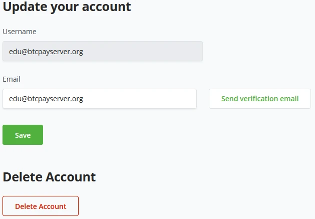


**注意！**


メールアドレスを変更しても、アカウントのユーザー名は変更されません。以前に登録したメールアドレスがログイン名のままとなります。


### アカウントの管理 - パスワード


受講生がパスワードを変更したい場合は、「Password」タブから変更することができます。ここで古いパスワードを入力し、新しいパスワードに変更することができます。


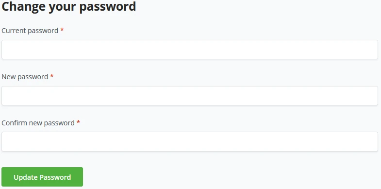


### 二要素認証（2FA）


パスワードが盗まれた場合の被害を最小限に抑えるために、比較的新しいセキュリティ手法である二要素認証（2FA）を使用することができます。「Manage Account（アカウントの管理）」の二要素認証タブから、二要素認証を有効にすることができます。有効にすると、ユーザー名とパスワードでログインした後、2つ目のステップを完了する必要があります。


BTCPay Serverは、2FAを有効にするための2つの方法をサポートしています：アプリベースの2FA（Authy、Google、Microsoftの各Authenticator）、またはセキュリティデバイス（FIDO2またはLNURL Auth）を使う方法です。


### 二要素認証 - アプリベース


携帯電話のオペレーティングシステム（AndroidまたはiOS）に応じて、ユーザーは以下のアプリから選ぶことができます。


1. 二要素認証アプリをダウンロードします。


   - Authy for [Android](https://play.google.com/store/apps/details?id=com.authy.authy) または [iOS](https://apps.apple.com/us/app/authy/id494168017)
   - Microsoft Authenticator for [Android](https://play.google.com/store/apps/details?id=com.azure.authenticator) または [iOS](https://apps.apple.com/us/app/microsoft-authenticator/id983156458)
   - Google Authenticator for [Android](https://play.google.com/store/apps/details?id=com.google.android.apps.authenticator2&hl=e%C2%80) または [iOS](https://apps.apple.com/us/app/google-authenticator/id388497605)

2. Authenticatorアプリをダウンロードしてインストールしたら：


   - BTCPay Serverが提供するQRコードをスキャンします。
   - または、BTCPay Serverが生成したキーをAuthenticatorアプリに手動で入力します。

3. Authenticatorアプリが固有のコードを表示します。そのコードをBTCPay Serverに入力してセットアップを確認し、「Verify」をクリックしてプロセスを完了します。


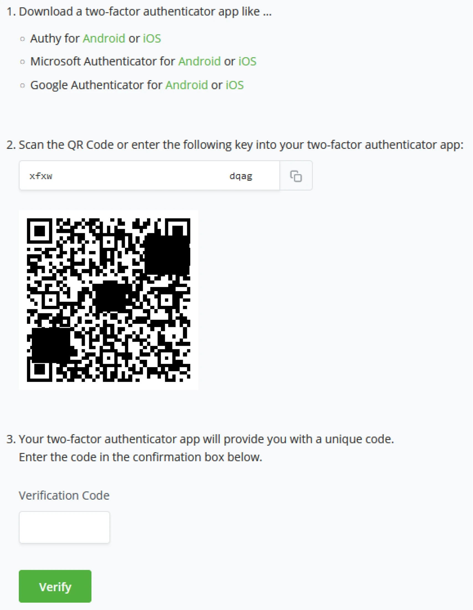


### スキルのまとめ


このセクションでは、以下のことを学びました：


- アカウント管理のオプションと、BTCPay Serverインスタンスでアカウントを管理するさまざまな方法。
- アプリベースの2FAを設定する方法。


### 知識評価


#### KA 概念の復習


アプリベースの2FAがアカウントの安全確保にどのように役立つかを説明してください。


## 新しいストアの作成


<chapterId>463b3634-b49f-5512-a711-3b2e096fc2e0</chapterId>


### ストア作成ウィザード


新規ユーザーがBTCPay Serverにログインしたとき、環境は空であり、最初のストアが必要です。BTCPay Serverの導入ウィザードは、ユーザーに「Create your store（ストアを作成する）」オプションを提示します(1)。ストアは、あなたのBitcoin業務のためのホームと見なすことができます。新しいBTCPay Serverノードは、まずBitcoinブロックチェーンの同期から始まります(2)。BTCPay Serverをどのようなインフラで実行するかによって、これには数時間から数日かかります。インスタンスの現在のバージョンは、BTCPay ServerのUIの右下に表示されます。これはトラブルシューティングの際に参照するのに便利です。


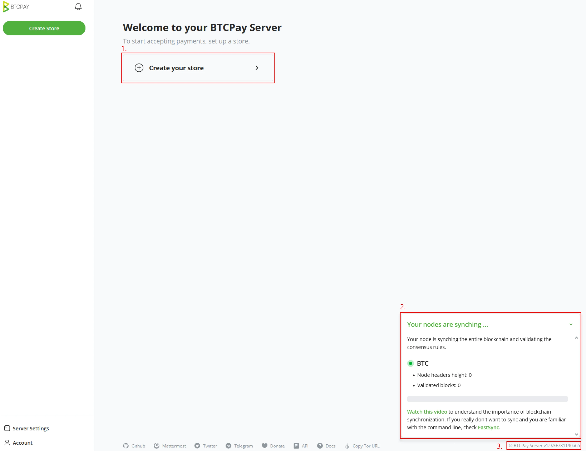


### ストア作成ウィザード


本コースでは、前のページとは少し異なる画面からスタートします。講師が用意したデモ環境では、Bitcoinブロックチェーンは事前に同期されているため、ノードの同期状況は表示されません。


ユーザーはアカウント全体を削除することもできます。これは、「Account」タブの削除ボタンをクリックして行います。


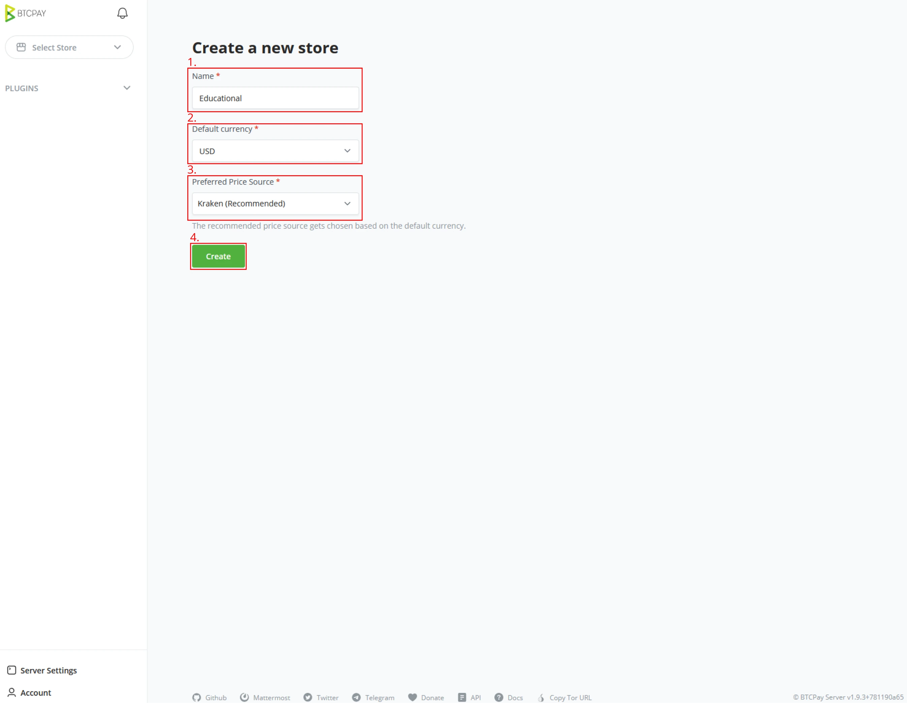


**注意！**


BTCPay Serverのアカウントでは、無制限にストアを作成することができます。各ストアはウォレット、つまり「ホーム」です。


### 例


「Create your store（ストアを作成する）」をクリックしてください。


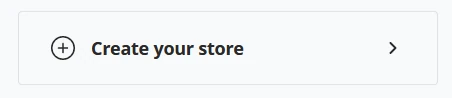


これにより、BTCPay Serverを使用するための最初のホームとダッシュボードが作成されます。


(1) 「Create your store」をクリックすると、BTCPay Serverはストアの名前の入力を求めます。名前はあなたにとってわかりやすいものであれば何でも構いません。


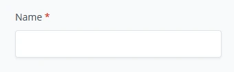


(2) 次に、ストアのデフォルト通貨を設定する必要があります。法定通貨、またはBitcoinやサトシ建ての通貨を選べます。デモ環境ではUSDに設定します。


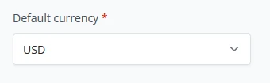


(3) ストアセットアップの最後のパラメータとして、BTCPay Serverでは「Preferred price source（優先価格ソース）」を設定する必要があります。これはBitcoinの価格を現在の法定通貨価格と比較するためのもので、ストアがBitcoinとストアに設定した法定通貨の間の正しい為替レートを表示できるようにします。デモの例ではデフォルトのまま、Kraken取引所に設定します。BTCPay ServerはKrakenのAPIを使用して為替レートを確認します。


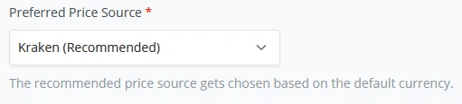


(4) これらのストアパラメータを設定したら、「Create」ボタンをクリックします。BTCPay Serverが最初のストアのダッシュボードを作成し、そこでウィザードが続きます。


おめでとうございます。最初のストアを作成できました。これでこの演習は終了です。


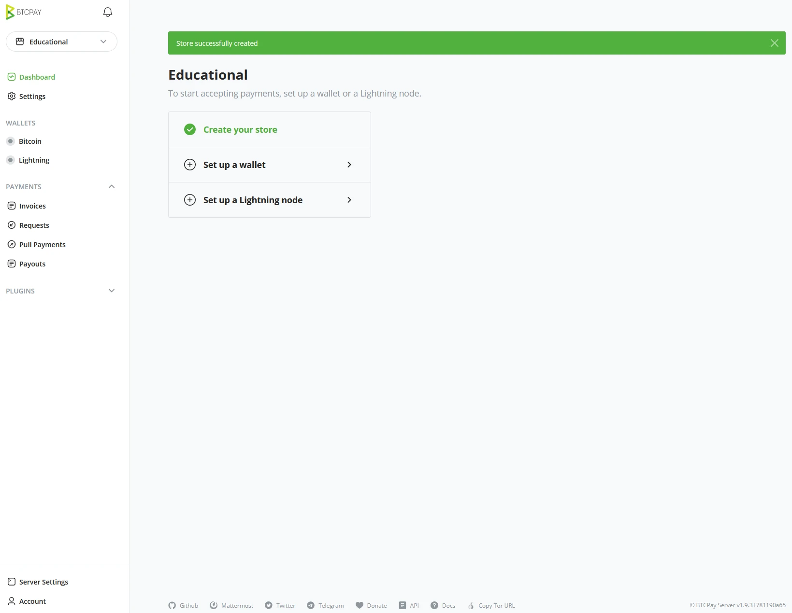


### スキルのまとめ


このセクションでは、以下のことを学びました：


- ストアの作成、デフォルト通貨の設定、および価格ソースの設定。
- 各「ストア」は、このBTCPay Serverインストール上の他のストアから分離された新しいホームであること。


# Bitcoin鍵の保護入門


<partId>25da22d8-fd37-51c5-af2a-58b9f3b046b2</partId>


## Bitcoin鍵の生成を理解する


<chapterId>d162735b-847b-578e-83b8-a044ab703ec5</chapterId>


### Bitcoin鍵の生成には何が関係しているのでしょうか？


Bitcoinウォレットは、作成時にいわゆる「[シード](https://planb.academy/resources/glossary/seed)」を作成します。前の目標で、あなたは「シード」を作成しました。このとき生成された一連の単語は、ニーモニックフレーズとしても知られています。シードは個々のBitcoin鍵を導出するために使用され、Bitcoinの送受信に使われます。シードフレーズは、決して第三者や信頼できない相手と共有してはいけません。


シードの生成は、「階層的決定性（HD）」フレームワークとして知られる業界標準に従って行われます。


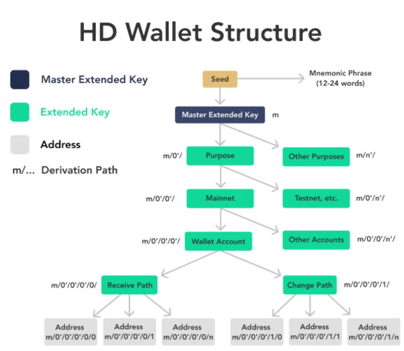


### アドレス


BTCPay Serverは、新しいアドレスを生成するように作られています。これにより、公開鍵やアドレスの再利用の問題が軽減されます。同じ公開鍵を使い続けると、支払い履歴全体の追跡が非常に簡単になってしまいます。鍵を一度しか使えないバウチャーと考えれば、プライバシーは大幅に改善されるでしょう。私たちはBitcoinアドレスも使用しますが、これを公開鍵と混同しないでください。


アドレスは、「ハッシュアルゴリズム」によって公開鍵から導出されます。ただし、ほとんどのウォレットやトランザクションでは、公開鍵ではなくアドレスが表示されます。一般的に、アドレスは公開鍵よりも短く、通常 `1`、`3`、`bc1` で始まるのに対し、公開鍵は `02`、`03`、`04` で始まります。


- `1.....` で始まるアドレスは、今でも非常に一般的なアドレスです。「新しいストアの作成」の章で述べたように、これらはレガシーアドレスです。このアドレスタイプはP2PKHトランザクション用です。P2PKHはBase58エンコーディングを使用するため、アドレスは大文字と小文字を区別します。その構造は、公開鍵に識別子として1桁を追加したものに基づいています。


- `bc1...` で始まるアドレスは、徐々にごく一般的なアドレスになりつつあります。これらは（ネイティブ）[SegWit](https://planb.academy/resources/glossary/segwit)アドレスとして知られています。これらのアドレスは、ここで挙げた他のアドレスよりも有利な手数料体系を提供します。ネイティブSegWitアドレスはBech32エンコーディングを使用し、小文字のみを使用します。


- `3...` で始まるアドレスは、取引所の入金アドレスとして今でも一般的に使用されています。これらは「新しいストアの作成」の章で触れた、ラップド（ネステッド）SegWitアドレスです。ただし、これらは「マルチシグアドレス」としても機能します。SegWitアドレスとして使用する場合、[取引手数料](https://planb.academy/resources/glossary/transaction-fees)を多少節約できますが、ネイティブSegWitほどではありません。P2SHアドレスはBase58エンコーディングを使用します。このため、レガシーアドレスと同様に大文字と小文字が区別されます。


- `2...` で始まるアドレスはTestnetアドレスです。これらはTestnet Bitcoin（tBTC）を受け取るためのものです。これらを取り違えて、Bitcoinをこれらのアドレスに送信することは絶対に避けてください。開発目的であれば、Testnetウォレットを生成することができます。オンライン上にはTestnet Bitcoinを入手するための複数のフォーセット（faucet）があります。決してTestnet Bitcoinを購入しないでください。Testnet Bitcoinはマイニングによって得られるものです。これは開発者が代わりにRegtestを使う理由の一つになるかもしれません。Regtestは開発者のための遊び場のような環境で、特定のネットワークコンポーネントが欠けています。とはいえ、Bitcoinは開発目的にはとても便利です。


### 公開鍵


現在、公開鍵が実際に使われることは少なくなっています。時間とともに、Bitcoinのユーザーは公開鍵をアドレスに置き換えてきました。公開鍵は今も存在し、時々使われます。一般的に、公開鍵はアドレスよりもはるかに長い文字列です。アドレスと同様に、公開鍵は特定の識別子で始まります。


- まず、`02...` と `03...` は、SEC形式でエンコードされたごく標準的な公開鍵の識別子です。これらを処理して受信用のアドレスにしたり、マルチシグアドレスの作成に使用したり、署名の検証に使ったりすることができます。初期のBitcoinトランザクションでは、P2PKトランザクションの一部として公開鍵が使用されていました。


- 一方、HDウォレットは異なる構造を使用します。`xpub...`、`ypub...`、`zpub...` は拡張公開鍵（[xpub](https://planb.academy/resources/glossary/xpub)）と呼ばれます。これらの鍵は、HDウォレットの一部として多くの公開鍵を導出するために使用されます。xpubには、過去と未来の取引を含むあなたの全履歴の記録が含まれるため、これらを信頼できない相手と決して共有しないでください。


### スキルのまとめ


このセクションでは、以下のことを学びました：


- アドレスと公開鍵というデータタイプの違いと、公開鍵ではなくアドレスを使用する利点。


### 知識評価


アドレスの再利用や公開鍵を使う方法と比較して、トランザクションごとに新しいアドレスを使用する利点を説明してください。


## ハードウェアウォレットによる鍵の保護


<chapterId>c54a6d61-5a43-5fdb-93ae-c6750de9c612</chapterId>


### Bitcoin鍵の保管


シードフレーズを生成した後、本書で生成される12〜24単語のリストは、ウォレットへのアクセスを回復する唯一の手段であるため、適切なバックアップとセキュリティが必要です。HDウォレットの構造と、単一のシードからアドレスを決定論的に生成する仕組みにより、作成されたすべてのアドレスは、シード（リカバリーフレーズ）を表すこの1つのニーモニック単語リストによってバックアップされます。


リカバリーフレーズを安全に保管してください。もし誰かが、特に悪意を持ってアクセスすれば、その人はあなたの資金を動かすことができます。シードは安全かつ確実に保管し、同時にそれがあなたと資金をつなぐ唯一のものであることを忘れないでください。Bitcoinの[秘密鍵](https://planb.academy/resources/glossary/private-key)の保管にはいくつかの方法があり、セキュリティ、プライバシー、利便性、物理的な保管といった観点で、それぞれに利点と欠点があります。秘密鍵の重要性から、Bitcoinの利用者は、銀行のような「カストディアル」サービスを利用するよりも、「セルフカストディ」で鍵を保管し、安全に守る傾向があります。ユーザーの状況に応じて、コールドストレージソリューションかホットウォレットのいずれかを使うことになります。


### Bitcoin鍵のホット保管とコールド保管


通常、Bitcoinウォレットはホットウォレットまたは[コールドウォレット](https://planb.academy/resources/glossary/cold-wallet)に分類されます。トレードオフの大部分は、利便性、使いやすさ、セキュリティリスクにあります。これらの方式はそれぞれ、カストディアルのソリューションにも見られます。ただし、その場合のトレードオフは主にセキュリティとプライバシーに基づくものであり、このコースの範囲を超えています。


### ホットウォレット


ホットウォレットは、モバイル、ウェブ、またはデスクトップのソフトウェアを通じてBitcoinとやりとりする最も便利な方法です。ウォレットは常にインターネットに接続されており、ユーザーはBitcoinを送受信することができます。しかし、これは弱点でもあります。ウォレットは常にオンラインであるため、あなたのデバイス上のハッカーやマルウェアによる攻撃を受けやすくなります。BTCPay Serverでは、ホットウォレットはインスタンス上に秘密鍵を保存します。BTCPay Serverのストアにアクセスできる人が悪意を持っていれば、このアドレスから資金を盗む可能性があります。BTCPay Serverがホスティング環境で実行される場合、常にセキュリティ上の観点からこの点を考慮し、そのような場合にはホットウォレットを使用しないことが望ましいです。BTCPay Serverがあなた自身が所有し保護しているハードウェアにインストールされている場合、リスクは大幅に下がりますが、完全になくなることはありません。


### コールドウォレット


人々が秘密鍵をコールドウォレットに移すのは、秘密鍵をインターネットから隔離し、潜在的なオンラインの脅威から資金を守ることができるからです。インターネット接続を取り除くことで、マルウェア、スパイウェア、SIMスワップのリスクを減らすことができます。コールドストレージは、Bitcoinの秘密鍵の紛失を防ぐための十分な予防措置が取られていれば、セキュリティと自律性の面でホットストレージより優れていると考えられています。コールドストレージは、ウォレットのセットアップが複雑なため、頻繁に使うことを想定していない多額のBitcoinに最も適しています。


Bitcoinの鍵をコールドストレージに保管する方法は、ペーパーウォレット、ブレインウォレット、ハードウェアウォレット、あるいは初期からあるウォレットファイルなど、さまざまです。ほとんどのウォレットは、シードフレーズの生成に[BIP](https://planb.academy/resources/glossary/bip) 39を使用します。ただし、Bitcoin Coreソフトウェアの中では、その使用についてまだコンセンサスが得られていません。Bitcoin Coreソフトウェアは引き続きwallet.datファイルを生成するため、これを安全なオフラインの場所に保管する必要があります。


### スキルのまとめ


このセクションでは、以下のことを学びました：


- ホットウォレットとコールドウォレットの機能の違いとトレードオフ。


### 知識評価 概念の復習


- ウォレットとは何ですか？


- ホットウォレットとコールドウォレットの違いは何ですか？


- 「ウォレットの生成」とはどういう意味ですか？


## Bitcoin鍵の使い方


<chapterId>bff488de-5052-56e6-b696-97e896f762ae</chapterId>


### BTCPay Serverのウォレット


BTCPay Serverのウォレットは、以下の標準的なウォレット機能で構成されています：


- トランザクション
- 送信
- 受信
- 再スキャン
- プルペイメント
- ペイアウト
- [PSBT](https://planb.academy/resources/glossary/psbt)
- 一般設定


### トランザクション


管理者は、トランザクションビューで、この特定のストアに接続されているオンチェーンウォレットの送受信トランザクションを確認できます。各トランザクションには、受信金額と送信金額の区別があります。受信は緑色、送信トランザクションは赤色で表示されます。BTCPay Serverのトランザクションビューでは、管理者は標準の[ラベル](https://planb.academy/resources/glossary/label)のセットも確認できます。


| トランザクションの種類 | 説明                                               |
| ------------ | -------------------------------------------------- |
| App          | アプリで作成されたインボイスを通じて支払いを受領した |
| invoice      | インボイスを通じて支払いを受領した               |
| [payjoin](https://planb.academy/resources/glossary/payjoin)       | 未払いで、インボイスのタイマーがまだ期限切れになっていない |
| payjoin-exposed | インボイスのPayjoin提案を通じて[UTXO](https://planb.academy/resources/glossary/utxo)が公開された    |
| payment-request | 支払いリクエストを通じて支払いを受領した |
| payout       | ペイアウトまたは返金を通じて支払いを送信した     |

### 送信方法


BTCPay Serverの送信機能は、BTCPay Serverのオンチェーンウォレットからトランザクションを送信します。BTCPay Serverでは、資金を使用するトランザクションに複数の方法で署名することができます。トランザクションは次の方法で署名できます：


- ハードウェアウォレット
- PSBT対応ウォレット
- HD秘密鍵またはリカバリーシード
- ホットウォレット


#### ハードウェアウォレット


BTCPay Serverにはハードウェアウォレットのサポートが組み込まれており、サードパーティのアプリやサーバーに情報を漏らすことなく、BTCPay Vaultでハードウェアウォレットを使用することができます。BTCPay Server内のハードウェアウォレット統合により、ハードウェアウォレットをインポートし、デバイス上で簡単な確認を行うだけで、受け取った資金を使用することができます。あなたの秘密鍵がデバイスから離れることはなく、すべての資金はあなたのフルノードに対して検証されるため、データの漏洩はありません。


#### PSBT対応ウォレットによる署名


PSBT（Partially Signed Bitcoin Transactions：部分的に署名されたBitcoinトランザクション）は、まだ完全には署名されていないBitcoinトランザクションの交換フォーマットです。PSBTはBTCPay Serverでサポートされており、互換性のあるハードウェアウォレットおよびソフトウェアウォレットで署名することができます。


完全に署名されたBitcoinトランザクションの構築は、以下のステップを経て行われます：


- PSBTは特定のインプットとアウトプットで構成されるが、署名は含まれない。
- エクスポートされたPSBTは、このフォーマットをサポートするウォレットでインポートできる。
- トランザクションデータは、ウォレットを使用して検査し、署名することができる。
- 署名されたPSBTファイルをウォレットからエクスポートし、BTCPay Serverにインポートする。
- BTCPay Serverが最終的なBitcoinトランザクションを生成する。
- 結果を検証し、ネットワークにブロードキャストする。


#### HD秘密鍵またはニーモニックシードによる署名


BTCPay Serverを使用する前にウォレットを作成していた場合、秘密鍵を適切なフィールドに入力することで資金を使用することができます。Wallet > Settingsで「AccountKeyPath」を適切に設定してください。設定しないと資金を使用できません。


#### ホットウォレットでの署名


ストアのセットアップ時に新しいウォレットを作成し、ホットウォレットとして有効にした場合、サーバーに保存されたシードを自動的に使用して署名します。


### RBF（Replace-By-Fee）


Replace-By-Fee（RBF）はBitcoinプロトコルの機能で、以前にブロードキャストされたトランザクションを（未確認の間に）置き換えることができます。これにより、ウォレットのトランザクションのフィンガープリントをランダム化したり、より高い手数料率のトランザクションに置き換えて、承認（マイニング）の優先順位の列で上位に移動させたりすることができます。より高い手数料率のトランザクションが優先されるため、元のトランザクションは事実上置き換えられ、承認された時点で元のトランザクションは無効になります（二重支払いにはなりません）。


「Advanced Settings（詳細設定）」ボタンを押すと、RBFのオプションが表示されます。


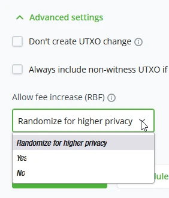


- 「Randomize for higher privacy（プライバシー向上のためにランダム化）」：トランザクションのフィンガープリントをランダム化するために、トランザクションが自動的に置き換えられることを許可します。
- 「Yes」：トランザクションにRBFのフラグを立て、明示的に置き換えられるようにします（デフォルトでは置き換えられず、手動操作でのみ置き換えられます）。
- 「No」：トランザクションの置き換えを許可しません。


### コインセレクション


コインセレクションはプライバシーを強化する高度な機能で、トランザクションを作成する際に使用するコインを選択することができます。例えば、コインジョインのミックスから出てきたばかりのコインで支払うことができます。


コインセレクションは、ウォレットのラベル機能とネイティブに連携します。これにより、受け取った資金にラベルを付けて、UTXOの管理と支出をよりスムーズに行うことができます。


BTCPay Serverは、ラベル管理のためにBIP-329をサポートしています。BIP-329をサポートするウォレットから移行し、ラベルを設定していた場合、BTCPay Serverはそれらを自動的に認識してインポートします。サーバーを移行する際には、この情報をエクスポートして新しい環境にインポートすることもできます。


### 受信方法


BTCPay Serverで「Receive（受信）」ボタンをクリックすると、支払いの受け取りに使用できる未使用のアドレスが生成されます。管理者は、新しい「Invoice（インボイス）」を作成することで、新しいアドレスを生成することもできます。


BTCPay Serverは、アドレスの再利用を防ぐため、常に次の利用可能なアドレスを生成するよう促します。「Generate next available BTC Address」をクリックすると、BTCPay Serverは新しいアドレスとQRコードを生成します。また、アドレスに直接ラベルを設定して、アドレスの管理を改善することもできます。


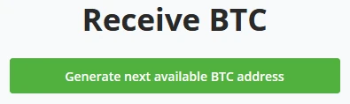


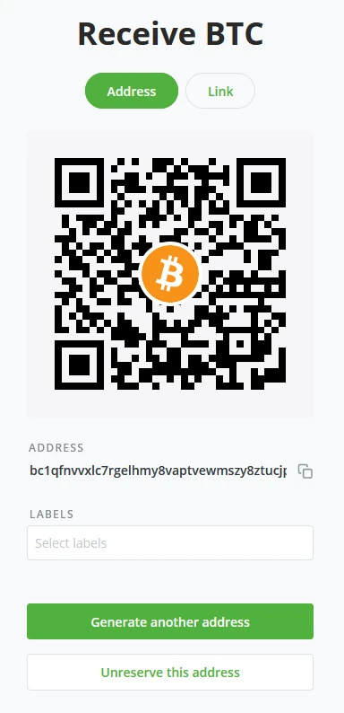


#### 再スキャン


再スキャン機能はBitcoin Core 0.17.0の「scantxoutset」に依存しており、ブロックチェーンの現在の状態（UTXOセットと呼ばれる）をスキャンして、設定された導出スキームに属するコインを探します。ウォレットの再スキャンは、BTCPay Serverのユーザーが頻繁に遭遇する2つの一般的な問題に対処します。


1. ギャップリミットの問題 - ほとんどのサードパーティ製ウォレットは、多くのユーザー間でノードを共有するライトウォレットです。ライトウォレットやフルノードに依存するウォレットは、パフォーマンスの問題を防ぐために、ブロックチェーン上で追跡する残高のないアドレスの数（通常は20）を制限しています。BTCPay Serverは、インボイスごとに新しいアドレスを生成します。この点を踏まえると、BTCPay Serverが20回連続して未払いのインボイスを生成した後、外部ウォレットは新しいトランザクションが発生しなかったと仮定して、トランザクションの取得を停止します。21件目、22件目などのインボイスが支払われても、外部ウォレットにはそれらが表示されません。一方、BTCPay Serverのウォレットは内部的に、生成したすべてのアドレスを、はるかに高いギャップリミットとともに追跡します。第三者に依存せず、常に正しい残高を表示することができます。

2. ギャップリミットの解決策 - [外部/既存のウォレット](https://docs.btcpayserver.org/WalletSetup/#use-an-existing-wallet)がギャップリミットの設定を許可している場合、簡単な解決策はそれを増やすことです。しかし、大半のウォレットはこれを許可していません。現在、私たちが把握している限りでギャップリミットの設定をサポートしているウォレットは、Electrum、Wasabi、Sparrow Walletだけです。残念ながら、他の多くのウォレットでは問題が発生する可能性があります。最高のユーザー体験とプライバシーのために、外部ウォレットの代わりにBTCPay Serverの内部ウォレットの使用を検討してください。


#### BTCPay Serverは「mempoolfullrbf=1」を使用しています


BTCPay Serverは「mempoolfullrbf=1」を使用しており、BTCPay Serverのセットアップのデフォルトとして追加されています。ただし、自分で無効にできる機能にもなっています。「mempoolfullrbf=1」がない場合、顧客がRBFを通知しないトランザクションで支払いを二重支払いした場合、マーチャントは承認後に初めてそれを知ることになります。


管理者はこの設定をオプトアウトしたい場合があります。以下の文字列により、デフォルトの設定を変更することができます。


```
BTCPAYGEN_EXCLUDE_FRAGMENTS="$BTCPAYGEN_EXCL UDE_FRAGMENTS;opt-mempoolfullrbf"
. btcpay-setup.sh -i
```


### BTCPay Serverのウォレット設定


BTCPay Server内のウォレット設定は、ウォレットの一般的な設定を明確かつ簡潔に一覧できます。ウォレットをBTCPay Serverで作成した場合、これらの設定はすべて事前に入力されています。


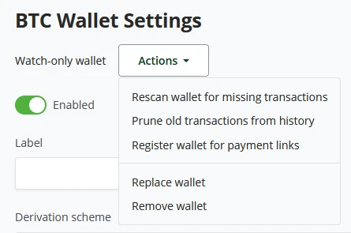


BTCPay Server内のウォレット設定は、ウォレットの一般的な設定を明確かつ簡潔に一覧できます。ウォレットをBTCPay Serverで作成した場合、これらの設定はすべて事前に入力されています。BTCPay Serverのウォレット設定は、ウォレットのステータスから始まります。ウォッチオンリーウォレットなのか、ホットウォレットなのか。ウォレットのタイプによって、見つからないトランザクションを探すためにウォレットを再スキャンする、履歴から古いトランザクションを削除（プルーニング）する、ウォレットを支払いリンクに登録する、ストアに接続されている現在のウォレットを交換または削除するなど、実行できるアクションが異なります。BTCPay Serverのウォレット設定では、管理者はウォレットの管理をしやすくするためにウォレットにラベルを設定することができます。ここで管理者は、導出スキーム、アカウントキー（xpub）、フィンガープリント、キーパスを確認することもできます。ウォレット設定の「Payments（支払い）」には、主に2つの設定しかありません。インボイスの有効期限が切れてから（設定した分数）以内にトランザクションが承認されなかった場合、支払いは無効とみなされる。支払いトランザクションがX回承認された時点でインボイスを承認済みとみなす。管理者はまた、支払い画面で推奨手数料を表示するトグルを設定したり、ブロック数で手動の承認目標を設定したりすることもできます。


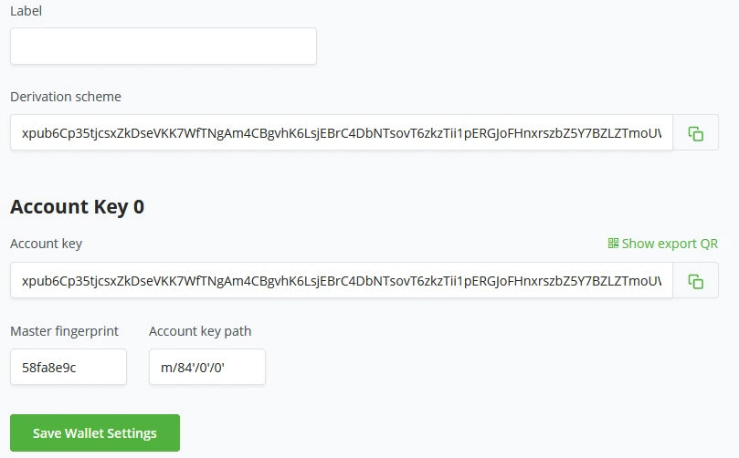


**注意！**


このコースを独学で進める場合、このアカウントの作成はサードパーティのホスト上で行うことになるでしょう。したがって、本番環境として使用するのではなく、トレーニング目的でのみ使用することを改めてお勧めします。


### 例


#### BTCPay ServerでBitcoinウォレットをセットアップする


BTCPay Serverは、ウォレットを設定するための2つの方法を提供します。一つは、既存のBitcoinウォレットをインポートする方法です。インポートは、ハードウェアウォレットを接続する、ウォレットファイルをインポートする、拡張公開鍵を入力する、ウォレットのQRコードをスキャンする、または最も好ましくない方法として、以前に作成したウォレットのリカバリーシードを手で入力することで行えます。BTCPay Serverでは、新しいウォレットを作成することも可能です。新しいウォレットを生成する場合、BTCPay Serverの設定方法は2通りあります。


BTCPay Serverのホットウォレットオプションは、「Payjoin」や「Liquid」のような機能を可能にします。ただし、欠点もあります。このウォレットのために生成されたリカバリーシードはサーバーに保存され、管理者権限を持っている人であれば誰でもそれを取得できてしまいます。あなたの秘密鍵はリカバリーシードから導出されるので、悪意のある行為者はあなたの現在および将来の資金にアクセスできてしまいます！


BTCPay Serverでこのリスクを軽減するために、管理者は Server Settings > Policies > "Allow non-admins to create hot wallets for their stores" の値を、デフォルト値である「no」に設定することができます。これらのホットウォレットのセキュリティを強化するために、サーバー管理者は、ホットウォレットを持つことを許可されたアカウントで2FA認証を有効にすべきです。公開サーバーに秘密鍵を保管することは危険な行為であり、重大なリスクを伴います。その一部はLightning Networkのリスクと似ています（Lightning Networkのリスクについては次の章を参照してください）。


BTCPay Serverが提供する新しいウォレットを生成する2つ目のオプションは、ウォッチオンリーウォレットを作成することです。BTCPay Serverはあなたの秘密鍵を一度だけ生成します。ユーザーがシードフレーズを書き留めたことを確認した後、BTCPay Serverはサーバーから秘密鍵を消去します。その結果、あなたのストアにはウォッチオンリーウォレットが接続された状態になります。ウォッチオンリーウォレットで受け取った資金を使うには、「送信方法」の章を参照し、BTCPay Server Vault、PSBT（部分的に署名されたBitcoinトランザクション）、または最も推奨されない方法として、手動でシードフレーズを入力してください。


前のパートで新しい「ストア」を作成しました。インストールウィザードは、「Set up a wallet（ウォレットのセットアップ）」または「Set up a Lightning node（Lightningノードのセットアップ）」を求めて続行します。この例では、「Set up a wallet」ウィザードのプロセスに従います(1)。


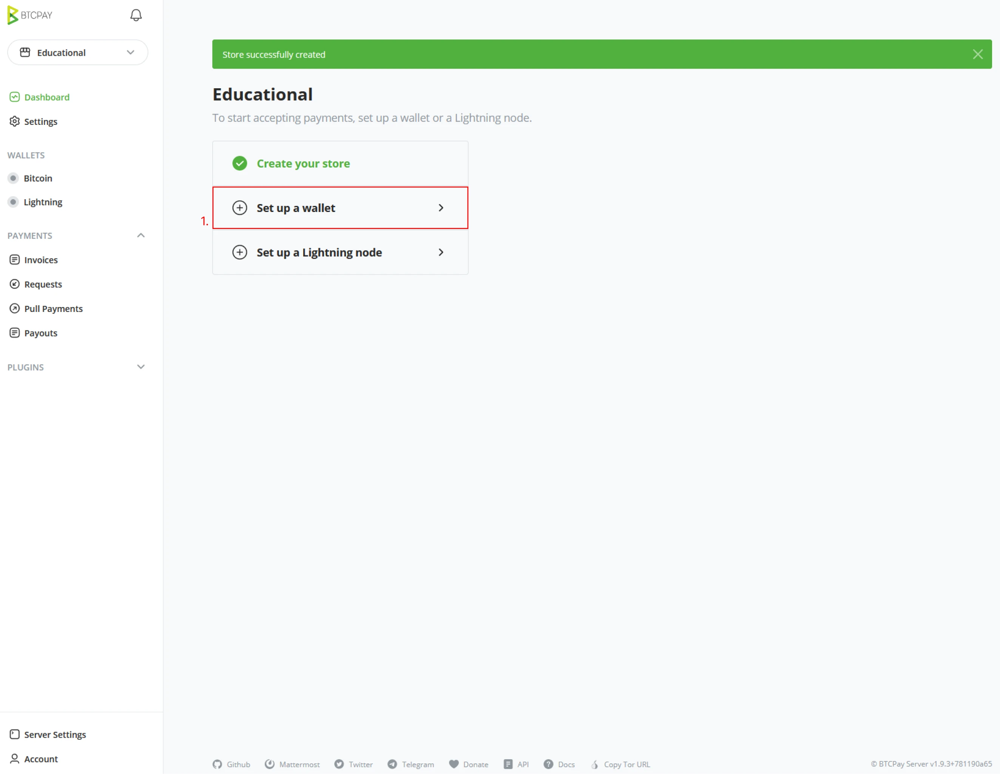


「Set up a wallet」をクリックした後、ウィザードはどのように続行するかを尋ねます。BTCPay Serverは、既存のBitcoinウォレットを新しいストアに接続するオプションを提供します。ウォレットを持っていない場合、BTCPay Serverは新しいウォレットを作成することを提案します。この例では、「Create a new wallet（新しいウォレットを作成する）」(2)の手順を説明します。「Connect an existing wallet（既存のウォレットを接続する）」(1)の方法は、そちらの手順に従ってください。


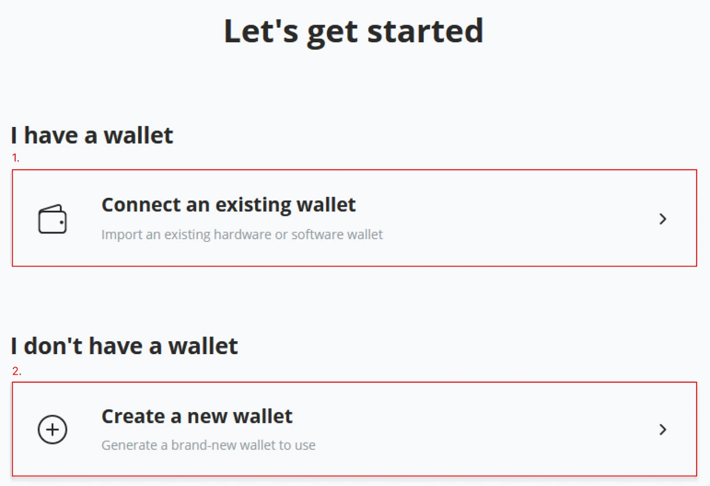


**注意！**


このコースを教室で受講する場合、ここで作成した例とシードは教育目的だけのものであることに注意してください。これらのアドレスには、演習を通して必要な量以外の実質的な金額を決して入れてはいけません。


(1)「Create a new Wallet」ボタンをクリックして、「New Wallet」ウィザードを続行します。


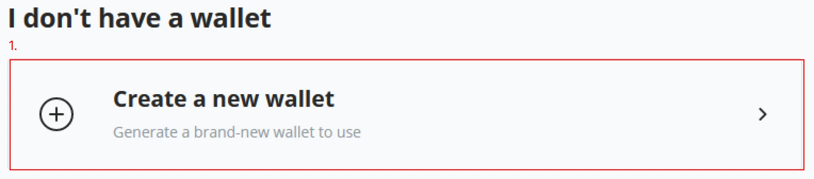


(2)「Create a new Wallet」をクリックすると、ウィザードの次のウィンドウで「Hot Wallet」と「Watch-only wallet」を選択できます。インストラクターの指示に従って進めている場合、あなたの環境は共有のデモ環境であるため、作成できるのはウォッチオンリーウォレットだけです。下の2つの図の違いに注目してください。インストラクターと一緒にデモ環境を使用しているので、「Watch-only wallet」を作成し、「New Wallet」ウィザードを続けます。


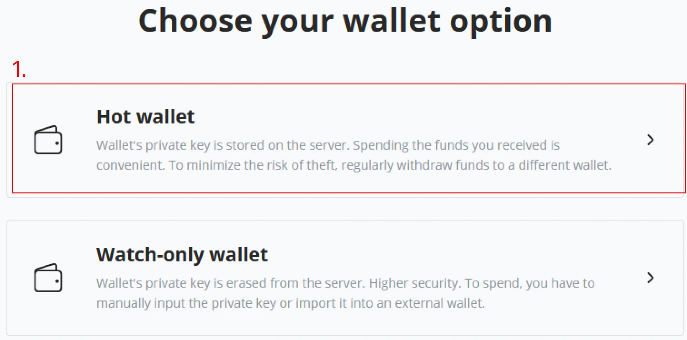


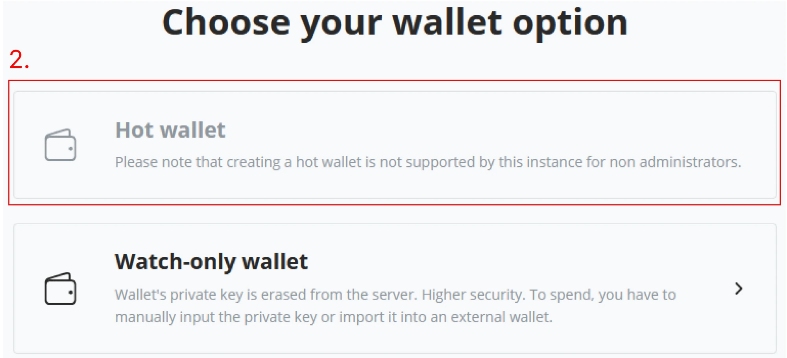


(3) 新しいウォレットのウィザードを続けると、BTCのウォッチオンリーウォレットを作成するセクションに入ります。ここで、ウォレットの「Address type（アドレスタイプ）」を設定します。BTCPay Serverでは、お好みのアドレスタイプを選ぶことができます。このコースの執筆時点では、依然としてbech32アドレスの使用が推奨されています。アドレスの詳細については、このパートの第1章を参照してください。


- SegWit（bech32）
  - ネイティブSegWitアドレスは`bc1q`で始まります。
  - 例：`bc1qXXXXXXXXXXXXXXXXXX`
- レガシー
  - レガシーアドレスとは、数字の`1`で始まるアドレスのことです。
  - 例：`15e15hXXXXXXXXXXXXXXXX`
- Taproot（上級者向け）
  - Taprootアドレスは`bc1p`で始まります。
  - 例：`bc1pXXXXXXXXXXXXXXXXXX`
- ラップドSegWit
  - ラップドSegWitアドレスは`3`で始まります。
  - 例：`37BBXXXXXXXXXXXX`


ウォレットのアドレスタイプには、SegWit（推奨）を選択してください。


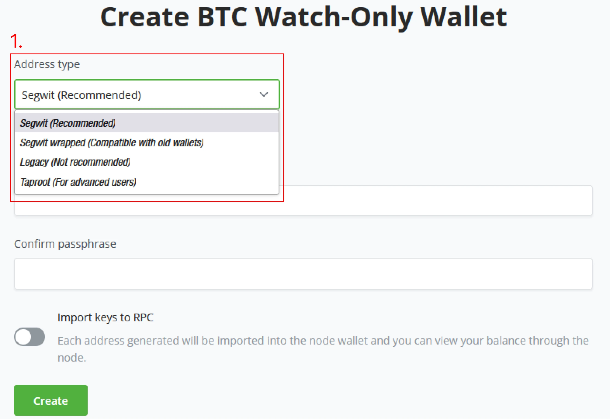


(4) ウォレットのパラメータを設定する際、BTCPay ServerではBIP39に基づくオプションのパスフレーズを設定することができます。


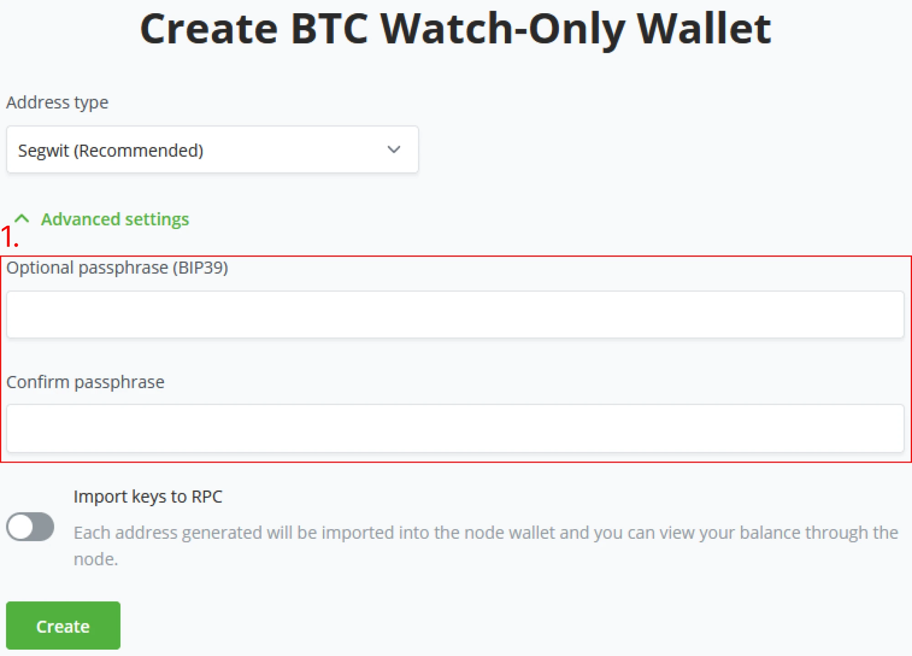


(5) ウォレットのアドレスタイプを設定し、必要に応じていくつかの詳細オプションを設定した後、「Create」をクリックすると、BTCPay Serverが新しいウォレットを生成します。これはシードフレーズが生成される前の最後のステップであることに注意してください。誰かがあなたの画面を覗いてシードフレーズを盗むことができない環境でのみ、この操作を行うようにしてください。


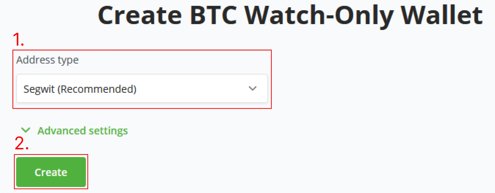


(6) ウィザードの次の画面で、BTCPay Serverは新しく生成されたウォレットのリカバリーシードフレーズを表示します。BTCPay Serverは12語のシードフレーズを生成します。これらの単語は、この設定画面を離れるとサーバーから消去されます。このウォレットはあくまでウォッチオンリーウォレットです。このシードフレーズをデジタルデータや写真として保存しないことをお勧めします。ユーザーは、シードフレーズを書き留めたことを明示的に確認した場合のみ、ウィザードを先に進めることができます。


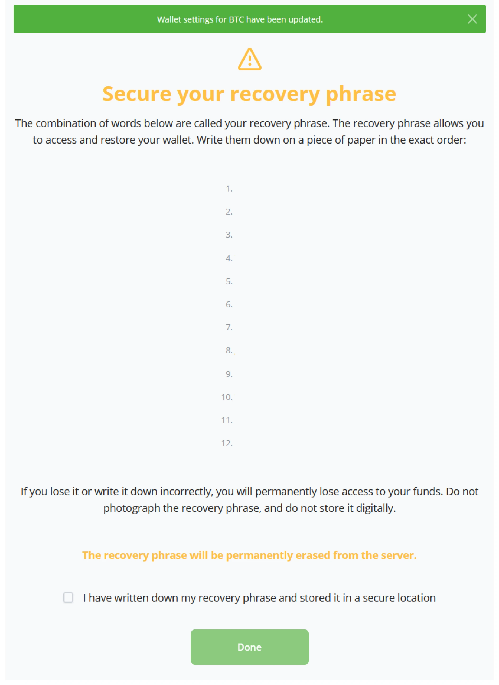


(7)「Done」をクリックし、新しく生成されたBitcoinのシードフレーズを安全に保管すると、BTCPay Serverは新しいウォレットが紐付けられた状態でストアを更新し、支払いを受け取る準備が整います。ユーザーインターフェースの左側のナビゲーションメニューで、「Wallets」の下の「Bitcoin」がハイライトされ、有効になっていることに注目してください。


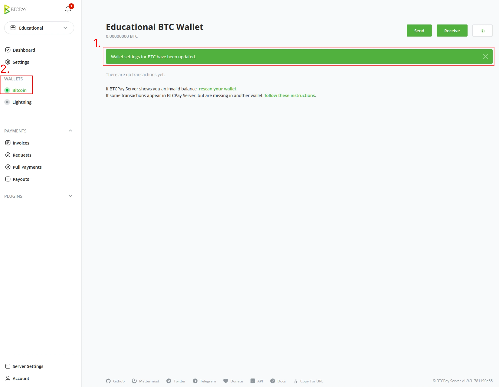


### 例：シードフレーズを書き留める


これはBitcoinを使う上で特にセキュリティが重要な瞬間です。前述のとおり、シードフレーズにアクセスしたり、その内容を知っていたりするのはあなただけであるべきです。インストラクターと一緒に教室で進めている場合、生成されたシードはこのコースの中でのみ使用してください。クラスメートの詮索の目、安全でないシステム、その他あまりに多くの要因があるため、これらの鍵は教育目的に限定され、信頼して使うべきものではありません。ただし、生成した鍵はコースの例として保存しておくべきです。


シードフレーズを正しい順序で書き留めましょう。シードフレーズカードは、受講者に提供される教材に含まれているか、BTCPay ServerのGitHubで見つけることができます。このカードを使って、前のステップで生成された単語を書き留めます。正しい順序で書き留めるようにしてください。書き留めたら、ソフトウェアに表示されているものと照らし合わせて、正しい順序で書き留めたことを確認してください。確認できたら、シードフレーズを正しく書き留めたことを示すチェックボックスをクリックしてください。


### 例：シードフレーズをハードウェアウォレットに保管する


このコースでは、シードフレーズをハードウェアウォレットに保管することについても触れます。インストラクターと一緒にこのコースを受講する場合、そのようなデバイスが含まれることがあります。コースの中で、ガイド教材はこの演習に適したハードウェアウォレットのリストをまとめています。


この例では、BTCPay Server VaultとBlockstream Jadeハードウェアウォレットを使用します。


また、ハードウェアウォレットの接続に関するビデオガイドもご覧いただけます。

:::video id=8e61664b-e0c0-416d-8ef9-b631bf28ec4d:::


BTCPay Server Vaultのダウンロード: https://github.com/btcpayserver/BTCPayServer.Vault/releases


お使いのシステムに適したファイルをダウンロードしてください。Windowsユーザーは[BTCPayServerVault-2.0.5-setup.exe](https://github.com/btcpayserver/BTCPayServer.Vault/releases/download/Vault%2Fv2.0.5/BTCPayServerVault-2.0.5-setup.exe)パッケージを、Macユーザーは[BTCPayServerVault-osx-x64-2.0.5.dmg](https://github.com/btcpayserver/BTCPayServer.Vault/releases/download/Vault%2Fv2.0.5/BTCPayServerVault-osx-x64-2.0.5.dmg)を、Linuxユーザーは[BTCPayServerVault-Linux-2.0.5.tar.gz](https://github.com/btcpayserver/BTCPayServer.Vault/releases/download/Vault%2Fv2.0.5/BTCPayServerVault-Linux-2.0.5.tar.gz)をダウンロードしてください。


BTCPay Server Vaultをインストールした後、デスクトップ上のアイコンをクリックしてソフトウェアを起動します。BTCPay Server Vaultが正しくインストールされ、初めて起動すると、Webアプリケーションからの使用を許可するかどうかを尋ねられます。あなたが使用する特定のBTCPay Serverへのアクセスを許可するよう求められますので、これらの条件に同意してください。すると、BTCPay Server Vaultはハードウェアデバイスを検索します。デバイスが見つかると、BTCPay ServerはVaultが実行中であることを認識し、デバイスを取得します。


**注意**


ホットウォレットを使用する際、SSH鍵やサーバー管理者アカウントを管理者以外の人に渡さないでください。これらのアカウントにアクセスできる人は、ホットウォレットの資金にアクセスできます。


### スキルの概要


このセクションでは、以下のことを学びました：


- Bitcoinウォレットのトランザクションビューと、その様々な分類。
- Bitcoinウォレットから送金する際に利用できる、ハードウェアウォレットからホットウォレットまでの様々なオプション。
- ほとんどのウォレットを使用する際に直面するギャップリミットの問題と、その修正方法。
- BTCPay Server内で新しいBitcoinウォレットを生成する方法（ハードウェアウォレットへの鍵の保管とリカバリーフレーズのバックアップを含む）。


この目標では、BTCPay Server内で新しいBitcoinウォレットを生成する方法を学びました。これらの鍵の保護や使用方法についてはまだ説明していません。この目標の概要を簡単にまとめると、あなたは最初のストアをセットアップする方法と、Bitcoinのリカバリーシードフレーズを生成する方法を学びました。


### 知識の評価：実践的なレビュー


鍵を生成する方法と、鍵を保護するためのスキームを、各セキュリティスキームのトレードオフやリスクとともに説明してください。


## BTCPay Server Lightningウォレット


<chapterId>1bbece7e-0197-57e6-a93a-561cf384d946</chapterId>


サーバー管理者が新しいBTCPay Serverインスタンスをプロビジョニングする際、LND、Core Lightning、EclairなどのLightning Network実装を設定できます。


教室で受講している場合、LightningノードをBTCPay Serverに接続するにはカスタムノードを使用します。BTCPay Serverのサーバー管理者でないユーザーは、デフォルトでは内部のLightningノードを使用することができません。これは、サーバーの所有者が資金を失うのを防ぐためです。サーバー管理者は、LNbankを通じてLightningノードへのアクセスを許可するプラグインをインストールすることができます。LNbankの詳細については、公式プラグインページを参照してください。


### 内部ノードの接続（サーバー管理者）


サーバー管理者は、BTCPay Serverの内部Lightningノードを使用できます。Lightningの実装にかかわらず、内部Lightningノードへの接続手順は同じです。


先ほどセットアップしたストアに移動し、左メニューの「Wallets」の下にある「Lightning」をクリックします。BTCPay Serverには、内部ノード（デフォルトではサーバー管理者のみ）またはカスタムノード（外部接続）を使用する2つのセットアップ方法があります。サーバー管理者は「Use internal node（内部ノードを使用）」オプションをクリックできます。これ以上の設定は必要ありません。「Save」ボタンをクリックすると、「BTC Lightning node updated」という通知が表示されます。これで、ストアはLightning Networkの機能を利用できるようになりました。


### 外部ノードの接続（サーバーユーザー/ストアオーナー）


デフォルトでは、ストアオーナーはサーバー管理者のLightningノードを使用することはできません。BTCPay Serverをセットアップする前からストアオーナーが所有していたノード、サーバー管理者が利用可能にしている場合はLNbankプラグイン、またはAlbyのようなカストディアルソリューションのいずれかの外部ノードに接続する必要があります。


設定済みのストアに移動し、左メニューの「Wallets」の下にある「Lightning」をクリックします。ストアオーナーはデフォルトで内部ノードを使用することができないため、このオプションはグレーアウトされています。カスタムノードを使用することが、ストアオーナーがデフォルトで使用できる唯一のオプションです。


BTCPay Serverには接続情報が必要です。事前構築済みのノード（またはカストディアルソリューション）は、それぞれのLightning実装に合わせてこの情報を提供します。BTCPay Server内では、ストアオーナーは以下の接続を使用できます：


- TCPまたはUnixドメインソケット接続経由のCore Lightning（c-lightning）
- HTTPS経由のLightning Charge
- HTTPS経由のEclair
- RESTプロキシ経由のLND
- REST API経由のLNDhub


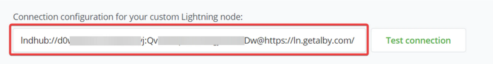


接続の詳細を正しく入力したことを確認するため、「Test connection」をクリックします。接続が良好であることが確認されたら、「Save」をクリックします。BTCPay Serverは、ストアがLightningノードで更新されたことを表示します。


### 内部LightningノードLNDの管理（サーバー管理者）


内部Lightningノードを接続すると、サーバー管理者はダッシュボードにLightning情報専用の新しいタイルが表示されることに気づくでしょう。


- Lightning残高
- チャネル内のBTC
  - オープン中のチャネルのBTC
  - ローカル残高のBTC
  - リモート残高のBTC
  - クローズ中のチャネルのBTC
- オンチェーンのBTC
  - 承認済みのBTC
  - 未承認のBTC
  - 予約済みのBTC
- Lightningサービス
  - Ride the Lightning（RTL）


「Lightning services」タイルの「Ride the Lightning」ロゴ、または左メニューの「Wallets」の下にある「Lightning」をクリックすると、サーバー管理者はLightningノード管理のためのRTLにアクセスできます。


**注意**


内部Lightningノードの接続に失敗した場合 — 内部接続に失敗した場合は、以下を確認してください：


1. Bitcoinオンチェーンノードが完全に同期していること。

2. 内部Lightningノードが「Lightning」>「Settings」>「BTC Lightning Settings」で「Enabled（有効）」になっていること。


それでもLightningノードに接続できない場合は、サーバーを再起動してみるか、BTCPay Serverの公式ドキュメント https://docs.btcpayserver.org/Troubleshooting/ を参照してください。Lightningノードが「Online」と表示されるまで、ストアでLightning決済を受け付けることはできません。「Public Node Info」リンクをクリックして、Lightning接続をテストしてみてください。


### Lightningウォレット


サーバー管理者は、左メニューバーの「Lightning」ウォレットオプションから、RTL、パブリックノード情報、およびBTCPay Serverストアに固有のLightning設定に簡単にアクセスできます。


#### 内部ノード情報


サーバー管理者は「Internal Node Info（内部ノード情報）」をクリックして、サーバーのステータス（オンライン/オフライン）とクリアネットまたはTorの接続文字列を表示できます。


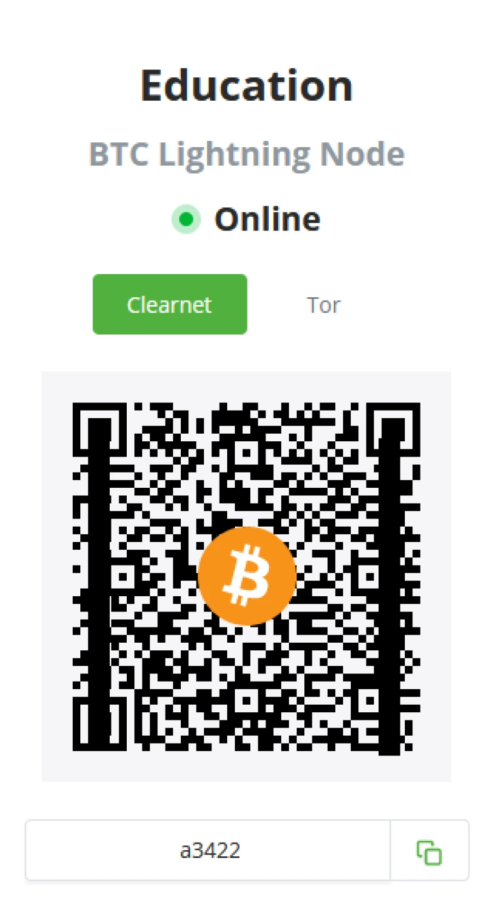


#### 接続の変更


外部Lightningノードを変更するには、「Lightning Settings」に移動し、「Public Node Info」の隣にある「Change connection（接続の変更）」をクリックします。これにより、既存の設定がリセットされます。新しいノードの詳細を入力し、「Save」をクリックすると、それに応じてストアが更新されます。


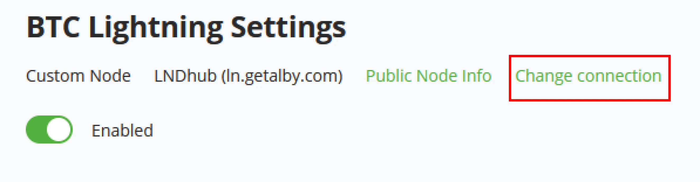


#### サービス


サーバー管理者がLightning実装のために複数のサービスをインストールすることを決めた場合、それらはここに一覧表示されます。標準的なLND実装では、管理者はノード管理のための標準ツールとしてRide The Lightning（RTL）を使用します。


#### BTC Lightningウォレットの設定


前のステップでストアにLightningノードを追加した後でも、ストアオーナーはLightning設定の上部にあるトグルを使用して、ストアでLightningノードを無効にすることができます。


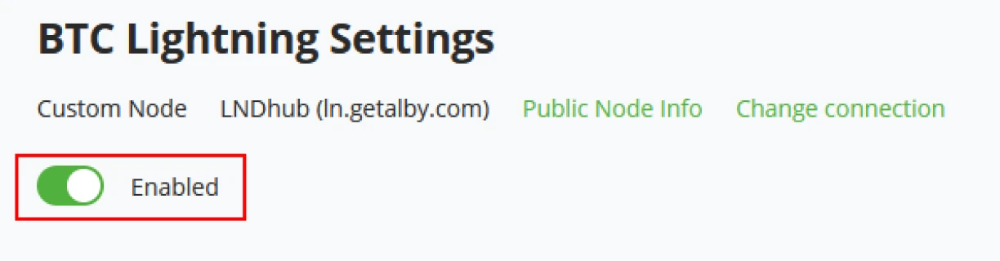


#### Lightning決済オプション


ストアオーナーは、顧客のLightning体験を向上させるために、以下のパラメータを設定することができます。


- Lightningの支払額をサトシ単位で表示する。
- Lightningインボイスにプライベートチャネルのホップヒントを追加する。
- チェックアウト時にオンチェーンとLightning決済のURL/QRコードを統一する。
- Lightningインボイスの説明テンプレートを設定する。


#### LNURL


ストアオーナーは、LNURLを使用するかどうかを選択できます。Lightning Network URL（LNURL）は、Lightningの支払者と受取人の間のやり取りのために提案されている標準です。要するに、LNURLはbech32エンコードされたURLの先頭に「LNURL」を付けたものです。LightningウォレットはそのURLをデコードし、URLに接続して、さらなる指示（特にLNURLの動作を定義するタグ）を含むJSONオブジェクトを受け取ることが期待されています。


- LNURLを有効にする
- LNURLクラシックモード
  - ウォレットの互換性のために、Bech32エンコードされた（クラシックな）URLと平文URL（今後対応）を使用する。
- 受取人へのコメントの送信を許可する。


### 例1


#### 内部ノードでLightningに接続する（管理者）


このオプションは、あなたがこのインスタンスの管理者である場合、または管理者がデフォルト設定を変更してユーザーが内部Lightningノードを使用できるようにしている場合にのみ使用できます。


管理者として、左メニューバーの「Lightning」ウォレットをクリックします。BTCPay Serverは、Lightningノードの接続方法として、内部ノードまたはカスタム外部ノードの2つのオプションのいずれかを選択するよう求めます。「Use internal node」をクリックし、「Save」をクリックします。


#### Lightningノード（RTL）の管理


内部Lightningノードに接続すると、BTCPay Serverが更新され、「BTC Lightning node updated」という通知が表示されます。


Lightningノードの管理はサーバー管理者のタスクです。これには以下が含まれます：


- トランザクションの管理
- 流動性の管理
  - インバウンド流動性
  - アウトバウンド流動性
- ピアやチャネルの管理
  - 接続中のピア
  - チャネル手数料
  - チャネルの状態
- チャネル状態の頻繁なバックアップ
- ルーティングレポートの確認
- また、Loopなどのサービスの利用


すべてのLightningノード管理は、標準ではRTLで行われます（LND実装で実行されていることを前提としています）。管理者は、BTCPay Serverの「Lightning」ウォレットをクリックすると、RTLを開くボタンを見つけることができます。BTCPay Serverのメインダッシュボードも、RTLへのクイックアクセスを含むLightning Networkタイルで更新されます。


### 例2


#### AlbyでLightningに接続する


Albyのようなカストディアンに接続する場合、ストアオーナーはまず https://getalby.com/ でアカウントを作成します。


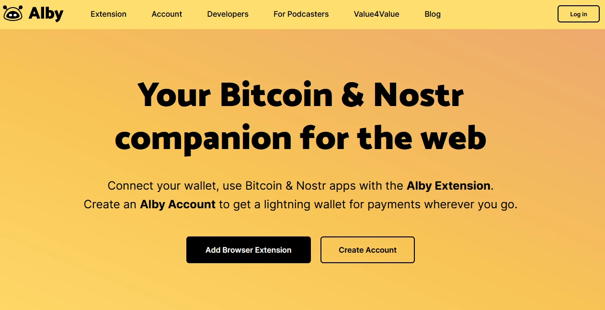


Albyアカウントを作成したら、BTCPay Serverのストアにアクセスします。


ステップ1：ダッシュボードの「Set up a Lightning node」、または「Wallets」の下にある「Lightning」をクリックします。


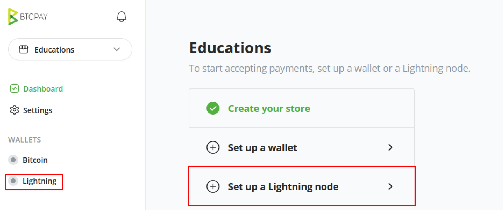


ステップ2：Albyから提供されたウォレット接続認証情報を入力します。Albyのダッシュボードで「Wallet」をクリックすると、「Wallet connection credentials（ウォレット接続認証情報）」が表示されます。この認証情報をコピーし、BTCPay Serverの接続設定フィールドに貼り付けます。


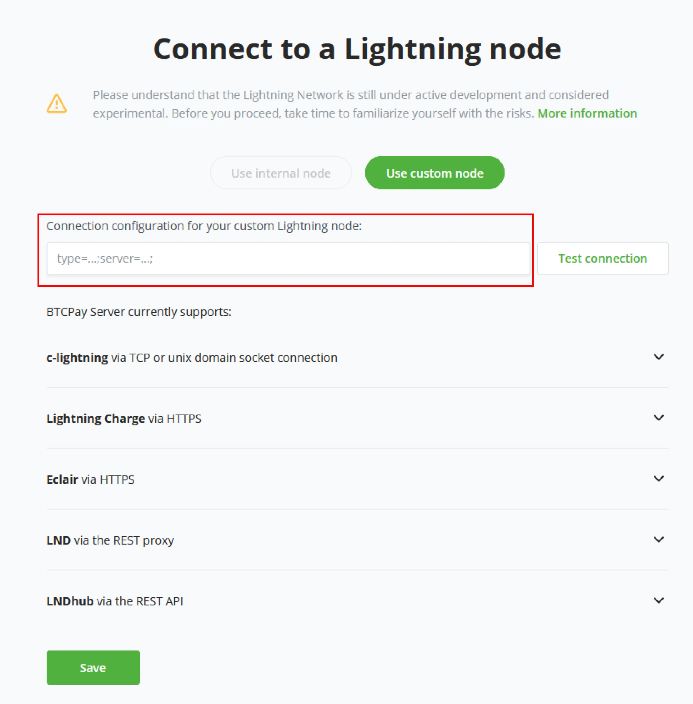


ステップ3：接続の詳細をBTCPay Serverに入力した後、「Test Connection」ボタンをクリックし、接続が正常に機能していることを確認します。画面上部に「Connection to lightning node successful（Lightningノードへの接続に成功しました）」というメッセージが表示されます。これで、すべてが期待どおりに機能していることが確認できます。


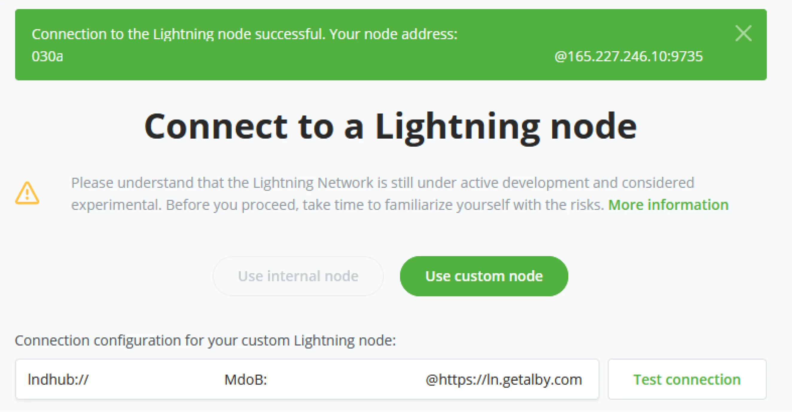


ステップ4：「Save」をクリックすると、あなたのストアはAlby経由でLightningノードに接続されます。


**注意**


カストディアル型のLightningソリューションには、失っても構わない以上の資金を預けてはいけません。


### スキルの概要


このセクションでは、以下のことを学びました：


- 内部または外部のLightningノードの接続方法
- ダッシュボードのLightning関連タイルの内容と機能
- Voltage SurgeまたはAlbyのLightningウォレットの設定方法


### 知識の評価：実践的なレビュー


Lightningウォレットをストアに接続するためのさまざまなオプションについて説明してください。


# BTCPay Serverのインターフェース


<partId>25e88b81-e1ab-515f-a035-09f2a3075556</partId>


## ダッシュボードの概要


<chapterId>410ff28b-a272-5c91-93e0-48d5b28c53ab</chapterId>


BTCPay Serverはモジュール式のソフトウェアパッケージです。しかし、すべてのBTCPay Serverが従わなければならない標準があり、これらの標準が管理者とユーザーの間のやり取りを規定しています。まずはダッシュボードから始めましょう。ダッシュボードは、ログイン後のBTCPay Serverのメインエントリーポイントです。ダッシュボードは、ストアのパフォーマンス、ウォレットの現在の残高、過去7日間のトランザクションの概要を提供します。モジュール式のビューであるため、プラグインはこのビューを活用して、ダッシュボード上に独自のタイルを作成することができます。このコースでは、BTCPay Serverの標準プラグインとアプリ、およびそれぞれのビューについてのみ説明します。


### ダッシュボードのタイル


BTCPay Serverダッシュボードのメインビューには、いくつかの標準タイルが用意されています。これらのタイルは、ストアオーナーまたは管理者が、1つの概要画面で迅速にストアを管理できるように設計されています。


- ウォレット残高
- トランザクションのアクティビティ
- Lightning残高（ストアでLightningが有効になっている場合）
- Lightningサービス（ストアでLightningが有効になっている場合）
- 最近のトランザクション
- 最近のインボイス
- 現在進行中のクラウドファンディング
- ストアのパフォーマンス／売れ筋商品


### ウォレット残高


ウォレット残高タイルでは、あなたのウォレットの資金とパフォーマンスを簡単に把握することができます。BTCまたは法定通貨で、週、月、年単位のグラフで見ることができます。


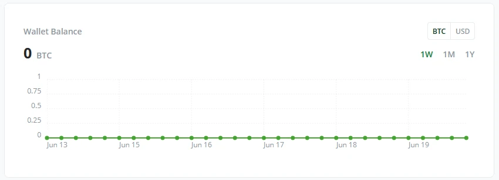


### トランザクションのアクティビティ


ウォレット残高タイルの隣に、BTCPay Serverは保留中のペイアウトの概要、過去7日間のトランザクション数、およびあなたのストアが返金を発行したかどうかを表示します。「Manage」ボタンをクリックすると、保留中のペイアウトを管理することができます（ペイアウトの詳細については、「BTCPay Server - Payments」の章を参照してください）。


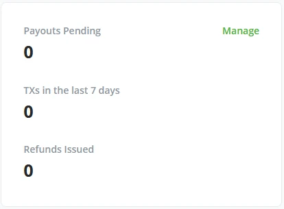


### Lightning残高


これはLightningが有効になっているときのみ表示されます。


管理者がLightning Networkへのアクセスを許可している場合、BTCPay Serverのダッシュボードには、Lightningノードの情報を表示する新しいタイルが追加されます。チャネル内にどれだけのBTCがあるか、それがローカルとリモートでどのようにバランスしているか（インバウンドまたはアウトバウンドの流動性）、チャネルがクローズ中かオープン中か、Lightningノードのオンチェーン側にどれだけのBitcoinが保持されているか、などが表示されます。


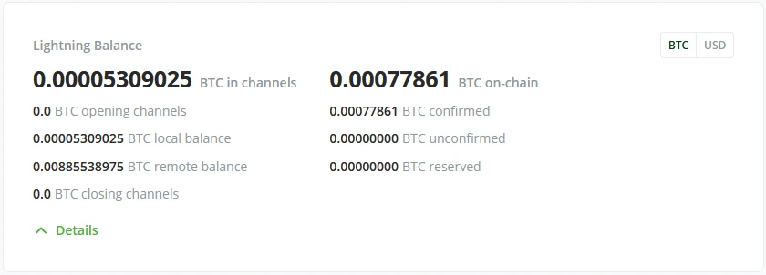


### Lightningサービス


これはLightningが有効になっているときのみ表示されます。


管理者は、BTCPay ServerダッシュボードでLightning残高を確認できるだけでなく、Lightningサービスのタイルも確認できます。例えば、Ride the LightningはBTCPay ServerにおけるLightningノード管理の標準ツールの1つです。


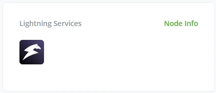


### 最近のトランザクション


「Recent Transactions（最近のトランザクション）」タイルには、ストアの最新のトランザクションが表示されます。BTCPay Serverインスタンスの管理者は、ワンクリックで最新のトランザクションを確認し、そのトランザクションに注意が必要かどうかを判断することができます。


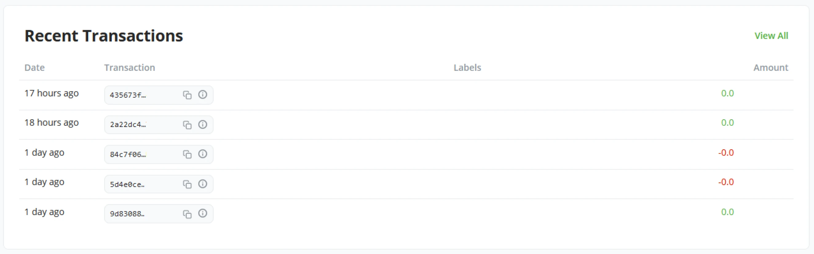


### 最近のインボイス


「Recent Invoices（最近のインボイス）」タイルには、ステータスおよびインボイスの金額を含め、BTCPay Serverによって生成された最新のインボイス6件が表示されます。このタイルには、インボイスの全体概要に簡単にアクセスできる「View all」ボタンもあります。


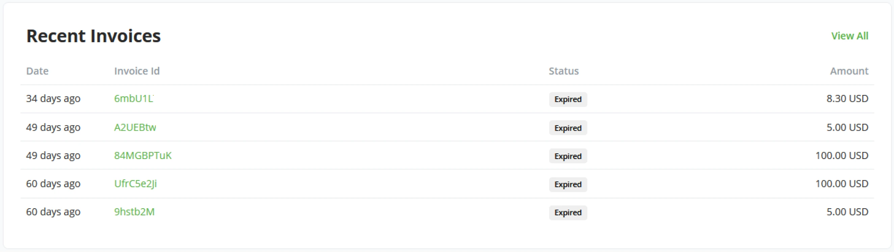


### POS（Point of Sale）とクラウドファンディング


BTCPay Serverは標準のプラグインまたはアプリのセットを提供しており、Point of SaleとCrowdfundはBTCPay Serverの2つの主要なプラグインです。各ストアとウォレットにおいて、BTCPay Serverのユーザーは必要と思われる数だけPOSやクラウドファンドを作成することができます。それぞれが、プラグインのパフォーマンスを示す新しいダッシュボードタイルを作成します。


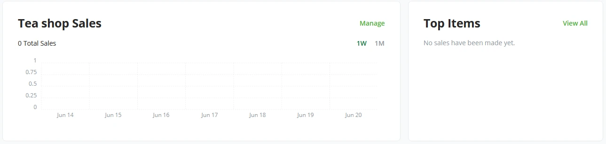


POSタイルとクラウドファンドタイルのわずかな違いに注目してください。管理者は、Point of Saleタイルでは売れ筋商品を見ることができます。クラウドファンドタイルでは、これが人気の特典（トップ特典）になります。どちらのタイルにも、それぞれのアプリを管理し、売れ筋商品やトップ特典によって作成された最近のインボイスを見るためのクイックボタンがあります。


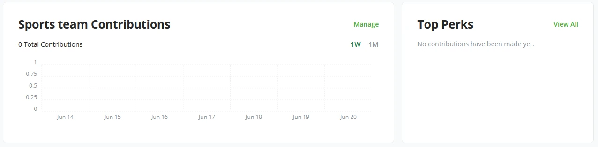


**注意**


残高グラフと最近のトランザクションは、オンチェーンの支払い方法でのみ利用可能です。Lightning Networkの残高とトランザクションに関する情報はTo-doリストに載っています。BTCPay Serverバージョン1.6.0では、基本的なLightning Networkの残高が利用可能です。


### スキルの概要


このセクションでは、以下のことを学びました：


- ダッシュボードとして知られる、メインランディングページのタイルの基本レイアウト。
- 各タイルの内容についての基本的な理解。


### 知識の評価：レビュー


ダッシュボードのタイルを、記憶を頼りにできるだけ多く挙げてください。


## BTCPay Server - ストア設定


<chapterId>e8faef7b-278d-550e-a511-bc3a442daf64</chapterId>


BTCPay Serverソフトウェアには、2種類の設定があります。1つはBTCPay Serverのストア固有の設定で、ダッシュボードの下の左メニューバーにある「Settings」ボタンからアクセスします。もう1つは、メニューバーの一番下、「Account」のすぐ上にあるBTCPay Serverのサーバー設定です。BTCPay Serverのサーバー固有の設定は、サーバー管理者のみが閲覧できます。


ストア設定は、各設定グループを分類するための多くのタブで構成されています。


- General（一般）
- Rates（レート）
- Checkout Appearance（チェックアウトの外観）
- Access Tokens（アクセストークン）
- Users（ユーザー）
- Roles（ロール）
- Webhooks（ウェブフック）
- Payout Processors（ペイアウトプロセッサー）
- Emails（メール）
- Forms（フォーム）


### 一般


「General」タブでは、ストアオーナーはブランディングと支払いのデフォルトを設定します。ストアの初期セットアップ時にストア名が設定されますが、これは一般設定のストア名に反映されます。ここで、ストアオーナーはブランディングに合わせたウェブサイトを設定したり、管理者がデータベース内で識別するためのストアIDを確認したりすることもできます。


#### ブランディング


BTCPay ServerはFOSSなので、ストアオーナーは自分のストアに合ったカスタムブランディングを行うことができます。ブランドカラーを設定し、ブランドのロゴを保存し、公開／顧客向けページ（インボイス、支払いリクエスト、プルペイメント）にカスタムCSSを追加できます。


#### 支払い


支払い設定では、ストアオーナーはストアのデフォルト通貨（Bitcoinまたは任意の法定通貨）を設定することができます。


#### 誰でもインボイスを作成できるようにする


この設定は、BTCPay Server上で開発を行う開発者やビルダーのためのものです。あなたのストアでこの設定を有効にすると、外部からあなたのBTCPay Serverインスタンスでインボイスを作成できるようになります。


#### 追加料金（ネットワーク手数料）をインボイスに追加する


これはBTCPay内の機能で、ダスト攻撃からマーチャントを保護したり、マーチャントが後で一度に大量のBitcoinを移動する必要がある場合に、高額な手数料が発生しないようにするためのものです。例えば、顧客が20ドルのインボイスを作成し、それを部分的に支払い、インボイスが全額支払われるまで1ドルを20回支払ったとします。マーチャントがその資金を後で移動させる場合、マイニング手数料のコストが増加します。デフォルトでは、BTCPayは、インボイスが複数のトランザクションで支払われた場合、マーチャントのその費用をカバーするために、インボイスの合計金額に追加のネットワークコストを適用します。BTCPayには、この保護機能をカスタマイズするためのオプションがいくつかあります。ネットワーク手数料は以下のように適用できます：


- 顧客がインボイスの支払いを複数回行った場合のみ（上記の例では、顧客が20ドルのインボイスを作成し、1ドルを支払った場合、インボイスの残りの支払総額は19ドル＋ネットワーク手数料となります。ネットワーク手数料は最初の支払いの後に適用されます）
- 毎回の支払い（初回の支払いも含む。この例では、初回の支払いでもすぐに合計20ドル＋ネットワーク手数料となります）
- ネットワーク手数料を追加しない（ネットワーク手数料を完全に無効にする）


ダストトランザクションから保護する一方で、この機能は適切に説明されなければビジネスに悪影響を及ぼす可能性もあります。顧客は追加の質問をしてくるかもしれませんし、過剰に請求されていると感じるかもしれません。


#### インボイスは、全額が支払われなかった場合、失効するのか？


インボイスのタイマーはデフォルトで15分に設定されています。このタイマーは、Bitcoin対法定通貨の交換レートに従ってBitcoinの金額をロックするため、価格変動に対する保護メカニズムとして機能します。顧客が定められた期間内にインボイスを支払わない場合、インボイスは期限切れとみなされます。インボイスは、トランザクションがブロックチェーン上に現れた時点で（承認数がゼロの状態で）「支払済み」とみなされ、マーチャントが定義した承認数（通常は1～6回）に達した時点で「完了」となります。タイマーは分単位でカスタマイズ可能です。


#### インボイスの支払額が予想よりX％少なくても、支払済みとみなすか？


顧客が取引所のウォレットを使用してインボイスの代金を直接支払う場合、取引所は少額の手数料を差し引きます。これは、そのようなインボイスが全額支払われたとはみなされないことを意味します。インボイスは「partially paid（一部支払済み）」と表示されます。マーチャントが一部未払いのインボイスを受け入れたい場合、ここでパーセンテージを設定することができます。


### レート


BTCPay Serverでは、インボイスが生成されるとき、常に最新で正確なBitcoin対法定通貨の価格が必要となります。BTCPay Serverで新しいストアを作成する際、管理者は希望する価格ソースを設定するよう求められます。ストアがセットアップされた後も、ストアオーナーはいつでもこのタブで価格ソースを変更することができます。


#### 高度なレートルールスクリプト


主にパワーユーザーが使用します。この機能をオンにすると、ストアオーナーは価格設定や請求方法に関するスクリプトを作成することができます。


#### テスト


お好みの通貨ペアを素早くテストできます。この機能には、RESTクエリを介してデフォルトの通貨ペアをチェックする機能も含まれています。


### チェックアウトの外観


「Checkout Appearance」タブでは、インボイス固有の設定とデフォルトの支払い方法から始まり、設定された条件を満たしたときに特定の支払い方法が有効になるように設定できます。


#### インボイスの設定


デフォルトの支払い方法：BTCPay Serverの標準設定では、3つのオプションがあります。


- BTC（オンチェーン）
- BTC（LNURL-Pay）
- BTC（オフチェーン＆Lightning）


私たちのストアでは、価格がX未満の場合のみ顧客がLightningで支払うようにパラメータを設定することができ、逆にオンチェーントランザクションについては、価格がYより大きい場合、常にオンチェーンの支払いオプションを提示するように設定できます。


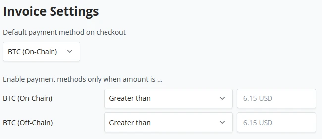


#### チェックアウト


BTCPay Serverリリース1.7で、新しいチェックアウトインターフェースであるチェックアウトV2が導入されました。リリース1.9でこれが標準となりましたが、管理者とストアオーナーはチェックアウトを以前のバージョンに設定することもできます。「Use the classic checkout」のトグルを使うことで、ストアオーナーはストアを従来のチェックアウトに戻すことができます。また、BTCPay Serverには、オンラインコマース向けまたは実店舗向けのプリセットがいくつか用意されています。


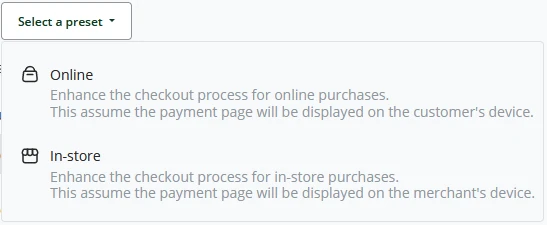


顧客がストアにアクセスしてインボイスを生成すると、そのインボイスには有効期限が設定されます。デフォルトでは、BTCPay Serverはこれを5分に設定しており、管理者は好みに合わせて調整できます。チェックアウトページは、以下のパラメータをチェックすることでさらにカスタマイズできます。


- 紙吹雪で支払いを祝う
- ストアヘッダーを表示する（名前とロゴ）
- 「Pay in wallet」ボタンを表示する
- オンチェーンとオフチェーンの支払いURL/QRを統一する
- Lightningの支払額をサトシで表示する
- チェックアウト時に言語を自動検出する


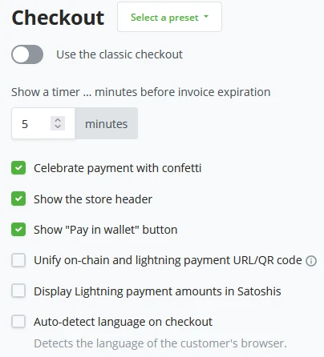


言語の自動検出が設定されていない場合、BTCPay Serverはデフォルトで英語を表示します。ストアオーナーは、このデフォルトを好みの言語に変更できます。


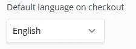


ドロップダウンをクリックすると、ストアオーナーはチェックアウトページに表示するカスタムのHTMLタイトルを設定できます。


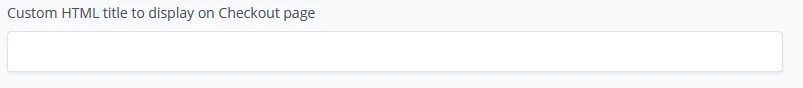


顧客が自分の支払い方法を把握できるように、ストアオーナーは、ユーザーが希望する支払い方法を常に明示的に選択するようチェックアウトを設定できます。インボイスの支払いが完了すると、BTCPay Serverは顧客がウェブショップに戻れるようにします。ストアオーナーは、顧客が支払った後にこのリダイレクトが自動的に行われるよう設定することもできます。


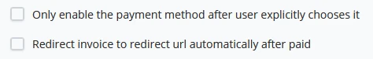


#### 領収書


ストアオーナーは領収書の公開設定の中で、領収書ページを公開するかどうかを設定し、領収書ページに支払い一覧を表示し、顧客が簡単にアクセスできるようにQRコードを表示することができます。


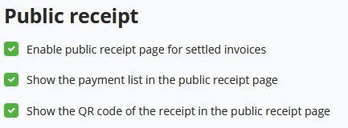


### アクセストークン


アクセストークンは、特定のEコマース統合やカスタムビルドの統合とペアリングするために使用されます。


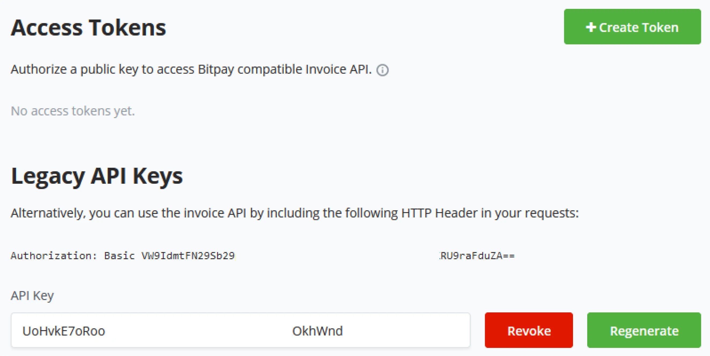


### ユーザー


ストアユーザーは、ストアオーナーがスタッフとそのアカウント、およびストアへのアクセス権を管理する場所です。スタッフがアカウントを作成した後、ストアオーナーは特定のユーザーをゲストまたはオーナーとしてストアに追加できます。スタッフの役割をさらに細かく定義するには、次の「BTCPay Serverストア設定 - 役割」のセクションを参照してください。


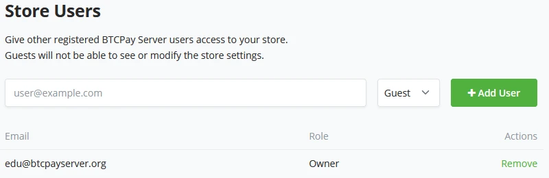


### 役割


ストアオーナーにとって、標準のユーザー役割では不十分な場合があります。カスタム役割の設定では、ストアオーナーはビジネスにおける各役割に必要な権限を正確に定義できます。


(1) 新しい役割を作成するには、「+ Add role」ボタンをクリックします。


(2) 役割名を入力します（例：「Cashier」）。


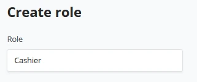


(3) 役割ごとの権限を設定します。


- ストアを変更する
- ストアにリンクされた取引所アカウントを管理する
  - ストアにリンクされた取引所アカウントを表示する
- プルペイメントを管理する
- プルペイメントを作成する
  - 未承認のプルペイメントを作成する
- インボイスを変更する
  - インボイスを表示する
  - インボイスを作成する
  - ストアに関連付けられたLightningノードからインボイスを作成する
- ストアを表示する
  - インボイスを表示する
  - 支払いリクエストを表示する
  - ストアのウェブフックを変更する
- 支払いリクエストを変更する
  - 支払いリクエストを表示する
- ストアに関連付けられたLightningノードを使用する
  - ストアに関連付けられたLightningインボイスを表示する
  - ストアに関連付けられたLightningノードからインボイスを作成する
- ストアにリンクされた取引所アカウントに資金を入金する
- 取引所アカウントからストアに資金を引き出す
- ストアの取引所アカウントで資金を取引する


役割が作成されると、その名前は固定され、編集モードでは変更できなくなります。


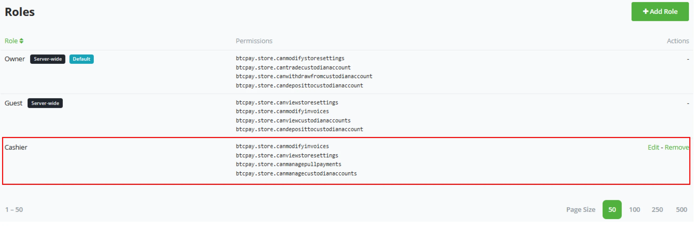


### ウェブフック


BTCPay Serverでは、新しいウェブフックの作成はとても簡単です。BTCPay Serverのストア設定の「Webhooks」タブで、ストアオーナーは「+ Create Webhook」をクリックするだけで新しいウェブフックを作成できます。ウェブフックを利用することで、BTCPay Serverはストアに関連するHTTPイベントを他のサーバーやEコマース統合に送信できます。


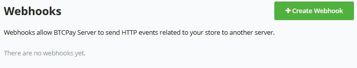


これでウェブフックを作成する画面が表示されます。ペイロードURLを確認し、BTCPay Serverに貼り付けてください。ペイロードURLを貼り付けると、その下にウェブフックシークレットが表示されます。ウェブフックシークレットをコピーし、エンドポイント側に入力してください。すべての設定が完了したら、BTCPay Serverで「Automatic redelivery」を有効にすることができます。BTCPay Serverは、失敗した配信を10秒後、1分後、10分後に最大6回まで再送信を試みます。すべてのイベントを対象にすることも、必要なイベントだけを指定することもできます。ウェブフックを有効にし、「Add webhook」ボタンを押して保存してください。


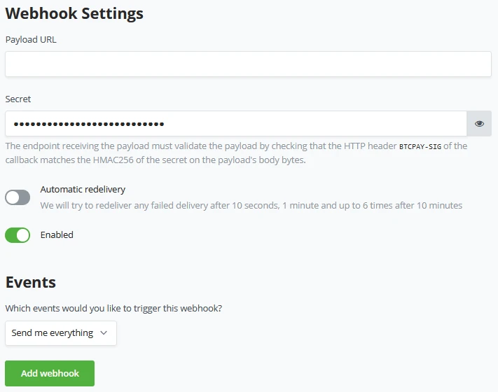


ウェブフックはBitPay APIとは互換性がありません。BTCPay Serverには、2つの独立したIPN（BitPay用語で「即時支払い通知」）があります。


- ウェブフック
- 通知URL


通知URLは、BitPay APIでインボイスを作成する場合にのみ使用してください。


### ペイアウトプロセッサー


ペイアウトプロセッサーは、BTCPay Serverのペイアウトの仕組みと連動して動作します。ペイアウトアグリゲーターは複数のトランザクションをまとめてバッチ処理し、一度に送信します。ペイアウトプロセッサーを使用すると、ストアオーナーはバッチ化されたペイアウトを自動化できます。BTCPay Serverは、自動ペイアウトの方法としてオンチェーンとオフチェーン（LN）の2つを提供しています。


ストアオーナーは、両方のペイアウトプロセッサーを個別にクリックして設定できます。オンチェーンのプロセッサーはX時間に1回だけ実行し、オフチェーンのプロセッサーは数分ごとに実行する、といった設定も可能です。オンチェーンの場合は、目標とするブロック数（confirmation target）も設定できます。デフォルトでは、これは1（つまり次に利用可能なブロック）に設定されています。オフチェーンのペイアウトプロセッサーの設定は間隔タイマーのみで、ブロックターゲットはないことに注意してください。Lightning Networkの支払いは即時だからです。


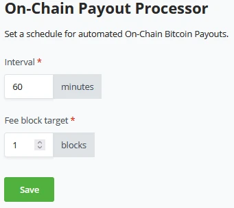

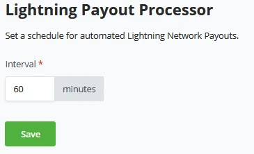


ストアオーナーがオンチェーンのプロセッサーを設定できるのは、ストアにホットウォレットが接続されている場合のみです。


ペイアウトプロセッサーを設定した後は、BTCPay Serverのストア設定の「Payout Processors」タブに戻ることで、いつでも削除や変更ができます。


**注**


オンチェーンのペイアウトプロセッサーは、ホットウォレットが接続されているストアでのみ動作します。ホットウォレットが接続されていない場合、BTCPay Serverはウォレットの鍵を保持していないため、自動的にペイアウトを処理することができません。


### メール


BTCPay Serverは、正しく設定されていれば、通知のためにメールを使用したり、インスタンス上で作成されたアカウントを復旧したりすることができます。デフォルトでは、BTCPay Serverはパスワード紛失時などにメールを送信しません。


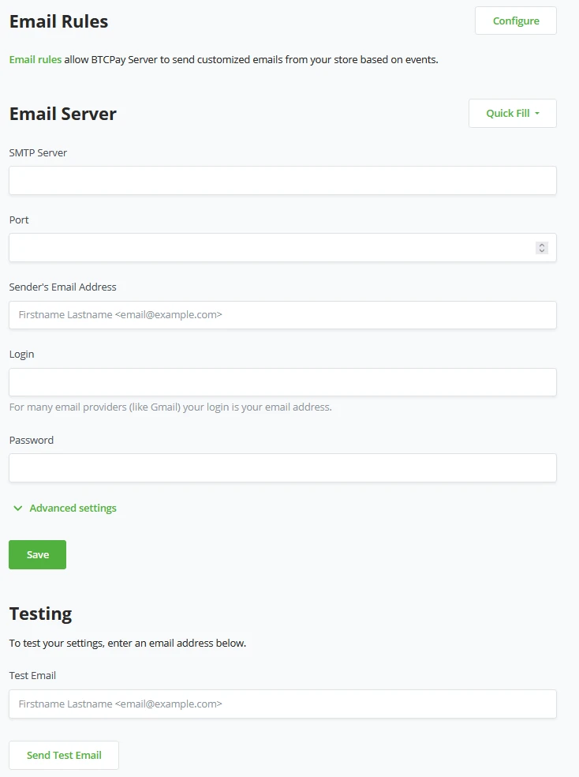


ストアオーナーは、ストアで特定のイベントをトリガーとするメールルールを設定する前に、まずいくつかの基本的なメール設定を行う必要があります。BTCPay Serverがストアに関連するイベントやパスワードリセットのメールを送信するには、これらの設定が必要です。


BTCPay Serverでは、「クイック入力」オプションによってこの情報を簡単に入力できます。


- Gmail.com
- Yahoo
- Mailgun
- Office 365
- SendGrid


クイック入力オプションを使用すると、BTCPay ServerがSMTPサーバーとポートのフィールドを自動的に埋めてくれます。あとは、ストアオーナーがメールアドレス、ログイン名（通常はメールアドレスと同じ）、パスワードといった認証情報を入力するだけです。BTCPay Serverのメール設定の詳細オプションとして、TLS証明書のセキュリティチェックを無効にすることもできます。


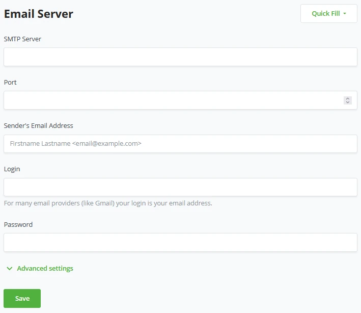


メールルールでは、ストアオーナーは特定のイベントを設定し、指定したメールアドレスにメールを送信できます。


- インボイス作成
- インボイス支払い受領
- インボイス処理中
- インボイス期限切れ
- インボイス決済済み
- インボイス無効
- インボイス支払い完了


顧客がメールアドレスを提供している場合、これらのトリガーで顧客にも情報を送信できます。ストアオーナーは、件名をあらかじめ入力しておくことで、なぜこのメールが送られたのか、何がトリガーになったのかを明確にすることができます。


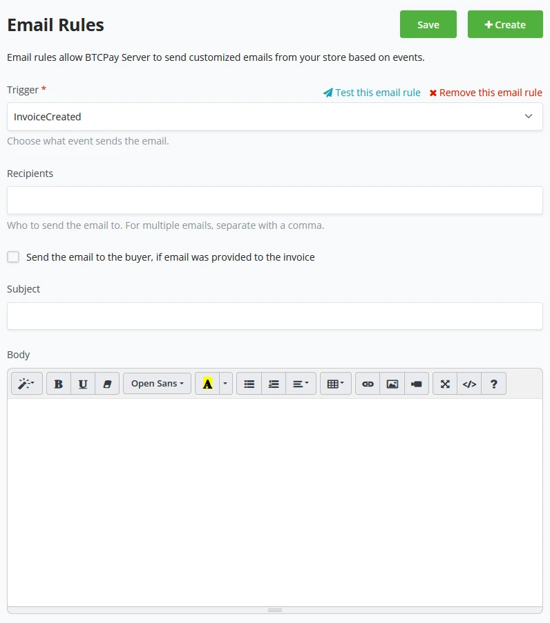


### フォーム


BTCPay Server自体はデータを収集しないため、ストアオーナーはチェックアウト体験にカスタムフォームを追加したい場合があります。BTCPay Serverのフォームビルダーは、フォームのビジュアルビューと、より高度なコードビューの2つの部分で構成されています。


新しいフォームを作成する際、BTCPay Serverは新しいウィンドウを開き、そのフォームの基本的な情報を尋ねます。この名前は設定後に変更することはできません。


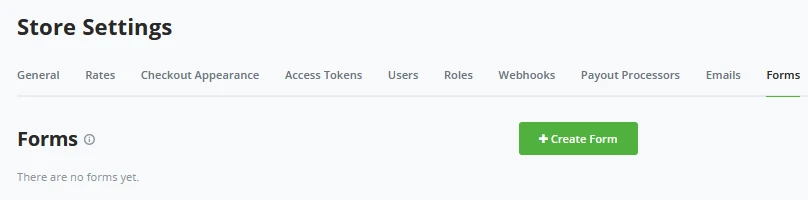


ストアオーナーがフォームに名前を付けた後、「Allow form for public use」のスイッチをオンに切り替えると、緑色になります。これにより、そのフォームが顧客と接するすべての場所で使用できるようになります。例えば、ストアオーナーがPOSを通さずに個別にインボイスを作成した場合でも、顧客から情報を収集したいことがあります。このトグルはそれを可能にします。


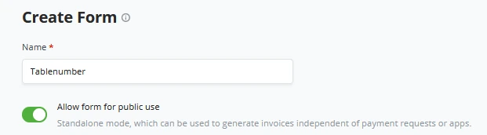


すべてのフォームは、少なくとも1つの新規フォームフィールドから始まります。ストアオーナーはフィールドのタイプを選択できます。


- テキスト
- 数値
- パスワード
- メール
- URL
- 電話番号
- 日付
- 隠しフィールド
- フィールドセット
- 自由記述用のテキストエリア
- オプション選択


どのタイプにもパラメータが用意されており、ストアオーナーは好きなように設定できます。最初に作成したフィールドの下に、このフォームへ新しいフィールドを追加できます。


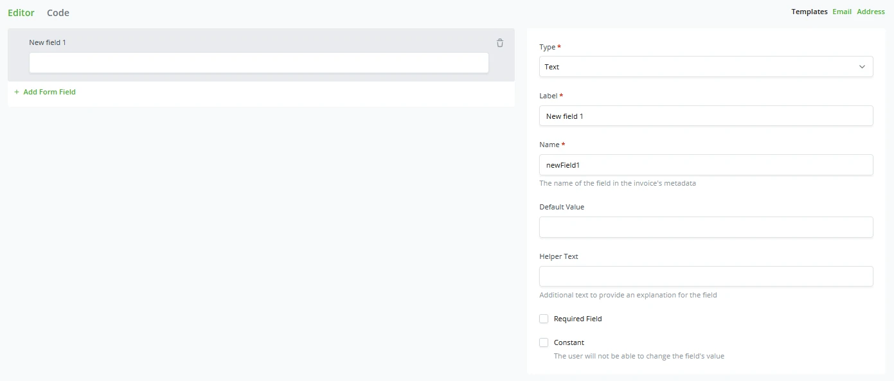


#### 高度なカスタムフォーム


BTCPay Serverでは、コード、具体的にはJSONでフォームを構築することもできます。ストアオーナーはビジュアルエディターの代わりに、エディターのすぐ隣にある「CODE」ボタンをクリックしてフォームのコードを編集できます。フィールド定義では以下のフィールドのみを設定できます。フィールドの値はインボイスのメタデータに保存されます。


| フィールド | 説明 |
| --------------------- | ------------------------------------------------------------------------------------------------------------------------------------------------------------------------------------------------------------------------------------------------------------------------------------------------------------------------------------------------------------------------------------------------------------------------------------------------------------------ |
| .fields.constant | true の場合、.value をフォーム定義で設定する必要があり、ユーザーはフィールドの値を変更できなくなります（例：フォーム定義のバージョン） |
| .fields.type | HTML 入力タイプ：text, radio, checkbox, password, hidden, button, color, date, datetime-local, month, week, time, email, number, range, search, url, select, tel |
| .fields.options | .fields.type が select の場合、選択可能な値のリスト |
| .fields.options.text | このオプションに対して表示されるテキスト |
| .fields.options.value | このオプションが選択された場合のフィールドの値 |
| .fields.type=fieldset | 子要素 .fields.fields の周囲に HTML fieldset を作成します（以下を参照） |
| .fields.name | インボイスのメタデータに表示されるフィールドの JSON プロパティ名 |
| .fields.value | フィールドのデフォルト値 |
| .fields.required | true の場合、フィールドは必須になります |
| .fields.label | フィールドのラベル |
| .fields.helpText | フィールドの説明を提供するための追加テキスト |
| .fields.fields | フィールドを階層構造で整理し、インボイスのメタデータ内に子フィールドをネストさせることができます。この構造により、収集した情報をより適切に整理・管理でき、アクセスや解釈が容易になります。たとえば、顧客情報を収集するフォームがある場合、customer という親フィールドの下に各フィールドをグループ化できます。この親フィールドの中に、name、email、address といった子フィールドを含めることができます。 |

フィールド名は、インボイスのメタデータにユーザー提供値を格納する JSON プロパティ名を表します。いくつかの定義済みの名前は、インボイスの設定を調整するために解釈・適用されます。


| フィールド名       | 説明                  |
| ---------------- | ---------------------- |
| invoice_amount   | インボイスの金額          |
| invoice_currency | インボイスの通貨          |

フォームのURLに「?your_field=value」のようなクエリ文字列を追加することで、インボイスのフィールドを自動的に事前入力することができます。


この機能の使用例をいくつか紹介します。


- ユーザー入力の補助：既知の顧客情報をあらかじめフィールドに入力しておくことで、フォームへの入力を容易にします。例えば、顧客のメールアドレスをすでに知っている場合、メールフィールドに事前入力することで時間を節約できます。
- パーソナライゼーション：顧客の嗜好やセグメントに基づいてフォームをカスタマイズします。例えば、異なる顧客層がある場合、会員レベルや特定のオファーなどの関連データをフォームに事前入力できます。
- トラッキング：隠しフィールドと事前入力値を使用して、顧客の訪問元を追跡します。例えば、各マーケティングチャネル（Twitter、Facebook、メールなど）ごとに utm_media 値を事前入力したリンクを作成できます。これはマーケティング活動の効果を分析するのに役立ちます。
- A/Bテスト：異なるフォームバージョンをテストするために、異なる値でフィールドを事前入力し、ユーザー体験とコンバージョン率を最適化できます。


### スキル概要


このセクションでは、以下のことを学びました。


- ストア設定のタブのレイアウトと機能
- 基礎となる為替レート、部分的な支払い、わずかな過少支払いなどの取り扱いを微調整するための多数のオプション
- 価格に応じたオンチェーン／Lightningの使い分けなど、チェックアウトの外観のカスタマイズ
- 役割ごとのストアへのアクセスレベルと権限の管理
- 自動メールとそのトリガーの設定
- チェックアウト時に顧客の追加情報を収集するためのカスタムフォームの作成


### 理解度チェック


#### 復習


ストア設定とサーバー設定の違いは何ですか？


#### 考察


「Checkout appearance」＞「Invoice settings」で選択できるオプションと、その理由を説明してください。


## BTCPay Server - サーバー設定


<chapterId>1dd858a2-49ea-586b-9bc1-75a65f508df6</chapterId>


BTCPay Serverは2つの異なる設定ビューで構成されています。1つはストア設定専用で、もう1つはサーバー設定専用です。後者はサーバー管理者のみが利用でき、ストアオーナーは利用できません。サーバー管理者は、ユーザーの追加、カスタム役割の作成、メールサーバーの設定、ポリシーの設定、メンテナンスタスクの実行、BTCPay Serverに接続されているすべてのサービスの確認、サーバーへのファイルのアップロード、ログの確認ができます。


### ユーザー


前のセクションで述べたように、サーバー管理者は「Users」タブでユーザーを追加することで、そのユーザーをサーバーに招待できます。


### サーバー全体のカスタム役割


BTCPay Serverには、ストア固有のカスタム役割と、サーバー設定内のサーバー全体のカスタム役割の2種類があります。どちらも同様の権限セットを持ちますが、「Server settings - Roles」タブで設定した役割はサーバー全体に及び、複数のストアに適用されます。サーバー設定のカスタム役割には「Server-wide」タグが付いていることに注意してください。


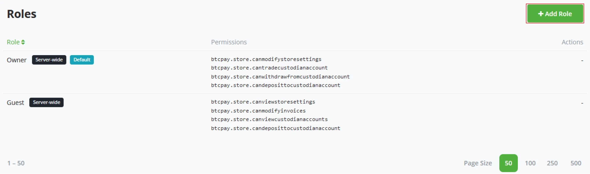


### サーバー全体のカスタム役割


サーバー全体のカスタム役割の権限セット：


- ストアを変更する
- ストアにリンクされた取引所アカウントを管理する
  - ストアにリンクされた取引所アカウントを表示する
- プルペイメントを管理する
- プルペイメントを作成する
  - 未承認のプルペイメントを作成する
- インボイスを変更する
  - インボイスを表示する
  - インボイスを作成する
  - ストアに関連付けられたLightningノードからインボイスを作成する
- ストアを表示する
  - インボイスを表示する
  - 支払いリクエストを表示する
  - ストアのウェブフックを変更する
- 支払いリクエストを変更する
  - 支払いリクエストを表示する
- ストアに関連付けられたLightningノードを使用する
  - ストアに関連付けられたLightningインボイスを表示する
  - ストアに関連付けられたLightningノードからインボイスを作成する
- ストアにリンクされた取引所アカウントに資金を入金する
- 取引所アカウントからストアに資金を引き出す
- ストアの取引所アカウントで資金を取引する


**注**


役割が作成されると、その名前は固定され、編集モードでは変更できなくなります。


### メール


サーバー全体のメール設定は、ストアごとのメール設定と似ています。ただし、この設定はストアのトリガーだけでなく、管理者ログなどその他のイベントのトリガーも処理します。また、このメール設定により、BTCPay Serverのログイン画面でパスワード復旧が利用できるようになります。管理者がメールのパラメータと認証情報を入力すると、サーバーがメールを送信できるようになります。


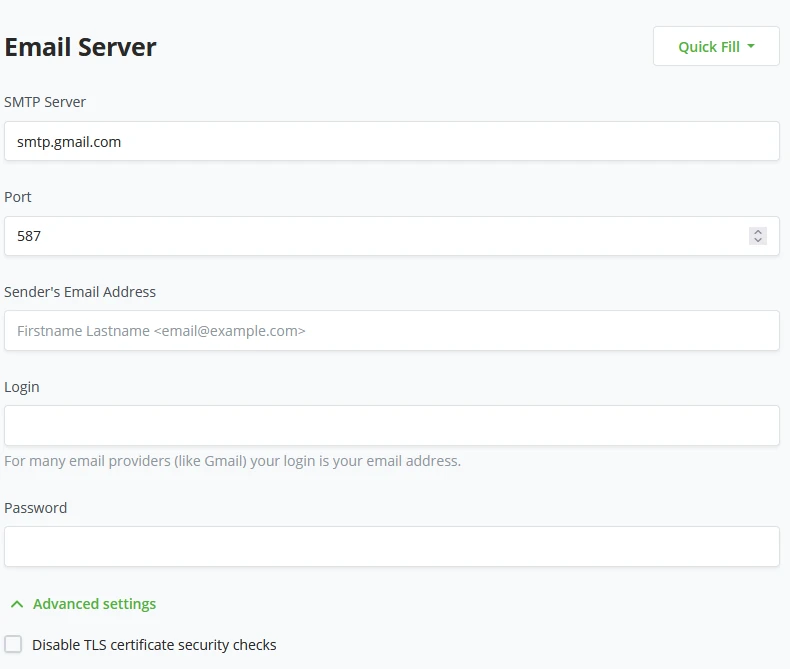


### ポリシー


BTCPay Serverのポリシーでは、管理者は既存ユーザー設定、新規ユーザー設定、通知設定、メンテナンス設定などの項目について、さまざまな設定を行うことができます。例えば、新規ユーザーを管理者または一般ユーザーとして登録するかどうかや、サーバーのヘッダーに設定を追加して検索エンジンからBTCPay Serverを隠すといった設定です。


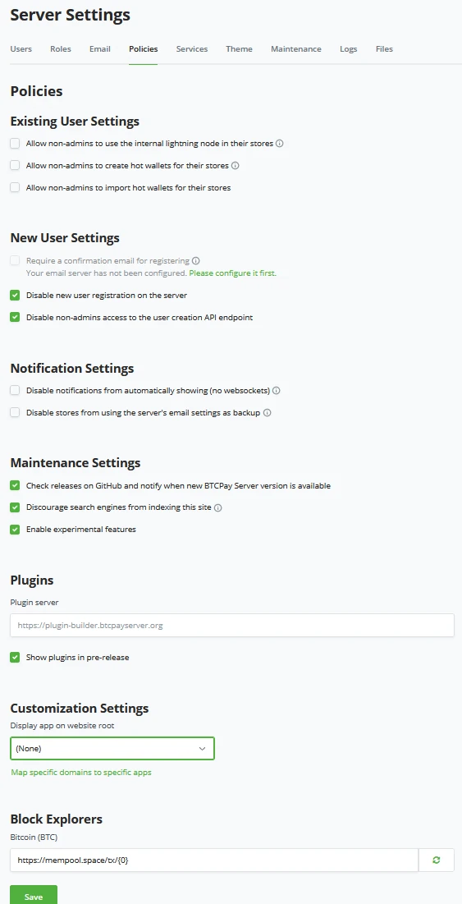


#### 既存ユーザー設定


ここで利用できるオプションは、カスタム役割とは別のものです。これらの追加権限は、ストアやその所有者を攻撃に対して脆弱にする可能性があります。既存ユーザーに追加できるポリシーは次のとおりです。


- 非管理者がストアで内部Lightningノードを使用できるようにする
  - これにより、ストアオーナーはサーバー管理者のLightningノードを使用できるようになり、その結果、管理者の資金も使えるようになります！これはLightningへアクセスするための解決策ではないことに注意してください。
- 非管理者が自分のストア用にホットウォレットを作成できるようにする
  - これにより、BTCPay Serverインスタンスにアカウントを持つ誰もがホットウォレットを作成し、管理者のサーバーに復元用シードを保存できるようになります。その結果、管理者は第三者の資金を保持する責任を負うことになるかもしれません！
- 非管理者が自分のストア用にホットウォレットをインポートできるようにする
  - ホットウォレットの作成と同様に、このポリシーではホットウォレットのインポートが可能になりますが、ホットウォレット作成の項で述べたのと同じ危険性があります。


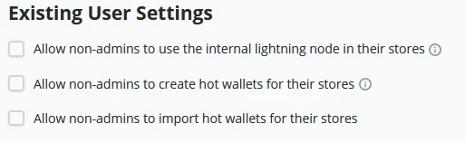


#### 新規ユーザー設定


サーバーに加わる新規ユーザーを管理するために、いくつかの重要な設定を行うことができます。新規登録時の確認メールを必須にしたり、ログイン画面からの新規ユーザー作成を無効にしたり、API経由でのユーザー作成への管理者以外のアクセスを制限したりできます。


- 登録には確認メールが必要
  - サーバー管理者がメールサーバーを設定している必要があります。
- サーバーでの新規ユーザー登録を無効にする
- ユーザー作成APIエンドポイントへの管理者以外のアクセスを無効にする


デフォルトでは、BTCPay Serverは「Disable new user registration on the server」をオンにし、ユーザー作成APIエンドポイントへの管理者以外のアクセスを無効にしています。これはセキュリティのためで、あなたのBTCPayログイン画面を偶然見つけた不特定多数の人がアカウントを作成できないようにするためです。


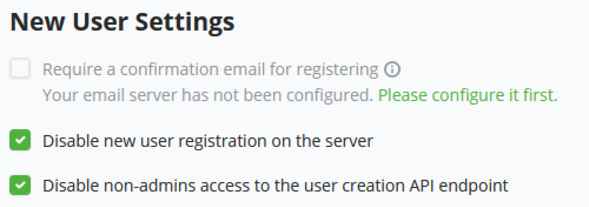


#### 通知設定


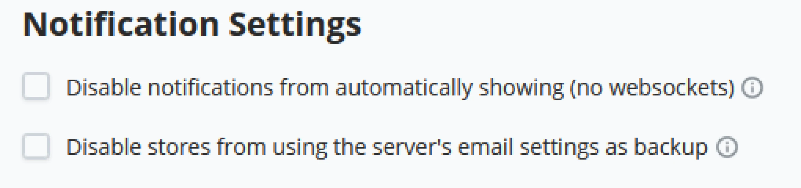


#### メンテナンス設定


BTCPay Serverは、GitHub上で開発されているオープンソースプロジェクトです。BTCPay Serverが新しいバージョンをリリースするたびに、管理者は新しいバージョンが利用可能になったことを通知されます。管理者は、検索エンジン（Google、Yahoo、DuckDuckGoなど）がBTCPay Serverのドメインをインデックスしないようにすることもできます。BTCPay ServerはFOSSなので、世界中の開発者が新しい機能を作りたいと思うかもしれません。BTCPay Serverには実験的な機能があり、これをオンにすると、管理者は本番用ではなくテスト目的の機能を使用できます。


- GitHubでリリースをチェックし、BTCPay Serverの新しいバージョンが利用可能になったら通知する
- 検索エンジンがこのサイトをインデックスしないようにする
- 実験的な機能を有効にする


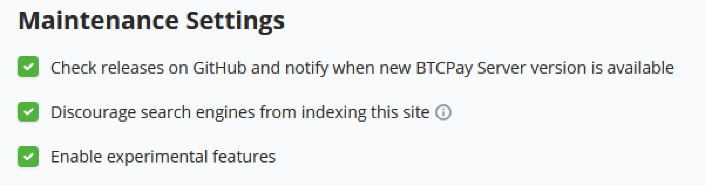


#### プラグイン


BTCPay Serverはプラグインを追加して機能を拡張することができます。プラグインは、デフォルトではBTCPay Serverのプラグインビルダーリポジトリから読み込まれます。プラグイン開発者が許可していれば、サーバー管理者はベータ版のプラグインをインストールすることもできます。


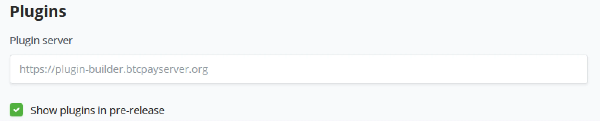


##### カスタマイズ設定


標準的なBTCPay Serverのデプロイでは、インストール時に設定したドメインからアクセスします。しかし、サーバー管理者はルートドメインを再マッピングして、特定のストアで作成したアプリの1つを表示することができます。サーバー管理者は、特定のドメインを特定のアプリにマッピングすることもできます。


- ウェブサイトのルートにアプリを表示する
  - ルートドメインに表示可能なアプリの一覧が表示されます。


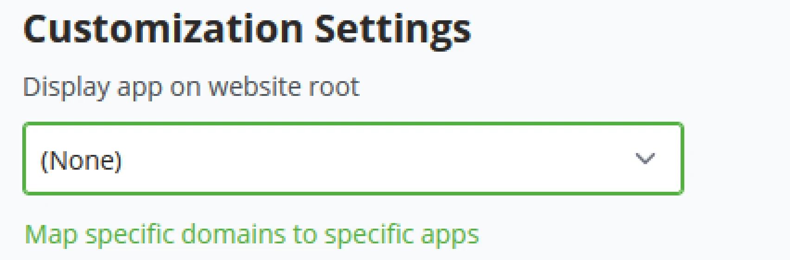


- 特定のドメインを特定のアプリにマッピングする
  - 「Set a specific domain for a specific app」をクリックすると、管理者は特定のアプリを指すドメインを必要なだけ設定できます。


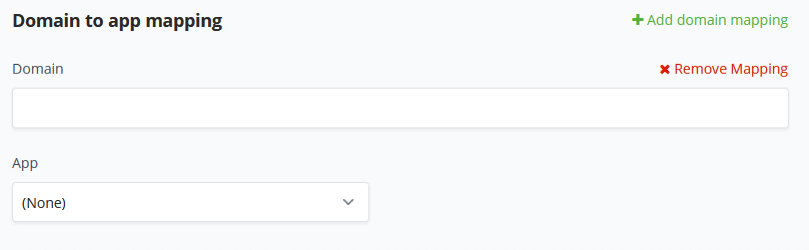


#### ブロックエクスプローラー


BTCPay Serverは、トランザクション用のブロックエクスプローラーとしてMempool.spaceを標準で使用しています。BTCPay Serverが新しいインボイスを生成し、トランザクションがそれに結び付けられると、ストアオーナーはクリックしてそのトランザクションを開くことができます。BTCPay Serverはデフォルトでブロックエクスプローラーとしてmempool.spaceを指していますが、サーバー管理者はこれを好みのものに変更できます。


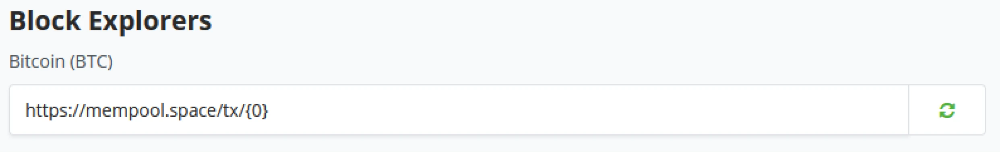


### サービス


BTCPay Serverの設定の「Services」タブは、BTCPay Serverが使用するコンポーネントの概要です。BTCPay Serverが公開するサービスは、デプロイ方法によって異なる場合があります。


BTCPay Serverの管理者は、各サービスの横にある「See information」をクリックして、そのサービスを開き、特定の設定を行うことができます。


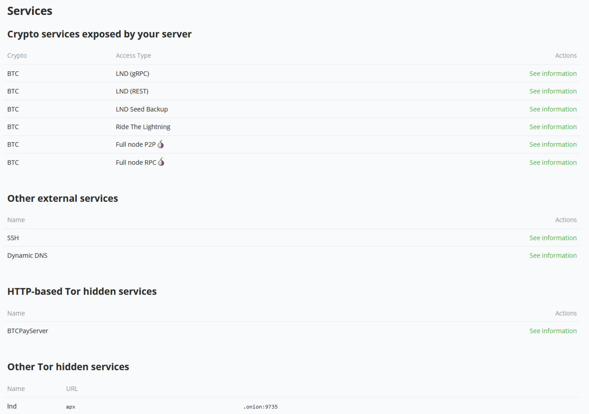


#### LND（gRPC）


BTCPayは、LNDのgRPCサービスを外部に公開します。この設定メニューに接続情報があります。BTCPay Serverはまた、モバイルウォレットでスキャンして適用できる接続用のQRコードも提供します。


サーバー管理者は詳細を開いて確認できます。


- ホストの詳細
- SSLの使用
- マカロン
- 管理者マカロン
- インボイスマカロン
- 読み取り専用マカロン
- gRPC SSL暗号スイート（GRPC_SSL_CIPHER_SUITES）


#### LND（REST）


BTCPayはLNDのRESTサービスを外部向けに公開しています。互換性のあるウォレットは[こちら](https://docs.btcpayserver.org/FAQ/LightningNetwork/#how-to-find-node-info-and-open-a-direct-channel-with-a-store-using-btcpay)に一覧があります。BTCPay Serverは接続用のQRコードを提供しており、互換性のあるウォレットでスキャンして適用できます。


- REST URI
- マカロン
- 管理者マカロン
- インボイスマカロン
- 読み取り専用マカロン


#### LNDシードバックアップ


LNDシードのバックアップは、サーバーが破損した場合にLNDウォレットから資金を復旧するのに役立ちます。Lightningノードはホットウォレットなので、このページにはシードという機密情報が表示されます。


LNDは復旧手順を文書化しています。ドキュメントは https://github.com/lightningnetwork/lnd/blob/master/docs/recovery.md を参照してください。


#### Ride the Lightning


Ride the Lightning（RTL）は、オープンソースソフトウェアとして構築されたLightningノード管理ツールです。BTCPay Serverは、スタック内のLightningノード管理コンポーネントとしてRTLを使用しています。BTCPay Serverの管理者は、「Server settings - Services」タブから、またはLightningウォレットをクリックしてRTLにアクセスできます。


#### フルノードP2P


サーバー管理者は、Bitcoinノードをモバイルウォレットに接続したい場合があります。このページでは、P2Pプロトコルを介してフルノードにリモート接続する方法について説明しています。このコースの執筆時点では、BTCPay ServerはBlockstream GreenとWasabi Walletを互換性のあるウォレットとして挙げています。BTCPay Serverは接続用のQRコードを提供しており、互換性のあるウォレットでスキャンして適用できます。


#### フルノードRPC


このページでは、RPCプロトコルを介してフルノードにリモート接続するための情報を公開します。


#### SSH


SSHはメンテナンス目的で使用されます。BTCPay Serverは、サーバーに到達するための初期接続コマンドと、サーバーへの接続が許可されたSSH公開鍵を表示します。サーバー管理者は、BTCPay ServerのUIからのSSH設定の変更を無効にすることができます。


#### ダイナミックDNS


ダイナミックDNSを使用すると、IPアドレスが定期的に変わっても、サーバーを指すDNS名を安定して保つことができます。自宅でBTCPay Serverをホストしていて、サーバーにアクセスするためのクリアネットのドメインを持ちたい場合におすすめです。


HTTPS証明書を取得するには、NATとBTCPay Serverのインストールを適切に設定する必要があることに注意してください。


### テーマ


BTCPay Serverには、標準で2つのテーマが用意されています。ライトモードとダークモードです。左下のアカウントをクリックし、DarkテーマとLightテーマを切り替えることができます。BTCPay Serverの管理者は、カスタムCSSテーマを提供することで独自のテーマを追加できます。


管理者は、独自のカスタムCSSを追加してLight/Darkテーマを拡張したり、カスタムテーマを完全なカスタムテーマとして設定したりできます。


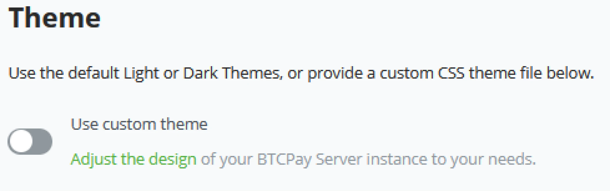


#### サーバーブランディング


サーバー管理者は、サーバー全体のブランディングを設定することで、BTCPay Serverのブランディングを変更できます。BTCPay ServerはFOSSであるため、サーバー管理者はソフトウェアをホワイトラベル化し、ビジネスに合わせて外観をカスタマイズできます。


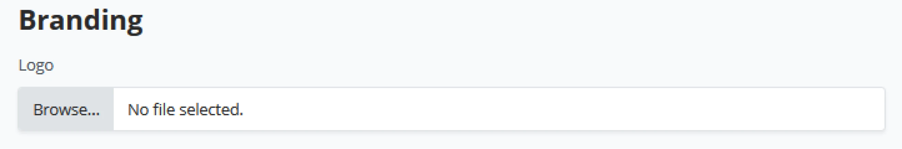


### メンテナンス


サーバー管理者として、ユーザーはあなたがサーバーをきちんと管理することを期待しています。BTCPay Serverのメンテナンスタブでは、管理者はいくつかの重要なメンテナンス作業を行うことができます。BTCPay Serverインスタンスにドメイン名を設定する、サーバーを再起動またはクリーンアップする、そしておそらく最も重要な、アップデートを実行することです。


BTCPay Serverはオープンソースプロジェクトであり、頻繁に更新されます。すべての新しいリリースは、BTCPay Serverの通知、またはBTCPay Serverが情報発信に使う公式チャンネルで発表されます。


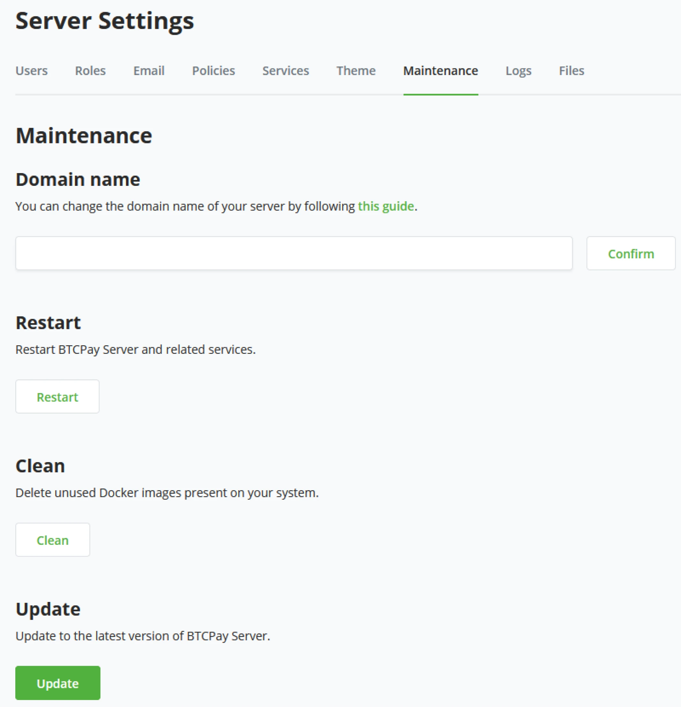


#### ドメイン名


BTCPay Serverをセットアップした後、管理者は元のドメインから変更したいと思うかもしれません。「Maintenance」タブで、管理者はドメインを変更できます。確認をクリックし、ドメインに適切なDNSレコードを設定すると、BTCPay Serverは更新・再起動し、新しいドメインで利用できるようになります。


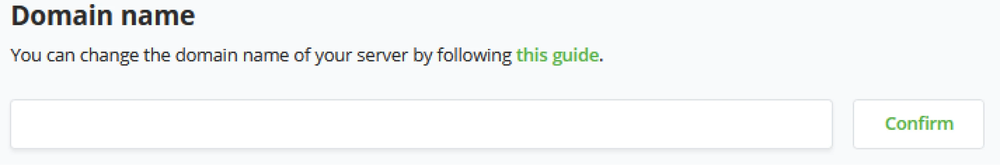


#### 再起動


BTCPay Serverと関連サービスを再起動します。


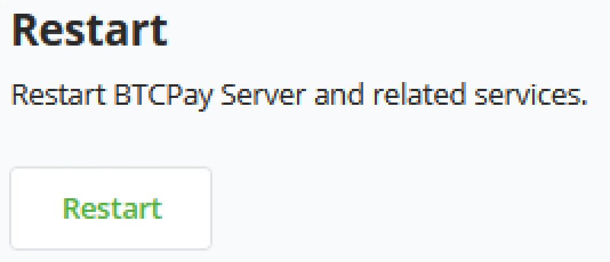


#### クリーンアップ


BTCPay ServerはDockerコンポーネントで動作しているため、アップデートに伴い、Dockerイメージや一時ファイルなどの残骸が残る可能性があります。サーバー管理者はクリーンアップスクリプトを実行することで領域を解放できます。


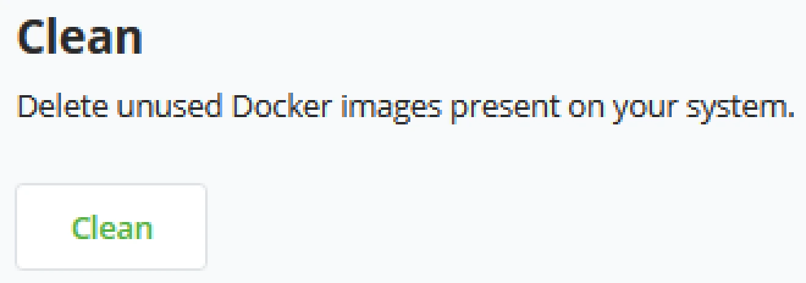


#### アップデート


メンテナンスタブで最も重要なオプションです。BTCPay Serverはコミュニティによって構築されているため、その更新サイクルは他のソフトウェア製品よりも頻繁です。BTCPay Serverに新しいリリースがあると、管理者は通知センターで通知を受け取ります。アップデートボタンをクリックすると、BTCPay ServerはGitHubで最新リリースをチェックし、サーバーを更新して再起動します。アップデートの前に、サーバー管理者は常にBTCPay Serverの公式チャンネルで配布されたリリースノートを読むことをおすすめします。


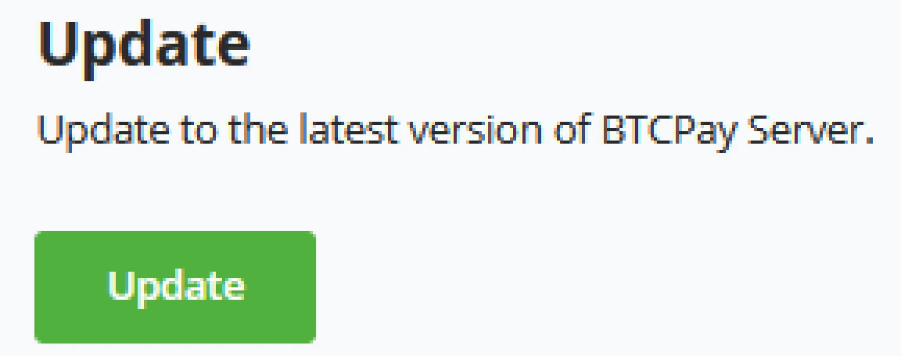


### ログ


問題に直面するのは決して楽しいことではありません。この文書では、最も一般的なワークフローと、単独で、またはコミュニティの支援を得て、問題を効率的に特定し解決するための手順を概説しています。


問題を特定することが重要です。


#### 問題の再現


まず第一に、問題がいつ起こるのかを特定します。問題を再現してみてください。サーバーを更新して再起動し、問題を再現できるかどうかを確認します。問題をよりよく説明できる場合は、スクリーンショットを撮ってください。


##### サーバーの更新
BTCPay Serverのバージョンが[最新バージョン](https://github.com/btcpayserver/btcpayserver/releases)よりもかなり古い場合は、BTCPay Serverのバージョンを確認してください。サーバーを更新することで問題が解決する場合があります。


##### サーバーの再起動


サーバーを再起動することは、BTCPay Serverで最もよくある問題の多くを解決する簡単な方法です。サーバーにSSH接続して再起動する必要があるかもしれません。


##### サービスの再起動


SSL証明書を更新するためにletsencryptコンテナを再起動するなど、BTCPay Serverのデプロイメントのうち特定のサービスだけを再起動する必要がある場合もあります。


```bash
sudo su -
cd btcpayserver-docker
docker restart letsencrypt-nginx-proxy-companion
```


再起動したい別のサービスの名前は、`docker ps`を使って見つけてください。


#### ログを確認する


ログは重要な情報を提供します。以下の段落では、BTCPay Serverのさまざまな部分のログ情報を取得する方法を説明します。


##### BTCPay Serverのログ


v1.0.3.8以降、フロントエンドからBTCPay Serverのログに簡単にアクセスできるようになりました。サーバー管理者であれば、「Server Settings」>「Logs」と進み、ログファイルを開きます。ログ内の特定のエラーが何を意味するのかわからない場合は、トラブルシューティングの際にそのエラーに言及してください。


より詳細なログが必要で、Dockerデプロイメントを使用している場合は、コマンドラインを使用して特定のDockerコンテナのログを表示することができます。VPS上で稼働しているBTCPay Serverのインスタンスに[SSH接続する](https://docs.btcpayserver.org/FAQ/ServerSettings/#how-to-ssh-into-my-btcpay-running-on-vp%C2%80)手順を参照してください。


次のページでは、BTCPay Serverで使用されるコンテナ名の一般的な一覧を示します。


以下のコマンドを実行して、コンテナ名ごとにログを出力します。他のコンテナのログを表示するには、コンテナ名を置き換えてください。


```bash
sudo su -
cd btcpayserver-docker
docker ps
docker logs --tail 100 generated_btcpayserver_1
```


| ログ           | コンテナ名                         |
| ------------ | --------------------------------- |
| BTCPayServer | generated_btcpayserver_1          |
| NBXplorer    | generated_nbxplorer_1             |
| Bitcoind     | btcpayserver_bitcoind             |
| Postgres     | generated_postgres_1              |
| proxy        | letsencrypt-nginx-proxy-companion |
| Nginx        | nginx-gen                         |
| Nginx        | nginx                             |
| c-lightning  | btcpayserver_clightning_bitcoin   |
| LND          | btcpayserver_lnd_bitcoin          |
| RTL          | generated_lnd_bitcoin_rtl_1       |
| Thunderhub   | generated_bitcoin_thub_1          |
| LibrePatron  | librepatron                       |
| Tor          | tor-gen                           |
| Tor          | tor                               |

###### Lightning Network LND - Docker


Dockerを使用しているときにLNDのログにアクセスするには、いくつかの方法があります。まず、rootでログインします。


```bash
sudo su -
Navigate to the correct directory:
cd btcpayserver-docker
# Find container name:
docker ps
Print logs by container name:
docker logs --tail 100 btcpayserver_lnd_bitcoin
```


あるいは、コンテナID（一番左の2文字など、最初の一意なID文字だけで十分です）を使って、ログを素早く出力することもできます。


```bash
docker logs 'add your container ID'
```


何らかの理由でさらにログが必要な場合は、次のようにします。


```bash
sudo su -
cd /var/lib/docker/volumes/generated_lnd_bitcoin_datadir/\_data/logs/ bitcoin/mainnet/
ls
```


次のように表示されます。


```bash
lnd.log lnd.log.13 lnd.log.15 lnd.log.16.gz lnd.log.17.gz
```


これらの非圧縮ログにアクセスするには`cat LND.log`を実行し、別のログが必要な場合は`cat LND.log.15`のようにします。


`.gzip`で圧縮されたログにアクセスするには、`gzip -d LND.log.16.gz`を使います（この場合は`LND.log.16.gz`にアクセスしています）。これで新しいファイルができ、そこで`cat LND.log.16`を実行できます。上記がうまくいかない場合は、`sudo apt-get install gzip`でgzipを先にインストールする必要があるかもしれません。


###### Lightning Network c-lightning - Docker


```bash
sudo su -
docker ps
# Find the c-lightning container ID.
docker logs 'add your container ID here'
```


あるいは、次のコマンドを使います。


```bash
docker logs --tail 100 btcpayserver_clightning_bitcoin
```


c-lightningのCLIコマンドでもログ情報を取得できます。


```bash
bitcoin-lightning-cli.sh getlog
```


#### Bitcoinノードのログ


bitcoindコンテナの[ログを見る](https://docs.btcpayserver.org/Troubleshooting/#2-looking-through-the-logs)だけでなく、[bitcoin-cliコマンド](https://developer.Bitcoin.org/reference/RPC/index.html)を使うこともできます。


Bitcoinノードから情報を取得するには、[（新しいウィンドウが開きます）](https://developer.Bitcoin.org/reference/RPC/index.html)をクリックしてください。BTCPay Serverには、Bitcoinノードと簡単に通信できるスクリプトが含まれています。


btcpayserver-dockerフォルダの中で、あなたのノードを使ってブロックチェーン情報を取得します。


```bash
bitcoin-cli.sh getblockchaininfo
```


### ファイル


BTCPay Serverはローカルファイルシステムを備えており、ストア（商品）のアセット、ロゴ、ブランディングをサーバーに直接アップロードすることができます。サーバーのファイルシステムには、サーバー管理者のみがアクセスできます。ストアオーナーは、ストアレベルでロゴやブランディングをアップロードできます。


サーバー管理者は「File Storage」タブで、サーバーに直接アップロードするか、ファイルストレージプロバイダーをローカルファイルシステムまたはAzure Blob Storageに変更できます。


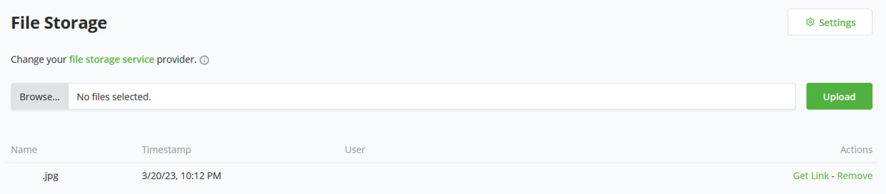


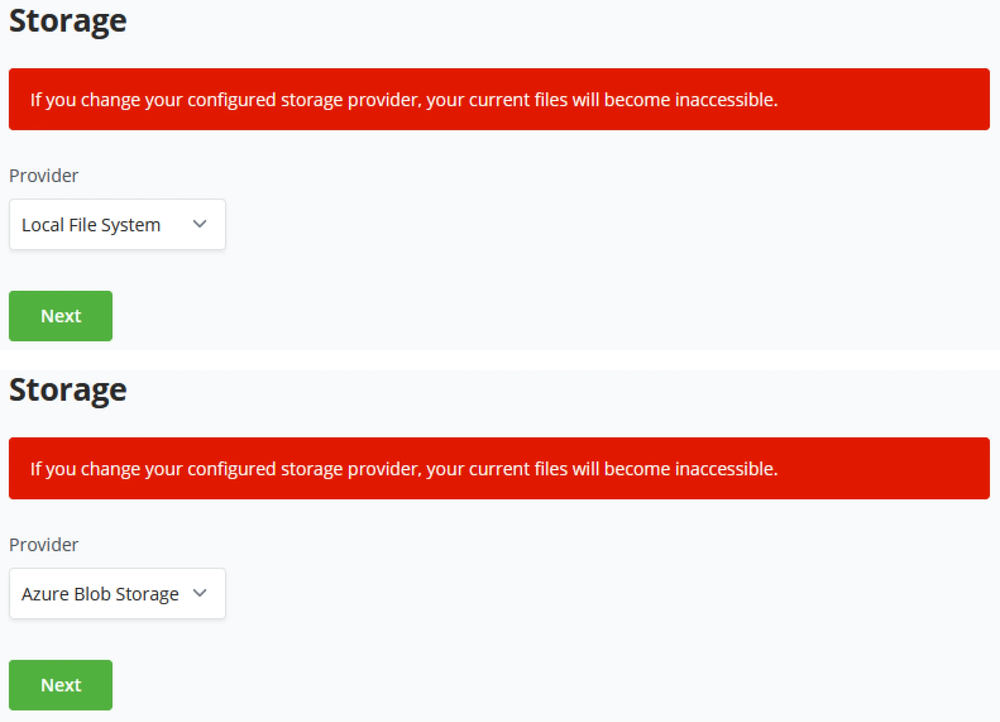


### スキルの概要


このセクションでは、以下のことを学びました。


- ストア設定とサーバー設定の違い、特にユーザー、ロール、メールに関連するもの
- LightningまたはBitcoinホットウォレットの使用と作成、新規ユーザー登録、およびメール通知に関するサーバー全体のポリシーの設定
- カスタムテーマを追加する方法（単純なライト／ダークの選択肢の代わりに）とカスタムロゴを作成する方法
- 提供されるGUIを使用した、簡単なサーバーメンテナンスタスクの実行
- Dockerコンテナやノードの詳細の取得を含む、問題のトラブルシューティング
- ファイルストレージの管理


### 知識評価


#### KA コンセプトレビュー


サーバー設定とストア設定で割り当てられるロールの違いは何ですか？


#### KA 実践レビュー


「Policies」タブで有効にできる設定の使用例をいくつか説明してください。


#### KA 実践レビュー


管理者が「Maintenance」タブで日常的に行う操作について説明してください。


## BTCPay Server - 支払い


<chapterId>e2b71ff9-3f4f-5e71-9771-8e03fbbef00f</chapterId>


インボイス（請求書）は、売り手が買い手から代金を回収するために発行する書類です。


BTCPay Serverにおいて、インボイスは固定された為替レートで、定義された時間間隔内に支払われなければならない文書を表します。インボイスには有効期限がありますが、これは為替レートを指定された期間内に固定し、受取人を価格変動から保護するためです。


BTCPay Serverの中核は、Bitcoinのインボイス管理システムとして機能する機能です。インボイスは、受け取った支払いを追跡・管理するために不可欠なツールです。
組み込みの[ウォレット](https://docs.btcpayserver.org/Wallet/)を使用して手動で支払いを受け取らない限り、ストア内のすべての支払いはインボイスページに表示されます。このページは日付ごとに支払いを累積的に並べ替え、インボイス管理と支払いのトラブルシューティングのための中心的なリソースとして機能します。


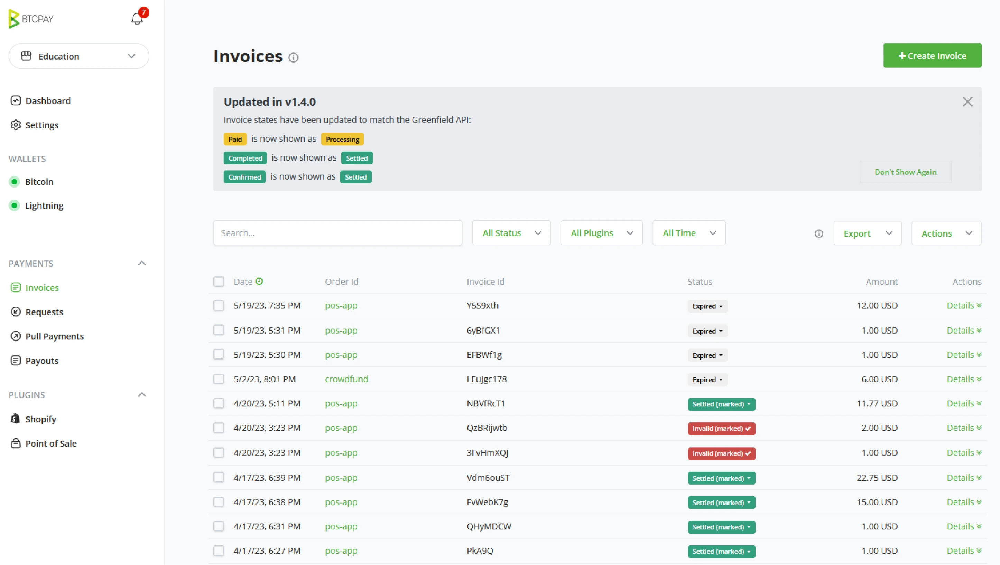


### 一般


#### インボイスのステータス


以下の表は、BTCPay Serverの標準的なインボイスステータスと、推奨される一般的なアクションを一覧にして説明しています。アクションはあくまで推奨事項です。各ユースケースやビジネスに最適なアクションを定義するのはユーザー次第です。


| インボイスステータス | 説明 | アクション |
| -------------------------- | --------------------------------------------------------------------------------------------------------------------------------------- | --------------------------------------------------------------------------------------------------------------------------- |
| New | 未払い。インボイスのタイマーはまだ期限切れではありません | なし |
| New (paidPartial) | 一部支払い済み。インボイスのタイマーはまだ期限切れではありません | なし |
| Expired | 未払い。インボイスのタイマーが期限切れです | なし |
| Expired (paidPartial) ** | 一部支払い済みですが、期限切れです | 購入者に連絡して返金を調整するか、不足分の支払いを依頼してください。オプションでインボイスを settled または invalid に設定できます |
| Expired (paidLate) | インボイスのタイマーの期限切れ後に全額支払い済み | 購入者に連絡して返金を調整するか、遅延した承認が許容される場合は注文を処理してください |
| Settled (paidOver) | 請求額以上の支払い済み、決済完了、十分な承認数を受信済み | 購入者に連絡して超過分の返金を調整するか、オプションで購入者からの連絡を待ちます |
| Processing | 全額支払い済みですが、ストア設定で指定された十分な承認数を受信していません | 購入者に連絡して超過分の返金を調整するか、オプションで購入者からの連絡を待ちます |
| Processing (paidOver) | 請求額以上の支払い済みですが、十分な承認数を受信していません | 決済完了まで待ち、その後購入者に連絡して超過分の返金を調整するか、オプションで購入者からの連絡を待ちます |
| Settled | 全額支払い済み。ストアで十分な承認数を受信しました | 注文を履行してください |
| Settled (marked) | ステータスが processing または invalid から手動で settled に変更されました | ストア管理者が支払いを settled としてマークしました |
| Invalid* | 支払い済みですが、ストア設定で指定された時間内に十分な承認数を受信できませんでした | ブロックチェーンエクスプローラーで取引を確認し、十分な承認がある場合は settled としてマークしてください |
| Invalid (marked) | ステータスが settled または expired から手動で invalid に変更されました | ストア管理者が支払いを invalid としてマークしました |
| Invalid (paidOver) | 請求額以上の支払い済みですが、ストア設定で指定された時間内に十分な承認数を受信できませんでした | ブロックチェーンエクスプローラーで取引を確認し、十分な承認がある場合は settled としてマークしてください |

#### インボイスの詳細


インボイスの詳細ページには、インボイスに関連するすべての情報が含まれています。


インボイスの情報は、インボイスのステータスや為替レートなどから自動的に作成されます。商品情報は、POSアプリなどでインボイスが商品情報と一緒に作成された場合に自動的に作成されます。


#### インボイスのフィルタリング


インボイスは、検索ボタンの隣にあるクイックフィルター、または上部にある「Help」リンクをクリックして切り替えられる詳細フィルターでフィルタリングすることができます。ストア、注文ID、アイテムID、ステータス、日付でインボイスをフィルタリングすることができます。


#### インボイスのエクスポート


BTCPay Serverのインボイスは、CSVまたはJSON形式でエクスポートできます。インボイスのエクスポートと会計処理の詳細については、こちらをご覧ください。


#### インボイスの返金


何らかの理由で返金を行いたい場合は、インボイスのビューから簡単に返金を行うことができます。


#### インボイスのアーカイブ


BTCPay Serverのアドレス再利用禁止機能の結果として、ストアのインボイスページに多くの期限切れのインボイスが表示されるのが一般的です。これらのインボイスを非表示にするには、一覧から選択し、アーカイブとしてマークしてください。アーカイブとしてマークされたインボイスは削除されません。アーカイブされたインボイスへの支払いは、BTCPay Serverによって検出されます（paidLateステータス）。検索フィルターからアーカイブ済みのインボイスを選択することで、いつでもストアのアーカイブされたインボイスを見ることができます。


#### デフォルト通貨


ストア作成ウィザードで設定された、ストアのデフォルト通貨です。


#### 誰でもインボイスを作成できるようにする


ストアで外部からのインボイス作成を許可したい場合、このオプションを有効にする必要があります。このオプションは、支払いボタンを使用している場合、またはAPIやサードパーティのHTMLウェブサイト経由でインボイスを発行している場合にのみ関係します。POSアプリは事前に承認されているため、不特定の訪問者がPOSストアを開いてインボイスを作成する場合、この設定を有効にする必要はありません。


#### インボイスに追加料金（ネットワーク手数料）を追加する


- インボイスの代金が複数回に分けて支払われた場合のみ
- 支払いの都度
- ネットワーク手数料を追加しない


#### 全額が支払われていない場合、インボイスは……分で期限切れになる


インボイスのタイマーはデフォルトで15分に設定されています。このタイマーは、暗号資産対法定通貨のレートに基づいて暗号資産の金額をロックするため、ボラティリティに対する保護メカニズムとして機能します。顧客が定められた期間内にインボイスを支払わない場合、インボイスは期限切れとみなされます。インボイスは、取引がブロックチェーン上に表示された時点で（承認数がゼロの状態で）「支払い済み」とみなされ、マーチャントが定義した承認数（通常は1～6回）に達した時点で「完了」とみなされます。タイマーはカスタマイズ可能です。


#### 支払額が予想より……%少なくても、インボイスは支払われたとみなす


顧客が取引所のウォレットを使用してインボイスの代金を直接支払う場合、取引所は少額の手数料を差し引きます。これは、そのようなインボイスが完全に完了したとはみなされないことを意味します。インボイスは「一部支払い済み」と表示されます。マーチャントが不足分のあるインボイスを受け入れたい場合、ここでパーセンテージを設定することができます。


### リクエスト


支払いリクエストは、BTCPay Serverのストアオーナーが長期間有効なインボイスを作成できる機能です。資金は、支払い時に有効な為替レートを使用して、支払いリクエストに従って支払われます。これにより、ユーザーは支払い時にストアオーナーと為替レートを交渉または確認する必要がなく、都合の良いときに支払いを行うことができます。


ユーザーはリクエストの支払いを部分的に行うことができます。支払いリクエストは、全額支払われるか、ストアオーナーが設定した有効期限に達するまで有効です。アドレスが再利用されることはありません。ユーザーが支払いをクリックするたびに新しいアドレスが生成され、支払いリクエスト用のインボイスが作成されます。


ストアオーナーは、記録管理や会計のために支払いリクエストを印刷（またはインボイスデータをエクスポート）することができます。BTCPay Serverは、ストアのインボイス一覧でインボイスを自動的に支払いリクエストとしてラベル付けします。


#### 支払いリクエストのカスタマイズ


- インボイス金額 - リクエストする支払額の設定
- 表示単位 - リクエスト金額を法定通貨または暗号資産で表示します
- 支払回数 - 一回払いのみ、または分割払いを許可します
- 有効期限 - 期日まで、または期限なしで支払いを許可します
- 説明 - テキストエディタ、データテーブル、写真と動画の埋め込み
- 外観 - CSSテーマによる色とスタイル


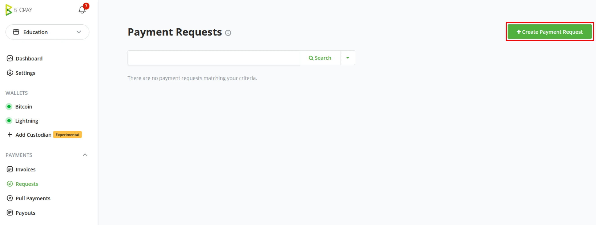


#### 支払いリクエストの作成


左メニューの「Payment Requests」から「Create Payment Request」をクリックします。


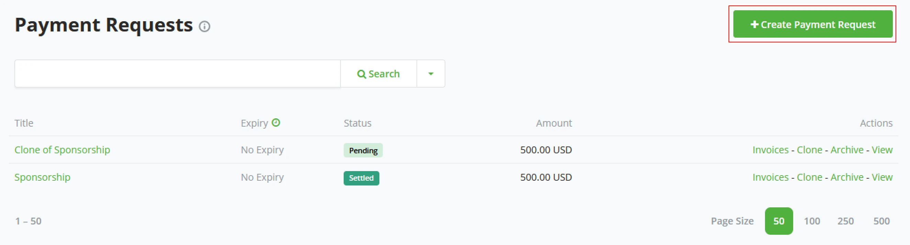


リクエスト名、金額、表示単位、関連するストア、有効期限、および説明（オプション）を入力してください。


部分的な支払いを許可する場合は、「Allow payee to create invoices in their own denomination」オプションを選択します。


「Save & View」（保存して表示）をクリックして、支払いリクエストを確認します。


BTCPay Serverは支払いリクエスト用のURLを作成します。このURLを共有すると、支払いリクエストが表示されます。同じリクエストが複数必要な場合は、メインメニューのクローンオプションを使用して、支払いリクエストを複製できます。


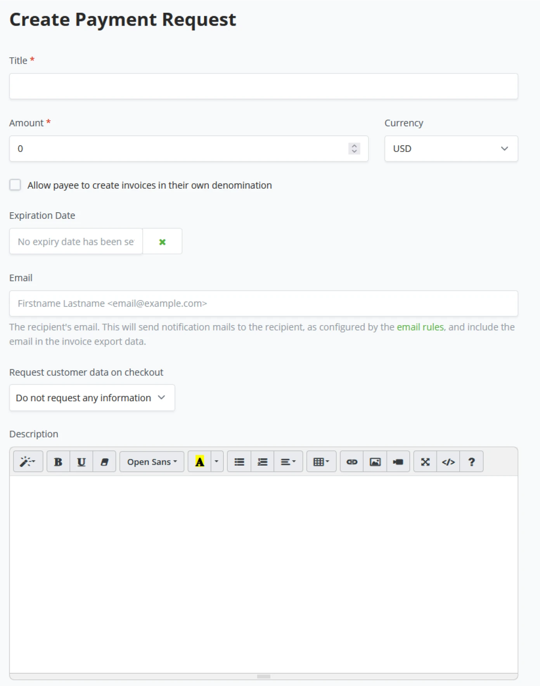


**警告**


支払いリクエストはストアに依存します。つまり、各支払いリクエストは作成時にストアに関連付けられます。支払いリクエストが属するストアにウォレットが接続されていることを確認してください。


#### 支払い済みのリクエスト


受取人と支払人は、支払いの送信後に支払いリクエストのステータスを見ることができます。支払いが全額受領された場合、ステータスは「Settled」（決済済み）と表示されます。部分的な支払いしか行われていない場合は、「Amount Paid」に残額が表示されます。


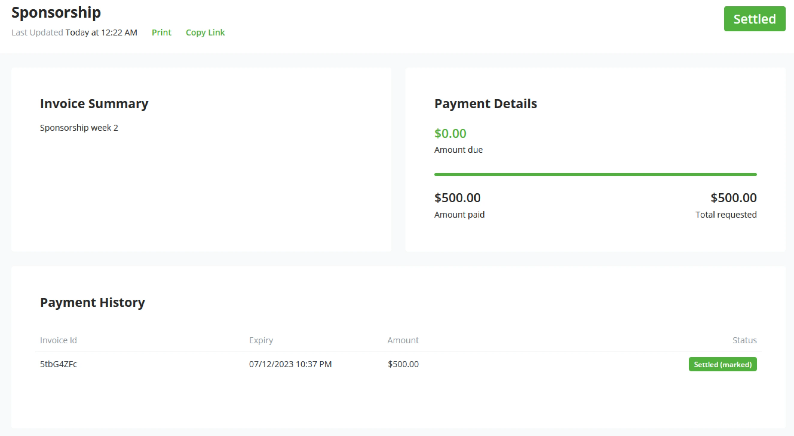


#### 支払いリクエストのカスタマイズ


説明の内容は、支払いリクエストのテキストエディタを使って編集することができます。追加のカラーテーマまたはカスタムCSSスタイルを使用したい場合、両方のオプションが利用可能です。


技術者でないユーザーは、[Bootstrapテーマ](https://docs.btcpayserver.org/Development/Theme/#2-bootstrap-themes)を使用することができます。以下のように、追加のCSSコードを提供することで、さらなるカスタマイズが可能です。


```css
:root {
--btcpay-font-family-base: "Source Sans Pro", -apple-system,
BlinkMacSystemFont, "Segoe UI", Roboto, "Helvetica Neue", Arial, sans-serif;
--btcpay-primary: #7d4698;
--btcpay-primary-accent: #59316b;
--btcpay-body-text: #333a41;
--btcpay-body-bg: #fff;
--btcpay-bg-tile: #f8f9fa;
}

#mainNav {
color: white;
background: linear-gradient(#59316b, #331840);
}

#mainNav .btn-link {
color: white;
}
```


### プルペイメント


従来、受取人はBitcoinのアドレスを共有してBitcoinの支払いを受け取り、送金者は後でこのアドレスに送金します。このようなシステムはプッシュペイメントと呼ばれ、受取人が不在の間に送金者が支払いを開始し、受取人に支払いをプッシュします。


しかし、役割を逆にしてみてはどうでしょうか？


送金者が支払いをプッシュする代わりに、受取人が都合の良いときに支払いをプル（引き出し）できるようにしたらどうでしょうか？これがプルペイメントのコンセプトです。これにより、以下のような新しいアプリケーションが可能になります。


- サブスクリプションサービス（契約者が、XX期間ごとにお金を引き出すことをサービスに許可する）
- 返金（マーチャントは、顧客が適切と判断したときに返金額をウォレットに引き出せるようにする）
- フリーランサーのための時間ベースの請求（雇用主は、時間が報告されるにつれて、フリーランサーが自分のウォレットにお金を引き出すことを許可する）
- パトロネージ（パトロンが毎月の資金の引き出しを許可し、活動を支援し続ける）
- 自動売却（取引所の顧客が、毎月自動的に売却するために取引所がウォレットから資金を引き出すことを許可する）
- 残高出金システム（大量の出金を扱うサービスでは、ユーザーが残高からの出金を要求すると、サービスは一定の間隔で多くのユーザーへのすべての支払いを簡単にバッチ処理できる）


### ペイアウト


ペイアウト機能は[プルペイメント](https://docs.btcpayserver.org/PullPayments/)機能に関連しています。この機能により、BTCPay Server内でペイアウトを作成することができます。この機能により、プルペイメント（返金、給与の支払い、または引き出し）を処理することができます。


#### 例1：返金


返金の例から始めましょう。顧客があなたのストアで商品を購入しましたが、残念ながら返品しなければならなくなり、返金を希望しています。BTCPay Serverの中で[返金](https://docs.btcpayserver.org/Refund/)を作成し、資金を請求するためのリンクを顧客に提供することができます。顧客がアドレスを提供して資金を請求すると、それはPayoutsセクションに表示されます。


最初のステータスは「Awaiting Approval」（承認待ち）です。ストアの担当者は複数の承認待ちがあるかどうかを確認し、選択した後にアクションボタンを使用します。


アクションボタンのオプション


- 選択したペイアウトを承認する
- 選択したペイアウトを承認して送信する
- 選択したペイアウトをキャンセルする
次のステップは、顧客に返金するために、選択したペイアウトを承認して送信することです。顧客のアドレスを確認し、金額と、手数料を返金額から差し引くかどうかを確認します。確認を終えたら、あとは取引に署名するだけです。


顧客側の請求ページも更新されます。顧客にはブロックエクスプローラーと取引へのリンクが提供されるため、取引を追跡することができます。取引が承認されると、ステータスは「Completed」（完了）に変わります。


#### 例2：給与


次に、給与の支払いについて説明します。この支払いは、顧客からのリクエストに従うのではなく、ストア内部から行われます。基本的なコンセプトは同じで、プルペイメントを利用します。ただし、返金の代わりに[プルペイメント](https://docs.btcpayserver.org/PullPayments/)を作成します。


BTCPay Serverの「Pull Payments」タブに移動します。右上の「Create Pull Payment」ボタンをクリックします。


ペイアウトの作成画面に入ります。ペイアウトの名前と、選択した通貨での希望額を入力します。「Description」（説明）を記入し、従業員が何の支払いかわかるようにします。次の部分は返金と同様です。従業員は、宛先アドレスとこのペイアウトから請求したい金額を記入します。2回に分けて請求したり、別のアドレスに請求したり、一部をLightningで請求したりすることもできます。


複数のペイアウトが待機している場合は、一括して署名して送信することができます。署名が完了すると、ペイアウトは「In Progress」（進行中）タブに移動し、トランザクションが表示されます。ネットワークで承認されると、「Completed」（完了）タブに移動します。「Completed」タブは純粋に履歴のためのものです。処理済みのペイアウトとそれに属するトランザクションが保存されます。


### プルペイメント


#### コンセプト


送金者がプルペイメントを設定する際、多くのプロパティを設定することができます。


- プルペイメント名
- 限度額
- 単位（BTC、SAT、USDなど）
- 支払い方法
  - BTC On-Chain
  - BTC off-chain
- 説明
- カスタムCSS
- 終了日（Lightning Network BOLT11ではオプション）


この後、送金者はリンクを使用してプルペイメントを受取人と共有することができ、受取人はペイアウトを作成することができます。受取人は以下を選択します。


- どの支払い方法を利用するか
- 送金先


ペイアウトが作成されると、その期間のプルペイメントの限度額にカウントされます。送金者は、ペイアウトの送金レートを設定してペイアウトを承認し、支払いに進みます。


送金者には、[BTCPay Serverの内部ウォレット](https://docs.btcpayserver.org/Wallet/)から複数のペイアウトをバッチ処理する使いやすい方法が提供されます。


#### Greenfield API


BTCPay Serverは、インスタンスの`/docs`ページ（またはドキュメントウェブサイト https://docs.btcpayserver.org）に文書化されている完全なAPIを、送金者側と受取人側の両方に提供します。


このAPIはプルペイメントの全機能を公開しているため、送金者は自身のニーズに合わせて支払いを自動化することができます。


### スキルの概要


このセクションでは、以下のことを学びました。


- BTCPay Serverのインボイスステータスと、それに対して実行できるアクションの深い理解
- 支払いリクエストと呼ばれる、長期間有効なインボイスの仕組みのカスタマイズと管理
- BTCPay Server独自のプルペイメント機能により、特に返金や給与の支払いにおいて、さらに柔軟な支払いの可能性が広がること


### 知識評価


#### KA コンセプトレビュー


インボイスと支払いリクエストにはどのような違いがあり、後者を使用する正当な理由は何でしょうか？


#### KA コンセプトレビュー


プルペイメントはオンチェーンで通常できることをどのように拡張しますか？それが可能にするいくつかのユースケースについて説明してください。


## BTCPay Serverのデフォルトプラグイン


<chapterId>7d673dc4-bd5d-5411-819b-f135f1d86636</chapterId>


### デフォルトのプラグインとアプリ


BTCPay Serverには、BTCPay ServerをEコマースの決済ゲートウェイに変えることができるプラグイン（アプリ）の標準セットが付属しています。POS（販売時点管理）、クラウドファンディングプラットフォーム、簡単な支払いボタンを追加することで、BTCPay Serverは簡単に導入できるソリューションになります。


### POS（販売時点管理）


BTCPay Serverの標準プラグインの1つはPOS（Point of Sale）です。POSプラグインを使用すると、ストアオーナーはBTCPay Serverから直接ウェブショップを作成することができます。ウェブベースのPOSアプリは、実店舗を持つユーザーが、手数料やサードパーティを介さずに、ウォレットに直接Bitcoinを簡単に受け入れることを可能にします。POSは、タブレットやウェブブラウジングをサポートする他のデバイスで簡単に表示することができます。ユーザーは、ウェブアプリに素早くアクセスするためのホーム画面のショートカットを簡単に作成することができます。


#### 新しいPOSの作成方法


BTCPay Serverは、ストアオーナーが複数のレイアウトでPOSを素早く作成することを可能にします。BTCPay Serverは、すべてのストアがEコマースであるわけではなく、すべてのストアがバーやレストランであるわけでもないことを認識しています。


ストアオーナーが左のメニューバーにある「Point of Sale」をクリックすると、BTCPay Serverが名前を尋ねます。この名前は左のメニューバーに表示されます。


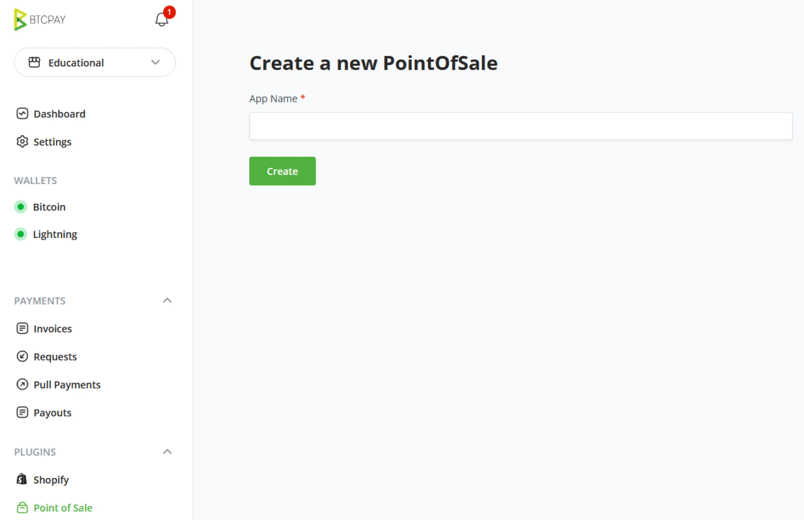


#### 新しく作成したPOSを更新する


新しいPOSを作成した後、以下の画面でPOSを更新し、ストアの商品を追加することができます。


##### アプリ名


BTCPay Serverのメインメニューには、ここで付けられたPOSの名前が表示されます。


##### 表示タイトル


一般ユーザーは、あなたのストアを訪問する際、このタイトルまたは名前を見ることになります。BTCPay Serverのデフォルトでは、ストアは「Tea shop」と名付けられます。これをあなたのショップ名に置き換えてください。


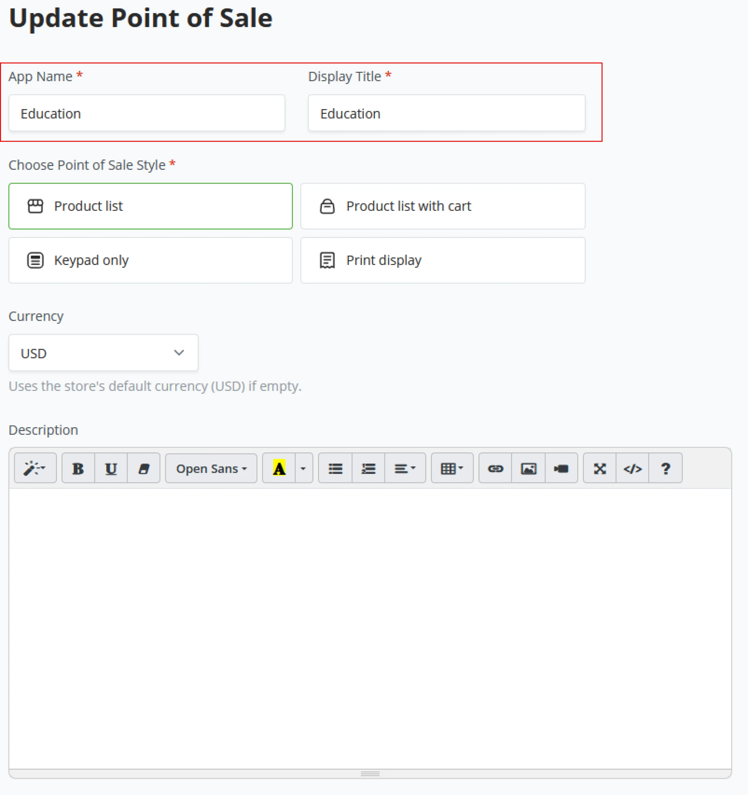


#### POSスタイルの選択


BTCPay Serverは、複数の方法でPOSを表示することができます。


- 商品リスト
  - 顧客が一度に1つの商品しか購入できないショップビュー
- カート付き商品リスト
  - 顧客が一度に複数の商品を購入でき、画面の右側にショッピングカートの概要が表示されるショップビュー
- キーパッドのみ
  - 商品リストはなく、直接インボイスを発行するためのキーパッドのみ
- 印刷表示（QRコード付きの印刷用商品リスト）
  - 商品リストを常にデジタル表示できない場合は、商品の「オフライン」ソリューションが必要です。BTCPay Serverには、オフラインストアとして機能する印刷表示があります


#### POSスタイル - 商品リスト


#### POSスタイル - 商品リスト＋カート


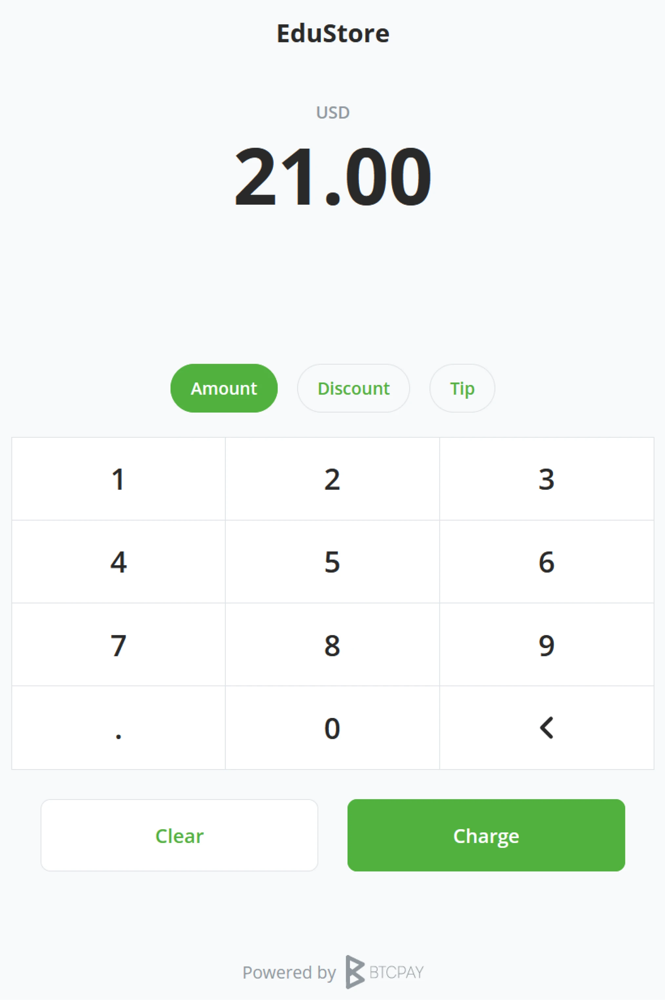


#### POSスタイル - キーパッドのみ


#### POSスタイル - 印刷表示


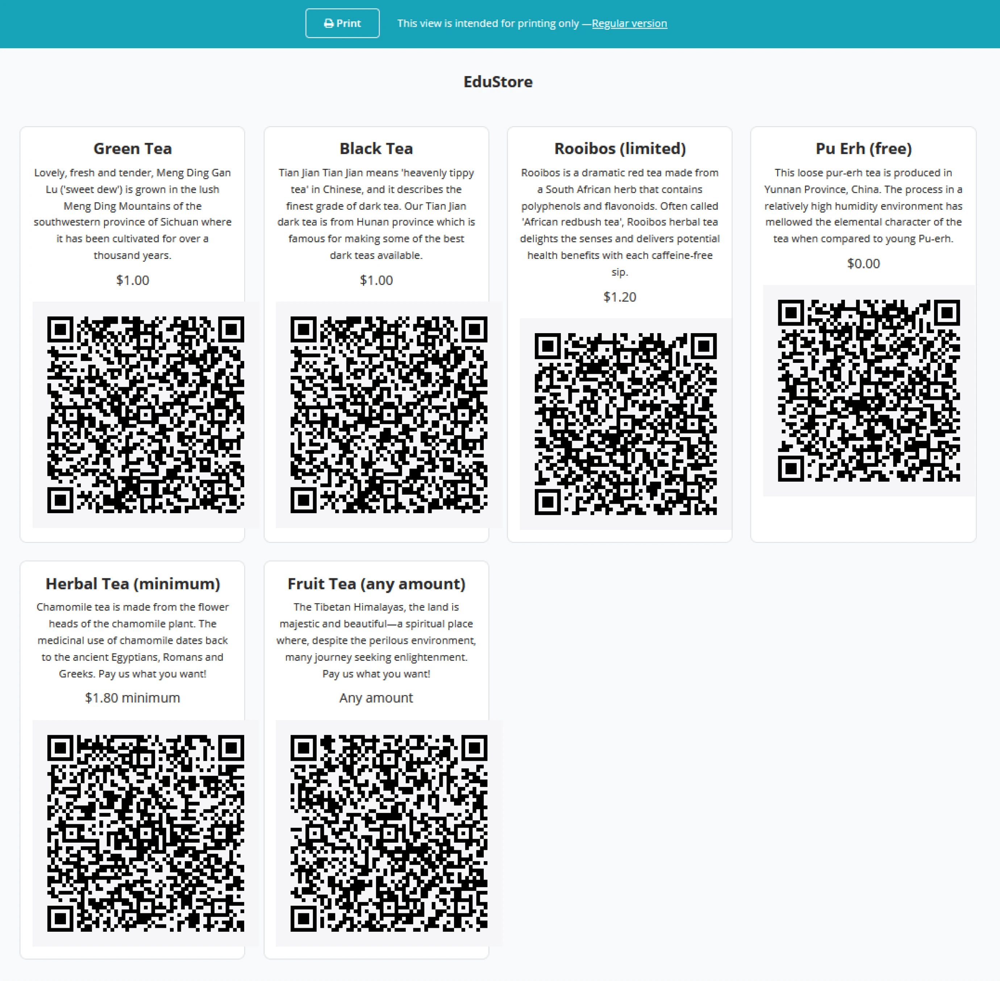


#### 通貨


ストアオーナーは、POSの通貨をデフォルトの通貨と異なる通貨に設定することができます。ストアのデフォルト通貨は自動的にこのフィールドに入力されます。


#### 説明


何をいくらで売るのか？あなたのストアを説明するものはすべてここに記載します。


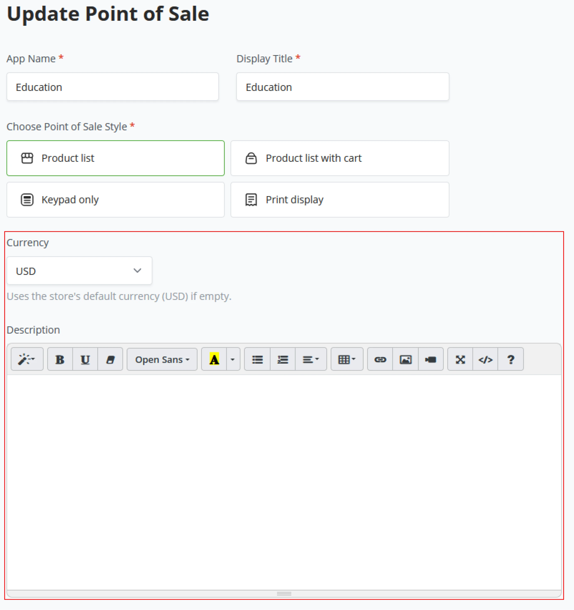


#### 商品


POSが作成されると、標準のBTCPay Serverは参考のためにショップにいくつかの商品を追加します。標準商品の編集ボタンをクリックすると、商品のオプションが表示されます。


ストアで新しい商品を作成するには、以下のフィールドを入力します。


- タイトル
- 価格（固定価格、最低価格、カスタム価格）
- 画像URL
- 説明
- 在庫
- ID
- 購入ボタンのテキスト
- 有効／無効


ストアオーナーがすべての新しい商品フィールドに入力したら、保存をクリックしてください。商品を追加する際に進行状況が失われる可能性を防ぐため、常に画面右上の保存ボタンで保存してください。


ストアオーナーは、「Raw Editor」を使用して商品を設定することもできます。Raw EditorにはJSON構造の基本的な理解が必要です。


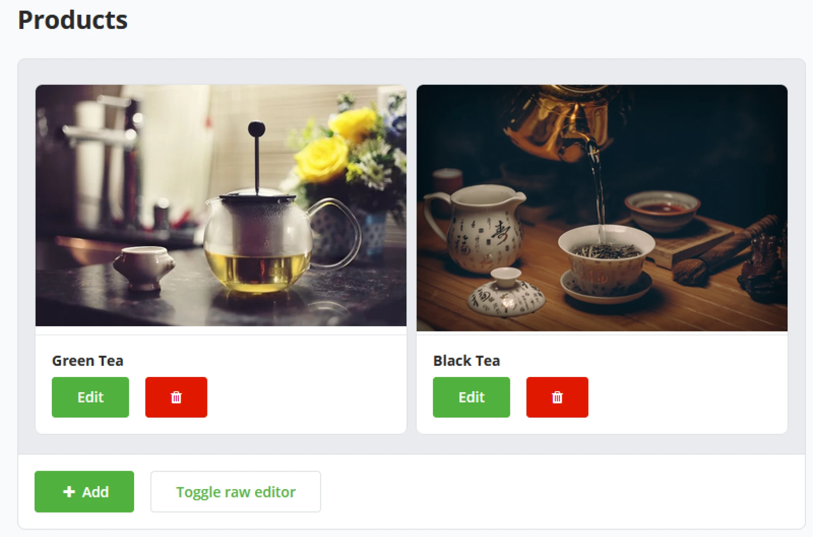


#### チェックアウト


BTCPay Serverでは、POS特有の小規模なチェックアウトのカスタマイズが可能です。ストアオーナーは「Buy for x」のテキストを設定したり、フォームを追加して特定の顧客データを要求することができます。


#### チップ


このオプションが必要なショップは限られています。ショップオーナーは自分のショップに合うように、このオプションをオンまたはオフに切り替えることができます。ショップでチップを扱う場合、ストアオーナーはフィールドにテキストを設定することができます。BTCPay Serverのチップはパーセンテージで計算されます。ストアオーナーはカンマで区切って複数のパーセンテージを追加することができます。


#### 割引


ストアオーナーとして、チェックアウト時に顧客にカスタム割引を提供したい場合があるかもしれません。ただし、セルフチェックアウトシステムを使用する場合は、これを有効にしないことを強くお勧めします。


#### カスタム支払い


カスタム支払いオプションをオンに切り替えると、顧客はストアによって生成された元のインボイスと同じかそれ以上の価格を自分で入力することができます。


#### 追加オプション
POSをすべて設定した後、いくつかの追加オプションが残っています。ストアオーナーは、iframeを通して簡単にPOSを埋め込んだり、特定のストア商品にリンクする支払いボタンを埋め込むことができます。作成したばかりのPOSストアをスタイリッシュにするために、オーナーは追加オプションの一番下にカスタムCSSを追加することができます。


#### このアプリを削除する


ストアオーナーがBTCPay ServerからPOSを完全に削除したい場合、POSの更新画面の最後にある「Delete this app」ボタンをクリックすることで、POSアプリを完全に破棄することができます。「Delete this app」をクリックすると、BTCPay Serverは「DELETE」と入力するよう求めるので、入力して「Delete」ボタンをクリックして確定します。削除後、ストアオーナーはBTCPay Serverのダッシュボードに戻ります。


### BTCPay Server - クラウドファンディング


POSプラグインの次に、BTCPay Serverにはクラウドファンディングを作成するオプションがあります。他のクラウドファンディングプラットフォームと同様に、ストアオーナーは目標を設定し、寄付に対する特典を作成し、ニーズに合わせてカスタマイズすることができます。


#### 新しいクラウドファンディングを立ち上げるには


BTCPay Serverの左側にあるメインメニューのプラグインセクションの下にある「Crowdfund」プラグインをクリックしてください。BTCPay Serverはクラウドファンディングの名前を求めます。この名前は左のメニューバーにも表示されます。


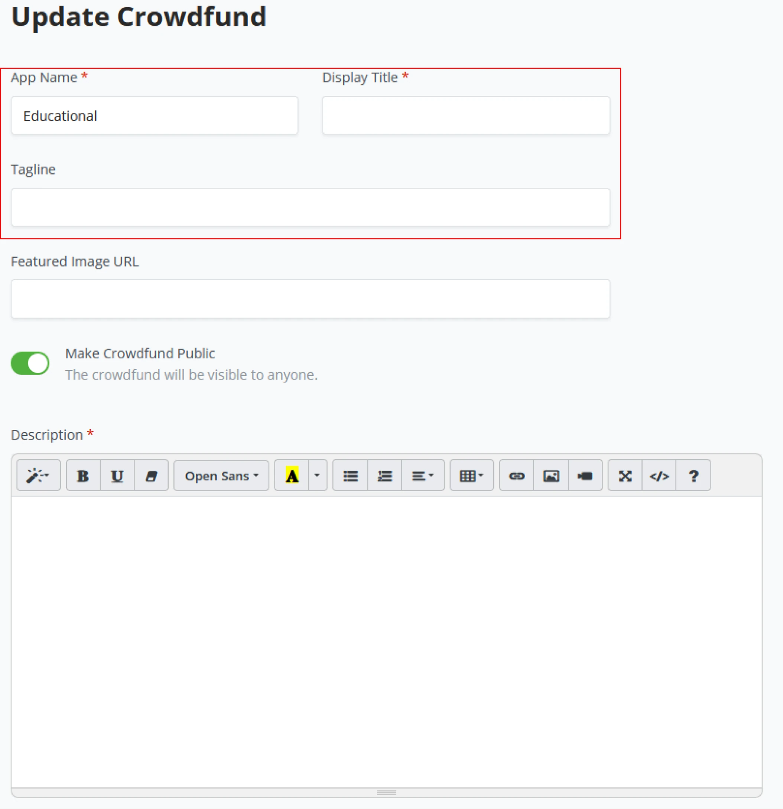


#### 新しく作成したクラウドファンディングを更新する


アプリの名前が決まったら、次の画面でアプリを更新して内容を追加します。


#### アプリ名


クラウドファンディングに付けられた名前は、BTCPay Serverのメインメニューに表示されます。


#### 表示タイトル


一般向けにクラウドファンディングに付けられるタイトルです。


#### タグライン


クラウドファンディングが何のための資金調達なのかを認識してもらうために、一言添えます。


#### 注目画像のURL


すべてのクラウドファンディングにはメイン画像があります。この画像は管理者権限があればサーバーに保存することができます。管理者はBTCPay Serverの「Server Settings」>「Files」の下にアップロードすることができます。ストアオーナーの場合、画像はサードパーティのホスト（例えばImgur）を通してウェブにアップロードする必要があります。


#### クラウドファンディングを公開する


このトグルは、クラウドファンディングを公開し、外部から見えるようにします。テスト目的やテーマが正しく適用されているか確認するために、クラウドファンディングを構築している期間はこの設定をオフにしておいてください。


#### 説明


あなたのクラウドファンディングについて世界に発信してください。何のためにクラウドファンディングを行うのですか？クラウドファンディングの説明はすべてここに記載します。


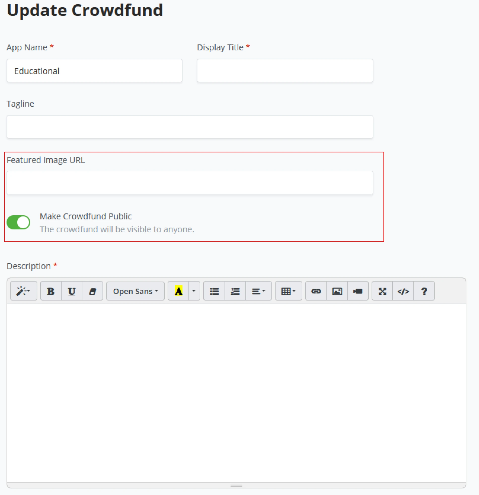


#### クラウドファンディングの目標


資金調達者がプロジェクトのために達成すべき目標額と、その目標額をどの通貨建てにするかを設定します。目標が特定の日付の間に設定されている場合は、クラウドファンディングの目標の下にこれらの目標日と終了日を必ず含めてください。


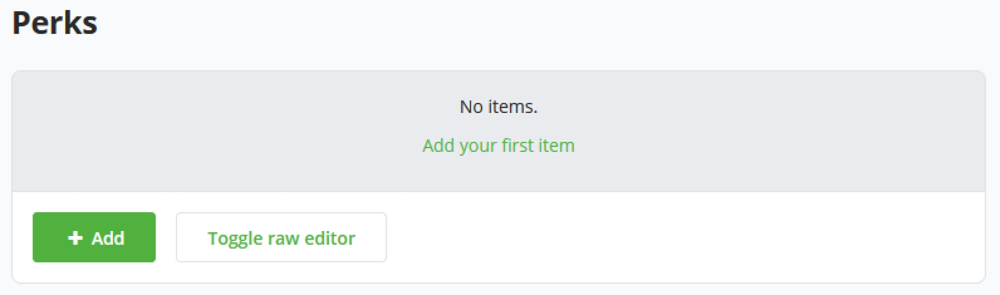


#### 特典


特典は、クラウドファンディングの取り組みを大幅に強化することができます。特典は、人々にキャンペーンに参加する手段を与えるからです。利己的な動機と善意の動機の両方を活用でき、支援者の慈善的な財布だけでなく、支援者の消費支出にもアクセスすることができます。


新しい特典の作成は、以下のフィールドで構成されます。


- タイトル
- 価格（固定価格、最低価格、カスタム価格）
- 画像URL
- 説明
- 在庫
- ID
- 購入ボタンのテキスト
- 有効／無効


ストアオーナーが新しい特典のすべてのフィールドに入力したら、保存をクリックしてください。


### BTCPay Server - クラウドファンディングの設定


#### 寄付


ストアオーナーは、特典の表示方法、並べ方、他の特典との順位付けなどを選択することができます。しかし、クラウドファンディングの目標額に達した後、ストアオーナーはこの資金調達への寄付の流れを止めたいと思うかもしれません。そこで、「Do not allow additional contributions after target has been reached」（目標達成後の追加寄付を許可しない）をオンにすることができます。これにより、クラウドファンディングは寄付を受け付けなくなります。


##### クラウドファンディングの動作


クラウドファンディングの標準設定では、クラウドファンディングで作成されたインボイスのみが目標にカウントされます。しかし、ストアオーナーは、このストアで作成されたすべてのインボイスをクラウドファンディングにカウントしたい場合があるかもしれません。


#### カスタマイズのための追加オプション


BTCPay Serverでは、いくつかのカスタマイズが可能です。クラウドファンディングにサウンド、アニメーション、ディスカッションスレッドを追加することができます。ストアオーナーは、独自のカスタムCSSを入力することで、クラウドファンディングのルック＆フィールを変更することもできます。


#### このアプリを削除する


ストアオーナーがBTCPay Serverからクラウドファンディングを完全に削除したい場合、クラウドファンディングの更新画面の一番下にある「Delete this app」ボタンをクリックすることで、クラウドファンディングアプリを完全に削除することができます。「Delete this app」をクリックすると、BTCPay Serverは「DELETE」と入力するよう求めるので、入力して「Delete」ボタンをクリックして確定します。削除後、ストアオーナーはBTCPay Serverのダッシュボードに戻ります。


### BTCPay Server - 支払いボタン


簡単に埋め込み可能なHTMLと高度にカスタマイズ可能な支払いボタンにより、ストアオーナーはチップや寄付を受け取ることができます。BTCPay Serverの左メニューバー、プラグインセクションの下にある「Pay Button」をクリックし、「Enable」をクリックすると支払いボタンを作成することができます。


#### 一般設定


支払いボタンの一般設定内で、ストアオーナーは以下を設定できます。


- 標準価格
- デフォルト通貨
- デフォルトの支払い方法
  - ストアのデフォルトを使用する
  - BTC On-Chain
  - BTC off-chain（Lightning）
  - BTC off-chain（LNURL-pay）
- チェックアウトの説明
- 注文ID


#### 表示オプション


BTCPay Serverの支払いボタンは、さまざまなスタイルに合わせて設定することができます。ボタンは固定金額またはカスタム金額を持つことができ、スライダーまたはプラスとマイナスのトグルで表示されます。


#### モーダルを使う


支払いボタンを作成する際、ストアオーナーは顧客がクリックしたときの動作を選択し、モーダルで表示したり、新しいページとして表示したりすることができます。


**注意**


警告：支払いボタンは、チップや寄付のためにのみ使用してください。


ユーザーが注文関連情報を変更できるため、Eコマース統合に支払いボタンを使用することは推奨されません。Eコマースには、Greenfield APIを使用してください。このストアが商取引を処理する場合、支払いボタンを使用する前に別のストアを作成することをお勧めします。


#### 支払いボタンのテキストのカスタマイズ


デフォルトでは、BTCPay Serverの支払いボタンは「Pay With BTCPay」と表示されます。ストアオーナーは、このテキストを自由に設定し、BTCPay Serverのロゴを変更することができます。テキストは「Pay Button Text」で設定し、画像のURLは「Pay Button Image URL」の下に貼り付けてください。


##### 画像サイズ


ボタン内の画像サイズは、3つのデフォルト値にのみ設定可能です。


- 146x40px
- 168x46px
- 209x57px


#### ボタンタイプ


BTCPay Serverの支払いボタンには、3つのタイプがあります。


- 固定金額
  - 先ほど設定した価格は、ボタンの一般設定にあります。
- カスタム金額
  - BTCPay Serverの支払いボタンには、カスタム価格を設定するための＋と－のトグルがあります。
  - カスタム金額を使用する場合、BTCPay Serverは最小値、最大値、および増減の刻み幅を求めます。
  - ボタンは「Use a simple input style」（シンプルな入力スタイルを使用）に設定することができます。
  - ボタンとトグルがインラインに表示されるように、ボタンをインラインに配置できます。
- スライダー
  - カスタム金額と似ていますが、＋／－のトグルの代わりにスライダーがあり、見た目が異なります。
  - スライダーを使用する場合、BTCPay Serverは最小値、最大値、および増減の刻み幅を求めます。


**注意**


支払いボタンは、警告の説明の上部で削除することができます。


#### 支払い通知


サーバーIPN（即時支払い通知）はウェブフック用に設計されており、購入後のデータを送信するURLを設定することができます。


#### メール通知


支払いが行われると、BTCPay Serverはストアオーナーに通知することができます。


#### ブラウザのリダイレクト


顧客が購入を完了すると、ストアオーナーによって設定されている場合は、このリンクにリダイレクトされます。


#### 高度な支払いボタンオプション


インボイスが作成された後、チェックアウトページに追加されるクエリ文字列パラメータを指定します。例えば、`lang=da-DK`はデフォルトでデンマーク語でチェックアウトページを読み込みます。


#### アプリをエンドポイントとして使用する


以前に作成したPOSアプリやクラウドファンディングアプリで、支払いボタンを商品に直接リンクさせることができます。


ストアオーナーはドロップダウンメニューをクリックし、希望のアプリを選択することができます。アプリを選択したら、ストアオーナーはリンクさせる商品を追加することができます。


#### 生成されたコード


BTCPay Serverの支払いボタンは簡単に埋め込むことができるHTMLなので、支払いボタンを設定した後、BTCPay Serverは下部にウェブサイトにコピーするための生成されたコードを表示します。


ストアオーナーは生成されたコードをウェブサイトにコピーすることができ、BTCPay Serverの支払いボタンはウェブサイト上で直接有効になります。


#### 支払い通知


サーバーIPN（即時支払い通知）はウェブフック用に設計されており、購入データを送信するURLを設定することができます。
#### メール通知


支払いが行われるたびに、BTCPay Serverはストアオーナーに通知することができます。


#### ブラウザのリダイレクト


顧客が購入を完了すると、ストアオーナーによって設定されている場合は、このリンクにリダイレクトされます。


#### 高度な支払いボタンオプション


インボイスが作成された後、チェックアウトページに追加されるクエリ文字列パラメータを指定します。例えば、`lang=da-DK`はデフォルトでデンマーク語でチェックアウトページを読み込みます。


#### アプリをエンドポイントとして使用する


POSアプリやクラウドファンディングアプリの商品に、支払いボタンを直接リンクさせることができます。ストアオーナーはドロップダウンメニューをクリックし、希望のアプリを選択することができます。アプリを選択したら、ストアオーナーはリンクさせる商品を追加することができます。


#### 生成されたコード


BTCPay Serverの支払いボタンは簡単に埋め込むことができるHTMLなので、支払いボタンを設定した後、BTCPay Serverは下部にウェブサイトにコピーするための生成されたコードを表示します。ストアオーナーは生成されたコードをウェブサイトにコピーすることができ、BTCPay Serverの支払いボタンはウェブサイト上で直接有効になります。


### スキルの概要


このセクションでは、以下のことを学びました。


- BTCPay Serverに統合されたPOSプラグインを使用してカスタムストアを簡単に作成する方法
- BTCPay Serverに統合されたCrowdfundプラグインを使用して、カスタムクラウドファンディングアプリを簡単に作成する方法
- Pay Buttonプラグインを使用してカスタム支払いボタンのコードを生成する方法


### 知識評価


#### KA レビュー


BTCPay Serverに標準装備されている3つのプラグインは何ですか？それぞれどのように使用できるかを一言で説明してください。


# BTCPay Serverのセットアップ


<partId>ff38596c-7de3-5e5c-ba50-9b9edbbbb5eb</partId>


## LunaNode環境へのBTCPay Serverのインストールに関する基本的な理解


<chapterId>d0a28514-ffcf-529b-9156-29141f0b060a</chapterId>


### ホスト環境（LunaNode）へのBTCPay Serverのインストール


これらの手順では、LunaNode上でBTCPay Serverの使用を開始するために必要なすべての情報を提供します。ソフトウェアのデプロイには多くのオプションがあります。

BTCPay Serverのすべての詳細は https://docs.btcpayserver.org を参照してください。


#### 何から始めますか？


このパートでは、ホスティングプロバイダーであるLunaNodeに慣れ、BTCPay Serverを使用する最初のステップを学び、Lightning Networkの使用方法を学びます。すべてのステップを完了すると、Bitcoinを受け入れるウェブショップやクラウドファンディングプラットフォームを運営することができます！


これは、BTCPay Serverをデプロイする多くの方法の1つです。詳しくはドキュメントをお読みください。


https://docs.btcpayserver.org


### BTCPay Server - LunaNodeへのデプロイ


#### LunaNodeへのデプロイ


まず、LunaNode.comのウェブサイトにアクセスし、新しいアカウントを作成します。右上のサインアップをクリックするか、ホームページのスタートウィザードをご利用ください。


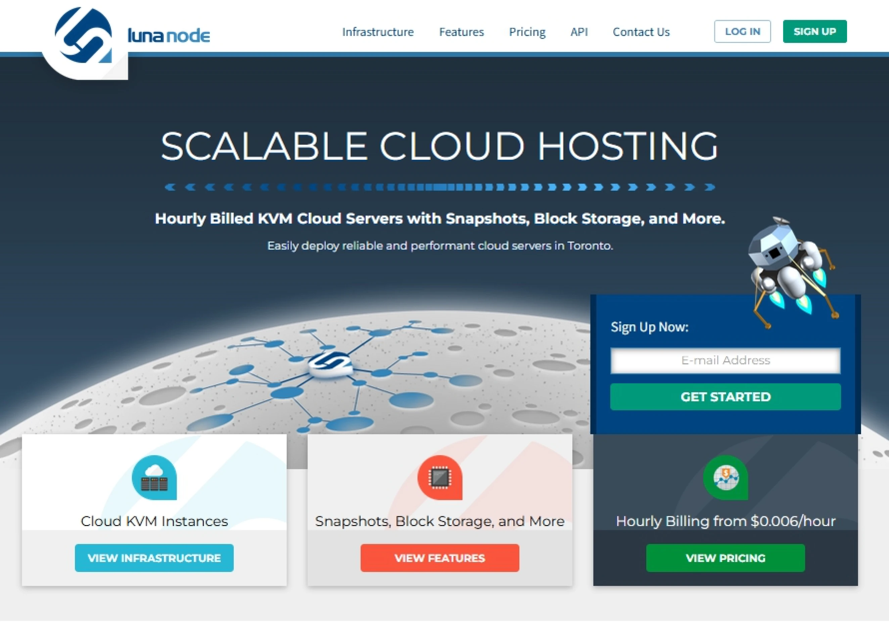


新規アカウント作成後、LunaNodeから認証メールが送信されます。Voltageとは異なり、アカウントを確認するとすぐにアカウント残高を入金するオプションが表示されます。この残高はサーバースペースとホスティングコストをカバーするために必要です。


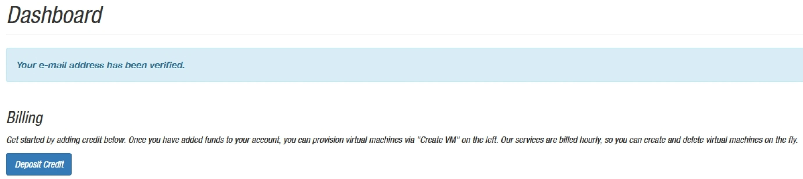


#### LunaNodeアカウントにクレジットを追加する


「Add Credit」をクリックすると、アカウントにいくら入金するか、どのように支払うかを設定することができます。LunaNodeとBTCPay Serverは、月額10ドルから20ドルかかります。

Voltage.cloudに比べ、仮想専用サーバー（VPS）へのフルアクセスが可能なため、サーバーをより自由にコントロールすることができます。新規アカウント作成後、LunaNodeから認証メールが送信されます。

Voltageとは異なり、アカウントを確認するとすぐにアカウント残高を入金するオプションが表示されます。この残高はサーバースペースとホスティングコストをカバーするために必要です。


#### 新しいサーバーをデプロイするには？


このガイドでは、APIキーのセットを作成し、LunaNodeによって開発されたBTCPay Serverランチャーを使用して、セットアッププロセスを説明します。


LunaNodeのダッシュボードで、右上の「API」をクリックします。新しいページが開きます。APIキーの名前を設定するだけです。それ以外はLunaNodeが行いますので、このガイドでは説明しません。「Create API Credential」ボタンをクリックします。

API認証情報を作成すると、長い文字列が表示されます。これがあなたのAPIキーです。


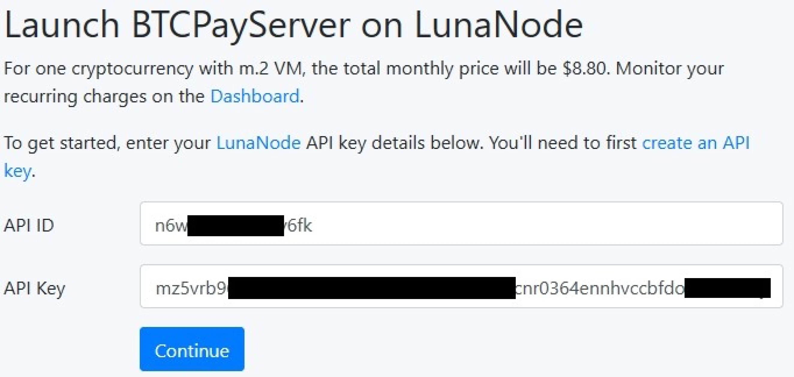


#### 新しいサーバーをデプロイするには？


これらの認証情報にはAPIキーとAPI IDの2つの部分があり、両方が必要になります。次のステップに進む前に、ブラウザで2つ目のタブを開き、https://launchbtcpay.lunanode.com/ にアクセスします。


ここで、APIキーとAPI IDの入力を求められます。これは、この新しいサーバーを準備したのがあなた自身であることを確認するためです。APIキーはまだ前のタブで開いているはずです。下の表をスクロールすると、API IDが見つかります。


ランチャーのページに戻り、APIキーとIDをフィールドに入力し、「Continue」をクリックします。


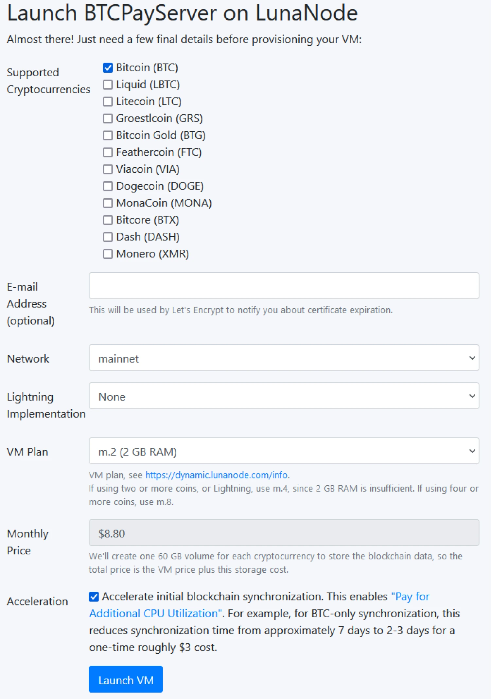


次のステップでは、ドメイン名を指定します。すでにドメインをお持ちで、これをBTCPay Serverに使用したい場合は、ドメインのDNSレコード（`A`レコードと呼ばれます）も追加してください。ドメインを所有していない場合は、代わりにLunaNodeが提供するドメインを使用し（これは後でBTCPay Serverの設定で変更できます）、「Continue」をクリックします。


BTCPay ServerのDNSレコードの設定や変更について詳しくはこちら: https://docs.btcpayserver.org/FAQ/Deployment/#how-to-change-your-btcpay-server-domain-name


#### LunaNodeでBTCPay Serverを立ち上げる


先ほどの手順を踏んだ後、新しいサーバーのすべてのオプションを設定することができます。ここでは、Bitcoin（BTC）をサポート通貨として選択します。また、暗号化証明書の更新に関する通知を受け取るためのメールアドレスを設定することもできます。


このガイドでは、Mainnet環境（実際のBitcoin）をセットアップすることを目的としていますが、LunaNodeでは開発目的でTestnetまたはRegtestに設定することもできます。このガイドではMainnetのままにしておきます。


Lightningの実装を選択できます。LunaNodeでは、LNDとCore Lightningの2種類の実装を提供しています。このガイドでは、LNDを使用します。両実装にはほとんど違いはありませんが、実際には異なる点があります。これについては、詳細なドキュメントを読むことをお勧めします: https://docs.btcpayserver.org/LightningNetwork#getting-started-with-btcpay-server-and-core-lightning-cln


LunaNodeは複数の仮想マシン（VM）プランを提供しています。これらは価格帯とサーバーの仕様が異なります。このガイドではm2プランで十分ですが、通貨としてBitcoin以外も選択する場合は、少なくともm4のご利用をご検討ください。


ブロックチェーンの初期同期を高速化できます。Lightningのエイリアスの設定、特定のGitHubリリースの指定、SSHキーの設定など、高度なオプションもあります。


フォームに記入後、「Launch VM」をクリックすると、LunaNodeがBTCPay Serverを含む新しいVMの作成を開始します。サーバーの準備が完了すると、LunaNodeは新しいBTCPay Serverへのリンクを提供します。


作成後、BTCPay Serverへのリンクをクリックします。ここで、管理者アカウントを作成するよう求められます。


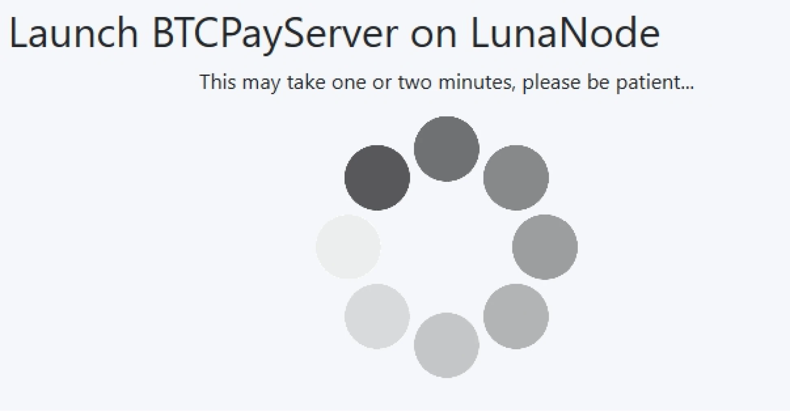


### スキルの概要


このセクションでは、以下のことを学びました。


- LunaNodeのアカウント作成と入金
- BTCPay Serverランチャーを使用した独自サーバーの作成


### 知識評価


#### KA コンセプトレビュー


VPSでBTCPay Serverのインスタンスを実行する場合と、ホストされたインスタンスでアカウントを作成する場合の違いをいくつか説明してください。


## Voltage環境へのBTCPay Serverのインストール


<chapterId>11c7d284-b4d2-5542-872c-df9bd9c1491b</chapterId>


ホスティングプロバイダーとしてVoltage.cloudに慣れ、BTCPay Serverを使用する最初のステップを学び、Lightning Networkの使用方法を学びます。すべてのステップを終えると、Bitcoinを受け入れるウェブショップやクラウドファンディングプラットフォームを運営することができます！


これは、BTCPay Serverをデプロイする多くの方法の1つです。詳しくはドキュメントをお読みください。

https://docs.btcpayserver.org


### BTCPay Server - Voltage.cloudへのデプロイ


まず、ウェブサイトVoltage.cloudにアクセスし、新規アカウントを作成します。アカウントを作成する際、7日間の無料トライアルに申し込むことができます。右上のサインアップをクリックするか、ホームページの「7日間無料トライアル」をご利用ください。


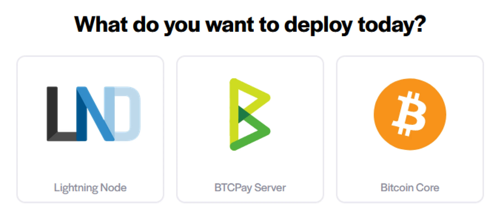


アカウントを作成したら、ダッシュボードの「NODES」ボタンをクリックします。「Nodes」を選択して新しいノードを作成すると、Voltageが提供できるノードが表示されます。このガイドではLightning Networkもカバーするため、BTCPay Serverを作成する前に、まずVoltageでLightningの実装を選択する必要があります。「Lightning Node」をクリックします。


ここで、どのようなLightningノードが欲しいかを選択する必要があります。Voltageには、Lightningのセットアップのためのさまざまなオプションがあります。これは、例えばLunaNodeでデプロイする場合とは異なります。このガイドでは、Lite Nodeで十分です。詳しくはVoltage.cloudをご覧ください。


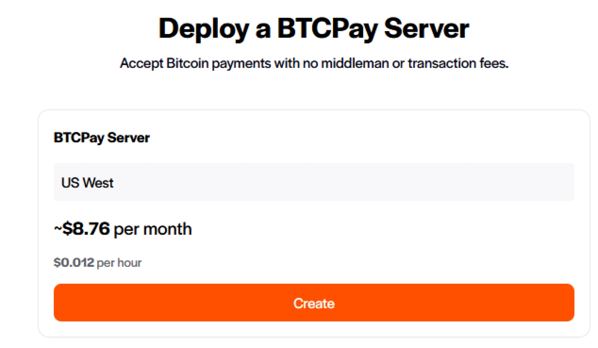


ノードに名前を付け、パスワードを設定し、このパスワードを安全に保管します。このパスワードを紛失すると、バックアップにアクセスできなくなり、Voltageでは復旧できません。ノードを作成すると、Voltageが進捗状況を表示します。これでVoltageがLightningノードを作成しました。次にBTCPay Serverインスタンスを作成し、Lightning Networkに直接アクセスできるようにします。


ダッシュボードの左上にある「Nodes」をクリックします。ここでBTCPay Serverインスタンスの次の部分を設定できます。ノードの概要で「Create New」をクリックします。先ほどと同じような画面が表示されます。ここで、Lightning Nodeの代わりにBTCPay Serverを選択します。


VoltageはBTCPay Serverのジオロケーションを表示します。ここではサーバーのホスティング費用も表示されます。「Create」をクリックし、BTCPay Serverに名前を付けます。Lightningを有効にすると、Voltageは前のステップで作成したLightningノードを表示します。「Create」をクリックすると、VoltageがBTCPay Serverインスタンスを作成します。


作成ボタンを押すと、Voltageはデフォルトのユーザー名とパスワードを表示します。これらは以前にVoltageで設定したパスワードと同様です。「Login to your account」ボタンをクリックすると、BTCPay Serverにリダイレクトされます。


新しいBTCPay Serverインスタンスへようこそ。作成プロセスですでにLightningを設定しているため、Lightningはすでに有効になっています！


### スキルの概要


この章では、以下のことを学びました。


- Voltage.cloudのアカウント作成
- BTCPay ServerとLightningノードを同時に起動する手順


### 知識評価


#### KA コンセプトレビュー


VoltageとLunaNodeのセットアップの主な違いは何ですか？


## UmbrelノードへのBTCPay Serverのインストール


<chapterId>3298e292-6476-5fe0-836c-7fa021348799</chapterId>


これらの手順が終了すると、ローカルネットワーク上のBTCPay ServerストアでLightning決済を受け付けることができます。このプロセスは、レストランやビジネスでUmbrelノードを運用する場合にも適用されます。このストアを公開ウェブサイトに接続したい場合は、応用演習に従ってUmbrelノードを公開します。


https://umbrel.com/


### BTCPay Server - Umbrelへのデプロイ


UmbrelノードがBitcoinブロックチェーンと完全に同期したら、Umbrel App Storeに行き、Appsの下にあるBTCPay Serverを検索します。


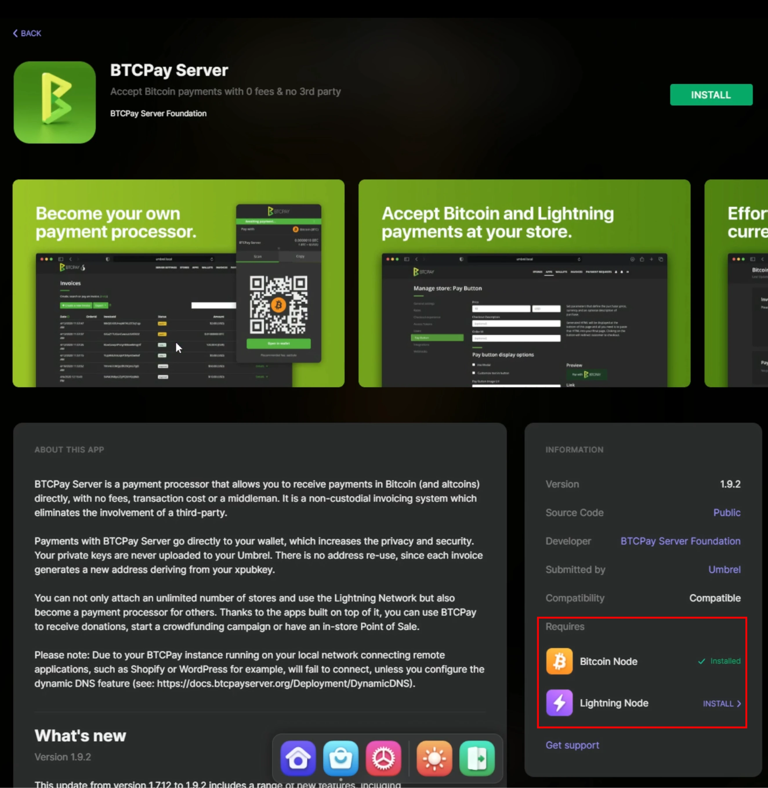


BTCPay Serverをクリックすると、アプリの詳細が表示されます。BTCPay Serverの詳細を開くと、右下にアプリを正しく実行するための要件が表示されます。BitcoinノードとLightningノードが必要です。UmbrelにLightningノードをインストールしていない場合は、インストールをクリックします。このプロセスには数分かかります。


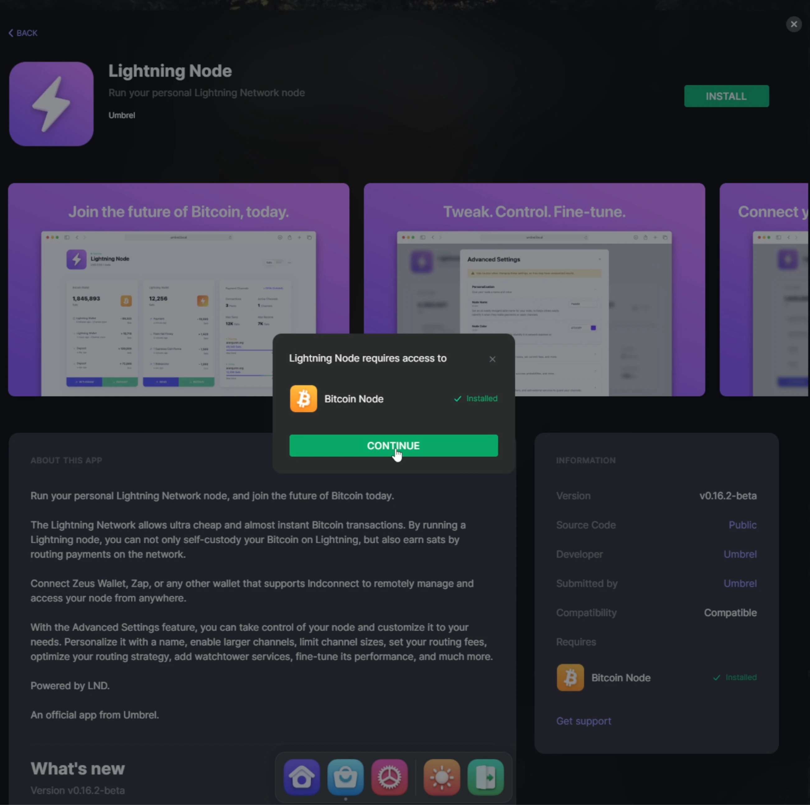


Lightningノードをインストールした後:


1. アプリの詳細またはUmbrelのダッシュボードのアプリで「Open」をクリックします。

2. 「Set up a new node」をクリックすると、Lightningノードを復元するための24の単語が表示されます。

3. これらを書き留めておきます。


Umbrelは、今書き留めた単語の確認を求めます。Lightningノードのセットアップが完了したら、Umbrel App Storeに戻り、BTCPay Serverを見つけます。インストールボタンをクリックすると、Umbrelは必要なコンポーネントがインストールされているかどうか、およびBTCPay Serverがこれらのコンポーネントへのアクセスを必要としているかどうかを表示します。インストール後、アプリの詳細の右上にある「Open」をクリックするか、UmbrelのダッシュボードからBTCPay Serverを開きます。


Umbrelは、今書き留めた単語の確認を求めます。


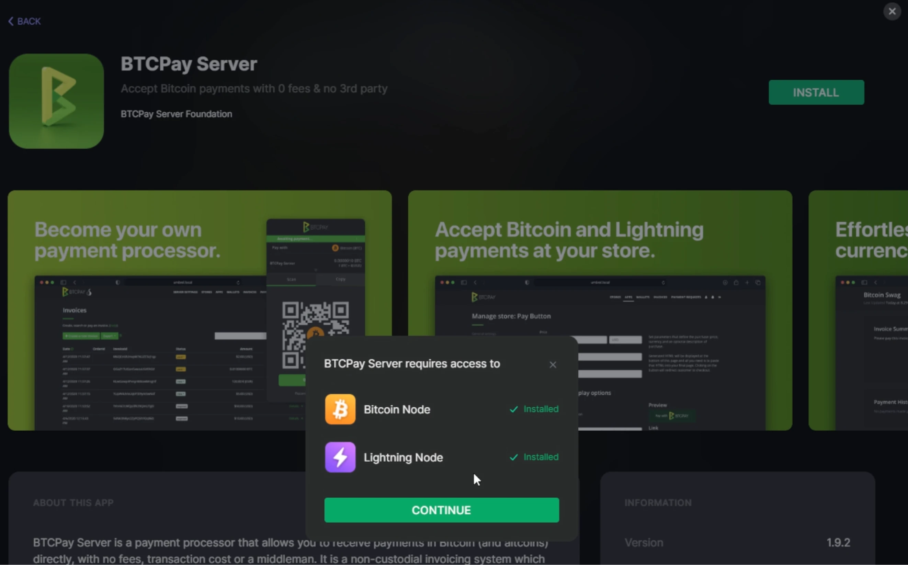


**注意**


鍵の保管について学んだように、これらを必ず安全な場所に保管してください。


Lightningノードのセットアップが完了したら、Umbrel App Storeに戻り、BTCPay Serverを見つけます。インストールボタンをクリックすると、必要なコンポーネントがインストールされているかどうか、およびBTCPay Serverがこれらのコンポーネントへのアクセスを必要としているかどうかがUmbrelに表示されます。


インストール後、アプリの詳細の右上にある「Open」をクリックするか、UmbrelのダッシュボードからBTCPay Serverを開きます。


### スキルの概要


このセクションでは、以下のことを学びました。


- UmbrelノードにLightning機能付きのBTCPay Serverをインストールする手順


### 知識評価


#### KA コンセプトレビュー


Umbrelでのセットアップは、前の2つのホスティングオプションとどう違いますか？


# 最終セクション


<partId>d72e6fa5-0870-5f00-9143-9466ed22e2bd</partId>


## レビューと評価

<chapterId>d90bb93d-b894-551e-9fd6-6855c739a904</chapterId>

<isCourseReview>true</isCourseReview>

## コースの結論


<chapterId>c07ac2a5-f97e-5c57-8a80-4955b48128d4</chapterId>

<isCourseConclusion>true</isCourseConclusion>