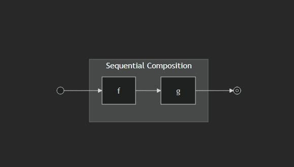
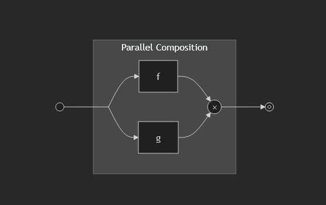
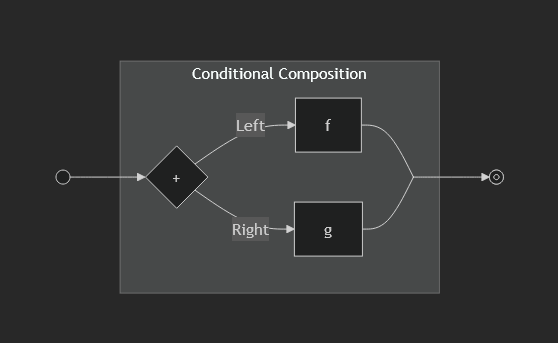

# Simplicitysse süvenemine

Sügav sukeldumine Simplicity keele teooriasse ja disainiotsustesse, mis põhineb Simplicity looja, Blockstream Researchi [dr Russell O'Connori](https://r6.ca/) täielikul viieosalisel artiklisarjal [„Delving Simplicity”](https://delvingbitcoin.org/t/delving-simplicity-part-three-fundamental-ways-of-combining-computations/1902). See kursus selgitab, *miks* Simplicity kujundati just selliseks, mitte seda, kuidas selles koodi kirjutada.

Kursus järgib dr O'Connori artikleid läbi kolme põhilise arvutuste kombineerimise viisi, minimaalse tüübisüsteemi ja selle täielikkuse teoreemi, praktiliste andmetüüpide ja aritmeetika ülesehitamise esimestest põhimõtetest, plokiahelaga suhtlemiseks vajalike kõrvalefektide ettevaatliku sisseviimise ning lõpuks selle, kuidas programmid seotakse aadressidega ja lunastatakse ahelas.

+++

# Sissejuhatus

<partId>c362889b-c630-435f-911b-724c4eca505b</partId>

## Kursuse ülevaade

<chapterId>cdcc40b6-c985-45b4-9bee-6f931e984476</chapterId>

Tere tulemast kursusele SCR403 — Simplicitysse süvenemine!

See kursus põhineb **„Delving Simplicity”** artiklisarjal, mille kirjutas [dr Russell O'Connor](https://r6.ca/), [Blockstreami](https://blockstream.com/) taristutehnoloogia arendaja ja Simplicity looja. Algupärased artiklid avaldati [Delving Bitcoini](https://delvingbitcoin.org/u/roconnor-blockstream/summary) foorumis ning need moodustavad selle kursuse peamise lähtematerjali. Oleme tänulikud tema teedrajava töö eest, mis tegi selle õppesisu võimalikuks.

### Mida sa õpid

See kursus uurib Simplicity, 2025. aasta juulis [Liquid Networkis](https://blockstream.com/press-releases/2025-07-31-blockstream-launches-simplicity/) aktiveeritud järgmise põlvkonna skriptimiskeele disainifilosoofiat ja matemaatilisi aluseid. See järgib täielikku viieosalist artiklisarja ning on üles ehitatud kaheks peamiseks sisuosaks:

1. **Simplicity alused** — miks plokiahela arvutus nõuab põhimõtteliselt teistsugust keelt, kolm viisi operatsioonide kombineerimiseks (järjestikune, paralleelne, tingimuslik) ja üheksa põhikombinaatorit, mis moodustavad matemaatiliselt täieliku keele
2. **Andmetüüpidest programmideni** — Boole'i loogika, aritmeetika ja SHA-256 ülesehitamine esimestest põhimõtetest; Failure- ja Reader-kõrvalefektide mõistmine, mis võimaldavad plokiahelaga suhtlemist; ning õppimine, kuidas programmid seotakse Taproot-aadressidega Commitment Merkle Rootide kaudu ja lunastatakse tunnistajaandmetega

### Eeldused

See on **eksperditaseme** kursus (umbes 10 tundi). Peaksid tundma end mugavalt järgmisega:
- Bitcoini skriptimise põhikontseptsioonid (mida tehingu valideerimine teeb)
- Programmeerimise põhikontseptsioonid (tüübid, funktsioonid, kompositsioon)
- Mõningane tuttavus matemaatilise notatsiooniga on abiks, kuid pole nõutav. Tutvustame kõike töö käigus

### Põhiressursid

- **Algupärased artiklid**: dr Russell O'Connori [„Delving Simplicity”](https://delvingbitcoin.org/u/roconnor-blockstream/summary) Delving Bitcoinis
- **Simplicity repositoorium**: [BlockstreamResearch/simplicity](https://github.com/BlockstreamResearch/simplicity) — lähtekood ja Rocqi formaalsed tõestused
- **Ametlik veebisait**: [simplicity-lang.org](https://simplicity-lang.org/) — dokumentatsioon ja SimplicityHLi viited
- **Blockstreami blogi**: [Simplicity GitHubis](https://blog.blockstream.com/en-simplicity-github/) — tehniline ülevaade

Valmis sukelduma ühte Bitcoini inseneeria elegantseimasse teosesse? Läksime!

## Mis on Simplicity?

<chapterId>d04f3960-d7fb-44e1-b5a3-25b33d03fd38</chapterId>

Kui tuled sellele kursusele ilma Simplicity taustata, aitab see peatükk sul enne sügavasse otsa sukeldumist orienteeruda.

### Simplicity lühidalt

Simplicity on **Bitcoini-natiivne nutilepingukeel**, mis töötab täna Liquid Networkis. Dr Russell O'Connor mõtles selle esimest korda välja umbes 2012. aastal ja kirjeldas seda üksikasjalikult oma 2017. aasta artiklis *Simplicity: A New Language for Blockchains*; pärast aastatepikkust formaalset verifitseerimist ja arendust aktiveeriti see Liquid Networkis 2025. aasta juulis.

Erinevalt Ethereumi Solidityst, mis on Turingi-täielik kõrgtaseme lepingukeel, on Simplicity tahtlikult minimaalne. Sellel on:
- **Kolm tüübimoodustajat** (ühik, summa, korrutis)
- **Üheksa kombinaatorit** (põhioperatsioonid ja kompositsioonireeglid)
- **Ei tsükleid, ei rekursiooni, ei dünaamilist mälu**

Ainuüksi neist primitiividest saab üles ehitada mis tahes tehingu valideerimiseks vajaliku arvutuse, Boole'i loogikast täieliku SHA-256 räsimiseni.

### Mida saab Simplicityga täna teha?

Simplicity toidab Liquid Networkis juba tegelikke rakendusi. Kõige silmapaistvam on [Simplicity DEX](https://docs.simplicity-lang.org/use-cases/simplicity-dex/), oraaklivaba optsiooniturg, kus kasutajad kauplevad L-BTC ostuoptsioonidega, kasutades tagatisena USDt-d (alusleping toetab ka müügioptsioone). Teised töötavad Simplicity projektid on SideSwapi [Swaption](https://swaption.io/) (optsioonid) ja Resolvr'i avatud lähtekoodiga [Deadcat](https://github.com/Resolvr-io/deadcat) (ennustusturud). Väljaspool DeFi-t võimaldab Simplicity täiustatud kulutustingimusi, näiteks varahoidlaid, covenant'e ja keerukaid multisig-skeeme, mis oleksid Bitcoin Scriptis võimatud või ebaturvalised.

### Mis see kursus on — ja mida see ei ole

See **ei ole** praktiline kodeerimisõpetus. Sa ei kirjuta siin Simplicity programme. Kui otsid seda, vaata:
- [simplicity-lang.org](https://simplicity-lang.org/) — ametlik dokumentatsioon ja kõrgtaseme keel SimplicityHL
- [Simplicity GitHubi repositoorium](https://github.com/BlockstreamResearch/simplicity) — viiterakendus, näited ja Rocqi tõestused
- [Blockstreami blogipostitus](https://blog.blockstream.com/en-simplicity-github/) alustamise kohta

Millest see kursus **räägib**: Simplicity disaini taga olevatest **filosoofilistest ja tehnilistest valikutest**. Miks see keel loodi just selliselt? Miks ainult üheksa kombinaatorit? Miks puudub rekursioon? Miks on oluline, et tüübisüsteem seostub Gentzeni sekventsikalkulusega?

Mõtle sellest kui arusaamisest, **miks mootor just nii ehitati**, mitte kui auto juhtima õppimisest.

### Kellele see on mõeldud?

See kursus sobib ideaalselt:
- **Protokolliarendajatele**, kes tahavad enne koodi kirjutamist mõista Simplicity aluseid
- **Bitcoini uurijatele**, keda huvitab formaalne verifitseerimine ja tüübiteoreetiline lähenemine
- **Arvutiteadlastele**, keda huvitab seos sekventsikalkuluse ja plokiahela arvutuse vahel
- **Edasijõudnud bitcoiner'itele**, kes tahavad minna kaugemale Liquid'i skriptimisvõimekuste pealiskaudsest mõistmisest

Kui terminid nagu „summatüübid”, „kombinaatorid” või „sekventsikalkulus” on sulle täiesti uued, ära muretse, selgitame kõike algusest peale. Kuid ole valmis tihedaks, matemaatiliseks teekonnaks.

### Artiklitest kursuseks

Dr O'Connori algupärane „Delving Simplicity” sari on üles ehitatud viie tehnilise artiklina. See kursus korraldab ja kommenteerib selle materjali ümber järk-järguliseks õpiteeks koos viktoriinidega, mis kontrollivad su arusaamist teekonna vältel. Ideed, definitsioonid ja tõestused on tema omad ning meie oleme vormi kohandanud struktureeritud õppeks.

# Simplicity alused

<partId>a5976618-94ab-4b29-b9aa-040d35c68e5d</partId>

## Arvutuste kombineerimise põhilised viisid

<chapterId>6d46e77a-7e60-473b-b230-418da5ae44eb</chapterId>

Nüüd, kui Simplicity on Liquid Networkis aktiveeritud, tahaksin teha põhjaliku sukeldumise Simplicity keele filosoofiasse ja disaini.

Bitcoini tehingute valideerimine erineb tavapärasest programmeerimiskeele disainist märkimisväärselt. Plokiruumi hind on kõrge, seega peavad programmid olema kompaktsed. Bitcoini tehingutes olevaid programme käivitatakse alati ainult ühe sisendi peal ja kõik käivitavad programmi sama sisendiga. Lisaks teab tehingut autoriseeriv osapool arvutuse tulemust ette: et tehing on kehtiv.

Tavaliselt teeb autoriseeriv osapool palju kallimaid arvutusi, et tuletada tunnistajaandmed, mis tõendavad tehingu kehtivust, samas kui plokiahelas käivitatavad programmid peavad tunnistajaandmete kehtivust kontrollima. Kehtivuse kontrollimine on sageli palju odavam kui kehtivuse tõestamine.

Oleme Simplicity kujundanud neid ainulaadseid keele disaini väljakutseid silmas pidades. Näiteks nõuab Simplicity, et käivitamata harud kärbitakse nii, et need ei ilmuks plokiahelasse. Eeltöötlussammud on hoolikalt kujundatud näitama Simplicity programmi suuruse suhtes (peaaegu) lineaarset ajakeerukust. „Gas'i” asemel kasutatakse staatilist analüüsi, mida ei saa arvutada ilma koodi ettekirjutatud viisil käivitamata, et täitmismudeli üksikasjad ei muutuks konsensusekriitiliseks. Täitmise ajal puudub dünaamiline mälu eraldamine. Ja nii edasi.

Enne Simplicity disainidetailidesse süvenemist tahan alustada seda sarja programmeerimisfilosoofiaga üldiste viiside kohta, kuidas põhilisi ehitusplokke kombineerida uue funktsionaalsuse loomiseks.

### Kompositsioon

Oletame, et keegi disainib programmeeritavate tehingute keelt Bitcoini-sarnasele plokiahelale. Eelkõige on programmidel ligipääs ainult tehinguandmetele ja sisendite UTXO-andmetele ning täitmine määrab ainult tehingu kehtivuse (mis võimaldab täitmise tulemuse vahemällu salvestada). Ütleme, et alustatakse mingist põhioperatsioonide hulgast, mis suudavad teha mitmesuguseid ülesandeid, näiteks põhiarvutusi, tehingust andmete lugemist ja/või töötlemist ning signatuuri kontrollimist. Iga operatsioon tarbib mingit tüüpi sisendi (võib-olla tühja) ja tagastab mingit tüüpi väljundi. Millistel viisidel saame neid põhioperatsioone keerukamateks operatsioonideks kombineerida?

### Järjestikune kompositsioon



Kõige põhilisem kompositsioonimeetod on järjestikune kompositsioon. Kui meil on kaks põhioperatsiooni, millest ühe väljundandmetüüp vastab teise sisendandmetüübile, saame need kaks operatsiooni kombineerida uueks liitoperatsiooniks. See uus operatsioon käivitab need kaks põhioperatsiooni järjestikku: võtab sisendiks esimese operatsiooni sisendi, annab esimese operatsiooni väljundi edasi teise operatsiooni sisendisse ja tagastab lõpuks teise operatsiooni väljundi.

Loomulikult ei pea me piirduma ainult põhioperatsioonide kombineerimisega. Nüüd, kui meil on mõned liitoperatsioonid, saame ka neid funktsionaalse kompositsiooni abil kombineerida.

Matemaatikas nimetatakse seda järjestikust kompositsiooni sageli lihtsalt „kompositsiooniks” ja võiks arvata, et see on ainus viis asju komponeerida. Kuid meil on operatsioonide komponeerimiseks ka teisi viise.

### Paralleelne kompositsioon



Oletame, et meil on kaks operatsiooni, mis võivad olla põhi- või keerukad operatsioonid, ning mõlemad võtavad sama tüüpi sisendi. Teine põhiline viis nende kahe operatsiooni komponeerimiseks on käivitada need mõlemad sama sisendi peal. Seda nimetatakse paralleelseks kompositsiooniks ning väljundi tüüp on algsete operatsioonide väljunditüüpide „korrutis” ja sisaldab nende kahe väljundi paari.

Kuigi seda nimetatakse „paralleelseks” kompositsiooniks ja neid kahte operatsiooni võiks põhimõtteliselt paralleelselt käivitada, ei ole paralleelne täitmine operatsiooniline nõue. Saame paralleelset kompositsiooni rakendada „järjestikuliselt”, käivitades kõigepealt ühe operatsiooni ja seejärel teise. Meid ei huvita, kuidas paralleelne kompositsioon täpselt rakendatud on, kuni väljund on sama.

### Tingimuslik kompositsioon



Tingimuslik kompositsioon on paralleelse kompositsiooni duaalsus. Sel juhul on meil kaks operatsiooni, mis toodavad sama väljundi, ning komponeerime need, valides ühe neist käivitamiseks. Selle liitoperatsiooni sisend on algse operatsiooni sisenditüüpide „summa” ehk „märgendatud ühend”. Selles näites on märgend „Left” või „Right” üks bitt sisendiandmetes, mis määrab, millist tüüpi andmeid kantakse ja seega kumba kahest operatsioonist saab käivitada.

Tingimuslik kompositsioon toimib samamoodi ka siis, kui sisend on kahe identse tüübi summa. Summatüüp sisaldab endiselt märgendit ja selle märgendi väärtus määrab, kumb kahest operatsioonist käivitatakse.

### Kompositsioon Bitcoin Scriptis

Neid kolme kompositsiooniliiki saab eri programmeerimiskeeltes realiseerida mitmel viisil. Bitcoin Scriptis realiseeritakse järjestikune kompositsioon (ligikaudu) kahe rutiini konkateneerimisega (seepärast nimetatakse Bitcoin Scripti konkatenatiivseks programmeerimiskeeleks), sest ühe rutiini väljund jäetakse pinule, et järgmine rutiin selle tarbiks. Paralleelne kompositsioon saavutatakse duplikaadi- ja vahetusoperatsioonidega, mis manipuleerivad pinu nii, et kaks rutiini saaksid töötada sama sisendiga. Asjad ei ole täiesti sirgjoonelised, sest see, mida me nimetame tüüpide „korrutiseks”, realiseeritakse tavaliselt mitme pinuelemendi abil. Loodetavasti näed üldist ideed.

Tingimuslik kompositsioon realiseeritakse muidugi `OP_IF` abil, mis hargneb pinu väärtuse põhjal. Sel juhul täidab ülemine pinuelement märgendi rolli ja tavaliselt on järgmine element või järgmised elemendid pinul erinevat „tüüpi”, mis sõltuvad märgendi väärtusest. Igal juhul võivad pinuelementide tüübid sobida töötlemiseks ainult ühes `OP_IF` harus. Kuid pärast `OP_ENDIF`-i jõudmist peavad pinuelemendid olema järjepidevat „tüüpi”, nii et ülejäänud skript saaks jätkata sõltumata sellest, milline haru varem võeti.

### Kompositsioon Simplicitys

Kujundasime Simplicity kombinaatoritega, mis rakendavad otseselt neid kolme kompositsioonivormi. Koos mõne täiendava kombinaatoriga, mis toetavad muid korrutis- ja summatüüpidega seotud põhioperatsioone, koosneb Simplicity tuumkeel lõpuks üheksast kombinaatorist, mis on piisavad mis tahes lõpliku arvutuse väljendamiseks. Arutame seda üksikasjalikumalt järgmises peatükis.

### Neljas kompositsiooniliik

Enne lõpetamist peaksime mainima, et arvutiteaduses leidub vähemalt veel üks kompositsiooniliik: „rekursiivne kompositsioon”. Rekursiivses kompositsioonis itereeritakse üht operatsiooni mitu korda.

Pane tähele, et Bitcoin Script ei toeta rekursiivset kompositsiooni, ning samamoodi oleme Simplicity disainist selgesõnaliselt välistanud piiramatu rekursiooni. Meie tees on, et piiramatu iteratiivne arvutus on parem rakendada rekursiivsete covenant'ide abil, mis arvutavad mitme tehingu ulatuses. See võimaldab kasutajatel vältida plokiruumi ja standardness'i piiranguid ning paremini ennustada tehingukulusid.

Sellegipoolest on võimalik Simplicity delegatsioonifunktsiooni kuritarvitada viisil, mis pakub midagi piiramatu rekursiivse kompositsiooni sarnast; sellest võime rääkida sarja hilisemas osas.

### Kokkuvõte

Vaatasime üle kolm peamist kompositsioonivormi põhioperatsioonide muutmiseks keerukateks operatsioonideks:

- järjestikune kompositsioon
- paralleelne kompositsioon
- tingimuslik kompositsioon

Arutasime, kuidas need kompositsioonivormid realiseeritakse Bitcoin Scriptis, ja vihjasime, kuidas need on mõjutanud Simplicity keele disaini. Märkisime, et neljas kompositsiooniliik, rekursiivne kompositsioon, on nii Simplicityst kui ka Bitcoin Scriptist konkreetselt välistatud.

Järgmises peatükis kirjeldame üheksat kombinaatorit, mis moodustavad Simplicity keele tuuma, kuidas need realiseerivad otseselt neid kolme kompositsioonivormi ja kuidas sellest moodustub täielik keel mis tahes lõpliku arvutuse kirjeldamiseks.

## Simplicity kombinaatorite täielikkus

<chapterId>2a10a6ba-fada-4556-a673-3ae8c0794bf0</chapterId>

Selles peatükis tutvustame Simplicity tuumkeelt ja näitame, et keel on täielik, mis tähendab, et selles saab väljendada mis tahes lõplikku arvutust.

### Simplicity tüübid

Simplicity toetab kolme põhilist tüübikonstruktorit. Korrutistüüp `A × B` esindab paralleelse kompositsiooni väljundeid, samas kui summatüüp `A + B` (märgendatud ühend) käsitleb tingimusliku kompositsiooni sisendeid. Kolmas tüüp on ühiktüüp.

### Ühiktüüp

Ühiktüüp, mida tähistatakse `𝟙` või `ONE`, sisaldab täpselt üht väärtust: tühja ennikut `⟨⟩` või `()`. See null-bitine andmetüüp ei kanna mingit infot.

### Summatüüp

Summatüüp `A + B` ühendab kaks tüüpi märgenditega, mis näitavad „vasakut” või „paremat”. Väärtused kirjutatakse kui `σᴸ(a)` või `inl(a)` vasakmärgendiga väärtuste jaoks ning `σᴿ(b)` või `inr(b)` paremmärgendiga väärtuste jaoks. Märgendid jäävad eristatavaks ka identsete tüüpide ühendamisel.

#### Boole'i tüüp

Tüüp `𝟙 + 𝟙`, mida tähistatakse `𝟚` või `TWO`, esindab ühebitist tüüpi kahe väärtusega. Kokkuleppeliselt esindab `σᴸ⟨⟩` väärtust false/null, samas kui `σᴿ⟨⟩` esindab väärtust true/üks.

### Korrutistüüp

Korrutistüübid `A × B` sisaldavad väärtusepaare, mida kirjutatakse kui `⟨a, b⟩` või `(a, b)`. Tüübil `𝟚 × 𝟚` on neli väärtust, mis erinevad neljast väärtusest tüübis `𝟚 + 𝟚`.

### Simplicity tuumavaldised

Operatsioone tähistatakse kujul `f : A ⊢ B`, mis tähendab sisenditüüpi `A` ja väljunditüüpi `B`. Simplicity on „esimest järku” — sellel puuduvad funktsioonitüübid.

### Kaks põhioperatsiooni

Tuumkeel pakub kahte põhioperatsiooni:

**Identiteet (`iden`).** Identiteedioperatsioon annab oma sisendi muutmata kujul edasi:

```
iden : A ⊢ A
⟦iden⟧(a) = a
```

**Ühik (`unit`).** Ühikuoperatsioon viskab oma sisendi ära ja tagastab tühja enniku:

```
unit : A ⊢ 𝟙
⟦unit⟧(a) = ⟨⟩
```

Need moodustavad perekonnad, kus iga tüübi kohta on üks operatsioon.

### Kolm kompositsioonikombinaatorit

Järjestikune kompositsioon kasutab `comp f g` (kirjutatakse `f ⨾ g` või `f >>> g`):

```
If f : A ⊢ B and g : B ⊢ C, then
comp f g : A ⊢ C
⟦f ⨾ g⟧(a) = ⟦g⟧(⟦f⟧(a))
```

Paralleelne kompositsioon kasutab `pair f g` (kirjutatakse `f ▵ g` või `f &&& g`):

```
If f : A ⊢ B and g : A ⊢ C, then
pair f g : A ⊢ B × C
⟦f ▵ g⟧(a) = ⟨⟦f⟧(a), ⟦g⟧(a)⟩
```

Tingimuslik kompositsioon kasutab `case f g : (A + B) × C ⊢ D`, andes harudele ligipääsu jagatud keskkonnale `C`:

```
If f : A × C ⊢ D and g : B × C ⊢ D, then
case f g : (A + B) × C ⊢ D
⟦case f g⟧⟨σᴸ(a), c⟩ = ⟦f⟧⟨a, c⟩
⟦case f g⟧⟨σᴿ(b), c⟩ = ⟦g⟧⟨b, c⟩
```

Miks võtab tingimuslik kompositsioon just sellise kuju — summa koos jagatud keskkonnaga `C` — mitte lihtsama `copair f g : A + B ⊢ C`, mis lihtsalt valib haru? Sest paljas `copair` ei suuda väljendada **distributsiooni**: funktsiooni `dist : (A + B) × C ⊢ A × C + B × C`, mis surub jagatud sisendi sellesse harusse, mis valitakse. Ehitades keskkonna `C` otse `case`-i sisse, saab Simplicity ühest kombinaatorist nii tingimusliku kompositsiooni *kui ka* distributsiooni — ühe võtmetähtsusega disainiotsuse, mis hoiab tuumkeele üheksa kombinaatori juures.

### Neli lisakombinaatorit

Korrutise tarbimine kasutab `take` ja `drop`:

**take** eraldab vasaku elemendi:

```
If f : A ⊢ C, then
take f : A × B ⊢ C
⟦take f⟧⟨a, b⟩ = ⟦f⟧(a)
```

**drop** eraldab parema elemendi:

```
If f : B ⊢ C, then
drop f : A × B ⊢ C
⟦drop f⟧⟨a, b⟩ = ⟦f⟧(b)
```

Summa tootmine kasutab `injl` ja `injr`:

**injl** mähkib vasaku märgendiga:

```
If f : A ⊢ B, then
injl f : A ⊢ B + C
⟦injl f⟧(a) = σᴸ(⟦f⟧(a))
```

**injr** mähkib parema märgendiga:

```
If f : A ⊢ C, then
injr f : A ⊢ B + C
⟦injr f⟧(a) = σᴿ(⟦f⟧(a))
```

### Üheksa põhikombinaatorit

Kokku on Simplicitys täpselt üheksa põhikombinaatorit:

| Kombinaator | Eesmärk |
|---|---|
| `iden` | Annab sisendi edasi |
| `unit` | Viskab sisendi ära |
| `comp` | Järjestikune kompositsioon |
| `pair` | Paralleelne kompositsioon |
| `case` | Tingimuslik kompositsioon |
| `take` | Eraldab korrutisest vasaku poole |
| `drop` | Eraldab korrutisest parema poole |
| `injl` | Injitseerib summa vasakusse poolde |
| `injr` | Injitseerib summa paremasse poolde |

### Simplicity ja sekventsikalkulus

Simplicity disain tuleneb Gentzeni sekventsikalkuluse konjunktiiv-disjunktiivsest fragmendist. Täpsemalt on see sekventsikalkuluse *funktsionaalse interpretatsiooni* variant, mis ise on analoogne Curry-Howardi vastavusega loomuliku deduktsiooni ja lambda-arvutuse vahel. Kombinaatorireeglid näitavad „eeldustes väiksemaid tüüpe kui järeldustes”, võimaldades Bit Machine'il — Simplicity abstraktsel pinu-masina interpretaatoril — minimeerida andmete kopeerimist täitmise ajal.

### Väärtused ei ole avaldised

Simplicity avaldised tähistavad operatsioone, mitte väärtusi. Notatsioon `scribe b : A ⊢ B` esindab ainulaadset avaldist, mis tagastab alati väärtuse `b`, toimides pigem notatsioonilise mugavusena kui kombinaatorina. See peegeldab Bitcoin Scripti, kus operatsioonid nagu `OP_1` lükkavad väärtusi pinule, mitte ei väljenda neid otseselt.

### Simplicity täielikkuse teoreem

Kui kõik üheksa kombinaatorit on käes, kuidas teame, et meil pole midagi puudu — et neist üheksast tõesti piisab? Sellele vastab Simplicity täielikkuse teoreem: mis tahes funktsiooni jaoks (lõplike) Simplicity tüüpide vahel leidub mõni Simplicity avaldis, mis seda tähistab. Tõestus on konstruktiivne — see näitab, kuidas avaldis üles ehitada:

1. **Lahuta sisend**: kasuta pesastatud `case`-avaldisi, et lahutada mis tahes tüüpi sisend täielikult selle koostisosadeks olevateks bittideks
2. **Ehita otsingutabel**: iga võimaliku sisendi jaoks kasuta `scribe`-i vastava väljundi tootmiseks
3. **Pane kokku**: pesastatud juhtumid ja scribe'id moodustavad koos hiiglasliku otsingutabeli, mis rakendab funktsiooni

See teoreem on formaalselt verifitseeritud Rocqi tõestusabilises (endise nimega Coq). Tõestus on osa ametlikust Simplicity repositooriumist ja selle korrektsust on masinaga kontrollitud.

Kuigi täielikkuse teoreem tagab, et Simplicity üheksa kombinaatorit suudavad väljendada mis tahes funktsiooni (lõplike) Simplicity tüüpide vahel, on otsingutabeli konstruktsioonist tulenevad avaldised ebapraktiliselt suured. 256-bitiste sisenditega funktsioon vajaks 2²⁵⁶ kirjega otsingutabelit. Seepärast keskenduvad järgmised peatükid tõhusate avaldiste ehitamisele, mis kasutavad arvutuste struktuuri ära, mitte kõige jõuga otsingutabelite kaudu tegemisele.

### Kokkuvõte

Simplicity tuumkeel hõlmab tüübisüsteemi ja kombinaatoreid, mis võimaldavad mis tahes lõplikku arvutust. Kuigi täielikkuse teoreem tagab väljendusvõime, on üldisest konstruktsioonist tulenevad avaldised ebapraktiliselt suured. Praktiline Simplicity arendus hõlmab arvutusstruktuuri ärakasutamist lühikeste avaldiste jaoks. Järgmised peatükid uurivad andmestruktuure, tehingutega suhtlemist ja lisakombinaatoreid.

# Andmetüüpidest programmideni

<partId>08528a6f-d310-4675-b8cd-4e9b93b3c009</partId>

## Andmetüüpide ehitamine

<chapterId>9981ae62-ae50-4770-adf2-b253d1e08de3</chapterId>

Eelmistes peatükkides näitasime, kuidas Simplicity põhiline kombinaatorite kogum on piisav mis tahes lõpliku puhta arvutuse rakendamiseks. See peatükk näitab, kuidas neist primitiividest ehitada praktilisi andmestruktuure ja arvutusi — samamoodi nagu arvutid ehitatakse loogikaväravatest.

### Boole'i loogika

Boole'i tüüp, mida tähistatakse `𝟚`, võrdub `𝟙 + 𝟙` ja sellel on kaks väärtust: `σᴸ⟨⟩` (false) ja `σᴿ⟨⟩` (true). Tuumkombinaatoreid kasutades saab konstrueerida Boole'i loogika operaatoreid.

#### And-operatsioon

Loogiline `and : 𝟚 × 𝟚 ⊢ 𝟚` operatsioon võtab kaks bitti ja tagastab ühe biti. Rakendus hargneb esimese biti järgi: kui see on false, tagasta false; muidu tagasta teine bitt.

```
and ≔ case (injl unit) (drop iden) : 𝟚 × 𝟚 ⊢ 𝟚
```

Testimine väärtusega `⟨false, false⟩`:

```
⟦and⟧⟨false, false⟩
 = {expand the notation for false}
⟦and⟧⟨σᴸ⟨⟩, σᴸ⟨⟩⟩
 = {expand the definition of and}
⟦case (injl unit) (drop iden)⟧⟨σᴸ⟨⟩, σᴸ⟨⟩⟩
 = {evaluate case for σᴸ}
⟦injl unit⟧⟨⟨⟩, σᴸ⟨⟩⟩
 = {evaluate injl}
σᴸ(⟦unit⟧⟨⟨⟩, σᴸ⟨⟩⟩)
 = {evaluate unit}
σᴸ⟨⟩
 = {by the notation for false}
false
```

Testimine väärtusega `⟨true, true⟩`:

```
⟦and⟧⟨true, true⟩
 = {expand the notation for true and the definition of and}
⟦case (injl unit) (drop iden)⟧⟨σᴿ⟨⟩, σᴿ⟨⟩⟩
 = {evaluate case for σᴿ}
⟦drop iden⟧⟨⟨⟩, σᴿ⟨⟩⟩
 = {evaluate drop}
⟦iden⟧(σᴿ⟨⟩)
 = {evaluate iden}
σᴿ⟨⟩
 = {by the notation for true}
true
```

#### Teised loogikaoperatsioonid

Operatsioon `not` vajab abikombinaatorit:

```
                   f : A ⊢ C    g : B ⊢ C
--------------------------------------------------------------
copair f g ≔ iden ▵ unit ⨾ case (take f) (take g) : A + B ⊢ C
```

Algne `iden ▵ unit : A ⊢ A × 𝟙` lisab sisendile tühja „keskkonna”, võimaldades rakendada `case` kombinaatorit. `take` kasutamine kahes harus eemaldab selle tühja keskkonna, et käivitada `f` või `g`.

Teised Boole'i loogikaoperatsioonid:

- `or ≔ case (drop iden) (injr unit) : 𝟚 × 𝟚 ⊢ 𝟚`
- `not ≔ copair (injr unit) (injl unit) : 𝟚 ⊢ 𝟚`
- `xor ≔ case (drop iden) (drop not) : 𝟚 × 𝟚 ⊢ 𝟚`

### Bitiliitjad

„Poolliitja” võtab kaks bitti ja liidab need, tootes kahebitise väljundi: ülekandebiti ja summabiti.

```
half-adder ≔ and ▵ xor : 𝟚 × 𝟚 ⊢ 𝟚 × 𝟚
```

„Täisliitja” liidab kolm bitti, tootes kahebitise väljundi. Sisend kasutab pesastatud ennikut `(𝟚 × 𝟚) × 𝟚`.

Pesastatud ennikute jaoks kasutatakse kompaktset notatsiooni:

- `O f` tähistab `take f`
- `I f` tähistab `drop f`
- `H` tähistab `iden`

Näiteks `I O H` tähendab `drop (take iden) : A × (B × C) ⊢ B`, eraldades keskmise väärtuse. Notatsioon meenutab binaarnumbreid: kui mõelda pesastatud ennikutest kui binaarpuudest, esindab notatsioon puupositsioonide ümberpööratud binaarnumbreid. Need avaldised moodustavad Simplicity De Bruijni indeksid.

**Märkus:** Notatsioon `I`, `O` ja `H` kehtib ainult alamavaldistele, mis koosnevad üksnes `take`-ist, `drop`-ist ja `iden`-ist.

Täisliitja komponeerib kaks poolliitjat, võttes ülekandebittide loogilise `or`-i:

```
full-adder ≔ take half-adder ▵ I H
           ⨾ O O H ▵ (O I H ▵ I H ⨾ half-adder)
           ⨾ (O H ▵ I O H ⨾ or) ▵ I I H
           : (𝟚 × 𝟚) × 𝟚 ⊢ 𝟚 × 𝟚
```

Esimesel real käivitab `take half-adder ▵ I H : (𝟚 × 𝟚) × 𝟚 ⊢ (𝟚 × 𝟚) × 𝟚` poolliitja kahel esimesel bitil, salvestades viimase biti.

Teisel real salvestab `O O H ▵ (O I H ▵ I H ⨾ half-adder) : (𝟚 × 𝟚) × 𝟚 ⊢ 𝟚 × (𝟚 × 𝟚)` esimese biti (esimese poolliitja ülekandeväljundi) ja käivitab poolliitja kahel viimasel bitil.

Viimasel real võtab `(O H ▵ I O H ⨾ or) ▵ I I H: 𝟚 × (𝟚 × 𝟚) ⊢ 𝟚 × 𝟚` kahe esimese biti (mõlema poolliitja ülekandeväljundite) loogilise OR-i ja tagastab teise poolliitja summaväljundi biti.

See demonstreerib Simplicity programmeerimist: kasutades notatsiooni `I`, `O` ja `H` andmebittidele viitamiseks, moodustades sobivaid „keskkondi” teiste funktsioonide kutsumiseks järjestikuse kompositsiooni kaudu.

Kasutajad ei defineeri madaltaseme operatsioone otse. Hiljem arutab see sari standardteegi jette, mis rakendavad levinud funktsioone. Lõppkasutajatelt ei oodata otsest Simplicitys programmeerimist, sarnaselt Bitcoin Scriptiga. Selle asemel genereerivad kõrgema taseme keeled nagu SimplicityHL Simplicity koodi, hallates alamavaldiste „keskkondi” ja tõlkides nimelised muutujad sobivateks `take` ja `drop` jadadeks.

### Vektorid

Fikseeritud pikkusega vektorid defineeritakse tüübi `A` itereeritud korrutistena:

- `A² ≔ A × A`
- `A⁴ ≔ A² × A²`
- `A⁸ ≔ A⁴ × A⁴`
- `…`

Neid võib kirjutada kujul `A^2`, `A^4`, `A^8` jne.

Vektorid defineeritakse ainult pikkustele, mis on kahe astmed. Muud pikkused nõuavad sulgude paigutuse kokkulepete valimist.

Antud avaldise `f : A ⊢ B` korral „kaardistab” korduv paaristamine selle üle fikseeritud pikkusega vektorite:

- `f² ≔ f ▵ f : A² ⊢ B²`
- `f⁴ ≔ f² ▵ f² : A⁴ ⊢ B⁴`
- `f⁸ ≔ f⁴ ▵ f⁴ : A⁸ ⊢ B⁸`

Antud funktsiooni `f : A × B ⊢ B` korral iteratsioon või „voltimine” üle fikseeritud pikkusega vektorite:

- `fold-right-2 f ≔ O O H ▵ (O I H ▵ I H ⨾ f) ⨾ f : A² × B ⊢ B`
- `fold-right-4 f ≔ fold-right-2 (fold-right-2 f) : A⁴ × B ⊢ B`
- `fold-right-8 f ≔ fold-right-2 (fold-right-4 f) : A⁸ × B ⊢ B`

Eksisteerib palju variante. Antud `f : A × B ⊢ C` korral saab paarisvektorite üle teha „zip'i” funktsiooniga `zip-n f : (Aⁿ × Bⁿ) ⊢ Cⁿ`. Antud `f : (A × B) × C ⊢ C` korral saab paarisvektorite üle voltida funktsiooniga `bifold-right-n f : (Aⁿ × Bⁿ) ⊢ C`. `map`-i ja `fold-right`-i kombineerimine loob akumuleerivaid kombinaatoreid: `f : A × C ⊢ C × B` annab `map-accum-right-n f : Aⁿ × C ⊢ C × Bⁿ`. Võimalikud on veel paljud variandid.

#### Mitmebitised sõnad

Bitivektor annab mitmebitised täisarvud. Näiteks `𝟚³²` on 32-bitine sõnatüüp. `𝟚²⁵⁶` on 256-bitine sõnatüüp, mis sobib räside ja krüptograafiliste operatsioonide jaoks.

Täisliitjat kasutades defineerib vektoroperatsioonide variant „ripple carry adder'i” mitmebitiste sõnade jaoks:

```
full-adder-n ≔ zip-accum-right-n full-adder : (𝟚ⁿ × 𝟚ⁿ) × 𝟚 ⊢ 𝟚 × 𝟚ⁿ
```

`full-adder-n` võtab kaks n-bitist binaararvu ja ühebitise ülekandesisendi ning tagastab ühebitise ülekandeväljundi lipu ja n-bitise summa.

#### SHA-256

Defineerides rekursiivselt aritmeetilisi operatsioone mitmebitistel sõnadel — lahutamine, korrutamine, jagamine — ning bitipõhiseid loogikaoperatsioone nagu loogiline AND, OR, XOR, ja neid korduvalt kombineerides, saab ehitada isegi SHA-256 plokikompressioonifunktsiooni:

```
sha256-hash-block ≔ … : 𝟚²⁵⁶ × 𝟚⁵¹² ⊢ 𝟚²⁵⁶
```

SHA-256 kompressioon on formaalselt defineeritud Simplicity abil Rocqi tõestusabilises (endise nimega Coq), koos formaalse tõestusega, et `sha256-hash-block` rakendus on korrektne.

Kompressioon töötab toore Simplicityna liiga aeglaselt. Jetid käivitavad levinud funktsioone nagu SHA-256 kompressioon natiivselt. Puhtad Simplicity rakendused toimivad jettide formaalsete spetsifikatsioonidena.

### Option-tüübid

Option-tüübid saadakse summa võtmisest ühiktüübiga:

```
Option A ≔ 𝟙 + A
```

Tüüpi `Option A` võib kirjutada kui `A?` või `𝕊 A` (kus `𝕊` tähendab „järglast”). Funktsioonid kaardistuvad option-tüüpide üle:

```
                 f : A ⊢ B
------------------------------------------
f? ≔ copair (injl unit) (injr f) : A? ⊢ B?
```

Defineerida saab monaadilisi kombinaatoreid nagu bind:

```
              f : A ⊢ B?
---------------------------------------
bind f ≔ copair (injl unit) f : A? ⊢ B?
```

### Muutuva pikkusega puhvrid

„Puhvrid” on tüübid osaliselt täidetud vektorite jaoks:

- `Aᑉ² ≔ A?`
- `Aᑉ⁴ ≔ A²? × Aᑉ²`
- `Aᑉ⁸ ≔ A⁴? × Aᑉ⁴`
- `…`

Tüüp `Xᑉ⁸` laieneb kujule `(1 + X⁴) × ((1 + X²) × (1 + X))`. Käsitledes seda polünoomina ja laiendades saame `1 + X + X² + X³ + X⁴ + X⁵ + X⁶ + X⁷`. Tüübina tõlgendatuna esindab see kõigi võimalike X-i ennikute summat pikkusega kuni 7, sealhulgas tühja ennikut. See on täpselt vähem kui 8 pikkusega listide tüüp.

Nagu vektorite puhul, saab puhvrite üle defineerida kaardistamis- ja voltimisoperatsioone. Pinuoperatsioonid hõlmavad `push-<n : Aᑉⁿ × A ⊢ Aⁿ + Aᑉⁿ` ja `pop-<n : Aᑉⁿ ⊢ (Aᑉⁿ × A)?`. `push-<n` lisab elemendi puhvri lõppu, tagastades ületäitumise korral täisvektori. `pop-<n` eemaldab elemendi, tagastades väiksema puhvri ja eemaldatud elemendi, valikuliselt tagastades mitte midagi, kui algne puhver oli tühi.

`push-<n` definitsioon rekursiivselt:

```
push-<2 ≔ case (drop (injr (injr iden))) (injl iden)

push-<4 ≔ ((O I H ▵ IH) ⨾ push-<2) ▵ O O H
        ⨾ case (I H ▵ O H ⨾ case (injr (injr (I H) ▵ injl unit)) (injl iden))
               (injr (I H ▵ O H))

push-<8 ≔ ((O I H ▵ IH) ⨾ push-<4) ▵ O O H
        ⨾ case (I H ▵ O H ⨾ case (injr (injr (I H) ▵ (injl unit ▵ injl unit))) (injl iden))
               (injr (I H ▵ O H))

…
```

Toorest Simplicityt muutub teatud keerukustasemest edasi raskeks jälgida. Lõppkasutajad kasutavad kõrgema taseme keeli nagu SimplicityHL, mis genereerivad neid idiomaatilisi avaldisi.

### Kokkuvõte

See peatükk näitas, kuidas bittidest loogikaoperatsioone ehitada. Nendest tekkis bititaseme aritmeetika, võimaldades täitmise üle arutleda. Arendati vektoritüübid, demonstreerides iteratsiooni mitmebitiste sõnade üle aritmeetika defineerimiseks. Edasi saab krüptograafilisi operatsioone nagu SHA-256 ja Schnorri signatuuri valideerimist defineerida ainult Simplicity kombinaatorite abil — kõik need on tegelikult Simplicity abil defineeritud.

See peatükk ei ole kõikehõlmav juhend kõigi võimalike Simplicitys ehitatavate andmetüüpide ja operatsioonide kohta, vaid illustreerib praktilise funktsionaalsuse saavutamist Simplicity piirangutes. Hoolimata lõplikult piiratud tüüpidest saab defineerida kasulikke vektoreid, puhvertüüpe ja operatsioone, mis itereerivad üle nende struktuuride.

Tegelikud standardteegi operatsioonide spetsifikatsioonid erinevad siinsetest definitsioonidest veidi. Näiteks kasutab täisliitja kahe poolliitja asemel 3-suunalist XOR-i ja „majority” loogikafunktsiooni.

Praktikas kasutavad Simplicity programmid aritmeetiliste ja krüptograafiliste operatsioonide jaoks jette. Jetid asendavad siiski ainult avaldisi. Puhvrite ja vektorite üle itereerivaid kombinaatoreid ei saa jettidega asendada ning need ilmuvad tegelikes Simplicity programmides. Kuigi nende otsese kasutamise asemel kasutavad lõppkasutajad kõrgema taseme keeli nagu SimplicityHL, mis genereerivad selliseid avaldisi.

Rekursiivselt defineeritud kombinaatorid näivad avaldise suuruses eksponentsiaalselt kasvavat. See ei ole probleem. Serialiseerimise ajal kodeeritakse avaldised DAG-idena (suunatud atsükliliste graafidena), mitte puudena. Tegelik esitus kasvab ainult lineaarselt.

Seni käsitlesime ainult puhtaid arvutusi. Tehinguandmetega suhtlemine näiteks tehingute allkirjastamiseks nõuab mingit viisi, kuidas programmid saaksid ebaõnnestuda, kui signatuurid on kehtetud. Järgmine peatükk arutab kõrvalefekte Simplicitys.

## Kaks kõrvalefekti

<chapterId>9eafe498-0765-419a-a69d-a74a9cdf3713</chapterId>

Eelmistes peatükkides näitasime, kuidas ehitada mõningaid andmestruktuure ja arvutusi Simplicity tuumkombinaatorite kogumi abil. Nagu märkisime, on tuumkombinaatorid piisavad mis tahes lõpliku puhta arvutuse rakendamiseks. See tõstatab küsimuse: mida veel on võimalik saavutada? Saame lisada oma avaldistele täiendavaid kõrvalefekte.

Avaldistel on mitmesuguseid võimalikke kõrvalefekte: oleku uuendamine, logisse kirjutamine, erandi viskamine, keskkonnast lugemine, jätku kutsumine jne. Simplicitys saadaval olevad kõrvalefektid sõltuvad rakendusest.

Bitcoini ja Liquid'i rakenduste jaoks on meil praegu kaks kõrvalefekti: Failure-efekt, mis on erandiefekt, kus erandi tüüp on `𝟙`, ja Reader-efekt, mis võimaldab ligipääsu tehingukeskkonna andmetele. Meie tuumkombinaatorid on „puhtad”; neil pole kõrvalefekte. Kuid jetid võivad sisse tuua uusi primitiive, millel on kõrvalefektid.

### Efektidega jetid

Räägime jettidest selles kursuses hiljem rohkem, kuid siin tutvustame mõningaid näidisjette nende kõrvalefektide illustreerimiseks.

#### Bip0340-verify

`bip0340-verify : (𝟚²⁵⁶ × 𝟚²⁵⁶) × 𝟚⁵¹² ⊢ 𝟙` on jet avaldisele, mis võtab x-only avaliku võtme, 256-bitise sõnumi ja Schnorri signatuuri ning ei tagasta midagi! Oma tüübi järgi peaks see käituma samamoodi nagu `unit`. Erinevus peitub jeti kõrvalefektis: kui signatuuri valideerimine ebaõnnestub, katkestatakse kogu arvutus erandi viskamisega (ühiktüübiga). See on Failure-efekt.

#### Verify

`verify : 𝟚 ⊢ 𝟙` on minimalistlik jet Failure-efekti väljendamiseks. Kui `verify` sisend on `false`, katkestatakse kogu arvutus erandi viskamisega. Kui sisend on `true`, ei tagastata midagi, kuid arvutus saab jätkuda.

#### Tehinguräsid

`sig-all-hash : 𝟙 ⊢ 𝟚²⁵⁶` näib olevat konstantne funktsioon, sest võimalik on ainult üks sisendväärtus: tühi ennik. Kuid see jet loeb tehingukeskkonnast ja toodab tehinguandmete räsi, mis on analoogne `SIGHASH_ALL` sõnumilühendiga, mida kasutatakse Bitcoin Scripti signatuurikontrollis. See on Reader-efekti näide: tagastatav väärtus sõltub tehingukeskkonnast, milles jet käivitatakse. On mitu teist räsijetti, mis räsivad tehingukeskkonna andmete eri alamhulki, et aidata ehitada kohandatud sõnumilühendeid signatuuride jaoks.

#### Introspektsioonijetid

`input-sequence : 𝟚³² ⊢ 𝟚³²?` on funktsioon, mis võtab sisendi indeksi ja tagastab selle sisendi tehingu sequence-numbri, valikuliselt tagastades mitte midagi, kui indeks on piiridest väljas. Taas ei ole väljundväärtus sisendi indeksi puhas funktsioon; operatsioon kasutab hoopis Reader-efekti, et pääseda ligi tehingukeskkonnale ja määrata väljundväärtus. On mitu teist introspektsioonijetti, mis tagastavad tehingukeskkonna andmete mitmesuguseid fragmente.

### Efektide klassifitseerimine

Kõik kõrvalefektid ei ole võrdsed. Mõned kõrvalefektid käituvad teistest paremini. Saame efekte klassifitseerida selle järgi, kui hästi nad alluvad programmiteisendustele.

#### Kommutatiivsed efektid

Kommutatiivne efekt on selline, mille puhul, kui vahetad kahe avaldise väljundid, võid ohutult vahetada ka avaldised ise, muutmata avaldise efekti. Vaatleme `swap = I H ▵ O H : A × B ⊢ B × A`. Kui `f ▵ g ⨾ swap = g ▵ f` iga kõrvalefektidega avaldise `f` ja `g` korral, siis efektid on kommutatiivsed.

Tehinguandmete lugemine keskkonnast on kommutatiivne efekt, sest keskkonnast lugemise tulemus on sama sõltumata sellest, millises järjekorras me lugemist teostame.

Üldiselt ei ole erandi viskamine kommutatiivne efekt. Kui `f` viskab mingi erandi `e₁` ja `g` viskab mingi teise erandi `e₂`, siis see, milline erand `f` ja `g` paarist visatakse, sõltub nende käivitamise järjekorrast.

Kuid Failure-efekti erijuhul, kus visata saab ainult ühiktüüpi erandi, on efekt kommutatiivne. Pole vahet, kumb `f`-ist või `g`-st erandi viskab, tulemuseks olev erand on sama, sest võimalik on ainult üks erandiväärtus.

#### Idempotentsed efektid

Idempotentne efekt on selline, mille puhul, kui dubleerid avaldise väljundi, võid ohutult dubleerida ka avaldise enda, muutmata avaldise efekti. Vaatleme `dup = iden ▵ iden : A ⊢ A × A`. Kui `f ⨾ dup = dup ⨾ f ▵ f` iga kõrvalefektidega `f` korral, siis efektid on idempotentsed.

Tehinguandmete lugemine keskkonnast on idempotentne efekt. Erandi viskamine on samuti idempotentne efekt. Kuigi kahest dubleeritud avaldisest käivitatakse ainult üks, on iga erand, mille `dup ⨾ f ▵ f` viskab, sama mis erand, mille viskab `f ⨾ dup`.

Logisse kirjutamine ei pruugi aga olla idempotentne, sest efekti dubleerimine põhjustaks logisõnumi ilmumise kaks korda. Kui logi koosneb aga sõnumite _hulgast_ sõnumite _loendi_ asemel, oleks efekt idempotentne (ja kommutatiivne), sest hulka lisamine on ise idempotentne operatsioon.

#### Unitaarsed efektid

Unitaarne efekt on selline, mille puhul, kui viskad avaldise väljundi ära, võid ohutult visata ära ka avaldise enda, muutmata avaldise efekte. Kui alati kehtib, et `f ⨾ unit = unit` iga kõrvalefektidega `f` korral, siis on su efektid unitaarsed.

Keskkonnast andmete lugemine on üks vähestest unitaarsete efektide tüüpidest. Kui tehinguandmete keskkonnast lugemise tulemus visatakse ära, võib ära visata kogu avaldise, mis lugemist sooritab.

Failure-efekt ei ole unitaarne. Kui `f` viskab erandi, siis viskab erandi ka `f ⨾ unit`; täitmine ei jõua isegi `unit` kombinaatorini enne, kui arvutus katkestatakse. Teisalt ei viskaks `unit` ilmselgelt ühtegi erandit, seega oleksid `f ⨾ unit` ja `unit` efektid erinevad.

Kokkuvõtteks on ülal arutatud efektide seis nende kolme omaduse suhtes järgmine:

| Efekt | Kommutatiivne | Idempotentne | Unitaarne |
| --- | :---: | :---: | :---: |
| Reader (tehingukeskkond) | ✓ | ✓ | ✓ |
| Failure (ühiktüüpi erand) | ✓ | ✓ | ✗ |
| Writer (logi hulgana) | ✓ | ✓ | ✗ |
| Üldised erandid (suvaline tüüp) | ✗ | ✓ | ✗ |

### Simplicitys lubatud efektid

Mida paremini käituvad omadused mingil efektitüübil on, seda rohkem ruumi on Simplicity optimeerijal neid efekte kasutavate programmide teisendamiseks. Ideaalis lubaksime ainult efekte, millel on kõik kolm omadust: kommutatiivsus, idempotentsus ja unitaarsus. See võimaldaks optimeerijal teha mis tahes programmiteisendust, mida ta soovib. Keskkonnast lugemine on aga ainus efekt, mis rahuldab kõiki kolme omadust.

Selle asemel nõuame, et Simplicity efektid oleksid kommutatiivsed ja idempotentsed. Mõlemad efektid, mida Simplicitys kasutame, Failure-efekt ja Reader-efekt, on kommutatiivsed ja idempotentsed. See võimaldab Simplicity koodil teha suure klassi optimeerimisi.

Kuid ülal kirjeldatud „ära viskamise” teisendus, mis püüab asendada `f ⨾ unit` avaldisega `unit`, või mis tahes sarnane teisendus, ei ole lubatud, kui `f` võib toota Failure-efekti. Tõepoolest, kujuta ette, kui `f` sisaldaks `bip0340-verify` väidet. Oleks hukatuslik proovida seda kontrolli ära optimeerida.

### Miks üldse kõrvalefekte lubada?

Miks Simplicity üldse kõrvalefekte lubab? Kas poleks parem, kui iga programm võtaks sisendiks kogu tehingu ja tagastaks Boole'i väljundi, mis otsustab, kas tehing on kehtiv või mitte?

#### Partiiverifitseerimine

Üks põhjus, miks meil on Failure-efekt, on toetada Schnorri signatuuride [partiiverifitseerimist](https://github.com/bitcoin/bips/blob/c9a6ca6297eb8de850f6b64dafb8e60ee9b64d66/bip-0340.mediawiki#batch-verification). Partiiverifitseerimisel koondatakse paljud üksikud Schnorri signatuurikontrollid kokku sellisel viisil, et kui üksainus signatuurikontroll ebaõnnestub, ebaõnnestub kogu partii.

See partiitöötluse protseduur parandab tõhusust võrreldes iga signatuuri eraldi kontrollimisega. Puudus on see, et kui partiiverifitseerimine ebaõnnestub, ei saa me teada, milline konkreetne signatuurikontroll või millised kontrollid ebaõnnestusid.

Failure-kõrvalefekti kasutades tagab `bip0340-verify`, et kui signatuurikontroll ebaõnnestub, ebaõnnestub kogu tehing. Kui `bip0340-verify` tagastaks selle asemel edu või ebaedu jaoks Boole'i tüübi `𝟚`, võiks ebaõnnestunud signatuurikontroll siiski viia haruni, kus skript õnnestub. Sellisel juhul peaksime teadma, kas konkreetne signatuur on kehtiv või mitte, ja seega ei saaks me partiiverifitseerimise eeliseid ära kasutada.

#### Eelarvutatud tehinguandmed

Varases Bitcoin Scriptis oli probleem, et signatuuride sõnumilühendite loomiseks kasutatud räsifunktsioon oli tehingu suuruse suhtes lineaarne. Tavaliselt loob iga sisend signatuurikontrolliks vähemalt ühe sõnumilühendi, nii et kokku oli räsimise hulk tehingu suuruse suhtes ruutline.

See probleem parandati Segwitis ja hilisemates Bitcoin Scripti iteratsioonides, defineerides sõnumilühendid ümber nii, et neid saaks arvutada konstantse ajaga iga signatuurikontrolli kohta. See tugineb `PrecomputedTransactionData` olemasolule, mis eelarvutab tehinguandmete räsid üks kord ja mida seejärel jagavad iga sisendi sighash-arvutused. Simplicity tehinguräsijetid tuginevad samasugustele eelarvutatud tehinguandmetele, et tagada jettide töö konstantse ajaga.

Oletame, et `sig-all-hash` ei kasutaks Reader-efekti. Oletame, et meil õnnestus kuidagi ehitada Simplicity tüüp tehingukeskkonna jaoks. Nimetame seda `TxEnv`, nii et `sig-all-hash : TxEnv ⊢ 𝟚²⁵⁶` oleks jeti tüüp. Selline definitsioon nõuaks, et `sig-all-hash` jet suudaks arvutada mis tahes tehingu räsi, mitte ainult selle tehingu oma, millega see seotud on. Simplicity programmid võiksid antud `TxEnv`-i kopeerida ja anda `sig-all-hash`-ile selle muudetud koopia. Sellisel juhul ei saaks `sig-all-hash` tugineda `PrecomputedTransactionData`-le ja me oleksime tagasi lineaarse aja nõude juures mis tahes tehinguandmete suhtes, mis sellesse `sig-all-hash` versiooni antakse.

Kuna `sig-all-hash : 𝟙 ⊢ 𝟚²⁵⁶` kasutab Reader-efekti tehinguandmetele ligipääsuks, saab see ligipääsu _ainult_ fikseeritud tehingukeskkonnale. Seetõttu saab jeti rakendus ohutult kasutada `PrecomputedTransactionData`-t ja töötada konstantse ajaga.

### Cross-input signatuuride agregeerimine

Kuigi ei Liquid ega Bitcoin toeta praegu [cross-input signatuuride agregeerimist](https://hrf.org/latest/cisa-research-paper/), tahaksime kontrollida, et Simplicity oleks sellega ühilduv, kui aeg kätte jõuab.

Kuigi üksikasju pole välja töötatud, kujutame ette, et poolagregeerimine rakendatakse Writer-efekti abil. See tähendab, et uus jet tüübiga nagu `half-agg-verify : (𝟚²⁵⁶ × 𝟚²⁵⁶) × 𝟚²⁵⁶ ⊢ 𝟙` võtaks avaliku võtme, sõnumilühendi ja Schnorri signatuuri `r`-komponendi (Schnorri signatuur koosneb `r`-komponendist ja `s`-komponendist) ning kirjutaks selle enne täitmise jätkamist tehingulogisse. Seejärel esitataks mujal tehingus või koos tehinguga agregaatne `s`-komponent kõigi poolagregeeritud Schnorri signatuuride jaoks. Tehing oleks kehtiv ainult siis, kui selline agregaatne `s`-komponent esitatakse kõigi logitud võtmete, sõnumite ja `r`-komponentide jaoks.

Simplicity nõuete täitmiseks peab see Writer-efekt olema idempotentne ja kommutatiivne. Seda saab tagada, käsitledes kirjutajalogi võtme, sõnumi ja `r`-komponendi ennikute hulgana. See töötab, sest hulgaoperatsioonid on idempotentsed ja kommutatiivsed. Logi käsitlemine väärtuste hulgana oleks ühilduv poolagregeerimise verifitseerimisalgoritmiga.

### Kokkuvõte

Selles peatükis vaatasime kõrvalefektide lisamist arvutustele, mida Simplicity saab teha. Klassifitseerisime mitmesuguseid efekte selle järgi, kui hästi nad käituvad mitmesuguste programmiteisenduste suhtes. Otsustasime piirata Simplicity efektid nendega, mis on kommutatiivsed ja idempotentsed.

Kaks efekti, mida kasutame Bitcoini ja Liquid'i rakendustes, on Reader-efekt tehingukeskkonnale ligipääsuks ja Failure-efekt programmi katkestamiseks ning ebaõnnestamiseks. Mõned jetid kasutavad primitiivseid operatsioone, kus sellised kõrvalefektid võivad esineda.

Failure-efekt määrab Simplicity programmi väljundi: programm kas ebaõnnestub, muutes tehingu kehtetuks, või programm õnnestub. Reader-efekt annab Simplicity programmile üht liiki sisendi: tehinguandmeid sisaldava keskkonna. Kuid peame Simplicity programmidele andma ka muid sisendeid, näiteks digitaalseid signatuure.

Järgmises peatükis vaatame, mis on Simplicity programmid, kuidas need aadressideks muudetakse ja kuidas lisame Simplicity programmidele muid sisendeid, näiteks signatuure.

## Programmid ja aadressid

<chapterId>961652e3-8f7d-4c2a-8b55-9a990b91a0dd</chapterId>

Eelmises peatükis kirjeldasime kahte Simplicitys kasutatavat kõrvalefekti: Failure-efekti, mis määrab programmi edu või ebaõnnestumise, ja Reader-efekti, mis annab ligipääsu tehingukeskkonnale. Nüüd pöördume praktilise küsimuse juurde: mis täpselt on Simplicity programm ja kuidas saab sellest plokiahelas aadress?

### Simplicity programmid

Simplicity programm defineeritakse Simplicity avaldisena tüübiga `𝟙 ⊢ 𝟙`. See tüübisignatuur tähendab, et programm ei võta tähenduslikku sisendit (ainult ühikväärtuse) ega tooda tähenduslikku väljundit (ainult ühikväärtuse). Reader-efekt püüab kinni tehingukeskkonna sisendi, samas kui Failure-efekt näitab edu või ebaõnnestumist. Need efektid käsitlevad I/O-d, mitte Simplicity tüüpe endid.

### Commitment Merkle Root

Täielike programmide ahelasse salvestamise asemel kasutab Bitcoin commitment'e — praktikat, mis ulatub Pay-to-Script-Hashini (P2SH). Simplicity kasutab Commitment Merkle Rooti (CMR).

Iga kombinaator saab SHA-256 märgendi, mis tuletatakse mustrist: `Simplicity␟Commitment␟[identifier]`, kus `␟` esindab ASCII koodi 31 (unit separator).

Iga märgend on allpool loetletud vastava eelkujutise stringi SHA-256 räsi:

| Kombinaator | Märgendi eelkujutis (ASCII string) |
|---|---|
| `iden` | `Simplicity␟Commitment␟iden` |
| `unit` | `Simplicity␟Commitment␟unit` |
| `comp` | `Simplicity␟Commitment␟comp` |
| `pair` | `Simplicity␟Commitment␟pair` |
| `case` | `Simplicity␟Commitment␟case` |
| `take` | `Simplicity␟Commitment␟take` |
| `drop` | `Simplicity␟Commitment␟drop` |
| `injl` | `Simplicity␟Commitment␟injl` |
| `injr` | `Simplicity␟Commitment␟injr` |

Seejärel räsitakse Simplicity avaldis rekursiivselt 256-bitiseks CMR-iks, arvutades iga kombinaatori jaoks märgendatud SHA-256 midstate'i koos selle argumentide CMR-idega (kirjuta `#ᶜ(e)` avaldise `e` CMR-i jaoks ja `∥` baitide konkateneerimise jaoks):

| Kombinaator | CMR-reegel |
|---|---|
| `iden` | `#ᶜ(iden) = SHA-256-midstate(tag_iden ∥ tag_iden)` |
| `unit` | `#ᶜ(unit) = SHA-256-midstate(tag_unit ∥ tag_unit)` |
| `comp f g` | `#ᶜ(comp f g) = SHA-256-midstate(tag_comp ∥ tag_comp ∥ #ᶜ(f) ∥ #ᶜ(g))` |
| `pair f g` | `#ᶜ(pair f g) = SHA-256-midstate(tag_pair ∥ tag_pair ∥ #ᶜ(f) ∥ #ᶜ(g))` |
| `case f g` | `#ᶜ(case f g) = SHA-256-midstate(tag_case ∥ tag_case ∥ #ᶜ(f) ∥ #ᶜ(g))` |
| `take f` | `#ᶜ(take f) = SHA-256-midstate(tag_take ∥ tag_take ∥ 32·0x00 ∥ #ᶜ(f))` |
| `drop f` | `#ᶜ(drop f) = SHA-256-midstate(tag_drop ∥ tag_drop ∥ 32·0x00 ∥ #ᶜ(f))` |
| `injl f` | `#ᶜ(injl f) = SHA-256-midstate(tag_injl ∥ tag_injl ∥ 32·0x00 ∥ #ᶜ(f))` |
| `injr f` | `#ᶜ(injr f) = SHA-256-midstate(tag_injr ∥ tag_injr ∥ 32·0x00 ∥ #ᶜ(f))` |

Binaarsed kombinaatorid (`comp`, `pair`, `case`) konkateneerivad mõlema alamavaldise CMR-id; unaarsed kombinaatorid (`take`, `drop`, `injl`, `injr`) konkateneerivad oma ainsa alamavaldise CMR-i pärast 32 baiti `0x00` polsterdust; ning nullaarsete lehtede (`iden`, `unit`) puhul räsitakse ainult nende märgendit. Kaks konventsiooni hoiavad selle arvutamise odavana: kasutatakse SHA-256 midstate'e, nii et **iga avaldis nõuab maksimaalselt ühe SHA-256 kompressioonifunktsiooni väljakutse** (eeldusel, et konstantsete märgenditeni ulatuv midstate on eelarvutatud), ja ühe argumendiga konstruktorid prefiksivad oma argumendi 32 baidi `0x00` polsterdusega, mis võimaldab rakendustele soovi korral veidi lisaarvutust ette teha.

`unit` kombinaatori — nullaarse konstruktoriga, millel pole argument-alamavaldisi — jaoks spetsialiseerub see reegel kujule `#ᶜ(unit) = SHA-256-midstate(tag_unit ∥ tag_unit)`, kus `tag_unit = SHA-256(Simplicity␟Commitment␟unit)` (märgend antakse sisse kaks korda). Triviaalse `unit` programmi tulemuseks olev CMR on:

```
0xc40a10263f7436b4160acbef1c36fba4be4d95df181a968afeab5eac247adff7
```

Kriitiliselt ei seo CMR end Simplicity avaldiste tüüpidega, tuginedes lunastamisel hoopis tüübileidmisele.

### Aadressid

Aadressid kasutavad BIP-0341 Taproot-mehhanismi, kus CMR-id seotakse TapLeaf versiooni `0xbe` alla. Protsess hõlmab:

1. TapLeafi märgendatud räsi arvutamist, mis ühendab versioonibaidi, CMR-i pikkuse ja CMR-i enda
2. Sisemise avaliku võtme tweak'imist (kasutades NUMS-punkti, kui võtmega kulutamise teed ei soovita)
3. Bech32m-vormingusse teisendamist
4. Sobivate kontrollsummade lisamist

Kui võtmega kulutamise teed ei soovita, seatakse sisemine avalik võti **NUMS** („Nothing-Up-My-Sleeve”) punktiks: kõverapunktiks, mis on teadlikult valitud nii, et keegi ei tea selle diskreetlogaritmi — teisisõnu punktiks, millele ei vasta ühtegi privaatvõtit. Kuna keegi ei saa selle jaoks kunagi signatuuri toota, on võtmega kulutamise tee tõestatavalt kasutamatu ja väljundit saab kulutada *ainult* seotud Simplicity skriptitee kaudu. Päris rakenduses tuleks see NUMS-punkt BIP-0341 soovituste järgi randomiseerida, nii et ilma võtmega kulutamise teeta väljundid oleksid eristamatud tavalistest Taproot-väljunditest (privaatsuse eelis).

#### Simplicityst aadressini

Käime läbi kogu tuletuse kõige lihtsama võimaliku programmi jaoks: `unit : 𝟙 ⊢ 𝟙`, no-op, mis alati õnnestub.

**1. Kombinaatori märgend.** Esmalt arvuta `unit` märgend:

```
tag_unit = SHA-256(Simplicity␟Commitment␟unit)
         = 0xd723083cff3c75e29f296707ecf2750338f100591c86e0c71717f807ff3cf69d
```

**2. CMR.** Anna märgend sisse kaks korda, et saada programmi CMR:

```
CMR = #ᶜ(unit) = SHA-256-midstate(tag_unit ∥ tag_unit)
    = 0xc40a10263f7436b4160acbef1c36fba4be4d95df181a968afeab5eac247adff7
```

**3. TapLeafi räsi.** Prefiksi CMR Simplicity TapLeafi versiooniga `0xbe` ja CMR-i pikkusega `0x20` (32 baiti), seejärel võta Elementsi TapLeafi märgendatud räsi (märgendatud räsi on `hash_str(x) = SHA-256(SHA-256(str) ∥ SHA-256(str) ∥ x)`):

```
hash_TapLeaf/elements(0xbe ∥ 0x20 ∥ CMR)
  = 0x44cc38311ec7e5dfb7b573baf38449496ecd334eb5509cfed1b4fd30da8dd41c
```

Ainult selle ühe lehega pole TapBranch'e, seega on see räsi juba TapTree juur.

**4. TapTweak.** Kuna me ei soovi võtmega kulutamise teed, kasutame sisemise võtmena BIP-0341 NUMS-punkti ja tweak'ime seda TapTree juurega:

```
internal_pk = 0x50929b74c1a04954b78b4b6035e97a5e078a5a0f28ec96d547bfee9ace803ac0
t = hash_TapTweak/elements(internal_pk ∥ 0x44cc38311ec7e5dfb7b573baf38449496ecd334eb5509cfed1b4fd30da8dd41c)
  = 0xb3bef172389b0937d7e5a8b15cfa41e776777f13f2f659cb06220a6ff0658285
```

**5. Väljundvõti.** Tweak'i sisemist võtit kõveral, `output_pk = lift_x(internal_pk) ⊕ t·G` (elliptilise kõvera aritmeetika on siin kokku võetud), mis annab x-only väljundvõtme `0x2cb0c20acd7340b4d4b65f6a60e2888d0d64e3267261f3b3cf7290e5af3f9e09`.

**6. Bech32m-aadress.** Kodeeri x-only väljundvõti, prefiksi `p` (SegWit v1 tunnistajaversiooni märk), lisa Liquid-testneti inimloetav prefiks `tex1` ja lisa Bech32m kontrollsumma. Lõplik aadress on:

```
tex1p9jcvyzkdwdqtf49kta4xpc5g35xkfcexwfsl8v70w2gwttelncyshxjk56
```

See oli suur töö — kuid suure osa sellest nõuab Taproot ise, mitte Simplicity.

### Tunnistajaavaldised

Uut tüüpi kombinaator käsitleb Simplicity programmide sisendi puudumist: tunnistajaavaldis. `witness` kombinaator võimaldab signatuuriandmeid ja muud tunnistajamaterjali programmidesse integreerida.

```
      w : B
-----------------
witness w : A ⊢ B
```

Tunnistajaavaldise semantika on sirgjooneline: see ignoreerib oma sisendit ja tagastab lihtsalt väärtuse `w` (mis võib olla mis tahes Simplicity tüüpi), s.t. `⟦witness w⟧(a) = w`. See ei lisa **mingit uut väljendusvõimet** — täielikkuse teoreemi järgi suudab Simplicity juba ehitada mis tahes sellise konstantse funktsiooni (meenuta eelmiste peatükkide `scribe` makrot). `witness` kombinaatori mõte peitub täielikult selle **CMR-is**: väärtus `w` on avaldise CMR-ist **välja jäetud**, nii et aadressi saab arvutada enne, kui `w` on teada, ja `w` esitatakse lunastamise ajal.

See disainivalik toetab kärpimist — käivitamata tingimuslikke harusid ei pea ahelas avaldama, sealhulgas nendega seotud tunnistajaavaldisi. Kui haru kärbitakse, vajab verifitseerija ainult kärbitud alampuu CMR-i, mitte selle tegelikku sisu.

### Tunnistajaväärtused

Võib tunduda piiranguna, et tunnistajaavaldis saab hoida ainult *väärtust*, mitte üldisemat Simplicity avaldist. Kuid UTXO-põhiste plokiahelate programme käivitatakse ainult üks kord. Pole vaja anda tervet alamavaldist tunnistajasõlme sisse: kasutaja saab selle alamavaldise ise ahelaväliselt käivitada ja kirjutada selle väljundi tunnistajaväärtuseks, et saada täpselt sama tulemus.

(Hiljem selles kursuses kohtame `disconnect` kombinaatorit, mis käitub paljuski nagu tunnistajaavaldis, mis *võtabki* argumendiks terve Simplicity avaldise.)

Alternatiivne disain annaks kõik tunnistajaandmed argumendina ülemise taseme Simplicity programmile. Tunnistajaavaldisi eelistatakse kahel põhjusel. Esiteks **kärpimine**: `case`-avaldiste käivitamata harusid ei avaldata kunagi ahelas ning kõik nendes harudes olevad tunnistajaavaldised kärbitakse koos nendega. Teiseks **lokaalsus**: tunnistajaavaldised võimaldavad paigutada iga tunnistajaväärtuse täpselt sinna, kus seda kasutatakse, selle asemel et seda programmi ülemise taseme sisendist allapoole läbi vedada.

### Tüübileidmine

Kuna CMR-id ei seo tüüpe, rekonstrueeritakse tüübisüsteem lunastamise ajal. Simplicity tüübileidmise algoritm määrab iga alamavaldise minimaalsed tüübid kombinaatoristruktuuri põhjal. Täpsemalt arvutab leidmine iga alamavaldise *peamise* (kõige üldisema) tüübi; kõik vabaks jäävad tüübimuutujad instantsitakse seejärel ühiktüübiks `𝟙`, mis annab programmile ainulaadse minimaalse tüübi.

### Kokkuvõte

Selles peatükis tegime kindlaks, et Simplicity programmid on avaldised tüübiga `𝟙 ⊢ 𝟙`, selgitasime, kuidas Commitment Merkle Rootid konstrueeritakse iga kombinaatori märgendatud SHA-256 räsidest, ning näitasime, kuidas CMR-id muudetakse ahelasisesteks aadressideks BIP-0341 Taprooti kaudu. Tutvustasime tunnistajaavaldisi mehhanismina signatuuriandmete ja muude sisendite pakkumiseks kulutamise ajal ilma nende väärtustele aadressi loomise ajal kohustumata.

# Lõpuosa

<partId>96952535-4aa6-4e78-91e2-d12e9df895d4</partId>

## Arvustused ja hinnangud

<chapterId>fb0b0133-39ea-497b-bd36-198be42c4fab</chapterId>
<isCourseReview>true</isCourseReview>

## Lõpueksam

<chapterId>2cc5e818-abcb-4a0a-9991-7a492c572e2d</chapterId>
<isCourseExam>true</isCourseExam>

## Kokkuvõte

<chapterId>8ade24bd-a84f-4d25-8f64-bdfa8b58926c</chapterId>
<isCourseConclusion>true</isCourseConclusion>
