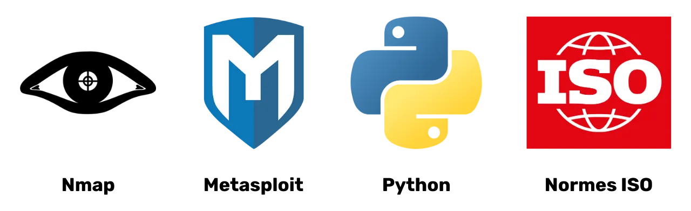

# Cesta k ochraně vašich dat

Vítejte všichni v tomto vzdělávacím programu věnovaném digitální bezpečnosti. Tento trénink je navržen tak, aby byl přístupný pro každého, takže předchozí znalosti informatiky nejsou vyžadovány. Naším hlavním cílem je poskytnout vám znalosti a dovednosti nezbytné pro bezpečnější a soukromější pohyb v digitálním světě.

To zahrne implementaci několika nástrojů, jako je bezpečná e-mailová služba, nástroj pro lepší správu vašich hesel a různý software pro zabezpečení vašich online aktivit.

V tomto tréninku nemáme za cíl udělat z vás experta, anonymního uživatele nebo někoho, kdo je nezranitelný, protože to je nemožné. Místo toho vám nabízíme několik jednoduchých a přístupných řešení, jak začít měnit vaše online návyky a znovu získat kontrolu nad vaší digitální suverenitou.

Tým přispěvatelů:
Muriel; design
Rogzy Noury & Fabian; produkce
Théo; příspěvek

+++

# Úvod
<partId>534ab66c-b0e6-5757-a7dd-6ea04647edf2</partId>

## Úvod do kurzu
<chapterId>2f3d005d-8b49-5a3f-b90d-94c11f613407</chapterId>

### Cíl: Aktualizujte své bezpečnostní dovednosti!

Vítejte všichni v tomto vzdělávacím programu věnovaném digitální bezpečnosti. Tento trénink je navržen tak, aby byl přístupný pro každého, takže předchozí znalosti informatiky nejsou vyžadovány. Naším hlavním cílem je poskytnout vám znalosti a dovednosti nezbytné pro bezpečnější a soukromější pohyb v digitálním světě.

To zahrne implementaci několika nástrojů, jako je bezpečná e-mailová služba, nástroj pro lepší správu vašich hesel a různý software pro zabezpečení vašich online aktivit.

Tento trénink je společným úsilím tří našich profesorů:

- Renaud Lifchitz, expert na kybernetickou bezpečnost
- Théo Pantamis, PhD v aplikované matematice
- Rogzy, generální ředitel DécouvreBitcoin

Vaše digitální hygiena je zásadní ve stále více digitalizovaném světě. Přestože neustále roste počet hackerů a masové sledování, není příliš pozdě udělat první krok a chránit se.
V tomto tréninku se nesnažíme udělat z vás experta, anonymního uživatele nebo někoho, kdo je nezranitelný, protože to je nemožné. Místo toho vám nabízíme několik jednoduchých a přístupných řešení pro každého, jak začít měnit vaše online návyky a znovu získat kontrolu nad vaší digitální suverenitou.
Pokud hledáte pokročilejší dovednosti na toto téma, naše zdroje, tutoriály nebo další školení kybernetické bezpečnosti jsou zde pro vás. Mezitím zde je stručný přehled našeho programu pro následující hodiny společně.

### Sekce 1: Vše, co potřebujete vědět o online prohlížení

- Kapitola 1 - Online prohlížení
- Kapitola 2 - Bezpečné používání internetu

Začneme diskusí o důležitosti výběru webového prohlížeče a jeho důsledcích pro bezpečnost. Poté prozkoumáme specifika prohlížečů, zejména co se týče správy cookies. Také uvidíme, jak zajistit bezpečnější a anonymnější zážitek z prohlížení, použitím nástrojů jako je TOR. Poté se zaměříme na použití VPN pro zvýšení ochrany vašich dat. Nakonec skončíme doporučeními pro bezpečné používání WiFi připojení.

### Sekce 2: Nejlepší postupy pro používání počítače

- Kapitola 3 - Používání počítače
- Kapitola 4 - Hacking & správa záloh
V této sekci se zaměříme na tři klíčové oblasti počítačové bezpečnosti. Nejprve prozkoumáme různé operační systémy: Mac, PC a Linux, přičemž zdůrazníme jejich specifika a silné stránky. Poté se ponoříme do metod, jak účinně chránit před pokusy o hacking a posílit bezpečnost vašich zařízení. Nakonec zdůrazníme význam pravidelné ochrany a zálohování vašich dat, aby se předešlo jakékoli ztrátě nebo ransomwaru. 

### Sekce 3: Implementace řešení

- Kapitola 6 - Správa e-mailů
- Kapitola 7 - Správce hesel
- Kapitola 8 - Dvoufaktorové ověřování

V této praktické třetí sekci přejdeme k implementaci vašich konkrétních řešení.

Nejprve se podíváme, jak chránit vaši e-mailovou schránku, která je zásadní pro vaši komunikaci a často cílem hackerů. Poté vám představíme správce hesel: praktické řešení, jak už nikdy nezapomenout nebo nezaměnit vaše hesla, přičemž je udržíte v bezpečí. Nakonec probereme další bezpečnostní opatření, dvoufaktorové ověřování, které přidává další vrstvu ochrany k vašim účtům. Vše bude vysvětleno jasně a přístupně. 

# Vše, co potřebujete vědět o prohlížení internetu
<partId>b4b5379a-d8ef-59ae-94d3-a6e88959c149</partId>

## Prohlížení internetu
<chapterId>3a935da9-fa6e-57eb-bf85-7b3ec35e6ee2</chapterId>

Při prohlížení internetu je důležité vyhnout se určitým běžným chybám, abyste si zachovali online bezpečnost. Zde jsou některé tipy, jak se jim vyhnout:

### Buďte opatrní při stahování softwaru:

Doporučuje se stahovat software z oficiálních stránek vydavatele, nikoli z obecných stránek.
Příklad: Použijte www.signal.org/download místo www.logicieltelechargement.fr/signal. 

Je také vhodné dávat přednost open-source softwaru, protože jsou často bezpečnější a neobsahují škodlivý software. "Open-source" software je software, jehož kód je známý a přístupný všem. To umožňuje mimo jiné ověřit, že neexistuje žádný skrytý přístup pro krádež vašich osobních údajů.

> Bonus: Open-source software je často zdarma! Tato univerzita je 100% open source, takže si můžete také prohlédnout náš kód na našem GitHubu. 

### Správa cookies: Chyby a osvědčené postupy

Cookies jsou soubory vytvořené webovými stránkami pro ukládání informací na vašem zařízení. Zatímco některé stránky vyžadují tyto cookies pro správnou funkci, mohou být také zneužity třetími stranami, zejména pro účely sledování reklamy. V souladu s předpisy, jako je GDPR, je možné - a doporučené - odmítnout cookies třetích stran určené pro sledování, zatímco ty, které jsou nezbytné pro správnou funkci stránky, přijmout. Po každé návštěvě stránky je moudré smazat přidružené cookies, ať už ručně nebo prostřednictvím rozšíření nebo specifického programu. Některé prohlížeče dokonce nabízejí možnost selektivního mazání cookies. Přes tyto opatření je zásadní pochopit, že informace shromážděné různými stránkami mohou zůstat propojené, odtud důležitost najít rovnováhu mezi pohodlím a bezpečností.

> Poznámka: Také omezte počet rozšíření nainstalovaných ve vašem prohlížeči, aby se předešlo potenciálním bezpečnostním a výkonnostním problémům.

### Webové prohlížeče: volby, bezpečnost

Existují dvě hlavní rodiny prohlížečů: ty založené na Chrome a ty založené na Firefoxu.
Ačkoliv obě rodiny prohlížečů nabízejí podobnou úroveň bezpečnosti, doporučuje se vyhnout prohlížeči Google Chrome kvůli jeho sledovačům. Lehčí alternativy k Chrome, jako jsou Chromium nebo Brave, mohou být preferovány. Brave je obzvláště doporučován pro jeho vestavěný blokátor reklam. Může být nutné používat více prohlížečů pro přístup k určitým webovým stránkám.
### Soukromé prohlížení, TOR a další alternativy pro bezpečnější a anonymnější prohlížení

Soukromé prohlížení, ačkoliv nezakrývá vaše prohlížení před poskytovatelem internetových služeb, umožňuje vám nezanechávat lokální stopy na vašem počítači. Cookies jsou automaticky smazány na konci každé relace, což vám umožňuje přijímat všechny cookies bez sledování. Soukromé prohlížení může být užitečné při nákupu online služeb, jelikož webové stránky sledují naše vyhledávací zvyklosti a přizpůsobují ceny podle nich. Je však důležité poznamenat, že soukromé prohlížení je doporučeno pro dočasné a specifické relace, nikoli pro obecné prohlížení internetu.

Pokročilejší alternativou je síť TOR (The Onion Router), která nabízí anonymitu maskováním IP adresy uživatele a umožňuje přístup k Darknetu. Prohlížeč TOR je prohlížeč speciálně navržený pro použití sítě TOR. Umožňuje vám navštěvovat jak konvenční webové stránky, tak webové stránky .onion, které jsou obvykle provozovány jednotlivci a mohou mít nelegální povahu.

TOR je legální a používají ho novináři, aktivisté za svobodu a další, kteří se snaží uniknout cenzuře v autoritářských zemích. Je však důležité pochopit, že TOR nezabezpečuje navštívené stránky ani samotný počítač. Navíc používání TORu může zpomalit internetové připojení, protože data procházejí přes počítače dalších tří lidí, než dosáhnou svého cíle. Je také nezbytné poznamenat, že TOR není stoprocentně spolehlivé řešení pro zajištění 100% anonymity a neměl by být používán pro nelegální aktivity.

https://planb.network/tutorials/others/tor-browser

## VPN a internetové připojení
<chapterId>5aac83f4-a685-54b0-9759-d71bea7eeed2</chapterId>

### VPN

Ochrana vašeho internetového připojení je klíčovým aspektem online bezpečnosti a používání virtuálních privátních sítí (VPN) je účinnou metodou pro zvýšení této bezpečnosti, jak pro firmy, tak pro jednotlivé uživatele.

'VPN jsou nástroje, které šifrují data přenášená přes internet, čímž činí připojení bezpečnějším. V profesionálním kontextu VPN umožňují zaměstnancům bezpečně přistupovat k interní síti firmy na dálku. Vyměňovaná data jsou šifrována, což je činí mnohem obtížnějšími pro zachycení třetími stranami. Kromě zabezpečení přístupu k interní síti, použití VPN může uživateli umožnit směrovat jeho internetové připojení přes interní síť firmy, což vytváří dojem, že jeho připojení pochází z firmy. To může být obzvláště užitečné pro přístup k online službám, které jsou geograficky omezené.

### Typy VPN

Existují dva hlavní typy VPN: firemní VPN a spotřebitelské VPN, jako je NordVPN. Firemní VPN bývají dražší a složitější, zatímco spotřebitelské VPN jsou obecně přístupnější a uživatelsky přívětivější. Například NordVPN umožňuje uživatelům připojit se k internetu prostřednictvím serveru umístěného v jiné zemi, což může obejít geografická omezení.
Používání spotřebitelského VPN nezaručuje úplnou anonymitu. Mnoho poskytovatelů VPN si uchovává informace o svých uživatelích, což může ohrozit jejich anonymitu. Ačkoliv VPN mohou být užitečné pro zlepšení online bezpečnosti, nejsou univerzálním řešením. Jsou efektivní pro určité konkrétní použití, jako je přístup k geograficky omezeným službám nebo zlepšení bezpečnosti při cestování, ale nezaručují úplnou bezpečnost. Při výběru VPN je zásadní dát přednost spolehlivosti a technickým aspektům před popularitou. Poskytovatelé VPN, kteří shromažďují nejméně osobních informací, jsou obecně nejbezpečnější. Služby jako iVPN a Mullvad neshromažďují osobní informace a dokonce umožňují platby v Bitcoinu pro zvýšení soukromí. 
Nakonec může být VPN také použito k blokování online reklam, což poskytuje příjemnější a bezpečnější zážitek z prohlížení. Je však důležité provést vlastní výzkum, aby se našlo VPN, které nejlépe vyhovuje vašim konkrétním potřebám. Používání VPN se doporučuje pro zvýšení bezpečnosti, i když procházíte internetem doma. To pomáhá zajistit vyšší úroveň bezpečnosti pro vyměňovaná data online. Nakonec nezapomeňte zkontrolovat URL adresy a malý zámek v adresním řádku, abyste potvrdili, že jste na webu, který máte v úmyslu navštívit.

https://planb.network/tutorials/others/ivpn

https://planb.network/tutorials/others/mullvad

### HTTPS & veřejné Wi-Fi sítě

Pokud jde o online bezpečnost, je zásadní pochopit, že 4G je obecně bezpečnější než veřejné Wi-Fi. Používání 4G však může rychle vyčerpat váš mobilní datový tarif. Protokol HTTPS se stal standardem pro šifrování dat na webových stránkách. Zajišťuje, že data vyměňovaná mezi uživatelem a webem jsou bezpečná. Proto je klíčové ověřit, že navštívená stránka používá protokol HTTPS.

V Evropské unii je ochrana dat regulována Obecným nařízením o ochraně osobních údajů (GDPR). Proto je bezpečnější používat poskytovatele přístupových bodů Wi-Fi z Evropy, jako je SNCF, kteří neprodávají data o připojení uživatelů. Avšak samotný fakt, že stránka zobrazuje zámek, nezaručuje její pravost. Je důležité ověřit veřejný klíč stránky pomocí certifikačního systému, aby se potvrdila její pravost. Ačkoliv šifrování dat brání třetím stranám v zachycení vyměňovaných dat, stále je možné, že zlomyslný jedinec může stránku napodobit a přenášet data v nešifrované formě.

Pro vyhnutí se online podvodům je zásadní ověřit identitu stránky, kterou procházíte, zejména kontrolou přípony a názvu domény. Dále buďte ostražití vůči podvodníkům, kteří používají podobná písmena v URL adresách, aby uživatele oklamali.

Shrnutí, použití VPN může výrazně zlepšit online bezpečnost, jak pro firmy, tak pro jednotlivé uživatele. Navíc, dodržování dobrých návyků při prohlížení může přispět k lepší digitální hygieně. V dalším segmentu tohoto kurzu se budeme věnovat počítačové bezpečnosti, včetně aktualizací, antivirů a správy hesel.

# Nejlepší postupy pro používání počítače
<partId>e6eac20b-ba24-5d9a-8d86-8e0164074457</partId>

## Používání počítače
<chapterId>16745632-b56b-5423-9873-ddf70fdf1efd</chapterId>

Bezpečnost našich počítačů je v dnešním digitálním světě velkým tématem. Dnes se budeme zabývat třemi klíčovými body:

- Výběr počítače
- Aktualizace a antiviry pro optimální bezpečnost
- Nejlepší postupy pro zabezpečení vašeho počítače a dat.

### Výběr počítače a operačního systému

Pokud jde o výběr počítače, mezi starými a novými počítači není významný rozdíl v bezpečnosti. Existují však bezpečnostní rozdíly mezi operačními systémy: Windows, Linux a Mac.
Pokud jde o Windows, doporučuje se nepoužívat účet správce na denní bázi, ale místo toho vytvořit dva oddělené účty: účet správce a účet pro každodenní použití. Windows jsou často více vystaveny malware kvůli velkému počtu uživatelů a snadnému přepínání z uživatele na správce. Na druhou stranu, hrozby jsou na Linuxu a Macu méně běžné.

Výběr operačního systému by měl být založen na vašich potřebách a preferencích. Linuxové systémy se v posledních letech výrazně vyvinuly a stávají se stále více uživatelsky přívětivými. Ubuntu je zajímavou alternativou pro začátečníky s snadno použitelným grafickým rozhraním. Je možné rozdělit počítač, aby bylo možné experimentovat s Linuxem při zachování Windows, ale to může být složité. Často je preferováno mít dedikovaný počítač, virtuální stroj nebo USB klíč pro testování Linuxu nebo Ubuntu.

### Aktualizace softwaru

Pokud jde o aktualizace, pravidlo je jednoduché: **pravidelná aktualizace operačního systému a aplikací je nezbytná.**

Na Windows 10 jsou aktualizace téměř nepřetržité a je zásadní je neblokovat ani neodkládat. Každý rok je identifikováno asi 15 000 zranitelností, což zdůrazňuje důležitost udržování softwaru aktualizovaného pro ochranu proti virům. Obecně platí, že podpora softwaru končí mezi 3 a 5 lety po jeho vydání, takže je nutné přejít na vyšší verzi, aby bylo možné nadále těžit z bezpečnosti.

Pravidlo platí pro téměř veškerý software. Aktualizace totiž nejsou zamýšleny k tomu, aby váš stroj zastaral nebo zpomalil, ale aby ho chránily před novými hrozbami. Některé aktualizace jsou dokonce považovány za zásadní a bez nich je váš počítač vážně ohrožen na možnost zneužití.

Abych vám dal konkrétní příklad chyby: crackovaný software, který nelze aktualizovat, představuje dvojitou potenciální hrozbu. Příchod viru během jeho nelegálního stažení z podezřelé webové stránky a nezabezpečené používání proti novým formám útoku.

### Antivirus

- Potřebujete antivirus? ANO
- Musíte platit? To záleží!

Výběr a implementace antiviru je důležitý. Windows Defender, vestavěný antivirus ve Windows, je bezpečným a účinným řešením. Pro bezplatné řešení je to mimořádně dobré a mnohem lepší než mnoho bezplatných řešení nalezených online. Skutečně je třeba být opatrný s antiviry staženými z internetu, protože mohou být zákeřné nebo zastaralé.
Pro ty, kteří si přejí investovat do placeného antiviru, doporučuje se vybrat antivirus, který inteligentně analyzuje neznámé a vznikající hrozby, jako je například Kaspersky. Aktualizace antiviru jsou nezbytné k ochraně před novými hrozbami.

> Poznámka: Linux a Mac díky svému systému oddělení práv uživatelů často nepotřebují antivirus.

Nakonec zde jsou některé dobré praktiky pro zabezpečení vašeho počítače a dat. Je důležité vybrat účinný a uživatelsky přívětivý antivirus. Je také zásadní přijmout dobré praktiky na vašem počítači, jako je nevkládání neznámých nebo podezřelých USB klíčů. Tyto USB klíče mohou obsahovat škodlivé programy, které se mohou automaticky spustit po vložení. Kontrola USB klíče bude zbytečná, jakmile byl vložen. Některé společnosti byly oběťmi hackování kvůli USB klíčům nedbale ponechaným v přístupných oblastech, jako je parkoviště.

Chraňte svůj počítač, jako byste chránili svůj domov: buďte ostražití, pravidelně aktualizujte, mažte nepotřebné soubory a používejte silné heslo pro zabezpečení. Je zásadní šifrovat data na laptopech a smartphonech, aby se předešlo krádeži nebo ztrátě dat. BitLocker pro Windows, LUKS pro Linux a vestavěná možnost pro Mac jsou řešeními pro šifrování dat. Je doporučeno bez váhání aktivovat šifrování dat a heslo si zapsat na papír, který bude uložen na bezpečném místě.
Na závěr je nezbytné vybrat si operační systém, který vyhovuje vašim potřebám, a pravidelně jej aktualizovat, stejně jako nainstalované aplikace. Je také zásadní používat účinný a uživatelsky přívětivý antivirový program a dodržovat dobré bezpečnostní postupy pro ochranu vašeho počítače a dat.

## Hacking & Správa záloh: Ochrana vašich dat
<chapterId>9ddfcb6a-a253-5542-b7eb-df7222b46dc7</chapterId>

### Jak útočí hackeři?

Abychom se dobře chránili, je nezbytné rozumět tomu, jak hackeři se snaží proniknout do vašeho počítače. Viry se skutečně často neobjevují jako kouzlem, ale jsou spíše důsledkem našich činů, i když neúmyslně!

Obecně platí, že viry přicházejí, protože jste svému počítači dovolili, aby je pozval domů. To lze představit stahováním podezřelého softwaru, kompromitovaného torrentového souboru, nebo jednoduše kliknutím na odkaz v podvodném emailu!

### Phishing, ostražitost vůči podvodným emailům:

Pozor! Emaily jsou prvním vektorem útoku, zde jsou některé tipy:

- Buďte ostražití vůči pokusům o phishing, které mají za cíl získat citlivé informace, jako jsou vaše přihlašovací údaje a hesla. Vyhněte se klikání na podezřelé odkazy a sdílení vašich osobních informací bez ověření legitimity odesílatele.
- Buďte opatrní s přílohami a obrázky v emailu:
  Přílohy a obrázky v emailu mohou obsahovat malware. Nestahujte ani neotevírejte přílohy od neznámých nebo podezřelých odesílatelů a ujistěte se, že váš antivirový program je aktualizován.

Zlaté pravidlo zde je pečlivě kontrolovat celé jméno odesílatele i původ emailu. V případě pochybností ho smažte!

### Ransomware a typy kybernetických útoků:

Ransomware je typ škodlivého softwaru, který šifruje uživatelská data a požaduje výkupné za jejich dešifrování. Tento typ útoku se stává stále běžnějším a může být velmi problematický pro firmu nebo jednotlivce. Abychom se chránili, je nezbytné vytvářet zálohy nejcitlivějších souborů! To sice ransomware nezastaví, ale umožní vám ho jednoduše ignorovat.

Pravidelně zálohujte svá důležitá data na externí úložné zařízení nebo do bezpečné online úložné služby. Tímto způsobem, v případě kybernetického útoku nebo selhání hardware, můžete obnovit svá data bez ztráty klíčových informací.

Jednoduché řešení:

- Pořiďte si externí pevný disk a zkopírujte na něj svá data. Odpojte ho a uschovejte někde v domě. (Dvakrát toto provést a jeden z disků uschovat na jiném místě pomáhá chránit před možným požárem.)

- Vytvořte zálohu "v cloudu" pomocí ProtonMail Drive, Sync, nebo dokonce Google Drive. Jednoduše nahrajte svá citlivá data na tento online hostitel. Mějte však na paměti, že vaše data jsou potenciálně na internetu a drženy důvěryhodnou třetí stranou.

### Měli byste hackery zaplatit?

NE, obecně se nedoporučuje platit hackery v případě ransomwaru nebo jiných typů útoků. Zaplacení výkupného nezaručuje obnovení vašich dat a může podněcovat kyberzločince k pokračování v jejich škodlivých aktivitách. Místo toho dávejte přednost prevenci a pravidelnému zálohování vašich dat, abyste se chránili.

Pokud na svém počítači detekujete virus, odpojte ho od internetu, proveďte úplnou antivirovou kontrolu a smažte infikované soubory. Poté aktualizujte svůj software a operační systém a změňte svá hesla, abyste zabránili dalším narušením.

https://planb.network/tutorials/others/proton-drive

https://planb.network/tutorials/others/veracrypt

# Implementace řešení.
<partId>215ec902-ba05-5549-87fc-cb8d82665f7b</partId>

## Správa emailových účtů
<chapterId>dfceea33-8712-5557-ace1-6ba5598d33d8</chapterId>
### Nastavení nového emailového účtu!

Emailový účet je centrálním bodem vaší online aktivity: pokud je kompromitován, hacker ho může použít k resetování všech vašich hesel prostřednictvím funkce "zapomenuté heslo" a získat přístup k mnoha dalším stránkám. Proto je důležité ho řádně zabezpečit.

Emailový účet by měl být vytvořen s unikátním a silným heslem (podrobnosti v kapitole 7) a ideálně s dvoufaktorovou autentizací (podrobnosti v kapitole 8).

I když už všichni máme emailový účet, je důležité zvážit vytvoření nového, modernějšího, abychom začali znovu.

### Výběr poskytovatele emailu a správa emailových adres

Správná správa našich emailových adres je klíčová pro zajištění bezpečnosti našeho online přístupu. Je důležité vybrat si bezpečného a soukromí respektujícího poskytovatele emailu. Například ProtonMail je bezpečná a soukromí respektující emailová služba.

Při výběru poskytovatele emailu a vytváření hesla je zásadní nikdy nepoužívat stejné heslo pro různé online služby. Doporučuje se pravidelně vytvářet nové emailové adresy a oddělovat použití používáním různých emailových adres. Je vhodné zvolit bezpečnou emailovou službu pro kritické účty. Je také důležité si uvědomit, že některé služby omezují délku hesel, takže je důležité být si vědom tohoto omezení. Služby pro vytváření dočasných emailových adres, které lze použít pro účty s omezenou dobou trvání, jsou také k dispozici.

Je důležité zvážit, že starší poskytovatelé emailů, jako jsou La Poste, Arobase, Wig, Hotmail, jsou stále používány, ale jejich bezpečnostní praxe nemusí být tak dobrá jako u Gmailu. Proto se doporučuje mít dvě oddělené emailové adresy, jednu pro obecnou komunikaci a druhou pro obnovu účtu, přičemž ta druhá by měla být lépe zabezpečená. Je nejlepší se vyhnout kombinaci emailové adresy s vaším telefonním operátorem nebo poskytovatelem internetových služeb, protože to může být vektor útoku.

### Měl bych změnit svůj emailový účet?

Je doporučeno použít web Have I Been Pwned (https://haveibeenpwned.com/) k ověření, zda byla naše emailová adresa kompromitována, a k oznámení budoucích úniků dat. Hacknutá databáze může být hackery využita k odesílání phishingových emailů nebo k opětovnému použití kompromitovaných hesel.

Obecně platí, že začít používat novou, bezpečnější emailovou adresu není špatná praxe a je dokonce nutné, pokud chceme začít znovu na zdravém základě.
Bonus Bitcoin: Může být vhodné vytvořit specifickou emailovou adresu pro naše aktivity s Bitcoinem (vytváření účtů na burzách), aby bylo možné skutečně oddělit oblasti aktivit v našem životě.

https://planb.network/tutorials/others/proton-mail

## Správce hesel
<chapterId>0b3c69b2-522c-56c8-9fb8-1562bd55930f</chapterId>

### Co je správce hesel?

Správce hesel je nástroj, který vám umožňuje ukládat, generovat a spravovat vaše hesla pro různé online účty. Místo pamatování si více hesel potřebujete znát pouze jedno hlavní heslo pro přístup ke všem ostatním.

Se správcem hesel se již nemusíte obávat zapomenutí vašich hesel nebo jejich zapisování někam. Stačí si pamatovat jedno hlavní heslo. Navíc většina těchto nástrojů pro vás generuje silná hesla, což zvyšuje bezpečnost vašich účtů.

### Rozdíly mezi některými populárními správci:
- LastPass: Jeden z nejpopulárnějších správců hesel. Jedná se o službu třetí strany, což znamená, že vaše hesla jsou uložena na jejich serverech. Nabízí zdarma verzi i placenou verzi s uživatelsky přívětivým rozhraním.
- Dashlane: Také služba třetí strany, s intuitivním rozhraním a dalšími funkcemi, jako je sledování informací o kreditních kartách a bezpečné poznámky.

### Samostatné hostování pro větší kontrolu:

- Bitwarden: Jedná se o open-source nástroj, což znamená, že můžete zkontrolovat jeho kód, abyste ověřili jeho bezpečnost. Ačkoliv Bitwarden nabízí hostovanou službu, umožňuje také uživatelům samostatné hostování, což znamená, že můžete kontrolovat, kde jsou vaše hesla uložena, což potenciálně nabízí větší bezpečnost a kontrolu.

- KeePass: Jedná se o open-source řešení, které je primárně určeno pro samostatné hostování. Vaše data jsou výchozí uložena lokálně, ale pokud si přejete, můžete synchronizovat databázi hesel různými metodami. KeePass je široce uznáván pro svou bezpečnost a flexibilitu, ačkoliv pro začátečníky může být mírně méně uživatelsky přívětivý.

(Poznámka: Výběr mezi službou třetí strany nebo samostatným hostováním závisí na vaší úrovni technologického komfortu a na tom, jak prioritizujete kontrolu oproti pohodlí. Služby třetí strany jsou obecně pohodlnější pro většinu lidí, zatímco samostatné hostování vyžaduje více technických znalostí, ale může nabídnout větší kontrolu a klid v otázkách bezpečnosti.)

### Co dělá heslo dobrým:

Dobré heslo je obecně:

- Dlouhé: alespoň 12 znaků.
- Složité: směs velkých a malých písmen, čísel a symbolů.
- Unikátní: nepoužívejte stejné heslo pro různé účty.
- Nezávislé na osobních informacích: vyhněte se datům narození, jménům atd.

Pro zajištění bezpečnosti vašeho účtu je klíčové vytvořit silné a bezpečné heslo. Délka hesla samo o sobě nestačí k zajištění jeho bezpečnosti. Znaky musí být zcela náhodné, aby odolaly útokům hrubou silou. Nezávislost událostí je také důležitá, aby se předešlo nejpravděpodobnějším kombinacím. Běžná hesla jako "password" jsou snadno prolomitelná.

Pro vytvoření silného hesla se doporučuje použít velké množství náhodných znaků, aniž byste používali předvídatelná slova nebo vzory. Je také nezbytné zahrnout čísla a speciální znaky. Nicméně je třeba poznamenat, že některé webové stránky mohou omezit použití určitých speciálních znaků. Hesla, která nejsou náhodně generována, jsou snadno uhodnutelná. Variace nebo přidání k heslům nejsou bezpečné. Webové stránky nemohou zaručit bezpečnost hesel vybraných uživateli.

Náhodně generovaná hesla nabízejí vyšší úroveň bezpečnosti, ačkoliv mohou být obtížněji zapamatovatelná. Správci hesel mohou generovat bezpečnější náhodná hesla. Používáním správce hesel nemusíte pamatovat všechna svá hesla. Je důležité postupně nahradit vaše stará hesla těmi, která generuje správce, protože jsou silnější a delší. Ujistěte se, že hlavní heslo vašeho správce hesel je také silné a bezpečné.

https://planb.network/tutorials/others/bitwarden

https://planb.network/tutorials/others/keepass

## Dvoufaktorové ověření
<chapterId>9391e02e-e61b-5a86-93e0-91a07f217d35</chapterId>

### Proč implementovat 2FA
Dvoufaktorové ověření (2FA) je dodatečná vrstva zabezpečení používaná k zajištění toho, že osoby pokoušející se přistupovat k online účtu jsou skutečně ty, za koho se vydávají. Místo pouhého zadání uživatelského jména a hesla vyžaduje 2FA druhou formu ověření.
Tento druhý krok může být:

- Dočasný kód poslaný prostřednictvím SMS.
- Kód generovaný aplikací jako Google Authenticator nebo Authy.
- Fyzický bezpečnostní klíč, který vložíte do počítače.

S 2FA, i když hacker získá vaše heslo, nebude schopen přistupovat k vašemu účtu bez tohoto druhého ověřovacího faktoru. To činí 2FA nezbytným pro ochranu vašich online účtů proti neautorizovanému přístupu.

### Kterou možnost si vybrat?

Různé možnosti silného ověření nabízejí různé úrovně zabezpečení.

- SMS není považována za nejlepší možnost, protože poskytuje pouze důkaz o vlastnictví telefonního čísla.
- 2FA (dvoufaktorové ověření) je bezpečnější, protože používá více typů důkazů, jako jsou znalosti, vlastnictví a identifikace. Jednorázová hesla (HOTP a TOTP) jsou bezpečnější než SMS, protože vyžadují kryptografický výpočet a jsou uložena lokálně místo v paměti.
- Hardware tokeny, jako jsou USB klíče nebo chytré karty, nabízejí optimální zabezpečení generováním jedinečného soukromého klíče pro každý web a ověřováním URL před povolením připojení.

Pro optimální zabezpečení silným ověřením se doporučuje používat bezpečnou e-mailovou adresu, bezpečný správce hesel a adoptovat 2FA pomocí YubiKeys. Doporučuje se také zakoupit dva YubiKeys, aby se předvídala ztráta nebo krádež, například uchováním záložní kopie doma a u sebe.

Biometriku lze použít jako náhradu, ale není to tak bezpečné jako kombinace znalostí a vlastnictví. Biometrická data by měla zůstat na ověřovacím zařízení a neměla by být zveřejňována online. Je důležité zvážit model hrozby spojený s různými metodami ověřování a přizpůsobit postupy podle toho.

### Závěr školení:

Jak jste pochopili, implementace dobré digitální hygieny není nutně jednoduchá, ale zůstává přístupná!

- Vytvoření nové bezpečné e-mailové adresy.
- Nastavení správce hesel.
- Aktivace 2FA.
- Postupná výměna našich starých hesel za silná hesla s 2FA.

Pokračujte ve vzdělávání a postupně implementujte dobré praktiky!

Zlaté pravidlo: Kybernetická bezpečnost je pohyblivým cílem, který se přizpůsobí vaší cestě učení!

https://planb.network/tutorials/others/authy

https://planb.network/tutorials/others/security-key

# Praktická sekce
<partId>98ccf14b-4053-5839-878c-7a73ff02eb95</partId>

## Nastavení poštovní schránky
<chapterId>afc9ab5d-7664-5a9b-ab50-225ac9ba8f7c</chapterId>

Chrání své e-mailové schránky je důležitým krokem k zabezpečení online aktivit a ochraně osobních údajů. Tento návod vás krok za krokem provede vytvořením a nastavením účtu ProtonMail, poskytovatele známého pro svou vysokou úroveň bezpečnosti, který nabízí end-to-end šifrování vašich komunikací. Ať už jste začátečník nebo zkušený uživatel, zde navrhované osvědčené postupy vám pomohou posílit zabezpečení vaší pošty a zároveň využít pokročilé funkce ProtonMail:

https://planb.network/tutorials/others/proton-mail

## Zabezpečení pomocí 2FA
<chapterId>09468ec1-95b7-56a4-a636-7618044568e1</chapterId>

Dvoufaktorová autentizace (2FA) se stala nezbytnou pro zabezpečení vašich online účtů. V tomto tutoriálu se naučíte, jak nastavit a používat aplikaci 2FA Authy, která generuje dynamické 6místné kódy pro ochranu vašich účtů. Authy je velmi snadné používat a synchronizuje se na více zařízeních. Objevte, jak nainstalovat a nastavit Authy a tím posilte zabezpečení svých online účtů již nyní:

https://planb.network/tutorials/others/authy

Další možností je použití fyzického bezpečnostního klíče. Tento další tutoriál vám ukáže, jak nastavit a používat bezpečnostní klíč jako druhý autentizační faktor:

https://planb.network/tutorials/others/security-key

## Vytvoření správce hesel
<chapterId>ed579680-4e7b-5f65-8541-14e519a3b242</chapterId>

Správa hesel je výzvou v digitálním věku. Všichni máme mnoho online účtů, které je třeba zabezpečit. Správce hesel vám pomůže vytvářet a ukládat silná a jedinečná hesla pro každý účet.

V tomto tutoriálu se dozvíte, jak nastavit Bitwarden, open-source správce hesel, a jak synchronizovat své přihlašovací údaje na všech zařízeních, aby bylo vaše každodenní používání jednodušší:

https://planb.network/tutorials/others/bitwarden

Pro pokročilejší uživatele nabízím také tutoriál na další bezplatný a open-source software, který můžete používat lokálně pro správu svých hesel:

https://planb.network/tutorials/others/keepass

## Zabezpečení vašich účtů
<chapterId>7a774b34-aed0-57dd-b8f7-cf3be51c0d70</chapterId>

V těchto dvou tutoriálech vás také provedu zabezpečením vašich online účtů a vysvětlím, jak postupně přijímat bezpečnější postupy pro každodenní správu vašich hesel.

https://planb.network/tutorials/others/bitwarden

https://planb.network/tutorials/others/keepass

## Nastavení zálohování
<chapterId>01cfcde1-77cb-506c-8df1-fa18a2e8cc6b</chapterId>

Chránit vaše osobní soubory je také klíčovým bodem. Tento tutoriál vám ukazuje, jak zavést efektivní zálohovací strategii díky Proton Drive. Objevte, jak používat toto zabezpečené cloudové řešení k aplikaci metody 3-2-1: tři kopie vašich dat na dvou různých médiích, z nichž jedna kopie je mimo místo. Tím zajistíte přístupnost a bezpečnost vašich citlivých souborů:

https://planb.network/tutorials/others/proton-drive

A pro zabezpečení vašich souborů uložených na přenosných médiích, jako je USB klíč nebo pevný disk, vám také ukazuji, jak snadno šifrovat a dešifrovat tato média pomocí VeraCrypt:

https://planb.network/tutorials/others/veracrypt

## Změna prohlížeče & VPN
<chapterId>8dc08feb-313c-5259-a54f-64aa68a07608</chapterId>

Ochrana vašeho online soukromí je také klíčovým bodem pro zajištění vaší bezpečnosti. Použití VPN může být prvním krokem k jeho dosažení.

Nabízím vám seznámit se se dvěma spolehlivými VPN řešeními, která jsou platitelná pomocí bitcoinu, a to IVPN a Mullvad. Tyto návody vás provedou instalací, konfigurací a používáním Mullvad nebo IVPN na všech vašich zařízeních:

https://planb.network/tutorials/others/ivpn

https://planb.network/tutorials/others/mullvad

Dále se dozvíte, jak používat Tor Browser, prohlížeč speciálně navržený pro ochranu vašeho online soukromí:

https://planb.network/tutorials/others/tor-browser

# Jít dále
<partId>77113cad-a6d8-57e5-b903-50c223b277ba</partId>

## Jak pracovat v oblasti kybernetické bezpečnosti
<chapterId>aad1ae27-4280-5b07-b9ab-118ae013951a</chapterId>

### Kybernetická bezpečnost: Rozvíjející se obor s nekonečnými příležitostmi

Pokud máte vášeň pro ochranu systémů a dat, obor kybernetické bezpečnosti nabízí mnoho příležitostí. Pokud vás tento průmysl zajímá, zde jsou některé klíčové kroky, které vám pomohou.

### Akademické základy a certifikace:

Pevné vzdělání v oblasti informatiky, informačních systémů nebo v příbuzném oboru je často ideálním výchozím bodem. Tyto studie poskytují nezbytný základ pro pochopení technických výzev kybernetické bezpečnosti. K doplnění tohoto vzdělání je vhodné získat uznávané certifikace v oboru. Ačkoliv se tyto certifikace mohou lišit podle regionu, některé, jako jsou CISSP nebo CEH, mají celosvětové uznání.

Kybernetická bezpečnost je rozsáhlý a neustále se vyvíjející obor. Seznámení se s nezbytnými nástroji a různými systémy je klíčové. Navíc, s tolika subdoménami, od reakce na incidenty po etické hackování, je výhodné najít svou specializaci a zaměřit se na ni.

### Získání praktických zkušeností:

Význam praktických zkušeností nelze podcenit. Hledání stáží nebo juniorních pozic ve firmách s týmy pro kybernetickou bezpečnost je vynikajícím způsobem, jak aplikovat vaše teoretické znalosti. Dále, účast na soutěžích v etickém hackování nebo simulacích kybernetické bezpečnosti může zdokonalit vaše dovednosti v reálných situacích.

Síla profesionální sítě je neocenitelná. Připojení k profesionálním asociacím, hackerspaces nebo online fórum poskytuje platformu pro výměnu nápadů s dalšími odborníky. Podobně, účast na konferencích a workshopech o kybernetické bezpečnosti nejenže umožňuje učení, ale také pomáhá budovat kontakty s profesionály v oboru.

Neustálý vývoj hrozeb vyžaduje pravidelné sledování novinek a specializovaných fór. V sektoru, kde je důvěra nejvyšší hodnotou, je jednání s etikou a integritou nezbytné v každé fázi vaší kariéry.

### Dovednosti a nástroje k prohloubení:

- Nástroje pro kybernetickou bezpečnost: Wireshark, Metasploit, Nmap.
- Operační systémy: Linux, Windows, MacOS.
- Programovací jazyky: Python, C, Java.
- Sítě: TCP/IP, VPN, firewall.
- Databáze: SQL, NoSQL.
- Kryptografie: SSL/TLS, symetrické/asymetrické šifrování.
- Správa incidentů: Analýza logů, reakce na incidenty.
- Etické hackování: Techniky průniku, testování narušení.
- Správa: ISO normy, GDPR/CCPA regulace.

Ovládnutím těchto dovedností a nástrojů budete dobře vybaveni pro úspěšnou navigaci ve světě kybernetické bezpečnosti.

## Rozhovor s Renaudem
<chapterId>7d83fd98-ce22-514e-b9e8-729fbf71ee6e</chapterId>

### Efektivní správa hesel a posílení autentizace: Akademický přístup
V rámci tréninkového modulu "Security 101" nabízeného Découvre Bitcoin v rámci Akademie jsme diskutovali o důležitosti správců hesel. Tři dimenze jsou zásadní k zvážení: vytváření, aktualizace a implementace hesel na webových stránkách.
Obecně se nedoporučuje používat rozšíření prohlížeče pro automatické vyplňování hesel. Tyto nástroje mohou uživatele více vystavit riziku phishingových útoků. Renaud, uznávaný expert na kybernetickou bezpečnost, dává přednost ručnímu spravování pomocí KeePass, což zahrnuje ruční kopírování a vkládání hesla. Rozšíření mají tendenci zvyšovat riziko útoku, mohou zpomalit výkon prohlížeče a tím představují významné riziko. Proto se doporučuje minimální používání rozšíření v prohlížeči.

Správci hesel obecně podporují používání dalších ověřovacích faktorů, jako je dvoufaktorové ověření. Pro optimální bezpečnost je doporučeno uchovávat OTP (One-Time Passwords) na mobilním zařízení. AndoTP nabízí open-source řešení pro generování a uchovávání OTP kódů na telefonu. Zatímco Google Authenticator umožňuje exportovat semínka ověřovacích kódů, důvěra v zálohu na účtu Google zůstává omezená. Proto se doporučují aplikace OTI a AndoTP pro autonomní správu OTP.

Otázka digitálního dědictví a digitálního smutku zdůrazňuje důležitost mít postup pro předání hesel po smrti člověka. Správce hesel usnadňuje tento přechod bezpečným uchováním všech digitálních tajemství na jednom místě. Správce hesel také umožňuje identifikovat všechny otevřené účty a spravovat jejich uzavření nebo převod. Doporučuje se zapsat hlavní heslo na papír, ale mělo by být uchováváno na skrytém a bezpečném místě. Pokud je pevný disk šifrován a počítač zamčen, heslo nebude přístupné, ani v případě vloupání.

### Směrem k éře po heslech: Průzkum věrohodných alternativ

Hesla, ač všudypřítomná, mají mnoho nevýhod, včetně možnosti rizikového přenosu během ověřovacího procesu. Přední společnosti, jako jsou Microsoft a Apple, nabízejí inovativní alternativy, jako jsou biometrické údaje a hardwarové tokeny, což naznačuje postupný trend směrem k opuštění hesel.

'Passkeys', například, nabízí šifrované náhodné klíče, kombinované s lokálním faktorem (biometrie nebo PIN), které jsou hostovány poskytovatelem, ale zůstávají mimo jejich dosah. Ačkoliv to vyžaduje aktualizaci webových stránek, přístup eliminuje potřebu hesel, čímž poskytuje vysokou úroveň bezpečnosti bez omezení spojených s tradičními hesly nebo problémem správy digitálního trezoru.

Passkiz je další životaschopná a bezpečná alternativa pro správu hesel. Zůstává však zásadní question: dostupnost v případě selhání poskytovatele. Bylo by tedy žádoucí, aby internetoví giganti navrhli systémy zajišťující tuto dostupnost.

Přímá autentizace k příslušné službě je zajímavou možností, jak již nezáviset na třetí straně. Nicméně Single Sign-On (SSO) nabízený internetovými giganty také představuje problémy z hlediska dostupnosti a rizik cenzury. Aby se předešlo únikům dat, je zásadní minimalizovat množství informací shromažďovaných během ověřovacího procesu.

### Počítačová bezpečnost: imperativy bezpečných postupů a rizika spojená s lidskou nedbalostí

Počítačová bezpečnost může být ohrožena jednoduchými postupy a používáním výchozích hesel, jako je "admin". Složité útoky nejsou vždy nutné k ohrožení počítačové bezpečnosti. Například hesla správce YouTube kanálu byla napsána v soukromém zdrojovém kódu společnosti. Bezpečnostní zranitelnosti jsou často výsledkem lidské nedbalosti.
Je třeba poznamenat, že internet je silně centralizovaný a většinou pod americkou kontrolou. DNS server může být předmětem cenzury a často používá klamavé DNS k blokování přístupu k určitým stránkám. DNS je starý a nedostatečně bezpečný protokol, což může vést k bezpečnostním problémům. Nové protokoly, jako je DNSsec, se objevily, ale stále nejsou široce používány. Pro obejití cenzury a blokování reklam je možné vybrat alternativní poskytovatele DNS.
Alternativy k rušivým reklamám zahrnují Google DNS, OpenDNS a další nezávislé služby. Standardní DNS protokol nechává DNS dotazy viditelné pro poskytovatele internetových služeb. DOH (DNS přes HTTPS) a DOT (DNS přes TLS) šifrují DNS spojení, čímž poskytují větší soukromí a bezpečnost. Tyto protokoly jsou široce používány v podnicích díky jejich zvýšené bezpečnosti a jsou nativně podporovány Windows, Androidem a iPhonem. Pro použití DOH a DOT je nutné místo IP adresy zadat TLS hostname. Online jsou dostupní bezplatní poskytovatelé DOH a DOT. DOH a DOT zlepšují soukromí a bezpečnost tím, že se vyhnou útokům "man in the middle". Další klíčové úvahy

Jako součást výukového modulu "Security 101" na Découvre Bitcoin Academy jsme také diskutovali o autentizaci Lightning. Tento systém generuje pro každou službu odlišný identifikátor, aniž by bylo nutné poskytovat e-mailovou adresu nebo osobní informace. Je možné mít uživatelem kontrolované decentralizované identity, ale chybí standardizace a normalizace v projektech decentralizované identity. Doporučují se správci balíčků, jako jsou Nuget a Chocolaté, které umožňují stahování open-source softwaru mimo Microsoft Store, aby se předešlo škodlivým útokům. Shrnutí, DNS je pro online bezpečnost zásadní, ale je nutné zůstat ostražitý vůči možným útokům na DNS servery.

## Ohodnoťte kurz
<chapterId>6be74d2d-2116-5386-9d92-c4c3e2103c68</chapterId>
<isCourseReview>true</isCourseReview>

## Závěrečná zkouška
<chapterId>a894b251-a85a-5fa4-bf2a-c2a876939b49</chapterId>
<isCourseExam>true</isCourseExam>

## Poděkování a pokračujte ve zkoumání králičí nory
<chapterId>df3a962a-a96e-5006-b904-0dd9d4a072dd</chapterId>

### Ohodnoťte školení a podpořte nás

Tento kurz, stejně jako veškerý obsah na této akademii, vám byl poskytnut zdarma naší komunitou. Můžete nás podpořit tím, že jej sdílíte s ostatními, stanete se členem akademie a dokonce přispějete k jejímu vývoji prostřednictvím GitHubu. Jménem celého týmu vám děkujeme!

Systém hodnocení školení bude brzy integrován do této nové e-learningové platformy! Mezitím vám velmi děkujeme za absolvování kurzu a pokud se vám líbil, zvažte prosím jeho sdílení s ostatními.

### Jděte dál

Gratulujeme k dokončení tohoto školení SECU 101! Doufám, že se vám líbilo a že vám otevřelo dveře. Nyní jste připraveni získat svůj první bitcoin nebo jednoduše pokračovat v dobrodružství s kurzy druhé úrovně!

- BTC 101 vám poskytne teoretické základy Bitcoinu
- BTC 102 vám pomůže nastavit váš bitcoinový plán
- LN 201 a 202 vás seznámí s Lightning Network, platební sítí druhé vrstvy
- ECON 201 pokryje rakouskou ekonomiku
- MINING 201 pro více informací o těžbě
- (a mnoho dalších)

Obrovské poděkování našim Patreonům, členům a dárcům za jejich finanční podporu, děkujeme lidem, kteří sdílejí, a děkujeme těm, kteří umožnili toto školení: Théo pantamis, Renaud, Théo, Fabien, Noury, Muriel & celý tým.
Brzy na shledanou!
