# Eine Reise zum Schutz Ihrer Daten

Willkommen zu diesem Bildungsprogramm für IT-Sicherheit und Datenschutz. Dieses Training ist so konzipiert, dass es für alle zugänglich ist und keine Vorkenntnisse in der Informatik erforderlich sind. Unser Hauptziel ist es, Ihnen das Wissen und die Fähigkeiten zu vermitteln, um sicherer und privater in der digitalen Welt zu navigieren.

Dies wird durch die Implementierung mehrerer Tools erreicht, wie z.B. einer sicheren E-Mail-Box, einem Tool zur besseren Verwaltung Ihrer Passwörter und mehreren Softwareprogrammen zur Sicherung Ihrer täglichen Online-Aktivitäten.

In diesem Training geht es nicht darum, Sie zu einem Experten, Anonymen oder Unangreifbaren zu machen, dies ist unmöglich. Stattdessen bieten wir Ihnen einfache und für alle zugängliche Lösungen an, um Ihre Online-Gewohnheiten zu transformieren und die Kontrolle über Ihre digitale Souveränität zurückzugewinnen.

Teammitglieder:
Muriel; Design
Rogzy Noury & Fabian; Produktion
Théo; Beitrag

+++

# Einführung
<partId>534ab66c-b0e6-5757-a7dd-6ea04647edf2</partId>

## Kursvorstellung
<chapterId>2f3d005d-8b49-5a3f-b90d-94c11f613407</chapterId>

### Ziel: Aktualisierung!

Willkommen zu diesem Bildungsprogramm für IT-Sicherheit und Datenschutz. Dieses Training ist so konzipiert, dass es für alle zugänglich ist und keine Vorkenntnisse in der Informatik erforderlich sind. Unser Hauptziel ist es, Ihnen das Wissen und die Fähigkeiten zu vermitteln, um sicherer und privater in der digitalen Welt zu navigieren.

Dies wird durch die Implementierung mehrerer Tools erreicht, wie z.B. einer sicheren E-Mail-Box, einem Tool zur besseren Verwaltung Ihrer Passwörter und mehreren Softwareprogrammen zur Sicherung Ihrer täglichen Online-Aktivitäten.

Dieses Training ist eine gemeinsame Anstrengung von drei unserer Professoren:

- Renaud Lifchitz, Experte für Cybersicherheit
- Théo Pantamis, Doktor der angewandten Mathematik
- Rogzy, CEO von DécouvreBitcoin

Ihre digitale Hygiene ist in einer immer digitaleren Welt von entscheidender Bedeutung. Trotz einer ständig steigenden Anzahl von Hackerangriffen und Massenüberwachung ist es noch nicht zu spät, den ersten Schritt zu tun und sich zu schützen.
Dans dieser Schulung streben wir nicht danach, Sie zu Experten zu machen, anonym oder unangreifbar, das ist unmöglich. Stattdessen bieten wir Ihnen einige einfache und zugängliche Lösungen an, um Ihre Online-Gewohnheiten zu ändern und die Kontrolle über Ihre digitale Souveränität zurückzugewinnen.

Wenn Sie fortgeschrittene Fähigkeiten zu diesem Thema suchen, stehen Ihnen unsere Ressourcen, Tutorials oder andere Schulungen zur Cybersicherheit zur Verfügung. In der Zwischenzeit erhalten Sie einen kleinen Einblick in unser Programm für die kommenden Stunden zusammen.

### Abschnitt 1: Alles über das Surfen im Internet wissen

- Kapitel 1 - Online-Surfen
- Kapitel 2 - Sicheres Surfen im Internet

Zum Einstieg werden wir über die Bedeutung der Wahl eines Web-Browsers und deren Auswirkungen auf die Sicherheit sprechen. Anschließend werden wir uns mit den Besonderheiten von Browsern befassen, insbesondere in Bezug auf die Verwaltung von Cookies. Wir werden auch sehen, wie man durch Tools wie TOR sicherer und anonymer surfen kann. Danach werden wir uns auf die Verwendung von VPNs konzentrieren, um den Schutz Ihrer Daten zu stärken. Schließlich werden wir Empfehlungen zur sicheren Nutzung von WLAN-Verbindungen geben.
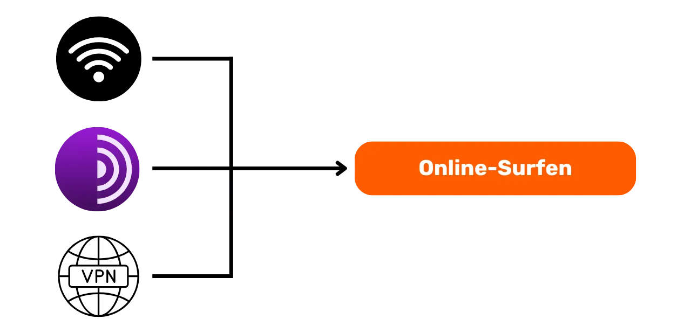
### Abschnitt 2: Gute Praktiken bei der Nutzung des Computers

- Kapitel 3 - Computer-Nutzung
- Kapitel 4 - Hacken & Backup-Management

In diesem Abschnitt behandeln wir drei Schlüsselbereiche der Computersicherheit. Zunächst werden wir die verschiedenen Betriebssysteme - Mac, PC und Linux - erkunden und ihre Besonderheiten und Stärken hervorheben. Dann werden wir uns mit Methoden beschäftigen, um sich effektiv vor Hacking-Versuchen zu schützen und die Sicherheit Ihrer Geräte zu stärken. Schließlich werden wir die Bedeutung des regelmäßigen Schutzes und der Sicherung Ihrer Daten zur Vermeidung von Verlusten oder Ransomware hervorheben.
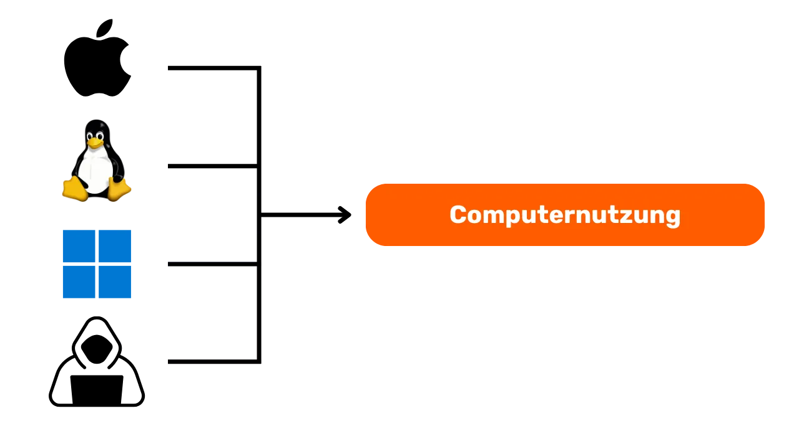

### Abschnitt 3: Implementierung von Lösungen

- Kapitel 6 - E-Mail-Management
- Kapitel 7 - Passwort-Manager
- Kapitel 8 - Zwei-Faktor-Authentifizierung

In diesem praktischen dritten Abschnitt werden wir zur praktischen Umsetzung Ihrer konkreten Lösungen übergehen.

Zuerst werden wir besprechen, wie Sie Ihre E-Mail schützen können, die für Ihre Kommunikation unerlässlich ist und oft von Hackern ins Visier genommen wird. Dann werden wir Ihnen vorstellen, was ein Passwort-Manager ist: eine praktische Lösung, um Ihre Passwörter nicht mehr zu vergessen oder durcheinander zu bringen, während sie sicher bleiben. Schließlich werden wir eine zusätzliche Sicherheitsmaßnahme, die Zwei-Faktor-Authentifizierung, ansprechen, die eine zusätzliche Schutzschicht für Ihre Konten bietet. Alles wird klar und verständlich erklärt.
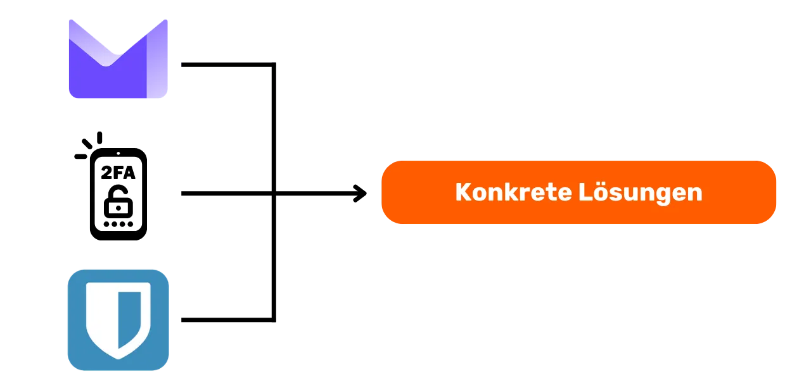

# Alles über das Surfen im Internet
<partId>b4b5379a-d8ef-59ae-94d3-a6e88959c149</partId>

## Online-Surfen
<chapterId>3a935da9-fa6e-57eb-bf85-7b3ec35e6ee2</chapterId>

Beim Surfen im Internet ist es wichtig, bestimmte häufige Fehler zu vermeiden, um Ihre Online-Sicherheit zu gewährleisten. Hier sind einige Tipps, um sie zu vermeiden:

### Achten Sie auf Software-Downloads:

Es wird empfohlen, Software von der offiziellen Website des Herausgebers herunterzuladen, anstatt von generischen Websites.
Beispiel: Verwenden Sie www.signal.org/download und nicht www.logicieltelechargement.fr/signal.

Es wird auch empfohlen, Open-Source-Software zu bevorzugen, da sie oft sicherer ist und frei von bösartiger Software. Eine "Open-Source"-Software ist eine Software, deren Code allen bekannt und für alle zugänglich ist. Man kann also unter anderem überprüfen, ob es keine versteckten Zugriffe gibt, um Ihre persönlichen Daten zu stehlen.

> Bonus: Open-Source-Software ist oft kostenlos! Diese Universität ist zu 100% Open Source, daher können Sie unseren Code auch über unser GitHub überprüfen.
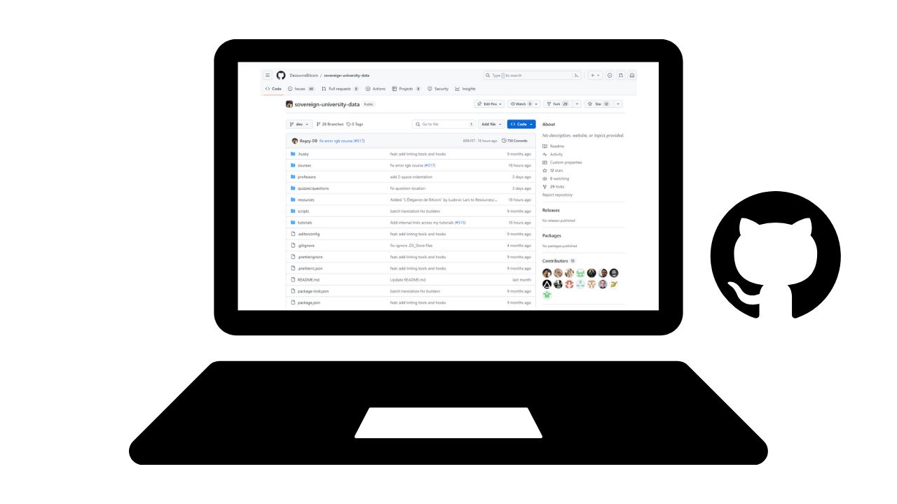

### Cookie-Verwaltung: Fehler und bewährte Praktiken

Cookies sind Dateien, die von Websites erstellt werden, um Informationen auf Ihrem Gerät zu speichern. Obwohl einige Websites diese Cookies benötigen, um ordnungsgemäß zu funktionieren, können sie auch von Drittanbieter-Websites, insbesondere zu Werbezwecken, genutzt werden. Gemäß Vorschriften wie der DSGVO ist es möglich - und empfohlen -, Drittanbieter-Tracking-Cookies abzulehnen, während man diejenigen akzeptiert, die für das ordnungsgemäße Funktionieren der Website unerlässlich sind. Nach jedem Besuch auf einer Website ist es ratsam, die damit verbundenen Cookies zu löschen, entweder manuell oder über eine spezifische Erweiterung oder ein Programm. Einige Browser bieten auch die Möglichkeit, diese Löschung selektiv durchzuführen. Trotz dieser Vorsichtsmaßnahmen ist es wichtig zu verstehen, dass die von verschiedenen Websites gesammelten Informationen miteinander verbunden bleiben können, daher ist es wichtig, ein Gleichgewicht zwischen Bequemlichkeit und Sicherheit zu finden.

> Hinweis: Begrenzen Sie auch die Anzahl der installierten Erweiterungen in Ihrem Browser, um potenzielle Sicherheits- und Leistungsprobleme zu vermeiden.

### Webbrowser: Auswahl, Sicherheit

Es gibt zwei große Browserfamilien: diejenigen, die auf Chrome basieren, und diejenigen, die auf Firefox basieren.
Obwohl beide Familien ein ähnliches Sicherheitsniveau bieten, wird empfohlen, den Google Chrome-Browser aufgrund seiner Tracker zu vermeiden. Leichtere Alternativen zu Chrome wie Chromium oder Brave können bevorzugt werden. Brave wird insbesondere aufgrund seines integrierten Werbeblockers empfohlen. Es kann erforderlich sein, mehrere Browser zu verwenden, um auf bestimmte Websites zuzugreifen.
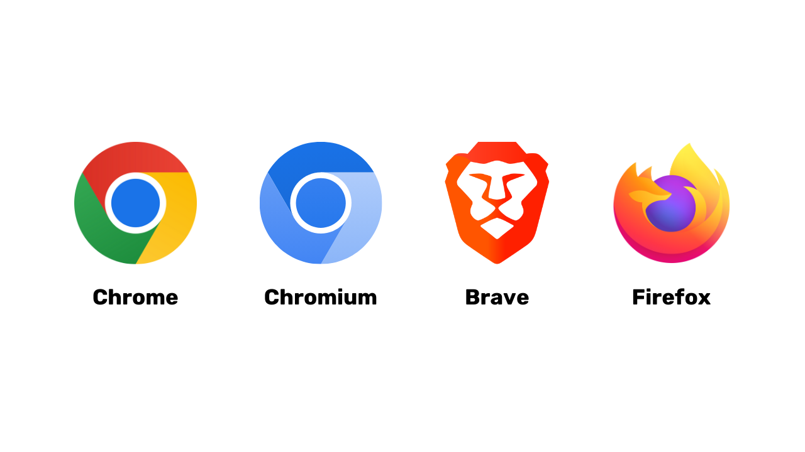
### Privates Surfen, TOR und andere Alternativen für sicheres und anonymes Surfen

Das private Surfen verhindert zwar nicht, dass Ihr Internetdienstanbieter Ihre Aktivitäten verfolgt, hinterlässt jedoch keine lokalen Spuren auf Ihrem Computer. Cookies werden automatisch am Ende jeder Sitzung gelöscht, sodass alle Cookies akzeptiert werden können, ohne verfolgt zu werden. Das private Surfen kann beim Online-Einkauf nützlich sein, da Websites unsere Suchgewohnheiten verfolgen und die Preise entsprechend anpassen. Es ist jedoch wichtig zu beachten, dass das private Surfen für temporäre und spezifische Sitzungen empfohlen wird und nicht für die allgemeine Internetnutzung.

Eine fortgeschrittenere Alternative ist das TOR-Netzwerk (The Onion Router), das Anonymität bietet, indem es die IP-Adresse des Benutzers maskiert und den Zugriff auf das Darknet ermöglicht. Der TOR-Browser ist ein speziell für die Nutzung des TOR-Netzwerks entwickelter Browser. Er ermöglicht den Besuch von herkömmlichen Websites sowie von .onion-Websites, die in der Regel von Einzelpersonen betrieben werden und illegal sein können.

TOR ist legal und wird von Journalisten, Freiheitsaktivisten und anderen Personen verwendet, die der Zensur in autoritären Ländern entgehen möchten. Es ist jedoch wichtig zu verstehen, dass TOR die besuchten Websites oder den Computer selbst nicht absichert. Darüber hinaus kann die Verwendung von TOR die Internetverbindung verlangsamen, da die Daten über die Computer von drei anderen Personen geleitet werden, bevor sie ihr Ziel erreichen. Es ist auch wichtig zu beachten, dass TOR keine hundertprozentige Lösung zur Gewährleistung der Anonymität darstellt und nicht für illegale Aktivitäten verwendet werden sollte.
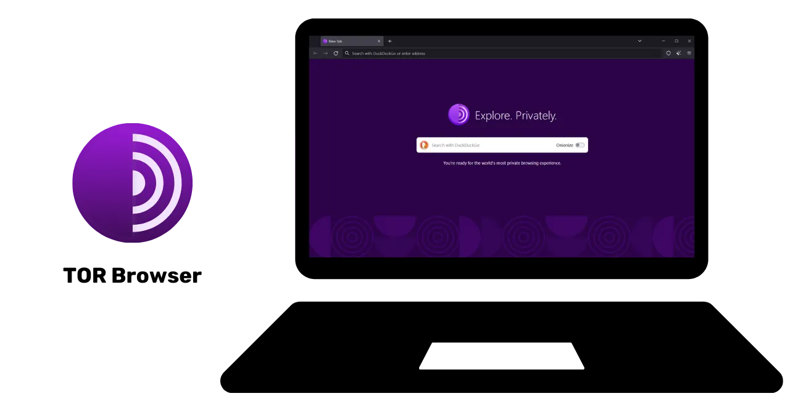

https://planb.network/tutorials/others/tor-browser

## VPN und Internetverbindung
<chapterId>5aac83f4-a685-54b0-9759-d71bea7eeed2</chapterId>

### VPNs

Der Schutz Ihrer Internetverbindung ist ein entscheidender Aspekt der Online-Sicherheit, und die Verwendung von virtuellen privaten Netzwerken (VPNs) ist eine effektive Methode, um diese Sicherheit sowohl für Unternehmen als auch für einzelne Benutzer zu verbessern.

'VPN (Virtual Private Network) sind Tools, die Daten, die über das Internet übertragen werden, verschlüsseln und somit die Verbindung sicherer machen. Im geschäftlichen Kontext ermöglichen VPNs den Mitarbeitern einen sicheren Remote-Zugriff auf das interne Unternehmensnetzwerk. Die ausgetauschten Daten werden verschlüsselt, was ihre Interception durch Dritte erschwert. Neben der Sicherung des Zugangs zu einem internen Netzwerk kann die Verwendung eines VPNs einem Benutzer ermöglichen, seine Internetverbindung über das interne Unternehmensnetzwerk zu leiten und den Eindruck zu erwecken, dass seine Verbindung vom Unternehmen stammt. Dies kann besonders nützlich sein, um auf geografisch eingeschränkte Online-Dienste zuzugreifen.

### Arten von VPN

Es gibt zwei Hauptarten von VPN: Unternehmens-VPNs und öffentliche VPNs wie NordVPN. Unternehmens-VPNs neigen dazu, teurer und komplexer zu sein, während öffentliche VPNs in der Regel zugänglicher und einfacher zu bedienen sind. Zum Beispiel ermöglicht NordVPN Benutzern, sich über einen Server in einem anderen Land mit dem Internet zu verbinden, was es ermöglichen kann, geografische Einschränkungen zu umgehen.

Die Verwendung eines öffentlichen VPNs garantiert jedoch keine vollständige Anonymisierung. Viele VPN-Anbieter speichern Informationen über ihre Benutzer, was ihre Anonymität potenziell gefährden kann. Obwohl VPNs nützlich sein können, um die Online-Sicherheit zu verbessern, sind sie keine universelle Lösung. Sie sind effektiv für bestimmte spezifische Anwendungen wie den Zugriff auf geografisch eingeschränkte Dienste oder die Verbesserung der Sicherheit unterwegs, garantieren jedoch keine vollständige Sicherheit. Bei der Auswahl eines VPNs ist es wichtig, Zuverlässigkeit und technische Fähigkeiten höher zu bewerten als Popularität. VPN-Anbieter, die die geringsten persönlichen Informationen sammeln, sind in der Regel die sichersten. Dienste wie iVPN und Mullvad sammeln keine persönlichen Informationen und ermöglichen sogar Zahlungen mit Bitcoin für erhöhte Privatsphäre.
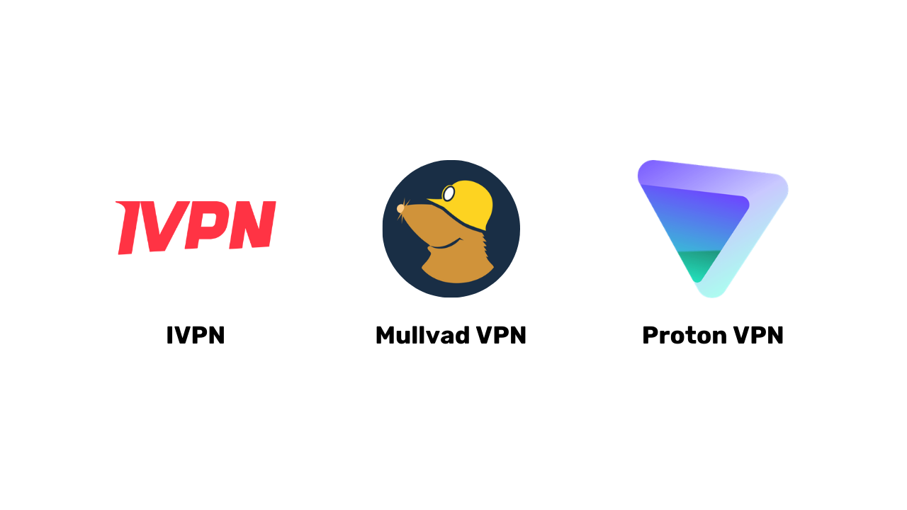
Schließlich kann ein VPN auch verwendet werden, um Online-Werbung zu blockieren und so ein angenehmeres und sichereres Browsing-Erlebnis zu bieten. Es ist jedoch wichtig, eigene Recherchen anzustellen, um das VPN zu finden, das am besten zu den spezifischen Bedürfnissen passt. Die Verwendung eines VPNs wird empfohlen, um die Sicherheit zu stärken, auch beim Surfen im Internet zu Hause. Dies trägt dazu bei, ein höheres Sicherheitsniveau für den Online-Datenaustausch zu gewährleisten. Vergewissern Sie sich abschließend, dass Sie die URLs und das kleine Schlosssymbol in der Adressleiste überprüfen, um zu bestätigen, dass Sie sich auf der von Ihnen beabsichtigten Website befinden.

https://planb.network/tutorials/others/ivpn

https://planb.network/tutorials/others/mullvad

### HTTPS & öffentliche WLAN-Netzwerke'

In Bezug auf die Online-Sicherheit ist es wichtig zu verstehen, dass 4G in der Regel sicherer ist als öffentliches WLAN. Allerdings kann die Nutzung von 4G schnell Ihr mobiles Datenvolumen aufbrauchen. Das HTTPS-Protokoll ist zum Standard für die Verschlüsselung von Daten auf Websites geworden. Es stellt sicher, dass die zwischen dem Benutzer und der Website ausgetauschten Daten sicher sind. Es ist daher entscheidend zu überprüfen, ob die von Ihnen besuchte Website das HTTPS-Protokoll verwendet.

In der Europäischen Union wird der Datenschutz durch die Datenschutz-Grundverordnung (DSGVO) geregelt. Es ist daher sicherer, europäische Anbieter von WLAN-Zugangspunkten wie die SNCF zu verwenden, die die Verbindungsdaten der Benutzer nicht weiterverkaufen. Dennoch garantiert allein das Vorhandensein eines Schlosssymbols auf einer Website nicht deren Authentizität. Es ist wichtig, den öffentlichen Schlüssel der Website mithilfe eines Zertifikatssystems zu überprüfen, um deren Authentizität zu bestätigen. Obwohl die Verschlüsselung von Daten verhindert, dass Dritte die ausgetauschten Daten abfangen, ist es immer noch möglich, dass ein bösartiger Einzelner sich als die Website ausgibt und die Daten im Klartext überträgt.

Um Online-Betrug zu vermeiden, ist es entscheidend, die Identität der besuchten Website zu überprüfen, insbesondere die Erweiterung und den Domainnamen zu überprüfen. Seien Sie auch wachsam gegenüber Betrügern, die ähnliche Buchstaben in URLs verwenden, um Benutzer zu täuschen.
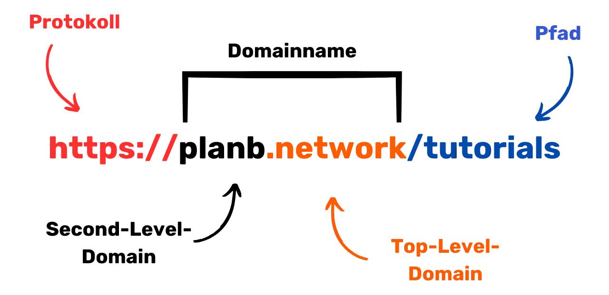
Zusammenfassend kann die Verwendung eines VPN die Online-Sicherheit sowohl für Unternehmen als auch für einzelne Benutzer erheblich verbessern. Darüber hinaus kann das Einhalten guter Browsing-Gewohnheiten zu einer besseren digitalen Hygiene beitragen. Im nächsten Abschnitt dieses Kurses werden wir die Computersicherheit behandeln, einschließlich Updates, Antivirus und Passwortverwaltung.

# Gute Computerpraktiken
<partId>e6eac20b-ba24-5d9a-8d86-8e0164074457</partId>

## Computerbenutzung
<chapterId>16745632-b56b-5423-9873-ddf70fdf1efd</chapterId>

Die Sicherheit unserer Computer ist ein wichtiges Anliegen in der heutigen digitalen Welt. Heute werden wir drei Schlüsselpunkte behandeln:

- Die Wahl des Computers
- Updates und Antivirus für optimale Sicherheit
- Gute Praktiken für die Sicherheit von Computer und Daten.

### Die Wahl des Computers und des Betriebssystems

In Bezug auf die Wahl des Computers gibt es keine signifikanten Sicherheitsunterschiede zwischen alten und neuen Computern. Es gibt jedoch Sicherheitsunterschiede zwischen den Betriebssystemen: Windows, Linux und Mac.

'Concerning Windows, es wird empfohlen, nicht täglich ein Administrator-Konto zu verwenden, sondern zwei separate Konten zu erstellen: ein Administrator-Konto und ein Konto für den täglichen Gebrauch. Windows ist aufgrund seiner großen Anzahl von Benutzern und der einfachen Möglichkeit, vom Benutzer zum Administrator zu wechseln, oft anfälliger für schädliche Software. Auf der anderen Seite sind die Bedrohungen unter Linux und Mac weniger verbreitet.

Die Wahl des Betriebssystems sollte entsprechend Ihren Bedürfnissen und Vorlieben getroffen werden. Linux-Systeme haben sich in den letzten Jahren erheblich weiterentwickelt und sind immer benutzerfreundlicher geworden. Ubuntu ist eine interessante Alternative für Anfänger mit einer benutzerfreundlichen grafischen Benutzeroberfläche. Es ist möglich, einen Computer zu partitionieren, um mit Linux zu experimentieren und gleichzeitig Windows beizubehalten, aber dies kann komplex sein. Es ist oft ratsam, einen dedizierten Computer, eine virtuelle Maschine oder einen USB-Stick zu haben, um Linux oder Ubuntu zu testen.
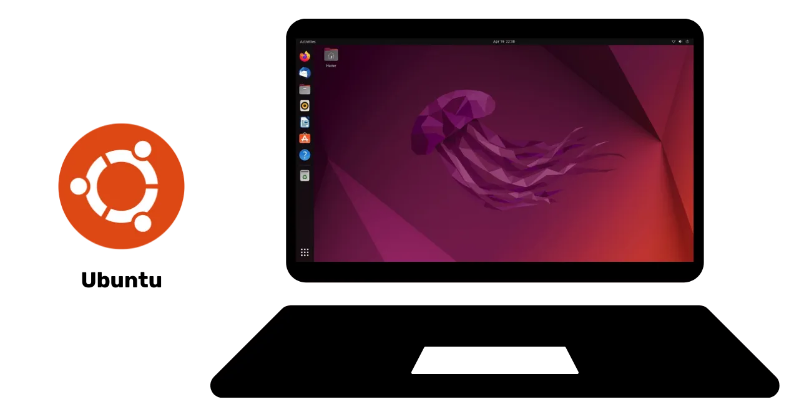

### Software-Updates

Was Updates betrifft, gilt die einfache Regel: **Regelmäßige Updates des Betriebssystems und der Anwendungen sind von entscheidender Bedeutung.**

Bei Windows 10 gibt es praktisch ständige Updates, die nicht blockiert oder verzögert werden sollten. Jedes Jahr werden etwa 15.000 Schwachstellen identifiziert, was die Bedeutung von aktualisierter Software zum Schutz vor Viren unterstreicht. Im Allgemeinen endet der Software-Support 3 bis 5 Jahre nach der Veröffentlichung, daher ist es notwendig, auf die nächste Version zu wechseln, um weiterhin Sicherheit zu gewährleisten.

Diese Regel gilt für nahezu alle Software. Updates sollen Ihre Maschine nicht veralten oder verlangsamen, sondern sie vor neuen Bedrohungen schützen. Einige Updates gelten sogar als wesentlich, und ohne sie ist Ihr Computer ernsthaften Sicherheitsrisiken ausgesetzt.

Um Ihnen ein konkretes Beispiel für einen Fehler zu geben: Eine geknackte Software, die nicht aktualisiert werden kann, stellt eine doppelte potenzielle Bedrohung dar. Das Eindringen des Virus beim illegalen Herunterladen von einer verdächtigen Website und die unsichere Verwendung gegenüber neuen Angriffsformen.

### Antivirus

- Brauchen Sie ein Antivirus? JA
- Müssen Sie dafür bezahlen? Es kommt darauf an!

Die Auswahl und Implementierung eines Antivirus-Programms ist wichtig. Windows Defender, der in Windows integrierte Virenschutz, ist eine sichere und effektive Lösung. Für eine kostenlose Lösung ist er außergewöhnlich gut und besser als viele kostenlose Lösungen, die online verfügbar sind. Es ist wichtig, vorsichtig mit Antivirenprogrammen zu sein, die aus dem Internet heruntergeladen werden, da sie schädlich oder veraltet sein können.'
Für diejenigen, die in eine kostenpflichtige Antivirensoftware investieren möchten, wird empfohlen, eine Antivirensoftware zu wählen, die unbekannte und aufkommende Bedrohungen intelligent analysiert, wie zum Beispiel Kaspersky. Antiviren-Updates sind entscheidend, um sich vor neuen Bedrohungen zu schützen.
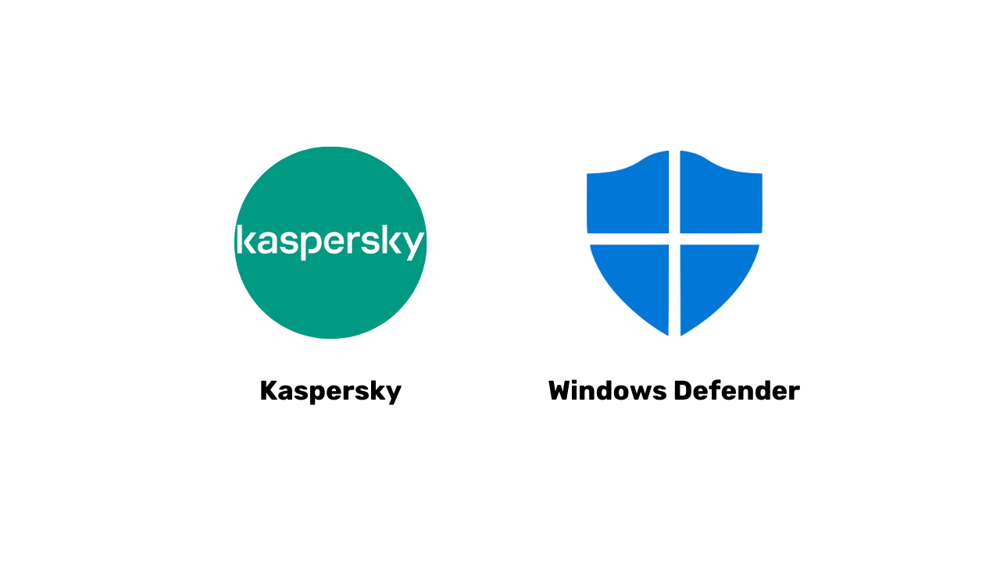
Hinweis: Linux und Mac benötigen aufgrund ihres Benutzerrechtesystems oft keine Antivirensoftware.

Abschließend sind hier einige bewährte Sicherheitspraktiken für Ihren Computer und Ihre Daten. Es ist wichtig, eine effektive und benutzerfreundliche Antivirensoftware zu wählen. Es ist auch entscheidend, gute Praktiken auf Ihrem Computer zu befolgen, wie das Nicht-Einfügen unbekannter USB-Sticks oder das Auffinden an verdächtigen Orten. Diese USB-Sticks können schädliche Programme enthalten, die sich automatisch beim Einstecken starten können. Die Überprüfung des USB-Sticks ist nutzlos, sobald er eingesteckt wurde. Einige Unternehmen wurden Opfer von Hacks aufgrund von nachlässig liegengelassenen USB-Sticks an zugänglichen Orten wie einem Parkplatz.

Behandeln Sie Ihren Computer so, wie Sie es mit Ihrem Zuhause tun würden: bleiben Sie wachsam, führen Sie regelmäßige Updates durch, löschen Sie unnötige Dateien und verwenden Sie ein starkes Passwort für die Sicherheit. Es ist entscheidend, Daten auf Laptops und Smartphones zu verschlüsseln, um Diebstahl oder Datenverlust zu verhindern. BitLocker für Windows, LUKS für Linux und die integrierte Option für Mac sind Lösungen für die Datenverschlüsselung. Es wird empfohlen, die Datenverschlüsselung bedenkenlos zu aktivieren und das Passwort auf einem sicher aufzubewahrenden Papier zu notieren.

Zusammenfassend ist es entscheidend, ein Betriebssystem zu wählen, das Ihren Bedürfnissen entspricht, und es regelmäßig sowie die darauf installierten Anwendungen zu aktualisieren. Es ist auch wichtig, eine effektive und benutzerfreundliche Antivirensoftware zu verwenden und bewährte Sicherheitspraktiken für Ihren Computer und Ihre Daten zu befolgen.

## Hack & Backup-Management: Schutz Ihrer Daten
<chapterId>9ddfcb6a-a253-5542-b7eb-df7222b46dc7</chapterId>

### Wie greifen Hacker an?

Um sich gut zu schützen, ist es entscheidend zu verstehen, wie Hacker versuchen, Ihren Computer zu infiltrieren. Viren kommen nicht oft aus dem Nichts, sondern sind eher die Folge unserer Handlungen, auch wenn sie unbeabsichtigt sind!

Im Allgemeinen gelangen Viren auf Ihren Computer, weil Sie sie eingeladen haben. Dies kann durch das Herunterladen einer verdächtigen Software, einer kompromittierten Torrent-Datei oder einfach durch das Klicken auf den Link einer betrügerischen E-Mail geschehen!

### Phishing, Vorsicht vor betrügerischen E-Mails:

Achtung! E-Mails sind der erste Angriffsvektor. Hier sind einige Tipps:

- Bleiben Sie wachsam gegenüber Phishing-Versuchen, bei denen sensible Informationen wie Ihre Anmeldeinformationen und Passwörter abgefragt werden. Klicken Sie nicht auf verdächtige Links und teilen Sie Ihre persönlichen Informationen nicht, ohne die Legitimität des Absenders zu überprüfen.
- Seien Sie vorsichtig mit Anhängen und Bildern in E-Mails:
  Anhänge und Bilder in E-Mails können schädliche Software enthalten. Laden Sie keine Anhänge von unbekannten oder verdächtigen Absendern herunter und öffnen Sie sie nicht, und stellen Sie sicher, dass Ihr Antivirusprogramm auf dem neuesten Stand ist.

Die goldene Regel hier ist, den vollständigen Namen des Absenders und die Herkunft der E-Mail sorgfältig zu überprüfen. Im Zweifelsfall löschen Sie sie!

### Ransomware und Arten von Cyberangriffen:

Ransomware ist eine Art von schädlicher Software, die die Daten des Benutzers verschlüsselt und eine Lösegeldzahlung zur Entschlüsselung verlangt. Diese Art von Angriff wird immer häufiger und kann für ein Unternehmen oder eine Einzelperson sehr ärgerlich werden. Um sich zu schützen, ist es unerlässlich, Backups der sensibelsten Dateien zu erstellen! Dies wird die Ransomware nicht stoppen, ermöglicht es Ihnen jedoch, sie einfach zu ignorieren.
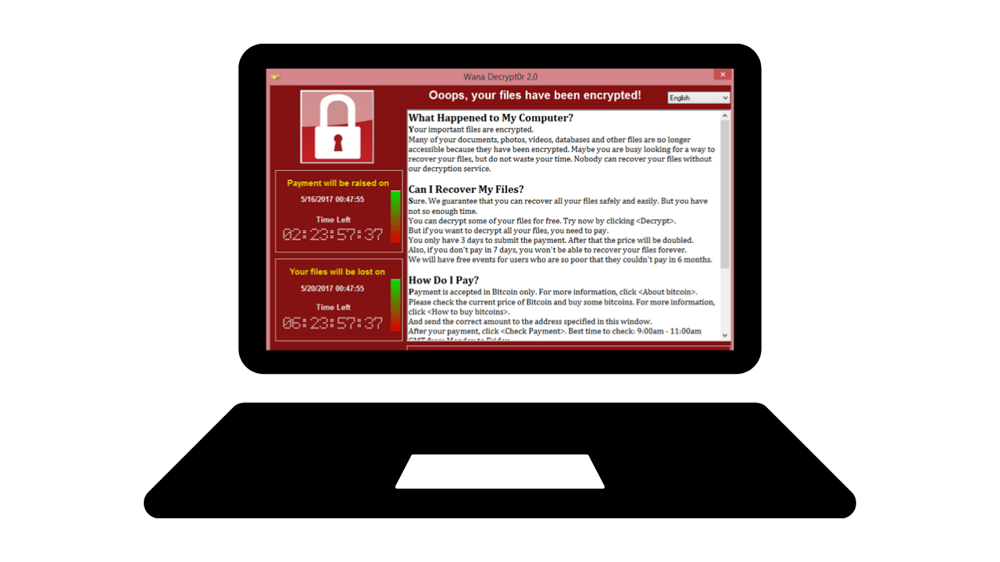
Sichern Sie regelmäßig Ihre wichtigen Daten auf einem externen Speichermedium oder einem sicheren Online-Speicherdienst. Auf diese Weise können Sie im Falle eines Cyberangriffs oder eines Hardwareausfalls Ihre Daten wiederherstellen, ohne wichtige Informationen zu verlieren.

Einfache Lösung:

- Kauf einer externen Festplatte und Kopieren Ihrer Daten darauf. Ziehen Sie das Gerät ab und bewahren Sie es an einem sicheren Ort im Haus auf. (Wenn Sie dies zweimal tun und eine der Festplatten an einem anderen Ort aufbewahren, sind Sie gegen potenzielle Brände geschützt.)

- Erstellen Sie ein "Cloud"-Backup über ProtonMail Drive, Sync oder sogar Google Drive. Laden Sie einfach Ihre sensiblen Daten in diesen Online-Hoster hoch. Beachten Sie jedoch, dass Ihre Daten potenziell im Internet sind und von einem vertrauenswürdigen Dritten verwaltet werden.

### Sollten Hacker bezahlt werden?

NEIN, es wird im Allgemeinen nicht empfohlen, Hacker bei Ransomware oder anderen Arten von Angriffen zu bezahlen. Das Bezahlen des Lösegelds garantiert nicht die Wiederherstellung Ihrer Daten und kann die Cyberkriminellen dazu ermutigen, ihre bösartigen Aktivitäten fortzusetzen. Setzen Sie stattdessen auf Prävention und regelmäßige Sicherung Ihrer Daten, um sich zu schützen.

Wenn Sie einen Virus auf Ihrem Computer entdecken, trennen Sie ihn vom Internet, führen Sie eine vollständige Antiviren-Analyse durch und entfernen Sie infizierte Dateien. Aktualisieren Sie dann Ihre Software und Ihr Betriebssystem und ändern Sie Ihre Passwörter, um weitere Eindringlinge zu vermeiden.

https://planb.network/tutorials/others/proton-drive

https://planb.network/tutorials/others/veracrypt

# Implementierung von Lösungen.
<partId>215ec902-ba05-5549-87fc-cb8d82665f7b</partId>

## Das Management von E-Mail-Postfächern
<chapterId>dfceea33-8712-5557-ace1-6ba5598d33d8</chapterId>

Wir beginnen nun Abschnitt 2 des Kurses. In diesem Abschnitt werden wir drei wichtige Themen behandeln, um die Sicherheit des Online-Zugriffs zu gewährleisten: das Management von E-Mails, die Verwendung eines Passwort-Managers und die Zwei-Faktor-Authentifizierung (2FA).

### Einrichtung eines neuen E-Mail-Kontos!

Das E-Mail-Konto ist der zentrale Punkt Ihrer Online-Aktivitäten: Wenn es kompromittiert wird, kann ein Hacker es verwenden, um über die "Passwort vergessen" Funktion alle Ihre Passwörter wiederherzustellen und somit Zugriff auf viele andere Websites zu erhalten. Deshalb sollten Sie es gut absichern.

Ein E-Mail-Konto sollte daher mit einem einzigartigen und starken Passwort erstellt werden (Details in Kapitel 7) und idealerweise mit einem Zwei-Faktor-Authentifizierungssystem (Details in Kapitel 8).

Obwohl wir alle bereits ein E-Mail-Konto haben, ist es wichtig, die Erstellung eines neuen, moderneren Kontos in Betracht zu ziehen, um auf einem guten Fundament zu starten.

### Auswahl des E-Mail-Anbieters und Verwaltung der E-Mail-Adressen

Die angemessene Verwaltung unserer E-Mail-Adressen ist entscheidend für die Sicherheit unseres Online-Zugriffs. Es ist wichtig, einen sicheren und datenschutzfreundlichen E-Mail-Anbieter zu wählen. Zum Beispiel ist ProtonMail ein sicherer und datenschutzfreundlicher E-Mail-Dienst.
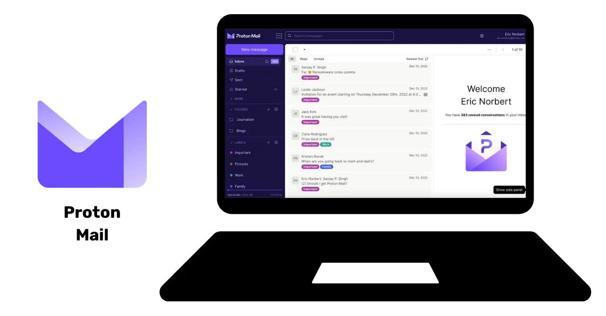
Bei der Auswahl eines E-Mail-Anbieters und der Erstellung eines Passworts ist es unerlässlich, niemals dasselbe Passwort für verschiedene Online-Dienste zu verwenden. Es wird empfohlen, regelmäßig neue E-Mail-Adressen zu erstellen und die Verwendungszwecke durch Verwendung verschiedener E-Mail-Adressen zu trennen. Für kritische Konten ist es ratsam, einen sicheren E-Mail-Dienst zu wählen. Es ist auch zu beachten, dass einige Dienste die Passwortlänge begrenzen, daher ist es wichtig, auf diese Begrenzung zu achten. Es gibt auch Dienste zur Erstellung temporärer E-Mail-Adressen, die für zeitlich begrenzte Konten verwendet werden können.

Es ist wichtig zu bedenken, dass alte E-Mail-Anbieter wie La Poste, Arobase, Wig, Hotmail immer noch verwendet werden, aber ihre Sicherheitspraktiken möglicherweise nicht so gut sind wie die von Gmail. Daher wird empfohlen, zwei separate E-Mail-Adressen zu haben, eine für allgemeine Kommunikation und eine andere für die Kontowiederherstellung, wobei letztere besser abgesichert sein sollte. Es ist ratsam, die E-Mail-Adresse nicht mit dem Mobilfunkanbieter oder Internetdienstanbieter zu verknüpfen, da dies ein Angriffsvektor darstellen kann.

### Sollte ich mein E-Mail-Konto wechseln?

Es wird empfohlen, die Website "Have I Been Pwned" (Wurde ich gehackt) - https://haveibeenpwned.com/ - zu verwenden, um zu überprüfen, ob unsere E-Mail-Adresse kompromittiert wurde und um über zukünftige Datenlecks informiert zu werden. Eine gehackte Datenbank kann von Hackern genutzt werden, um Phishing-E-Mails zu versenden oder kompromittierte Passwörter erneut zu verwenden.
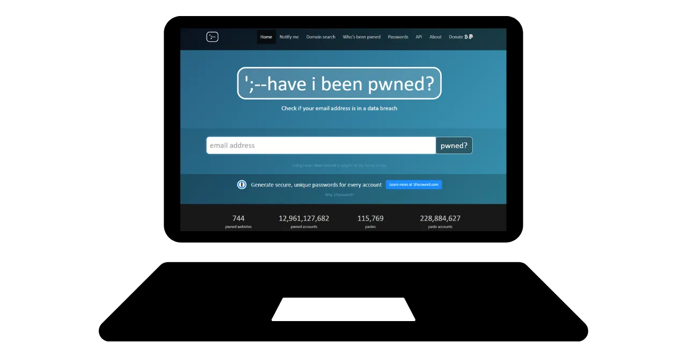
Im Allgemeinen ist es eine gute Praxis und sogar notwendig, eine neue, sicherere E-Mail-Adresse zu verwenden, wenn man einen Neuanfang machen möchte.

Bonus Bitcoin: Es kann ratsam sein, eine spezielle E-Mail-Adresse für unsere Bitcoin-Aktivitäten (Erstellung von Börsenkonten) zu erstellen, um die Aktivitäten in unserem Leben wirklich zu trennen.

https://planb.network/tutorials/others/proton-mail

## Passwort-Manager
<chapterId>0b3c69b2-522c-56c8-9fb8-1562bd55930f</chapterId>

### Was ist ein Passwort-Manager?

Ein Passwort-Manager ist ein Tool, mit dem Sie Ihre Passwörter für verschiedene Online-Konten speichern, generieren und verwalten können. Anstatt sich an mehrere Passwörter erinnern zu müssen, benötigen Sie nur ein Masterpasswort, um auf alle anderen zuzugreifen.

Mit einem Passwort-Manager müssen Sie sich keine Sorgen mehr machen, Ihre Passwörter zu vergessen oder irgendwo aufzuschreiben. Sie müssen sich nur an ein einziges Masterpasswort erinnern. Darüber hinaus generieren die meisten dieser Tools starke Passwörter für Sie, was die Sicherheit Ihrer Konten erhöht.

### Unterschiede zwischen einigen beliebten Managern:

- LastPass: Einer der beliebtesten Passwort-Manager. Es handelt sich um einen Drittanbieterdienst, was bedeutet, dass Ihre Passwörter auf ihren Servern gespeichert werden. Es bietet eine kostenlose und eine kostenpflichtige Version mit einer benutzerfreundlichen Oberfläche.

- Dashlane: Auch dies ist ein Drittanbieterdienst mit einer intuitiven Benutzeroberfläche und zusätzlichen Funktionen wie der Verfolgung von Kreditkarteninformationen und sicheren Notizen.

### Selbsthosting für mehr Kontrolle:

- Bitwarden: Dies ist ein Open-Source-Tool, das bedeutet, dass Sie den Code überprüfen können, um seine Sicherheit zu überprüfen. Obwohl Bitwarden einen gehosteten Dienst anbietet, ermöglicht es Benutzern auch, selbst zu hosten, was bedeutet, dass Sie kontrollieren können, wo Ihre Passwörter gespeichert werden, was potenziell mehr Sicherheit und Kontrolle bietet.

- KeePass: Dies ist eine Open-Source-Lösung, die hauptsächlich für das Selbsthosting gedacht ist. Ihre Daten werden standardmäßig lokal gespeichert, aber Sie können die Passwortdatenbank mit verschiedenen Methoden synchronisieren, wenn Sie möchten. KeePass ist weithin anerkannt für seine Sicherheit und Flexibilität, obwohl es für Anfänger etwas weniger benutzerfreundlich sein kann.
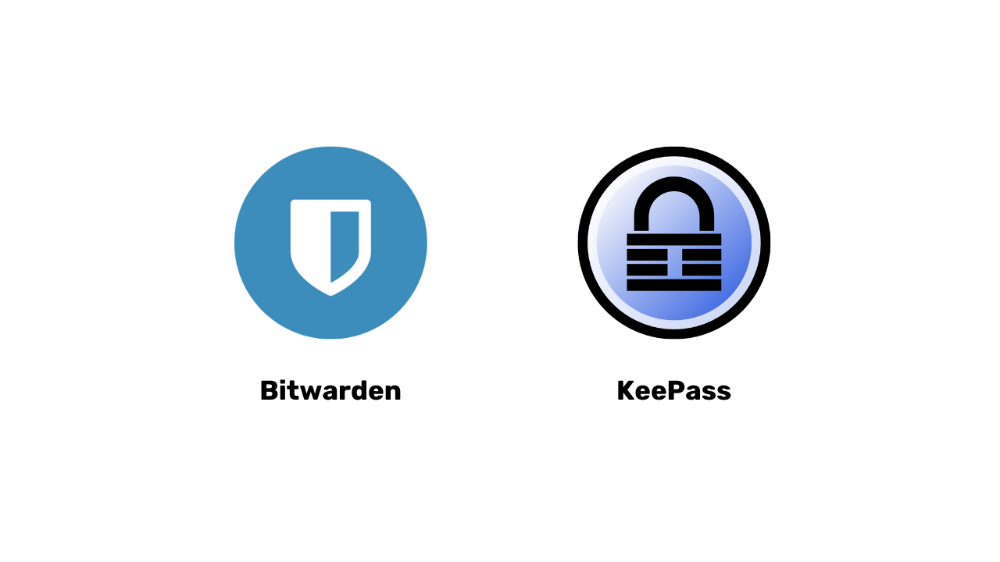
(Hinweis: Die Wahl zwischen einem Drittanbieterdienst und einem selbst gehosteten Dienst hängt von Ihrem technischen Komfortniveau und davon ab, wie Sie Kontrolle im Vergleich zur Bequemlichkeit priorisieren. Drittanbieterdienste sind in der Regel bequemer für die meisten Menschen, während das Selbsthosting mehr technisches Wissen erfordert, aber mehr Kontrolle und Sicherheit bieten kann.)

### Was macht ein gutes Passwort aus?

Ein gutes Passwort ist in der Regel:

- Lang: mindestens 12 Zeichen.
- Komplex: eine Mischung aus Groß- und Kleinbuchstaben, Zahlen und Symbolen.
- Einzigartig: Verwenden Sie nicht dasselbe Passwort für verschiedene Konten.
- Nicht auf persönlichen Informationen basierend: Vermeiden Sie Geburtsdaten, Namen usw.

Um die Sicherheit Ihres Kontos zu gewährleisten, ist es entscheidend, starke und sichere Passwörter zu erstellen. Die Länge des Passworts allein reicht nicht aus, um seine Sicherheit zu gewährleisten. Die Zeichen müssen vollständig zufällig sein, um Brute-Force-Angriffen standzuhalten. Die Unabhängigkeit der Ereignisse ist ebenfalls wichtig, um die wahrscheinlichsten Kombinationen zu vermeiden. Häufig verwendete Passwörter wie "password" sind leicht zu kompromittieren.

Um ein starkes Passwort zu erstellen, wird empfohlen, eine große Anzahl zufälliger Zeichen zu verwenden, ohne vorhersehbare Wörter oder Muster zu verwenden. Es ist auch wichtig, Zahlen und Sonderzeichen einzuschließen. Beachten Sie jedoch, dass einige Websites die Verwendung bestimmter Sonderzeichen einschränken können. Passwörter, die nicht zufällig generiert werden, sind leicht zu erraten. Varianten oder Ergänzungen zu Passwörtern sind nicht sicher. Websites können die Sicherheit von Passwörtern, die von Benutzern ausgewählt wurden, nicht garantieren.

Zufällig generierte Passwörter bieten ein höheres Maß an Sicherheit, können jedoch schwieriger zu merken sein. Passwort-Manager können sicherere zufällig generierte Passwörter erstellen. Durch die Verwendung eines Passwort-Managers müssen Sie sich nicht alle Ihre Passwörter merken. Es ist wichtig, Ihre alten Passwörter nach und nach durch die vom Manager generierten Passwörter zu ersetzen, da sie stärker und länger sind. Stellen Sie sicher, dass das Masterpasswort Ihres Passwort-Managers ebenfalls stark und sicher ist.

https://planb.network/tutorials/others/bitwarden

https://planb.network/tutorials/others/keepass

## Die 2-Faktor-Authentifizierung
<chapterId>9391e02e-e61b-5a86-93e0-91a07f217d35</chapterId>

### Warum 2FA implementieren

Die Zwei-Faktor-Authentifizierung (2FA) ist eine zusätzliche Sicherheitsebene, die verwendet wird, um sicherzustellen, dass Personen, die versuchen, auf ein Online-Konto zuzugreifen, tatsächlich diejenigen sind, für die sie sich ausgeben. Anstatt nur einen Benutzernamen und ein Passwort einzugeben, erfordert die 2FA eine zweite Form der Überprüfung.

Dieser zweite Schritt kann sein:

- Ein temporärer Code, der per SMS gesendet wird.
- Ein von einer Anwendung wie Google Authenticator oder Authy generierter Code.
- Ein physischer Sicherheitsschlüssel, den Sie in Ihren Computer einstecken.

Mit 2FA kann ein Hacker selbst dann nicht auf Ihr Konto zugreifen, wenn er Ihr Passwort hat, ohne diesen zweiten Verifizierungsfaktor. Dies macht 2FA unerlässlich, um Ihre Online-Konten vor unbefugtem Zugriff zu schützen.

### Welche Option wählen?

Die verschiedenen Optionen für starke Authentifizierung bieten unterschiedliche Sicherheitsstufen.

- SMS gelten nicht als beste Option, da sie nur einen Nachweis für den Besitz einer Telefonnummer liefern.
- 2FA (Zwei-Faktor-Authentifizierung) ist sicherer, da sie mehrere Arten von Nachweisen verwendet, wie Wissen, Besitz und Identifikation. Einmalpasswörter (HOTP und TOTP) sind sicherer als SMS, da sie eine kryptografische Berechnung erfordern und lokal gespeichert werden, anstatt im Speicher.
- Hardware-Token wie USB-Sticks oder Smartcards bieten optimale Sicherheit, indem sie für jede Website einen eindeutigen privaten Schlüssel generieren und die URL vor der Autorisierung überprüfen.

Für maximale Sicherheit bei starker Authentifizierung wird empfohlen, eine sichere E-Mail-Adresse, einen sicheren Passwort-Manager und die Verwendung von 2FA mit YubiKey zu verwenden. Es wird auch empfohlen, zwei YubiKeys zu kaufen, um Verlust oder Diebstahl vorzubeugen, z. B. eine Sicherungskopie zu Hause und eine bei sich zu behalten.

Biometrie kann als Ersatz verwendet werden, ist jedoch weniger sicher als die Kombination von Wissen und Besitz. Biometrische Daten sollten auf dem Authentifizierungsgerät bleiben und nicht online veröffentlicht werden. Es ist wichtig, die Bedrohungsmodelle der verschiedenen Authentifizierungsmethoden zu berücksichtigen und entsprechend anzupassen.

### Fazit des Trainings:

Sie haben verstanden, dass die Umsetzung einer guten digitalen Hygiene zwar nicht einfach ist, aber dennoch erreichbar bleibt!

- Erstellen Sie eine neue sichere E-Mail-Adresse.
- Verwenden Sie einen Passwort-Manager.
- Aktivieren Sie 2FA.
- Ersetzen Sie nach und nach Ihre alten Passwörter durch starke Passwörter mit 2FA.

Machen Sie weiterhin Fortschritte und setzen Sie nach und nach die richtigen Praktiken um!

Goldene Regel: IT-Sicherheit ist ein sich ständig veränderndes Ziel, das sich an Ihren Lernfortschritt anpasst!

https://planb.network/tutorials/others/authy

https://planb.network/tutorials/others/security-key

# Praktischer Abschnitt
<partId>98ccf14b-4053-5839-878c-7a73ff02eb95</partId>

## Einrichtung eines Postfachs
<chapterId>afc9ab5d-7664-5a9b-ab50-225ac9ba8f7c</chapterId>

Das Schützen Ihres E-Mail-Kontos ist ein wichtiger Schritt zur Sicherung Ihrer Online-Aktivitäten und zum Schutz Ihrer persönlichen Daten. Dieses Tutorial führt Sie Schritt für Schritt durch die Erstellung und Konfiguration eines ProtonMail-Kontos, eines Anbieters, der für sein hohes Sicherheitsniveau bekannt ist und eine Ende-zu-Ende-Verschlüsselung Ihrer Kommunikation bietet. Ob Sie nun Anfänger oder erfahrener Nutzer sind, die hier vorgeschlagenen bewährten Methoden helfen Ihnen, die Sicherheit Ihres E-Mail-Kontos zu stärken und gleichzeitig die erweiterten Funktionen von ProtonMail zu nutzen:

https://planb.network/tutorials/others/proton-mail

## Absicherung mit 2FA
<chapterId>09468ec1-95b7-56a4-a636-7618044568e1</chapterId>

Die Zwei-Faktor-Authentifizierung (2FA) ist unerlässlich geworden, um Ihre Online-Konten zu sichern. In diesem Tutorial lernen Sie, wie Sie die 2FA-App Authy einrichten und verwenden, die dynamische 6-stellige Codes generiert, um Ihre Konten zu schützen. Authy ist sehr einfach zu bedienen und synchronisiert sich auf mehreren Geräten. Erfahren Sie, wie Sie Authy installieren und konfigurieren und stärken Sie so die Sicherheit Ihrer Online-Konten jetzt:

https://planb.network/tutorials/others/authy

Eine weitere Option ist die Verwendung eines physischen Sicherheitsschlüssels. Dieses zusätzliche Tutorial zeigt Ihnen, wie Sie einen Sicherheitsschlüssel als zweiten Authentifizierungsfaktor einrichten und verwenden:

https://planb.network/tutorials/others/security-key

## Erstellung eines Passwort-Managers
<chapterId>ed579680-4e7b-5f65-8541-14e519a3b242</chapterId>

Das Passwortmanagement ist in der digitalen Ära eine Herausforderung. Wir alle haben zahlreiche Online-Konten, die gesichert werden müssen. Ein Passwortmanager hilft Ihnen, starke und einzigartige Passwörter für jedes Konto zu erstellen und zu speichern.

In diesem Tutorial erfahren Sie, wie Sie Bitwarden, einen Open-Source-Passwortmanager, einrichten und wie Sie Ihre Anmeldedaten auf allen Ihren Geräten synchronisieren, um die tägliche Nutzung zu vereinfachen:

https://planb.network/tutorials/others/bitwarden

Für fortgeschrittene Benutzer biete ich auch ein Tutorial zu einer weiteren kostenlosen und Open-Source-Software an, die Sie lokal zur Verwaltung Ihrer Passwörter verwenden können:

https://planb.network/tutorials/others/keepass

## Absicherung Ihrer Konten
<chapterId>7a774b34-aed0-57dd-b8f7-cf3be51c0d70</chapterId>

In diesen beiden Tutorials führe ich Sie auch bei der Sicherung Ihrer Online-Konten und erkläre Ihnen, wie Sie schrittweise sicherere Praktiken für die tägliche Verwaltung Ihrer Passwörter übernehmen können.

https://planb.network/tutorials/others/bitwarden

https://planb.network/tutorials/others/keepass

## Einrichtung eines Back-ups
<chapterId>01cfcde1-77cb-506c-8df1-fa18a2e8cc6b</chapterId>

Das Schützen Ihrer persönlichen Dateien ist ebenfalls ein wesentlicher Punkt. Dieses Tutorial zeigt Ihnen, wie Sie eine effektive Backup-Strategie mit Proton Drive einrichten. Erfahren Sie, wie Sie diese sichere Cloud-Lösung nutzen, um die 3-2-1-Methode anzuwenden: drei Kopien Ihrer Daten auf zwei verschiedenen Medien, von denen eine Kopie außerhalb des Standorts ist. So gewährleisten Sie die Zugänglichkeit und Sicherheit Ihrer sensiblen Dateien:

https://planb.network/tutorials/others/proton-drive

Und um Ihre auf Wechseldatenträgern wie einem USB-Stick oder einer externen Festplatte gespeicherten Dateien zu sichern, zeige ich Ihnen auch, wie Sie diese Medien einfach mit VeraCrypt verschlüsseln und entschlüsseln können:

https://planb.network/tutorials/others/veracrypt

## Browserwechsel & VPN
<chapterId>8dc08feb-313c-5259-a54f-64aa68a07608</chapterId>

Der Schutz Ihrer Online-Privatsphäre ist ebenfalls ein wichtiger Punkt zur Gewährleistung Ihrer Sicherheit. Die Nutzung eines VPNs kann eine erste Lösung sein, um dies zu erreichen.

Ich schlage vor, zwei zuverlässige VPN-Lösungen zu entdecken, die mit Bitcoin zahlbar sind, nämlich IVPN und Mullvad. Diese Tutorials führen Sie durch die Installation, Konfiguration und Nutzung von Mullvad oder IVPN auf all Ihren Geräten:

https://planb.network/tutorials/others/ivpn

https://planb.network/tutorials/others/mullvad

Erfahren Sie außerdem, wie Sie den Tor Browser verwenden, einen speziell entwickelten Browser zum Schutz Ihrer Online-Privatsphäre:

https://planb.network/tutorials/others/tor-browser

# Gehen Sie weiter
<partId>77113cad-a6d8-57e5-b903-50c223b277ba</partId>

## Wie man in dieser Cybersicherheitsbranche arbeitet
<chapterId>aad1ae27-4280-5b07-b9ab-118ae013951a</chapterId>

Die Cybersicherheit, ein aufstrebendes Gebiet, bietet zahlreiche Möglichkeiten für diejenigen, die sich für den Schutz von Systemen und Daten interessieren. Wenn Sie sich für diese Branche interessieren, finden Sie hier einige wichtige Schritte, um sich zu orientieren.

### Akademische Grundlagen und Zertifizierungen:

Eine solide Ausbildung in Informatik, Informationssystemen oder einem verwandten Bereich ist oft der ideale Sprungbrett, um einzusteigen. Diese Studien bieten die notwendigen Grundlagen, um die technischen Herausforderungen der Cybersicherheit zu verstehen. Um diese Ausbildung zu ergänzen, ist es ratsam, anerkannte Zertifizierungen in diesem Bereich zu erwerben. Obwohl diese Zertifizierungen je nach Region variieren können, genießen einige wie CISSP oder CEH weltweite Anerkennung.

Cybersicherheit ist ein breites und sich ständig weiterentwickelndes Gebiet. Es ist entscheidend, sich mit den wesentlichen Tools und verschiedenen Systemen vertraut zu machen. Darüber hinaus ist es von Vorteil, in den verschiedenen Untergebieten, von Incident Response bis hin zu Ethical Hacking, seine Nische zu finden und sich darauf zu spezialisieren.

### Praktische Erfahrung sammeln:

Die Bedeutung praktischer Erfahrung darf nicht unterschätzt werden. Die Suche nach Praktika oder Juniorpositionen in Unternehmen mit IT-Sicherheitsteams ist eine hervorragende Möglichkeit, theoretisches Wissen in die Praxis umzusetzen. Darüber hinaus können die Teilnahme an Ethical Hacking-Wettbewerben oder Cybersicherheitssimulationen Ihre Fähigkeiten in konkreten Situationen verbessern.

Die Stärke eines beruflichen Netzwerks ist unbezahlbar. Der Beitritt zu Berufsverbänden, Hackerspaces oder Online-Foren bietet eine Plattform zum Austausch mit anderen Experten. Ebenso ermöglicht der Besuch von Konferenzen und Workshops zur Cybersicherheit nicht nur das Lernen, sondern auch das Knüpfen von Kontakten zu Fachleuten der Branche.

Die ständige Weiterentwicklung von Bedrohungen erfordert regelmäßige Überwachung von Nachrichten und spezialisierten Foren. In einer Branche, in der Vertrauen von größter Bedeutung ist, ist ethisches und integeres Handeln in jeder Phase Ihrer Karriere unerlässlich.

### Fähigkeiten und Tools zur Vertiefung:

- Cybersicherheitstools: Wireshark, Metasploit, Nmap.
- Betriebssysteme: Linux, Windows, MacOS.
- Programmiersprachen: Python, C, Java.
- Netzwerke: TCP/IP, VPN, Firewall.
- Datenbanken: SQL, NoSQL.
- Kryptographie: SSL/TLS, symmetrische/asymmetrische Verschlüsselung.
- Incident Management: Log-Analyse, Incident Response.
- Ethical Hacking: Penetrationstechniken, Intrusionstests.
- Governance: ISO-Standards, GDPR/CCPA-Vorschriften.

Indem Sie diese Fähigkeiten und Tools beherrschen, sind Sie gut gerüstet, um erfolgreich in der Welt der Cybersicherheit zu navigieren.

## Interview mit Renaud
<chapterId>7d83fd98-ce22-514e-b9e8-729fbf71ee6e</chapterId>

### Effizientes Passwortmanagement und Stärkung der Authentifizierung: ein akademischer Ansatz

Im Schulungsmodul "Sicherheit 101" von Découvre Bitcoin an der Akademie haben wir die Bedeutung von Passwortmanagern behandelt. Drei Dimensionen sind dabei wesentlich zu beachten: die Erstellung, Aktualisierung und Implementierung von Passwörtern auf Websites.

Es wird im Allgemeinen davon abgeraten, Browsererweiterungen zur automatischen Passworteingabe zu verwenden. Diese Tools können den Benutzer anfälliger für Phishing-Angriffe machen. Renaud, ein anerkannter Experte für Cybersicherheit, bevorzugt eine manuelle Verwaltung mit KeePass, was eine manuelle Kopier- und Einfügeaktion des Passworts bedeutet. Erweiterungen neigen dazu, die Angriffsfläche zu vergrößern, können die Leistung des Browsers verlangsamen und stellen daher ein nicht zu vernachlässigendes Risiko dar. Daher wird empfohlen, den Einsatz von Erweiterungen im Browser auf ein Minimum zu beschränken.

Passwortmanager fördern in der Regel die Verwendung zusätzlicher Authentifizierungsfaktoren wie der Zwei-Faktor-Authentifizierung. Für maximale Sicherheit wird empfohlen, die Einmalpasswörter (OTP) auf dem Mobilgerät zu speichern. AndoTP bietet eine Open-Source-Lösung zum Generieren und Speichern von OTP-Codes auf dem Telefon. Obwohl Google Authenticator das Exportieren von Authentifizierungscodes ermöglicht, ist das Vertrauen in die Sicherung auf einem Google-Konto begrenzt. Daher werden die Anwendungen OTI und AndoTP für eine eigenständige Verwaltung von OTPs empfohlen.
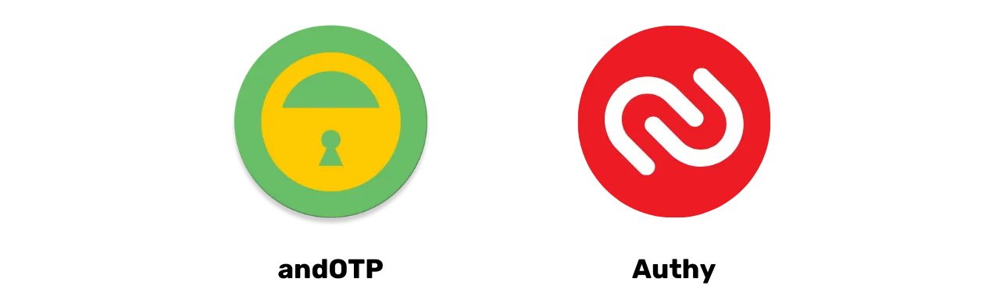
Die Frage des digitalen Erbes und der digitalen Trauer betont die Bedeutung eines Verfahrens zur Übertragung von Passwörtern nach dem Tod einer Person. Ein Passwortmanager erleichtert diesen Übergang, indem er alle digitalen Geheimnisse sicher an einem Ort speichert. Der Passwortmanager ermöglicht auch die Identifizierung aller geöffneten Konten und deren Schließung oder Übertragung. Es wird empfohlen, das Masterpasswort auf Papier zu notieren, aber es sollte an einem versteckten und sicheren Ort aufbewahrt werden. Wenn die Festplatte verschlüsselt und der Computer gesperrt ist, ist das Passwort selbst bei einem Einbruch nicht zugänglich.

### Auf dem Weg in eine post-Passwort-Ära: Erkundung glaubwürdiger Alternativen

Passwörter, obwohl allgegenwärtig, haben viele Nachteile, insbesondere die Möglichkeit einer unsicheren Übertragung während des Authentifizierungsprozesses. Branchenführer wie Microsoft und Apple bieten innovative Alternativen wie Biometrie und Hardware-Token an, was auf einen fortschreitenden Trend zum Verzicht auf Passwörter hindeutet.

Passkeys, zum Beispiel, bietet verschlüsselte zufällige Schlüssel in Verbindung mit einem lokalen Faktor (Biometrie oder PIN), die von einem Anbieter gehostet werden, aber außerhalb seiner Reichweite bleiben. Obwohl dies eine Aktualisierung der Websites erfordert, beseitigt der Ansatz die Notwendigkeit von Passwörtern und bietet somit ein hohes Maß an Sicherheit ohne die Einschränkungen herkömmlicher Passwörter oder die Problematik der digitalen Safe-Verwaltung.
Passkiz ist eine weitere praktikable und sichere Alternative zur Passwortverwaltung. Dennoch bleibt eine wichtige Frage offen: die Verfügbarkeit im Falle eines Ausfalls des Anbieters. Es wäre daher wünschenswert, dass die Internetgiganten Systeme zur Gewährleistung dieser Verfügbarkeit anbieten.

Die direkte Authentifizierung beim betreffenden Dienst stellt eine interessante Option dar, um nicht mehr von Dritten abhängig zu sein. Allerdings birgt das von den Internetgiganten angebotene Single Sign-On (SSO) auch Probleme in Bezug auf Verfügbarkeit und Zensurrisiken. Um Datenlecks zu vermeiden, ist es entscheidend, die Menge an Informationen, die während des Authentifizierungsprozesses gesammelt werden, zu minimieren.

### IT-Sicherheit: Notwendigkeit sicherer Praktiken und Risiken im Zusammenhang mit menschlichem Versagen

Die IT-Sicherheit kann durch einfache Praktiken und die Verwendung von Standardpasswörtern wie "admin" gefährdet werden. Für Angriffe sind nicht immer ausgeklügelte Methoden erforderlich, um die IT-Sicherheit zu gefährden. Zum Beispiel waren die Administratorpasswörter eines YouTube-Kanals im privaten Quellcode eines Unternehmens gespeichert. Sicherheitslücken sind oft auf menschliches Versagen zurückzuführen.

Es ist auch zu beachten, dass das Internet sehr zentralisiert und weitgehend unter amerikanischer Kontrolle steht. Der DNS-Server kann Zensur unterliegen und verwendet oft falsche DNS, um den Zugriff auf bestimmte Websites zu blockieren. DNS ist ein veraltetes und unzureichend sicheres Protokoll, was zu Sicherheitsproblemen führen kann. Neue Protokolle wie DNSsec sind aufgetaucht, werden aber noch wenig genutzt. Um Zensur und Werbeblockaden zu umgehen, können alternative DNS-Anbieter gewählt werden.

Alternativen zu aufdringlicher Werbung sind unter anderem [Google DNS](https://developers.google.com/speed/public-dns/), [OpenDNS](https://www.opendns.com/) und andere unabhängige Dienste. Das Standard-DNS-Protokoll lässt DNS-Anfragen für den Internetdienstanbieter sichtbar. Mit [DOH (DNS over HTTPS)](https://en.wikipedia.org/wiki/DNS_over_HTTPS) und [DOT (DNS over TLS)](https://en.wikipedia.org/wiki/DNS_over_TLS) kann die DNS-Verbindung verschlüsselt werden, was eine höhere Vertraulichkeit und Sicherheit bietet. Diese Protokolle werden aufgrund ihrer höheren Sicherheit häufig in Unternehmen eingesetzt und werden von Windows, Android und iPhone nativ unterstützt. Um DOH und DOT zu verwenden, muss ein TLS-Hostname anstelle einer IP-Adresse eingegeben werden. Die kostenlosen Anbieter von DOH und DOT sind online verfügbar. DOH und DOT verbessern den Datenschutz und die Sicherheit, indem sie "Man-in-the-Middle"-Angriffe verhindern.

Weitere Schlüsselüberlegungen

Im Rahmen des Lernmoduls "Sicherheit 101" von Entdecke Bitcoin auf der Akademie haben wir auch über die Lightning-Authentifizierung diskutiert. Dieses System generiert für jeden Dienst eine andere Kennung, ohne dass eine E-Mail-Adresse oder persönliche Informationen angegeben werden müssen. Es ist möglich, dezentralisierte Identitäten zu haben, die vom Benutzer kontrolliert werden, aber es fehlt an Normierung und Standardisierung in dezentralisierten Identitätsprojekten. Paketmanager wie Nuget und Chocolaté, die das Herunterladen von Open-Source-Software außerhalb des Microsoft Stores ermöglichen, werden empfohlen, um böswillige Angriffe zu verhindern. Zusammenfassend lässt sich sagen, dass das DNS für die Online-Sicherheit von entscheidender Bedeutung ist, aber es ist notwendig, wachsam gegenüber potenziellen Angriffen auf DNS-Server zu bleiben.

## Bewerten Sie den Kurs
<chapterId>6be74d2d-2116-5386-9d92-c4c3e2103c68</chapterId>
<isCourseReview>true</isCourseReview>

## Abschlussprüfung
<chapterId>a894b251-a85a-5fa4-bf2a-c2a876939b49</chapterId>
<isCourseExam>true</isCourseExam>

## Danksagungen und graben Sie weiter im Kaninchenbau
<chapterId>df3a962a-a96e-5006-b904-0dd9d4a072dd</chapterId>

### Bewerten Sie den Kurs & unterstützen Sie uns

Dieser Kurs sowie der gesamte Inhalt auf dieser Universität wurde Ihnen von unserer Gemeinschaft kostenlos zur Verfügung gestellt. Um uns zu unterstützen, können Sie ihn in Ihrem Bekanntenkreis teilen, Mitglied der Universität werden und sogar über [GitHub](https://github.com/) zur Weiterentwicklung beitragen. Im Namen des gesamten Teams: Vielen Dank!

Ein Bewertungssystem für die Ausbildung wird bald in diese neue E-Learning-Plattform integriert! In der Zwischenzeit vielen Dank, dass Sie den Kurs besucht haben, und wenn er Ihnen gefallen hat, denken Sie bitte daran, ihn mit anderen zu teilen.

### gehen Sie weiter

Herzlichen Glückwunsch, dass Sie diesen SEKU 101-Kurs abgeschlossen haben! Ich hoffe von ganzem Herzen, dass es Ihnen gefallen hat und Ihnen Türen geöffnet hat. Sie sind jetzt bereit, Ihre ersten Bitcoins zu erhalten oder einfach das Abenteuer mit den Kursen der Stufe 2 fortzusetzen!

- BTC 101 vermittelt Ihnen die theoretischen Grundlagen von Bitcoin.
- BTC 102 wird Ihnen helfen, Ihren Bitcoin-Plan umzusetzen.
- LN 201 und 202 werden Ihnen das Lightning Network, ein Netzwerk für Zahlungen in der zweiten Schicht, näher bringen.
- ECON 201 wird sich mit der österreichischen Wirtschaft befassen.
- MINAGE 201, um mehr über das Mining zu erfahren.
- (und viele andere)

Ein riesiges Dankeschön an unsere Patreon, Mitglieder und Spender für ihre finanzielle Unterstützung, danke an diejenigen, die teilen und danke an diejenigen, die diese Ausbildung möglich gemacht haben: Théo pantamis, Renaud, Théo, Fabien, Noury, Muriel & das gesamte Team.
Bis bald!
