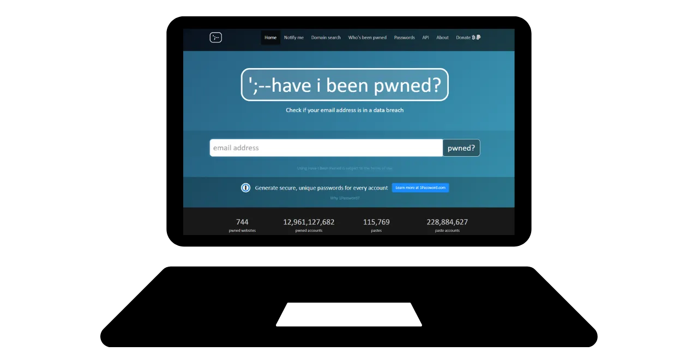

# A journey towards protecting your data

Welcome everyone to this educational program dedicated to digital security. This training is designed to be accessible to everyone, so no prior knowledge of computer science is required. Our main goal is to provide you with the knowledge and skills necessary to navigate the digital world more safely and privately.

This will involve the implementation of several tools such as a secure email service, a tool to better manage your passwords, and various software to secure your online activities.

In this training, we are not aiming to make you an expert, anonymous, or invulnerable, as this is impossible. Instead, we offer you some simple and accessible solutions to start transforming your online habits and regain control of your digital sovereignty.

Contributors team:
Muriel; design
Rogzy Noury & Fabian; production
Théo; contribution

+++

# Introduction
<partId>534ab66c-b0e6-5757-a7dd-6ea04647edf2</partId>

## Course Introduction
<chapterId>2f3d005d-8b49-5a3f-b90d-94c11f613407</chapterId>

### Objective: Update your security skills !

Welcome everyone to this educational program dedicated to digital security. This training is designed to be accessible to everyone, so no prior knowledge of computer science is required. Our main goal is to provide you with the knowledge and skills necessary to navigate the digital world more safely and privately.

This will involve the implementation of several tools such as a secure email service, a tool to better manage your passwords, and various software to secure your online activities.

This training is a collaborative effort of three of our professors:

- Renaud Lifchitz, cybersecurity expert
- Théo Pantamis, PhD in applied mathematics
- Rogzy, CEO of DécouvreBitcoin

Your digital hygiene is crucial in an increasingly digital world. Despite the constant increase in hacking and mass surveillance, it is not too late to take the first step and protect yourself.
In this training, we are not trying to make you an expert, anonymous, or invulnerable, as this is impossible. Instead, we offer you some simple and accessible solutions for everyone to start transforming your online habits and regain control of your digital sovereignty.
If you are looking for more advanced skills on the subject, our resources, tutorials, or other cybersecurity training are here for you. In the meantime, here is a brief overview of our program for the next few hours together.

### Section 1: Everything you need to know about online browsing

- Chapter 1 - Online browsing
- Chapter 2 - Using the internet securely

To start, we will discuss the importance of choosing a web browser and its implications for security. We will then explore the specifics of browsers, particularly regarding cookie management. We will also see how to ensure a more secure and anonymous browsing experience, using tools such as TOR. Afterwards, we will focus on the use of VPNs to enhance the protection of your data. Finally, we will end with recommendations for secure use of WiFi connections.

### Section 2: Best practices for computer usage

- Chapter 3 - Computer usage
- Chapter 4 - Hacking & backup management

In this section, we will cover three key areas of computer security. First, we will explore different operating systems: Mac, PC, and Linux, highlighting their specificities and strengths. Then, we will delve into methods to effectively protect against hacking attempts and strengthen the security of your devices. Finally, we will emphasize the importance of regularly protecting and backing up your data to prevent any loss or ransomware.

### Section 3: Implementation of solutions

- Chapter 6 - Email management
- Chapter 7 - Password manager
- Chapter 8 - Two-factor authentication

In this practical third section, we will move on to the implementation of your concrete solutions.

First, we will see how to protect your email inbox, which is essential for your communications and often targeted by hackers. Then, we will introduce you to a password manager: a practical solution to no longer forget or mix up your passwords while keeping them secure. Finally, we will discuss an additional security measure, two-factor authentication, which adds an extra layer of protection to your accounts. Everything will be explained clearly and accessibly.

# Everything you need to know about online browsing
<partId>b4b5379a-d8ef-59ae-94d3-a6e88959c149</partId>

## Online browsing
<chapterId>3a935da9-fa6e-57eb-bf85-7b3ec35e6ee2</chapterId>

When browsing the internet, it is important to avoid certain common mistakes to preserve your online security. Here are some tips to avoid them:

### Be cautious with software downloads:

It is recommended to download software from the official website of the publisher rather than generic sites.
Example: Use www.signal.org/download instead of www.logicieltelechargement.fr/signal.

It is also advisable to prioritize open-source software as they are often safer and free from malicious software. An "open-source" software is a software whose code is known and accessible to everyone. This allows for verification, among other things, that there is no hidden access to steal your personal data.

> Bonus: Open-source software is often free! This university is 100% open source, so you can also check our code on our GitHub.

### Cookie management: Errors and best practices

Cookies are files created by websites to store information on your device. While some sites require these cookies to function properly, they can also be exploited by third-party sites, especially for advertising tracking purposes. In accordance with regulations such as the GDPR, it is possible - and recommended - to refuse third-party tracking cookies while accepting those that are essential for the proper functioning of the site. After each visit to a site, it is wise to delete the associated cookies, either manually or through an extension or specific program. Some browsers even offer the possibility to selectively delete cookies. Despite these precautions, it is crucial to understand that the information collected by different sites can remain interconnected, hence the importance of finding a balance between convenience and security.

> Note: Also limit the number of extensions installed on your browser to avoid potential security and performance issues.

### Web browsers: choices, security

There are two major families of browsers: those based on Chrome and those based on Firefox.
Although both families offer a similar level of security, it is recommended to avoid Google Chrome browser due to its trackers. Lighter alternatives to Chrome, such as Chromium or Brave, may be preferred. Brave is particularly recommended for its built-in ad blocker. It may be necessary to use multiple browsers to access certain websites.

### Private browsing, TOR, and other alternatives for more secure and anonymous browsing

Private browsing, although it does not hide browsing from your internet service provider, allows you to not leave local traces on your computer. Cookies are automatically deleted at the end of each session, allowing you to accept all cookies without being tracked. Private browsing can be useful when purchasing online services, as websites track our search habits and adjust prices accordingly. However, it is important to note that private browsing is recommended for temporary and specific sessions, not for general internet browsing.

A more advanced alternative is the TOR (The Onion Router) network, which offers anonymity by masking the user's IP address and allowing access to the Darknet. TOR Browser is a browser specifically designed to use the TOR network. It allows you to visit both conventional websites and .onion websites, which are typically operated by individuals and may be of an illegal nature.

TOR is legal and is used by journalists, freedom activists, and others wishing to escape censorship in authoritarian countries. However, it is important to understand that TOR does not secure the visited sites or the computer itself. Additionally, using TOR can slow down the internet connection as data passes through three other people's computers before reaching its destination. It is also essential to note that TOR is not a foolproof solution to guarantee 100% anonymity and should not be used for illegal activities.

https://planb.network/tutorials/others/tor-browser

## VPN and internet connection
<chapterId>5aac83f4-a685-54b0-9759-d71bea7eeed2</chapterId>

### VPNs

Protecting your internet connection is a crucial aspect of online security, and using virtual private networks (VPNs) is an effective method to enhance this security, both for businesses and individual users.

'VPNs are tools that encrypt data transmitted over the internet, making the connection more secure. In a professional context, VPNs allow employees to securely access the company's internal network remotely. The exchanged data is encrypted, making it much more difficult for third parties to intercept. In addition to securing access to an internal network, using a VPN can allow a user to route their internet connection through the company's internal network, giving the impression that their connection is coming from the company. This can be particularly useful for accessing online services that are geographically restricted.

### Types of VPNs

There are two main types of VPNs: enterprise VPNs and consumer VPNs, such as NordVPN. Enterprise VPNs tend to be more expensive and complex, while consumer VPNs are generally more accessible and user-friendly. For example, NordVPN allows users to connect to the internet through a server located in another country, which can bypass geographical restrictions.

However, using a consumer VPN does not guarantee complete anonymity. Many VPN providers retain information about their users, which can potentially compromise their anonymity. Although VPNs can be useful for improving online security, they are not a universal solution. They are effective for certain specific uses, such as accessing geographically limited services or improving security while traveling, but they do not guarantee total security. When choosing a VPN, it is essential to prioritize reliability and technicality over popularity. VPN providers that collect the least personal information are generally the safest. Services like iVPN and Mullvad do not collect personal information and even allow payments in Bitcoin for increased privacy.

Finally, a VPN can also be used to block online advertisements, providing a more enjoyable and secure browsing experience. However, it is important to do your own research to find the VPN that best suits your specific needs. Using a VPN is recommended to enhance security, even when browsing the internet at home. This helps ensure a higher level of security for exchanged data online. Finally, make sure to check the URLs and the small padlock in the address bar to confirm that you are on the site you intend to visit.

https://planb.network/tutorials/others/ivpn

https://planb.network/tutorials/others/mullvad

### HTTPS & public Wi-Fi networks'

In terms of online security, it is essential to understand that 4G is generally more secure than public Wi-Fi. However, using 4G can quickly deplete your mobile data plan. The HTTPS protocol has become the standard for encrypting data on websites. It ensures that the data exchanged between the user and the website is secure. Therefore, it is crucial to verify that the site you are visiting is using the HTTPS protocol.

In the European Union, data protection is regulated by the General Data Protection Regulation (GDPR). Therefore, it is safer to use European Wi-Fi access point providers, such as SNCF, who do not resell user connection data. However, the mere fact that a site displays a padlock does not guarantee its authenticity. It is important to verify the site's public key using a certificate system to confirm its authenticity. Although data encryption prevents third parties from intercepting exchanged data, it is still possible for a malicious individual to impersonate the site and transfer data in plain text.

To avoid online scams, it is crucial to verify the identity of the site you are browsing, especially by checking the extension and domain name. Additionally, be vigilant against scammers who use similar letters in URLs to deceive users.

In summary, the use of VPN can greatly improve online security, both for businesses and individual users. Furthermore, practicing good browsing habits can contribute to better digital hygiene. In the next segment of this course, we will address computer security, including updates, antivirus, and password management.

# Best Practices for Computer Use
<partId>e6eac20b-ba24-5d9a-8d86-8e0164074457</partId>

## Computer Use
<chapterId>16745632-b56b-5423-9873-ddf70fdf1efd</chapterId>

The security of our computers is a major concern in today's digital world. Today, we will address three key points:

- Choosing the computer
- Updates and antivirus for optimal security
- Best practices for the security of your computer and data.

### Choosing the Computer and Operating System

Regarding the choice of the computer, there is no significant difference in security between old and new computers. However, security differences exist between operating systems: Windows, Linux, and Mac.

Regarding Windows, it is recommended not to use an administrator account on a daily basis, but rather to create two separate accounts: an administrator account and an account for daily use. Windows is often more exposed to malware due to its large number of users and the ease of switching from user to administrator. On the other hand, threats are less common on Linux and Mac.

The choice of operating system should be based on your needs and preferences. Linux systems have evolved considerably in recent years, becoming more and more user-friendly. Ubuntu is an interesting alternative for beginners, with an easy-to-use graphical interface. It is possible to partition a computer to experiment with Linux while keeping Windows, but this can be complex. It is often preferable to have a dedicated computer, a virtual machine, or a USB key to test Linux or Ubuntu.

### Software Updates

Regarding updates, the rule is simple: **regularly updating the operating system and applications is essential.**

On Windows 10, updates are almost continuous and it is crucial not to block or delay them. Each year, about 15,000 vulnerabilities are identified, highlighting the importance of keeping software up to date to protect against viruses. In general, software support ends between 3 and 5 years after its release, so it is necessary to upgrade to the higher version to continue benefiting from security.

The rule applies to almost all software. Indeed, updates are not intended to make your machine obsolete or slow, but to protect it from new threats. Some updates are even considered major, and without them, your computer is at serious risk of exploitation.

To give you a concrete example of an error: cracked software that cannot be updated represents a double potential threat. The arrival of a virus during its illegal download from a suspicious website and an insecure use against new forms of attack.

### Anti-virus

- Do you need an anti-virus? YES
- Do you have to pay? It depends!

The choice and implementation of an anti-virus is important. Windows Defender, the built-in antivirus in Windows, is a safe and effective solution. For a free solution, it is extremely good and much better than many free solutions found online. Indeed, caution should be exercised with antivirus downloaded from the Internet, as they can be malicious or outdated.
For those who wish to invest in a paid antivirus, it is recommended to choose an antivirus that intelligently analyzes unknown and emerging threats, such as Kaspersky. Antivirus updates are essential to protect against new threats.

> Note: Linux and Mac, thanks to their user rights separation system, often do not need antivirus.

Finally, here are some good practices for the security of your computer and data. It is important to choose an effective and user-friendly antivirus. It is also crucial to adopt good practices on your computer, such as not inserting unknown or suspicious USB keys. These USB keys may contain malicious programs that can automatically launch upon insertion. Checking the USB key will be useless once it has been inserted. Some companies have been victims of hacking due to USB keys carelessly left in accessible areas, such as a parking lot.

Treat your computer as you would your home: stay vigilant, regularly update, delete unnecessary files, and use a strong password for security. It is crucial to encrypt data on laptops and smartphones to prevent theft or data loss. BitLocker for Windows, LUKS for Linux, and the built-in option for Mac are solutions for data encryption. It is recommended to activate data encryption without hesitation and to write down the password on a paper to be kept in a safe place.

In conclusion, it is essential to choose an operating system that suits your needs and regularly update it, as well as the installed applications. It is also essential to use an effective and user-friendly antivirus and adopt good practices for the security of your computer and data.

## Hacking & Backup Management: Protecting Your Data
<chapterId>9ddfcb6a-a253-5542-b7eb-df7222b46dc7</chapterId>

### How do hackers attack?

In order to protect yourself well, it is essential to understand how hackers try to infiltrate your computer. Indeed, viruses do not often appear magically, but are rather the consequences of our actions, even unintentionally!

As a general rule, viruses arrive because you have allowed your computer to invite them into your home. This can be visualized by downloading suspicious software, a compromised torrent file, or simply by clicking on the link of a fraudulent email!

### Phishing, vigilance against fraudulent emails:

Attention! Emails are the first vector of attack, here are some tips:

- Stay alert to phishing attempts aimed at extracting sensitive information such as your credentials and passwords. Avoid clicking on suspicious links and sharing your personal information without verifying the legitimacy of the sender.
- Be cautious with email attachments and images:
  Email attachments and images can contain malware. Do not download or open attachments from unknown or suspicious senders, and make sure your antivirus is up to date.

The golden rule here is to carefully check the full name of the sender as well as the origin of the email. When in doubt, delete it!

### Ransomware and types of cyber attacks:

Ransomware is a type of malicious software that encrypts user data and demands a ransom to decrypt it. This type of attack is becoming increasingly common and can be very troublesome for a company or an individual. To protect yourself, it is imperative to create backups of the most sensitive files! This will not stop the ransomware, but it will allow you to simply ignore it.

Regularly back up your important data to an external storage device or a secure online storage service. This way, in the event of a cyber attack or hardware failure, you can recover your data without losing crucial information.

Simple solution:

- Purchase an external hard drive and copy your data onto it. Disconnect it and store it somewhere in the house. (Doing this twice and storing one of the drives in another location helps protect against potential fire.)

- Create a "cloud" backup using ProtonMail Drive, Sync, or even Google Drive. Simply upload your sensitive data to this online host. However, be aware that your data is potentially on the internet and held by a trusted third party.

### Should you pay the hackers?

NO, it is generally not recommended to pay hackers in the case of ransomware or other types of attacks. Paying the ransom does not guarantee the recovery of your data and can encourage cybercriminals to continue their malicious activities. Instead, prioritize prevention and regular backup of your data to protect yourself.

If you detect a virus on your computer, disconnect it from the internet, perform a full antivirus scan, and delete infected files. Then, update your software and operating system, and change your passwords to prevent further intrusions.

https://planb.network/tutorials/others/proton-drive

https://planb.network/tutorials/others/veracrypt

# Implementation of solutions.
<partId>215ec902-ba05-5549-87fc-cb8d82665f7b</partId>

## Managing email accounts
<chapterId>dfceea33-8712-5557-ace1-6ba5598d33d8</chapterId>

### Setting up a new email account!

The email account is the central point of your online activity: if it is compromised, a hacker can use it to reset all your passwords via the "forgot password" function and gain access to many other sites. That's why you need to secure it properly.

An email account should be created with a unique and strong password (details in chapter 7) and ideally with a two-factor authentication system (details in chapter 8).

Although we all already have an email account, it is important to consider creating a new, more modern one to start fresh.

### Choosing an email provider and managing email addresses

Proper management of our email addresses is crucial to ensure the security of our online access. It is important to choose a secure and privacy-respecting email provider. For example, ProtonMail is a secure and privacy-respecting email service.

When choosing an email provider and creating a password, it is essential to never reuse the same password for different online services. It is recommended to regularly create new email addresses and separate uses by using different email addresses. It is preferable to opt for a secure email service for critical accounts. It should also be noted that some services limit the length of passwords, so it is important to be aware of this limitation. Services are also available for creating temporary email addresses, which can be used for limited-duration accounts.

It is important to consider that older email providers such as La Poste, Arobase, Wig, Hotmail, are still used, but their security practices may not be as good as those of Gmail. Therefore, it is recommended to have two separate email addresses, one for general communications and the other for account recovery, with the latter being better secured. It is best to avoid mixing the email address with your phone operator or internet service provider, as this can be an attack vector.

### Should I change my email account?

It is advisable to use the website Have I Been Pwned (https://haveibeenpwned.com/) to check if our email address has been compromised and to be notified of future data breaches. A hacked database can be exploited by hackers to send phishing emails or reuse compromised passwords.

In general, starting to use a new, more secure email address is not a bad practice and even necessary if one wants to start fresh on a healthy basis.
Bonus Bitcoin: It may be advisable to create a specific email address for our Bitcoin activities (creating exchange accounts) in order to truly separate the areas of activity in our lives.

https://planb.network/tutorials/others/proton-mail

## Password Manager
<chapterId>0b3c69b2-522c-56c8-9fb8-1562bd55930f</chapterId>

### What is a password manager?

A password manager is a tool that allows you to store, generate, and manage your passwords for different online accounts. Instead of remembering multiple passwords, you only need one master password to access all the others.

With a password manager, you no longer have to worry about forgetting your passwords or writing them down somewhere. You only need to remember one master password. Additionally, most of these tools generate strong passwords for you, which enhances the security of your accounts.

### Differences between some popular managers:

- LastPass: One of the most popular managers. It is a third-party service, which means your passwords are stored on their servers. It offers a free version and a paid version, with a user-friendly interface.

- Dashlane: It is also a third-party service, with an intuitive interface and additional features such as tracking credit card information and secure notes.

### Self-hosting for more control:

- Bitwarden: It is an open-source tool, which means you can review its code to verify its security. Although Bitwarden offers a hosted service, it also allows users to self-host, which means you can control where your passwords are stored, potentially offering more security and control.

- KeePass: It is an open-source solution that is primarily intended for self-hosting. Your data is stored locally by default, but you can synchronize the password database using different methods if you wish. KeePass is widely recognized for its security and flexibility, although it may be slightly less user-friendly for beginners.

(Note: Choosing between a third-party service or a self-hosted service depends on your level of technological comfort and how you prioritize control versus convenience. Third-party services are generally more convenient for most people, while self-hosting requires more technical knowledge but can offer more control and peace of mind in terms of security.)

### What makes a good password:

A good password is generally:

- Long: at least 12 characters.
- Complex: a mixture of uppercase and lowercase letters, numbers, and symbols.
- Unique: do not reuse the same password for different accounts.
- Not based on personal information: avoid birth dates, names, etc.

To ensure the security of your account, it is crucial to create strong and secure passwords. The length of the password is not enough to ensure its security. The characters must be completely random in order to resist brute force attacks. The independence of events is also important to avoid the most likely combinations. Common passwords such as "password" are easily compromised.

To create a strong password, it is recommended to use a large number of random characters, without using predictable words or patterns. It is also essential to include numbers and special characters. However, it should be noted that some websites may restrict the use of certain special characters. Passwords that are not randomly generated are easy to guess. Variations or additions to passwords are not secure. Websites cannot guarantee the security of passwords chosen by users.

Randomly generated passwords offer a higher level of security, although they may be more difficult to remember. Password managers can generate more secure random passwords. By using a password manager, you do not need to memorize all your passwords. It is important to gradually replace your old passwords with those generated by the manager, as they are stronger and longer. Make sure that the master password of your password manager is also strong and secure.

https://planb.network/tutorials/others/bitwarden

https://planb.network/tutorials/others/keepass

## Two-Factor Authentication
<chapterId>9391e02e-e61b-5a86-93e0-91a07f217d35</chapterId>

### Why implement 2FA

Two-factor authentication (2FA) is an additional layer of security used to ensure that the people attempting to access an online account are who they claim to be. Instead of just entering a username and password, 2FA requires a second form of verification.

This second step can be:

- A temporary code sent via SMS.
- A code generated by an application like Google Authenticator or Authy.
- A physical security key that you insert into your computer.

With 2FA, even if a hacker obtains your password, they will not be able to access your account without this second verification factor. This makes 2FA essential for protecting your online accounts against unauthorized access.

### Which option to choose?

The different options for strong authentication offer varying levels of security.

- SMS is not considered the best option as it only provides proof of possession of a phone number.
- 2FA (two-factor authentication) is more secure as it uses multiple types of evidence, such as knowledge, possession, and identification. One-time passwords (HOTP and TOTP) are safer than SMS because they require cryptographic calculation and are stored locally rather than in memory.
- Hardware tokens, such as USB keys or smart cards, offer optimal security by generating a unique private key for each site and verifying the URL before allowing the connection.

For optimal security with strong authentication, it is recommended to use a secure email address, a secure password manager, and adopt 2FA using YubiKeys. It is also advisable to purchase two YubiKeys to anticipate loss or theft, for example, keeping a backup copy both at home and on your person.

Biometrics can be used as a substitute, but it is less secure than the combination of knowledge and possession. Biometric data should remain on the authentication device and not be disclosed online. It is important to consider the threat model associated with different authentication methods and adjust practices accordingly.

### Conclusion of the training:

As you have understood, implementing good digital hygiene is not necessarily simple, but it remains accessible!

- Creating a new secure email address.
- Setting up a password manager.
- Activating 2FA.
- Gradually replacing our old passwords with strong passwords with 2FA.

Keep learning and gradually implement good practices!

Golden rule: Cybersecurity is a moving target that will adapt to your learning journey!

https://planb.network/tutorials/others/authy

https://planb.network/tutorials/others/security-key

# Practical Section 
<partId>98ccf14b-4053-5839-878c-7a73ff02eb95</partId>

## Setting up a Mailbox 
<chapterId>afc9ab5d-7664-5a9b-ab50-225ac9ba8f7c</chapterId>

Protecting your email account is an important step to secure your online activities and safeguard your personal data. This tutorial will guide you, step by step, in creating and setting up a ProtonMail account, a provider known for its high level of security that offers end-to-end encryption of your communications. Whether you are a novice or an experienced user, the best practices presented here will help you strengthen the security of your email, while taking advantage of ProtonMail's advanced features:

https://planb.network/tutorials/others/proton-mail

## Securing in 2FA
<chapterId>09468ec1-95b7-56a4-a636-7618044568e1</chapterId>

Two-factor authentication (2FA) has become essential for securing your online accounts. In this tutorial, you will learn how to set up and use the 2FA app Authy, which generates dynamic 6-digit codes to protect your accounts. Authy is very easy to use and synchronizes across multiple devices. Discover how to install and configure Authy, and thus strengthen the security of your online accounts right now:

https://planb.network/tutorials/others/authy

Another option is to use a physical security key. This additional tutorial shows you how to set up and use a security key as a second authentication factor:

https://planb.network/tutorials/others/security-key

## Creating a password manager
<chapterId>ed579680-4e7b-5f65-8541-14e519a3b242</chapterId>

Password management is a challenge in the digital age. We all have numerous online accounts to secure. A password manager helps you create and store strong and unique passwords for each account.

In this tutorial, learn how to set up Bitwarden, an open-source password manager, and how to sync your credentials across all your devices to simplify your daily use:

https://planb.network/tutorials/others/bitwarden

For more advanced users, I also offer a tutorial on another free and open-source software to use locally for managing your passwords:

https://planb.network/tutorials/others/keepass

## Securing your accounts
<chapterId>7a774b34-aed0-57dd-b8f7-cf3be51c0d70</chapterId>

In these two tutorials, I also guide you in securing your online accounts and explain how to gradually adopt more secure practices for managing your passwords on a daily basis.

https://planb.network/tutorials/others/bitwarden

https://planb.network/tutorials/others/keepass

## Back-up set-up
<chapterId>01cfcde1-77cb-506c-8df1-fa18a2e8cc6b</chapterId>

Protecting your personal files is also a crucial point. This tutorial shows you how to implement an effective backup strategy using Proton Drive. Discover how to use this secure cloud solution to apply the 3-2-1 method: three copies of your data on two different media, with one copy offsite. This ensures the accessibility and security of your sensitive files:

https://planb.network/tutorials/others/proton-drive

And to secure your files stored on removable media like a USB drive or external hard drive, I also show you how to easily encrypt and decrypt these media using VeraCrypt:

https://planb.network/tutorials/others/veracrypt

## Change of browser & VPN
<chapterId>8dc08feb-313c-5259-a54f-64aa68a07608</chapterId>

Protecting your online privacy is also a crucial point to ensure your security. Using a VPN can be a first solution to achieve this.

I suggest discovering two reliable VPN solutions that are payable in Bitcoin, namely IVPN and Mullvad. These tutorials guide you on how to install, configure, and use Mullvad or IVPN on all your devices:

https://planb.network/tutorials/others/ivpn

https://planb.network/tutorials/others/mullvad

Also, learn how to use Tor Browser, a browser specifically designed to protect your online privacy:

https://planb.network/tutorials/others/tor-browser

# Go further
<partId>77113cad-a6d8-57e5-b903-50c223b277ba</partId>

## How to work in the cybersecurity industry
<chapterId>aad1ae27-4280-5b07-b9ab-118ae013951a</chapterId>

### Cybersecurity: A Growing Field with Endless Opportunities

If you are passionate about protecting systems and data, the field of cybersecurity offers a multitude of opportunities. If this industry intrigues you, here are some key steps to guide you.

### Academic Foundations and Certifications:

A solid education in computer science, information systems, or a related field is often the ideal starting point. These studies provide the necessary foundation to understand the technical challenges of cybersecurity. To complement this education, it is wise to obtain recognized certifications in the field. While these certifications may vary by region, some, such as CISSP or CEH, enjoy global recognition.

Cybersecurity is a vast and constantly evolving field. Familiarizing yourself with essential tools and different systems is crucial. Additionally, with so many subdomains, from incident response to ethical hacking, it is beneficial to find your niche and specialize in it.

### Gaining Practical Experience:

The importance of practical experience cannot be underestimated. Seeking internships or junior positions in companies with cybersecurity teams is an excellent way to apply your theoretical knowledge. Furthermore, engaging in ethical hacking competitions or cybersecurity simulations can refine your skills in real-world situations.

The strength of a professional network is invaluable. Joining professional associations, hackerspaces, or online forums provides a platform to exchange ideas with other experts. Similarly, attending cybersecurity conferences and workshops not only allows you to learn but also helps you build connections with industry professionals.

The constant evolution of threats requires regular monitoring of news and specialized forums. In a sector where trust is paramount, acting with ethics and integrity is essential at every stage of your career.

### Skills and Tools to Deepen:

- Cybersecurity Tools: Wireshark, Metasploit, Nmap.
- Operating Systems: Linux, Windows, MacOS.
- Programming Languages: Python, C, Java.
- Networks: TCP/IP, VPN, firewall.
- Databases: SQL, NoSQL.
- Cryptography: SSL/TLS, symmetric/asymmetric encryption.
- Incident Management: Log analysis, incident response.
- Ethical Hacking: Penetration techniques, intrusion testing.
- Governance: ISO standards, GDPR/CCPA regulations.

By mastering these skills and tools, you will be well-equipped to navigate the world of cybersecurity successfully.

## Interview with Renaud
<chapterId>7d83fd98-ce22-514e-b9e8-729fbf71ee6e</chapterId>

### Efficient Password Management and Authentication Strengthening: An Academic Approach

In the training module "Security 101" offered by Découvre Bitcoin within the Academy, we discussed the importance of password managers. Three dimensions are essential to consider: creation, updating, and implementation of passwords on websites.

It is generally not recommended to use browser extensions for automatic password filling. These tools can make the user more vulnerable to phishing attacks. Renaud, a recognized expert in cybersecurity, prefers manual management using KeePass, which involves manually copying and pasting the password. Extensions tend to increase the attack surface, can slow down browser performance, and therefore present a significant risk. Thus, minimal usage of extensions on the browser is a recommended practice.

Password managers generally encourage the use of additional authentication factors, such as two-factor authentication. For optimal security, it is advisable to keep OTPs (One-Time Passwords) on your mobile device. AndoTP offers an open-source solution for generating and storing OTP codes on your phone. While Google Authenticator allows exporting authentication code seeds, trust in backup on a Google account remains limited. Therefore, the OTI and AndoTP applications are recommended for autonomous OTP management.

The question of digital inheritance and digital mourning raises the importance of having a procedure to transmit passwords after a person's death. A password manager facilitates this transition by securely storing all digital secrets in one place. The password manager also allows identifying all open accounts and managing their closure or transfer. It is recommended to write down the master password on paper, but it should be kept in a concealed and secure location. If the hard drive is encrypted and the computer is locked, the password will not be accessible, even in the case of burglary.

### Towards a Post-Password Era: Exploring Credible Alternatives

Passwords, although ubiquitous, have many disadvantages, including the possibility of risky transmission during the authentication process. Leading companies such as Microsoft and Apple offer innovative alternatives such as biometrics and hardware tokens, indicating a progressive trend towards abandoning passwords.

'Passkeys, for example, offers encrypted random keys, combined with a local factor (biometrics or PIN), which are hosted by a provider but remain out of their reach. Although this requires updating websites, the approach eliminates the need for passwords, thus providing a high level of security without the constraints associated with traditional passwords or the issue of managing a digital safe.

Passkiz is another viable and secure alternative for password management. However, a major question remains: the availability in case of provider failure. It would therefore be desirable for internet giants to propose systems to guarantee this availability.

Direct authentication to the relevant service is an interesting option to no longer depend on a third party. However, the Single Sign-On (SSO) offered by internet giants also poses problems in terms of availability and risks of censorship. In order to prevent data leaks, it is crucial to minimize the amount of information collected during the authentication process.

### Computer security: imperatives of safe practices and risks related to human negligence

Computer security can be compromised by simple practices and the use of default passwords, such as "admin". Sophisticated attacks are not always necessary to jeopardize computer security. For example, the administrator passwords of a YouTube channel were written in a company's private source code. Security vulnerabilities are often the result of human negligence.

It should also be noted that the Internet is highly centralized and largely under American control. The DNS server can be subject to censorship and often employs deceptive DNS to block access to certain sites. DNS is an old and insufficiently secure protocol, which can lead to security issues. New protocols, such as DNSsec, have emerged but are still not widely used. To bypass censorship and ad blocking, it is possible to choose alternative DNS providers.'

Alternatives to intrusive advertisements include Google DNS, OpenDNS, and other independent services. The standard DNS protocol leaves DNS queries visible to the internet service provider. DOH (DNS over HTTPS) and DOT (DNS over TLS) encrypt the DNS connection, providing greater privacy and security. These protocols are widely used in enterprises due to their enhanced security and are natively supported by Windows, Android, and iPhone. To use DOH and DOT, a TLS hostname must be entered instead of an IP address. Free DOH and DOT providers are available online. DOH and DOT improve privacy and security by avoiding "man in the middle" attacks. Other key considerations

As part of the "Security 101" training module on Découvre Bitcoin Academy, we also discussed Lightning authentication. This system generates a different identifier for each service, without the need to provide an email address or personal information. It is possible to have user-controlled decentralized identities, but there is a lack of standardization and normalization in decentralized identity projects. Package managers such as Nuget and Chocolaté, which allow downloading open-source software outside of the Microsoft Store, are recommended to avoid malicious attacks. In summary, DNS is crucial for online security, but it is necessary to remain vigilant against potential attacks on DNS servers.

## Evaluate the course
<chapterId>6be74d2d-2116-5386-9d92-c4c3e2103c68</chapterId>
<isCourseReview>true</isCourseReview>

## Final Exam
<chapterId>a894b251-a85a-5fa4-bf2a-c2a876939b49</chapterId>
<isCourseExam>true</isCourseExam>

## Acknowledgments and keep digging the rabbit hole
<chapterId>df3a962a-a96e-5006-b904-0dd9d4a072dd</chapterId>

### Rate the training & support us

This course, along with all the content on this academy, has been provided to you for free by our community. To support us, you can share it with others, become a member of the academy, and even contribute to its development via GitHub. On behalf of the entire team, thank you!

A rating system for the training will soon be integrated into this new e-learning platform! In the meantime, thank you very much for taking the course, and if you enjoyed it, please consider sharing it with others.

### Go further

Congratulations on completing this SECU 101 training! I sincerely hope you enjoyed it and that it opened doors for you. You are now ready to get your first bitcoin or simply continue the adventure with level 2 courses!

- BTC 101 will provide you with the theoretical basics of Bitcoin
- BTC 102 will help you set up your bitcoin plan
- LN 201 and 202 will introduce you to the Lightning Network, a second-layer payment network
- ECON 201 will cover Austrian economics
- MINING 201 to learn more about mining
- (and many more)

An immense thank you to our Patreon, members, and donors for their financial support, thank you to the people who share, and thank you to those who made this training possible: Théo pantamis, Renaud, Théo, Fabien, Noury, Muriel & the entire team.
See you soon!
