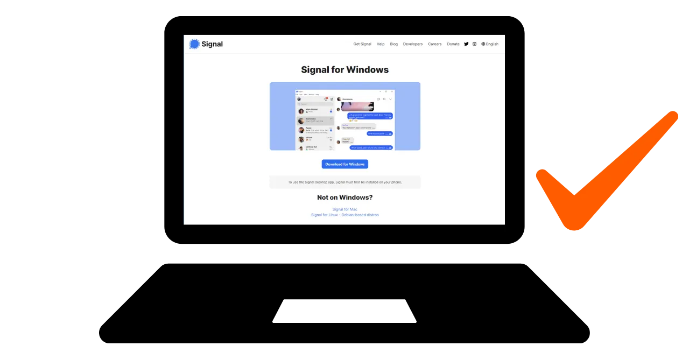
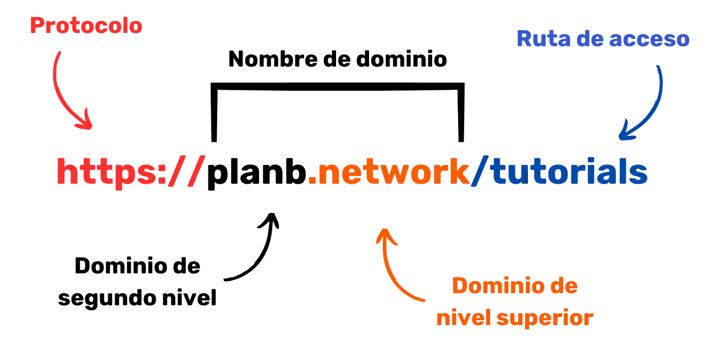
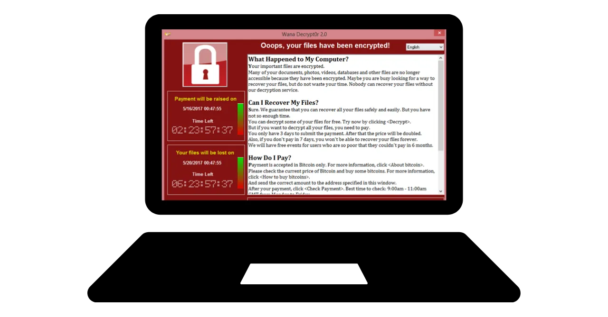
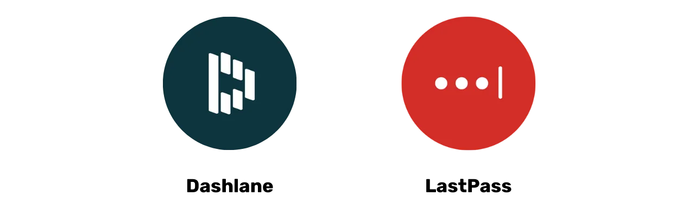
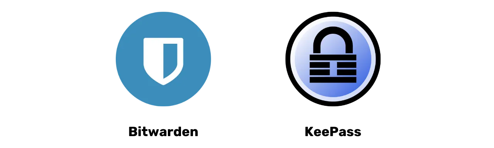

# Un viaje hacia la protección de sus datos

Bienvenidos a todos a este programa de enseñanza dedicado a la seguridad digital. Esta formación está diseñada para ser accesible para todos, por lo que no se requieren conocimientos previos de informática. Nuestro objetivo principal es proporcionarles los conocimientos y habilidades necesarios para navegar de manera más segura y privada en el mundo digital.

Esto se traducirá en la implementación de varias herramientas, como un correo electrónico seguro, una herramienta para gestionar mejor sus contraseñas y varios programas para asegurar sus actividades diarias en línea.

En esta formación, no buscamos convertirlos en expertos, anónimos o invulnerables, ya que esto es imposible. En su lugar, les ofrecemos algunas soluciones simples y accesibles para todos, con el fin de comenzar una transformación de sus hábitos en línea y recuperar el control de su soberanía digital.

Equipo de colaboradores:
Muriel; diseño
Rogzy Noury y Fabian; producción
Théo; contribución

+++

# Introducción
<partId>534ab66c-b0e6-5757-a7dd-6ea04647edf2</partId>

## Introducción al curso
<chapterId>2f3d005d-8b49-5a3f-b90d-94c11f613407</chapterId>

### Objetivo: ¡actualización!

Bienvenidos a todos a este programa de enseñanza dedicado a la seguridad digital. Esta formación está diseñada para ser accesible para todos, por lo que no se requieren conocimientos previos de informática. Nuestro objetivo principal es proporcionarles los conocimientos y habilidades necesarios para navegar de manera más segura y privada en el mundo digital.

Esto se traducirá en la implementación de varias herramientas, como un correo electrónico seguro, una herramienta para gestionar mejor sus contraseñas y varios programas para asegurar sus actividades diarias en línea.

Esta formación es un esfuerzo conjunto de tres de nuestros profesores:

- Renaud Lifchitz, experto en ciberseguridad
- Théo Pantamis, doctor en matemáticas aplicadas
- Rogzy, CEO de DécouvreBitcoin

Su higiene digital es crucial en un mundo cada vez más digital. A pesar del constante aumento de los ataques informáticos y la vigilancia masiva, aún no es demasiado tarde para dar el primer paso y protegerse.
En esta formación, no buscamos convertirte en un experto, anónimo o invulnerable, esto es imposible. En cambio, te ofrecemos algunas soluciones simples y accesibles para todos, para comenzar a transformar tus hábitos en línea y recuperar el control de tu soberanía digital.
Si estás buscando habilidades más avanzadas sobre el tema, nuestras recursos, tutoriales u otras formaciones sobre ciberseguridad están aquí para ti. Mientras tanto, aquí tienes un pequeño vistazo de nuestro programa durante las próximas horas juntos.

### Sección 1: Todo sobre la navegación en línea

- Capítulo 1 - Navegación en línea
- Capítulo 2 - Uso seguro de internet

Para empezar, discutiremos la importancia de elegir un navegador web y sus implicaciones en términos de seguridad. Luego exploraremos las especificidades de los navegadores, especialmente en lo que respecta a la gestión de cookies. También veremos cómo garantizar una navegación más segura y anónima, utilizando herramientas como TOR. A continuación, nos enfocaremos en el uso de VPN para fortalecer la protección de tus datos. Por último, terminaremos con recomendaciones sobre el uso seguro de conexiones WiFi.

### Sección 2: Buenas prácticas para el uso de la computadora

- Capítulo 3 - Uso de la computadora
- Capítulo 4 - Hackeo y gestión de copias de seguridad

En esta sección, abordaremos tres áreas clave de la seguridad informática. En primer lugar, exploraremos los diferentes sistemas operativos: Mac, PC y Linux, destacando sus especificidades y fortalezas. Luego, nos enfocaremos en métodos para protegerte eficazmente contra intentos de piratería y fortalecer la seguridad de tus dispositivos. Por último, haremos hincapié en la importancia de proteger y hacer copias de seguridad regularmente tus datos para prevenir pérdidas o ransomware.

### Sección 3: Implementación de soluciones

- Capítulo 6 - Gestión del correo electrónico
- Capítulo 7 - Gestor de contraseñas
- Capítulo 8 - Autenticación de dos factores

En esta tercera sección práctica, pasaremos a la acción con la implementación de tus soluciones concretas.

Primero, veremos cómo proteger tu correo electrónico, que es esencial para tus comunicaciones y a menudo es objetivo de los piratas informáticos. Luego, te presentaremos qué es un gestor de contraseñas: una solución práctica para no olvidar o mezclar tus contraseñas, al mismo tiempo que las mantienes seguras. Por último, mencionaremos una medida de seguridad adicional, la autenticación de dos factores, que agrega una capa de protección a tus cuentas. Todo se explicará de manera clara y accesible.

### Sección Bonus: Entrevista con Pantamis y Renaud

En bonus, te ofrecemos una entrevista exclusiva con Pantamis y Renaud, nuestros expertos en seguridad digital. Compartirán sus conocimientos profundos y consejos adicionales para fortalecer tu higiene digital. La idea es aprender más de estos profesionales experimentados.

Este programa de formación se ofrece de forma gratuita bajo una licencia redistribuible CC BY SA. Queremos expresar nuestra gratitud a nuestros Patreons y a nuestro equipo de grabación por su apoyo indispensable en la realización de esta formación. También agradecemos a todos nuestros donantes y seguidores que nos permiten seguir produciendo contenido educativo gratuito a nivel mundial.

# Todo sobre la navegación en línea
<partId>b4b5379a-d8ef-59ae-94d3-a6e88959c149</partId>

## Navegación en línea
<chapterId>3a935da9-fa6e-57eb-bf85-7b3ec35e6ee2</chapterId>

Al navegar por internet, es importante evitar algunos errores comunes para preservar tu seguridad en línea. Aquí tienes algunos consejos para evitarlos:

### Atención a las descargas de software:

Se recomienda descargar software desde el sitio web oficial del editor en lugar de sitios genéricos.
Ejemplo: Utilizar www.signal.org/download en lugar de www.logicieltelechargement.fr/signal.

También se aconseja preferir el software de código abierto, ya que suelen ser más seguros y libres de software malicioso. Un software "open-source" o de código abierto es aquel cuyo código es conocido y accesible para todos. Por lo tanto, se puede verificar, entre otras cosas, que no haya acceso oculto para robar tus datos personales.

> Bonus: ¡El software libre suele ser gratuito! Esta universidad es 100% de código abierto, por lo que tú también puedes verificar nuestro código a través de nuestro GitHub.

### Gestión de cookies: Errores y buenas prácticas

Las cookies son archivos creados por los sitios web para almacenar información en tu dispositivo. Aunque algunos sitios requieren estas cookies para funcionar correctamente, también pueden ser explotadas por sitios de terceros, especialmente con fines de seguimiento publicitario. De acuerdo con regulaciones como el RGPD, es posible -y recomendado- rechazar las cookies de seguimiento de terceros, mientras se aceptan aquellas que son esenciales para el correcto funcionamiento del sitio. Después de cada visita a un sitio, es prudente eliminar las cookies asociadas, ya sea manualmente o a través de una extensión o programa específico. Algunos navegadores incluso ofrecen la posibilidad de realizar esta eliminación de forma selectiva. A pesar de estas precauciones, es crucial entender que la información recopilada por diferentes sitios puede permanecer interconectada, de ahí la importancia de encontrar un equilibrio entre practicidad y seguridad.

> Nota: También limita el número de extensiones instaladas en tu navegador para evitar posibles problemas de seguridad y rendimiento.

### Navegadores web: elección, seguridad

Existen dos grandes familias de navegadores: aquellos basados en Chrome y aquellos basados en Firefox.
Aunque ambas familias ofrecen un nivel de seguridad similar, se recomienda evitar el navegador Chrome de Google debido a sus rastreadores. Se pueden preferir alternativas más ligeras de Chrome, como Chromium o Brave. Brave es especialmente recomendado por su bloqueador de anuncios integrado. Puede ser necesario utilizar varios navegadores para acceder a ciertos sitios.

### Navegación privada, TOR y otras alternativas para una navegación más segura y anónima

La navegación privada, aunque no oculta la navegación a su proveedor de servicios de Internet, evita dejar rastros locales en su computadora. Las cookies se eliminan automáticamente al final de cada sesión, lo que permite aceptar todas las cookies sin ser rastreado. La navegación privada puede ser útil al comprar servicios en línea, ya que los sitios web siguen nuestros hábitos de búsqueda y ajustan los precios en consecuencia. Sin embargo, es importante tener en cuenta que la navegación privada se recomienda para sesiones temporales y específicas, no para un uso general de navegación en Internet.

Una alternativa más avanzada es la red TOR (The Onion Router), que ofrece anonimato al ocultar la dirección IP del usuario y permitir el acceso a la Darknet. TOR Browser es un navegador especialmente diseñado para utilizar la red TOR. Permite visitar tanto sitios web convencionales como sitios web en .onion, que generalmente son operados por individuos y pueden tener contenido ilegal.

TOR es legal y es utilizado por periodistas, activistas de la libertad y otras personas que desean evadir la censura en países autoritarios. Sin embargo, es importante entender que TOR no asegura los sitios visitados ni la computadora en sí. Además, el uso de TOR puede ralentizar la conexión a Internet, ya que los datos pasan por las computadoras de otras tres personas antes de llegar a su destino. También es esencial tener en cuenta que TOR no es una solución infalible para garantizar el anonimato al 100% y no debe ser utilizado para llevar a cabo actividades ilegales.

https://planb.network/tutorials/others/tor-browser

## VPN y conexión a Internet
<chapterId>5aac83f4-a685-54b0-9759-d71bea7eeed2</chapterId>

### los VPN

La protección de su conexión a Internet es un aspecto crucial de la seguridad en línea, y el uso de redes privadas virtuales (VPN) es un método efectivo para mejorar esta seguridad, tanto para empresas como para usuarios individuales.
Los VPN son herramientas que cifran los datos transmitidos por internet, haciendo que la conexión sea más segura. En un contexto profesional, los VPN permiten a los empleados acceder de forma segura a la red interna de la empresa de forma remota. Los datos intercambiados están encriptados, lo que dificulta su interceptación por parte de terceros. Además de asegurar el acceso a una red interna, el uso de un VPN puede permitir a un usuario hacer que su conexión a internet pase a través de la red interna de la empresa, dando la impresión de que su conexión proviene de la empresa. Esto puede ser especialmente útil para acceder a servicios en línea que están geográficamente restringidos.

### Los tipos de VPN

Existen dos tipos principales de VPN: los VPN de empresa y los VPN para el público en general, como NordVPN. Los VPN de empresa tienden a ser más costosos y complejos, mientras que los VPN para el público en general suelen ser más accesibles y fáciles de usar. NordVPN, por ejemplo, permite a los usuarios conectarse a internet a través de un servidor ubicado en otro país, lo que puede permitir eludir las restricciones geográficas.

Sin embargo, el uso de un VPN para el público en general no garantiza un anonimato completo. Muchos proveedores de VPN conservan información sobre sus usuarios, lo que puede comprometer potencialmente su anonimato. Aunque los VPN pueden ser útiles para mejorar la seguridad en línea, no son una solución universal. Son efectivos para algunos usos específicos, como el acceso a servicios geográficamente limitados o mejorar la seguridad mientras se está en movimiento, pero no garantizan una seguridad total. Al elegir un VPN, es esencial priorizar la confiabilidad y la tecnología en lugar de la popularidad. Los proveedores de VPN que recopilan la menor cantidad de información personal suelen ser los más seguros. Servicios como iVPN y Mullvad no recopilan información personal e incluso permiten pagos con Bitcoin para una mayor privacidad.

Por último, un VPN también se puede utilizar para bloquear anuncios en línea, ofreciendo así una experiencia de navegación más agradable y segura. Sin embargo, es importante realizar su propia investigación para encontrar el VPN más adecuado para sus necesidades específicas. Se recomienda el uso de un VPN para fortalecer la seguridad, incluso cuando se navega por internet en casa. Esto ayuda a garantizar un nivel más alto de seguridad para los datos intercambiados en línea. Por último, asegúrese de verificar las URL y el candado en la barra de direcciones para confirmar que está en el sitio que cree que está visitando.

https://planb.network/tutorials/others/ivpn

https://planb.network/tutorials/others/mullvad

### HTTPS y las redes wifi públicas

En cuanto a la seguridad en línea, es esencial entender que la 4G generalmente es más segura que el Wi-Fi público. Sin embargo, el uso de la 4G puede agotar rápidamente tu plan de datos móviles. El protocolo HTTPS se ha convertido en la norma para el cifrado de datos en los sitios web. Asegura que los datos intercambiados entre el usuario y el sitio web estén seguros. Por lo tanto, es crucial verificar que el sitio que estás visitando esté utilizando el protocolo HTTPS.

En la Unión Europea, la protección de datos está regulada por el Reglamento General de Protección de Datos (RGPD). Por lo tanto, es más seguro utilizar proveedores europeos de puntos de acceso Wi-Fi, como la SNCF, que no revenden los datos de conexión de los usuarios. Sin embargo, el simple hecho de que un sitio muestre un candado no garantiza su autenticidad. Es importante verificar la clave pública del sitio utilizando un sistema de certificados para confirmar su autenticidad. Aunque el cifrado de datos evita que terceros intercepten los datos intercambiados, aún es posible que una persona malintencionada se haga pasar por el sitio y transfiera los datos en claro.

Para evitar estafas en línea, es crucial verificar la identidad del sitio en el que estás navegando, especialmente controlando la extensión y el nombre de dominio. Además, mantente alerta ante los estafadores que utilizan letras similares en las URL para engañar a los usuarios.

En resumen, el uso de una VPN puede mejorar en gran medida la seguridad en línea, tanto para las empresas como para los usuarios individuales. Además, poner en práctica buenos hábitos de navegación puede contribuir a una mejor higiene digital. En el próximo segmento de este curso, abordaremos la seguridad de la computadora, incluyendo las actualizaciones, el antivirus y la gestión de contraseñas.

# Buenas prácticas para el uso de la computadora
<partId>e6eac20b-ba24-5d9a-8d86-8e0164074457</partId>

## Uso de la computadora
<chapterId>16745632-b56b-5423-9873-ddf70fdf1efd</chapterId>

La seguridad de nuestras computadoras es un tema importante en el mundo digital actual. Hoy vamos a abordar tres puntos clave:

- la elección de la computadora
- las actualizaciones y el antivirus para una seguridad óptima
- las buenas prácticas para la seguridad de la computadora y los datos.

### La elección de la computadora y del sistema operativo

En cuanto a la elección de la computadora, no hay una diferencia significativa en seguridad entre las computadoras antiguas y las nuevas. Sin embargo, existen diferencias de seguridad entre los sistemas operativos: Windows, Linux y Mac.

En cuanto a Windows, se recomienda no utilizar una cuenta de administrador a diario, sino crear dos cuentas distintas: una cuenta de administrador y una cuenta para uso diario. Windows suele estar más expuesto a software malicioso debido a su gran cantidad de usuarios y a la facilidad de cambiar de usuario a administrador. Por otro lado, las amenazas son menos frecuentes en Linux y Mac.

La elección del sistema operativo debe realizarse en función de sus necesidades y preferencias. Los sistemas Linux han evolucionado considerablemente en los últimos años, volviéndose cada vez más amigables. Ubuntu es una alternativa interesante para principiantes, con una interfaz gráfica fácil de usar. Es posible particionar un ordenador para experimentar con Linux manteniendo Windows, pero esto puede resultar complicado. A menudo es mejor tener un ordenador dedicado, una máquina virtual o una memoria USB para probar Linux o Ubuntu.

### Actualización de software

En cuanto a las actualizaciones, la regla es simple: **es fundamental actualizar regularmente el sistema operativo y las aplicaciones.**

En Windows 10, las actualizaciones son casi constantes y es crucial no bloquearlas ni retrasarlas. Cada año se identifican alrededor de 15,000 vulnerabilidades, lo que destaca la importancia de mantener el software actualizado para protegerse contra los virus. En general, el soporte de software finaliza entre 3 y 5 años después de su lanzamiento, por lo que es necesario actualizar a la versión superior para seguir disfrutando de la seguridad.

La regla se aplica a casi todos los programas. De hecho, las actualizaciones no tienen como objetivo volver obsoleta o lenta su máquina, sino protegerla de las nuevas amenazas. Algunas actualizaciones se consideran importantes y sin ellas, su ordenador corre serios riesgos de explotación.

Para darle un ejemplo concreto de error: un software pirateado que no se puede actualizar representa una doble amenaza potencial. La llegada del virus al descargarlo ilegalmente desde un sitio sospechoso y su uso no seguro frente a las nuevas formas de ataque.

### Antivirus

- ¿Necesita un antivirus? SÍ
- ¿Debe pagar? ¡Depende!

La elección e implementación de un antivirus es importante. Windows Defender, el antivirus integrado en Windows, es una solución segura y eficaz. Para una solución gratuita, es extremadamente bueno y mucho mejor que muchas soluciones gratuitas que se encuentran en línea. De hecho, se debe tener cuidado con los antivirus descargados de Internet, que pueden ser maliciosos u obsoletos.
Para aquellos que deseen invertir en un antivirus de pago, se recomienda elegir un antivirus que analice de manera inteligente las amenazas desconocidas y emergentes, como Kaspersky. Las actualizaciones del antivirus son esenciales para protegerse contra las nuevas amenazas.

Nota: Linux y Mac, gracias a su sistema de separación de derechos de los usuarios, a menudo no necesitan antivirus.

Para terminar, aquí hay algunas buenas prácticas para la seguridad de su computadora y sus datos. Es importante elegir un antivirus eficaz y fácil de usar. También es crucial adoptar buenas prácticas en su computadora, como no insertar unidades USB desconocidas o encontradas en lugares sospechosos. Estas unidades USB pueden contener programas maliciosos que se ejecutan automáticamente cuando se insertan. El control de la unidad USB no servirá de nada una vez que se haya insertado. Algunas empresas han sido víctimas de piratería debido a unidades USB dejadas descuidadamente en áreas accesibles, como un estacionamiento.

Trate su computadora como lo haría con su hogar: manténgase alerta, realice actualizaciones regularmente, elimine archivos innecesarios y use una contraseña segura para la seguridad. Es crucial cifrar los datos en computadoras portátiles y teléfonos inteligentes para prevenir robos o pérdidas de datos. BitLocker para Windows, LUKS para Linux y la opción incorporada para Mac son soluciones para el cifrado de datos. Se recomienda activar sin dudarlo el cifrado de datos y anotar la contraseña en un papel para guardarla en un lugar seguro.

En conclusión, es fundamental optar por un sistema operativo adecuado a sus necesidades y mantenerlo actualizado regularmente, así como las aplicaciones instaladas en él. También es esencial utilizar un antivirus eficaz y fácil de usar, y adoptar buenas prácticas para la seguridad de su computadora y sus datos.

## Hack y gestión de copias de seguridad: proteger sus datos
<chapterId>9ddfcb6a-a253-5542-b7eb-df7222b46dc7</chapterId>

### ¿Cómo atacan los hackers?

Para protegerse adecuadamente, es fundamental comprender cómo los piratas informáticos intentan infiltrarse en su computadora. De hecho, los virus no suelen aparecer por arte de magia, sino que son más bien consecuencia de nuestras acciones, ¡incluso involuntarias!

En general, los virus llegan porque usted ha permitido que su computadora los invite a su hogar. Esto puede manifestarse mediante la descarga de un software sospechoso, un archivo torrent comprometido o simplemente al hacer clic en el enlace de un correo electrónico fraudulento.

### Phishing, precaución frente a correos electrónicos fraudulentos:

¡Atención! Los correos electrónicos son el primer vector de ataque, aquí hay algunos consejos:

- Manténgase alerta ante intentos de phishing para obtener información sensible como sus credenciales y contraseñas. Evite hacer clic en enlaces sospechosos y compartir su información personal sin verificar la legitimidad del remitente.
- Tenga precaución con los archivos adjuntos e imágenes en los correos electrónicos:
  Los archivos adjuntos e imágenes en los correos electrónicos pueden contener software malicioso. No descargue ni abra archivos adjuntos de remitentes desconocidos o sospechosos, y asegúrese de que su antivirus esté actualizado.

La regla de oro aquí es verificar correctamente el nombre completo del remitente y el origen del correo electrónico. ¡Ante la duda, elimínelo!

### Ransomware y tipos de ciberataques:

El ransomware es un tipo de software malicioso que cifra los datos del usuario y exige un rescate para descifrarlos. Este tipo de ataque es cada vez más común y puede resultar muy molesto para una empresa o un individuo. Para protegerse, es imperativo crear copias de seguridad de los archivos más sensibles. Esto no detendrá el ransomware, pero le permitirá simplemente ignorarlo.

Realice copias de seguridad regularmente de sus datos importantes en un dispositivo externo o un servicio de almacenamiento en línea seguro. De esta manera, en caso de un ataque informático o un fallo de hardware, podrá recuperar sus datos sin perder información crucial.

Solución sencilla:

- Comprar un disco duro externo y copiar sus datos en él. Desconéctelo y guárdelo en algún lugar de la casa. (Hacer esto dos veces y almacenar uno de los discos en otro lugar ayudará a protegerlo de un posible incendio).

- Crear una copia de seguridad "en la nube" a través de ProtonMail Drive, Sync o incluso Google Drive. Solo tiene que cargar sus datos sensibles en este servicio de alojamiento en línea. Sin embargo, tenga en cuenta que sus datos estarán potencialmente en Internet y serán propiedad de un tercero de confianza.

### ¿Debería pagar a los hackers?

NO, generalmente se desaconseja pagar a los hackers en caso de ransomware u otros tipos de ataques. Pagar el rescate no garantiza la recuperación de sus datos y puede alentar a los ciberdelincuentes a continuar con sus actividades maliciosas. En su lugar, priorice la prevención y la copia de seguridad regular de sus datos para protegerse.

Si detecta un virus en su computadora, desconéctela de Internet, realice un análisis antivirus completo y elimine los archivos infectados. Luego, actualice su software y sistema operativo, y cambie sus contraseñas para evitar otras intrusiones.

https://planb.network/tutorials/others/proton-drive

https://planb.network/tutorials/others/veracrypt

# Implementación de soluciones.
<partId>215ec902-ba05-5549-87fc-cb8d82665f7b</partId>

## Gestión de buzones de correo
<chapterId>dfceea33-8712-5557-ace1-6ba5598d33d8</chapterId>

### ¡Configuración de una nueva cuenta de correo electrónico!

La cuenta de correo electrónico es el punto central de tu actividad en línea: si se ve comprometida, un pirata informático puede utilizarla para restablecer todas tus contraseñas a través de la función "olvidé mi contraseña" y así acceder a muchos otros sitios. Por eso es importante asegurarla correctamente.

Por lo tanto, debes crear una cuenta de correo electrónico con una contraseña única y fuerte (detalles en el capítulo 7) e idealmente con un sistema de autenticación de dos factores (detalles en el capítulo 8).

Aunque todos tenemos una cuenta de correo electrónico, es importante considerar la creación de una nueva, más moderna, para comenzar desde una buena base.

### Elección del proveedor de correo electrónico y gestión de las direcciones de correo electrónico

La gestión adecuada de nuestras direcciones de correo electrónico es crucial para garantizar la seguridad de nuestros accesos en línea. Es importante elegir un proveedor de correo electrónico seguro y respetuoso de la privacidad. Por ejemplo, ProtonMail es un servicio de correo electrónico seguro y respetuoso de la privacidad.

Al elegir un proveedor de correo electrónico y crear una contraseña, es esencial no reutilizar la misma contraseña para diferentes servicios en línea. Se recomienda crear nuevas direcciones de correo electrónico regularmente y separar los usos utilizando diferentes direcciones de correo electrónico. Es mejor optar por un servicio de correo electrónico seguro para las cuentas críticas. También es importante tener en cuenta que algunos servicios limitan la longitud de las contraseñas, por lo que es importante tener en cuenta esta limitación. También hay servicios disponibles para la creación de direcciones de correo electrónico temporales, que se pueden utilizar para cuentas de duración limitada.

Es importante tener en cuenta que los proveedores de correo electrónico antiguos como La Poste, Arobase, Wig, Hotmail, todavía se utilizan, pero sus prácticas de seguridad pueden ser peores que las de Gmail. Por lo tanto, se recomienda tener dos direcciones de correo electrónico distintas, una para comunicaciones generales y otra para la recuperación de cuentas, esta última debe estar más segura. Es mejor evitar mezclar la dirección de correo electrónico con el operador de telefonía o proveedor de servicios de Internet, ya que esto puede ser un vector de ataque.

### ¿Debo cambiar de cuenta de correo electrónico?

Se recomienda utilizar el sitio Have I Been Pwned (¿Me han pirateado?) - https://haveibeenpwned.com/ - para verificar si nuestra dirección de correo electrónico ha sido comprometida y para recibir alertas sobre futuras filtraciones de datos. Una base de datos pirateada puede ser utilizada por piratas informáticos para enviar correos electrónicos de phishing o reutilizar contraseñas comprometidas.

En general, comenzar a utilizar una nueva dirección de correo electrónico más segura no es una mala práctica e incluso es necesario si queremos empezar de nuevo en bases sólidas.
Bonus Bitcoin: Puede ser recomendable crear una dirección de correo electrónico específicamente para nuestras actividades de Bitcoin (creación de cuentas de intercambio) para separar realmente las áreas de actividad en nuestras vidas.

https://planb.network/tutorials/others/proton-mail

## Gestor de contraseñas
<chapterId>0b3c69b2-522c-56c8-9fb8-1562bd55930f</chapterId>

### ¿Qué es un gestor de contraseñas?

Un gestor de contraseñas es una herramienta que permite almacenar, generar y gestionar tus contraseñas para diferentes cuentas en línea. En lugar de recordar múltiples contraseñas, solo necesitas recordar una contraseña maestra para acceder a todas las demás.

Con un gestor de contraseñas, ya no tienes que preocuparte por olvidar tus contraseñas o anotarlas en algún lugar. Solo necesitas recordar una contraseña maestra. Además, la mayoría de estas herramientas generan contraseñas seguras para ti, lo que refuerza la seguridad de tus cuentas.

### Diferencias entre algunos gestores populares:

- LastPass: Uno de los gestores más populares. Es un servicio de terceros, lo que significa que tus contraseñas se almacenan en sus servidores. Ofrece una versión gratuita y una versión de pago, con una interfaz fácil de usar.

- Dashlane: También es un servicio de terceros, con una interfaz intuitiva y características adicionales como el seguimiento de la información de tarjetas de crédito y notas seguras.

### Autohospedaje para más control:

- Bitwarden: Es una herramienta de código abierto, lo que significa que puedes revisar su código para verificar su seguridad. Aunque Bitwarden ofrece un servicio hospedado, también permite a los usuarios autohospedarse, lo que significa que puedes controlar dónde se almacenan tus contraseñas, ofreciendo potencialmente más seguridad y control.

- KeePass: Es una solución de código abierto que está principalmente destinada al autohospedaje. Tus datos se almacenan localmente de forma predeterminada, pero puedes sincronizar la base de datos de contraseñas utilizando diferentes métodos si lo deseas. KeePass es ampliamente reconocido por su seguridad y flexibilidad, aunque puede ser un poco menos intuitivo para los principiantes.

(Nota: Elegir entre un servicio de terceros o un servicio de autohospedaje depende de tu nivel de comodidad tecnológica y de cómo priorices el control frente a la conveniencia. Los servicios de terceros suelen ser más convenientes para la mayoría de las personas, mientras que el autohospedaje requiere más conocimientos técnicos pero puede ofrecer más control y tranquilidad en términos de seguridad.)

### ¿Qué es una buena contraseña?

Un buen contraseña generalmente es:

- Larga: al menos 12 caracteres.
- Compleja: una mezcla de letras mayúsculas y minúsculas, números y símbolos.
- Única: no reutilizar la misma contraseña para diferentes cuentas.
- No basada en información personal: evitar fechas de nacimiento, nombres, etc.

Para garantizar la seguridad de su cuenta, es crucial crear contraseñas fuertes y seguras. La longitud de la contraseña no es suficiente para asegurar su seguridad. Los caracteres deben ser completamente aleatorios para resistir los ataques de fuerza bruta. La independencia de los eventos también es importante para evitar las combinaciones más probables. Las contraseñas comunes como "password" son fácilmente comprometidas.

Para crear una contraseña fuerte, se recomienda utilizar una gran cantidad de caracteres aleatorios, sin utilizar palabras o patrones predecibles. También es esencial incluir números y caracteres especiales. Sin embargo, cabe señalar que algunos sitios pueden restringir el uso de ciertos caracteres especiales. Las contraseñas que no se generan de manera aleatoria son fáciles de adivinar. Las variantes o adiciones a las contraseñas no son seguras. Los sitios web no pueden garantizar la seguridad de las contraseñas elegidas por los usuarios.

Las contraseñas generadas de manera aleatoria ofrecen un nivel de seguridad superior, aunque pueden ser más difíciles de recordar. Los administradores de contraseñas pueden generar contraseñas aleatorias más seguras. Al utilizar un administrador de contraseñas, no es necesario memorizar todas sus contraseñas. Es importante reemplazar gradualmente sus contraseñas antiguas por las generadas por el administrador, ya que son más fuertes y más largas. Asegúrese de que la contraseña maestra de su administrador de contraseñas también sea fuerte y segura.

https://planb.network/tutorials/others/bitwarden

https://planb.network/tutorials/others/keepass

## Los 2 factores de autenticación
<chapterId>9391e02e-e61b-5a86-93e0-91a07f217d35</chapterId>

### Por qué implementar el 2FA

La autenticación de dos factores (2FA) es una capa adicional de seguridad utilizada para asegurarse de que las personas que intentan acceder a una cuenta en línea sean realmente quienes dicen ser. En lugar de simplemente ingresar un nombre de usuario y una contraseña, el 2FA requiere una segunda forma de verificación.

Este segundo paso puede ser:

- Un código temporal enviado por SMS.
- Un código generado por una aplicación como Google Authenticator o Authy.
- Una clave de seguridad física que insertas en tu computadora.

Con la autenticación de dos factores (2FA), incluso si un pirata informático obtiene tu contraseña, no podrá acceder a tu cuenta sin este segundo factor de verificación. Esto hace que la 2FA sea esencial para proteger tus cuentas en línea contra accesos no autorizados.

### ¿Qué opción elegir?

Las diferentes opciones para la autenticación fuerte ofrecen niveles variables de seguridad.

- Los mensajes de texto (SMS) no se consideran la mejor opción porque solo proporcionan una prueba de posesión de un número de teléfono.
- La autenticación de dos factores (2FA) es más segura porque utiliza varios tipos de pruebas, como el conocimiento, la posesión y la identificación. Los códigos de contraseña de un solo uso (HOTP y TOTP) son más seguros que los mensajes de texto porque requieren un cálculo criptográfico y se almacenan localmente en lugar de en la memoria.
- Los tokens físicos, como las llaves USB o las tarjetas inteligentes, ofrecen una seguridad óptima al generar una clave privada única para cada sitio y verificar la URL antes de autorizar la conexión.

Para una seguridad óptima con la autenticación fuerte, se recomienda utilizar una dirección de correo electrónico segura, un administrador de contraseñas seguro y adoptar el 2FA utilizando YubiKey. También se recomienda comprar dos YubiKey para prever la pérdida o el robo, por ejemplo, mantener una copia de seguridad en casa y otra en tu persona.

La biometría se puede utilizar como un sustituto, pero es menos segura que la combinación de conocimiento y posesión. Los datos biométricos deben permanecer en el dispositivo de autenticación y no deben divulgarse en línea. Es importante tener en cuenta el modelo de amenaza asociado con los diferentes métodos de autenticación y adaptar tus prácticas en consecuencia.

### Conclusión del curso:

Como has entendido, establecer una buena higiene digital no siempre es sencillo, ¡pero sigue siendo accesible!

- Crear una nueva dirección de correo electrónico segura.
- Utilizar un administrador de contraseñas.
- Activar el 2FA.
- Reemplazar gradualmente nuestras contraseñas antiguas por contraseñas fuertes con 2FA.

¡Continúa aprendiendo y aplicando gradualmente las buenas prácticas!

Regla de oro: ¡La seguridad informática es un objetivo en constante evolución que se adaptará a tu proceso de aprendizaje!

https://planb.network/tutorials/others/authy

https://planb.network/tutorials/others/security-key

# Sección Práctica
<partId>98ccf14b-4053-5839-878c-7a73ff02eb95</partId>

## Configuración de un Buzón de Correo
<chapterId>afc9ab5d-7664-5a9b-ab50-225ac9ba8f7c</chapterId>

Proteger tu cuenta de correo electrónico es un paso importante para asegurar tus actividades en línea y preservar tus datos personales. Este tutorial te guiará, paso a paso, en la creación y configuración de una cuenta de ProtonMail, un proveedor reconocido por su alto nivel de seguridad que ofrece cifrado de extremo a extremo de tus comunicaciones. Ya seas principiante o usuario experimentado, las buenas prácticas propuestas aquí te ayudarán a fortalecer la seguridad de tu correo electrónico, mientras aprovechas las funciones avanzadas de ProtonMail:

https://planb.network/tutorials/others/proton-mail

## Seguridad en 2FA
<chapterId>09468ec1-95b7-56a4-a636-7618044568e1</chapterId>

La autenticación de dos factores (2FA) se ha vuelto esencial para asegurar tus cuentas en línea. En este tutorial, aprenderás a configurar y utilizar la aplicación 2FA Authy, que genera códigos dinámicos de 6 dígitos para proteger tus cuentas. Authy es muy fácil de usar y se sincroniza en varios dispositivos. Descubre cómo instalar y configurar Authy, y así refuerza la seguridad de tus cuentas en línea ahora mismo:

https://planb.network/tutorials/others/authy

Otra opción es utilizar una clave de seguridad física. Este otro tutorial te muestra cómo configurar y usar una clave de seguridad como segundo factor de autenticación:

https://planb.network/tutorials/others/security-key

## Creación de un gestor de contraseñas
<chapterId>ed579680-4e7b-5f65-8541-14e519a3b242</chapterId>

La gestión de contraseñas es un desafío en la era digital. Todos tenemos numerosos cuentas en línea que asegurar. Un gestor de contraseñas te ayuda a crear y almacenar contraseñas fuertes y únicas para cada cuenta.

En este tutorial, descubre cómo configurar Bitwarden, un gestor de contraseñas de código abierto, y cómo sincronizar tus credenciales en todos tus dispositivos para simplificar su uso diario:

https://planb.network/tutorials/others/bitwarden

Para usuarios más avanzados, también ofrezco un tutorial sobre otro software gratuito y de código abierto para usar localmente en la gestión de tus contraseñas:

https://planb.network/tutorials/others/keepass

## Asegurando tus cuentas
<chapterId>7a774b34-aed0-57dd-b8f7-cf3be51c0d70</chapterId>

En estos dos tutoriales, también te guío en la seguridad de tus cuentas en línea y te explico cómo adoptar progresivamente prácticas más seguras para la gestión de tus contraseñas en el día a día.

https://planb.network/tutorials/others/bitwarden

https://planb.network/tutorials/others/keepass

## Configuración de copia de seguridad
<chapterId>01cfcde1-77cb-506c-8df1-fa18a2e8cc6b</chapterId>

Proteger tus archivos personales también es un punto esencial. Este tutorial te muestra cómo implementar una estrategia de respaldo efectiva gracias a Proton Drive. Descubre cómo usar esta solución en la nube segura para aplicar el método 3-2-1: tres copias de tus datos en dos medios diferentes, de las cuales una copia está fuera del sitio. Así aseguras la accesibilidad y seguridad de tus archivos sensibles:

https://planb.network/tutorials/others/proton-drive

Y para asegurar tus archivos almacenados en medios removibles como una unidad USB o un disco duro externo, también te muestro cómo cifrar y descifrar estos medios fácilmente usando VeraCrypt:

https://planb.network/tutorials/others/veracrypt

## Cambio de navegador y VPN
<chapterId>8dc08feb-313c-5259-a54f-64aa68a07608</chapterId>

La protección de tu privacidad en línea también es un aspecto a tener en cuenta para garantizar tu seguridad. El uso de una VPN puede ser una primera solución para lograrlo.

Te propongo descubrir dos soluciones de VPN fiables y que aceptan pagos en bitcoin, que son IVPN y Mullvad. Estos tutoriales te guiarán para instalar, configurar y utilizar Mullvad o IVPN en todos tus dispositivos:

https://planb.network/tutorials/others/ivpn

https://planb.network/tutorials/others/mullvad

Además, descubre cómo usar Tor Browser, un navegador específicamente diseñado para proteger tu privacidad en línea:

https://planb.network/tutorials/others/tor-browser

# Ve más allá
<partId>77113cad-a6d8-57e5-b903-50c223b277ba</partId>

## Cómo trabajar en esta industria de ciberseguridad
<chapterId>aad1ae27-4280-5b07-b9ab-118ae013951a</chapterId>

La ciberseguridad, un campo en pleno auge, ofrece una multitud de oportunidades para aquellos apasionados por la protección de sistemas y datos. Si esta industria te intriga, aquí tienes algunos pasos clave para orientarte.

### Fundamentos académicos y certificaciones:

Una sólida formación en informática, sistemas de información o en un campo relacionado suele ser el trampolín ideal para comenzar. Estos estudios proporcionan las bases necesarias para comprender los desafíos técnicos de la ciberseguridad. Para complementar esta formación, es recomendable obtener certificaciones reconocidas en el campo. Aunque estas certificaciones pueden variar según las regiones, algunas, como CISSP o CEH, gozan de reconocimiento mundial.

La ciberseguridad es un campo amplio y en constante evolución. Familiarizarse con las herramientas esenciales y los diferentes sistemas es crucial. Además, con tantos subcampos, desde la respuesta a incidentes hasta el hacking ético, es beneficioso encontrar tu nicho y especializarte en él.

### Ganar experiencia práctica:

La importancia de la experiencia práctica no debe subestimarse. Buscar pasantías o puestos junior en empresas con equipos de seguridad informática es una excelente manera de aplicar tus conocimientos teóricos. Además, participar en competiciones de hacking ético o simulaciones de ciberseguridad puede afinar tus habilidades en situaciones concretas.

La fuerza de una red profesional es invaluable. Unirse a asociaciones profesionales, hackerspaces o foros en línea ofrece una plataforma para intercambiar ideas con otros expertos. Del mismo modo, asistir a conferencias y talleres dedicados a la ciberseguridad no solo permite aprender, sino también establecer vínculos con profesionales del sector.

La evolución constante de las amenazas requiere estar al tanto de las noticias y foros especializados de forma regular. En un sector donde la confianza es primordial, actuar con ética e integridad es esencial en cada etapa de tu carrera.

### Habilidades y herramientas para profundizar:

- Herramientas de ciberseguridad: Wireshark, Metasploit, Nmap.
- Sistemas operativos: Linux, Windows, MacOS.
- Lenguajes de programación: Python, C, Java.
- Redes: TCP/IP, VPN, firewall.
- Bases de datos: SQL, NoSQL.
- Criptografía: SSL/TLS, cifrado simétrico/asimétrico.
- Gestión de incidentes: Análisis de registros, respuesta a incidentes.
- Hacking ético: Técnicas de penetración, pruebas de intrusión.
- Gobernanza: Normas ISO, regulaciones GDPR/CCPA.

Dominando estas habilidades y herramientas, estarás bien equipado para navegar con éxito en el mundo de la ciberseguridad.

## Entrevista a Renaud
<chapterId>7d83fd98-ce22-514e-b9e8-729fbf71ee6e</chapterId>

### Gestión eficiente de contraseñas y fortalecimiento de la autenticación: un enfoque académico

En el módulo de formación "Seguridad 101" ofrecido por Découvre Bitcoin en la Academia, hemos abordado la importancia de los gestores de contraseñas. Tres dimensiones son esenciales a considerar: la creación, la actualización y la implementación de contraseñas en los sitios web.

Generalmente se desaconseja el uso de extensiones de navegador para el llenado automático de contraseñas. Estas herramientas pueden hacer que el usuario sea más vulnerable a ataques de phishing. Renaud, un experto reconocido en ciberseguridad, prefiere una gestión manual a través de KeePass, lo que implica copiar y pegar manualmente la contraseña. Las extensiones tienden a aumentar la superficie de ataque, pueden ralentizar el rendimiento del navegador y, por lo tanto, presentan un riesgo significativo. Por lo tanto, se recomienda minimizar el uso de extensiones en el navegador.

Los gestores de contraseñas suelen fomentar el uso de factores de autenticación adicionales, como la autenticación de dos factores. Para una seguridad óptima, se recomienda almacenar los OTP (One-Time Passwords) en el dispositivo móvil. AndoTP ofrece una solución de código abierto para generar y almacenar códigos OTP en el teléfono. Si bien Google Authenticator permite exportar las semillas de los códigos de autenticación, la confianza en la copia de seguridad en una cuenta de Google es limitada. Por lo tanto, se recomiendan las aplicaciones OTI y AndoTP para una gestión autónoma de los OTP.

La cuestión de la herencia digital y el duelo digital destaca la importancia de tener un procedimiento para transmitir contraseñas después del fallecimiento de una persona. Un gestor de contraseñas facilita esta transición al almacenar de manera segura todos los secretos digitales en un solo lugar. El gestor de contraseñas también permite identificar todas las cuentas abiertas y gestionar su cierre o transferencia. Se recomienda anotar la contraseña maestra en papel, pero se debe guardar en un lugar oculto y seguro. Si el disco duro está cifrado y el ordenador está bloqueado, la contraseña no será accesible, incluso en caso de robo.

### Hacia una era post-contraseña: exploración de alternativas creíbles

Las contraseñas, aunque omnipresentes, tienen muchas desventajas, especialmente la posibilidad de una transmisión riesgosa durante el proceso de autenticación. Empresas líderes como Microsoft y Apple ofrecen alternativas innovadoras como la biometría y los tokens de hardware, lo que indica una tendencia progresiva hacia el abandono de las contraseñas.
'Passkeys, por ejemplo, ofrece claves aleatorias cifradas, combinadas con un factor local (biometría o NIP), que son alojadas por un proveedor pero que permanecen fuera de su alcance. Aunque esto requiere una actualización de los sitios web, el enfoque elimina la necesidad de contraseñas, ofreciendo así un alto nivel de seguridad sin las limitaciones asociadas a las contraseñas tradicionales o la problemática de la gestión de la caja fuerte digital.

Passkiz es otra alternativa viable y segura para la gestión de contraseñas. Sin embargo, una pregunta importante sigue sin answer: la disponibilidad en caso de fallo del proveedor. Sería deseable que los gigantes de internet ofrecieran sistemas para garantizar esta disponibilidad.

La autenticación directa en el servicio correspondiente es una opción interesante para no depender de un tercero. Sin embargo, el SSO (Single Sign-On) propuesto por los gigantes de internet también plantea problemas en términos de disponibilidad y riesgos de censura. Para evitar fugas de datos, es crucial minimizar la cantidad de información recopilada durante el proceso de autenticación.

### La seguridad informática: imperativos de prácticas seguras y riesgos relacionados con la negligencia humana

La seguridad informática puede verse comprometida por prácticas simples y el uso de contraseñas predeterminadas, como "admin". No siempre son necesarios ataques sofisticados para poner en peligro la seguridad informática. Por ejemplo, las contraseñas de administrador de un canal de YouTube estaban escritas en el código fuente privado de una empresa. Las vulnerabilidades de seguridad suelen ser consecuencia de la negligencia humana.

También cabe destacar que Internet está muy centralizado y ampliamente bajo control estadounidense. El servidor DNS puede estar sujeto a censura y a menudo utiliza DNS falsos para bloquear el acceso a ciertos sitios. DNS es un protocolo antiguo e insuficientemente seguro, lo que puede ocasionar problemas de seguridad. Han surgido nuevos protocolos, como DNSsec, pero todavía se utilizan poco. Para evitar la censura y el bloqueo de anuncios, es posible elegir proveedores DNS alternativos.'
Des alternatives a los anuncios intrusivos incluyen Google DNS, OpenDNS y otros servicios independientes. El protocolo DNS estándar deja las consultas DNS visibles para el proveedor de servicios de Internet. DOH (DNS sobre HTTPS) y DOT (DNS sobre TLS) permiten cifrar la conexión DNS, ofreciendo mayor privacidad y seguridad. Estos protocolos son ampliamente utilizados en empresas debido a su mayor seguridad y son compatibles de forma nativa con Windows, Android e iPhone. Para utilizar DOH y DOT, se debe ingresar un nombre de host TLS en lugar de una dirección IP. Los proveedores gratuitos de DOH y DOT están disponibles en línea. DOH y DOT mejoran la privacidad y la seguridad al evitar ataques de tipo "man in the middle". Otras consideraciones clave

En el marco del módulo de formación "Seguridad 101" de Découvre Bitcoin en la Academia, también discutimos la autenticación Lightning. Este sistema genera una identificación diferente por servicio, sin necesidad de proporcionar una dirección de correo electrónico o información personal. Es posible tener identidades descentralizadas controladas por el usuario, pero falta normalización y estandarización en los proyectos de identidad descentralizada. Se recomiendan los administradores de paquetes como Nuget y Chocolaté, que permiten descargar software de código abierto fuera de Microsoft Store, para evitar ataques maliciosos. En resumen, el DNS es crucial para la seguridad en línea, pero es necesario estar atento a posibles ataques a los servidores DNS.

## Danos tu opinión sobre este curso
<chapterId>6be74d2d-2116-5386-9d92-c4c3e2103c68</chapterId>
<isCourseReview>true</isCourseReview>

## Examen Final
<chapterId>a894b251-a85a-5fa4-bf2a-c2a876939b49</chapterId>
<isCourseExam>true</isCourseExam>

## Agradecimientos y sigue profundizando en la madriguera del conejo
<chapterId>df3a962a-a96e-5006-b904-0dd9d4a072dd</chapterId>

### Califica el curso y apóyanos

Este curso, junto con todo el contenido presente en esta universidad, te ha sido ofrecido de forma gratuita por nuestra comunidad. Para apoyarnos, puedes compartirlo con otros, convertirte en miembro de la universidad e incluso contribuir a su desarrollo a través de GitHub. ¡En nombre de todo el equipo, gracias!

¡Pronto se integrará un sistema de calificación para el curso en esta nueva plataforma de E-learning! Mientras tanto, muchas gracias por haber seguido el curso y si te ha gustado, considera compartirlo con otros.

### Ve más allá

¡Felicitaciones por completar esta formación SECU 101! Espero de todo corazón que te haya gustado y abierto puertas. ¡Ahora estás listo para obtener tus primeros bitcoins o simplemente continuar la aventura con los cursos de nivel 2!

- BTC 101 te dará los fundamentos teóricos sobre Bitcoin
- BTC 102 te ayudará a establecer tu plan de bitcoin
- LN 201 y 202 te permitirán descubrir la Lightning Network, una red de pagos de segunda capa
- ECON 201 abordará la economía austriaca
- MINAGE 201 para obtener más información sobre la minería
- (y muchos más)
  Un immense merci a nuestros Patreon, miembros y donantes por su apoyo financiero, gracias a las personas que comparten y gracias a aquellas que hicieron posible esta formación: Théo pantamis, Renaud, Théo, Fabien, Noury, Muriel y todo el equipo.
  ¡Hasta pronto!
