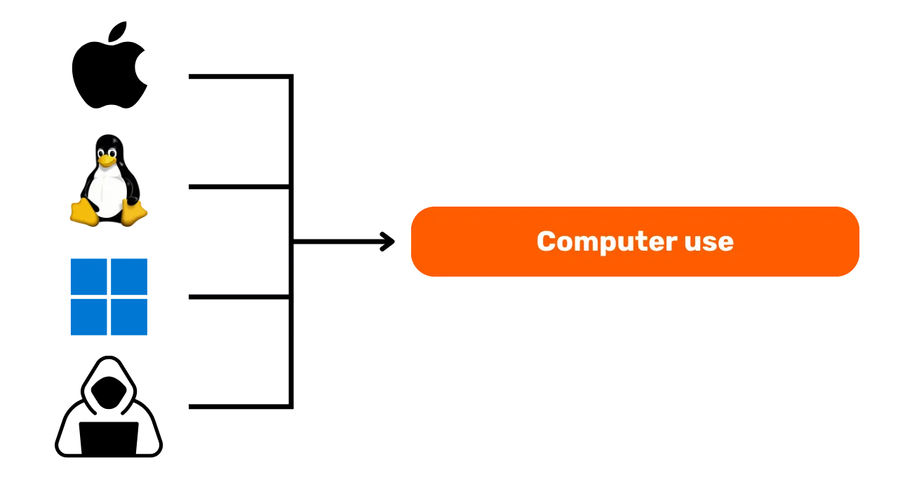
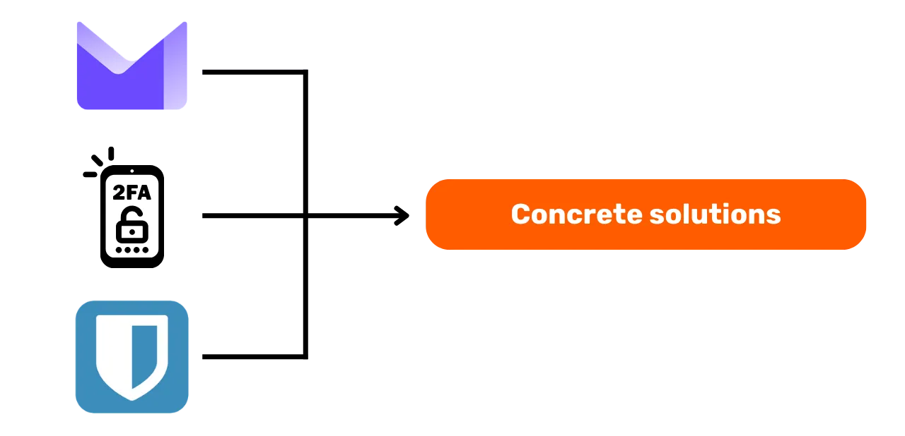

# Teekond oma andmete kaitsmise poole

Tere tulemast kõigile sellesse digitaalse turvalisusele pühendatud haridusprogrammi. See koolitus on mõeldud kõigile ligipääsetavaks, seega pole vajalik eelnev arvutiteaduse tundmine. Meie peamine eesmärk on varustada teid teadmiste ja oskustega, mis on vajalikud digitaalses maailmas turvalisemalt ja privaatsemalt liikumiseks.

See hõlmab mitmete tööriistade rakendamist, nagu turvaline e-posti teenus, tööriist oma paroolide paremaks haldamiseks ja mitmesugune tarkvara oma veebitegevuste turvamiseks.

Selle koolitusega ei püüa me teid muuta eksperdiks, anonüümseks või haavamatuks, kuna see on võimatu. Selle asemel pakume teile mõningaid lihtsaid ja ligipääsetavaid lahendusi, et alustada oma veebiharjumuste muutmist ja taastada kontroll oma digitaalse suveräänsuse üle.

Kaastöötajate meeskond:
Muriel; disain
Rogzy Noury & Fabian; tootmine
Théo; panus

+++

# Sissejuhatus

<partId>534ab66c-b0e6-5757-a7dd-6ea04647edf2</partId>

## Kursuse Sissejuhatus

<chapterId>2f3d005d-8b49-5a3f-b90d-94c11f613407</chapterId>

### Eesmärk: Värskenda oma turvalisuse oskusi!

Tere tulemast kõigile sellesse digitaalse turvalisusele pühendatud haridusprogrammi. See koolitus on mõeldud kõigile ligipääsetavaks, seega pole vajalik eelnev arvutiteaduse tundmine. Meie peamine eesmärk on varustada teid teadmiste ja oskustega, mis on vajalikud digitaalses maailmas turvalisemalt ja privaatsemalt liikumiseks.

See hõlmab mitmete tööriistade rakendamist, nagu turvaline e-posti teenus, tööriist oma paroolide paremaks haldamiseks ja mitmesugune tarkvara oma veebitegevuste turvamiseks.

See koolitus on kolme meie professori ühine pingutus:

- Renaud Lifchitz, küberjulgeoleku ekspert
- Théo Pantamis, rakendusmatemaatika doktor
- Rogzy, DécouvreBitcoin tegevjuht

Teie digitaalne hügieen on üha digitaalsemas maailmas ülioluline. Hoolimata pidevast häkkimise ja massilise jälgimise kasvust, ei ole veel liiga hilja astuda esimene samm ja end kaitsta.
Selle koolitusega ei püüa me teid muuta eksperdiks, anonüümseks või haavamatuks, kuna see on võimatu. Selle asemel pakume teile mõningaid lihtsaid ja ligipääsetavaid lahendusi, et kõik saaksid alustada oma veebiharjumuste muutmist ja taastada kontroll oma digitaalse suveräänsuse üle.
Kui otsite teemal edasijõudnute oskusi, on meie ressursid, õpetused või muud küberjulgeoleku koolitused teie jaoks olemas. Vahepeal on siin lühike ülevaade meie järgnevatest tundidest koos.

### Jaotis 1: Kõik, mida pead teadma veebis surfamise kohta

- Peatükk 1 - Veebis surfamine
- Peatükk 2 - Turvaline interneti kasutamine

Alustuseks arutame veebibrauseri valimise tähtsust ja selle mõju turvalisusele. Seejärel uurime brauserite eripärasid, eriti seoses küpsiste haldamisega. Vaatame ka, kuidas tagada turvalisem ja anonüümsem sirvimiskogemus, kasutades tööriistu nagu TOR. Seejärel keskendume VPN-ide kasutamisele oma andmete kaitse tõhustamiseks. Lõpetuseks anname soovitusi WiFi-ühenduste turvaliseks kasutamiseks.

### Jaotis 2: Parimad praktikad arvuti kasutamisel

- Peatükk 3 - Arvuti kasutamine
- Peatükk 4 - Häkkimine & varundamise haldus
  Selles jaotises käsitleme kolme peamist valdkonda arvutiturvalisuses. Esiteks uurime erinevaid operatsioonisüsteeme: Mac, PC ja Linux, tuues esile nende eripärad ja tugevused. Seejärel süveneme meetoditesse, kuidas tõhusalt kaitsta end häkkimiskatsete eest ja tugevdada oma seadmete turvalisust. Lõpuks rõhutame regulaarselt oma andmete kaitsmise ja varundamise tähtsust, et vältida igasugust kaotust või lunarvara.

### Jaotis 3: Lahenduste rakendamine

- Peatükk 6 - E-posti haldamine
- Peatükk 7 - Paroolihaldur
- Peatükk 8 - Kahefaktoriline autentimine

Selles praktilises kolmandas jaotises liigume edasi teie konkreetsete lahenduste rakendamise juurde.

Esmalt vaatame, kuidas kaitsta oma e-posti sisendkausta, mis on teie suhtluse jaoks hädavajalik ning tihti häkkerite sihtmärk. Seejärel tutvustame teile paroolihaldurit: praktilist lahendust, et enam ei unustaks ega segaks omavahel paroole, hoides neid turvaliselt. Lõpuks arutame lisaturvameedet, kahefaktorilist autentimist, mis lisab teie kontodele täiendava kaitsekihi. Kõik selgitatakse selgelt ja ligipääsetavalt.

# Kõik, mida pead teadma veebis surfamisest

<partId>b4b5379a-d8ef-59ae-94d3-a6e88959c149</partId>

## Veebis surfamine

<chapterId>3a935da9-fa6e-57eb-bf85-7b3ec35e6ee2</chapterId>

Internetis surfates on oluline vältida teatud levinud vigu, et säilitada oma veebiturvalisus. Siin on mõned näpunäited nende vältimiseks:

### Ole ettevaatlik tarkvara allalaadimisel:

Soovitatav on tarkvara alla laadida väljaandja ametlikult veebilehelt, mitte üldistelt saitidelt.
Näide: Kasuta www.signal.org/download asemel www.logicieltelechargement.fr/signal.

Samuti on soovitatav eelistada avatud lähtekoodiga tarkvara, kuna need on sageli turvalisemad ja vabad pahavarast. "Avatud lähtekoodiga" tarkvara on tarkvara, mille kood on kõigile teada ja kättesaadav. See võimaldab muuhulgas kontrollida, et ei oleks varjatud juurdepääsu teie isiklike andmete varastamiseks.

> Boonus: Avatud lähtekoodiga tarkvara on sageli tasuta! See ülikool on 100% avatud lähtekoodiga, nii et saate ka meie koodi meie GitHubis kontrollida.
> 

### Küpsiste haldamine: Vead ja parimad praktikad

Küpsised on failid, mida veebisaidid loovad teie seadmes teabe salvestamiseks. Kuigi mõned saidid nõuavad nende küpsiste toimimiseks, võivad kolmandate osapoolte saidid neid ära kasutada, eriti reklaamide jälgimise eesmärgil. GDPR-i ja muude määruste kohaselt on võimalik - ja soovitatav - keelduda kolmandate osapoolte jälgimisküpsistest, samal ajal kui saidi nõuetekohaseks toimimiseks vajalikud küpsised on lubatud. Pärast iga saidi külastust on tark kustutada seotud küpsised, kas käsitsi või läbi laienduse või spetsiifilise programmi. Mõned brauserid pakuvad isegi võimalust selektiivselt küpsiseid kustutada. Hoolimata neist ettevaatusabinõudest on oluline mõista, et erinevate saitide poolt kogutud teave võib jääda omavahel seotuks, seega on oluline leida tasakaal mugavuse ja turvalisuse vahel.

> Märkus: Piira ka oma brauserile installitud laienduste arvu, et vältida potentsiaalseid turva- ja jõudlusprobleeme.

### Veebibrauserid: valikud, turvalisus

On kaks peamist brauserite perekonda: need, mis põhinevad Chrome'il ja need, mis põhinevad Firefoxil.
Kuigi mõlemad perekonnad pakuvad sarnast turvalisuse taset, soovitatakse vältida Google Chrome'i brauserit seoses selle jälgijatega. Chrome'ist kergemad alternatiivid, nagu Chromium või Brave, võivad olla eelistatumad. Eriti soovitatakse Brave'i selle sisseehitatud reklaamiblokeerija tõttu. Teatud veebisaitidele juurdepääsuks võib olla vajalik kasutada mitut brauserit.

### Privaatne sirvimine, TOR ja muud alternatiivid turvalisemaks ja anonüümsemaks sirvimiseks

Privaatne sirvimine, kuigi see ei peida sirvimist teie internetiteenuse pakkujalt, võimaldab teil mitte jätta kohalikke jälgi oma arvutisse. Küpsised kustutatakse automaatselt iga sessiooni lõpus, võimaldades teil kõik küpsised vastu võtta ilma jälgimiseta. Privaatne sirvimine võib olla kasulik veebiteenuste ostmisel, kuna veebisaidid jälgivad meie otsinguharjumusi ja kohandavad hindu vastavalt. Siiski on oluline märkida, et privaatset sirvimist soovitatakse ajutisteks ja spetsiifilisteks sessioonideks, mitte üldiseks internetis sirvimiseks.

Täiustatud alternatiiv on TOR (The Onion Router) võrk, mis pakub anonüümsust, maskeerides kasutaja IP-aadressi ja võimaldades juurdepääsu Darknetile. TOR Browser on brauser, mis on spetsiaalselt kavandatud TOR-võrgu kasutamiseks. See võimaldab teil külastada nii tavalisi veebisaite kui ka .onion veebisaite, mida tavaliselt haldavad üksikisikud ja mis võivad olla ebaseadusliku iseloomuga.

TOR on seaduslik ja seda kasutavad ajakirjanikud, vabadusaktivistid ja teised, kes soovivad põgeneda tsensuurist autoritaarsetes riikides. Siiski on oluline mõista, et TOR ei turva külastatavaid saite ega arvutit ennast. Lisaks võib TORi kasutamine aeglustada internetiühendust, kuna andmed liiguvad enne sihtkohta jõudmist läbi kolme teise inimese arvutite. On ka oluline märkida, et TOR ei ole lollikindel lahendus 100% anonüümsuse tagamiseks ja seda ei tohiks kasutada ebaseaduslikeks tegevusteks.

https://planb.network/tutorials/others/tor-browser

## VPN ja internetiühendus

<chapterId>5aac83f4-a685-54b0-9759-d71bea7eeed2</chapterId>

### VPN-id

Teie internetiühenduse kaitsmine on online turvalisuse oluline aspekt ja virtuaalsete privaatvõrkude (VPN-ide) kasutamine on tõhus meetod selle turvalisuse tõstmiseks nii ettevõtetele kui ka üksikkasutajatele.

'VPN-id on tööriistad, mis krüpteerivad interneti kaudu edastatud andmeid, muutes ühenduse turvalisemaks. Professionaalses kontekstis võimaldavad VPN-id töötajatel turvaliselt kaugjuurdepääsu ettevõtte sisevõrgule. Vahetatud andmed on krüpteeritud, muutes kolmandate osapoolte poolt pealtkuulamise palju raskemaks. Lisaks sisevõrgule juurdepääsu turvamisele võimaldab VPN-i kasutamine kasutajal suunata oma internetiühenduse läbi ettevõtte sisevõrgu, jättes mulje, et nende ühendus tuleb ettevõttest. See võib olla eriti kasulik geograafiliselt piiratud online-teenustele juurdepääsuks.

### VPN-i tüübid

VPN-e on peamiselt kahte tüüpi: ettevõtte VPN-id ja tarbija VPN-id, nagu NordVPN. Ettevõtte VPN-id kipuvad olema kallimad ja keerukamad, samas kui tarbija VPN-id on üldiselt kättesaadavamad ja kasutajasõbralikumad. Näiteks võimaldab NordVPN kasutajatel ühenduda internetiga serveri kaudu, mis asub teises riigis, mis võib mööda minna geograafilistest piirangutest.
Kuigi tarbija VPN-i kasutamine ei taga täielikku anonüümsust, säilitavad paljud VPN-i pakkujad teavet oma kasutajate kohta, mis võib nende anonüümsust ohustada. Kuigi VPN-id võivad olla kasulikud veebiturvalisuse parandamisel, ei ole need universaalne lahendus. Need on tõhusad teatud konkreetsetel eesmärkidel, nagu geograafiliselt piiratud teenustele juurdepääsu võimaldamine või turvalisuse parandamine reisimisel, kuid need ei taga täielikku turvalisust. VPN-i valimisel on oluline eelistada usaldusväärsust ja tehnilisust populaarsusele. VPN-i pakkujad, kes koguvad kõige vähem isiklikku teavet, on üldiselt kõige turvalisemad. Teenused nagu iVPN ja Mullvad ei kogu isiklikku teavet ja võimaldavad isegi makseid Bitcoin'is suurema privaatsuse tagamiseks. 
Lõpuks võib VPN-i kasutada ka veebireklaamide blokeerimiseks, pakkudes nauditavamat ja turvalisemat sirvimiskogemust. Siiski on oluline teha oma uurimistööd, et leida just teie konkreetsetele vajadustele kõige paremini sobiv VPN. VPN-i kasutamine on soovitatav turvalisuse suurendamiseks, isegi kui sirvite internetti kodus. See aitab tagada vahetatavate andmete kõrgema turvalisuse taseme. Lõpuks veenduge, et kontrolliksite URL-e ja väikest tabalukku aadressiribal, et kinnitada, et olete soovitud saidil.

https://planb.network/tutorials/others/ivpn

https://planb.network/tutorials/others/mullvad

### HTTPS ja avalikud Wi-Fi võrgud

Veebiturvalisuse osas on oluline mõista, et 4G on üldiselt turvalisem kui avalik Wi-Fi. Siiski võib 4G kasutamine kiiresti ammendada teie mobiilse andmeside plaani. HTTPS-protokoll on saanud veebisaitidel andmete krüpteerimise standardiks. See tagab, et kasutaja ja veebisaidi vahetatavad andmed on turvalised. Seetõttu on oluline kontrollida, kas külastatav sait kasutab HTTPS-protokolli.

Euroopa Liidus reguleerib andmekaitset Üldine Andmekaitse Määrus (GDPR). Seetõttu on turvalisem kasutada Euroopa Wi-Fi pääsupunktide pakkujaid, nagu SNCF, kes ei müü kasutaja ühenduse andmeid edasi. Siiski ei taga pelgalt tabaluku kuvamine saidi autentsust. On oluline kontrollida saidi avalikku võtit kasutades sertifikaadisüsteemi, et kinnitada selle autentsust. Kuigi andmete krüpteerimine takistab kolmandatel osapooltel vahetatavate andmete pealtkuulamist, on siiski võimalik, et pahatahtlik isik võib saidi jäljendada ja andmeid lihttekstina edastada.

Veebipettuste vältimiseks on oluline kontrollida külastatava saidi identiteeti, eriti kontrollides laiendit ja domeeninime. Lisaks olge valvas petturite suhtes, kes kasutavad URL-ides sarnaseid tähti, et kasutajaid eksitada.

Kokkuvõttes võib VPN-i kasutamine oluliselt parandada veebiturvalisust nii ettevõtetele kui ka üksikkasutajatele. Lisaks võib heade sirvimisharjumuste praktiseerimine aidata kaasa paremale digitaalsele hügieenile. Järgmises kursuse osas käsitleme arvuti turvalisust, sealhulgas uuendusi, viirusetõrjet ja paroolihaldust.

# Parimad praktikad arvuti kasutamisel

<partId>e6eac20b-ba24-5d9a-8d86-8e0164074457</partId>

## Arvuti kasutamine

<chapterId>16745632-b56b-5423-9873-ddf70fdf1efd</chapterId>

Meie arvutite turvalisus on tänapäeva digitaalses maailmas suur mure. Täna käsitleme kolme peamist punkti:

- Arvuti valimine
- Uuendused ja viirusetõrje optimaalse turvalisuse tagamiseks
- Parimad praktikad teie arvuti ja andmete turvalisuse tagamiseks.

### Arvuti ja operatsioonisüsteemi valimine

Arvuti valimisel ei ole vanade ja uute arvutite vahel olulist turvalisuse erinevust. Siiski on operatsioonisüsteemide vahel turvalisuse erinevused: Windows, Linux ja Mac.
Windowsi puhul on soovitatav mitte kasutada igapäevaselt administraatori kontot, vaid luua kaks eraldi kontot: administraatori konto ja igapäevaseks kasutamiseks mõeldud konto. Windows on sageli rohkem avatud pahavara suhtes tänu oma suurele kasutajate arvule ja lihtsusele vahetada kasutaja ja administraatori vahel. Teisest küljest on ohud Linuxil ja Macil vähem levinud.

Operatsioonisüsteemi valik peaks põhinema teie vajadustel ja eelistustel. Linuxi süsteemid on viimastel aastatel oluliselt arenenud, muutudes üha kasutajasõbralikumaks. Ubuntu on algajatele huvitav alternatiiv, millel on lihtsasti kasutatav graafiline liides. On võimalik partitsioneerida arvuti, et katsetada Linuxit, säilitades samal ajal Windowsi, kuid see võib olla keeruline. Sageli on eelistatav omada pühendatud arvutit, virtuaalmasinat või USB-võtit Linuxi või Ubuntu testimiseks.

### Tarkvarauuendused

Uuenduste osas on reegel lihtne: **operatsioonisüsteemi ja rakenduste regulaarne uuendamine on hädavajalik.**

Windows 10 puhul on uuendused peaaegu pidevad ja on oluline neid mitte blokeerida ega viivitada. Igal aastal tuvastatakse umbes 15 000 haavatavust, mis rõhutab tarkvara ajakohasena hoidmise tähtsust viiruste vastu kaitsmisel. Üldiselt lõppeb tarkvara tugi 3 kuni 5 aasta pärast selle väljaandmist, seega on vajalik uuendada kõrgemale versioonile, et jätkuvalt turvalisusest kasu saada.

Reegel kehtib peaaegu kõigi tarkvarade kohta. Tõepoolest, uuendused ei ole mõeldud teie masina vananemiseks või aeglustamiseks, vaid selle kaitsmiseks uute ohtude eest. Mõned uuendused on isegi peetud olulisteks ja ilma nendeta on teie arvuti tõsises ohus ärakasutamiseks.

Konkreetse vea näiteks: kräkitud tarkvara, mida ei saa uuendada, kujutab endast topeltvõimalikku ohtu. Viiruse saabumine selle ebaseadusliku allalaadimise ajal kahtlaselt veebisaidilt ja ebaturvaline kasutamine uute rünnakuvormide vastu.

### Viirusetõrje

- Kas vajate viirusetõrjet? JAH
- Kas peate maksma? See oleneb!

Viirusetõrje valik ja rakendamine on oluline. Windows Defender, Windowsi sisseehitatud viirusetõrje, on turvaline ja tõhus lahendus. Tasuta lahendusena on see erakordselt hea ja palju parem kui paljud internetist leitavad tasuta lahendused. Tõepoolest, internetist allalaaditud viirusetõrjega tuleks olla ettevaatlik, kuna need võivad olla pahatahtlikud või aegunud.
Neile, kes soovivad investeerida tasulisse viirusetõrjesse, on soovitatav valida viirusetõrje, mis analüüsib intelligentselt tundmatuid ja tekkivaid ohte, nagu Kaspersky. Viirusetõrje uuendused on olulised uute ohtude vastu kaitsmiseks.

> Märkus: Linux ja Mac, tänu nende kasutajaõiguste eraldamise süsteemile, tihti ei vaja viirusetõrjet.

Lõpuks, siin on mõned head tavad teie arvuti ja andmete turvalisuse jaoks. On oluline valida tõhus ja kasutajasõbralik viirusetõrje. Samuti on oluline omaks võtta head tavad oma arvutis, nagu tundmatute või kahtlaste USB-võtmete mitte sisestamine. Need USB-võtmed võivad sisaldada pahatahtlikke programme, mis võivad automaatselt käivituda sisestamisel. USB-võtme kontrollimine on kasutu, kui see on juba sisestatud. Mõned ettevõtted on olnud häkkimise ohvrid tänu hooletult ligipääsetavates piirkondades, nagu parkla, jäetud USB-võtmetele.

Kohtle oma arvutit nagu oma kodu: ole valvas, uuenda regulaarselt, kustuta tarbetuid faile ja kasuta turvalisuse jaoks tugevat parooli. Sülearvutite ja nutitelefonide andmete krüpteerimine on oluline varguse või andmekao vältimiseks. BitLocker Windowsile, LUKS Linuxile ja sisseehitatud võimalus Macile on andmete krüpteerimise lahendused. On soovitatav aktiveerida andmete krüpteerimine kõhklemata ja kirjutada parool paberile, mida hoitakse turvalises kohas.
Järeldusena on oluline valida operatsioonisüsteem, mis vastab teie vajadustele, ning seda ja installitud rakendusi regulaarselt uuendada. Samuti on oluline kasutada efektiivset ja kasutajasõbralikku viirusetõrjet ning omaks võtta head praktikad oma arvuti ja andmete turvalisuse tagamiseks.

## Häkkimine ja varundamise haldus: Oma andmete kaitsmine

<chapterId>9ddfcb6a-a253-5542-b7eb-df7222b46dc7</chapterId>

### Kuidas häkkerid ründavad?

Enda kaitsmiseks on oluline mõista, kuidas häkkerid püüavad teie arvutisse tungida. Tõepoolest, viirused ei ilmu sageli justkui võluväel, vaid on pigem meie enda tegevuse, isegi tahtmatult, tagajärjed!

Üldreeglina jõuavad viirused teie arvutisse, sest olete lubanud neil justkui oma koju kutsuda. Seda võib ette kujutada kahtlase tarkvara allalaadimisega, kompromiteeritud torrent-faili kasutamisega või lihtsalt petliku e-kirja lingil klõpsamisega!

### Õngitsus, valvsus petlike e-kirjade suhtes:

Tähelepanu! E-kirjad on peamine rünnakuvektor, siin on mõned näpunäited:

- Olge valvsad õngitsuskatsete suhtes, mille eesmärk on välja meelitada tundlikku teavet, nagu teie kasutajatunnused ja paroolid. Vältige kahtlaste linkide klõpsamist ja isikliku teabe jagamist ilma saatja legitiimsust kontrollimata.
- Olge ettevaatlik e-kirjade manuste ja piltidega:
  E-kirja manused ja pildid võivad sisaldada pahavara. Ärge laadige alla ega avage manuseid tundmatutelt või kahtlastelt saatjatelt ning veenduge, et teie viirusetõrje on ajakohane.

Kuldreegel siin on saatja täisnime ja e-kirja päritolu hoolikas kontrollimine. Kahtluse korral kustutage see!

### Lunavara ja küberrünnakute tüübid:

Lunavara on pahatahtlik tarkvara tüüp, mis krüpteerib kasutaja andmed ja nõuab nende dekrüpteerimiseks lunaraha. See rünnakutüüp muutub üha tavalisemaks ja võib ettevõttele või eraisikule palju probleeme tekitada. Enda kaitsmiseks on hädavajalik luua varukoopiaid kõige tundlikumatest failidest! See ei peata lunavara, kuid võimaldab teil seda lihtsalt ignoreerida.

Varundage regulaarselt oma olulised andmed välisele salvestusseadmele või turvalisse veebipõhisesse salvestusteenusesse. Nii saate küberrünnaku või riistvararikke korral oma andmed taastada ilma olulist teavet kaotamata.

Lihtne lahendus:

- Ostke väline kõvaketas ja kopeerige oma andmed sinna. Ühendage see lahti ja hoidke kusagil majas. (Seda kaks korda tehes ja ühte kõvaketast teises kohas hoides kaitsete end potentsiaalse tulekahju eest.)

- Looge "pilve" varukoopia, kasutades ProtonMail Drive'i, Sync'i või isegi Google Drive'i. Laadige lihtsalt oma tundlikud andmed sellele veebimajutajale üles. Siiski olge teadlikud, et teie andmed on potentsiaalselt internetis ja usaldusväärse kolmanda osapoole käes.

### Kas peaksite häkkeritele maksma?

EI, üldiselt ei soovitata lunavara või muud tüüpi rünnakute korral häkkeritele maksta. Lunaraha maksmine ei taga teie andmete taastamist ja võib julgustada küberrünnakuid jätkama. Selle asemel eelistage ennetust ja regulaarset andmete varundamist enda kaitsmiseks.

Kui avastate oma arvutis viiruse, ühendage see internetist lahti, tehke täielik viirusetõrje skannimine ja kustutage nakatunud failid. Seejärel uuendage oma tarkvara ja operatsioonisüsteemi ning muutke oma paroole, et vältida edasisi sissetunge.

https://planb.network/tutorials/others/proton-drive

https://planb.network/tutorials/others/veracrypt

# Lahenduste rakendamine.

<partId>215ec902-ba05-5549-87fc-cb8d82665f7b</partId>

## E-posti kontode haldamine

<chapterId>dfceea33-8712-5557-ace1-6ba5598d33d8</chapterId>

### Uue e-posti konto seadistamine!

E-posti konto on teie veebitegevuse keskpunkt: kui see on kompromiteeritud, võib häkker seda kasutada kõigi teie paroolide lähtestamiseks "unustatud parooli" funktsiooni kaudu ja pääseda ligi paljudele teistele saitidele. Seetõttu on oluline see korralikult turvata.

E-posti konto tuleks luua unikaalse ja tugeva parooliga (üksikasjad 7. peatükis) ja ideaalis kahefaktorilise autentimissüsteemiga (üksikasjad 8. peatükis).

Kuigi meil kõigil on juba e-posti konto, on oluline kaaluda uue, kaasaegsema loomist, et alustada puhtalt lehelt.

### E-posti teenuse pakkuja valimine ja e-posti aadresside haldamine

Meie e-posti aadresside korrektne haldamine on oluline meie veebipääsu turvalisuse tagamiseks. On tähtis valida turvaline ja privaatsust austav e-posti teenuse pakkuja. Näiteks ProtonMail on turvaline ja privaatsust austav e-posti teenus.

E-posti teenuse pakkuja valimisel ja parooli loomisel on oluline mitte kunagi kasutada sama parooli erinevate veebiteenuste jaoks. Soovitatav on regulaarselt luua uusi e-posti aadresse ja eraldada kasutusalasid, kasutades erinevaid e-posti aadresse. Kriitiliste kontode jaoks on eelistatav valida turvaline e-posti teenus. Tuleb märkida, et mõned teenused piiravad paroolide pikkust, seega on oluline olla teadlik sellest piirangust. Teenused on saadaval ka ajutiste e-posti aadresside loomiseks, mida saab kasutada piiratud kestusega kontode jaoks.

On oluline arvestada, et vanemad e-posti teenuse pakkujad nagu La Poste, Arobase, Wig, Hotmail, on endiselt kasutusel, kuid nende turvapraktikad ei pruugi olla nii head kui Gmailil. Seetõttu on soovitatav omada kahte eraldi e-posti aadressi, ühte üldiseks suhtluseks ja teist konto taastamiseks, viimane peaks olema paremini turvatud. On parim vältida e-posti aadressi segamist oma telefonioperaatori või internetiteenuse pakkujaga, kuna see võib olla rünnaku vektor.

### Kas peaksin oma e-posti kontot vahetama?

On soovitatav kasutada veebisaiti Have I Been Pwned (https://haveibeenpwned.com/), et kontrollida, kas meie e-posti aadress on kompromiteeritud, ja saada teavitusi tulevaste andmelekete kohta. Häkitud andmebaasi saavad häkkerid kasutada õngitsuskirjade saatmiseks või kompromiteeritud paroolide taaskasutamiseks.

Üldiselt ei ole uue, turvalisema e-posti aadressi kasutusele võtmine halb tava ja isegi vajalik, kui soovitakse alustada puhtalt lehelt tervislikul alusel.
Boonus Bitcoin: Võib olla soovitatav luua spetsiifiline e-posti aadress meie Bitcoin'i tegevusteks (vahetuskontode loomine), et tõeliselt eraldada meie elu erinevad tegevusalad.

https://planb.network/tutorials/others/proton-mail

## Paroolihaldur

<chapterId>0b3c69b2-522c-56c8-9fb8-1562bd55930f</chapterId>

### Mis on paroolihaldur?

Paroolihaldur on tööriist, mis võimaldab teil salvestada, genereerida ja hallata oma paroole erinevate veebikontode jaoks. Erinevate paroolide meeldejätmise asemel on vaja meeles pidada ainult ühte peaparooli, et pääseda ligi kõigile teistele.

Paroolihalduri abil ei pea te enam muretsema oma paroolide unustamise või kuskile üleskirjutamise pärast. Peate meeles pidama ainult ühte peaparooli. Lisaks genereerivad enamik neist tööriistadest teie jaoks tugevaid paroole, mis suurendab teie kontode turvalisust.

### Erinevused mõnede populaarsete haldurite vahel:

- LastPass: Üks populaarsemaid paroolihaldureid. Tegemist on kolmanda osapoole teenusega, mis tähendab, et teie paroolid salvestatakse nende serveritesse. Pakutakse tasuta versiooni ja tasulist versiooni, kasutajasõbraliku liidesega.
- Dashlane: Samuti kolmanda osapoole teenus, intuitiivse liidesega ja lisafunktsioonidega nagu krediitkaardiinfo jälgimine ja turvalised märkmed.
  

### Ise majutamine suurema kontrolli jaoks:

- Bitwarden: See on avatud lähtekoodiga tööriist, mis tähendab, et saate selle koodi üle vaadata, et kontrollida selle turvalisust. Kuigi Bitwarden pakub majutatud teenust, võimaldab see ka kasutajatel ise majutada, mis tähendab, et saate kontrollida, kus teie paroolid salvestatakse, pakkudes potentsiaalselt rohkem turvalisust ja kontrolli.

- KeePass: See on avatud lähtekoodiga lahendus, mis on peamiselt mõeldud ise majutamiseks. Teie andmed salvestatakse vaikimisi kohalikult, kuid soovi korral saate parooliandmebaasi sünkroniseerida erinevate meetoditega. KeePass on laialdaselt tunnustatud oma turvalisuse ja paindlikkuse poolest, kuigi see võib algajatele olla veidi vähem kasutajasõbralik.
  
  (Märkus: Kolmanda osapoole teenuse või ise majutatud teenuse vahel valimine sõltub teie tehnoloogilisest mugavustasemest ja sellest, kuidas te prioriseerite kontrolli mugavuse suhtes. Kolmanda osapoole teenused on enamiku inimeste jaoks üldiselt mugavamad, samas kui ise majutamine nõuab rohkem tehnilisi teadmisi, kuid võib pakkuda rohkem kontrolli ja meelerahu turvalisuse osas.)

### Mis teeb parooli heaks:

Hea parool on üldiselt:

- Pikk: vähemalt 12 tähemärki.
- Keeruline: segu suur- ja väiketähtedest, numbritest ja sümbolitest.
- Unikaalne: ärge kasutage sama parooli erinevate kontode jaoks.
- Ei põhine isiklikul informatsioonil: vältige sünnikuupäevi, nimesid jne.

Teie konto turvalisuse tagamiseks on oluline luua tugevad ja turvalised paroolid. Parooli pikkus ei ole piisav selle turvalisuse tagamiseks. Tähemärgid peavad olema täiesti juhuslikud, et vastu pidada brute force rünnakutele. Sündmuste sõltumatus on samuti oluline, et vältida kõige tõenäolisemaid kombinatsioone. Levinud paroolid nagu "password" on kergesti kompromiteeritavad.

Tugeva parooli loomiseks on soovitatav kasutada suurt hulka juhuslikke tähemärke, vältides ennustatavaid sõnu või mustreid. Samuti on oluline lisada numbreid ja erimärke. Siiski tuleb märkida, et mõned veebisaidid võivad piirata teatud erimärkide kasutamist. Mittejuhuslikult genereeritud paroolid on kergesti ära arvatavad. Paroolide variatsioonid või lisandused ei ole turvalised. Veebisaidid ei saa tagada kasutajate poolt valitud paroolide turvalisust.

Juhuslikult genereeritud paroolid pakuvad kõrgemat turvalisuse taset, kuigi need võivad olla raskemini meeldejäetavad. Paroolihaldurid saavad genereerida turvalisemaid juhuslikke paroole. Paroolihalduri kasutamisel ei pea te kõiki oma paroole meelde jätma. On oluline järk-järgult asendada oma vanad paroolid halduri poolt genereeritud tugevamate ja pikematega. Veenduge, et teie paroolihalduri peaparool on samuti tugev ja turvaline.

https://planb.network/tutorials/others/bitwarden

https://planb.network/tutorials/others/keepass

## Kahefaktoriline Autentimine

<chapterId>9391e02e-e61b-5a86-93e0-91a07f217d35</chapterId>

### Miks rakendada 2FA

Kahefaktoriline autentimine (2FA) on lisakiht turvalisuse tagamiseks, et veenduda, et inimesed, kes üritavad juurde pääseda veebikontole, on tõepoolest need, kes nad väidavad end olevat. Selle asemel, et sisestada ainult kasutajanime ja parooli, nõuab 2FA teist autentimisviisi. See teine samm võib olla:

- Ajutine kood, mis saadetakse SMS-i teel.
- Rakenduse, nagu Google Authenticator või Authy, genereeritud kood.
- Füüsiline turvavõti, mida sisestate oma arvutisse.
  
  2FA abil ei saa häkker teie parooli teada saades kontole juurde pääseda ilma selle teise autentimisfaktorita. See teeb 2FA-st hädavajaliku vahendi teie veebikontode kaitsmiseks volitamata juurdepääsu eest.

### Millist varianti valida?

Erinevad tugeva autentimise valikud pakuvad erinevat turvalisuse taset.

- SMS-i ei peeta parimaks valikuks, kuna see tõendab ainult telefoni numbri olemasolu.
- 2FA (kahefaktoriline autentimine) on turvalisem, kuna see kasutab mitut tõenditüüpi, nagu teadmised, valdus ja tuvastamine. Ühekordsed paroolid (HOTP ja TOTP) on turvalisemad kui SMS, kuna need nõuavad krüptograafilist arvutust ja salvestatakse kohapeal, mitte mälus.
- Riistvaralised tokenid, nagu USB-võtmed või nutikaardid, pakuvad optimaalset turvalisust, genereerides iga saidi jaoks unikaalse privaatvõtme ja kontrollides URL-i enne ühenduse lubamist.

Optimaalse turvalisuse saavutamiseks tugeva autentimisega on soovitatav kasutada turvalist e-posti aadressi, turvalist paroolihaldurit ja kasutusele võtta 2FA, kasutades YubiKey'sid. Samuti on soovitatav soetada kaks YubiKey'd, et ette näha kaotust või vargust, näiteks hoides varukoopiaid nii kodus kui ka endaga kaasas.

Biomeetria võib olla asendus, kuid see on vähem turvaline kui teadmiste ja valduse kombinatsioon. Biomeetrilised andmed peaksid jääma autentimisseadmesse ja neid ei tohiks veebis avaldada. On oluline kaaluda erinevate autentimismeetoditega seotud ohumudeleid ja vastavalt kohandada praktikaid.

### Koolituse järeldus:

Nagu olete mõistnud, ei ole hea digihügieeni rakendamine tingimata lihtne, kuid see jääb kättesaadavaks!

- Uue turvalise e-posti aadressi loomine.
- Paroolihalduri seadistamine.
- 2FA aktiveerimine.
- Järk-järgult meie vanade paroolide asendamine tugevate paroolidega koos 2FA-ga.

Jätkake õppimist ja järk-järgult rakendage häid tavasid!

Kuldreegel: Küberturvalisus on liikuv sihtmärk, mis kohandub teie õppimisteekonnaga!

https://planb.network/tutorials/others/authy

https://planb.network/tutorials/others/security-key

# Praktiline osa

<partId>98ccf14b-4053-5839-878c-7a73ff02eb95</partId>

## Postkasti seadistamine

<chapterId>afc9ab5d-7664-5a9b-ab50-225ac9ba8f7c</chapterId>

E-posti postkasti kaitsmine on oluline samm oma veebitegevuste turvamiseks ja isikuandmete kaitsmiseks. See juhend juhendab teid samm-sammult ProtonMaili konto loomisel ja seadistamisel, pakkujal, mis on tuntud oma kõrge turvalisuse taseme poolest ja pakub teie kommunikatsioonide otsast lõpuni krüpteerimist. Olgu te olete algaja või kogenud kasutaja, siin pakutavad parimad tavad aitavad teil tugevdada oma postkasti turvalisust, kasutades samal ajal ProtonMaili täiustatud funktsioone:

https://planb.network/tutorials/others/proton-mail

## Turvamine 2FA abil

<chapterId>09468ec1-95b7-56a4-a636-7618044568e1</chapterId>

Kahefaktoriline autentimine (2FA) on muutunud oluliseks teie veebikontode turvamiseks. Selles juhendis õpite, kuidas seadistada ja kasutada 2FA rakendust Authy, mis genereerib teie kontode kaitsmiseks dünaamilisi 6-kohalisi koode. Authy on väga lihtne kasutada ja sünkroonib mitme seadmega. Avastage, kuidas installida ja konfigureerida Authy ning tugevdada oma veebikontode turvalisust kohe:

https://planb.network/tutorials/others/authy

Teine võimalus on kasutada füüsilist turvavõtit. See teine juhend näitab, kuidas seadistada ja kasutada turvavõtit teise autentimistegurina:

https://planb.network/tutorials/others/security-key

## Paroolihalduri loomine

<chapterId>ed579680-4e7b-5f65-8541-14e519a3b242</chapterId>

Paroolihaldus on digiajastul väljakutse. Meil kõigil on palju veebikontosid, mida tuleb turvata. Paroolihaldur aitab teil luua ja salvestada iga konto jaoks tugevaid ja unikaalseid paroole.

Selles õpetuses saate teada, kuidas seadistada Bitwarden, avatud lähtekoodiga paroolihaldurit, ja kuidas sünkroonida oma mandaadid kõigis seadmetes, et lihtsustada igapäevast kasutamist:

https://planb.network/tutorials/others/bitwarden

Kogenumatele kasutajatele pakun ka õpetust teise tasuta ja avatud lähtekoodiga tarkvara kohta, mida saate lokaalselt paroolide haldamiseks kasutada:

https://planb.network/tutorials/others/keepass

## Oma kontode turvamine

<chapterId>7a774b34-aed0-57dd-b8f7-cf3be51c0d70</chapterId>

Nendes kahes õpetuses juhendan teid ka oma veebikontode turvamisel ning selgitan, kuidas järk-järgult võtta kasutusele turvalisemaid praktikaid oma paroolide igapäevaseks haldamiseks.

https://planb.network/tutorials/others/bitwarden

https://planb.network/tutorials/others/keypass

## Varundamise seadistamine

<chapterId>01cfcde1-77cb-506c-8df1-fa18a2e8cc6b</chapterId>

Teie isiklike failide kaitsmine on samuti oluline punkt. See õpetus näitab, kuidas seadistada tõhus varundamisstrateegia Proton Drive'i abil. Avastage, kuidas kasutada seda turvalist pilvelahendust 3-2-1 meetodi rakendamiseks: kolm koopiat teie andmetest kahes erinevas meediumis, millest üks koopia on väljaspool asukohta. Nii tagate oma tundlike failide ligipääsetavuse ja turvalisuse:

https://planb.network/tutorials/others/proton-drive

Ja et kaitsta teie eemaldatavatel meediumitel, nagu USB-mälupulk või väline kõvaketas, salvestatud faile, näitan ma ka, kuidas neid meediume VeraCryptiga hõlpsasti krüpteerida ja dekrüpteerida:

https://planb.network/tutorials/others/veracrypt

## Brauseri ja VPN-i vahetus

<chapterId>8dc08feb-313c-5259-a54f-64aa68a07608</chapterId>

Teie online-elu privaatsuse kaitsmine on samuti oluline punkt teie turvalisuse tagamiseks. VPN-i kasutamine võib olla esimene lahendus selle saavutamiseks.

Pakun teil avastada kaks usaldusväärset VPN-lahendust, mida saab maksta bitcoini kaudu, nimelt IVPN ja Mullvad. Need juhendid aitavad teil installida, konfigureerida ja kasutada Mullvadi või IVPN-i kõigis teie seadmetes:

https://planb.network/tutorials/others/ivpn

https://planb.network/tutorials/others/mullvad

Lisaks õppige kasutama Tor Browserit, spetsiaalselt teie online-privaatsuse kaitsmiseks loodud veebibrauserit:

https://planb.network/tutorials/others/tor-browser

# Mine kaugemale

<partId>77113cad-a6d8-57e5-b903-50c223b277ba</partId>

## Kuidas töötada küberjulgeoleku valdkonnas

<chapterId>aad1ae27-4280-5b07-b9ab-118ae013951a</chapterId>

### Küberjulgeolek: Pidevalt kasvav valdkond lõputute võimalustega

Kui olete kirglik süsteemide ja andmete kaitsmise vastu, pakub küberjulgeoleku valdkond palju võimalusi. Kui see tööstusharu teid huvitab, siis siin on mõned peamised sammud, mis aitavad teil alustada.

### Akadeemiline alus ja sertifikaadid:

Kindel haridus arvutiteaduses, infosüsteemides või sellega seotud valdkonnas on sageli ideaalne lähtepunkt. Need õpingud pakuvad vajalikku alust, et mõista küberjulgeoleku tehnilisi väljakutseid. Selle hariduse täiendamiseks on tark omandada tunnustatud sertifikaate valdkonnas. Kuigi need sertifikaadid võivad piirkonniti erineda, on mõned, nagu CISSP või CEH, ülemaailmselt tunnustatud.

Küberjulgeolek on lai ja pidevalt arenev valdkond. Oluline on tutvuda oluliste tööriistade ja erinevate süsteemidega. Lisaks, kuna alamvaldkondi on palju, alates intsidentidele reageerimisest kuni eetilise häkkimiseni, on kasulik leida oma nišš ja selles spetsialiseeruda.

### Praktilise kogemuse omandamine:

Praktilise kogemuse tähtsust ei saa alahinnata. Praktikakohtade või nooremate positsioonide otsimine ettevõtetes, kus on küberjulgeoleku meeskonnad, on suurepärane viis oma teoreetiliste teadmiste rakendamiseks. Lisaks, eetilise häkkimise võistlustel või küberjulgeoleku simulatsioonidel osalemine võib teritada teie oskusi reaalsetes olukordades.

Professionaalse võrgustiku tugevus on hindamatu. Professionaalsete ühenduste, häkkeriruumide või veebifoorumitega liitumine pakub platvormi ideede vahetamiseks teiste ekspertidega. Samamoodi võimaldavad küberjulgeoleku konverentsidel ja töötubadel osalemine mitte ainult õppida, vaid aitab ka luua sidemeid tööstuse professionaalidega.

Pidevalt arenevate ohtude tõttu on oluline jälgida uudiseid ja spetsialiseeritud foorumeid. Sektoris, kus usaldus on ülioluline, on igal karjääri etapil oluline tegutseda eetikast ja terviklikkusest lähtuvalt.

### Oskused ja tööriistad, mida süvendada:

- Küberjulgeoleku tööriistad: Wireshark, Metasploit, Nmap.
- Operatsioonisüsteemid: Linux, Windows, MacOS.
- Programmeerimiskeeled: Python, C, Java.
- Võrgud: TCP/IP, VPN, tulemüür.
- Andmebaasid: SQL, NoSQL.
- Krüptograafia: SSL/TLS, sümmeetriline/asümmeetriline krüpteerimine.
- Intsidendi haldamine: Logianalüüs, intsidentidele reageerimine.
- Eetiline häkkimine: Penetratsioonitehnikad, sissetungitestimine.
- Haldus: ISO standardid, GDPR/CCPA regulatsioonid.

Nende oskuste ja tööriistade valdamine varustab teid edukalt navigeerima küberjulgeoleku maailmas.

## Intervjuu Renaud'ga

<chapterId>7d83fd98-ce22-514e-b9e8-729fbf71ee6e</chapterId>

### Tõhus paroolihaldus ja autentimise tugevdamine: Akadeemiline lähenemine

Koolitusmoodulis "Turvalisuse 101", mida pakub Découvre Bitcoin Akadeemias, arutasime paroolihaldurite tähtsust. Kolm mõõdet on olulised: paroolide loomine, uuendamine ja rakendamine veebilehtedel. Üldiselt ei soovitata kasutada brauseri laiendusi automaatseks paroolide täitmiseks. Need tööriistad võivad muuta kasutaja haavatavamaks õngitsusrünnakute suhtes. Renaud, tunnustatud ekspert küberturvalisuse alal, eelistab manuaalset haldust KeePassi abil, mis hõlmab parooli käsitsi kopeerimist ja kleepimist. Laiendused kipuvad suurendama rünnaku pinda, võivad aeglustada brauseri jõudlust ja seetõttu kujutavad endast olulist riski. Seega on soovitatav praktika brauseri laienduste minimaalne kasutamine.

Paroolihaldurid üldiselt julgustavad kasutama lisatuvastusfaktoreid, nagu kahefaktoriline autentimine. Optimaalse turvalisuse tagamiseks on soovitatav hoida OTP-sid (Ühekordseid Paroole) oma mobiilseadmes. AndoTP pakub avatud lähtekoodiga lahendust OTP-koodide genereerimiseks ja salvestamiseks telefonis. Kuigi Google Authenticator võimaldab eksportida autentimiskoodi seemneid, on Google'i kontol põhineva varundamise usaldus piiratud. Seetõttu soovitatakse OTI ja AndoTP rakendusi autonoomseks OTP halduseks.

Digitaalse pärandi ja leina küsimus tõstab esile paroolide edastamise protseduuri tähtsust pärast inimese surma. Paroolihaldur hõlbustab seda üleminekut, turvaliselt salvestades kõik digitaalsed saladused ühte kohta. Paroolihaldur võimaldab samuti tuvastada kõik avatud kontod ja hallata nende sulgemist või üleandmist. Soovitatav on kirjutada peaparool paberile, kuid seda tuleks hoida varjatud ja turvalises kohas. Kui kõvaketas on krüpteeritud ja arvuti lukustatud, ei ole parool kättesaadav isegi sissemurdmise korral.

### Liikumine paroolijärgsesse ajastusse: usaldusväärsete alternatiivide uurimine

Paroolid, kuigi laialdaselt kasutusel, omavad palju puudusi, sealhulgas riskantse ülekande võimalust autentimisprotsessi ajal. Juhtivad ettevõtted nagu Microsoft ja Apple pakuvad innovaatilisi alternatiive nagu biomeetria ja riistvaralised tokenid, viidates progressiivsele suundumusele loobuda paroolidest.

'Passkeys', näiteks, pakub krüpteeritud juhuslikke võtmeid, kombineerituna kohaliku faktoriga (biomeetria või PIN), mis on majutatud teenusepakkuja juures, kuid jäävad nende haardest välja. Kuigi see nõuab veebilehtede uuendamist, kõrvaldab lähenemine vajaduse paroolide järele, pakkudes seega kõrgetasemelist turvalisust ilma traditsiooniliste paroolidega seotud piirangute või digitaalse seifi haldamise probleemita.

Passkiz on teine elujõuline ja turvaline alternatiiv paroolide haldamiseks. Siiski jääb suur küsimus: kättesaadavus teenusepakkuja tõrke korral. Seega oleks soovitav, et internetihiiglased pakuksid süsteeme selle kättesaadavuse tagamiseks.

Otsene autentimine asjakohasele teenusele on huvitav võimalus sõltumatuseks kolmandast osapoolest. Siiski, internetihiiglaste pakutav Ühtne Sisselogimine (SSO) tekitab samuti probleeme kättesaadavuse ja tsensuuri riskide osas. Andmelekkide vältimiseks on oluline minimeerida autentimisprotsessi käigus kogutava informatsiooni hulka.

### Arvutiturvalisus: turvaliste praktikate imperatiivid ja inimliku hooletusega seotud riskid

Arvutiturvalisust võivad ohustada lihtsad praktikad ja vaikimisi paroolide, nagu "admin", kasutamine. Keerukad rünnakud ei ole alati vajalikud arvutiturvalisuse ohustamiseks. Näiteks YouTube'i kanali administraatori paroolid olid kirjutatud ettevõtte privaatsesse lähtekoodi. Turvaaugud on tihti inimliku hooletuse tulemus.
Tuleb märkida, et internet on suuresti tsentraliseeritud ja valdavalt Ameerika kontrolli all. DNS-server võib olla tsensuuri all ja tihti kasutatakse petlikku DNS-i, et blokeerida juurdepääsu teatud saitidele. DNS on vana ja ebapiisavalt turvaline protokoll, mis võib kaasa tuua turvaprobleeme. On tekkinud uued protokollid, nagu DNSsec, kuid neid ei kasutata veel laialdaselt. Tsensuuri ja reklaamide blokeerimise vältimiseks on võimalik valida alternatiivseid DNS-pakkujaid. Intrusiivsete reklaamide alternatiivid hõlmavad Google DNS-i, OpenDNS-i ja muid sõltumatuid teenuseid. Standardne DNS-protokoll jätab DNS-päringud internetiteenuse pakkujale nähtavaks. DOH (DNS üle HTTPS) ja DOT (DNS üle TLS) krüpteerivad DNS-ühenduse, pakkudes suuremat privaatsust ja turvalisust. Neid protokolle kasutatakse laialdaselt ettevõtetes nende suurenenud turvalisuse tõttu ja neid toetavad vaikimisi Windows, Android ja iPhone. DOH ja DOT kasutamiseks tuleb sisestada TLS-i hostinimi IP-aadressi asemel. Tasuta DOH ja DOT pakkujad on saadaval internetis. DOH ja DOT parandavad privaatsust ja turvalisust, vältides "mees keskel" ründeid. Muud olulised kaalutlused

"Security 101" koolitusmooduli osana Découvre Bitcoin Academy's arutasime ka Lightning autentimist. See süsteem genereerib iga teenuse jaoks erineva identifikaatori, ilma et oleks vaja esitada e-posti aadressi või isiklikku teavet. On võimalik omada kasutaja kontrollitud detsentraliseeritud identiteete, kuid detsentraliseeritud identiteediprojektides puudub standardiseerimine ja normaliseerimine. Soovitatavad on paketihaldurid nagu Nuget ja Chocolaté, mis võimaldavad alla laadida avatud lähtekoodiga tarkvara väljaspool Microsoft Store'i, et vältida pahatahtlikke rünnakuid. Kokkuvõttes on DNS oluline veebiturvalisuse jaoks, kuid on vajalik olla valvas võimalike rünnakute suhtes DNS-serverite vastu.

## Hinnake kursust
<chapterId>6be74d2d-2116-5386-9d92-c4c3e2103c68</chapterId>
<isCourseReview>true</isCourseReview>

## Lõpueksam
<chapterId>a894b251-a85a-5fa4-bf2a-c2a876939b49</chapterId>
<isCourseExam>true</isCourseExam>

## Tunnustused ja jätkake küülikuurgu uurimist

<chapterId>df3a962a-a96e-5006-b904-0dd9d4a072dd</chapterId>

### Hinda koolitust ja toeta meid

See kursus koos kogu selle akadeemia sisuga on teile tasuta pakutud meie kogukonna poolt. Meid saate toetada, jagades seda teistega, saades akadeemia liikmeks ja isegi kaasa aidates selle arendamisele GitHubi kaudu. Kogu meeskonna nimel, aitäh!

Koolitusele hinnangusüsteemi integreerimine uude e-õppe platvormi on peagi tulemas! Seniks suur tänu kursuse läbimise eest ja kui see teile meeldis, kaaluge palun selle jagamist teistega.

### Minge kaugemale

Palju õnne SECU 101 koolituse lõpetamise puhul! Loodan siiralt, et see meeldis teile ja avas teile uksi. Olete nüüd valmis saama oma esimese bitcoini või lihtsalt jätkama seiklust 2. taseme kursustega!

- BTC 101 annab teile Bitcoinist teoreetilised alused
- BTC 102 aitab teil seada sisse oma bitcoini plaani
- LN 201 ja 202 tutvustavad teile Lightning Networki, teise kihi maksevõrku
- ECON 201 katab Austria majanduse
- MINING 201 õpetab teile rohkem kaevandamise kohta
- (ja palju muud)

Tohutu tänu meie Patreonile, liikmetele ja annetajatele nende rahalise toetuse eest, tänu inimestele, kes jagavad, ja tänu neile, kes tegid selle koolituse võimalikuks: Théo pantamis, Renaud, Théo, Fabien, Noury, Muriel & kogu meeskond.
Näeme varsti!

