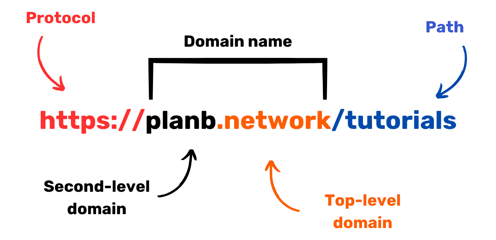
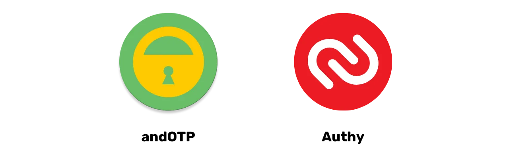

# Matka tietojesi suojaamiseen

Tervetuloa kaikille tähän digitaalisen turvallisuuden koulutusohjelmaan. Tämä koulutus on suunniteltu kaikille saavutettavaksi, joten aiempaa tietotekniikan osaamista ei vaadita. Päätavoitteenamme on tarjota teille tietoa ja taitoja, jotka ovat tarpeen digitaalisessa maailmassa turvallisemmin ja yksityisemmin liikkumiseen.

Tämä tulee sisältämään useiden työkalujen käyttöönoton, kuten turvallisen sähköpostipalvelun, työkalun salasanojesi parempaan hallintaan ja erilaisia ohjelmistoja online-toimintasi turvaamiseen.

Tässä koulutuksessa emme pyri tekemään sinusta asiantuntijaa, anonyymiä tai haavoittumatonta, sillä se on mahdotonta. Sen sijaan tarjoamme sinulle joitakin yksinkertaisia ja saavutettavia ratkaisuja aloittamaan online-tapojen muuttamisen ja digitaalisen suvereniteettisi takaisin saamisen.

Avustajien tiimi:
Muriel; suunnittelu
Rogzy Noury & Fabian; tuotanto
Théo; panos

+++

# Johdanto
<partId>534ab66c-b0e6-5757-a7dd-6ea04647edf2</partId>

## Kurssin esittely
<chapterId>2f3d005d-8b49-5a3f-b90d-94c11f613407</chapterId>

### Tavoite: Päivitä turvallisuustaitosi!

Tervetuloa kaikille tähän digitaalisen turvallisuuden koulutusohjelmaan. Tämä koulutus on suunniteltu kaikille saavutettavaksi, joten aiempaa tietotekniikan osaamista ei vaadita. Päätavoitteenamme on tarjota teille tietoa ja taitoja, jotka ovat tarpeen digitaalisessa maailmassa turvallisemmin ja yksityisemmin liikkumiseen.

Tämä tulee sisältämään useiden työkalujen käyttöönoton, kuten turvallisen sähköpostipalvelun, työkalun salasanojesi parempaan hallintaan ja erilaisia ohjelmistoja online-toimintasi turvaamiseen.

Tämä koulutus on kolmen professorimme yhteistyö:

- Renaud Lifchitz, kyberturvallisuuden asiantuntija
- Théo Pantamis, sovelletun matematiikan tohtori
- Rogzy, DécouvreBitcoinin toimitusjohtaja

Digitaalinen hygienia on ratkaisevan tärkeää yhä digitaalisemmassa maailmassa. Hakkeroinnin ja massavalvonnan jatkuvasta kasvusta huolimatta ei ole liian myöhäistä ottaa ensimmäistä askelta ja suojata itseäsi.
Tässä koulutuksessa emme yritä tehdä sinusta asiantuntijaa, anonyymiä tai haavoittumatonta, sillä se on mahdotonta. Sen sijaan tarjoamme sinulle joitakin yksinkertaisia ja saavutettavia ratkaisuja kaikille aloittamaan online-tapojen muuttamisen ja digitaalisen suvereniteettisi takaisin saamisen.
Jos etsit aiheesta edistyneempiä taitoja, resurssimme, tutoriaalimme tai muut kyberturvallisuuskoulutuksemme ovat käytettävissäsi. Sillä välin tässä on lyhyt yleiskatsaus ohjelmastamme seuraavien yhdessä vietettyjen tuntien aikana.

### Osa 1: Kaikki mitä sinun tarvitsee tietää online-selailusta

- Luku 1 - Online-selailu
- Luku 2 - Internetin turvallinen käyttö

Aloitamme keskustelemalla web-selaimen valinnan tärkeydestä ja sen merkityksestä turvallisuudelle. Tutkimme sen jälkeen selainten erityispiirteitä, erityisesti evästeiden hallinnan osalta. Näemme myös, miten varmistaa turvallisempi ja anonyymimpi selailukokemus käyttämällä työkaluja, kuten TOR. Sen jälkeen keskitymme VPN:ien käyttöön datasi suojauksen tehostamiseksi. Lopuksi päättämme suosituksiin WiFi-yhteyksien turvallisesta käytöstä.

### Osa 2: Parhaat käytännöt tietokoneen käytössä

- Luku 3 - Tietokoneen käyttö
- Luku 4 - Hakkerointi & varmuuskopioiden hallinta
Tässä osiossa käsittelemme kolmea tietoturvan keskeistä aluetta. Ensiksi tutustumme eri käyttöjärjestelmiin: Mac, PC ja Linux, korostaen niiden erityispiirteitä ja vahvuuksia. Sen jälkeen syvennymme menetelmiin, joilla voidaan tehokkaasti suojautua hakkerointiyrityksiltä ja vahvistaa laitteidesi turvallisuutta. Lopuksi korostamme säännöllisen suojauksen ja datan varmuuskopioinnin tärkeyttä, jotta voit välttää tietojen menetyksen tai kiristyshaittaohjelmat.

### Osa 3: Ratkaisujen toteuttaminen

- Luku 6 - Sähköpostinhallinta
- Luku 7 - Salasananhallinta
- Luku 8 - Kahden tekijän tunnistautuminen

Tässä käytännönläheisessä kolmannessa osassa siirrymme konkreettisten ratkaisujesi toteuttamiseen.

Ensin näemme, miten suojata sähköpostilaatikkosi, joka on olennainen viestintävälineesi ja usein hakkerien kohteena. Sen jälkeen esittelemme sinulle salasananhallinnan: käytännöllisen ratkaisun, jolla et enää unohda tai sekoita salasanojasi samalla kun pidät ne turvassa. Lopuksi keskustelemme lisäturvatoimesta, kahden tekijän tunnistautumisesta, joka lisää ylimääräisen suojakerroksen tileillesi. Kaikki selitetään selkeästi ja ymmärrettävästi.

# Kaikki mitä sinun tarvitsee tietää online-selailusta
<partId>b4b5379a-d8ef-59ae-94d3-a6e88959c149</partId>

## Online-selailu
<chapterId>3a935da9-fa6e-57eb-bf85-7b3ec35e6ee2</chapterId>

Internetissä selatessa on tärkeää välttää tiettyjä yleisiä virheitä online-turvallisuutesi säilyttämiseksi. Tässä muutamia vinkkejä niiden välttämiseksi:

### Ole varovainen ohjelmistojen lataamisessa:

On suositeltavaa ladata ohjelmistot julkaisijan virallisilta verkkosivuilta mieluummin kuin yleisiltä sivustoilta.
Esimerkki: Käytä www.signal.org/download sijaan www.logicieltelechargement.fr/signal.

On myös suositeltavaa suosia avoimen lähdekoodin ohjelmistoja, sillä ne ovat usein turvallisempia ja vapaita haittaohjelmista. "Avoimen lähdekoodin" ohjelmisto on ohjelmisto, jonka koodi on tunnettu ja kaikkien saatavilla. Tämä mahdollistaa muun muassa tarkistuksen, ettei siinä ole piilotettuja pääsyjä varastamaan henkilökohtaisia tietojasi.

> Bonus: Avoimen lähdekoodin ohjelmistot ovat usein ilmaisia! Tämä yliopisto on 100% avoimen lähdekoodin, joten voit myös tarkistaa koodimme GitHubissa.

### Evästeiden hallinta: Virheet ja parhaat käytännöt

Evästeet ovat tiedostoja, joita verkkosivustot luovat tallentaakseen tietoja laitteellesi. Vaikka jotkin sivustot vaativat näitä evästeitä toimiakseen kunnolla, niitä voidaan myös hyödyntää kolmansien osapuolien toimesta, erityisesti mainonnan seurantatarkoituksiin. Säädösten, kuten GDPR:n, mukaisesti on mahdollista - ja suositeltavaa - kieltäytyä kolmansien osapuolien seurantaevästeistä hyväksyen samalla ne, jotka ovat välttämättömiä sivuston asianmukaiselle toiminnalle. Sivustolla käynnin jälkeen on viisasta poistaa liitetyt evästeet joko manuaalisesti tai laajennuksen tai tietyn ohjelman kautta. Jotkut selaimet tarjoavat jopa mahdollisuuden valikoivaan evästeiden poistoon. Näistä varotoimista huolimatta on tärkeää ymmärtää, että eri sivustojen keräämät tiedot voivat pysyä yhteydessä toisiinsa, minkä vuoksi on tärkeää löytää tasapaino mukavuuden ja turvallisuuden välillä.

> Huom: Rajoita myös selaimessasi asennettujen laajennusten määrää välttääksesi mahdolliset turvallisuus- ja suorituskykyongelmat.

### Verkkoselaimet: valinnat, turvallisuus

On kaksi suurta selainperhettä: Chromeen perustuvat ja Firefoxiin perustuvat selaimet.
Vaikka molemmat perheet tarjoavat saman turvallisuustason, on suositeltavaa välttää Google Chrome -selainta sen seurantaohjelmien vuoksi. Chromea kevyemmät vaihtoehdot, kuten Chromium tai Brave, saattavat olla parempia vaihtoehtoja. Brave on erityisesti suositeltava sen sisäänrakennetun mainostenestäjän vuoksi. Tietyille verkkosivustoille pääsy saattaa vaatia useamman selaimen käyttöä.
### Yksityinen selaus, TOR ja muut vaihtoehdot turvallisempaan ja nimettömämpään selaamiseen

Yksityinen selaus, vaikka se ei piilota selaustietoja internet-palveluntarjoajaltasi, mahdollistaa sen, ettei tietokoneellesi jää paikallisia jälkiä. Evästeet poistetaan automaattisesti jokaisen istunnon päätteeksi, mikä mahdollistaa kaikkien evästeiden hyväksymisen ilman seurantaa. Yksityinen selaus voi olla hyödyllistä verkossa tehtävissä palveluostoissa, sillä verkkosivustot seuraavat hakutottumuksiamme ja säätävät hintoja sen mukaisesti. On kuitenkin tärkeää huomata, että yksityistä selausta suositellaan väliaikaisiin ja tiettyihin istuntoihin, ei yleiseen internetin selaamiseen.

Edistyneempi vaihtoehto on TOR (The Onion Router) -verkko, joka tarjoaa nimettömyyttä peittämällä käyttäjän IP-osoitteen ja mahdollistamalla pääsyn Darknetiin. TOR-selain on erityisesti suunniteltu TOR-verkon käyttöön. Sen avulla voit vierailla sekä tavallisilla verkkosivustoilla että .onion-verkkosivustoilla, joita yleensä ylläpitävät yksityishenkilöt ja jotka voivat olla laittomia.

TOR on laillinen ja sitä käyttävät toimittajat, vapauden aktivistit ja muut, jotka haluavat välttää sensuuria autoritaarisissa maissa. On kuitenkin tärkeää ymmärtää, että TOR ei turvaa vierailtuja sivustoja tai itse tietokonetta. Lisäksi TORin käyttö voi hidastaa internet-yhteyttä, sillä tiedot kulkevat kolmen muun ihmisen tietokoneiden kautta ennen määränpäähänsä saapumista. On myös olennaista huomata, että TOR ei ole virheetön ratkaisu taatakseen 100 %:n nimettömyyden eikä sitä tulisi käyttää laittomiin toimiin.

https://planb.network/tutorials/others/tor-browser

## VPN ja internet-yhteys
<chapterId>5aac83f4-a685-54b0-9759-d71bea7eeed2</chapterId>

### VPN:t

Internet-yhteyden suojaaminen on olennainen osa online-turvallisuutta, ja virtuaaliset yksityisverkot (VPN:t) ovat tehokas tapa parantaa tätä turvallisuutta sekä yrityksille että yksityiskäyttäjille.

'VPN:t ovat työkaluja, jotka salakoodaavat internetin yli lähetettävät tiedot, tehden yhteydestä turvallisemman. Ammatillisessa kontekstissa VPN:t mahdollistavat työntekijöiden turvallisen pääsyn yrityksen sisäiseen verkkoon etäyhteyden kautta. Vaihdettu data on salattu, mikä tekee kolmansien osapuolien väliintulon paljon vaikeammaksi. VPN:n käyttö ei ainoastaan turvaa pääsyä sisäiseen verkkoon, vaan mahdollistaa myös käyttäjän internet-yhteyden reitittämisen yrityksen sisäisen verkon kautta, antaen vaikutelman, että yhteys tulee yrityksestä. Tämä voi olla erityisen hyödyllistä päästäessä käsiksi maantieteellisesti rajoitettuihin online-palveluihin.

### VPN-tyypit

VPN:itä on kahta päätyyppiä: yritys-VPN:t ja kuluttaja-VPN:t, kuten NordVPN. Yritys-VPN:t ovat yleensä kalliimpia ja monimutkaisempia, kun taas kuluttaja-VPN:t ovat yleisesti ottaen helpommin saatavilla ja käyttäjäystävällisempiä. Esimerkiksi NordVPN mahdollistaa käyttäjien yhdistämisen internetiin toisessa maassa sijaitsevan palvelimen kautta, mikä voi ohittaa maantieteelliset rajoitukset.
Kuitenkin kuluttajakäyttöön tarkoitetun VPN:n käyttäminen ei takaa täydellistä anonyymiyttä. Monet VPN-palveluntarjoajat säilyttävät tietoja käyttäjistään, mikä voi mahdollisesti vaarantaa heidän anonyymiytensä. Vaikka VPN:t voivat olla hyödyllisiä online-turvallisuuden parantamisessa, ne eivät ole universaali ratkaisu. Ne ovat tehokkaita tietyissä erityiskäytöissä, kuten maantieteellisesti rajoitettujen palveluiden käyttämisessä tai turvallisuuden parantamisessa matkustaessa, mutta ne eivät takaa täydellistä turvallisuutta. VPN:n valinnassa on olennaista asettaa luotettavuus ja teknisyys suosion edelle. VPN-palveluntarjoajat, jotka keräävät vähiten henkilökohtaisia tietoja, ovat yleensä turvallisimpia. Palvelut kuten iVPN ja Mullvad eivät kerää henkilökohtaisia tietoja ja sallivat jopa maksut Bitcoinilla lisätyn yksityisyyden vuoksi. 
Lopuksi VPN:tä voidaan käyttää myös online-mainosten estämiseen, tarjoten nautinnollisemman ja turvallisemman selauskokemuksen. On kuitenkin tärkeää tehdä oma tutkimus löytääkseen VPN:n, joka parhaiten sopii omiin erityistarpeisiin. VPN:n käyttöä suositellaan turvallisuuden parantamiseksi, myös kotona internetiä selatessa. Tämä auttaa varmistamaan korkeamman turvallisuustason online-vaihdetulle datalle. Lopuksi, varmista tarkistaa URL-osoitteet ja pieni lukko osoiterivillä vahvistaaksesi, että olet sivustolla, jolla aiot vierailla.

https://planb.network/tutorials/others/ivpn

https://planb.network/tutorials/others/mullvad

### HTTPS & julkiset Wi-Fi-verkot

Online-turvallisuuden kannalta on olennaista ymmärtää, että 4G on yleisesti turvallisempi kuin julkinen Wi-Fi. Kuitenkin 4G:n käyttö voi nopeasti kuluttaa mobiilidatapakettisi. HTTPS-protokollasta on tullut standardi verkkosivustojen datan salaamiseen. Se varmistaa, että käyttäjän ja verkkosivuston välillä vaihdettu data on turvassa. Siksi on ratkaisevan tärkeää varmistaa, että vierailemasi sivusto käyttää HTTPS-protokollaa.

Euroopan unionissa tietosuojaa säännellään Yleisellä tietosuoja-asetuksella (GDPR). Siksi on turvallisempaa käyttää eurooppalaisia Wi-Fi-yhteyspisteen tarjoajia, kuten SNCF, jotka eivät myy käyttäjien yhteystietoja eteenpäin. Kuitenkin pelkkä lukon näkyminen sivustolla ei takaa sen aitoutta. On tärkeää varmistaa sivuston julkisen avaimen aitous käyttämällä sertifikaattijärjestelmää. Vaikka datan salaaminen estää kolmansia osapuolia kaappaamasta vaihdettua dataa, on silti mahdollista, että pahantahtoinen henkilö voi esiintyä sivustona ja siirtää dataa salaamattomana.

Online-huijausten välttämiseksi on ratkaisevan tärkeää varmistaa selaamasi sivuston identiteetti, erityisesti tarkistamalla laajennus ja verkkotunnus. Lisäksi ole valppaana huijareiden suhteen, jotka käyttävät URL-osoitteissa samankaltaisia kirjaimia käyttäjien harhauttamiseksi.

Yhteenvetona voidaan sanoa, että VPN:n käyttö voi merkittävästi parantaa online-turvallisuutta sekä yrityksille että yksityiskäyttäjille. Lisäksi hyvien selaustapojen noudattaminen voi edistää parempaa digitaalista hygieniaa. Seuraavassa kurssin osassa käsittelemme tietokoneen turvallisuutta, mukaan lukien päivitykset, antivirus ja salasanojen hallinta.

# Parhaat käytännöt tietokoneen käyttöön
<partId>e6eac20b-ba24-5d9a-8d86-8e0164074457</partId>

## Tietokoneen käyttö
<chapterId>16745632-b56b-5423-9873-ddf70fdf1efd</chapterId>

Tietokoneidemme turvallisuus on suuri huolenaihe tämän päivän digitaalisessa maailmassa. Tänään käsittelemme kolmea keskeistä kohtaa:

- Tietokoneen valinta
- Päivitykset ja antivirus optimaalisen turvallisuuden saavuttamiseksi
- Parhaat käytännöt tietokoneesi ja tietojesi turvallisuuden varmistamiseksi.

### Tietokoneen ja käyttöjärjestelmän valinta

Tietokoneen valinnan osalta ei ole merkittävää eroa turvallisuudessa vanhojen ja uusien tietokoneiden välillä. Kuitenkin käyttöjärjestelmien välillä on turvallisuuseroja: Windows, Linux ja Mac.
Windowsin osalta suositellaan, että et käytä järjestelmänvalvojan tiliä päivittäiseen käyttöön, vaan luot kaksi erillistä tiliä: järjestelmänvalvojan tilin ja tilin päivittäiseen käyttöön. Windows on usein alttiimpi haittaohjelmille sen suuren käyttäjämäärän ja käyttäjästä järjestelmänvalvojaksi vaihtamisen helppouden vuoksi. Toisaalta, uhkat ovat harvinaisempia Linuxissa ja Macissa.

Käyttöjärjestelmän valinnan tulisi perustua tarpeisiisi ja mieltymyksiisi. Linux-järjestelmät ovat kehittyneet huomattavasti viime vuosina, muuttuen yhä käyttäjäystävällisemmiksi. Ubuntu on mielenkiintoinen vaihtoehto aloittelijoille, sen helppokäyttöisen graafisen käyttöliittymän ansiosta. On mahdollista osioida tietokone kokeillaksesi Linuxia säilyttäen samalla Windowsin, mutta tämä voi olla monimutkaista. Usein on suositeltavaa käyttää erillistä tietokonetta, virtuaalikonetta tai USB-tikkua Linuxin tai Ubuntun testaamiseen.

### Ohjelmistopäivitykset

Päivitysten osalta sääntö on yksinkertainen: **käyttöjärjestelmän ja sovellusten säännöllinen päivittäminen on välttämätöntä.**

Windows 10:ssä päivitykset ovat lähes jatkuvia ja on ratkaisevan tärkeää, ettei niitä estetä tai viivästetä. Joka vuosi tunnistetaan noin 15 000 haavoittuvuutta, mikä korostaa ohjelmistojen ajan tasalla pitämisen tärkeyttä virusten torjunnassa. Yleensä ohjelmistotuki päättyy 3–5 vuotta julkaisun jälkeen, joten on tarpeen päivittää uudempaan versioon turvallisuuden säilyttämiseksi.

Sääntö pätee lähes kaikkiin ohjelmistoihin. Päivitykset eivät todellakaan ole tarkoitettu tekemään koneestasi vanhentunutta tai hidasta, vaan suojelemaan sitä uusilta uhkilta. Jotkut päivitykset ovat jopa pidettäviä merkittävinä, ja ilman niitä tietokoneesi on vakavassa vaarassa joutua hyväksikäytetyksi.

Antaakseni sinulle konkreettisen esimerkin virheestä: päivittämättömät krakatut ohjelmistot edustavat kaksinkertaista potentiaalista uhkaa. Viruksen saapuminen sen laittoman lataamisen aikana epäilyttävältä verkkosivustolta ja turvaton käyttö uusia hyökkäysmuotoja vastaan.

### Virustorjunta

- Tarvitsetko virustorjuntaa? KYLLÄ
- Täytyykö siitä maksaa? Riippuu!

Virustorjunnan valinta ja käyttöönotto on tärkeää. Windows Defender, Windowsin sisäänrakennettu virustorjunta, on turvallinen ja tehokas ratkaisu. Ilmaisena ratkaisuna se on erittäin hyvä ja paljon parempi kuin monet verkosta löytyvät ilmaiset ratkaisut. Todellakin, verkosta ladattujen virustorjuntaohjelmien kanssa on syytä olla varovainen, sillä ne voivat olla haitallisia tai vanhentuneita.
Niille, jotka haluavat sijoittaa maksulliseen virustorjuntaan, suositellaan valitsemaan virustorjunta, joka analysoi älykkäästi tuntemattomia ja nousevia uhkia, kuten Kaspersky. Virustorjuntapäivitykset ovat välttämättömiä uusien uhkien torjumiseksi.
> Huom: Linux ja Mac, kiitos niiden käyttäjäoikeuksien erottelujärjestelmän, eivät usein tarvitse virustorjuntaa.

Lopuksi, tässä on joitakin hyviä käytäntöjä tietokoneesi ja tietojesi turvallisuuden varmistamiseksi. On tärkeää valita tehokas ja käyttäjäystävällinen virustorjunta. On myös ratkaisevan tärkeää omaksua hyviä käytäntöjä tietokoneellasi, kuten välttää tuntemattomien tai epäilyttävien USB-tikkujen liittämistä. Nämä USB-tikut voivat sisältää haittaohjelmia, jotka voivat käynnistyä automaattisesti liitettäessä. USB-tikun tarkistaminen on hyödytöntä sen jälkeen, kun se on liitetty. Jotkut yritykset ovat joutuneet hakkeroinnin uhreiksi USB-tikkujen vuoksi, jotka on huolettomasti jätetty pääsyalueille, kuten parkkipaikalle.

Kohtele tietokonettasi kuten kotiasi: pysy valppaana, päivitä säännöllisesti, poista tarpeettomat tiedostot ja käytä vahvaa salasanaa turvallisuuden varmistamiseksi. On ratkaisevan tärkeää salata tiedot kannettavissa tietokoneissa ja älypuhelimissa varkauden tai tietojen menetyksen estämiseksi. BitLocker Windowsille, LUKS Linuxille ja sisäänrakennettu vaihtoehto Macille ovat ratkaisuja tietojen salaamiseen. On suositeltavaa ottaa tietojen salaus käyttöön epäröimättä ja kirjoittaa salasana paperille, joka säilytetään turvallisessa paikassa.
Yhteenvetona on olennaista valita käyttöjärjestelmä, joka vastaa tarpeitasi ja päivittää sitä säännöllisesti, samoin kuin asennettuja sovelluksia. On myös tärkeää käyttää tehokasta ja käyttäjäystävällistä virustorjuntaohjelmaa sekä omaksua hyviä käytäntöjä tietokoneesi ja tietojesi turvallisuuden varmistamiseksi.

## Hakkerointi & Varmuuskopiointi: Tietojesi suojaaminen
<chapterId>9ddfcb6a-a253-5542-b7eb-df7222b46dc7</chapterId>

### Miten hakkerit hyökkäävät?

Jotta voit suojautua tehokkaasti, on olennaista ymmärtää, miten hakkerit yrittävät tunkeutua tietokoneellesi. Todellisuudessa virukset eivät usein ilmesty tyhjästä, vaan ovat pikemminkin seurausta teoistamme, jopa tahattomasti!

Yleisesti ottaen virukset saapuvat, koska olet sallinut tietokoneesi kutsua ne kotiisi. Tämä voidaan havainnollistaa lataamalla epäilyttävää ohjelmistoa, kompromissoidun torrent-tiedoston kautta tai yksinkertaisesti klikkaamalla huijaussähköpostin linkkiä!

### Phishing, varovaisuus huijaussähköposteja kohtaan:

Huomio! Sähköpostit ovat ensisijainen hyökkäysvektori, tässä muutamia vinkkejä:

- Ole valppaana phishing-yrityksille, joiden tarkoituksena on saada selville arkaluonteisia tietoja, kuten käyttäjätunnuksesi ja salasanasi. Vältä epäilyttävien linkkien klikkaamista ja henkilökohtaisten tietojesi jakamista tarkistamatta lähettäjän legitiimiyttä.
- Ole varovainen sähköpostin liitteiden ja kuvien kanssa:
  Sähköpostin liitteet ja kuvat voivat sisältää haittaohjelmia. Älä lataa tai avaa liitteitä tuntemattomilta tai epäilyttäviltä lähettäjiltä, ja varmista, että virustorjuntasi on ajan tasalla.

Kultainen sääntö tässä on tarkistaa huolellisesti lähettäjän koko nimi sekä sähköpostin alkuperä. Epäilyksen vallitessa, poista se!

### Lunasohjelmat ja kyberhyökkäysten tyypit:

Lunasohjelma on haittaohjelman tyyppi, joka salaa käyttäjän tiedot ja vaatii lunnaita niiden salauksen purkamiseksi. Tämän tyyppinen hyökkäys on yhä yleisempi ja voi olla erittäin hankala yritykselle tai yksilölle. Suojautuaksesi on välttämätöntä luoda varmuuskopiot kaikkein arkaluonteisimmista tiedostoista! Tämä ei pysäytä lunasohjelmaa, mutta se mahdollistaa sen yksinkertaisesti ohittamisen.

Varmuuskopioi säännöllisesti tärkeät tietosi ulkoiselle tallennuslaitteelle tai turvalliseen online-tallennuspalveluun. Näin voit palauttaa tietosi kyberhyökkäyksen tai laitteistovian sattuessa menettämättä tärkeitä tietoja.

Yksinkertainen ratkaisu:

- Hanki ulkoinen kovalevy ja kopioi tietosi sille. Irrota se ja säilytä sitä jossakin talossa. (Tämän tekeminen kahdesti ja toisen aseman säilyttäminen toisessa paikassa auttaa suojaamaan mahdolliselta tulipalolta.)

- Luo "pilvi" varmuuskopio käyttämällä ProtonMail Drivea, Synciä tai vaikka Google Drivea. Lataa arkaluonteiset tietosi tähän online-isäntään. Ole kuitenkin tietoinen siitä, että tietosi ovat potentiaalisesti internetissä ja luotetun kolmannen osapuolen hallussa.

### Pitäisikö hakkerien maksaa?

EI, yleisesti ottaen hakkerien maksamista ei suositella lunasohjelmien tai muiden hyökkäystyyppien yhteydessä. Lunnaiden maksaminen ei takaa tietojesi palautumista ja voi rohkaista kyberrikollisia jatkamaan haitallista toimintaansa. Sen sijaan, painota ennaltaehkäisyä ja säännöllistä tietojesi varmuuskopiointia suojautuaksesi.

Jos havaitset viruksen tietokoneellasi, katkaise yhteys internetiin, suorita täysi virustorjuntaskannaus ja poista tartunnan saaneet tiedostot. Sen jälkeen, päivitä ohjelmistosi ja käyttöjärjestelmäsi, ja vaihda salasanasi estääksesi lisäintruusiot.

https://planb.network/tutorials/others/proton-drive

https://planb.network/tutorials/others/veracrypt

# Ratkaisujen toteuttaminen.
<partId>15ec9022-ba05-5549-87fc-cb8d82665f7b</partId>

## Sähköpostitilien hallinta
<chapterId>dfceea33-8712-5557-ace1-6ba5598d33d8</chapterId>

### Uuden sähköpostitilin perustaminen!

Sähköpostitili on keskeinen osa verkkotoimintaasi: jos se on vaarantunut, hakkeri voi käyttää sitä kaikkien salasanojesi nollaamiseen "unohdin salasanan" -toiminnon kautta ja päästä käsiksi moniin muihin sivustoihin. Siksi on tärkeää suojata se asianmukaisesti.

Sähköpostitili tulisi luoda käyttäen ainutlaatuista ja vahvaa salasanaa (yksityiskohdat luvussa 7) ja ihanteellisesti kaksivaiheisen tunnistautumisen järjestelmällä (yksityiskohdat luvussa 8).

Vaikka meillä kaikilla on jo sähköpostitili, on tärkeää harkita uuden, modernimman tilin luomista aloittaaksesi puhtaalta pöydältä.

### Sähköpostipalvelun valinta ja sähköpostiosoitteiden hallinta

Sähköpostiosoitteidemme asianmukainen hallinta on ratkaisevan tärkeää verkkopääsyn turvallisuuden varmistamiseksi. On tärkeää valita turvallinen ja yksityisyyttä kunnioittava sähköpostipalvelu. Esimerkiksi ProtonMail on turvallinen ja yksityisyyttä kunnioittava sähköpostipalvelu.

Sähköpostipalvelun valitsemisessa ja salasanan luomisessa on olennaista, ettei samaa salasanaa käytetä uudelleen eri verkkopalveluissa. On suositeltavaa säännöllisesti luoda uusia sähköpostiosoitteita ja erottaa käyttötarkoitukset käyttämällä eri sähköpostiosoitteita. On suositeltavaa valita turvallinen sähköpostipalvelu kriittisille tileille. On myös huomioitava, että jotkin palvelut rajoittavat salasanojen pituutta, joten on tärkeää olla tietoinen tästä rajoituksesta. Palveluita on saatavilla myös väliaikaisten sähköpostiosoitteiden luomiseen, joita voidaan käyttää rajoitetun ajan kestäville tileille.

On tärkeää ottaa huomioon, että vanhempia sähköpostipalveluita kuten La Poste, Arobase, Wig, Hotmail, käytetään yhä, mutta niiden turvallisuuskäytännöt eivät välttämättä ole yhtä hyvät kuin esimerkiksi Gmailin. Siksi on suositeltavaa pitää kaksi erillistä sähköpostiosoitetta, toinen yleiseen viestintään ja toinen tilien palauttamiseen, jälkimmäisen ollessa paremmin suojattu. On parasta välttää sähköpostiosoitteen sekoittamista puhelinoperaattoriisi tai internet-palveluntarjoajaan, sillä se voi olla hyökkäysvektori.

### Pitäisikö minun vaihtaa sähköpostitilini?

On suositeltavaa käyttää verkkosivustoa Have I Been Pwned (https://haveibeenpwned.com/) tarkistaaksesi, onko sähköpostiosoitteesi vaarantunut ja saadaksesi ilmoituksia tulevista tietomurroista. Hakkeroidut tietokannat voivat olla hakkerien hyväksikäyttämiä lähettämään phishing-sähköposteja tai uudelleenkäyttämään vaarantuneita salasanoja.

Yleisesti ottaen uuden, turvallisemman sähköpostiosoitteen käyttöönotto ei ole huono käytäntö ja jopa tarpeellista, jos haluaa aloittaa alusta terveellä pohjalla.
Bonus Bitcoin: Saattaa olla suositeltavaa luoda erityinen sähköpostiosoite Bitcoin-toimintoihimme (vaihtotilien luominen) erottaaksemme todella elämämme toiminta-alueet toisistaan.

https://planb.network/tutorials/others/proton-mail

## Salasananhallintaohjelma
<chapterId>0b3c69b2-522c-56c8-9fb8-1562bd55930f</chapterId>

### Mikä on salasananhallintaohjelma?

Salasananhallintaohjelma on työkalu, joka mahdollistaa eri verkkotilien salasanojen tallentamisen, luomisen ja hallinnan. Sen sijaan, että muistaisit useita salasanoja, tarvitset vain yhden pääsalasanan päästäksesi kaikkiin muihin.

Salasananhallintaohjelman avulla sinun ei enää tarvitse huolehtia salasanojen unohtamisesta tai niiden kirjoittamisesta jonnekin. Tarvitset vain muistaa yhden pääsalasanan. Lisäksi useimmat näistä työkaluista generoivat sinulle vahvoja salasanoja, mikä lisää tiliesi turvallisuutta.

### Eroja joissakin suosituissa hallintaohjelmissa:
- LastPass: Yksi suosituimmista salasanojen hallintajärjestelmistä. Se on kolmannen osapuolen palvelu, mikä tarkoittaa, että salasanasi säilytetään heidän palvelimillaan. Tarjolla on ilmainen versio ja maksullinen versio, käyttäjäystävällisellä käyttöliittymällä.
- Dashlane: Se on myös kolmannen osapuolen palvelu, intuitiivisella käyttöliittymällä ja lisäominaisuuksilla, kuten luottokorttitietojen seuranta ja turvalliset muistiinpanot.

### Itsehostaminen lisäkontrollin saamiseksi:

- Bitwarden: Se on avoimen lähdekoodin työkalu, mikä tarkoittaa, että voit tarkistaa sen koodin varmistaaksesi sen turvallisuuden. Vaikka Bitwarden tarjoaa isännöidyn palvelun, se mahdollistaa myös käyttäjien itsehostamisen, mikä tarkoittaa, että voit hallita, missä salasanasi säilytetään, tarjoten mahdollisesti enemmän turvallisuutta ja kontrollia.

- KeePass: Se on avoimen lähdekoodin ratkaisu, joka on ensisijaisesti tarkoitettu itsehostamiseen. Tietosi säilytetään oletusarvoisesti paikallisesti, mutta halutessasi voit synkronoida salasanatietokannan käyttäen eri menetelmiä. KeePass on laajalti tunnustettu sen turvallisuudesta ja joustavuudesta, vaikkakin se saattaa olla hieman vähemmän käyttäjäystävällinen aloittelijoille.

(Huom: Kolmannen osapuolen palvelun ja itsehostetun palvelun välillä valitseminen riippuu teknologisesta mukavuustasostasi ja siitä, miten priorisoit kontrollin mukavuuden sijaan. Kolmannen osapuolen palvelut ovat yleensä mukavampia useimmille ihmisille, kun taas itsehostaminen vaatii enemmän teknistä tietämystä mutta voi tarjota enemmän kontrollia ja mielenrauhaa turvallisuuden suhteen.)

### Mikä tekee salasanasta hyvän:

Hyvä salasana on yleensä:

- Pitkä: vähintään 12 merkkiä.
- Monimutkainen: sekoitus isoja ja pieniä kirjaimia, numeroita ja symboleita.
- Ainutlaatuinen: älä käytä samaa salasanaa eri tileille.
- Ei perustu henkilökohtaiseen tietoon: vältä syntymäpäiviä, nimiä jne.

Tilisi turvallisuuden varmistamiseksi on ratkaisevan tärkeää luoda vahvoja ja turvallisia salasanoja. Salasanan pituus ei yksinään riitä takaamaan sen turvallisuutta. Merkkien on oltava täysin satunnaisia kestääkseen voimakkaat hyökkäykset. Tapahtumien riippumattomuus on myös tärkeää välttääkseen todennäköisimpiä yhdistelmiä. Yleiset salasanat, kuten "password", murretaan helposti.

Vahvan salasanan luomiseksi suositellaan käyttämään suurta määrää satunnaisia merkkejä, välttäen ennustettavia sanoja tai kaavoja. On myös olennaista sisällyttää numeroita ja erikoismerkkejä. On kuitenkin huomioitava, että jotkin verkkosivustot saattavat rajoittaa tiettyjen erikoismerkkien käyttöä. Ei-satunnaisesti generoidut salasanat ovat helppoja arvata. Salasanojen variaatiot tai lisäykset eivät ole turvallisia. Verkkosivustot eivät voi taata käyttäjien valitsemien salasanojen turvallisuutta.

Satunnaisesti generoidut salasanat tarjoavat korkeamman turvallisuustason, vaikkakin ne saattavat olla vaikeampia muistaa. Salasanojen hallintajärjestelmät voivat generoida turvallisempia satunnaisia salasanoja. Salasanojen hallintajärjestelmää käyttämällä sinun ei tarvitse muistaa kaikkia salasanojasi. On tärkeää vaihtaa vanhat salasanasi vähitellen hallintajärjestelmän generoimiin, sillä ne ovat vahvempia ja pidempiä. Varmista, että salasanojen hallintajärjestelmäsi pääsalasana on myös vahva ja turvallinen.

https://planb.network/tutorials/others/bitwarden

https://planb.network/tutorials/others/keepass

## Kahden tekijän tunnistautuminen
<chapterId>9391e02e-e61b-5a86-93e0-91a07f217d35</chapterId>

### Miksi ottaa käyttöön 2FA
Kaksivaiheinen tunnistautuminen (2FA) on lisäkerroksen turvatoimi, jota käytetään varmistamaan, että henkilöt, jotka yrittävät päästä käsiksi verkkotiliin, ovat todella sitä, mitä väittävät olevansa. Pelkän käyttäjätunnuksen ja salasanan syöttämisen sijaan 2FA vaatii toisen vahvistusmuodon. Tämä toinen vaihe voi olla:

- Väliaikainen koodi, joka lähetetään SMS-viestinä.
- Sovelluksen, kuten Google Authenticatorin tai Authyn, generoima koodi.
- Fyysinen turva-avain, jonka liität tietokoneeseesi.

2FA:n avulla, vaikka hakkeri saisi salasanasi, he eivät pystyisi pääsemään tilillesi ilman tätä toista vahvistustekijää. Tämä tekee 2FA:sta olennaisen suojaamaan verkkotilejäsi luvattomalta pääsyltä.

### Minkä vaihtoehdon valita?

Eri vahvan tunnistautumisen vaihtoehdot tarjoavat vaihtelevia turvallisuustasoja.

- SMS:ää ei pidetä parhaana vaihtoehtona, koska se tarjoaa vain todisteen puhelinnumeron hallussapidosta.
- 2FA (kaksivaiheinen tunnistautuminen) on turvallisempi, koska se käyttää useita todistetyyppejä, kuten tietämystä, hallussapitoa ja tunnistamista. Kertakäyttöiset salasanat (HOTP ja TOTP) ovat turvallisempia kuin SMS, koska ne vaativat kryptografisen laskennan ja ne tallennetaan paikallisesti eikä muistiin.
- Laitetokenit, kuten USB-avaimet tai älykortit, tarjoavat optimaalisen turvallisuuden generoimalla uniikin yksityisen avaimen jokaiselle sivustolle ja varmistamalla URL-osoitteen ennen yhteyden sallimista.

Optimaalisen turvallisuuden saavuttamiseksi vahvalla tunnistautumisella suositellaan turvallisen sähköpostiosoitteen, turvallisen salasananhallintaohjelman käyttöä ja 2FA:n käyttöönottoa YubiKeyn avulla. On myös suositeltavaa hankkia kaksi YubiKeytä varautuaksesi katoamiseen tai varkauteen, esimerkiksi säilyttämällä varakopiota sekä kotona että mukanasi.

Biometriikkaa voidaan käyttää korvikkeena, mutta se on vähemmän turvallinen kuin tiedon ja hallussapidon yhdistelmä. Biometriset tiedot tulisi säilyttää tunnistuslaitteessa eikä niitä tulisi paljastaa verkossa. On tärkeää harkita eri tunnistautumismenetelmiin liittyvää uhkamallia ja säätää käytäntöjä sen mukaisesti.

### Koulutuksen yhteenveto:

Kuten olet ymmärtänyt, hyvän digitaalisen hygienian toteuttaminen ei välttämättä ole yksinkertaista, mutta se on saavutettavissa!

- Uuden turvallisen sähköpostiosoitteen luominen.
- Salasananhallintaohjelman asettaminen.
- 2FA:n aktivoiminen.
- Vanhojen salasanojen asteittainen korvaaminen vahvoilla salasanoilla, joissa on 2FA.

Jatka oppimista ja toteuta hyviä käytäntöjä asteittain!

Kultainen sääntö: Kyberturvallisuus on liikkuva maali, joka mukautuu oppimismatkasi mukaan!

https://planb.network/tutorials/others/authy

https://planb.network/tutorials/others/security-key

# Käytännön osio
<partId>98ccf14b-4053-5839-878c-7a73ff02eb95</partId>

## Sähköpostilaatikon pystyttäminen
<chapterId>afc9ab5d-7664-5a9b-ab50-225ac9ba8f7c</chapterId>

Sähköpostilaatikon suojaaminen on tärkeä askel online-toimintojen turvaamiseksi ja henkilökohtaisten tietojen suojaamiseksi. Tämä opas opastaa sinua askel askeleelta ProtonMail-tilin luomisessa ja konfiguroinnissa, palveluntarjoajassa, joka tunnetaan korkeasta turvallisuustasostaan ja tarjoaa viestiesi päästä päähän -salausta. Olitpa sitten aloittelija tai kokenut käyttäjä, täällä esitetyt parhaat käytännöt auttavat sinua vahvistamaan sähköpostisi turvallisuutta hyödyntäen samalla ProtonMailin edistyneitä ominaisuuksia:

https://planb.network/tutorials/others/proton-mail

## 2FA:n turvaaminen
<chapterId>09468ec1-95b7-56a4-a636-7618044568e1</chapterId>

Kaksivaiheinen todennus (2FA) on tullut oleelliseksi verkkotilien suojaamiseksi. Tässä oppaassa opit, kuinka määrittää ja käyttää 2FA-sovellusta Authy, joka luo dynaamisia 6-numeroisia koodeja tiliesi suojaamiseksi. Authy on erittäin helppokäyttöinen ja synkronoitavissa useille laitteille. Opi asentamaan ja konfiguroimaan Authy ja vahvista näin online-tiliesi turvallisuutta heti:

https://planb.network/tutorials/others/authy

Toinen vaihtoehto on käyttää fyysistä turvakilpeä. Tämä toinen opas näyttää, kuinka määrittää ja käyttää turvakilpeä toisen autentikointitekijäna:

https://planb.network/tutorials/others/security-key

## Salasananhallintaohjelman luominen
<chapterId>ed579680-4e7b-5f65-8541-14e519a3b242</chapterId>

Salasanojen hallinta on digitaalisen aikakauden haaste. Meillä kaikilla on lukuisia verkkotilejä, jotka on suojattava. Salasananhallintaohjelma auttaa sinua luomaan ja tallentamaan vahvoja ja ainutlaatuisia salasanoja jokaiselle tilille.

Tässä oppaassa opit, kuinka määrittää Bitwarden, avoimen lähdekoodin salasananhallintaohjelma, ja kuinka synkronoida tunnistetietosi kaikilla laitteillasi yksinkertaistaaksesi päivittäistä käyttöä:

https://planb.network/tutorials/others/bitwarden

Kokenutta käyttäjää varten tarjoan myös oppaan toisen ilmaisen ja avoimen lähdekoodin ohjelmiston käytöstä salasanojesi hallintaan paikallisesti:

https://planb.network/tutorials/others/keepass

## Tilien turvaaminen
<chapterId>7a774b34-aed0-57dd-b8f7-cf3be51c0d70</chapterId>

Näissä kahdessa tutoriaalissa opastan sinua myös online-tiliesi suojaamisessa ja selitän, miten voit vähitellen omaksua turvallisempia käytäntöjä salasanojesi päivittäisessä hallinnassa.

https://planb.network/tutorials/others/bitwarden

https://planb.network/tutorials/others/keepass

## Varmuuskopiointiasetukset
<chapterId>01cfcde1-77cb-506c-8df1-fa18a2e8cc6b</chapterId>

Henkilökohtaisten tiedostojen suojaaminen on myös olennaista. Tämä opas näyttää, kuinka ottaa käyttöön tehokas varmuuskopiointistrategia Proton Drive'n avulla. Opi käyttämään tätä turvallista pilvipalveluratkaisua 3-2-1-menetelmän soveltamiseen: kolme kopiota tiedoistasi kahdessa eri tallennusvälineessä, joista yksi kopio on sivuston ulkopuolella. Näin varmistat arkaluonteisten tiedostojesi saatavuuden ja turvallisuuden:

https://planb.network/tutorials/others/proton-drive

Ja suojataksesi USB-tikulla tai ulkoisella kovalevyllä tallennettuja tiedostoja, näytän myös, miten voit helposti salata ja purkaa näitä tallennusvälineitä VeraCryptin avulla:

https://planb.network/tutorials/others/veracrypt

## Selaimen vaihto & VPN
<chapterId>8dc08feb-313c-5259-a54f-64aa68a07608</chapterId>

Verkkoprivasiutesi suojaaminen on myös olennaista turvallisuutesi varmistamiseksi. VPN:n käyttö voi olla ensimmäinen ratkaisu tämän saavuttamiseksi.

Ehdotan, että tutustut kahteen luotettavaan VPN-ratkaisuun, joita voi maksaa bitcoinilla, nimittäin IVPN ja Mullvad. Nämä tutoriaalit opastavat sinua asentamaan, konfiguroimaan ja käyttämään Mullvadi tai IVPN:iä kaikilla laitteillasi:

https://planb.network/tutorials/others/ivpn

https://planb.network/tutorials/others/mullvad

Lisäksi opi käyttämään Tor Browseria, selainta, joka on erityisesti suunniteltu suojaamaan online-p私siuttasi:

https://planb.network/tutorials/others/tor-browser

# Syvennä osaamistasi
<partId>77113cad-a6d8-57e5-b903-50c223b277ba</partId>

## Kuinka työskennellä kyberturvallisuusalalla
<chapterId>aad1ae27-4280-5b07-b9ab-118ae013951a</chapterId>

### Kyberturvallisuus: Kasvava ala loputtomilla mahdollisuuksilla

Jos olet intohimoinen järjestelmien ja tietojen suojaamisessa, kyberturvallisuuden ala tarjoaa lukuisia mahdollisuuksia. Jos tämä ala kiinnostaa sinua, tässä on joitakin keskeisiä askeleita, jotka voivat ohjata sinua.

### Akateemiset perusteet ja sertifikaatit:

Vankka koulutus tietojenkäsittelytieteessä, tietojärjestelmissä tai vastaavalla alalla on usein ihanteellinen lähtökohta. Nämä opinnot tarjoavat tarvittavan perustan ymmärtää kyberturvallisuuden teknisiä haasteita. Tämän koulutuksen täydentämiseksi on viisasta hankkia alalla tunnustettuja sertifikaatteja. Vaikka nämä sertifikaatit voivat vaihdella alueittain, jotkut, kuten CISSP tai CEH, nauttivat globaalista tunnustuksesta.

Kyberturvallisuus on laaja ja jatkuvasti kehittyvä ala. Olennaisten työkalujen ja erilaisten järjestelmien tuntemus on ratkaisevan tärkeää. Lisäksi, koska alalla on niin monta aladomeenia, tapahtumien vastauksesta eettiseen hakkerointiin, on hyödyllistä löytää oma erikoisalasi ja erikoistua siihen.

### Käytännön kokemuksen hankkiminen:

Käytännön kokemuksen merkitystä ei voi aliarvioida. Harjoittelupaikkojen tai juniori-tason tehtävien etsiminen yrityksistä, joilla on kyberturvallisuustiimejä, on erinomainen tapa soveltaa teoreettista tietämystäsi. Lisäksi eettisen hakkeroinnin kilpailuihin tai kyberturvallisuussimulaatioihin osallistuminen voi hioa taitojasi todellisissa tilanteissa.

Ammattiverkoston vahvuus on korvaamaton. Ammattiyhdistyksiin, hakkeritiloihin tai online-foorumeihin liittyminen tarjoaa alustan ideoiden vaihtoon muiden asiantuntijoiden kanssa. Samoin kyberturvallisuuskonferensseihin ja työpajoihin osallistuminen ei ainoastaan mahdollista oppimista, vaan auttaa myös rakentamaan yhteyksiä alan ammattilaisten kanssa.

Uhkien jatkuva kehitys vaatii säännöllistä uutisten ja erikoistuneiden foorumien seurantaa. Alalla, jossa luottamus on ensiarvoisen tärkeää, eettisesti ja rehellisesti toimiminen on välttämätöntä urasi jokaisessa vaiheessa.

### Taitojen ja työkalujen syventäminen:

- Kyberturvallisuustyökalut: Wireshark, Metasploit, Nmap.
- Käyttöjärjestelmät: Linux, Windows, MacOS.
- Ohjelmointikielet: Python, C, Java.
- Verkot: TCP/IP, VPN, palomuuri.
- Tietokannat: SQL, NoSQL.
- Kryptografia: SSL/TLS, symmetrinen/asymmetrinen salaus.
- Incident Management: Lokianalyysi, tapahtumien vastaus.
- Eettinen hakkerointi: Penetraatiotekniikat, tunkeutumistestaus.
- Hallinto: ISO-standardit, GDPR/CCPA-säädökset.

Hallitsemalla näitä taitoja ja työkaluja, olet hyvin varustautunut navigoimaan kyberturvallisuuden maailmassa menestyksekkäästi.

## Haastattelu Renaudin kanssa
<chapterId>7d83fd98-ce22-514e-b9e8-729fbf71ee6e</chapterId>

### Tehokas salasanojen hallinta ja autentikoinnin vahvistaminen: Akateeminen lähestymistapa
Koulutusmoduulissa "Security 101", jonka Découvre Bitcoin tarjoaa Akatemiassaan, keskustelimme salasanojen hallintajärjestelmien tärkeydestä. Kolme ulottuvuutta ovat olennaisia: salasanojen luominen, päivittäminen ja käyttöönotto verkkosivustoilla.
Yleensä ei suositella selainlaajennusten käyttöä automaattiseen salasanojen täyttöön. Nämä työkalut voivat tehdä käyttäjästä haavoittuvaisemman phishing-hyökkäyksille. Renaud, tunnustettu kyberturvallisuuden asiantuntija, suosii manuaalista hallintaa käyttäen KeePassia, joka sisältää salasanan manuaalisen kopioimisen ja liittämisen. Laajennukset voivat lisätä hyökkäyspintaa, hidastaa selaimen suorituskykyä ja siten muodostaa merkittävän riskin. Näin ollen selainlaajennusten minimaalinen käyttö on suositeltavaa.

Salasanojen hallintajärjestelmät yleensä kannustavat käyttämään lisäautentikointitekijöitä, kuten kaksivaiheista tunnistautumista. Optimaalisen turvallisuuden takaamiseksi on suositeltavaa säilyttää OTP:t (kertakäyttöiset salasanat) mobiililaitteessasi. AndoTP tarjoaa avoimen lähdekoodin ratkaisun OTP-koodien luomiseen ja säilyttämiseen puhelimessasi. Vaikka Google Authenticator mahdollistaa autentikointikoodien siementen viemisen, varmuuskopion luottamus Google-tilille on rajallinen. Siksi OTI- ja AndoTP-sovellukset ovat suositeltavia itsenäiseen OTP-hallintaan.

Digitaalisen perinnön ja digitaalisen surun kysymys nostaa esiin salasanojen siirtomenettelyn tärkeyden henkilön kuoleman jälkeen. Salasanojen hallintajärjestelmä helpottaa tätä siirtymää turvallisesti säilyttämällä kaikki digitaaliset salaisuudet yhdessä paikassa. Salasanojen hallintajärjestelmä mahdollistaa myös kaikkien avointen tilien tunnistamisen ja niiden sulkemisen tai siirron hallinnan. On suositeltavaa kirjoittaa pääsalasana paperille, mutta se tulee säilyttää piilotettuna ja turvallisessa paikassa. Jos kiintolevy on salattu ja tietokone lukittu, salasana ei ole saatavilla, edes murron yhteydessä.

### Kohti salasanattomuuden aikakautta: Uskottavien vaihtoehtojen tutkiminen

Salasanat, vaikka yleisiä, sisältävät monia haittoja, mukaan lukien mahdollisuus riskialttiiseen siirtoon todennusprosessin aikana. Johtavat yritykset, kuten Microsoft ja Apple, tarjoavat innovatiivisia vaihtoehtoja, kuten biometriset tunnisteet ja laitteistotokenit, osoittaen edistyksellistä suuntausta salasanoista luopumiseen.

'Passkeys', esimerkiksi, tarjoaa salattuja satunnaisia avaimia, yhdistettynä paikalliseen tekijään (biometria tai PIN), jotka isännöidään tarjoajan toimesta mutta pysyvät heidän ulottumattomissaan. Vaikka tämä vaatii verkkosivustojen päivittämistä, lähestymistapa eliminoi tarpeen salasanoille, tarjoten siten korkean turvallisuustason ilman perinteisiin salasanoihin tai digitaalisen kassakaapin hallintaan liittyviä rajoitteita.

Passkiz on toinen toteuttamiskelpoinen ja turvallinen vaihtoehto salasanojen hallintaan. Kuitenkin suuri kysymys on: saatavuus tarjoajan vikaantuessa. Siksi olisi toivottavaa, että internet-jätit ehdottaisivat järjestelmiä tämän saatavuuden takaamiseksi.

Suora autentikointi asiaankuuluvaan palveluun on mielenkiintoinen vaihtoehto riippuvuuden välttämiseksi kolmannesta osapuolesta. Kuitenkin internet-jättien tarjoama Single Sign-On (SSO) aiheuttaa myös ongelmia saatavuuden ja sensuurin riskien suhteen. Tietovuotojen estämiseksi on ratkaisevan tärkeää minimoida autentikointiprosessin aikana kerätyn tiedon määrä.

### Tietokoneturvallisuus: turvallisten käytäntöjen imperatiivit ja ihmisen huolimattomuuteen liittyvät riskit

Tietokoneturvallisuus voi vaarantua yksinkertaisilla käytännöillä ja oletussalasanojen, kuten "admin", käytöllä. Monimutkaiset hyökkäykset eivät aina ole tarpeen tietokoneturvallisuuden vaarantamiseksi. Esimerkiksi erään YouTube-kanavan ylläpitäjän salasanat oli kirjoitettu yrityksen yksityiseen lähdekoodiin. Turvallisuusaukot ovat usein ihmisen huolimattomuuden tulosta.
On myös huomattava, että Internet on erittäin keskitetty ja suurelta osin amerikkalaisessa hallinnassa. DNS-palvelin voi olla sensuurin kohteena ja usein käyttää harhaanjohtavaa DNS:ää estääkseen pääsyn tietyille sivustoille. DNS on vanha ja riittämättömän turvallinen protokolla, mikä voi johtaa turvallisuusongelmiin. Uusia protokollia, kuten DNSsec, on kehitetty, mutta niitä ei vielä laajasti käytetä. Sensuurin ja mainosten eston kiertämiseksi on mahdollista valita vaihtoehtoisia DNS-palveluntarjoajia. Tunkeilevien mainosten vaihtoehtoja ovat Google DNS, OpenDNS ja muut riippumattomat palvelut. Standardi DNS-protokolla jättää DNS-kyselyt näkyviin internet-palveluntarjoajalle. DOH (DNS over HTTPS) ja DOT (DNS over TLS) salaavat DNS-yhteyden, tarjoten suurempaa yksityisyyttä ja turvallisuutta. Nämä protokollat ovat laajalti käytössä yrityksissä niiden parannetun turvallisuuden vuoksi ja niitä tuetaan natiivisti Windowsissa, Androidissa ja iPhonessa. DOH:n ja DOT:n käyttämiseksi TLS-isäntänimi on syötettävä IP-osoitteen sijaan. Ilmaisia DOH- ja DOT-palveluntarjoajia on saatavilla verkossa. DOH ja DOT parantavat yksityisyyttä ja turvallisuutta välttämällä "man in the middle" -hyökkäykset. Muita keskeisiä huomioita

Osana "Security 101" -koulutusmoduulia Découvre Bitcoin Academyssa keskustelimme myös Lightning-autentikoinnista. Tämä järjestelmä luo erilaisen tunnisteen kullekin palvelulle, ilman että tarvitsee antaa sähköpostiosoitetta tai henkilökohtaisia tietoja. On mahdollista omistaa käyttäjän hallitsemia hajautettuja identiteettejä, mutta hajautettujen identiteettiprojektien standardoinnissa ja normalisoinnissa on puutteita. Paketinhallintajärjestelmiä, kuten Nuget ja Chocolaté, jotka mahdollistavat avoimen lähdekoodin ohjelmiston lataamisen Microsoft Storen ulkopuolelta, suositellaan välttämään haitallisia hyökkäyksiä. Yhteenvetona DNS on ratkaisevan tärkeä online-turvallisuudelle, mutta on välttämätöntä pysyä valppaana mahdollisten hyökkäysten varalta DNS-palvelimia vastaan.

## Arvioi kurssi
<chapterId>6be74d2d-2116-5386-9d92-c4c3e2103c68</chapterId>
<isCourseReview>true</isCourseReview>

## Loppukoe
<chapterId>a894b251-a85a-5fa4-bf2a-c2a876939b49</chapterId>
<isCourseExam>true</isCourseExam>

## Kiitokset ja jatka kaninkolon tutkimista
<chapterId>df3a962a-a96e-5006-b904-0dd9d4a072dd</chapterId>

### Arvioi koulutus & tue meitä

Tämä kurssi, kuten kaikki tämän akatemian sisältö, on tarjottu sinulle ilmaiseksi yhteisömme toimesta. Voit tukea meitä jakamalla sen muiden kanssa, liittymällä akatemian jäseneksi ja jopa osallistumalla sen kehittämiseen GitHubin kautta. Koko tiimin puolesta, kiitos!

Koulutuksen arviointijärjestelmä integroidaan pian tähän uuteen e-oppimisalustaan! Siihen asti, suurkiitokset kurssin suorittamisesta, ja jos pidit siitä, harkitse sen jakamista muiden kanssa.

### Mene pidemmälle

Onnittelut SECU 101 -koulutuksen suorittamisesta! Toivon vilpittömästi, että nautit siitä ja että se avasi sinulle ovia. Olet nyt valmis hankkimaan ensimmäisen bitcoinisi tai jatkamaan seikkailua tason 2 kursseilla!

- BTC 101 tarjoaa sinulle Bitcoinin teoreettiset perusteet
- BTC 102 auttaa sinua laatimaan bitcoin-suunnitelmasi
- LN 201 ja 202 esittelevät sinulle Lightning Networkin, toisen kerroksen maksuverkon
- ECON 201 kattaa Itävallan taloustieteen
- MINING 201 opettaa lisää louhinnasta
- (ja paljon muuta)

Valtava kiitos Patreon-jäsenillemme, lahjoittajillemme taloudellisesta tuesta, kiitos ihmisille, jotka jakavat, ja kiitos niille, jotka tekivät tämän koulutuksen mahdolliseksi: Théo pantamis, Renaud, Théo, Fabien, Noury, Muriel & koko tiimi.
Nähdään pian!
