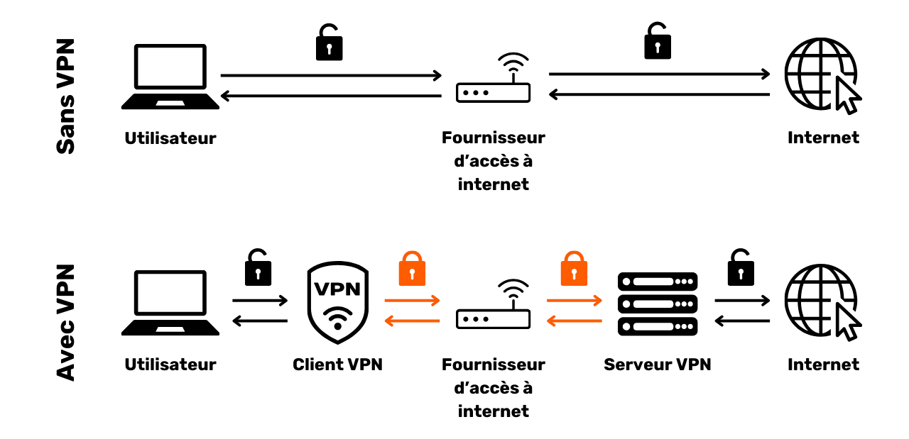

# Un voyage vers la protection de vos données

Bienvenue à tous dans ce programme d'enseignement consacré à la sécurité numérique. Cette formation est conçue pour être accessible à tous, aucun prérequis en informatique n'est donc nécessaire. Notre objectif principal est de vous fournir les connaissances et les compétences nécessaires pour naviguer de manière plus sûre et plus privée dans le monde numérique.

Ceci va se traduire par la mise en place de plusieurs outils tels qu'une boîte mail sécurisée, un outil pour mieux gérer vos mots de passe et plusieurs logiciels pour sécuriser vos activités quotidiennes en ligne.

Dans cette formation, nous ne cherchons pas à vous rendre expert, anonyme ou inattaquable, ceci est impossible. À la place, nous vous proposons quelques solutions simples et accessibles pour tous afin de commencer une transformation de vos habitudes en ligne et reprendre le contrôle de votre souveraineté numérique.

Team contributeurs:
Muriel; Design
Rogzy Noury & Fabian; Production
Théo; Contribution

+++

# Introduction
<partId>534ab66c-b0e6-5757-a7dd-6ea04647edf2</partId>

## Introduction du cours
<chapterId>2f3d005d-8b49-5a3f-b90d-94c11f613407</chapterId>

### Objectif : remise à jour !

Bienvenue à tous dans ce programme d'enseignement consacré à la sécurité numérique. Cette formation est conçue pour être accessible à tous, aucun prérequis en informatique n'est donc nécessaire. Notre objectif principal est de vous fournir les connaissances et les compétences nécessaires pour naviguer de manière plus sûre et plus privée dans le monde numérique.

Ceci va se traduire par la mise en place de plusieurs outils tels qu'une boîte mail sécurisée, un outil pour mieux gérer vos mots de passe et plusieurs logiciels pour sécuriser vos activités quotidiennes en ligne.

Cette formation est un effort commun de trois de nos professeurs :

- Renaud Lifchitz, expert en cybersécurité
- Théo Pantamis, docteur en mathématique appliquée
- Rogzy, PDG de DécouvreBitcoin

Votre hygiène numérique est cruciale dans un monde de plus en plus numérique. Malgré une constante augmentation du nombre de piratages informatiques et de la surveillance de masse, il n'est pas trop tard pour faire le premier pas et se protéger.

Dans cette formation, nous ne cherchons pas à vous rendre expert, anonyme ou inattaquable, ceci est impossible. À la place, nous vous proposons quelques solutions simples et accessibles pour tous afin de commencer une transformation de vos habitudes en ligne et reprendre le contrôle de votre souveraineté numérique.

Si vous cherchez des compétences plus avancées sur le sujet, nos ressources, tutoriels ou autres formations sur la cybersécurité sont là pour vous. En attendant, voici un petit aperçu de notre programme lors de ces prochaines heures ensemble.

### Section 1: Tout savoir sur la navigation en ligne

- Chapitre 1 - Navigation en ligne
- Chapitre 2 - Utiliser internet en sécurité

Pour commencer, nous discuterons de l'importance du choix d'un navigateur web et de ses implications en matière de sécurité. Nous explorerons ensuite les spécificités des navigateurs, notamment en ce qui concerne la gestion des cookies. Nous verrons également comment garantir une navigation plus sécurisée et anonyme, grâce à des outils tels que TOR. Par la suite, nous mettrons l'accent sur l'utilisation des VPN pour renforcer la protection de vos données. Enfin, nous terminerons par des recommandations concernant l'utilisation sécurisée des connexions WiFi.

### Section 2: Les bonnes pratiques d'utilisation de l'ordinateur

- Chapitre 3 - Utilisation de l’ordinateur
- Chapitre 4 - Hack & gestion de back-up

Dans cette section, nous aborderons trois domaines clés de la sécurité informatique. Premièrement, nous explorerons les différents systèmes d'exploitation : Mac, PC et Linux, en soulignant leurs spécificités et leurs points forts. Ensuite, nous nous pencherons sur les méthodes pour se protéger efficacement des tentatives de piratage et renforcer la sécurité de vos appareils. Enfin, nous mettrons l'accent sur l'importance de protéger et de sauvegarder régulièrement vos données pour prévenir toute perte ou ransomware.

### Section 3: Mise en place des solutions.

- Chapitre 6 - Gestion de la boîte mail
- Chapitre 7 - Gestionnaire de mots de passe
- Chapitre 8 - Les 2 facteurs d’authentification

Dans cette troisième section pratique, nous allons passer à la pratique avec la mise en place de vos solutions concrètes.

D'abord, nous verrons comment protéger votre boîte mail, essentielle pour vos communications et souvent ciblée par les pirates. Ensuite, nous vous présenterons ce qu'est un gestionnaire de mots de passe : une solution pratique pour ne plus oublier ou mélanger vos mots de passe tout en les gardant sécurisés. Enfin, nous évoquerons une mesure de sécurité supplémentaire, l'authentification à deux facteurs, qui ajoute une couche de protection à vos comptes. Tout sera expliqué de manière claire et accessible.

### Section Bonus: Interview avec Pantamis et Renaud

En bonus, nous vous proposons une interview exclusive avec Pantamis et Renaud, nos experts en sécurité numérique. Ils partageront leurs connaissances approfondies et leurs conseils supplémentaires pour renforcer votre hygiène numérique. l'idée est d'en apprendre davantage auprès de ces professionnels expérimentés.

Ce programme de formation est offert gratuitement sous une licence redistribuable CC BY SA. Nous tenons à exprimer notre gratitude envers nos Patreons et notre équipe de tournage pour leur soutien indispensable dans la réalisation de cette formation. Nous remercions également tous nos donateurs et soutiens qui nous permettent de continuer à produire du contenu éducatif gratuit mondialement.

# Tout savoir sur la navigation en ligne
<partId>b4b5379a-d8ef-59ae-94d3-a6e88959c149</partId>

## Navigation en ligne
<chapterId>3a935da9-fa6e-57eb-bf85-7b3ec35e6ee2</chapterId>

Lors de la navigation sur internet, il est important d'éviter certaines erreurs courantes pour préserver sa sécurité en ligne. Voici quelques conseils pour les éviter :

### Attention aux téléchargements de logiciels:

Il est recommandé de télécharger des logiciels depuis le site officiel de l'éditeur plutôt que des sites génériques.
Exemple: Utiliser www.signal.org/download et non pas www.logicieltelechargement.fr/signal.

Il est également conseillé de privilégier les logiciels open source car ils sont souvent plus sûrs et exempts de logiciels malveillants. Un logiciel "open-source" aka ouvert ou libre, est un logiciel dont le code est connu de tous et accessible par tous. On peut donc vérifier entre autre qu'il y ait pas d'accès caché pour voler vos données personnelles.

> Bonus: les logiciels libres sont souvent gratuit! Cette université est 100% open source, vous pouvez donc vous aussi vérifier notre code via notre GitHub

### Gestion des cookies : Erreurs et bonnes pratiques

Les cookies sont des fichiers créés par les sites web pour stocker des informations sur votre appareil. Bien que certains sites requièrent ces cookies pour fonctionner adéquatement, ils peuvent également être exploités par des sites tiers, notamment à des fins de suivi publicitaire. Conformément à des réglementations telles que le RGPD, il est possible – et recommandé – de refuser les cookies de suivi tiers, tout en acceptant ceux qui sont essentiels au bon fonctionnement du site. Après chaque visite sur un site, il est judicieux de supprimer les cookies qui y sont associés, soit manuellement, soit via une extension ou un programme spécifique. Certains navigateurs offrent d'ailleurs la possibilité d'effectuer cette suppression de façon sélective. Malgré ces précautions, il est crucial de comprendre que les informations recueillies par différents sites peuvent demeurer interconnectées, d'où l'importance de trouver un équilibre entre praticité et sécurité.

> Note : Limitez également le nombre d'extensions installées sur votre navigateur pour éviter des problèmes potentiels de sécurité et de performance.

### Navigateurs web : choix, sécurité

Il existe deux grandes familles de navigateurs : ceux basés sur Chrome et ceux basés sur Firefox.

Bien que les deux familles offrent un niveau de sécurité similaire, il est recommandé d'éviter le navigateur Chrome de Google en raison de ses trackers. Des alternatives plus légères de Chrome, telles que Chromium ou Brave, peuvent être préférées. Brave est particulièrement recommandé pour son bloqueur de publicités intégré. Il peut être nécessaire d'utiliser plusieurs navigateurs pour accéder à certains sites.

### La navigation privée, TOR et autres alternatives pour une navigation plus sécurisée et anonyme

La navigation privée, bien qu'elle ne cache pas la navigation à votre fournisseur d'accès Internet, permet de ne pas laisser de traces locales sur votre ordinateur. Les cookies sont automatiquement supprimés à la fin de chaque session, ce qui permet d'accepter tous les cookies sans être suivi. La navigation privée peut être utile lors de l'achat de services en ligne, car les sites web suivent nos habitudes de recherche et ajustent les prix en conséquence. Cependant, il est important de noter que la navigation privée est recommandée pour des sessions temporaires et spécifiques, et non pour une utilisation générale de navigation sur Internet.

Une alternative plus avancée est le réseau TOR (The Onion Router), qui offre l'anonymat en masquant l'adresse IP de l'utilisateur et en permettant l'accès au Darknet. TOR Browser est un navigateur spécialement conçu pour utiliser le réseau TOR. Il permet de visiter à la fois des sites web conventionnels et des sites web en .onion, qui sont généralement exploités par des individus et peuvent être de nature illégale.

TOR est légal et est utilisé par des journalistes, des activistes de la liberté et d'autres personnes souhaitant échapper à la censure dans des pays autoritaires. Cependant, il est important de comprendre que TOR ne sécurise pas les sites visités ni l'ordinateur lui-même. De plus, l'utilisation de TOR peut ralentir la connexion Internet car les données passent par les ordinateurs de trois autres personnes avant d'atteindre leur destination. Il est également essentiel de noter que TOR n'est pas une solution infaillible pour garantir l'anonymat à 100% et ne doit pas être utilisé pour mener des activités illégales.

https://planb.network/tutorials/others/tor-browser

## VPN et connexion internet
<chapterId>5aac83f4-a685-54b0-9759-d71bea7eeed2</chapterId>

### les VPN

La protection de votre connexion internet est un aspect crucial de la sécurité en ligne, et l'utilisation de réseaux privés virtuels (VPN) est une méthode efficace pour améliorer cette sécurité, tant pour les entreprises que pour les utilisateurs individuels.

Les VPN sont des outils qui chiffrent les données transmises sur internet, rendant ainsi la connexion plus sécurisée. Dans un contexte professionnel, les VPN permettent aux employés d'accéder à distance au réseau interne de l'entreprise de manière sécurisée. Les données échangées sont chiffrées, rendant leur interception par des tiers beaucoup plus difficile. En plus de sécuriser l'accès à un réseau interne, l'utilisation d'un VPN peut permettre à un utilisateur de faire passer sa connexion internet par le réseau interne de l'entreprise, donnant l'impression que sa connexion provient de l'entreprise. Cela peut être particulièrement utile pour accéder à des services en ligne qui sont géographiquement restreints.

### Les types de VPN

Il existe deux types principaux de VPN : les VPN d'entreprise et les VPN grand public, comme NordVPN. Les VPN d'entreprise tendent à être plus coûteux et complexes, tandis que les VPN grand public sont généralement plus accessibles et faciles à utiliser. NordVPN, par exemple, permet aux utilisateurs de se connecter à internet en passant par un serveur situé dans un autre pays, ce qui peut permettre de contourner les restrictions géographiques.

Cependant, l'utilisation d'un VPN grand public ne garantit pas une anonymisation complète. De nombreux fournisseurs de VPN conservent des informations sur leurs utilisateurs, ce qui peut potentiellement compromettre leur anonymat. Bien que les VPN puissent être utiles pour améliorer la sécurité en ligne, ils ne sont pas une solution universelle. Ils sont efficaces pour certaines utilisations spécifiques, comme l'accès à des services géographiquement limités ou l'amélioration de la sécurité en déplacement, mais ils ne garantissent pas une sécurité totale. Lors du choix d'un VPN, il est essentiel de privilégier la fiabilité et la technicité plutôt que la popularité. Les fournisseurs de VPN qui recueillent le moins d'informations personnelles sont généralement les plus sûrs. Des services comme iVPN et Mullvad ne recueillent pas d'informations personnelles et permettent même les paiements en Bitcoin pour une confidentialité accrue.

Enfin, un VPN peut également être utilisé pour bloquer les publicités en ligne, offrant ainsi une expérience de navigation plus agréable et sécurisée. Cependant, il est important de faire ses propres recherches pour trouver le VPN le plus adapté à ses besoins spécifiques. L'utilisation d'un VPN est recommandée pour renforcer la sécurité, même lorsqu'on navigue sur internet à domicile. Cela contribue à garantir un niveau de sécurité plus élevé pour les données échangées en ligne. Enfin, assurez-vous de vérifier les URL et le petit cadenas dans la barre d'adresse pour confirmer que vous êtes bien sur le site que vous pensez visiter.

https://planb.network/tutorials/others/ivpn

https://planb.network/tutorials/others/mullvad

### HTTPS & les réseaux wifi publics

En matière de sécurité en ligne, il est essentiel de comprendre que la 4G est généralement plus sécurisée que le Wi-Fi public. Cependant, l'utilisation de la 4G peut rapidement épuiser votre forfait de données mobiles. Le protocole HTTPS est devenu la norme pour le chiffrement des données sur les sites web. Il assure que les données échangées entre l'utilisateur et le site web sont sécurisées. Il est donc crucial de vérifier que le site que vous visitez utilise bien le protocole HTTPS.

Dans l'Union européenne, la protection des données est réglementée par le Règlement général sur la protection des données (RGPD). Il est donc plus sûr d'utiliser des fournisseurs européens de points d'accès Wi-Fi, comme la SNCF, qui ne revendent pas les données de connexion des utilisateurs.Néanmoins, le simple fait qu'un site affiche un cadenas ne garantit pas son authenticité. Il est important de vérifier la clé publique du site à l'aide d'un système de certificats pour confirmer son authenticité. Bien que le chiffrement des données empêche les tiers d'intercepter les données échangées, il reste possible pour un individu malveillant de se faire passer pour le site et de transférer les données en clair.Pour éviter les escroqueries en ligne, il est crucial de vérifier l'identité du site sur lequel vous naviguez, en contrôlant notamment l'extension et le nom de domaine. De plus, soyez vigilant face aux escrocs qui utilisent des lettres similaires dans les URL pour tromper les utilisateurs.

En résumé, l'utilisation de VPN peut grandement améliorer la sécurité en ligne, tant pour les entreprises que pour les utilisateurs individuels. De plus, la mise en pratique de bonnes habitudes de navigation peut contribuer à une meilleure hygiène numérique. Dans le prochain segment de ce cours, nous aborderons la sécurité de l'ordinateur, y compris les mises à jour, l'antivirus et la gestion des mots de passe.

# Les bonnes pratiques d'utilisation de l'ordinateur
<partId>e6eac20b-ba24-5d9a-8d86-8e0164074457</partId>

## Utilisation de l’ordinateur
<chapterId>16745632-b56b-5423-9873-ddf70fdf1efd</chapterId>

La sécurité de nos ordinateurs est un enjeu majeur dans le monde numérique actuel. Aujourd'hui, nous allons aborder trois points clés :

- le choix de l'ordinateur
- les mises à jour et antivirus pour une sécurité optimale
- les bonnes pratiques pour la sécurité de son ordinateur et de ses données.

### Le choix de l'ordinateur et du système d'exploitation

Concernant le choix de l'ordinateur, il n'y a pas de différence significative de sécurité entre les anciens et les nouveaux ordinateurs. Cependant, des différences de sécurité existent entre les systèmes d'exploitation : Windows, Linux et Mac.

Concernant Windows, Il est recommandé de ne pas utiliser un compte administrateur au quotidien, mais plutôt de créer deux comptes distincts : un compte administrateur et un compte pour usage quotidien. Windows est souvent plus exposé aux logiciels malveillants du fait de son grand nombre d'utilisateurs et de la facilité à passer de l'utilisateur à l'administrateur. Par contre, les menaces sont moins nombreuses sous Linux et Mac.

Le choix du système d'exploitation doit être effectué en fonction de vos besoins et de vos préférences. Les systèmes Linux ont considérablement évolué ces dernières années, devenant de plus en plus conviviaux. Ubuntu est une alternative intéressante pour les débutants, avec une interface graphique facile à utiliser. Il est possible de partitionner un ordinateur pour expérimenter avec Linux tout en conservant Windows, mais cela peut se révéler complexe. Il est souvent préférable d'avoir un ordinateur dédié, une machine virtuelle ou une clé USB pour tester Linux ou Ubuntu.

### Mise à jour des logiciels

En ce qui concerne les mises à jour la règle est simple: **la mise à jour régulière du système d'exploitation et des applications est primordiale.**

Sur Windows 10, les mises à jour sont quasi continues et il est crucial de ne pas les bloquer ou les retarder. Chaque année, environ 15 000 vulnérabilités sont identifiées, ce qui souligne l'importance de maintenir les logiciels à jour pour se prémunir contre les virus. En général, le support logiciel se termine entre 3 et 5 ans après sa sortie, il est donc nécessaire de passer à la version supérieure pour continuer à bénéficier de la sécurité.

La règle s'applique à la quasi-totalité des logiciels. En effet, les mises à jour n'ont pas pour but de rendre obsolète ou lent votre machine, mais bien de la protéger des nouvelles menaces. Certaines mises à jour sont d'ailleurs considérées comme majeures et sans elles, votre ordinateur encourt de sérieux risques d'exploitation.

Pour vous donner un exemple concret d'erreur : un logiciel craqué qui ne peut pas être mis à jour représente bien une double menace potentielle. L'arrivée du virus lors de son téléchargement illégal sur un site suspicieux et une utilisation non sécurisée face aux nouvelles formes d'attaque.

### Anti-virus

- Vous faut il un anti-virus ? OUI
- Devez vous payer ? ca depend !

Le choix et la mise en place d'un anti virus est important. Windows Defender, l'antivirus intégré à Windows, est une solution sûre et efficace. Pour une solution gratuite il est extrêmement bon et bien mieux que de nombreuses solution gratuite trouvable en ligne. En effet, Il convient de faire preuve de prudence avec les antivirus téléchargés sur Internet, qui peuvent être malveillants ou obsolètes.

Pour ceux qui souhaitent investir dans un antivirus payant, il est recommandé de choisir un antivirus qui analyse intelligemment les menaces inconnues et émergentes, comme Kaspersky. Les mises à jour de l'antivirus sont essentielles pour se protéger contre les nouvelles menaces.

Note: Linux et Mac, grâce à leur système de séparation des droits des utilisateurs, n'ont souvent pas besoin d'antivirus.

Pour finir, voici quelques bonnes pratiques pour la sécurité de votre ordinateur et de vos données. Il est important de choisir un antivirus efficace et agréable à utiliser. Il est également crucial d'adopter de bonnes pratiques sur son ordinateur, comme ne pas insérer de clés USB inconnues ou trouvées à des endroits suspects. Ces clés USB peuvent contenir des programmes malveillants qui peuvent se lancer automatiquement dès leur insertion. Le contrôle de la clé USB ne servira à rien une fois qu'elle aura été insérée. Certaines entreprises ont été victimes de piratage en raison de clés USB laissées négligemment dans des zones accessibles, comme un parking.

Traitez votre ordinateur comme vous le feriez pour votre maison : restez vigilant, effectuez des mises à jour régulièrement, supprimez les fichiers inutiles et utilisez un mot de passe solide pour la sécurité. Il est crucial de chiffrer les données sur les ordinateurs portables et les smartphones pour prévenir tout vol ou perte de données. BitLocker pour Windows, LUKS pour Linux et l'option intégrée pour Mac sont des solutions pour le chiffrement des données. Il est recommandé d'activer sans hésitation le chiffrement des données et de noter le mot de passe sur un papier à conserver en lieu sûr.

En conclusion, il est primordial d'opter pour un système d'exploitation adapté à vos besoins et de le mettre à jour régulièrement, ainsi que les applications qui y sont installées. Il est aussi essentiel d'utiliser un antivirus efficace et agréable à l'usage, et d'adopter de bonnes pratiques pour la sécurité de votre ordinateur et de vos données.

## Hack & gestion de back-up : protéger ses données
<chapterId>9ddfcb6a-a253-5542-b7eb-df7222b46dc7</chapterId>

### Comment les hackers attaquent-ils ?

Afin de bien se protéger, il est primordial de comprendre comment les pirates informatiques essaient d'infiltrer votre ordinateur. En effet, les virus n'arrivent pas souvent par magie, mais sont plutôt les conséquences de nos actions, même involontaires!

En règle générale, les virus arrivent parce que vous avez autorisé votre ordinateur à les inviter chez vous. Ceci peut se visualiser par le téléchargement d'un logiciel douteux, un fichier torrent compromis, ou simplement en cliquant sur le lien d'un mail frauduleux!

### Phishing, vigilance face aux mails frauduleux :

Attention ! les mails sont le 1er vecteur d'attaque voici quelques conseils:

- Restez attentif aux tentatives de phishing visant à soutirer des informations sensibles telles que vos identifiants et mots de passe. Évitez de cliquer sur les liens suspects et de partager vos informations personnelles sans vérifier la légitimité de l'expéditeur.

- Prudence avec les pièces jointes et images dans les mails :
  Les pièces jointes et images des mails peuvent contenir des logiciels malveillants. Ne téléchargez et n'ouvrez pas les pièces jointes provenant d'expéditeurs inconnus ou suspects, et assurez-vous que votre antivirus est à jour.

La règle d'or ici est de bien vérifier le nom complet de l'expéditeur ainsi que l'origine du mail. Dans le doute, on supprime !

### Ransomware et types de cyberattaques :

Le ransomware est un type de logiciel malveillant qui chiffre les données de l'utilisateur et exige une rançon pour les déchiffrer. Ce type d'attaque est de plus en plus courant et peut devenir très embêtant pour une société ou un particulier. Afin de se protéger, il est impératif de créer des backups des fichiers les plus sensibles! Ceci ne va pas arrêter le ransomware, mais vous permettra de simplement l'ignorer.

Sauvegardez régulièrement vos données importantes sur un support externe ou un service de stockage en ligne sécurisé. Ainsi, en cas d'attaque informatique ou de panne matérielle, vous pourrez récupérer vos données sans perdre d'informations cruciales.

Solution simple:

- Achat d'un disque dur externe et copier-coller vos données dessus. On débranche et on range quelque part dans la maison. (Faire cela deux fois et stocker l'un des deux disques dans un autre endroit permet de se prémunir d'un potentiel incendie.)

- Créer un backup "cloud" via ProtonMail Drive, Sync ou même Google Drive. Vous n'avez qu'à upload vos données sensibles dans cet hébergeur en ligne. Attention néanmoins ; vos données sont donc potentiellement sur Internet et détenues par un tiers de confiance.

### Faut il payer les hackers ?

NON, Il est généralement déconseillé de payer les hackers en cas de ransomware ou d'autres types d'attaques. Payer la rançon ne garantit pas la récupération de vos données et peut encourager les cybercriminels à poursuivre leurs activités malveillantes. Privilégiez plutôt la prévention et la sauvegarde régulière de vos données pour vous protéger.

Si vous détectez un virus sur votre ordinateur, déconnectez-le d'Internet, effectuez une analyse antivirus complète et supprimez les fichiers infectés. Mettez ensuite à jour vos logiciels et votre système d'exploitation, et changez vos mots de passe pour éviter d'autres intrusions.

https://planb.network/tutorials/others/proton-drive

https://planb.network/tutorials/others/veracrypt

# Mise en place des solutions.
<partId>215ec902-ba05-5549-87fc-cb8d82665f7b</partId>

## La gestion des boites mails
<chapterId>dfceea33-8712-5557-ace1-6ba5598d33d8</chapterId>

Nous entamons désormais la section 2 du cours. Dans cette section, nous aborderons trois sujets essentiels pour assurer la sécurité des accès en ligne : la gestion des mails, l'utilisation d'un gestionnaire de mots de passe et l'authentification à deux facteurs (2FA).

### Mise en place d'une nouvelle boite mail !

La boîte mail est le point central de votre activité en ligne : si elle est compromise, un pirate peut l'utiliser pour recréer tous vos mots de passe via la fonction "mot de passe oublié" et ainsi avoir accès à de nombreux autres sites. C'est pourquoi vous devez bien la sécuriser.

Une boîte mail doit donc être créée avec un mot de passe unique et fort (détail dans le chapitre 7) et idéalement avec un système d'authentification à deux facteurs (détail chapitre 8).

Bien que nous ayons tous déjà une boîte mail, il est important de considérer la création d'une nouvelle, plus moderne, pour repartir sur de bonnes bases.

### Choix du fournisseur de messagerie et gestion des adresses mail

La gestion adéquate de nos adresses mail est cruciale pour assurer la sécurité de nos accès en ligne. Il est important de choisir un fournisseur de messagerie sécurisé et respectueux de la vie privée. Par exemple, ProtonMail est un service de messagerie sécurisé et respectueux de la vie privée.

Lors du choix d'un fournisseur de messagerie et de la création d'un mot de passe, il est essentiel de ne jamais réutiliser le même mot de passe pour différents services en ligne. Il est recommandé de créer de nouvelles adresses mail régulièrement et de séparer les utilisations en utilisant différentes adresses mail. Il est préférable d'opter pour un service de messagerie sécurisé pour les comptes critiques. Il convient également de noter que certains services limitent la longueur des mots de passe, il est donc important de faire attention à cette limitation. Des services sont également disponibles pour la création d'adresses mail temporaires, qui peuvent être utilisées pour des comptes à durée limitée.

Il est important de prendre en considération que les anciens fournisseurs de messagerie tels que La Poste, Arobase, Wig, Hotmail, sont toujours utilisés, mais leurs pratiques de sécurité peuvent être moins bonnes que celles de Gmail. Par conséquent, il est recommandé d'avoir deux adresses mail distinctes, l'une pour les communications générales et l'autre pour la récupération de compte, cette dernière devant être mieux sécurisée. Il est préférable d'éviter de mélanger l'adresse mail avec son opérateur téléphonique ou fournisseur d'accès internet, car cela peut constituer un vecteur d'attaque.

### Dois-je changer de boite mail ?

Il est conseillé d'utiliser le site Have I Been Pwned (Avez-vous été piraté) - https://haveibeenpwned.com/ - pour vérifier si notre adresse mail a été compromise et pour être avertis des futures fuites de données. Une base de données piratée peut être exploitée par des pirates pour envoyer des mails de phishing ou réutiliser des mots de passe compromis.

En règle générale, se mettre à utiliser une nouvelle adresse mail plus sécurisée n'est pas une mauvaise pratique et même nécessaire si l'on souhaite repartir sur des bases saines.

Bonus Bitcoin : Il peut être conseillé de créer une adresse mail spécialement pour nos activités Bitcoin (création de comptes d'échange) afin de vraiment séparer les centres d'activité dans nos vies.

https://planb.network/tutorials/others/proton-mail

## Gestionnaire de mots de passe
<chapterId>0b3c69b2-522c-56c8-9fb8-1562bd55930f</chapterId>

### Qu'est-ce qu'un gestionnaire de mots de passe ?

Un gestionnaire de mots de passe est un outil qui permet de stocker, générer et gérer vos mots de passe pour différents comptes en ligne. Plutôt que de vous souvenir de multiples mots de passe, vous n'avez besoin que d'un seul mot de passe maître pour accéder à tous les autres.

Avec un gestionnaire de mots de passe, vous n'avez plus à vous soucier d'oublier vos mots de passe ou de les noter quelque part. Vous n'avez qu'à vous souvenir d'un seul mot de passe maître. De plus, la plupart de ces outils génèrent des mots de passe solides pour vous, ce qui renforce la sécurité de vos comptes.

### Différences entre quelques gestionnaires populaires :

- LastPass : L'un des gestionnaires les plus populaires. C'est un service tiers, ce qui signifie que vos mots de passe sont stockés sur leurs serveurs. Il offre une version gratuite et une version payante, avec une interface conviviale.

- Dashlane : C'est également un service tiers, avec une interface intuitive et des fonctionnalités supplémentaires comme le suivi des informations de carte de crédit et des notes sécurisées.

### Auto-hébergement pour plus de contrôle :

- Bitwarden : C'est un outil open source, ce qui signifie que vous pouvez examiner son code pour vérifier sa sécurité. Bien que Bitwarden offre un service hébergé, il permet également aux utilisateurs de s'auto-héberger, ce qui signifie que vous pouvez contrôler où vos mots de passe sont stockés, offrant potentiellement plus de sécurité et de contrôle.

- KeePass : C'est une solution open source qui est principalement destinée à l'auto-hébergement. Vos données sont stockées localement par défaut, mais vous pouvez synchroniser la base de données de mots de passe à l'aide de différents moyens si vous le souhaitez. KeePass est largement reconnu pour sa sécurité et sa flexibilité, bien qu'il puisse être un peu moins convivial pour les novices.

(Note : Choisir entre un service tiers ou un service auto-hébergé dépend de votre niveau de confort technologique et de la manière dont vous priorisez le contrôle par rapport à la commodité. Les services tiers sont généralement plus pratiques pour la plupart des gens, tandis que l'auto-hébergement nécessite plus de connaissances techniques mais peut offrir plus de contrôle et de tranquillité d'esprit en matière de sécurité.)

### Qu'est ce qu'un bon mot de passe:

Un bon mot de passe est généralement :

- Long : au moins 12 caractères.
- Complex : mélange de lettres majuscules et minuscules, chiffres et symboles.
- Unique : ne pas réutiliser le même mot de passe pour différents comptes.
- Pas basé sur des informations personnelles : évitez les dates de naissance, noms, etc.

Pour garantir la sécurité de votre compte, il est crucial de créer des mots de passe forts et sécurisés. La longueur du mot de passe n'est pas suffisante pour assurer sa sécurité. Les caractères doivent être complètement aléatoires afin de résister aux attaques par force brute. L'indépendance des événements est également importante pour éviter les combinaisons les plus probables. Les mots de passe courants tels que "password" sont facilement compromis.

Pour créer un mot de passe fort, il est recommandé d'utiliser un grand nombre de caractères aléatoires, sans utiliser de mots ou de motifs prévisibles. Il est également essentiel d'inclure des chiffres et des caractères spéciaux. Cependant, il convient de noter que certains sites peuvent restreindre l'utilisation de certains caractères spéciaux. Les mots de passe qui ne sont pas générés de manière aléatoire sont faciles à deviner. Les variantes ou les ajouts aux mots de passe ne sont pas sécurisés. Les sites web ne peuvent pas garantir la sécurité des mots de passe choisis par les utilisateurs.

Les mots de passe générés de manière aléatoire offrent un niveau de sécurité supérieur, bien qu'ils puissent être plus difficiles à retenir. Les gestionnaires de mots de passe peuvent générer des mots de passe aléatoires plus sécurisés. En utilisant un gestionnaire de mots de passe, vous n'avez pas besoin de mémoriser tous vos mots de passe. Il est important de remplacer progressivement vos anciens mots de passe par ceux générés par le gestionnaire, car ils sont plus forts et plus longs. Assurez-vous que le mot de passe maître de votre gestionnaire de mots de passe est également fort et sécurisé.

https://planb.network/tutorials/others/bitwarden

https://planb.network/tutorials/others/keepass

## Les 2 facteurs d’authentification
<chapterId>9391e02e-e61b-5a86-93e0-91a07f217d35</chapterId>

### Pourquoi mettre en place le 2FA

L'authentification à deux facteurs (2FA) est une couche de sécurité supplémentaire utilisée pour s'assurer que les personnes qui tentent d'accéder à un compte en ligne sont bien celles qu'elles prétendent être. Au lieu de se contenter de saisir un nom d'utilisateur et un mot de passe, la 2FA requiert une seconde forme de vérification.

Cette seconde étape peut être :

- Un code temporaire envoyé par SMS.
- Un code généré par une application comme Google Authenticator ou Authy.
- Une clé de sécurité physique que vous insérez dans votre ordinateur.

Avec la 2FA, même si un pirate obtient votre mot de passe, il ne pourra pas accéder à votre compte sans ce deuxième facteur de vérification. Cela rend la 2FA essentielle pour protéger vos comptes en ligne contre les accès non autorisés.

### Quelle option choisir ?

Les différentes options pour l'authentification forte offrent des niveaux de sécurité variables.

- Les SMS ne sont pas considérés comme la meilleure option car ils ne fournissent qu'une preuve de possession d'un numéro de téléphone.
- Le 2FA (authentification à deux facteurs) est plus sécurisé car il utilise plusieurs types de preuves, tels que la connaissance, la possession et l'identification. Les codes one-time passwords (HOTP et TOTP) sont plus sûrs que les SMS car ils nécessitent un calcul cryptographique et sont stockés localement plutôt que dans la mémoire.
- Les jetons matériels, tels que les clés USB ou les cartes à puce, offrent une sécurité optimale en générant une clé privée unique pour chaque site et en vérifiant l'URL avant d'autoriser la connexion.

Pour une sécurité optimale avec l'authentification forte, il est recommandé d'utiliser une adresse mail sécurisée, un gestionnaire de mots de passe sécurisé et d'adopter un 2FA en utilisant des YubiKey. Il est également conseillé d'acheter deux YubiKey pour prévoir la perte ou le vol, par exemple conserver un exemplaire de sauvegarde à la fois chez soi et sur soi.

La biométrie peut être utilisée comme un substitut, mais elle est moins sécurisée que la combinaison de la connaissance et de la possession. Les données biométriques doivent rester sur l'appareil d'authentification et ne pas être divulguées en ligne. Il est important de prendre en compte le modèle de menace associé aux différents moyens d'authentification et d'adapter sa pratique en conséquence.

### Conclusion de la formation :

Vous l'avez compris, la mise en place d'une bonne hygiène numérique n'est pas forcément simple, mais elle reste accessible !

- Création d'une nouvelle adresse mail sécurisée.
- Mise en place d'un gestionnaire de mots de passe.
- Activation de la 2FA.
- Remplacement progressif de nos anciens mots de passe par des mots de passe forts avec 2FA.

Continuez à apprendre et à mettre en place petit à petit les bonnes pratiques !

Règle d'or : La sécurité informatique est une cible mouvante qui va s'adapter à votre parcours d'apprentissage !

https://planb.network/tutorials/others/authy

https://planb.network/tutorials/others/security-key

# Section Pratique 
<partId>98ccf14b-4053-5839-878c-7a73ff02eb95</partId>

## Mise en place d'un Boite Mail 
<chapterId>afc9ab5d-7664-5a9b-ab50-225ac9ba8f7c</chapterId>

Protéger sa boîte mail est une étape importante pour sécuriser ses activités en ligne et préserver ses données personnelles. Ce tutoriel vous guidera, pas à pas, dans la création et la configuration d’un compte ProtonMail, un fournisseur reconnu pour son haut niveau de sécurité qui propose un chiffrement de bout en bout de vos communications. Que vous soyez novice ou utilisateur expérimenté, les bonnes pratiques proposées ici vous aideront à renforcer la sécurité de votre messagerie, tout en tirant parti des fonctionnalités avancées de ProtonMail :

https://planb.network/tutorials/others/proton-mail

## Sécurisation en 2FA
<chapterId>09468ec1-95b7-56a4-a636-7618044568e1</chapterId>

L'authentification à deux facteurs (2FA) est devenue essentielle pour sécuriser vos comptes en ligne. Dans ce tutoriel, vous apprendrez à configurer et utiliser l'application 2FA Authy, qui génère des codes dynamiques à 6 chiffres pour protéger vos comptes. Authy est très simple à prendre en mains et se synchronise sur plusieurs appareils. Découvrez comment installer et configurer Authy, et renforcez ainsi la sécurité de vos comptes en ligne dès maintenant :

https://planb.network/tutorials/others/authy

Une autre option est d'utiliser une clé de sécurité physique. Cet autre tutoriel vous montre comment configurer et utiliser une clé de sécurité en tant que second facteur d'authentification :

https://planb.network/tutorials/others/security-key

## Création d'un gestionaire de mot de passe
<chapterId>ed579680-4e7b-5f65-8541-14e519a3b242</chapterId>

La gestion des mots de passe est un défi à l'ère numérique. Nous avons tous de nombreux comptes en ligne à sécuriser. Le gestionnaire de mots de passe vous aide à créer et stocker des mots de passe forts et uniques pour chaque compte. 

Dans ce tutoriel, découvrez comment configurer Bitwarden, un gestionnaire de mots de passe open-source, et comment synchroniser vos identifiants sur tous vos appareils pour simplifier votre utilisation au quotidien :

https://planb.network/tutorials/others/bitwarden

Pour les utilisateurs plus confirmés, je vous propose également un tutoriel sur un autre logiciel gratuit et open-source à utiliser en local pour gérer vos mots de passe :

https://planb.network/tutorials/others/keepass

## Sécurisation de vos comptes
<chapterId>7a774b34-aed0-57dd-b8f7-cf3be51c0d70</chapterId>

Dans ces deux tutoriels, je vous guide également dans la sécurisation vos comptes en ligne et je vous explique comment adopter progressivement des pratiques plus sécurisées pour la gestion de vos mots de passe au quotidien.

https://planb.network/tutorials/others/bitwarden

https://planb.network/tutorials/others/keepass

## Mise en place de Back-up
<chapterId>01cfcde1-77cb-506c-8df1-fa18a2e8cc6b</chapterId>

Protéger vos fichiers personnels est également un point essentiel. Ce tutoriel vous montre comment mettre en place une stratégie de sauvegarde efficace grâce à Proton Drive. Découvrez comment utiliser cette solution cloud sécurisée pour appliquer la méthode 3-2-1 : trois copies de vos données sur deux supports différents, dont une copie hors site. Assurez ainsi l'accessibilité et la sécurité de vos fichiers sensibles :

https://planb.network/tutorials/others/proton-drive

Et pour sécuriser vos fichiers stockés sur des support amovibles comme une clé usb ou un disque dur, je vous montre également comment chiffrer et déchiffrer ces supports facilement grâce à VeraCrypt :

https://planb.network/tutorials/others/veracrypt

## Changement de navigateur & VPN
<chapterId>8dc08feb-313c-5259-a54f-64aa68a07608</chapterId>

La protection de votre vie privée en ligne est également un point à prendre en compte pour assurer votre sécurité. L'utilisation d'un VPN peut être une première solution pour y parvenir. 

Je vous propose de découvrir deux solutions de VPN fiables et payables en bitcoin, que sont IVPN et Mullvad. Ces tutoriels vous guide pour installer, configurer et utiliser Mullvad ou IVPN sur tous vos appareils :

https://planb.network/tutorials/others/ivpn

https://planb.network/tutorials/others/mullvad

Découvrez également comment utiliser Tor Browser, un navigateur spécifiquement conçu pour protéger votre confidentialité en ligne :

https://planb.network/tutorials/others/tor-browser

# Allez plus loins
<partId>77113cad-a6d8-57e5-b903-50c223b277ba</partId>

## Comment travailler dans cette industrie de la cybersécurité
<chapterId>aad1ae27-4280-5b07-b9ab-118ae013951a</chapterId>

La cybersécurité, un domaine en plein essor, offre une multitude d'opportunités pour ceux passionnés par la protection des systèmes et des données. Si cette industrie vous intrigue, voici quelques étapes clés pour vous orienter.

### Fondations académiques et certifications :

Une solide formation en informatique, en systèmes d'information ou dans un domaine apparenté est souvent le tremplin idéal pour se lancer. Ces études fournissent les bases nécessaires pour appréhender les enjeux techniques de la cybersécurité. Pour compléter cette formation, il est judicieux d'obtenir des certifications reconnues dans le domaine. Bien que ces certifications puissent varier selon les régions, certaines, telles que CISSP ou CEH, jouissent d'une reconnaissance mondiale.

La cybersécurité est un domaine vaste et en constante évolution. Se familiariser avec les outils essentiels et les différents systèmes est crucial. De plus, avec tant de sous-domaines, de la réponse aux incidents au piratage éthique, il est bénéfique de trouver sa niche et de s'y spécialiser.

### Gagner en expérience pratique :

L'importance de l'expérience pratique ne saurait être sous-estimée. Rechercher des stages ou des postes juniors dans des entreprises dotées d'équipes de sécurité informatique est une excellente manière de mettre en application ses connaissances théoriques. De plus, s'engager dans des compétitions de piratage éthique ou des simulations de cybersécurité peut affiner vos compétences dans des situations concrètes.

La force d'un réseau professionnel est inestimable. Rejoindre des associations professionnelles, des hackerspaces ou des forums en ligne offre une plateforme pour échanger avec d'autres experts. De même, assister à des conférences et ateliers dédiés à la cybersécurité permet non seulement d'apprendre, mais aussi de tisser des liens avec des professionnels du secteur.

L'évolution constante des menaces nécessite une veille régulière des actualités et des forums spécialisés. Dans un secteur où la confiance est primordiale, agir avec éthique et intégrité est essentiel à chaque étape de votre carrière.

### Skills et outils à approfondir :

- Outils de cybersécurité : Wireshark, Metasploit, Nmap.
- Systèmes d'exploitation : Linux, Windows, MacOS.
- Langages de programmation : Python, C, Java.
- Réseaux : TCP/IP, VPN, pare-feu.
- Bases de données : SQL, NoSQL.
- Cryptographie : SSL/TLS, chiffrement symétrique/asymétrique.
- Gestion des incidents : Analyse des logs, réponse aux incidents.
- Piratage éthique : Techniques de pénétration, tests d'intrusion.
- Gouvernance : Normes ISO, réglementations GDPR/CCPA.

En maîtrisant ces compétences et outils, vous serez bien équipé pour naviguer avec succès dans le monde de la cybersécurité.

## Interview de Renaud
<chapterId>7d83fd98-ce22-514e-b9e8-729fbf71ee6e</chapterId>

### Gestion efficace des mots de passe et renforcement de l'authentification: une approche académique

Dans le module de formation "Sécurité 101" proposé par Découvre Bitcoin au sein de l'Académie, nous avons abordé l'importance des gestionnaires de mots de passe. Trois dimensions sont essentielles à considérer : la création, l'actualisation et l'implémentation des mots de passe sur les sites web.

Il est généralement déconseillé de recourir à des extensions de navigateur pour le remplissage automatique des mots de passe. Ces outils sont susceptibles de rendre l'utilisateur plus vulnérable face aux attaques de type phishing. Renaud, expert reconnu en cybersécurité, privilégie une gestion manuelle via KeePass, ce qui implique un copier-coller manuel du mot de passe. Les extensions tendent à augmenter la surface d'attaque, peuvent ralentir les performances du navigateur et présentent par conséquent un risque non négligeable. Ainsi, l'usage minimal d'extensions sur le navigateur est une pratique recommandée.

Les gestionnaires de mots de passe encouragent généralement l'usage de facteurs d'authentification supplémentaires, comme l'authentification à deux facteurs. Pour une sécurité optimale, il est conseillé de conserver les OTP (One-Time Passwords) sur son appareil mobile. AndoTP offre une solution open source pour générer et stocker les codes OTP sur son téléphone. Si Google Authenticator permet l'exportation des graines de codes d'authentification, la confiance accordée à la sauvegarde sur un compte Google reste limitée. Les applications OTI et AndoTP sont donc préconisées pour une gestion autonome des OTP.

La question de l'héritage numérique et du deuil numérique soulève l'importance d'avoir une procédure pour transmettre les mots de passe après le décès d'une personne. Un gestionnaire de mots de passe facilite cette transition en stockant de manière sécurisée tous les secrets numériques en un seul endroit. Le gestionnaire de mots de passe permet également d'identifier tous les comptes ouverts et de gérer leur fermeture ou transfert. Il est recommandé d'inscrire le mot de passe maître sur un papier, mais il convient de le conserver dans un endroit dissimulé et sécurisé. Si le disque dur est chiffré et l'ordinateur verrouillé, le mot de passe ne sera pas accessible, même en cas de cambriolage.

### Vers une ère post-mot de passe : exploration des alternatives crédibles

Les mots de passe, bien qu'omniprésents, comportent de nombreux inconvénients, notamment la possibilité de transmission risquée lors du processus d'authentification. Des entreprises de premier plan comme Microsoft et Apple proposent des alternatives innovantes telles que la biométrie et les jetons matériels, indiquant une tendance progressive vers l'abandon des mots de passe.

Passkeys, par exemple, offre des clés aléatoires chiffrées, conjuguées à un facteur local (biométrie ou NIP), qui sont hébergées par un fournisseur, mais qui restent hors de sa portée. Bien que cela nécessite une mise à jour des sites internet, l'approche supprime le besoin de mots de passe, offrant ainsi un niveau de sécurité élevé sans les contraintes associées aux mots de passe traditionnels ou la problématique de la gestion du coffre-fort numérique.

Passkiz est une autre alternative viable et sécurisée pour la gestion des mots de passe. Néanmoins, une question majeure demeure : celle de la disponibilité en cas de défaillance du fournisseur. Il serait donc souhaitable que les géants de l'internet proposent des systèmes pour garantir cette disponibilité.

L'authentification directe sur le service concerné constitue une option intéressante pour ne plus dépendre d'un tiers. Toutefois, le SSO (Single Sign-On) proposé par les géants de l'internet pose également des problèmes en termes de disponibilité et de risques de censure. Afin d'éviter les fuites de données, il est crucial de minimiser la quantité d'informations recueillies lors du processus d'authentification.

### La sécurité informatique : impératifs de pratiques sûres et risques liés à la négligence humaine

La sécurité informatique peut être compromise par des pratiques simples et l'utilisation de mots de passe par défaut, tels que "admin". Des attaques sophistiquées ne sont pas toujours nécessaires pour mettre en péril la sécurité informatique. Par exemple, les mots de passe administrateurs d'une chaîne YouTube étaient écrits dans le code source privé d'une entreprise. Les failles de sécurité sont souvent la conséquence de la négligence humaine.

Il est également à noter que l'Internet est très centralisé et largement sous contrôle américain. Le serveur DNS peut être soumis à la censure et emploie souvent des DNS menteurs pour bloquer l'accès à certains sites. DNS est un protocole ancien et insuffisamment sécurisé, ce qui peut entraîner des problèmes de sécurité. De nouveaux protocoles, tels que DNSsec, sont apparus mais sont encore peu utilisés. Pour contourner la censure et le blocage des publicités, il est possible de choisir des fournisseurs DNS alternatifs.

Des alternatives aux publicités intrusives incluent Google DNS, OpenDNS et d'autres services indépendants. Le protocole DNS standard laisse les requêtes DNS visibles pour le fournisseur d'accès à Internet. DOH (DNS over HTTPS) et DOT (DNS over TLS) permettent de chiffrer la connexion DNS, offrant une plus grande confidentialité et sécurité. Ces protocoles sont largement utilisés en entreprise en raison de leur sécurité renforcée et sont nativement supportés par Windows, Android et iPhone. Pour utiliser DOH et DOT, un nom d'hôte TLS doit être saisi à la place d'une adresse IP. Les fournisseurs gratuits de DOH et DOT sont disponibles en ligne. DOH et DOT améliorent la confidentialité et la sécurité en évitant les attaques de type "man in the middle".
Autres considérations clés

Dans le cadre du module de formation "Sécurité 101" de Découvre Bitcoin sur l'Académie, nous avons également discuté de l'authentification Lightning. Ce système génère un identifiant différent par service, sans nécessité de renseigner une adresse email ou des informations personnelles. Il est possible d'avoir des identités décentralisées contrôlées par l'utilisateur, mais il manque de normalisation et de standardisation dans les projets d'identité décentralisée. Les gestionnaires de paquets tels que Nuget et Chocolaté, qui permettent de télécharger des logiciels open source en dehors du Microsoft Store, sont recommandés pour éviter les attaques malveillantes. En somme, le DNS est crucial pour la sécurité en ligne, mais il est nécessaire de rester vigilant face aux attaques potentielles sur les serveurs DNS.

## Évaluez ce cours
<chapterId>6be74d2d-2116-5386-9d92-c4c3e2103c68</chapterId>
<isCourseReview>true</isCourseReview>

## Examen final
<chapterId>a894b251-a85a-5fa4-bf2a-c2a876939b49</chapterId>
<isCourseExam>true</isCourseExam>

## Remerciements et continuez à creuser le terrier du lapin
<chapterId>df3a962a-a96e-5006-b904-0dd9d4a072dd</chapterId>

### Notez la formation & nous soutenir

Ce cours, ainsi que l'intégralité du contenu présent sur cette université, vous a été offert gratuitement par notre communauté. Pour nous soutenir, vous pouvez le partager autour de vous, devenir membre de l'université et même contribuer à son développement via GitHub. Au nom de toute l'équipe, merci !

Un système de notation pour la formation sera bientôt intégré à cette nouvelle plateforme de E-learning ! En attendant, merci beaucoup d'avoir suivi le cours et si vous l'avez apprécié, pensez à le partager autour de vous.

### allez plus loins

Félicitations pour avoir terminé cette formation SECU 101 ! J'espère de tout cœur qu'elle vous a plu et ouvert des portes. vous etes désomrais pret pour obtenir vos premier bitcoin ou tous simplement continuer l'aventure avec les cours de niveau 2 !

- BTC 101 vous permettra d'avoir les bases théorique sur Bitcoin
- BTC 102 vous aidera à mettre en place votre plan bitcoin
- LN 201 et 202 vous permettront de découvrir le Lightning Network, un réseau de paiements en second couche
- ECON 201 abordera l'économie autrichienne
- MINAGE 201 pour en savoir plus sur le minage
- (et bien d'autres)

Un immense merci à nos Patreon, membres et donateurs pour leur soutien financier, merci aux personnes qui partagent et merci à celles qui ont rendu cette formation possible : Théo pantamis, Renaud, Théo, Fabien, Noury, Muriel & toute l'équipe

À bientôt!
