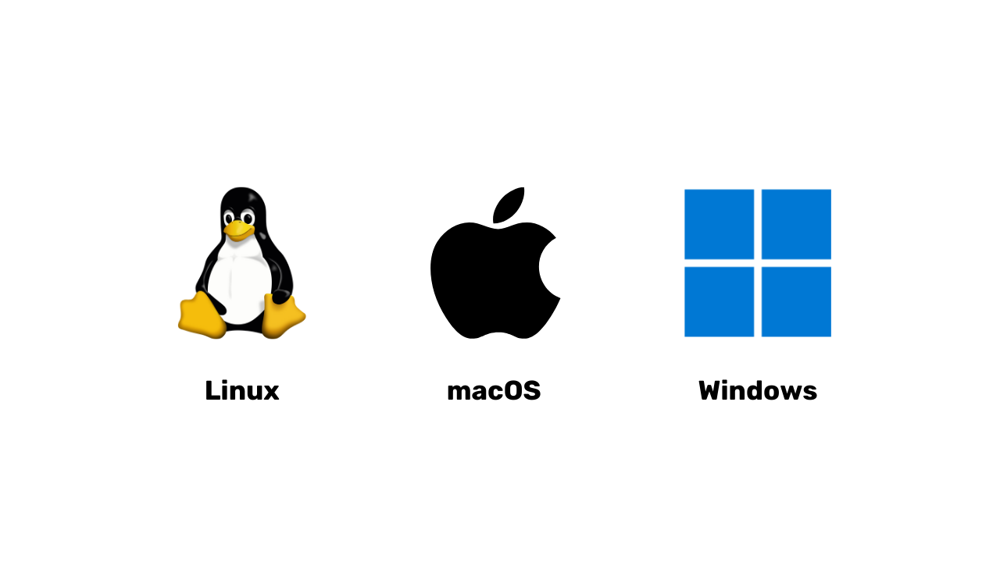
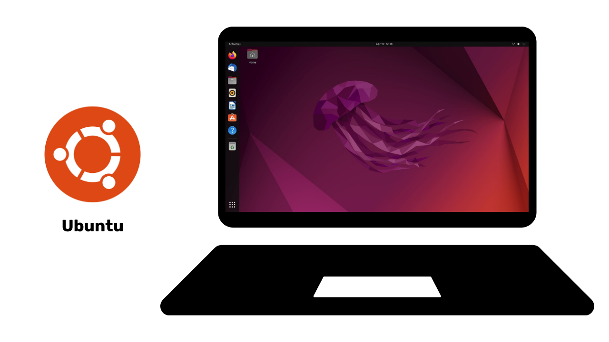
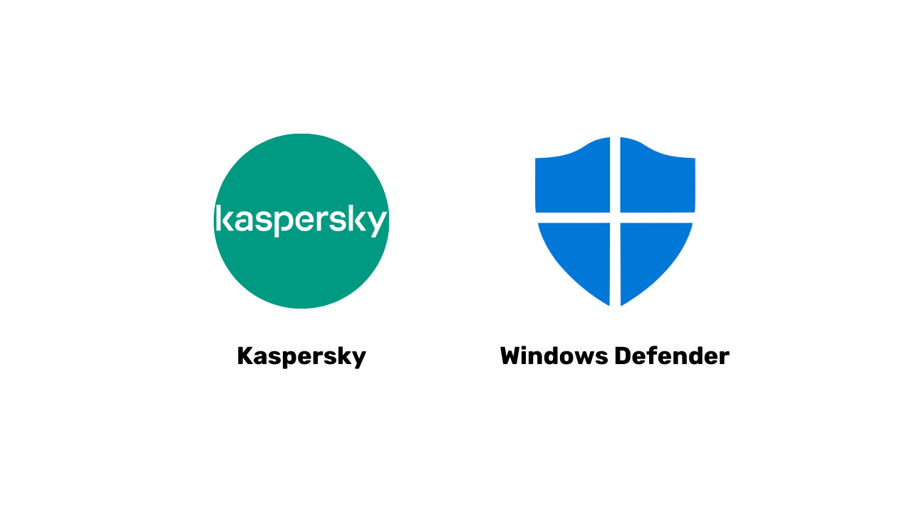

# Perjalanan Menuju Perlindungan Data Anda

Selamat datang semuanya di program edukasi yang didedikasikan untuk keamanan digital ini. Pelatihan ini dirancang agar mudah diakses oleh siapa saja, jadi tidak diperlukan pengetahuan ilmu komputer sebelumnya. Tujuan utama kami adalah membekali Anda dengan pengetahuan dan keterampilan yang diperlukan untuk menjelajahi dunia digital dengan lebih aman dan terlindungi.

Hal ini akan melibatkan penggunaan beberapa alat seperti layanan email yang aman, alat untuk mengelola kata sandi Anda, dan berbagai perangkat lunak untuk mengamankan aktivitas online Anda.

Dalam pelatihan ini, kami tidak bertujuan untuk membuat Anda menjadi seorang ahli, anonim sepenuhnya, atau kebal terhadap ancaman digital, karena ini adalah hal yang mustahil. Sebaliknya, kami menawarkan beberapa solusi sederhana dan mudah dipahami untuk mulai mengubah kebiasaan Anda di dunia online dan mendapat kembali kendali atas priavsi digital Anda.

Tim kontributor:
- Muriel (desain)
- Rogzy Noury & Fabian (produksi)
- Théo (kontribusi)

+++

# Pendahuluan

<partId>534ab66c-b0e6-5757-a7dd-6ea04647edf2</partId>

## Ikhtisar Kursus

<chapterId>2f3d005d-8b49-5a3f-b90d-94c11f613407</chapterId>

**Tujuan: Tingkatkan keterampilan untuk menjaga keamanan Anda!**

Selamat datang semuanya di program edukasi yang didedikasikan untuk keamanan digital ini. Pelatihan ini dirancang agar mudah diakses oleh siapa saja, jadi tidak diperlukan pengetahuan ilmu komputer sebelumnya. Tujuan utama kami adalah membekali Anda dengan pengetahuan dan keterampilan yang diperlukan untuk menjelajahi dunia digital dengan lebih aman dan terlindungi.

Hal ini akan melibatkan penggunaan beberapa alat seperti layanan email yang aman, alat untuk mengelola kata sandi Anda, dan berbagai perangkat lunak untuk mengamankan aktivitas online Anda.

Pelatihan ini adalah hasil kolaborasi dari tiga profesor kami:

- Renaud Lifchitz, ahli keamanan siber
- Théo Pantamis, PhD dalam matematika terapan
- Rogzy, CEO DécouvreBitcoin.

Kewaspadaan digital Anda sangat penting di dunia yang semakin digital. Meskipun ada peningkatan konstan dalam peretasan dan pengawasan massal, belum terlambat untuk mengambil langkah pertama dan melindungi diri Anda. 
Dalam pelatihan ini, kami tidak mencoba menjadikan Anda seorang ahli, anonim sepenuhnya, atau kebal terhadap ancaman digital, karena ini mustahil. Sebaliknya, kami menawarkan beberapa solusi sederhana dan mudah diakses untuk semua orang untuk mulai mengubah kebiasaan online Anda dan mendapatkan kembali kendali atas privasi digital Anda. 
Jika Anda mencari keterampilan yang lebih lanjut tentang topik ini kami sediakan sumber daya, tutorial, atau pelatihan keamanan siber kami yang lain untuk membantu Anda. Sementara itu, berikut adalah gambaran singkat program kami untuk beberapa jam ke depan.

**Bagian 1: Semua yang Perlu Anda Ketahui tentang Penjelajahan Online**

- Bab 1 - Penjelajahan Online
- Bab 2 - Menggunakan Internet dengan Aman

Kita akan memulai dengan membahas mengapa memilih *web browser* itu penting dan bagaimana pilihan itu memengaruhi keamanan Anda. Selanjutnya, kita akan menyelami lebih dalam tentang *browser*, terutama mengenai pengelolaan cookie. Anda juga akan belajar cara menjelajah dengan lebih aman dan anonim menggunakan alat seperti TOR. Setelah itu, kita akan fokus pada penggunaan VPN untuk meningkatkan perlindungan data Anda. Terakhir, kita akan memberikan rekomendasi untuk menggunakan koneksi WiFi dengan aman.

**Bagian 2: Praktik Terbaik Penggunaan Komputer**

- Bab 3 - Penggunaan Komputer
- Bab 4 - Peretasan & Pengelolaan Cadangan

Dalam bagian ini, kita akan membahas tiga area utama keamanan komputer. Pertama, kita akan menjelajahi berbagai sistem operasi, termasuk Mac, Windows, dan Linux, menyoroti karakteristik dan keunggulan spesifik masing-masing. Selanjutnya, kita akan mendalami metode untuk secara efektif melindungi diri dari upaya peretasan dan meningkatkan keamanan perangkat Anda. Terakhir, kita akan menekankan pentingnya melindungi dan mencadangkan data Anda secara berkala untuk mencegah kehilangan atau serangan *ransomware*.

**Bagian 3: Penerapan Langkah-langkah solusi**

- Bab 6 - Manajemen email
- Bab 7 - Pengelola kata sandi
- Bab 8 - Otentikasi dua faktor (2FA)

Pada bagian ketiga ini, kita akan fokus pada langkah praktis untuk solusi nyata meningkatkan keamanan digital Anda.

Pertama, kita akan melihat bagaimana melindungi kotak masuk email Anda, yang sangat penting untuk komunikasi dan sering menjadi target peretas. Kemudian, kami akan memperkenalkan Anda pada pengelola kata sandi: solusi praktis untuk mencegah lupa atau tertukar kata sandi sambil tetap menjaganya aman. Terakhir, kita akan membahas tindakan keamanan tambahan, yaitu otentikasi dua faktor, yang menambahkan lapisan perlindungan ekstra pada akun Anda. Semuanya akan dijelaskan dengan jelas dan mudah dipahami.

Siap untuk memperkuat keamanan digital Anda dan mengambil kembali kendali atas data Anda? Ayo mulai!

# Semua yang Perlu Anda Ketahui tentang Penjelajahan Online

<partId>b4b5379a-d8ef-59ae-94d3-a6e88959c149</partId>

## Penjelajahan Online

<chapterId>3a935da9-fa6e-57eb-bf85-7b3ec35e6ee2</chapterId>

Saat Anda menjelajahi internet, penting untuk menghindari beberapa kesalahan umum untuk menjaga keamanan online Anda. Berikut adalah beberapa tips untuk menghindarinya:

### Berhati-hatilah dengan pengunduhan perangkat lunak:

Disarankan untuk mengunduh perangkat lunak dari situs resminya dan bukan dari situs umum.
Contoh: Gunakan www.signal.org/download dan hindari pengunduhan melalui www.logicieltelechargement.fr/signal.

Sangat disarankan juga untuk memprioritaskan perangkat lunak sumber terbuka (open-source). Kenapa? Karena perangkat lunak ini seringkali lebih aman dan bebas dari perangkat lunak berbahaya (malicious software).

Perangkat lunak "*open-source*" itu adalah jenis perangkat lunak yang kode programnya tersedia dan bisa diakses oleh siapa saja secara publik. Ini memungkinkan, orang-orang lain untuk memverifikasi bahwa tidak ada akses tersembunyi yang bertujuan mencuri data Anda.

> Bonus: Mayoritas perangkat lunak *open-source* seringkali bersifat gratis! Kode pada pembelajaran di universitas ini juga  100% *open source*, jadi Anda juga dapat memeriksa kode kami di Github kami.
> 

### Pengelolaan *Cookie*: Kesalahan dan solusi praktis terbaik

*Cookie* adalah file yang dibuat oleh situs web untuk menyimpan informasi di komputer atau perangkat seluler Anda. Meskipun beberapa situs memerlukan *cookie* ini agar berfungsi dengan baik, *cookie* juga dapat dieksploitasi oleh situs pihak ketiga, terutama untuk tujuan pelacakan iklan. Berdasarkan regulasi seperti GDPR (*General Data Protection Regulation*), Anda dapat dan disarankan untuk menolak *Cookie* pelacakan pihak ketiga sambil tetap menerima *Cookie* yang penting agar situs berfungsi dengan semestinya. Setelah setiap kunjungan ke situs, bijaksana untuk menghapus *Cookie* yang terkait, baik secara manual atau melalui ekstensi atau program khusus. Beberapa *browser* bahkan menawarkan kemungkinan untuk menghapus *Cookie* secara selektif. Meskipun Anda melakukan tindakan pencegahan ini, penting untuk memahami bahwa informasi yang dikumpulkan oleh berbagai situs dapat tetap saling terhubung. Oleh karena itu, penting sekali untuk menemukan keseimbangan antara kenyamanan dan keamanan dalam penjelajahan online Anda.

> Catatan: Batasi juga jumlah ekstensi yang dipasang di *browser* Anda untuk menghindari potensi masalah keamanan dan kinerja.

### Peramban Web (*Web Browser*): pilihan dan keamanan

Ada dua kategori besar peramban (browser): yang berbasis Chrome dan yang berbasis Firefox. 
Meskipun kedua kategori ini menawarkan tingkat keamanan yang serupa, disarankan untuk menghindari penggunaan peramban (browser) Google Chrome karena kemampuannya dalam melacak aktivitas pengguna. Alternatif yang lebih ringan dari Chrome, seperti Chromium atau Brave, mungkin lebih disukai. Brave khususnya sangat direkomendasikan karena memiliki pemblokir iklan bawaan. Dalam beberapa kasus, mungkin diperlukan untuk menggunakan lebih dari satu peramban (browser) untuk mengakses situs web tertentu.

### Penjelajahan Pribadi, TOR, dan alternatif lainnya untuk penjelajahan yang lebih aman dan anonim

Penjelajahan pribadi (private Browse), meskipun tidak menyembunyikan aktivitas penjelajahan dari penyedia layanan internet Anda, memungkinkan Anda menghindari meninggalkan jejak lokal di komputer Anda. Kuki (cookies) akan otomatis terhapus di akhir setiap sesi, memungkinkan Anda menerima semua *Cookie* tanpa terlacak. Penjelajahan pribadi bisa berguna saat membeli layanan online, karena situs web melacak kebiasaan pencarian kita dan menyesuaikan harga karenanya. Namun, penting untuk dicatat bahwa penjelajahan pribadi direkomendasikan untuk sesi sementara dan spesifik, bukan untuk penjelajahan internet umum.

Alternatif yang lebih canggih adalah jaringan TOR (*The Onion Router*), yang menawarkan anonimitas dengan menyembunyikan alamat IP pengguna dan memungkinkan akses ke Darknet. Peramban TOR (TOR Browser) adalah peramban yang dirancang khusus untuk menggunakan jaringan TOR. Ini memungkinkan Anda mengunjungi situs web konvensional dan juga situs web .onion, yang biasanya dioperasikan oleh individu dan mungkin terkait dengan aktivitas ilegal.

TOR bersifat legal dan digunakan oleh jurnalis, aktivis kebebasan, dan orang lain yang ingin lolos dari sensor di negara-negara otoriter. Namun, penting untuk memahami bahwa TOR tidak mengamankan situs yang dikunjungi atau komputer itu sendiri. Selain itu, penggunaan TOR dapat memperlambat koneksi internet karena data harus melewati komputer milik tiga orang lain sebelum mencapai tujuannya. Juga penting untuk dicatat bahwa TOR bukan solusi sempurna untuk menjamin anonimitas 100% dan tidak seharusnya digunakan untuk aktivitas ilegal.

https://planb.network/tutorials/computer-security/communication/tor-browser-a847e83c-31ef-4439-9eac-742b255129bb

## VPN dan koneksi internet

<chapterId>5aac83f4-a685-54b0-9759-d71bea7eeed2</chapterId>

### VPN (*Virtual Private Network*)

Melindungi koneksi internet Anda adalah aspek penting dalam keamanan online, dan menggunakan jaringan pribadi virtual (VPN) adalah metode yang efektif untuk meningkatkan keamanan ini, baik untuk bisnis maupun pengguna individu.

VPN adalah alat yang mengenkripsi data yang dikirimkan melalui internet, menjadikan koneksi lebih aman. Dalam konteks profesional, VPN memungkinkan karyawan untuk mengakses jaringan internal perusahaan dengan aman dari lokasi jarak jauh. Data yang dipertukarkan dienkripsi, membuatnya jauh lebih sulit untuk dilihat atau dicuri oleh pihak ketiga. Selain mengamankan akses ke jaringan internal, menggunakan VPN dapat memungkinkan pengguna untuk mengarahkan koneksi internet mereka melalui jaringan internal perusahaan, memberikan kesan bahwa koneksi mereka berasal dari perusahaan. Ini bisa sangat berguna untuk mengakses layanan online yang dibatasi secara geografis.

### Jenis-jenis VPN

Ada dua jenis utama VPN: VPN perusahaan dan VPN konsumen, seperti NordVPN. VPN perusahaan cenderung lebih mahal dan kompleks, sementara VPN konsumen umumnya lebih mudah diakses dan ramah pengguna. Misalnya, NordVPN memungkinkan pengguna untuk terhubung ke internet melalui server yang berlokasi di negara lain, sehingga bisa membuka situs atau layanan yang dibatasi berdasarkan lokasi geografis.

Ada dua jenis utama VPN: VPN perusahaan (enterprise VPN) dan VPN konsumen, seperti NordVPN. VPN perusahaan cenderung lebih mahal dan kompleks, sementara VPN konsumen umumnya lebih mudah diakses dan ramah pengguna. Sebagai contoh, NordVPN memungkinkan pengguna untuk terhubung ke internet melalui server yang berlokasi di negara lain, sehingga bisa melewati pembatasan geografis.

Namun, menggunakan VPN konsumen tidak menjamin anonimitas sepenuhnya. Banyak penyedia VPN menyimpan informasi tentang penggunanya, yang bisa membahayakan anonimitas mereka. Meskipun VPN bisa berguna untuk meningkatkan keamanan online, mereka bukan solusi universal. Mereka efektif untuk penggunaan spesifik, seperti mengakses layanan yang dibatasi secara geografis atau meningkatkan keamanan saat bepergian, tetapi tidak menjamin keamanan total. Saat memilih VPN, sangat penting untuk memprioritaskan keandalan dan keahlian teknis daripada popularitas. Penyedia VPN yang paling sedikit mengumpulkan informasi pribadi umumnya adalah yang paling aman. Layanan seperti iVPN dan Mullvad tidak mengumpulkan informasi pribadi dan bahkan memungkinkan pembayaran dengan Bitcoin untuk privasi yang lebih tinggi.

Terakhir, VPN juga bisa dipakai untuk memblokir iklan online, memberikan pengalaman menjelajah yang lebih nyaman dan aman. Namun, penting untuk melakukan riset mendalam agar menemukan VPN yang paling sesuai dengan kebutuhan Anda. Menggunakan VPN sangat dianjurkan untuk meningkatkan keamanan, bahkan saat menjelajah internet di rumah. Ini membantu memastikan tingkat perlindungan yang lebih tinggi untuk data yang dipertukarkan secara online. Terakhir, selalu cek URL dan ikon gembok kecil di bilah alamat untuk memastikan Anda berada di situs yang benar dan aman.

https://planb.network/tutorials/computer-security/communication/ivpn-5a0cd5df-29f1-4382-a817-975a96646e68

https://planb.network/tutorials/computer-security/communication/mullvad-968ec5f5-b3f0-4d23-a9e0-c07a3e85aaa8

### HTTPS & jaringan Wi-Fi publik

Dalam hal keamanan online, penting untuk dipahami bahwa 4G umumnya lebih aman daripada Wi-Fi publik. Namun, penggunaan 4G dapat dengan cepat menguras paket data seluler Anda. Protokol HTTPS telah menjadi standar untuk mengenkripsi data di situs web. Ini memastikan bahwa data yang dipertukarkan antara pengguna dan situs web aman. Oleh karena itu, sangat penting untuk memverifikasi bahwa situs yang Anda kunjungi menggunakan protokol HTTPS.

Di Uni Eropa, perlindungan data diatur oleh Peraturan Perlindungan Data Umum (GDPR). Oleh karena itu, lebih aman menggunakan penyedia titik akses Wi-Fi Eropa, seperti SNCF, yang tidak menjual kembali data koneksi pengguna. Namun, fakta bahwa sebuah situs menampilkan ikon gembok tidak menjamin keasliannya. Penting untuk memverifikasi kunci publik situs menggunakan sistem sertifikat untuk mengonfirmasi keasliannya. Meskipun enkripsi data mencegah pihak ketiga mencegat data yang dipertukarkan, masih mungkin bagi individu jahat untuk meniru situs dan mentransfer data dalam teks biasa.

Untuk menghindari penipuan online, sangat penting untuk memverifikasi identitas situs yang Anda jelajahi, terutama dengan memeriksa ekstensi dan nama domain. Selain itu, waspadai penipu yang menggunakan huruf serupa dalam URL untuk menipu pengguna.

Singkatnya, penggunaan VPN dapat sangat meningkatkan keamanan online baik untuk bisnis maupun pengguna individu. Selain itu, mempraktikkan kebiasaan menjelajah yang baik juga berkontribusi pada keamanan digital yang lebih baik. Di segmen berikutnya dari kursus ini, kita akan membahas keamanan komputer, termasuk pembaruan perangkat lunak, penggunaan antivirus, dan manajemen kata sandi.

# Praktik Terbaik Penggunaan Komputer

<partId>e6eac20b-ba24-5d9a-8d86-8e0164074457</partId>

## Penggunaan Komputer

<chapterId>16745632-b56b-5423-9873-ddf70fdf1efd</chapterId>

Keamanan komputer kita adalah hal utama yang harus diperhatikan di dunia digital saat ini. Saat ini, kami akan membahas tiga poin penting:

- Memilih komputer
- Pembaruan dan antivirus untuk keamanan yang optimal
- Praktik terbaik untuk keamanan komputer dan data Anda.

### Memilih Komputer dan Sistem Operasi

Terkait pemilihan komputer, tidak ada perbedaan keamanan yang signifikan antara komputer lama dan baru. Namun, perbedaan keamanan memang ada pada sistem operasi, termasuk Windows, Linux, dan Mac.

Mengenai Windows, disarankan untuk tidak menggunakan akun administrator setiap hari. Sebaiknya, buat dua akun terpisah: satu untuk keperluan administrasi dan satu lagi untuk penggunaan sehari-hari. Windows seringkali lebih rentan terhadap *malware* karena jumlah penggunanya yang besar dan kemudahan beralih dari pengguna standar ke administrator. Sebaliknya, ancaman jauh lebih jarang terjadi pada Linux dan Mac.

Pilihan sistem operasi harus didasarkan pada kebutuhan dan preferensi Anda. Sistem Linux telah berkembang pesat dalam beberapa tahun terakhir, menjadi semakin ramah pengguna. Ubuntu adalah alternatif yang menarik bagi pemula, dengan antarmuka grafis yang mudah digunakan. Anda bisa saja mempartisi komputer untuk mencoba Linux sambil tetap mempertahankan Windows, namun proses ini bisa cukup rumit. Seringkali, lebih disukai untuk memiliki komputer khusus, mesin virtual (virtual machine), atau USB *flash drive* untuk menguji penggunaan Linux atau Ubuntu.

### Pembaruan Perangkat Lunak

Aspek penting dari pembaruan sangat sederhana: **memperbarui sistem operasi dan aplikasi secara teratur adalah hal yang penting.**

Pada Windows 10, pembaruan (updates) hampir berlangsung terus-menerus, dan sangat penting untuk tidak memblokir atau menundanya. Setiap tahun, sekitar 15.000 kerentanan diidentifikasi, yang menyoroti pentingnya menjaga perangkat lunak tetap mutakhir untuk melindungi dari malware dan ancaman siber lainnya. Umumnya, dukungan perangkat lunak berakhir antara 3 hingga 5 tahun setelah dirilis, jadi perlu upgrade ke versi yang lebih tinggi agar tetap mendapatkan pembaruan keamanan.

Aturan ini berlaku untuk hampir semua perangkat lunak. Pembaruan, sejatinya, tidak bertujuan membuat komputer Anda usang atau lambat; sebaliknya, pembaruan dirancang untuk melindungi dari ancaman baru. Beberapa pembaruan bahkan dianggap penting, dan tanpanya, komputer Anda berisiko serius untuk dieksploitasi.

Sebagai contoh konkret dari kesalahan, perangkat lunak bajakan (cracked software) yang tidak dapat diperbarui menimbulkan ancaman ganda. Potensi ancaman itu adalah masuknya virus saat mengunduhnya secara ilegal dari situs web mencurigakan, serta penggunaan yang tidak aman terhadap bentuk serangan baru.

### Anti-virus

- Apakah Anda memerlukan anti-virus? YA
- Apakah Anda harus membayar? Tergantung!

Pemilihan dan penerapan antivirus itu penting. Windows Defender, antivirus bawaan di Windows, adalah solusi yang aman dan efektif. Sebagai solusi gratis, ini sangat bagus dan jauh lebih baik daripada banyak solusi gratis lain yang ditemukan online.

Memang, Anda harus berhati-hati saat mengunduh perangkat lunak antivirus dari internet, karena bisa jadi perangkat lunak itu berbahaya atau sudah kedaluwarsa. Bagi yang ingin menggunakan pada antivirus berbayar, disarankan untuk memilih antivirus yang secara cerdas menganalisis ancaman tak dikenal dan yang baru muncul, seperti Kaspersky. Pembaruan antivirus sangat penting untuk melindungi dari ancaman yang terus berkembang.

> Catatan: Linux dan Mac, berkat sistem pemisahan hak pengguna mereka, seringkali tidak memerlukan antivirus.

Terakhir, ini beberapa praktik terbaik untuk mengamankan komputer dan data Anda. Penting untuk memilih antivirus yang efektif dan mudah digunakan. Selain itu, sangat penting untuk mengadopsi kebiasaan baik pada komputer Anda, seperti tidak memasukkan USB *flash drive* yang tidak dikenal atau mencurigakan. USB ini mungkin mengandung program berbahaya yang dapat otomatis berjalan saat dimasukkan. Mengecek USB *flash drive* setelah terlanjur dimasukkan akan sia-sia. Beberapa perusahaan bahkan menjadi korban peretasan karena USB *flash drive* yang sengaja ditinggalkan di area mudah diakses, seperti tempat parkir.

Perlakukan komputer Anda seperti Anda memperlakukan rumah: tetap waspada, perbarui perangkat lunak secara berkala, hapus file yang tidak perlu, dan gunakan kata sandi yang kuat untuk keamanan tambahan. Sangat penting untuk mengenkripsi data pada laptop dan smartphone untuk mencegah pencurian atau kehilangan data. BitLocker untuk Windows, LUKS untuk Linux, dan opsi bawaan untuk Mac adalah solusi untuk enkripsi data. Sangat disarankan untuk mengaktifkan enkripsi data tanpa ragu dan menuliskan kata sandi di kertas untuk disimpan di tempat yang aman.

Sebagai kesimpulan, sangat penting untuk memilih sistem operasi yang sesuai dengan kebutuhan Anda dan memperbaruinya secara berkala, begitu juga aplikasi yang terinstal. Juga penting untuk menggunakan program antivirus yang efektif dan mudah digunakan, serta mengadopsi praktik keamanan yang baik untuk melindungi komputer dan data Anda.

## Peretasan & Pengelolaan Pencadangan: Melindungi Data Anda

<chapterId>9ddfcb6a-a253-5542-b7eb-df7222b46dc7</chapterId>

### Bagaimana peretas menyerang?

Untuk melindungi diri secara efektif, penting untuk memahami bagaimana peretas mencoba menyusup ke komputer Anda. Sejatinya, virus tidak sering muncul secara ajaib, melainkan merupakan konsekuensi dari tindakan kita, meskipun tidak disengaja.

Sebagai aturan umum, virus masuk karena Anda telah membiarkan komputer Anda mengundang mereka masuk. Ini bisa divisualisasikan dengan mengunduh perangkat lunak yang mencurigakan, file torrent yang sudah disusupi, atau sekadar mengeklik tautan dalam email penipuan (fraudulent email).

### *Phishing*, kewaspadaan terhadap email penipuan:

Perhatian! Email adalah media peretasan pertama, Berikut beberapa tips penting:

- Tetap waspada terhadap upaya *phishing* yang bertujuan mencuri informasi sensitif Anda, seperti nama pengguna dan kata sandi. Hindari mengklik tautan yang mencurigakan dan berbagi informasi pribadi Anda tanpa memverifikasi keaslian pengirim.

- Berhati-hatilah dengan lampiran email dan gambar:
  Lampiran email dan gambar dapat mengandung *malware*. Jangan mengunduh atau membuka lampiran dari pengirim yang tidak dikenal atau mencurigakan, dan pastikan antivirus Anda sudah diperbarui.

Aturan penting di sini adalah memeriksa dengan cermat nama lengkap pengirim serta asal email. Jika Anda ragu, hapus saja!

### *Ransomware* dan jenis serangan siber:

*Ransomware* adalah jenis perangkat lunak jahat (malicious software) yang mengenkripsi data pengguna dan meminta tebusan untuk membukanya kembali. Jenis serangan ini semakin umum dan bisa sangat merepotkan, baik bagi perusahaan maupun individu. Untuk melindungi diri, sangat penting untuk membuat cadangan (backup) file-file yang paling penting! Ini tidak akan menghentikan *ransomware*, tapi akan memungkinkan Anda untuk mengabaikannya (dan tidak perlu membayar tebusan).

Cadangkan data penting Anda secara teratur ke perangkat penyimpanan eksternal atau layanan penyimpanan online yang aman. Dengan begitu, jika terjadi serangan siber atau kegagalan perangkat keras, Anda bisa memulihkan data tanpa kehilangan informasi penting.

Berikut solusi sederhananya:

- Beli *hard drive* eksternal dan salin data Anda ke dalamnya. Setelah selesai, cabut *hard drive* tersebut dan simpan di lokasi yang aman di dalam rumah. (Melakukan ini dua kali dan menyimpan salah satu drive di lokasi lain dapat membantu melindungi dari potensi kebakaran).

- Buat cadangan *cloud* menggunakan ProtonMail Drive, Sync, atau Google Drive. Unggah data penting Anda ke penyedia platform online ini. Namun, perlu diingat bahwa data Anda berpotensi berada di internet dan dipegang oleh pihak ketiga yang terpercaya.

### Apakah Anda harus membayar peretas?

Tidak, umumnya tidak disarankan untuk membayar peretas dalam kasus *ransomware* atau jenis serangan lainnya. Membayar tebusan tidak menjamin data Anda akan pulih dan justru bisa mendorong para penjahat siber untuk melanjutkan aktivitas jahat mereka. Sebaliknya, prioritaskan pencegahan dan pencadangan data secara rutin untuk melindungi diri Anda.

Jika Anda mendeteksi virus di komputer Anda, segera putuskan koneksinya dari internet, lakukan pemindaian antivirus penuh, dan hapus file-file yang terinfeksi. Setelah itu, perbarui perangkat lunak dan sistem operasi Anda, serta ubah kata sandi Anda untuk mencegah pembobolan lebih lanjut.

https://planb.network/tutorials/computer-security/data/proton-drive-03cbe49f-6ddc-491f-8786-bc20d98ebb16

https://planb.network/tutorials/computer-security/data/veracrypt-d5ed4c83-7c1c-4181-95ea-963fdf2d83c5

# Penerapan solusi.

<partId>215ec902-ba05-5549-87fc-cb8d82665f7b</partId>

## Mengelola akun email

<chapterId>dfceea33-8712-5557-ace1-6ba5598d33d8</chapterId>

### Membuat akun email baru!

Akun email adalah pusat aktivitas online Anda: jika disusupi, peretas dapat menggunakannya untuk mengatur ulang semua kata sandi Anda melalui fungsi "lupa kata sandi" dan mendapatkan akses ke banyak situs lain. Itulah mengapa Anda perlu mengamankannya dengan benar.

Akun email harus dibuat dengan kata sandi yang unik dan kuat (detail di bab 7) dan idealnya dengan sistem autentikasi dua faktor (detail di bab 8).

Meskipun kita semua sudah memiliki akun email, penting untuk mempertimbangkan membuat akun baru yang lebih modern untuk memulai dengan aman.

### Memilih penyedia email dan mengelola alamat email

Pengelolaan alamat email yang tepat sangat penting untuk menjaga keamanan akses online kita. Penting untuk memilih penyedia layanan email yang aman dan menghormati privasi. Sebagai contoh, ProtonMail adalah layanan email yang aman dan menghargai privasi.

Saat memilih penyedia email dan membuat kata sandi, sangat penting untuk tidak pernah menggunakan kata sandi yang sama untuk layanan online yang berbeda. Disarankan untuk secara rutin membuat alamat email baru dan menggunakannya untuk berbagai keperluan. Sebaiknya gunakan layanan email yang aman untuk akun-akun penting Anda. Perlu dicatat juga bahwa beberapa layanan membatasi panjang kata sandi, jadi penting untuk mengetahui batasan ini. Tersedia juga layanan untuk membuat alamat email sementara, yang bisa digunakan untuk akun dengan durasi terbatas.

Sebagai informasi, penyedia email lama seperti La Poste, Arobase, Wig, dan Hotmail masih digunakan, tetapi praktik keamanannya mungkin tidak sekuat Gmail. Oleh karena itu, disarankan untuk memiliki dua alamat email terpisah: satu untuk komunikasi umum atau penggunaan sehari-hari dan yang lainnya untuk pemulihan akun, di mana yang terakhir harus lebih aman. Sebaiknya hindari mencampurkan alamat email Anda dengan operator telepon atau penyedia layanan internet Anda, karena ini bisa menjadi titik serangan.

### Apakah saya harus mengganti akun email saya?

Anda juga disarankan untuk menggunakan situs web *Have I Been Pwned* (https://haveibeenpwned.com/) untuk memeriksa apakah alamat email kita pernah ada riwayat pembobolan dan mendapatkan informasi tentang peretasan data di masa depan. Database yang diretas dapat dimanfaatkan oleh peretas untuk mengirim email phishing atau menggunakan kembali kata sandi yang pernah dibobol.

Secara keseluruhan, mulailah menggunakan alamat email baru yang lebih aman, dan bahkan hal ini diperlukan jika seseorang ingin memulai dari awal dengan dasar yang lebih baik.
Bonus Bitcoin: Akan lebih bijak jika kita membuat alamat email khusus untuk aktivitas yang terkait dengan Bitcoin (seperti membuat akun di bursa pertukaran), agar kita benar-benar bisa memisahkan kategori aktivitas dalam kehidupan kita.

https://planb.network/tutorials/computer-security/communication/proton-mail-c3b010ce-254d-4546-b382-19ab9261c6a2

## Pengelola Kata Sandi (*Password Manager*)

<chapterId>0b3c69b2-522c-56c8-9fb8-1562bd55930f</chapterId>

### Apa itu pengelola kata sandi?

Manajer kata sandi adalah alat yang memungkinkan Anda untuk menyimpan, membuat, dan mengelola kata sandi untuk berbagai akun online Anda. Alih-alih mengingat banyak kata sandi, Anda hanya perlu satu kata sandi utama untuk mengakses semua yang lain.

Dengan manajer kata sandi, Anda tidak perlu lagi khawatir lupa kata sandi Anda atau menuliskannya di suatu tempat. Anda hanya perlu mengingat satu kata sandi utama. Selain itu, sebagian besar pengelola kata sandi akan membuat kata sandi yang kuat untuk Anda, sehingga memperkuat keamanan akun Anda.

### Perbedaan antara beberapa manajer yang sering digunakan:

- LastPass: Salah satu manajer kata sandi yang paling populer. Program ini adalah layanan pihak ketiga, yang berarti kata sandi Anda disimpan di jaringan mereka. Terdapat versi gratis dan versi berbayar pada LastPass, dengan antarmuka yang ramah pengguna.
- Dashlane: Program ini juga merupakan layanan pihak ketiga, dengan antarmuka yang mudah digunakan dan fitur tambahan seperti pelacakan informasi kartu kredit dan penyimpanan catatan yang aman.
  

### *Self-hosting* untuk kontrol yang lebih baik:

- Bitwarden: Alat yang bersifat *open-source*, yang berarti Anda dapat meninjau kode sumbernya untuk memastikan keamanannya. Meskipun Bitwarden menawarkan layanan yang dihosting secara terpusat, ia juga memungkinkan pengguna untuk melakukan self-hosting, yang berarti Anda dapat mengontrol sendiri di mana kata sandi Anda disimpan, yang secara potensial memberikan tingkat keamanan dan kontrol yang lebih tinggi.

- KeePass: Program ini adalah solusi *open-source* yang terutama dimaksudkan untuk *self-hosting*. Data Anda disimpan secara lokal secara default, tetapi Anda dapat melakukan sinkronisasi database kata sandi menggunakan metode yang berbeda jika diperlukan. KeePass diakui secara luas karena keamanan dan fleksibilitasnya, meskipun mungkin sedikit sulit digunakan untuk pemula.
  
  (Catatan: Memilih antara layanan pihak ketiga atau layanan *self-hosted* tergantung pada tingkat pemahaman teknologi Anda dan bagaimana Anda memprioritaskan kontrol di atas kemudahan penggunaan. Layanan pihak ketiga umumnya cocok bagi kebanyakan orang, sementara itu, *self-hosting* membutuhkan sedikit usaha dan pengetahuan teknis, tapi bisa memberi rasa aman lebih karena semua data ada di bawah kendali pribadi.)

### Seperti apa kata sandi yang baik?

Kata sandi yang baik umumnya memiliki ciri-ciri berikut:

- Panjang: setidaknya 12 karakter.
- Kompleks: campuran huruf besar dan kecil, angka, dan simbol.
- Unik: jangan menggunakan kata sandi yang sama untuk akun yang berbeda.
- Tidak berdasarkan informasi pribadi: hindari penggunaan tanggal lahir, nama, dan lain-lain.

Untuk memastikan keamanan akun Anda, sangat penting untuk membuat kata sandi yang kuat dan aman. Panjang kata sandi saja tidak cukup untuk menjamin keamanannya. Karakter harus sepenuhnya acak agar tahan terhadap serangan paksa (dimana penyerang terus-menerus mencoba menebak password). Selain itu, penting juga agar setiap karakter dalam kata sandi tidak saling bergantung, untuk menghindari pola atau kombinasi yang mudah ditebak. Kata sandi umum seperti “password” sangat mudah diretas dan sebaiknya dihindari.

Untuk membuat kata sandi yang kuat, disarankan untuk menggunakan sejumlah besar karakter acak, tanpa menggunakan kata atau pola yang dapat ditebak. Juga penting untuk menyertakan angka dan karakter khusus. Namun, perlu dicatat bahwa beberapa situs web mungkin membatasi penggunaan karakter khusus tertentu. Kata sandi yang tidak dibuat secara acak adalah kata sandi yang mudah ditebak. Variasi atau tambahan karakter pada kata sandi tidak menjamin keamanannya. Situs web tidak dapat menjamin keamanan kata sandi yang dipilih oleh pengguna.

Kata sandi yang dihasilkan secara acak memiliki tingkat keamanan yang lebih tinggi, meskipun mungkin lebih sulit untuk diingat. Manajer kata sandi dapat menghasilkan kata sandi acak yang lebih aman. Dengan menggunakan manajer kata sandi, Anda tidak perlu menghafal semua kata sandi Anda. Hal yang cukup penting adalah untuk secara bertahap mengganti kata sandi lama Anda dengan yang kata sandi yang dibuat oleh platform pengelola kata sandi, karena umumnya lebih kuat dan lebih panjang. Pastikan bahwa kata sandi utama dari manajer kata sandi Anda juga kuat dan aman.

https://planb.network/tutorials/computer-security/authentication/bitwarden-0532f569-fb00-4fad-acba-2fcb1bf05de9

https://planb.network/tutorials/computer-security/authentication/keepass-f8073bb7-5b4a-4664-9246-228e307be246

## Autentikasi Dua Faktor (2FA)

<chapterId>9391e02e-e61b-5a86-93e0-91a07f217d35</chapterId>

### Mengapa menerapkan 2FA

Otentikasi Dua-Faktor (2FA) adalah lapisan keamanan tambahan yang digunakan untuk memastikan bahwa orang-orang yang mencoba mengakses akun online benar-benar orang yang dimaksud. Alih-alih hanya memasukkan nama pengguna dan kata sandi, 2FA memerlukan bentuk verifikasi kedua. Verifikasi ini dapat dilakukan melalui:

- Kode sementara yang dikirim melalui SMS.
- Kode yang dihasilkan oleh aplikasi seperti Google Authenticator atau Authy.
- Kunci keamanan fisik yang dapat Anda masukkan ke dalam komputer Anda.
  
  Dengan 2FA, bahkan jika peretas mendapatkan kata sandi Anda, mereka tidak akan dapat mengakses akun Anda jika belum melakukan langkah verifikasi kedua ini. Hal ini menunjukkan pentingnya membuat 2FA guna melindungi akun online Anda dari akses yang berpotensi membahayakan akun Anda.

### Opsi Mana yang Harus Dipilih?

Berbagai opsi untuk otentikasi kuat memiliki tingkat keamanan yang berbeda.

- SMS tidak dipandang sebagai opsi terbaik karena hanya menyediakan bukti kepemilikan nomor telepon.
- 2FA (otentikasi dua faktor) lebih aman karena menggunakan beberapa jenis bukti, seperti pengetahuan, kepemilikan, dan identifikasi. Kata sandi sekali pakai (HOTP dan TOTP) lebih aman daripada SMS karena memerlukan perhitungan kriptografis dan disimpan secara lokal, bukan dalam memori.
- Token perangkat keras, seperti kunci USB atau kartu pintar, menawarkan keamanan optimal dengan menghasilkan kunci pribadi unik untuk setiap situs dan memverifikasi URL sebelum mengizinkan koneksi.

Untuk keamanan optimal dengan otentikasi kuat, disarankan untuk menggunakan alamat email yang aman, manajer kata sandi yang aman, dan menggunakan 2FA menggunakan YubiKeys. Juga disarankan untuk membeli dua YubiKeys untuk mengantisipasi kehilangan atau pencurian, misalnya, menyimpan satu salinan cadangan di rumah dan satu pada diri Anda.

Biometrik dapat digunakan sebagai alternatif, tetapi kurang aman daripada kombinasi pengetahuan dan kepemilikan. Data biometrik sebaiknya tetap disimpan di perangkat autentikasi dan tidak dibagikan secara online. Penting untuk mempertimbangkan model ancaman yang terkait dengan berbagai metode autentikasi dan menyesuaikan praktik keamanan sesuai kebutuhan.

### Kesimpulan dari pelatihan:

Seperti yang Anda telah pelajari, menerapkan praktik keamanan digital yang baik tidaklah selalu sederhana, tetapi tetap dapat bisa dilakukan!

- Membuat alamat email baru yang aman.
- Menyiapkan manajer kata sandi.
- Mengaktifkan 2FA.
- Secara bertahap mengganti kata sandi lama kita dengan kata sandi kuat yang dilengkapi 2FA.

Terus belajar dan secara bertahap menerapkan praktik yang baik!

Aturan emas: Keamanan siber adalah bidang yang terus berevolusi, dan Anda juga perlu beradaptasi seiring dengan bertambahnya jam terbang Anda.

https://planb.network/tutorials/computer-security/authentication/authy-a76ab26b-71b0-473c-aa7c-c49153705eb7

https://planb.network/tutorials/computer-security/authentication/security-key-61438267-74db-4f1a-87e4-97c8e673533e

# Sesi Praktik

<partId>98ccf14b-4053-5839-878c-7a73ff02eb95</partId>

## Menyiapkan Kotak Surat

<chapterId>afc9ab5d-7664-5a9b-ab50-225ac9ba8f7c</chapterId>

Melindungi kotak surat Anda adalah langkah penting untuk mengamankan aktivitas online Anda dan menjaga data pribadi Anda. Tutorial ini akan membimbing Anda, langkah demi langkah, dalam membuat dan mengatur akun ProtonMail, penyedia email yang dikenal karena tingkat keamanannya yang tinggi yang menawarkan enkripsi *end-to-end* untuk jaringan pengiriman pesan Anda. Terlepas dari apakah Anda seorang pemula atau pengguna yang berpengalaman, praktik terbaik yang dipaparkan di sini akan membantu Anda memperkuat keamanan email Anda, sambil memanfaatkan fitur-fitur canggih ProtonMail:

https://planb.network/tutorials/computer-security/communication/proton-mail-c3b010ce-254d-4546-b382-19ab9261c6a2

## Mengamankan dengan 2FA

<chapterId>09468ec1-95b7-56a4-a636-7618044568e1</chapterId>

Autentikasi dua faktor (2FA) telah menjadi bagian yang penting untuk mengamankan akun online Anda. Dalam tutorial ini, Anda akan belajar cara mengatur dan menggunakan aplikasi 2FA Authy, yang menghasilkan kode dinamis 6 digit untuk melindungi akun Anda. Authy sangat mudah digunakan dan dapat disinkronkan di beberapa perangkat. Pelajari cara menginstal dan mengatur Authy, dan perkuat keamanan akun online Anda segera:

https://planb.network/tutorials/computer-security/authentication/authy-a76ab26b-71b0-473c-aa7c-c49153705eb7

Opsi lain adalah menggunakan kunci keamanan fisik. Tutorial lainnya ini menunjukkan cara mengatur dan menggunakan kunci keamanan sebagai faktor autentikasi kedua:

https://planb.network/tutorials/computer-security/authentication/security-key-61438267-74db-4f1a-87e4-97c8e673533e

## Membuat manajer kata sandi

<chapterId>ed579680-4e7b-5f65-8541-14e519a3b242</chapterId>

Manajemen kata sandi adalah sebuah tantangan di era digital. Kita semua memiliki banyak akun online yang perlu diamankan. Pengelola kata sandi akan membantu Anda membuat dan menyimpan kata sandi yang kuat dan unik untuk setiap akun.

Dalam tutorial ini, Anda bisa mempelajari cara mengatur Bitwarden, pengelola kata sandi *open-source*, dan cara menyinkronkan data login Anda di semua perangkat untuk memudahkan penggunaan sehari-hari:

https://planb.network/tutorials/computer-security/authentication/bitwarden-0532f569-fb00-4fad-acba-2fcb1bf05de9

Untuk pengguna yang lebih mahir, saya juga menyediakan tutorial tentang perangkat lunak gratis dan *open-source* lainnya yang dapat digunakan secara lokal untuk mengelola kata sandi Anda:

https://planb.network/tutorials/computer-security/authentication/keepass-f8073bb7-5b4a-4664-9246-228e307be246

## Mengamankan Akun Anda

<chapterId>7a774b34-aed0-57dd-b8f7-cf3be51c0d70</chapterId>

Dalam dua tutorial ini, saya juga membimbing Anda dalam mengamankan akun online Anda dan menjelaskan bagaimana secara bertahap mengadopsi praktik yang lebih aman untuk mengelola kata sandi Anda sehari-hari.

https://planb.network/tutorials/computer-security/authentication/bitwarden-0532f569-fb00-4fad-acba-2fcb1bf05de9

https://planb.network/tutorials/computer-security/authentication/keepass-f8073bb7-5b4a-4664-9246-228e307be246

## Menggunakan browser berbeda & VPN

<chapterId>8dc08feb-313c-5259-a54f-64aa68a07608</chapterId>

Melindungi privasi online Anda juga merupakan poin penting untuk memastikan keamanan Anda. Penggunaan VPN dapat menjadi langkah pertama untuk mencapainya.

Saya mengajak Anda untuk mengenal dua solusi VPN yang terpercaya dan dapat dibayar dengan bitcoin, yaitu IVPN dan Mullvad. Tutorial-tutorial ini akan membimbing Anda dalam menginstal, mengatur, dan menggunakan Mullvad atau IVPN di semua perangkat Anda:

https://planb.network/tutorials/computer-security/communication/ivpn-5a0cd5df-29f1-4382-a817-975a96646e68

https://planb.network/tutorials/computer-security/communication/mullvad-968ec5f5-b3f0-4d23-a9e0-c07a3e85aaa8

Pelajarilah juga cara menggunakan Tor Browser, peramban yang dirancang khusus untuk melindungi privasi online Anda:

https://planb.network/tutorials/computer-security/communication/tor-browser-a847e83c-31ef-4439-9eac-742b255129bb

## Pengaturan Cadangan

<chapterId>01cfcde1-77cb-506c-8df1-fa18a2e8cc6b</chapterId>

Melindungi file pribadi Anda juga merupakan poin penting dari keamanan siber Anda. Tutorial ini akan menunjukkan kepada Anda bagaimana cara menerapkan strategi pencadangan yang efektif menggunakan Proton Drive. Temukan cara menggunakan solusi cloud yang aman ini untuk menerapkan metode 3-2-1: tiga salinan data Anda pada dua media yang berbeda, dengan satu salinan di tempat lain. Dengan demikian, Anda memastikan akses dan keamanan file sensitif Anda:

https://planb.network/tutorials/computer-security/data/proton-drive-03cbe49f-6ddc-491f-8786-bc20d98ebb16

Dan untuk mengamankan file Anda yang disimpan di media yang dapat dilepas seperti flash drive USB atau *hard drive* eksternal, saya juga menunjukkan cara mengenkripsi dan mendekripsi hal tersebut dengan mudah menggunakan VeraCrypt:

https://planb.network/tutorials/computer-security/data/veracrypt-d5ed4c83-7c1c-4181-95ea-963fdf2d83c5

# Belajarlah Lebih Jauh

<partId>77113cad-a6d8-57e5-b903-50c223b277ba</partId>

## Bagaimana Cara Bekerja di Industri Keamanan Siber

<chapterId>aad1ae27-4280-5b07-b9ab-118ae013951a</chapterId>

### Keamanan Siber: Bidang yang Berkembang dengan Peluang Tanpa Batas

Jika Anda memiliki keinginan untuk bekerja di bidang perlindungan sistem dan data, industri keamanan siber menawarkan berbagai peluang untuk Anda. Jika industri ini menarik bagi Anda, berikut adalah beberapa langkah penting untuk membimbing Anda.

### Dasar Akademik dan Sertifikasi:

Pendidikan yang kuat dalam ranah ilmu komputer, sistem informasi, atau bidang terkait seringkali menjadi titik awal yang baik. Bidang-bidang studi ini adalah dasar yang diperlukan untuk memahami tantangan teknis keamanan siber. Di luar pengetahuan di bidang-bidang ini, langkah yang bijak adalah untuk memperoleh sertifikasi yang diakui di bidang ini. Meskipun sertifikasi ini dapat bervariasi menurut wilayah, beberapa, seperti CISSP atau CEH, diakui secara global.

Keamanan siber adalah bidang yang luas dan terus berkembang. Mempelajari alat penting dan sistem yang berbeda-beda juga sangat penting. Selain itu, dengan begitu banyak subdomain, dari tanggapan insiden hingga peretasan etis, sangat bermanfaat untuk menemukan bidang yang Anda mau tekuni Anda dan berspesialisasi di bidang tersebut.

### Mendapatkan Pengalaman Praktik:

Pentingnya pengalaman praktis tidak bisa diremehkan. Mencari kesempatan magang atau posisi junior di perusahaan dengan tim keamanan siber adalah cara yang sangat baik untuk mengaplikasikan pengetahuan teoritis Anda. Selain itu, terlibat dalam kompetisi hacking etis atau simulasi keamanan siber dapat menyempurnakan keterampilan Anda dalam situasi di dunia nyata.

Koneksi profesional yang kuat sangat penting dan bernilai tinggi. Bergabung dengan komunitas profesional, ruang kolaborasi seperti *hackerspace*, atau forum online bisa jadi tempat yang baik untuk saling berbagi ide dengan orang-orang yang memiliki minat dan keahlian serupa. Begitu juga dengan menghadiri konferensi atau pelatihan di bidang keamanan siber, Anda tidak hanya akan belajar hal baru, tapi juga bisa membangun jaringan dengan orang-orang yang bergerak di industri ini.

Ancaman yang terus berevolusi secara konstan juga mengharuskan Anda untuk melakukan pemantauan berita dan forum khusus secara teratur. Dalam dunia yang sangat bergantung pada kepercayaan, bertindak dengan etika dan integritas adalah hal yang penting di setiap tahapan perjalanan karir Anda.

### Keterampilan dan Alat untuk Dipelajari Lebih Diperdalam:

- Alat Keamanan Siber: Wireshark, Metasploit, Nmap.
- Sistem Operasi: Linux, Windows, MacOS.
- Bahasa Pemrograman: Python, C, Java.
- Jaringan: TCP/IP, VPN, firewall.
- Database: SQL, NoSQL.
- Kriptografi: SSL/TLS, enkripsi simetris/asimetris.
- Manajemen Insiden: Analisis log, respons insiden.
- Peretasan Etis: Teknik penetrasi, pengujian intrusi.
- Tata Kelola: Standar ISO, regulasi GDPR/CCPA.

Dengan menguasai keterampilan dan alat-alat di atas, Anda akan siap untuk menjelajahi dunia keamanan siber dengan percaya diri dan sukses.

## Wawancara dengan Renaud

<chapterId>7d83fd98-ce22-514e-b9e8-729fbf71ee6e</chapterId>

### Manajemen Kata Sandi yang Efisien dan Penguatan Autentikasi: Pendekatan Akademis

Ada tiga dimensi kunci yang perlu dipertimbangkan saat membicarakan tentang pengelola kata sandi: pembuatan, pembaruan, dan implementasi kata sandi di situs web.

Secara umum, tidak disarankan untuk menggunakan ekstensi peramban untuk pengisian kata sandi secara otomatis. Alat-alat ini dapat membuat pengguna lebih rentan terhadap serangan phishing. Renaud, seorang ahli terkemuka dalam keamanan siber, lebih memilih pengelolaan manual menggunakan KeePass, yang melibatkan proses menyalin dan menempel kata sandi secara manual. Ekstensi cenderung meningkatkan potensi serangan, dapat memperlambat kinerja peramban, dan oleh karena itu menyajikan risiko yang signifikan. Dengan demikian, penggunaan ekstensi yang minimal pada peramban adalah praktik yang disarankan.

Manajer kata sandi umumnya mendorong penggunaan faktor autentikasi tambahan, seperti autentikasi dua faktor. Untuk keamanan optimal, disarankan untuk menyimpan OTP (*One-Time Passwords*) di perangkat seluler Anda. AndoTP menawarkan solusi *open-source* untuk menghasilkan dan menyimpan kode OTP di ponsel Anda. Sementara Google Authenticator memungkinkan ekspor kode autentikasi, kepercayaan pada cadangan di akun Google tetap terbatas. Oleh karena itu, aplikasi OTI dan AndoTP direkomendasikan untuk pengelolaan OTP secara mandiri.

Pertanyaan tentang warisan digital dan berkabung secara digital menimbulkan pentingnya memiliki prosedur untuk mentransmisikan kata sandi setelah kematian seseorang. Manajer kata sandi membantu mempermudah proses ini dengan menyimpan seluruh data rahasia digital di satu tempat yang aman. Alat ini juga memungkinkan untuk mengidentifikasi semua akun yang masih aktif serta mengelola penutupan atau pengalihan aksesnya. Disarankan untuk menuliskan kata sandi utama di atas kertas, tetapi harus disimpan di lokasi yang tersembunyi dan aman. Jika *hard drive* dienkripsi dan komputer dalam keadaan terkunci, kata sandi tidak akan dapat diakses, bahkan dalam kasus pembobolan.

### Menuju Era Pasca-Kata Sandi: Menjelajahi Alternatif yang Kredibel

Meskipun kata sandi digunakan di mana-mana, mereka memiliki banyak kelemahan, termasuk risiko penyadapan saat proses autentikasi berlangsung. Perusahaan-perusahaan terkemuka seperti Microsoft dan Apple kini menawarkan alternatif inovatif seperti biometrik dan token perangkat keras, yang menunjukkan tren berkembang menuju penghapusan kebutuhan penggunaan kata sandi secara bertahap.

*Passkeys*, misalnya, menawarkan kunci acak yang terenkripsi, dikombinasikan dengan biometrik atau PIN, yang di-*hosting* oleh tetapi tidak bisa diakses langsung oleh mereka. Meskipun hal ini memerlukan pembaruan situs web, pendekatan ini menghilangkan ketergantungan akan kata sandi, sehingga memiliki tingkat keamanan yang tinggi tanpa kendala yang terkait dengan kata sandi umum atau masalah pengelolaan brankas digital.

Passkiz adalah alternatif lainnya yang layak dan aman untuk pengelolaan kata sandi. Namun, pertanyaan besar tetap ada: ketersediaannya bila terjadi kegagalan dari pihak penyedia. Oleh karena itu, alangkah baiknya bagi perusahaan teknologi besar untuk menyediakan sistem yang dapat menjamin ketersediaan akses meskipun terjadi kegagalan dari pihak penyedia.

Otentikasi langsung ke layanan yang relevan adalah opsi baik untuk tidak lagi bergantung pada pihak ketiga. Namun, Single Sign-On (SSO) yang ditawarkan oleh perusahaan teknologi besar juga menimbulkan masalah dalam hal ketersediaan dan risiko sensor. Untuk mencegah kebocoran data, sangat penting untuk meminimalkan jenis dan jumlah informasi yang dikumpulkan selama proses autentikasi.

### Keamanan komputer: hal yang wajib dilakukan untuk praktik aman dan risiko terkait kelalaian manusia

Keamanan komputer dapat menjadi lemah karena praktik yang terlalu sederhana dan penggunaan kata sandi default, seperti "admin". Tidak perlu ada serangan canggih yang untuk mengancam keamanan komputer Anda. Sebagai contoh, kata sandi administrator dari sebuah saluran YouTube dulunya ditulis dalam kode sumber pribadi perusahaan. Kerentanan keamanan sering kali merupakan hasil dari kelalaian manusia.
Penting juga untuk dicatat bahwa Internet sangatlah terpusat dan sebagian besar informasi berada di bawah kontrol Amerika. Server DNS dapat menjadi subjek sensor dan sering menggunakan DNS yang menyesatkan untuk memblokir akses ke situs tertentu. DNS adalah protokol yang cukup lama dan tidak cukup aman, yang dapat menimbulkan masalah keamanan. Protokol baru, seperti DNSsec, telah muncul tetapi masih belum banyak digunakan. Untuk menghindari sensor dan pemblokiran iklan, Anda juga dapat memilih penyedia DNS alternatif. Alternatif untuk iklan yang mengganggu termasuk Google DNS, OpenDNS, dan layanan independen lainnya. Protokol DNS standar membuat kueri (permintaan) DNS terlihat oleh penyedia layanan internet. Di sisi lain, DOH (DNS over HTTPS) dan DOT (DNS over TLS) mengenkripsi koneksi DNS, sehingga memiliki privasi dan keamanan yang lebih baik. Protokol ini banyak digunakan di perusahaan karena keamanan yang ditingkatkan dan didukung secara lokal oleh Windows, Android, dan iPhone. Untuk menggunakan DOH dan DOT, alih-alih menggunakan alamat IP, nama host TLS harus dimasukkan. Penyedia DOH dan DOT gratis tersedia secara online. DOH dan DOT meningkatkan privasi dan keamanan dengan menghindari serangan "*man in the middle*".

Juga perlu disebutkan sistem yang disebut "Lightning authentication". Sistem ini menghasilkan pengenal (*identifier*) yang berbeda untuk setiap layanan, tanpa perlu memasukkan alamat email atau informasi pribadi. Meskipun ada kemungkinan untuk memiliki identitas terdesentralisasi yang dikendalikan pengguna, masih kurangnya standar dan normalisasi dalam proyek identitas terdesentralisasi. *Package manager* seperti Nuget dan Chocolaté, yang memungkinkan pengunduhan perangkat lunak sumber terbuka di luar Microsoft Store, direkomendasikan untuk menghindari serangan jahat. Singkatnya, DNS sangat penting untuk keamanan online, tetapi Anda perlu untuk tetap waspada terhadap potensi serangan pada server DNS.

# Bagian Akhir

<partId>3d8ac4c9-f05b-4133-a40a-6e19d579f05f</partId>

## Ulasan & Penilaian

<chapterId>6be74d2d-2116-5386-9d92-c4c3e2103c68</chapterId>
<isCourseReview>true</isCourseReview>

## Ujian Akhir

<chapterId>a894b251-a85a-5fa4-bf2a-c2a876939b49</chapterId>
<isCourseExam>true</isCourseExam>

## Kesimpulan

<chapterId>6270ea6b-7694-4ecf-b026-42878bfc318f</chapterId>
<isCourseConclusion>true</isCourseConclusion>
