# Perjalanan Menuju Perlindungan Data Anda

Selamat datang, semuanya, di program edukasi ini yang dirancang khusus dan mencakup topik tentang keamanan digital. Pelatihan ini dirancang agar dapat dipahami oleh semua orang, sehingga Anda tidak perlu untuk memiliki pengetahuan yang dalam tentang ilmu komputer untuk memahami konten ini. Tujuan utama kami adalah untuk memberi Anda pengetahuan dan keterampilan yang diperlukan untuk menjaga keamanan dan privasi Anda di dunia digital dengan lebih baik.

Hal ini akan melibatkan penggunaan beberapa alat seperti layanan email yang aman, alat untuk mengelola kata sandi Anda dengan lebih baik, dan berbagai perangkat lunak untuk mengamankan aktivitas online Anda.

Dalam pelatihan ini, kami tidak bertujuan untuk membuat Anda menjadi seorang ahli, anonim sepenuhnya, atau kebal terhadap ancaman digital, karena ini adalah hal yang mustahil. Sebagai gantinya, kami menawarkan beberapa solusi sederhana dan mudah dipahami untuk mulai mengubah kebiasaan Anda di dunia online dan mendapat kembali kendali atas kedaulatan digital Anda.

Tim kontributor:
Muriel (desain)
Rogzy Noury & Fabian (produksi)
Théo (kontribusi)

+++

# Pendahuluan

<partId>534ab66c-b0e6-5757-a7dd-6ea04647edf2</partId>

## Ikhtisar Kursus

<chapterId>2f3d005d-8b49-5a3f-b90d-94c11f613407</chapterId>

**Tujuan: Tingkat keterampilan untuk menjaga keamanan Anda!**

Selamat datang, semuanya, di program edukasi ini yang dirancang khusus dan mencakup topik tentang keamanan digital. Pelatihan ini dirancang agar dapat dipahami oleh semua orang, sehingga Anda tidak perlu untuk memiliki pengetahuan yang dalam tentang ilmu komputer untuk memahami konten ini. Tujuan utama kami adalah untuk memberi Anda pengetahuan dan keterampilan yang diperlukan untuk menjaga keamanan dan privasi Anda di dunia digital dengan lebih baik.

Hal ini akan melibatkan penggunaan beberapa alat seperti layanan email yang aman, alat untuk mengelola kata sandi Anda dengan lebih baik, dan berbagai perangkat lunak untuk mengamankan aktivitas online Anda.

Pelatihan ini adalah hasil kolaborasi dari tiga profesor kami:

- Renaud Lifchitz, ahli keamanan siber
- Théo Pantamis, PhD dalam matematika terapan
- Rogzy, CEO DécouvreBitcoin

Dalam dunia yang terus mengalami digitalisasi, keamanan online Anda sangatlah penting. Meskipun ancaman peretasan dan pengawasan massal terus meningkat, Anda masih ada waktu untuk mulai belajar dan melindungi diri Anda.
Dalam pelatihan ini, kami tidak bertujuan untuk membuat Anda menjadi seorang ahli, anonim sepenuhnya, atau kebal terhadap ancaman digital, karena ini adalah hal yang mustahil. Sebagai gantinya, kami menawarkan beberapa solusi sederhana dan mudah dipahami untuk mulai mengubah kebiasaan Anda di dunia online dan mendapat kembali kendali atas kedaulatan digital Anda.
Jika Anda mendalami topik ini lebih lanjut, kami memiliki banyak materi, tutorial, atau pelatihan keamanan siber lainnya. Tetapi, berikut adalah gambaran singkat program kami untuk beberapa jam ke depan.

**Bagian 1: Semua yang Perlu Anda Ketahui tentang Penjelajahan Online**

- Bab 1 - Penjelajahan Online
- Bab 2 - Menggunakan Internet dengan Aman

Untuk memulai, kami akan membahas pentingnya memilih peramban web dan implikasinya terhadap keamanan. Kemudian, kita akan menjelajahi detail-detail dari peramban, khususnya mengenai pengelolaan cookie. Kita juga akan melihat bagaimana memastikan penjelajahan internet yang lebih aman dan anonim dengan menggunakan alat seperti TOR. Setelah itu, kita akan fokus pada penggunaan VPN untuk meningkatkan perlindungan data Anda. Terakhir, kita akan mengakhiri dengan memberi rekomendasi tentang penggunaan koneksi WiFi yang aman.

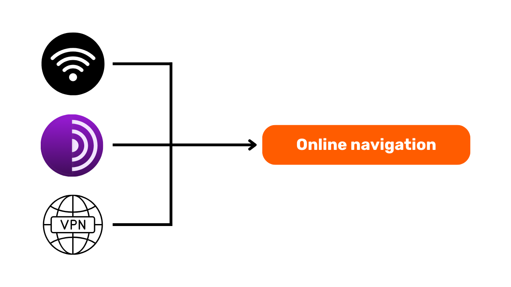

**Bagian 2: Praktik Terbaik Penggunaan Komputer**

- Bab 3 - Penggunaan Komputer
- Bab 4 - Peretasan & Pengelolaan Cadangan
Pada bagian ini, kita akan membahas tiga lingkup kunci tentang keamanan komputer. Pertama, kita akan memahami berbagai sistem operasi: Mac, PC, dan Linux, dan menjelaskan detail dan kelebihan mereka. Kemudian, kita akan mendalami metode-metode untuk melindungi diri dari upaya peretasan secara efektif dan memperkuat keamanan perangkat Anda. Terakhir, kami akan menekankan pentingnya melindungi dan melakukan pencadangan data Anda secara rutin untuk mencegah kehilangan atau ransomware.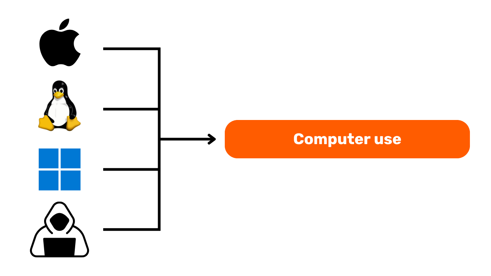

**Bagian 3: Penerapan Langkah-langkah solusi**

- Bab 6 - Manajemen email
- Bab 7 - Pengelola kata sandi
- Bab 8 - Otentikasi dua faktor (2FA)

Pada bagian ketiga ini, kita akan fokus pada langkah praktis untuk solusi konkret guna meningkatkan keamanan digital Anda.

Pertama, kita akan melihat cara melindungi kotak masuk email Anda, yang sangat berperan penting sebagai saluran komunikasi Anda dan seringkali menjadi target para peretas. Kemudian, kami akan memperkenalkan manajer kata sandi kepada Anda: solusi praktis untuk Anda agar tidak lagi lupa atau bingung kata sandi Anda sambil menjaga keamanannya. Akhirnya, kita akan membahas langkah keamanan tambahan, yaitu otentikasi dua faktor, yang berguna lapisan perlindungan ekstra untuk akun-akun Anda. Semuanya akan dijelaskan dengan jelas dan mudah dipahami.
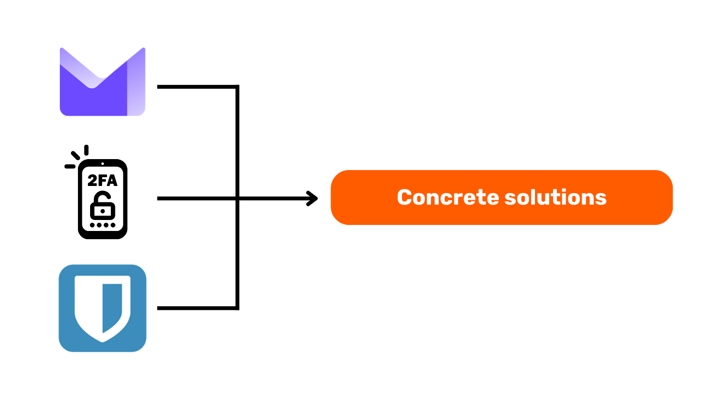

Siap untuk memperkuat keamanan digital Anda dan mengambil kembali kendali atas data Anda? Ayo mulai!
# Semua yang Perlu Anda Ketahui tentang Penjelajahan Online

<partId>b4b5379a-d8ef-59ae-94d3-a6e88959c149</partId>

## Penjelajahan Online

<chapterId>3a935da9-fa6e-57eb-bf85-7b3ec35e6ee2</chapterId>

Saat Anda menjelajahi internet, penting untuk menghindari beberapa kesalahan umum untuk menjaga keamanan online Anda. Berikut adalah beberapa tips untuk menghindarinya:

### Berhati-hatilah dengan pengunduhan perangkat lunak:

Disarankan untuk mengunduh perangkat lunak dari situs resminya dan bukan dari situs umum.
Contoh: Gunakan www.signal.org/download dan hindari pengunduhan melalui www.logicieltelechargement.fr/signal.
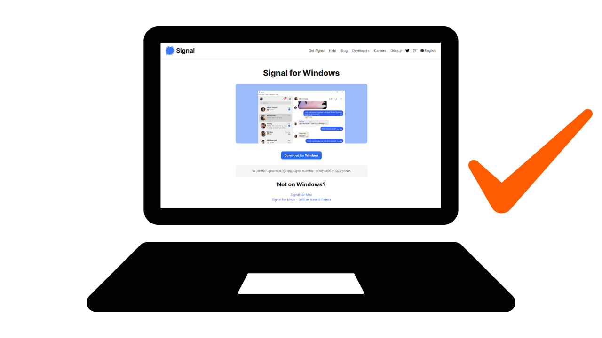

Anda juga disarankan untuk memprioritaskan perangkat lunak *open-source* karena seringkali lebih aman dan bebas dari perangkat lunak berbahaya. Perangkat lunak "*open-source*" adalah perangkat lunak yang kode sumbernya transparan dan dapat diakses oleh semua orang. Hal ini memungkinkan orang-orang untuk melakukan pemeriksaan untuk memastikan bahwa tidak ada jalan tersembunyi untuk peretas mencuri data pribadi Anda.

> Bonus: Mayoritas perangkat lunak *open-source* seringkali bersifat gratis! Kode universitas ini juga 100% *open source*, jadi Anda juga dapat memeriksa kode kami di GitHub kami.
> 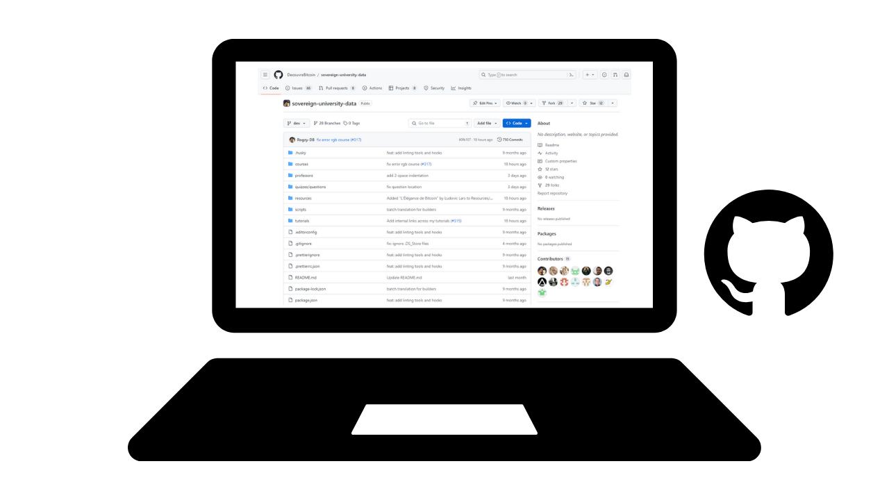

### Pengelolaan *Cookie*: Kesalahan dan solusi praktis terbaik

*Cookie* adalah file yang dibuat oleh situs web untuk menyimpan informasi di perangkat Anda. Meskipun beberapa situs memerlukan *cookie* untuk berfungsi dengan baik, *cookie* juga bisa dimanfaatkan oleh situs pihak ketiga, terutama untuk tujuan pelacakan iklan. Sesuai dengan peraturan seperti GDPR (*General Data Protection Regulation*), Anda bisa dan juga disarankan untuk menolak *cookie* pelacakan pihak ketiga sambil menerima *cookie* yang diperlukan untuk kelancaran situs yang tersebut. Setelah setiap Anda masuk ke situs, langkah yang bijak adalah untuk menghapus *cookie* yang terkait, baik secara manual atau menggunakan ekstensi atau program/aplikasi khusus. Beberapa peramban bahkan menawarkan opsi untuk memilih *cookie* yang ingin dihapus. Meskipun Anda sudah melakukan tindakan pencegahan ini, penting untuk memahami bahwa informasi yang dikumpulkan oleh berbagai situs dapat tetap saling terhubung. Karena itu, penting untuk menemukan keseimbangan antara kemudahan penggunaan dan keamanan.

> Catatan: Batasi juga jumlah ekstensi yang dipasang di peramban Anda untuk menghindari potensi masalah keamanan dan kinerja.

### Peramban web: pilihan dan keamanan

Ada dua kategori besar untuk peramban web: yang berbasis Chrome dan yang berbasis Firefox.
Meskipun peramban dari kedua kategori tersebut menawarkan tingkat keamanan yang serupa, Anda disarankan untuk menghindari Google Chrome karena adanya pelacak. Alternatif Chrome yang lebih ringan, seperti Chromium atau Brave, bisa jadi pilihan yang lebih baik. Brave sangat direkomendasikan karena sudah dilengkapi oleh pemblokir iklan bawaan. Dalam beberapa kasus, mungkin Anda perlu menggunakan lebih dari satu peramban untuk bisa mengakses situs-situs tertentu.
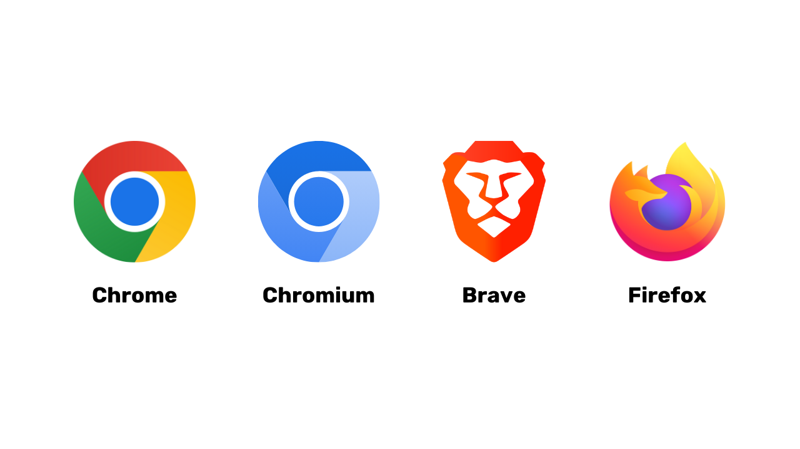

### Penjelajahan Pribadi, TOR, dan alternatif lainnya untuk penjelajahan yang lebih aman dan anonim

Mode penjelajahan pribadi, meskipun tidak menyembunyikan aktivitas Anda dari penyedia layanan internet, dapat memungkinkan Anda untuk tidak meninggalkan jejak di komputer Anda. *Cookie* akan secara otomatis dihapus setiap kali Anda selesai, memungkinkan Anda untuk menerima semua *cookie* tanpa dilacak. Mode ini berguna, contohnya saat membeli layanan online, karena situs web karena banyak situs memantau kebiasaan pencarian kita dan menyesuaikan harga berdasarkan itu. Namun, penting untuk dicatat bahwa mode penjelajahan pribadi sebaiknya digunakan untuk tujuan-tujuan tertentu saja, dan bukan untuk penjelajahan internet secara umum.

Salah satu alternatif lebih lanjut adalah jaringan TOR (*The Onion Router*), yang menawarkan anonimitas dengan menyamarkan alamat IP pengguna dan memungkinkan akses ke Darknet. TOR Browser adalah browser yang dirancang khusus untuk menggunakan jaringan TOR. Peramban ini memungkinkan Anda untuk mengunjungi situs web konvensional dan situs web .onion, yang biasanya dijalankan oleh individu dan mungkin bersifat ilegal.

TOR bersifat legal dan digunakan oleh jurnalis, aktivis kebebasan, dan orang lain yang ingin lolos dari sensor di negara-negara otoriter. Namun, penting untuk memahami bahwa TOR tidak mengamankan situs yang dikunjungi atau komputer itu sendiri. Selain itu, penggunaan TOR dapat memperlambat koneksi internet karena data harus melewati komputer milik tiga orang lain sebelum mencapai tujuannya. Juga penting untuk dicatat bahwa TOR bukan solusi sempurna untuk menjamin anonimitas 100% dan tidak seharusnya digunakan untuk aktivitas ilegal.
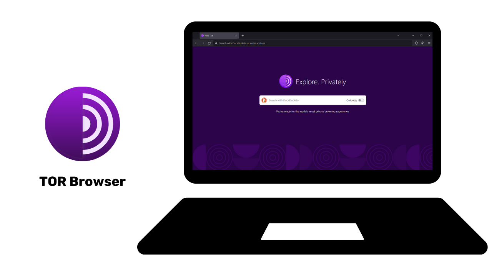

https://planb.network/tutorials/computer-security/communication/tor-browser-a847e83c-31ef-4439-9eac-742b255129bb

## VPN dan koneksi internet

<chapterId>5aac83f4-a685-54b0-9759-d71bea7eeed2</chapterId>

### VPN (*Virtual Private Network*)

Melindungi koneksi internet Anda adalah aspek penting dari keamanan online, dan menggunakan jaringan pribadi virtual (VPN) adalah cara yang untuk meningkatkannya, baik untuk bisnis maupun pengguna individu.

VPN adalah alat yang menyamarkan data yang dikirimkan melalui internet, sehingga koneksi menjadi lebih aman. Dalam konteks profesional, VPN memungkinkan karyawan untuk mengakses jaringan internal perusahaan secara aman dari jarak jauh. Data yang dipertukarkan akan disamarkan, membuatnya jauh lebih sulit untuk dilihat atau dicuri oleh pihak ketiga. Selain itu, penggunaan VPN juga memungkinkan pengguna mengarahkan koneksi internet mereka seolah-olah berasal dari jaringan internal perusahaan. Hal ini sangat berguna untuk mengakses layanan online yang dibatasi secara geografis.
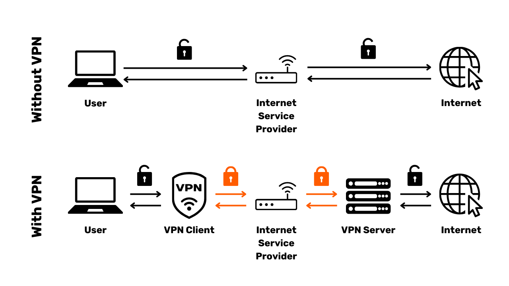

### Jenis-jenis VPN

Ada dua jenis utama VPN: VPN perusahaan dan VPN konsumen, seperti NordVPN. VPN perusahaan cenderung lebih mahal dan kompleks, sementara VPN konsumen umumnya lebih mudah diakses dan ramah pengguna. Misalnya, NordVPN memungkinkan pengguna untuk terhubung ke internet melalui server yang berlokasi di negara lain, sehingga bisa membuka situs atau layanan yang dibatasi berdasarkan lokasi geografis.
Namun, menggunakan VPN konsumen tidak menjamin anonimitas secara menyeluruh. Banyak penyedia VPN menyimpan informasi tentang penggunanya, yang dapat berpotensi mengancam anonimitas mereka. Meskipun VPN dapat berguna untuk meningkatkan keamanan online, VPN bukanlah solusi universal. VPN bisa efektif untuk tujuan tertentu, seperti mengakses layanan yang terbatas secara geografis atau meningkatkan keamanan saat bepergian, tetapi VPN tidak menjamin keamanan Anda secara total. Saat memilih VPN, sangat penting untuk memprioritaskan keandalan dan aspek teknis daripada popularitasnya. Penyedia VPN yang mengumpulkan paling sedikit informasi pribadi pengguna umumnya merupakan yang paling aman. Layanan seperti iVPN dan Mullvad tidak mengumpulkan informasi pribadi dan bahkan memungkinkan pembayaran dalam Bitcoin untuk privasi yang lebih baik.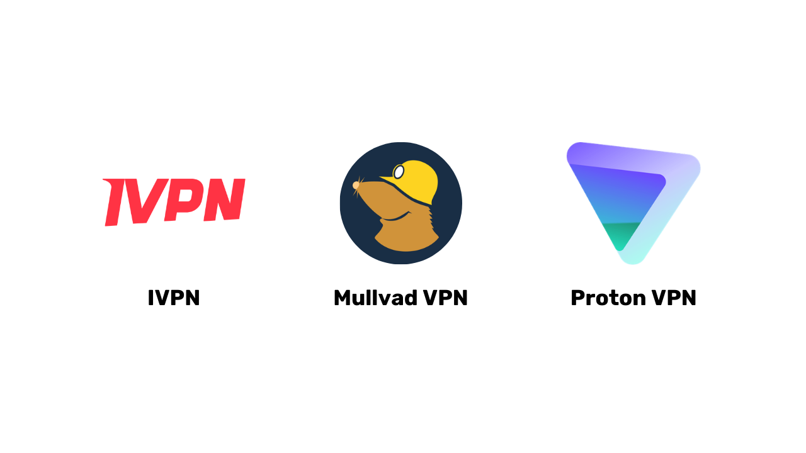
VPN juga dapat digunakan untuk memblokir iklan online, menyediakan pengalaman penjelajahan internet yang lebih lancar dan aman. Namun, penting untuk melakukan riset Anda sendiri untuk menemukan VPN yang paling sesuai dengan kebutuhan Anda. Menggunakan VPN disarankan untuk meningkatkan keamanan, bahkan saat menjelajah internet di rumah. Hal ini membantu memastikan tingkat keamanan yang lebih tinggi untuk data yang dipertukarkan secara online. Terakhir, pastikan untuk memeriksa URL dan gembok kecil di bilah alamat web untuk memastikan bahwa Anda berada di situs yang benar-benar ingin Anda kunjungi.

https://planb.network/tutorials/computer-security/communication/ivpn-5a0cd5df-29f1-4382-a817-975a96646e68

https://planb.network/tutorials/computer-security/communication/mullvad-968ec5f5-b3f0-4d23-a9e0-c07a3e85aaa8

### HTTPS & jaringan Wi-Fi publik

Dalam hal keamanan online, penting untuk memahami bahwa 4G umumnya lebih aman daripada Wi-Fi publik. Namun, menggunakan 4G dapat dengan cepat menghabiskan paket data seluler Anda. Protokol HTTPS telah menjadi standar untuk menyamarkan data di situs web, yang memastikan bahwa data yang ditukar antara pengguna dan situs web aman. Oleh karena itu, sangat penting untuk memastikan bahwa situs yang Anda kunjungi menggunakan protokol HTTPS.

Di Uni Eropa, perlindungan data diatur oleh *General Data Protection Regulation* (GDPR). Oleh karena itu, lebih aman untuk menggunakan penyedia titik akses Wi-Fi Eropa, seperti SNCF, yang tidak menjual kembali data koneksi pengguna. Namun, hanya dengan adanya ada ikon gembok pada situs tidak menjamin keasliannya. Penting untuk memverifikasi kunci publik situs menggunakan sistem sertifikat untuk mengonfirmasi keasliannya. Meskipun enkripsi data mencegah pihak ketiga menyadap data yang ditukar, masih ada kemungkinan bagi individu jahat untuk menyamar sebagai situs tersebut dan mentransfer data dalam format teks biasa.

Untuk menghindari penipuan online, sangat penting untuk memverifikasi identitas situs yang Anda jelajahi, terutama dengan memeriksa ekstensi dan nama domain. Selain itu, waspadalah terhadap penipu yang menggunakan huruf serupa dalam URL untuk menipu pengguna.
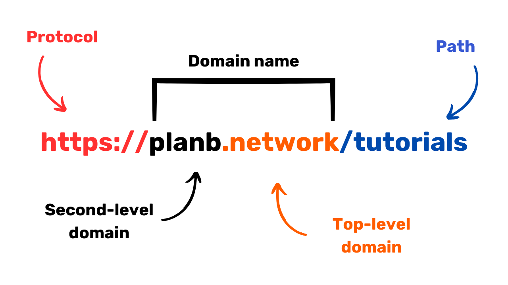
Secara keseluruhan, penggunaan VPN dapat meningkatkan keamanan online, baik untuk bisnis maupun pengguna individu. Selain itu, praktik kebiasaan menjelajah yang baik dapat bermanfaat untuk keamanan digital Anda. Dalam segmen berikutnya dari kursus ini, kami akan membahas aspek-aspek keamanan komputer, termasuk pembaruan, antivirus, dan pengelolaan kata sandi.

# Praktik Terbaik Penggunaan Komputer

<partId>e6eac20b-ba24-5d9a-8d86-8e0164074457</partId>

## Penggunaan Komputer

<chapterId>16745632-b56b-5423-9873-ddf70fdf1efd</chapterId>

Keamanan komputer kita adalah hal utama yang harus diperhatikan di dunia digital saat ini. Saat ini, kami akan membahas tiga poin kunci:

- Memilih komputer
- Pembaruan dan antivirus untuk keamanan yang optimal
- Praktik terbaik untuk keamanan komputer dan data Anda.

### Memilih Komputer dan Sistem Operasi

Saat membicarakan pemilihan komputer, tidak ada perbedaan yang signifikan dalam aspek keamanan komputer lama dan baru. Namun, terdapat beberapa perbedaan pada aspek keamanan pada beberapa sistem operasi: Windows, Linux, dan Mac.
Terkait dengan Windows, Anda disarankan untuk tidak menggunakan akun administrator sehari-hari. Kami menyarankan untuk membuat dua akun terpisah: satu akun administrator dan akun untuk penggunaan sehari-hari. Windows sering kali lebih rentan terhadap *malware* karena jumlah penggunanya yang besar dan mudahnya untuk berpindah-pindah dari menggunakan akun pengguna ke administrator. Di sisi lain, ancaman lebih jarang terjadi pada sistem operasi Linux dan Mac.

Pilihan sistem operasi harus didasarkan pada kebutuhan dan preferensi Anda. Sistem Linux telah berkembang pesat dalam beberapa tahun terakhir, menjadi semakin ramah pengguna. Ubuntu merupakan alternatif yang menarik untuk pemula, dengan antarmuka grafis yang mudah digunakan. Anda bisa mengalokasikan ruang pada komputer untuk mencoba Linux tanpa menghapus Windows, namun hal ini bisa jadi cukup rumit untuk dilakukan. Hal yang seringkali lebih disukai adalah memiliki komputer khusus, mesin virtual, atau *flash drive* USB untuk menguji penggunaan Linux atau Ubuntu.

### Pembaruan Perangkat Lunak

Aspek penting dari pembaruan sangat sederhana: **memperbarui sistem operasi dan aplikasi secara teratur adalah hal yang penting.**

Pada sistem operasi Windows 10, opsi pembaruan hampir terus-menerus ada dan sangat penting untuk tidak memblokir atau menunda melakukannya. Setiap tahun, sekitar 15.000 aspek kerentanan berhasil diidentifikasi, dan hal ini menyoroti pentingnya menjaga perangkat lunak tetap diperbarui untuk melindunginya dari virus. Secara umum, ketersediaan dukungan untuk perangkat lunak berakhir antara 3 hingga 5 tahun setelah dirilis, sehingga Anda perlu untuk memperbarui ke versi yang lebih tinggi untuk terus mendapatkan manfaat keamanan.

Aturan ini berlaku untuk hampir semua perangkat lunak. Memang benar bahwa pembaruan tidak dimaksudkan untuk membuat mesin Anda usang atau lambat, tetapi untuk melindunginya dari ancaman baru. Beberapa pembaruan bahkan dianggap penting, dan tanpa pembaruan tersebut, komputer Anda berisiko besar untuk disalahgunakan.

Untuk memberi Anda contoh konkret dari sebuah kesalahan: perangkat lunak bajakan yang tidak dapat diperbarui melibatkan bahaya ganda. Potensi adanya virus selama pengunduhan ilegal dari situs web yang mencurigakan serta penggunaan yang tidak aman terhadap bentuk serangan baru karena tidak bisa diperbarui.

### Anti-virus

- Apakah Anda memerlukan anti-virus? YA
- Apakah Anda harus membayar? Tergantung!

Pilihan dan penggunaan anti-virus bersifat penting. Windows Defender, antivirus bawaan di Windows, adalah solusi yang aman dan efektif. Karena bersifat gratis, antivirus ini sangat baik dan jauh lebih baik dari banyak antivirus gratis yang dapat ditemukan online. Namun, Anda harus berhati-hati dengan antivirus yang diunduh dari Internet, karena bisa jadi berbahaya atau usang.
Bagi yang ingin menggunakan antivirus berbayar, pilihlah antivirus yang bisa mendeteksi ancaman baru yang belum dikenal, seperti Kaspersky. Pastikan untuk selalu memperbarui antivirus, karena itu penting untuk melindungi diri dari ancaman terbaru.

> Catatan: Linux dan Mac, berkat sistem pemisahan hak pengguna mereka, seringkali tidak memerlukan antivirus.

Berikut adalah beberapa praktik yang baik untuk keamanan komputer dan data Anda. Penting untuk memilih antivirus yang efektif dan ramah pengguna. Aspek lainnya yang sangat penting adalah untuk memiliki kebiasaan praktik baik saat menggunakan komputer Anda, seperti tidak memasukkan USB tidak dikenal atau mencurigakan. USB ini dapat berisi program berbahaya yang dapat secara otomatis aktif saat USB dimasukkan. Pemeriksaan USB akan sia-sia setelah USB dipasang. Beberapa perusahaan telah menjadi korban peretasan karena kecerobohan seperti meninggalkan USB di tempat yang rawan, seperti tempat parkir.

Perlakukanlah komputer Anda seperti Anda memperlakukan rumah Anda: tetap waspada, perbarui secara teratur, hapus file yang tidak diperlukan, dan gunakan kata sandi yang kuat untuk keamanan. Sangat penting untuk mengenkripsi data pada laptop dan smartphone guna mencegah pencurian atau kehilangan data. BitLocker untuk Windows, LUKS untuk Linux, dan opsi bawaan untuk Mac adalah contoh solusi untuk enkripsi data. Anda disarankan untuk mengaktifkan enkripsi data tanpa ragu dan menuliskan kata sandi pada kertas yang disimpan di tempat yang aman.
Sebagai penutup, sangat penting untuk memilih sistem operasi yang cocok dengan kebutuhan Anda dan secara rutin memperbaruinya, begitu juga dengan aplikasi yang sudah terinstal. Hal penting lainnya yaitu untuk menggunakan antivirus yang efektif dan ramah pengguna serta memiliki kebiasaan praktik yang baik untuk menjaga keamanan komputer dan data Anda.

## Peretasan & Pengelolaan Pencadangan: Melindungi Data Anda

<chapterId>9ddfcb6a-a253-5542-b7eb-df7222b46dc7</chapterId>

### Bagaimana peretas menyerang?

Untuk melindungi diri Anda dengan baik, sangat penting untuk memahami bagaimana peretas mencoba menyusup ke komputer Anda. Memang, virus tidak sering muncul secara ajaib, tetapi lebih sering merupakan konsekuensi dari tindakan kita, bahkan tindakan kita yang tak sengaja!

Secara umum, virus datang karena Anda telah membiarkan komputer Anda mengundang mereka ke rumah Anda. Misalnya, dengan mengunduh perangkat lunak yang mencurigakan, file torrent yang telah disusupi, atau hanya dengan mengklik tautan email penipuan!

### *Phishing*, kewaspadaan terhadap email penipuan:

Perhatian! Email adalah media penyerangan retasan dan pembobolan pertama, berikut beberapa tips:

- Tetap waspada terhadap upaya *phishing* yang bertujuan untuk mengambil informasi sensitif seperti nama pengguna dan kata sandi Anda. Hindari mengklik tautan mencurigakan dan berbagi informasi pribadi Anda tanpa memastikan keaslian identitas pengirimnya.
- Berhati-hatilah dengan lampiran email dan gambar:
  Lampiran email dan gambar dapat mengandung *malware*. Jangan mengunduh atau membuka lampiran dari pengirim yang tidak dikenal atau mencurigakan, dan pastikan antivirus Anda sudah diperbarui.

Aturan penting di sini adalah untuk memeriksa dengan cermat nama lengkap pengirim serta asal email. Jika Anda ragu, hapus saja!

### *Ransomware* dan jenis serangan siber:

*Ransomware* adalah jenis perangkat lunak berbahaya yang mengunci data pengguna dan meminta tebusan untuk membukanya kembali. Jenis serangan ini menjadi semakin sering terjadi dan dapat menimbulkan masalah serius bagi sebuah perusahaan atau individu. Untuk melindungi diri, penting untuk membuat salinan cadangan untuk file-file yang paling penting! Hal ini tidak akan menghentikan *ransomware*, tapi setidaknya Anda bisa mengabaikannya dan tetap punya akses ke data kamu.
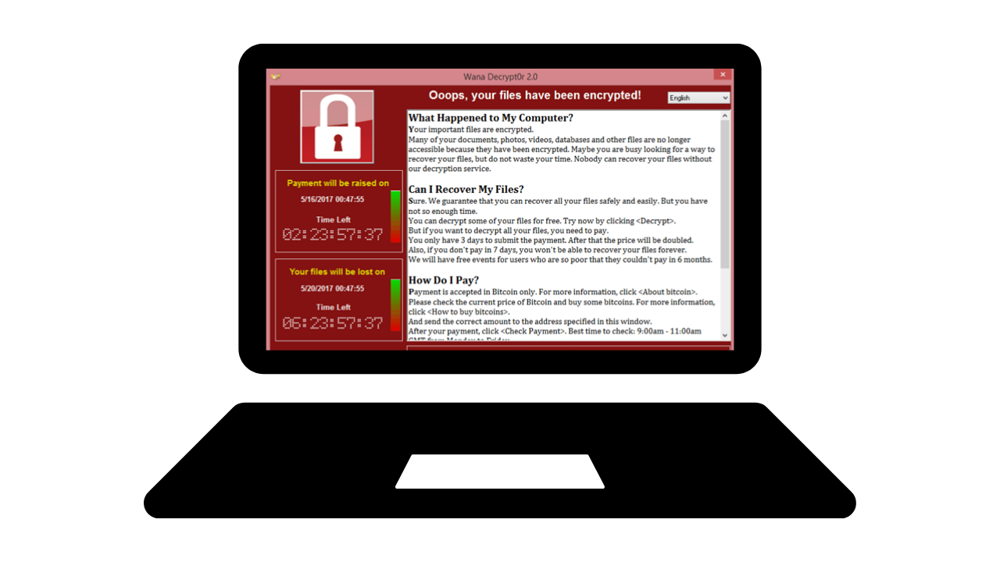
Anda sebaiknya secara rutin mencadangkan data penting Anda ke perangkat penyimpanan eksternal atau layanan penyimpanan online yang aman. Dengan cara ini, apabila terjadi serangan siber atau kerusakan atau kegagalan perangkat keras, Anda dapat memulihkan data Anda tanpa kehilangan informasi penting.

Solusi sederhana:

- Beli *hard drive* eksternal dan salin data Anda ke dalamnya. Lepas *hard drive* eksternal tersebut dan simpan di suatu tempat di rumah. (Melakukan ini dua kali dan menyimpan salah satu pencadangan di lokasi lain akan membantu Anda untuk melindungi dari potensi kebakaran.)

- Buat cadangan "cloud" menggunakan ProtonMail Drive, Sync, atau Google Drive. Cukup dengan mengunggah data sensitif Anda ke platform online ini. Namun, penting untuk disadari bahwa data Anda berpotensi ada di internet dan dipegang oleh pihak ketiga yang terpercaya.

### Apakah Anda harus membayar peretas?

TIDAK, umumnya tidak disarankan untuk membayar peretas dalam kasus *ransomware* atau jenis serangan lainnya. Membayar tebusan tidak menjamin pemulihan data Anda dan dapat menjadi insentif bagi penjahat siber untuk melanjutkan aktivitas jahat mereka. Sebagai gantinya, prioritaskan pencegahan dan cadangan rutin data Anda untuk melindungi diri.

Jika Anda mendeteksi virus di komputer Anda, matikan koneksi internet, lakukan pemindaian antivirus menyeluruh, dan hapus file yang terkena virus. Kemudian, perbarui perangkat lunak dan sistem operasi Anda, dan ubah kata sandi Anda untuk mencegah pembobolan lebih lanjut.

https://planb.network/tutorials/computer-security/data/proton-drive-03cbe49f-6ddc-491f-8786-bc20d98ebb16

https://planb.network/tutorials/computer-security/data/veracrypt-d5ed4c83-7c1c-4181-95ea-963fdf2d83c5

# Penerapan solusi.

<partId>215ec902-ba05-5549-87fc-cb8d82665f7b</partId>

## Mengelola akun email

<chapterId>dfceea33-8712-5557-ace1-6ba5598d33d8</chapterId>

### Membuat akun email baru!

Akun email merupakan pusat dari aktivitas online Anda: jika akun tersebut memiliki celah untuk diserang, peretas dapat menggunakannya untuk mengatur ulang semua kata sandi Anda melalui fungsi "lupa kata sandi" dan mendapatkan akses ke banyak situs lain. Itulah mengapa Anda perlu mengamankannya dengan benar.

Akun email harus dibuat dengan kata sandi yang unik dan kuat (detail akan dibahas di bab 7) dan idealnya dengan sistem otentikasi dua faktor, 2FA (detail akan dibahas di bab 8).

Meskipun kita semua sudah memiliki akun email, ada baiknya kita mempertimbangkan untuk membuat akun baru yang lebih modern — sebagai permulaan yang lebih tertata dan aman.

### Memilih penyedia email dan mengelola alamat email

Pengelolaan alamat email kita sangat penting untuk memastikan keamanan akses online kita. Penting untuk memilih penyedia email yang aman dan menghormati privasi. Sebagai contoh, ProtonMail adalah layanan email yang aman dan menghormati privasi.
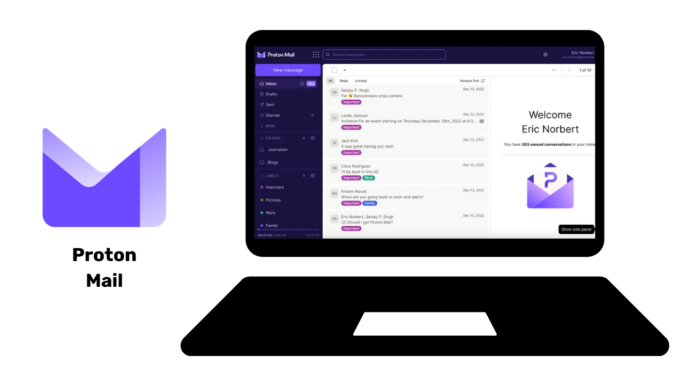
Saat memilih penyedia email dan membuat kata sandi, sangat penting untuk tidak pernah menggunakan kata sandi yang sama untuk layanan online yang berbeda. Disarankan untuk secara rutin membuat alamat email baru dan memisahkan penggunaan dengan menggunakan alamat email yang berbeda. Lebih disukai untuk memilih layanan email yang aman untuk akun kritis. Juga perlu diperhatikan bahwa beberapa layanan membatasi panjang kata sandi, sehingga penting untuk menyadari batasan ini. Layanan juga tersedia untuk membuat alamat email sementara, yang dapat digunakan untuk akun berdurasi terbatas.

Penting untuk mempertimbangkan bahwa penyedia email lama seperti La Poste, Arobase, Wig, Hotmail, masih digunakan, tetapi praktik keamanan mereka mungkin tidak sebaik Gmail. Oleh karena itu, disarankan untuk memiliki dua alamat email terpisah, satu untuk komunikasi umum dan yang lainnya untuk pemulihan akun, dengan yang terakhir lebih aman. Sebaiknya hindari mencampur alamat email dengan operator telepon atau penyedia layanan internet Anda, karena ini bisa menjadi vektor serangan.

### Apakah saya harus mengganti akun email saya?

Disarankan untuk menggunakan situs web Have I Been Pwned (https://haveibeenpwned.com/) untuk memeriksa apakah alamat email kita telah dikompromikan dan untuk diberitahu tentang pelanggaran data di masa depan. Database yang diretas dapat dimanfaatkan oleh peretas untuk mengirim email phishing atau menggunakan kembali kata sandi yang dikompromikan.
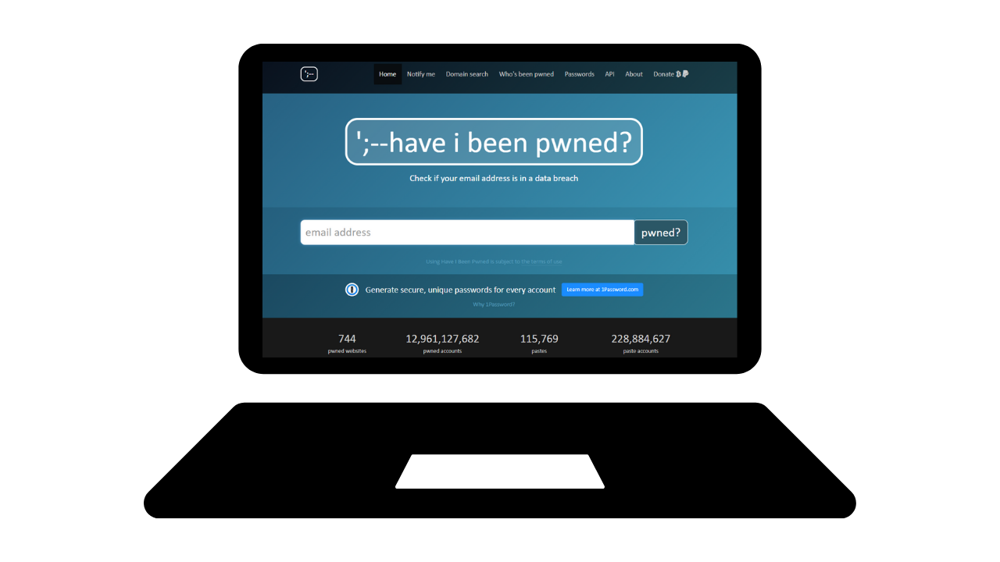
Secara umum, mulai menggunakan alamat email baru yang lebih aman bukanlah praktik buruk dan bahkan perlu jika seseorang ingin memulai dari awal dengan basis yang sehat.
Bonus Bitcoin: Mungkin disarankan untuk membuat alamat email khusus untuk aktivitas Bitcoin kita (membuat akun pertukaran) agar benar-benar memisahkan area aktivitas dalam hidup kita.

https://planb.network/tutorials/computer-security/communication/proton-mail-c3b010ce-254d-4546-b382-19ab9261c6a2

## Manajer Kata Sandi

<chapterId>0b3c69b2-522c-56c8-9fb8-1562bd55930f</chapterId>

### Apa itu manajer kata sandi?

Manajer kata sandi adalah alat yang memungkinkan Anda untuk menyimpan, menghasilkan, dan mengelola kata sandi untuk berbagai akun online. Alih-alih mengingat banyak kata sandi, Anda hanya perlu satu kata sandi utama untuk mengakses semua yang lain.

Dengan manajer kata sandi, Anda tidak perlu lagi khawatir lupa kata sandi Anda atau menuliskannya di suatu tempat. Anda hanya perlu mengingat satu kata sandi utama. Selain itu, sebagian besar alat ini menghasilkan kata sandi yang kuat untuk Anda, yang meningkatkan keamanan akun Anda.

### Perbedaan antara beberapa manajer populer:

- LastPass: Salah satu manajer yang paling populer. Ini adalah layanan pihak ketiga, yang berarti kata sandi Anda disimpan di server mereka. LastPass menawarkan versi gratis dan versi berbayar, dengan antarmuka yang ramah pengguna.
- Dashlane: Ini juga merupakan layanan pihak ketiga, dengan antarmuka yang intuitif dan fitur tambahan seperti pelacakan informasi kartu kredit dan catatan aman.
  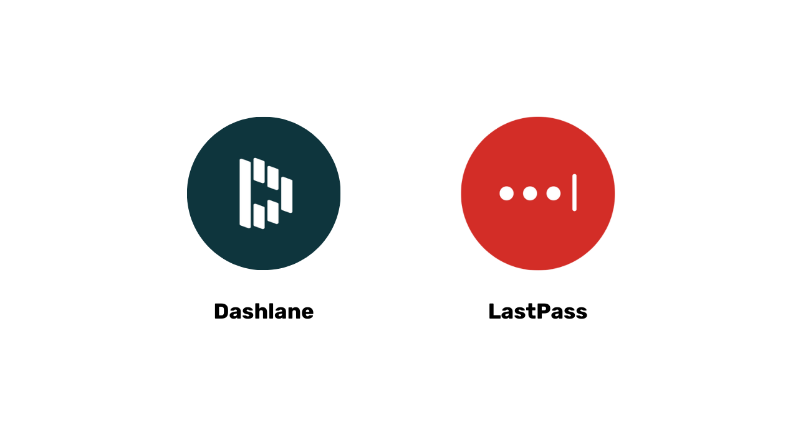

### Self-hosting untuk kontrol lebih:

- Bitwarden: Ini adalah alat open-source, yang berarti Anda dapat meninjau kode sumbernya untuk memverifikasi keamanannya. Meskipun Bitwarden menawarkan layanan yang di-host, ia juga memungkinkan pengguna untuk self-host, yang berarti Anda dapat mengontrol di mana kata sandi Anda disimpan, berpotensi menawarkan lebih banyak keamanan dan kontrol.

- KeePass: Ini adalah solusi open-source yang terutama dimaksudkan untuk self-hosting. Data Anda disimpan secara lokal secara default, tetapi Anda dapat menyinkronkan basis data kata sandi menggunakan metode yang berbeda jika Anda mau. KeePass diakui luas karena keamanan dan fleksibilitasnya, meskipun mungkin sedikit kurang ramah pengguna untuk pemula.
  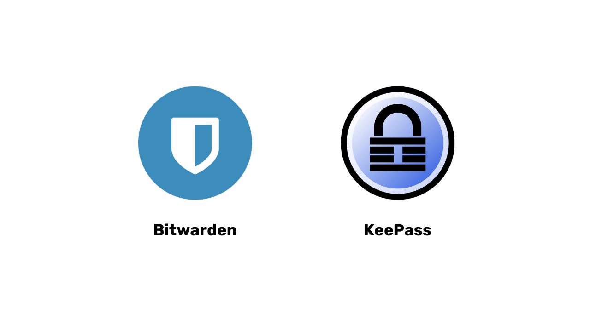
  (Catatan: Memilih antara layanan pihak ketiga atau layanan self-hosted tergantung pada tingkat kenyamanan teknologi Anda dan bagaimana Anda memprioritaskan kontrol versus kemudahan. Layanan pihak ketiga umumnya lebih nyaman bagi kebanyakan orang, sementara self-hosting memerlukan lebih banyak pengetahuan teknis tetapi dapat menawarkan lebih banyak kontrol dan ketenangan pikiran dalam hal keamanan.)

### Apa yang membuat kata sandi yang baik:

Kata sandi yang baik umumnya:

- Panjang: setidaknya 12 karakter.
- Kompleks: campuran huruf besar dan kecil, angka, dan simbol.
- Unik: jangan menggunakan kata sandi yang sama untuk akun yang berbeda.
- Tidak berdasarkan informasi pribadi: hindari tanggal lahir, nama, dll.

Untuk memastikan keamanan akun Anda, sangat penting untuk membuat kata sandi yang kuat dan aman. Panjang kata sandi saja tidak cukup untuk menjamin keamanannya. Karakter harus sepenuhnya acak untuk menahan serangan brute force. Independensi peristiwa juga penting untuk menghindari kombinasi yang paling mungkin. Kata sandi umum seperti "password" mudah dikompromikan.

Untuk membuat kata sandi yang kuat, disarankan untuk menggunakan sejumlah besar karakter acak, tanpa menggunakan kata atau pola yang dapat diprediksi. Juga penting untuk menyertakan angka dan karakter khusus. Namun, perlu dicatat bahwa beberapa situs web mungkin membatasi penggunaan karakter khusus tertentu. Kata sandi yang tidak dihasilkan secara acak mudah ditebak. Variasi atau tambahan pada kata sandi tidak aman. Situs web tidak dapat menjamin keamanan kata sandi yang dipilih oleh pengguna.

Kata sandi yang dihasilkan secara acak menawarkan tingkat keamanan yang lebih tinggi, meskipun mungkin lebih sulit diingat. Manajer kata sandi dapat menghasilkan kata sandi acak yang lebih aman. Dengan menggunakan manajer kata sandi, Anda tidak perlu menghafal semua kata sandi Anda. Penting untuk secara bertahap mengganti kata sandi lama Anda dengan yang dihasilkan oleh manajer, karena mereka lebih kuat dan lebih panjang. Pastikan bahwa kata sandi utama dari manajer kata sandi Anda juga kuat dan aman.

https://planb.network/tutorials/computer-security/authentication/bitwarden-0532f569-fb00-4fad-acba-2fcb1bf05de9

https://planb.network/tutorials/computer-security/authentication/keepass-f8073bb7-5b4a-4664-9246-228e307be246

## Autentikasi Dua Faktor

<chapterId>9391e02e-e61b-5a86-93e0-91a07f217d35</chapterId>

### Mengapa menerapkan 2FA

Otentikasi Dua-Faktor (2FA) adalah lapisan keamanan tambahan yang digunakan untuk memastikan bahwa orang-orang yang mencoba mengakses akun online adalah mereka yang mereka klaim. Alih-alih hanya memasukkan nama pengguna dan kata sandi, 2FA memerlukan bentuk verifikasi kedua. Langkah kedua ini bisa berupa:

- Kode sementara yang dikirim melalui SMS.
- Kode yang dihasilkan oleh aplikasi seperti Google Authenticator atau Authy.
- Kunci keamanan fisik yang Anda masukkan ke dalam komputer Anda.
  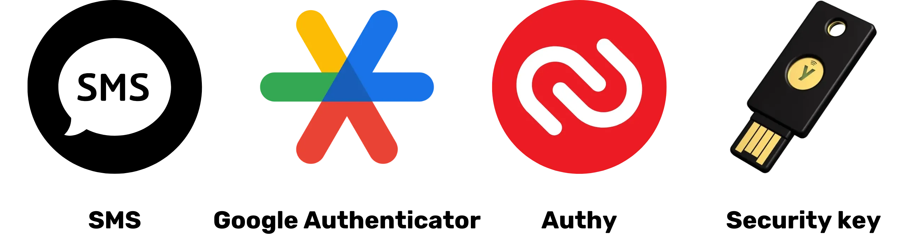
  Dengan 2FA, bahkan jika peretas mendapatkan kata sandi Anda, mereka tidak akan dapat mengakses akun Anda tanpa faktor verifikasi kedua ini. Ini membuat 2FA penting untuk melindungi akun online Anda dari akses tidak sah.

### Opsi Mana yang Harus Dipilih?

Berbagai opsi untuk otentikasi kuat menawarkan tingkat keamanan yang berbeda.

- SMS tidak dianggap sebagai opsi terbaik karena hanya menyediakan bukti kepemilikan nomor telepon.
- 2FA (otentikasi dua faktor) lebih aman karena menggunakan beberapa jenis bukti, seperti pengetahuan, kepemilikan, dan identifikasi. Kata sandi sekali pakai (HOTP dan TOTP) lebih aman daripada SMS karena memerlukan perhitungan kriptografi dan disimpan secara lokal daripada di memori.
- Token perangkat keras, seperti kunci USB atau kartu pintar, menawarkan keamanan optimal dengan menghasilkan kunci pribadi unik untuk setiap situs dan memverifikasi URL sebelum mengizinkan koneksi.

Untuk keamanan optimal dengan otentikasi kuat, disarankan untuk menggunakan alamat email yang aman, manajer kata sandi yang aman, dan mengadopsi 2FA menggunakan YubiKeys. Juga disarankan untuk membeli dua YubiKeys untuk mengantisipasi kehilangan atau pencurian, misalnya, menyimpan salinan cadangan baik di rumah maupun pada diri Anda.

Biometrik dapat digunakan sebagai pengganti, tetapi kurang aman daripada kombinasi pengetahuan dan kepemilikan. Data biometrik harus tetap berada pada perangkat otentikasi dan tidak diungkapkan secara online. Penting untuk mempertimbangkan model ancaman yang terkait dengan metode otentikasi yang berbeda dan menyesuaikan praktik sesuai.

### Kesimpulan dari pelatihan:

Seperti yang Anda pahami, menerapkan kebersihan digital yang baik tidak selalu sederhana, tetapi tetap dapat diakses!

- Membuat alamat email baru yang aman.
- Menyiapkan manajer kata sandi.
- Mengaktifkan 2FA.
- Secara bertahap mengganti kata sandi lama kita dengan kata sandi kuat dengan 2FA.

Terus belajar dan secara bertahap menerapkan praktik baik!

Aturan emas: Keamanan siber adalah target yang bergerak yang akan beradaptasi dengan perjalanan belajar Anda!

https://planb.network/tutorials/computer-security/authentication/authy-a76ab26b-71b0-473c-aa7c-c49153705eb7

https://planb.network/tutorials/computer-security/authentication/security-key-61438267-74db-4f1a-87e4-97c8e673533e

# Bagian Praktis

<partId>98ccf14b-4053-5839-878c-7a73ff02eb95</partId>

## Menyiapkan Kotak Surat

<chapterId>afc9ab5d-7664-5a9b-ab50-225ac9ba8f7c</chapterId>

Melindungi kotak surat Anda adalah langkah penting untuk mengamankan aktivitas online Anda dan menjaga data pribadi Anda. Tutorial ini akan membimbing Anda, langkah demi langkah, dalam membuat dan mengkonfigurasi akun ProtonMail, penyedia yang dikenal karena tingkat keamanannya yang tinggi yang menawarkan enkripsi end-to-end untuk komunikasi Anda. Baik Anda seorang pemula atau pengguna berpengalaman, praktik terbaik yang diusulkan di sini akan membantu Anda memperkuat keamanan email Anda, sambil memanfaatkan fitur-fitur canggih ProtonMail:

https://planb.network/tutorials/computer-security/communication/proton-mail-c3b010ce-254d-4546-b382-19ab9261c6a2

## Mengamankan dengan 2FA

<chapterId>09468ec1-95b7-56a4-a636-7618044568e1</chapterId>

Autentikasi dua faktor (2FA) telah menjadi penting untuk mengamankan akun online Anda. Dalam tutorial ini, Anda akan belajar cara mengatur dan menggunakan aplikasi 2FA Authy, yang menghasilkan kode dinamis 6 digit untuk melindungi akun Anda. Authy sangat mudah digunakan dan dapat disinkronkan di beberapa perangkat. Pelajari cara menginstal dan mengonfigurasi Authy, dan perkuat keamanan akun online Anda sekarang juga:

https://planb.network/tutorials/computer-security/authentication/authy-a76ab26b-71b0-473c-aa7c-c49153705eb7

Opsi lain adalah menggunakan kunci keamanan fisik. Tutorial lainnya ini menunjukkan cara mengatur dan menggunakan kunci keamanan sebagai faktor autentikasi kedua:

https://planb.network/tutorials/computer-security/authentication/security-key-61438267-74db-4f1a-87e4-97c8e673533e

## Membuat manajer kata sandi

<chapterId>ed579680-4e7b-5f65-8541-14e519a3b242</chapterId>

Manajemen kata sandi adalah tantangan di era digital. Kita semua memiliki banyak akun online yang perlu diamankan. Pengelola kata sandi membantu Anda membuat dan menyimpan kata sandi yang kuat dan unik untuk setiap akun.

Dalam tutorial ini, pelajari cara mengatur Bitwarden, pengelola kata sandi open-source, dan cara menyinkronkan kredensial Anda di semua perangkat untuk memudahkan penggunaan sehari-hari:

https://planb.network/tutorials/computer-security/authentication/bitwarden-0532f569-fb00-4fad-acba-2fcb1bf05de9

Untuk pengguna yang lebih mahir, saya juga menawarkan tutorial tentang perangkat lunak gratis dan open-source lainnya yang dapat digunakan secara lokal untuk mengelola kata sandi Anda:

https://planb.network/tutorials/computer-security/authentication/keepass-f8073bb7-5b4a-4664-9246-228e307be246

## Mengamankan Akun Anda

<chapterId>7a774b34-aed0-57dd-b8f7-cf3be51c0d70</chapterId>

Dalam dua tutorial ini, saya juga membimbing Anda dalam mengamankan akun online Anda dan menjelaskan bagaimana secara bertahap mengadopsi praktik yang lebih aman untuk mengelola kata sandi Anda sehari-hari.

https://planb.network/tutorials/computer-security/authentication/bitwarden-0532f569-fb00-4fad-acba-2fcb1bf05de9

https://planb.network/tutorials/computer-security/authentication/keepass-f8073bb7-5b4a-4664-9246-228e307be246

## Pengaturan Cadangan

<chapterId>01cfcde1-77cb-506c-8df1-fa18a2e8cc6b</chapterId>

Melindungi file pribadi Anda juga merupakan poin penting. Tutorial ini menunjukkan kepada Anda bagaimana menerapkan strategi cadangan yang efektif menggunakan Proton Drive. Temukan cara menggunakan solusi cloud yang aman ini untuk menerapkan metode 3-2-1: tiga salinan data Anda pada dua media yang berbeda, dengan satu salinan di luar lokasi. Dengan demikian, Anda memastikan aksesibilitas dan keamanan file sensitif Anda:

https://planb.network/tutorials/computer-security/data/proton-drive-03cbe49f-6ddc-491f-8786-bc20d98ebb16

Dan untuk mengamankan file Anda yang disimpan di media yang dapat dilepas seperti flash drive USB atau hard drive eksternal, saya juga menunjukkan cara mengenkripsi dan mendekripsi media tersebut dengan mudah menggunakan VeraCrypt:

https://planb.network/tutorials/computer-security/data/veracrypt-d5ed4c83-7c1c-4181-95ea-963fdf2d83c5

## Perubahan Browser & VPN

<chapterId>8dc08feb-313c-5259-a54f-64aa68a07608</chapterId>

Melindungi privasi online Anda juga merupakan poin penting untuk memastikan keamanan Anda. Penggunaan VPN dapat menjadi solusi pertama untuk mencapainya.

Saya mengajak Anda untuk mengenal dua solusi VPN yang terpercaya dan dapat dibayar dengan bitcoin, yaitu IVPN dan Mullvad. Tutorial-tutorial ini akan membimbing Anda dalam menginstal, mengonfigurasi, dan menggunakan Mullvad atau IVPN di semua perangkat Anda:

https://planb.network/tutorials/computer-security/communication/ivpn-5a0cd5df-29f1-4382-a817-975a96646e68

https://planb.network/tutorials/computer-security/communication/mullvad-968ec5f5-b3f0-4d23-a9e0-c07a3e85aaa8

Juga, pelajari cara menggunakan Tor Browser, browser yang dirancang khusus untuk melindungi privasi online Anda:

https://planb.network/tutorials/computer-security/communication/tor-browser-a847e83c-31ef-4439-9eac-742b255129bb

# Lanjutkan Lebih Jauh

<partId>77113cad-a6d8-57e5-b903-50c223b277ba</partId>

## Bagaimana Cara Bekerja di Industri Keamanan Siber

<chapterId>aad1ae27-4280-5b07-b9ab-118ae013951a</chapterId>

### Keamanan Siber: Bidang yang Berkembang dengan Peluang Tanpa Batas

Jika Anda memiliki hasrat untuk melindungi sistem dan data, bidang keamanan siber menawarkan berbagai peluang. Jika industri ini menarik bagi Anda, berikut adalah beberapa langkah kunci untuk membimbing Anda.

### Dasar Akademik dan Sertifikasi:

Pendidikan yang solid dalam ilmu komputer, sistem informasi, atau bidang terkait seringkali menjadi titik awal yang ideal. Studi ini menyediakan dasar yang diperlukan untuk memahami tantangan teknis keamanan siber. Untuk melengkapi pendidikan ini, bijaksana untuk memperoleh sertifikasi yang diakui di bidang ini. Meskipun sertifikasi ini dapat bervariasi menurut wilayah, beberapa, seperti CISSP atau CEH, menikmati pengakuan global.

Keamanan siber adalah bidang yang luas dan terus berkembang. Mempelajari alat penting dan sistem yang berbeda sangat penting. Selain itu, dengan begitu banyak subdomain, dari tanggapan insiden hingga peretasan etis, sangat bermanfaat untuk menemukan niche Anda dan berspesialisasi di dalamnya.

### Mendapatkan Pengalaman Praktis:

Pentingnya pengalaman praktis tidak bisa diremehkan. Mencari magang atau posisi junior di perusahaan dengan tim keamanan siber adalah cara yang sangat baik untuk menerapkan pengetahuan teoritis Anda. Selain itu, terlibat dalam kompetisi hacking etis atau simulasi keamanan siber dapat menyempurnakan keterampilan Anda dalam situasi dunia nyata.

Kekuatan jaringan profesional sangat berharga. Bergabung dengan asosiasi profesional, hackerspaces, atau forum online menyediakan platform untuk bertukar ide dengan ahli lainnya. Demikian pula, menghadiri konferensi dan lokakarya keamanan siber tidak hanya memungkinkan Anda untuk belajar tetapi juga membantu Anda membangun koneksi dengan profesional industri.

Evolusi ancaman yang konstan memerlukan pemantauan berita dan forum khusus secara teratur. Dalam sektor di mana kepercayaan sangat penting, bertindak dengan etika dan integritas sangat penting di setiap tahap karir Anda.

### Keterampilan dan Alat untuk Diperdalam:

- Alat Keamanan Siber: Wireshark, Metasploit, Nmap.
- Sistem Operasi: Linux, Windows, MacOS.
- Bahasa Pemrograman: Python, C, Java.
- Jaringan: TCP/IP, VPN, firewall.
- Basis Data: SQL, NoSQL.
- Kriptografi: SSL/TLS, enkripsi simetris/asimetris.
- Manajemen Insiden: Analisis log, respons insiden.
- Hacking Etis: Teknik penetrasi, pengujian intrusi.
- Tata Kelola: Standar ISO, regulasi GDPR/CCPA.

Dengan menguasai keterampilan dan alat ini, Anda akan dilengkapi dengan baik untuk berhasil menavigasi dunia keamanan siber.
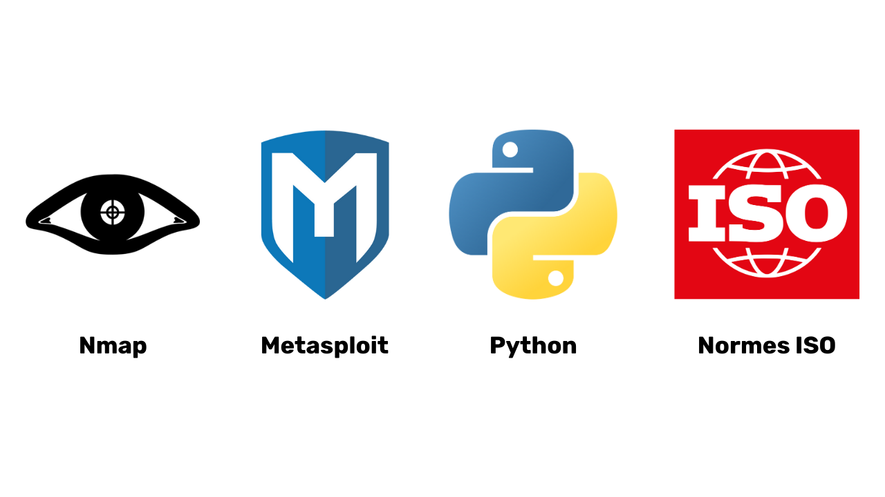

## Wawancara dengan Renaud

<chapterId>7d83fd98-ce22-514e-b9e8-729fbf71ee6e</chapterId>

### Manajemen Kata Sandi yang Efisien dan Penguatan Autentikasi: Pendekatan Akademis

Dalam modul pelatihan "Keamanan 101" yang ditawarkan oleh Découvre Bitcoin dalam Akademi, kami membahas pentingnya penggunaan manajer kata sandi. Ada tiga dimensi yang penting untuk dipertimbangkan: pembuatan, pembaruan, dan implementasi kata sandi di situs web.

Umumnya tidak disarankan untuk menggunakan ekstensi browser untuk pengisian kata sandi secara otomatis. Alat-alat ini dapat membuat pengguna lebih rentan terhadap serangan phishing. Renaud, seorang ahli terkemuka dalam keamanan siber, lebih memilih pengelolaan manual menggunakan KeePass, yang melibatkan proses menyalin dan menempel kata sandi secara manual. Ekstensi cenderung meningkatkan permukaan serangan, dapat memperlambat kinerja browser, dan oleh karena itu menyajikan risiko yang signifikan. Dengan demikian, penggunaan minimal ekstensi pada browser adalah praktik yang disarankan.

Manajer kata sandi umumnya mendorong penggunaan faktor autentikasi tambahan, seperti autentikasi dua faktor. Untuk keamanan optimal, disarankan untuk menyimpan OTP (One-Time Passwords) di perangkat seluler Anda. AndoTP menawarkan solusi open-source untuk menghasilkan dan menyimpan kode OTP di ponsel Anda. Sementara Google Authenticator memungkinkan ekspor benih kode autentikasi, kepercayaan pada cadangan di akun Google tetap terbatas. Oleh karena itu, aplikasi OTI dan AndoTP direkomendasikan untuk pengelolaan OTP secara mandiri.
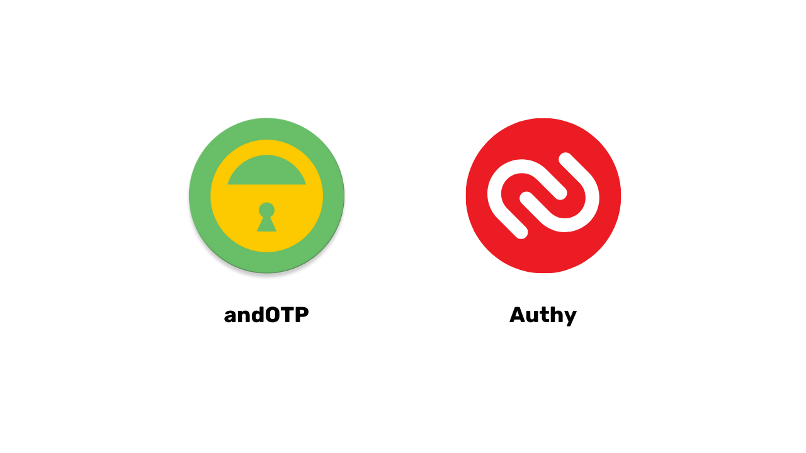
Pertanyaan tentang warisan digital dan berkabung digital menimbulkan pentingnya memiliki prosedur untuk mentransmisikan kata sandi setelah kematian seseorang. Sebuah manajer kata sandi memfasilitasi transisi ini dengan menyimpan semua rahasia digital secara aman di satu tempat. Manajer kata sandi juga memungkinkan identifikasi semua akun yang terbuka dan mengelola penutupan atau transfer mereka. Disarankan untuk menuliskan kata sandi utama di atas kertas, tetapi harus disimpan di lokasi yang tersembunyi dan aman. Jika hard drive dienkripsi dan komputer terkunci, kata sandi tidak akan dapat diakses, bahkan dalam kasus pembobolan.

### Menuju Era Pasca-Kata Sandi: Menjelajahi Alternatif yang Kredibel

Kata sandi, meskipun merajalela, memiliki banyak kelemahan, termasuk kemungkinan transmisi berisiko selama proses autentikasi. Perusahaan terkemuka seperti Microsoft dan Apple menawarkan alternatif inovatif seperti biometrik dan token perangkat keras, menunjukkan tren progresif menuju meninggalkan kata sandi.

'Passkeys, misalnya, menawarkan kunci acak terenkripsi, dikombinasikan dengan faktor lokal (biometrik atau PIN), yang dihosting oleh penyedia tetapi tetap di luar jangkauan mereka. Meskipun ini memerlukan pembaruan situs web, pendekatan ini menghilangkan kebutuhan akan kata sandi, sehingga menyediakan tingkat keamanan yang tinggi tanpa kendala yang terkait dengan kata sandi tradisional atau masalah pengelolaan brankas digital.

Passkiz adalah alternatif yang layak dan aman lainnya untuk pengelolaan kata sandi. Namun, pertanyaan besar tetap ada: ketersediaan dalam kasus kegagalan penyedia. Oleh karena itu, akan diinginkan bagi raksasa internet untuk mengusulkan sistem untuk menjamin ketersediaan ini.

Otentikasi langsung ke layanan yang relevan adalah opsi menarik untuk tidak lagi bergantung pada pihak ketiga. Namun, Single Sign-On (SSO) yang ditawarkan oleh raksasa internet juga menimbulkan masalah dalam hal ketersediaan dan risiko sensor. Untuk mencegah kebocoran data, sangat penting untuk meminimalkan jumlah informasi yang dikumpulkan selama proses autentikasi.

### Keamanan komputer: imperatif praktik aman dan risiko terkait kelalaian manusia

Keamanan komputer dapat dikompromikan oleh praktik sederhana dan penggunaan kata sandi default, seperti "admin". Serangan yang canggih tidak selalu diperlukan untuk membahayakan keamanan komputer. Sebagai contoh, kata sandi administrator dari sebuah saluran YouTube ditulis dalam kode sumber privat perusahaan. Kerentanan keamanan sering kali merupakan hasil dari kelalaian manusia.
Harus juga dicatat bahwa Internet sangat terpusat dan sebagian besar berada di bawah kontrol Amerika. Server DNS dapat menjadi subjek sensor dan sering menggunakan DNS yang menyesatkan untuk memblokir akses ke situs tertentu. DNS adalah protokol yang tua dan tidak cukup aman, yang dapat menyebabkan masalah keamanan. Protokol baru, seperti DNSsec, telah muncul tetapi masih belum banyak digunakan. Untuk menghindari sensor dan pemblokiran iklan, dimungkinkan untuk memilih penyedia DNS alternatif. Alternatif untuk iklan yang mengganggu termasuk Google DNS, OpenDNS, dan layanan independen lainnya. Protokol DNS standar membuat kueri DNS terlihat oleh penyedia layanan internet. DOH (DNS over HTTPS) dan DOT (DNS over TLS) mengenkripsi koneksi DNS, memberikan privasi dan keamanan yang lebih besar. Protokol ini banyak digunakan di perusahaan karena keamanan yang ditingkatkan dan didukung secara native oleh Windows, Android, dan iPhone. Untuk menggunakan DOH dan DOT, nama host TLS harus dimasukkan alih-alih alamat IP. Penyedia DOH dan DOT gratis tersedia secara online. DOH dan DOT meningkatkan privasi dan keamanan dengan menghindari serangan "man in the middle". Pertimbangan kunci lainnya

Sebagai bagian dari modul pelatihan "Security 101" di Découvre Bitcoin Academy, kami juga membahas autentikasi Lightning. Sistem ini menghasilkan pengenal yang berbeda untuk setiap layanan, tanpa perlu menyediakan alamat email atau informasi pribadi. Dimungkinkan untuk memiliki identitas terdesentralisasi yang dikontrol pengguna, tetapi ada kekurangan standarisasi dan normalisasi dalam proyek identitas terdesentralisasi. Manajer paket seperti Nuget dan Chocolaté, yang memungkinkan pengunduhan perangkat lunak sumber terbuka di luar Microsoft Store, direkomendasikan untuk menghindari serangan jahat. Singkatnya, DNS sangat penting untuk keamanan online, tetapi perlu untuk tetap waspada terhadap serangan potensial pada server DNS.

# Bagian Akhir

<partId>3d8ac4c9-f05b-4133-a40a-6e19d579f05f</partId>

## Ulasan & Penilaian

<chapterId>6be74d2d-2116-5386-9d92-c4c3e2103c68</chapterId>
<isCourseReview>true</isCourseReview>

## Ujian Akhir

<chapterId>a894b251-a85a-5fa4-bf2a-c2a876939b49</chapterId>
<isCourseExam>true</isCourseExam>

## Kesimpulan

<chapterId>6270ea6b-7694-4ecf-b026-42878bfc318f</chapterId>
<isCourseConclusion>true</isCourseConclusion>
