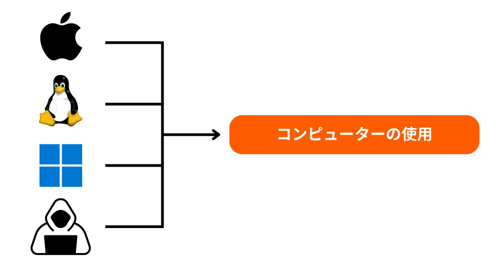
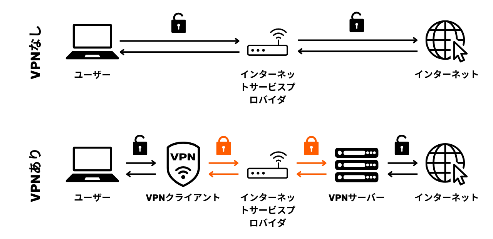
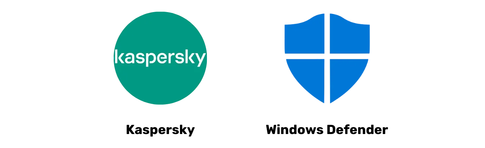

# データを守るための旅

デジタルセキュリティに特化したこの教育プログラムへようこそ。このトレーニングは、誰でもアクセスできるように設計されており、コンピュータサイエンスの事前知識は必要ありません。私たちの主な目標は、デジタル世界をより安全かつプライベートにナビゲートするために必要な知識とスキルを提供することです。

これには、安全なメールサービス、パスワードをより良く管理するツール、オンライン活動を保護するためのさまざまなソフトウェアの実装が含まれます。

このトレーニングでは、専門家、匿名性、または無敵になることを目指しているわけではありません。これは不可能です。代わりに、オンライン習慣を変え、デジタル主権を取り戻すためのシンプルでアクセスしやすい解決策を提供します。

貢献者チーム:
Muriel; デザイン
Rogzy Noury & Fabian; 制作
Théo; 貢献

+++

# 導入
<partId>534ab66c-b0e6-5757-a7dd-6ea04647edf2</partId>

## コースの紹介
<chapterId>2f3d005d-8b49-5a3f-b90d-94c11f613407</chapterId>

### 目標:セキュリティスキルを更新する！

デジタルセキュリティに特化したこの教育プログラムへようこそ。このトレーニングは、誰でもアクセスできるように設計されており、コンピュータサイエンスの事前知識は必要ありません。私たちの主な目標は、デジタル世界をより安全かつプライベートにナビゲートするために必要な知識とスキルを提供することです。

これには、安全なメールサービス、パスワードをより良く管理するツール、オンライン活動を保護するためのさまざまなソフトウェアの実装が含まれます。

このトレーニングは、3人の教授の共同努力です:

- Renaud Lifchitz, サイバーセキュリティ専門家
- Théo Pantamis, 応用数学の博士
- Rogzy, DécouvreBitcoinのCEO

デジタル衛生は、ますますデジタル化する世界で非常に重要です。ハッキングと大量監視の増加にもかかわらず、自分自身を守るための最初の一歩を踏み出すのは遅くありません。
このトレーニングでは、専門家、匿名性、または無敵になることを目指しているわけではありません。これは不可能です。代わりに、オンライン習慣を変え、デジタル主権を取り戻すためのシンプルでアクセスしやすい解決策を提供します。
もし、このテーマに関するより高度なスキルを求めている場合は、私たちのリソース、チュートリアル、または他のサイバーセキュリティトレーニングが役立ちます。それでは、次の数時間でのプログラムの簡単な概要です。

### セクション1: オンラインブラウジングについて知っておくべきすべて

- チャプター1 - オンラインブラウジング
- チャプター2 - インターネットの安全な使用

まず、ウェブブラウザを選択することの重要性と、それがセキュリティに与える影響について話し合います。次に、特にクッキー管理に関するブラウザの特性を探ります。その後、TORなどのツールを使用して、より安全で匿名のブラウジング体験を実現する方法について見ていきます。その後、データの保護を強化するためのVPNの使用に焦点を当てます。最後に、WiFi接続の安全な使用に関する推奨事項で終わります。

### セクション2: コンピュータ使用のベストプラクティス

- チャプター3 - コンピュータ使用
- チャプター4 - ハッキング & バックアップ管理
このセクションでは、コンピューターセキュリティの3つの主要な領域を取り上げます。まず、異なるオペレーティングシステム:Mac、PC、Linuxについて探求し、それぞれの特性と強みを強調します。次に、ハッキング試みに効果的に対抗し、デバイスのセキュリティを強化する方法について詳しく説明します。最後に、データの損失やランサムウェアを防ぐために、定期的にデータを保護しバックアップすることの重要性を強調します。

### セクション3:ソリューションの実装

- チャプター6 - メール管理
- チャプター7 - パスワードマネージャー
- チャプター8 - 二要素認証

この実践的な第3セクションでは、具体的なソリューションの実装に移ります。

まず、通信に不可欠であり、しばしばハッカーの標的となるメール受信箱を保護する方法を見ていきます。次に、パスワードマネージャーを紹介します。これは、パスワードを忘れたり混同したりすることなく、安全に保管するための実用的なソリューションです。最後に、アカウントに追加の保護層を加えるセキュリティ対策、二要素認証について話し合います。すべてが明確かつアクセスしやすい方法で説明されます。

# オンラインブラウジングについて知っておくべきすべて
<partId>b4b5379a-d8ef-59ae-94d3-a6e88959c149</partId>

## オンラインブラウジング
<chapterId>3a935da9-fa6e-57eb-bf85-7b3ec35e6ee2</chapterId>

インターネットを閲覧する際には、オンラインセキュリティを保護するために、特定の一般的な間違いを避けることが重要です。これらを避けるためのいくつかのヒントは以下の通りです:

### ソフトウェアのダウンロードに注意する:

公式のウェブサイトからソフトウェアをダウンロードすることを推奨します。
例:www.logicieltelechargement.fr/signalの代わりにwww.signal.org/downloadを使用してください。

また、オープンソースソフトウェアを優先することが望ましいです。これらは通常、より安全であり、悪意のあるソフトウェアから自由です。「オープンソース」ソフトウェアは、そのコードが誰にでも知られ、アクセス可能であるソフトウェアです。これにより、個人データを盗むための隠されたアクセスがないことなどを確認することができます。

> ボーナス:オープンソースソフトウェアはしばしば無料です！この大学は100%オープンソースなので、私たちのコードもGitHubでチェックできます。

### クッキー管理:エラーとベストプラクティス

クッキーは、ウェブサイトがデバイスに情報を保存するために作成するファイルです。一部のサイトではこれらのクッキーが正しく機能するために必要ですが、特に広告追跡目的で、第三者のサイトによって悪用されることもあります。GDPRなどの規制に従い、サイトが正しく機能するために不可欠なクッキーを受け入れつつ、第三者の追跡クッキーを拒否することが可能であり、推奨されます。サイトを訪れた後には、手動であれ拡張機能や特定のプログラムを通じて、関連するクッキーを削除することが賢明です。一部のブラウザーでは、クッキーを選択的に削除するオプションも提供されています。これらの予防策にもかかわらず、異なるサイトによって収集された情報が相互に関連している可能性があるため、便利さとセキュリティのバランスを見つけることが重要です。

> 注意:ブラウザにインストールされている拡張機能の数も制限して、潜在的なセキュリティおよびパフォーマンスの問題を避けてください。

### ウェブブラウザー:選択肢、セキュリティ

ブラウザーには2つの主要なファミリーがあります:ChromeベースのものとFirefoxベースのものです。
両ファミリーとも同様のセキュリティレベルを提供しますが、トラッカーのためにGoogle Chromeブラウザーの使用は避けることを推奨します。ChromiumやBraveなどのChromeの軽量代替品が好ましいかもしれません。特に内蔵の広告ブロッカーを備えたBraveが推奨されます。特定のウェブサイトにアクセスするために複数のブラウザーを使用する必要がある場合もあります。

### プライベートブラウジング、TOR、より安全で匿名のブラウジングのための他の代替手段
プライベートブラウジングは、インターネットサービスプロバイダーからのブラウジングを隠すことはできませんが、コンピューター上にローカルな痕跡を残さないようにすることができます。セッションの終了時には自動的にクッキーが削除されるため、追跡されることなくすべてのクッキーを受け入れることができます。プライベートブラウジングは、オンラインサービスを購入する際に役立ちます。なぜなら、ウェブサイトは私たちの検索習慣を追跡し、それに応じて価格を調整するからです。しかし、プライベートブラウジングは一時的で特定のセッションに推奨されるものであり、一般的なインターネットブラウジングには適していないことに注意することが重要です。

より高度な代替手段は、TOR（The Onion Router）ネットワークであり、ユーザーのIPアドレスをマスキングし、ダークネットへのアクセスを可能にすることで匿名性を提供します。TORブラウザは、TORネットワークを使用するために特別に設計されたブラウザです。これにより、従来のウェブサイトと.onionウェブサイトの両方を訪問することができます。.onionウェブサイトは通常、個人によって運営され、違法な性質を持つことがあります。

TORは合法であり、ジャーナリスト、自由活動家、検閲を逃れたいと願う権威主義国の人々によって使用されています。しかし、TORが訪問したサイトやコンピュータ自体を保護するわけではないことを理解することが重要です。さらに、データが目的地に到達する前に他の3人のコンピュータを通過するため、TORを使用するとインターネット接続が遅くなる可能性があります。また、TORは100％の匿名性を保証する万能の解決策ではなく、違法活動には使用すべきではないことに注意することが重要です。

https://planb.network/tutorials/others/tor-browser

## VPNとインターネット接続
<chapterId>5aac83f4-a685-54b0-9759-d71bea7eeed2</chapterId>

### VPN

インターネット接続を保護することは、オンラインセキュリティの重要な側面であり、仮想プライベートネットワーク（VPN）の使用は、ビジネスおよび個人ユーザーの両方にとって、このセキュリティを強化する効果的な方法です。

'VPNは、インターネット上で送信されるデータを暗号化するツールであり、接続をより安全にします。プロフェッショナルなコンテキストでは、VPNを使用することで従業員は会社の内部ネットワークに安全にリモートアクセスできます。交換されるデータは暗号化され、第三者による傍受がはるかに困難になります。内部ネットワークへの安全なアクセスを確保するだけでなく、VPNを使用することで、ユーザーは自分のインターネット接続を会社の内部ネットワークを通じてルーティングし、その接続が会社から来ているように見せることができます。これは、地理的に制限されたオンラインサービスにアクセスする際に特に便利です。

### VPNの種類

VPNには主に2つのタイプがあります:企業向けVPNと消費者向けVPN（例:NordVPN）。企業向けVPNは一般的により高価で複雑であり、消費者向けVPNは一般的によりアクセスしやすくユーザーフレンドリーです。例えば、NordVPNを使用すると、ユーザーは別の国にあるサーバーを介してインターネットに接続することができ、地理的制限を回避することができます。

しかし、消費者向けVPNを使用しても完全な匿名性は保証されません。多くのVPNプロバイダーはユーザーに関する情報を保持しており、それによって匿名性が損なわれる可能性があります。VPNはオンラインセキュリティを向上させるために役立つかもしれませんが、万能の解決策ではありません。地理的に制限されたサービスにアクセスする場合や旅行中のセキュリティを向上させる場合など、特定の特定の使用には効果的ですが、完全なセキュリティを保証するものではありません。VPNを選択する際は、人気よりも信頼性と技術性を優先することが重要です。最も少ない個人情報を収集するVPNプロバイダーが一般的に最も安全です。iVPNやMullvadのようなサービスは個人情報を収集せず、プライバシーを高めるためにBitcoinでの支払いを許可しています。

最終的に、VPNはオンライン広告をブロックするためにも使用でき、より楽しく安全なブラウジング体験を提供します。しかし、特定のニーズに最適なVPNを見つけるためには、自分自身で調査を行うことが重要です。自宅でインターネットを閲覧する際でも、セキュリティを強化するためにVPNの使用を推奨します。これにより、オンラインで交換されるデータのセキュリティレベルが高まります。最後に、訪問しようとしているサイトに実際にアクセスしていることを確認するために、URLとアドレスバーの小さな南京錠をチェックしてください。

https://planb.network/tutorials/others/ivpn

https://planb.network/tutorials/others/mullvad

### HTTPS & 公共Wi-Fiネットワーク

オンラインセキュリティに関しては、4Gは一般的に公共Wi-Fiよりも安全であることを理解することが不可欠です。しかし、4Gの使用はモバイルデータプランをすぐに使い果たす可能性があります。HTTPSプロトコルは、ウェブサイト上のデータを暗号化するための標準となっています。これにより、ユーザーとウェブサイト間で交換されるデータが安全であることが保証されます。したがって、訪問しているサイトがHTTPSプロトコルを使用しているかどうかを確認することが重要です。

欧州連合では、データ保護は一般データ保護規則（GDPR）によって規制されています。したがって、SNCFのようにユーザーの接続データを再販しない欧州のWi-Fiアクセスポイントプロバイダーを使用する方が安全です。しかし、サイトに南京錠が表示されているという事実だけでは、その真正性を保証するものではありません。サイトの公開鍵を証明書システムを使用して確認し、その真正性を確認することが重要です。データの暗号化は第三者によるデータの傍受を防ぎますが、悪意のある個人がサイトを偽装してデータを平文で転送する可能性は依然としてあります。

オンライン詐欺を避けるためには、特に拡張子とドメイン名をチェックすることで、閲覧しているサイトの身元を確認することが重要です。さらに、URL内で似たような文字を使用してユーザーを欺く詐欺師に対して警戒することが重要です。

要約すると、VPNの使用は、ビジネスユーザーと個人ユーザーの両方にとって、オンラインセキュリティを大幅に向上させることができます。さらに、良好なブラウジング習慣を実践することは、より良いデジタル衛生に貢献することができます。このコースの次のセグメントでは、アップデート、アンチウイルス、パスワード管理を含むコンピュータセキュリティについて取り上げます。

# コンピュータ使用のベストプラクティス
<partId>e6eac20b-ba24-5d9a-8d86-8e0164074457</partId>

## コンピュータの使用
<chapterId>16745632-b56b-5423-9873-ddf70fdf1efd</chapterId>

今日のデジタル世界では、私たちのコンピュータのセキュリティが大きな懸念事項です。今日は、以下の三つの重要なポイントについて取り上げます:

- コンピュータの選択
- 最適なセキュリティのためのアップデートとアンチウイルス
- コンピュータとデータのセキュリティのためのベストプラクティス

### コンピュータとオペレーティングシステムの選択

コンピュータの選択に関しては、古いコンピュータと新しいコンピュータの間にセキュリティに関する顕著な違いはありません。しかし、オペレーティングシステム間ではセキュリティの違いが存在します:Windows、Linux、Mac。

Windowsに関しては、日常的に管理者アカウントを使用しないことが推奨されますが、管理者アカウントと日常使用のための別のアカウントを作成することが望ましいです。Windowsは、そのユーザー数の多さとユーザーから管理者への切り替えの容易さのため、マルウェアにより多くさらされることがあります。一方、LinuxとMacでは脅威はあまり一般的ではありません。

オペレーティングシステムの選択は、あなたのニーズと好みに基づいて行うべきです。Linuxシステムは近年大きく進化し、ますますユーザーフレンドリーになっています。Ubuntuは、使いやすいグラフィカルインターフェイスを備えた初心者にとって興味深い代替手段です。Windowsを保持しながらLinuxを試すためにコンピュータをパーティション分割することは可能ですが、これは複雑になることがあります。専用のコンピュータ、仮想マシン、またはUSBキーを使用してLinuxやUbuntuをテストすることが、しばしば好ましいです。

### ソフトウェアアップデート
アップデートに関しては、ルールはシンプルです:**オペレーティングシステムとアプリケーションを定期的に更新することが不可欠です。**

Windows 10では、アップデートはほぼ連続しており、それらをブロックしたり遅らせたりしないことが重要です。毎年、約15,000の脆弱性が特定され、ソフトウェアを最新の状態に保つことがウイルスから保護するための重要性を強調しています。一般的に、ソフトウェアのサポートはリリース後3年から5年の間に終了するため、セキュリティを継続して享受するためには、上位バージョンへのアップグレードが必要です。

このルールはほぼすべてのソフトウェアに適用されます。実際、アップデートはあなたのマシンを古くしたり遅くしたりするためのものではなく、新しい脅威から保護するためのものです。いくつかのアップデートは重要と見なされ、それらがなければ、あなたのコンピュータは悪用の深刻なリスクにさらされます。

具体的な例を挙げると、アップデートできないクラックされたソフトウェアは二重の潜在的脅威を表します。怪しいウェブサイトからの違法ダウンロード中にウイルスが到着し、新しい形態の攻撃に対して安全でない使用が行われます。

### アンチウイルス

- アンチウイルスは必要ですか？ YES
- 支払う必要がありますか？ それは状況次第です！

アンチウイルスの選択と実装は重要です。Windows Defender、Windowsに組み込まれたアンチウイルスは、安全で効果的な解決策です。無料のソリューションとしては非常に優れており、オンラインで見つかる多くの無料ソリューションよりもはるかに優れています。実際、インターネットからダウンロードしたアンチウイルスには注意が必要で、それらは悪意のあるものであったり、時代遅れであったりする可能性があります。
有料のアンチウイルスに投資したい場合は、Kasperskyのように未知の脅威や新興の脅威を知的に分析するアンチウイルスを選択することをお勧めします。アンチウイルスのアップデートは、新しい脅威に対する保護に不可欠です。

> 注:LinuxとMacは、ユーザー権限の分離システムのおかげで、しばしばアンチウイルスが必要ありません。

最後に、コンピュータとデータのセキュリティのためのいくつかの良い習慣があります。効果的でユーザーフレンドリーなアンチウイルスを選択することが重要です。また、未知のUSBキーを挿入しないなど、コンピュータで良い習慣を採用することも重要です。これらのUSBキーには、挿入時に自動的に起動する可能性のある悪意のあるプログラムが含まれている可能性があります。USBキーを挿入した後では、チェックしても無意味です。いくつかの企業は、駐車場などのアクセス可能なエリアに不注意に残されたUSBキーのためにハッキングの被害に遭いました。

あなたのコンピュータをあなたの家のように扱ってください:警戒を怠らず、定期的に更新し、不要なファイルを削除し、セキュリティのために強力なパスワードを使用してください。盗難やデータ損失を防ぐために、ノートパソコンやスマートフォンのデータを暗号化することが重要です。WindowsのBitLocker、LinuxのLUKS、Macの組み込みオプションは、データ暗号化のための解決策です。データ暗号化を躊躇なく有効にし、パスワードを紙に書き留めて安全な場所に保管することをお勧めします。

結論として、あなたのニーズに合ったオペレーティングシステムを選択し、定期的にそれとインストールされたアプリケーションを更新することが不可欠です。また、効果的でユーザーフレンドリーなアンチウイルスを使用し、コンピュータとデータのセキュリティのための良い習慣を採用することも不可欠です。

## ハッキング＆バックアップ管理:あなたのデータを守る
<chapterId>9ddfcb6a-a253-5542-b7eb-df7222b46dc7</chapterId>

### ハッカーはどのように攻撃しますか？

自分をよく守るためには、ハッカーがどのようにしてあなたのコンピュータに侵入しようとするかを理解することが不可欠です。実際、ウイルスはしばしば魔法のように現れるわけではなく、意図せずとも私たちの行動の結果です！

一般的に、ウイルスはあなたがコンピュータにそれらを招き入れることを許可したために到着します。これは、怪しいソフトウェアのダウンロード、コンプロマイズされたトレントファイル、または単に詐欺メールのリンクをクリックすることによって視覚化することができます！
### フィッシング、詐欺メールに対する警戒心:
注意！メールは攻撃の第一の手段です。ここにいくつかのヒントがあります:

- 資格情報やパスワードなどの機密情報を抽出しようとするフィッシング試みに警戒してください。怪しいリンクをクリックしたり、送信者の正当性を確認せずに個人情報を共有したりしないでください。
- メールの添付ファイルや画像に注意してください:
  メールの添付ファイルや画像にはマルウェアが含まれている可能性があります。不明または怪しい送信者からの添付ファイルをダウンロードしたり開いたりしないでください。また、アンチウイルスが最新の状態であることを確認してください。

ここでの黄金律は、送信者のフルネームとメールの出所を慎重に確認することです。疑問がある場合は、削除してください！

### ランサムウェアとサイバー攻撃の種類:

ランサムウェアは、ユーザーデータを暗号化し、それを復号するための身代金を要求するタイプの悪意のあるソフトウェアです。このタイプの攻撃はますます一般的になっており、企業や個人にとって非常に厄介なものになり得ます。自分を守るためには、最も機密性の高いファイルのバックアップを作成することが不可欠です！これによりランサムウェアを止めることはできませんが、それを単に無視することができます。

重要なデータを定期的に外部ストレージデバイスや安全なオンラインストレージサービスにバックアップしてください。このようにして、サイバー攻撃やハードウェアの故障が発生した場合でも、重要な情報を失うことなくデータを回復することができます。

シンプルな解決策:

- 外付けハードドライブを購入し、データをそれにコピーします。それを切断し、家のどこかに保管してください。（これを2回行い、ドライブの1つを別の場所に保管することで、火災の可能性に対する保護が得られます。）

- ProtonMail Drive、Sync、またはGoogle Driveを使用して「クラウド」バックアップを作成します。単純にこのオンラインホストに機密データをアップロードしてください。ただし、データがインターネット上にあり、信頼できる第三者に保持されている可能性があることに注意してください。

### ハッカーに身代金を支払うべきか？

いいえ、ランサムウェアやその他のタイプの攻撃の場合、一般的にハッカーに支払うことは推奨されません。身代金を支払ってもデータの回復が保証されるわけではなく、サイバー犯罪者が悪意のある活動を続けることを励ます可能性があります。代わりに、予防とデータの定期的なバックアップを優先して、自分を守ってください。

コンピューターにウイルスが検出された場合は、インターネットから切断し、完全なアンチウイルススキャンを実行し、感染したファイルを削除してください。その後、ソフトウェアとオペレーティングシステムを更新し、さらなる侵入を防ぐためにパスワードを変更してください。

https://planb.network/tutorials/others/proton-drive

https://planb.network/tutorials/others/veracrypt

# 解決策の実装。
<partId>215ec902-ba05-5549-87fc-cb8d82665f7b</partId>

## メールアカウントの管理
<chapterId>dfceea33-8712-5557-ace1-6ba5598d33d8</chapterId>

### 新しいメールアカウントの設定！

メールアカウントはオンライン活動の中心点です:それが侵害されると、ハッカーは「パスワードを忘れた」機能を使ってすべてのパスワードをリセットし、多くの他のサイトにアクセスすることができます。だからこそ、それを適切に保護することが重要です。

メールアカウントは、ユニークで強力なパスワード（第7章の詳細）で作成され、理想的には2要素認証システム（第8章の詳細）を備えているべきです。

すでにメールアカウントを持っていることは皆さんも知っていますが、新しく、より現代的なものを作成して新たに始めることを検討することが重要です。

### メールプロバイダーの選択とメールアドレスの管理

オンラインアクセスのセキュリティを確保するためには、メールアドレスの適切な管理が不可欠です。安全でプライバシーを尊重するメールプロバイダーを選択することが重要です。例えば、ProtonMailは安全でプライバシーを尊重するメールサービスです。

メールプロバイダーを選択し、パスワードを作成する際には、異なるオンラインサービスで同じパスワードを再利用しないことが重要です。定期的に新しいメールアドレスを作成し、異なるメールアドレスを使用して用途を分けることが推奨されます。重要なアカウントには、セキュアなメールサービスを選択することが望ましいです。また、一部のサービスではパスワードの長さに制限があるため、この制限を認識しておくことが重要です。期間限定のアカウントに使用できる一時的なメールアドレスを作成するサービスも利用可能です。

La Poste、Arobase、Wig、Hotmailなどの古いメールプロバイダーがまだ使用されていますが、そのセキュリティ対策はGmailのようなものほど良くないかもしれないということを考慮することが重要です。そのため、一般的な通信用とアカウント回復用の2つの別々のメールアドレスを持つことが推奨されます。後者はより安全に保護されるべきです。メールアドレスを電話オペレーターやインターネットサービスプロバイダーと混同することは避けるべきです。これは攻撃のベクトルになり得ます。

### メールアカウントを変更すべきか？

Have I Been Pwned (https://haveibeenpwned.com/) のウェブサイトを使用して、メールアドレスが侵害されたかどうかを確認し、将来のデータ侵害について通知を受けることが望ましいです。ハッキングされたデータベースは、フィッシングメールを送信したり、侵害されたパスワードを再利用したりするためにハッカーによって悪用される可能性があります。

一般的に、新しい、よりセキュアなメールアドレスの使用を開始することは悪い習慣ではなく、健全な基盤で新たに始めたい場合には必要です。
ボーナスBitcoin:Bitcoin活動（取引所アカウントの作成など）のために特定のメールアドレスを作成することが望ましい場合があります。これにより、私たちの生活の活動領域を真に分離することができます。

https://planb.network/tutorials/others/proton-mail

## パスワードマネージャー
<chapterId>0b3c69b2-522c-56c8-9fb8-1562bd55930f</chapterId>

### パスワードマネージャーとは何ですか？

パスワードマネージャーは、異なるオンラインアカウントのパスワードを保存、生成、管理するためのツールです。複数のパスワードを覚える代わりに、他のすべてにアクセスするための1つのマスターパスワードだけを覚えておく必要があります。

パスワードマネージャーを使用すると、パスワードを忘れたり、どこかに書き留めたりする心配がなくなります。マスターパスワードを1つだけ覚えておく必要があります。さらに、これらのツールのほとんどは強力なパスワードを生成してくれるため、アカウントのセキュリティが強化されます。

### いくつかの人気マネージャーの違い:

- LastPass:最も人気のあるマネージャーの1つです。サードパーティのサービスであり、パスワードがそのサーバーに保存されます。無料版と有料版があり、ユーザーフレンドリーなインターフェースを提供しています。

- Dashlane:これもサードパーティのサービスで、直感的なインターフェースと、クレジットカード情報の追跡やセキュアノートなどの追加機能を提供しています。

### より多くのコントロールのためのセルフホスティング:

- Bitwarden:オープンソースのツールであり、そのコードをレビューしてセキュリティを確認することができます。Bitwardenはホステッドサービスを提供していますが、ユーザーがセルフホスティングすることも可能で、パスワードが保存される場所をコントロールでき、より多くのセキュリティとコントロールを提供する可能性があります。

- KeePass:主にセルフホスティングを意図したオープンソースソリューションです。データはデフォルトでローカルに保存されますが、希望する場合は異なる方法を使用してパスワードデータベースを同期させることができます。KeePassはそのセキュリティと柔軟性で広く認識されていますが、初心者にとってはややユーザーフレンドリーではないかもしれません。

サードパーティのサービスと自己ホスティングのサービスの選択は、技術的な快適さのレベルと、制御と便利さをどのように優先するかによって異なります。サードパーティのサービスは一般的にほとんどの人にとってより便利ですが、自己ホスティングはより多くの技術的知識を要求しますが、セキュリティの面でより多くの制御と安心を提供することができます。

### 良いパスワードとは:

一般的に良いパスワードは以下の特徴を持ちます:

- 長さ: 少なくとも12文字。
- 複雑さ: 大文字と小文字の文字、数字、記号の混合。
- ユニーク: 異なるアカウントで同じパスワードを再利用しない。
- 個人情報に基づかない: 誕生日、名前などは避ける。

アカウントのセキュリティを確保するためには、強力で安全なパスワードを作成することが重要です。パスワードの長さだけではそのセキュリティを保証するには不十分です。文字は完全にランダムでなければならず、ブルートフォース攻撃に抵抗するためです。イベントの独立性も、最も可能性の高い組み合わせを避けるために重要です。"password"のような一般的なパスワードは簡単に侵害されます。

強力なパスワードを作成するには、予測可能な単語やパターンを使用せずに、多数のランダムな文字を使用することが推奨されます。また、数字や特殊文字を含めることも不可欠です。ただし、一部のウェブサイトでは特定の特殊文字の使用を制限する場合があることに注意してください。ランダムに生成されていないパスワードは推測しやすいです。パスワードへの変更や追加は安全ではありません。ウェブサイトは、ユーザーが選択したパスワードのセキュリティを保証することはできません。

ランダムに生成されたパスワードはより高いレベルのセキュリティを提供しますが、覚えにくい可能性があります。パスワードマネージャーは、より安全なランダムパスワードを生成することができます。パスワードマネージャーを使用することで、すべてのパスワードを記憶する必要はありません。マネージャーによって生成されたものに古いパスワードを徐々に置き換えることが重要です。これらはより強力で長いからです。パスワードマネージャーのマスターパスワードも強力で安全であることを確認してください。

https://planb.network/tutorials/others/bitwarden

https://planb.network/tutorials/others/keepass

## 二要素認証
<chapterId>9391e02e-e61b-5a86-93e0-91a07f217d35</chapterId>

### 2FAを実装する理由

二要素認証（2FA）は、オンラインアカウントにアクセスしようとする人が自分の主張する人物であることを確認するために使用されるセキュリティの追加層です。ユーザー名とパスワードを入力するだけでなく、2FAは第二の検証形式を要求します。

この第二のステップには以下が含まれます:

- SMS経由で送信される一時コード。
- Google AuthenticatorやAuthyのようなアプリケーションによって生成されるコード。
- コンピュータに挿入する物理的なセキュリティキー。

2FAを使用すると、ハッカーがパスワードを入手しても、この第二の検証要素がなければアカウントにアクセスすることができません。これにより、2FAは不正アクセスからオンラインアカウントを保護するために不可欠です。

### どのオプションを選ぶべきか？

強力な認証の異なるオプションは、セキュリティレベルが異なります。

- SMSは電話番号の所持の証明のみを提供するため、最良のオプションとは考えられていません。
- 2FA（二要素認証）は、知識、所持、識別など、複数の証拠タイプを使用するため、より安全です。一回限りのパスワード（HOTPおよびTOTP）は、暗号計算を要求し、メモリではなくローカルに保存されるため、SMSよりも安全です。
- USBキーやスマートカードなどのハードウェアトークンは、各サイトごとにユニークなプライベートキーを生成し、接続を許可する前にURLを検証することで、最適なセキュリティを提供します。
最適なセキュリティと強固な認証を実現するためには、安全なメールアドレスの使用、安全なパスワードマネージャーの設定、そしてYubiKeysを使用した2FA（二要素認証）の採用が推奨されます。また、紛失や盗難に備えて、YubiKeysを2つ購入し、自宅と持ち歩く場所の両方にバックアップコピーを保管することも賢明です。
生体認証は代替手段として使用できますが、知識と所持の組み合わせに比べてセキュリティは低くなります。生体認証データは認証デバイスに留まるべきであり、オンラインで公開されるべきではありません。異なる認証方法に関連する脅威モデルを考慮し、それに応じて実践を調整することが重要です。

### トレーニングの結論:

理解したように、良好なデジタル衛生を実践することは必ずしも簡単ではありませんが、アクセス可能です！

- 新しい安全なメールアドレスの作成。
- パスワードマネージャーの設定。
- 2FAの有効化。
- 古いパスワードを徐々に2FAを使用した強力なパスワードに置き換える。

学び続け、良い実践を徐々に実装していきましょう！

黄金律:サイバーセキュリティは、あなたの学習の旅に適応する移動目標です！

https://planb.network/tutorials/others/authy

https://planb.network/tutorials/others/security-key

# 実践セクション
<partId>98ccf14b-4053-5839-878c-7a73ff02eb95</partId>

## メールボックスの設定
<chapterId>afc9ab5d-7664-5a9b-ab50-225ac9ba8f7c</chapterId>

メールボックスを保護することは、オンラインでの活動を安全にし、個人データを守るための重要なステップです。このチュートリアルでは、高いセキュリティレベルで知られ、通信のエンドツーエンド暗号化を提供するプロバイダーであるProtonMailのアカウントの作成と設定を、一歩ずつガイドします。初心者でも経験豊富なユーザーでも、ここで提案されているベストプラクティスは、ProtonMailの高度な機能を活用しながら、メールのセキュリティを強化するのに役立ちます：

https://planb.network/tutorials/others/proton-mail

## 2FAでのセキュリティ強化
<chapterId>09468ec1-95b7-56a4-a636-7618044568e1</chapterId>

二要素認証（2FA）は、オンラインアカウントを保護するために不可欠となっています。このチュートリアルでは、アカウントを保護するために6桁の動的コードを生成する2FAアプリAuthyの設定と使用方法を学びます。Authyは非常に使いやすく、複数のデバイスで同期できます。Authyのインストールと設定方法を確認し、今すぐオンラインアカウントのセキュリティを強化しましょう：

https://planb.network/tutorials/others/authy

もう一つのオプションは、物理的なセキュリティキーを使用することです。この別のチュートリアルでは、セキュリティキーを第二の認証要素として設定および使用する方法を示します：

https://planb.network/tutorials/others/security-key

## パスワードマネージャーの作成
<chapterId>ed579680-4e7b-5f65-8541-14e519a3b242</chapterId>

パスワード管理はデジタル時代の課題です。私たちは皆、多くのオンラインアカウントを保護する必要があります。パスワードマネージャーは、各アカウントのために強力でユニークなパスワードを作成し、保存するのに役立ちます。

このチュートリアルでは、オープンソースのパスワードマネージャーであるBitwardenの設定方法と、日常の使用を簡素化するためにすべてのデバイスで資格情報を同期する方法を学びます：

https://planb.network/tutorials/others/bitwarden

より上級のユーザー向けに、パスワードをローカルで管理するために使用できる別の無料かつオープンソースのソフトウェアに関するチュートリアルも提供しています：

https://planb.network/tutorials/others/keepass

## アカウントのセキュリティ強化
<chapterId>7a774b34-aed0-57dd-b8f7-cf3be51c0d70</chapterId>

この2つのチュートリアルでは、オンラインアカウントのセキュリティ確保についてもガイドし、日常的なパスワード管理のためにより安全な方法を徐々に採用する方法を説明します。

https://planb.network/tutorials/others/bitwarden

https://planb.network/tutorials/others/keepass

## バックアップの設定
<chapterId>01cfcde1-77cb-506c-8df1-fa18a2e8cc6b</chapterId>

個人ファイルを保護することも重要なポイントです。このチュートリアルでは、Proton Driveを使用して効果的なバックアップ戦略を構築する方法を紹介します。この安全なクラウドソリューションを使用して、3-2-1メソッドを適用する方法を学びましょう：データの3つのコピーを2つの異なるメディアに保存し、そのうち1つはオフサイトに保管します。これにより、機密ファイルのアクセス性とセキュリティが確保されます：

https://planb.network/tutorials/others/proton-drive

また、USBメモリや外付けハードディスクなどのリムーバブルメディアに保存されたファイルを保護するために、VeraCryptを使用してこれらのメディアを簡単に暗号化および復号化する方法も紹介します：

https://planb.network/tutorials/others/veracrypt

## ブラウザとVPNの変更
<chapterId>8dc08feb-313c-5259-a54f-64aa68a07608</chapterId>

オンラインでのプライバシー保護も、あなたの安全を確保するために考慮すべき重要なポイントです。VPNの使用はこれを達成するための第一歩となり得ます。

ビットコインで支払える信頼性の高いVPNソリューションであるIVPNとMullvadの二つをご紹介します。これらのチュートリアルでは、MullvadまたはIVPNをすべてのデバイスにインストール、設定、および使用する方法をご案内します：

https://planb.network/tutorials/others/ivpn

https://planb.network/tutorials/others/mullvad

また、オンラインでのプライバシーを保護するために特別に設計されたブラウザであるTor Browserの使用方法についても学びましょう：

https://planb.network/tutorials/others/tor-browser

# より深く掘り下げる
<partId>77113cad-a6d8-57e5-b903-50c223b277ba</partId>

## サイバーセキュリティ業界での働き方
<chapterId>aad1ae27-4280-5b07-b9ab-118ae013951a</chapterId>

### サイバーセキュリティ:無限の機会を持つ成長分野

システムやデータの保護に情熱を持っているなら、サイバーセキュリティ分野は多くの機会を提供します。この業界に興味がある場合、以下はあなたを導くいくつかの重要なステップです。

### 学術的基盤と認定:

コンピュータサイエンス、情報システム、または関連分野でのしっかりとした教育は、理想的な出発点となることが多いです。これらの学習は、サイバーセキュリティの技術的な課題を理解するために必要な基盤を提供します。この教育を補完するために、分野で認められた認定を取得することが賢明です。これらの認定は地域によって異なる場合がありますが、CISSPやCEHなど、世界的に認識されているものもあります。

サイバーセキュリティは広大で絶えず進化する分野です。重要なツールや異なるシステムに慣れ親しむことが重要です。さらに、インシデント対応から倫理的ハッキングまで、多くのサブドメインがあるため、自分のニッチを見つけて専門化することが有益です。

### 実践経験を積む:

実践経験の重要性は過小評価できません。サイバーセキュリティチームを持つ企業でのインターンシップやジュニアポジションを求めることは、理論的な知識を適用する絶好の方法です。さらに、倫理的ハッキングコンペティションやサイバーセキュリティシミュレーションに参加することで、実際の状況でのスキルを磨くことができます。

専門家ネットワークの強さは計り知れません。専門家協会、ハッカースペース、またはオンラインフォーラムへの参加は、他の専門家とアイデアを交換するプラットフォームを提供します。同様に、サイバーセキュリティ会議やワークショップに参加することは、学ぶだけでなく、業界の専門家とのつながりを築くのにも役立ちます。

脅威の絶え間ない進化には、ニュースや専門フォーラムの定期的な監視が必要です。信頼が最も重要なセクターであるため、キャリアのあらゆる段階で倫理と誠実さを持って行動することが不可欠です。

### 深めるべきスキルとツール:

- サイバーセキュリティツール:Wireshark、Metasploit、Nmap。
- オペレーティングシステム:Linux、Windows、MacOS。
- プログラミング言語:Python、C、Java。
- ネットワーク:TCP/IP、VPN、ファイアウォール。
- データベース:SQL、NoSQL。
- 暗号化:SSL/TLS、対称/非対称暗号化。
- インシデント管理:ログ分析、インシデント対応。
- 倫理的ハッキング:侵入技術、侵入テスト。
- ガバナンス:ISO標準、GDPR/CCPA規制。

これらのスキルとツールを習得することで、サイバーセキュリティの世界を成功裏に航海するために十分な装備が整います。

## レノーとのインタビュー
<chapterId>7d83fd98-ce22-514e-b9e8-729fbf71ee6e</chapterId>

### 効率的なパスワード管理と認証強化:学術的アプローチ
Découvre Bitcoinのアカデミーで提供されているトレーニングモジュール「セキュリティ101」では、パスワードマネージャーの重要性について議論しました。考慮すべき3つの次元があります:パスワードの作成、更新、およびウェブサイトへの実装です。
一般的に、自動パスワード入力のためのブラウザ拡張機能の使用は推奨されません。これらのツールは、ユーザーをフィッシング攻撃に対してより脆弱にする可能性があります。サイバーセキュリティの認定専門家であるRenaudは、KeePassを使用した手動管理を好みます。これには、パスワードを手動でコピー＆ペーストする作業が含まれます。拡張機能は攻撃面を増加させる傾向があり、ブラウザのパフォーマンスを低下させる可能性があり、したがって重大なリスクを提示します。したがって、ブラウザ上での拡張機能の最小限の使用が推奨される実践です。

パスワードマネージャーは一般的に、2要素認証などの追加の認証要素の使用を奨励します。最適なセキュリティのためには、モバイルデバイス上でOTP（ワンタイムパスワード）を保持することが望ましいです。AndoTPは、電話上でOTPコードを生成および保存するためのオープンソースソリューションを提供します。Google Authenticatorは認証コードのシードをエクスポートすることを可能にしますが、Googleアカウントへのバックアップに対する信頼は限定的です。したがって、OTIおよびAndoTPアプリケーションは、自律的なOTP管理のために推奨されます。

デジタル相続とデジタル喪に関する問題は、人の死後にパスワードを伝達する手順を持つことの重要性を高めます。パスワードマネージャーは、すべてのデジタルシークレットを一か所で安全に保管することにより、この移行を容易にします。パスワードマネージャーはまた、すべてのオープンアカウントを特定し、それらの閉鎖または移行を管理することを可能にします。マスターパスワードを紙に書き留めることが推奨されますが、それは隠された安全な場所に保管されるべきです。ハードドライブが暗号化され、コンピュータがロックされている場合、盗難の場合でもパスワードはアクセス不可能です。

### パスワードポスト時代に向けて:信頼できる代替手段の探求

パスワードは広く使用されていますが、認証プロセス中のリスクのある伝送の可能性を含む多くの欠点があります。MicrosoftやAppleなどの主要企業は、生体認証やハードウェアトークンなどの革新的な代替手段を提供しており、パスワードを放棄する方向への進行的な傾向を示しています。

例えば、「Passkeys」は、ローカルファクター（生体認証またはPIN）と組み合わされた暗号化されたランダムキーを提供し、プロバイダーによってホストされますが、彼らの手の届かないところに残ります。これにはウェブサイトの更新が必要ですが、パスワードの必要性を排除し、従来のパスワードやデジタルセーフの管理に関連する制約や問題なしに高いレベルのセキュリティを提供するアプローチです。

Passkizは、パスワード管理のための別の実行可能で安全な代替手段です。しかし、プロバイダーの障害の場合の利用可能性に関する大きな疑問が残ります。したがって、インターネットの巨人がこの利用可能性を保証するシステムを提案することが望ましいでしょう。

関連するサービスへの直接認証は、第三者に依存しなくなるという面で興味深いオプションです。しかし、インターネットの巨人が提供するシングルサインオン（SSO）も、利用可能性と検閲のリスクの面で問題を抱えています。データ漏洩を防ぐためには、認証プロセス中に収集される情報の量を最小限に抑えることが重要です。

### コンピュータセキュリティ:安全な実践の必須事項と人間の過失に関連するリスク

コンピュータセキュリティは、「admin」のようなデフォルトパスワードの使用や単純な実践によって危険にさらされることがあります。複雑な攻撃が常にコンピュータセキュリティを危険にさらすわけではありません。例えば、YouTubeチャンネルの管理者パスワードが、ある会社のプライベートソースコードに書かれていました。セキュリティの脆弱性は、しばしば人間の過失の結果です。
インターネットは非常に集中化されており、大部分がアメリカの管理下にあるということに留意する必要があります。DNSサーバーは検閲の対象となることがあり、特定のサイトへのアクセスをブロックするために欺瞞的なDNSを頻繁に使用します。DNSは古く、十分に安全ではないプロトコルであり、セキュリティ問題につながる可能性があります。DNSsecのような新しいプロトコルが登場していますが、まだ広く使用されていません。検閲や広告ブロックを回避するために、代替のDNSプロバイダーを選択することが可能です。
侵入的な広告の代替手段には、Google DNS、OpenDNS、その他の独立したサービスが含まれます。標準のDNSプロトコルでは、DNSクエリがインターネットサービスプロバイダーに見える状態になります。DOH（DNS over HTTPS）とDOT（DNS over TLS）はDNS接続を暗号化し、より高いプライバシーとセキュリティを提供します。これらのプロトコルは、強化されたセキュリティのために企業で広く使用されており、Windows、Android、iPhoneにネイティブでサポートされています。DOHとDOTを使用するには、IPアドレスの代わりにTLSホスト名を入力する必要があります。無料のDOHとDOTプロバイダーはオンラインで利用可能です。DOHとDOTは「中間者攻撃」を避けることでプライバシーとセキュリティを向上させます。その他の重要な考慮事項

"Découvre Bitcoin Academy"の「セキュリティ101」トレーニングモジュールの一環として、Lightning認証についても議論しました。このシステムは、メールアドレスや個人情報を提供する必要なく、各サービスに異なる識別子を生成します。ユーザーが制御する分散型アイデンティティが可能ですが、分散型アイデンティティプロジェクトには標準化と正規化が不足しています。Microsoft Storeの外でオープンソースソフトウェアをダウンロードすることを可能にするパッケージマネージャー、例えばNugetやChocolatéは、悪意のある攻撃を避けるために推奨されます。要約すると、DNSはオンラインセキュリティにとって重要ですが、DNSサーバーに対する潜在的な攻撃に対して警戒を続ける必要があります。

## コースを評価してください
<chapterId>6be74d2d-2116-5386-9d92-c4c3e2103c68</chapterId>
<isCourseReview>true</isCourseReview>

## 最終試験
<chapterId>a894b251-a85a-5fa4-bf2a-c2a876939b49</chapterId>
<isCourseExam>true</isCourseExam>

## 謝辞とさらに深く掘り下げる
<chapterId>df3a962a-a96e-5006-b904-0dd9d4a072dd</chapterId>

### トレーニングを評価して、私たちをサポートしてください

このコースとこのアカデミーのすべてのコンテンツは、私たちのコミュニティによって無料で提供されています。私たちをサポートするために、他の人と共有したり、アカデミーのメンバーになったり、GitHubを通じてその開発に貢献することができます。全チームを代表して、ありがとうございます！

トレーニングの評価システムは、この新しいeラーニングプラットフォームに間もなく統合されます！その間、コースを受講していただき、ありがとうございます。楽しんでいただけた場合は、他の人と共有することを検討してください。

### さらに進む

このSECU 101トレーニングを完了したことをお祝いします！楽しんでいただけたことを心から願っており、あなたにとって扉が開かれたことを願っています。これで、最初のビットコインを手に入れる準備ができたり、レベル2のコースで冒険を続けたりすることができます！

- BTC 101はビットコインの理論的基礎を提供します
- BTC 102はあなたのビットコインプランを設定するのに役立ちます
- LN 201と202は、第二層の支払いネットワークであるLightning Networkを紹介します
- ECON 201はオーストリア経済をカバーします
- MINING 201はマイニングについてもっと学ぶために
- （その他多数）

Patreon、メンバー、寄付者の皆様による財政的なサポート、共有してくださる皆様、そしてこのトレーニングを可能にした皆様、Théo pantamis、Renaud、Théo、Fabien、Noury、Muriel & 全チームに心からの感謝を申し上げます。
またお会いしましょう！
