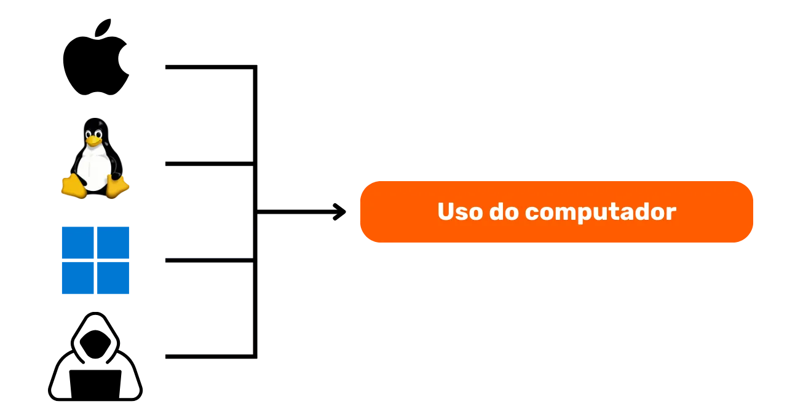

# Uma jornada para proteger seus dados

Bem-vindos a todos a este programa de ensino dedicado à segurança digital. Este treinamento foi projetado para ser acessível a todos, portanto, nenhum conhecimento prévio em informática é necessário. Nosso objetivo principal é fornecer a você o conhecimento e as habilidades necessárias para navegar de forma mais segura e privada no mundo digital.

Isso será alcançado por meio da implementação de várias ferramentas, como uma caixa de correio segura, uma ferramenta para gerenciar melhor suas senhas e vários softwares para proteger suas atividades diárias online.

Neste treinamento, não buscamos torná-lo um especialista, anônimo ou invulnerável, pois isso é impossível. Em vez disso, oferecemos algumas soluções simples e acessíveis a todos para começar a transformar seus hábitos online e retomar o controle de sua soberania digital.

Equipe de contribuidores:
Muriel; Design
Rogzy Noury & Fabian; Produção
Théo; Contribuição

+++

# Introdução
<partId>534ab66c-b0e6-5757-a7dd-6ea04647edf2</partId>

## Introdução ao curso
<chapterId>2f3d005d-8b49-5a3f-b90d-94c11f613407</chapterId>

### Objetivo: atualização!

Bem-vindos a todos a este programa de ensino dedicado à segurança digital. Este treinamento foi projetado para ser acessível a todos, portanto, nenhum conhecimento prévio em informática é necessário. Nosso objetivo principal é fornecer a você o conhecimento e as habilidades necessárias para navegar de forma mais segura e privada no mundo digital.

Isso será alcançado por meio da implementação de várias ferramentas, como uma caixa de correio segura, uma ferramenta para gerenciar melhor suas senhas e vários softwares para proteger suas atividades diárias online.

Este treinamento é um esforço conjunto de três de nossos professores:

- Renaud Lifchitz, especialista em cibersegurança
- Théo Pantamis, doutor em matemática aplicada
- Rogzy, CEO da DécouvreBitcoin

Sua higiene digital é crucial em um mundo cada vez mais digital. Apesar do aumento constante no número de ataques cibernéticos e vigilância em massa, ainda não é tarde demais para dar o primeiro passo e se proteger.
'Dans esta formação, não estamos buscando torná-lo um especialista, anônimo ou inatacável, isso é impossível. Em vez disso, oferecemos algumas soluções simples e acessíveis a todos para começar a transformar seus hábitos online e retomar o controle de sua soberania digital.
Se você estiver procurando por habilidades mais avançadas sobre o assunto, nossos recursos, tutoriais ou outros cursos sobre cibersegurança estão disponíveis para você. Enquanto isso, aqui está uma breve visão geral do nosso programa nas próximas horas juntos.

### Seção 1: Tudo sobre navegação online

- Capítulo 1 - Navegação online
- Capítulo 2 - Usar a internet com segurança

Para começar, discutiremos a importância da escolha de um navegador da web e suas implicações em termos de segurança. Em seguida, exploraremos as especificidades dos navegadores, especialmente no que diz respeito à gestão de cookies. Também veremos como garantir uma navegação mais segura e anônima, usando ferramentas como o TOR. Em seguida, daremos ênfase ao uso de VPNs para fortalecer a proteção de seus dados. Por fim, terminaremos com recomendações sobre o uso seguro de conexões WiFi.

### Seção 2: Boas práticas de uso do computador

- Capítulo 3 - Uso do computador
- Capítulo 4 - Hack e gerenciamento de backup

Nesta seção, abordaremos três áreas-chave da segurança da informática. Primeiro, exploraremos os diferentes sistemas operacionais: Mac, PC e Linux, destacando suas especificidades e pontos fortes. Em seguida, abordaremos métodos para se proteger efetivamente contra tentativas de hacking e fortalecer a segurança de seus dispositivos. Por fim, daremos ênfase à importância de proteger e fazer backup regularmente de seus dados para evitar perdas ou ransomware.

### Seção 3: Implementação das soluções.

- Capítulo 6 - Gerenciamento de e-mails
- Capítulo 7 - Gerenciador de senhas
- Capítulo 8 - Autenticação de dois fatores

Nesta terceira seção prática, vamos colocar em prática suas soluções concretas.

Primeiro, veremos como proteger sua caixa de e-mails, essencial para suas comunicações e frequentemente alvo de hackers. Em seguida, apresentaremos o que é um gerenciador de senhas: uma solução prática para não esquecer ou misturar suas senhas, mantendo-as seguras. Por fim, abordaremos uma medida de segurança adicional, a autenticação de dois fatores, que adiciona uma camada de proteção às suas contas. Tudo será explicado de forma clara e acessível.

# Tudo sobre navegação online
<partId>b4b5379a-d8ef-59ae-94d3-a6e88959c149</partId>

## Navegação online
<chapterId>3a935da9-fa6e-57eb-bf85-7b3ec35e6ee2</chapterId>

Ao navegar na internet, é importante evitar alguns erros comuns para preservar sua segurança online. Aqui estão algumas dicas para evitá-los:

### Cuidado com o download de softwares:

Recomenda-se baixar softwares do site oficial do desenvolvedor em vez de sites genéricos.
Exemplo: Utilizar www.signal.org/download e não www.logicieltelechargement.fr/signal.

Também é aconselhável dar preferência a softwares de código aberto, pois eles geralmente são mais seguros e livres de softwares maliciosos. Um software "open-source" ou aberto é um software cujo código é conhecido e acessível por todos. Portanto, é possível verificar, entre outras coisas, se não há acesso oculto para roubar seus dados pessoais.

> Bônus: softwares de código aberto geralmente são gratuitos! Esta universidade é 100% open source, então você também pode verificar nosso código através do nosso GitHub.

### Gerenciamento de cookies: Erros e boas práticas

Cookies são arquivos criados por sites para armazenar informações em seu dispositivo. Embora alguns sites exijam esses cookies para funcionar corretamente, eles também podem ser explorados por sites de terceiros, especialmente para fins de rastreamento publicitário. De acordo com regulamentações como o GDPR, é possível - e recomendado - recusar cookies de rastreamento de terceiros, ao mesmo tempo em que se aceita aqueles que são essenciais para o bom funcionamento do site. Após cada visita a um site, é prudente excluir os cookies associados a ele, seja manualmente, seja por meio de uma extensão ou programa específico. Alguns navegadores também oferecem a opção de fazer essa exclusão seletivamente. Apesar dessas precauções, é crucial entender que as informações coletadas por diferentes sites podem permanecer interconectadas, daí a importância de encontrar um equilíbrio entre praticidade e segurança.

> Observação: Limite também o número de extensões instaladas em seu navegador para evitar possíveis problemas de segurança e desempenho.

### Navegadores web: escolha, segurança

Existem duas grandes famílias de navegadores: aqueles baseados no Chrome e aqueles baseados no Firefox.
Embora ambas as famílias ofereçam um nível de segurança semelhante, é recomendado evitar o navegador Chrome do Google devido aos seus rastreadores. Alternativas mais leves do Chrome, como o Chromium ou o Brave, podem ser preferidas. O Brave é especialmente recomendado por seu bloqueador de anúncios integrado. Pode ser necessário usar vários navegadores para acessar alguns sites.

### Navegação privada, TOR e outras alternativas para uma navegação mais segura e anônima

A navegação privada, embora não oculte a navegação do seu provedor de serviços de Internet, permite não deixar rastros locais no seu computador. Os cookies são automaticamente excluídos no final de cada sessão, permitindo aceitar todos os cookies sem ser rastreado. A navegação privada pode ser útil ao comprar serviços online, pois os sites acompanham nossos hábitos de pesquisa e ajustam os preços de acordo. No entanto, é importante observar que a navegação privada é recomendada para sessões temporárias e específicas, e não para uso geral na navegação na Internet.

Uma alternativa mais avançada é a rede TOR (The Onion Router), que oferece anonimato ao mascarar o endereço IP do usuário e permitir o acesso à Darknet. O navegador TOR é um navegador especialmente projetado para usar a rede TOR. Ele permite visitar tanto sites convencionais quanto sites .onion, que geralmente são operados por indivíduos e podem ter natureza ilegal.

O TOR é legal e é usado por jornalistas, ativistas da liberdade e outras pessoas que desejam escapar da censura em países autoritários. No entanto, é importante entender que o TOR não protege os sites visitados nem o próprio computador. Além disso, o uso do TOR pode diminuir a velocidade da conexão com a Internet, pois os dados passam pelos computadores de outras três pessoas antes de chegar ao destino. Também é essencial observar que o TOR não é uma solução infalível para garantir 100% de anonimato e não deve ser usado para atividades ilegais.

https://planb.network/tutorials/others/tor-browser

## VPN e conexão com a internet
<chapterId>5aac83f4-a685-54b0-9759-d71bea7eeed2</chapterId>

### VPNs

A proteção da sua conexão com a internet é um aspecto crucial da segurança online, e o uso de redes virtuais privadas (VPNs) é um método eficaz para melhorar essa segurança, tanto para empresas quanto para usuários individuais.
Os VPNs são ferramentas que criptografam os dados transmitidos pela internet, tornando a conexão mais segura. Em um contexto profissional, os VPNs permitem que os funcionários acessem remotamente a rede interna da empresa de forma segura. Os dados trocados são criptografados, tornando sua interceptação por terceiros muito mais difícil. Além de garantir o acesso a uma rede interna, o uso de um VPN pode permitir que um usuário faça sua conexão com a internet passar pela rede interna da empresa, dando a impressão de que sua conexão vem da empresa. Isso pode ser especialmente útil para acessar serviços online que são geograficamente restritos.

### Tipos de VPN

Existem dois tipos principais de VPN: VPNs corporativos e VPNs públicos, como o NordVPN. Os VPNs corporativos tendem a ser mais caros e complexos, enquanto os VPNs públicos geralmente são mais acessíveis e fáceis de usar. O NordVPN, por exemplo, permite que os usuários se conectem à internet através de um servidor localizado em outro país, o que pode contornar restrições geográficas.

No entanto, o uso de um VPN público não garante anonimato completo. Muitos provedores de VPN mantêm informações sobre seus usuários, o que pode comprometer sua anonimidade. Embora os VPNs possam ser úteis para melhorar a segurança online, eles não são uma solução universal. Eles são eficazes para alguns usos específicos, como o acesso a serviços geograficamente limitados ou a melhoria da segurança em movimento, mas não garantem segurança total. Ao escolher um VPN, é essencial priorizar a confiabilidade e a tecnicalidade em vez da popularidade. Os provedores de VPN que coletam menos informações pessoais geralmente são os mais seguros. Serviços como iVPN e Mullvad não coletam informações pessoais e até permitem pagamentos em Bitcoin para maior privacidade.

Por fim, um VPN também pode ser usado para bloquear anúncios online, oferecendo uma experiência de navegação mais agradável e segura. No entanto, é importante fazer sua própria pesquisa para encontrar o VPN mais adequado às suas necessidades específicas. O uso de um VPN é recomendado para reforçar a segurança, mesmo ao navegar na internet em casa. Isso ajuda a garantir um nível mais alto de segurança para os dados trocados online. Por fim, certifique-se de verificar os URLs e o pequeno cadeado na barra de endereço para confirmar que você está no site que pensa estar visitando.

https://planb.network/tutorials/others/ivpn

https://planb.network/tutorials/others/mullvad

### HTTPS e redes Wi-Fi públicas

Em termos de segurança online, é essencial entender que a 4G geralmente é mais segura do que o Wi-Fi público. No entanto, o uso da 4G pode esgotar rapidamente o seu pacote de dados móveis. O protocolo HTTPS se tornou o padrão para criptografar dados em sites. Ele garante que os dados trocados entre o usuário e o site estejam seguros. Portanto, é crucial verificar se o site que você está visitando está usando o protocolo HTTPS.

Na União Europeia, a proteção de dados é regulamentada pelo Regulamento Geral de Proteção de Dados (RGPD). Portanto, é mais seguro usar provedores europeus de pontos de acesso Wi-Fi, como a SNCF, que não revendem os dados de conexão dos usuários. No entanto, o simples fato de um site exibir um cadeado não garante sua autenticidade. É importante verificar a chave pública do site usando um sistema de certificados para confirmar sua autenticidade. Embora a criptografia de dados impeça que terceiros interceptem os dados trocados, ainda é possível para um indivíduo mal-intencionado se passar pelo site e transferir os dados em texto claro.

Para evitar golpes online, é crucial verificar a identidade do site em que você está navegando, verificando especialmente a extensão e o nome de domínio. Além disso, esteja atento a golpistas que usam letras semelhantes nas URLs para enganar os usuários.

Em resumo, o uso de VPN pode melhorar significativamente a segurança online, tanto para empresas quanto para usuários individuais. Além disso, a adoção de boas práticas de navegação pode contribuir para uma melhor higiene digital. No próximo segmento deste curso, abordaremos a segurança do computador, incluindo atualizações, antivírus e gerenciamento de senhas.

# Boas práticas de uso do computador
<partId>e6eac20b-ba24-5d9a-8d86-8e0164074457</partId>

## Uso do computador
<chapterId>16745632-b56b-5423-9873-ddf70fdf1efd</chapterId>

A segurança de nossos computadores é uma questão importante no mundo digital atual. Hoje, abordaremos três pontos-chave:

- a escolha do computador
- atualizações e antivírus para uma segurança ideal
- boas práticas para a segurança do seu computador e dados.

### A escolha do computador e do sistema operacional

Em relação à escolha do computador, não há diferença significativa de segurança entre computadores antigos e novos. No entanto, existem diferenças de segurança entre os sistemas operacionais: Windows, Linux e Mac.

'No que diz respeito ao Windows, é recomendado não usar uma conta de administrador no dia a dia, mas sim criar duas contas separadas: uma conta de administrador e uma conta para uso diário. O Windows é frequentemente mais exposto a softwares maliciosos devido ao grande número de usuários e à facilidade de alternar entre usuário e administrador. Por outro lado, as ameaças são menos comuns no Linux e no Mac.

A escolha do sistema operacional deve ser feita com base em suas necessidades e preferências. Os sistemas Linux evoluíram consideravelmente nos últimos anos, tornando-se cada vez mais amigáveis. O Ubuntu é uma alternativa interessante para iniciantes, com uma interface gráfica fácil de usar. É possível particionar um computador para experimentar o Linux enquanto mantém o Windows, mas isso pode ser complicado. Geralmente, é melhor ter um computador dedicado, uma máquina virtual ou um pendrive USB para testar o Linux ou o Ubuntu.

### Atualização de software

No que diz respeito às atualizações, a regra é simples: **a atualização regular do sistema operacional e dos aplicativos é primordial.**

No Windows 10, as atualizações são quase contínuas e é crucial não bloqueá-las ou atrasá-las. Aproximadamente 15.000 vulnerabilidades são identificadas a cada ano, o que destaca a importância de manter o software atualizado para se proteger contra vírus. Em geral, o suporte ao software termina entre 3 e 5 anos após o lançamento, portanto, é necessário atualizar para a versão mais recente para continuar a ter segurança.

A regra se aplica à maioria dos softwares. Na verdade, as atualizações não têm como objetivo tornar seu computador obsoleto ou lento, mas sim protegê-lo contra novas ameaças. Algumas atualizações são consideradas importantes e, sem elas, seu computador corre sérios riscos de exploração.

Para lhe dar um exemplo concreto de erro: um software crackeado que não pode ser atualizado representa uma dupla ameaça potencial. A chegada do vírus durante o download ilegal em um site suspeito e o uso não seguro diante das novas formas de ataque.

### Antivírus

- Você precisa de um antivírus? SIM
- Você precisa pagar? Depende!

A escolha e a implementação de um antivírus são importantes. O Windows Defender, o antivírus integrado ao Windows, é uma solução segura e eficaz. Para uma solução gratuita, ele é extremamente bom e muito melhor do que muitas soluções gratuitas encontradas online. De fato, é necessário ter cuidado com os antivírus baixados da Internet, que podem ser maliciosos ou desatualizados.'
Pour aqueles que desejam investir em um antivírus pago, é recomendado escolher um antivírus que analise inteligentemente ameaças desconhecidas e emergentes, como o Kaspersky. As atualizações do antivírus são essenciais para se proteger contra novas ameaças.

Observação: Linux e Mac, graças ao seu sistema de separação de direitos de usuário, muitas vezes não precisam de antivírus.

Por fim, aqui estão algumas boas práticas para a segurança do seu computador e dados. É importante escolher um antivírus eficaz e fácil de usar. Também é crucial adotar boas práticas no seu computador, como não inserir pen drives desconhecidos ou encontrados em lugares suspeitos. Esses pen drives podem conter programas maliciosos que podem ser executados automaticamente quando inseridos. O controle do pen drive não servirá para nada depois de inserido. Algumas empresas foram vítimas de hackers devido a pen drives deixados descuidadamente em áreas acessíveis, como um estacionamento.

Trate o seu computador como faria com a sua casa: fique atento, faça atualizações regularmente, exclua arquivos desnecessários e use uma senha forte para segurança. É crucial criptografar dados em laptops e smartphones para evitar roubo ou perda de dados. BitLocker para Windows, LUKS para Linux e a opção integrada para Mac são soluções para criptografia de dados. É recomendado ativar a criptografia de dados sem hesitação e anotar a senha em um papel para guardar em local seguro.

Em conclusão, é fundamental optar por um sistema operacional adequado às suas necessidades e atualizá-lo regularmente, assim como os aplicativos instalados nele. Também é essencial usar um antivírus eficaz e fácil de usar, e adotar boas práticas para a segurança do seu computador e dados.

## Hack e gerenciamento de backup: protegendo seus dados
<chapterId>9ddfcb6a-a253-5542-b7eb-df7222b46dc7</chapterId>

### Como os hackers atacam?

Para se proteger adequadamente, é fundamental entender como os hackers tentam infiltrar seu computador. Na verdade, os vírus não aparecem do nada, mas são mais frequentemente consequências de nossas ações, mesmo que involuntárias!

Em geral, os vírus chegam porque você permitiu que seu computador os convidasse para entrar. Isso pode acontecer ao baixar um software suspeito, um arquivo torrent comprometido ou simplesmente ao clicar no link de um e-mail fraudulento!

### Phishing, atenção aos e-mails fraudulentos:

Atenção! Os e-mails são o primeiro vetor de ataque, aqui estão algumas dicas:

- Mantenha-se atento a tentativas de phishing que visam obter informações sensíveis, como suas credenciais e senhas. Evite clicar em links suspeitos e compartilhar suas informações pessoais sem verificar a legitimidade do remetente.
- Tenha cuidado com anexos e imagens em e-mails:
  Anexos e imagens em e-mails podem conter malware. Não faça download nem abra anexos de remetentes desconhecidos ou suspeitos, e certifique-se de que seu antivírus esteja atualizado.

A regra de ouro aqui é verificar cuidadosamente o nome completo do remetente e a origem do e-mail. Em caso de dúvida, exclua!

### Ransomware e tipos de ataques cibernéticos:

O ransomware é um tipo de malware que criptografa os dados do usuário e exige um resgate para descriptografá-los. Esse tipo de ataque está se tornando cada vez mais comum e pode ser muito problemático para uma empresa ou indivíduo. Para se proteger, é imperativo criar backups dos arquivos mais sensíveis! Isso não vai parar o ransomware, mas permitirá que você simplesmente o ignore.

Faça backup regularmente de seus dados importantes em um dispositivo externo ou em um serviço de armazenamento online seguro. Assim, em caso de ataque cibernético ou falha de hardware, você poderá recuperar seus dados sem perder informações cruciais.

Solução simples:

- Compre um disco rígido externo e copie seus dados para ele. Desconecte-o e guarde-o em algum lugar seguro em sua casa. (Fazer isso duas vezes e armazenar um dos discos em outro local ajuda a se proteger contra um possível incêndio.)

- Crie um backup "na nuvem" usando o ProtonMail Drive, Sync ou até mesmo o Google Drive. Basta fazer upload de seus dados sensíveis para esse serviço de hospedagem online. No entanto, tenha cuidado; seus dados estarão potencialmente na internet e serão mantidos por terceiros confiáveis.

### Deve-se pagar aos hackers?

NÃO, geralmente é desaconselhável pagar aos hackers em caso de ransomware ou outros tipos de ataques. Pagar o resgate não garante a recuperação de seus dados e pode encorajar os cibercriminosos a continuar suas atividades maliciosas. É melhor priorizar a prevenção e fazer backups regulares de seus dados para se proteger.

Se você detectar um vírus em seu computador, desconecte-o da internet, faça uma análise antivírus completa e exclua os arquivos infectados. Em seguida, atualize seus softwares e sistema operacional e altere suas senhas para evitar outras intrusões.

https://planb.network/tutorials/others/proton-drive

https://planb.network/tutorials/others/veracrypt

# Implementação das soluções.
<partId>215ec902-ba05-5549-87fc-cb8d82665f7b</partId>

## Gerenciamento de caixas de e-mail
<chapterId>dfceea33-8712-5557-ace1-6ba5598d33d8</chapterId>

### Configurar uma nova caixa de correio eletrónico!

A caixa de correio é o ponto central da sua atividade online: se for comprometida, um hacker pode utilizá-la para recriar todas as suas palavras-passe através da função "palavra-passe esquecida" e, assim, obter acesso a muitos outros sites. É por isso que é necessário mantê-la segura.

Uma caixa de correio deve, portanto, ser configurada com uma palavra-passe única e forte (detalhes no Capítulo 7) e, idealmente, com um sistema de autenticação de dois factores (detalhes no Capítulo 8).

Embora todos nós já tenhamos uma caixa de correio, é importante considerar a criação de uma nova e mais moderna, para começar bem.

### Escolher um fornecedor de correio eletrónico e gerir endereços de correio eletrónico

A gestão adequada dos nossos endereços de correio eletrónico é crucial para garantir a segurança do nosso acesso em linha. É importante escolher um fornecedor de correio eletrónico seguro que respeite a privacidade. Por exemplo, o ProtonMail é um serviço de correio eletrónico seguro que respeita a privacidade.

Ao escolher um fornecedor de correio eletrónico e ao criar uma palavra-passe, é essencial nunca reutilizar a mesma palavra-passe para diferentes serviços em linha. É aconselhável criar regularmente novos endereços de correio eletrónico e separar as utilizações através de endereços de correio eletrónico diferentes. É preferível optar por um serviço de correio eletrónico seguro para contas críticas. É também de salientar que alguns serviços limitam o comprimento das palavras-passe, pelo que é importante estar ciente desta limitação. Também estão disponíveis serviços para criar endereços de correio eletrónico temporários, que podem ser utilizados para contas com uma duração limitada.

É importante ter em conta que os fornecedores de correio eletrónico mais antigos, como La Poste, Arobase, Wig e Hotmail, ainda são utilizados, mas as suas práticas de segurança podem não ser tão boas como as do Gmail. Por conseguinte, é aconselhável ter dois endereços de correio eletrónico distintos, um para comunicações gerais e outro para recuperação de conta, sendo este último mais seguro. É melhor evitar misturar o seu endereço de correio eletrónico com o do seu operador telefónico ou fornecedor de serviços de Internet, uma vez que este pode ser um vetor de ataque.

### Devo mudar a minha caixa de correio eletrónico?

É aconselhável utilizar o sítio Web Have I Been Pwned - [https://haveibeenpwned.com/](https://haveibeenpwned.com/) - para verificar se o seu endereço de correio eletrónico foi comprometido e para ser avisado de futuras fugas de dados. Uma base de dados pirateada pode ser explorada por hackers para enviar e-mails de phishing ou reutilizar palavras-passe comprometidas.

Em geral, começar a usar um novo endereço de e-mail mais seguro não é uma má prática e até mesmo necessário se você deseja recomeçar em bases sólidas.
Bônus Bitcoin: Pode ser aconselhável criar um endereço de e-mail especialmente para nossas atividades Bitcoin (criação de contas de troca) para realmente separar os centros de atividade em nossas vidas.

https://planb.network/tutorials/others/proton-mail

## Gerenciador de senhas
<chapterId>0b3c69b2-522c-56c8-9fb8-1562bd55930f</chapterId>

### O que é um gerenciador de senhas?

Um gerenciador de senhas é uma ferramenta que permite armazenar, gerar e gerenciar suas senhas para diferentes contas online. Em vez de lembrar de várias senhas, você só precisa de uma única senha mestra para acessar todas as outras.

Com um gerenciador de senhas, você não precisa mais se preocupar em esquecer suas senhas ou anotá-las em algum lugar. Você só precisa se lembrar de uma única senha mestra. Além disso, a maioria dessas ferramentas gera senhas fortes para você, o que aumenta a segurança de suas contas.

### Diferenças entre alguns gerenciadores populares:

- LastPass: Um dos gerenciadores mais populares. É um serviço de terceiros, o que significa que suas senhas são armazenadas em seus servidores. Ele oferece uma versão gratuita e uma versão paga, com uma interface amigável.

- Dashlane: Também é um serviço de terceiros, com uma interface intuitiva e recursos adicionais, como rastreamento de informações de cartão de crédito e notas seguras.

### Auto-hospedagem para mais controle:

- Bitwarden: É uma ferramenta de código aberto, o que significa que você pode examinar seu código para verificar sua segurança. Embora o Bitwarden ofereça um serviço hospedado, ele também permite que os usuários se auto-hospedem, o que significa que você pode controlar onde suas senhas são armazenadas, oferecendo potencialmente mais segurança e controle.

- KeePass: É uma solução de código aberto que é principalmente destinada à auto-hospedagem. Seus dados são armazenados localmente por padrão, mas você pode sincronizar o banco de dados de senhas usando diferentes métodos, se desejar. O KeePass é amplamente reconhecido por sua segurança e flexibilidade, embora possa ser um pouco menos amigável para iniciantes.

(Observação: Escolher entre um serviço de terceiros ou um serviço de auto-hospedagem depende do seu nível de conforto tecnológico e de como você prioriza o controle em relação à conveniência. Os serviços de terceiros geralmente são mais convenientes para a maioria das pessoas, enquanto a auto-hospedagem requer mais conhecimento técnico, mas pode oferecer mais controle e tranquilidade em termos de segurança.)

### O que é uma boa senha?

Um bom password geralmente é:

- Longo: pelo menos 12 caracteres.
- Complexo: uma mistura de letras maiúsculas e minúsculas, números e símbolos.
- Único: não reutilizar a mesma password para diferentes contas.
- Não baseado em informações pessoais: evitar datas de nascimento, nomes, etc.

Para garantir a segurança da sua conta, é crucial criar passwords fortes e seguras. O comprimento da password não é suficiente para garantir a sua segurança. Os caracteres devem ser completamente aleatórios para resistir a ataques de força bruta. A independência dos eventos também é importante para evitar as combinações mais prováveis. Passwords comuns como "password" são facilmente comprometidos.

Para criar uma password forte, é recomendado usar um grande número de caracteres aleatórios, sem usar palavras ou padrões previsíveis. Também é essencial incluir números e caracteres especiais. No entanto, é importante notar que alguns sites podem restringir o uso de certos caracteres especiais. Passwords que não são geradas aleatoriamente são fáceis de adivinhar. Variantes ou adições às passwords não são seguras. Os sites não podem garantir a segurança das passwords escolhidas pelos utilizadores.

Passwords geradas aleatoriamente oferecem um nível de segurança superior, embora possam ser mais difíceis de lembrar. Gestores de passwords podem gerar passwords aleatórias mais seguras. Ao usar um gestor de passwords, não é necessário memorizar todas as suas passwords. É importante substituir gradualmente as suas passwords antigas pelas geradas pelo gestor, pois são mais fortes e mais longas. Certifique-se de que a password mestre do seu gestor de passwords também é forte e segura.

https://planb.network/tutorials/others/bitwarden

https://planb.network/tutorials/others/keepass

## Autenticação de 2 fatores
<chapterId>9391e02e-e61b-5a86-93e0-91a07f217d35</chapterId>

### Por que implementar o 2FA

A autenticação de dois fatores (2FA) é uma camada adicional de segurança usada para garantir que as pessoas que estão tentando acessar uma conta online sejam realmente quem dizem ser. Em vez de apenas digitar um nome de usuário e uma password, o 2FA requer uma segunda forma de verificação.

Esta segunda etapa pode ser:

- Um código temporário enviado por SMS.
- Um código gerado por um aplicativo como o Google Authenticator ou o Authy.
- Uma chave de segurança física que você insere no seu computador.

Com o 2FA, mesmo que um hacker obtenha sua senha, ele não poderá acessar sua conta sem esse segundo fator de verificação. Isso torna o 2FA essencial para proteger suas contas online contra acessos não autorizados.

### Qual opção escolher?

As diferentes opções para autenticação forte oferecem níveis variáveis de segurança.

- Os SMS não são considerados a melhor opção, pois fornecem apenas uma prova de posse de um número de telefone.
- O 2FA (autenticação de dois fatores) é mais seguro, pois utiliza vários tipos de provas, como conhecimento, posse e identificação. Os códigos de senha única (HOTP e TOTP) são mais seguros do que os SMS, pois exigem um cálculo criptográfico e são armazenados localmente em vez de na memória.
- Tokens físicos, como chaves USB ou cartões inteligentes, oferecem segurança ideal gerando uma chave privada única para cada site e verificando a URL antes de autorizar a conexão.

Para uma segurança ideal com autenticação forte, é recomendado usar um e-mail seguro, um gerenciador de senhas seguro e adotar o 2FA usando YubiKeys. Também é aconselhável comprar duas YubiKeys para prever perda ou roubo, por exemplo, mantendo uma cópia de backup em casa e outra consigo.

A biometria pode ser usada como substituto, mas é menos segura do que a combinação de conhecimento e posse. Os dados biométricos devem permanecer no dispositivo de autenticação e não devem ser divulgados online. É importante levar em consideração o modelo de ameaça associado aos diferentes métodos de autenticação e adaptar sua prática de acordo.

### Conclusão do treinamento:

Como você entendeu, estabelecer uma boa higiene digital nem sempre é simples, mas ainda é acessível!

- Criação de um novo e-mail seguro.
- Implementação de um gerenciador de senhas.
- Ativação do 2FA.
- Substituição gradual de nossas senhas antigas por senhas fortes com 2FA.

Continue aprendendo e implementando gradualmente as boas práticas!

Regra de ouro: A segurança da informação é um alvo em movimento que se adaptará ao seu percurso de aprendizagem!

https://planb.network/tutorials/others/authy

https://planb.network/tutorials/others/security-key

# Seção Prática
<partId>98ccf14b-4053-5839-878c-7a73ff02eb95</partId>

## Configurando uma Caixa de Correio
<chapterId>afc9ab5d-7664-5a9b-ab50-225ac9ba8f7c</chapterId>

Proteger sua caixa de e-mail é uma etapa importante para garantir a segurança de suas atividades online e preservar seus dados pessoais. Este tutorial irá guiá-lo, passo a passo, na criação e configuração de uma conta ProtonMail, um provedor reconhecido pelo seu alto nível de segurança que oferece criptografia de ponta a ponta das suas comunicações. Seja você um novato ou um usuário experiente, as boas práticas apresentadas aqui ajudarão a fortalecer a segurança do seu e-mail, aproveitando as funcionalidades avançadas do ProtonMail:

https://planb.network/tutorials/others/proton-mail

## Segurança em 2FA
<chapterId>09468ec1-95b7-56a4-a636-7618044568e1</chapterId>

A autenticação de dois fatores (2FA) tornou-se essencial para proteger suas contas online. Neste tutorial, você aprenderá a configurar e usar o aplicativo 2FA Authy, que gera códigos dinâmicos de 6 dígitos para proteger suas contas. O Authy é muito fácil de usar e sincroniza em vários dispositivos. Descubra como instalar e configurar o Authy e, assim, fortaleça a segurança de suas contas online agora mesmo:

https://planb.network/tutorials/others/authy

Outra opção é usar uma chave de segurança física. Este outro tutorial mostra como configurar e usar uma chave de segurança como segundo fator de autenticação:

https://planb.network/tutorials/others/security-key

## Criando um gerenciador de senhas
<chapterId>ed579680-4e7b-5f65-8541-14e519a3b242</chapterId>

A gestão de senhas é um desafio na era digital. Todos nós temos inúmeros contas online para proteger. Um gerenciador de senhas ajuda você a criar e armazenar senhas fortes e únicas para cada conta.

Neste tutorial, descubra como configurar o Bitwarden, um gerenciador de senhas open-source, e como sincronizar suas credenciais em todos os seus dispositivos para simplificar seu uso diário:

https://planb.network/tutorials/others/bitwarden

Para usuários mais avançados, também ofereço um tutorial sobre outro software gratuito e open-source para usar localmente na gestão de suas senhas:

https://planb.network/tutorials/others/keepass

## Protegendo suas contas
<chapterId>7a774b34-aed0-57dd-b8f7-cf3be51c0d70</chapterId>

Nestes dois tutoriais, também vou guiá-lo na segurança de suas contas online e explicar como adotar gradualmente práticas mais seguras para gerenciar suas senhas diariamente.

https://planb.network/tutorials/others/bitwarden

https://planb.network/tutorials/others/keepass

## Configuração de Backup
<chapterId>01cfcde1-77cb-506c-8df1-fa18a2e8cc6b</chapterId>

Proteger seus arquivos pessoais também é um ponto essencial. Este tutorial mostra como implementar uma estratégia de backup eficaz usando o Proton Drive. Descubra como usar esta solução de nuvem segura para aplicar o método 3-2-1: três cópias dos seus dados em dois suportes diferentes, sendo uma cópia fora do local. Assim, você garante a acessibilidade e a segurança dos seus arquivos sensíveis:

https://planb.network/tutorials/others/proton-drive

E para proteger seus arquivos armazenados em mídias removíveis como um pendrive USB ou um disco rígido externo, também mostro como criptografar e descriptografar essas mídias facilmente usando o VeraCrypt:

https://planb.network/tutorials/others/veracrypt

## Mudança de navegador & VPN
<chapterId>8dc08feb-313c-5259-a54f-64aa68a07608</chapterId>

A proteção da sua privacidade online também é um ponto a ser considerado para garantir sua segurança. O uso de uma VPN pode ser uma primeira solução para alcançá-la.

Proponho que você descubra duas soluções de VPN confiáveis e pagáveis com bitcoin, que são IVPN e Mullvad. Estes tutoriais guiarão você para instalar, configurar e usar Mullvad ou IVPN em todos os seus dispositivos:

https://planb.network/tutorials/others/ivpn

https://planb.network/tutorials/others/mullvad

Além disso, descubra como usar o Tor Browser, um navegador especificamente projetado para proteger sua privacidade online:

https://planb.network/tutorials/others/tor-browser

# Vá além
<partId>77113cad-a6d8-57e5-b903-50c223b277ba</partId>

## Como trabalhar nesta indústria de cibersegurança
<chapterId>aad1ae27-4280-5b07-b9ab-118ae013951a</chapterId>

A cibersegurança, um campo em pleno crescimento, oferece uma infinidade de oportunidades para aqueles apaixonados pela proteção de sistemas e dados. Se essa indústria te intriga, aqui estão alguns passos-chave para se orientar.

### Fundações acadêmicas e certificações:

Uma sólida formação em ciência da computação, sistemas de informação ou em um campo relacionado é frequentemente o trampolim ideal para começar. Esses estudos fornecem as bases necessárias para entender os desafios técnicos da cibersegurança. Para complementar essa formação, é prudente obter certificações reconhecidas na área. Embora essas certificações possam variar de acordo com as regiões, algumas, como CISSP ou CEH, têm reconhecimento mundial.

A cibersegurança é um campo amplo e em constante evolução. Familiarizar-se com as ferramentas essenciais e os diferentes sistemas é crucial. Além disso, com tantos subcampos, desde resposta a incidentes até hacking ético, é benéfico encontrar sua especialização e se especializar nela.

### Ganhar experiência prática:

A importância da experiência prática não pode ser subestimada. Procurar estágios ou cargos juniores em empresas com equipes de segurança da informação é uma excelente maneira de aplicar seus conhecimentos teóricos. Além disso, participar de competições de hacking ético ou simulações de cibersegurança pode aprimorar suas habilidades em situações reais.

A força de uma rede profissional é inestimável. Juntar-se a associações profissionais, hackerspaces ou fóruns online oferece uma plataforma para trocar ideias com outros especialistas. Da mesma forma, participar de conferências e workshops dedicados à cibersegurança não apenas permite aprender, mas também estabelecer conexões com profissionais do setor.

A evolução constante das ameaças requer uma vigilância regular das notícias e fóruns especializados. Em um setor onde a confiança é primordial, agir com ética e integridade é essencial em cada etapa de sua carreira.

### Habilidades e ferramentas para aprofundar:

- Ferramentas de cibersegurança: Wireshark, Metasploit, Nmap.
- Sistemas operacionais: Linux, Windows, MacOS.
- Linguagens de programação: Python, C, Java.
- Redes: TCP/IP, VPN, firewall.
- Bancos de dados: SQL, NoSQL.
- Criptografia: SSL/TLS, criptografia simétrica / assimétrica.
- Gerenciamento de incidentes: Análise de logs, resposta a incidentes.
- Hacking ético: Técnicas de penetração, testes de invasão.
- Governança: Normas ISO, regulamentos GDPR/CCPA.

Dominando essas habilidades e ferramentas, você estará bem equipado para navegar com sucesso no mundo da cibersegurança.

## Entrevista com Renaud
<chapterId>7d83fd98-ce22-514e-b9e8-729fbf71ee6e</chapterId>

### Gestão eficaz de senhas e fortalecimento da autenticação: uma abordagem acadêmica

No módulo de treinamento "Segurança 101" oferecido pela Descubra Bitcoin na Academia, discutimos a importância dos gerenciadores de senhas. Três dimensões são essenciais a serem consideradas: criação, atualização e implementação de senhas em sites.

Geralmente, não é recomendado usar extensões de navegador para preenchimento automático de senhas. Essas ferramentas podem tornar o usuário mais vulnerável a ataques de phishing. Renaud, um especialista reconhecido em cibersegurança, prefere uma gestão manual usando o KeePass, o que envolve copiar e colar manualmente a senha. As extensões tendem a aumentar a superfície de ataque, podem diminuir o desempenho do navegador e, portanto, apresentam um risco significativo. Assim, o uso mínimo de extensões no navegador é uma prática recomendada.

Os gerenciadores de senhas geralmente incentivam o uso de fatores de autenticação adicionais, como autenticação de dois fatores. Para uma segurança ideal, é aconselhável manter os OTPs (One-Time Passwords) em seu dispositivo móvel. O AndoTP oferece uma solução de código aberto para gerar e armazenar os códigos OTP em seu telefone. Embora o Google Authenticator permita exportar as sementes dos códigos de autenticação, a confiança na salvaguarda em uma conta do Google é limitada. Portanto, as aplicações OTI e AndoTP são recomendadas para uma gestão autônoma dos OTPs.

A questão da herança digital e do luto digital levanta a importância de ter um procedimento para transmitir senhas após a morte de alguém. Um gerenciador de senhas facilita essa transição armazenando de forma segura todos os segredos digitais em um só lugar. O gerenciador de senhas também permite identificar todas as contas abertas e gerenciar seu fechamento ou transferência. É recomendado anotar a senha mestra em um papel, mas é importante mantê-la em um local oculto e seguro. Se o disco rígido estiver criptografado e o computador estiver bloqueado, a senha não será acessível, mesmo em caso de roubo.

### Rumo a uma era pós-senha: explorando alternativas confiáveis

As senhas, embora onipresentes, têm várias desvantagens, incluindo a possibilidade de transmissão arriscada durante o processo de autenticação. Empresas líderes como Microsoft e Apple estão oferecendo alternativas inovadoras, como biometria e tokens físicos, indicando uma tendência progressiva para abandonar as senhas.
Passkeys, por exemplo, oferece chaves aleatórias criptografadas, combinadas com um fator local (biometria ou PIN), que são hospedadas por um provedor, mas permanecem fora de seu alcance. Embora isso exija uma atualização dos sites da internet, a abordagem elimina a necessidade de senhas, oferecendo assim um alto nível de segurança sem as restrições associadas às senhas tradicionais ou à problemática da gestão do cofre digital.
Passkiz é outra alternativa viável e segura para a gestão de senhas. No entanto, uma questão importante permanece: a disponibilidade em caso de falha do provedor. Portanto, seria desejável que os gigantes da internet oferecessem sistemas para garantir essa disponibilidade.

A autenticação direta no serviço em questão é uma opção interessante para não depender mais de terceiros. No entanto, o SSO (Single Sign-On) proposto pelos gigantes da internet também apresenta problemas em termos de disponibilidade e riscos de censura. Para evitar vazamentos de dados, é crucial minimizar a quantidade de informações coletadas durante o processo de autenticação.

### Segurança da informação: imperativos de práticas seguras e riscos relacionados à negligência humana

A segurança da informação pode ser comprometida por práticas simples e pelo uso de senhas padrão, como "admin". Ataques sofisticados nem sempre são necessários para colocar em risco a segurança da informação. Por exemplo, as senhas de administrador de um canal do YouTube estavam escritas no código-fonte privado de uma empresa. As vulnerabilidades de segurança são frequentemente resultado da negligência humana.

Também é importante observar que a Internet é altamente centralizada e amplamente controlada pelos Estados Unidos. O servidor DNS pode estar sujeito à censura e frequentemente usa DNS falsos para bloquear o acesso a determinados sites. O DNS é um protocolo antigo e insuficientemente seguro, o que pode levar a problemas de segurança. Novos protocolos, como o DNSsec, surgiram, mas ainda são pouco utilizados. Para contornar a censura e o bloqueio de anúncios, é possível escolher provedores DNS alternativos.
Des alternativas aos anúncios intrusivos incluem o Google DNS, OpenDNS e outros serviços independentes. O protocolo DNS padrão deixa as solicitações DNS visíveis para o provedor de serviços de Internet. DOH (DNS over HTTPS) e DOT (DNS over TLS) permitem criptografar a conexão DNS, oferecendo maior privacidade e segurança. Esses protocolos são amplamente utilizados em empresas devido à sua segurança reforçada e são nativamente suportados pelo Windows, Android e iPhone. Para usar DOH e DOT, um nome de host TLS deve ser inserido em vez de um endereço IP. Provedores gratuitos de DOH e DOT estão disponíveis online. DOH e DOT melhoram a privacidade e a segurança, evitando ataques do tipo "man in the middle". Outras considerações importantes

No módulo de treinamento "Segurança 101" do Descubra Bitcoin na Academia, também discutimos a autenticação do Lightning. Esse sistema gera um identificador diferente para cada serviço, sem a necessidade de fornecer um endereço de e-mail ou informações pessoais. É possível ter identidades descentralizadas controladas pelo usuário, mas falta padronização e normalização nos projetos de identidade descentralizada. Gerenciadores de pacotes como Nuget e Chocolaté, que permitem baixar software de código aberto fora da Microsoft Store, são recomendados para evitar ataques maliciosos. Em resumo, o DNS é crucial para a segurança online, mas é necessário permanecer vigilante contra possíveis ataques aos servidores DNS.

## Avalie o curso
<chapterId>6be74d2d-2116-5386-9d92-c4c3e2103c68</chapterId>
<isCourseReview>true</isCourseReview>

## Exame Final
<chapterId>a894b251-a85a-5fa4-bf2a-c2a876939b49</chapterId>
<isCourseExam>true</isCourseExam>

## Agradecimentos e continue a explorar a toca do coelho
<chapterId>df3a962a-a96e-5006-b904-0dd9d4a072dd</chapterId>

### Avalie o curso e nos apoie

Este curso, juntamente com todo o conteúdo presente nesta universidade, foi disponibilizado gratuitamente pela nossa comunidade. Para nos apoiar, você pode compartilhá-lo com outras pessoas, tornar-se membro da universidade e até mesmo contribuir para o seu desenvolvimento por meio do GitHub. Em nome de toda a equipe, obrigado!

Um sistema de avaliação para o curso será em breve integrado a esta nova plataforma de E-learning! Enquanto isso, muito obrigado por ter concluído o curso e, se você gostou, considere compartilhá-lo com outras pessoas.

### Vá mais longe

Parabéns por concluir este curso SECU 101! Espero sinceramente que você tenha gostado e que tenha aberto portas para você. Agora você está pronto para obter seus primeiros bitcoins ou simplesmente continuar a aventura com os cursos de nível 2!

- BTC 101 lhe dará as bases teóricas sobre o Bitcoin
- BTC 102 irá ajudá-lo a criar seu plano de bitcoin
- LN 201 e 202 permitirão que você descubra a Lightning Network, uma rede de pagamentos de segunda camada
- ECON 201 abordará a economia austríaca
- MINAGE 201 para saber mais sobre mineração
- (e muitos outros)
  Um enorme obrigado aos nossos Patreon, membros e doadores pelo seu apoio financeiro, obrigado às pessoas que compartilham e obrigado àquelas que tornaram este treinamento possível: Théo pantamis, Renaud, Théo, Fabien, Noury, Muriel & toda a equipe
  Até breve!
