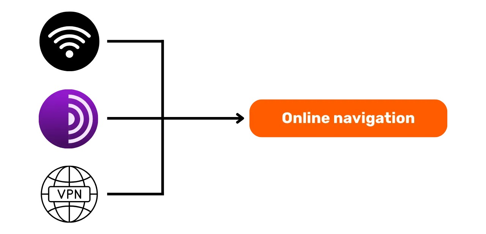

# Путь к защите ваших данных

Добро пожаловать всех на эту образовательную программу, посвященную цифровой безопасности. Этот тренинг разработан так, чтобы быть доступным для всех, поэтому предварительные знания в области информатики не требуются. Наша основная цель - предоставить вам знания и навыки, необходимые для более безопасного и конфиденциального перемещения в цифровом мире.

Это будет включать в себя реализацию нескольких инструментов, таких как безопасный электронный почтовый сервис, инструмент для лучшего управления вашими паролями и различное программное обеспечение для защиты ваших онлайн-активностей.

В этом тренинге мы не стремимся сделать вас экспертом, анонимом или неприступным, так как это невозможно. Вместо этого мы предлагаем вам некоторые простые и доступные решения для начала изменения ваших онлайн-привычек и возвращения контроля над вашим цифровым суверенитетом.

Команда участников:
Мюриэль; дизайн
Рогзи Нури и Фабиан; производство
Тео; вклад

+++

# Введение

<partId>534ab66c-b0e6-5757-a7dd-6ea04647edf2</partId>

## Введение в курс

<chapterId>2f3d005d-8b49-5a3f-b90d-94c11f613407</chapterId>

### Цель: Обновите ваши навыки безопасности!

Добро пожаловать всех на эту образовательную программу, посвященную цифровой безопасности. Этот тренинг разработан так, чтобы быть доступным для всех, поэтому предварительные знания в области информатики не требуются. Наша основная цель - предоставить вам знания и навыки, необходимые для более безопасного и конфиденциального перемещения в цифровом мире.

Это будет включать в себя реализацию нескольких инструментов, таких как безопасный электронный почтовый сервис, инструмент для лучшего управления вашими паролями и различное программное обеспечение для защиты ваших онлайн-активностей.

Этот тренинг является совместным усилием трех наших профессоров:

- Рено Лифшиц, эксперт по кибербезопасности
- Тео Пантамис, доктор философии в области прикладной математики
- Рогзи, генеральный директор DécouvreBitcoin

Ваша цифровая гигиена крайне важна во все более цифровом мире. Несмотря на постоянное увеличение числа взломов и массового наблюдения, никогда не поздно сделать первый шаг и защитить себя.
В этом тренинге мы не пытаемся сделать вас экспертом, анонимом или неприступным, так как это невозможно. Вместо этого мы предлагаем вам некоторые простые и доступные решения для всех, чтобы начать изменять ваши онлайн-привычки и возвращать контроль над вашим цифровым суверенитетом.
Если вы ищете более продвинутые навыки по этой теме, наши ресурсы, учебные пособия или другие тренинги по кибербезопасности здесь для вас. А пока вот краткий обзор нашей программы на следующие несколько часов вместе.

### Раздел 1: Все, что вам нужно знать о онлайн-серфинге

- Глава 1 - Онлайн-серфинг
- Глава 2 - Безопасное использование интернета

Для начала мы обсудим важность выбора веб-браузера и его последствия для безопасности. Затем мы исследуем специфику браузеров, особенно в отношении управления куками. Мы также увидим, как обеспечить более безопасный и анонимный опыт серфинга, используя такие инструменты, как TOR. После этого мы сосредоточимся на использовании VPN для улучшения защиты ваших данных. Наконец, мы закончим рекомендациями по безопасному использованию WiFi-соединений.

### Раздел 2: Лучшие практики использования компьютера

- Глава 3 - Использование компьютера
- Глава 4 - Взлом и управление резервным копированием
  В этом разделе мы рассмотрим три ключевые области компьютерной безопасности. Во-первых, мы исследуем различные операционные системы: Mac, PC и Linux, выделяя их специфику и преимущества. Затем мы перейдем к методам эффективной защиты от попыток взлома и укрепления безопасности ваших устройств. Наконец, мы подчеркнем важность регулярной защиты и резервного копирования ваших данных для предотвращения любых потерь или атак программ-вымогателей. 

### Раздел 3: Реализация решений

- Глава 6 - Управление электронной почтой
- Глава 7 - Менеджер паролей
- Глава 8 - Двухфакторная аутентификация

В этом практическом третьем разделе мы перейдем к реализации ваших конкретных решений.

Сначала мы рассмотрим, как защитить ваш почтовый ящик, что жизненно важно для ваших коммуникаций и часто становится целью хакеров. Затем мы представим вам менеджер паролей: практическое решение, чтобы больше не забывать или не путать ваши пароли, сохраняя их в безопасности. Наконец, мы обсудим дополнительную меру безопасности, двухфакторную аутентификацию, которая добавляет дополнительный уровень защиты к вашим аккаунтам. Все будет объяснено ясно и доступно.

# Все, что вам нужно знать о серфинге в интернете

<partId>b4b5379a-d8ef-59ae-94d3-a6e88959c149</partId>

## Онлайн серфинг

<chapterId>3a935da9-fa6e-57eb-bf85-7b3ec35e6ee2</chapterId>

При серфинге в интернете важно избегать некоторых общих ошибок, чтобы сохранить вашу онлайн безопасность. Вот несколько советов, как их избежать:

### Будьте осторожны с загрузкой программного обеспечения:

Рекомендуется загружать программное обеспечение с официального сайта издателя, а не с общих сайтов.
Пример: Используйте www.signal.org/download вместо www.logicieltelechargement.fr/signal.

Также рекомендуется отдавать предпочтение программному обеспечению с открытым исходным кодом, так как оно часто более безопасно и не содержит вредоносного ПО. Программное обеспечение с открытым исходным кодом - это такое программное обеспечение, чей код известен и доступен всем. Это позволяет, среди прочего, проверять, нет ли скрытого доступа для кражи ваших личных данных.

> Бонус: Программное обеспечение с открытым исходным кодом часто бесплатное! Этот университет на 100% открыт, так что вы также можете проверить наш код на нашем GitHub.
> 

### Управление куками: Ошибки и лучшие практики

Куки - это файлы, создаваемые веб-сайтами для хранения информации на вашем устройстве. Хотя некоторые сайты требуют этих кук для нормальной работы, они также могут быть использованы сторонними сайтами, особенно в целях отслеживания рекламы. В соответствии с такими регуляциями, как GDPR, возможно - и рекомендуется - отказываться от трекинговых кук сторонних сайтов, принимая те, которые необходимы для нормальной работы сайта. После каждого посещения сайта мудро удалять связанные с ним куки, вручную или через расширение или специальную программу. Некоторые браузеры даже предлагают возможность выборочного удаления кук. Несмотря на эти меры предосторожности, крайне важно понимать, что собранная разными сайтами информация может оставаться взаимосвязанной, отсюда важность нахождения баланса между удобством и безопасностью.

> Примечание: Также ограничьте количество установленных расширений в вашем браузере, чтобы избежать потенциальных проблем с безопасностью и производительностью.

### Веб-браузеры: выбор, безопасность

Существует две основные семьи браузеров: те, что основаны на Chrome, и те, что основаны на Firefox.
Хотя обе семейства браузеров предлагают схожий уровень безопасности, рекомендуется избегать использования браузера Google Chrome из-за его трекеров. Более легкие альтернативы Chrome, такие как Chromium или Brave, могут быть предпочтительнее. Особенно рекомендуется Brave за его встроенный блокировщик рекламы. Может потребоваться использование нескольких браузеров для доступа к определенным веб-сайтам.

### Приватный просмотр, TOR и другие альтернативы для более безопасного и анонимного серфинга

Приватный просмотр, хотя и не скрывает вашу активность в интернете от провайдера, позволяет не оставлять локальные следы на вашем компьютере. Куки автоматически удаляются в конце каждой сессии, что позволяет принимать все куки, не подвергаясь отслеживанию. Приватный просмотр может быть полезен при покупке онлайн-услуг, поскольку веб-сайты отслеживают наши привычки поиска и соответственно корректируют цены. Однако важно отметить, что приватный просмотр рекомендуется для временных и конкретных сессий, а не для общего использования интернета.

Более продвинутой альтернативой является сеть TOR (The Onion Router), которая предлагает анонимность, скрывая IP-адрес пользователя и позволяя получить доступ к Даркнету. Браузер TOR специально разработан для использования сети TOR. Он позволяет посещать как обычные веб-сайты, так и веб-сайты .onion, которые обычно управляются частными лицами и могут иметь незаконный характер.

TOR законен и используется журналистами, активистами за свободу и другими, желающими избежать цензуры в авторитарных странах. Однако важно понимать, что TOR не обеспечивает безопасность посещаемых сайтов или самого компьютера. Кроме того, использование TOR может замедлить интернет-соединение, поскольку данные проходят через компьютеры трех других людей, прежде чем достичь своего пункта назначения. Также существенно отметить, что TOR не является абсолютным решением для гарантии 100% анонимности и не должен использоваться для незаконной деятельности.

https://planb.network/tutorials/others/tor-browser

## VPN и интернет-соединение

<chapterId>5aac83f4-a685-54b0-9759-d71bea7eeed2</chapterId>

### VPN-сети

Защита вашего интернет-соединения является ключевым аспектом онлайн-безопасности, и использование виртуальных частных сетей (VPN) является эффективным методом для усиления этой безопасности как для бизнеса, так и для индивидуальных пользователей.

'VPN-сети - это инструменты, которые шифруют данные, передаваемые через интернет, делая соединение более безопасным. В профессиональном контексте VPN позволяют сотрудникам безопасно получать доступ к внутренней сети компании удаленно. Обмениваемые данные шифруются, что значительно усложняет их перехват третьими сторонами. Помимо обеспечения безопасного доступа к внутренней сети, использование VPN может позволить пользователю направлять свое интернет-соединение через внутреннюю сеть компании, создавая впечатление, что их соединение исходит из компании. Это может быть особенно полезно для доступа к онлайн-сервисам, которые имеют географические ограничения.

### Типы VPN

Существует два основных типа VPN: корпоративные VPN и потребительские VPN, такие как NordVPN. Корпоративные VPN обычно более дорогие и сложные в использовании, в то время как потребительские VPN в целом более доступны и удобны в использовании. Например, NordVPN позволяет пользователям подключаться к интернету через сервер, расположенный в другой стране, что может обойти географические ограничения.
Однако использование потребительского VPN не гарантирует полной анонимности. Многие провайдеры VPN сохраняют информацию о своих пользователях, что может потенциально компрометировать их анонимность. Хотя VPN могут быть полезны для улучшения онлайн-безопасности, они не являются универсальным решением. Они эффективны для определенных конкретных использований, таких как доступ к географически ограниченным услугам или улучшение безопасности во время путешествий, но они не гарантируют полной безопасности. При выборе VPN важно отдавать предпочтение надежности и техническим характеристикам, а не популярности. Провайдеры VPN, которые собирают минимум личной информации, обычно являются самыми безопасными. Сервисы, такие как iVPN и Mullvad, не собирают личную информацию и даже позволяют совершать платежи в Bitcoin для повышения конфиденциальности.
Наконец, VPN также может использоваться для блокировки онлайн-рекламы, обеспечивая более приятный и безопасный опыт просмотра. Однако важно провести собственное исследование, чтобы найти VPN, который лучше всего подходит для ваших конкретных потребностей. Использование VPN рекомендуется для повышения безопасности, даже когда вы пользуетесь интернетом дома. Это помогает обеспечить более высокий уровень безопасности обмена данными в сети. В заключение, не забудьте проверить URL-адреса и маленький замок в адресной строке, чтобы подтвердить, что вы находитесь на сайте, который намереваетесь посетить.

https://planb.network/tutorials/others/ivpn

https://planb.network/tutorials/others/mullvad

### HTTPS и публичные Wi-Fi сети

С точки зрения онлайн-безопасности, важно понимать, что 4G обычно более безопасен, чем публичный Wi-Fi. Однако использование 4G может быстро исчерпать ваш мобильный интернет-пакет. Протокол HTTPS стал стандартом для шифрования данных на веб-сайтах. Он гарантирует, что данные, обмениваемые между пользователем и веб-сайтом, защищены. Поэтому крайне важно проверять, использует ли посещаемый вами сайт протокол HTTPS.

В Европейском Союзе защита данных регулируется Общим регламентом по защите данных (GDPR). Поэтому безопаснее использовать провайдеров доступа к Wi-Fi, таких как SNCF, которые не перепродают данные о подключениях пользователей. Однако сам факт отображения замка не гарантирует подлинность сайта. Важно проверить публичный ключ сайта с использованием системы сертификатов, чтобы подтвердить его подлинность. Хотя шифрование данных предотвращает перехват данных третьими сторонами, всё же возможно, что злоумышленник может выдать себя за сайт и передавать данные в незашифрованном виде.

Для избежания онлайн-мошенничества крайне важно проверять идентичность сайта, на который вы заходите, особенно проверяя расширение и доменное имя. Кроме того, будьте бдительны по отношению к мошенникам, которые используют похожие буквы в URL-адресах, чтобы обмануть пользователей.

В заключение, использование VPN может значительно улучшить онлайн-безопасность как для бизнеса, так и для индивидуальных пользователей. Кроме того, соблюдение хороших привычек при просмотре веб-сайтов может способствовать лучшей цифровой гигиене. В следующем разделе этого курса мы рассмотрим компьютерную безопасность, включая обновления, антивирусы и управление паролями.

# Лучшие практики использования компьютера

<partId>e6eac20b-ba24-5d9a-8d86-8e0164074457</partId>

## Использование компьютера

<chapterId>16745632-b56b-5423-9873-ddf70fdf1efd</chapterId>

Безопасность наших компьютеров является серьезной проблемой в современном цифровом мире. Сегодня мы рассмотрим три ключевых момента:

- Выбор компьютера
- Обновления и антивирус для оптимальной безопасности
- Лучшие практики для безопасности вашего компьютера и данных.

### Выбор компьютера и операционной системы

Что касается выбора компьютера, значительной разницы в безопасности между старыми и новыми компьютерами нет. Однако существуют различия в безопасности между операционными системами: Windows, Linux и Mac.
Относительно Windows рекомендуется не использовать учетную запись администратора для повседневного использования, а создать две отдельные учетные записи: учетную запись администратора и учетную запись для ежедневного использования. Windows часто более подвержена вредоносному ПО из-за большого числа пользователей и простоты переключения с пользователя на администратора. С другой стороны, угрозы встречаются реже на Linux и Mac.

Выбор операционной системы должен базироваться на ваших потребностях и предпочтениях. Системы Linux значительно эволюционировали в последние годы, становясь всё более дружелюбными к пользователю. Ubuntu является интересной альтернативой для начинающих с легким в использовании графическим интерфейсом. Возможно разделить компьютер, чтобы экспериментировать с Linux, сохраняя Windows, но это может быть сложно. Часто предпочтительнее иметь отдельный компьютер, виртуальную машину или USB-ключ для тестирования Linux или Ubuntu.

### Обновления ПО

Что касается обновлений, правило простое: **регулярное обновление операционной системы и приложений крайне важно.**

На Windows 10 обновления почти непрерывны, и крайне важно не блокировать и не откладывать их. Каждый год выявляется около 15 000 уязвимостей, что подчеркивает важность постоянного обновления ПО для защиты от вирусов. В общем, поддержка программного обеспечения заканчивается через 3-5 лет после его выпуска, поэтому необходимо обновиться до более новой версии, чтобы продолжать пользоваться защитой.

Это правило применимо почти ко всему программному обеспечению. Действительно, обновления не предназначены для того, чтобы сделать вашу машину устаревшей или медленной, а для защиты её от новых угроз. Некоторые обновления даже считаются крупными, и без них ваш компьютер серьезно рискует быть использованным во вред.

Чтобы дать вам конкретный пример ошибки: взломанное программное обеспечение, которое нельзя обновить, представляет двойную потенциальную угрозу. Появление вируса во время его нелегальной загрузки с подозрительного сайта и небезопасное использование против новых форм атак.

### Антивирус

- Нужен ли антивирус? ДА
- Нужно ли платить? Зависит!

Выбор и реализация антивируса важны. Windows Defender, встроенный антивирус в Windows, является безопасным и эффективным решением. Для бесплатного решения он чрезвычайно хорош и гораздо лучше многих бесплатных решений, найденных в интернете. Действительно, следует проявлять осторожность с антивирусами, загруженными из интернета, так как они могут быть вредоносными или устаревшими.
Для тех, кто хочет инвестировать в платный антивирус, рекомендуется выбирать антивирус, который интеллектуально анализирует неизвестные и возникающие угрозы, такие как Kaspersky. Обновления антивируса существенны для защиты от новых угроз.

> Примечание: Linux и Mac, благодаря их системе разделения прав пользователей, часто не нуждаются в антивирусе.

Наконец, вот некоторые хорошие практики для безопасности вашего компьютера и данных. Важно выбрать эффективный и удобный в использовании антивирус. Также крайне важно принимать хорошие практики на вашем компьютере, такие как не использование неизвестных или подозрительных USB-ключей. Эти USB-ключи могут содержать вредоносные программы, которые могут автоматически запускаться при вставке. Проверка USB-ключа будет бесполезной после его вставки. Некоторые компании стали жертвами взлома из-за USB-ключей, неосторожно оставленных в доступных местах, например, на парковке.

Относитесь к своему компьютеру так же, как к своему дому: будьте бдительны, регулярно обновляйтесь, удаляйте ненужные файлы и используйте надежный пароль для безопасности. Крайне важно шифровать данные на ноутбуках и смартфонах, чтобы предотвратить кражу или потерю данных. BitLocker для Windows, LUKS для Linux и встроенная опция для Mac являются решениями для шифрования данных. Рекомендуется активировать шифрование данных без колебаний и записать пароль на бумаге, которую следует хранить в надежном месте.
В заключение, крайне важно выбрать операционную систему, которая соответствует вашим потребностям, и регулярно обновлять её, а также установленные приложения. Также существенно использовать эффективный и удобный антивирус и принимать хорошие практики для обеспечения безопасности вашего компьютера и данных.

## Управление взломом и резервным копированием: Защита ваших данных

<chapterId>9ddfcb6a-a253-5542-b7eb-df7222b46dc7</chapterId>

### Как хакеры атакуют?

Чтобы хорошо защитить себя, крайне важно понимать, как хакеры пытаются проникнуть в ваш компьютер. Действительно, вирусы не часто появляются как по волшебству, а скорее являются последствиями наших действий, даже непреднамеренных!

Как правило, вирусы появляются потому, что вы позволили вашему компьютеру пригласить их в ваш дом. Это можно представить себе как загрузку подозрительного программного обеспечения, скомпрометированного торрент-файла или просто клик по ссылке из мошеннического электронного письма!

### Фишинг, бдительность против мошеннических электронных писем:

Внимание! Электронные письма являются первым вектором атаки, вот несколько советов:

- Будьте бдительны к попыткам фишинга, направленным на извлечение конфиденциальной информации, такой как ваши учетные данные и пароли. Избегайте кликать по подозрительным ссылкам и делиться вашей личной информацией без проверки легитимности отправителя.
- Будьте осторожны с вложениями и изображениями в электронных письмах:
  Вложения и изображения в электронных письмах могут содержать вредоносное ПО. Не загружайте и не открывайте вложения от неизвестных или подозрительных отправителей и убедитесь, что ваш антивирус обновлен.

Золотое правило здесь - тщательно проверять полное имя отправителя, а также происхождение электронного письма. В случае сомнений, удалите его!

### Вымогательское ПО и типы кибератак:

Вымогательское ПО - это тип вредоносного программного обеспечения, которое шифрует данные пользователя и требует выкуп за их расшифровку. Этот тип атаки становится всё более распространенным и может быть очень проблематичным для компании или частного лица. Чтобы защитить себя, крайне важно создавать резервные копии самых чувствительных файлов! Это не остановит вымогательское ПО, но позволит вам просто игнорировать его.

Регулярно создавайте резервные копии важных данных на внешнем носителе или в безопасном онлайн-сервисе хранения данных. Таким образом, в случае кибератаки или сбоя оборудования, вы сможете восстановить свои данные, не потеряв важную информацию.

Простое решение:

- Приобретите внешний жесткий диск и скопируйте на него свои данные. Отключите его и храните в каком-нибудь месте дома. (Сделать это дважды и хранить один из дисков в другом месте помогает защитить от потенциального пожара.)

- Создайте резервную копию в "облаке" с использованием ProtonMail Drive, Sync или даже Google Drive. Просто загрузите свои чувствительные данные на этот онлайн-хост. Однако, имейте в виду, что ваши данные потенциально находятся в интернете и находятся под контролем доверенной третьей стороны.

### Стоит ли платить хакерам?

НЕТ, как правило, не рекомендуется платить хакерам в случае вымогательского ПО или других типов атак. Оплата выкупа не гарантирует восстановление ваших данных и может поощрять киберпреступников продолжать свою злонамеренную деятельность. Вместо этого приоритетом должна быть профилактика и регулярное создание резервных копий ваших данных для защиты.

Если вы обнаружите вирус на вашем компьютере, отключите его от интернета, выполните полное сканирование антивирусом и удалите зараженные файлы. Затем обновите ваше программное обеспечение и операционную систему, и измените ваши пароли, чтобы предотвратить дальнейшие вторжения.

https://planb.network/tutorials/others/proton-drive

https://planb.network/tutorials/others/veracrypt

# Реализация решений.

<partId>215ec902-ba05-5549-87fc-cb8d82665f7b</partId>

## Управление электронными почтовыми аккаунтами

<chapterId>dfceea33-8712-5557-ace1-6ba5598d33d8</chapterId>

### Настройка нового электронного почтового аккаунта!

Электронный почтовый аккаунт является центральным элементом вашей онлайн-активности: если он будет скомпрометирован, хакер сможет использовать его для сброса всех ваших паролей через функцию "забыл пароль" и получить доступ к многим другим сайтам. Вот почему его нужно надежно защитить.

Электронный почтовый аккаунт должен быть создан с уникальным и сложным паролем (подробности в главе 7) и, в идеале, с системой двухфакторной аутентификации (подробности в главе 8).

Хотя у нас всех уже есть электронный почтовый аккаунт, важно рассмотреть возможность создания нового, более современного, чтобы начать с чистого листа.

### Выбор почтового провайдера и управление электронными адресами

Правильное управление нашими электронными адресами критически важно для обеспечения безопасности нашего онлайн-доступа. Важно выбрать безопасного и уважающего конфиденциальность почтового провайдера. Например, ProtonMail является безопасным и уважающим конфиденциальность почтовым сервисом.

При выборе почтового провайдера и создании пароля крайне важно никогда не использовать один и тот же пароль для различных онлайн-сервисов. Рекомендуется регулярно создавать новые электронные адреса и разделять использование, используя разные электронные адреса. Желательно выбирать безопасный почтовый сервис для критически важных аккаунтов. Также следует отметить, что некоторые сервисы ограничивают длину паролей, поэтому важно быть в курсе этого ограничения. Существуют также сервисы для создания временных электронных адресов, которые можно использовать для аккаунтов с ограниченным сроком действия.

Важно учитывать, что старые почтовые провайдеры, такие как La Poste, Arobase, Wig, Hotmail, все еще используются, но их практики безопасности могут быть не такими хорошими, как у Gmail. Поэтому рекомендуется иметь два отдельных электронных адреса, один для общих коммуникаций и другой для восстановления аккаунта, причем последний должен быть лучше защищен. Лучше всего избегать смешивания электронного адреса с вашим оператором мобильной связи или провайдером интернет-услуг, так как это может быть вектором атаки.

### Стоит ли мне менять свой электронный почтовый аккаунт?

Рекомендуется использовать сайт Have I Been Pwned (https://haveibeenpwned.com/) для проверки, не был ли ваш электронный адрес скомпрометирован, и для получения уведомлений о будущих утечках данных. Хакеры могут использовать скомпрометированную базу данных для отправки фишинговых писем или повторного использования скомпрометированных паролей.

В целом, начать использовать новый, более безопасный электронный адрес не является плохой практикой и даже необходимо, если вы хотите начать с чистого листа на здоровой основе.
Бонус Bitcoin: Может быть рекомендовано создать специальный электронный адрес для наших действий с Bitcoin (создание аккаунтов на биржах), чтобы действительно разделить области деятельности в нашей жизни.

https://planb.network/tutorials/others/proton-mail

## Менеджер паролей

<chapterId>0b3c69b2-522c-56c8-9fb8-1562bd55930f</chapterId>

### Что такое менеджер паролей?

Менеджер паролей - это инструмент, который позволяет хранить, генерировать и управлять вашими паролями для различных онлайн-аккаунтов. Вместо того чтобы запоминать множество паролей, вам нужен только один главный пароль для доступа ко всем остальным.

С помощью менеджера паролей вам больше не нужно беспокоиться о том, что вы забудете свои пароли или запишете их где-то. Вам нужно запомнить только один главный пароль. Кроме того, большинство этих инструментов генерируют для вас сложные пароли, что повышает безопасность ваших аккаунтов.

### Различия между некоторыми популярными менеджерами:

- LastPass: Один из самых популярных менеджеров паролей. Это сервис третьей стороны, что означает, что ваши пароли хранятся на их серверах. Предлагается бесплатная и платная версии, с удобным интерфейсом.
- Dashlane: Также является сервисом третьей стороны, с интуитивно понятным интерфейсом и дополнительными функциями, такими как отслеживание информации о кредитных картах и защищенные заметки.
  

### Самостоятельный хостинг для большего контроля:

- Bitwarden: Это инструмент с открытым исходным кодом, что означает, что вы можете проверить его код, чтобы убедиться в его безопасности. Хотя Bitwarden предлагает услугу хостинга, он также позволяет пользователям самостоятельно размещать данные, что означает, что вы можете контролировать, где хранятся ваши пароли, потенциально обеспечивая большую безопасность и контроль.

- KeePass: Это решение с открытым исходным кодом, предназначенное в первую очередь для самостоятельного хостинга. Ваши данные по умолчанию хранятся локально, но при желании вы можете синхронизировать базу данных паролей различными методами. KeePass широко признан за его безопасность и гибкость, хотя для новичков он может быть немного менее удобным в использовании.
  
  (Примечание: Выбор между сервисом третьей стороны или самостоятельным хостингом зависит от вашего уровня технологического комфорта и того, как вы приоритизируете контроль по сравнению с удобством. Сервисы третьих сторон обычно более удобны для большинства людей, в то время как самостоятельный хостинг требует больше технических знаний, но может предложить больший контроль и спокойствие с точки зрения безопасности.)

### Что делает пароль хорошим:

Хороший пароль обычно:

- Длинный: не менее 12 символов.
- Сложный: сочетание заглавных и строчных букв, цифр и символов.
- Уникальный: не используйте один и тот же пароль для разных аккаунтов.
- Не основан на личной информации: избегайте дат рождения, имен и т.д.

Для обеспечения безопасности вашего аккаунта крайне важно создавать сильные и безопасные пароли. Длина пароля не достаточна для обеспечения его безопасности. Символы должны быть полностью случайными, чтобы противостоять атакам перебором. Также важна независимость событий, чтобы избежать наиболее вероятных комбинаций. Распространенные пароли, такие как "password", легко поддаются взлому.

Для создания сильного пароля рекомендуется использовать большое количество случайных символов, не используя предсказуемые слова или шаблоны. Также необходимо включать цифры и специальные символы. Однако следует отметить, что некоторые сайты могут ограничивать использование определенных специальных символов. Пароли, которые не генерируются случайным образом, легко угадать. Вариации или добавления к паролям не являются безопасными. Сайты не могут гарантировать безопасность паролей, выбранных пользователями.

Случайно сгенерированные пароли обеспечивают более высокий уровень безопасности, хотя их может быть сложнее запомнить. Менеджеры паролей могут генерировать более безопасные случайные пароли. Используя менеджер паролей, вам не нужно запоминать все ваши пароли. Важно постепенно заменять ваши старые пароли на те, которые сгенерированы менеджером, так как они более сильные и длинные. Убедитесь, что мастер-пароль вашего менеджера паролей также сильный и безопасный.

https://planb.network/tutorials/others/bitwarden

https://planb.network/tutorials/others/keepass

## Двухфакторная аутентификация

<chapterId>9391e02e-e61b-5a86-93e0-91a07f217d35</chapterId>

### Почему стоит использовать 2FA

Двухфакторная аутентификация (2FA) является дополнительным уровнем безопасности, используемым для того, чтобы убедиться, что люди, пытающиеся получить доступ к онлайн-аккаунту, действительно являются теми, за кого себя выдают. Вместо того, чтобы вводить только имя пользователя и пароль, 2FA требует второй формы подтверждения. Этот второй шаг может быть:

- Временный код, отправленный по SMS.
- Код, сгенерированный приложением, например, Google Authenticator или Authy.
- Физический ключ безопасности, который вы вставляете в компьютер.
  
  С 2FA, даже если хакер получит ваш пароль, он не сможет получить доступ к вашему аккаунту без этого второго фактора верификации. Это делает 2FA необходимым для защиты ваших онлайн-аккаунтов от неавторизованного доступа.

### Какой вариант выбрать?

Различные варианты надежной аутентификации предлагают разные уровни безопасности.

- SMS не считается лучшим вариантом, поскольку он только подтверждает владение номером телефона.
- 2FA (двухфакторная аутентификация) более безопасна, так как использует несколько типов доказательств, таких как знание, владение и идентификация. Одноразовые пароли (HOTP и TOTP) безопаснее SMS, поскольку требуют криптографического расчета и хранятся локально, а не в памяти.
- Аппаратные токены, такие как USB-ключи или смарт-карты, обеспечивают оптимальную безопасность, генерируя уникальный приватный ключ для каждого сайта и проверяя URL перед разрешением подключения.

Для оптимальной безопасности с сильной аутентификацией рекомендуется использовать безопасный электронный адрес, надежный менеджер паролей и применять 2FA с использованием YubiKeys. Также рекомендуется приобрести два YubiKey, чтобы предусмотреть потерю или кражу, например, храня резервную копию дома и с собой.

Биометрия может использоваться в качестве замены, но она менее безопасна, чем сочетание знаний и владения. Биометрические данные должны оставаться на устройстве аутентификации и не раскрываться онлайн. Важно учитывать модель угроз, связанную с различными методами аутентификации, и соответственно корректировать практики.

### Заключение обучения:

Как вы поняли, внедрение хорошей цифровой гигиены не обязательно просто, но оно остается доступным!

- Создание нового безопасного электронного адреса.
- Настройка менеджера паролей.
- Активация 2FA.
- Постепенная замена наших старых паролей на сильные пароли с 2FA.

Продолжайте учиться и постепенно внедрять хорошие практики!

Золотое правило: Кибербезопасность - это движущаяся цель, которая будет адаптироваться к вашему пути обучения!

https://planb.network/tutorials/others/authy

https://planb.network/tutorials/others/security-key

# Практический раздел

<partId>98ccf14b-4053-5839-878c-7a73ff02eb95</partId>

## Настройка почтового ящика

<chapterId>afc9ab5d-7664-5a9b-ab50-225ac9ba8f7c</chapterId>

Защита вашей электронной почты является важным шагом для обеспечения безопасности ваших онлайн-активностей и сохранения личных данных. Этот учебник пошагово проведет вас через создание и настройку учетной записи ProtonMail, провайдера, известного своим высоким уровнем безопасности, предлагающего сквозное шифрование ваших коммуникаций. Независимо от того, являетесь ли вы новичком или опытным пользователем, предлагаемые здесь лучшие практики помогут вам усилить безопасность вашей электронной почты, одновременно используя расширенные функции ProtonMail:

https://planb.network/tutorials/others/proton-mail

## Обеспечение безопасности с помощью 2FA

<chapterId>09468ec1-95b7-56a4-a636-7618044568e1</chapterId>

Двухфакторная аутентификация (2FA) стала необходимой для обеспечения безопасности ваших онлайн-аккаунтов. В этом руководстве вы узнаете, как настроить и использовать приложение 2FA Authy, которое генерирует динамические 6-значные коды для защиты ваших аккаунтов. Authy очень прост в использовании и синхронизируется на нескольких устройствах. Узнайте, как установить и настроить Authy, и таким образом усилите безопасность ваших онлайн-аккаунтов уже сейчас:

https://planb.network/tutorials/others/authy

Другим вариантом является использование физического ключа безопасности. Это дополнительное руководство показывает, как настроить и использовать ключ безопасности в качестве второго фактора аутентификации:

https://planb.network/tutorials/others/security-key

## Создание менеджера паролей

<chapterId>ed579680-4e7b-5f65-8541-14e519a3b242</chapterId>

Управление паролями — это вызов в цифровую эпоху. У всех нас есть множество онлайн-аккаунтов, которые необходимо защитить. Менеджер паролей помогает создавать и хранить сильные и уникальные пароли для каждого аккаунта.

В этом руководстве вы узнаете, как настроить Bitwarden, менеджер паролей с открытым исходным кодом, и как синхронизировать свои учетные данные на всех ваших устройствах, чтобы упростить ежедневное использование:

https://planb.network/tutorials/others/bitwarden

Для более опытных пользователей я также предлагаю руководство по другому бесплатному и открытого кода программному обеспечению, которое можно использовать локально для управления паролями:

https://planb.network/tutorials/others/keepass

## Обеспечение безопасности ваших аккаунтов

<chapterId>7a774b34-aed0-57dd-b8f7-cf3be51c0d70</chapterId>

В этих двух руководствах я также проведу вас через процесс обеспечения безопасности ваших онлайн-аккаунтов и объясню, как постепенно внедрять более безопасные практики для управления вашими паролями в повседневной жизни.

https://planb.network/tutorials/others/bitwarden

https://planb.network/tutorials/others/keepass

## Настройка резервного копирования

<chapterId>01cfcde1-77cb-506c-8df1-fa18a2e8cc6b</chapterId>

Защита ваших личных файлов также является важным моментом. В этом руководстве показано, как внедрить эффективную стратегию резервного копирования с помощью Proton Drive. Узнайте, как использовать это безопасное облачное решение для применения метода 3-2-1: три копии ваших данных на двух разных носителях, одна из которых хранится вне офиса. Таким образом, вы обеспечиваете доступность и безопасность ваших конфиденциальных файлов:

https://planb.network/tutorials/others/proton-drive

А чтобы защитить ваши файлы, хранящиеся на съемных носителях, таких как USB-накопитель или внешний жесткий диск, я также покажу, как легко шифровать и дешифровать эти носители с помощью VeraCrypt:

https://planb.network/tutorials/others/veracrypt

## Смена браузера и VPN

<chapterId>8dc08feb-313c-5259-a54f-64aa68a07608</chapterId>

Защита вашей онлайн-конфиденциальности также является важным аспектом для обеспечения вашей безопасности. Использование VPN может стать первым шагом для достижения этой цели.

Я предлагаю вам ознакомиться с двумя надежными VPN-решениями, которые можно оплатить биткоинами, а именно IVPN и Mullvad. Эти руководства помогут вам установить, настроить и использовать Mullvad или IVPN на всех ваших устройствах:

https://planb.network/tutorials/others/ivpn

https://planb.network/tutorials/others/mullvad

Также узнайте, как использовать Tor Browser, браузер, специально разработанный для защиты вашей онлайн-конфиденциальности:

https://planb.network/tutorials/others/tor-browser

# Идем дальше

<partId>77113cad-a6d8-57e5-b903-50c223b277ba</partId>

## Как работать в индустрии кибербезопасности

<chapterId>aad1ae27-4280-5b07-b9ab-118ae013951a</chapterId>

### Кибербезопасность: Растущая отрасль с бесконечными возможностями

Если вы увлечены защитой систем и данных, отрасль кибербезопасности предлагает множество возможностей. Если эта индустрия вас заинтересовала, вот несколько ключевых шагов, которые помогут вам.

### Академическая подготовка и сертификация:

Твердое образование в области компьютерных наук, информационных систем или смежной области часто является идеальной отправной точкой. Эти исследования предоставляют необходимую основу для понимания технических вызовов кибербезопасности. Для дополнения этого образования разумно получить признанные сертификаты в области. Хотя эти сертификаты могут варьироваться в зависимости от региона, некоторые, такие как CISSP или CEH, пользуются мировым признанием.

Кибербезопасность - это обширная и постоянно развивающаяся область. Знакомство с основными инструментами и различными системами имеет решающее значение. Кроме того, существует множество поддоменов, от реагирования на инциденты до этичного хакинга, поэтому полезно найти свою нишу и специализироваться в ней.

### Получение практического опыта:

Важность практического опыта нельзя недооценивать. Поиск стажировок или младших позиций в компаниях с командами кибербезопасности - отличный способ применить ваш теоретические знания. Кроме того, участие в соревнованиях по этичному хакингу или симуляциях кибербезопасности может усовершенствовать ваши навыки в реальных ситуациях.

Сила профессиональной сети бесценна. Присоединение к профессиональным ассоциациям, хакерспейсам или онлайн-форумам предоставляет платформу для обмена идеями с другими экспертами. Аналогично, посещение конференций и семинаров по кибербезопасности не только позволяет вам учиться, но и помогает строить связи с профессионалами индустрии.

Постоянное развитие угроз требует регулярного мониторинга новостей и специализированных форумов. В секторе, где доверие имеет первостепенное значение, действовать с этикой и целостностью важно на каждом этапе вашей карьеры.

### Навыки и инструменты для углубления:

- Инструменты кибербезопасности: Wireshark, Metasploit, Nmap.
- Операционные системы: Linux, Windows, MacOS.
- Языки программирования: Python, C, Java.
- Сети: TCP/IP, VPN, брандмауэр.
- Базы данных: SQL, NoSQL.
- Криптография: SSL/TLS, симметричное/асимметричное шифрование.
- Управление инцидентами: анализ логов, реагирование на инциденты.
- Этичный хакинг: методы проникновения, тестирование на проникновение.
- Управление: стандарты ISO, регулирование GDPR/CCPA.

Овладев этими навыками и инструментами, вы будете хорошо подготовлены к успешной работе в мире кибербезопасности.

## Интервью с Рено

<chapterId>7d83fd98-ce22-514e-b9e8-729fbf71ee6e</chapterId>

### Эффективное управление паролями и усиление аутентификации: Академический подход

В учебном модуле "Основы безопасности", предлагаемом Découvre Bitcoin в рамках Академии, мы обсудили важность использования менеджеров паролей. Существует три основных аспекта, которые необходимо учитывать: создание, обновление и использование паролей на веб-сайтах.
Как правило, не рекомендуется использовать расширения браузера для автоматического заполнения паролей. Эти инструменты могут сделать пользователя более уязвимым для фишинговых атак. Рено, признанный эксперт в области кибербезопасности, предпочитает ручное управление с использованием KeePass, которое включает в себя ручное копирование и вставку пароля. Расширения могут увеличивать поверхность атаки, замедлять работу браузера и, следовательно, представлять значительный риск. Таким образом, минимальное использование расширений в браузере является рекомендуемой практикой.

Менеджеры паролей, как правило, поощряют использование дополнительных факторов аутентификации, таких как двухфакторная аутентификация. Для оптимальной безопасности рекомендуется хранить OTP (одноразовые пароли) на мобильном устройстве. AndoTP предлагает открытое решение для генерации и хранения кодов OTP на вашем телефоне. Хотя Google Authenticator позволяет экспортировать семена кодов аутентификации, доверие к резервному копированию на аккаунте Google остается ограниченным. Поэтому приложения OTI и AndoTP рекомендуются для автономного управления OTP.

Вопрос цифрового наследия и цифрового траура поднимает важность наличия процедуры передачи паролей после смерти человека. Менеджер паролей облегчает этот переход, безопасно храня все цифровые секреты в одном месте. Менеджер паролей также позволяет идентифицировать все открытые аккаунты и управлять их закрытием или передачей. Рекомендуется записать главный пароль на бумаге, но он должен храниться в скрытом и безопасном месте. Если жесткий диск зашифрован и компьютер заблокирован, доступ к паролю будет невозможен, даже в случае кражи.

### К эре после паролей: изучение достоверных альтернатив

Пароли, несмотря на их повсеместное использование, имеют множество недостатков, включая возможность рискованной передачи в процессе аутентификации. Ведущие компании, такие как Microsoft и Apple, предлагают инновационные альтернативы, такие как биометрия и аппаратные токены, указывая на прогрессивный тренд отказа от паролей.

'Passkeys, например, предлагает зашифрованные случайные ключи в сочетании с локальным фактором (биометрия или PIN), которые хранятся у провайдера, но остаются вне его досягаемости. Хотя это требует обновления веб-сайтов, подход исключает необходимость в паролях, тем самым обеспечивая высокий уровень безопасности без ограничений, связанных с традиционными паролями или проблемой управления цифровым сейфом.

Passkiz является еще одной жизнеспособной и безопасной альтернативой для управления паролями. Однако остается важный вопрос: доступность в случае сбоя провайдера. Поэтому было бы желательно, чтобы интернет-гиганты предложили системы для гарантии этой доступности.

Прямая аутентификация к соответствующему сервису является интересным вариантом, чтобы больше не зависеть от третьей стороны. Однако единый вход (SSO), предлагаемый интернет-гигантами, также вызывает проблемы с доступностью и рисками цензуры. Для предотвращения утечек данных крайне важно минимизировать количество собираемой информации в процессе аутентификации.

### Компьютерная безопасность: императивы безопасной практики и риски, связанные с человеческой небрежностью

Компьютерная безопасность может быть скомпрометирована простыми практиками и использованием стандартных паролей, таких как "admin". Для подрыва компьютерной безопасности не всегда необходимы сложные атаки. Например, пароли администратора YouTube-канала были записаны в частном исходном коде компании. Уязвимости безопасности часто являются результатом человеческой небрежности.
Также следует отметить, что Интернет сильно централизован и в значительной степени находится под контролем США. DNS-сервер может подвергаться цензуре и часто использует обманный DNS для блокировки доступа к определенным сайтам. DNS является старым и недостаточно безопасным протоколом, что может привести к проблемам с безопасностью. Появились новые протоколы, такие как DNSsec, но они все еще не получили широкого распространения. Для обхода цензуры и блокировки рекламы можно выбрать альтернативных провайдеров DNS. Альтернативы навязчивой рекламе включают Google DNS, OpenDNS и другие независимые сервисы. Стандартный протокол DNS оставляет запросы DNS видимыми для провайдера интернет-услуг. DOH (DNS over HTTPS) и DOT (DNS over TLS) шифруют соединение DNS, обеспечивая большую конфиденциальность и безопасность. Эти протоколы широко используются в предприятиях из-за повышенной безопасности и поддерживаются нативно Windows, Android и iPhone. Для использования DOH и DOT необходимо ввести TLS-имя хоста вместо IP-адреса. Бесплатные провайдеры DOH и DOT доступны в сети. DOH и DOT улучшают конфиденциальность и безопасность, избегая атак "человек посередине". Другие ключевые соображения

В рамках учебного модуля "Основы безопасности" на академии Découvre Bitcoin мы также обсудили аутентификацию через Lightning. Эта система генерирует различный идентификатор для каждой службы, без необходимости предоставления адреса электронной почты или личной информации. Возможно иметь управляемые пользователем децентрализованные идентификаторы, но отсутствует стандартизация и нормализация в проектах децентрализованной идентификации. Рекомендуется использовать менеджеры пакетов, такие как Nuget и Chocolaté, которые позволяют загружать программное обеспечение с открытым исходным кодом вне Microsoft Store, чтобы избежать злонамеренных атак. В заключение, DNS имеет решающее значение для онлайн-безопасности, но необходимо оставаться бдительными в отношении потенциальных атак на DNS-серверы.

## Оцените курс
<chapterId>6be74d2d-2116-5386-9d92-c4c3e2103c68</chapterId>
<isCourseReview>true</isCourseReview>

## Выпускной экзамен
<chapterId>a894b251-a85a-5fa4-bf2a-c2a876939b49</chapterId>
<isCourseExam>true</isCourseExam>

## Благодарности и продолжайте исследовать кроличью нору

<chapterId>df3a962a-a96e-5006-b904-0dd9d4a072dd</chapterId>

### Оцените обучение и поддержите нас

Этот курс, наряду со всем контентом на этой академии, был предоставлен вам бесплатно нашим сообществом. Чтобы поддержать нас, вы можете поделиться им с другими, стать членом академии и даже внести свой вклад в ее развитие через GitHub. От имени всей команды, спасибо!

Система оценок для обучения вскоре будет интегрирована в эту новую платформу электронного обучения! А пока большое спасибо за прохождение курса, и если он вам понравился, пожалуйста, рассмотрите возможность поделиться им с другими.

### Идите дальше

Поздравляем с завершением обучения SECU 101! Я искренне надеюсь, что оно вам понравилось и что это открыло для вас новые двери. Теперь вы готовы получить свой первый биткойн или просто продолжить приключение с курсами второго уровня!

- BTC 101 предоставит вам теоретические основы Биткойна
- BTC 102 поможет вам составить ваш план по Биткойну
- LN 201 и 202 познакомят вас с Lightning Network, платежной сетью второго уровня
- ECON 201 расскажет об австрийской экономике
- MINING 201 для тех, кто хочет узнать больше о майнинге
- (и многое другое)

Огромное спасибо нашим патронам, членам и донорам за их финансовую поддержку, спасибо людям, которые делятся, и спасибо тем, кто сделал это обучение возможным: Тео пантамис, Рено, Тео, Фабьен, Нури, Мюриэль и вся команда.
До скорой встречи!

