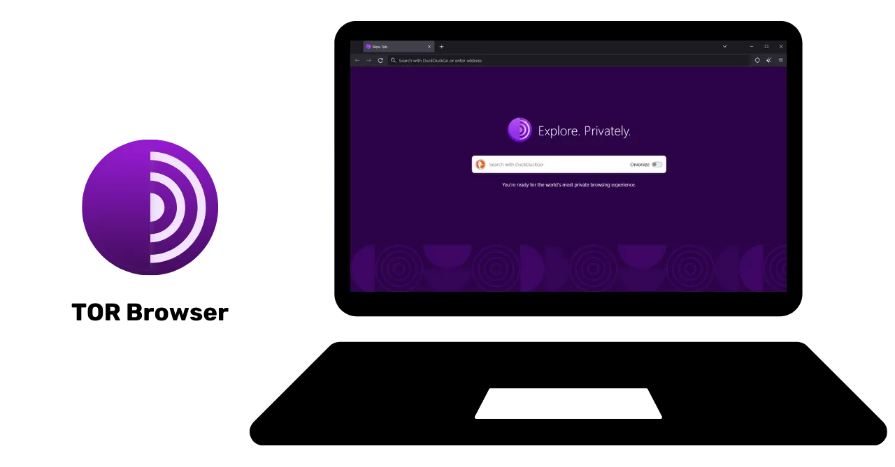
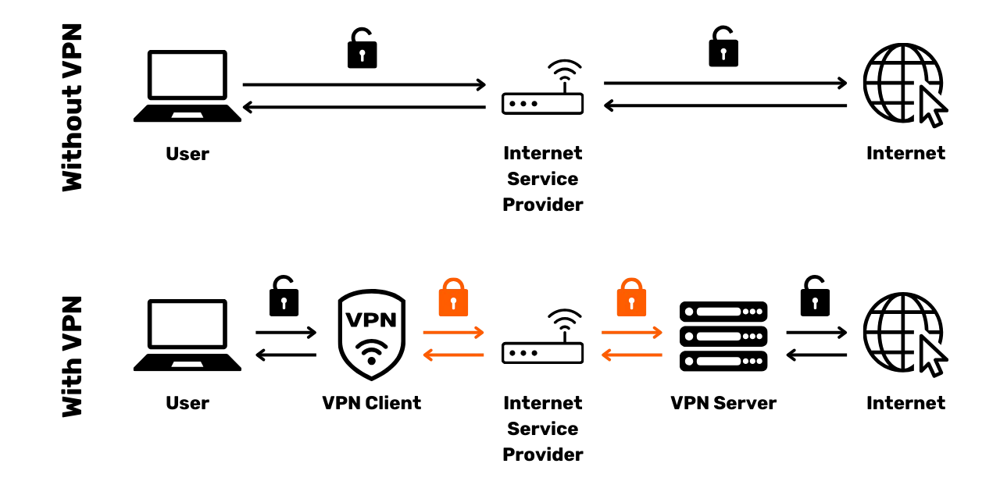
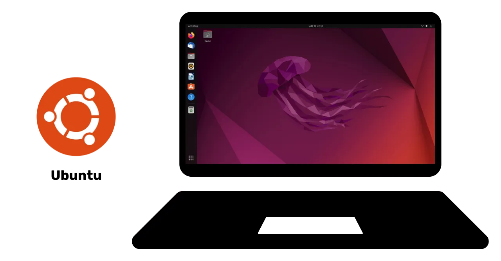

# Hành trình bảo vệ dữ liệu của bạn

Chào mừng mọi người đến với chương trình đào tạo được thiết kế riêng cho bảo mật số. Khóa học này được thiết kế để ai cũng có thể tiếp cận được, vì vậy không yêu phải có kiến thức về khoa học máy tính để tham gia. Mục tiêu chính của chúng tôi là cung cấp cho bạn những kiến thức và kỹ năng cần thiết để khám phá thế giới số một cách an toàn và riêng tư hơn.

Điều này sẽ liên quan đến việc sử dụng một số công cụ như dịch vụ email an toàn, công cụ quản lý mật khẩu tốt hơn và các phần mềm khác để bảo vệ hoạt động trực tuyến của bạn.

Trong khóa học này, chúng tôi không có mục tiêu biến bạn thành một chuyên gia, người ẩn danh hoặc không thể bị xâm phạm, vì điều này là không thể. Thay vào đó, chúng tôi cung cấp cho bạn một số giải pháp đơn giản và dễ tiếp cận để bạn bắt đầu thay đổi thói quen trực tuyến của bản thân và lấy lại quyền kiểm soát chủ quyền số của mình.

Nhóm cộng tác viên:
Muriel; thiết kế
Rogzy Noury & Fabian; sản xuất
Théo; đóng góp

+++

# Giới thiệu

<partId>534ab66c-b0e6-5757-a7dd-6ea04647edf2</partId>

## Giới thiệu khóa học

<chapterId>2f3d005d-8b49-5a3f-b90d-94c11f613407</chapterId>

### Mục tiêu: Nâng cấp kỹ năng bảo mật của bạn!

Chào mừng mọi người đến với chương trình đào tạo được thiết kế riêng cho bảo mật số. Khóa học này được thiết kế để ai cũng có thể tiếp cận được, vì vậy không yêu phải có kiến thức về khoa học máy tính để tham gia. Mục tiêu chính của chúng tôi là cung cấp cho bạn những kiến thức và kỹ năng cần thiết để khám phá thế giới số một cách an toàn và riêng tư hơn.

Điều này sẽ liên quan đến việc sử dụng một số công cụ như dịch vụ email an toàn, công cụ quản lý mật khẩu tốt hơn và các phần mềm khác để bảo vệ hoạt động trực tuyến của bạn.

Khóa học này là nỗ lực hợp tác từ ba giáo sư của chúng tôi:

- Renaud Lifchitz, chuyên gia bảo mật mạng
- Théo Pantamis, Tiến sĩ toán ứng dụng
- Rogzy, CEO của DécouvreBitcoin

Sức khoẻ số của bạn rất quan trọng trong một thế giới ngày càng số hóa. Mặc dù số lượng các vụ hack và giám sát hàng loạt không ngừng tăng lên, không bao giờ là quá muộn để bắt đầu bảo vệ bản thân.
Trong khóa học này, chúng tôi không có mục tiêu biến bạn thành một chuyên gia, người ẩn danh hoặc không thể bị xâm phạm, vì điều này là không thể. Thay vào đó, chúng tôi cung cấp cho bạn một số giải pháp đơn giản và dễ tiếp cận để bạn bắt đầu thay đổi thói quen trực tuyến của bản thân và lấy lại quyền kiểm soát chủ quyền số của mình.
Nếu bạn đang tìm kiếm kỹ năng nâng cao hơn về chủ đề này, các tài nguyên, các hướng dẫn hoặc các khóa học về an ninh mạng khác của chúng tôi đều sẵn sàng phục vụ bạn. Trong khi chờ đợi, dưới đây là một cái nhìn tổng quan về chương trình của chúng ta trong vài giờ tới cùng nhau.

### Phần 1: Tất cả những gì bạn cần biết về duyệt web trực tuyến

- Chương 1 - Duyệt web trực tuyến
- Chương 2 - Sử dụng internet một cách an toàn

Để bắt đầu, chúng ta sẽ thảo luận về tầm quan trọng của việc chọn một trình duyệt web và những hậu quả của lựa chọn đó đối với vấn đề bảo mật. Sau đó, chúng ta sẽ khám phá các đặc điểm cụ thể của trình duyệt, đặc biệt là về quản lý cookie. Chúng ta cũng sẽ xem xét cách đảm bảo trải nghiệm duyệt web an toàn và ẩn danh hơn, sử dụng các công cụ như TOR. Sau đó, chúng ta sẽ tập trung vào việc sử dụng VPN để tăng cường bảo vệ dữ liệu của bạn. Cuối cùng, chúng ta sẽ kết thúc với các khuyến nghị cho việc sử dụng kết nối WiFi một cách an toàn.

### Phần 2: Các thói quen tốt nhất cho việc sử dụng máy tính

- Chương 3 - Sử dụng máy tính
- Chương 4 - Hacking & quản lý sao lưu
  

### Phần 3: Triển khai giải pháp

- Chương 6 - Quản lý email
- Chương 7 - Trình quản lý mật khẩu
- Chương 8 - Xác thực hai yếu tố

Trong phần thứ ba này, chúng ta sẽ chuyển sang triển khai các giải pháp cụ thể của bạn.

Đầu tiên, chúng ta sẽ xem cách bảo vệ hộp thư email của bạn, điều này rất quan trọng cho giao tiếp của bạn và đây là nơi thường xuyên bị hacker nhắm đến. Sau đó, chúng ta sẽ giới thiệu bạn với một trình quản lý mật khẩu: một giải pháp thực tế để không còn bị quên hoặc lẫn lộn mật khẩu của bạn trong khi vẫn giữ chúng an toàn. Cuối cùng, chúng ta sẽ thảo luận về một biện pháp bảo mật bổ sung, xác thực hai yếu tố, nó cung cấp thêm một lớp bảo vệ nữa cho tài khoản của bạn. Mọi thứ sẽ được giải thích một cách rõ ràng và dễ tiếp cận.

# Tất cả những gì bạn cần biết về duyệt web trực tuyến

<partId>b4b5379a-d8ef-59ae-94d3-a6e88959c149</partId>

## Duyệt web trực tuyến

<chapterId>3a935da9-fa6e-57eb-bf85-7b3ec35e6ee2</chapterId>

Khi duyệt web trên internet, việc tránh được một số sai lầm phổ biến để bảo vệ an ninh trực tuyến của bạn là rất quan trọng. Dưới đây là một số mẹo để tránh chúng:

### Hãy cẩn thận với việc tải phần mềm:

Nên tải phần mềm từ trang web chính thức của nhà xuất bản thay vì các trang web chung chung.
Ví dụ: Sử dụng www.signal.org/download thay vì www.logicieltelechargement.fr/signal.

Cũng nên ưu tiên phần mềm mã nguồn mở vì chúng thường an toàn hơn và không chứa phần mềm độc hại. Phần mềm "mã nguồn mở" là phần mềm có mã code được biết đến và có thể truy cập bởi mọi người. Điều này cho phép chúng được kiểm tra và xác nhận rằng không có quyền truy cập ẩn nào để đánh cắp dữ liệu cá nhân của bạn.

> Bonus: Phần mềm mã nguồn mở thường miễn phí! Trường đại học này 100% mã nguồn mở, vì vậy bạn cũng có thể kiểm tra mã nguồn của chúng tôi trên GitHub của chúng tôi.
> 

### Quản lý cookie: Lỗi và thói quen tốt nhất

Cookie là các tệp tin được tạo bởi các trang web để lưu trữ thông tin trên thiết bị của bạn. Mặc dù một số trang web yêu cầu cookie này để hoạt động đúng cách, chúng cũng có thể bị khai thác bởi các trang web bên thứ ba, đặc biệt là cho mục đích theo dõi để quảng cáo. Phù hợp với các quy định như GDPR, bạn được khuyến nghị nên từ chối cho phép các bên thứ ba theo dõi cookie trong khi chấp nhận những cookie cần thiết cho sự hoạt động đúng đắn của trang web. Sau mỗi lần truy cập vào một trang web, bạn nên xóa cookie liên quan, bằng tay hoặc thông qua một tiện ích mở rộng hoặc chương trình cụ thể. Một số trình duyệt thậm chí còn cung cấp khả năng xóa cookie theo cách tuỳ chọn. Mặc dù có những biện pháp phòng ngừa này, việc hiểu rằng thông tin bị thu thập bởi các trang web khác nhau có thể vẫn liên kết với nhau là rất quan trọng, do đó việc kiếm được một sự cân bằng giữa tính tiện ích và khả năng bảo mật là rất quan trọng

> Lưu ý: Bạn cũng nên hạn chế số lượng tiện ích mở rộng được cài đặt trên trình duyệt của mình để tránh các vấn đề về tiềm ẩn về bảo mật và hiệu suất hoạt động.

### Trình duyệt web: lựa chọn, bảo mật

Có hai họ trình duyệt chính: những trình duyệt dựa trên Chrome và những trình duyệt dựa trên Firefox.
Mặc dù cả hai họ đều cung cấp một mức độ bảo mật tương tự, nên tránh sử dụng trình duyệt Google Chrome do các bộ theo dõi của nó. Các lựa chọn nhẹ hơn cho Chrome, như Chromium hoặc Brave, có thể được ưu tiên. Brave đặc biệt được khuyến nghị vì nó được tích hợp chức năng chặn quảng cáo. Có thể cần sử dụng nhiều trình duyệt để truy cập một số trang web cụ thể.

### Duyệt web riêng tư, TOR, và các lựa chọn khác cho việc duyệt web an toàn và ẩn danh hơn

Duyệt web ẩn danh, mặc dù không ẩn hoàn toàn hoạt động duyệt web của bạn khỏi con mắt của nhà cung cấp dịch vụ internet, nhưng nó cho phép bạn không để lại dấu vết trên máy tính cá nhân. Cookies sẽ tự động được xóa sau mỗi phiên, cho phép bạn chấp nhận tất cả cookies mà không bị theo dõi. Duyệt web ẩn danh có thể hữu ích khi mua sắm dịch vụ trực tuyến, vì các trang web theo dõi thói quen tìm kiếm của chúng ta và điều chỉnh giá cả tương ứng. Tuy nhiên, điều quan trọng là phải lưu ý rằng duyệt web ẩn danh được khuyến nghị cho các phiên cụ thể và tạm thời, không phải cho hoạt động duyệt web chung trên internet.

Một lựa chọn tiến bộ hơn là mạng TOR (The Onion Router), cung cấp sự ẩn danh bằng cách che giấu địa chỉ IP của người dùng và cho phép truy cập vào Darknet. TOR Browser là một trình duyệt được thiết kế đặc biệt để sử dụng mạng TOR. Nó cho phép bạn truy cập cả các trang web thông thường và các trang web .onion, thường được vận hành bởi các cá nhân và có thể mang tính chất bất hợp pháp.

TOR là hợp pháp và được sử dụng bởi các nhà báo, các nhà hoạt động vì tự do, và những người khác muốn tránh kiểm duyệt ở các quốc gia độc tài. Tuy nhiên, điều quan trọng là phải được hiểu rằng TOR không bảo vệ các trang web được truy cập hoặc chính các máy tính. Ngoài ra, sử dụng TOR có thể làm chậm kết nối internet vì dữ liệu phải đi qua máy tính của ba người khác trước khi đến đích. Cũng cần lưu ý rằng TOR không phải là giải pháp hoàn hảo để đảm bảo 100% ẩn danh và không nên sử dụng TOR cho các hoạt động bất hợp pháp.

https://planb.network/tutorials/others/tor-browser

## VPN và kết nối internet

<chapterId>5aac83f4-a685-54b0-9759-d71bea7eeed2</chapterId>

### VPNs

Bảo vệ kết nối internet của bạn là một khía cạnh quan trọng của bảo mật trực tuyến, và sử dụng mạng riêng ảo (VPNs) là một phương pháp hiệu quả để tăng cường khả năng bảo mật này, cả cho doanh nghiệp và người dùng cá nhân.

VPN là các công cụ mã hóa dữ liệu truyền qua internet, làm cho kết nối an toàn hơn. Trong một bối cảnh chuyên môn, VPNs cho phép nhân viên truy cập an toàn vào mạng nội bộ của công ty từ xa. Dữ liệu trao đổi được mã hóa, làm cho việc can thiệp bởi bên thứ ba trở nên khó khăn hơn nhiều. Ngoài việc bảo mật truy cập vào mạng nội bộ, sử dụng VPN cũng có thể cho phép người dùng định tuyến kết nối internet của họ qua mạng nội bộ của công ty, tạo ra ấn tượng rằng kết nối của họ đến từ công ty. Điều này có thể đặc biệt hữu ích để truy cập các dịch vụ trực tuyến bị hạn chế theo địa lý.

### Các loại VPN

Có hai loại VPN chính: VPN doanh nghiệp và VPN cho người dùng cá nhân, như NordVPN. VPN dành cho doanh nghiệp có xu hướng đắt hơn và phức tạp hơn, trong khi VPN cho người tiêu dùng thường dễ tiếp cận và thân thiện với người dùng hơn. Ví dụ, NordVPN cho phép người dùng kết nối internet thông qua một máy chủ đặt tại một quốc gia khác, có thể vượt qua các hạn chế địa lý.

Tuy nhiên, sử dụng VPN cho người dùng cá nhân không đảm bảo sự ẩn danh hoàn toàn. Nhiều nhà cung cấp VPN giữ lại thông tin về người dùng của họ, có thể tiềm ẩn rủi ro về ẩn danh. Mặc dù VPN có thể hữu ích để cải thiện an ninh trực tuyến, chúng không phải là giải pháp toàn diện. Chúng hiệu quả cho một số mục đích cụ thể, như truy cập dịch vụ bị hạn chế địa lý hoặc cải thiện bảo mật khi đi du lịch, nhưng không đảm bảo sự bảo mật tuyệt đối. Khi chọn VPN, quan trọng là ưu tiên độ tin cậy và tính năng kỹ thuật hơn là sự phổ biến. Các nhà cung cấp VPN thu thập ít thông tin cá nhân nhất thường là an toàn nhất. Dịch vụ như iVPN và Mullvad không thu thập thông tin cá nhân và thậm chí cho phép thanh toán bằng Bitcoin để tăng cường sự riêng tư.

Cuối cùng, VPN cũng có thể được sử dụng để chặn quảng cáo trực tuyến, mang lại trải nghiệm duyệt web thú vị và an toàn hơn. Tuy nhiên, điều quan trọng là phải tự mình nghiên cứu để tìm ra công cụ VPN phù hợp nhất với nhu cầu cụ thể của bạn. Người dùng được khuyến nghị sử dụng VPN để tăng cường bảo mật, ngay cả khi duyệt web tại nhà. Điều này giúp đảm bảo mức độ bảo mật cao hơn cho dữ liệu trao đổi trực tuyến. Cuối cùng, hãy đảm bảo rằng bạn đã kiểm tra URL và biểu tượng ổ khóa nhỏ trong thanh địa chỉ để xác nhận việc bạn đang truy cập vào trang web mà bạn muốn.

https://planb.network/tutorials/others/ivpn

https://planb.network/tutorials/others/mullvad

### HTTPS & mạng Wi-Fi công cộng

Về bảo mật trực tuyến, điều cần thiết là phải hiểu rằng 4G thường an toàn hơn Wi-Fi công cộng. Tuy nhiên, sử dụng 4G sẽ nhanh chóng tiêu hao gói dữ liệu di động của bạn. Giao thức HTTPS đã trở thành tiêu chuẩn để mã hóa dữ liệu trên các trang web. Nó đảm bảo rằng dữ liệu trao đổi giữa người dùng và trang web là an toàn. Do đó, việc xác minh trang web bạn đang truy cập sử dụng giao thức HTTPS là rất quan trọng.

Tại Liên minh Châu Âu, bảo vệ dữ liệu được quy định bởi Quy định Bảo vệ Dữ liệu Chung (GDPR). Do đó, sử dụng các nhà cung cấp điểm truy cập Wi-Fi của châu Âu, như SNCF, là an toàn hơn, vì họ không bán lại dữ liệu kết nối của người dùng. Tuy nhiên, chỉ riêng việc một trang web hiển thị biểu tượng ổ khóa không đảm bảo tính xác thực của nó. Quan trọng là phải xác minh khóa công khai của trang web bằng cách sử dụng hệ thống chứng chỉ để xác nhận tính xác thực của nó. Mặc dù mã hóa dữ liệu ngăn chặn bên thứ ba can thiệp vào dữ liệu trao đổi, vẫn có khả năng một cá nhân xấu có thể giả mạo trang web và chuyển dữ liệu dưới dạng văn bản rõ ràng.

Để tránh bị lừa đảo trực tuyến, một điều rất quan trọng là bạn cần xác minh danh tính của trang web mình đang duyệt, đặc biệt là kiểm tra phần mở rộng và tên miền. Ngoài ra, hãy cảnh giác với những kẻ lừa đảo sử dụng các chữ cái tương tự trong URL để lừa đảo người dùng.

Tóm lại, việc sử dụng VPN có thể cải thiện đáng kể bảo mật trực tuyến, cả cho doanh nghiệp và người dùng cá nhân. Hơn nữa, việc thực hành thói quen duyệt web tốt có thể góp phần vào việc duy trì vệ sinh số hóa tốt hơn. Trong phần tiếp theo của khóa học này, chúng ta sẽ đề cập đến bảo mật máy tính, bao gồm cập nhật, phần mềm diệt virus và quản lý mật khẩu.

# Những thói quen tốt cần có khi sử dụng máy tính

<partId>e6eac20b-ba24-5d9a-8d86-8e0164074457</partId>

## Sử dụng máy tính

<chapterId>16745632-b56b-5423-9873-ddf70fdf1efd</chapterId>

Bảo mật cho máy tính của chúng ta là một mối quan tâm lớn trong thế giới số hóa ngày nay. Hôm nay, chúng ta sẽ đề cập đến ba điểm chính:

- Lựa chọn máy tính
- Cập nhật và phần mềm diệt vi rút để tối ưu bảo mật
- Thói quen tốt cần có để bảo mật máy tính và dữ liệu của bạn.

### Lựa chọn máy tính và hệ điều hàn

Về việc lựa chọn máy tính, không có sự khác biệt đáng kể về bảo mật giữa máy tính cũ và mới. Tuy nhiên, có sự khác biệt về bảo mật giữa các hệ điều hành: Windows, Linux và Mac.

Về Windows, bạn được khuyến nghị không sử dụng tài khoản quản trị vào các hoạt động hàng ngày, mà nên tạo hai tài khoản riêng biệt: một tài khoản quản trị và một tài khoản cho việc sử dụng hàng ngày. Windows thường xuyên "phơi mình" trước các phần mềm độc hại hơn do số lượng người dùng lớn và dễ dàng chuyển đổi từ vài trò người dùng sang quản trị. Ngược lại, mối đe dọa này ít phổ biến hơn trên Linux và Mac.

Lựa chọn hệ điều hành nên dựa trên nhu cầu và sở thích của bạn. Hệ thống Linux đã phát triển đáng kể trong những năm gần đây, và trở nên thân thiện với người dùng hơn. Ubuntu là một lựa chọn thú vị cho người mới bắt đầu, với giao diện đồ họa dễ sử dụng. Có thể phân vùng máy tính để thử nghiệm Linux trong khi vẫn giữ hệ điều hành Windows, việc có thể phức tạp một chút. Tốt nhất là có một máy tính chuyên dụng, máy ảo, hoặc USB để thử nghiệm Linux hoặc Ubuntu.

### Cập nhật phần mềm

Về việc cập nhật phần mềm, quy tắc rất đơn giản: **điều quan trọng là cần phải cập nhật hệ điều hành và các ứng dụng một cách thường xuyên.**
Trên Windows 10, các bản cập nhật gần như được đưa ra liên tục và quan trọng là bạn không được chặn hoặc trì hoãn chúng. Mỗi năm có tới khoảng 15,000 lỗ hổng được xác định, điều này cho thấy tầm quan trọng của việc giữ phần mềm được cập nhật để bảo vệ khỏi vi rút. Nói chung, việc hỗ trợ cho một phần mềm thường kết thúc trong khoảng từ 3 đến 5 năm sau khi nó được phát hành, do đó, việc nâng cấp lên phiên bản cao hơn là cần thiết để tiếp tục được bảo vệ.

Quy tắc này áp dụng cho hầu hết mọi phần mềm. Thực vậy, các bản cập nhật sẽ không được sinh ra để làm cho máy tính của bạn lỗi thời hoặc chậm đi, mà để bảo vệ nó khỏi các mối đe dọa mới. Thậm chí, một số bản cập nhật được coi là rất quan trọng, và nếu không có chúng, máy tính của bạn có nguy cơ bị tấn công rất cao.

Ví dụ như: phần mềm bị bẻ khoá không thể được cập nhật, dó đó nó là một mối đe dọa kép. Bao gồm vi rút xâm nhập do quá trình tải phần mềm về từ các trang web đáng ngờ và việc mất an toàn trước các hình thức tấn công mới trong quá trình sử dụng.

### Phầm mềm diệt vit rút

- Bạn có cần một phần mềm diệt vi rút không? CÓ
- Bạn có phải trả tiền không? Tùy thuộc!

Việc chọn lựa và sử dụng một phần mềm diệt vi rút là rất quan trọng. Windows Defender, phần mềm diệt vi rút tích hợp trong Windows, là một giải pháp an toàn và hiệu quả. Mặc dù là một giải pháp miễn phí, nó rất tốt và tốt hơn nhiều so với nhiều giải pháp miễn phí mà bạn tìm thấy trên internet. Thực vậy, cần phải thận trọng với phần mềm diệt vi rút tải xuống từ Internet, vì chúng có thể là phầm mềm độc hại hoặc lỗi thời.
Nếu muốn đầu tư vào một phần mềm diệt vi rút trả phí, bạn được khuyến nghị chọn một phần mềm diệt vi rút có sự phân tích kỹ càng các mối đe dọa không rõ và mới nổi, như Kaspersky. Cập nhật phần mềm diệt vi rút là cần thiết để bảo vệ máy tính của bạn khỏi các mối đe dọa mới.

> Lưu ý: Linux và Mac, nhờ hệ thống phân chia quyền người dùng của họ, thường không cần phần mềm chống virus.

Cuối cùng, đây là một số thói quen tốt cho sự an toàn của máy tính và dữ liệu của bạn. Quan trọng là chọn một phần mềm diệt vi rút hiệu quả và dễ sử dụng. Việc áp dụng các thói quen sử dụng tốt trên máy tính của bạn, như không cắm USB không rõ nguồn gốc hoặc đáng ngờ vào máy của bạn, cũng là điều rất quan trọng. Những USB này có thể chứa các chương trình độc hại có khả năng tự động khởi chạy khi được cắm vào. Việc kiểm tra USB sẽ là vô ích một khi nó đã được cắm vào. Một số công ty đã trở thành nạn nhân của những vụ hack do USB bị cẩu thả bỏ quên trong các khu vực dễ tiếp cận, như bãi đậu xe.

Hãy đối xử với máy tính của bạn như bạn đối xử với ngôi nhà của mình: luôn cảnh giác, cập nhật thường xuyên, xóa bỏ các tệp tin không cần thiết, và sử dụng mật khẩu mạnh. Việc mã hóa dữ liệu trên laptop và điện thoại thông minh là rất quan trọng nhằm ngăn chặn trộm cắp hoặc mất dữ liệu. BitLocker cho Windows, LUKS cho Linux, và tùy chọn tích hợp có sẵn cho Mac là các giải pháp tốt cho việc mã hóa dữ liệu. Bạn được khuyến nghị kích hoạt mã hóa dữ liệu càng sớm càng tốt và ghi lại mật khẩu trên một tờ giấy được giữ ở nơi an toàn.

Kết luận, việc chọn một hệ điều hành phù hợp với nhu cầu của bạn và cập nhật thường xuyên, cũng như các ứng dụng đã cài đặt, là cực kỳ quan trọng. Một điều nữa cũng rất quan trọng là sử dụng một phần mềm diệt vi rút hiệu quả, dễ sử dụng và áp dụng các thói quen tốt nhằm đảm bảo sự an toàn cho máy tính và dữ liệu của bạn.

## Quản lý hacking & sao lưu: Bảo vệ dữ liệu của Bạn

<chapterId>9ddfcb6a-a253-5542-b7eb-df7222b46dc7</chapterId>

### Hacker tấn công như thế nào?

Để bảo vệ bản thân một cách tốt nhất, bạn cần hiểu về cách mà hacker có thể xâm nhập vào máy tính của bạn. Thực tế, vi rút thường không xuất hiện như một phép thuật, mà nó thực sự là hậu quả phát sinh từ các hành vi sử dụng của chúng ta, kể cả không cố ý!

Như một quy tắc chung, vi rút xuất hiện bởi vì bạn đã cho phép máy tính của mình mời chúng vào nhà. Có thể là do tải xuống phần mềm đáng ngờ, hay một tệp torrent bị xâm phạm, hoặc đơn giản chỉ là nhấp vào liên kết của một email gian lận!

### Tấn công giả mạo - phishing, cảnh giác trước email lừa đảo:

Chú ý! Email là phương tiện tấn công hàng đầu, dưới đây là một số lời khuyên:

- Luôn cảnh giác với các nỗ lực tấn công giả mạo nhằm mục đích lấy cắp thông tin nhạy cảm như tên đăng nhập và mật khẩu của bạn. Tránh nhấp vào các liên kết đáng ngờ và chia sẻ thông tin cá nhân của bạn mà không xác minh tính hợp pháp của người gửi.
- Hãy cẩn thận với các tệp đính kèm và hình ảnh trong email:
  Các tệp đính kèm và hình ảnh trong email có thể chứa mã độc. Không tải xuống hoặc mở các tệp đính kèm từ người gửi không rõ ràng hoặc đáng ngờ, và đảm bảo rằng phần mềm diệt vi rút của bạn được cập nhật.

Quy tắc vàng ở đây là kiểm tra kỹ tên đầy đủ của người gửi cũng như nguồn gốc của email. Khi nghi ngờ, hãy xóa nó đi!

### Tấn công mã độc và các loại tấn công mạng:

Mã độc - ransomware là một loại phần mềm độc hại được dùng để mã hóa dữ liệu của người dùng và yêu cầu tiền chuộc để giải mã. Loại tấn công này ngày càng phổ biến và có thể gây rắc rối lớn cho một công ty hoặc cá nhân. Để bảo vệ bản thân, bạn cần tạo ra các bản sao lưu cho những tệp tin quan trọng nhất! Điều này sẽ không ngăn chặn được những cuộc tấn công mã độc, nhưng nó cho phép bạn phản ứng một cách rất đơn giản, đó là bỏ qua nó.

Bạn cần thường xuyên sao lưu dữ liệu quan trọng của mình vào một thiết bị lưu trữ bên ngoài hoặc một dịch vụ lưu trữ trực tuyến an toàn. Như vậy, trong trường hợp bị tấn công mạng hoặc hỏng hóc phần cứng, bạn có thể khôi phục dữ liệu mà không mất thông tin quan trọng.

Giải pháp đơn giản:

- Mua một ổ cứng ngoài và sao chép dữ liệu của bạn vào đó. Ngắt kết nối nó và cất giữ nơi nào đó trong nhà. (Thực hiện điều này hai lần với hai ổ cứng khác nhau và cất giữ mỗi ổ cứng ở một ví trị khác nhau, tránh nguy cơ bị hoả hoạn.)

- Tạo một bản sao lưu "đám mây" sử dụng ProtonMail Drive, Sync, hoặc thậm chí Google Drive. Chỉ cần tải dữ liệu nhạy cảm của bạn lên máy chủ trực tuyến này. Tuy nhiên, bạn cần nhận thức rằng dữ liệu của bạn có thể được lưu trữ trên internet và được giữ bởi một bên thứ ba được tín nhiệm.

### Có nên trả tiền cho hacker?

KHÔNG, nói chung bạn được khuyến khích không trả tiền cho hacker trong trường hợp của tấn công mã độc hoặc các loại tấn công khác. Trả tiền chuộc không đảm bảo chắc chắn cho việc dữ liệu của bạn sẽ được khôi phục và có thể khuyến khích tội phạm mạng tiếp tục hành vi phạm tội của họ. Thay vào đó, ưu tiên phòng ngừa và sao lưu dữ liệu thường xuyên để bảo vệ bản thân.

Nếu bạn phát hiện vi rút trên máy tính, hãy ngắt kết nối khỏi internet, thực hiện quét toàn bộ bằng phần mềm diệt vi rút và xóa các tệp tin bị nhiễm. Sau đó, cập nhật phần mềm và hệ điều hành của bạn, rồi thay đổi mật khẩu để ngăn chặn sự xâm nhập lần sau.

https://planb.network/tutorials/others/proton-drive

https://planb.network/tutorials/others/veracrypt

# Triển khai giải pháp.

<partId>215ec902-ba05-5549-87fc-cb8d82665f7b</partId>

## Quản lý tài khoản email

<chapterId>dfceea33-8712-5557-ace1-6ba5598d33d8</chapterId>

### Thiết lập một tài khoản email mới!

Tài khoản email là trung tâm trong hoạt động trực tuyến của bạn: nếu nó bị xâm phạm, hacker có thể sử dụng nó để đặt lại tất cả mật khẩu của bạn thông qua chức năng "quên mật khẩu" và truy cập vào nhiều trang web khác. Đó là lý do bạn cần bảo mật nó một cách đúng đắn.

Một tài khoản email nên được thiết lập với một mật khẩu độc đáo và mạnh mẽ (chi tiết trong chương 7) và lý tưởng là với hệ thống xác thực hai yếu tố (chi tiết trong chương 8).

Cho dù chúng ta đã có một tài khoản email, điều quan trọng là cần xem xét đêns việc tạo một tài khoản mới, hiện đại hơn để bắt đầu lại từ đầu.

### Chọn nhà cung cấp dịch vụ email và quản lý địa chỉ email

Việc quản lý địa chỉ email của chúng ta một cách cẩn thận là rất quan trọng để đảm bảo an toàn cho quá trình truy cập trực tuyến của chúng ta. Quan trọng là phải chọn được một nhà cung cấp dịch vụ email an toàn và tôn trọng quyền riêng tư. Ví dụ, ProtonMail là một dịch vụ email an toàn và tôn trọng quyền riêng tư.

Khi chọn một nhà cung cấp email và tạo mật khẩu, bạn cần lưu ý là không bao giờ dùng một mật khẩu chung cho các dịch vụ trực tuyến khác nhau. Nên thường xuyên tạo địa chỉ email mới và phân loại các nhu cầu sử dụng riêng ra bằng cách dùng các địa chỉ email khác nhau. Ưu tiên chọn dịch vụ email an toàn cho các tài khoản quan trọng. Cũng cần lưu ý rằng một số dịch vụ giới hạn độ dài của mật khẩu, vì vậy quan trọng là phải biết về hạn chế này. Ngoài ra, cũng có các dịch vụ có sẵn để tạo địa chỉ email tạm thời, có thể được sử dụng cho các tài khoản có thời hạn.

Quan trọng là phải hiểu rằng các nhà cung cấp email cũ như La Poste, Arobase, Wig, Hotmail, vẫn được sử dụng, nhưng các phương pháp bảo mật của họ có thể không tốt bằng Gmail. Do đó, nên có hai địa chỉ email riêng biệt, một cho giao tiếp chung và một cho khôi phục tài khoản, và loại địa chỉ email sau cần được bảo mật tốt hơn. Tốt nhất là tránh kết hợp địa chỉ email với nhà cung cấp dịch vụ điện thoại hoặc nhà cung cấp dịch vụ internet của bạn, vì điều này có thể trở thành một hướng tấn công tiềm năng.

### Tôi có nên thay đổi tài khoản email không?

Nên sử dụng trang web Have I Been Pwned (https://haveibeenpwned.com/) để kiểm tra xem địa chỉ email của chúng ta có bị xâm phạm không và được thông báo về các vi phạm dữ liệu trong tương lai. Một cơ sở dữ liệu bị xâm phạm có thể bị hacker khai thác để gửi email lừa đảo hoặc tái sử dụng mật khẩu bị xâm phạm.

Nói chung, bắt đầu sử dụng một địa chỉ email mới, an toàn hơn không phải là một việc gì đó quá tệ và thậm chí là rất cần thiết nếu muốn bắt đầu lại trên một nền tảng lành mạnh hơn.
Bitcoin Bonus: Có thể nên tạo một địa chỉ email cụ thể cho các hoạt động Bitcoin của chúng ta (tạo tài khoản giao dịch) để thực sự tách biệt các lĩnh vực trong cuộc sống của chúng ta.

https://planb.network/tutorials/others/proton-mail

## Trình quản lý mật khẩu

<chapterId>0b3c69b2-522c-56c8-9fb8-1562bd55930f</chapterId>

### Trình quản lý mật khẩu là gì?

Trình quản lý mật khẩu là một công cụ cho phép bạn lưu trữ, tạo và quản lý mật khẩu cho các tài khoản trực tuyến khác nhau. Thay vì phải nhớ nhiều mật khẩu, bạn chỉ cần nhớ một mật khẩu chính để truy cập tất cả các mật khẩu khác.

Với trình quản lý mật khẩu, bạn không còn phải lo lắng về việc quên mật khẩu hoặc ghi chúng ra một nơi nào đó. Bạn chỉ cần nhớ một mật khẩu chính. Hơn nữa, hầu hết các công cụ này có chức năng tạo mật khẩu mạnh để nâng cao bảo mật cho các tài khoản của bạn.

### Sự khác biệt giữa một số trình quản lý mật khẩu phổ biến:

- LastPass: Một trong những trình quản lý phổ biến nhất. Đây là một dịch vụ của bên thứ ba, có nghĩa là mật khẩu của bạn được lưu trữ trên máy chủ của họ. Họ cung cấp một phiên bản miễn phí và một phiên bản trả phí, có giao diện thân thiện với người dùng.

- Dashlane: Cũng là một dịch vụ bên thứ ba, với giao diện trực quan và các tính năng bổ sung như theo dõi thông tin thẻ tín dụng và ghi chú an toàn.
  

### Tự lưu trữ để kiểm soát nhiều hơn:

- Bitwarden: Là một công cụ mã nguồn mở, có nghĩa là bạn có thể xem xét mã nguồn của nó để xác minh tinhs bảo mật. Mặc dù Bitwarden cung cấp một dịch vụ lưu trữ hộ, họ cũng cho phép người dùng tự lưu trữ, có nghĩa là bạn có thể kiểm soát nơi mật khẩu của mình được lưu trữ, có thể mạng lại sự bảo mật và kiểm soát cao hơn.

- KeePass: Là một giải pháp mã nguồn mở chủ yếu dành cho tự lưu trữ. Dữ liệu của bạn được lưu trữ cục bộ theo mặc định, nhưng bạn có thể đồng bộ hóa cơ sở dữ liệu mật khẩu bằng các phương pháp khác nếu bạn muốn. KeePass được công nhận rộng rãi vì khả năng bảo mật và sự linh hoạt của nó, mặc dù nó có thể ít thân thiện với người mới bắt đầu.
  
  (Note: Việc lựa chọn giữa một dịch vụ của bên thứ ba hoặc một dịch vụ tự lưu trữ phụ thuộc vào mức độ thoải mái và kỹ năng về công nghệ của bạn cũng như thứ tự ưu tiên của bạn giữa sự kiểm soát và tính tiện ích. Dịch vụ của bên thứ ba thường tiện lợi hơn đối với hầu hết mọi người, trong khi tự lưu trữ đòi hỏi kiến thức kỹ thuật cao hơn nhưng có thể mang lại quyền kiểm soát và sự bảo mật cao hơn.)

### Điều gì tạo nên một mật khẩu tốt:

Một mật khẩu tốt thường là:

- Dài: ít nhất 12 ký tự.
- Phức tạp: sự kết hợp của chữ cái in hoa và in thường, chữ số và ký tự đặc biệt.
- Độc nhất: không sử dụng lại mật khẩu giống nhau cho các tài khoản khác nhau.
- Không dựa trên thông tin cá nhân: tránh ngày sinh, tên, v.v.

Để đảm bảo an toàn cho tài khoản của bạn, điều rất quan trọng là tạo ra những mật khẩu mạnh và an toàn. Độ dài của mật khẩu không đủ để đảm bảo sự an toàn cho nó. Các ký tự phải hoàn toàn ngẫu nhiên để chống lại các cuộc tấn công bằng cách thử từng khả năng. Sự độc lập của các sự kiện cũng quan trọng để tránh các tổ hợp có khả năng nhất. Mật khẩu phổ biến như "password" sẽ dễ dàng bị xâm phạm.

Để tạo ra một mật khẩu mạnh, bạn nên sử dụng một số lượng lớn ký tự ngẫu nhiên, không sử dụng các từ hoặc mẫu có thể đoán trước được. Cũng rất quan trọng khi đưa thêm các chữ số và ký tự đặc biệt vào trong mật khẩu của bạn. Tuy nhiên, cần lưu ý rằng một số trang web có thể hạn chế việc sử dụng một số ký tự đặc biệt. Mật khẩu không được tạo ra một cách ngẫu nhiên sẽ dễ bị đoán. Các biến thể hoặc bổ sung cho mật khẩu cũng không an toàn. Các trang web không thể đảm bảo an toàn cho mật khẩu do người dùng chọn.

Mật khẩu được tạo ra một cách ngẫu nhiên cung cấp một mức độ an toàn cao hơn, mặc dù chúng có thể khó nhớ hơn. Các trình quản lý mật khẩu có thể tạo ra mật khẩu ngẫu nhiên an toàn hơn. Bằng cách sử dụng trình quản lý mật khẩu, bạn không cần phải nhớ tất cả mật khẩu của mình. Quan trọng là phải dần dần thay thế mật khẩu cũ của bạn bằng những mật khẩu được trình quản lý tạo ra, vì chúng mạnh mẽ và dài hơn. Đảm bảo rằng mật khẩu chính của trình quản lý mật khẩu của bạn cũng mạnh mẽ và an toàn.

https://planb.network/tutorials/others/bitwarden

https://planb.network/tutorials/others/keepass

## Xác thực hai yếu tố

<chapterId>9391e02e-e61b-5a86-93e0-91a07f217d35</chapterId>

### Tại sao cần sử dụng xác thực hai yếu tố

Xác thực hai yếu tố (2FA) là một lớp bảo mật bổ sung được sử dụng để đảm bảo rằng những người cố gắng truy cập vào một tài khoản trực tuyến chính là chủ sở hữu của tài khoản đó. Thay vì chỉ nhập tên người dùng và mật khẩu, 2FA yêu cầu một hình thức xác minh thứ hai.

Bước thứ hai này có thể là:

- Một mã tạm thời được gửi qua SMS.
- Một mã được tạo bởi một ứng dụng như Google Authenticator hoặc Authy.
- Một khóa bảo mật vật lý mà bạn cắm vào máy tính của mình.
  
  Với 2FA, ngay cả khi một hacker có được mật khẩu của bạn, họ cũng không thể nào truy cập vào tài khoản của bạn mà không có yếu tố xác minh thứ hai này. Điều này làm cho 2FA trở nên rất thiết yếu trong việc bảo vệ các tài khoản trực tuyến của bạn nhằm tránh việc truy cập trái phép.

### Lựa chọn phương án nào?

Các lựa chọn khác nhau mang lại các mức độ bảo mật khác nhau.

- SMS không được coi là lựa chọn tốt nhất vì nó chỉ cung cấp bằng chứng về việc sở hữu một số điện thoại.
- 2FA (xác thực hai yếu tố) an toàn hơn vì nó sử dụng nhiều loại bằng chứng, như kiến thức, sở hữu và nhận dạng. Mật khẩu một lần (HOTP và TOTP) an toàn hơn SMS vì chúng yêu cầu tính toán mật mã và được lưu trữ cục bộ thay vì trong bộ nhớ.
- Các token phần cứng, như khóa USB hoặc thẻ thông minh, cung cấp mức độ bảo mật tối ưu bằng cách tạo ra một khóa riêng biệt duy nhất cho mỗi trang web và xác minh URL trước khi cho phép kết nối.
  Để đảm bảo an ninh tối ưu với xác thực mạnh, bạn được khuyến nghị sử dụng địa chỉ email an toàn, trình quản lý mật khẩu an toàn và áp dụng 2FA sử dụng YubiKeys. Cũng nên mua hai YubiKeys để phòng trường hợp mất mát hoặc trộm cắp, ví dụ, giữ một bản sao lưu tại nhà và một thì mang theo bên mình.
  Sinh trắc học có thể được sử dụng như một phương án thay thế, nhưng nó kém an toàn hơn so với sự kết hợp của kiến thức và sở hữu. Dữ liệu sinh trắc học nên được giữ lại trên thiết bị xác thực và không được tiết lộ trực tuyến. Quan trọng là phải xem xét các hình thức đe dọa liên quan đến các phương pháp xác thực khác nhau và điều chỉnh các hành vi sử dụng cho phù hợp.

### Kết luận:

Như bạn đã hiểu, việc giữ gìn cho sự "sạch sẽ", an toàn của bản thân trên không gian trực tuyến không phải là một việc đơn giản, nhưng nó vẫn có thể tiếp cận được!

- Tạo một địa chỉ email mới an toàn.
- Thiết lập và sử dụng một trình quản lý mật khẩu.
- Kích hoạt 2FA.
- Dần dần thay thế các mật khẩu cũ của chúng ta bằng mật khẩu mạnh có 2FA.

Hãy tiếp tục học hỏi và dần dần thực hiện các hành vi đúng!

Quy tắc vàng: An ninh mạng là một mục tiêu động và nó sẽ thích nghi với hành trình học hỏi của bạn!

https://planb.network/tutorials/others/authy

https://planb.network/tutorials/others/security-key

# Phần Thực Hành

<partId>98ccf14b-4053-5839-878c-7a73ff02eb95</partId>

## Thiết lập Hộp Thư

<chapterId>afc9ab5d-7664-5a9b-ab50-225ac9ba8f7c</chapterId>

Bảo vệ hộp thư điện tử của bạn là một bước quan trọng để đảm bảo an toàn cho các hoạt động trực tuyến và bảo vệ dữ liệu cá nhân của bạn. Hướng dẫn này sẽ hướng dẫn bạn, từng bước một, trong việc tạo và cấu hình tài khoản ProtonMail, một nhà cung cấp được công nhận với mức độ bảo mật cao, cung cấp mã hóa đầu cuối cho các cuộc giao tiếp của bạn. Dù bạn là người mới bắt đầu hay người dùng có kinh nghiệm, các thực hành tốt được đề xuất ở đây sẽ giúp bạn tăng cường bảo mật cho hộp thư điện tử của mình, đồng thời tận dụng các tính năng nâng cao của ProtonMail:

https://planb.network/tutorials/others/proton-mail

## Bảo mật 2FA

<chapterId>09468ec1-95b7-56a4-a636-7618044568e1</chapterId>

Xác thực hai yếu tố (2FA) đã trở nên thiết yếu để bảo vệ các tài khoản trực tuyến của bạn. Trong hướng dẫn này, bạn sẽ học cách thiết lập và sử dụng ứng dụng 2FA Authy, ứng dụng tạo mã động 6 chữ số để bảo vệ các tài khoản của bạn. Authy rất dễ sử dụng và đồng bộ hóa trên nhiều thiết bị. Tìm hiểu cách cài đặt và cấu hình Authy, và do đó tăng cường bảo mật cho các tài khoản trực tuyến của bạn ngay bây giờ:

https://planb.network/tutorials/others/authy

Một tùy chọn khác là sử dụng khóa bảo mật vật lý. Hướng dẫn bổ sung này cho bạn thấy cách thiết lập và sử dụng khóa bảo mật như một yếu tố xác thực thứ hai:

https://planb.network/tutorials/others/security-key

## Tạo quản lý mật khẩu

<chapterId>ed579680-4e7b-5f65-8541-14e519a3b242</chapterId>

Quản lý mật khẩu là một thách thức trong kỷ nguyên số. Tất cả chúng ta đều có nhiều tài khoản trực tuyến cần được bảo mật. Trình quản lý mật khẩu giúp bạn tạo và lưu trữ các mật khẩu mạnh và độc nhất cho mỗi tài khoản.

Trong hướng dẫn này, hãy tìm hiểu cách cấu hình Bitwarden, một trình quản lý mật khẩu mã nguồn mở, và cách đồng bộ hóa thông tin đăng nhập của bạn trên tất cả các thiết bị để đơn giản hóa việc sử dụng hàng ngày:

https://planb.network/tutorials/others/bitwarden

Đối với người dùng có kinh nghiệm hơn, tôi cũng cung cấp một hướng dẫn về phần mềm miễn phí và mã nguồn mở khác để sử dụng cục bộ trong việc quản lý mật khẩu của bạn:

https://planb.network/tutorials/others/keepass

## Bảo vệ tài khoản của bạn

<chapterId>7a774b34-aed0-57dd-b8f7-cf3be51c0d70</chapterId>

Trong hai hướng dẫn này, tôi cũng hướng dẫn bạn cách bảo vệ các tài khoản trực tuyến của mình và giải thích cách dần dần áp dụng các thực hành an toàn hơn để quản lý mật khẩu hàng ngày.

https://planb.network/tutorials/others/bitwarden

https://planb.network/tutorials/others/keepass

## Thiết lập sao lưu

<chapterId>01cfcde1-77cb-506c-8df1-fa18a2e8cc6b</chapterId>

Bảo vệ các tệp cá nhân của bạn cũng là một điểm quan trọng. Hướng dẫn này chỉ cho bạn cách triển khai một chiến lược sao lưu hiệu quả nhờ Proton Drive. Tìm hiểu cách sử dụng giải pháp đám mây an toàn này để áp dụng phương pháp 3-2-1: ba bản sao dữ liệu của bạn trên hai phương tiện khác nhau, trong đó một bản sao nằm ngoài địa điểm. Như vậy, bạn đảm bảo khả năng truy cập và an ninh cho các tệp nhạy cảm của mình:

https://planb.network/tutorials/others/proton-drive

Và để bảo mật các tệp của bạn lưu trữ trên các phương tiện di động như ổ USB hoặc ổ cứng di động, tôi cũng sẽ chỉ cho bạn cách mã hóa và giải mã các phương tiện này dễ dàng bằng VeraCrypt:

https://planb.network/tutorials/others/veracrypt

## Thay đổi trình duyệt & VPN

<chapterId>8dc08feb-313c-5259-a54f-64aa68a07608</chapterId>

Bảo vệ quyền riêng tư trực tuyến của bạn cũng là một điểm cần xem xét để đảm bảo an toàn của bạn. Việc sử dụng VPN có thể là một giải pháp đầu tiên để đạt được điều này.

Tôi đề xuất bạn khám phá hai giải pháp VPN đáng tin cậy và có thể thanh toán bằng bitcoin, đó là IVPN và Mullvad. Những hướng dẫn này sẽ hướng dẫn bạn cách cài đặt, cấu hình và sử dụng Mullvad hoặc IVPN trên tất cả các thiết bị của bạn:

https://planb.network/tutorials/others/ivpn

https://planb.network/tutorials/others/mullvad

Ngoài ra, hãy tìm hiểu cách sử dụng Tor Browser, một trình duyệt được thiết kế đặc biệt để bảo vệ quyền riêng tư trực tuyến của bạn:

https://planb.network/tutorials/others/tor-browser

# Đi sâu hơn

<partId>77113cad-a6d8-57e5-b903-50c223b277ba</partId>

## Làm thế nào để làm việc trong ngành an ninh mạng

<chapterId>aad1ae27-4280-5b07-b9ab-118ae013951a</chapterId>

### An ninh mạng: Một lĩnh vực đang phát triển với rất nhiều cơ hội

Nếu bạn đam mê bảo vệ hệ thống và dữ liệu, lĩnh vực an ninh mạng có rất nhiều cơ hội cho bạn. Nếu ngành này hấp dẫn với bạn, đây là một số bước chính để bạn có thể tham gia vào.

### Nền tảng học thuật và các chứng chỉ

Một nền tảng giáo dục vững chắc trong các ngành như khoa học máy tính, hệ thống thông tin, hoặc một lĩnh vực liên quan là điểm khởi đầu lý tưởng. Những kiến thức này cung cấp nền tảng cần thiết để bạn hiểu về các thách thức kỹ thuật của ngành an ninh mạng. Để bổ sung cho nền tảng giáo dục này, bạn cũng nên có các chứng chỉ được công nhận trong lĩnh vực. Mặc dù những chứng chỉ này có thể thay đổi theo các khu vực địa lý, một số, như CISSP hoặc CEH, được công nhận toàn cầu.

An ninh mạng là một lĩnh vực rộng lớn và không ngừng phát triển. Việc làm quen với các công cụ thiết yếu và các hệ thống khác nhau là rất quan trọng. Ngoài ra, với rất nhiều phân ngành, từ phản ứng sự cố đến hacking có đạo đức, bạn nên tìm kiếm một ngách của riêng bạn và chuyên sâu vào đó.

### Có kinh nghiệm thực tiễn:

Không được đánh giá thấp tầm quan trọng của kinh nghiệm thực tiễn. Tìm kiếm vị trí thực tập sinh hoặc vị trí cho người mới vào nghề tại các công ty có đội ngũ an ninh mạng là một cách rất tốt để áp dụng kiến thức lý thuyết của bạn. Hơn nữa, tham gia vào các cuộc thi hacking có đạo đức hoặc mô phỏng an ninh mạng có thể giúp bạn trau dồi kỹ năng của mình trong các tình huống thực tế.

Sức mạnh của một mạng lưới quan hệ với các chuyên gia trong ngành là vô giá. Tham gia vào các hiệp hội chuyên nghiệp, hội hacker, hoặc diễn đàn trực tuyến csẽ mang đến cho bạn một nền tảng để trao đổi ý tưởng với các chuyên gia khác. Tương tự, tham dự các hội nghị và hội thảo an ninh mạng không chỉ cho phép bạn học hỏi mà còn giúp bạn xây dựng mối quan hệ với các chuyên gia trong ngành.

Sự phát triển liên tục của các mối đe dọa đòi hỏi bạn phải theo dõi thường xuyên các tin tức và diễn đàn chuyên ngành. Trong một ngành mà lòng tin là tối quan trọng, hành động có đạo đức và tính chính trực là cần thiết ở mọi giai đoạn trong sự nghiệp của bạn.

### Kỹ năng và Công cụ để Đào Sâu:

- Công cụ An ninh Mạng: Wireshark, Metasploit, Nmap.
- Hệ Điều Hành: Linux, Windows, MacOS.
- Ngôn Ngữ Lập Trình: Python, C, Java.
- Mạng: TCP/IP, VPN, tường lửa.
- Cơ Sở Dữ Liệu: SQL, NoSQL.
- Mật mã: SSL/TLS, mã hóa đối xứng/bất đối xứng.
- Quản Lý Sự Cố: Phân tích log, phản ứng sự cố.
- Hacking Đạo Đức: Kỹ thuật xâm nhập, kiểm tra xâm nhập.
- Quản trị: Tiêu chuẩn ISO, quy định GDPR/CCPA.

Khi thành thạo những kỹ năng và các công cụ này, bạn sẽ được trang bị tốt để gặt hái được thành công trong ngành an ninh mạng.

## Phỏng vấn với Renaud

<chapterId>7d83fd98-ce22-514e-b9e8-729fbf71ee6e</chapterId>

### Quản lý mật khẩu hiệu quả và xác thực tăng cường: Tiếp cận ở góc độ học thuật

Trong mô-đun đào tạo "An ninh mạng 101" do Découvre Bitcoin cung cấp tại Học viện, chúng tôi đã thảo luận về tầm quan trọng của trình quản lý mật khẩu. Ba khía cạnh cần xem xét bao gồm: tạo, cập nhật và sử dụng mật khẩu trên các trang web.
Thông thường việc sử dụng tiện ích mở rộng trên trình duyệt để tự động điền mật khẩu không được khuyến khích. Những công cụ này có thể làm cho người dùng dễ bị tấn công giả mạo hơn. Renaud, một chuyên gia được công nhận trong lĩnh vực an ninh mạng, ưa thích quản lý thủ công bằng cách sử dụng KeePass, điều này đòi hỏi phải sao chép và dán mật khẩu một cách thủ công. Các tiện ích mở rộng có xu hướng tăng bề mặt tấn công, có thể làm chậm hiệu suất trình duyệt và do đó mang đến một rủi ro đáng kể. Bởi vậy, tốt nhất là chỉ nên sử dụng một số rất ít các tiện ích mở rộng cần thiết trên trình duyệt.

Các trình quản lý mật khẩu thường khuyến khích sử dụng các yếu tố xác thực bổ sung, như xác thực hai yếu tố. Để đảm bảo an ninh tối ưu, nên giữ OTPs (Mật khẩu dùng một lần) trên thiết bị di động của bạn. AndoTP cung cấp một giải pháp mã nguồn mở để tạo và lưu trữ mã OTP trên điện thoại của bạn. Trong khi Google Authenticator cho phép xuất mã gieo xác thực, mức độ tin tưởng vào việc sao lưu trên tài khoản Google vẫn hạn chế. Do đó, các ứng dụng OTI và AndoTP được khuyến nghị cho việc quản lý OTP một cách tự chủ.

Vấn đề về di sản và thừa kế số cho thấy tầm quan trọng của việc có một thủ tục để chuyển giao mật khẩu sau khi một người qua đời. Một trình quản lý mật khẩu giúp quá trình chuyển giao này diễn ra một cách an toàn bằng cách lưu trữ tất cả bí mật số trong một nơi. Trình quản lý mật khẩu cũng cho phép xác định tất cả các tài khoản mở và quản lý việc đóng cửa hoặc chuyển giao chúng. Bạn nên viết mật khẩu chính trên giấy, và nó nên được giữ ở một vị trí kín đáo và an toàn. Nếu ổ cứng được mã hóa và máy tính bị khóa, mật khẩu sẽ không thể truy cập được, ngay cả trong trường hợp bị trộm.

### Hướng tới kỷ nguyên hậu mật khẩu: Khám phá các lựa chọn thay thế đáng tin cậy

Mật khẩu, mặc dù phổ biến, nhưng có nhiều nhược điểm, bao gồm khả năng mang lại rủi ro trong quá trình xác thực. Các công ty hàng đầu như Microsoft và Apple cung cấp các lựa chọn đổi mới như sinh trắc học và token phần cứng, cho thấy xu hướng tiến bộ hướng tới việc từ bỏ mật khẩu.

'Passkeys, ví dụ, cung cấp các khóa ngẫu nhiên được mã hóa, kết hợp với một yếu tố cục bộ (sinh trắc học hoặc PIN), được lưu trữ bởi một nhà cung cấp và dữ liệu nằm ngoài tầm với của họ. Mặc dù điều này đòi hỏi cập nhật các trang web, cách tiếp cận này loại bỏ nhu cầu về mật khẩu, do đó cung cấp một mức độ bảo mật cao mà không gặp phải các ràng buộc liên quan đến mật khẩu truyền thống hoặc vấn đề quản lý một két sắt số.

Passkiz là một lựa chọn thay thế khả thi và an toàn khác cho trình quản lý mật khẩu. Tuy nhiên, một câu hỏi lớn vẫn còn: tính khả dụng trong trường hợp nhà cung cấp gặp sự cố. Do đó, chúng ta sẽ mong muốn các gã khổng lồ internet đưa ra các hệ thống để đảm bảo tính khả dụng này.

Xác thực trực tiếp đến dịch vụ liên quan là một lựa chọn thú vị để không còn phụ thuộc vào bên thứ ba. Tuy nhiên, Single Sign-On (SSO) được cung cấp bởi các gã khổng lồ internet cũng gặp phải vấn đề về tính khả dụng và rủi ro của kiểm duyệt. Để ngăn chặn rò rỉ dữ liệu, việc giảm thiểu số lượng thông tin được thu thập trong quá trình xác thực là rất quan trọng.

### Bảo mật máy tính: các yêu cầu về thực hành an toàn và rủi ro liên quan đến sự bất cẩn của con người

Bảo mật máy tính có thể bị xâm phạm bởi những hành vi đơn giản và việc sử dụng mật khẩu mặc định, như "admin". Không phải lúc nào cũng cần đến các cuộc tấn công tinh vi để có thể gây nguy hiểm cho bảo mật máy tính. Ví dụ, mật khẩu quản trị của một kênh YouTube được viết trong mã nguồn riêng tư của một công ty. Các lỗ hổng bảo mật thường là kết quả xuất phát từ sự bất cẩn của con người.
Cũng cần lưu ý rằng Internet có tính tập trung cao và phần lớn nằm dưới sự kiểm soát của Mỹ. Máy chủ DNS có thể bị kiểm duyệt và thường sử dụng DNS lừa đảo để chặn quyền truy cập vào một số trang web. DNS là một giao thức cũ và không đủ an toàn, có thể dẫn đến các vấn đề về bảo mật. Các giao thức mới, như DNSsec, đã xuất hiện nhưng vẫn chưa được sử dụng rộng rãi. Để vượt qua kiểm duyệt và chặn quảng cáo, có thể chọn các nhà cung cấp DNS thay thế.
Các phương án thay thế để chống lại quảng cáo xâm nhập bao gồm Google DNS, OpenDNS và các dịch vụ độc lập khác. Giao thức DNS tiêu chuẩn để lộ truy vấn DNS cho nhà cung cấp dịch vụ internet. DOH (DNS qua HTTPS) và DOT (DNS qua TLS) mã hóa kết nối DNS, cung cấp sự riêng tư và bảo mật cao hơn. Các giao thức này được sử dụng rộng rãi trong doanh nghiệp do bảo mật tăng cường và được tự động hỗ trợ bởi Windows, Android và iPhone. Để sử dụng DOH và DOT, cần nhập tên máy chủ TLS thay vì địa chỉ IP. Các nhà cung cấp DOH và DOT miễn phí có sẵn trực tuyến. DOH và DOT cải thiện sự riêng tư và bảo mật bằng cách tránh các cuộc tấn công "người đứng giữa".

Là một phần của mô-đun đào tạo "Bảo mật 101" tại Découvre Bitcoin Academy, chúng ta cũng đã thảo luận về xác thực Lightning. Hệ thống này tạo ra một định danh khác nhau cho mỗi dịch vụ, mà không cần cung cấp địa chỉ email hay thông tin cá nhân. Có thể có các danh tính phi tập trung do người dùng kiểm soát, nhưng đang thiếu sự tiêu chuẩn hóa trong các dự án danh tính phi tập trung. Các trình quản lý gói như Nuget và Chocolaté, cho phép tải xuống phần mềm mã nguồn mở ngoài Microsoft Store, được khuyến nghị dùng để tránh các cuộc tấn công độc hại. Tóm lại, DNS rất quan trọng cho bảo mật trực tuyến, nhưng cần phải luôn cảnh giác trước các cuộc tấn công tiềm năng vào máy chủ DNS.

## Đánh giá khóa học
<chapterId>6be74d2d-2116-5386-9d92-c4c3e2103c68</chapterId>
<isCourseReview>true</isCourseReview>

## Kỳ thi cuối cùng
<chapterId>a894b251-a85a-5fa4-bf2a-c2a876939b49</chapterId>
<isCourseExam>true</isCourseExam>

## Lời cảm ơn và tiếp tục khám phá

<chapterId>df3a962a-a96e-5006-b904-0dd9d4a072dd</chapterId>

### Đánh giá khóa học & hỗ trợ chúng tôi

Khóa học này, cùng với tất cả nội dung trên học viện này, đã được cung cấp miễn phí cho bạn bởi cộng đồng của chúng tôi. Để hỗ trợ chúng tôi, bạn có thể chia sẻ nó với người khác, trở thành thành viên của học viện, và thậm chí đóng góp vào sự phát triển của nó qua GitHub. Thay mặt cho toàn bộ đội ngũ, xin cảm ơn!

Một hệ thống đánh giá cho khóa học sẽ sớm được tích hợp vào nền tảng e-learning mới này! Trong thời gian chờ đợi, rất cảm ơn bạn đã tham gia khóa học, và nếu bạn thích nó, xin hãy cân nhắc chia sẻ nó với người khác.

### Tiếp tục học hỏi

Xin chúc mừng bạn đã hoàn thành khóa đào tạo SECU 101 này! Chúng tôi thực sự hy vọng bạn đã thích nó và nó đã mở ra cánh cửa mới cho bạn. Bây giờ bạn đã sẵn sàng để nhận bitcoin đầu tiên của mình hoặc chỉ đơn giản là tiếp tục cuộc phiêu lưu với các khóa học cấp độ 2!

- BTC 101 sẽ cung cấp cho bạn các kiến thức cơ bản về Bitcoin
- BTC 102 sẽ giúp bạn thiết lập kế hoạch bitcoin của mình
- LN 201 và 202 sẽ giới thiệu bạn với Lightning Network, một mạng lưới thanh toán tầng thứ hai
- ECON 201 sẽ khám phá về trường phái kinh tế học Áo
- MINING 201 để tìm hiểu thêm về việc đào bitcoin
- (và nhiều hơn nữa)

Một lời cảm ơn sâu sắc đến Patreon, các thành viên, và những người quyên góp vì sự hỗ trợ tài chính của họ, cảm ơn những người đã chia sẻ, và cảm ơn những người đã làm cho khóa đào tạo này trở nên có thể: Théo pantamis, Renaud, Théo, Fabien, Noury, Muriel & toàn bộ đội ngũ.
ẹn gặp lại bạn!
