<!-- NEW -->
# Introduction

<partId>intro-scu102-part1</partId>

## Welcome to SCU102

<chapterId>intro-scu102-ch1</chapterId>

Welcome to SCU102: Financial Fraud, Scams & Online Security!

The Bitcoin ecosystem is experiencing spectacular growth. The technological, economic, and social transformations driven by Satoshi Nakamoto's invention are intensifying day by day, opening the doors to a new world of financial sovereignty. However, with great opportunity comes great responsibility—and unfortunately, great risk from those who seek to exploit newcomers.

This course is designed to be your first line of defense. Before you buy your first satoshi, before you set up your first wallet, and before you dive deeper into the Bitcoin rabbit hole, you need to understand the threats that exist and how to protect yourself from them.

### What You'll Learn

In this course, we'll cover:

1. **Financial Fraud & Scams**: How to identify and avoid Ponzi schemes, pump & dump scams, fake giveaways, and other fraudulent schemes that prey on newcomers.

2. **Crypto-Specific Scams**: Understanding the difference between Bitcoin and the broader cryptocurrency ecosystem, recognizing worthless tokens, phishing attacks, and dishonest influencers.

3. **Online Security Fundamentals**: Why cybersecurity matters for Bitcoin users, and how to implement essential practices like password managers, two-factor authentication, and privacy tools.

4. **Beginner Tips**: Practical advice for avoiding common mistakes, understanding volatility, securing your wallet, and developing a long-term mindset.

### Prerequisites

This course assumes no prior Bitcoin knowledge. However, if you want hands-on tutorials for setting up security tools (like password managers, 2FA apps, or VPNs), we recommend checking out SCU101 alongside this course:

https://planb.academy/courses/scu101

SCU101 provides step-by-step technical tutorials, while SCU102 (this course) focuses on the concepts, threats, and mindset you need to stay safe.

### Why This Matters

In Bitcoin, you are your own bank. There's no customer support to call if you get scammed, no fraud protection to reverse a transaction, and no insurance to recover stolen funds. The skills you learn in this course could save you from losing everything.

Let's begin your journey to becoming a security-conscious Bitcoiner.
<!-- END NEW -->

<!-- NEW -->
# Financial Fraud

<partId>financial-fraud-part2</partId>

## Understanding Financial Fraud

<chapterId>understanding-fraud-ch2</chapterId>

<!-- ORIGINAL: btc102/en.md lines 85-103 -->
The Bitcoin ecosystem and its surrounding environment are still relatively young and loosely regulated, depending on the country. While this freedom opens up vast opportunities, it also creates a fertile ground for financial frauds, scams, and various forms of manipulation. That's why the first chapter is so crucial: understanding the common pitfalls will help you avoid them. Your financial security is a priority because a bad experience doesn't just affect you, it impacts the entire Bitcoin community.

### Bitcoin vs cryptos: understanding the differences

Before going any further, it's important to clearly distinguish between two fundamentally different worlds:

- **The Bitcoin ecosystem** is centered around the idea of sound money, built on strong decentralization, long-term resilience, privacy, and individual sovereignty. Since its launch in 2009, Bitcoin has operated reliably and securely, supported by a global, committed community of developers. It is not a passing trend, but a stable and well-established protocol designed to preserve value over time.

- **The cryptocurrency industry**, on the other hand, is much bigger and includes tens of thousands of different projects, each with its own token. This space is often driven by fast innovation, hype, and short-term financial speculation. Many of these projects are centralized, less secure, and don't offer much real value—despite bold promises and flashy marketing.

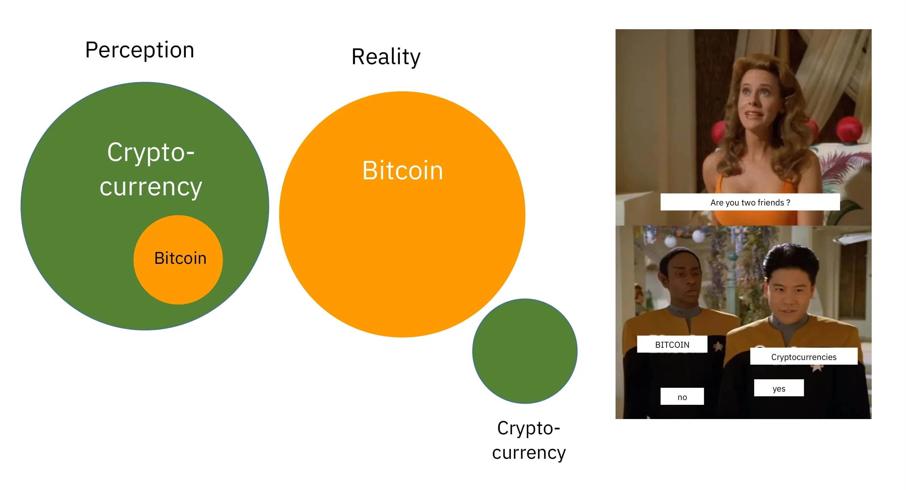

If you'd like to better understand where Bitcoin comes from and what truly makes it different from other projects, I recommend checking out this free follow-up course on the history of Bitcoin later on:

https://planb.academy/courses/a51c7ceb-e079-4ac3-bf69-6700b985a082

As you know, the Plan ₿ Academy platform is exclusively dedicated to Bitcoin. However, understanding the distinction with other cryptocurrencies will help you avoid the pitfalls associated with useless and sometimes even fraudulent projects.

<!-- END ORIGINAL -->

## Pyramid & Ponzi Schemes

<chapterId>ponzi-schemes-ch3</chapterId>

<!-- ORIGINAL: btc102/en.md lines 109-131 -->
### The main scams to avoid

Here are the most common scams you may come across on your journey:

#### Pyramid schemes and Ponzi schemes

These are some of the most common scams in the crypto world. In a Ponzi scheme, early participants receive payouts using the money from newer ones; not from any real investment or product. There's no actual value being created. The system only works as long as new people keep joining. Once the flow of new participants slows down, the whole scheme falls apart.

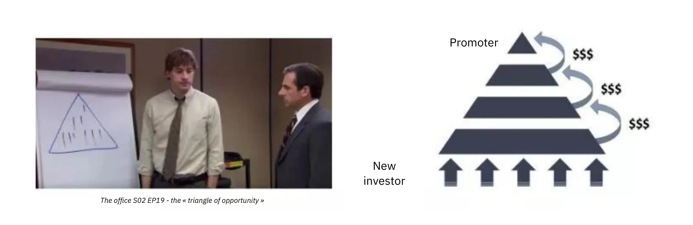

These scams usually feature:

- Unrealistic promises of guaranteed returns (e.g. 20% guaranteed return);
- Delays or difficulties when trying to withdraw your invested funds;
- Strong incentives to recruit new members to keep the system running;
- A complete lack of transparency about the true source of the promised returns.

Ultimately, all pyramid and Ponzi schemes are doomed to fail. Their fundamental weakness lies in the constant need to bring in new investors to pay returns to earlier participants. This need becomes mathematically impossible to sustain over time because the number of new recruits required increases exponentially as the system grows. Once a critical point is reached, participants start to doubt, trust disappears, and the entire pyramid collapses. At this stage, the last people to join, often the least informed, lose their entire investment with no way to recover it, while the organizers or early investors have typically already withdrawn their funds and left the system.

In the cryptocurrency world, Ponzi schemes can take many forms, often designed to conceal their fraudulent nature behind a technological or financial mask. These scams can appear as new token offerings or Initial Coin Offerings (ICOs), which are fundraising operations where a new cryptocurrency is sold to the public. Behind technical terms like "blockchain," "smart contracts," or "staking," some projects are actually hiding complex pyramid schemes. Others claim to offer high returns by combining questionable crypto-assets with compensation systems that rely entirely on the continuous influx of new investors.

More recently, Ponzi schemes have also spread into the world of Decentralized Finance (DeFi). While DeFi is intended to provide financial services without intermediaries, some projects use it to lend a false sense of legitimacy to their scams. Certain DeFi platforms promise high, guaranteed returns in exchange for cryptocurrency deposits into automated protocols. These attractive promises are often backed by opaque and unverifiable mechanisms, with tokens created specifically for the scam. In reality, these systems have no sustainable business model—the returns are simply paid from the funds of new users, just like a traditional Ponzi scheme. When trust starts to erode or the influx of new participants slows down, these systems inevitably collapse, leading to significant losses for unsuspecting investors.

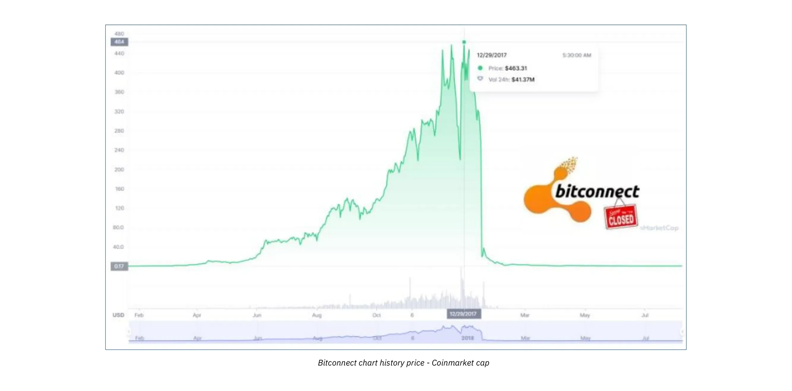

Please note that the content of this course is for educational purposes only and should not be interpreted as financial advice. Your financial security depends on your ability to remain cautious, skeptical and well-informed with every financial decision you make.

The best protection is to always ask this simple question: Where does the promised return actually come from? If the answer is unclear, run away immediately.
<!-- END ORIGINAL -->

## Pump & Dump Schemes

<chapterId>pump-dump-ch4</chapterId>

<!-- ORIGINAL: btc102/en.md lines 132-159 -->
#### Pump & Dump

This type of scam involves artificially inflating the price of an asset—often a low-liquidity cryptocurrency token—through a coordinated marketing campaign, usually led by a group of investors. The typical Pump & Dump scheme follows this pattern:

- A group of insiders or influential figures quietly accumulates a large amount of the targeted asset.
- They then launch an aggressive promotional campaign to generate hype and drive up the price.
- The general public, driven by FOMO (Fear of Missing Out), starts buying the asset in large numbers, pushing the price even higher.
- At the peak of the hype, the insiders sell off their holdings all at once.
- The price crashes, leaving latecomers with heavy losses.

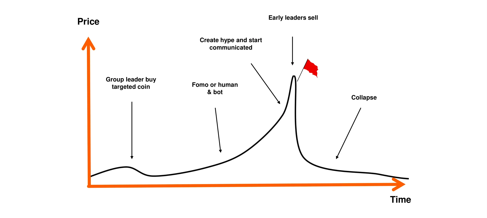

It's important to note that Pump & Dump strategies are illegal in many countries and are considered a form of market manipulation. Despite this, such schemes continue to flourish, especially in the cryptocurrency space, where regulation is still catching up.

Be especially cautious of private "signal" groups on platforms like Telegram, Discord, or other social media channels. These are often run by influencers or self-proclaimed experts, some of whom even charge entry fees. While these groups claim to offer exclusive investment opportunities, the reality is far more one-sided: only the organizers profit, while most participants end up losing their money.

It's true that some participants might temporarily profit from these kinds of market manipulations, but their success is usually based on nothing more than luck and perfect timing. In the long run, these schemes are not sustainable. They require constant high-risk involvement and repeated participation in fraudulent setups that inevitably collapse.

Even worse, they feed into a dangerous illusion: the belief that it's possible to make quick and easy money without understanding how financial systems actually work. This mindset not only puts individuals at risk, but also undermines the credibility of the entire cryptocurrency ecosystem

For all these reasons, the best strategy is to stick with a serious, thoughtful approach to investing, one that's grounded in financial education, a solid understanding of the fundamentals, and a long-term perspective.
By patiently building your knowledge, you'll be far less vulnerable to emotional manipulation and unrealistic promises; and much better equipped to avoid the kind of financial traps that can lead to real losses.
<!-- END ORIGINAL -->

## Fake Giveaways & Lotteries

<chapterId>fake-giveaways-ch5</chapterId>

<!-- ORIGINAL: btc102/en.md lines 160-168 -->
#### Donation, Lottery, and Fake Giveaway Scams

This type of scam promises free Bitcoin or other rewards in exchange for you sending a small amount of money first. It's important to remember: no legitimate individual or organization will ever ask you to send cryptocurrency upfront with the promise of sending you more in return.

Scammers often impersonate well-known public figures (like Elon Musk or other celebrities) to lure victims through social media. Always double-check the legitimacy of accounts and websites before engaging with them, and never trust offers that seem overly generous or too good to be true.

Sometimes, these scams appear as "advance fee" frauds. You're promised a prize or reward (money, a product, or a service) but are first asked to pay a fee, supposedly to cover things like shipping, taxes, or transaction costs. Once the payment is made, the scammer vanishes, and the promised reward never arrives.

<!-- END ORIGINAL -->

<!-- NEW -->
# Crypto Scams

<partId>crypto-scams-part3</partId>

## Shitcoins & Airdrops

<chapterId>shitcoins-ch6</chapterId>

<!-- ORIGINAL: btc102/en.md lines 170-172 -->
#### Shitcoins and cryptocurrencies on offer

Centralized crypto-currency projects sometimes offer free tokens ("*airdrops*") to attract users. These tokens typically hold little to no real value and are mainly used to create the illusion of popularity or to fuel speculation. Be extremely cautious with these kinds of promotional offers; they're often marketing traps rather than genuine opportunities.
<!-- END ORIGINAL -->

<!-- NEW -->
### Red Flags for Worthless Tokens

While the original warning above is brief, it's worth expanding on the common characteristics of "shitcoins" and worthless tokens:

**Technical Red Flags:**
- No working product or utility beyond speculation
- Copied or plagiarized code from other projects
- Anonymous or unverifiable development team
- No open-source code or audit history
- Centralized control over token supply

**Marketing Red Flags:**
- Promises of guaranteed returns or "100x gains"
- Celebrity endorsements (often paid or fake)
- Aggressive social media marketing campaigns
- Pressure to "buy now before it's too late"
- Claims of being "the next Bitcoin"

**Airdrop Warning Signs:**
- Requests for your private keys or seed phrase (NEVER share these)
- Requirement to connect your wallet to unknown websites
- Tokens that appear in your wallet without you requesting them
- "Free" tokens that require you to pay gas fees or "unlock" fees

Remember: if something appears in your wallet that you didn't ask for, treat it with extreme suspicion. Some malicious tokens are designed to steal your funds when you try to interact with them.
<!-- END NEW -->

## Phishing & Identity Theft

<chapterId>phishing-ch7</chapterId>

<!-- ORIGINAL: btc102/en.md lines 174-179 -->
#### Identity theft and phishing

Attackers often use fake websites, social media accounts, or deceptive emails to try and steal your funds. These scams can come through any communication channel: email, social networks, phone calls, or even traditional mail...

Before clicking on a link or taking any action, always double-check the sender's identity. When in doubt, visit the website manually instead of using a provided link. Most importantly, never share your private keys or passwords with anyone.
<!-- END ORIGINAL -->

## Bitcoin Hardforks Confusion

<chapterId>hardforks-ch8</chapterId>

<!-- ORIGINAL: btc102/en.md lines 180-191 -->
#### Bitcoin Hardforks

Over the years, Bitcoin has experienced several *hard forks*, which resulted in the creation of alternative versions of the original cryptocurrency. In simple terms, a *hard fork* is a split in the network that leads to two separate blockchains, both sharing the same history up until the moment of the split. These forks typically happen when part of the developer community or broader Bitcoin ecosystem wants to introduce major changes to the original protocol but can't reach widespread consensus. Instead of abandoning their ideas, they decide to launch a new version of Bitcoin (with altered rules) hoping that users and miners will choose to follow their fork instead.

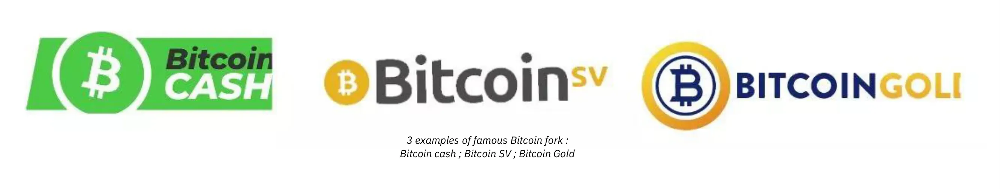

Not all *hard forks* are fraudulent, as some arise from technical or ideological disagreements within the community. However, others are driven by commercial interests or even dishonest motives. The most well-known examples of these hardforks are **Bitcoin Cash (BCH)** and **Bitcoin Satoshi Vision (BSV)**. Launched in 2017 and 2018, respectively, these alternative currencies often claim to be "better versions" of the original Bitcoin. They promote supposed advantages such as lower transaction fees or faster transactions due to increased block sizes. However, these technical changes come with significant trade-offs in terms of security, decentralization, and robustness; elements that can conflict with Bitcoin's foundational principles.

Beyond technical differences, these alternative currencies often capitalize on confusion to attract uninformed investors. They may employ marketing tactics designed to deliberately mislead newcomers who believe they are purchasing genuine Bitcoin (BTC).

To avoid falling into this trap, always verify the currency you're buying. The original Bitcoin uses the ticker **BTC**, while Bitcoin Cash and its derivatives use distinct acronyms, such as BCH or BSV.
<!-- END ORIGINAL -->

## Dishonest Influencers

<chapterId>influencers-ch9</chapterId>

<!-- ORIGINAL: btc102/en.md lines 192-219 -->
#### Dishonest influencers and fake gurus

As cryptocurrencies gain mainstream attention, social media has seen a surge of influencers, self-proclaimed experts, and so-called "*crypto gurus*". While a few may offer genuine educational insights, many others take advantage of their visibility to promote dubious projects or dangerously risky (and sometimes outright fraudulent) trading strategies. These individuals are usually motivated by personal financial interests, often receiving direct or indirect compensation for promoting certain tokens or platforms.

These influencers often rely on proven tactics to attract beginners: they showcase impressive financial results (which are often fake or unverifiable), flaunt a luxurious lifestyle as supposed proof of their success, and promote "miracle" investment strategies. The goal is to trigger FOMO — the fear of missing out — and push their audience into impulsive decisions and reckless investments.

It's important to understand that most "free" advice from these personalities is never truly free. Behind the façade of generosity often lies a calculated strategy to steer people toward buying questionable assets. And even if some influencers were being honest, replicating their results would be nearly impossible; their success often depends on specific timing, insider knowledge, or unique circumstances that you simply don't have access to.

Some influencers may invite you to join private, paid groups where they claim to share exclusive trading signals or insider tips that promise quick and easy profits. In reality, these groups mainly benefit the organizers themselves. They often use their followers as a source of liquidity, essentially offloading assets for personal gain. Subscribers usually end up losing money, as they're unable to react as quickly as the insiders who orchestrate the trades (see the section on Pump & Dump schemes).

In light of this reality, here are some good habits to adopt to avoid falling into the traps set by dishonest influencers:

- **Be very cautious with any crypto investment recommendations.**
A trustworthy and knowledgeable person will never pressure you into buying a cryptocurrency without encouraging you to do your own research first.
- **Paid trading or investment courses aren't always a mark of quality.**
Many of these courses promote risky or overly simplistic strategies; often the same information you can find online for free.
- **There's no such thing as a guaranteed way to copy someone's trades and get identical results.**
Every investment strategy depends on personal context, timing, knowledge, and other factors that can't be duplicated exactly.
- **Be especially wary of advice that sounds too good to be true.**
Unrealistic promises or guaranteed profits are almost always signs of manipulation. Remember: just because someone says something confidently doesn't make it true.

Always remember, everyone you encounter in the Bitcoin or broader crypto ecosystem has a personal agenda; whether it's stated outright or hidden between the lines. There's no such thing as purely neutral information. Even this course, BTC102, has a clear goal, *to promote better understanding of Bitcoin.*
That's why it's essential to stay aware of the real motivations behind every piece of content you consume. And never forget this golden rule of the internet:
*If a product or service seems free, chances are you are the product.*

Ultimately, your best defense is personal education, healthy skepticism, and most importantly, the habit of verifying facts for yourself.
<!-- END ORIGINAL -->

<!-- NEW -->
# How to Protect Yourself

<partId>protection-part4</partId>

## Red Flags & Verification

<chapterId>red-flags-ch10</chapterId>

<!-- ORIGINAL: btc102/en.md lines 221-234 -->
### How to avoid scams

**To stay safe online, especially in the world of crypto, keep these key principles in mind:**

- Never trust blindly: "*Don't trust, verify*";
- Be skeptical of guaranteed or unusually high returns;
- Never share your private keys with anyone;
- Don't send Bitcoin (or any crypto) to unknown addresses;
- If in doubt, pause. Step back and think before taking action. FOMO is your worst enemy;
- Avoid paid trading groups or communities that make unrealistic promises;
- Most giveaways or "free" lotteries online are scams or heavily rigged;
- You'll always gain more in the long term by learning than by gambling.

Protecting yourself from scams is a crucial first step in safeguarding your assets; but it's not enough. Maintaining strong digital hygiene is just as important. That's why, in the next chapter, we'll explore how to strengthen your online security and the best practices you should adopt to protect yourself in the digital world.
<!-- END ORIGINAL -->

<!-- NEW -->
# Online Security

<partId>online-security-part5</partId>

## Why Cybersecurity Matters

<chapterId>cybersecurity-ch11</chapterId>

<!-- ORIGINAL: btc102/en.md lines 240-255 -->
As soon as you start getting into Bitcoin, you'll quickly realize that basic cybersecurity isn't optional—it's essential. Scams and fraud are just the tip of the iceberg. Accidental data loss, malware, and compromised passwords can be just as devastating, especially when you're managing your own keys.

This chapter walks you through some simple, practical steps to level up your digital hygiene and protect yourself in the space.

If you want to go deeper, Plan ₿ Academy's SEC101 course offers a comprehensive breakdown of cybersecurity strategies specifically designed for Bitcoin users.

https://planb.academy/courses/99c46148-7080-4915-a7e0-9df0e145cd47

### Why Cybersecurity Matters

Bitcoin gives you the power to hold your money directly (without banks), without intermediaries. But that kind of financial sovereignty comes with serious responsibility: if your BTC gets stolen due to a security lapse, there's no way to reverse the transaction. Unlike traditional banking, there's no help desk, no fraud claim, and no insurance to bail you out.

On top of that, the financial value of Bitcoin makes it a high-value target. A hacker who compromises your wallet can instantly move your funds to an address they control (no questions asked, no way to get it back).
<!-- END ORIGINAL -->

## Clean Computer Practices

<chapterId>clean-computer-ch12</chapterId>

<!-- ORIGINAL: btc102/en.md lines 256-283 -->
### A clean, up-to-date computer

One of the most overlooked aspects of personal security is keeping your operating system and software up to date. Many updates patch known vulnerabilities that could otherwise be exploited by attackers. While some people avoid updates fearing performance issues, the real risk lies in running outdated software that hackers already know how to break.

It's also highly recommended to use a reliable antivirus. On Windows, the built-in Windows Defender is generally sufficient for most users. If you prefer additional features or peace of mind, commercial options like Kaspersky are also available. On macOS, malware threats are historically less common **but not non-existent** so it's still smart to stay cautious.

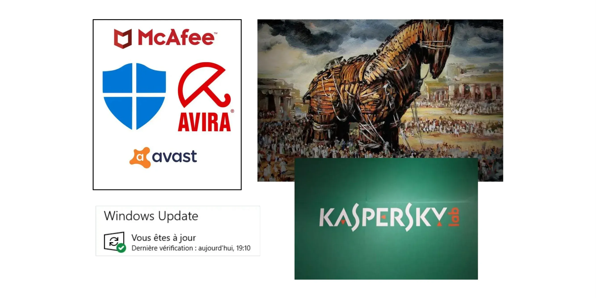

Beyond system updates and antivirus protection, be extremely wary of downloading software from sketchy websites or so-called "universal" download portals. When you need a tool or application, always go straight to the official source;This drastically reduces the risk of installing malware disguised as legitimate software.
Another smart habit is to verify the authenticity and integrity of any software before installing it on your machine. If you're not sure how to do that, don't worry we've got a dedicated tutorial to walk you through the process:

https://planb.academy/tutorials/computer-security/data/integrity-authenticity-21d0420a-be02-4663-94a3-8d487f23becc

Finally, make regular backups of your important data. An external hard drive or SSD is a solid option for keeping a duplicate of your files in case of sudden failure, hacking, or accidental deletion. You'll thank yourself later.

If you prefer cloud solutions, consider using a secure service like Proton Drive. Just make sure whatever option you choose respects your privacy and offers strong encryption.

https://planb.academy/tutorials/computer-security/data/proton-drive-03cbe49f-6ddc-491f-8786-bc20d98ebb16

A widely recommended backup strategy is the "3-2-1 rule". It is designed to protect your data from accidental loss, cyberattacks or even natural disasters.
The idea is simple:
- Keep **at least 3 copies** of your important data,
- Store them on **at least 2 different types of media** (e.g., an external hard drive and cloud storage),
- And make sure **1 of those copies is stored off-site** (physically separated from your main location).

This approach offers strong resilience and helps ensure your data survives even if something goes seriously wrong.

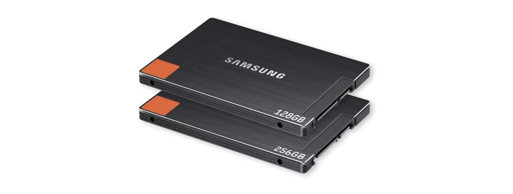
<!-- END ORIGINAL -->

## Password Security

<chapterId>passwords-ch13</chapterId>

<!-- ORIGINAL: btc102/en.md lines 285-305 -->
### The solution to the ID nightmare

One of the biggest reasons people get hacked is using weak passwords. A significant number of users still reuse the same password across multiple accounts, or choose variations that are easy to guess. Password managers are the perfect solution to this problem.

A password manager lets you:
- **Store all your passwords securely** in an encrypted vault
- **Generate long, complex, and unique passwords** automatically for each account
- **Use just one master password**,to access everything securely

With a password manager, you'll never have to click "Forgot password" again or rely on weak, reused credentials. Plus, most password managers sync seamlessly across your devices (desktop, phone, tablet) and even autofill login forms, making secure access both effortless and efficient.

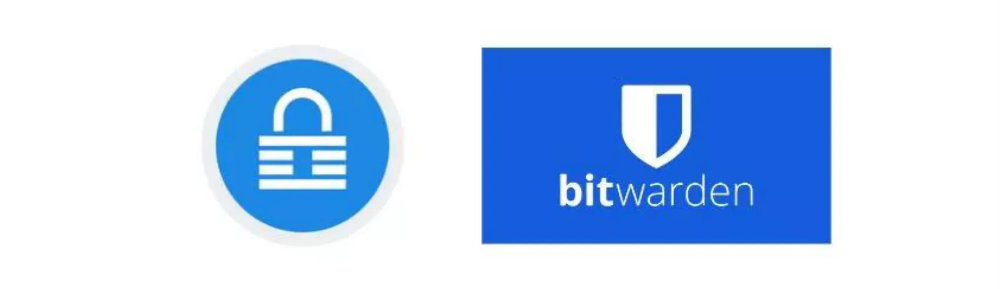

There are many password managers out there, but I can recommend two solid options depending on your needs. If you're looking for something easy to use that syncs seamlessly across multiple devices, Bitwarden is an excellent choice:

https://planb.academy/tutorials/computer-security/authentication/bitwarden-0532f569-fb00-4fad-acba-2fcb1bf05de9

If you rather keep everything locally on your own device, KeePass is a great option:

https://planb.academy/tutorials/computer-security/authentication/keepass-f8073bb7-5b4a-4664-9246-228e307be246
<!-- END ORIGINAL -->

<!-- NEW -->
> **Want to set this up?**
> For step-by-step tutorials on setting up password managers like Bitwarden or KeePass, check out SCU101:
> https://planb.academy/courses/scu101
<!-- END NEW -->

## Two-Factor Authentication

<chapterId>2fa-ch14</chapterId>

<!-- ORIGINAL: btc102/en.md lines 306-325 -->
### 2FA: double protection

In Bitcoin, you're your own bank. That means you're also your own security team. Even with a strong password, there's no such thing as zero risk-which is why enabling two-factor authentication (2FA) is essential.

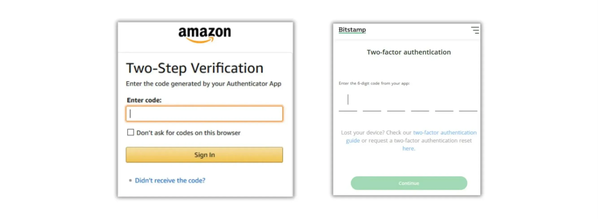

2FA adds a second layer of protection by requiring a time-based one-time code (usually 6 digits) generated by an app like Google Authenticator or Authy. So even if someone manages to get your password, they still can't access your account without physical access to your phone.

https://planb.academy/tutorials/computer-security/authentication/authy-a76ab26b-71b0-473c-aa7c-c49153705eb7

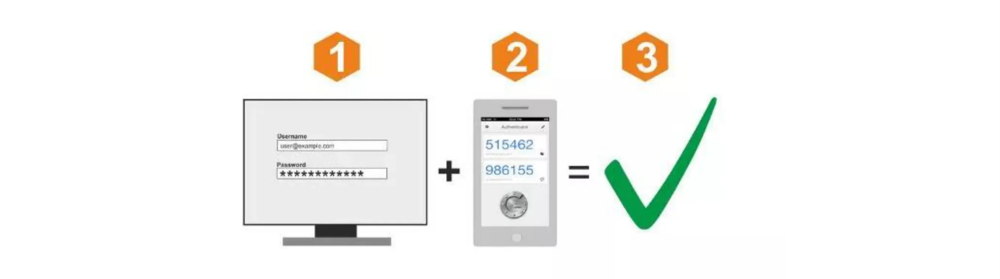

When you enable 2FA, make sure to save the recovery key for your app in a safe place. This will let you restore your codes if you lose or change your phone. While SMS or email-based 2FA is better than nothing, it's much less secure. A SIM swap attack, where someone takes control of your phone number, can easily bypass this kind of protection.

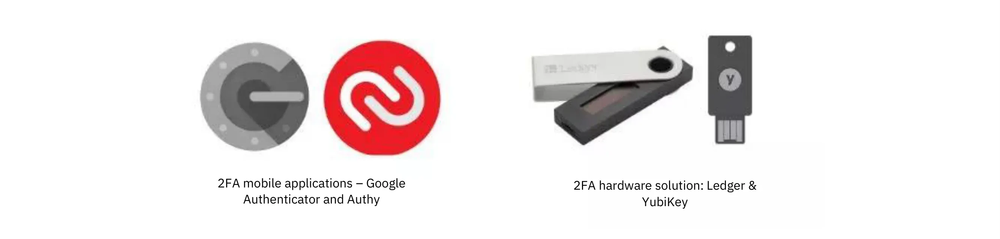

For those looking to take security a step further, physical keys like YubiKey provide an even higher level of protection.

https://planb.academy/tutorials/computer-security/authentication/security-key-61438267-74db-4f1a-87e4-97c8e673533e
<!-- END ORIGINAL -->

<!-- NEW -->
> **Want to set this up?**
> For step-by-step tutorials on setting up 2FA apps like Authy, check out SCU101:
> https://planb.academy/courses/scu101
<!-- END NEW -->

## Privacy Protection

<chapterId>privacy-ch15</chapterId>

<!-- ORIGINAL: btc102/en.md lines 326-359 -->
### Protecting your privacy

Privacy and cybersecurity are closely linked: the more information you leave freely accessible, the more likely you are to become a target.

A **VPN** (*Virtual Private Network*) is a simple yet effective step to mask your IP address and encrypt your internet traffic. While it won't make you completely invisible (since the VPN provider can still see your activity), it does make it significantly harder for anyone trying to spy on you or track your browsing habits.
The key is choosing a trustworthy VPN provider that:
- Doesn't require your personal information
- Allows payment via BTC
- Has a strict no-logs policy

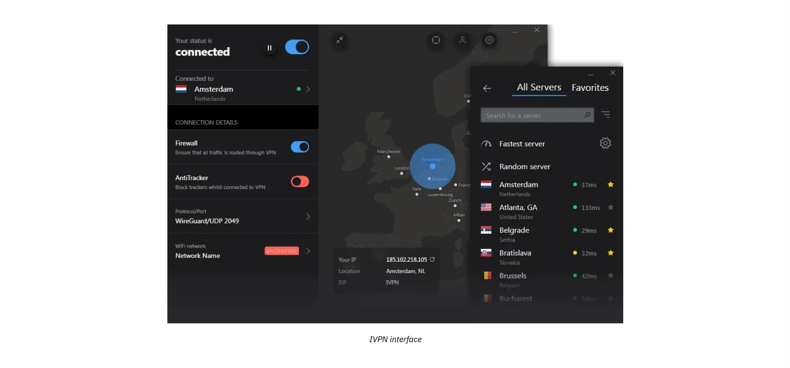

We have several tutorials available on Plan ₿ Academy that can guide you through setting up a VPN easily. I particularly recommend IVPN or Mullvad:

https://planb.academy/tutorials/computer-security/communication/ivpn-5a0cd5df-29f1-4382-a817-975a96646e68

https://planb.academy/tutorials/computer-security/communication/mullvad-968ec5f5-b3f0-4d23-a9e0-c07a3e85aaa8

Essential steps to protect your privacy online also include:
- Using **encrypted messaging platforms** such as Signal, SimpleX or Session;
- Using privacy-focused browsers such as Firefox, Brave, or Tor (for enhanced anonymity);

https://planb.academy/tutorials/computer-security/communication/tor-browser-a847e83c-31ef-4439-9eac-742b255129bb

- Using a **secure mailbox** such as ProtonMail;

https://planb.academy/tutorials/computer-security/communication/proton-mail-c3b010ce-254d-4546-b382-19ab9261c6a2

- **Encrypting** your files with tools like Bitlocker (for Windows) or VeraCrypt (available across multi-platform).

https://planb.academy/tutorials/computer-security/data/veracrypt-d5ed4c83-7c1c-4181-95ea-963fdf2d83c5
<!-- END ORIGINAL -->

<!-- NEW -->
> **Want to set this up?**
> For step-by-step tutorials on setting up VPNs, Tor Browser, and other privacy tools, check out SCU101:
> https://planb.academy/courses/scu101
<!-- END NEW -->

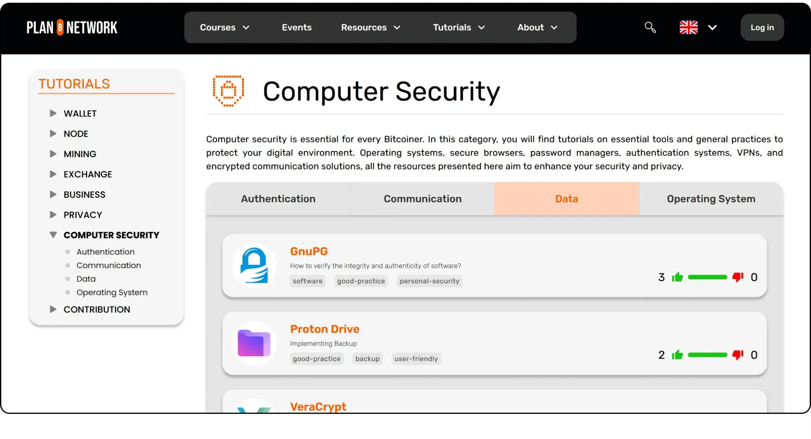

## Step-by-Step Security Progression

<chapterId>progression-ch16</chapterId>

<!-- ORIGINAL: btc102/en.md lines 360-373 -->
### Step-by-step progression

Cybersecurity can seem like a massive undertaking, and it's easy for beginners to get overwhelmed and give up because it seems too complex. The trick is to approach it step by step. Start with something simple, like installing a password manager. Give yourself a few weeks to get comfortable with it, then move on to the next step: like enabling 2FA on one of your accounts.

As you get more confident with these tools, you'll be ready to add more advanced practices, like using a secondary email, switching to ProtonMail, setting up a VPN, or browsing with Tor when necessary.

As you dive deeper into the world of Bitcoin, you'll notice that the risks grow as the value of your wallet increases. Building solid security habits, protecting your privacy, and setting up the right tools will not only give you peace of mind but also strengthen the sovereignty Bitcoin is all about.

In short: don't underestimate cybersecurity, take the time to set up the basics, and remember that consistency is key. Without good digital hygiene, even the best tools won't do much for you.

Also be sure to checkout [our computer security tutorials](https://planb.academy/tutorials/computer-security) on Plan ₿ Academy.
<!-- END ORIGINAL -->

<!-- NEW -->
# Tips for Bitcoin Beginners

<partId>beginner-tips-part6</partId>

## Common Mistakes to Avoid

<chapterId>mistakes-ch17</chapterId>

<!-- ORIGINAL: btc102/en.md lines 398-419 -->
### Common mistakes to avoid

Bitcoin is open to everyone, but that doesn't mean you should dive in unprepared. Here are some of the classic mistakes made by newcomers:

**Technological mistakes:**

- **Losing your seed phrase:** Your recovery phrase (usually 12 or 24 words) is the only way to access your bitcoin if something happens to your wallet. If you lose it, your funds are gone permanently;
- **Storing your bitcoins on a third-party platform:** If your coins are on a centralized platform, you don't really own them. You're exposed to risks like hacks, platform failures, or even fund seizures;
- **Neglecting privacy:** Protecting your privacy is a core part of securing your assets. Publicly revealing how much bitcoin you hold could make you a target;
- **Insufficient online security:** Failing to secure your devices with basic protections (like updates, strong passwords, or 2FA) makes you an easy mark for attackers; and could cost you everything.

**Financial mistakes:**

- **Investing more than you can afford to lose**: Never go into debt or put your rent money into bitcoin. Your basic financial stability should always come first.

- **Not knowing the difference between trading and investing**: Trading requires time, skill, and serious emotional discipline. Long-term investing is far more beginner-friendly.

- **Forgetting about taxes**: Every country has its own tax rules for crypto. Ignoring them can lead to painful surprises down the road.

- **Falling for FOMO**: Buying impulsively out of fear of missing out usually leads to bad timing and bad decisions. Patience is your best ally.

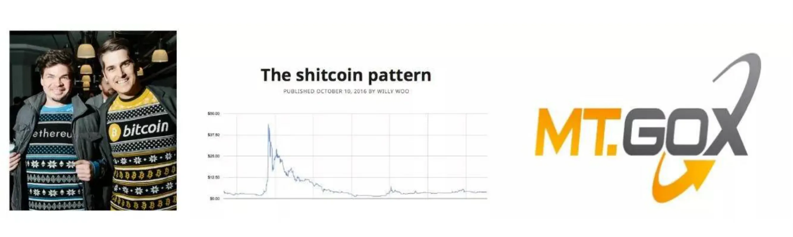

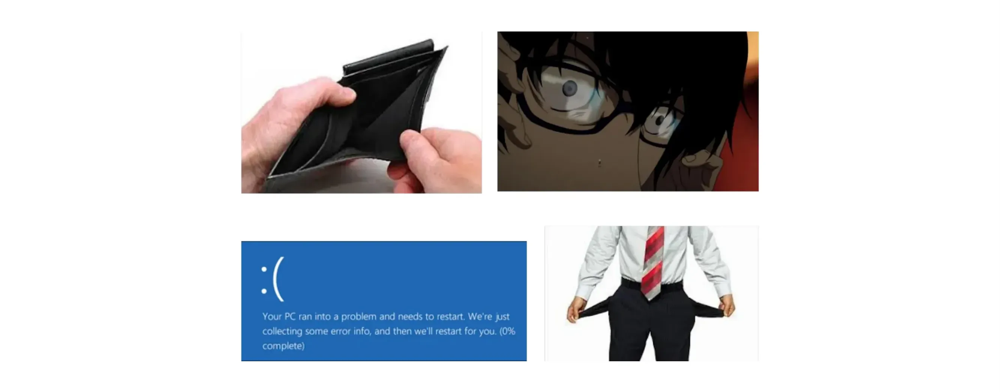
<!-- END ORIGINAL -->

## Investment Strategy Basics

<chapterId>investment-ch18</chapterId>

<!-- ORIGINAL: btc102/en.md lines 421-439 -->
### Defining an investment strategy

Before buying your first satoshi, it's crucial to understand why you're investing in Bitcoin and how. This means having a clear financial plan tailored to your personal situation and long-term goals.

Start by defining your **budget** with precision. Don't just pick a random number. Take the time to calculate your monthly income, subtract your fixed expenses (like rent, loans, taxes, utilities), as well as your day-to-day living costs (food, transport, leisure, etc.). Whatever remains is your savings margin and it's only from this portion that you should consider investing.
Approaching it this way ensures that you're not putting your financial well-being at risk, especially in the event of a market downturn. A thoughtful strategy is the foundation of long-term resilience.

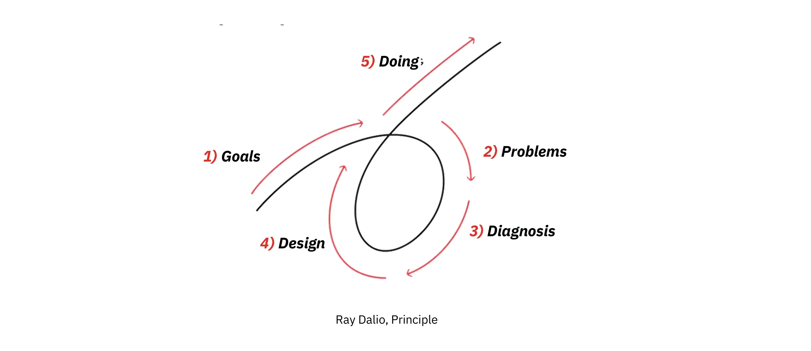

Once your budget is defined, think about how you want to invest. One of the most beginner-friendly and widely recommended methods is [Dollar Cost Averaging (DCA)](https://planb.academy/resources/glossary/dollar-cost-averaging-dca), buying a fixed amount of bitcoin at regular intervals (weekly, monthly, etc.). This strategy helps smooth out your average entry price over time and reduces the emotional impact of price swings. It's a smart approach for most people, especially newcomers.

Then, ask yourself: What's my time horizon?
Are you looking to make quick moves in and out of the market (trading)? Or are you more aligned with the long-term mindset of holding Bitcoin over several years (hodler)? If you're a hodler, you're probably less concerned with daily price swings and more focused on long-term security and self-custody. If you're trading, you'll be more exposed to short-term market noise, higher risk, and the stress that often comes with rapid decision-making. There's no one-size-fits-all answer, but knowing your own approach will help guide your decisions.

Most importantly, don't make investment decisions based on emotion or fear. Set a strategy in advance, write it down, and stick to it.

If you're still unsure, **start by learning.**
Spend a few hours exploring Bitcoin, check out the free resources on Plan ₿ Academy, read a couple of books, throw in five euros just to try it out, and watch some quality content online. Stay curious. The more comfortable you get, the easier it'll be to revisit your strategy, tweak your approach, and move forward with confidence.
<!-- END ORIGINAL -->

## Understanding Volatility

<chapterId>volatility-ch19</chapterId>

<!-- ORIGINAL: btc102/en.md lines 440-448 -->
### Understanding BTC's volatility

Bitcoin is known for its dramatic price swings. Moves of 10%, 20%, or even 50% over just a few days aren't unusual. For newcomers, this kind of volatility can be disorienting. It's easy to get swept up in the hype during bull runs or panic during downturns; both of which often lead to poor decisions, like selling at a loss.

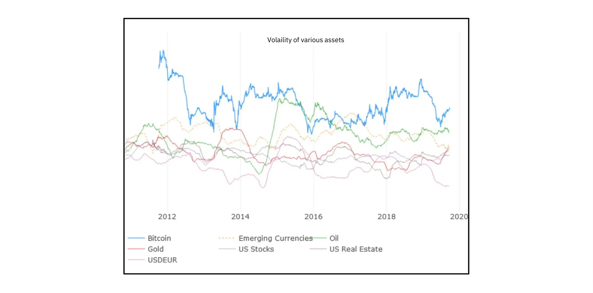

That's why it's crucial to **understand and accept Bitcoin's volatility** before you invest. These price swings aren't a bug, they're a feature of a still-maturing asset. If sudden ups and downs are keeping you up at night or pushing you into emotional decisions, chances are you've put in more than you're comfortable risking. In that case, take a step back and reassess your strategy and risk tolerance. Don't hesitate to scale down your position until you feel more at ease.

Above all, never invest more than you can afford to lose. Avoid borrowing money to buy bitcoin (especially if you're still learning the fundamentals). A solid foundation starts with measured steps, not reckless bets.
<!-- END ORIGINAL -->

## Wallet Security Fundamentals

<chapterId>wallet-security-ch20</chapterId>

<!-- ORIGINAL: btc102/en.md lines 450-469 -->
### Managing and securing your Bitcoin wallet

One of Bitcoin's most powerful (and often underestimated) features is **[self-custody](https://planb.academy/resources/glossary/selfcustody)**. With a self-hosted wallet, you alone are responsible for your funds. These wallets are typically generated from a **recovery phrase** (also known as a [seed phrase](https://planb.academy/resources/glossary/seed)), a series of 12 or 24 words that grants full access to your BTC. If you lose this phrase (or if someone else gets hold of it) your bitcoins are gone for good. **No customer support. No reset button.**

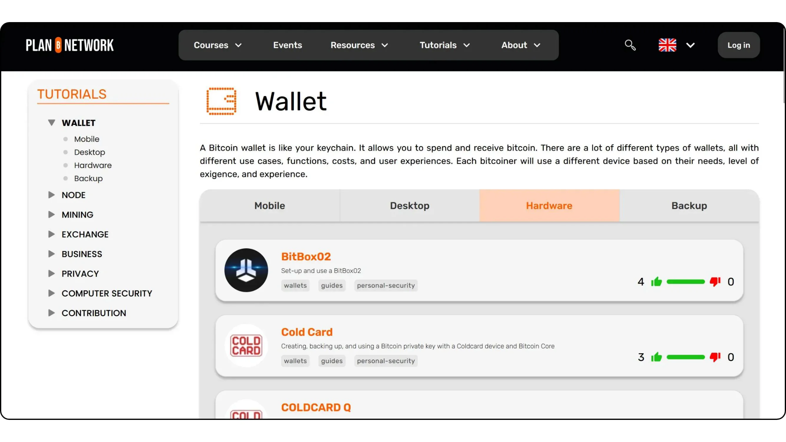

That's why the golden rule in Bitcoin is:
 "***Not your keys, not your coins***". If you don't personally control your private keys, you don't truly own your bitcoin. While exchanges can be convenient (especially when starting out) they hold your keys for you. That means your funds are at risk if the platform gets hacked, freezes your account, or goes bankrupt.

To avoid this risk, it's strongly recommended to set up your **own wallet**, where only you have access to the recovery phrase. This phrase should always be written down by hand and stored **offline** in a safe location. Some users even **maintain multiple backups**, stored in separate geographic locations for added security.

**Never store your recovery phrase on an internet-connected device or in the cloud**.
**A single hack or data breach could lead to irreversible loss.**

If you're ready to take ownership of your bitcoin and want to dive deeper into best practices for securing your recovery phrase, I highly recommend checking out this article:

https://planb.academy/tutorials/wallet/backup/backup-mnemonic-22c0ddfa-fb9f-4e3a-96f9-46e2a7954270
<!-- END ORIGINAL -->

## Confidentiality & Discretion

<chapterId>discretion-ch21</chapterId>

<!-- ORIGINAL: btc102/en.md lines 470-485 -->
### Confidentiality and discretion

In today's digital world, **discretion is often overlooked**; yet it's a crucial part of staying safe, especially when it comes to Bitcoin. The more openly you talk about your holdings, the more likely you are to become a target for scammers, cybercriminals, or even more traditional threats like extortion or blackmail.
There have been numerous cases across the world where individuals known to hold large amounts of BTC were kidnapped or attacked.

**Avoid bragging about your bitcoin stash**; whether on social media or even in casual conversations. There's no upside to revealing sensitive financial information, and the risks are real.

It's also wise to **compartmentalize your online activity**. For example:
- Use a separate email address for anything Bitcoin-related, distinct from your personal or work accounts.
- Be cautious of phishing attempts, suspicious links, and fake websites that mimic trusted platforms.
- Stay alert! discretion and vigilance are often your best defense.

If you're ready to go deeper into the topic of Bitcoin privacy, we recommend continuing with our Year 2 Privacy Course, where you'll learn more advanced techniques to keep your identity and activity secure:

https://planb.academy/courses/65c138b0-4161-4958-bbe3-c12916bc959c
<!-- END ORIGINAL -->

## Tax Awareness

<chapterId>taxes-ch22</chapterId>

<!-- ORIGINAL: btc102/en.md lines 486-495 -->
### Tax implications

Despite being a decentralized currency, **Bitcoin is not exempt from the tax laws and regulations** of your country. Every jurisdiction has its own approach to how gains from cryptocurrencies are taxed.
In some places, profits are taxed as capital gains upon selling. Others may require you to declare every trade, and some apply less common rules, such as wealth taxes or social contributions.

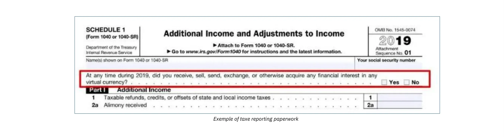

Before making any significant transactions, it's strongly recommended to consult a tax professional or review your government's official guidance. Taking time to understand your tax obligations in advance can save you from unexpected issues later (like fines, audits, or penalties) especially if you're planning large sales or portfolio reallocations.

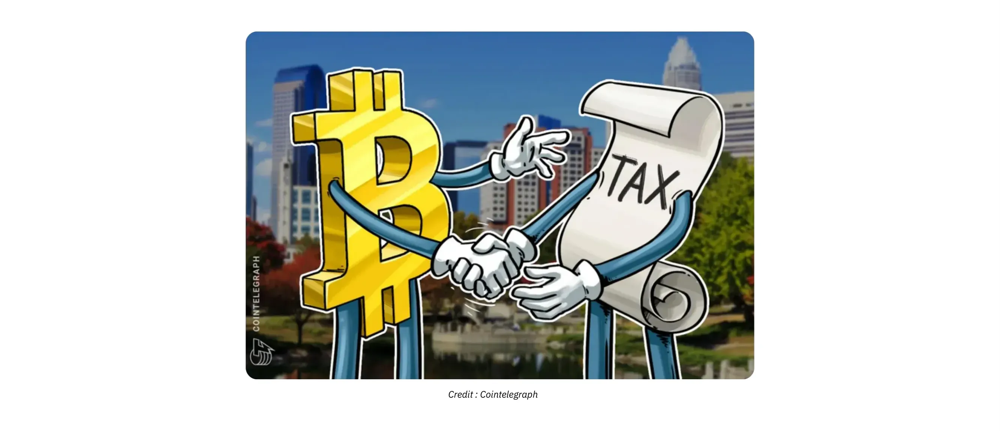
<!-- END ORIGINAL -->

## Trading vs Investing vs Holding

<chapterId>trading-investing-ch23</chapterId>

<!-- ORIGINAL: btc102/en.md lines 497-528 -->
### The Difference Between Trading, Investing, and Holding

Bitcoin is often surrounded by popular misconceptions; one of the most common being the idea that it's a fast track to getting rich through trading. But it's important to understand the clear distinction between trading, investing, and holding, as each approach comes with its own mindset, skillset, and level of risk.

- **Trading:**

Let's be honest:**you probably shouldn't be trading.**
Trading involves short-term speculation (sometimes with leverage) aiming to profit from Bitcoin's price swings. While it may sound appealing, successful trading requires advanced technical knowledge (like chart analysis and risk management), emotional discipline, and constant attention to the market. It's mentally taxing and time-consuming, and the hard truth is that **most beginners lose money** because they underestimate how demanding it really is.
As Warren Buffett famously said:
"**If you're not willing to hold a stock for ten years, don't even think about holding it for ten minutes**."
Bitcoin isn't a get-rich-quick scheme.

- **Investment:**

Investors take a medium to long-term view, buying bitcoin with the belief that its value will grow over time (months, years, or even decades). There's still risk, of course, since the price of bitcoin can fluctuate significantly. But this approach is generally calmer and far more practical for most people, especially those who don't want to spend hours glued to the charts every day.

- **Holding (HODL):**

"HODL" started as a typo for "hold" and quickly became part of Bitcoin culture. Today, it's a badge of honor.
Hodlers are in it for the very long game; sometimes ten years or more. They store their bitcoin safely and simply wait, driven by strong conviction in Bitcoin's long-term potential. They aren't fazed by daily price swings or bear markets. Their mindset is simple: accumulate, secure, and sit tight.

|          | Trading | Investment | Holding |
| ---------------------- | ----------- | -------------- | --------------- |
| Leverage | Yes  | No | No |
| Timeframe | Short-term | Medium-term | Very long-term |
| Asset Type | Contracts | Actual BTC | Actual BTC |
| Risk Level | Very high | High | High |
| Difficulty | Very Hard | Hard | Hard |
| learning curve | Long learning curve | Long learning curve | Long learning curve |
| Potential Loss | UnLimited | Limited | Limited |
| Best For | A few experienced users | Most People | Long-term Believers |
<!-- END ORIGINAL -->

## Going Further

<chapterId>going-further-ch24</chapterId>

<!-- ORIGINAL: btc102/en.md lines 529-537 -->
It's never too early (or too late) to start educating yourself about money, investing, and how the financial system really works. You don't need to become an expert or dive into every technical detail; having a solid, big-picture understanding is enough to make informed decisions and avoid being misled by financial products that don't serve your interests (often promoted by banks or advisors).

A great starting point is the book *Rich Dad, Poor Dad* by Robert T. Kiyosaki. It's widely known for its approachable style and foundational lessons; like understanding the difference between assets and liabilities, and why financial education is key to long-term independence.

If you're ready to go deeper, podcasts like *The Investors Podcast* offer insightful discussions on investing, markets, and economic principles. They occasionally cover Bitcoin too, making it a solid next step for those curious to understand how Bitcoin fits into the broader financial landscape.

<!-- END ORIGINAL -->

<!-- NEW -->
### Additional Resources

Beyond general financial education, here are some Bitcoin-specific resources to continue your learning journey:

**Plan ₿ Academy Courses:**
- **BTC101**: The philosophical and theoretical foundations of Bitcoin - https://planb.academy/courses/btc101
- **SCU101**: Hands-on security tutorials (password managers, 2FA, VPNs) - https://planb.academy/courses/scu101

**Books:**
- *The Bitcoin Standard* by Saifedean Ammous
- *Mastering Bitcoin* by Andreas M. Antonopoulos
- *The Little Bitcoin Book* by Bitcoin Collective

**Stay Curious:**
The Bitcoin space evolves constantly. Follow reputable educators, join local Bitcoin meetups, and never stop questioning what you learn.

### Golden Rules to Keep in Mind

To wrap things up, here are a few timeless principles that every Bitcoiner (especially beginners) should keep in mind:

- **Rule n°1**: Never invest more than you can afford to lose. Bitcoin is a volatile asset. Don't risk your financial stability chasing gains. Your essential needs and peace of mind should always come first.
- **Rule n°2**: Don't blindly follow the hype or trust miracle advice. Ignore trends and flashy promises. Instead focus on making well-informed, rational decisions. When in doubt, sleep on it; talk it through with people you trust. It's better to move slowly and thoughtfully than to rush into costly mistakes.
- **Rule n°3**: Build a plan and stick to a long-term vision. Consistency, patience, and discipline will take you further than short-term excitement. Don't aim for moonshots; aim for sustainable growth. Avoid fatal mistakes and let small wins compound over time.

By following these principles, you'll be able to approach Bitcoin investing with more clarity and peace of mind. Yes, Bitcoin is volatile, and it can be intimidating at first; but when approached with caution, patience, and a grounded mindset, it holds undeniable potential. Take the time to build your knowledge, revisit your strategy when needed, and above all, remember: slow and steady progress will always serve you better than rushing in out of fear or impatience.
<!-- END NEW -->

# Conclusion

<partId>conclusion-part7</partId>

## Conclusion

<chapterId>conclusion-ch25</chapterId>
<isCourseConclusion>true</isCourseConclusion>

<!-- NEW -->

Congratulations on completing SCU102! You now have a strong foundation in the security and awareness skills needed to navigate the Bitcoin world safely.

Throughout this course, you've learned to:

- **Recognize financial fraud**: From Ponzi schemes to pump & dump tactics, you can now spot the red flags before falling victim
- **Identify crypto-specific scams**: Shitcoins, fake giveaways, phishing attacks, and dishonest influencers no longer catch you off guard
- **Build strong digital security habits**: Password managers, two-factor authentication, privacy tools, and clean computing practices are now part of your toolkit
- **Approach Bitcoin investing wisely**: You understand the importance of strategy, patience, and never investing more than you can afford to lose

Remember the three golden rules:
1. Never invest more than you can afford to lose
2. Don't blindly follow hype — verify everything
3. Build a plan and stick to a long-term vision

Your next step is to put this knowledge into practice. Continue your learning journey with:
- **BTC103** — Why Bitcoin Matters
- **BTC105** — How to Acquire Bitcoin
- **BTC104** — How to Secure Bitcoin

Stay safe, stay curious, and welcome to the Bitcoin ecosystem.

<!-- END NEW -->
