# Un pas de plus vers la souveraineté numérique

Dans un monde où les appareils numériques sont omniprésents, mais rarement maîtrisés, apprendre à sécuriser son propre environnement informatique devient une nécessité. Qu’il s’agisse de votre ordinateur, de votre navigateur, de votre téléphone ou de votre réseau domestique, chacun de ces éléments constitue une porte d’entrée potentielle vers votre vie privée. Ce cours vous propose de reprendre le contrôle sur vos appareils numériques.

L’objectif n’est pas seulement de connaître les bonnes pratiques : il s’agit de comprendre ce que vous utilisez, comment vous l’utilisez, et ce que cela implique pour votre sécurité. Ce cours SCU 202 vous plonge dans les bases techniques des systèmes d’exploitation, vous initie à l’utilisation concrète de Linux, et vous guide dans la configuration d’un environnement de travail stable, fonctionnel et résilient.

Au fil des modules, vous découvrirez comment vérifier l’intégrité des logiciels que vous installez, chiffrer efficacement vos données, utiliser votre navigateur et votre téléphone avec un minimum de fuite de données, et renforcer la sécurité de votre réseau domestique.

Cette formation s’adresse aux utilisateurs intermédiaires qui souhaitent aller plus loin dans la maîtrise de leurs outils numériques. Elle repose sur une approche pragmatique, orientée autonomie et souveraineté, afin de construire un usage quotidien plus sûr et plus conscient de l'informatique, dans l'esprit du "*Don't Trust, Verify*".

+++

# Introduction
<partId>8b696bba-e6f6-47d9-ba30-fe4b75636b88</partId>

## Aperçu du cours
<chapterId>7bf90137-7387-462d-884f-fe48e812b739</chapterId>


## Récapitulatif essentiel de SCU 101
<chapterId>26cfac35-a3bb-4657-95b3-8508bedfa903</chapterId>

Ici l'idée c'est de faire un gros recap de chaque section de SCU101 pour avoir un cours dans la continuité.


# Du clic au terminal : maîtriser Linux
<partId>e28895b3-2b09-4811-8031-5abc1f14fde2</partId>

## Linux, Windows, macOS : lequel vous convient ?
<chapterId>598cdecb-f90c-4382-b13c-0ba5a9dfeede</chapterId>

Commençons ce cours SCU 202 par la base : le système d'exploitation (OS) de votre ordinateur. C’est lui qui conditionnera non seulement le choix de votre matériel informatique, mais également votre sécurité, votre confort d’usage et votre capacité à personnaliser votre machine.

Avant d’entrer dans les détails techniques de Linux dans les prochains chapitres, il est important de comprendre les grandes différences entre les trois systèmes les plus répandus : Windows, macOS et donc GNU/Linux. Dans ce chapitre, nous allons étudier chaque solution, afin d'en identifier les forces et les limites, puis de faire un choix éclairé et adapté à vos usages.

### C'est quoi un système d’exploitation ?

Un système d’exploitation est un ensemble de programmes centraux qui agit comme intermédiaire entre l’utilisateur, les applications (qui sont également des logiciels) et le matériel informatique, c'est-à-dire, votre ordinateur. Il constitue la couche logicielle de base qui permet l’exploitation des ressources matérielles d’un ordinateur (processeur, mémoire, disques, périphériques...).

Concrètement, le système d'exploitation reçoit, traite puis répond aux requêtes émises par vos logiciels, en utilisant au mieux les ressources de l'ordinateur à sa disposition. C’est lui qui gère l’exécution simultanée de plusieurs programmes, pilote les composants du PC, gère les connexions, permet la gestion des fichiers, et assure la sécurité des données et des utilisateurs grâce à des mécanismes d’autorisation et d’authentification.

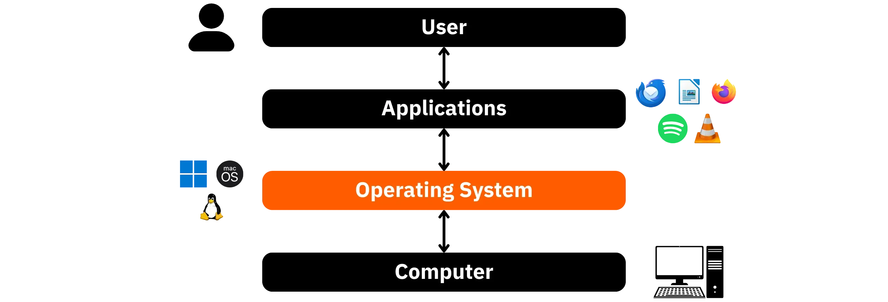

Sans système d’exploitation, chaque logiciel devrait intégrer son propre mode de communication avec le matériel, ce qui rendrait presque impossible les interactions entre différents programmes. Son rôle est donc essentiel.

C'est d'ailleurs de cette manière que fonctionnaient les premiers ordinateurs. Le tout premier système d’exploitation, GM-NAA I/O, n'arrive qu'en 1956. Il introduit le traitement par lots, qui automatise la gestion des tâches. Les années 1960 voient ensuite apparaître la multiprogrammation et le partage de temps avec CTSS (1961) et Multics (1969), qui permettent à plusieurs utilisateurs d’interagir simultanément avec un même système. Puis, dans les années 1970, l'invention d'Unix révolutionne l’informatique avec sa portabilité, sa gestion du multitâche et sa simplicité.


### Les principaux systèmes d’exploitation et leurs parts de marché

Aujourd’hui, le marché des systèmes d’exploitation est dominé par trois grandes familles : **Windows, macOS et GNU/Linux**.

Selon les statistiques actuelles, Windows représente toujours la majorité des installations sur les ordinateurs personnels, avec environ 71 % de parts de marché. Cette domination s’explique par une combinaison de facteurs historiques, économiques et techniques :

- Depuis les années 1990, Windows est installé par défaut sur la majorité des ordinateurs vendus, ce qui a généré une familiarité massive auprès du public. Microsoft a rapidement noué de nombreux accords OEM (contrats par lesquels les fabricants de PC préinstallent Windows), ce qui a ainsi créé une inertie difficile à freiner.

- Bien que cette tendance évolue lentement, Windows s’est très tôt imposé comme le standard dans le monde professionnel. En dehors de secteurs spécifiques comme la tech, la quasi-totalité des entreprises fonctionne encore sur des machines Windows.

- La large base d’utilisateurs a encouragé les développeurs à créer leurs logiciels en priorité pour Windows, afin de toucher le plus grand nombre. En retour, la richesse de l’écosystème applicatif attire de nouveaux utilisateurs, ce qui créée un cercle vertueux.

- Enfin, cette hégémonie est également renforcée par l’image perçue des systèmes concurrents : Linux reste souvent considéré comme trop technique pour le grand public (et reste méconnu de la majorité), tandis que macOS, lié exclusivement aux produits Apple, est souvent perçu comme onéreux.

macOS, quant à lui, se situe autour de 16 % de parts de marché et est généralement choisi pour son intégration optimale avec le matériel Apple. Le choix de ce système d’exploitation est d’ailleurs renforcé depuis quelques années par les performances des Mac, grâce à l’introduction des puces Apple Silicon. Ce tournant majeur a marqué l’abandon des processeurs Intel x86 au profit d’une architecture ARM, plus efficace en matière de performance et de consommation énergétique.

Linux reste minoritaire sur les ordinateurs personnels (environ 4 %), mais domine largement les serveurs (environ 63 %) et les supercalculateurs (100 %), grâce à sa stabilité et à ses performances.


*Source avril 2025 : [StatCounter Global Stats - OS Market Share](https://gs.statcounter.com/os-market-share/desktop/worldwide)*

Par ailleurs, on retrouve Linux massivement intégré dans les équipements embarqués, tels que les routeurs, les télévisions connectées, les smartphones (Android étant basé sur un noyau Linux) et même dans l’industrie automobile. Windows conserve une forte implantation en entreprise, tandis que macOS est privilégié par les professionnels dans certains secteurs spécifiques.

→ **Important :** Le noyau est le composant central du système d’exploitation : il orchestre l’accès au matériel (processeur, mémoire, périphériques), arbitre l’exécution simultanée des processus, applique les politiques de sécurité et expose aux programmes une interface uniforme qui masque la complexité des circuits électroniques. Autrement dit, il sert d’intermédiaire entre l'environnement logiciel (bibliothèques, pilotes, shell, services, outils d’administration, interface graphique...) et la machine.

### Windows : simplicité d’usage et compatibilité

Windows est un système d’exploitation propriétaire développé par Microsoft. Il équipe la majorité des ordinateurs personnels dans le monde. Historiquement, il était apprécié pour sa simplicité d’utilisation et son interface intuitive. Toutefois, cet avantage est aujourd’hui discutable : l’interface de macOS est elle aussi très accessible, et de nombreuses distributions Linux ont une interface adaptée au grand public (nous y reviendrons dans les chapitres suivants).

Pour un utilisateur peu expérimenté ou aux besoins limités (bureautique, multimédia, navigation web), Windows peut constituer une porte d’entrée simple, qui bénéficie d’une vaste documentation et d’une prise en main rapide. Mais dans les faits, le seul domaine dans lequel Windows surpasse clairement macOS et Linux reste celui du jeu vidéo.

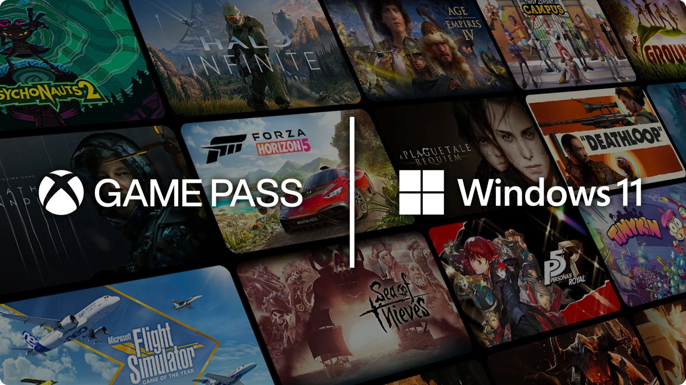

L’un des atouts majeurs de Windows est la richesse de son écosystème logiciel : quasiment tous les programmes commerciaux (suites bureautiques, logiciels professionnels, jeux vidéo ou encore pilotes matériels) sont compatibles avec Windows. Pour les utilisateurs qui recherchent une solution prête à l’emploi avec peu de configuration, cela peut être un choix cohérent.

Cependant, cette accessibilité a un coût. Windows est un système fermé, centralisé, dont le code source n’est pas public. Aucune vérification indépendante n’est possible, ce qui pose des limites évidentes en matière de transparence et de sécurité. Par ailleurs, la collecte de données (télémétrie) est omniprésente sur Windows et souvent activée par défaut, sans réel consentement éclairé ou possibilité de contrôle.

Sur le plan de la sécurité, Windows est une cible privilégiée pour les logiciels malveillants. Sa popularité et certaines failles structurelles historiques expliquent en partie cette situation. Des efforts ont certes été réalisés les dernières années (notamment avec Windows Defender et l'UAC), mais l’ensemble reste conçu dans une logique de facilité d'utilisation, plus que de résilience et de contrôle utilisateur.


Selon moi, Windows occupe une position centrale peu affirmée : il peut être sécurisé, mais l’est moins que Linux et macOS ; il laisse un certain contrôle, mais bien moins que Linux ; il n’est ni aussi performant que macOS, ni aussi simple que Chrome OS ou certaines distributions Linux destinées aux débutants. Il est moyen en tout, sans être véritablement mauvais dans aucun domaine (sauf la confidentialité, par défaut).


Dans une démarche de souveraineté numérique et de maîtrise technique, Windows montre rapidement ses limites. Son modèle repose sur une relation déséquilibrée entre l’utilisateur et l’éditeur, au profit de ce dernier. Pour ceux qui souhaitent comprendre, personnaliser et sécuriser en profondeur leur ordinateur, c'est un système d'exploitation peu adapté. C’est pourquoi nous ne nous attarderons pas davantage sur Windows dans SCU 202.

### macOS : intégration et optimisation

macOS est le système d’exploitation développé par Apple pour ses ordinateurs Mac. C'est un système héritier d’Unix, via le système NeXTSTEP, qui a été racheté par Apple en 1997. macOS repose sur un noyau appelé "*XNU*", qui combine des éléments de BSD (*Berkeley Software Distribution*) et un micro-noyau Mach.

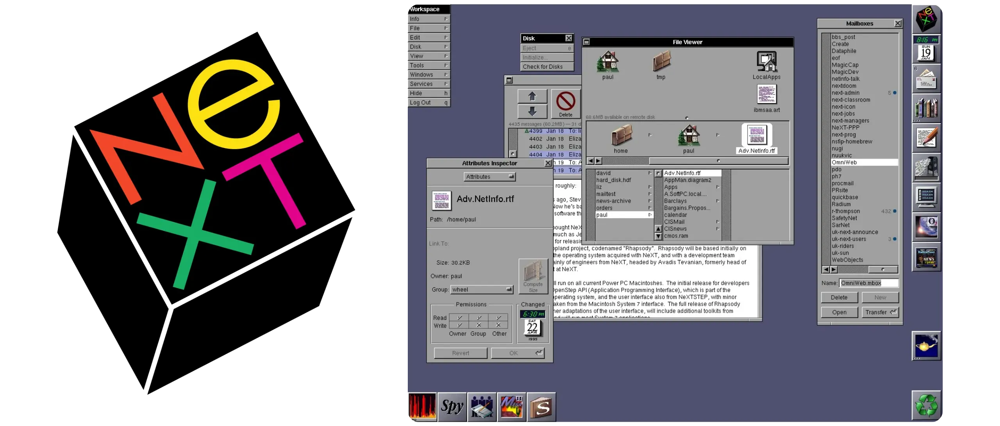

Cette base solide lui donne une bonne stabilité, une gestion efficace des ressources, et une architecture relativement sécurisée par défaut. À cela s’ajoute une interface graphique particulièrement soignée, pensée pour une expérience utilisateur fluide.

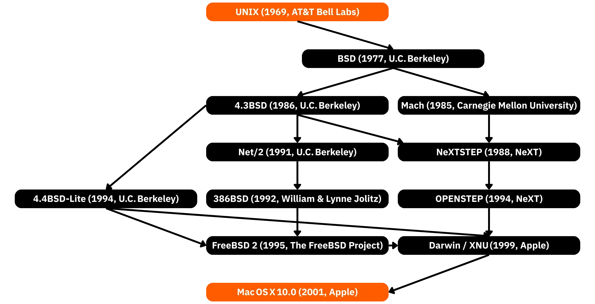

L’un des atouts majeurs de macOS réside dans l’intégration verticale du matériel et du logiciel. Apple contrôle toute la chaîne, de la conception des processeurs aux moindres détails de l’interface. Résultat : un système globalement fiable, avec peu de bugs matériels, et optimisé pour les performances.

Cependant, cette intégration a pour inconvénient un enfermement croissant dans l’écosystème Apple. macOS est un système en partie propriétaire (dont le code source est majoritairement fermé) et qui ne fonctionne que sur les machines fabriquées par Apple. L’utilisateur n’a que peu de contrôle sur les mises à jour, les options de configuration système avancées ou le choix de ses composants matériels. Le matériel est difficilement modifiable ou réparable, souvent verrouillé logiciellement.

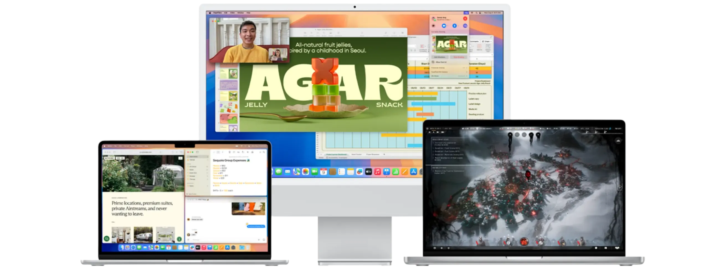

Côté respect de la vie privée, bien que macOS soit moins intrusif que Windows, il reste lié à une logique de collecte de données, de synchronisation cloud, et de dépendance à des services centralisés. La plupart des fonctions avancées du système reposent sur une connexion permanente à l’écosystème Apple (iCloud, App Store, Siri…), ce qui limite l’indépendance de l’utilisateur.

macOS peut convenir aux utilisateurs qui valorisent la performance, la stabilité et le confort d’un système bien intégré, sans avoir à se plonger dans les détails techniques. En revanche, dans une démarche de souveraineté numérique et de contrôle de son environnement informatique, il s’avère trop fermé, trop dépendant d’une entreprise unique, et peu propice à une personnalisation fine. C'est pourquoi nous n'en parlerons pas plus dans ce cours SCU 202.

### GNU/Linux : liberté, contrôle et sécurité

GNU/Linux se distingue fortement des deux précédents par son modèle libre et open-source. À la différence de Windows ou macOS, Linux n’est pas développé par une unique société, mais par une communauté mondiale de développeurs. Ce modèle communautaire garantit transparence, sécurité et flexibilité. Linux offre un contrôle total à ses utilisateurs, ce qui permet une personnalisation complète de l’environnement de travail. C'est intéressant particulièrement pour les utilisateurs avancés, les développeurs ou ceux qui souhaitent maîtriser parfaitement leur environnement numérique.

Le principal atout de Linux réside dans sa robustesse, sa stabilité et son haut niveau de sécurité. Étant open-source, son code est auditable par tout utilisateur ou organisme, ce qui limite fortement les risques de logiciels malveillants ou de portes dérobées. Linux est très performant, consomme généralement moins de ressources que Windows, et se montre particulièrement adapté aux configurations matérielles modestes ou à usage intensif tel que le calcul, l’administration de serveurs ou la cybersécurité.


Cependant, Linux présente aussi une certaine complexité pour les débutants. La multiplicité des distributions Linux disponibles peut dérouter les utilisateurs non initiés. De même, la prise en main initiale, bien que simplifiée par certaines distributions, peut nécessiter un apprentissage préalable pour maîtriser correctement le système, notamment en raison d'une utilisation régulière du terminal (ligne de commande). Cela tombe bien, c'est justement l'objectif de cette première partie du cours SCU 202 !

### Quel système d’exploitation choisir pour vous ?

Votre choix dépendra principalement de vos besoins et de vos attentes :
- Si vous recherchez la simplicité, une très large compatibilité matérielle et logicielle (notamment pour les jeux vidéo), ainsi qu’une utilisation généraliste, Windows peut être une bonne option. Il faut toutefois être conscient de ses limites en termes de performance, de sécurité et de confidentialité ;
- Si vous recherchez une intégration optimale entre votre matériel et votre système, une ergonomie soignée, une sécurité relativement bonne sans avoir à effectuer de configurations avancées, et que vous possédez déjà ou souhaitez intégrer l'écosystème Apple, macOS est naturellement adapté ;
- Enfin, si vous recherchez avant tout la sécurité, la stabilité, la performance et une maîtrise approfondie de votre environnement numérique, tout en étant prêt à investir du temps pour apprendre à utiliser votre système d’exploitation, Linux est une excellente option, particulièrement dans un contexte où l'autonomie technique et la souveraineté numérique sont prioritaires.

Dans les prochains chapitres de cette section sur le système d'exploitation, je vous accompagnerai plus en profondeur sur Linux, précisément parce qu'il permet ce contrôle accru sur votre environnement numérique personnel.

## Aux origines de GNU/Linux
<chapterId>9dbf749d-daae-493b-ab96-93a322df011d</chapterId>

Avant d'étudier les distributions GNU/Linux et la place qu'occupe ce système dans l'informatique contemporain, il est important d’en retracer les origines pour comprendre ce qu'il représente. Dans ce chapitre, nous revenons sur les racines historiques, philosophiques et techniques de GNU/Linux, à travers l’héritage d’Unix, la genèse du projet GNU, la création du noyau Linux et l’émergence des mouvements du logiciel libre.

### L’héritage d’Unix

La naissance de Linux ne peut être comprise sans évoquer son ancêtre direct : Unix. Créé à la fin des années 1960 et au début des années 1970 par Ken Thompson, Dennis Ritchie et leurs collègues des laboratoires Bell d’AT&T, Unix marque un tournant majeur dans l’histoire des systèmes d'exploitation. Développé initialement en langage *Assembleur*, puis réécrit en langage *C* par Dennis Ritchie en 1973, Unix pose les fondations d’un modèle d'OS radicalement nouveau basé sur la modularité et la simplicité.


Cette approche se traduit par le principe fondateur formulé par Doug McIlroy : 

> Do one thing and do it well.

Unix peut être considéré comme une évolution et une réaction au système d’exploitation Multics, dont il adopte une architecture radicalement opposée. Multics est un projet initié en 1964, fruit d’une collaboration entre le MIT, General Electric et les laboratoires Bell d’AT&T. Ken Thompson et Dennis Ritchie (les créateurs d'UNIX) ont donc pu suivre de près ce projet Multics jusqu’en 1969, date à laquelle leur entreprise se retire du développement.

C’est à ce moment-là qu’émerge Unix, initialement baptisé "*UNICS*" pour "*UNiplexed Information and Computing Service*", en opposition directe à "*MULTiplexed Information and Computing Service*", l’acronyme de Multics. Cette nouvelle approche prône la simplicité, la modularité et l’efficacité, en rupture avec la complexité excessive de Multics.

Cependant, dès les années 1970, Unix se développe dans un contexte de recherche, avant d’être diffusé largement dans les universités à partir de 1975, notamment à cause des restrictions antitrust qui frappaient AT&T. Cela favorise son adoption dans de nombreux laboratoires, comme à Berkeley, où naît la branche BSD (*Berkeley Software Distribution*). En parallèle, AT&T commence à commercialiser Unix dans les années 1980, ce qui entraîne une multiplication de versions propriétaires incompatibles entre elles (System V, Xenix, SunOS, AIX, Solaris, HP-UX...).

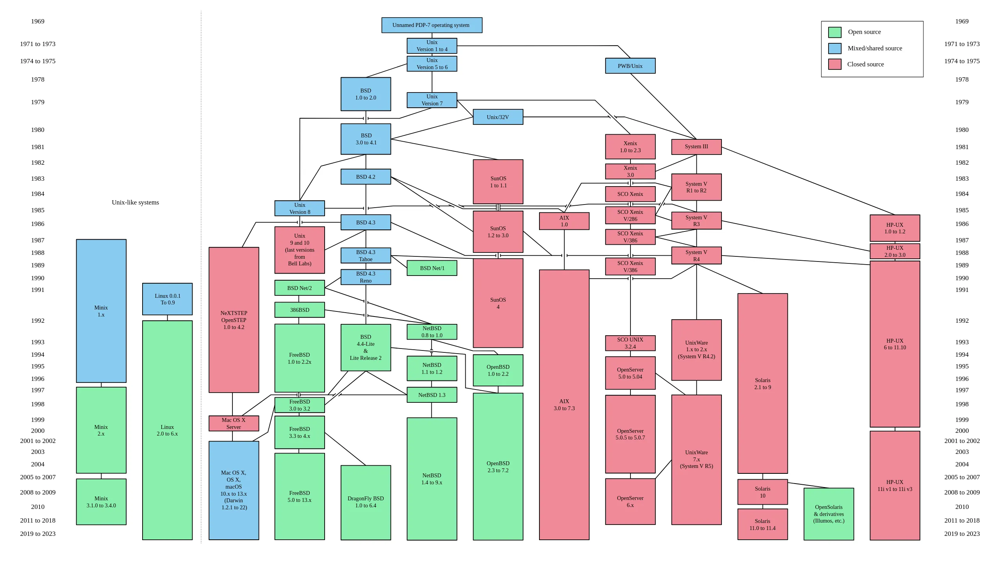

*Source : Unix history-simple, par Eraserhead1, Infinity0 et Sav_vas, image dérivée du diagramme Unix History de Éric Lévenez, [Wikimedia Commons](https://commons.wikimedia.org/wiki/File:Unix_history-simple.svg).*

La fragmentation grandissante entre ces branches (BSD côté académique, et notamment System V côté industriel) crée une forte confusion et limite l’interopérabilité des systèmes. Pour retrouver un équivalent d'Unix libre de droits, stable et portable, la communauté lance plusieurs initiatives, dont le projet GNU en 1983, puis le développement du noyau Linux en 1991, qui viendra combler l’absence de noyau libre dans l’écosystème GNU. Ce sera le point de départ du système GNU/Linux.

### Le projet GNU

Le projet GNU (acronyme récursif "*GNU’s Not Unix*") est officiellement annoncé par Richard Stallman le 27 septembre 1983, dans des groupes de discussion spécialisés. À cette époque, Stallman travaille encore au laboratoire d’intelligence artificielle du MIT. Dès le 5 janvier 1984, il quitte volontairement son poste afin de garantir que le code qu’il allait écrire ne puisse être revendiqué par son employeur. Il entame alors le développement de GNU, avec l’objectif de créer un système d’exploitation entièrement libre, c’est-à-dire respectant quatre libertés fondamentales : exécuter, étudier, modifier et redistribuer librement le logiciel.


Au-delà des aspects techniques, le projet GNU s’inscrit donc dans une philosophie héritée de la culture hacker des années 1970 : une culture fondée sur le partage du savoir, la coopération entre pairs et l’accès libre au code source. Richard Stallman souhaitait préserver cet esprit de collaboration qui dominait les débuts de l’informatique, à une époque où les constructeurs distribuaient encore librement les sources de leurs systèmes. Le projet GNU ne vise pas seulement à proposer un système d’exploitation libre, mais à défendre une vision politique et éthique de l’informatique : celle d’un savoir accessible à tous, sans monopole ni verrou propriétaire. Il s’agit d’empêcher que l’utilisateur devienne prisonnier d’un logiciel qu’il ne peut ni comprendre ni modifier, et de favoriser une informatique émancipatrice.

C'est dans cet objectif que Stallman fonde la *Free Software Foundation* (FSF) en 1985, une organisation qui se donne pour mission d’encourager et de promouvoir l’utilisation et la création de logiciels libres.

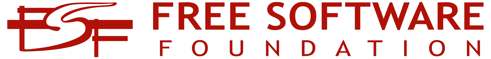

GNU fournit rapidement une série d’outils essentiels pour son système :
- GCC (compilateur C) ;
- glibc (bibliothèque standard C) ;
- coreutils (commandes de base) ;
- Emacs (famille d'éditeur de texte) ;
- bash (interpréteur en ligne de commande) ;
- GDB (débogueur)...


Certaines briques externes sont également intégrées, comme le système de fenêtrage X Window System, le moteur de composition TeX, ou encore le micro-noyau Mach, utilisé avec l’ensemble de serveurs GNU Hurd (ensemble, Mach et Hurd remplissent les mêmes rôles qu’un noyau Unix classique, mais selon une architecture micro-noyau + serveurs). Ce projet de remplacement du noyau était ambitieux mais très complexe. Il ne deviendra jamais pleinement fonctionnel, ce qui laissera la place pour le noyau Linux.

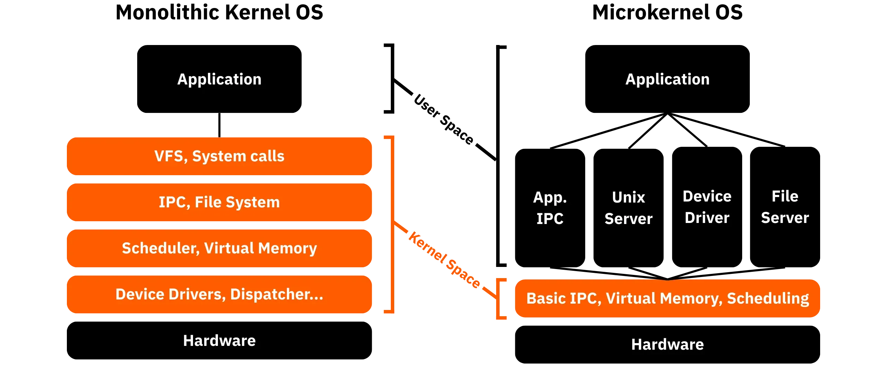

La majeure partie de GNU est développée par des bénévoles, certains sur leur temps libre, d’autres financés ponctuellement par des entreprises, des universités ou des associations. À la fin des années 1980, la FSF commence à salarier des développeurs pour accélérer le travail. Certaines entreprises, comme Cygnus Solutions (plus tard intégrée à Red Hat), participent activement à la maintenance et à la commercialisation du logiciel libre GNU.

Lorsque Linus Torvalds publie son noyau Linux en 1991, il s’intègre parfaitement à l’environnement déjà constitué par GNU, et s'avère être bien plus pertinent que le noyau Mach + Hurd. L’association de GNU et Linux permet de disposer pour la première fois d’un système d'exploitation complet, libre et fonctionnel : **GNU/Linux**, la concrétisation pratique du projet lancé par Stallman près d’une décennie plus tôt.

### La naissance du noyau Linux

L’histoire du noyau Linux commence en 1991, avec Linus Torvalds, alors étudiant en informatique à l’université d’Helsinki, en Finlande. Insatisfait par les limitations de Minix, un système d’exploitation Unix minimaliste conçu par Andrew S. Tanenbaum à des fins pédagogiques, Torvalds entreprend le développement de son propre noyau pour son ordinateur personnel, simplement dans l’objectif d’apprendre en pratiquant. Le 25 août 1991, il annonce publiquement son projet sur le forum Usenet, en précisant modestement que celui-ci est encore rudimentaire et expérimental. Début 1992, la version 0.12 du projet sera diffusée sous la licence libre GNU GPL.


Très rapidement, ce noyau, initialement baptisé Freax puis renommé Linux (contraction de "Linus" et "Unix"), attire l’attention d’autres développeurs passionnés. Une communauté internationale se constitue spontanément, afin de contribuer au code source librement accessible. Contrairement à GNU, Linux n’est initialement qu’un noyau : c’est-à-dire le composant logiciel chargé de gérer les ressources matérielles de la machine. Associé aux outils et applications déjà développés par le projet GNU, ce noyau permet enfin de disposer d’un système d’exploitation entièrement libre et fonctionnel. Cette combinaison est désignée sous le nom de "GNU/Linux" afin de mettre en avant la synergie entre les deux projets. Toutefois, dans le langage courant, ce système d’exploitation est généralement appelé simplement "Linux".


→ ***Tux*** : la mascotte et le logo du noyau Linux, créé en 1996 par Larry Ewing à l’aide du logiciel GIMP.

### Philosophie de l’open-source et du logiciel libre

À mesure que Linux gagne en popularité dans les années 1990, un débat idéologique émerge autour des termes "logiciel libre" et "open-source", notamment à cause de la double signification du terme "*free*" en anglais.

Tandis que Richard Stallman et la FSF militent fermement pour l’idée du logiciel libre fondée sur des principes éthiques ("*free as in freedom*"), d’autres acteurs privilégient une approche plus pragmatique orientée sur l'ingénierie et centrée sur la transparence et l’efficacité technique du modèle ouvert. C’est en 1998 qu’est créée l’Open Source Initiative (OSI), qui introduit le terme "open-source" afin de séduire davantage les entreprises en mettant en avant les bénéfices économiques et techniques plutôt que des considérations idéologiques.

Richard Stallman critique ouvertement l’usage du terme "open-source", qu’il juge trop neutre, voire dépolitisé. Il insiste sur le terme "logiciel libre" pour souligner que la question centrale n’est pas technique, mais sociale : celle de la liberté des utilisateurs.


*Source : Nathaniel Welch*

La distinction entre les deux termes réside donc dans la motivation sous-jacente : le mouvement du logiciel libre promeut avant tout une philosophie de liberté individuelle et collective vis-à-vis du logiciel, tandis que l’open-source valorise principalement l’efficacité technique, la transparence et la collaboration en tant que moyens pour obtenir un meilleur produit.

Malgré leurs différences philosophiques, ces deux courants partagent des valeurs communes comme la transparence, l’auditabilité du code source, l’indépendance vis-à-vis des fournisseurs, et la possibilité pour l’utilisateur final de comprendre, modifier et améliorer ses outils informatiques. Aujourd’hui encore, ces distinctions alimentent régulièrement débats et réflexions au sein des communautés techniques, notamment Bitcoin.

### Impact culturel et social

GNU et Linux ne sont pas seulement une réussite technique : leur impact culturel et social est tout aussi important. Leur diffusion initiale s’est faite majoritairement via Internet, à travers des forums techniques, des mailing lists, puis rapidement à travers des distributions, c’est-à-dire des assemblages préconfigurés de logiciels autour du noyau Linux. Dès 1993, des distributions pionnières comme Slackware et Debian voient le jour, afin de faciliter l’accès au système d'exploitation GNU/Linux à un public plus large.

Cette approche communautaire, ouverte et collaborative, permet à Linux d’évoluer rapidement, de manière décentralisée et participative. Chaque utilisateur peut contribuer au projet, que ce soit en codant, en documentant ou en testant. Cette dynamique de collaboration massive constitue une innovation sociale majeure dans l’univers informatique.

Comme nous l'avons vu dans le chapitre précédent, aujourd’hui, l’héritage de Linux s’étend bien au-delà des simples ordinateurs personnels : il domine le marché des serveurs Internet, alimente les supercalculateurs, constitue la base technique du système Android qui équipe des milliards de smartphones à travers le monde, et se trouve même au cœur d’innombrables appareils électroniques du quotidien (routeurs, téléviseurs connectés, objets connectés, etc.).

GNU/Linux représente donc bien plus qu’un simple système d’exploitation : c’est une philosophie, une démarche technologique, culturelle et sociale fondée sur l’ouverture, la collaboration et la liberté numérique. Ces valeurs continuent d’influencer profondément la manière dont nous concevons, utilisons et partageons les technologies aujourd’hui.

À la lumière de cet héritage technique, il est désormais possible d’examiner concrètement comment ces principes se matérialisent dans l’écosystème des ordinateurs personnels actuels. Pour cela, nous allons à présent explorer le vaste paysage des distributions Linux (ou GNU/Linux), afin d’en comprendre l’évolution ainsi que les cas d’usage, pour vous aider à choisir celle qui correspond le mieux à vos besoins.

## Panorama des distributions Linux
<chapterId>868f44d7-69ce-4493-b65e-daff00f3eb54</chapterId>

Une distribution Linux (souvent abrégé "*distro*") est un système d’exploitation complet construit à partir du noyau Linux (et parfois avec des éléments de GNU), auquel viennent s’ajouter un ensemble cohérent de logiciels, de bibliothèques, de scripts d’initialisation et d’outils de gestion, afin de former un environnement prêt à l’usage. Une distribution Linux ne se limite donc pas au noyau, mais constitue une intégration globale de composants logiciels nécessaires au bon fonctionnement et à l'utilisation d'un ordinateur (ou tout autre appareil informatique).

Dans chaque distribution Linux, on retrouve :
- le **noyau Linux**, qui communique avec le matériel et gère les ressources système (CPU, mémoire, disques...) ;
- un **bootloader**, tel que *GRUB*, qui permet de démarrer le système ;
- un **système d’initialisation** qui permet de lancer les services à l’amorçage : *systemd*, *OpenRC*, *SysV init*, ou *runit* selon les choix philosophiques de la distribution ;
- un **système de gestion de paquets**, qui permet d’installer, mettre à jour et supprimer les logiciels. Les plus courants sont *APT* (Debian, Ubuntu), *RPM/DNF* (Fedora, RHEL), *Pacman* (Arch), *Zypper* (openSUSE) ou *APK* (Alpine) ;
- des **dépôts de logiciels** accessibles en ligne, qui centralisent les versions validées des applications disponibles ;
- un **ensemble d’outils système** (shell, éditeurs, compilateurs, interfaces réseau...) et souvent un environnement de bureau préconfiguré (*GNOME*, *KDE Plasma*, *XFCE*...) ;
- des scripts de configuration, une documentation adaptée, et parfois des services d'assistance.

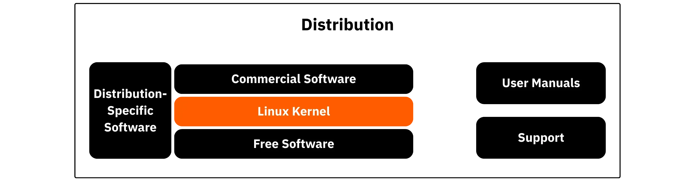

Ce travail d’assemblage est spécifique à chaque distribution, qui sélectionne ses composants selon sa philosophie (simplicité, légèreté, sécurité, stabilité, innovation...), ses publics cibles (débutants, entreprises, serveurs, postes de travail, machines embarquées...) et son cycle de développement (*rolling release* ou *stable*). Par exemple, Arch Linux privilégie la simplicité structurelle et la transparence technique, tandis qu’Ubuntu se concentre sur l’expérience utilisateur et la compatibilité grand public (mais nous y reviendrons dans la dernière partie de ce chapitre).

→ **Remarque :** Une distribution *rolling release* intègre les dernières versions des logiciels dès leur disponibilité, ce qui permet d'avoir un système constamment à jour mais potentiellement moins stable. À l’inverse, une distribution *stable* envoie les versions des logiciels à la sortie d’une version majeure, ce qui garantit une meilleure fiabilité au détriment de la nouveauté.

L’existence des distributions permet à l’utilisateur de bénéficier d’un système Linux prêt à l’emploi, sans avoir à reconstruire manuellement chaque brique logicielle. Cela représente un énorme gain en temps, en cohérence et en sécurité. Aussi, en termes d’architecture, les distributions tirent partie de la couche d’abstraction matérielle fournie par le noyau Linux. Cette couche permet au système d’exploitation d’être compatible avec une large gamme de matériels différents, sans qu’il soit nécessaire d’adapter les logiciels à chaque composant spécifique. Cette modularité offre également la possibilité de modifier ou de remplacer facilement des composants du système sans avoir à le reconstruire entièrement.

Comprendre les différences entre les distributions Linux est donc une étape importante pour choisir celle qui correspond à vos usages, vos compétences et vos exigences. C'est ce que nous allons voir dans ce chapitre.

### Origines historiques des distributions Linux

Les premières distributions Linux apparaissent dans le sillage immédiat de la publication du noyau Linux par Linus Torvalds en septembre 1991. À l’époque, Linux n’est qu’un noyau : pour obtenir un système complet, les utilisateurs doivent assembler manuellement les différents composants nécessaires (souvent issus du projet GNU) ce qui demande d'avoir une forte expertise technique. L’installation du système nécessite de compiler soi-même le noyau, de configurer les partitions, de choisir ses outils, de gérer les dépendances logicielles... Bref, une démarche complexe, réservée aux initiés.

Pour rendre Linux plus accessible, plusieurs projets émergent rapidement, dans l’idée d’assembler un système prêt à l’emploi à partir du noyau Linux et d’un ensemble cohérent d’outils logiciels. 

Ces premiers efforts marquent la naissance des distributions Linux :

- **Février 1992 : MCC Interim Linux**  

Développée à l’Université de Manchester, MCC Interim Linux est considérée comme la toute première distribution Linux. Son objectif est de simplifier l’installation du système sur un PC standard. Elle se présente sous la forme de quelques disquettes et contient un ensemble minimal d’outils pour rendre Linux rapidement fonctionnel.

- **Mai 1992 : Softlanding Linux System (SLS)**  

La distribution SLS est la toute première à proposer une installation plus complète avec un système de fenêtrage (X Window), un shell, un compilateur, et d’autres outils préconfigurés. Elle vise à fournir un système Unix-like utilisable pour le grand public. 

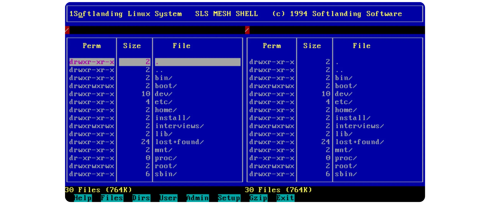

À ses débuts, SLS rencontrait un franc succès, mais les utilisateurs ont rapidement exprimé des critiques concernant son instabilité et certaines décisions de maintenance. Cela a poussé plusieurs développeurs à lancer des projets parallèles, soit pour améliorer SLS, soit pour le remplacer. C’est ainsi que débute la grande arborescence des distributions Linux et leur segmentation en familles.

SLS n’existe donc plus aujourd’hui. Sa dernière version connue remonte à la fin de l’année 1994.

- **Juillet 1993 : Slackware**  

Patrick Volkerding lance Slackware un peu par hasard, en corrigeant et en améliorant des bugs présents dans SLS dans le cadre d’un projet scolaire à l’Université d’État du Minnesota. À force de modifications et d’optimisations, sa version modifiée de SLS finit par devenir une véritable distribution Linux indépendante, susceptible d’intéresser le public déçu par les limites de SLS. Après avoir obtenu l’approbation de son université, il publie la première version de sa distribution sous le nom de Slackware, le 17 juillet 1993.

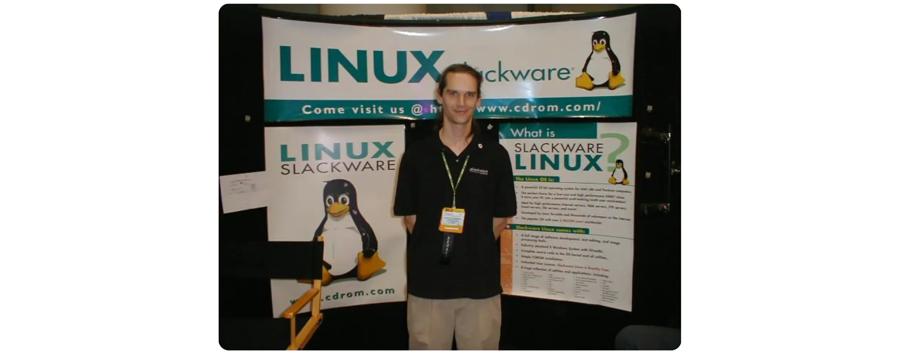

Slackware devient rapidement la distribution Linux la plus utilisée dans les années 1990. Son architecture simple, ses scripts shell de configuration, son respect des standards Unix et son absence d’abstraction en font une référence pour les utilisateurs avancés recherchant un système minimaliste et transparent.

Slackware est encore maintenue aujourd’hui, ce qui en fait la plus ancienne distribution Linux toujours en activité. Elle est également à l’origine de nombreuses distributions dérivées, formant ainsi une première grande famille de distributions Linux : les Slackware.

- **Août 1993 : Debian**  

Durant la même époque, Ian Murdock lance la distribution Debian, dans un esprit très différent des pratiques de l’époque, notamment celles incarnées par des distributions comme SLS, souvent maintenues par une seule personne. Murdock conçoit Debian comme un projet communautaire structuré, développé de manière ouverte, dans l’esprit du logiciel libre et du projet GNU. Contrairement à de nombreuses autres distributions Linux, Debian est donc une distribution non commerciale.


*Ian Murdock. Source : [Ilya Schurov CC BY-SA 2.0](https://www.flickr.com/photos/ivoyager/2398462112/).*

Sur le plan technique, dès ses débuts, Debian se distingue par la qualité de son système de packaging, la traçabilité des mises à jour, et surtout par l’introduction d’un gestionnaire de paquets performant, *dpkg*, rapidement complété par *APT* en 1998, qui permet une gestion automatisée et fiable des dépendances logicielles.

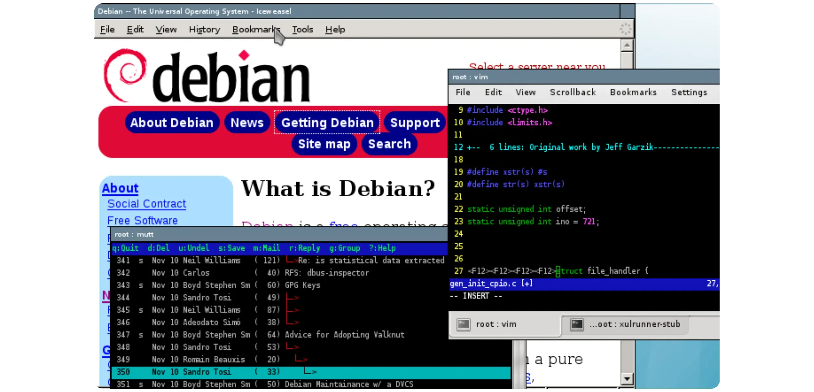

*Debian 1.3 (1997). Source : The Linux Distribution Archive*

Le projet formalise très tôt ses engagements éthiques avec la publication du *Contrat Social Debian* et des principes de Debian pour les logiciels libres (DFSG), afin d'établir une charte claire sur la liberté et la transparence du code. Sponsorisée un temps par la Free Software Foundation, Debian prend ensuite son indépendance juridique en fondant en 1997 l’organisation à but non lucratif Software in the Public Interest (SPI).

Debian devient ainsi l’un des piliers techniques et idéologiques du monde GNU/Linux, une base à partir de laquelle naîtront des dizaines de distributions majeures, dont Ubuntu, Linux Mint, Kali Linux ou encore Raspberry Pi OS.

- **1994 : Red Hat Linux**  

Marc Ewing publie la première version de Red Hat Linux en 1994. C'est la naissance d’une distribution qui jouera un rôle central dans la professionnalisation de Linux. Passionné par l’univers Unix, Ewing crée une version structurée et accessible de Linux, intégrant un outil important : le *Red Hat Package Manager* (RPM), qui standardise le format des paquets logiciels et facilite leur installation, mise à jour et suppression, notamment dans les environnements professionnels. Ce format deviendra un standard largement adopté.

En 1995, Bob Young, fondateur de la société AAC Corporation spécialisée dans les accessoires logiciels Linux, rachète l’entreprise de Marc Ewing. La fusion des deux entités donne naissance à Red Hat Software. Ensemble, ils développent un modèle économique original : la distribution de logiciels libres couplée à des services de support et de certification à destination des entreprises, un modèle économique qui deviendra une référence, et que l'on retrouve notamment dans de nombreux projets de l'écosystème Bitcoin.


*Bob Young et Marc Ewing. Photographe : Candice C Cusic/AP*

En 2003, Red Hat opère une scission stratégique : la branche communautaire devient Fedora, un laboratoire d'innovations à cycle de développement rapide, tandis que la branche commerciale se transforme en Red Hat Enterprise Linux (RHEL), une distribution certifiée, stable et à long terme, destinée aux infrastructures critiques en entreprise. Fedora sert depuis de banc d’essai pour les technologies qui seront ensuite intégrées, de manière plus rigoureuse, dans RHEL. Par cette organisation, Red Hat réussit à concilier agilité communautaire et rigueur industrielle.

Ces distributions pionnières établissent les grandes familles actuelles de Linux, chacune ayant développé sa propre approche technique et philosophique.

### Les grandes familles actuelles de distributions Linux

#### La famille Debian

Cette famille se construit autour du gestionnaire de paquets APT et du format de paquet `.deb`. Debian se distingue par son approche rigoureuse du logiciel libre et son système robuste de gestion des dépendances.


Ubuntu, dérivée directement de Debian, popularise Linux par sa simplicité d’installation et d'utilisation. Ubuntu possède de nombreuses variantes officielles comme Kubuntu (environnement KDE) et Xubuntu (XFCE). D’autres distributions notables basées sur Debian sont Linux Mint (également dérivée d’Ubuntu), Kali Linux (sécurité informatique), et Raspberry Pi OS pour les micro-ordinateurs Raspberry Pi.

C’est sur cette famille que nous allons nous concentrer pour la suite, car elle regroupe certaines des distributions Linux les plus cohérentes et les plus populaires pour un usage sur ordinateur personnel.

#### La famille Red Hat

Avec le gestionnaire de paquets RPM (*Red Hat Package Manager*), cette famille inclut donc Fedora, la distribution communautaire innovante servant de base technique à Red Hat Enterprise Linux (RHEL), distribution commerciale destinée aux entreprises et réputée pour sa stabilité à long terme.


Plusieurs distributions majeures sont directement dérivées de RHEL, avec pour objectif de proposer des alternatives libres et compatibles, sans les frais de support commercial. Parmi elles, CentOS a longtemps occupé une place importante comme clone communautaire de RHEL, jusqu’à ce que Red Hat en modifie la nature en 2020 pour en faire CentOS Stream, une version intermédiaire entre Fedora et RHEL. Cette décision a conduit à la création de nouveaux forks comme AlmaLinux et Rocky Linux.    

D'autres distributions importantes issues de cette famille incluent Oracle Linux, avec des optimisations spécifiques pour les environnements de cloud, ou encore ClearOS, une distribution orientée PME, avec des fonctionnalités de serveur et de pare-feu clés en main.

#### La famille Arch Linux

La famille Arch Linux se distingue par une philosophie radicalement opposée à celle des distributions prêtes à l’emploi. Elles sont minimalistes, et conçues selon le principe "*KISS*" ("*Keep It Simple, Stupid*"). Arch Linux fournit un système de base épuré, que l’utilisateur doit construire manuellement selon ses besoins.

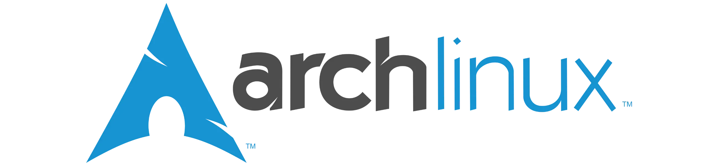

Cette approche repose sur un modèle *rolling release*, où les paquets sont mis à jour en continu, sans nécessité de réinstaller le système à chaque version majeure. Le gestionnaire de paquets Pacman, rapide et léger, facilite l’installation et la mise à jour des logiciels, et l’AUR (*Arch User Repository*), un dépôt communautaire, permet d’accéder à un vaste ensemble de paquets non officiels ou en développement.

Arch Linux s’adresse avant tout aux utilisateurs avancés qui souhaitent un contrôle total sur leur environnement, tout en acceptant une certaine complexité d’installation et de maintenance. Cette exigence technique a conduit à l’émergence de plusieurs distributions dérivées visant à démocratiser son usage.

La plus connue est Manjaro, qui conserve la base technique d’Arch tout en proposant une installation simplifiée, des environnements de bureau préconfigurés et un cycle de publication légèrement différé pour stabiliser les mises à jour.


#### La famille Slackware

Slackware demeure fidèle aux principes Unix historiques, et privilégie la simplicité, la transparence et la stabilité. Contrairement aux distributions modernes qui automatisent la gestion logicielle, Slackware repose sur un système de paquets `.tgz` sans résolution automatique des dépendances, ce qui exige d'avoir une bonne connaissance de son environnement et de ses composants logiciels.

Cette approche minimaliste, combinée à une forte stabilité, fait de Slackware une distribution prisée par les utilisateurs expérimentés ou les puristes Unix, notamment dans des contextes où la prédictibilité et le contrôle sont importants (serveurs, systèmes embarqués, environnements critiques...).

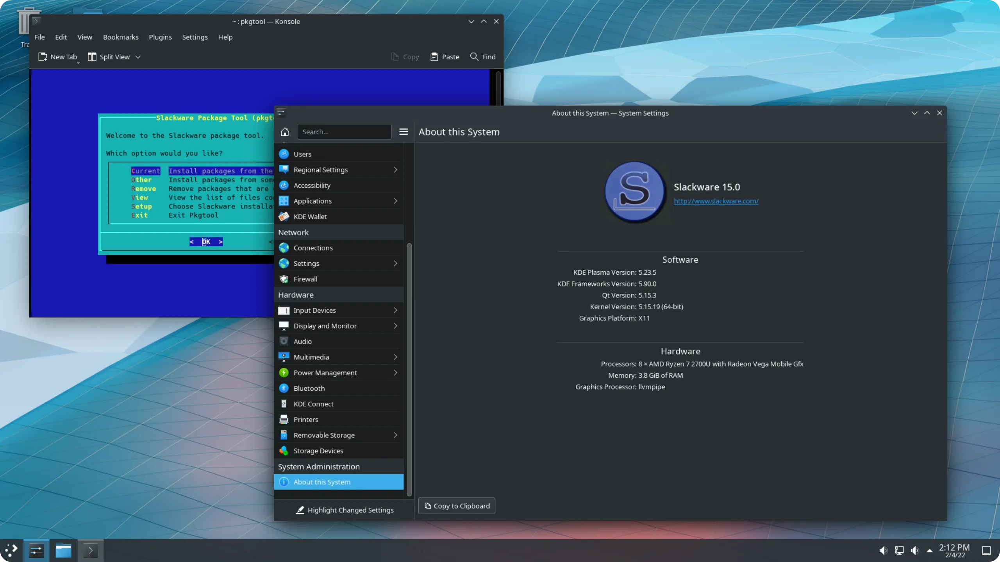

Slackware a donné naissance à de nombreuses distributions dérivées qui cherchent pour certaines à en moderniser l’usage tout en conservant son esprit : Salix, Porteus, Slackel...

Malgré une communauté plus restreinte que celles de Debian ou Red Hat, la famille des Slackware reste un référent historique et technique dans l’univers GNU/Linux.

#### La famille Gentoo

Issu du projet Enoch Linux créé en 1999, Gentoo est créé par Daniel Robbins dans le but de concevoir une distribution hautement personnalisable, sans binaires précompilés, et optimisée pour le matériel de l’utilisateur. Rebaptisée Gentoo (du nom du manchot papou, l’un des plus rapides), la distribution repose sur une compilation des paquets depuis les sources, permettant des optimisations très fines grâce à l’utilisation de *Portage*, un système de gestion de paquets inspiré des ports de BSD. Gentoo s’adresse aux utilisateurs expérimentés, à la recherche de performance, de maîtrise et de légèreté, au prix d’un temps d’installation et de maintenance plus important.


Plusieurs dérivées ont vu le jour pour élargir son usage : Funtoo, Redcore Linux (Sabayon), Calculate Linux, Pentoo...

Enfin, ChromeOS, le système d’exploitation développé par Google pour ses Chromebook, est initialement dérivé de Gentoo, bien qu’il s’en soit considérablement éloigné.

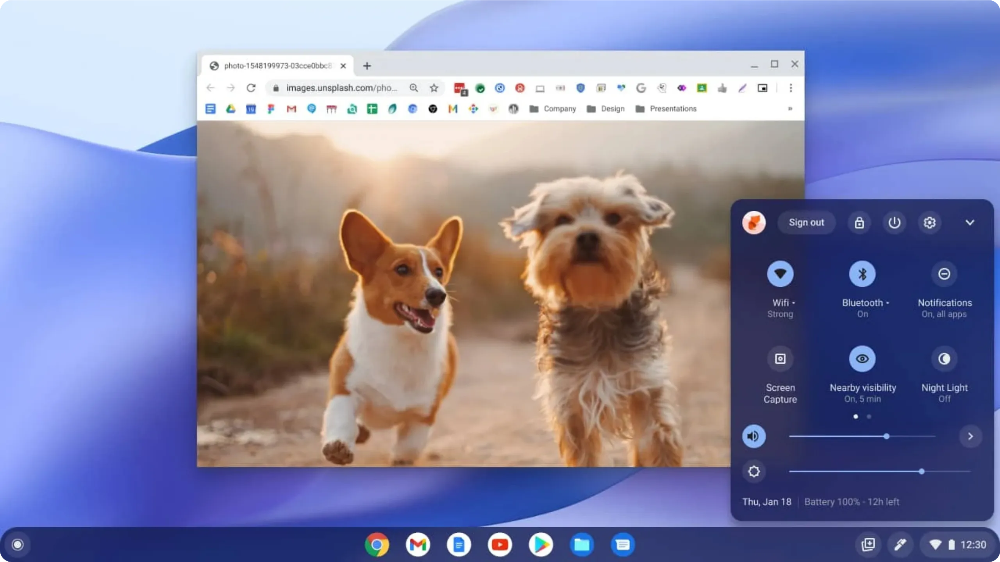

Pour en savoir plus sur les familles de distributions Linux et visualiser les embranchements de chacune, je vous recommande de consulter cet excellent et très complet schéma sur Wikimedia : [*Linux Distribution Timeline*](https://upload.wikimedia.org/wikipedia/commons/1/1b/Linux_Distribution_Timeline.svg).

### Quelle distribution Linux choisir ?

Le choix d’une distribution Linux dépend de vos besoins spécifiques, de votre niveau technique, et de l’usage prévu. Voici une sélection pratique des distributions les plus utilisées ou spécialisées, avec leurs avantages et inconvénients principaux.

#### Distributions généralistes et accessibles

- **Ubuntu** :

Développée par Canonical et lancée en 2004, Ubuntu est l’une des distributions les plus populaires au monde. Basée sur Debian, elle propose un cycle de publication régulier, avec des versions LTS (*Long Term Support*) stables maintenues pendant cinq ans. Ubuntu se distingue par son excellente compatibilité matérielle, sa large communauté, et sa documentation abondante, ce qui en fait un choix très sûr pour les débutants. C'est d'ailleurs celle-ci que nous utiliserons pour la suite de la formation SCU 202, car c'est un point d’entrée solide dans l’univers GNU/Linux. Ubuntu intègre par défaut l’environnement de bureau GNOME, avec quelques ajustements spécifiques.

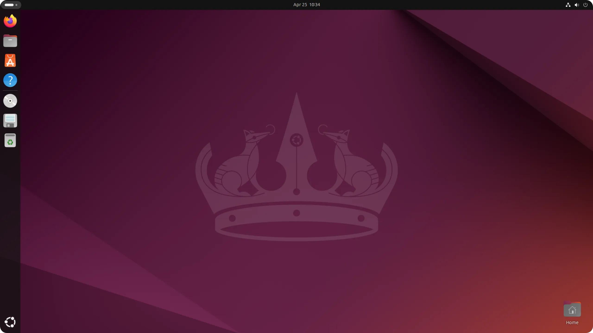

https://planb.network/tutorials/computer-security/operating%20system/ubuntu-78a3be56-5d51-4ec3-8629-0dd27c352ab5

- **Linux Mint** :

Lancée en 2006, Linux Mint est une distribution dérivée d’Ubuntu, pensée pour offrir une alternative plus intuitive et plus proche de l’ergonomie de Windows. Elle propose plusieurs environnements de bureau, dont Cinnamon, un fork de GNOME conçu spécifiquement par l’équipe de Mint, qui offre une interface claire, classique et immédiatement familière.

https://planb.network/tutorials/computer-security/operating%20system/linux-mint-da44852e-513f-4004-949a-8fde60c1bca5

Mint se distingue par sa simplicité, la présence par défaut de codecs multimédias et un outil de mise à jour bien conçu. En contrepartie, elle repose étroitement sur l’infrastructure d’Ubuntu, ce qui la rend dépendante de ses choix techniques (notamment au niveau du noyau ou des dépôts). Mint est particulièrement adaptée aux utilisateurs peu techniques ou à ceux qui souhaitent un système prêt à l’emploi, sans courbe d’apprentissage abrupte.

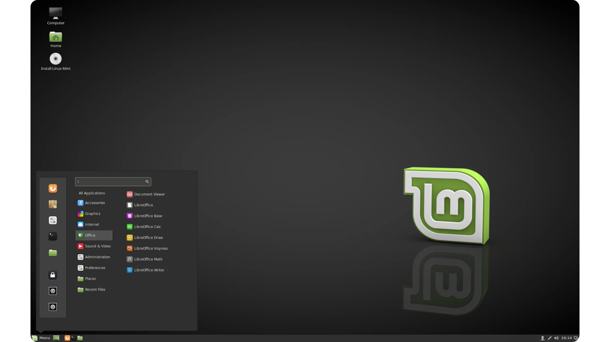

- **Zorin OS** :

Créée en 2008 par une équipe irlandaise, Zorin OS vise explicitement les utilisateurs de Windows et macOS souhaitant une transition en douceur vers Linux. Elle repose sur Ubuntu LTS et propose une interface personnalisée qui peut imiter Windows ou macOS selon les préférences. L’installation est fluide, les logiciels essentiels sont préinstallés, et la version "Lite" permet de faire fonctionner le système sur des machines anciennes. Certaines éditions, comme la "Pro", sont payantes (environ 50€), mais la version gratuite reste tout à fait fonctionnelle. Zorin OS est un bon choix pour ceux qui cherchent un environnement visuellement familier, bien intégré et sans configuration manuelle.

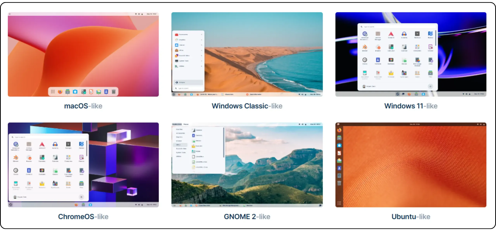

- **elementary OS** :

Lancée en 2011, elementary OS est une distribution basée sur Ubuntu qui mise avant tout sur le design et la cohérence de l’interface. Son environnement de bureau Pantheon, inspiré de macOS, est minimaliste, élégant et fluide. Toutefois, le système reste moins personnalisable que d'autres distributions, et certains utilisateurs avancés peuvent se sentir limités par ses choix d’interface et sa structure volontairement verrouillée. Elle convient bien aux personnes sensibles à l’esthétique, recherchant un système simple et cohérent pour un usage quotidien.

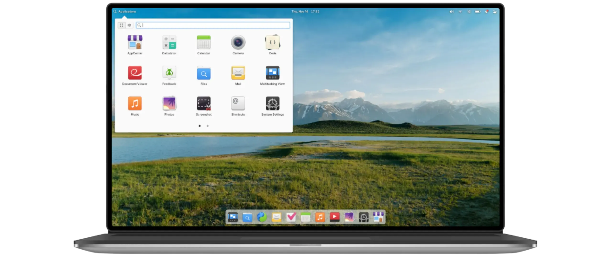

- **Pop! OS** :

Développée par la société américaine System76, Pop! OS repose également sur Ubuntu. Elle cible à la fois les utilisateurs de bureau et les développeurs, avec une interface GNOME modifiée (et depuis peu un environnement maison appelé COSMIC). Pop! OS intègre par défaut des optimisations pour les GPU NVIDIA et propose un mode de gestion des fenêtres en mosaïque, très apprécié des pros. Le système reste simple à utiliser, mais propose également des fonctionnalités avancées prêtes à l’emploi. Il s’adresse aux utilisateurs intermédiaires, aux étudiants ou aux professionnels qui veulent un système efficace sans avoir à configurer leur environnement à la main.

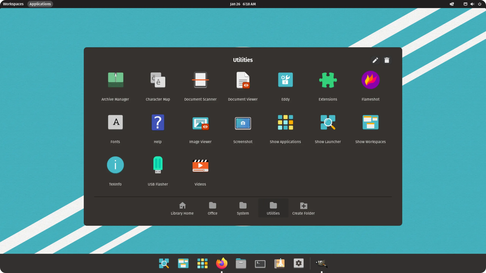

*Source : [Par Allman — Travail personnel, CC BY-SA 4.0](https://commons.wikimedia.org/w/index.php?curid=114760696).*

#### Distributions intermédiaires et performantes

- **Fedora** (Workstation ou KDE Plasma) :

Fedora est une distribution soutenue par Red Hat, orientée vers les dernières technologies (Wayland, PipeWire, Flatpak...). Elle utilise le format RPM et le gestionnaire de paquets `dnf`. Son cycle rapide permet d’avoir un système toujours à jour, mais elle nécessite de suivre les mises à jour régulièrement. C'est une distribution idéale pour développeurs ou utilisateurs techniques recherchant un système moderne.

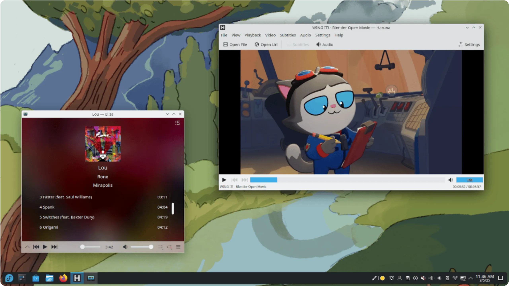

- **openSUSE** (Tumbleweed ou Leap) :

openSUSE est une distribution disponible en rolling release ou stable. Elle propose l’outil YaST pour la configuration système et permet un usage polyvalent avec plusieurs environnements graphiques. Elle demande un peu plus d’expérience mais reste robuste pour un usage quotidien.

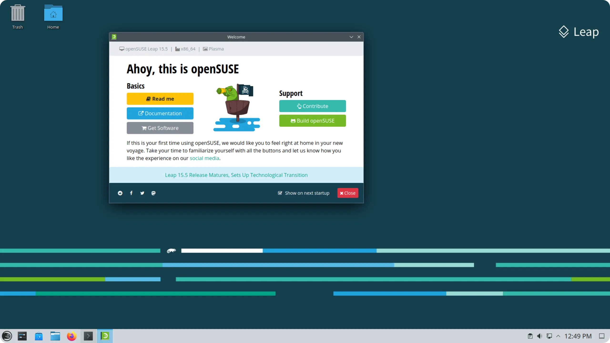

- **Debian** :

Debian existe en plusieurs branches, dont _Stable_ (très fiable, mais logiciels plus anciens) et _Testing_ (plus à jour, mais légèrement moins éprouvée). Elle utilise `apt` et est connue pour sa rigueur, sa philosophie libre et sa grande compatibilité. Debian est un bon choix pour les utilisateurs qui recherchent la stabilité, les administrateurs système...

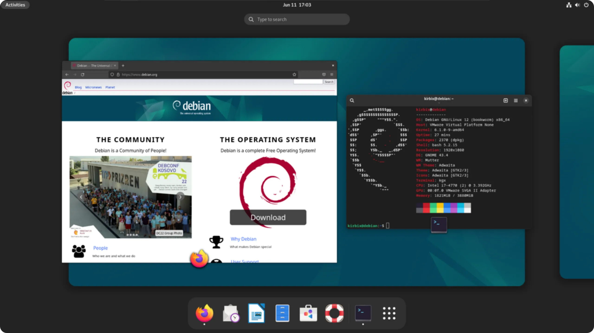

- **Manjaro** :

Basée sur Arch, Manjaro rend accessible Arch Linux. Cette distribution propose une installation graphique, des outils maison et un bon support matériel. Les mises à jour sont différées pour plus de stabilité. Manjaro convient aux utilisateurs intermédiaires cherchant une distribution Arch Linux moderne, sans avoir à tout configurer manuellement.

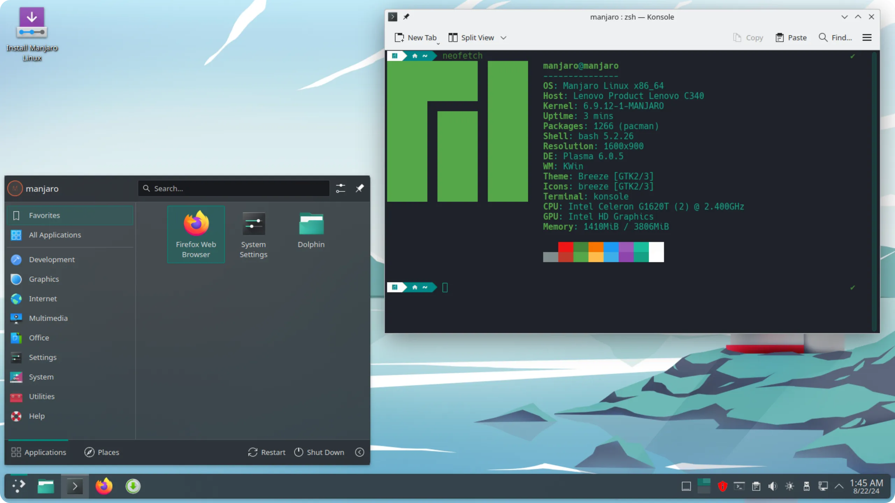

- **Arch Linux** : 

Arch Linux est une distribution minimaliste, en mise à jour continue, livrée sans interface ni logiciels superflus. Elle requiert une installation manuelle, mais offre un contrôle total et une excellente documentation (Arch Wiki). Cette distribution est recommandée aux utilisateurs avancés souhaitant tout maîtriser.

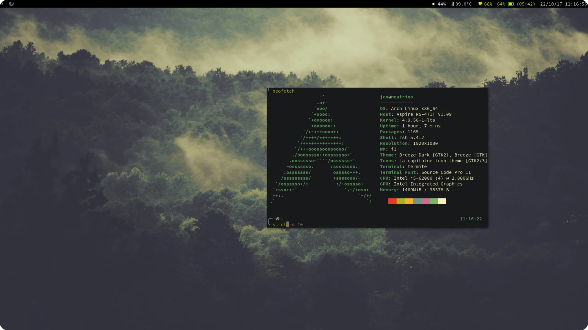

#### Distributions spécialisées

- **Kali Linux** :

Kali Linux est une distribution basée sur Debian, conçue pour les tests d’intrusion et l’audit de sécurité. Elle intègre des centaines d’outils de pentest. Cette distribution n'est pas vraiment adaptée comme système principal pour un usage quotidien classique.

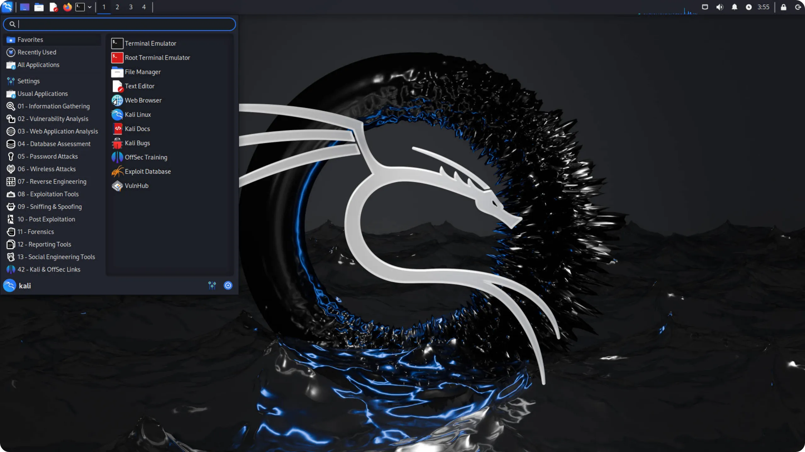

- **Parrot OS** :

Parrot OS est également dérivée de Debian. Elle propose un environnement pour le pentest, la sécurité offensive et la protection de la vie privée. Plus polyvalente que Kali, cette distribution peut aussi convenir à un usage quotidien léger, avec des outils de sécurité préintégrés.

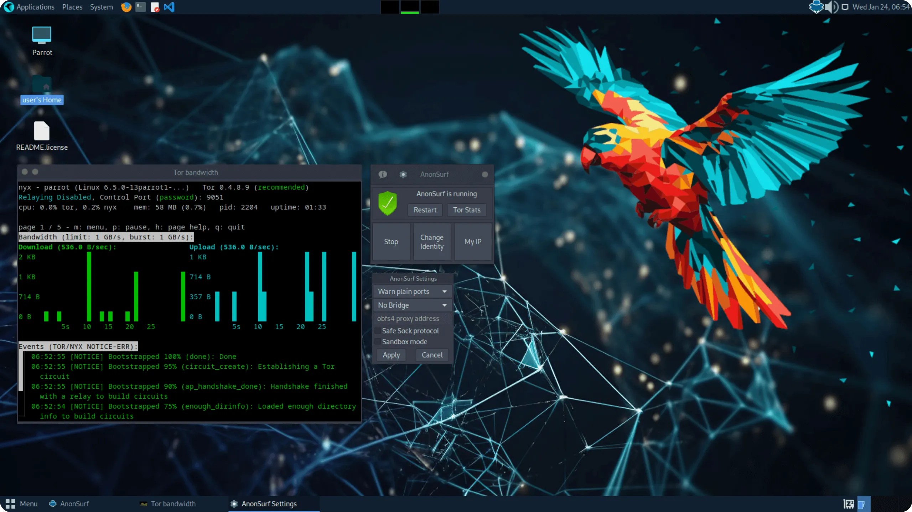

- **Tails** :

Tails est une distribution live basée sur Debian, orientée vers la confidentialité. Tout passe par le réseau Tor, rien n’est conservé entre deux sessions utilisateur. C'est un distribution idéale pour des usages ponctuels sensibles (journalisme, activisme, génération de seed Bitcoin...).

https://planb.network/tutorials/computer-security/operating%20system/tails-15108901-f15d-4f7f-a001-b02b1dcd60c8

→ **Remarque :** Une distribution live est un système d'exploitation Linux utilisable directement depuis une clé USB ou un CD, sans installation sur le disque dur.

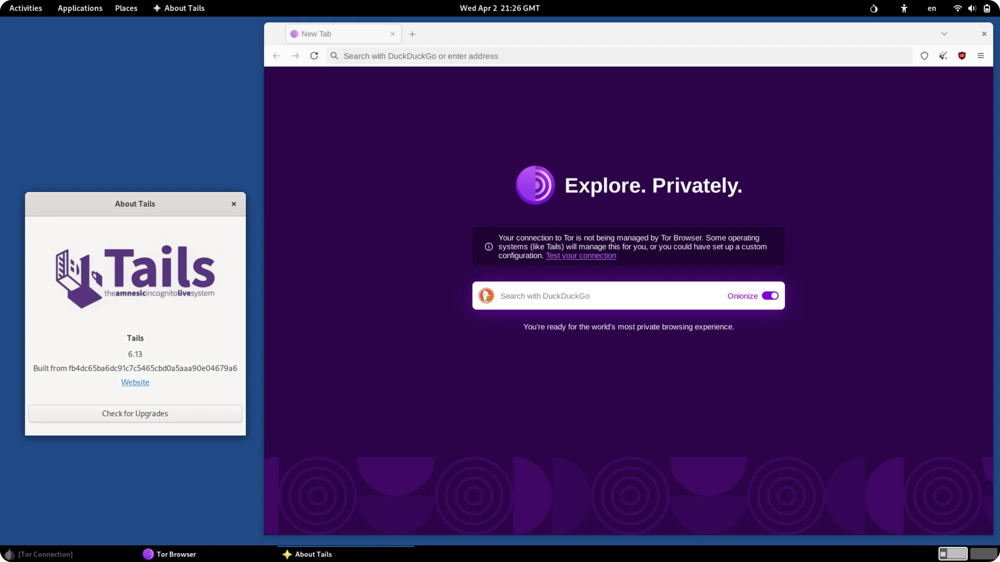

- **Qubes OS** :

Qubes OS repose sur Fedora et utilise le système de virtualisation Xen pour compartimenter les usages. Chaque application tourne dans une machine virtuelle isolée. C'est un architecture très sécurisée, mais exigeante en ressources et assez difficile à prendre en main.

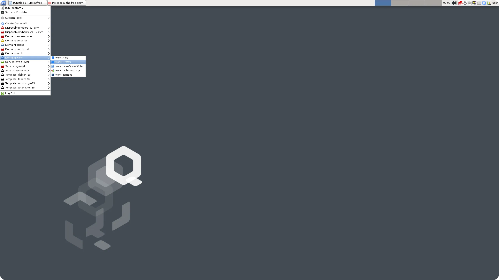

- **BlackArch** :

BlackArch est une extension d’Arch Linux orientée pentest (comme Kali sur Debian). Elle fournit plus de 2800 outils de sécurité. C'est une distribution très complète, mais réservée aux utilisateurs avancés déjà familiers avec l’univers Arch, et qui ont besoin de ces outils spécialisés (chercheurs en sécurité, pentesters...).

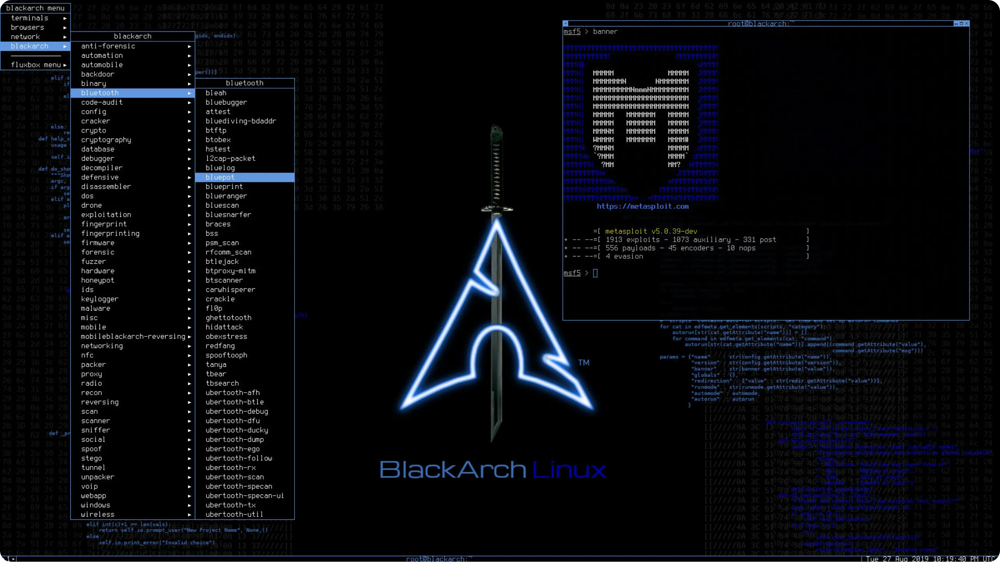

- **PureOS** :

PureOS est une distribution dérivée de Debian développée par Purism, totalement libre (approbation FSF). Elle met l’accent sur la vie privée, avec des logiciels libres uniquement et une absence totale de blobs propriétaires.

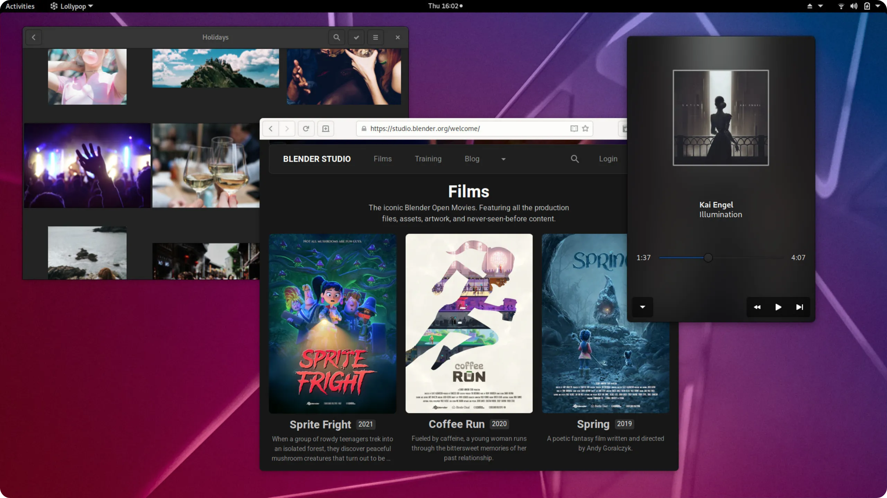

- **Raspberry Pi OS** :

Raspberry Pi OS (anciennement Raspbian) est une distribution optimisée pour les micro-ordinateurs Raspberry Pi. Elle repose sur Debian, avec des paquets recompilés pour l’architecture ARM. Elle peut être utilisée pour des projets éducatifs, des tests électroniques ou des petits serveurs personnels.

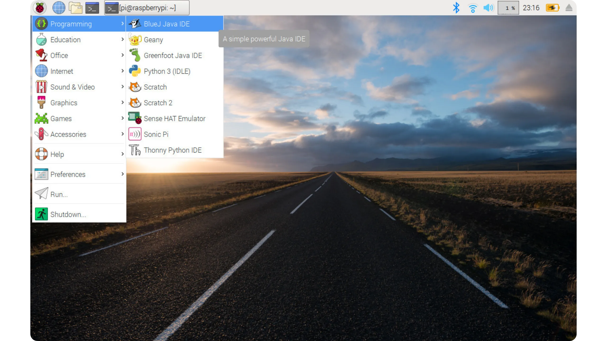

- **Whonix** :

Whonix combine Debian avec le réseau Tor dans une architecture en deux VM (passerelle + station de travail). C'est une distribution orientée sécurité, mais dépendante de la virtualisation. Elle est recommandée pour ceux qui ont vraiment besoin de confidentialité.

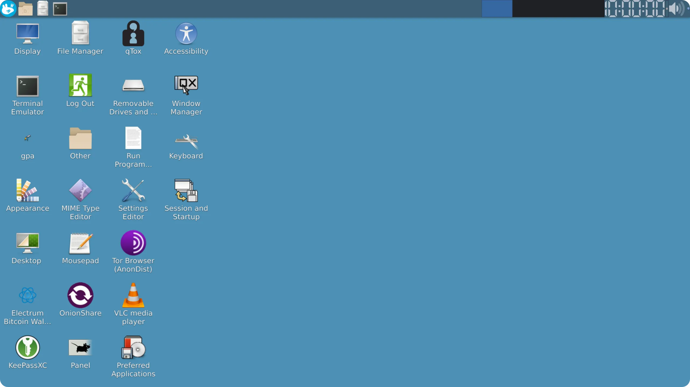

Ce panorama vous offre un aperçu de l’écosystème actuel des distributions Linux, et vous permet, selon votre profil technique et vos objectifs, de sélectionner la distribution la mieux adaptée à vos attentes. Dans le prochain chapitre de SCU 202, nous allons étudier plus précisément l’environnement pratique de Linux, en commençant par les environnements graphiques qui représentent la base de vos interactions quotidiennes avec le système.

## Les environnements de bureau Linux
<chapterId>ecfac353-a31b-48fb-b2af-2abbeeac5f2b</chapterId>

Dans un système GNU/Linux, l’environnement de bureau joue un des rôles les plus importants dans votre expérience utilisateur. Il constitue la couche graphique qui permet l'interaction avec le système, en s’appuyant sur des représentations visuelles familières : fenêtres, menus, icônes, panneaux et applications préinstallées.

Dans ce chapitre, je vous propose d’explorer la structure et le rôle d’un environnement de bureau, ses composants typiques, les grandes familles disponibles, les critères de choix, ainsi que leur intégration dans les distributions Linux les plus populaires.

### C'est quoi un environnement de bureau ?

Un environnement de bureau (ou "*DE*" pour *Desktop Environment*) désigne l’ensemble des programmes qui forment l’interface graphique complète d’un système d’exploitation. Sur Windows et macOS, un seul environnement de bureau est proposé par défaut, intégré au système, sans possibilité de le modifier entièrement (seuls certains shells existent pour modifier partiellement l'interface). À l’inverse, les systèmes Linux, qui sont bien plus modulaires, considèrent l’environnement de bureau comme un composant indépendant, que l’on peut librement remplacer.

Il est donc important, sous Linux, de bien distinguer toutes les couches : le noyau (qui gère l’interaction avec le matériel), le serveur d’affichage (qui fait l'intermédiaire entre les applications, les pilotes graphiques et le matériel via le noyau), et enfin l’environnement de bureau lui-même, qui s’appuie sur cette infrastructure pour proposer une interface graphique cohérente à l’utilisateur. Cette séparation peut parfois être plus floue, car dans de nombreuses distributions Linux, l’environnement de bureau est préinstallé, et embarque parfois son propre compositeur Wayland qui fait alors office de serveur d'affichage.


### Composants typiques d’un environnement de bureau

Un environnement de bureau dans une distribution Linux n’est pas une seule application, mais un ensemble cohérent de composants logiciels qui offrent une interface graphique complète pour interagir avec le système d’exploitation. Ces composants reposent sur plusieurs couches logicielles, qui s’articulent de la manière suivante :

- **Un gestionnaire de fenêtres** : il dessine les bordures de fenêtres, gère leur placement, leur redimensionnement, les effets de transitions, etc. Par exemple : Mutter (GNOME), KWin (KDE Plasma), Xfwm (Xfce).

- **Un gestionnaire de fichiers** : il permet de naviguer dans l’arborescence des répertoires, de copier, déplacer ou supprimer des fichiers de manière visuelle. Exemples : Nautilus (GNOME), Dolphin (KDE), Thunar (Xfce).

- **Un centre de configuration** : c’est un ensemble d’outils qui permet à l’utilisateur de modifier les paramètres système sans passer par la ligne de commande : apparence, fond d’écran, gestion des utilisateurs, réseau, périphériques...

- **Des applets système** : ce sont les petites icônes et modules interactifs présents dans la barre des tâches (ou "panneau"), comme le contrôle du son, le niveau de batterie, la connexion réseau, l’horloge...

- **Un panneau ou tableau de bord** : barre visible souvent en haut ou en bas de l’écran, regroupant le menu principal, les applets système, les raccourcis, la zone de notification...

- **Un gestionnaire de session** : il s’exécute au démarrage, affiche l’écran de connexion et lance la session graphique choisie. Par exemple : GDM (GNOME), SDDM (KDE), LightDM (Xfce).

- **Un gestionnaire de notifications** : gère l’affichage des notifications système (messages, alertes, mises à jour…). Par exemple : dunst, Plasma-notifier, xfce4-notifyd.

- **Un compositeur X11 (optionnel)** : ajoute des effets visuels (ombres, transparence, animations) dans les environnements où le gestionnaire de fenêtres ne prend pas en charge la composition. Par exemple : compton, picom.

- **Un serveur d'affichage** : c’est le logiciel qui se charge de la communication entre le système (via le noyau et les pilotes graphiques) et les applications graphiques. Il permet d'afficher des fenêtres à l'écran et de gérer les entrées clavier et souris. Le serveur d'affichage est souvent un composant différent de l'environnement de bureau, mais de plus en plus de systèmes adoptent Wayland, un protocole moderne où le rôle de serveur d’affichage peut être pris en charge directement par le gestionnaire de fenêtres (par exemple Mutter sous GNOME ou KWin sous KDE). On parle alors de "compositeur Wayland".

Tous ces éléments reposent sur un toolkit graphique, c’est-à-dire une bibliothèque logicielle qui fournit les composants de base pour créer les interfaces graphiques : boutons, menus, champs de texte, etc. Les deux principaux toolkits sous Linux sont :
- GTK (*GIMP Toolkit*) : utilisé par GNOME, XFCE, Cinnamon, MATE...
- Qt : utilisé par KDE Plasma, LXQt…


### Panorama des principaux environnements de bureau Linux


#### GNOME

Lancé en 1997 et publié pour la première fois en 1999, GNOME ("*GNU Network Object Model Environment*") repose sur la bibliothèque GTK et vise à réduire au maximum la friction entre l’utilisateur et l’interface grâce à une organisation très simple. Depuis GNOME 3, son cœur, GNOME Shell, abandonne la métaphore traditionnelle du bureau couvert d’icônes : au lieu de jongler avec plusieurs zones de travail visibles simultanément, l’utilisateur bascule vers un unique sélecteur d’activités où il gère les fenêtres, les bureaux virtuels et les lanceurs d’applications. 

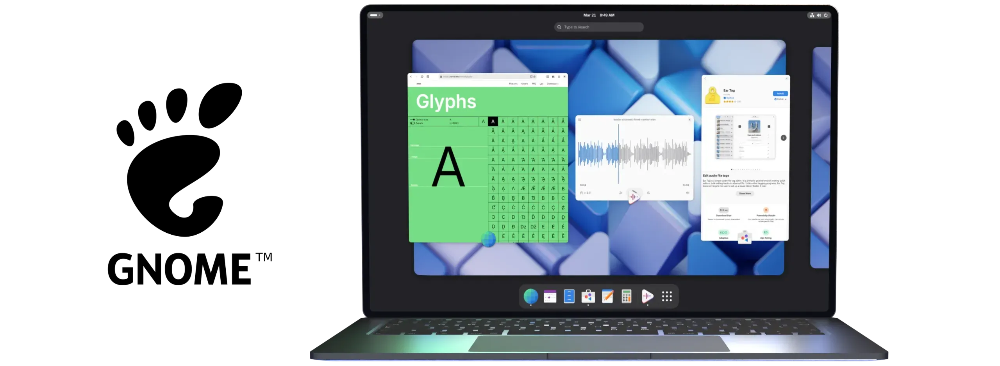

Techniquement, le compositeur Mutter combine la gestion des fenêtres et la pile Wayland, tout en restant compatible X11 grâce à XWayland. L’environnement fournit par défaut Nautilus pour la navigation de fichiers, GNOME Terminal pour la ligne de commande et un panneau de paramètres centralisé. Les possibilités de personnalisation de GNOME sont limitées nativement.

C'est l'environnement par défaut des distributions Fedora Workstation, Ubuntu Workstation et de nombreuses autres orientées poste de travail.

#### KDE Plasma

Le projet KDE a été lancé en 1996, avec une première version de son environnement de bureau publiée en 1998. En 2014, une distinction a été établie entre l’environnement de bureau et les autres composants du projet. L’environnement de bureau a alors été nommé "Plasma".

KDE Plasma repose sur Qt 6, un framework C++ multiplateforme, et sur les KDE Frameworks, une collection modulaire de bibliothèques facilitant le développement d’applications intégrées. Son gestionnaire de fenêtres, KWin, fait également office de compositeur Wayland complet : il gère les effets visuels (flou, transparence, transitions), le fractionnement d’écran avec accélération GPU, et les gestuelles tactiles multipoints via libinput.

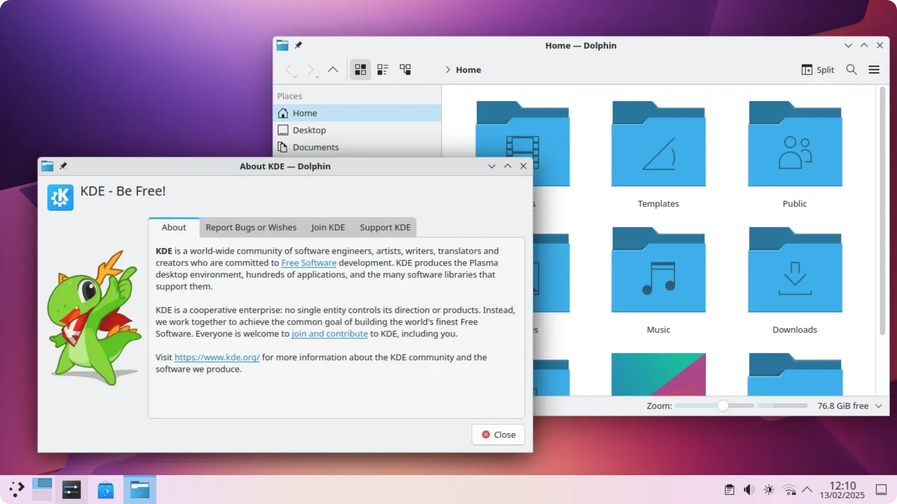

L’un des points de distinction de KDE Plasma est son centre de configuration unifié, qui expose une interface graphique pour la quasi-totalité des réglages : comportement des bureaux virtuels, raccourcis globaux, finesse des animations, gestion de l’énergie, configuration réseau, apparence des bordures de fenêtres... Aucun fichier de configuration texte n’a besoin d’être édité manuellement, ce qui rend l'environnement de bureau personnalisable facilement.

KDE Plasma est utilisé dans de nombreuses distributions, dont Kubuntu, openSUSE Tumbleweed, Fedora KDE Spin et Manjaro KDE.

#### Xfce

Xfce est un environnement de bureau libre et open source, apparu en 1996 sous l’impulsion d'Olivier Fourdan. Son objectif initial, toujours d’actualité, était de fournir une alternative simple, légère et rapide à d'autres environnements plus lourds comme GNOME ou KDE. Techniquement, Xfce repose sur la boîte à outils GTK, ce qui le rapproche de GNOME sur certains aspects, tout en s’en distinguant nettement par sa philosophie.

Xfce adopte une approche traditionnelle de l’interface graphique : il propose un bureau avec icônes, un menu d’applications, une barre des tâches et des panneaux configurables. L’ensemble est conçu pour être peu gourmand en ressources, tant en mémoire vive qu’en puissance processeur. Cela en fait une solution idéale pour les ordinateurs anciens, peu puissants, ou simplement pour les utilisateurs à la recherche d’un système fluide, stable et réactif.

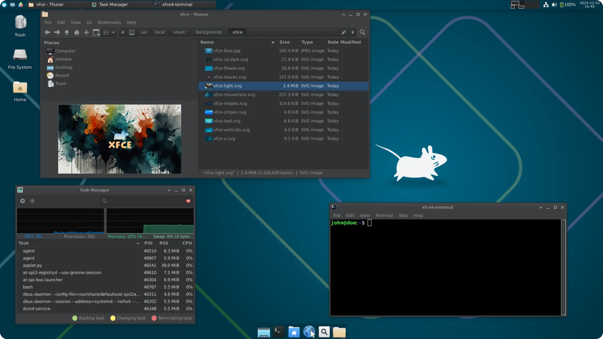

#### LXQt

LXQt est un environnement de bureau léger conçu pour offrir une interface graphique complète tout en consommant un minimum de ressources système. Il est particulièrement adapté aux machines anciennes ou peu puissantes.

LXQt est issu de la fusion en 2013 de deux projets distincts : LXDE (développé à l'origine avec la bibliothèque GTK+) et Razor-qt (un environnement similaire basé sur Qt). Cette fusion a donné naissance à LXQt, dans le but d’unifier les efforts tout en bénéficiant de la puissance et de la modernité du framework Qt, plus adapté à l’évolution des systèmes Linux que GTK+ 2, utilisé par LXDE.

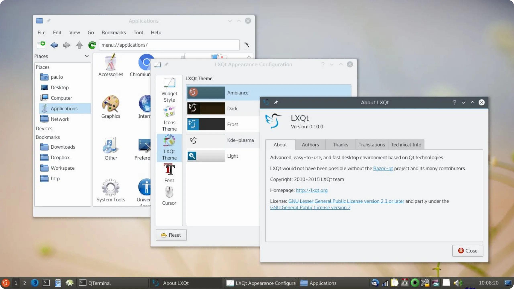

#### Cinnamon

Cinnamon est un environnement de bureau moderne développé et maintenu par l’équipe de la distribution Linux Mint. Il a vu le jour en 2011 comme une réponse directe aux changements radicaux introduits par GNOME 3, jugés trop disruptifs par une partie de la communauté. Initialement, Cinnamon était un simple fork de GNOME Shell, mais il s’est progressivement affranchi de GNOME pour devenir un environnement de bureau à part entière, tout en continuant de reposer sur les bibliothèques GTK (notamment GTK 3).

Son objectif principal est de proposer une interface classique et intuitive, dans la continuité de ce que proposait GNOME 2 ou Windows : un menu d’applications en bas à gauche, une barre des tâches, une zone de notification et un bureau gérable. Cette approche conservatrice est particulièrement intéressante pour les utilisateurs débutants ou venant de Windows, qui y retrouvent rapidement leurs repères.

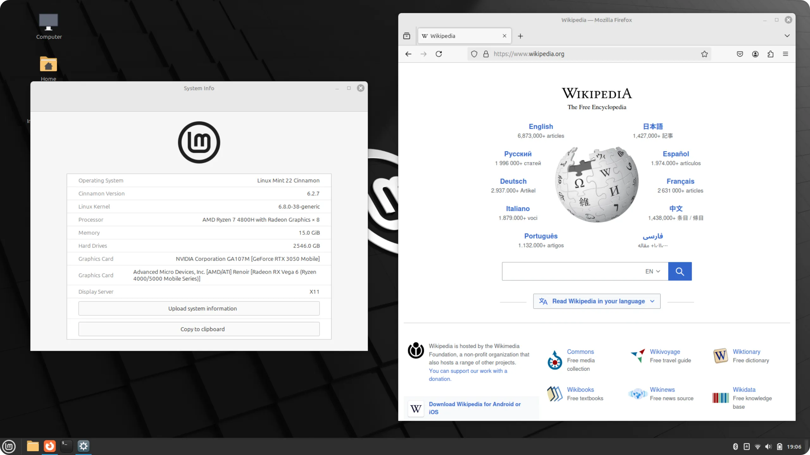

#### MATE

MATE est un fork de GNOME 2, lancé en 2011, suite à l’arrivée de GNOME 3 et de son interface radicalement différente (GNOME Shell). MATE est né de cette volonté de préserver l’approche classique de l’environnement GNOME 2 tout en assurant sa maintenance et sa modernisation.

Techniquement, MATE repose sur les bibliothèques GTK 3 (après avoir longtemps utilisé GTK 2), et maintient une structure modulaire : gestionnaire de fichiers (Caja), panneau de configuration, terminal, éditeur de texte, etc. Tous ces composants sont des forks des outils GNOME 2, continuellement mis à jour pour rester compatibles avec les systèmes modernes.

Son interface repose sur une logique de bureau traditionnelle : un ou deux panneaux (menu, zones de lancement rapide, horloge, zones de notification), un bureau avec icônes, et une organisation en fenêtres flottantes.

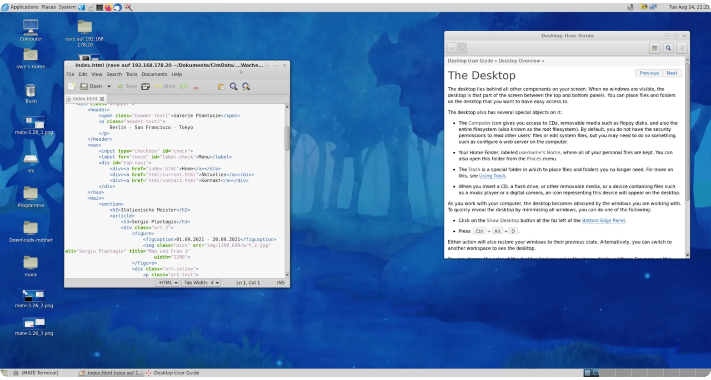

### Critères de choix

Le choix de votre environnement de bureau sous GNU/Linux n’est pas anodin : il conditionne à la fois l’expérience utilisateur, la performance du système, ainsi que la compatibilité logicielle. Chaque DE repose sur des choix techniques (bibliothèques, architecture, gestionnaire de fenêtres, etc.) qui influent sur son apparence, son comportement, ses performances, et même ses exigences matérielles. Voici les principaux critères à considérer pour faire un choix éclairé.

#### Les performances matérielles

Chaque environnement de bureau a un poids système différent. Cela se mesure en termes de consommation de RAM, d’utilisation de CPU et de temps de démarrage :
- Sur des machines anciennes ou peu puissantes (CPU monocœur, moins de 2 Go de RAM...), des environnements très légers comme LXQt, LXDE ou Xfce sont recommandés. Ils offrent une interface graphique complète, mais sans effets visuels ni dépendances lourdes ;
- Les environnements intermédiaires, comme MATE ou Cinnamon, nécessitent un matériel un peu plus récent (4 à 6 Go de RAM recommandés), mais restent raisonnables.
- Des environnements modernes et riches comme GNOME ou KDE Plasma sont très complets, mais demandent plus de ressources, surtout si les effets graphiques sont activés. Ils conviennent à des machines récentes.

#### Les préférences esthétiques et ergonomiques

Chaque DE propose une philosophie d’interface distincte :
- GNOME privilégie la simplicité d’usage, avec une interface épurée, sans bureau classique ni icônes, et un workflow orienté productivité, mais qui peut être déconcertant pour les débutants ;
- KDE Plasma est extrêmement personnalisable, jusqu’au moindre détail. Il propose un look moderne, des animations, et une interface par défaut plus proche de Windows ;
- Cinnamon et MATE offrent une expérience classique : menu en bas à gauche, barre de tâches, icônes sur le bureau... Cinnamon est plus moderne visuellement, MATE plus léger.
- Xfce et LXQt ont pour objectif la simplicité et la performance, avec une esthétique plus sobre, mais configurable.

#### L’usage prévu

L’usage principal de l'ordinateur va également orienter votre choix :
- Pour une utilisation bureautique ou multimédia, tous les environnements conviennent ;
- Pour un poste de développement, les préférences varient : certains développeurs apprécient la sobriété de Xfce, d’autres préfèrent les outils d’intégration offerts par KDE ;
- Pour des usages embarqué, serveur avec interface minimale, ou sur des machines très anciennes, LXQt, LXDE ou Xfce sont souvent les seuls choix viables.

#### La compatibilité avec la distribution choisie

Chaque distribution GNU/Linux favorise un environnement par défaut, souvent mieux intégré, mieux testé, et accompagné d’outils dédiés, ainsi qu'installé par défaut. Il est toujours possible d’installer un autre environnement de bureau, mais cela peut occasionner des doublons de logiciels, des conflits de configuration, ou une expérience utilisateur moins cohérente. Le choix de votre environnement de bureau sera donc bien souvent influencé par celui de votre distribution Linux, ou, à l’inverse, c’est votre préférence pour un environnement de bureau spécifique qui pourra orienter votre choix de distribution.

Notez qu’il existe parfois des variantes de certaines distributions, qu’elles soient maintenues par l’équipe du projet ou par des contributeurs externes, et qui intègrent un environnement de bureau différent de celui proposé par défaut (par exemple : Kubuntu, Lubuntu, Xubuntu...).

Voici les environnements de bureau des principales distributions :

- Ubuntu → GNOME

- Kubuntu → KDE Plasma

- Xubuntu → Xfce

- Lubuntu → LXQt

- Linux Mint → Cinnamon (édition principale), mais aussi MATE et Xfce

- Fedora → GNOME (édition principale), mais propose plusieurs Spins officielles :
	- Fedora KDE Spin → KDE Plasma
	- Fedora Xfce Spin → Xfce
	- Fedora LXQt Spin → LXQt
	- Fedora Cinnamon Spin → Cinnamon
	- Fedora MATE-Compiz Spin → MATE
	- Fedora SoaS, i3, etc. → environnements spécifiques

- Debian → GNOME (par défaut), choix possible entre KDE, Xfce, LXQt, Cinnamon, MATE lors de l’installation

- Manjaro → KDE Plasma, GNOME ou Xfce selon l’édition ; éditions communautaires disponibles avec Cinnamon, MATE, LXQt, i3...

- Zorin OS → Zorin Desktop, basé sur GNOME (version Core) et Xfce (version Lite)

- elementary OS → Pantheon, environnement propre à elementary, basé sur GTK

- Pop! OS → GNOME modifié avec l’interface COSMIC, bientôt remplacée par une version en Rust

- openSUSE → choix à l’installation entre KDE Plasma (édition la plus intégrée), GNOME, Xfce, MATE...

- Arch Linux → ne fournit pas d’environnement par défaut, il faut installer celui de son choix

- Kali Linux → Xfce (par défaut depuis 2019), propose aussi KDE, GNOME, i3, MATE...

- Parrot OS → MATE (par défaut), version alternative avec KDE Plasma

- Tails → GNOME

- Qubes OS → Xfce

- BlackArch → gestionnaire de fenêtres i3 (pas un environnement de bureau complet)

- PureOS → GNOME

- Whonix → KDE Plasma (version principale), alternative disponible avec Xfce

En conclusion, il n’y a pas de meilleur environnement de bureau en soi, seulement celui qui convient le mieux à votre matériel, vos usages et vos préférences. Il est même courant de tester plusieurs DE avant de trouver celui qui offre le bon compromis entre esthétique, ergonomie et performances.

Ce chapitre vous aura permis de mieux comprendre ce qu’est un environnement de bureau, ses composants clés, les différences entre les principales solutions disponibles, ainsi que les critères importants pour effectuer votre choix. Dans le prochain chapitre, vous allez pouvoir faire vos premiers pas sur Ubuntu, une distribution polyvalente et grand public.

## Premiers pas sur Ubuntu : tout ce qu’il faut savoir

761407c4-bbac-41a4-830e-62624dd260fa

Ubuntu constitue aujourd’hui l’une des portes d’entrée les plus accessibles vers GNU/Linux : environnement GNOME soigné, dépôts très fournis, mises à jour de sécurité réactives et grosse communauté. C'est pourquoi j'ai choisi de présenter cette distribution.

Maîtriser son installation de bureau demande cependant de comprendre les mécanismes fondamentaux du système : gestion de paquets, ligne de commande, sécurité de base et bonnes pratiques quotidiennes. Dans ce chapitre, je vous accompagne pas à pas, de la configuration initiale jusqu’à l’installation d’outils de productivité et de développement, afin de disposer d’un poste de travail stable, sécurisé et efficace.

### Installation de la distribution Ubuntu

Avant de pouvoir utiliser Ubuntu, il faut l’installer sur votre machine. Cette étape peut sembler intimidante quand on ne l'a jamais fait, mais elle est de nos jours très facile à réaliser. 

Plusieurs scénarios sont possibles selon l’état de votre ordinateur actuel :
- Si vous avez un ordinateur avec Windows préinstallé, vous pouvez soit installer Ubuntu à côté de Windows (en *"dual boot"*), soit remplacer entièrement votre système actuel. Si vous optez pour l’option *dual boot*, vous pourrez sélectionner le système d’exploitation à lancer à chaque démarrage de votre machine. Cette solution est à privilégier si vous souhaitez simplement tester Ubuntu tout en conservant un accès à Windows ;
- Si vous avez une machine neuve sans système d’exploitation, vous pouvez installer directement Ubuntu comme système principal.

Dans tous les cas, le processus d'installation suit les mêmes principes techniques que nous allons découvrir.

#### Télécharger Ubuntu

Le fichier d’installation d’Ubuntu se présente sous la forme d’une image ISO, un fichier contenant tout le nécessaire pour démarrer et installer le système. Pour le récupérer, [rendez-vous sur le site officiel](https://ubuntu.com/download/desktop).

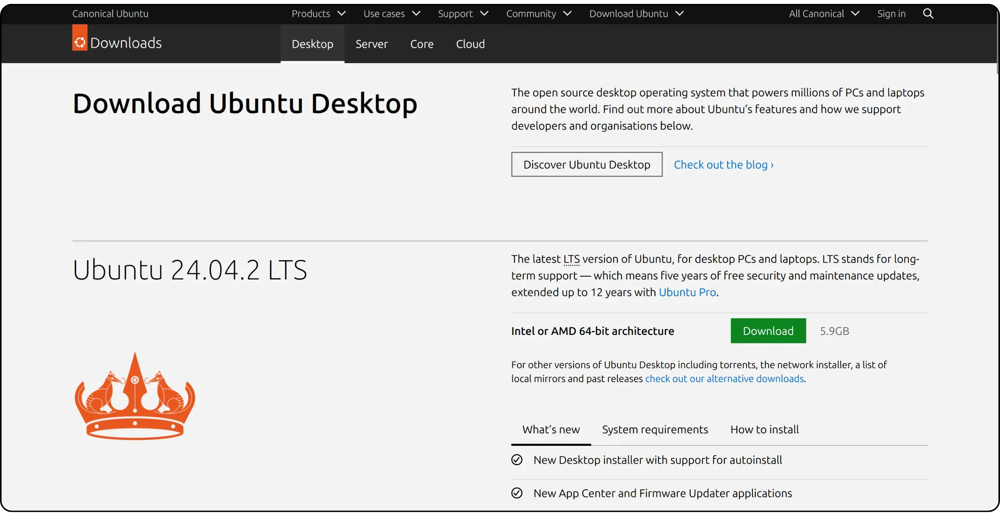

Il existe 2 version d'Ubuntu Desktop :
- LTS (*Long Term Support*) ;
- Latest version.

La différence principale entre une version LTS et une version non-LTS d’Ubuntu, c’est la durée de support et la stabilité. Une version LTS est maintenue pendant 5 ans. À l’inverse, une version non-LTS n’est supportée que 9 mois : il faut alors faire une mise à niveau du système régulièrement. En revanche, la dernière version non-LTS inclut toutes les nouveautés. Je vous conseille plutôt la version LTS si vous êtes débutant, car elle est plus stable et nécessite moins de mises à jour importantes. Vous pouvez toutefois opter pour la dernière version non-LTS si vous le souhaitez : cela n’aura aucun impact sur la suite.

Cliquez simplement sur le bouton "*Download*" pour récupérer l'image ISO d'Ubuntu.

#### Créer une clé USB bootable

Pour installer Ubuntu sur votre ordinateur, vous devez rendre l’image ISO amorçable depuis une clé USB. Cette clé servira de support d’installation.

Branchez une clé USB d’au moins 8 Go (attention, son contenu sera effacé), puis utilisez un outil comme [BalenaEtcher](https://www.balena.io/etcher) pour créer le média bootable depuis l'image ISO. Il suffit de sélectionner le fichier ISO, la clé USB, et de cliquer sur "*Flash*".

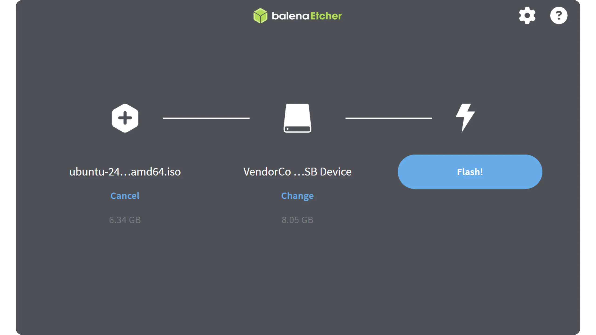

#### Démarrer depuis la clé USB (boot)

Il faut maintenant démarrer votre ordinateur non pas sur le disque dur, mais sur la clé USB. Redémarrez votre machine et accédez au menu de démarrage ou au BIOS/UEFI. Cela se fait généralement en appuyant sur une touche juste après avoir démarré votre ordinateur (souvent `F2`, `F10`, `F12`, `DEL`, `ESC`). Vérifiez comment accéder à ce menu sur votre machine.

Dans le menu de démarrage, sélectionnez la clé USB (elle peut apparaître sous le nom du fabricant de la clé ou avec la mention "USB"). Puis, sélectionnez "*Try or Install Ubuntu*". L’ordinateur va alors démarrer sur Ubuntu en mode "live" : cela vous permet de tester le système sans rien modifier, ou de lancer directement l’installateur.

#### Paramétrage initial

L’installateur vous proposera de :
- choisir votre langue, votre fuseau horaire ;
- connecter un réseau Wi-Fi ;
- choisir le type d’installation (par défaut ou étendu) en fonction de si vous souhaitez avoir un système minimal ou bien déjà de nombreuses applications préinstallées ;
- installer ou non des logiciels tiers (pilotes graphiques, codecs...).

#### Choisir un type d’installation

Une fois Ubuntu lancé, l’assistant d’installation vous guide étape par étape. Suivez chaque étape et choisissez les options qui vous conviennent. L’étape la plus importante concerne le type d’installation. Selon votre situation, il y a trois cas possibles :

- **Installation à côté de Windows (*dual boot*)**

Si votre ordinateur contient déjà Windows, Ubuntu détectera automatiquement cette installation et proposera une cohabitation des 2 système d'exploitation :
- L’installateur va réduire la partition de Windows pour libérer de l’espace ;
- Ubuntu s’installera dans cet espace libre, avec ses propres partitions ;
- Un gestionnaire d’amorçage (GRUB) sera installé, ce qui vous permettra de choisir entre Windows et Ubuntu à chaque démarrage de l'ordinateur.

Choisissez cette option si vous souhaitez conserver Windows pour certains logiciels (par exemple, pour jouer à des jeux vidéos) tout en découvrant Linux.

Pour procéder proprement, je vous recommande de créer au préalable une partition non allouée sur le disque de votre choix depuis Windows, puis de sélectionner manuellement cette partition lors de l’installation d’Ubuntu. Pour cela, ouvrez le gestionnaire de disques sous Windows, faites un clic droit sur le disque concerné, puis sélectionnez "*Réduire le volume*". Indiquez ensuite la taille que vous souhaitez réserver à Ubuntu (je vous conseille un minimum de 80 Go pour une utilisation confortable).

- **Remplacement complet de Windows**

Si vous voulez utiliser uniquement Ubuntu, vous pouvez choisir d’effacer complètement le disque :
- Cette option supprime toutes les données existantes, y compris Windows ;
- Ubuntu deviendra alors le seul système installé sur la machine.

Choisissez cette option uniquement si vous souhaitez passer à 100 % sur GNU/Linux. Pensez à sauvegarder vos données issues de Windows avant la suppression complète.

- **Installation sur un ordinateur vierge**

Si votre machine ne contient aucun système, ou si vous avez effacé le disque au préalable, l’installation se déroule comme dans le cas précédent. Ubuntu s’installera comme système principal et configurera automatiquement les partitions nécessaires.

On vous demandera ensuite de configurer un compte utilisateur (nom, mot de passe, nom de la machine...). Choisissez un mot de passe fort : il vous permettra de vous connecter au système, d'installer des logiciels ou encore de modifier les paramètres importants.

Pour plus d'informations sur l'installateur Ubuntu, vous pouvez également consulter ce tutoriel : 

https://planb.network/tutorials/computer-security/operating-system/ubuntu-78a3be56-5d51-4ec3-8629-0dd27c352ab5

Une fois l’installation terminée, retirez la clé USB lorsque l’ordinateur vous le demande, puis redémarrez. Ubuntu sera alors installé et prêt à l’usage sur votre machine.

Félicitations, vous disposez désormais d’un système GNU/Linux complet !


### Configuration initiale du système

Dès la fin de l’assistant d’installation, connectez-vous avec l’utilisateur créé puis ouvrez un terminal :

```bash
Ctrl+Alt+T
```


#### Mise à jour

Les images ISO contiennent des paquets figés plusieurs semaines avant leur diffusion donc commencez toujours par synchroniser les index et appliquer les correctifs :

```bash
sudo apt update && sudo apt full-upgrade
sudo apt autoremove --purge
```

La première commande met à jour la liste locale des paquets, télécharge les nouvelles versions et les installe ; la seconde nettoie les dépendances devenues inutiles.

→ La commande `sudo` permet d’exécuter une action avec les droits administrateur et vous demande votre mot de passe pour confirmer.

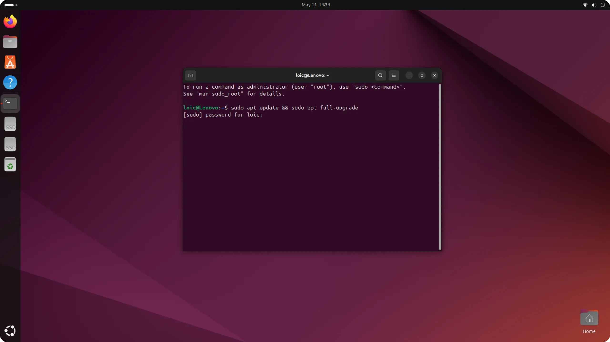

Vous pouvez ensuite redémarrer votre ordinateur :

```bash
sudo reboot
```

#### Dépôts et canaux logiciels : comprendre d'où viennent les logiciels

Sous Ubuntu, l’installation et la mise à jour des logiciels se font via un système de dépôts officiels. Un dépôt est un serveur contenant des milliers de paquets logiciels (programmes, bibliothèques, pilotes...), tous organisés selon des règles précises. Ces paquets sont vérifiés, signés et distribués automatiquement via le gestionnaire de paquets `apt`.

Chaque dépôt est divisé en sections. Ubuntu active par défaut quatre sections principales :
* **main** : les logiciels libres officiellement maintenus par Canonical. Exemples : Firefox, LibreOffice, bash...
* **restricted** : les logiciels non libres, mais indispensables pour le bon fonctionnement matériel. Exemples : pilotes NVIDIA, firmware Wi-Fi, codecs propriétaires...
* **universe** : les logiciels libres maintenus par la communauté. Exemples : GIMP, Inkscape, Audacity…
* **multiverse** : les logiciels soumis à des restrictions légales (brevets, licences non libres). Leur disponibilité peut varier selon les pays. Exemples : certains codecs audio/vidéo, Steam…

Chaque composant peut ensuite être décliné en plusieurs **canaux** ou **pockets** : `release`, `security`, `updates`, `backports`, etc., qui correspondent à la nature des mises à jour.

### Premiers pas en ligne de commande

L’interface graphique rend l’utilisation d’Ubuntu intuitive, mais pour certaines tâches d’administration, le terminal reste l’outil le plus efficace et le plus puissant. Sous Ubuntu, l’interpréteur de commandes utilisé par défaut est **Bash** (*Bourne Again SHell*), un shell libre issu de la tradition Unix.

Utiliser le terminal permet de manipuler directement les fichiers, de configurer le système avec précision, de gérer les paquets, d’automatiser des tâches ou de diagnostiquer des problèmes. Voici une sélection des commandes essentielles que vous devrez connaître pour bien débuter.

- Afficher le répertoire courant :

```bash
pwd
```

Cette commande affiche le chemin absolu du dossier dans lequel vous vous trouvez. Très utile pour ne jamais perdre le fil de votre position dans l’arborescence.

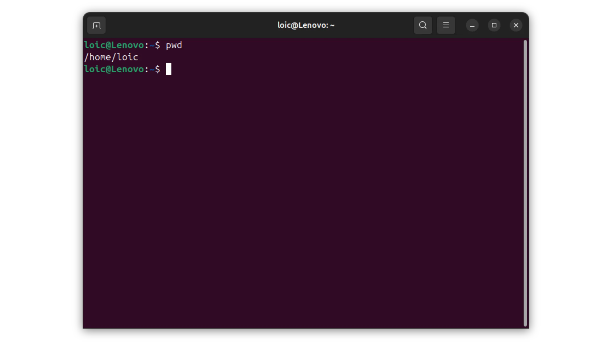

- Lister le contenu d’un dossier

```bash
ls -lah
```

Cette commande liste les fichiers et dossiers du répertoire en cours, en format détaillé :
- `-l` : mode "*long*", qui affiche les permissions, la taille, l’utilisateur, la date...
- `-a` : affiche aussi les fichiers cachés (ceux qui commencent par un point).
- `-h` : "*human-readable*", affiche les tailles dans un format lisible (Ko, Mo...).

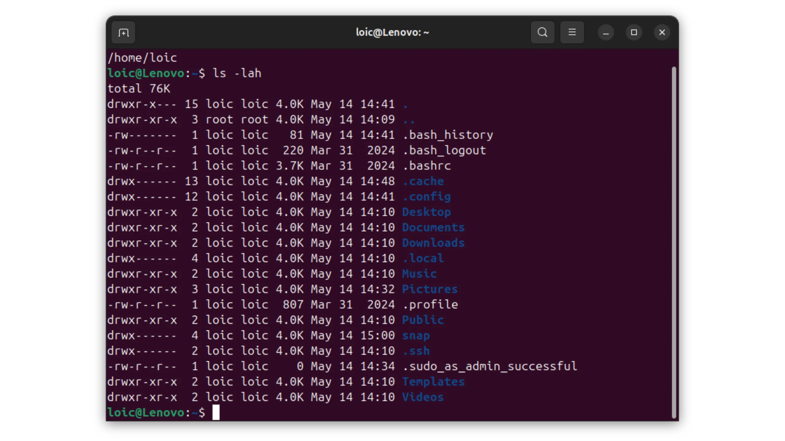

Variante :

```bash
lsblk
```

Affiche l’arborescence des disques et partitions connectées à votre système (très pratique pour identifier un disque USB, par exemple).

- Changer de répertoire :

```bash
cd /path/to/folder
```

`cd` signifie "*change directory*". Cela permet de se déplacer dans l’arborescence des fichiers. Par exemple, avec la commande `cd Music`, je vais me retrouver dans le dossier `/Music`.

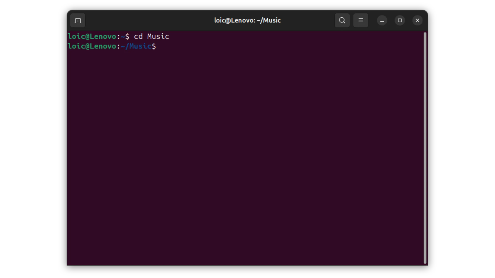

- `cd ~` : revient dans le dossier personnel principal.
- `cd -` : revient au dossier précédent.

- Créer un répertoire

Pour créer un nouveau dossier à l'intérieur du dossier dans lequel vous vous trouvez, vous pouvez utiliser la commande :

```bash
mkdir name
```

Modifiez simplement "name" par le nom de votre nouveau dossier.

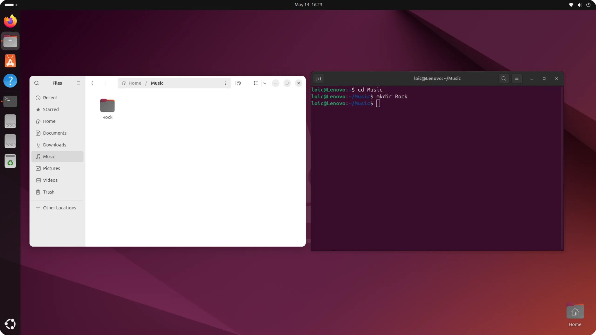

- Copier un fichier :

Pour copier et coller un fichier, utilisez la commande `cp`, suivie du nom du fichier (vous devez être positionné dans le dossier où se trouve ce fichier), puis du chemin vers le dossier de destination.

```bash
cp file.txt destination
```

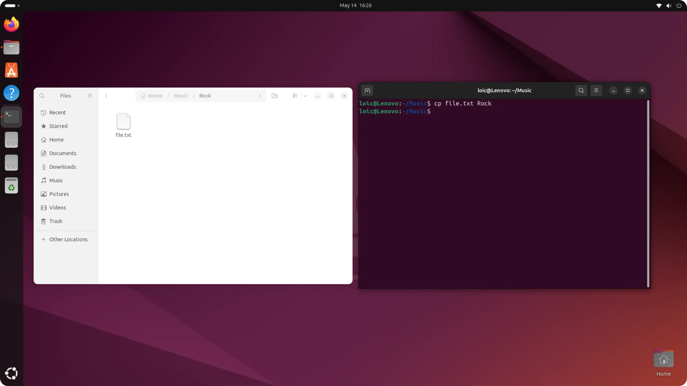

- Déplacer ou renommer un fichier :

```bash
mv file.txt /new/folder/
```

La commande `mv` permet à la fois de déplacer et de renommer un fichier ou un dossier. Si vous indiquez un chemin vers un autre dossier après le nom du fichier, celui-ci sera déplacé. Si vous indiquez un nouveau nom, le fichier sera simplement renommé.

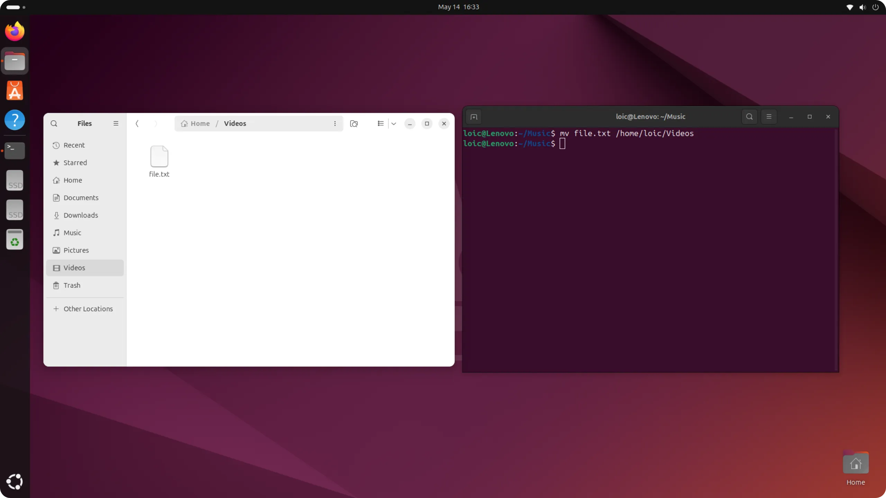

- Supprimer un fichier ou un dossier :

```bash
rm file.txt
```

Attention : cette commande ne passe pas par une corbeille.

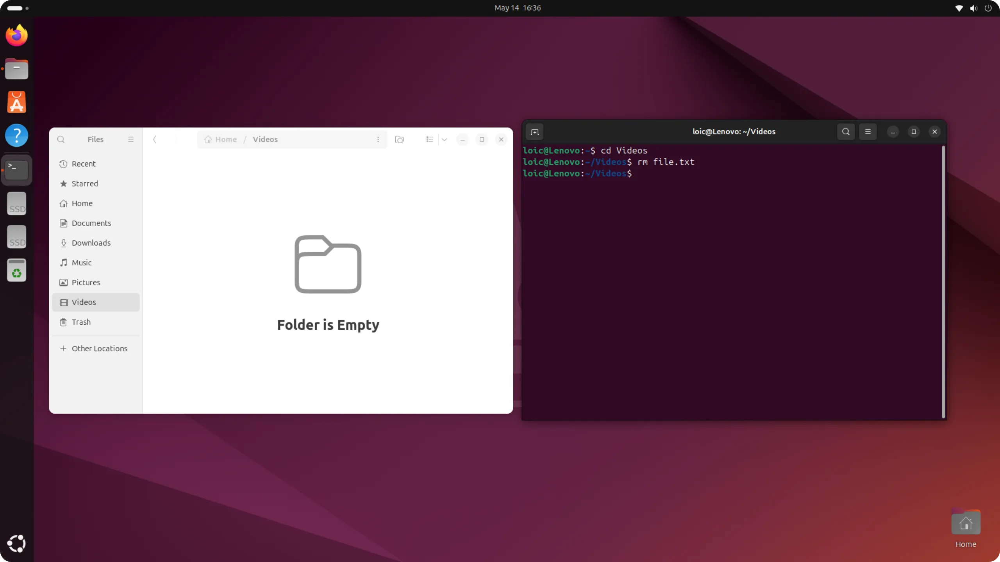

- `-r` : suppression récursive (pour les dossiers).
- `-f` : force la suppression sans confirmation (dangereux).

Pour éviter les erreurs avec cette commande, je vous recommande d’ajouter une confirmation par défaut. Exécutez simplement dans votre terminal :

```bash
echo "alias rm='rm -i'" >> ~/.bashrc
source ~/.bashrc
```

Cela vous demandera confirmation avant chaque suppression.

- Nettoyer le terminal

Pour nettoyer les commandes dans votre terminal et repartir d’un écran vide, tapez la commande :

```bash
clear
```

- Exécuter une commande en tant qu’administrateur :

```bash
sudo command
```

Le mot-clé `sudo` (*superuser do*) permet d’exécuter temporairement une commande avec les privilèges *root* (administrateur système). On vous demandera votre mot de passe pour confirmer cette action. Donc attention, n'utilisez jamais `sudo` sans comprendre ce que fait la commande.

Astuce : pour basculer dans un shell root (session administrateur), tapez :

```bash
sudo -i
```

Cela ouvre un terminal complet avec les droits root. À utiliser avec précaution et jamais de manière prolongée.

- Consulter l’aide d’une commande :

```bash
man command_name
```

La commande `man` (*manual*) ouvre la documentation complète d’une commande. Naviguez avec les flèches ou `PgUp` / `PgDn`, et quittez avec `q`.

Exemple :

```bash
man cp
```

Pour un résumé rapide, utilisez :

```bash
cp --help
```

Ces premières commandes suffisent à effectuer la majorité des opérations de base dans votre terminal. Avec un peu de pratique, vous gagnerez en autonomie et en vitesse. Dans les prochaines partis, nous allons aller plus loin sur l’utilisation du terminal pour la gestion du système, des paquets et des outils de sécurité.

### Gestion des paquets : APT, Snap et Flatpak

Dans un système GNU/Linux comme Ubuntu, l’installation, la mise à jour et la suppression de logiciels sont centralisées à travers des systèmes de gestion de paquets. Contrairement à Windows où l’on télécharge des fichiers `.exe` ou `.msi`, Ubuntu utilise des outils comme APT, Snap ou Flatpak pour automatiser ces opérations, en garantissant la cohérence du système.

#### APT : la méthode native de Debian

APT (*Advanced Package Tool*) est le gestionnaire de paquets principal d’Ubuntu. Il manipule les paquets au format `.deb`, issus des dépôts officiels. Chaque paquet contient un logiciel, ses dépendances et ses métadonnées. Découvrons ensemble quelques commandes de base en prenant pour exemple le logiciel de retouche d'image GIMP.

Pour rechercher dans les dépôts un paquet disponible (vous devez évidemment remplacer "gimp" par le nom du logiciel souhaité) :

```bash
apt search gimp
```

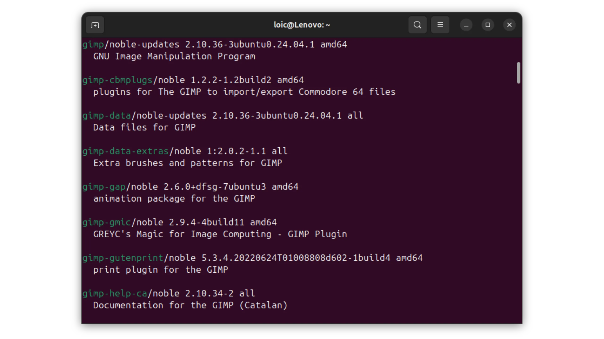

Pour installer le paquet ainsi que toutes ses dépendances :

```bash
sudo apt install gimp
```

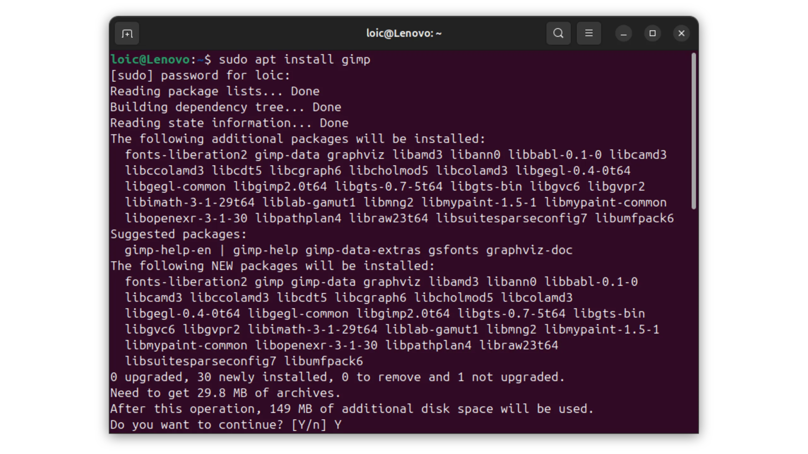

Une fois l’installation terminée, vous pourrez retrouver l’exécutable dans le menu des applications d’Ubuntu, situé en bas à gauche de l’interface.

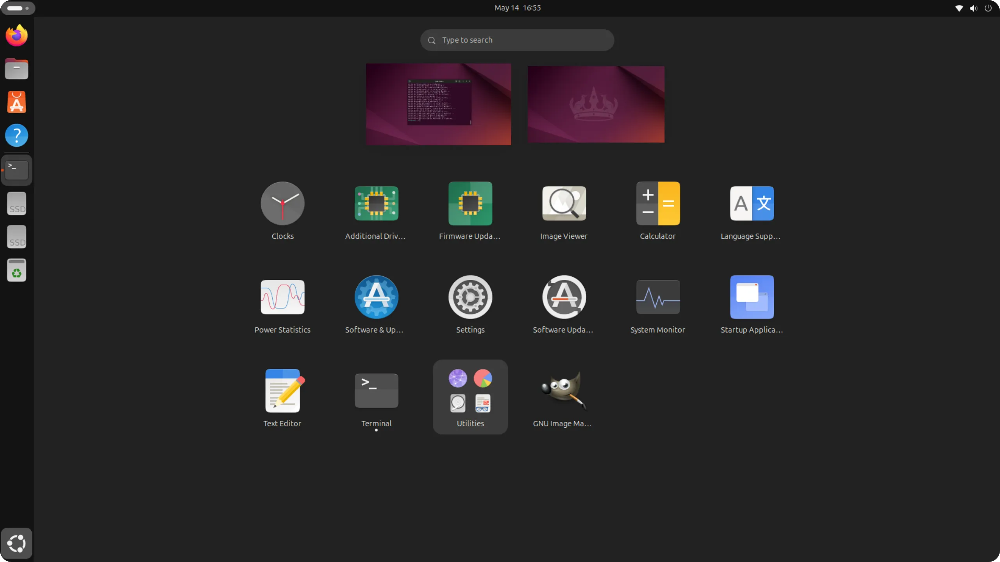

Encore plus simple : vous pouvez également taper le nom de votre logiciel directement dans le terminal (dans mon cas, "gimp") pour l’ouvrir.

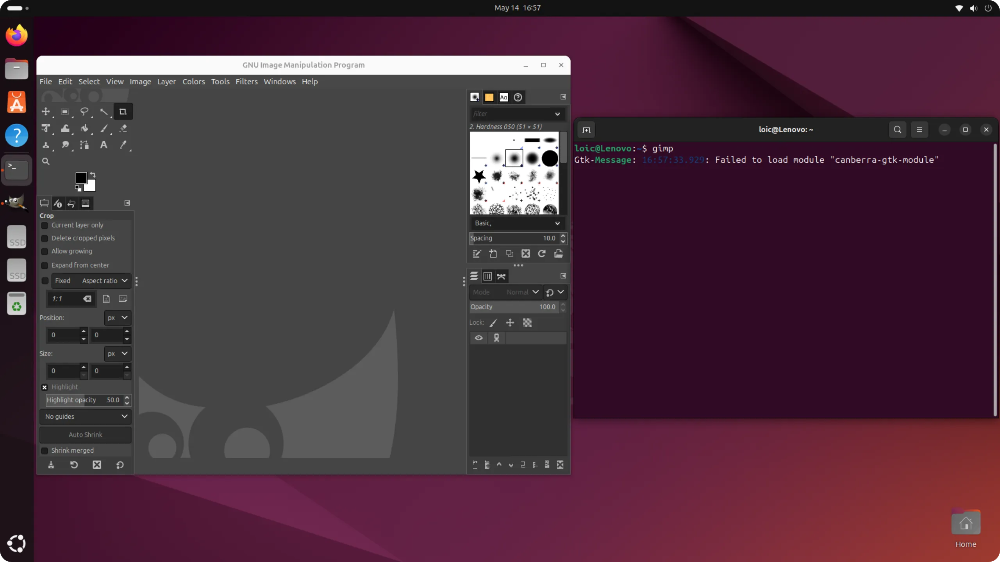

Pour supprimer un logiciel, vous pouvez utiliser la commande suivante (en remplaçant "gimp" par le nom du logiciel que vous souhaitez désinstaller) :

```bash
sudo apt remove gimp
```

Vous pouvez également ajouter `--purge` à votre commande afin de supprimer les fichiers de configuration associés au logiciel :

```bash
sudo apt remove --purge gimp
```

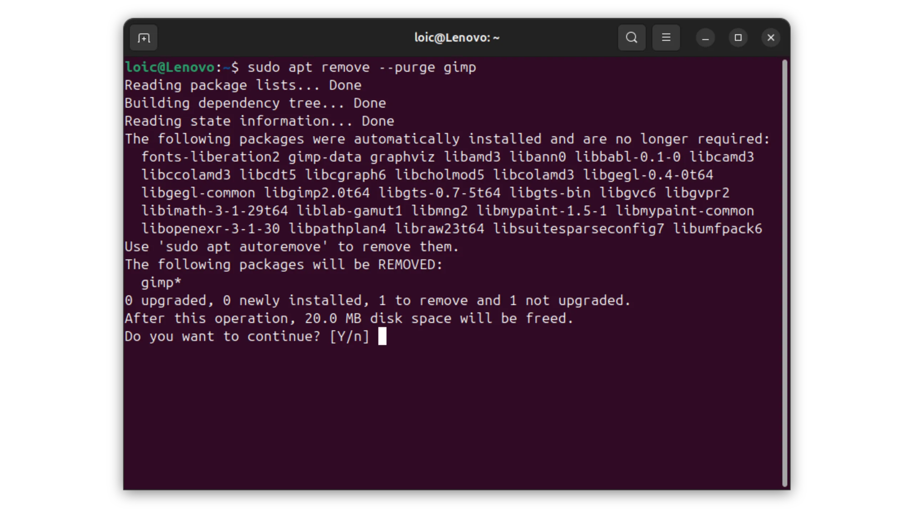

Pour mettre à jour la base les paquets disponibles (`update`) et installer les dernières versions (`upgrade`), vous pouvez exécuter ces deux commandes :

```bash
sudo apt update
sudo apt upgrade
```

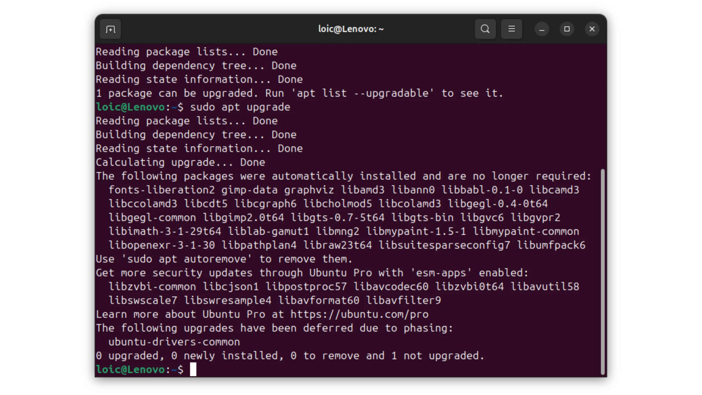

→ APT est rapide, léger et très bien intégré à Ubuntu. Pour tous les logiciels disponibles dans les dépôts officiels, c’est la méthode à privilégier.

#### Snap : les paquets conteneurisés de Canonical

Snap est un format de paquet développé par Canonical, conçu pour être universel, isolé du système principal et auto-contenu. Cela signifie que chaque snap embarque ses propres dépendances et s’exécute dans un environnement semi-sécurisé (*sandbox*).

Cela permet d’avoir des logiciels à jour indépendamment du système et cela fonctionne sur toutes les distributions Linux qui supportent Snap. En revanche, le temps de démarrage est plus long, cela peut mener à un empilement inutiles des mêmes dépendances et l'intégration au bureau est parfois moins fluide.

Pour rechercher un paquet Snap dans le Snap Store (ici pour le logiciel Spotify) :

```bash
snap find spotify
```

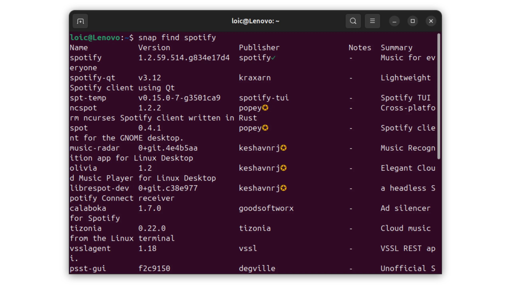

Pour installer le paquet :

```bash
sudo snap install spotify
```

Une fois l’installation terminée, vous pourrez retrouver l’exécutable dans le menu des applications d’Ubuntu, situé en bas à gauche de l’interface. Ou bien encore plus simple : vous pouvez également taper le nom de votre logiciel directement dans le terminal (dans mon cas, "spotify") pour l’ouvrir.

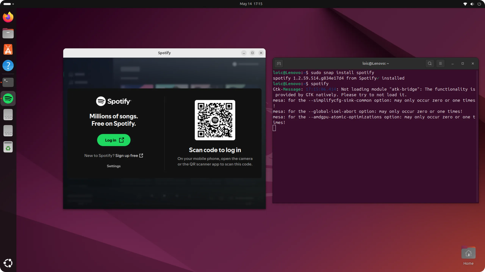

Pour mettre à jour tous les paquets Snap installés :

```bash
sudo snap refresh
```

Pour supprimer une application :

```bash
sudo snap remove spotify
```

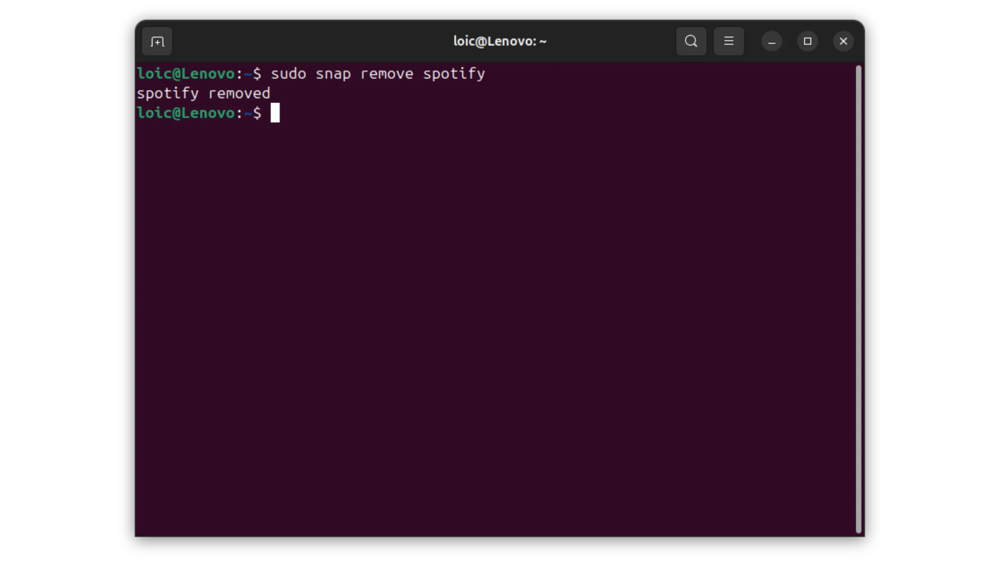

→ Les applications Snap sont installées dans le répertoire `/var/snap` et montées comme systèmes de fichiers séparés.

#### Flatpak : une alternative modulable

Flatpak est un autre format de paquet universel, développé par la communauté (Red Hat, GNOME…). Il vise à résoudre les limites des formats traditionnels tout en offrant une meilleure gestion des permissions que Snap. Chaque application fonctionne en sandbox, mais avec une granularité de contrôle plus fine.

Pour installer Flatpak et son intégration graphique :

```bash
sudo apt install flatpak gnome-software-plugin-flatpak
```

Pour ajouter le dépôt communautaire principal (Flathub) :

```bash
flatpak remote-add --if-not-exists flathub https://flathub.org/repo/flathub.flatpakrepo
```

Pour installer une application via Flatpak, utilisez la commande suivante (dans cet exemple, pour installer le logiciel VLC) :

```bash
flatpak install flathub org.videolan.VLC
```

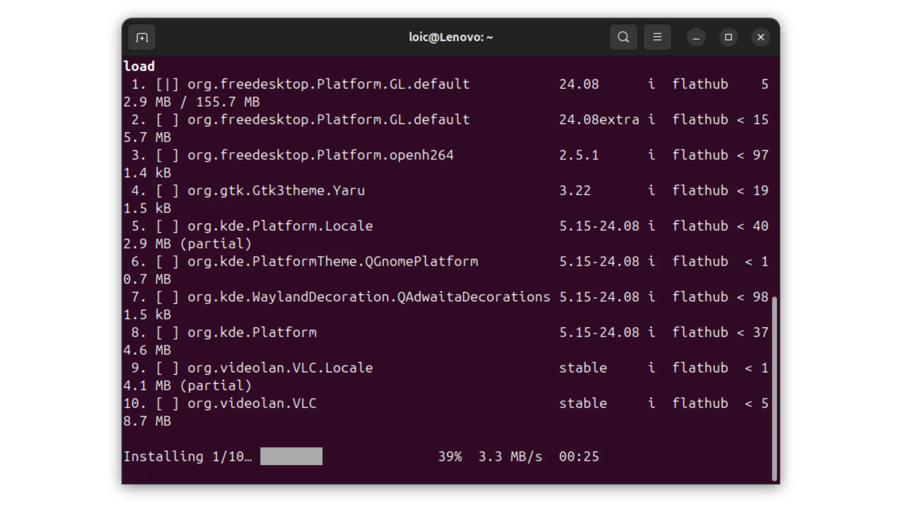

En résumé :

| Format       | Origine       | Isolation | Taille | Performances | Contrôle des droits |
| ------------ | ------------- | --------- | ------ | ------------ | ------------------- |
| APT / `.deb` | Debian        | ❌         | ✅      | ✅            | 🟡                  |
| Snap         | Canonical     | 🟡        | ❌      | ❌            | 🟡                  |
| Flatpak      | Communautaire | ✅         | 🟡     | 🟡           | ✅                   |

#### App Center : l'installateur graphique

Ubuntu intègre une application nommée *App Center*, qui sert d’interface graphique pour rechercher, installer et désinstaller facilement des applications, sans utiliser les lignes de commande comme nous venons de le voir. Techniquement, App Center agit comme une surcouche aux gestionnaires de paquets. Elle peut donc :
- Installer des paquets `.deb` en s’appuyant sur APT ;
- Installer des paquets Snap, issus du Snap Store.

Ainsi, le store App Center n’est pas un système d’installation à part entière, mais une interface qui regroupe et unifie plusieurs sources logicielles, avec un moteur de recherche, des fiches descriptives et des boutons d’installation accessibles aux débutants.

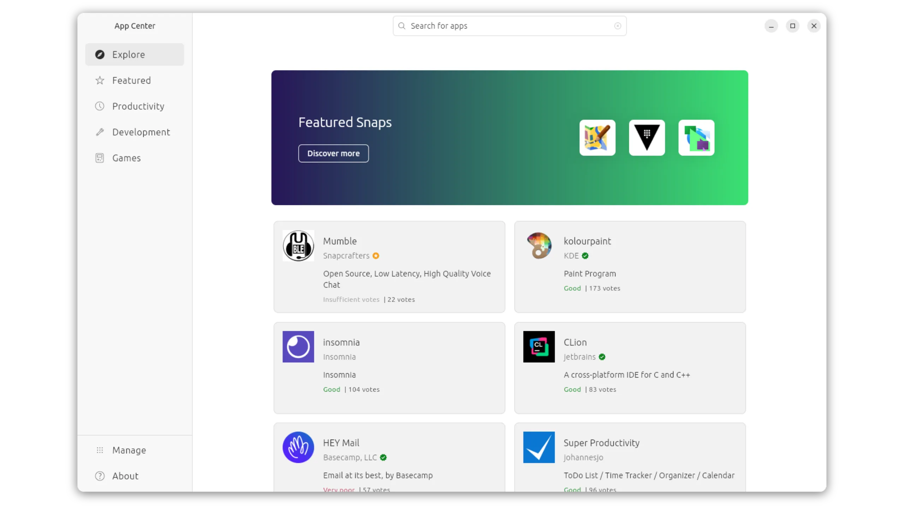

### Maintenance et mises à jour

Pour assurer la stabilité et la sécurité de votre système, Ubuntu applique automatiquement les mises à jour critiques via un service appelé `unattended-upgrades`. Ce service fonctionne en arrière-plan et installe les correctifs de sécurité publiés par la distribution, sans votre intervention.

#### Vérifier l’état du service automatique

Pour s'assurer que ce mécanisme est bien actif :

```bash
sudo systemctl status unattended-upgrades
```

Vous devriez voir une sortie indiquant que le service est `active (running)`. 

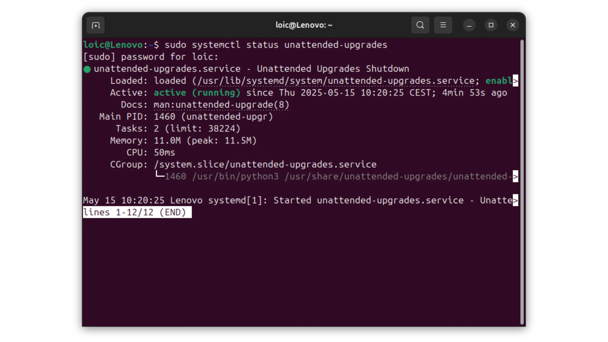

Si ce n’est pas le cas, vous pouvez l’activer manuellement :

```bash
sudo systemctl enable --now unattended-upgrades
```

Ce service protège votre système contre les vulnérabilités récemment découvertes, sans avoir besoin de vérifier manuellement chaque jour s’il existe des mises à jour. Il est particulièrement utile sur les postes peu surveillés comme les ordinateurs personnels, car il garantit un minimum de sécurité à jour.

→ **Attention :** `unattended-upgrades` se limite aux paquets de sécurité issus du dépôt `security`. Il n’applique donc pas les mises à jour des logiciels standards, que vous devrez faire manuellement.

#### Mettre à jour manuellement tout le système

Même si les correctifs critiques sont installés automatiquement, il est important de lancer régulièrement une mise à jour manuelle complète pour bénéficier des dernières versions des logiciels et des composants non couverts par `unattended-upgrades`. Pour ce faire, exécutez la commande :

```bash
sudo apt update && sudo apt full-upgrade
```

- `apt update` synchronise la liste des paquets disponibles ;
- `apt full-upgrade` installe les nouvelles versions, même si cela implique de modifier certaines dépendances (au contraire de `upgrade`, qui est plus conservateur).

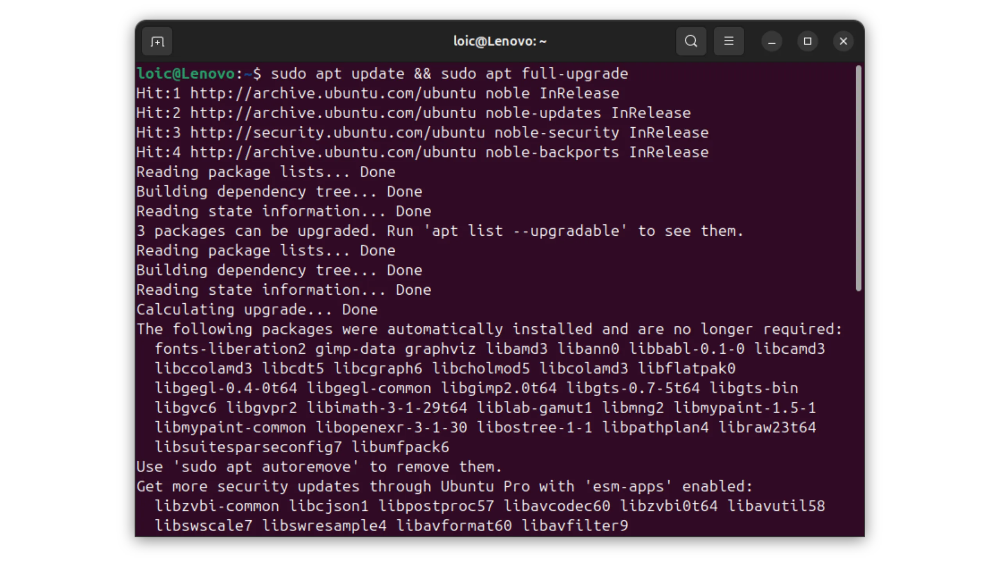

Après la mise à jour, vous pouvez nettoyer les fichiers inutiles avec :

```bash
sudo apt autoremove --purge
```

Cette commande supprime les paquets devenus obsolètes et les fichiers de configuration associés.

Si vous avez installé des logiciels via les gestionnaires de paquet Snap ou Flatpak, vous pouvez utiliser ces deux commandes pour els mettre à jour également :

```bash
sudo snap refresh
flatpak update
```

#### Redémarrage après certaines mises à jour

Certaines mises à jour critiques, comme celles du noyau Linux ou de la libc (bibliothèque standard du langage C, utilisée par la majorité des programmes), ne prennent effet qu’après un redémarrage de votre machine. Pour savoir si un redémarrage est conseillé, installez l’outil `needrestart` :

```bash
sudo apt install needrestart
```

Puis lancez :

```bash
sudo needrestart
```

Ce programme analysera les services ou processus qui utilisent encore d’anciennes versions des bibliothèques ou du noyau, et vous indiquera si un redémarrage est nécessaire pour appliquer les mises à jour.

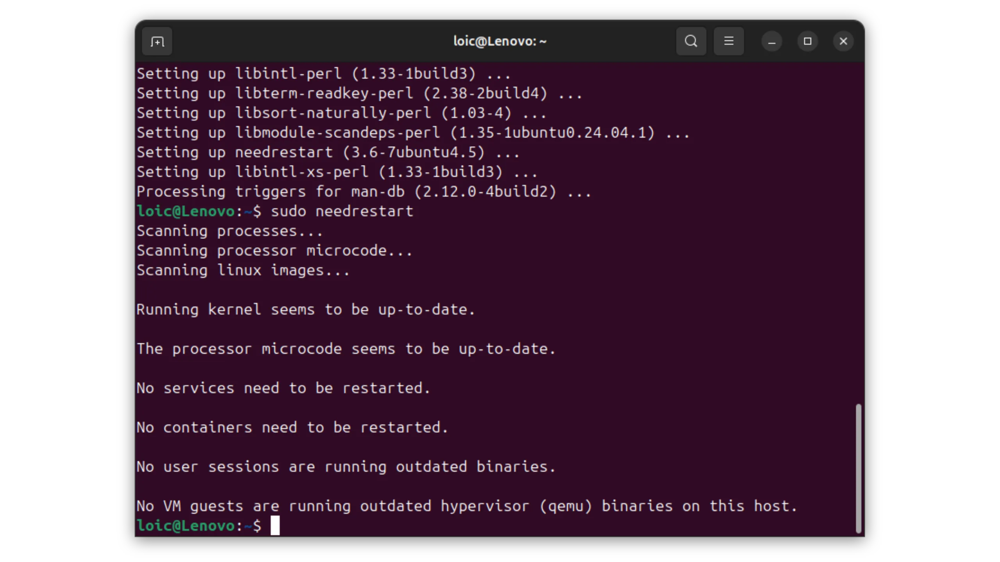

Maintenir votre système et vos logiciels à jour est un réflexe essentiel en sécurité informatique. Avoir un système Linux à jour est une garantie de stabilité, sécurité et performance.

### Pare-feu et durcissement réseau

Un pare-feu est un outil de sécurité qui contrôle les connexions réseau entrantes et sortantes d’un ordinateur. Sur Ubuntu, il va vous servir à filtrer le trafic afin d’autoriser uniquement les communications légitimes et de bloquer celles qui pourraient être malveillantes. Cela permet par exemple d’empêcher des intrusions extérieures non sollicitées, afin de renforcer la protection de vos données et de votre système, même si vous n’êtes pas un utilisateur avancé.

Dès l’installation, sécuriser les communications réseau de votre machine est donc une étape importante. Ubuntu intègre un pare-feu standard : UFW (_Uncomplicated Firewall_). Il permet de gérer finement les connexions entrantes et sortantes, sans devoir écrire manuellement des règles complexes.

#### Activer le pare-feu

Par défaut, UFW est installé, mais inactif. Pour l’activer :

```bash
sudo ufw enable
```

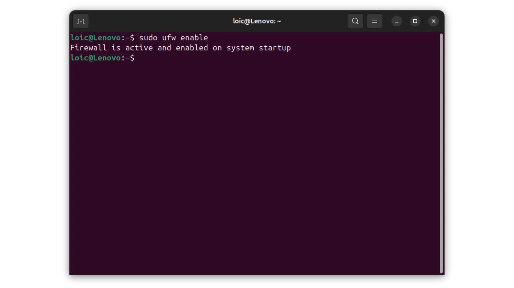

Une fois activé, vous pouvez vérifier son état et les règles en cours avec :

```bash
sudo ufw status verbose
```

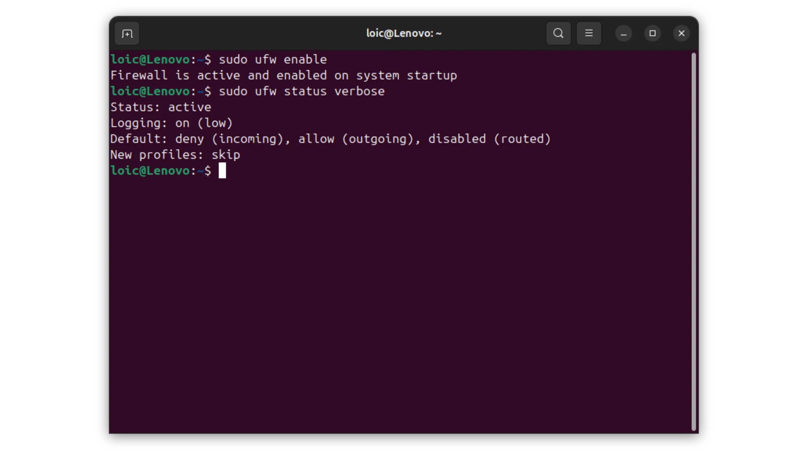

Par défaut, UFW adopte une stratégie de rejet des connexions entrantes non sollicitées tout en autorisant le trafic sortant, ce qui est un bon compromis sécurité/fonctionnalité pour une machine personnelle générale.

#### Autoriser un service

Si vous devez rendre un service accessible à distance (comme un serveur SSH par exemple), vous devez explicitement autoriser son port :

```bash
sudo ufw allow 22/tcp comment 'SSH'
```

- `22` est le port par défaut du service SSH ;
- `tcp` est le protocole utilisé ;
- L’option `comment` vous permet d’ajouter une annotation lisible pour faciliter la lecture des règles ultérieurement.

Vous pouvez vérifier la règle avec :

```bash
sudo ufw status numbered
```

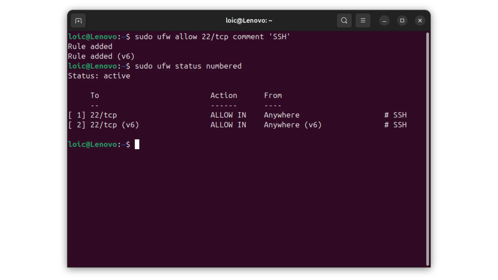

#### Définir des règles par plage IP (usage local)

Il est possible de restreindre l’accès à certains services à une plage d’adresses IP, ce qui peut être utile dans un réseau local (LAN) :

```bash
sudo ufw allow from 192.168.1.0/24 to any port 6881 proto tcp
```

Cela autorise les connexions TCP sur le port 6881 uniquement depuis le sous-réseau `192.168.1.0/24` (typiquement votre réseau Wi-Fi domestique).

#### Interface graphique : GUFW

Si vous êtes moins à l’aise avec le terminal, il existe une interface graphique nommée GUFW, qui permet de gérer facilement les règles du pare-feu avec des boutons, listes déroulantes et boîtes de dialogue. Pour l’installer :

```bash
sudo apt install gufw
```

Une fois installé, lancez-le via le menu d’applications. Vous pourrez activer le pare-feu, autoriser ou bloquer des services et consulter les connexions filtrées en temps réel.

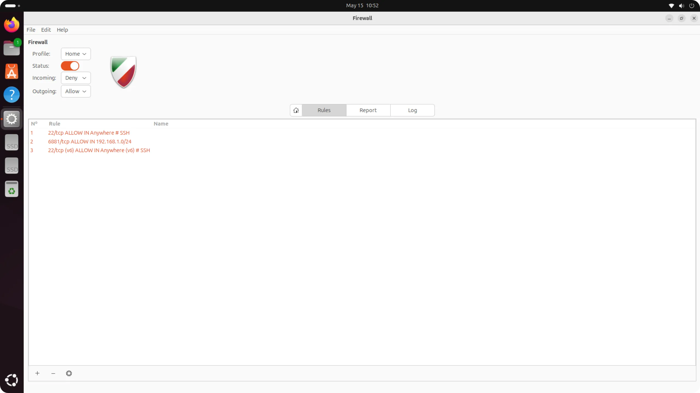

→ **Bonnes pratiques :** Même si vous n’exposez pas de service réseau à l’extérieur, un pare-feu reste utile pour bloquer certains types de scans ou d'accès. Pensez aussi à changer les ports par défaut pour certains services (comme SSH), à désactiver les services inutiles et à toujours tenir vos logiciels réseau à jour. Ce durcissement du réseau local est une première ligne de défense dans une stratégie de sécurité plus large, mais nous y reviendrons plus tard dans la formation.

### Connexion Internet et gestion réseau

Sous Ubuntu, la gestion du réseau est assurée par *NetworkManager*, un service qui centralise les connexions filaires, Wi-Fi, VPN, modem, etc. Il fonctionne en tandem avec *netplan*, un outil de configuration de bas niveau qui définit les réglages réseau persistants dans des fichiers YAML. Ensemble, ces outils assurent à la fois la simplicité pour un usage quotidien et la robustesse pour des cas plus complexes (serveurs, configurations manuelles...).

#### Gestion via l’interface graphique

Pour la majorité des utilisateurs, l’interface graphique intégrée à GNOME (Paramètres système → Réseau/Wi-Fi) suffit amplement. Elle permet de :
- se connecter à un réseau Wi-Fi disponible ;
- gérer les connexions filaires, les proxys, ou les VPN ;
- visualiser l'état actuel de chaque interface réseau.

Ce mode de gestion est intuitif et couvre 99 % des besoins classiques sur un ordinateur personnel.

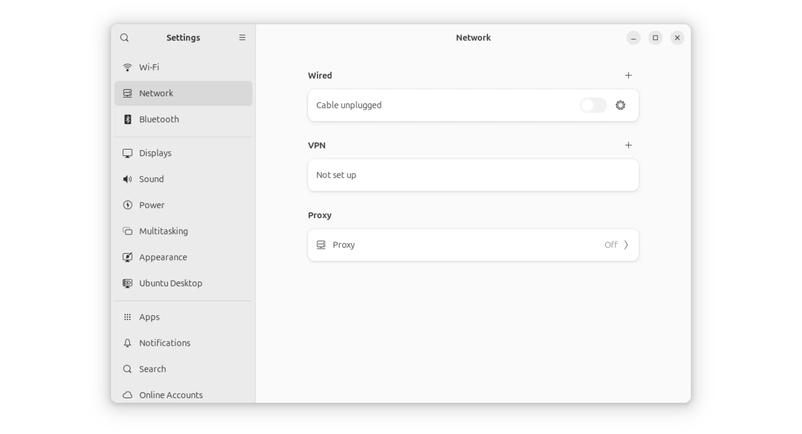

#### Utilisation du terminal avec nmcli

En cas de dépannage ou d’accès distant, la commande `nmcli` permet de manipuler *NetworkManager* en ligne de commande.

- Pour afficher les interfaces réseau détectées :

```bash
nmcli device status
```

- Pour scanner les réseaux Wi-Fi à proximité :

```bash
nmcli device wifi list
```

- Pour se connecter à un réseau Wi-Fi :

```bash
nmcli device wifi connect "wifi_name" password "password"
```

### Installer les applications essentielles

Une fois votre système de base fonctionnel, l’étape suivante consiste à installer les logiciels adaptés à vos usages. Ubuntu propose plusieurs méthodes d’installation (APT, Snap, Flatpak), que nous avons détaillées précédemment. Ici, nous utilisons APT dès que possible pour maintenir une intégration native avec le système.

#### Navigateur web

Ubuntu inclut Firefox en version Snap par défaut. Ce format apporte une meilleure isolation (ce qui est bien en termes de sécurité), mais provoque un temps de lancement plus lent, plus de consommation de ressources, et quelques limitations d’intégration avec le système (gestion des fichiers, thèmes...).

Si vous préférez la version native `.deb`, vous pouvez l’installer depuis le PPA officiel de Mozilla :

```bash
sudo add-apt-repository ppa:mozillateam/ppa
sudo apt update
sudo apt install firefox
```

Puis, pour empêcher le système de revenir automatiquement à la version Snap lors de mises à jour :

```bash
sudo apt-mark hold firefox
```

Cela fige la version `.deb` actuellement installée. Elle continuera d’être mise à jour, mais restera sous ce format.

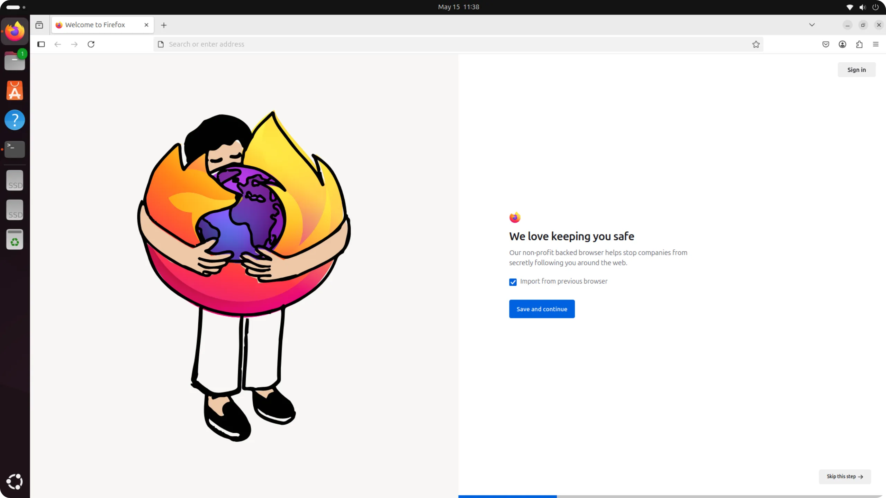

Nous aborderons plus en détail les navigateurs dans un prochain chapitre, afin de vous aider à choisir celui qui correspond le mieux à vos usages, et à le configurer de manière optimale.

#### Email

Thunderbird est le client de messagerie open-source de référence, développé également par Mozilla. Il prend en charge les comptes IMAP/POP, les calendriers, les extensions et le chiffrement OpenPGP.

```bash
sudo apt install thunderbird
```

#### Suite bureautique

LibreOffice est la suite bureautique libre la plus complète. Elle propose des alternatives à Word, Excel et PowerPoint, avec une excellente compatibilité avec les formats Microsoft Office (.docx, .xlsx, .pptx).

```bash
sudo apt install libreoffice
```

Si vous souhaitez une installation plus ciblée :

```bash
sudo apt install libreoffice-writer libreoffice-calc libreoffice-impress
```

Ces trois paquets couvrent l’essentiel : traitement de texte, tableur et présentation.

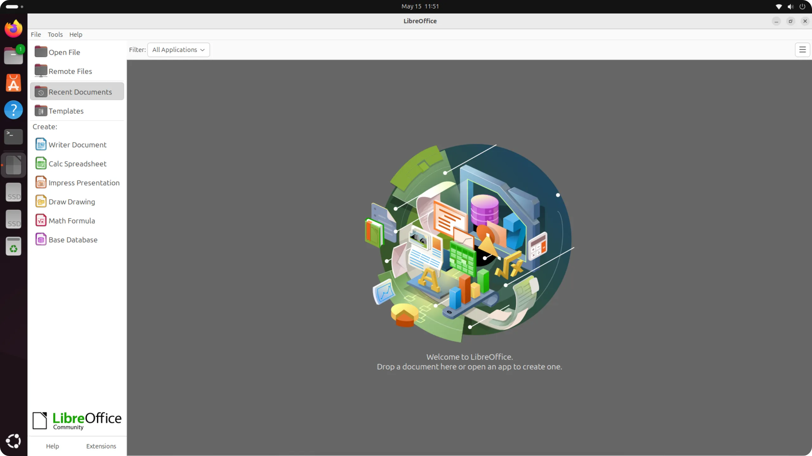

D’autres alternatives existent également, comme OnlyOffice (plus proche de l’interface Microsoft Office), WPS Office (propriétaire, mais très fluide), ou encore Calligra Suite (projet KDE). Ces options peuvent être installées via Flatpak, Snap ou téléchargées depuis leurs sites respectifs.

#### Multimédia

VLC est un lecteur multimédia universel, capable de lire la majorité des formats audio/vidéo sans codecs supplémentaires :

```bash
sudo apt install vlc
```

Ubuntu ne fournit pas par défaut certains codecs propriétaires (MP3, H.264...), pour des raisons juridiques. Le paquet suivant ajoute ces éléments indispensables :

```bash
sudo apt install ubuntu-restricted-extras
```

#### Graphisme et création

Pour la retouche photo et le dessin vectoriel, deux références open-source sont disponibles :

```bash
sudo apt install gimp inkscape
```

GIMP est un logiciel de retouche photo avancé, comparable à Adobe Photoshop, et Inkscape est un logiciel de dessin vectoriel, comparable à Adobe Illustrator.

Pour le montage vidéo, vous pouvez installer Kdenlive qui est complet, intuitif et adapté aussi bien aux débutants qu’aux utilisateurs avancés :

```bash
sudo apt install kdenlive
```

Pour le montage audio, il y a Audacity :

```bash
sudo apt install audacity
```

Pour l’enregistrement d’écran, le streaming ou la création de contenus vidéo en direct, il y a OBS Studio :

```bash
sudo apt install obs-studio
```

#### Outils de développement

Si vous êtes développeur, pour installer une base de développement C/C++, Git, et des utilitaires réseau :

```bash
sudo apt install build-essential git curl
```

Pour installer VSCode :

```bash
sudo snap install code --classic
```

Au-delà de ces quelques outils de base, je vous recommande bien sûr d’installer les outils de sécurité essentiels adaptés à vos usages, notamment un gestionnaire de mots de passe et un VPN :

https://planb.network/tutorials/computer-security/authentication/keepass-f8073bb7-5b4a-4664-9246-228e307be246

https://planb.network/tutorials/computer-security/authentication/bitwarden-0532f569-fb00-4fad-acba-2fcb1bf05de9

https://planb.network/tutorials/computer-security/communication/ivpn-5a0cd5df-29f1-4382-a817-975a96646e68

https://planb.network/tutorials/computer-security/communication/mullvad-968ec5f5-b3f0-4d23-a9e0-c07a3e85aaa8

Enfin, pour terminer ce chapitre, je vous rappelle quelques bonnes pratiques à suivre au quotidien :

- N’utilisez la commande `sudo` que lorsque c’est strictement nécessaire. Cette commande élève temporairement vos droits pour exécuter une action en tant qu’administrateur. Une erreur sous `sudo` (par exemple un `rm -rf`) peut affecter tout le système. Évitez aussi de passer en mode root (`sudo -i`) pour de longues sessions, sauf nécessité exceptionnelle ;

- Même si Ubuntu applique automatiquement certains correctifs de sécurité via le service `unattended-upgrades`, cela ne couvre pas l’ensemble des logiciels. Exécutez manuellement une mise à jour complète régulièrement :

```bash
sudo apt update && sudo apt upgrade
```

Avec ce chapitre sur les bases d'Ubuntu, vous disposez désormais d’un environnement Linux fonctionnel, cohérent et adapté à un usage quotidien. Vous savez installer des logiciels, configurer votre réseau, maintenir votre système à jour et intervenir via le terminal en ligne de commande. 

Cette autonomie technique constitue le socle indispensable pour aborder sereinement la suite de cette formation. Dans la prochaine section, nous approfondirons les mécanismes de sécurité de votre poste de travail et mettrons en œuvre les premières mesures concrètes pour en renforcer la résilience.


# Sécuriser son ordinateur
<partId>7fda3e41-ff0e-4fa0-8bd5-350d9ad5bbec</partId>

## Authentification et cloisonnement des usages
<chapterId>c8350e86-5581-4d51-8207-fd4ee48502a7</chapterId>

Mot de passe, BIOS.  
Cloisonnement des usages : multisession et gestion du compte root/admin.  
Création de machines virtuelles.  
Sandboxing.


## Réduire les failles par la maintenance
<chapterId>71d7fd95-ce1d-43d8-9a66-be7b425857fc</chapterId>

Mise à jour de l’OS : pourquoi et comment ?  
Mise à jour des logiciels : comment faire selon le système (ex. `winget upgrade --all`), focus sur les logiciels critiques.  
Désinstallation des logiciels inutilisés pour réduire la surface d'attaque.  
Surveillance et audit système (quels logiciels?)


## Intégrité et authenticité des logiciels
<chapterId>ffa06aeb-0b90-4271-a385-9a752c1bb5ed</chapterId>

Comment vérifier un logiciel avant installation, et pourquoi c’est important.


## Chiffrement et protection des données
<chapterId>bcba9b26-72d2-446b-b23c-89927a2e857c</chapterId>

Sauvegardes.  
LUKS (Linux), VeraCrypt (Windows + supports externes).  
Chiffrement de fichiers (GPG, Cryptomator).  
Nettoyage des métadonnées (exiftool).


## Les réflexes à adopter au quotidien
<chapterId>0869e92e-5488-4e8a-90e6-9b9d1c58a19b</chapterId>


# Le navigateur : un OS dans l'OS
<partId>125c3d99-6aba-4050-bc7c-8543ef8587e4</partId>

## Brève histoire des navigateurs
<chapterId>ac6d2c23-5883-4564-b6a9-bc109b47f92c</chapterId>

Le navigateur web est le logiciel qui vous permet d’accéder à des sites et contenus disponibles sur le *World Wide Web*. Son rôle est d'interpréter les langages utilisés pour créer les pages web, notamment le HTML, le CSS et le JavaScript, afin de vous afficher le contenu des sites de manière lisible et interactive. Il agit comme une interface entre l’internaute et les serveurs web, en envoyant des requêtes et en recevant des réponses via le protocole HTTP ou HTTPS.

Mais de nos jours, le navigateur est devenu bien plus qu’un simple logiciel : il constitue souvent l’interface principale en informatique, en particulier pour les utilisateurs débutants. C’est pourquoi il est parfois considéré comme un véritable "système d’exploitation secondaire" au sein du véritable système d’exploitation (que nous avons étudié dans la première section de SCU 202). En effet, de nombreuses tâches autrefois réalisées à l’aide de logiciels locaux spécialisés sont désormais effectuées directement en ligne via le navigateur : divertissement, bureautique (traitement de texte, tableur, présentation), gestion des e-mails, messagerie, stockage de fichiers ou encore travail collaboratif.

Pourtant, il n’a pas toujours occupé cette place centrale. L'histoire des navigateurs est marquée par des cycles d’innovation, de compétition technologique, et parfois de domination monopolistique. Retracer cette histoire va nous aider à comprendre comment les navigateurs sont devenus si complexes, mais aussi pourquoi leur sécurité représente aujourd’hui un enjeu important.

→ Le navigateur est souvent confondu, à tort, avec le moteur de recherche, notamment par les débutants. Pourtant, ces deux éléments sont bien distincts. Le navigateur web sert à afficher des sites internet, tandis que le moteur de recherche (qui est accessible depuis ce navigateur) permet de trouver des informations en ligne en indexant et en classant les pages web.

### Naissance et premiers navigateurs

L’histoire des navigateurs web commence avec la naissance du *World Wide Web*, inventé par Tim Berners-Lee en 1989-1990. C'est un système qui permet d’accéder, via Internet, à des pages contenant du texte, des images, des vidéos ou des liens, en utilisant un navigateur web. Pour rendre ce nouveau système accessible, il développe à l’automne 1990 le tout premier navigateur, appelé "WorldWideWeb", qui viendra poser les bases de la navigation telle que nous la connaissons aujourd’hui. Il permet à la fois de consulter et de créer des pages web, avec notamment un éditeur HTML intégré. Pour éviter toute confusion entre le navigateur et le Web lui-même, son nom est ensuite changé en "Nexus".

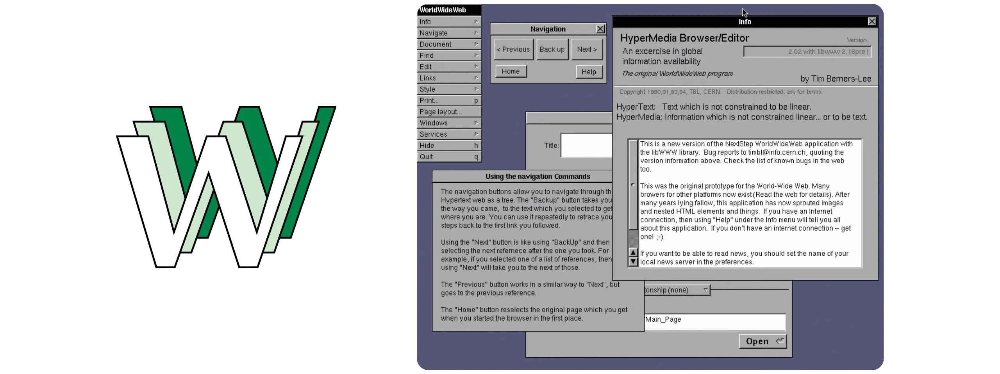

En 1992, plusieurs autres navigateurs expérimentaux voient le jour. L’un des plus notables est Erwise, conçu par quatre étudiants finlandais pour le système X Window sous Unix. C’est le premier navigateur doté d’une interface graphique pour ce type d’environnement. Malgré ses qualités techniques, il souffre du manque de financement et n’est pas maintenu après sa première version. D’autres projets, comme ViolaWWW, apparaissent également durant cette période.

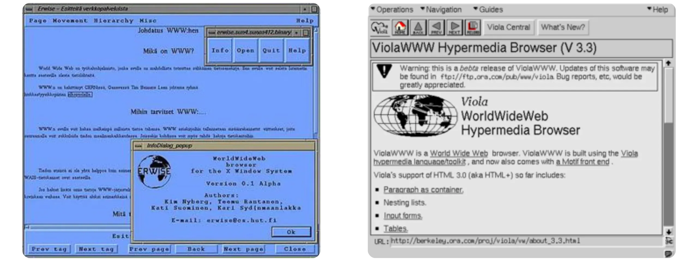

C’est également en 1992 qu’est créé Lynx, le plus ancien navigateur web encore maintenu et utilisé à ce jour. Il a été développé par une équipe d’étudiants de l’Université du Kansas.

Mais c’est en 1993 que le Web entre véritablement dans une phase de croissance rapide avec l’arrivée de NCSA Mosaic. Ce navigateur est développé par Marc Andreessen et Eric Bina au NCSA (*National Center for Supercomputing Applications*) aux États-Unis. Mosaic est le premier navigateur grand public à combiner de manière fluide texte et images dans une seule fenêtre. Il peut afficher les images directement dans les pages web (formats GIF et XBM), ce qui représente une révolution ergonomique par rapport aux navigateurs textuels comme Lynx. Mosaic introduit également le support des formulaires, qui vont ouvrir la voie à une véritable interactivité entre l’utilisateur et les serveurs web. Mosaic est rapidement porté sur plusieurs systèmes d’exploitation (Windows, Mac, Unix), ce qui facilite sa diffusion. En un an, il devient l’outil de référence pour explorer le Web.

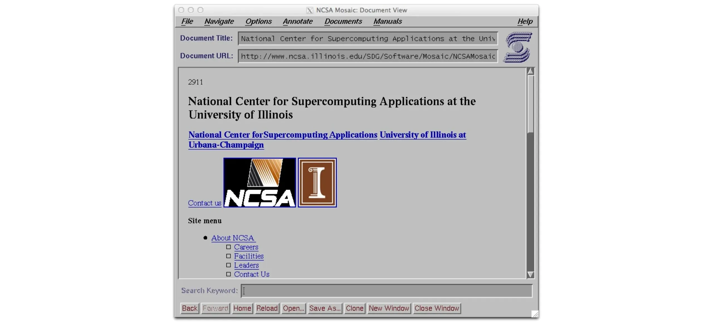

En 1994, Marc Andreessen quitte le NCSA et fonde, avec Jim Clark, la société Netscape Communications. Une grand partie de l'équipe qui a travaillé sur Mosaic va le rejoindre. L’entreprise lance peu après Netscape Navigator, un navigateur basé sur les acquis de Mosaic mais plus performant et doté d’améliorations techniques. Netscape innove en introduisant en 1995 le langage JavaScript, développé par Brendan Eich, qui permet aux pages web de devenir dynamiques, c’est-à-dire capables de réagir aux actions de l’utilisateur sans recharger la page.


Grâce à sa simplicité d’usage, sa compatibilité multiplateforme et sa rapidité, Netscape Navigator s’impose très vite comme la norme du Web naissant. En 1995, il détient jusqu'à 90 % de parts de marché, ce qui marque le début de la première ère des navigateurs web. Ce succès massif déclenchera rapidement une réaction de Microsoft qui mènera à la guerre des navigateurs.

### De la guerre des navigateurs à l'ère du monopole

Le succès fulgurant de Netscape Navigator au milieu des années 1990 n’échappe pas à Microsoft, qui comprend rapidement l’importance stratégique du navigateur web dans l’avenir de l’informatique. En août 1995, quelques jours après la sortie de Windows 95, Microsoft lance la première version d’Internet Explorer, initialement fondée sur une licence commerciale du code source de Spyglass Mosaic (une version commerciale de Mosaic différente de celle développée au NCSA).

La première version d’Internet Explorer est encore rudimentaire, mais Microsoft entame une politique de développement agressive. À partir de 1996, avec Internet Explorer 3.0, l’éditeur commence à intégrer son navigateur directement dans le système d’exploitation Windows, supprimant ainsi la nécessité pour l’utilisateur de télécharger un navigateur tiers. Cette intégration se renforce avec Internet Explorer 4.0 en 1997, qui introduit un nouveau moteur de rendu propriétaire nommé Trident. Ce moteur améliore considérablement la rapidité d’affichage des pages et s’intègre étroitement avec l’interface de Windows.


La stratégie de Microsoft repose sur plusieurs leviers techniques et commerciaux :
- l’intégration native d’Internet Explorer dans Windows (préinstallé par défaut et non désinstallable à l’époque) ;
- la gratuité du navigateur, face à un Netscape qui restait jusqu’alors commercial ;
- le contrôle des API et du système d’exploitation pour favoriser leur navigateur maison dans l’environnement Windows.

Face à cette concurrence, Netscape perd rapidement du terrain. En moins de trois ans, sa part de marché chute drastiquement. Au début des années 2000, Internet Explorer détient plus de 95 % de parts de marché, ce qui rend presque marginaux tout les autres navigateurs.


Ce quasi-monopole entraîne un ralentissement majeur de l’innovation. Microsoft, n’ayant plus de concurrent sérieux, laisse stagner le développement d’Internet Explorer. Entre IE6 (sorti en 2001 avec Windows XP) et sa version suivante IE7 (en 2006), aucune version majeure n’est publiée, malgré les failles de sécurité, les incompatibilités CSS et le non-respect des standards du W3C. Cette inertie technologique freine la modernisation du Web pendant plusieurs années, et vient forcer les développeurs à coder spécifiquement pour les bugs ou les comportements erratiques de Trident.

Conscient de ne plus pouvoir rivaliser commercialement, Netscape décide en 1998 de libérer son code source et de le confier à la communauté. C’est la naissance du projet Mozilla, qui marque un tournant : le développement d’un navigateur libre, respectueux des standards, porté par une fondation indépendante.

Ce projet vise à reconstruire entièrement le navigateur sur de nouvelles bases, avec un moteur de rendu plus moderne qui respectera les normes ouvertes du Web. L’objectif est clair : redonner au Web son ouverture et son interopérabilité, face à la mainmise croissante d’Internet Explorer. C’est de ce projet que naîtra, quelques années plus tard, Mozilla Firefox.

### Renouveau technologique : Mozilla Firefox et Safari

Après plusieurs années de stagnation dues au quasi-monopole d’Internet Explorer, le web entre dans une phase de renouveau technologique au début des années 2000. Ce tournant est amorcé par deux acteurs majeurs : Mozilla et Apple.

En 2002, le projet Mozilla, issu de la libération du code source de Netscape, lance un nouveau navigateur : Phoenix, rapidement renommé Firebird, puis finalement Firefox en 2004 pour éviter les conflits de nom. Firefox repose sur un tout nouveau moteur de rendu, appelé Gecko, conçu pour être rapide, extensible et surtout fidèle aux standards du Web définis par le W3C (*World Wide Web Consortium*). Contrairement à Trident, Gecko prend en charge des technologies modernes comme le CSS 2.1, le DOM, ou encore les SVG (*Scalable Vector Graphics*), avec une meilleure gestion de la sécurité.

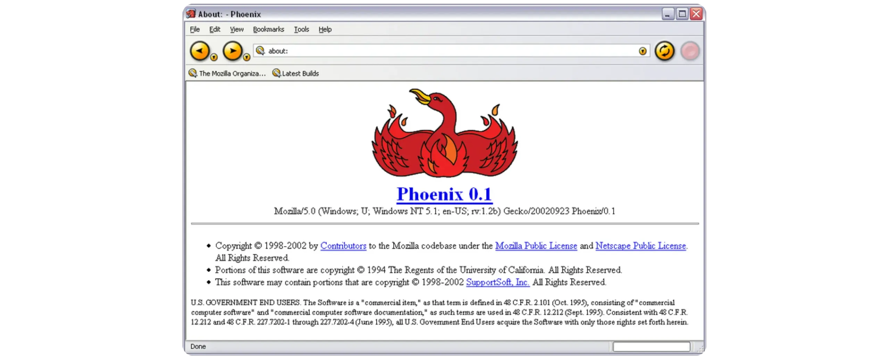

Firefox introduit également plusieurs innovations qui vont influencer durablement la navigation web :
- un système d’extensions modulaires, permettant à tout utilisateur d’ajouter facilement des fonctionnalités sans toucher au cœur du navigateur ;
- une navigation par onglets, popularisée auprès du grand public, bien que déjà présente dans d'autres navigateurs plus anciens comme Opera ;
- des outils de protection de la vie privée comme le blocage de pop-ups, un gestionnaire de mots de passe intégré, ou encore des options fines pour les cookies et scripts JavaScript.

Sa légèreté, sa flexibilité et son respect des standards attirent rapidement les utilisateurs avancés, les développeurs web et tous ceux qui veulent une alternative plus ouverte qu’Internet Explorer. En 2005, Firefox dépasse les 10 % de parts de marché, une performance considérable face à un navigateur préinstallé sur tous les PC Windows.

Pendant ce temps, Apple travaille de son côté à un navigateur maison pour macOS. En janvier 2003, Safari est officiellement lancé. Il repose sur WebKit, un moteur de rendu open-source dérivé de KHTML, développé initialement par le projet KDE pour son navigateur Konqueror. WebKit est apprécié pour sa légèreté, sa rapidité et sa simplicité de portage. Apple y apporte de nombreuses optimisations internes, notamment sur le traitement JavaScript, qui devient un enjeu central avec l’essor des applications web interactives.


Safari devient le navigateur par défaut sur tous les Mac à partir de Mac OS X Panther (10.3), et vient remplacer progressivement Internet Explorer for Mac, que Microsoft abandonne en 2005. WebKit sera également utilisé plus tard dans de nombreux autres navigateurs.

Ces initiatives relancent la concurrence technologique, affaiblissent progressivement la domination d’Internet Explorer, et ouvrent la voie à une nouvelle génération de navigateurs plus rapides, plus respectueux des normes, et davantage orientés vers la modularité, la sécurité et la performance. Entre 2006 et 2008, Internet Explorer voit sa part de marché chuter lentement, tandis que Firefox s’impose comme la principale alternative sérieuse. Ce contexte prépare l’arrivée d’un nouvel acteur majeur : Google Chrome.

### Révolution du marché : l’arrivée de Google Chrome

Le 2 septembre 2008, Google annonce la sortie de son propre navigateur web : Google Chrome. À cette époque, Firefox progresse et Internet Explorer reste encore dominant, mais de plus en plus critiqué pour sa lenteur, son instabilité et son retard sur les standards modernes. Google, qui dépend fortement du web pour ses services (recherche, Gmail, Maps...), souhaite un navigateur mieux adapté à l’ère des applications web complexes.

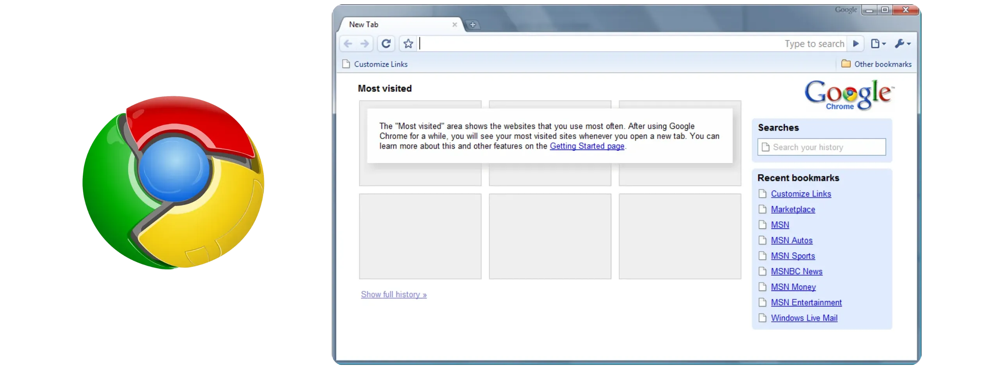

Chrome repose initialement sur deux piliers techniques :
- le moteur de rendu WebKit, hérité de Safari et KHTML, pour l’affichage du HTML/CSS ;
- un nouveau moteur JavaScript, nommé V8, écrit en C++ pour compiler le code JavaScript en instructions machine à la volée (JIT, pour *Just-In-Time*), ce qui accélère considérablement les performances des applications web dynamiques.

Mais la véritable rupture de Chrome vient de son architecture multiprocessus. Chaque onglet s’exécute dans un processus isolé, grâce à une technique de sandboxing, ce qui empêche une page malveillante de compromettre l’ensemble du navigateur. Cette isolation améliore aussi la stabilité : si un onglet plante, les autres continuent de fonctionner normalement. À cela s’ajoute une interface minimaliste centrée sur le contenu, sans barre de menu, avec une barre unifiée pour l’adresse et la recherche (*Omnibox*), et des mises à jour silencieuses en arrière-plan.

Fort de l’image de marque de Google et d’une campagne marketing très efficace, Chrome gagne rapidement des parts de marché. Sa vitesse et sa facilité d’utilisation séduisent les utilisateurs. En 2012, Chrome dépasse pour la première fois Internet Explorer en parts de marché mondiales.


En 2013, Google annonce un changement stratégique majeur : le fork de WebKit pour créer un nouveau moteur de rendu indépendant, nommé Blink. Ce fork s’explique par des divergences techniques et organisationnelles avec Apple, notamment autour de l’architecture du moteur et de l’intégration de fonctionnalités expérimentales. Blink devient le moteur exclusif de Chrome à partir de la version 28. Il est ensuite adopté par de nombreux autres navigateurs : Opera (qui abandonne Presto en 2013), Vivaldi, Brave, Microsoft Edge (depuis 2020), et d’autres.

À ce jour (2025), Google Chrome détient environ 66 % du marché mondial sur tous les appareils confondus (ordinateurs, smartphones, tablettes), selon les données de StatCounter. Il est suivi de loin par Safari (principalement sur iOS/macOS), Microsoft Edge, et Firefox, dont la part de marché ne cesse de décroître. La domination de Chrome s’est aussi prolongée dans l’écosystème mobile via Android WebView (composant système utilisé par des milliers d’applications), qui repose également sur Blink.

Ainsi, Chrome a profondément redéfini les standards de performance, de sécurité et d’ergonomie des navigateurs modernes, tout en posant de nouveaux enjeux liés à la centralisation et à l’uniformisation des technologies du Web.

### L’évolution des moteurs de rendu : de Trident à Blink

Le moteur de rendu est le composant de base d’un navigateur web. Sa mission principale est d’interpréter les fichiers reçus depuis un serveur (HTML, CSS, JavaScript, images, polices…) pour générer une interface graphique interactive à l’écran. Le moteur de rendu est comme un interprète entre les langages du web et votre écran, qui traduit des lignes de code en une page visuellement cohérente, interactive et fonctionnelle.

Concrètement, lorsque vous saisissez une URL dans la barre d’adresse :
- Le navigateur envoie une requête HTTP au serveur distant ;
- Le serveur répond avec un document HTML ;
- Le moteur de rendu analyse ce HTML, télécharge les fichiers liés (CSS, JavaScript, images…) ;
- Il construit un "DOM" (_Document Object Model_) qui représente la structure du document ;
- Il applique les règles CSS pour calculer la présentation de chaque élément (*layout*) ;
- Il effectue le rendu graphique à l’aide de la carte graphique et du système de fenêtrage.

Tout ce processus doit être rapide et fluide pour offrir une bonne expérience utilisateur, même sur des pages complexes. C'est justement le rôle du moteur de rendu.

Voici un panorama historique des principaux moteurs de rendu qui ont marqué l’évolution du web :

#### Trident (1997 – 2015)

Développé par Microsoft pour Internet Explorer 4, Trident est le moteur qui a dominé le web au début des années 2000, au cœur de la guerre des navigateurs. Bien qu’innovant à ses débuts, il a rapidement pris du retard en matière de respect des standards du W3C, ce qui a conduit à l’apparition de nombreux sites optimisés uniquement pour Internet Explorer.

Trident présentait également des problèmes de sécurité et un moteur JavaScript lent. Les développeurs web devaient souvent écrire du code spécifique pour contourner ses bugs. Microsoft l’a remplacé en 2015 par EdgeHTML, un moteur plus moderne mais qui n’a pas réussi à inverser la tendance. Trident reste emblématique d’une époque où un moteur pouvait imposer ses propres règles au Web.

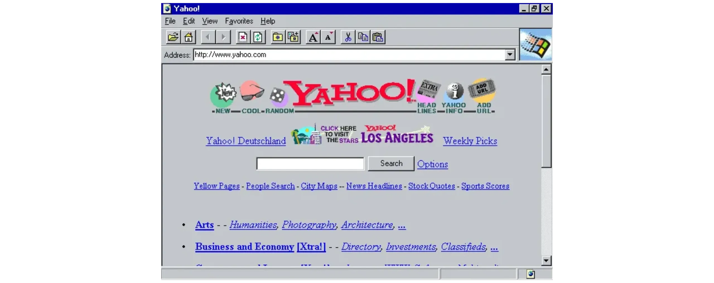

*Source : pcworld.com*

#### Gecko (1998)

Conçu par Netscape, puis maintenu par la Mozilla Foundation, Gecko alimente le navigateur Firefox. Dès sa création, Gecko se veut rigoureux dans le respect des standards. Il est écrit en C++ et prend en charge de nombreuses plateformes.

Gecko a été à l’origine de plusieurs innovations. Cependant, sa base de code complexe et historique rend certaines évolutions lentes. 

En termes de parts de marché, Gecko est aujourd'hui très loin derrière Blink, puisque Firefox est le suel navigateur majeur à l'utiliser. Il est tout de même utilisé à la marge par des navigateurs moins connus et moins utilisés, qui sont des forks de Firefox : Tor Browser, LibreWolf, Zen Browser, GNU IceCat, Waterfox, etc. Cela fait donc de Gecko un garant de la diversité du web fasse à la dominance de Blink.


#### KHTML (1998 – 2005)

Développé par le projet KDE pour son navigateur Konqueror, KHTML est un moteur léger, modulaire et rapide. Écrit en C++, il respecte les standards et propose une base propre, bien documentée. C’est ce moteur que choisira Apple en 2001 pour créer WebKit. KHTML est donc l'ancêtre technique de Chrome et Safari.


#### WebKit (2003)

WebKit est un fork de KHTML lancé par Apple pour développer son propre navigateur : Safari. Il est d’abord optimisé pour les performances et l’intégration dans macOS, puis utilisé par Google Chrome dès sa sortie en 2008. WebKit repose sur deux sous-composants :
- WebCore pour le rendu HTML/CSS ;
- JavaScriptCore (aussi appelé "Nitro") pour l’exécution du code JavaScript.

WebKit s’impose par sa rapidité et son faible encombrement. Sur iOS, Apple impose son usage à tous les navigateurs pour des raisons de sécurité et d’efficience énergétique : même Firefox ou Chrome sur iPhone utilisent WebKit sous le capot.


#### Blink (2013)

Blink est un fork de WebKit initié par Google pour équiper Chrome (et Chromium), puis rapidement adopté par Opera, Brave, Vivaldi, et même Microsoft Edge depuis 2020. Blink introduit une gouvernance plus flexible que celle d’Apple et permet à Google d’expérimenter rapidement de nouvelles API web.


Blink est aujourd’hui le moteur de rendu le plus répandu au monde. Cette suprématie pose toutefois la question d’une monoculture technique sur le web, mais nous y reviendrons plus tard.

#### EdgeHTML (2015 – 2020)

Successeur de Trident, EdgeHTML a été conçu par Microsoft pour moderniser Edge, avec de meilleures performances et une meilleure compatibilité. Il reprend une partie du code de Trident, mais avec un moteur JavaScript repensé. Malgré ces efforts, EdgeHTML peine à convaincre les utilisateurs et les développeurs web. En 2020, Microsoft décide d’abandonner EdgeHTML au profit de Blink, en lançant Edge Chromium, qui devient un navigateur Blink avec surcouche Microsoft.


L’évolution des moteurs de rendu reflète l’histoire du web : tensions entre innovation et standardisation, domination d’acteurs majeurs, tentative d’alternatives plus éthiques ou techniques. Aujourd’hui, la quasi-totalité des navigateurs repose sur Blink, à l’exception notable de Firefox (Gecko) et Safari (WebKit).

### Domination de Blink et difficultés pour Gecko

Depuis la création de Blink en 2013 et sa généralisation à l’ensemble des navigateurs basés sur Chromium, ce moteur de rendu est devenu hégémonique. En 2025, il équipe non seulement Google Chrome, mais aussi Microsoft Edge (depuis 2020), Opera, Brave, Vivaldi et de nombreux autres navigateurs mineurs. Sa domination dépasse les 80 % de parts de marché sur les postes de travail, et encore plus sur Android, où Chrome est préinstallé.

Cette situation entraîne certains bénéfices : Blink est performant, maintenu par d’importantes équipes d’ingénierie (Google, mais aussi Microsoft et d’autres), et il évolue rapidement. Blink contribue aussi à une certaine standardisation de fait : les développeurs web peuvent cibler une seule plateforme pour atteindre la quasi-totalité des utilisateurs. Mais cette concentration comporte également de sérieux inconvénients structurels.

D’une part, elle marginalise les moteurs alternatifs, au premier rang desquels Gecko, utilisé presque uniquement par Firefox. En 2025, Firefox est sous les 6 % de parts de marché, ce qui limite considérablement sa capacité à faire entendre sa voix dans les discussions sur l’évolution des standards du web (W3C, WHATWG). Gecko est maintenu par Mozilla, un organisme à but non lucratif dont les ressources sont bien moindres que celles de Google. Le moteur reste pourtant compétitif sur certains aspects techniques (notamment en protection de la vie privée), mais souffre d’un retard d’implémentation sur certaines API modernes. Et ce phénomène s’inscrit dans un cercle vicieux : Gecko est moins performant, ce qui entraîne une baisse du nombre d’utilisateurs, ce qui incite les développeurs à moins optimiser leurs sites pour Gecko, donc Gecko est moins performant… et ainsi de suite.

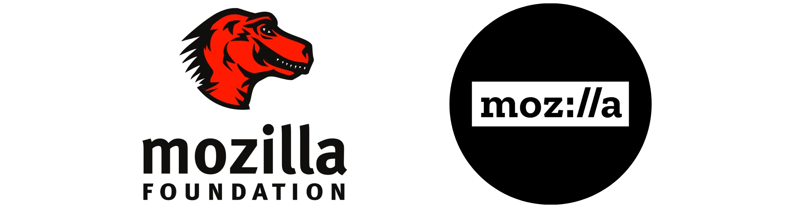

D’autre part, cette centralisation autour de Blink signifie que Google contrôle de facto le rythme d’évolution et les priorités techniques du web. Or, ses intérêts commerciaux (publicité, suivi comportemental, formats propriétaires...) peuvent entrer en conflit avec les principes de neutralité, d’interopérabilité ou de vie privée défendus historiquement par des acteurs comme Mozilla.

De plus, la dépendance croissante à un unique moteur augmente le risque systémique pour l’écosystème web. Si Blink introduit une régression, un biais ou une faille, l’impact touche l’ensemble des utilisateurs. La diversité technologique joue ici un rôle de résilience, tout comme dans les systèmes d’exploitation ou les architectures logicielles.

Aujourd’hui, Mozilla continue de jouer un rôle essentiel dans la défense d’un web ouvert, respectueux de la vie privée, et librement accessible. Firefox reste l’un des seuls navigateurs à ne pas reposer sur Chromium, et propose des innovations indépendantes. Mais sa survie dépend de sa capacité à maintenir une base d’utilisateurs suffisante et un financement pérenne.

La domination de Blink n’est donc pas qu’une question technique : elle engage des enjeux politiques, économiques et sociétaux sur la gouvernance du web. À ce titre, encourager la pluralité des moteurs de rendu reste une bonne pratique en faveur d’un web plus neutre, plus sûr, et plus résilient.

En trente ans, le navigateur web est passé d’un simple programme d’affichage à une plateforme logicielle complexe, intégrée au cœur même de notre expérience informatique quotidienne. Comprendre cette évolution historique permet de saisir l’importance stratégique du navigateur dans les questions actuelles de sécurité et de souveraineté numérique.

Dans le prochain chapitre, je vous propose de dresser un panorama des navigateurs existants, des plus classiques aux plus futuristes, avec à chaque fois une présentation de leurs avantages et inconvénients pour vous aider à faire un choix éclairé.

## Panorama des navigateurs
<chapterId>4a9f71bc-8d76-4ce3-b983-2df1d6e47fb5</chapterId>

Après avoir exploré l'histoire et les évolutions des navigateurs, nous allons maintenant pouvoir examiner les principaux navigateurs disponibles aujourd’hui. Le choix de votre navigateur n’est pas anodin, surtout si, comme dans notre cas, la priorité est la sécurité, la protection de la vie privée et la souveraineté numérique. Chaque navigateur possède des avantages spécifiques, mais également des faiblesses, souvent liées à leur modèle économique ou à leurs choix techniques.

Ce chapitre a pour objectif de vous aider à choisir le navigateur le plus adapté à vos besoins. Je les ai regroupés selon leur moteur de rendu, mais l’ordre de présentation n’implique aucune hiérarchie particulière.

### Navigateurs basés sur Blink

#### Google Chrome

[Chrome](https://www.google.com/chrome/) bénéficie d’un développement rapide et continu, mené principalement par Google. Il est reconnu pour ses performances élevées, sa rapidité, sa compatibilité étendue avec les standards web modernes, ainsi qu'une très bonne intégration des services Google.

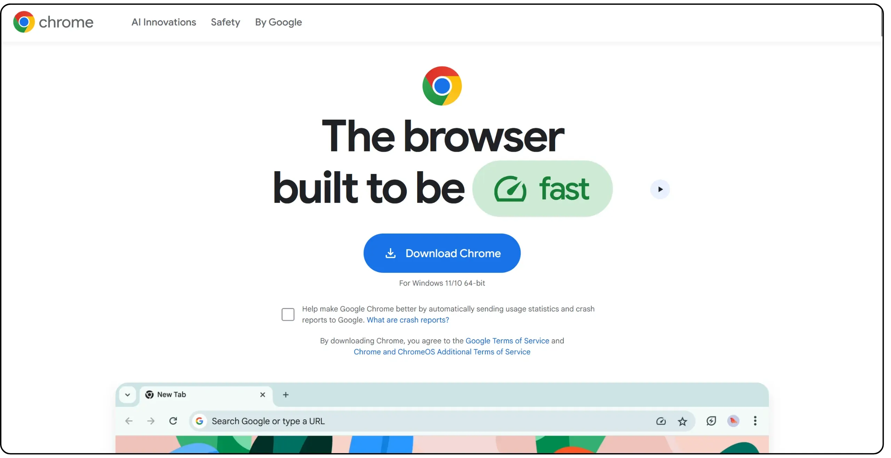

Cependant, du point de vue de la sécurité et de la vie privée, Chrome soulève des préoccupations majeures. Le navigateur collecte par défaut un grand nombre de données sur ses utilisateurs (navigation, recherches, historique...), qui sont utilisées principalement à des fins publicitaires par Google. La possibilité d’isoler les cookies et les trackers est limitée par défaut, et la désactivation totale du pistage reste complexe. Aussi, même si Chrome est techniquement sécurisé (sandbox efficace, mises à jour rapides...), il demeure sous le contrôle d’un acteur majeur aux intérêts commerciaux naturellement incompatibles avec une véritable souveraineté numérique.

Une autre contrepartie à cette rapidité et à cette complexité est que Chrome consomme énormément de ressources système, en particulier en mémoire vive (RAM).

Google Chrome repose sur le projet Chromium, qui est open source. Cependant, Google y ajoute beaucoup de code propriétaire. Il n'est donc pas open source.

Je ne vous recommande donc pas d’utiliser Google Chrome, que ce soit dans un cadre personnel ou professionnel (sauf, bien sûr, si votre entreprise dépend de la suite Google). Il existe d’ailleurs d’excellentes alternatives aux services de Google, que ce soit en local ou en cloud. Je vous invite notamment à découvrir les services proposés par Proton :

https://planb.network/tutorials/computer-security/communication/proton-mail-c3b010ce-254d-4546-b382-19ab9261c6a2

https://planb.network/tutorials/computer-security/data/proton-drive-03cbe49f-6ddc-491f-8786-bc20d98ebb16

#### Brave

[Brave](https://brave.com/) est basé sur Blink (tout comme Chrome), mais se distingue radicalement par son approche centrée sur la vie privée. Par défaut, Brave bloque les publicités et trackers, intègre *HTTPS Everywhere*, et propose des protections avancées contre le fingerprinting et les scripts tiers. Son modèle économique repose en partie sur la publicité intégrée respectueuse de la vie privée, mais celle-ci reste optionnelle et facilement désactivable.

Brave est basé sur Chromium et l’ensemble de son code est disponible sur GitHub. Seules quelques parties mineures sont partiellement propriétaires. Globalement, Brave est donc très proche d’un navigateur open-source.

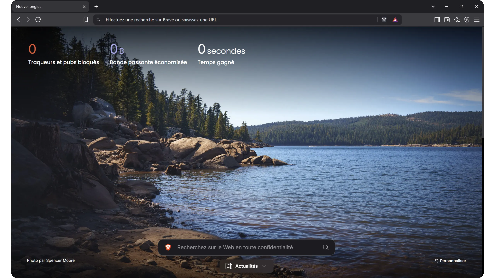

Brave constitue donc une alternative performante à Chrome, qui combine rapidité, sécurité renforcée, meilleure confidentialité par défaut et une interface intuitive. Pour autant, je ne vous le recommanderais pas forcément, tout simplement car il repose sur Chromium. 

Même si de nombreux navigateurs (y compris Brave) se basent sur Chromium tout en revendiquant une approche orientée vie privée, une enquête menée en 2024 a révélé l’intégration, par défaut, d’une API permettant à Google d’accéder à des informations sensibles sur le matériel de l’utilisateur (CPU, GPU, RAM), ainsi qu’à son activité sur les services Google. Cette API, intégrée sous forme d’extension non désactivable dans Chrome, était également présente dans plusieurs navigateurs dérivés comme Edge, Opera… et même Brave.

Bien que Brave ait depuis désactivé cette API, cette affaire illustre clairement la dépendance structurelle de ces navigateurs à Chromium, qui reste un projet profondément lié à l’écosystème Google. Ainsi, même les variantes de Chromium orientées vers la protection de la vie privée ne peuvent garantir une indépendance totale ni une protection complète des données utilisateur.

#### Vivaldi

[Vivaldi](https://vivaldi.com/), fondé par l’ancien CEO d’Opera, s'adresse aux utilisateurs avancés à la recherche d’une personnalisation poussée et de fonctionnalités avancées comme les panneaux latéraux, le gestionnaire d’onglets avancé ou encore la prise de notes intégrée.

En termes de sécurité, Vivaldi inclut plusieurs fonctions de blocage des trackers et publicités, mais ces protections restent légèrement moins bonnes que sur Brave. Il est aussi moins transparent sur certains aspects, son code source n'étant que partiellement open-source. Malgré tout, il constitue une alternative intéressante, moins centrée sur la confidentialité stricte que Brave, mais plus respectueuse que Chrome ou Opera.

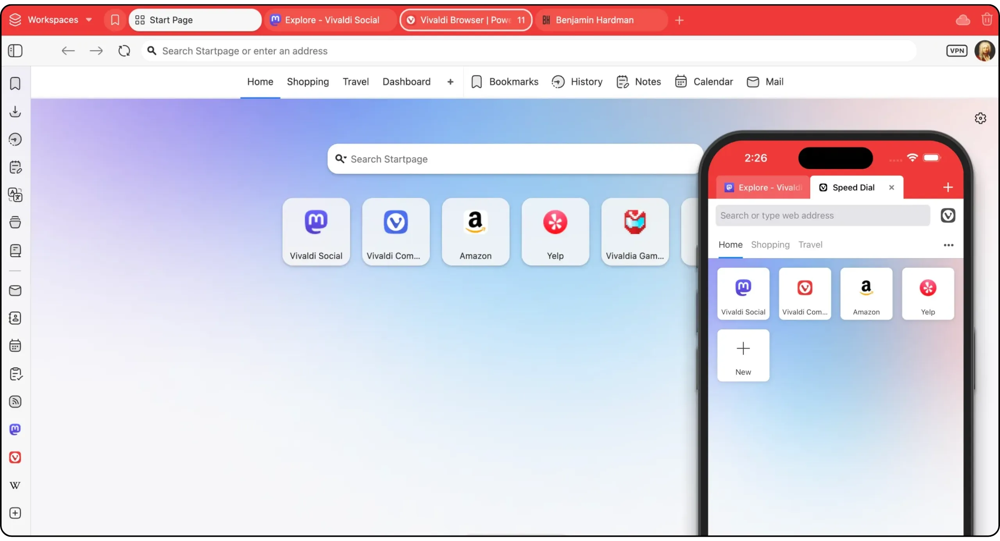

#### Opera

[Opera](https://www.opera.com/) est un navigateur historique, puisqu'il existe depuis 1995. Il utilise désormais Blink après avoir abandonné son moteur propriétaire (*Presto*). Il dispose d'une interface moderne et de certaines fonctionnalités innovantes.

Cependant, en termes de vie privée, Opera est très controversé : il appartient à une société chinoise depuis 2016, ce qui soulève des interrogations sur l’exploitation éventuelle des données utilisateurs. Opera inclut un VPN intégré (proxy plutôt qu’un véritable VPN complet), mais la politique de confidentialité n’est pas claire quant à la gestion des logs. Aussi, Opera est un navigateur propriétaire. Il est donc peu recommandé, surtout lorsque l'on recherche la confidentialité.

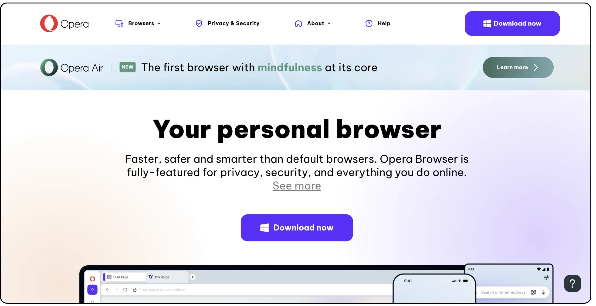

#### Les navigateurs spécialisés

Parmi les navigateurs basés sur Blink, on trouve également de nombreux navigateurs plus marginaux, souvent conçus pour répondre à des cas d’utilisation spécifiques :

- **Arc** :

Développé par The Browser Company, [Arc](https://arc.net/) propose une approche radicalement différente de l’interface utilisateur. Il remplace les onglets traditionnels par un système de "*spaces*", une barre latérale unifiée, et intègre des outils créatifs comme des captures annotables ou un éditeur de sites simples. L’accent est mis sur l’ergonomie, la personnalisation visuelle et la fluidité d’usage, ce qui en fait un outil plébiscité par certains professionnels.

D’un point de vue technique, Arc repose sur Chromium mais reste un logiciel propriétaire. Il n’offre aucune transparence sur la collecte de données, et sa politique de confidentialité reste floue, notamment en matière de télémétrie et de synchronisation dans le cloud. Il est donc à éviter dans une optique de souveraineté numérique.

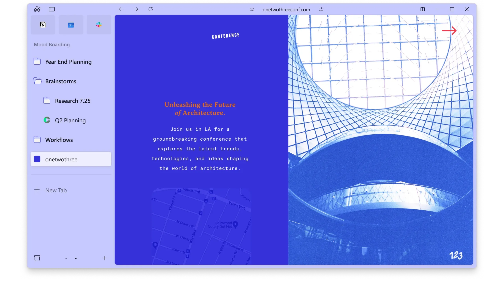

- **Polypane** :

[Polypane](https://polypane.app/) s’adresse spécifiquement aux développeurs front-end et UX designers. Sa fonction principale est d’afficher simultanément plusieurs instances d’un même site sur différentes résolutions d’écran, afin de tester le comportement *responsive* d’une interface en temps réel. Il propose aussi des outils d’accessibilité, des validateurs HTML/CSS, des simulateurs de daltonisme, et des métriques de performance.

Polypane est un navigateur propriétaire payant basé sur Chromium, ce qui le destine plutôt à un usage professionnel ponctuel. Il ne convient pas pour une navigation quotidienne classique, et sa politique de confidentialité reste dans la norme des logiciels commerciaux, sans garantie particulière.

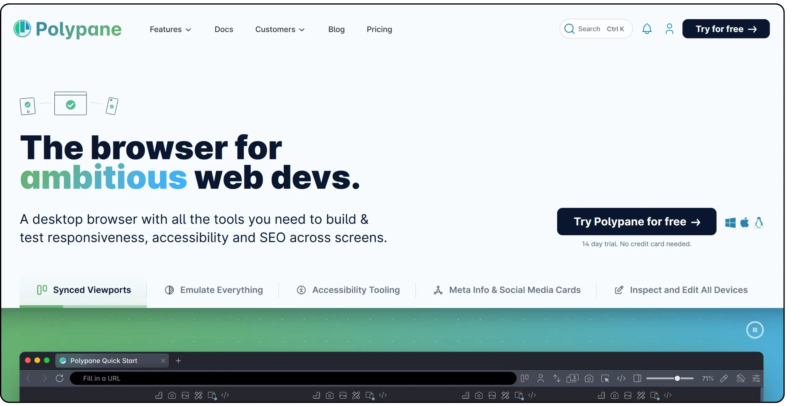

### Navigateurs basés sur Gecko

#### Mozilla Firefox

[Firefox](https://www.mozilla.org/firefox/new/) est le navigateur le plus important utilisant le moteur de rendu Gecko. Développé par la Fondation Mozilla, Firefox se démarque par une politique claire en matière de confidentialité : protections renforcées contre le pistage, options poussées de blocage de cookies tiers, conteneurs d'onglets isolés, et intégration d’extensions axées sur la sécurité.

Mozilla est une organisation à but non lucratif, ce qui lui confère une certaine indépendance vis-à-vis des intérêts purement commerciaux, même si elle reste fortement dépendante, sur le plan financier, de partenariats avec Google. Ce dernier finance en grande partie la Mozilla Foundation, officiellement pour que son moteur de recherche reste celui par défaut dans Firefox, et donc maintenir ses parts de marché. Officieusement, cette stratégie permet à Google d’entretenir une forme de concurrence maîtrisée : en soutenant Mozilla, Google conserve un concurrent minimal, ce qui atténue les accusations d’abus de position dominante et limite les risques de sanctions réglementaires.

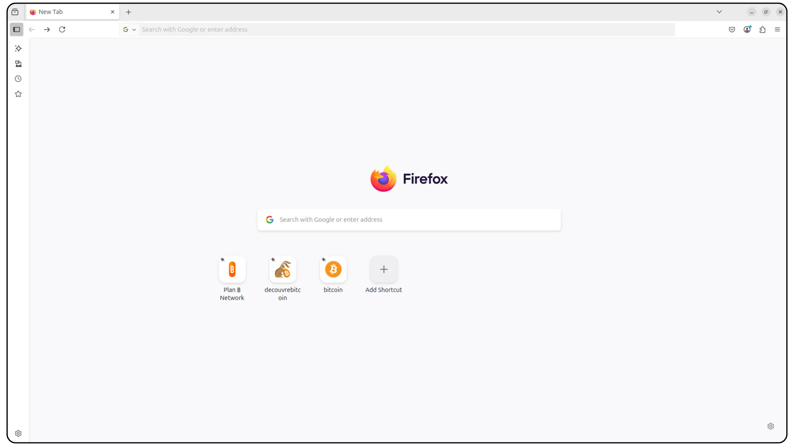

Firefox est un navigateur open-source, distribué sous licence MPL (*Mozilla Public License*). Son code est totalement libre, modifiable, redistribuable, et fait l’objet de nombreuses contributions externes.

Firefox demeure une référence incontournable en matière de sécurité et de protection de la vie privée, malgré un léger retard technique sur certains aspects de performance face aux navigateurs basés sur Blink. Cela peut être un très bon navigateur, à condition de bien le paramétrer.

#### Tor Browser

[Tor Browser](https://www.torproject.org/download/) est un navigateur basé sur Firefox ESR. Il constitue l’une des solutions les plus solides pour l’anonymat en ligne. Il redirige le trafic à travers le réseau Tor, et empêche donc toute corrélation directe entre l'utilisateur et la destination web.

https://planb.network/tutorials/computer-security/communication/tor-browser-a847e83c-31ef-4439-9eac-742b255129bb

La contrepartie est une réduction importante des performances (latence élevée) et une compatibilité limitée avec certains sites web. Tor Browser est idéal pour des activités sensibles (journalisme, activisme...), mais moins adapté à un usage quotidien ordinaire.

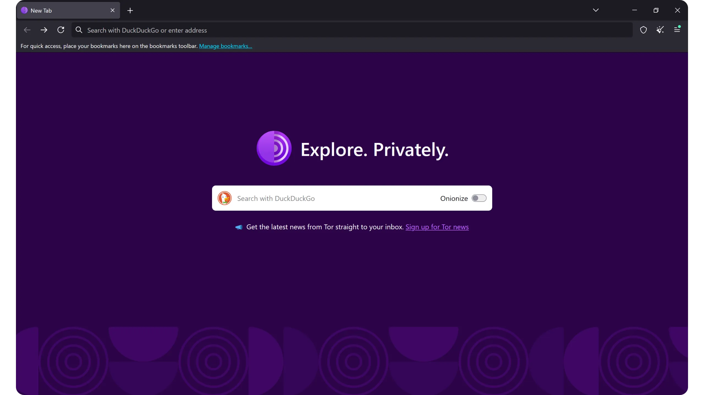

#### Mullvad Browser

[Mullvad Browser](https://mullvad.net/en/browser) est le fruit d’une collaboration entre la Fondation Tor et Mullvad VPN. Il repose sur la base du navigateur Tor, lui-même dérivé de Firefox ESR. Mullvad Browser est conçu pour maximiser la confidentialité de l'utilisateur. Il intègre par défaut des protections avancées contre le fingerprinting, les trackers et les scripts tiers.

Il reprend l’essentiel des fonctionnalités de sécurité et de respect de la vie privée offertes par Tor Browser, à une différence près : il ne redirige pas le trafic via le réseau Tor. Pour éviter toute fuite d’adresse IP, vous pouvez l'utiliser en combinaison avec un VPN (idéalement, Mullvad VPN).

https://planb.network/tutorials/computer-security/communication/mullvad-968ec5f5-b3f0-4d23-a9e0-c07a3e85aaa8

Mullvad Browser constitue une excellente solution si vous êtes soucieux de votre confidentialité, que vous soyez un utilisateur débutant ou avancé.

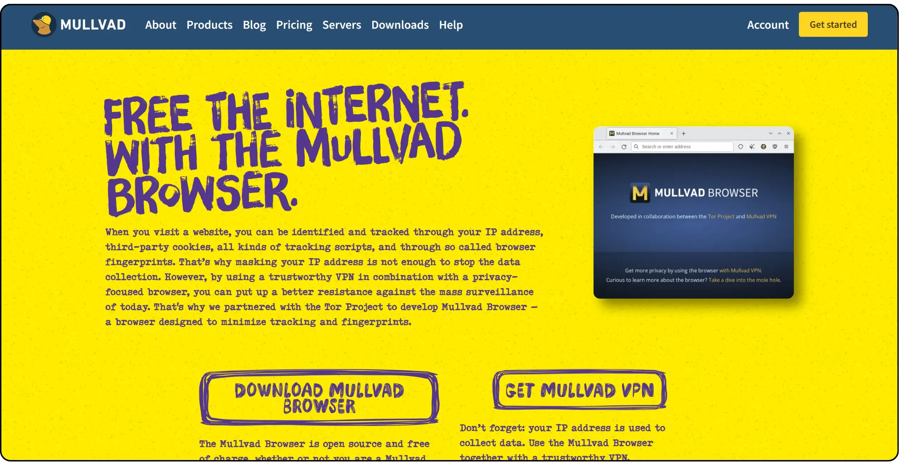

#### Librewolf

[LibreWolf](https://librewolf.net/) est un navigateur basé sur Firefox, conçu pour offrir un niveau de confidentialité encore plus élevé. Il supprime toutes les fonctionnalités susceptibles de compromettre la vie privée, comme la télémétrie, l’intégration des services Mozilla, ou encore le service Pocket. 

LibreWolf active par défaut les paramètres de sécurité avancés de Firefox (comme le mode strict contre le pistage) et désactive le support DRM. Le projet est entièrement open source, communautaire, et ne repose sur aucun financement d’entreprise privée. Je vous le conseille si vous êtes à la recherche d’un Firefox "endurci", avec un contrôle maximal sur vos données.

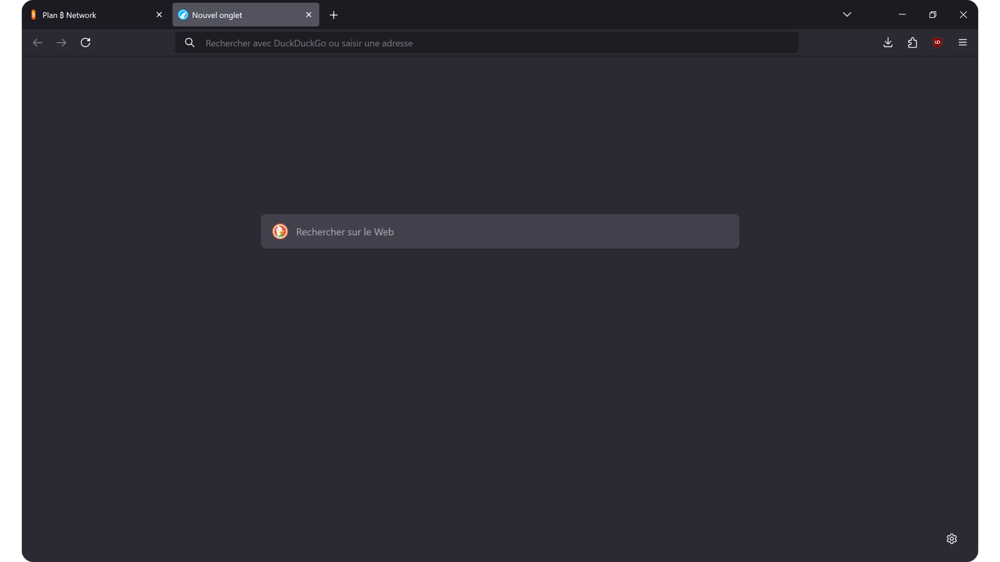

### Navigateurs basés sur WebKit

Le principal navigateur actuel qui utilise le moteur de rendu WebKit (et non pas un dérivé comme Blink) est Safari. [Safari](https://www.apple.com/safari/) est le navigateur exclusif d’Apple sur macOS. Il offre une excellente intégration avec l’écosystème Apple, des performances élevées, et inclut désormais des protections renforcées contre le pistage et le fingerprinting.

Toutefois, Safari reste fermé, limité à macOS pour sa version desktop, et dépendant de l’écosystème Apple. Si Apple affiche une politique forte en matière de confidentialité, son modèle économique reposant principalement sur la vente matérielle plutôt que la publicité, il demeure peu transparent sur certaines pratiques internes.

Ici, nous nous concentrons sur les navigateurs desktop, mais il est important de noter que sur iOS, Apple impose à tous les navigateurs d’utiliser le moteur de rendu WebKit (une contrainte qui pourrait toutefois évoluer prochainement sous l’effet de certaines réglementations européennes). Cela signifie que les navigateurs comme Chrome, Firefox ou Brave doivent, sur iOS, proposer une application reposant sur WebKit, et non sur leur moteur de rendu habituel.

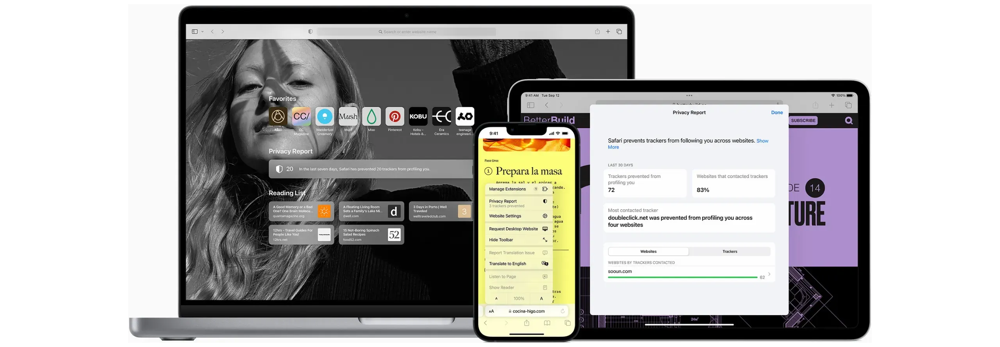

### Navigateurs sans moteur de rendu

Enfin, je voudrais terminer ce panorama en vous exposant une alternative beaucoup moins connue et très marginale : les navigateurs en mode texte, dont le plus connu est [Lynx Browser](https://lynx.invisible-island.net/).

Lynx est le plus ancien navigateur web encore maintenu (1992). Il fonctionne exclusivement en mode texte et s’utilise directement dans un terminal, sans interface graphique. Techniquement, Lynx ne prend en charge ni JavaScript, ni CSS, ni images, ce qui élimine toute exécution de code actif dans les pages web. Il interprète uniquement le code HTML brut, qu’il restitue sous forme de texte structuré. Cette approche radicalement minimaliste en fait l’un des navigateurs les plus sûrs qui soient : aucun script malveillant ne peut s’exécuter, aucune publicité intrusive ne s’affiche, et aucune fuite de données via des mécanismes modernes (canvas fingerprinting, trackers JS...) n’est possible.

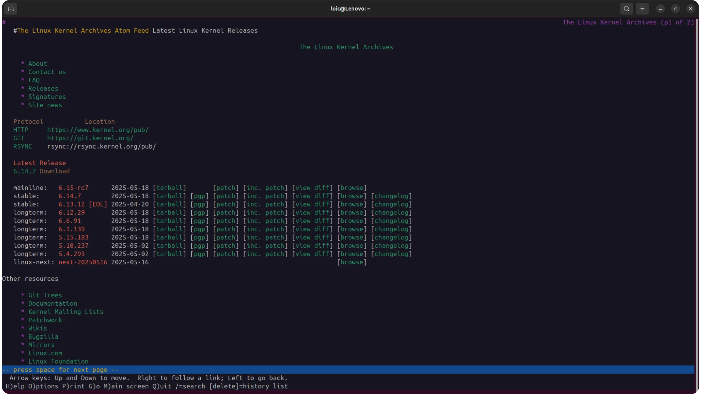

Ce modèle présente évidemment de fortes limitations : absence totale de rendu graphique, impossibilité d’utiliser la majorité des sites web modernes (qui dépendent pour beaucoup du JavaScript) et ergonomie austère réservée aux utilisateurs expérimentés.

Lynx peut tout de même être intéressant dans certains contextes très spécifique : 
- L'audit de pages web en HTML brut, sans exécution de JavaScript ni CSS ;
- La navigation dans des environnements minimalistes ;
- La navigation dans des contextes ultra-sécurisés ;
- La navigation sur un réseau très lent ou instable ;
- L'automatisation ou le scraping.

### Quel navigateur choisir ?

Pour les utilisateurs qui privilégient la sécurité et la confidentialité par défaut, sans avoir à modifier manuellement de nombreux paramètres, et qui recherchent un navigateur généraliste au quotidien, les meilleurs choix sont selon moi LibreWolf et Mullvad Browser. Dans cette même catégorie, si le fait d’utiliser une base Chromium ne vous pose pas de problème (malgré les risques que cela implique et une philosophie bien différente) vous pouvez également envisager Brave. Vous l’aurez compris, je préfère, pour de nombreuses raisons, le moteur de rendu Gecko, même s’il accuse aujourd’hui un certain retard sur Blink en matière de performances.

Firefox constitue également une très bonne option en tant que navigateur généraliste, à condition de le configurer correctement pour renforcer sa confidentialité.

Pour un niveau d’anonymat encore plus poussé, au prix de performances réduites, Tor Browser reste la meilleure solution.

Chrome, malgré sa popularité, ne peut être recommandé dans une démarche de souveraineté numérique, car Google place systématiquement ses intérêts commerciaux au-dessus de toute réelle exigence de protection de la vie privée. C'est pourquoi je vous déconseille de l'utiliser.

Le choix de votre navigateur joue aujourd’hui un rôle important dans votre sécurité et votre confidentialité en ligne. Prenez donc le temps d’identifier celui qui correspond le mieux à votre profil de risque et à vos priorités.

Voici un petit récapitulatif pour vous aider à faire votre choix (gardez toutefois à l’esprit que cette comparaison a pu évoluer dans le temps depuis la rédaction de SCU 202, et le jugement de l’interface et des fonctionnalités relève avant tout d’une appréciation personnelle) :

| Navigateur      | Confidentialité | Vitesse | Fonctionnalités | Interface | Open source | Consommation ressources |
| --------------- | --------------- | ------- | --------------- | --------- | ----------- | ----------------------- |
| Google Chrome   | 🔴              | 🟢      | 🟢              | 🟡        | 🔴          | 🔴                      |
| Brave           | 🟡              | 🟢      | 🟢              | 🟢        | 🟢          | 🟡                      |
| Vivaldi         | 🟡              | 🟢      | 🟢              | 🟢        | 🔴          | 🟡                      |
| Opera           | 🔴              | 🟢      | 🟢              | 🟢        | 🔴          | 🔴                      |
| Arc             | 🔴              | 🟢      | 🟢              | 🟢        | 🔴          | 🟡                      |
| Polypane        | 🟡              | 🟡      | 🟢              | 🟡        | 🔴          | 🔴                      |
| Mozilla Firefox | 🟢              | 🟡      | 🟢              | 🟢        | 🟢          | 🟡                      |
| Tor Browser     | 🟢              | 🔴      | 🟢              | 🟡        | 🟢          | 🔴                      |
| Mullvad Browser | 🟢              | 🟡      | 🟢              | 🟡        | 🟢          | 🟡                      |
| Safari          | 🟡              | 🟢      | 🟢              | 🟢        | 🔴          | 🟡                      |
| Lynx            | 🟢              | 🟢      | 🔴              | 🔴        | 🟢          | 🟢                      |
| LibreWolf       | 🟢              | 🟡      | 🟢              | 🟡        | 🟢          | 🟡                      |

Dans le prochain chapitre, nous découvrirons les bonnes pratiques à adopter pour naviguer sur le web en toute sécurité, tout en minimisant l’exposition de votre vie privée.

## Les bonnes pratiques dans son usage du web
<chapterId>ded47ada-0569-4e63-b668-0da042e691d5</chapterId>

Dans le chapitre précédent, nous avons détaillé les principaux navigateurs disponibles aujourd’hui, ainsi que leurs avantages et inconvénients en matière de sécurité et de respect de la vie privée. 

Toutefois, même le navigateur le plus sécurisé ne suffit pas : la manière dont vous l’utilisez reste déterminante pour protéger votre sécurité numérique. Dans ce chapitre, nous explorerons en profondeur les bonnes pratiques essentielles afin de minimiser les risques liés à l’utilisation quotidienne du web.

### Maintenir son navigateur à jour

Le navigateur web est l’un des composants logiciels les plus exposés d’un système informatique. Contrairement à la plupart des autres programmes, il traite en temps réel des contenus dynamiques issus d’Internet, une source fondamentalement non fiable. Lorsqu’un site web est chargé, le navigateur exécute du code distant, qui interagit directement avec votre système via le moteur de rendu.

Cette complexité technique, combinée à une surface d’attaque massive, fait du navigateur une cible prioritaire pour les attaquants. Les failles critiques dans les moteurs de rendu (comme Blink ou Gecko), les bibliothèques d’analyse d’images, ou les gestionnaires de mémoire peuvent permettre des attaques dites "zero-click" (il suffit de visiter un site piégé pour que votre machine soit compromise), ou "zero-day" (vulnérabilité inconnue de l'éditeur).

Pour atténuer ces risques, les éditeurs de navigateurs publient des mises à jour très fréquentes, souvent hebdomadaires, qui corrigent ces vulnérabilités dès qu’elles sont identifiées. Ces correctifs ne se limitent pas à des améliorations d'interface ou de performance : ils bloquent activement des vecteurs d’attaque réels et documentés.

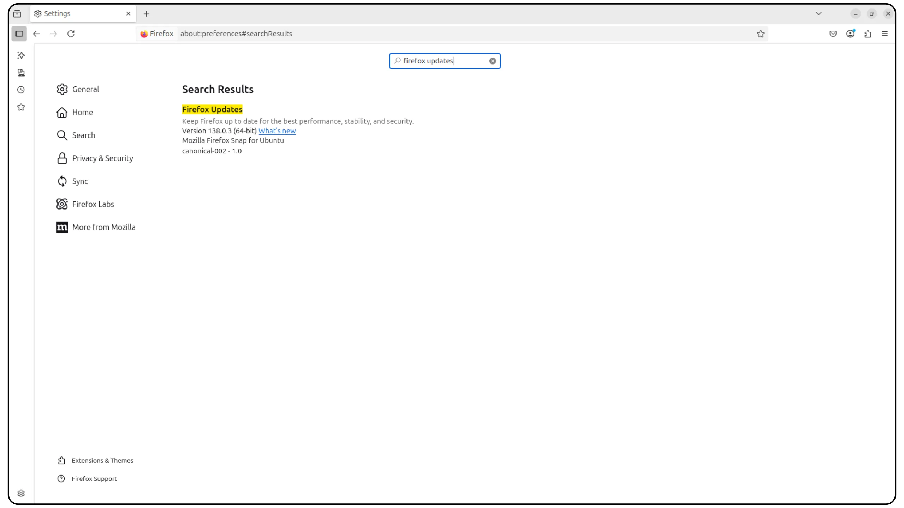

Il est donc impératif :
* d’activer les mises à jour automatiques de votre navigateur et de vérifier régulièrement à la main qu'aucune mise à jour n'est disponible ;
* ou, si vous utilisez une version packagée manuellement (par exemple via `apt`, `flatpak` ou `snap` sous Linux), de mettre à jour régulièrement l’ensemble du système via votre gestionnaire de paquets.

Pour vérifier manuellement la version et déclencher une mise à jour :
* dans Firefox : `Menu > Settings > Firefox Updates` ;
* en ligne de commande sous Linux (paquets `apt`) :

```bash
sudo apt update && sudo apt upgrade firefox
```

Mettre à jour son navigateur, ainsi que l’ensemble de ses logiciels et le système d’exploitation, est l’une des premières mesures concrètes à adopter en matière de cybersécurité.

### Utiliser des mots de passe forts et uniques

En matière de sécurité web, l’une des erreurs les plus répandues (et les plus dangereuses) est la réutilisation de mots de passe sur plusieurs sites. Cette pratique est à l’origine d’un effet domino redoutable : si un seul service est compromis (fuite de base de données, phishing, attaque par force brute, faille d’injection...), l’attaquant peut ensuite tester ce même mot de passe sur d'autres plateformes et accéder à des comptes critiques comme votre messagerie, vos comptes bancaires ou vos espaces professionnels.

Le premier principe à suivre pour les mots de passe est donc de ne pas les réutiliser. Chaque compte en ligne devrait être protégé par un mot de passe unique et complètement distinct des autres. Avoir un mot de passe unique pour chaque compte isole les attaques potentielles et en limite la portée.

Par exemple, si vous utilisez le même mot de passe pour une plateforme de jeux vidéos et pour votre boîte mail, et que ce mot de passe est compromis via un site de phishing lié à la plateforme de jeux, l'attaquant pourrait alors accéder facilement à votre messagerie et prendre le contrôle de tous vos autres comptes en ligne.

Le second principe essentiel est la force du mot de passe. Un mot de passe est considéré comme fort s'il est difficile à brute forcer, c'est-à-dire à trouver par tâtonnement. Cela signifie que vos mots de passe doivent être le plus aléatoires possible, longs, et inclure une diversité de caractères (minuscules, majuscules, chiffres et symboles).

Appliquer ces deux principes de sécurité des mots de passe (unicité et robustesse) peut s'avérer difficile au quotidien, car il est quasiment impossible de mémoriser un mot de passe unique, aléatoire et robuste pour tous nos comptes. C'est ici qu'intervient le gestionnaire de mots de passe.

Un gestionnaire de mots de passe génère et stocke de manière sécurisée des mots de passe forts, ce qui vous permet d'accéder à tous vos comptes en ligne sans nécessité de les mémoriser individuellement. Vous n'avez à retenir qu'un seul mot de passe, le mot de passe maître, qui vous donne accès à l'ensemble de vos mots de passe sauvegardés dans le gestionnaire. L'utilisation d'un gestionnaire de mots de passe renforce votre sécurité en ligne, car il évite la réutilisation de mots de passe et génère systématiquement des mots de passe aléatoires. Mais il va également simplifier votre utilisation quotidienne de vos comptes en centralisant l'accès à vos informations sensibles.

https://planb.network/tutorials/computer-security/authentication/bitwarden-0532f569-fb00-4fad-acba-2fcb1bf05de9

https://planb.network/tutorials/computer-security/authentication/keepass-f8073bb7-5b4a-4664-9246-228e307be246

Utiliser un gestionnaire de mots de passe présente de nombreux avantages : il simplifie votre quotidien en vous évitant de mémoriser une multitude de mots de passe, et il limite au maximum la principale faille de l’authentification : l’utilisateur lui-même.

En matière d’authentification, l’utilisation d’un gestionnaire de mots de passe doit impérativement être complétée par une solution de double authentification (2FA), à utiliser sur tous les comptes qui la propose. Idéalement, privilégiez une application spécialisée, ou mieux encore, un dispositif physique comme une Yubikey.

https://planb.network/tutorials/computer-security/authentication/authy-a76ab26b-71b0-473c-aa7c-c49153705eb7

https://planb.network/tutorials/computer-security/authentication/trezor-u2f-fido2-41d2939e-69b9-4c2e-b836-a2b09de58051

https://planb.network/tutorials/computer-security/authentication/ledger-fido-u2f-59f8105b-a0cc-4aff-bc56-048a6a42d39f

https://planb.network/tutorials/computer-security/authentication/security-key-61438267-74db-4f1a-87e4-97c8e673533e

### Utiliser un VPN

Un VPN (*Virtual Private Network*) est un outil de tunnelisation qui permet de chiffrer le trafic réseau entre votre appareil et un serveur intermédiaire. Ce serveur agit comme une passerelle qui redirige toutes vos connexions vers Internet. Ainsi, votre fournisseur d’accès à Internet ne voit que du trafic chiffré à destination du VPN, et les sites que vous consultez ne voient que l’adresse IP du serveur VPN, pas la vôtre.

L’usage d’un VPN présente plusieurs avantages. Il protège votre navigation sur des réseaux peu sûrs (comme un Wi-Fi public en aéroport ou en hôtel par exemple), en empêchant des tiers d’intercepter vos données. Il dissimule également votre adresse IP réelle, ce qui peut être utile pour éviter un pistage élémentaire, ou simuler une connexion depuis un autre pays. Enfin, le VPN constitue un outil de contournement de censure. Dans des environnements où l’accès à certains contenus est bloqué au niveau du fournisseur d’accès, rediriger son trafic vers un serveur VPN situé dans un pays non filtré permet de retrouver un accès libre.


En revanche, contrairement à une idée reçue très répandue, un VPN ne rend pas anonyme. Le fournisseur de VPN connaît votre véritable adresse IP, peut enregistrer vos connexions, et devient un tiers de confiance. Vous lui déléguez entièrement votre activité en ligne. Si le fournisseur est malveillant, soumis à des obligations légales contraignantes ou techniquement négligent, vos données peuvent être exposées.

De plus, un VPN ne protège en rien contre les malwares, le pistage JavaScript ou les cookies tiers. Si vous êtes connecté à votre compte Google ou Facebook, utiliser un VPN n’empêchera pas ces plateformes de vous identifier avec précision. Le VPN ne filtre pas non plus le contenu, et n’empêche pas une page piégée de vous attaquer via une faille navigateur.

Aussi, il ne faut pas confondre les outils de VPN avec le réseau Tor, qui est un réseau décentralisé de relais chiffrés pour garantir un anonymat beaucoup plus fort. Tor est plus lent, mais bien plus robuste contre la surveillance globale qu'un VPN.

Un bon VPN doit avoir une politique claire de non-journalisation, proposer des technologies modernes (notamment WireGuard), laisser la possibilité d'utiliser le service anonymement et offrir une base technique open-source ou auditée publiquement. Dans cet objectif, je vous conseille des outils comme Mullvad ou IVPN.

https://planb.network/tutorials/computer-security/communication/mullvad-968ec5f5-b3f0-4d23-a9e0-c07a3e85aaa8

https://planb.network/tutorials/computer-security/communication/ivpn-5a0cd5df-29f1-4382-a817-975a96646e68

Les VPN très médiatisés sont à éviter. Malgré leur marketing agressif, ils restent des services commerciaux centralisés, souvent basés dans des juridictions moins protectrices, et rarement transparents sur leur fonctionnement technique réel.

### Nettoyer régulièrement l’historique et les cookies

Chaque site web que vous visitez enregistre localement sur votre ordinateur des données de session, parmi lesquelles on trouve principalement deux types : l’historique de navigation et les cookies.

L’historique est une simple base de données locale qui liste tous les sites consultés, avec leur date, leur titre et parfois leur durée d’affichage. Il permet de retrouver facilement une page précédemment ouverte. Mais en contrepartie, il expose l’ensemble de vos recherches en ligne à toute personne ayant accès à votre session (y compris un logiciel malveillant, ou un proche indiscret).

Les cookies, quant à eux, sont de petits fichiers stockés par le navigateur à la demande des sites web. Ils servent à mémoriser votre session (par exemple pour rester connecté à un site), conserver vos préférences, ou encore suivre votre comportement à des fins statistiques. Certains cookies sont fonctionnels (c'est-à-dire nécessaires au bon fonctionnement d’un site), d'autres sont tiers (placés par des régies publicitaires ou des trackers présents sur les pages visitées). Ce sont ces derniers qui permettent un pistage intersite, parfois sur des années, en croisant vos habitudes de navigation pour établir un profil publicitaire.

Un nettoyage régulier de ces données locales est donc une mesure simple mais efficace pour limiter le pistage et préserver votre confidentialité. La plupart des navigateurs proposent des options permettant :
- soit de supprimer manuellement ces données (dans les paramètres) ;
- soit d’automatiser la suppression à chaque fermeture du navigateur, ou selon une durée paramétrée (c'est cette option que je vous recommande) ;
- soit de lancer des sessions temporaires via un mode de navigation privée (nous en parlerons plus en détail dans la prochaine partie).

Par exemple, dans Firefox, vous pouvez configurer la suppression automatique via `Settings > Privacy & Security`.

Cependant, gardez à l’esprit qu’une simple suppression des cookies ne suffit pas à garantir votre confidentialité : d'autres techniques de suivi plus avancées existent, comme le fingerprinting (empreinte unique de votre navigateur), qui nécessitent des mesures complémentaires pour être contournées :
- Utiliser un navigateur offrant une résistance native au fingerprinting : Tor Browser et Mullvad Browser sont les meilleurs pour cela, sinon, les autres solutions plutôt bonnes sont LibreWolf, Brave ou Firefox avec un durcissement manuel ;
- Limiter ou bloquer JavaScript lorsque c’est possible ;
- Éviter les extensions non essentielles ;
- De manière générale, adopter un profil banal et cohérent, afin de mieux se fondre dans la masse et limiter les possibilités d’identification.

### Comprendre la navigation privée

Le mode de navigation privée, disponible dans tous les navigateurs modernes (Firefox, Chrome, Brave, Safari...), est souvent mal compris. Il ne s'agit ni d'un outil d'anonymat, ni d'une protection contre le pistage en ligne. Ce mode ne fait que limiter l'enregistrement de traces locales sur votre ordinateur pendant la session active.

Concrètement, lorsque vous ouvrez une fenêtre en navigation privée :
- l’historique de navigation ne sera pas enregistré localement ;
- les cookies créés pendant la session seront automatiquement supprimés à la fermeture de la fenêtre ;
- les données de formulaire (champs remplis, mots de passe) ne seront pas sauvegardées ;
- les fichiers temporaires liés à l’affichage de pages web seront effacés après fermeture.

Cependant, ce mode n’altère en rien la visibilité de votre activité sur Internet : les sites web que vous visitez connaissent toujours votre adresse IP publique, peuvent toujours exploiter des techniques de fingerprinting, et votre fournisseur d’accès à Internet, ou tout acteur sur votre réseau local, peut toujours voir les sites que vous visitez.

Il est donc important de ne pas confondre navigation privée et anonymat. Pour une protection renforcée de votre confidentialité en ligne, il faut recourir à des outils complémentaires comme Tor ou un bon VPN, selon le niveau de menace.

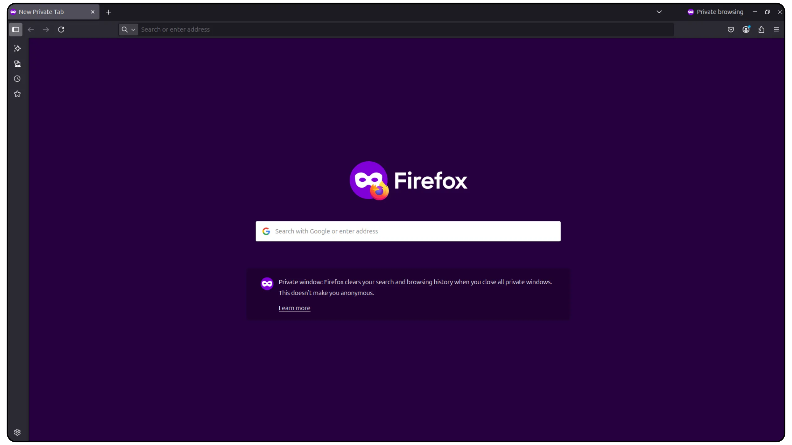

### Identifier et éviter le phishing et l’ingénierie sociale

Le phishing est une technique d’attaque par ingénierie sociale qui vise à tromper l’utilisateur afin d’obtenir, à son insu, des données sensibles : identifiants de connexion, numéros de carte bancaire, codes d’accès, documents confidentiels... Cette menace ne repose pas sur une faille technique, mais sur une manipulation psychologique, qui exploite la confiance, la précipitation ou la méconnaissance de l’utilisateur.

Dans la majorité des cas, l’attaque consiste à imiter l’apparence d’un site officiel (banque, messagerie, administration, boutique en ligne…) à travers un faux site web dont l’URL est maquillée. L’utilisateur reçoit un lien frauduleux par e-mail, SMS ou messagerie, et, en croyant interagir avec le vrai site, y saisit ses données d’authentification.

Pour éviter ces attaques lors de votre navigation en ligne, il convient de respecter certains principes de base :

* **Analysez l’URL** : les attaquants utilisent souvent des adresses très proches de l’originale (par exemple `micr0soft-support.com`, `paypal-verif.net`, etc.). Certains substituent des caractères visuellement similaires, en exploitant des alphabets Unicode. Vérifiez que l’adresse correspond exactement au site attendu, sans préfixe ou suffixe suspect.

* **Évitez les liens raccourcis** : des services comme `bit.ly` ou `t.co` peuvent masquer l’adresse finale. Si vous recevez un lien raccourci, méfiez-vous ou utilisez un service d’expansion d’URL pour vérifier sa destination.

* **Méfiez-vous des messages alarmistes** : les tentatives de phishing exploitent souvent des émotions fortes (urgence, menace, récompense, curiosité...). Un e-mail prétendant que votre compte va être bloqué ou qu’un colis ne peut être livré est suspect par nature.

* **Ne transmettez jamais d'informations sensibles via un lien reçu** : Une institution légitime ne vous demandera jamais un mot de passe, un code d’authentification ou un scan de pièce d’identité via un simple e-mail ou SMS.

Et voici également quelques mesures de prévention à mettre en place directement dans votre navigateur afin de réduire au maximum les risques de phishing :

* **Accédez aux sites critiques via vos favoris** :

Pour les services importants (banque, impôts, e-mail...), et plus largement pour tous les sites que vous utilisez de manière régulière, enregistrez l’URL officielle dans vos favoris et n’utilisez jamais un moteur de recherche ou un lien externe pour vous y rendre.

Vous avez reçu un e-mail du service des impôts contenant un lien ? Ne cliquez pas dessus. Rendez-vous plutôt directement sur votre espace personnel en utilisant l’URL que vous avez enregistrée dans vos favoris. Aujourd’hui, tous les navigateurs modernes proposent une barre de favoris avec la possibilité d’organiser vos liens dans des dossiers. Prenez le temps de le faire une fois, en vérifiant soigneusement l’URL ainsi que le certificat SSL/TLS, et vous naviguerez ensuite en toute tranquillité.

* **Respectez les bonnes pratiques liées à l'authentification** :

Il est également essentiel de suivre les bonnes pratiques liées à l’authentification pour limiter l’impact potentiel d’une attaque par phishing. Les deux règles les plus importantes sont l’usage de mots de passe uniques pour chaque service et l’activation du 2FA.

Prenons un exemple : si un attaquant parvient à obtenir le mot de passe de votre compte Steam, mais que vous utilisez un mot de passe différent pour chacun de vos comptes, il ne pourra pas accéder à des services plus sensibles comme votre messagerie ou votre banque. Et si vous avez activé la double authentification (2FA), alors même avec le mot de passe, l’attaquant ne pourra pas se connecter, puisqu’il n’aura pas accès à votre application TOTP (comme Authy, Google Authenticator...).

En complément de ces mesures, l’utilisation d’un bon gestionnaire de mots de passe sous forme d’extension de navigateur peut également vous protéger contre les faux sites. En effet, la plupart de ces extensions détecteront une URL suspecte et refuseront d’auto-remplir vos identifiants, voire vous le signalerons, ce qui vous évitera ainsi de divulguer vos accès par inadvertance.

* **Inspectez les certificats SSL/TLS** : 

La présence du cadenas dans la barre d’adresse indique une connexion chiffrée, mais ne garantit pas la légitimité du site. Cliquez dessus pour examiner le certificat (organisation, domaine, autorité de certification). Cela reste utile en cas de doute sur une URL.

Le phishing fonctionne uniquement si vous cliquez trop vite. Face à chaque lien reçu, adoptez un réflexe de vérification systématique, même pour un site que vous connaissez. Ralentir, observer et valider manuellement une URL connue sont les meilleurs remparts contre ce type d'attaque.

### Contrôler les extensions installées

Les extensions de navigateur sont des modules qui ajoutent des fonctionnalités (blocage de publicité, traduction, prise de notes, gestionnaire de mot de passe, wallet Bitcoin...). Elles s’exécutent directement dans l’environnement du navigateur et peuvent accéder à tout ou partie des pages que vous visitez. Cela les rend puissantes, mais aussi potentiellement dangereuses.

Une extension malveillante ou compromise peut intercepter vos données personnelles, lire les contenus de formulaires, injecter du code dans les pages web ou même exécuter du JavaScript en arrière-plan. Certaines conservent un accès permanent aux onglets ouverts ou à l’historique de navigation, bien au-delà de ce qui est nécessaire à leur fonctionnement.

Pour limiter ces risques, installez uniquement des extensions depuis des sources officielles (Mozilla Add-ons), vérifiez toujours les permissions demandées, et réduisez leur nombre au strict minimum. Supprimez celles que vous n’utilisez plus et méfiez-vous des clones.

Un contrôle régulier de vos extensions est important pour garder un navigateur sécurisé.

### Cloisonner vos usages du web

Le cloisonnement des activités est une pratique importante pour limiter la portée d’une compromission sur le web. Elle consiste à séparer techniquement vos différents usages d’Internet : navigation personnelle, professionnelle, privée ou sensible.

L’objectif est simple : empêcher qu’un incident sur une activité donnée (comme une fuite de cookie, une attaque ou un vol de session) ne contamine l’ensemble de votre environnement numérique. Plusieurs méthodes peuvent être utilisées, seules ou combinées :

- **Utiliser plusieurs navigateurs distincts** : par exemple, Firefox pour un usage personnel, Tor ou Mullvad pour des activités sensibles, et un Chromium pour les tâches professionnelles. Chaque navigateur utilise sa propre instance de stockage, ce qui isole totalement les cookies, sessions et extensions. Aussi, cela vous permet d'adapter les réglages du navigateur à vos cas d'utilisation.

- **Créer plusieurs profils au sein d’un même navigateur** : certains navigateurs permettent de créer des profils indépendants, chacun avec son propre historique, ses sessions, extensions et réglages. C’est une solution un peu moins contraignante que d’utiliser plusieurs navigateurs distincts, mais cela reste moins efficace.

- **Utiliser les conteneurs intégrés** : Firefox propose l’extension [Multi-Account Containers](https://addons.mozilla.org/en-US/firefox/addon/multi-account-containers/), qui vous permet d’ouvrir des onglets isolés les uns des autres, chacun avec ses propres identifiants et cookies. Vous pouvez également attribuer automatiquement certains sites à un conteneur spécifique pour maintenir un cloisonnement à chaque ouverture.

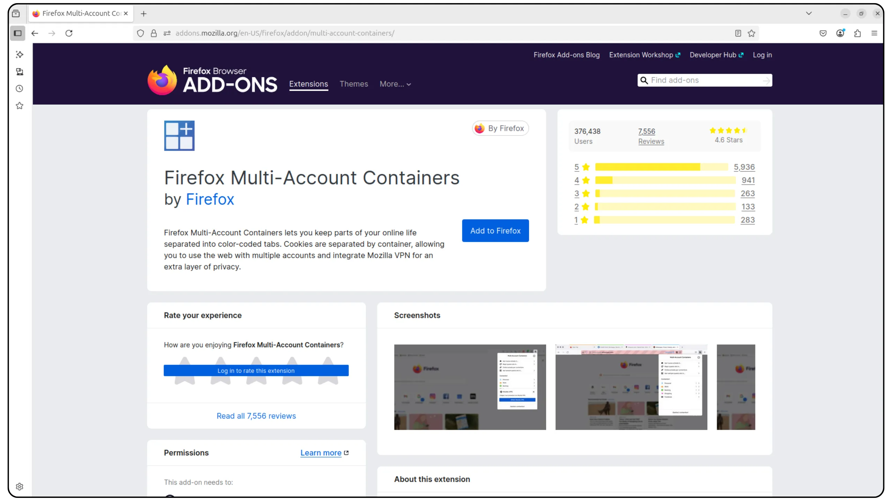

- **Utiliser un environnement système isolé** : Pour des usages particulièrement sensibles, vous pouvez aussi exécuter votre navigateur au sein d’une machine virtuelle ou d’un conteneur Docker, afin de le séparer totalement de votre environnement principal.

### Limiter les autorisations accordées aux sites

Les navigateurs modernes permettent aux sites de solliciter des accès à des ressources sensibles de votre appareil, comme la caméra, le microphone, la géolocalisation ou encore les notifications système. Ces fonctionnalités sont utiles pour certaines applications (visioconférences, cartes interactives...), mais elles ouvrent aussi la porte à des abus si elles sont mal contrôlées.

Lorsqu’un site vous demande l’accès à l’une de ces ressources, le navigateur affiche une popup que vous devez valider. Cependant, si vous acceptez une fois sans attention, cette autorisation peut rester active de manière persistante pour toutes vos visites futures sur ce site. Cela signifie, par exemple, qu’un site pourrait à nouveau activer votre micro ou votre caméra sans vous le redemander, si vous n’avez pas révoqué manuellement ce droit.

Pour renforcer votre sécurité :
- Accordez l’autorisation uniquement au moment précis où elle est requise pour une fonctionnalité légitime ;
- Préférez l’option "autoriser une seule fois" si disponible ;
- Révoquez manuellement les permissions accordées via les paramètres du navigateur de manière régulière.

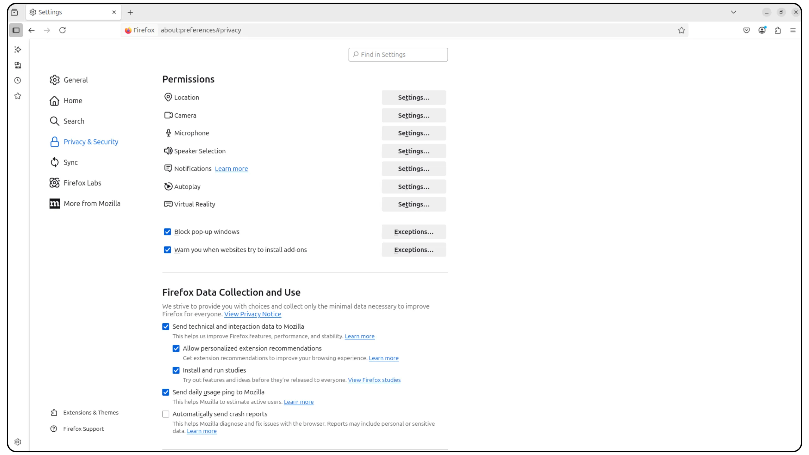

### Vérifier les connexions sécurisées (HTTPS)

Chaque fois que vous transmettez des informations personnelles, confidentielles ou financières sur un site web, que ce soit un mot de passe, un numéro de carte bancaire ou un simple formulaire d’inscription, il est important de s’assurer que la connexion entre votre navigateur et le site est chiffrée.

C’est justement le rôle du protocole HTTPS (*HyperText Transfer Protocol Secure*). Ce protocole repose sur le chiffrement TLS (*Transport Layer Security*), qui permet :
- de chiffrer les données échangées (personne ne peut les lire ou les modifier en transit) ;
- de vérifier l’authenticité du serveur distant via un certificat numérique ;
- d’empêcher les attaques de type homme du milieu (MITM), fréquentes sur les réseaux publics ou compromis.

Concrètement, un site en HTTPS est signalé par un cadenas fermé dans la barre d’adresse de votre navigateur, généralement en haut à gauche de l'interface. En cliquant sur ce cadenas, vous pouvez afficher les informations relatives au certificat TLS du site (autorité de certification, date de validité...). L’adresse du site commence aussi systématiquement par `https://`.


À l’inverse, si le site utilise encore HTTP (sans le "S"), la connexion est en clair. Toute information saisie peut alors être interceptée par un acteur malveillant situé entre vous et le site : opérateur réseau, fournisseur d’accès, hotspot Wi-Fi piégé, malware local…

En théorie, il faudrait toujours vérifier manuellement ces informations avant de saisir des données sur un site web. En pratique, la plupart des navigateurs modernes signalent automatiquement les sites en HTTP comme non sécurisés. Vous pouvez également activer une option pour forcer l’utilisation du protocole HTTPS dans les paramètres de sécurité de votre navigateur, ce qui permet de bloquer les sites qui ne le prennent pas en charge.

En réalité, très peu de sites sont aujourd’hui accessibles uniquement en HTTP. Ce protocole est largement abandonné au profit d'HTTPS, non seulement pour des raisons de sécurité évidentes, mais aussi parce qu’il est pénalisé par les moteurs de recherche et signalé comme potentiellement dangereux par les navigateurs modernes, ce qui n'inspire pas confiance aux visiteurs.

### Le choix du moteur de recherche

Comme nous l'avons déjà vu précédemment, il est important de bien distinguer deux éléments souvent confondus : le navigateur, qui est une application installée sur votre ordinateur (comme Firefox ou Brave) et qui sert à afficher les pages web, et le moteur de recherche, qui est un service en ligne (comme Google) auquel vous soumettez des requêtes pour obtenir des résultats. Ces deux éléments sont indépendants, même si les navigateurs intègrent souvent par défaut un moteur particulier.

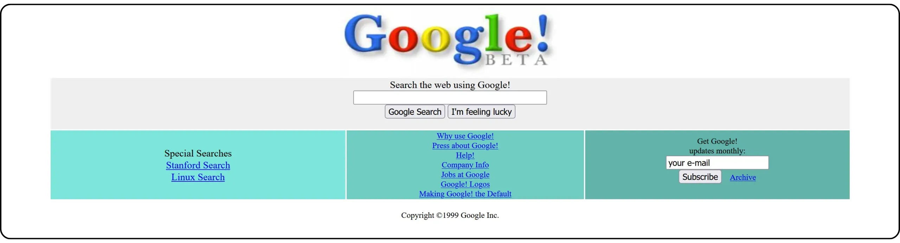

Le moteur de recherche que vous utilisez influence directement votre confidentialité. En effet, chaque recherche envoyée peut être :
- associée à votre adresse IP si vous n'utilisez pas Tor ou un VPN ;
- liée à vos identifiants si vous êtes connecté à un compte ;
- stockée et analysée pour créer un profil comportemental ;
- utilisée pour du ciblage publicitaire ou des reventes à des tiers.

Donc un moteur comme Google vous donne des résultats rapides et pertinents (quoi que, [certaines études suggèrent](https://consumerwatchdog.org/in-the-news/wallet-hub-google-quality-issues-part-of-an-intentional-strategy/) que Google est de moins en moins efficace), mais au prix d'une surveillance systématique de vos requêtes. Bing (Microsoft) et Yahoo suivent un modèle similaire de collecte de vos activités en ligne pour alimenter leurs régies publicitaires.

Pour limiter ce traçage, il est recommandé d’opter pour des moteurs de recherche respectueux de la vie privée, qui ne conservent aucun identifiant personnel ni historique de vos requêtes :
- [Startpage](https://www.startpage.com/) ;
- [Qwant](https://www.qwant.com/) ;
- [Mojeek](https://www.mojeek.com/) ;
- [SearXNG](https://docs.searxng.org/) (qui peut être auto-hébergé).

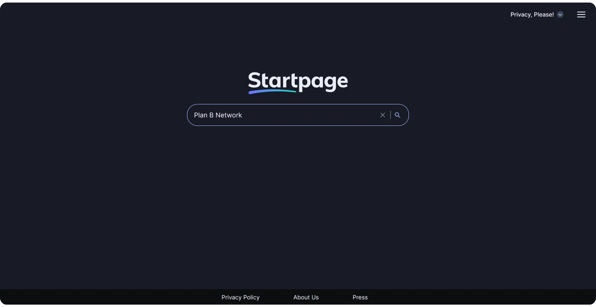

Dans la plupart des navigateurs, vous pouvez configurer manuellement le moteur de recherche par défaut dans les paramètres. Cela vous permet d’éviter Google sans changer d’outil de navigation.

Les bonnes pratiques présentées dans ce chapitre constituent la base pour une navigation plus sécurisée et souveraine. Leur adoption régulière vous permettra de réduire significativement votre exposition aux menaces.

Maintenant que nous avons étudié l’usage des navigateurs et des ordinateurs, nous allons, dans la section suivante, découvrir comment reprendre le contrôle de notre téléphone portable.


# Reprendre le contrôle de son téléphone
<partId>5f0ef9ad-5701-4620-89bf-eb6937adccac</partId>

## Système d'exploitation mobile : comprendre les enjeux
<chapterId>020329e9-a2cb-464b-bb4c-ee4f0e5346c6</chapterId>

Jusqu’ici, nous nous sommes principalement concentrés sur la sécurisation et l’utilisation de votre ordinateur. Pourtant, pour la majorité des individus, le smartphone est aujourd’hui l’appareil numérique le plus utilisé au quotidien.

À la différence des ordinateurs, les téléphones mobiles fonctionnent généralement avec des systèmes fermés, fortement contrôlés par leurs fabricants. C’est pourquoi, dans ce chapitre, je vous propose d’explorer les enjeux spécifiques liés aux systèmes d’exploitation mobiles.

### Android : de l’open-source au contrôle par Google

#### Brève histoire d’Android

Android domine aujourd’hui le marché mondial des smartphones, avec environ 72 % des appareils en circulation. Son développement débute en 2003 avec la création de la société Android Inc., fondée par Andy Rubin, Rich Miner, Nick Sears et Chris White. À l’origine, leur objectif était de concevoir un système d’exploitation pour appareils photo numériques.

Après avoir essuyé plusieurs refus d’investisseurs, Android Inc. décide de réorienter son projet vers la création d’un système d’exploitation mobile. Pour bien situer le contexte, en 2003-2004, le marché des téléphones portables était en pleine effervescence, largement dominé par des constructeurs comme Nokia, Motorola, Sony Ericsson ou Samsung. La majorité des appareils étaient des "*feature phones*", équipés de claviers physiques, de petits écrans couleur, et parfois d’un appareil photo rudimentaire. Les smartphones existaient déjà, mais restaient principalement destinés aux professionnels, et portés par des marques comme BlackBerry.

Google rachète la société Android Inc. en 2005 pour environ 50 millions de dollars. Entre 2005 et 2007, l’entreprise développe son système d’exploitation en interne, sans en dévoiler de version publique. À cette époque, certaines rumeurs laissent entendre que Google prépare un appareil mobile, peut-être inspiré des BlackBerry, alors en pleine ascension.

Mais en janvier 2007, un événement marque un tournant majeur dans l’histoire du smartphone : Steve Jobs dévoile la première génération de l’iPhone. L’idée alors largement répandue selon laquelle un clavier physique était indispensable vole en éclats. L’iPhone introduit un appareil pensé pour un usage entièrement tactile et redéfinit à lui seul les attentes du marché.

Face à cette révolution, Google est contraint de revoir entièrement l’orientation de son projet Android afin de le rendre compatible avec une interface tactile. C’est plus tard en 2007 que Google officialise la sortie d’Android comme un projet open-source reposant sur un noyau Linux modifié, sous le nom de *Android Open Source Project (AOSP)*.

Le premier appareil commercialisé sous Android, le *HTC Dream*, sort en 2008. Il propose un environnement encore rudimentaire, mais entièrement ouvert : les fabricants et opérateurs peuvent adapter librement le système à leurs besoins, tandis que les développeurs peuvent créer et distribuer des applications sans validation préalable. Cette approche séduit rapidement une communauté active et favorise l’adoption massive d’Android par de nombreux constructeurs.

131

*Source : [By Akela NDE - Own work](https://commons.wikimedia.org/w/index.php?curid=6680413), CC BY-SA 3.0*

Cependant, cette ouverture initiale va progressivement être encadrée par Google. En parallèle du code libre d’AOSP, l’entreprise développe une suite d’applications et d’API propriétaires, regroupées sous le nom de *Google Mobile Services (GMS)*. On y retrouvera progressivement le Play Store, Google Maps, YouTube, Google Play Services, Gmail, Chrome ou encore l’assistant vocal. Pour pouvoir préinstaller le Play Store, les fabricants doivent désormais signer un accord de licence avec Google et garantir la compatibilité de leurs appareils avec les standards GMS, ce qui restreint fortement leur marge de personnalisation.

Android connaît une ascension fulgurante : il dépasse iOS en parts de marché dès juillet 2011, et devient le système d’exploitation mobile dominant en juin 2012, à la suite de la chute brutale de SymbianOS après son abandon par Nokia au profit de Windows Phone. Android reste depuis le leader incontesté du marché mobile, et forme aujourd’hui un duopole avec iOS.

130

#### Open-source vs Google

Le projet Android repose sur une dualité structurelle. D’un côté, l’AOSP (*Android Open Source Project*) représente la base libre du système : il comprend le noyau Linux, la pile logicielle système, une interface graphique minimale et un ensemble d’API. Ce socle est publié sous licence Apache 2.0, et reste accessible à tous. De l’autre côté, l’environnement réellement utilisé par la majorité des utilisateurs Android repose presque entièrement sur des composants propriétaires développés par Google : les *Google Mobile Services* (GMS).

Ces composants ne sont pas open-source : ils ne peuvent être ni audités librement par la communauté, ni remplacés facilement. Pour pouvoir les préinstaller légalement sur leurs appareils, les fabricants doivent signer des accords de licence avec Google et se soumettre à des exigences techniques et commerciales strictes. Parmi ces conditions figurent notamment :
- l’intégration obligatoire de plusieurs applications Google comme applications système non désinstallables ;
- la mise en avant visuelle de certaines applications (Google Search, Play Store, Gemini...) sur l’écran d’accueil ;
- l’usage exclusif des API Google pour des fonctions importantes telles que la synchronisation, les notifications push ou la géolocalisation.

132

Cela crée progressivement une dépendance structurelle pour les constructeurs de smartphones, et rend presque inévitable, pour l’utilisateur final, la transmission de données personnelles vers les serveurs de Google. Ces services visent à garantir une expérience utilisateur fluide et cohérente, mais centralisent également des fonctions sensibles comme la sauvegarde automatique des données, la géolocalisation passive, ou encore l’authentification permanente via un compte Google (souvent requis pour exploiter pleinement son appareil).

Même si Android reste, en théorie, un système libre à sa base, la majorité des smartphones Android vendus dans le monde fonctionnent sur une version modifiée et enrichie par Google. Dans cette version, la couche open-source est largement dissimulée sous une surcouche propriétaire, verrouillée et intrusive.

Pour réellement reprendre le contrôle, il est donc nécessaire de se tourner vers des alternatives comme les ROMs libres (GrapheneOS, CalyxOS, etc.), que nous aborderons plus loin dans ce cours.

### iOS : sécurité élevée, mais système fermé

#### Brève histoire d’iOS

iOS est le système d’exploitation développé par Apple pour ses smartphones, inauguré avec le premier iPhone en 2007 (alors nommé "*iPhone OS*"). Dès ses origines, Apple adopte une stratégie d’intégration verticale complète : matériel, logiciel, système d’exploitation, services en ligne et boutique d’applications sont tous conçus, contrôlés et maintenus par Apple. Au départ, les applications natives non produites par Apple n'étaient même pas prises en charge. Cette approche contraste fortement avec Android, dont l’écosystème est beaucoup plus fragmenté dès le départ, et encore aujourd'hui.

133

iOS reposait initialement sur le système d'exploitation utilisé par le Mac : OS X. Il utilise donc un noyau hybride dérivé de Darwin, lui-même issu de BSD Unix et du micro-noyau Mach. Ce socle technique permet à iOS d’hériter d’un certain nombre de propriétés de robustesse et de stabilité propres aux systèmes Unix. Le système est donc conçu autour de principes de sécurité stricts, notamment :
- un sandboxing complet des applications, empêchant une app d’accéder aux données ou processus d’une autre ;
- la signature obligatoire du code applicatif, qui garantit l’intégrité des binaires et leur provenance (App Store uniquement) ;
- le chiffrement matériel des données dès la puce, via le *Secure Enclave*, un coprocesseur cryptographique isolé du reste du système ;
- des mises à jour de sécurité rapides, déployées directement par Apple sur l’ensemble des appareils, sans intermédiaire.

Cette architecture fermée permet à Apple de garantir une expérience utilisateur fluide et sécurisée. La centralisation du développement facilite également l'optimisation matérielle-logicielle, avec peu de variabilité entre les modèles, contrairement à Android. iOS est ainsi considéré comme l’un des systèmes les plus sûrs contre les attaques informatiques.

#### Inconvénients de la fermeture d’iOS

Cependant, cette sécurité repose sur un verrouillage strict de l’utilisateur final, qui n’a quasiment aucun contrôle technique sur son propre appareil. Il est impossible d’installer des applications autrement que via l’App Store, sauf à procéder à un *jailbreak*, une opération complexe, risquée, et souvent instable, qui annule la garantie et compromet la sécurité du système. C'est également sur ce principe que repose le modèle économique d'Apple, qui impose une commission sur les transactions effectuées dans les applications tierces.

La personnalisation est également très restreinte. Il n’est pas possible de modifier profondément le comportement du système, de changer librement d’environnement d’exécution, ou d’accéder directement aux fichiers système. Le smartphone reste donc dans les faits propriété d’Apple, même après achat, dans la mesure où vous ne pouvez pas en exercer une pleine maîtrise.

134

Par ailleurs, l’intégration obligatoire d’iCloud dans la majorité des services (sauvegardes, messagerie, photos, localisation, Siri...) expose les utilisateurs à une centralisation massive de leurs données personnelles. Bien qu’Apple revendique un modèle axé sur la protection de la vie privée (et que, contrairement à Google, son modèle économique ne repose pas sur l’exploitation des données personnelles) plusieurs limites subsistent :
- certains éléments (comme les métadonnées de connexion, les requêtes Siri ou les journaux d’erreurs) transitent tout de même par les serveurs Apple ;
- les mécanismes d’analyse comportementale pour les suggestions contextuelles, les mises à jour d’App Store ou le filtrage de messages utilisent des modèles propriétaires non auditables ;
- l’utilisation de services comme iCloud implique une confiance implicite dans l’infrastructure Apple, sans contrôle possible sur la localisation ou la durée de stockage des données.

Enfin, sur le plan de la souveraineté numérique, iOS représente un environnement fermé : aucune autorité extérieure (ni utilisateur, ni organisation indépendante) ne peut vérifier ou modifier son fonctionnement. L’utilisateur est donc contraint de faire confiance à Apple à tous les niveaux : matériel, logiciel, réseau...

### Alternatives open-source avec Android

Comme nous venons de le voir, l’écosystème Android standard, dominé par Google, repose sur une version libre du système (AOSP) avec des composants propriétaires (GMS). Plusieurs projets open-source tirent parti d’AOSP pour proposer des systèmes d'exploitation alternatifs, plus respectueux de la vie privée, sans surcouches intrusives, et avec un meilleur contrôle utilisateur. Ces alternatives s’installent en remplacement du système d’origine, sous forme de ROM personnalisées. Elles permettent de reprendre le contrôle sur le logiciel, mais nécessitent aussi un contrôle matériel minimal, car elles ne sont compatibles qu’avec quelques appareils.

#### Prérequis matériels et avertissement

Avant toute installation, il est important de vérifier la compatibilité de votre smartphone avec la ROM choisie. La plupart de ces projets supportent une liste restreinte de modèles. La plupart du temps, il faut utiliser la gamme de téléphones Google Pixel, en raison de leur support du bootloader déverrouillable et des pilotes publics.

L’installation nécessite de déverrouiller le bootloader, une opération qui permet d’écrire une nouvelle image système, mais qui efface totalement le contenu de l’appareil d'origine. Il faudra également installer manuellement des services additionnels, comme F-Droid ou Aurora Store pour les apps.

Certains constructeurs interdisent ou compliquent cette opération, voire désactivent certaines fonctions (caméra, capteurs...) en cas de changement de système. Il est donc important de choisir un téléphone compatible (souvent un Google Pixel).

135

#### GrapheneOS

[GrapheneOS](https://grapheneos.org/) est une ROM AOSP renforcée, conçue pour offrir un niveau de sécurité supérieur à celui d’Android standard. C'est un système développé par une équipe indépendante et audité par des experts. Graphene implémente des mécanismes avancés de sécurité, notamment :
- une réduction drastique de la surface d’attaque : désactivation par défaut de nombreuses fonctionnalités (NFC, Bluetooth...), verrouillage des ports USB lorsque l’appareil est inactif, contrôle avancé des broches pogo... ;
- un renforcement du sandbox Android ;
- des protections mémoire avancées ;
- un contrôle granulaire des permissions ;
- un chiffrement matériel indépendant de Google.
- etc.

136

GrapheneOS n’intègre aucun composant propriétaire. L’utilisateur est libre d’ajouter ou non des services Google, mais ceux-ci sont strictement isolés (sandboxés dans des profils dédiés). Cela en fait un système extrêmement résistant aux attaques locales et à l’exploitation de failles système.

Graphene est uniquement compatible avec les Google Pixel récents (Pixel 6, 7, 8 et 9).

https://planb.network/tutorials/computer-security/operating%20system/grapheneos-08d43d7a-0b22-4638-a151-578d48d32d88

#### CalyxOS

[CalyxOS](https://calyxos.org/) est un système intermédiaire qui vise à concilier confidentialité, sécurité et compatibilité avec les usages quotidiens. Il se base également sur AOSP, avec des améliorations de sécurité. Sa spécificité réside dans l’intégration optionnelle de MicroG, une réimplémentation libre des services Google. Cela permet de faire fonctionner la plupart des applications Android dépendantes des services Google, sans passer par les binaires officiels propriétaires.

CalyxOS propose aussi des applications préinstallées (Signal, F-Droid, Aurora Store, VPN intégré...), et une interface soignée. Il s’installe facilement via un outil graphique pour les utilisateurs Pixel. Calyx est principalement compatible avec les Google Pixel, mais aussi certains modèles Fairphone et Motorola.

137

#### LineageOS

[LineageOS](https://lineageos.org/), héritier de CyanogenMod, est la ROM alternative la plus largement compatible. Elle supporte plusieurs centaines de modèles, grâce à une large communauté de contributeurs. Basée sur AOSP, elle met l’accent sur la personnalisation, la sobriété et la liberté d’utilisation.

LineageOS permet d’avoir un système Android sans surcouche constructeur, sans bloatware, avec une gestion complète des permissions, une mise à jour facilitée et une interface épurée. Il est possible d’y ajouter les services Google ou au contraire d’opter pour un usage 100 % libre.

En revanche, côté sécurité, LineageOS n’intègre pas certaines protections matérielles ou renforcements mémoire présents dans GrapheneOS et CalyxOS. Son système de mises à jour dépend également de la communauté, ce qui peut introduire des délais dans les patchs de sécurité.

138

### Quel OS mobile choisir pour quel usage ?

Le choix de votre système d’exploitation mobile doit se faire en connaissance des compromis entre sécurité, respect de la vie privée, ergonomie et compatibilité applicative. Chaque solution présente des caractéristiques techniques spécifiques qui vont influencer directement votre expérience quotidienne, vos capacités de contrôle, et votre exposition à la surveillance commerciale ou aux vulnérabilités.

Android standard (avec GMS) reste aujourd’hui la solution la plus répandue. Elle offre une compatibilité totale avec l’ensemble des applications Android, une grande simplicité d’utilisation et un accès immédiat aux services populaires (Play Store, Maps, Gmail...). Toutefois, cette facilité d’usage repose sur une forte intégration des services propriétaires de Google, avec une collecte de données systématique : position GPS, historique de navigation, métadonnées d’appels, préférences publicitaires... Il s’agit donc d’un choix peu adapté si vous êtes soucieux de votre souveraineté numérique ou de votre confidentialité.

iOS, le système d’Apple, dispose d'un niveau de sécurité très élevé. Cependant, cette sécurité s’accompagne d’une fermeture extrême de l’environnement : l’utilisateur ne peut pas installer d’applications hors de l’App Store (sauf cas marginaux), ne peut pas modifier les comportements système, et dépend entièrement d’Apple pour la gestion du matériel, du stockage cloud et de la synchronisation. C’est un environnement efficace et robuste, mais qui sacrifie toute forme de personnalisation ou d’indépendance.

GrapheneOS s’adresse aux profils les plus exigeants sur la sécurité et la confidentialité. Son niveau de sécurité impose toutefois des contraintes : peu d’appareils compatibles (uniquement des modèles Google Pixel récents), pas d’intégration automatique des services applicatifs tiers, et nécessité de configurer manuellement des outils alternatifs pour les mises à jour, le store ou les notifications. Si la confidentialité et la sécurité sont vos priorités, c'est clairement le meilleur choix.

CalyxOS propose un équilibre intéressant. L’expérience utilisateur reste proche d’un Android standard, mais sans la surveillance directe de Google. Il supporte un nombre raisonnable de modèles (notamment les Google Pixel), et peut être installé sans connaissances techniques poussées. Pour les utilisateurs qui souhaitent un bon niveau de sécurité sans renoncer à la compatibilité logicielle, CalyxOS est une solution pratique et équilibrée.

Enfin, LineageOS est une distribution AOSP plutôt pour les utilisateurs qui veulent de la flexibilité et du contrôle. Elle est compatible avec un grand nombre d’appareils, même anciens, permet une personnalisation complète du système, et offre une alternative légère aux surcouches des constructeurs. Cependant, elle n’intègre pas nativement les renforcements de sécurité avancés présents dans GrapheneOS ou CalyxOS, et ne bénéficie pas toujours de mises à jour régulières pour tous les modèles. LineageOS requiert donc une certaine discipline de l’utilisateur pour rester sécurisée dans le temps.

| Système    | Sécurité | Confidentialité | Compatibilité | Personnalisation |
| ---------- | -------- | --------------- | ------------- | ---------------- |
| Android    | 🟡       | 🔴              | 🟢            | 🟢               |
| iOS        | 🟢       | 🟡              | 🔴            | 🔴               |
| GrapheneOS | 🟢       | 🟢              | 🟡            | 🟡               |
| CalyxOS    | 🟢       | 🟢              | 🟡            | 🟡               |
| LineageOS  | 🟡       | 🟡              | 🟢            | 🟢               |

Quel que soit votre choix de système d'exploitation mobile, nous verrons dans le prochain chapitre quelles sont les bonnes pratiques à adopter pour sécuriser efficacement votre téléphone et maintenir un environnement numérique sain.

## Sécuriser son smartphone au quotidien
<chapterId>37b9499e-32cf-42c3-8715-15c6884d2ec7</chapterId>

Mises à jour OS et applications.  
Restrictions d’autorisations.  
Accès et authentification (comparaison des méthodes de déverrouillage).  
Cloisonnement (Shelter, Work Profile Android).


## Communiquer sans se faire écouter
<chapterId>e60773c6-ee96-47b2-a9fa-08d1bdbd1108</chapterId>

Applications de messagerie : comparaison, usage recommandé.  
Fonctionnement des SMS, risques associés.


## Applications open-source : les meilleures alternatives
<chapterId>9c0e056c-45ce-407c-b4b6-f648bbc1f7d5</chapterId>

Présentation d'apps open-source pour remplacer les apps principales : Firefox, Organic Maps, FairEmail, Etar, Nextcloud, etc.


# Sécuriser son réseau local
<partId>23e49e48-34c9-435c-a36f-1c86b0254275</partId>

## Mieux comprendre son réseau domestique
<chapterId>8a7577e0-4a27-4331-a6d9-7a4c838fa720</chapterId>

Notions générales : Internet, box, Wi-Fi, réseau local.  
Routeur, IP locale, ports.


## Sécuriser son Wi-Fi en quelques étapes
<chapterId>d5577b2e-5247-4d10-8685-4906391e2cc1</chapterId>

Changer les mots de passe et leur importance.  
Choix du chiffrement.  
Options à désactiver.


## Les bonnes pratiques sur son réseau domestique
<chapterId>175e0051-f506-486b-9b47-697b1f8b4ca2</chapterId>

Mise à jour du firmware.  
Surveillance des appareils connectés (outils, logiciels, tutoriels).  
Réseau invité isolé.  
Pratiques avancées (routeur libre, VLAN, VPN au niveau du routeur — à confirmer selon les cas d’usage).


# Partie finale
<partId>28fae323-cce7-405a-be8d-d15739ca74df</partId>


## Avis & Notes
<chapterId>9c71cd4c-ee07-422a-8cb0-757412e0202d</chapterId>
<isCourseReview>true</isCourseReview>


## Examen final
<chapterId>1eb4578e-024a-4430-a997-e9faaf96ab28</chapterId>
<isCourseExam>true</isCourseExam>


## Conclusion
<chapterId>4186cd39-6320-43a0-ba2c-ceaac42d2d37</chapterId>
<isCourseConclusion>true</isCourseConclusion>
