# Selangkah lebih dekat menuju kemandirian digital

Di dunia di mana perangkat digital ada di mana-mana tetapi jarang dikuasai, mempelajari cara mengamankan lingkungan TI (teknologi informasi) Anda sendiri adalah suatu keharusan. Baik itu komputer, browser, ponsel, atau jaringan lokal Anda, setiap elemen ini dapat menjadi pintu gerbang potensial bagi privasi Anda. Kursus ini membantu Anda mendapatkan kembali kendali atas perangkat digital Anda.

Ini bukan hanya tentang mengetahui praktik terbaik: ini tentang memahami apa yang Anda gunakan, bagaimana Anda menggunakannya, dan apa artinya bagi keamanan Anda. Kursus SCU202 ini memberikan pengantar mendalam tentang dasar-dasar teknis sistem operasi, memperkenalkan Anda pada penggunaan praktis Linux, dan memandu Anda dalam menyiapkan lingkungan kerja yang stabil, fungsional, dan tangguh.

Sepanjang modul kursus, Anda akan menemukan cara memverifikasi integritas perangkat lunak yang Anda instal, mengenkripsi data Anda secara efektif, menggunakan browser dan ponsel Anda dengan kebocoran data yang minimum, dan memperkuat keamanan jaringan lokal Anda.

Kursus ini menargetkan pengguna tingkat menengah yang ingin lebih jauh menguasai perangkat digital mereka. Kursus ini didasarkan pada pendekatan praktis, berfokus pada otonomi dan kemandirian, untuk membangun kebiasaan TI (teknologi informasi) sehari-hari yang lebih aman dan lebih sadar, mengikuti moto “_Jangan Percaya, Verifikasi_”.

+++

# Pendahuluan

<partId>8b696bba-e6f6-47d9-ba30-fe4b75636b88</partId>

## Gambaran umum kursus

<chapterId>7bf90137-7387-462d-884f-fe48e812b739</chapterId>

Selamat datang di kursus SCU202, kelanjutan dari kursus SCU101, yang akan membawa Anda lebih jauh dalam penguasaan keamanan TI (teknologi informasi) dengan menekankan kedaulatan individu, perlindungan privasi, dan pengelolaan data pribadi Anda yang aman. Berikut ini adalah gambaran umum tentang apa yang akan Anda temukan di seluruh kursus SCU202.

### Bagian 1 - Pendahuluan

Kursus dimulai dengan tinjauan singkat tentang konsep-konsep yang dibahas dalam SCU101 yang akan memastikan Anda sepenuhnya memahami prinsip-prinsip mendasar yang diperlukan untuk mempelajari materi selanjutnya dengan baik.

### Bagian 2 - Dari klik ke terminal: menguasai Linux

Bagian ini memperkenalkan sistem GNU/Linux, sebuah dasar kemandirian digital. Anda akan menjelajahi perbedaan antara Linux, Windows, dan macOS, menemukan sejarah menarik dari Linux dan free software, serta memahami mengapa Linux sering kali identik dengan keamanan dan kebebasan.

Selanjutnya, Anda akan belajar cara memilih distribusi Linux yang paling sesuai dengan kebutuhan dan lingkungan desktop Anda. Akhirnya, Anda akan mengambil langkah pertama dengan Ubuntu melalui panduan instalasi dan konfigurasi yang terperinci.


### Bagian 3 - Mengamankan komputer Anda

Pada bagian ini, Anda akan belajar cara memperkuat keamanan komputer Anda. Kami akan membahas metode-metode untuk secara efektif melindungi akses Anda dan memisahkan penggunaan Anda. Anda akan memahami pentingnya pembaruan sistem dan perangkat lunak secara berkala untuk meminimalkan potensi kerentanan.

Anda juga akan dilatih untuk memverifikasi integritas dan keaslian perangkat lunak yang diunduh untuk menghindari perusakan atau disusupi, serta menggunakan enkripsi secara efektif untuk mengamankan data pribadi dan cadangan Anda. Akhirnya, Anda akan menemukan mengapa dan bagaimana cara membersihkan file metadata  Anda untuk melindungi privasi Anda secara online.

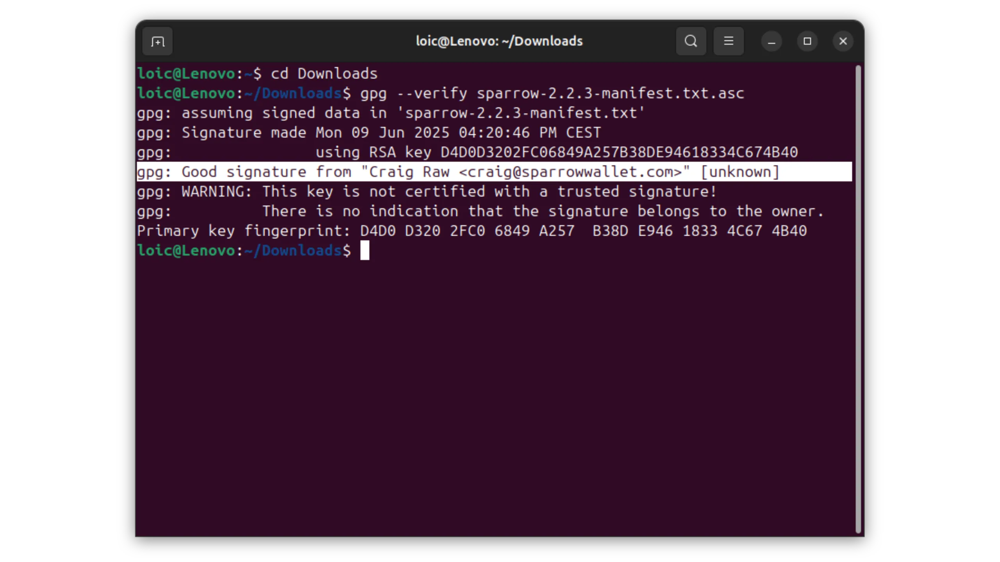

### Bagian 4 - Browser: OS di dalam OS

Saat ini, browser web ada di mana-mana dalam kehidupan digital kita sehari-hari, dan seringkali menjadi target utama serangan siber. Di bagian ini, kita akan menelusuri kembali sejarah browser dan evolusinya.

Kemudian, Anda akan menemukan gambaran umum tentang _rendering engine_ dan browser saat ini, kelebihan dan kekurangannya, serta praktik terbaik yang nyata untuk mengamankan penjelajahan web Anda semaksimal mungkin.


### Bagian 5 - Mengambil kembali kendali ponsel Anda

Saat ini, smartphone kita adalah perpanjangan dari kehidupan pribadi maupun profesional kita, membuatnya sangat penting untuk mengontrol keamanannya. Kita akan mendalami secara rinci berbagai sistem operasi seluler, kelebihan dan kekurangannya, sambil menemukan alternatif open source untuk mendapatkan kembali kedaulatan penuh atas perangkat Anda.

Anda kemudian akan mempelajari praktik terbaik untuk keamanan sehari-hari, mulai dari pembaruan hingga pemisahan data pribadi dan profesional Anda. Terakhir, Anda akan menemukan perangkat komunikasi yang aman dan aplikasi alternatif open source untuk meningkatkan privasi dan keamanan ponsel Anda.

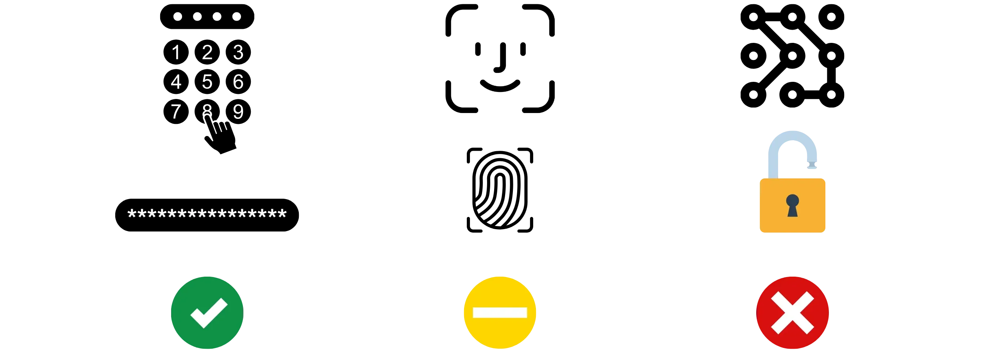

### Bagian 6 - Mengamankan jaringan lokal Anda

Jaringan lokal Anda adalah titik kritis penting dalam hal keamanan. Kami akan mulai dengan melihat cara kerja jaringan lokal, sebelum beralih ke langkah-langkah praktis yang terlibat dalam mengamankannya secara efektif.

Anda akan belajar cara memilih dan mengonfigurasi router yang aman, melakukan segmentasi jaringan Anda, memperkuat jaringan Wi-Fi Anda, dan menggunakan perangkat pemantauan untuk mendeteksi anomali apa pun dengan cepat.

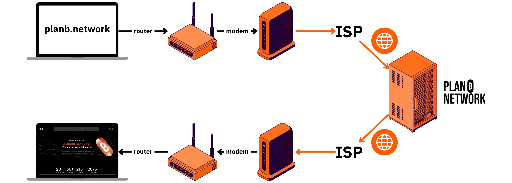

### Bagian 7 - Bagian akhir

Untuk mengakhiri kursus ini, Anda akan dapat mengikuti ujian akhir untuk mendapatkan sertifikat dan memverifikasi pemahaman Anda tentang topik-topik yang telah dibahas.


Apakah Anda siap untuk sepenuhnya mengambil kendali atas keamanan TI (teknologi informasi) Anda, memperkuat kedaulatan individu Anda, dan menjamin privasi online Anda? Ayo mulai!

*Catatan: Jika Anda menemukan istilah yang tidak dikenal selama kursus, silakan baca [daftar istilah](https://planb.network/resources/glossary) untuk mendapatkan definisinya

## Rekapitulasi penting dari SCU101

<chapterId>26cfac35-a3bb-4657-95b3-8508bedfa903</chapterId>

Sebelum memulai kursus SCU202, saya ingin mengulas secara singkat konsep-konsep mendasar yang dibahas dalam kursus sebelumnya ("SCU101") di bab ini.

Selain itu, jika Anda masih pemula dalam bidang komputer dan belum mengambil SCU101, saya sangat menyarankan untuk memulai dengan kursus pertama itu sebelum melanjutkan ke kursus ini. Dasar-dasar yang dibahas di SCU101 tidak akan diulangi di sini. Oleh karena itu, saya tidak akan kembali membahas praktik keamanan dasar, penggunaan VPN, manajer kata sandi, atau autentikasi dua faktor. Namun, semua konsep ini penting untuk dikuasai sebelum beralih ke penggunaan yang lebih lanjut, yang akan kita bahas di bab-bab berikutnya.

Kursus SCU101 adalah kursus pengantar yang dirancang untuk membangun dasar yang kuat dalam praktek digital yang aman bagi pengguna pemula dan menengah di bidang TI. Tujuannya adalah untuk meningkatkan keamanan sehari-hari, privasi, dan kemandirian digital.

https://planb.network/courses/99c46148-7080-4915-a7e0-9df0e145cd47

### Penjelajahan online yang aman

Penjelajahan internet sering kali menjadi titik masuk utama untuk ancaman keamanan siber. Dalam SCU101, kita melihat pentingnya untuk tetap waspada, terutama terkait dengan unduhan. Unduhlah file hanya dari sumber yang dapat dipercaya, dan utamakan perangkat lunak open-source, yang sering kali mendapatkan manfaat dari transparansi dan kontrol komunitas yang lebih besar.

Perilaku baik lain yang dibahas dalam kursus ini melibatkan cookies, yaitu file-file kecil yang disimpan di komputer Anda saat Anda mengunjungi situs web. Anda harus secara teratur menghapus atau membatasinya untuk melindungi privasi Anda.

Secara umum, penjelajahan yang aman memerlukan kehati-hatian tertentu: hindari mengklik tautan yang tidak dikenal, hindari situs yang mencurigakan, dan gunakan browser yang aman serta selalu diperbarui.

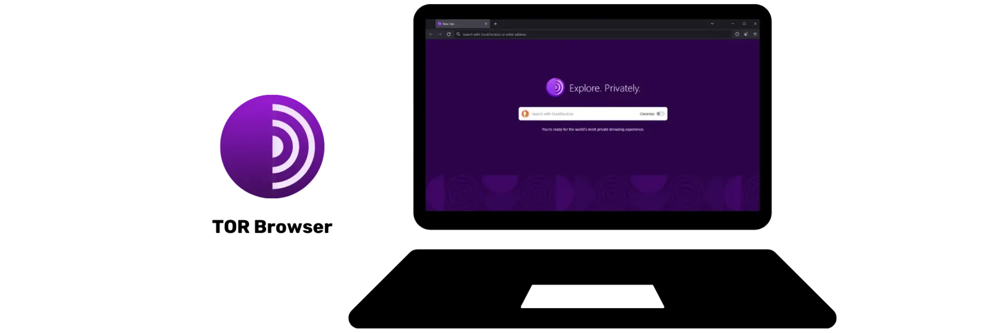

### Memahami VPN dan mengamankan koneksi Internet Anda

SCU101 memperkenalkan Anda pada konsep VPN (Virtual Private Network). Secara praktis, VPN mengenkripsi lalu lintas internet Anda dengan membuat saluran aman antara perangkat Anda dan server jarak jauh. Namun, tidak semua VPN sama: utamakan penyedia yang transparan, dapat diandalkan, dan memungkinkan pendaftaran anonim, seperti Mullvad, ProtonVPN, atau IVPN. VPN ini memastikan privasi optimal tanpa mengumpulkan data pribadi Anda secara tidak perlu.

Selain itu, kita telah melihat bahwa pada jaringan Wi-Fi publik, koneksi sangat rentan. Itulah mengapa penggunaan VPN sangat penting. Jika Anda tidak dapat menggunakannya, sambungkan hanya ke situs HTTPS untuk melindungi pertukaran data Anda.


### Menggunakan komputer Anda dengan hati-hati

Keamanan juga berarti mengenal sistem operasi (OS) Anda. Anda telah mendalami 3 OS utama: Windows, macOS, dan Linux, masing-masing dengan fitur keamanannya sendiri. Khususnya pada Windows, antivirus yang selalu diperbarui sangat penting untuk mendeteksi dan memblokir *malware*.

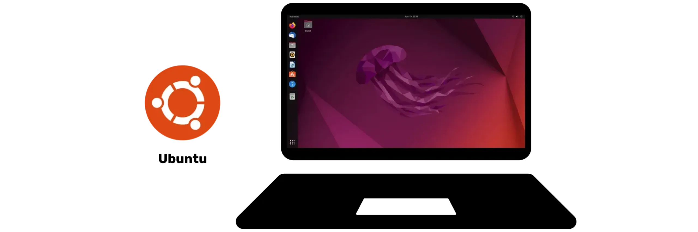

SCU101 juga memperingatkan Anda untuk tidak pernah mencolokkan USB drive yang tidak dikenal ke komputer Anda, karena mungkin mengandung *malware* yang dapat menginfeksi sistem Anda.

### Melindungi dari serangan siber dan mengelola cadangan

Bagian penting dari pelatihan SCU101 adalah memahami serangan siber. Virus tidak muncul dengan sendirinya: biasanya membutuhkan intervensi yang tidak disengaja dari Anda, seperti mengunduh file yang terinfeksi atau membuka tautan penipuan di email.

Salah satu serangan yang paling umum adalah phishing, di mana pesan penipuan dikirim untuk mendorong Anda membocorkan data sensitif. Saat menghadapi serangan ini, periksa pengirimnya secara sistematis, dan hindari mengklik tautan atau membuka lampiran dari sumber yang tidak dikenal atau mencurigakan.

Ancaman besar lainnya adalah _ransomware_, yang memblokir data Anda dengan mengenkripsinya dan menuntut uang tebusan. Untuk menghadapi ini, pencadangan data Anda secara rutin sangatlah penting.


### Amankan kotak surat Anda secara efektif

SCU101 secara khusus menekankan pentingnya mengamankan email Anda, yang merupakan pintu gerbang ke semua akun online Anda yang lain. Kotak masuk yang disusupi memungkinkan peretas untuk mengatur ulang kata sandi hampir semua akun Anda melalui prosedur pemulihan email yang biasa.

Jadi, Anda telah melihat pentingnya membuat alamat email khusus yang aman. Sebaiknya memiliki alamat email khusus yang dicadangkan untuk pemulihan akun, yang terpisah dari alamat utama Anda.

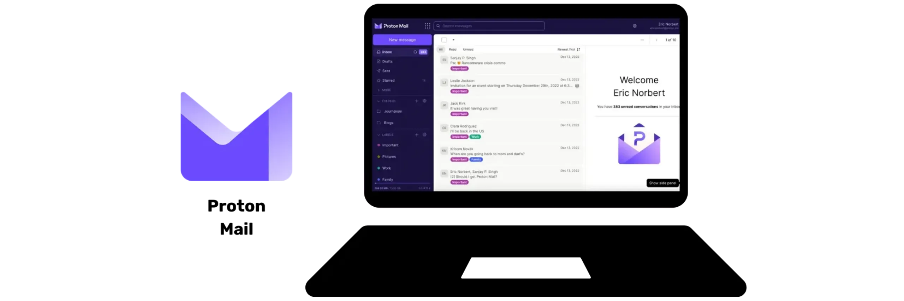

### Pentingnya pengelola kata sandi

Keamanan digital sangat bergantung pada kualitas kata sandi Anda. SCU101 menjelaskan mengapa penggunaan pengelola kata sandi sangat penting: aplikasi ini memungkinkan Anda untuk membuat dan menyimpan kata sandi yang rumit, unik, dan acak untuk setiap layanan yang Anda gunakan.

Pengelola kata sandi sangat menyederhanakan tugas Anda, karena Anda hanya perlu mengingat satu kata sandi utama untuk semua kata sandi lainnya.


### Autentikasi dua faktor (2FA)

Terakhir, SCU101 memperkenalkan Anda pada autentikasi dua faktor (2FA). Prinsipnya adalah melakukan autentikasi dalam dua langkah terpisah: kata sandi biasa Anda dan faktor kedua, seperti kode sementara yang dihasilkan oleh aplikasi seperti Google Authenticator atau Authy, atau _hardware key_ seperti YubiKey.

2FA melindungi akun Anda secara jauh lebih baik: bahkan jika kata sandi Anda dibobol, akses tetap tidak mungkin tanpa faktor kedua. Perlu diketahui bahwa kode yang dikirim melalui SMS atau email kurang aman, karena dapat dicegat atau dialihkan.

___

Pengingat tentang dasar-dasar ini akan menjadi dasar untuk kursus SCU202 kita, di mana kita akan mendalami penguasaan teknik keamanan siber secara lebih dalam, untuk melindungi kedaulatan pribadi, privasi, dan data pribadi Anda secara keseluruhan.

# Dari klik ke terminal: menguasai Linux

<partId>e28895b3-2b09-4811-8031-5abc1f14fde2</partId>

## Linux, Windows, macOS: mana yang tepat untuk Anda?

<chapterId>598cdecb-f90c-4382-b13c-0ba5a9dfeede</chapterId>

Mari kita mulai kursus SCU202 ini  dengan hal yang paling dasar: sistem operasi (OS) komputer Anda. Sistem operasi tidak hanya menentukan pilihan perangkat keras Anda, tetapi juga keamanan, kemudahan penggunaan, dan kemampuan untuk menyesuaikan komputer Anda.

Sebelum masuk ke detail teknis Linux di bab-bab berikutnya, penting untuk memahami perbedaan utama antara 3 sistem yang paling umum: Windows, macOS, dan GNU/Linux. Dalam bab ini, kita akan mempelajari setiap solusi, mengidentifikasi kekuatan dan keterbatasannya, lalu membuat pilihan yang tepat dan sesuai dengan kebutuhan Anda.

### Apa yang dimaksud dengan sistem operasi?

Sistem operasi adalah sekumpulan program utama yang bertindak sebagai perantara antara pengguna, aplikasi (yang juga merupakan perangkat lunak), dan perangkat keras, yaitu komputer Anda. Ini adalah lapisan perangkat lunak dasar yang memungkinkan penggunaan sumber daya perangkat keras komputer (prosesor, memori, disk, periferal, dll.).

Secara nyata, sistem operasi menerima, memproses, dan kemudian menanggapi permintaan dari perangkat lunak Anda, menggunakan sumber daya komputer seefisien mungkin. Ia mengelola eksekusi beberapa program secara bersamaan, mengontrol komponen PC, mengelola koneksi, memungkinkan manajemen file, dan memastikan keamanan data melalui mekanisme otorisasi dan autentikasi.


Tanpa sistem operasi, setiap program perangkat lunak harus menyertakan caranya sendiri untuk berkomunikasi dengan perangkat keras, membuat interaksi antara program yang berbeda hampir tidak mungkin. Oleh karena itu, perannya sangat penting.

Itulah cara kerja komputer-komputer terdahulu. Sistem operasi pertama, GM-NAA I/O, baru muncul pada tahun 1956. Ia membawa pemrosesan batch, yang mengotomatiskan manajemen tugas. Tahun 1960-an menyaksikan kemunculan _pemograman ganda (multi-programming)_ dan _pembagian waktu (time-sharing)_ dengan CTSS (1961) dan Multics (1969), yang memungkinkan beberapa pengguna untuk berinteraksi secara bersamaan dengan sistem yang sama. Kemudian, pada tahun 1970-an, penemuan Unix merevolusi komputasi dengan portabilitas, manajemen multitasking, dan kesederhanaannya.


### Sistem operasi utama dan pangsa pasarnya

Saat ini, pasar sistem operasi didominasi oleh 3 kelompok besar: **Windows, MacOS dan GNU/Linux**.

Berdasarkan statistik saat ini, Windows masih memegang mayoritas instalasi pada komputer pribadi, dengan pangsa pasar sekitar 71%. Dominasi ini disebabkan oleh kombinasi faktor historis, ekonomi, dan teknis:

-  Sejak tahun 1990-an, Windows telah dipasang secara default di sebagian besar komputer yang dijual, menciptakan keakraban masif di kalangan publik. Microsoft dengan cepat membuat sejumlah besar perjanjian OEM (kontrak di mana produsen PC menginstal Windows di awal), sehingga menciptakan ketergantungan yang sulit untuk dihentikan.

- Meskipun tren ini berkembang lambat, Windows memantapkan dirinya sebagai standar di dunia profesional sejak awal. Selain sektor-sektor tertentu seperti teknologi, hampir semua bisnis masih beroperasi dengan komputer berbasis Windows.

- Basis pengguna yang luas telah mendorong para pengembang untuk memprioritaskan pembuatan perangkat lunak mereka untuk Windows, untuk menjangkau orang sebanyak mungkin. Sebagai imbalannya, ekosistem aplikasi yang berkembang menarik pengguna baru, menciptakan lingkaran yang baik.

-  Akhirnya, dominasi ini juga diperkuat oleh citra yang melekat pada sistem pesaing: Linux sering dianggap terlalu teknis untuk masyarakat umum (dan tetap tidak dikenal oleh mayoritas), sementara macOS, yang terikat secara eksklusif pada produk Apple, sering dianggap mahal.

Sementara itu, macOS memiliki pangsa pasar sekitar 16%, dan umumnya dipilih karena integrasi optimalnya dengan perangkat keras Apple. Pilihan sistem operasi ini telah diperkuat dalam beberapa tahun terakhir oleh kinerja Mac, berkat pengenalan chip Apple Silicon. Titik balik besar ini menandai ditinggalkannya prosesor Intel x86 demi arsitektur ARM, yang lebih efisien dalam hal kinerja dan konsumsi energi.

Linux tetap minoritas di komputer pribadi (sekitar 4%), tetapi mendominasi server (sekitar 63%) dan supercomputer (100%), berkat stabilitas dan kinerjanya.


*Sumber April 2025: [Statistik Global StatCounter - Pangsa Pasar OS](https://gs.statcounter.com/os-market-share/desktop/worldwide)*

Linux juga terintegrasi secara masif ke dalam perangkat tertanam (embedded devices) seperti router, TV pintar, smartphone (Android didasarkan pada kernel Linux) dan bahkan dalam industri otomotif. Windows mempertahankan kehadirannya yang kuat dalam bisnis, sementara macOS disukai oleh para profesional di bidang tertentu.

→ **Penting**: Kernel adalah komponen utama dari sistem operasi: kernel mengelola akses ke perangkat keras (prosesor, memori, periferal), menengahi eksekusi proses secara bersamaan, menerapkan kebijakan keamanan, dan menawarkan Interface yang seragam untuk program yang menyembunyikan kerumitan sirkuit elektronik. Dengan kata lain, ia bertindak sebagai jembatan antara kumpulan perangkat lunak (pustaka, driver, shell, layanan, program administrasi, antarmuka grafis, dll.) dan perangkat keras.

### Windows: kemudahan penggunaan dan kompatibilitas

Windows adalah sistem operasi proprietary (berpemilik) yang dikembangkan oleh Microsoft. Sistem ini terpasang di sebagian besar komputer pribadi di seluruh dunia. Secara historis, Windows dihargai karena Interface yang mudah digunakan dan intuitif. Namun, keuntungan tersebut kini dipertanyakan: Interface macOS juga sangat mudah diakses, dan banyak distribusi Linux memiliki Interface yang cocok untuk masyarakat umum (kita akan kembali membahas ini di bab-bab berikutnya).

Bagi pengguna yang tidak berpengalaman atau yang memiliki kebutuhan terbatas (pekerjaan kantor, multimedia, penjelajahan web), Windows bisa menjadi titik masuk yang sederhana, mendapatkan manfaat dari dokumentasi yang luas dan waktu belajar yang cepat. Namun, pada kenyataannya, satu-satunya bidang di mana Windows secara jelas mengungguli macOS dan Linux adalah video game.


Salah satu kekuatan utama Windows adalah kekayaan ekosistem perangkat lunaknya: hampir semua program komersial (office suites, perangkat lunak profesional, video game, dan driver perangkat keras) kompatibel dengan Windows. Bagi pengguna yang mencari solusi siap pakai dengan konfigurasi minimal, ini bisa menjadi pilihan yang logis. 

Namun, aksesibilitas ini ada harganya. Windows adalah sistem berpemilik dan terpusat tanpa kode sumber publik. Tidak ada verifikasi independen yang dimungkinkan, yang memberikan batasan yang jelas dalam hal transparansi dan keamanan. Selain itu, pengumpulan data (telemetri) tersebar luas di Windows dan sering kali diaktifkan secara default, tanpa persetujuan atau kemungkinan kontrol yang nyata.

Namun, aksesibilitas ini datang dengan konsekuensi. Windows adalah sistem yang bersifat proprietary dan terpusat, _tanpa source code_ publik. Verifikasi independen tidak mungkin dilakukan, yang menimbulkan batasan jelas dalam hal transparansi dan keamanan. Lebih lanjut, pengumpulan data (telemetri) tersebar luas di Windows dan sering diaktifkan secara default, tanpa persetujuan yang benar-benar terinformasi atau dapat dikendalikan.

Dalam hal keamanan, Windows adalah target utama untuk *malware*. Popularitas dan beberapa masalah struktural yang sudah ada sejak lama memperjelas situasi ini. Banyak upaya telah dilakukan dalam beberapa tahun terakhir (terutama dengan Windows Defender dan UAC), tetapi secara keseluruhan sistem ini tetap dirancang lebih untuk kemudahan penggunaan daripada ketahanan dan kontrol pengguna.


Menurut pendapat saya, Windows menempati posisi sentral yang tidak tegas: Windows bisa aman, tetapi tidak seaman Linux dan macOS; ini memungkinkan tingkat kontrol tertentu, tetapi jauh lebih sedikit daripada Linux; Windows tidak sekuat macOS, juga tidak sesederhana Chrome OS atau beberapa sistem Linux yang ramah bagi pemula. Rata-rata di semua aspek, tanpa benar-benar buruk di area mana pun (kecuali privasi, secara default).


Dalam hal kedaulatan digital dan penguasaan teknis, Windows dengan cepat menunjukkan keterbatasannya. Modelnya didasarkan pada hubungan yang tidak seimbang antara pengguna dan pengembang, di mana pengembang lebih diuntungkan. Bagi mereka yang sangat ingin memahami, mempersonalisasi, dan mengamankan komputer mereka, Windows bukanlah sistem operasi yang sangat cocok. Oleh karena itu, kita tidak akan membahas lebih jauh tentang Windows dalam kursus SCU202.

### macOS: integrasi dan optimasi

macOS adalah sistem operasi yang dikembangkan oleh Apple untuk komputer Mac-nya. Sistem ini mewarisi dari Unix, melalui sistem NeXTSTEP, yang diakuisisi oleh Apple pada tahun 1997. macOS didasarkan pada kernel yang disebut "*XNU*", yang menggabungkan elemen-elemen dari BSD (*Berkeley Software Distribution*) dan *microkernel Mach*.


Dasar yang kuat ini menghasilkan stabilitas yang tinggi, manajemen sumber daya yang efektif, dan desain arsitektur yang secara bawaan cukup aman. Selain itu, macOS juga dilengkapi dengan Interface grafis yang sangat rapi, yang dibuat untuk memberikan pengalaman pengguna yang nyaman dan lancar.


Salah satu kekuatan utama macOS terletak pada integrasi vertikal perangkat keras dan perangkat lunak. Apple mengendalikan seluruh rantai produksi, mulai dari desain prosesor hingga detail terkecil pada Interface. Hasilnya adalah sebuah sistem yang handal secara umum, dengan sedikit kesalahan pada perangkat keras dan optimasi untuk performa yang maksimal.

Namun, integrasi ini memiliki kelemahan, yaitu semakin mengunci pengguna di dalam ekosistem Apple. macOS adalah sistem yang sebagian bersifat proprietary (dengan source code yang sebagian besar tertutup) dan hanya bisa dijalankan pada perangkat keras yang diproduksi oleh Apple. Pengguna memiliki sedikit kendali atas pembaruan, opsi konfigurasi sistem yang mendalam, atau pilihan komponen perangkat keras. Perangkat kerasnya sulit dimodifikasi atau diperbaiki, dan sering kali terkunci oleh perangkat lunak.


Dalam hal privasi, meskipun macOS tidak serentan Windows, macOS tetap terikat pada logika pengumpulan data, sinkronisasi cloud, dan ketergantungan pada layanan terpusat. Sebagian besar fungsi canggih sistem ini mengandalkan koneksi permanen ke ekosistem Apple (iCloud, App Store, Siri...), yang membatasi kemandirian pengguna.

macOS mungkin cocok untuk pengguna yang menghargai performa, stabilitas, dan kenyamanan dari sistem yang terintegrasi dengan baik, tanpa harus mendalami detail teknis. Namun, jika menyangkut kemandirian digital dan kontrol atas lingkungan TI Anda, sistem ini terlalu tertutup, terlalu bergantung pada satu perusahaan, dan tidak kondusif untuk penyesuaian yang mendalam. Itulah sebabnya kami tidak akan membahasnya lebih jauh dalam kursus SCU202 ini.

### GNU/Linux: kebebasan, kendali, dan keamanan

GNU/Linux membedakan dirinya secara nyata dari dua sistem sebelumnya melalui model yang gratis dan open-source. Tidak seperti Windows atau macOS, Linux tidak dikembangkan oleh satu perusahaan, melainkan oleh komunitas pengembang di seluruh dunia. Model berbasis komunitas ini menjamin transparansi, keamanan, dan fleksibilitas. Linux menawarkan kendali penuh kepada penggunanya, yang memungkinkan penyesuaian lingkungan kerja secara menyeluruh. Hal ini sangat menarik bagi pengguna tingkat lanjut, pengembang, atau siapa pun yang ingin menguasai lingkungan digital mereka sepenuhnya.

Keunggulan utama Linux adalah ketangguhan, stabilitas, dan tingkat keamanannya yang tinggi. Karena bersifat open-source, kodenya dapat diaudit oleh pengguna atau organisasi mana pun, yang secara signifikan membatasi risiko _malware_ atau _backdoor_. Linux sangat bertenaga, umumnya mengonsumsi lebih sedikit sumber daya daripada Windows, dan sangat cocok untuk konfigurasi perangkat keras yang sederhana atau penggunaan intensif seperti komputasi, administrasi server, atau keamanan siber.


Namun, Linux juga menghadirkan kerumitan tertentu bagi pemula. Banyaknya distribusi Linux yang tersedia bisa membingungkan pengguna yang belum terbiasa. Demikian pula, penanganan awal sistem, meskipun telah disederhanakan oleh beberapa distribusi, mungkin memerlukan pembelajaran sebelumnya untuk menguasainya dengan benar, terutama mengingat penggunaan terminal (_command line_) yang sering. Dan, inilah yang akan kita pelajari di bagian pertama kursus SCU202 ini!


### Sistem operasi mana yang harus Anda pilih?

Pilihan Anda akan sangat bergantung pada kebutuhan dan ekspektasi Anda:

-Jika Anda mencari kesederhanaan, kompatibilitas perangkat keras dan lunak yang luas (terutama untuk video game), serta penggunaan serbaguna, Windows bisa menjadi pilihan yang baik. Namun, Anda perlu menyadari keterbatasannya dalam hal performa, keamanan, dan privasi;
- Jika Anda mencari integrasi optimal antara perangkat keras dan sistem Anda, Interface yang rapi dan mudah digunakan, serta keamanan yang cukup baik tanpa perlu konfigurasi lebih lanjut, dan Anda sudah memiliki atau ingin mengadopsi ekosistem Apple, macOS adalah pilihan yang tepat;
- Terakhir, jika Anda mencari keamanan, stabilitas, dan performa di atas segalanya, dan Anda juga ingin mengendalikan lingkungan digital Anda secara mendalam, sambil siap menginvestasikan waktu untuk mempelajari cara menggunakan sistem operasi Anda, Linux adalah opsi yang sangat baik. Terutama dalam konteks di mana otonomi teknis dan kemandirian digital menjadi prioritas.

Pada bab-bab selanjutnya di bagian sistem operasi ini, saya akan membawa Anda lebih dalam ke Linux, justru karena sistem ini memungkinkan peningkatan kendali atas lingkungan digital pribadi Anda.

## Asal-usul GNU/Linux

<chapterId>9dbf749d-daae-493b-ab96-93a322df011d</chapterId>

Sebelum melihat distribusi GNU/Linux dan posisi sistem ini dalam komputasi kontemporer, penting untuk menelusuri asal-usulnya untuk memahami apa yang diwakilinya. Pada bab ini, kita akan melihat kembali akar sejarah, filosofi, dan teknis GNU/Linux, melalui warisan Unix, Genesis dari proyek GNU, pembuatan kernel Linux, dan kemunculan gerakan perangkat lunak bebas.

Sebelum kita melihat lebih jauh mengenai distribusi GNU/Linux dan posisi sistem ini dalam dunia komputasi kontemporer, penting untuk menelusuri asal-usulnya agar dapat memahami makna yang sesungguhnya. Pada bab ini, kita akan meninjau kembali akar sejarah, filosofi, dan teknis GNU/Linux, melalui warisan Unix, awal mula proyek GNU, penciptaan kernel Linux, dan munculnya gerakan _free software_.

### Warisan Unix

Kelahiran Linux tidak dapat dipahami tanpa menyebut pendahulunya secara langsung: Unix. Dibuat pada akhir tahun 1960-an dan awal 1970-an oleh Ken Thompson, Dennis Ritchie, dan rekan-rekan mereka di AT&T Bell Labs, Unix menandai titik balik penting dalam sejarah sistem operasi. Awalnya dikembangkan dalam bahasa *Assembler*, kemudian ditulis ulang dalam bahasa *C* oleh Dennis Ritchie pada tahun 1973, Unix meletakkan dasar bagi model OS yang benar-benar baru, yang didasarkan pada modularitas dan kesederhanaan.


Pendekatan ini tercermin dalam prinsip dasar yang diutarakan oleh Doug McIlroy:

> Lakukan satu hal dan lakukan dengan baik.

Unix dapat dipandang sebagai evolusi sekaligus reaksi terhadap sistem operasi Multics, yang arsitekturnya diadaptasi. Multics adalah proyek yang dimulai pada tahun 1964, hasil kolaborasi antara MIT, General Electric, dan AT&T Bell Laboratories. Ken Thompson dan Dennis Ritchie (pencipta UNIX) memantau erat proyek Multics hingga tahun 1969, ketika perusahaan mereka mundur dari pengembangan.

Pada saat itulah Unix muncul, awalnya dinamai "*UNICS*" singkatan dari "*UNiplexed Information and Computing Service*", yang secara langsung berlawanan dengan "*MULTiplexed Information and Computing Service*", singkatan untuk Multics. Pendekatan baru ini mengedepankan kesederhanaan, modularitas, dan efisiensi, berbeda dengan Multics dengan kompleksitas yang terlalu rumit.

Sejak tahun 1970-an, Unix berkembang dalam konteks penelitian, sebelum didistribusikan secara luas di universitas-universitas mulai tahun 1975. Hal ini tidak lepas dari pembatasan antimonopoli yang diberlakukan pada AT&T, yang mendukung adopsinya di banyak laboratorium, seperti di Berkeley, tempat cabang BSD (_Berkeley Software Distribution_) lahir. Pada saat yang sama, AT&T mulai memasarkan Unix pada tahun 1980-an, yang menyebabkan penyebaran yang masif versi paten yang tidak kompatibel (System V, Xenix, SunOS, AIX, Solaris, HP-UX, dll.).


*Sumber: Unix history-simple, oleh Eraserhead1, Infinity0 dan Sav_vas, gambar yang diambil dari diagram Unix History oleh Éric Lévenez, [Wikimedia Commons](https://commons.wikimedia.org/wiki/File:Unix_history-simple.svg).*

Fragmentasi yang kian melebar antara cabang-cabang ini (BSD di sisi akademis, dan System V khususnya di sisi industri) menciptakan kebingungan yang signifikan dan membatasi interoperabilitas sistem. Untuk menemukan sistem Unix yang stabil, portabel, dan bebas royalti, komunitas meluncurkan beberapa inisiatif, termasuk proyek GNU pada tahun 1983, yang kemudian diikuti oleh pengembangan kernel Linux pada tahun 1991. Kernel ini mengisi kekosongan yang ada karena tidak adanya kernel bebas dalam ekosistem GNU. Momen inilah yang menjadi titik awal sistem GNU/Linux.

### Proyek GNU

Proyek GNU (akronim rekursif dari "*GNU's Not Unix*") secara resmi diumumkan oleh Richard Stallman pada 27 September 1983, di grup berita khusus. Saat itu, Stallman masih bekerja di Laboratorium Kecerdasan Buatan MIT. Pada 5 Januari 1984, ia mengundurkan diri secara sukarela dari posisinya untuk memastikan bahwa kode yang akan ia tulis tidak dapat diklaim oleh perusahaannya. Ia kemudian memulai pengembangan GNU, dengan tujuan menciptakan sistem operasi yang sepenuhnya bebas, yaitu sistem yang menghormati empat kebebasan fundamental: kebebasan untuk menjalankan, mempelajari, memodifikasi, dan mendistribusikan ulang secara bebas.


Di luar aspek teknisnya, proyek GNU merupakan bagian dari filosofi yang diwarisi dari budaya hacker tahun 1970-an: sebuah budaya yang didasarkan pada berbagi pengetahuan, kerja sama antar-sesama, dan akses bebas ke source code. Richard Stallman ingin melestarikan semangat kolaborasi yang mendominasi masa-masa awal komputasi, saat produsen masih secara bebas mendistribusikan source code sistem mereka. Proyek GNU bertujuan tidak hanya untuk menawarkan sistem operasi bebas, tetapi juga untuk mempertahankan visi politik dan etis dari dunia komputasi: yaitu pengetahuan yang dapat diakses oleh semua orang, tanpa monopoli atau ketergantungan pada perangkat lunak berlisensi. Tujuannya adalah untuk mencegah pengguna menjadi tawanan perangkat lunak yang tidak dapat mereka pahami atau modifikasi, serta untuk mempromosikan komputasi yang membebaskan.

Dengan pemikiran ini, Stallman mendirikan *Free Software Foundation* (FSF) pada tahun 1985, sebuah organisasi yang didedikasikan untuk mendorong dan mempromosikan penggunaan serta penciptaan free software.


GNU dengan cepat menyediakan serangkaian program bantu penting untuk sistemnya:
- GCC (kompiler C)
- glibc (pustaka C standar)
- coreutils (perintah dasar)
- Emacs (keluarga editor teks)
- bash (penerjemah baris perintah)
- GDB (Debugger)


Ada juga beberapa elemen eksternal yang diintegrasikan, seperti X Window System, mesin komposisi TeX, dan microkernel Mach, yang digunakan bersama paket server GNU Hurd. (Secara bersamaan, Mach dan Hurd menjalankan peran yang sama dengan kernel Unix klasik, tetapi dalam arsitektur microkernel + server). Proyek penggantian kernel ini ambisius tetapi sangat kompleks. Proyek ini tidak pernah berfungsi sepenuhnya, memberikan ruang bagi kehadiran kernel Linux.


Sebagian besar GNU dikembangkan oleh para sukarelawan, beberapa di waktu luang mereka, sementara yang lain didanai secara ad hoc oleh perusahaan, universitas, atau asosiasi. Pada akhir tahun 1980-an, FSF mulai merekrut pengembang untuk mempercepat pekerjaan. Beberapa perusahaan, seperti Cygnus Solutions (yang kemudian menjadi bagian dari Red Hat), berperan aktif dalam memelihara dan memasarkan GNU free software.

Ketika Linus Torvalds menerbitkan kernel Linux pada tahun 1991, ia sangat pas dengan lingkungan yang sudah dibuat oleh GNU, dan terbukti jauh lebih relevan daripada kernel Mach + Hurd. Kombinasi GNU dan Linux memungkinkan terciptanya sistem operasi lengkap, bebas, dan fungsional untuk pertama kalinya: **GNU/Linux**, realisasi nyata dari proyek yang diluncurkan oleh Stallman hampir satu dekade sebelumnya.

### Kelahiran kernel Linux

Kisah kernel Linux dimulai pada tahun 1991, dengan Linus Torvalds, seorang mahasiswa ilmu komputer di Universitas Helsinki, Finlandia. Merasa tidak puas dengan keterbatasan Minix, sebuah sistem operasi Unix minimalis yang dirancang oleh Andrew S. Tanenbaum untuk tujuan pendidikan, Torvalds mulai mengembangkan kernel-nya sendiri untuk komputer pribadinya, dengan tujuan sederhana yaitu belajar sambil mencoba. Pada 25 Agustus 1991, ia mengumumkan proyeknya secara publik di forum Usenet, dengan sederhana menyatakan bahwa proyek itu masih mentah dan bersifat eksperimental. Di awal tahun 1992, versi 0.12 dari proyek ini dirilis di bawah lisensi bebas GNU GPL.


Kernel ini, yang awalnya dinamai Freax dan kemudian berganti nama menjadi Linux (gabungan dari "Linus" dan "Unix"), segera menarik perhatian pengembang lain yang bersemangat. Sebuah komunitas internasional secara spontan muncul untuk berkontribusi pada source code yang dapat diakses secara bebas. Berbeda dengan GNU, Linux pada awalnya hanyalah sebuah kernel: komponen perangkat lunak yang bertanggung jawab mengelola sumber daya perangkat keras mesin. Dikombinasikan dengan program dan aplikasi yang sudah dikembangkan oleh proyek GNU, kernel ini akhirnya menyediakan sistem operasi yang sepenuhnya gratis dan fungsional. Kombinasi ini disebut sebagai "GNU/Linux" untuk menekankan sinergi antara kedua proyek. Namun, dalam bahasa umum, sistem operasi ini umumnya disebut "Linux" saja.


→ ***Tux***: maskot dan logo kernel Linux, dibuat pada tahun 1996 oleh Larry Ewing dengan menggunakan perangkat lunak GIMP.

### Filosofi open source dan free software

Seiring dengan meningkatnya popularitas Linux pada tahun 1990-an, sebuah perdebatan ideologis muncul seputar istilah "free software" dan "open source", terutama karena makna ganda dari istilah "*bebas / free*".

Sementara Richard Stallman dan FSF sangat menganjurkan gagasan free software yang didasarkan pada prinsip etika ("_bebas seperti dalam kebebasan / free as in freedom_"), pihak lain lebih menyukai pendekatan yang lebih pragmatis dan berorientasi pada teknis, yang berfokus pada transparansi dan efisiensi teknis dari model terbuka. Pada tahun 1998, Open Source Initiative (OSI) didirikan, memperkenalkan istilah "open source" untuk menarik lebih banyak sektor korporat, dengan menekankan manfaat ekonomi dan teknis, bukan pertimbangan ideologis.

Richard Stallman secara terbuka mengkritik penggunaan istilah "open source", menilainya terlalu netral, bahkan terdepolitisasi. Ia bersikeras menggunakan istilah "free software" untuk menekankan bahwa isu utamanya bukan teknis, melainkan sosial: yaitu kebebasan para pengguna.


*Sumber: Nathaniel Welch

Perbedaan filosofis antara kedua istilah tersebut terletak pada motivasi yang mendasarinya: gerakan free software pada dasarnya mempromosikan filosofi kebebasan individu dan kolektif terhadap perangkat lunak, sementara open source terutama menghargai efisiensi teknis, transparansi, dan kolaborasi sebagai sarana untuk menghasilkan produk yang lebih baik.

Meskipun memiliki perbedaan filosofis, kedua aliran ini berbagi nilai-nilai yang sama seperti transparansi, kemampuan audit source code, kemandirian dari vendor, dan kemampuan pengguna akhir untuk memahami, memodifikasi, serta meningkatkan perangkat lunak mereka. Bahkan hingga saat ini, perbedaan-perbedaan ini secara rutin memicu perdebatan dan refleksi di dalam komunitas teknis, termasuk Bitcoin.

### Dampak budaya dan sosial

GNU dan Linux bukan hanya kisah sukses secara teknis: dampak budaya dan sosialnya sama pentingnya. Penyebaran awalnya terutama melalui internet, lewat forum teknis dan milis, kemudian dengan cepat melalui distribusi, yaitu kumpulan perangkat lunak yang sudah dikonfigurasi di sekitar kernel Linux. Sejak awal tahun 1993, distribusi pionir seperti Slackware dan Debian diciptakan untuk membuat sistem operasi GNU/Linux lebih mudah diakses oleh publik yang lebih luas.

Pendekatan berbasis komunitas yang terbuka dan kolaboratif ini memungkinkan Linux berkembang pesat, secara terdesentralisasi dan partisipatif. Setiap pengguna dapat berkontribusi pada proyek, baik dengan melakukan _coding_ , mendokumentasikan, maupun menguji. Dinamika kolaborasi masif ini mewakili inovasi sosial yang besar dalam dunia komputasi.

Seperti yang telah kita lihat di bab sebelumnya, warisan Linux saat ini melampaui sekadar komputer pribadi: ia mendominasi pasar server internet, menggerakkan superkomputer, membentuk dasar teknis sistem Android yang menggerakkan miliaran smartphone di seluruh dunia, dan bahkan menjadi inti dari perangkat elektronik sehari-hari yang tak terhitung jumlahnya (router, TV pintar, alat-alat yang saling terhubung, dll.).

GNU/Linux jauh lebih dari sekadar sistem operasi: ia adalah sebuah filosofi, sebuah pendekatan teknologi, budaya, dan sosial yang didirikan di atas keterbukaan, kolaborasi, dan kebebasan digital. Nilai-nilai ini terus secara mendalam memengaruhi cara kita memahami, menggunakan, dan berbagi teknologi saat ini.

Berdasarkan warisan teknis ini, kini kita dapat menguji secara nyata bagaimana prinsip-prinsip ini terwujud dalam ekosistem komputer pribadi saat ini. Untuk tujuan ini, kita akan menjelajahi pandangan luas distribusi Linux (atau GNU/Linux), untuk memahami evolusi dan kasus penggunaannya, serta membantu Anda memilih yang paling sesuai dengan kebutuhan Anda.

## Gambaran umum tentang distribusi Linux

<chapterId>868f44d7-69ce-4493-b65e-daff00f3eb54</chapterId>

Sebuah distribusi Linux (sering disingkat "*distro*") adalah sistem operasi lengkap yang dibangun dari kernel Linux (dan sering kali dengan elemen-elemen GNU), ditambah dengan serangkaian perangkat lunak, library, skrip inisialisasi, dan program manajemen yang serasi, untuk membentuk lingkungan yang siap digunakan. Oleh karena itu, sebuah distribusi Linux tidak terbatas pada kernel saja, melainkan merepresentasikan integrasi komprehensif dari komponen perangkat lunak yang dibutuhkan untuk menjalankan dan menggunakan komputer (atau perangkat komputasi lainnya).

Setiap distribusi Linux berisi file :
- kernel **Linux**, yang berkomunikasi dengan perangkat keras dan mengelola sumber daya sistem (CPU, memori, disk, dll.)
- **bootloader**, seperti *GRUB*, untuk memulai sistem
- sistem inisialisasi yang memungkinkan layanan dijalankan pada saat boot: *systemd*, *OpenRC*, *SysV init*, atau *runit*, tergantung pada pilihan filosofis distribusi
- sebuah **sistem manajemen paket**, yang memungkinkan Anda menginstal, memperbarui, dan menghapus perangkat lunak. Yang paling umum adalah *APT* (Debian, Ubuntu), *RPM/DNF* (Fedora, RHEL), *Pacman* (Arch), *Zypper* (openSUSE) atau *APK* (Alpine)
- repositori **perangkat lunak online**, yang memusatkan versi tervalidasi dari aplikasi yang tersedia
- sekumpulan program bantu sistem (shell, editor, kompiler, Interface jaringan, dll.) dan sering kali lingkungan desktop yang telah dikonfigurasi sebelumnya (*GNOME*, *KDE Plasma*, *XFCE*, dll.)
- skrip konfigurasi, dokumentasi dan, dalam beberapa kasus, layanan dukungan


Pekerjaan perakitan ini bersifat spesifik untuk setiap distribusi, yang memilih komponennya sesuai dengan filosofi mereka (kesederhanaan, keringanan, keamanan, stabilitas, inovasi, dll.), audiens target (pemula, bisnis, server, workstation, embedded machine, dll.), dan siklus pengembangannya (_rolling release_ atau _stable_). Misalnya, Arch Linux berfokus pada kesederhanaan struktural dan transparansi teknis, sementara Ubuntu berkonsentrasi pada pengalaman pengguna dan kompatibilitas yang umum (tetapi kita akan kembali membahas ini di bagian akhir bab ini).

→ **Catatan:**: Distribusi *rolling release* mengintegrasikan versi perangkat lunak terbaru segera setelah tersedia, menghasilkan sistem yang selalu terbarui tetapi berpotensi kurang stabil. Sebaliknya, distribusi _stable_ merilis versi perangkat lunak ketika versi utama dirilis, menjamin keandalan yang lebih besar dengan mengorbankan hal-hal baru.

Keberadaan distribusi memungkinkan pengguna untuk mendapatkan manfaat dari sistem Linux yang siap pakai, tanpa harus secara manual membangun kembali setiap komponen perangkat lunak. Ini merupakan keuntungan besar dalam hal waktu, konsistensi, dan keamanan. Selain itu, dalam hal arsitektur, distribusi memanfaatkan lapisan abstraksi perangkat keras yang disediakan oleh kernel Linux. Lapisan ini memungkinkan sistem operasi untuk kompatibel dengan berbagai perangkat keras yang berbeda, tanpa perlu menyesuaikan perangkat lunak untuk setiap komponen spesifik. Modularitas ini juga mempermudah modifikasi atau penggantian komponen sistem tanpa harus membangun kembali seluruh sistem.

Oleh karena itu, memahami perbedaan antara distribusi Linux merupakan langkah penting dalam memilih yang tepat untuk kebutuhan, keterampilan, dan persyaratan Anda. Itulah yang akan kita lihat di bab ini.

### Asal-usul sejarah distribusi Linux

Distribusi Linux pertama kali muncul segera setelah Linus Torvalds menerbitkan kernel Linux pada September 1991. Pada saat itu, Linux hanyalah sebuah kernel: untuk mendapatkan sistem yang lengkap, pengguna harus secara manual merakit berbagai komponen yang dibutuhkan (sering kali diambil dari proyek GNU), yang memerlukan tingkat keahlian teknis yang tinggi. Menginstal sistem berarti mengompilasi kernel sendiri, mengonfigurasi partisi, memilih program, mengelola dependensi perangkat lunak... Singkatnya, ini adalah proses yang rumit, yang hanya dikuasai oleh para ahli.

Untuk membuat Linux lebih mudah diakses, beberapa proyek dengan cepat muncul, dengan gagasan merakit sistem yang siap digunakan dari kernel Linux dan satu set seperangkat lunak yang serasi.

Upaya awal inilah yang menandai kelahiran distribusi Linux:

- **Februari 1992: MCC Interim Linux**
  
Dikembangkan di University of Manchester, MCC Interim Linux dianggap sebagai distribusi Linux pertama. Tujuannya adalah untuk menyederhanakan instalasi sistem pada PC standar. Ia hadir dalam bentuk beberapa disket dan berisi seperangkat program minimal agar Linux dapat berjalan dengan cepat.


- **Mei 1992: Softlanding Linux System (SLS)**

Distribusi SLS adalah yang pertama menawarkan instalasi yang lebih lengkap dengan sistem jendela (X Window), shell, kompiler, dan program lain yang sudah dikonfigurasi sebelumnya. Tujuannya adalah untuk menyediakan sistem mirip Unix yang dapat digunakan oleh masyarakat umum.


Pada masa awalnya, SLS meraih sukses besar, tetapi pengguna segera menyuarakan kritik terhadap ketidakstabilan dan beberapa keputusan pemeliharaannya. Hal ini mendorong beberapa pengembang untuk meluncurkan proyek paralel, baik untuk meningkatkan SLS maupun untuk menggantikannya. Demikianlah dimulainya pohon besar distribusi Linux dan segmentasinya ke dalam berbagai kelompok.

SLS kini tidak lagi ada. Versi terakhir yang diketahui berasal dari akhir tahun 1994.

- **Juli 1993: Slackware**

Patrick Volkerding meluncurkan Slackware, bisa dibilang, secara tidak sengaja. Ia memperbaiki dan meningkatkan *bug* pada SLS sebagai bagian dari proyek sekolahnya di Minnesota State University. Melalui berbagai modifikasi dan optimalisasi, versi SLS yang telah ia perbaiki akhirnya menjadi distribusi Linux yang benar-benar independen, dan kemungkinan besar menarik perhatian publik yang kecewa dengan keterbatasan SLS. Setelah mendapat persetujuan dari universitasnya, ia menerbitkan versi pertama dari distribusinya dengan nama Slackware pada 17 Juli 1993.


Slackware dengan cepat menjadi distribusi Linux yang paling banyak digunakan di tahun 1990-an. Arsitekturnya yang sederhana, skrip shell untuk konfigurasi, disamakan pada standar Unix, dan tidak adanya abstraksi membuatnya menjadi tolok ukur bagi pengguna tingkat lanjut yang mencari sistem yang minimalis dan transparan.

Slackware masih dipertahankan hingga saat ini, menjadikannya distribusi Linux tertua yang masih digunakan. Slackware juga merupakan asal-usul dari berbagai distribusi turunan, membentuk kelompok besar pertama dari distribusi Linux: Slackware.

- **Agustus 1993: Debian**

Pada saat yang hampir bersamaan, Ian Murdock meluncurkan distribusi Debian, dengan semangat yang sangat berbeda dari praktik pada masa itu, terutama yang diwujudkan oleh distribusi seperti SLS yang sering kali hanya dikelola oleh satu orang. Murdock mengkonsepkan Debian sebagai proyek komunitas yang terstruktur, dikembangkan secara terbuka, dalam semangat free software dan proyek GNU. Berbeda dengan banyak distribusi Linux lainnya, Debian adalah distribusi non-komersial.


*Ian Murdock. Sumber: [Ilya Schurov CC BY-SA 2.0](https://www.flickr.com/photos/ivoyager/2398462112/).*


Dari sudut pandang teknis, Debian sejak awal sudah menonjol karena kualitas sistem pengemasannya, penelusuran pembaruannya, dan yang terpenting, dengan memperkenalkan manajer paket berkinerja tinggi, *dpkg*, yang dengan cepat dilengkapi oleh *APT* pada tahun 1998, yang memungkinkan manajemen dependensi perangkat lunak secara otomatis dan andal.


*Debian 1.3 (1997). Sumber: Arsip Distribusi Linux*

Sejak awal, proyek ini meresmikan komitmen etisnya dengan menerbitkan *Debian Social Contract* dan  _Debian Social Contract and the Debian Free Software Guidelines (DFSG)_, untuk menetapkan piagam yang jelas tentang kebebasan dan transparansi kode. Setelah beberapa waktu disponsori oleh Free Software Foundation, Debian kemudian menjadi independen secara hukum dengan mendirikan organisasi nirlaba bernama Software in the Public Interest (SPI) pada tahun 1997.

Dengan demikian, Debian menjadi salah satu pilar teknis dan ideologis dunia GNU/Linux, fondasi dari mana puluhan distribusi besar lahir, termasuk Ubuntu, Linux Mint, Kali Linux, dan Raspberry Pi OS.

- **1994: Red Hat Linux**

Marc Ewing menerbitkan versi pertama Red Hat Linux pada tahun 1994. Ini menandai lahirnya sebuah distribusi yang akan memainkan peran sentral dalam profesionalisasi Linux. Terpesona oleh dunia Unix, Ewing menciptakan versi Linux yang terstruktur dan mudah diakses, yang menggabungkan program penting: Red Hat Package Manager (RPM). RPM ini menstandarisasi format paket perangkat lunak dan memfasilitasi instalasi, pembaruan, dan penghapusannya, terutama di lingkungan profesional. Format ini kemudian menjadi standar yang diadopsi secara luas.

Pada tahun 1995, Bob Young, pendiri AAC Corporation yang berspesialisasi dalam aksesori perangkat lunak Linux, membeli perusahaan Marc Ewing. Penggabungan kedua entitas ini melahirkan Red Hat Software. Bersama-sama, mereka mengembangkan model bisnis yang orisinal: distribusi perangkat lunak open source yang digabungkan dengan layanan dukungan dan sertifikasi untuk perusahaan. Model bisnis ini menjadi tolok ukur, dan dapat ditemukan di banyak proyek dalam ekosistem Bitcoin.


*Bob Young dan Marc Ewing. Fotografer: Candice C Cusic/AP*

Pada tahun 2003, Red Hat melakukan pemisahan strategis: cabang komunitasnya menjadi Fedora, sebuah laboratorium inovasi dengan siklus pengembangan yang cepat, sementara cabang komersialnya diubah menjadi Red Hat Enterprise Linux (RHEL), sebuah distribusi yang tersertifikasi, stabil, dan dirancang untuk infrastruktur penting bagi bisnis dalam jangka panjang. Sejak itu, Fedora digunakan sebagai tempat uji coba untuk teknologi-teknologi yang nantinya akan diintegrasikan secara lebih ketat ke dalam RHEL. Dengan organisasi ini, Red Hat berhasil mendamaikan kelincahan komunitas dan ketelitian industri.

Distribusi-distribusi pionir ini telah membentuk keluarga Linux utama saat ini, yang masing-masing telah mengembangkan pendekatan teknis dan filosofisnya sendiri.


### Keluarga distribusi Linux utama saat ini
#### Keluarga Debian

Keluarga ini dibangun di sekitar manajer paket APT dan format paket `.deb`. Debian menonjol karena pendekatannya yang ketat terhadap free software dan sistem manajemen dependensinya yang tangguh.


Ubuntu, yang diturunkan langsung dari Debian, mempopulerkan Linux melalui kemudahan instalasi dan penggunaannya. Ubuntu memiliki banyak varian resmi, seperti Kubuntu (lingkungan KDE) dan Xubuntu (XFCE). Distribusi penting lain yang berbasis Debian adalah Linux Mint (juga turunan dari Ubuntu), Kali Linux (untuk keamanan komputer), dan Raspberry Pi OS untuk mikrokomputer Raspberry Pi.

Keluarga inilah yang akan kita bahas selanjutnya, karena keluarga ini menyatukan beberapa distribusi Linux yang paling konsisten dan populer untuk digunakan pada komputer pribadi.

#### Keluarga Red Hat

Berpusat pada format RPM (*Red Hat Package Manager*), keluarga ini mencakup Fedora, yaitu distribusi komunitas yang inovatif yang berfungsi sebagai dasar teknis untuk Red Hat Enterprise Linux (RHEL). RHEL sendiri adalah distribusi komersial yang ditujukan untuk perusahaan dan dikenal karena stabilitas jangka panjangnya.


Beberapa distribusi utama secara langsung diturunkan dari RHEL, dengan tujuan menawarkan alternatif gratis dan kompatibel, tanpa biaya dukungan komersial. Di antaranya, CentOS telah lama memegang posisi penting sebagai tiruan komunitas dari RHEL, hingga Red Hat mengubah sifatnya pada tahun 2020 menjadi CentOS Stream, sebuah versi menengah antara Fedora dan RHEL. Keputusan ini memicu terciptanya _fork_ baru seperti AlmaLinux dan Rocky Linux.

Distribusi penting lainnya dari keluarga ini termasuk Oracle Linux, dengan optimasi khusus untuk lingkungan cloud, dan ClearOS, distribusi berorientasi UKM (Usaha Kecil dan Menengah) dengan fitur server dan firewall siap pakai.

#### Keluarga Arch Linux

Keluarga Arch Linux dibedakan oleh filosofi yang secara radikal berlawanan dengan distribusi siap pakai. Mereka minimalis, dan dirancang sesuai dengan prinsip "_KISS_" (_Keep It Simple, Stupid_). Arch Linux menyediakan sistem dasar yang rapi, yang harus dibangun secara manual oleh pengguna sesuai dengan kebutuhannya.


Pendekatan ini didasarkan pada model _rolling release_, di mana paket-paket diperbarui secara terus-menerus, tanpa perlu menginstal ulang sistem setiap kali ada rilis utama. Manajer paket Pacman cepat dan ringan, memudahkan instalasi dan pembaruan perangkat lunak, dan AUR (_Arch User Repository_), sebuah repositori komunitas, menyediakan akses ke beragam paket tidak resmi dan paket pengembangan.

Arch Linux ditujukan terutama untuk pengguna tingkat lanjut yang menginginkan kendali penuh atas lingkungan mereka, dengan menerima kompleksitas tertentu dalam instalasi dan pemeliharaan. Persyaratan teknis ini telah memicu munculnya beberapa distribusi turunan yang bertujuan untuk mendemokratisasi penggunaannya.

https://planb.network/tutorials/computer-security/operating-system/arch-linux-7a3dc8a8-629b-4971-bb0d-4eab94f93973

Yang paling dikenal adalah Manjaro, yang mempertahankan basis teknis Arch sambil menawarkan instalasi yang disederhanakan, lingkungan desktop yang sudah dikonfigurasi sebelumnya, dan siklus rilis yang sedikit tertunda untuk menstabilkan pembaruan.


#### Keluarga Slackware

Slackware tetap setia pada prinsip-prinsip historis Unix, dengan penekanan pada kesederhanaan, transparansi, dan stabilitas. Berbeda dengan distribusi modern yang mengotomatisasi manajemen perangkat lunak, Slackware mengandalkan sistem paket `.tgz` tanpa resolusi dependensi otomatis. Hal ini mengharuskan pengguna memiliki pengetahuan yang baik tentang lingkungannya dan komponen perangkat lunaknya.

Pendekatan minimalis ini, digabungkan dengan stabilitas tinggi, menjadikan Slackware sebagai distribusi yang disukai oleh pengguna berpengalaman atau puritan Unix, terutama dalam konteks di mana prediktabilitas dan kontrol sangat penting (server, sistem embedded, lingkungan penting lainnya, dll.).


Slackware telah melahirkan sejumlah distribusi turunan, beberapa di antaranya berusaha memodernisasi penggunaannya sambil mempertahankan semangatnya: Salix, Porteus, Slackel...

Meskipun komunitasnya lebih kecil daripada Debian atau Red Hat, keluarga Slackware tetap menjadi referensi historis dan teknis dalam dunia GNU/Linux.

#### Keluarga Gentoo

Proyek turunan dari Enoch Linux yang dibuat pada tahun 1999, Gentoo, diciptakan oleh Daniel Robbins dengan tujuan merancang distribusi yang sangat mudah disesuaikan, tanpa file biner prakompilasi, dan dioptimalkan untuk perangkat keras pengguna. Dinamai Gentoo (mengambil nama penguin Papua, salah satu penguin tercepat), distribusi ini didasarkan pada kompilasi paket dari source code, yang memungkinkan optimasi yang sangat mendalam berkat penggunaan *Portage*, sebuah sistem manajemen paket yang terinspirasi oleh port BSD. Gentoo ditujukan untuk pengguna berpengalaman yang mencari performa, kendali, dan ringan, dengan konsekuensi waktu instalasi dan pemeliharaan yang lebih lama.


Beberapa turunannya telah dibuat untuk memperluas penggunaannya: Funtoo, Redcore Linux (Sabayon), Calculate Linux, Pentoo, dll.

Terakhir, ChromeOS, sistem operasi yang dikembangkan oleh Google untuk Chromebook-nya, awalnya merupakan turunan dari Gentoo, meskipun sejak itu telah banyak menyimpang darinya.


Untuk mengetahui lebih lanjut tentang keluarga distribusi Linux dan memvisualisasikan cabangnya, saya sarankan Anda melihat diagram yang sangat bagus dan komprehensif ini di Wikimedia:[*Linux Distribution Timeline*](https://upload.wikimedia.org/wikipedia/commons/1/1b/Linux_Distribution_Timeline.svg).

### Distribusi Linux mana yang harus dipilih?

Pilihan distribusi Linux bergantung pada kebutuhan spesifik, tingkat keahlian teknis, dan tujuan penggunaan Anda. Berikut adalah pilihan praktis dari distribusi yang paling banyak digunakan atau terspesialisasi, beserta kelebihan dan kekurangan utamanya.


#### Distribusi umum dan mudah diakses

- **Ubuntu**:

Dikembangkan oleh Canonical dan diluncurkan pada tahun 2004, Ubuntu adalah salah satu distribusi yang paling populer di dunia. Berbasis Debian, ia menawarkan siklus rilis yang teratur, dengan versi LTS (_Long Term Support_) yang stabil dan didukung selama lima tahun. Ubuntu menonjol karena kompatibilitas perangkat kerasnya yang sangat baik, komunitas yang besar, dan dokumentasi yang melimpah, menjadikannya pilihan yang sangat aman bagi pemula. Faktanya, kita akan menggunakan Ubuntu untuk sisa pelatihan SCU202 ini, karena ia adalah titik masuk yang solid ke dunia GNU/Linux. Ubuntu mengintegrasikan lingkungan desktop GNOME secara default, dengan beberapa penyesuaian khusus.


https://planb.network/tutorials/computer-security/operating%20system/ubuntu-78a3be56-5d51-4ec3-8629-0dd27c352ab5

- **Linux Mint**:

Diluncurkan pada tahun 2006, Linux Mint adalah distribusi turunan dari Ubuntu, yang dirancang untuk menawarkan alternatif yang lebih intuitif dan lebih dekat dengan ergonomi Windows. Versi ini menawarkan beberapa lingkungan desktop, termasuk Cinnamon, sebuah fork dari GNOME yang dirancang khusus oleh tim Mint, yang menyediakan Interface yang jelas, klasik, dan terasa akrab.

https://planb.network/tutorials/computer-security/operating%20system/linux-mint-da44852e-513f-4004-949a-8fde60c1bca5

Mint menonjol karena kesederhanaannya, keberadaan codec multimedia secara default, dan alat pembaruan yang dirancang dengan baik. Di sisi lain, ia sangat bergantung pada infrastruktur Ubuntu, membuatnya bergantung pada pilihan teknis Ubuntu (terutama pada tingkat kernel dan repositori). Mint sangat cocok untuk pengguna non-teknis, atau mereka yang menginginkan sistem siap pakai yang tidak memerlukan banyak pembelajaran.


- **Zorin OS**:

Dibuat pada tahun 2008 oleh tim dari Irlandia, Zorin OS secara eksplisit menargetkan pengguna Windows dan macOS yang mencari transisi yang mulus ke Linux. Ia didasarkan pada Ubuntu LTS dan menawarkan Interface yang dapat disesuaikan untuk meniru Windows atau macOS sesuai preferensi.

Instalasinya mudah, perangkat lunak esensial sudah terinstal di awal, dan versi "Lite" memungkinkan Anda menjalankan sistem pada komputer yang lebih lama. Beberapa edisi, seperti "Pro", tidak gratis (sekitar €50), tetapi versi gratisnya tetap berfungsi penuh. Zorin OS adalah pilihan yang baik bagi mereka yang mencari lingkungan yang akrab secara visual, terintegrasi dengan baik, dan tanpa konfigurasi manual.


- **elementary OS:**

Diluncurkan pada tahun 2011, elementary OS adalah distribusi berbasis Ubuntu yang berfokus terutama pada desain dan konsistensi Interface. Lingkungan desktop Pantheon-nya, yang terinspirasi oleh macOS, bersifat minimalis, elegan, dan lancar. Namun, sistem ini kurang dapat disesuaikan dibandingkan dengan distribusi lain, dan beberapa pengguna tingkat lanjut mungkin merasa terbatas oleh pilihan Interface serta strukturnya yang sengaja dikunci. Sistem ini sangat cocok untuk pengguna yang sensitif terhadap estetika dan mencari sistem yang sederhana dan serasi untuk penggunaan sehari-hari.

https://planb.network/tutorials/computer-security/operating-system/elementary-os-757a20be-22b5-484c-a032-2bdd909860ac


- **Pop!OS**:

Dikembangkan oleh perusahaan Amerika System76, Pop!OS juga berbasis Ubuntu. Sistem operasi ini menargetkan pengguna desktop dan pengembang, dengan Interface GNOME yang dimodifikasi (dan baru-baru ini sebuah lingkungan internal yang disebut COSMIC). Pop!OS mengintegrasikan pengoptimalan untuk GPU NVIDIA secara default, dan memiliki mode manajemen jendela mosaik. Sistem ini tetap mudah digunakan, tetapi juga menawarkan fungsionalitas yang canggih. Sistem ini ditujukan untuk pengguna tingkat menengah, pelajar atau profesional yang menginginkan sistem yang efisien tanpa harus mengonfigurasi lingkungan mereka secara manual.

Dikembangkan oleh perusahaan Amerika System76, Pop!OS juga berbasis Ubuntu. OS ini menargetkan pengguna desktop maupun pengembang, dengan Interface GNOME yang dimodifikasi (dan baru-baru ini lingkungan internal yang disebut COSMIC). Pop!OS mengintegrasikan optimasi untuk GPU NVIDIA secara default, dan memiliki mode manajemen jendela mosaik. Sistem ini tetap mudah digunakan, tetapi juga menawarkan fungsionalitas tingkat lanjut yang siap pakai. Sistem ini ditujukan untuk pengguna menengah, mahasiswa, atau profesional yang menginginkan sistem yang efisien tanpa harus mengonfigurasi lingkungannya secara manual.


*Sumber: [Oleh Allman - Karya sendiri, CC BY-SA 4.0](https://commons.wikimedia.org/w/index.php?curid=114760696).*

#### Distribusi kinerja menengah dan tinggi

- **Fedora**: (Workstation atau KDE Plasma):

Fedora adalah distribusi yang didukung oleh Red Hat, berorientasi pada teknologi terkini (Wayland, PipeWire, Flatpak...). Fedora menggunakan format RPM dan manajer paket `dnf`. Siklus rilisnya yang cepat berarti sistem Anda selalu terbarui, tetapi Anda perlu mengikuti pembaruan rutin. Ini adalah distribusi ideal untuk pengembang atau pengguna teknis yang mencari sistem modern.


https://planb.network/tutorials/computer-security/operating-system/fedora-8c17b6ca-5acb-4825-a069-4474375534b0

- **openSUSE**: (Tumbleweed atau Leap):

openSUSE tersedia sebagai distribusi _rolling release_ atau _stable_. openSUSE dilengkapi dengan program YaST untuk konfigurasi sistem, dan memungkinkan penggunaan serbaguna dengan beberapa lingkungan grafis. openSUSE memerlukan sedikit lebih banyak pengalaman, tetapi tetap tangguh untuk penggunaan sehari-hari.


- **Debian**:

Debian hadir dalam beberapa cabang, termasuk *Stable* (sangat andal, tetapi perangkat lunak lebih lama) dan *Testing* (lebih up-to-date, tetapi sedikit kurang teruji). Debian menggunakan `apt` dan dikenal karena ketelitiannya, filosofi bebas, serta kompatibilitas tinggi. Debian adalah pilihan yang baik untuk pengguna yang mencari stabilitas, administrator sistem...


https://planb.network/tutorials/computer-security/operating-system/debian-d09a57ec-8372-40ca-bcff-499415209e1f

- **Manjaro**:

Berbasis Arch, Manjaro membuat Arch Linux lebih mudah diakses. Distribusi ini menawarkan instalasi grafis, program internal, dan dukungan perangkat keras yang baik. Pembaruan ditunda untuk stabilitas yang lebih besar. Manjaro cocok untuk pengguna menengah yang mencari distribusi Arch Linux modern, tanpa harus mengonfigurasi semuanya secara manual.


- **Arch Linux**:

Arch Linux adalah distribusi minimalis yang dapat diperbarui terus-menerus, dipasarkan tanpa Interface atau perangkat lunak yang tidak diperlukan. Arch Linux instalasi manual, tetapi menawarkan kendali penuh dan dokumentasi yang sangat baik (Arch Wiki). Distribusi ini direkomendasikan untuk pengguna tingkat lanjut yang ingin menguasai segalanya.


https://planb.network/tutorials/computer-security/operating-system/arch-linux-7a3dc8a8-629b-4971-bb0d-4eab94f93973

#### Distribusi khusus

- **Kali Linux**:

Kali Linux adalah distribusi berbasis Debian yang dirancang untuk pengujian penetrasi dan audit keamanan. Distribusi ini menyertakan ratusan program _pentest (penetration testing)_. Namun, Kali Linux tidak terlalu cocok sebagai sistem utama untuk penggunaan sehari-hari.


- **Parrot OS**:

Parrot OS juga merupakan turunan dari Debian. Parrot OS menawarkan lingkungan untuk _pentest (penetration testing)_, keamanan ofensif, dan perlindungan privasi. Lebih serbaguna daripada Kali, distribusi ini juga cocok untuk penggunaan harian yang ringan, dengan program keamanan yang sudah terintegrasi sebelumnya.


- **Tails**:

Tails adalah distribusi langsung (live distribution) berbasis Debian yang berfokus pada privasi. Semua lalu lintasnya melewati jaringan Tor, dan tidak ada yang disimpan di antara sesi pengguna. Ini adalah distribusi ideal untuk penggunaan sekali pakai yang sensitif (jurnalisme, aktivisme, pembuatan seed Bitcoin...).

https://planb.network/tutorials/computer-security/operating%20system/tails-15108901-f15d-4f7f-a001-b02b1dcd60c8

→ **Catatan**: Distribusi langsung adalah sistem operasi Linux yang dapat digunakan langsung dari flash drive USB atau CD, tanpa instalasi pada hard disk.


- **Qubes OS**:

Qubes OS berbasis Fedora dan menggunakan sistem virtualisasi Xen untuk mengelompokkan penggunaan. Setiap aplikasi berjalan di dalam mesin virtual yang terisolasi. Ini adalah arsitektur yang sangat aman, tetapi padat sumber daya dan cukup sulit untuk dikuasai.


- **BlackArch**:

BlackArch adalah ekstensi berorientasi pentest untuk Arch Linux (seperti Kali di Debian). Distribusi ini menyediakan lebih dari 2800 alat keamanan. Distribusi ini sangat lengkap, tetapi diperuntukkan bagi pengguna tingkat lanjut yang sudah terbiasa dengan dunia Arch, dan yang membutuhkan alat khusus ini (peneliti keamanan, pentest...).

BlackArch adalah ekstensi Arch Linux yang berorientasi pada pentest (seperti Kali di Debian). BlackArch menyediakan lebih dari 2800 program keamanan. Ini adalah distribusi yang sangat lengkap, tetapi dikhususkan untuk pengguna tingkat lanjut yang sudah akrab dengan dunia Arch, dan yang membutuhkan program-program khusus ini (peneliti keamanan, pentesters...).


- **PureOS**:
- 
PureOS adalah distribusi turunan Debian yang dikembangkan oleh Purism, yang sepenuhnya bebas (disetujui oleh FSF). PureOS berfokus pada privasi, dengan hanya menggunakan free software dan tidak ada modul yang paten sama sekali.


- **Raspberry Pi OS**:

Raspberry Pi OS (sebelumnya Raspbian) adalah distribusi yang dioptimalkan untuk mikrokomputer Raspberry Pi. OS ini berbasis Debian, dengan paket yang dikompilasi ulang untuk arsitektur ARM. OS ini dapat digunakan untuk proyek-proyek pendidikan, pengujian elektronik, atau server pribadi skala kecil.


- **Whonix**:

Whonix menggabungkan Debian dengan jaringan Tor dalam arsitektur dua VM (gateway + workstation). Distribusi ini adalah distribusi yang berorientasi pada keamanan, tetapi bergantung pada virtualisasi. Direkomendasikan untuk mereka yang benar-benar membutuhkan privasi.


Gambaran umum ini memberikan Anda wawasan tentang ekosistem distribusi Linux saat ini, memungkinkan Anda untuk memilih distribusi yang paling sesuai dengan profil teknis dan tujuan Anda.

Di bab selanjutnya dari SCU202, kita akan melihat lebih dekat lingkungan praktis Linux, dimulai dengan lingkungan grafis yang menjadi dasar interaksi sehari-hari Anda dengan sistem.

## Lingkungan desktop Linux

<chapterId>ecfac353-a31b-48fb-b2af-2abbeeac5f2b</chapterId>

Pada sistem GNU/Linux, lingkungan desktop memegang salah satu peran terpenting dalam pengalaman pengguna Anda. Ia adalah lapisan grafis yang memungkinkan interaksi dengan sistem, berdasarkan representasi visual yang sudah dikenal: jendela, menu, ikon, panel, dan aplikasi yang sudah terinstal.

Dalam bab ini, saya akan mengeksplorasi struktur dan peran lingkungan desktop, komponen-komponen utamanya, kelompok utama yang tersedia, kriteria pemilihan, dan integrasinya ke dalam distribusi Linux yang paling populer.

### Apa yang dimaksud dengan lingkungan desktop?

Lingkungan desktop (atau "*DE*" singkatan dari *Desktop Environment*) mengacu pada serangkaian program yang membentuk Interface grafis lengkap dari sebuah sistem operasi. Di Windows dan macOS, hanya satu lingkungan desktop yang ditawarkan secara default, yang terintegrasi ke dalam sistem, tanpa kemungkinan untuk memodifikasinya secara keseluruhan (hanya shell tertentu yang ada untuk memodifikasi Interface secara parsial). Sistem Linux, di sisi lain, jauh lebih modular, memperlakukan lingkungan desktop sebagai komponen independen yang dapat diganti secara bebas.

Di Linux, penting untuk membedakan dengan jelas antara semua lapisan: kernel (yang mengelola interaksi dengan perangkat keras), server tampilan (yang bertindak sebagai perantara antara aplikasi, driver grafis, dan perangkat keras melalui kernel), dan akhirnya lingkungan desktop itu sendiri, yang mengandalkan infrastruktur ini untuk memberikan Interface grafis yang serasi kepada pengguna. Perbedaan ini terkadang bisa menjadi kurang jelas, karena banyak distribusi Linux yang hadir dengan lingkungan desktop yang sudah terinstal sebelumnya dan terkadang menyertakan komposer Wayland-nya sendiri, yang kemudian bertindak sebagai server tampilan.


### Komponen khas lingkungan desktop

Lingkungan desktop dalam distribusi Linux bukanlah sebuah aplikasi tunggal, melainkan serangkaian komponen perangkat lunak yang terpadu yang menyediakan Interface grafis lengkap untuk berinteraksi dengan sistem operasi. Komponen-komponen ini didasarkan pada beberapa lapisan perangkat lunak, yang terstruktur sebagai berikut:

- **Manajer window**: Menggambar batas window, mengelola penempatan, mengubah ukuran, dan efek transisi... Sebagai contoh: Mutter (GNOME), KWin (KDE Plasma), Xfwm (Xfce).

- **Manajer file**: Memungkinkan Anda menavigasi melalui struktur direktori, menyalin, memindahkan, atau menghapus file secara visual. Contoh: Nautilus (GNOME), Dolphin (KDE), Thunar (Xfce).

- **Pusat konfigurasi**: Ini adalah serangkaian program yang memungkinkan pengguna memodifikasi parameter sistem tanpa melalui _command line_: tampilan, wallpaper, manajemen pengguna, jaringan, periferal, dll.

- **Applet sistem**: Ini adalah ikon-ikon kecil dan modul interaktif di taskbar (atau "panel"), seperti kontrol suara, level baterai, koneksi jaringan, jam, dll.

- **Panel atau dasbor**: Bilah yang terlihat, sering kali di bagian atas atau bawah layar, berisi menu utama, applet sistem, pintasan, zona notifikasi, dll.

- **Manajer sesi**: Berjalan saat startup, menampilkan layar masuk, dan meluncurkan sesi grafis yang dipilih. Contoh: GDM (GNOME), SDDM (KDE), LightDM (Xfce).

- **Pengelola notifikasi**: Mengelola tampilan notifikasi sistem (pesan, peringatan, pembaruan, dll.). Contoh: dunst, Plasma-notifier, xfce4-notifyd.

- **Compositor X11 (opsional)**: Menambahkan efek visual (bayangan, transparansi, animasi) di lingkungan di mana manajer jendela tidak mendukung penggabungan elemen visual. Contoh: compton, picom.


- **Display server**: Ini adalah perangkat lunak yang menangani komunikasi antara sistem (melalui kernel dan driver grafis) dan aplikasi grafis. Perangkat lunak ini menampilkan jendela di layar dan mengelola masukan dari keyboard dan mouse. Display server sering kali merupakan komponen yang berbeda dari lingkungan desktop, tetapi semakin banyak sistem yang mengadopsi Wayland, sebuah protokol modern di mana peran display server dapat diambil alih langsung oleh manajer window (misalnya Mutter pada GNOME atau KWin pada KDE). Hal ini kemudian disebut sebagai "Wayland compositing".

Semua elemen ini didasarkan pada toolkit grafis, yaitu pustaka perangkat lunak yang menyediakan komponen dasar untuk membuat Interface grafis: tombol, menu, kolom teks... Dua toolkit Linux utama adalah:

- GTK (GIMP Toolkit): Digunakan oleh GNOME, XFCE, Cinnamon, MATE...
- Qt: Digunakan oleh KDE Plasma, LXQt...


### Gambaran umum lingkungan desktop Linux utama


#### GNOME

Dirilis pada tahun 1997 dan pertama kali diterbitkan pada tahun 1999, GNOME ("_GNU Network Object Model Environment_") berbasis pada _GTK Library_ dan bertujuan untuk meminimalkan friksi antara pengguna dan Interface melalui organisasi yang sangat sederhana. Sejak GNOME 3, intinya, GNOME Shell, telah meninggalkan metafora desktop tradisional yang dipenuhi ikon: alih-alih menyulap beberapa ruang kerja yang terlihat secara bersamaan, pengguna beralih ke satu pemilih aktivitas di mana mereka mengelola jendela, desktop virtual, dan peluncur aplikasi.


Secara teknis, _compositor Mutter_ menggabungkan manajemen window dan tumpukan Wayland, sambil tetap kompatibel dengan X11 berkat XWayland. Secara default, lingkungan ini menyediakan Nautilus untuk penelusuran file, GNOME Terminal untuk command line, dan panel pengaturan terpusat. Opsi kustomisasi GNOME pada dasarnya terbatas.

GNOME adalah lingkungan default untuk Fedora Workstation, Ubuntu, dan banyak distribusi berorientasi desktop lainnya.

#### KDE Plasma

Proyek KDE diluncurkan pada tahun 1996, dengan versi pertama lingkungan desktop-nya dirilis pada tahun 1998. Pada tahun 2014, sebuah perbedaan dibuat antara lingkungan desktop dan komponen lain dari proyek. Lingkungan desktop tersebut kemudian dinamai "Plasma".

KDE Plasma berbasis pada Qt 6, sebuah framework C++ lintas platform, dan pada KDE Frameworks, sebuah koleksi library modular yang memfasilitasi pengembangan aplikasi terintegrasi. Manajer window-nya, KWin, juga berfungsi sebagai compositor Wayland yang lengkap: menangani efek visual (blur, transparansi, transisi), pembagian layar dengan akselerasi GPU, dan gerakan multi-touch melalui libinput.


Salah satu poin pembeda KDE Plasma adalah pusat konfigurasinya yang terpadu, yang menampilkan Interface grafis untuk hampir semua pengaturan: cara kerja desktop virtual, pintasan umum, kehalusan animasi, manajemen daya, konfigurasi jaringan, tampilan batas window... Tidak ada file konfigurasi teks yang perlu diedit secara manual, membuat lingkungan desktop ini mudah disesuaikan.

KDE Plasma digunakan di banyak distribusi, termasuk Kubuntu, openSUSE Tumbleweed, Fedora KDE Spin, dan Manjaro KDE.

#### Xfce

Xfce adalah lingkungan desktop bebas dan open-source yang dibuat pada tahun 1996 oleh Olivier Fourdan. Tujuan awalnya, yang masih berlaku hingga saat ini, adalah untuk menyediakan alternatif yang sederhana, ringan, dan cepat untuk lingkungan desktop yang lebih berat seperti GNOME atau KDE. Secara teknis, Xfce berbasis pada toolkit GTK, yang membuatnya lebih dekat dengan GNOME dalam beberapa hal, tetapi juga membedakannya dalam filosofinya.

Xfce mengambil pendekatan Interface grafis tradisional, menampilkan desktop yang digerakkan oleh ikon, menu aplikasi, taskbar, dan panel yang dapat dikonfigurasi. Seluruh paket dirancang agar efisien sumber daya, baik dari segi RAM maupun daya prosesor. Ini menjadikannya solusi ideal untuk komputer lama, yang kurang bertenaga, atau hanya untuk pengguna yang mencari sistem yang lancar, stabil, dan responsif.


#### LXQt

LXQt adalah lingkungan desktop ringan yang dirancang untuk memberikan Interface grafis penuh dengan konsumsi sumber daya sistem minimalis. Ini sangat cocok untuk perangkat lama atau yang kurang bertenaga.

LXQt adalah hasil dari penggabungan dua proyek terpisah pada tahun 2013: LXDE (awalnya dikembangkan dengan pustaka GTK+) dan Razor-qt (lingkungan serupa berbasis Qt). Penggabungan ini melahirkan LXQt, dengan tujuan menyatukan upaya sambil mendapatkan manfaat dari kekuatan dan modernitas framework Qt, yang lebih cocok untuk evolusi sistem Linux daripada GTK+ 2, yang digunakan oleh LXDE.


#### Cinnamon

Cinnamon adalah lingkungan desktop modern yang dikembangkan dan dikelola oleh tim distribusi Linux Mint. Yang diluncurkan pada tahun 2011 sebagai respons langsung terhadap perubahan radikal yang diperkenalkan oleh GNOME 3, yang dianggap terlalu mengganggu oleh sebagian komunitas.

Awalnya, Cinnamon adalah fork sederhana dari GNOME Shell, tetapi secara bertahap membebaskan dirinya dari GNOME untuk menjadi lingkungan desktop yang lengkap, sambil terus mengandalkan GTK library (terutama GTK 3).

Tujuan utamanya adalah untuk menawarkan Interface yang klasik dan intuitif, dalam kesinambungan dari GNOME 2 dan Windows: menu aplikasi di kiri bawah, taskbar, area notifikasi, dan desktop yang dapat dikelola. Pendekatan konservatif ini sangat menarik bagi pengguna pemula atau mereka yang datang dari Windows, yang akan dengan cepat menemukan arahnya.


#### MATE

MATE adalah fork dari GNOME 2, yang diluncurkan pada tahun 2011, menyusul kedatangan GNOME 3 dan Interface yang secara signifikan berbeda (GNOME Shell). MATE lahir dari keinginan untuk melestarikan pendekatan klasik dari lingkungan GNOME 2, sambil memelihara dan memodernisasinya.

Secara teknis, MATE berbasis pada GTK 3 library (setelah lama menggunakan GTK 2), dan mempertahankan struktur modular: manajer file (Caja), panel kontrol, terminal, editor teks... Semua komponen ini adalah fork dari perangkat GNOME 2, yang terus diperbarui agar tetap kompatibel dengan sistem modern.

Interface didasarkan pada logika desktop tradisional: satu atau dua panel (menu, area peluncuran cepat, jam, area notifikasi), desktop dengan ikon, dan organisasi window mengambang.


### Kriteria seleksi

Memilih lingkungan desktop GNU/Linux bukanlah hal yang sepele, karena pilihan tersebut menentukan pengalaman pengguna, performa sistem, dan kompatibilitas perangkat lunak. Setiap DE (_desktop environment_) didasarkan pada pilihan teknis (library, arsitektur, manajer window...) yang memengaruhi tampilan, cara kerja, performa, bahkan persyaratan perangkat kerasnya. Berikut adalah kriteria utama yang perlu dipertimbangkan untuk membuat pilihan yang tepat.


#### Kinerja perangkat keras

Setiap lingkungan desktop memiliki dampak pada sumber daya yang berbeda. Ini diukur dalam hal konsumsi RAM, penggunaan CPU, dan waktu startup:

- Pada mesin lama atau kurang bertenaga (CPU single-core, RAM kurang dari 2 GB...), saya merekomendasikan lingkungan yang sangat ringan seperti LXQt, LXDE, atau Xfce. Lingkungan ini menawarkan Interface grafis seluruhnya, tetapi tanpa efek visual atau ketergantungan yang berat;
- Lingkungan menengah, seperti MATE atau Cinnamon, membutuhkan perangkat keras yang sedikit lebih baru (direkomendasikan RAM 4 hingga 6 GB), tetapi tetap wajar;
- Lingkungan modern dan kaya fitur seperti GNOME atau KDE Plasma sangat lengkap, tetapi membutuhkan lebih banyak sumber daya, terutama jika efek grafis diaktifkan. Keduanya cocok untuk perangkat-perangkat yang baru.

#### Preferensi estetika dan ergonomis

Setiap DE menawarkan filosofi Interface yang berbeda:

- GNOME mengutamakan kesederhanaan penggunaan, dengan Interface yang ramping, tanpa desktop atau ikon klasik, dan alur kerja berorientasi produktivitas yang bisa membingungkan bagi pemula.
- KDE Plasma sangat dapat disesuaikan, hingga detail terkecil. Yang menampilkan tampilan modern, animasi, dan Interface default yang lebih mirip Windows.
- Cinnamon dan MATE menawarkan pengalaman klasik: menu di kiri bawah, taskbar, ikon desktop. Cinnamon lebih modern secara visual, sedangkan MATE lebih ringan.
- Xfce dan LXQt bertujuan untuk kesederhanaan dan performa, dengan estetika yang lebih sederhana namun tetap dapat dikonfigurasi.

#### Tujuan penggunaan

Penggunaan utama komputer juga akan memengaruhi pilihan Anda:

- Untuk penggunaan perkantoran dan multimedia, semua lingkungan cocok.
- Untuk pengembang workstation , preferensinya bervariasi: beberapa pengembang menghargai kesederhanaan Xfce, yang lain lebih menyukai program integrasi yang ditawarkan oleh KDE.
- Untuk aplikasi tertanam atau server dengan Interface minimal, atau pada perangkat yang sangat tua, LXQt, LXDE, atau Xfce sering kali merupakan satu-satunya pilihan yang layak.

#### Kompatibilitas dengan distribusi yang dipilih

Setiap distribusi GNU/Linux memilih lingkungan desktop bawaan, yang sering kali terintegrasi dengan lebih baik, teruji dengan optimal, dilengkapi dengan program-program khusus, dan diinstal secara default. Meskipun selalu memungkinkan untuk menginstal lingkungan desktop lain, hal ini dapat menyebabkan duplikasi perangkat lunak, konflik konfigurasi, atau pengalaman pengguna yang kurang konsisten. Oleh karena itu, pilihan lingkungan desktop Anda mungkin dipengaruhi oleh distribusi Linux yang Anda pilih, atau sebaliknya, preferensi Anda terhadap lingkungan desktop tertentu dapat memandu pilihan distribusi Anda.

Perlu diperhatikan bahwa beberapa distribusi, baik yang dikelola oleh tim proyek maupun oleh kontributor eksternal, menyertakan lingkungan desktop yang berbeda dari default-nya (contohnya Kubuntu, Lubuntu, Xubuntu...).

Berikut ini adalah lingkungan desktop dari distribusi utama:

- Ubuntu → GNOME
- Kubuntu → KDE Plasma
- Xubuntu → Xfce
- Lubuntu → LXQt
- Linux Mint → Cinnamon (edisi utama), tetapi juga MATE dan Xfce
- Fedora → GNOME (edisi utama), tetapi menawarkan beberapa Spin resmi:
   - Fedora KDE Spin → KDE Plasma
   - Fedora Xfce Spin → Xfce
   - Fedora LXQt Spin → LXQt
   - Fedora Cinnamon Spin → Kayu Manis
   - Fedora MATE-Compiz Spin → MATE
   - Fedora SoaS, i3, dll. → lingkungan tertentu
- Debian → GNOME (default), pilihan KDE, Xfce, LXQt, Cinnamon, MATE selama instalasi
- Manjaro → KDE Plasma, GNOME atau Xfce tergantung pada edisi; edisi komunitas tersedia dengan Cinnamon, MATE, LXQt, i3, dll.
- Zorin OS → Zorin Desktop, berdasarkan GNOME (versi Core) dan Xfce (versi Lite)
- oS SD → Pantheon, lingkungan berbasis GTK milik SD sendiri
- Pop! OS → GNOME dimodifikasi dengan Interface COSMIC, segera digantikan oleh versi Rust
- openSUSE → pilih pada saat instalasi antara KDE Plasma (edisi paling terintegrasi), GNOME, Xfce, MATE, dll.
- Arch Linux → tidak menyediakan lingkungan default, jadi Anda perlu menginstal salah satu pilihan Anda
- Kali Linux → Xfce (default sejak 2019), juga menawarkan KDE, GNOME, i3, MATE, dll.
- Parrot OS → MATE (default), versi alternatif dengan KDE Plasma
- Tails  → GNOME
- Qubes OS → Xfce
- BlackArch → manajer window i3 (bukan lingkungan desktop yang lengkap)
- PureOS → GNOME
- Whonix → KDE Plasma (versi utama), alternatif tersedia dengan Xfce

Sebagai kesimpulan, tidak ada satu lingkungan desktop terbaik, melainkan yang paling sesuai dengan peralatan, penggunaan, dan preferensi Anda. Sangat umum untuk menguji beberapa DE sebelum menemukan yang menawarkan keseimbangan terbaik antara estetika, ergonomi, dan performa.

Bab ini telah memberikan Anda pemahaman yang lebih baik tentang apa itu lingkungan desktop, komponen utamanya, perbedaan antara solusi utama yang tersedia, dan kriteria penting untuk membuat pilihan Anda. Pada bab selanjutnya, Anda akan dapat mengambil langkah-langkah pertama Anda dengan Ubuntu, distribusi serbaguna untuk masyarakat umum.

## Memulai dengan Ubuntu: semua yang perlu Anda ketahui

<chapterId>7cea476d-f759-4c7e-8ca5-8b35bc79c682</chapterId>

Saat ini, Ubuntu adalah salah satu pintu gerbang paling mudah diakses ke GNU/Linux: lingkungan GNOME yang rapi, repositori yang luas, pembaruan keamanan yang responsif, dan komunitas yang besar. Itulah mengapa saya memilih untuk menyajikan distribusi ini.

Namun, menguasai instalasi desktop Anda membutuhkan pemahaman tentang mekanisme dasar sistem: manajemen paket, command line, keamanan dasar, dan praktik terbaik sehari-hari. Dalam bab ini, saya akan membawa Anda selangkah demi selangkah, dari konfigurasi awal hingga instalasi program-program produktivitas dan pengembangan, untuk memastikan Anda memiliki desktop yang lengkap, aman, dan efisien.

### Menginstal distribusi Ubuntu

Sebelum Anda dapat menggunakan Ubuntu, Anda harus menginstalnya di komputer Anda. Langkah ini mungkin tampak menakutkan jika Anda belum pernah melakukannya sebelumnya, tetapi saat ini hal itu sangat mudah dilakukan.

Beberapa skenario dapat dilakukan, tergantung pada kondisi komputer Anda saat ini:
- Jika Anda memiliki komputer dengan Windows yang sudah terinstal, Anda bisa menginstal Ubuntu di samping Windows ("_dual boot_"), atau mengganti seluruh sistem Anda saat ini. Jika Anda memilih _dual boot_, Anda bisa memilih sistem operasi mana yang akan dijalankan di setiap booting. Ini adalah solusi pilihan jika Anda hanya ingin mencoba Ubuntu sambil tetap memiliki akses ke Windows.
- Jika Anda memiliki mesin baru tanpa sistem operasi, Anda bisa menginstal Ubuntu secara langsung sebagai sistem utama.

Dalam semua kasus, proses instalasi mengikuti prinsip teknis yang sama, yang akan segera kita temukan.

#### Unduh Ubuntu

File instalasi Ubuntu hadir dalam bentuk image ISO, sebuah file yang berisi semua yang Anda perlukan untuk mem-boot dan menginstal sistem. Untuk mendapatkannya, [kunjungi situs web resminya](https://ubuntu.com/download/desktop).


Ada 2 versi Ubuntu Desktop:

- LTS (*Dukungan Jangka Panjang*)
- Versi terbaru

Perbedaan utama antara versi LTS (Long Term Support) dan versi non-LTS dari Ubuntu adalah durasi dukungan dan stabilitas. Versi LTS didukung selama lima tahun. Sebaliknya, versi non-LTS hanya didukung selama 9 bulan, jadi Anda perlu memperbarui sistem Anda secara rutin. Di sisi lain, versi non-LTS terbaru menyertakan semua fitur baru. Saya merekomendasikan versi LTS jika Anda baru memulai, karena lebih stabil dan membutuhkan lebih sedikit pembaruan besar. Namun, Anda bisa memilih versi non-LTS terbaru jika Anda mau: tidak akan berdampak pada program lainnya.

Cukup klik pada tombol "*Download*" untuk mengunduh image ISO Ubuntu.

#### Membuat Flash Drive USB yang Dapat Booting

Untuk menginstal Ubuntu di komputer Anda, Anda perlu membuat file image ISO dapat di-boot dari sebuah flash drive USB. Flash drive ini akan berfungsi sebagai media instalasi.

Pasang sebuah flash drive USB dengan kapasitas minimal 8 GB (hati-hati, isinya akan terhapus), lalu gunakan program seperti [BalenaEtcher](https://www.balena.io/etcher) untuk membuat media bootable dari image ISO tersebut. Cukup pilih file ISO, flash drive USB, lalu klik "*Flash*".


#### Boot dari Flash Drive USB

Sekarang, Anda perlu mem-boot komputer Anda bukan dari hard disk, melainkan dari flash drive USB. Mulailah dengan me-restart komputer Anda dan mengakses menu boot atau BIOS/UEFI. Ini biasanya dilakukan dengan menekan sebuah tombol tepat setelah komputer melakukan booting (biasanya `F2`, `F10`, `F12`, `DEL`, `ESC`). Pastikan untuk memeriksa cara mengakses menu ini pada komputer Anda.

Pada menu boot, pilih flash drive USB (mungkin muncul di bawah nama produsen flash drive atau sebagai "USB"). Kemudian pilih "_Coba atau Instal Ubuntu (Try or Install Ubuntu)_". Komputer akan mem-boot ke Ubuntu dalam mode "live": ini memungkinkan Anda menguji sistem tanpa memodifikasi apa pun, atau meluncurkan penginstal secara langsung.

#### Pengaturan awal

Penginstal akan menyarankan:

- Memilih bahasa dan zona waktu Anda.
- Terhubung ke jaringan Wi-Fi.
- Memilih jenis instalasi (standar atau tambahan) tergantung pada apakah Anda ingin sistem minimal atau sistem dengan banyak aplikasi yang sudah terinstal.
- Memilih apakah akan menginstal perangkat lunak pihak ketiga (driver grafis, codec, dll) atau tidak.

#### Pilih jenis instalasi

Setelah Anda meluncurkan Ubuntu, wizard instalasi akan memandu Anda langkah demi langkah. Ikuti setiap langkah dan pilih opsi yang paling cocok untuk Anda. Langkah yang paling penting berkaitan dengan jenis instalasi. Tergantung pada situasi Anda, ada tiga kemungkinan kasus:

1. **Instalasi bersama Windows (*dual boot*)**
   
Jika komputer Anda sudah berisi Windows, Ubuntu akan secara otomatis mendeteksi instalasi ini dan menyarankan pengaturan dual-boot untuk kedua sistem operasi tersebut:
  - Penginstal akan mengecilkan partisi Windows untuk mengosongkan ruang.
  - Ubuntu akan diinstal di ruang kosong ini, dengan partisinya sendiri.
  - Pengelola boot (GRUB) akan diinstal, memungkinkan Anda memilih antara Windows dan Ubuntu setiap kali komputer booting.

Pilih opsi ini jika Anda ingin tetap menggunakan Windows untuk aplikasi perangkat lunak tertentu (misalnya, video game) sambil menjelajahi Linux.

Untuk melakukan ini dengan benar, saya sarankan Anda membuat partisi yang belum dialokasikan terlebih dahulu pada disk pilihan Anda di Windows, lalu secara manual memilih partisi ini saat menginstal Ubuntu. Untuk melakukannya, buka Disk Manager di Windows, klik kanan pada disk yang dimaksud, dan pilih "*Reduce Volume*". Kemudian, tentukan ukuran yang ingin Anda cadangkan untuk Ubuntu (saya merekomendasikan minimal 80 GB untuk penggunaan yang nyaman).

- **Penggantian Windows secara lengkap**

Jika Anda ingin menggunakan Ubuntu saja, Anda dapat memilih untuk menghapus disk sepenuhnya:
- Opsi ini menghapus semua data yang ada, termasuk Windows.
- Ubuntu kemudian akan menjadi satu-satunya sistem yang terinstal di komputer.

Pilih opsi ini hanya jika Anda ingin beralih 100% ke GNU/Linux. Ingatlah untuk mencadangkan data Windows Anda sebelum menghapusnya sepenuhnya.

- **Pemasangan pada komputer kosong**

Jika komputer Anda sama sekali tidak berisi sistem, atau jika Anda telah menghapus disk sebelumnya, instalasi akan berjalan seperti kasus sebelumnya. Ubuntu akan menginstal dirinya sendiri sebagai sistem utama dan secara otomatis mengonfigurasi partisi yang diperlukan.

Anda kemudian akan diminta untuk menyiapkan akun pengguna (nama, kata sandi, nama komputer). Pilih kata sandi yang kuat: kata sandi itu akan memungkinkan Anda untuk masuk ke sistem, menginstal perangkat lunak, atau mengubah pengaturan penting.

Untuk informasi lebih lanjut tentang penginstal Ubuntu, Anda juga dapat membaca tutorial ini:

https://planb.network/tutorials/computer-security/operating-system/ubuntu-78a3be56-5d51-4ec3-8629-0dd27c352ab5

Setelah instalasi selesai, lepaskan flash drive USB saat diminta, lalu reboot. Ubuntu kini akan terinstal dan siap digunakan di komputer Anda.

Selamat, kini Anda memiliki sistem GNU/Linux yang lengkap!


### Konfigurasi sistem awal

Segera setelah wizard instalasi selesai, masuk dengan pengguna baru dan buka terminal:

```bash
Ctrl+Alt+T
```


#### Memperbarui

File ISO berisi paket-paket yang sudah terkunci beberapa minggu sebelum dirilis. Oleh karena itu, selalu sinkronkan indeks dan terapkan pembaruan terlebih dahulu.

```bash
sudo apt update && sudo apt full-upgrade
sudo apt autoremove --purge
```

Perintah pertama memperbarui daftar paket lokal, mengunduh versi baru, dan menginstalnya; perintah kedua membersihkan dependensi yang sudah tidak diperlukan.

→ Perintah `sudo` mengeksekusi tindakan dengan hak administrator dan meminta kata sandi Anda untuk mengonfirmasi.


Anda kemudian dapat menghidupkan ulang komputer Anda:

```bash
sudo reboot
```

#### Repositori dan saluran perangkat lunak: memahami dari mana perangkat lunak berasal

Di Ubuntu, perangkat lunak diinstal dan diperbarui melalui sistem repositori resmi. Repositori adalah server yang berisi ribuan paket perangkat lunak (program, library, driver, dll.), semuanya diatur sesuai dengan aturan yang tepat. Paket-paket ini diverifikasi, ditandatangani, dan didistribusikan secara otomatis melalui manajer paket `apt`.

Setiap repositori dibagi menjadi beberapa bagian. Secara default, Ubuntu mengaktifkan empat bagian utama:
- **main**: free software yang secara resmi dikelola oleh Canonical. Contoh: Firefox, LibreOffice, bash
- **restricted**: non-free software yang penting agar perangkat keras dapat berfungsi dengan baik. Contoh: Driver NVIDIA, firmware Wi-Fi, codec eksklusif
- **semesta**: free software yang dikelola oleh komunitas. Contoh: GIMP, Inkscape, Audacity
- **multiverse**: perangkat lunak yang tunduk pada batasan hukum (paten, lisensi tidak bebas). Ketersediaannya mungkin berbeda di setiap negara. Contoh: codec audio/video tertentu, Steam

Setiap komponen kemudian dapat dipecah menjadi beberapa saluran atau cabang: `rilis`, `keamanan`, `pembaruan`, `pendukung`, dll, yang sesuai dengan sifat pembaruannya.


### Langkah pertama pada baris perintah

Meskipun Interface grafis membuat penggunaan Ubuntu menjadi intuitif, untuk tugas-tugas administrasi tertentu, terminal tetap menjadi program yang paling efisien dan kuat. Di Ubuntu, shell bawaannya adalah **Bash** (*Bourne Again SHell*), sebuah free shell lanjutan dari Unix.

Menggunakan terminal memungkinkan Anda untuk memanipulasi file secara langsung, mengonfigurasi sistem dengan tepat, mengelola paket, mengotomatisasi tugas, atau mendiagnosis masalah. Berikut adalah pilihan perintah-perintah penting yang Anda butuhkan untuk memulai.

- Tampilkan direktori saat ini:

```bash
pwd
```

Perintah ini menampilkan jalur tetap dari direktori tempat Anda berada saat ini. Perintah ini sangat berguna jika Anda ingin terus melacak lokasi Anda dalam struktur direktori.


- Membuat daftar isi direktori
  
```bash
ls -lah
```

Perintah ini mencantumkan file dan direktori dalam direktori saat ini dalam format yang terperinci:

- `-l`: mode "*long*", yang menampilkan izin, ukuran, pengguna, tanggal...
- `-a`: juga menampilkan file tersembunyi (yang diawali dengan titik).
- `-h`: "*dapat dibaca manusia*", menampilkan ukuran dalam format yang dapat dibaca (KB, MB...).


Varian:

```bash
lsblk
```

Menampilkan struktur hierarki  dari disk dan partisi yang terhubung ke sistem Anda. Ini sangat berguna untuk mengidentifikasi flash drive USB, misalnya.

- Ubah direktori:

```bash
cd /path/to/directory
```

`cd` adalah singkatan dari "*change directory*". Hal ini memungkinkan Anda untuk berpindah-pindah di dalam struktur file. Sebagai contoh, dengan perintah `cd Music`, Anda akan berada di direktori `/Music`.


- `cd ~`: kembali ke direktori home.
- `cd -`: kembali ke direktori sebelumnya.

- Membuat direktori

Untuk membuat direktori baru di dalam direktori yang ada saat ini, gunakan perintah:

```bash
mkdir name
```

Cukup ubah "nama" menjadi nama direktori baru Anda.


- Menyalin file:

Untuk menyalin sebuah file, gunakan perintah `cp`, diikuti dengan nama file (Anda harus berada di direktori di mana file tersebut berada), lalu arahkan ke direktori tujuan.

```bash
cp file.txt destination
```


- Memindahkan atau mengganti nama file:

```bash
mv file.txt /new/directory/
```

Perintah `mv` memungkinkan Anda untuk memindahkan atau mengganti nama file atau direktori. Jika Anda menentukan jalur ke direktori lain setelah nama file, maka file akan dipindahkan. Jika Anda menentukan nama baru di direktori yang sama, file akan diganti namanya.


- Menghapus file atau direktori:

```bash
rm file.txt
```

Peringatan: perintah ini tidak memindahkan file ke tempat sampah.


- `-r`: penghapusan rekursif (untuk direktori).
- `-f`: memaksa penghapusan tanpa konfirmasi (berbahaya).

Untuk menghindari kesalahan dengan perintah ini, saya sarankan untuk menambahkan prompt konfirmasi secara default. Cukup jalankan di terminal Anda:

```bash
echo "alias rm='rm -i'" >> ~/.bashrc
source ~/.bashrc
```

Anda akan diminta untuk mengonfirmasi sebelum setiap penghapusan.

- Mengosongkan terminal

Untuk mengosongkan terminal dan memulai dengan layar kosong, ketik:

```bash
clear
```

- Menjalankan perintah sebagai administrator:

```bash
sudo command
```

Kata kunci `sudo` (*superuser do*) memungkinkan Anda untuk sementara waktu menjalankan sebuah perintah dengan hak istimewa *root* (administrator sistem). Anda akan dimintai kata sandi untuk mengonfirmasi tindakan ini. Berhati-hatilah: jangan pernah menggunakan `sudo` tanpa memahami fungsi perintah yang akan dijalankan.

Tips: untuk beralih ke shell root (sesi administrator), ketik:

```bash
sudo -i
```

Ini akan membuka terminal lengkap dengan hak istimewa root. Gunakan dengan hati-hati dan jangan pernah untuk jangka waktu yang lama.

- Melihat penjelasan perintah:

```bash
man command_name
```

Perintah `man` (*manual*) akan membuka dokumentasi lengkap dari suatu perintah. Navigasi dengan tombol panah dan keluar dengan `q`.

Contoh:

```bash
man cp
```

Untuk ringkasan singkat, gunakan:

```bash
cp --help
```

Perintah-perintah awal ini adalah semua yang Anda butuhkan untuk melakukan sebagian besar operasi dasar di terminal. Dengan sedikit latihan, Anda akan memperoleh kemandirian dan kecepatan.

Di bagian berikut, kita akan melihat lebih dekat cara menggunakan terminal untuk mengelola sistem, paket, dan program keamanan.

### Manajemen paket: APT, Snap dan Flatpak

Pada sistem GNU/Linux seperti Ubuntu, instalasi, pembaruan, dan penghapusan perangkat lunak dikelola secara terpusat melalui sistem manajemen paket. Berbeda dengan Windows di mana Anda mengunduh file `.exe` atau `.msi`, Ubuntu menggunakan program bantu seperti APT, Snap, atau Flatpak untuk mengotomatiskan operasi ini sehingga menjamin konsistensi sistem.

#### APT: Metode asli Debian

APT (*Advanced Package Tool*) adalah manajer paket utama Ubuntu yang mengelola paket dalam format `.deb` dari repositori resmi. Setiap paket terdiri dari perangkat lunak, dependensi, dan metadata yang diperlukan. Mari kita lihat beberapa perintah dasar menggunakan editor gambar GIMP sebagai contoh.

Untuk mencari paket yang tersedia di repositori (tentu saja Anda harus mengganti "gimp" dengan nama perangkat lunak yang diinginkan):


```bash
apt search gimp
```


Untuk menginstal paket dan semua ketergantungannya:

```bash
sudo apt install gimp
```


Setelah instalasi selesai, Anda akan menemukan file executable di menu aplikasi Ubuntu, yang terletak di bagian kiri bawah Interface.


Lebih sederhana lagi: Anda juga bisa mengetikkan nama perangkat lunak secara langsung ke dalam terminal (dalam kasus ini, "gimp") untuk membukanya.


Untuk menghapus perangkat lunak, Anda dapat menggunakan perintah berikut (ganti "gimp" dengan nama perangkat lunak yang ingin Anda hapus instalasinya):

```bash
sudo apt remove gimp
```

Anda juga dapat menambahkan `--purge` pada perintah untuk menghapus file konfigurasi yang terkait dengan perangkat lunak:

```bash
sudo apt remove --purge gimp
```


Untuk memperbarui database paket yang tersedia (`update`) dan menginstal versi terbaru (`upgrade`), Anda dapat menjalankan dua perintah berikut:

```bash
sudo apt update
sudo apt upgrade
```


→ APT cepat, ringan, dan terintegrasi dengan sangat baik ke dalam Ubuntu. Untuk semua perangkat lunak yang tersedia di repositori resmi, ini adalah metode yang lebih direkomendasikan.

#### Snap: paket kontainer dari Canonical

Snap adalah format paket universal yang dikembangkan oleh Canonical. Paket ini dirancang untuk bekerja secara luas, terisolasi dari sistem utama. Setiap paket Snap berisi semua dependensi yang dibutuhkan dan berjalan di dalam lingkungan sandbox.

Hal ini memungkinkan perangkat lunak untuk selalu diperbarui secara independen dari sistem operasi, dan dapat berjalan di semua distribusi Linux yang mendukung Snap. Namun, ada beberapa kelemahannya: waktu startup yang lebih lama, potensi penumpukan dependensi yang tidak perlu, dan integrasi desktop yang terkadang kurang lancar.

Untuk mencari paket Snap di Snap Store (contoh untuk perangkat lunak Spotify):

```bash
snap find spotify
```


Untuk menginstal paket:

```bash
sudo snap install spotify
```

Setelah instalasi selesai, Anda dapat menemukan perangkat lunak tersebut di menu aplikasi Ubuntu yang terletak di kiri bawah Interface. Atau, cara yang lebih mudah lagi: Anda bisa langsung mengetik nama perangkat lunak tersebut (dalam hal ini, "spotify") di terminal untuk membukanya.


Untuk memperbarui semua paket Snap yang diinstal:

```bash
sudo snap refresh
```

Untuk menghapus aplikasi:

```bash
sudo snap remove spotify
```


→ Aplikasi Snap diinstal di direktori `/var/snap` dan dipasang sebagai sistem file terpisah.


#### Flatpak: alternatif modular

Flatpak adalah format paket universal lainnya yang dikembangkan oleh komunitas (Red Hat, GNOME...) untuk mengatasi keterbatasan format tradisional. Flatpak juga menawarkan manajemen perizinan yang lebih baik daripada Snap. Setiap aplikasi beroperasi di dalam lingkungan sandbox dengan kontrol yang lebih terperinci.

Untuk menginstal Flatpak dan integrasi grafisnya:

```bash
sudo apt install flatpak gnome-software-plugin-flatpak
```

Untuk menambahkan repositori komunitas utama (Flathub):

```bash
flatpak remote-add --if-not-exists flathub https://flathub.org/repo/flathub.flatpakrepo
```

Untuk menginstal aplikasi melalui Flatpak, gunakan perintah berikut (dalam contoh ini, untuk menginstal perangkat lunak VLC):

```bash
flatpak install flathub org.videolan.VLC
```


Singkatnya:

| Format       | Pembuat       | Tingkat Isolasi | Ukuran | Performa | Kontrol Perizinan|
| ------------ | ------------- | --------- | ------ | ------------ | ------------------- |
| APT / `.deb` | Debian        | ❌         | ✅      | ✅            | 🟡                  |
| Snap         | Canonical     | 🟡        | ❌      | ❌            | 🟡                  |
| Flatpak      | Community     | ✅         | 🟡     | 🟡           | ✅                   |

#### Pusat Aplikasi: penginstal grafis


Ubuntu menyertakan sebuah aplikasi yang disebut *App Center*, yang berfungsi sebagai Interface grafis untuk mencari, menginstal, dan menghapus aplikasi dengan mudah, tanpa menggunakan baris perintah seperti yang baru saja kita lihat. Secara teknis, App Center bertindak sebagai hamparan untuk manajer paket. Oleh karena itu, ia dapat:

Aplikasi *App Center* yang terdapat di Ubuntu berfungsi sebagai Interface grafis untuk memfasilitasi pengguna dalam mencari, menginstal, dan menghapus aplikasi tanpa perlu menggunakan perintah baris. Secara teknis, *App Center* bertindak sebagai lapisan Interface yang mengintegrasikan beberapa manajer paket. Oleh karena itu, App Center dapat:

- Instal paket .deb menggunakan APT
- Instal paket Snap dari Snap Store

Jadi, App Center stor bukanlah sebuah sistem instalasi tersendiri, melainkan sebuah Interface yang menyatukan berbagai sumber perangkat lunak. Interface ini dilengkapi dengan mesin pencari, informasi deskriptif, dan tombol instalasi yang mudah untuk pengguna pemula.


### Pemeliharaan dan pembaruan

Untuk menjamin stabilitas dan keamanan sistem, Ubuntu secara otomatis menerapkan pembaruan penting melalui layanan bernama `unattended-upgrades`. Layanan ini berjalan di latar belakang dan menginstal patch keamanan yang dirilis oleh distribusi tanpa memerlukan intervensi dari pengguna.

#### Memeriksa status layanan otomatis

Untuk memastikan mekanisme ini aktif:

```bash
sudo systemctl status unattended-upgrades
```

Anda akan melihat output yang menunjukkan bahwa layanan ini `active (berjalan)`.


Jika tidak demikian, Anda dapat mengaktifkannya secara manual:

```bash
sudo systemctl enable --now unattended-upgrades
```

Layanan ini berfungsi untuk melindungi sistem Anda dari kerentanan yang baru ditemukan tanpa perlu memeriksa pembaruan secara manual setiap hari. Hal ini sangat berguna pada workstation yang tidak selalu diawasi, seperti komputer pribadi, karena menjamin pembaruan keamanan dasar.

→ **Harap diperhatikan:** `unattended-upgrades` terbatas pada paket keamanan dari repositori `security`. Layanan ini tidak akan menerapkan pembaruan perangkat lunak standar, yang harus Anda lakukan secara manual.

#### Memperbarui seluruh sistem secara manual

Meskipun patch penting sudah terinstal secara otomatis, penting untuk secara rutin melakukan pembaruan manual agar Anda juga mendapatkan manfaat dari versi terbaru dari perangkat lunak dan komponen lain yang tidak dicakup oleh layanan `unattended-upgrades`. Untuk melakukan hal ini, jalankan perintah berikut:

```bash
sudo apt update && sudo apt full-upgrade
```

- `apt update` menyinkronkan daftar paket yang tersedia
- `apt full-upgrade` menginstal versi baru, bahkan jika ini berarti memodifikasi dependensi tertentu (tidak seperti `upgrade`, yang lebih konservatif)


Setelah pembaruan, Anda dapat membersihkan file yang tidak diperlukan:

```bash
sudo apt autoremove --purge
```

Perintah ini menghapus paket yang sudah lama dan file konfigurasi terkait.

Jika Anda telah menginstal perangkat lunak melalui manajer paket Snap atau Flatpak, Anda dapat menggunakan kedua perintah ini untuk memperbaruinya juga:

```bash
sudo snap refresh
flatpak update
```

#### Mulai ulang setelah pembaruan tertentu

Beberapa pembaruan penting, seperti untuk kernel Linux atau libc (library bahasa C standar yang digunakan oleh sebagian besar program), hanya berlaku setelah komputer Anda reboot. Untuk mengetahui apakah reboot disarankan, instal program `needrestart`:

```bash
sudo apt install needrestart
```

Lalu jalankan:

```bash
sudo needrestart
```

Program ini akan menganalisis layanan atau proses yang masih menjalankan versi lama dari library atau kernel, dan memberitahukan apakah reboot diperlukan untuk menerapkan pembaruan tersebut.


Menjaga sistem dan perangkat lunak Anda tetap mutakhir adalah tindakan penting dalam hal keamanan komputer. Memiliki sistem Linux yang terbaru adalah jaminan stabilitas, keamanan, dan performa.

### Firewall dan pengerasan jaringan

Firewall adalah sebuah perangkat keamanan yang berfungsi untuk mengendalikan koneksi jaringan yang masuk dan keluar dari sebuah komputer. Pada Ubuntu, Anda akan menggunakannya untuk menyaring lalu lintas data, mengotorisasi komunikasi yang sah, dan memblokir komunikasi yang berpotensi berbahaya. Hal ini bertujuan untuk mencegah gangguan eksternal yang tidak diinginkan demi melindungi data dan sistem Anda.

Segera setelah instalasi Ubuntu, mengamankan komunikasi jaringan pada mesin Anda adalah langkah yang penting. Ubuntu menyertakan sebuah firewall standar bernama UFW (*Firewall yang Tidak Rumit*). Firewall ini memungkinkan Anda mengelola koneksi masuk dan keluar dengan kontrol yang terperinci, tanpa perlu menulis aturan yang rumit secara manual.

#### Aktifkan firewall

Secara default, UFW sudah terinstal, tetapi tidak aktif. Untuk mengaktifkannya:

```bash
sudo ufw enable
```


Setelah diaktifkan, Anda dapat memeriksa status dan aturan saat ini dengan:

```bash
sudo ufw status verbose
```


Secara default, UFW mengadopsi strategi menolak koneksi masuk yang tidak diminta, sambil tetap mengizinkan lalu lintas keluar. Pendekatan ini merupakan keseimbangan yang baik antara keamanan dan fungsionalitas untuk pengunaan umum pada komputer pribadi.

#### Mengesahkan layanan

Jika Anda perlu membuat sebuah layanan dapat diakses dari jarak jauh (seperti server SSH), Anda harus memberikan otorisasi secara eksplisit:

```bash
sudo ufw allow 22/tcp comment 'SSH'
```

- `22` adalah port default untuk layanan SSH
- `tcp` adalah protokol yang digunakan
- Opsi `komentar / comment` memungkinkan Anda menambahkan anotasi yang dapat dibaca untuk mempermudah penafsiran aturan di kemudian hari

Anda dapat memeriksa aturan dengan:

```bash
sudo ufw status numbered
```


#### Menetapkan aturan berdasarkan berbagai IP (penggunaan lokal)

Dimungkinkan untuk membatasi akses ke layanan tertentu ke berbagai alamat IP, yang dapat berguna dalam jaringan area lokal (LAN):

```bash
sudo ufw allow from 192.168.1.0/24 to any port 6881 proto tcp
```

Hal ini memungkinkan koneksi TCP pada port 6881 hanya dari subnet `192.168.1.0/24` (biasanya jaringan Wi-Fi rumah Anda).

#### Grafis Interface: GUFW


Jika Anda kurang nyaman dengan terminal, ada Interface grafis yang disebut GUFW, yang memudahkan untuk mengelola aturan firewall dengan tombol, daftar pilihan, dan kotak dialog. Untuk menginstal:

```bash
sudo apt install gufw
```

Setelah terinstal, jalankan melalui menu aplikasi. Anda akan dapat mengaktifkan firewall, mengizinkan atau memblokir layanan, dan melihat koneksi yang difilter secara real time.


→ **Catatan penting:** Meskipun Anda tidak mengekspos layanan jaringan apa pun ke publik, sebuah firewall tetap berguna untuk memblokir jenis pemindaian atau akses tertentu. Selain itu, penting untuk menonaktifkan layanan yang tidak diperlukan dan selalu memperbarui perangkat lunak jaringan Anda. Penguatan jaringan lokal ini merupakan garis pertahanan pertama dalam strategi keamanan yang lebih luas, yang akan kita bahas kembali nanti dalam kursus ini.

### Koneksi internet dan manajemen jaringan

Di Ubuntu, pengelolaan jaringan ditangani oleh *NetworkManager*, sebuah layanan yang mengelola koneksi kabel, Wi-Fi, VPN, modem, dan sebagainya secara terpusat. Layanan ini bekerja bersama *netplan*, program konfigurasi tingkat rendah yang mendefinisikan pengaturan jaringan yang tetap dalam file YAML. Bersama-sama, program ini memastikan kemudahan penggunaan sehari-hari dan ketahanan untuk kasus yang lebih kompleks (server, konfigurasi manual, dan sebagainya).

#### Manajemen melalui Interface grafis

Bagi kebanyakan pengguna, Interface grafis yang terintegrasi ke dalam GNOME (Pengaturan Sistem → Jaringan/Wi-Fi) sudah lebih dari cukup. Interface ini memungkinkan Anda untuk:

- Menyambungkan ke jaringan Wi-Fi yang tersedia
- Mengelola koneksi kabel, proxy, atau VPN
- Melihat status saat ini dari setiap jaringan Interface

Mode manajemen intuitif ini mencakup sebagian besar kebutuhan klasik komputer pribadi.


#### Menggunakan terminal dengan nmcli

Untuk pemecahan masalah atau akses jarak jauh, perintah `nmcli` memungkinkan Anda memanipulasi *NetworkManager* dari baris perintah.

- Untuk menampilkan Interface jaringan yang terdeteksi:

```bash
nmcli device status
```

- Untuk memindai jaringan Wi-Fi terdekat
  
```bash
nmcli device wifi list
```

- Untuk terhubung ke jaringan Wi-Fi

```bash
nmcli device wifi connect "wifi_name" password "password"
```

### Menginstal aplikasi penting

Setelah sistem dasar Anda siap dan berjalan, langkah selanjutnya adalah menginstal perangkat lunak yang Anda butuhkan. Ubuntu menawarkan beberapa metode instalasi (APT, Snap, Flatpak) yang telah kita jelaskan sebelumnya. Dalam kasus ini, kita akan menggunakan APT kapan pun memungkinkan untuk mempertahankan integrasi bawaan dengan sistem.

#### Browser web

Secara default, Ubuntu menyertakan Firefox versi Snap. Meskipun format ini memberikan perlindungan yang lebih baik (yang menguntungkan dari segi keamanan), namun hal ini berakibat pada waktu menjalankan yang lebih lambat, konsumsi sumber daya yang lebih tinggi, dan beberapa keterbatasan integrasi sistem (seperti manajemen file, tema, dll.).

Jika Anda lebih menyukai versi asli `.deb`, Anda dapat menginstalnya dari PPA Mozilla resmi:

```bash
sudo add-apt-repository ppa:mozillateam/ppa
sudo apt update
sudo apt install firefox
```

Kemudian, untuk mencegah sistem secara otomatis kembali ke versi Snap selama pembaruan:

```bash
sudo apt-mark hold firefox
```

Ini akan memastikan versi `.deb` yang sedang terinstal. Versi ini akan terus diperbarui, tetapi akan tetap dalam format ini.


Kita akan membahas browser secara lebih rinci dalam bab berikutnya, untuk membantu Anda memilih browser yang paling sesuai dengan kebutuhan Anda, dan mengonfigurasinya secara optimal.

#### Email


Thunderbird adalah klien email open source terkemuka, yang juga dikembangkan oleh Mozilla. Aplikasi ini mendukung akun IMAP/POP, kalender, ekstensi, dan enkripsi OpenPGP.

```bash
sudo apt install thunderbird
```

#### Aplikasi Perkantoran

LibreOffice adalah paket aplikasi perkantoran gratis yang paling lengkap. Aplikasi ini menawarkan alternatif untuk Word, Excel, dan PowerPoint, dengan kompatibilitas yang sangat baik terhadap format Microsoft Office (.docx, .xlsx, .pptx).

```bash
sudo apt install libreoffice
```

Jika Anda ingin pemasangan yang lebih terfokus:

```bash
sudo apt install libreoffice-writer libreoffice-calc libreoffice-impress
```

Ketiga paket ini mencakup hal-hal penting: pengolah kata, spreadsheet, dan presentasi.


Alternatif lain juga tersedia, seperti OnlyOffice (lebih mirip dengan Interface Microsoft Office), WPS Office (proprietary, tetapi sangat fleksibel), atau Calligra Suite (proyek KDE). Opsi-opsi ini dapat diinstal melalui Flatpak, Snap, atau diunduh dari situs masing-masing.

#### Multimedia

VLC adalah pemutar media universal, yang mampu memainkan sebagian besar format audio/video tanpa codec tambahan:

```bash
sudo apt install vlc
```

Secara default, Ubuntu tidak menyediakan codec eksklusif tertentu (MP3, H.264, dll.) atas dasar pertimbangan hukum. Paket berikut menambahkan elemen-elemen esensial ini:

```bash
sudo apt install ubuntu-restricted-extras
```

#### Grafik dan desain

Untuk pengolah foto dan gambar vektor, tersedia dua referensi open source:

```bash
sudo apt install gimp inkscape
```

GIMP adalah perangkat lunak pengolah foto tingkat lanjut, sebanding dengan Adobe Photoshop, dan Inkscape adalah perangkat lunak grafis vektor, sebanding dengan Adobe Illustrator.

Untuk pengeditan video, Anda bisa menginstal Kdenlive, yang komprehensif, intuitif, dan cocok untuk pemula dan pengguna tingkat lanjut:

```bash
sudo apt install kdenlive
```

Untuk pengeditan audio, ada Audacity

```bash
sudo apt install audacity
```

Untuk perekaman layar, streaming, atau membuat konten video langsung, ada OBS Studio

```bash
sudo apt install obs-studio
```

#### Program Pengembangan

Jika Anda seorang pengembang, Anda bisa menginstal lingkungan pengembangan C/C++ dasar, Git, dan utilitas lainnya dengan perintah ini:

```bash
sudo apt install build-essential git curl
```

Untuk menginstal VSCode

```bash
sudo snap install code --classic
```

Selain beberapa program dasar ini, saya juga menyarankan Anda untuk memasang peralatan keamanan penting yang disesuaikan dengan kasus penggunaan Anda, khususnya pengelola kata sandi dan VPN:

https://planb.network/tutorials/computer-security/authentication/keepass-f8073bb7-5b4a-4664-9246-228e307be246

https://planb.network/tutorials/computer-security/authentication/bitwarden-0532f569-fb00-4fad-acba-2fcb1bf05de9

https://planb.network/tutorials/computer-security/communication/ivpn-5a0cd5df-29f1-4382-a817-975a96646e68

https://planb.network/tutorials/computer-security/communication/mullvad-968ec5f5-b3f0-4d23-a9e0-c07a3e85aaa8

Terakhir, sebagai penutup bab ini, berikut adalah beberapa langkah praktik yang dapat diikuti setiap hari:

- Gunakan perintah `sudo` jika benar-benar diperlukan. Perintah ini secara sementara akan meningkatkan hak akses Anda untuk menjalankan suatu tindakan sebagai administrator. Kesalahan dalam penggunaan `sudo` (misalnya, `rm -rf`) dapat memengaruhi seluruh sistem. Anda juga harus menghindari beralih ke mode root (`sudo -i`) untuk sesi yang lama, kecuali dalam keadaan yang sangat mendesak.

- Meskipun Ubuntu secara otomatis menerapkan patch keamanan tertentu melalui layanan `unattended-upgrades`, hal ini tidak mencakup semua perangkat lunak. Oleh karena itu, Anda harus melakukan pembaruan manual keseluruhan secara rutin:

```bash
sudo apt update && sudo apt upgrade
```

Dengan selesainya bab dasar-dasar Ubuntu ini, Anda kini memiliki lingkungan Linux yang fungsional, konsisten, dan sesuai untuk penggunaan sehari-hari. Anda telah menguasai cara menginstal perangkat lunak, mengonfigurasi jaringan, menjaga sistem tetap mutakhir, dan melakukan intervensi melalui terminal command line.

Otonomi teknis ini adalah fondasi penting untuk mempelajari bagian selanjutnya dari kursus ini dengan percaya diri. Pada bagian selanjutnya, kita akan melihat lebih dalam tentang mekanisme keamanan workstation Anda dan mengimplementasikan langkah-langkah nyata pertama untuk memperkuat ketahanannya.

# Mengamankan komputer Anda

<partId>7fda3e41-ff0e-4fa0-8bd5-350d9ad5bbec</partId>

## Otentikasi dan partisi

<chapterId>c8350e86-5581-4d51-8207-fd4ee48502a7</chapterId>

Keamanan komputer Anda dimulai dengan dua konsep penting dalam keamanan siber: otentikasi dan partisi. Kedua pendekatan ini membentuk dasar untuk melindungi komputer Anda secara efektif, menjaga privasi, dan menjamin kedaulatan digital Anda. Dalam bab ini, kita akan mengeksplorasi secara mendalam cara mengelola aspek-aspek ini pada komputer Anda.

### Melindungi akses ke komputer Anda

Melindungi akses fisik dan perangkat lunak ke komputer Anda adalah dasar dari keamanannya. Komputer yang tidak aman dapat dengan mudah menjadi titik masuk bagi penyerang atau memungkinkan kebocoran data sensitif, bahkan tanpa koneksi internet. Baik Anda menggunakan Windows, macOS, maupun Linux, ada beberapa tindakan dasar yang perlu Anda terapkan untuk membatasi risiko akses yang tidak sah.

#### Kata sandi sistem operasi

Kata sandi sesi (yang diminta saat startup atau saat bangun dari mode tidur) adalah penghalang pertama terhadap upaya penyusupan. Kata sandi ini mencegah pihak ketiga mengakses data Anda atau memanipulasi sistem Anda jika komputer Anda dicuri atau ditinggalkan tanpa pengawasan.

Kata sandi ini harus kuat:
- Harus cukup panjang. Saat ini (Juni 2025), disarankan minimal 20 karakter.
- Harus menggabungkan huruf besar dan kecil, angka, dan karakter khusus.
- Harus se-acak mungkin dan tidak mengandung kaitan apa pun dengan elemen dari lingkungan langsung atau tidak langsung Anda, seperti nama, tanggal, atau tempat.

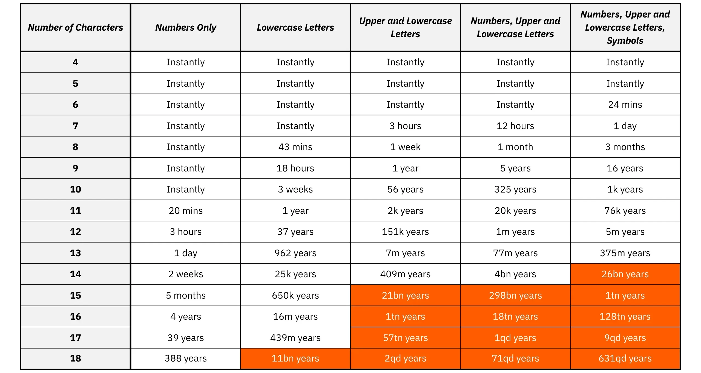

*Sumber: [Hive Systems](https://www.hivesystems.com/)*

Kata sandi yang rumit pasti akan sulit diingat. Oleh karena itu, saya sarankan untuk menggunakan pengelola kata sandi seperti Bitwarden atau KeePass.

https://planb.network/tutorials/computer-security/authentication/bitwarden-0532f569-fb00-4fad-acba-2fcb1bf05de9

https://planb.network/tutorials/computer-security/authentication/keepass-f8073bb7-5b4a-4664-9246-228e307be246

Terakhir, ubah kata sandi ini secara teratur-setiap 3 hingga 6 bulan-khususnya jika perangkat Anda digunakan di lingkungan bersama atau perangkat seluler.

#### Mengamankan akses BIOS/UEFI

Keamanan komputer Anda tidak dimulai setelah sistem operasi diluncurkan, melainkan sejak awal. Sebelum Windows, Linux, atau macOS berjalan, sebuah program yang terintegrasi ke dalam motherboard disebut BIOS atau UEFI tergantung pada generasi komputer Anda, yang mengendalikan komputer untuk menginisialisasi perangkat keras dan memulai proses boot.

BIOS (*Basic Input/Output System*) adalah pendahulu UEFI (*Unified Extensible Firmware Interface*). Saat ini, UEFI adalah standar pada semua komputer modern.

Secara default, akses ke pengaturan ini tidak terlindungi. Penyerang dengan akses fisik ke komputer Anda (di ruang publik, dalam kasus pencurian, atau bahkan sementara tanpa sepengetahuan Anda) dapat masuk ke Interface UEFI dan memodifikasi pengaturan krusial. Sebagai contoh, ia dapat:
- Mengubah urutan boot untuk memaksa peluncuran sistem eksternal dari kunci USB
- Menonaktifkan mekanisme keamanan seperti Boot Aman
- Menginstal *malware* di firmware komputer Anda...

Untuk melindungi diri Anda dari serangan offline ini, penting untuk mengunci akses ke BIOS/UEFI dengan kata sandi. Kata sandi ini terpisah dari kata sandi sistem operasi Anda dan mencegah akses tidak sah ke BIOS/UEFI.

Untuk mengaktifkannya, ini akan tergantung pada model motherboard Anda, tetapi umumnya Anda memerlukannya:
- Nyalakan ulang komputer Anda
- Segera setelah dihidupkan, tekan dengan cepat tombol akses BIOS/UEFI yang spesifik untuk mesin Anda (`Del`, `F2`, `F10`, `Esc`...)
- Pada Interface yang muncul, temukan opsi kata sandi keamanan atau administrator
- Tetapkan kata sandi yang panjang, unik, dan acak, lalu simpan
- Menyimpan perubahan dan memulai ulang komputer


**Peringatan:** jika Anda kehilangan kata sandi ini, Anda akan diblokir dan harus mengatur ulang motherboard. Jadi, pastikan untuk menyimpan kata sandi ini di pengelola kata sandi atau di lokasi fisik yang aman.

Selain itu, aktifkan fitur "Secure Boot / Boot Aman" jika tersedia dan belum aktif. Mekanisme ini mencegah eksekusi kode yang tidak ditandai atau diubah saat proses boot. Fitur ini dirancang untuk memblokir bootkit dan rootkit, yaitu jenis malware yang menginfeksi proses boot komputer bahkan sebelum sistem operasi dimulai.

Mengamankan UEFI adalah tindakan yang sering diabaikan, namun sangat krusial untuk melindungi komputer Anda dari serangan lanjutan. Ini adalah salah satu dari sedikit benteng pertahanan terhadap intrusi fisik atau manipulasi pra-sistem.

#### Mengamankan akses fisik ke komputer

Mengamankan workstation tidak terbatas pada perlindungan perangkat lunak: jika seseorang yang berniat jahat mendapatkan akses fisik ke komputer Anda, mereka dapat melewati banyak penghalang atau menyusupi sistem tanpa sepengetahuan Anda. Hal ini terutama berlaku untuk laptop, yang mudah dibawa, namun juga untuk perangkat apa pun yang ditinggalkan di ruang publik, terbuka untuk publik, atau bahkan hanya dapat diakses oleh orang lain.

Salah satu risiko yang paling umum (namun diremehkan) adalah meninggalkan komputer tanpa pengawasan, bahkan hanya beberapa menit, di tempat umum seperti perpustakaan, konferensi, ruang terbuka, dan lobi hotel. Ini bukan hanya risiko pencurian: dalam hitungan detik, orang jahat dapat menyambungkan flash drive USB berbahaya, menginstal spyware, memodifikasi parameter boot untuk memaksa boot eksternal, atau mengambil kredensial dengan menyuntikkan keylogger perangkat keras.

Dengan alur pemikiran yang sama, saya menyarankan untuk tidak menggunakan aksesori atau periferal eksternal yang tidak Anda kendalikan. Hindari memasukkan flash drive USB, hard drive eksternal, pengisi daya, atau dongle ke komputer Anda jika asal-usul benda-benda ini tidak diketahui (misalnya, baru atau milik orang yang tidak Anda percaya). Beberapa aksesori yang tampak tidak berbahaya mungkin mengandung program yang mampu mengeksekusi perintah jahat segera setelah dicolokkan. Sebaliknya, jangan pinjamkan aksesori Anda sendiri atau tinggalkan tanpa pengawasan di tempat yang dapat diakses: aksesori tersebut dapat ditukar dengan versi yang telah disusupi.

Untuk membatasi risiko pencurian fisik, Anda dapat melengkapi PC desktop dengan sistem penguncian fisik. Sebagian besar PC profesional memiliki port keamanan Kensington, yang memungkinkan kabel baja dipasang ke perabot yang tetap. Varian juga tersedia untuk laptop. Perangkat ini tentu saja tidak menawarkan perlindungan absolut terhadap pencurian, tetapi sudah cukup untuk mencegah serangan saat kita lengah.

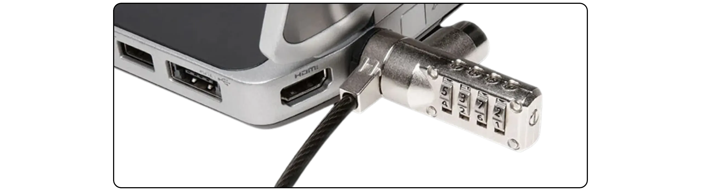

Selain itu, selalu matikan komputer Anda saat Anda tidak berada di dekatnya, terutama di lingkungan yang tidak aman. Berbeda dengan mode standby saja, mematikan total mencegah sistem operasi dimuat dan melindungi dari serangan tertentu yang menargetkan RAM. Ini juga mengaktifkan keamanan BIOS/UEFI Anda.

Terakhir, salah satu tindakan paling penting yang dapat Anda ambil untuk melindungi diri dari pencurian adalah mengaktifkan enkripsi disk penuh. Ini melindungi data Anda dengan membuatnya tidak dapat diakses tanpa kata sandi, bahkan jika disk diekstrak dan dicolokkan ke komputer lain. Pada beberapa sistem, enkripsi ini diaktifkan secara default:

- macOS menggunakan FileVault
- Windows menggunakan BitLocker, tetapi aktivasinya bergantung pada komputer dan versi OS
- Distribusi Linux tidak secara otomatis mengenkripsi disk, kecuali jika pilihan ini dipilih pada saat instalasi. Anda dapat menggunakan LUKS untuk mengenkripsi disk

https://planb.network/tutorials/computer-security/data/luks-13d9928b-08b1-478c-a1b4-67617978584a

Dalam semua kasus, kata sandi dekripsi harus kuat, berbeda dari kata sandi sistem, dan disimpan dalam manajer kata sandi yang aman. Jika Anda menggunakan disk eksternal atau flash drive USB yang berisi data sensitif, pertimbangkan juga untuk mengenkripsinya secara individual dengan program seperti VeraCrypt.

https://planb.network/tutorials/computer-security/data/veracrypt-d5ed4c83-7c1c-4181-95ea-963fdf2d83c5

### Prinsip keistimewaan yang paling sedikit

Prinsip otoritas terbatas (least privilege) adalah aturan fundamental dalam keamanan siber, di mana setiap entitas (pengguna manusia, program perangkat lunak, proses sistem, dll.) seharusnya hanya memiliki hak yang benar-benar diperlukan untuk menyelesaikan tugasnya. Dengan kata lain, jangan pernah memberikan otorisasi lebih dari yang diperlukan, karena setiap izin tambahan meningkatkan area sistem yang rentan diserang.

Secara nyata, pada komputer pribadi Anda, ini berarti akun pengguna utama Anda tidak boleh memiliki hak administrator untuk aktivitas sehari-hari, seperti penjelajahan web, memeriksa email, atau pekerjaan kantor. Memang, jika perangkat lunak berbahaya dieksekusi oleh akun dengan hak yang ditingkatkan, ia akan dapat memodifikasi file sistem, menginstal layanan yang berjalan di latar belakang, atau menonaktifkan perlindungan keamanan. Sebaliknya, jika dijalankan dalam lingkungan yang dibatasi, kemampuannya untuk menyebabkan kerusakan akan terbatas.

Pada Windows, sebagian besar pengguna memiliki akun administrator secara default, meskipun ini merupakan praktik yang buruk. Saya merekomendasikan Anda untuk membuat akun pengguna standar untuk penggunaan sehari-hari, dan menyisakan akun administrator untuk operasi yang benar-benar membutuhkannya. Saat Anda mencoba melakukan tugas yang memerlukan hak istimewa yang ditingkatkan, Windows akan meminta Anda untuk memasukkan kata sandi administrator, bukan sekadar mengklik tombol "YA".

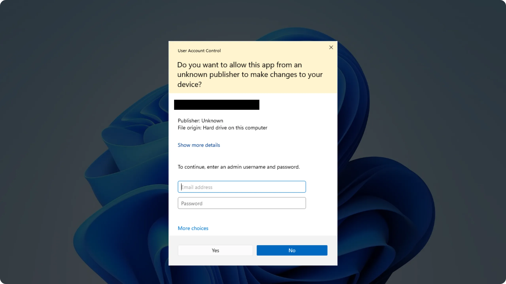

Pada Linux, prinsip otoritas terbatas ini diterapkan dengan lebih baik. Secara default, Anda memiliki akun pengguna dengan hak terbatas, dan Anda dapat meningkatkan hak istimewa Anda secara sementara dengan perintah `sudo`. Dimungkinkan juga untuk mengonfigurasi `sudo` agar hanya mengotorisasi perintah tertentu tergantung pada penggunanya (melalui `/etc/sudoers`).


Pada macOS, meskipun akun pertama yang dibuat sering kali memiliki hak administratif, sistem menggunakan mekanisme yang mirip dengan `sudo`: Anda perlu mengonfirmasi tindakan Anda dengan kata sandi untuk setiap operasi penting. Meskipun demikian, sangat mungkin untuk membuat akun pengguna standar dan mencadangkan akun administrator untuk penggunaan sesekali, yang saya rekomendasikan jika komputer digunakan oleh beberapa orang.

Pengelompokan ini tidak terbatas pada pengguna manusia. Banyak aplikasi memerlukan hak istimewa yang ditingkatkan saat instalasi, dan kemudian terus berjalan dengan hak tersebut meskipun tidak lagi dibutuhkan. Oleh karena itu, saya menyarankan Anda, sebisa mungkin, untuk memilih aplikasi yang berjalan dalam mode pengguna, menghapus instalasi perangkat lunak yang tidak lagi Anda gunakan, dan waspada terhadap permintaan peningkatan hak istimewa.

### Multisesi: lingkungan yang terpisah

Selain memisahkan akun administrator dari akun standar, kebiasaan baik yang melengkapi hal tersebut adalah membuat beberapa sesi pengguna yang berbeda pada satu komputer untuk mempartisi penggunaan sesuai dengan sifatnya. Pendekatan ini didasarkan pada logika sederhana: dengan membedakan aktivitas Anda ke dalam lingkungan yang terpisah, Anda mengurangi area yang rentan diserang setiap lingkungan dan membatasi konsekuensi dari insiden keamanan apa pun.

Semua sistem operasi modern memungkinkan pembuatan beberapa akun pengguna pada satu perangkat. Setiap akun ini memiliki ruang pribadi tersendiri: file, aplikasi, pengaturan, dan sesi jaringan tidak dibagi di antara mereka, kecuali jika diotorisasi secara eksplisit.

Sebagai contoh, Anda dapat menyusun sesi Anda sebagai berikut:

- Akun yang didedikasikan untuk aktivitas profesional Anda, di mana Anda hanya menginstal perangkat lunak yang benar-benar Anda perlukan (office suite, program kolaborasi, perpesanan profesional...). Sesi ini tidak boleh digunakan untuk menjelajah web sembarangan atau pengujian perangkat lunak;
- Akun untuk penggunaan pribadi, yang digunakan untuk menjelajah web sehari-hari, jejaring sosial, streaming, atau menginstal aplikasi pribadi. Sesi ini biasanya merupakan sesi yang paling rentan terhadap serangan browser atau unduhan yang mencurigakan;
- Akun yang disediakan untuk aktivitas sensitif, seperti berkonsultasi dengan rekening bank, mengelola portofolio Bitcoin Anda, atau penggunaan lain yang membutuhkan keamanan tingkat tinggi. Akun ini harus digunakan secara eksklusif untuk tugas-tugas ini, dengan perangkat lunak yang diinstal terbatas pada apa yang benar-benar diperlukan, dan dengan konfigurasi jaringan yang lebih ketat;
- Akun tamu atau akun yang sangat terbatas, yang ditujukan khusus untuk penggunaan sesekali oleh anggota keluarga, misalnya. Akun ini jelas tidak boleh memiliki hak administrator dan akses terbatas.

Ada beberapa keuntungan dalam mengadopsi pendekatan ini. Pertama, aplikasi yang diinstal dalam satu sesi tidak dapat mengganggu aplikasi dari sesi lain (kecuali dalam kasus peningkatan hak istimewa). Kedua, jika sebuah sesi disusupi, misalnya melalui *malware* yang diunduh, dampaknya umumnya terkandung dalam batasan akun tersebut. Ini berarti dokumen bisnis atau portofolio Bitcoin Anda akan tetap tidak dapat diakses oleh malware jika disimpan dalam sesi lain yang terisolasi dengan benar.

Pada Linux, pemisahan ini dapat diperkuat oleh mekanisme seperti AppArmor atau SELinux, yang dapat digunakan untuk lebih membatasi hak akses untuk setiap sesi.


Penting untuk dicatat bahwa penggunaan multisession tidak menggantikan penggunaan akun non-administrator, maupun penerapan prinsip otoritas terbatas. Fitur ini melengkapinya dengan menambahkan lapisan tettutup secara logis yang mudah diatur dan sangat efektif untuk penggunaan hibrida (keluarga atau profesional).

Terakhir, ada pendekatan lain yang lebih radikal namun sangat efektif, yaitu mendedikasikan komputer terpisah untuk setiap penggunaan, misalnya: satu laptop khusus untuk aktivitas profesional, satu lagi untuk penggunaan pribadi, dan yang ketiga yang sederhana dan aman untuk aktivitas sensitif.

### Mesin virtual

Mesin virtual (atau "VM") memungkinkan Anda menciptakan lingkungan yang sepenuhnya terisolasi di dalam komputer Anda. Sebuah VM mensimulasikan komputer independen dengan sistem operasi, aplikasi, dan pengaturannya sendiri, namun pada kenyataannya berfungsi sebagai program yang berjalan di komputer utama Anda.

Teknologi ini didasarkan pada hypervisor, sebuah program perangkat lunak yang mengelola pembuatan dan eksekusi VM. Solusi yang paling dikenal adalah VirtualBox, sebuah paket perangkat lunak open source dan lintas-platform. Dengan VirtualBox, Anda dapat dengan mudah membuat VM hanya dengan beberapa klik, dengan mengalokasikan sumber daya spesifik untuknya.

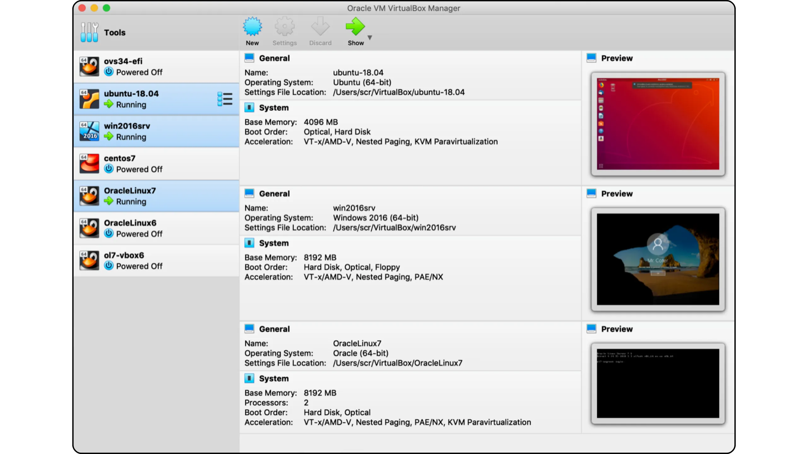

https://planb.network/tutorials/computer-security/operating-system/virtualbox-6472f5be-10ce-4a07-8b24-097bfbcedd65

Dari segi keamanan TI, salah satu keuntungan besar dari mesin virtual adalah kemampuannya untuk mengkompartementalisasi. Sebuah VM tidak berbagi file, proses, atau akses jaringan dengan sistem host (utama), kecuali jika Anda secara eksplisit mengonfigurasi pertukaran ini. Jadi, jika sebuah VM terinfeksi *malware*, atau jika Anda menguji perangkat lunak sensitif di dalamnya, dampaknya akan tetap terbatas pada mesin virtual tersebut: sistem utama Anda akan tetap utuh, asalkan parameter isolasi dihormati (tidak ada direktori yang dibagikan, tidak ada perangkat USB yang diteruskan ke VM, dll.).

Sebuah VM dapat memungkinkan Anda menguji perangkat lunak yang mencurigakan: jika Anda mengunduh program dari sumber yang tidak tepercaya atau situs yang meragukan, Anda bisa menjalankannya terlebih dahulu di dalam VM untuk mengamati perilakunya dengan aman. Ini juga bisa berguna saat menjelajahi situs berisiko: Anda dapat mendedikasikan VM untuk konsultasi konten web yang sensitif atau tidak dikenal, yang mengurangi kemungkinan serangan skrip berbahaya atau eksploitasi kerentanan browser. Singkatnya: menggunakan VM memungkinkan Anda dengan mudah mengisolasi penggunaan spesifik dari bagian lain sistem Anda.

Terakhir, penting untuk dipahami bahwa keamanan yang disediakan oleh VM bergantung pada konfigurasi yang benar. Secara default, beberapa hypervisor mengizinkan pertukaran file antara host dan VM, atau mengizinkan akses ke periferal USB. Fungsi-fungsi ini harus dinonaktifkan untuk memaksimalkan isolasi.

### Sandbox

Sandboxing adalah metode keamanan komputer yang melibatkan eksekusi aplikasi atau proses dalam lingkungan yang terisolasi dan sangat terbatas. Tujuannya adalah untuk secara ketat membatasi interaksi aplikasi dengan seluruh sistem. Jika muncul ancaman, dampaknya biasanya terbatas di dalam batas ini.

Tidak seperti mesin virtual, yang mensimulasikan sistem operasi lengkap dengan sumber dayanya sendiri, sandboxing lebih ringan, lebih cepat diterapkan, dan membutuhkan sumber daya yang lebih sedikit. Metode ini mengandalkan mekanisme pembatasan hak akses ke memori, file, jaringan, periferal, dan lain-lain. Sebagai contoh, aplikasi yang di-sandbox dapat membaca file sementara, tetapi tidak akan dapat mengakses direktori pribadi atau sistem file Anda.

Berikut ini adalah beberapa solusi nyata untuk sandboxing, tergantung pada OS Anda:

**Windows**
- Windows Sandbox (hanya tersedia di Windows 10/11 Pro dan Enterprise);
- Sandboxie Plus (open source).

**Linux**
- Firejail: program yang kuat dan ringan yang mengisolasi aplikasi menggunakan profil yang telah ditentukan. Program ini bekerja dengan baik dengan berbagai aplikasi, termasuk Firefox, VLC, dan Telegram;
- Flatpak: Seperti yang telah kita lihat, ini bukanlah perangkat lunak sandboxing itu sendiri, melainkan manajer paket perangkat lunak yang mengintegrasikan sandboxing. Setiap aplikasi yang diinstal melalui Flatpak diisolasi dari sistem host secara default, dengan kontrol izin yang terperinci (akses ke mikrofon, kamera, jaringan, dll.).

**macOS**
- Pada macOS, sandboxing adalah fitur bawaan yang terintegrasi ke dalam kernel, tetapi hanya diaktifkan jika ditentukan oleh pengembang perangkat lunak. Aplikasi dari App Store di-sandbox secara otomatis, tetapi yang diinstal dari web (atau dari baris perintah) tidak di-sandbox secara default.


Terakhir, meskipun sandboxing menawarkan lapisan perlindungan yang efektif, penting untuk dipahami bahwa ini bukanlah pengganti total untuk mesin virtual (VM) atau sistem yang dipartisi dengan baik.

Setelah kita membahas keamanan komputer Anda melalui otentikasi dan kompartementalisasi, pada bab berikutnya kita akan melihat praktik pemeliharaan yang baik untuk lebih meningkatkan keamanannya.

## Mengurangi kesalahan melalui pemeliharaan

<chapterId>71d7fd95-ce1d-43d8-9a66-be7b425857fc</chapterId>

Banyak orang beranggapan bahwa menginstal perangkat lunak antivirus atau memilih kata sandi yang kuat sudah cukup untuk melindungi komputer mereka. Namun, keamanan komputer jauh lebih kompleks daripada sekadar konfigurasi satu kali. Kenyataannya, mayoritas serangan siber memanfaatkan kerentanan pada sistem dan perangkat lunak yang sudah usang. Dengan kata lain, keamanan komputer juga melibatkan pemeliharaan rutin pada komputer Anda.

Dalam bab ini, saya akan membawa Anda langkah demi langkah tentang cara memelihara komputer Anda secara efektif, dan meminimalkan risiko perusakan.

### Pembaruan sistem operasi

Seperti yang telah kita lihat di awal kursus ini, sistem operasi mengelola perangkat keras (prosesor, memori, disk, periferal, dll.), mengeksekusi program, mengatur file, dan mengelola koneksi jaringan. Oleh karena itu, ini adalah komponen penting pada komputer Anda.

#### Mengapa memperbarui OS Anda?

Karena kompleksitasnya, tidak ada versi sistem operasi yang sepenuhnya bebas dari kerentanan. Kita berbicara tentang puluhan juta baris kode di sini. Celah keamanan ini dapat dieksploitasi oleh penyerang untuk mengeksekusi kode berbahaya, mendapatkan hak istimewa yang tidak sah, atau menyusupi seluruh sistem. Beberapa kerentanan ini ditemukan secara bertanggung jawab oleh peneliti keamanan siber, sementara yang lain sudah secara aktif dieksploitasi tanpa diketahui oleh publik: ini dikenal sebagai kerentanan zero-day.

Vendor sistem operasi secara rutin merilis pembaruan keamanan yang dirancang untuk memperbaiki kerentanan ini. Kegagalan untuk menginstal patch ini sama saja dengan sengaja membiarkan pintu terbuka terhadap serangan, bahkan jika Anda berpikir penggunaan Anda sederhana atau data Anda tidak berharga.

Ini bukan hanya masalah memperbaiki bug yang terlihat, tetapi juga bertindak pada celah serangan pada sistem Anda. Semakin sedikit celah yang ada, semakin sedikit kemungkinan yang dimiliki penyerang untuk membobol komputer Anda.

Secara spesifik, saya merekomendasikan Anda untuk mengaktifkan pembaruan otomatis. Fitur ini secara native tersedia di semua sistem modern. Windows Update, misalnya, menangani ini secara default pada komputer Windows 10 dan 11. Pada macOS, pembaruan keamanan terintegrasi ke dalam sistem pembaruan sistem. Pada Linux, tergantung pada distribusi yang digunakan, alat seperti `unattended-upgrades` (Debian/Ubuntu) atau `dnf-automatic` (Fedora) memungkinkan Anda untuk menjadwalkan pembaruan.

Terakhir, perlu diingat bahwa dalam banyak kasus, pembaruan penting tertentu hanya akan berlaku setelah reboot. Jadi, penting untuk reboot komputer Anda secara teratur, terutama setelah pembaruan sistem. Memperbarui sistem operasi Anda seringkali hanya membutuhkan beberapa menit, tetapi ini adalah salah satu benteng pertahanan paling efektif terhadap banyak serangan.


#### Bagaimana cara memperbarui OS saya?

Meskipun pembaruan otomatis diaktifkan pada sistem Anda, tetap penting untuk memeriksa secara manual, pada interval reguler, bahwa tidak ada pembaruan yang tertunda. Mari kita lihat bagaimana melakukannya, tergantung pada sistem Anda:

- *Sistem operasi Windows*

Windows memiliki fitur pengelola pembaruan terpusat yang disebut "Windows Update". Pengelola ini secara otomatis mengunduh dan menginstal pembaruan, patch keamanan, driver perangkat, dan terkadang bahkan kode mikro untuk prosesor.

Untuk memeriksa status pembaruan secara manual :

```txt
Settings → Windows Update → Check for updates
```

Jangan lupa untuk memeriksa pembaruan opsional di menu yang sama.

- *Sistem operasi Linux*

Distribusi Linux didasarkan pada sistem paket yang dikelola oleh komunitas dan para pengelola distribusi Anda. Pembaruan diterapkan melalui manajer paket.

Varian Debian (yaitu Ubuntu) :

```bash
sudo apt update && sudo apt upgrade -y
```

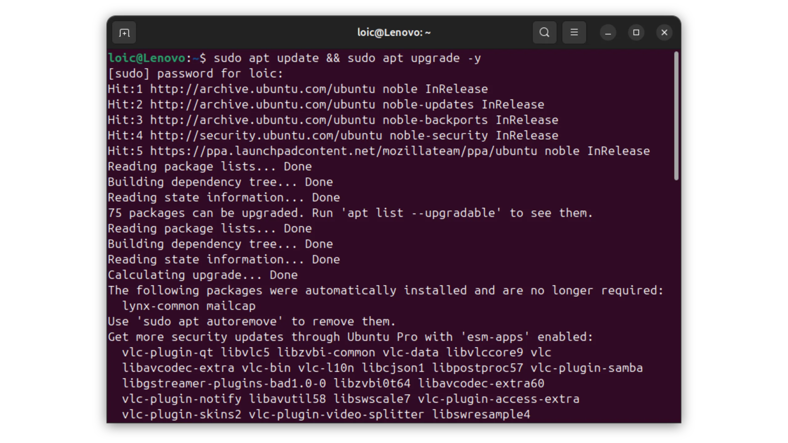

Jika Anda lebih suka menggunakan Interface grafis, di Ubuntu ada program *Software Updater* yang memungkinkan Anda mengelola pembaruan dengan mudah tanpa melalui terminal.

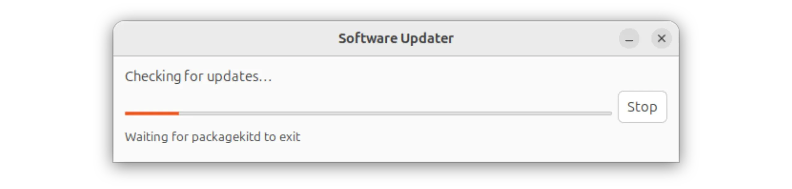

Varian Red Hat (Fedora) :

```bash
sudo dnf upgrade
```

Varian Arch Linux :

```bash
sudo pacman -Syu
```

- *Sistem operasi MacOS*

Apple memusatkan pembaruan sistemnya dalam pengaturan Interface. Untuk memeriksa ketersediaan:

```txt
Apple menu → System Settings → General → Software Update
```

macOS secara otomatis mengunduh pembaruan keamanan, sistem, dan aplikasi melalui opsi "*Automatic Updates*" di menu yang sama.

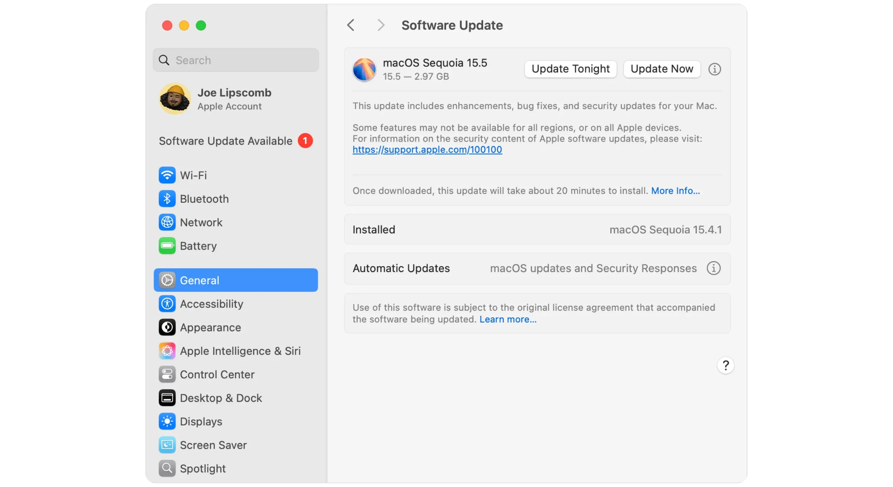

### Pembaruan perangkat lunak

Keamanan komputer Anda tidak hanya bergantung pada sistem operasi. Setiap perangkat lunak yang Anda instal merupakan titik masuk potensial untuk serangan. Segera setelah sebuah program memiliki celah keamanan yang tidak diperbaiki, program tersebut dapat dieksploitasi untuk membobol sistem Anda atau mencuri data Anda.

Beberapa perangkat lunak lebih sensitif daripada yang lain, karena berinteraksi langsung dengan dunia luar atau memanipulasi file yang berpotensi berbahaya. Di antara perangkat lunak yang paling penting adalah:

- *Browser web*: Aplikasi ini berada di garis depan serangan, karena memproses konten yang tidak diverifikasi secara real-time dan memiliki area yang rentan diserang yang sangat besar. Terlebih lagi, browser memainkan peran sentral dalam melindungi data pribadi Anda. Di atas segalanya, browser cenderung menggantikan banyak aplikasi yang dulunya digunakan secara lokal (aplikasi email, aplikasi perkantoran, pemutar media, dll.). Namun, kita akan membahas lebih lanjut poin ini di bagian berikutnya dari kursus SCU202.

- *Aplikasi email*: Aplikasi ini menerima lampiran atau tautan dari sumber eksternal yang tidak dapat dikontrol dan karena itu berisiko;

- *Aplikasi komunikasi* (TeamViewer, Zoom, Signal, Teams...): Karena sifatnya yang interaktif, alat-alat ini menjadi target serangan spionase atau upaya kendali jarak jauh. Sama halnya dengan aplikasi email, aplikasi komunikasi dapat digunakan sebagai celah untuk upaya phishing atau penyebaran lampiran berbahaya.

- *Antivirus, firewall, dan solusi deteksi lainnya*: Program-program ini umumnya menikmati hak istimewa yang ditingkatkan, karena mereka terus-menerus memindai File, proses, dan koneksi jaringan Anda. Versi aplikasi yang usang, konfigurasi yang buruk, atau kerentanan dalam perangkat lunak itu sendiri dapat memungkinkan malware lolos dari deteksi, atau bahkan mendapatkan hak istimewa yang ditingkatkan.

Tentu saja, risiko-risiko ini tidak hanya muncul dari pemeliharaan yang buruk, tetapi penting untuk memberikan perhatian khusus pada pembaruan perangkat lunak sensitif ini. Ini adalah penyederhanaan, tetapi tentu saja, semua perangkat lunak Anda yang lain juga perlu diperbarui secara rutin. Mari kita lihat cara melakukannya, tergantung pada sistem operasi Anda.

#### Pada Windows

Pada Windows 11, utilitas *Winget* terintegrasi ke dalam sistem. Ini memungkinkan Anda untuk membuat daftar dan memperbarui sebagian besar perangkat lunak yang terinstal di komputer Anda, secara langsung melalui terminal. Cukup jalankan Windows PowerShell:

```CMD
winget upgrade --all
```

Perintah ini menanyakan repositori publik untuk versi terbaru perangkat lunak yang Anda miliki, dan memperbaruinya secara otomatis.

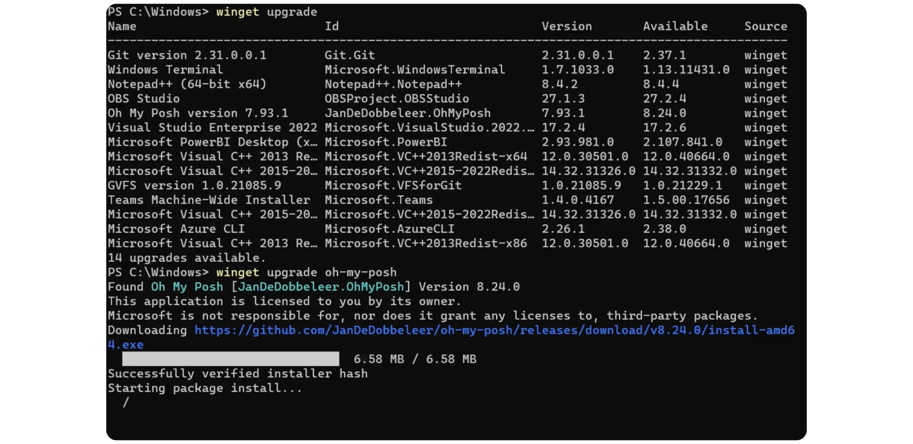

Sayangnya, perintah ini tidak berfungsi untuk semua perangkat lunak. Oleh karena itu, saya merekomendasikan Anda untuk menyimpan daftar semua perangkat lunak Anda dan memeriksa pembaruan secara manual secara teratur, terutama untuk aplikasi sensitif. Untuk perangkat lunak yang paling penting, seperti antivirus atau browser web Anda, saya menyarankan Anda untuk melakukan pemeriksaan ini setiap hari.

#### Pada Linux (Debian/Ubuntu)

Kekuatan distribusi Linux terletak pada manajemen perangkat lunaknya yang terpusat. Manajer paket (`APT` dalam kasus Debian) menjaga sistem dan semua perangkat lunak yang terinstal tetap mutakhir melalui repositori resminya.

Dengan cara yang sama seperti pembaruan OS, untuk melakukan pembaruan global perangkat lunak Anda, cukup jalankan:

```bash
sudo apt update && sudo apt upgrade
```

Perintah dasar ini menyusun ulang daftar paket yang tersedia (`apt update`) dan kemudian menerapkan pembaruan yang diperlukan (`apt upgrade`).

Untuk pembaruan yang lebih lengkap, Anda juga dapat menggunakan perintah ini:

```bash
sudo apt update \
&& sudo apt full-upgrade -y \
&& sudo apt autoremove -y \
&& sudo apt autoclean
```

- `sudo apt full-upgrade` memperbarui semua paket yang terinstal, termasuk paket yang membutuhkan dependensi untuk ditambahkan atau dihapus. `-y` memungkinkan Anda untuk secara otomatis menjawab "ya" pada setiap konfirmasi yang diminta oleh manajer paket;
- `sudo apt autoremove -y`: menghapus dependensi yang tidak perlu;
- sudo apt autoclean`: membersihkan cache dari paket-paket yang sudah tidak terpakai.

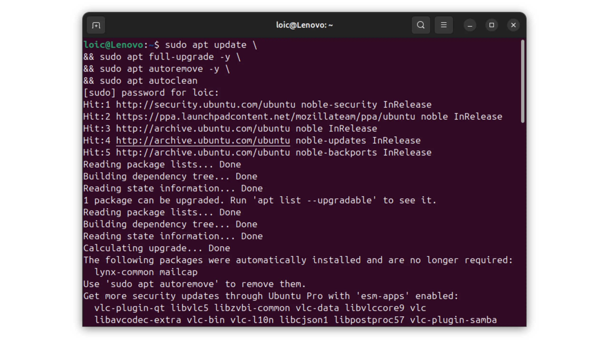

Jika Anda memiliki perangkat lunak yang didistribusikan sebagai paket Flatpak atau Snap, beberapa di antaranya diperbarui secara otomatis, tetapi Anda dapat memperbarui semuanya secara manual dengan perintah:

```bash
flatpak update sudo snap refresh
```

#### pada macOS

Perangkat lunak yang diinstal melalui App Store dapat dengan mudah diperbarui di menu berikut:

```txt
Apple menu → App Store → Update All
```

Anda juga dapat mengaktifkan pembaruan aplikasi otomatis di pengaturan App Store.

Namun, tidak semua aplikasi yang terinstal di Mac Anda berasal dari App Store. Untuk aplikasi lain, Anda harus memperbaruinya secara manual. Jadi, seperti halnya pengguna Windows, saya sarankan Anda menyimpan daftar semua perangkat lunak Anda dan memeriksa secara teratur untuk versi baru, terutama yang sensitif seperti browser web Anda.

### Menghapus instalasi perangkat lunak

Dari perspektif keamanan TI, semakin sedikit perangkat lunak yang Anda instal, semakin sedikit titik masuk potensial yang Anda miliki untuk penyerang. Setiap aplikasi yang terinstal pada sistem Anda mungkin mengandung celah keamanan, bahkan jika Anda tidak pernah menggunakannya. Ini dikenal sebagai area yang rentan diserang: semakin banyak area, semakin besar pula risikonya. Mengurangi area ini dengan menghapus perangkat lunak yang tidak diperlukan adalah tindakan pencegahan yang sederhana namun efektif.

Beberapa aplikasi bawaan atau program yang diinstal untuk penggunaan satu kali mungkin tetap berada di komputer Anda selama berbulan-bulan tanpa digunakan, sementara terus menerima pembaruan atau berinteraksi dengan sistem Anda. Lebih buruk lagi, jika program-program ini tidak lagi dipelihara, program tersebut mungkin mengandung kerentanan.

#### Pada Windows

Untuk mengakses daftar aplikasi terinstal:

```txt
Settings → Apps → Installed apps
```

Telusuri daftar perangkat lunak ini dan hapus apa pun yang tidak lagi Anda gunakan, atau yang tidak Anda ketahui kegunaannya (setelah melakukan pengecekan di internet jika perlu). Berhati-hatilah dengan perangkat lunak sistem, tetapi jangan ragu untuk menghapus game yang sudah terinstal, program bantu pemeliharaan yang meragukan, atau aplikasi pemasaran.

#### Pada Linux (Debian/Ubuntu)

Buka terminal dan jalankan perintah berikut untuk menghapus program perangkat lunak:

```bash
sudo apt remove name_of_the_software
```

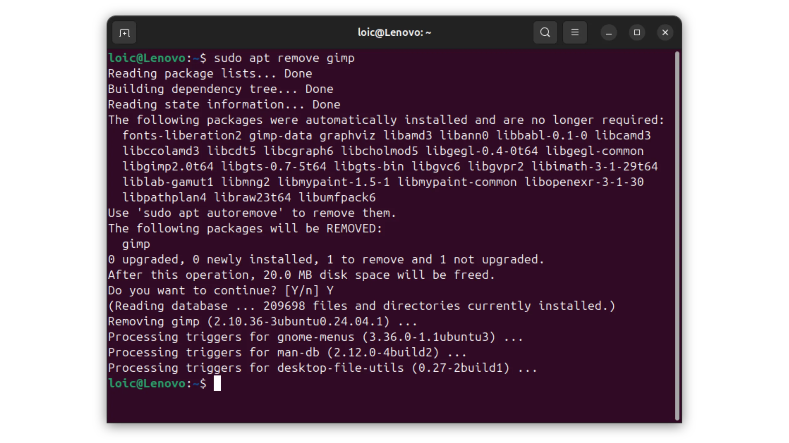

Kemudian jalankan perintah ini untuk secara otomatis menghapus semua dependensi yang tidak lagi diperlukan:

```bash
sudo apt autoremove
```

#### Pada macOS

Pada macOS, ada 2 metode utama: melalui *Launchpad* atau melalui *Finder*. Jika aplikasi telah diunduh dari App Store, buka *Launchpad* (dari Dock atau direktori `/Aplikasi`), cari aplikasinya, lalu tahan tombol Option atau lakukan klik panjang hingga ikon mulai bergetar. Kemudian klik tanda silang di samping aplikasi, dan konfirmasikan penghapusan.

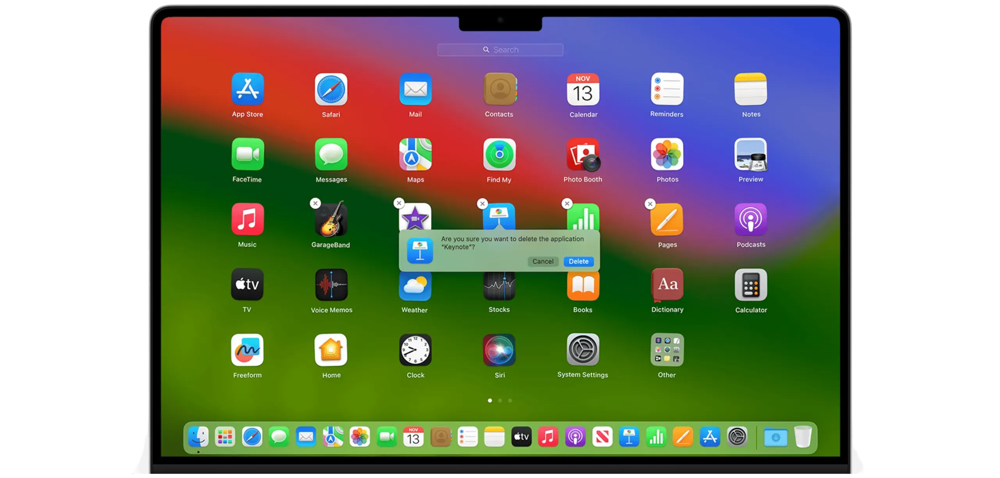

Jika tombol hapus tidak muncul, berarti aplikasi tersebut tidak diinstal dari App Store. Dalam kasus ini, gunakan *Finder*. Tutup aplikasi terlebih dahulu jika sedang berjalan. Buka *Finder*, masuk ke direktori `/Applications`, pilih aplikasi yang ingin Anda hapus, lalu pindahkan ke sampah. Terakhir, kosongkan sampah untuk menyelesaikan penghapusan instalasi.

#### Jangan lupa ekstensi browser

Ekstensi dan add-on browser Anda sering kali diabaikan, padahal mereka juga merupakan celah serangan yang sering terjadi. Ekstensi yang berbahaya atau sudah usang dapat mencegat data penjelajahan Anda, menyuntikkan kode, atau memata-matai Anda secara diam-diam.

Buka pengaturan browser Anda dan nonaktifkan atau hapus ekstensi apa pun yang tidak Anda gunakan atau tidak Anda ketahui. Pertahankan hanya ekstensi yang benar-benar diperlukan, berasal dari sumber tepercaya, dan masih dijaga.

### Pemantauan dan audit sistem

Keamanan siber juga melibatkan pemantauan aktivitas sistem. Pendekatan proaktif ini memungkinkan untuk mendeteksi perilaku abnormal (koneksi mencurigakan, proses tidak biasa, upaya akses tidak sah, dll.) sejak dini dan melakukan intervensi sebelum insiden serius terjadi.

Jika Anda menetapkan rutinitas audit (bahkan yang dasar sekalipun), Anda dapat mendeteksi keberadaan *malware*, *Trojan* yang tidak aktif, atau *spyware* pada tahap awal. Pemantauan semacam ini dapat dilakukan dengan menggunakan program khusus.

#### Pada Windows

Seperti yang kita lihat di bagian sebelumnya, Windows secara historis lebih rentan pada serangan komputer, karena adopsinya yang luas dan spesifisitas teknisnya. Oleh karena itu, penting untuk melengkapi perlindungan dasar dengan alat diagnostik canggih:

- *Microsoft Defender*: Di Windows, memiliki antivirus yang baik adalah kebutuhan dasar. Selama bertahun-tahun, Microsoft Defender (sebelumnya Windows Defender), antivirus bawaan sistem, dianggap tidak andal, dan solusi pihak ketiga direkomendasikan sebagai gantinya. Namun, perangkat lunak ini telah meningkat secara signifikan seiring waktu, dan sekarang, menurut saya, sudah cukup untuk memberikan perlindungan dasar bagi penggunaan pribadi. Meskipun demikian, kita tidak boleh melebih-lebihkan peran perangkat lunak antivirus: yang terpenting adalah praktik digital Anda sendiri yang menjamin keamanan Anda. Salah satu keuntungan Defender adalah integrasi native-nya dengan Windows. Selain perlindungan real-time, ia menawarkan pemindaian komprehensif yang dapat Anda jadwalkan setiap minggu atau jalankan secara manual pada interval berkala.


- *Sysinternals Suite*: Ini adalah sekumpulan program yang jauh lebih canggih yang ditawarkan oleh Microsoft untuk mendiagnosis, memantau, dan memecahkan masalah Windows. Berikut adalah program-program utama dalam paket ini:
- _Process Monitor_: memungkinkan Anda mengamati proses aktif, akses file, register, dll. secara real-time.
- _Autoruns_: menampilkan semua program yang diluncurkan saat startup, membantu Anda mendeteksi keberadaan _malware_ atau aplikasi yang tidak seharusnya berjalan.
- _Process Explorer_: memantau proses dan mendeteksi perilaku mencurigakan.
- _TCPView_: memvisualisasikan koneksi jaringan yang aktif (deteksi koneksi abnormal).
- _Sigcheck_: memeriksa tanda tangan digital pada file untuk kode berbahaya.

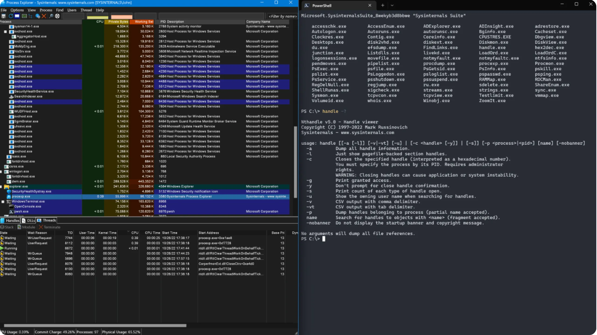

- *GlassWire*: program pemantauan jaringan. program ini melacak koneksi yang masuk dan keluar secara real time, dan memperingatkan Anda tentang aktivitas yang tidak biasa.

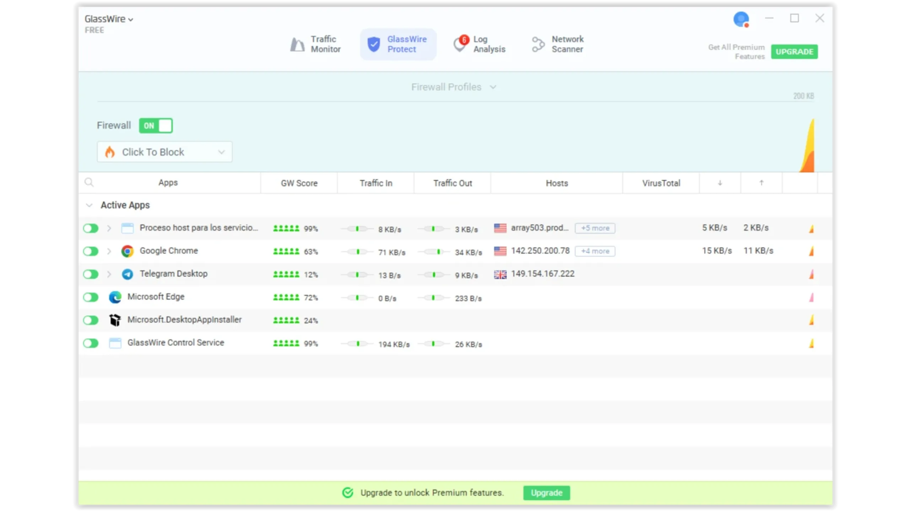

#### Pada Linux

Pada perangkat Linux yang terawat dengan baik untuk penggunaan pribadi, risikonya memang lebih rendah. Meskipun demikian, berikut adalah beberapa program canggih untuk memantau sistem Anda:

_Fail2ban_: memantau log sistem untuk upaya menggalkan akses (seperti upaya login SSH brute-force). Ketika perilaku mencurigakan terdeteksi, program akan memblokir alamat IP yang melakukan pelanggaran secara sementara melalui `iptables`;

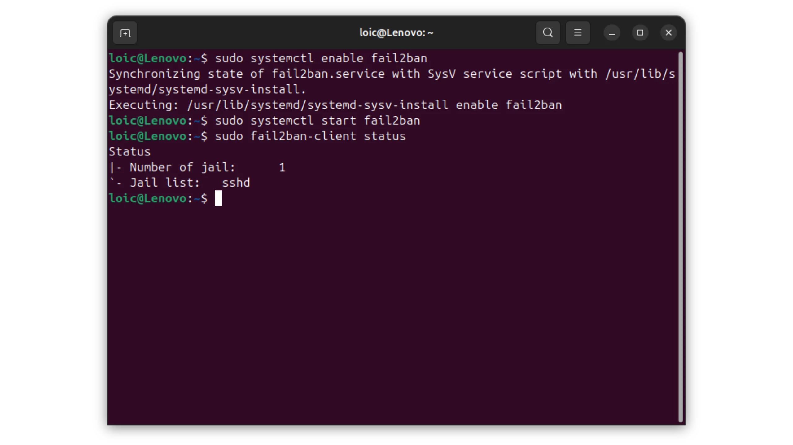

- *Lynis*: Program audit keamanan yang komprehensif yang menganalisis sistem Anda untuk mencari kesalahan konfigurasi, kelemahan yang diketahui, atau penyimpangan dari kinerja terbaik. Program ini menghasilkan laporan yang mudah dibaca, lengkap dengan skor keamanan dan rekomendasi.

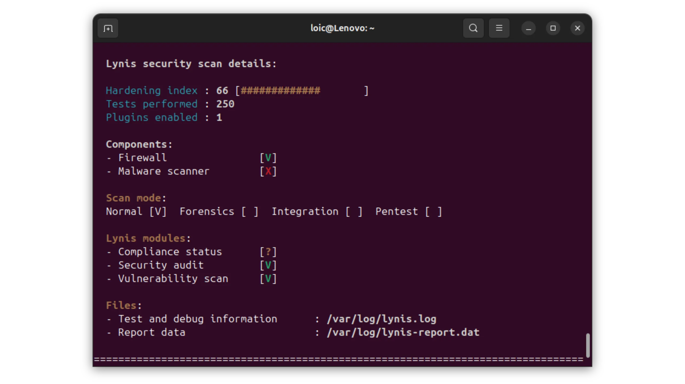

https://planb.network/tutorials/computer-security/operating-system/lynis-1cf865b3-a352-4dd2-94d2-f17fa65547af

#### Pada macOS

macOS terkenal akan keamanannya, berkat kebijakan tanda tangan pada aplikasi dan arsitekturnya yang relatif tertutup. Untuk penggunaan pribadi, komputer yang mutakhir dengan pengaturan default sudah menawarkan keamanan yang layak. Untuk meningkatkan pemantauan sistem Anda ke level selanjutnya, saya merekomendasikan:

- _KnockKnock_: memindai semua elemen yang dikonfigurasi untuk berjalan saat startup (agent, daemon, modul kernel, dll.) dan mengidentifikasi elemen-elemen yang berpotensi mencurigakan, tidak ditandatangani, atau tidak dikenal. Program ini memungkinkan Anda untuk mengidentifikasi serangan jahat pada sistem Anda dengan cepat.
  
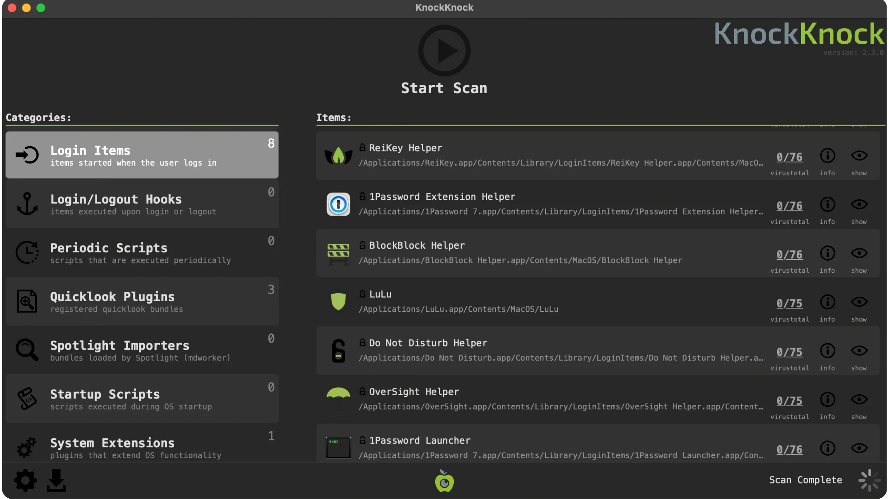

### Kesimpulan: keamanan adalah masalah keteraturan

Keamanan komputer yang optimal tidak dicapai dengan hanya memasang program tertentu sekali, melainkan melalui pemeliharaan yang teratur, ketat, dan metodis. Menjaga sistem operasi Anda tetap mutakhir, memutakhirkan perangkat lunak penting, menghapus perangkat lunak yang tidak perlu, dan memantau sistem secara aktif adalah landasan dari pemeliharaan yang baik. Secara lebih umum, praktik terbaik ini berlaku untuk semua perangkat digital Anda: perangkat terhubung (connected objects), server, ponsel pintar, dan lain-lain.

Pada bab berikutnya, kita akan melihat bagaimana Anda dapat menghindari instalasi *malware* secara praktis, dengan mempelajari cara memeriksa integritas dan keaslian file yang Anda unduh ke komputer Anda.

## Integritas dan keaslian perangkat lunak

<chapterId>ffa06aeb-0b90-4271-a385-9a752c1bb5ed</chapterId>

Memasang perangkat lunak di komputer Anda mungkin terlihat sepele, tetapi sebenarnya ini merupakan potensi risiko yang sangat serius bagi keamanan komputer Anda. Perangkat lunak yang diunduh dapat diubah atau diinfeksi oleh penyerang, yang memanfaatkan kesempatan ini untuk menyuntikkan virus, Trojan, dan jenis _malware_ lainnya ke dalam sistem Anda.

Oleh karena itu, memeriksa integritas dan keaslian perangkat lunak sebelum instalasi adalah praktik keamanan yang sangat penting, terutama untuk perangkat lunak sensitif seperti dompet Bitcoin atau pengelola kata sandi. Praktik ini memastikan bahwa perangkat lunak yang Anda unduh sama persis dengan yang diterbitkan oleh pengembang aslinya, tanpa perubahan.

Dalam bab ini, kita akan melihat cara memeriksa integritas dan keaslian file, dan cara melakukannya pada sistem operasi Anda.


### Mengapa perlu memverifikasi integritas dan keaslian perangkat lunak?

Ketika Anda mengunduh perangkat lunak dari internet, Anda secara implisit memercayai file tersebut untuk dijalankan di komputer Anda. Tetapi kepercayaan ini tidak boleh bersifat buta. Jadi, penting untuk memahami dua konsep fundamental: integritas dan keaslian file.

#### Integritas: Memastikan Tidak Ada Perubahan yang Terjadi

Integritas sebuah file menjamin bahwa file tersebut tidak dimodifikasi, baik secara sengaja maupun tidak sengaja, antara waktu diterbitkan oleh pengembang dan waktu Anda mengunduhnya. Bahkan modifikasi sekecil apa pun dapat cukup untuk menyisipkan kode berbahaya ke dalam perangkat lunak.

Modifikasi ini tidak terlihat kasat mata: file yang diunduh mungkin terbuka dan berjalan dengan sempurna dan normal, sementara pada saat yang sama mengeksekusi perilaku berbahaya. Oleh karena itu, penting untuk memverifikasi integritasnya menggunakan sidik jari kriptografi (Hash).

#### Keaslian: menjamin bahwa perangkat lunak berasal dari sumber yang tepat

Sebuah file mungkin utuh (tidak dimodifikasi), tetapi diterbitkan oleh entitas berbahaya yang menyalahgunakan identitas pengembang yang sah. Oleh karena itu, keaslian bertujuan untuk memastikan bahwa file tersebut benar-benar berasal dari sumber resmi, dan bukan dari penipu, situs mirror yang tidak terverifikasi, atau peretas yang telah menyusupi server distribusi.

Verifikasi asal ini dimungkinkan oleh tanda tangan digital, sebuah mekanisme kriptografi yang menghubungkan file tersebut dengan privat key pengembang. Ketika Anda memverifikasi tanda tangan ini menggunakan public key pengembang (yang didistribusikan melalui saluran aman), Anda dapat yakin bahwa file tersebut benar-benar berasal dari pihak tersebut.

Dengan memeriksa keaslian (yaitu, file instalasi berasal dari sumber yang tepat) dan integritas (yaitu, file tersebut belum dimodifikasi sejak diterbitkan oleh pengembang yang sah), Anda dapat yakin bahwa Anda memasang perangkat lunak yang benar.

#### Solusi teknis: Hash dan tanda tangan digital

Untuk melakukan ini, kita akan menggunakan dua program kriptografi. Yang pertama adalah hashing. Hash adalah string karakter pendek yang dihitung secara deterministik dan tidak dapat diprediksi dari isi sebuah file, menggunakan algoritma hash seperti SHA-256. Dua file yang sama persis akan memiliki Hash yang sama persis, tetapi sedikit saja modifikasi pada file akan menyebabkan Hash berubah sepenuhnya.

Pengembang yang sah biasanya menerbitkan Hash dari file asli di situs web resminya. Dari pihak Anda, Anda akan menghitung Hash dari file instalasi yang Anda unduh secara lokal, untuk membandingkan keduanya. Jika kedua sidik jari tersebut cocok, Anda dapat yakin bahwa file yang diunduh asli dan belum diubah.

Program kedua adalah tanda tangan digital. Program ini memverifikasi keaslian perangkat lunak instalasi. Pengembang menandatangani file yang berisi Hash dengan private key, dan Anda dapat memverifikasi tanda tangan ini menggunakan public key yang sesuai. Ini membuktikan bahwa file tersebut telah diterbitkan oleh pihak yang tepat.

Sistem ini bergantung pada kriptografi asimetris dan program seperti GnuPG (command line) atau Kleopatra (Interface grafis untuk Windows). Program-program ini harus dikonfigurasi dengan benar, dan public key pengembang harus diverifikasi melalui saluran aman (situs web resmi, fingerprint di Twitter, dll.). Mari kita lihat sisi praktisnya.

Untuk mempelajari lebih lanjut tentang fungsi hash kriptografi dan tanda tangan digital, saya mengundang Anda untuk mengikuti kursus gratis CYP 201 yang ditawarkan di Plan ₿ Network.

https://planb.network/courses/46b0ced2-9028-4a61-8fbc-3b005ee8d70f

### Memverifikasi integritas dan keaslian perangkat lunak

#### Prasyarat

Jika Anda menjalankan Linux, GPG sudah terinstal pada sebagian besar distribusi. Jika tidak, Anda dapat menginstalnya dengan perintah berikut:

```bash
sudo apt install gnupg
```

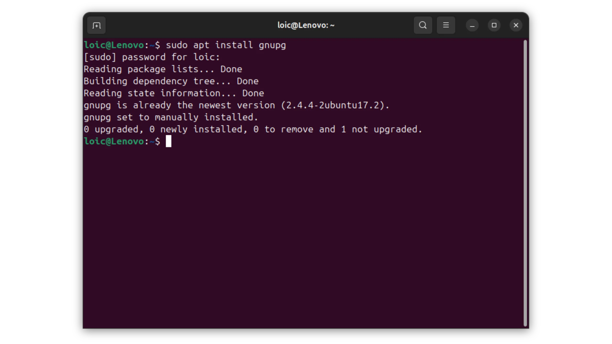

Untuk macOS, jika Anda belum menginstal manajer paket Homebrew, lakukan dengan perintah berikut:

```bash
/bin/bash -c "$(curl -fsSL https://raw.githubusercontent.com/Homebrew/install/HEAD/install.sh)"

echo 'eval "$(/opt/homebrew/bin/brew shellenv)"' >> ~/.zprofile

eval "$(/opt/homebrew/bin/brew shellenv)"
```

Kemudian instal GPG dengan perintah ini:

```bash
brew install gnupg
```

Untuk Windows, jika Anda tidak memiliki GPG, Anda dapat menginstal [Gpg4win](https://www.gpg4win.org/).

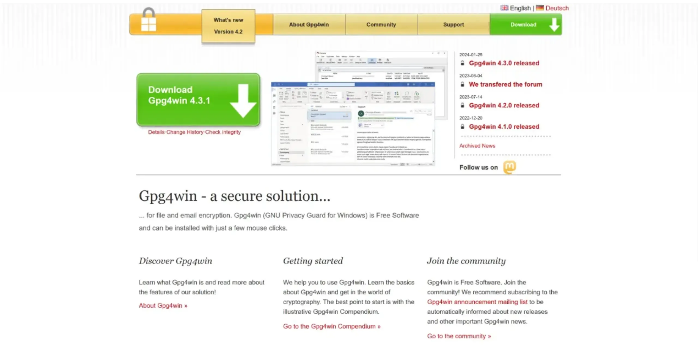

#### Unduh dokumen

Untuk memulai, Anda akan membutuhkan beberapa dokumen yang berkaitan dengan perangkat lunak yang ingin Anda instal. Dalam contoh ini, kita akan memeriksa _Sparrow wallet_, sebuah pengelola portofolio Bitcoin. Prosesnya akan serupa untuk perangkat lunak lain: yang perlu Anda lakukan hanyalah menemukan file yang tepat untuk verifikasi.

Kunjungi situs web resmi [Sparrow wallet di bagian "_Download_"](https://sparrowwallet.com/download/). Jika Anda ingin memeriksa program lain, silakan kunjungi situs untuk program tersebut.

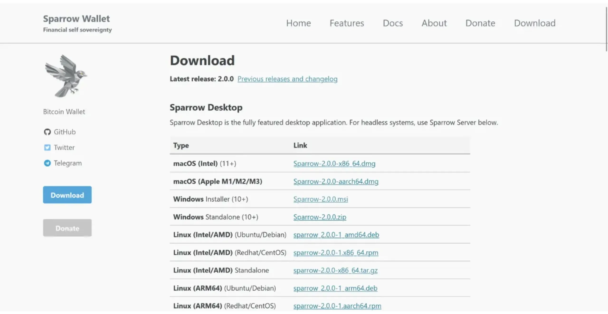

Anda juga dapat mengunjungi [repositori GitHub proyek](https://github.com/sparrowwallet/Sparrow/releases).

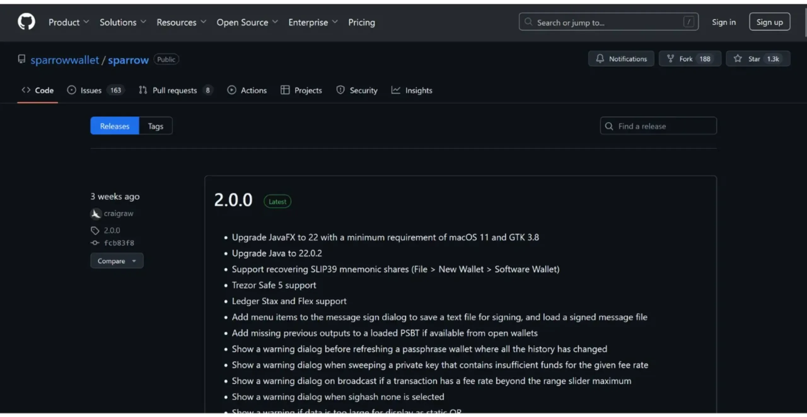

Unduh penginstal perangkat lunak untuk sistem operasi Anda.

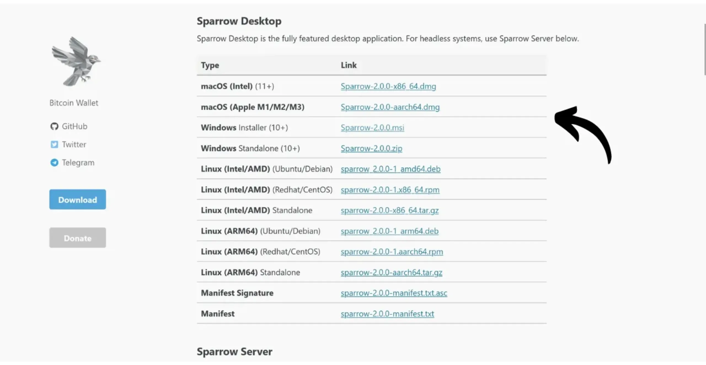

Anda juga memerlukan Hash dari file tersebut, yang sering disebut "_SHA256SUMS_" atau "_MANIFEST_".

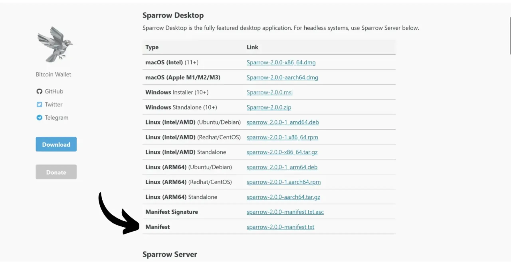

Unduh juga tanda tangan PGP dari file tersebut. Ini adalah dokumen `.asc`.

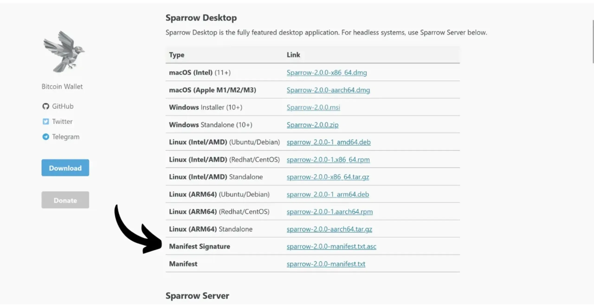

Pastikan untuk menempatkan semua file ini dalam direktori yang sama untuk memudahkan langkah-langkah berikut.

Terakhir, Anda akan membutuhkan public key pengembang untuk memverifikasi tanda tangan PGP. Kunci ini umumnya tersedia di situs web resmi perangkat lunak, pada repositori GitHub proyek, terkadang di media sosial pengembang, atau pada platform khusus seperti Keybase.

Dalam kasus *Sparrow wallet*, Anda dapat menemukan public key pengembang [Craig Raw di Keybase](https://keybase.io/craigraw). Untuk mengunduhnya langsung dari terminal, jalankan perintah berikut:

```bash
curl https://keybase.io/craigraw/pgp_keys.asc | gpg --import
```

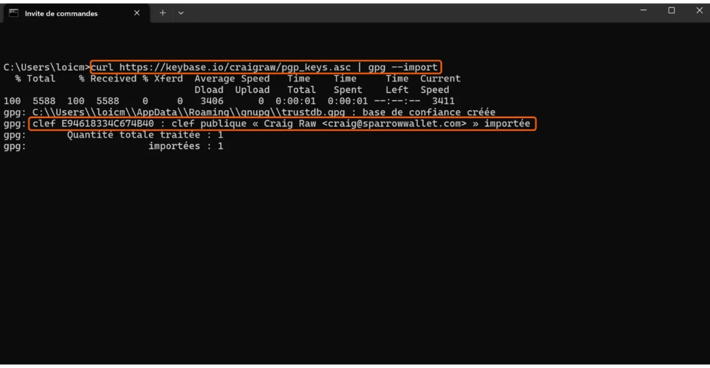

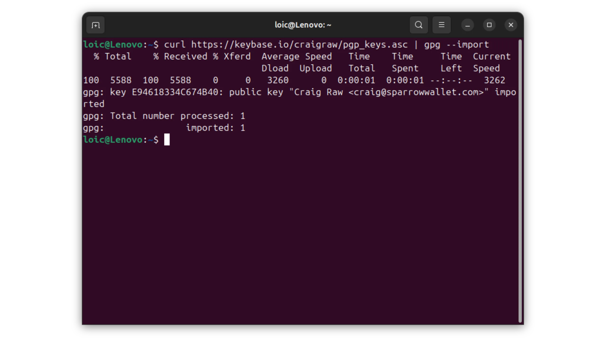

Untuk memastikan Anda menggunakan public key pengembang yang asli, dan bukan yang disalahgunakan oleh penyerang, saya merekomendasikan Anda untuk melakukan pemeriksaan ulang pada sumbernya. Periksa apakah kunci fingerprint tersebut cocok di Keybase, di situs web resmi proyek, dan di media sosial atau saluran komunikasi pengembang mana pun.

#### Verifikasi tanda tangan

Proses verifikasi tanda tangan sama pada Windows, macOS, dan Linux. Anda seharusnya sudah mengimpor public key pada langkah sebelumnya, tetapi jika Anda belum melakukannya, Anda dapat mengimpornya menggunakan perintah berikut:

```bash
gpg --import [key_path]
```

Ganti `[key_path]` dengan lokasi file public key pengembang.

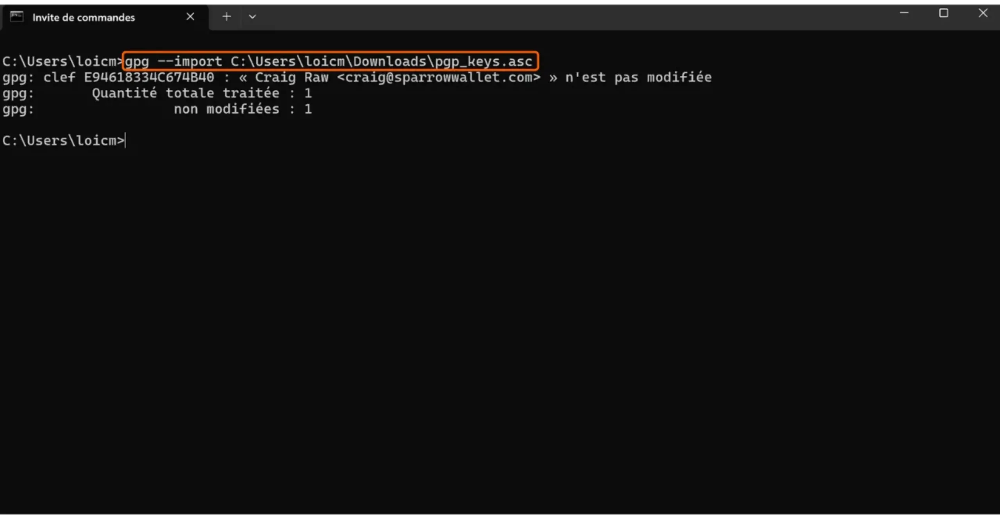

Periksa tanda tangan dengan perintah berikut:

```bash
gpg --verify [file.asc]
```

Ganti `[file.asc]` dengan jalur file tanda tangan. Dalam kasus Sparrow, file ini disebut "_sparrow-2.0.0-manifest.txt.asc_" untuk versi 2.0.0.

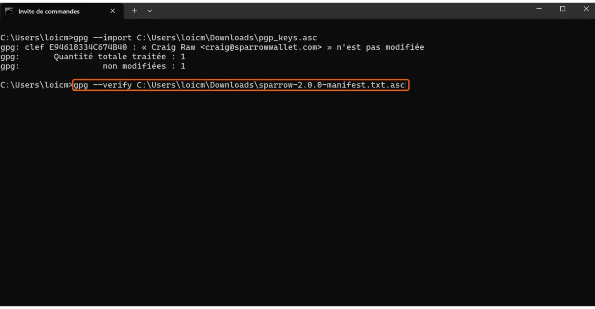

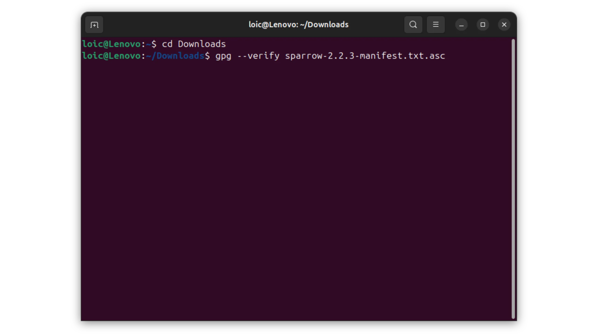

Jika tanda tangan tersebut valid, GPG akan secara eksplisit mengonfirmasinya. Anda kemudian dapat melanjutkan ke langkah berikutnya, karena verifikasi ini membuktikan keaslian file.

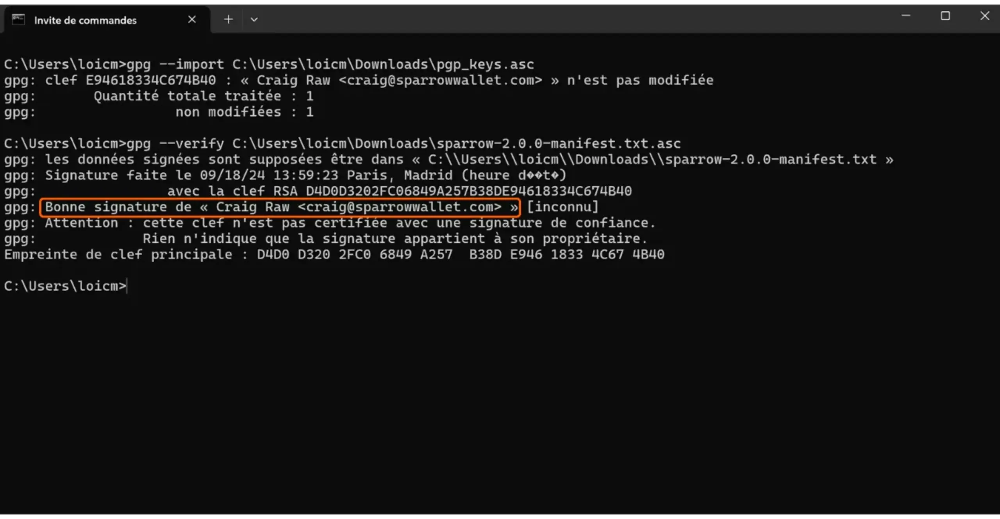


#### Memeriksa Hash

Setelah keaslian file yang berisi hash telah dikonfirmasi, saatnya untuk memeriksa integritas file installer, berdasarkan file yang telah diautentikasi ini. Tujuannya adalah untuk membandingkan hash file installer Anda dengan hash yang tertera pada file `.asc`. Jika keduanya cocok, ini menjamin bahwa kode perangkat lunak belum diubah sama sekali.

Pada Windows, buka terminal dan jalankan perintah berikut ini:

```bash
CertUtil -hashfile [file_path] SHA256 | findstr /v "hash"
```

Ganti `[file_path]` dengan lokasi installer.

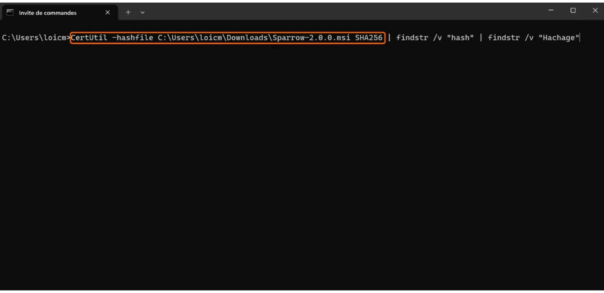

Terminal mengembalikan Hash dengan perangkat lunak yang telah diunduh.

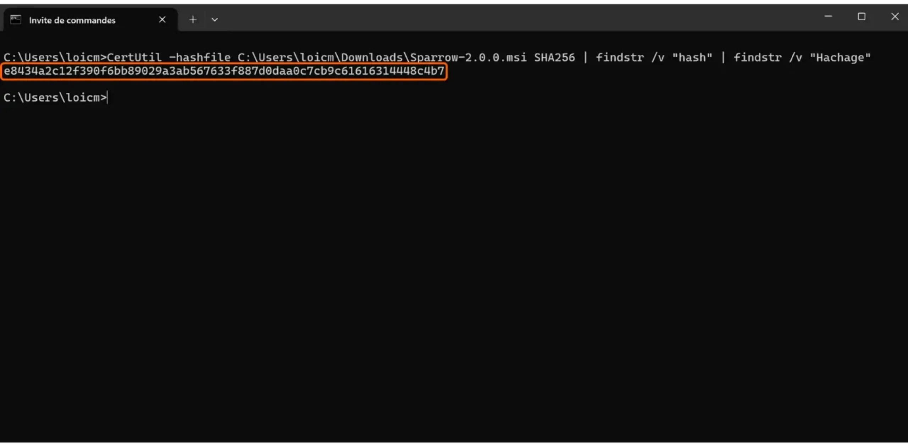

Kemudian bandingkan hasilnya dengan nilai yang sesuai di file "_sparrow-2.0.0-manifest.txt_".

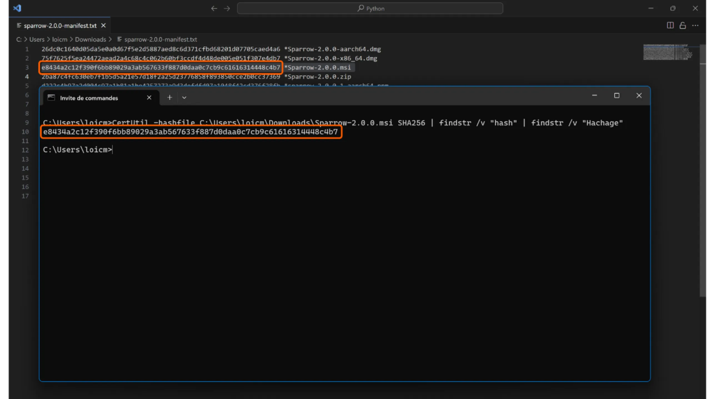

Dalam kasus saya, kedua nilai hash ini sangat cocok.

Pada macOS dan Linux, proses verifikasi Hash dilakukan secara otomatis, jadi tidak perlu membandingkan kedua sidik jari secara manual, seperti yang terjadi pada Windows.

Cukup jalankan perintah ini di bawah macOS:

```bash
shasum --check [file_name] --ignore-missing
```

Ganti `[nama_file]` dengan nama file yang diautentikasi yang berisi hash. Misalnya, untuk Sparrow wallet versi 2.0.0:

```bash
shasum --check sparrow-2.0.0-manifest.txt --ignore-missing
```

Jika hashnya cocok, maka outputnya akan sesuai:

```bash
Sparrow-2.0.0.dmg: OK
```

Pada Linux, perintahnya serupa:

```bash
sha256sum --check [file_name] --ignore-missing
```

Dan jika hash-nya cocok, Anda akan mendapatkannya:

```bash
sparrow_2.0.0-1_amd64.deb: OK
```

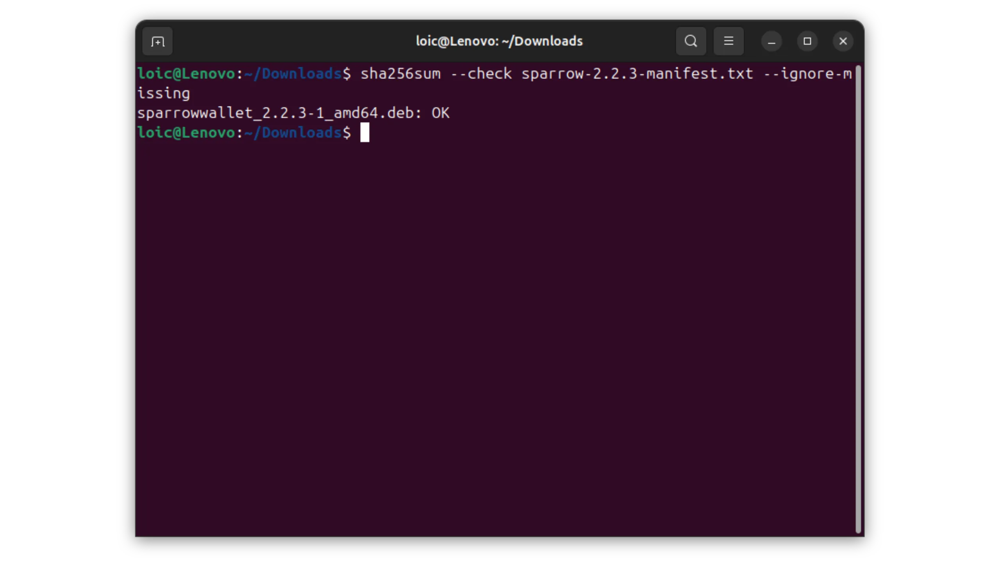

Sekarang Anda bisa yakin bahwa perangkat lunak yang telah Anda unduh adalah asli dan benar. Sekarang Anda dapat menginstalnya di komputer Anda.

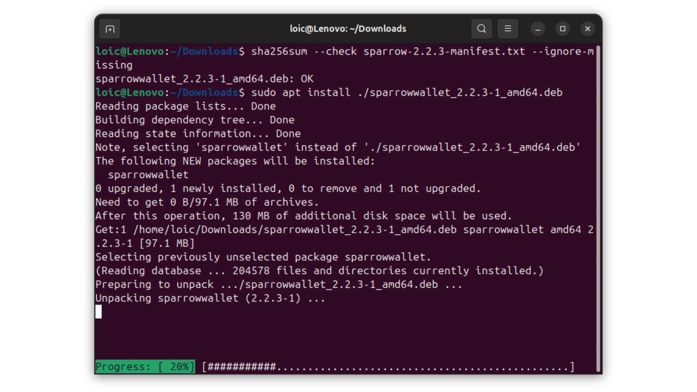

Memverifikasi integritas dan keaslian adalah metode yang cukup mudah, namun ini memberikan perlindungan yang nyata dan efektif terhadap sebagian besar ancaman yang terkait dengan pengunduhan dan instalasi perangkat lunak.

Pada bab berikutnya, kita akan melihat lebih dekat manajemen data. Kita akan membahas bagaimana Anda dapat melindungi diri dari dua risiko utama: kehilangan data dan pencurian data.

## Enkripsi dan perlindungan data

<chapterId>bcba9b26-72d2-446b-b23c-89927a2e857c</chapterId>

Melindungi data pribadi Anda adalah bagian penting dalam memastikan kedaulatan digital, privasi, dan keamanan Anda. Risiko terhadap data Anda bermacam-macam: peretasan, kehilangan perangkat keras, atau bahkan penyitaan fisik. Dengan menerapkan strategi pencadangan dan enkripsi yang efektif, Anda dapat menghindari sebagian besar potensi ancaman ini.

Dalam bab ini, kita akan melihat secara rinci cara mencadangkan dan mengenkripsi data Anda, serta membersihkan informasi sensitif pada dokumen Anda.

### Mencadangkan data Anda

#### Mengapa mencadangkan data Anda?

Pencadangan data pribadi atau bisnis secara rutin adalah langkah keamanan yang sangat penting, sering diabaikan hingga terlambat. Bertentangan dengan kepercayaan umum, pencadangan data bukanlah tugas opsional atau hanya untuk perusahaan: ini berlaku untuk setiap pengguna komputer. Apakah Anda memiliki dokumen pekerjaan, foto keluarga, dokumen pribadi, atau konten sensitif lainnya, data ini dapat tiba-tiba hilang karena berbagai alasan:

- Kegagalan Perangkat Keras: HDD dan SSD memiliki masa pakai terbatas. Tanpa peringatan, mereka bisa gagal, membuat data tidak dapat diakses.

- Serangan Komputer: Beberapa _malware_, khususnya ransomware, mengenkripsi berkas Anda secara lokal dan menuntut tebusan sebagai imbalan kunci dekripsi. Tanpa cadangan independen, Anda berada di bawah kendali mereka.

- Kesalahan Manusia: Salah penanganan, penghapusan yang tidak disengaja, atau pemformatan yang tidak disengaja dapat menyebabkan kehilangan data yang tidak dapat dipulihkan.

- Bencana Fisik: Kebakaran, kerusakan akibat air, pencurian, atau bahkan lonjakan listrik dapat membuat peralatan Anda tidak dapat digunakan dalam sekejap.

Itulah mengapa Anda memerlukan strategi pencadangan yang ketat, terencana dan tangguh.

#### Metode 3-2-1: standar keamanan yang kuat

Aturan "3-2-1" adalah standar yang diakui dalam keamanan TI. Aturan ini didasarkan pada prinsip-prinsip sederhana namun sangat efektif yang menjamin toleransi terhadap kesalahan dan insiden. Berikut cara kerjanya:

- 3 salinan data Anda: Ini mencakup salinan asli (file di komputer Anda) dan dua salinan cadangan tambahan.
  
- 2 media penyimpanan yang berbeda: Tujuannya adalah untuk menghindari masalah perangkat keras yang memengaruhi semua media Anda sekaligus. Contohnya, hard drive eksternal + cloud; atau NAS + komputer Anda.
  
- 1 salinan di luar lokasi: Salinan ini harus disimpan jauh dari lokasi utama Anda (di rumah kerabat, di server jarak jauh, di cloud yang aman, dll.). Ini melindungi Anda dari insiden lokal seperti kebakaran atau perampokan.

Mari kita ambil contoh pengguna standar, Alice, yang ingin mengamankan data pribadinya.

Alice menyimpan satu versi filenya di laptop, tempat ia menggunakannya setiap hari. Agar memiliki setidaknya dua media terpisah, ia secara rutin (misalnya, setiap Senin) menyalin semua datanya ke sebuah flash drive USB yang ia simpan di rumah. Untuk melindungi dirinya dari pencurian file jika terjadi kehilangan atau pencurian fisik, Alice mengenkripsi flash drive USB ini menggunakan perangkat lunak yang sesuai (kita akan melihat cara melakukannya nanti di bab ini).

Dengan konfigurasi ini, Alice sudah terlindungi dari banyak ancaman umum. Namun, satu risiko tetap ada: jika terjadi kebakaran atau perampokan di rumahnya, kedua salinan lokalnya (komputer dan flash drive USB) bisa hilang pada saat yang bersamaan. Untuk mengurangi risiko ini, ia memutuskan untuk menggunakan layanan penyimpanan cloud, yang juga ia gunakan untuk menyinkronkan file-filenya secara rutin.

https://planb.network/tutorials/computer-security/data/proton-drive-03cbe49f-6ddc-491f-8786-bc20d98ebb16

Dengan demikian, Alice mematuhi aturan 3-2-1: memiliki 3 salinan file (komputer, Flash Drive USB, cloud), yang disimpan di setidaknya 2 media yang berbeda (disk internal, Flash Drive USB, server jarak jauh), dengan setidaknya 1 salinan di luar lokasi (server cloud).

Strategi ini menjamin ketahanan yang sangat baik: jika komputernya rusak, ia dapat memulihkan filenya dari flash drive USB atau cloud; jika penyedia penyimpanan cloud mengalami kerusakan besar, ia masih memiliki berkasnya secara lokal; dan bahkan jika terjadi pencurian di mana laptop dan flash drive USB-nya dicuri, ia masih dapat memulihkan datanya melalui layanan cloud.

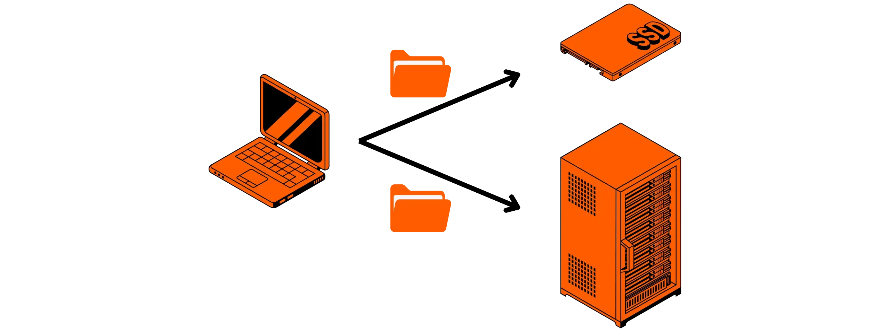

#### Mengotomatiskan untuk menghindari lupa

Salah satu cara terbaik untuk memastikan praktik pencadangan yang baik adalah dengan otomatisasi. Konfigurasikan komputer Anda agar pencadangan berjalan secara otomatis sesuai jadwal (setiap malam, setiap minggu, dll.). Ini mencegah kelalaian dan menjamin kelangsungan, bahkan jika Anda tidak dapat melakukannya untuk sementara waktu.

Secara praktis, ada beberapa cara untuk mengotomatiskan pencadangan Anda. Sebagai contoh, Anda dapat membuat skrip Python yang berjalan secara otomatis untuk menyalin data Anda ke media eksternal. Ini adalah solusi yang sederhana dan dapat disesuaikan.

Jika Anda memiliki NAS, program seperti _Syncthing_ atau _Rclone_ memungkinkan Anda mengotomatiskan pencadangan di dalam jaringan lokal Anda, tanpa menggunakan internet.

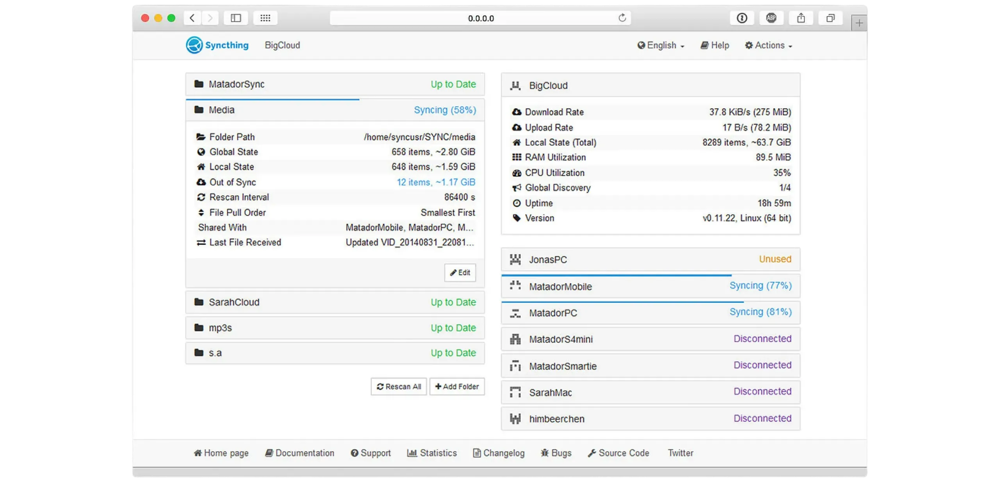

Untuk mengotomatiskan pencadangan ke layanan cloud, Anda dapat menggunakan perangkat lunak integrasi yang disediakan oleh penyedia itu sendiri. Salah satu contohnya adalah _Proton Drive_, yang menawarkan klien sinkronisasi untuk secara otomatis menyalin file lokal Anda ke cloud. Anda juga dapat memilih perangkat lunak yang lebih fleksibel seperti _Duplicati_, yang memungkinkan Anda menjadwalkan pencadangan terenkripsi ke berbagai layanan jarak jauh (Dropbox, Google Drive, Proton Drive, FTP, WebDAV, dll.).

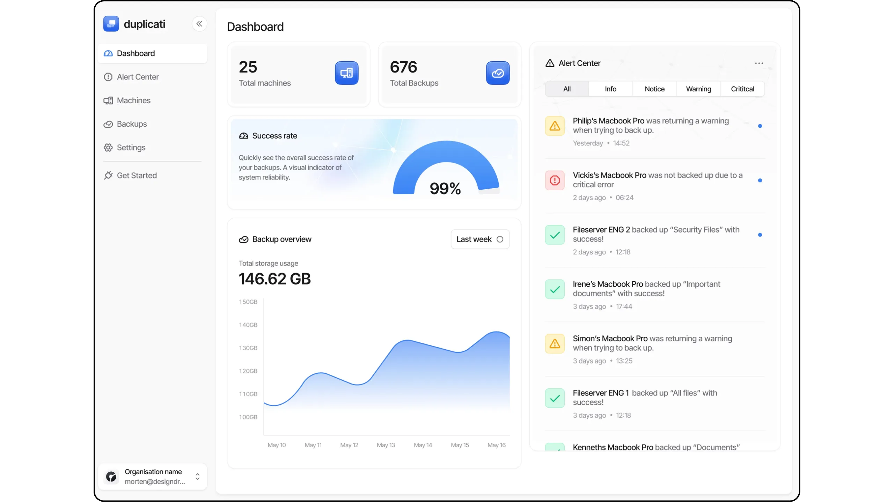

Ingat juga untuk menguji pencadangan Anda secara rutin, yaitu untuk memastikan bahwa Anda dapat memulihkannya. Pencadangan tidak berguna jika rusak, tidak lengkap, atau tidak terbaca.

Selain memastikan ketahanan data Anda, sama pentingnya untuk melindungi akses ke data tersebut. Faktanya, ketahanan dan keamanan sering kali saling bertentangan: semakin banyak salinan yang Anda buat dari file Anda, semakin Anda memperluas area yang rentan serangan, dan dengan demikian risiko penyerang mendapatkan akses ke sana. Itulah mengapa mengenkripsi data Anda adalah langkah yang sangat penting. Mari kita lihat bagaimana mempraktikkannya.

### Enkripsi penuh pada disk dan media eksternal

Salah satu pilar keamanan komputer pribadi adalah enkripsi data yang tersimpan. Secara khusus, enkripsi penuh pada media seperti hard drive internal, flash drive USB, atau disk eksternal memastikan bahwa, bahkan jika terjadi pencurian, kehilangan, atau perusakan fisik pada peralatan, tidak ada informasi yang dapat dibaca tanpa kunci dekripsi.

#### Mengapa ini penting?

Ketika media penyimpanan tidak terenkripsi, cukup colokkan ke komputer mana pun untuk mendapatkan akses langsung ke isinya. Tidak ada penghalang yang melindungi file. Ini berarti jika laptop Anda dicuri, atau jika Anda kehilangan flash drive USB, seseorang dengan niat jahat dapat mengakses dokumen pribadi Anda.

Di luar masalah privasi yang dipertaruhkan, file Anda juga dapat merepresentasikan risiko keamanan yang nyata. Sebagai contoh nyata: jika cadangan Anda berisi salinan dokumen identitas Anda, penyerang dapat mengeksploitasinya untuk menyamar sebagai Anda, membuka rekening bank atau kripto atas nama Anda, atau bahkan mengambil pinjaman bank atas nama Anda. Jenis kebocoran informasi ini dapat memiliki konsekuensi serius, baik secara pribadi maupun profesional.

Enkripsi penuh seperti kunci gembok: selama kata sandi tidak diberikan, data tetap tidak dapat digunakan. Bahkan penyerang yang dilengkapi dengan program pemulihan data khusus tidak akan dapat mengekstrak apa pun tanpa kuncinya.

#### Solusi teknis apa yang ditawarkan sistem Anda?

- *Linux (Debian)*

Pada Linux, solusi standarnya adalah LUKS (*Linux Unified Key Setup*). LUKS adalah sistem manajemen volume terenkripsi yang terintegrasi ke dalam sebagian besar distribusi. Saat sistem pertama kali diinstal, Anda umumnya akan diminta untuk mengenkripsi seluruh disk komputer. Tentu saja, saya sangat merekomendasikan Anda untuk mengaktifkan opsi ini. Setelah enkripsi diaktifkan, sistem akan meminta kata sandi pada setiap boot, bahkan sebelum OS dimuat. Ini memastikan bahwa akses fisik ke disk tidak dapat melewati sistem keamanan.

https://planb.network/tutorials/computer-security/data/luks-13d9928b-08b1-478c-a1b4-67617978584a

Jika Anda ingin mengenkripsi disk eksternal atau flash drive USB, ini juga dapat dilakukan dari baris perintah atau melalui Interface grafis. Disk tersebut harus diformat, sehingga semua data yang ada akan hilang jika tidak dicadangkan terlebih dahulu.

**Melalui terminal**

Pastikan Anda telah menginstal paket *cryptsetup*:

```bash
sudo apt update
sudo apt install cryptsetup
```

Mulailah dengan mengidentifikasi flash drive USB USB Anda dengan perintah berikut:

```bash
lsblk
```

Anda akan melihat perangkat seperti `/dev/sdb` dengan partisi yang terkait, misalnya `/dev/sdb1`. Berhati-hatilah dalam memilih disk yang tepat, karena disk tersebut akan terhapus!

Untuk mengenkripsi _key_, jalankan perintah berikut untuk menginisialisasi enkripsi:

```bash
sudo cryptsetup luksFormat /dev/sdb
```

Ketik "YES" dengan huruf besar untuk mengonfirmasi operasi, lalu pilih dan konfirmasikan passphrase yang kuat. Kata sandi ini akan memungkinkan Anda untuk mengakses data Anda: ingatlah untuk membuat cadangan, karena tanpa kata sandi ini, akses ke data  _key_ akan hilang secara permanen.

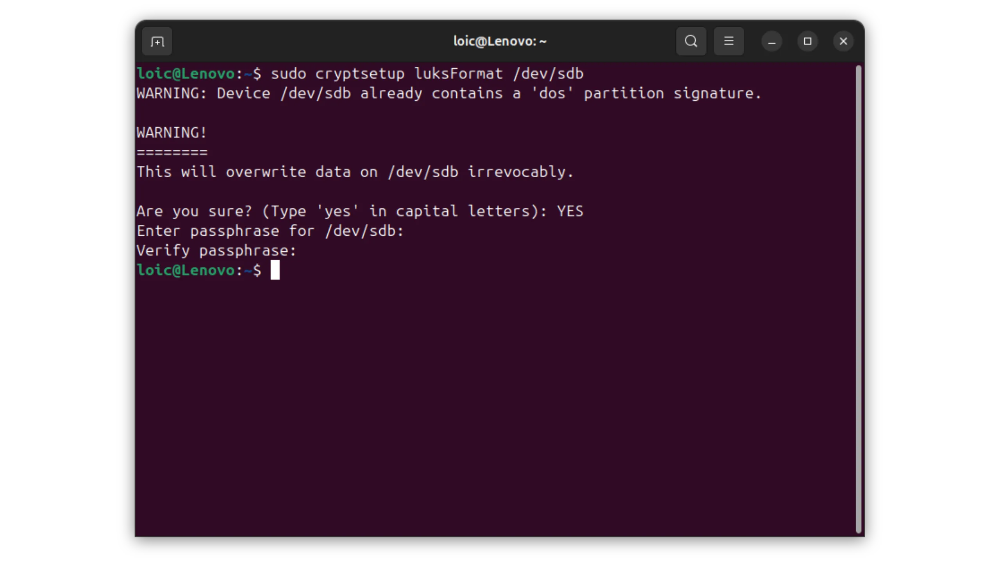

Membuka  _key_ dan membuka volume
```bash
sudo cryptsetup open /dev/sdb encrypted_usb
```

Anda harus memasukkan passphrase Anda untuk membuka  _key_ volume. `encrypted_usb` adalah nama yang diberikan pada volume yang telah didekripsi.

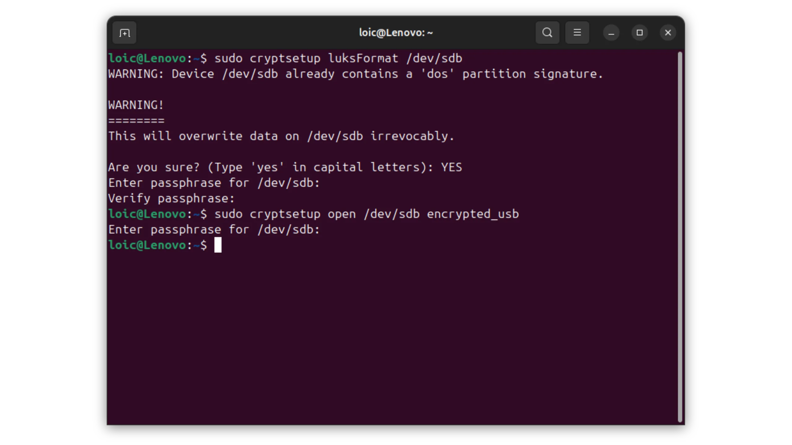

Kemudian format partisi yang didekripsi. Untuk format hanya Linux :

```bash
sudo mkfs.ext4 /dev/mapper/encrypted_usb
```

Atau, jika Anda menginginkan kompatibilitas dengan Windows:

```bash
sudo mkfs.vfat /dev/mapper/encrypted_usb
```

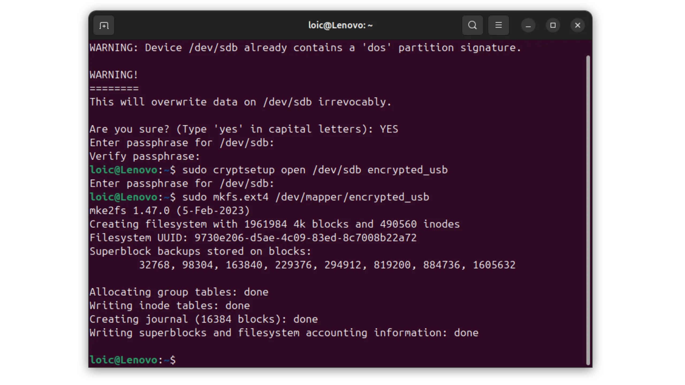

Pasang  _key_ untuk digunakan:

```bash
sudo mkdir -p /mnt/usb
sudo mount /dev/mapper/encrypted_usb /mnt/usb
```

Anda sekarang dapat mengakses  _key_ Anda melalui direktori `/mnt/usb`, dan membaca serta menulis file seperti pada volume lainnya.

Untuk merubah dan mengenkripsi ulang  _key_:

```bash
sudo umount /mnt/usb
sudo cryptsetup close encrypted_usb
```

Anda kemudian dapat melepas flash drive USB dengan aman.

Untuk penggunaan flash drive USB Anda selanjutnya:

```bash
sudo cryptsetup open /dev/sdb encrypted_usb
sudo mount /dev/mapper/encrypted_usb /mnt/usb
#### … you work on the usb …
sudo umount /mnt/usb
sudo cryptsetup close encrypted_usb
```

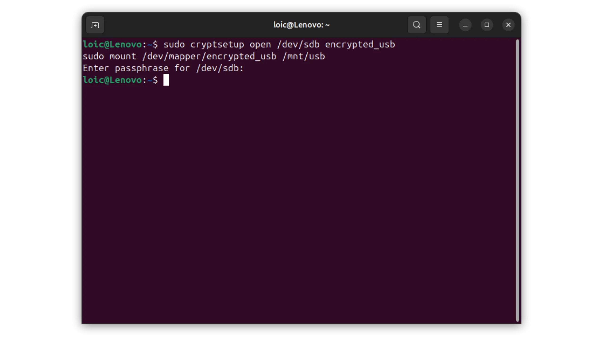

Jika mau, Anda juga bisa mengotomatiskan urutan ini menggunakan skrip Python atau Bash.

**Melalui GNOME Disks:**

Solusi lainnya adalah menggunakan perangkat lunak GNOME Disks dengan Interface grafisnya, yang seringkali lebih sederhana daripada menggunakan terminal. Biasanya, utilitas ini sudah terinstal sebelumnya pada Ubuntu. Jika tidak demikian, Anda dapat menginstalnya secara manual dengan perintah berikut:

```bash
sudo apt update
sudo apt install -y gnome-disk-utility
```

Untuk membuka perangkat lunak, masuk ke menu aplikasi Ubuntu dan cari "*Disks*". Biasanya ditemukan secara default di direktori "*Utilities*".

Pada kolom sebelah kiri, cari flash drive USB Anda. Jika partisi sudah ada, pilih partisi tersebut; jika belum, buatlah partisi baru: klik tombol "+" di bawah daftar partisi.

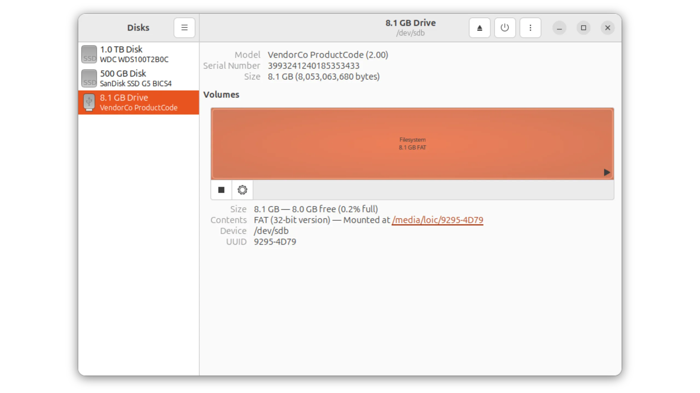

Kemudian pilih partisi yang akan dienkripsi. Klik ikon roda gigi, lalu pilih "Format Partition...".

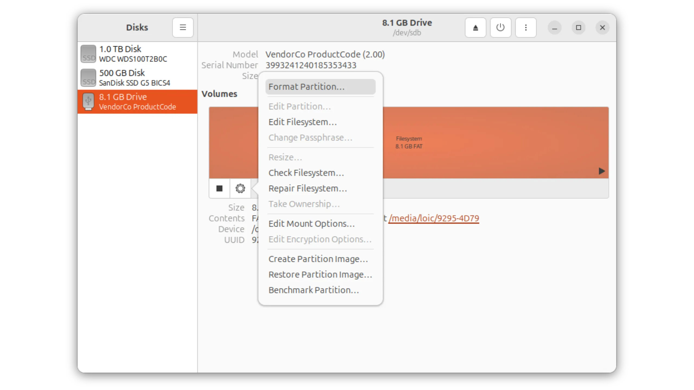

Isi form:

- Pada "Nama volume", masukkan nama (misalnya `usb`);
- Pilih format "Internal disk for use with Linux systems only (Ext4)";
- Centang kotak "Password protected volume (LUKS)".

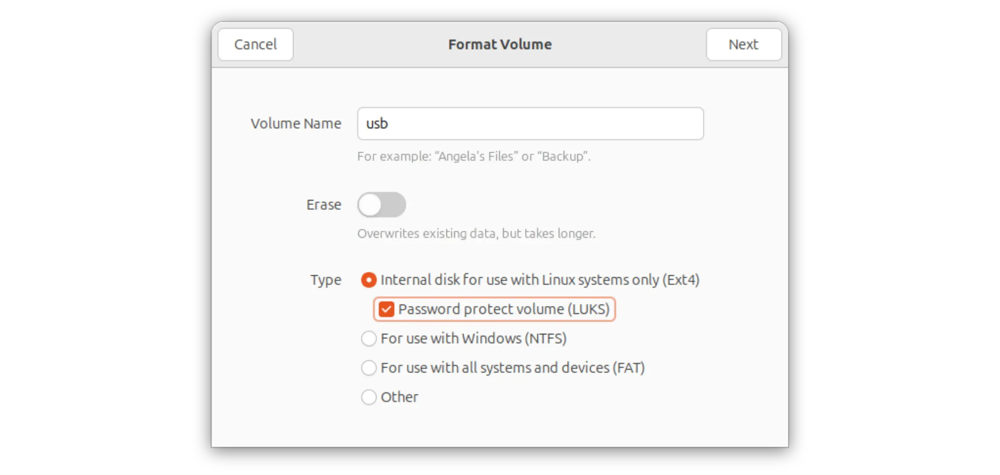

Masukkan dan konfirmasikan passphrase yang kuat.

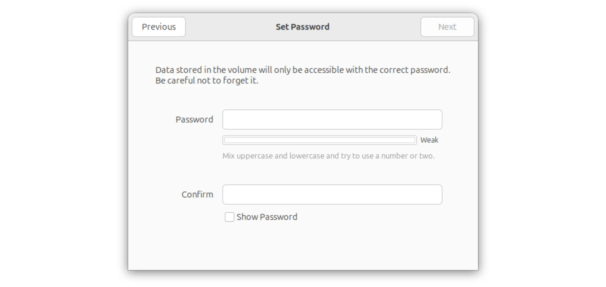

Konfirmasikan dan tunggu hingga partisi selesai diformat (semua data akan dihapus).

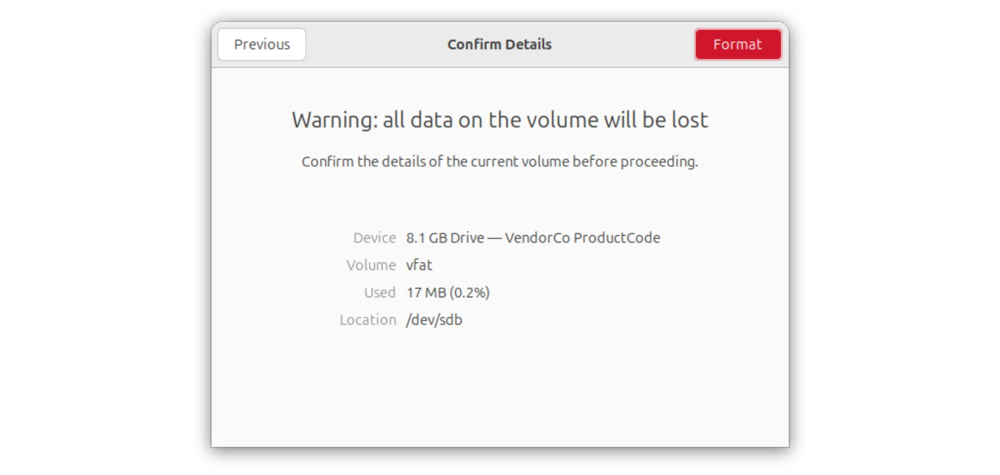

Setelah proses selesai, partisi akan muncul dengan gembok kecil. Pilihlah, lalu klik gembok tersebut untuk membukanya.

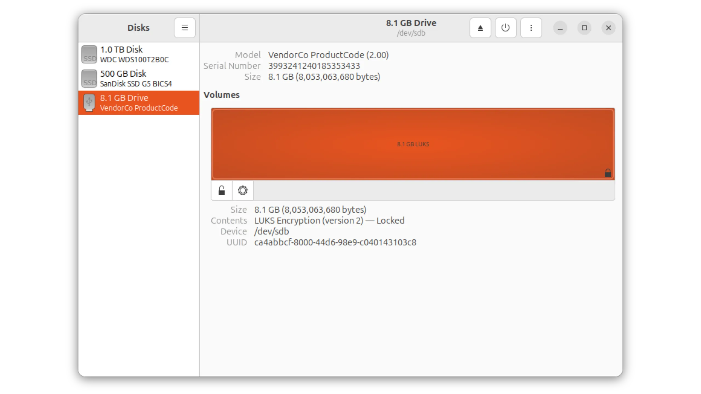

Masukkan kata sandi, lalu klik "Unlock".


Volume akan secara otomatis terpasang dan dapat diakses dari pengelola file Anda, biasanya di direktori `/media/username/usb`.

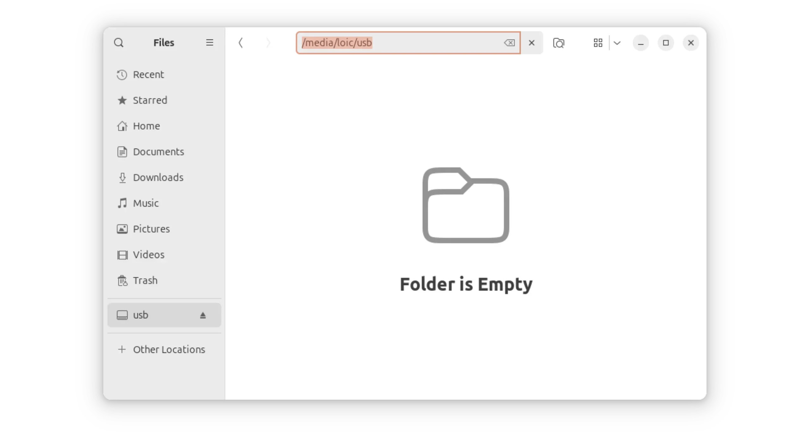

Untuk melepas flash drive USB dan mengaktifkan kembali enkripsi, klik ikon gembok sekali lagi di GNOME Disks.

Terakhir, klik tombol berbentuk panah di sudut kanan atas untuk mencabut flash drive usb dari PC Anda. Pada saat Anda masuk kembali, Ubuntu akan secara otomatis mendeteksi kunci terenkripsi dan meminta kata sandi, tanpa harus membuka GNOME Disks.


- *Windows:*

Pada Windows, ada solusi bawaan yang memungkinkan Anda mengenkripsi disk Anda. Mengaktifkannya mudah: cukup buka pengaturan "_Privacy & Security_", lalu centang kotak "_Device encryption_" di submenu dengan nama yang sama. Kunci pemulihan kemudian akan secara otomatis disimpan di akun Microsoft Anda yang terkait.

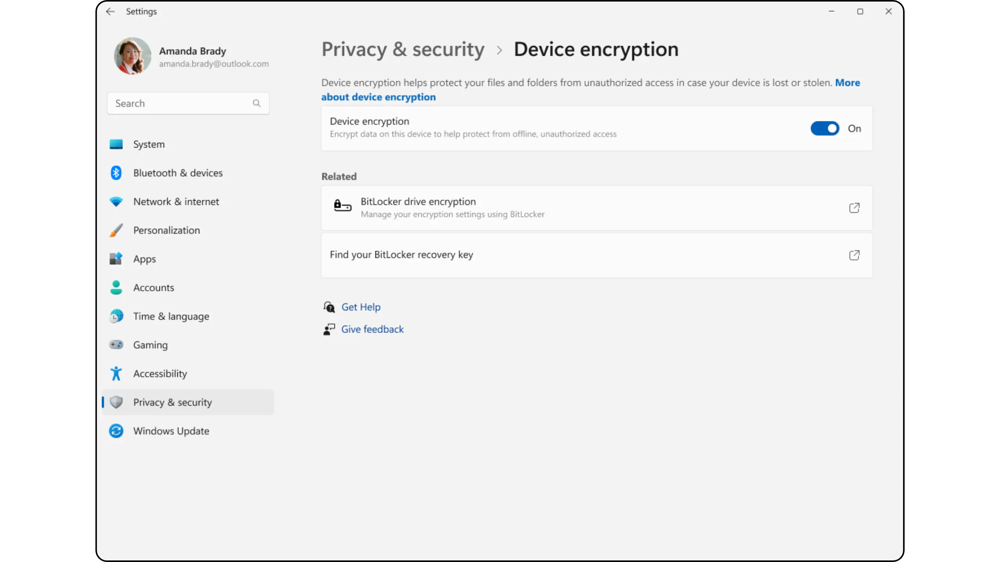

Jika Anda menggunakan akun lokal, atau jika komputer Anda tidak mendukung fitur ini secara bawaan, Anda dapat mengatur _BitLocker_ secara manual (perangkat lunak enkripsi berbayar dari Microsoft). Namun, ada juga alternatif sumber terbuka seperti _VeraCrypt_.

_VeraCrypt_ adalah free software dan lintas-platform yang kompatibel dengan Windows, Linux, dan macOS. Ini dapat digunakan untuk mengenkripsi seluruh disk atau partisi, atau untuk membuat kontainer file yang berfungsi sebagai disk virtual yang aman. Interface VeraCrypt memungkinkan volime ini dipasang seperti disk konvensional, dan hanya dapat diakses setelah otentikasi.

Untuk mempelajari lebih lanjut mengenai solusi ini, silakan baca tutorial lengkap ini:

https://planb.network/tutorials/computer-security/data/veracrypt-d5ed4c83-7c1c-4181-95ea-963fdf2d83c5

- *macOS :*

Pada macOS, enkripsi disk sistem didasarkan pada _FileVault_, sebuah fitur bawaan yang dapat diakses dari pengaturan keamanan. Jika Mac Anda dilengkapi dengan chip Apple Silicon (M1, M2...) atau chip T2, enkripsi perangkat keras sudah diaktifkan secara permanen. Namun, mengaktifkan _FileVault_ menambahkan lapisan keamanan ekstra dengan mengenkripsi seluruh volume sistem.


Setelah FileVault diaktifkan, Anda akan diminta untuk memilih metode pemulihan jika kata sandi hilang: entah menggunakan akun _iCloud_ Anda, atau membuat kunci cadangan unik. Kunci ini harus disimpan di tempat yang aman, karena kehilangannya akan membuat data Anda tidak dapat diakses secara permanen.

Untuk media penyimpanan eksternal (disk Hard, stik USB, dll.), enkripsi dilakukan dengan menggunakan utilitas disk. Anda harus memformat ulang volume sepenuhnya:

- Pilih perangkat, klik "*Hapus*"
- Pilih skema "Tabel Partisi GUID*"
- Kemudian pilih format sistem file yang dienkripsi (*APFS* atau *Mac OS extended*)
- Pilih kata sandi yang kuat
- Klik "*Hapus*" lalu "*OK*" dan enkripsi selesai

  Untuk media penyimpanan eksternal (hard disk, flash drive USB, dll.), enkripsi dilakukan menggunakan Utilitas Disk. Anda harus memformat ulang volume tersebut secara keseluruhan:
  
- Pilih perangkat, klik "_Delete_"
- Pilih skema "_GUID Partition Table_"
- Kemudian pilih format sistem file terenkripsi (_APFS atau Mac OS extended_)
- Pilih kata sandi yang kuat
- Klik "_Delete_" lalu "_OK_" dan enkripsi selesai

Setelah enkripsi diterapkan, drive eksternal hanya dapat dipasang dengan memasukkan kata sandi ini. Sistem kemudian akan mendekripsinya secara langsung.

#### Beberapa rekomendasi untuk cadangan terenkripsi Anda

Sebelum mengenkripsi media, Anda perlu mencadangkan semua data yang di dalamnya (kecuali jika kosong, tentu saja), karena prosedur enkripsi umumnya menghapus konten awal.

Pemilihan kata sandi juga sangat penting: kata sandi harus panjang, kompleks, dan unik, karena itu adalah satu-satunya perlindungan antara data Anda dan pihak ketiga yang berniat jahat. Anda juga perlu membuat cadangan, misalnya di pengelola kata sandi, karena tidak seperti layanan online, tidak ada mekanisme pemulihan. Jika Anda lupa kata sandi, data akan hilang selamanya.

### Enkripsi file selektif

Dalam beberapa kasus, tidaklah perlu maupun praktis untuk mengenkripsi seluruh hard disk atau media eksternal. Dalam situasi seperti itu, Anda dapat memilih enkripsi selektif, yang melibatkan pengamanan hanya pada file atau direktori tertentu yang mengandung data sensitif.

Salah satu metode paling dikenal untuk mengenkripsi file adalah dengan menggunakan GPG. Program ini didasarkan pada kriptografi asimetris: Anda memiliki sepasang kunci, satu publik yang dapat Anda distribusikan secara bebas kepada koresponden Anda, dan yang lainnya privat, yang harus tetap dirahasiakan. File dienkripsi menggunakan kunci publik penerima, tetapi hanya dapat didekripsi menggunakan kunci privatnya. 

Protokol ini sempurna untuk bertukar file sensitif secara aman dengan orang lain, tanpa berbagi kata sandi. Untuk penggunaan pribadi atau sesekali, GPG juga memungkinkan enkripsi simetris: berkas tersebut kemudian dilindungi oleh kata sandi unik yang hanya Anda ketahui.

Alternatif yang sangat baik adalah Cryptomator. Perangkat lunak open source ini memungkinkan Anda untuk membuat brankas: sebuah direktori khusus di mana semua file yang ditempatkan secara otomatis dienkripsi. Brankas ini dapat disinkronkan dengan layanan cloud seperti Dropbox, Google Drive, atau Nextcloud tanpa penyedia tersebut pernah memiliki akses ke data yang tidak terenkripsi. Aplikasi ini tersedia di semua sistem operasi, termasuk Android dan iOS, dan tidak memerlukan keahlian teknis khusus untuk menggunakannya.

https://planb.network/tutorials/computer-security/data/cryptomator-84e52c76-2253-49fe-81da-e05e90c28d0d

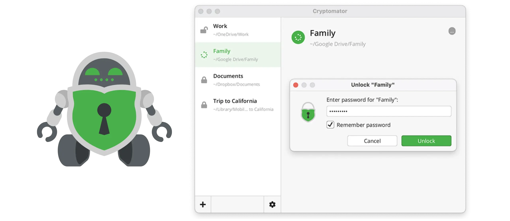

https://planb.network/tutorials/computer-security/data/picocrypt-98c213bd-9ace-425b-b012-bea71ce6b38f

Terakhir, VeraCrypt juga dapat digunakan dalam mode kontainer, yang menciptakan file yang berfungsi sebagai arsip terenkripsi, dapat dipasang seperti disk.

Sekarang setelah Anda mempelajari cara melindungi data pribadi Anda dari kehilangan dan pencurian, bab berikutnya akan membahas aspek penting lainnya: bagaimana mencegah file pribadi Anda menjadi celah serangan melalui metadatanya.

## Pembersihan metadata

<chapterId>0869e92e-5488-4e8a-90e6-9b9d1c58a19b</chapterId>

Setiap kali Anda membuat file digital, baik itu foto, dokumen kantor, file audio atau video, file tersebut berisi metadata di latar belakang. Informasi ini tidak terlihat secara langsung ketika Anda membuka file, tetapi ada di sana, dan dapat berisi Elements yang sangat sensitif.

### Mengapa metadata merupakan risiko?

Metadata adalah data yang terlampir pada sebuah file, yang perannya adalah untuk memberikan informasi kontekstual tentang konten. Dalam sebuah gambar, ini dapat mencakup tanggal dan waktu gambar diambil, koordinat GPS yang tepat, model kamera atau smartphone yang digunakan, dan terkadang bahkan pengaturan teknis. Dalam dokumen teks, ini dapat mencakup nama penulis, nama perusahaan, ID sesi pengguna, stempel waktu pembuatan dan modifikasi, atau bahkan komentar internal yang ditinggalkan selama pengeditan.

Metadata ini mungkin tampak tidak berbahaya, tetapi dapat digunakan oleh pelaku kejahatan untuk mengidentifikasi penulis sebuah file, menemukan lokasi fisik seseorang, merekonstruksi peristiwa atau kebiasaan, atau bahkan mengeksploitasi celah perangkat lunak berdasarkan versi perangkat lunak yang digunakan.

Mari kita ambil contoh nyata: Anda mengunggah foto yang seharusnya anonim di sebuah forum. Jika Anda belum menghapus metadata EXIF, satu klik saja dapat mengungkapkan koordinat GPS yang tepat dari rumah Anda, model ponsel Anda, dan tanggal pasti foto tersebut diambil. Demikian pula, dokumen PDF yang dikirim secara anonim mungkin berisi nama lengkap Anda di propertinya.

Itulah mengapa beberapa platform penerbitan media dan komunikasi secara otomatis menghapus metadata dari foto Anda. Ini termasuk X (Twitter), Instagram, Signal, dan Session. Di sisi lain, platform lain sama sekali tidak menghapus metadata: ini terjadi pada sebagian besar forum online, banyak aplikasi email, atau bahkan ketika Anda menerbitkan langsung di sebuah situs web.

Ini adalah keharusan penting yang harus diadopsi: segera setelah sebuah file meninggalkan ruang privat Anda, Anda perlu berpikir untuk membersihkan metadatanya untuk menghindari pengungkapan informasi pribadi atau sensitif tanpa sepengetahuan Anda. Mari kita lihat cara melakukannya, tergantung pada sistem operasi Anda.

### Di Linux (Debian)

#### Menggunakan ExifTool

Cara yang paling lengkap dan dapat diandalkan untuk mengelola dan menghapus metadata adalah ExifTool, yang dikembangkan oleh Phil Harvey. Alat ini kompatibel dengan sejumlah besar format file (JPG, PNG, PDF, MP3, DOCX...) dan memungkinkan tampilan dan penghapusan metadata.

- Langkah 1: Instal ExifTool

Untuk menginstalnya pada distribusi Debian (Ubuntu), buka terminal dan ketik perintah:

```bash
sudo apt update
sudo apt install libimage-exiftool-perl
```

Paket ini menginstal `exiftool`, yang kemudian dapat Anda gunakan secara langsung dari baris perintah.

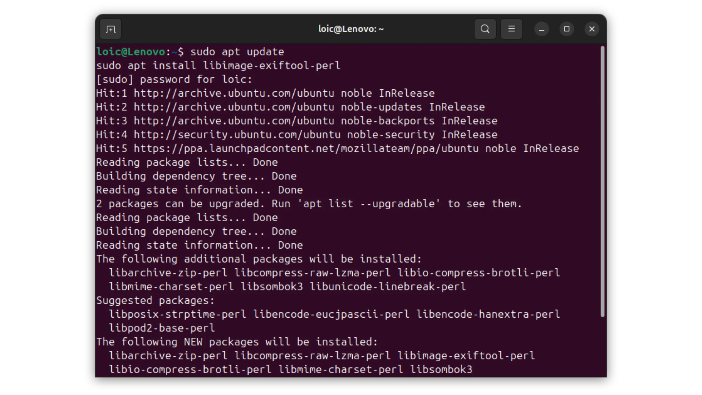

- Langkah 2: Melihat metadata file** (dalam bahasa Prancis)

Untuk melihat semua metadata yang terkandung dalam file, gunakan perintah berikut:

```bash
exiftool name.jpg
```

Ganti `nama.jpg` dengan nama asli file Anda. Pastikan juga Anda berada di direktori yang berisi gambar ini. Sebagai contoh, jika saya memiliki foto patung Satoshi Nakamoto di direktori `/Downloads`, saya dapat menampilkan metadata dengan menjalankan perintah berikut:

```bash
cd Downloads
exiftool Satoshi-Nakamoto-Lugano.jpeg
```

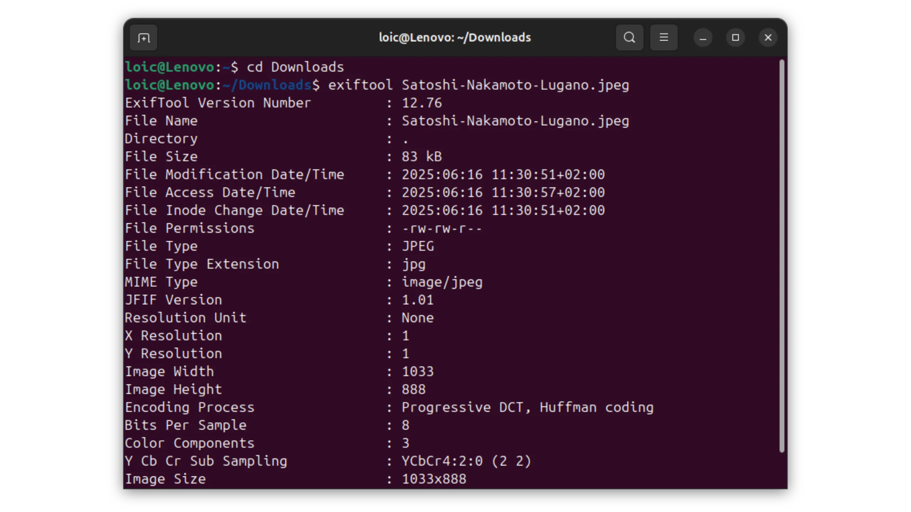

Anda kemudian akan melihat daftar panjang atribut, yang mungkin termasuk di dalamnya:

- Tanggal dan waktu pembuatan
- Lokasi GPS
- Produsen dan model kamera
- Perangkat lunak yang digunakan untuk mengedit
- Informasi tentang penulis...

Ini memberi Anda gambaran lengkap tentang apa yang akan Anda terbitkan atau kirimkan.

- Langkah 3: Menghapus metadata

Untuk menghapus semua metadata yang tidak perlu dari file, gunakan perintah:

```bash
exiftool -all= name.jpg
```

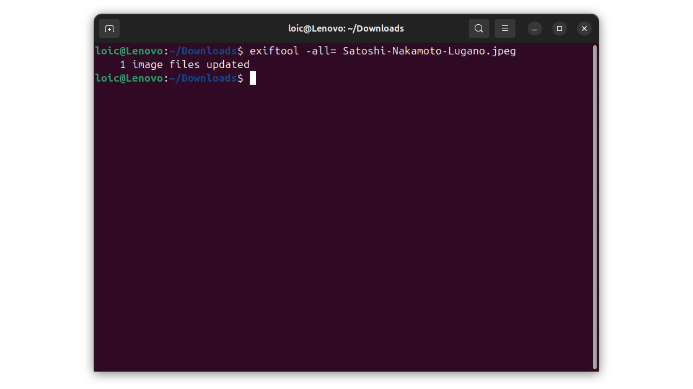

Perintah ini secara otomatis membuat salinan file asli dengan metadata yang telah dihapus. File asli dipertahankan dengan ekstensi `_original` yang ditambahkan ke namanya.

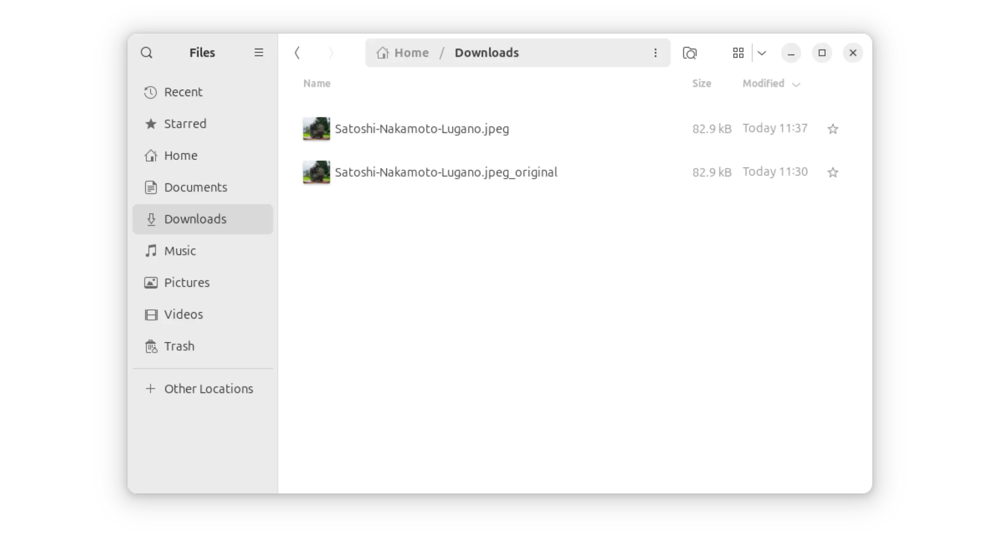

Jika Anda tidak ingin menyimpan yang asli, Anda dapat menghapusnya dengan perintah:

```bash
exiftool -all= -overwrite_original name.jpg
```

Jika kita melihat kembali metadata file kita, kita dapat melihat bahwa semua metadata yang tidak perlu atau sensitif telah dihapus.

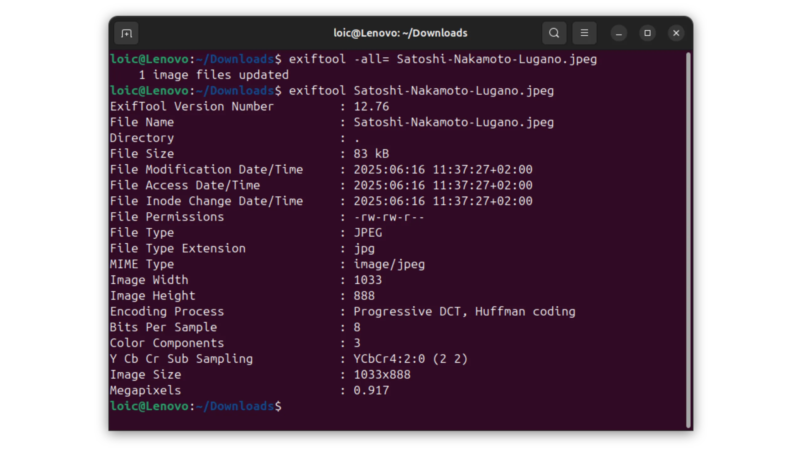

- Langkah 4: Membersihkan seluruh direktori

Jika Anda memiliki beberapa file untuk diproses dalam direktori yang sama, Anda dapat menggunakan perintah umum seperti:

```bash
exiftool -all= *.jpeg
```

Ini akan menghapus metadata semua file JPEG dalam direktori saat ini. Anda dapat menyesuaikan ekstensi sesuai dengan kebutuhan Anda (`*.png`, `*.pdf`...).

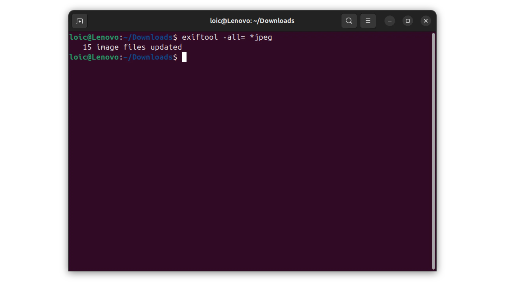

#### Menggunakan MAT2

Sebagai alternatif untuk ExifTool, Anda dapat menggunakan MAT2 (*Metadata Anonymization Toolkit v2*).

- Memasang MAT2:

```bash
sudo apt install mat2
```

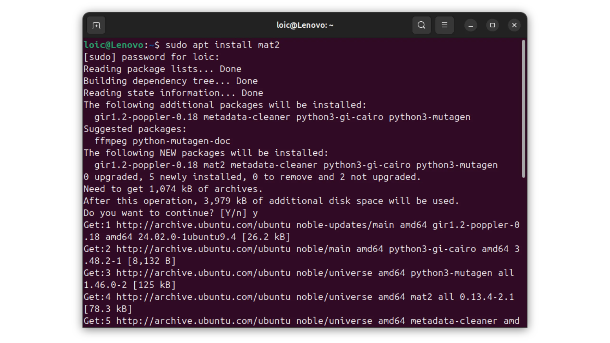

Setelah terinstal, Anda dapat menggunakannya dari baris perintah seperti ini:

```bash
mat2 fichier.pdf
```

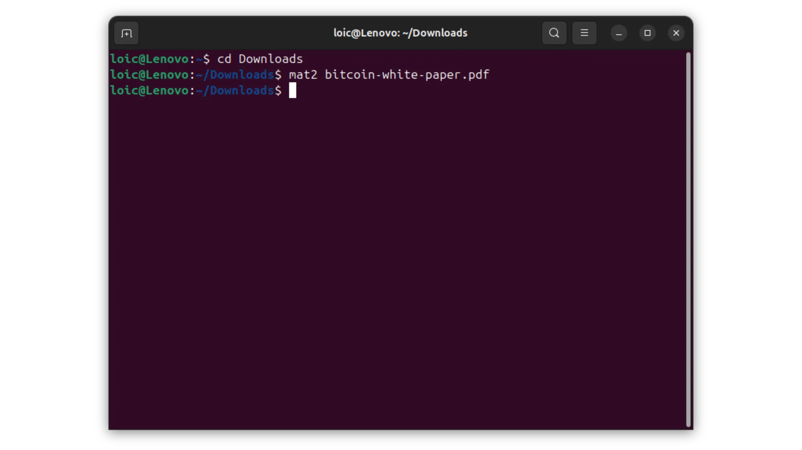

Secara default, MAT2 tidak memodifikasi file asli: MAT2 membuat versi yang sudah dibersihkan di direktori yang sama dengan akhiran `-clean` yang ditambahkan.

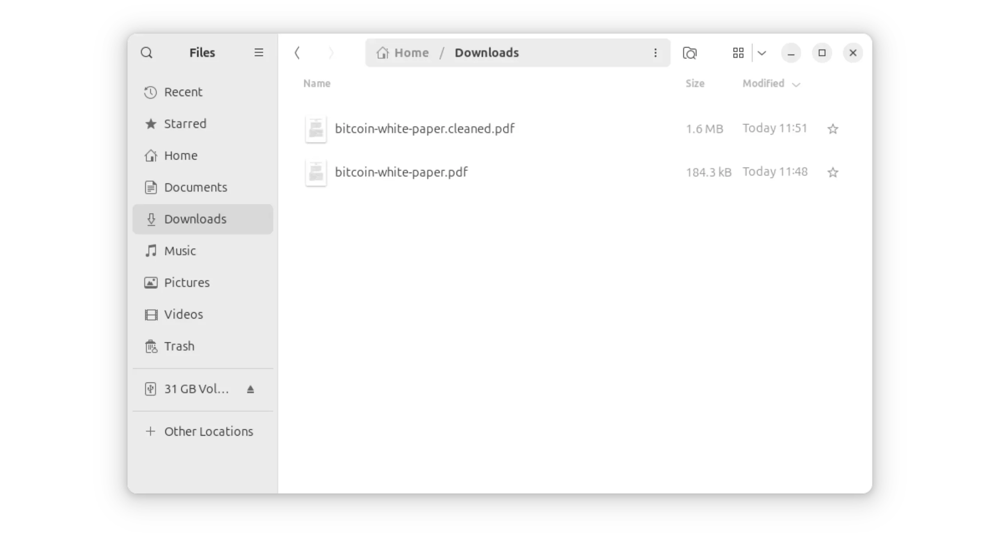

Untuk membersihkan seluruh direktori, seperti direktori `/Downloads`:

```bash
mat2 ~/Downloads/*
```

### Platform lain (Windows dan macOS)

Pada Windows dan macOS, ada beberapa metode untuk menghapus metadata dari dokumen Anda. Menurut pendapat saya, yang paling mudah adalah menggunakan perangkat lunak open source [ExifCleaner](https://exifcleaner.com/). Program ringan ini memiliki Interface grafis dan dapat menangani sebagian besar format berkas hanya dengan menyeret dan melepaskan (drag and drop). Dengan menempatkan satu atau lebih berkas ke Interface, perangkat lunak ini secara otomatis menghapus metadata yang tidak perlu dan mengganti file asli di direktori yang sama. ExifCleaner tersedia untuk Windows, macOS, dan Linux.

Sangat mudah digunakan: jalankan saja perangkat lunaknya, lalu seret dan letakkan satu atau beberapa file ke dalam window.

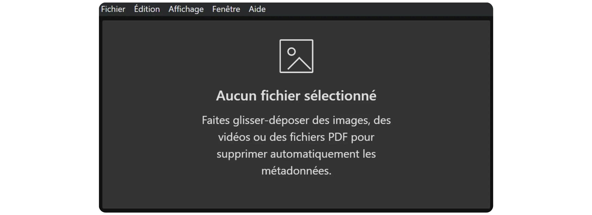

Tunggu beberapa saat sementara program ini membersihkan metadata. Setelah prosesnya selesai, Anda akan melihat ringkasan yang menunjukkan jumlah metadata awal dan akhir. Semua informasi yang tidak berguna akan dihapus.

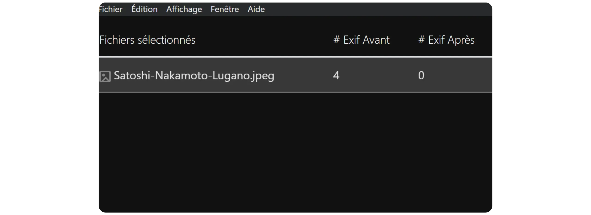

Maka dari itu, membersihkan metadata dari file yang Anda bagikan adalah tindakan yang baik untuk diadopsi dalam hal keamanan TI. Berkat program-program sederhana yang disajikan di bab ini, ini adalah kebiasaan yang dapat Anda terapkan dengan mudah dalam keseharian.

Kita telah sampai di akhir dari bagian pengamanan komputer Anda ini. Pada bagian berikutnya, kita akan melihat secara mendalam salah satu program paling penting di komputer Anda: browser web. Browser web sendiri menjadi pusat sebagian besar aktivitas digital Anda, menjadikannya target utama baik dari segi keamanan maupun privasi.

# Browser: OS di dalam OS

<partId>125c3d99-6aba-4050-bc7c-8543ef8587e4</partId>

## Sejarah singkat tentang navigator

<chapterId>ac6d2c23-5883-4564-b6a9-bc109b47f92c</chapterId>

Browser web adalah perangkat lunak yang memungkinkan Anda mengakses situs web dan konten yang tersedia di _World Wide Web_. Perannya adalah untuk menginterpretasikan bahasa-bahasa yang digunakan untuk membuat halaman web, terutama HTML, CSS, dan JavaScript, guna menampilkan konten situs dalam cara yang mudah dibaca dan interaktif. Browser web berfungsi sebagai interface antara pengguna dan server web, dengan mengirimkan permintaan dan menerima respons melalui protokol HTTP atau HTTPS.

Namun saat ini, browser telah menjadi jauh lebih dari sekadar perangkat lunak: ia sering kali menjadi Interface utama dalam komputasi, terutama untuk pengguna pemula. Itulah mengapa browser terkadang dianggap sebagai "sistem operasi sekunder" di dalam sistem operasi yang sebenarnya (yang kita pelajari di bagian pertama SCU202). Memang, banyak tugas yang dulunya dilakukan menggunakan perangkat lunak lokal khusus sekarang dilakukan langsung secara online melalui browser: hiburan, pekerjaan kantor (pengolah kata, spreadsheet, presentasi), manajemen email, pengiriman pesan, penyimpanan file, dan kerja kolaboratif.

Namun, browser tidak selalu memegang peran sentral ini. Sejarah browser ditandai oleh siklus inovasi, persaingan teknologi, dan terkadang dominasi monopoli. Menelusuri sejarah ini akan membantu kita memahami bagaimana browser menjadi begitu kompleks, dan mengapa keamanannya menjadi isu yang sangat penting saat ini.

→ Browser web sering kali disalahpahami dengan mesin pencari. Padahal keduanya sangat berbeda. Browser web digunakan untuk menampilkan situs web, sedangkan mesin pencari (yang dapat diakses dari browser web) digunakan untuk menemukan informasi online dengan mengindeks dan mengklasifikasikan halaman web.

### Kelahiran dan browser pertama

Sejarah browser web dimulai dengan kelahiran _World Wide Web_, yang ditemukan oleh Tim Berners-Lee pada tahun 1989-1990. Ini adalah sebuah sistem untuk mengakses halaman yang berisi teks, gambar, video, atau tautan melalui Internet, menggunakan browser web. Untuk membuat sistem baru ini dapat diakses, pada musim gugur 1990 ia mengembangkan browser web pertama, yang dinamai "WorldWideWeb", yang meletakkan dasar-dasar penjelajahan seperti yang kita kenal sekarang. Browser ini memungkinkan baik melihat maupun membuat halaman web, termasuk editor HTML terintegrasi. Untuk menghindari kebingungan antara browser dan Web itu sendiri, namanya kemudian diubah menjadi "Nexus".


Pada tahun 1992, beberapa browser eksperimental lainnya muncul. Salah satu yang paling terkenal adalah Erwise, yang dikembangkan oleh empat mahasiswa Finlandia untuk X Window System yang berbasis Unix. Itu adalah browser pertama yang menampilkan interface grafis untuk jenis lingkungan ini. Meskipun memiliki keunggulan teknis, ia kekurangan dana dan tidak dipelihara setelah versi pertamanya. Proyek lain, seperti ViolaWWW, juga muncul selama periode ini.


tahun 1992 juga merupakan awal terciptanya Lynx, browser web tertua yang masih dipertahankan dan digunakan hingga saat ini. Lynx dikembangkan oleh tim mahasiswa di Universitas Kansas.

Namun, pada tahun 1993, Web benar-benar memasuki fase pertumbuhan pesat dengan hadirnya NCSA Mosaic. Browser ini dikembangkan oleh Marc Andreessen dan Eric Bina di NCSA (_National Center for Supercomputing Applications_) di AS. Mosaic adalah Browser mainstream pertama yang secara mulus menggabungkan teks dan gambar dalam satu jendela. Mosaic dapat menampilkan gambar langsung di halaman web (format GIF dan XBM), merepresentasikan terobosan ergonomis dibandingkan dengan Browser berbasis teks seperti Lynx. Mosaic juga memperkenalkan dukungan untuk form, membuka jalan bagi interaktivitas yang sebenarnya antara pengguna dan server web. Mosaic dengan cepat disebar ke beberapa sistem operasi (Windows, Mac, Unix), membuatnya mudah didistribusikan. Dalam setahun, Mosaic menjadi aplikasi standar untuk menjelajahi Web.


Pada tahun 1994, Marc Andreessen meninggalkan NCSA dan mendirikan Netscape Communications bersama Jim Clark. Sebagian besar tim yang telah mengerjakan Mosaic bergabung dengannya. Tidak lama kemudian, perusahaan ini meluncurkan Netscape Navigator, browser yang didasarkan pada fondasi Mosaic, tetapi dengan kinerja dan peningkatan teknis yang lebih baik. Pada tahun 1995, Netscape berinovasi dengan memperkenalkan bahasa JavaScript, yang dikembangkan oleh Brendan Eich, yang memungkinkan halaman web menjadi dinamis, yaitu mampu bereaksi terhadap tindakan pengguna tanpa memuat ulang halaman.


Berkat kemudahan penggunaan, kompatibilitas lintas-platform, dan kecepatannya, Netscape Navigator dengan cepat memantapkan dirinya sebagai standar untuk Web yang sedang berkembang. Pada tahun 1995, ia menguasai hingga 90% pangsa pasar, menandai dimulainya era pertama browser web. Kesuksesan besar ini segera memicu reaksi dari Microsoft, yang mengarah pada perang browser.

### Dari perang browser hingga era monopoli

Kesuksesan luar biasa Netscape Navigator di pertengahan tahun 1990-an tidak luput dari perhatian Microsoft, yang dengan cepat menyadari pentingnya browser web secara strategis untuk masa depan komputasi. Pada bulan Agustus 1995, beberapa hari setelah rilis Windows 95, Microsoft meluncurkan versi pertama Internet Explorer, yang awalnya didasarkan pada lisensi komersial dari kode sumber Spyglass Mosaic (versi komersial Mosaic yang berbeda dari yang dikembangkan di NCSA).

Versi pertama Internet Explorer masih sederhana, tetapi Microsoft memulai kebijakan pengembangan yang agresif. Pada tahun 1996, dengan Internet Explorer 3.0, Microsoft mulai mengintegrasikan browsernya langsung ke dalam sistem operasi Windows, menghilangkan kebutuhan pengguna untuk mengunduh browser pihak ketiga. Integrasi ini diperkuat dengan Internet Explorer 4.0 pada tahun 1997, yang memperkenalkan mesin rendering komersial baru bernama Trident. Mesin ini secara signifikan meningkatkan kecepatan tampilan halaman dan terintegrasi secara mendalam dengan Interface Windows.


Strategi Microsoft didasarkan pada beberapa aspek teknis dan komersial:

- Integrasi bawaan Internet Explorer ke dalam Windows (terinstal secara default dan tidak dapat dihapus pada saat itu);
- browser gratis, dibandingkan dengan Netscape yang saat itu masih komersial;
- Kontrol terhadap API dan sistem operasi untuk mendukung browser mereka sendiri di lingkungan Windows.

Menghadapi persaingan ini, Netscape dengan cepat kehilangan posisinya. Dalam waktu kurang dari tiga tahun, pangsa pasarnya turun drastis. Pada awal tahun 2000-an, Internet Explorer menguasai lebih dari 95% pangsa pasar, membuat semua browser lain hampir tidak berarti.


Monopoli virtual ini menyebabkan perlambatan besar dalam inovasi. Karena tidak ada pesaing serius yang tersisa, Microsoft membiarkan pengembangan Internet Explorer stagnan. Antara IE6 (dirilis pada tahun 2001 dengan Windows XP) dan versi berikutnya IE7 (pada tahun 2006), tidak ada versi besar yang dirilis, meskipun ada kerentanan keamanan, ketidakcocokan CSS, dan ketidaksesuaian terhadap standar W3C. Kelambanan teknologi ini menahan modernisasi Web selama beberapa tahun, dan memaksa pengembang untuk membuat kode khusus untuk mengatasi bug atau perilaku tidak menentu dari Trident.

Sadar bahwa mereka tidak lagi dapat bersaing secara komersial, Netscape memutuskan untuk merilis soruce code mereka ke komunitas pada tahun 1998. Inilah kelahiran proyek Mozilla, yang menandai titik balik: pengembangan browser gratis yang patuh pada standar, didukung oleh yayasan independen.

Tujuan dari proyek ini adalah untuk membangun kembali browser sepenuhnya di atas fondasi baru, dengan mesin rendering yang lebih modern yang akan mematuhi standar Web terbuka. Tujuannya jelas: mengembalikan keterbukaan dan interoperabilitas ke Web, di tengah cengkeraman Internet Explorer. Dari proyek inilah, beberapa tahun kemudian, Mozilla Firefox lahir.

### Pembaruan teknologi: Mozilla Firefox dan Safari

Setelah beberapa tahun stagnasi karena monopoli virtual Internet Explorer, web memasuki fase pembaruan teknologi pada awal tahun 2000-an. Titik balik ini diprakarsai oleh dua pemain utama: Mozilla dan Apple.

Pada tahun 2002, proyek Mozilla, yang lahir dari rilis soruce code Netscape, meluncurkan browser baru: Phoenix, yang dengan cepat diganti namanya menjadi Firebird, dan akhirnya Firefox pada tahun 2004 untuk menghindari konflik penamaan. Firefox didasarkan pada mesin rendering yang sepenuhnya baru, yang disebut Gecko, yang dirancang agar cepat, dapat diperluas, dan yang terpenting, sesuai dengan standar Web yang ditentukan oleh W3C (_World Wide Web Consortium_). Berbeda dengan Trident, Gecko mendukung teknologi modern seperti CSS 2.1, DOM, dan SVG (_Scalable Vector Graphics_), bersama dengan manajemen keamanan yang ditingkatkan.


Firefox juga memperkenalkan beberapa inovasi yang akan memiliki dampak jangka panjang pada penjelajahan web:

- Sistem ekstensi modular, yang memungkinkan pengguna untuk dengan mudah menambahkan fitur baru tanpa menyentuh inti browser;
- Penjelajahan dengan tab, yang populer di kalangan masyarakat umum, meskipun sudah ada di browser yang lebih tua seperti Opera;
- Program privasi seperti pemblokir pop-up, pengelola kata sandi terintegrasi, dan opsi penyempurnaan untuk cookie dan JavaScript.

Cara kerja yang ringan, fleksibilitas, dan sesuai terhadap standar dengan cepat menarik pengguna tingkat lanjut, pengembang web, dan siapa pun yang mencari alternatif yang lebih terbuka dari Internet Explorer. Pada tahun 2005, Firefox telah melampaui 10% pangsa pasar, sebuah pencapaian yang luar biasa melawan browser yang sudah terinstal di semua PC Windows.

Sementara itu, Apple sedang mengembangkan browser bawaan mereka sendiri untuk macOS. Pada Januari 2003, Safari secara resmi dirilis. Browser ini didasarkan pada WebKit, sebuah mesin rendering open source yang berasal dari KHTML, yang awalnya dikembangkan oleh proyek KDE untuk browser Konqueror-nya. WebKit dihargai karena keringanan, kecepatan, dan kemudahan portabilitasnya. Apple memperkenalkan banyak optimasi internal, terutama untuk pemrosesan JavaScript, yang menjadi isu utama seiring dengan maraknya aplikasi web interaktif.


Safari menjadi browser default di semua Mac mulai dari Mac OS X Panther (10.3), secara bertahap menggantikan Internet Explorer untuk Mac, yang dihentikan oleh Microsoft pada tahun 2005. WebKit juga akan digunakan di kemudian hari di banyak browser lainnya.

Inisiatif ini menghidupkan kembali persaingan teknologi, secara bertahap melemahkan dominasi Internet Explorer, dan membuka jalan bagi generasi baru browser yang lebih cepat, lebih patuh pada standar, dan lebih berfokus pada modularitas, keamanan, dan kinerja. Antara tahun 2006 dan 2008, Internet Explorer perlahan-lahan kehilangan pangsa pasar, sementara Firefox memantapkan dirinya sebagai alternatif utama yang serius. Konteks ini membuka jalan bagi kedatangan pemain besar baru: Google Chrome.

### Revolusi pasar: kedatangan Google Chrome

Pada tanggal 2 September 2008, Google mengumumkan perilisan browser web-nya sendiri: Google Chrome. Saat itu, Firefox sedang membuat kemajuan dan Internet Explorer masih dominan, tetapi semakin banyak dikritik karena lambat, tidak stabil, dan tertinggal dari standar modern. Google, yang sangat bergantung pada web untuk layanannya (pencarian, Gmail, Maps...), menginginkan browser yang lebih cocok untuk era aplikasi web yang kompleks.


Chrome pada awalnya didasarkan pada dua pilar teknis:

- Mesin rendering WebKit, yang diwarisi dari Safari dan KHTML, untuk menampilkan HTML/CSS;
- Mesin JavaScript baru, bernama V8, yang ditulis dalam C++ yang mengompilasi kode JavaScript menjadi instruksi mesin secara langsung (JIT, untuk _Just-In-Time_), yang secara signifikan meningkatkan kinerja aplikasi web dinamis.

Namun, terobosan nyata Chrome berasal dari arsitektur multi-process-nya. Setiap tab berjalan dalam proses yang terisolasi, menggunakan teknik sandboxing yang mencegah halaman berbahaya membahayakan seluruh browser. Isolasi ini juga meningkatkan stabilitas: jika satu tab macet, yang lain tetap berfungsi. Selain itu, Chrome memiliki Interface minimalis yang berpusat pada konten, tanpa bilah menu, gabungan bilah alamat dan pencarian (_Omnibox_), dan pembaruan latar belakang yang senyap.

Didukung oleh nama besar Google dan kampanye pemasaran yang sangat efektif, Chrome dengan cepat memperoleh pangsa pasar. Kecepatan dan kemudahan penggunaannya memenangkan hati pengguna. Pada tahun 2012, Chrome melampaui Internet Explorer dalam pangsa pasar global untuk pertama kalinya.


Pada tahun 2013, Google mengumumkan perubahan strategis yang besar: mereka akan memecah WebKit untuk membuat mesin rendering independen baru, yang diberi nama Blink. Pemecahan ini dijelaskan oleh perbedaan teknis dan organisasi dengan Apple, terutama terkait arsitektur mesin dan integrasi fitur eksperimental. Blink menjadi mesin eksklusif untuk Chrome mulai versi 28 dan seterusnya, dan kemudian diadopsi oleh banyak browser lain: Opera (yang meninggalkan Presto pada tahun 2013), Vivaldi, Brave, Microsoft Edge (sejak tahun 2020), dan lainnya.

Per tahun 2025, Google Chrome menguasai sekitar 66% pasar global di semua perangkat (komputer, smartphone, tablet), menurut data StatCounter. Chrome diikuti jauh oleh Safari (terutama di iOS/macOS), Microsoft Edge, dan Firefox, yang pangsa pasarnya terus menurun. Dominasi Chrome juga telah meluas ke ekosistem seluler melalui Android WebView (komponen sistem yang digunakan oleh ribuan aplikasi), yang juga mengandalkan Blink.

Chrome telah secara mendalam mendefinisikan ulang standar kinerja, keamanan, dan ergonomis browser modern, sambil menimbulkan tantangan baru dalam sentralisasi dan standardisasi teknologi Web.

### Evolusi mesin rendering: dari Trident hingga Blink

Mesin rendering adalah komponen inti dari sebuah peramban web. Peran utamanya adalah untuk menginterpretasikan file yang diterima dari server (HTML, CSS, JavaScript, gambar, font, dll.) guna menghasilkan Interface grafis yang interaktif. Mesin rendering seperti penerjemah antara bahasa-bahasa web dan layar Anda, menerjemahkan baris-baris kode menjadi halaman yang serasi secara visual, interaktif, dan fungsional.

Secara konkret, ketika Anda memasukkan URL di bilah Address:

Secara nyata, ketika Anda memasukkan URL di bilah alamat:

- Peramban mengirimkan permintaan HTTP ke server jarak jauh;
- Server merespons dengan dokumen HTML;
- Mesin rendering menganalisis HTML ini, mengunduh file-file terkait (CSS, JavaScript, gambar, dll.);
- Mesin ini membangun "DOM" (_Document Object Model_) yang merepresentasikan struktur dokumen;
- Mesin ini menerapkan aturan CSS untuk menghitung presentasi setiap elemen (*layout*);
- Mesin ini menampilkan grafik menggunakan kartu grafis dan sistem window.

Seluruh proses ini harus cepat dan lancar untuk memberikan pengalaman pengguna yang baik, bahkan pada halaman yang kompleks. Inilah tepatnya peran dari mesin rendering.

Berikut ini adalah tinjauan historis dari mesin rendering utama yang telah membentuk evolusi Web:

#### Trident (1997 - 2015)


Dikembangkan oleh Microsoft untuk Internet Explorer 4, Trident adalah mesin yang mendominasi web di awal tahun 2000-an, di jantung perang browser. Meskipun inovatif pada masa-masa awalnya, Trident dengan cepat tertinggal dalam hal kepatuhan terhadap standar W3C, yang menyebabkan munculnya banyak situs yang dioptimalkan hanya untuk Internet Explorer.


Trident juga menghadirkan masalah keamanan dan mesin JavaScript yang lambat. Pengembang web sering kali harus menulis kode khusus untuk mengatasi bug-nya. Microsoft menggantinya pada tahun 2015 dengan EdgeHTML, sebuah mesin yang lebih modern yang gagal membalikkan tren. Trident tetap menjadi simbol era ketika sebuah mesin dapat menerapkan aturannya sendiri di Web.


*Sumber : pcworld.com*


#### Tokek (1998)


Didesain oleh Netscape, kemudian dikelola oleh Mozilla Foundation, Gecko mendukung browser Firefox. Sejak awal, Gecko sangat ketat dalam hal kepatuhan terhadap standar. Ia ditulis dalam bahasa C++ dan mendukung banyak platform.


Gecko telah menjadi sumber dari banyak inovasi. Namun, basis kodenya yang kompleks dan bersejarah membuat evolusi tertentu berjalan lambat.


Dalam hal pangsa pasar, Gecko sekarang jauh di belakang Blink, karena Firefox adalah satu-satunya browser utama yang menggunakannya. Ia juga sedikit digunakan oleh browser yang kurang dikenal dan kurang digunakan yang merupakan garpu Firefox: Tor Browser, LibreWolf, Zen Browser, GNU IceCat, Waterfox... Hal ini menjadikan Gecko sebagai penjamin keragaman di web, dalam menghadapi dominasi Blink.


#### KHTML (1998 - 2005)


Dikembangkan oleh proyek KDE untuk browser Konqueror, KHTML adalah mesin yang ringan, modular, dan cepat. Ditulis dalam bahasa C++, KHTML menghormati standar dan menawarkan basis yang bersih dan terdokumentasi dengan baik. Mesin inilah yang dipilih Apple pada tahun 2001 untuk membuat WebKit. Dengan demikian, KHTML adalah nenek moyang teknis dari Chrome dan Safari.


#### WebKit (2003)


WebKit adalah Fork dari KHTML yang diluncurkan oleh Apple untuk mengembangkan browsernya sendiri: Safari. WebKit pertama kali dioptimalkan untuk kinerja dan integrasi dengan macOS, kemudian digunakan oleh Google Chrome ketika dirilis pada tahun 2008. WebKit didasarkan pada dua subkomponen:


- WebCore untuk rendering HTML/CSS;
- JavaScriptCore (juga dikenal sebagai "Nitro") untuk eksekusi kode JavaScript.


WebKit menonjol karena kecepatan dan ukurannya yang kecil. Pada iOS, Apple telah memaksakan penggunaannya pada semua browser karena alasan keamanan dan efisiensi energi: bahkan Firefox atau Chrome di iPhone menggunakan WebKit di bawah tenda.


#### Blink (2013)


Blink adalah Fork dari WebKit yang diprakarsai oleh Google untuk melengkapi Chrome (dan Chromium), kemudian dengan cepat diadopsi oleh Opera, Brave, Vivaldi, dan bahkan Microsoft Edge sejak tahun 2020. Blink memperkenalkan tata kelola yang lebih fleksibel daripada Apple, memungkinkan Google untuk bereksperimen dengan cepat dengan API web baru.


Saat ini, Blink adalah mesin render yang paling banyak digunakan di dunia. Namun, supremasi ini menimbulkan pertanyaan tentang monokultur teknis di web, tetapi kita akan kembali lagi nanti.


#### EdgeHTML (2015 - 2020)


Penerus Trident, EdgeHTML telah dirancang oleh Microsoft untuk memodernisasi Edge, dengan kinerja dan kompatibilitas yang lebih baik. EdgeHTML menggabungkan beberapa kode Trident, tetapi dengan mesin JavaScript yang didesain ulang. Terlepas dari upaya ini, EdgeHTML berjuang untuk meyakinkan pengguna dan pengembang web. Pada tahun 2020, Microsoft memutuskan untuk meninggalkan EdgeHTML dan memilih Blink, meluncurkan Edge Chromium, yang menjadi browser Blink dengan Microsoft Interface Layer.


Evolusi mesin rendering mencerminkan sejarah web: ketegangan antara inovasi dan standarisasi, dominasi pemain besar, upaya alternatif yang lebih etis atau teknis. Saat ini, hampir semua browser berbasiskan Blink, dengan pengecualian penting pada Firefox (Gecko) dan Safari (WebKit).


### Blink mendominasi, Gecko kesulitan


Sejak pembuatan Blink pada tahun 2013 dan adopsi yang meluas di seluruh browser berbasis Chromium, mesin rendering ini menjadi dominan. Pada tahun 2025, Blink tidak hanya mendukung Google Chrome, tetapi juga Microsoft Edge (sejak tahun 2020), Opera, Brave, Vivaldi, dan banyak browser lain yang kurang terkenal. Dominasinya melebihi 80% pangsa pasar di desktop, dan terutama di Android, di mana Chrome sudah terinstal.


Situasi ini membawa keuntungan tertentu: Blink sangat kuat dan didukung oleh tim teknik utama (Google, tetapi juga Microsoft dan lainnya), dan Blink berkembang dengan cepat. Blink juga berkontribusi pada standarisasi de facto tertentu: pengembang web dapat menargetkan satu platform untuk menjangkau hampir semua pengguna. Tetapi konsentrasi ini juga memiliki kelemahan struktural yang serius.


Di satu sisi, hal ini meminggirkan mesin alternatif, terutama Gecko, yang digunakan hampir secara eksklusif oleh Firefox. Pada tahun 2025, Firefox akan memiliki kurang dari 6% pangsa pasar, yang sangat membatasi kemampuannya untuk menyuarakan suaranya dalam diskusi tentang evolusi standar web (W3C, WHATWG). Gecko dikelola oleh Mozilla, sebuah yayasan nirlaba dengan sumber daya yang jauh lebih sedikit daripada Google. Mesin ini tetap kompetitif dalam aspek teknis tertentu (terutama perlindungan privasi), tetapi mengalami keterlambatan dalam mengimplementasikan API modern tertentu. Dan fenomena ini adalah bagian dari lingkaran setan: Gecko kurang efisien, yang menyebabkan penurunan jumlah pengguna, yang mendorong pengembang untuk kurang mengoptimalkan situs mereka untuk Gecko, sehingga Gecko menjadi kurang efisien... dan seterusnya.


Di sisi lain, sentralisasi di sekitar Blink ini berarti bahwa Google secara de facto mengendalikan laju evolusi dan prioritas teknis web. Namun, kepentingan komersialnya (periklanan, pelacakan perilaku, format kepemilikan, dll.) mungkin bertentangan dengan prinsip-prinsip netralitas, interoperabilitas, dan privasi yang secara historis dipertahankan oleh para pemain seperti Mozilla.


Terlebih lagi, ketergantungan yang semakin besar pada satu mesin meningkatkan risiko sistemik pada ekosistem web. Jika Blink mengalami kemunduran, bias, atau cacat, dampaknya akan mempengaruhi semua pengguna. Keragaman teknologi memainkan peran ketahanan di sini, seperti halnya dalam sistem operasi dan arsitektur perangkat lunak.


Saat ini, Mozilla terus memainkan peran penting dalam mempertahankan web yang terbuka, menghormati privasi, dan dapat diakses secara bebas. Firefox tetap menjadi salah satu dari beberapa browser utama yang tidak berbasis Chromium, dan menawarkan inovasi independen. Tetapi kelangsungan hidupnya bergantung pada kemampuannya untuk mempertahankan basis pengguna yang memadai dan pendanaan yang berkelanjutan.


Oleh karena itu, dominasi Blink bukan hanya masalah teknis: ini melibatkan pertaruhan politik, ekonomi, dan sosial dalam tata kelola web. Dalam hal ini, mempromosikan beberapa mesin rendering tetap merupakan praktik yang baik demi web yang lebih netral, lebih aman, dan lebih tangguh.


Dalam kurun waktu tiga puluh tahun, browser web telah berevolusi dari alat penampil sederhana menjadi platform perangkat lunak yang kompleks, yang terintegrasi ke dalam jantung pengalaman komputasi kita sehari-hari. Memahami evolusi historis ini memperjelas kepentingan strategis browser dalam masalah keamanan dan kedaulatan digital saat ini.


Pada bab berikutnya, Kami akan memberikan gambaran umum tentang browser yang saat ini tersedia, dari yang tradisional hingga yang futuristik, membandingkan kelebihan dan kekurangannya untuk membantu Anda membuat pilihan yang tepat.


## Gambaran umum browser


<chapterId>4a9f71bc-8d76-4ce3-b983-2df1d6e47fb5</chapterId>


Setelah menjelajahi sejarah dan evolusi browser, sekarang kita akan melihat browser utama yang tersedia saat ini. Pilihan browser bukanlah hal yang sepele, terutama jika, seperti dalam kasus kami, prioritasnya adalah keamanan, privasi, dan kedaulatan digital. Setiap browser memiliki keunggulan spesifik, tetapi juga kelemahan, sering kali terkait dengan model bisnis atau pilihan teknis mereka.


Tujuan dari bab ini adalah untuk membantu Anda memilih browser yang paling sesuai dengan kebutuhan Anda. Saya telah menyusunnya berdasarkan mesin browser, tetapi urutannya tidak mencerminkan peringkat apa pun.


### browser berbasis Blink


#### Google Chrome


[Chrome] (https://www.google.com/chrome/) mendapat manfaat dari pengembangan yang cepat dan berkelanjutan, terutama yang dipimpin oleh Google. Browser ini dikenal dengan performa tinggi, kecepatan, kompatibilitas luas dengan standar web modern, dan integrasi yang baik dengan layanan Google.


Namun, dari perspektif keamanan dan privasi, Chrome menimbulkan kekhawatiran besar. Secara default, browser mengumpulkan sejumlah besar data penggunanya (penjelajahan, penelusuran, riwayat...), yang digunakan terutama untuk tujuan periklanan oleh Google. Kemampuan untuk mengisolasi kuki dan pelacak dibatasi secara default, dan penonaktifan pelacakan secara total tetap rumit. Selain itu, meskipun Chrome secara teknis aman (kotak pasir yang efektif, pembaruan yang cepat...), Chrome tetap berada di bawah kendali pemain besar yang kepentingan komersialnya secara alami tidak sesuai dengan kedaulatan digital yang sebenarnya.


Hal lain yang perlu dipertimbangkan adalah karena kecepatan dan kerumitannya, Chrome menghabiskan banyak sekali sumber daya sistem, terutama RAM.


Google Chrome didasarkan pada proyek Chromium, yang merupakan sumber terbuka. Namun, Google menambahkan banyak kode kepemilikan. Oleh karena itu, Chrome tidak sepenuhnya dianggap sebagai sumber terbuka.


Jadi saya tidak akan merekomendasikan penggunaan Google Chrome, baik secara pribadi maupun profesional (kecuali, tentu saja, bisnis Anda bergantung pada suite Google). Faktanya, ada beberapa alternatif yang sangat baik untuk layanan Google, baik lokal maupun di cloud. Secara khusus, saya mengundang Anda untuk menemukan layanan yang ditawarkan oleh Proton :


https://planb.network/tutorials/computer-security/communication/proton-mail-c3b010ce-254d-4546-b382-19ab9261c6a2

https://planb.network/tutorials/computer-security/data/proton-drive-03cbe49f-6ddc-491f-8786-bc20d98ebb16

#### Berani


[Brave] (https://brave.com/) didasarkan pada Blink (seperti Chrome), tetapi berbeda secara radikal dalam pendekatan yang berpusat pada privasi. Secara default, Brave memblokir iklan dan pelacak, mengintegrasikan *HTTPS Everywhere*, dan menawarkan proteksi tingkat lanjut terhadap sidik jari dan skrip pihak ketiga. Model bisnisnya sebagian didasarkan pada periklanan ramah privasi yang terintegrasi, tetapi ini tetap opsional dan mudah dinonaktifkan.


Brave didasarkan pada Chromium dan semua kodenya tersedia di GitHub. Hanya sebagian kecil saja yang merupakan hak milik. Secara keseluruhan, Brave sangat mirip dengan browser sumber terbuka.


Brave adalah alternatif yang kuat untuk Chrome, menggabungkan kecepatan, keamanan yang ditingkatkan, privasi yang lebih baik secara default, dan Interface yang intuitif. Namun, saya tidak akan merekomendasikannya, hanya karena berbasis Chromium.


Meskipun banyak browser (termasuk Brave) yang berbasis Chromium dan mengklaim pendekatan yang berorientasi pada privasi, sebuah investigasi yang dilakukan pada tahun 2024 mengungkapkan adanya integrasi, secara default, API yang memungkinkan Google untuk mengakses informasi sensitif tentang perangkat keras pengguna (CPU, GPU, RAM), serta aktivitasnya di layanan Google. API ini, yang diintegrasikan sebagai ekstensi yang tidak dapat dinonaktifkan di Chrome, juga hadir di beberapa browser turunannya seperti Edge, Opera... dan bahkan Brave.


Meskipun Brave telah menonaktifkan API ini, kasus ini dengan jelas menggambarkan ketergantungan struktural browser ini pada Chromium, yang tetap menjadi proyek yang sangat terkait dengan ekosistem Google. Akibatnya, bahkan varian Chromium yang berorientasi pada privasi tidak dapat menjamin kemandirian total atau perlindungan penuh terhadap data pengguna.


→ "***sidik jari***" dalam konteks penjelajahan internet merujuk pada serangkaian teknik yang melibatkan pengumpulan dan analisis informasi spesifik dan terkadang unik tentang lingkungan penjelajahan Anda, untuk mengenali dan melacak Anda di situs web yang berbeda, tanpa menggunakan pengidentifikasi eksplisit seperti cookie. Informasi ini dapat mencakup:


- IP Address Anda,
- Penyedia layanan Internet Anda,
- Geolokasi Anda,
- Browser Anda dan propertinya,
- Sistem operasi Anda,
- Versi perangkat lunak Anda,
- Jenis huruf yang terinstal,
- Resolusi dan ukuran layar Anda,
- Kedalaman warna,
- Zona waktu dan bahasa Anda,
- Kanvas HTML5,
- Analisis rendering grafis,
- Ekstensi browser Anda,
- dll...


Untuk memeriksa apakah sidik jari browser Anda membuat Anda unik atau Anda berbaur dengan kerumunan, Anda dapat menggunakan situs berikut ini: https://amiunique.org/


#### Vivaldi


[Vivaldi](https://vivaldi.com/), yang didirikan oleh mantan CEO Opera, menargetkan pengguna tingkat lanjut yang mencari personalisasi yang lebih dalam dan fitur-fitur canggih seperti panel samping, manajer tab tingkat lanjut dan pencatatan terintegrasi.


Dalam hal keamanan, Vivaldi menyertakan beberapa fitur untuk memblokir pelacak dan iklan, tetapi proteksi ini tetap sedikit lebih lemah daripada Brave. Vivaldi juga kurang transparan dalam beberapa hal, karena kode sumbernya hanya sebagian saja yang open source. Namun demikian, dia menawarkan alternatif yang menarik, kurang fokus pada privasi yang ketat daripada Brave, tetapi lebih dari Chrome atau Opera.


#### Opera


[Opera] (https://www.opera.com/) adalah browser yang sudah lama berdiri, sudah ada sejak tahun 1995. Sekarang menggunakan Blink setelah meninggalkan mesin miliknya (*Presto*). Browser ini memiliki Interface yang modern dan beberapa fitur inovatif.


Namun, dalam hal privasi, Opera sangat kontroversial: Opera telah dimiliki oleh perusahaan Cina sejak 2016, menimbulkan pertanyaan tentang kemungkinan eksploitasi data pengguna. Opera menyertakan VPN terintegrasi (proksi, bukan VPN yang sebenarnya), tetapi kebijakan privasinya tidak jelas tentang manajemen log. Opera juga merupakan browser berpemilik. Oleh karena itu, tidak direkomendasikan, terutama ketika privasi menjadi prioritas.


#### Browser khusus


Browser berbasis Blink juga menyertakan sejumlah browser yang lebih marjinal, yang sering kali dirancang untuk memenuhi kasus penggunaan tertentu:


- Busur** :


Dikembangkan oleh The Browser Company, [Arc] (https://arc.net/) menawarkan pendekatan yang sangat berbeda kepada pengguna Interface. Ini menggantikan tab tradisional dengan sistem "*spasi*", bilah sisi terpadu, dan mengintegrasikan alat kreatif seperti tangkapan yang dapat dianotasi dan editor situs sederhana. Penekanannya adalah pada kegunaan, kustomisasi visual dan kelancaran penggunaan, sehingga menjadikannya alat yang disukai oleh sebagian profesional.


Dari sudut pandang teknis, Arc didasarkan pada Chromium, tetapi tetap merupakan perangkat lunak berpemilik. Tidak ada transparansi dalam pengumpulan data, dan kebijakan privasinya masih belum jelas, terutama dalam hal telemetri dan sinkronisasi di awan. Oleh karena itu harus dihindari dari perspektif kedaulatan digital.


- Polypane**:


[Polypane] (https://polypane.app/) ditujukan secara khusus untuk pengembang front-end dan desainer UX. Fungsi utamanya adalah untuk menampilkan beberapa contoh situs yang sama secara bersamaan pada resolusi layar yang berbeda, untuk menguji perilaku *responsif* Interface secara real time. Alat ini juga menawarkan alat aksesibilitas, validator HTML/CSS, simulator buta warna, dan metrik kinerja.


Polypane adalah browser eksklusif berbayar yang berbasis Chromium, yang membuatnya ideal untuk penggunaan profesional sesekali. browser ini tidak cocok untuk penjelajahan sehari-hari, dan kebijakan privasinya sejalan dengan perangkat lunak komersial, tanpa jaminan khusus.


### browser berbasis Gecko


#### Mozilla Firefox


[Firefox] (https://www.mozilla.org/firefox/new/) adalah browser paling terkemuka yang menggunakan mesin rendering Gecko. Dikembangkan oleh Mozilla Foundation, Firefox menonjol karena kebijakan privasinya yang jelas: perlindungan pelacakan yang disempurnakan, opsi tingkat lanjut untuk memblokir kuki pihak ketiga, wadah tab yang terisolasi, dan integrasi ekstensi yang berfokus pada keamanan.


Mozilla adalah organisasi nirlaba, yang memberinya kemandirian relatif dari kepentingan komersial murni, meskipun tetap sangat bergantung secara finansial pada kemitraan dengan Google. Google mendanai sebagian besar Mozilla Foundation, secara resmi agar mesin pencarinya tetap menjadi default di Firefox, dan dengan demikian mempertahankan pangsa pasarnya. Secara tidak resmi, strategi ini memungkinkan Google untuk mempertahankan suatu bentuk persaingan yang terkendali: dengan mendukung Mozilla, Google mempertahankan pesaing minimal, yang mengurangi tuduhan penyalahgunaan posisi dominan dan membatasi risiko sanksi peraturan.


Firefox adalah browser sumber terbuka, didistribusikan di bawah lisensi MPL (*Mozilla Public License*). Kodenya benar-benar gratis, dapat dimodifikasi dan didistribusikan ulang, dan merupakan subjek dari banyak kontribusi eksternal.


Firefox tetap menjadi tolok ukur untuk keamanan dan privasi, meskipun sedikit tertinggal dari browser berbasis Blink dalam area kinerja tertentu. Ini bisa menjadi browser yang sangat bagus, selama dikonfigurasi dengan benar.


#### browser Tor


[Tor Browser] (https://www.torproject.org/download/) adalah browser yang berbasis pada Firefox ESR. Ini adalah salah satu solusi yang paling kuat untuk anonimitas online. browser ini mengalihkan lalu lintas melalui jaringan Tor, sehingga mencegah korelasi langsung antara pengguna dan tujuan web.


https://planb.network/tutorials/computer-security/communication/tor-browser-a847e83c-31ef-4439-9eac-742b255129bb

Kelemahannya adalah penurunan kinerja yang signifikan (latensi tinggi) dan kompatibilitas terbatas dengan situs web tertentu. Tor Browser ideal untuk aktivitas sensitif (jurnalisme, aktivisme...), tetapi kurang cocok untuk penggunaan sehari-hari.


#### Browser Mullvad


[Mullvad Browser] (https://mullvad.net/en/browser) merupakan hasil kolaborasi antara Tor Foundation dan Mullvad VPN. browser ini didasarkan pada browser Tor, yang merupakan turunan dari Firefox ESR. browser Mullvad dirancang untuk memaksimalkan privasi pengguna. Secara default, ini mencakup proteksi tingkat lanjut terhadap sidik jari, pelacak, dan skrip pihak ketiga.


VPN ini memiliki sebagian besar fitur keamanan dan privasi yang ditawarkan oleh Tor Browser, dengan satu perbedaan: VPN ini tidak mengalihkan lalu lintas melalui jaringan Tor. Untuk menghindari kebocoran IP Address, Anda bisa menggunakannya dalam kombinasi dengan VPN (idealnya, Mullvad VPN).


https://planb.network/tutorials/computer-security/communication/mullvad-968ec5f5-b3f0-4d23-a9e0-c07a3e85aaa8

Mullvad Browser adalah solusi yang sangat baik jika Anda mengkhawatirkan privasi Anda, apakah Anda seorang pemula atau pengguna tingkat lanjut.


#### Librewolf


[LibreWolf] (https://librewolf.net/) adalah browser berbasis Firefox yang dirancang untuk menawarkan tingkat privasi yang lebih tinggi. browser ini menghapus semua fitur yang dapat membahayakan privasi, seperti telemetri, integrasi layanan Mozilla, dan layanan Pocket.


Secara default, LibreWolf mengaktifkan pengaturan keamanan tingkat lanjut Firefox (seperti mode proteksi pelacakan yang ketat) dan menonaktifkan dukungan DRM. Proyek ini sepenuhnya bersifat open source, berbasis komunitas, dan tidak bergantung pada pendanaan dari perusahaan swasta. Saya merekomendasikannya jika Anda mencari Firefox yang "dikeraskan", dengan kontrol maksimum atas data Anda.


#### Browser Zen


[Zen Browser] (https://zen-browser.app/) adalah browser sumber terbuka dan gratis yang berbasiskan Firefox (mesin Gecko), diluncurkan pada tahun 2024. Tujuannya adalah untuk menawarkan pengalaman menjelajah yang modern, elegan, sangat mudah disesuaikan, dan yang terpenting adalah pengalaman menjelajah yang berpusat pada privasi, tanpa ketergantungan pada Chromium.


Zen menonjol karena pendekatan radikal terhadap Interface dan kegunaannya, sebagian besar terinspirasi oleh browser Arc, namun dibebaskan darinya dengan sifat sumber terbuka dan mesin Gecko. Ini termasuk :


- Interface modular yang minimalis, dengan bilah sisi vertikal untuk tab, tampilan terpisah, dan sistem *ruang kerja* untuk mengelompokkan kumpulan tab berdasarkan proyek;
- Sistem templat Interface yang dapat disesuaikan (*Zen Mods*) yang dapat digunakan untuk memodifikasi tampilan browser secara mendalam;
- Fungsi orisinal yang disebut *Glance*, yang membuka tautan di jendela sementara yang ringan, menghindari kekacauan tab...


Zen juga mendukung ekstensi Firefox, serta sinkronisasi melalui akun Mozilla.


Dari sudut pandang keamanan dan privasi, Zen memiliki fitur pemblokiran asli pelacak pihak ketiga. browser ini tidak mengumpulkan data apa pun, dan juga memungkinkan telemetri Mozilla dinonaktifkan. browser ini juga secara otomatis menolak sertifikat SSL yang sudah usang atau tidak sesuai.


Zen Browser adalah alternatif yang menarik jika Anda mencari lingkungan penjelajahan Gecko yang gratis, inovatif, rapi, dan menghormati privasi Anda.


### Browser berbasis WebKit


#### Safari


browser utama yang masih menggunakan mesin rendering WebKit (bukan Fork seperti Blink) adalah Safari. [Safari] (https://www.apple.com/safari/) adalah browser eksklusif Apple untuk macOS. Browser ini menawarkan integrasi yang sangat baik dengan ekosistem Apple, kinerja tinggi, dan sekarang menyertakan perlindungan yang lebih kuat terhadap pelacakan dan sidik jari.


Namun, Safari tetap tertutup, terbatas pada macOS untuk versi desktopnya, dan bergantung pada ekosistem Apple. Meskipun Apple memiliki kebijakan privasi yang kuat, dengan model bisnisnya yang terutama didasarkan pada penjualan perangkat keras dan bukannya iklan, namun masih belum jelas tentang praktik internal tertentu.


Di sini, kami berfokus pada browser desktop, tetapi penting untuk dicatat bahwa di iOS, Apple mewajibkan semua browser untuk menggunakan mesin rendering WebKit (sebuah kendala yang mungkin segera berubah, sebagai akibat dari peraturan tertentu di Eropa). Ini berarti bahwa browser seperti Chrome, Firefox atau Brave harus, di iOS, menawarkan aplikasi berdasarkan WebKit, dan bukan pada mesin rendering mereka yang biasa.


#### Orion


Alternatif yang menarik untuk Safari adalah [Orion] (https://kagi.com/orion/), browser modern yang dirancang khusus untuk ekosistem Apple, dan juga berbasis WebKit. Tujuannya adalah untuk menawarkan alternatif yang cepat, ringan, dan sangat menghargai privasi, tanpa mengorbankan fitur-fitur canggih.


Orion berbeda dengan Safari dalam beberapa hal teknis:


- Ini mengadopsi kebijakan telemetri nol yang ketat: tidak ada data yang dikumpulkan atau dikirim secara default, termasuk selama instalasi awal;
- Ini termasuk pemblokir iklan dan pelacak yang diaktifkan secara default, yang efektivitasnya sebanding dengan *uBlock Origin* dalam banyak kasus;
- Ini secara bawaan mendukung pemasangan dan penggunaan ekstensi Chrome dan Firefox secara bawaan di macOS ;
- Alat bantu yang berguna termasuk mode *Focus* (navigasi bebas Interface), mode daya rendah dan manajemen tab vertikal.


Orion sepenuhnya dikembangkan oleh tim Kagi (yang dikenal dengan mesin pencari bebas iklan). Pengembangannya didanai sepenuhnya oleh para penggunanya melalui langganan *Orion+*, yang memberikan akses ke sejumlah keuntungan.


### Browser tanpa mesin rendering


Terakhir, saya ingin mengakhiri ulasan ini dengan alternatif yang kurang dikenal dan sangat marjinal: browser mode teks, yang paling terkenal adalah [Lynx Browser] (https://lynx.invisible-island.net/).


Lynx adalah browser web tertua yang masih dipertahankan (1992). Browser ini beroperasi secara eksklusif dalam mode teks dan digunakan secara langsung di terminal, tanpa Interface grafis. Secara teknis, Lynx tidak mendukung JavaScript, CSS, atau gambar, yang menghilangkan eksekusi kode aktif dalam halaman web. Ia hanya menginterpretasikan kode HTML mentah, yang dirender sebagai teks terstruktur.


Pendekatan yang sangat minimalis ini menjadikannya salah satu browser yang paling aman: tidak ada skrip berbahaya yang dapat berjalan, tidak ada iklan yang mengganggu yang ditampilkan, dan tidak ada kebocoran data melalui mekanisme modern (sidik jari kanvas, pelacak JavaScript, dan lain-lain) yang mungkin terjadi.


Model ini jelas memiliki keterbatasan utama: tidak adanya rendering grafis, ketidakmungkinan menggunakan sebagian besar situs web modern (banyak di antaranya bergantung pada JavaScript) dan ergonomi yang keras yang ditujukan untuk pengguna berpengalaman.


Lynx masih bisa menarik dalam konteks tertentu yang sangat spesifik:


- Mengaudit halaman web HTML mentah, tanpa eksekusi JavaScript atau CSS;
- Menjelajah di lingkungan minimalis;
- Menjelajah di lingkungan yang sangat aman;
- Menjelajah di jaringan yang sangat lambat atau tidak stabil;
- Otomatisasi atau pengikisan.


### Browser mana yang harus dipilih?


Untuk pengguna yang memprioritaskan keamanan dan privasi secara default, tanpa harus mengubah banyak pengaturan secara manual, dan yang mencari browser tujuan umum setiap hari, pilihan terbaik menurut saya adalah LibreWolf dan Mullvad Browser. Dalam kategori yang sama, jika Anda tidak keberatan menggunakan basis Chromium (meskipun ada risiko dan filosofi yang sangat berbeda), Anda juga bisa mempertimbangkan Brave. Seperti yang Anda lihat, saya lebih memilih mesin rendering Gecko karena berbagai alasan, meskipun saat ini masih tertinggal dari Blink dalam hal kinerja.


Firefox juga merupakan pilihan yang sangat baik sebagai browser tujuan umum, selama dikonfigurasi dengan benar untuk meningkatkan privasi.


Untuk tingkat anonimitas yang lebih tinggi lagi, dengan mengorbankan performa yang lebih rendah, Tor Browser tetap menjadi solusi terbaik.


Chrome, terlepas dari popularitasnya, tidak dapat direkomendasikan sebagai bagian dari pendekatan kedaulatan digital, karena Google secara sistematis menempatkan kepentingan komersialnya di atas perlindungan privasi yang sesungguhnya. Itulah mengapa saya tidak menyarankan untuk menggunakannya.


Saat ini, pilihan browser Anda memainkan peran penting dalam keamanan dan privasi online Anda. Jadi, luangkan waktu untuk mengidentifikasi browser yang paling sesuai dengan profil risiko dan prioritas Anda.


Berikut ini adalah ringkasan singkat untuk membantu Anda menentukan pilihan (harap diingat, bahwa perbandingan ini mungkin sudah berkembang dari waktu ke waktu sejak SCU202 ditulis, dan evaluasi terhadap Interface serta fitur-fiturnya, pada dasarnya adalah masalah apresiasi pribadi):


| Browser      | Privacy | Speed | Features | Interface | Open source | Resource consumption |
| --------------- | --------------- | ------- | --------------- | --------- | ----------- | ----------------------- |
| Google Chrome   | 🔴              | 🟢      | 🟢              | 🟢        | 🔴          | 🔴                      |
| Brave           | 🟡              | 🟢      | 🟢              | 🟢        | 🟢          | 🟡                      |
| Vivaldi         | 🟡              | 🟢      | 🟢              | 🟢        | 🔴          | 🟡                      |
| Opera           | 🔴              | 🟢      | 🟢              | 🟢        | 🔴          | 🔴                      |
| Arc             | 🔴              | 🟢      | 🟢              | 🟢        | 🔴          | 🟡                      |
| Polypane        | 🟡              | 🟡      | 🟢              | 🟡        | 🔴          | 🔴                      |
| Mozilla Firefox | 🟡              | 🟡      | 🟢              | 🟢        | 🟢          | 🟡                      |
| Tor Browser     | 🟢              | 🔴      | 🟢              | 🟡        | 🟢          | 🔴                      |
| Mullvad Browser | 🟢              | 🟡      | 🟢              | 🟡        | 🟢          | 🟡                      |
| Safari          | 🟡              | 🟢      | 🟢              | 🟢        | 🔴          | 🟡                      |
| Lynx            | 🟢              | 🟢      | 🔴              | 🔴        | 🟢          | 🟢                      |
| LibreWolf       | 🟢              | 🟡      | 🟢              | 🟡        | 🟢          | 🟡                      |
| Orion           | 🟡              | 🟢      | 🟢              | 🟢        | 🔴          | 🟢                      |
| Zen Browser     | 🟢              | 🟡      | 🟢              | 🟢        | 🟢          | 🟡                      |

Dalam bab berikutnya, kita akan melihat praktik terbaik untuk menjelajahi web dengan aman, sambil meminimalkan paparan privasi Anda.


## Praktik terbaik dalam penggunaan web


<chapterId>ded47ada-0569-4e63-b668-0da042e691d5</chapterId>


Pada bab sebelumnya, kita telah membahas detail browser utama yang tersedia saat ini, bersama dengan kelebihan dan kekurangannya dalam hal keamanan dan privasi.


Namun, browser yang paling aman pun tidak cukup: cara Anda menggunakannya tetap penting untuk melindungi keamanan digital Anda. Dalam bab ini, kami akan membahas secara mendalam praktik-praktik terbaik yang penting untuk meminimalkan risiko yang terkait dengan penggunaan web sehari-hari.


### Selalu perbarui browser Anda


Browser web adalah salah satu komponen perangkat lunak yang paling terbuka dalam sistem komputer. Tidak seperti kebanyakan program lain, browser memproses konten dinamis dari Internet secara real time, yang pada dasarnya tidak dapat diandalkan. Ketika sebuah situs web dimuat, browser mengeksekusi kode jarak jauh, yang berinteraksi langsung dengan sistem Anda melalui mesin rendering.


Kerumitan teknis ini, dikombinasikan dengan permukaan serangan yang sangat besar, menjadikan browser web sebagai target prioritas bagi para penyerang. Kelemahan kritis pada mesin rendering (seperti Blink atau Gecko), pustaka analisis gambar, atau pengelola memori dapat memungkinkan apa yang disebut serangan "zero-click" (cukup kunjungi situs jebakan dan mesin Anda disusupi), atau serangan "zero-day" (kerentanan yang tidak diketahui oleh vendor).


Untuk mengurangi risiko ini, penerbit browser merilis pembaruan yang sangat sering, sering kali mingguan, yang memperbaiki kerentanan ini segera setelah teridentifikasi. Tambalan ini tidak terbatas pada Interface atau peningkatan kinerja: tambalan ini secara aktif memblokir vektor serangan yang terdokumentasi.


Oleh karena itu, hal ini sangat penting:


- aktifkan pembaruan otomatis untuk browser Anda dan periksa secara manual secara teratur bahwa tidak ada pembaruan yang tersedia;
- atau, jika Anda menggunakan versi yang dikemas secara manual (misalnya melalui `apt`, `flatpak`, atau `snap` di Linux), perbarui seluruh sistem secara teratur melalui manajer paket Anda.


Untuk memeriksa versi secara manual dan memicu pembaruan:


- di Firefox: `Menu > Pengaturan > Pembaruan Firefox`;
- di bawah Linux (paket `apt`):


```bash
sudo apt update && sudo apt upgrade firefox
```


Memperbarui browser, perangkat lunak, dan sistem operasi Anda adalah salah satu langkah konkret pertama yang bisa Anda lakukan dalam hal keamanan siber.


### Gunakan kata sandi yang kuat dan unik


Dalam hal keamanan web, salah satu kesalahan yang paling umum (dan berbahaya) adalah menggunakan ulang kata sandi di beberapa situs. Praktik ini menyebabkan efek domino yang berbahaya: jika satu layanan terganggu (kebocoran basis data, phishing, serangan brute force...), penyerang kemudian bisa menguji kata sandi yang sama pada platform lain, mendapatkan akses ke akun-akun penting seperti email, rekening bank, atau ruang kerja Anda.


Prinsip pertama dalam hal kata sandi adalah tidak menggunakannya kembali. Setiap akun online harus dilindungi dengan kata sandi yang unik, yang benar-benar berbeda dari yang lain. Memiliki kata sandi yang unik untuk setiap akun akan mengisolasi potensi serangan dan membatasi dampaknya.


Sebagai contoh, jika Anda menggunakan kata sandi yang sama untuk platform permainan video dan untuk akun email Anda, dan kata sandi ini disusupi melalui situs phishing yang ditautkan ke platform permainan, maka penyerang dapat dengan mudah mengakses akun email Anda dan mengambil kendali atas semua akun online Anda yang lain.


Prinsip penting kedua adalah memiliki kata sandi yang kuat. Kata sandi dianggap kuat jika sulit untuk dibobol, yaitu ditemukan dengan cara coba-coba. Ini berarti kata sandi Anda harus dibuat seacak mungkin, panjang, dan mencakup berbagai karakter (huruf kecil, huruf besar, angka, dan simbol).


Menerapkan dua prinsip keamanan kata sandi ini (keunikan dan kekuatan) bisa jadi sulit dilakukan setiap hari, karena hampir tidak mungkin menghafal kata sandi yang unik, acak, dan kuat untuk semua akun kita. Di sinilah manajer kata sandi berperan.


Pengelola kata sandi membuat dan menyimpan kata sandi yang kuat dengan aman, sehingga Anda dapat mengakses semua akun online Anda tanpa harus menghafalnya satu per satu. Anda hanya perlu mengingat satu kata sandi, yaitu kata sandi utama, yang memberikan Anda akses ke semua kata sandi yang tersimpan di dalam pengelola. Menggunakan pengelola kata sandi akan memperkuat keamanan online Anda, karena pengelola kata sandi mencegah penggunaan ulang kata sandi dan secara sistematis menghasilkan kata sandi acak.


https://planb.network/tutorials/computer-security/authentication/bitwarden-0532f569-fb00-4fad-acba-2fcb1bf05de9

https://planb.network/tutorials/computer-security/authentication/keepass-f8073bb7-5b4a-4664-9246-228e307be246

Menggunakan pengelola kata sandi memiliki sejumlah keuntungan: menyederhanakan kehidupan sehari-hari Anda dengan menghilangkan kebutuhan untuk menghafal banyak kata sandi, dan meminimalkan kelemahan autentikasi utama: pengguna itu sendiri.


Dalam hal autentikasi, penggunaan pengelola kata sandi harus dilengkapi dengan solusi autentikasi dua faktor (2FA), untuk digunakan pada semua akun yang mendukungnya. Idealnya, Anda harus menggunakan aplikasi khusus, atau bahkan lebih baik lagi, perangkat fisik seperti Yubikey.


https://planb.network/tutorials/computer-security/authentication/authy-a76ab26b-71b0-473c-aa7c-c49153705eb7

https://planb.network/tutorials/computer-security/authentication/trezor-u2f-fido2-41d2939e-69b9-4c2e-b836-a2b09de58051

https://planb.network/tutorials/computer-security/authentication/ledger-fido-u2f-59f8105b-a0cc-4aff-bc56-048a6a42d39f

https://planb.network/tutorials/computer-security/authentication/security-key-61438267-74db-4f1a-87e4-97c8e673533e

### Menggunakan VPN


VPN (*Virtual Private Network*) adalah alat kanalisasi yang mengenkripsi lalu lintas jaringan antara perangkat Anda dan server perantara. Server ini bertindak sebagai gateway, mengarahkan semua koneksi Anda ke Internet. Akibatnya, ISP Anda hanya melihat lalu lintas terenkripsi yang ditujukan untuk VPN, dan situs yang Anda kunjungi hanya melihat IP Address server VPN, bukan IP Anda.


Ada beberapa keuntungan menggunakan VPN. VPN melindungi penjelajahan Anda pada jaringan yang tidak aman (seperti Wi-Fi publik di bandara atau hotel, misalnya), dengan mencegah pihak ketiga mencegat data Anda. VPN juga menyembunyikan IP asli Anda Address, yang dapat berguna untuk menghindari pelacakan dasar, atau mensimulasikan koneksi dari negara lain. Terakhir, VPN adalah alat untuk menghindari sensor. Dalam lingkungan di mana akses ke konten tertentu diblokir di tingkat ISP, mengarahkan lalu lintas Anda ke server VPN yang terletak di negara tanpa filter memungkinkan Anda untuk mendapatkan kembali akses gratis.


Di sisi lain, berlawanan dengan kepercayaan populer, VPN tidak menyediakan anonimitas. Penyedia VPN mengetahui IP asli Anda Address, dapat merekam koneksi Anda, dan menjadi pihak ketiga yang tepercaya. Anda mendelegasikan seluruh aktivitas online Anda kepada mereka. Jika penyedia jahat, tunduk pada kewajiban hukum yang mengikat atau secara teknis lalai, data Anda mungkin terekspos.


Terlebih lagi, VPN tidak menawarkan proteksi terhadap *malware*, pelacakan JavaScript, atau kuki pihak ketiga. Jika Anda masuk ke akun Google atau Facebook Anda, menggunakan VPN tidak akan mencegah platform ini mengidentifikasi Anda secara akurat. VPN juga tidak memfilter konten, dan tidak akan mencegah halaman jebakan menyerang Anda melalui kerentanan browser.


Selain itu, peralatan VPN tidak boleh dikacaukan dengan jaringan Tor, yang merupakan jaringan terdesentralisasi dari relai terenkripsi untuk menjamin anonimitas yang lebih kuat. Tor lebih lambat, tetapi jauh lebih kuat terhadap pengawasan global daripada VPN.


VPN yang baik harus memiliki kebijakan tanpa pencatatan yang jelas, menawarkan teknologi modern (terutama WireGuard), mengizinkan penggunaan layanan secara anonim dan menawarkan sumber terbuka atau basis teknis yang telah diaudit secara publik. Dengan mempertimbangkan hal ini, saya merekomendasikan alat seperti Mullvad atau IVPN.


https://planb.network/tutorials/computer-security/communication/mullvad-968ec5f5-b3f0-4d23-a9e0-c07a3e85aaa8

https://planb.network/tutorials/computer-security/communication/ivpn-5a0cd5df-29f1-4382-a817-975a96646e68

https://planb.network/tutorials/computer-security/communication/mozilla-vpn-f55903d4-aece-4d59-b193-2eb073e59b67

VPN yang terkenal sebaiknya dihindari. Terlepas dari pemasaran mereka yang agresif, mereka tetap merupakan layanan komersial terpusat, sering kali berbasis di yurisdiksi yang kurang protektif, dan jarang sekali transparan tentang operasi teknis mereka yang sebenarnya.


### Bersihkan riwayat dan cookie secara teratur


Setiap situs web yang Anda kunjungi merekam data sesi secara lokal di komputer Anda, yang terdiri dari dua jenis utama: riwayat penelusuran dan cookie.


Riwayat adalah basis data lokal sederhana yang mencantumkan semua situs yang dikunjungi, dengan tanggal, judul, dan kadang-kadang waktu mereka dilihat. Riwayat ini memudahkan untuk menemukan halaman yang sebelumnya dibuka. Namun di sisi lain, ini mengekspos semua penelusuran online Anda kepada siapa pun yang memiliki akses ke sesi Anda (termasuk perangkat lunak berbahaya, atau kerabat yang ingin tahu).


Di sisi lain, cookie adalah file kecil yang disimpan oleh browser atas permintaan situs web. Cookie digunakan untuk mengingat sesi Anda (misalnya untuk tetap terhubung ke sebuah situs), menyimpan preferensi Anda, atau melacak perilaku Anda untuk tujuan statistik. Beberapa cookie bersifat fungsional (misalnya diperlukan agar situs dapat berfungsi dengan baik), sementara yang lain bersifat pihak ketiga (ditempatkan oleh biro iklan atau pelacak pada halaman yang dikunjungi). Yang terakhir ini memungkinkan pelacakan lintas situs, terkadang selama bertahun-tahun, dengan merujuk silang kebiasaan browsing Anda untuk membuat profil iklan.


Pembersihan data lokal ini secara teratur adalah cara yang sederhana namun efektif untuk membatasi pelacakan dan menjaga privasi Anda. Sebagian besar browser menawarkan opsi untuk:


- untuk menghapus data ini secara manual (dalam pengaturan);
- baik untuk menghapus secara otomatis setiap kali Anda menutup browser, atau untuk jangka waktu tertentu (saya sarankan opsi ini);
- baik untuk meluncurkan sesi sementara melalui mode penjelajahan pribadi (lebih lanjut tentang hal ini di bagian berikutnya).


Di Firefox, misalnya, Anda dapat mengonfigurasi penghapusan otomatis melalui Pengaturan > Privasi & Keamanan.


Namun, perlu diingat bahwa menghapus cookie saja tidak cukup untuk menjamin privasi Anda: ada teknik pelacakan lain yang lebih canggih, seperti sidik jari (sidik jari unik dari browser Anda, perangkat keras Anda, IP Anda, penggunaan Anda...), yang memerlukan langkah-langkah tambahan untuk mengelak:


- Gunakan browser yang menawarkan ketahanan sidik jari asli: Tor Browser dan Mullvad Browser adalah yang terbaik untuk ini, jika tidak, pilihan lain yang cukup bagus adalah LibreWolf, Brave atau Firefox dengan pengerasan manual;
- Batasi atau blokir JavaScript bila memungkinkan;
- Hindari ekstensi yang tidak penting;
- Secara umum, gunakan profil yang umum dan konsisten, untuk membaur lebih baik dan membatasi kemungkinan identifikasi.


### Memahami penjelajahan pribadi


Mode penjelajahan pribadi, yang tersedia di semua browser modern (Firefox, Chrome, Brave, Safari...), sering kali disalahpahami. Mode ini bukanlah alat anonimisasi, atau perlindungan terhadap pelacakan online. Mode ini hanya membatasi perekaman data lokal pada komputer Anda selama sesi aktif.


Secara konkret, ketika Anda membuka jendela dalam penjelajahan pribadi:


- riwayat penjelajahan tidak akan disimpan secara lokal di perangkat Anda;
- cookie yang dibuat selama sesi akan secara otomatis dihapus ketika jendela ditutup;
- data formulir (kolom yang diisi, kata sandi) tidak akan disimpan;
- file sementara yang ditautkan ke halaman web akan dihapus setelah ditutup.


Namun, mode ini tidak menyembunyikan aktivitas online Anda: situs web yang Anda kunjungi masih dapat melihat IP publik Address Anda, masih dapat mengeksploitasi teknik sidik jari, dan ISP Anda, atau siapa pun di jaringan lokal Anda, masih dapat melihat situs-situs yang Anda kunjungi.


Jadi, sangat penting untuk tidak mengacaukan penjelajahan pribadi dengan anonimitas. Untuk meningkatkan proteksi privasi online Anda, Anda perlu menggunakan peralatan pelengkap seperti Tor atau VPN yang bagus, tergantung pada tingkat ancamannya.


### Mengidentifikasi dan menghindari phishing dan rekayasa sosial


Phishing adalah sebuah bentuk rekayasa sosial yang digunakan untuk mengelabui pengguna agar mengungkapkan data sensitif tanpa sepengetahuan mereka: detail login, nomor kartu kredit, kode akses, dokumen rahasia. Ancaman ini tidak didasarkan pada kesalahan teknis, tetapi pada manipulasi psikologis, mengeksploitasi kepercayaan, ketergesaan, atau kurangnya pengetahuan pengguna.


Pada kebanyakan kasus, serangan ini terdiri dari meniru tampilan situs resmi (bank, layanan pesan, administrasi, toko online, dll.) melalui situs web palsu dengan URL yang disamarkan. Pengguna menerima tautan palsu melalui email, SMS, atau aplikasi perpesanan, dan, karena percaya bahwa mereka berinteraksi dengan situs yang sebenarnya, mereka memasukkan kredensial login mereka.


Untuk menghindari serangan ini saat menjelajah online, penting untuk mengikuti praktik-praktik dasar tertentu:


- Analisis URL**: penyerang sering menggunakan alamat yang sangat mirip dengan alamat aslinya (misalnya `micr0soft-support.com`, `paypal-verif.net`, dan lain-lain). Beberapa juga mengganti karakter yang mirip secara visual, dengan memanfaatkan karakter Unicode. Periksa apakah Address sesuai dengan situs yang diharapkan, tanpa awalan atau akhiran yang mencurigakan.


- Hindari tautan yang dipendekkan**: layanan seperti `bit.ly` atau `t.co` dapat menyembunyikan Address akhir. Jika Anda menerima tautan yang dipendekkan, curigailah atau gunakan layanan perluasan URL untuk memeriksa tujuannya.


- Waspadai pesan yang mengkhawatirkan**: upaya phishing sering kali memanfaatkan emosi yang kuat (urgensi, ancaman, imbalan, keingintahuan...). Email yang mengklaim bahwa akun Anda akan diblokir atau paket tidak dapat dikirim tentu saja mencurigakan.


- Jangan pernah mengirimkan informasi sensitif melalui tautan yang diterima**: Institusi yang sah tidak akan pernah meminta kata sandi, kode autentikasi, atau salinan pindaian kartu identitas Anda melalui email atau SMS.


Dan berikut ini adalah beberapa langkah pencegahan yang dapat Anda terapkan langsung di browser Anda untuk meminimalkan risiko phishing:


- Mengakses situs penting melalui bookmark Anda**:


Untuk layanan penting (terkait dengan perbankan, otoritas pajak, email, dll), dan secara umum untuk semua situs yang Anda gunakan secara teratur, simpan URL resmi di bookmark Anda dan jangan pernah menggunakan mesin pencari atau tautan eksternal untuk mencapainya.


Apakah Anda menerima email dari kantor pajak yang berisi tautan? Jangan klik tautan tersebut. Sebaliknya, buka langsung ke ruang pribadi Anda menggunakan URL yang telah Anda simpan di bookmark. Saat ini, semua browser modern menawarkan bilah penanda dengan opsi untuk mengatur tautan Anda ke dalam folder. Luangkan waktu untuk melakukan hal ini sekali saja, dengan memeriksa URL dan sertifikat SSL/TLS dengan cermat, dan Anda akan dapat menjelajah dengan lebih aman.


- Hormati praktik autentikasi yang baik** :


Penting juga untuk mengikuti praktik autentikasi yang baik untuk membatasi potensi dampak serangan phishing. Dua aturan yang paling penting adalah menggunakan kata sandi unik untuk setiap layanan dan mengaktifkan 2FA.


Mari kita ambil contoh: jika penyerang berhasil mendapatkan kata sandi akun Steam Anda, tetapi Anda menggunakan kata sandi yang berbeda untuk setiap akun, dia tidak akan dapat mengakses layanan yang lebih sensitif seperti email atau perbankan Anda. Dan jika Anda telah mengaktifkan autentikasi dua faktor (2FA), maka bahkan dengan kata sandi, penyerang tidak akan dapat masuk, karena dia tidak akan memiliki akses ke aplikasi TOTP Anda (seperti Authy, Google Authenticator...).


Selain langkah-langkah ini, penggunaan pengelola kata sandi yang baik sebagai ekstensi browser juga dapat melindungi Anda dari situs web palsu. Memang, sebagian besar ekstensi ini akan mendeteksi URL yang mencurigakan dan menolak mengisi kredensial Anda secara otomatis, atau bahkan memberi tahu Anda tentang hal itu, yang akan mencegah Anda secara tidak sengaja mengekspos detail akses Anda.


- Periksa sertifikat SSL/TLS**:


Ikon gembok pada bilah Address mengindikasikan koneksi terenkripsi, tetapi tidak menjamin keabsahan situs tersebut. Klik di atasnya untuk memeriksa sertifikat (organisasi, domain, otoritas sertifikasi). ini dapat membantu jika Anda ragu dengan URL situs web.


Phishing hanya berhasil jika Anda mengklik terlalu cepat. Untuk setiap tautan yang Anda terima, kembangkan kebiasaan memverifikasi secara sistematis, bahkan untuk situs yang Anda kenal. Meluangkan waktu untuk memeriksa dan memverifikasi URL dengan cermat, bahkan yang sudah dikenal sekalipun, adalah salah satu pertahanan terbaik terhadap jenis serangan ini.


### Memeriksa ekstensi yang terpasang


Ekstensi browser adalah modul yang menambahkan fitur (pemblokiran iklan, terjemahan, pencatatan, pengelola kata sandi, Dompet Bitcoin, dan lain-lain). Ekstensi browser berjalan langsung di lingkungan browser dan dapat mengakses semua atau sebagian halaman yang Anda kunjungi. Hal ini membuat mereka sangat kuat, tetapi juga berpotensi berbahaya.


Ekstensi yang berbahaya atau terkompromi dapat mencegat data pribadi Anda, membaca konten, menyuntikkan kode ke dalam halaman web, atau bahkan menjalankan JavaScript di latar belakang. Beberapa ekstensi mempertahankan akses permanen ke tab yang terbuka atau riwayat penelusuran, jauh melampaui apa yang diperlukan untuk pengoperasiannya.


Untuk membatasi risiko ini, instal hanya ekstensi dari sumber resmi (Pengaya Mozilla), selalu periksa izin yang diminta, dan jaga agar jumlahnya seminimal mungkin. Hapus ekstensi yang tidak lagi Anda gunakan, dan waspadalah terhadap kloningan.


Memeriksa ekstensi Anda secara teratur adalah bagian penting untuk menjaga keamanan browser Anda.


### Pisahkan penggunaan web Anda


Kompartementalisasi aktivitas adalah praktik penting untuk membatasi ruang lingkup kompromi di web. Hal ini terdiri dari pemisahan secara teknis penggunaan internet Anda yang berbeda: penjelajahan pribadi, profesional, pribadi, atau sensitif.


Tujuannya sederhana: untuk mencegah insiden yang melibatkan aktivitas tertentu (seperti kebocoran cookie, serangan, atau pencurian sesi) agar tidak mencemari seluruh lingkungan digital Anda. Beberapa metode dapat digunakan, baik secara sendiri-sendiri maupun dikombinasikan:


- Gunakan beberapa browser yang berbeda**: misalnya, Firefox untuk penggunaan pribadi, Tor atau Mullvad untuk aktivitas yang sensitif, dan Chromium untuk tugas-tugas profesional. Setiap browser menggunakan contoh penyimpanannya sendiri, yang sepenuhnya mengisolasi cookie, sesi, dan ekstensi. Hal ini juga memungkinkan Anda untuk menyesuaikan pengaturan browser dengan kasus penggunaan spesifik Anda.


- Buat beberapa profil dalam satu browser**: beberapa browser memungkinkan Anda untuk membuat profil independen, masing-masing dengan riwayat, sesi, ekstensi, dan pengaturannya sendiri. Ini adalah solusi yang sedikit lebih longgar daripada menggunakan beberapa browser terpisah, tetapi masih kurang efektif.


- Gunakan wadah bawaan**: Firefox menawarkan ekstensi [Multi-Account Containers] (https://addons.mozilla.org/en-US/firefox/addon/multi-account-containers/), yang memungkinkan anda membuka tab terpisah, masing-masing dengan login dan kuki sendiri. Anda juga dapat secara otomatis menetapkan situs tertentu ke wadah tertentu, agar tetap terpisah setiap kali dibuka.


- Gunakan lingkungan sistem yang terisolasi**: Untuk penggunaan yang sangat sensitif, Anda juga dapat menjalankan browser di dalam mesin virtual atau kontainer Docker, untuk menjaganya agar tetap terpisah dari lingkungan utama.


### Batasi situs web yang diberikan izin


browser modern memungkinkan situs meminta akses ke sumber daya sensitif pada perangkat Anda, seperti kamera, mikrofon, geolokasi, atau pemberitahuan sistem. Fitur-fitur ini berguna untuk aplikasi tertentu (konferensi video, peta interaktif...), tetapi juga membuka pintu penyalahgunaan jika tidak dikontrol dengan baik.


Ketika sebuah situs meminta akses ke salah satu sumber daya ini, browser akan menampilkan pop-up yang harus Anda terima. Namun, jika Anda menerimanya sekali tanpa menyadarinya, izin ini mungkin akan terus aktif untuk semua kunjungan Anda ke situs ini di masa mendatang. Ini berarti, misalnya, situs dapat mengaktifkan mikrofon atau kamera Anda lagi tanpa meminta Anda, jika Anda belum mencabut hak ini secara manual.


Untuk keamanan tambahan:


- Berikan izin hanya jika benar-benar diperlukan untuk fitur yang sah;
- Pilih opsi "izinkan sekali" jika tersedia;
- Secara manual mencabut izin yang diberikan melalui pengaturan browser secara teratur.


### Periksa koneksi aman (HTTPS)


Setiap kali Anda mengirimkan informasi pribadi, rahasia, atau keuangan ke sebuah situs web, baik itu kata sandi, nomor kartu kredit, atau formulir pendaftaran sederhana, penting untuk memastikan bahwa koneksi antara browser Anda dan situs tersebut dienkripsi.


Inilah peran HTTPS (*HyperText Transfer Protocol Secure*). Protokol ini didasarkan pada enkripsi TLS (*Transport Layer Security*), yang memungkinkan :


- mengenkripsi data yang dipertukarkan (tidak ada yang bisa membaca atau memodifikasinya dalam perjalanan);
- memverifikasi keaslian server jarak jauh melalui sertifikat digital;
- mencegah serangan man-in-the-middle (MITM), yang biasa terjadi pada jaringan publik atau jaringan yang disusupi.


Secara konkret, situs yang mendukung HTTPS ditandai dengan gembok tertutup pada bilah Address browser Anda, biasanya pada bagian kiri atas Interface. Mengeklik gembok ini akan menampilkan informasi tentang sertifikat TLS situs tersebut (otoritas sertifikasi, tanggal validitas, dll.). Situs Address juga secara sistematis dimulai dengan `https://`.


Sebaliknya, jika situs masih menggunakan HTTP (tanpa "S"), koneksi tidak terenkripsi. Informasi apa pun yang dimasukkan kemudian dapat dicegat oleh aktor jahat yang berada di antara Anda dan situs tersebut: operator jaringan, penyedia akses, hotspot Wi-Fi jebakan, *malware* lokal, dll.


Secara teori, Anda harus selalu memeriksa informasi ini secara manual sebelum memasukkan data pada sebuah situs web. Pada praktiknya, sebagian besar browser modern secara otomatis menandai situs HTTP sebagai situs yang tidak aman. Anda juga dapat mengaktifkan opsi untuk memaksa penggunaan protokol HTTPS dalam pengaturan keamanan browser, sehingga Anda dapat memblokir situs yang tidak mendukungnya.


Faktanya, sangat sedikit situs saat ini yang dapat diakses hanya melalui HTTP. Protokol ini sebagian besar ditinggalkan dan memilih HTTPS, tidak hanya karena alasan keamanan yang jelas, tetapi juga karena protokol ini dihukum oleh mesin pencari dan ditandai sebagai berpotensi berbahaya oleh browser modern, yang tidak membangkitkan kepercayaan di antara para pengunjung.


### Pilihan mesin pencari


Seperti yang telah kita lihat, penting untuk membedakan antara dua Elements yang sering membingungkan: browser, yang merupakan aplikasi yang terinstal di komputer Anda (seperti Firefox atau Brave) dan digunakan untuk menampilkan halaman web, dan mesin pencari, yang merupakan layanan online (seperti Google) tempat Anda mengirimkan pertanyaan untuk mendapatkan hasil. Kedua Elements ini bersifat independen, meskipun browser sering kali mengintegrasikan mesin tertentu secara default.


Mesin pencari yang Anda gunakan memiliki pengaruh langsung pada privasi Anda. Bahkan, setiap pencarian yang Anda lakukan dapat :


- terkait dengan IP Anda Address jika Anda tidak menggunakan Tor atau VPN;
- ditautkan ke login dan kata sandi Anda jika Anda terhubung ke akun;
- disimpan dan dianalisis untuk membuat profil perilaku;
- digunakan untuk iklan bertarget atau dijual kembali kepada pihak ketiga.


Jadi mesin seperti Google memberikan hasil yang cepat dan relevan (meskipun [beberapa penelitian menunjukkan] (https://consumerwatchdog.org/in-the-news/Wallet-hub-google-quality-issues-part-of-an-intentional-strategy/) bahwa Google menjadi semakin tidak efektif), tetapi dengan mengorbankan pemantauan secara sistematis terhadap kueri Anda. Bing (Microsoft) dan Yahoo mengikuti model yang sama dalam mengumpulkan aktivitas online Anda untuk memasok jaringan periklanan mereka.


Untuk membatasi pelacakan ini, kami sarankan untuk memilih mesin pencari yang menghargai privasi yang tidak menyimpan pengenal pribadi atau riwayat pencarian Anda:


- [Halaman awal](https://www.startpage.com/);
- [Kagi Search](https://kagi.com/);
- [Qwant](https://www.qwant.com/);
- [Mojeek](https://www.mojeek.com/);
- [SearXNG] (https://docs.searxng.org/) (yang dapat dihosting sendiri).


Pada sebagian besar browser, Anda dapat secara manual mengonfigurasi mesin pencari default di pengaturan. Hal ini memungkinkan Anda menghindari Google tanpa mengubah browser.


Praktik-praktik terbaik yang disajikan dalam bab ini menjadi dasar bagi penjelajahan yang lebih aman dan berdaulat. Jika Anda menerapkannya secara teratur, Anda akan secara signifikan mengurangi paparan terhadap ancaman.


Setelah kita melihat penggunaan browser dan komputer, di bagian selanjutnya kita akan membahas cara mendapatkan kembali kendali atas ponsel kita.


# Mengambil kembali kendali ponsel Anda


<partId>5f0ef9ad-5701-4620-89bf-eb6937adccac</partId>


## Sistem operasi seluler: Memahami masalah


<chapterId>020329e9-a2cb-464b-bb4c-ee4f0e5346c6</chapterId>


Sejauh ini, kami telah berfokus terutama pada pengamanan dan penggunaan komputer Anda. Namun, bagi sebagian besar orang, ponsel cerdas kini merupakan perangkat digital yang paling banyak digunakan dalam kehidupan sehari-hari.


Tidak seperti komputer, ponsel umumnya beroperasi pada sistem tertutup, yang dikontrol secara ketat oleh produsennya. Oleh karena itu, pada bagian ini, saya mengusulkan agar kita menjelajahi tantangan khusus yang terkait dengan sistem operasi seluler.


### Android: Dari sumber terbuka hingga kontrol Google


#### Sejarah singkat Android


Android kini mendominasi pasar ponsel pintar global, dengan sekitar 72% perangkat yang beredar. Perkembangannya dimulai pada tahun 2003 dengan didirikannya Android Inc. oleh Andy Rubin, Rich Miner, Nick Sears dan Chris White. Tujuan awal mereka adalah merancang sistem operasi untuk kamera digital.


Setelah beberapa kali ditolak oleh para investor, Android Inc. memutuskan untuk mengubah orientasi proyeknya ke arah pembuatan sistem operasi seluler. Sebagai gambaran, pada tahun 2003-2004, pasar ponsel sedang berkembang pesat, sebagian besar didominasi oleh produsen seperti Nokia, Motorola, Sony Ericsson, dan Samsung. Mayoritas perangkat adalah "ponsel biasa", dilengkapi dengan keyboard fisik, layar warna kecil, dan terkadang kamera dasar. Ponsel pintar sudah ada, tetapi terutama ditujukan untuk para profesional, dan dibawa oleh merek-merek seperti BlackBerry.


Google membeli Android Inc. pada tahun 2005 dengan harga sekitar $50 juta. Antara tahun 2005 dan 2007, perusahaan ini mengembangkan sistem operasinya secara internal, tanpa membuat versi publik. Selama periode ini, ada rumor bahwa Google sedang mempersiapkan perangkat seluler, mungkin mengambil inspirasi dari BlackBerry, yang saat itu dengan cepat mendapatkan popularitas.


Namun pada bulan Januari 2007, sebuah peristiwa menandai titik balik besar dalam sejarah ponsel pintar: Steve Jobs meluncurkan iPhone generasi pertama. Keyakinan umum bahwa keyboard fisik sangat diperlukan telah hancur. IPhone memperkenalkan perangkat yang dirancang untuk penggunaan berbasis sentuhan sepenuhnya, yang secara tunggal mengubah ekspektasi pasar.


Menghadapi revolusi ini, Google terpaksa memikirkan kembali arah proyek Android-nya agar kompatibel dengan Interface yang peka terhadap sentuhan. Kemudian pada tahun 2007, Google secara resmi meluncurkan Android sebagai proyek sumber terbuka berdasarkan kernel Linux yang dimodifikasi, dengan nama *Android open-source Project (AOSP)*.


Perangkat bertenaga Android pertama yang masuk ke pasar, HTC Dream, dirilis pada tahun 2008. Sistem operasi ini menawarkan lingkungan yang masih belum sempurna, tetapi sepenuhnya terbuka: produsen dan operator dapat dengan bebas menyesuaikan sistem dengan kebutuhan mereka, sementara pengembang dapat membuat dan mendistribusikan aplikasi tanpa validasi sebelumnya. Pendekatan ini dengan cepat memenangkan hati komunitas yang aktif dan berkontribusi pada adopsi Android secara luas oleh banyak produsen.


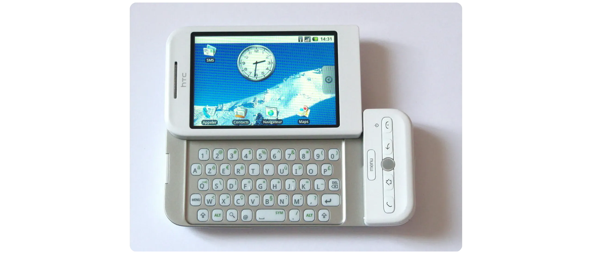


*Sumber : [Oleh Akela NDE - Karya sendiri](https://commons.wikimedia.org/w/index.php?curid=6680413), CC BY-SA 3.0*


Namun, keterbukaan awal ini secara bertahap akan dibatasi oleh Google. Bersamaan dengan kode sumber terbuka AOSP, perusahaan ini mengembangkan serangkaian aplikasi dan API eksklusif, yang dikelompokkan bersama dengan nama *Google Mobile Services (GMS)*. Secara bertahap, aplikasi-aplikasi tersebut akan mencakup Play Store, Google Maps, YouTube, Google Play Services, Gmail, Chrome, dan Voice Assistant. Untuk dapat melakukan pra-instalasi Play Store, produsen sekarang harus menandatangani perjanjian lisensi dengan Google dan menjamin kompatibilitas perangkat mereka dengan standar GMS, yang sangat membatasi ruang lingkup penyesuaian mereka.


Android mengalami peningkatan pesat: Android mengambil alih pangsa pasar iOS pada awal Juli 2011, dan menjadi sistem operasi seluler yang dominan pada Juni 2012, menyusul runtuhnya SymbianOS secara tiba-tiba setelah Nokia meninggalkannya dan memilih Windows Phone. Sejak saat itu, Android tetap menjadi pemimpin pasar ponsel yang tak terbantahkan, dan saat ini membentuk duopoli dengan iOS.


#### Sumber terbuka vs Google


Proyek Android didasarkan pada dualitas struktural. Di satu sisi, AOSP (*Android open-source Project*) mewakili basis open-source sistem: AOSP meliputi kernel Linux, tumpukan perangkat lunak sistem, grafis minimal Interface dan seperangkat API. Basis ini dipublikasikan di bawah lisensi Apache 2.0, dan tetap dapat diakses oleh semua orang. Di sisi lain, lingkungan yang sebenarnya digunakan oleh sebagian besar pengguna Android hampir seluruhnya bergantung pada komponen eksklusif yang dikembangkan oleh Google: *Google Mobile Services* (GMS).


Komponen-komponen ini tidak bersifat open-source: komponen ini tidak dapat diaudit secara bebas oleh komunitas, dan juga tidak mudah diganti. Agar dapat melakukan pra-instalasi secara legal pada perangkat mereka, produsen harus menandatangani perjanjian lisensi dengan Google dan tunduk pada persyaratan teknis dan komersial yang ketat. Persyaratan ini meliputi:


- integrasi wajib beberapa aplikasi Google sebagai aplikasi sistem yang tidak dapat dicopot pemasangannya
- penyorotan visual aplikasi tertentu (Google Penelusuran, Play Store, Gemini, dll.) di layar beranda
- penggunaan eksklusif Google API untuk fungsi-fungsi penting seperti sinkronisasi, pemberitahuan push, dan geolokasi


Hal ini secara bertahap menciptakan ketergantungan struktural bagi produsen ponsel pintar, dan membuat pengiriman data pribadi ke server Google hampir tak terelakkan bagi pengguna akhir. Layanan ini bertujuan untuk menjamin pengalaman pengguna yang lancar dan konsisten, tetapi juga memusatkan fungsi-fungsi sensitif seperti pencadangan data otomatis, geolokasi pasif, atau otentikasi permanen melalui akun Google (sering kali diperlukan untuk mengeksploitasi perangkat seseorang).


Meskipun Android secara teori tetap merupakan sistem sumber terbuka pada intinya, sebagian besar smartphone Android yang dijual di seluruh dunia berjalan pada versi yang dimodifikasi dan disempurnakan oleh Google. Dalam versi ini, sumber terbuka Layer sebagian besar tersembunyi di balik hamparan yang bersifat eksklusif, terkunci, dan mengganggu.


Untuk benar-benar mendapatkan kembali kendali, oleh karena itu perlu beralih ke alternatif seperti ROM gratis (GrapheneOS, CalyxOS, dll.), yang akan kita bahas nanti dalam kursus ini.


### iOS: keamanan tinggi, tetapi sistem tertutup


#### Sejarah singkat iOS


iOS adalah sistem operasi yang dikembangkan oleh Apple untuk ponsel cerdasnya, diperkenalkan dengan iPhone pertama pada tahun 2007 (saat itu disebut "*iPhone OS*"). Sejak awal, Apple telah mengadopsi strategi integrasi vertikal yang lengkap: perangkat keras, perangkat lunak, sistem operasi, layanan online, dan toko aplikasi, semuanya dirancang, dikontrol, dan dipelihara oleh Apple. Pada awalnya, aplikasi asli yang tidak diproduksi oleh Apple bahkan tidak didukung. Pendekatan ini sangat kontras dengan Android, yang ekosistemnya jauh lebih terfragmentasi sejak awal, dan masih sampai sekarang.


iOS pada awalnya didasarkan pada sistem operasi yang digunakan oleh Mac: OS X. OS X menggunakan kernel hibrida yang berasal dari Darwin, yang juga berasal dari BSD Unix dan mikrokernel Mach. Landasan teknis ini memungkinkan iOS untuk mewarisi sejumlah sifat ketahanan dan stabilitas yang khusus untuk sistem Unix. Oleh karena itu, sistem ini dirancang berdasarkan prinsip keamanan yang ketat, termasuk:


- sandboxing aplikasi secara lengkap, mencegah satu aplikasi mengakses data atau proses aplikasi lain
- tanda tangan wajib kode aplikasi, menjamin integritas binari dan asalnya (hanya App Store)
- enkripsi data perangkat keras langsung pada chip, melalui *Secure Enclave*, koprosesor kriptografi yang diisolasi dari seluruh sistem
- pembaruan keamanan yang cepat, diterapkan langsung oleh Apple di semua perangkat, tanpa perantara


Arsitektur tertutup ini memungkinkan Apple untuk menjamin pengalaman pengguna yang lancar dan aman. Pengembangan terpusat juga memfasilitasi pengoptimalan perangkat keras-perangkat lunak, dengan sedikit variabilitas di antara model-modelnya, tidak seperti Android. Dengan demikian, iOS dianggap sebagai salah satu sistem yang paling aman dari serangan komputer.


#### Kerugian menutup iOS


Namun, keamanan ini bergantung pada penguncian yang ketat dari pengguna akhir, yang hampir tidak memiliki kontrol teknis atas perangkatnya. Tidak mungkin untuk menginstal aplikasi selain melalui App Store, kecuali dengan cara *jailbreak*, sebuah operasi yang rumit, berisiko dan sering kali tidak stabil yang membatalkan garansi dan membahayakan keamanan sistem. Prinsip ini juga mendasari model bisnis Apple, yang mengenakan komisi atas transaksi yang dilakukan di aplikasi pihak ketiga.


Kustomisasi juga sangat terbatas. Tidak mungkin untuk memodifikasi perilaku sistem secara mendalam, secara bebas mengubah lingkungan runtime, atau secara langsung mengakses file sistem. Jadi, dalam praktiknya, ponsel cerdas tetap menjadi milik Apple, bahkan setelah pembelian, karena Anda tidak memiliki kendali penuh atasnya.


Terlebih lagi, integrasi wajib iCloud ke dalam sebagian besar layanan (cadangan, pesan, foto, lokasi, Siri...) membuat pengguna terpapar pada pemusatan besar-besaran data pribadi mereka. Meskipun Apple mengklaim memiliki model yang berfokus pada privasi (dan, tidak seperti Google, model bisnisnya tidak didasarkan pada eksploitasi data pribadi), beberapa keterbatasan tetap ada:


- beberapa Elements (seperti metadata koneksi, permintaan Siri, atau log kesalahan) masih melewati server Apple
- mekanisme analisis perilaku untuk saran kontekstual, pembaruan App Store, atau pemfilteran pesan menggunakan model hak milik yang tidak dapat diaudit
- menggunakan layanan seperti iCloud menyiratkan kepercayaan implisit pada infrastruktur Apple, tanpa kontrol atas di mana atau berapa lama data disimpan


Terakhir, dalam hal kedaulatan digital, iOS mewakili lingkungan yang tertutup: tidak ada otoritas eksternal (baik pengguna maupun organisasi independen) yang dapat memverifikasi atau memodifikasi operasinya. Oleh karena itu, pengguna dipaksa untuk mempercayai Apple di setiap level: perangkat keras, perangkat lunak, jaringan...


### alternatif sumber terbuka dengan Android


Seperti yang baru saja kita lihat, ekosistem Android standar, yang didominasi oleh Google, didasarkan pada versi sistem sumber terbuka (AOSP) dengan komponen berpemilik (GMS). Beberapa proyek sumber terbuka memanfaatkan AOSP untuk menawarkan sistem operasi alternatif yang lebih menghargai privasi, tanpa lapisan yang mengganggu, dan dengan kontrol pengguna yang lebih baik. Alternatif ini dipasang untuk menggantikan sistem asli, dalam bentuk ROM yang disesuaikan. ROM ini memungkinkan Anda untuk mendapatkan kembali kendali atas perangkat lunak, tetapi juga memerlukan kontrol perangkat keras yang minimal, karena hanya kompatibel dengan beberapa perangkat saja.


#### Persyaratan dan peringatan perangkat keras


Sebelum menginstal, penting untuk memeriksa kompatibilitas ponsel cerdas Anda dengan ROM yang dipilih. Sebagian besar proyek ini mendukung daftar model yang terbatas. Sering kali, Anda harus menggunakan ponsel Google Pixel, karena dukungan bootloader yang tidak dapat dibuka dan driver publik.


Instalasi memerlukan pembukaan kunci bootloader, sebuah operasi yang memungkinkan gambar sistem baru ditulis, tetapi sepenuhnya menghapus konten perangkat asli. Layanan tambahan, seperti F-Droid atau Aurora Store untuk aplikasi, juga harus diinstal secara manual.


Beberapa produsen melarang atau mempersulit operasi ini, atau bahkan menonaktifkan fungsi tertentu (kamera, sensor, dll.) ketika mengubah sistem. Jadi, penting untuk memilih ponsel yang kompatibel (biasanya Google Pixel).


#### GrapheneOS


[GrapheneOS] (https://grapheneos.org/) adalah ROM AOSP yang disempurnakan, yang dirancang untuk menawarkan tingkat keamanan yang lebih tinggi daripada Android standar. ROM ini dikembangkan oleh tim independen dan diaudit oleh para ahli. Graphene mengimplementasikan mekanisme keamanan tingkat lanjut, termasuk:


- pengurangan drastis permukaan serangan: penonaktifan default banyak fungsi (NFC, Bluetooth, dll.), penguncian port USB saat perangkat tidak aktif, kontrol lanjutan pin pogo, dll.
- kotak pasir Android yang lebih kuat
- perlindungan memori tingkat lanjut
- kontrol izin granular
- enkripsi perangkat keras yang tidak bergantung pada Google
- dll.


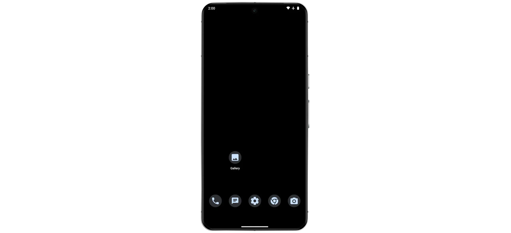


GrapheneOS tidak mengintegrasikan komponen berpemilik. Anda bebas untuk menambahkan layanan Google atau tidak, tetapi layanan ini diisolasi secara ketat (di-sandbox dalam profil khusus). Hal ini membuat sistem ini sangat tahan terhadap serangan lokal dan eksploitasi kerentanan sistem.


Graphene hanya kompatibel dengan Google Pixel terbaru (Pixel 6, 7, 8, dan 9).


https://planb.network/tutorials/computer-security/operating%20system/grapheneos-08d43d7a-0b22-4638-a151-578d48d32d88

#### CalyxOS


[CalyxOS] (https://calyxos.org/) adalah sistem perantara yang bertujuan untuk mendamaikan privasi, keamanan, dan kompatibilitas dengan penggunaan sehari-hari. Sistem ini juga didasarkan pada AOSP, dengan peningkatan keamanan. Fitur khususnya adalah integrasi opsional MicroG, sebuah implementasi ulang gratis dari layanan Google. Hal ini memungkinkan untuk menjalankan sebagian besar aplikasi Android yang bergantung pada layanan Google, tanpa harus melalui binari resmi.


CalyxOS juga menawarkan aplikasi pra-instal (Signal, F-Droid, Aurora Store, VPN terintegrasi...), dan Interface yang rapi. Sangat mudah untuk menginstal melalui alat grafis untuk pengguna Pixel. Calyx terutama kompatibel dengan Google Pixel, tetapi juga beberapa model Fairphone dan Motorola.


#### LineageOS


[LineageOS] (https://lineageos.org/), penerus CyanogenMod, adalah ROM alternatif yang paling banyak kompatibel. Ini mendukung beberapa ratus model, berkat komunitas kontributor yang besar. Berdasarkan AOSP, ini menekankan penyesuaian, kesederhanaan dan kebebasan penggunaan.


LineageOS memberi Anda sistem Android tanpa lapisan pabrikan, tanpa bloatware, manajemen izin penuh, pembaruan yang mudah, dan Interface yang efisien. Anda bisa menambahkan layanan Google atau memilih penggunaan gratis 100%.


Di sisi keamanan, bagaimanapun, LineageOS tidak mengintegrasikan perlindungan perangkat keras tertentu atau bala bantuan memori yang ditemukan di GrapheneOS dan CalyxOS. Sistem pembaruannya juga bergantung pada komunitas, yang dapat menyebabkan penundaan dalam patch keamanan.


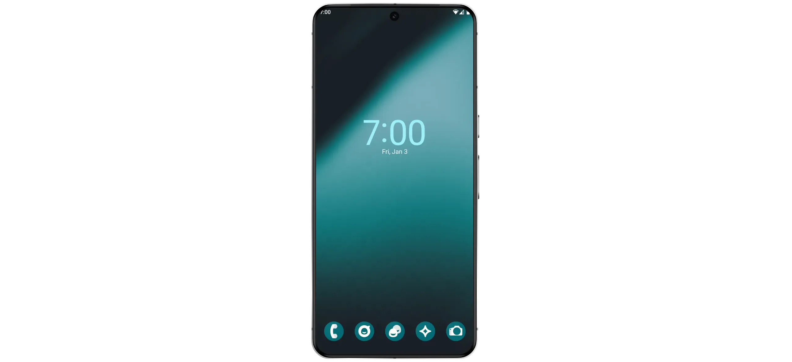


### OS ponsel cerdas mana yang digunakan?


Ketika memilih sistem operasi ponsel cerdas Anda, Anda harus menyadari adanya pertukaran antara keamanan, privasi, kemudahan penggunaan, dan kompatibilitas aplikasi. Setiap solusi memiliki fitur teknis spesifik yang akan secara langsung memengaruhi pengalaman Anda sehari-hari, kemampuan kontrol Anda, dan eksposur Anda terhadap pengawasan atau kerentanan komersial.


Android standar (dengan GMS) tetap menjadi solusi yang paling banyak digunakan saat ini. Sistem operasi ini menawarkan kompatibilitas penuh dengan semua aplikasi Android, kemudahan penggunaan, dan akses langsung ke layanan populer (Play Store, Maps, Gmail...). Namun, kemudahan penggunaan ini bergantung pada integrasi yang kuat dari layanan milik Google, dengan pengumpulan data yang sistematis: Posisi GPS, riwayat penelusuran, metadata panggilan, preferensi iklan... Jadi, ini adalah pilihan yang buruk jika Anda mengkhawatirkan kedaulatan atau privasi digital Anda.


Sistem iOS Apple membanggakan tingkat keamanan yang tinggi. Namun demikian, keamanan ini disertai dengan lingkungan yang sangat tertutup: Pengguna tidak dapat menginstal aplikasi di luar App Store (kecuali dalam kasus-kasus marjinal), tidak dapat memodifikasi perilaku sistem, dan sepenuhnya bergantung pada Apple untuk pengelolaan perangkat keras, penyimpanan cloud, dan sinkronisasi. Ini adalah lingkungan yang efisien dan kuat, tetapi mengorbankan segala bentuk personalisasi atau kemandirian.


GrapheneOS ditujukan untuk profil yang paling menuntut dalam hal keamanan dan kerahasiaan. Namun, tingkat keamanannya memang memberlakukan beberapa kendala: beberapa perangkat yang kompatibel (hanya model Google Pixel terbaru), tidak ada integrasi otomatis layanan aplikasi pihak ketiga, dan kebutuhan untuk mengonfigurasi secara manual alat alternatif untuk pembaruan, toko, atau pemberitahuan. Jika privasi dan keamanan adalah prioritas Anda, ini jelas merupakan pilihan terbaik.


CalyxOS menawarkan keseimbangan yang menarik. Pengalaman pengguna tetap dekat dengan Android standar, tetapi tanpa pengawasan langsung dari Google. Ini mendukung sejumlah model yang masuk akal (terutama Google Pixel), dan dapat diinstal tanpa pengetahuan teknis tingkat lanjut. Bagi pengguna yang menginginkan keamanan tingkat tinggi tanpa mengorbankan kompatibilitas perangkat lunak, CalyxOS adalah solusi yang praktis dan seimbang.


Terakhir, LineageOS adalah distribusi AOSP untuk pengguna yang menginginkan fleksibilitas dan kontrol. Distribusi ini kompatibel dengan sejumlah besar perangkat, bahkan perangkat yang lebih tua, memungkinkan kustomisasi sistem secara lengkap, dan menawarkan alternatif ringan untuk lapisan OEM. Namun, ia tidak mengintegrasikan peningkatan keamanan tingkat lanjut yang ditemukan di GrapheneOS atau CalyxOS, dan tidak selalu mendapat manfaat dari pembaruan reguler untuk semua model. Oleh karena itu, LineageOS membutuhkan sejumlah disiplin pengguna agar tetap aman dari waktu ke waktu.


| System | Security | Privacy | Compatibility | Customization |
| ------ | -------- | ------- | ------------- | ------------- |
| Android | 🟡       | 🔴      | 🟢            | 🟢            |
| iOS     | 🟢       | 🟡      | 🟡            | 🔴            |
| GrapheneOS | 🟢       | 🟢              | 🟡            | 🟡               |
| CalyxOS    | 🟡       | 🟢              | 🟡            | 🟡               |
| LineageOS  | 🟡       | 🟡              | 🟢            | 🟢               |

Apa pun pilihan sistem operasi seluler Anda, di bab berikutnya kita akan melihat praktik terbaik yang dapat Anda terapkan untuk mengamankan ponsel secara efektif dan menjaga lingkungan digital yang sehat.


## Mengamankan ponsel cerdas Anda untuk penggunaan sehari-hari


<chapterId>37b9499e-32cf-42c3-8715-15c6884d2ec7</chapterId>


Pada bab sebelumnya, kami menganalisis masalah yang terkait dengan sistem operasi ponsel pintar, dan mengeksplorasi berbagai alternatif untuk mendapatkan kontrol yang lebih besar atas ponsel Anda. Tetapi memilih sistem operasi yang bagus saja tidak cukup: untuk memastikan keamanan dan kerahasiaan yang sesungguhnya, penting untuk menerapkan beberapa praktik yang baik dalam penggunaan sehari-hari.


Dalam bab ini, kita akan melihat langkah demi langkah pada beberapa rekomendasi dasar yang berlaku terlepas dari Sistem Operasi ponsel cerdas Anda.


### Pembaruan


Saya akan mengulanginya lagi di sini, tetapi setiap pembaruan yang dirilis oleh pengembang berpotensi menyertakan tambalan keamanan yang penting. Terlebih lagi, ponsel cerdas terpapar pada banyak risiko karena permukaan serangannya yang sangat besar: Melalui jaringan seluler, aplikasi pihak ketiga, komunikasi nirkabel (Wi-Fi, Bluetooth, NFC, dll.).


Tidak menerapkan pembaruan ini berarti dengan sengaja membiarkan kerentanan yang diketahui, yang didokumentasikan secara publik di basis data seperti CVE (*Common Vulnerabilities and Exposures*). Celah-celah ini terkadang secara otomatis dieksploitasi oleh alat yang tersedia secara online, bahkan tanpa memerlukan keahlian khusus. Hal ini membuat ponsel yang sudah ketinggalan zaman menjadi target ideal, bahkan untuk serangan otomatis berskala besar.


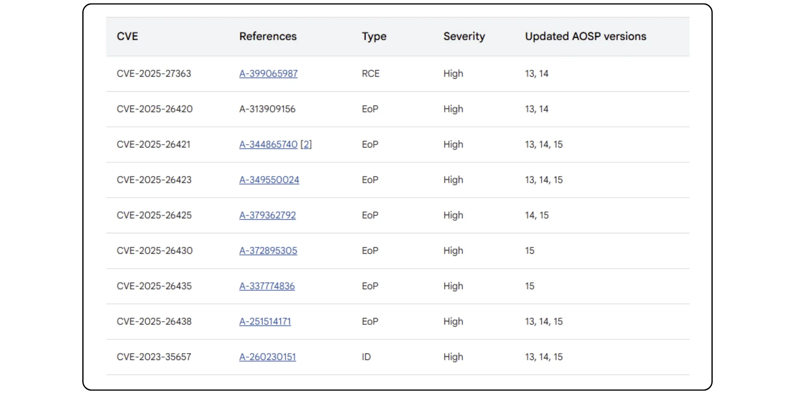


Oleh karena itu, sangat penting untuk mengaktifkan pembaruan otomatis dalam pengaturan sistem Anda, dan secara manual memeriksa setiap minggu apakah perangkat Anda memiliki patch keamanan terbaru. Pada Android, hal ini biasanya dilakukan di `Pengaturan > Keamanan > Pembaruan Sistem`, dan pada iOS di `Pengaturan > Umum > Pembaruan Perangkat Lunak`.


#### Perbarui dukungan


Tidak semua ponsel pintar diciptakan sama dalam hal dukungan perangkat lunak. Banyak perangkat entry-level dan kelas menengah yang berhenti menerima pembaruan penting setelah dua atau tiga tahun, sehingga Anda menghadapi risiko yang semakin serius.


Namun, beberapa merek memiliki dukungan perangkat lunak yang sangat baik, terutama Google (7 tahun), Fairphone (5 hingga 7 tahun), Samsung (5 hingga 7 tahun), dan Apple (5 hingga 7 tahun). Kriteria ini sangat penting saat membeli ponsel baru: Perangkat yang tahan lama adalah perangkat yang terawat.


#### Gunakan toko aplikasi yang andal


Aplikasi seluler merupakan sumber risiko utama: Melalui aplikasi inilah sebagian besar *malware* Android modern masuk. Menginstal aplikasi melalui file `.apk` yang diterima dari situs yang tidak dikenal, atau dari toko yang tidak bersertifikat, berarti mengambil risiko menginstal program yang sengaja dibuat jahat, atau dimodifikasi untuk menyertakan fungsi mata-mata atau pencurian data.


Bahkan di toko resmi seperti Google Play Store atau Apple App Store, Anda harus tetap waspada. Meskipun ada mekanisme penyaringan, aplikasi berbahaya sering kali berhasil menyelinap masuk. Sebagai contoh, aplikasi "Sparrow wallet" kadang-kadang dapat dilihat di Play Store, meskipun perangkat lunak ini hanya ada di PC: Tidak diragukan lagi, ini adalah aplikasi palsu.


Sebelum menginstal, luangkan waktu untuk memeriksa beberapa hal: izin yang diperlukan, jumlah unduhan, peringkat keseluruhan, tanggal pembaruan terakhir, dan ulasan pengguna.


Di Android, toko sumber terbuka alternatif seperti [F-Droid](https://f-droid.org/) menawarkan solusi yang lebih etis dan sering kali lebih aman: setiap aplikasi dikompilasi dari sumber-sumber gratis, dan diaudit secara manual. Untuk aplikasi berpemilik yang diperlukan, alat seperti [Aurora Store] (https://auroraoss.com/) memungkinkan akses ke Play Store tanpa akun Google, yang membatasi pengumpulan data.


Selain Sistem Operasi, aplikasi yang terinstal di ponsel cerdas Anda juga harus selalu diperbarui. Anda dapat mengaktifkan pembaruan otomatis melalui pengaturan toko aplikasi Anda, dan membiasakan diri untuk menjalankan pemeriksaan manual setidaknya sekali seminggu.


Di Android, jika Anda menginstal aplikasi melalui file `.apk`, Anda harus mengelola pembaruan secara manual. Memang, aplikasi yang dipasang di luar saluran resmi tidak memiliki mekanisme pembaruan otomatis. Jadi, Anda harus secara teratur memeriksa versi yang dirilis oleh pengembang di GitHub atau di situs web resmi mereka.


### Mengelola izin aplikasi


Pada smartphone, aplikasi apa pun dapat meminta akses langsung ke sumber daya yang sensitif: Mikrofon, kamera, posisi geografis yang tepat, buku Address, file, SMS, sensor gerak, dll. Akses semacam itu tidak sepele: Secara teknis, ketika izin diberikan, aplikasi dapat mengeksploitasinya di latar belakang, secara terus menerus atau ad hoc, terkadang tanpa pemberitahuan yang terlihat. Itulah mengapa penting untuk menerapkan prinsip hak istimewa yang paling sedikit: untuk memberikan setiap aplikasi hanya otorisasi yang benar-benar penting untuk operasi minimalnya.


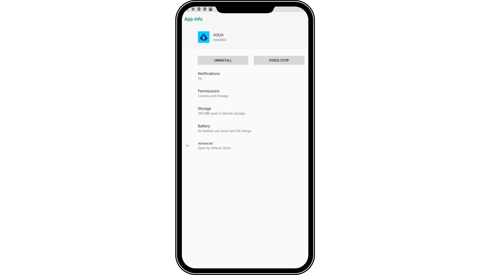


Sebagai contoh, aplikasi senter tidak memerlukan akses ke kontak atau geolokasi Anda. Aplikasi cuaca dapat bekerja dengan pelokalan manual, tanpa akses GPS. Pembaca PDF tidak perlu menggunakan mikrofon atau SMS. Jika ragu, selalu tolak secara default, lalu evaluasi kembali jika aplikasi tidak berfungsi dengan baik. Pada beberapa sistem, Anda juga dapat memberikan otorisasi hanya untuk sementara: baik untuk sekali pakai, atau hanya ketika aplikasi sedang berjalan. Hal ini mencegah aplikasi mengeksploitasi izin tertentu di latar belakang tanpa sepengetahuan Anda.


Android dan iOS kini menawarkan kontrol izin granular. Anda dapat mengelolanya berdasarkan aplikasi atau jenis izin. Luangkan waktu, sebulan sekali misalnya, untuk memeriksa izin aktif melalui pengaturan ponsel Anda.


Beberapa sistem juga memungkinkan Anda untuk secara otomatis mencabut otorisasi yang diberikan kepada aplikasi setelah jangka waktu tertentu tidak digunakan. Hal ini membatasi risiko jika Anda lupa menghapus aplikasi.


### Kunci layar


Keamanan fisik sebuah ponsel cerdas dimulai dari layar kuncinya. Ini adalah penghalang pertama antara penyerang potensial dan akses ke data pribadi Anda. Cara yang paling dapat diandalkan adalah kode PIN atau kata sandi yang rumit.


Di sisi lain, metode membuka kunci seperti skema grafis sangat tidak disarankan. Skema semacam itu meninggalkan jejak yang terlihat di layar, mudah diingat oleh pihak ketiga yang mengamati gerakan Anda, dan jarang yang cukup rumit.


Sistem biometrik (pengenalan wajah atau sidik jari) menawarkan kenyamanan yang jelas, tetapi harus digunakan dengan hati-hati. Jika terjadi kendala fisik (pencurian, tekanan polisi, dll.), sidik jari atau wajah dapat digunakan tanpa persetujuan aktif Anda. Di beberapa negara, penggunaan biometrik tidak mendapatkan perlindungan hukum yang sama dengan kerahasiaan kata sandi.


Di sisi lain, sistem biometrik dapat diakali (atau mungkin di masa depan) dengan menggunakan teknik seperti reproduksi wajah secara visual atau pemulihan sidik jari laten pada suatu permukaan. Keandalannya juga sangat bergantung pada tingkat keamanan perangkat Anda: Sebagai contoh, pengenalan wajah Face ID Apple jauh lebih ketat dibandingkan dengan beberapa smartphone entry-level.


Singkatnya, berikut ini adalah peringkat dari sistem penguncian smartphone terbaik hingga yang terburuk:


- Kata sandi alfanumerik
- Kode PIN
- Biometrik
- Diagram grafis
- Tidak ada penguncian


Untuk perangkat yang sensitif, solusi terbaik adalah kata sandi yang dikombinasikan dengan penonaktifan biometrik, dengan membuka kunci secara manual saja. Hal ini mungkin terlihat membatasi, tetapi ini adalah cara terbaik untuk memastikan perlindungan. Tentunya, untuk kode PIN atau kata sandi alfanumerik, semakin panjang dan acak semakin baik. Kata sandi tersebut juga harus tahan terhadap serangan brute force.


### Penggunaan dan kompartementalisasi data


Seperti yang telah kita lihat pada bab-bab sebelumnya, kompartementalisasi adalah praktik penting untuk membatasi risiko jika terjadi kompromi pada salah satu bagian sistem. Dengan menciptakan lingkungan terpisah untuk aktivitas yang berbeda, Anda mencegah serangan atau kebocoran data di satu area mencemari seluruh perangkat. Di Android, strategi ini dapat diimplementasikan melalui sejumlah mekanisme bawaan.


#### Gunakan profil profesional yang terpisah


Profil *Work Profile* adalah fitur asli Android (sejak Android 5.0), yang memungkinkan Anda membuat partisi perangkat lunak terpisah dalam smartphone yang sama. Secara praktis, profil ini berfungsi sebagai wadah yang terisolasi: Aplikasi, akun, dan data yang disimpan di ruang ini tidak dapat berinteraksi dengan yang ada di profil pribadi. Pemisahan ini mencegah kebocoran data di antara kedua ruang tersebut, dan membatasi hak akses untuk aplikasi. Fitur ini sering dikelola secara internal di dalam perusahaan, tetapi ada juga cara menggunakannya secara pribadi untuk mengisolasi aplikasi.


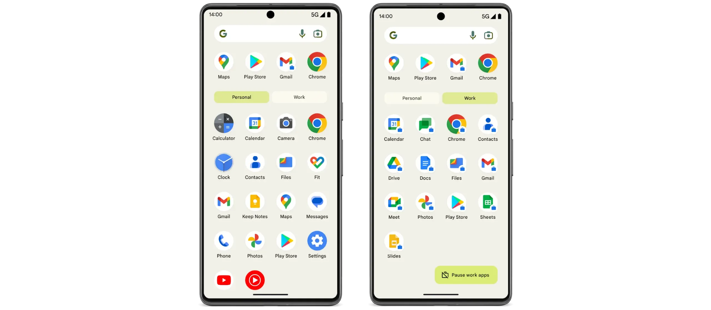


Alat Shelter adalah aplikasi sumber terbuka yang mengeksploitasi fitur *Work Profile* dari sistem Android ini untuk menawarkan pengguna non-profesional cara yang sederhana untuk menciptakan lingkungan yang terisolasi. Shelter dapat digunakan untuk menginstal dan menjalankan aplikasi sensitif di ruang yang terlindungi, sehingga sangat mengurangi eksposur mereka ke perangkat lunak lain yang diinstal pada ponsel.


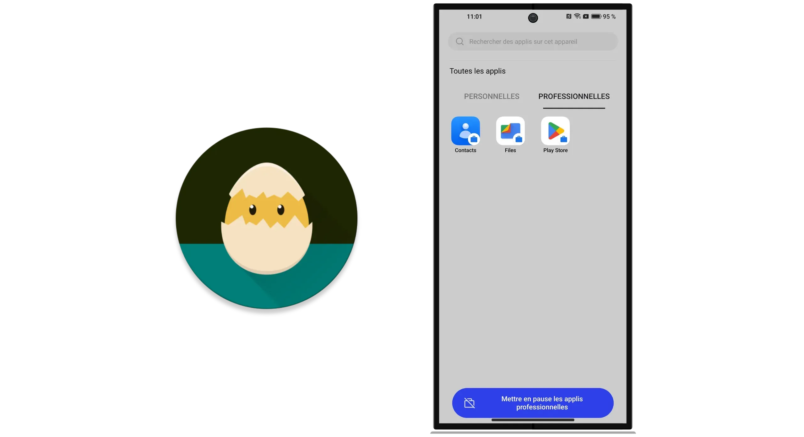


#### Gunakan beberapa telepon terpisah


Untuk memisahkan penggunaan lebih jauh lagi, Anda dapat memilih penggunaan beberapa perangkat fisik, masing-masing didedikasikan untuk jenis aktivitas yang berbeda (pribadi, profesional, atau sensitif). Pemisahan fisik ini memastikan isolasi yang lengkap, jauh lebih ketat daripada segmentasi perangkat lunak, karena setiap ponsel beroperasi secara independen.


Jika satu ponsel cerdas disusupi, yang lainnya tetap utuh. Pemisahan fisik ini juga memiliki keuntungan untuk menyederhanakan pengelolaan akses dan izin pada setiap perangkat, dan mengurangi paparan terhadap potensi ancaman secara keseluruhan.


### Mengontrol aliran data Anda


Ponsel cerdas Anda selalu berkomunikasi dengan dunia luar, baik melalui Wi-Fi, Bluetooth, NFC, GPS, atau jaringan seluler. Masing-masing saluran ini merupakan permukaan serangan potensial. Oleh karena itu, memahami cara kerjanya dan mengamankannya adalah hal yang penting untuk membatasi risiko.


#### Wi-Fi publik


Jaringan Wi-Fi publik, seperti yang ada di kafe, hotel, atau transportasi umum, jarang sekali aman. Bahkan ketika mereka memerlukan kata sandi, kata sandi ini sering kali digunakan bersama oleh banyak pengguna, dan enkripsi yang diterapkan terkadang dengan mudah diterobos. Penyerang yang terhubung ke jaringan yang sama bisa mencegat paket Anda, mengambil kredensial, atau menyuntikkan konten berbahaya melalui serangan Man-in-the-Middle.


Untuk melindungi diri Anda sendiri, cukup hindari menggunakan jaringan publik ini, atau gunakan VPN, yang akan membuat terowongan terenkripsi antara perangkat Anda dan server jarak jauh. Terowongan ini mengenkapsulasi data Anda, sehingga sangat sulit untuk dicegat atau dimodifikasi.


https://planb.network/tutorials/computer-security/communication/ivpn-5a0cd5df-29f1-4382-a817-975a96646e68

https://planb.network/tutorials/computer-security/communication/mullvad-968ec5f5-b3f0-4d23-a9e0-c07a3e85aaa8

https://planb.network/tutorials/computer-security/communication/mozilla-vpn-f55903d4-aece-4d59-b193-2eb073e59b67

Mengenai jaringan Wi-Fi di rumah Anda, kita akan membahasnya di bagian terakhir kursus SCU 202.


#### Bluetooth, NFC dan GPS


Bluetooth (protokol nirkabel untuk komunikasi jarak pendek), NFC (Near Field Communication) dan GPS (pemosisian satelit) diaktifkan secara default di banyak ponsel pintar. Teknologi ini dapat digunakan sebagai pintu gerbang untuk serangan lokal: Eksekusi kode jarak jauh, akses tidak sah, pelacakan lokasi, bahkan penyadapan komunikasi dalam kasus Bluetooth (kerentanan BlueBorne, misalnya).


Untuk membatasi risiko ini, selalu nonaktifkan fungsi-fungsi ini saat Anda tidak menggunakannya. Hal ini secara drastis mengurangi permukaan serangan dan mencegah upaya eksploitasi.


#### Jaringan seluler


Ponsel cerdas selalu berkomunikasi dengan stasiun pangkalan operator telepon. Komunikasi ini dapat dibajak oleh *IMSI Catcher* tertentu, yang mensimulasikan stasiun pangkalan untuk mencegat data seluler Anda. Serangan ini memungkinkan pihak ketiga untuk mengidentifikasi perangkat Anda, melacak pergerakan Anda dan, dalam beberapa kasus, mencegat panggilan dan pesan.


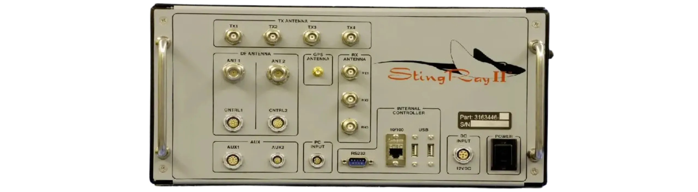


Beberapa aplikasi, seperti SnoopSnitch di Android, dapat mendeteksi perilaku mencurigakan dalam pertukaran Anda dengan jaringan. Alat-alat ini menganalisis metadata komunikasi seluler dan dapat memperingatkan Anda tentang perubahan konfigurasi radio atau perilaku abnormal, membuat Anda lebih waspada terhadap upaya penyadapan.


Cara terbaik untuk mengamankan komunikasi Anda adalah dengan menggunakan aplikasi perpesanan yang aman, baik untuk panggilan atau pesan. Aplikasi-aplikasi ini tidak menggunakan jaringan seluler, dan memastikan bahwa pertukaran dienkripsi dengan benar. Kita akan membahas topik ini secara lebih rinci di bab berikutnya.


### Mengamankan perangkat seluler Anda


#### Antivirus seluler


Kegunaan perangkat lunak antivirus pada ponsel pintar sering kali dinilai terlalu tinggi, sebagian besar karena kampanye pemasaran yang agresif. Ancaman nyata pada ponsel, terutama Android, umumnya terkait dengan pemasangan aplikasi berbahaya dari sumber yang tidak resmi. Pada perangkat yang diperbarui secara teratur, dikonfigurasi dengan hati-hati (terutama dalam hal otorisasi), dan hanya menggunakan sumber resmi atau terverifikasi, risiko infeksi sangat rendah.


Selain itu, perangkat Android sudah dilengkapi secara default dengan Google Play Protect, yang bertindak sebagai antivirus. Aplikasi antivirus pihak ketiga menggunakan pemindai Interface yang sama, yang hanya menambahkan redundansi. Maka, dalam praktiknya, antivirus seluler hanya menawarkan sedikit nilai tambah, baik di Android maupun iOS.


Terlebih lagi, aplikasi-aplikasi ini dapat menimbulkan rasa aman yang salah pada pengguna, membuat mereka percaya bahwa mereka benar-benar terlindungi dari ancaman, padahal sebenarnya hanya menawarkan perlindungan reaktif. Aplikasi ini tidak menawarkan perlindungan terhadap phishing, atau terhadap izin berlebihan yang diberikan pada aplikasi, meskipun sebagian besar ancaman terhadap ponsel cerdas justru berasal dari vektor ini.


Oleh karena itu, kegunaan sebenarnya sangat terbatas, dan aplikasi ini terkadang mahal, menghabiskan daya baterai dan sumber daya yang tidak perlu. Lebih baik tidak menggunakannya, dan cukup mengadopsi praktik terbaik yang disajikan dalam bab ini.


### Memeriksa koneksi keluar


Ada juga aplikasi firewall ponsel cerdas, seperti NetGuard atau RethinkDNS, yang bertindak sebagai firewall lokal secara langsung pada perangkat Anda. Aplikasi-aplikasi ini menggunakan API VPN Android untuk mencegat semua lalu lintas keluar, tanpa memerlukan akses root.


Secara praktis, ini berarti Anda dapat memblokir akses Internet untuk aplikasi tertentu secara individual, sehingga sangat mengurangi risiko pengumpulan data yang tidak diinginkan atau komunikasi yang tidak sah.


NetGuard, misalnya, memungkinkan Anda mengelola akses Internet berdasarkan aplikasi per aplikasi, baik untuk Wi-Fi maupun data seluler. RethinkDNS juga menawarkan fitur-fitur canggih seperti penyaringan DNS, pemblokiran iklan, dan inspeksi permintaan DNS untuk mendeteksi potensi kebocoran.


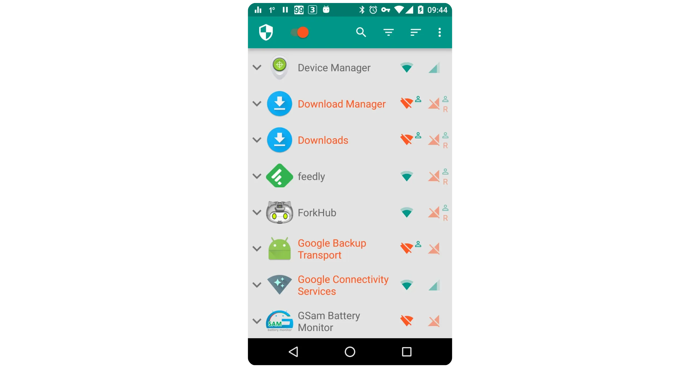


### Pencadangan dan pengelolaan yang aman jika terjadi kehilangan


#### Enkripsi cadangan Anda


Mencadangkan data ponsel cerdas Anda secara teratur sangat penting untuk keamanan Anda. Tetapi cadangan ini harus dienkripsi, untuk mencegah data sensitif Anda diakses oleh siapa pun yang mendapatkan media cadangan Anda. Hal ini juga berlaku untuk foto, dokumen, dan data aplikasi.


Untuk mencapai hal ini, Anda harus menggunakan solusi lokal terenkripsi, seperti disk eksternal atau kunci USB terenkripsi (misalnya dengan Veracrypt). Jika tidak, solusi cloud yang dihosting sendiri seperti *Syncthing* atau *Nextcloud* memungkinkan Anda untuk mencadangkan data Anda di server pribadi, dengan tetap memegang kendali penuh atas akses dan kerahasiaan. Tidak seperti layanan cloud komersial (Google Drive, iCloud...), solusi-solusi ini sangat membatasi pemaparan informasi Anda kepada pihak ketiga.


https://planb.network/tutorials/computer-security/data/veracrypt-d5ed4c83-7c1c-4181-95ea-963fdf2d83c5

#### Penyeka jarak jauh


Ponsel cerdas yang hilang atau dicuri dapat menjadi sumber informasi yang kaya bagi penyerang: Data pribadi, riwayat penelusuran, akun yang terhubung, dll. Oleh karena itu, masuk akal untuk mengonfigurasi fungsi asli untuk menemukan, mengunci, dan menghapus perangkat Anda dari jarak jauh.


Di Android, Anda dapat menggunakan *Find My Device* dari Pengaturan Google. Pada iOS, *Find My iPhone* memainkan peran yang sama, dapat diakses dari iCloud. Alat-alat ini memungkinkan Anda untuk segera mengunci akses, membunyikan perangkat untuk menemukannya, atau sebagai upaya terakhir, menghapus data sepenuhnya dari jarak jauh. Ada juga layanan serupa yang dikelola oleh lapisan perangkat lunak produsen, seperti *SmartThings Find* dari Samsung.


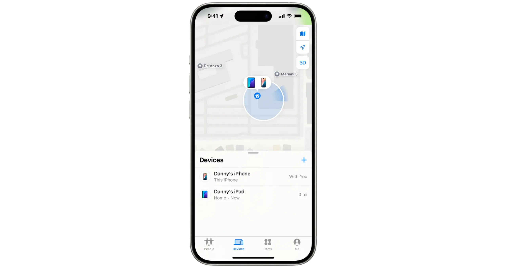


Namun, fitur-fitur ini menghadirkan kompromi yang signifikan: Fitur-fitur ini memusatkan informasi sensitif Anda (geolokasi, login, akses jarak jauh, dll.) pada peladen perusahaan swasta, dan mengharuskan Anda untuk tetap mengaktifkan lokasi Anda.


Jika Anda tetap memilih untuk menerapkannya, uji fitur-fitur ini terlebih dahulu untuk memastikan fitur-fitur ini akan berfungsi dengan baik pada hari Anda membutuhkannya.


Sebagai alternatif, jika Anda memilih untuk tidak menggunakan layanan kendali jarak jauh ini, saya sangat menyarankan agar Anda mencadangkan data ponsel Anda secara teratur untuk menghindari kehilangan informasi jika perangkat Anda hilang atau dicuri. Untuk membatasi risiko penyerang mendapatkan akses ke informasi Anda, tetapkan kata sandi yang kuat untuk kunci ponsel dan kartu SIM Anda.


Kita telah sampai pada akhir bab ini tentang praktik terbaik untuk ponsel cerdas Anda. Pada bab berikutnya, saya akan menunjukkan kepada Anda solusi yang paling sesuai untuk berkomunikasi dengan aman dan rahasia dari perangkat Anda, baik untuk melakukan panggilan, bertukar pesan, atau mengelola newsgroup.


## Berkomunikasi tanpa terdengar oleh orang lain


<chapterId>e60773c6-ee96-47b2-a9fa-08d1bdbd1108</chapterId>


Di dunia yang serba terhubung saat ini, sebagian besar pertukaran pribadi, profesional, dan sensitif kita dilakukan melalui pesan elektronik. Namun, kerahasiaan komunikasi ini sangat bervariasi, tergantung pada protokol yang digunakan.


Dalam bab ini, kita akan mencoba memahami masalah teknis dan praktis yang terlibat dalam penggunaan alat komunikasi digital, untuk memilih dan menggunakan alat komunikasi yang memberikan perlindungan nyata terhadap penyadapan dan pengintaian.


### Mengapa pesan SMS tidak melindungi pertukaran Anda?


SMS (*Short Message Service*) secara historis sangat populer untuk pertukaran teks, tetapi didasarkan pada protokol yang sudah usang sejak akhir tahun 1980-an. Protokol ini, yang diintegrasikan ke dalam standar GSM (*Global System for Mobile communications*), tidak menyediakan mekanisme enkripsi ujung ke ujung. Dalam praktiknya, setiap SMS yang dikirim dikirimkan dalam bentuk teks yang jelas melalui jaringan operator seluler (terkadang dienkripsi hanya pada radio Interface, tetapi tidak pernah secara end-to-end). Ini berarti bahwa isi pesan dapat disadap pada beberapa tingkat:


- oleh operator
- oleh aktor jahat yang menyadap lalu lintas seluler (misalnya melalui IMSI Catchers)
- atau oleh lembaga pemerintah dengan akses legal atau ilegal ke infrastruktur jaringan


Fakta bahwa pesan SMS disimpan di server pusat operator, dan kelemahan sistem otentikasi (nomor telepon sebagai pengenal unik), membuat pesan mudah dicegat dan rentan terhadap serangan. Oleh karena itu, SMS sama sekali tidak cocok untuk mengirimkan informasi, baik dalam konteks pribadi, profesional, maupun kritis.


Keterbatasan ini juga berlaku untuk MMS (*Multimedia Messaging Service*), yang didasarkan pada fondasi teknis yang sama, dengan tambahan konten multimedia (foto, video).


Dalam beberapa tahun terakhir, beberapa operator dan produsen telah memperkenalkan RCS (*Rich Communication Services*), sebuah evolusi teknis dari SMS. RCS memungkinkan pengiriman pesan yang diperkaya (gambar, video, tanda terima, dll.) dan mengintegrasikan enkripsi transit (TLS), tetapi hal ini masih bergantung pada server operator dan tidak menjamin enkripsi ujung ke ujung dalam semua kasus. Terlebih lagi, fragmentasi implementasinya antara operator dan produsen (antara Android dan iOS, misalnya) membatasi adopsi dan keandalan yang sebenarnya.


Sejak tahun 2021, Google Messages telah mengadopsi protokol Signal untuk menjamin enkripsi end-to-end, namun fitur ini hanya dapat diakses jika kedua belah pihak menggunakan Google Messages.


Pada bulan Maret 2025, Asosiasi GSM menerbitkan *Universal Profile 3.0* (UP 3.0), yang akhirnya menetapkan standar interoperabilitas untuk enkripsi ujung ke ujung (E2EE) dalam RCS. Hasilnya, ketika sebuah Exchange terjadi melalui klien RCS yang sesuai dengan UP 3.0, konten menjadi tidak dapat dibaca oleh operator dan penangkap IMSI. Google dan Apple telah mengumumkan niat mereka untuk mendukung teknologi ini (masih harus dilihat apakah ini akan dapat dioperasikan). Namun, jika salah satu perangkat tidak kompatibel dengan RCS UP 3.0, atau jika tidak ada konektivitas IP, komunikasi secara otomatis beralih ke SMS konvensional yang tidak terenkripsi, membuat penyadapan menjadi sepele.


Di sisi Apple, iMessage (diluncurkan pada tahun 2011) menawarkan enkripsi end-to-end asli di antara para pengguna Apple, tetapi protokol ini tetap tertutup dan terbatas pada ekosistem iOS/macOS. Ketika bertukar pesan dengan pengguna di luar ekosistem ini, pesan kembali ke protokol klasik, kehilangan semua kerahasiaannya. Enkripsi juga dapat dibobol jika Anda atau rekan Anda menyimpan pesan di iCloud tanpa opsi *Perlindungan Data Lanjutan*.


Singkatnya, baik SMS konvensional, maupun MMS, atau bahkan RCS standar tidak dapat dianggap sebagai solusi universal yang dapat diandalkan untuk menjaga kerahasiaan pertukaran. Hanya penggunaan Google Messages, iMessage atau protokol RCS UP 3.0 di masa depan yang dapat menjamin kerahasiaan yang memuaskan, asalkan kedua belah pihak mengadopsi protokol enkripsi yang sama. Dan di sinilah letak perangkap utama SMS dalam arti luas: Aplikasi perpesanan ini, yang sudah terinstal di sebagian besar ponsel, menyatukan protokol yang sangat berbeda, dan jika pihak lain hanya mendukung protokol SMS, pesan Anda akan dikirimkan secara jelas, tanpa Anda sadari. Inilah sebabnya, sampai standar enkripsi end-to-end yang universal dan kuat dibuat, saya sangat menyarankan agar Anda tidak menggunakan pesan konvensional, karena Anda masih terlalu bergantung pada pilihan protokol mitra Anda untuk menjamin keamanan Anda sendiri.


Alih-alih SMS, saya menyarankan Anda untuk menggunakan aplikasi pesan khusus yang menggunakan enkripsi end-to-end yang kuat dan transparan, memungkinkan komunikasi yang benar-benar aman dan pribadi.


### Pesan yang aman: apa saja solusinya?


Menghadapi keterbatasan SMS, sejumlah aplikasi modern telah muncul, beberapa di antaranya dengan enkripsi end-to-end. Berikut ini adalah ikhtisar komparatif dari aplikasi utama yang tersedia saat ini, untuk membantu Anda mengidentifikasi aplikasi yang paling sesuai dengan kebutuhan keamanan dan kerahasiaan Anda.


#### Sinyal


Signal adalah aplikasi pesan instan yang dirancang sejak awal untuk menawarkan kerahasiaan dan keamanan maksimum. Aplikasi ini didasarkan pada *Signal Protocol*, yang memastikan enkripsi end-to-end yang sistematis untuk setiap pesan, panggilan suara atau video, serta untuk berbagi file. Protokol ini digunakan kembali oleh banyak layanan perpesanan lainnya, seperti WhatsApp, Facebook Messenger, Skype, dan Google Messages (dalam implementasi RCS).


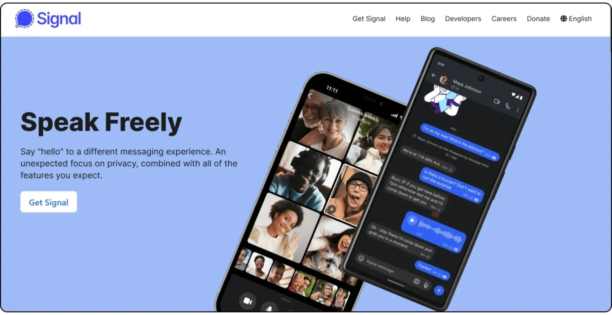


Secara teknis, setiap percakapan di dalam Signal dilindungi oleh mekanisme enkripsi asimetris dan fana: Kunci sesi dinegosiasikan secara dinamis dan dihancurkan setelah digunakan, sehingga membatasi risiko kompromi. Transparansi aplikasi, yang kodenya sepenuhnya bersifat open-source baik di sisi klien maupun server, berarti bahwa setiap ahli keamanan atau peneliti dapat memeriksa integritas dan kepatuhannya terhadap standar kriptografi yang ditetapkan.


Namun, Signal memiliki titik lemah dalam hal anonimitas: aplikasi ini membutuhkan nomor telepon yang valid untuk pendaftaran dan identifikasi pengguna. Meskipun nomor ini tidak secara sistematis terlihat oleh kontak Anda (bisa disembunyikan di bawah nama samaran), persyaratan ini menimbulkan ketergantungan pada infrastruktur telepon, dan oleh karena itu merupakan celah potensial untuk dilacak.


Singkatnya, Signal adalah solusi perpesanan yang sangat bagus, tetapi sayangnya membutuhkan koneksi dari nomor telepon.


https://planb.network/tutorials/computer-security/communication/signal-8dfb5572-6962-4f1c-bfa5-3192da4e9a4e

#### WhatsApp


WhatsApp, yang dimiliki oleh Meta (sebelumnya Facebook), juga menggunakan *Signal Protocol* untuk enkripsi end-to-end. Jadi, secara teori, percakapan WhatsApp Anda secara efektif terlindungi dari penyadapan. Namun, ini belum tentu yang terbaik dalam hal kerahasiaan yang sebenarnya: aplikasi ini mengumpulkan sejumlah besar metadata (nomor, frekuensi pertukaran, perkiraan lokasi, kontak...), yang bisa dieksploitasi secara komersial oleh Meta untuk tujuan periklanan atau analisis.


Selain itu, enkripsi yang diterapkan oleh WathsApp tidak dapat diverifikasi, karena kode sumbernya bersifat eksklusif. Itulah mengapa saya tidak menyarankan penggunaan WhatsApp dalam konteks di mana kerahasiaan dan keamanan pertukaran Anda penting.


#### Telegram


Telegram merupakan layanan perpesanan yang sangat populer berkat ergonomi dan fitur-fiturnya (saluran publik, bot, grup besar...). Namun, keamanannya jauh lebih terbatas secara default: hanya "pertukaran rahasia" yang mendapat manfaat dari enkripsi ujung ke ujung. Semua percakapan lainnya (mayoritas pertukaran harian pengguna) disimpan tanpa enkripsi di server Telegram.


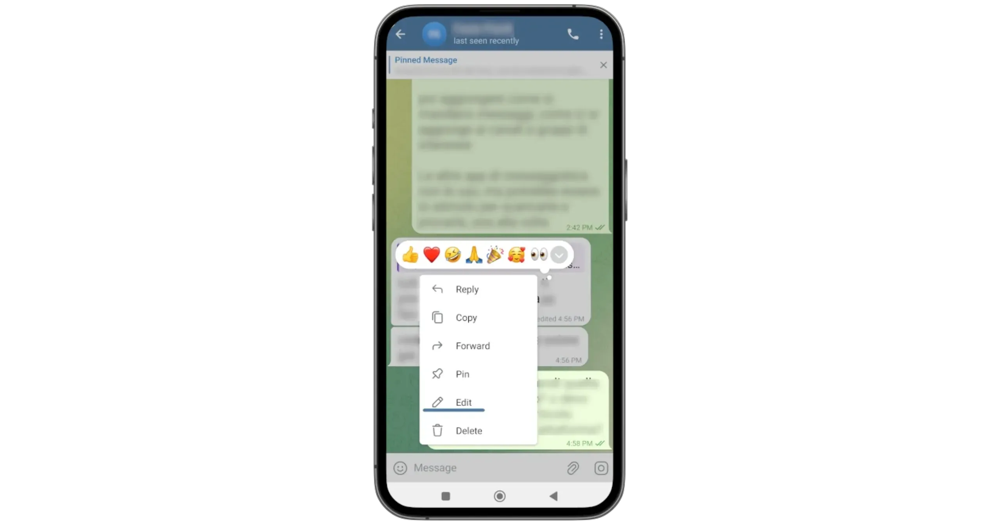


Oleh karena itu, Telegram secara teknis dapat mengakses konten sebagian besar percakapan yang tidak secara eksplisit dilindungi. Bahkan jika perusahaan ini mengambil sikap tegas terhadap otoritas pemerintah, Telegram bukanlah solusi optimal untuk pertukaran rahasia atau sensitif, kecuali jika Anda secara eksplisit menggunakan "pertukaran rahasia", yang jauh lebih tidak praktis dalam keseharian.


https://planb.network/tutorials/computer-security/communication/telegram-account-09ab3cf3-7625-4267-97a1-24e59a9e5943

#### Threema


Threema, diluncurkan di Swiss pada tahun 2012, menonjol dari sebagian besar layanan perpesanan aman lainnya berkat pendekatan privasi berdasarkan desain. Tidak seperti Signal, WhatsApp atau Telegram, tidak ada nomor telepon yang diperlukan untuk membuat akun. Pengguna diberi pengenal acak yang unik, memungkinkan pendaftaran yang sepenuhnya anonim tanpa tautan langsung ke identitas asli.


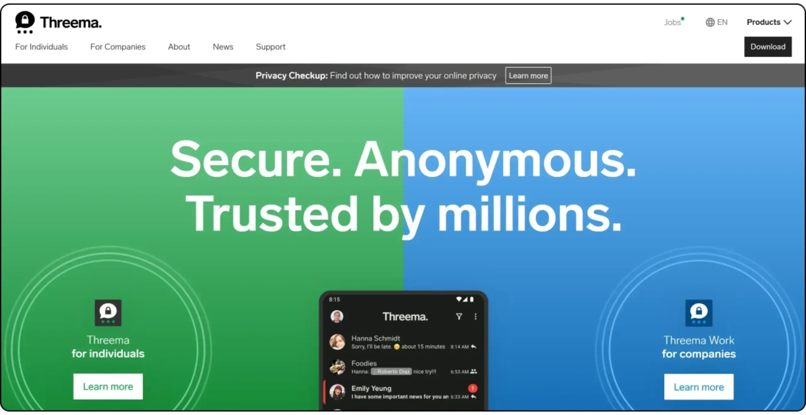


Secara teknis, Threema menawarkan enkripsi ujung ke ujung pada semua komunikasi: pesan, panggilan, berkas, grup, dan fungsi-fungsi lainnya. Sejak tahun 2020, kode sumber untuk aplikasi seluler telah menjadi sumber terbuka, memungkinkan audit independen. Di sisi lain, infrastruktur server tetap menjadi hak milik, meskipun berlokasi secara eksklusif di Swiss, negara yang undang-undangnya mendukung perlindungan data pribadi.


Aplikasi ini kompatibel dengan Android dan iOS, dan juga menawarkan web Interface yang aman, serta klien asli untuk Windows, Linux, dan macOS. Namun demikian, aktivasi awal memerlukan smartphone.


Aspek penting lainnya dari Threema adalah model bisnisnya: aplikasi ini tidak gratis tetapi harus dibeli (sekitar €5,99). Pilihan ini menghindari ketergantungan pada model yang didasarkan pada pengumpulan data atau iklan. Untuk menjaga anonimitas saat membeli, kunci aktivasi dapat dibeli dengan bitcoin atau uang tunai langsung di Threema Shop untuk Android.


Menurut saya, solusi perpesanan ini sangat bagus, tetapi kelemahan utamanya adalah bahwa kode sumber untuk servernya tetap eksklusif.


https://planb.network/tutorials/computer-security/communication/threema-24382d25-df7b-4e96-b332-6968f748df74

#### Obrolan SimpleX


SimpleX Chat, yang diluncurkan pada tahun 2021, sepenuhnya menghilangkan gagasan tentang ID pengguna: tidak ada nomor telepon, tidak ada nama samaran publik, tidak ada kunci publik yang terlihat. Setiap pengguna diidentifikasi hanya dengan tautan atau kode QR sementara. Arsitektur ini membuat korelasi antar pengguna hampir tidak mungkin terjadi, menjamin tingkat kerahasiaan yang tinggi.


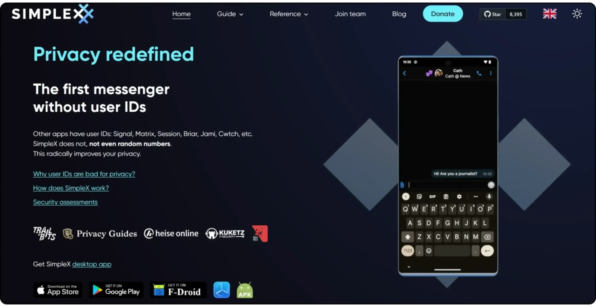


Secara teknis, pesan dienkripsi dari ujung ke ujung dan melewati server relay. Relai ini tidak memiliki pengetahuan tentang pengirim, penerima atau kunci mereka. Setelah pesan dikirimkan, pesan tersebut segera dihapus dari server. SimpleX mengadopsi arsitektur terdesentralisasi yang tidak terpusat: server tidak memiliki direktori global, dan setiap pengguna dapat memasang relai mereka sendiri. Hal ini berbeda dengan solusi seperti Matrix, di mana server federasi melacak pertukaran.


Protokol ini sepenuhnya sumber terbuka: klien, server dan protokol dapat diakses publik dan diaudit. SimpleX tersedia di Android, iOS, Linux, Windows dan macOS, dengan penyimpanan lokal yang dienkripsi dan portabel, sehingga profil dapat ditransfer tanpa server pusat. Setiap pengguna juga bisa mengelola beberapa profil yang terisolasi, masing-masing dengan pengaturan, nama panggilan dan fotonya sendiri. Fleksibilitas ini memungkinkan untuk memisahkan dengan jelas kehidupan pribadi, kehidupan profesional, dan nama samaran.


Kontak ditambahkan melalui tautan sementara atau alamat statis (pengenal permanen tetapi dapat dibatalkan). Anda juga dapat memilih antara Exchange yang fana atau mode yang lebih klasik, dengan kontrol halus pada visibilitas dan otorisasi (misalnya, menyembunyikan nama asli Anda di balik nama samaran yang acak dan unik untuk setiap kontak).


Dalam hal keamanan dan kerahasiaan, SimpleX melangkah lebih jauh daripada kebanyakan sistem pesan yang ada, membatasi metadata seminimal mungkin dan menghilangkan ketergantungan pada direktori pusat atau pengenal unik. Namun, arsitektur ini memaksakan sejumlah kompromi dalam hal keramahan pengguna: ergonomi yang terkadang kurang intuitif, kebutuhan akan sedikit kurva pembelajaran awal, dan ketergantungan pada ketersediaan server relai.


https://planb.network/tutorials/computer-security/communication/simplex-chat-7a1efa11-4d0a-49c4-92aa-e18bf22c22b9

#### Sesi


Session, yang diluncurkan pada tahun 2020 oleh Oxen Privacy Tech Foundation, adalah sebuah aplikasi perpesanan yang dirancang untuk menawarkan privasi dan ketahanan yang lebih baik dalam menghadapi pengawasan. Session tidak memerlukan informasi pribadi saat pendaftaran: tidak ada nomor telepon, tidak ada email, hanya sepasang kunci kriptografi yang dibuat secara lokal. Hal ini memungkinkan otentikasi anonim.


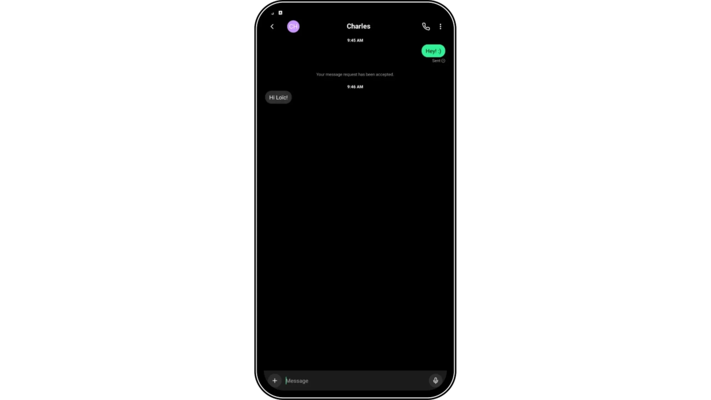


Secara teknis, Session mengimplementasikan enkripsi ujung ke ujung untuk pesan, berkas, audio dan panggilan, serta untuk grup (hingga 100 anggota). Pesan-pesan disalurkan melalui jaringan terdesentralisasi berdasarkan server simpul yang terinspirasi oleh arsitektur bawang Tor. Mekanisme ini menawarkan proteksi tingkat lanjut terhadap pengawasan jaringan, termasuk oleh ISP dan aktor negara.


Klien dan server Session adalah sumber terbuka. Perangkat lunak ini tersedia di Android, iOS, Windows, macOS dan Linux, dengan opsi untuk menyinkronkan antar perangkat melalui frasa Mnemonic yang mirip dengan yang digunakan dalam dompet Bitcoin. Frasa ini memberikan kontrol eksklusif kepada pengguna atas datanya, tetapi juga membebankan tanggung jawab yang signifikan dalam hal pencadangan.


https://planb.network/tutorials/computer-security/communication/session-b0e3193c-2129-4f1b-9013-c211210724c3

#### Keet


Keet, diluncurkan pada tahun 2022 oleh Holepunch (sebuah perusahaan yang didukung oleh Tether dan Bitfinex), menonjol karena pendekatannya yang terdesentralisasi secara radikal: Semua komunikasi (pesan, panggilan audio dan video, transfer file, dll.) berlangsung secara langsung di antara para pengguna, tanpa melewati server pusat. Arsitektur P2P ini menghilangkan perantara dan sangat meningkatkan kerahasiaan dan ketahanan sistem.


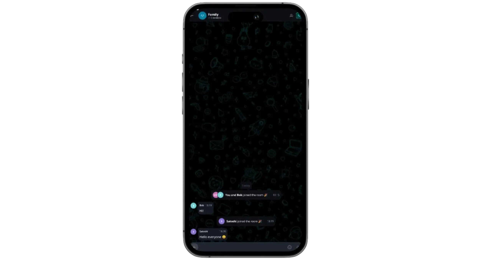


Keet mengenkripsi semua komunikasi dari ujung ke ujung. Pendaftaran sepenuhnya anonim: tidak diperlukan nomor telepon, email Address, atau pengenal. Hal ini memastikan kerahasiaan yang lebih baik sejak layanan diaktifkan. Panggilan video memiliki kualitas terbaik, dan transfer file tidak terbatas ukurannya, sehingga cocok untuk penggunaan profesional dan pribadi.


Di sisi lain, meskipun beberapa komponen (kriptografi dan jaringan) dipublikasikan sebagai sumber terbuka di GitHub, klien Interface milik Keet belum sepenuhnya terbuka pada saat penulisan SCU-202 (Mei 2025). Namun, Holepunch telah mengumumkan niatnya untuk mempublikasikan seluruh kode di masa depan.


Keet tersedia di Android, iOS, Windows, macOS dan Linux, dan dapat disinkronkan antar perangkat menggunakan frasa Mnemonic.


https://planb.network/tutorials/computer-security/communication/keet-efdb759d-5e94-4bbf-b28c-5fa8669c809b

#### Olvid


Olvid, diluncurkan pada tahun 2019, adalah layanan perpesanan terenkripsi dari Prancis. Keunggulannya: Pendaftaran tanpa data pribadi. Identifikasi didasarkan pada Exchange kunci kriptografi langsung antar pengguna.


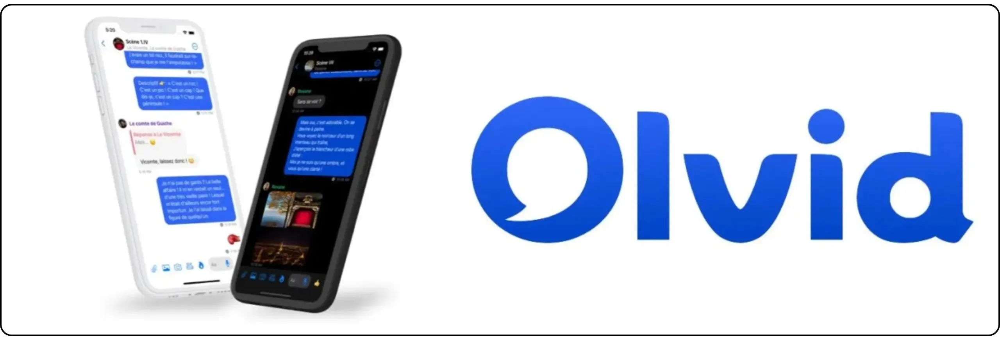


Secara teknis, pesan di Olvid dienkripsi dari ujung ke ujung, menggunakan protokol eksklusif yang dirancang khusus untuk melindungi tidak hanya konten pesan, tetapi juga metadata: Tidak seorang pun, termasuk server pusat, yang dapat mengetahui siapa yang berkomunikasi dengan siapa, atau kapan. Model ini secara signifikan mengurangi risiko spionase dan pengawasan.


Namun, infrastruktur server tetap menjadi hak milik dan terpusat, dihosting di AWS (*Amazon Web Services*). Kode klien telah menjadi sumber terbuka selama beberapa tahun, tetapi kode server tidak dipublikasikan, yang membatasi transparansi teknis sistem.


Model keamanan Olvid didasarkan pada prinsip penting: Tidak adanya pihak ketiga yang terpercaya dalam pembentukan identitas digital. Tidak seperti kebanyakan sistem perpesanan terenkripsi, yang mengandalkan direktori terpusat untuk mengelola identitas pengguna, Olvid tidak bergantung pada infrastruktur terpusat apa pun untuk menjamin integritas komunikasi. Arsitektur ini menghilangkan risiko yang terkait dengan kompromi direktori.


Olvid memang menggunakan server distribusi pesan pusat, tetapi perannya hanya bersifat logistik: Server ini menangani transmisi pesan terenkripsi secara asinkron. Server ini tidak terlibat dalam setiap tahap proses enkripsi, dan tidak mengetahui identitas asli pengguna, maupun konten atau metadata pesan (dengan pengecualian kunci publik penerima, yang diperlukan untuk perutean). Oleh karena itu, ia dapat dianggap tidak bersahabat secara default, tanpa mengorbankan keamanan secara keseluruhan. Bahkan jika itu disusupi, ia tidak akan mengizinkan akses apa pun ke konten komunikasi. Oleh karena itu, Olvid mengasumsikan distribusi pesan yang terpusat (untuk alasan efisiensi dan kualitas layanan), sambil menjamin keamanan yang tidak bergantung pada infrastruktur ini.


Olvid menawarkan dua versi:


- Versi gratis, menawarkan semua fungsi kecuali panggilan audio dan video (hanya menerima) dan sinkronisasi multi-perangkat
- Versi berbayar dengan harga €4,99 per bulan membuka semua fitur


Aplikasi ini disertifikasi oleh ANSSI (*Agence Nationale de la Sécurité des Systèmes d'Information*).


Olvid kompatibel dengan Android, iOS, Windows, macOS dan Linux. Ergonominya tetap sederhana dan mudah diakses. Aplikasi ini juga dilengkapi dengan sistem cadangan terenkripsi untuk kunci dan kontak, sehingga Anda bisa memulihkan akun di perangkat baru.


https://planb.network/tutorials/computer-security/communication/olvid-05038dc1-62c0-4a47-be4e-3d23c6155bfd

### Aplikasi perpesanan yang harus dihindari


Aplikasi perpesanan populer seperti WhatsApp, WeChat, Facebook Messenger, Instagram Direct Message, Snapchat, dan LINE banyak digunakan setiap hari. Namun, dari sudut pandang teknis, platform-platform ini tidak memenuhi standar keamanan modern yang cocok untuk komunikasi pribadi.


Secara umum, dua kriteria mendasar yang perlu dipertimbangkan ketika memilih layanan perpesanan adalah: Apakah layanan ini menyediakan enkripsi ujung ke ujung, dan apakah kodenya bersumber terbuka? Kemudian ada fitur-fitur lain yang mungkin menarik, seperti pendaftaran anonim atau penggunaan arsitektur jaringan yang terdesentralisasi, tetapi dua Elements yang pertama ini adalah dasar-dasarnya. Enkripsi menjamin kerahasiaan bursa Anda, sementara membuka kode sumber memungkinkan Anda untuk memeriksa apakah enkripsi telah diimplementasikan dengan aman.


Menggunakan layanan yang gagal memenuhi dua prasyarat ini sama saja dengan mendelegasikan perlindungan bursa Anda sepenuhnya kepada pemain komersial yang kepentingan ekonominya sering kali bergantung pada eksploitasi.


Berikut ini adalah tabel ringkasan dari aplikasi perpesanan utama yang ada saat ini dan fitur-fiturnya, seperti yang ada pada saat artikel ini ditulis (Mei 2025):


| Application          | E2EE 1:1       | E2EE groups   | Anonymous registration | Client open-source license | Server open-source license | Decentralized server | Creation year |
| -------------------- | -------------- | -------------- | ------------------- | -------------------------- | --------------------------- | -------------------- | ------------- |
| WhatsApp             | ✅              | ✅              | ❌                   | ❌                          | ❌                           | ❌                    | 2009              |
| WeChat               | ❌              | ❌              | ❌                   | ❌                          | ❌                           | ❌                    | 2011              |
| Facebook Messenger   | ✅              | 🟡 (optionnel) | ❌                   | ❌                          | ❌                           | ❌                    | 2011              |
| Telegram             | 🟡 (optionnel) | ❌              | 🟡                  | ✅                          | ❌                           | ❌                    | 2013              |
| LINE                 | ✅              | ✅              | ❌                   | ❌                          | ❌                           | ❌                    | 2011              |
| Signal               | ✅              | ✅              | ❌                   | ✅                          | ✅                           | ❌                    | 2014              |
| Threema              | ✅              | ✅              | ✅                   | ✅                          | ❌                           | ❌                    | 2012              |
| Element (Matrix)     | ✅              | ✅              | ✅                   | ✅                          | ✅                           | 🟡 (federated)          | 2016              |
| Delta Chat           | ✅              | ✅              | ✅                   | ✅                          | N/A                         | 🟡 (via email)       | 2017              |
| Conversations (XMPP) | ✅              | ✅              | ✅                   | ✅                          | ✅                           | 🟡 (federated)          | 2014              |
| Session              | ✅              | ✅              | ✅                   | ✅                          | ✅                           | ✅                    | 2020              |
| SimpleX              | ✅              | ✅              | ✅                   | ✅                          | ✅                           | ✅                    | 2021              |
| Olvid                | ✅              | ✅              | ✅                   | ✅                          | ❌                           | 🟡(no directory)   | 2019              |
| Keet                 | ✅              | ✅              | ✅                   | ❌                          | N/A                         | ✅                    | 2022              |
| Jami                 | ✅              | ✅              | ✅                   | ✅                          | N/A                         | ✅                    | 2005              |
| Briar                | ✅              | ✅              | ✅                   | ✅                          | N/A                         | ✅                    | 2018              |
| Tox                  | ✅              | ✅              | ✅                   | ✅                          | N/A                         | ✅                    | 2013              |

*E2EE = Enkripsi ujung ke ujung*


Keamanan komunikasi elektronik Anda sangat bergantung pada pemilihan aplikasi yang tepat dan penerapan praktik-praktik terbaik. Memahami mekanisme keamanan yang mendasari, mengidentifikasi kekurangan dalam solusi konvensional dan memilih alternatif yang dapat diandalkan adalah fondasi penting untuk berkomunikasi tanpa disadap.


Sejauh ini, kita telah menjelajahi cara mengamankan ponsel cerdas Anda dan cara memilih aplikasi perpesanan yang andal. Pada bab berikutnya, saya mengusulkan untuk memperluas studi ini ke semua keluarga besar aplikasi seluler, untuk menemukan alternatif yang ramah privasi untuk aplikasi favorit Anda. Apakah itu email, penyimpanan file, pemetaan, streaming video atau musik, aplikasi sumber terbuka apa saja yang tersedia untuk Anda?


## aplikasi sumber terbuka: alternatif terbaik


<chapterId>9c0e056c-45ce-407c-b4b6-f648bbc1f7d5</chapterId>


Di luar aplikasi pesan instan, penting untuk diingat bahwa aplikasi lain pada ponsel cerdas Anda dapat mengeksploitasi data Anda untuk tujuan komersial. Untungnya, ada alternatif sumber terbuka yang menghargai privasi Anda. Itulah yang ingin saya perkenalkan kepada Anda dalam bab ini.


Saya tidak akan membahas kembali alternatif untuk browser dan pengirim pesan instan di sini, karena kita sudah membahasnya secara mendetail di bab-bab sebelumnya.


### Email pelanggan


Email tetap menjadi alat komunikasi yang penting, tetapi aplikasi yang paling populer, seperti Gmail atau Outlook, menimbulkan sejumlah masalah privasi. Layanan-layanan ini sering kali menganalisis pesan Anda, menyimpan metadata, dan berpartisipasi dalam pembuatan profil iklan.


**Alternatif**:


- [FairEmail](https://email.faircode.eu/)


FairEmail adalah aplikasi Android yang komprehensif dan berorientasi pada keamanan. Aplikasi ini mendukung semua penyedia IMAP/SMTP, memungkinkan enkripsi pesan melalui OpenPGP, memblokir gambar jarak jauh (digunakan sebagai pelacak), dan tidak menggunakan layanan pihak ketiga. Aplikasi ini memberi Anda kontrol yang sangat baik atas koneksi, pemberitahuan, dan perilaku sinkronisasi.


- [K-9 Mail](https://k9mail.app)


K-9 Mail adalah klien email Android sumber terbuka, yang baru-baru ini diintegrasikan ke dalam ekosistem Thunderbird Mozilla. K-9 Mail mendukung banyak akun, enkripsi PGP melalui OpenKeychain, dan bekerja tanpa server perantara.


- [Thunderbird Mobile](https://www.thunderbird.net/mobile/)


Thunderbird Mobile adalah versi mobile dari klien email sumber terbuka populer yang dikembangkan oleh Mozilla Foundation. Sesuai dengan filosofi proyek, aplikasi ini menekankan kerahasiaan, transparansi kode, dan tidak adanya telemetri yang mengganggu. Thunderbird Mobile didasarkan pada aplikasi K-9 Mail, yang merupakan penerus resminya di Android. Aplikasi ini memiliki fitur manajemen akun IMAP dan POP yang canggih, enkripsi email (melalui OpenPGP), dan Interface yang sederhana dan efisien.


- [Tuta](https://tuta.com/)


Tuta (sebelumnya "*Tutanota*") menawarkan solusi email terenkripsi end-to-end yang lengkap, tetapi klien selulernya hanya mendukung akun Tuta. Ini tidak bekerja dengan penyedia lain. Interface modern dan rapi, dan pendaftarannya tidak memerlukan data pribadi.


- [Proton Mail](https://proton.me/mail)


Proton Mail adalah layanan perpesanan aman yang berbasis di Swiss yang menawarkan enkripsi end-to-end asli antara pengguna Proton. Aplikasi seluler ini bersumber terbuka, bebas iklan, dan tidak mengumpulkan data pribadi saat pendaftaran. Proton Mail hanya mendukung akun Proton, tetapi memungkinkan pengiriman terenkripsi bahkan ke alamat eksternal melalui kata sandi.


Sistem email didasarkan pada 2 komponen yang berbeda: Penyedia email (seperti Gmail, Tuta atau Proton Mail), yang menangani penerimaan, pengiriman dan penyimpanan pesan melalui server; dan klien email, yang merupakan aplikasi yang digunakan untuk melihat dan menulis email Anda (seperti aplikasi Gmail, Outlook, K-9 Mail atau Thunderbird). Klien dapat terhubung ke penyedia yang berbeda melalui protokol standar seperti IMAP atau SMTP.


Oleh karena itu, dimungkinkan untuk menggunakan klien sumber terbuka yang ramah privasi sementara pada awalnya mempertahankan akun dengan penyedia yang lebih tradisional. Beberapa aplikasi, seperti Gmail, Proton Mail atau Tuta, menawarkan klien email yang juga berfungsi sebagai penyedia pesan, dan dengan demikian menawarkan solusi lengkap yang mengintegrasikan pembacaan dan pengiriman/penerimaan email Interface.


Berikut adalah beberapa saran, di mana Anda memilih penyedia email Anda:


- [Proton Mail](https://proton.me/mail)
- [Tuta](https://tuta.com/)
- [Kotak surat](https://mailbox.org/)
- [Cabut](https://disroot.org/)
- [Pagar Surat](https://mailfence.com/)


### Kartografi dan navigasi


Sebagian besar aplikasi pemetaan klasik, seperti Google Maps, Waze, atau Citymapper, mengumpulkan banyak sekali data pribadi. Aplikasi-aplikasi ini merekam pergerakan, pencarian, dan kebiasaan Anda, dan menggunakannya untuk tujuan komersial.


**Alternatif**:


- [Peta Organik](https://organicmaps.app/)


Organic Maps adalah aplikasi navigasi offline gratis. Aplikasi ini didasarkan pada data dari [OpenStreetMap] (https://www.openstreetmap.org), sebuah basis data kolaboratif yang terbuka. Anda mengunduh peta wilayah yang Anda minati, lalu menavigasinya tanpa jaringan.


Aplikasi ini tidak mengandung iklan, pelacakan atau pengumpulan data. Aplikasi ini sangat cocok untuk perjalanan dengan berjalan kaki, bersepeda, atau mobil, dengan Interface yang sederhana, cepat, dan bebas gangguan.


- [OsmAnd](https://osmand.net/)


OsmAnd (*OpenStreetMap Automated Navigation Directions*) adalah aplikasi pemetaan sumber terbuka yang komprehensif. Aplikasi ini menawarkan navigasi GPS offline, peta yang terperinci (termasuk jalur, jalur sepeda, dan bentang alam), dan penyesuaian yang ekstensif.


Anda dapat mengaktifkan lapisan yang berbeda (zona pejalan kaki, transportasi umum, dll.), menentukan peringatan kecepatan, atau mengintegrasikan peta khusus seperti peta untuk hiking atau rute bahari.


Versi gratisnya sudah sangat kaya, dan versi berbayarnya memungkinkan Anda membuka lebih banyak fitur dan mendukung proyek.


### Otomatisasi kantor dan dokumen


Alat-alat kantor klasik seperti Google Docs atau Microsoft Office sangat praktis, tetapi menimbulkan masalah kerahasiaan yang serius. Dokumen disimpan di server mereka, dianalisis, dan terkadang digunakan untuk tujuan pemasaran atau untuk melatih model AI.


**Alternatif**:


- [Kantor Collabora](https://www.collaboraoffice.com/)


Collabora Office adalah versi mobile dari LibreOffice, yang dirancang untuk smartphone dan tablet Android dan iOS. Aplikasi ini memungkinkan Anda membuat, mengedit, dan berbagi dokumen kantor tanpa harus meninggalkan perangkat atau cloud pribadi.


Aplikasi ini mendukung pengeditan kolaboratif ketika terhubung ke instance Nextcloud dengan ekstensi Collabora Online. Hal ini memungkinkan untuk mereproduksi pengalaman seperti Google Docs, tetapi dengan meng-host file Anda sendiri.


- [ONLYOFFICE](https://www.onlyoffice.com/)


ONLYOFFICE adalah paket perkantoran sumber terbuka. Aplikasi ini memungkinkan Anda membuka dan mengedit dokumen Word, Excel, dan PowerPoint secara langsung di ponsel, bahkan secara lokal. Anda juga dapat menghubungkannya ke berbagai layanan cloud untuk sinkronisasi otomatis, seperti Nextcloud.


### Manajer file dan cloud


Layanan seperti Google Drive atau Dropbox menyimpan file Anda di server jarak jauh milik perusahaan swasta. Data Anda kemudian dapat dipindai dan digunakan untuk tujuan periklanan atau statistik. Terlebih lagi, Anda memerlukan koneksi Internet dan akun pihak ketiga untuk mengaksesnya.


**Alternatif**:


- [Nextcloud](https://nextcloud.com/)


Nextcloud adalah solusi awan pribadi bersumber terbuka yang dapat Anda hosting sendiri atau digunakan melalui penyedia tepercaya. Solusi ini memungkinkan Anda menyinkronkan, berbagi, dan mengedit file dari ponsel cerdas Anda, sekaligus mempertahankan kendali penuh atas penyimpanannya.


Di Android, Anda dapat menginstal aplikasi seluler Nextcloud resmi untuk mengakses awan pribadi Anda dari mana saja. Anda juga dapat menambahkan fungsi seperti manajemen foto, kantor, kalender, dan perpesanan.


- [Berkas Materi](https://github.com/zhanghai/MaterialFiles)


Material Files adalah pengelola berkas sumber terbuka yang ringan dan rapi. Aplikasi ini memungkinkan Anda menelusuri, memindahkan, menyalin, atau menghapus file secara lokal di perangkat Android.


Aplikasi ini tidak mengandung iklan atau pelacak, dan tidak memerlukan izin yang tidak semestinya. Ini adalah alternatif yang menarik untuk penjelajah file yang disediakan Google, yang sering kali diintegrasikan ke dalam layanan cloud berpemilik lainnya.


### Kalender / Buku Harian


Banyak orang menggunakan aplikasi seperti Google Kalender atau Kalender Outlook untuk mengelola janji temu mereka. Namun layanan ini terhubung ke akun online terpusat yang mengumpulkan data tentang kebiasaan, lokasi pertemuan, dan interaksi Anda.


**Alternatif**:


- [Etar](https://github.com/Etar-Group/Etar-Calendar)


Etar adalah kalender yang sederhana, efisien, dan sepenuhnya bersumber terbuka. Kalender ini dapat berjalan secara lokal, tetapi juga memungkinkan sinkronisasi melalui CalDAV, protokol standar untuk menyinkronkan kalender dengan layanan yang ramah privasi (seperti Nextcloud atau EteSync).


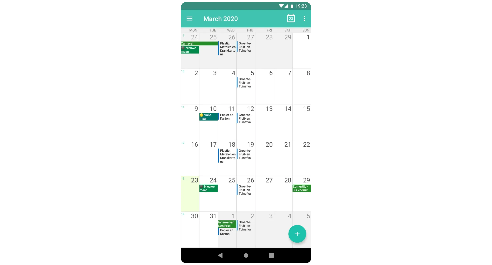


- [Kalender Sederhana](https://simplemobiletools.com/simplecalendar/)


Aplikasi ini merupakan bagian dari rangkaian "*Simple Mobile Tools*". Aplikasi ini tidak memerlukan akun atau akses jaringan, sehingga sangat ideal untuk penggunaan yang sepenuhnya offline. Anda dapat menambahkan acara, mengatur pengingat, dan mengatur tampilan berdasarkan hari, minggu, atau bulan. Seperti rangkaian aplikasi lainnya, Simple Calendar bebas iklan, bebas pelacak, dan 100% sumber terbuka.


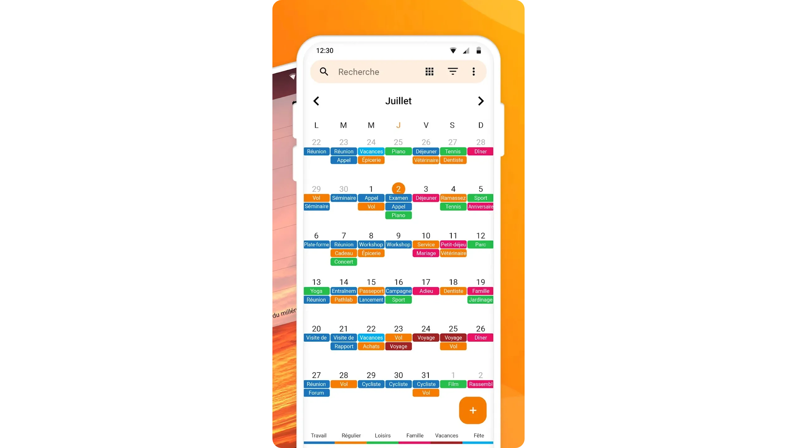


- [Kalender Tuta](https://tuta.com/calendar)


Tuta Calendar, yang dikembangkan oleh tim di balik Tuta Mail, adalah kalender terenkripsi end-to-end yang dirancang untuk menjaga kerahasiaan acara Anda. Kalender ini dapat digunakan di Android, iOS, dan melalui klien web. Bahkan judul, deskripsi, dan metadata acara Anda dienkripsi, memastikan bahwa tidak ada pihak ketiga, termasuk Tuta, yang dapat mengakses data Anda.


- [Kalender Proton](https://proton.me/calendar)


Kalender Proton juga menawarkan enkripsi end-to-end asli untuk acara Anda dan metadata mereka. Layanan ini dapat diakses di perangkat seluler (Android, iOS) dan melalui klien web, dengan Interface yang jelas dan intuitif. Layanan ini memungkinkan pembuatan beberapa kalender, impor/ekspor acara dan opsi berbagi. Klien web adalah sumber terbuka, tetapi aplikasi seluler belum sepenuhnya sumber terbuka.


### Pencatatan


Aplikasi seperti Evernote, Google Keep atau OneNote digunakan untuk menangkap ide, mengatur tugas, atau menyimpan daftar. Namun, semua aplikasi ini bergantung pada layanan online berpemilik, yang memusatkan data Anda di server mereka dan sering kali menganalisis konten Anda untuk tujuan komersial.


**Alternatif**:


- [Quillpad](https://quillpad.github.io/)


Quillpad adalah aplikasi ringan yang dirancang khusus untuk pencatatan Markdown. Aplikasi ini memungkinkan Anda mengenkripsi catatan Anda secara opsional, mengatur konten Anda dengan tag dan warna, dan menambahkan pengingat. Semuanya bekerja tanpa akun atau koneksi, dan data tetap tersimpan di perangkat Anda. Catatan tersebut juga dapat disimpan secara terenkripsi di pCloud.


- [Joplin](https://joplinapp.org/)


Joplin adalah solusi yang lebih komprehensif, menawarkan sinkronisasi catatan terenkripsi melalui layanan yang kompatibel seperti Nextcloud, Dropbox, atau WebDAV. Anda bisa mengelola catatan sederhana atau terstruktur (dalam Markdown), mengklasifikasikan dokumen, dan bahkan mengimpor lampiran file.


Interface sedikit lebih rumit daripada QuillNote, tetapi masih dapat digunakan dengan sempurna di perangkat seluler, dan cocok untuk penggunaan pribadi dan profesional.


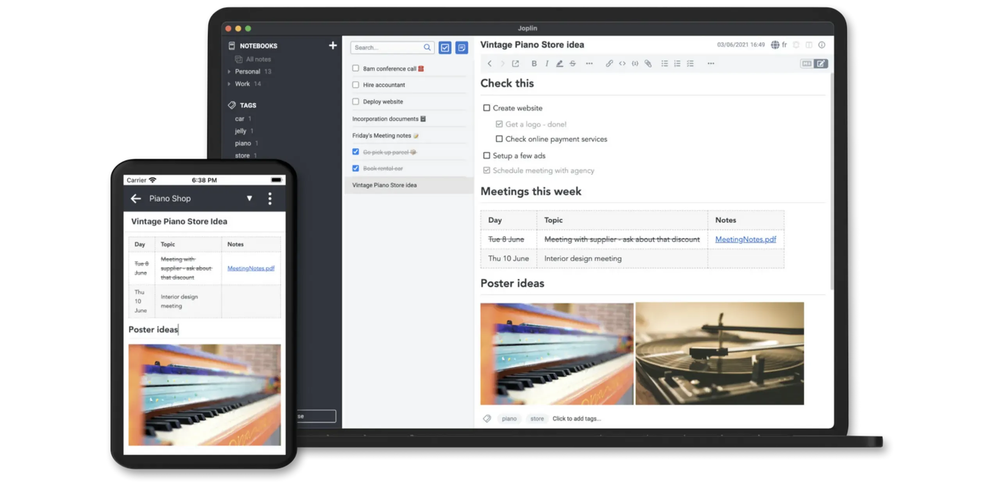


### Manajer kata sandi


Banyak pengguna yang membiarkan browser mereka menyimpan kata sandi mereka melalui solusi seperti Pengelola Kata Sandi Google. Meskipun nyaman, jenis manajemen terpusat ini tidak menawarkan enkripsi ujung ke ujung yang dikendalikan pengguna, dan mengekspos kredensial Anda pada risiko jika akun Google Anda dibobol. Untuk pengelolaan kata sandi Anda yang lebih aman dan berdaulat, beberapa alternatif sumber terbuka tersedia.


**Alternatif**:


- [Bitwarden](https://bitwarden.com/)


Bitwarden merupakan salah satu pengelola kata sandi sumber terbuka paling komprehensif yang tersedia. Bitwarden mengenkripsi semua kredensial Anda secara lokal, memungkinkan Anda memiliki kata sandi yang kuat generate, dan menawarkan sinkronisasi terenkripsi antar perangkat.


Anda bisa menggunakan peladen Bitwarden, atau meng-host sendiri jika Anda ingin mendapatkan kendali penuh. Ponsel Interface-nya jelas dan lancar, dengan integrasi yang mulus ke dalam sistem Android atau iOS.


https://planb.network/tutorials/computer-security/authentication/bitwarden-0532f569-fb00-4fad-acba-2fcb1bf05de9


- [KeePassDX](https://www.keepassdx.com/)


KeePass adalah pengelola kata sandi historis yang didasarkan pada berkas lokal terenkripsi. Pada perangkat seluler, KeePassDX merupakan implementasi Android yang luar biasa, kompatibel dengan semua basis data KeePass. Ia bekerja secara offline, tanpa awan, menjadikannya solusi yang baik bagi mereka yang ingin menyimpan data mereka 100% lokal.


Ada juga [KeePassium](https://keepassium.com/) untuk iOS, aplikasi yang terintegrasi dengan baik dalam ekosistem Apple, kompatibel dengan format KeePass dan sumber terbuka. Alternatif iOS lainnya untuk klien KeePass adalah Strongbox, tetapi perangkat lunak ini sudah tidak lagi menjadi sumber terbuka selama beberapa tahun.


https://planb.network/tutorials/computer-security/authentication/keepass-f8073bb7-5b4a-4664-9246-228e307be246


- [Proton Pass](https://proton.me/pass)


Diluncurkan oleh tim Proton (yang dikenal dengan Proton Mail dan Proton Drive), Proton Pass menggabungkan kemudahan penggunaan, enkripsi ujung ke ujung, dan infrastruktur Swiss yang ramah privasi. Aplikasi seluler ini intuitif, memungkinkan Anda menambahkan catatan yang aman, dan mendukung pelengkapan otomatis. Ini adalah alternatif yang sangat baik bagi mereka yang menginginkan solusi siap pakai, tanpa perlu mengkhawatirkan manajemen teknis.


### VPN


VPN (*Virtual Private Network*) memungkinkan Anda mengenkripsi lalu lintas Internet Anda dan merutekannya melalui server perantara jarak jauh. Hal ini akan menyembunyikan IP Address Anda, mengamankan koneksi Anda di jaringan publik (Wi-Fi bandara, kafe...) dan melindungi Anda dari bentuk-bentuk pengawasan tertentu.


Namun, tidak semua VPN diciptakan sama. Layanan populer seperti NordVPN atau ExpressVPN berfungsi dengan baik, tetapi pendekatan mereka tetap komersial, dengan model berdasarkan pelacakan pengguna untuk pengoptimalan pemasaran. Mereka juga mengharuskan pembuatan akun dan sering kali mengumpulkan lebih banyak data daripada yang mereka sampaikan.


**Alternatif**:


- [Mullvad VPN](https://mullvad.net/)


Mullvad merupakan salah satu VPN terbaik dalam hal proteksi privasi. Tidak memerlukan email atau kata sandi: Akun Anda ditautkan ke nomor acak sederhana. Pembayaran bisa dilakukan dengan bitcoin atau uang tunai. Klien selulernya bersumber terbuka, mudah digunakan dan tangguh. Mullvad tidak menyimpan catatan, tidak melacak penggunanya, dan secara teratur menerbitkan audit keamanan independen.


https://planb.network/tutorials/computer-security/communication/mullvad-968ec5f5-b3f0-4d23-a9e0-c07a3e85aaa8


- [IVPN] (https://www.ivpn.net/)


IVPN merupakan alternatif lain yang berfokus pada privasi yang sangat baik. Menawarkan Interface seluler yang sederhana dan efisien, tidak ada pengumpulan log, dan memungkinkan pendaftaran anonim. Anda juga bisa membayar dengan bitcoin. Aplikasi ini dilengkapi dengan dinding api yang memblokir semua lalu lintas non-VPN, yang bisa sangat berguna pada ponsel cerdas. Kliennya bersumber terbuka.


https://planb.network/tutorials/computer-security/communication/ivpn-5a0cd5df-29f1-4382-a817-975a96646e68


- [Proton VPN](https://protonvpn.com/)


Dikembangkan oleh tim Proton, VPN ini menawarkan paket gratis dan bebas iklan. Proton VPN berbasis di Swiss, tunduk pada undang-undang privasi yang ketat, dan menerbitkan audit rutin. Klien-kliennya juga merupakan sumber terbuka.


### autentikasi 2FA


Autentikasi dua faktor (2FA) adalah keamanan tambahan Layer di atas kata sandi Anda. Ini sering kali bergantung pada kode satu kali yang dihasilkan setiap 30 detik oleh aplikasi autentikasi. Kode ini didasarkan pada rahasia yang dibagikan antara perangkat Anda dan layanan online, sesuai dengan protokol TOTP (*Kata Sandi Sekali Pakai Berbasis Waktu*). Aplikasi yang paling terkenal adalah Google Authenticator, tetapi ini bukan sumber terbuka dan membuat Anda bergantung pada ekosistem Google.


**Alternatif**:


- [Aegis Authenticator](https://getaegis.app/)


Aegis merupakan aplikasi sumber terbuka yang komprehensif. Aplikasi ini mengenkripsi basis data 2FA Anda dengan kata sandi, menawarkan cadangan yang dapat diekspor (juga dienkripsi), dan memungkinkan Anda mengurutkan akun berdasarkan direktori. Interface jelas, modern, dan mudah dipulihkan pada perangkat baru, selama Anda memiliki file cadangan dan kata sandi terkait.


- [Ente Auth](https://ente.io/auth/)


Ente Auth adalah solusi multi-platform yang modern, open-source, dan multi-platform dengan pencadangan terenkripsi ujung ke ujung. Ente Auth memungkinkan Anda untuk menyinkronkan kode 2FA dengan aman di perangkat seluler, desktop, dan web. Anda juga bisa menggunakannya secara offline, tanpa pencadangan awan atau pembuatan akun.


Ente Auth menawarkan banyak fitur tambahan: Organisasi berdasarkan tag, ikon khusus untuk setiap layanan, catatan, favorit, pencarian terintegrasi, berbagi kode tim yang aman.


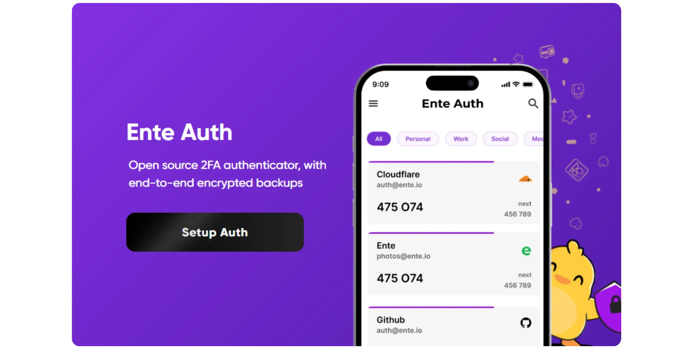


- [Authy](https://www.authy.com/)


Authy menawarkan sinkronisasi 2FA di beberapa perangkat, yang bisa berguna, tetapi aplikasinya bukan sumber terbuka dan memerlukan nomor telepon untuk pendaftaran. Namun, untuk pemula, aplikasi ini lebih lengkap daripada Google Authenticator, khususnya berkat fungsi pencadangan awannya.


https://planb.network/tutorials/computer-security/authentication/authy-a76ab26b-71b0-473c-aa7c-c49153705eb7

Jika Anda ingin mengetahui lebih lanjut tentang pengelola kata sandi, autentikasi 2FA, dan VPN, saya sarankan Anda membaca bab-bab khusus dalam kursus SCU-101:


https://planb.network/courses/99c46148-7080-4915-a7e0-9df0e145cd47

### Cuaca


Aplikasi cuaca klasik seperti AccuWeather atau Météo France sering kali mengumpulkan data pribadi, termasuk lokasi Anda yang tepat, kebiasaan penggunaan, dan terkadang bahkan pengidentifikasi perangkat, untuk tujuan komersial atau iklan. Layanan ini juga bergantung pada API terpusat, sehingga membatasi kontrol Anda atas data yang ditampilkan atau dikirimkan.


**Alternatif**:


- [Cuaca Geometrik](https://github.com/WangDaYeeeeee/GeometricWeather)


Geometric Weather menawarkan prakiraan cuaca yang mendetail dan widget yang dapat disesuaikan, semuanya tanpa iklan atau pengumpulan data yang mengganggu. Kodenya adalah sumber terbuka. Aplikasi ini mendukung beberapa penyedia cuaca.


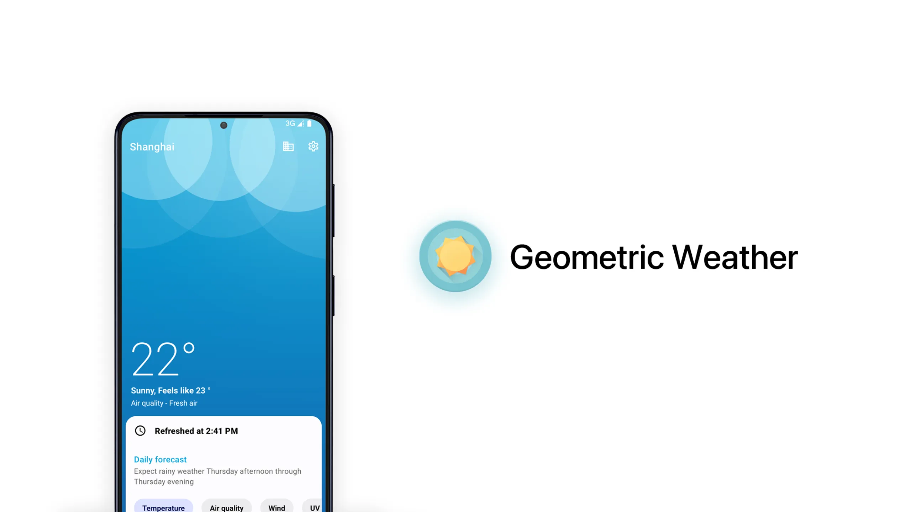


- [Prognoza](https://github.com/davidtakac/prognoza)


Prognoza adalah aplikasi minimalis yang langsung menuju ke intinya: Menampilkan cuaca dan prakiraan cuaca saat ini. Aplikasi ini menawarkan beberapa widget. Prognoza bebas iklan, bebas pelacak, dan tidak memerlukan otorisasi yang tidak perlu.


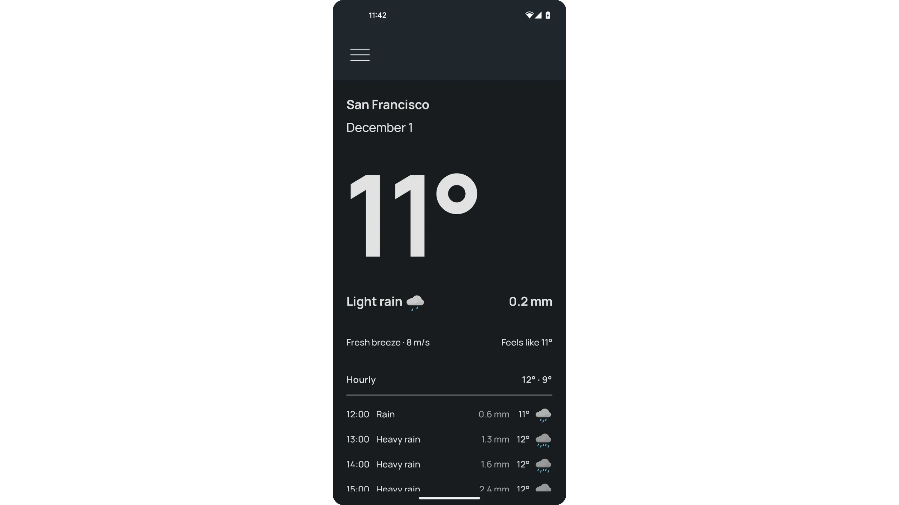


- [Forecastie](https://github.com/martykan/forecastie)


Aplikasi cuaca sederhana, berdasarkan OpenWeatherMap, sumber terbuka, dapat dikonfigurasi, dengan widget.


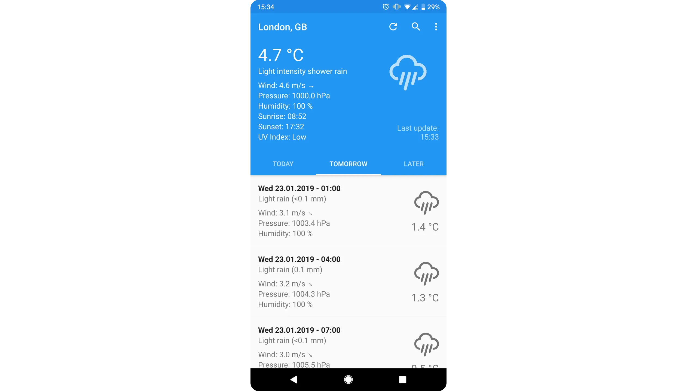


Secara umum, pada aplikasi cuaca, lebih baik mengonfigurasi lokasi yang Anda minati secara manual daripada mengaktifkan geolokasi otomatis.


### Streaming audio/video


Platform populer seperti Spotify atau YouTube menawarkan pengalaman pengguna yang mulus, tetapi dengan mengorbankan kompromi yang signifikan pada privasi. Layanan-layanan ini secara konstan mengumpulkan data perilaku: Riwayat menonton atau mendengarkan, waktu yang dihabiskan, preferensi konten, perangkat yang digunakan. Informasi ini sering digunakan untuk tujuan pembuatan profil atau penargetan.


**Alternatif**:


- [LibreTube](https://libretube.dev/)


LibreTube adalah aplikasi Android yang memungkinkan Anda menonton video YouTube tanpa dilacak Google. Semua permintaan dialihkan melalui server proxy Piped, yang menganonimkan akses ke video. Interface-nya modern, cepat, dan bebas iklan. Aplikasi ini tidak memerlukan akun Google, dan memungkinkan Anda berlangganan saluran secara anonim atau membuat daftar putar lokal.


- [NewPipe] (https://newpipe.net/)


NewPipe adalah klien YouTube alternatif lainnya. Ringan, bebas iklan, bebas pelacak, dan sepenuhnya open-source, aplikasi ini memungkinkan Anda melihat, mengunduh, atau mendengarkan video dari YouTube (dan platform lain seperti SoundCloud atau PeerTube) di latar belakang. Tidak diperlukan koneksi ke Google. NewPipe bekerja sepenuhnya secara independen dari aplikasi YouTube resmi, dan tidak memerlukan layanan Google apa pun untuk beroperasi.


- [VLC Android](https://www.videolan.org/vlc/download-android.html)


Pemutar media VLC yang populer juga tersedia di Android. Aplikasi ini mendukung berbagai format audio dan video, dan memungkinkan Anda memutar file secara lokal atau melalui jaringan, semuanya tanpa iklan atau pengumpulan data. Ini adalah solusi yang sangat baik untuk mengelola perpustakaan multimedia Anda sendiri secara lokal, tanpa koneksi ke layanan pihak ketiga.


- (https://funkwhale.audio/):


Funkwhale adalah platform terdesentralisasi untuk berbagi dan mendengarkan musik, dengan klien yang kompatibel.


### Keyboard


Papan ketik virtual seperti Gboard dari Google atau SwiftKey dari Microsoft ada di mana-mana di ponsel pintar. Akan tetapi, keyboard ini memiliki risiko privasi yang besar: Setiap karakter yang diketik secara teoritis dapat direkam, dianalisis, atau dikirim ke server jarak jauh. Meskipun perusahaan-perusahaan ini mengklaim menganonimkan data, pengumpulan data masih mungkin terjadi.


**Alternatif**:


- [OpenBoard](https://github.com/dslul/openboard)


OpenBoard adalah keyboard Android sumber terbuka yang minimalis berdasarkan keyboard AOSP (*Android open-source Project*). Keyboard ini tidak mengandung komponen atau pelacak berpemilik, dan tidak pernah berkomunikasi dengan server jarak jauh. Koreksi otomatis, pengetikan prediktif, dan kamus pribadi hanya bekerja secara lokal.


- [FlorisBoard](https://florisboard.org/)


FlorisBoard menawarkan pendekatan yang lebih modern dan modular. Juga bersifat open-source, mengintegrasikan fungsi-fungsi canggih seperti input gerakan, tata letak tombol yang dipersonalisasi, dan manajemen multibahasa. Semua pemrosesan data dilakukan secara lokal, tanpa koneksi ke server eksternal. FlorisBoard masih dalam tahap pengembangan, tetapi sudah dapat digunakan sepenuhnya setiap hari bagi mereka yang menginginkan papan ketik yang kuat tanpa mengorbankan privasi mereka.


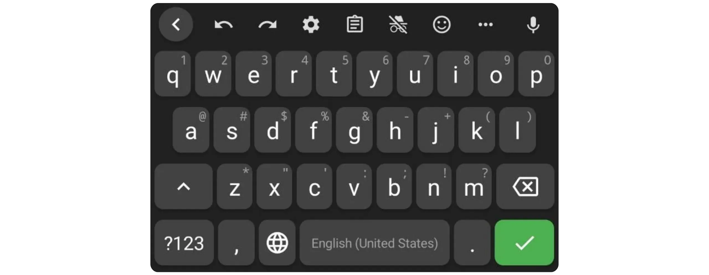


### Kalkulator


Aplikasi Kalkulator Google, meskipun efektif, masih merupakan produk Google dan memiliki risiko yang biasa terkait dengan pengumpulan data dan ketergantungan pada ekosistem terpusat.


**Alternatif**:


- [OpenCalc](https://github.com/Darkempire78/OpenCalc)


OpenCalc adalah kalkulator sumber terbuka yang cepat dan mudah digunakan, sangat cocok untuk kebutuhan sehari-hari. Kalkulator ini tidak mengumpulkan data dan bekerja sepenuhnya secara offline, tanpa iklan atau ketergantungan pada layanan eksternal apa pun.


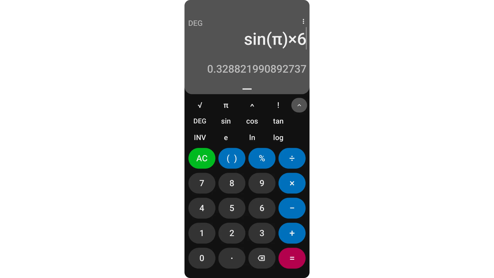


### Toko aplikasi


Google Play Store adalah sumber aplikasi default pada sebagian besar ponsel pintar Android. Namun, aplikasi ini sangat terintegrasi dengan layanan Google dan melibatkan pengumpulan data yang sistematis, bahkan selama pencarian atau pembaruan yang sederhana.


**Alternatif**:


- [F-Cold](https://f-droid.org/)


F-Droid adalah katalog aplikasi sumber terbuka yang eksklusif. Semua perangkat lunak yang tersedia dapat diaudit dan diunduh secara bebas, tanpa iklan, pelacakan, atau ketergantungan pada layanan Google. Aplikasi F-Droid sendiri tidak memerlukan akun pengguna.


- [Aurora Store](https://auroraoss.com/)


Aurora Store memungkinkan Anda mengakses katalog Google Play Store secara anonim, tanpa akun Google. Ini adalah klien gratis yang berinteraksi langsung dengan server Google, sambil menyembunyikan identitas Anda melalui akun umum. Ini adalah solusi yang berharga untuk terus menggunakan hak milik tertentu yang diperlukan: Aplikasi, sambil menghindari telemetri Google Play.


### Berita


Aplikasi Google News, meskipun praktis dan dipersonalisasi, bergantung pada analisis sistematis tentang minat, riwayat penelusuran, dan kebiasaan membaca Anda untuk menyempurnakan rekomendasinya. Hal ini melibatkan pengumpulan data pribadi yang ekstensif, yang sering kali digunakan untuk tujuan periklanan.


**Alternatif**:


- [Berita](https://github.com/bubelov/news)


Aplikasi *News*, yang dikembangkan oleh Bubelov, menawarkan pendekatan yang sangat berbeda. Ini adalah pembaca RSS minimalis, yang dirancang untuk membaca berita tanpa pelacak, iklan, atau algoritme rekomendasi yang tidak jelas. Anda dapat memilih sumber secara manual (pers, blog, podcast, media independen, dll.), Menjamin pengalaman membaca yang netral dan pribadi. Desainnya rapi, feed diperbarui secara otomatis, dan tidak ada data yang diteruskan ke pihak ketiga.


### Kontak


Google Kontak, seperti banyak aplikasi bawaan di Android, secara permanen menyinkronkan buku Address Anda dengan server Google. Ini berarti bahwa semua informasi kontak Anda (nama, nomor, email, terkadang alamat pos atau foto) disimpan secara online dan dikaitkan dengan akun Anda. Pemusatan ini memfasilitasi pencadangan dan sinkronisasi, tetapi menimbulkan masalah privasi yang besar.


**Alternatif**:


- [Hubungkan Anda] (https://github.com/you-apps/ConnectYou)


Connect You adalah alternatif sumber terbuka yang ringan dan rapi, dirancang untuk mereka yang ingin mengelola kontak mereka secara lokal, tanpa pengumpulan data atau sinkronisasi paksa dengan awan pihak ketiga. Aplikasi ini menawarkan Interface yang intuitif, memudahkan untuk menyortir, mencari, dan mengedit entri Anda, dan bisa berintegrasi dengan layanan CalDAV jika Anda menggunakan server kontak yang di-host sendiri (melalui Nextcloud, misalnya).


### Manajemen foto


Google Foto sangat bagus untuk menyimpan gambar secara otomatis di awan, mengaturnya, atau menemukannya dengan pengenalan wajah. Namun, kesederhanaan ini menyembunyikan pemrosesan data Anda secara sistematis: Setiap gambar dianalisis, diindeks, dan dirujuk silang dengan data Google Anda yang lain. Foto Anda dapat menjadi sumber informasi tambahan, yang dieksploitasi untuk tujuan komersial.


**Alternatif**:


- [Galeri Sederhana](https://github.com/SimpleMobileTools/Simple-Gallery)


Simple Gallery adalah aplikasi sumber terbuka minimalis yang bekerja sepenuhnya secara offline. Aplikasi ini merupakan bagian dari rangkaian *Simple Mobile Tools*. Aplikasi ini memungkinkan Anda mengelola, mengurutkan, melihat, dan mengedit gambar tanpa ada data yang keluar dari perangkat. Aplikasi ini juga memiliki fitur retouching, proteksi kata sandi, dan tempat sampah daur ulang untuk memulihkan item yang terhapus. Tidak ada pelacakan, tidak ada sinkronisasi yang dipaksakan: Foto Anda tetap bersama Anda.


- [Aves] (https://github.com/deckerst/aves)


Aves adalah alternatif dengan Interface yang lebih modern. Aves menyediakan navigasi album yang lancar dan pengaturan tingkat lanjut (tag, filter, penyortiran, dll.). Aplikasi ini tidak memerlukan koneksi Internet untuk mengoperasikannya, dan tidak mengumpulkan data pengguna.


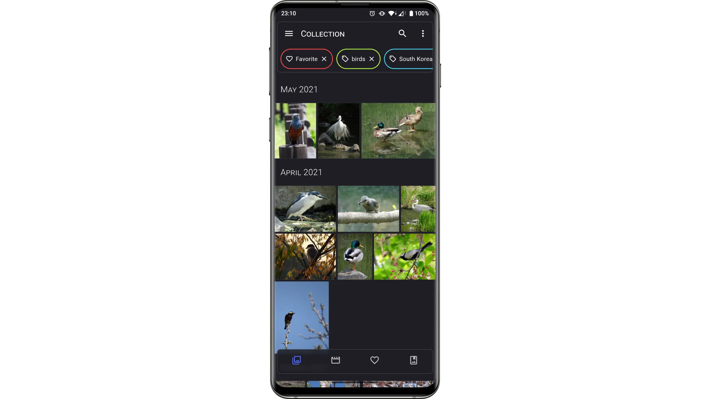


- [Ente Photos](https://ente.io/)


Ente Photos adalah layanan sumber terbuka (klien + server) untuk pencadangan foto otomatis dengan enkripsi ujung ke ujung. Gambar-gambar Anda dienkripsi pada perangkat sebelum dikirim, memastikan bahwa server Ente pun tidak dapat mengaksesnya. Ente juga menawarkan versi yang di-host sendiri untuk pengguna tingkat lanjut.


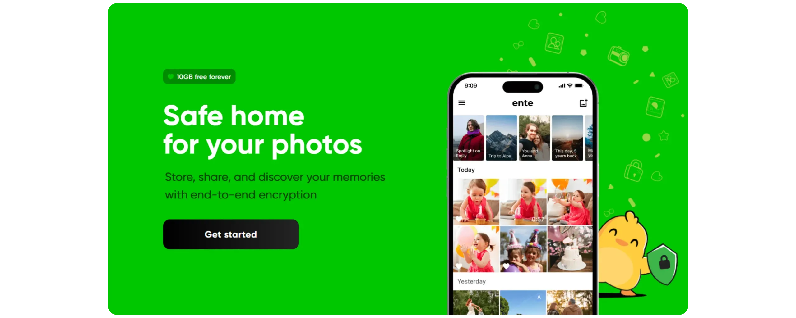


- [Stingle Photos](https://stingle.org/)


Stingle adalah sebuah galeri foto dan aplikasi kamera, yang dikombinasikan dengan layanan pencadangan terenkripsi. Seperti Ente, foto-foto dilindungi oleh enkripsi ujung ke ujung. Anda bisa menggunakan layanan awan mereka (gratis 1 GB) atau meng-host sendiri server Stingle untuk kontrol penuh. Interface sederhana, tanpa iklan atau pelacak.


### Pembaca PDF


**Alternatif**:


Adobe Acrobat Reader, yang banyak digunakan untuk membaca atau membuat anotasi dokumen PDF, dilengkapi dengan sejumlah fungsi online yang dapat mengekspos data Anda: Telemetri aktif, sinkronisasi awan, dan pengumpulan informasi tentang file atau kebiasaan membaca Anda.


- [Penampil MuPDF](https://f-droid.org/en/packages/com.artifex.mupdf.viewer.app/)


MuPDF Viewer adalah pembaca PDF yang sangat ringan, cepat, dan sepenuhnya sumber terbuka. Aplikasi ini menggunakan sumber daya yang sangat sedikit. Meskipun tidak menawarkan fitur-fitur canggih seperti anotasi atau penandatanganan, aplikasi ini melakukan tugasnya dengan sempurna: Menampilkan dokumen Anda, tanpa memata-matai.


- [MJ PDF Reader](https://gitlab.com/mudlej_android/mj_pdf_reader)


MJ PDF Reader adalah aplikasi sumber terbuka sederhana yang memungkinkan Anda membaca file PDF tanpa iklan atau koneksi ke akun online.


### Telepon


Aplikasi Telepon Google, yang diinstal secara default pada banyak ponsel pintar Android, bekerja secara efisien tetapi mengumpulkan sejumlah besar data penggunaan.


**Alternatif**:


- [Koler] (https://github.com/Chooloo/koler)


Koler adalah aplikasi telepon sumber terbuka yang dirancang untuk menjadi indah, mudah digunakan dan ramah privasi. Koler menawarkan Interface yang lancar dan intuitif untuk mengelola panggilan Anda, tanpa pelacak atau analisis data pribadi. Namun, saat ini aplikasi ini tidak menyertakan pemfilteran panggilan tingkat lanjut atau integrasi dengan layanan pihak ketiga.


### Terjemahan


Google Translate adalah tolok ukur dalam penerjemahan otomatis, tetapi penggunaannya secara sistematis melibatkan pengiriman semua pertanyaan Anda ke Google, dengan pelacakan bawaan dan kemungkinan pengumpulan data sensitif (teks yang diterjemahkan, riwayat, dll.).


**Alternatif**:


- [TerjemahkanAnda](https://github.com/you-apps/TranslateYou)


TranslateYou adalah aplikasi penerjemahan sumber terbuka yang menghormati privasi penggunanya. Aplikasi ini bekerja seperti Interface untuk berbagai mesin penerjemahan (LibreTranslate, LingvaTranslate, Mozhi, DeepL, dll.), dan memungkinkan Anda memilih layanan yang tidak mengeksploitasi data Anda.


Tanpa iklan, tanpa pelacak, dan Interface yang mudah digunakan menjadikan TranslateYou sebagai alternatif praktis untuk Google Translate.


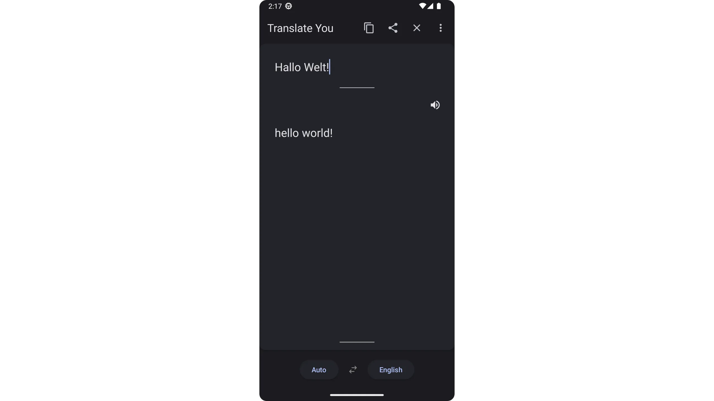


### Pemindai produk


Yuka banyak digunakan untuk memindai produk makanan dan kosmetik dan menilai kualitasnya, tetapi bergantung pada model yang tidak jelas, dengan kriteria penilaian yang dipertanyakan, basis data yang sebagian dimiliki oleh perusahaan dan aplikasi yang tidak bersumber terbuka. Terlebih lagi, pengoperasiannya membutuhkan koneksi ke server terpusat, dengan potensi pengumpulan data penggunaan.


**Alternatif**:


- [OpenFoodFacts](https://world.openfoodfacts.org/open-food-facts-mobile-app)


OpenFoodFacts adalah alternatif yang jauh lebih transparan dan ramah privasi. Proyek sumber terbuka kolaboratif ini menawarkan basis data global, yang diisi oleh kontribusi pengguna. Informasi nutrisi, bahan makanan, dan label dapat diakses secara transparan, tanpa pengumpulan data yang tidak semestinya.


Aplikasi seluler ini memungkinkan Anda memindai barcode, langsung mengakses lembar data produk, dan berkontribusi pada basis data Anda sendiri. Aplikasi ini sepenuhnya gratis untuk digunakan, tanpa iklan atau pelacak.


### Berbagi di sekitar


Fungsi seperti Quick Share (Android) atau AirDrop (iOS/macOS) memungkinkan Anda mengirim file di antara perangkat terdekat melalui Bluetooth dan Wi-Fi langsung, tanpa koneksi Internet. Mereka praktis, tetapi bergantung pada sistem tertutup, terkadang ditautkan ke akun Google, Samsung, atau Apple.


Quick Share sekarang menjadi standar di Android. Perangkat lunak ini, yang awalnya dikembangkan oleh Samsung, disatukan pada tahun 2024 dengan Nearby Share oleh Google, sehingga menghasilkan satu aplikasi tunggal untuk berbagi file di Android.


**Alternatif**:


- [Snapdrop](https://github.com/SnapDrop/snapdrop)


Snapdrop adalah alternatif sumber terbuka gratis yang tidak memerlukan instalasi. Snapdrop memungkinkan Anda berbagi file di antara perangkat yang terhubung ke jaringan lokal yang sama, cukup melalui browser web. Transfer bersifat langsung (peer-to-peer) dan data tidak pernah melewati server jarak jauh.


Alternatif yang menarik adalah [PairDrop] (https://github.com/schlagmichdoch/pairdrop) (Fork dari Snapdrop), yang menawarkan beberapa fitur tambahan.


- [Warpinator](https://github.com/linuxmint/warpinator)


Warpinator, yang dikembangkan oleh Linux Mint, memudahkan transfer file antar perangkat yang terhubung ke jaringan Wi-Fi yang sama. Aplikasi ini bekerja secara peer-to-peer, tanpa cloud atau server pihak ketiga, dengan Interface yang sederhana. Tersedia port untuk Android, memungkinkan file ditransfer antara ponsel dan komputer.


- [LocalSend](https://localsend.org/)


LocalSend merupakan alternatif gratis lainnya yang berfitur lengkap dengan Interface yang rapi. Sepenuhnya sumber terbuka, aplikasi ini memungkinkan transfer file terenkripsi end-to-end yang terdesentralisasi dan terenkripsi antar perangkat yang terhubung ke jaringan lokal yang sama. Tidak ada server perantara yang digunakan, memastikan bahwa data Anda tidak pernah meninggalkan jaringan rumah Anda.


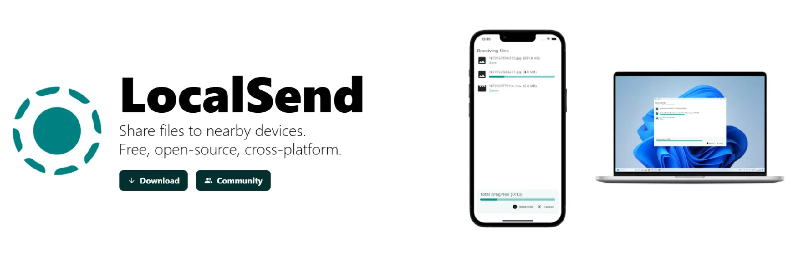


### Buku


Aplikasi seperti Goodreads, meskipun banyak digunakan, menimbulkan masalah privasi yang serius. Platform ini dimiliki oleh Amazon, yang mengumpulkan banyak sekali data tentang bacaan, preferensi, peringkat, dan ulasan Anda. Selain itu, Interface sangat bergantung pada pelacakan pengguna dan analisis perilaku untuk tujuan komersial.


**Alternatif**:


- [Openreads](https://github.com/mateusz-bak/openreads)


Openreads adalah alternatif sumber terbuka untuk pelacakan bacaan yang ramah privasi. Aplikasi ini memungkinkan Anda membuat perpustakaan digital pribadi, melacak kemajuan membaca, menilai dan mengomentari buku, serta mengakses rekomendasi berdasarkan kriteria Anda sendiri, tanpa analisis atau pelacakan terpusat. Semua data tetap berada di perangkat Anda atau disinkronkan melalui layanan yang dihosting sendiri.


### Jam, alarm, dan pengatur waktu


**Alternatif**:


- [Chrono] (https://github.com/vicolo-dev/chrono)


Tersedia di F-Droid dan sepenuhnya open-source, Chrono menawarkan Interface yang modern dan rapi, tanpa iklan atau pengumpulan data. Anda dapat membuat alarm yang dapat disesuaikan: Pengulangan sesuai dengan rentang hari atau tanggal tertentu, pilihan suara, intensitas progresif, getar, atau bahkan tugas yang harus dilakukan untuk menonaktifkan alarm (Menyelesaikan perhitungan, membaca ulang teks, dll.).


Aplikasi ini juga mengintegrasikan timer dan stopwatch, dengan perekaman putaran, statistik, perbandingan waktu, dan manajemen multi-timer. Anda dapat mengonfigurasi beberapa zona waktu, menyesuaikan tema (warna, gaya, animasi), dan bahkan mengatur alarm dan pengatur waktu dengan label.


___


⚠️ ***Perhatian**: Meskipun alternatif yang disajikan dalam bab ini sebagian besar merupakan sumber terbuka dan berorientasi pada privasi, namun bukan berarti tanpa keterbatasan atau risiko. Beberapa mungkin tidak lagi dipelihara, memiliki kerentanan yang belum ditambal, menjadi hak milik atau bahkan, berpotensi menjadi *malware*. Beberapa mungkin juga ilegal di yurisdiksi lokal Anda. Saya telah menulis bab ini pada bulan Juni 2025, tetapi situasi untuk aplikasi-aplikasi ini mungkin telah berubah sejak saat itu.*


Selain itu, saya secara pribadi belum mengaudit kode semua alat yang disebutkan, dan rekomendasi saya sama sekali tidak boleh dilihat sebagai jaminan mutlak. Oleh karena itu, penting bagi setiap orang untuk melakukan penelitian sendiri sebelum menggunakan aplikasi-aplikasi ini.


___


# Mengamankan jaringan lokal Anda


<partId>23e49e48-34c9-435c-a36f-1c86b0254275</partId>


## Memahami jaringan rumah Anda dengan lebih baik


<chapterId>8a7577e0-4a27-4331-a6d9-7a4c838fa720</chapterId>


Keamanan digital sering kali dimulai dengan penguasaan yang baik atas jaringan rumah. Jaringan rumah Anda adalah titik masuk pertama Internet ke dalam lingkungan pribadi Anda, dan Internet-lah yang menjadi ancaman terbesar bagi keamanan dan privasi Anda.


Memahami cara kerja jaringan lokal Anda, bagaimana data Anda mengalir, dan perangkat mana yang bertanggung jawab untuk mengelola aliran data ini sangat penting bagi kedaulatan digital Anda.


Pada bab ini, kita akan secara bertahap menjelajahi konsep dasar jaringan rumah, dari penjelasan tentang apa itu Internet hingga rincian konkret seperti alokasi alamat IP lokal dan peran router. Tujuannya adalah untuk mengulang kembali dasar-dasar teori yang penting untuk pemahaman yang tepat dari bab berikutnya, yang akan membahas aspek-aspek yang lebih praktis.


### Internet


#### Sejarah singkat Internet


Sejarah Internet berawal pada akhir tahun 1960-an, dalam konteks penelitian ilmiah dan militer. Proyek awal, yang dijuluki "ARPANET", diluncurkan oleh lembaga Amerika ARPA (sekarang DARPA) untuk menghubungkan beberapa pusat penelitian dan memungkinkan berbagi sumber daya.


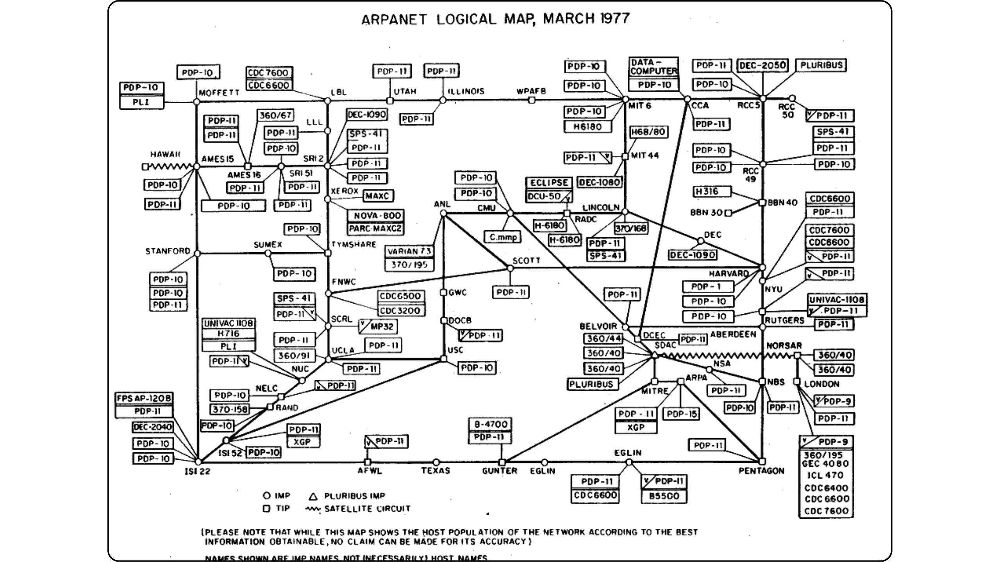


Tujuannya juga untuk mendesain jaringan yang tangguh, yang mampu terus beroperasi meskipun sebagian dari simpul-simpulnya dihancurkan (suatu keharusan di tengah-tengah Perang Cold). ARPANET memungkinkan komunikasi pertama antara komputer jarak jauh pada tahun 1969.


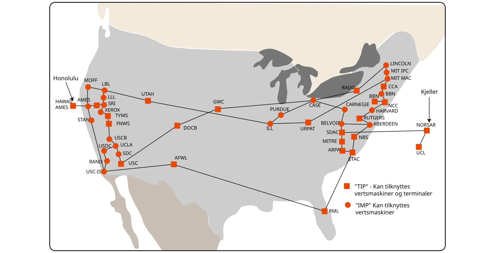


Selama beberapa dekade, proyek ini berkembang, terutama dengan standarisasi protokol TCP/IP pada tahun 1983, yang menjadi fondasi teknis umum untuk seluruh Internet. Pada tahun 1990-an, kemunculan *World Wide Web*, yang telah dibahas pada bab sebelumnya, membuat Internet dapat diakses oleh masyarakat umum dengan menyederhanakan akses ke dokumen melalui browser. Titik balik utama ini mengubah Internet menjadi alat komunikasi dan informasi yang universal.


#### Apa yang dimaksud dengan Internet?


Internet, yang secara harfiah berarti "jaringan yang saling terhubung", adalah infrastruktur global yang memungkinkan miliaran perangkat untuk berkomunikasi satu sama lain. Internet bukanlah sebuah layanan tunggal, atau lokasi tertentu, melainkan kumpulan jaringan komputer publik dan pribadi, yang saling terhubung dalam skala planet. Setiap pemain (individu pribadi, perusahaan, otoritas publik, dll.) dapat menghubungkan jaringannya sendiri ke seluruh dunia, asalkan mematuhi protokol teknis standar tertentu yang memungkinkan perangkat untuk memahami satu sama lain.


Infrastruktur Internet didasarkan pada dua protokol:


- IP** (*Internet Protocol*) Mengidentifikasi setiap perangkat yang tersambung dan merutekan paket data.
- TCP** (*Transmission Control Protocol*) Memilah-milah aliran, memeriksa kesalahan, dan menempatkan kembali segmen-segmen secara berurutan.


→ Untuk penggunaan waktu nyata di mana keandalan tidak terlalu penting dibandingkan latensi (VoIP, DNS, streaming, dll.), protokol transport lain sering digunakan sebagai pengganti TCP: UDP (*User Datagram Protocol*).


Kedua protokol ini bekerja sama untuk memastikan bahwa pesan yang dikirim dari satu titik ke titik lainnya tiba dengan lengkap dan dalam urutan yang benar.


Secara konkret, ketika Anda mengunjungi situs web, misalnya dengan mengetikkan Address pada browser Anda, beberapa operasi dipicu di latar belakang. Pertama, komputer atau ponsel cerdas Anda harus mengubah Address yang dapat dibaca (seperti `planb.network`) menjadi IP Address, dengan menggunakan layanan yang disebut DNS (*Domain Name System*). Setelah IP Address server web diperoleh, data dapat dikirim ke tujuannya.


Data ini kemudian mengikuti jalur yang rumit. Pertama, data ini melewati router dan modem di rumah Anda, sebelum mencapai infrastruktur ISP Anda. Dari sana, data tersebut berpotensi melintasi beberapa jaringan perantara (kadang-kadang kabel lintas samudra, router transit, titik Internet Exchange, dll.) sebelum mencapai tujuannya: Server situs yang ingin Anda kunjungi. Kemudian, server akan mengirimkan data (konten situs) ke arah yang berlawanan.


Oleh karena itu, Internet dapat disimpulkan sebagai jaringan terdesentralisasi yang sangat besar, berdasarkan aturan umum, di mana setiap perangkat berpotensi untuk berkomunikasi dengan perangkat lainnya, di mana pun ia berada di dunia. Namun, meskipun keterbukaan ini memungkinkan pertukaran digital, ini juga mengharuskan Anda untuk bersikap waspada: Setiap tindakan online melewati infrastruktur yang tidak dapat Anda kendalikan, dan kerahasiaan bursa Anda bergantung pada bagaimana Anda mengonfigurasi dan menggunakan alat ini.


### Peran modem dan router


Di sebagian besar rumah modern, akses Internet disediakan melalui perangkat pusat yang berfungsi sebagai modem dan router. Nama perangkat ini bervariasi dari satu negara ke negara lain (di Prancis, perangkat ini disebut "Kotak Internet"). Perangkat multifungsi yang disediakan oleh ISP inilah yang menghubungkan Anda ke seluruh jaringan Internet.


→ *ISP = Penyedia Layanan Internet*


Perangkat ini memadukan 2 fungsi utama:


- Peran modem ** Peran modem**


Modem (kependekan dari "*modulator-demodulator*") adalah komponen yang menghubungkan jaringan ISP ke rumah Anda. Modem mengadaptasi sinyal listrik atau optik yang diterima (melalui serat optik, kabel koaksial, ADSL, atau jaringan seluler) menjadi sinyal digital yang dapat dimengerti oleh perangkat Anda. Sebaliknya, ini mengubah data dari peralatan Anda ke dalam format yang dapat ditransmisikan melalui infrastruktur operator. Langkah ini sangat penting jika jaringan rumah Anda ingin berkomunikasi dengan Internet.


- Peran router**


Router adalah jantung dari jaringan lokal Anda. Router mendistribusikan koneksi Internet ke semua perangkat Anda: Komputer, ponsel cerdas, benda-benda yang terhubung, printer, dll. Router memberikan IP lokal Address kepada masing-masing perangkat tersebut (berbeda dengan IP publik Anda yang terlihat di Internet). Router kemudian mengatur lalu lintas masuk dan keluar, memastikan bahwa data mencapai perangkat yang tepat. Router ini juga dapat mengintegrasikan firewall, memfilter paket jaringan, atau mengelola aturan penerusan port. NAT menyembunyikan jaringan lokal Anda dari mata Internet, menggunakan satu IP publik Address untuk mewakili semua perangkat Anda. Hanya router yang tahu perangkat lokal mana yang memulai permintaan yang mana.


Di beberapa negara, kedua fungsi ini terkadang dibagi antara dua perangkat yang terpisah: Modem dan router.


Dalam praktiknya, router modem modern sering kali menyertakan fungsi pelengkap lainnya: Titik akses Wi-Fi, sakelar Ethernet, administrasi Interface, dan kadang-kadang bahkan server file dan fitur lainnya.


Memahami peran router-modem adalah faktor kunci dalam mengamankan jaringan lokal Anda. Di satu sisi, perangkat ini membentuk batas antara dunia luar (Internet) dan lingkungan digital pribadi Anda. Konfigurasi yang salah, kata sandi yang lemah atau firmware yang sudah usang dapat mengubah gateway ini menjadi lubang yang menganga. Sebaliknya, modem-router yang dikonfigurasi dengan baik menjadi benteng pertahanan terhadap gangguan.


Pada bab berikutnya, kita akan melihat cara mengoptimalkan konfigurasi ini, mengidentifikasi titik-titik lemah yang umum, dan mendapatkan kembali kendali atas perangkat ini.


### Jaringan area lokal (LAN)


Jaringan lokal, atau "LAN" (*Local Area Network*), mengacu pada semua koneksi digital di dalam rumah Anda. Jaringan ini mencakup semua perangkat yang terhubung ke router Anda: Komputer, ponsel cerdas, tablet, printer, dll.


Tidak seperti Internet, yang merupakan jaringan publik global, jaringan lokal adalah ruang privat yang sebagian terisolasi yang dirancang untuk memungkinkan perangkat berkomunikasi satu sama lain, tanpa pertukarannya keluar dari rumah Anda. Sebagai contoh, ketika Anda mengirim file dari komputer Anda ke printer yang terhubung dengan Wi-Fi, atau mengontrol bola lampu yang terhubung melalui telepon Anda, komunikasi ini terjadi secara eksklusif secara lokal, tanpa melewati server jarak jauh.


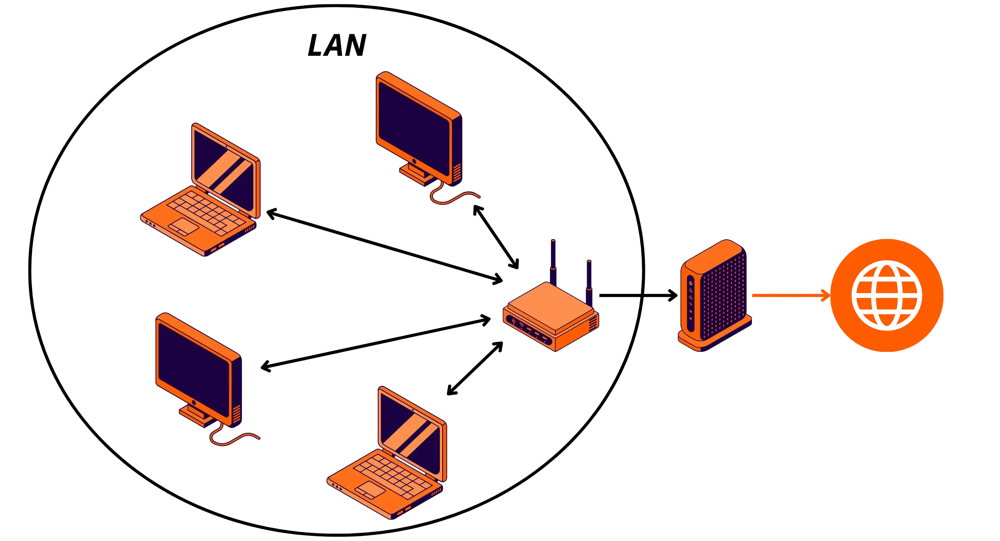


Hal ini didasarkan pada seperangkat teknologi dan protokol standar, yang paling penting adalah protokol IP. Setiap perangkat di jaringan lokal Anda diberi IP lokal Address (biasanya dalam format `192.168.x.x`), yang berfungsi untuk mengidentifikasinya secara unik di dalam jaringan tersebut. IP Address ini tidak dapat dilihat dari Internet. Hanya IP Address publik Anda, yang digunakan bersama oleh semua perangkat melalui modem, yang terlihat di luar rumah Anda.


Tetapi isolasi yang terlihat ini seharusnya tidak memberi Anda rasa aman yang palsu. Jaringan lokal yang tidak dikonfigurasi dengan baik bisa menjadi pintu gerbang untuk serangan, terutama dalam kasus-kasus berikut ini:


- Jika layanan terbuka (seperti berbagi file atau antarmuka administrasi) dapat diakses dari Internet
- Jika Wi-Fi tidak aman (kata sandi yang lemah atau sistem enkripsi yang sudah usang)
- Jika objek tertentu yang terhubung berkomunikasi dengan dunia luar dalam bentuk cleartext atau membiarkan port terbuka


Jadi, penting untuk memahami aliran internal jaringan Anda, dan mengontrol perangkat mana yang dapat berinteraksi, baik dengan satu sama lain maupun dengan dunia luar.


### Wi-Fi


Wi-Fi (kependekan dari "*Wireless Fidelity*") adalah teknologi komunikasi nirkabel yang memungkinkan Anda menghubungkan perangkat Anda ke jaringan lokal, tanpa memerlukan kabel. Teknologi ini didasarkan pada transmisi data melalui gelombang radio, umumnya pada pita frekuensi 2,4 GHz dan 5 GHz (atau bahkan 6 GHz untuk jaringan Wi-Fi 6E dan Wi-Fi 7).


Tetapi kemudahan penggunaan ini memiliki risiko tersendiri. Tidak seperti koneksi kabel (seperti Ethernet), sinyal Wi-Fi menembus dinding dan dapat ditangkap dari jarak puluhan meter. Ini berarti orang di luar rumah Anda (di jalan, di gedung tetangga, bahkan dari kendaraan yang diparkir di dekatnya) dapat mencoba mendeteksi jaringan Anda dan terhubung ke jaringan tersebut jika tidak diamankan dengan baik.


Seorang penyerang yang memiliki akses ke jaringan Wi-Fi Anda dapat melakukannya:


- Mencegat data yang tidak terenkripsi yang melewati jaringan (misalnya permintaan DNS atau lalu lintas HTTP)
- Mengakses file atau perangkat Anda jika tidak terlindungi dengan baik
- Menyuntikkan konten berbahaya ke dalam browser Anda
- Menggunakan koneksi Internet tanpa sepengetahuan Anda, atau bahkan melakukan serangan online dari IP publik Anda Address


Untuk melindungi diri dari ancaman-ancaman ini, Anda perlu mengamankan jaringan Wi-Fi Anda. Kita akan melihat cara melakukan hal ini dalam beberapa bab berikutnya.


### Alamat IP lokal


Ketika Anda menyambungkan perangkat ke jaringan rumah, perangkat akan menerima IP lokal Address. Address ini terdiri dari empat angka yang dipisahkan dengan titik (misalnya `192.168.1.14`). IP ini digunakan untuk mengidentifikasi secara unik setiap perangkat dalam jaringan lokal Anda. Dengan Address ini, router Anda mengetahui perangkat mana yang akan dikirimi data (misalnya, halaman web atau video yang Anda minta).


Penting untuk dipahami bahwa alamat IP lokal ini tidak terlihat dari Internet. Alamat-alamat ini termasuk dalam rentang yang dipesan, yang ditentukan oleh standar internasional, yang tidak dapat digunakan di jaringan publik. Tiga rentang IP Address lokal yang paling umum adalah:


- `192.168.0.0` hingga `192.168.255.255` (umumnya untuk pengguna pribadi)
- `10.0.0.0` hingga `10.255.255.255` (umumnya untuk perusahaan)
- `172.16.0.0` ke `172.31.255.255`


Oleh karena itu, perangkat yang sama dapat memiliki IP Address seperti `192.168.1.42` di rumah, sementara pengguna lain di negara lain akan memiliki perangkat lain dengan IP Address yang sama di jaringan lokalnya sendiri, tanpa ada konflik, karena alamat ini tidak keluar dari jaringan rumah. Routerlah yang menyediakan hubungan antara jaringan rumah Anda dan Internet publik, menerjemahkan alamat-alamat ini melalui mekanisme yang disebut "NAT" (*Network Address Translation*).


Alamat IP lokal umumnya ditetapkan secara dinamis, menggunakan DHCP (*Dynamic Host Configuration Protocol*). Saat Anda menyambungkan perangkat baru ke jaringan, perangkat tersebut akan mengirimkan permintaan DHCP untuk mendapatkan Address, dan router akan memberikan Address gratis yang tersedia dalam rentang yang ditentukan. Address ini dapat bervariasi dari waktu ke waktu.


Namun demikian, dimungkinkan untuk mengonfigurasi alamat IP tetap untuk perangkat tertentu. Ini berarti memesan Address tertentu untuk perangkat tertentu, secara permanen. Hal ini berguna dalam beberapa kasus, misalnya:


- Untuk akses mudah ke server pribadi atau NAS dari perangkat lain
- Untuk mencetak dari jarak jauh ke printer jaringan tanpa harus mencari Address
- Untuk membuat aturan pemfilteran atau penerusan port di router Anda


### Port jaringan


Untuk memahami cara kerja jaringan lokal, Anda perlu mengetahui bahwa setiap IP Address (baik lokal maupun publik) dikaitkan dengan serangkaian port numerik, yang diberi nomor dari `0` hingga `65535`. Port-port ini tidak berbentuk fisik: Port-port ini merupakan titik masuk atau keluar virtual yang memungkinkan aplikasi dan layanan untuk berkomunikasi di seluruh jaringan.


Setiap kali perangkat berkomunikasi melalui Internet atau jaringan lokal, perangkat tersebut melakukannya dengan menggabungkan IP Address dan nomor port. Hal ini memungkinkan untuk mengidentifikasi tidak hanya perangkat mana yang akan dikirimi data, tetapi juga aplikasi atau layanan tertentu pada perangkat tersebut. Sebagai contoh:


- Port `80` digunakan untuk mengakses halaman web HTTP
- Port `443` digunakan untuk mengakses halaman web HTTPS (koneksi terenkripsi)
- Port `22` digunakan untuk koneksi SSH
- Port `25`, `465`, dan `587` digunakan untuk mengirim email (SMTP)
- Port `110` digunakan untuk mengambil email melalui protokol POP3
- Port `143` digunakan untuk mengambil email melalui protokol IMAP
- Port `21` digunakan untuk transfer file melalui protokol FTP
- Port `53` digunakan untuk permintaan DNS...


Port ini juga digunakan dalam sistem seperti Bitcoin atau Tor, di mana port tertentu digunakan secara default untuk komunikasi peer-to-peer atau perutean lalu lintas:


- Port `8333` digunakan untuk koneksi P2P pada Bitcoin Mainnet
- Port `18333` digunakan untuk koneksi P2P pada Bitcoin Testnet
- Port `8332` digunakan untuk Interface RPC dari node Bitcoin
- Port `9050` digunakan oleh proxy SOCKS5 Tor
- Port `9150` digunakan oleh browser Tor


Dengan kata lain, port seperti pintu khusus. Ketika Anda mengunjungi sebuah situs web, komputer Anda membuka port sumber dan mengirimkan permintaan ke IP Address situs jarak jauh, menargetkan port `443` jika itu adalah koneksi terenkripsi. Server jarak jauh kemudian mengembalikan respons melalui saluran yang sama. Pada router, pengertian port ini penting: Router perlu mengetahui perangkat mana dan port lokal mana yang akan mengarahkan paket data yang masuk.


Tetapi kemampuan untuk membuka port ini juga menimbulkan risiko keamanan. Port yang dibiarkan terbuka secara tidak perlu bisa dideteksi oleh alat pemindaian jaringan dan dieksploitasi oleh penyerang jika port tersebut terkait dengan layanan yang rentan atau salah konfigurasi. Ini seperti membiarkan pintu terbuka. Tetapi lebih lanjut tentang itu nanti.


Oleh karena itu, memahami pengoperasian dasar jaringan rumah Anda sangatlah penting. Pemahaman yang baik tentang dasar-dasar modem, Wi-Fi, router, alamat IP lokal, dan port Anda memungkinkan Anda untuk mengidentifikasi potensi risiko dan bertindak sesuai dengan itu untuk memperkuat keamanan digital Anda.


Pada bab ini, kita telah membahas konsep-konsep penting dari jaringan rumah. Di bab berikutnya, kita akan melihat cara mengamankan infrastruktur Internet lokal Anda dalam praktiknya, dan cara mengonfigurasi Wi-Fi dengan benar untuk mengoptimalkan keamanan Anda.


## Amankan jaringan rumah Anda hanya dalam beberapa langkah


<chapterId>d5577b2e-5247-4d10-8685-4906391e2cc1</chapterId>


Seperti yang telah kita ketahui pada bab sebelumnya, mengamankan jaringan rumah Anda sangat penting untuk melindungi privasi Anda, data pribadi Anda, dan menjamin kedaulatan digital Anda.


Setelah mengulas dasar-dasar teori, bab ini akan memandu Anda melalui langkah-langkah yang jelas, praktis dan efektif untuk meningkatkan keamanan jaringan lokal Anda.


*Harap diperhatikan: Informasi yang diberikan di sini bersifat umum, karena Plan ₿ Network ditujukan untuk audiens internasional. Tergantung pada kondisi lokal dan ISP Anda, praktik terbaik tertentu mungkin tidak disebutkan di sini, atau mungkin berlaku dengan cara yang berbeda.*


### Memilih dan mengamankan peralatan jaringan Anda


Keamanan jaringan rumah Anda dimulai dengan pilihan perangkat keras yang tepat: router, atau dalam beberapa kasus router modem. Perangkat ini menyediakan hubungan antara jaringan lokal Anda dan Internet. Oleh karena itu, perangkat ini memainkan peran sentral dalam melindungi data Anda.


Penting untuk memilih peralatan modern, dipelihara oleh produsennya, dan sesuai dengan standar keamanan terkini. Saat ini (Juni 2025), disarankan untuk memilih perangkat yang kompatibel dengan protokol enkripsi WPA3 (*Wi-Fi Protected Access 3*), yang menggantikan WPA2 dan memperbaiki beberapa kekurangannya. Khususnya, WPA3 meningkatkan ketahanan terhadap serangan brute-force pada kata sandi Wi-Fi, dan memperkenalkan isolasi yang lebih baik di antara klien jaringan.


Router yang kompatibel dengan Wi-Fi 6, Wi-Fi 6E, atau Wi-Fi 7 akan memberikan Anda kecepatan yang lebih baik dan, yang terpenting, dukungan asli untuk teknologi keamanan modern. Sebaliknya, peralatan yang sangat tua, terutama yang tidak lagi menerima pembaruan perangkat lunak, mungkin mengandung kerentanan yang diketahui dan belum ditambal. Oleh karena itu, peralatan tersebut mewakili risiko untuk seluruh jaringan Anda, bahkan jika Anda mengkonfigurasinya dengan benar. Dibandingkan dengan ponsel atau komputer, router adalah peralatan yang cenderung kita simpan selama bertahun-tahun. Namun, mungkin ada baiknya untuk menggantinya secara lebih teratur, untuk mendapatkan manfaat dari model yang lebih modern dan lebih aman.


Jadi, pastikan Anda memperbarui firmware router Anda secara sistematis. Pembaruan ini memperbaiki kerentanan, menambahkan fitur baru, dan meningkatkan stabilitas sistem secara keseluruhan. Beberapa produsen menawarkan pembaruan otomatis, tetapi dalam beberapa kasus Anda perlu memeriksa secara manual melalui alat administrasi Interface router Anda. Seperti halnya ponsel, komputer, sistem operasi, dan perangkat lunak Anda, penting untuk memperbarui router Anda secara teratur. Anda bisa menjadikan ini bagian dari rutinitas mingguan Anda - Setiap hari Minggu, misalnya - dengan membuat daftar semua item yang perlu Anda periksa dan perbarui.


Jika router Anda sudah tidak lagi dirawat tetapi masih berfungsi dengan baik dari segi perangkat keras, Anda bisa menginstal firmware sumber terbuka alternatif, seperti:


- OpenWrt, distribusi Linux yang mengkhususkan diri pada router, menawarkan fleksibilitas tinggi dan pembaruan rutin
- pfSense dan OPNsense, dua sistem berbasis FreeBSD (mirip Unix) untuk firewall dan router x86


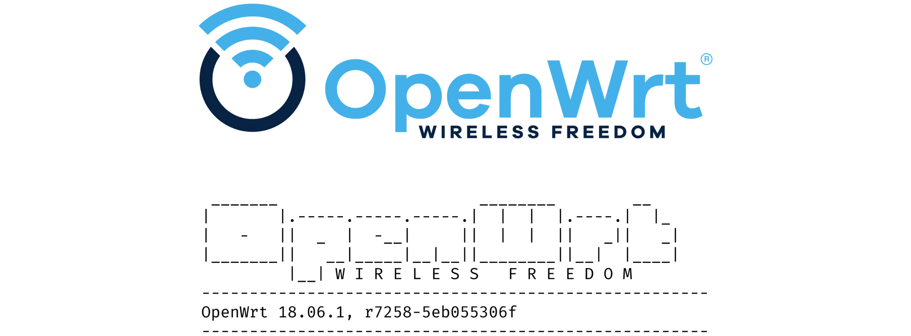


https://planb.network/tutorials/computer-security/operating-system/opnsense-90c2785d-a0d7-4981-be8d-d290bbeb8263

https://planb.network/tutorials/computer-security/operating-system/pfsense-24eea96a-2fdc-42a6-a77b-89bc29149864

Sistem ini memungkinkan kontrol yang lebih baik atas aturan firewall, koneksi keluar dan masuk, segmentasi jaringan (VLAN) dan manajemen DNS, tetapi lebih ditujukan untuk pengguna tingkat lanjut.


**Kesimpulannya, saya merekomendasikan**:


- Pilih router terbaru
- Selalu perbarui sistem Anda
- Pertimbangkan firmware alternatif jika perlu


### Mengubah login dan kata sandi default


Salah satu kesalahan yang paling umum (dan berbahaya) adalah menyimpan kredensial default yang disediakan oleh produsen router, atau menggunakan kata sandi yang lemah.


Secara historis, kredensial router default sangat tidak aman dan sering kali identik untuk semua pengguna, seperti `admin/admin` yang terkenal. Kredensial dasar ini bersifat publik, didokumentasikan dalam buku petunjuk pengguna dan secara luas dicatat dalam basis data yang digunakan oleh penyerang. Dalam kasus ini, siapa pun yang mendeteksi keberadaan router Anda dapat mencoba akses yang tidak sah hanya dengan menguji kombinasi yang diketahui ini.


Saat ini, sebagian besar produsen memberikan kata sandi yang unik dan kuat untuk setiap router. Namun, bahkan dalam kasus ini, saya sarankan untuk mengubah kredensial default. Hal ini akan mengurangi risiko rantai Supply, dan mencegah kata sandi asli (terkadang tercetak pada label router) membahayakan keamanan Anda.


Oleh karena itu, Anda harus segera mengubah pengenal Anda setelah menginstal router Anda:


- Nama pengguna (jika tersedia) dari administrasi Interface
- Dan yang terpenting, kata sandi administrasi, yang melindungi akses ke semua konfigurasi jaringan, serta kata sandi Wi-Fi


Kata sandi ini harus panjang (40 karakter), kompleks (angka, huruf kecil, huruf besar dan simbol), unik (tidak akan digunakan di tempat lain), dan acak. Saya sangat menyarankan untuk menggunakan pengelola kata sandi untuk generate dan menyimpan kredensial ini dengan aman.


https://planb.network/tutorials/computer-security/authentication/bitwarden-0532f569-fb00-4fad-acba-2fcb1bf05de9

https://planb.network/tutorials/computer-security/authentication/keepass-f8073bb7-5b4a-4664-9246-228e307be246

Peringatan: jangan sampai tertukar antara kata sandi administrasi router (yang melindungi akses ke konfigurasinya) dengan kata sandi Wi-Fi (yang memungkinkan Anda terhubung ke jaringan nirkabel). Ini adalah dua Elements yang berbeda, dan keduanya perlu diubah.


Terakhir, beberapa router modern memiliki dua antarmuka manajemen: Web Interface lokal (dapat diakses melalui Address seperti `192.168.1.1`) dan Interface awan (memungkinkan manajemen jarak jauh melalui Internet). Jika yang terakhir ini diaktifkan secara default, saya sarankan Anda untuk menonaktifkannya jika Anda tidak menggunakannya, atau memperkuat keamanannya dengan kata sandi yang kuat dan mungkin otentikasi dua faktor (2FA) jika tersedia.


### Konfigurasi router yang aman


Router adalah jantung dari jaringan rumah Anda. Konfigurasinya memainkan peran penting dalam keamanan semua perangkat yang terhubung. Sayangnya, banyak fungsi yang diaktifkan secara default pada perangkat ini dapat secara tidak sengaja mengekspos jaringan Anda ke serangan eksternal. Itulah mengapa penting untuk melakukan tinjauan lengkap terhadap opsi yang diaktifkan, dan menonaktifkan opsi yang tidak benar-benar diperlukan untuk tujuan Anda.


Beberapa fitur harus dihindari atau dinonaktifkan secara sistematis:


- UPnP (*Universal Plug and Play*)**:


Fungsi ini memungkinkan perangkat di jaringan Anda untuk meminta router membuka port secara otomatis. Meskipun ini memfasilitasi penggunaan tertentu (game online, kamera yang terhubung, dll.), ini juga membuka pintu bagi aplikasi berbahaya yang mampu mengubah konfigurasi jaringan tanpa otorisasi Anda. UPnP adalah salah satu penyebab utama pemaparan layanan internal yang tidak disengaja ke dunia luar.


- WPS (*Pengaturan Terproteksi Wi-Fi*)**:


Awalnya dirancang untuk menyederhanakan menghubungkan perangkat ke Wi-Fi tanpa memasukkan kata sandi, sistem ini didasarkan pada kode PIN yang sering kali lemah dan mudah diserang dengan kekerasan. Saya menyarankan Anda untuk menonaktifkannya.


- Akses jarak jauh (*Manajemen Jarak Jauh*)**:


Beberapa router memungkinkan Anda untuk terhubung ke Interface administrasi mereka dari luar, melalui Internet. Fitur ini secara tidak wajar meningkatkan permukaan serangan router Anda. Nonaktifkan sepenuhnya, kecuali Anda memiliki kebutuhan khusus untuk manajemen jarak jauh. Meskipun begitu, selalu gunakan VPN.


https://planb.network/tutorials/computer-security/communication/tailscale-9acbd7de-04d9-40f6-ab80-35f0dfedb632


- Protokol yang sudah usang atau tidak aman**:


Nonaktifkan layanan administrasi apa pun yang menggunakan protokol teks biasa seperti Telnet, FTP, HTTP yang tidak dienkripsi, atau SMBv1. Protokol-protokol ini tidak menjamin kerahasiaan maupun integritas data yang dipertukarkan, dan sering kali menjadi sasaran *malware*. Jika Anda membutuhkan akses lokal atau jarak jauh, hanya gunakan koneksi melalui HTTPS (terenkripsi Interface), SSH atau SFTP, yang sesuai.


- Ping WAN / ICMP**:


Beberapa router merespon secara default terhadap permintaan ICMP yang dikirim dari luar (perintah `ping`). Hal ini memungkinkan penyerang untuk memeriksa apakah jaringan Anda aktif dan dapat diakses. Jika Anda tidak memerlukannya, nonaktifkan respons ini di firewall router.


Terakhir, ingatlah untuk membatasi akses ke administrasi router Interface hanya untuk perangkat tepercaya, membatasi aksesibilitasnya ke alamat IP tertentu, jika Interface mengizinkannya. Beberapa firmware, seperti OpenWrt, menawarkan kontrol yang sangat baik atas parameter ini.


### Memperkuat keamanan jaringan Wi-Fi


Jaringan Wi-Fi sering kali menjadi titik masuk yang disukai untuk masuk ke dalam lingkungan rumah tangga. Tidak terlihat dengan mata telanjang tetapi dapat diakses dari luar dinding rumah Anda, ini adalah target yang mudah bagi siapa saja yang berada dalam jangkauan.


Langkah penting pertama adalah memilih protokol enkripsi yang tepat. Selalu aktifkan "*WPA3-Personal*", standar terbaru dan paling aman. Protokol ini tidak hanya melindungi data yang dipertukarkan, tetapi juga mencegah serangan tertentu yang diketahui.


Nama jaringan Wi-Fi Anda, yang disebut "SSID" (*Service Set Identifier*), harus tetap netral. Hindari menyertakan nama Anda, Address atau merek router. Nama seperti `MaisonDupont_WiFi6` sudah memberikan terlalu banyak informasi kepada calon penyerang. Lebih suka nama yang umum, tanpa arti tertentu. Ini membatasi informasi yang tersedia untuk pelacakan pasif atau penargetan sosial.


Praktik terbaik lainnya adalah membuat jaringan tamu yang terpisah dari jaringan utama Anda. Jaringan paralel ini, yang sering ditawarkan secara bawaan pada router modern, memungkinkan Anda untuk menyediakan koneksi Internet kepada tamu Anda tanpa mereka memiliki akses ke perangkat Anda yang lain (komputer, printer, NAS, dll.). Ini juga berarti Anda tidak perlu memberikan kata sandi jaringan utama Anda kepada mereka. Untuk melangkah lebih jauh lagi, aktifkan isolasi klien pada jaringan tamu ini: Ini juga akan mencegah pengunjung berkomunikasi satu sama lain, sehingga mengurangi risiko yang terkait dengan perangkat yang disusupi.


Terakhir, sesuaikan daya pancar titik akses Wi-Fi Anda. Secara default, banyak router memancarkan sinyal yang sangat kuat, terkadang dapat dideteksi jauh di luar dinding Anda. Hal ini meningkatkan area pemaparan Anda. Dalam pengaturan lanjutan router Anda, kurangi daya transmisi ke minimum yang diperlukan untuk menjangkau rumah Anda. Jika router Anda mengizinkannya, Anda juga dapat mengonfigurasi pemutusan Wi-Fi otomatis saat tidak digunakan.


### Segmentasi jaringan


Salah satu strategi yang paling efektif untuk memperkuat keamanan jaringan rumah adalah segmentasi. Hal ini melibatkan pembagian jaringan lokal menjadi beberapa sub-jaringan independen yang disebut "VLAN" (*Virtual Local Area Networks*). VLAN ini memungkinkan untuk mengisolasi berbagai jenis perangkat atau penggunaan, meskipun mereka menggunakan perangkat keras fisik yang sama (router, kabel, terminal Wi-Fi, dll.).


Setiap VLAN berfungsi sebagai jaringan kecil yang otonom dengan aturan komunikasinya sendiri. Pertukaran antar VLAN diblokir secara default atau dikontrol secara ketat. Hal ini mencegah, misalnya, TV yang tersambung yang disusupi agar tidak dapat menjangkau komputer pribadi atau NAS Anda. Pendekatan ini didasarkan pada 2 prinsip dasar keamanan siber yang telah kita pelajari di bab-bab sebelumnya: Kompartementalisasi dan hak istimewa yang paling sedikit.


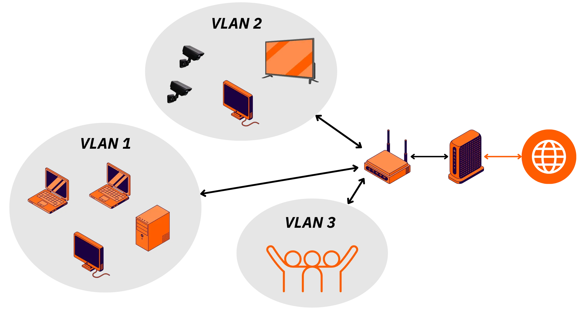


Secara konkret, berikut adalah beberapa contoh segmentasi yang bisa Anda lakukan:


- VLAN pribadi: Untuk perangkat tepercaya Anda seperti komputer, ponsel pintar, atau server pribadi. Ini adalah segmen utama di mana data sensitif Anda beredar.


- VLAN IoT: Untuk benda-benda yang terhubung (bola lampu, speaker, kamera, TV pintar, dll.). Perangkat-perangkat ini sering kali tidak aman, kurang mutakhir, dan sering kali menjadi target serangan. Mengisolasi mereka akan sangat mengurangi risiko penyerang yang menggunakannya sebagai titik masuk ke jaringan Anda.


- VLAN tamu: Diperuntukkan bagi teman atau keluarga Anda ketika mereka datang untuk menginap bersama Anda. VLAN ini memberikan akses ke Internet, tetapi tidak ada akses ke peralatan pribadi Anda.


Terakhir, pendekatan ini juga menawarkan keuntungan dalam hal kinerja dan manajemen: Ini memungkinkan Anda untuk memprioritaskan jenis lalu lintas tertentu, menerapkan aturan keamanan tertentu tergantung pada VLAN (firewall, pembatasan kecepatan, pemfilteran DNS, dll.), dan memonitor perilaku jaringan yang tidak normal dengan lebih baik. Ini adalah praktik yang sangat saya rekomendasikan.


### Manajemen DNS tingkat lanjut


DNS (*Domain Name System*) adalah layanan Internet yang menerjemahkan alamat web yang dapat dimengerti manusia (misalnya `planb.network`) menjadi alamat IP yang dapat dimengerti mesin. Ketika perangkat di jaringan Anda ingin mengunjungi sebuah situs, perangkat tersebut akan meminta server DNS untuk mendapatkan Address dari server yang akan dihubungi. Secara default, permintaan DNS ini sering dikirim dalam teks yang jelas (tidak terenkripsi) ke ISP Anda, sehingga memungkinkan ISP (atau pihak ketiga seperti pemerintah) untuk melihat semua situs yang Anda kunjungi, meskipun kontennya dienkripsi melalui HTTPS.


Untuk meningkatkan privasi penjelajahan Anda dan memblokir konten tertentu yang tidak diinginkan langsung dari akarnya, Anda bisa mengendalikan resolusi DNS di dalam jaringan rumah Anda. Mulailah dengan mengganti server DNS yang disediakan secara default dengan alternatif yang lebih ramah privasi seperti :


- [Quad9] (https://quad9.net/): Termasuk daftar pemblokiran untuk domain berbahaya dan tidak menyimpan catatan nama dalam jangka panjang


- [Cloudflare DNS](https://www.cloudflare.com/application-services/products/dns/): Cepat dan berkomitmen pada kebijakan tanpa pencatatan yang ketat


- [NextDNS] (https://nextdns.io/): Sangat mudah disesuaikan, dengan fitur penyaringan dan statistik tingkat lanjut


- [AdGuard DNS](https://adguard-dns.io/): Mudah dikonfigurasikan, dengan opsi pemblokiran iklan dan pelacak


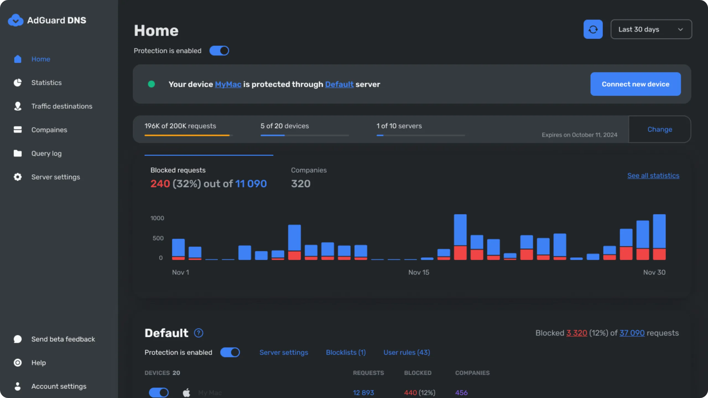


Selanjutnya, aktifkan protokol enkripsi kueri DNS untuk mencegah kueri DNS dicegat atau dimonitor. Ada 2 protokol utama untuk melakukan hal ini:


- DoH (*DNS melalui HTTPS*)**: Mengenkapsulasi permintaan DNS dalam protokol HTTPS, sehingga tidak dapat dibedakan dari lalu lintas web terenkripsi konvensional


- DoT (*DNS melalui TLS*)**: Membuat saluran terenkripsi khusus antara perangkat Anda dan server DNS


- DoQ (*DNS melalui QUIC*)**: Mengirimkan permintaan DNS melalui protokol QUIC berbasis UDP


Secara praktis, enkripsi DNS dan peralihan server bisa diimplementasikan pada berbagai tingkatan:


- Pada tingkat aplikasi: Beberapa aplikasi perangkat lunak, seperti browser Firefox, memungkinkan Anda untuk mengonfigurasi protokol enkripsi DNS, seperti DoH, secara langsung. Namun, solusi ini hanya melindungi permintaan yang dibuat melalui aplikasi, dan bukan seluruh komputer Anda.


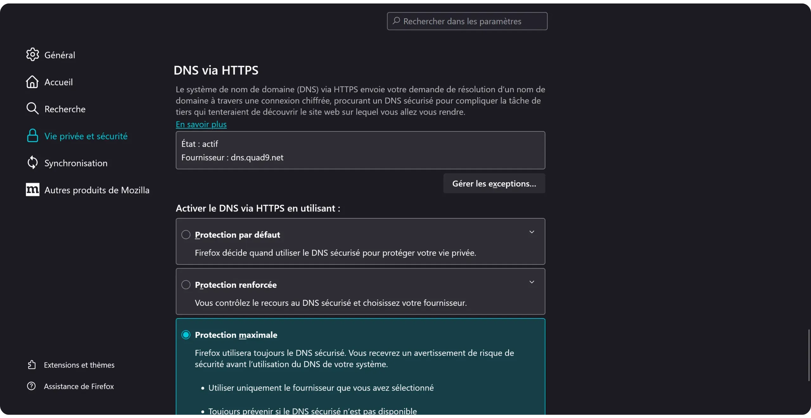


- Pada tingkat sistem operasi: Beberapa OS secara bawaan mengintegrasikan dukungan DNS terenkripsi (DoT atau DoH), yang mengamankan semua permintaan DNS yang melewati tumpukan jaringan sistem. Namun, hal ini tidak mengamankan seluruh komputer atau telepon: Aplikasi dapat melewati pengaturan ini jika dikonfigurasi untuk menggunakan resolver atau protokol DNS yang berbeda.


- Pada tingkat jaringan: Enkripsi DNS dapat diterapkan ke seluruh jaringan lokal melalui konfigurasi router. Sekali lagi, router yang dikonfigurasi untuk DoH/DoT hanya melihat trafik yang benar-benar dikirim ke router tersebut. Jadi browser yang dikonfigurasi untuk menghubungi resolver jarak jauh secara langsung lolos dari kontrol ini. Untuk mengurangi celah ini, Anda perlu memblokir port 53 dengan teks yang jelas dan membatasi tujuan DoH/DoT yang tidak sah melalui firewall router.


Selain itu, router modem yang disediakan ISP tidak selalu mendukung fitur-fitur ini. Jika terjadi keterbatasan router, ada beberapa alternatif. Anda dapat menginstal klien DNS yang dienkripsi secara manual pada setiap perangkat, menambahkan router pribadi di belakang ISP (yang mampu menangani enkripsi DNS) atau menggunakan server DNS lokal (misalnya, pada Raspberry Pi) yang bertanggung jawab untuk mengenkripsi dan mengalihkan permintaan DNS ke penyelesai yang aman.


Untuk melangkah lebih jauh, Anda juga bisa menyiapkan solusi penyaringan DNS lokal seperti Pi-hole atau AdGuard Home.


https://planb.network/tutorials/computer-security/communication/pi-hole-46a735c5-8af3-4cc3-a2c2-1d4f6a7dc428

Alat-alat ini bertindak seperti server DNS kecil di dalam jaringan Anda, memblokir permintaan ke domain yang dikenal sebagai tempat iklan, pelacak browser, phishing, atau situs berbahaya. Alat-alat ini juga memungkinkan Anda untuk membuat daftar pemblokiran Anda sendiri atau menyesuaikan pemfilteran menurut perangkat yang terhubung.


### Akses jarak jauh yang aman melalui VPN

Dalam beberapa kasus, akan sangat berguna untuk dapat mengakses jaringan rumah Anda ketika Anda sedang bepergian: Melihat file di NAS, menggunakan Bitcoin dan Lightning node, mengakses server yang dihosting sendiri, atau mengelola jaringan Anda. Namun, koneksi jarak jauh ini harus aman.

Tips pertama adalah jangan pernah secara langsung membuka port pada router Anda untuk mengakses sebuah perangkat (misalnya melalui RDP, SSH atau FTP), karena hal ini akan mengekspos layanan tersebut ke seluruh Internet, yang merupakan sebuah kerentanan. Serangan otomatis yang menargetkan port yang terbuka sangat banyak.

Solusi yang saya rekomendasikan adalah menggunakan VPN (*Virtual Private Network*), yaitu terowongan terenkripsi antara perangkat jarak jauh Anda (komputer, ponsel cerdas, dll.) dan jaringan lokal Anda. Setelah terhubung ke VPN, Anda dapat mengakses sumber daya rumah Anda seolah-olah Anda berada di sana secara fisik, dan dengan cara yang aman.

Dua solusi utama untuk pelanggan pribadi adalah:

- WireGuard: Modern, cepat dan ringan
- OpenVPN: Lebih tua, tetapi sangat matang dan dapat dikonfigurasi

https://planb.network/tutorials/computer-security/communication/wireguard-81fdd0db-b2bd-4a6c-a082-2de269e26779

Berikut ini tutorial lengkap tentang Tailscale, solusi VPN yang mudah dikonfigurasi yang menggunakan WireGuard:

https://planb.network/tutorials/computer-security/communication/tailscale-9acbd7de-04d9-40f6-ab80-35f0dfedb632

Anda bisa meng-host VPN ini secara langsung pada router yang kompatibel, pada komputer kecil (seperti Raspberry Pi) atau pada server khusus di rumah. Anda juga bisa menginstalnya sebagai klien secara langsung pada perangkat apa pun.

Tetapi VPN tidak hanya untuk akses jarak jauh. Anda juga bisa menggunakan klien VPN klasik pada perangkat Anda untuk mengenkripsi semua lalu lintas keluar Anda, bahkan ketika Anda jauh dari rumah (Wi-Fi publik, hotel, universitas, dll.). Dalam hal ini, perangkat Anda tersambung ke server VPN pihak ketiga (komersial atau host sendiri), yang kemudian merelay koneksi Anda ke Internet. Hal ini menyembunyikan IP asli Anda Address dari ISP, melindungi data Anda dari mata-mata lokal dan menghindari bentuk-bentuk penyensoran tertentu.

https://planb.network/tutorials/computer-security/communication/mullvad-968ec5f5-b3f0-4d23-a9e0-c07a3e85aaa8

https://planb.network/tutorials/computer-security/communication/ivpn-5a0cd5df-29f1-4382-a817-975a96646e68

Terakhir, Anda juga bisa menyiapkan VPN secara langsung pada router Anda, sehingga Anda bisa memproteksi semua perangkat di rumah Anda tanpa harus memasang klien VPN pada masing-masing perangkat.

### Pemantauan dan deteksi

Setelah jaringan Anda dikonfigurasi dan disegmentasi dengan benar, penting untuk melampaui keamanan pasif. Pemantauan aktif jaringan lokal Anda dapat mendeteksi perilaku abnormal, koneksi tidak sah, atau tanda-tanda penyusupan. Tujuannya adalah untuk menemukan masalah lebih awal, sebelum menyebabkan kerusakan.

Langkah pertama adalah memusatkan log keamanan. Setiap perangkat yang terhubung ke jaringan menghasilkan log yang berisi informasi tentang koneksi, kesalahan, atau aktivitas yang mencurigakan. Daripada melihat log ini satu per satu, saya sarankan untuk mengirimkannya ke server yang mampu mengelompokkan, menyortir, dan menganalisisnya. Solusi seperti Graylog atau Elastic Stack (ELK) memungkinkan Anda untuk menggabungkan log ini ke dalam Interface grafis di mana Anda dapat mencari peristiwa tertentu, membuat peringatan, atau memvisualisasikan aktivitas jaringan.

https://planb.network/tutorials/computer-security/data/graylog-3a7f0377-1d95-4446-abe0-d7866a551455

Selanjutnya, lakukan pemindaian aktif secara teratur pada jaringan lokal Anda, misalnya dengan Nmap. Ini akan memberi Anda gambaran umum tentang semua perangkat di jaringan Anda, dan port yang telah dibuka. Jika Anda mengidentifikasi perangkat yang tidak dikenal atau layanan yang tidak biasa, ini bisa menjadi tanda adanya serangan.

https://planb.network/tutorials/computer-security/communication/nmap-862300d7-6dfb-4660-970d-f56a9f58f60d

Untuk melangkah lebih jauh lagi, Anda bisa memasang IDS (*Intrusion Detection System*), atau bahkan IPS (*Intrusion Prevention System*). Alat-alat ini, seperti Suricata atau Snort, memonitor aliran jaringan secara real time dan mendeteksi tanda tangan serangan yang diketahui (pemindaian port, injeksi, koneksi yang mencurigakan, dll.). IDS memberi peringatan, sedangkan IPS dapat secara otomatis memblokir tindakan tertentu.

Terakhir, memantau konsumsi bandwidth juga merupakan indikator yang baik untuk mengetahui aktivitas yang tidak normal. Jika sebuah perangkat tiba-tiba mengonsumsi banyak data tanpa alasan yang jelas, ini bisa menjadi petunjuk adanya pengunduhan yang tidak sah, kebocoran data, atau bahkan perangkat yang disusupi. Alat-alat seperti ntopng atau vnStat memungkinkan Anda untuk melihat aliran masuk dan keluar berdasarkan perangkat.

https://planb.network/tutorials/computer-security/data/ntopng-77435bd3-674a-4f35-81d9-0a5325bbdcbd

### Pencadangan dan ketahanan

Bahkan dengan jaringan yang sangat aman, kegagalan perangkat keras, kesalahan konfigurasi, atau kejadian tak terduga (kegagalan daya, lonjakan daya, kegagalan disk Hard, dll.) dapat menyebabkan hilangnya data atau mengganggu layanan Anda. Untuk menjamin kelangsungan lingkungan digital Anda dan menghindari memulai dari awal jika terjadi masalah, penting untuk menerapkan strategi pencadangan dan ketahanan.

Mulailah dengan mencadangkan konfigurasi peralatan jaringan Anda secara teratur, terutama router. File konfigurasi ini sering kali dapat diekspor melalui administrasi Interface. Menyimpan salinannya memungkinkan Anda untuk dengan cepat memulihkan sistem fungsional jika terjadi pengaturan ulang atau penggantian perangkat. Saya juga menyarankan untuk mengenkripsi cadangan ini.

Terakhir, untuk meningkatkan ketahanan jaringan Anda jika terjadi kegagalan daya, berinvestasilah pada UPS. Perangkat ini menyediakan daya cadangan selama beberapa menit jika terjadi kegagalan daya, sehingga Anda dapat terus menggunakan Internet atau memastikan bahwa perangkat penting (NAS, router, titik akses Wi-Fi, dll.) mati dengan bersih. Beberapa model juga dapat mengirimkan perintah pematian otomatis ke perangkat yang tersambung apabila mendeteksi baterai hampir habis.

Dengan mengikuti beberapa langkah berikut ini, Anda akan membangun lingkungan jaringan yang kuat dan aman yang menghormati privasi Anda.

# Bagian akhir

<partId>28fae323-cce7-405a-be8d-d15739ca74df</partId>

## Ulasan & Peringkat

<chapterId>9c71cd4c-ee07-422a-8cb0-757412e0202d</chapterId>

<isCourseReview>true</isCourseReview>

## Ujian akhir

<chapterId>1eb4578e-024a-4430-a997-e9faaf96ab28</chapterId>

<isCourseExam>true</isCourseExam>

## Kesimpulan

<chapterId>4186cd39-6320-43a0-ba2c-ceaac42d2d37</chapterId>

<isCourseConclusion>true</isCourseConclusion>
