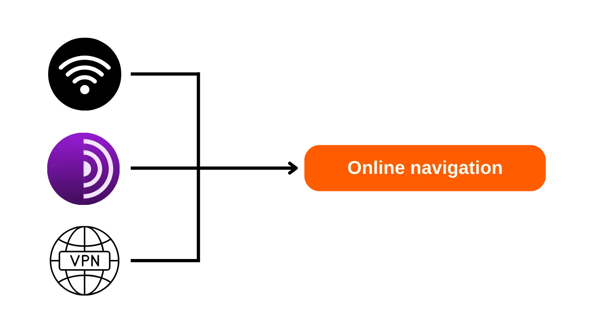
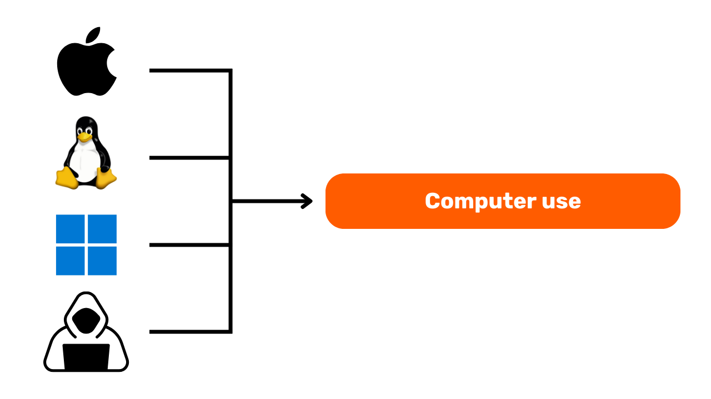
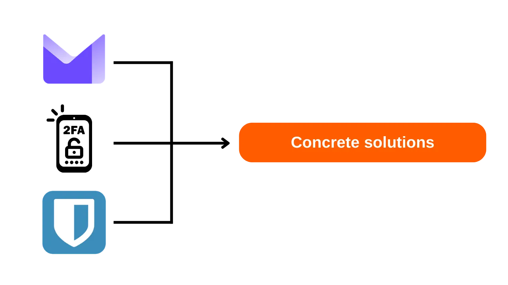
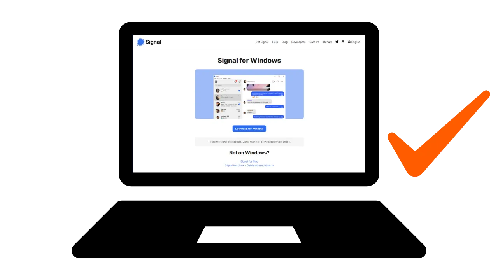
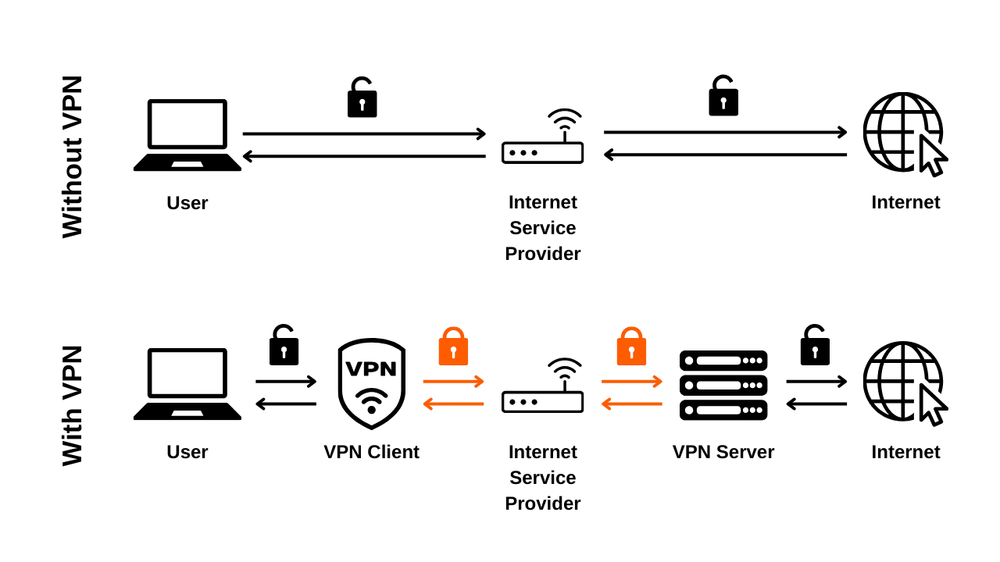
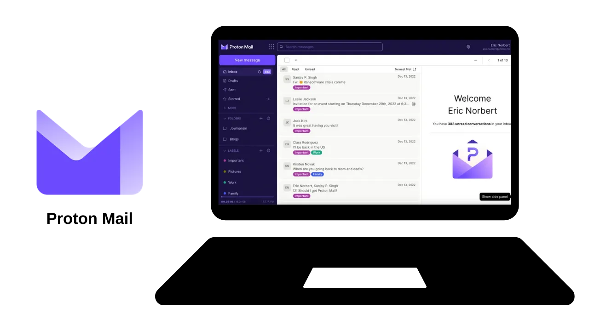
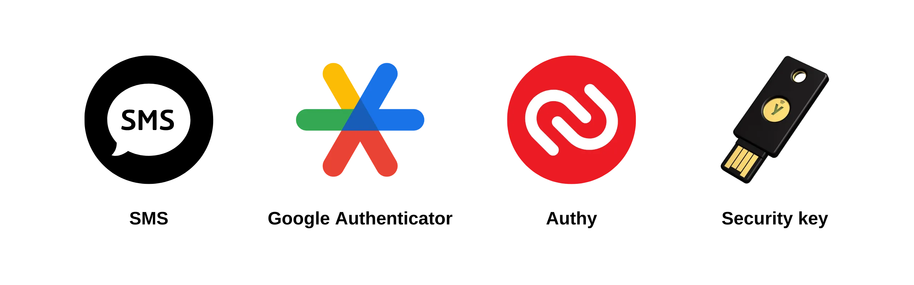

# Hành trình bảo vệ dữ liệu của bạn

Chào mừng mọi người đến với chương trình giáo dục này dành riêng cho bảo mật số. Khóa học này được thiết kế để tiếp cận được với mọi người, vì vậy không yêu cầu kiến thức trước về khoa học máy tính. Mục tiêu chính của chúng tôi là cung cấp cho bạn kiến thức và kỹ năng cần thiết để điều hướng thế giới số một cách an toàn và riêng tư hơn.

Điều này sẽ liên quan đến việc triển khai một số công cụ như dịch vụ email an toàn, công cụ quản lý mật khẩu tốt hơn và các phần mềm khác để bảo vệ hoạt động trực tuyến của bạn.

Trong khóa học này, chúng tôi không nhằm mục đích biến bạn thành một chuyên gia, người ẩn danh hoặc không thể bị xâm phạm, vì điều này là không thể. Thay vào đó, chúng tôi cung cấp cho bạn một số giải pháp đơn giản và dễ tiếp cận để bắt đầu thay đổi thói quen trực tuyến của bạn và lấy lại quyền kiểm soát chủ quyền số của mình.

Nhóm cộng tác viên:
Muriel; thiết kế
Rogzy Noury & Fabian; sản xuất
Théo; đóng góp

+++

# Giới thiệu

## Giới thiệu Khóa Học

### Mục tiêu: Cập nhật kỹ năng bảo mật của bạn!

Chào mừng mọi người đến với chương trình giáo dục này dành riêng cho bảo mật số. Khóa học này được thiết kế để tiếp cận được với mọi người, vì vậy không yêu cầu kiến thức trước về khoa học máy tính. Mục tiêu chính của chúng tôi là cung cấp cho bạn kiến thức và kỹ năng cần thiết để điều hướng thế giới số một cách an toàn và riêng tư hơn.

Điều này sẽ liên quan đến việc triển khai một số công cụ như dịch vụ email an toàn, công cụ quản lý mật khẩu tốt hơn và các phần mềm khác để bảo vệ hoạt động trực tuyến của bạn.

Khóa học này là nỗ lực hợp tác của ba giáo sư của chúng tôi:

- Renaud Lifchitz, chuyên gia bảo mật mạng
- Théo Pantamis, Tiến sĩ toán ứng dụng
- Rogzy, CEO của DécouvreBitcoin

Vệ sinh số của bạn rất quan trọng trong một thế giới ngày càng số hóa. Mặc dù số lượng hack và giám sát hàng loạt không ngừng tăng lên, nhưng không bao giờ là quá muộn để bắt đầu bảo vệ bản thân.
Trong khóa học này, chúng tôi không cố gắng biến bạn thành một chuyên gia, người ẩn danh hoặc không thể bị xâm phạm, vì điều này là không thể. Thay vào đó, chúng tôi cung cấp cho bạn một số giải pháp đơn giản và dễ tiếp cận cho mọi người để bắt đầu thay đổi thói quen trực tuyến của bạn và lấy lại quyền kiểm soát chủ quyền số của mình.
Nếu bạn đang tìm kiếm kỹ năng nâng cao hơn về chủ đề này, tài nguyên, hướng dẫn hoặc các khóa học bảo mật mạng khác của chúng tôi đều sẵn sàng phục vụ bạn. Trong khi chờ đợi, dưới đây là một cái nhìn tổng quan về chương trình của chúng tôi trong vài giờ tới cùng nhau.

### Phần 1: Tất cả những gì bạn cần biết về duyệt web trực tuyến

- Chương 1 - Duyệt web trực tuyến
- Chương 2 - Sử dụng internet một cách an toàn

Để bắt đầu, chúng tôi sẽ thảo luận về tầm quan trọng của việc chọn một trình duyệt web và những hậu quả của nó đối với bảo mật. Sau đó, chúng tôi sẽ khám phá các đặc điểm cụ thể của trình duyệt, đặc biệt là về quản lý cookie. Chúng tôi cũng sẽ xem xét cách đảm bảo trải nghiệm duyệt web an toàn và ẩn danh hơn, sử dụng các công cụ như TOR. Sau đó, chúng tôi sẽ tập trung vào việc sử dụng VPN để tăng cường bảo vệ dữ liệu của bạn. Cuối cùng, chúng tôi sẽ kết thúc với các khuyến nghị cho việc sử dụng kết nối WiFi một cách an toàn.

### Phần 2: Các phương pháp hay nhất cho việc sử dụng máy tính

- Chương 3 - Sử dụng máy tính
- Chương 4 - Hacking & quản lý sao lưu
Trong phần này, chúng ta sẽ đề cập đến ba lĩnh vực chính của bảo mật máy tính. Đầu tiên, chúng ta sẽ khám phá các hệ điều hành khác nhau: Mac, PC và Linux, nêu bật những đặc điểm và ưu điểm riêng của chúng. Sau đó, chúng ta sẽ tìm hiểu các phương pháp bảo vệ hiệu quả chống lại các nỗ lực hack và tăng cường bảo mật cho thiết bị của bạn. Cuối cùng, chúng ta sẽ nhấn mạnh tầm quan trọng của việc bảo vệ và sao lưu dữ liệu định kỳ để ngăn chặn mất mát hoặc ransomware.

### Phần 3: Triển khai giải pháp

- Chương 6 - Quản lý email
- Chương 7 - Quản lý mật khẩu
- Chương 8 - Xác thực hai yếu tố

Trong phần thực hành thứ ba này, chúng ta sẽ chuyển sang triển khai các giải pháp cụ thể của bạn.

Đầu tiên, chúng ta sẽ xem cách bảo vệ hộp thư đến email của bạn, điều này rất quan trọng cho giao tiếp của bạn và thường xuyên bị hacker nhắm đến. Sau đó, chúng ta sẽ giới thiệu bạn với một trình quản lý mật khẩu: một giải pháp thực tế để không còn quên hoặc lẫn lộn mật khẩu của bạn trong khi vẫn giữ chúng an toàn. Cuối cùng, chúng ta sẽ thảo luận về một biện pháp bảo mật bổ sung, xác thực hai yếu tố, nó thêm một lớp bảo vệ nữa cho tài khoản của bạn. Mọi thứ sẽ được giải thích một cách rõ ràng và dễ tiếp cận.

# Tất cả những gì bạn cần biết về duyệt web trực tuyến

## Duyệt web trực tuyến

Khi duyệt internet, việc tránh một số sai lầm phổ biến để bảo vệ an ninh trực tuyến của bạn là rất quan trọng. Dưới đây là một số mẹo để tránh chúng:

### Hãy cẩn thận với việc tải phần mềm:

Nên tải phần mềm từ trang web chính thức của nhà xuất bản thay vì các trang web chung chung.
Ví dụ: Sử dụng www.signal.org/download thay vì www.logicieltelechargement.fr/signal.

Cũng nên ưu tiên phần mềm mã nguồn mở vì chúng thường an toàn hơn và không chứa phần mềm độc hại. Phần mềm "mã nguồn mở" là phần mềm có mã được biết đến và có thể truy cập bởi mọi người. Điều này cho phép kiểm tra, giữa những thứ khác, rằng không có quyền truy cập ẩn nào để đánh cắp dữ liệu cá nhân của bạn.

> Bonus: Phần mềm mã nguồn mở thường miễn phí! Trường đại học này 100% mã nguồn mở, vì vậy bạn cũng có thể kiểm tra mã của chúng tôi trên GitHub của chúng tôi.

### Quản lý cookie: Lỗi và phương pháp tốt nhất

Cookie là các tệp được tạo bởi các trang web để lưu trữ thông tin trên thiết bị của bạn. Mặc dù một số trang web yêu cầu cookie này để hoạt động đúng cách, chúng cũng có thể bị khai thác bởi các trang web bên thứ ba, đặc biệt là cho mục đích theo dõi quảng cáo. Phù hợp với các quy định như GDPR, có thể - và được khuyến nghị - từ chối cookie theo dõi của bên thứ ba trong khi chấp nhận những cookie cần thiết cho sự hoạt động đúng đắn của trang web. Sau mỗi lần truy cập vào một trang web, việc xóa cookie liên quan, bằng tay hoặc thông qua một tiện ích mở rộng hoặc chương trình cụ thể, là điều khôn ngoan. Một số trình duyệt thậm chí còn cung cấp khả năng xóa cookie một cách lựa chọn. Mặc dù có những biện pháp phòng ngừa này, việc hiểu rằng thông tin thu thập bởi các trang web khác nhau có thể vẫn liên kết với nhau là rất quan trọng, do đó tầm quan trọng của việc tìm kiếm một sự cân bằng giữa tiện ích và bảo mật.

> Lưu ý: Cũng hạn chế số lượng tiện ích mở rộng được cài đặt trên trình duyệt của bạn để tránh các vấn đề về bảo mật và hiệu suất tiềm ẩn.

### Trình duyệt web: lựa chọn, bảo mật

Có hai họ trình duyệt chính: những cái dựa trên Chrome và những cái dựa trên Firefox.
Mặc dù cả hai họ đều cung cấp một mức độ bảo mật tương tự, nên tránh sử dụng trình duyệt Google Chrome do các bộ theo dõi của nó. Các lựa chọn nhẹ hơn cho Chrome, như Chromium hoặc Brave, có thể được ưu tiên. Brave đặc biệt được khuyến nghị vì có trình chặn quảng cáo tích hợp. Có thể cần sử dụng nhiều trình duyệt để truy cập một số trang web.

### Duyệt web riêng tư, TOR, và các lựa chọn khác cho việc duyệt web an toàn và ẩn danh hơn
Duyệt web ẩn danh, mặc dù không ẩn hoạt động duyệt web của bạn khỏi nhà cung cấp dịch vụ internet, nhưng cho phép bạn không để lại dấu vết trên máy tính cá nhân. Cookies sẽ tự động được xóa sau mỗi phiên, cho phép bạn chấp nhận tất cả cookies mà không bị theo dõi. Duyệt web ẩn danh có thể hữu ích khi mua sắm dịch vụ trực tuyến, vì các trang web theo dõi thói quen tìm kiếm của chúng ta và điều chỉnh giá cả tương ứng. Tuy nhiên, quan trọng là phải lưu ý rằng duyệt web ẩn danh được khuyến nghị cho các phiên cụ thể và tạm thời, không phải cho việc duyệt web chung trên internet.

Một lựa chọn tiên tiến hơn là mạng TOR (The Onion Router), cung cấp sự ẩn danh bằng cách che giấu địa chỉ IP của người dùng và cho phép truy cập vào Darknet. TOR Browser là một trình duyệt được thiết kế đặc biệt để sử dụng mạng TOR. Nó cho phép bạn truy cập cả các trang web thông thường và các trang web .onion, thường được vận hành bởi cá nhân và có thể mang tính chất bất hợp pháp.

TOR là hợp pháp và được sử dụng bởi các nhà báo, nhà hoạt động vì tự do, và những người khác muốn tránh kiểm duyệt ở các quốc gia độc tài. Tuy nhiên, quan trọng là phải hiểu rằng TOR không bảo vệ các trang web được truy cập hoặc chính máy tính. Ngoài ra, sử dụng TOR có thể làm chậm kết nối internet vì dữ liệu phải đi qua máy tính của ba người khác trước khi đến đích. Cũng cần lưu ý rằng TOR không phải là giải pháp hoàn hảo để đảm bảo 100% ẩn danh và không nên được sử dụng cho các hoạt động bất hợp pháp.

### BRAVE

**_Hướng dẫn đang được xây dựng, để đóng góp hoặc thêm vào, bạn có thể truy cập GitHub_**

## VPN và kết nối internet

### VPNs

Bảo vệ kết nối internet của bạn là một khía cạnh quan trọng của an ninh trực tuyến, và sử dụng mạng riêng ảo (VPNs) là một phương pháp hiệu quả để tăng cường an ninh này, cả cho doanh nghiệp và người dùng cá nhân.

'VPNs là các công cụ mã hóa dữ liệu truyền qua internet, làm cho kết nối an toàn hơn. Trong một bối cảnh chuyên nghiệp, VPNs cho phép nhân viên truy cập an toàn vào mạng nội bộ của công ty từ xa. Dữ liệu trao đổi được mã hóa, làm cho việc can thiệp bởi bên thứ ba trở nên khó khăn hơn nhiều. Ngoài việc bảo mật truy cập vào mạng nội bộ, sử dụng VPN cũng có thể cho phép người dùng định tuyến kết nối internet của họ qua mạng nội bộ của công ty, tạo ra ấn tượng rằng kết nối của họ đến từ công ty. Điều này có thể đặc biệt hữu ích để truy cập các dịch vụ trực tuyến bị hạn chế theo địa lý.

### Các loại VPN

Có hai loại VPN chính: VPN doanh nghiệp và VPN cho người tiêu dùng, như NordVPN. VPN doanh nghiệp có xu hướng đắt hơn và phức tạp hơn, trong khi VPN cho người tiêu dùng thường dễ tiếp cận và thân thiện với người dùng hơn. Ví dụ, NordVPN cho phép người dùng kết nối internet thông qua một máy chủ đặt tại một quốc gia khác, có thể vượt qua các hạn chế địa lý.

Tuy nhiên, sử dụng VPN cho người tiêu dùng không đảm bảo hoàn toàn ẩn danh. Nhiều nhà cung cấp VPN giữ lại thông tin về người dùng của họ, có thể tiềm ẩn rủi ro về ẩn danh. Mặc dù VPN có thể hữu ích để cải thiện an ninh trực tuyến, chúng không phải là giải pháp toàn diện. Chúng hiệu quả cho một số mục đích cụ thể, như truy cập dịch vụ bị hạn chế địa lý hoặc cải thiện an ninh khi đi du lịch, nhưng không đảm bảo an ninh tuyệt đối. Khi chọn VPN, quan trọng là ưu tiên độ tin cậy và kỹ thuật hơn là phổ biến. Các nhà cung cấp VPN thu thập ít thông tin cá nhân nhất thường là an toàn nhất. Dịch vụ như iVPN và Mullvad không thu thập thông tin cá nhân và thậm chí cho phép thanh toán bằng Bitcoin để tăng cường sự riêng tư.

Cuối cùng, VPN cũng có thể được sử dụng để chặn quảng cáo trực tuyến, mang lại trải nghiệm duyệt web thú vị và an toàn hơn. Tuy nhiên, quan trọng là phải tự mình nghiên cứu để tìm ra VPN phù hợp nhất với nhu cầu cụ thể của bạn. Sử dụng VPN được khuyến nghị để tăng cường bảo mật, ngay cả khi duyệt internet tại nhà. Điều này giúp đảm bảo mức độ bảo mật cao hơn cho dữ liệu trao đổi trực tuyến. Cuối cùng, hãy chắc chắn kiểm tra URL và ổ khóa nhỏ trong thanh địa chỉ để xác nhận rằng bạn đang truy cập vào trang web mà bạn muốn.

### HTTPS & mạng Wi-Fi công cộng

Về bảo mật trực tuyến, điều cần thiết là phải hiểu rằng 4G thường an toàn hơn Wi-Fi công cộng. Tuy nhiên, sử dụng 4G có thể nhanh chóng tiêu hao gói dữ liệu di động của bạn. Giao thức HTTPS đã trở thành tiêu chuẩn để mã hóa dữ liệu trên các trang web. Nó đảm bảo rằng dữ liệu trao đổi giữa người dùng và trang web là an toàn. Do đó, việc xác minh trang web bạn đang truy cập sử dụng giao thức HTTPS là rất quan trọng.

Tại Liên minh Châu Âu, bảo vệ dữ liệu được quy định bởi Quy định Bảo vệ Dữ liệu Chung (GDPR). Do đó, sử dụng các điểm truy cập Wi-Fi của châu Âu, như SNCF, là an toàn hơn, vì họ không bán lại dữ liệu kết nối của người dùng. Tuy nhiên, chỉ riêng việc một trang web hiển thị ổ khóa không đảm bảo tính xác thực của nó. Quan trọng là phải xác minh khóa công khai của trang web bằng cách sử dụng hệ thống chứng chỉ để xác nhận tính xác thực của nó. Mặc dù mã hóa dữ liệu ngăn chặn bên thứ ba can thiệp vào dữ liệu trao đổi, vẫn có khả năng một cá nhân xấu có thể giả mạo trang web và chuyển dữ liệu dưới dạng văn bản rõ ràng.

Để tránh bị lừa đảo trực tuyến, việc xác minh danh tính của trang web bạn đang duyệt, đặc biệt là kiểm tra phần mở rộng và tên miền, là rất quan trọng. Ngoài ra, hãy cảnh giác với những kẻ lừa đảo sử dụng các chữ cái tương tự trong URL để lừa đảo người dùng.

Tóm lại, việc sử dụng VPN có thể cải thiện đáng kể bảo mật trực tuyến, cả cho doanh nghiệp và người dùng cá nhân. Hơn nữa, việc thực hành thói quen duyệt web tốt có thể góp phần vào việc duy trì vệ sinh số hóa tốt hơn. Trong phần tiếp theo của khóa học này, chúng ta sẽ đề cập đến bảo mật máy tính, bao gồm cập nhật, phần mềm diệt virus và quản lý mật khẩu.

### Hướng dẫn: IVPN

**_Hướng dẫn đang được xây dựng, để đóng góp hoặc thêm vào, bạn có thể truy cập qua GitHub_**

# Phương pháp tốt nhất cho việc sử dụng máy tính

## Sử dụng máy tính

Bảo mật cho máy tính của chúng ta là một mối quan tâm lớn trong thế giới số hóa ngày nay. Hôm nay, chúng ta sẽ đề cập đến ba điểm chính:

- Lựa chọn máy tính
- Cập nhật và phần mềm diệt virus cho bảo mật tối ưu
- Phương pháp tốt nhất cho bảo mật máy tính và dữ liệu của bạn.

### Lựa chọn Máy tính và Hệ điều hành

Về việc lựa chọn máy tính, không có sự khác biệt đáng kể về bảo mật giữa máy tính cũ và mới. Tuy nhiên, có sự khác biệt về bảo mật giữa các hệ điều hành: Windows, Linux và Mac.

Về Windows, được khuyến nghị không sử dụng tài khoản quản trị hàng ngày, mà nên tạo hai tài khoản riêng biệt: một tài khoản quản trị và một tài khoản cho việc sử dụng hàng ngày. Windows thường xuyên phơi mình trước malware hơn do số lượng người dùng lớn và dễ dàng chuyển đổi từ người dùng sang quản trị. Ngược lại, mối đe dọa ít phổ biến hơn trên Linux và Mac.

Lựa chọn hệ điều hành nên dựa trên nhu cầu và sở thích của bạn. Hệ thống Linux đã phát triển đáng kể trong những năm gần đây, trở nên thân thiện với người dùng hơn. Ubuntu là một lựa chọn thú vị cho người mới bắt đầu, với giao diện đồ họa dễ sử dụng. Có thể phân vùng máy tính để thử nghiệm Linux trong khi giữ Windows, nhưng điều này có thể phức tạp. Thường thì tốt hơn là có một máy tính chuyên dụng, máy ảo, hoặc USB để thử nghiệm Linux hoặc Ubuntu.

### Cập nhật Phần mềm
Về việc cập nhật, quy tắc rất đơn giản: **việc cập nhật hệ điều hành và các ứng dụng một cách thường xuyên là cực kỳ quan trọng.**
Trên Windows 10, các bản cập nhật gần như liên tục và việc không chặn hoặc trì hoãn chúng là rất quan trọng. Mỗi năm, khoảng 15,000 lỗ hổng được xác định, nhấn mạnh tầm quan trọng của việc giữ phần mềm được cập nhật để bảo vệ khỏi virus. Nói chung, hỗ trợ phần mềm kết thúc trong khoảng từ 3 đến 5 năm sau khi phát hành, do đó, việc nâng cấp lên phiên bản cao hơn là cần thiết để tiếp tục được bảo vệ an ninh.

Quy tắc này áp dụng cho hầu hết mọi phần mềm. Thực tế, các bản cập nhật không nhằm làm cho máy tính của bạn lỗi thời hoặc chậm đi, mà để bảo vệ nó khỏi các mối đe dọa mới. Một số bản cập nhật thậm chí được coi là quan trọng, và không có chúng, máy tính của bạn có nguy cơ cao bị khai thác.

Để cho bạn một ví dụ cụ thể về một lỗi: phần mềm bị crack không thể được cập nhật đại diện cho một mối đe dọa kép. Sự xuất hiện của virus trong quá trình tải xuống bất hợp pháp từ một trang web đáng ngờ và sử dụng không an toàn chống lại các hình thức tấn công mới.

### Anti-virus

- Bạn có cần một phần mềm chống virus không? CÓ
- Bạn có phải trả tiền không? Tùy thuộc!

Việc chọn lựa và triển khai một phần mềm chống virus là quan trọng. Windows Defender, phần mềm chống virus tích hợp trong Windows, là một giải pháp an toàn và hiệu quả. Đối với một giải pháp miễn phí, nó rất tốt và tốt hơn nhiều so với nhiều giải pháp miễn phí tìm thấy trực tuyến. Thực tế, cần phải thận trọng với phần mềm chống virus tải xuống từ Internet, vì chúng có thể là m malicious hoặc lỗi thời.
Đối với những ai muốn đầu tư vào một phần mềm chống virus trả phí, được khuyến nghị chọn một phần mềm chống virus phân tích thông minh các mối đe dọa không rõ và mới nổi, như Kaspersky. Cập nhật phần mềm chống virus là cần thiết để bảo vệ khỏi các mối đe dọa mới.

> Lưu ý: Linux và Mac, nhờ hệ thống phân chia quyền người dùng của họ, thường không cần phần mềm chống virus.

Cuối cùng, đây là một số thực hành tốt cho sự an toàn của máy tính và dữ liệu của bạn. Quan trọng là chọn một phần mềm chống virus hiệu quả và dễ sử dụng. Cũng rất quan trọng để áp dụng các thực hành tốt trên máy tính của bạn, như không chèn USB không rõ hoặc đáng ngờ. Những USB này có thể chứa các chương trình độc hại có thể tự động khởi chạy khi được chèn vào. Việc kiểm tra USB sẽ vô ích một khi nó đã được chèn vào. Một số công ty đã trở thành nạn nhân của việc hack do USB bị bỏ quên một cách cẩu thả trong các khu vực dễ tiếp cận, như bãi đậu xe.

Hãy đối xử với máy tính của bạn như bạn đối xử với ngôi nhà của mình: luôn cảnh giác, cập nhật thường xuyên, xóa bỏ các tệp không cần thiết, và sử dụng mật khẩu mạnh cho an ninh. Việc mã hóa dữ liệu trên laptop và điện thoại thông minh là rất quan trọng để ngăn chặn trộm cắp hoặc mất dữ liệu. BitLocker cho Windows, LUKS cho Linux, và tùy chọn tích hợp cho Mac là các giải pháp cho việc mã hóa dữ liệu. Được khuyến nghị kích hoạt mã hóa dữ liệu mà không do dự và ghi lại mật khẩu trên một tờ giấy để giữ ở nơi an toàn.

Kết luận, việc chọn một hệ điều hành phù hợp với nhu cầu của bạn và cập nhật thường xuyên, cũng như các ứng dụng đã cài đặt, là cực kỳ quan trọng. Cũng rất quan trọng khi sử dụng một phần mềm chống virus hiệu quả và dễ sử dụng và áp dụng các thực hành tốt cho sự an toàn của máy tính và dữ liệu của bạn.

### Hướng dẫn: Ubuntu

**_Hướng dẫn đang được xây dựng, để đóng góp hoặc thêm vào, bạn có thể qua GitHub_**

## Quản lý Hacking & Sao lưu: Bảo vệ Dữ liệu của Bạn

### Hacker tấn công như thế nào?

Để bảo vệ bản thân một cách tốt nhất, việc hiểu cách hacker cố gắng xâm nhập vào máy tính của bạn là cần thiết. Thực tế, virus không thường xuất hiện một cách ma thuật, mà thực sự là hậu quả của các hành động của chúng ta, kể cả không cố ý!

Như một quy tắc chung, virus xuất hiện bởi vì bạn đã cho phép máy tính của mình mời chúng vào nhà. Điều này có thể được hình dung bằng cách tải xuống phần mềm đáng ngờ, một tệp torrent bị xâm phạm, hoặc đơn giản chỉ bằng cách nhấp vào liên kết của một email gian lận!
### Phishing, cảnh giác trước email lừa đảo:
Chú ý! Email là phương tiện tấn công hàng đầu, dưới đây là một số lời khuyên:

- Hãy luôn cảnh giác với các nỗ lực phishing nhằm mục đích lấy cắp thông tin nhạy cảm như tên đăng nhập và mật khẩu của bạn. Tránh nhấp vào các liên kết đáng ngờ và chia sẻ thông tin cá nhân của bạn mà không xác minh tính hợp pháp của người gửi.
- Hãy cẩn thận với các tệp đính kèm và hình ảnh trong email:
  Các tệp đính kèm và hình ảnh trong email có thể chứa mã độc. Không tải xuống hoặc mở các tệp đính kèm từ người gửi không rõ ràng hoặc đáng ngờ, và đảm bảo rằng phần mềm diệt virus của bạn được cập nhật.

Quy tắc vàng ở đây là kiểm tra kỹ tên đầy đủ của người gửi cũng như nguồn gốc của email. Khi nghi ngờ, hãy xóa nó đi!

### Ransomware và các loại tấn công mạng:

Ransomware là một loại phần mềm độc hại mã hóa dữ liệu của người dùng và yêu cầu tiền chuộc để giải mã. Loại tấn công này ngày càng phổ biến và có thể gây rắc rối lớn cho một công ty hoặc cá nhân. Để bảo vệ bản thân, việc tạo bản sao lưu cho các tệp quan trọng nhất là điều cần thiết! Điều này sẽ không ngăn chặn ransomware, nhưng sẽ cho phép bạn đơn giản bỏ qua nó.

Hãy thường xuyên sao lưu dữ liệu quan trọng của bạn vào một thiết bị lưu trữ ngoại vi hoặc dịch vụ lưu trữ trực tuyến an toàn. Như vậy, trong trường hợp bị tấn công mạng hoặc hỏng hóc phần cứng, bạn có thể khôi phục dữ liệu mà không mất thông tin quan trọng.

Giải pháp đơn giản:

- Mua một ổ đĩa cứng ngoại vi và sao chép dữ liệu của bạn vào đó. Ngắt kết nối nó và cất giữ nơi nào đó trong nhà. (Thực hiện điều này hai lần và cất giữ một trong các ổ đĩa ở một địa điểm khác giúp bảo vệ chống lại nguy cơ hỏa hoạn.)

- Tạo một bản sao lưu "đám mây" sử dụng ProtonMail Drive, Sync, hoặc thậm chí Google Drive. Chỉ cần tải dữ liệu nhạy cảm của bạn lên máy chủ trực tuyến này. Tuy nhiên, hãy nhận thức rằng dữ liệu của bạn có thể được trên internet và được giữ bởi một bên thứ ba đáng tin cậy.

### Có nên trả tiền cho hacker?

KHÔNG, nói chung không được khuyến khích trả tiền cho hacker trong trường hợp của ransomware hoặc các loại tấn công khác. Trả tiền chuộc không đảm bảo việc khôi phục dữ liệu của bạn và có thể khuyến khích tội phạm mạng tiếp tục hoạt động độc hại của họ. Thay vào đó, ưu tiên phòng ngừa và sao lưu dữ liệu thường xuyên để bảo vệ bản thân.

Nếu bạn phát hiện virus trên máy tính, hãy ngắt kết nối nó khỏi internet, thực hiện quét toàn bộ bằng phần mềm diệt virus và xóa các tệp bị nhiễm. Sau đó, cập nhật phần mềm và hệ điều hành của bạn, và thay đổi mật khẩu để ngăn chặn sự xâm nhập tiếp theo.

# Triển khai giải pháp.

## Quản lý tài khoản email

### Thiết lập một tài khoản email mới!

Tài khoản email là trung tâm của hoạt động trực tuyến của bạn: nếu nó bị xâm phạm, hacker có thể sử dụng nó để đặt lại tất cả mật khẩu của bạn thông qua chức năng "quên mật khẩu" và truy cập vào nhiều trang web khác. Đó là lý do bạn cần bảo mật nó một cách đúng đắn.

Một tài khoản email nên được tạo với một mật khẩu độc đáo và mạnh mẽ (chi tiết trong chương 7) và lý tưởng là với hệ thống xác thực hai yếu tố (chi tiết trong chương 8).

Mặc dù chúng ta đã có một tài khoản email, nhưng quan trọng là cần xem xét việc tạo một tài khoản mới, hiện đại hơn để bắt đầu lại từ đầu.

### Chọn nhà cung cấp dịch vụ email và quản lý địa chỉ email

Việc quản lý địa chỉ email của chúng ta một cách cẩn thận là rất quan trọng để đảm bảo an ninh truy cập trực tuyến của chúng ta. Quan trọng là chọn một nhà cung cấp dịch vụ email an toàn và tôn trọng quyền riêng tư. Ví dụ, ProtonMail là một dịch vụ email an toàn và tôn trọng quyền riêng tư.

Khi chọn một nhà cung cấp email và tạo mật khẩu, điều cần thiết là không bao giờ tái sử dụng cùng một mật khẩu cho các dịch vụ trực tuyến khác nhau. Nên thường xuyên tạo địa chỉ email mới và phân loại sử dụng bằng cách dùng các địa chỉ email khác nhau. Ưu tiên chọn dịch vụ email an toàn cho các tài khoản quan trọng. Cũng cần lưu ý rằng một số dịch vụ giới hạn độ dài của mật khẩu, vì vậy quan trọng là phải biết về hạn chế này. Các dịch vụ cũng có sẵn để tạo địa chỉ email tạm thời, có thể được sử dụng cho các tài khoản có thời hạn.

Quan trọng là phải xem xét rằng các nhà cung cấp email cũ như La Poste, Arobase, Wig, Hotmail, vẫn được sử dụng, nhưng các phương pháp bảo mật của họ có thể không tốt bằng Gmail. Do đó, nên có hai địa chỉ email riêng biệt, một cho giao tiếp chung và một cho khôi phục tài khoản, với địa chỉ sau được bảo mật tốt hơn. Tốt nhất là tránh kết hợp địa chỉ email với nhà cung cấp dịch vụ điện thoại hoặc nhà cung cấp dịch vụ internet của bạn, vì điều này có thể là một vector tấn công.

### Tôi có nên thay đổi tài khoản email không?

Nên sử dụng trang web Have I Been Pwned (https://haveibeenpwned.com/) để kiểm tra xem địa chỉ email của chúng ta có bị xâm phạm không và được thông báo về các vi phạm dữ liệu trong tương lai. Một cơ sở dữ liệu bị hack có thể bị hacker khai thác để gửi email lừa đảo hoặc tái sử dụng mật khẩu bị xâm phạm.

Nói chung, bắt đầu sử dụng một địa chỉ email mới, an toàn hơn không phải là một thói quen xấu và thậm chí cần thiết nếu muốn bắt đầu lại trên một nền tảng lành mạnh.
Bitcoin Bonus: Có thể nên tạo một địa chỉ email cụ thể cho các hoạt động Bitcoin của chúng ta (tạo tài khoản giao dịch) để thực sự tách biệt các lĩnh vực hoạt động trong cuộc sống của chúng ta.

### Hướng dẫn: Tạo tài khoản ProtonMail

**_Hướng dẫn đang được xây dựng, để đóng góp hoặc thêm vào, bạn có thể qua GitHub_**

## Quản lý Mật khẩu

### Quản lý mật khẩu là gì?

Quản lý mật khẩu là một công cụ cho phép bạn lưu trữ, tạo và quản lý mật khẩu cho các tài khoản trực tuyến khác nhau. Thay vì phải nhớ nhiều mật khẩu, bạn chỉ cần một mật khẩu chính để truy cập tất cả các mật khẩu khác.

Với quản lý mật khẩu, bạn không còn phải lo lắng về việc quên mật khẩu hoặc ghi chúng ra một nơi nào đó. Bạn chỉ cần nhớ một mật khẩu chính. Hơn nữa, hầu hết các công cụ này tạo mật khẩu mạnh cho bạn, nâng cao bảo mật cho các tài khoản của bạn.

### Sự khác biệt giữa một số quản lý phổ biến:

- LastPass: Một trong những quản lý phổ biến nhất. Đây là một dịch vụ bên thứ ba, có nghĩa là mật khẩu của bạn được lưu trữ trên máy chủ của họ. Nó cung cấp một phiên bản miễn phí và một phiên bản trả phí, với giao diện thân thiện với người dùng.

- Dashlane: Cũng là một dịch vụ bên thứ ba, với giao diện trực quan và các tính năng bổ sung như theo dõi thông tin thẻ tín dụng và ghi chú an toàn.

### Tự lưu trữ để kiểm soát nhiều hơn:

- Bitwarden: Là một công cụ mã nguồn mở, có nghĩa là bạn có thể xem xét mã của nó để xác minh bảo mật. Mặc dù Bitwarden cung cấp một dịch vụ được lưu trữ, nó cũng cho phép người dùng tự lưu trữ, có nghĩa là bạn có thể kiểm soát nơi mật khẩu của mình được lưu trữ, có thể cung cấp nhiều bảo mật và kiểm soát hơn.

- KeePass: Là một giải pháp mã nguồn mở chủ yếu dành cho tự lưu trữ. Dữ liệu của bạn được lưu trữ cục bộ theo mặc định, nhưng bạn có thể đồng bộ hóa cơ sở dữ liệu mật khẩu bằng các phương pháp khác nếu bạn muốn. KeePass được công nhận rộng rãi vì bảo mật và linh hoạt của nó, mặc dù có thể ít thân thiện với người mới bắt đầu.

(Note: Việc lựa chọn giữa một dịch vụ của bên thứ ba hoặc một dịch vụ tự lưu trữ phụ thuộc vào mức độ thoải mái về công nghệ của bạn và cách bạn ưu tiên kiểm soát so với tiện ích. Dịch vụ của bên thứ ba thường tiện lợi hơn cho hầu hết mọi người, trong khi tự lưu trữ đòi hỏi kiến thức kỹ thuật nhiều hơn nhưng có thể cung cấp nhiều kiểm soát và an tâm hơn về mặt bảo mật.)

### Điều gì tạo nên một mật khẩu tốt:

Một mật khẩu tốt thường là:

- Dài: ít nhất 12 ký tự.
- Phức tạp: sự kết hợp của chữ cái in hoa và in thường, số và ký tự đặc biệt.
- Độc đáo: không sử dụng lại mật khẩu giống nhau cho các tài khoản khác nhau.
- Không dựa trên thông tin cá nhân: tránh ngày sinh, tên, v.v.

Để đảm bảo an toàn cho tài khoản của bạn, việc tạo ra những mật khẩu mạnh và an toàn là rất quan trọng. Độ dài của mật khẩu không đủ để đảm bảo an toàn cho nó. Các ký tự phải hoàn toàn ngẫu nhiên để chống lại các cuộc tấn công bằng cách thử từng khả năng. Sự độc lập của các sự kiện cũng quan trọng để tránh các tổ hợp có khả năng nhất. Mật khẩu phổ biến như "password" dễ dàng bị xâm phạm.

Để tạo ra một mật khẩu mạnh, bạn nên sử dụng một số lượng lớn ký tự ngẫu nhiên, không sử dụng các từ hoặc mẫu có thể đoán trước được. Cũng rất quan trọng khi bao gồm số và ký tự đặc biệt. Tuy nhiên, cần lưu ý rằng một số trang web có thể hạn chế việc sử dụng một số ký tự đặc biệt. Mật khẩu không được tạo ra một cách ngẫu nhiên dễ bị đoán. Các biến thể hoặc bổ sung cho mật khẩu không an toàn. Các trang web không thể đảm bảo an toàn cho mật khẩu do người dùng chọn.

Mật khẩu được tạo ra một cách ngẫu nhiên cung cấp một mức độ an toàn cao hơn, mặc dù chúng có thể khó nhớ hơn. Quản lý mật khẩu có thể tạo ra mật khẩu ngẫu nhiên an toàn hơn. Bằng cách sử dụng quản lý mật khẩu, bạn không cần phải nhớ tất cả mật khẩu của mình. Quan trọng là phải dần dần thay thế mật khẩu cũ của bạn bằng những mật khẩu được quản lý tạo ra, vì chúng mạnh mẽ và dài hơn. Đảm bảo rằng mật khẩu chính của quản lý mật khẩu của bạn cũng mạnh mẽ và an toàn.

### Hướng dẫn: Tạo Mật khẩu Chính

**_Hướng dẫn đang được xây dựng, để đóng góp hoặc thêm vào, bạn có thể truy cập qua GitHub_**

### Hướng dẫn: BitWarden

**_Hướng dẫn đang được xây dựng, để đóng góp hoặc thêm vào, bạn có thể truy cập qua GitHub_**

### Hướng dẫn: KeePass

**_Hướng dẫn đang được xây dựng, để đóng góp hoặc thêm vào, bạn có thể truy cập qua GitHub_**

## Xác Thực Hai Yếu Tố

### Tại sao triển khai 2FA

Xác thực hai yếu tố (2FA) là một lớp bảo mật bổ sung được sử dụng để đảm bảo rằng những người cố gắng truy cập vào một tài khoản trực tuyến là chính họ. Thay vì chỉ nhập tên người dùng và mật khẩu, 2FA yêu cầu một hình thức xác minh thứ hai.

Bước thứ hai này có thể là:

- Một mã tạm thời được gửi qua SMS.
- Một mã được tạo bởi một ứng dụng như Google Authenticator hoặc Authy.
- Một khóa bảo mật vật lý mà bạn cắm vào máy tính của mình.

Với 2FA, ngay cả khi một hacker có được mật khẩu của bạn, họ cũng không thể truy cập vào tài khoản của bạn mà không có yếu tố xác minh thứ hai này. Điều này làm cho 2FA trở nên thiết yếu trong việc bảo vệ các tài khoản trực tuyến của bạn khỏi truy cập trái phép.

### Lựa chọn phương án nào?

Các lựa chọn khác nhau cho xác thực mạnh cung cấp các mức độ bảo mật khác nhau.

- SMS không được coi là lựa chọn tốt nhất vì nó chỉ cung cấp bằng chứng về việc sở hữu một số điện thoại.
- 2FA (xác thực hai yếu tố) an toàn hơn vì nó sử dụng nhiều loại bằng chứng, như kiến thức, sở hữu và nhận dạng. Mật khẩu một lần (HOTP và TOTP) an toàn hơn SMS vì chúng yêu cầu tính toán mật mã và được lưu trữ cục bộ thay vì trong bộ nhớ.
- Các token phần cứng, như khóa USB hoặc thẻ thông minh, cung cấp mức độ bảo mật tối ưu bằng cách tạo ra một khóa riêng biệt duy nhất cho mỗi trang web và xác minh URL trước khi cho phép kết nối.
Để đảm bảo an ninh tối ưu với xác thực mạnh, được khuyến nghị sử dụng địa chỉ email an toàn, quản lý mật khẩu an toàn và áp dụng 2FA sử dụng YubiKeys. Cũng nên mua hai YubiKeys để phòng trường hợp mất mát hoặc trộm cắp, ví dụ, giữ một bản sao lưu tại nhà và mang theo bên mình.
Sinh trắc học có thể được sử dụng như một phương án thay thế, nhưng nó kém an toàn hơn so với sự kết hợp của kiến thức và sở hữu. Dữ liệu sinh trắc học nên được giữ lại trên thiết bị xác thực và không được tiết lộ trực tuyến. Quan trọng là phải xem xét mô hình đe dọa liên quan đến các phương pháp xác thực khác nhau và điều chỉnh các thực hành cho phù hợp.

### Kết luận của khóa học:

Như bạn đã hiểu, việc thực hiện vệ sinh số không nhất thiết là đơn giản, nhưng nó vẫn có thể tiếp cận được!

- Tạo một địa chỉ email mới an toàn.
- Thiết lập một trình quản lý mật khẩu.
- Kích hoạt 2FA.
- Dần dần thay thế các mật khẩu cũ của chúng ta bằng mật khẩu mạnh có 2FA.

Hãy tiếp tục học hỏi và dần dần thực hiện các thực hành tốt!

Quy tắc vàng: An ninh mạng là một mục tiêu di động sẽ thích nghi với hành trình học của bạn!

### Hướng dẫn: Giải pháp 2FA và YubiKey

**_Hướng dẫn đang được xây dựng, để đóng góp hoặc thêm vào, bạn có thể qua GitHub._**

# Đi sâu hơn

## Làm thế nào để làm việc trong ngành an ninh mạng

### An ninh mạng: Một lĩnh vực đang phát triển với vô số cơ hội

Nếu bạn đam mê bảo vệ hệ thống và dữ liệu, lĩnh vực an ninh mạng cung cấp vô số cơ hội. Nếu ngành này thu hút bạn, đây là một số bước chính để hướng dẫn bạn.

### Nền tảng Học thuật và Chứng chỉ:

Một nền tảng giáo dục vững chắc trong khoa học máy tính, hệ thống thông tin, hoặc một lĩnh vực liên quan thường là điểm khởi đầu lý tưởng. Những nghiên cứu này cung cấp nền tảng cần thiết để hiểu các thách thức kỹ thuật của an ninh mạng. Để bổ sung cho giáo dục này, việc có được các chứng chỉ được công nhận trong lĩnh vực là khôn ngoan. Mặc dù những chứng chỉ này có thể thay đổi theo khu vực, một số, như CISSP hoặc CEH, được công nhận toàn cầu.

An ninh mạng là một lĩnh vực rộng lớn và không ngừng phát triển. Việc làm quen với các công cụ thiết yếu và các hệ thống khác nhau là rất quan trọng. Ngoài ra, với rất nhiều phân ngành, từ phản ứng sự cố đến hacking đạo đức, việc tìm kiếm chuyên môn của riêng bạn và chuyên sâu vào nó là có lợi.

### Có Kinh Nghiệm Thực Tiễn:

Tầm quan trọng của kinh nghiệm thực tiễn không thể đánh giá thấp. Tìm kiếm thực tập hoặc vị trí cho người mới vào nghề tại các công ty có đội ngũ an ninh mạng là một cách xuất sắc để áp dụng kiến thức lý thuyết của bạn. Hơn nữa, tham gia vào các cuộc thi hacking đạo đức hoặc mô phỏng an ninh mạng có thể tinh chỉnh kỹ năng của bạn trong các tình huống thực tế.

Sức mạnh của một mạng lưới chuyên nghiệp là vô giá. Tham gia vào các hiệp hội chuyên nghiệp, không gian hacker, hoặc diễn đàn trực tuyến cung cấp một nền tảng để trao đổi ý tưởng với các chuyên gia khác. Tương tự, tham dự các hội nghị và hội thảo an ninh mạng không chỉ cho phép bạn học hỏi mà còn giúp bạn xây dựng mối quan hệ với các chuyên gia trong ngành.

Sự phát triển liên tục của các mối đe dọa đòi hỏi việc theo dõi thường xuyên các tin tức và diễn đàn chuyên ngành. Trong một ngành mà lòng tin là tối quan trọng, hành động với đạo đức và tính toàn vẹn là cần thiết ở mọi giai đoạn của sự nghiệp của bạn.

### Kỹ năng và Công cụ để Đào Sâu:

- Công cụ An ninh Mạng: Wireshark, Metasploit, Nmap.
- Hệ Điều Hành: Linux, Windows, MacOS.
- Ngôn Ngữ Lập Trình: Python, C, Java.
- Mạng: TCP/IP, VPN, tường lửa.
- Cơ Sở Dữ Liệu: SQL, NoSQL.
- Mật mã: SSL/TLS, mã hóa đối xứng/bất đối xứng.
- Quản Lý Sự Cố: Phân tích log, phản ứng sự cố.
- Hacking Đạo Đức: Kỹ thuật xâm nhập, kiểm tra xâm nhập.
- Quản lý: Tiêu chuẩn ISO, quy định GDPR/CCPA.

Bằng cách thành thạo những kỹ năng và công cụ này, bạn sẽ được trang bị tốt để thành công trong thế giới an ninh mạng.

## Phỏng vấn với Renaud

### Quản Lý Mật Khẩu Hiệu Quả và Tăng Cường Xác Thực: Một Cách Tiếp Cận Học Thuật
Trong mô-đun đào tạo "An ninh mạng 101" do Découvre Bitcoin cung cấp tại Học viện, chúng tôi đã thảo luận về tầm quan trọng của trình quản lý mật khẩu. Ba khía cạnh cần xem xét bao gồm: tạo, cập nhật và triển khai mật khẩu trên các trang web.
Thông thường không khuyến khích sử dụng tiện ích mở rộng trình duyệt cho việc tự động điền mật khẩu. Những công cụ này có thể làm cho người dùng dễ bị tấn công phishing hơn. Renaud, một chuyên gia được công nhận trong lĩnh vực an ninh mạng, ưa thích quản lý thủ công bằng cách sử dụng KeePass, điều này đòi hỏi phải sao chép và dán mật khẩu một cách thủ công. Các tiện ích mở rộng có xu hướng tăng diện tích tấn công, có thể làm chậm hiệu suất trình duyệt và do đó đại diện cho một rủi ro đáng kể. Do đó, việc sử dụng tối thiểu các tiện ích mở rộng trên trình duyệt là một thực hành được khuyến nghị.

Các trình quản lý mật khẩu thường khuyến khích sử dụng các yếu tố xác thực bổ sung, như xác thực hai yếu tố. Để đảm bảo an ninh tối ưu, nên giữ OTPs (Mật khẩu dùng một lần) trên thiết bị di động của bạn. AndoTP cung cấp một giải pháp mã nguồn mở để tạo và lưu trữ mã OTP trên điện thoại của bạn. Trong khi Google Authenticator cho phép xuất mã gieo xác thực, niềm tin vào việc sao lưu trên tài khoản Google vẫn hạn chế. Do đó, các ứng dụng OTI và AndoTP được khuyến nghị cho việc quản lý OTP một cách tự chủ.

Vấn đề về di sản số và tang lễ số nêu bật tầm quan trọng của việc có một thủ tục để chuyển giao mật khẩu sau khi một người qua đời. Một trình quản lý mật khẩu giúp quá trình chuyển giao này diễn ra một cách an toàn bằng cách lưu trữ tất cả bí mật số trong một nơi. Trình quản lý mật khẩu cũng cho phép xác định tất cả các tài khoản mở và quản lý việc đóng cửa hoặc chuyển giao chúng. Khuyến nghị viết mật khẩu chính trên giấy, nhưng nó nên được giữ ở một vị trí kín đáo và an toàn. Nếu ổ cứng được mã hóa và máy tính bị khóa, mật khẩu sẽ không thể truy cập được, ngay cả trong trường hợp bị trộm.

### Hướng tới Kỷ nguyên Hậu Mật khẩu: Khám phá Các Lựa chọn Thay thế Đáng tin cậy

Mật khẩu, mặc dù phổ biến, nhưng có nhiều nhược điểm, bao gồm khả năng truyền đạt rủi ro trong quá trình xác thực. Các công ty hàng đầu như Microsoft và Apple cung cấp các lựa chọn đổi mới như sinh trắc học và token phần cứng, cho thấy xu hướng tiến bộ hướng tới việc từ bỏ mật khẩu.

'Passkeys, ví dụ, cung cấp các khóa ngẫu nhiên được mã hóa, kết hợp với một yếu tố cục bộ (sinh trắc học hoặc PIN), được lưu trữ bởi một nhà cung cấp nhưng vẫn nằm ngoài tầm với của họ. Mặc dù điều này đòi hỏi cập nhật các trang web, cách tiếp cận này loại bỏ nhu cầu về mật khẩu, do đó cung cấp một mức độ an ninh cao mà không gặp phải các ràng buộc liên quan đến mật khẩu truyền thống hoặc vấn đề quản lý một két sắt số.

Passkiz là một lựa chọn thay thế khả thi và an toàn khác cho quản lý mật khẩu. Tuy nhiên, một câu hỏi lớn vẫn còn: tính khả dụng trong trường hợp nhà cung cấp gặp sự cố. Do đó, sẽ là mong muốn cho các gã khổng lồ internet đề xuất các hệ thống để đảm bảo tính khả dụng này.

Xác thực trực tiếp đến dịch vụ liên quan là một lựa chọn thú vị để không còn phụ thuộc vào bên thứ ba. Tuy nhiên, Single Sign-On (SSO) được cung cấp bởi các gã khổng lồ internet cũng gặp phải vấn đề về tính khả dụng và rủi ro của kiểm duyệt. Để ngăn chặn rò rỉ dữ liệu, việc giảm thiểu số lượng thông tin được thu thập trong quá trình xác thực là rất quan trọng.

### An ninh máy tính: các yêu cầu về thực hành an toàn và rủi ro liên quan đến sự bất cẩn của con người

An ninh máy tính có thể bị xâm phạm bởi những thực hành đơn giản và việc sử dụng mật khẩu mặc định, như "admin". Các cuộc tấn công tinh vi không phải lúc nào cũng cần thiết để gây nguy hiểm cho an ninh máy tính. Ví dụ, mật khẩu quản trị của một kênh YouTube được viết trong mã nguồn riêng tư của một công ty. Các lỗ hổng bảo mật thường là kết quả của sự bất cẩn của con người.
Cũng cần lưu ý rằng Internet có tính trung tâm cao và phần lớn nằm dưới sự kiểm soát của Mỹ. Máy chủ DNS có thể bị kiểm duyệt và thường sử dụng DNS lừa đảo để chặn quyền truy cập vào một số trang web. DNS là một giao thức cũ và không đủ an toàn, có thể dẫn đến các vấn đề về bảo mật. Các giao thức mới, như DNSsec, đã xuất hiện nhưng vẫn chưa được sử dụng rộng rãi. Để vượt qua kiểm duyệt và chặn quảng cáo, có thể chọn các nhà cung cấp DNS thay thế.
Các phương án thay thế cho quảng cáo xâm nhập bao gồm Google DNS, OpenDNS và các dịch vụ độc lập khác. Giao thức DNS tiêu chuẩn để lộ truy vấn DNS cho nhà cung cấp dịch vụ internet. DOH (DNS qua HTTPS) và DOT (DNS qua TLS) mã hóa kết nối DNS, cung cấp sự riêng tư và bảo mật cao hơn. Các giao thức này được sử dụng rộng rãi trong doanh nghiệp do bảo mật tăng cường và được hỗ trợ tự nhiên bởi Windows, Android và iPhone. Để sử dụng DOH và DOT, cần nhập tên máy chủ TLS thay vì địa chỉ IP. Các nhà cung cấp DOH và DOT miễn phí có sẵn trực tuyến. DOH và DOT cải thiện sự riêng tư và bảo mật bằng cách tránh các cuộc tấn công "người đứng giữa". Các khía cạnh quan trọng khác

Là một phần của mô-đun đào tạo "Security 101" tại Découvre Bitcoin Academy, chúng tôi cũng đã thảo luận về xác thực Lightning. Hệ thống này tạo ra một định danh khác nhau cho mỗi dịch vụ, mà không cần cung cấp địa chỉ email hay thông tin cá nhân. Có thể có các danh tính phi tập trung do người dùng kiểm soát, nhưng có sự thiếu chuẩn hóa và tiêu chuẩn hóa trong các dự án danh tính phi tập trung. Các trình quản lý gói như Nuget và Chocolaté, cho phép tải xuống phần mềm mã nguồn mở ngoài Microsoft Store, được khuyến nghị để tránh các cuộc tấn công độc hại. Tóm lại, DNS rất quan trọng cho bảo mật trực tuyến, nhưng cần phải luôn cảnh giác trước các cuộc tấn công tiềm năng vào máy chủ DNS.

## Lời cảm ơn và tiếp tục khám phá

### Đánh giá khóa học & hỗ trợ chúng tôi

Khóa học này, cùng với tất cả nội dung trên học viện này, đã được cung cấp miễn phí cho bạn bởi cộng đồng của chúng tôi. Để hỗ trợ chúng tôi, bạn có thể chia sẻ nó với người khác, trở thành thành viên của học viện, và thậm chí đóng góp vào sự phát triển của nó qua GitHub. Thay mặt cho toàn bộ đội ngũ, xin cảm ơn!

Một hệ thống đánh giá cho khóa học sẽ sớm được tích hợp vào nền tảng e-learning mới này! Trong thời gian chờ đợi, rất cảm ơn bạn đã tham gia khóa học, và nếu bạn thích nó, xin hãy cân nhắc chia sẻ nó với người khác.

### Tiếp tục học hỏi

Xin chúc mừng bạn đã hoàn thành khóa đào tạo SECU 101 này! Tôi thực sự hy vọng bạn đã thích nó và nó đã mở ra cánh cửa mới cho bạn. Bây giờ bạn đã sẵn sàng để nhận bitcoin đầu tiên của mình hoặc chỉ đơn giản là tiếp tục cuộc phiêu lưu với các khóa học cấp độ 2!

- BTC 101 sẽ cung cấp cho bạn các kiến thức cơ bản về Bitcoin
- BTC 102 sẽ giúp bạn thiết lập kế hoạch bitcoin của mình
- LN 201 và 202 sẽ giới thiệu bạn với Lightning Network, một mạng lưới thanh toán tầng thứ hai
- ECON 201 sẽ bao gồm kinh tế học Áo
- MINING 201 để tìm hiểu thêm về việc đào
- (và nhiều hơn nữa)

Một lời cảm ơn khổng lồ đến Patreon, các thành viên, và những người quyên góp vì sự hỗ trợ tài chính của họ, cảm ơn những người đã chia sẻ, và cảm ơn những người đã làm cho khóa đào tạo này trở nên có thể: Théo pantamis, Renaud, Théo, Fabien, Noury, Muriel & toàn bộ đội ngũ.
Hẹn gặp lại bạn!